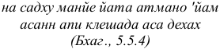
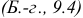

## **ШРИМАД БХАГАВАТАМ** 

КРИШНЫ-ДВАЙПАЯНЫ ВЬЯСЫ 

ДЕСЯТАЯ ПЕСНЬ 

**«СУММУМ БОНУМ»** Главы 1-13 

_с русской транслитерацией оригинальных санскритских текстов, пословным переводом, литературным переводом и комментариями_ 

## **Его Божественная Милость** 

**А.Ч. Бхактиведанта Свами Прабхупада** Ачарья-основатель Международного общества сознания Кришны 

## **ОГЛАВЛЕНИЕ:** 

ГЛАВА 1. Пришествие Господа Кришны ГЛАВА 2. Молитвы полубогов, обращенные к Господу Кришне во чреве Деваки ГЛАВА 3. Рождение Господа Кришны ГЛАВА 4. Злодеяния царя Камсы ГЛАВА 5. Встреча Махараджи Нанды и Васудевы ГЛАВА 6. Убийство демоницы Путаны ГЛАВА 7. Убийство демона Тринаварты ГЛАВА 8. Господь Кришна показывает вселенскую форму у Себя во рту ГЛАВА 9. Яшода связывает Господа Кришну ГЛАВА 10. Освобождение деревьев ямала-арджуна ГЛАВА 11. Детские игры Кришны 

ГЛАВА 12. Убийство демона Агхасуры 

ГЛАВА 13. Брахма похищает мальчиков и телят 

## **ПРЕДИСЛОВИЕ К АНГЛИЙСКОМУ ИЗДАНИЮ** 

«Эта «Бхагавата-пурана» сияет словно солнце. Она взошла сразу после того, как Господь Кришна (а вместе с Ним религия, знание и проч.) удалился в Свою обитель. Эта Пурана несет свет людям, утратившим способность видеть в непроглядной тьме невежества века Кали». («ШримадБхагаватам» 1.3.43) 

Неподвластная времени мудрость Индии нашла свое выражение в Ведах - древних санскритских текстах, охватывающих все области человеческого знания. Первоначально Веды передавались изустно; пять тысяч лет назад они были впервые записаны Шрилой Вйасадевой - «литературным воплощением Бога». Составив Веды, Вйасадева изложил их сущность в афоризмах, известных как «Ведантасутры». «Шримад-Бхагаватам» («Бхагавата-пурана») - это комментарий Вйасадевы к его же «Веданта-сутрам». Он был написан в пору духовной зрелости автора под руководством Нарады Муни, его духовного учителя. «Шримад-Бхагаватам», называемый «зрелым плодом древа ведической литературы», является наиболее полным и авторитетным изложением ведического знания. 

Составив «Бхагаватам», Вйаса передал его краткое содержание своему сыну, мудрецу Шукадеве Госвами. Впоследствии Шукадева Госвами полностью поведал «Бхагаватам» Махарадже Парикшиту в присутствии святых мудрецов, собравшихся на берегу Ганги у Хастинапура. 

Махараджа Парикшит был императором мира и великим раджарши (святым царем). Он был предупрежден, что через неделю умрет, поэтому оставил свое царство и удалился на берег Ганги, чтобы поститься до самой смерти и обрести духовное просветление. «Бхагаватам» открывается обращением императора Парикшита к Шукадеве Госвами: «Ты - духовный учитель великих святых и преданных. Поэтому я прошу тебя указать путь к совершенству всем людям, а в особенности тем, кто стоит на пороге смерти. Поведай, что должен слушать человек, что повторять, о чем помнить и чему поклоняться, а также чего ему не следует делать. Прошу тебя, разъясни мне все это». 

В течение семи дней, вплоть до кончины царя, мудрецы внимали ответам Шукадевы Госвами на этот и множество других вопросов, заданных Махараджей Парикшитом и касающихся всего, начиная от природы личности и кончая происхождением вселенной. Мудрец Сута Госвами, присутствовавший на том собрании, где Шукадева Госвами впервые излагал «Шримад-Бхагаватам», впоследствии повторил «Бхагаватам» перед мудрецами, собравшимися в лесу Наимишаранйа. Заботясь о духовном благополучии всего человечества, эти мудрецы собрались для совершения длинной цепи жертвоприношений, призванных противодействовать разрушительному влиянию начинавшегося века Кали. В ответ на просьбу мудрецов изложить им суть ведической мудрости, Сута Госвами повторил по памяти все восемнадцать тысяч стихов «Шримад-Бхагаватам», которые ранее Шукадева Госвами поведал Махарадже Парикшиту. 

Читатель «Шримад-Бхагаватам» знакомится с вопросами Махараджи Парикшита и ответами Шукадевы Госвами, 

которые пересказывает Сута Госвами. Кроме того, иногда сам Сута Госвами отвечает на вопросы Шаунаки Риши, возглавляющего собрание мудрецов в Наимишаранйе. Поэтому читатель следит сразу за двумя диалогами: первым, который происходил на берегу Ганги между Махараджей Парикшитом и Шукадевой Госвами, и вторым, состоявшимся между Сутой Госвами и мудрецами во главе с Шаунакой Риши в лесу Наимишаранйа. Помимо этого, в своих наставлениях царю Парикшиту Шукадева Госвами часто приводит примеры из истории и выдержки из продолжительных философских бесед между такими великими душами, как Нарада Муни и Васудева. Зная предысторию «Бхагаватам», читатель сможет легко разобраться в сплетении диалогов и событий, взятых из разных источников. Поскольку самое важное в повествовании не хронологический порядок, а философская мудрость, достаточно просто внимательно отнестись к тому, о чем говорится в «Шримад-Бхагаватам», чтобы по достоинству оценить глубину этого произведения. 

Переводчик этого издания сравнивает «Бхагаватам» с леденцом, в котором каждый кусочек одинаково сладок. Так что вкусить сладость «Бхагаватам» можно, начав чтение с любого тома. Однако серьезному читателю после такой «дегустации» рекомендуется вернуться к Первой песни и изучать «Бхагаватам» последовательно, песнь за песнью. 

Предлагаемое издание «Бхагаватам» - первый полный перевод этого бесценного текста на английский, ставший доступным широкому кругу англоязычных читателей. Перевод снабжен подробными комментариями. Первые девять песен и начало Десятой песни - плод труда Его Божественной Милости А.Ч. Бхактиведанты Свами Прабхупады, основателя- 

ачарьи Международного общества сознания Кришны - самого выдающегося учителя индийской религиозной и философской мысли. Его превосходное знание санскрита в сочетании с глубокой осведомленностью в вопросах как ведической культуры и мысли, так и современной жизни, позволили ему представить на суд западного читателя великолепное изложение этого выдающегося произведения древнеиндийской классики. После того как в 1977 году Шрила Прабхупада покинул этот мир, его монументальный труд - перевод и комментирование «Шримад-Бхагаватам» - был закончен его учениками Хридайанандой дасом Госвами и Гопипаранадханой дасом. 

Предлагаемое произведение ценно во многих отношениях. Для тех, кто интересуется истоками древней индийской цивилизации, он предоставляет обширную и подробную информацию практически обо всех ее аспектах. Изучающим сравнительную философию и религию «Бхагаватам» даст возможность глубоко вникнуть в суть духовного наследия Индии. Социологи и антропологи найдут в нем примеры практического приложения принципов мирного и научно организованного ведического общества, основу единства которого составляло высокоразвитое духовное мировоззрение. Изучающие литературу откроют для себя величественный поэтический шедевр. Те, кто изучает психологию, обнаружат в «Бхагаватам» новый взгляд на природу сознания, поведение человека и философское понимание личности. И наконец, тем, кто занят духовными поисками, «Бхагаватам» предоставляет несложное практическое руководство к достижению высшей ступени самопознания и осознания Абсолютной Истины. Мы надеемся, что этот 

многотомный труд, подготовленный издательством «Бхактиведанта Бук Траст», займет достойное место в интеллектуальной, культурной и духовной жизни современного человека, и что ему суждена долгая жизнь. 

## **ОТ АВТОРА** 

Мы должны знать, в чем нуждается современное человеческое общество. Что же ему нужно? Географические рубежи уже не разделяют человечество на разные страны или общины. Человеческое общество не так замкнуто, как в средние века, и в мире существует тенденция к образованию единого государства, или единого общества. Согласно «Шримад-Бхагаватам», идеалы духовного коммунизма в той или иной мере основаны на единстве всего человеческого общества, и более того, на единстве энергии всех живых существ. Великие мыслители видят необходимость в распространении этой идеологии, и «Шримад-Бхагаватам» удовлетворит эту потребность человечества. Это произведение начинается с афоризма философии веданты _джанмадй асйа йатах_ , утверждающего идею единой первопричины. 

В настоящее время человеческое общество не находится во мраке забвения. Во всем мире оно добилось значительного прогресса в создании материальных удобств, образовании и экономическом развитии. Но где-то в общественном организме сохраняется источник раздражения, подобный занозе, и поэтому широкомасштабные конфликты возникают даже по самым незначительным поводам. Необходимо найти путь к миру, дружбе и процветанию человечества, объединенного общим делом. «Шримад-Бхагаватам» выполнит эту задачу, так как представляет собой культурную программу нового одухотворения всего человеческого общества. 

Чтобы изменить демонический облик общества, следует также ввести изучение «Шримад-Бхагаватам» в школах и 

колледжах, как это рекомендовал великий преданный Прахлада Махараджа, когда сам был еще учеником. 

_каумара ачарет праджно дхарман бхагаватан иха дурлабхам манушам джанма тад апй адхрувам артха-дам (Бхаг., 7.6.1)_ 

Причиной социальной дисгармонии является беспринципность атеистического общества. Существует Всемогущий Господь, из которого все исходит, который все хранит и в которого все возвращается на покой. Попытки материалистической науки обнаружить изначальную причину творения не привели к успеху, однако такая единая причина, несомненно, существует. Логичное и авторитетное объяснение этого изначального источника всего сущего дано в прекрасном «Бхагаватам», или «Шримад-Бхагаватам». 

«Шримад-Бхагаватам» - это трансцендентная наука, позволяющая не только постичь этот изначальный источник, но и узнать о наших отношениях с Ним и наших обязанностях по совершенствованию человеческого общества на основе этого совершенного знания. Это произведение, написанное на санскрите, обладает огромной силой воздействия. Теперь оно тщательно переведено на английский язык, так что, просто внимательно читая его, человек сможет в совершенстве постичь Бога, и этих знаний будет достаточно, чтобы противостоять нападкам атеистов. Более того, человек, прочитавший его, сможет привести других людей к признанию Бога как реальной первопричины. 

«Шримад-Бхагаватам» начинается с определения первоисточника всего сущего. Он представляет собой подлинный комментарий к «Веданта-сутре», составленный тем же автором, Шрилой Вйасадевой, и, последовательно прочитав первые девять песней, человек поднимается на высочайшую ступень осознания Бога. Единственное, что необходимо для изучения этой великой книги трансцендентного знания - читать ее последовательно, шаг за шагом, не забегая вперед, как это делается при чтении обычных книг. Нужно последовательно, одну за другой, изучить все ее главы. Структура книги, включающая оригинальные санскритские тексты, транслитерацию, синонимы, перевод и комментарии, такова, что, прочитав первые девять песней, читатель непременно придет к осознанию Бога. 

Десятая песнь отличается от первых девяти, поскольку посвящена непосредственно трансцендентной деятельности Личности Бога, Шри Кришны. Смысл Десятой песни не откроется тому, кто не изучил первые девять. Вся книга состоит из двенадцати самостоятельных песней, но лучше всего читать их небольшими частями, одну за другой. 

Я должен признать свои недостатки в изложении «ШримадБхагаватам», но все же я надеюсь, что он будет тепло встречен мыслящими людьми и лидерами общества. Такая уверенность основывается на следующем утверждении самого «Бхагаватам» (1.5.11): 

_тад-ваг-висарго джанатагха-виплаво йасмин прати-шлокам абаддхаватй апи наманй анантасйа йашо `нкитани йач чхринванти гайанти гринанти садхавах_ 

«С другой стороны, произведение, содержащее описания трансцендентного величия имени, славы, форм и игр безграничного Верховного Господа, является трансцендентным творением, призванным совершить переворот в неправедной жизни сбившегося с пути общества. Такое трансцендентное произведение, несмотря на его недостатки, слушают, поют и принимают чистые и безукоризненно честные люди». 

_Ом тат сат_ 

_А. Ч. Бхактиведанта Свами_ 

## **ГЛАВА 1. Пришествие Господа Кришны** 

## **Введение** 

Ниже приводится краткое содержание первой главы. В этой главе Камса, напуганный предсказанием о том, что восьмой сын Деваки убьет его, одного за другим убивает ее сыновей. 

Когда Шукадева Госвами закончил рассказывать о династии Яду и династиях бога Луны и бога Солнца, Махараджа Парикшит попросил его рассказать о Господе Кришне, который вместе с Баладевой явился в роду Махараджи Яду, и о подвигах Кришны в этом мире. Кришна трансцендентен, сказал царь, и понять природу Его деяний могут только освобожденные души. Слушание о кришна-лиле - это корабль, на котором можно достичь высшей цели жизни. Это не под силу тем, кто убивает животных, или тем, кто хочет покончить с собой. Но каждый разумный человек должен стараться постичь Кришну и Его подвиги. 

Кришна был для Пандавов Божеством, единственным объектом поклонения. Когда Махараджа Парикшит находился в утробе своей матери, Уттары, Кришна спас его от брахмашастры. И теперь Махараджа Парикшит спросил Шукадеву Госвами, как Господь Баладева, сын Рохини, появился в лоне Деваки. «Почему Кришна перенес Себя из Матхуры во Вриндаван, - спросил царь Парикшит, - и как Он жил там в окружении родных и близких? чем занимался Кришна в 

Матхуре и Вриндаване и почему Он убил Своего дядю по матери, Камсу? Сколько лет Кришна жил в Двараке и сколько у Него было жен?» Махараджа Парикшит задал Шукадеве Госвами все эти вопросы. Кроме того, он попросил Шукадеву Госвами рассказать и о других, не упомянутых Махараджей Парикшитом, поступках Кришны. 

Когда Шукадева Госвами стал говорить о сознании Кришны, Махараджа Парикшит забыл про усталость, вызванную постом. С воодушевлением приступая к повествованию о Кришне, Шукадева Госвами сказал: «Описания деяний Кришны, подобно водам Ганги, способны очистить всю вселенную. И рассказчик, и тот, кто спрашивает, и слушатели, - все они очищаются». 

Как-то раз, когда весь мир изнывал под бременем растущей военной мощи демонов, явившихся в образе царей, мать-Земля приняла образ коровы и отправилась к Господу Брахме просить о помощи. Проникшись сочувствием к скорбящей Земле, Брахма вместе с Господом Шивой и другими полубогами отвел мать-Землю в образе коровы на берег Молочного океана и вознес молитвы Господу Вишну, который в состоянии транса возлежал на острове в этом океане. В ответ на эти молитвы Маха-Вишну дал знать Брахме, что Он Сам появится на Земле, чтобы облегчить бремя, созданное демонами. Полубогам вместе с их женами надлежало родиться на Земле, играя роли приближенных Господа Кришны, членов династии Яду, Его многочисленных сыновей и внуков. По воле Господа Кришны первым в облике Баларамы предстояло явиться Анантадеве; вместе с Ним должна была явиться и энергия Кришны, йогамайя. Брахма сообщил все это материЗемле, а затем вернулся в свою обитель. 

Когда Васудева, женившись на Деваки, возвращался вместе с ней домой на колеснице, которой правил ее брат Камса, некий грозный голос возвестил Камсе, что восьмой сын Деваки убьет его. Услышав это предсказание, Камса хотел тут же убить Деваки, однако Васудева тактично отговорил его. Васудева указал на то, каким позором будет для Камсы, если он убьет свою младшую сестру, тем более в день ее свадьбы. Любой, у кого есть материальное тело, неизбежно умрет, наставлял Васудева Камсу. Каждое живое существо какое-то время живет в одном теле, а потом переселяется в другое тело, но, к сожалению, некоторые ошибочно отождествляют тело с душой. Тот, кто, находясь во власти этого заблуждения, хочет убить чужое тело, обречен на адское существование. 

Поскольку эти наставления Васудевы не возымели на Камсу никакого действия, Васудева придумал другой способ спасти Деваки. Он сказал Камсе, что будет отдавать ему всех детей Деваки, чтобы он мог убить их. Какой смысл убивать Деваки сейчас? Камса согласился на это предложение. Позднее, когда у Деваки родился первый ребенок, Васудева отнес новорожденного Камсе, и того поразило благородство Васудевы. Когда Васудева отдал ему ребенка, Камса, проявив проблеск разума, сказал: «Зачем мне убивать первого ребенка Деваки, если, согласно предсказанию, убить меня должен ее восьмой ребенок?» И хотя его слова не вызвали у Васудевы доверия, Камса попросил его забрать ребенка обратно. Однако, после того как Нарада посетил Камсу и открыл ему, что полубоги рождаются в родах Яду и Вришни и замышляют убить его, Камса решил убивать всех детей, рождавшихся в этих семьях; кроме того, он решил убивать каждого ребенка, который появится на свет из чрева Деваки. Поэтому он взял 

под стражу и заточил в темницу Деваки и Васудеву и одного за другим убил их шестерых сыновей. Вдобавок Нарада поведал Камсе, что в прошлой жизни тот был Каланеми, демоном, которого убил Вишну. Узнав об этом, Камса стал почитать себя заклятым врагом всех членов Яду-вамши, династии Яду. Он взял под стражу и бросил в тюрьму даже собственного отца, Уграсену, потому что хотел один наслаждаться царством. 

Лилы Кришны состоят из трех частей: враджа-лилы, матхура-лилы и дварака-лилы. Как уже упоминалось, Десятая песнь «Шримад-Бхагаватам» состоит из девяноста глав, описывающих эти лилы. В первых четырех главах приводятся молитвы Господа Брахмы об избавлении Земли от непосильного бремени и рассказывается о явлении Верховной Личности Бога. Главы с пятой по тридцать девятую посвящены развлечениям Кришны во Вриндаване. В сороковой главе рассказывается о том, как Кришна наслаждался омовением в водах Ямуны и как Акрура возносил молитвы. Одиннадцать глав, начиная с сорок первой и заканчивая пятьдесят первой, повествуют об играх Кришны в Матхуре, а с пятьдесят второй по девяностую главу (в тридцати девяти главах) рассказывается о Его лилах в Двараке. 

С двадцать девятой по тридцать третью главу описывается танец Кришны с гопи, который называется раса-лила. Эти пять глав известны как раса-панча-адхьяя. Сорок седьмая глава Десятой песни содержит в себе «Бхрамара-гиту». 

## **ТЕКСТ 1** 

_**шри-раджовача катхито вамша-вистаро бхавата сома-сурйайох раджнам чобхайа-вамшйанам чаритам парамадбхутам**_ 

_шри-раджа увача_ **- царь Парикшит сказал;** _катхитах_ **поведана;** _вамша-вистарах_ **пространное описание династий;** _бхавата_ **- господином;** _сома-сурйайох_ **- бога Луны и бога Солнца;** _раджнам_ **- царей;** _ча_ **- и;** _убхайа_ **- к обеим;** _вамшйанам_ **- принадлежащих династиям;** _чаритам_ **- жизнь;** _парама_ **- в высшей степени;** _адбхутам_ **- удивительную.** 

**Царь Парикшит сказал: О мой господин, ты подробно описал династии бога Луны и бога Солнца, рассказав о возвышенных, поразительных подвигах и добродетелях царей из этих династий.** 

КОММЕНТАРИЙ: В конце Девятой песни, в двадцать четвертой главе, Шукадева Госвами вкратце рассказал о жизни Кришны. Он поведал о том, как Кришна Сам пришел на Землю, чтобы облегчить ее бремя, как Он играл роль семейного человека, как вскоре после Своего рождения перенес Себя в Свою враджабхуми-лилу. Махараджа Парикшит, который был от рождения преданным Кришны, хотел услышать о Господе Кришне больше. Поэтому, чтобы вдохновить Шукадеву Госвами на более подробный рассказ о Кришне, он 

поблагодарил Шукадеву Госвами за его краткое описание деяний Кришны. Шукадева Госвами сказал: 

_джато гатах питри-грихад враджам эдхитартхо хатва рипун сута-шатани криторударах утпадйа тешу пурушах кратубхих самидже атманам атма-нигамам пратхайан джанешу_ 

«Верховная Личность Бога, Шри Кришна, которого называют лила-пурушоттамой, родился в семье Васудевы, но потом сразу же оставил отчий дом и направился во Вриндаван, чтобы наслаждаться любовью Своих самых близких преданных. Убив во Вриндаване многих демонов, Господь поселился в Двараке. Чтобы утвердить в обществе принципы семейной жизни и законы ведических писаний, Он взял в жены много красивых женщин, подарил им сотни сыновей и совершил многочисленные жертвоприношения в Свою же честь» (Бхаг., 9.24.66). 

Династия Яду ведет свое начало от Сомы, бога Луны. Хотя, если говорить о расположении планет, Солнце находится впереди Луны, Махараджа Парикшит оказал большее почтение династии бога Луны, сома-вамше, потому что в роду Ядавов, который ведет свое происхождение от Луны, явился Кришна. Есть два царских рода кшатриев: один берет начало от повелителя Луны, а другой - от повелителя Солнца. Как правило, Верховный Господь рождается в семье кшатриев, ибо Он приходит в этот мир, чтобы установить законы религии и праведность. Согласно ведическим порядкам, кшатрии должны защищать всех прочих людей. В образе Господа Рамачандры, Верховный Господь явился в Сурья-вамше, династии, ведущей 

начало от бога Солнца, а придя в образе Господа Кришны, Он родился потомком династии Яду, Яду-вамши, берущей начало от бога Луны. В двадцать четвертой главе Девятой песни «Шримад-Бхагаватам» приводится длинный перечень царей Яду-вамши. Все цари Сома-вамши и Сурья-вамши были очень могущественными монархами, и Махараджа Парикшит очень высоко отозвался о них (раджнам чобхайа-вамшйанам чаритам парамад-бхутам). И все же он больше хотел услышать о сомавамше, потому что в этом роду явился Кришна. 

В «Брахма-самхите» (5.29) говорится, что высшая обитель Личности Бога, Кришны, состоит из чинтамани: чинтаманипракара-садмасу калпаврикша-лакшавритешу сурабхир абхипалайантам. Вриндавана-дхама здесь, на Земле, является копией той обители. Как утверждается в «Бхагавад-гите» (8.20), в духовном пространстве существует иная, вечная реальность, запредельная проявленной и непроявленной материи. Проявленный мир предстает нашему взору в виде многочисленных звезд и планет, таких как Солнце и Луна, но за его пределами находится непроявленное, недоступное восприятию воплощенных существ. А за пределами непроявленной материи находится духовное царство, названное в «Бхагавад-гите» высшим и вечным. Это царство никогда не уничтожается. Материальная природа снова и снова создается и уничтожается, но духовная природа существует вечно, не подвергаясь изменениям. В Десятой песни «ШримадБхагаватам» эта духовная природа, духовный мир, назван Вриндаваном, Голокой Вриндаваной или Враджа-дхамой. Подробное объяснение приведенной выше шлоки из Девятой песни - джато гатах питри-грихад - дано именно здесь, в Десятой песни. 

## **ТЕКСТ 2** 

_**йадош ча дхарма-шиласйа нитарам муни-саттама татрамшенаватирнасйа вишнор вирйани шамса нах**_ 

_йадох_ **- членов династии Яду;** _ча_ **- также;** _дхарма-шиласйа_ **- строго исполнявших заповеди религии;** _нитарам_ **- во всей полноте;** _муни-саттама_ **- о лучший из муни (Шукадева Госвами);** _татра_ **- там (в той династии);** _амшена_ **- с - Баладевой, Своей полной экспансией;** _аватирнасйа_ **нисшедшего;** _вишнох_ **- Господа Вишну;** _вирйани_ **- славные деяния;** _шамса_ **- опиши;** _нах_ **- для нас.** 

**О лучший из муни, ты уже поведал о потомках Яду, которые отличались благочестием и неукоснительно соблюдали заповеди религии. Теперь же, если тебе будет угодно, опиши, пожалуйста, удивительные и славные деяния Господа Вишну, Кришны, который явился в династии Яду вместе со Своим полным проявлением, Баладевой.** 

КОММЕНТАРИЙ: В «Брахма-самхите» (5.1) объясняется, что Кришна - источник вишну-таттвы. 

_ишварах парамах кришнах сач-чид-ананда-виграхах анадир адир говиндах_ 

_сарва-карана-каранам_ 

«Кришна, Говинда, - верховный властелин. Его тело духовно, вечно и исполнено блаженства. Он источник всего сущего, у Него же Самого нет источника, ибо Он - причина всех причин». 

_йасйаика-нишвасита-калам атхаваламбйа дживанти лома-виладжа джагад-анда-натхах вишнур махан са иха йасйа кала-вишешо говиндам ади-пурушам там ахам бхаджами_ 

«Брахмы, повелители бесчисленных вселенных, живут лишь в течение одного выдоха Маха-Вишну. Я поклоняюсь Говинде, изначальному Господу, ибо Маха-Вишну является частичным проявлением Его полного проявления» (Б.-с., 5.48). 

Говинда, Кришна, - это изначальная Личность Бога. Кришнас ту бхагаван свайам. Даже Господь Маха-Вишну, который Своим дыханием создает миллионы и миллионы вселенных, - всего лишь кала-вишеша, то есть полная экспансия полной экспансии Господа Кришны. Маха-Вишну - это полное проявление Санкаршаны, который является полным проявлением Нараяны. Нараяна - это полное проявление чатур-вьюхи, а чатур-вьюха - полные проявления Баладевы, первого проявления Кришны. Стало быть, когда Кришна явился с Баладевой, вместе с Ним пришли все вишну-таттвы. 

Махараджа Парикшит попросил Шукадеву Госвами рассказать о Кришне и Его славных деяниях. Этот стих можно истолковать и по-другому. Хотя Шукадева Госвами был величайшим муни, он мог лишь частично (амшена) описать 

Кришну, ибо полностью описать Кришну не способен никто. Говорится, что у Анантадевы тысячи голов, но, хотя Он тысячами Своих языков пытается воспевать Кришну, Его описания остаются неполными. 

## **ТЕКСТ 3** 

_**аватирйа йадор вамше бхагаван бхута-бхаванах критаван йани вишватма тани но вада вистарат**_ 

_аватирйа_ **- низойдя;** _йадох вамше_ **- в династию Яду;** _бхагаван_ **- Верховная Личность Бога;** _бхута-бхаванах_ **- тот, кто является причиной космического проявления;** _критаван_ **- совершивший;** _йани_ **- которые (деяния);** _вишваатма_ **- Сверхдуша всей вселенной;** _тани_ **- те (деяния);** _нах_ **- нам;** _вада_ **- поведай же;** _вистарат_ **- подробно.** 

**Сверхдуша, Верховная Личность Бога, Шри Кришна, причина мироздания, явился в династии Яду. Будь добр, расскажи мне подробно о Нем и о славных деяниях, которые Он совершал с начала и до самого конца Своей жизни.** 

КОММЕНТАРИЙ: В данном стихе слова критаван йани указывают на то, что все разнообразные подвиги, которые Кришна совершил, пока находился на Земле, несут благо всему человечеству. Если религиозные деятели, философы и простые люди будут слушать о деяниях Кришны, они обретут освобождение. Мы уже не раз говорили, что есть два вида кришна-катхи: к первому из них относится «Бхагавад-гита», в которой Кришна говорит о Себе Сам, а ко второму – «Шримад-Бхагаватам», в котором Шукадева Госвами 

прославляет Кришну. Любой, кто хотя бы слегка заинтересовался кришна-катхой, обретает освобождение. Киртанад эва кришнасйа мукта-сангах парам враджет (Бхаг., 12.3.51). Тот, кто просто поет или повторяет кришна-катху, освобождается от скверны Кали-юги. Поэтому Чайтанья Махапрабху советовал: йаре декха, таре каха кришна-упадеша (Ч.-ч., Мадхья, 7.128). Такова миссия сознания Кришны: слушая о Кришне, человек освободится из плена материи. 

## **ТЕКСТ 4** 

_**нивритта-таршаир упагийаманад бхаваушадхач чхротра-мано-'бхирамат ка уттамашлока-гунанувадат пуман вираджйета вина пашугхнат**_ 

_нивритта_ **- побеждено;** _т аршаих_ **- теми, в ком вожделение или стремление к материальной деятельности;** _упаг ийаманат_ **- от описываемого или воспеваемого;** _бхава-аушадхат_ **- от лекарства, которое успешно излечивает болезнь материализма;** _шротра_ **- для устного восприятия;** _м анах_ **- для ума;** _абхирамат_ **приятного;** _к а х_ **- какой;** _уттамашлока_ **- Верховной Личности Бога;** _гуна-анувадат_ **- от описания деяний;** _пуман_ **- человек;** _вираджйета_ **- отстранится;** _вина_ **- кроме;** _пашугхнат_ **- мясника, либо губителя собственной жизни.** 

**Верховную Личность Бога прославляют по парампаре, то есть учитель повествует о славе Господа своему ученику. Таким прославлением наслаждаются те, кого больше не привлекает ложное, временное прославление материального мироздания. Описания Господа - это единственное лекарство для обусловленной души, которая вынуждена снова и снова рождаться и умирать. Кто же перестанет слушать прославление Господа, кроме мясника или убийцы собственной души?** 

КОММЕНТАРИЙ: В Индии принято слушать рассказы о 

Кришне, содержащиеся в «Бхагавад-гите» и «ШримадБхагаватам», чтобы таким образом исцелиться от недуга повторяющихся рождений и смертей. Даже в наши дни, хотя Индия и находится в плачевном состоянии, стоит объявить, что кто-то будет говорить о «Бхагавад-гите» или «ШримадБхагаватам», как люди тысячами собираются послушать. Но в данном стихе указывается, что рассказывать «Бхагавад-гиту» и «Шримад-Бхагаватам» должны люди, полностью свободные от материальных желаний (нивритта-таршаих). Все обитатели материального мира, начиная с Брахмы и вплоть до крошечного муравья, полны материальных желаний: все жаждут чувственных наслаждений и потакают прихотям своих чувств. Однако, занимаясь этим, невозможно осознать всю ценность кришна-катхи в форме «Бхагавад-гиты» и «ШримадБхагаватам». 

Если мы слушаем, как Господа прославляют освобожденные души, это непременно избавит нас от рабства материальной деятельности, но, слушая, как «Шримад-Бхагаватам» рассказывают профессиональные чтецы, мы не получим реальной помощи на пути к освобождению. Кришна-катха очень проста. В «Бхагавад-гите» сказано, что Кришна - Верховная Личность Бога. Он Сам объясняет это: маттах паратарам нанйат кинчид асти дхананджайа - «О Арджуна, нет истины превыше Меня» (Б.-г., 7.7). Просто поняв эту истину (что Кришна - Верховная Личность Бога), можно стать освобожденной душой. Но, поскольку многие, особенно в наше время, склонны слушать «Бхагавад-гиту» в изложении недобросовестных людей, которые, вместо того чтобы просто передавать другим «Бхагавад-гиту», в угоду себе искажают ее, люди не получают от «Бхагавад-гиты» реальной пользы. Есть 

великие знатоки писаний, политики, философы и ученые, которые дают собственное, оскверненное, понимание смысла «Бхагавад-гиты», и люди слушают их, а слушать, как Верховную Личность Бога прославляет преданный, они не желают. Преданный - это тот, кто объясняет «Бхагавад-гиту» и «Шримад-Бхагаватам», делая это как служение Господу, а не из каких-либо других побуждений. Поэтому Шри Чайтанья Махапрабху советовал нам слушать, как Господа прославляет осознавшая себя душа (бхагавата паро дийа бхагавата стхане). Если человек не ощутил себя душой и не усвоил науку сознания Кришны, начинающие преданные не должны слушать, как он рассказывает о Господе. Шрила Санатана Госвами строго запрещает это, приводя следующую цитату из «Падма-пураны»: 

_аваишнава-мукходгирнам путам хари-катхамритам шраванам наива картавйам сарпоччхиштам йатха пайах_ 

Нельзя слушать человека, который ведет себя не так, как подобает вайшнаву. Вайшнав - нивритта-тришна: у него нет материальных целей, единственная цель, которую он преследует, - это проповедовать сознание Кришны. Так называемые знатоки писаний, философы и политики, пользуясь авторитетом «Бхагавад-гиты», искажают ее смысл в своих целях. Поэтому в данном стихе содержится предостережение: декламировать кришна-катху должен только нивритта-тришна. Шукадева Госвами - идеальный рассказчик «ШримадБхагаватам», а Махараджа Парикшит, который оставил свое 

царство и семью, чтобы подготовиться к смерти, - идеальный слушатель «Шримад-Бхагаватам». Настоящий рассказчик «Шримад-Бхагаватам» дает именно то лекарство (бхаваушадхи), которое способно исцелить обусловленные души. Поэтому Движение сознания Кришны пытается подготовить настоящих проповедников, которые будут рассказывать «Шримад-Бхагаватам» и «Бхагавад-гиту» по всему миру так, чтобы жители всех уголков Земли могли получить благо от этого Движения и таким образом избавились от тройственных мучений материального бытия. 

Наставления «Бхагавад-гиты» и содержащиеся в «ШримадБхагаватам» описания доставляют тому, кто внимает им, такое удовольствие, что практически любой человек, испытывающий тройственные мучения материального бытия, захочет слушать о славе Господа, воспетой в этих книгах, и таким образом приближаться к освобождению. Но есть две категории людей, у которых никогда не возникнет желания слушать философию «Бхагавад-гиты» и «Шримад-Бхагаватам»: это те, кто полон решимости покончить с собой, и те, кто полон решимости убивать коров и других животных ради удовлетворения своего языка. Хотя они могут делать вид, что слушают «Шримад-Бхагаватам» на бхагавата-саптахе, такое слушание - всего лишь очередное изобретение карми, не получающих от этих спектаклей никакой пользы. Важную роль в этой связи играет слово пашу-гхнат. Пашу-гхна означает «мясник». Тем, кого привлекает ритуальная деятельность, направленная на достижение высших планет, приходится совершать жертвоприношения (ягьи), которые связаны с убиением животных. Господь Будда отверг авторитет Вед, ибо его миссия состояла в том, чтобы прекратить принесение в жертву 

животных, которое относится к числу ритуалов, рекомендованных в Ведах. 

_ниндаси йаджна-видхер ахаха шрути-джатам са-дайа-хридайа даршита-пашу-гхатам кешава дхрита-буддха-шарира джайа джагадиша харе (Гита-говинда)_ 

Хотя при совершении ведических ритуалов допускается заклание животных, людей, которые ради таких ритуалов убивают животных, считают мясниками. Мясников не может интересовать сознание Кришны, поскольку они пребывают в плену материальной иллюзии. Единственное, что их интересует, - это создание удобств для своего смертного тела. 

_бхогаишварйа-прасактанам тайапахрита-четасам вйавасайатмика буддхих самадхау на видхийате_ 

«Тем, кто слишком привязан к чувственным удовольствиям и материальному богатству и чей ум из-за этого все время пребывает в заблуждении, не хватает решимости посвятить себя преданному служению Верховному Господу» (Б.-г., 2.44). Шрила Нароттама дас Тхакур говорит: 

_манушйа-джанама паийа, радха-кришна на бхаджийа, джанийа шунийа виша кхаину_ 

Любой, кто не обладает сознанием Кришны и, стало быть, не 

служит Господу, - тоже пашу-гхна, ибо он сознательно пьет яд. Такого человека не может интересовать кришна-катха, потому что он все еще стремится к материальным чувственным удовольствиям: он не нивритта-тришна. В шастрах сказано: траиваргикас те пуруша вимукха хари-медхасах. Те, кого интересует три-варга, то есть дхарма, артха и кама, соблюдают предписания религии с целью достичь такого материального положения, при котором у них будет больше возможностей для удовлетворения своих чувств. Такие люди убивают себя, сознательно оставаясь в круговороте рождения и смерти. Их не может заинтересовать сознание Кришны. 

Для того чтобы состоялась кришна-катха, требуются говорящий и слушающий, и оба они будут интересоваться сознанием Кришны только в том случае, если их больше не интересуют материальные темы. Можно на реальных примерах увидеть, как это умонастроение само собой развивается в тех, кто обрел сознание Кришны. Хотя члены Движения сознания Кришны - это, как правило, совсем молодые люди, они больше не читают материалистические газеты, журналы и т.д., поскольку их перестали интересовать такие темы (нивриттатаршаих). Они полностью отказались от телесных представлений о жизни. Когда речь идет об Уттамашлоке, Верховной Личности Бога, духовный учитель говорит, а ученик внимательно слушает. Оба они должны быть свободны от материальных желаний - иначе их не будут интересовать темы, связанные с сознанием Кришны. Духовному учителю и ученику не требуется изучать ничего, кроме Кришны, потому что, просто постигая Кришну и рассказывая другим о Кришне, человек обретает совершенное знание (йасмин виджнате сарвам эвам виджнатам бхавати). Господь пребывает в сердце каждого, 

и по Его милости преданный лично получает наставления от Самого Господа, который говорит в «Бхагавад-гите» (15.15): 

_сарвасйа чахам хриди саннивишто маттах смритир джнанам апоханам ча ведаиш ча сарваир ахам эва ведйо веданта-крид веда-вид эва чахам_ 

«Я пребываю в сердце каждого живого существа, и от Меня исходят память, знание и забвение. Цель всех Вед - постичь Меня. Я - истинный составитель «Веданты» и знаток всех Вед». Сознание Кришны - это настолько возвышенное состояние, что тот, кто под руководством духовного учителя в совершенстве развил в себе сознание Кришны, становится полностью счастлив, читая хари-катху, содержащуюся в «ШримадБхагаватам», «Бхагавад-гите» и аналогичных произведениях ведической литературы. И если просто говорить о Кришне - огромное удовольствие, можно только представить себе, какое счастье испытывают те, кто служит Кришне. 

Когда освобожденный духовный учитель рассказывает кришна-катху своему ученику, другие, пользуясь случаем, тоже иногда слушают его рассказ и получают от этого пользу. Эти повествования - лекарство от повторяющихся рождений и смертей. Пребывание в круговороте рождений и смертей, когда живое существо снова и снова получает различные тела, называется бхавой или бхава-рогой. Любой, кто слушает кришна-катху, сознательно или несознательно, непременно излечится от бхава-роги, болезни рождения и смерти. Поэтому кришна-катху называют бхаваушадхой - лекарством от повторения рождения и смерти. Карми, то есть те, кто 

привязан к материальным чувственным наслаждениям, как правило, не способны отказаться от своих материальных желаний, но кришна-катха - настолько сильное лекарство, что, если побудить человека слушать кришна-киртан, он обязательно избавится от болезни материализма. Практический пример - Махараджа Дхрува, который, завершив свою тапасью, был полностью удовлетворен. Когда Господь захотел дать Дхруве благословения, Дхрува отказался от них. Свамин критартхо 'сми варам на йаче. Он сказал: «О Господь, я полностью удовлетворен. Я не прошу у Тебя никаких благословений, позволяющих удовлетворять желания материальных чувств». И мы видим, что даже молодые участники и участницы Движения сознания Кришны отказываются от своих давних дурных привычек: беспорядочных половых отношений, пристрастия к мясу, наркотикам и азартным играм. Сознание Кришны обладает такой силой, что приносит им полное удовлетворение, и потому их перестают привлекать материальные чувственные удовольствия. 

## **ТЕКСТЫ 5-7** 

_**питамаха ме самаре 'маранджайаир девавратадйатиратхаис тимингилаих дуратйайам каурава-саинйа-сагарам критватаран ватса-падам сма йат-плавах**_ 

_**драуни-астра-виплуштам идам мад-ангам сантана-биджам куру-пандаванам джугопа кукшим гата атта-чакро матуш ча ме йах шаранам гатайах**_ 

_**вирйани тасйакхила-деха-бхаджам антар бахих пуруша-кала-рупаих прайаччхато мритйум утамритам ча майа-манушйасйа вадасва видван**_ 

_п и т а м а ха х_ **(мои) деды, пятеро Пандавов (Юдхиштхира, Бхима, Арджуна, Накула и Сахадева);** _м е_ **мои;** _самаре_ **- в битве (на поле Курукшетра);** _амарамджайаих_ **- с воинами, способными побеждать полубогов;** _деваврата-адйа_ **- Бхишмадевой и другими;** _атиратхаих_ **- с великими военачальниками;** _тимингилаих_ **- с теми, кто подобны огромной рыбе тимингила, которая запросто съедает больших акул;** _дуратйайам_ **- трудноодолимое;** _каурава-саинйа-сагарам_ **- войско Кауравов, сравнимое с океаном;** _критва_ **- поняв;** _атаран_ **- пересекли;** _ватса-падам_ **- (как) крошечный след теленка;** _сма_ **- в прошлом;** _йатплавах_ **- лотосные стопы Кришны, которые являются** 

**- кораблем, убежищем;** _драуни_ **- Ашваттхамы;** _аст ра_ **брахмастрой;** _виплуштам_ **- атакованное и сожженное;** _идам_ **это;** _мат-анг ам_ **мое тело;** _сантана-биджам_ **единственное оставшееся семя, последний представитель рода;** _куру-пандаванам_ **- Кауравов и Пандавов (потому что я был единственным из их потомков, оставшимся в живых после битвы на Курукшетре);** _джугопа_ **- защитил;** _кукшим_ **- в чрево;** _г атах_ **- вошедший;** _атта-чакрах_ **- тот, кто держит в руке диск;** _матух_ **- матери;** _ча_ **- также;** _ме_ **- моей;** _йах_ **- который (Господь);** _шаранам_ **- в убежище;** _гатайах_ **пришедшей;** _вирйани_ **- прославление трансцендентных достоинств;** _т асйа_ **- Его (Верховной Личности Бога);** _акхила-деха-бхаджам_ **- всех живых существ, воплощенных в материальных телах;** _антах бахих_ **- внутри и снаружи;** _пуруша_ **- Верховной Личности;** _кала-рупаих_ **- образами вечного времени;** _прайаччхатах_ **- дающего;** _мритйум_ **смерть;** _ут а_ **- так (говорится);** _амритам ча_ **- и вечную жизнь;** _майа-манушйасйа_ **- Господа, который посредством Своей энергии явился в образе обыкновенного человека;** _вадасва_ **- поведай же;** _видван_ **- о многомудрый рассказчик (Шукадева Госвами).** 

**Взойдя на корабль лотосных стоп Кришны, мой дед Арджуна и его братья благополучно пересекли поле битвы Курукшетра. Это поле было подобно океану, в котором их вполне могли проглотить огромные рыбы - великие полководцы, такие как Бхишмадева. По милости Господа Кришны мои деды пересекли этот бурный океан так же легко, как человек перешагивает через след от копыта теленка. Благодаря тому, что моя мать укрылась под** 

**сенью лотосных стоп Господа Кришны, Господь, держа в руке Сударшану-чакру, вошел в ее чрево и спас мое тело - тело единственного оставшегося в живых потомка Куру и Пандавов, которое было почти уничтожено жаром оружия Ашваттхамы. Господь Шри Кришна, который посредством Своей энергии принял формы вечного времени, то есть явил Себя в образе Параматмы и вират-рупы, внутри и вовне всех живых существ, находившихся в материальных телах, дал каждому из них освобождение, даровав им либо жестокую смерть, либо сохранив жизнь. Просвети же меня, поведай о Его божественных качествах.** 

КОММЕНТАРИЙ: В «Шримад-Бхагаватам» (10.14.58) сказано: 

_самашрита йе пада-паллава-плавам махат-падам пунйа-йашо мурарех бхавамбудхир ватса-падам парам падам падам падам йад випадам на тешам_ 

«Для того, кто взошел на корабль лотосных стоп Господа, являющегося прибежищем всего мироздания и славящегося под именем Мурари, «враг демона Муры», океан материального мира подобен лужице в следе от копыта теленка. Цель такого человека - парам падам, Вайкунтха, место, где нет материальных страданий, а не то место, где на каждом шагу нас подстерегает опасность». 

Того, кто находит прибежище под сенью лотосных стоп Господа Кришны, Господь сразу берет под Свое покровительство. В «Бхагавад-гите» (18.66) Господь обещает: 

ахам твам сарва-папебхйо мокшайишйами ма шучах - «Я избавлю тебя от всех последствий твоих грехов. Не страшись ничего». Приняв покровительство Господа Кришны, человек обретает самую надежную защиту. И, поскольку Пандавы укрылись под сенью лотосных стоп Кришны, все они были в безопасности во время битвы на Курукшетре. Поэтому Махараджа Парикшит в последние дни своей жизни считал своим долгом думать о Кришне. Таков результат практики сознания Кришны: анте нарайана-смритих. Если в момент смерти человек в состоянии помнить о Кришне, значит, его жизнь была прожита не зря. Махараджа Парикшит был многим обязан Кришне и потому принял самое разумное решение: в последние дни своей жизни думать о Кришне постоянно. Кришна спас Пандавов, дедов Махараджи Парикшита, на поле битвы Курукшетра, и Кришна же спас самого Махараджу Парикшита от брахмастры Ашваттхамы. Кришна был для семьи Пандавов другом и Богом, которому они поклонялись. Помимо того, что Господь Кришна лично общался с Пандавами, Он - Сверхдуша всех живых существ, и Он дарует освобождение каждому, даже тем, кто не является чистым преданным. Например, Камса вовсе не был преданным, но Кришна, убив Камсу, даровал ему спасение. Сознание Кришны приносит благо любому, и чистым преданным, и непреданным. Таково величие сознания Кришны. Как же, зная об этом, не искать убежища у лотосных стоп Кришны? В данном стихе Кришна назван майа-манушйа, потому что облик, в котором Он нисходит в этот мир, в точности напоминает человеческий. Кришну, в отличие от карми, то есть обыкновенных живых существ, ничто не вынуждает приходить сюда: Он появляется в материальном мире посредством Своей внутренней энергии 

(самбхавами атма-майайа) только из милости к падшим обусловленным душам. Кришна всегда пребывает в Своем изначальном состоянии, будучи сач-чид-ананда-виграхой, и любой, кто служит Ему, тоже возвращается в свое изначальное, духовное состояние (сварупена вйавастхитих). Это и есть высшее совершенство человеческой жизни. 

## **ТЕКСТ 8** 

_**рохинйас танайах прокто рамах санкаршанас твайа девакйа гарбха-самбандхах куто дехантарам вина**_ 

_рохинйах_ **- Рохини (матери Баладевы);** _танайах_ **- сын;** _проктах_ **- известен;** _рам ах_ **- Баларама;** _санкаршанах_ **Санкаршана, первое Божество в четверной экспансии Господа (Санкаршана, Анируддха, Прадьюмна и Васудева);** _твайа_ **- тобой (так сказано);** _девакйах_ **- Деваки, матери Кришны;** _гарбха-самбандхах_ **- связанный с чревом;** _кутах_ **- почему;** _деха-антарам_ **- смены тел;** _вина_ **- без.** 

**Дорогой Шукадева Госвами, ты уже объяснил, что Санкаршана, который относится ко второй четверной экспансии, явился в образе сына Рохини по имени Баларама. Если Баларама не был перемещен из одного тела в другое, тогда как же Он мог сначала находиться во чреве Деваки, а потом - во чреве Рохини? Пожалуйста, объясни мне это.** 

КОММЕНТАРИЙ: Этот вопрос задан с целью постичь природу явления Баларамы, который есть Сам Санкаршана. Все знают, что Баларама был сыном Рохини, но иногда Его называют сыном Деваки. Махараджа Парикшит хотел проникнуть в эту тайну: каким образом Баларама был сыном и Деваки, и Рохини. 

## **ТЕКСТ 9** 

_**касман мукундо бхагаван питур гехад враджам гатах ква васам джнатибхих сардхам критаван сатватам патих**_ 

_к асм а т_ **- почему;** _мук ундах_ **Господь Кришна, способный даровать освобождение каждому;** _бхаг аван_ **Верховная Личность Бога;** _питух_ **- отца (Васудевы);** _гехат_ **- из дома;** _враджам_ **- во Враджадхаму, Враджабхуми;** _гатах_ **- отправившийся;** _к ва_ **- где;** _васам_ **- место жительства;** _джнатибхих_ **- со Своими родственниками;** _сардхам_ **вместе;** _критаван_ **- сделал;** _сатватам патих_ **- господин всех преданных-вайшнавов.** 

**Почему Кришна, Верховная Личность Бога, покинул дом Своего отца, Васудевы, и перенес Себя в дом Нанды во Вриндаване? В какой части Вриндавана Господь, повелитель династии Яду, жил, окруженный Своими родственниками?** 

КОММЕНТАРИЙ: Эти вопросы касаются странствий Кришны. Родившись в доме Васудевы в Матхуре, Кришна переместил Себя в Гокулу, расположенную на другом берегу Ямуны, а через некоторое время Он вместе со Своим отцом, матерью и другими родственниками переехал в Нанда-грам, во Вриндаван. Махараджа Парикшит очень хотел услышать о деяниях Кришны во Вриндаване. Вся эта песнь «Шримад- 

Бхагаватам» повествует о многочисленных деяниях, которые Кришна совершил во Вриндаване и Двараке. Первые сорок глав описывают жизнь Кришны во Вриндаване, а последующие пятьдесят глав - Его жизнь в Двараке. Горя желанием услышать о Кришне, Махараджа Парикшит попросил Шукадеву Госвами рассказать о Его деяниях во всех подробностях. 

## **ТЕКСТ 10** 

_**врадже васан ким акарон мадхупурйам ча кешавах бхратарам чавадхит камсам матур аддхатад-арханам**_ 

_врадже_ **- во Вриндаване;** _васан_ **- живущий;** _ким акарот_ **что (Он) делал;** _мадхупурйам_ **- в Матхуре;** _ча_ **- и;** _кешавах_ **Господь Кришна, убивший Кеши;** _бхратарам_ **- брата;** _ч а_ **и;** _авадхит_ **- убил;** _камсам_ **- Камсу;** _матух_ **- матери;** _аддха_ **непосредственно;** _а-тат-арханам_ **- то, что не одобряется шастрами.** 

**Господь Кришна жил и во Вриндаване, и в Матхуре. Что Он там делал? Почему Он убил Камсу, брата Своей матери? Шастры ни при каких обстоятельствах не дозволяют такое убийство.** 

КОММЕНТАРИЙ: Дядя по матери, то есть брат матери, - все равно что отец. Если у человека нет сына, законным наследником его собственности становится племянник, сын его сестры. Почему же Кришна собственноручно убил Камсу, брата Своей матери? Махараджа Парикшит очень хотел в этом разобраться. 

## **ТЕКСТ 11** 

_**дехам манушам ашритйа кати варшани вришнибхих йаду-пурйам сахаватсит патнйах катй абхаван прабхох**_ 

_дехам_ **- тело;** _манушам_ **- человеческое;** _ашритйа_ **приняв;** _кати варшани_ **- сколько лет;** _вришнибхих_ **- с потомками Вришни (теми, кто родился в семье Вришни);** _йаду-пурйам_ **- в Двараке, резиденции Ядавов;** _саха_ **- вместе;** _аватсит_ **- (Господь) жил;** _патнйах_ **- жен;** _кати_ **- сколько;** _абхаван_ **- было;** _прабхох_ **- у Господа.** 

**У Кришны, Верховной Личности Бога, нет материального тела, однако Он является в образе человека. Сколько лет Он провел вместе с потомками Вришни? Сколько у Него было жен и сколько лет Он жил в Двараке?** 

КОММЕНТАРИЙ: Во многих местах говорится, что Верховная Личность Бога - сач-чид-ананда-виграха: у Господа духовное тело, исполненное блаженства. По форме Его тело наракрити: оно в точности напоминает человеческое. Та же мысль выражена здесь словами манушам ашритйа, которые указывают на то, что Он обретает тело, в точности напоминающее тело человека. Есть множество утверждений, отрицающих то, что Кришна - ниракара, лишенный формы. У Бога есть образ, и этот образ точно такой же, как образ 

человека. Эта истина не подлежит сомнению. 

## **ТЕКСТ 12** 

_**этад анйач ча сарвам ме муне кришна-вичештитам вактум архаси сарваджна шраддадханайа вистритам**_ 

_этат_ **- это (все эти подробности);** _анйат ча_ **- и другое;** _сарвам_ **- все;** _м е_ **- мне;** _муне_ **- о великий мудрец;** _кришнавичештитам_ **- деяния Господа Кришны;** _вактум_ **- описать;** _архаси_ **- (ты) способен;** _сарва-джна_ **- (ибо ты) всезнающ;** _шраддадханайа_ **- мне, не завидующему Господу Кришне, обладающему полной верой в Него;** _вистритам_ **- подробно.** 

**О великий мудрец, ты знаешь о Кришне все, так, пожалуйста, подробно опиши все те деяния, о которых я спросил, а также те, о которых я не спросил, ибо я полон веры и желания слушать о них.** 

## **ТЕКСТ 13** 

_**наишатидухсаха кшун мам тйактодам апи бадхате пибантам тван-мукхамбходжа чйутам хари-катхамритам**_ 

_на_ **- не;** _эша_ **- этот;** _ати-духсаха_ **- невыносимый;** _кшут_ **голод;** _мам_ **- мне;** _тйакта-удам_ **- переставшему пить воду;** _апи_ **- даже;** _бадхате_ **- препятствует;** _пибантам_ **- пьющему;** _тват-мукха-амбходжа-чйутам_ **льющийся из твоих лотосных уст;** _хари-катха-амритам_ **- нектар повествований о Кришне.** 

**В преддверии смерти я дал обет даже не пить воды, но, поскольку я пью нектар повествований о Кришне, льющийся из твоих лотосных уст, голод и жажда, которые обычно так трудно переносить, не могут помешать мне.** 

КОММЕНТАРИЙ: Чтобы подготовиться к смерти, ожидавшей его через семь дней, Махараджа Парикшит полностью отказался от еды и питья. Как и любой человек, переставший есть и пить, он, конечно же, испытывал голод и жажду, поэтому у Шукадевы Госвами могла возникнуть мысль прекратить свое трансцендентное повествование о Кришне; однако Махараджа Парикшит, несмотря на пост, вовсе не чувствовал себя утомленным. «Голод и жажда, которые я испытываю из-за своего поста, нисколько не беспокоят меня, - говорит он. - Как-то раз, охваченный 

жаждой, я вошел в ашрам Шамики Муни, однако муни не дал мне воды. Тогда я повесил ему на плечо мертвую змею, и за это мальчик-брахман проклял меня. Но сейчас я не испытываю никаких страданий. Голод и жажда не доставляют мне ни малейшего беспокойства». Этот пример показывает, что, когда сознание человека находится на материальном уровне, голод и жажда изнуряют его, но человек, обретший духовное сознание, не ведает усталости. 

Весь мир страдает от духовной жажды. Все живые существа - Брахман, вечные души, и, чтобы утолить их голод и жажду, необходима духовная пища. К сожалению, люди этого мира ничего не знают о нектаре кришна-катхи. Вот почему Движение сознания Кришны - это подлинное благословение для философов, религиозных людей и даже обычных людей. Кришна и кришна-катха, несомненно, обладают огромной притягательной силой. Именно поэтому Абсолютную Истину называют Кришной, «самым притягательным». 

Слово амрита в одном из своих значений указывает на луну, а слово амбуджа означает «лотос». Любой, кто слушает кришна-катху из уст Шукадевы Госвами, наслаждается приятным лунным светом в сочетании с приятным ароматом лотоса. В «Шримад-Бхагаватам» (7.5.30) сказано: 

_матир на кришне паратах свато ва митхо 'бхипадйета гриха-вратанам аданта-гобхир вишатам тамисрам пунах пунаш чарвита-чарвананам_ 

«Поскольку люди, слишком привязанные к мирской жизни, не владеют своими чувствами, они постепенно скатываются в 

ад и раз за разом «жуют пережеванное». Ничто не пробуждает в них склонности служить Кришне - ни наставления других, ни собственные усилия, ни то и другое вместе». В наши дни все человечество занято «жеванием пережеванного» (пунах пунаш чарвита-чарвананам). Люди готовы подвергаться мритйусамсара-вартмани, то есть рождаться в одном теле, умирать, потом получать другое тело и опять умирать. Чтобы прекратить эту череду рождений и смертей, абсолютно необходима кришна-катха, или сознание Кришны. Но только тот, кто слушает кришна-катху из уст осознавшей себя души, такой как Шукадева Госвами, способен по-настоящему вкусить нектар кришна-катхи, навсегда избавляющей человека от мирской усталости, и наслаждаться трансцендентным бытием, полным блаженства. На примере Движения сознания Кришны мы видим, что те, кто изведал нектар кришна-катхи, утрачивают все материальные желания, тогда как те, кто не способен понять Кришну или кришна-катху, называют жизнь в сознании Кришны «промыванием мозгов» и «контролем над сознанием». Преданные наслаждаются духовным блаженством, а непреданные удивляются, что преданные не стремятся ни к чему материальному. 

## **ТЕКСТ 14** 

## _**сута увача**_ 

_**эвам нишамйа бхригу-нандана садху-вадам ваийасаких са бхагаван атха вишну-ратам пратйарчйа кришна-чаритам кали-калмаша-гхнам вйахартум арабхата бхагавата-прадханах**_ 

_сутах увача_ **- Сута Госвами сказал;** _эвам_ **- так;** _нишамйа_ **выслушав;** _бхриг у-нандана_ **- о сын династии Бхригу (Шаунака);** _садху-вадам_ **благочестивые вопросы;** _ваийасаких_ **- сын Вьясадевы (Шукадева Госвами);** _сах_ **- он;** _бхагаван_ **- могущественнейший;** _атха_ **- так;** _вишну-ратам_ **тому, кого всегда защищал Вишну (Махарадже Парикшиту);** _пратйарчйа_ **- почтительно поклонившись;** _кришна-чаритам_ **- деяния Господа Кришны;** _кали-калмашаг хнам_ **- уменьшающие невзгоды нынешнего века, Калиюги;** _вйахартум_ **- описывать;** _арабхата_ **- начал;** _бхагаватапрадханах_ **- главный среди чистых преданных (Шукадева Госвами).** 

**Сута Госвами сказал: О сын Бхригу [Шаунака Риши], услышав благочестивые вопросы Махараджи Парикшита, Шукадева Госвами, сын Вьясадевы и самый почитаемый из преданных, почтительно поблагодарил царя. Затем он начал говорить на темы, которые связаны с Кришной и способны избавить тех, кто живет в нынешнюю эпоху, век Кали, от любых страданий.** 

КОММЕНТАРИЙ: Употребленные в этом стихе слова кришна-чаритам кали-калмаша-гхнам указывают на то, что деяния Господа Кришны, несомненно, являются лучшей панацеей от всех страданий, особенно в нынешний век Кали. Говорится, что в Кали-югу люди живут совсем недолго и лишены духовного сознания. Если кто-то и проявляет интерес к духовной культуре, их вводят в заблуждение многочисленные мнимые свами и йоги, которые не рассказывают кришна-катху. Поэтому в большинстве своем люди неудачливы и страдают от всевозможных бед. По просьбе Нарады Муни, Шрила Вьясадева создал «ШримадБхагаватам», чтобы облегчить страдания тех, кто живет в этот век (кали-калмаша-гхнам). Движение сознания Кришны старается просветить людей, давая им доступ к радующим сердце повествованиям «Шримад-Бхагаватам». И по всему миру представители самых разных слоев общества, особенно культурные, образованные люди, принимают учение «Шримад-Бхагаватам» и «Бхагавад-гиты». 

Шрила Шукадева Госвами назван в этом стихе бхагаватапрадханах, а Махараджа Парикшит - вишну-ратам. Эти два слова имеют одинаковый смысл: Махараджа Парикшит был великим преданным Кришны, и Шукадева Госвами тоже был великим святым и великим преданным Кришны. Встретившись, чтобы дать людям кришна-катху, они несут страждущему человечеству огромное облегчение. 

_анартхопашамам сакшад бхакти-йогам адхокшадже локасйаджанато видвамш чакре сатвата-самхитам_ 

«Связующий путь преданного служения сам по себе может избавить живое существо от чуждых его природе материальных страданий. Но люди в большинстве своем не знают об этом. Поэтому мудрец Вьясадева создал ведическое писание, «Шримад-Бхагаватам», повествующее о Высшей Истине» (Бхаг., 1.7.6). Обычные люди не подозревают, что слова «Шримад-Бхагаватам» способны избавить все человечество от мучений Кали-юги (кали-калмаша-гхнам). 

## **ТЕКСТ 15** 

_**шри-шука увача самйаг вйавасита буддхис тава раджарши-саттама васудева-катхайам те йадж джата наиштхики ратих**_ 

_шри-шуках увача_ **- Шри Шукадева Госвами сказал;** _самйак_ **- полностью;** _вйавасита_ **- сосредоточенный;** _буддхих_ **- разум;** _тава_ **- твой, о повелитель;** _раджа-риши-саттама_ **о лучший из раджарши, праведных царей;** _васудевакатхайам_ **- в повествованиях о Васудеве, Кришне;** _т е_ **твое;** _йат_ **- потому что;** _джата_ **- развившееся;** _наиштхики_ **непрекращающееся;** _ратих_ **- влечение или экстатическое преданное служение.** 

**Шрила Шукадева Госвами сказал: Государь, лучший из святых царей, так как тебя очень привлекают повествования о Васудеве, ясно, что твой разум полностью сосредоточен на постижении духовной науки, которая является единственной истинной целью человечества. И поскольку это влечение не проходит, оно, безусловно, имеет глубокие корни.** 

КОММЕНТАРИЙ: Для раджарши, или главы правительства, кришна-катха обязательна. Об этом упоминается и в «Бхагавад-гите» (имам раджаршайо видух). К сожалению, в наше время государственную власть постепенно 

захватывают люди третьего и четвертого сорта, которые не обладают духовным знанием, и потому общество стремительно деградирует. Главы государств должны знать кришна-катху, а иначе как их подданные смогут обрести счастье и избавиться от мук материального существования? Если человек сосредоточил свой ум на Кришне, это признак того, что он ясно понимает, в чем ценность жизни. Махараджа Парикшит был раджарши-саттама, лучшим из святых царей, а Шукадева Госвами - муни-саттама, лучшим из муни. Оба занимали это высокое положение, ибо обоих интересовала кришна-катха. Возвышенное положение говорящего и слушающих кришнакатху очень хорошо объясняется в следующем стихе. Кришнакатха настолько воодушевляет, что Махараджа Парикшит забыл обо всем материальном, даже о еде и питье. Этот пример показывает, каким образом Движение сознания Кришны должно охватить весь мир, поднимая и говорящих, и слушающих кришна-катху на трансцендентный уровень и возвращая их домой, к Богу. 

## **ТЕКСТ 16** 

_**васудева-катха-прашнах пурушамс трин пунати хи вактарам праччхакам шротриимс тат-пада-салилам йатха**_ 

_васудева-катха-прашнах_ **- вопрошание о деяниях и - качествах Васудевы, Кришны;** _пурушан_ **- людей;** _трин_ **трех;** _пунати_ **- очищает;** _х и_ **- поистине;** _вактарам_ **говорящего, такого как Шукадева Госвами;** _праччхакам_ **пытливого слушателя, подобного Махарадже Парикшиту;** _шротриин_ **- тех, кто, находясь рядом с ними, внимает этим повествованиям;** _тат-пада-салилам йатха_ **- как воды Ганги, берущей начало от большого пальца ноги Господа Вишну, очищают весь мир.** 

**Ганга, беря начало от большого пальца ноги Господа Вишну, очищает все три мира: верхние, средние и низшие планетные системы. Подобно этому, когда человек задает вопросы об играх и качествах Господа Васудевы, Кришны, очищаются три категории людей: тот, кто говорит, или проповедует, тот, кто спрашивает, и те, кто слушает.** 

КОММЕНТАРИЙ: Тасмад гурум прападйета джиджнасух шрейа уттамам (Бхаг., 11.3.21). Те, кто считает целью своей жизни познание трансцендентного, должны обратиться к истинному духовному учителю. Тасмад гурум прападйета. Необходимо предаться такому гуру, способному сообщить 

достоверные сведения о Кришне. И мы видим, что Махараджа Парикшит предался достойному учителю, Шукадеве Госвами, чтобы услышать от него васудева-катху. Васудева - это изначальная Личность Бога, и Его духовные деяния бесчисленны. «Шримад-Бхагаватам» состоит из описаний таких деяний, а в «Бхагавад-гите» записаны слова Самого Васудевы. Движение сознания Кришны основано на васудева-катхе, и любой, кто слушает ее, любой, кто присоединяется к этому Движению, и любой, кто проповедует васудева-катху, очистится. 

## **ТЕКСТ 17** 

_**бхумир дрипта-нрипа-вйаджа даитйаника-шатайутаих акранта бхури-бхарена брахманам шаранам йайау**_ 

_бхумих_ **- мать-Земля;** _дрипта_ **- возгордившихся;** _нрипавйаджа_ **- выступавших в роли царей, олицетворяющих высшую государственную власть;** _даитйа_ **- демонов;** _аника_ **- воинских подразделений;** _шата-айутаих_ **- сотнями тысяч;** _акранта_ **- перегруженная;** _бхури-бхарена_ **- бременем - ненужных войск;** _брахманам_ **- к Господу Брахме;** _шаранам_ **под защиту;** _йайау_ **- отправилась.** 

**Некогда мать-Земля, изнывавшая под бременем сотен тысяч армий, собранных тщеславными демонами, которые рядились в одежды царей, обратилась за помощью к Господу Брахме.** 

КОММЕНТАРИЙ: Когда бремя военной мощи в этом мире становится непомерным, а различными государствами начинают управлять демоничные цари и президенты, это бремя становится причиной прихода Верховной Личности Бога. В «Бхагавад-гите» (4.7) Господь говорит: 

_йада йада хи дхармасйа гланир бхавати бхарата абхйуттханам адхармасйа_ 

_тадатманам сриджами ахам_ 

«Всякий раз, когда религия приходит в упадок и воцаряется безбожие, Я Сам нисхожу в этот мир, о потомок Бхараты». Когда обитатели Земли становятся атеистами, безбожниками, они опускаются до уровня животных, вроде собак и свиней, и занимаются только тем, что облаивают друг друга. Это называется дхармасйа глани, отклонением от цели жизни. Человеческая жизнь предназначена для достижения высшего совершенства - сознания Кришны, но, когда люди становятся безбожниками, а президенты или цари чрезмерно гордятся своей военной мощью, они занимаются только тем, что сражаются и укрепляют вооруженные силы своих государств. Мы видим, что в наши дни каждое государство занято созданием атомного оружия, чтобы подготовиться к третьей мировой войне. Никакой надобности в этих приготовлениях нет: они всего лишь результат гордыни людей, стоящих во главе различных государств. Настоящая обязанность глав исполнительной власти - заботиться о том, чтобы их подданные были счастливы, помогая им обрести сознание Кришны в соответствии с их положением в обществе. Чатур-варнйам майа сриштам гуна-карма-вибхагашах (Б.-г., 4.13). Руководитель должен обучать людей исполнять обязанности брахманов, кшатриев, вайшьев и шудр, тем самым помогая им постепенно обрести сознание Кришны. Однако вместо этого мошенники и воры в обличье народных защитников организуют избирательную систему и, прикрываясь демократическими лозунгами, дорываются до власти и эксплуатируют людей. Уже в глубокой древности асуры, те, кто не обладает сознанием Бога, становились главами государств, и теперь 

происходит то же самое. Государства заняты в первую очередь укреплением своих вооруженных сил. Иногда они тратят на эти цели шестьдесят пять процентов национального дохода. Но почему деньги, заработанные тяжелым трудом множества людей, должны тратиться на такие цели? Поскольку сейчас сложилась такая ситуация, Кришна нисшел в этот мир в виде Движения сознания Кришны. Этого и следовало ожидать, ибо без Движения сознания Кришны в мире не может быть ни покоя, ни счастья. 

## **ТЕКСТ 18** 

_**гаур бхутвашру-мукхи кхинна кранданти карунам вибхох упастхитантике тасмаи вйасанам самавочата**_ 

_гаух_ **- облик коровы;** _бхутва_ **- приняв;** _ашру-мукхи_ **- та, у которой слезы на глазах;** _кхинна_ **- расстроенная;** _кранданти_ **- рыдающая;** _карунам_ **- жалобно;** _вибхох_ **- Господом Брахмой;** _упастхита_ **- предстала;** _антике_ **- перед;** _тасмаи_ **ему (Господу Брахме);** _вйасанам_ **- горе;** _самавочата_ **поведала.** 

**Мать-Земля приняла облик коровы. Охваченная горем, со слезами на глазах она предстала перед Господом Брахмой и поведала ему о своем несчастье.** 

## **ТЕКСТ 19** 

_**брахма тад-упадхарйатха саха деваис тайа саха джагама са-три-найанас тирам кшира-пайо-нидхех**_ 

_брахма_ **- Господь Брахма;** _тат-упадхарйа_ **- правильно все поняв;** _а т ха_ **- затем;** _с а х а_ **- вместе;** _деваих_ **- с полубогами;** _тайа саха_ **- с ней (с матерью-Землей);** _джаг ама_ **- отправился;** _са-три-найанах_ **- с Господом Шивой, у которого три глаза;** _тирам_ **- на берег;** _кширапайах-нидхех_ **- Молочного океана.** 

**Услышав о плачевном положении матери-Земли, Господь Брахма вместе с ней, Господом Шивой и остальными полубогами отправился на берег Молочного океана.** 

КОММЕНТАРИЙ: Поняв, что Земля в опасности, Господь Брахма прежде всего посетил полубогов во главе с Господом Индрой, отвечающих за различные сферы жизни вселенной, а также Господа Шиву, разрушителя. Поддержание и разрушение происходят постоянно, в соответствии с волей Верховной Личности Бога. В «Бхагавад-гите» (4.8) сказано: паритранайа садхунам винашайа ча душкритам. Тех, кто повинуется законам Бога, защищают Его слуги, полубоги; тех же, чье присутствие во вселенной нежелательно, уничтожает Господь Шива. Сначала Господь Брахма встретился со всеми 

полубогами, в том числе с Господом Шивой. Затем они вместе с матерью-Землей отправились на берег Молочного океана, посреди которого на белом острове, Шветадвипе, возлежит Господь Вишну. 

## **ТЕКСТ 20** 

_**татра гатва джаганнатхам дева-девам вришакапим пурушам пуруша-суктена упатастхе самахитах**_ 

_татра_ **- туда (на берег Молочного океана);** _г атва_ **придя;** _джаг аннатхам_ **владыке всей вселенной, Верховному Существу;** _дева-девам_ **- верховному Богу всех богов;** _вришакапим_ **- Верховной Личности, Вишну, который обеспечивает всех живых существ и уменьшает их страдания;** _пурушам_ **- Верховной Личности;** _пуруша-суктена_ **- ведической мантрой, которая называется пурушасуктой;** _упатастхе_ **- совершили поклонение;** _самахитах_ **внимательно.** 

**Придя на берег Молочного океана, полубоги совершили обряд поклонения Верховной Личности, Господу Вишну, владыке всей вселенной, верховному Богу всех богов, который заботится обо всех живых существах и уменьшает их страдания. С великой сосредоточенностью они произносили ведические мантры пуруша-сукта, вознося почтение Господу Вишну, лежащему на океане молока.** 

КОММЕНТАРИЙ: По отношению к Верховной Личности Бога все полубоги, в том числе Господь Брахма, Господь Шива, Индра, Чандра и Сурья, занимают подчиненное 

положение. Что говорить о полубогах - даже среди людей есть много влиятельных личностей, которые руководят работой различных предприятий и учреждений. Но Господь Вишну - это Бог богов (парамешвара). Он парама-пуруша, Верховное Существо, Параматма. О том же говорится в «Брахма-самхите» (5.1): ишварах парамах кришнах сач-чид-ананда-виграхах - «Кришна, Говинда, - верховный властелин. Его тело духовно, вечно и исполнено блаженства». Нет никого равного Верховному Господу или более великого, чем Он, вот почему в данном стихе по отношению к Господу употреблены такие слова, как джаганнатха, дева-дева, вришакапи и пуруша. Подтверждением верховенства Господа Вишну служат также слова Арджуны в «Бхагавад-гите» (10.12): 

_парам брахма парам дхама павитрам парамам бхаван пурушам шашватам дивйам ади-девам аджам вибхум_ 

«Ты - Верховная Личность Бога, высшая обитель, чистейший, Абсолютная Истина. Ты - вечная, божественная, изначальная личность, нерожденный и величайший». Кришна - это ади-пуруша, изначальная Личность Бога (говиндам адипурушам там ахам бхаджами). Вишну является полной экспансией Господа Кришны, и все вишну-таттвы относятся к категории парамешвары, дева-девы. 

## **ТЕКСТ 21** 

_**гирам самадхау гагане самиритам нишамйа ведхас тридашан увача ха гам паурушим ме шринутамарах пунар видхийатам ашу татхаива ма чирам**_ 

_гирам_ **- прозвучавшую речь;** _самадхау_ **- в трансе;** _гагане_ **- в небе;** _самиритам_ **- произнесенную;** _нишамйа_ **- услышав;** _ведхах_ **- Господь Брахма;** _тридашан_ **- полубогам;** _увача_ **сказал;** _ха_ **- о;** _г ам_ **- приказ;** _паурушим_ **- полученный от Верховной Личности;** _м е_ **- от меня;** _шринута_ **- услышьте же;** _амарах_ **- о полубоги;** _пунах_ **- вновь;** _видхийатам_ **- да будет исполнен;** _ашу_ **- немедленно;** _татха эва_ **- именно так;** _ма_ **- не;** _чирам_ **- медлите.** 

**Находясь в медитативном трансе, Господь Брахма услышал прозвучавшие с неба слова Господа Вишну. После этого он сказал полубогам: «О полубоги, услышьте же от меня повеление Кширодакашайи Вишну, Верховной Личности, и без промедлений неукоснительно исполните его».** 

КОММЕНТАРИЙ: Из данного стиха явствует, что есть люди, способные услышать в медитативном трансе слова Верховной Личности Бога. Современная наука дала нам телефоны, посредством которых можно слышать звуки, произносимые на большом расстоянии. Аналогичным образом, Господь Брахма способен слышать внутри себя слова Господа 

Вишну, хотя другие не слышат их. Это подтверждается в начале «Шримад-Бхагаватам» (1.1.1): тене брахма хрида йа адикавайе. Ади-кави - это Господь Брахма. На заре творения Господь Брахма через сердце (хрида) получил от Господа Вишну ведические наставления. То же самое описывается и здесь. Брахма, находясь в медитативном трансе, смог услышать слова Кширодакашайи Вишну и затем передал полубогам послание Господа. Так и на заре существования вселенной Брахма прежде всех получил от Верховной Личности Бога ведическое знание, открывшееся ему из глубины сердца. В обоих случаях воля Всевышнего была поведана Господу Брахме одним и тем же способом. Иначе говоря, хотя Господь Вишну оставался невидимым даже для Господа Брахмы, Господь Брахма мог слышать Его слова в своем сердце. Бог, Верховная Личность, невидим даже для Господа Брахмы, однако Он нисходит на Землю и являет Себя взорам обыкновенных людей. Это, несомненно, акт Его беспричинной милости, но глупцы и непреданные считают Кришну обычной исторической личностью. Они думают, что Господь - обыкновенный человек, подобный им; поэтому их называют мудхами (аваджананти мам мудхах). Такие демоничные люди, пренебрегающие беспричинной милостью Верховной Личности Бога, не способны понять наставления «Бхагавад-гиты» и потому дают им ложные толкования. 

## **ТЕКСТ 22** 

_**пураива пумсавадхрито дхара-джваро бхавадбхир амшаир йадушупаджанйатам са йавад урвйа бхарам ишварешварах сва-кала-шактйа кшапайамш чаред бхуви**_ 

_п ур а_ **- ранее;** _э в а_ **- поистине;** _пум са_ **- Верховной - Личностью Бога;** _авадхритах_ **- известны;** _дхара-джварах_ **беды Земли;** _б ха ва д б хи х_ **вами;** _а м ш а и х_ **распространившими себя в виде полных экспансий;** _йадушу_ **- среди членов семьи царя Яду;** _упаджанйатам_ **- должны будете родиться;** _са х_ **- Он (Верховная Личность Бога);** _йават_ **- пока;** _урвйах_ **- Земли;** _бхарам_ **- бремя;** _ишвараишварах_ **- Владыка владык;** _сва-кала-шактйа_ **- Своей энергией, временем;** _кшапайан_ **- уменьшающий;** _чарет_ **будет перемещаться;** _бхуви_ **- по поверхности Земли.** 

**Господь Брахма сообщил полубогам: Прежде чем мы подали Господу наше прошение, Он уже знал о бедствиях, происходящих на Земле. Поэтому все вы, полубоги, должны воплотиться, родившись сыновьями и внуками Ядавов, и оставаться на Земле, пока Господь будет находиться на ней, чтобы с помощью Своей энергии - вечного времени - облегчить ее бремя.** 

КОММЕНТАРИЙ: В «Брахма-самхите» (5.39) сказано: 

_рамади-муртишу кала-нийамена тиштхан_ 

_нанаватарам акарод бхуванешу кинту кришнах свайам самабхават парамах пуман йо говиндам ади-пурушам там ахам бхаджами_ 

«Я поклоняюсь Верховному Господу, Говинде, который всегда пребывает в виде Своих разнообразных полных воплощений, таких как Рама и Нрисимха, и во множестве частичных воплощений, но при этом остается изначальной Личностью Бога, Кришной, и иногда Сам приходит в этот мир». 

В этом стихе «Шримад-Бхагаватам» говорится: пураива пумсавадхрито дхара-джварах. Слово пумса относится к Кришне, который уже знал, что весь мир страдает, из-за того что в нем стало слишком много демонов. Не признавая верховную власть Личности Бога, демоны объявляют себя независимыми царями и президентами и нарушают мирную жизнь на Земле, наращивая военную мощь. Когда эти нарушения становятся вопиющими, приходит Кришна. В наше время демонические государства в разных частях Земли тоже наращивают свою военную мощь, а весь мир страдает. Поэтому Кришна явился в образе Своего имени в Движении Харе Кришна, которое непременно облегчит бремя Земли. Философы, религиозные деятели и простые люди должны отнестись к этому Движению очень серьезно, ибо никакие планы и проекты, создаваемые человеком, не помогут установить на Земле мир. Трансцендентный звук мантры Харе Кришна неотличен от Самого Кришны. 

_нама чинтаманих кришнаш чаитанйа-раса-виграхах_ 

_пурнах шуддхо нитйа-мукто 'бхиннатван нама-наминох (Падма-пурана)_ 

Нет разницы между звуком мантры Харе Кришна и Кришной как личностью. 

## **ТЕКСТ 23** 

_**васудева-грихе сакшад бхагаван пурушах парах джанишйате тат-прийартхам самбхаванту сура-стрийах**_ 

_васудева-грихе_ **- в доме Васудевы (которому предстояло стать отцом Кришны);** _сакшат_ **- лично;** _бхаг аван_ **всемогущая Верховная Личность Бога;** _п ур уш а х_ **изначальная личность;** _п а р а х_ **трансцендентная;** _джанишйате_ **- явится;** _тат-прийа-артхам_ **- ради Его удовлетворения;** _самбхаванту_ **- пусть родятся;** _сурастрийах_ **- все жены полубогов.** 

**Сам Шри Кришна, всемогущая Верховная Личность Бога, явится в этот мир как сын Васудевы. Поэтому все жены полубогов тоже должны родиться на Земле, чтобы удовлетворять Его.** 

КОММЕНТАРИЙ: В «Бхагавад-гите» (4.9) Господь Кришна говорит: тйактва дехам пунар джанма наити мам эти - покинув материальное тело, преданный Господа возвращается домой, к Богу. Это значит, что сначала преданный переносится в ту вселенную, где в тот момент находится и являет Свои игры Господь. Существует великое множество вселенных, и в каждое мгновение Господь являет Себя в какой-либо из них. Вот почему Его игры называют нитья-лилой, вечными играми. Господь появляется в образе младенца в доме Деваки снова и 

снова, то в одной вселенной, то в другой. Итак, сначала преданный переносится в ту вселенную, где в это время разворачиваются игры Господа. Как сказано в «Бхагавадгите», даже если преданный не достиг совершенства в преданном служении, он получает возможность наслаждаться счастливой жизнью на райских планетах, где обитают самые благочестивые люди, а потом рождается в доме шучи или шримана, то есть добродетельного брахмана или богатого вайшьи (шучинам шриматам гехе йога-бхрашто 'бхиджайате). Таким образом, чистый преданный, даже если он не достиг полного совершенства в преданном служении, переносится на высшие планеты, где живут праведники. Оттуда такой преданный, если он стал совершенным в своем служении, переносится на ту планету, где проходят игры Господа. В данном стихе сказано: самбхаванту сура-стрийах. Сура-стри, обитательницам райских планет, было велено явиться в роду Яду во Вриндаване, чтобы украсить собой игры Господа Кришны. Затем, научившись жить вместе с Кришной, эти сурастри должны будут перенестись на изначальную Голоку Вриндавану. Во время игр Господа Кришны в этом мире сурастри должны были родиться в разных семьях и обликах, чтобы доставлять удовольствие Господу и таким образом пройти полное обучение, прежде чем отправиться на вечную Голоку Вриндавану. Благодаря общению с Господом Кришной, будь то в Дварака-пури, Матхура-пури или во Вриндаване, они непременно вернулись бы домой, к Богу. Среди сура-стри, жительниц райских планет, много преданных, например, мать Упендры, воплощения Кришны. Именно таких женщин, преданных Господу, Он призвал явиться на Земле вместе с Ним. 

## **ТЕКСТ 24** 

_**васудева-каланантах сахасра-ваданах сварат аграто бхавита дево харех прийа-чикиршайа**_ 

_васудева-кала анантах_ **- полная экспансия Кришны, именуемая Анантадевой или Санкаршаной Анантой, вездесущее воплощение Верховного Господа;** _сахасраваданах_ **- тот, у кого тысячи голов;** _сварат_ **- полностью независимый;** _агратах_ **- прежде;** _бхавита_ **- явится;** _девах_ **Господь;** _харех_ **- Господа Кришны;** _прийа-чикиршайа_ **- с желанием доставить удовольствие.** 

**Главное проявление Кришны - Санкаршана, именуемый Анантой. Он источник всех воплощений Господа в материальном мире. До прихода Господа Кришны этот изначальный Санкаршана появится в образе Баладевы, чтобы доставлять удовольствие Верховному Господу Кришне в Его трансцендентных играх.** 

КОММЕНТАРИЙ: Шри Баладева - это Сам Верховный Господь. Он обладает той же верховной властью, что и Сам Всевышний, но, где бы ни появлялся Кришна, Шри Баладева появляется вместе с Ним как Его брат - иногда старший, а иногда младший. Когда Кришна приходит в материальный мир, все Его полные экспансии и другие воплощения приходят 

вместе с Ним. Это подробно объясняется в «Чайтаньячаритамрите». На этот раз Баладеве предстояло явиться перед Кришной в роли старшего брата Кришны. 

## **ТЕКСТ 25** 

_**вишнор майа бхагавати йайа саммохитам джагат адишта прабхунамшена карйартхе самбхавишйати**_ 

_вишнох майа_ **- шакти Верховного Господа, Вишну;** _бхаг авати_ **- та, которая находится на одном уровне с Бхагаваном и потому известна как Бхагавати;** _й а й а_ **которой;** _саммохитам_ **- очарованы;** _джагат_ **- все миры, и материальные, и духовные;** _адишт а_ **- та, которой приказано;** _прабхуна_ **- господином;** _амшена_ **- с разными видами своей энергии;** _карйа-артхе_ **- ради выполнения задания;** _самбхавишйати_ **- явится.** 

**Энергия Господа, которая известна как вишну-майя и неотлична от Верховной Личности Бога, тоже явится вместе с Господом Кришной. Эта энергия, действуя поразному, очаровывает все миры, как материальные, так и духовные. По указанию своего повелителя она явится вместе со своими разнообразными энергиями, чтобы исполнять миссию Господа.** 

КОММЕНТАРИЙ: Парасйа шактир вивидхаива шруйате (Шветашватара-упанишад, 6.8). В Ведах сказано, что энергии Верховной Личности Бога называются по-разному, например, йогамайя и махамайя. Однако в высшем смысле энергия Господа едина, точно так же, как едина электрическая энергия, 

хотя она может как охлаждать, так и нагревать. Энергия Господа действует и в духовном, и в материальном мире. В духовном мире она действует как йогамайя, а в материальном мире та же энергия действует как махамайя, подобно электричеству, с помощью которого работают и нагревательные, и охлаждающие приборы. В материальном мире энергия Господа, действуя как махамайя, все дальше уводит обусловленные души от преданного служения. В «Бхагаватам» сказано: йайа саммохито джива атманам тригунатмакам. В материальном мире обусловленная душа считает себя порождением три-гуны, трех гун материальной природы. Это называется телесной концепцией жизни. Из-за соприкосновения с тремя гунами материальной энергии каждый отождествляет себя с телом. Один считает себя брахманом, другой - кшатрием, третий - вайшьей или шудрой. На самом же деле живое существо - это не брахман, не кшатрий, не вайшья и не шудра, а частица Верховного Господа (мамаивамшах), однако, будучи покрытым материальной энергией, махамайей, оно отождествляет себя с разными материальными телами. Но когда обусловленная душа обретает освобождение, она считает себя вечным слугой Кришны. Дживера `сварупа' хайа - кришнера `нитйа-даса'. Когда живое существо достигает этого положения, та же энергия, действуя как йогамайя, все больше и больше помогает ему очищаться и отдавать свои силы служению Господу. 

Душа может быть обусловленной или освобожденной, но верховная власть в любом случае принадлежит Господу. Как сказано в «Бхагавад-гите» (9.10), майадхйакшена пракритих суйате са-чарачарам - по воле Верховной Личности Бога материальная энергия, махамайя, воздействует на 

обусловленные души. 

_пракритех крийаманани гунаих кармани сарвашах аханкара-вимудхатма картахам ити манйате_ 

«Введенная в заблуждение ложным эго, обусловленная душа считает себя совершающей действия, которые на самом деле совершают три гуны материальной природы» (Б.-г., 3.27). У обусловленных душ нет никакой свободы, однако, находясь в заблуждении, во власти махамайи, они по глупости своей считают себя независимыми (аханкара-вимудхатма картахам ити манйате). Но, когда обусловленная душа, преданно служа Господу, обретает освобождение, ей предоставляется все больше и больше возможностей наслаждаться общением с Верховной Личностью Бога в различных трансцендентных взаимоотношениях, таких как дасья-раса, сакхья-раса, ватсалья-раса и мадхурья-раса. Таким образом, у энергии Господа, вишну-майи, есть два аспекта: авараника и унмукха. Когда Господь явился в этот мир, Его энергия пришла вместе с Ним и действовала здесь на разных людей по-разному. По отношению к Яшоде, Деваки и другим ближайшим спутникам Господа она действовала как йогамайя, а по отношению к Камсе, Шалве и прочим асурам она действовала в другом качестве. По воле Господа Кришны Его энергия йогамайя пришла вместе с Ним и стала действовать в соответствии со временем и обстоятельствами. Карйартхе самбхавишйати. Йогамайя действовала по-разному, осуществляя по желанию Господа различные цели. В «Бхагавад-гите» (9.13) об этом 

говорится так: махатманас ту мам партха даивим пракритим ашритах. Махатмами, которые нашли прибежище у лотосных стоп Господа, руководит йогамайя, тогда как дуратмами, теми, кто не занимается преданным служением, руководит махамайя. 

## **ТЕКСТ 26** 

_**шри-шука увача итй адишйамара-ганан праджапати-патир вибхух ашвасйа ча махим гирбхих сва-дхама парамам йайау**_ 

_шри-шуках увача_ **- Шри Шукадева Госвами сказал;** _ити_ **так;** _адишйа_ **- поставив в известность;** _амара-ганан_ **- всех полубогов;** _праджапати-патих_ **- Господь Брахма, владыка Праджапати;** _вибхух_ **- всемогущий;** _ашвасйа_ **- утешив;** _ч а_ **также;** _махим_ **- мать-Землю;** _гирбхих_ **- ласковыми словами;** _сва-дхама_ **- свою планету, Брахмалоку;** _парамам_ **- на лучшую (в этой вселенной);** _йайау_ **- отправился.** 

**Шукадева Госвами продолжал: Дав полубогам эти наставления и утешив мать-Землю, могущественный Господь Брахма, повелевающий остальными Праджапати и потому именуемый Праджапати-пати, вернулся в свою обитель, на Брахмалоку.** 

## **ТЕКСТ 27** 

_**шурасено йадупатир матхурам авасан пурим матхуран чхурасенамш ча вишайан бубхудже пура**_ 

_шурасенах_ **- царь Шурасена;** _йаду-патих_ **- глава династии Яду;** _матхурам_ **- в место, которое называется Матхурой;** _авасан_ **- переселился;** _пурим_ **- в город;** _матхуран_ **- место в районе Матхуры;** _шурасенан ча_ **- место, которое называется Шурасена;** _вишайан_ **- царства;** _бубхудже_ **- использовал для своего удовольствия;** _пура_ **- прежде.** 

**Еще до этого Шурасена, глава рода Яду, переселился в город Матхуру. Там, в местах носивших имя Матхуры и Шурасены, он наслаждался жизнью.** 

## **ТЕКСТ 28** 

_**раджадхани татах сабхут сарва-йадава-бхубхуджам матхура бхагаван йатра нитйам саннихито харих**_ 

_раджадхани_ **- столица;** _татах_ **- с тех пор;** _са_ **- та (страна и город, который называется Матхура);** _абхут_ **- стала;** _сарва-йадава-бхубхуджам_ **- всех царей, рождавшихся в династии Яду;** _матхура_ **- место, называемое Матхурой;** _бхагаван_ **- Верховная Личность Бога;** _йатра_ **- где;** _нитйам_ **вечно;** _саннихитах_ **- тесно связанный (с тем местом), вечно там живущий;** _харих_ **- Господь, Верховная Личность Бога.** 

**С тех пор Матхура была столицей всех царей династии Яду. Город Матхура и его окрестности очень тесно связаны с Кришной, ибо Господь Кришна вечно живет там.** 

КОММЕНТАРИЙ: Следует понимать, что город Матхура является трансцендентной обителью Господа Кришны. Матхура - это не обычный, материальный, город, ибо она вечно связана с Верховной Личностью Бога. Вриндаван находится в административном подчинении Матхуры и существует до сих пор. Поскольку Матхура и Вриндаван вечно связаны с Кришной, говорится, что Господь Кришна никогда не покидает Вриндаван (вриндаванам паритйаджйа падам экам на гаччхати). Место, в административном округе 

Матхура, которое называется Вриндаваном, остается трансцендентным и поныне, и все, кто посещает это место, духовно очищаются. Навадвипа-дхама тоже тесно связана с Враджабхуми. Шрила Нароттама дас Тхакур говорит: 

_шри гауда-мандала-бхуми, йеба джане чинтамани, та'ра хайа враджабхуме васа_ 

Враджабхуми - это Матхура-Вриндаван, а Гауда-мандалабхуми включает в себя Навадвипу. Эти два места неотличны друг от друга. Поэтому любой, кто живет в Навадвипа-дхаме, зная, что Кришна и Шри Чайтанья Махапрабху - это одна и та же личность, живет во Враджабхуми, Матхуре-Вриндаване. Господь предоставил обусловленным душам возможность жить в Матхуре, Вриндаване и Навадвипе и благодаря этому быть напрямую связанными с Верховной Личностью Бога. Просто живя в этих местах, можно непосредственно соприкасаться с Господом. Многие преданные дают обет никогда не покидать Вриндаван и Матхуру. Это, несомненно, хороший обет, однако, если человек покидает Вриндаван, Матхуру или Навадвипа-дхаму ради служения Господу, он не утрачивает связь с Верховной Личностью Бога. В любом случае необходимо понимать трансцендентное положение Матхуры-Вриндавана и Навадвипа-дхамы. Каждый, кто занимается преданным служением в этих местах, покинув тело, обязательно возвращается домой, к Богу. Поэтому слова матхура бхагаван йатра нитйам саннихито харих особенно важны. Преданный должен сделать все, что в его силах, чтобы воспользоваться этим наставлением. Всякий раз, когда Верховный Господь Сам приходит в этот мир, Он является в 

Матхуре, ибо связан с ней тесными узами. Иначе говоря, хотя Матхура и Вриндаван расположены на Земле, они представляют собой трансцендентные обители Господа. 

## **ТЕКСТ 29** 

_**тасйам ту кархичич чхаурир васудевах критодвахах девакйа сурйайа сардхам прайане ратхам арухат**_ 

_тасйам_ **- в ней (в том месте, которое называется Матхурой);** _т у_ **- поистине;** _кархичит_ **- когда-то;** _шаурих_ **полубог, потомок Шуры;** _васудевах_ **- явившийся в образе Васудевы;** _крита-удвахах_ **- сочетавшийся браком;** _девакйа_ **с Деваки;** _сурйайа_ **- с молодой женой;** _сардхам_ **- вместе;** _прайане_ **- для возвращения домой;** _ратхам_ **- на колесницу;** _арухат_ **- взошел.** 

**Некоторое время назад Васудева, принадлежавший к роду полубогов [или к династии Шуры], женился на Деваки. После свадьбы он взошел на свою колесницу, чтобы вместе с молодой женой вернуться домой.** 

## **ТЕКСТ 30** 

_**уграсена-сутах камсах свасух прийа-чикиршайа рашмин хайанам джаграха раукмаи ратха-шатаир вритах**_ 

_уграсена-сутах_ **- сын Уграсены;** _камсах_ **- по имени Камса;** _свасух_ **- сестре (Деваки);** _прийа-чикиршайа_ **- с желанием сделать приятное (по случаю ее свадьбы);** _рашмин_ **- поводья;** _хайанам_ **- лошадей;** _джаграха_ **- взял;** _раукмаих_ **- золотыми;** _ратха-шатаих_ **- сотнями колесниц;** _вритах_ **- окруженный.** 

**Камса, сын царя Уграсены, желая оказать любезность своей сестре Деваки по случаю ее свадьбы, взялся править лошадьми и стал возничим ее колесницы. Его окружали сотни золотых колесниц.** 

## **ТЕКСТЫ 31-32** 

_**чатух-шатам парибархам гаджанам хема-малинам ашванам айутам сардхам ратханам ча три-шат-шатам**_ 

_**дасинам сукумаринам две шате самаланкрите духитре деваках прадад йане духитри-ватсалах**_ 

_чатух-шатам_ **- четыреста;** _парибархам_ **- приданое для Деваки;** _гаджанам_ **- слонов;** _хема-малинам_ **- украшенных гирляндами из золота;** _ашванам_ **- лошадей;** _айутам_ **десять тысяч;** _сардхам_ **- вместе;** _ратханам_ **- колесниц;** _ча_ **и;** _три-шат-шатам_ **- трижды по шестьсот (тысячу восемьсот);** _дасинам_ **- служанок;** _су-кумаринам_ **- очень юных и красивых незамужних девушек;** _две_ **- две;** _шате_ **сотни;** _самаланкрите_ **- увешанные украшениями;** _духитре_ **дочери;** _деваках_ **- царь Девака;** _прадат_ **- преподнес в дар;** _йане_ **- уезжающей;** _духитри-ватсалах_ **- очень любящий свою дочь.** 

**Царь Девака, отец Деваки, очень любил свою дочь. Поэтому, когда она покидала отчий дом вместе со своим мужем, Девака дал ей в приданое четыреста слонов, украшенных золотыми гирляндами. В придачу к ним он дал ей десять тысяч лошадей, тысячу восемьсот колесниц** 

**и двести красивых юных служанок с богатыми украшениями.** 

КОММЕНТАРИЙ: Обычай давать своей дочери приданое существовал в ведической цивилизации с очень давних пор. Даже в наши дни, следуя тому же обычаю, отец, у которого есть деньги, дает своей дочери богатое приданое. Дочь никогда не наследовала отцовское имущество, поэтому, когда она выходила замуж, любящий отец давал ей всего как можно больше. Итак, согласно ведическим обычаям, приданое никоим образом не является чем-то незаконным. Конечно, далеко не каждая девушка получала в приданое то, что подарил Деваки ее отец. Девака был царем, и он дал своей дочери приданое, которое подобало его царскому положению. Но даже обыкновенные люди, особенно представители высших слоев общества - брахманы, кшатрии или вайшьи, - должны давать своим дочерям щедрое приданое. Сразу после свадьбы новобрачная уезжает в дом своего мужа. В это время по традиции ее брат, чтобы показать свою любовь к ней, сопровождает свою сестру и зятя. Именно так поступил Камса. Так было принято с древних времен в обществе варнашрамадхармы, которую сейчас неправильно называют «индуизмом». Здесь очень хорошо описаны эти давние обычаи. 

## **ТЕКСТ 33** 

_**шанкха-турйа-мридангаш ча недур дундубхайах самам прайана-пракраме тата вара-вадхвох сумангалам**_ 

_шанкха_ **- раковины;** _турйа_ **- рога;** _мридангах_ **- барабаны;** _ча_ **- тоже;** _недух_ **- зазвучали;** _дундубхайах_ **- литавры;** _самам_ **в унисон;** _прайана-пракраме_ **- при отбытии;** _т ат а_ **- о возлюбленный сын;** _вара-вадхвох_ **- жениха и невесты;** _сумангалам_ **- для того, чтобы их отъезд был счастливым.** 

**О возлюбленный сын, Махараджа Парикшит, когда новобрачные готовы были отправиться в путь, разом зазвучали раковины, рожки, барабаны и литавры, чтобы их отъезд был счастливым.** 

## **ТЕКСТ 34** 

_**патхи праграхинам камсам абхашйахашарира-вак асйас твам аштамо гарбхо ханта йам вахасе 'будха**_ 

_пат хи_ **- по дороге;** _праг рахинам_ **- к правящему с помощью поводьев лошадьми;** _камсам_ **- к Камсе;** _абхашйа_ **- обратившись;** _а х а_ **- сказал;** _а-шарира-вак_ **- голос, принадлежавший кому-то, чье тело было невидимым;** _асйах_ **- ее (Деваки);** _твам_ **- тебя;** _аштамах_ **- восьмая;** _гарбхах_ **- беременность;** _ханта_ **- убийца;** _йам_ **- которую;** _вахасе_ **- везешь;** _абудха_ **- глупец и негодяй.** 

**Но, когда Камса, держа поводья, правил колесницей, вдруг с небес раздался бестелесный голос: «О глупец! Восьмой ребенок женщины, которую ты везешь, убьет тебя!»** 

КОММЕНТАРИЙ: В предсказании говорилось об аштамо гарбхах, восьмой беременности, однако из него не было ясно, будет этот ребенок сыном или дочерью. Следовательно, даже если восьмым ребенком Деваки оказалась бы девочка, у Камсы не должно было быть никаких сомнений в том, что этот ребенок убьет его. Согласно словарю «Вишва-коша», слово гарбха означает «зародыш», а также арбхака, «ребенок». Камса любил свою сестру и сам правил колесницей, чтобы отвезти Деваки и ее мужа домой. Но полубоги не хотели, чтобы Камса 

испытывал к Деваки нежные чувства, и потому, недоступные взору, побудили Камсу оскорбить ее. Кроме того, на шестерых сыновей Маричи было наложено проклятие, согласно которому они должны были родиться из чрева Деваки, а затем им предстояло быть убитыми Камсой и обрести освобождение. Узнав, что Камсу убьет Верховный Господь, который явится из ее лона, Деваки преисполнилась радости. Слово вахасе также несет особую смысловую нагрузку: вещий голос сказал Камсе, что тот, как вьючное животное, везет на себе мать своего врага. 

## **ТЕКСТ 35** 

_**итй уктах са кхалах папо бходжанам кула-памсанах бхагиним хантум арабдхам кхадга-паних каче 'грахит**_ 

_ити уктах_ **- тот, к кому были обращены слова;** _сах_ **- он (Камса);** _к ха ла х_ **завистливый;** _п а п а х_ **грешный;** _бходжанам_ **- династии Бходжи;** _кула-памсанах_ **- тот, кто способен обесславить свою семью;** _бхаг иним_ **- сестру;** _хантум арабдхам_ **- чтобы убить;** _кхадга-паних_ **- тот, в чьей руке меч;** _каче_ **- волосы;** _аграхит_ **- схватил.** 

**Завистливый и грешный Камса был позором династии Бходжи. Услышав вещий голос с небес, он левой рукой схватил свою сестру за волосы, а правой занес меч, чтобы отрубить ей голову.** 

КОММЕНТАРИЙ: Камса правил колесницей, держа поводья левой рукой, но, как только он услышал предсказание, что восьмой ребенок его сестры убьет его, он бросил поводья, схватил свою сестру за волосы и правой рукой занес меч, чтобы убить ее. До этого момента он испытывал к своей сестре такие нежные чувства, что вызвался быть ее возничим, но стоило ему услышать, что задеты его интересы, что его жизнь под угрозой, как он забыл всю свою любовь к сестре и тут же стал ее заклятым врагом. Такова природа демонов. Каким бы любящим ни казался демон, 

доверять ему нельзя. Кроме того, нельзя доверять царю, политику или женщине, потому что ради достижения своих корыстных целей они способны на любую низость. Вот почему Чанакья Пандит говорит: вишвасо наива картавйах стришу раджа-кулешу ча. 

## **ТЕКСТ 36** 

_**там джугупсита-карманам нришамсам нирапатрапам васудево маха-бхага увача парисантвайан**_ 

_т ам_ **- ему (Камсе);** _джугупсита-карманам_ **- готовому совершить злодеяние;** _нришамсам_ **жесточайшему;** _нирапатрапам_ **- бесстыдному;** _васудевах_ **- Васудева;** _махабхаг ах_ **- необычайно удачливый отец Васудевы;** _увача_ **сказал;** _парисантвайан_ **- утихомиривающий.** 

**Чтобы как-то успокоить жестокого и злобного Камсу, который, не ведая стыда, был готов убить свою сестру, великая душа Васудева, которому суждено было стать отцом Кришны, сказал Камсе следующее.** 

КОММЕНТАРИЙ: Васудева, которому суждено было стать отцом Кришны, назван в этом стихе маха-бхага, что значит «порядочный и рассудительный человек», потому что, хотя Камса собирался убить жену Васудевы, он сохранял спокойствие и трезвость ума. Он обратился к Камсе миролюбиво, пытаясь убедить его доводами разума. Васудева был великой личностью, ибо умел успокаивать жестоких людей и прощать самых злейших врагов. Удачливого человека не может поймать никто, даже тигры или змеи. 

## **ТЕКСТ 37** 

_**шри-васудева увача шлагханийа-гунах шураир бхаван бходжа-йашаскарах са катхам бхагиним ханйат стрийам удваха-парвани**_ 

_шри-васудевах увача_ **- Васудева, великая личность, сказал;** _шлагханийа-гунах_ **- тот, кто обладает достойными восхваления качествами;** _шураих_ **- великими героями;** _бхаван_ **- ты (господин);** _бходжа-йашах-карах_ **- яркая звезда в династии Бходжи;** _сах_ **- он;** _катхам_ **- как;** _бхаг иним_ **сестру;** _ханйат_ **- убьет;** _стрийам_ **- женщину;** _удваха-парвани_ **- во время свадьбы.** 

**Васудева сказал: Дорогой шурин, Камса, ты - гордость своего рода, династии Бходжи, и великие герои восхваляют твои добродетели. Разве может такой благородный человек, как ты, убить женщину, тем более собственную сестру, которая только что вышла замуж?** 

КОММЕНТАРИЙ: Согласно принципам Вед, брахмана, старика, женщину, ребенка или корову нельзя убивать ни при каких обстоятельствах. Васудева подчеркнул, что Деваки была не только женщиной, но еще и сестрой Камсы. Кроме того, теперь, когда Деваки вышла замуж за Васудеву, она была для Камсы пара-стри, чужой женой, и, убив ее, он не только совершил бы грех, но и запятнал бы свою честь царя из 

династии Бходжи. Так Васудева разными способами пытался убедить Камсу не убивать Деваки. 

## **ТЕКСТ 38** 

_**мритйур джанмаватам вира дехена саха джайате адйа вабда-шатанте ва мритйур ваи пранинам дхрувах**_ 

_мритйух_ **- смерть;** _джанма-ватам_ **- живых существ, появившихся на свет;** _вира_ **- о великий герой;** _дехена саха_ **вместе с телом;** _джайате_ **- рождается (тот, кто родился, непременно умрет);** _адйа_ **- сегодня;** _ва_ **- либо;** _абда-шата_ **сотен лет;** _анте_ **- в конце;** _ва_ **- или;** _мритйух_ **- смерть;** _ваи_ **поистине;** _пранинам_ **живых существ;** _д хр ува х_ **несомненна.** 

**О великий герой, тот, кто родился, непременно умрет, ибо смерть рождается вместе с телом. Смерть может наступить сегодня, а может - через сотни лет, но ни одно живое существо не избежит смерти.** 

КОММЕНТАРИЙ: Васудева попытался объяснить Камсе, что, хотя Камса в страхе перед смертью готов был даже убить женщину, он все равно не сможет избежать смерти. Смерть неизбежна. Так зачем же Камсе совершать поступок, который ляжет пятном на его честь и честь его семьи? О том же говорится и в «Бхагавад-гите» (2.27): 

_джатасйа хи дхруво мритйур дхрувам джанма мритасйа ча_ 

_тасмад апарихарйе 'ртхе на твам шочитум архаси_ 

«Тот, кто родился, непременно умрет, а тот, кто умер, родится вновь. И поскольку это неизбежно, исполняя свой долг, ты не должен предаваться скорби». Не надо бояться смерти. Надо просто готовиться к следующей жизни. Родившись человеком, нужно использовать свое время так, чтобы вырваться из круговорота рождения и смерти. Если человек думает, что, для того чтобы спастись от смерти, надо запутаться в греховной деятельности, он заблуждается. Ничего хорошего это ему не принесет. 

## **ТЕКСТ 39** 

_**дехе панчатвам апанне дехи кармануго 'вашах дехантарам анупрапйа практанам тйаджате вапух**_ 

_дехе_ **- в тела;** _панчатвам апанне_ **- при превращении в пять элементов;** _дехи_ **- владелец тела, живое существо;** _карма-ануг ах_ **следующий за плодами корыстных поступков;** _авашах_ **- не желающий того, не способный сопротивляться;** _деха-антарам_ **- другое тело (созданное из материальных элементов);** _анупрапйа_ **- получив (как результат);** _практанам_ **- прежнее;** _тйаджате_ **- оставляет;** _вапух_ **- тело.** 

**Когда нынешнее тело превращается в прах и вновь распадается на пять составляющих - землю, воду, огонь, воздух и эфир, - душа, владевшая телом, в соответствии со своей кармой сразу получает другое тело, созданное из материальных элементов. Получая следующее тело, живое существо покидает свое прежнее тело.** 

КОММЕНТАРИЙ: То же самое говорится в «Бхагавадгите», где изложены азы духовной науки. 

_дехино'смин йатха дехе каумарам йауванам джара татха дехантара-праптир_ 

_дхирас татра на мухйати_ 

«Воплотившаяся в теле душа постепенно меняет тело ребенка на тело юноши, а затем на тело старика, и точно так же после смерти она переходит в другое тело. Трезвомыслящего человека такая перемена не смущает» (Б.-г., 2.13). Человек или животное не является материальным телом: материальное тело - это оболочка живого существа. «Бхагавад-гита» сравнивает тело с одеждой и подробно объясняет, как живое существо сменяет одно одеяние за другим. Это же положение ведической философии сформулировано здесь. Живое существо, душа, постоянно меняет тела, одно за другим. Даже в нынешней жизни душа меняет тело ребенка на тело подростка, тело подростка - на тело юноши, а тело юноши - на тело старика; когда же тело становится слишком дряхлым, живое существо покидает его и, согласно законам природы, получает другое тело в соответствии со своей кармой, желаниями и устремлениями. Управляют этим процессом законы природы, и, до тех пор пока живое существо остается во власти внешней, материальной энергии, оно меняет тело в соответствии со своей кармой, и происходит это само собой. Васудева хотел объяснить Камсе, что если тот совершит тяжкий грех - убийство женщины, то в следующей жизни он непременно получит материальное тело, еще более отягченное грузом материальных страданий. Поэтому Васудева посоветовал Камсе не совершать греха. 

Тому, кто грешит из-за невежества, тамо-гуны, достается тело, относящееся к низшим формам жизни. Каранам гунасанго 'сйа сад-асад-йони-джанмасу (Б.-г., 13.22). Существуют тысячи разных видов жизни. Почему есть высокоразвитые 

тела, а есть примитивные? Живое существо получает эти тела в соответствии со степенью своей оскверненности материальной природой. Если в нынешней жизни человек осквернен влиянием гуны невежества и совершенными грехами (душкрити), то в следующей жизни он, согласно законам природы, непременно получит тело, полное страданий. Законы природы не подчиняются капризам и прихотям обусловленной души. Поэтому мы должны стараться всегда соприкасаться с саттва-гуной, избегая раджо-гуны или тамо-гуны (раджастамо-бхавах). Похоть и жадность вечно держат живое существо в невежестве и не дают ему подняться на уровень саттва-гуны или шуддха-саттва-гуны. Самое лучшее - находиться на уровне шуддха-саттва-гуны, преданного служения: тогда душа никогда не будет попадать под влияние трех гун материальной природы. 

## **ТЕКСТ 40** 

_**враджамс тиштхан падаикена йатхаиваикена гаччхати йатха трина-джалаукаивам дехи карма-гатим гатах**_ 

_враджан_ **- идущий (по дороге);** _тиштхан_ **- стоящий;** _пада экена_ **- одной ногой;** _йатха_ **- как;** _эва_ **- поистине;** _экена_ **одной (ногой);** _г аччхати_ **- идет;** _йат ха_ **- как;** _тринаджалаука_ **- червяк на травинке;** _эвам_ **- так;** _дехи_ **- живое существо;** _карма-г атим_ **- к последствиям кармической деятельности;** _гатах_ **- пришедший.** 

**Подобно тому как человек, идя по дороге, сначала ставит на землю одну ногу, а затем поднимает другую, или гусеница сначала заползает на следующий лист растения, а затем только покидает предыдущий, обусловленная душа сначала находит прибежище в новом теле и только потом покидает прежнее.** 

КОММЕНТАРИЙ: Так происходит переселение души из одного тела в другое. Живое существо, в соответствии со своим психологическим состоянием в момент смерти, переносится тонким телом, которое включает в себя ум, интеллект и эго, в другое грубое тело. После того как высшие силы решили, какое грубое тело будет у данного живого существа, его заставляют войти в это тело, оставив предыдущее. Тупые люди, неспособные понять механизм 

переселения души, считают само собой разумеющимся, что, если грубое тело человека умерло, значит, он умер навсегда. Таким людям просто недостает ума, чтобы понять, как происходит переселение души. Движение сознания Кришны сталкивается с мощным противодействием со стороны тех, кто обвиняет нас в «промывании мозгов». Но на самом деле у так называемых ученых, философов и других лидеров общества в западных странах вообще нет мозгов. Движение сознания Кришны пытается поднять этих глупцов на более высокий уровень развития, просвещая их, чтобы они могли воспользоваться преимуществами человеческой жизни. К сожалению, из-за своего невежества они считают, что в Движении сознания Кришны людям «промывают мозги». Им неведомо, что душа, не обладающая сознанием Бога, вынуждена снова и снова переселяться из одного тела в другое. В следующей жизни такие люди из-за своего сатанинского склада ума будут вынуждены получить отвратительное тело и практически никогда не смогут освободиться из плена материального бытия. В данном стихе наглядно объясняется, как происходит переселение души. 

## **ТЕКСТ 41** 

_**свапне йатха пашйати дехам идришам маноратхенабхинивишта-четанах дришта-шрутабхйам манасанучинтайан прападйате тат ким апи хй апасмритих**_ 

_свапне_ **- во сне;** _йатха_ **- как;** _пашйати_ **- видит;** _дехам_ **тело определенного типа;** _идришам_ **- точно также;** _маноратхена_ **деятельностью ума;** _абхинивишта_ **полностью поглощено;** _четанах_ **- тот, чье сознание;** _дришта_ **- увиденным (воспринятым глазами);** _шрутабхйам_ **- услышанным (описанием чего-то другого);** _манаса_ **- умом;** _анучинтайан_ **- мыслящий, чувствующий и желающий;** _прападйате_ **- предается;** _т ат_ **- тому;** _ким апи_ **- что уж (говорить);** _х и_ **поистине;** _апасмритих_ **забвение нынешнего тела.** 

**Порой нечто увиденное или услышанное захватывает сознание человека и становится предметом его размышлений, покорившись которому он не думает о своем теле. Подобно этому, во сне ум продолжает действовать и человек, забыв о своем настоящем положении, видит, будто он живет в каких-то других условиях и телах. То же самое происходит, когда живое существо покидает свое нынешнее тело и получает следующее [татха дехантара-праптих].** 

КОММЕНТАРИЙ: В этом стихе очень наглядно 

объясняется, как происходит переселение души. Иногда человек забывает свое нынешнее тело и думает о теле, которое было у него в прошлом, в детстве, о том, как он играл, прыгал, разговаривал и т.д. Когда материальное тело приходит в негодность, оно превращается в прах: «Ибо из праха ты создан и в прах возвратишься». Но, когда тело вновь смешивается с пятью материальными первоэлементами - землей, водой, огнем, воздухом и эфиром, - ум продолжает функционировать. Ум представляет собой тонкую материю, в которой создается тело, и мы реально воспринимаем это во сне, а также наяву, когда погружаемся в размышления. Необходимо понять, что наши мысли в этой жизни создают новое тело, которого в действительности не существует. Когда человек постигает природу ума (маноратхена), то есть процессов размышления, переживания и волеизъявления, ему нетрудно понять, как на основе ума формируются различные тела. 

Руководствуясь этим пониманием, Движение сознания Кришны предлагает людям форму духовной деятельности, благодаря которой ум полностью сосредоточивается на занятиях, связанных с Кришной. Присутствие души воспринимается сознанием, и необходимо очистить свое сознание, чтобы оно из материального превратилось в духовное, то есть в сознание Кришны. Все духовное вечно, а материальное преходяще. Если человек не обладает сознанием Кришны, его сознание будет всегда поглощено преходящим. Поэтому Кришна в «Бхагавад-гите» (9.34) рекомендует всем: ман-мана бхава мад-бхакто мад-йаджи мам намаскуру. Надо всегда быть поглощенным мыслями о Кришне, стать Его преданным, всегда служить Ему, поклоняться Ему как Всевышнему и всегда выражать Ему почтение. В материальном 

мире каждый служит кому-то превосходящему его; в духовном же мире мы становимся слугами величайшей личности Всевышнего, парам брахми. Так учит Шри Чайтанья Махапрабху. Дживера `сварупа' хайа - кришнера `нитйа-даса' (Ч.-ч., Мадхья, 20.108). 

Деятельность в сознании Кришны - это совершенство жизни и высшее совершенство йоги. В «Бхагавад-гите» (6.47) Господь Кришна говорит: 

_йогинам апи сарвешам мад-гатенантаратмана шраддхаван бхаджате йо мам са ме йуктатамо матах_ 

«А из всех йогов тот, кто всегда погружен в мысли обо Мне, пребывающем в его сердце, и, исполненный непоколебимой веры, поклоняется и служит Мне с любовью, связан со Мной самыми тесными узами и достиг высшей ступени совершенства. Таково Мое мнение». 

Состояние ума, который мечется между санкалпой и викалпой, что-то принимая и отвергая, играет очень важную роль при переходе души в другое материальное тело в момент смерти. 

_йам йам вапи смаран бхавам тйаджати анте калеварам там там эваити каунтейа сада тад-бхава-бхавитах_ 

«О сын Кунти, о каком бы состоянии бытия ни помнил 

человек, покидая тело, того состояния он и достигнет в следующей жизни» (Б.-г., 8.6). Поэтому необходимо подготовить свой ум с помощью бхакти-йоги, как это сделал Махараджа Амбариша, который всегда находился в сознании Кришны. Са ваи манах кришна-падаравиндайох. Человек должен сделать так, чтобы его ум был постоянно устремлен к лотосным стопам Кришны. Если ум сосредоточен на лотосных стопах Кришны, то и остальные чувства тоже будут заняты служением Кришне. Хришикена хришикеша-севанам бхактир учйате - служение Хришикеше, повелителю чувств, очищенными чувствами называется бхакти. Те, кто постоянно занят преданным служением, пребывают в трансцендентном состоянии, за пределами влияния материальных гун природы. В «Бхагавад-гите» (14.26) Кришна говорит об этом: 

_мам ча йо 'вйабхичарена бхакти-йогена севате са гунан саматитйаитан брахма-бхуйайа калпате_ 

«Тот, кто полностью отдает себя преданному служению, ни при каких обстоятельствах не отклоняясь от этого пути, преодолевает влияние гун материальной природы и достигает уровня Брахмана». Чтобы понять секрет успеха, необходимо обратиться к ведическим писаниям, и прежде всего к «Бхагавад-гите как она есть», в которой содержится квинтэссенция ведической мудрости. 

Поскольку в конечном счете умом управляет Верховный Господь, Кришна, слово апасмритих несет особую смысловую нагрузку. Апасмритих - это забвение себя. Это состояние 

подконтрольно Верховному Господу, ибо Господь говорит: маттах смритир джнанам апоханам ча - «От Меня исходят память, знание и забвение». В момент смерти человека Кришна может не допустить, чтобы тот забыл о своем истинном положении, а наоборот, восстановить его изначальную природу, даже если ум этого человека неустойчив. Хотя в момент смерти ум может прийти в расстройство, Кришна предоставляет преданному прибежище у Своих лотосных стоп. Поэтому, когда преданный покидает тело, не ум переносит его в другое материальное тело (тйактва дехам пунар джанма наити мам эти), а, как уже говорилось в комментариях к предыдущим стихам, Кришна переносит преданного туда, где Он проводит Свои игры (мам эти). Итак, наше сознание всегда должно быть сосредоточено на Кришне - тогда наша жизнь увенчается успехом. А иначе ум перенесет душу в другое материальное тело. Душа будет помещена в семя отца и вместе с ним введена в чрево матери. Семя и яйцеклетка создают определенное тело, которое соответствует облику отца и матери, и, когда тело готово к этому, душа появляется в нем на свет и начинает новую жизнь. Так происходит переселение души из одного тела в другое (татха дехантара-праптих). К несчастью, люди, не отличающиеся разумом, думают, что, когда тело умирает, всему приходит конец. Эти глупцы и негодяи ввели в заблуждение весь мир. Но, как сказано в «Бхагавад-гите» (2.20), на ханйате ханйамане шарире. Когда тело разрушается, душа не умирает. Она просто получает другое тело. 

## **ТЕКСТ 42** 

_**йато йато дхавати даива-чодитам мано викаратмакам апа панчасу гунешу майа-рочитешу дехй асау прападйаманах саха тена джайате**_ 

_йатах йатах_ **- из одного места в другое;** _дхавати_ **размышляет;** _даива-чодитам_ **- побуждаемый какими-либо происшествиями или соображениями;** _манах_ **- ум;** _викараатмакам_ **- переходящий от одного типа мышления, чувствования и хотения к другому;** _апа_ **- приобретает (ум);** _панчасу_ **- во время смерти (когда материальное тело становится просто материей);** _г унешу_ **- (ум, не будучи освобожденным, привязывается) к материальным качествам;** _майа-рочитешу_ **- созданным материальной энергией, которыми она наделяет новое тело;** _дехи_ **- душа, дух, получающий такое тело;** _асау_ **- он;** _прападйаманах_ **приходящий (к такому состоянию);** _саха_ **- с;** _тена_ **- тем (с аналогичным телом);** _джайате_ **- рождается.** 

**В момент смерти душа получает тело, соответствующее мыслям, переживаниям и желаниям ума, занятого кармической деятельностью. Иначе говоря, тело формируется умом. Смены тела происходят из-за непостоянства ума, а иначе душа могла бы оставаться в своем изначальном, духовном теле.** 

КОММЕНТАРИЙ: Каждый может понять, что ум 

постоянно мечется и характер его мыслей, переживаний и желаний меняется. В «Бхагавад-гите» (6.34) Арджуна говорит об этом так: 

_чанчалам хи манах кришна праматхи балавад дридхам тасйахам ниграхам манйе вайор ива судушкарам_ 

Ум - чанчала: он непостоянен и подвержен очень сильным изменениям. Поэтому Арджуна признал, что не в состоянии обуздать свой ум; это так же трудно, как обуздать ветер. Если, например, плыть на лодке, которую буйный ветер гонит по реке или по морю, лодку будет очень сильно раскачивать и управлять ею будет чрезвычайно трудно. Она даже может перевернуться. Поэтому тем, кто находится в бхава-самудре, океане умственной деятельности и переселения души в разнообразные тела, прежде всего надо обуздать ум. 

Регулярной практикой можно обуздать ум, и в этом заключается цель йоги (абхйаса-йога-йуктена). Однако человек, занимающийся йогой, может не достичь успеха, особенно сейчас, в век Кали, поскольку в йоге используются искусственные средства. Но если ум занят бхакти-йогой, то по милости Кришны обуздать его совсем не трудно. Поэтому Шри Чайтанья Махапрабху говорил: харер нама харер нама харер намаива кевалам. Надо повторять святое имя Господа постоянно, ибо святое имя Господа неотлично от Самого Хари, Верховной Личности. 

Постоянно повторяя мантру Харе Кришна, человек сможет сосредоточить свой ум на лотосных стопах Кришны (са ваи 

манах кришна-падаравиндайох) и таким образом достичь совершенства йоги. В противном случае неустойчивый ум будет продолжать парить в мечтах о чувственных наслаждениях, и живому существу придется переселяться из одного тела в другое, ибо ум его приучен думать только о материальных элементах, то есть о чувственных удовольствиях, которые иллюзорны. Майа-сукхайа бхарам удвахато вимудхан (Бхаг., 7.9.43). Негодяи (вимудхан), находясь во власти своих фантазий, осуществляют грандиозные проекты, чтобы наслаждаться этой бренной жизнью, однако в момент смерти, когда внешняя энергия Кришны отнимает у них все (мритйух сарва-хараш чахам), они вынуждены расстаться с телом. Когда приходит смерть, человек теряет все, что он создал в этой жизни, и материальная природа заставляет его тут же получить новое тело. Допустим, в этой жизни он построил гигантский небоскреб, но вполне вероятно, что в следующей жизни этому человеку, в зависимости от состояния его ума, придется получить тело кошки, собаки, дерева или, может быть, полубога. Иначе говоря, тело дается живому существу в соответствии с законами материальной природы. Каранам гуна-санго 'сйа сад-асад-йони-джанмасу (Б.-г., 13.22). Вечная душа рождается в высших и низших формах жизни только благодаря своему соприкосновению с тремя гунами материальной природы. 

_урдхвам гаччханти саттва-стха мадхйе тиштханти раджасах джагханйа-гуна-вритти-стха адхо гаччханти тамасах_ 

«Те, кто пребывает в гуне благости, после смерти поднимаются на высшие планеты; люди в гуне страсти остаются на земных планетах, а те, кто находится под влиянием низшей из гун, отвратительной гуны невежества, попадают в адские миры» (Б.-г., 14.18). 

В заключение отметим, что Движение сознания Кришны несет человечеству величайшее благо. Поэтому здравомыслящим людям, заботящимся о благе общества, следует очень серьезно отнестись к этому Движению. Чтобы спастись от повторяющихся рождений и смертей, необходимо очистить свое сознание. Сарвопадхи-винирмуктам татпаратвена нирмалам. Надо освободиться от всех ложных самоотождествлений: «Я американец», «Я индиец», «Я это», «Я то» - и возвыситься до понимания того, что Кришна - изначальный господин, а мы - Его вечные слуги. Очистив свои чувства и заняв их служением Кришне, человек достигает высшего совершенства. Хришикена хришикеша-севанам бхактир учйате. Движение сознания Кришны - это движение бхакти-йоги. Ваирагйа-видйа-ниджа-бхакти-йога. Следуя принципам этого Движения, душа перестает зависеть от фантазий материального ума и утверждается в своем изначальном состоянии служения Верховной Личности Бога. Такова, в общих чертах, цель Движения сознания Кришны. 

## **ТЕКСТ 43** 

_**джйотир йатхаиводака-партхивешв адах самира-веганугатам вибхавйате эвам сва-майа-рачитешв асау пуман гунешу раганугато вимухйати**_ 

_джйотих_ **- небесные светила, такие, как солнце, луна и звезды;** _йатха_ **- как;** _э в а_ **- поистине;** _удака_ **- в воде;** _партхивешу_ **в других жидкостях, например, в растительном масле;** _адах_ **- непосредственно;** _самира-вегаануг атам_ **- движимые порывами ветра;** _вибхавйате_ **принимают разные формы;** _эвам_ **- так;** _сва-майа-рачитешу_ **среди созданных собственной фантазией;** _асау_ **- он (живое существо);** _п у м а н_ **человек;** _г ун еш у_ **среди гун материальной природы, из которых создан мир;** _рага-_ **-** _анугатах_ **- движимый своей привязанностью;** _вимухйати_ **впадает в заблуждение из-за ложного самоотождествления.** 

**Когда небесные светила - луна, солнце, звезды - отражаются в жидкостях, например, в растительном масле или воде, из-за ветра кажется, что эти светила имеют то круглую, то продолговатую, то еще какую-нибудь форму. Точно так же, когда живое существо, душа, поглощено материалистическими мыслями, оно из-за невежества принимает разнообразные внешние проявления за самого себя. Иными словами, живое существо оказывается в плену фантазий из-за возбуждающего влияния материальных гун.** 

КОММЕНТАРИЙ: В этом стихе приводится очень хороший пример, помогающий понять, почему вечная душа оказывается в разных положениях в материальном мире и каким образом она получает различные тела (дехантарапраптих). Луна одна, и она не меняет своего положения, но, когда она отражается в воде или растительном масле, из-за порывов ветра кажется, что луна принимает различные формы. Так и душа - вечный слуга Кришны, Верховной Личности Бога, но, оказываясь в царстве материальных гун природы, она получает разные тела: то тело полубога, то тело человека, дерева, собаки и т.д. Из-за влияния майи, иллюзорной энергии Верховной Личности Бога, живое существо считает себя каким-то человеком, американцем, индийцем, кошкой, собакой, деревом и еще невесть чем. Это называется майей. Тот, кто избавился от этого заблуждения и понял, что душа не имеет отношения ни к каким формам материального мира, находится на духовном уровне (брахмабхута). 

Иногда такие представления именуют словом ниракара, «отсутствие формы». Однако «отсутствие формы» не означает, что у души нет формы. У нее есть форма, но внешняя, возбуждающая ум форма, которую душа получила из-за своего материального осквернения, является иллюзорной. Подобно этому, когда слово ниракара употребляется применительно к Богу, оно означает, что у Бога нет материальной формы, но Он - сач-чид-ананда-виграха. Живое существо является неотъемлемой частью верховной сач-чидананда-виграхи, однако его материальные формы эфемерны, иллюзорны. И обыкновенные живые существа, и Верховный 

Господь имеют изначальные, духовные формы (сач-чидананда-виграха), но Господь, Всевышний, не меняет Свою форму. Господь появляется в материальном мире таким, какой Он есть, тогда как обыкновенное живое существо появляется здесь из-за того, что материальная природа заставляет его принимать различные обличья. Получая разнообразные тела, душа отождествляет себя с ними, а не со своим изначальным, духовным телом. Как только душа возвращается к своей изначальной, духовной форме и восстанавливает духовный разум, она сразу предается высшей форме, Личности Бога. Это объясняется в «Бхагавад-гите» (7.19). Бахунам джанманам анте джнанаван мам прападйате. Когда живое существо, прожив много жизней и родившись в разных обликах и формах, возвращается к своей изначальной форме, исполненной сознания Кришны, оно тут же склоняется к лотосным стопам высшей формы, Кришны. Это называется освобождением. В «Бхагавад-гите» (18.54) Господь говорит: 

_брахма-бхутах прасаннатма на шочати на канкшати самах сарвешу бхутешу мад-бхактим лабхате парам_ 

«Тот, кто находится в этом трансцендентном состоянии, сразу постигает Верховный Брахман и исполняется радости. Он никогда не скорбит и ничего не желает. Он одинаково расположен ко всем живым существам. Достигнув этого состояния, человек обретает чистое преданное служение Мне». Предание высшей форме происходит в результате бхакти. Это бхакти, то есть осознание своего положения, и есть полное 

освобождение. Пока человек считает Абсолютную Истину безличной, он не обладает чистым знанием и потому должен прилагать большие усилия, чтобы обрести знание. Клешо 'дхикатарас тешам авйактасакта-четасам (Б.-г., 12.5). Человек может находиться на высоком духовном уровне, но, если он привязан к безличному аспекту Абсолютной Истины, от него все равно требуется очень много трудиться, на что указывают слова клешо 'дхикатарах, которые означают «больше страданий». Преданный же легко достигает своего изначального положения, своей духовной формы, и постигает Верховного Господа в Его изначальном облике. 

Сам Кришна дает знание о различных формах живых существ во второй главе «Бхагавад-гиты», где Он ясно говорит Арджуне, что и Он, и Арджуна, и все остальные живые существа, прежде находившиеся в своих изначальных формах, всегда остаются индивидуальностями. Они были таковыми в прошлом, они сохраняют свою индивидуальность сейчас и в будущем каждый из них тоже будет иметь индивидуальную форму. Разница лишь в том, что обусловленное живое существо появляется в разнообразных материальных формах, тогда как Кришна появляется в Своем изначальном, духовном облике. К сожалению, люди, не сведущие в духовной науке, думают, что Кришна подобен им и что Его тело подобно их материальным телам. Аваджананти мам мудха манушим танум ашритам (Б.-г., 9.11). Кришна никогда не кичится материальными знаниями, поэтому Его называют ачьютой; обыкновенные же существа падают и приходят в возбуждение под влиянием материальной природы. В этом разница между Верховным Господом и обыкновенными живыми существами. Следует отметить, что Васудева, занимающий 

трансцендентное положение, советует здесь Камсе больше не совершать грехов. Камса был типичным демоном, всегда готовым убить Кришну, Бога, тогда как Васудева - это пример человека, находящегося на трансцендентном уровне, у которого рождается Кришна (Васудева является сыном Васудевы). Васудева просит своего шурина Камсу не убивать собственную сестру: если Камса, возбужденный материальной природой, совершит этот грех, ему придется получить какоето тело и испытать новые и новые страдания. В другом месте «Шримад-Бхагаватам» (5.5.4) то же самое наставление дает Ришабхадева: 

_на садху манйе йата атмано 'йам асанн апи клешада аса дехах_ 

До тех пор пока живое существо остается в сетях кармы, приносящей ему так называемые счастье и горе, оно будет получать соответствующие своей карме тела и под влиянием материальной природы подвергаться в них тройственным страданиям (три-тапа-йантрана). Поэтому разумному человеку следует освободиться от влияния трех гун материальной природы и вернуться в свое изначальное, духовное тело, служа Верховной Личности Бога, Кришне. Пока у живого существа сохраняются материальные привязанности, оно вынуждено рождаться, умирать, стареть и болеть. Поэтому разумный человек, вместо того чтобы запутываться в так называемой хорошей и плохой кармической деятельности, должен посвятить свою жизнь развитию сознания Кришны. Тогда он больше не будет получать материальные тела (тйактва дехам пунар джанма наити), а вернется домой, к Богу. 

## **ТЕКСТ 44** 

_**тасман на касйачид дрохам ачарет са татха-видхах атманах кшемам анвиччхан дрогдхур ваи парато бхайам**_ 

_тасмат_ **- поэтому;** _на_ **- не;** _касйачит_ **- кому-либо;** _дрохам_ **- зло;** _ачарет_ **- пусть делает;** _сах_ **- он (Камса);** _татха-видхах_ **- тот, кому был дан такой совет (Васудевой);** _атманах_ **свое;** _кшемам_ **- благо;** _анвиччхан_ **- желающий;** _дрогдхух_ **того, кто злобно относится к другим;** _в а и_ **- поистине;** _паратах_ **- других;** _бхайам_ **- бояться.** 

**Зачем же человеку совершать злые, неблагочестивые поступки, если из-за них он получит в следующей жизни тело, в котором ему придется страдать? Ради своего же блага человек не должен питать злых чувств, ибо завистливый человек вынужден постоянно бояться, что его враги причинят ему вред либо в этой, либо в следующей жизни.** 

КОММЕНТАРИЙ: Вместо того чтобы враждовать с другими живыми существами, человек должен поступать благочестиво и служить Верховному Господу - тогда ему нечего будет бояться ни в этой, ни в следующей жизни. Для этого важно помнить наставления великого политика Чанакьи Пандита: 

_тйаджа дурджана-самсаргам бхаджа садху-самагамам куру пунйам ахо ратрам смара нитйам анитйатам_ 

Надо прекратить всякое общение со злыми силами, демонами и непреданными и всегда общаться с преданными и святыми людьми. Нужно всегда поступать благочестиво, понимая, что эта жизнь преходяща, и не привязываться к преходящему счастью и горю. Движение сознания Кришны учит человечество именно тому, что, обретя сознание Кришны, можно раз и навсегда разрешить все проблемы жизни (тйактва дехам пунар джанма наити мам эти со 'рджуна). 

## **ТЕКСТ 45** 

_**эша тавануджа бала крипана путрикопама хантум нархаси калйаним имам твам дина-ватсалах**_ 

_эша_ **- эта;** _тава_ **- твоя;** _ануджа_ **- младшая сестра;** _бала_ **невинная девушка;** _крипана_ **- зависящая (от тебя); -** _путрика-упама_ **- сравнимая (с твоей) дочерью;** _хантум_ **убить;** _н а_ **- не;** _архаси_ **- смеешь;** _калйаним_ **- достойную (твоей любви);** _имам_ **- ее;** _т вам_ **- ты;** _дина-ватсалах_ **сострадающий бедным и невинным.** 

**Эта бедная девушка, твоя младшая сестра Деваки, для тебя словно дочь, и она заслуживает твоей любви. У тебя доброе сердце, не убивай ее. Она нуждается в твоей заботе и любви.** 

## **ТЕКСТ 46** 

_**эвам са самабхир бхедаир бодхйамано 'пи дарунах на нйавартата кауравйа пурушадан анувратах**_ 

_шри-шуках увача_ **- Шри Шукадева Госвами сказал;** _эвам_ **так;** _сах_ **- он (Камса);** _самабхих_ **- попытками умиротворить (Камсу);** _бхедаих_ **- нравоучениями о том, что нельзя ни с кем обращаться жестоко;** _бодхйаманах апи_ **- хоть и вразумляемый;** _дарунах_ **- свирепый и жестокий;** _на нйавартата_ **- не отвратился (от злодеяния);** _кауравйа_ **- о Махараджа Парикшит;** _пуруша-адан_ **- ракшасам, людоедам;** _анувратах_ **- следующий.** 

**Шукадева Госвами продолжал: О лучший из потомков Куру, неукротимо жестокий Камса на самом деле был потомком ракшасов. Поэтому наставления Васудевы не могли ни охладить его пыл, ни напугать его. Камсу не волновало, что в этой или в следующей жизни ему придется пожинать плоды своих грехов.** 

## **ТЕКСТ 47** 

_**нирбандхам тасйа там джнатва вичинтйанакадундубхих праптам калам пративйодхум идам татранвападйата**_ 

_нирбандхам_ **- решимость;** _тасйа_ **- его (Камсы);** _там_ **- ту (решимость);** _джнатва_ **- поняв;** _вичинтйа_ **- тщательно обдумав;** _анакадундубхих_ **- Васудева;** _праптам_ **- возникшей;** _к а л а м_ **опасности смерти;** _п р а т и вй о дхум_ **противодействовать;** _и д а м_ **это;** _т а т р а_ **тогда;** _анвападйата_ **- придумал (другой способ).** 

**Когда Васудева увидел, что Камса все же полон решимости убить свою сестру Деваки, он глубоко задумался. Под угрозой неминуемой смерти Деваки, он нашел другой способ остановить Камсу.** 

КОММЕНТАРИЙ: Хотя Васудева видел смертельную опасность, нависшую над его женой Деваки, он был уверен в благополучном исходе, поскольку при его рождении полубоги играли на барабанах и литаврах. Поэтому он предпринял еще одну попытку спасти Деваки. 

## **ТЕКСТ 48** 

_**мритйур буддхиматапохйо йавад буддхи-балодайам йадй асау на нивартета напарадхо 'сти дехинах**_ 

_мритйух_ **- смерть;** _буддхи-мата_ **- человек, обладающий разумом;** _апохйах_ **- то, чего следует избегать;** _йават_ **- пока;** _буддхи-бала-удайам_ **- присутствие разума и физической силы;** _йади_ **- если;** _асау_ **- та (смерть);** _на нивартета_ **- не может быть предотвращена;** _н а_ **- не;** _апарадхах_ **прегрешение;** _асти_ **- есть;** _дехинах_ **- человека, кому грозит смерть.** 

**Разумный человек, пока у него еще есть умственные и физические силы, должен стараться избежать смерти. Это обязанность каждого, кто получил материальное тело. Однако, если, несмотря на все усилия, человек, которому грозит смерть, не может избежать ее, в этом нет его вины.** 

КОММЕНТАРИЙ: Для человека, которому грозит преждевременная гибель, естественно изо всех сил стараться спастись. Это его долг. Хотя смерть неотвратима, каждый должен стараться избежать ее и не сдаваться ей без сопротивления, потому что все живые существа по своей природе вечны. Поскольку смерть - это наказание, которому подвергаются те, кто осужден влачить материальное существование, вся ведическая культура нацелена на то, чтобы 

помочь человеку избежать смерти (тйактва дехам пунар джанма наити). Каждый должен стараться избежать смерти и новых рождений, совершенствуясь в духовной жизни, а не сдаваться смерти без борьбы. Тот, кто не пытается противодействовать смерти, не является разумным человеком. Поскольку над Деваки нависла смертельная угроза, Васудева обязан был спасти ее и он всеми силами пытался сделать это. Поэтому он стал думать, как обратиться к Камсе по-другому, чтобы спасти Деваки. 

## **ТЕКСТЫ 49-50** 

_**прадайа мритйаве путран мочайе крипанам имам сута ме йади джайеран мритйур ва на мрийета чет**_ 

_**випарйайо ва ким на сйад гатир дхатур дуратйайа упастхито нивартета нивриттах пунар апатет**_ 

_прадайа_ **- отдав;** _мритйаве_ **- олицетворению смерти, которым являлся для Деваки Камса;** _путран_ **- сыновей;** _мочайе_ **- избавляю (ее от грозящей опасности);** _крипанам_ **невинную;** _имам_ **- ее (Деваки);** _сутах_ **- сыновья;** _ме_ **- мои;** _йади_ **- если;** _джайеран_ **- родятся;** _мритйух_ **- Камса;** _ва_ **- или;** _н а_ **- не;** _мрийета_ **- умрет;** _ч е т_ **- если;** _випарйайах_ **противоположное;** _ва_ **- или;** _ким_ **- что;** _на_ **- не;** _сйат_ **- может произойти;** _г ат их_ **- движение;** _дхатух_ **- провидения;** _д ур а т й а й а_ **труднопостигаемым;** _уп а ст хи т а х_ **происходящее;** _нивартета_ **- будет прекращено;** _нивриттах_ **- предотвращенное (смерть Деваки);** _пунах апатет_ **- вновь произойдет (то, что я могу поделать).** 

**Васудева рассуждал так: Отдавая Камсе, олицетворенной смерти, всех моих сыновей, я спасу жизнь Деваки. Кто знает, может быть, Камса умрет раньше, чем родятся мои сыновья, или, поскольку ему суждено** 

**принять смерть от руки моего сына, один из моих сыновей убьет его. Так что пока, чтобы избежать непосредственной опасности, я пообещаю отдавать Камсе моих сыновей, а когда Камса умрет, мне нечего будет бояться.** 

КОММЕНТАРИЙ: Васудева хотел спасти жизнь Деваки, пообещав отдавать своих сыновей Камсе. «Может быть, - думал он, - потом Камса умрет или у меня не будет сыновей. Даже если у меня родится сын и я отдам его Камсе, не исключено, что Камса встретит смерть от его руки, ибо по воле провидения может произойти все, что угодно. Пути провидения понять очень трудно». Так Васудева решил, что он пообещает отдавать своих сыновей в руки Камсы, чтобы спасти Деваки от нависшей над ней смерти. 

## **ТЕКСТ 51** 

_**агнер йатха дару-вийога-йогайор адриштато 'нйан на нимиттам асти эвам хи джантор апи дурвибхавйах шарира-самйога-вийога-хетух**_ 

_аг нех_ **- от лесного пожара;** _йатха_ **- как;** _дару_ **- дерева;** _вийога-йогайох_ **- сгорания или несгорания;** _адриштатах_ **помимо незримого (провидения);** _а н й а т_ **другое (например, случай);** _на_ **- не;** _нимиттам_ **- причина;** _асти_ **есть;** _эвам_ **- так;** _х и_ **- несомненно;** _джантох_ **- живого существа;** _апи_ **- поистине;** _дурвибхавйах_ **- необнаружима;** _шарира_ **- тела;** _самйог а_ **- принятия;** _вийог а_ **- или оставления;** _хетух_ **- причина.** 

**Когда, по некой незримой причине пламя перекидывается через одно полено и поджигает другое, причиной тому является судьба. Так и, когда живое существо получает одно тело и оставляет другое, этому нет иной причины, кроме невидимой судьбы.** 

КОММЕНТАРИЙ: Иной раз, когда в деревне случается пожар, огонь перекидывается через один дом и сжигает другой. Или во время лесного пожара пламя иногда перекидывается через одно дерево и охватывает другое. Никто не знает, почему так происходит. Человек может выдумать какую-то причину, по которой ближайшее дерево или дом не загорелись, а отдаленные были охвачены пламенем, но на самом 

деле причиной является судьба. Эта же причина вызывает переселение души: в этой жизни кто-то может быть премьерминистром, а в следующей - стать собакой. Эмпирическими методами невозможно установить, каким образом действует незримая судьба, поэтому надо довольствоваться пониманием того, что все совершается по высшей воле провидения. 

## **ТЕКСТ 52** 

_**эвам вимришйа там папам йавад-атмани-даршанам пуджайам аса ваи шаурир баху-мана-пурахсарам**_ 

_эвам_ **- так;** _вимришйа_ **- обдумав;** _там_ **- Камсу;** _папам_ **очень грешного;** _йават_ **- насколько возможно;** _атманидаршанам_ **- собрав весь свой разум;** _пуджайам аса_ **превознес;** _ваи_ **- поистине;** _шаурих_ **- Васудева;** _баху-мана_ **всячески выражая почтение;** _пурахсарам_ **- ему.** 

**Обдумав эту ситуацию настолько хорошо, насколько позволяли его знания, Васудева очень почтительно обратился к грешному Камсе с предложением.** 

## **ТЕКСТ 53** 

_**прасанна-ваданамбходжо нришамсам нирапатрапам манаса дуйаманена вихасанн идам абравит**_ 

_прасанна-вадана-амбходжах_ **- Васудева, который делал вид, что очень счастлив;** _нришамсам_ **- крайне жестокому;** _нирапатрапам_ **- бесстыдному (Камсе);** _манаса_ **- с умом;** _дуйаманена_ **- исполненным тревоги и печали;** _вихасан_ **улыбающийся;** _идам абравит_ **- сказал следующее.** 

**Ум Васудевы был охвачен тревогой, ибо его жене угрожала опасность, но, чтобы угодить жестокому, бесстыжему и грешному Камсе, Васудева притворно улыбнулся и сказал ему следующее.** 

КОММЕНТАРИЙ: Иногда в опасной ситуации человеку приходится лицемерить, как это сделал Васудева, чтобы спасти свою жену. В материальном мире все так запутано, что, выполняя свои обязанности, невозможно обойтись без дипломатии. Васудева делал все возможное, чтобы спасти свою жену и зачать Кришну. Это значит, что человек вправе поступать лицемерно, чтобы защитить Кришну и Его интересы. Уже было предсказано, что Кришна появится через Васудеву и Деваки, чтобы убить Камсу. Поэтому Васудева должен был сделать все, что в его силах, чтобы спасти положение. Хотя все было заранее устроено Кришной, 

преданный должен всячески стараться исполнить замысел Кришны. Кришна всемогущ, но это не значит, что преданный должен сидеть сложа руки и ждать, пока Кришна Сам все сделает. То же наставление дано и в «Бхагавад-гите». Хотя Кришна постоянно помогал Арджуне, сам Арджуна не сидел, сложа руки и изображая из себя противника насильственных методов. Напротив, он принял участие в сражении и приложил все силы к тому, чтобы одержать победу. 

## **ТЕКСТ 54** 

_**шри-васудева увача на хй асйас те бхайам саумйа йад ваи сахашарира-вак путран самарпайишйе 'сйа йатас те бхайам уттхитам**_ 

_шри-васудевах увача_ **- Шри Васудева сказал;** _на_ **- не;** _хи_ **поистине;** _асйах_ **- от нее (от Деваки);** _т е_ **- твой;** _бхайам_ **страх;** _саумйа_ **- о рассудительнейший;** _йат_ **- поскольку;** _ваи_ **- поистине;** _са_ **- те (произнесенные вещим голосом);** _аха_ **прозвучали;** _а-шарира-вак_ **- слова кого-то бестелесного;** _путран_ **- сыновей;** _самарпайишйе_ **- отдам;** _асйах_ **- ее (Деваки);** _йатах_ **- от которой;** _т е_ **- твой;** _бхайам_ **- страх;** _уттхитам_ **- возникший.** 

**Васудева сказал: О лучший из рассудительных людей, тебе незачем бояться своей сестры: согласно предсказанию, которое произнес бесплотный голос, причиной твоей смерти станут ее сыновья. Поэтому я обещаю, что буду отдавать тебе в руки всех рождающихся у нее сыновей, из-за которых возник твой страх.** 

КОММЕНТАРИЙ: Камсу страшило само существование Деваки, так как ее восьмая беременность должна была завершиться рождением сына, которому суждено было убить Камсу. Поэтому Васудева, чтобы его шурин чувствовал себя в полной безопасности, пообещал приносить ему всех своих 

сыновей. Он обещал не ждать восьмого сына, а с самого начала отдавать в руки Камсы всех сыновей, которые будут рождаться у Деваки. Так Васудева пошел на немыслимую уступку Камсе. 

## **ТЕКСТ 55** 

_**шри-шука увача свасур вадхан ниваврите камсас тад-вакйа-сара-вит васудево 'пи там притах прашасйа правишад грихам**_ 

_шри-шуках увача_ **- Шри Шукадева Госвами сказал;** _свасух_ **- сестры (Деваки);** _вадхат_ **- от убийства;** _ниваврите_ **- на какое-то время отвращенный;** _камсах_ **- Камса;** _тат-вакйа_ **слов Васудевы;** _сара-вит_ **- знающий безупречную правоту;** _васудевах_ **- Васудева;** _апи_ **- также;** _там_ **- его (Камсу);** _притах_ **- - довольный;** _прашасйа_ **- утихомирив;** _правишат грихам_ **вошел в свой дом.** 

**Шри Шукадева Госвами продолжал: Камса согласился с доводами Васудевы и, полностью доверяя его слову, передумал и решил не убивать свою сестру. Васудева, довольный Камсой, еще какое-то время успокаивал его, а затем вошел в свой дом.** 

КОММЕНТАРИЙ: Хотя Камса был грешником и демоном, он поверил, что Васудева никогда не нарушит свое слово. Чистый преданный, такой как Васудева, настолько безупречен, что даже величайший демон, Камса, поверил его словам и остался доволен. Йасйасти бхактир бхагавати акинчана сарваир гунаис татра самасате сурах (Бхаг., 5.18.12). Преданный обладает всеми добродетелями, так что даже Камса нисколько 

не сомневался в правдивости слов Васудевы. 

## **ТЕКСТ 56** 

_**атха кала упавритте деваки сарва-девата путран прасушуве чаштау канйам чаивануватсарам**_ 

_атха_ **- затем;** _кале_ **- положенного времени;** _упавритте_ **по наступлении;** _деваки_ **- Деваки, жена Васудевы, отца Кришны;** _сарва-девата_ **- та, которой явились все полубоги и Сам Бог (Деваки);** _путран_ **- сыновей;** _прасушуве_ **- родила;** _ча_ **- и;** _аштау_ **- восемь;** _канйам ча_ **- и дочь (Субхадру);** _эва_ **поистине;** _ануватсарам_ **- год за годом.** 

**После этого Деваки, мать Бога и всех полубогов, из года в год в положенный срок рожала по ребенку. Так у нее один за другим родились восемь сыновей и дочь, которую назвали Субхадрой.** 

КОММЕНТАРИЙ: Иногда духовного учителя прославляют как сарва-девамайо гурух (Бхаг., 11.7.27). По милости гуру, духовного учителя, человек может постичь разные категории полубогов (дев). Слово дева относится к Господу, Верховной Личности Бога, изначальному источнику всех полубогов, которых тоже называют девами. В «Бхагавадгите» (10.2) Господь говорит: ахам адир хи деванам: «Я - источник всех богов». Верховный Господь, Вишну, Изначальная Личность, распространяет Себя в различные формы. Тад аикшата баху сйам (чхандогья-упанишад, 6.2.3). 

Он один, но распространил Себя во множество форм. Адваитам ачйутам анадим ананта-рупам (Б.-с., 5.33). Есть две категории форм Господа, которые называются свамша и вибхиннамша. Проявления Господа, относящиеся к категории свамша, - это вишну-таттва, Верховная Личность Бога, тогда как вибхиннамши - это джива-таттва, неотъемлемые частицы Господа (мамаивамшо джива-локе джива-бхутах санатанах). Если мы признаем Кришну Верховной Личностью Бога и поклоняемся Ему, то тем самым мы поклоняемся и всем частям и экспансиям Господа. Сарварханам ачйутеджйа (Бхаг., 4.31.14). Одно из имен Кришны - Ачьюта (сенайор убхайор мадхйе ратхам стхапайа ме 'чйута). Тот, кто поклоняется Ачьюте, Кришне, тем самым поклоняется всем полубогам. Нет никакой надобности отдельно поклоняться вишну-таттве или джива-таттве. Если человек сосредоточен на Кришне, он поклоняется всем. И поскольку Деваки-мата родила Кришну, она в данном стихе названа сарва-деватой. 

## **ТЕКСТ 57** 

_**киртимантам пратхамаджам камсайанакадундубхих арпайам аса криччхрена со 'нритад ативихвалах**_ 

_киртимантам_ **- по имени Киртиман;** _пратхама-джам_ **первородного;** _камсайа_ **- Камсе;** _анакадундубхих_ **- Васудева;** _арпайам аса_ **- отдал;** _криччхрена_ **- с болью;** _с а х_ **- он (Васудева);** _анритат_ **- из-за лжи, неверности слову;** _ативихвалах_ **- очень обеспокоенный, страшащийся.** 

**Васудева очень боялся нарушить свое обещание и оказаться лжецом. Поэтому, превозмогая боль, он отдал своего перворожденного сына, которого назвали Киртиманом, в руки Камсы.** 

КОММЕНТАРИЙ: По ведическим обычаям, как только рождается ребенок, особенно мальчик, его отец зовет ученых брахманов, и, в соответствии с их толкованием гороскопа ребенка, ему тут же дается имя. Этот обряд называется намакарана. Есть десять различных самскар, очистительных обрядов, принятых в обществе варнашрама-дхармы, и обряд наречения ребенка является одним из них. Хотя Васудеве предстояло отдать своего первого сына в руки Камсы, для него провели нама-карану, и ребенок получил имя Киртиман. Такие имена даются сразу после рождения. 

## **ТЕКСТ 58** 

_**ким духсахам ну садхунам видушам ким апекшитам ким акарйам кадарйанам дустйаджам ким дхритатманам**_ 

_к и м_ **- что;** _духсахам_ **- мучительно;** _н у_ **- поистине;** _садхунам_ **- святых;** _видушам_ **- обладающих знанием;** _ким апекшитам_ **- какова зависимость;** _ким акарйам_ **- что является запретным;** _кадарйанам_ **- низших из людей;** _дустйаджам_ **- то, от чего очень трудно отказаться;** _ким_ **что;** _дхрита-атманам_ **- осознавших себя душ.** 

**Что может причинить боль святым, которые непоколебимо верны истине? Как могут чистые преданные, постигшие, что суть всего - Верховный Господь, зависеть от других? чего не сделает худший из грешников? И есть ли что-то, от чего не могут отказаться ради Господа Кришны те, кто предался Его лотосным стопам?** 

КОММЕНТАРИЙ: Поскольку убить Камсу должен был восьмой ребенок Деваки, кто-то может спросить, зачем было Васудеве отдавать ему своего первенца? Ответ заключается в том, что Васудева пообещал Камсе отдавать всех детей, которые будут рождаться у Деваки. Будучи асуром, Камса не поверил, что его убьет именно восьмой ребенок; для него было естественным считать, что его может убить любой из детей 

Деваки. Поэтому Васудева, чтобы спасти Деваки, пообещал отдавать Камсе всех ее детей, и мальчиков, и девочек. С другой стороны, когда Васудева и Деваки поняли, что Верховная Личность Бога, Кришна, станет их восьмым сыном, они очень обрадовались. Васудеве, чистому преданному Господа, не терпелось увидеть, как после восьмой беременности Деваки Кришна появится в образе его ребенка. Поэтому он хотел побыстрее отдать Камсе всех своих детей, чтобы наступила очередь восьмого и явился Кришна. Васудева зачинал по ребенку каждый год, чтобы как можно скорее пришел черед Кришны. 

## **ТЕКСТ 59** 

_**дриштва саматвам тач чхаурех сатйе чаива вйавастхитим камсас тушта-мана раджан прахасанн идам абравит**_ 

_дриштва_ **- увидев;** _саматвам_ **- уравновешенность, способность быть невозмутимым и в горе, и в счастье;** _тат_ **- ту;** _шаурех_ **- Васудевы;** _сатйе_ **- в правдивости;** _ч а_ **поистине;** _э в а_ **несомненно;** _вйаваст хит им_ **утвержденность;** _камсах_ **- Камса;** _тушта-манах_ **- очень довольный (тем, что Васудева во исполнение своего обещания отдал ему первого ребенка);** _раджан_ **- о Махараджа Парикшит;** _прахасан_ **- улыбающийся;** _идам_ **это;** _абравит_ **- сказал.** 

**Дорогой царь Парикшит, когда Камса увидел, что не отступающий от своего слова Васудева спокойно отдал ему своего ребенка, он очень обрадовался. Его лицо расплылось в улыбке, и он сказал следующее.** 

КОММЕНТАРИЙ: В этом стихе важно слово саматвам. Так называют того, кто всегда, и в счастье, и в горе, сохраняет равновесие. Васудева настолько владел собой, что, казалось, невозмутимо отдал своего первенца в руки Камсы, чтобы он убил его. В «Бхагавад-гите» (2.56) сказано: духкхешв анудвигна-манах сукхешу вигата-сприхах. Не стоит стремиться к счастью в материальном мире, так же как не стоит слишком 

расстраиваться из-за материальных бед. Господь Кришна дает Арджуне такой совет: 

_матра-спаршас ту каунтейа шитошна-сукха-духкха-дах агамапайино 'нитйас тамс титикшасва бхарата_ 

«О сын Кунти, счастье и горе приходят и уходят, сменяя друг друга, как зима и лето. Они возникают от соприкосновения чувств с объектами восприятия, о потомок Бхараты, поэтому нужно научиться терпеливо переносить их, оставаясь невозмутимым» (Б.-г., 2.14). Осознавшая себя душа никогда не теряет покоя из-за так называемого горя или счастья, и это относится прежде всего к таким возвышенным преданным, как Васудева. Васудева был абсолютно спокоен, отдавая своего первого ребенка Камсе на верную смерть. 

## **ТЕКСТ 60** 

_**пратийату кумаро 'йам на хй асмад асти ме бхайам аштамад йувайор гарбхан мритйур ме вихитах кила**_ 

**-** _пратийату_ **- да будет возвращен (домой);** _кумарах_ **новорожденный ребенок;** _а й а м_ **- этот;** _н а_ **- не;** _х и_ **поистине;** _асмат_ **- от него;** _асти_ **- есть;** _ме_ **- мой;** _бхайам_ **страх;** _аштамат_ **- от восьмого;** _йувайох_ **- вас (тебя и твоей жены);** _гарбхат_ **- отпрыска;** _мритйух_ **- смерть;** _м е_ **- моя;** _вихитах_ **- предопределена;** _кила_ **- поистине.** 

**О Васудева, забирай своего ребенка и возвращайся домой. Я не боюсь твоего первенца. Меня интересует ваш с Деваки восьмой ребенок, потому что ему суждено убить меня.** 

## **ТЕКСТ 61** 

_**татхети сутам адайа йайав анакадундубхих набхйанандата тад-вакйам асато 'виджитатманах**_ 

_татха_ **- ладно;** _и т и_ **- таким образом;** _сутам адайа_ **забрав ребенка;** _йайау_ **- ушел;** _анакадундубхих_ **- Васудева;** _на абхйанандата_ **- не придал большой ценности;** _тат-вакйам_ **- его словам (словам Камсы);** _асатах_ **- безнравственного;** _авиджита-атманах_ **- и не владеющего собой.** 

**Васудева согласился и забрал своего ребенка обратно домой, но он знал, что полагаться на слово лишенного благородства и не владевшего собой Камсы нельзя.** 

## **ТЕКСТЫ 62-63** 

_**нандадйа йе врадже гопа йаш чамишам ча йошитах вришнайо васудевадйа деваки-адйа йаду-стрийах**_ 

_**сарве ваи девата-прайа убхайор апи бхарата джнатайо бандху-сухридо йе ча камсам анувратах**_ 

_нанда-адйах_ **- Махараджа Нанда и другие;** _йе_ **- которые;** _врадже_ **- во Вриндаване;** _гопах_ **- пастухи;** _йах_ **- которые;** _ча_ **- и;** _амишам_ **- тех (обитателей Вриндавана);** _ч а_ **- а также;** _йошитах_ **- женщины;** _вришнайах_ **- члены семьи Вришни;** _васудева-адйах_ **- Васудева и прочие;** _деваки-адйах_ **- Деваки и другие;** _йаду-стрийах_ **- женщины из династии Яду;** _сарве_ **все;** _ваи_ **- поистине;** _девата-прайах_ **- обитатели рая;** _убхайох_ **- обоих (Махараджи Нанды и Васудевы);** _апи_ **- поистине;** _бхарат а_ **о Махараджа Парикшит;** _джнатайах_ **родственники;** _бандху_ **- друзья;** _сухридах_ **- желающие добра;** _й е_ **- которые;** _ч а_ **- и;** _камсам анувратах_ **- те, что играют роль последователей Камсы.** 

**О Махараджа Парикшит, лучший из потомков Бхараты, обитатели Вриндавана во главе с Махараджей Нандой, все его друзья-пастухи и их жены на самом деле были небожителями, равно как и члены рода Вришни во главе с** 

**Васудевой, а также Деваки и другие представительницы рода Яду. Друзья, родственники и доброжелатели Махараджи Нанды и Васудевы и даже те, кто играл роль приспешников Камсы, - все они были полубогами.** 

КОММЕНТАРИЙ: Как уже говорилось, Верховный Господь, Вишну, сообщил Господу Брахме, что Сам Господь Кришна лично придет на Землю, чтобы облегчить страдания ее обитателей. Господь велел всем жителям райских планет родиться в разных семьях, принадлежащих к родам Яду и Вришни, а также во Вриндаване. Из данного стиха мы узнаем, что все члены родов Яду и Вришни, Махараджа Нанда и пастухи вместе со своими семьями и друзьями спустились с райских планет, чтобы увидеть игры Господа. Как объясняется в «Бхагавад-гите» (4.8), в Своих лилах Господь спасает преданных и уничтожает демонов (паритранайа садхунам винашайа ча душкритам). Чтобы явить эти лилы, Господь призвал преданных из разных частей вселенной. 

Есть много преданных, которые попадают на высшие планеты. 

_прапйа пунйа-критам локан ушитва шашватих самах шучинам шриматам гехе йога-бхрашто 'бхиджайате_ 

«Йог, не сумевший достичь совершенства, после смерти долгие годы наслаждается жизнью на планетах, где живут благочестивые существа, а затем рождается в семье праведников или богатых и знатных людей» (Б.-г., 6.41). 

Некоторые преданные, не сумевшие достичь полного совершенства в преданном служении, возносятся на райские планеты, которых достигают праведники, и, изведав райских наслаждений, попадают туда, где проходят игры Господа. Перед приходом на Землю Господь Кришна пригласил жителей райских планет посмотреть на Свои лилы, и в этом стихе сказано, что члены родов Яду и Вришни, а также обитатели Вриндавана были полубогами либо находились почти на одном уровне с полубогами. Даже те, кто, казалось, содействовал Камсе, были обитателями высших планетных систем. Заточение и освобождение Васудевы, убийство разных демонов - все это проявления лил Господа, и, поскольку преданные хотели сами увидеть Его деяния, всех их пригласили родиться друзьями и родственниками этих семей. Как говорит в своих молитвах Кунти (Бхаг., 1.8.19), нато натйа-дхаро йатха. Господь собирался сыграть роль убийцы демонов, а также друга, сына и брата Своих преданных, поэтому всех этих преданных пригласили принять участие в Его играх. 

## **ТЕКСТ 64** 

_**этат камсайа бхагаван чхашамсабхйетйа нарадах бхумер бхарайамананам даитйанам ча вадходйамам**_ 

_этат_ **- это (все эти слова про семьи Яду и Вришни);** _камсайа_ **- царю Камсе;** _бхаг аван_ **- могущественнейший представитель Верховной Личности Бога;** _шашамса_ **сообщил (Камсе, которого одолевали сомнения);** _абхйетйа_ **- придя;** _нарадах_ **- великий мудрец Нарада;** _бхумех_ **- Земли;** _бхарайамананам_ **- тех, кто был бременем;** _даитйанам ча_ **- и демонов;** _вадха-удйамам_ **- попытку убить.** 

**Некоторое время спустя великий святой Нарада посетил Камсу и сообщил ему, что демоничных людей, которые были для Земли тяжким бременем, скоро убьют. Его слова зародили в Камсе страх и сомнения.** 

КОММЕНТАРИЙ: Ранее уже рассказывалось о том, как мать-Земля пришла к Господу Брахме, моля избавить ее от горя, которое причиняли ей обременявшие ее демоны, и как Господь Брахма сообщил ей о предстоящем приходе Самого Господа Кришны. В «Бхагавад-гите» (4.8) Кришна говорит: 

_паритранайа садхунам винашайа ча душкритам дхарма-самстхапанартхайа_ 

_самбхавами йуге йуге_ 

Всякий раз, когда демоны становятся бременем для всего мира и невинные преданные страдают от них, через некоторое время появляется Господь, чтобы с помощью Своих представителей, называемых полубогами, уничтожить демонов. В Упанишадах сказано, что полубоги - это разные части тела Верховной Личности Бога. Так же, как части тела должны служить всему телу, преданные Кришны должны служить Кришне в соответствии с Его желаниями. Кришна уничтожает демонов, стало быть, преданный тоже должен этим заниматься. Впрочем, поскольку в Кали-югу люди деградировали, Шри Чайтанья Махапрабху из милости к ним не принес никакого оружия, чтобы истреблять их. Вместо этого Он хотел истребить их нечестивые, демонические привычки, распространяя сознание Кришны, любовь к Кришне. В этом цель Движения сознания Кришны. Пока демоническая деятельность на поверхности Земли не сведется к минимуму, никто не будет счастлив. Как должна действовать обусловленная душа, подробно объясняется в «Бхагавад-гите», и, чтобы стать счастливым, нужно просто следовать этим наставлениям. Поэтому Шри Чайтанья Махапрабху советовал: 

_харер нама харер нама харер намаива кевалам калау насти эва насти эва насти эва гатир анйатха_ 

Пусть же люди постоянно повторяют мантру Харе Кришна, тогда их демонические наклонности будут уничтожены и эти 

люди, став совершенными преданными, будут счастливы как в этой, так и в следующей жизни. 

## **ТЕКСТЫ 65-66** 

_**ришер виниргаме камсо йадун матва суран ити девакйа гарбха-самбхутам вишнум ча сва-вадхам прати**_ 

_**деваким васудевам ча нигрихйа нигадаир грихе джатам джатам ахан путрам тайор аджана-шанкайа**_ 

_ришех_ **- великого мудреца Нарады;** _виниргаме_ **- после отбытия;** _камсах_ **- Камса;** _йадун_ **- членов династии Яду;** _матва_ **- поняв;** _суран_ **- (как) полубогов;** _ити_ **- так;** _девакйах_ **- Деваки;** _г арбха-самбхутам_ **- потомство;** _вишн ум_ **(принимая за) Вишну;** _ч а_ **- и;** _сва-вадхам прати_ **- для противодействия своей смерти (от руки Вишну);** _деваким_ **- Деваки;** _васудевам ча_ **- и Васудеву, ее мужа;** _ниг рихйа_ **сковав;** _нигадаих_ **- железными кандалами;** _г рихе_ **- дома (держал в заточении);** _джатам джатам_ **- каждого рождающегося, одного за другим;** _ахан_ **- убивал;** _путрам_ **сына;** _тайох_ **- их (Васудевы и Деваки);** _аджана-шанкайа_ **- со страхом, что это Вишну.** 

**После отбытия великого святого Нарады Камса стал думать, что все члены рода Яду - полубоги и что любой из детей, родившихся из чрева Деваки, мог оказаться Вишну. Страшась смерти, Камса заключил Васудеву и Деваки под** 

**стражу и заковал их в железные кандалы. Поскольку было предсказано, что его убьет Вишну, Камса одного за другим убивал всех их детей, подозревая в каждом Вишну.** 

КОММЕНТАРИЙ: Шрила Джива Госвами в своих примечаниях к этим стихам рассказывает о том, каким образом Камса узнал все это от Нарады Муни. Это описывается в «Хари-вамше». По воле провидения Нарада посетил Камсу, и Камса очень хорошо его принял. Нарада, в свою очередь, сообщил ему, что любой из сыновей Деваки может оказаться Вишну. И, поскольку Камсе было предсказано, что его убьет Вишну, Нарада посоветовал ему не щадить никого из детей Деваки. Замысел Нарады заключался в следующем: убивая этих детей, Камса совершит еще больше грехов, и тогда Кришна скоро явится, чтобы убить его. Получив эти наставления от Нарады Муни, Камса одного за другим убивал всех детей Деваки. 

Слово аджана-шанкайа указывает на то, что Господь Вишну никогда не рождается (аджана) и что, стало быть, Он просто явился в облике Кришны, родившись, словно обычный человек (манушим танум ашритам). Камса попытался убить всех младенцев, рождавшихся у Деваки и Васудевы, хотя прекрасно знал, что, если родится Вишну, Его невозможно будет убить. Так и произошло: когда Вишну явился в образе Кришны, Камса не смог Его убить; наоборот, как было предсказано, Кришна убил Камсу. Надо глубоко понять, как Кришна, рождаясь трансцендентным образом, убивает демонов, но Сам никогда не бывает убит. Тот, кто через шастры обретает это совершенное знание о Кришне, становится бессмертным. В «Бхагавад-гите» (4.9) Господь 

говорит: 

_джанма карма ча ме дивйам эвам йо ветти таттватах тйактва дехам пунар джанма наити мам эти со 'рджуна_ 

«Тот, кто знает божественную природу Моего явления и деяний, никогда больше не рождается в материальном мире. Покинув тело, он достигает Моей вечной обители, о Арджуна». 

## **ТЕКСТ 67** 

_**матарам питарам бхратриин сарвамш ча сухридас татха гхнанти хй асутрипо лубдха раджанах прайашо бхуви**_ 

_матарам_ **- мать;** _питарам_ **- отца;** _бхратриин_ **- братьев;** _сарван ча_ **- и всех (других людей);** _сухридах_ **- друзей;** _татха_ **также;** _гхнанти_ **- убивают;** _хи_ **- поистине;** _асу-трипах_ **- те, кто ради собственных чувственных удовольствий готовы лишить других жизни;** _лубдхах_ **- жадные;** _раджанах_ **- цари;** _прайашах_ **- обычно;** _бхуви_ **- на Земле.** 

**Цари, алчущие земных чувственных наслаждений, почти всегда без разбора убивают своих врагов. Ради удовлетворения своих прихотей они могут убить кого угодно, даже собственную мать, отца, братьев или друзей.** 

КОММЕНТАРИЙ: Мы знаем из истории Индии, что Аурангзеб ради осуществления своих политических планов убил собственного брата и племянников и заточил в тюрьму своего отца. Многие цари поступали подобным образом, и Камса был одним из них. Он без колебаний убил своих племянников и заключил под стражу свою сестру и отца. Для демонов в этом нет ничего удивительного. Но, хотя Камса был демоном, он знал, что Господа Вишну невозможно убить, и благодаря этому обрел спасение. Даже если человек лишь отчасти понимает деяния Господа Вишну, он становится 

достойным спасения. Камса знал о Кришне совсем немного - он знал, что Кришну невозможно убить, - и благодаря этому обрел спасение, хотя и считал Вишну, Кришну, своим врагом. А что же тогда говорить о тех, кто получил совершенное знание о Кришне из таких шастр, как «Бхагавад-гита»? Поэтому каждый человек должен читать «Бхагавад-гиту» и стараться в совершенстве понять Кришну. Тогда его жизнь увенчается успехом. 

## **ТЕКСТ 68** 

_**атманам иха санджатам джанан праг вишнуна хатам махасурам каланемим йадубхих са вйарудхйата**_ 

_атманам_ **- Себя;** _и х а_ **- в этом мире;** _санджатам_ **рожденного;** _джанан_ **- знающий;** _п р а к_ **- прежде (до нынешней жизни);** _вишнуна_ **- Господом Вишну;** _хатам_ **убит;** _маха-асурам_ **- великий демон;** _каланемим_ **- Каланеми;** _йадубхих_ **- с членами династии Яду;** _са х_ **- он (Камса);** _вйарудхйата_ **- обращался враждебно.** 

**В предыдущей жизни Камса был великим демоном по имени Каланеми и принял смерть от руки Вишну. Узнав об этом от Нарады, Камса стал враждебно относиться ко всем, кто связан с родом Яду.** 

КОММЕНТАРИЙ: Демонов, врагов Верховной Личности Бога, называют асурами. В «Бхагавад-гите» сказано, что асуры из-за своего враждебного отношения к Верховной Личности Бога снова и снова рождаются в семьях асуров и так опускаются в темнейшие области ада. 

## **ТЕКСТ 69** 

_**уграсенам ча питарам йаду-бходжандхакадхипам свайам нигрихйа бубхудже шурасенан маха-балах**_ 

_уграсенам_ **- Уграсену;** _ч а_ **- и;** _питарам_ **- родного отца;** _йаду_ **- династии Яду;** _бходжа_ **- династии Бходжи;** _андхака_ **династии Андхаки;** _адхипам_ **- царя;** _свайам_ **- сам;** _нигрихйа_ **подчинив;** _б уб худже_ **наслаждался;** _шурасенан_ **государства, которые назывались Шурасена;** _маха-балах_ **могущественнейший (Камса).** 

**Камса, самый могущественный сын Уграсены, заточил в тюрьму даже собственного отца, царя Ядавов, Бходжей и Андхаков, и стал сам править царствами, которые назывались Шурасеной.** 

КОММЕНТАРИЙ: Государство Матхура тоже относилось к числу государств, называемых Шурасеной. 

ДОПОЛНИТЕЛЬНЫЕ ЗАМЕЧАНИЯ К ЭТОЙ ГЛАВЕ 

Относительно переселения души Шрила Мадхвачарья отмечает следующее. Все, что человек видит или слышит в бодрствующем состоянии, отпечатывается в его уме, и потом ум в сновидениях показывает ему различные ситуации, хотя спящему кажется, что он получил другое тело. Например, если в бодрствующем состоянии человек занимается коммерцией, 

разговаривает с покупателями, то и во сне он будет встречать покупателей, обсуждать сделки и называть цены. Таким образом, Мадхвачарья говорит, что содержание наших снов определяется тем, что мы видим, слышим и помним в бодрствующем состоянии. Конечно, когда человек просыпается, он забывает тело, которое у него было во сне. Это забвение называется апасмрити. Таким образом, мы меняем тела потому, что иногда видим сны, иногда бодрствуем, а иногда забываем. Забвение нашего предыдущего тела называется смертью, а наша деятельность в данном теле называется жизнью. После смерти человек не помнит деятельность своего предыдущего тела, воображаемую или реальную. 

Возбужденный ум сравнивают с бурлящей водой, на поверхности которой отражаются солнце и луна. На самом деле солнце и луна не находятся в воде, хотя и отражаются в ней; однако их отражение зависит от того, как движется вода. Подобно этому, когда наши умы возбуждены, мы скитаемся по разным материальным мирам и получаем различные тела. В «Бхагавад-гите» это описывается словом гуна-санга. Каранам гуна-санго 'сйа. Мадхвачарья говорит: гунанубаддхах сан. А Шри Чайтанья Махапрабху говорит: брахманда бхрамите кона бхагйаван джива (Ч.-ч., Мадхья, 19.151). Живое существо кружится по всей вселенной, оказываясь то на высших, то на средних, то на низших планетных системах. Иногда оно принимает образ человека, а иногда - полубога, собаки, дерева и т.д. Причиной тому возбуждение ума. Поэтому надо сосредоточить свой ум на чем-то одном. Как сказано в «Бхагаватам», са ваи манах кришна-падаравиндайох. Человек должен сосредоточить ум на лотосных стопах Кришны, тогда 

ум успокоится. Это наставление дается в «Гаруда-пуране», и тот же метод описывается в «Нарадия-пуране». В «Бхагавадгите» сказано: йанти дева-врата деван. Возбужденный ум скитается по различным планетным системам, поскольку привязан к разным полубогам, однако нигде в ведических писаниях не говорится, что, поклоняясь полубогам, можно попасть в обитель Верховной Личности Бога. Человек - творец своей судьбы. В человеческой жизни нам дана возможность понять свое истинное положение и решить, чего мы хотим: до бесконечности блуждать по вселенной или же вернуться домой, к Богу. Подтверждение этому есть и в «Бхагавад-гите» (апрапйа мам нивартанте мритйу-самсара-вартмани). 

Случайностей не бывает. Когда от дерева, охваченного лесным пожаром, загорается не ближайшее дерево, а отдаленное, может показаться, что это случайность. Аналогичным образом, случайностью может показаться данное нам тело, однако на самом деле мы получаем тела из-за своего ума. Ум мечется, принимая одно и отвергая другое, и в зависимости от того, что наш ум принимает, а что отвергает, мы получаем тела разных типов, хотя внешне кажется, что они достаются нам случайно. Даже если согласиться, что все происходит по воле случая, непосредственной причиной смены тела все равно является возбуждение ума. 

Примечания к слову амша. В этой главе объясняется, что Кришна пришел вместе со Своими неотъемлемыми частями, то есть со Своим частичным проявлением (амшена). В связи с этим Шридхара Свами говорит, что Кришна - это Сам Бхагаван во всей полноте (кришнас ту бхагаван свайам). Однако из-за своих изъянов мы не способны воспринять Кришну полностью; поэтому все, что Кришна показал во время Своего 

пребывания на Земле, было лишь частичным проявлением Его могущества. Другое объяснение этого слова: Кришна пришел вместе со Своей полной экспансией, Баладевой. Однако Сам Кришна - Бог во всей Своей полноте. Не может быть и речи о том, что Он частичное проявление. В «Вайшнава-тошани» Шрила Санатана Госвами говорит, что мнение, согласно которому Кришна проявился частично, противоречит утверждению кришнас ту бхагаван свайам. Как объясняет Шрила Джива Госвами, слово амшена означает, что Кришна явился вместе со всеми Своими полными экспансиями. Слова амшена вишнох не означают, что Кришна - это частичное проявление Вишну. Кришна явился на Земле во всей Своей полноте, а частично Он проявляет Себя на Вайкунтхалоках. Иначе говоря, Господь Вишну - это частичное проявление Кришны, а не Кришна - частичное проявление Вишну. Это очень убедительно объясняется в четвертой главе Ади-лилы «Чайтанья-чаритамриты». Кроме того, Шрила Вишванатха Чакраварти Тхакур отмечает, что полностью описать Кришну невозможно. Все описания Кришны, которые приводятся в «Шримад-Бхагаватам», дают лишь частичное представление о Нем. Итак, слово амшена указывает на то, что Господь Вишну - это частичное проявление Кришны, а не на то, что Кришна - частичное проявление Вишну. 

В «Вайшнава-тошани» Шрилы Санатаны Госвами объясняется слово дхарма-шиласйа. Точное значение слова дхарма-шила - «чистый преданный». Истинная дхарма заключается в полном предании себя Кришне (сарва-дхарман паритйаджйа мам экам шаранам враджа). Тот, кто полностью предался Кришне, по-настоящему религиозен. Пример такого религиозного человека - Махараджа Парикшит. Любой, кто 

соглашается предаться лотосным стопам Господа, отказавшись от всех прочих видов религии, - истинный дхарма-шила, то есть в высшей степени религиозный человек. 

Слово нивритта-таршаих относится к тому, у кого не осталось никаких материальных желаний (сарвопадхи винирмуктам). Поскольку в материальном мире живое существо загрязняется, у него появляется множество материальных желаний, когда же оно полностью избавляется от всех материальных желаний, его называют нивритта-тришна: это означает, что оно больше не жаждет материальных наслаждений. Свамин критартхо 'сми варам на йаче (Харибхакти-судходая). Материалистичные люди хотят получать за свое преданное служение какую-то материальную выгоду, однако цель служения не в этом. Совершенство преданного служения состоит в том, чтобы полностью предаться лотосным стопам Кришны, избавившись от всех материальных желаний. Тот, кто предается Кришне таким образом, уже освобожден. Дживан-муктах са учйате. Если человек всегда, в каких бы условиях он ни жил, занят служением Кришне, значит, он обрел освобождение уже в этой жизни. Такому человеку, чистому преданному, не надо менять свое тело, да у него и нет материального тела, ибо его тело уже одухотворилось. Если постоянно держать железный прут в огне, в конце концов он станет огнем и все, к чему он прикоснется, будет гореть. Подобно этому, чистый преданный находится в огне духовного бытия, и благодаря этому его тело - чин-майя, то есть духовно, а не материально, поскольку у чистого преданного нет иных желаний, кроме духовного желания служить Господу. В четвертом стихе употреблено слово упагийаманат: нивриттатаршаир упагийаманат. Кто, кроме преданного, станет петь 

славу Господу? Следовательно, слово нивритта-таршаих относится к преданному и только к преданному. Об этом говорят Вирарагхава Ачарья и Виджаядхваджа. Если человек желает чего бы то ни было, помимо преданного служения, его свобода от материальных желаний уменьшится; того же, кто полностью освободился от таких желаний, называют нивриттатаршаих. 

Вина пашу-гхнат. Слово пашу означает «животное». Убийце животных (пашу-гхна) недоступно сознание Кришны. Поэтому у нас, в Движении сознания Кришны, убийство животных категорически запрещено. 

Уттамашлока-гунанувадат. Слово уттамашлока имеет значение «тот, кто славится как лучший среди хороших». Господь остается хорошим при любых обстоятельствах. Такова Его природа. Он безгранично хорош и проявляет это безграничными способами. Иногда преданного тоже называют уттамашлокой, имея в виду, что он горит желанием прославлять Верховную Личность Бога или преданных Господа. Прославлять преданных Господа - это все равно что прославлять Самого Господа. Можно даже сказать, что прославлять преданного важнее, чем прославлять Господа. Нароттама дас Тхакур объясняет это так: чхадийа ваишнавасева, нистара пайечхе кеба. Без искреннего служения преданному Кришны невозможно избавиться от материального осквернения. 

Бхаваушадхат означает «от универсального лекарства». Повторение святого имени и прославление Верховного Господа - это универсальное лекарство от всех невзгод материального существования. Тех, кто хочет освободиться из материального мира, называют мумукшу. Такие люди 

понимают, что материальная жизнь полна невзгод, и, прославляя деяния Господа, избавляются от всех этих невзгод. Трансцендентные звуки, описывающие имя, славу, облик, качества и окружение Господа, неотличны от Господа. Поэтому само звучание имени и прославлений Господа услаждает слух, и, поняв абсолютную природу имени, облика и качеств Господа, преданный исполняется радости. Более того, повествования о трансцендентных деяниях Господа приносят радость даже тем, кто не являются Его преданными. Даже обыкновенные люди, не обладающие сознанием Кришны, с удовольствием пересказывают повествования, которые содержатся в «Шримад-Бхагаватам». Очищаясь таким образом, материалистичный человек начинает слушать о величии Господа и прославлять Его. Поскольку прославление игр Господа радует слух и сердца преданных, оно является и содержанием, и целью их деятельности. 

В этом мире есть три категории людей: освобожденные души, те, кто пытается обрести освобождение, и те, кто запутался в чувственных наслаждениях. Те, кто уже освобожден, повторяют и слушают святое имя Господа, прекрасно зная, что прославление Господа - это единственный способ оставаться на трансцендентном уровне. Те, кто пытается освободиться, то есть относится ко второй категории, могут считать повторение и слушание святого имени Господа методом, позволяющим обрести освобождение, и они тоже будут получать трансцендентное удовольствие, повторяя святое имя Господа. Что же касается карми и тех, кто потворствует прихотям своих чувств, то и они могут с удовольствием слушать о деяниях Господа, например, о том, как Он участвовал в сражении на Курукшетре и танцевал с 

## гопи во Вриндаване. 

Слово уттамашлока-гунанувада относится к трансцендентным качествам Верховного Господа, таким как Его нежная привязанность к матушке Яшоде и к Своим друзьям-пастушкам, а также Его любовные чувства к гопи. Преданных Господа, например, Махараджу Юдхиштхиру, тоже иногда называют уттамашлока-гунанувада. Анувада - это описание качеств Верховного Господа или Его преданных. Когда кто-то описывает эти качества, другие преданные стремятся слушать о них. Чем сильнее желание человека слушать об этих трансцендентных качествах, тем большее трансцендентное наслаждение он испытывает. Итак, все - и мумукшу, и вимукты, и карми - должны прославлять Господа и слушать о Его славе. Это принесет пользу каждому. 

Хотя звуковая вибрация, описывающая трансцендентные качества Господа, одинаково благотворна для всех, муктам, освобожденным душам, она доставляет особое удовольствие. В двенадцатом стихе третьей главы Восьмой песни «ШримадБхагаватам», объясняется, что чистые преданные, у которых не осталось никаких материальных желаний, полностью предаются лотосным стопам Господа, поэтому они всегда погружены в океан блаженства, повторяя и слушая святое имя Господа. В этом стихе говорится, что таких преданных, как Нарада и другие жители Шветадвипы, всегда можно видеть поющими святое имя Господа, потому что благодаря этому пению они всегда и внешне, и внутренне испытывают блаженство. Мумукшу, те, кто желает освободиться, не зависят от чувственных наслаждений. Вместо этого они стараются полностью сосредоточиться на повторении святого имени Господа, чтобы обрести освобождение. Карми любят 

услаждать свои уши и сердце, и, хотя иногда им нравится прославлять Господа или слушать о Его величии, они не делают это в открытую. Но преданные всегда с искренним энтузиазмом слушают, поют и вспоминают о деяниях Господа, и это приносит им полное удовлетворение, даже несмотря на то, что рассказы о лилах Господа могут быть похожи на описания чувственных наслаждений. Просто слушая трансцендентные повествования о деяниях Господа, Махараджа Парикшит получил освобождение. Поэтому говорится, что он был шротрамано-'бхирама: он прославил слушание как путь самоосознания. Этим путем следует идти всем живым существам. 

Чтобы охарактеризовать людей, лишенных этих трансцендентных удовольствий, Махараджа Парикшит употребляет слова вираджйета пуман. Словом пуман можно назвать любого человека мужского рода, женского или бесполого. Из-за телесных представлений о жизни мы постоянно испытываем скорбь, но тот, кто свободен от таких представлений, может черпать удовольствие в трансцендентном слушании и повторении рассказов о Господе. Иначе говоря, человек, находящийся во власти телесных представлений о жизни, убивает себя тем, что не развивается духовно. Такого человека называют пашу-гхна. Доступ к духовной жизни полностью закрыт для охотников, которые убивают животных и не стремятся повторять и слушать святое имя Господа. Такие охотники всегда несчастны - и в этой, и в следующей жизни. Сказано, что охотнику нельзя ни жить, ни умирать, потому что и при жизни, и после смерти его не ждет ничего хорошего. Охотники на животных принципиально отличаются от обыкновенных карми, поэтому им закрыт 

доступ к повторению и слушанию. Вина пашу-гхнат. Они не могут вкусить трансцендентное наслаждение от повторения и слушания святого имени Господа. 

Словом маха-ратха называют великих героев, способных в одиночку сражаться с одиннадцатью тысячами других героев, а слово атиратха, употребленное в пятом стихе, относится к тому, кто способен в одиночку сражаться с бесчисленными противниками. Об этом упоминается в «Махабхарате»: 

_экадаша-сахасрани йодхайед йас ту дханвинам астра-шастра-правинаш ча маха-ратха ити смритах амитан йодхайед йас ту сампрокто 'тиратхас ту сах_ 

Это объяснение приведено Шрилой Санатаной Госвами в «Брихад-вайшнава-тошани». 

Майа-манушйасйа (10.1.17). Поскольку Кришна скрыт йога-майей (нахам пракашах сарвасйа йогамайа-самавритах), Его иногда называют майа-манушйа, имея в виду то, что, хотя Кришна - Верховная Личность Бога, Он выглядит как обыкновенный человек. Неправильные представления о Кришне возникают из-за того, что глаза большинства людей покрыты йога-майей. На самом деле положение Господа отличается от положения обыкновенного человека: хотя кажется, что Господь действует как обыкновенный человек, Он всегда остается трансцендентным. Кроме того, слово майа может означать «милость» или «знание». Господь всегда исполнен трансцендентного знания, поэтому, хотя Он 

действует, подобно человеку, Он остается Верховной Личностью Бога, обладающей всей полнотой знания. По Своей изначальной природе Господь является повелителем майи (майадхйакшена пракритих суйате са-чарачарам). Итак, Господа можно назвать майа-манушйа, то есть Верховной Личностью Бога, играющей роль обыкновенного человека, хотя Он - повелитель и материальной, и духовной энергий. Господь - это Верховная Личность, Пурушоттама, но, поскольку мы введены в заблуждение йогамайей, Он кажется нам обыкновенным человеком. Однако в конце концов йогамайя помогает даже непреданному увидеть в Господе Верховную Личность, Пурушоттаму. В «Бхагавад-гите» есть два высказывания Самого Господа на этот счет. О преданных Господь говорит: 

_тешам сатата-йуктанам бхаджатам прити-пурвакам дадами буддхи-йогам там йена мам упайанти те_ 

«Тех, кто постоянно служит Мне с любовью и преданностью, Я наделяю разумом, который помогает им прийти ко Мне» (Б.-г., 10.10). Преданному, который желает прийти к Господу, Господь дает разум, позволяющий постичь Его и вернуться домой, к Богу. Другим людям, не преданным Господу, Он говорит: мритйух сарва-хараш чахам - «Я неизбежная смерть, которая отбирает все». Преданный, такой как Прахлада, наслаждается деяниями Господа Нрисимхадевы, тогда как непреданные, вроде отца Прахлады, Хираньякашипу, видят смерть в лице Господа Нрисимхадевы. Стало быть, 

Господь поступает с живыми существами по-разному: одних Он посылает в круговорот рождений и смертей, а других забирает обратно домой, к Богу. 

Слово кала, которое означает «черный», указывает на цвет Верховной Личности Бога, Кришны. И Господь Кришна, и Господь Рамачандра смуглокожи, и оба Они даруют Своим преданным освобождение и трансцендентное блаженство. Среди тех, у кого есть материальные тела, редко кому удается подчинить смерть своей воле. Для такого человека смерть практически невозможна, потому что никто не хочет умирать. Но, хотя Бхишмадева обладал этой властью над смертью, он по высочайшей воле Господа без каких-либо трудностей умер в присутствии Господа. Кроме того, было много демонов, которые не могли даже надеяться на спасение, и все же Камса по высочайшей воле Господа обрел спасение. Что говорить о Камсе, если даже Путана обрела спасение и достигла одного уровня с матерью Господа. Поэтому Махараджа Парикшит горел желанием слушать о Господе, обладающем непостижимыми качествами, посредством которых Он может даровать освобождение любому. Махараджа Парикшит, стоя на пороге смерти, конечно же, стремился к освобождению. Когда такая великая и возвышенная личность, как Господь, несмотря на то что Он обладает непостижимыми качествами, ведет Себя подобно обыкновенному человеку, Его поведение называют майей. Поэтому Господа называют майа-манушйа. Таково мнение Шрилы Дживы Госвами. Му значит мукти, то есть спасение, а ку - указывает на что-то дурное или очень гадкое. Стало быть, муку - это Верховная Личность Бога, спасающая тех, кто оказался в материальном мире, из этого дурного состояния. Господа называют мукундой, потому что 

Он не только спасает преданных от материального существования, но и дарует им трансцендентное блаженство любовного служения Господу. 

В имени Кешава ка означает Брахму, а иша - Господа Шиву. Своими трансцендентными качествами Личность Бога пленяет и Господа Брахму, и Господа Махадеву, то есть Шиву. Поэтому Верховного Господа называют Кешава. Это объяснение приводит Санатана Госвами в своем комментарии к «ШримадБхагаватам», «Вайшнава-тошани». 

В этой главе рассказывается, как все полубоги, а с ними и Три-наяна, Господь Шива, отправились на берег Молочного океана и вознесли Всевышнему молитвы, декламируя мантру, которая называется пуруша-суктой. Из этого следует, что полубоги не способны приблизиться к Господу Вишну, возлежащему в океане молока, или вступить в Его обитель. О том же самом очень ясно говорится и в «Махабхарате» (в «Мокша-дхарме») и в следующей главе «Шримад-Бхагаватам». У Кришны, Верховной Личности Бога, есть Своя обитель, Голока (голока-намни ниджа-дхамни тале ча тасйа). От Господа Кришны берет начало чатур-вьюха, четверная экспансия: Санкаршана, Анируддха, Прадьюмна и Васудева. Все бесчисленные брахманды появляются из пор на коже Каранодакашайи Вишну, и в каждой брахманде есть Гарбходакашайи Вишну, представляющий Собой частичное проявление Анируддхи. Анируддха - это частичное проявление Прадьюмны, а частичное проявление Прадьюмны, именуемое Кширодакашайи Вишну, является Сверхдушой всех живых существ. Эти экспансии Вишну отличаются от Кришны, который живет на Голоке Вриндаване. Когда говорится, что полубоги вознесли Господу молитвы, декламируя пуруша- 

сукту, это означает, что они угодили Господу молитвами, проникнутыми бхакти. 

Слово вришакапи относится к тому, кто удовлетворяет все нужды Своего преданного и избавляет его от всех материальных тревог. Вриша - это религиозные обряды, например, жертвоприношения. Даже без жертвоприношений Господь наслаждается лучшими из благ, которые существуют на райских планетах. Утверждение, согласно которому Пурушоттама, Джаганнатха, явится в доме Васудевы, позволяет отличить Верховную Личность Бога от обыкновенных людей. Из упоминания о том, что Господь явился лично, можно заключить, что Он пришел Сам, а не послал в этот мир Свою полную экспансию. Слово прийартхам указывает на то, что Господь пришел, чтобы доставить удовольствие Рукмини и Радхарани. Прийа означает «самая любимая». 

Согласно комментарию Шри Вирарагхавы Ачарьи, после двадцать третьего текста должен быть вставлен следующий стих: 

_ришайо 'пи тад-адешат калпйантам пашу-рупинах пайо-дана-мукхенапи вишнум тарпайитум сурах_ 

«О полубоги, по воле Вишну даже великие мудрецы явились в облике коров и телят, чтобы радовать Верховную Личность Бога своим молоком». 

Рамануджачарья иногда называет Баладеву шактьявешааватарой, однако Шрила Джива Госвами объясняет, что 

Баладева - это экспансия Кришны и что частью Баладевы является Санкаршана. Хотя Баладева и Санкаршана есть одно, Баладева - источник Санкаршаны. Поэтому здесь употреблено слово сварат, указывающее на то, что Баладева всегда остается независимым Господом. Слово сварат указывает также на то, что Баладева выше любых материальных представлений. Майя не способна привлечь Его, наоборот, поскольку Он полностью независим, Он может посредством Своей духовной энергии явиться, где пожелает. Майя всецело подвластна Вишну. Когда Господь является в этот мир, материальная энергия и йогамайя переплетаются, поэтому они названы эканамша. Иногда слово эканамша истолковывается в смысле «без различения». Санкаршана и Шеша-нага неотличны друг от друга. Как сказала Ямунадеви, «О Рама, о могучерукий повелитель мира, возможно ли постичь Тебя полностью, когда одной Своей всемогущей экспансией Ты раскинулся на целую вселенную?» Стало быть, экамша - это Шеша-нага. Иначе говоря, одним Своим частичным проявлением Баладева поддерживает всю вселенную. 

Словом карйартхе называют энергию, которая привлекла беременность Деваки и ввела в заблуждение Яшода-мату. Эти лилы очень сокровенны. Верховный Господь велел йогамайе ввести в заблуждение и участников Его игр, и демонов вроде Камсы. Ранее уже говорилось: йогамайам самадишат. Йогамайя явилась вместе с махамайей, чтобы послужить Господу. Махамайя - это йайа саммохитам джагат, «та, что вводит в заблуждение весь материальный мир». Это означает, что йогамайя в своем частичном проявлении становится махамайей и вводит в заблуждение обусловленные души. Иными словами, все мироздание состоит из двух сфер: трансцендентной 

(духовной) и материальной. Йогамайя управляет духовным миром; материальным же миром она управляет посредством своего частичного проявления, махамайи. Согласно «Нарадапанчаратре», махамайя представляет собой частичное проявление йогамайи. В «Нарада-панчаратре» ясно сказано, что у Верховной Личности есть одна энергия, которую иногда называют Дургой. В «Брахма-самхите» говорится: чхайева йасйа бхуванани бибхарти дурга. Дурга не отличается от йогамайи. Тот, кто по-настоящему понимает природу Дурги, тут же обретает освобождение, ибо изначально Дурга является духовной энергией, хладини-шакти, по милости которой можно очень легко постичь Верховную Личность Бога. Радха кришнапранайа-викритир хладини-шактир асмад. А махамайя-шакти - это внешняя оболочка йогамайи, поэтому ее называют «обволакивающей энергией». Эта обволакивающая энергия вводит в заблуждение весь материальный мир (йайа саммохитам джагат). Таким образом, вводить в заблуждение обусловленные души и освобождать преданных - обе эти функции выполняет йогамайя. Именно йогамайя переместила плод Деваки и погрузила в глубокий сон Яшода-мату; махамайя не способна влиять на преданных такого уровня, ибо они всегда пребывают в освобожденном состоянии. Но, хотя махамайя не может подчинить своей власти освобожденные души или Верховную Личность Бога, она ввела в заблуждение Камсу. Когда йогамайя предстала перед Камсой, она действовала в качестве махамайи, а не йогамайи. Сама йогамайя никогда даже не видит и не касается таких оскверненных существ, как Камса. В «Чанди», одиннадцатой главе «Маркандея-пураны», Махамайя говорит: «В двадцать восьмую югу эпохи Вайвасваты Ману я стану дочерью 

Яшоды, и меня будут звать Виндхьячала-васини». 

Разница между двумя майями - йогамайей и махамайей - объясняется следующим образом. Раса-лила Кришны с гопи, а также иллюзия гопи относительно их мужей, свекров и тому подобных родственников были устроены йогамайей при полном отсутствии влияния махамайи. Чтобы доказать это, достаточно привести слова «Бхагаватам»: йогамайам упашритах. С другой стороны, асуры во главе с Шалвой и такие кшатрии, как Дурьйодхана, у которых не появилось стремления служить Кришне даже после того, как они увидели Его вселенскую форму и то, что Он летает на Гаруде, не могли понять, что Кришна - Верховная Личность Бога. Они тоже находились в заблуждении, но оно было вызвано махамайей. Таким образом, майю, которая уводит человека дальше от Верховной Личности Бога, называют джадамайей, а ту майю, которая действует на трансцендентном уровне, называют йогамайей. Когда Кришна освободил Махараджу Нанду из плена Варуны, Махараджа Нанда увидел величие Кришны, но все равно продолжал считать Кришну своим сыном. Такие чувства родительской любви в духовном мире - это проявления йогамайи, а не джадамайи, или махамайи. Таково мнение Шрилы Вишванатхи Чакраварти Тхакура. 

Шурасенамш ча. Сына Картавирья-Арджуны звали Шурасеной, и земли, которыми он правил, тоже назывались Шурасеной. Это примечание делает Санатана Госвами в своем комментарии к «Шримад-Бхагаватам», «Вайшнава-тошани». Матхура описывается следующими словами: 

_матхйате ту джагат сарвам брахма-джнанена йена ва_ 

_тат-сара-бхутам йад йасйам матхура са нигадйате_ 

Положение осознавшей себя души, которая действует согласно своей трансцендентной природе, называется Матхурой. Иными словами, тот, кто занимается бхакти-йогой, может жить где угодно, однако на самом деле он живет в Матхуре, во Вриндаване. Преданность Кришне, сыну Махараджи Нанды, - это суть всего знания, и любое место, где проявлено такое знание, называется Матхурой. Кроме того, когда человек утверждается на пути бхакти-йоги, отбросив все прочие методы, его положение называется Матхурой. Йатра нитйам саннихито харих: место, где вечно живет Хари, Верховная Личность Бога, называется Матхурой. Слово нитйа указывает на вечность. Верховный Господь вечен, и Его обитель тоже вечна. Голока эва нивасати акхилатма-бхутах. Хотя Господь всегда пребывает в Своей обители, Голоке Вриндаване, Он присутствует везде и всюду во всей Своей полноте. Это значит, что, когда Верховный Господь приходит на Землю, Его изначальная обитель не пустует, ибо Он может оставаться в Своей изначальной обители и одновременно нисходить в Матхуру, Вриндаван, Айодхью и другие места. Более того, Ему не требуется даже нисходить в эти места, поскольку Он уже присутствует в них: Он просто проявляет Себя. 

Шрила Шукадева Госвами называет Махараджу Парикшита тата, «возлюбленный сын». Это обращение вызвано родительской любовью в сердце Шукадевы Госвами. Приближаясь к описанию того, как Кришна явился в роли сына Васудевы и Деваки, Шукадева Госвами обратился к 

Махарадже Парикшиту с родительской нежностью: тата, «дорогой сын». 

В словаре «Вишва-коша» дано следующее объяснение слова гарбха: гарбхо бхруне арбхаке кукшав ити ади. Когда Камса собирался убить Деваки, Васудева пытался отговорить его от этого, используя дипломатические приемы сама и бхеда. Сама означает «умиротворение». Васудева пытался умиротворить Камсу, напомнив ему о его родственных связях, выгоде, благополучии, о том, кто он есть и какой славой он пользуется. Эти пять соображений составляют саму, а указание на опасности, которых ему придется бояться в двух различных ситуациях, то есть в этой и в следующей жизни, называется бхедой. Таким образом, чтобы умиротворить Камсу, Васудева применил саму и бхеду. Хваля добродетели Камсы, Васудева говорил о его репутации, а восхваляя Камсу как представителя Бходжа-вамши, Васудева взывал к его родственным чувствам, самбандхе. Слова «твоя сестра» напоминали Камсе о том, кто он. Рассуждения об убийстве женщины должны были заставить Камсу задуматься о своей репутации и благополучии, а пробуждая в Камсе страх перед последствиями такого греха, как убийство собственной сестры в день ее свадьбы, Васудева применил одну из форм бхеды. Бходжа значит «тот, кто стремится только к чувственным удовольствиям». Стало быть, род Бходжей не относился к числу самых благородных семейств. Другое значение слова бходжа - «сражающийся». Эти эпитеты были, по сути дела, поношением Камсы. Когда Васудева назвал Камсу дина-ватсала, это было чрезмерным восхвалением. В качестве налога Камса получал от своих бедных подданных телят, поэтому его называли дина-ватсалой. Васудева прекрасно знал, что силой он не сможет спасти 

Деваки от грозящей ей опасности. На самом деле Деваки была дочерью дяди Камсы, поэтому по отношению к ней употреблено слово сухрит, «родственница». Говорится, что Камса не стал убивать свою близкую родственницу Деваки, потому что, убей он ее, между остальными членами семьи началась бы война. Камса не стал подвергать свою семью угрозе междуусобицы, в которой многие лишились бы жизни. 

В прошлом у асуры по имени Каланеми было шесть сыновей: Хамса, Сувикрама, Кратха, Дамана, Рипурмардана и Кродхаханта. Их называли шад-гарбхами, то есть шестью гарбхами, и все они были одинаково могущественны и искусны в ратном деле. Эти шад-гарбхи, оставив своего деда, Хираньякашипу, стали совершать суровое подвижничество, чтобы угодить Господу Брахме, и Господь Брахма, довольный ими, согласился даровать им все, что они пожелают. Когда он спросил их, чего они хотят, шад-гарбхи ответили: «Дорогой Господь Брахма, если ты хочешь дать нам благословение, тогда сделай так, чтобы нас не могли убить ни полубоги, ни махарога, ни якши, ни гандхарва-пати, ни сиддхи, ни араны, ни люди, ни великие мудрецы, достигшие совершенства в аскезе». Брахма понял, зачем шад-гарбхи просят такого благословения, и выполнил их желание. Но, когда об этом узнал Хираньякашипу, он очень рассердился на своих внуков. «Вы отказались от общения со мной и отправились поклоняться Господу Брахме, - сказал он, - поэтому больше я не испытываю к вам никаких нежных чувств. Вы попытались спастись от полубогов, но я налагаю на вас проклятие: ваш отец в следующей жизни родится Камсой и убьет всех вас, ибо вы родитесь сыновьями Деваки». Из-за этого проклятия внукам Хираньякашипу пришлось родиться из чрева Деваки и быть 

убитыми Камсой, хотя раньше он был их отцом. Это объяснение приводится в «Хари-вамше», во второй главе «Вишну-парвы». В «Вайшнава-тошани» говорится о двух прошлых воплощениях сына Деваки по имени Киртиман. В первом воплощении его звали Смарой, и он был сыном Маричи, а потом он родился сыном Каланеми. Об этом упоминается в хрониках. 

Виджаядхваджа Тиртха, который выражает точку зрения Мадхвачарья-сампрадаи, говорит, что в данной главе «Шримад-Бхагаватам» должен быть еще один стих: 

_**атха камсам упагамйа нарадо брахма-нанданах экантам упасангамйа вакйам этад увача ха**_ 

_атха_ **- так;** _камсам_ **- к Камсе;** _упагамйа_ **- отправившись;** _нарадах_ **- великий мудрец Нарада;** _брахма-нанданах_ **- сын Брахмы;** _экантам упасангамйа_ **- придя в очень уединенное место;** _вакйам_ **- наставление;** _этат_ **- это;** _увача_ **- произнес;** _ха_ **- в прошлом.** 

**«Затем Нарада, сын, родившийся из ума Господа Брахмы, пришел к Камсе и в укромном месте сообщил ему следующую новость».** 

Великий мудрец Нарада спустился с райских планет в лес рядом с Матхурой и отправил какого-то человека к Камсе. Когда этот посланник сообщил Камсе о прибытии Нарады, Камса, предводитель асуров, очень обрадовался и сразу 

вышел из своего дворца встретить Нараду, сиявшего, как солнце, могущественного, как огонь, и полностью свободного от скверны греха. Камса принял Нараду как своего гостя, выразил ему глубокое почтение и усадил его на золотой трон, сверкавший, словно солнце. Нарада, который был другом владыки рая, сказал Камсе, сыну Уграсены: «О герой, я доволен оказанным мне приемом и потому открою тебе великую тайну. По дороге из Нанда-кананы сюда я увидел в лесу Чайтраратха большое собрание полубогов, и они пошли со мной до Сумеру-парваты. Путь наш проходил через многие святые места, и в конце концов мы увидели священную Гангу. На вершине горы Сумеру Господь Брахма совещался с другими полубогами, и я вместе со своим струнным инструментом, виной, присутствовал при этом. Скажу тебе по секрету, что на этом собрании речь шла о том, как уничтожить всех асуров во главе с тобой. У тебя есть младшая сестра, которую зовут Деваки, и ее восьмой сын должен убить тебя» (Хари-вамша, Вишну-парва, 1.2-16). 

Не следует обвинять Нараду в том, что он побудил Камсу убить сыновей Деваки. Святой Нарада всегда желает людям добра, и он хотел, чтобы Кришна, Верховная Личность Бога, как можно скорее нисшел в этот мир и на радость полубогам убил Камсу и его приспешников. А Камса был бы спасен от своих гнусных деяний, что тоже очень порадовало бы полубогов и их сторонников. В связи с этим Шрила Вишванатха Чакраварти Тхакур отмечает, что иногда Нарада Муни совершает поступки, которые одновременно приносят благо и полубогам, и демонам. Шри Вирарагхава Ачарья приводит в своем комментарии следующие полстиха, относящиеся к этому эпизоду: асурах сарва эваита 

локопадрава-каринах. Асуры всегда мешают людям мирно жить. 

_Так заканчивается комментарий Бхактиведанты к первой главе Десятой песни «Шримад-Бхагаватам», которая называется «Пришествие Господа Кришны._ Введение». 

## **ГЛАВА 2. Молитвы полубогов, обращенные к Господу Кришне во чреве Деваки** 

Эта глава повествует о том, как Верховный Господь вошел в лоно Деваки, чтобы убить Камсу, и как все полубоги, поняв, что Верховная Личность Бога пребывает во чреве Деваки, с благоговением вознесли Господу молитвы, которые называются «Гарбха-стути». 

Пользуясь покровительством своего тестя, Джарасандхи, и помощью своих друзей-демонов: Праламбы, Баки, Чануры, Тринаварты, Агхасуры, Муштики, Баны и Бхаумасуры и других, - Камса начал гонения на членов рода Яду. Поэтому Ядавам пришлось покинуть свои дома и искать убежища в царствах Куру, Панчала, Кекаи, Шалва и Видарбха. Лишь некоторые из них, считавшиеся друзьями Камсы, остались с ним. 

После того как Камса одного за другим убил шад-гарбх, шестерых сыновей Деваки, Анантадева вошел в лоно Деваки, а затем Йогамайя по распоряжению Верховной Личности Бога перенесла Анантадеву в лоно Рохини. Сам Господь, собиравшийся вскоре явиться как восьмой сын Деваки, велел Йогамайе родиться из лона Яшодадеви. Поскольку Кришна и Йогамайя явились одновременно как брат и сестра, в мире 

много и вайшнавов, и шакт, в какой-то степени соперничающих друг с другом. Вайшнавы поклоняются Верховному Господу, тогда как шакты, движимые своими желаниями, поклоняются Йогамайе в таких ее обликах, как Дурга, Бхадракали и Чандика. По воле Верховной Личности Бога, Йогамайя перенесла Баладеву - Санкаршану, седьмого ребенка Деваки, - из лона Деваки в лоно Рохини. Поскольку Санкаршана появляется, чтобы усиливать любовь к Кришне, Его называют Баладевой. От Него можно получить благую силу необходимую для того, чтобы стать преданным Господа, поэтому Его еще называют Балабхадрой. 

После того как Йогамайя перенесла седьмого ребенка Деваки в лоно Рохини, Верховный Господь вошел в сердце Васудевы и перенес Себя в сердце Деваки. Все то время, пока Деваки была беременна, от нее исходило сияние, потому что в ее сердце присутствовал Господь. Камса, видя это сияние, не находил себе места от беспокойства, однако не мог причинить Деваки вреда из-за их родственных отношений. Косвенным образом это заставило его думать о Кришне и полностью погрузиться в сознание Кришны. 

Между тем, поскольку Господь находился в лоне Деваки, все полубоги пришли, чтобы вознести Ему молитвы. Верховная Личность Бога, сказали они, вовеки является Абсолютной Истиной. Вечная душа важнее, чем грубое тело, а Сверхдуша, Параматма, еще важнее, чем индивидуальная душа. Всевышний абсолютно независим, и Его воплощения трансцендентны. В своих молитвах полубоги прославляют и превозносят преданных и описывают участь тех, кто только мнит себя освобожденным от пут материальной природы. Преданный всегда в безопасности. Припав к лотосным стопам 

Господа и всецело вручив себя Ему, преданный полностью избавляется от страха перед материальным существованием. Объясняя, почему Верховная Личность Бога нисходит в материальный мир, полубоги в своих молитвах подтверждают сказанное Господом в «Бхагавад-гите» (4.7): 

_йада йада хи дхармасйа гланир бхавати бхарата абхйуттханам адхармасйа тадатманам сриджами ахам_ 

«Всякий раз, когда религия приходит в упадок и воцаряется безбожие, Я Сам нисхожу в этот мир, о потомок Бхараты». 

## **ТЕКСТЫ 1-2** 

_**шри-шука увача праламба-бака-чанура тринаварта-махашанаих муштикаришта-двивида путана-кеши-дхенукаих**_ 

_**анйаиш часура-бхупалаир бана-бхаумадибхир йутах йадунам каданам чакре бали магадха-самшрайах**_ 

_шри-шуках увача_ **- Шри Шукадева Госвами сказал;** _праламба_ **- асуром по имени Праламба;** _бака_ **- асуром по имени Бака;** _чанура_ **- асуром по имени Чанура;** _тринаварта_ **- асуром по имени Тринаварта;** _махашанаих_ **- и Агхасурой;** _муштика_ **- асуром по имени Муштика;** _аришта_ **- асуром Ариштой;** _двивида_ **- Двивидой;** _путана_ **- Путаной;** _кеши_ **Кеши;** _дхенукаих_ **- и Дхенукой;** _анйаих ча_ **- и другими;** _асурабхупалаих_ **- демоническими царями на поверхности земного шара;** _бана_ **- царем Баной;** _бхаума_ **- Бхаумасурой;** _адибхих_ **- и другими;** _йутах_ **- поддерживаемый;** _йадунам_ **царей из династии Яду;** _каданам_ **- гонения;** _ч ак ре_ **совершал;** _бали_ **- могущественнейший;** _магадха-самшрайах_ **- пользующийся покровительством Джарасандхи, царя Магадхи.** 

**Шукадева** 

**Госвами** 

**Пользуясь** 

**сказал:** 

**покровительством Магадхараджи, Джарасандхи,** 

**могущественный Камса начал гонения на царей из династии Яду. Ему помогали в этом такие демоны, как Праламба, Бака, Чанура, Тринаварта, Агхасура, Муштика, Аришта, Двивида, Путана, Кеши, Дхенука, Банасура, Наракасура и многие другие демоничные цари, жившие на Земле.** 

КОММЕНТАРИЙ: Этот стих подтверждает слова Господа в «Бхагавад-гите» (4.7-8): 

_йада йада хи дхармасйа гланир бхавати бхарата абхйуттханам адхармасйа тадатманам сриджами ахам_ 

_паритранайа садхунам винашайа ча душкритам дхарма-самстхапанартхайа самбхавами йуге йуге_ 

«Всякий раз, когда религия приходит в упадок и воцаряется безбожие, Я Сам нисхожу в этот мир, о потомок Бхараты. Чтобы освободить праведников и уничтожить злодеев, а также восстановить устои религии, Я прихожу сюда из века в век». 

Господь хранит материальный мир ради того, чтобы дать всем возможность вернуться домой, к Богу, но, к сожалению, цари и политические лидеры пытаются помешать замыслу Господа. Поэтому Господь приходит в этот мир Сам или посылает сюда Свои всемогущие экспансии, чтобы навести 

здесь порядок. В связи с этим в «Сарартха-даршини» (10.2.1-2) говорится: 

_гарбхам санчарйа рохинйам девакйа йогамайайа тасйах кукшим гатах кришно двитийо вибудхаих стутах_ 

«Кришна явился в лоне Деваки после того, как силой Йогамайи перенес Баладеву в лоно Рохини». Йадубхих са вйарудхйата. Все цари, принадлежавшие к династии Яду, были преданными, но могущественные и многочисленные демоны, такие как Шалва, стали притеснять их. В то время Джарасандха, который был тестем Камсы, обладал огромным могуществом, и Камса, пользуясь его покровительством и помощью демонов, начал гонения на царей из династии Яду. Неудивительно, что демоны казались сильнее полубогов, однако в конце концов при поддержке Верховного Господа полубоги вышли победителями, а демоны потерпели поражение. 

## **ТЕКСТ 3** 

_**те пидита нививишух куру-панчала-кекайан шалван видарбхан нишадхан видехан кошалан апи**_ 

_т е_ **- они (цари из династии Яду);** _пидит ах_ **преследуемые;** _нививишух_ **- укрылись, вошли (в царства);** _куру-панчала_ **- в страны, занятые Куру и Панчалами;** _кекайан_ **- в страны Кекаев;** _шалван_ **- в страны, населяемые Шалвами;** _видарбхан_ **- в страны, населяемые Видарбхами;** _нишадхан_ **- в страны, населяемые Нишадхами;** _видехан_ **- в страну Видехи;** _кошалан апи_ **- а также в страны, где живут Кошалы.** 

**Притесняемые демоничными царями, Ядавы покинули свое царство и укрылись во владениях Куру, Панчал, Кекаев, Шалвов, Видарбх, Нишадх, Видех и Кошал.** 

## **ТЕКСТЫ 4-5** 

_**эке там анурундхана джнатайах парйупасате хатешу шатсу балешу девакйа ауграсенина**_ 

_**саптамо ваишнавам дхама йам анантам прачакшате гарбхо бабхува девакйа харша-шока-вивардханах**_ 

_эке_ **- одни;** _там_ **- его Камсу;** _анурундханах_ **- проводящие его же политику;** _джнатайах_ **- родственники;** _парйупасате_ **- соглашаются;** _хатешу_ **- после того как были убиты;** _шат су_ **- шесть;** _балешу_ **- детей;** _девакйах_ **- Деваки;** _ауг расенина_ **- сыном Уграсены (Камсой);** _саптамах_ **седьмой;** _ваишнавам_ **- изошедшая из Господа Вишну;** _дхама_ **- всемогущая экспансия;** _й а м_ **- которая;** _анантам_ **- называемая Анантой;** _прачакшате_ **- славится;** _г арбхах_ **зародыш;** _бабхува_ **- был;** _девакйах_ **- Деваки;** _харша-шокавивардханах_ **- доставляющий и удовольствие, и скорбь.** 

**Однако некоторые из их родственников решили подчиниться порядкам Камсы и служить ему. После того как сын Уграсены, Камса, убил шестерых сыновей Деваки, полная экспансия Кришны вошла в ее лоно, став седьмым ребенком Деваки. Этот ребенок принес ей радость и скорбь. Это всемогущее воплощение** 

## **принадлежит ко второй четверной экспансии Кришны, и великие мудрецы именуют Его Анантой.** 

КОММЕНТАРИЙ: Некоторые из видных преданных, такие как Акрура и другие, остались с Камсой и угождали ему. Они сделали это, преследуя разные цели. Все эти преданные знали, что Верховная Личность Бога явится в образе восьмого ребенка Деваки, как только Камса убьет остальных ее детей, и с нетерпением ждали появления Господа. Оставаясь в свите Камсы, они могли увидеть рождение и детские игры Верховной Личности Бога, а потом Акруре предстояло отправиться во Вриндаван, чтобы доставить Кришну и Балараму в Матхуру. Слово парйупасате играет важную роль: оно указывает на то, что некоторые преданные хотели находиться рядом с Камсой, чтобы увидеть все эти игры Господа. Шестеро детей, которых убил Камса, прежде были сыновьями Маричи, но из-за проклятия брахмана им пришлось в следующей жизни стать внуками Хираньякашипу. Камса был в той жизни Каланеми, и теперь ему пришлось убить собственных сыновей. Это было для всех них тайной. Сыновьям Деваки, сразу после того как их убьют, предстояло занять свое первоначальное положение. Преданные хотели посмотреть и на это. Обычно никто не убивает собственных племянников, но Камса был настолько жесток, что без колебаний сделал это. Ананта, Санкаршана, принадлежит ко второй чатур-вьюхе, четверной экспансии Кришны. Таково мнение сведущих комментаторов. 

## **ТЕКСТ 6** 

_**бхагаван апи вишватма видитва камсаджам бхайам йадунам ниджа-натханам йогамайам самадишат**_ 

_бхагаван_ **- Шри Кришна, Верховная Личность Бога;** _апи_ **- также;** _вишватма_ **- Сверхдуша каждого;** _видитва_ **- узнав (положение Ядавов и других Своих преданных);** _камсаджам_ **- возникший из-за Камсы;** _бхайам_ **- страх;** _йадунам_ **потомков Яду;** _ниджа-натханам_ **- тех, которые приняли Его, Верховного Господа, в качестве своего высшего прибежища;** _йог амайам_ **- Йогамайе, духовной энергии Кришны;** _самадишат_ **- отдал такое распоряжение.** 

**Чтобы защитить Своих преданных слуг, Ядавов, от преследований Камсы, Бхагаван - Личность Бога, Высшая Душа в сердце каждого [Вишватма] - отдал Йогамайе следующее распоряжение.** 

КОММЕНТАРИЙ: Слова бхагаван апи вишватма видитва камсаджам бхайам объяснены Шрилой Санатаной Госвами. Бхагаван свайам - это Кришна (кришнас ту бхагаван свайам). Он - Вишватма, изначальная Сверхдуша в сердце каждого, ибо Сверхдуша - Его полное проявление. Это подтверждается в «Бхагавад-гите» (13.3): кшетра-джнам чапи мам виддхи сарвакшетрешу бхарата. Господь Кришна - кшетра-гья, Сверхдуша всех живых существ. От Него берут начало все экспансии 

Личности Бога. Существуют тысячи полных экспансий Вишну, такие как Санкаршана, Прадьюмна, Анируддха и Васудева, но здесь, в материальном мире, Вишватмой, Сверхдушой всех живых существ, является Кширодакашайи Вишну. В «Бхагавад-гите» (18.61) сказано: ишварах сарва-бхутанам хриддеше 'рджуна тиштхати - «Верховный Господь пребывает в сердце каждого живого существа, о Арджуна». На самом деле Вишватма - это полная экспансия Кришны, вишну-таттва, однако из любви к Своим преданным Кришна Сам берет на Себя роль Сверхдуши, чтобы вести их по жизни (сарвасйа чахам хриди саннивишто маттах смритир джнанам апоханам ча). 

Обычно функции Сверхдуши выполняет Кширодакашайи Вишну, но Кришна проникся состраданием к Своей преданной, Деваки, ибо понимал, что она боится притеснений со стороны Камсы. Чистый преданный всегда страшится материального существования. Никто не знает, что с ним будет дальше, потому что в любой момент душа может быть вынуждена сменить свое тело (татха дехантара-праптих). Зная об этом, чистый преданный действует так, чтобы не провести свою жизнь впустую и не оказаться перед необходимостью вновь получить тело и подвергаться мукам материального существования. Это называется бхайам, страхом. Бхайам двитийабхинивешатах сйат (Бхаг., 11.2.27). Этот страх вызван материальным существованием. Строго говоря, все должны постоянно быть начеку и бояться материального существования, но, хотя невежество материального существования может затронуть каждого, Верховная Личность Бога, Кришна, всегда бдительно охраняет Своих преданных. Кришна с такой добротой и любовью относится к Своим преданным, что помогает им, наделяя их разумом, благодаря 

которому они могут жить в материальном мире, ни на мгновение не забывая о Кришне. Господь говорит: 

_тешам эванукампартхам ахам аджнанаджам тамах нашайами атма-бхавастхо джнана-дипена бхасвата_ 

«Желая оказать им особую милость, Я, находящийся в их сердцах, рассеиваю царящую там тьму неведения светочем знания» (Б.-г., 10.11). 

Слово йога означает «связь». Любая система йоги - это попытка восстановить нашу нарушенную связь с Верховной Личностью Бога. Есть разные виды йоги, но самой лучшей формой йоги является бхакти-йога. В других системах йоги, чтобы достичь совершенства, надо применять всевозможные косвенные методы, но бхакти-йога - самый прямой путь. Господь говорит в «Бхагавад-гите» (6.47): 

_йогинам апи сарвешам мад-гатенантаратмана шраддхаван бхаджате йо мам са ме йуктатамо матах_ 

«А из всех йогов тот, кто всегда погружен в мысли обо Мне, пребывающем в его сердце, и, исполненный непоколебимой веры, поклоняется и служит Мне с любовью, связан со Мной самыми тесными узами и достиг высшей ступени совершенства. Таково Мое мнение». 

Бхакти-йогу, по словам Кришны, в следующей жизни 

гарантировано человеческое тело: (шучинам шриматам гехе йога-бхрашто бхиджайате). Йогамайя - это духовная энергия Господа. Из любви к Своим преданным Господь всегда сохраняет с ними духовную связь, хотя обычно Его энергия, майя, настолько сильна, что вводит в заблуждение даже великих полубогов, таких как Брахма. Вот почему энергию Господа называют йогамайей. Поскольку Господь - Вишватма, Он тут же велел Йогамайе защитить Деваки. 

## **ТЕКСТ 7** 

_**гаччха деви враджам бхадре гопа-гобхир аланкритам рохини васудевасйа бхарйасте нанда-гокуле анйаш ча камса-самвигна виварешу васанти хи**_ 

_гаччха_ **- отправляйся же;** _деви_ **- о достойная того, чтобы тебе поклонялся весь мир;** _враджам_ **- в земли Враджа;** _бхадре_ **- о ты, приносящая благо всем живым существам;** _г опа-г обхих_ **- пастухами и коровами;** _аланкритам_ **украшенные;** _рохини_ **- Рохини;** _васудевасйа_ **- Васудевы, отца Кришны;** _бхарйа_ **- жена;** _асте_ **- находится;** _нанда-гокуле_ **- во владениях Махараджи Нанды, называемых Гокулой, где содержатся сотни, тысячи коров;** _анйах ча_ **- и другие (жены);** _камса-самвигнах_ **- страшащиеся Камсы;** _виварешу_ **в укромных местах;** _васанти_ **- живут;** _хи_ **- поистине.** 

**Господь приказал Йогамайе: О Моя энергия, которой поклоняется весь мир, ты одаряешь благодеяниями все живые существа. Отправляйся же во Врадж, где живет много пастухов со своими женами. В том дивном краю, где обитает много коров, в доме Махараджи Нанды живет жена Васудевы, Рохини. Там же от страха перед Камсой скрываются и другие жены Васудевы. Иди же туда.** 

КОММЕНТАРИЙ: Нанда-гокула, обитель царя Нанды, 

сама по себе прекрасна, и она стала еще красивее и безопасней, когда Йогамайе было велено прийти туда и вселить в преданных дух бесстрашия. Поскольку Йогамайя способна создать такую атмосферу, Господь велел ей отправиться в Нанда-гокулу. 

## **ТЕКСТ 8** 

_**девакйа джатхаре гарбхам шешакхйам дхама мамакам тат санникришйа рохинйа ударе саннивешайа**_ 

_девакйах_ **- Деваки;** _джатхаре_ **- в лоне;** _г арбхам_ **зародыш;** _шеша-акхйам_ **- который известен как Шеша, всемогущая экспансия Кришны;** _дхам а_ **- всемогущая экспансия;** _мамакам_ **- Моя;** _т а т_ **- Ее;** _санникришйа_ **притянув;** _рохинйах_ **- Рохини;** _ударе_ **- в лоно;** _саннивешайа_ **легко перенеси.** 

**В лоне Деваки пребывает Мое частичное проявление, наделенное всей полнотой власти. Его зовут Санкаршаной или Шешей. Тебе не трудно перенести Его в лоно Рохини.** 

КОММЕНТАРИЙ: Первая полная экспансия Кришны - это Баладева, которого еще называют Шешей. Шеша - воплощение Верховной Личности Бога, которое поддерживает всю вселенную, а Рохини-мата является Его вечной матерью. «Поскольку Я собираюсь войти в лоно Деваки, - сказал Господь Йогамайе, - Шеша-аватара уже вошел туда и подготовил это лоно для того, чтобы Я мог в нем жить. Теперь Сам Он должен переместиться в лоно Рохини, Своей вечной матери». 

В связи с этим кто-то может спросить, как Верховный Господь, чье положение всегда трансцендентно, вошел в лоно 

Деваки, куда до этого уже вошли шесть асуров, шад-гарбхи. Значит ли это, что шад-гарбха-асуры были на одном уровне с трансцендентным телом Верховной Личности Бога? Вот как отвечает на этот вопрос Шрила Вишванатха Чакраварти Тхакур. 

Все мироздание, а также его отдельные части суть проявление энергии Верховной Личности Бога. Поэтому, даже входя в материальный мир, Господь не входит в него. Это объясняет Сам Господь в «Бхагавад-гите» (9.4-5): 

_майа татам идам сарвам джагад авйакта-муртина мат-стхани сарва-бхутани на чахам тешв авастхитах_ 

_на ча мат-стхани бхутани пашйа ме йогам аишварам бхута-бхрин на ча бхута-стхо маматма бхута-бхаванах_ 

«В Своей непроявленной форме Я пронизываю всю вселенную. Все существа пребывают во Мне, но Я - не в них. И в то же время все сотворенное находится вне Меня. Узри Мое мистическое могущество! Будучи опорой всех живых существ и пребывая всюду, Я не являюсь частью материального мироздания, ибо Я Сам - источник творения». Сарвам кхалв идам брахма. Все представляет собой экспансию Брахмана, Верховной Личности Бога, но при этом все не есть Верховный Господь, и Он находится не везде. Все покоится на Нем и в то же время не покоится на Нем. Объяснить это можно 

только с помощью философии ачинтья-бхедабхеды. Однако понять такие истины способен лишь чистый преданный, ибо Господь говорит в «Бхагавад-гите» (18.55): бхактйа мам абхиджанати йаван йаш часми таттватах - «Постичь Верховного Господа таким, какой Он есть, можно только с помощью преданного служения». Но хотя обыкновенные люди и не способны постичь Господа, они должны усвоить эту истину из шастр. 

Чистый преданный всегда находится в трансцендентном положении, поскольку практикует девять разных формы бхакти-йоги (шраванам киртанам вишнох смаранам падасеванам арчанам ванданам дасйам сакхйам атма-ниведанам). Погрузившись таким образом в служение Господу, преданный, хотя и живет в материальном мире, не находится в этом мире. И все же преданный всегда боится: «Из-за того что я соприкасаюсь с материальным миром, его скверна может коснуться меня». Этот страх делает его очень бдительным, благодаря чему его соприкосновение с материей постепенно уменьшается. 

Постоянный страх Деваки перед Камсой очищал ее, и это имеет символический смысл. Чистый преданный всегда должен страшиться материального общения - тогда все асуры, появившиеся из-за соприкосновения с материей будут убиты, подобно тому как шад-гарбха-асуры были убиты Камсой. Говорится, что Маричи появился из ума. Иными словами, Маричи - это воплощение ума. У Маричи шесть сыновей: Кама, Кродха, Лобха, Моха, Мада и Матсарья (вожделение, гнев, жадность, иллюзия, безумие и зависть). Верховная Личность Бога является через чистое преданное служение. Подтверждение этому есть в Ведах: бхактир эваинам 

даршайати. Только посредством бхакти можно соприкоснуться с Верховной Личностью Бога. Верховный Господь явился из лона Деваки, поэтому Деваки олицетворяет бхакти, Камса же олицетворяет материальный страх. Благодаря тому что чистый преданный всегда боится материального общения, проявляется его истинная природа, бхакти, и он естественным образом утрачивает интерес к материальному наслаждению. Когда этот страх убивает шестерых сыновей Маричи и преданный избавляется от материальной скверны, в лоне бхакти является Верховная Личность Бога. Стало быть, седьмая беременность Деваки символизирует явление Верховной Личности Бога. После убийства Камсой шестерых сыновей Маричи - Камы, Кродхи, Лобхи, Мохи, Мады и Матсарьи - Шеша-аватара создает подходящие условия для явления Верховной Личности Бога. Иначе говоря, когда человек пробуждает в себе изначально присущее ему сознание Кришны, является Господь Кришна. Таково объяснение Шрилы Вишванатхи Чакраварти Тхакура. 

## **ТЕКСТ 9** 

_**атхахам амша-бхагена девакйах путратам шубхе прапсйами твам йашодайам нанда-патнйам бхавишйаси**_ 

_атха_ **- тогда;** _ахам_ **- Я;** _амша-бхагена_ **- Моей всемогущей экспансией;** _девакйах_ **- Деваки;** _путратам_ **- сыновство; -** _шубхе_ **- Йогамайя, приносящая всем благо;** _прапсйами_ **обрету;** _твам_ **- ты;** _йашодайам_ **- в лоне Яшода-маты;** _нандапатнйам_ **- у жены Махараджи Нанды;** _бхавишйаси_ **появишься.** 

**О всеблагая Йогамайя, тогда Я, исполненный шести совершенств, явлюсь в образе сына Деваки, а ты станешь дочерью Яшоды, жены Махараджи Нанды.** 

КОММЕНТАРИЙ: Важную роль в этом стихе играет слово амша-бхагена. В «Бхагавад-гите» (10.42) Господь говорит: 

_атхава бахунаитена ким джнатена таварджуна виштабхйахам идам критснам экамшена стхито джагат_ 

«Но зачем тебе, о Арджуна, знать все эти подробности? Одной Своею частью Я пронизываю и поддерживаю всю вселенную». Все представляет собой частичное проявление 

энергии Верховного Господа. Брахма тоже сыграл определенную роль в том, что Господь Кришна проявил Себя в лоне Деваки: это он, придя на берег Молочного океана, просил Верховного Господа явиться в этот мир. Была Своя роль и у Баладевы, первой экспансии Всевышнего. Йогамайя, явившаяся в образе дочери Яшода-маты, тоже сыграла свою роль. Таким образом, и джива-таттва, и вишну-таттва, и шактитаттва неразрывно связаны с Верховной Личностью Бога, и, когда Кришна является в этот мир, все Его части приходят вместе с Ним. Как объяснялось в предыдущих стихах, Йогамайе было поручено перенести Санкаршану, Баладеву, из лона Деваки в лоно Рохини, и это было для нее очень трудной задачей. Неудивительно, что Йогамайя считала себя неспособной перетянуть Санкаршану. Поэтому Кришна называет ее шубхе, «благотворная», и сказал: «Будь благословенна. Возьми силу у Меня, и ты сумеешь сделать это». По милости Верховной Личности Бога кто угодно может сделать все, что угодно, ибо Господь присутствует во всем и все представляет собой неотъемлемые части Господа (амшабхагена), которые увеличиваются или уменьшаются по Его высшей воле. Баларама был всего на пятнадцать дней старше Кришны. По благословению Кришны Йогамайя стала дочерью Яшода-маты, однако по воле Кришны ей не дано было насладиться родительской любовью своего отца и матери. А Кришна, хоть Он и не родился из лона Яшода-маты, наслаждался родительской любовью Яшода-маты и Нанды. Получив благословение Кришны, Йогамайя стала известна как дочь Яшода-маты, и Яшода тоже прославилась по благословению Кришны. Яшода означает «приносящая славу». 

## **ТЕКСТ 10** 

_**арчишйанти манушйас твам сарва-кама-варешварим дхупопахара-балибхих сарва-кама-вара-прадам**_ 

_арчишйанти_ **- будут поклоняться;** _манушйах_ **- люди;** _т в а м_ **- тебе;** _сарва-кама-вара-ишварим_ **- лучшей из полубогинь, способных исполнить все материальные желания;** _дхупа_ **- благовониями;** _упахара_ **- подношениями;** _балибхих_ **- различными жертвоприношениями;** _сарва-кама_ **- на исполнение всех материальных желаний;** _в а р а_ **благословение;** _прадам_ **- дарующей.** 

**Обыкновенные люди будут приносить тебе в жертву животных и поклоняться с пышностью, поднося тебе все атрибуты, ибо ты лучше всех способна исполнять материальные желания людей.** 

КОММЕНТАРИЙ: В «Бхагавад-гите» (7.20) говорится: камаис таис таир хрита-джнанах прападйанте 'нйа-деватах - «Те, у кого материальные желания отняли разум, принимают покровительство полубогов». Поэтому употребленное здесь слово манушйа, которое означает «человек», относится к тому, кто не знает подлинной цели жизни. Такой человек хочет наслаждаться материальным миром, родившись в знатной семье и получив хорошее образование, красивую внешность, несметные богатства - все, к чему стремятся обитатели этого 

мира. Те, кто забыл подлинную цель жизни, могут поклоняться богине Дурге, майя-шакти, под разными именами, с различными целями и в разных местах. В Индии есть много святых мест, где поклоняются Кришне, но есть не меньше святых мест, где поклоняются Дургадеви, Майядеви, которая стала дочерью Яшоды. Обманув Камсу, Майядеви разлетелась в разные места, прежде всего в Виндхьячалу, чтобы принимать поклонение обыкновенных людей. На самом деле человек должен стремиться постичь атма-таттву, то есть истину об атме (индивидуальной душе) и Параматме (Высшей Душе). Те, кого интересует атма-таттва, поклоняются Верховной Личности Бога (йасмин виджнате сарвам эвам виджнатам бхавати). Но, как объясняется в следующем стихе этой главы, те, кто не способен постичь атма-таттву (апашйатам атма-таттвам), поклоняются Йогамайе в разных обличьях. Вот почему в «Шримад-Бхагаватам» (2.1.2) сказано: 

_шротавйадини раджендра нринам санти сахасрашах апашйатам атма-таттвам грихешу гриха-медхинам_ 

«О император, люди, погрязшие в материальном, глухи к науке о высшей истине и потому находят множество тем для обсуждения, связанных с жизнью человеческого общества». У тех, кто хочет оставаться в материальном мире и не ищет духовного спасения, много обязанностей, но у того, кто стремится к духовному спасению, есть только одна обязанность - полностью предаться Кришне (сарва-дхарман паритйаджйа мам экам шаранам враджа). Такой человек 

равнодушен к материальным наслаждениям. 

## **ТЕКСТЫ 11-12** 

_**намадхейани курванти стханани ча нара бхуви дургети бхадракалити виджайа ваишнавити ча**_ 

_**кумуда чандика кришна мадхави канйакети ча майа нарайанишани шарадетй амбикети ча**_ 

_намадхейани_ **- именования;** _курванти_ **- даю;** _стханани_ **(разные) места;** _ч а_ **- также;** _нарах_ **- люди, ищущие материальных наслаждений;** _б хуви_ **- на поверхности Земли;** _дурга ити_ **- имя Дурга;** _бхадракали ити_ **- имя Бхадракали;** _виджайа_ **- имя Виджая;** _ваишнави ити_ **- имя Вайшнави;** _ча_ **- также;** _кумуда_ **- имя Кумуда;** _чандика_ **- имя Чандика;** _кришна_ **- имя Кришна;** _мадхави_ **- имя Мадхави;** _канйака ити_ **- имя Каньяка, или Канья-кумари;** _ч а_ **также;** _майа_ **- имя Майя;** _нарайани_ **- имя Нараяни;** _ишани_ **имя Ишани;** _шарада_ **- имя Шарада;** _ити_ **- так;** _амбика_ **- имя Амбика;** _ити_ **- также;** _ча_ **- и.** 

**Благословляя Майядеви, Господь Кришна сказал: В разных местах на поверхности Земли люди дадут тебе разные имена: Дурга, Бхадракали, Виджая, Вайшнави, Кумуда, Чандика, Кришна, Мадхави, Каньяка, Майя, Нараяни, Ишани, Шарада и Амбика.** 

КОММЕНТАРИЙ: Поскольку Кришна и Его энергия явились в этом мире одновременно, возникли две основные группы людей - шакты и вайшнавы, - и иногда они соперничают друг с другом. По сути дела, те, кто стремится к материальному наслаждению, называются шактами, а те, кто стремится обрести духовное спасение и достичь духовного царства, называются вайшнавами. Большинство людей стремится к материальному наслаждению, поэтому они поклоняются Майядеви, энергии Верховной Личности Бога. Но вайшнавы - это шуддха-шакты, или чистые бхакты, ибо Харе Кришна маха-мантра подразумевает поклонение энергии Верховного Господа, которую именуют Хара. Вайшнав молит энергию Господа дать ему возможность служить Господу и Его духовной энергии. Поэтому все вайшнавы поклоняются Радхе-Кришне, Сите-Раме, Лакшми-Нараяне и РукминиДваракадхише, тогда как дурга-шакты поклоняются материальной энергии, называя ее разными именами. 

Валлабхачарья называет места, в которых Майядеви поклоняются под этими именами. В Варанаси ее называют Дурга, в Аванти - Бхадракали, в Ориссе - Виджая, а в Кулахапуре - Вайшнави или Махалакшми. (Мурти Махалакшми и Амбики есть в Бомбее.) В стране, которая называется Камарупа, Майядеви известна под именем Чандика, в Северной Индии - под именем Шарада, а на мысе Коморин - под именем Каньяка. Так под разными именами она присутствует в разных местах. 

Шрила Виджаядхваджа Тиртхапада в своей «Падаратнавали-тике» объяснил значение различных проявлений Майядеви. Майю называют Дургой, потому что к ней очень 

трудно приблизиться; Бхадрой, потому что она приносит благо, и Кали, потому что она темно-синего цвета. Поскольку она является самой могущественной энергией, ее называют Виджая; поскольку она - одна из энергий Вишну, ее зовут Вайшнави, а поскольку она наслаждается в материальном мире и предоставляет другим возможности для материальных наслаждений, ее называют Кумуда. Поскольку она очень жестоко расправляется со своими врагами, асурами, ее зовут Чандика, а поскольку она дает всевозможные материальные блага, ее зовут Кришна. Так материальная энергия под разными именами обитает в разных местах на поверхности Земли. 

## **ТЕКСТ 13** 

_**гарбха-санкаршанат там ваи прахух санкаршанам бхуви рамети лока-раманад балабхадрам балоччхрайат**_ 

_гарбха-санкаршанат_ **- из-за перемещения (Его) из лона Деваки в лоно Рохини;** _там_ **- Его (Рохини-нандану, сына Рохини);** _ваи_ **- поистине;** _прахух_ **- называют;** _санкаршанам_ **именем Санкаршана;** _бхуви_ **- в мире;** _рама ити_ **- именем Рама;** _лока-раманат_ **- благодаря милости, которую (Он) оказывает людям, наделяя их способностью становиться преданными;** _балабхадрам_ **- (Его будут звать) Балабхадра;** _бала-уччхрайат_ **- из-за (Его) колоссальной физической силы.** 

**А сын Рохини, поскольку Он будет перенесен из лона Деваки в лоно Рохини, прославится под именем Санкаршана. Его будут звать Рамой за Его способность радовать всех обитателей Гокулы и Балабхадрой за Его огромную физическую силу.** 

КОММЕНТАРИЙ: Здесь перечислены некоторые причины, по которым Балараму называют Санкаршаной, Баларамой, а иногда Рамой. Порой люди не соглашаются с тем, что в маха-мантре - Харе Кришна, Харе Кришна, Кришна Кришна, Харе Харе / Харе Рама, Харе Рама, Рама Рама, Харе Харе - слово «Рама» относится к Балараме. Но, хотя преданные 

Господа Рамы могут с этим не соглашаться, им следует знать, что между Баларамой и Господом Рамой нет разницы. В данном стихе «Шримад-Бхагаватам» ясно сказано, что Балараму также зовут Рама (рамети). Стало быть, можно с полным основанием называть Господа Балараму Господом Рамой. Джаядева Госвами тоже говорит о трех Рамах: Парашураме, Рагхупати Раме и Балараме. Каждый из Них - Рама. 

## **ТЕКСТ 14** 

_**сандиштаивам бхагавата татхетй ом ити тад-вачах пратигрихйа парикрамйа гам гата тат татхакарот**_ 

_сандишта_ **- тот, кому было приказано;** _эвам_ **- так;** _бхагавата_ **- Верховной Личностью Бога;** _татха ити_ **- (да будет) так;** _о м_ **- подтверждение мантрой ом;** _ит и_ **- так;** _тат-вачах_ **- Его слова;** _пратигрихйа_ **- приняв;** _парикрамйа_ **обойдя вокруг (Него);** _г ам_ **- на поверхность Земли;** _г ата_ **отправившаяся;** _т ат_ **- то (распоряжение, как оно было дано Верховной Личностью Бога);** _татха_ **- так;** _акарот_ **выполняла.** 

**Получив от Верховной Личности Бога этот приказ, Йогамайя тотчас подчинилась ему. Произнеся ведическую мантру ом, она подтвердила, что сделает то, о чем ее попросил Господь. Приняв таким образом волю Верховного Господа, она обошла вокруг Него и отправилась в то место на Земле, которое называется Нанда-гокула. Там она выполнила все, что ей было велено.** 

КОММЕНТАРИЙ: Получив распоряжение Верховной Личности Бога, Йогамайя дважды выразила свою готовность выполнить его. Сначала она сказала: «Да господин, я выполню Ваше распоряжение», - а потом еще произнесла ом. Шрила 

Вишванатха Чакраварти Тхакур отмечает, что слово ом - это ведическая форма подтверждения. Йогамайя полностью подчинилась распоряжению Господа, приняв Его слова как предписание Вед. И действительно, все, что говорит Верховный Господь, есть предписание Вед, которым ни в коем случае нельзя пренебрегать. Ведические предписания свободны от ошибок, иллюзий, обмана или несовершенства. Тому, кто не понимает авторитетности Вед, нет смысла цитировать шастры. Никто не вправе нарушать ведические предписания. Наоборот, надо неукоснительно выполнять указания, содержащиеся в Ведах. В «Бхагавад-гите» (16.24) сказано: 

_тасмач чхастрам праманам те карйакарйа-вйавастхитау джнатва шастра-видханоктам карма картум ихархаси_ 

«Поэтому, следуя указаниям шастр, ты должен понять, в чем состоит твой долг, что можно делать и чего нельзя. Изучив все предписания, нужно действовать так, чтобы постепенно достичь совершенства». 

## **ТЕКСТ 15** 

_**гарбхе праните девакйа рохиним йога-нидрайа ахо висрамсито гарбха ити паура вичукрушух**_ 

_гарбхе_ **- когда зародыш;** _праните_ **- перенесен (из лона);** _девакйах_ **- Деваки;** _рохиним_ **- в (лоно) Рохини;** _йога-нидрайа_ **- духовной энергией, которую именуют Йогамайей;** _ахо_ **увы;** _висрамситах_ **- потерян;** _гарбхах_ **- зародыш;** _ити_ **- так;** _паурах_ **- обитатели дома;** _вичукрушух_ **- стали сокрушаться.** 

**Когда Йогамайя притянула и перенесла ребенка Деваки в лоно Рохини, все подумали, что у Деваки случился выкидыш. Поэтому обитатели дворца громко запричитали: «О горе, Деваки лишилась ребенка!»** 

КОММЕНТАРИЙ: «Все обитатели дворца» включают в себя и Камсу. Когда все стали сокрушаться, Камса тоже выразил соболезнование Деваки, думая, что из-за какихнибудь снадобий или другого воздействия извне у нее случился выкидыш. Однако на самом деле, согласно «Харивамше», после того как на седьмом месяце беременности Рохини Йогамайя перенесла ребенка Деваки в лоно Рохини, произошло следующее. В полночь, когда Рохини крепко спала, ей словно приснилось, что у нее случился выкидыш. Через некоторое время, проснувшись, она увидела, что это действительно произошло, и очень расстроилась. Но Йогамайя 

сказала ей: «О добродетельная женщина, я заменю твоего ребенка. Я перенесу в твое лоно ребенка из лона Деваки, поэтому дитя, которое у тебя родится, назовут Санкаршаной». 

В слове йога-нидра заключен глубокий смысл. Когда человек посредством самоосознания восстанавливает свою связь с духовной природой, его материальная жизнь представляется ему сном. В «Бхагавад-гите» (2.69) говорится: 

_йа ниша сарва-бхутанам тасйам джагарти самйами йасйам джаграти бхутани са ниша пашйато мунех_ 

«То, что для всех существ ночь, для владеющего собой время бодрствования; когда же все существа бодрствуют, для мудреца, чей взгляд обращен внутрь, наступает ночь». Состояние осознавшей себя души называется йога-нидра. Когда человек пробудился к духовной жизни, вся материальная деятельность кажется ему сном. Поэтому можно сказать, что йога-нидра - это Йогамайя. 

## **ТЕКСТ 16** 

_**бхагаван апи вишватма бхактанам абхайанкарах авивешамша-бхагена мана анакадундубхех**_ 

_бхаг аван_ **- Верховная Личность Бога;** _а п и_ **- тоже;** _вишватма_ **- Сверхдуша всех живых существ;** _бхактанам_ **(Своих) преданных;** _абхайам-карах_ **- Тот, кто уничтожает причины страха;** _авивеша_ **- вошел;** _амша-бхагена_ **- со всеми Своими энергиями, достояниями (шад-айшварья-пурна);** _манах_ **- в ум;** _анакадундубхех_ **- Васудевы.** 

**После этого Верховный Господь, который является Сверхдушой всех живых существ и уносит все страхи Своих преданных, со всеми Своими достояниями вошел в ум Васудевы.** 

КОММЕНТАРИЙ: Словом вишватма называют того, кто пребывает в сердце каждого (ишварах сарва-бхутанам хриддеше 'рджуна тиштхати). Кроме того, вишватма означает «единственный объект любви для всех». Забывая о том, кого следует любить, люди страдают в материальном мире, но тот, кому посчастливится возродить свое былое сознание, свою любовь к Кришне, и установить связь с Вишватмой, становится совершенным. В Третьей песни «ШримадБхагаватам» (3.2.15) о Господе сказано так: параварешо махадамша-йукто хи аджо 'пи джато бхагаван. Хотя Господь, 

повелитель всего сущего, никогда не рождается, Он входит в ум преданного и затем появляется на свет, словно новорожденный. Господь уже присутствует в уме преданного, поэтому нет ничего удивительного в том, что Он как будто рождается из тела преданного. Слово авивеша указывает на то, что Господь появился в уме Васудевы. Васудеве не нужно было извергать семя. Таково мнение Шрилы Шридхары Свами и Шрилы Вишванатхи Чакраварти Тхакура. В «Вайшнаватошани» Шрила Санатана Госвами говорит, что в уме Васудевы пробудилось сознание. Шрила Вирарагхава Ачарья тоже говорит, что Васудева был одним из полубогов и что Верховный Господь появился в его уме, чтобы пробудить его сознание. 

## **ТЕКСТ 17** 

_**са бибхрат паурушам дхама бхраджамано йатха равих дурасадо 'тидурдхаршо бхутанам самбабхува ха**_ 

_сах_ **- он (Васудева);** _бибхрат_ **- понес;** _паурушам_ **- то, источником которого является Верховная Личность;** _дхама_ **- духовное сияние;** _бхраджаманах_ **- лучезарный;** _йатха_ **- как;** _равих_ **- солнце;** _дурасадах_ **- тот, на которое очень трудно смотреть и которое трудно постичь с помощью чувственного восприятия;** _ати-дурдхаршах_ **труднодостижимое;** _бхутанам_ **- для всех живых существ;** _самбабхува_ **- стал;** _ха_ **- несомненно.** 

**Нося в глубине своего сердца Верховную Личность Бога, Васудева приобрел трансцендентное сияние Господа, и стал ярким, как солнце. Смотреть на него и вообще воспринимать его органами чувств было очень трудно. Он стал недоступен и непостижим даже для могучего Камсы, и не только для Камсы, но и для всех живых существ.** 

КОММЕНТАРИЙ: Особого внимания в этом стихе заслуживает слово дхама. Дхамой называют место, где живет Верховная Личность Бога. В начале «Шримад-Бхагаватам» (1.1.1) сказано: дхамна свена сада нираста-кухакам сатйам парам дхимахи. Обитель Верховной Личности Бога свободна от влияния материальной энергии (дхамна свена сада нираста- 

кухакам). Любое место, где Верховная Личность Бога присутствует в виде Своего имени, образа, качеств или окружения, тут же становится дхамой. Например, мы говорим о Вриндавана-дхаме, Дварака-дхаме и Матхура-дхаме, потому что в этих местах всегда присутствуют имя, слава, качества и атрибуты Всевышнего. Подобно этому, сердце человека, которого Верховный Господь уполномочивает что-либо сделать, становится дхамой, и он обретает такую необычайную силу, что не только его враги, но и остальные люди с изумлением взирают на его деяния. Поскольку он становится недоступным, его враги столбенеют от удивления, как сказано в данном стихе: дурасадо 'тидурдхаршах. 

Разные ачарьи объясняют слова паурушам дхама поразному. Шри Вирарагхава Ачарья говорит, что эти слова относятся к сиянию Верховной Личности Бога. По словам Виджаядхваджи, они означают вишну-теджас, а Шукадева говорит, что они означают бхагават-сварупа. В «Вайшнаватошани» объясняется, что эти слова указывают на действие излучения Верховного Господа, а Вишванатха Чакраварти Тхакур говорит, что они указывают на приход Верховной Личности Бога. 

## **ТЕКСТ 18** 

_**тато джаган-мангалам ачйутамшам самахитам шура-сутена деви дадхара сарватмакам атма-бхутам каштха йатхананда-карам манастах**_ 

_татах_ **- затем;** _джагат-мангалам_ **- благо для всех живых существ во всех вселенных мироздания;** _ачйутаамшам_ **- Верховный Господь, всегда обладающий шестью совершенствами, каждое из которых присуще всем Его всемогущим экспансиям;** _сам ахит ам_ **полностью перенесенный;** _шура-сутена_ **- Васудевой, сыном Шурасены;** _деви_ **- Деваки-деви;** _дадхара_ **- понесла;** _сарва-атмакам_ **Высшую Душу всех и каждого;** _атма-бхутам_ **- причину всех причин;** _каштха_ **- восток;** _йатха_ **- как;** _ананда-карам_ **исполненную блаженства (луну);** _манастах_ **- в уме.** 

**Затем Верховный Господь, исполненный божественных совершенств и дарующий благо всему мирозданию, был вместе со Своими всемогущими экспансиями перемещен из ума Васудевы в ум Деваки. Получив таким образом посвящение от Васудевы, Деваки стала очень красивой, ибо носила в сердце своем Господа Кришну, изначальное сознание каждого и причину всех причин. Так становится прекрасным восток, несущий восходящую луну.** 

КОММЕНТАРИЙ: Слово манастах, употребленное в данном стихе, указывает на то, что Верховный Господь был 

перенесена из ума, то есть сердца, Васудевы в сердце Деваки. Следует обратить особое внимание на то, что Господь был перемещен в Деваки не так, как это обычно происходит у людей, а посредством дикши, посвящения. Иначе говоря, этот стих указывает на важность получения посвящения. Не получив посвящения от подлинного учителя, который всегда носит в своем сердце Верховную Личность Бога, человек не сможет обрести силу, необходимую для того, чтобы носить Верховного Господа в собственном сердце. 

Слово ачйутамшам употреблено в этом стихе потому, что Всевышний есть шад-аишварйа-пурна, то есть Он в полной мере обладает такими совершенствами, как богатство, сила, слава, знание, красота и самоотречение. Верховный Господь никогда не расстается со Своими личными совершенствами. Как сказано в «Брахма-самхите» (5.39), рамади-муртишу каланийамена тиштхан: Господь всегда пребывает вместе со всеми Своими полными воплощениями; Рамой, Нрисимхой и Варахой. Итак, слово ачйутамшам использовано здесь для того, чтобы подчеркнуть, что Господь всегда вмещает в Себя Свои полные экспансии и совершенства. Не надо сосредоточивать свои мысли на Господе искусственно, как это делают йоги. Дхйанавастхита-тад-гатена манаса пашйанти йам йогинах (Бхаг., 12.13.1). Йоги медитируют на Верховную Личность. Но преданный понимает, что Господь уже присутствует здесь, нужно только пробудить Его присутствие посредством посвящения от истинного духовного учителя. Господу не требовалось жить в чреве Деваки: Его присутствия в глубине ее сердца было достаточно, чтобы она могла носить Его. Никто не должен считать, что Васудева зачал Кришну в чреве Деваки и что она носила этого ребенка во чреве. 

Храня в своем сердце Верховную Личность Бога, Васудева был подобен сияющему солнцу, яркие палящие лучи которого невыносимы для обыкновенных людей. Образ Господа, находившийся в чистом, ничем не оскверненном сердце Васудевы, неотличен от изначальной формы Кришны. Появление образа Кришны где бы то ни было, особенно в сердце, называется дхамой. Слово дхама относится не только к образу Кришны, но к Его имени, форме, качествам и окружению. Все это проявляется одновременно. 

Таким образом, вечный образ Верховного Господа со всеми Его энергиями был перенесен из ума Васудевы в ум Деваки, подобно тому как лучи заходящего солнца переносятся к полной луне, которая восходит на востоке. 

Кришна, Верховная Личность Бога, вошел в тело Деваки из тела Васудевы. Он не подчиняется законам, которым должны подчиняться обыкновенные живые существа. Если Кришна присутствует где-то, значит, там же находятся и все Его полные экспансии, такие как Нараяна, и Его воплощения: Господь Нрисимха, Вараха и другие, и Они не подвержены влиянию условий материального бытия. Так Деваки стала обителью единого Верховного Господа, который не имеет Себе равных и является причиной мироздания. Деваки стала обителью Абсолютной Истины, но, поскольку Деваки находилась в доме Камсы, она была подобна скрытому от глаз огню или не по назначению используемому знанию. Когда пламя скрыто стенками горшка или кувшина, в котором его держат, трудно увидеть лучи этого пламени, способные озарить все вокруг. Подобно этому, знание, когда оно применяется неправильно и не приносит людям пользу, не особенно ценится. Из-за того что Деваки была заточена в стенах дворца Камсы, никто не мог 

увидеть духовную красоту, которую она обрела, нося в себе Верховную Личность Бога. 

Комментируя этот стих, Шри Вирарагхава Ачарья пишет: васудева-деваки-джатхарайор хридайайор бхагаватах самбандхах. Связь между Васудевой и Деваки, посредством которой Верховный Господь вошел в лоно Деваки из сердца Васудевы, осуществлялась на уровне сердец. 

## **ТЕКСТ 19** 

_**са деваки сарва-джаган-нивасаниваса-бхута нитарам на редже бходжендра-гехе 'гни-шикхева руддха сарасвати джнана-кхале йатха сати**_ 

_са деваки_ **- та Девакидеви;** _сарва-джагат-ниваса_ **Верховной Личности Бога, хранителя всех вселенных (мат-стхани сарва-бхутани);** _ниваса-бхута_ **- та, чье лоно стало жилищем (Деваки);** _нитарам_ **- целиком;** _н а_ **- не;** _редже_ **- озарилась;** _бходжендра-гехе_ **- в доме Камсы;** _агнишикха ива_ **- как язык пламени;** _руддха_ **- скрытое;** _сарасвати_ **- знание;** _джнана-кхале_ **- в гьяна-кхале, то есть в человеке, который обладает знанием, но не может его распространять;** _йатха_ **- как;** _сати_ **- являющаяся.** 

**И Деваки носила Верховную Личность Бога, причину всех причин, основу всего космоса, однако, заточенная в доме Камсы, Деваки была подобна пламени, скрытому стенками горшка, или человеку, который обладает знанием, но не может поделиться им на благо других людей.** 

КОММЕНТАРИЙ: Очень важную роль в этом стихе играет слово джнана-кхала. Знание следует распространять. Хотя люди и так уже накопили много научных сведений, всякий раз, когда ученым или философам открывается некая истина, они пытаются оповестить о ней весь мир, иначе это 

знание постепенно утрачивает свою актуальность и никому не приносит пользы. У Индии есть знание, содержащееся в «Бхагавад-гите», но, к сожалению, по той или иной причине это возвышенное знание, наука о Боге, оставалось недоступным людям других стран, хотя оно предназначено для всего человечества. Поэтому Сам Кришна явился в облике Шри Чайтаньи Махапрабху и велел всем индийцам распространять учение «Бхагавад-гиты» повсюду в мире. 

_йаре декха, таре каха `кришна'-упадеша амара аджнайа гуру хана тара' эи деша_ 

«Призывай каждого следовать наставлениям Господа Шри Кришны, изложенным в «Бхагавад-гите» и «ШримадБхагаватам», и таким образом стань духовным учителем и постарайся освободить всех, кто живет на этой земле» (Ч.-ч., Мадхья, 7.128). Хотя у Индии есть возвышенное знание - «Бхагавад-гита», - индийцы не распространяли его, то есть не выполняли свою прямую обязанность. Вот почему было основано Движение сознания Кришны, цель которого - проповедовать учение «Бхагавад-гиты» как оно есть, без искажений. Прежде некоторые пытались распространить это учение, однако они искажали его смысл и шли на компромиссы с мирским знанием. Но сейчас Движение сознания Кришны, не идя ни на какие компромиссы, распространяет «Бхагавад-гиту» такой, как она есть, и люди получают от этого благо: в них пробуждается сознание Кришны и они становятся преданными Господа Кришны. Это значит, что началось подлинное распространение знания, которое не только принесет пользу всему миру, но и умножит в глазах человечества славу Индии. 

Камса пытался заточить сознание Кришны в своем доме (бходжендра-гехе). Это привело к тому, что Камса со всеми его богатствами был уничтожен. Аналогичным образом, беспринципные индийские руководители душили истинное знание «Бхагавад-гиты», и это вело к тому, что культура Индии и знание о Всевышнем были практически утрачены. Но сейчас сознание Кришны распространяется, и значит, совершается попытка применить знание «Бхагавад-гиты» надлежащим образом. 

## **ТЕКСТ 20** 

_**там викшйа камсах прабхайаджитантарам вирочайантим бхаванам шучи-смитам ахаиша ме прана-харо харир гухам дхрувам шрито йан на пурейам идриши**_ 

_там_ **- ее (Деваки);** _викшйа_ **- увидев;** _камсах_ **- Камса, ее брат;** _прабхайа_ **- с (ее) возросшей красотой и влиянием на окружающих;** _аджита-антарам_ **- ту, внутри которой находился Аджита, Верховная Личность Бога, Вишну;** _вирочайантим_ **- озаряющую;** _бхаванам_ **- дом;** _шучи-смитам_ **улыбающуюся и сияющую;** _аха_ **- сказал (себе);** _эшах_ **- этот (Верховный Господь);** _м е_ **- мой;** _прана-харах_ **- тот, кто отнимет (у меня) жизнь;** _харих_ **- Господь Вишну;** _гухам_ **- во чрево Деваки;** _дхрувам_ **- несомненно;** _шритах_ **- вошедший;** _йат_ **- потому что;** _н а_ **- не;** _пура_ **- раньше;** _ийам_ **- она (Деваки);** _идриши_ **- такая.** 

**Благодаря тому что в ее лоне находилась Верховная Личность Бога, Деваки озаряла всю атмосферу того места, где ее держали под стражей. Видя свою ликующую, чистую, улыбающуюся сестру, Камса подумал: «Верховный Господь, Вишну, который сейчас находится внутри ее, убьет меня. Раньше Деваки никогда не была такой сияющей и ликующей».** 

КОММЕНТАРИЙ: В «Бхагавад-гите» (4.7) Господь говорит: 

_йада йада хи дхармасйа гланир бхавати бхарата абхйуттханам адхармасйа тадатманам сриджами ахам_ 

«Всякий раз, когда религия приходит в упадок и воцаряется безбожие, Я Сам нисхожу в этот мир, о потомок Бхараты». В наше время, в настоящий момент, люди вопиющим образом нарушают свой долг. Человеческая жизнь предназначена для постижения Бога, но, к сожалению, в материалистической цивилизации все внимание уделяется органам чувств, но отсутствует знание о жизненной силе, находящейся в теле. В «Бхагавад-гите» ясно сказано (дехино 'смин йатха дехе), что в теле находится его владелец, жизненная сила, которая важнее, чем само тело. Однако люди настолько деградировали, что, вместо того чтобы постигать жизненную силу, находящуюся в теле, они занимаются исключительно внешними вещами. Это значит, что люди не исполняют свой долг. Поэтому Кришна вошел в лоно Движения сознания Кришны. Неудивительно, что люди, подобные Камсе, очень боятся этого Движения и всячески пытаются его остановить, особенно в странах Запада. Один политик как-то заметил, что Движение сознания Кришны распространяется, словно эпидемия, и что если его не остановить сейчас, то в ближайшие десять лет оно может захватить государственную власть. Движение сознания Кришны, безусловно, обладает необходимой для этого силой. Как утверждают авторитеты, в век Кали Кришна приходит в этот мир в образе Харе Кришна маха-мантры: кали-кале намарупе кришна-аватара (Ч.-ч., Ади, 17.22). Движение сознания 

Кришны распространяется по всему миру, как лесной пожар, и оно будет продолжать распространяться. Люди, подобные Камсе, очень напуганы развитием этого Движения и его популярностью среди молодежи, но как сам Камса не смог убить Кришну, так и преемники Камсы не смогут остановить Движение сознания Кришны. Оно будет расти и шириться при условии, что его лидеры будут твердо следовать регулирующим принципам сознания Кришны и, самое главное, каждый день повторять мантру Харе Кришна. 

## **ТЕКСТ 21** 

_**ким адйа тасмин каранийам ашу ме йад артха-тантро на виханти викрамам стрийах свасур гуруматйа вадхо 'йам йашах шрийам хантй анукалам айух**_ 

_ким_ **- что;** _адйа_ **- сейчас, немедленно;** _тасмин_ **- в этой - (ситуации);** _каранийам_ **- то, что нужно сделать;** _а ш у_ **безотлагательно;** _м е_ **- моя (обязанность);** _й а т_ **- потому что;** _артха-тантрах_ **- Верховный Господь, всегда полный решимости защищать садху и уничтожать асадху;** _на_ **- не;** _виханти_ **- отвергает;** _викрамам_ **- доблесть;** _стрийах_ **женщины;** _с в а с у х_ **(моей) сестры;** _г уру-матйах_ **беременной;** _вадхах айам_ **- это убийство;** _йашах_ **- славу;** _шрийам_ **- богатство;** _хант и_ **- уничтожает;** _анукалам_ **навсегда;** _айух_ **- продолжительность жизни.** 

**Камса размышлял: «Что мне теперь делать? Верховный Господь знает Свои цели [паритранайа садхунам винашайа ча душкритам], и Его доблесть не изменит Ему. Деваки - женщина, моя сестра, и, более того, она сейчас беременна. Если я убью ее, то моей славе, богатству и долголетию придет конец.** 

КОММЕНТАРИЙ: Согласно ведическим принципам, ни в коем случае нельзя убивать женщин, брахманов, стариков, детей или коров. Как видно, Камса, хотя и был заклятым врагом Верховной Личности Бога, помнил о принципах 

ведической культуры и сознавал, что душа переселяется из одного тела в другое и что в следующей жизни человеку придется страдать в соответствии с кармами (поступками), которые он совершил в этой жизни. Поэтому он боялся убить Деваки: ведь она была женщиной, его сестрой, да еще беременной. Кшатрий славится своими подвигами. Но убийство женщины, заключенной им под стражу и находившейся в полной его власти, никак нельзя назвать подвигом. Вот почему Камса не решался на такой крайний шаг, как убийство Деваки. Враг Камсы находился в лоне Деваки, однако убить врага, который даже не знает о грозящей ему опасности, - это не проявление доблести. По правилам кшатриев, врагов нужно встречать лицом к лицу и сражаться с ними соответствующим оружием. Тогда тот, кто убьет своего противника, стяжает славу победителя. Глубоко обдумав все это, Камса не стал убивать Деваки, хотя был совершенно уверен, что его враг уже появился в ее чреве. 

## **ТЕКСТ 22** 

_**са эша дживан кхалу сампарето вартета йо 'тйанта-нришамситена дехе мрите там мануджах шапанти ганта тамо 'ндхам тану-манино дхрувам**_ 

_са х_ **- он;** _эшах_ **- этот (злобный человек);** _дживан_ **живущий;** _кхалу_ **- даже;** _сампаретах_ **- мертв;** _вартета_ **будет жить;** _й а х_ **который;** _а т й а н т а_ **очень;** _нришамситена_ **- жестокими поступками;** _дехе_ **- когда тело;** _мрите_ **- умершее;** _там_ **- его;** _мануджах_ **- люди;** _шапанти_ **осуждают;** _ганта_ **- отправляющийся;** _тамах андхам_ **- в ад;** _тану-манинах_ **человек, который руководствуется телесными представлениями о жизни;** _д х р у в а м_ **несомненно.** 

**Очень жестокого человека считают мертвецом даже при жизни, потому что все осуждают его и пока он жив, и после его смерти. Когда же человек, который отождествляет себя с телом, умирает, он, вне всяких сомнений, попадает в ад, называемый Андхатамой.** 

КОММЕНТАРИЙ: Камса рассудил, что если он убьет свою сестру, то при жизни все будут его осуждать, а после смерти он из-за своей жестокости попадет в самые мрачные области ада. Жестокому человеку, например мяснику, дается совет: не живи, и не умирай. Живя, жестокий человек создает адские условия своей следующей жизни, поэтому ему лучше 

не жить, но и умирать ему тоже не следует, поскольку после смерти его ждут самые мрачные области ада. Стало быть, в любом случае он будет страдать. Вот почему Камса, который хорошо понимал науку переселения души, сознательно отказался от убийства Деваки. 

Слова ганта тамо 'ндхам тану-манино дхрувам играют в этом стихе очень важную роль и требуют подробного объяснения. Шрила Джива Госвами в своей «Вайшнава-тошани-тике» говорит: татра тану-манинах папина ити дехатма-буддхйаива папабхинивешо бхавати. Того, кто находится во власти телесных представлений о жизни, кто считает себя телом, сама природа этих представлений заставляет вести греховный образ жизни. Любой, кто руководствуется такими представлениями, стоит на пути, ведущем в ад. 

_аданта-гобхир вишатам тамисрам пунах пунаш чарвита-чарвананам (Бхаг., 7.5.30)_ 

Тот, кто отождествляет себя с телом, не может не потворствовать прихотям своих чувств. Такой человек готов совершить любой грех ради того, чтобы есть, пить, веселиться и предаваться чувственным наслаждениям, не ведая о том, что душа переселяется из одного тела в другое. Он делает все, что хочет, все, что ему вздумается, и потому, находясь во власти законов природы, снова и снова мучится в разных материальных телах. 

_йават крийас тавад идам мано ваи карматмакам йена шарира-бандхах_ 

_(Бхаг., 5.5.5)_ 

Тот, кто руководствуется телесными представлениями о жизни, связан кармой (карманубандха), и до тех пор, пока его мысли поглощены кармой, он вынужден будет получать материальные тела. Шарира-бандха, путы, привязывающие живое существо к телу, являются источником страданий (клеша-да). 

_на садху манйе йата атмано 'йам асанн апи клешада аса дехах (Бхаг., 5.5.4)_ 

Хотя тело бренно, оно постоянно причиняет нам всевозможные беспокойства, но, к сожалению, современная человеческая цивилизация основана на тану-мани, телесных представлениях о жизни. В результате люди думают: «Я принадлежу к этому народу», «Я принадлежу к этому обществу или к тому обществу» и т.д. Каждый из нас руководствуется собственными идеями, и все мы, как по одиночке, так и совместно, целыми обществами и государствами, все больше запутываемся в сетях карманубандхи, греховной деятельности. Заботясь о своем теле, люди убивают великое множество других тел и вовлекаются в карманубандху. Вот почему Шрила Джива Госвами говорит, что тану-мани, те, кто придерживается телесных представлений о жизни, - это папи, грешники. Такие грешники в конце концов попадут в темнейшие области адского существования (ганта тамо 'ндхам). Особенно греховны люди, которые хотят поддерживать свою жизнь за счет 

убийства животных и не понимают важности духовной жизни. В «Бхагавад-гите» (16.19-20) Господь говорит: 

_тан ахам двишатах круран самсарешу нарадхаман кшипами аджасрам ашубхан асуришв эва йонишу_ 

_асурим йоним апанна мудха джанмани джанмани мам апрапйаива каунтейа тато йанти адхамам гатим_ 

«Их, исполненных ненависти и злонравных, самых низких среди людей, Я навеки низвергаю в океан материального существования, в разные демонические формы жизни. Снова и снова рождаясь среди демонов, о сын Кунти, такие люди не могут приблизиться ко Мне. Постепенно они опускаются все ниже и ниже, пока не достигают самых отвратительных форм жизни». Человек призван осознать ценность человеческой жизни - дара, который он получил после того, как очень много раз рождался в других формах. Он должен избавиться от танумани, телесных представлений о жизни, и постичь Верховную Личность Бога. 

## **ТЕКСТ 23** 

_**ити гхоратамад бхават саннивриттах свайам прабхух асте пратикшамс тадж-джанма харер ваиранубандха-крит**_ 

_ити_ **- так (рассуждая вышеописанным образом);** _гхоратамат бхават_ **- от ужасного намерения (убить свою сестру);** _саннивриттах_ **- воздержавшийся;** _свайам_ **- сам;** _прабхух_ **- человек, обладающий полным знанием (Камса);** _асте_ **- остается;** _пратикшан_ **- ожидающий;** _тат-джанма_ **Его рождение;** _харех_ **- Верховной Личности Бога, Хари;** _ваира-анубандха-крит_ **- полный решимости сохранять враждебность.** 

**Шукадева Госвами сказал: Рассуждая таким образом, Камса, хотя и продолжал сохранять враждебное отношение к Верховной Личности Бога, воздержался от злодейского убийства своей сестры. Он решил дождаться рождения Господа и тогда уже исполнить свой замысел.** 

## **ТЕКСТ 24** 

_**асинах самвишамс тиштхан бхунджанах парйатан махим чинтайано хришикешам апашйат танмайам джагат**_ 

_асинах_ **- удобно сидя в своей гостиной или на троне;** _самвишан_ **- или лежа в постели;** _тиштхан_ **- или находясь еще где-то;** _бхунджанах_ **- принимая пищу;** _парйатан_ **гуляя или перемещаясь;** _махим_ **- по земле, туда-сюда;** _чинтайанах_ **- всегда враждебно думая;** _хришикешам_ **- о Верховной Личности Бога, повелителе всего сущего;** _апашйат_ **- видел;** _тат-майам_ **- состоящий из Него (Кришны), и только из Него;** _джагат_ **- весь мир.** 

**Сидя на своем троне или в гостиной, лежа в постели или находясь еще где-то, во время еды, сна или прогулки Камса видел только своего врага, Верховного Господа, Хришикешу. Иными словами, думая о своем вездесущем враге, Камса без благорасположенности погрузился в сознание Кришны.** 

КОММЕНТАРИЙ: Шрила Рупа Госвами утверждает, что лучшая форма преданного служения - это анукулйена кришнанушиланам. Это значит, что человек должен развивать в себе сознание Кришны с благосклонностью. Бесспорно, Камса тоже обладал сознанием Кришны, но, хотя он и был полностью погружен в сознание Кришны, оно не помогало ему 

жить, поскольку он считал Кришну своим врагом. Сознание Кришны, проникнутое благорасположенностью, делает человека настолько счастливым, что он не считает кайвальясукхам, слияние с бытием Кришны, большим достижением. Каивалйам наракайате. Для человека, сознающего Кришну, даже растворение в бытии Кришны, Брахмане, к которому стремятся имперсоналисты, неприемлемо. Кайвалйам наракайате тридаша-пур акаша-пушпайате. Карми горят желанием достичь райских планет, но человек, сознающий Кришну, считает такое достижение подобным миражу, совершенно бесполезным. Дурдантендрийа-кала-сарпа-патали проткхата-дамштрайате. Йоги пытаются обуздать свои чувства и благодаря этому стать счастливыми, однако человек, сознающий Кришну, не считает нужным применять методы йоги. Его не беспокоят величайшие враги человека, чувства, которые сравнивают со змеями. Для того, кто сознает Кришну и развивает в себе сознание Кришны с благосклонностью, счастье, которого ищут карми, гьяни и йоги, не стоит ломаного гроша. Но, поскольку Камса развивал в себе сознание Кришны по-другому, то есть через враждебное отношение к Кришне, его постоянно снедала тревога: сидел ли он, спал, ел или гулял, он все время чувствовал опасность. В этом разница между преданным и непреданным. Непреданные, атеисты, тоже развивают в себе сознание Бога - тем, что они везде и всюду пытаются избегать Бога. Например, так называемые ученые, которые хотят создать жизнь химическим способом, считают внешние, материальные элементы высшей реальностью. Таким ученым претит мысль о том, что жизнь - это неотъемлемая часть Верховного Господа. В «Бхагавад-гите» ясно сказано (мамаивамшо джива-локе джива-бхутах), что живые существа 

не возникают в результате соединения материальных элементов, таких как земля, вода, воздух и огонь, а представляют собой отделенные частицы Верховной Личности Бога. Если человек понимает, что живое существо является отделенной частицей Верховной Личности Бога, тогда, изучив природу живого существа, он сможет постичь природу Всевышнего, ибо живое существо - это «Бог в миниатюре». Но, поскольку атеисты не стремятся к сознанию Бога, они пытаются обрести счастье, развивая в себе сознание Кришны разными неблагоприятными способами. 

Камса всегда был поглощен мыслями о Хари, Верховной Личности Бога, однако он не был счастлив. А преданный, сидит ли он на троне или под деревом, всегда счастлив. Шрила Рупа Госвами ушел с поста министра, чтобы сидеть под деревом, однако он был счастлив. Тйактва турнам ашеша-мандалапатишреним сада туччхават (Шад-госвами-аштака, 4). Ему не нужны были блага, которыми он пользовался, будучи министром: он был счастлив, просто живя под деревом во Вриндаване и с любовью служа Верховной Личности Бога. Этим преданный отличается от непреданного. Для непреданного мир полон проблем, тогда как для преданного весь мир полон счастья. 

_вишвам пурна-сукхайате видхи-махендрадиш ча китайате йат-карунйа-катакша-вайбхававатам там гаурам эва_ 

_стумах (Чайтанья-чандрамрита, 95)_ 

Преданный может достичь столь счастливого положения по милости Господа Чайтаньи Махапрабху. Йасмин стхито на 

духкхена гурунапи вичалйате (Б.-г., 6.22). Даже если преданный как будто сталкивается с огромными трудностями, он никогда не тревожится. 

## **ТЕКСТ 25** 

_**брахма бхаваш ча татраитйа мунибхир нарададибхих деваих санучараих сакам гирбхир вришанам аидайан**_ 

_брахма_ **- верховный полубог, у которого четыре головы;** _бхавах ча_ **- и Господь Шива;** _татра_ **- туда;** _этйа_ **- прибыв;** _мунибхих_ **- с великими мудрецами;** _нарада-адибхих_ **- с Нарадой и другими;** _деваих_ **- с полубогами, такими как Индра, Чандра и Варуна;** _са-анучараих_ **- со свитой;** _сакам_ **вместе;** _гирбхих_ **- трансцендентными молитвами;** _вришанам_ **Верховной Личности Бога, способной одарить благословениями каждого;** _а и д а й а н_ **доставляли удовольствие.** 

**Господь Брахма и Господь Шива, сопровождаемые великими мудрецами (Нарадой, Девалой, Вьясой) и другими полубогами (Индрой, Чандрой, Варуной и прочими), незримо явились в комнату Деваки и все вместе стали выражать почтение и возносить молитвы, чтобы умилостивить Верховного Господа, способного одарить благословениями каждого.** 

КОММЕНТАРИЙ: Двау бхута-саргау локе 'смин даива асура эва ча (Падма-пурана). Есть две категории людей: дайвы и асуры, которые резко отличаются друг от друга. Камса, будучи асуром, всегда думал, как убить Верховного Господа 

или Его мать, Деваки. Таким образом, он тоже пребывал в сознании Кришны. Но преданные думают о Кришне благожелательно (вишну-бхактах смрито даивах). Брахма настолько могуществен, что ему доверено создание целой вселенной, однако он лично прибыл, чтобы почтить Верховную Личность Бога. Бхава, Господь Шива, всегда с превеликой радостью поет святое имя Верховного Господа. Что уж говорить о Нараде! Нарада-муни, баджайа вина, радхика-рамана-наме. Нарада Муни всегда поет хвалу Господу и путешествует по всей вселенной, чтобы найти преданного или обратить кого-нибудь в преданного. По милости Нарады даже охотник стал преданным. Шрила Санатана Госвами в своем комментарии «Тошани» объясняет слова нарада-адибхих следующим образом: Нараду и полубогов сопровождали другие святые личности, такие как Санака и Санатана, и все они прибыли, чтобы поздравить или поприветствовать Верховного Господа. Даже Камса, хотя он замышлял убить Деваки, тоже ждал явления Верховной Личности Бога (пратикшамс таджджанма). 

## **ТЕКСТ 26** 

_**сатйа-вратам сатйа-парам три-сатйам сатйасйа йоним нихитам ча сатйе сатйасйа сатйам рита-сатйа-нетрам сатйатмакам твам шаранам прапаннах**_ 

_сатйа-вратам_ **- к Господу, Личности Бога, который никогда не нарушает Своего обета** [1] **;** _сатйа-парам_ **- к тому, который является Абсолютной Истиной (как сказано в начале «Шримад-Бхагаватам», сатйам парам дхимахи);** _три-сатйам_ **- к тому, кто всегда присутствует как Абсолютная Истина: и до создания материального космоса, и во время его поддержания, и даже после его уничтожения;** _сатйасйа_ **- всех относительных истин, которые являются эманациями Абсолютной Истины, Кришны;** _йоним_ **- к причине;** _нихитам_ **- к тому, кто вошел** [2] **;** _ч а_ **- и;** _сат йе_ **- в факторы возникновения материального мира (то есть в пять первоэлементов: землю, воду, огонь, воздух и эфир);** _сатйасйа_ **- всего, что признается истиной;** _сатйам_ **- к Господу, являющемуся изначальной истиной;** _рита-сатйа-нетрам_ **- к тому, кто есть источник любой благой истины (сунетрам);** _сатйаатмакам_ **- к тому, в ком все, относящееся к Нему, суть истина (сад-чид-ананда: Его тело - истина, Его знание - истина, и Его удовольствие - истина);** _твам_ **- к Тебе, о - Господь;** _шаранам_ **- в высшее прибежище;** _прапаннах_ **пришедшие под Твое покровительство.** 

**Полубоги молились так: О Господь, Ты никогда не нарушаешь Своих обетов, которые всегда совершенны, ибо все Твои решения безупречно правильны и никто не может воспрепятствовать их осуществлению. Ты присутствуешь на всех трех стадиях космического проявления, то есть при создании, при поддержании и при уничтожении материального мира, и потому Ты - Высшая Истина. Только тот, кто никогда не отступает от истины, способен снискать Твою милость - для лицемеров она недостижима. Поскольку Ты - действующее начало, подлинная суть всех составляющих мироздания, Тебя называют антарьями, внутренней силой. Ты ко всем относишься одинаково, и Твои наставления даны для всех, на все времена. Ты - источник всякой истины. Поэтому мы склоняемся перед Тобой и вверяем себя Тебе. Будь же милостив, защити нас.** 

КОММЕНТАРИЙ: Полубоги, то есть преданные, прекрасно знают, что истинной сутью всего, в материальном мире или в духовном, является Верховная Личность Бога. Поэтому «Шримад-Бхагаватам» начинается со слов ом намо бхагавате васудевайа-сатйам парам дхимахи. Васудева, Кришна, - это парам сатйам, Высшая Истина. Высшая Истина провозглашает, что приблизиться к Ней, познать Высшую Истину, можно только с помощью высшего метода: бхактйа мам абхиджанати йаван йаш часми таттватах (Б.-г., 18.55). Бхакти, преданное служение, - это единственный способ постичь Абсолютную Истину. Поэтому полубоги, ища покровительства, вверяют себя Высшей Истине, а не относительной истине. Есть люди, которые поклоняются 

различным полубогам, однако Высшая Истина, Кришна, провозглашает в «Бхагавад-гите» (7.23): антават ту пхалам тешам тад бхавати алпа-медхасам - «Недалекие люди поклоняются полубогам, но плоды их поклонения скудны и преходящи». В течение какого-то ограниченного времени поклонение полубогам может приносить человеку пользу, однако плоды такого поклонения преходящи (антават). Материальный мир не вечен, полубоги не вечны, и благословения, полученные от полубогов, тоже не вечны, тогда как живое существо вечно (нитйо нитйанам четанаш четананам). Поэтому каждому живому существу следует искать вечное, а не преходящее, счастье. Слова сатйам парам дхимахи указывают на то, что человек должен искать Абсолютную Истину, а не относительную истину. 

Молясь Верховной Личности Бога, Нрисимхадеве, Махараджа Прахлада сказал: 

_баласйа неха шаранам питарау нрисимха нартасйа чагадам уданвати маджджато наух_ 

Принято считать, что ребенка защищают его родители, однако на самом деле это не так. Подлинный защитник - это Верховная Личность Бога. 

_таптасйа тат-пративидхир йа иханджасештас тавад вибхо тану-бхритам твад-упекшитанам (Бхаг., 7.9.19)_ 

Если о них не позаботится Верховная Личность Бога, то и ребенок, несмотря на присутствие своих родителей, будет 

страдать, и больной человек, какие бы врачи за ним ни ухаживали, умрет. Поскольку в материальном мире идет постоянная борьба за существование, люди изобрели много средств защитить себя, но, если Верховная Личность Бога отвергнет эти средства, пользы от них не будет. Понимая это, полубоги говорят: сатйатмакам твам шаранам прапаннах - «Понастоящему защитить способен только Ты, о Господь, поэтому мы вручаем себя Тебе». 

Господь требует, чтобы живые существа предались Ему (сарва-дхарман паритйаджйа мам экам шаранам враджа), более того, Он говорит: 

_сакрид эва прапанно йас тавасмити ча йачате абхайам сарвада тасмаи дадами этад вратам мама_ 

«Того, кто искренне предается Мне, говоря: «Господь мой, с этого дня я целиком вверяю себя Тебе», Я всегда защищаю. Это Моя клятва» (Рамаяна, Юддха-канда, 18.33). Полубоги вознесли молитвы Верховному Господу, потому что Он явился в лоне Своей преданной, Деваки, чтобы защитить всех преданных, которых притесняли Камса и его приспешники. Это значит, что Господь действует как сатья-врата. Защита, которую могут дать полубоги, не идет ни в какое сравнение с защитой Верховной Личности Бога. Говорится, что Равана был великим преданным Господа Шивы, но, когда Господь Рамачандра пришел убить его, Господь Шива не смог защитить Равану. 

Итак, Господь Брахма и Господь Шива, сопровождаемые 

великими мудрецами, такими как Нарада, и многими другими полубогами, незримо появились в доме Камсы. Они стали возносить Верховной Личности Бога дивные молитвы, которые доставляют преданным большое удовольствие и даруют исполнение всех желаний, связанных со служением Господу. Вначале они сказали, что Господь верен Своему слову. Как утверждается в «Бхагавад-гите», Господь приходит в материальный мир, чтобы защитить праведников и сокрушить нечестивых. Таков Его обет. Полубоги поняли, что Господь поселился в лоне Деваки, чтобы исполнить этот обет. Очень обрадованные тем, что Господь явился исполнить Свою миссию, они обратились к Нему, назвав Его сатйам парам, Высшей Абсолютной Истиной. 

Все ищут истину. Таков философский подход к жизни. Полубоги сообщают нам, что Высшая Абсолютная Истина - это Кришна. Тот, кто полностью развил в себе сознание Кришны, способен постичь Абсолютную Истину. Кришна - это Абсолютная Истина. Относительные истины не являются истиной во всех трех фазах вечного времени. Время делится на прошлое, настоящее и будущее. Кришна - Истина всегда: и в прошлом, и в настоящем, и в будущем. В материальном мире все подвластно высшему времени, которое принимает форму прошлого, настоящего и будущего. Но Кришна существовал еще до создания материального мира, и, после того как этот мир создан, он пребывает в Кришне. И Кришна останется, когда всему сотворенному приходит конец. Поэтому Он - Абсолютная Истина и остается ею при любых обстоятельствах. Если есть в материальном мире какая-то истина, она исходит от Высшей Истины, Кришны. Если есть в материальном мире какое-то богатство, источником этого богатства является 

Кришна. Если есть в материальном мире слава, причина этой славы - Кришна. Если есть в материальном мире какая-либо сила, причина этой силы - Кришна. Если есть в материальном мире какая-то мудрость и ученость, причина этой мудрости и учености - Кришна. Иначе говоря, Кришна является источником всех относительных истин. 

Вот почему преданные вслед за Господом Брахмой молятся: говиндам ади-пурушам там ахам бхаджами. Так они поклоняются ади-пуруше, высшей истине, Говинде. Везде и всюду, чтобы совершить что-либо, нужны: джнана-бала-крийа - знание, сила и деятельность. Без достаточного знания, силы и деятельности невозможно ни в чем добиться успеха. Стало быть, тому, кто хочет во всем добиваться успеха, необходимы эти три вещи. В Ведах (Шветашватара-упанишад, 6.8) о Верховной Личности Бога сказано: 

_на тасйа карйам каранам ча видйате на тат самаш чабхйадхикаш ча дришйате парасйа шактир вивидхаива шруйате свабхавики джнана-бала-крийа ча_ 

Верховному Господу не требуется делать что-либо Самому, ибо Он обладает такими энергиями, что любые Его желания будут совершенным образом выполнены благодаря Его власти над материальной природой (свабхавики джнана-бала-крийа ча). Подобно этому, тем, кто служит Господу, не надо бороться за существование. У преданных, полностью посвятивших себя распространению сознания Кришны - а это больше десяти тысяч мужчин и женщин в самых разных странах мира, - нет постоянной работы, однако мы видим, что 

они прекрасно обеспечены. Господь говорит в «Бхагавад-гите» (9.22): 

_ананйаш чинтайанто мам йе джанах парйупасате тешам нитйабхийуктанам йога-кшемам вахами ахам_ 

«Но тем, кто всегда поклоняется Мне с безраздельной преданностью, сосредоточив свой ум на Моем духовном образе, Я даю то, чего им недостает, и сохраняю то, что у них есть». Преданные не беспокоятся о том, что с ними будет, где они будут жить или что они будут есть, ибо им все дает Верховный Господь, который пообещал: каунтейа пратиджанихи на ме бхактах пранашйати - «О сын Кунти, смело заявляй каждому, что Мой преданный никогда не погибнет» (Б.-г., 9.31). Итак, с любой точки зрения, при любых обстоятельствах надо полностью вверить себя заботам Верховной Личности Бога - тогда о борьбе за существование можно будет забыть. Глубокое объяснение этого стиха дает Шрипада Мадхвачарья, который приводит следующую цитату из «Тантра-бхагаваты»: 

_сач-чхабда уттамам бруйад анандантити ваи вадет йетиджнанам самуддиштам пурнананда-дришис татах_ 

_сатйа шабдодитам тадригрупам нитйам йато харех_ 

_сатйа-вратас тато вишнух садбхутатрайам учйате_ 

_тйам тад-анйат самуддиштам тат-паратват ту тат-парах веда-мукхйартха-рупатват три-сатйо бхагаван харих_ 

_сатйасйа чоттаманандаджнанадаритватах сада сатйасйа сатйо бхагаван сатйастхо джагати стхитах_ 

_джаганнетритватах сатйанета вишнух пракиртитах аттритвач ча тад-аданат сатйаттйа чочйате вибхух[3]_ 

«Хари обладает вечной формой, которую описывает слово сатйа, поэтому с трех точек зрения правильно называть Вишну Сатьявратой». 

«Говорится, что слово тйам (в са-тйам) означает «отличное от того». Так как Он возвышается над тем (материальным мирозданием), Его называют тат-парам, «запредельным тому». Господь Хари является олицетворением сути Вед, поэтому Его называют «Истиной трех Вед» (три-сатйам)». 

«И поскольку истина всегда дарует высочайшее блаженство и знание, Господь, который является Истиной истины, пребывает в этом мире как Тот, кто всегда верен Своему слову (сатйасйа сатйам)». 

«Вишну - владыка всего мира, поэтому Он славится как истинный предводитель (сатйа-нета). Кроме того, Он - едок (аттри), и, поскольку Он, Всемогущий, съедает это (весь мир), Его называют «истинно едящим». 

Комментируя слова сатйасйа йоним, Шрила Вишванатха Чакраварти Тхакур говорит, что Кришна - это аватари, источник всех воплощений. Все воплощения Бога суть Абсолютная Истина, но Кришна, Верховная Личность Бога, - источник всех воплощений. Дипарчир эва хи дашантарам абхйупетйа дипайате (Брахма-самхита, 5.46). Может быть много светильников одинаковой яркости, однако среди них есть первый светильник, второй, третий и т.д. Аналогичным образом, есть много воплощений Бога, которые сравнивают со светильниками, но первый светильник, изначальная Личность Бога, - это Кришна. Говиндам ади-пурушам там ахам бхаджами. 

Полубоги, как покорные слуги Верховного Господа, должны поклоняться Ему, но кто-то может возразить, что, раз Верховный Господь находился во чреве Деваки, значит, Он тоже пришел в материальном теле. Тогда чего ради мы должны Ему поклоняться? Почему надо различать обыкновенные живые существа и Верховную Личность Бога? Ответы на эти вопросы даны в последующих стихах. 

## **ТЕКСТ 27** 

_**экайано 'сау дви-пхалас три-мулаш чату-расах панча-видхах шад-атма сапта-тваг ашта-витапо навакшо даша-ччхади дви-кхаго хй ади-врикшах**_ 

_эка-айанах_ **- тело обыкновенного живого существа, полностью зависящее от материальных элементов;** _асау_ **то;** _дви-пхалах_ **наделяющее плодами в виде материального счастья и горя, порождаемых кармой;** _тримулах_ **- имеющее три корня, три гуны природы (благость, страсть и невежество), на основе которых оно создается;** _чатух-расах_ **- имеющее четыре расы, то есть вкуса** [4] **;** _панча-видхах_ **- состоящее из пяти органов чувств, предназначенных для получения знания (глаз, ушей, носа, языка и органов осязания);** _ша т - а т м а_ **подверженное обстоятельствам шести видов (скорбь, иллюзия, старость, смерть, голод и жажда);** _сапта-твак_ **имеющее семь оболочек (кожа, кровь, мышцы, жир, кость, костный мозг и семя);** _ашта-витапах_ **- имеющее восемь ветвей (пять грубых элементов - земля, вода, огонь, воздух и эфир, - а также ум, интеллект и эго);** _нава-акшах_ **имеющее девять отверстий;** _даша-чхади_ **- обладающее десятью видами жизненного воздуха, которые сравниваются с листьями дерева;** _дви-кхагах_ **- служащее прибежищем для двух птиц (индивидуальной души и Сверхдуши);** _х и_ **- поистине;** _ади-врикшах_ **- изначальное дерево, с которым сравнивается устройство материального** 

## **тела, индивидуального или вселенского.** 

**Тело (вселенское тело и индивидуальное тело имеют одинаковый состав) можно образно назвать «изначальным деревом». Это дерево растет на земле материальной природы, которая служит ему опорой, и приносит двоякие плоды: наслаждение, вызванное счастьем, и страдание, вызванное горем. Причиной дерева, образующей три его корня, является соприкосновение с тремя гунами материальной природы: благостью, страстью и невежеством. Телесное счастье - это плоды, имеющие четыре вкуса (религиозность, материальное благосостояние, чувственные удовольствия и освобождение), которые воспринимаются с помощью пяти познающих органов чувств посреди шести обстоятельств: скорби, иллюзии, старости, смерти, голода и жажды. Семь слоев коры этого дерева - кожа, кровь, мышцы, жир, кости, костный мозг и семя, а восемь его ветвей - это пять грубых и три тонких элемента: земля, вода, огонь, воздух, эфир, ум, разум и ложное эго. У дерева-тела девять дупел - глаза, уши, ноздри, рот, прямая кишка и гениталии - и десять листьев, то есть десять воздушных потоков в теле. На этом дереве-теле сидят две птицы: индивидуальная душа и Высшая Душа.** 

КОММЕНТАРИЙ: Материальный мир состоит из пяти основных элементов - земли, воды, огня, воздуха и эфира, - и все они исходят от Кришны. Хотя ученые-материалисты могут считать их причиной возникновения материального мира, эти пять первоэлементов в их грубом и тонком проявлениях 

порождены Кришной, а Его пограничная энергия порождает живые существа, которые занимаются различной деятельностью в материальном мире. В седьмой главе «Бхагавад-гиты» ясно сказано, что весь проявленный космос представляет собой сочетание двух энергий Кришны: высшей и низшей. Живые существа - это высшая энергия, а неживые материальные элементы - низшая энергия Кришны. На непроявленной стадии все покоится в Кришне. 

Ученые-материалисты не способны дать столь исчерпывающее объяснение устройства материального тела. Они исследуют лишь неодушевленную материю, однако этого недостаточно, поскольку живое существо полностью отлично от материального тела. В «Бхагавад-гите» (7.5) Господь говорит: 

_апарейам итас тв анйам пракритим виддхи ме парам джива-бхутам маха-бахо йайедам дхарйате джагат_ 

«Помимо этой, низшей, энергии, о могучерукий Арджуна, существует другая, Моя высшая энергия, состоящая из живых существ, которые пользуются тем, что создано материальной, низшей энергией». Хотя материальные элементы исходят от Верховной Личности Бога, Кришны, они существуют обособленно от Него и их поддерживают живые элементы. 

Слово дви-кхагах указывает на то, что живые элементы в теле напоминают двух птиц на дереве. Кха означает «небо», а га - «тот, кто летает». Иначе говоря, слово дви-кхагах указывает на птиц. На дереве-теле сидят две птицы, два живых элемента, и 

между ними всегда сохраняется различие. В «Бхагавад-гите» (13.3) Господь говорит: кшетра-джнам чапи мам виддхи сарвакшетрешу бхарата - «Знай же, о потомок Бхараты, что, находясь в каждом из тел, Я также знаю их». Кшетра-гью, владельца тела, по-другому называют кхага, «живое существо». В теле находятся два таких кшетра-гьи: индивидуальная душа и Сверхдуша. Индивидуальная душа является владельцем своего индивидуального тела, тогда как Сверхдуша присутствует в телах всех живых существ. Столь глубокий анализ и объяснение устройства тела не найти нигде, кроме ведической литературы. 

Когда две птицы садятся на дерево, кому-то может прийти в голову глупая мысль, что эти две птицы превратились в одну либо слились с деревом, однако на самом деле этого не происходит. На самом деле каждая птица сохраняет свою индивидуальность. Подобно этому, индивидуальная душа и Сверхдуша не сливаются ни друг с другом, ни с материей. Живое существо находится в непосредственной близости к материи, но это не значит, что оно сливается или смешивается с ней (асанго хи айам пурушах), хотя ученым-материалистам ошибочно кажется, что живое и неживое, или одушевленное и неодушевленное, смешаны. 

Ведическое знание держали в заточении или в тайне, однако каждому человеку необходимо правильно понять его. Люди современной невежественной цивилизации изучают лишь тело и потому приходят к ошибочному выводу, что жизненная сила возникает в теле благодаря определенным материальным условиям. Людям ничего не известно о душе, но в этом стихе прекрасно объясняется, что в теле существуют две одушевленных силы (дви-кхага): индивидуальная душа и 

Сверхдуша. Сверхдуша присутствует во всех телах (ишварах сарва-бхутанам хрид-деше 'рджуна тиштхати), тогда как индивидуальная душа находится только в своем теле (дехи) и переселяется из одного тела в другое. 

## **ТЕКСТ 28** 

_**твам эка эвасйа сатах прасутис твам саннидханам твам ануграхаш ча тван-майайа самврита-четасас твам пашйанти нана на випашчито йе**_ 

_твам_ **- Ты, о Господь;** _эках_ **- единственный, но который при этом есть суть всего;** _эва_ **- поистине;** _асйа сатах_ **- этого космического проявления, которое сейчас можно видеть;** _прасутих_ **- изначальный источник;** _твам_ **- Твоя Милость;** _саннидханам_ **- хранилище всей такой энергии, когда все уничтожается;** _твам_ **- Твоя Милость;** _ануграхах ча_ **- и поддержание;** _тват-майайа_ **- Твоей иллюзорной, внешней энергией;** _самврита-четасах_ **- те, чей разум окутан (этой иллюзорной энергией);** _т в а м_ **Тебя;** _пашйанти_ **наблюдают;** _нана_ **- многообразно;** _н а_ **- не;** _випашчитах_ **эрудированные ученые или преданные;** _йе_ **- которые.** 

**Действенная причина материального мира, которая, будучи изначальным древом, проявляется в многообразных формах, суть Ты, о Господь. Ты же поддерживаешь этот мир, и Ты - тот, в кого все входит после его уничтожения. Те, кто окутан Твоей внешней энергией, не способны узреть Тебя за этим проявлением, но знающие преданные видят мир по-другому.** 

КОММЕНТАРИЙ: Считается, что материальный мир создают, поддерживают и уничтожают различные полубоги, 

начиная с Господа Брахмы, Господа Шивы или даже Вишну, однако на самом деле это не так. На самом деле все суть Верховная Личность Бога, проявляющаяся в разнообразных энергиях. Экам эвадвитийам брахма. Никакого «второго» не существует. Истинно образованными людьми (випашчит) являются те, кто научился постигать и видеть Верховную Личность Бога в любых жизненных обстоятельствах. Преманджана-ччхурита-бхакти-вилочанена сантах садаива хридайешу вилокайанти (Брахма-самхита, 5.38). Знающие преданные даже в бедах видят присутствие Верховного Господа. Когда у преданного случается беда, он видит, что это Господь явился к нему в форме беды, чтобы избавить, очистить преданного от скверны материального мира. В материальном мире человек оказывается в разных ситуациях, и, когда к преданному приходит беда, он видит в этом лишь очередное проявление Господа. Тат те 'нукампам сусамикшаманах (Бхаг., 10.14.8). Преданный считает обрушившуюся на него беду великой милостью Господа, понимая, что благодаря ей он очищается от скверны. Тешам ахам самуддхарта мритйу-самсара-сагарат (Б.-г., 12.7). Беда - это негативный способ вызволить преданного из материального мира, называемого мритью-самсарой, непрерывной чередой рождений и смертей. Чтобы спасти предавшуюся Ему душу из круговорота рождений и смертей, Господь очищает ее от скверны, посылая ей небольшие несчастья. Непреданному этого не понять, но преданный видит это, поскольку обладает знанием (випашчит). Непреданного горе повергает в смятение, но преданный приветствует его как одно из проявлений Господа. Сарвам кхалв идам брахма. Преданный реально видит, что существует только Верховная 

Личность Бога - никого «второго» нет. Экам эвадвитийам. Есть только Господь, являющий Себя посредством разных энергий. Те, кто не обладает истинным знанием, думают, что Брахма создает материальную вселенную, Вишну поддерживает, а Шива уничтожает ее, и что разные полубоги призваны помогать нам добиваться разных целей. Такие люди ставят перед собой всевозможные цели и ради их достижения поклоняются различным полубогам (камаис таис таир хритаджнанах прападйанте 'нйа-деватах). Но преданный знает, что все полубоги суть не что иное, как разные части Верховной Личности Бога, и поклоняться этим частям нет надобности. В «Бхагавад-гите» (9.23) Господь говорит: 

_йе 'пи анйа-девата бхакта йаджанте шраддхайанвитах те 'пи мам эва каунтейа йаджанти авидхи-пурвакам_ 

«Те, кто с верой поклоняется другим богам, в действительности поклоняются Мне одному, о сын Кунти, но делают это неправильно». Нет никакой необходимости поклоняться полубогам, ибо такое поклонение является авидхи, неправильным. Просто припав к лотосным стопам Кришны, человек исполняет все свои обязанности: нет никакой надобности поклоняться различным божествам или полубогам. Этим разнообразным божественным существам поклоняются мудхи, глупцы, которые введены в заблуждение тремя гунами материальной природы (трибхир гунамайаир бхаваир эбхих сарвам идам джагат). Такие глупцы не способны понять, что подлинным источником всего является Верховная Личность 

Бога (мохитам набхиджанати мам эбхйах парам авйайам). Нет смысла тревожиться из-за различных проявлений Верховного Господа, вместо этого нужно сосредоточиться на Нем Самом и поклоняться Ему (мам экам шаранам враджа). Таков принцип, в соответствии с которым следует строить свою жизнь. 

## **ТЕКСТ 29** 

_**бибхарши рупанй авабодха атма кшемайа локасйа чарачарасйа саттвопапаннани сукхавахани сатам абхадрани мухух кхаланам**_ 

_бибхарши_ **- принимаешь;** _рупан и_ **- разнообразные облики, такие как Матсья, Курма, Вараха, Рама и Нрисимха;** _авабодхах атма_ **- Всевышний, исполненный знания (Ты остаешься им, хотя у Тебя много разных воплощений);** _к шем айа_ **- на благо (всех, особенно преданных);** _локасйа_ **- живых существ;** _чара-ачарасйа_ **движущихся и неподвижных;** _саттва-упапаннани_ **трансцендентные (шуддха-саттва);** _сукха-авахани_ **исполненные трансцендентного блаженства;** _с а т а м_ **преданных;** _абхадрани_ **- несущие полное неблагополучие или гибель;** _мухух_ **- снова и снова;** _кхаланам_ **- непреданных.** 

**О Господь, Ты всегда обладаешь полным знанием, и, чтобы облагодетельствовать все живые существа, Ты воплощаешься в различных формах и обликах, причем все они запредельны материальному творению. Принимая эти воплощения, Ты приносишь радость благочестивым, религиозным людям, преданным, а непреданных уничтожаешь.** 

КОММЕНТАРИЙ: В этом стихе объясняется, почему Верховная Личность Бога снова и снова появляется в 

материальном мире. Воплощения Верховной Личности Бога действуют по-разному, но основная их цель - паритранайа садхунам винашайа ча душкритам - защитить преданных и уничтожить злодеев. Впрочем, хотя душкрити, злодеев, Господь уничтожает, в конечном счете это приносит им благо. 

## **ТЕКСТ 30** 

## _**твайй амбуджакшакхила-саттва-дхамни самадхинавешита-четасаике тват-пада-потена махат-критена курванти говатса-падам бхавабдхим**_ 

_твайи_ **- в Тебе;** _амбуджа-акша_ **- о лотосоокий Господь;** _акхила-саттва-дхамни_ **в том, кто является первопричиной всего сущего, из кого все исходит и в ком пребывают все энергии;** _сам адхина_ **постоянной медитацией и полной поглощенностью (мыслями о Тебе, Верховной Личности Бога);** _а веши т а_ **полностью поглощенным, полностью занятым;** _четаса_ **- с сознанием;** _эк е_ **- в одном (благодаря одному методу - постоянному сосредоточению на Твоих лотосных стопах);** _тват-падапотена_ **- восшествием на корабль, каковым являются Твои лотосные стопы;** _махат-критена_ **- великим деянием, которое считается могущественным осуществлением изначального бытия, и которое подобно тем, что совершаются махаджанами;** _курванти_ **- превращают;** _говатса-падам_ **- в след от копыта теленка;** _бхава-абдхим_ **огромный океан неведения.** 

**О лотосоокий Господь, тот, кто сосредоточивает свои мысли на Твоих лотосных стопах, являющихся вместилищем всего сущего, кто считает эти лотосные стопы кораблем, на котором можно переплыть океан неведения, идет путем махаджан [великих святых,** 

**мудрецов и преданных]. С помощью этого простого метода человек может пересечь океан неведения так же легко, как он перешагивает через след от телячьего копытца.** 

КОММЕНТАРИЙ: Подлинная цель жизни - пересечь океан неведения, повторяющихся рождений и смертей. Однако те, кто пребывает во мраке невежества, не знают об этой цели. Уносимые волнами материальной природы (пракритех крийаманани гунаих кармани сарвашах), они страдают в круговороте рождений и смертей (мритйу-самсара-вартмани). Но тот, кто благодаря общению с преданными обрел знание, следует путем махаджан (махат-критена). Такой человек всегда сосредоточивает свой ум на лотосных стопах Господа и занимается одним или более чем одним из девяти видов преданного служения (шраванам киртанам вишнох смаранам пада-севанам). Просто действуя таким образом, можно пересечь бескрайний океан неведения. 

Любая форма преданного служения обладает духовной силой. Шри-вишнох шраване парикшид абхавад ваийасаких киртане (Бхакти-расамрита-синдху, 1.2.265): Махараджа Парикшит обрел освобождение, полностью сосредоточив свой ум на слушании святого имени Господа и описаний Его качеств и игр. Шукадева Госвами просто прославлял Господа и, говоря на темы, связанные с Кришной, - а этим темам посвящен весь «Шримад-Бхагаватам», - тоже получил освобождение. Можно обрести освобождение и просто с помощью сакхьи, дружеского отношения к Господу. Такова сила преданного служения, о которой свидетельствуют многочисленные примеры чистых преданных Господа. 

_свайамбхур нарадах шамбхух кумарах капило манух прахладо джанако бхишмо балир ваийасакир вайам (Бхаг., 6.3.20)_ 

Мы должны идти по стопам таких преданных, ибо этого одного достаточно, чтобы пересечь огромный океан неведения, словно маленькую ямку - след телячьего копытца. 

В данном стихе Господь назван амбуджакшей, лотосооким. Тот, кто видит очи Господа, которые сравнивают с цветками лотоса, испытывает такое удовлетворение, что не хочет переводить взгляд ни на что другое. Просто увидев трансцендентный образ Господа, преданный тут же всем сердцем погружается в мысли о Господе. Такая сосредоточенность называется самадхи. Дхйанавастхита-тадгатена манаса пашйанти йам йогинах (Бхаг., 12.13.1). Йог полностью погружен в мысли о Верховной Личности Бога, ибо он только тем и занят, что в сердце своем думает о Господе. Кроме того, говорится: 

_самашрита йе пада-паллава-плавам махат-падам пунйа-йашо мурарех бхавамбудхир ватса-падам парам падам падам падам йад випадам на тешам_ 

«Для того, кто взошел на корабль лотосных стоп Господа, дающего прибежище всему мирозданию и известного как Мурари (враг демона Муры), океан материального мира подобен лужице в следе телячьего копытца. Такой человек 

стремится к парам падам, на Вайкунтху, туда, где нет материальных страданий, а не туда, где на каждом шагу подстерегают опасности» (Бхаг., 10.14.58). Этот путь рекомендован в данном стихе такими авторитетами, как Господь Брахма и Господь Шива (свайамбхур нарадах шамбхух), и мы должны идти им, чтобы подняться над неведением. Это очень просто, однако необходимо идти вслед за великими личностями - тогда мы сможем достичь успеха. 

Относительно слова махат-критена важно отметить также, что путь, указанный великими преданными, предназначен не только для них, но и для других. Когда кто-то находит простой путь к цели, это позволяет достичь цели не только ему, но и другим, если они пойдут по его стопам. Применив метод, рекомендованный в этом стихе, не только преданный, но и обыкновенные люди, которые следуют за преданным (махаджано йена гатах са пантхах), могут с легкостью переправиться через океан неведения. 

## **ТЕКСТ 31** 

_**свайам самуттирйа судустарам дйуман бхаварнавам бхимам адабхра-саухридах бхават-падамбхоруха-навам атра те нидхайа йатах сад-ануграхо бхаван**_ 

_свайам_ **- лично;** _самуттирйа_ **- переплыв;** _су-дустарам_ **трудноодолимый;** _д й у м а н_ **о Господь, подобно лучезарному солнцу рассеивающий тьму этого мира невежества;** _бхава-арнавам_ **- океан неведения;** _бхимам_ **бушующий;** _адабхра-саухридах_ **преданные, которые неизменно дружелюбны к падшим душам;** _бхават-падаамбхоруха_ **- каковым являются Твои лотосные стопы;** _навам_ **- корабль;** _атра_ **- здесь (в этом мире);** _т е_ **- они (вайшнавы);** _нидхайа_ **- оставив;** _йатах_ **- достигшие высшей цели, Вайкунтхи;** _сат-ануграхах_ **- тот, кто всегда добр и милостив к преданным;** _бхаван_ **- Ты, Господь.** 

**О Господь, подобный сияющему солнцу, Ты всегда готов осуществить желание Своего преданного, и потому Тебя называют древом желаний [ванчха-калпатару]. Когда ачарьи, укрывшиеся под сенью Твоих лотосных стоп, пересекают бушующий океан неведения, они оставляют жителям Земли способ, с помощью которого они пересекли этот океан, и, поскольку Ты очень милостив к другим Своим преданным, Ты позволяешь им воспользоваться тем же способом и достичь той же цели.** 

КОММЕНТАРИЙ: В этом стихе раскрывается, каким образом милосердные ачарьи и милосердный Верховный Господь вместе помогают серьезному преданному, который хочет вернуться домой, к Богу. Шри Чайтанья Махапрабху, давая наставления Рупе Госвами, сказал: 

_брахманда бхрамите кона бхагйаван джива гуру-кришна-прасаде пайа бхакти-лата-биджа (Ч-ч., Мадхья, 19.151)_ 

Обрести семя бхакти-латы, преданного служения, можно по милости гуру и Кришны. Обязанность гуру - учитывая время, обстоятельства и индивидуальность конкретного человека, найти способ занять его преданным служением, которое Кришна принимает от тех, кто действительно хочет вернуться домой, к Богу. После долгих скитаний по всей материальной вселенной удачливая душа начинает искать такого гуру, ачарью, который обучит ее служить Верховной Личности Бога с учетом обстоятельств, так, чтобы Господь принял это служение. Благодаря этому, человеку становится легче достичь высшей цели. Итак, обязанность ачарьи - найти для преданных способ служения Господу в соответствии с предписаниями шастр. Например, Рупа Госвами, чтобы помочь будущим поколениям преданных, писал книги о преданном служении, такие как «Бхакти-расамрита-синдху». Это значит, что ачарья должен издавать книги, которые помогут людям обратиться к служению Господу и по Его милости вернуться домой, к Богу. Последователи Движения сознания Кришны идут тем же путем. Наши последователи воздерживаются от четырех видов греховной деятельности - недозволенного секса, 

употребления одурманивающих веществ, мяса и азартных игр - и каждый день повторяют шестнадцать кругов Харе Кришна маха-мантры. Таковы авторитетные наставления. Поскольку в странах Запада невозможно постоянно повторять святое имя, надо не пытаться подражать Харидасу Тхакуру, а применять этот метод. Кришна примет преданного, который строго следует регулирующим принципам и методу, предписанному в книгах и других произведениях авторитетных наставников. Ачарья дает нам метод, с помощью которого можно пересечь океан неведения, взойдя на корабль лотосных стоп Господа, и те, кто строго следует его указаниям, в конце концов по милости Господа достигнут цели. Этот метод называется ачарйа-сампрадайа. Вот почему говорится: сампрадайа-вихина йе мантрас те нишпхала матах (Падма-пурана). Ачарйасампрадайа абсолютно авторитетна. Поэтому человек должен принять ачарья-сампрадаю, иначе все его усилия окажутся тщетными. В одной из песен Шрилы Нароттамы даса Тхакура есть такие слова: 

_тандера чарана севи бхакта сане васа джанаме джанаме хайа, эи абхилаша_ 

Человек должен поклоняться лотосным стопам ачарьи и жить в обществе преданных. Тогда его попытки пересечь океан неведения непременно увенчаются успехом. 

## **ТЕКСТ 32** 

_**йе 'нйе 'равиндакша вимукта-манинас твайй аста-бхавад авишуддха-буддхайах арухйа криччхрена парам падам татах патантй адхо 'надрита-йушмад-ангхрайах**_ 

_йе анйе_ **- другие, которые;** _аравинда-акша_ **- о лотосоокий;** _вимукта-манинах_ **- ошибочно считающие себя свободными от пут материальной скверны;** _твайи_ **- в Тебе;** _аста-бхават_ **- из-за того, что строят разные теории, но не знают или не желают знать о Твоих лотосных стопах;** _авишуддхабуддхайах_ **- те, чей разум все еще не очищен, кто не знает цели жизни;** _арухйа_ **- обретя;** _криччхрена_ **- суровыми аскетическими подвигами, добровольными лишениями и тяжким трудом;** _парам падам_ **- высочайшее положение (которое они могут представить себе в своих фантазиях и размышлениях);** _татах_ **- оттуда;** _патанти_ **- падают;** _адхах_ **вниз (обратно в материальный мир);** _анадрит а_ **отвергнуты;** _йушмат_ **- Твои;** _ангхрайах_ **- те, кем лотосные стопы.** 

**[Кто-то может сказать, что помимо преданных, которые всегда ищут убежища у лотосных стоп Господа, есть те, кто не занимается преданным служением, но пытается обрести спасение другими способами. Что происходит с такими людьми? Отвечая на этот вопрос, Господь Брахма и другие полубоги сказали:] О лотосоокий Господь, хотя непреданные, которые добровольно подвергают себя** 

**суровым лишениям, чтобы достичь наивысшего положения, могут считать себя освобожденными, их разум не чист. Такие люди воображают, будто возвысились над другими, однако из-за пренебрежения Твоими лотосными стопами они падают.** 

КОММЕНТАРИЙ: Помимо преданных есть много других людей, непреданных, которых называют карми, гьяни или йогами, филантропами, альтруистами, политиками, имперсоналистами и последователями философии пустоты. Существует много типов непреданных, и у каждого из них свой путь к освобождению, но, хотя такие люди воображают, будто обрели освобождение и достигли высочайшего положения, они падают просто потому, что не ищут прибежища у лотосных стоп Господа. В «Бхагавад-гите» (9.3) Сам Господь ясно говорит: 

_ашраддадханах пуруша дхармасйасйа парантапа апрапйа мам нивартанте мритйу-самсара-вартмани_ 

«Тем, кто занимается преданным служением, не обладая верой, никогда не достичь Меня, о покоритель врагов. Поэтому они возвращаются в круговорот самсары, снова и снова рождаясь и умирая в материальном мире». Кем бы человек ни был - карми, гьяни, йогом, филантропом, политиком и т.д., - если у него нет любви к лотосным стопам Господа, он падает. Так утверждает в этом стихе Господь Брахма. 

Есть люди, которые утверждают, что можно применять любой метод, что все пути приводят к одной и той же цели, однако в данном стихе подобные представления опровергаются, а те, кто их пропагандирует, названы вимуктаманинах: это означает, что они думают, будто достигли высшего совершенства, но на самом деле это не так. В наше время крупнейшие политики разных стран думают, что, осуществив свои замыслы, они смогут занять высший политический пост, стать президентом или премьер-министром, но мы видим на реальных примерах, что даже в этой жизни премьер-министры, президенты и другие крупные политики, из-за того что они не преданы Господу, падают (патанти адхах). Стать президентом или премьер-министром нелегко: чтобы занять этот пост, надо очень много трудиться (арухйа криччхрена). Но даже если человек достигнет своей цели, материальная природа может в любой момент столкнуть его вниз. В истории человечества было много случаев, когда великие, выдающиеся политики лишались своих правительственных постов и о них очень скоро забывали. Это происходит потому, что разум таких людей не чист (авишуддха-буддхайах). В шастре сказано: на те видух свартхагатим хи вишнум (Бхаг., 7.5.31). Совершенства в жизни достигает тот, кто становится преданным Вишну, однако люди не знают об этом. И, как говорится в «Бхагавад-гите» (12.5), клешо 'дхикатарас тешам авйактасакта-четасам. Тем, кто не принимает Верховную Личность Бога и не обращается к преданному служению, а так и остается привязанным к имперсонализму и философии пустоты, приходится очень много трудиться, чтобы достичь своих целей. 

_шрейах-сритим бхактим удасйа те вибхо клишйанти йе кевала-бодха-лабдхайе_ 

_(Бхаг., 10.14.4)_ 

Чтобы обрести просветление, такие люди прилагают огромные усилия и совершают суровую аскезу, однако их тяжкий труд и аскеза остаются их единственным достижением, поскольку они так и не достигают подлинной цели жизни. 

Махараджа Дхрува сначала хотел стать обладателем величайшего материального царства, более богатым, чем его отец, но, когда он действительно получил милость Господа, явившегося перед ним, чтобы исполнить его желание, Махараджа Дхрува отказался от этого благословения, сказав: свамин критартхо 'сми варам на йаче - «Я полностью удовлетворен. Я не хочу никаких материальных благословений» (Хари-бхакти-судходая, 7.28). Это и есть совершенство жизни. Йам лабдхва чапарам лабхам манйате надхикам татах (Б.-г., 6.22). Тот, кто обрел прибежище у лотосных стоп Господа, полностью удовлетворен, и ему не нужно просить никаких материальных благословений. 

Ночью невозможно увидеть цветок лотоса, так как лотосы раскрываются только днем. Поэтому в слове аравиндакша заключен особый смысл. Тот, кого не пленяют лотосные очи или трансцендентный облик Верховного Господа, пребывает во тьме, подобно тому, кто не способен увидеть лотос. Человек, не способный видеть лотосные очи и трансцендентный облик Шьямасундары, - неудачник. Преманджана-ччхурита-бхактивилочанена сантах садаива хридайешу вилокайанти. Те, кто привязан к Верховной Личности Бога, всегда видят лотосные очи и лотосные стопы Господа, тогда как другие не видят 

красоту Господа, поэтому их называют анадрита-йушмадангхрайах - пренебрегающими личностным образом Господа. Те, кто пренебрегает образом Господа, непременно терпят крах во всем, что они делают в жизни, но тот, кто хотя бы чуть-чуть любит Верховную Личность Бога, легко обретает освобождение (свалпам апи асйа дхармасйа трайате махато бхайат). Поэтому в «Бхагавад-гите» (9.34) Верховный Господь дает такой совет: ман-мана бхава мад-бхакто мад-йаджи мам намаскуру - «Просто думай обо Мне, стань Моим преданным, поклоняйся Мне и почитай Меня». Просто делая это, человек обязательно вернется домой, к Богу, и таким образом достигнет наивысшего совершенства. Господь вновь утверждает это в «Бхагавад-гите» (18.54-55): 

_брахма-бхутах прасаннатма на шочати на канкшати самах сарвешу бхутешу мад-бхактим лабхате парам_ 

_бхактйа мам абхиджанати йаван йаш часми таттватах тато мам таттвато джнатва вишате тад-анантарам_ 

«Тот, кто находится в этом трансцендентном состоянии, сразу постигает Верховный Брахман и исполняется радости. Он никогда не скорбит и ничего не желает. Он одинаково расположен ко всем живым существам. Достигнув этого состояния, человек обретает чистое преданное служение Мне. Постичь Меня, Верховную Личность Бога, таким, какой Я 

есть, можно только с помощью преданного служения. И когда благодаря преданному служению все сознание человека сосредоточивается на Мне, он вступает в царство Бога». 

## **ТЕКСТ 33** 

_**татха на те мадхава таваках квачид бхрашйанти маргат твайи баддха-саухридах твайабхигупта вичаранти нирбхайа винайаканикапа-мурдхасу прабхо**_ 

_татха_ **- так (как непреданные);** _н а_ **- не;** _т е_ **- они (преданные);** _м адхава_ **о Господь, супруг богини процветания;** _таваках_ **- те, кто идет путем служения Тебе, преданные;** _к в а ч и т_ **когда-либо, при любых обстоятельствах;** _бхрашйанти_ **- падают;** _марг ат_ **- с пути (преданного служения);** _твайи_ **- Тебе;** _баддха-саухридах_ **всецело преданные (Твоим лотосным стопам);** _твайа_ **Тобой;** _абхиг уптах_ **- защищаемые от всех опасностей;** _вичаранти_ **- перемещаются;** _нирбхайах_ **- бесстрашные;** _винайака-аникапа_ **- врагов, которые, используя различные средства, выступают против бхакти;** _мурдхасу_ **- по головам;** _прабхо_ **- о Господь.** 

**О Мадхава, Верховная Личность Бога, повелитель богини процветания, даже если преданные, исполненные любви к Тебе, сходят с пути преданного служения, они падают не так, как непреданные, ибо Ты все равно защищаешь их. Благодаря этому они бесстрашно шествуют по головам своих противников и продолжают совершенствоваться в преданном служении.** 

КОММЕНТАРИЙ: Как правило, преданные не падают, но, 

если такое и случается, Господь, зная, как сильно они привязаны к Нему, защищает их при любых обстоятельствах. Поэтому, даже если преданные падают, они все равно обладают достаточной силой, чтобы шествовать по головам своих врагов. Мы на собственном опыте убедились в том, что Господь всегда защищает Своих преданных: у Движения сознания Кришны много противников, таких как «депрограмматоры», которые подали на преданных в суд, предъявив им серьезные обвинения. Мы думали, что на разбирательство этого иска уйдет много времени, но, поскольку преданных защищает Верховный Господь, мы неожиданно выиграли дело за один день. Так дело, которое вполне могло затянуться на долгие годы, благодаря защите Верховного Господа было решено за один день, ибо Господь Сам обещает в «Бхагавад-гите» (9.31): каунтейа пратиджанихи на ме бхактах пранашйати - «О сын Кунти, смело заявляй каждому, что Мой преданный никогда не погибнет». Известно немало случаев, когда преданные, такие как Читракету, Индрадьюмна и Махараджа Бхарата, падали, но они все равно оставались под защитой Господа. Например, Махараджа Бхарата из-за привязанности к олененку подумал о нем в момент смерти и потому в следующей жизни стал оленем (йам йам вапи смаран бхавам тйаджати анте калеварам). Но благодаря защите Верховной Личности Бога этот олень помнил свои отношения с Господом и в следующей жизни родился в добродетельной семье брахманов и занимался преданным служением (шучинам шриматам гехе йога-бхрашто 'бхиджайате). А Читракету упал и стал демоном, Вритрасурой, но и он оставался под защитой Господа. Таким образом, Господь в конце концов спасает даже того, кто сошел с пути бхакти-йоги. Верховный Господь обещает защищать любого, 

кто неуклонно следует путем преданного служения (каунтейа пратиджанихи на ме бхактах пранашйати). Но даже если преданный на какое-то время падает, Мадхава защищает его. 

Слово мадхава имеет глубокий смысл. Ма, Лакшми-деви, мать всех богатств, всегда рядом с Верховной Личностью Бога, и если преданный поддерживает связь с Верховной Личностью Бога, все достояния Господа готовы прийти ему на помощь. 

_йатра йогешварах кришно йатра партхо дханур-дхарах татра шрир виджайо бхутир дхрува нитир матир мама (Б.-г., 18.78)_ 

Где бы ни находился Кришна, Верховная Личность Бога, и Его преданный Арджуна, Партха, на той стороне будет победа, изобилие, необычайная сила и нравственная чистота. Достояния преданного - это не плоды карма-канда-вичары. Преданного всегда защищают все достояния Верховного Господа, и отнять их у него невозможно (тешам нитйабхийуктанам йога-кшемам вахами ахам). Поэтому никакие противники не способны одолеть преданного. Итак, преданный не должен сознательно сворачивать с пути служения Господу. Преданному, который твердо держится этого пути, гарантировано полное покровительство Верховной Личности Бога. 

## **ТЕКСТ 34** 

_**саттвам вишуддхам шрайате бхаван стхитау шариринам шрейа-упайанам вапух веда-крийа-йога-тапах-самадхибхис таварханам йена джанах самихате**_ 

_саттвам_ **- бытие;** _вишуддхам_ **- трансцендентное, за - пределами трех гун материальной природы;** _шрайате_ **принимает;** _бхаван_ **- Господь;** _стхитау_ **- во время поддержания материального мира;** _шариринам_ **- живых - существ;** _шрейах_ **- высочайшего благополучия;** _упайанам_ **дарование;** _вапух_ **- трансцендентную форму, или тело;** _ведак р и й а_ **- обрядами, проводимыми в соответствии с предписаниями Вед;** _й о г а_ **практикой преданного служения;** _тапах_ **- аскетическими подвигами;** _самадхибхих_ **- достижением трансцендентного бытия;** _т ава_ **- Твое;** _арханам_ **- поклонение;** _й е н а_ **- которым;** _джан а х_ **человечество;** _самихате_ **- предлагает (исполняя свой долг перед Тобой).** 

**О Господь, на стадии поддержания этого мира Ты проявляешь разные воплощения, и все Они имеют трансцендентные тела, не подвластные влиянию материальных гун природы. Приходя в этот мир, Ты даруешь живым существам всевозможные блага, обучая их таким видам ведической деятельности, как совершение обрядов, мистическая йога, подвижничество, покаяние и в конце концов самадхи, экстатическое погружение в мысли** 

## **о Тебе. Так люди поклоняются Тебе, выполняя предписания Вед.** 

КОММЕНТАРИЙ: Как сказано в «Бхагавад-гите» (18.3), йаджна-дана-тапах-карма на тйаджйам - человек никогда не должен отказываться от совершения обрядов, благотворительности, аскезы и выполнения других обязанностей, предписанных Ведами. Йаджно данам тапаш чаива паванани манишинам (18.5): даже тот, кто находится на очень высоком духовном уровне, должен продолжать следовать принципам Вед. И даже карми, тем, кто стоит на низшей ступени духовного развития, рекомендуется трудиться ради Господа. 

_йаджнартхат кармано 'нйатра локо 'йам карма-бандханах_ 

«Любые обязанности следует выполнять как жертвоприношение Господу Вишну, иначе они станут причиной рабства человека в материальном мире» (Б.-г., 3.9). Слова йаджнартхат карманах указывают на то, что, выполняя всевозможные обязанности, необходимо помнить: цель выполнения этих обязанностей - удовлетворить Верховного Господа (сва-кармана там абхйарчйа). Согласно ведическим принципам, в человеческом обществе должны существовать сословия (чатур-варнйам майа сриштам). В нем должны быть брахманы, кшатрии, вайшьи и шудры, и все должны учиться поклоняться Верховной Личности Бога (там абхйарчйа). Таково должно быть настоящее человеческое общество. Без этой системы мы оказываемся в обществе животных. 

Деятельность людей в современном обществе названа в «Шримад-Бхагаватам» деятельностью го-кхара, то есть коров и ослов (са эва го-кхарах). В наше время все действуют, исходя из телесных представлений о жизни, то есть ради общества, дружбы и любви, чтобы улучшить свое экономическое и политическое положение. Это значит, что все действуют, пребывая в невежестве. Поэтому Верховный Господь приходит в этот мир научить нас действовать в соответствии с ведическими принципами. В век Кали Верховный Господь явился в образе Шри Чайтаньи Махапрабху и проповедовал, что в этот век невозможно как следует выполнять обязанности, предписанные Ведами, поскольку люди очень низко пали. Он дал следующее наставление из шастр: 

_харер нама харер нама харер намаива кевалам калау насти эва насти эва насти эва гатир анйатха_ 

«В этот век вражды и лицемерия единственный путь к освобождению - это повторение святого имени Бога. Нет иного пути. Нет иного пути. Нет иного пути». Вот почему Движение сознания Кришны учит людей в самых разных частях мира повторять мантру Харе Кришна, и этот метод очень эффективен в любом месте и в любое время. Верховный Господь приходит в материальный мир, чтобы научить нас принципам Вед, следуя которым можно постичь Господа (ведаиш ча сарваир ахам эва ведйах). Очень важно понимать, что тела, в которых Кришна и Господь Чайтанья явились в этот мир, состояли из шуддха-саттвы. Думать, что у Кришны 

или у Чайтаньи Махапрабху было материальное тело наподобие нашего - это заблуждение, ибо Кришна и Чайтанья Махапрабху явились, чтобы действовать ради всего человечества. В разные эпохи Господь по Своей беспричинной милости является в Своем изначальном, трансцендентном теле, состоящем из шуддха-саттвы, чтобы возвысить людей до духовного уровня, где они обретут подлинное благо. К сожалению, современные политики и другие лидеры общества на первое место ставят заботу о телесных удобствах (йасйатмабуддхих кунапе три-дхатуке) и сосредоточиваются на деятельности, относящейся к разного рода «измам», которую они всячески превозносят в своих цветистых речах. В сущности, такая деятельность ничем не отличается от того, что делают животные (са эва го-кхарах). Мы должны научиться действовать, руководствуясь наставлениями «Бхагавад-гиты», в которой объясняется все, что нужно знать человеку. Тогда мы сможем стать счастливыми даже сейчас, в век Кали. 

## **ТЕКСТ 35** 

_**саттвам на чед дхатар идам ниджам бхавед виджнанам аджнана-бхидапамарджанам гуна-пракашаир анумийате бхаван пракашате йасйа ча йена ва гунах**_ 

_саттвам_ **- состоит из шуддха-саттвы, трансцендентное;** _на_ **- не;** _чет_ **- если;** _дхатах_ **- о вместилище всех энергий, причина всех причин;** _идам_ **- это;** _ниджам_ **- личное, духовное;** _б х а в е т_ **если будет;** _ви д жн а н а м_ **трансцендентное знание;** _аджнана-бхида_ **- невежество тех, кто находится под влиянием материальных гун;** _апамарджанам_ **- полностью устраняющее;** _гуна-пракашаих_ **- - пробуждением трансцендентного знания;** _анумийате_ **проявляется;** _бхаван_ **- Твоя Милость;** _пракашате_ **являешь;** _йасйа_ **- которого;** _ча_ **- и;** _йена_ **- которым;** _ва_ **- или;** _гунах_ **- качество или разум.** 

**О Господь, причина всех причин, не будь Твое духовное тело неподвластно гунам материальной природы, никто не мог бы понять разницу между материей и духом. Только благодаря Твоему присутствию можно постичь трансцендентную природу Твоей Милости, повелителя материальной природы. Пока на человека не повлияет присутствие Твоего духовного образа, ему будет очень трудно постичь Твою трансцендентную природу.** 

КОММЕНТАРИЙ: Траигунйа-вишайа веда нистраигунйо 

бхаварджуна. Тот, кто не находится на трансцендентном уровне, не способен постичь трансцендентную природу Господа. В «Шримад-Бхагаватам» (10.14.29) сказано: 

_атхапи те дева падамбуджа-двайапрасада-лешанугрихита эва хи джанати таттвам бхагаван-махимно на чанйа эко 'пи чирам вичинван_ 

Постичь Господа можно только по Его милости. Те, кто находится под влиянием гун материальной природы, даже если они будут философствовать в течение многих тысяч лет, не способны понять Верховную Личность Бога. Господь обладает бесчисленными формами (рамади-муртишу кала-нийамена тиштхан), и не будь эти воплощения - такие как Господь Рамачандра, Нрисимхадева, Кришна и Баларама - трансцендентными, разве поклонялись бы Им преданные с незапамятных времен? Бхактйа мам абхиджанати йаван йаш часми таттватах (Б.-г., 18.55). Преданные, пробуждающие в присутствии Господа свою трансцендентную природу и соблюдающие правила преданного служения, способны постичь Господа Кришну, Господа Рамачандру и другие воплощения Бога, которые не принадлежат к материальному миру, а приходят сюда из духовного мира ради блага всего человечества. Тот, кто не принимает бхакти, выдумывает или создает какую-то форму Бога, имеющую материальные качества. Такой человек никогда не сможет пробудить в себе истинное знание о Верховной Личности Бога. Слова бхактйа мам абхиджанати йаван йаш часми таттватах означают, что, не поклоняясь Господу в соответствии с регулирующими 

принципами преданного служения, невозможно пробудить в себе трансцендентную природу. Даже когда Верховный Господь не присутствует на этой планете, поклонение Божеству в храме пробуждает трансцендентную природу преданного, который благодаря этому все сильнее привязывается к лотосным стопам Господа. 

Явление Кришны - это ответ на любые попытки людей создавать изображения Верховной Личности Бога на основе фантазии. В соответствии с гунами материальной природы, под влиянием которых человек находится, он выдумывает тот или иной образ Верховной Личности Бога. В «Брахма-самхите» сказано, что Господь старше всех. Поэтому некоторые верующие представляют себе Бога очень старым и изображают Его в виде древнего старика. Однако это противоречит другому утверждению той же «Брахмасамхиты». Там говорится, что хотя Господь - старейший из всех живых существ, Его вечное тело всегда остается юным. В «Шримад-Бхагаватам» в связи с этим употреблены слова виджнанам аджнана-бхидапамарджанам. Виджнана - это духовное знание о Верховной Личности; кроме того, слово виджнана означает «знание, усвоенное на опыте». Духовное знание следует получать нисходящим методом, по цепи ученической преемственности. Примером этого является знание о Кришне, изложенное в «Брахма-самхите». «Брахмасамхита» - это виджнана: в ней описаны облик и игры Кришны в духовной обители, которые открылись Брахме в его трансцендентном опыте. Аджнана-бхида означает «то, что способно превзойти любые выдумки». В невежестве своем люди гадают, как выглядит Господь: одни считают, что у Него нет формы, другие - что у Него есть форма, которую они сами 

выдумали. Но описание Кришны, приведенное в «Брахмасамхите», - это виджнана, научное, проверенное опытом знание, которое дал Господь Брахма и признал Господь Чайтанья. Его достоверность не подлежит сомнению. Облик Шри Кришны, флейта Шри Кришны, цвет тела Кришны - все это реальность. В данном стихе говорится, что эта виджнанам всегда побеждает любое умозрительное знание. «Поэтому, - говорят полубоги в своих молитвах, - не явись Ты в Своем изначальном образе Кришны, было бы невозможно постичь ни аджнана-бхида (невежество умозрительного философствования), ни виджнанам. Аджнана-бхидапамарджанам: Твой приход изгонит из этого мира умозрительное знание невежд и утвердит в нем подлинное, проверенное на опыте знание Господа Брахмы и других авторитетов. Люди, находящиеся под влиянием трех гун материальной природы, выдумывают собственного Бога сообразно этим гунам. Поэтому существуют различные представления о Боге, но благодаря Твоему явлению станет ясно, каков истинный облик Бога». 

Главная ошибка имперсоналистов заключается в том, что они думают, будто, воплощаясь в этом мире, Господь принимает материальный образ в гуне благости. На самом деле форма Кришны или Нараяны выше любых материальных представлений. Даже величайший из имперсоналистов, Шанкарачарья, признал: нарайанах паро 'вйактат - материальный мир возникает из авьякты, безличного материального проявления, или вместилища совокупной недифференцированной материи, но Кришна находится за пределами этой материальной концепции. В «ШримадБхагаватам» это выражено словом шуддха-саттва, «трансцендентный». Господь не принадлежит к материальной 

гуне благости, ибо Он выше мирской благости. Он принадлежит к трансцендентному, вечному царству блаженства и знания. 

«Дорогой Господь, - молятся полубоги, - появляясь в разных воплощениях, Ты принимаешь разные имена и облики в соответствии с местом и временем. Тебя называют Господом Кришной, ибо Ты неотразимо привлекателен; Тебя называют Шьямасундарой за Твою неземную красоту. Шьяма значит «смуглый», однако говорят, что Ты прекраснее тысяч богов любви. Кандарпа-коти-каманийа. Хотя тело, в котором Ты являешься, своим цветом напоминает темную тучу, Ты - трансцендентный Абсолют, и потому Твоя красота затмевает красоту нежного тела бога любви Купидона. Иногда Тебя называют Гиридхари, потому что Ты поднял холм Говардхана, иногда Тебя называют Нанда-нанданой или Васудевой или Деваки-нанданой, ибо Ты приходишь как сын Махараджи Нанды или Деваки и Васудевы. Имперсоналисты думают, что Ты носишь Свои многочисленные имена и принимаешь разные обличья в соответствии с совершенными Тобой деяниями и необходимыми для этого качествами, поскольку они судят о Тебе с материальной точки зрения». 

«Наш дорогой Господь, невозможно постичь Твою абсолютную природу, облик и деяния умозрительным путем. Человек должен преданно служить Тебе - тогда он сможет понять Твою абсолютную природу и Твой трансцендентный облик, имя и качества. На самом деле только тот, у кого есть некоторый вкус к служению Твоим лотосным стопам, способен постичь Твою трансцендентную природу, облик, имя и качества. Другие могут миллионы лет философствовать, но им никогда не понять, даже отчасти, Твое истинное положение». 

Иными словами, непреданные не способны постичь Верховную Личность Бога, Кришну, потому что завеса йогамайи скрывает истинный облик Кришны. Подтверждение тому есть в «Бхагавад-гите» (7.25): нахам пракашах сарвасйа. Господь говорит: «Я не открываю Себя всем и каждому». Когда Кришна пришел в этот мир, Он Сам присутствовал на поле битвы Курукшетра, и все Его видели. Однако далеко не все понимали, что Он - Верховная Личность Бога. И все же каждый, кто умер в присутствии Кришны, полностью освободился от материального рабства и перенесся в духовный мир. 

Глупые мудхи не пробуждают к жизни свою духовную природу, поэтому они не понимают Кришну или Раму (аваджананти мам мудха манушим танум ашритам). Даже большие ученые, изучающие Веды, пренебрегая трудом ачарьев, которые в многочисленных подробных комментариях и примечаниях рекомендуют людям преданно служить Кришне, считают Кришну вымышленным персонажем. Это объясняется отсутствием у таких ученых духовного знания и их неспособностью пробудить в себе сознание Кришны. Достаточно иметь совсем немного здравого смысла, чтобы задаться вопросом: если Кришна или Рама - это вымышленные персонажи, тогда почему такие выдающиеся ученые, как Шридхара Свами, Рупа Госвами, Санатана Госвами, Вирарагхава, Виджаядхваджа, Валлабхачарья и многие другие признанные ачарьи, тратили столько времени на то, чтобы писать о Кришне в своих примечаниях и комментариях к «Шримад-Бхагаватам»? 

## **ТЕКСТ 36** 

_**на нама-рупе гуна-джанма-кармабхир нирупитавйе тава тасйа сакшинах мано-вачобхйам анумейа-вартмано дева крийайам пратийантй атхапи хи**_ 

_на_ **- не;** _нама-рупе_ **- имя и форма;** _г уна_ **- с атрибутами;** _джанма_ **- явлением;** _кармабхих_ **- с деяниями или играми;** _нирупитавйе_ **- те, что должны быть определены;** _тава_ **Твои;** _т асйа_ **- Его;** _сакшинах_ **- того, кто является непосредственным наблюдателем;** _манах_ **- умом;** _вачобхйам_ **- словами;** _анумейа_ **- гипотезы;** _вартманах_ **- пути;** _дева_ **- о Господь;** _крийайам_ **- в деятельном служении Тебе;** _пратийанти_ **- постигают;** _атха апи_ **- тем не менее;** _х и_ **поистине (Ты можешь быть познан преданными).** 

**О Господь, те, кто просто гадает, руководствуясь своим воображением, не способны постичь Твое трансцендентное имя и облик. Постичь Твое имя, облик и качества можно только с помощью преданного служения.** 

КОММЕНТАРИЙ: В «Падма-пуране» сказано: 

_атах шри-кришна-намади на бхавед грахйам индрийаих севонмукхе хи джихвадау свайам эва спхурати адах_ 

«Тому, чьи чувства осквернены материей, никогда не удастся постичь трансцендентную природу имени, облика, качеств и игр Шри Кришны. Они открываются только тем, кто одухотворил свои чувства с помощью трансцендентного служения Господу». Поскольку Кришна и Его имя, облик и деяния по природе своей духовны, обыкновенные люди или те, кто делает лишь первые шаги по духовному пути, не способны постичь их. Даже великие ученые, не являющиеся преданными, считают Кришну вымышленным персонажем. Но, хотя так называемые ученые и комментаторы не верят, что Кришна - это реально существовавшая личность, чье присутствие на поле битвы Курукшетра засвидетельствовано в историческом произведении, «Махабхарате», они считают своим долгом комментировать «Бхагавад-гиту» и другие описания событий того времени. Севонмукхе хи джихвадау свайам эва спхурати адах: трансцендентное имя, облик, качества и деяния Кришны открываются только тому, кто служит Кришне, полностью сосредоточив на Нем свое сознание. Это подтверждают слова Самого Кришны в «Бхагавад-гите» (18.55): 

_бхактйа мам абхиджанати йаван йаш часми таттватах тато мам таттвато джнатва вишате тад-анантарам_ 

«Постичь Меня, Верховную Личность Бога, таким, какой Я есть, можно только с помощью преданного служения. И когда благодаря преданному служению все сознание человека сосредоточивается на Мне, он вступает в царство Бога». Только с помощью севонмукхи, служения Господу, можно 

постичь имя, облик и качества Верховной Личности Бога. 

«О Господь, - говорят полубоги, - имперсоналисты, непреданные, не способны понять, что Твое имя неотлично от Твоего облика». Поскольку Господь абсолютен, нет разницы между Его именем и Его реальным обликом. В материальном мире форма отличается от названия. Плод манго отличен от слова «манго». Невозможно ощутить вкус манго, просто повторяя: «Манго, манго, манго». Но преданный, которому известно, что между именем и обликом Господа нет разницы, повторяет Харе Кришна, Харе Кришна, Кришна Кришна, Харе Харе / Харе Рама, Харе Рама, Рама Рама, Харе Харе и осознает, что Кришна всегда рядом с ним. 

Господь Кришна являет Свои трансцендентные игры ради тех, кто еще не обладает абсолютным знанием о Всевышнем. Просто думая об играх Господа, такие люди обретают полное благо. Между трансцендентным именем и обликом Господа нет разницы, и трансцендентные игры Господа тоже неотличны от Его облика. Для тех, кто не относится к наиболее разумным людям (в частности, для женщин, рабочих, торговцев), великий мудрец Вьясадева написал «Махабхарату». В «Махабхарате» Кришна присутствует в виде Своих деяний. «Махабхарата» - 

это историческое повествование, и, просто слушая о трансцендентных деяниях Кришны, изучая и запоминая их, даже не самые разумные люди могут постепенно подняться на уровень чистых преданных. 

Чистых преданных, которые всегда погружены в мысли о трансцендентных лотосных стопах Кришны и всегда заняты преданным служением в полном сознании Кришны, ни в коем случае нельзя причислять к обитателям материального мира. Шрила Рупа Госвами объяснил, что тех, кто телом, умом и 

действиями всегда пребывает в сознании Кришны, следует считать освобожденными душами, даже если они находятся в материальных телах. Подтверждение этому есть и в «Бхагавадгите»: те, кто занят преданным служением Господу, уже поднялись над материальным уровнем. 

Кришна появляется в этом мире, чтобы дать и преданным, и непреданным шанс постичь высшую цель жизни. Преданные получают возможность непосредственно видеть Кришну и поклоняться Ему. Те, кто не находится на этом уровне, получают возможность узнать о Его деяниях и таким образом достичь того же положения, что и преданные. В «Брахма-самхите» (5.38) говорится: 

_преманджана-ччхурита-бхакти-вилочанена сантах садаива хридайешу вилокайанти йам шйамасундарам ачинтйа-гуна-сварупам говиндам ади-пурушам там ахам бхаджами_ 

Хотя трансцендентное тело Кришны выглядит черным, преданные, которые исполнены любви к Верховной Личности Бога, видят в Господе Шьямасундару, смуглокожего юношу, воплощение красоты. Несравненная красота Господа воспета в той же «Брахма-самхите» (5.30): 

_венум кванантам аравинда-далайатакшам бархаватамсам аситамбуда-сундарангам кандарпа-коти-каманийа-вишеша-шобхам говиндам ади-пурушам там ахам бхаджами_ 

«Я поклоняюсь 

Говинде, предвечному Господу, 

играющему на Своей трансцендентной флейте. Его глаза подобны лепесткам лотоса, Он украшен павлиньими перьями, а Его тело, цветом напоминающее грозовую тучу, Своей красотой затмевает красоту миллионов Купидонов». Увидеть этот прекрасный облик Верховного Господа могут только преданные, любящие Его, преданные, чьи глаза умащены бальзамом любви к Богу (преманджана-ччхурита-бхактивилочанена). 

Господа по-другому зовут Гиридхари, или Гиривара-дхари. Ради Своих преданных Кришна поднял холм Говардхана. С тех пор преданные восхищаются непостижимой силой Господа, тогда как непреданные, даже если они собственными глазами видят непостижимую силу и могущество Господа, считают Его деяния вымышленными. В этом разница между преданными и непреданными. Непреданные не могут сказать, как зовут Верховную Личность Бога, однако у Господа есть такие имена, как Шьямасундара и Гиридхари. Кроме того, Господь известен под именами Деваки-нанданы и Яшода-нанданы, потому что Он играл роль сына Деваки-маты и Яшода-маты. Его зовут Гопала, потому что одним из Его развлечений было заботиться о коровах и телятах. Итак, хотя у Господа нет материального имени, преданные называют Его Деваки-нанданой, Яшодананданой, Гопалой и Шьямасундарой. Все это трансцендентные имена, понятные только преданным слугам Господа; непреданным их не понять. 

Жизнь Кришны как исторической личности проходила на глазах у всех, но только те, кто любит Господа, способны оценить по достоинству Его жизнь; те же, кто не предан Господу, кто не развил в себе любовь к Нему, считают деяния, облик и качества Верховной Личности Бога вымышленными. 

Поэтому в данном стихе объясняется: на нама-рупе гунаджанма-кармабхир нирупитавйе тава тасйа сакшинах. В этой связи Шрила Вишванатха Чакраварти Тхакур приводит пример. Он говорит, что человек, который болен желтухой, не может ощутить сладость сахарных леденцов, хотя все знают, что сахарные леденцы сладкие. Так и непреданные, из-за того что они больны материализмом, не способны постичь трансцендентное имя, облик, качества и деяния Верховной Личности Бога, хотя они реально видят деяния Господа, узнавая о них от авторитетных учителей или из исторических произведений. Пураны - это древние, достоверные описания исторических событий, однако непреданные не способны понять эти описания, особенно «Шримад-Бхагаватам», в котором заключена суть Вед. Непреданные не могут понять даже введение в трансцендентную науку, «Бхагавад-гиту». Они просто придумывают что-то свое и пишут комментарии с абсурдными искажениями учения «Бхагавад-гиты». Итак, пока человек с помощью бхакти-йоги не поднимется на трансцендентный уровень, он не сможет постичь Верховную Личность Бога, имя, облик, качества, деяния Господа. Но тот, кому благодаря общению с преданными посчастливилось реально познать Господа и Его атрибуты, тут же обретает освобождение. В «Бхагавад-гите» (4.9) Господь говорит: 

_джанма карма ча ме дивйам эвам йо ветти таттватах тйактва дехам пунар джанма наити мам эти со 'рджуна_ 

«Тот, кто знает божественную природу Моего явления и 

деяний, никогда больше не рождается в материальном мире. Покинув тело, он достигает Моей вечной обители, о Арджуна». 

Шрила Рупа Госвами говорит по этому поводу, что преданные, благодаря своей привязанности и любви к Верховному Господу, могут словами открывать Ему свои мысли. Другие же на это не способны, о чем говорится в «Бхагавад-гите»: бхактйа мам абхиджанати йаван йаш часми таттватах. 

## **ТЕКСТ 37** 

_**шринван гринан самсмарайамш ча чинтайан намани рупани ча мангалани те крийасу йас твач-чаранаравиндайор авишта-чета на бхавайа калпате**_ 

_шринван_ **- постоянно слушающий о Господе (шраванам киртанам вишнох);** _г ринан_ **- произносящий святое имя - Господа и воспевающий Его деяния;** _самсмарайан_ **памятующий (постоянно думающий о лотосных стопах Господа и о Его облике);** _ча_ **- и;** _чинтайан_ **- обдумывающий (трансцендентные деяния Господа);** _н а м а н и_ **(Его) трансцендентные имена;** _рупани_ **- (Его) трансцендентные облики;** _ч а_ **- и;** _мангалани_ **- трансцендентные и потому благодатные;** _т е_ **- Тебе (о Господь);** _к рийасу_ **- в деятельном преданном служении;** _йах_ **- который;** _тватчарана-аравиндайох_ **- у Твоих лотосных стоп;** _авишта-четах_ **преданный, полностью поглощенный (такой деятельностью);** _н а_ **- не;** _бхавайа_ **- для материального бытия;** _калпате_ **- подходит.** 

**Даже занимаясь разнообразной деятельностью, преданные, которые всецело погружены в мысли о Твоих лотосных стопах и постоянно слушают, поют, размышляют и побуждают других помнить о Твоих трансцендентных именах и обликах, всегда находятся на трансцендентном уровне и благодаря этому способны постичь Тебя, Верховную Личность Бога.** 

КОММЕНТАРИЙ: В этом стихе объясняется, что значит заниматься бхакти-йогой. Шрила Рупа Госвами сказал, что любой, кто посвятил свою жизнь преданному служению Господу (иха йасйа харер дасйе), кто служит Господу делами, умом и речью (кармана манаса гира), в каких бы условиях он ни находился (никхиласв апи авастхасу), на самом деле является уже не обусловленной, а освобожденной душой (дживанмуктах са учйате). Хотя такой преданный находится в материальном теле, он не имеет к этому телу никакого отношения, ибо занимает трансцендентное положение. Нарайана-парах сарве на куташчана бибхйати (Бхаг., 6.17.28): поскольку преданный поглощен трансцендентной деятельностью, он не боится существования в материальном теле. Иллюстрацией освобожденного состояния служит молитва Шри Чайтаньи Махапрабху: мама джанмани джанманишваре бхаватад бхактир ахаитуки твайи - «Единственное, чего я хочу, - это жизнь за жизнью служить Тебе с бескорыстной преданностью» (Шикшаштака, 4). Даже если преданный по высочайшей воле Господа рождается в материальном мире, он продолжает свое преданное служение. Когда царь Бхарата допустил ошибку и в следующей жизни стал оленем, его преданное служение не прекратилось, хотя он был слегка наказан за свою неосторожность. Нарада Муни говорит, что, даже если человек падает с уровня преданного служения, он не потеряется, тогда как непреданные совершенно потеряны, поскольку не служат Господу. Вот почему «Бхагавад-гита» (9.14) рекомендует по крайней мере всегда повторять Харе Кришна маха-мантру: 

_сататам киртайанто мам йатанташ ча дридха-вратах намасйанташ ча мам бхактйа нитйа-йукта упасате_ 

«Неустанно прославляя Меня, служа Мне с великой решимостью, падая ниц передо Мной, эти великие души всегда поклоняются Мне с любовью и преданностью». 

Не следует отказываться от преданного служения, которое имеет девять различных форм (шраванам киртанам вишнох смаранам пада-севанам и т.д.). Самым важным из этих методов является шраванам, слушание наставлений гуру, садху и шастр, то есть духовного учителя, святых ачарьев и ведических писаний. Садху-шастра-гуру-вакйа, читтете карийа аикйа. Мы не должны слушать комментарии и объяснения непреданных, ибо это строго запрещено Шрилой Санатаной Госвами, который приводит следующую цитату из «Падмапураны»: 

_аваишнава-мукходгирнам путам хари-катхамритам шраванам наива картавйам сарпоччхиштам йатха пайах_ 

Мы должны неукоснительно выполнять это указание и никогда не пытаться слушать майявади, имперсоналистов, последователей философии пустоты, политиков или так называемых ученых. Строго избегая такого неблагоприятного общения, нужно просто слушать чистых преданных. В связи с этим Шрила Рупа Госвами дает такой совет: шри-гуру- 

падашрайах. Человек должен искать прибежища у лотосных стоп чистого преданного, который может стать его гуру. Чайтанья Махапрабху объясняет, что гуру - это тот, кто строго следует наставлениям «Бхагавад-гиты»: йаре декха, таре каха, `кришна'-упадеша (Ч.-ч., Мадхья, 7.128). Человек, который жонглирует словами, занимается магией или несет всякий вздор, чтобы сделать карьеру ученого, - это не гуру. Гуру - это тот, кто передает другим «Бхагавад-гиту», наставления Кришны, в неискаженном виде. Шраванам очень важен: необходимо слушать наставления вайшнавских садху, гуру и шастр. 

Особое внимание в этом стихе следует обратить на слово крийасу, которое означает «занимаясь физическим трудом» или «работая». Люди должны заниматься практическим служением Господу. В Движении сознания Кришны центром всей нашей деятельности является распространение книг, рассказывающих о Кришне. Это дело чрезвычайной важности. Преданные должны обращаться к каждому человеку, побуждая его читать книги о Кришне, чтобы в будущем этот человек тоже стал преданным. Именно к такой деятельности призывает нас данный стих. Крийасу йас тваччаранаравиндайох. Занимаясь ею, преданные будут постоянно помнить о лотосных стопах Господа. Тот, кто сосредоточивает все свои усилия на распространении книг, делая это для Кришны, полностью погружается в сознание Кришны. Это и есть самадхи. 

## **ТЕКСТ 38** 

_**диштйа харе 'сйа бхаватах падо бхуво бхаро 'панитас тава джанманешитух диштйанкитам тват-падакаих сушобханаир дракшйама гам дйам ча таванукампитам**_ 

_диштйа_ **- счастливой судьбой;** _харе_ **- о Господь;** _асйах_ **этого (мира);** _бхаватах_ **- Тебе, Господь;** _падах_ **- место;** _бхувах_ **- Земли;** _бхарах_ **- бремя, созданное демонами;** _апанитах_ **- (теперь) устраненное;** _тава_ **- Твоим, о Господь;** _джанмана_ **- явлением, воплощением;** _ишитух_ **- властелина всего сущего;** _диштйа_ **- счастливой судьбой;** _анкитам_ **отмеченную;** _тват-падакаих_ **- Твоими лотосными стопами;** _су-шобханаих_ **- украшенными трансцендентными знаками раковины, диска, лотоса и палицы;** _дракшйама_ **- увидим;** _г ам_ **- Землю;** _дйам ча_ **- и небеса;** _тава анукампитам_ **наделенные Твоей беспричинной милостью.** 

**О Господь, нам очень повезло, потому что Твой приход сразу снимает тяжкое бремя, коим для Земли являются демоны. Нам, несомненно, выпала огромная удача, ибо мы сможем видеть и на Земле, и на райских планетах знаки лотоса, раковины, палицы и диска, украшающие Твои лотосные стопы.** 

КОММЕНТАРИЙ: Подошвы лотосных стоп Господа отмечены знаками раковины, диска, палицы и лотоса (шанкхачакра-гада-падма), а также флага и молнии. Эти знаки можно 

увидеть везде, где ходит Кришна, - на Земле или на райских планетах. Вриндавана-дхама - это трансцендентное место, ибо Кришна часто ходит по этой земле. Обитателям Вриндавана посчастливилось видеть в разных местах эти знаки. Когда Акрура приехал во Вриндаван, чтобы забрать оттуда Кришну и Балараму на праздник, устроенный Камсой, то при виде отпечатков лотосных стоп Господа на земле Вриндавана, он упал на землю и застонал. Эти знаки доступны взору преданных, получивших беспричинную милость Верховной Личности Бога (таванукампитам). Полубоги ликовали не только потому, что приход Верховного Господа устранит тяжкое бремя, которым для всего мира были демоны, но и потому, что у них появится возможность видеть на земле трансцендентные знаки, украшающие подошвы лотосных стоп Господа. Когда Господь уходил пасти коров, гопи постоянно думали о Его лотосных стопах, и, как объясняется в предыдущем стихе, просто благодаря тому, что они думали о лотосных стопах Господа, сознание гопи было полностью погружено в духовную реальность (авишта-чета на бхавайа калпате). Тот, кто, подобно гопи, всегда поглощен мыслями о Господе, находится не на материальном уровне и не останется в материальном мире. Поэтому наша обязанность - всегда слушать, петь и думать о лотосных стопах Господа, как это делают те вайшнавы, которые решили всегда жить во Вриндаване и постоянно думать о лотосных стопах Господа. 

## **ТЕКСТ 39** 

_**на те 'бхавасйеша бхавасйа каранам вина винодам бата таркайамахе бхаво ниродхах стхитир апй авидйайа крита йатас твайй абхайашрайатмани**_ 

_на_ **- не;** _те_ **- Тебя, о Господь;** _абхавасйа_ **- того, которому, в отличие от обыкновенных живых существ, не приходится рождаться, умирать и заботиться о поддержании Своего тела;** _иша_ **- о Верховный Господь;** _бхавасйа_ **- (Твоего) явления, рождения;** _каранам_ **- причина;** _вина_ **- без;** _винодам_ **- игры (что бы кто ни говорил, нет такой причины, которая заставила бы Тебя прийти в этот мир);** _бата_ **- что;** _таркайамахе_ **- спорим (не нужно спорить, надо просто понять, что это Твои игры);** _бхавах_ **- рождение;** _ниродхах_ **- смерть;** _стхитих_ **- поддержание;** _апи_ **- также;** _авидйайа_ **- внешней, иллюзорной энергией;** _критах_ **созданы;** _йатах_ **- потому что;** _твайи_ **- в Тебе;** _абхайа-ашрайа_ **- о свободное от страха прибежище всех и каждого;** _атмани_ **- в обыкновенном живом существе.** 

**О Верховный Господь, Ты - не обычное живое существо, которое появляется в материальном мире в результате своей кармы. Ты являешься, рождаешься в этом мире исключительно благодаря Своей энергии, дарующей наслаждение. И точно так же нет никакой причины для того, чтобы живые существа, Твои частицы, подвергались мукам рождения, смерти и старости, если** 

## **они не находятся во власти Твоей внешней энергии.** 

КОММЕНТАРИЙ: В «Бхагавад-гите» (15.7) сказано: мамаивамшо джива-локе джива-бхутах санатанах - живые существа представляют собой частицы Верховного Господа и потому в качественном отношении равны Ему. Следует понимать, что, когда Верховный Господь нисходит в материальный мир или покидает его, этому нет иной причины, кроме энергии наслаждения Господа. Мы не можем заставить Верховную Личность Бога прийти в этот мир. В «Бхагавадгите» (4.7) Господь говорит: 

_йада йада хи дхармасйа гланир бхавати бхарата абхйуттханам адхармасйа тадатманам сриджами ахам_ 

«Всякий раз, когда религия приходит в упадок и воцаряется безбожие, Я Сам нисхожу в этот мир, о потомок Бхараты». Когда требуется облегчить бремя, созданное демонами, Всевышний может сделать это разными способами, ибо Он обладает многочисленными энергиями. Для Него нет необходимости воплощаться в этом мире, ибо, в отличие от обыкновенных живых существ, Он никогда ничего не делает против Своей воли. Живые существа приходят в материальный мир, движимые желанием наслаждаться, но, поскольку они хотят наслаждаться без Кришны (кришна-бахирмукха хаийа бходжа-ванчха каре), они оказываются во власти иллюзорной энергии и вынуждены рождаться, умирать, стареть и болеть. Но приход Верховной Личности Бога не вызван подобными 

причинами: Господь нисходит в этот мир посредством Своей энергии наслаждения. Мы должны всегда помнить об этом отличии Господа от обыкновенных существ и не пытаться понапрасну оспаривать возможность Его прихода в этот мир. Некоторые философы не верят в то, что Бог может воплотиться в этом мире и спрашивают: «Чего ради Верховный Господь должен приходить сюда?» Однако можно задать им встречный вопрос: «А почему Он не должен сюда приходить? Почему Он должен зависеть от желаний обыкновенных живых существ?» Господь волен делать все, что пожелает. Поэтому в данном стихе сказано: вина винодам бата таркайамахе. Ничто не заставляет Его приходить в этот мир: Он делает это просто ради Своего удовольствия. 

Когда живые существа в поисках материального наслаждения приходят в этот мир, иллюзорная энергия Господа опутывает их сетями кармы и карма-пхалы. Но если живое существо укрывается под сенью лотосных стоп Господа, оно возвращается в свое первоначальное, освобожденное состояние. В данном стихе тоже говорится: крита йатас твайи абхайашрайатмани - тот, кто укрывается под сенью лотосных стоп Господа, не ведает страха. Мы всегда зависим от Верховной Личности Бога, поэтому нам нужно отказаться от надежды на то, что мы сможем наслаждаться свободой в материальном мире без Кришны. Мы попали в сети кармы именно из-за этой надежды. Теперь мы должны вновь искать убежище у лотосных стоп Господа. Это убежище названо здесь абхайа, свободным от страха. Кришна не подвержен рождению, смерти, старости и болезням, и мы, будучи неотъемлемыми частицами Кришны, тоже не подвержены рождению, смерти, старости и болезням, однако мы оказались во власти этих 

иллюзорных проблем из-за того, что забыли о Кришне и о нашем положении вечных слуг Кришны (дживера `сварупа' хайа - кришнера `нитйа-даса'). Поэтому, если мы, как описано в тексте 37 (шринван гринан самсмарайамш ча чинтайан), будем преданно служить Господу, всегда думая о Нем, прославляя и воспевая Его, то вернемся в наше изначальное, естественное положение и таким образом обретем спасение. Тем самым, полубоги призывают Деваки не бояться Камсы, а думать о Верховном Господе, который уже находился в ее лоне. 

## **ТЕКСТ 40** 

_**матсйашва-каччхапа-нрисимха-вараха-хамсараджанйа-випра-вибудхешу критаватарах твам паси нас три-бхуванам ча йатхадхунеша бхарам бхуво хара йадуттама ванданам те**_ 

_матсйа_ **- в образе рыбы;** _ашва_ **- в образе лошади;** _каччхапа_ **- в образе черепахи;** _нрисимха_ **- в образе Нрисимхи;** _вараха_ **- в образе Варахи;** _хамса_ **- в образе лебедя;** _раджанйа_ **- в образе Господа Рамачандры и других кшатриев;** _ви п р а_ **- в образе брахманов, таких как Ваманадева;** _вибудхешу_ **- в образе полубога;** _крита-аватарах_ **- явившийся как воплощение;** _твам_ **- Ты, о Господь;** _паси_ **спаси же;** _нах_ **- нас;** _три-бхуванам ча_ **- и три мира;** _йатха_ **как;** _адхуна_ **- сейчас;** _иша_ **- о Верховный Господь;** _бхарам_ **бремя;** _бхувах_ **- Земли;** _хара_ **- о, уменьши;** _йаду-уттама_ **- о Господь Кришна, лучший из потомков Яду;** _ванданам те_ **возносим Тебе молитвы.** 

**О верховный повелитель, прежде Ты уже воплощался в образе рыбы, лошади, черепахи, Нарасимхадевы, вепря, лебедя, Господа Рамачандры, Парашурамы, а среди полубогов - в образе Ваманадевы, чтобы Своей милостью защитить весь мир. Яви же Свою милость вновь и защити нас, устранив беды, которые обрушились на этот мир. О Кришна, лучший из рода Яду, мы в глубоком почтении склоняемся перед Тобой.** 

КОММЕНТАРИЙ: У каждого воплощения Верховной Личности Бога есть Своя миссия, и когда Господь явился как сын Деваки в семье Яду, у Него тоже была миссия. Поэтому все полубоги вознесли Господу молитвы, склонившись перед Ним и прося Его выполнить эту миссию. Мы не вправе приказывать Верховной Личности Бога что-либо для нас сделать. Мы можем только выражать Господу почтение, следуя совету, который дан в «Бхагавад-гите» (ман-мана бхава мад-бхакто мад-йаджи мам намаскуру), и молиться, чтобы Он избавил нас от опасностей. 

## **ТЕКСТ 41** 

_**диштйамба те кукши-гатах парах пуман амшена сакшад бхагаван бхавайа нах мабхуд бхайам бходжа-патер мумуршор гопта йадунам бхавита таватмаджах**_ 

_диштйа_ **- счастливой судьбой;** _амба_ **- о мать;** _те_ **- в твое;** _кукши-гатах_ **- вошедший в чрево;** _парах_ **- Всевышний;** _пум ан_ **- Личность Бога;** _амшена_ **- со всеми Своими энергиями, неотъемлемыми частями;** _с а к ш а т_ **непосредственно;** _бхаг аван_ **- Верховная Личность Бога;** _бхавайа_ **- на благо;** _нах_ **- нас;** _ма абхут_ **- да не будет;** _бхайам_ **- страх;** _бходжа-патех_ **- Камсы, царя из династии Бходжей;** _мумуршох_ **- того, который решил принять смерть (от руки Господа);** _г опта_ **- защитником;** _йадунам_ **- династии Яду;** _бхавита_ **- станет;** _тава атмаджах_ **- (твой) сын.** 

**О Деваки-мата, это счастье и для тебя, и для нас, что Сам Господь, Верховная Личность Бога, вместе со всеми Своими всемогущими экспансиями, такими как Баладева, находится сейчас в твоем чреве. Поэтому тебе не надо бояться Камсы, который решил принять смерть от руки Господа. Твой вечный сын, Кришна, будет защищать весь род Яду.** 

КОММЕНТАРИЙ: Слова парах пуман амшена указывают на то, что Кришна - изначальная Верховная Личность Бога. Таково заключение шастр (кришнас ту бхагаван свайам). 

Поэтому полубоги заверили Деваки: «Твой сын - Верховная Личность Бога, и Он пришел вместе с Баладевой, Своей полной экспансией. Он надежно защитит тебя и убьет Камсу, который решил сохранять свое враждебное отношение к Господу и принять смерть от Его руки». 

## **ТЕКСТ 42** 

_**шри-шука увача итй абхиштуйа пурушам йад-рупам анидам йатха брахмешанау пуродхайа девах пратийайур дивам**_ 

_шри-шуках увача_ **- Шри Шукадева Госвами сказал;** _ити_ **так;** _абхиштуйа_ **- вознеся молитвы;** _пурушам_ **- Верховной Личности;** _йат-рупам_ **образ которой;** _а н и д а м_ **трансцендентный;** _йатха_ **- как;** _брахма_ **- Господа Брахму;** _ишанау_ **- и Господа Шиву;** _пуродхайа_ **- выставив вперед;** _девах_ **- полубоги;** _пратийайух_ **- вернулись;** _дивам_ **- в небесную обитель.** 

**Вознеся эти молитвы запредельной Верховной Личности Бога, Господу Вишну, все полубоги во главе с Господом Брахмой и Господом Шивой вернулись в свои обители на райских планетах.** 

## КОММЕНТАРИЙ: Говорится: 

_адйапиха чаитанйа э саба лила каре йан'ра бхагйе тхаке, се декхайе нирантаре (Чайтанья-бхагавата, Мадхья, 23.513)_ 

Воплощения Верховной Личности Бога появляются одно за другим, подобно волнам реки или океана. Этим воплощениям 

нет числа, однако распознать их могут только удачливые преданные. Деватам, полубогам, посчастливилось распознать воплощение Верховной Личности Бога, и они вознесли Ему молитвы. После этого полубоги во главе с Господом Шивой и Господом Брахмой вернулись в свои обители. 

Слово кукши-гатах, означающее «во чреве Деваки», обсуждается в комментарии Шри Дживы Госвами, «Крамасандарбхе». Сначала было сказано, что Кришна находился в сердце Васудевы и был перенесен в сердце Деваки, поэтому Шри Джива Госвами спрашивает: как же теперь Кришна оказался у Деваки в чреве? Отвечая на этот вопрос, Джива Госвами пишет, что никакого противоречия здесь нет. Господь может переместиться из сердца в чрево или из чрева - в сердце. Он способен перемещаться куда угодно и находиться где угодно. Подтверждением этому служат слова «Брахмасамхиты» (5.35): андантара-стха-параману-чайантара-стхам говиндам ади-пурушам там ахам бхаджами. Верховный Господь может находиться везде, где пожелает. Поэтому Он даровал Деваки благословение, которого она искала в своей прошлой жизни, став ее сыном, Деваки-нанданой. 

_Так заканчивается комментарий Бхактиведанты ко второй главе Десятой песни «Шримад-Бхагаватам», которая называется «Молитвы полубогов, обращенные к Господу Кришне во чреве Деваки»._ 

## **ГЛАВА 3. Рождение Господа Кришны** 

Эта глава повествует о том, как Верховная Личность Бога, Кришна, который является изначальной формой Господа Хари, предстал перед Своими отцом и матерью в образе Вишну. Он сделал это, чтобы они поняли, что их сын - Верховная Личность Бога. Когда Господь принял облик обыкновенного ребенка, Его родители из страха перед Камсой отнесли Господа в Гокулу, в дом Махараджи Нанды. 

Деваки полностью трансцендентна, сач-чид-ананда, и, следовательно, не принадлежит к материальному миру. Поэтому Верховный Господь, казалось бы, родившись из лона Деваки, предстал перед ней в четырехрукой форме. Увидев Господа в образе Вишну, Васудева был крайне поражен, и он, а также Деваки, охваченные духовной радостью, мысленно раздали брахманам десять тысяч коров. Затем Васудева стал молиться Господу, обращаясь к Нему как к Верховной Личности, Парабрахману, Сверхдуше, которая находится за пределами двойственности и присутствует как внутри, так и снаружи всего сущего. Господь, причина всех причин, пребывает вне материального бытия, хотя Он - творец материального мира. Входя в этот мир как Параматма, Он насквозь пронизывает его (андантара-стха-параману-чайантарастхам), но при этом сохраняет Свое трансцендентное положение. Чтобы создавать, поддерживать и уничтожать материальный мир, Господь является в образе гуна-аватар: 

Брахмы, Вишну и Махешвары. Итак, Васудева вознес Верховной Личности Бога молитвы, исполненные глубокого смысла. Деваки вслед за мужем тоже вознесла Господу молитвы, описывая Его трансцендентную природу. Боясь Камсы и не желая, чтобы атеистичные и материалистичные люди, непреданные, распознали Господа, она молила Его спрятать Свою трансцендентную четырехрукую форму и принять облик обыкновенного ребенка с двумя руками. 

Господь напомнил Васудеве и Деваки, что в двух других Своих воплощениях Он уже был их сыном. Он являлся в образе Пришнигарбхи и Ваманадевы, и теперь Он в третий раз стал сыном Деваки, чтобы исполнить их желание. Затем Господь решил покинуть жилище Васудевы и Деваки, находившихся в темнице Камсы, и в этот самый момент у Яшоды родилась дочь - Йогамайя. Йогамайя устроила все так, что Васудева смог выйти из темницы и спасти своего ребенка от Камсы. Принеся Кришну в дом Махараджи Нанды, Васудева увидел, что Яшода и все остальные в доме по воле Йогамайи погрузились в крепкий сон. Васудева поменял младенцев, забрав у Яшоды Йогамайю и положив на ее место Кришну. После этого Васудева вернулся в темницу Камсы, принеся с собой Йогамайю как будто свою дочь. Он положил Йогамайю на постель Деваки и приготовился продолжать жизнь пленника. А в Гокуле Яшода не поняла, кто у нее на самом деле родился: мальчик или девочка. 

## **ТЕКСТЫ 1-5** 

_**шри-шука увача атха сарва-гунопетах калах парама-шобханах йархй эваджана-джанмаркшам шантаркша-граха-таракам**_ 

_**дишах праседур гаганам нирмалоду-ганодайам махи мангала-бхуйиштхапура-грама-враджакара**_ 

_**надйах прасанна-салила храда джаларуха-шрийах двиджали-кула-саннадаставака вана-раджайах**_ 

_**вавау вайух сукха-спаршах пунйа-гандхавахах шучих агнайаш ча двиджатинам шантас татра саминдхата**_ 

_**манамсй асан прасаннани садхунам асура-друхам джайамане 'джане тасмин недур дундубхайах самам**_ 

_шри-шуках увача_ **- Шри Шукадева Госвами сказал;** _атха_ **-** 

**тогда (по случаю явления Господа);** _сарва_ **- всеми;** _гунау п е т а х_ **наделенное материальными качествами, благоприятное;** _к а л а х_ **- подходящее время;** _парамашобханах_ **- очень счастливое и благоприятное со всех точек зрения;** _йархи_ **- когда;** _эва_ **- несомненно;** _аджанаджанма-рикшам_ **- созвездие, которое называется Рохини;** _шанта-рикша_ **- ни одно созвездие не было жестким (все они были исполнены покоя);** _г раха-таракам_ **- такие планеты и звезды, как Ашвини;** _дишах_ **- по всем сторонам;** _праседух_ **- выглядел мирным и благодатным;** _г аг анам_ **космос или небо;** _нирмала-уду-гана-удайам_ **- сверкающее всеми благоприятными звездами (в верхнем слое вселенной);** _махи_ **- Земля;** _мангала-бхуйиштха-пура-грамавраджа-акарах_ **- полная больших и малых городов, пастбищ и рудников, которые выглядели чистыми и аккуратными;** _надйах_ **- реки;** _прасанна-салилах_ **- полные прозрачной водой;** _храдах_ **- озера, крупные водоемы;** _джаларуха-шрийах_ **- усыпанные цветущими лотосами и потому очень красивые;** _двиджа-аликула-саннада-ставаках_ **- птицы, особенно кукушки, а также рои пчел, сладостно поющие, словно бы молящиеся Верховной Личности Бога;** _вана-раджайах_ **- зелень деревьев и трав, необычайно радующая глаз;** _вавау_ **- дул;** _вайух_ **- ветерок;** _сукха-спаршах_ **такой, прикосновение которого очень приятно;** _пунйагандха-вахах_ **- несущий благоухание;** _шучих_ **- чистый, не загрязненный пылью;** _агнайах ча_ **- и костры (в местах жертвоприношений);** _двиджатинам_ **- брахманов;** _шантах_ **безмятежные, спокойные, тихие;** _татра_ **- там;** _саминдхата_ **- пылали;** _манамси_ **- умы брахманов (которые до этого были постоянно охвачены страхом из-за Камсы);** _асан_ **-** 

**были;** _прасаннани_ **- полностью удовлетворены и свободны от тревог;** _садхунам_ **- брахманов, каждый из которых был вайшнавом, преданным;** _асура-друхам_ **тех, кого притесняли Камса и другие демоны, мешая совершать религиозные обряды;** _джайамане_ **- благодаря явлению, рождению;** _аджане_ **- Господа Вишну, который никогда не рождается;** _тасмин_ **- при этом (в такой атмосфере);** _недух_ **зазвучали;** _дундубхайах_ **- литавры;** _самам_ **- одновременно (с высших планет).** 

**Затем, когда наступил подходящий момент для появления Господа на свет, во вселенной воцарились благость, красота и мир. На небе взошло созвездие Рохини и такие звезды, как Ашвини. Солнце, Луна и другие звезды и планеты были исполнены покоя. Все вокруг дышало умиротворением; в безоблачном небе мерцали прекрасные звезды. Украшенная городами, деревнями, копями и пастбищами Земля, казалось, готова была всех одарить счастьем. Воды рек были кристально чистыми, а большие озера, покрытые водяными лилиями и лотосами, - необычайно красивыми. Деревья и кусты, усыпанные цветами и покрытые богатой зеленой листвой, радовали глаз. На них в угоду богам заливались пением кукушки и другие птицы, а вокруг жужжали рои пчел. Чистый ветерок, напоенный ароматами цветов, ласкал кожу, и, когда брахманы, совершавшие обряды, зажгли по ведическим правилам костры, пламя этих костров горело ровно, не колеблемое ветром. Поэтому в тот миг, когда на свет должен был явиться нерожденный Господь Вишну, Верховная Личность Бога, святые мудрецы и брахманы,** 

**которых постоянно преследовали демоны вроде Камсы и его приспешников, ощутили в своих сердцах покой. Одновременно с этим с высших планет донеслись звуки литавр.** 

КОММЕНТАРИЙ: В «Бхагавад-гите» Господь говорит, что Его приход, появление на свет и деяния трансцендентны и что тот, кто по-настоящему постиг их, сразу становится достойным войти в духовный мир. Явление Господа отличается от рождения обыкновенного человека, вынужденного получать материальное тело в соответствии со своими прошлыми поступками. Как объяснялось в предыдущей главе, Господь приходит в этот мир по Своей воле и ради собственного удовольствия. 

Когда настал подходящий момент для явления Господа, все созвездия заняли самое благоприятное положение. Преобладающим было астрологическое влияние созвездия Рохини, которое считается очень благоприятным. Созвездие Рохини находится под непосредственным надзором Брахмы, родившегося от Вишну, и оно восходит на небе при рождении Господа Вишну, который на самом деле никогда не рождается. Согласно астрологической науке, важно, чтобы не только звезды, но и планеты были расположены надлежащим образом, поскольку существуют благоприятные и неблагоприятные моменты, связанные с расположением различных планетных систем. Во время рождения Кришны все планетные системы сами собой заняли благоприятное положение. 

К этому моменту на всех направлениях - на востоке, на западе, на юге и на севере - воцарились мир и процветание. На небе взошли благоприятные звезды; в городах, деревнях, на 

пастбищах и в умах всех живых существ появились счастливые знаки. Реки стали полноводными, а на озерах расцвели лотосы. В лесах летали красивые птицы и расхаживали павлины. Все эти птицы запели мелодичными голосами, а павлины стали танцевать со своими супругами. Лаская кожу, дул легкий ветерок, напоенный благоуханием лесных цветов. Брахманы, привыкшие совершать огненные жертвоприношения, с большим удовольствием стали делать это у себя дома. Из-за того что нормальное течение жизни было нарушено демоничными царями, в домах брахманов почти перестали возжигать жертвенный огонь, но теперь у брахманов появилась возможность спокойно разводить жертвенный огонь. Поскольку брахманам запрещалось совершать жертвоприношения, их ум, интеллект и желание действовать были подавлены. Но перед тем, как явился Кришна, брахманы услышали в небе громкие трансцендентные звуки, возвещавшие явление Верховной Личности Бога, и их умы исполнились радости. 

По случаю рождения Господа Кришны во всей вселенной произошла смена времен года. Кришна родился в сентябре, но казалось, что на дворе весна. Было очень прохладно, хотя и не зябко, а реки и другие водоемы выглядели так, словно наступил сезон шарат, то есть осень. Обычно лотосы и лилии цветут днем, но хотя Кришна явился в полночь, все лотосы и лилии распустились и ветер был наполнен их ароматом. Из-за Камсы ведические обряды почти прекратились. Брахманы и святые люди были слишком обеспокоены, чтобы совершать эти обряды. Но теперь брахманы стали очень довольны и потому могли спокойно выполнять ежедневные ритуалы. Асуры всегда доставляют беспокойство сурам - преданным и 

брахманам, однако во время прихода на Землю Кришны преданные и брахманы ощутили полное умиротворение. 

## **ТЕКСТ 6** 

_**джагух киннара-гандхарвас туштувух сиддха-чаранах видйадхарйаш ча нанритур апсаробхих самам муда**_ 

_джагух_ **- пели священные гимны;** _киннара-гандхарвах_ **киннары и гандхарвы, обитатели различных планет, - принадлежащих к райской планетной системе;** _туштувух_ **стали молиться;** _сиддха-чаранах_ **- сиддхи и чараны, другие обитатели райских планет;** _видйадхарйах ча_ **и видьядхары, которые тоже относятся к обитателям райских планет;** _нанритух_ **- стали танцевать, почувствовав трансцендентное блаженство;** _апсаробхих_ **- с апсарами, прекрасными танцовщицами райского царства;** _самам_ **вместе;** _муда_ **- с ликованием.** 

**Киннары и гандхарвы стали петь священные гимны, сиддхи и чараны - возносить молитвы, а охваченные ликованием видьядхары и апсары - танцевать.** 

## **ТЕКСТЫ 7-8** 

_**мумучур мунайо девах суманамси муданвитах мандам мандам джаладхара джагарджур анусагарам**_ 

_**нишитхе тама-удбхуте джайамане джанардане девакйам дева-рупинйам вишнух сарва-гуха-шайах авирасид йатха прачйам дишиндур ива пушкалах**_ 

_мумучух_ **- просыпали;** _мунайах_ **- великие мудрецы и святые;** _д е в а х_ **- полубоги;** _суманамси_ **- прекрасные ароматные цветы;** _муда анвитах_ **- охваченные радостью;** _мандам мандам_ **- очень мягко;** _джала-дхарах_ **- тучи;** _джаг арджух_ **- погромыхивали;** _анусаг арам_ **- вслед за шумом морских волн;** _нишитхе_ **- поздней ночью;** _тамахудбхуте_ **- в непроглядной тьме;** _джайамане_ **- в миг явления;** _джанардане_ **- Верховной Личности Бога, Вишну;** _девакйам_ **- в лоне Деваки;** _дева-рупинйам_ **- той, что стала равной Верховной Личности Бога (ананда-чинмайа-расапратибхавитабхих);** _вишнух_ **- Господь Вишну, Верховный Господь;** _сарва-гуха-шайах_ **- пребывающий в сокровенных покоях сердца каждого;** _авирасит_ **- явился;** _йатха_ **- как;** _прачйам диши_ **- на востоке;** _индух ива_ **- словно полная луна;** _пушкалах_ **- ни в чем не знающий недостатка.** 

**Радостные полубоги и великие святые сыпали с небес цветы; собравшиеся тучи слегка погромыхивали, и звук этот напоминал шум океанских волн. В этот момент, подобно полной луне, восходящей на востоке, Верховный Господь Вишну, живущий в глубине сердца каждого, явился во мраке ночи из сердца Деваки, ибо Деваки имела ту же природу, что и Сам Шри Кришна.** 

КОММЕНТАРИЙ: В «Брахма-самхите» (5.37) говорится: 

_ананда-чинмайа-раса-пратибхавитабхис табхир йа эва ниджа-рупатайа калабхих голока эва нивасати акхилатма-бхуто говиндам ади-пурушам там ахам бхаджами_ 

Этот стих указывает на то, что Кришна и Его окружение имеют одну и ту же духовную природу (ананда-чинмайа-раса). Отец Кришны, мать Кришны, Его друзья-пастушки, коровы - все они суть продолжение Кришны, как будет объяснено в связи с брахма-вимохана-лилой. Когда Брахма похитил спутников Кришны, чтобы проверить могущество Господа Кришны, Господь вновь явил множество пастушков и телят, и Брахма увидел, что все они - вишну-мурти. Деваки тоже представляет собой экспансию Кришны, поэтому в данном стихе сказано: девакйам дева-рупинйам вишнух сарва-гухашайах. 

Когда подошло время явления Господа, великие мудрецы и полубоги, радуясь этому, стали сыпать с неба цветы. На морском побережье мягко шумели волны, а тучи, собравшиеся 

над морем, вторили им раскатами грома. 

Когда все было готово, Господь Вишну, пребывающий в сердце каждого живого существа, темной ночью предстал перед Деваки в образе Верховной Личности Бога. Сама же Деваки в это время выглядела как небожительница. Явление Господа в ночное время можно сравнить с восходом полной луны на востоке. Кто-то может возразить, что в момент явления Господа Кришны не могла взойти полная луна, поскольку Он явился в восьмой день убывающей луны. В ответ можно сказать, что Господь Кришна явился в династии, находившейся под покровительством Луны. В ту ночь Луна была не полной, но, так как Господь явился в роду, ведущем свое начало от бога Луны, Луна так ликовала, что по милости Кришны могла выглядеть полной. Торжествуя приход Верховной Личности Бога, убывающая Луна превратилась в полную. 

В некоторых изданиях «Шримад-Бхагаватам» вместо деварупинйам прямо сказано: вишну-рупинйам. В любом случае смысл заключается в том, что тело Деваки духовно, как и тело Самого Господа. Господь - это сач-чид-ананда-виграха, и Деваки тоже сат-чид-ананда-виграха. Поэтому никто не сможет упрекнуть Верховного Господа, сат-чид-ананда-виграху, за то, что Он явился из лона Деваки. 

Тех, кто не понимает до конца, что явление и уход Господа трансцендентны (джанма карма ча ме дивйам), иногда удивляет, что Верховная Личность Бога рождается, подобно обыкновенному ребенку. Однако на самом деле Господь рождается далеко не обыкновенным образом. Верховная Личность Бога уже пребывает в сердце каждого как антарьями, Сверхдуша. И поскольку Господь во всем Своем величии 

находился в сердце Деваки, Он мог явиться и снаружи ее тела. Одним из двенадцати величайших людей является Бхишмадева (свайамбхур нарадах шамбхух кумарах капило манух прахладо джанако бхишмах). В «Шримад-Бхагаватам» (1.9.42) Бхишма, великий авторитет для всех преданных, говорит, что Верховная Личность Бога пребывает в сердце каждого, так же как солнце находится у каждого над головой. Но хотя миллионы и миллионы людей могут видеть у себя над головой солнце, это не значит, что оно находится в разных местах. Так и Верховная Личность Бога, обладая непостижимыми способностями, может присутствовать в сердце каждого, но при этом не находиться в разных местах. Экатвам анупашйатах (Ишопанишад, 7). Господь один, но благодаря Своему непостижимому могуществу Он способен проявлять Себя в сердце каждого. Так, хотя Господь находился в сердце Деваки, Он явился как ее ребенок. В «Вайшнава-тошани» приводится цитата из «Вишну-пураны», где сказано, что Господь приходит подобно солнцу (ануграхасайа). В «Брахма-самхите» (5.35) тоже утверждается, что Господь находится даже в атоме (андантара-стха-параманучайантара-стхам). Он находится в Матхуре, на Вайкунтхе и в сердце каждого живого существа. Поэтому нужно ясно понимать, что Господь находился в сердце или в чреве Деваки не как обыкновенный ребенок. И явился Он тоже не как обыкновенный ребенок, хотя, чтобы ввести в заблуждение асуров, вроде Камсы, Господь, казалось бы, родился как обыкновенный человек. Асуры ошибочно полагают, что Кришна родился, как обыкновенный ребенок, и покинул этот мир, как обыкновенный человек. Но те, кто знает Верховную Личность Бога, отвергают взгляды асуров. Аджо 'пи санн 

авйайатма бхутанам ишваро 'пи сан (Б.-г., 4.6). В «Бхагавадгите» сказано, что Господь - аджа, нерожденный, и что Он - верховный повелитель всего сущего. И тем не менее Он явился как сын Деваки. В этом стихе описывается непостижимое могущество Господа, явившегося, словно полная луна. Поняв подлинный смысл прихода Верховного Бога, ни в коем случае не следует считать, что Он родился как обыкновенный ребенок. 

## **ТЕКСТЫ 9-10** 

_**там адбхутам балакам амбуджекшанам чатур-бхуджам шанкха-гададй-удайудхам шриватса-лакшмам гала-шобхи-каустубхам питамбарам сандра-пайода-саубхагам**_ 

_**махарха-ваидурйа-кирита-кундалатвиша паришвакта-сахасра-кунталам уддама-канчи-ангада-канканадибхир вирочаманам васудева аикшата**_ 

_т а м_ **- того;** _адбхутам_ **- удивительного;** _балакам_ **ребенка;** _амбуджа-икшанам_ **- того, чьи глаза напоминали лотосы;** _чатух-бхуджам_ **- четырехрукого;** _шанкха-гада-ади_ **держащего раковину, палицу, диск и лотос (в этих четырех руках);** _удайудхам_ **- вооруженного разными видами оружия;** _шриватса-лакшмам_ **- украшенного особым волоском, Шриватсой, который можно увидеть на груди только у Верховной Личности Бога;** _г ала-шобхи-каустубхам_ **носящего на шее драгоценный камень Каустубха, который встречается только на Вайкунтхалоке;** _питаамбарам_ **- одетого в желтые одежды;** _сандра-пайодасаубхагам_ **- прекрасного, цветом похожего на темные тучи;** _маха-арха-ваидурйа-кирита-кундала_ **- шлема и серег с очень дорогими камнями вайдурья;** _т в и ш а_ **красотой;** _паришвакта-сахасра-кунталам_ **- украшенного пышными разметавшимися волосами;** _уддама-канчи-ангада-канканаадибхих_ **- со сверкающим поясом на талии, наплечниками** 

**на предплечьях, браслетами на запястьях и т.д.;** _вирочаманам_ **- изысканно украшенного;** _васудевах_ **Васудева, отец Кришны;** _аикшата_ **- увидел.** 

**Васудева увидел новорожденного, у которого были удивительной красоты глаза, похожие на лотосы, и который держал в Своих четырех руках четыре вида оружия: шанкху, чакру, гаду и падму. На груди у Него был знак Шриватса, а на шее - ослепительный камень Каустубха. Его тело, темное, словно густая грозовая туча, было облачено в желтые одежды; Его пышные волосы разметались, а Его шлем и серьги, украшенные бесценным камнем Вайдурья, ослепительно сияли. Этот ребенок, на котором были еще и сверкающий пояс, ручные и ножные браслеты и другие украшения, казался чудом.** 

КОММЕНТАРИЙ: Чтобы обосновать слово адбхутам, которое означает «удивительный», в этом стихе подробно описываются украшения и драгоценности, сиявшие на новорожденном. В «Брахма-самхите» (5.30) тоже сказано: бархаватамсам аситамбуда-сундарангам - прекрасное тело Господа цветом напоминает темные густые тучи (асита значит «черный», амбуда - «туча»). Слово чатур-бхуджам указывает на то, что сначала Кришна явился с четырьмя руками, в образе Господа Вишну. Ни один другой ребенок за всю историю человечества не рождался с четырьмя руками. А слыхано ли, чтобы у новорожденного были длинные волосы? Стало быть, явления Господа резко отличается от рождения обыкновенного ребенка. Драгоценный камень вайдурья, который иногда 

выглядит синим, иногда желтым, а иногда красным, - это камень с Вайкунтхалоки. Именно этим драгоценным камнем были украшены шлем и серьги Господа. 

## **ТЕКСТ 11** 

_**са висмайотпхулла-вилочано харим сутам вилокйанакадундубхис тада кришнаватаротсава-самбхрамо 'спришан муда двиджебхйо 'йутам аплуто гавам**_ 

_с а х_ **он (Васудева, другое имя которого - Анакадундубхи);** _висмайа-утпхулла-вилочанах_ **- тот, чьи глаза изумлены прекрасным явлением Верховной Личности Бога;** _х а р и м_ **- Господа Хари, Верховную Личность Бога;** _с у т а м_ **- сына;** _вилок йа_ **увидев;** _анакадундубхих_ **- Васудева;** _тада_ **- тогда;** _кришна-аватараутсава_ **- ради праздника в честь явления Кришны;** _самбхрамах_ **желающий поприветствовать Господа всевозможными почестями;** _аспришат_ **- раздал, пользуясь случаем;** _муда_ **- с ликованием;** _двиджебхйах_ **- брахманам;** _а й у т а м_ **десять тысяч;** _а п лут а х_ **охваченный, переполненный;** _гавам_ **- коров.** 

**Когда Васудева увидел своего необыкновенного сына, его глаза округлились от изумления. Охваченный духовной радостью, он мысленно собрал десять тысяч коров и раздал их брахманам, устроив таким образом трансцендентные торжества.** 

КОММЕНТАРИЙ: Шрила Вишванатха Чакраварти Тхакур подробно объясняет, почему Васудева так удивился, увидев своего необыкновенного сына. При виде новорожденного, 

облаченного в роскошные одежды и украшенного драгоценными камнями, его охватила дрожь. Он сразу понял, что это явился Верховный Господь, и не как обыкновенный ребенок, а в Своей изначальной четырехрукой форме, со всеми украшениями. Первая причина для его изумления: Господь не побоялся явиться в темнице, куда Камса заточил Васудеву и Деваки. Вторая причина: хотя Господь, Высший Дух, пронизывает Собой все, Он появился из лона Деваки. Третья причина: ребенок родился из чрева матери, увешанный украшениями. Четвертая причина: Верховная Личность Бога, объект поклонения Васудевы, стал его сыном. Все это привело Васудеву в состояние трансцендентного ликования, и он захотел устроить торжества, которыми кшатрии обычно отмечают рождение ребенка, однако, находясь в заточении, он не мог устроить эти торжества в реальности и потому сделал это мысленно. Это было то же самое, что провести их на самом деле. Если у человека нет возможности служить Верховной Личности Бога внешними органами чувств, он может делать это мысленно, поскольку деятельность ума ничем не хуже деятельности остальных чувств. Это называется недвойственным, абсолютным состоянием (адвайа-джнана). Как правило, по случаю рождения ребенка люди совершают разные обряды. Так почему же Васудеве было не совершить такой обряд, когда Сам Верховный Господь родился как его сын? 

## **ТЕКСТ 12** 

_**атхаинам астауд авадхарйа пурушам парам натангах крита-дхих кританджалих сва-рочиша бхарата сутика-грихам вирочайантам гата-бхих прабхава-вит**_ 

_атха_ **- затем;** _энам_ **- этому (ребенку);** _астаут_ **- вознес молитвы;** _авадхарйа_ **- поняв, что этот ребенок - Верховная - Личность Бога;** _пурушам_ **- Верховной Личности;** _парам_ **трансцендентной;** _ната-анг ах_ **- припавший к земле;** _крита-дхих_ **- сосредоточивший внимание;** _крита-анджалих_ **- сложивший ладони;** _сва-рочиша_ **- Своей ослепительной красотой;** _бхарата_ **- о Махараджа Парикшит, потомок Махараджи Бхараты;** _сутика-грихам_ **- место, где родился Господь;** _вирочайантам_ **- освещающему;** _г ата-бхих_ **избавившийся от страха;** _прабхава-вит_ **знающий могущество (Верховной Личности Бога).** 

**О потомок царя Бхараты, Махараджа Парикшит, Васудева понял, что этот ребенок - Верховная Личность Бога, Нараяна. Окончательно придя к такому выводу, Васудева полностью избавился от страха. Молитвенно сложив ладони и сосредоточившись, он преклонил голову и стал возносить молитвы ребенку, осветившему Своим могуществом место, где Он родился.** 

КОММЕНТАРИЙ: Потрясенный, Васудева сосредоточил свое внимание на Верховной Личности Бога. Осознав 

могущество Верховного Господа, Васудева тотчас избавился от страха, ибо понял, что Господь пришел, чтобы защитить его (гата-бхих прабхава-вит). Понимая, что перед ним находится Верховная Личность Бога, он стал возносить подобающие молитвы. 

## **ТЕКСТ 13** 

_**шри-васудева увача видито 'си бхаван сакшат пурушах пракритех парах кеваланубхавананда сварупах сарва-буддхи-дрик**_ 

_шри-васудевах увача_ **- Шри Васудева стал молиться;** _видитах аси_ **- полностью сознающий (Тебя);** _бхаван_ **- Ты, о Господь;** _сакшат_ **- непосредственно;** _пурушах_ **- Верховная - Личность;** _пракритех_ **- материальной природы;** _парах_ **трансцендентный, запредельный всему материальному;** _кевала-анубхава-ананда-сварупах_ **- Тот, чей образ есть саччид-ананда-виграха (любой, кто узреет Тебя, исполнится - трансцендентного блаженства);** _сарва-буддхи-дрик_ **высший наблюдатель, Сверхдуша, разум каждого.** 

**Васудева сказал: О мой Господь, Ты - Верховная Личность, запредельная материальному бытию. Ты - Высшая Душа. Узреть Тебя можно посредством трансцендентного знания, которое позволяет постичь Тебя как Верховную Личность Бога. Теперь я в совершенстве понимаю Твою природу.** 

КОММЕНТАРИЙ: В сердце Васудевы пробудилась любовь к своему сыну и одновременно знание о трансцендентной природе Верховного Господа. Сначала Васудева думал: «Такой красивый ребенок родился у меня, но 

придет Камса и убьет Его». Но когда Васудева понял, что это не обыкновенный ребенок, а Верховная Личность Бога, он перестал бояться. Считая своего сына Верховным Господом, удивительным во всех отношениях, он стал возносить подобающие случаю молитвы. Полностью избавившись от страха перед преследованиями Камсы, Васудева испытывал к своему ребенку любовь и в то же время, видя в Нем святыню, возносил Ему молитвы. 

## **ТЕКСТ 14** 

_**са эва свапракритйедам сриштвагре три-гунатмакам тад ану твам хй аправиштах правишта ива бхавйасе**_ 

_сах_ **- Он (Верховная Личность Бога);** _эва_ **- поистине;** _свапракритйа_ **- Своей энергией (майадхйакшена пракритих суйате са-чарачарам);** _идам_ **- этот (материальный мир);** _сриштва_ **- создав;** _аг ре_ **- вначале;** _три-гуна-атмакам_ **состоящий из трех гун энергии (саттва-раджас-тамо-гуна);** _тат ану_ **- затем;** _твам_ **- Ты, о Господь;** _х и_ **- поистине;** _аправиштах_ **- не вошедший;** _правиштах ива_ **- как вошедший;** _бхавйасе_ **- познаешься.** 

**Господь мой, Ты - тот, кто вначале создал материальный мир с помощью Своей внешней энергии. Создав этот мир, царство трех гун [саттвы, раджаса и тамаса], Ты как будто вошел в него, хотя на самом деле Ты в него не входил.** 

КОММЕНТАРИЙ: В «Бхагавад-гите» (4.7) Верховный Господь объясняет: 

_бхумир апо 'нало вайух кхам мано буддхир эва ча аханкара итийам ме бхинна пракритир аштадха_ 

Материальный мир, царство трех гун природы - саттвагуны, раджо-гуны и тамо-гуны, - состоит из земли, воды, огня, воздуха, ума, интеллекта и ложного эго, и все они суть энергии, исходящие от Кришны, однако Кришна, всегда оставаясь трансцендентным, пребывает вне этого мира. Люди, лишенные чистого знания, думают, что Кришна порожден материей и что у Него материальное тело, такое же, как у нас (аваджананти мам мудхах). Но в действительности Кришна всегда находится вне материального мира. 

В ведических писаниях говорится, что материальный мир сотворен Маха-Вишну. В «Брахма-самхите» (5.35) сказано: 

_эко 'пи асау рачайитум джагад-анда-котим йач-чхактир асти джагад-анда-чайа йад-антах андантара-стха-параману-чайантара-стхам говиндам ади-пурушам там ахам бхаджами_ 

«Я поклоняюсь предвечному Господу, Говинде, изначальной Личности Бога. В образе Своей частичной экспансии, Маха-Вишну, Он входит в материальную природу. Затем Он входит в каждую вселенную как Гарбходакашайи Вишну и во все частицы материи, в том числе в каждый атом, как Кширодакашайи Вишну. Проявлениям Господа в мироздании нет числа, ибо Он находится в каждой из бесчисленных вселенных и в каждом атоме». Говинда частично проявляется в виде антарьями, Сверхдуши, которая входит в материальный мир (андантара-стха) и присутствует в каждом атоме. Далее в «Брахма-самхите» (5.48) говорится: 

_йасйаика-нишвасита-калам атхаваламбйа дживанти лома-виладжа джагад-анда-натхах вишнур махан са иха йасйа кала-вишешо говиндам ади-пурушам там ахам бхаджами_ 

Этот стих описывает Маха-Вишну как полное проявление Кришны. Маха-Вишну возлежит в Причинном океане, и с каждым Его выдохом из пор Его тела появляются миллионы брахманд, вселенных. Затем, когда Маха-Вишну делает вдох, все эти брахманды исчезают. Таким образом, миллионы брахманд материального мира, которыми управляют Брахмы и другие полубоги, появляются и исчезают благодаря дыханию Маха-Вишну. 

Глупые люди думают, что, когда Кришна приходит в образе сына Васудевы, Его возможности ограниченны, словно у обыкновенного ребенка. Но Васудева понимал, что, хотя Господь явился как его сын, это не значит, что Он вошел в чрево Деваки, а потом родился из него. На самом деле Господь находился там всегда. Верховный Господь пребывает и внутри, и снаружи всего сущего. Правишта ива бхавйасе: только казалось, что Он вошел в чрево Деваки и теперь появился на свет как ребенок Васудевы. Мудрые слова Васудевы свидетельствуют о том, что он знал, как все произошло. Васудева, безусловно, был преданным Господа, обладавшим полным знанием, и мы должны учиться у таких преданных, как он. Поэтому в «Бхагавад-гите» (4.34) дается совет: 

_тад виддхи пранипатена парипрашнена севайа упадекшйанти те джнанам_ 

_джнанинас таттва-даршинах_ 

«Чтобы узнать истину, вручи себя духовному учителю. Вопрошай его смиренно и служи ему. Осознавшие себя души могут дать тебе знание, ибо они узрели истину». 

Васудева зачал Верховную Личность Бога, однако он прекрасно знал, каким образом Верховный Господь появляется и как Он уходит. Он был таттва-дарши, созерцателем истины, ибо собственными глазами увидел, как Высшая Абсолютная Истина появилась на свет в образе его сына. Васудева не был невеждой: он не думал, что, придя в образе его сына, Верховный Господь стал ограниченным. Бытие Господа безгранично, Он присутствует и внутри, и снаружи всего. Следовательно, Он никуда не приходит и ниоткуда не уходит. 

## **ТЕКСТЫ 15-17** 

_**йатхеме 'викрита бхавас татха те викритаих саха нана-вирйах притхаг-бхута вираджам джанайанти хи**_ 

_**саннипатйа самутпадйа дришйанте 'нугата ива праг эва видйаманатван на тешам иха самбхавах**_ 

_**эвам бхаван буддхи-анумейа-лакшанаир грахйаир гунаих санн апи тад-гунаграхах анавритатвад бахир антарам на те сарвасйа сарватмана атма-вастунах**_ 

_йат ха_ **- как;** _и м е_ **- эти (материальные творения, созданные из материальной энергии);** _авикритах_ **- не распадающиеся на части;** _бхавах_ **- существующие;** _татха_ **так;** _те_ **- они;** _викритаих саха_ **- с различными элементами, источником которых является совокупная материальная энергия;** _нана-вирйах_ **- те, каждый элемент которых полон разных энергий;** _п р и т х а к_ **отдельно;** _б х у т а х_ **становящиеся;** _вираджам_ **- космическое проявление;** _джанайанти_ **- создают;** _х и_ **- поистине;** _саннипатйа_ **- соприкосновшись с духовной энергией;** _самутпадйа_ **возникнув;** _дришйанте_ **они кажутся;** _ануг атах_ **вошедшие (в него);** _ива_ **- как;** _прак_ **- прежде, до создания** 

**этого проявленного космоса;** _э в а_ **поистине;** _видйаманатват_ **- благодаря существованию Верховной Личности Бога;** _н а_ **- не;** _тешам_ **- этих (материальных элементов);** _иха_ **- сюда, в этот сотворенный мир;** _самбхавах_ **вхождение (было бы возможным);** _эвам_ **- так;** _бхаван_ **- о мой Господь;** _буддхи-анумейа-лакшанаих_ **- с помощью истинного разума и таких признаков;** _грахйаих_ **- с объектами чувств;** _гунаих_ **- с гунами материальной природы;** _сан апи_ **- хотя существующие;** _тат-г уна-аг рахах_ **не затронутый материальными качествами;** _анавритатват_ **- благодаря присутствию повсюду;** _бахих антарам_ **- внутри и снаружи;** _на те_ **- они (эти вещи) не для Тебя;** _сарвасйа_ **- всего;** _сарваатманах_ **- корня всего;** _атма-вастунах_ **- Того, кому все принадлежит, и кто находится снаружи и внутри всего.** 

**Махат-таттва, совокупная материальная энергия, неделима, но из-за гун материальной природы кажется, что эта энергия поделена на землю, воду, огонь, воздух и эфир. Благодаря жизненной энергии [джива-бхуте] эти отделенные энергии соединяются, и так возникает проявленный космос, однако на самом деле совокупная энергия присутствует еще до создания космоса. Поэтому фактически совокупная материальная энергия никогда не входит в сотворенный мир. Аналогичным образом, хотя благодаря Твоему присутствию мы воспринимаем Тебя посредством своих чувств, Тебя невозможно ни воспринять чувствами, ни постичь умом или описать словами [аван-манаса-гочара]. Возможности наших чувств ограниченны: например, с помощью глаз мы можем видеть, но не можем ощущать вкус. Стало быть, Ты** 

**недоступен восприятию наших чувств. Хотя Ты соприкасаешься с гунами материальной природы, Ты не подвержен их влиянию. Ты - корень всего сущего, всепроникающая неделимая Сверхдуша. Поэтому для Тебя не существует деления на внешнее и внутреннее. Ты не входил в лоно Деваки, а уже пребывал в нем.** 

КОММЕНТАРИЙ: Ту же истину объясняет Сам Господь в «Бхагавад-гите» (9.4): 

_майа татам идам сарвам джагад-авйакта-муртина мат-стхани сарва-бхутани на чахам тешв авастхитах_ 

«В Своей непроявленной форме Я пронизываю всю вселенную. Все существа пребывают во Мне, но Я - не в них». 

Верховная Личность Бога недоступна восприятию грубых материальных чувств. Согласно писаниям, имя Господа Шри Кришны, Его славу, игры и т.д. невозможно постичь посредством материальных чувств. Господь открывается лишь тому, кто служит Ему с чистой преданностью и под надлежащим руководством. В «Брахма-самхите» (5.38) сказано: 

_преманджана-ччхурита-бхакти-вилочанена сантах садаива хридайешу вилокайанти_ 

Всегда видеть Верховного Господа, Говинду, и внутри, и снаружи себя может только тот, кто питает к Нему трансцендентную любовь. Поэтому для обыкновенных людей 

Он остается невидимым. И в приведенном выше стихе «Бхагавад-гиты» говорится, что, хотя Господь всепроникающ, вездесущ, Он недоступен материальным чувствам. Но, хотя мы и не способны видеть Его, на самом деле все пребывает в Нем. Как объясняется в седьмой главе «Бхагавад-гиты», весь материальный космос - это всего лишь сочетание двух разных энергий Господа: высшей, духовной, и низшей, материальной. Подобно тому как солнечный свет разлит по всей вселенной, энергия Господа разлита по всему мирозданию, и все сущее пребывает в этой энергии. 

Господь находится везде, но из этого не следует, что Он не существует как личность. Опровергая подобные ложные заключения, Господь говорит: «Я - везде, и все пребывает во Мне, но при этом Я вне всего». Например, царь возглавляет правительство, которое суть не что иное, как проявление энергии царя: разные министерства - это просто энергии царя, и каждое из них держится на царской власти. Однако мы не можем ожидать, что царь будет лично присутствовать в каждом министерстве. Это грубый пример. Аналогичным образом, все проявления, которые мы видим, и вообще все, что существует и в материальном, и в духовном мирах, покоится на энергии Верховной Личности Бога. Все возникает благодаря распространению различных энергий Господа, и, как утверждает «Бхагавад-гита», Он присутствует везде в виде Своих разнообразных энергий. 

Кто-то может возразить: Верховный Господь, который одним Своим взглядом создает весь проявленный космос, не может войти в чрево Деваки, жены Васудевы. Опровергая этот довод, Васудева говорит: «Мой дорогой Господь, то, что Ты вошел во чрево Деваки, не так удивительно, ибо аналогичным 

образом был создан весь материальный мир. В образе МахаВишну Ты возлежал в Причинном океане, и из Твоего дыхания возникли бесчисленные вселенные. Затем Ты вошел в каждую вселенную как Гарбходакашайи Вишну. После этого Ты вновь распространил Себя и в образе Кширодакашайи Вишну вошел в сердца всех живых существ и даже в атомы. Точно так же Ты вошел и в лоно Деваки. Кажется, будто Ты вошел в него, но вместе с этим Ты вездесущ. Понять, каким образом Ты входишь и не входишь, можно с помощью материальных примеров. Совокупная материальная энергия сохраняет свою целостность даже после того, как она разделена на шестнадцать элементов. Материальное тело - это не что иное, как сочетание пяти грубых элементов: земли, воды, огня, воздуха и эфира. Всякий раз, когда возникает материальное тело, кажется, будто эти элементы создаются заново, однако на самом деле они всегда существуют вне тела. Точно так же, хотя Ты появляешься в образе ребенка в лоне Деваки, Ты всегда существуешь вне ее. Ты вечно находишься в Своей обители, но при этом можешь одновременно распространять Себя в миллионы форм». 

«Чтобы постичь природу Твоего явления, требуется недюжинный разум, ибо материальная энергия тоже исходит от Тебя. Ты - изначальный источник материальной энергии, так же как Солнце - источник света. Как солнечный свет не может закрыть Солнце, так и материальная энергия, порожденная Тобой, не может скрыть Тебя. Кажется, что Ты находишься в трех гунах материальной энергии, однако на самом деле три гуны материальной энергии не могут покрыть Тебя. Постичь это способны только мудрейшие из философов. Иными словами, хотя кажется, что Ты находишься в материальной 

энергии, она никогда не может покрыть Тебя». Мы знаем из Вед, что Верховный Брахман излучает сияние, которое озаряет все сущее. Из «Брахма-самхиты» известно, что брахмаджьоти, сияние Брахмана, исходит от тела Верховного Господа. А излучение Брахмана, в свою очередь, является источником всего мироздания. Кроме того, в «Бхагавад-гите» сказано, что Господь - основа брахмаджьоти. Он - изначальная первопричина всего сущего. Однако неразумные люди думают, что, приходя в материальный мир, Верховный Господь приобретает материальные качества. Подобные скороспешные выводы делают только люди, не отличающиеся большим разумом. 

## **ТЕКСТ 18** 

_**йа атмано дришйа-гунешу санн ити вйавасйате сва-вйатирекато 'будхах винанувадам на ча тан манишитам самйаг йатас тйактам упададат пуман**_ 

_йах_ **- который;** _атманах_ **- своего истинного «Я», души;** _дришйа-гунешу_ **- среди видимых объектов, начиная с тела;** _сан_ **- находящийся;** _ит и_ **- так;** _вйавасйате_ **- продолжает действовать;** _сва-вйатирекатах_ **- существующий как бы независимо от души;** _абудхах_ **- негодяй;** _вина анувадам_ **- без исследования;** _на_ **- не;** _ча_ **- также;** _тат_ **- то (тело и другие видимые объекты);** _м а н и ш и т а м_ **обсуждено с соответствующими доводами;** _самйак_ **- полностью;** _йатах_ **потому что (он глупец);** _тйактам_ **- отвергнутое;** _упададат_ **принял (тело) за реальность;** _пуман_ **- человек.** 

**Тот, кто считает свое видимое тело, созданное из трех гун материальной природы, независимым от души, не знает причины всего сущего, и потому он - негодяй. Образованные люди отвергают его представления, поскольку, всесторонне обдумав этот вопрос, можно понять, что без основы - души - видимое тело и чувства не могут действовать. Но, несмотря на это, глупец считает свои представления истинными.** 

КОММЕНТАРИЙ: Душа является той основой, без которой тело не может существовать. Так называемые ученые 

пытались разными способами создать живое тело в своих химических лабораториях, однако никому не удалось сделать это, ибо, в отсутствие вечной души, невозможно создать из материальных элементов живое тело. Поскольку современных ученых привлекают теории, согласно которым тело - это всего лишь химические элементы, мы бросали многим ученым вызов: создайте хотя бы яйцо. Выяснить, из каких веществ состоит яйцо, очень легко. В нем есть белок и желток, покрытые скорлупой, и современным ученым наверняка не составит труда воспроизвести все это. Но даже если они изготовят такое яйцо и положат его в инкубатор, из этого искусственного яйца не вылупится цыпленок. Необходимо присутствие души, потому что жизнь не может возникнуть просто благодаря соединению химических веществ. Поэтому тех, кто думает, что жизнь может существовать без души, называют в этом стихе абудхах, глупыми негодяями. 

Помимо них, есть те, кто отвергает тело, считая его нереальным. Они тоже глупцы. Нельзя ни отвергать тело, ни считать его основой бытия. Основой всего сущего является Верховная Личность Бога, а тело и душа суть энергии Всевышнего, о чем Он говорит в «Бхагавад-гите» (7.4-5): 

_бхумир апо 'нало вайух кхам мано буддхир эва ча аханкара итийам ме бхинна пракритир аштадха_ 

_апарейам итас тв анйам пракритим виддхи ме парам джива-бхутам маха-бахо_ 

_йайедам дхарйате джагат_ 

«Земля, вода, огонь, воздух, эфир, ум, разум и ложное эго - эти восемь элементов составляют Мою отделенную материальную энергию. Помимо этой, низшей, энергии, о могучерукий Арджуна, существует другая, Моя высшая энергия, состоящая из живых существ, которые пользуются тем, что создано материальной, низшей энергией». 

Поэтому тело связано с Верховной Личностью Бога, так же как и душа. Поскольку и то, и другое является энергией Господа, ни тело, ни душа не иллюзорны. Оба они исходят из реальности. Людей, не знающих этой тайны жизни, называют абудхах. Веды гласят: антадатмйам идам сарвам, сарвам кхалв идам брахма. Все сущее есть Верховный Брахман. Таким образом, и тело, и душа суть Брахман, ибо и материя и дух исходят из Брахмана. 

Не зная заключений Вед, некоторые люди считают основой всего сущего материальную природу, другие принимают за основу вечную душу, однако на самом деле основой всего сущего является Брахман. Брахман - причина всех причин. Все компоненты этого мира, и непосредственная причина мироздания - это Брахман. Невозможно создать составляющие этого мира независимо от Брахмана. Более того, поскольку компоненты и непосредственная причина материального мироздания суть Брахман, все они - истина, сатья, а значит, выражение брахма сатйам джаган митхйа не соответствует реальному положению вещей. Мир не является иллюзией. 

Гьяни отвергают этот мир, а глупые люди принимают его за реальность, но и те, и другие заблуждаются. Хотя тело менее важно, чем душа, называть его иллюзорным неправильно. С 

другой стороны, тело бренно, и только глупые, материалистичные люди, не обладающие полным знанием о природе души, считают это бренное тело реальностью и украшают его. Обеих этих ошибок - отвергать тело как иллюзию или принимать его за высшую ценность - можно избежать, твердо встав на путь сознания Кришны. Если мы считаем этот мир иллюзорным, значит, мы относимся к асурам, которые говорят, что этот мир нереален, что у него нет основы и нет Бога, который им управляет (асатйам апратиштхам те джагад ахур анишварам). В шестнадцатой главе «Бхагавадгиты» эта философия названа философией демонов. 

## **ТЕКСТ 19** 

_**тватто 'сйа джанма-стхити-самйаман вибхо вадантй анихад агунад авикрийат твайишваре брахмани но вирудхйате твад-ашрайатвад упачарйате гунаих**_ 

_тваттах_ **- из Тебя, о Господь;** _асйа_ **- этого (всего проявленного космоса);** _джанма_ **- создание;** _стхити_ **поддержание;** _самйаман_ **- и уничтожение;** _вибхо_ **- о мой Господь;** _ваданти_ **- (те, кто глубоко изучил Веды) выводят;** _анихат_ **- не прилагающим никаких усилий;** _аг унат_ **- от того, кто не подвержен влиянию гун материальной природы;** _авикрийат_ **от того, кто неизменно сохраняет Свое духовное положение;** _твайи_ **- в Тебе;** _ишваре_ **- Верховной Личности Бога;** _брахмани_ **- в Парабрахмане, Верховном Брахмане;** _но_ **- не;** _вирудхйате_ **есть противоречие;** _тват-ашрайатват_ **поскольку находится в Твоей власти;** _упачарйате_ **- совершается само собой;** _гунаих_ **- действием материальных гун.** 

**О мой Господь, те, кто знает Веды, утверждают, что именно Ты - не прилагающий никаких усилий, не подверженный влиянию гун материальной природы и неизменно духовный - творишь, поддерживаешь и уничтожаешь все мироздание. В Тебе нет противоречий, ибо Ты - Верховная Личность Бога, Парабрахман. Поскольку три гуны материальной природы - саттва, раджас и тамас - подвластны Тебе, все происходит само** 

**собой.** 

## КОММЕНТАРИЙ: В Ведах сказано: 

_на тасйа карйам каранам ча видйате на тат-самаш чабхйадхикаш ча дришйате парасйа шактир вивидхаива шруйате свабхавики джнана-бала-крийа ча_ 

«Верховному Господу нет надобности что-либо делать. Нет никого равного Ему или более великого, чем Он, ибо все естественным и упорядоченным образом осуществляется Его многочисленными энергиями» (Шветашватара-упанишад, 6.8). Верховный Господь творит, поддерживает и уничтожает этот мир, что подтверждается в «Бхагавад-гите» (майадхйакшена пракритих суйате са-чарачарам). Однако в конечном счете Господу нет необходимости что-либо делать, и потому Он нирвикара, неизменен. Поскольку все делается под Его началом, Его называют сришти-карта, повелителем творения. Он же повелевает уничтожением. Если хозяин сидит на месте, а его слуги выполняют различные обязанности, вся деятельность слуг - это в конечном счете деятельность хозяина, хотя сам он ничего не делает (на тасйа карйам каранам ча видйате). У Господа столько энергий, что все идет своим чередом. Сам же Господь остается неподвижным и ничего в материальном мире не делает. 

## **ТЕКСТ 20** 

_**са твам три-лока-стхитайе сва-майайа бибхарши шуклам кхалу варнам атманах саргайа рактам раджасопабримхитам кришнам ча варнам тамаса джанатйайе**_ 

_сах твам_ **- это Ты, о Господь, который есть та же личность, Трансцендентное;** _три-лока-стхитайе_ **- для поддержания трех миров: верхних, средних и нижних планетных систем;** _сва-майайа_ **- собственной энергией (атма-майи);** _бибхарши_ **- принимаешь;** _шуклам_ **- белый (облик Вишну в гуне благости);** _кхалу_ **- ведь;** _варнам_ **- цвет;** _атманах_ **- собственный (относящийся к той же категории, что и Ты, т. е. к вишну-таттве);** _саргайа_ **- для создания мира;** _рактам_ **- красный (цвет раджо-гуны);** _раджаса_ **качеством страсти;** _упабримхитам_ **- насыщенный;** _кришнам ч а_ **- и темный;** _варнам_ **- цвет;** _тамаса_ **- невежеством;** _джана-атйайе_ **- для уничтожения всего сотворенного мира.** 

**Господь мой, хотя Ты трансцендентен к трем материальным гунам, ради поддержания трех миров Ты принимаешь белый цвет Вишну в благости; в целях творения, которое проникнуто качеством страсти, Ты становишься красным, а в конце, когда возникает необходимость в разрушении, которое проникнуто невежеством, Ты являешься черным.** 

КОММЕНТАРИЙ: Васудева молится Господу: «Тебя 

называют шуклам. Шуклам, «белизна», - это символ Абсолютной Истины, не подверженной влиянию материальных качеств. Господа Брахму называют ракта, красным, ибо он олицетворяет качества созидательной страсти. А тьмой ведает Господь Шива, поскольку он уничтожает материальный мир. Создание, уничтожение и поддержание проявленного космоса осуществляются Твоими энергиями, но Сам Ты никогда не подвергаешься влиянию этих качеств». Как утверждается в Ведах, харир хи ниргунах сакшат: Верховный Господь всегда свободен от материальных качеств. Говорится также, что Верховной Личности Бога чужды качества страсти и невежества. 

Три цвета, упомянутые в этом стихе (шукла, ракта и кришна), следует понимать не буквально, не как цвета, воспринимаемые глазами, а как символы саттва-гуны, раджогуны и тамо-гуны. Например, цапля бывает белой, хотя она в тамо-гуне, гуне невежества. Цапли настолько глупы, что, в соответствии с афоризмом бакандха-ньяя, ходят за быком, принимая его мошонку за рыбу, которую можно будет съесть, когда она упадет. Иначе говоря, цапля всегда пребывает во тьме. И наоборот, у Вьясадевы, составителя ведических писаний, тело темного цвета, но это не значит, что он в тамогуне: он принадлежит к высшему проявлению саттва-гуны, за пределами материальных гун природы. Иногда эти цвета (шукла-рактас татха питах) используют как характеристику брахманов, кшатриев, вайшьев и шудр. Господь Кширодакашайи Вишну славится Своим темным цветом, у Господа Шивы цвет белый, а у Господа Брахмы - красный, но, как объясняет Шрила Санатана Госвами в «Вайшнава-тошанитике», данном стихе идет речь не об этих цветах. 

На самом деле слова шукла, ракта и кришна означают следующее. Господь всегда трансцендентен, но, чтобы создавать материальный мир, Он в образе Господа Брахмы принимает цвет ракта. Более того, иногда Господь гневается. В «Бхагавад-гите» (16.19) Он говорит: 

_тан ахам двишатах круран самсарешу нарадхаман кшипами аджасрам ашубхан асуришв эва йонишу_ 

«Их, исполненных ненависти и злонравных, самых низких среди людей, Я навеки низвергаю в океан материального существования, в разные демонические формы жизни». Чтобы уничтожить демонов, Господь впадает в гнев и принимает облик Господа Шивы. Итак, Верховный Господь всегда находится вне материальных качеств, и мы не должны, полагаясь лишь на чувственное восприятие, ошибочно приписывать Ему эти качества. Природу Господа нужно постигать с помощью махаджан. Как гласит «ШримадБхагаватам» (1.3.28), эте чамша-калах пумсах кришнас ту бхагаван свайам. 

## **ТЕКСТ 21** 

_**твам асйа локасйа вибхо риракшишур грихе 'ватирно 'си мамакхилешвара раджанйа-самджнасура-коти-йутхапаир нирвйухйамана ниханишйасе чамух**_ 

_твам_ **- Твоя Милость;** _асйа_ **- этого (мира);** _локасйа_ **мартья-локи, планеты Земля;** _вибхо_ **- о Всевышний;** _рирак шишух_ **желающий защитить (от тревог, доставляемых асурами);** _г рихе_ **- в доме;** _аватирнах аси_ **ныне явившийся;** _мама_ **- моем;** _акхила-ишвара_ **- о владыка всего мироздания;** _раджанйа-самджна-асура-коти-йутхап а и х_ **- с миллионами демонов и их приспешников, - выступающих в роли политиков и царей;** _нирвйухйаманах_ **перемещающихся по всему миру;** _ниханишйасе_ **уничтожишь;** _чамух_ **- армии вместе со всеми воинами, снаряжением и обозами.** 

**О мой Господь, владыка мироздания, ныне, желая защитить этот мир, Ты явился в моем доме. Я уверен, что Ты уничтожишь все армии, заполонившие Землю по воле политиков, которые рядятся в одежды правителейкшатриев, однако на самом деле являются демонами. Ты должен уничтожить этих демонов, чтобы мирные жители чувствовали себя в безопасности.** 

КОММЕНТАРИЙ: Паритранайа садхунам винашайа ча душкритам. Кришна приходит в этот мир с двумя целями: 

защитить Своих преданных - чистых людей, следующих принципам религии, и уничтожить всех асуров - невежественных варваров, которые только лают, как собаки, и дерутся между собой за власть. В шастрах говорится: Каликале нама-рупе кришна-аватара. Движение сознания Кришны является одним из воплощений Кришны - воплощением в форме святого имени (нама-рупе), и каждый, кто действительно боится нынешних асуров - правителей и политиков, - должен приветствовать это воплощение Кришны: Харе Кришна, Харе Кришна, Кришна Кришна, Харе Харе / Харе Рама, Харе Рама, Рама Рама, Харе Харе. Это защитит нас от правителей-асуров и их преследований. Не брезгуя никакими методами, асуры захватывают высшие государственные посты. Сейчас они обладают таким могуществом, что способны причинять страдания бесчисленному множеству людей, оправдывая свои действия заботой о национальной безопасности или чрезвычайной ситуацией. И даже когда один асур побеждает в войне другого, люди продолжают страдать. Поэтому весь мир находится в очень тяжелом положении, и единственная надежда - Движение сознания Кришны. Господь Нрисимхадева явился, когда отец Прахлады, асур, стал жестоко истязать своего сына. Из-за таких отцов-асуров, то есть политиков, стоящих у власти, нам очень трудно распространять Движение сознания Кришны, но, поскольку в этом Движении присутствует Сам Кришна, явившийся в форме Своего святого имени, мы надеемся, что отцы-асуры будут уничтожены и весь мир превратится в царство Бога. Сейчас мир заполонили асуры, рядящиеся в одежды политиков, гуру, садху, йогов и воплощений Бога и мешающие людям обрести сознание Кришны, хотя только 

сознание Кришны способно принести человечеству истинное благо. 

## **ТЕКСТ 22** 

_**айам тв асабхйас тава джанма нау грихе шрутваграджамс те нйавадхит сурешвара са те 'ватарам пурушаих самарпитам шрутвадхунаивабхисаратй удайудхах**_ 

_айам_ **- этот (негодяй);** _т у_ **- но;** _асабхйах_ **- совершенно нецивилизованный (слово асура означает «нецивилизованный», а слово сура - «цивилизованный»);** _тава_ **- Твоей Милости;** _джанма_ **- рождение;** _нау_ **- в нашем;** _г рихе_ **- доме;** _шрутва_ **- услышав;** _аграджан те_ **- тех братьев, что родились до Тебя;** _нйавадхит_ **- убил;** _сураишвара_ **- о Господь цивилизованных людей, суров;** _сах_ **- он (этот варвар Камса);** _т е_ **- Твое;** _аватарам_ **- явление;** _пурушаих_ **- подручными;** _самарпитам_ **- сообщенное;** _шрутва_ **- услышав;** _адхуна_ **- сейчас;** _эва_ **- поистине;** _абхисарати_ **- тут же примчится;** _удайудхах_ **- вооруженный.** 

**О мой Господь, повелитель полубогов, когда Камса услышал предсказание о том, что Ты родишься в нашем доме и убьешь его, этот варвар убил всех Твоих старших братьев. Как только Камса узнает от своих подручных, что Ты явился, он примчится с оружием в руках, чтобы уничтожить Тебя.** 

КОММЕНТАРИЙ: Камса назван в этом стихе асабхйа, что означает «нецивилизованный», «гнусный», потому что он убил нескольких детей своей сестры. Услышав предсказание о том, 

что его убьет восьмой сын Деваки, этот варвар готов был тут же убить свою невинную сестру, которая только что вышла замуж. Нецивилизованный человек ради удовлетворения своих чувств способен на любое злодеяние. Такой человек может убить ребенка, корову, брахмана, старика - он не знает пощады. Согласно законам ведической цивилизации, если коровы, женщины, дети, старики или брахманы делают что-то не так, их нужно простить. Но асурам, нецивилизованным людям, нет дела до этих законов. Поскольку в нашем обществе беспрепятственно убивают коров и детей, современная цивилизация не является человеческой, а лидеры этой обреченной цивилизации - варвары, асуры. 

Этим варварам не нравится Движение сознания Кришны. Занимая посты государственных чиновников, они без колебаний объявляют пение мантры Харе Кришна нарушением общественного порядка, хотя в «Бхагавад-гите» ясно сказано: сататам киртайанто мам йатанташ ча дридха-вратах. Согласно этому стиху, обязанность махатм - петь мантру Харе Кришна и всячески стараться распространить ее по всему миру. К сожалению, общество находится в таком варварском состоянии, что некоторые так называемые махатмы готовы убивать коров и детей и мешать Движению Харе Кришна. Варварская природа современного общества была продемонстрирована в войне против «Харе Кришна-ленда» - бомбейского центра Движения сознания Кришны. Но как Камсе было не дано убить прекрасного ребенка Деваки и Васудевы, так и нынешним варварам, хотя их огорчает развитие Движения сознания Кришны, не дано остановить его. И все же нам приходится сталкиваться с самыми разными трудностями. Несмотря на то что Кришну невозможно убить, 

Васудева, будучи отцом Кришны, дрожал от страха за Него, при мысли о том, что Камса придет и убьет его любимого сына. Подобно этому, хотя Движение сознания Кришны неотлично от Кришны и никакие асуры не способны его остановить, мы тоже боимся, что асуры могут в любой момент остановить это Движение в любой части мира. 

## **ТЕКСТ 23** 

_**шри-шука увача атхаинам атмаджам викшйа маха-пуруша-лакшанам деваки там упадхават камсад бхита сувисмита**_ 

_шри-шуках увача_ **- Шри Шукадева Госвами сказал;** _атха_ **затем (после этих молитв Васудевы);** _э н а м_ **- этого (Кришну);** _атмаджам_ **- сына;** _викшйа_ **- увидев;** _махапуруша-лакшанам_ **- имеющего все признаки Верховной Личности (Бога), Вишну;** _деваки_ **- мать Кришны;** _т ам_ **Ему (Кришне);** _упадхават_ **- вознесла молитвы;** _камсат_ **Камсы;** _бхит а_ **- боящаяся;** _су-висмита_ **- охваченная изумлением (при виде такого чудесного ребенка).** 

**Шукадева Госвами продолжал: Затем, увидев у Своего ребенка все признаки Верховной Личности Бога, Деваки, которая очень боялась Камсы и была необычайно изумлена, стала молиться Господу.** 

КОММЕНТАРИЙ: Важную роль в данном стихе играет слово сувисмита, «смятенная». Деваки и ее муж, Васудева, были уверены, что их ребенок - Верховная Личность Бога и что Камса не сможет Его убить, но в то же время при мысли о прошлых злодеяниях Камсы они из-за любви к своему ребенку боялись, что Камса все же убьет Кришну. Вот почему в этом стихе употреблено слово сувисмита. Мы тоже порой 

испытываем смятение, думая, уничтожат ли асуры наше Движение или этого можно не бояться и оно будет и дальше шириться. 

## **ТЕКСТ 24** 

## _**шри-девакй увача**_ 

_**рупам йат тат прахур авйактам адйам брахма джйотир ниргунам нирвикарам сатта-матрам нирвишешам нирихам са твам сакшад вишнур адхйатма-дипах**_ 

_шри-деваки увача_ **- Шри Деваки сказала;** _рупам_ **- образ или сущность;** _йат тат_ **- та, которая (поскольку Ты есть эта основа);** _прахух_ **- (Тебя иногда) называют;** _авйактам_ **не воспринимаемая с помощью материальных чувств (атах шри-кришна-намади на бхавед грахйам индрийаих);** _адйам_ **- первопричина;** _брахма_ **- (Ты известен как) Брахман;** _джйотих_ **- свет;** _нирг унам_ **- не имеющий материальных качеств;** _нирвикарам_ **- неизменный, всегда сохраняющий тот же образ - образ Вишну;** _сатта-матрам_ **изначальная основа, причина всего;** _нирвишешам_ **присутствующий везде как Сверхдуша (и в сердце человека, и в сердце животного находится одна и та же субстанция);** _н и р и х а м_ **лишенный материальных желаний;** _сах_ **- Он (Верховная Личность);** _твам_ **- Ты, о Господь;** _сакшат_ **- непосредственно;** _вишнух_ **- Господь Вишну;** _адхйатма-дипах_ **- свет всего трансцендентного знания (тот, кто знает Тебя, знает все: йасмин виджнате сарвам эвам виджнатам бхавати).** 

**Шри Деваки сказала: О мой Господь, есть разные Веды, и в некоторых из них говорится, что Ты непостижим** 

**с помощью слов или мыслей. И тем не менее Ты - источник всего мироздания. Ты - Брахман, величайшее начало, светозарный, как солнце. У Тебя нет материальной причины, Ты не подвержен изменениям и колебаниям и свободен от материальных желаний. Поэтому в Ведах сказано, что Ты - основа всего сущего. А это значит, что все наставления Вед исходят непосредственно от Тебя, мой Господь, и, постигая Тебя, человек постепенно постигает все. Ты отличен от брахмаджьоти и от Параматмы и в то же время неотличен от них. Все берет начало в Тебе. Воистину, Ты - причина всех причин, Господь Вишну, свет духовного знания.** 

КОММЕНТАРИЙ: Вишну является источником всего сущего, и нет разницы между Господом Вишну и Господом Кришной, поскольку оба Они - вишну-таттва. Ом тад вишнох парамам падам: «Риг-веда» гласит, что изначальная основа всего - это вездесущий Господь Вишну, и Он же является Параматмой и светозарным Брахманом. Живые существа тоже представляют собой неотъемлемые частицы Вишну, который обладает разнообразными энергиями (парасйа шактир вивидхаива шруйате свабхавики джнана-бала-крийа ча). Итак, Вишну, или Кришна, есть все. В «Бхагавад-гите» (10.8) Господь Кришна говорит: ахам сарвасйа прабхаво маттах сарвам правартате - «Я - источник всех духовных и материальных миров. Все исходит от Меня». Таким образом, Кришна - первопричина всего сущего (сарва-карана-каранам). Необходимо понять, что ниракара-нирвишеша-брахмаджйоти - это Вишну в Своей вездесущей ипостаси. 

Хотя все исходит от Кришны, в конечном счете Он - 

личность. Ахам адир хи деванам: Он источник Брахмы, Вишну и Махешвары, а от них появляются на свет много других полубогов. В «Бхагавад-гите» (14.27) Кришна говорит: брахмано хи пратиштхахам - «Брахман покоится на Мне». Кроме того, Господь говорит: 

_йе 'пи анйа-девата-бхакта йаджанте шраддхайанвитах те 'пи мам эва каунтейа йаджанти авидхи-пурвакам_ 

«Те, кто с верой поклоняется другим богам, в действительности поклоняется Мне одному, о сын Кунти, но делает это неправильно» (Б.-г., 9.23). Многие люди поклоняются разным полубогам, считая их независимыми богами, однако в действительности они таковыми не являются. На самом деле каждый полубог, и вообще каждое живое существо, - это неотъемлемая частица Кришны (мамаивамшо джива-локе джива-бхутах). Полубоги относятся к категории живых существ: они не являются независимыми богами. Но те, чье знание несовершенно и осквернено гунами материальной природы, каждый по-своему, в соответствии с уровнем интеллекта, поклоняются различным полубогам. «Бхагавадгита» порицает таких людей: камаис таис таир хрита-джнанах прападйанте 'нйа деватах. Не слишком разумные и не духовные, они не пытаются до конца постичь истину, и потому поклоняются всевозможным полубогам, либо придумывают разные философии наподобие майявады. 

Подлинный источник всего сущего - это Кришна, Вишну. В Ведах сказано: йасйа бхаша сарвам идам вибхати. Далее в 

«Шримад-Бхагаватам» (10.28.15) Абсолютная Истина описывается как сатйам джнанам анантам йад брахма-джйотих санатанам. Брахмаджьоти вечно (санатана), но оно зависит от Кришны (брахмано хи пратиштхахам). В «Брахма-самхите» утверждается, что Господь пронизывает Собой все. Андантара-стха-параману-чайантара-стхам: Он присутствует и внутри этой вселенной, и внутри атома как Параматма. Йасйа прабха прабхавато джагад-анда-коти-котишв ашеша-васудхадивибхути-бхиннам: Брахман тоже не является независимым от Кришны. Следовательно, о чем бы ни говорили философы, в конечном счете они говорят о Кришне, или Господе Вишну (сарвам кхалв идам брахма, парам брахма парам дхама павитрам парамам бхаван). На разных ступенях постижения истины Господа Вишну описывают по-разному, но в действительности Он является источником всего сущего. 

Будучи чистой преданной, Деваки поняла, что это Господь Вишну явился в образе ее сына. Поэтому, после того как Васудева вознес Господу молитвы, Деваки тоже стала молиться. Она была очень напугана злодеяниями своего брата. Деваки сказала: «О мой Господь, Твои вечные образы, такие как Нараяна, Господь Рама, Шеша, Вараха, Нрисимха, Вамана, Баладева и миллионы других воплощений, которые исходят из Вишну, названы в ведических писаниях изначальными. Ты изначален, потому что все образы, в которых Ты воплощаешься, находятся вне материального творения. Ты в этих образах существовал до того, как был создан материальный космос. Твои образы вечны и вездесущи. Они светозарны, неизменны и не осквернены материальными качествами. Эти вечные формы всегда обладают сознанием и исполнены блаженства; они пребывают в трансцендентной 

благости и постоянно поглощены Своими лилами. Ты не ограничен какой-то одной формой, и все Твои трансцендентные, вечные формы самодостаточны. Я понимаю, что Ты - Верховный Господь Вишну». Иначе говоря, можно сделать вывод, что Господь Вишну - это все, хотя в то же время Он отличен от всего. Эта философия называется ачинтья-бхедабхеда-таттва. 

## **ТЕКСТ 25** 

_**наште локе дви-парардхавасане маха-бхутешв ади-бхутам гатешу вйакте 'вйактам кала-вегена йате бхаван эках шишйате 'шеша-самджнах**_ 

_нашт е_ **- после уничтожения;** _л о к е_ **- проявленного космоса;** _дви-парардха-авасане_ **- по прошествии многих миллионов лет (жизни Брахмы);** _маха-бхутешу_ **- когда пять первоэлементов (земля, вода, огонь, воздух и эфир);** _ади-бхутам гатешу_ **- входят в тонкие элементы, объекты чувственного восприятия;** _вйакте_ **- когда все проявленное;** _авйактам_ **- в непроявленное;** _кала-вегена_ **- силой времени;** _йат е_ **- входит;** _бхаван_ **- Твоя Милость;** _эк а х_ **- один;** _шишйате_ **- остается;** _ашеша-самджнах_ **- тот же самый, известный под разными именами.** 

**По прошествии миллионов лет, когда наступает время гибели мира и все проявленное и непроявленное уничтожается силой времени, пять грубых элементов входят в свою тонкую форму и проявленные начала входят в непроявленную субстанцию. Тогда остаешься только Ты, и имя Твое - Ананта Шеша-нага.** 

КОММЕНТАРИЙ: Во время гибели вселенной пять грубых элементов - земля, вода, огонь, воздух и эфир - входят в ум, разум и ложное эго (аханкару), весь проявленный космос входит в духовную энергию Верховной Личности Бога, и тогда 

остается только Господь, источник всего сущего. Поэтому Господа называют Шеша-нагой, Ади-пурушей и многими другими именами. 

Деваки молилась: «Спустя много миллионов лет, когда жизнь Господа Брахмы подходит к концу, проявленный космос уничтожается. Тогда пять элементов - земля, вода, огонь, воздух и эфир - входят в махат-таттву. Затем махат-таттва силой времени входит в непроявленную совокупность материальной энергии; совокупная материальная энергия входит в источник этой энергии, прадхану, а прадхана входит в Тебя. Стало быть, после уничтожения всего проявленного космоса остаешься только Ты со Своим трансцендентным именем, формой, качествами и окружением. 

О Господь, я в глубоком почтении склоняюсь перед Тобой, ибо Ты руководишь непроявленной совокупной энергией и вся материальная природа в конечном счете покоится в Тебе. Господь мой, весь проявленный космос находится во власти времени, исчисляется ли оно мгновениями или годами. Все исполняют Твою волю. Ты - изначальный повелитель всего, и все могущественные энергии исходят из Тебя». 

## **ТЕКСТ 26** 

_**йо 'йам калас тасйа те 'вйакта-бандхо чештам ахуш чештате йена вишвам нимешадир ватсаранто махийамс там твешанам кшема-дхама прападйе**_ 

_йах_ **- которое;** _айам_ **- это;** _калах_ **- время (часы, минуты, секунды);** _тасйа_ **- Его;** _т е_ **- Тебя;** _авйакта-бандхо_ **- о Господь, дающий начало непроявленному (первичной махат-таттве или пракрити);** _чештам_ **- попытка или развлечения;** _ахух_ **- говорят;** _чештате_ **- движет;** _йена_ **которым;** _вишвам_ **- сотворенный мир;** _нимеша-адих_ **начиная с микроскопически малых частиц времени;** _ватсара-антах_ **- кончая годами;** _махийан_ **- могучее;** _там_ **тому Господу;** _тва ишанам_ **- Тебе, верховному повелителю;** _кшема-дхама_ **- вместилищу всего благоприятного;** _прападйе_ **- полностью предаюсь.** 

**О Господь, приводящий в действие материальную энергию, все в этом удивительном творении подчиняется власти могущественного времени, которое делится на секунды, минуты, часы и годы. Эта сила, время, простирающееся на миллионы лет, есть иное проявление Господа Вишну. Ради Своего развлечения Ты повелеваешь временем, оставаясь при этом источником благоденствия. Я всецело поручаю себя Твоей Милости.** 

КОММЕНТАРИЙ: В «Брахма-самхите» (5.52) сказано: 

_йач-чакшур эша савита сакала-граханам раджа самаста-сура-муртир ашеша-теджах йасйаджнайа бхрамати самбхрита-кала-чакро говиндам ади-пурушам там ахам бхаджами_ 

«Солнце - царь всех планетных систем, неиссякаемый источник тепла и света. Я поклоняюсь Говинде, предвечному Господу, Верховной Личности Бога. Послушное Его воле, даже Солнце, которое называют оком Господа, движется по строго определенной орбите вечного времени». Хотя проявленный космос кажется нам гигантским и удивительным, весь он находится во власти калы, времени. А временем, как утверждается в «Бхагавад-гите» (майадхйакшена пракритих суйате са-чарачарам), также управляет Верховная Личность Бога. По сути дела, всем управляет время, а временем управляет Верховный Господь. Поэтому Сам Верховный Господь не страшится натиска времени. Время исчисляют по движению Солнца (савиты). Любую единицу времени, будь то минута, секунда, день, ночь, месяц или год, можно рассчитать в соответствии с перемещениями Солнца. Однако и Солнце не является независимым - оно само подвластно времени. Бхрамати самбхрита кала-чакрах: Солнце движется по калачакре, орбите времени. Солнце подвластно времени, а время подвластно Верховной Личности Бога. Поэтому Господь не боится времени. 

Господь назван в этом стихе авйакта-бандху, то есть тем, кто приводит в движение весь материальный космос. Иногда мироздание сравнивают с гончарным кругом. Кто приводит в движение гончарный круг, так что он начинает вращаться? 

Конечно же, гончар, хотя иногда мы видим только вращение гончарного круга, а самого гончара не видим. Вот почему Господа, который приводит космос в движение, называют авйакта-бандху. Все находится во власти времени, но течением времени управляет Господь и, следовательно, Сам Он не ограничен временем. 

## **ТЕКСТ 27** 

_**мартйо мритйу-вйала-бхитах палайан локан сарван нирбхайам надхйагаччхат тват падабджам прапйа йадриччхайадйа сустхах шете мритйур асмад апаити**_ 

_мартйах_ **- живое существо, которое непременно умрет;** _мритйу-вйала-бхитах_ **- боящиеся змеи смерти;** _палайан_ **бегущее (увидев змею, все сразу убегают в страхе перед смертельной опасностью);** _локан_ **- на планеты;** _сарван_ **- на все;** _нирбхайам_ **- бесстрашие;** _на адхйагаччхат_ **- не обрело;** _тват-пада-абджам_ **- Твои лотосные стопы;** _прапйа_ **обретя;** _йадриччхайа_ **- случайно, по Твоей милости и по милости Твоего представителя, духовного учителя (гурукрипа, кришна-крипа);** _адйа_ **- сейчас;** _су-стхах_ **- свободное от тревог, ничем не обеспокоенное;** _шете_ **- спит;** _мритйух_ **смерть;** _асмат_ **- от него;** _апаити_ **- бежит.** 

**Никто из обитателей материального мира не смог избавиться от четырех бед: рождения, смерти, старости и болезней, даже когда они пытались скрыться на других планетах. Но теперь, когда Ты, о Господь, явился в этот мир, сама смерть в страхе перед Тобой прячется и живые существа, которые по Твоей милости укрылись под сенью Твоих лотосных стоп, спят спокойно.** 

КОММЕНТАРИЙ: Есть разные живые существа, но все они боятся смерти. Заветная мечта карми - подняться на 

высшие, райские планеты, обитатели которых живут очень долго. В «Бхагавад-гите» (8.17) сказано: сахасра-йугапарйантам ахар йад брахмано видух - один день Брахмы равен тысяче юг, каждая из которых состоит из 4 300 000 лет. Ночь Брахмы тоже продолжается 4 300 000 х 1 000 лет. Исходя из этого, можно рассчитать продолжительность месяца и года Брахмы, но даже Брахме, который живет миллионы и миллионы лет (дви-парардха-кала), предстоит умереть. Согласно ведическим шастрам, обитатели высших планет живут 10 000 лет. Подобно тому как один день Брахмы равен 4 300 000 000 наших лет, один день в высших планетных системах равен шести нашим месяцам. Поэтому карми хотят подняться на высшие планеты, однако это не избавляет их от смерти. В материальном мире каждый, начиная с Брахмы и кончая крошечным муравьем, обречен на смерть. Вот почему этот мир называют мартья-локой. В «Бхагавад-гите» (8.16) Кришна говорит: абрахма-бхуванал локах пунар авартино 'рджуна - пока живое существо находится в материальном мире, на Брахмалоке или на любой другой локе в этой вселенной, оно вынуждено вращаться в кала-чакре, то есть снова и снова рождаться и умирать (бхутва бхутва пралийате). Но тот, кто возвращается к Верховной Личности Бога (йад гатва на нивартанте), избавляется от необходимости снова попадать под власть времени. Получив это заверение от Верховного Господа, преданные, укрывшиеся под сенью Его лотосных стоп, могут спать, ни о чем не тревожась. Как утверждается в «Бхагавадгите» (4.9), тйактва дехам пунар джанма наити: преданному, который постиг Кришну, как Он есть, больше не придется возвращаться в материальный мир. 

Естественным состоянием живого существа является вечная 

жизнь (на ханйате ханйамане шарире, нитйах шашвато 'йам). Каждое живое существо вечно. Однако, из-за того что живое существо упало в материальный мир, оно скитается по вселенной, снова и снова меняя тела. Чайтанья Махапрабху говорит: 

_брахманда бхрамите кона бхагйаван джива гуру-кришна прасаде пайа бхакти-лата-биджа (Ч.-ч., Мадхья 19.151)_ 

Все странствуют вверх-вниз по вселенной, но тот, кто достаточно удачлив, по милости духовного учителя соприкасается с сознанием Кришны и встает на путь преданного служения. Такому человеку обеспечена вечная жизнь и свобода от страха смерти. Когда приходит Кришна, исчезает страх смерти, но Деваки думала: «Хотя Ты явился как наш сын, мы все равно боимся Камсы». Деваки самой были не вполне понятны ее чувства, поэтому она попросила Господа избавить ее и Васудеву от этого страха. 

Следует отметить также, что Луна - это одна из райских планет. Из ведических писаний известно, что те, кто отправляется на Луну, живут там десять тысяч лет, наслаждаясь плодами своего благочестия. Если наши так называемые ученые действительно летают на Луну, тогда почему они возвращаются сюда? Из этого можно с определенностью заключить, что они никогда не были на Луне. Попасть на Луну может лишь тот, кто заслужил это своим благочестием. Только такой человек способен попасть туда и жить там. Если кто-то прибыл на Луну, зачем ему возвращаться на Землю, где жизнь так коротка? 

## **ТЕКСТ 28** 

_**са твам гхорад уграсенатмаджан нас трахи трастан бхритйа-витраса-хаси рупам чедам паурушам дхйана-дхишнйам ма пратйакшам мамса-дришам кришиштхах**_ 

_сах_ **- тот Господь;** _твам_ **- Ты;** _гхорат_ **- от свирепейшего;** _уграсена-атмаджат_ **- сына Уграсены;** _нах_ **- нас;** _трахи_ **- о, защити;** _трастан_ **- страшащихся (его);** _бхритйа-витраса-ха аси_ **- (Ты) есть тот, кто полностью уничтожает страх в сердце Своего слуги;** _рупам_ **- образ Вишну;** _ч а_ **- и;** _идам_ **этот;** _паурушам_ **- Верховную Личность Бога;** _дхйанадхишнйам_ **Тот, которого постигают с помощью медитации;** _м а_ **- не;** _пратйакшам_ **- непосредственно видимый;** _м ам са-дришам_ **тех, кто смотрит материальными глазами;** _кришиштхах_ **- становись.** 

**О Господь, Ты рассеиваешь все страхи Своих преданных - спаси же нас, избавь нас от страха перед свирепым Камсой. Йоги в медитации видят Тебя в образе Вишну, Верховного Господа. Сделай же этот образ недоступным материальному зрению.** 

КОММЕНТАРИЙ: Важную роль в этом стихе играет слово дхйана-дхишнйам, указывающее на то, что образ Господа Вишну является объектом медитации йогов (дхйанавастхитатад-гатена манаса пашйанти йам йогинах). Деваки попросила Господа, явившегося в образе Вишну, скрыть этот образ, 

потому что она хотела видеть Господа как обыкновенного ребенка, доступного материальному зрению. Деваки хотела понять, правда ли это явился Верховный Господь или образ Вишну привиделся ей. Она думала, что если Камса, придя, увидит Вишну, то сразу убьет ее сына, но если он увидит обыкновенного ребенка, то, может быть, не станет его убивать. Деваки боялась Уграсена-атмаджи, то есть не самого Уграсены и его слуг, а сына Уграсены. И она попросила Господа рассеять ее страх, ибо Он всегда готов защитить Своих преданных (абхайам). «Господь мой, - молилась Деваки, - спаси меня от безжалостной руки Камсы, сына Уграсены. Я молю Твою Милость вызволить меня из этого ужасного положения: ведь Ты всегда готов защитить тех, кто служит Тебе». В «Бхагавад-гите» Сам Господь заверил в этом Арджуну, сказав ему: «Можешь объявить всему миру, что Мой преданный никогда не погибнет». 

Моля Господа о спасении, Деваки в то же время выразила свою материнскую любовь к Нему: «Я знаю, что обычно только великие мудрецы в медитации видят этот трансцендентный образ, и все же я испытываю страх, ибо, как только Камса поймет, что Ты явился, он попытается причинить Тебе зло. Поэтому я прошу Тебя на какое-то время стать недоступным нашему материальному зрению». Иными словами, она попросила Господа принять облик обыкновенного ребенка. «Я боюсь своего брата, Камсы, только из-за того, что Ты родился у меня. О мой Господь, Мадхусудана, Камса может узнать, что Ты уже родился. Поэтому я прошу Тебя скрыть этот образ, в котором у Тебя четыре руки, держащие четыре символа Вишну: раковину, диск, палицу и цветок лотоса. Дорогой Господь, после полного разрушения 

мироздания Ты помещаешь в Свой живот всю вселенную, и тем не менее по Своей беспричинной милости Ты явился в моем чреве. Меня удивляет, что ради удовольствия Своих преданных Ты готов вести Себя, как обыкновенный человек». В страхе перед Камсой Деваки даже не верила, что Камса при виде Господа Вишну не сможет убить Его. Поэтому, испытывая к Верховному Господу материнские чувства, она попросила Его исчезнуть. Хотя Камса после исчезновения Господа, решив, что родившегося у Деваки ребенка куда-то спрятали, стал бы еще более жестоко мучить ее, она не хотела, чтобы этого трансцендентного ребенка схватили и убили. Вот почему она попросила Господа Вишну исчезнуть. Позже, терпя притеснения, она могла размышлять о Господе Вишну. 

## **ТЕКСТ 29** 

_**джанма те майй асау папо ма видйан мадхусудана самудвидже бхавад-дхетох камсад ахам адхира-дхих**_ 

_джанма_ **- рождение;** _те_ **- Тебя, Господь;** _майи_ **- в моем (чреве);** _асау_ **- тот Камса;** _папах_ **- греховнейший;** _ма видйат_ **- да не постигнет;** _мадхусудана_ **о Мадхусудана;** _самудвидже_ **- тревожусь;** _бхават-хетох_ **- из-за Твоего явления;** _камсат_ **- из-за Камсы, от которого я столько натерпелась;** _ахам_ **- я;** _адхира-дхих_ **- все больше и больше впадающая в беспокойство.** 

**О Мадхусудана, теперь когда Ты явился, я все сильнее волнуюсь от страха перед Камсой. Сделай, пожалуйста, так, чтобы грешный Камса не смог понять, что Ты родился из моего чрева.** 

КОММЕНТАРИЙ: Деваки назвала Верховную Личность Бога Мадхусуданой. Она знала, что Господь убил множество демонов, начиная с демона Мадху, в сотни, тысячи раз более могущественных, чем Камса, и тем не менее, любя Господа как своего трансцендентного ребенка, она боялась, что Камса может убить Его. Она думала не о безграничном могуществе Господа, а о том, что ее любимому трансцендентному ребенку угрожает опасность, и потому умоляла Его исчезнуть. 

## **ТЕКСТ 30** 

_**упасамхара вишватманн адо рупам алаукикам шанкха-чакра-гада-падмашрийа джуштам чатур-бхуджам**_ 

_упасамхара_ **убери;** _вишватман_ **о вездесущая Верховная Личность Бога;** _адах_ **- ту;** _рупам_ **- форму;** _алаукикам_ **- необычную для этого мира;** _шанкха-чакра-гадападма_ **- раковины, диска, палицы и лотоса;** _шрийа_ **- богатством;** _джуштам_ **- украшенную;** _чатух-бхуджам_ **имеющую четыре руки.** 

**О мой Господь, Ты - вездесущая Верховная Личность Бога, и Твоя трансцендентная четырехрукая форма, в которой Ты держишь раковину, диск, лотос и палицу, необычна для этого мира. Скрой, пожалуйста, эту форму [и прими облик обыкновенного человеческого ребенка, а я постараюсь Тебя где-нибудь спрятать].** 

КОММЕНТАРИЙ: Деваки намеревалась спрятать Верховного Господа, а не отдавать Его Камсе, как всех своих предыдущих детей. Хотя Васудева пообещал Камсе отдавать ему всех детей, которые будут рождаться у Деваки, на этот раз он хотел нарушить свое обещание и куда-нибудь спрятать ребенка. Но из-за того что Господь явился в этом удивительном четырехруком облике, Его было невозможно спрятать. 

## **ТЕКСТ 31** 

_**вишвам йад этат сва-танау нишанте йатхавакашам пурушах паро бхаван бибхарти со 'йам мама гарбхаго 'бхуд ахо нри-локасйа видамбанам хи тат**_ 

_вишвам_ **- весь проявленный космос;** _йат этат_ **- этот, который (содержит все движущиеся и неподвижные творения);** _сва-танау_ **- в Своем теле;** _ниша-анте_ **- во время разрушения вселенной;** _йатха-авакашам_ **как в прибежище, которым без труда становится Твое тело;** _п у р у ш а х_ **Верховная Личность Бога;** _п а р а х_ **трансцендентная;** _бхаван_ **- Ты, о Господь;** _бибхарти_ **держишь;** _сах_ **- тот (Верховная Личность Бога);** _айам_ **- этот (образ);** _мама_ **- в мое;** _гарбха-гах_ **- вошедший в чрево;** _абхут_ **- стал;** _ахо_ **- увы;** _нри-локасйа_ **- материального мира, где живут обыкновенные существа;** _видамбанам_ **- немыслимо;** _хи_ **- поистине;** _тат_ **- это.** 

**Когда наступает конец света, весь материальный космос, в том числе все движущиеся и неподвижные сотворенные существа, входит в Твое трансцендентное тело и покоится там без каких-либо трудностей. Но теперь то же самое трансцендентное тело родилось из моего чрева. Люди не смогут в это поверить и будут надо мной смеяться.** 

КОММЕНТАРИЙ: Как объясняется в «Чайтанья- 

чаритамрите», есть два типа любовного служения Личности Бога: айшварья-пурна, то есть с полным пониманием величия Господа, и айшварья-шитхила, в котором отсутствует сознание величия Кришны. Настоящая любовь к Богу начинается с айшварья-шитхилы, когда преданным движет только чистая любовь. 

_преманджана-ччхурита-бхакти-вилочанена сантах садаива хридайешу вилокайанти йам шйамасундарам ачинтйа-гуна-сварупам говиндам ади-пурушам там ахам бхаджами (Б.-с., 5.38)_ 

Чистые преданные, глаза которых умащены бальзамом премы, любви, хотят видеть Верховную Личность Бога в образе Шьямасундары, Муралидхары, с флейтой, покачивающейся в Его двух руках. Именно этот образ предстает взору обитателей Вриндавана, где все любят Верховную Личность Бога как Шьямасундару, а не как Господа Вишну, Нараяну, которому поклоняются на Вайкунтхе, где все преданные восхищаются Его величием. Хотя Деваки не находится на уровне Вриндавана, она близка к нему. Во Вриндаване матерью Кришны является Яшода-мата, а на уровне Матхуры и Двараки эту роль играет Деваки. В Матхуре и Двараке любовь к Господу смешана с восхищением перед Его величием, но во Вриндаване величие Верховной Личности Бога не проявляется. 

Существует пять ступеней любовного служения Верховной Личности Бога: шанта, дасья, сакхья, ватсалья и мадхурья. Деваки пребывает в состоянии ватсальи. Она хотела общаться с 

Кришной, любя Его как своего вечного сына, и, чтобы проявить эту любовь, попросила Верховную Личность Бога убрать Свой величественный образ Вишну. Шрила Вишванатха Чакраварти Тхакур очень убедительно объясняет это в своем комментарии к данному стиху. Бхакти, бхагаван и бхакта не принадлежат к материальному миру. Подтверждением тому служат слова «Бхагавад-гиты» (14.26): 

_мам ча йо 'вйабхичарена бхакти-йогена севате са гунан саматитйаитан брахма-бхуйайа калпате_ 

«Тот, кто полностью отдает себя преданному служению, ни при каких обстоятельствах не отклоняясь от этого пути, преодолевает влияние гун материальной природы и достигает уровня Брахмана». С самого начала своего преданного служения человек находится на трансцендентном уровне. И поскольку Васудева и Деваки находятся в абсолютно чистом состоянии преданности Господу, они запредельны материальному миру и не подвержены материальному страху. Однако в трансцендентном мире есть чувство, похожее на материальный страх, которое порождено сильной любовью чистого преданного к Господу. 

В «Бхагавад-гите» сказано, что без бхакти невозможно постичь духовную природу Господа (бхактйа мам абхиджанати йаван йаш часми таттватах), и то же самое утверждается в «Шримад-Бхагаватам» (бхактйахам экайа грахйах). Есть три уровня, на которых можно заниматься преданным служением, - 

гуни-бхута, прадхани-бхута и кевала, - и в соответствии с этими уровнями выделяют три типа бхакти, которые называются, соответственно, гьяна, гьянамайи и рати, или према, то есть просто знание, любовь, смешанная со знанием, и чистая любовь. Тот, кто просто обладает знанием, способен испытывать трансцендентное блаженство, но без разнообразия. Такое восприятие называется мана-бхути. Поднявшись на уровень гьяна-майи, человек постигает трансцендентное величие Личности Бога. Но тому, кто обрел чистую любовь к Богу, открывается трансцендентный образ Господа Кришны или Господа Рамы. Именно это должно стать целью наших устремлений. Особенно у тех, кто находится в мадхурья-расе, возникает привязанность к Личности Бога (шри-виграхаништха-рупади). Тогда начинаются любовные отношения Господа и Его преданного. 

То, что во Враджабхуми, Вриндаване, Кришна держит в руках флейту, имеет особое значение, которое также раскрывается в комментарии Шрилы Вишванатхи Чакраварти Тхакура. Образ Господа, держащего в руках флейту, в высшей степени привлекателен, и самое возвышенное влечение к Нему испытывает Шримати Радхарани, Радхика. Она наслаждается общением с Кришной, которое исполнено высочайшего блаженства. Некоторые недоумевают, почему имя Радхики не упоминается в «Шримад-Бхагаватам». Однако на самом деле на Радхику указывает слово арадхана, которое означает, что Она наслаждается самыми возвышенными любовными отношениями с Кришной. 

Деваки не хотела, чтобы люди, узнав, что она родила Вишну, смеялись над ней, поэтому она попросила Господа принять облик Кришны, у которого две руки. 

## **ТЕКСТ 32** 

_**шри-бхагаван увача твам эва пурва-сарге 'бхух пришних свайамбхуве сати тадайам сутапа нама праджапатир акалмашах**_ 

_шри-бхагаван увача_ **- Верховный Господь сказал Деваки;** _твам_ **- ты;** _эва_ **- поистине;** _пурва-сарге_ **- в прошлую эру;** _абхух_ **- стала;** _пришних_ **- по имени Пришни;** _свайамбхуве_ **- в эпоху Сваямбхувы Ману;** _с а т и_ **о лучшая из целомудренных;** _тада_ **- тогда;** _айам_ **- этот (Васудева);** _сутапа_ **- Сутапа;** _нама_ **- по имени;** _праджапатих_ **- один из Праджапати;** _акалмашах_ **- безупречно благочестивый.** 

**Верховный Господь ответил: Дорогая Моя мать, лучшая из целомудренных женщин, в прошлой жизни, в эру Сваямбхувы, тебя звали Пришни, а Васудеву, который был самым благочестивым из Праджапати, звали Сутапой.** 

КОММЕНТАРИЙ: Верховный Господь объяснил, что Деваки не впервые стала Его матерью, а была ею и раньше. Кришна вечен, и Он вечно выбирает Себе отца и мать из числа Своих преданных. В прошлом Деваки тоже была матерью Господа, а Васудева - Его отцом, и звали их Пришни и Сутапа. Появляясь в материальном мире, Верховный Господь принимает Своих вечных отца и мать в качестве родителей, а они принимают Кришну как своего сына. Это действо 

происходит вечно и потому называется нитья-лилой. Стало быть, для удивления или насмешек не было никакой причины. В «Бхагавад-гите» (4.9) Сам Господь говорит: 

_джанма карма ча ме дивйам эвам йо ветти таттватах тйактва дехам пунар джанма наити мам эти со 'рджуна_ 

«Тот, кто знает божественную природу Моего явления и деяний, никогда больше не рождается в материальном мире. Покинув тело, он достигает Моей вечной обители, о Арджуна». Нужно стараться постичь явление и уход Верховной Личности Бога, руководствуясь наставлениями ведических авторитетов, а не своим воображением. Шастры сурово порицают тех, кто создает свои представления о Верховной Личности Бога. 

_аваджананти мам мудха манушим танум ашритам парам бхавам аджананто мама бхута-махешварам (Б.-г., 9.11)_ 

Господь является как сын Своих преданных посредством Своей парам бхавам. Бхавой называют состояние чистой любви, которая не имеет ничего общего с материальными взаимоотношениями. 

## **ТЕКСТ 33** 

_**йувам ваи брахманадиштау праджа-сарге йада татах саннийамйендрийа-грамам тепатхе парамам тапах**_ 

_йувам_ **- оба вы (Пришни и Сутапа);** _ва и_ **- поистине;** _брахмана адиштау_ **- получившие распоряжение Господа Брахмы (который известен как Питамаха, то есть отец Праджапати);** _праджа-сарге_ **- в порождении потомства;** _йада_ **- когда;** _татах_ **- затем;** _саннийамйа_ **- полностью подчинив;** _индрийа-г рамам_ **чувства;** _т е п а т х е_ **совершили;** _парамам_ **- величайшую;** _тапах_ **- аскезу.** 

**Когда Господь Брахма велел вам двоим произвести на свет потомство, вы прежде всего подвергли себя суровой аскезе, обуздывая свои чувства.** 

КОММЕНТАРИЙ: Здесь объясняется, как нужно использовать свои чувства для рождения потомства. Согласно ведическим принципам, прежде чем производить на свет потомство, необходимо полностью обуздать чувства. Это достигается с помощью гарбхадхана-самскары. В Индии сейчас бурно пропагандируются разные механические способы регулирования рождаемости, однако регулировать рождаемость механическими способами невозможно. В «Бхагавад-гите» (13.9) сказано: джанма-мритйу-джара-вйадхидухкха-дошану-даршанам - рождение, смерть, старость и 

болезни, безусловно, являются главными бедами в материальном мире. Люди пытаются регулировать рождаемость, но они не способны регулировать смертность; а тот, кто не может остановить смерть, не сможет остановить и рождение. Иными словами, искусственные попытки регулировать рождаемость так же бесполезны, как искусственные попытки регулировать смертность. 

Люди ведической цивилизации понимали, что, зачиная детей, не следует нарушать законы религии - тогда рождаемость будет регулироваться сама собой. В «Бхагавад-гите» (7.11) говорится: дхармавируддхо бхутешу камо 'сми - половая жизнь, не противоречащая законам религии, есть проявление Верховного Господа. Нужно обучать людей производить на свет хороших детей с помощью самскар, начиная с гарбхадханасамскары; не следует регулировать рождаемость искусственными методами, ибо это низводит людей до уровня животных. Если люди соблюдают законы религии, рождаемость естественным образом регулируется, поскольку человек, получивший духовное образование, знает, что результатом половых отношений являются всевозможные страдания (баху-духкха-бхаджа). Духовно развитому человеку чужда сексуальная распущенность. Поэтому, вместо того чтобы заставлять людей отказываться от половых отношений или запрещать им рожать много детей, нужно давать им духовное знание - тогда рождаемость будет регулироваться сама собой. 

Те, кто полон решимости продвигаться по духовному пути, не станут зачинать ребенка, если они не способны воспитать из этого ребенка преданного. В «Шримад-Бхагаватам» (5.5.18) сказано: пита на са сйат - тот, кто не может защитить своего 

ребенка от будущих рождений и смертей (мритйу), не должен становиться отцом. Но разве сейчас людям дают это знание? Ответственный отец никогда не станет зачинать детей, подобно кошкам или собакам. Надо не призывать людей регулировать рождаемость искусственными методами, а обучать их сознанию Кришны, потому что только тогда они поймут, в чем заключается их ответственность перед своими детьми. Если человек способен зачинать детей, которые станут преданными и будут понимать, как вырваться из круговорота рождения и смерти (мритйу-самсара-вартмани), для него не требуется регулирование рождаемости. Наоборот, такого человека надо поощрять, чтобы он зачинал больше детей. От искусственных методов регулирования рождаемости нет никакой пользы. Если общество состоит из людей, которые подобны кошкам и собакам, оно никогда не будет счастливым, независимо от того, зачинают они детей или нет. Поэтому необходимо давать людям духовное знание, чтобы они не зачинали детей, как кошки и собаки, а налагали на себя аскезу, чтобы произвести на свет преданных. Тогда их жизнь увенчается успехом. 

## **ТЕКСТЫ 34-35** 

_**варша-вататапа-химагхарма-кала-гунан ану сахаманау шваса-родхавинирдхута-мано-малау**_ 

_**ширна-парнанилахарав упашантена четаса маттах каман абхипсантау мад-арадханам ихатух**_ 

_варша_ **- с дождем;** _вата_ **- с сильным ветром;** _атапа_ **- с палящим солнцем;** _хима_ **- с лютым холодом;** _г харма_ **- с жарой;** _кала-гунан ану_ **- вслед за меняющимися временами года;** _сахаманау_ **- терпящие;** _шваса-родха_ **- занимаясь йогой, управляя дыханием;** _винирдхута_ **- благодаря тому, что вся грязь, скопившаяся в уме, была вымыта из него;** _манах-малау_ **- те, чей ум стал чистым, свободным от - мирской скверны;** _ширна_ **- опавшими, сухими;** _парна_ **листьями деревьев;** _а н и л а_ **- и воздухом;** _а ха р а у_ **питающиеся;** _упашантена_ **- с умиротворенным;** _четаса_ **умом (полностью им владея);** _маттах_ **- от Меня;** _каман абхипсантау_ **- желая получить благословения;** _мат_ **- Мне;** _арадханам_ **- поклонение;** _ихатух_ **- совершали.** 

**Мои дорогие отец и мать, вы безропотно переносили дождь, ветер, палящее солнце, зной и стужу, терпя всевозможные неудобства, связанные с временами года.** 

**Занимаясь пранаямой, чтобы с помощью йоги управлять воздушными потоками в теле, и питаясь только воздухом и сухими опавшими листьями, вы очистили свои умы от всей скверны. И, желая получить от Меня благословение, вы с умиротворенным умом поклонялись Мне.** 

КОММЕНТАРИЙ: Васудеве и Деваки было отнюдь не легко обрести Верховную Личность Бога как своего сына, а Верховный Господь далеко не каждого принимает в качестве Своего отца или матери. Из этого стиха мы узнаем, каким образом Васудева и Деваки заслужили, чтобы Кришна стал их вечным сыном. И в своей жизни мы должны следовать упомянутым здесь принципам, чтобы у нас тоже рождались хорошие дети. Разумеется, не все смогут получить в сыновья Кришну, но, по крайней мере, у них будут рождаться очень хорошие сыновья и дочери, которые принесут пользу обществу. В «Бхагавад-гите» сказано, что, если люди не идут духовным путем, среди их потомства будет возрастать число тех, кто относится к категории варна-санкары, то есть зачат, как кошки и собаки. Тогда весь мир станет подобным аду. Если не обучать людей практике сознания Кришны, а просто призывать их искусственными методами сдерживать рост населения, из этого ничего не получится: численность населения будет возрастать, и оно будет состоять из варнасанкары, нежеланных детей. Лучше научить людей зачинать потомство, предварительно обуздав себя, а не делать это, как свиньи и собаки. 

Смысл человеческой жизни состоит не в том, чтобы превратиться в свинью или собаку, а в том, чтобы совершать тапо дивьям, духовную аскезу. Нужно каждого научить 

совершать аскезу, тапасью. Едва ли все смогут подвергать себя такой же тапасье, какую совершали Пришни и Сутапа, однако в шастрах описана тапасья, доступная каждому, - движение санкиртаны. Не всем под силу совершить такую аскезу, чтобы Сам Кришна стал их сыном, однако, просто повторяя Харе Кришна маха-мантру (киртанад эва кришнасйа), человек настолько очищается, что становится свободным от всей материальной скверны (мукта-сангах) и возвращается домой, к Богу (парам враджет). Поэтому Движение сознания Кришны учит людей не пытаться обрести счастье искусственными методами, а встать на истинный путь к счастью, предписанный шастрами, то есть повторять мантру Харе Кришна и таким образом сделать свою жизнь в материальном мире совершенной во всех отношениях. 

## **ТЕКСТ 36** 

_**эвам вам тапйатос тиврам тапах парама-душкарам дивйа-варша-сахасрани двадашейур мад-атманох**_ 

_эвам_ **- так;** _вам_ **- вашу;** _тапйатох_ **- совершавших аскезу;** _тиврам_ **- суровейшую;** _тапах_ **- аскезу;** _парама-душкарам_ **трудновыполнимую;** _дивйа-варша_ **- небесных (то есть по времяисчислению высшей планетной системы) лет;** _сахасрани_ **- тысячи;** _двадаша_ **- двенадцать;** _ийух_ **- прошли;** _мат-атманох_ **- сосредоточивших свое сознание на Мне.** 

**Так, сосредоточив свое сознание на Мне [погрузившись в сознание Кришны], вы провели двенадцать тысяч небесных лет, совершая суровую тапасью.** 

## **ТЕКСТЫ 37-38** 

_**тада вам паритушто 'хам амуна вапушанагхе тапаса шраддхайа нитйам бхактйа ча хриди бхавитах**_ 

_**прадурасам варада-рад йувайох кама-дитсайа врийатам вара итй укте мадришо вам вритах сутах**_ 

_т а д а_ **- тогда (по прошествии двенадцати тысяч небесных лет);** _вам_ **- вашей;** _паритуштах ахам_ **- Я очень доволен;** _амуна_ **- этим;** _вапуша_ **- в образе Кришны;** _анагхе_ **о безгрешная мать;** _тапаса_ **- аскезой;** _шраддхайа_ **- верой;** _нитйам_ **- постоянно (занятые);** _бхактйа_ **- преданным служением;** _ч а_ **- и;** _хриди_ **- в глубине сердца;** _бхавитах_ **находящийся;** _прадурасам_ **- явился перед вами (таким же образом);** _вара-да-рат_ **- лучший из всех, кто способен давать благословения;** _йувайох_ **- вас обоих;** _кама-дитсайа_ **с желанием дать;** _врийатам_ **выберите;** _в а р а х_ **благословение;** _ити укте_ **- когда было так сказано;** _мадришах_ **- такой же, как Я;** _вам_ **- ваш;** _вритах_ **- выбран;** _сутах_ **- сын (вы хотели сына, в точности подобного Мне).** 

**О Моя безгрешная мать Деваки, постоянно погруженные в мысли обо Мне, с сердцем, исполненным глубокой веры и преданности, вы двенадцать тысяч** 

**небесных лет совершали аскетические подвиги, и Я остался вами очень доволен. Как лучший из тех, кто дарует благословения, Я явился перед вами в этом облике Кришны и спросил, какого благословения вы хотите. И тогда вы признались, что хотите сына, точно такого же, как Я.** 

КОММЕНТАРИЙ: Для обитателей высших планет двенадцать тысяч небесных лет - это не так уж много, хотя для тех, кто живет на Земле, это огромный срок. Сутапа был сыном Брахмы, а, как мы знаем из «Бхагавад-гиты» (8.17), один день Брахмы длится миллионы и миллионы земных лет (сахасрайуга-парйантам ахар йад брахмано видух). Надо ясно понимать: чтобы Кришна стал нашим сыном, нужно совершить великую аскезу. Если мы хотим, чтобы Верховный Господь стал одним из нас, жителей материального мира, требуется суровая аскеза, но, если мы хотим вернуться к Кришне (тйактва дехам пунар джанма наити мам эти со 'рджуна), нам просто нужно понять Его и полюбить Его. Полюбив Его, мы без особого труда вернемся домой, к Богу. Поэтому Шри Чайтанья Махапрабху провозгласил: према пум-артхо махан - любовь к Богу является величайшим достижением для каждого. 

Как уже объяснялось, есть три уровня поклонения Господу: гьяна, гьянамайи и рати, любовь. Сутапа и его жена, Пришни, посвятили себя преданному служению на основе полного знания. Со временем они обрели любовь к Верховной Личности Бога, и, когда эта любовь достигла зрелости, Господь явился перед ними в образе Вишну, хотя после этого Деваки попросила Его принять облик Кришны. Чтобы наша любовь к Верховной Личности Бога могла проявиться полнее, мы хотим 

видеть Господа в облике Кришны или Рамы. В облике Кришны Господь дает нам больше всего возможностей для проявления любви. 

В этот век все мы находимся в падшем состоянии, однако Верховный Господь явился в образе Чайтаньи Махапрабху, чтобы лично даровать нам любовь к Богу. Это очень хорошо понимали спутники Господа Шри Чайтаньи Махапрабху. Рупа Госвами сказал: 

_намо маха-ваданйайа кришна-према-прадайа те кришнайа кришна-чаитанйа намне гаура-твише намах_ 

В этом стихе о Шри Чайтанье Махапрабху говорится как о щедрейшем из щедрых (маха-ваданйа), потому что Он легко дает каждому Кришну: просто повторяя Харе Кришна махамантру, любой может обрести Кришну. Поэтому мы должны воспользоваться благословением, которое дал Шри Чайтанья Махапрабху, и, когда благодаря повторению мантры Харе Кришна мы очистимся от всей грязи (чето-дарпанамарджанам), нам будет очень легко понять, что Кришна - это единственный предмет любви (киртанад эва кришнасйа муктасангах парам враджет). 

Таким образом, не нужно много тысяч лет подвергать себя суровой аскезе - нужно просто научиться любить Кришну и всегда служить Ему (севонмукхе хи джихвадау свайам эва спхурати адах). Так можно очень легко вернуться домой, к Богу. Если мы, вместо того чтобы приводить Господа сюда ради достижения каких-то материальных целей - ради 

рождения сына или ради чего-то еще, - возвращаемся домой, к Богу, нам открываются наши истинные отношения с Господом и мы вечно общаемся с Ним в этих вечных отношениях. Повторяя мантру Харе Кришна, мы постепенно развиваем свои вечные отношения с Верховной Личностью и таким образом достигаем совершенства, которое называется сварупасиддхи. Мы должны воспользоваться этим благословением и вернуться домой, к Богу. В одной из песен Шрилы Нароттамы даса Тхакура есть такие слова: патита-павана-хету тава аватара - Чайтанья Махапрабху нисшел в этот мир, чтобы вызволить все падшие души вроде нас и даровать нам любовь к Богу. Мы должны воспользоваться этим великим благословением великой Личности Бога. 

## **ТЕКСТ 39** 

_**аджушта-грамйа-вишайав анапатйау ча дам-пати на вавратхе 'паваргам ме мохитау дева-майайа**_ 

_аджушта-г рамйа-вишайау_ **желающие половых отношений ради зачатия ребенка, подобного Мне;** _анапатйау_ **- бездетные;** _ча_ **- также;** _дам-пати_ **- муж и жена;** _н а_ **- не;** _вавратхе_ **- просили (какого-либо другого благословения);** _апаваргам_ **- освобождение из этого мира;** _м е_ **- у Меня;** _мохитау_ **- плененные;** _дева-майайа_ **трансцендентной любовью ко Мне (желая, чтобы Я стал вашим возлюбленным сыном).** 

**Будучи мужем и женой, но не имея ни одного сына, вы испытывали друг к другу влечение, ибо под влиянием дева-майи, трансцендентной любви (ко Мне), хотели, чтобы Я стал вашим сыном. Поэтому вы нисколько не стремились освободиться из материального мира.** 

КОММЕНТАРИЙ: Васудева и Деваки были дам-пати, мужем и женой, со времен Сутапы и Пришни, и они хотели оставаться мужем и женой, чтобы получить в сыновья Верховную Личность Бога. Эта привязанность была вызвана влиянием девамайи. Любовь к Кришне как к своему сыну допускается Ведами. Единственное, чего желали Васудева и Деваки, - это чтобы Господь стал их сыном, но ради этой цели 

они, казалось, намеревались жить как обычные грихастхи, чтобы вступать в половые отношения. Хотя их желание было продиктовано духовной энергией, оно напоминало свойственную супругам привязанность к половым отношениям. Чтобы вернуться домой, к Богу, надо избавиться от таких желаний. Это возможно лишь тогда, когда человек развил в себе сильную любовь к Верховной Личности Бога. Шри Чайтанья Махапрабху сказал: 

_нишкинчанасйа бхагавад-бхаджанонмукхасйа парам парам джигамишор бхава-сагарасйа (Ч.-ч., Мадхья, 11.8)_ 

Тот, кто хочет вернуться домой, к Богу, должен быть нишкинчаной, свободным от всех материальных желаний. Поэтому не нужно желать, чтобы Господь пришел сюда и стал нашим сыном; вместо этого надо желать освободиться от всех материальных желаний (аниабхилашита-шунйам) и вернуться домой, к Богу. Шри Чайтанья Махапрабху в Своей «Шикшаштаке» дает нам такое наставление: 

_на дханам на джанам на сундарим кавитам ва джагад-иша камайе мама джанмани джанманишваре бхаватад бхактир ахаитуки твайи_ 

«О Всемогущий Господь, мне не нужно ни богатств, ни прекрасных женщин, ни последователей. Единственное, чего я хочу, - это жизнь за жизнью с бескорыстной преданностью служить Тебе». Не следует просить Господа об исполнении 

желаний, в которых есть хотя бы следы материальной корысти. 

## **ТЕКСТ 40** 

_**гате майи йувам лабдхва варам мат-садришам сутам грамйан бхоган абхунджатхам йувам прапта-маноратхау**_ 

_гате майи_ **- после Моего отбытия;** _йувам_ **- вы оба (муж и жена);** _лабдхва_ **- получив;** _варам_ **- благословение (иметь сына);** _мат-садришам_ **- Мне подобного;** _сутам_ **- сына;** _грамйан бхоган_ **чувственные удовольствия;** _абхунджатхам_ **- вкушали;** _йувам_ **- вы;** _прапта_ **- достигнут;** _маноратхау_ **- те, чей объект устремлений.** 

**После того как Я, дав вам это благословение, исчез, вы насладились соитием друг с другом, чтобы зачать сына, подобного Мне, и Я исполнил ваше желание.** 

КОММЕНТАРИЙ: Согласно санскритскому словарю «Амара-коша», половые отношения по-другому называются грамйа-дхарма, материальным желанием, однако в духовной жизни это грамйа-дхарма, материальное половое желание, не приветствуется. Того, у кого есть хоть малейшая привязанность к материальным наслаждениям - еде, сну, совокуплению и самозащите, - нельзя назвать нишкинчаной. Но человек действительно должен стать нишкинчаной. Поэтому нужно освободиться даже от желания насладиться половыми отношениями, чтобы зачать ребенка, подобного Кришне. Таков скрытый смысл данного стиха. 

## **ТЕКСТ 41** 

_**адриштванйатамам локе шилаударйа-гунаих самам ахам суто вам абхавам пришнигарбха ити шрутах**_ 

_адриштва_ **- не увидев;** _анйатамам_ **- другого;** _локе_ **- в мире;** _шила-аударйа-г унаих_ **с трансцендентными качествами благонравия и великодушия;** _самам_ **- в равной степени;** _ахам_ **- Я;** _сутах_ **- сын;** _вам_ **- ваш;** _абхавам_ **- стал;** _пришни-гарбхах_ **- прославляемый как тот, кто родился у Пришни;** _ити_ **- так;** _шрутах_ **- (Я) известен.** 

**Не найдя никого, кто мог бы сравниться с вами в прямодушии, благонравии и других добродетелях, Я пришел в этот мир под именем Пришнигарбхи [«родившегося из лона Пришни»].** 

КОММЕНТАРИЙ: В Трета-югу Господь пришел как Пришнигарбха. Шрила Вишванатха Чакраварти Тхакур говорит: пришнигарбха ити со 'йам трета-йугаватаро лакшйате. 

## **ТЕКСТ 42** 

_**тайор вам пунар эвахам адитйам аса кашйапат упендра ити викхйато ваманатвач ча ваманах**_ 

_тайох_ **- у тех двоих (мужа и жены);** _вам_ **- у вас;** _пунах эва_ **вновь;** _ахам_ **- Я Сам;** _адитйам_ **- в лоне Адити;** _аса_ **- явился;** _кашйапат_ **- от семени Кашьяпы Муни;** _упендрах_ **- по имени Упендра;** _и т и_ **- так;** _викхйатах_ **прославляемый;** _ваманатват ча_ **- и оттого что был карликом;** _ваманах_ **известен как Вамана.** 

**В следующую югу Я вновь родился у вас двоих, ставших Моей матерью, Адити, и Моим отцом, Кашьяпой. Я был известен под именем Упендры, а поскольку Я принял облик карлика, Меня звали Ваманой.** 

## **ТЕКСТ 43** 

_**тритийе 'смин бхаве 'хам ваи тенаива вапушатха вам джато бхуйас тайор эва сатйам ме вйахритам сати**_ 

_тритийе_ **- в третьем;** _асмин бхаве_ **- в этом явлении (как Кришна);** _ахам_ **- Я Сам;** _ваи_ **- поистине;** _тена_ **- той же (личностью);** _эва_ **- поистине;** _вапуша_ **- формой;** _атха_ **- как;** _вам_ **- у вас двоих;** _джатах_ **- родившийся;** _бхуйах_ **- опять;** _тайох_ **- у тех (у вас обоих);** _эва_ **- несомненно;** _сатйам_ **истина;** _ме_ **- Мной;** _вйахритам_ **- сказанное;** _сати_ **- о лучшая из целомудренных.** 

**О Моя целомудренная мать, теперь Я, та же самая личность, в третий раз родился у вас двоих. Знай, что слова Мои истинны.** 

КОММЕНТАРИЙ: Верховный Господь выбирает Себе мать и отца, у которых Он будет рождаться снова и снова. Сначала Господь родился у Сутапы и Пришни, затем у Кашьяпы и Адити, и теперь Он стал сыном тех же родителей, Васудевы и Деваки. «До этого, - сказал Господь, - Я тоже принимал облик обычного ребенка для того, чтобы стать вашим сыном, насладиться вашей вечной любовью и подарить вам Свою». Джива Госвами объясняет этот стих в девяносто шестой главе своей «Кришна-сандарбхи», где он отмечает, что в тридцать седьмом стихе Господь говорит: амуна вапуша, 

«этим же обликом». Иными словами, Господь сказал Деваки: «На этот раз Я явился как Шри Кришна, и это Мой изначальный облик». Шрила Джива Госвами говорит, что все другие образы были частичными проявлениями изначальной формы Господа, но, поскольку Пришни и Сутапа развили в себе сильную любовь к Господу, Он родился у Деваки и Васудевы во всем Своем великолепии, в образе Шри Кришны. В данном стихе Господь подтверждает это: «Я - та же Верховная Личность Бога, но теперь Я пришел во всем Своем великолепии, в образе Шри Кришны». Таков смысл слов тенаива вапуша. Говоря о Своем рождении в образе Пришнигарбхи, Господь не употреблял слова тенаива вапуша, но, говоря о Своем третьем рождении, Он заверил Деваки, что на этот раз пришел Сам Кришна, Верховная Личность Бога, а не Его частичное проявление. Пришнигарбха и Вамана были частичными проявлениями Кришны, однако теперь, в третий раз, родился Сам Кришна. Так этот стих объясняет Шрила Джива Госвами в «Шри Кришна-сандарбхе». 

## **ТЕКСТ 44** 

_**этад вам даршитам рупам праг-джанма-смаранайа ме нанйатха мад-бхавам джнанам мартйа-лингена джайате**_ 

_этат_ **- этот (образ Вишну);** _вам_ **- для вас;** _даршитам_ **показан;** _рупам_ **- Я в четырехруком образе Верховной Личности Бога;** _прак-джанма_ **- о прошлых рождениях;** _смаранайа_ **- для напоминания;** _м е_ **- о Моих;** _н а_ **- не;** _анйатха_ **- иначе;** _мат-бхавам_ **- относящееся к Моему явлению (явлению Вишну);** _джнанам_ **- трансцендентное знание;** _мартйа-линг ена_ **рождением в облике человеческого ребенка;** _джайате_ **- возникает.** 

**Я показал вам эту форму Вишну лишь для того, чтобы напомнить о Моих прошлых рождениях. А иначе, если бы Я родился как обыкновенный человеческий ребенок, вы бы не поверили, что это и вправду явился Верховный Господь, Вишну.** 

КОММЕНТАРИЙ: Деваки не нуждалась в напоминаниях о том, что в образе ее сына явился Сам Господь Вишну: ей это и так было понятно. И все же она испытывала беспокойство, думая, что никто из ее соседей не поверит, будто Сам Вишну родился из ее чрева. Поэтому она хотела, чтобы Господь Вишну превратился в человеческого ребенка. С другой стороны, Верховный Господь тоже беспокоился, думая, что, 

если бы Он родился как обыкновенный ребенок, она бы не поверила, что это явился Господь Вишну. Таковы отношения между преданными и Господом. Господь ведет Себя со Своими преданными в точности как человек, однако только непреданные делают из этого вывод, что Он и есть обычный человек (аваджананти мам мудха манушим танум ашритам). Преданные же узнают Верховную Личность Бога при любых обстоятельствах. В этом разница между преданными и непреданными. Господь говорит: ман-мана бхава мад-бхакто мад-йаджи мам намаскуру - «Постоянно думай обо Мне, стань Моим преданным, падай передо Мной ниц и поклоняйся Мне». Непреданные не верят, что, просто думая об одной личности, можно освободиться из материального мира и вернуться домой, к Богу. Однако это реальность. Господь приходит в образе человека, и те, у кого возникает привязанность к Господу и стремление с любовью служить Ему, непременно попадут в трансцендентный мир. 

## **ТЕКСТ 45** 

_**йувам мам путра-бхавена брахма-бхавена часакрит чинтайантау крита-снехау йасйетхе мад-гатим парам**_ 

_йувам_ **- оба вы (муж и жена);** _мам_ **- Меня;** _путра-бхавена_ **сыном;** _брахма-бхавена_ **- Верховной Личностью Бога;** _ч а_ **также;** _асакрит_ **- постоянно;** _чинтайантау_ **- осознающие;** _крита-снехау_ **- относящиеся (ко Мне) с любовью и нежностью;** _йасйетхе_ **- придете;** _мат-г атим_ **- в Мою высшую обитель;** _парам_ **- трансцендентную, запредельную материальному миру.** 

**Постоянно думайте обо Мне как о своем сыне, но всегда знайте, что Я - Верховная Личность Бога. Так, постоянно с любовью и нежностью думая обо Мне, вы оба достигнете высшего совершенства - вернетесь домой, к Богу.** 

КОММЕНТАРИЙ: Это наставление, которое Верховный Господь дал Своим отцу и матери, связанным с Ним вечными узами, предназначено прежде всего для тех, кто стремится вернуться домой, к Богу. Ни в коем случае нельзя считать Верховную Личность Бога обыкновенным человеком, как это делают непреданные. Кришна, Верховная Личность Бога, лично явился в этот мир и оставил Свое учение на благо всем людям, но, к сожалению, глупцы и негодяи считают Его обыкновенным человеком и себе в угоду искажают 

наставления «Бхагавад-гиты». Буквально каждый, кто пишет комментарии к «Бхагавад-гите», перетолковывает ее, чтобы оправдать свое право на чувственные удовольствия. Среди современных ученых и политиков стало особенно модным толковать «Бхагавад-гиту» так, будто она основана на вымысле, и своими ложными толкованиями они портят будущее и себе, и другим. Однако Движение сознания Кришны ведет непримиримую борьбу с этим поветрием: считать, что Кришна - вымышленный персонаж, что битвы на Курукшетре не было и что всю «Бхагавад-гиту» надо понимать не буквально, а иносказательно. Как бы то ни было, если человек действительно хочет достичь успеха на духовном пути, он может это сделать, просто читая «Бхагавад-гиту» как она есть. Шри Чайтанья Махапрабху особенно подчеркивал важность наставлений «Бхагавад-гиты»: йаре декха, таре каха `кришна'упадеша. Тому, кто хочет достичь в жизни высшего успеха, следует принимать «Бхагавад-гиту» такой, какой ее поведал Верховный Господь. Принимая «Бхагавад-гиту» таким образом, все люди смогут стать совершенными и счастливыми. 

Следует отметить, что Васудеве и Деваки предстояло разлучиться с Кришной на все то время, пока Он, перенесенный в Гокулу, будет жить в доме Махараджи Нанды. Вот почему Господь лично дал им наставление: всегда думать о Нем как о сыне и как о Верховной Личности Бога. Так они будут сохранять связь с Ним. Одиннадцать лет спустя Господь вернется в Матхуру, чтобы жить с ними, Своими родителями, а значит, никакой разлуки не будет. 

## **ТЕКСТ 46** 

_**шри-шука увача итй уктвасид дхарис тушним бхагаван атма-майайа питрох сампашйатох садйо бабхува пракритах шишух**_ 

_шри-шуках увача_ **- Шри Шукадева Госвами сказал;** _ити ук т ва_ **- дав эти наставления;** _а с и т_ **- был;** _харих_ **Верховный Господь;** _тушним_ **- безмолвно;** _бхаг аван_ **Господь Вишну, Верховная Личность Бога;** _атма-майайа_ **Своей духовной энергией;** _питрох сампашйатох_ **- на глазах у отца и матери;** _садйах_ **- сразу;** _бабхува_ **- стал;** _пракритах_ **обыкновенный;** _шишух_ **- ребенок.** 

**Шукадева Госвами сказал: Дав Своим отцу и матери эти наставления, Кришна, Верховная Личность Бога, умолк. И тут же, у них на глазах, Он с помощью Своей внутренней энергии превратился в маленькое человеческое дитя. [Иными словами, Он принял Свой изначальный облик: кришнас ту бхагаван свайам.]** 

КОММЕНТАРИЙ: В «Бхагавад-гите» (4.6) сказано: самбхавами атма-майайа - все действия Верховного Господа совершаются Его духовной энергией; материальная энергия не имеет над Ним власти. Этим Господь отличается от обыкновенных живых существ. В Ведах говорится: 

_парасйа шактир вивидхаива шруйате свабхавики джнана-бала-крийа ча (Шветашватара-упанишад, 6.8)_ 

Господь по самой Своей природе свободен от скверны материальных качеств, и, поскольку все в идеальном виде присутствует в Его духовной энергии, стоит Ему чего-либо пожелать, как это желание тут же исполняется. Господь не пракрита-шишу, ребенок из материального мира, однако посредством Своей личной энергии Он принял этот образ. Обыкновенным людям иногда трудно признать, что верховный повелитель, Бог, может прийти в человеческом облике, так как они забывают, что Он с помощью духовной энергии (атмамайайа) способен делать все, что угодно. Неверующие спрашивают: «Разве может верховный повелитель прийти в этот мир в образе обыкновенного существа?» Такого рода рассуждения - проявление материализма. Шри Джива Госвами говорит, что, не признав непостижимость энергии Верховной Личности Бога, ее неподвластность нашим словам и мыслям, мы не сможем понять Верховного Господа. Те, кто сомневается, что Верховная Личность Бога может прийти в образе человека и превратиться в человеческого ребенка, - глупцы, которые думают, что тело Кришны материально, что Он рождается и потому умирает. 

В двадцать восьмом и двадцать девятом стихах четвертой главы Третьей песни «Шримад-Бхагаватам» говорится о том, как Кришна покинул тело. Махараджа Парикшит спросил Шукадеву Госвами: «Когда всех членов рода Яду настигла смерть, Кришна тоже завершил Свой земной путь, и Уддхава был единственным из членов их семьи, который остался в 

живых. Как такое могло произойти?» Шукадева Госвами ответил, что Кришна с помощью Своей энергии уничтожил весь клан Яду, а затем подумал, что Его тело должно исчезнуть. В связи с этим Шукадева Госвами рассказал о том, как Господь покинул Свое тело. Но это было не уничтожением тела Кришны, а уходом Верховного Господа, осуществленного Его внутренней энергией. 

На самом деле Господь не покидает Свое тело, ибо оно вечно, однако Он может сменить образ Вишну на тело обыкновенного человеческого дитя, и точно так же может принять любой облик по Своему желанию. Это не значит, что Он покидает Свое тело. Посредством духовной энергии Господь может явиться в теле, созданном из дерева или камня. Он способен принять какой угодно облик, потому что все представляет собой Его энергию (парасйа шактир вивидхаива шруйате). В «Бхагавад-гите» (7.4) ясно сказано: бхинна пракритир аштадха - материальные элементы суть отделенные энергии Верховного Господа. Когда Господь превращается в арча-мурти, Божество, которому поклоняются в храме и которое кажется нам деревянным или каменным, Он остается Кришной. Поэтому шастры предостерегают нас: арчйе вишнау шила-дхир гурушу нара-матих. Тот, кто думает, что Божество, которому поклоняются в храме, сделано из дерева или камня; тот, кому гуру-вайшнав кажется обыкновенным человеком; тот, кто судит о вайшнаве с материальной точки зрения, причисляя его к какой-то касте, - это нараки, житель ада. Верховный Господь волен предстать перед нами в каком угодно облике, но мы должны понимать истинное положение вещей: джанма карма ча ме дивйам эвам йо ветти таттватах (Б.г., 4.9). Тот, кто следует наставлениям садху, гуру и шастр - 

святых, духовного учителя и авторитетных писаний, сможет постичь Кришну и добиться в жизни успеха, вернувшись домой, к Богу. 

## **ТЕКСТ 47** 

_**таташ ча шаурир бхагават-прачодитах сутам самадайа са сутика-грихат йада бахир гантум ийеша тархй аджа йа йогамайаджани нанда-джайайа**_ 

_татах_ **- затем;** _ч а_ **- поистине;** _шаурих_ **- Васудева;** _бхаг ават-прачодитах_ **получивший наставление от Верховной Личности Бога;** _сутам_ **- сына;** _самадайа_ **- взяв осторожно;** _с а х_ **- он;** _сутика-г рихат_ **- из комнаты роженицы;** _йада_ **- когда;** _бахих гантум_ **- выйти наружу;** _ийеша_ **- пожелал;** _тархи_ **- тогда;** _аджа_ **- трансцендентная энергия, которая тоже никогда не рождается;** _йа_ **- которая;** _йогамайа_ **- известна как Йогамайя;** _аджани_ **- родилась;** _нанда-джайайа_ **- женой Махараджи Нанды.** 

**Затем, в тот самый миг, когда Васудева, побуждаемый изнутри Верховной Личностью Бога, собирался вынести новорожденного из родильных покоев, у жены Махараджи Нанды родилась дочь - Йогамайя, духовная энергия Господа.** 

КОММЕНТАРИЙ: По словам Шрилы Вишванатхи Чакраварти Тхакура, Кришна явился одновременно как сын Деваки и как сын Яшоды, вместе с духовной энергией, Йогамайей. Как сын Деваки, Он сначала появился в образе Вишну, и Васудева, не имевший чистой любви к Кришне, поклонился Ему как Господу Вишну. Но Яшода доставила 

своему сыну Кришне удовольствие своим забвением того, что Он - Бог. В этом разница между Кришной, сыном Яшоды и Кришной, сыном Деваки. Вишванатха Чакраварти объясняет это, ссылаясь на «Хари-вамшу». 

## **ТЕКСТЫ 48-49** 

_**тайа хрита-пратйайа-сарва-вриттишу двах-стхешу паурешв апи шайитешв атха двараш ча сарвах пихита дуратйайа брихат-капатайаса-кила-шринкхалаих**_ 

_**тах кришна-вахе васудева агате свайам вйаварйанта йатха тамо равех ваварша парджанйа упамшу-гарджитах шешо 'нвагад вари ниварайан пханаих**_ 

_т айа_ **- ею (Йогамайей);** _хрита-пратйайа_ **- лишены - способности что-либо воспринимать;** _сарва-вриттишу_ **среди тех, чувства которых;** _двах-стхешу_ **среди привратников;** _паурешу апи_ **- и домочадцев;** _шайитешу_ **среди погрузившихся в глубокий сон;** _атха_ **- затем (когда Васудева выносил своего трансцендентного сына из заточения);** _дварах ча_ **- а также (двери);** _сарвах_ **- все;** _пихитах_ **- закрытые;** _дуратйайах_ **- тяжелые и прочные;** _брихат-капата_ **- и на огромные двери;** _айаса-килашринкхалаих_ **- с крепкими железными засовами и цепями;** _тах_ **- они;** _кришна-вахе_ **- несущий Кришну;** _васудеве_ **- когда Васудева;** _а г а т е_ **- появился;** _свайам_ **- сами собой;** _вйаварйанта_ **- распахнулись;** _йатха_ **- как;** _тамах_ **- тьма;** _равех_ **- от солнца;** _ваварша_ **- пролила дождь;** _парджанйах_ **туча в небе;** _упамшу-гарджитах_ **- слегка гремящая и проливающая несильный дождь;** _шешах_ **- Ананта-нага;** _анвагат_ **- следовал (за Васудевой);** _вари_ **- потоки дождя;** 

_ниварайан_ **- отражающий;** _пханаих_ **раскрыв Свои капюшоны.** 

**Под влиянием Йогамайи все привратники крепко спали, утратив способность что-либо воспринимать, и остальные обитатели дома тоже погрузились в глубокий сон. Когда восходит солнце, тьма исчезает сама собой; подобно этому, когда у дверей появился Васудева, эти двери, окованные железом и запертые на железные засовы и цепи, открылись сами собой. В тучах рокотал гром и шел дождь, поэтому Ананта-нага, экспансия Верховной Личности Бога, следовал за Васудевой от самого дома, раскрыв Свои капюшоны, чтобы защитить от дождя Васудеву и его трансцендентного ребенка.** 

КОММЕНТАРИЙ: Шеша-нага - это экспансия Верховной Личности Бога, и Он всегда служит Господу, используя все, что для этого необходимо. Когда Васудева нес своего ребенка, Шеша-нага появился, чтобы послужить Господу, защищая Его от дождя. 

## **ТЕКСТ 50** 

_**магхони варшатй асакрид йамануджа гамбхира-тойаугха-джаворми-пхенила бхайанакаварта-шатакула нади маргам дадау синдхур ива шрийах патех**_ 

_магхони варшати_ **- когда Господь Индра проливал дождь;** _асакрит_ **- непрерывно;** _йама-ануджа_ **- река Ямуна, которая является младшей сестрой Ямараджи;** _гамбхиратойа-огха_ **- очень глубокой воды;** _джава_ **- силой;** _урми_ **волн;** _пхенила_ **- полная пены;** _бхайанака_ **- свирепыми;** _аварта-шата_ **- бурлящими волнами;** _акула_ **- возбужденная;** _нади_ **- река;** _маргам_ **- дорогу;** _дадау_ **- дала;** _синдхух ива_ **- как океан;** _шрийах патех_ **- Господа Рамачандры, мужа богини Ситы.** 

**Из-за непрестанных дождей, посланных полубогом Индрой, вода в Ямуне поднялась, и ее пенистые волны ярились, вселяя страх. Но подобно тому как великий Индийский океан когда-то пропустил Господа Рамачандру, позволив Ему построить мост, река Ямуна расступилась перед Васудевой, позволив ему перейти ее.** 

## **ТЕКСТ 51** 

_**нанда-враджам шаурир упетйа татра тан гопан прасуптан упалабхйа нидрайа сутам йашода-шайане нидхайа татсутам упадайа пунар грихан агат**_ 

_нанда-враджам_ **- деревни или дома Махараджи Нанды;** _шаурих_ **- Васудева;** _упетйа_ **- достигнув;** _татра_ **- там;** _тан_ **их (домочадцев);** _г опан_ **- пастухов;** _прасуптан_ **- крепко спящих;** _упалабхйа_ **- поняв;** _нидрайа_ **- глубоким сном;** _сутам_ **- сына (сына Васудевы);** _йашода-шайане_ **- на постель, где спала Яшода-мата;** _нидхайа_ **- положив;** _тат-сутам_ **- ее дочь;** _упадайа_ **- взяв;** _пунах_ **- вновь;** _грихан_ **- (к себе) в дом;** _агат_ **- вернулся.** 

**Добравшись до дома Махараджи Нанды, Васудева увидел, что все пастухи крепко спят. Тогда он положил своего сына на постель Яшоды, взял на руки ее дочь, экспансию Йогамайи, и вернулся в свое жилище, темницу Камсы.** 

КОММЕНТАРИЙ: Васудева прекрасно знал, что, как только девочка окажется в темнице Камсы, тот непременно убьет ее; но, чтобы спасти собственного ребенка, ему пришлось пожертвовать ребенком своего друга. Махараджа Нанда был его другом, и тем не менее Васудева сознательно сделал это, движимый глубокой любовью и привязанностью к своему сыну. Шрила Вишванатха Чакраварти Тхакур говорит, 

что человека, который пытается спасти своего ребенка ценой жизни чужого, нельзя винить. Более того, Васудеву нельзя обвинять в бессердечии, ибо он действовал таким образом, побуждаемый Йогамайей. 

## **ТЕКСТ 52** 

_**девакйах шайане нйасйа васудево 'тха дарикам пратимучйа падор лохам асте пурвавад авритах**_ 

_девакйах_ **- Деваки;** _шайане_ **- на постель;** _нйасйа_ **положив;** _васудевах_ **- Васудева;** _атха_ **- затем;** _дарикам_ **девочку;** _пратимучйа_ **- (снова) надев;** _падох лохам_ **железные ножные кандалы;** _асте_ **- оставался;** _пурва-ват_ **как прежде;** _авритах_ **- скованный.** 

**Васудева положил девочку на постель Деваки и, замкнув у себя на ногах железные кандалы, вновь стал пленником.** 

## **ТЕКСТ 53** 

_**йашода нанда-патни ча джатам парам абудхйата на тал-лингам паришранта нидрайапагата-смритих**_ 

_йашода_ **- Яшода, мать Кришны в Гокуле;** _нанда-патни_ **жена Махараджи Нанды;** _ч а_ **также;** _д ж а т а м_ **родившийся ребенок;** _п а р а м_ **- Верховная Личность;** _абудхйата_ **- поняла;** _на_ **- не;** _тат-лингам_ **- его пол (мужской или женский);** _паришранта_ **- обессиленная;** _нидрайа_ **- сном;** _апагата-смритих_ **- утратившая память.** 

**Яшоду, обессиленную родами, сморил крепкий сон, и она не могла понять, кто у нее родился.** 

КОММЕНТАРИЙ: Махараджа Нанда и Васудева были близкими друзьями, а их жены, Яшода и Деваки, - близкими подругами. Хотя одну звали Яшодой, а другую - Деваки, фактически, это была одна и та же личность. Единственная разница между ними состояла в том, что Деваки понимала: у нее родился Верховный Господь, который затем принял облик Кришны, тогда как Яшода не понимала, что за ребенок у нее родился. Яшода находилась на такой высокой ступени преданного служения, что она никогда не считала Кришну Верховной Личностью Бога, а просто любила Его как своего ребенка. Деваки же с самого начала знала, что, хотя Кришна ее сын, Он - Верховная Личность Бога. Во Вриндаване же никто 

не считал Кришну Богом. Когда благодаря действиям Кришны происходило что-нибудь совсем уж поразительное, обитатели Вриндавана - взрослые пастухи, мальчики-пастушки, Махараджа Нанда, Яшода и другие - удивлялись, однако они никогда не считали своего сына Кришну Верховной Личностью Бога. Иногда, правда, они предполагали, что какой-то великий полубог явился среди них в облике Кришны. Преданный, находящийся на таком высоком уровне, забывает, кто такой Кришна, и любит Его всем сердцем, не понимая, что Кришна - Верховная Личность Бога. Эта ступень преданного служения называется кевала-бхакти, и она принципиально отличается от гьяны и гьянамайи бхакти. 

_Так заканчивается комментарий Бхактиведанты к третьей главе Десятой песни «Шримад-Бхагаватам», которая называется «Рождение Господа Кришны»._ 

## **ГЛАВА 4. Злодеяния царя Камсы** 

В этой главе рассказывается о том, как по совету своих друзей-демонов Камса принял решение убивать всех младенцев, считая это лучшим выходом из положения. 

После того как Васудева замкнул на себе железные кандалы, все двери темницы под воздействием Йогамайи закрылись, а сама она в облике новорожденного ребенка заплакала. Этот плач разбудил привратников, и они тут же сообщили Камсе, что у Деваки родился ребенок. Услышав эту новость, Камса примчался в родильные покои. Невзирая на мольбы Деваки пощадить ее ребенка, этот демон вырвал девочку у нее из рук и размахнулся, чтобы ударить ее о камень. Но, к несчастью для Камсы, девочка выскользнула у него из рук, вознеслась над его головой и приняла восьмирукий облик Дурги. Затем Дурга сказала Камсе: «Враг, о котором ты думаешь, родился в другом месте. Поэтому твоя затея - убивать всех детей - бесполезна». 

Согласно предсказанию, Камсу должен был убить восьмой ребенок Деваки, поэтому, когда Камса увидел, что ее восьмой ребенок - девочка, и услышал, что тот, кого он считал своим врагом, родился где-то в другом месте, он пришел в смятение. Камса решил отпустить Деваки и Васудеву и покаялся перед ними в своих злодеяниях. Припав к стопам Деваки и Васудевы, он стал просить у них прощения и попытался убедить их, что всему этому было суждено случиться, поэтому они не должны 

горевать из-за того, что он убил столько их детей. Деваки и Васудева, которые по природе своей были очень благочестивы, сразу простили Камсе его злодеяния, и Камса, увидев, что его сестра и зять счастливы, вернулся к себе домой. 

Однако с наступлением следующего дня Камса созвал своих советников и рассказал им обо всем, что произошло ночью. Все министры Камсы были демонами, поэтому они дали ему такой совет: поскольку враг Камсы родился в каком-то другом месте, всех детей, которые родились в последние десять дней во всех деревнях, лежащих в границах царства Камсы, нужно убить. Хотя полубоги всегда боялись Камсы, не следует делать им поблажек: они враги Камсы, и он должен приложить все силы к тому, чтобы извести их. Кроме того, демоничные советники Камсы сказали, что ему и прочим демонам следует сохранять свое враждебное отношение к Вишну, потому что от Вишну берут начало все полубоги. Брахманы, коровы, Веды, 

аскетизм, правдивость, владение своими чувствами и умом, вера в Бога, милосердие - все это разные части тела Вишну, который является источником всех полубогов, в том числе Господа Брахмы и Господа Шивы. Поэтому министры Камсы посоветовали ему всячески притеснять полубогов, святых, коров и брахманов. Друзья Камсы, его демоничные советники, снова и снова убеждали его действовать таким образом, и Камса, одобрив их наставления, решил, что ненависть к брахманам пойдет ему на пользу. По распоряжению Камсы демоны принялись бесчинствовать по всей Враджабхуми. 

## **ТЕКСТ 1** 

_**шри-шука увача бахир-антах-пура-дварах сарвах пурвавад авритах тато бала-дхваним шрутва гриха-палах самуттхитах**_ 

_шри-шуках увача_ **- Шри Шукадева Госвами сказал;** _бахихантах-пура-дварах_ **- внутренние и наружные двери дома;** _сарвах_ **- все;** _пурва-ват_ **- как прежде;** _авритах_ **- закрыты;** _т ат ах_ **- затем;** _бала-дхваним_ **- плач новорожденного ребенка;** _шрутва_ **- услышав;** _гриха-палах_ **- обитатели дома, особенно привратники;** _самуттхитах_ **- проснувшиеся.** 

**Шукадева Госвами продолжал: Дорогой царь Парикшит, наружные и внутренние двери дома затворились. И когда все вернулось в прежнее состояние, обитатели дома, в первую очередь сторожа, услышали плач новорожденного и проснулись.** 

КОММЕНТАРИЙ: В этой главе, повествующей о том, как Камса в раскаянии припал к стопам Деваки и Васудевы и как те простили Камсе его многочисленные злодеяния, явственно прослеживается действие Йогамайи. Прежде чем сторожа и другие обитатели дома Камсы проснулись, в темнице произошло немало событий: Кришна родился и был перенесен в дом Яшоды в Гокуле, мощные двери сами отворились и вновь затворились, а Васудева, замкнув на себе кандалы, опять 

принял вид пленника. Но стражники так и не поняли, что произошло. Они пробудились, лишь когда услышали плач новорожденного ребенка, Йогамайи. 

Шрила Вишванатха Чакраварти Тхакур отмечает, что сторожа были подобны собакам. Ночью уличные собаки ведут себя, как сторожа. Стоит одной собаке залаять, вслед за ней сразу начинает лаять много других собак. Хотя никто не поручал уличным собакам сторожить улицу, они думают, что обязаны охранять всю округу, поэтому, стоит в ней появиться какому-нибудь незнакомцу, как все они начинают лаять. Любую материальную деятельность осуществляют Йогамайя и Махамайя (пракритех крийаманани гунаих кармани сарвашах), но, хотя энергия Верховной Личности Бога исполняет волю Всевышнего (майадхйакшена пракритих суйате са-чарачарам), такие «сторожа», как дипломаты и политики, подобно собакам, думают, что они защищают свою «округу» от внешних опасностей. Так действует майя. Однако тот, кто вручил себя Кришне, избавляется от защиты, которую предоставляют собаки и подобные собакам блюстители порядка в материальном мире. 

## **ТЕКСТ 2** 

_**те ту турнам упавраджйа девакйа гарбха-джанма тат ачакхйур бходжа-раджайа йад удвигнах пратикшате**_ 

_т е_ **- они (сторожа);** _т у_ **- поистине;** _турнам_ **- быстро;** _упавраджйа_ **- придя (к царю);** _девакйах_ **- Деваки;** _гарбхаджанма_ **- рождение из чрева;** _т а т_ **- то;** _ачакхйух_ **доложили;** _бходжа-раджайа_ **- царю Бходжей, Камсе;** _йат_ **- поскольку;** _удвиг нах_ **- встревоженный;** _пратикшате_ **ожидает (рождения ребенка).** 

**Все сторожа тут же побежали к царю Камсе, правителю из династии Бходжей, и сообщили ему, что у Деваки родился ребенок. Камса, с большой тревогой ждавший этого известия, решил действовать без промедлений.** 

КОММЕНТАРИЙ: Камса с большим волнением ждал рождения восьмого ребенка Деваки, поскольку было предсказано, что этот ребенок убьет его. Когда сторожа пришли сообщить ему, что у Деваки родился ребенок, Камса, ждавший этого известия, конечно же, не спал. Услышав эту новость, он тотчас попытался убить новорожденного. 

## **ТЕКСТ 3** 

_**са талпат турнам уттхайа кало 'йам ити вихвалах сути-грихам агат турнам праскхалан мукта-мурдхаджах**_ 

_сах_ **- он (царь Камса);** _талпат_ **- с постели;** _турнам_ **мгновенно;** _уттхайа_ **- поднявшись;** _калах айам_ **- вот (моя) смерть, верховное время;** _ити_ **- так;** _вихвалах_ **- охваченный смятением;** _сути-грихам_ **- в комнату роженицы;** _аг ат_ **отправился;** _турнам_ **- незамедлительно;** _праскхалан_ **растрепанный;** _мукта_ **- распущенные;** _мурдха-джах_ **- тот, у кого волосы на голове.** 

**Камса вскочил с постели, думая: «Вот оно, Кала, верховное время, которое родилось, чтобы убить меня!» С растрепанными волосами, охваченный смятением, Камса немедля отправился туда, где родился ребенок.** 

КОММЕНТАРИЙ: Важную роль в этом стихе играет слово калах. Ребенок родился, чтобы убить Камсу, но Камса думал, что теперь самое время убить этого ребенка и таким образом спастись от смерти. На самом деле Кала - это имя Верховного Господа, той Его ипостаси, в которой Он приходит для того, чтобы убивать. Когда Арджуна, обращаясь к вселенской форме Кришны, спросил: «Кто Ты?» - Господь ответил, что Он - кала, олицетворенная смерть, которая приходит, чтобы убивать. По закону природы, когда начинается нежелательный 

рост населения, является кала, и Верховная Личность Бога разными способами устраивает так, что люди в огромных количествах гибнут из-за войн, эпидемий, голода и т.д. Когда наступают такие времена, даже атеистичные политические лидеры идут в церковь, мечеть или храм, чтобы просить у Бога или богов защиты, и смиренно говорят: «На все Божья воля». До этого они не обращали на Бога никакого внимания, не хотели знать Бога и Его волю, но, когда кала проявляет себя, они говорят: «На все Божья воля». Смерть - это не что иное, как проявление верховного калы, Верховной Личности Бога. Когда приходит смерть, атеист вынужден покориться верховному кале, Верховной Личности Бога, которая отбирает у него все, чем он обладал (мритйух сарва-хараш чахам), и заставляет его получить другое тело (татха дехантара-праптих). Атеисты не знают об этом, а если и знают, то ничего не предпринимают, потому что хотят и дальше вести привычный для них образ жизни. Движение сознания Кришны пытается втолковать им, что, хотя человек может сколько-то лет выступать в роли великого защитника или великого стража порядка, когда явится кала, смерть, ему по законам природы придется получить другое тело. Не ведая об этом, люди тратят время впустую, уподобляясь сторожевым псам и не пытаясь снискать милость Верховной Личности Бога. В «Бхагавад-гите» (9.3) ясно сказано: апрапйа мам нивартанте мритйу-самсаравартмани - тот, кто не обладает сознанием Кришны, обречен и дальше скитаться в круговороте рождения и смерти, не зная, что с ним будет в следующей жизни. 

## **ТЕКСТ 4** 

_**там аха бхратарам деви крипана карунам сати снушейам тава калйана стрийам ма хантум архаси**_ 

_там_ **- ему (Камсе);** _аха_ **- сказала;** _бхратарам_ **- брату;** _деви_ **- Деваки-мата;** _крипана_ **- беспомощная;** _карунам_ **- жалобно;** _сати_ **- целомудренная женщина;** _снуша ийам тава_ **- это твоя сноха, жена твоего будущего сына;** _калйана_ **- о всеблагой;** _стрийам_ **- женщину;** _ма_ **- не;** _хантум_ **- убивать;** _архаси_ **- можешь.** 

**Деваки беспомощно и жалобно взмолилась Камсе: Дорогой мой брат, пусть у тебя все будет хорошо. Не убивай эту девочку, когда-нибудь она станет твоей снохой. Да и вообще, убить женщину ниже твоего достоинства.** 

КОММЕНТАРИЙ: Ранее Камса простил женщину - саму Деваки, рассудив, что нельзя убивать женщин, тем более беременных. Однако теперь, под влиянием майи, он готов был убить женщину, причем не взрослую женщину, а беспомощного младенца. Деваки хотела уберечь своего брата от этого страшного греха. Поэтому она сказала ему: «Убить девочку - ужасное злодеяние. Не делай этого, и пусть у тебя все будет хорошо». Демоны ради своей выгоды способны совершить любой поступок, не заботясь о том, хороший он или плохой. Но Деваки, хотя ей можно было ничего не бояться, 

поскольку родившийся у нее ребенок, Кришна, был в безопасности, беспокоилась о том, чтобы спасти чужую дочь. Для нее это было естественно. 

## **ТЕКСТ 5** 

_**бахаво химсита бхратах шишавах павакопамах твайа даива-нисриштена путрикаика прадийатам**_ 

_бахавах_ **- многие;** _химситах_ **- убиты (из-за ненависти);** _бхратах_ **- о мой брат;** _шишавах_ **- маленькие дети;** _павакаупамах_ **- подобные огню яркостью и красотой;** _твайа_ **тобой;** _даива-нисриштена_ **- согласно предначертанию судьбы;** _путрика_ **- дочь;** _эка_ **- одна;** _прадийатам_ **- да будет отдана.** 

**Дорогой мой брат, по воле провидения ты уже убил много младенцев, каждый из которых был ярким и красивым, как огонь. Но, умоляю тебя, пощади эту девочку, подари ее мне.** 

КОММЕНТАРИЙ: Обращаясь к Камсе, Деваки сначала напомнила ему о его злодеяниях: он убил много ее сыновей. Но затем она примирительно сказала, что во всем этом нет вины Камсы, ибо так было предначертано судьбой. И, наконец, она обратилась к нему с просьбой подарить ей эту девочку. Деваки была дочерью кшатрия и умела вести политическую игру. В политике есть разные способы достижения успеха: сначала это подавление (дама), затем примирение (сама), а потом просьба о подарке (дана). И Деваки сначала применила метод подавления, прямо обвинив Камсу в том, что он 

безжалостно, злодейски убил ее детей. Затем она пошла на примирение, сказав, что в этом не было вины Камсы, а потом попросила его сделать ей подарок. «Махабхарата», то есть история «Великой Индии», свидетельствует о том, что жены и дочери правителей, кшатриев, знали правила политической игры, однако мы не встретим в «Махабхарате» ни одного случая, когда женщине был бы предоставлен пост главы государства. Это соответствует указаниям «Ману-самхиты», но, к сожалению, «Ману-самхиту» сейчас осмеивают, и члены ведического общества, арии, ничего не могут с этим поделать. Такова природа Кали-юги. 

Все происходит по воле провидения. 

_тасйаива хетох прайатета ковидо на лабхйате йад бхраматам упари адхах тал лабхйате духкхавад анйатах сукхам калена сарватра габхира-рамхаса (Бхаг., 1.5.18)_ 

Деваки прекрасно знала, что ее многочисленные дети были убиты по воле судьбы и что не следовало винить в этом Камсу. Давать Камсе хорошие советы тоже не было необходимости. Упадешо хи муркканам пракопайа на шантайе (Чанакья Пандит). Если дать глупцу хороший совет, это только разозлит его. Более того, жестокий человек опаснее, чем змея. И змея, и жестокий человек исполнены злобы, но жестокий человек более опасен, потому что змею можно заговорить мантрами или усмирить травами, а жестокого человека ничем не усмирить. Камса был именно таким. 

## **ТЕКСТ 6** 

_**нанв ахам те хй авараджа дина хата-сута прабхо датум архаси мандайа ангемам чарамам праджам**_ 

_нану_ **- впрочем;** _ахам_ **- я;** _т е_ **- твоя;** _х и_ **- поистине;** _авараджа_ **- младшая сестра;** _дина_ **- бедная;** _хата-сута_ **лишенная детей;** _прабхо_ **- о господин;** _датум архаси_ **должен дать (какой-нибудь подарок);** _м андайах_ **обездоленной;** _анга_ **- о дорогой брат;** _имам_ **- этого;** _чарамам_ **- последнего;** _праджам_ **- ребенка.** 

**Господин мой, брат мой, я потеряла всех своих детей. Но ведь я твоя младшая сестра, и тебе следовало бы подарить мне, обездоленной, этого последнего ребенка.** 

## **ТЕКСТ 7** 

_**шри-шука увача упагухйатмаджам эвам рудатйа дина-динават йачитас там винирбхартсйа хастад ачиччхиде кхалах**_ 

_шри-шуках увача_ **- Шри Шукадева Госвами сказал;** _упагухйа_ **- обняв;** _атмаджам_ **- дочь;** _эвам_ **- так;** _рудатйа_ **плачущей Деваки;** _дина-дина-ват_ **- очень жалобно, как если бы она была самая несчастная женщина;** _йачитах_ **умоляемый;** _там_ **- ее (Деваки);** _винирбхартсйа_ **- обругав;** _хастат_ **- из рук;** _ачиччхиде_ **- вырвал (ребенка);** _кхалах_ **крайне жестокий (Камса).** 

**Шукадева Госвами продолжал: Обнимая свою дочку и рыдая, Деваки умоляла Камсу оставить ей этого ребенка, но жестокий Камса обругал Деваки и вырвал девочку у нее из рук.** 

КОММЕНТАРИЙ: Хотя Деваки плакала, словно бедная женщина, на самом деле она не была бедной, вот почему в этом стихе употреблено слово динават. Деваки уже родила Кришну. Кто же теперь мог быть богаче ее? Даже полубоги пришли к Деваки и вознесли ей молитвы, однако она играла роль бедной, несчастной женщины, достойной жалости, потому что хотела спасти дочь Яшоды. 

## **ТЕКСТ 8** 

_**там грихитва чаранайор джата-матрам свасух сутам апотхайач чхила-приштхе свартхонмулита-саухридах**_ 

_там_ **- ее (ребенка);** _грихитва_ **- схватив;** _чаранайох_ **- за ножки;** _джата-матрам_ **- новорожденную девочку;** _свасух_ **сестры;** _сутам_ **- дочь;** _апотхайат_ **- ударил плашмя;** _шилаприштхе_ **- о поверхность камня;** _сва-артха-унмулита_ **вырваны с корнем из-за крайнего эгоизма;** _саухридах_ **- тот, для которого все дружеские или семейные отношения.** 

**Камса, который из-за своего крайнего эгоизма полностью разорвал узы, связывавшие его с сестрой, схватил новорожденную за ноги и, стоя на коленях, попытался ударить ее о камень.** 

## **ТЕКСТ 9** 

_**са тад-дхастат самутпатйа садйо девй амбарам гата адришйатануджа вишнох сайудхашта-махабхуджа**_ 

_са_ **- она (эта девочка);** _тат-хастат_ **- из его руки (руки Камсы);** _сам-утпатйа_ **- выскользнув вверх;** _садйах_ **- сразу;** _деви_ **- имеющая облик полубогини;** _амбарам_ **- на небо;** _гата_ **- отправившаяся;** _адришйата_ **- стала видна;** _ануджа_ **младшая сестра;** _вишнох_ **- Верховной Личности Бога;** _са-_ **-** _айудха_ **- вооруженная ашта - восемью;** _маха-бхуджа_ **обладающая могучими руками.** 

**Но девочка, Йогамайя-деви, младшая сестра Господа Вишну, выскользнула из рук Камсы и вознеслась на небо, приняв образ Деви, богини Дурги, держащей в своих восьми руках разные виды оружия.** 

КОММЕНТАРИЙ: Камса попытался ударить ребенка о каменный пол, но, поскольку эта девочка была Йогамайей, младшей сестрой Господа Вишну, она выскользнула у него из рук, взлетела вверх и приняла облик богини Дурги. Слово ануджа, «младшая сестра», заслуживает особого внимания. Оно указывает на то, что, когда Вишну, Кришна, родился у Деваки, Он в то же время родился и у Яшоды. А иначе как Йогамайя могла быть ануджей, младшей сестрой Господа? 

## **ТЕКСТЫ 10-11** 

_**дивйа-сраг-амбаралепаратнабхарана-бхушита дханух-шулешу-чармасишанкха-чакра-гада-дхара**_ 

_**сиддха-чарана-гандхарваир апсарах-киннарорагаих упахритору-балибхих стуйаманедам абравит**_ 

_дивйа-срак-амбара-алепа_ **в облике полубогини, умащенной сандаловой пастой, облаченной в красивые одежды и увешанной цветочными гирляндами;** _ратнаабхарана-бхушита_ **- украшенная драгоценными камнями;** _дханух-шула-ишу-чарма-аси_ **- с луком, трезубцем, стрелами, щитом и мечом;** _шанкха-чакра-гада-дхара_ **- держащая оружие Вишну (раковину, диск и палицу);** _сиддха-чаранагандхарваих_ **- сиддхами, чаранами и гандхарвами;** _апсарахкиннара-ураг аих_ **апсарами, киннарами и урагами;** _упахрита-уру-балибхих_ **- принесшими всевозможные дары;** _стуйамана_ **- воспеваемая;** _идам_ **- это;** _абравит_ **- сказала.** 

**Богиня Дурга, умащенная сандаловой пастой и облаченная в роскошные одежды, была увешана гирляндами и украшениями из драгоценных камней. Держащая в руках лук, трезубец, стрелы, щит, меч, раковину, диск и палицу и принимающая всевозможные** 

**подношения от восхвалявших ее небожителей - апсар, киннаров, урагов, сиддхов, чаранов и гандхарвов, - она заговорила.** 

## **ТЕКСТ 12** 

_**ким майа хатайа манда джатах кхалу таванта-крит йатра ква ва пурва-шатрур ма химсих крипанан вритха**_ 

_к им_ **- что;** _майа_ **- мною;** _хатайа_ **- убитой;** _манда_ **- о глупец;** _джатах_ **- рожден;** _кхалу_ **- поистине;** _тава антакрит_ **- твой убийца;** _йатра ква ва_ **- где-то;** _пурва-шатрух_ **(твой) прежний враг;** _ма_ **- не;** _химсих_ **- убивай;** _крипанан_ **бедных других детей;** _вритха_ **- понапрасну.** 

**«О Камса, ты глупец. Какой тебе смысл убивать меня? Верховный Господь, который испокон веков был твоим врагом и который непременно убьет тебя, уже родился в другом месте. Не убивай же понапрасну невинных детей».** 

## **ТЕКСТ 13** 

_**ити прабхашйа там деви майа бхагавати бхуви баху-нама-никетешу баху-нама бабхува ха**_ 

_ити_ **- так;** _прабхашйа_ **- обратившись;** _там_ **- к Камсе;** _деви_ **- богиня Дурга;** _майа_ **- Йогамайя;** _бхаг авати_ **- которая, подобно Верховной Личности Бога, обладает колоссальным могуществом;** _б хуви_ **- на поверхности - Земли;** _баху-нама_ **- имеющих разные названия;** _никетешу_ **в различных местах;** _баху-нама_ **- носящая разные имена;** _бабхува_ **- стала;** _ха_ **- поистине.** 

**Сказав это Камсе, богиня Дурга, Йогамайя, появилась в разных местах (Варанаси и других), и стала известна под разными именами: Аннапурна, Дурга, Кали, Бхадра и прочие.** 

КОММЕНТАРИЙ: В Калькутте богиню Дургу почитают под именем Кали, в Бомбее - под именем Мумбадеви, в Варанаси - под именем Аннапурна, в Каттаке ее зовут Бхадракали, а в Ахмедабаде - Бхадра. В разных местах она известна под разными именами. Ее преданных, тех, кто поклоняется энергии Верховной Личности Бога, называют шактами, а тех, кто поклоняется Самому Богу, Верховной Личности, называют вайшнавами. Вайшнавам уготовано вернуться домой, к Богу, в духовный мир, тогда как шактам 

суждено жить в материальном мире и наслаждаться разными видами материального счастья. Обитатели материального мира вынуждены получать различные тела. Бхрамайан сарвабхутани йантрарудхани майайа (Б.-г., 18.61). Исполняя желания живого существа, Йогамайя, или Майя, богиня Дурга, дает ему то или иное тело, которое «Бхагавад-гита» называет янтрой, машиной. Но те живые существа, которые попадают в духовный мир, не возвращаются в темницу материального тела (тйактва дехам пунар джанма наити мам эти со 'рджуна). Слова джанма на эти указывают на то, что эти живые существа пребывают в своих изначальных, духовных телах и наслаждаются общением с Верховной Личностью Бога на духовных планетах: Вайкунтхе и Вриндаване. 

## **ТЕКСТ 14** 

_**тайабхихитам акарнйа камсах парама-висмитах деваким васудевам ча вимучйа прашрито 'бравит**_ 

_тайа_ **- ею, богиней Дургой;** _абхихитам_ **- сказанное;** _акарнйа_ **- услышав;** _камсах_ **- Камса;** _парама-висмитах_ **крайне изумленный;** _деваким_ **- Деваки;** _васудевам ча_ **- и Васудеву;** _вимучйа_ **- освободив;** _прашритах_ **- смиренный;** _абравит_ **- сказал.** 

**Эти слова богини Дурги как громом поразили Камсу. Он тут же снял кандалы со своей сестры Деваки и своего зятя, Васудевы, и очень смиренно обратился к ним.** 

КОММЕНТАРИЙ: Камсу поразило, что богиня Дурга стала дочерью Деваки. Деваки была обычной женщиной - как же могла богиня Дурга стать ее дочерью? Это первое, что удивило Камсу. Кроме того, почему восьмым ребенком Деваки оказалась девочка? Это его тоже поразило. Как правило, асуры поклоняются матери Дурге, Шакти, или полубогам, особенно Господу Шиве. Увидев перед собой Дургу в ее изначальном восьмируком облике, держащей различные виды оружия, Камса сразу перестал считать Деваки обыкновенной женщиной. Должно быть, Деваки обладала какими-то духовными достоинствами, а иначе разве богиня Дурга стала бы рождаться из ее чрева? Пораженный всем этим, Камса хотел как-то 

загладить злодеяния, которые он совершил по отношению к своей сестре, Деваки. 

## **ТЕКСТ 15** 

_**ахо бхагинй ахо бхама майа вам бата папмана пурушада ивапатйам бахаво химситах сутах**_ 

_ахо_ **- увы;** _бхагини_ **- о дорогая сестра;** _ахо_ **- увы;** _бхама_ **дорогой зять;** _майа_ **- мной;** _вам_ **- вас;** _бата_ **- поистине;** _папмана_ **- греховными деяниями;** _пуруша-адах_ **- ракшас, людоед;** _ива_ **- как;** _апатйам_ **- ребенка;** _бахавах_ **- многие;** _химситах_ **- убиты;** _сутах_ **- сыновья.** 

**Сестра моя! Зять мой! Горе мне! Я страшный грешник. Подобно людоеду [ракшасу], пожирающему собственных детей, я убил множество ваших сыновей.** 

КОММЕНТАРИЙ: Известно, что ракшасы, подобно змеям и многим другим животным, иногда съедают собственных детей. В этот век, Кали-югу, дошло до того, что ракшасичные отцы и матери убивают своих детей еще во чреве, а некоторые потом еще и «лакомятся» мясом зародыша. Прогресс нынешней так называемой цивилизации состоит в том, что она порождает ракшасов. 

## **ТЕКСТ 16** 

_**са тв ахам тйакта-карунйас тйакта-джнати-сухрит кхалах кан локан ваи гамишйами брахма-хева мритах швасан**_ 

_сах_ **- тот (Камса);** _т у_ **- поистине;** _ахам_ **- я;** _тйактакарунйах_ **- не знающий милосердия;** _тйакта-джнатисухрит_ **- тот, кто отверг родственников и друзей;** _кхалах_ **жестокий;** _кан локан_ **- на какие планеты;** _ваи_ **- поистине;** _г амишйами_ **- отправлюсь;** _брахма-ха ива_ **- как убийца брахмана;** _мритах швасан_ **- уже умерший или еще дышащий.** 

**Жестокий и лишенный сострадания, я отверг всех своих родственников и друзей. И теперь, подобно человеку, убившему брахмана, я не знаю, на какую планету попаду после смерти (или пока дышу).** 

## **ТЕКСТ 17** 

_**даивам апй анритам вакти на мартйа эва кевалам йад-вишрамбхад ахам папах свасур нихатаван чхишун**_ 

_даивам_ **- провидение;** _апи_ **- тоже;** _анритам_ **- ложь;** _вакти_ **- говорит;** _н а_ **- не;** _мартйах_ **- люди;** _эва_ **- несомненно;** _кевалам_ **- только;** _йат-вишрамбхат_ **- из-за веры в которое (в то пророчество);** _ахам_ **- я;** _папах_ **- страшный грешник;** _свасух_ **- сестры;** _нихатаван_ **- убивший;** _шишун_ **- столько детей.** 

**Увы, лгут не только люди, но иногда и провидение. А я такой грешник, что, поверив небесному знамению, убил множество детей своей сестры.** 

## **ТЕКСТ 18** 

_**ма шочатам маха-бхагав атмаджан сва-критам бхуджах джантаво на садаикатра даивадхинас тадасате**_ 

_ма шочатам_ **- не оплакивайте (случившееся);** _махабхагау_ **- о вы, которым посчастливилось глубоко постичь духовную науку;** _атмаджан_ **- сыновей;** _сва-критам_ **- из-за своих же поступков;** _бхуджах_ **- страдающих;** _джантавах_ **живые существа;** _н а_ **- не;** _сада_ **- всегда;** _экатра_ **- в одном месте;** _даива-адхинах_ **- те, что подвластны провидению;** _тада_ **- поэтому;** _асате_ **- живут.** 

**О великие души, ваших детей настигла их судьба, так что, пожалуйста, не скорбите о них. Все живые существа подвластны Всевышнему и не могут всегда быть вместе.** 

КОММЕНТАРИЙ: Камса назвал свою сестру и зятя махабхагау, потому что, хотя он убил их обыкновенных детей, после этого у них родилась Дурга-деви. За то что Деваки носила богиню Дургу в своем чреве, Камса вознес хвалу ей и ее мужу. Асуры высоко чтят богиню Дургу, Кали и т.д. Искренне изумленный, Камса признал возвышенное положение своей сестры и зятя. Дурга, безусловно, не подвластна законам природы, ибо она сама управляет этими законами. Но обыкновенные живые существа находятся во власти законов природы (пракритех крийаманани гунаих кармани сарвашах). 

Поэтому никому из нас не позволено сколько-нибудь долго находиться вместе. Этими словами Камса пытался утешить свою сестру и зятя. 

## **ТЕКСТ 19** 

_**бхуви бхаумани бхутани йатха йантй апайанти ча найам атма татхаитешу випарйети йатхаива бхух**_ 

_бхуви_ **- на поверхности земли;** _бхаумани_ **- материальные предметы, сделанные из земли, например глиняные горшки;** _бхутани_ **- создаваемые;** _йатха_ **- как;** _йанти_ **появляются (в форме);** _апайанти_ **- исчезают (сломанные или смешавшиеся с землей);** _ча_ **- и;** _н а_ **- не;** _айам атма_ **душа, духовное я;** _т ат ха_ **- так;** _эт ешу_ **- среди этих (предметов, созданных из материальных элементов);** _випарйети_ **- меняется или ломается;** _йатха_ **- как;** _эва_ **несомненно;** _бхух_ **- земля.** 

**Мы видим в этом мире, что горшки, куклы и другие предметы, созданные из глины, возникают, ломаются и затем исчезают, смешиваясь с землей. Так и тела всех обусловленных живых существ уничтожаются, но сами живые существа, подобно земле, не меняются и никогда не уничтожаются [на ханйате ханйамане шарире].** 

КОММЕНТАРИЙ: Хотя Камсу называют демоном, он хорошо знал атма-таттву, истинную природу души. Пять тысяч лет назад существовали цари, подобные Камсе, который, хоть его и называют асуром, был лучше нынешних правителей и дипломатов, ничего не знающих об атма-таттве. Как 

утверждается в Ведах, асанго хи айам пурушах: изменения, происходящие с материальным телом, нисколько не затрагивают душу. Тело претерпевает шесть изменений - оно рождается, растет, сохраняется, производит на свет побочные продукты, увядает и в конце концов гибнет, - но душа не подвергается подобным изменениям. Даже после уничтожения определенной телесной формы источник элементов, из которых формируется тело, не изменяется. Живое существо наслаждается материальным телом, которое появляется на свет, а затем уходит в небытие, однако пять элементов - земля, вода, огонь, воздух и эфир - остаются неизменными. В этом стихе приводится пример с горшками и куклами: они создаются из земли, а после того как их разобьют или сломают, снова смешиваются с землей, из которой были созданы. Источник земли в любом случае остается неизменным. 

Как уже объяснялось, тело возникает в соответствии с желаниями души. Душа желает, и на основе ее желаний формируется тело. В «Бхагавад-гите» (18.61) Кришна говорит: 

_ишварах сарва-бхутанам хрид-деше 'рджуна тиштхати бхрамайан сарва-бхутани йантрарудхани майайа_ 

«Верховный Господь, о Арджуна, пребывает в сердце каждого и направляет скитания всех живых существ, которые словно находятся в машине, созданной материальной энергией». Ни Сверхдуша, Параматма, ни индивидуальная душа не меняют свою изначальную, духовную сущность. Атма, в отличие от тела, не рождается, не умирает и не 

изменяется. Поэтому ведический афоризм гласит: асанго хи айам пурушах - хотя душа обусловлена в материальном мире, она никак не связана с изменениями материального тела. 

## **ТЕКСТ 20** 

_**йатханевам-видо бхедо йата атма-випарйайах деха-йога-вийогау ча самсритир на нивартате**_ 

_йатха_ **- как;** _ан-эвам-видах_ **- человека, не обладающего знанием (об атма-таттве и о том, что, несмотря на изменения тела, атма всегда сохраняет свою природу);** _бхедах_ **- представление о том, что он отличен от души;** _й а т а х_ **- из-за которого;** _атма-випарйайах_ **глупое отождествление себя с телом;** _деха-йога-вийогау ча_ **возникновение и разрушение связей между разными телами (чему причиной служит ложное самоотождествление);** _самсритих_ **- течение обусловленной жизни;** _на_ **- не;** _нивартате_ **- прекращается.** 

**Тот, кто не понимает природу тела и души [атмы], слишком сильно привязывается к телесным представлениям о жизни. Эта привязанность к телу и его порождениям, заставляет его тяжело переживать встречи и расставания со своей семьей, друзьями и страной. Пока у человека остается эта привязанность, он будет продолжать вести материальное существование. [Тот, кто свободен от нее, находится в освобожденном состоянии.]** 

КОММЕНТАРИЙ: В «Шримад-Бхагаватам» (1.2.6) сказано: 

_са ваи пумсам паро дхармо йато бхактир адхокшадже ахаитуки апратихата йайатма супрасидати_ 

Слово дхарма означает «занятие». Человек, занятый служением Господу (йато бхактир адхокшадже) и делающий это беспрепятственно и беспрерывно, находится в своем изначальном, духовном состоянии. Те, кто достиг этого состояния, всегда испытывают трансцендентное блаженство и счастливы. Пока же человек находится во власти телесных представлений о жизни, он вынужден терпеть материальные страдания. Джанма-мритйу-джара-вйадхи-духкхадошанударшанам. Тело по природе своей обречено рождаться, умирать, стареть и болеть, но для того, кто живет духовной жизнью (йато бхактир адхокшадже), не существует рождения, смерти, старости и болезней. Кто-то может возразить: бывает, что человек постоянно занят духовной деятельностью и тем не менее страдает какой-то болезнью. Однако на самом деле такой человек не страдает и не болеет, а иначе он бы не мог все время заниматься духовной деятельностью. В качестве примера можно привести грязную пену или мусор, которые иногда плавают на поверхности Ганги. Это называется нира-дхарма, свойством воды. Но человека, который пришел на Гангу, не смущают пена и мусор, плавающий в ее водах. Отогнав рукой эту грязь, он совершает омовение в Ганге и получает от этого благо. Иначе говоря, того, кто находится на духовном уровне, не затрагивают пена, мусор или какая бы то ни было внешняя грязь. Подтверждением тому служат слова Шрилы Рупы 

Госвами: 

_иха йасйа харер дасйе кармана манаса гира никхиласв апи авастхасу дживан-муктах са учйате_ 

«Тот, кто своим телом, умом и речью служит Кришне, является освобожденной душой, даже когда находится в материальном мире» (Бхакти-расамрита-синдху, 1.2.187). Вот почему шастры запрещают считать гуру обыкновенным человеком (гурушу нара-матир-нараки сах). Духовный учитель, ачарья, всегда пребывает в духовном сознании. Рождение, смерть, старость и болезни не затрагивают его. Поэтому, согласно «Хари-бхакти-виласе», после ухода ачарьи не следует сжигать его тело, ибо оно духовно. А духовное тело не подвластно материальным обстоятельствам. 

## **ТЕКСТ 21** 

_**тасмад бхадре сва-танайан майа вйападитан апи манушоча йатах сарвах сва-критам виндате 'вашах**_ 

_тасмат_ **- поэтому;** _бхадре_ **- о дорогая сестра (пусть у тебя все будет благополучно);** _сва-танайан_ **- своих сыновей;** _майа_ **- мной;** _вйападитан_ **- к несчастью, убитых;** _апи_ **- хотя;** _ма анушоча_ **- не оплакивай;** _йатах_ **- потому что;** _сарвах_ **- всякий;** _сва-критам_ **- в результате собственных кармических поступков;** _ви н д а т е_ **страдает или наслаждается;** _авашах_ **- безвластный (находящийся под властью провидения).** 

**Дорогая моя сестра Деваки, да сопутствует тебе удача. По воле провидения каждый страдает и наслаждается в результате своих же действий. Поэтому, хотя твои сыновья, к сожалению, были убиты мной, пожалуйста, не скорби о них.** 

КОММЕНТАРИЙ: В «Брахма-самхите» (5.54) сказано: 

_йас тв индра-гопам атхавендрам ахо сва-кармабандханурупа-пхала-бхаджанам атаноти кармани нирдахати кинту ча бхакти-бхаджам говиндам ади-пурушам там ахам бхаджами_ 

Каждому, начиная с крошечного насекомого, называемого индра-гопой, и вплоть до Индры, владыки райских планет, приходится пожинать плоды своей кармы. Нам может казаться, что человек страдает или наслаждается из-за каких-то внешних причин, однако на самом деле это результат его собственной кармы. Даже если один человек убивает другого, это значит, что тот, кого убили, получил результат собственных действий, а тот, кто его убил, выступил в роли орудия материальной природы. Таким образом, Камса, прося у Деваки прощения, глубоко проанализировал эту ситуацию. Причиной смерти сыновей Деваки была их собственная судьба, а не Камса. Поэтому Деваки надлежало простить Камсу и, избавившись от скорби, забыть о его злодеяниях. Хотя Камса признал свою вину, все, что он сделал, свершилось по воле провидения. Камсу можно считать непосредственной причиной смерти сыновей Деваки, но глубинной причиной были поступки, которые они сами совершили в прошлом. Таково было истинное положение вещей. 

## **ТЕКСТ 22** 

_**йавад дхато 'сми хантасми тй атманам манйате 'сва-дрик тават тад-абхиманй аджно бадхйа-бадхакатам ийат**_ 

_йават_ **- пока;** _хатах асми_ **- (не) убит (другими);** _ханта асми_ **- убивающий (других);** _ити_ **- так;** _атманам_ **- самого себя;** _манйате_ **- мыслит;** _а-сва-дрик_ **- тот, кто не видел себя (поскольку окутан тьмой телесных представлений о жизни);** _тават_ **- до тех пор;** _тат-абхимани_ **- так думающий о себе (как об убиваемом или как об убийце);** _аджнах_ **глупец;** _бадхйа-бадхакатам_ **- мирские дела, связанные с необходимостью выполнять те или иные обязанности;** _ийат_ **- продолжает.** 

**Человек, который руководствуется телесными представлениями о жизни, пребывает во тьме и не знает своей истинной природы. Он думает: «Меня убивают» или «Я убил своих врагов». И до тех пор, пока такой глупый человек считает себя убийцей или убиваемым, у него остаются материальные обязанности, и потому он продолжает испытывать последствия своих поступков в виде счастья и горя.** 

КОММЕНТАРИЙ: По милости Господа Камса искренне раскаивался в том, что понапрасну притеснял таких вайшнавов, как Деваки и Васудева, и благодаря этому раскаянию он обрел 

трансцендентное знание. «Поскольку я обрел просветление, - сказал Камса, - и понимаю, что я вовсе не убивал твоих сыновей, на мне не лежит ответственность за их смерть. Пока я думал, что твой сын убьет меня, я был в невежестве, но теперь я свободен от этого невежества, порожденного телесными представлениями о жизни». В «Бхагавад-гите» (18.17) сказано: 

_йасйа наханкрито бхаво буддхир йасйа на липйате хатвапи са имал локан на ханти на нибадхйате_ 

«Тот, кто в своих поступках не руководствуется ложным эго, чей разум чист и свободен, даже убивая, не совершает убийства и никогда не запутывается в последствиях своей деятельности». Основываясь на этой самоочевидной истине, Камса заявил, что он не несет ответственности за убийство сыновей Деваки и Васудевы. «Пожалуйста, постарайтесь простить мне такие иллюзорные, внешние поступки, - сказал он, - и пусть эта мудрость будет вам утешением». 

## **ТЕКСТ 23** 

_**кшамадхвам мама дауратмйам садхаво дина-ватсалах итй уктвашру-мукхах падау шйалах свасрор атхаграхит**_ 

_кшамадхвам_ **- простите же;** _мама_ **- мое;** _дауратмйам_ **злодеяние;** _садхавах_ **- великие святые;** _дина-ватсалах_ **- добрые к несчастным, скудоумным людям;** _ити уктва_ **сказав так;** _ашру-мукхах_ **- тот, у кого лицо залито слезами;** _падау_ **- стопы;** _шйалах_ **- шурин (Камса);** _свасрах_ **- сестры и зятя;** _атха_ **- так;** _аграхит_ **- обхватил.** 

**Камса взмолился: «Дорогие мои сестра и зять, вы оба - святые, смилуйтесь надо мной убогим, простите мне мои злодеяния». Произнеся эти слова, Камса, со слезами раскаяния на глазах, припал к стопам Васудевы и Деваки.** 

КОММЕНТАРИЙ: Хотя Камса очень хорошо объяснил, в чем состоит истинное знание, до этого он совершил ужасные злодеяния. Поэтому теперь он продолжал молить свою сестру и зятя о прощении, припав к их стопам и клеймя себя как великого грешника. 

## **ТЕКСТ 24** 

_**мочайам аса нигадад вишрабдхах канйака-гира деваким васудевам ча даршайанн атма-саухридам**_ 

_мочайам аса_ **- (Камса) освободил;** _нигадат_ **- от железных кандалов;** _вишрабдхах_ **- убежденный;** _канйака-г ира_ **словами богини Дурги;** _деваким_ **- к Деваки;** _васудевам ча_ **- и к Васудеве, своему зятю;** _даршайан_ **- выказывающий;** _атма-саухридам_ **- свое родственное отношение.** 

**Твердо веря в слова богини Дурги, Камса проявил родственные чувства к Деваки и Васудеве, немедленно сняв с них железные кандалы.** 

## **ТЕКСТ 25** 

_**бхратух саманутаптасйа кшанта-роша ча деваки вйасриджад васудеваш ча прахасйа там увача ха**_ 

**-** _бхратух_ **- своего брата (Камсы);** _саманутаптасйа_ **раскаявшегося;** _кшанта-роша_ **- избавившаяся от гнева;** _ча_ **- и;** _деваки_ **- Деваки, мать Кришны;** _вйасриджат_ **отбросил;** _васудевах ча_ **и Васудева;** _прахасйа_ **улыбнувшись;** _там_ **- ему (Камсе);** _увача_ **- сказал;** _х а_ **- в прошлом.** 

**Когда Деваки увидела, что ее брат, объясняя все происшедшее волей провидения, тем не менее искренне раскаивается, она перестала гневаться на него. Гнев Васудевы тоже прошел. Улыбаясь, он сказал Камсе такие слова.** 

КОММЕНТАРИЙ: И Деваки, и Васудева были очень возвышенными личностями и потому согласились с Камсой, что все происходит по воле провидения. Согласно предсказанию, Камсу должен был убить восьмой ребенок Деваки. Поэтому Васудева и Деваки видели за всеми этими событиями великий замысел Верховной Личности Бога. Господь в образе человеческого ребенка уже родился, и находился в безопасном месте под присмотром Яшоды. Стало быть, все шло по плану и Васудеве с Деваки незачем было 

продолжать обижаться на Камсу. Поэтому они согласились с его словами. 

## **ТЕКСТ 26** 

_**эвам этан маха-бхага йатха вадаси дехинам аджнана-прабхавахам-дхих сва-парети бхида йатах**_ 

_эвам_ **- (да, это) так;** _этат_ **- это (то, что ты сказал);** _махабхага_ **- о великий;** _йатха_ **- как;** _вадаси_ **- говоришь;** _дехинам_ **- живых существ (получающих материальные тела);** _аджнана-прабхава_ **- под влиянием невежества;** _ахам-дхих_ **ложное самоотождествление;** _сва-пара ити_ **- мое и чужое;** _б х и д а_ **- различение;** _й а т а х_ **откуда (из-за таких представлений о жизни).** 

**О великий царь Камса, лишь под влиянием невежества живое существо приобретает материальное тело и телесное эго. Ты правильно объяснил все это. Те, кто руководствуется телесными представлениями о жизни, не зная своего истинного «Я», делят все на «свое» и «чужое».** 

КОММЕНТАРИЙ: Все в этом мире подчиняется законам природы, исполняемым под присмотром Верховной Личности Бога. Не может быть и речи о том, чтобы живые существа делали что-либо независимо, ибо любой, кто поместил себя в материальную среду, полностью подвластен законам природы. Поэтому наша главная задача - выбраться из этого обусловленного состояния и восстановить свой духовный статус. Лишь по невежеству живое существо считает себя 

полубогом, человеком, собакой, кошкой, а тот, кто еще глубже погряз в невежестве, думает: «Я - Бог». Пока человек полностью не познает свою духовную природу, он будет продолжать влачить невежественное существование. 

## **ТЕКСТ 27** 

_**шока-харша-бхайа-двешалобха-моха-маданвитах митхо гхнантам на пашйанти бхаваир бхавам притхаг-дришах**_ 

_шока_ **- скорбью;** _харша_ **- ликованием;** _бхайа_ **- страхом;** _двеша_ **- злобой;** _лобха_ **- жадностью;** _моха_ **- иллюзией;** _мада_ **безумием;** _анвитах_ **- наделенные;** _митхах_ **- взаимно;** _гхнантам_ **- убивающего;** _на пашйанти_ **- не видят;** _бхаваих_ **различением;** _бхавам_ **- положение по отношению к Верховному Господу;** _притхак-дришах_ **- те, кто видит все обособленным от Господа, неподвластным Ему.** 

**Те, кто видит все отделенным от Бога, всегда будут обуреваемы материальными эмоциями: скорбью, ликованием, страхом, ненавистью, жадностью, иллюзией и безумием. Они понимают только непосредственные причины и пытаются им противодействовать, поскольку не знают глубинной, высшей причины, Верховной Личности Бога.** 

КОММЕНТАРИЙ: Кришна является причиной всех причин (сарва-карана-каранам), однако тот, кто не связан с Кришной, беспокоится из-за непосредственных причин и не может не видеть обособленность всего сущего и различий. Опытный врач, не отвлекаясь на симптомы болезни, пытается обнаружить ее первопричину. Подобно этому, преданный 

никогда не впадает в беспокойство из-за выпавших ему невзгод. Тат те 'нукампам сусамикшаманах (Бхаг., 10.14.8). Преданный понимает, что, когда у него случается беда, причиной тому его же прошлые дурные поступки, плоды которых он теперь пожинает, хотя и в очень малой степени, по милости Верховной Личности Бога. Кармани нирдахати кинту ча бхакти-бхаджам (Брахма-самхита, 5.54). Когда преданному, находящемуся под покровительством Верховной Личности Бога, доводится страдать из-за своих прошлых прегрешений, он по милости Господа подвергается лишь небольшим страданиям. Хотя причиной болезни преданного являются ошибки, которые он совершил когда-то в прошлом, он согласен страдать, терпеть эти мучения. Вместе с тем он полностью полагается на Верховную Личность Бога. Поэтому он не испытывает материальных эмоций, таких как скорбь, ликование, страх и т.д. Преданный никогда не видит чего-либо обособленным от Верховной Личности Бога. Шрила Мадхвачарья, цитируя «Бхавишья-пурану», говорит: 

_бхагавад-даршанад йасйа виродхад даршанам притхак притхаг-дриштих са виджнейо на ту сад-бхеда-даршанах_ 

## **ТЕКСТ 28** 

_**шри-шука увача камса эвам прасаннабхйам вишуддхам пратибхашитах деваки-васудевабхйам ануджнато 'вишад грихам**_ 

_шри-шуках увача_ **- Шри Шукадева Госвами сказал;** _камсах_ **- царь Камса;** _эвам_ **- так;** _прасаннабхйам_ **- от тех, которые были умилостивлены;** _вишуддхам_ **чисто;** _пратибхашитах_ **- получивший ответ;** _деваки-васудевабхйам_ **- от Деваки и Васудевы;** _ануджнатах_ **- попросивший разрешения;** _авишат_ **- вошел;** _грихам_ **- во дворец.** 

**Шукадева Госвами продолжал: Услышав эти сказанные от чистого сердца слова умилостивленных им Деваки и Васудевы, Камса остался доволен и с их позволения вернулся в свой дом.** 

## **ТЕКСТ 29** 

_**тасйам ратрйам вйатитайам камса ахуйа мантринах тебхйа ачашта тат сарвам йад уктам йога-нидрайа**_ 

_тасйам_ **- той;** _ратрйам_ **- ночи;** _вйатитайам_ **- по прошествии;** _к ам сах_ **- царь Камса;** _а х у й а_ **- созвав;** _мантринах_ **- всех советников;** _тебхйах_ **- им;** _ачашта_ **сообщил;** _тат_ **- то;** _сарвам_ **- все;** _йат уктам_ **- которое было сказано (что тот, кто убьет Камсу, уже родился где-то в другом месте);** _йога-нидрайа_ **- Йогамайей, богиней Дургой.** 

**Когда же та ночь прошла, Камса созвал своих советников и сообщил им все, что сказала Йогамайя [которая открыла Камсе, что тот, кому предстояло убить его, уже родился в каком-то другом месте].** 

КОММЕНТАРИЙ: В ведическом писании, которое называется «Чанди», о майе, энергии Верховного Господа, говорится как о нидре: дурга деви сарва-бхутешу нидрарупена самастхитах. Живые существа спят в материальном мире, погруженные в непроглядную тьму невежества Йогамайей, Махамайей. Йогамайя, богиня Дурга, держала Камсу во тьме неведения относительно рождения Кришны, и он, введенный ею в заблуждение, поверил, что его враг Кришна родился в каком-то другом месте. Кришна родился как сын Деваки, но в соответствии с первоначальным замыслом 

Господа, Он, как и было предсказано Брахме, отправился во Вриндаван, чтобы в течение одиннадцати лет радовать матушку Яшоду, Махараджу Нанду, Своих близких друзей и слуг. Затем Ему предстояло вернуться в Матхуру и убить Камсу. Поскольку Камса не знал об этом, он поверил Йогамайе, что Кришна родился не у Деваки, а где-то в другом месте. 

## **ТЕКСТ 30** 

_**акарнйа бхартур гадитам там учур дева-шатравах деван прати критамарша даитейа нати-ковидах**_ 

_акарнйа_ **- услышав;** _бхартух_ **- своего хозяина;** _гадитам_ **слова, утверждение;** _там учух_ **- ответили ему;** _девашатравах_ **- враги полубогов (асуры);** _деван_ **- к полубогам;** _прати_ **- по отношению;** _крита-амаршах_ **- испытывающие злобу;** _даитейах_ **- асуры;** _н а_ **- не;** _ати-ковидах_ **- слишком искусные в делах.** 

**Услышав слова своего хозяина, Камсы, злобные асуры, которые были врагами полубогов и не отличались умением вести дела, дали ему такой совет.** 

КОММЕНТАРИЙ: Есть два типа людей: асуры и суры. 

_двау бхута-саргау локе 'смин даива асура эва ча вишну-бхакта смрито даива асурас тад-випарйайах (Падма-пурана)_ 

Преданные Господа Вишну, Кришны, - это суры, девы, а тех, кто враждебен преданным, называют асурами. Преданные искусны во всех делах (йасйасти бхактир бхагавати акинчана 

сарваир гунаис татра самасате сурах). Поэтому их называют ковида, что значит «умелый». А все асуры, хотя они, на первый взгляд, достигают успеха в деятельности, основанной на гуне страсти, на самом деле глупцы. Их нельзя назвать ни мудрыми, ни умелыми. Они все делают несовершенным образом. Могхаша могха-карманах. Согласно этому описанию асуров, которое приводится в «Бхагавад-гите» (9.12), все, что они делают, в конечном счете потерпит крах. Именно такие люди были главными друзьями и советниками Камсы. 

## **ТЕКСТ 31** 

_**эвам чет тархи бходжендра пура-грама-враджадишу анирдашан нирдашамш ча ханишйамо 'дйа ваи шишун**_ 

_эвам_ **- так;** _чет_ **- если;** _тархи_ **- тогда;** _бходжа-индра_ **- о царь Бходжи;** _пура-грама-враджа-адишу_ **- во всех городах, деревнях и на пастбищах;** _анирдашан_ **- тех, кому меньше десяти дней от роду;** _нирдашан ча_ **- и тех, кому больше десяти дней от роду;** _ханишйамах_ **- будем убивать;** _адйа_ **начиная с сего дня;** _ваи_ **- поистине;** _шишун_ **- детей.** 

**Коли так, о царь династии Бходжи, тогда мы сегодня же начнем убивать во всех деревнях, городах и на пастбищах всех детей, которые родились за последние десять дней или немногим раньше.** 

## **ТЕКСТ 32** 

_**ким удйамаих каришйанти девах самара-бхиравах нитйам удвигна-манасо джйа-гхошаир дханушас тава**_ 

_ким_ **- что;** _удйамаих_ **- усилиями;** _каришйанти_ **- сделают;** _девах_ **- полубоги;** _самара-бхиравах_ **- боящиеся сражаться;** _нитйам_ **- всегда;** _удвигна-манасах_ **- те, чей ум охвачен смятением;** _джйа-г хошаих_ **- звуками (натягиваемой) тетивы;** _дханушах_ **- лука;** _тава_ **- твоего.** 

**Звук тетивы твоего лука всегда наводит ужас на полубогов. Они не знают покоя и боятся сражаться с тобой. Поэтому, как бы полубоги ни пытались причинить тебе вред, что они могут сделать?** 

## **ТЕКСТ 33** 

_**асйатас те шара-вратаир ханйаманах самантатах джидживишава утсриджйа палайана-пара йайух**_ 

_асйатах_ **- пронзенные (выпускаемыми тобой стрелами);** _те_ **- твоих;** _шара-вратаих_ **- множеством стрел;** _ханйаманах_ **убиваемые;** _самантатах_ **- повсюду;** _джидживишавах_ **желающие жить;** _утсриджйа_ **- покинув (поле боя); -** _палайана-парах_ **- думающие лишь о спасении;** _йайух_ **покинув, бежали (от сражения).** 

**Некоторые из них, израненные многочисленными стрелами, которыми ты осыпал их со всех сторон, сбегали с поля боя в страхе за свою жизнь.** 

## **ТЕКСТ 34** 

_**кечит пранджалайо дина нйаста-шастра диваукасах мукта-каччха-шикхах кечид бхитах сма ити вадинах**_ 

_кечит_ **- некоторые;** _пранджалайах_ **- сложившие ладони, чтобы умилостивить тебя;** _динах_ **- несчастные;** _нйасташастрах_ **- лишенные оружия;** _диваукасах_ **- полубоги;** _мукта-каччха-шикхах_ **- те, у кого волосы растрепаны и одежды в беспорядке;** _к еч ит_ **- некоторые;** _бхитах_ **перепуганы;** _сма_ **- так;** _ити вадинах_ **- так говорящие.** 

**Разбитые и полностью обезоруженные, одни полубоги прекращали сражаться и, сложив ладони, восхваляли тебя, а другие, представ перед тобой в растрепанных одеждах и с разметавшимися волосами, говорили: «О господин, мы очень боимся тебя».** 

## **ТЕКСТ 35** 

_**на твам висмрита-шастрастран виратхан бхайа-самвритан хамсй анйасакта-вимукхан бхагна-чапан айудхйатах**_ 

_на_ **- не;** _твам_ **- ты, о господин;** _висмрита-шастра-астран_ **- тех, кто забыл, как применять оружие;** _виратхан_ **- не имеющих колесниц;** _бхайа-самвритан_ **- обезумевших от страха;** _хамси_ **- убиваешь;** _анйа-асакта-вимукхан_ **- тех, кого привлекает не сражение, а что-то другое;** _бхагна-чапан_ **тех, у кого сломаны луки;** _айудхйатах_ **- не сражающийся.** 

**Когда полубоги остаются без колесниц, когда они забывают, как применять оружие, когда они охвачены страхом или увлечены не сражением, а чем-то другим, либо когда они не могут сражаться, потому что их луки сломаны, ваше величество не убивает их.** 

КОММЕНТАРИЙ: Даже в бою есть свои законы. Если у врага нет колесницы или он от страха забыл боевое искусство или не желает сражаться, убивать его нельзя. Советники Камсы напомнили ему о том, что, при всем своем могуществе, он был верен законам битвы и потому щадил полубогов, видя их неспособность сражаться. «Но в нынешней, чрезвычайной ситуации, - сказали советники Камсы, - такое милосердие или воинский этикет неприемлемы. Теперь ты должен быть готов сражаться невзирая ни на что». Таким образом, они 

посоветовали Камсе отказаться от традиционного воинского кодекса чести и наказать своих врагов, чего бы это ни стоило. 

## **ТЕКСТ 36** 

_**ким кшема-шураир вибудхаир асамйуга-викаттханаих рахо-джуша ким харина шамбхуна ва ванаукаса ким индреналпа-вирйена брахмана ва тапасйата**_ 

_ким_ **- что (испытывать страх);** _кшема_ **- (героями) там, где нет никакой битвы;** _шураих_ **- перед полубогами; -** _вибудхаих_ **- могущественными;** _асамйуга-викаттханаих_ **занимающимися хвастовством и пустой болтовней вдали от поля битвы;** _рахах-джуша_ **- перед живущим в уединенном месте в глубине сердца;** _ким харина_ **- что - (испытывать страх) перед Господом Вишну;** _шамбхуна_ **перед Господом Шивой;** _ва_ **- либо;** _вана-окаса_ **- живущим в лесу;** _ким индрена_ **- что (дрожать от страха) перед Индрой;** _алпа-вирйена_ **- не отличающимся могуществом (поскольку неспособен сражаться с тобой);** _брахмана_ **- перед Брахмой;** _ва_ **- или;** _тапасйата_ **- постоянно занятым медитацией.** 

**Вдали от поля битвы полубоги попусту бахвалятся. Их геройство кончается там, где начинается сражение. Так что нам нечего бояться полубогов. Господь Вишну уединился в сердцах йогов. Что касается Господа Шивы, то он ушел в лес. А Господь Брахма всегда поглощен аскезой и медитацией. Остальные полубоги во главе с Индрой не отличаются особой доблестью. Поэтому тебе** 

**нечего бояться.** 

КОММЕНТАРИЙ: Советники Камсы сообщили ему, что в страхе перед ним все главные полубоги разбежались. Один отправился в лес, другой спрятался в сердцах йогов, а третий совершает тапасью. «Поэтому тебе нечего бояться полубогов, - сказали Камсе его советники. - Просто готовься к сражению». 

## **ТЕКСТ 37** 

_**татхапи девах сапатнйан нопекшйа ити манмахе татас тан-мула-кханане нийункшвасман анувратан**_ 

_татха апи_ **- тем не менее;** _девах_ **- полубоги;** _сапатнйат_ **из-за враждебного отношения;** _на упекшйах_ **- те, кого не следует игнорировать;** _ити манмахе_ **- так думаем;** _татах_ **поэтому;** _тат-мула-кханане_ **- ради того, чтобы истребить их с корнем;** _нийункшва_ **- используй;** _асман_ **- нас;** _анувратан_ **готовых следовать (за тобой).** 

**И тем не менее мы считаем, что, поскольку полубоги питают к тебе вражду, забывать о них нельзя. Мы готовы следовать за тобой - пошли же нас сражаться с ними, чтобы истребить их с корнем.** 

КОММЕНТАРИЙ: Житейская мудрость гласит, что от пожара, болезней и долгов необходимо избавляться полностью. Иначе они приобретут такие размеры, что потом с ними будет трудно справиться. Поэтому министры Камсы посоветовали ему полностью, с корнем истребить своих врагов. 

## **ТЕКСТ 38** 

_**йатхамайо 'нге самупекшито нрибхир на шакйате рудха-падаш чикитситум йатхендрийа-грама упекшитас татха рипур махан баддха-бало на чалйате**_ 

_йат ха_ **- как;** _ам айах_ **- болезнь;** _а н г е_ **- в теле;** _самупекшитах_ **- игнорируемая;** _нрибхих_ **- людьми;** _н а_ **- не;** _шакйате_ **- удается;** _рудха-падах_ **- перешедшая в острую форму;** _чикитситум_ **- вылечить;** _йатха_ **- как;** _индрийаг рамах_ **- чувства;** _упекшитах_ **- не обузданные с самого начала;** _татха_ **- так;** _рипух махан_ **- великий враг;** _баддхабалах_ **- ставший сильным;** _н а_ **- не;** _чалйате_ **- поддается усмирению.** 

**Подобно тому как болезнь, если ее запустить, становится острой и неизлечимой или как чувства, если с самого начала не обуздать их, становятся неуправляемыми, враг, если о нем забывают, со временем становится неодолимым.** 

## **ТЕКСТ 39** 

_**мулам хи вишнур деванам йатра дхармах санатанах тасйа ча брахма-го-випрас тапо йаджнах са-дакшинах**_ 

_мулам_ **- основание;** _х и_ **- поистине;** _вишнух_ **- Господь Вишну;** _деванам_ **- полубогов;** _йат ра_ **- где;** _дхармах_ **религиозные принципы;** _санатанах_ **- традиционные, или вечные;** _тасйа_ **- этого (основания);** _ч а_ **- также;** _брахма_ **брахманская цивилизация;** _г о_ **- защита коров;** _випрах_ **брахманы;** _тапах_ **- аскеза;** _йаджнах_ **- жертвоприношения;** _са-дакшинах_ **- те, во время которых (брахманы) получают должное вознаграждение.** 

**Опорой всех полубогов является Господь Вишну, который живет и принимает поклонение везде, где блюдут заповеди религии, где есть традиционная культура, Веды, коровы, брахманы, аскеза и жертвоприношения, сопровождающиеся вознаграждением жрецов.** 

КОММЕНТАРИЙ: В этом стихе сформулирована санатанадхарма, вечные заповеди религии, которые подразумевают наличие брахманской культуры, брахманов, жертвоприношений и религии. На этих опорах зиждется царство Вишну. Без царства Вишну, царства Бога, никто не может быть счастлив. На те видух свартха-гатим хи вишнум: в нынешней, демонической цивилизации люди, к сожалению, не 

понимают, что ради своего же блага им следует стать ближе к Вишну. Дурашайа йе бахир-артха-манинах: поэтому они связывают свои надежды с безнадежными затеями. Люди хотят обрести счастье без сознания Бога, без сознания Кришны, потому что их вожди - слепцы, которые ведут человеческое общество к хаосу. Асуры, приспешники Камсы, хотели подорвать традиционный уклад жизни, при котором люди счастливы, и таким образом одолеть деват, то есть преданных и полубогов. Если во главе общества не стоят преданные и полубоги, в нем возрастает влияние асуров и воцаряется хаос. 

## **ТЕКСТ 40** 

_**тасмат сарватмана раджан брахманан брахма-вадинах тапасвино йаджна-шилан гаш ча ханмо хавир-дугхах**_ 

_тасмат_ **- поэтому;** _сарва-атмана_ **- во всех отношениях; -** _раджан_ **- о царь;** _брахманан_ **- брахманов;** _брахма-вадинах_ **поддерживающих брахманскую культуру, центром которой является Вишну;** _тапасвинах_ **- тех, кто подвергает себя аскезе;** _йаджна-шилан_ **тех, кто совершает жертвоприношения;** _гах ча_ **- и коров, а также тех, кто защищает коров;** _ханмах_ **- будем убивать;** _хавих-дугхах_ **дающих молоко, из которого получают топленое масло, используемое в жертвоприношениях.** 

**Поэтому, о царь, мы, во всем верные тебе, станем убивать ведических брахманов, тех, кто приносит жертвы и совершает аскезу, а также коров, дающих молоко, из которого получают топленое масло, используемое в жертвоприношениях.** 

## **ТЕКСТ 41** 

_**випра гаваш ча ведаш ча тапах сатйам дамах шамах шраддха дайа титикша ча кратаваш ча харес танух**_ 

_випрах_ **- брахманы;** _гавах ча_ **- и коровы;** _ведах ча_ **- и ведическое знание;** _т а п а х_ **аскетизм;** _с а т й а м_ **правдивость;** _д а м а х_ **- владение чувствами;** _ш а м а х_ **владение умом;** _шраддха_ **- вера;** _д а й а_ **- милосердие;** _титикша_ **- терпение;** _ч а_ **- и;** _кратавах ча_ **- а также жертвоприношения;** _харех танух_ **- разные части тела Господа Вишну.** 

**Брахманы, коровы, ведическое знание, аскетизм, правдивость, владение умом и чувствами, вера, милосердие, терпение и жертвоприношения являются частями тела Господа Вишну, и на них зиждется религиозная цивилизация.** 

КОММЕНТАРИЙ: Выражая почтение Личности Бога, мы говорим: 

_намо брахманйа-девайа го-брахмана-хитайа ча джагад-дхитайа кришнайа говиндайа намо намах_ 

Когда Кришна приходит в этот мир, чтобы установить понастоящему совершенное общественное устройство, Он лично защищает коров и брахманов (го-брахмана-хитайа ча). Он заботится об этом в первую очередь, потому что защита брахманов и коров - основа человеческой цивилизации, и без нее немыслима счастливая, мирная жизнь. Вот почему асуры всегда стремятся убивать брахманов и коров. Особенно в нынешнюю эпоху, Кали-югу, коров убивают повсеместно, а как только возникает движение за установление брахманской культуры, люди восстают против него. Они считают Движение сознания Кришны своего рода «промыванием мозгов». Разве могут такие завистливые люди безбожной цивилизации быть счастливы? Верховная Личность Бога наказывает их, жизнь за жизнью держа во тьме и низвергая их все ниже и ниже, в жалкие условия адского существования. Движение сознания Кришны положило начало брахманической цивилизации, но, особенно когда это Движение стало развиваться в странах Запада, асуры пытались и пытаются ему препятствовать. И тем не менее мы должны терпеливо развивать это Движение на благо человечества. 

## **ТЕКСТ 42** 

_**са хи сарва-сурадхйакшо хй асура-двид гуха-шайах тан-мула деватах сарвах сешварах са-чатур-мукхах айам ваи тад-вадхопайо йад ришинам вихимсанам**_ 

_сах_ **- Он (Господь Вишну);** _х и_ **- поистине;** _сарва-сураадхйакшах_ **- предводитель всех полубогов;** _хи_ **- поистине;** _асура-двит_ **- враг асуров;** _гуха-шайах_ **- Сверхдуша в глубине сердца каждого;** _тат-мулах_ **- укрывшиеся под сенью Его лотосных стоп;** _деватах_ **- полубоги;** _сарвах_ **- все;** _са-ишварах_ **- те, в числе которых - Господь Шива;** _са-чатух-мукхах_ **- те, среди которых четырехликий Господь Брахма;** _айам_ **- это;** _ваи_ **- поистине;** _тат-вадха-упайах_ **- (единственный) способ убить Его (Вишну);** _йат_ **- который;** _ришинам_ **- великих мудрецов, святых, вайшнавов;** _вихимсанам_ **- всевозможные притеснения и мучения.** 

**Господь Вишну, Сверхдуша, пребывающая в сердце каждого, является главным врагом асуров, и потому Его называют асура-двит. Он - предводитель всех полубогов, в том числе Господа Шивы и Господа Брахмы: все они находятся под Его покровительством. Великие святые, мудрецы и вайшнавы тоже зависят от Него. Поэтому единственный способ убить Вишну - это преследовать вайшнавов.** 

КОММЕНТАРИЙ: Неотъемлемыми частями Верховного Господа, Вишну, являются прежде всего полубоги и вайшнавы, ибо они всегда подчиняются Его воле (ом тад вишнох парамам падам сада пашйанти сурайах). Демоничные приспешники Камсы думали, что, если начать преследовать вайшнавов, святых и мудрецов, это приведет к разрушению изначального тела Вишну. Поэтому они решили подавить вайшнавизм. Асуры всегда преследуют вайшнавов, ибо не хотят, чтобы вайшнавизм распространялся. Вайшнавы проповедуют только преданное служение, не поощряя занятия кармой, гьяной и йогой, ибо тому, кто хочет освободиться от материального, обусловленного существования, необходимо в конце концов стать вайшнавом. Движение сознания Кришны основано именно на таком понимании, поэтому асуры всегда будут пытаться подавить его. 

## **ТЕКСТ 43** 

_**шри-шука увача эвам дурмантрибхих камсах саха саммантрйа дурматих брахма-химсам хитам мене кала-пашаврито 'сурах**_ 

_шри-шуках увача_ **- Шри Шукадева Госвами сказал;** _эвам_ **так;** _дурмантрибхих_ **- с дурными министрами;** _камсах_ **- царь Камса;** _саха_ **- вместе;** _саммантрйа_ **- тщательно обдумав;** _дурматих_ **- не обладающий достаточным разумом;** _брахмахимсам_ **- преследование брахманов;** _хитам_ **- (как) лучший способ;** _м ене_ **- принял;** _кала-паша-авритах_ **- связанный законами Ямараджи;** _асурах_ **- демон.** 

**Шукадева Госвами продолжал: Обдумав советы своих дурных министров и подчиняясь законам Ямараджи, Камса, который был демоном и потому был лишен ясного разума, решил, что единственный способ обеспечить свое благополучие - это притеснять святых людей, брахманов.** 

КОММЕНТАРИЙ: В одной из песен Шрилы Лочаны даса Тхакура есть такие слова: апана карама, бхунджайе шамана, кахайе лочана даса. Вместо того чтобы получать хорошие советы от мудрецов и из шастр, безбожники-непреданные поступают как им заблагорассудится, руководствуясь собственными планами. Однако на самом деле ни у кого нет собственных планов, потому что каждый связан законами 

природы и вынужден действовать согласно наклонностям, сформировавшимся у него в его обусловленной жизни. Поэтому, вместо того чтобы руководствоваться своими решениями, человек должен следовать решениям Кришны и преданных Кришны. Тогда можно будет избежать наказания Ямараджи. Камса не был неучем. Из его разговора с Васудевой и Деваки явствует, что он прекрасно знал законы природы. Однако из-за общения со своими дурными министрами он не смог принять правильное решение, которое принесло бы ему благо. Поэтому «Чайтанья-чаритамрита» (Мадхья, 22.54) рекомендует: 

_`садху-санга', `садху-санга' - сарва-шастре кайа лава-матра садху-санге сарва-сиддхи хайа_ 

Тот, кто хочет обрести подлинное благо, должен общаться с преданными и святыми людьми, и таким образом избавиться от материальной обусловленности. 

## **ТЕКСТ 44** 

_**сандишйа садху-локасйа кадане кадана-прийан кама-рупа-дхаран дикшу данаван грихам авишат**_ 

_сандишйа_ **- дав разрешение;** _садху-локасйа_ **- святых;** _кадане_ **- в преследовании;** _кадана-прийан_ **- демонам, которые очень хорошо умели притеснять других;** _камарупа-дхаран_ **- тем, что могли принимать любой облик по своему желанию;** _дикшу_ **- по всем направлениям;** _данаван_ **демонам;** _грихам авишат_ **- (Камса) вошел во дворец.** 

**Демоничные приспешники Камсы хорошо умели преследовать других, особенно вайшнавов, и могли принимать любой облик по своему желанию. Дав этим демонам разрешение мучить святых людей повсюду, Камса вошел в свой дворец.** 

## **ТЕКСТ 45** 

_**те ваи раджах-пракритайас тамаса мудха-четасах сатам видвешам ачерур арад агата-мритйавах**_ 

_т е_ **- они (министры-асуры);** _ва и_ **- поистине;** _раджахпракритайах_ **- исполненные гуны страсти;** _тамаса_ **- гуной невежества;** _мудха-четасах_ **- глупцы;** _сат ам_ **- святых;** _видвешам_ **- преследование;** _ачерух_ **- осуществляли;** _арат аг ат а-м рит йавах_ **находящиеся во власти приблизившейся к ним смерти.** 

**Обуреваемые страстью и невежеством, не зная, что для них хорошо, а что - плохо, асуры, обреченные на скорую смерть, стали преследовать святых.** 

КОММЕНТАРИЙ: В «Бхагавад-гите» (2.13) сказано: 

_дехино 'смин йатха дехе каумарам йауванам джара татха дехантара-праптир дхирас татра на мухйати_ 

«Воплотившаяся в теле душа постепенно меняет тело ребенка на тело юноши, а затем на тело старика, и точно так же после смерти она переходит в другое тело. Трезвомыслящего человека такая перемена не смущает». Безответственные люди, 

обуреваемые страстью и невежеством, по глупости своей совершают недозволенные поступки (нунам праматтах куруте викарма). Однако каждый должен знать, к чему ведут безответственные поступки. Это объясняется в следующем стихе. 

## **ТЕКСТ 46** 

_**айух шрийам йашо дхармам локан ашиша эва ча ханти шрейамси сарвани пумсо махад-атикрамах**_ 

_айух_ **- долголетие;** _шрийам_ **- красоту;** _йашах_ **- славу;** _дхармам_ **- религиозность;** _локан_ **- достижение высших планет;** _ашишах_ **- благословение;** _эва_ **- поистине;** _ча_ **- тоже;** _ханти_ **- уничтожает;** _шрейамси_ **- блага;** _сарвани_ **- все;** _пумсах_ **- человека;** _махат-атикрамах_ **- преступление против великих.** 

**Дорогой царь, если человек притесняет великие души, он лишается всего, что было ему даровано, - долголетия, красоты, славы, религиозности, благословений и надежды попасть на высшие планеты.** 

_Так заканчивается комментарий Бхактиведанты к четвертой главе Десятой песни «Шримад-Бхагаватам», которая называется «Злодеяния царя Камсы»._ 

## **ГЛАВА 5. Встреча Махараджи Нанды и Васудевы** 

Эта глава повествует о том, как Махараджа Нанда провел очень пышную церемонию по случаю рождения ребенка. Затем он отправился в Матхуру, чтобы заплатить налоги Камсе, и встретился со своим близким другом Васудевой. 

Когда родился Кришна, весь Вриндаван ликовал. Всех переполняла радость. Тогда царь Враджа, Махараджа Нанда, решил провести обряд в честь рождения своего ребенка и сделал это со всей пышностью. Во время этого великого торжества Махараджа Нанда подарил всем пришедшим на него все, что они хотели. После праздника Махараджа Нанда поручил разным пастухам охранять Гокулу, а сам отправился в Матхуру, чтобы заплатить ежегодные налоги Камсе. В Матхуре Махараджа Нанда встретился с Васудевой. Махараджа Нанда и Васудева были братьями, и Васудева, зная, что Кришна принял Махараджу Нанду как Своего отца, прославил удачу, выпавшую Махарадже Нанде. Когда Васудева спросил Махараджу Нанду о благополучии ребенка, тот подробно рассказал ему о Вриндаване, и Васудева остался очень доволен его рассказом, хотя и поделился своим горем: столько детей Деваки были убиты Камсой. Махараджа Нанда утешил Васудеву, сказав, что все происходит по воле судьбы и что тот, кто знает об этом, не ведает горя. Затем Васудева, 

предчувствуя неладное в Гокуле, посоветовал Махарадже Нанде не задерживаться в Матхуре, а как можно скорее возвращаться во Вриндаван. Махараджа Нанда попрощался с Васудевой и вместе с другими пастухами на телегах, запряженных волами, вернулся во Вриндаван. 

## **ТЕКСТЫ 1-2** 

_**шри-шука увача нандас тв атмаджа утпанне джатахладо маха-манах ахуйа випран веда-джнан снатах шучир аланкритах**_ 

_**вачайитва свастйайанам джата-карматмаджасйа ваи карайам аса видхиват питри-деварчанам татха**_ 

_шри-шуках увача_ **- Шри Шукадева Госвами сказал;** _нандах_ **- Махараджа Нанда;** _ту_ **- поистине;** _атмадже_ **- когда сын;** _утпанне_ **- родился;** _джата_ **- охвачен;** _ахладах_ **- тот, кто огромной радостью;** _м аха-м анах_ **отличающийся возвышенным умом;** _а х у й а_ **пригласив;** _в и п р а н_ **брахманов;** _веда-джнан_ **- в совершенстве постигших Веды;** _сн ат а х_ **совершивший полное омовение;** _ш у ч и х_ **очистившийся;** _аланкритах_ **надевший изысканные украшения и новые одежды;** _вачайитва_ **велев декламировать;** _свасти-айанам_ **- ведические мантры (брахманам);** _джата-карма_ **торжества по случаю рождения ребенка;** _атмаджасйа_ **- сына;** _ваи_ **- воистину;** _карайам аса_ **- устроил;** _видхи-ват_ **- в соответствии с ведическими предписаниями;** _питри-дева-арчанам_ **поклонение предкам и полубогам;** _татха_ **- также.** 

**Шукадева Госвами сказал: Махараджа Нанда, великая душа, преисполнился ликования, оттого что Господь Шри Кришна стал его сыном. Совершив омовение и другие очистительные ритуалы и облачившись в подобающие случаю одежды, Махараджа Нанда пригласил брахманов, умевших декламировать ведические мантры. После того как эти достойные брахманы пропели приносящие удачу ведические гимны, он в строгом соответствии с предписаниями Вед провел обряд по случаю рождения ребенка, а также обряды поклонения полубогам и предкам.** 

КОММЕНТАРИЙ: Шрила Вишванатха Чакраварти Тхакур раскрыл в своем комментарии значение слов нандас ту. Он говорит, что слово ту употреблено здесь не для того, чтобы завершить предложение, поскольку это предложение является завершенным и без ту. Это значит, что слово ту употреблено с иной целью. Хотя Кришна явился как сын Деваки, Деваки и Васудеве не посчастливилось провести джата-карму, обряд по случаю Его рождения. Из данного стиха явствует, что этот обряд с превеликой радостью совершил Махараджа Нанда (нандас тв атмаджа утпанне джатахладо маха-манах). Когда Махараджа Нанда встретил Васудеву, тот не мог открыть ему правду: «Твой сын Кришна на самом деле - мой сын. Ты являешься Его отцом в другом, духовном смысле». Васудева не мог устроить торжества в честь рождения Кришны из страха перед Камсой. Возможность устроить эти торжества представилась Махарадже Нанде, и он в полной мере воспользовался ею. 

Обряд джата-карма включает в себя перерезание пуповины, 

которая соединяет ребенка с плацентой. Но если Кришну принес в дом Махараджи Нанды Васудева, то как можно было совершить этот обряд? Вишванатха Чакраварти Тхакур в связи с этим в своем комментарии к данному стиху старается доказать, приводя свидетельства из многих шастр, что Кришна действительно родился у Яшоды, и только затем у нее родилась Йогамайя, которую поэтому называют младшей сестрой Господа. Хотя у кого-то могут возникнуть сомнения относительно перерезания пуповины и хотя не исключено, что для Кришны это не было сделано, когда в этот мир приходит Верховная Личность Бога, это считается настоящим рождением. Кришна явился в облике Варахадевы из ноздри Брахмы, поэтому Брахму называют отцом Варахадевы. Кроме того, важную роль в этом стихе играют слова карайам аса видхиват. Переполненный радостью оттого, что у него родился сын, Махараджа Нанда даже не посмотрел, перерезана у него пуповина или нет. Он просто провел очень пышную церемонию в честь рождения ребенка. По мнению некоторых ачарьев, Кришна действительно родился как сын Яшоды. В любом случае, независимо от того, как все это представляется с материальной точки зрения, можно признать, что Махараджа Нанда совершенно обоснованно устроил торжества по случаю рождения Кришны. И об этом празднике наслышаны все - он называется «Нандотсава». 

## **ТЕКСТ 3** 

_**дхенунам нийуте прадад випребхйах самаланкрите тиладрин сапта ратнаугха шатакаумбхамбаравритан**_ 

_дхенунам_ **- дойных коров;** _нийуте_ **- два миллиона;** _прадат_ **раздал;** _випребхйах_ **брахманам;** _самаланкрите_ **разукрашенные;** _тила-адрин_ **- горы зерна;** _сапта_ **- семь;** _ратна-огха-шата-каумбха-амбара-авритан_ **покрытые драгоценными камнями и одеждами, расшитые золотом.** 

**Махараджа Нанда раздал брахманам два миллиона коров, богато украшенных попонами и драгоценностями. Кроме того, он пожертвовал им семь гор зерна, поверх которых лежали драгоценные камни и одежды, расшитые золотом.** 

## **ТЕКСТ 4** 

_**калена снана-шаучабхйам самскараис тапаседжйайа шудхйанти данаих сантуштйа дравйанй атматма-видйайа**_ 

_калена_ **- течением времени (очищается земля и другие материальные вещи);** _снана-шаучабхйам_ **- омовением (очищается тело) и чисткой (очищаются грязные вещи);** _самскараих_ **- очистительными ритуалами (очищается рождение);** _т апаса_ **аскезой (очищаются чувства);** _и д ж й а й а_ **поклонением (очищаются брахманы);** _шудхйанти_ **- очищаются;** _данаих_ **- благотворительностью (очищаются деньги);** _сантуштйа_ **- удовлетворенностью (очищается ум);** _дравйани_ **- материальные достояния, в том числе коровы, земля и золото;** _а т м а_ **- душа (очищается);** _атма-видйайа_ **- самоосознанием.** 

**О царь, земля и другая материальная собственность очищаются временем, тело становится чистым благодаря омовению, а грязные вещи становятся чистыми, если их отчистить. Рождение очищается обрядами, чувства - аскезой, а материальные вещи очищаются, когда их используют для поклонения и дарят брахманам. Ум очищается, когда он удовлетворен, а душа очищается благодаря самоосознанию, или сознанию Кришны.** 

КОММЕНТАРИЙ: 

Таковы предписания шастр 

относительно того, как можно очистить все, руководствуясь принципами ведической культуры. Если не очищать все, чем мы пользуемся, мы будем оскверняться. Пять тысяч лет назад в Индии люди даже в деревнях, таких как деревня Махараджи Нанды, знали, как все хранить в чистоте, и потому наслаждались даже материальной жизнью, не оскверняясь. 

## **ТЕКСТ 5** 

_**саумангалйа-гиро випрах сута-магадха-вандинах гайакаш ча джагур недур бхерйо дундубхайо мухух**_ 

_саумангалйа-гирах_ **- те, чье пение мантр и гимнов очищает все вокруг;** _випрах_ **- брахманы;** _сута_ **- опытные рассказчики любых историй;** _м а г а д ха_ **опытные рассказчики историй определенных царских семей;** _вандинах_ **- профессиональные декламаторы;** _г айаках_ **певцы;** _ча_ **- а также;** _джагух_ **- пели;** _недух_ **- звучали;** _бхерйах_ **- музыкальный инструмент;** _дундубхайах_ **- музыкальный инструмент;** _мухух_ **- постоянно.** 

**Брахманы произносили благодатные ведические гимны, звуки которых очищали все вокруг. Знатоки писаний декламировали произведения о глубокой древности, такие как Пураны, истории царских родов и другие предания, а певцы пели под аккомпанемент разнообразных музыкальных инструментов: бхери, дундубхи и других.** 

## **ТЕКСТ 6** 

_**враджах саммришта-самсиктадвараджира-грихантарах читра-дхваджа-патака-сракчаила-паллава-торанаих**_ 

_враджах_ **- местность принадлежащая Махарадже Нанде;** _саммришта_ **- тщательно вычищенные;** _самсик та_ **тщательно вымытые;** _двара_ **- все двери или входы;** _аджира_ **- внутренние дворы;** _г риха-антарах_ **- та, в которой внутренность домов;** _ч и т р а_ **украшенными разнообразными;** _дхваджа_ **- фестонами;** _патака_ **- флагами;** _срак_ **- цветочными гирляндами;** _чаила_ **- кусками ткани;** _паллава_ **- листьями дерева манго;** _торанаих_ **- с воротами в разных местах.** 

**Враджапур, обитель Махараджи Нанды, был разукрашен фестонами и флагами, были возведены арки, увитые цветочными гирляндами, украшенные тканями и листьями манго. Дворы, придорожные арки и все внутренние покои были начисто подметены и вымыты.** 

## **ТЕКСТ 7** 

_**гаво вриша ватсатара харидра-таила-рушитах вичитра-дхату-бархасрагвастра-канчана-малинах**_ 

_г авах_ **- коровы;** _вришах_ **- быки;** _ватсатарах_ **- телята;** _харидра_ **- смесью куркумы;** _таила_ **- и растительного масла;** _рушитах_ **- те, чьи тела полностью умащенные;** _вичитра_ **различными;** _дхату_ **- цветными минералами;** _барха-срак_ **венками из павлиньих перьев;** _вастра_ **- тканями;** _канчана_ **золотыми украшениями;** _м а ли н а х_ **украшенные гирляндами.** 

**Коров, быков и телят обмазали смесью куркумы, растительного масла и минеральных красок. Их головы украшали павлиньи перья, а тело - гирлянды, ткани и изделия из золота.** 

КОММЕНТАРИЙ: В «Бхагавад-гите» (18.44) Господь Кришна говорит: криши-го-ракшйа-ваниджйам ваишйа-кармасвабхаваджам - «Земледелие, защита коров и торговля - таковы занятия, соответствующие природе вайшьев». Махараджа Нанда принадлежал к общине вайшьев, людей, занимавшихся сельским хозяйством. В этих стихах описывается, какой богатой была эта община и как хорошо в ней заботились о коровах. Нам трудно даже представить себе, что кто-то мог так ухаживать за коровами, быками и телятами, украшая их тканями и золотыми 

драгоценностями. До чего же счастливы были эти коровы, быки и телята! Как упоминается в другом месте «Бхагаватам», во времена Махараджи Юдхиштхиры коровы были настолько довольны, что увлажняли пастбища своим молоком. Такова культура Индии. И как теперь страдают люди в той же Индии, Бхарата-варше, из-за того что они отказываются от ведического образа жизни и не понимают учения «Бхагавадгиты». 

## **ТЕКСТ 8** 

_**махарха-вастрабхаранаканчукошниша-бхушитах гопах самайайу раджан нанопайана-панайах**_ 

_маха-арха_ **- в очень дорогие;** _вастра-абхарана_ **- одежды и украшения;** _канчука_ **- в определенный вид одежды, который носят во Вриндаване;** _ушниша_ **- в тюрбаны;** _бхушитах_ **- наряженные;** _г опах_ **- пастухи;** _самайайух_ **пришли;** _раджан_ **- о царь (Махараджа Парикшит);** _нана_ **разнообразные;** _упайана_ **- подношения;** _панайах_ **- те, в чьих руках.** 

**О царь Парикшит, пастухи надели богатые одежды, тюрбаны и драгоценные украшения. Нарядившись, они взяли подарки и пришли к дому Махараджи Нанды.** 

КОММЕНТАРИЙ: Читая о том, как жили раньше люди в деревнях, мы видим, какими они были богатыми просто благодаря тому, что обрабатывали землю и ухаживали за коровами. Но сейчас земледелием пренебрегают, а коров перестали защищать; земледельцы одеты в жалкие отрепья, и жизнь их полна тягот и страданий. Этим Индия прошлого отличается от Индии нынешней. Занимаясь губительной деятельностью, угра-кармой, мы уничтожаем возможность создать настоящую человеческую цивилизацию. 

## **ТЕКСТ 9** 

_**гопйаш чакарнйа мудита йашодайах сутодбхавам атманам бхушайам чакрур вастракалпанджанадибхих**_ 

_гопйах_ **- супруги пастухов, женская часть общины;** _ч а_ **также;** _акарнйа_ **- услышав;** _мудитах_ **- обрадованные;** _йашодайах_ **- у матушки Яшоды;** _сута-удбхавам_ **- рождение мальчика;** _атманам_ **- себя;** _бхушайам чакрух_ **- приодели к празднику;** _вастра-акалпа-анджана-адибхих_ **с подобающими одеждами, украшениями, сурьмой и т.** д. 

**Услышав, что у Яшоды родился сын, гопи, жены пастухов, очень обрадовались и стали надевать праздничные одежды и украшения, подводить глаза сурьмой и т.д.** 

## **ТЕКСТ 10** 

_**нава-кункума-кинджалкамукха-панкаджа-бхутайах балибхис тваритам джагмух притху-шронйаш чалат-кучах**_ 

_нава-кункума-кинджалка_ **- украшенные шафраном и молодыми цветками кункумы;** _мукха-панкаджа-бхутайах_ **те, лица которых, подобные лотосам, были необычайно красивы;** _балибхих_ **- с подарками в руках;** _тваритам_ **быстро;** _джаг мух_ **- пошли (к дому матушки Яшоды);** _притху-шронйах_ **- те, у которых пышные бедра - символ совершенной женской красоты;** _чалат-кучах_ **- те, чья полная грудь колыхалась.** 

**Украшенные шафраном и молодой кункумой, жены пастухов, прекрасные лица которых были подобны лотосам, с подарками в руках поспешили к дому матушки Яшоды. Пышные бедра и полная грудь этих женщин, которыми наделила их природа, раскачивались на ходу.** 

КОММЕНТАРИЙ: Пастухи и пастушки в деревнях вели очень естественный образ жизни, поэтому женщины наливались естественной женской красотой, бедра их были широкими, грудь - пышной. Поскольку в современной цивилизации женщины живут неестественной жизнью, их бедра и грудь не приобретают естественной полноты. Из-за искусственного образа жизни женщины утратили природную 

красоту, хотя и гордятся своей независимостью и считают себя очень прогрессивными. Естественная жизнь деревенских женщин, красота которых описывается в этих стихах, составляет резкий контраст с искусственной жизнью обреченного общества, как в странах Запада, где обнаженное женское тело, выше пояса или ниже, выставлено на продажу в клубах, магазинах и рекламных изданиях. Слово балибхих указывает на то, что женщины несли на золотых блюдах золотые монеты, ожерелья с драгоценными камнями, красивые ткани, молодую траву, сандаловую пасту, гирлянды из цветов и другие дары. Такие подарки называются бали. Слова тваритам джагмух показывают, как обрадовались деревенские женщины, узнав, что у матушки Яшоды родился удивительный ребенок - Кришна. 

## **ТЕКСТ 11** 

_**гопйах сумришта-мани-кундала-нишка-кантхйаш читрамбарах патхи шикха-чйута-малйа-варшах нандалайам са-валайа враджатир виреджур вйалола-кундала-пайодхара-хара-шобхах**_ 

_гопйах_ **- гопи;** _су-мришта_ **- ослепительными;** _мани_ **- из драгоценных камней;** _кундала_ **- с серьгами;** _нишка-кантхйах_ **- те, на шее у которых висели маленькие ключи и медальоны;** _читра-амбарах_ **- наряженные в разноцветные и расшитые одежды;** _патхи_ **- на пути (к дому Яшодамайи);** _шикха-чйута_ **падающих волос;** _малйа-варшах_ **проливающие дождь из цветов;** _нанда-алайам_ **- к дому Махараджи Нанды;** _са-валайах_ **- те, чьи руки украшены браслетами;** _враджатих_ **- идущие (в таком наряде);** _виреджух_ **- сияли изумительной красотой;** _вйалола_ **- с раскачивающимися;** _кундала_ **- серьгами;** _пайодхара_ **грудью;** _х а р а_ **- цветочными гирляндами;** _ш о б ха х_ **очаровательные.** 

**В ушах у гопи сверкали серьги с драгоценными камнями, а на шее висели металлические медальоны. Их руки украшали браслеты, они были одеты в яркие сари, а с их волос на землю ливнем сыпались цветы. Так гопи, сиявшие красотой, шли к дому Махараджи Нанды, и их груди, серьги у них в ушах и гирлянды на шее покачивались в такт.** 

КОММЕНТАРИЙ: Описание гопи, шедших к дому Махараджи Нанды, чтобы поприветствовать Кришну, имеет особое значение. Гопи были не обычными женщинами. Они - экспансии энергии наслаждения Кришны, о чем говорится в «Брахма-самхите»: 

_ананда-чинмайа-раса-пратибхавитабхис табхир йа эва ниджа-рупатайа калабхих голока эва нивасати акхилатма-бхуто говиндам ади-пурушам там ахам бхаджами (Б.-с., 5.37)_ 

_чинтамани-пракара-садмасу калпа-врикшалакшавритешу сурабхир абхипалайантам лакшми-сахасра-шата-самбхрама-севйаманам говиндам ади-пурушам там ахам бхаджами (Б.-с., 5.29)_ 

Где бы ни родился Кришна, гопи всегда поклоняются Ему. Это делает описания Кришны в «Шримад-Бхагаватам» такими яркими. Аналогичное описание Кришны дал Шри Чайтанья Махапрабху: рамйа качид упасана враджавадху-варгена йа калпита. Все эти гопи - вечные спутницы Господа, поэтому они спешили со своими подарками к Кришне. Ликованию гопи не было конца, когда они узнали, что Кришна явился во Вриндаване. 

## **ТЕКСТ 12** 

_**та ашишах прайунджанаш чирам пахити балаке харидра-чурна-таиладбхих синчантйо 'джанам уджджагух**_ 

_тах_ **- они (все эти женщины, жены и дочери пастухов);** _ашишах_ **- благословение;** _прайунджанах_ **- дающие;** _чирам_ **надолго;** _пахи_ **- стань царем Враджа и заботься обо всех его обитателях;** _ити_ **- так;** _балаке_ **- новорожденному ребенку;** _харидра-чурна_ **- порошком куркумы;** _таила-адбхих_ **смешанным с растительным маслом;** _синчантйах_ **обрызгивающие;** _а д ж а н а м_ **Верховным Господом, который никогда не рождается;** _уджджагух_ **- возносили молитвы.** 

**Благословляя новорожденного ребенка, Кришну, жены и дочери пастухов говорили: «Стать Тебе царем Враджа, чтобы долгие годы заботиться обо всех его обитателях». Они брызгали на Верховного Господа, который никогда не рождается, смесью куркумы, растительного масла и воды и молились Ему.** 

## **ТЕКСТ 13** 

_**авадйанта вичитрани вадитрани махотсаве кришне вишвешваре 'нанте нандасйа враджам агате**_ 

_авадйанта_ **- звучали (во славу сына Васудевы);** _вичитрани_ **- разнообразные;** _вадитрани_ **- музыкальные инструменты;** _маха-утсаве_ **- во время великого праздника;** _кришне_ **- Господа Кришны;** _вишва-ишваре_ **- владыки всего мироздания;** _а н а н т е_ **безграничного;** _н а н да сй а_ **Махараджи Нанды;** _враджам_ **- на пастбища;** _аг ате_ **- по прибытии.** 

**Вездесущий, безграничный Господь Кришна, владыка всего мироздания, прибыл в имение Махараджи Нанды, и по случаю этого великого праздника играли всевозможные музыкальные инструменты.** 

КОММЕНТАРИЙ: В «Бхагавад-гите» (4.7) Господь говорит: 

_йада йада хи дхармасйа гланир бхавати бхарата абхйуттханам адхармасйа тадатманам сриджами ахам_ 

«Всякий раз, когда религия приходит в упадок и воцаряется 

безбожие, Я Сам нисхожу в этот мир, о потомок Бхараты». Приходя в этот мир один раз в день Брахмы, Кришна всегда появляется в доме Махараджи Нанды во Вриндаване. Кришна - повелитель всего мироздания (сарва-лока-махешварам). Поэтому не только в имении Махараджи Нанды и его окрестностях, а по всей вселенной - и во всех других вселенных - в честь славного явления Господа звучала музыка. 

## **ТЕКСТ 14** 

_**гопах параспарам хришта дадхи-кшира-гхритамбубхих асинчанто вилимпанто наванитаиш ча чикшипух**_ 

_г опах_ **- пастухи;** _параспарам_ **- взаимно;** _хриштах_ **довольные;** _д а д х и_ **- йогуртом;** _к ш и р а_ **- сгущенным молоком;** _г хрита-амбубхих_ **- смесью масла и воды;** _а с и н ч а н т а х_ **обрызгивающие;** _в и л и м п а н т а х_ **обмазывающие;** _наванитаих ча_ **- и маслом;** _чикшипух_ **кидались.** 

**Отмечая это радостное событие, пастухи поливали друг друга смесью йогурта, сгущенного молока, масла и воды. Они кидали в своих друзей маслом и обмазывали им их тела.** 

КОММЕНТАРИЙ: Из этого описания явствует, что пять тысяч лет назад молока, масла и простокваши хватало не только на то, чтобы есть, пить и готовить, но и на то, чтобы разбрасывать их в неограниченном количестве во время праздников. Молоко, масло, йогурт и тому подобные продукты использовали бесчисленными способами. У всех было много молока, и, готовя из него разнообразные молочные блюда, люди естественным образом обеспечивали себе крепкое здоровье и жили счастливой жизнью в сознании Кришны. 

## **ТЕКСТЫ 15-16** 

_**нандо маха-манас тебхйо васо 'ланкара-го-дханам сута-магадха-вандибхйо йе 'нйе видйопадживинах**_ 

_**таис таих камаир адинатма йатхочитам апуджайат вишнор арадханартхайа сва-путрасйодайайа ча**_ 

_нандах_ **- Махараджа Нанда;** _маха-манах_ **- тот, что среди всех пастухов был честнейшим из честных;** _тебхйах_ **- им (пастухам);** _васах_ **- одежду;** _аланкара_ **- украшения;** _год х а н а м_ **коров;** _сута-маг адха-вандибхйах_ **сутам (сказителям древних историй), магадхам (воспевавшим царские роды) и ванди (певцам молитв);** _йе анйе_ **- другие, которые;** _видйа-упадживинах_ **- зарабатывающие на жизнь, используя полученное ими образование;** _таих таих_ **- с теми и другими;** _камаих_ **- желаниями;** _адина-атма_ **Махараджа Нанда, отличавшийся великодушием;** _йатхаучитам_ **- подобающим образом;** _апуджайат_ **- оказывал почести и вознаграждал;** _вишнох арадхана-артхайа_ **- ради удовлетворения Господа Вишну;** _сва-путрасйа_ **- своего ребенка;** _удайайа_ **- чтобы обеспечить благополучие;** _ча_ **- и.** 

**Чтобы доставить удовольствие Господу Вишну и тем самым обеспечить благополучие своему сыну,** 

**великодушный Махараджа Нанда подарил пастухам одежду, украшения и коров. Он щедро наградил сут, магадх, ванди и всех остальных, своими знаниями зарабатывавших себе на жизнь, и исполнил желания каждого.** 

КОММЕНТАРИЙ: Хотя с некоторых пор стало модно говорить о даридра-нараяне, слова вишнор арадханартхайа не означают, что каждый, кого Махараджа Нанда удовлетворил во время этого великого торжества, был Вишну. Эти люди не были ни даридрой, ни Нараяной. Они были слугами Нараяны и своими знаниями и навыками доставляли удовольствие Нараяне. Поэтому удовлетворить их значило косвенным образом удовлетворить Господа Вишну. Мад-бхактапуджабхйадхика (Бхаг., 11.19.21). Господь говорит: «Поклоняться Моим преданным лучше, чем поклоняться непосредственно Мне». Вся система варнашрамы предназначена для вишну-арадханы, поклонения Господу Вишну. Варнашрамачара-вата пурушена парах пуман / вишнур арадхйате (Вишну-пурана, 3.8.9). Высшая цель жизни - доставить удовольствие Господу Вишну, Верховному Господу. Однако нецивилизованные и материалистичные люди не знают этой цели. На те видух свартха-гатим хи вишнум (Бхаг., 7.5.31). Чтобы достичь подлинного благополучия, человек должен удовлетворить Господа Вишну. Тот, кто не служит Господу Вишну, а пытается обрести счастье материальными способами (бахир-артха-манинах), не будет счастлив. Вишну - корень всего сущего, поэтому если Вишну доволен, то и все довольны, и прежде всего становятся удачливыми и счастливыми дети и другие члены семьи тех, кто 

доставил удовольствие Вишну. Махараджа Нанда хотел, чтобы его новорожденный ребенок был счастлив. В этом заключалась его цель. Поэтому он стремился удовлетворить Господа Вишну, а для этого необходимо было удовлетворить Его преданных: ученых брахманов, магадх и сут. Так, через них, он хотел в конечном счете доставить удовольствие Господу Вишну. 

## **ТЕКСТ 17** 

_**рохини ча маха-бхага нанда-гопабхинандита вйачарад дивйа-васа-срак кантхабхарана-бхушита**_ 

_рохини_ **- Рохини, мать Баладевы;** _ча_ **- также;** _маха-бхага_ **- чрезвычайно удачливая (потому что ей посчастливилось растить Кришну с Баларамой);** _нанда-гопа-абхинандита_ **та, которой оказали почести Махараджа Нанда и Яшодамата;** _вйачарат_ **- прохаживалась;** _дивйа_ **- прекрасным;** _васа_ **одеянием;** _с р а к_ **гирляндой;** _кантха-абхарана_ **украшением, которое прикрывало шею;** _бхушит а_ **украшенная.** 

**Махараджа Нанда и Яшода почтили Рохини, которой выпала удача стать матерью Баладевы, и она тоже облачилась в роскошные наряды и надела ожерелье, гирлянду и другие украшения. Она ходила перед домом Махараджи Нанды, привлекая женщин, пришедших на этот праздник.** 

КОММЕНТАРИЙ: Рохини, одна из жен Васудевы, вместе со своим сыном Баладевой была вверена заботам Махараджи Нанды. Камса заточил мужа Рохини в темницу, поэтому на сердце у нее было нерадостно, однако по случаю Кришнаджанмаштами, когда Махараджа Нанда, устроив Нандотсаву, раздавал всем одежду и украшения, Рохини тоже получила от 

него в подарок роскошные одежды и украшения, чтобы она могла принять участие в торжествах. И теперь она была занята тем, что встречала женщин, пришедших на этот праздник. Рохини названа в этом стихе маха-бхага, очень удачливой, потому что ей посчастливилось растить Кришну и Балараму. 

## **ТЕКСТ 18** 

_**тата арабхйа нандасйа враджах сарва-самриддхиман харер нивасатма-гунаи рамакридам абхун нрипа**_ 

_татах арабхйа_ **- начиная с того (времени);** _нандасйа_ **Махараджи Нанды;** _враджах_ **- Враджабхуми, земля, на - которой защищают и разводят коров;** _сарва-самриддхиман_ **полная всевозможных богатств;** _харех ниваса_ **- обители Верховной Личности Бога;** _а т м а - г у н а и х_ **трансцендентными качествами;** _рама-акридам_ **- местом развлечений богини процветания;** _абхут_ **- стала;** _нрипа_ **- о царь (Махараджа Парикшит).** 

**О Махараджа Парикшит, дом Махараджи Нанды - вечная обитель Верховного Господа и Его трансцендентных качеств, поэтому он всегда полон всевозможных богатств. Но с тех пор, как в нем появился Господь Кришна, вся Враджабхуми стала местом игр богини процветания.** 

КОММЕНТАРИЙ: В «Брахма-самхите» (5.29) сказано: лакшми-сахасра-шата-самбхрама-севйаманам говиндам адипурушам там ахам бхаджами. Об обители Кришны всегда заботятся сотни и тысячи богинь процветания. Куда бы ни отправился Кришна, богиня процветания везде сопровождает Его. Главная из богинь процветания - Шримати Радхарани. 

Стало быть, явление Кришны на земле Враджи означало, что очень скоро там появится и главная богиня процветания, Радхарани. Обитель Махараджи Нанды и без того была богатой, но с тех пор, как в этой обители явился Кришна, ей предстояло исполниться всех богатств. 

## **ТЕКСТ 19** 

_**гопан гокула-ракшайам нирупйа матхурам гатах нандах камсасйа варшикйам карам датум курудваха**_ 

_г опан_ **- пастухов;** _г окула-ракшайам_ **- для защиты государства Гокула;** _нирупйа_ **- назначив;** _матхурам_ **- в Матхуру;** _г атах_ **- отправившийся;** _нандах_ **- Махараджа Нанда;** _камсасйа_ **- Камсы;** _варшикйам_ **- дань за год;** _карам_ **долю прибыли;** _дат ум_ **- заплатить;** _куру-удваха_ **- о Махараджа Парикшит, лучший из защитников династии Куру.** 

**Шукадева Госвами продолжал: Затем, о царь Парикшит, о лучший из защитников рода Куру, Махараджа Нанда поручил местным пастухам охранять Гокулу, а сам поехал в Матхуру, чтобы заплатить ежегодную дань царю Камсе.** 

КОММЕНТАРИЙ: Поскольку младенцев уже начали убивать и весть об этом разнеслась повсюду, Махараджа Нанда очень боялся за свое новорожденное дитя. Поэтому он назначил местных пастухов защищать его дом и ребенка. Он решил немедленно отправиться в Матхуру, чтобы заплатить налоги, а также сделать какое-нибудь подношение в честь своего новорожденного ребенка. Заботясь о благополучии своего ребенка, Махараджа Нанда совершил обряды 

поклонения различным полубогам и праотцам и раздал столько даров, что все остались довольны. Теперь же он хотел не только заплатить Камсе ежегодную дань, но и поднести ему кое-какие подарки, чтобы Камса тоже был доволен им. Махараджа Нанда делал все это лишь ради того, чтобы защитить своего трансцендентного ребенка, Кришну. 

## **ТЕКСТ 20** 

_**васудева упашрутйа бхратарам нандам агатам джнатва датта-карам раджне йайау тад-авамочанам**_ 

**-** _васудевах_ **- Васудева;** _упашрутйа_ **- услышав;** _бхратарам_ **дорогого друга и брата;** _нандам_ **- Махараджа Нанда;** _агатам_ **- прибывшего (в Матхуру);** _джнатва_ **- узнав;** _датта-карам_ **- и уже заплатил дань;** _раджне_ **- царю;** _йайау_ **- отправился;** _тат-авамочанам_ **- в дом, где остановился Махараджа Нанда.** 

**Услышав, что Махараджа Нанда, его брат и очень близкий друг, прибыл в Матхуру и уже заплатил дань Камсе, Васудева отправился туда, где остановился Махараджа Нанда.** 

КОММЕНТАРИЙ: Васудеву и Нанду связывали очень близкие, братские отношения. Более того, из примечаний Шрипады Мадхвачарьи следует, что Васудева и Махараджа Нанда действительно были братьями, сыновьями одного отца. Шурасена, отец Васудевы, женился на девушке из семьи вайшьев, и она родила ему Махараджу Нанду. Махараджа Нанда тоже потом женился на девушке из касты вайшьев, Яшоде. Поэтому они считаются семьей вайшьев, и Кришна, играя роль их сына, занимался деятельностью вайшьи (кришиго-ракшйа-ваниджйам). Баларама олицетворяет землепашество 

и потому всегда носит в руке плуг, а Кришна заботится о коровах и потому держит в руке флейту. Таким образом, эти два брата олицетворяют криши-ракшью и го-ракшью. 

## **ТЕКСТ 21** 

_**там дриштва сахасоттхайа дехах пранам ивагатам притах прийатамам дорбхйам сасвадже према-вихвалах**_ 

_там_ **- его (Васудеву);** _дриштва_ **- увидев;** _сахаса_ **- вдруг;** _уттхайа_ **- поднявшись;** _дехах_ **- тело;** _пранам_ **- жизнь;** _ива_ **как будто;** _аг атам_ **- вернувшаяся;** _притах_ **- довольный;** _прийа-тамам_ **- дорогого друга и брата;** _дорбхйам_ **- обеими руками;** _сасвадже_ **- обнял;** _према-вихвалах_ **- охваченный любовью и нежностью.** 

**Когда Махарадже Нанде сказали, что к нему пришел Васудева, он почувствовал прилив любви и нежности и так обрадовался, словно в его тело вернулась жизнь. Неожиданно увидев перед собой Васудеву, Махараджа Нанда встал и заключил его в объятия.** 

КОММЕНТАРИЙ: Махараджа Нанда был старше Васудевы. Поэтому он обнял Васудеву, а Васудева почтительно поклонился ему. 

## **ТЕКСТ 22** 

_**пуджитах сукхам асинах приштванамайам адритах прасакта-дхих сватмаджайор идам аха вишампате**_ 

_пуджитах_ **- Васудева, которому был оказан такой сердечный прием;** _сукхам асинах_ **- усаженный на удобное место;** _приштва_ **- спросив;** _анамайам_ **- о благополучии;** _адрит ах_ **- тот, которого приняли с уважением и почестями;** _прасакта-дхих_ **- очень сильно привязанный;** _сва-атмаджайох_ **- к своим двум сыновьям (Кришне и Балараме);** _идам_ **- это;** _а х а_ **- сказал;** _вишам-пате_ **- о Махараджа Парикшит.** 

**О Махараджа Парикшит, после такого приема и почестей, оказанных ему Махараджей Нандой, Васудева удобно уселся и, движимый сильной любовью к своим двоим сыновьям, стал спрашивать о них.** 

## **ТЕКСТ 23** 

_**диштйа бхратах правайаса иданим апраджасйа те праджашайа нивриттасйа праджа йат самападйата**_ 

_диштйа_ **- большой удачей;** _бхратах_ **- о дорогой брат;** _правайасах_ **- у (тебя) немолодого;** _иданим_ **- теперь;** _апраджасйа_ **- не имевшего сына;** _т е_ **- у тебя;** _праджаашайах нивриттасйа_ **- у того, кто почти не надеялся обрести в таком возрасте сына;** _праджа_ **- сын;** _йат_ **- что;** _самападйата_ **- появился.** 

**Дорогой мой брат, Махараджа Нанда, в твои немолодые годы у тебя не было ни одного сына и ты уже отчаялся в том, что у тебя родится сын. Какое счастье, что теперь у тебя есть сын!** 

КОММЕНТАРИЙ: Как правило, когда человек уже немолод, ему трудно зачать мальчика. Даже если ему доведется в таком возрасте зачать ребенка, это обычно бывает девочка. Поэтому Васудева обиняком, хотел выяснить, знает ли Махараджа Нанда, кого он на самом деле зачал: мальчика или девочку. Васудева знал, что Яшода родила девочку, которую он украл, подменив ее на мальчика. Это была большая тайна, и Васудева хотел выяснить, не узнал ли о ней Махараджа Нанда. Но, поговорив с Махараджей Нандой, он убедился в том, что по-прежнему никому не известно, как 

Кришна родился и был перенесен к Яшоде. Во всяком случае, Камса не мог узнать, что произошло, поэтому за Кришну можно было не бояться. 

## **ТЕКСТ 24** 

_**диштйа самсара-чакре 'смин вартаманах пунар-бхавах упалабдхо бхаван адйа дурлабхам прийа-даршанам**_ 

_диштйа_ **- великой удачей;** _самсара-чакре асмин_ **- в этом мире, где чередуются рождение и смерть;** _вартаманах_ **находящийся;** _пунах-бхавах_ **- обретший новое рождение (благодаря встрече с тобой);** _упалабдхах_ **- обретен;** _бхаван_ **ты, господин;** _адйа_ **- сегодня;** _дурлабхам_ **- невозможная;** _прийа-даршанам_ **- встреча с моим дорогим другом и братом.** 

**И то, что я сейчас вижу тебя, - тоже великое счастье. Получив эту возможность, я словно заново родился. В материальном мире очень редко удается встретить близких друзей и любимых родственников.** 

КОММЕНТАРИЙ: Заточенный Камсой в темницу, Васудева много лет не имел возможности повидаться с Махараджей Нандой, хотя и находился в Матхуре. И когда они наконец встретились, Васудева как будто родился заново. 

## **ТЕКСТ 25** 

_**наикатра прийа-самвасах сухридам читра-карманам огхена вйухйамананам плаванам сротасо йатха**_ 

_на_ **- не;** _экатра_ **- в одном месте;** _прийа-самвасах_ **- жизнь - рядом с близкими друзьями и родственниками;** _сухридам_ **друзей;** _читра-карманам_ **- пожинающих разнообразные плоды прошлой кармы;** _ог хена_ **- силой;** _вйухйамананам_ **уносимых;** _плаванам_ **палки и другие предметы, плавающие в воде;** _сротасах_ **- потока;** _йатха_ **- как.** 

**Щепки и палки, уносимые речными волнами, не могут долго оставаться вместе. Так и мы, какие бы тесные узы ни связывали нас с друзьями и родными, не можем оставаться вместе. Волны времени и прошлые поступки разлучают нас.** 

КОММЕНТАРИЙ: Васудева сокрушался из-за того, что не мог жить вместе с Махараджей Нандой, как бы они ни хотели того. Эти слова Васудевы напоминают нам о том, что всех нас, какие бы тесные узы нас ни связывали, последствия своей кармы носят по волнам времени. 

## **ТЕКСТ 26** 

_**каччит пашавйам нируджам бхури-амбу-трина-вирудхам брихад ванам тад адхуна йатрассе твам сухрид-вритах**_ 

_каччит_ **- на самом ли деле;** _пашавйам_ **- защита коров; -** _нируджам_ **- без затруднений или болезней;** _б хур и_ **достаточным количеством;** _амбу_ **- воды;** _трина_ **- травы;** _вирудхам_ **- полон растений;** _брихат ванам_ **- огромный лес;** _тат_ **- тот (в котором есть все эти условия);** _адхуна_ **- сейчас;** _йатра_ **- где;** _ассе_ **- живешь;** _твам_ **- ты;** _сухрит-вритах_ **окруженный друзьями.** 

**Друг мой, Нанда, пригоден ли для животных, для коров, лес в том месте, где ты живешь со своими друзьями? Я надеюсь, что никто из вас не болеет и не испытывает никаких неудобств и что вам хватает воды, травы и других растений.** 

КОММЕНТАРИЙ: Чтобы быть счастливым, человек должен заботиться о животных, особенно о коровах. Поэтому Васудева спросил, хорошие ли условия для животных в том месте, где живет Махараджа Нанда. Рассчитывать на счастье можно только тогда, когда коровы обеспечены всем необходимым. Это значит, что нужны леса и пастбища, где вдоволь травы и воды. Если животные счастливы, молока будет предостаточно и люди смогут получать из него 

многочисленные молочные продукты, которые необходимы для счастливой жизни. Наставление «Бхагавад-гиты» (18.44) гласит: криши-го-ракшйа-ваниджйам ваишйа-кармасвабхаваджам. Разве могут люди быть счастливы, не заботясь о животных? Выращивать скот, чтобы отправлять его на бойни, - великий грех. Те, кто занимается таким демоническим «хозяйствованием», лишают себя возможности понять смысл человеческой жизни. Поскольку люди не придают никакого значения наставлениям Кришны, прогресс их так называемой цивилизации подобен беснованию обитателей сумасшедшего дома. 

## **ТЕКСТ 27** 

_**бхратар мама сутах каччин матра саха бхавад-врадже татам бхавантам манвано бхавадбхйам упалалитах**_ 

_бхратах_ **- о дорогой брат;** _мама_ **- мой;** _сутах_ **- сын (Баладева, родившийся у Рохини);** _каччит_ **- ли;** _матра саха_ **- с матерью (Рохини);** _бхават-врадже_ **- в твоем доме;** _татам_ **- отца;** _бхавантам_ **- тебе;** _манванах_ **- считающий;** _бхавадбхйам_ **- вами (тобой и твоей женой, Яшодой);** _упалалитах_ **- заботливо растимый.** 

**Ты и твоя жена, Яшодадеви, растите моего сына Баладеву, и Он считает вас Своими отцом и матерью. Хорошо ли живется в твоем доме Баладеве и Его родной матери, Рохини?** 

## **ТЕКСТ 28** 

_**пумсас три-варго вихитах сухридо хй анубхавитах на тешу клишйаманешу три-варго 'ртхайа калпате**_ 

_пумсах_ **- человека;** _три-варг ах_ **- три цели жизни (религиозность, материальное процветание и удовлетворение потребностей чувств);** _в и х и т а х_ **-** 

**предписанные в соответствии с ведическими ритуалами;** _сухридах_ **- родственников и друзей;** _х и_ **- поистине;** _анубхавитах_ **- благоденствующих;** _н а_ **- не;** _тешу_ **- у них;** _клишйаманешу_ **- испытывающих трудности;** _три-варгах_ **эти три цели жизни;** _артхайа_ **- для пользы;** _калпате_ **способствуют.** 

**Религия, материальное процветание и чувственные удовольствия, даже если ими занимаются в соответствии с предписаниями Вед, идут человеку на пользу только тогда, когда у его друзей и родственников все благополучно. Если же его друзья и родственники в беде, эти три занятия не приносят ему никакой радости.** 

КОММЕНТАРИЙ: Васудева с горечью признался Махарадже Нанде, что не смог как следует позаботиться о своей жене и детях и потому чувствовал себя несчастным. 

## **ТЕКСТ 29** 

_**шри-нанда увача ахо те деваки-путрах камсена бахаво хатах экавашиштавараджа канйа сапи дивам гата**_ 

_шри-нандах увача_ **- Махараджа Нанда сказал;** _ахо_ **- увы;** _т е_ **- твои;** _деваки-путрах_ **- сыновья Деваки, твоей жены;** _камсена_ **- царем Камсой;** _бахавах_ **- многочисленные;** _хатах_ **убиты;** _эк а_ **- одна;** _авашишта_ **- оставшаяся;** _авараджа_ **младшая;** _канйа_ **- девочка;** _са апи_ **- она тоже;** _дивам гата_ **ушедшая на райские планеты.** 

**Махараджа Нанда сказал: Увы, царь Камса убил столько детей, которых тебе родила Деваки. А младшая из них, ваша единственная дочь, вознеслась на райские планеты.** 

КОММЕНТАРИЙ: Из разговора с Махараджей Нандой Васудева, к своей радости, понял, что все идет как надо: история рождения Кришны и то, что Его поменяли с дочерью Яшоды, остается тайной. Махараджа Нанда сказал, что дочь Васудевы, младшая из его детей, отправилась на райские планеты, стало быть, он не знал, что эта девочка родилась у Яшоды и что Васудева поменял ее на Кришну. Эти слова Нанды рассеяли опасения Васудевы. 

## **ТЕКСТ 30** 

_**нунам хй адришта-ништхо 'йам адришта-парамо джанах адриштам атманас таттвам йо веда на са мухйати**_ 

_н ун а м_ **- несомненно;** _х и_ **- поистине;** _адришт а_ **невидимое;** _ништхах айам_ **- это неизменное;** _адришта_ **незримая судьба;** _парамах_ **- высшая;** _джанах_ **- каждое живое существо в материальном мире;** _адриштам_ **- судьбу;** _атманах_ **- себя;** _таттвам_ **- высшую истину;** _йах_ **- который;** _веда_ **- знает;** _на_ **- не;** _сах_ **- он;** _мухйати_ **- обманывается.** 

**Каждый человек, безусловно, находится во власти судьбы, которая определяет результаты его деятельности. Иначе говоря, если у кого-то есть сын или дочь, значит, так решено невидимой судьбой, и, когда он лишается своего сына или дочери, это тоже происходит по воле невидимой судьбы. В конечном счете всем управляет провидение. Тот, кто знает об этом, никогда не впадает в иллюзию.** 

КОММЕНТАРИЙ: Утешая своего младшего брата Васудеву, Махараджа Нанда сказал, что в конечном счете все происходит по воле провидения. Поэтому Васудеве не следовало расстраиваться из-за того, что Камса убил стольких его детей или что последний ребенок, дочка, отправилась на райские планеты. 

## **ТЕКСТ 31** 

_**шри-васудева увача каро ваи варшико датто раджне дришта вайам ча вах неха стхейам баху-титхам сантй утпаташ ча гокуле**_ 

_шри-васудевах увача_ **- Шри Васудева ответил;** _карах_ **подати;** _ва и_ **- поистине;** _варшиках_ **- годовые;** _даттах_ **уплачены;** _раджне_ **- царю;** _дриштах_ **- увидевшиеся;** _вайам ч а_ **- мы двое;** _вах_ **- тебя;** _н а_ **- не;** _иха_ **- здесь;** _стхейам_ **место, где следует находиться;** _баху-титхам_ **- много дней;** _санти_ **- происходят;** _утпатах ча_ **- беспокойства;** _гокуле_ **- в Гокуле, твоем доме.** 

**Васудева сказал Махарадже Нанде: Теперь, мой дорогой брат, после того как ты заплатил ежегодную дань Камсе и повидался со мной, не задерживайся здесь надолго. Я думаю, что тебе лучше вернуться в Гокулу, потому что без тебя там может случиться что-то плохое.** 

## **ТЕКСТ 32** 

_**шри-шука увача ити нандадайо гопах проктас те шаурина йайух анобхир анадуд-йуктаис там ануджнапйа гокулам**_ 

_шри-шуках увача_ **- Шри Шукадева Госвами сказал;** _ити_ **так;** _нанда-адайах_ **- Махараджа Нанда и его спутники;** _г опах_ **- пастухи;** _проктах_ **- получившие совет;** _т е_ **- они;** _шаурина_ **- Васудевой;** _йайух_ **- отправились;** _анобхих_ **повозками;** _анадут-йуктаих_ **- запряженных волами;** _там ануджнапйа_ **- попросив позволения у него (у Васудевы);** _гокулам_ **- в Гокулу.** 

**Шукадева Госвами сказал: По совету Васудевы Махараджа Нанда и другие пастухи, его спутники, испросив разрешения Васудевы, запрягли своих волов в телеги и поехали в Гокулу.** 

_Так заканчивается комментарий Бхактиведанты к пятой главе Десятой песни «Шримад-Бхагаватам», которая называется «Встреча Махараджи Нанды и Васудевы»._ 

## **ГЛАВА 6. Убийство демоницы Путаны** 

Краткое содержание шестой главы таково: когда Махараджа Нанда, следуя совету Васудевы, возвращался домой, он увидел лежащую на земле огромную демоницу, а потом узнал, как она встретила свою смерть. 

Слова Васудевы о возможных бедствиях в Гокуле немного напугали Махараджу Нанду, царя Враджа, поэтому он принял прибежище у лотосных стоп Шри Хари. Тем временем Камса послал в его деревню, Гокулу, ракшаси по имени Путана, которая бродила повсюду и убивала младенцев. Конечно, для тех мест, где нет сознания Кришны, такие ракшаси представляют большую опасность, но, поскольку в Гокуле находился Сам Господь, Путану ждала там верная смерть. 

Путана прилетела по воздуху в Гокулу, обитель Махараджи Нанды, и с помощью своих мистических способностей обернулась очень красивой женщиной. Не спросив ни у кого разрешения, она смело направилась прямо в спальню Кришны; по милости Кришны никто не запретил ей войти в дом и в Его комнату, ибо Он Сам хотел этого. Младенец Кришна, который был подобен огню, скрытому под пеплом, взглянул на Путану и подумал, что Ему придется убить эту демоницу в облике красавицы. Завороженная чарами йогамайи и Личности Бога, Путана взяла Кришну на руки, причем ни Рохини, ни Яшода не возражали против этого. Демоница Путана дала Кришне грудь, однако сосок ее груди 

был смазан ядом. Поэтому маленький Кришна с такой силой стиснул ее грудь, что Путана от невыносимой боли была вынуждена принять свой первоначальный облик и рухнула на землю. Тогда Кришна, словно обыкновенный младенец, стал играть у нее на груди. Видя, как Кришна играет, гопи успокоились и забрали ребенка к себе на руки. После вторжения ракшаси гопи приняли меры предосторожности, а матушка Яшода покормила ребенка грудью и затем уложила Его спать. 

Тем временем Махараджа Нанда и его спутники-пастухи, возвращаясь из Матхуры, увидели огромный труп Путаны и крайне удивились. Всех поразило, что Васудева предсказал это происшествие, и они стали прославлять Васудеву за его дар предвидения. Жители Враджа разрубили гигантское тело Путаны на части, но, благодаря тому что Кришна сосал ее грудь, Путана очистилась от всех грехов, поэтому, когда пастухи стали сжигать куски ее тела, дым костра наполнил все вокруг благоуханием. В итоге, хотя Путана хотела убить Кришну, она достигла обители Господа. Этот случай является доказательством того, что любой, кто так или иначе - даже как враг - привязан к Кришне, в конце концов достигнет совершенства. Что же тогда говорить о преданных с их естественной любовной привязанностью к Кришне? Услышав, что Путана убита и что у ребенка все благополучно, обитатели Враджа очень обрадовались. Махараджа Нанда взял младенца Кришну на руки и счастье переполнило его. 

## **ТЕКСТ 1** 

_**шри-шука увача нандах патхи вачах шаурер на мришети вичинтайан харим джагама шаранам утпатагама-шанкитах**_ 

_шри-шуках увача_ **- Шри Шукадева Госвами сказал;** _нандах_ **- Махараджа Нанда;** _патхи_ **- по дороге (обратно домой);** _вачах_ **- слова;** _шаурех_ **- Васудевы;** _н а_ **- не;** _мриша_ **бессмысленно, впустую;** _и т и_ **так;** _вичинтайан_ **думающий, что с его маленьким сыном, Кришной, может случиться что-то плохое;** _харим_ **- к Верховному Господу, верховному повелителю;** _джаг ама_ **- пришел;** _шаранам_ **под защиту;** _утпата_ **- бедствий;** _агама_ **- приближающихся;** _шанкитах_ **- страшащийся.** 

**Шукадева Госвами продолжал: Дорогой царь, по дороге домой Махараджа Нанда рассудил, что слова Васудевы не могли быть ложью или бессмыслицей. Это значит, что над Гокулой нависла какая-то беда. Думая об опасности, угрожавшей его дивному сыну, Кришне, Махараджа Нанда испугался и нашел прибежище у лотосных стоп верховного повелителя.** 

КОММЕНТАРИЙ: В случае опасности чистый преданный всегда ищет защиты и покровительства Верховной Личности Бога. Это рекомендовано и в «Бхагавад-гите» (9.23): анитйам 

асукхам локам имам прапйа бхаджасва мам. В материальном мире опасности подстерегают нас на каждом шагу (падам падам йад випадам). Поэтому преданному не остается ничего другого, кроме как на каждом шагу искать защиты у Господа. 

## **ТЕКСТ 2** 

_**камсена прахита гхора путана бала-гхатини шишумш чачара нигхнанти пура-грама-враджадишу**_ 

_камсена_ **- царем Камсой;** _прахита_ **- посланная;** _г хора_ **ужасная;** _путана_ **- по имени Путана;** _бала-гхатини_ **- убийца - ракшаси;** _ш и ш ун_ **- младенцев;** _ч ач ара_ **- бродила;** _ниг хнанти_ **- убивающая;** _пура-грама-враджа-адишу_ **- в больших и малых городах, деревнях и других местах.** 

**В то время когда Махараджа Нанда возвращался в Гокулу, свирепая Путана, которой Камса поручил убивать младенцев, бродила по большим и малым городам и деревням и делала свое черное дело.** 

## **ТЕКСТ 3** 

_**на йатра шраванадини ракшо-гхнани сва-кармасу курванти сатватам бхартур йатудханйаш ча татра хи**_ 

_на_ **- не;** _йатра_ **- где;** _шравана-адини_ **- действия, начиная со слушания и повторения, относящиеся к бхакти-йоге;** _ракшах-г хнани_ **звуковые вибрации, уничтожающие любые опасности и всех злодеев;** _сва-кармасу_ **- наряду с выполнением человеком предписанных ему - обязанностей;** _курванти_ **- делаются;** _сатватам бхартух_ **защитника преданных;** _й а т уд ха н й а х_ **злодеи, причиняющие беспокойство другим;** _ча_ **- также;** _татра хи_ **только там.** 

**О царь, там, где люди всех сословий выполняют свои обязанности в преданном служении, слушая о Боге и прославляя Его [шраванам киртанам вишнох], никаких злодеев можно не бояться. Поэтому о Гокуле, пока там присутствовал Сам Верховный Господь, не нужно было беспокоиться.** 

КОММЕНТАРИЙ: Шукадева Госвами произнес этот стих, чтобы развеять тревогу Махараджи Парикшита. Махараджа Парикшит был преданным Кришны, поэтому, когда он узнал, что Путана нарушила покой Гокулы, это встревожило его. Вот почему Шукадева Госвами заверил его, что Гокуле ничто не 

угрожало. В одной из песен Шрилы Бхактивиноды Тхакура есть слова: намашрайа кари' йатане туми, тхакаха апана кадже. Всем нужно искать прибежища в повторении Харе Кришна маха-мантры и одновременно продолжать выполнять свои обязанности. Поступая таким образом, человек ничего не потеряет, зато приобретет невероятно много. Даже ради материального благополучия всем следует повторять мантру Харе Кришна, чтобы защитить себя от всех опасностей. Этот мир полон опасностей (падам падам йад випадам). Понимая это мы должны начать повторять Харе Кришна маха-мантру, благодаря которой наша жизнь в семье, обществе, нашем городе и стране будет спокойной и свободной от опасностей. 

## **ТЕКСТ 4** 

_**са кхе-чарй экадотпатйа путана нанда-гокулам йошитва майайатманам правишат кама-чарини**_ 

_са_ **- та (Путана);** _кхе-чари_ **- путешествующая по воздуху;** _экада_ **- однажды;** _утпатйа_ **- взлетев;** _путана_ **- демоница Путана;** _нанда-гокулам_ **- в обитель Махараджи Нанды, Гокулу;** _йошитва_ **- превратив в очень красивую женщину;** _майайа_ **- мистической силой;** _атманам_ **- себя;** _правишат_ **проникла;** _кама-чарини_ **- та, что могла перемещаться куда пожелает.** 

**Однажды ракшаси Путана, которая могла перемещаться куда пожелает и странствовала по воздуху, с помощью своей мистической силы превратилась в очень красивую женщину и вошла в Гокулу, обитель Махараджи Нанды.** 

КОММЕНТАРИЙ: Ракшаси обладают мистической способностью путешествовать по воздуху без помощи механических приспособлений. В некоторых районах Индии до сих пор живут ведьмы, которые могут, сидя на палке, очень быстро перелетать из одного места в другое. Путана владела этим искусством. Обернувшись очень красивой женщиной, она вошла в обитель Махараджи Нанды, Гокулу. 

## **ТЕКСТЫ 5-6** 

_**там кеша-бандха-вйатишакта-малликам брихан-нитамба-стана-криччхра-мадхйамам сувасасам калпита-карна-бхушанатвишолласат-кунтала-мандитананам**_ 

_**валгу-смитапанга-висарга-викшитаир мано харантим ванитам враджаукасам амамсатамбходжа-карена рупиним гопйах шрийам драштум ивагатам патим**_ 

_там_ **- ее;** _кеша-бандха-вйатишакта-малликам_ **- ту, чью - прическу украшал венок из цветов маллика;** _брихат_ **очень большими;** _нитамба-стана_ **- бедрами и упругой грудью;** _криччхра-мадхйамам_ **- ту, чья изящная талия была перегружена;** _су-васасам_ **- очень привлекательно накрашенную или одетую;** _калпита-карна-бхушана_ **- серег в ее ушах;** _твиша_ **- блеском;** _улласат_ **- привлекательное;** _кунтала-мандита-ананам_ **- ту, прекрасное лицо которой обрамляли черные волосы;** _валгу-смита-апанга-висаргавикшитаих_ **- обворожительной улыбкой и взглядами, которые раздавались каждому;** _манах харантим_ **привлекающую внимание;** _в а н и т а м_ **привлекательнейшую женщину;** _враджа-ок асам_ **обитателей Гокулы;** _амамсата_ **- считали;** _амбходжа_ **- с цветком лотоса;** _карена_ **- рукой;** _рупиним_ **- очень красивую;** _гопйах_ **- гопи, обитательницы Гокулы;** _шрийам_ **- богиню процветания;** _драштум_ **- повидать;** _ива_ **- словно;** _агатам_ **-** 

**пришедшую;** _патим_ **- супруга.** 

**Пышные бедра и большая упругая грудь этой женщины, казалось, были слишком тяжелы для ее тонкого стана. Она была красиво одета. Ее волосы, обрамлявшие ее очаровательное лицо, украшал венок из цветов жасмина. Серьги ее сверкали. Одаривая каждого обворожительными взорами и улыбкой, она своей красотой привлекла к себе внимание всех обитателей Враджа, особенно мужчин. Увидев ее, гопи решили, что это сама прекрасная богиня процветания, держащая в руке цветок лотоса, пришла повидать своего супруга, Кришну.** 

## **ТЕКСТ 7** 

_**бала-грахас татра вичинвати шишун йадриччхайа нанда-грихе 'сад-антакам балам пратиччханна-ниджору-теджасам дадарша талпе 'гним ивахитам бхаси**_ 

**-** _бала-грахах_ **- ведьма, убивающая младенцев;** _татра_ **там;** _вичинвати_ **- думающая (где найти);** _шишун_ **- детей;** _йадриччхайа_ **- по собственной воле;** _нанда-грихе_ **- в доме Махараджи Нанды;** _асат-антакам_ **- способного убить всех демонов;** _балам_ **- ребенка;** _пратиччханна_ **- скрытое;** _ниджауру-теджасам_ **- того, чье беспредельное могущество;** _дадарша_ **- увидела;** _талпе_ **- (лежащего) на постели;** _агним_ **огонь;** _ива_ **- словно;** _ахитам_ **- скрытый;** _бхаси_ **- под пеплом.** 

**Путана, которая искала и убивала маленьких детей, направляемая высшей энергией Господа, беспрепятственно вошла в дом Махараджи Нанды. Не спросив ни у кого разрешения, она вошла в покои Махараджи Нанды и увидела спящего на кровати младенца, чье беспредельное могущество было скрыто, подобно мощному огню, скрытому пеплом. Она поняла, что перед ней не обычный ребенок - это дитя родилось, чтобы уничтожить всех демонов.** 

КОММЕНТАРИЙ: Демоны всегда причиняют беспокойства и убивают людей. Но ребенку, который лежал на кровати в доме Махараджи Нанды, было суждено убить много 

демонов. 

## **ТЕКСТ 8** 

_**вибудхйа там балака-марика-грахам чарачаратма са нимилитекшанах анантам аропайад анкам антакам йатхорагам суптам абуддхи-раджджу-дхих**_ 

_вибудхйа_ **- поняв;** _т а м_ **- ее (Путану);** _балака-марикаграхам_ **- ведьму, очень искусную в убийстве младенцев;** _чара-ачара-атма_ **- Кришна, вездесущая Сверхдуша;** _сах_ **Он;** _нимилита-икшанах_ **- закрывший глаза;** _анантам_ **Беспредельного;** _аропайат_ **- подняла;** _анкам_ **- на колени;** _антакам_ **- на (свою) погибель;** _йатха_ **- как;** _урагам_ **- змею;** _суптам_ **- спящую;** _абуддхи_ **- неразумный;** _раджджу-дхих_ **принимающий змею за веревку.** 

**Сверхдуша всего сущего, Господь Шри Кришна, лежавший в постели, понял, что Путана, ведьма, убившая множество младенцев, пришла, чтобы убить Его. Поэтому, словно испугавшись ее, Кришна закрыл глаза. И Путана взяла Его - того, от кого ей предстояло принять смерть - к себе на руки, подобно тому как неразумный человек берет в руки спящую змею, приняв ее за веревку.** 

КОММЕНТАРИЙ: Этот стих описывает два противоречия. Кришна видел, что Путана пришла, чтобы убить Его, однако Он подумал, что, поскольку эта женщина проявляет к Нему материнские чувства, пусть притворные, Он должен благословить ее. Поэтому Он взглянул на нее с легким 

недоумением и вновь закрыл глаза. Ракшаси Путана тоже была в недоумении. Ей не хватало разума, чтобы понять, что она берет в руки спящую змею; она приняла змею за простую веревку. Слова антакам и анантам противоположны по значению. Недалекая Путана думала, что сможет убить своего антакам, того, кто покончит с ней, но, поскольку Он беспределен, ананта, Его невозможно убить. 

## **ТЕКСТ 9** 

_**там тикшна-читтам ативама-чештитам викшйантара коша-париччхадасиват вара-стрийам тат-прабхайа ча дхаршите нирикшйамане джанани хй атиштхатам**_ 

_т ам_ **- ее (ракшаси Путану);** _тикшна-читтам_ **- ту, у которой было лютое сердце детоубийцы;** _ати-вамачештитам_ **пытавшуюся обращаться с ребенком ласковее, чем мать;** _викшйа антара_ **- увидев внутри (в комнате);** _коша-париччхада-аси-ват_ **- словно острый меч в мягких ножнах;** _вара-стрийам_ **- красивейшую женщину;** _тат-прабхайа_ **- ее влиянием;** _ч а_ **- также;** _дхаршите_ **охваченные;** _нирикшйамане_ **- видели;** _джанани_ **- две матери;** _х и_ **поистине;** _атиштхатам_ **молчали (бездействовали).** 

**Сердце ракшаси Путаны было лютым и безжалостным, но вела она себя, словно любящая мать. Поэтому она была подобна острому мечу в мягких ножнах. Яшода и Рохини видели, как Путана вошла в комнату, однако, очарованные ее красотой, не остановили ее, а молча смотрели, как она нянчила ребенка.** 

КОММЕНТАРИЙ: Хотя Путана явилась неизвестно откуда и была олицетворением лютой смерти, ибо в сердце своем намеревалась убить ребенка, когда она вошла в комнату и взяла ребенка на руки, чтобы дать Ему грудь, Его матерей 

настолько очаровала красота Путаны, что они не остановили ее. Красивая женщина бывает опасна, потому что всех очаровывает ее внешняя красота (майа-мохита) и потому что людям бывает трудно понять, что у нее на уме. Тех, кто очарован красотой внешней энергии, называют майа-мохита. Мохитам набхиджанати мам эбхйах парам авйайам (Б.-г., 7.13). На те видух свартха-гатим хи вишнум дурашайа йе бахирартха-манинах (Бхаг., 7.5.31). Разумеется, в данном случае две матери - Рохини и Яшода - не были майа-мохита, они не были введены в заблуждение внешней энергией: их пленила йогамайя, чтобы игры Господа шли своим чередом. Такая майа-моха вызвана йогамайей. 

## **ТЕКСТ 10** 

_**тасмин станам дурджара-вирйам улбанам гхоранкам адайа шишор дадав атха гадхам карабхйам бхагаван прапидйа татпранаих самам роша-саманвито 'пибат**_ 

_тасмин_ **- там;** _станам_ **- грудь;** _дурджара-вирйам_ **мощное оружие с ядом;** _улбанам_ **- лютое;** _г хора_ **- свирепая Путана;** _анкам_ **- на колени;** _адайа_ **- взяв;** _шишох_ **- (в рот) ребенка;** _дадау_ **- затолкала;** _атха_ **- затем;** _гадхам_ **- крепко;** _карабхйам_ **- обеими руками;** _бхаг аван_ **- Верховная Личность Бога;** _прапидйа_ **- причинив (ей) страшную боль;** _тат-пранаих_ **- с ее жизнью;** _самам_ **- точно так же;** _рошасаманвитах_ **- очень разгневанный;** _апибат_ **- выпил (из ее груди).** 

**Свирепая злодейка ракшаси тут же положила Кришну к себе на колени и затолкала Ему в рот свою грудь. Сосок ее груди был смазан очень сильным и мгновенно действующим ядом, но Кришна, Верховная Личность Бога, разгневавшись на Путану, взял ее грудь, крепко стиснул ее обеими руками и вместе с ядом высосал ее жизнь.** 

КОММЕНТАРИЙ: Господь Кришна разгневался на Путану не потому, что эта ракшаси хотела убить Его Самого, а потому, что она уже убила много младенцев во Враджабхуми. И Кришна решил, что в наказание она должна расстаться с 

жизнью. 

## **ТЕКСТ 11** 

_**са мунча мунчалам ити прабхашини нишпидйаманакхила-джива-мармани вивритйа нетре чаранау бхуджау мухух прасвинна-гатра кшипати рурода ха**_ 

_с а_ **- она (ракшаси Путана);** _мунча_ **- отпусти;** _мунча_ **отпусти;** _алам_ **- хватит (сосать мою грудь);** _и т и_ **- так;** _прабхашини_ **- плачущая;** _нишпидйамана_ **- сдавленная;** _акхила-джива-мармани_ **- во всех жизненно важных точках ее тела;** _вивритйа_ **- широко раскрыв;** _нетре_ **- глаза;** _чаранау_ **- обе ноги;** _бхуджау_ **- обе руки;** _мухух_ **- снова и снова;** _прасвинна-гатра_ **- та, чье тело покрылось испариной;** _кшипати_ **- разбрасывающая;** _рурода_ **- зарыдала;** _х а_ **поистине.** 

**Испытывая невыносимое давление во всех жизненно важных точках своего тела, демоница Путана закричала: «Отпусти меня, отпусти же меня! Хватит сосать мою грудь!» С выкатившимися глазами, судорожно дергающимися руками и ногами, вся покрывшаяся испариной, она громко не переставая кричала.** 

КОММЕНТАРИЙ: Кришна сурово наказал ракшаси. Она раскинула руки и ноги, а Кришна еще стал пинать эту злодейку, чтобы наказать ее по заслугам. 

## **ТЕКСТ 12** 

_**тасйах сваненатигабхира-рамхаса садрир махи дйауш ча чачала са-граха раса дишаш ча пратинедире джанах петух кшитау ваджра-нипата-шанкайа**_ 

_тасйах_ **- ее (великой ракшаси Путаны);** _сванена_ **звуком;** _а т и_ **- очень;** _г абхира_ **- глубоким;** _рамхаса_ **мощным;** _са-адрих_ **- покрытая горами;** _махи_ **- поверхность Земли;** _дйаух ча_ **- небе;** _чачала_ **- задрожали;** _са-г раха_ **усеянное звездами;** _р а с а_ **- миры, находящиеся ниже планеты Земля;** _дишах ча_ **- и все страны света;** _пратинедире_ **- загудели;** _джанах_ **- люди;** _петух_ **- упали;** _кшитау_ **- на землю;** _ваджра-нипата-шанкайа_ **- боясь, что это низвергаются молнии.** 

**От оглушительных воплей Путаны содрогнулась Земля со всеми ее горами и космос со всеми планетами. Низшие планеты и все стороны света гудели, а люди попадали ниц, боясь, что их поразят молнии.** 

КОММЕНТАРИЙ: Шрила Вишванатха Чакраварти Тхакур отмечает, что в этом стихе слово раса относится к планетным системам, расположенным под Землей, таким как Расатала, Атала, Витала, Сутала и Талатала. 

## **ТЕКСТ 13** 

_**ниша-чариттхам вйатхита-стана вйасур вйадайа кешамш чаранау бхуджав апи прасарйа гоштхе ниджа-рупам астхита ваджрахато вритра ивапатан нрипа**_ 

_ниша-чари_ **- ракшаси;** _иттхам_ **- так;** _вйатхита-стана_ **испытывающая страшные мучения оттого, что ее грудь сдавлена;** _вйасух_ **- лишилась жизни;** _вйадайа_ **- широко раскрыв рот;** _кешан_ **- копны волос;** _чаранау_ **- обе ноги;** _бхуджау_ **- обе руки;** _а п и_ **- также;** _прасарйа_ **- раскинув;** _гоштхе_ **- на пастбище;** _ниджа-рупам астхита_ **- принявшая свой первоначальный, демонический облик;** _ваджраахатах_ **- убитый молнией Индры;** _вритрах_ **- Вритрасура;** _ива_ **- как;** _апатат_ **- упала;** _нрипа_ **- о царь.** 

**Так Путана, страшно мучась оттого, что Кришна стиснул ее грудь, рассталась с жизнью. О царь Парикшит, с отвисшей челюстью, раскинутыми руками и ногами и разметавшимися волосами она рухнула на пастбище, в своем первоначальном облике ракшаси, подобно Вритрасуре, сраженному молнией Индры.** 

КОММЕНТАРИЙ: Путана была великой ракшаси, которая умела мистическими способами прятать свое подлинное обличье, но после того как Путана была убита, она уже не могла с помощью мистической силы скрывать свой первоначальный облик, и все увидели его. 

## **ТЕКСТ 14** 

_**патамано 'пи тад-дехас три-гавйути-антара-друман чурнайам аса раджендра махад асит тад адбхутам**_ 

_патаманах апи_ **- даже падающая;** _тат-дехах_ **- ее громадное тело;** _три-гавйути-антара_ **- на протяжении двадцати километров;** _друман_ **- деревья;** _чурнайам аса_ **повалило;** _раджендра_ **- о царь Парикшит;** _махат асит_ **было поистине гигантское;** _т ат_ **- то (тело);** _адбхутам_ **удивительное.** 

**О царь Парикшит, падая на землю, огромное тело Путаны повалило все деревья в окружности двадцати километров. Гигантское тело Путаны было поистине поразительным.** 

КОММЕНТАРИЙ: Испытывая страшную боль оттого, что Кришна сосал ее грудь, умирающая Путана выбежала не только из комнаты, но и из деревни, и ее гигантское тело рухнуло на пастбище. 

## **ТЕКСТЫ 15-17** 

_**иша-матрогра-дамштрасйам гири-кандара-насикам ганда-шаила-станам раудрам пракирнаруна-мурдхаджам**_ 

_**андха-купа-габхиракшам пулинароха-бхишанам баддха-сету-бхуджорв-ангхри шунйа-тойа-храдодарам**_ 

_**сантатрасух сма тад викшйа гопа гопйах калеварам пурвам ту тан-нихсванитабхинна-хрит-карна-мастаках**_ 

_иша-матра_ **- подобные лемеху;** _у г р а_ **- ужасные;** _дамштра_ **- зубы;** _асйам_ **- ту, во рту которой;** _гири-кандара_ **как горные пещеры;** _насикам_ **- ту, чьи ноздри;** _ганда-шаила_ **- как большие каменные плиты;** _станам_ **- ту, груди которой;** _р а у д р а м_ **свирепейшую;** _п р а к и р н а_ **разметавшиеся;** _аруна-мурдха-джам_ **- ту, чьи волосы цвета меди;** _андха-купа_ **- как бездонные колодцы;** _г абхира_ **глубокие;** _а к ш а м_ **- ту, чьи глазницы;** _пулина-арохабхишанам_ **- ту, чьи бедра, подобные берегам реки, вселяют страх;** _баддха-сету-бхуджа-уру-ангхри_ **- ту, чьи руки, бедра и стопы напоминают прочные мосты;** _шунйа-тойа-храдаударам_ **- ту, чей живот подобен пересохшему озеру;** 

_сантатрасух сма_ **- испугались;** _тат_ **- то;** _викшйа_ **- увидев;** _гопах_ **- пастухи;** _гопйах_ **- пастушки;** _калеварам_ **- гигантское тело;** _пурвам ту_ **- прежде же;** _тат-нихсванита_ **- громкими воплями которой;** _бхинна_ **- потрясены;** _хрит_ **- сердца;** _карна_ **- уши;** _мастаках_ **- те, чьи головы.** 

**Каждый из многочисленных зубов ракшаси был подобен лемеху плуга, ее ноздри напоминали глубокие горные пещеры, а груди - огромные валуны, упавшие с горы. Ее растрепанные волосы были красными, как медь, глазницы напоминали бездонные колодцы, наводящие ужас бедра были как речные берега, руки, ноги и стопы - как большие мосты, а живот - как пересохшее озеро. Вопли ракшаси уже сотрясли сердца, уши и головы пастухов и пастушек, но увидев ее жуткое тело, они испугались еще больше.** 

## **ТЕКСТ 18** 

_**балам ча тасйа ураси кридантам акутобхайам гопйас турнам самабхйетйа джагрихур джата-самбхрамах**_ 

_балам ча_ **- и ребенка;** _тасйах_ **- той (ракшаси Путаны);** _ураси_ **- на верхней части груди;** _кридантам_ **- играющего;** _акутобхайам_ **- лишенного страха;** _г опйах_ **- пастушки;** _турнам_ **- немедленно;** _самабхйетйа_ **- подойдя;** _джагрихух_ **подняли;** _джата-самбхрамах_ **- выказывающие ту же любовь и уважение, которые они всегда к Нему испытывали.** 

**Маленький Кришна как ни в чем не бывало играл на груди ракшаси Путаны, и гопи, радуясь удивительным деяниям этого ребенка, подбежали к Нему и взяли Его на руки.** 

КОММЕНТАРИЙ: Такова Верховная Личность Бога - Кришна. Ракшаси Путана обладала мистическими способностями, которые позволяли ей увеличивать или уменьшать размеры тела и соответственно приобретать большую или меньшую силу, но Верховный Господь одинаково могуществен в любом из Своих трансцендентных обликов. Кришна - истинный Бог, ибо в образе младенца Он обладает таким же могуществом, как и в образе юноши. Ему не надо заниматься медитацией или прилагать какие-то другие 

усилия, чтобы стать могущественным. Поэтому, когда тело могучей колдуньи Путаны увеличилось в размерах, Кришна остался младенцем и продолжал невозмутимо играть на ее груди. Шад-аишварйа-пурна. Бхагаван, Верховная Личность Бога, всегда обладает всеми энергиями, какой бы облик Он ни принял. Его энергии никогда не уменьшаются. Парасйа шактир вивидхаива шруйате. И Он может проявлять все Свои энергии при любых обстоятельствах. 

## **ТЕКСТ 19** 

_**йашода-рохинибхйам тах самам баласйа сарватах ракшам видадхире самйаг го-пуччха-бхраманадибхих**_ 

_йашода-рохинибхйам_ **- вместе с Яшодой и Рохини, главными из тех, кто заботился об этом ребенке;** _тах_ **- те (другие гопи);** _самам_ **- равные по своему положению Яшоде и Рохини;** _баласйа_ **- ребенка;** _сарватах_ **- от всех (опасностей);** _ракшам_ **- защиту;** _видадхире_ **- осуществили;** _с а м й а к_ **полностью;** _г о-пуччха-бхрамана-адибхих_ **помахиванием кисточкой коровьего хвоста.** 

**Затем Яшода и Рохини вместе с другими старшими гопи стали махать кисточками коровьих хвостов, чтобы защитить ребенка, Шри Кришну, от всех опасностей.** 

КОММЕНТАРИЙ: Матушка Яшода и Рохини больше всех беспокоились за Кришну, который только что спасся от такой грозной опасности. Другие старшие гопи, которые почти так же беспокоились за Кришну, следовали примеру Яшода-маты и Рохини. Здесь мы видим, что женщины, которые вели домашнее хозяйство, могли позаботиться о безопасности ребенка просто с помощью коровы. Как сказано здесь, они знали, как защитить ребенка от любых опасностей, обмахивая его кисточкой коровьего хвоста. Ухаживая за коровами, можно получить великое множество разных благ, однако люди 

забыли, как все это делать. По этой причине Кришна подчеркивает в «Бхагавад-гите» важность защиты коров (криши-го-ракшйа-ваниджйам ваишйа-карма свабхаваджам). Даже сейчас жители индийских деревень, расположенных вокруг Вриндавана, счастливы просто благодаря тому, что заботятся о коровах. Они бережно хранят коровий навоз, высушивают его и используют как топливо. У них вдоволь зерна, и, благодаря тому что они заботятся о коровах, молока и молочных продуктов у них тоже достаточно для того, чтобы решить все экономические проблемы. Люди в деревнях живут без всяких тревог, просто благодаря тому что защищают коров. Даже коровью мочу и навоз можно использовать, ибо они имеют целебные свойства. 

## **ТЕКСТ 20** 

_**го-мутрена снапайитва пунар го-раджасарбхакам ракшам чакруш ча шакрита двадашангешу намабхих**_ 

_го-мутрена_ **- коровьей мочой;** _снапайитва_ **- тщательно вымыв;** _пунах_ **- снова;** _г о-раджаса_ **- пылью, поднятой коровами;** _арбхакам_ **- ребенка;** _ракшам_ **- защиту;** _чакрух_ **осуществили;** _ч а_ **- также;** _шакрита_ **- коровьим навозом;** _двадаша-ангешу_ **- в двенадцати местах (двадаша-тилака);** _намабхих_ **- нанесением святых имен Господа.** 

**Ребенка тщательно вымыли коровьей мочой, а потом осыпали пылью, поднятой копытами коров. После этого на двенадцать частей Его тела, начиная со лба, коровьим навозом нанесли, как тилак, различные имена Господа. Так гопи защищали ребенка.** 

## **ТЕКСТ 21** 

_**гопйах самспришта-салила ангешу карайох притхак нйасйатманй атха баласйа биджа-нйасам акурвата**_ 

_гопйах_ **- гопи;** _самспришта-салилах_ **- прикоснувшиеся к чашке и выпившие воды;** _ангешу_ **- на тело;** _карайох_ **- на обе руки;** _притхак_ **- отдельно;** _нйасйа_ **- нанеся (буквы мантры);** _атмани_ **- на свои;** _атха_ **- затем;** _баласйа_ **- ребенка;** _биджа-нйасам_ **- мантра-ньясу;** _акурвата_ **- выполнили.** 

**Сначала гопи совершили ачаман, выпив немного воды из правой ладони. Они очистили свои тела и руки ньясамантрой, а затем приложили ту же мантру к телу ребенка.** 

КОММЕНТАРИЙ: Ньяса-мантра включает в себя ачаман: сначала нужно выпить из правой ладони немного воды. Есть разные вишну-мантры, предназначенные для очищения тела. Гопи, да и вообще все семейные люди, знали, как очиститься, произнося стихи из Вед. Гопи применили этот метод, чтобы сначала очистить себя, а затем - маленького Кришну. Выполнить анга-ньясу и кара-ньясу - значит просто сделать маленький глоток воды и произнести мантру. Перед мантрой произносится первая буква имени, затем анусвара и слово намах, например: ам намо 'джас тавангхри авйат, мам намо манимамс тава джануни авйат и т.п. Утратив индийскую культуру, домохозяева в Индии забыли, как выполнять анга- 

ньясу, и сейчас просто потакают прихотям своих чувств, лишившись знаний, доступных людям развитой цивилизации. 

## **ТЕКСТЫ 22-23** 

_**авйад аджо 'нгхри манимамс тава джанв атхору йаджно 'чйутах кати-татам джатхарам хайасйах хрит кешавас твад-ура иша инас ту кантхам вишнур бхуджам мукхам урукрама ишварах кам**_ 

_**чакрй агратах саха-гадо харир асту пашчат тват-паршвайор дханур-аси мадху-хаджанаш ча конешу шанкха уругайа упарй упендрас таркшйах кшитау халадхарах пурушах самантат**_ 

_авйат_ **- пусть защитит;** _аджах_ **- Господь Аджа;** _ангхри_ **ноги;** _маниман_ **- Господь Маниман;** _тава_ **- Твои;** _джану_ **колени;** _атха_ **- затем;** _уру_ **- бедра;** _йаджнах_ **- Господь Ягья;** _ачйутах_ **- Господь Ачьюта;** _кати-татам_ **- часть тела выше талии;** _джатхарам_ **- живот;** _хайасйах_ **- Господь Хаягрива;** _хрит_ **- сердце;** _кешавах_ **- Господь Кешава;** _тват_ **- Твою;** _урах_ **- грудь;** _ишах_ **- верховный повелитель, Господь Иша;** _инах_ **- Сурья, бог Солнца;** _ту_ **- же;** _кантхам_ **- шею;** _вишнух_ **Господь Вишну;** _бхуджам_ **- руки;** _мукхам_ **- рот;** _урукрамах_ **Господь Урукрама;** _ишварах_ **- Господь Ишвара;** _к а м_ **голову;** _чакри_ **- держащий диск;** _агратах_ **- спереди;** _сахаг адах_ **- держащий палицу;** _харих_ **- Господь Хари;** _асту_ **пусть пребывает;** _пашчат_ **- сзади;** _тват-паршвайох_ **- с обоих Твоих боков;** _дханух-аси_ **- носящий лук и меч;** _мадхуха_ **- убивший демона Мадху;** _аджанах_ **- Господь Вишну;** _ча_ **- и;** _конешу_ **- в углах;** _шанкхах_ **- держащий раковину; -** _уруг айах_ **- тот, которому хорошо поклоняются;** _упари_ 

**сверху;** _упендрах_ **- Господь Упендра;** _таркшйах_ **- Гаруда;** _кшитау_ **- на поверхности земли;** _халадхарах_ **- Господь Халадхара;** _пурушах_ **- Верховная Личность;** _самантат_ **отовсюду.** 

**[Шукадева Госвами сообщил Махарадже Парикшиту, что гопи, как положено, защитили своего ребенка Кришну такой мантрой.] Пусть Аджа защищает Твои ноги, Маниман - Твои колени, Ягья - Твои бедра, Ачьюта - Твой пояс, а Хаягрива - Твой живот. Пусть Кешава защищает Твое сердце, Иша - Твою грудь, бог Солнца - Твою шею, Вишну - Твои руки, Урукрама - лицо, а Ишвара - голову. Пусть Чакри защищает Тебя спереди, пусть Шри Хари, Гададхари [держащий палицу], защищает Тебя сзади, и пусть враг Мадху, носящий лук, и Господь Аджана, держащий меч, защищают Тебя с боков. Пусть Господь Уругая, держащий раковину, защищает Тебя со всех углов, пусть Упендра защищает Тебя сверху, пусть Гаруда защищает Тебя на земле, и пусть Господь Халадхара, Верховная Личность, защищает Тебя со всех сторон.** 

КОММЕНТАРИЙ: Даже в домах земледельцев, людей с точки зрения современной цивилизации отсталых, женщины знали, как защищать детей, повторяя мантры и используя коровью мочу и навоз. Этот простой и действенный метод обеспечивал надежнейшую защиту от самых грозных опасностей. Люди должны уметь это делать, ибо это часть ведической культуры. 

## **ТЕКСТ 24** 

_**индрийани хришикешах пранан нарайано 'вату шветадвипа-патиш читтам мано йогешваро 'вату**_ 

_индрийани_ **- все чувства;** _хришикешах_ **Господь Хришикеша, властелин всех чувств;** _пранан_ **- все виды - жизненного воздуха;** _нарайанах_ **- Господь Нараяна;** _авату_ **пусть защищает;** _шветадвипа-патих_ **владыка Шветадвипы, Вишну;** _ч ит т ам_ **- сокровенные покои сердца;** _манах_ **- ум;** _йогешварах_ **- Господь Йогешвара;** _авату_ **- пусть защищает.** 

**Пусть Хришикеша защищает Твои чувства, а Нараяна - Твой жизненный воздух. Пусть владыка Шветадвипы защищает изнутри Твое сердце, и пусть Господь Йогешвара защищает Твой ум.** 

## **ТЕКСТЫ 25-26** 

_**пришнигарбхас ту те буддхим атманам бхагаван парах кридантам пату говиндах шайанам пату мадхавах**_ 

_**враджантам авйад ваикунтха асинам твам шрийах патих бхунджанам йаджнабхук пату сарва-граха-бхайанкарах**_ 

_пришнигарбхах_ **- Господь Пришнигарбха;** _т у_ **- же;** _т е_ **Твой;** _буддхим_ **- разум;** _атманам_ **- душу;** _бхаг аван_ **Верховная Личность Бога;** _парах_ **- трансцендентная;** _кридантам_ **- играющего;** _пату_ **- пусть защищает;** _говиндах_ **Господь Говинда;** _шайанам_ **- спящего;** _пату_ **- да защитит;** _мадхавах_ **- Господь Мадхава;** _враджантам_ **- гуляющего;** _авйат_ **- пусть защищает;** _ваикунтхах_ **- Господь Вайкунтха;** _асинам_ **- сидящего;** _твам_ **- Тебя;** _шрийах патих_ **- Нараяна, супруг богини процветания (пусть защищает);** _бхунджанам_ **- наслаждающегося жизнью;** _йаджнабхук_ **- Ягьябхук;** _пату_ **- да защитит;** _сарва-граха-бхайам-карах_ **- тот, который наводит страх на все зловещие планеты.** 

**Пусть Господь Пришнигарбха защищает Твой разум, а Верховная Личность Бога - Твою душу. Пусть Говинда защищает Тебя, когда Ты играешь, и пусть Мадхава защищает Тебя, когда Ты спишь. Пусть Господь** 

**Вайкунтха защищает Тебя, когда Ты гуляешь, пусть Господь Нараяна, супруг богини процветания, защищает Тебя, когда Ты сидишь, и пусть Господь Ягьябхук, грозный враг всех зловещих планет, неизменно защищает Тебя, когда Ты наслаждаешься жизнью.** 

## **ТЕКСТЫ 27-29** 

_**дакинйо йатудханйаш ча кушманда йе 'рбхака-грахах бхута-прета-пишачаш ча йакша-ракшо-винайаках**_ 

_**котара ревати джйештха путана матрикадайах унмада йе хй апасмара деха-пранендрийа-друхах**_ 

_**свапна-дришта махотпата вриддха бала-грахаш ча йе сарве нашйанту те вишнор нама-грахана-бхиравах**_ 

_дакинйах йатудханйах ча кушмандах_ **- ведьмы и демоницы, враги детей;** _й е_ **- которые;** _арбхака-грахах_ **(как) звезды, приносящие детям зло;** _бхута_ **- злые духи;** _прета_ **- привидения;** _пишачах_ **- также злые духи;** _ч а_ **также;** _йакша_ **- живые существа, которые известны как якши;** _ракшах_ **- те, кого называют ракшасами;** _винайаках_ **называемые винаяками;** _котара_ **- по имени Котара;** _ревати_ **- по имени Ревати;** _джйештха_ **- по имени - Джьештха;** _путана_ **- по имени Путана;** _матрика-адайах_ **Матрика и прочие злые женские существа;** _унмадах_ **- те, кто вызывает безумие;** _й е_ **- которые;** _х и_ **- поистине;** _апасмарах_ **- вызывающие потерю памяти;** _деха-прана-_ 

**-** _индрийа_ **- телу, жизненному воздуху и чувствам;** _друхах_ **причиняющие вред;** _свапна-дриштах_ **злые духи, вызывающие дурные сны;** _маха-утпатах_ **- те, кто вызывает большие потрясения;** _вриддхах_ **самые опытные;** _бала-грахах ча_ **- и те, кто нападает на детей;** _йе_ **которые;** _сарве_ **- все;** _нашйанту_ **- пусть будут уничтожены;** _т е_ **- те;** _вишнох_ **- Господа Вишну;** _нама-г рахана_ **повторения имени;** _бхиравах_ **- страшащиеся.** 

**Колдуньи, которых называют дакини, ятудхани и кушманды, - это опаснейшие враги детей, а злые духи - бхуты, преты, пишачи, якши, ракшасы и винаяки - и такие ведьмы, как Котара, Ревати, Джьештха, Путана и Матрика, всегда готовы причинить вред телу, жизненному воздуху и чувствам, отнимая память, насылая сумасшествие и дурные сны. Подобно самым зловещим звездам, все они приносят большие беды, особенно детям, однако от всех их можно избавиться, просто произнося имя Господа Вишну, ибо, когда звучит имя Господа Вишну, все они разбегаются в страхе.** 

КОММЕНТАРИЙ: В «Брахма-самхите» (5.33) сказано: 

_адваитам ачйутам анадим ананта-рупам адйам пурана-пурушам нава-йауванам ча ведешу дурлабхам адурлабхам атма-бхактау говиндам ади-пурушам там ахам бхаджами_ 

«Я поклоняюсь Верховной Личности Бога, Говинде, который является источником всего сущего - недвойственным, 

непогрешимым и не имеющим начала. Хотя Он распространяет Себя в бесчисленные формы, Он остается изначальной личностью, и, хотя Он старше всех, Он всегда выглядит цветущим юношей. Эти вечные образы Господа, исполненные блаженства и знания, невозможно постичь с помощью теоретического изучения Вед, но они всегда доступны взорам чистых, беспримесных преданных». 

Украшая свое тело тилаком, мы произносим двенадцать имен Вишну, чтобы наше тело было защищено. Хотя Говинда, Господь Вишну, один, Он совершает разные действия, и потому у Него есть разные имена и облики. Но если человек не в состоянии вспомнить сразу все имена, можно просто повторять: «Господь Вишну, Господь Вишну, Господь Вишну», и всегда думать о Господе Вишну. Вишнор арадханам парам: это - высшая форма поклонения. Те, кто всегда помнит о Господе Вишну, несомненно, будут защищены, какие бы злые духи ни тревожили их. В аюрведических писаниях рекомендуется: аушадхи чинтайет вишнум - даже принимая лекарство, надо помнить о Вишну. Лекарств самих по себе недостаточно, ибо на самом деле нас защищает Господь Вишну. Материальный мир полон опасностей (падам падам йад випадам). Поэтому необходимо стать вайшнавом и постоянно думать о Вишну. Легче всего этого достичь, если петь Харе Кришна маха-мантру. Поэтому Шри Чайтанья Махапрабху учил: киртанийах сада харих, парам виджайате шри-кришнасанкиртанам и киртанад эва кришнасйа мукта-сангах парам враджет. 

## **ТЕКСТ 30** 

_**шри-шука увача ити пранайа-баддхабхир гопибхих крита-ракшанам пайайитва станам мата саннйавешайад атмаджам**_ 

_шри-шуках увача_ **- Шри Шукадева Госвами сказал;** _ити_ **так;** _пранайа-баддхабхих_ **охваченными чувством материнской нежности;** _гопибхих_ **- старшими гопи во главе с Яшодой;** _крита-ракшанам_ **- меры, принятые, чтобы защитить ребенка;** _пайайитва_ **- дав пососать;** _станам_ **грудь;** _мата_ **- матушка Яшода;** _саннйавешайат_ **- уложила на кровать;** _атмаджам_ **- сына.** 

**Шрила Шукадева Госвами продолжал: Все гопи во главе с матушкой Яшодой испытывали к ребенку материнскую любовь. После того как они прочитали над ребенком защитные мантры, Яшода покормила Его грудью и уложила на кровать.** 

КОММЕНТАРИЙ: Если ребенок пьет молоко из груди своей матери, значит, с его здоровьем все в порядке. Иначе говоря, старшие гопи не только прочитали мантры, чтобы защитить Кришну, но и проверили, здоров ли ребенок. Видя, как ребенок сосет материнскую грудь, гопи убедились в том, что Он здоров, и, полностью довольные, уложили Его на кровать. 

## **ТЕКСТ 31** 

_**таван нандадайо гопа матхурайа враджам гатах вилокйа путана-дехам бабхувур ативисмитах**_ 

_т а в а т_ **тогда;** _нанда-адайах_ **возглавляемые Махараджей Нандой;** _г опах_ **- пастухи;** _матхурайах_ **- из Матхуры;** _враджам_ **- во Вриндаван;** _г атах_ **- вернувшиеся;** _вилокйа_ **- увидев;** _путана-дехам_ **- гигантское мертвое тело Путаны;** _бабхувух_ **- стали;** _а т и_ **- очень;** _висмитах_ **изумленные.** 

**Тем временем Махараджа Нанда и сопровождавшие его пастухи вернулись из Матхуры и, увидев по дороге гигантский труп Путаны, остолбенели от удивления.** 

КОММЕНТАРИЙ: Удивление Махараджи Нанды можно объяснить разными причинами. Прежде всего, пастухи изумились, потому что до этого они никогда не видели во Вриндаване такое огромное тело. Потом они стали думать, откуда взялось это тело: то ли оно упало с неба, то ли сами они по ошибке или из-за чар какой-то йогини прибыли не во Вриндаван, а в другое место. Они не могли понять, что же на самом деле произошло, и потому были крайне удивлены. 

## **ТЕКСТ 32** 

_**нунам батарших санджато йогешо ва самаса сах са эва дришто хй утпато йад аханакадундубхих**_ 

_нунам_ **- несомненно;** _бата_ **- о (мои друзья);** _риших_ **великий святой;** _санджатах_ **- ставший;** _йог а-ишах_ **повелитель мистических сил;** _ва_ **- или;** _самаса_ **- стал;** _сах_ **он (Васудева);** _сах_ **- то;** _эва_ **- поистине;** _дриштах_ **- увидено (нами);** _хи_ **- ведь;** _утпатах_ **- бедствие;** _йат_ **- которое;** _аха_ **предсказал;** _анакадундубхих_ **- Анакадундубхи (другое имя Васудевы).** 

**Махараджа Нанда и другие гопы воскликнули: Знайте же, друзья, что Анакадундубхи, Васудева, либо стал великим святым, либо овладел мистическими силами. А иначе как он смог предвидеть это бедствие и предсказать его нам?** 

КОММЕНТАРИЙ: Этот стих иллюстрирует разницу между кшатриями и простодушными вайшьями. Васудева, изучив политическую ситуацию, предвидел последующие события, тогда как Махараджа Нанда, предводитель пастухов и земледельцев, решил, что Васудева стал великим святым и обрел мистические способности. Васудева действительно обладал всеми мистическими способностями, иначе он не смог бы стать отцом Кришны. Но предвидеть бедствия во Врадже и 

предупредить о них Махараджу Нанду Васудева смог только благодаря тому, что изучил повадки Камсы, хотя Махараджа Нанда думал, что Васудева предсказал это происшествие с помощью чудесных мистических способностей. Мистические способности, которые можно обрести, занимаясь хатха-йогой, позволяют изучать и постигать будущее. 

## **ТЕКСТ 33** 

_**калеварам парашубхиш чхиттва тат те враджаукасах дуре кшиптвавайавашо нйадахан каштха-вештитам**_ 

_калеварам_ **- гигантское тело (тело Путаны);** _парашубхих_ **топорами;** _чхиттва_ **- изрубив;** _тат_ **- то (тело);** _т е_ **- они;** _враджа-окасах_ **- обитатели Враджа;** _дуре_ **- далеко;** _кшиптва_ **- отбросив;** _авайавашах_ **- по кускам;** _нйадахан_ **- сожгли дотла;** _каштха-вештитам_ **- обложенное дровами.** 

**Обитатели Враджа топорами разрубили гигантское тело Путаны на куски. Затем они отбросили эти куски подальше, положили на них дрова и сожгли их дотла.** 

КОММЕНТАРИЙ: Убив змею, люди по обычаю разрезают ее тело на куски из страха, что под воздействием воздуха она может ожить. Просто убить змею недостаточно: после этого ее нужно разрезать на куски и сжечь их, тогда ее можно будет не бояться. Путана была подобна огромной змее, поэтому пастухи приняли такие же меры предосторожности и сожгли ее тело дотла. 

## **ТЕКСТ 34** 

_**дахйаманасйа дехасйа дхумаш чагуру-саурабхах уттхитах кришна-нирбхуктасападй ахата-папманах**_ 

_дахйаманасйа_ **- сжигаемого дотла;** _дехасйа_ **- тело (тело Путаны);** _дхумах_ **- дым;** _ча_ **- и;** _агуру-саурабхах_ **- ароматный дым священной травы агуру;** _уттхитах_ **- исходящий (от ее тела);** _кришна-нирбхукта_ **- благодаря тому что Кришна сосал ее грудь;** _сапади_ **- сразу;** _ахата-папманах_ **- очищенное** 

**от греха ее материальное тело одухотворилось и избавилось от всех материальных состояний.** 

**Благодаря тому что Кришна сосал грудь ракшаси Путаны, когда Кришна убил ее, Путана сразу избавилась от всей материальной скверны. Последствия ее грехов были мгновенно уничтожены, поэтому, когда гигантское тело Путаны горело, исходивший от него дым благоухал как агуру.** 

КОММЕНТАРИЙ: Таковы плоды сознания Кришны. Если человек, используя свои чувства в служении Господу, так или иначе обретает сознание Кришны, он мгновенно избавляется от материальной скверны. Шринватам сва-катхах кришнах пунйашравана-киртанах (Бхаг., 1.2.17). Слушать рассказы о деяниях Кришны - это начало пути к очищению. Пунйа-шраванакиртанах: просто слушая о Господе и прославляя Его, человек 

очищается. Поэтому шравана-киртана (слушание и повторение) очень важны. Затем, когда его чувства очистятся, он начинает служить Господу (хришикена хришикешасеванам). Бхактир учйате: это называется бхакти. Благодаря тому что Путану так или иначе, прямо или косвенно побудили послужить Господу, дав Ему грудь, она сразу очистилась, причем настолько, что, когда ее отвратительное материальное тело сжигали, от него исходил аромат агуру, травы с чрезвычайно приятным запахом. 

## **ТЕКСТЫ 35-36** 

_**путана лока-бала-гхни ракшаси рудхирашана джигхамсайапи харайе станам даттвапа сад-гатим**_ 

_**ким пунах шраддхайа бхактйа кришнайа параматмане йаччхан прийатамам ким ну рактас тан-матаро йатха**_ 

_путана_ **- Путана, прирожденная ракшаси;** _лока-бала-гхни_ **- убивающая человеческих детей;** _ракшаси_ **- демоница;** _рудхира-ашана_ **- жаждущая крови;** _джиг хамсайа_ **- с желанием убить Кришну (поскольку она ненавидела Кришну и получила соответствующее указание от Камсы);** _апи_ **- хотя;** _харайе_ **- Верховной Личности Бога;** _станам_ **- грудь;** _даттва_ **- дав;** _апа_ **- обрела;** _сат-гатим_ **высочайшее положение, духовное бытие;** _ким_ **- что;** _пунах_ **опять;** _шраддхайа_ **- с верой;** _бхактйа_ **- с преданностью;** _кришнайа_ **- Господу Кришне;** _параматмане_ **- Верховной Личности Бога;** _йаччхан_ **- совершающий подношение;** _прийа-тамам_ **- самое дорогое;** _к им_ **- что;** _н у_ **- поистине;** _рактах_ **- любящие;** _тат-матарах_ **- любящие матери Кришны (дающие грудь любимому дитя);** _йатха_ **- как.** 

**Путана всегда жаждала крови человеческих детей. Движимая этим желанием, Путана пришла убить Кришну,** 

**но, благодаря тому что она дала грудь Господу, она достигла высшего совершенства. Что же тогда говорить о преданных Кришны, которые питали к Нему материнскую любовь и кормили Его грудью или отдавали Ему что-то очень дорогое для них, как мать, которая делает подарки, чтобы порадовать своего ребенка?** 

КОММЕНТАРИЙ: Путана не испытывала к Кришне нежных чувств - она ненавидела и хотела убить Его. И тем не менее, благодаря тому что она сознательно или неосознанно дала Ему свою грудь, она достигла высшего совершенства жизни. Но преданные, которые любят Кришну родительской любовью, дают Ему все от чистого сердца. Матери нравится с любовью дарить подарки своему ребенку. Она никогда не питает к нему ненависти. Это позволяет нам сделать сравнение. И если Путана достигла столь возвышенного духовного положения, в результате того, что злобно сделала маленькое подношение Кришне, тогда что говорить о матушке Яшоде и других гопи, которые служили Кришне с нежностью и любовью, отдавая Ему все, лишь бы Он был доволен? Безусловно, гопи достигли наивысшего совершенства. Вот почему Шри Чайтанья Махапрабху учил, что чувства гопи, питавших к Кришне материнскую нежность или супружескую любовь, суть высшее совершенство жизни (рамйа качид упасана враджавадху-варгена йа калпита). 

## **ТЕКСТЫ 37-38** 

_**падбхйам бхакта-хриди-стхабхйам вандйабхйам лока-вандитаих ангам йасйах самакрамйа бхагаван апи тат-станам**_ 

_**йатудханй апи са сваргам авапа джанани-гатим кришна-бхукта-стана-кширах ким у гаво 'нуматарах**_ 

_падбхйам_ **- двумя лотосными стопами;** _бхакта-хридистхабхйам_ **- теми, о которых всегда думают чистые преданные, в чьих сердцах благодаря этому постоянно пребывает Господь;** _вандйабхйам_ **- теми, которых всегда следует прославлять;** _лока-вандитаих_ **- Господом Брахмой и Господом Шивой, которых славят обитатели всех трех миров;** _а н г а м_ **- тело;** _йасйа х_ **- которой (Путаны);** _самакрамйа_ **- обхватив;** _бхаг аван_ **- Верховная Личность Бога;** _апи_ **- также;** _тат-станам_ **- ту грудь;** _йатудхани апи_ **хотя и ведьма (только и делавшая, что убивавшая маленьких детей, и даже пытавшаяся убить Самого Кришну);** _са_ **- она;** _сварг ам_ **- трансцендентную обитель;** _авапа_ **- обрела;** _джанани-г атим_ **- положение матери;** _кришна-бхукта-стана-кширах_ **- те, что поили Кришну молоком из своего вымени;** _ким у_ **- что уж;** _гавах_ **- коровы;** _ануматарах_ **- словно матери (кормящие Кришну своими сосками).** 

**Верховная Личность Бога, Кришна, всегда пребывает в сердце чистого преданного, а великие полубоги, Господь Брахма и Господь Шива, всегда возносят Ему молитвы. Хотя Путана была страшной ведьмой, благодаря тому что Кришна с удовольствием обнял ее и сосал ее грудь, она заняла положение Его матери в трансцендентном мире, обретя высшее совершенство. Что же тогда говорить о коровах, чье вымя с наслаждением сосал Кришна, коровах, которые поили Его своим молоком, словно матери, с огромной радостью и нежностью?** 

КОММЕНТАРИЙ: В этих стихах объясняется, что преданное служение Верховному Господу, занимаются ли им прямо или косвенно, сознательно или неосознанно, приводит к успеху. Путана не была ни преданной, ни непреданной: на самом деле она была ведьмой-демоницей, которой Камса велел убить Кришну. Однако сначала она, обернувшись красивой женщиной, подошла к Кришне, словно любящая мать, так что у Яшоды и Рохини не возникло ни тени сомнений в чистоте ее помыслов. Господь учел все это и отвел Путане положение, подобное положению Яшоды. Как объясняет Вишванатха Чакраварти Тхакур, есть разные роли, которые можно играть, занимая такое положение. Путана сразу попала на Вайкунтхалоку, которую иногда называют Сваргой. Сварга, упомянутая в этих стихах, - это не материальная райская планета, а трансцендентный мир. По словам Уддхавы, Путана заняла на Вайкунтхалоке положение кормилицы (дхатрйучитам). Путана получила почетное положение кормилицы и служанки на Голоке Вриндаване, став помощницей матушки 

Яшоды. 

## **ТЕКСТЫ 39-40** 

_**пайамси йасам апибат путра-снеха-снутанй алам бхагаван деваки-путрах каивалйади-акхила-прадах**_ 

_**тасам авиратам кришне курватинам сутекшанам на пунах калпате раджан самсаро 'джнана-самбхавах**_ 

_пайамси_ **- молоко (грудное);** _йасам_ **- которых;** _апибат_ **(Господь Кришна) пил;** _путра-снеха-снутани_ **изливающееся из тел гопи благодаря их материнской любви, а не каким-то искусственным методам;** _алам_ **вдоволь;** _бхаг аван_ **- Верховная Личность Бога;** _девакипутрах_ **- явившийся как сын Деваки;** _каивалйа-ади_ **- такие, как освобождение, слияние с брахмаджьоти;** _акхила-прадах_ **- дарующий все благословения;** _т асам_ **- их (гопи);** _авиратам_ **- постоянно;** _к ришн е_ **- Господу Кришне;** _курватинам сута-икшанам_ **- взиравших как мать на своего ребенка;** _н а_ **- никогда не;** _пунах_ **- снова;** _калпате_ **возникают;** _раджан_ **- о царь (Парикшит);** _самсарах_ **- путы рождения и смерти;** _аджнана-самбхавах_ **- уготованные глупцам, которые пытаются обрести счастье, не ведая истинных путей к нему.** 

**Верховный Господь, Кришна, дарует многочисленные** 

**благословения, в том числе освобождение [кайвалью], растворение в сиянии Брахмана [брахмаджьоти]. К этому Господу гопи всегда испытывали материнскую любовь, и Кришна, с огромным удовольствием сосал их грудь. И хотя гопи занимались разными семейными делами, но, поскольку они относились к Кришне, как к сыну, ни в коем случае нельзя думать, что, покинув свои тела, они снова вернулись в материальный мир.** 

КОММЕНТАРИЙ: В этом стихе описано благо, которое получают те, кто обрел сознание Кришны. Сознание Кришны постепенно развивается на трансцендентном уровне. Можно думать о Кришне как о Верховном Господе, можно думать о Кришне как о своем повелителе, можно думать о Кришне как о своем лучшем друге, можно думать о Кришне как о лучшем из сыновей, а можно думать о Кришне как о лучшем из возлюбленных. Если душа связана с Кришной любыми из этих трансцендентных взаимоотношений, значит, ее материальное существование уже завершилось. Это подтверждается в «Бхагавад-гите» (4.9): тйактва дехам пунар джанма наити мам эти - таким преданным уготовано возвращение домой, к Богу. На пунах калпате раджан самсаро 'джнана-самбхавах. Данный стих тоже обещает, что преданные, которые постоянно думают о Кришне, будучи связанными с Ним определенными отношениями, никогда не вернутся в этот мир. В материальном мире, в самсаре, существуют те же отношения. Человек думает: «Это мой сын», «Это моя жена», «Это моя возлюбленная» или «Это мой друг». Однако эти отношения временны и иллюзорны. Аджнана-самбхавах: такие мысли порождены невежеством. Но когда те же отношения 

пробуждаются в сознании Кришны, душа возрождается к духовной жизни и ей обеспечено возвращение домой, к Богу. Хотя гопи, которые были подругами Рохини и Яшоды и давали Кришне грудь, не считались матерями Кришны, все они имели такую же возможность, как Рохини и Яшода, вернуться к Богу и играть роль тещ, служанок и других приближенных Кришны. Самсарой называют привязанность к своему телу, дому, мужу или жене и детям, но, хотя гопи и все остальные обитатели Вриндавана тоже были привязаны к своим мужьям и домам, главным объектом их любви был Кришна, с которым их связывали те или иные трансцендентные отношения, и потому в следующей жизни они непременно должны были перенестись на Голоку Вриндавану и обрести духовное счастье вечного общения с Кришной. Самый простой способ подняться на духовный уровень, освободиться из материального мира и вернуться домой, к Богу, объясняет Бхактивинода Тхакур: кришнера самсара кара чхади' аначара. Нужно полностью отказаться от греховной деятельности и стать членом семьи Кришны. Тогда человеку гарантировано освобождение. 

## **ТЕКСТ 41** 

_**ката-дхумасйа саурабхйам авагхрайа враджаукасах ким идам кута эвети ваданто враджам айайух**_ 

_ката-дхумасйа_ **- дыма костра, в котором горели разные части тела Путаны;** _саурабхйам_ **- аромат;** _аваг храйа_ **вдохнув;** _враджа-ок асах_ **жители Вриндавана, находившиеся далеко от этого места;** _ким идам_ **- что это (за благоухание);** _кутах_ **- откуда;** _эва_ **- поистине;** _ит и_ **- так;** _вадантах_ **- говорящие;** _враджам_ **- земли Махараджи Нанды, Враджабхуми;** _айайух_ **- пришли.** 

**Вдыхая ароматный дым, который разносился от горящего тела Путаны, многие жители Враджабхуми, жившие далеко от того места, были изумлены. «Откуда это благоухание?» - спрашивали они и тянулись туда, где сжигали тело Путаны.** 

КОММЕНТАРИЙ: Дым костра не всегда имеет приятный запах. Поэтому, уловив удивительное благоухание, жители Враджа очень удивились. 

## **ТЕКСТ 42** 

_**те татра варнитам гопаих путанагаманадикам шрутва тан-нидханам свасти шишош часан сувисмитах**_ 

_те_ **- они (все прибывшие);** _татра_ **- туда (в окрестности имения Махараджи Нанды);** _варнитам_ **- рассказанные;** _гопаих_ **- пастухами;** _путана-агамана-адикам_ **- подробности о том, как туда пришла ведьма Путана и что она там натворила;** _шрутва_ **- услышав;** _тат-нидханам_ **- ее гибель;** _свасти_ **- всяческого благополучия;** _шишох_ **- младенца;** _ча_ **и;** _асан_ **- были;** _су-висмитах_ **- крайне удивленные (тем, что произошло).** 

**Услышав всю историю о том, как Путана вошла в дом Махараджи Нанды и как Кришна убил ее, обитатели Враджа, пришедшие из дальних уголков, чрезвычайно удивились и стали благословлять ребенка, чудесным образом убившего Путану. Махараджа Нанда, конечно же, чувствовал себя очень обязанным Васудеве, который предвидел это происшествие, и мысленно благодарил его, размышляя о его удивительных качествах.** 

## **ТЕКСТ 43** 

_**нандах сва-путрам адайа претйагатам удара-дхих мурдхнй упагхрайа парамам мудам лебхе курудваха**_ 

_нандах_ **- Махараджа Нанда;** _сва-путрам адайа_ **- взяв своего сына (Кришну);** _претйа-аг атам_ **Кришну, вернувшегося из царства смерти (никто и представить себе не мог, что ребенок может спастись от такой опасности);** _у д а р а - д х и х_ **великодушный и простосердечный;** _м ур дхн и_ **на голове (Кришны);** _упаг храйа_ **- вдохнув аромат, как принято;** _парамам_ **высочайшее;** _мудам_ **- блаженство;** _лебхе_ **- обрел;** _куру-удваха_ **- о Махараджа Парикшит.** 

**О лучший из Куру [Махараджа Парикшит], Махараджа Нанда был очень великодушным и простосердечным человеком. Он сразу взял Кришну на руки так, словно Кришна вернулся с того света. Согласно обычаю, Махараджа Нанда понюхал голову сына и в этот миг испытал трансцендентное блаженство.** 

КОММЕНТАРИЙ: Махараджа Нанда не мог понять, как обитатели его дома пустили в него Путану, и не представлял себе всей серьезности ситуации. Он не понимал, что Кришна хотел убить Путану и что это были Его игры, разворачиваемые йогамайей. Махараджа Нанда просто 

подумал, что кто-то вошел в его дом и учинил беспорядки. В этом проявлялось простосердечие Махараджи Нанды. 

## **ТЕКСТ 44** 

_**йа этат путана-мокшам кришнасйарбхакам адбхутам шринуйач чхраддхайа мартйо говинде лабхате ратим**_ 

_йах_ **- который;** _этат_ **- это;** _путана-мокшам_ **- спасение Путаны;** _кришнасйа_ **- Кришны;** _арбхакам_ **- детские игры;** _адбхутам_ **- удивительные;** _шринуйат_ **- станет слушать;** _шраддхайа_ **- с верой и преданностью;** _мартйах_ **- человек, обитатель материального мира;** _г овинде_ **- к Верховной Личности, Говинде, Ади-пуруше;** _лабхате_ **- обретает;** _ратим_ **- привязанность.** 

**Любой, кто с верой и преданностью слушает о том, как Кришна, Верховная Личность Бога, убил Путану, иначе говоря, любой, кто внимает повествованиям о детских играх Кришны, непременно обретет привязанность к Говинде, высшей, изначальной личности.** 

КОММЕНТАРИЙ: То, что грозная ведьма попыталась убить ребенка, но в результате сама была убита, конечно же, удивительно. Вот почему в этом стихе употреблено слово адбхутам, которое означает «в высшей степени удивительное». Кришна оставил после Себя множество удивительных рассказов. Просто читая эти рассказы, собранные в книге «Кришна», человек освобождается из материального мира и постепенно обретает привязанность к Говинде, Ади-пуруше, и 

преданность Ему. 

_Так заканчивается комментарий Бхактиведанты к шестой главе Десятой песни «Шримад-Бхагаватам», которая называется «Убийство демоницы Путаны»._ 

## **ГЛАВА 7. Убийство демона Тринаварты** 

Эта глава повествует о том, как Шри Кришна разломал телегу (эта лила называется шаката-бханджана), убил асура по имени Тринаварта и показал у Себя во рту всю вселенную. 

Увидев, что Махараджа Парикшит горит желанием слушать о детских играх Господа Кришны, Шукадева Госвами остался очень доволен и продолжил свой рассказ. Когда Шри Кришне было всего три месяца и Он только попытался перевернуться со спины на живот - еще до того как Он начал ползать, - матушка Яшода решила вместе со своими подругами совершить ведический обряд, который должен обеспечить благополучие ребенка. Такой обряд обычно проводится с участием женщин, у которых тоже есть маленькие дети. Увидев, что Кришна засыпает, Яшода-мата, поскольку у нее было много хлопот, положила ребенка под тележку с домашним скарбом, которая называется шаката, и, пока ребенок спал, занялась другими делами, связанными с проводимым обрядом. Под тележкой была колыбель, и в нее-то матушка Яшода положила свое дитя. Ребенок спал, но вдруг Он проснулся и, как это обычно делают дети, стал дрыгать ножками. От ударов Его ног тележка затряслась и со страшным грохотом рухнула, распавшись на части. Все, что на ней было, рассыпалось. Игравшие рядом дети сразу сказали матушке Яшоде, что тележка развалилась, и встревоженная Яшода прибежала туда вместе с другими гопи. Она тут же взяла ребенка на руки и 

дала Ему грудь. После этого с помощью брахманов были проведены различные ведические обряды. Не зная, кто этот ребенок, брахманы осыпали Его благословениями. 

В другой раз, когда матушка Яшода сидела, держа своего ребенка на руках, она вдруг почувствовала, что Он стал тяжелым, как целая вселенная. Это так удивило ее, что она опустила ребенка на землю, и в этот момент Тринаварта, один из слуг Камсы, появился там в образе вихря и унес младенца. Все земли, называемые Гокулой, застлала пыль, никто не видел, куда унесло ребенка. Потеряв младенца в пыльной буре, гопи не находили себе места. Однако асуру, который поднялся с этим ребенком высоко в небо, стало слишком тяжело Его нести, и сбросить Его он тоже не мог, потому что ребенок так крепко его обхватил, что асуру было трудно оторвать Его от себя. В конце концов Тринаварта, в плечи которого вцепился ребенок, рухнул на землю с огромной высоты и тут же испустил дух. После того как демон упал, гопи подобрали ребенка и отдали Его матушке Яшоде. Яшода поразилась, но из-за влияния йогамайи никто не мог понять, кто такой Кришна и что на самом деле произошло. Вместо этого все стали благодарить судьбу за то, что ребенок спасся от такой беды. А Махараджа Нанда, конечно же, снова подумал об удивительном предсказании Васудевы и снова стал прославлять его как великого йога. Позже, сидя на коленях у матушки Яшоды, ребенок зевнул, и Яшода увидела у Него во рту все мироздание. 

## **ТЕКСТЫ 1-2** 

_**шри-раджовача йена йенаватарена бхагаван харир ишварах кароти карна-рамйани мано-джнани ча нах прабхо**_ 

_**йач-чхринвато 'паитй аратир витришна саттвам ча шуддхйатй ачирена пумсах бхактир харау тат-пуруше ча сакхйам тад эва харам вада манйасе чет**_ 

_шри-раджа увача_ **- царь спросил (Шукадеву Госвами);** _йена йена аватарена_ **- играми, являемыми разнообразными воплощениями;** _бхаг аван_ **- Верховная Личность Бога; -** _ха р и х_ **- Господь;** _ишварах_ **- повелитель;** _к арот и_ **совершает;** _карна-рамйани_ **- служащие усладой для слуха;** _манах-джнани_ **- влекущие ум;** _ча_ **- также;** _нах_ **- нас;** _прабхо_ **мой господин, Шукадева Госвами;** _йат-шринватах_ **- того, кто слушает эти повествования;** _апаити_ **- исчезает;** _аратих_ **- непривлекательность;** _витришна_ **- загрязнения в уме, изза которых мы не проявляем интереса к сознанию Кришны;** _саттвам ча_ **- и бытийная первооснова в глубине сердца;** _шуддхйати_ **- очищается;** _ачирена_ **- скоро;** _пумсах_ **человека;** _бхактих харау_ **- преданное служение Господу и привязанность к Нему;** _тат-пуруше_ **- с вайшнавами;** _ч а_ **также;** _сакхйам_ **- влечение к общению;** _тат эва_ **- только то;** _харам_ **- повествование о деяниях Господа, которое** 

**следует слушать и носить на шее, как гирлянду;** _вада_ **говори же;** _манйасе_ **- считаешь уместным;** _чет_ **- если.** 

**Царь Парикшит сказал: Господин мой, Шукадева Госвами, рассказы о разнообразных деяниях воплощений Верховной Личности Бога - услада для слуха и ума. Просто слушая об этих деяниях, человек избавляется от всей скверны в своем уме. Обычно нам не очень хочется слушать о деяниях Господа, однако детские игры Кришны столь привлекательны, что они всегда услаждают ум и слух. Так можно избавиться от привязанности к слушанию о мирских делах, являющейся коренной причиной материального существования, и постепенно обрести склонность к служению Верховному Господу, привязанность к Нему и дружбу с преданными, от которых мы получаем дар сознания Кришны. Если ты считаешь это уместным, пожалуйста, расскажи мне об этих лилах Господа.** 

КОММЕНТАРИЙ: В «Према-виварте» сказано: 

_кришна-бахирмукха хаийа бхога-ванчха каре никата-стха майа таре джапатийа дхаре_ 

Наше материальное существование - это майя, иллюзия, находясь в которой мы желаем всевозможных материальных наслаждений и потому сменяем различные тела (бхрамайан сарва-бхутани йантрарудхани майайа). Асанн апи клешада аса дехах: пока у нас есть эти бренные тела, они приносят нам многообразные мучения - адхьятмику, адхибхаутику и 

адхидайвику. Такова глубинная причина всех наших страданий, однако ее можно устранить, возродив в себе сознание Кришны. Все ведические писания данные нам Вьясадевой и другими великими мудрецами, предназначены для того, чтобы мы могли возродить в себе сознание Кришны, и этот процесс начинается со шравана-киртанам. Шринватам сва-катхах кришнах (Бхаг., 1.2.17). «Шримад-Бхагаватам» и другие ведические писания существуют лишь для того, чтобы дать нам возможность слушать о Кришне. У Кришны много разных аватар, воплощений, и все Они изумляют и вызывают любопытство, однако такие аватары, как Матсья, Курма и Вараха, все же не настолько привлекательны, как Кришна. Но прежде всего надо признать, что мы не склонны слушать о Кришне и в этом - коренная причина наших страданий. 

Махараджа Парикшит, однако, отмечает, что чудесные лилы маленького Кришны, крайне удивлявшие Яшоду и других обитателей Враджа, обладают особой привлекательностью. Еще младенцем Кришна убил Путану, Тринаварту и Шакатасуру и показал у Себя во рту всю вселенную. Наблюдая одно деяние Кришны за другим, Яшода-мата и остальные жители Враджа постоянно пребывали в изумлении. Возрождение сознания Кришны описывается так: адау шраддха татах садху-сангах (Бхакти-расамрита-синдху, 1.4.15). Понастоящему узнать об играх Кришны можно лишь от преданных. У того, кто, слушая, как вайшнавы рассказывают о деяниях Кришны, немного развил в себе сознание Кришны, возникает привязанность к вайшнавам, которых интересует только сознание Кришны. Итак, Махараджа Парикшит рекомендует слушать о детских играх Кришны, которые более привлекательны, чем деяния других воплощений Бога, таких 

как Матсья, Курма и Вараха. Желая услышать от Шукадевы Госвами как можно больше, Махараджа Парикшит попросил его продолжать описывать детские игры Кришны, которые особенно легки для восприятия и неизменно возбуждают в слушателях интерес. 

## **ТЕКСТ 3** 

_**атханйад апи кришнасйа токачаритам адбхутам манушам локам асадйа тадж-джатим анурундхатах**_ 

_атха_ **- затем;** _анйат апи_ **- и другие (игры);** _кришнасйа_ **маленького Кришны;** _тока-ачаритам адбхутам_ **удивительные детские развлечения;** _манушам_ **- подобные играм обычного человеческого ребенка;** _локам асадйа_ **явившись на Земле в человеческом обществе;** _татджатим_ **- черты обычного ребенка;** _анурундхатах_ **имитирующего.** 

**Поведай же о других играх Верховной Личности, Кришны, который явился на этой Земле и, играя роль человеческого ребенка, совершал удивительные подвиги, вроде убийства Путаны.** 

КОММЕНТАРИЙ: Махараджа Парикшит попросил Шукадеву Госвами рассказать о других детских развлечениях, явленных Кришной, пока Он играл роль человеческого ребенка. В разное время Верховная Личность Бога воплощается на разных планетах и в разных вселенных и проявляет Свое беспредельное могущество сообразно природе этих мест. Обитателям Земли кажется крайне удивительным, что младенец смог убить гигантскую ведьму Путану, но есть планеты, обитатели которых находятся на более высоком 

уровне развития, поэтому Господь совершает там еще более удивительные лилы. Однако, поскольку Кришна появился на этой планете в образе человека, нам повезло больше, чем полубогам, живущим на высших планетах; вот почему Махараджа Парикшит горел желанием слушать о Нем. 

## **ТЕКСТ 4** 

_**шри-шука увача кадачид ауттханика-каутукаплаве джанмаркша-йоге самавета-йошитам вадитра-гита-двиджа-мантра-вачакаиш чакара сунор абхишечанам сати**_ 

_шри-шуках увача_ **- Шри Шукадева Госвами продолжал говорить (по просьбе Махараджи Парикшита);** _кадачит_ **как-то раз (когда Кришне было три месяца от роду);** _ауттханика-каутука-аплаве_ **- во время праздника и церемонии купания, устроенной в честь того, что Кришна, которому было уже три или четыре месяца и который уже немного подрос, попытался перевернуться на живот;** _джанма-рикша-йоге_ **- в то же время Луна вошла в благоприятное созвездие Рохини;** _самавета-йошитам_ **- (эту церемонию провели) среди собравшихся женщин;** _вадитраг ита_ **- всевозможная музыка и пение;** _двиджа-мантравачакаих_ **с декламированием ведических гимнов, возносимых знающими брахманами;** _чакара_ **- совершала;** _сунох_ **- своего сына;** _абхишечанам_ **- церемонию купания;** _сати_ **- матушка Яшода.** 

**Шукадева Госвами сказал: Когда ребенок Яшоды впервые попытался приподняться и перевернуться, эту попытку отметили ведическим обрядом. Во время такого обряда, который называется уттхана и проводится, когда ребенка в первый раз выносят из дома, его как следует** 

**купают. Вскоре после того как Кришне исполнилось три месяца, матушка Яшода вместе с соседскими женщинами совершила этот обряд. В тот день Луна находилась в созвездии Рохини. В празднестве, устроенном Яшодой, участвовали также брахманы, возносившие ведические гимны, и профессиональные музыканты.** 

КОММЕНТАРИЙ: В ведическом обществе не бывает перенаселения, и дети в нем никогда не становятся обузой для родителей. Это общество так хорошо организовано и духовное сознание его членов настолько развито, что они никогда не рассматривают рождение ребенка как нечто обременительное и хлопотное. Чем больше ребенок растет, тем больше радуются его родители, и попытки ребенка перевернуться со спины на живот тоже служат поводом для их радости. Еще до рождения ребенка, когда его мать беременна, совершается много обрядов, рекомендованных в шастрах. Например, на четвертом и восьмом месяце пребывания ребенка в материнской утробе проводится обряд, во время которого его мать принимает пищу вместе с соседскими детьми. Этот обряд называется свада-бхакшана. Более того, еще до рождения ребенка совершается обряд гарбхадхана. В ведическом обществе никто не считает рождение ребенка или беременность чем-то обременительным; наоборот, это повод для торжества. Но в современной цивилизации люди не радуются беременности и рождению детей и иногда убивают зачатых младенцев. Это показывает, насколько деградировало человечество после наступления Кали-юги. Хотя люди по-прежнему считают себя цивилизованными, на самом деле сейчас нет человеческой цивилизации, а есть лишь сборище двуногих животных. 

## **ТЕКСТ 5** 

_**нандасйа патни крита-маджджанадикам випраих крита-свастйайанам супуджитаих аннадйа-васах-сраг-абхишта-дхенубхих санджата-нидракшам ашишайач чханаих**_ 

_нандасйа_ **- Махараджи Нанды;** _патни_ **- жена (матушка Яшода);** _крита-маджджана-адикам_ **- устроенное после того, как она и другие домочадцы совершили омовение сами и искупали ребенка;** _випраих_ **- брахманам;** _критасвастйайанам_ **- декламирование благодатных ведических гимнов;** _су-пуджитаих_ **- теми, которым был оказан подобающий прием и почести;** _анна-адйа_ **- изобилием зерна и других продуктов;** _васах_ **- одеждами;** _срак-абхиштадхенубхих_ **- цветочными гирляндами и такими коровами, о которых можно только мечтать;** _санджата-нидра_ **смежены сном;** _акшам_ **- того, чьи глаза;** _ашишайат_ **уложила;** _шанаих_ **- на время.** 

**Завершив церемонию купания ребенка, Яшода почтила брахманов, щедро одарив их зерном и другими продуктами, одеждой, желанными коровами и гирляндами. По случаю этого благоприятного обряда брахманы, как положено, декламировали ведические гимны, а когда они закончили и матушка Яшода увидела, что ее ребенка клонит в сон, она прилегла вместе с Ним и дождалась, пока Он безмятежно уснет.** 

КОММЕНТАРИЙ: Любящая мать всегда заботится о своем ребенке и следит за тем, чтобы ничто не потревожило его даже на мгновение. Пока ребенок хочет, чтобы мать была рядом, она остается подле него, и он чувствует себя очень хорошо. Матушка Яшода увидела, что ее ребенка клонит в сон, и, чтобы Он спокойно уснул, прилегла рядом с Ним, а когда Он безмятежно уснул, она встала, чтобы заниматься другими домашними делами. 

## **ТЕКСТ 6** 

_**ауттханикаутсукйа-мана манасвини самагатан пуджайати враджаукасах наивашринод ваи рудитам сутасйа са рудан станартхи чаранав удакшипат**_ 

_ауттханика-аутсукйа-манах_ **очень занятая проведением обряда уттхана для своего ребенка (матушка Яшода);** _манасвини_ **- щедро раздающая всем столько еды, одежды, украшений и коров, сколько кому было нужно;** _самагатан_ **- собравшимся гостям;** _пуджайати_ **- воздающая почести;** _враджа-окасах_ **- обитателям Враджа;** _на_ **- не;** _эва_ **конечно;** _ашринот_ **- слышала;** _ваи_ **- поистине;** _рудитам_ **плач;** _сутасйа_ **- ребенка;** _са_ **- Яшода;** _рудан_ **- плачущий;** _стана-артхи_ **- Кришна, который очень хотел попить молока из груди матери;** _чаранау удакшипат_ **- стал сердито дрыгать ножками.** 

**Щедрая Яшода-мата, поглощенная торжествами по случаю обряда уттхана, встречала гостей, оказывала им всяческие почести и одаривала их одеждами, коровами, гирляндами и зерном. Поэтому она не слышала, как заплакал, зовя мать, ее ребенок. И тогда маленький Кришна, требуя, чтобы она напоила Его грудным молоком, стал сердито дрыгать ногами.** 

КОММЕНТАРИЙ: Кришну положили под тележку, однако на самом деле эта тележка была Шакатасурой, демоном, 

пришедшим туда, чтобы убить ребенка. И теперь Кришна, сделав вид, будто Он требует, чтобы мать накормила Его грудью, воспользовался возможностью убить демона. Чтобы все увидели Шакатасуру, демона в виде тележки, Он ударил его ногой. Мать Кришны была занята приемом гостей, но Кришна хотел привлечь к Себе ее внимание, поэтому Он пнул демона, обернувшегося тележкой. Таковы игры Кришны. Кришна хотел обратить на Себя внимание матери, однако ради этого Он устроил такой переполох, что обыкновенным людям не понять, зачем Он это сделал. Все эти повествования являются источником необычайного наслаждения, и удачливый человек изумляется, слушая об этих удивительных деяниях Господа. Хотя недалекие люди считают все это мифами, поскольку их тупой ум не способен понять лилы Кришны, но все это происходило в действительности. Эти рассказы даруют такое наслаждение и просветление, что Махараджа Парикшит и Шукадева Госвами черпали в них удовольствие, и другие освобожденные личности, идущие по их стопам, тоже наполняются радостью, слушая об удивительных деяниях Господа. 

## **ТЕКСТ 7** 

_**адхах-шайанасйа шишор ано 'лпакаправала-мридв-ангхри-хатам вйавартата видхваста-нана-раса-купйа-бхаджанам вйатйаста-чакракша-вибхинна-кубарам**_ 

_адхах-шайанасйа_ **лежащего внизу (под ручной тележкой);** _шишох_ **- ребенка;** _анах_ **- тележка;** _алпака_ **- лишь немного выросших;** _правала_ **- словно молодой листок;** _мриду-анг хри-хатам_ **ударяемая Его красивыми и нежными ножками;** _вйавартата_ **- перевернулась и упала;** _видхваста_ **- рассыпавшаяся;** _нана-раса-купйа-бхаджанам_ **та, в которой утварь, сделанная из разных металлов;** _вйатйаста_ **- слетевшие;** _чакра-акша_ **- два колеса и ось;** _вибхинна_ **- сломаны;** _кубарам_ **- рукоять тележки.** 

**Хотя крошечные ножки Господа Шри Кришны, который лежал под ручной тележкой в углу двора, были нежными, как молодые листья, когда Он ударил ими тележку, она резко перевернулась и рухнула на землю. Ее колеса слетели с оси, спицы выпали из ступиц, а рукоять сломалась. На тележке было много разной металлической утвари, и вся она рассыпалась в разные стороны.** 

КОММЕНТАРИЙ: Шрила Вишванатха Чакраварти Тхакур прокомментировал этот стих так. Когда Господь Кришна был совсем маленьким, Его руки и ноги напоминали нежные молодые листочки, и тем не менее, просто прикоснувшись к 

тележке ногами, Он разбил ее на части. Ему ничего не стоило сделать это, для этого Ему не требовалось прилагать больших усилий. Когда Господь пришел в облике Ваманы, Ему пришлось поднять ногу на колоссальную высоту, чтобы пробить оболочку вселенной; чтобы убить гигантского демона Хираньякашипу, Господу потребовалось принять необычайный облик Нрисимхадевы. Но в образе Кришны Господу не надо было затрачивать столько энергии. Вот почему сказано: кришнас ту бхагаван свайам - Кришна есть изначальная Верховная Личность Бога. В других воплощениях Господь проявил какую-то энергию сообразно времени и обстоятельствам, но в этом облике Он явил безграничное могущество. Итак, тележка развалилась, ее соединения распались, и вся металлическая утварь рассыпалась по земле. В «Вайшнава-тошани» поясняется, что, хотя тележка была выше ребенка, Он легко мог коснуться ее колеса, и этого было достаточно, чтобы повергнуть демона на землю. Со стороны было видно только, что Господь сломал тележку, но при этом Он еще и сбросил демона на землю. 

## **ТЕКСТ 8** 

_**дриштва йашода-прамукха враджа-стрийа ауттханике кармани йах самагатах нандадайаш чадбхута-даршанакулах катхам свайам ваи шакатам випарйагат**_ 

_дриштва_ **- увидев;** _йашода-прамукхах_ **- возглавляемые матушкой Яшодой;** _враджа-стрийах_ **- женщины Враджа;** _ауттханике кармани_ **- на торжественное проведение обряда уттхана;** _йах_ **- которые;** _самагатах_ **- собравшиеся;** _нандаадайах ча_ **- и мужчины, возглавляемые Махараджей Нандой;** _адбхута-даршана_ **увидев поразительное происшествие (над маленьким ребенком развалилась тяжело груженная тележка, однако Он продолжал лежать целый и невредимый);** _акулах_ **- охваченные смятением изза того, что не могли понять, как это случилось;** _катхам_ **как;** _свайам_ **- сама;** _ваи_ **- поистине;** _шакатам_ **- тележка;** _випарйагат_ **- развалилась.** 

**Когда Яшода и другие женщины, праздновавшие уттхану, а также все мужчины во главе с Махараджей Нандой увидели это чудо, их очень удивило, как тележка могла развалиться сама. Они стали ходить вокруг, пытаясь обнаружить причину, но так и не выяснили ее.** 

## **ТЕКСТ 9** 

_**учур авйавасита-матин гопан гопиш ча балаках рудатанена падена кшиптам этан на самшайах**_ 

_у ч у х_ **сказали;** _авйавасита-матин_ **полностью утратившим разум из-за этого;** _гопан_ **- пастухам;** _гопих ча_ **и женщинам;** _балаках_ **- дети;** _рудата анена_ **- плачущим этим (ребенком);** _падена_ **- ногой;** _кшиптам этат_ **- эта (тележка) разломана и развалилась;** _на самшайах_ **- нет сомнения.** 

**Пастухи и их жены хотели понять, как это произошло. «Кто это сделал: какой-нибудь демон или зловещая планета?» - спрашивали они. Но присутствовавшие там маленькие дети стали уверять их, что тележку разбил ударом ноги младенец Кришна. Стоило плачущему младенцу ударить ножкой по колесу, как телега развалилась. Так оно и было.** 

КОММЕНТАРИЙ: Все мы слышали о людях, одержимых духами. Поскольку у духов нет грубого материального тела, они ищут себе грубое тело, чтобы обитать в нем и распоряжаться им. Шакатасура был таким духом, который укрылся в тележке и ждал случая навредить Кришне. Когда Кришна Своими маленькими нежными ножками ударил по тележке, дух тут же рухнул на землю, а его убежище 

развалилось - это уже описывалось ранее. Кришна смог это сделать, ибо Он всемогущ, что подтверждает «Брахма-самхита» (5.32): 

_ангани йасйа сакалендрийа-вриттиманти пашйанти панти калайанти чирам джаганти ананда-чинмайа-сад-уджджвала-виграхасйа говиндам ади-пурушам там ахам бхаджами_ 

Тело Кришны - сач-чид-ананда-виграха, или анандачинмайа-раса-виграха. Это значит, что любая часть Его тела ананда-чинмайа может выполнять функции любой другой части. Таковы непостижимые способности Верховной Личности Бога. Верховному Господу не надо развивать в Себе эти способности - Он уже обладает ими. Поэтому, когда Кришна ударил по телеге Своими крошечными ножками, Он осуществил все цели. Кроме того, если бы под тележкой лежал обыкновенный ребенок, он бы получил множество увечий, когда она развалилась, но, поскольку Кришна - Верховная Личность Бога, Он с удовольствием разломал тележку, но с Ним Самим ничего не случилось. Все, что Он делает, есть ананда-чинмайа-раса, абсолютное трансцендентное блаженство. Таким образом, на самом деле Кришна наслаждался. 

Находившиеся рядом дети видели, что тележка разломалась именно оттого, что Кришна ударил ногой по ее колесу. Под влиянием йогамайи все гопи и гопы думали, что причиной этого происшествия была какая-то зловещая планета или злой дух, но в действительности все было сделано Кришной, который наслаждался этим. Те, кто наслаждается деяниями Кришны, тоже пребывают в сфере ананда-чинмайя-расы: они 

уходят с материального плана бытия. Человек, приучившийся слушать кришна-катху, безусловно, возвышается над материальным бытием, что подтверждается в «Бхагавад-гите» (са гунан саматитйаитан брахма-бхуйайа калпате). Тот, кто не находится на духовном уровне, не может наслаждаться трансцендентными деяниями Кришны. Иначе говоря, любой, кто слушает о трансцендентных деяниях Кришны, находится не на материальном, а на трансцендентном, духовном уровне. 

## **ТЕКСТ 10** 

_**на те шраддадхире гопа бала-бхашитам итй ута апрамейам балам тасйа балакасйа на те видух**_ 

_н а_ **- не;** _т е_ **- они (пастухи и их жены);** _шраддадхире_ **поверили (таким утверждениям);** _г опах_ **- пастухи и пастушки;** _бала-бхашитам_ **бессмысленный лепет ребятни;** _ити ута_ **- это ведь;** _апрамейам_ **- беспредельную, непостижимую;** _балам_ **- силу;** _тасйа балакасйа_ **- этого ребенка (маленького Кришны);** _на_ **- не;** _т е_ **- они (гопи и гопы);** _видух_ **- знали.** 

**Собравшиеся там гопи и гопы, не зная, что Кришна никогда и ничем не бывает ограничен, не могли поверить, что младенец Кришна обладает такой непостижимой силой. Они не поверили тому, что сказали им дети, а приняли их слова за ребяческий лепет.** 

## **ТЕКСТ 11** 

_**рудантам сутам адайа йашода граха-шанкита крита-свастйайанам випраих суктаих станам апайайат**_ 

_рудантам_ **- плачущего;** _сутам_ **- сына;** _адайа_ **- взяв на руки;** _йашода_ **матушка Яшода;** _г раха-шанкита_ **боящаяся, что это какая-то зловещая планета;** _критасвастйайанам_ **- над которым сразу совершила обряд, приносящий благополучие;** _випраих_ **- брахманами;** _суктаих_ **- ведическими гимнами;** _станам_ **- грудь;** _апайайат_ **- дала сосать (ребенку).** 

**Думая, что на Кришну напала какая-то зловещая планета, матушка Яшода взяла плачущего ребенка на руки и покормила Его грудью. Затем она позвала сведущих брахманов, чтобы они произнесли ведические мантры и совершили очистительный обряд.** 

КОММЕНТАРИЙ: Когда возникает опасность или происходит что-то нехорошее, в ведическом обществе принято сразу приглашать сведущих брахманов, чтобы они произнесли защитные ведические мантры. Матушка Яшода сделала это и покормила своего ребенка грудью. 

## **ТЕКСТ 12** 

_**пурвават стхапитам гопаир балибхих са-париччхадам випра хутварчайам чакрур дадхи-акшата-кушамбубхих**_ 

_пурва-ват_ **- (тележка) такая, как раньше;** _стхапитам_ **вновь собранная, с расставленными на ней горшками;** _г опаих_ **- пастухами;** _балибхих_ **- очень крепкими и физически сильными (поэтому они легко собрали тележку из разных ее частей);** _са-париччхадам_ **- уставленную утварью;** _випрах_ **- брахманы;** _хутва_ **- совершив огненный обряд;** _арчайам чакрух_ **- выполнили ритуалы;** _дадхи_ **- с йогуртом;** _акшата_ **- с зернами риса;** _куша_ **- с травой куша;** _амбубхих_ **- с водой.** 

**После того как сильные, крепкие пастухи починили тележку и вновь сложили на нее горшки и другую утварь, брахманы, чтобы умилостивить зловещую планету, исполнили обряд с огненным жертвоприношением, а затем, поднеся рис, траву куша, воду и йогурт, совершили поклонение Верховному Господу.** 

КОММЕНТАРИЙ: Тележка была нагружена тяжелой посудой и прочей утварью. Чтобы привести тележку в ее первоначальное состояние, требовалась немалая сила, но пастухи легко сделали это. А затем, в соответствии с обычаями гопа-джати, были проведены различные ведические обряды, 

чтобы оградить племя пастухов от неприятностей. 

## **ТЕКСТЫ 13-15** 

_**йе 'суйанрита-дамбхершахимса-мана-виварджитах на тешам сатйа-шиланам ашишо випхалах критах**_ 

_**ити балакам адайа самарг-йаджур-упакритаих джалаих павитраушадхибхир абхишичйа двиджоттамаих**_ 

_**вачайитва свастйайанам нанда-гопах самахитах хутва чагним двиджатибхйах прадад аннам маха-гунам**_ 

_й е_ **- которые (те брахманы);** _асуйа_ **- зависти;** _анрита_ **лживости;** _дамбха_ **- гордыни;** _и р ш а_ **- обид;** _хи м са_ **огорчения из-за чужого богатства;** _мана_ **- от самомнения;** _виварджитах_ **- лишенные;** _н а_ **- не;** _тешам_ **- их (таких брахманов);** _сатйа-шиланам_ **- наделенных идеальными брахманическими качествами (сатья, шама, дама и т.д.);** _ашишах_ **- благословения;** _випхалах_ **- бесплодные;** _критах_ **ставшие;** _ити_ **- так (учитывая все это);** _балакам_ **- ребенка;** _адайа_ **- взяв;** _сама_ **- в соответствии с «Сама-ведой»;** _рик_ **- в соответствии с «Риг-ведой»;** _йаджух_ **- и в соответствии с «Яджур-ведой»;** _упакритаих_ **- очищенный;** _джалаих_ **- водой;** _павитра-аушадхибхих_ **- смешанной с чистыми травами;** 

_абхишичйа_ **- омыв (ребенка);** _двиджа-уттамаих_ **- с лучшими из брахманов (обладавшими перечисленными выше достоинствами и проводившими обряды);** _вачайитва_ **- попросив декламировать;** _свасти-айанам_ **- гимны;** _нандагопах_ **- Махараджа Нанда, главный из пастухов;** _самахитах_ **щедрый и добропорядочный;** _х у т в а_ **совершив подношение;** _ч а_ **и;** _а г н и м_ **священному огню;** _двиджатибхйах_ **- лучшим из брахманов;** _прадат_ **- раздал;** _аннам_ **- зерно;** _маха-гунам_ **- превосходное.** 

**Если брахманы свободны от зависти, лживости, ненужной гордости, обид, самомнения и если их не раздражают чужие богатства, их благословения никогда не бывают напрасными. Зная об этом, Махараджа Нанда бережно взял Кришну на руки и пригласил таких правдивых брахманов провести ритуал, основанный на священных гимнах «Сама-веды», «Риг-веды» и «Яджурведы». И пока они произносили эти гимны, он омыл ребенка водой, настоянной на чистых травах, а затем, совершив огненный обряд, щедро накормил всех брахманов лучшими блюдами из злаков и других продуктов.** 

КОММЕНТАРИЙ: Махараджа Нанда был убежден в том, что приглашенные им брахманы обладали всеми необходимыми качествами и что их благословения не могли пройти даром. Он твердо верил, что если добродетельные брахманы просто благословят маленького Кришну, то Кришна будет счастлив. Благословения достойных брахманов способны принести счастье не только Кришне, Верховной Личности Бога, но и 

всем остальным. Кришна самодостаточен, поэтому Ему не требуются ничьи благословения, однако Махараджа Нанда думал, что Кришне нужны благословения брахманов. А что же тогда говорить о других? Стало быть, в обществе должны быть идеальные люди, брахманы, способные благословлять остальных, то есть кшатриев, вайшьев и шудр, чтобы все были счастливы. Поэтому Кришна говорит в «Бхагавад-гите» (4.13), что человеческое общество должно делиться на четыре сословия (чатур-варнйам майа сриштам гуна-кармавибхагашах), иначе, если все будут шудрами или вайшьями, человеческое общество не будет процветать. Согласно «Бхагавад-гите», в обществе должны быть брахманы, обладающие такими качествами, как сатья (правдивость), шама (умиротворенность), дама (самообладание) и титикша (терпение). 

В этих стихах «Шримад-Бхагаватам» говорится, что Махараджа Нанда пригласил достойных брахманов. Существуют кастовые брахманы, и мы относимся к ним с почтением, однако их рождение в семьях брахманов еще не означает, что они достойны благословлять других. Таково заключение шастр. В Кали-югу брахманами считают кастовых брахманов. Випратве сутрам эва хи (Бхаг., 12.2.3): в Кали-югу человек становится брахманом, нося двухгрошовый шнур. Таких брахманов Махараджа Нанда не приглашал. Нарада Муни утверждает (Бхаг., 7.11.35): йасйа йал лакшанам проктам. Признаки брахмана указаны в шастрах, и у настоящего брахмана обязательно должны быть эти признаки. 

Реальную пользу приносят благословения только тех брахманов, которые свободны от зависти, раздражительности, гордыни и самомнения и безупречно правдивы. Поэтому 

некоторых людей необходимо с самого детства воспитывать как брахманов. Брахмачари гуру-куле васан данто гурор хитам (Бхаг., 7.12.1). Слово дантах играет важную роль. Дантах называют того, кто не завидует и не причиняет беспокойство другим, а также свободен от самомнения, гордыни. Движение сознания Кришны пытается воспитать для общества таких брахманов. В конечном счете брахманы должны быть вайшнавами, и, если человек стал вайшнавом, значит, он уже обрел качества брахмана. Брахма-бхутах прасаннатма (Б.-г., 18.54). Брахма-бхута - это состояние человека, который стал брахманом, то есть понял, что такое Брахман (брахма джанатити брахманах). Тот, кто находится на уровне брахма-бхуты, всегда счастлив (прасаннатма). На шочати на канкшати: его никогда не беспокоят материальные нужды. Самах сарвешу бхутешу: он готов пролить свои благословения на всех и каждого. Мадбхактим лабхате парам: тогда он становится вайшнавом. В наше время Шрила Бхактисиддханта Сарасвати Тхакур ввел церемонию вручения священного шнура своим ученикамвайшнавам, чтобы люди поняли, что, если человек становится вайшнавом, значит, он уже приобрел качества брахмана. Поэтому членам Международного общества сознания Кришны, которые получили два посвящения, то есть стали брахманами, нужно помнить, что они приняли на себя обязательство всегда быть правдивыми и терпеливыми, владеть своим умом и чувствами и т.д. Тогда их жизнь увенчается успехом. Махараджа Нанда пригласил декламировать ведические гимны не обычных, а именно таких брахманов. В тринадцатом стихе особо упомянуты химса-мана. Слово мана означает «самомнение» или «гордыня». Тех, кто кичился своим происхождением, считая себя брахманами лишь 

потому, что они родились в брахманских семьях, Махараджа Нанда никогда не приглашал для проведения таких обрядов. 

В четырнадцатом стихе употреблено слово павитраушадхи. Для любого ведического обряда требовалось много трав и листьев. Их называли павитра-патра. Иногда это были листья нимба, а иногда - листья беля, манго, ашваттхи или амалаки. Использовали также панча-гавью, панча-шасью и панча-ратну. Хотя Махараджа Нанда принадлежал к сословию вайшьев, он знал все эти премудрости. 

Самое важное слово в этих стихах - маха-гунам, указывающее на то, что брахманам предложили очень вкусные блюда отменного качества. Такие яства обычно готовили из продуктов двух видов: зерна и молока. Поэтому в «Бхагавадгите» (18.44) людям предписывается защищать коров и возделывать землю (криши-го-ракшйа-ваниджйам ваишйакарма свабхаваджам). Просто владея кулинарным искусством, можно приготовить сотни, тысячи вкусных блюд из злаков и молочных продуктов. На это в данном стихе указывают слова аннам маха-гунам. В Индии по сей день из этих двух видов продуктов - зерна и молока - готовят тысячи разнообразных яств и затем предлагают их Верховному Господу. (чатурвидха-шри-бхагават-прасада. Патрам пушпам пхалам тойам йо ме бхактйа прайаччхати). А после этого прасад раздают. Даже сегодня в Джаганнатха-кшетре и других больших храмах Божеству предлагают очень вкусные блюда и раздают их в больших количествах. Этот прасад, поскольку его готовят лучшие из брахманов, обладающие глубокими познаниями, а потом раздают всем желающим, тоже представляет собой благословение брахманов и вайшнавов. Есть четыре вида прасада (чатур-видха). С помощью различных специй пище 

придается соленый, сладкий, кислый или острый вкус; сама же пища бывает четырех видов: чарвйа, чушйа, лехйа и пехйа, то есть прасад, который жуют, прасад, который лижут, прасад, который глотают, и прасад, который пьют. Таким образом, существует множество разновидностей прасада. Сначала его готовят из зерна и топленого масла, затем предлагают Божеству, после чего этими яствами угощают брахманов и вайшнавов, а затем всех остальных. Таковы должны быть порядки среди людей. Убивая коров и губя пахотные земли, продовольственную проблему не решить. Цивилизованные люди так не поступают. Нецивилизованные люди, живущие в джунглях и не умеющие производить пищу, занимаясь земледелием и защищая коров, могут есть животных, но, чтобы человеческое общество имело право называться развитым и цивилизованным, его члены должны уметь производить пищу, обрабатывая землю и оберегая коров. 

## **ТЕКСТ 16** 

_**гавах сарва-гунопета васах-сраг-рукма-малиних атмаджабхйудайартхайа прадат те чанвайунджата**_ 

_г авах_ **- коровы;** _сарва-гуна-упетах_ **- обладающие всеми необходимыми качествами, прежде всего, дающие достаточно молока;** _в а с а х_ **наряженные;** _с р а к_ **цветочными гирляндами;** _рукма-малиних_ **- и украшенные гирляндами из золота;** _атмаджа-абхйудайа-артхайа_ **- для того, чтобы его сын стал могущественным;** _прадат_ **- отдал в дар;** _те_ **- они (те брахманы);** _ча_ **- также;** _анвайунджата_ **приняли (их).** 

**Во имя процветания своего сына, Кришны, Махараджа Нанда раздал брахманам коров с драгоценными попонами, украшенных цветочными гирляндами и золотыми ожерельями. Эти коровы, приносящие много молока, были подарены брахманам, и брахманы приняли их и благословили всю семью, и прежде всего Кришну.** 

КОММЕНТАРИЙ: Сначала Махараджа Нанда как следует угостил брахманов, а затем подарил им лучших коров, украшенных золотыми ожерельями, попонами и цветочными гирляндами. 

## **ТЕКСТ 17** 

_**випра мантра-видо йуктас таир йах проктас татхашишах та нишпхала бхавишйанти на кадачид апи спхутам**_ 

_випрах_ **- брахманы;** _мантра-видах_ **- в совершенстве владеющие искусством пения ведических гимнов;** _йуктах_ **совершенные йоги - мистики;** _таих_ **- ими;** _йах_ **- которые;** _проктах_ **- сказаны;** _татха_ **- так;** _ашишах_ **- благословения;** _тах_ **- такие (слова);** _нишпхалах_ **- бесполезные, бесплодные;** _бхавишйанти на_ **- не станут;** _кадачит_ **- когда-либо;** _апи_ **поистине;** _спхутам_ **- реальные, очевидные.** 

**Эти брахманы в совершенстве владели искусством декламации ведических гимнов и были йогами, обладавшими мистическими способностями. Их благословения никогда не оказывались бесплодными.** 

КОММЕНТАРИЙ: Брахманы, в полной мере наделенные брахманическими качествами, всегда являются йогами, которые обладают всем могуществом мистической йоги. Их слова всегда сбываются. Другие члены общества могут полагаться на брахманов в любых делах. Однако в наше время необходимо учитывать, что далеко не все брахманы обладают должными качествами. Поскольку сейчас нет брахманов, способных проводить ягьи, все ягьи запрещены. Единственная ягья, рекомендованная для нашего века, - это санкиртана-ягья. 

Йаджнаих санкиртана-прайаир йаджанти хи сумедхасах (Бхаг., 11.5.32). Ягья предназначена для удовлетворения Вишну (йаджнартхат кармано 'нйатра локо йам карма-бандханах). Так как в эту эпоху нет квалифицированных брахманов, люди должны совершать ягью, повторяя мантру Харе Кришна (йаджнаих санкиртана-прайаир йаджанти хи сумедхасах). Жизнь предназначена для ягьи, а совершать ягью - значит повторять Харе Кришна, Харе Кришна, Кришна Кришна, Харе Харе / Харе Рама, Харе Рама, Рама Рама, Харе Харе. 

## **ТЕКСТ 18** 

_**экадарохам арудхам лалайанти сутам сати гариманам шишор водхум на сехе гири-кутават**_ 

_экада_ **- однажды (подсчитано, что Кришне в то время - был один год);** _арохам_ **- на колени (матери);** _арудхам_ **взобравшегося;** _лалайанти_ **- ласкающая;** _сутам_ **- сына;** _сати_ **- матушка Яшода;** _гариманам_ **- растущий вес;** _шишох_ **ребенка;** _водхум_ **- держать;** _н а_ **- не;** _сехе_ **- стерпела;** _гирикута-ват_ **- (тяжелого) как горная вершина.** 

**Как-то раз, через год после рождения Кришны, матушка Яшода ласкала своего сына, держа Его на руках. Но вдруг она почувствовала, что ее ребенок стал тяжелее горной вершины и она больше не может Его держать.** 

КОММЕНТАРИЙ: Лалайанти. Иногда мать подбрасывает своего ребенка, и, падая ей в руки, ребенок смеется и мать тоже радуется. Яшода часто так делала, однако на этот раз Кришна стал таким тяжелым, что она не могла выдержать Его вес. Иначе говоря, Кришне было известно о предстоящем прибытии Тринавартасуры, который унесет Его далеко от матери. Кришна знал, что, когда Тринаварта похитит Его у Яшоды, она будет вне себя от горя. Он не хотел, чтобы демон причинил Его матери какие-то страдания. Поэтому, будучи источником всего сущего (джанмади асйа йатах), Кришна стал 

тяжелым, как вся вселенная. Яшода держала Его на руках, это значит, что ей принадлежал весь мир, но, когда ребенок стал таким тяжелым, ей пришлось опустить Его на землю, чтобы дать Тринавартасуре возможность унести Его и немного поиграть с Ним, прежде чем ребенок вернется к Своей матери. 

## **ТЕКСТ 19** 

_**бхумау нидхайа там гопи висмита бхара-пидита маха-пурушам ададхйау джагатам аса кармасу**_ 

_бхумау_ **- на землю;** _нидхайа_ **- поместив;** _т а м_ **- Его (ребенка);** _гопи_ **- матушка Яшода;** _висмита_ **- изумленная;** _бхара-пидита_ **- обеспокоенная тяжестью (ребенка);** _махапурушам_ **- к Господу Вишну, Нараяне;** _ададхйау_ **- пришла за покровительством;** _джаг атам_ **- (словно тяжесть) всего мира;** _аса_ **- стала (занята);** _кармасу_ **- в домашних делах.** 

**Матушка Яшода почувствовала, что ребенок стал тяжелым, как целая вселенная. Тревожась за Него, она подумала, что, на Него опять напал какой-то дух или демон. Поэтому изумленная Яшода опустила ребенка на землю и погрузилась в мысли о Нараяне. Предчувствуя беду, она позвала брахманов, чтобы они сняли с Него тяжесть, а сама занялась другими делами. У нее не было иного выхода, кроме как вспомнить о лотосных стопах Нараяны, ибо она не понимала, что Кришна - изначальный источник всего сущего.** 

КОММЕНТАРИЙ: Матушка Яшода не понимала, что Кришна тяжелее любых тяжестей и что Он пребывает во всем (мат-стхани сарва-бхутани). Как утверждается в «Бхагавадгите» (9.14), майа татам идам сарвам джагад авйакта-муртина: 

Кришна в Своей безличной форме пребывает везде, и все покоится на Нем. В то же время Кришна не находится везде (на чахам тешв авастхитах). Яшода не могла понять эту философию, потому что под влиянием йогамайи она считала себя настоящей матерью Кришны и обращалась с Ним как с сыном. Не зная о величии Кришны, она могла лишь просить о защите Нараяну, чтобы Он оградил Кришну от опасностей, и позвать брахманов, чтобы они устранили нависшую беду. 

## **ТЕКСТ 20** 

_**даитйо намна тринавартах камса-бхритйах пранодитах чакравата-сварупена джахарасинам арбхакам**_ 

_даитйах_ **- демон (еще один);** _нам на_ **- по имени;** _тринавартах_ **- Тринавартасура;** _камса-бхритйах_ **- слуга Камсы;** _пранодитах_ **- сподвигнутый (им);** _чакраватасварупена_ **- в форме вихря;** _джахара_ **- унес;** _асинам_ **сидящего;** _арбхакам_ **- ребенка.** 

**По наущению Камсы демон по имени Тринаварта, который был слугой Камсы, прилетел туда в образе вихря и с легкостью поднял ребенка, сидевшего на земле, высоко в небо.** 

КОММЕНТАРИЙ: Для Своей матери Кришна был невыносимо тяжел, но, когда прилетел Тринавартасура, он с легкостью унес этого ребенка. Это было очередным проявлением непостижимой энергии Кришны. Когда явился демон Тринаварта, Кришна стал легче травинки, чтобы тот смог Его унести. Это была ананда-чинмая-раса, исполненная блаженства трансцендентная игра Кришны. 

## **ТЕКСТ 21** 

_**гокулам сарвам авринван мушнамш чакшумши ренубхих ирайан сумаха-гхорашабдена прадишо дишах**_ 

_гокулам_ **- территорию, называемую Гокулой;** _сарвам_ **всю;** _авринван_ **- окутывающий;** _м ушнан_ **- уносящий;** _чакшумши_ **- способность видеть;** _ренубхих_ **- пылинками;** _ирайан_ **- гремящий;** _су-маха-гхора_ **- ужасным и тяжким;** _шабдена_ **- звуком;** _прадишах дишах_ **- проникающий повсюду, во всех направлениях.** 

**Покрыв пылью всю Гокулу, этот демон в образе ураганного ветра затмил зрение всех ее обитателей и стал выть, наводя ужас на всех.** 

КОММЕНТАРИЙ: Тринавартасура обернулся вихрем и устроил пыльную бурю надо всей Гокулой, так что было невозможно разглядеть что-либо даже вблизи. 

## **ТЕКСТ 22** 

_**мухуртам абхавад гоштхам раджаса тамасавритам сутам йашода напашйат тасмин нйаставати йатах**_ 

_мухуртам_ **- на мгновение;** _абхават_ **- было;** _г оштхам_ **- пастбище;** _раджаса_ **- крупной пылью;** _тамаса авритам_ **покрыто тьмой;** _сутам_ **- сына;** _йашода_ **- матушка Яшода;** _на апашйат_ **- не увидела;** _тасмин_ **- там;** _нйаставати_ **поместила (Его);** _йатах_ **- куда.** 

**На мгновение все пастбища окутала густая тьма, вызванная пыльной бурей, и матушка Яшода не обнаружила сына там, где она Его оставила.** 

## **ТЕКСТ 23** 

_**напашйат кашчанатманам парам чапи вимохитах тринаварта-нисриштабхих шаркарабхир упадрутах**_ 

_на_ **- не;** _апашйат_ **- видел;** _кашчана_ **- кто-либо;** _атманам_ **себя;** _парам ча апи_ **- и другого;** _вимохитах_ **- повергнутые в смятение;** _тринаварта-нисриштабхих_ **нанесенными Тринавартасурой;** _шаркарабхих_ **- песками;** _упадрутах_ **- и потому удрученный.** 

**Из-за песка, гонимого Тринавартой, люди не могли видеть ни себя, ни других. Они погрузились в смятение и тревогу.** 

## **ТЕКСТ 24** 

_**ити кхара-павана-чакра-памшу-варше сута-падавим абалавилакшйа мата атикарунам анусмарантй ашочад бхуви патита мрита-ватсака йатха гаух**_ 

_ити_ **- так;** _кхара_ **- мощным;** _павана-чакра_ **- созданной - вихрем;** _памшу-варше_ **- под завесой пыли;** _сута-падавим_ **место, где находился сын;** _абала_ **- простодушная женщина;** _авилакшйа_ **- не увидев;** _мата_ **- мать;** _ати-карунам_ **- очень жалобно;** _анусмаранти_ **- вспоминающая (сына);** _ашочат_ **охваченная безмерной скорбью;** _бхуви_ **- на землю;** _патита_ **- упавшая;** _мрита-ватсака_ **- потерявшая своего теленка;** _йатха_ **- как;** _гаух_ **- корова.** 

**Из-за пыльной бури, поднятой ураганным ветром, матушка Яшода не могла ни найти своего сына, ни понять, как Он потерялся. Она рухнула на землю, словно корова, потерявшая теленка, и запричитала.** 

## **ТЕКСТ 25** 

_**рудитам анунишамйа татра гопйо бхришам анутапта-дхийо 'шру-пурна-мукхйах рурудур анупалабхйа нанда-сунум павана упарата-памшу-варша-веге**_ 

_рудитам_ **- жалобно плачущую (матушку Яшоду);** _анунишамйа_ **- услышав;** _татра_ **- там;** _г опйах_ **- другие женщины, гопи;** _бхришам_ **- очень;** _анутапта_ **- охвачены скорбью из-за несчастья, постигшего матушку Яшоду;** _дхийах_ **- те, чьи сердца;** _ашру-пурна-мукхйах_ **- те, лица которых залиты слезами (другие гопи);** _рурудух_ **заплакали;** _анупалабхйа_ **- не обнаружив;** _нанда-сунум_ **- сына Махараджи Нанды, Кришну;** _паване_ **- когда вихрем;** _упарат а_ **(было) прекращено;** _памшу-варша-вег е_ **неистовое разбрасывание пыли.** 

**Когда пыльная буря и ветер стихли, гопи - подруги Яшода-маты, - слыша ее причитания, подошли к ней. Не увидев Кришны, они тоже погрузились в горе и стали обливаться слезами вместе с матушкой Яшодой.** 

КОММЕНТАРИЙ: Привязанность, которую гопи питали к Кришне поистине удивительна и чисто духовна. Центром всего, что делали гопи, был Кришна. Рядом с Кришной гопи чувствовали себя счастливыми, а когда Кришны не было рядом, они становились несчастными. Поэтому, когда Яшода убивалась в разлуке с Кришной, другие женщины плакали 

вместе с ней. 

## **ТЕКСТ 26** 

_**тринавартах шанта-райо ватйа-рупа-дхаро харан кришнам набхо-гато гантум нашакнод бхури-бхара-бхрит**_ 

_тринавартах_ **- демон Тринаварта;** _шанта-райах_ **- тот, чья сила уменьшилась;** _ватйа-рупа-дхарах_ **- тот, который принял форму могучего вихря;** _харан_ **- уносящий;** _кришнам_ **- Кришну, Верховную Личность Бога;** _набхах-г атах_ **поднялся высоко в небо;** _гантум_ **- двигаться дальше;** _на ашакнот_ **- не смог;** _бхури-бхара-бхрит_ **- несущий тяжкую ношу (потому что Кришна стал могущественнее и тяжелее этого демона).** 

**Обернувшись вихрем, демон Тринаварта унес Кришну высоко в небо, но, когда Кришна вдруг стал тяжелее демона, тот сразу лишился сил и не смог лететь дальше.** 

КОММЕНТАРИЙ: Здесь описано состязание в йогической силе между Кришной и Тринавартасурой. Занимаясь мистической йогой, многие асуры в какой-то степени овладевают восемью сиддхами, совершенствами: анимой, лагхимой, махимой, прапти, пракамьей, ишитвой, вашитвой и камавасаитой. Но хотя демоны и могут до какой-то степени развить эти способности, они не в состоянии тягаться в мистической силе с Кришной, ибо Кришна - Йогешвара, источник всех мистических сил (йатра йогешваро харих). Никто 

не может сравниться с Кришной. Конечно, иногда, приобретя крупицу мистического могущества Кришны, асуры демонстрируют глупым людям свои способности и объявляют себя Богом, не зная, что Бог - верховный Йогешвара. И в данном случае мы видим, что Тринаварта, применив махимасиддхи, унес Кришну, словно обыкновенного ребенка. Однако Кришна тоже выступил в роли мистика, махима-сиддхи. Сидя на руках у матушки Яшоды, Кришна стал таким тяжелым, что Его мать, хотя она всегда носила Кришну, не выдержала Его тяжести и положила Его на землю. Поэтому, несмотря на присутствие Яшоды, Тринаварта смог унести Кришну. Но, когда Кришна, высоко в небе, снова воспользовался махимасиддхи, демону пришлось прекратить свой стремительный полет и вернуться на землю, как того хотел Кришна. Так что никому не следует соревноваться с Кришной в мистической силе. 

Преданные естественным образом обретают все мистические способности, но они не любят состязаться с Кришной. Вместо этого они поручают себя Кришне, и их йогическое могущество проявляется по милости Кришны. Преданные способны явить такое мистическое могущество, какое демонам и не снилось, но они никогда не станут демонстрировать его ради удовлетворения своих чувств. Все, что делают преданные, они делают во имя служения Господу, и потому они всегда занимают более высокое положение, чем демоны. Есть много карми, йогов и гьяни, которые тщетно пытаются состязаться с Кришной, и обыкновенные, глупые люди, не находящие нужным слушать «Шримад-Бхагаватам» в авторитетном изложении, принимают какого-нибудь йога-негодяя за Бхагавана, Верховную Личность Бога. В наше время много 

самозванцев носят титул баба и выдают себя за воплощения Бога, демонстрируя примитивные мистические фокусы, и глупые люди почитают их за Бога, потому что ничего не знают о Кришне. 

## **ТЕКСТ 27** 

_**там ашманам манйамана атмано гуру-маттайа гале грихита утсраштум нашакнод адбхутарбхакам**_ 

_там_ **- Кришну;** _ашманам_ **- тяжелым камнем или куском железа;** _манйаманах_ **- считающий;** _атманах гуру-маттайа_ **из-за того, что (Кришна) был тяжелее, чем можно было вообразить;** _гале_ **- с шеей;** _грихите_ **- обхваченной (руками Кришны);** _утсраштум_ **- сбросить;** _на ашакнот_ **- не смог;** _адбхута-арбхакам_ **удивительного, необыкновенного ребенка.** 

**Кришна стал таким тяжелым, что Тринаварте Он показался огромной горой или слитком железа. Но, из-за того что Кришна крепко обхватил его шею, демон не мог Его сбросить. Тринаварта подумал, что это удивительный ребенок: он не мог ни нести, ни сбросить Его.** 

КОММЕНТАРИЙ: Тринаварта унес Кришну высоко в небо, намереваясь убить Его, но Кришна с удовольствием прокатился на Тринаварте и полетал по небу. Так попытка Тринаварты убить Кришну провалилась, а для Кришны, ананда-чинмая-раса-виграхи, это было приятное развлечение. Теперь, падая на землю под тяжестью Кришны, Тринаварта хотел сбросить Кришну с шеи, чтобы спастись, однако не мог этого сделать, потому что Кришна очень крепко держал его. 

Так что Тринаварта продемонстрировал свое йогическое могущество в последний раз. Теперь по воле Кришны ему предстояло умереть. 

## **ТЕКСТ 28** 

_**гала-грахана-нишчешто даитйо ниргата-лочанах авйакта-раво нйапатат саха-бало вйасур врадже**_ 

_г ала-г рахана-нишчештах_ **задыхающийся и обессиленный из-за того что Кришна схватил его за шею;** _даитйах_ **- демон Тринаварта;** _ниргата-лочанах_ **- тот, у которого глаза от давления выскочили из орбит;** _авйактаравах_ **- задыхающийся, не произносящий ни звука;** _нйапатат_ **- упал;** _саха-балах_ **- сопровождаемый ребенком;** _вйасух_ **- безжизненный;** _врадже_ **- на землю Враджа.** 

**Из-за того что Кришна держал его за горло, Тринаварта задыхался и не мог ни произнести ни звука, ни даже пошевелить руками или ногами. Бездыханное тело демона, у которого глаза вылезли из орбит, упало вместе с маленьким мальчиком на землю Враджа.** 

## **ТЕКСТ 29** 

_**там антарикшат патитам шилайам виширна-сарвавайавам каралам пурам йатха рудра-шарена виддхам стрийо рудатйо дадришух саметах**_ 

_т а м_ **- его (демона Тринаварту);** _антарикшат_ **- из космоса;** _патитам_ **- упавшего;** _шилайам_ **- на каменную плиту;** _виширна_ **- разрозненные, разлетевшиеся;** _сарваавайавам_ **- того, все части тела которого;** _каралам_ **- того, у которого были ужасного вида руки и ноги;** _пурам_ **- место Трипурасуры;** _йатха_ **- как;** _рудра-шарена_ **- стрелой Господа Шивы;** _виддхам_ **- пронзенное;** _стрийах_ **- гопи, женщины Враджа;** _рудатйах_ **- плачущие (потому что Кришны не было рядом с ними);** _дадришух_ **- увидели;** _саметах_ **собравшиеся.** 

**Собравшиеся вместе гопи плакали о Кришне и вдруг увидели, как с неба на большую каменную плиту рухнул демон Тринаварта, и тело его развалилось на части, будто его, подобно Трипурасуре, пронзила стрела Господа Шивы.** 

КОММЕНТАРИЙ: В духовной жизни, как только преданных Господа охватывает скорбь, Господь сразу показывает им какое-то из Своих трансцендентных деяний. Это тотчас погружает их в трансцендентное блаженство. На самом деле такие преданные всегда погружены в трансцендентное блаженство, и, когда у них как будто случается беда, их 

блаженство становится еще более глубоким. 

## **ТЕКСТ 30** 

_**прадайа матре пратихритйа висмитах кришнам ча тасйораси ламбаманам там свастимантам пурушада-нитам вихайаса мритйу-мукхат прамуктам гопйаш ча гопах кила нанда-мукхйа лабдхва пунах прапур атива модам**_ 

_прадайа_ **- взяв;** _матре_ **- матери (Яшоде);** _пратихритйа_ **отдав;** _висмитах_ **- удивленные;** _кришнам ча_ **- и Кришну;** _тасйа_ **- его (демона);** _ураси_ **- на груди;** _ламбаманам_ **находящегося;** _т а м_ **- Его (Кришну);** _свастимантам_ **невредимого;** _пурушада-нитам_ **- унесенного демономлюдоедом;** _вихайаса_ **- небом;** _мритйу-мукхат_ **- из пасти смерти;** _прамуктам_ **- освобожденного;** _гопйах_ **- гопи;** _ча_ **- и;** _г о п а х_ **- пастухи;** _к и л а_ **- поистине;** _нанда-мукхйах_ **возглавляемые Махараджей Нандой;** _лабдхва_ **- обретя;** _пунах_ **- вновь (своего сына);** _прапух_ **- обрели;** _атива_ **- в высшей степени;** _модам_ **- блаженство.** 

**Гопи сразу подобрали Кришну с груди демона и передали Его, целого и невредимого, матушке Яшоде. Хотя демон унес ребенка высоко в небо, Кришна ничуть не пострадал, и, поскольку Ему больше не грозили никакие опасности и неприятности, гопи и пастухи во главе с Махараджей Нандой несказанно обрадовались.** 

КОММЕНТАРИЙ: Упав на землю с огромной высоты, 

демон разбился, а Кришна, целый и невредимый, как ни в чем не бывало играл на его груди. Ничуть не испугавшись оттого, что демон унес Его высоко в небо, Кришна играл и наслаждался. Вот что значит ананда-чинмайя-раса-виграха. При любых обстоятельствах Кришна остается сач-чид-анандавиграхой. Он не знает горя. Другие могли думать, что Он попал в беду, но, поскольку грудь демона была достаточно широка, чтобы на ней играть, ребенок был абсолютно счастлив. Поразительнее всего было то, что, хотя демон поднял Кришну так высоко в небо, ребенок не разбился. Стало быть, ребенок спасся буквально из пасти смерти. И теперь, видя, что Ему больше ничто не грозит, все обитатели Вриндавана были счастливы. 

## **ТЕКСТ 31** 

_**ахо батати-адбхутам эша ракшаса бало нивриттим гамито 'бхйагат пунах химсрах сва-папена вихимситах кхалах садхух саматвена бхайад вимучйате**_ 

_ахо_ **- о;** _бата_ **- поистине;** _ати_ **- чрезвычайно;** _адбхутам_ **удивительно;** _эшах_ **- этот (ребенок);** _ракшаса_ **- демономлюдоедом;** _б а л а х_ **невинный младенец Кришна;** _нивриттим_ **- к гибели (демон унес Его, чтобы убить и съесть);** _гамитах_ **- ушедший;** _абхйагат пунах_ **- вернулся обратно (целый и невредимый);** _химсрах_ **- тот, кто полон злобы;** _сва - п а п ен а_ **собственными греховными поступками;** _вихимситах_ **- (тот демон) убит;** _кхалах_ **завистливый и нечистый;** _садхух_ **- простодушный и безгрешный человек;** _саматвена_ **- равным отношением (ко всем);** _бхайат_ **- от всех страхов;** _вимучйате_ **- избавляется.** 

**Просто поразительно, что, хотя ракшас унес невинное дитя, чтобы убить и съесть Его, ребенок вернулся целым и невредимым. Этот злобный, жестокий и грешный демон поплатился жизнью за собственные злодеяния. Таков закон природы: безгрешные преданные всегда находятся под защитой Верховной Личности Бога, а грешники всегда гибнут в расплату за свои грехи.** 

КОММЕНТАРИЙ: Жизнь в сознании Кришны - это безгрешная жизнь в преданном служении, а садху - это тот, кто 

полностью поручил себя Кришне. Это подтверждает Сам Кришна в «Бхагавад-гите» (9.30): бхаджате мам ананйа-бхак садхур эва са мантавйах - любой, кто безоговорочно привязан к Кришне, является садху. Махараджа Нанда и другие пастухи и гопи не понимали, что Кришна - Верховная Личность Бога, играющая роль обычного ребенка, и что Его жизнь при любых обстоятельствах находится вне опасности. Вместо этого их сильная родительская любовь к Кришне заставляла их считать Кришну беспомощным ребенком, которого спас Верховный Господь. 

Из-за сильного вожделения и желания наслаждаться обитатели материального мира все больше погрязают в грехах (кама эша кродха эша раджо-гуна-самудбхавах). Поэтому одной из главных особенностей материальной жизни является страх (ахара-нидра-бхайа-маитхунам ча). Но когда человек обретает сознание Кришны, то преданное служение, шраванам киртанам, постепенно устраняет из его жизни мирскую скверну; такого человека очищает и защищает Верховная Личность Бога. Шринватам сва-катхах кришнах пунйашравана-киртанах. Человек, вставший на путь преданного служения, верит в этот метод. Такая вера - один из шести видов предания себя Господу. Ракшишйатити вишвасах (Харибхакти-виласа, 11.676). Один из способов предания себя Господу заключается в том, чтобы просто уповать на Кришну, твердо веря, что Он всегда защитит. Кришна обязательно защитит Своего преданного, и Махараджа Нанда и другие обитатели Вриндавана простосердечно верили в это, хотя и не знали, что общаются с Самим Верховным Господом. Было много случаев, когда преданные - Махараджа Прахлада, Махараджа Дхрува и другие - оказывались в трудном 

положении. Иногда угроза исходила даже от их собственного отца, однако Господь спасал их при любых обстоятельствах. Поэтому от нас требуется одно: обрести сознание Кришны и во всех опасных ситуациях полностью полагаться на Кришну. 

## **ТЕКСТ 32** 

_**ким нас тапаш чирнам адхокшаджарчанам пуртешта-даттам ута бхута-саухридам йат сампаретах пунар эва балако диштйа сва-бандхун пранайанн упастхитах**_ 

_к и м_ **- какая;** _н а х_ **- наша;** _тапах_ **- аскеза;** _чирнам_ **длительная;** _адхокшаджа_ **- Верховной Личности Бога;** _арчанам_ **- поклонение;** _пурта_ **- строительство дорог и т.п..;** _ишта_ **- деятельность на благо общества;** _даттам_ **- раздача милостыни;** _ута_ **- или же;** _бхута-саухридам_ **- исполняется из любви к людям;** _й а т_ **- из-за чего;** _сампаретах_ **фактически погибший;** _пунах эва_ **- вновь (вследствие благочестивой деятельности);** _балаках_ **- ребенок;** _диштйа_ **- судьбой;** _сва-бандхун_ **- Своих родственников;** _пранайан_ **радующий;** _упастхитах_ **- присутствующий.** 

**Махараджа Нанда и другие сказали: Вероятно, в прошлом мы очень долго совершали тапасью, поклонялись Верховной Личности Бога и помогали другим людям: прокладывали дороги, рыли колодцы, раздавали милостыню, в результате чего этот мальчик, хотя Он был на грани смерти, вернулся, чтобы радовать Своих близких.** 

КОММЕНТАРИЙ: Махараджа Нанда подтверждает здесь, что благочестивые поступки могут превратить человека в садху, так что и сам он будет счастлив в семейной жизни, и его 

дети будут в безопасности. В шастрах дано много предписаний для карми и гьяни, особенно для карми, следуя которым они могут стать благочестивыми и счастливыми даже в материальной жизни. Согласно традициям ведической культуры, человек должен трудиться на благо общества: прокладывать дороги, сажать по обеим их сторонам деревья, чтобы путники могли идти в тени, рыть колодцы, чтобы вода была легко доступна всем. Необходимо совершать тапасью, чтобы обуздать желания, и в то же время нужно поклоняться Верховной Личности Бога. Поступая таким образом, человек обретает благочестие и счастье даже в материальном мире. 

## **ТЕКСТ 33** 

_**дриштвадбхутани бахушо нанда-гопо брихадване васудева-вачо бхуйо манайам аса висмитах**_ 

_д р и ш т в а_ **увидев;** _а д б хут а н и_ **необычные, поразительные происшествия;** _бахушах_ **- много раз;** _нандаг опах_ **- Махараджа Нанда, глава пастухов;** _брихадване_ **- в Брихадване;** _васудева-вачах_ **- слова, сказанные Васудевой, когда Махараджа Нанда был в Матхуре;** _бхуйах_ **- снова и снова;** _манайам аса_ **обдумывал, признавал их несомненную верность;** _висмитах_ **- крайне изумленный.** 

**Наблюдая все эти происшествия в Брихадване, Махараджа Нанда все больше удивлялся и все время вспоминал слова, сказанные ему Васудевой в Матхуре.** 

## **ТЕКСТ 34** 

_**экадарбхакам адайа сванкам аропйа бхамини праснутам пайайам аса станам снеха-париплута**_ 

_экада_ **- однажды;** _арбхакам_ **- ребенка;** _адайа_ **- взяв;** _сваанкам_ **- к себе на колени;** _аропйа_ **- усадив (Его);** _бхамини_ **матушка Яшода;** _праснутам_ **- та, из чьей груди струилось молоко;** _пайайам аса_ **- дала сосать;** _станам_ **- грудь;** _снехапариплута_ **- охваченная глубокой нежностью и любовью.** 

**Однажды Яшода, взяв Кришну на руки и усадив Его к себе на колени, с любовью кормила Его грудью. Молоко струилось из ее груди, и ребенок пил его.** 

## **ТЕКСТЫ 35-36** 

_**пита-прайасйа джанани сутасйа ручира-смитам мукхам лалайати раджан джримбхато дадрише идам**_ 

_**кхам родаси джйотир-аникам ашах сурйенду-вахни-швасанамбудхимш ча двипан нагамс тад-духитриир ванани бхутани йани стхира-джангамани**_ 

_пита-прайасйа_ **- маленького Кришны, который пил грудное молоко и уже был почти сыт;** _джанани_ **- матушка Яшода;** _сутасйа_ **- сына;** _ручира-смитам_ **- довольное и улыбающееся;** _м ук ха м_ **- лицо;** _лалайати_ **ласково похлопывающая и поглаживающая рукой;** _раджан_ **- о царь;** _джримбхатах_ **- зевающего;** _дадрише_ **- увидела;** _идам_ **это;** _к хам_ **- небо;** _родаси_ **- между Землей и высшими планетными системами;** _джйотих-аникам_ **- небесные светила;** _ашах_ **- стороны света;** _сурйа_ **- солнце;** _инду_ **- луну;** _вахни_ **- огонь;** _швасана_ **- воздух;** _амбудхин_ **- моря;** _ч а_ **- и;** _двипан_ **- острова;** _наган_ **- горы;** _тат-духитриих_ **- дочерей гор (реки);** _ванани_ **- леса;** _бхутани_ **- всевозможные живые существа;** _й а н и_ **которые;** _стхира-джанг амани_ **неподвижные и двигающиеся.** 

**О царь Парикшит, когда маленький Кришна почти закончил пить молоко матери и Яшода ласкала Его и** 

**смотрела на Его прекрасное лицо, озаренное улыбкой, ребенок зевнул, и Яшода увидела у Него во рту все небо, высшую планетную систему и Землю, светила, сияющие повсюду, солнце, луну, огонь, воздух, моря, острова, горы, реки, леса и всевозможных живых существ, как движущихся, так и неподвижных.** 

КОММЕНТАРИЙ: Под влиянием йогамайи Яшода и все остальные считали, что ее связывают с Кришной обычные отношения матери и ребенка. Поэтому Кришна воспользовался возможностью показать Своей матери, что вся вселенная пребывает в Нем. Оставаясь в облике младенца, Кришна милостиво показал ей вират-рупу, вселенскую форму, чтобы Его мать порадовалась, увидев, что за ребенок сидит у нее на коленях. В этом стихе реки названы дочерьми гор (нагамс таддухитриих). Обычно по берегам рек растут большие леса. Живые существа есть повсюду, причем некоторые из них движутся, а некоторые неподвижны. В природе нет необитаемых мест. Это одна из характерных черт творения Бога. 

## **ТЕКСТ 37** 

_**са викшйа вишвам сахаса раджан санджата-вепатхух саммилйа мригашавакши нетре асит сувисмита**_ 

_са_ **- она (матушка Яшода);** _викшйа_ **- увидев;** _вишвам_ **- всю вселенную;** _сахаса_ **- неожиданно (во рту у своего сына);** _раджан_ **- о царь (Махараджа Парикшит);** _санджатавепатхух_ **- та, чье сердце сильно забилось;** _саммилйа_ **открыв;** _мригашава-акши_ **- глаза, как у олененка;** _нетре_ **глаза;** _асит_ **- стала;** _су-висмита_ **- изумленная.** 

**Когда Яшода увидела во рту у своего ребенка всю вселенную, ее сердце сильно забилось и от изумления ей захотелось зажмурить свои мечущиеся глаза.** 

КОММЕНТАРИЙ: Чистая материнская любовь Яшоды заставила ее думать, что ребенок, который ее постоянно удивлял, наверное, чем-то заболел. Ее не привлекли чудеса, явленные ее малышом: наоборот, ей захотелось зажмурить глаза. Она ожидала очередной опасности, и потому глаза ее заметались, как у олененка. Все это было устроено йогамайей. Яшода-мата питает к Кришне чистую материнскую любовь. Поэтому увиденное ею великолепие Верховной Личности Бога особенно ее не привлекло. 

В некоторых изданиях в начале этой главы встречаются два дополнительных стиха: 

_эвам бахуни кармани гопанам шам са-йошитам нандасйа гехе вавридхе курван вишну-джанарданах_ 

«Так, чтобы покарать и уничтожить демонов, младенец Кришна совершил множество подвигов в доме Махараджи Нанды, и обитатели Враджа наслаждались этими происшествиями». 

_эвам са вавридхе вишнур нанда-гехе джанарданах курванн анишам анандам гопаланам са-йошитам_ 

«Так отец и мать Кришны, Нанда и Яшода, растили Его, истребителя демонов, на радость пастухам и пастушкам». 

Кроме того, Шрипада Виджаядхваджа Тиртха добавляет еще один стих после третьего стиха этой главы: 

_вистаренеха карунйат сарва-папа-пранашанам вактум архаси дхарма-джна дайалус твам ити прабхо_ 

«Затем Махараджа Парикшит попросил Шукадеву Госвами продолжать эти рассказы об играх Кришны, чтобы царь, внимая им, мог наслаждаться духовным блаженством». 

_Так заканчивается комментарий Бхактиведанты к седьмой главе Десятой песни «Шримад-Бхагаватам», которая называется «Убийство демона Тринаварты»._ 

## **ГЛАВА 8. Господь Кришна показывает вселенскую форму у Себя во рту** 

Краткое содержание восьмой главы таково. В ней рассказывается о том, как для Кришны провели обряд наречения. Кроме того, в этой главе описывается, как Кришна ползал на четвереньках, играл с коровами, ел землю и вновь показал Своей матери вселенскую форму. 

Однажды Васудева велел пригласить Гаргамуни, семейного жреца яду-вамши, после чего тот посетил дом Махараджи Нанды. Махараджа Нанда с почетом принял Гаргамуни и попросил его дать имена Кришне и Балараме. Гаргамуни, конечно же, напомнил Махарадже Нанде, что Камса разыскивает сына Деваки, поэтому, если устроить очень пышный обряд, Камса узнает об этом и заподозрит, что Кришна - сын Деваки. Тогда Махараджа Нанда попросил Гаргамуни совершить этот обряд втайне от всех, и Гаргамуни так и сделал. Поскольку Баларама, сын Рохини, увеличивает трансцендентное блаженство других, Его нарекли Рамой, а за Его необычайную силу Его зовут Баладевой. Он побуждает членов династии Яду следовать Его наставлениям, поэтому Его зовут Санкаршаной. Кришна, сын Яшоды, прежде являлся в обликах, имеющих разные цвета: белый, красный и желтый, а 

теперь Он родился черным. Иногда Он становится сыном Васудевы, поэтому Его зовут Васудевой. У Него есть много других имен, описывающих Его разнообразные деяния и качества. Сообщив все это Махарадже Нанде и завершив обряд наречения, Гаргамуни посоветовал ему всячески оберегать своего сына, а затем удалился. 

После этого Шукадева Госвами рассказывает о том, как два ребенка ползали на четвереньках, ходили на Своих крошечных ножках, играли с коровами и телятами, воровали масло и другие молочные продукты и разбивали горшки с маслом. Так он описывает бесконечные проказы Кришны и Баларамы. Самым удивительным был случай, когда дети, игравшие с Кришной, пожаловались матушке Яшоде, что Кришна ест землю. Яшода захотела открыть Кришне рот, чтобы посмотреть, правда ли Он ел землю, и готова была отругать Его за это. Иногда она обращалась с Ним как строгая мать, но в следующий же миг ее переполняло чувство нежности к своему ребенку. Рассказав все это Махарадже Парикшиту, Шукадева Госвами по его просьбе воспел удачу, выпавшую на долю матушки Яшоды и Нанды. В прошлом Нанда и Яшода были Дроной и Дхарой. По воле Брахмы они пришли на Землю и стали родителями Верховной Личности Бога. 

## **ТЕКСТ 1** 

_**шри-шука увача гаргах пурохито раджан йадунам сумаха-тапах враджам джагама нандасйа васудева-прачодитах**_ 

_шри-шуках увача_ **- Шри Шукадева Госвами сказал;** _г арг ах_ **- Гаргамуни;** _пурохитах_ **- жрец;** _раджан_ **- о царь Парикшит;** _й а дун а м_ **рода Яду;** _су-маха-тапах_ **совершивший много аскетических подвигов;** _враджам_ **- в поселение под названием Враджабхуми;** _джаг ам а_ **отправился;** _нандасйа_ **- Махараджи Нанды;** _васудевапрачодитах_ **- вдохновленный Васудевой.** 

**Шукадева Госвами сказал: О Махараджа Парикшит, затем Гаргамуни, который был жрецом рода Яду и великим подвижником, вдохновленный Васудевой, отправился к Махарадже Нанде.** 

## **ТЕКСТ 2** 

_**там дриштва парама-притах пратйуттхайа кританджалих анарчадхокшаджа-дхийа пранипата-пурахсарам**_ 

_там_ **- его (Гаргамуни);** _дриштва_ **- увидев;** _парама-притах_ **- - очень довольный (Махараджа Нанда);** _пратйуттхайа_ **- встав, чтобы поприветствовать его;** _крита-анджалих_ **сложивший ладони;** _анарча_ **- почтил;** _адхокшаджа-дхийа_ **хотя Гаргамуни был зрим, Махараджа Нанда относился к - нему с глубочайшим уважением;** _пранипата-пурахсарам_ **Махараджа Нанда выразил Гаргамуни почтение, упав перед ним ниц.** 

**Увидев в своем доме Гаргамуни, чрезвычайно обрадованный Махараджа Нанда встал и сложил ладони в приветственном жесте. Хотя Махараджа Нанда видел Гаргамуни собственными глазами, он понимал, что Гаргамуни - адхокшаджа, иначе говоря, он - не обыкновенный человек, воспринимаемый материальными чувствами.** 

## **ТЕКСТ 3** 

_**супавиштам критатитхйам гира сунритайа муним нандайитвабравид брахман пурнасйа каравама ким**_ 

_су-упавиштам_ **- удобно расположившемуся;** _критаатитхйам_ **- тому, кому как гостю был оказан достойный прием;** _г ира_ **- речью;** _сунритайа_ **- приятнейшей;** _муним_ **Гаргамуни;** _нандайитва_ **- доставив удовольствие;** _абравит_ **сказал;** _брахман_ **- о брахман;** _пурнасйа_ **- того, кто в полной мере обладает всем;** _каравама ким_ **- что могу сделать (пожалуйста), повелевай мной.** 

**Когда Гаргамуни, которому был оказан подобающий прием, удобно расположился, Махараджа Нанда со всей любезностью и смирением обратился к нему: О достопочтенный, ты преданно служишь Всевышнему и потому ни в чем не нуждаешься. Однако мой долг - служить тебе, поэтому я жду твоих распоряжений. Что мне для тебя сделать?** 

## **ТЕКСТ 4** 

_**махад-вичаланам нриинам грихинам дина-четасам нихшрейасайа бхагаван калпате нанйатха квачит**_ 

_махат-вичаланам_ **- перемещение воистину великих; -** _нриинам_ **- (в домах) обыкновенных людей;** _г рихинам_ **домохозяев;** _дина-четасам_ **- недалеких, занятых лишь - обеспечением своей семьи и более ничем;** _нихшрейасайа_ **великий человек приходит к грихастхе лишь ради его блага, а не ради чего-то еще;** _б ха г а ва н_ **о могущественнейший преданный;** _калпате_ **- совершается этот путь;** _на анйатха_ **- не ради другого;** _квачит_ **- когдалибо.** 

**О мой господин, о великий преданный, такие люди, как ты, странствуют по миру не из корыстных побуждений, а ради нищих сердцем грихастх [домохозяев]. А иначе им незачем ходить из одного места в другое.** 

КОММЕНТАРИЙ: Махараджа Нанда справедливо отметил, что Гаргамуни, будучи преданным, ни в чем не нуждался. Так и Кришна, приходя в материальный мир, ни в чем не нуждается, ибо Он пурна, атмарама. Однако Он нисходит в этот мир, чтобы защитить преданных и уничтожить злодеев (паритранайа садхунам винашайа ча душкритам). Такова миссия Верховной Личности Бога, и такова же миссия 

преданных. Кришна, Верховная Личность Бога, говорит, что тот, кто принимает эту миссию пара-упакары, кто действует на благо других людей, чрезвычайно дорог Ему (на ча тасман манушйешу кашчин ме прийа-криттамах). Чайтанья Махапрабху тоже рекомендовал заниматься пара-упакарой, и Он особенно призывал к этому жителей Индии: 

_бхарата-бхумите хаила манушйа-джанма йара джанма сартхака кари' кара пара-упакара_ 

«Тот, кто родился человеком в Индии [Бхарата-варше], должен достичь совершенства в жизни и трудиться на благо всех остальных» (Ч.-ч., Ади, 9.41). Итак, долг чистого преданного, вайшнава, - действовать на благо других. 

Махараджа Нанда понимал, что именно ради этого пришел к нему Гаргамуни и что теперь он должен действовать в соответствии с наставлениями Гаргамуни. Поэтому он сказал: «Пожалуйста, объясни мне, в чем состоит мой долг». Таким должно быть умонастроение каждого, особенно домохозяина. Согласно системе варнашрамы, все люди в обществе делятся на восемь категорий: брахманы, кшатрии, вайшьи, шудры; брахмачарьи, грихастхи, ванапрастхи и санньяси. Махараджа Нанда выступал в роли грихинам, домохозяина. Брахмачари, по 

сути дела, ни в чем не нуждается, но грихи, домохозяева, ублажают свои чувства. В «Бхагавад-гите» (2.44) сказано: бхогаишварйа-прасактанам тайапахрита-четасам. Все обитатели материального мира пришли сюда ради чувственных удовольствий, но те, кто слишком привязан к чувственным удовольствиям и потому вступает в грихастха-ашрам, находятся в особенно опасном положении. Поскольку все в 

материальном мире ищут чувственных удовольствий, важно, чтобы из грихастх воспитывали махат, великих махатм. Махараджа Нанда не случайно употребил слово махадвичаланам. Гаргамуни ничего не нужно было от Махараджи Нанды, однако Махараджа Нанда, будучи грихастхой, всегда был готов следовать наставлениям махатмы, чтобы обрести подлинное благо. Поэтому он был готов выполнить любое указание Гаргамуни. 

## **ТЕКСТ 5** 

_**джйотишам айанам сакшад йат тадж джнанам атиндрийам пранитам бхавата йена пуман веда параварам**_ 

_джйотишам_ **- знание астрологии (цивилизованные люди наряду с другими отраслями культуры, должны знать астрологию);** _айанам_ **- движение звезд и планет и их влияние на людей;** _сакшат_ **- непосредственно;** _йат тат джнанам_ **- то знание, которое;** _ати-индрийам_ **- которое обыкновенный человек не способен постичь, ибо оно не воспринимаемо чувствами;** _пранитам бхавата_ **изложенное тобой в совершенном научном трактате;** _йена_ **которым;** _пуман_ **- человек;** _веда_ **- узнает;** _пара-аварам_ **причины и следствия, из которых складывается судьба.** 

**О великий святой, ты написал астрологический трактат, в котором объясняется, как постичь незримое прошлое и настоящее. С помощью этой науки любой человек может узнать, что он делал в прошлой жизни и как это влияет на его нынешнюю жизнь. Все это ведомо тебе.** 

КОММЕНТАРИЙ: В этом стихе объясняется смысл слова «судьба». Неразумные люди, которым неведомо предназначение жизни, подобны животным. Животные не знают и не способны понять прошлое, настоящее и будущее. 

Но человек может постичь все это, если он обладает трезвым умом. Как сказано в «Бхагавад-гите» (2.13), дхирас татра на мухйати - трезвомыслящий человек не обманывается. На самом деле все просто: хотя живое существо вечно, в материальном мире оно сменяет одно тело за другим. Однако глупые люди, особенно в наше время, не понимают эту простую истину. Кришна говорит: 

_дехино 'смин йатха дехе каумарам йауванам джара татха дехантара-праптир дхирас татра на мухйати_ 

«Воплотившаяся в теле душа постепенно меняет тело ребенка на тело юноши, а затем на тело старика, и точно так же после смерти она переходит в другое тело. Трезвомыслящего человека такая перемена не смущает» (Б.-г., 2.13). Кришна, величайший авторитет, говорит, что тело сменится. А как только наше тело меняется, весь характер нашей деятельности тоже меняется. Сегодня я человек или даже великий человек, однако если я не буду строго соблюдать законы природы, то мне придется получить другое тело. Сегодня я человек, но завтра я могу стать собакой, и все, чего я достиг в этой жизни, пойдет прахом. Сейчас мало кто понимает эту простую истину, но дхира, трезвомыслящий человек, способен понять ее. Тем, кто ищет в этом мире материальных наслаждений, следует знать, что, поскольку их нынешнее положение не вечно, они должны действовать очень осмотрительно. Об этом также говорит Ришабхадева. На садху манйе йата атмано 'йам асанн апи клешада аса дехах (Бхаг., 5.5.4). Это тело бренно, но, до тех 

пор пока мы вынуждены жить в нем, мы будем страдать. Короткая ли у нас жизнь или долгая, мы будем испытывать тройственные страдания материального бытия. Поэтому любой образованный человек, дхира, должен интересоваться джьотишей, астрологией. 

Махараджа Нанда пытался воспользоваться присутствием Гаргамуни, поскольку Гаргамуни был великим авторитетом в этой науке, астрологии, позволяющей видеть незримые события прошлого, настоящего и будущего. Обязанность отца - понять гороскоп своих детей и сделать все необходимое для того, чтобы они были счастливы. И теперь, воспользовавшись присутствием Гаргамуни, Махараджа Нанда попросил его составить гороскоп для двух своих сыновей: Кришны и Баларамы. 

## **ТЕКСТ 6** 

_**твам хи брахма-видам шрештхах самскаран картум архаси балайор анайор нриинам джанмана брахмано гурух**_ 

_твам_ **- ты, о святейший;** _хи_ **- поистине;** _брахма-видам_ **из всех брахманов, то есть людей, знающих, что есть - Брахман (брахма джанатити брахманах);** _шрештхах_ **лучший;** _самскаран_ **- обряды, совершаемые ради очищения (поскольку благодаря этим очистительным обрядам человек рождается во второй раз: самскарад бхавед двиджах);** _картум архаси_ **- достоин выполнить (поскольку ты соизволил прийти сюда);** _балайох_ **- двух сыновей (Кришны и Баларамы);** _анайох_ **- этих;** _нриинам_ **- всех людей (а не только Их);** _джанмана_ **- рождением;** _брахманах_ **брахман сразу становится;** _г урух_ **- наставник (сразу им становится)** [5] **.** 

**Господин мой, ты - лучший из брахманов, особенно потому, что ты в совершенстве знаешь джьотих-шастру, науку астрологии. Ты по своему положению являешься духовным учителем всех людей. И раз уж ты соизволил прийти в мой дом, проведи, пожалуйста, очистительные обряды для моих двоих сыновей.** 

КОММЕНТАРИЙ: Верховный Господь, Кришна, говорит в «Бхагавад-гите» (4.13): чатур-варнйам майа сриштам гуна- 

карма-вибхагашах. В обществе должны быть четыре варны: брахманы, кшатрии, вайшьи и шудры. Брахманы нужны для того, чтобы вести за собой других людей. Если в человеческом обществе нет системы варнашрама-дхармы и нет наставниковбрахманов, все общество превращается в ад. В Кали-югу, особенно в наши дни, настоящих брахманов нет, поэтому в обществе царит хаос. Раньше такие брахманы были, но сейчас остались только люди, которые считают себя брахманами, хотя на самом деле они не способны помочь другим своими наставлениями. Поэтому Движение сознания Кришны стремится восстановить в человеческом обществе систему варнашрамы, чтобы заблудшие и не слишком разумные люди могли получать наставления от достойных брахманов. 

Брахман значит вайшнав. После того как человек стал брахманом, следующая ступень развития - стать вайшнавом. Нужно вести людей к их предназначению, к цели жизни, а для этого они должны приближаться к Верховному Господу, Вишну. Все ведическое образование строится на этом принципе, однако люди забыли об этом (на те видух свартхагатим хи вишнум) и живут только ради чувственных удовольствий, рискуя скатиться в низшие формы жизни (мритйу-самсара-вартмани). Неважно, родился человек брахманом или нет. Никто не рождается брахманом: все рождаются шудрами. Но благодаря обучению под руководством брахмана и самскарам человек может стать двиджей, дваждырожденным, а затем постепенно стать брахманом. Брахманизм не является системой, призванной создать монополию для определенного сословия. Всех надо воспитывать так, чтобы они стали брахманами. По крайней мере, нужно каждому предоставить возможность достичь цели 

жизни. Независимо от того, родился человек в семье брахмана, кшатрия или шудры, он может руководствоваться наставлениями достойного брахмана и достичь высшей ступени развития, став вайшнавом. Таким образом, Движение сознания Кришны дает людям возможность правильно построить свою судьбу. Махараджа Нанда, воспользовавшись присутствием Гаргамуни, попросил его провести необходимые очистительные обряды для своих сыновей, чтобы помочь Им достичь цели жизни. 

## **ТЕКСТ 7** 

_**шри-гарга увача йадунам ахам ачарйах кхйаташ ча бхуви сарвада сутам майа самскритам те манйате деваки-сутам**_ 

_шри-гаргах увача_ **- Гаргамуни сказал;** _йадунам_ **- членов династии Яду;** _ахам_ **- я;** _ачарйах_ **- жрец и наставник, пурохита;** _кхйатах ча_ **- уже сказано;** _бхуви_ **- везде;** _сарвада_ **всегда;** _сутам_ **- сына;** _майа_ **- мною;** _самскритам_ **- того, для которого проведен очистительный обряд;** _т е_ **- твоею;** _манйате_ **- считают;** _деваки-сутам_ **- сына Деваки.** 

**Гаргамуни сказал: Дорогой Махараджа Нанда, я - жрец и наставник рода Яду. Это всем известно. Поэтому, если я проведу очистительный обряд для твоих сыновей, Камса решит, что Они - сыновья Деваки.** 

КОММЕНТАРИЙ: Гаргамуни намекнул на то, что Кришна - сын Деваки, а не Яшоды. Камса и так уже разыскивал Кришну, поэтому, если бы Гаргамуни провел для Кришны очистительный обряд, об этом донесли бы Камсе, что могло привести к катастрофе. Кто-то может возразить: пусть Гаргамуни был жрецом рода Яду, но ведь Махараджа Нанда тоже принадлежал к этому роду. Однако по своему положению Махараджа Нанда не был кшатрием. Поэтому Гаргамуни сказал: «Если я выступлю в роли твоего жреца, это 

подтвердит, что Кришна - сын Деваки». 

## **ТЕКСТЫ 8-9** 

_**камсах папа-матих сакхйам тава чанакадундубхех девакйа аштамо гарбхо на стри бхавитум архати**_ 

_**ити санчинтайан чхрутва девакйа дарика-вачах апи ханта гаташанкас тархи тан но 'найо бхавет**_ 

_камсах_ **- царь Камса;** _папа-матих_ **- тот, ум которого осквернен, греховен;** _сакхйам_ **- дружба;** _тава_ **- твоя;** _ч а_ **также;** _анака-дундубхех_ **- Васудевы;** _девакйах_ **- Деваки;** _аштамах гарбхах_ **- восьмая беременность;** _н а_ **- не;** _стри_ **женщина;** _бхавитум архати_ **- может быть;** _и т и_ **- так;** _санчинтайан_ **- рассуждающий;** _шрутва_ **- услышав (эту новость);** _девакйах_ **- Деваки;** _дарика-вачах_ **- слова дочери;** _а п и_ **- хотя;** _ханта гата-ашанках_ **- Камса, переставший бояться, попытается убить (этого ребенка);** _тархи_ **- тогда;** _тат_ **- то;** _нах_ **- для нас;** _анайах бхавет_ **- может оказаться гибельным.** 

**Камса - великий дипломат и очень греховный человек. Поэтому, услышав от Йогамайи, дочери Деваки, что ребенок, который убьет его, уже родился где-то в другом месте, помня, что восьмым ребенком Деваки не может быть девочка, и зная о твоей дружбе с Васудевой, Камса,** 

**когда ему сообщат, что я провел для Кришны очистительный обряд, наверняка сопоставит все это и заподозрит, что Кришна - сын Деваки и Васудевы. Тогда он попытается убить Кришну, а это будет катастрофой.** 

КОММЕНТАРИЙ: Камса прекрасно знал, что Йогамайя - служанка Кришны и Вишну. Это значит, что, хотя она и предстала перед ним как дочь Деваки, ей, вероятно, велели не раскрывать истинное положение вещей. И так оно и было. Гаргамуни с полным основанием утверждал, что, если он проведет для Кришны очистительный обряд, это породит в уме Камсы многочисленные подозрения и тот может пойти на все, чтобы убить ребенка. Камса уже послал много демонов, которые пытались убить этого ребенка, но ни один из них не остался в живых. Если Гаргамуни проведет для Кришны очистительный обряд, это окончательно подтвердит подозрения Камсы и он примет самые крутые меры. Гаргамуни предупредил об этом Махараджу Нанду. 

## **ТЕКСТ 10** 

_**шри-нанда увача алакшито 'смин рахаси мамакаир апи го-врадже куру двиджати-самскарам свасти-вачана-пурвакам**_ 

_шри-нандах увача_ **Махараджа Нанда сказал (Гаргамуни);** _алакшитах_ **- неузнанный (Камсой);** _асмин_ **- в этом (коровнике);** _рахаси_ **- в уединенном месте;** _мамакаих_ **моими (родственниками);** _апи_ **- даже (еще более скрытое место);** _г о-врадже_ **- в коровнике;** _к у р у_ **- соверши;** _двиджати-самскарам_ **- очистительный обряд второго рождения (самскарад бхавед двиджах);** _свасти-вачанапурвакам_ **- сопровождаемый декламацией ведических гимнов, необходимых для проведения очистительного обряда.** 

**Махараджа Нанда сказал: О великий мудрец, если ты думаешь, что очистительный обряд второго рождения, проведенный тобой, вызовет у Камсы подозрения, тогда проведи его тайно, так, чтобы никто, даже мои родственники, не знал об этом: произнеси ведические мантры и соверши его здесь, в хлеву моего дома, ибо этот очистительный обряд очень важен.** 

КОММЕНТАРИЙ: Махараджа Нанда не хотел отказываться от проведения очистительного обряда. Несмотря 

на все препятствия, он решил воспользоваться присутствием Гаргамуни и сделать все необходимое. Очистительные обряды необходимы, особенно для брахманов, кшатриев и вайшьев. Поэтому Махарадже Нанде, который выступал в роли вайшьи, важно было совершить этот обряд. Раньше исполнение таких обрядов было обязательным. Чатур-варнйам майа сриштам гуна-карма-вибхагашах (Б.-г., 4.13). Если люди не совершают очистительные действия, их общество ничем не отличается от общества животных. Махараджа Нанда хотел воспользоваться присутствием Гаргамуни, чтобы провести обряд нама-караны, пусть тайно, без всякой помпы. Из этого следует, что пользоваться возможностями для своего очищения - важнейшая обязанность человека. Однако в Кали-югу люди забыли о самом важном. Мандах суманда-матайо манда-бхагйа хй упадрутах (Бхаг., 1.1.10). Люди, живущие в этот век, порочны и неудачливы. Они не следуют наставлениям Вед, благодаря которым можно достичь совершенства в жизни. В отличие от них, Махараджа Нанда не упускал таких возможностей. Заботясь о том, чтобы все вокруг были счастливы и духовно развиты, он воспользовался присутствием Гаргамуни и сделал все необходимое. До какой же степени деградировало общество за пять тысяч лет! Мандах суманда-матайо манда-бхагйах. Человеческая жизнь дается душе после многих миллионов рождений, и предназначена она для очищения. Раньше отцы всячески старались помочь своим детям подняться на более высокий уровень развития, но сейчас заблудшие люди готовы даже убить своих детей, чтобы избежать ответственности за их воспитание. 

## **ТЕКСТ 11** 

_**шри-шука увача эвам сампрартхито випрах сва-чикиршитам эва тат чакара нама-каранам гудхо рахаси балайох**_ 

_шри-шуках увача_ **- Шри Шукадева Госвами сказал;** _эвам_ **так;** _сампрартхитах_ **- упрашиваемый;** _випрах_ **- брахман Гаргамуни;** _сва-чикиршитам эва_ **- тот, который сам хотел провести и ради которого он туда пришел;** _т а т_ **- тот;** _чакара_ **- совершил;** _нама-каранам_ **- обряд наречения именем;** _г удхах_ **- скрытый;** _рахаси_ **- в укромном месте;** _балайох_ **- для двух мальчиков (Кришны и Баларамы).** 

**Шукадева Госвами продолжал: Поскольку Махараджа Нанда очень просил его об этом и поскольку сам Гаргамуни хотел это сделать, он в укромном месте провел для Кришны и Баларамы обряд наречения именем.** 

## **ТЕКСТ 12** 

_**шри-гарга увача айам хи рохини-путро рамайан сухридо гунаих акхйасйате рама ити баладхикйад балам видух йадунам апритхаг-бхават санкаршанам ушантй апи**_ 

_шри-гаргах увача_ **- Гаргамуни сказал;** _айам_ **- этот;** _хи_ **поистине;** _рохини-путрах_ **- сын Рохини;** _рам айан_ **- радующий;** _сухридах_ **- друзей и родственников;** _г унаих_ **духовными качествами;** _акхйасйате_ **- будет именоваться;** _рамах_ **- Рама, «верховный наслаждающийся»;** _ит и_ **- так;** _бала-адхикйат_ **- из-за необычайной силы;** _балам видух_ **знают как Балараму;** _йадунам_ **- членов династии Яду;** _апритхак-бхават_ **- из-за неотделенности;** _санкаршанам_ **- по имени Санкаршана, то есть объединяющего две семьи;** _ушанти_ **- желают;** _апи_ **- также.** 

**Гаргамуни сказал: Этот ребенок, сын Рохини, всегда будет радовать родственников и друзей Своими духовными качествами. Поэтому Его будут звать Рамой. А поскольку Он будет проявлять необычайную физическую силу, Его будут звать Балой. Кроме того, поскольку Он соединяет семью Васудевы с твоей семьей, Он будет носить имя Санкаршаны.** 

КОММЕНТАРИЙ: На самом деле Баладева был сыном Деваки, однако Его перенесли из лона Деваки в лоно Рохини. Это держалось в тайне. В «Хари-вамше» говорится: 

_пратйувача тато рамах сарвамс тан абхитах стхитан йадавешв апи сарвешу бхаванто мама валлабхах_ 

Гаргамуни, однако, открыл Махарадже Нанде, что Балараму будут звать Санкаршаной за то, что Он свяжет ядувамшу с вамшей Махараджи Нанды, первая из которых считалась семьей кшатриев, а вторая - семьей вайшьев. У этих двух семей был общий предок, и вся разница между ними заключалась в том, что мать Махараджи Нанды принадлежала к сословию вайшьев, а мать Васудевы - к сословию кшатриев. Впоследствии Махараджа Нанда женился на девушке из сословия вайшьев, а Васудева - на девушке из сословия кшатриев. Таким образом, хотя семьи Махараджи Нанды и Васудевы происходили от одного и того же отца, они разделились на кшатриев и вайшьев. Баладева же снова объединил их, поэтому Его стали звать Санкаршаной. 

## **ТЕКСТ 13** 

_**асан варнас трайо хй асйа грихнато 'нуйугам танух шукло рактас татха пита иданим кришнатам гатах**_ 

_асан_ **- были (приняты);** _варнах трайах_ **- три цвета;** _хи_ **поистине;** _асйа_ **- Его, Кришны, твоего сына;** _грихнатах_ **принимающего;** _ануйугам танух_ **- трансцендентные тела в - соответствии с разными югами;** _шуклах_ **- белый;** _рактах_ **красный;** _татха_ **- а также;** _пит ах_ **- желтый;** _иданим кришнатам гатах_ **- ныне принявший темный цвет.** 

**Твой сын Кришна воплощается в этом мире в каждую югу. В прошлом Он принимал облики трех цветов: белого, красного и желтого, а теперь Он явился в теле черного цвета. [В другую Двапара-югу Он (в образе Господа Рамачандры) явился в теле цвета шуки, попугая. Все эти воплощения сейчас собрались в Кришне].** 

КОММЕНТАРИЙ: Частично объясняя положение Господа Кришны, а частично скрывая его, Гаргамуни сказал Махарадже Нанде: «Твой сын - великая личность, и в разные века Он рождается в телах разного цвета». Слово грихнатах указывает на то, что Кришна свободен в Своем выборе. Иначе говоря, Он - Верховная Личность Бога и может делать все, что пожелает. В ведических писаниях названы разные цвета, в которые Господь облекается в разные юги, поэтому, когда 

Гаргамуни сказал: «Твой сын принимал эти цвета», - это, по сути дела, означало: «Он - Верховная Личность Бога». Помня о жестокостях Камсы, Гаргамуни старался не раскрывать эту истину, и все же он намекнул Махарадже Нанде, что его сын, Кришна, - Верховная Личность Бога. 

Следует отметить, что смысл этого стиха подробно объяснил Шрила Джива Госвами в своей книге «Крама-сандарбха». Кришна является в каждую югу, принимая облики разного цвета - белого, красного или желтого, - однако на этот раз Он явился Сам, в Своем изначальном облике с кожей темного цвета, и, как и предсказал Гаргамуни, продемонстрировал могущество Нараяны. Поскольку в этом облике Верховный Господь проявляет Себя полностью, Его именуют Шри Кришной, «всепривлекающим». 

В действительности Кришна - источник всех аватар, поэтому все свойства различных аватар присутствуют в Кришне. Когда Кришна воплощается в материальном мире, Он обладает качествами всех других воплощений Бога. Другие аватары суть частичные проявления Кришны, полного воплощения Верховного Существа. Нужно понимать, что, в каком бы облике - шукла, ракта или пита (белом, красном или желтом) - ни появлялся Верховный Господь, Он остается той же самой личностью. Воплощаясь в разных обликах, Господь принимает различные цвета, подобно солнечному сиянию, которое содержит семь цветов. Бывает, что цвета, из которых состоит солнечное сияние, проявляются по отдельности, но обычно это сияние воспринимается просто как яркий свет. Кришна-аватара включает в себя все другие аватары: манвантара-аватары, лила-аватары и даша-аватары. Когда является Кришна, все аватары приходят вместе с Ним. В «Шримад-Бхагаватам» 

(1.3.26) говорится: 

_аватара хи асанкхйейа харех саттва-нидхер двиджах йатхавидасинах кулйах сарасах сйух сахасрашах_ 

Аватары появляются непрерывным потоком, словно речные волны. Невозможно сосчитать, сколько волн в речном потоке; так и аватарам Господа нет числа. И в Кришне полностью представлены все аватары, ибо Он - их источник. Кришна - это амши, а любое другое существо - амша, часть Кришны. Все живые существа, в том числе мы, являются амшами (мамаивамшо джива-локе джива-бхутах санатанах). Эти амши различаются по могуществу. Люди (представляющие собой крошечные амши) и полубоги, вишну-таттва и все остальные живые существа являются частями Всевышнего. Нитйо нитйанам четанаш четананам (Катха-упанишад, 2.2.13). В Кришне полностью представлены все живые существа, и, когда приходит Кришна, все аватары приходят вместе с Ним. 

В Одиннадцатой песни «Шримад-Бхагаватам» в хронологической последовательности описываются воплощения Бога для каждой юги. В «Бхагаватам» сказано: крите шуклаш чатур-бахух, третайам ракта-варно 'сау, двапаре бхагаван шйамах и кришна-варнам твишакришнам. Мы знаем, что в Кали-югу Бхагаван явился как Гаурасундара, в теле желтого цвета (пита-варина), хотя в «Бхагаватам» говорится о кришна-варнам. Чтобы примирить эти утверждения, необходимо понять, что, хотя в разные юги преобладают разные цвета, когда приходит Кришна, в какую бы югу это ни 

произошло, в ней присутствуют все цвета. Кришна-варнам твишакришнам: хотя у Чайтаньи Махапрабху нет темного цвета кожи (кришна), Он - Сам Кришна. Иданим кришнатам гатах. Тот же изначальный Кришна, который появляется в разных варнах, явился вновь. Слово асан указывает на то, что Он присутствует всегда. Всякий раз, когда Верховный Господь появляется во всей Своей полноте, Он - кришна-варнам, хотя Его облики имеют разные цвета. Махараджа Прахлада говорит, что Чайтанья Махапрабху - чханна, то есть, хотя Он - Сам Кришна, Его скрывает желтый цвет. Таким образом, Гаудиявайшнавы признают, что, хотя Чайтанья Махапрабху явился в облике цвета пита, Он - Сам Кришна. 

_кришна-варнам твишакришнам сангопангастра-паршадам йаджнаих санкиртана-прайаир йаджанти хи сумедхасах (Бхаг., 11.5.32)_ 

## **ТЕКСТ 14** 

_**праг айам васудевасйа квачидж джатас таватмаджах васудева ити шриман абхиджнах сампрачакшате**_ 

_прак_ **- прежде;** _айам_ **- этот (ребенок);** _васудевасйа_ **Васудевы;** _квачит_ **- иногда;** _джатах_ **- рожденный;** _тава_ **твой;** _атмаджах_ **- твой сын (Кришна);** _васудевах_ **- (поэтому можно дать Ему имя) Васудева;** _и т и_ **- так;** _шриман_ **прекрасный;** _абхиджнах_ **- ученые люди;** _сампрачакшате_ **называют (Кришну Васудевой).** 

**Раньше по многим причинам твой прекрасный сын иногда рождался как сын Васудевы. Поэтому сведущие люди иногда называют этого ребенка Васудевой.** 

КОММЕНТАРИЙ: Гаргамуни дал понять Махарадже Нанде: «На самом деле этот ребенок родился у Васудевы, хотя Он и играет роль твоего ребенка. Вообще-то Он твой ребенок, но иногда Он рождается сыном Васудевы». 

## **ТЕКСТ 15** 

_**бахуни санти намани рупани ча сутасйа те гуна-карманурупани танй ахам веда но джанах**_ 

_бахуни_ **- разнообразные;** _санти_ **- существуют;** _намани_ **имена;** _рупани_ **- формы;** _ч а_ **- также;** _сутасйа_ **- сына;** _т е_ **твоего;** _гуна-карма-ану-рупани_ **- соответствующие (Его) качествам и деяниям;** _тани_ **- те;** _ахам_ **- я;** _веда_ **- знаю;** _но джанах_ **- не обыкновенные люди.** 

**У этого твоего сына множество обликов и имен, которые соответствуют Его трансцендентным качествам и деяниям. Я знаю их, но большинству людей они неведомы.** 

КОММЕНТАРИЙ: Бахуни: У Господа много имен. Адваитам ачйутам анадим ананта-рупам адйам пуранапурушам нава-йауванам ча. Как утверждается в «Брахмасамхите» (5.33), Господь один, но у Него множество обликов и имен. Гаргамуни дал ребенку имя «Кришна», однако это не значит, что это Его единственное имя. У Него есть другие имена, такие как Бхакта-ватсала, Гиридхари, Говинда и Гопала. Нирукти, то есть семантика, слова кришна такова: на означает, что Он прекращает череду рождений и смертей, а криш означает саттартха, или «бытие». (Кришна есть средоточие бытия.) Кроме того, криш означает «привлекательность», а на 

означает ананда, «блаженство». Кришну называют Мукундой, потому что Он хочет дать всем духовную, вечную, исполненную блаженства жизнь. К сожалению, живые существа, обладая некоторой независимостью, хотят «депрограммировать» программу Кришны. Это симптом их нездорового, материального состояния. Но, несмотря на это, Кришна, поскольку Он хочет даровать живым существам трансцендентное блаженство, появляется в разнообразных обликах. Вот почему Его зовут Кришной. Будучи астрологом, Гаргамуни знал то, чего не знали другие. И все же у Кришны столько имен, что все их не знает даже Гаргамуни. Иначе говоря, у Кришны, в соответствии с Его трансцендентными деяниями, множество разнообразных имен и обликов. 

## **ТЕКСТ 16** 

_**эша вах шрейа адхасйад гопа-гокула-нанданах анена сарва-дургани йуйам анджас таришйатха**_ 

_эшах_ **- этот (ребенок);** _вах_ **- ваше;** _шрейах_ **- высшее благо;** _адхасйат_ **- принесет, действуя во благо каждого;** _гопагокула-нанданах_ **- пастушок, родившийся в семье пастухов, любимец всей Гокулы;** _анена_ **- с Ним;** _сарва-дургани_ **- все невзгоды;** _йуйам_ **- вы;** _анджах_ **- легко;** _таришйатха_ **преодолеете.** 

**Чтобы увеличить духовное блаженство пастухов Гокулы, этот ребенок всегда будет приносить вам удачу. Только по Его милости вы преодолеете все трудности.** 

КОММЕНТАРИЙ: Для пастухов и коров Кришна - лучший друг. Поэтому Ему поклоняются молитвой намо брахманйа-девайа го-брахмана-хитайа ча. Его игры в Гокуле, Его дхаме, всегда приносят благо брахманам и коровам. Первая Его забота - обеспечить всем необходимым коров и брахманов. На самом деле даже забота об удобствах для брахманов является для Него второстепенной: в первую очередь Он печется о благе коров. Гаргамуни предсказал, что присутствие Кришны позволит всем людям преодолеть любые трудности и всегда пребывать в блаженстве. 

## **ТЕКСТ 17** 

_**пуранена враджа-пате садхаво дасйу-пидитах араджаке ракшйамана джигйур дасйун самедхитах**_ 

_пура_ **- прежде;** _анена_ **- Им (Кришной);** _враджа-пате_ **- о царь Враджа;** _садхавах_ **- честные люди;** _дасйу-пидитах_ **- те, кому не давали покоя мошенники и воры;** _араджаке_ **- в период безвластия;** _ракшйаманах_ **- защищаемы;** _джигйух_ **побеждали;** _дасйун_ **- разбойников и воров;** _самедхитах_ **процветающие.** 

**О Махараджа Нанда, история свидетельствуют о том, что, когда Индру свергали с трона и разбойники, пользуясь отсутствием достойного, могущественного правителя, не давали людям покоя, этот ребенок являлся, чтобы защитить людей и принести им процветание, и обуздывал разбойников и воров.** 

КОММЕНТАРИЙ: Индра - царь вселенной. Демоны, воры и мошенники всегда доставляют Индре беспокойство (индрари-вйакулам локам), но, когда враги Индры, индрари, начинают господствовать во вселенной, является Кришна. Кришнас ту бхагаван свайам / индрари-вйакулам локам мридайанти йуге йуге (Бхаг., 1.3.28). 

## **ТЕКСТ 18** 

_**йа этасмин маха-бхагах притим курванти манавах нарайо 'бхибхавантй этан вишну-пакшан ивасурах**_ 

_йе_ **- которые;** _этасмин_ **- в этом (ребенке);** _маха-бхагах_ **те, что обрели великую удачу;** _притим_ **- любовь;** _курванти_ **- осуществляют;** _манавах_ **- люди;** _н а_ **- не;** _арайах_ **- враги;** _абхибхаванти_ **- одолевают;** _этан_ **- их (тех, кто привязан к Кришне);** _вишну-пакшан_ **- полубогов, на стороне которых всегда находится Господь Вишну;** _и в а_ **- как;** _асурах_ **демоны.** 

**На стороне полубогов всегда находится Господь Вишну, поэтому демоны [асуры] не могут причинить им вреда. Точно так же любому человеку или сообществу людей, связанным с Кришной, всегда будет сопутствовать удача. Любовь к Кришне делает их непобедимыми для демонов вроде приспешников Камсы [или внутренних врагов, то есть чувств].** 

## **ТЕКСТ 19** 

_**тасман нандатмаджо 'йам те нарайана-само гунаих шрийа киртйанубхавена гопайасва самахитах**_ 

_тасмат_ **- поэтому;** _н а н д а_ **- о Махараджа Нанда;** _атмаджах_ **- (твой) сын;** _айам_ **- этот;** _т е_ **- твой;** _нарайанасамах_ **- равен Нараяне (Он - Сам Нараяна, проявляющий трансцендентные качества);** _гунаих_ **- качествами;** _шрийа_ **великолепием;** _киртйа_ **- (особенно) именем и славой;** _анубхавена_ **- влиянием;** _гопайасва_ **- расти (этого ребенка);** _самахитах_ **- внимательный и осторожный.** 

**Одним словом, о Махараджа Нанда, этот твой ребенок ни в чем не уступает Нараяне. Он обладает теми же духовными качествами, богатствами, именем, славой и могуществом, что и Нараяна. Растите этого ребенка очень внимательно и бережно.** 

КОММЕНТАРИЙ: Важную роль в этом стихе играет слово нарайана-самах. Нараяне нет равных. Он асамаурдхва: никто не равен Ему, и никто не превосходит Его. В шастрах сказано: 

_йас ту нарайанам девам брахма-рудради-даиватаих саматвенаива викшета са пашанди бхавед дхрувам_ 

Тот, кто приравнивает к Нараяне кого бы то ни было, даже величайших полубогов, таких как Господь Шива или Господь Брахма, является пашанди, агностиком. Никто не может сравниться с Нараяной. И тем не менее Гаргамуни употребил слово сама, означающее «равный», чтобы выразить свое отношение к Кришне как к Верховной Личности Бога, ставшей сыном Махараджи Нанды. Гаргамуни хотел втолковать Махарадже Нанде: «Бог, которому ты поклоняешься, Нараяна, настолько доволен тобой, что послал тебе сына, почти равного Ему по Своим достоинствам. Поэтому ты можешь дать своему сыну любое Его имя, например, Мукунда или Мадхусудана. Но всегда помни, что у тебя любое хорошее начинание будет наталкиваться на множество препятствий. Очень внимательно расти и оберегай этого ребенка. Если ты будешь оберегать Его так же тщательно, как Нараяна всегда оберегает тебя, тогда твой ребенок станет таким же, как Нараяна». Кроме того, Гаргамуни намекнул на то, что, хотя этот ребенок обладает такими же возвышенными качествами, как Нараяна, Он будет наслаждаться больше, чем Сам Нараяна. Он станет расавихари, главным наслаждающимся в танце раса. Как утверждается в «Брахма-самхите», лакшми-сахасра-шатасамбхрама-севйаманам: Ему будут служить многочисленные гопи, каждая из которых ни в чем не будет уступать богине процветания. 

## **ТЕКСТ 20** 

_**шри-шука увача итй атманам самадишйа гарге ча сва-грихам гате нандах прамудито мене атманам пурнам ашишам**_ 

_шри-шуках увача_ **- Шри Шукадева Госвами сказал;** _ити_ **так;** _атманам_ **- Абсолютную Истину, Высшую Душу;** _самадишйа_ **- явив в подробных наставлениях;** _г арг е_ **Гаргамуни;** _ча_ **- также;** _сва-грихам_ **- в свою обитель;** _гате_ **по уходе;** _нандах_ **- Махараджа Нанда;** _прамудитах_ **- очень довольный;** _мене_ **- считал;** _атманам_ **- себя;** _пурнам ашишам_ **- преисполненным удачи.** 

**Шрила Шукадева Госвами продолжал: Гаргамуни, рассказав Махарадже Нанде о Кришне, отбыл к себе домой, а Махараджа Нанда преисполнился радости, удивляясь выпавшей на его долю удаче.** 

КОММЕНТАРИЙ: Кришна - это Высшая Душа, а Махараджа Нанда - индивидуальная душа. Своими наставлениями Гаргамуни благословил их обоих. Махараджа Нанда думал о том, как уберечь Кришну от демонов вроде Путаны и Шакатасуры, и, поскольку у него был такой сын, Махараджа Нанда считал, что ему чрезвычайно повезло. 

## **ТЕКСТ 21** 

_**калена враджаталпена гокуле рама-кешавау джанубхйам саха панибхйам рингаманау виджахратух**_ 

_калена_ **- временем;** _враджата_ **- прошедшим;** _алпена_ **небольшим промежутком;** _г окуле_ **- в Гокуле, Враджадхаме;** _рама-кешавау_ **- Баларама и Кришна;** _джанубхйам_ **коленками;** _саха панибхйам_ **- вместе с руками;** _рингаманау_ **ползающие;** _виджахратух_ **наслаждались детскими играми.** 

**Прошло совсем немного времени, и два брата, Рама и Кришна, стали ползать на четвереньках по земле Враджа и наслаждаться Своими детскими играми.** 

## КОММЕНТАРИЙ: Один преданный-брахман говорит: 

_шрутим апаре смритим итаре бхаратам анйе бхаджанту бхава-бхитах ахам иха нандам ванде йасйалинде парам брахма_ 

«Пусть другие, страшась материального существования, поклоняются Ведам и дополняющим Веды Пуранам и «Махабхарате», я же буду поклоняться Махарадже Нанде, в чьем дворе ползает Верховный Брахман». Для возвышенного 

преданного, кайвалья, слияние с бытием Всевышнего, подобно аду (наракайате). Но, просто думая о том, как Кришна и Баларама ползают во дворе дома Махараджи Нанды, можно постоянно испытывать трансцендентное счастье. Если человек погружен в мысли о кришна-лиле, особенно о детских играх Кришны, как того хотел Махараджа Парикшит, он всегда пребывает в истинной кайвалье. Вот почему Вьясадева создал «Шримад-Бхагаватам». Локасйаджанато видвамш чакре сатвата-самхитам (Бхаг., 1.7.6). По указанию Нарады Вьясадева составил «Шримад-Бхагаватам», чтобы любой человек мог приобщиться к этому произведению, думать об играх Кришны и всегда пребывать в освобожденном состоянии. 

_шрутим апаре смритим итаре бхаратам анйе бхаджанту бхава-бхитах ахам иха нандам ванде йасйалинде парам брахма_ 

## **ТЕКСТ 22** 

_**тав ангхри-йугмам анукришйа сарисрипантау гхоша-прагхоша-ручирам враджа-кардамешу тан-нада-хришта-манасав анусритйа локам мугдха-прабхитавад упейатур анти матрох**_ 

_т ау_ **- Они оба (Кришна и Баларама);** _ангхри-йугмам анукришйа_ **- волоча ноги;** _сарисрипантау_ **- ползающие как змеи;** _гхоша-прагхоша-ручирам_ **- издающие чрезвычайно приятный звук ножными колокольчиками;** _враджакардамешу_ **- в жиже, образованной коровьим навозом, мочой и землей Враджабхуми;** _тат-нада_ **- звучанием этих колокольчиков;** _хришта-манасау_ **- очень довольные;** _анусритйа_ **- последовав;** _локам_ **- за людьми;** _муг дха_ **зачарованные;** _прабхита-ват_ **- и как будто испуганные;** _упейатух_ **- возвращались;** _анти матрох_ **- к Своим матерям.** 

**Когда Кришна и Баларама, шевеля ногами, ползали в жиже, образованной коровьей мочой и навозом во Врадже, их движения напоминали движение змеи и колокольчики на Их лодыжках мелодично позванивали. Зачарованные звучанием ножных колокольчиков других людей, Они следовали за ними, как за матерью, но потом, увидев, что это кто-то другой, в страхе возвращались к настоящим матерям, Яшоде и Рохини.** 

КОММЕНТАРИЙ: Когда Кришна и Баларама ползали по Враджабхуми, Их очень привлекало звучание ножных 

колокольчиков. Поэтому иногда Они следовали за другими людьми, а те, с удовольствием наблюдая ползание Кришны и Баларамы, восклицали: «Посмотрите, как ползают Кришна и Баларама!» Услышав их голос, Кришна и Баларама понимали, что Они ползут не за Своими матерями, и возвращались к настоящим матерям. Так ползание Кришны и Баларамы доставляло удовольствие и соседям, и Яшоде с Рохини, и Самим детям. 

## **ТЕКСТ 23** 

_**тан-матарау ниджа-сутау гхринайа снувантйау панканга-рага-ручирав упагрихйа дорбхйам даттва станам прапибатох сма мукхам нирикшйа мугдха-смиталпа-дашанам йайатух прамодам**_ 

_тат-матарау_ **- Их матери (Рохини и Яшода);** _ниджасутау_ **- своим сыновьям;** _гхринайа_ **- с огромной нежностью;** _снувантйау_ **- с радостью позволяющие пить молоко, которое лилось у них из груди;** _панка-анга-рага-ручирау_ **тем, чьи прекрасные трансцендентные тела вымазаны коровьей мочой и навозом;** _упагрихйа_ **- заботясь;** _дорбхйам_ **- руками;** _даттва_ **- дав;** _станам_ **- грудь;** _прапибатох_ **сосущих младенцев;** _с м а_ **- поистине;** _м ук хам_ **- рот;** _нирикшйа_ **- увидев;** _мугдха-смита-алпа-дашанам_ **- слегка приоткрытый рот, благодаря улыбке, показывающей прорезающиеся зубки (что все сильнее влекло к Ним их матерей);** _й а й а т у х_ **приходили;** _п р а м о д а м_ **в трансцендентное блаженство.** 

**Вымазанные грязью, смешанной с коровьей мочой и навозом, младенцы были очаровательны, и, когда Они приползали к Своим матерям, Яшода и Рохини с любовью брали Их на руки, обнимали Их и давали Им грудь. Младенцы пили молоко, лившееся из груди Их матерей, и улыбались, обнажая Свои маленькие зубы. Видя эти прекрасные зубы, Яшода и Рохини ощущали трансцендентное блаженство.** 

КОММЕНТАРИЙ: Каждая мать нянчила своего ребенка, и под влиянием йогамайи младенцы думали: «Это Моя мама», а матери думали: «Это мой сын». Поскольку матерей переполняла нежность, молоко обильно лилось у них из груди, и младенцы пили его. Видя зубки, прорезавшиеся во рту у детей, матери пересчитывали их и были счастливы, а младенцы, видя, что матери дают Им пить свое молоко, тоже испытывали трансцендентное блаженство. Благодаря этой трансцендентной любви между Рохини и Баларамой и между Яшодой и Кришной, все они наслаждались трансцендентным блаженством. 

## **ТЕКСТ 24** 

_**йархй ангана-даршанийа-кумара-лилав антар-врадже тад абалах прагрихита-пуччхаих ватсаир итас тата убхав анукришйаманау прекшантйа уджджхита-гриха джахришур хасантйах**_ 

_йархи_ **- когда;** _ангана-даршанийа_ **- видимые только для женщин в доме;** _кумара-лилау_ **- игры, которые Шри Кришна и Баларама являли в детстве;** _антах-врадже_ **- внутри Враджа, в доме Махараджи Нанды;** _тат_ **- тогда;** _абалах_ **женщины;** _прагрихита-пуччхаих_ **- теми, за чьи хвосты схватились Кришна и Баларама;** _ватсаих_ **- телятами;** _итах татах_ **- туда-сюда;** _убхау_ **- обоих (Кришну и Балараму);** _анукришйаманау_ **- таскаемых;** _прекшантйах_ **- видящие;** _уджджхита_ **- оставлены;** _грихах_ **- те, кем домашние дела;** _джахришух_ **- наслаждались;** _хасантйах_ **- смеющиеся.** 

**Жены пастухов с удовольствием наблюдали в доме Махараджи Нанды развлечения маленьких Рамы и Кришны. Младенцы вцеплялись в концы телячьих хвостов, и телята повсюду таскали Их. Видя эти игры, женщины оставляли все свои домашние дела и, смеясь, наслаждались этим зрелищем.** 

КОММЕНТАРИЙ: Движимые любопытством, Кришна и Баларама ползали по двору и иногда хватали телят за кончик хвоста. Телята, чувствуя, что их кто-то схватил, начинали метаться, а младенцы, испугавшись движений телят, еще 

крепче держали за их хвосты. Чувствуя, как дети вцепились в них, телята еще больше пугались. Тогда женщины приходили на помощь младенцам и смеялись от души. Эти игры были источником их наслаждений. 

## **ТЕКСТ 25** 

## _**шринги-агни-дамштри-аси-джала-двиджакантакебхйах**_ 

_**крида-парав атичалау сва-сутау нишеддхум грихйани картум апи йатра на тадж-джананйау шеката апатур алам манасо 'навастхам**_ 

_шринги_ **- от коров;** _агни_ **- от огня;** _дамштри_ **- от обезьян и собак;** _аси_ **- от мечей;** _джала_ **- от воды;** _двиджа_ **- от птиц;** _кантакебхйах_ **- от шипов;** _крида-парау ати-чалау_ **играющих неугомонных младенцев;** _сва-сутау_ **- своих сыновей;** _нишеддхум_ **- уберечь;** _г рихйани_ **- домашние обязанности;** _картум апи_ **- даже выполнять;** _йатра_ **- когда;** _н а_ **- не;** _тат-джананйау_ **- Их матери (Рохини и Яшода);** _шекате_ **- способные;** _апатух_ **- обрели;** _алам_ **- поистине;** _манасах_ **- ума;** _анавастхам_ **- равновесие.** 

**Когда Яшода и Рохини чувствовали, что бессильны защитить Своих младенцев от бед, которыми Им грозили коровы с острыми рогами, огонь, животные с когтями и клыками, такие как обезьяны, собаки и кошки, а также шипы, мечи и другие колющие инструменты, лежавшие на земле, их охватывало беспокойство, мешавшее им как следует выполнять домашние дела. В такие минуты они пребывали в полном духовном равновесии, испытывая трансцендентный экстаз, называющийся тревогой любящей матери, ибо это состояние полностью поглощало их ум.** 

КОММЕНТАРИЙ: Все эти развлечения Кришны и огромное наслаждение, которое испытывали Яшода и Рохини, трансцендентны: в них нет ничего материального. В «Брахмасамхите» они описываются словами ананда-чинмайа-раса. В духовном мире есть и беспокойство, и плач, и другие эмоции, аналогичные тем, которые существуют в материальном мире, но, поскольку в своей подлинной форме они существуют в трансцендентном мире, а материальный мир - всего лишь его имитация, Яшоде и Рохини эти чувства доставляли трансцендентное наслаждение. 

## **ТЕКСТ 26** 

_**каленалпена раджарше рамах кришнаш ча гокуле агхришта-джанубхих падбхир вичакраматур анджаса**_ 

_калена алпена_ **- за очень короткое время;** _раджарше_ **- о царь (Махараджа Парикшит);** _рамах кришнах ча_ **- и Рама, и - Кришна;** _гокуле_ **- в деревне Гокула;** _агхришта-джанубхих_ **не касающимися коленками;** _п а д б х и х_ **ногами;** _вичакраматух_ **- стали ходить;** _анджаса_ **- очень легко.** 

**О царь Парикшит, прошло еще немного времени, и Раме с Кришной уже не надо было ползать на четвереньках: Они свободно расхаживали по Гокуле на ногах.** 

КОММЕНТАРИЙ: Теперь, вместо того чтобы ползать на четвереньках, младенцы научились вставать, держась за чтонибудь, и без особого труда понемногу ходить на собственных ногах. 

## **ТЕКСТ 27** 

_**татас ту бхагаван кришно вайасйаир враджа-балакаих саха-рамо враджа-стринам чикриде джанайан мудам**_ 

_татах_ **- затем;** _ту_ **- же;** _бхагаван_ **- Верховная Личность Бога;** _кришнах_ **- Господь Кришна;** _вайасйаих_ **- с товарищами по играм;** _враджа-балакаих_ **- с маленькими детьми Враджа;** _саха-рамах_ **- сопровождаемый Баларамой;** _враджа-стринам_ **- женщин Враджа;** _чикриде_ **- радостно играл;** _джанайан_ **пробуждающий;** _мудам_ **- трансцендентное блаженство.** 

**Затем Господь Кришна и Баларама стали играть с другими детьми пастухов, пробуждая трансцендентное блаженство в сердцах пастушек.** 

КОММЕНТАРИЙ: Особое внимание в этом стихе следует обратить на слово саха-рамах, которое означает «вместе с Баларамой». В таких трансцендентных играх Кришна является главным героем, а Баларама помогает Ему в них. 

## **ТЕКСТ 28** 

_**кришнасйа гопйо ручирам викшйа каумара-чапалам шринвантйах кила тан-матур ити хочух самагатах**_ 

_кришнасйа_ **- Кришны;** _г опйа х_ **- гопи;** _ручирам_ **привлекательнейшую;** _викшйа_ **- увидев;** _каумара-чапалам_ **неугомонность в детских играх;** _шринвантйах_ **- снова и снова слушающей (о них);** _кила_ **- поистине;** _тат-матух_ **- в присутствии Его матери;** _и т и_ **- так;** _х а_ **- ведь;** _уч ух_ **говорили;** _самагатах_ **- собравшиеся.** 

**Наблюдая очаровательные детские шалости Кришны, все гопи из соседских домов, чтобы снова и снова послушать о проказах Кришны, приходили к матушке Яшоде и жаловались ей.** 

КОММЕНТАРИЙ: Игры Кришны всегда очень притягательны для Его преданных. Поэтому соседки, подруги матушки Яшоды, сообщали ей обо всем, что делал Кришна у них на глазах. А матушка Яшода, ради того чтобы послушать о занятиях своего сына, откладывала домашние дела и наслаждалась рассказами своих соседок и подруг. 

## **ТЕКСТ 29** 

_**ватсан мунчан квачид асамайе кроша-санджата-хасах стейам свадв аттй атха дадхи-пайах калпитаих стейайогаих**_ 

_**маркан бхокшйан вибхаджати са чен натти бхандам бхиннатти дравйалабхе сагриха-купито йатй упакрошйа токан**_ 

_ватсан_ **- телят;** _мунчан_ **- отпускающий;** _квачит_ **- иногда;** _асамайе_ **- в неурочное время;** _кроша-санджата-хасах_ **улыбающийся, когда глава дома сердится;** _стейам_ **украденное;** _сваду_ **- вкусное;** _атти_ **- ест;** _атха_ **- затем;** _дадхи-пайах_ **- горшок с йогуртом и молоком;** _калпитаих_ **придуманным;** _стейа-йогаих_ **- способом кражи;** _маркан_ **обезьян;** _бхокшйан_ **- угощающий;** _вибхаджати_ **- делит;** _сах_ **та (обезьяна);** _чет_ **- если;** _н а_ **- не;** _атти_ **- ест;** _бхандам_ **горшок;** _бхиннатти_ **разбивает;** _дравйа-алабхе_ **в отсутствие еды (или когда Он не может ее найти);** _сагриха-купитах_ **- рассерженный на обитателей дома;** _йати_ **уходит;** _упакрошйа_ **- дразня и щипая;** _токан_ **- маленьких детей.** 

**«Милая подруга, Яшода, иногда твой сын приходит в наши дома раньше, чем мы подоим коров, и отвязывает телят, а когда хозяин дома начинает сердиться, твой сын просто улыбается. Иногда Он придумывает какой-нибудь способ украсть вкусную простоквашу, масло и молоко и потом съедает и выпивает их. Когда собираются** 

**обезьяны, Он делится с ними, а когда обезьяны настолько объедаются, что уже больше ничего не хотят, Он разбивает горшки. Иной раз, если Ему не удается украсть из какого-то дома масла или молока, Он сердится на его обитателей и в отместку начинает дразнить и щипать их маленьких детей. А когда дети начинают плакать, Кришна уходит».** 

КОММЕНТАРИЙ: Описание шалостей маленького Кришны преподносилось матушке Яшоде в форме жалоб. Иногда Кришна заходил в дом к соседям и, если там никого не было, отвязывал телят еще до того, как коров подоили. Вообще-то телят надо отвязывать, когда их матерей подоили, но Кришна отвязывал их до этого, и, естественно, телята выпивали у своих матерей все молоко. Видя это, пастухи говорили: «Это, должно быть, проделки Кришны», и пытались поймать Его, а Он убегал от них и заходил в другой дом, где тоже придумывал какой-нибудь способ украсть масло и простоквашу. Тогда пастухи опять пытались поймать Кришну со словами: «Вон Он - воришка масла! Ловите Его!» Так они сердились на Кришну. Но Кришна просто улыбался, и они тотчас обо всем забывали. Иногда Кришна начинал есть простоквашу и масло в их присутствии. Кришне незачем было есть масло, потому что Он и так был сыт, однако Он пытался съесть еще масла, либо разбивал горшки и раздавал их содержимое обезьянам. Так Кришна постоянно проказничал. Если же в каком-то доме Он не мог найти масла или простокваши, то заходил в комнату и будил спящих в ней младенцев, щипая их, а когда они начинали плакать, Он уходил. 

## **ТЕКСТ 30** 

_**хастаграхйе рачайати видхим питхаколукхаладйаиш чхидрам хй антар-нихита-вайунах шикйа-бхандешу тад-вит дхвантагаре дхрита-мани-ганам свангам артхапрадипам**_ 

_**кале гопйо йархи гриха-критйешу сувйагра-читтах**_ 

_хаста-аг рахйе_ **- в случае, когда (Он) не может дотянуться до чего-то руками;** _рачайати_ **- делает;** _видхим_ **средство;** _п и т ха к а_ **сложенными друг на друга деревянными дощечками;** _улукхала-адйаих_ **- перевернутой - каменной ступой, в которой толкут пряности;** _чхидрам_ **отверстие;** _х и_ **- поистине;** _антах-нихита_ **- о содержимом (горшка);** _вайунах_ **- знающий;** _шикйа_ **- в подвешенных (на веревках);** _бхандешу_ **- в горшках;** _тат-вит_ **- знающий об этом очень хорошо;** _дхванта-агаре_ **- в темной комнате;** _дхрита-мани-ганам_ **- украшенное драгоценными камнями;** _сва-ангам_ **- Свое тело;** _артха-прадипам_ **- источник света, позволяющий видеть в темноте;** _к але_ **- в подходящее время (после этого);** _гопйах_ **- пожилые гопи;** _йархи_ **- когда;** _гриха-критйешу_ **- в домашних делах;** _су-вйагра-читтах_ **очень заняты.** 

**«Если молоко и простоквашу хранят высоко в горшках, подвешенных к потолку, и Кришна с Баларамой не могут до них дотянуться, Они складывают друг на друга разные дощечки и переворачивают вверх дном ступу для специй.** 

**Прекрасно зная, что в горшке, Они продырявливают его. Бывает, что, пока пожилые гопи занимаются домашними делами, Кришна и Баларама заходят в темную кладовку, озаряя ее сиянием драгоценных камней и других украшений на Их телах, и пользуются этим светом, чтобы своровать хранящиеся в ней продукты».** 

КОММЕНТАРИЙ: Раньше в каждом доме на всякий случай имели запас простокваши и масла. Но Кришна и Баларама складывали одну на другую дощечки и забирались на них, чтобы дотянуться до горшков, а потом руками продырявливали горшки, так что их содержимое вытекало и Они могли его выпить. Это был один из способов, которыми Они воровали масло и молоко. Если масло и молоко хранились в темной кладовке, Кришна и Баларама шли туда и освещали ее драгоценными камнями, украшавшими Их. Одним словом, Кришна и Баларама воровали в соседских домах масло и молоко всевозможными способами. 

## **ТЕКСТ 31** 

_**эвам дхарштйанй ушати куруте механадини вастау стейопайаир вирачита-критих супратико йатхасте иттхам стрибхих са-бхайа-найана-шримукхалокинибхир**_ 

_**вйакхйатартха прахасита-мукхи на хй упалабдхум аиччхат**_ 

_эвам_ **- так;** _дхарштйани_ **- проделки;** _ушати_ **- в чисто убранном месте;** _куруте_ **- совершает;** _механа-адини_ **которое состоит в том, что (Он) испражняется и мочится;** _вастау_ **- в домах;** _стейа-упайаих_ **- с разными способами, которые Он изобретает, чтобы воровать масло и молоко;** _вирачита-критих_ **- очень искусен;** _су-пратиках_ **- ведущий себя как очень хороший, воспитанный ребенок;** _йатха асте_ **- как будто является (таковым);** _иттхам_ **- эти (темы для обсуждения);** _стрибхих_ **- гопи;** _са-бхайа-найана_ **сидящего там с испуганными глазами;** _шри-мукха_ **прекрасного;** _алокинибхих_ **- наслаждающимися при виде;** _вйакхйата-артха_ **- та, которой высказывались жалобы (матушка Яшода);** _прахасита-мукхи_ **- улыбающаяся от удовольствия;** _н а_ **- не;** _х и_ **- поистине;** _упалабдхум_ **наказывать и угрожать (наоборот, она с удовольствием смотрела на Кришну, сидевшего там, словно очень послушный мальчик);** _аиччхат_ **- хотела.** 

**«Когда Кришну застают за шалостями, хозяин дома с напускной сердитостью говорит Кришне: «Ты вор!»** 

**Кришна же отвечает ему: «Я не вор. Это ты вор!» Иногда, разозлившись, Кришна мочится и испражняется в наших чисто убранных домах. Но сейчас, наша дорогая подруга Яшода, этот заправский воришка сидит перед тобой как ни в чем не бывало». Иной раз, глядя на сидевшего там Кришну, перепуганного тем, что мать накажет Его и заглядевшись на Его красоту, гопи не ругали Кришну, а просто смотрели на Его лицо и наслаждались трансцендентным блаженством. У матушки Яшоды эта сцена вызывала легкую улыбку, и у нее пропадало всякое желание ругать своего благословенного трансцендентного ребенка.** 

КОММЕНТАРИЙ: Кришна не только воровал у соседей, но иногда еще и испражнялся и мочился в их чисто убранных домах. Если хозяину дома удавалось поймать Его, Кришна ругал его, говоря: «Ты - вор». Мало того, что Кришна воровал в детстве, Он и в юности выступал в роли искусного вора, привлекая к Себе девушек и наслаждаясь ими в танце раса. Таков Кришна. Но даже это не все: Он еще и применял насилие, убивая многочисленных демонов. Хотя мирские люди восхищаются непротивлением злу и тому подобными добродетелями, Бог, Абсолютная Истина, оставаясь неизменным, сохраняет благость в любой Своей деятельности, даже совершая, казалось бы, безнравственные поступки: воруя, убивая, применяя насилие. Кришна всегда чист, и Он всегда остается Высшей Абсолютной Истиной. Кришна может совершать любые действия, которые в материальной жизни считаются отвратительными, и все равно оставаться привлекательным. Вот почему Его именуют Кришной, 

«всепривлекающим». Такова основа трансцендентных любовных отношений и взаимного служения Кришны и Его бхакт. Видя прекрасное лицо Кришны, женщины Гокулы были настолько очарованы, что не могли Его ругать. Вместо того чтобы ругать Кришну, они начинали улыбаться и с удовольствием слушали о Его проказах. Это приносило гопи счастье, и Кришна наслаждался их счастьем. Кришну иногда называют Гопи-джана-валлабхой, потому что все время Он придумывал развлечения, чтобы порадовать гопи. 

## **ТЕКСТ 32** 

_**экада кридаманас те рамадйа гопа-дараках кришно мридам бхакшитаван ити матре нйаведайан**_ 

_эк ада_ **- однажды;** _кридаманах_ **- играющие (теперь Кришна, который еще больше подрос, играл со Своими сверстниками);** _те_ **- они;** _рама-адйах_ **- Баларама и другие;** _г опа-дараках_ **мальчики, родившиеся в том же - пастушеском селении;** _кришнах мридам бхакшитаван_ **(матушка) Кришна ел землю! (они пожаловались);** _ити_ **так;** _матре_ **- к Яшода-мате;** _нйаведайан_ **- обратились.** 

**Однажды, когда Кришна играл со Своими маленькими друзьями - Баларамой и другими сыновьями пастухов, - они все вместе подошли к Яшоде и пожаловались на Него. «Матушка, - сказали они, - Кришна ел землю».** 

КОММЕНТАРИЙ: Это еще одно трансцендентное развлечение Кришны, придуманное Им, чтобы доставить удовольствие гопи. Сначала Яшоде пожаловались на то, что Кришна ворует, однако она не стала Его ругать. Теперь, чтобы матушка Яшода рассердилась и отругала Кришну, была придумана другая жалоба: Кришна ел землю. 

## **ТЕКСТ 33** 

_**са грихитва каре кришнам упалабхйа хитаишини йашода бхайа-самбхранта прекшанакшам абхашата**_ 

_са_ **- она (матушка Яшода);** _грихитва_ **- взяв;** _каре_ **- в руки (беспокоясь, что Кришна действительно мог съесть чтото такое);** _кришнам_ **- Кришну;** _упалабхйа_ **- решив отругать (Его);** _хита-эшини_ **- заботящаяся о благополучии Кришны (Яшода очень заволновалась, думая: «Неужели Кришна правда ел землю?»);** _йашода_ **- матушка Яшода;** _бхайасамбхранта-прекшана-акшам_ **- опасливо заглянула Кришне в рот, чтобы посмотреть, не съел ли Кришна чего-нибудь вредного для здоровья;** _абхашата_ **- сказала (Кришне).** 

**Услышав это от детей, игравших с Кришной, матушка Яшода, которая всегда беспокоилась о Его благополучии, взяла Кришну на руки, чтобы заглянуть Ему в рот и отругать Его. С глазами, полными страха, она обратилась к сыну с такими словами.** 

## **ТЕКСТ 34** 

_**касман мридам адантатман бхаван бхакшитаван рахах ваданти тавака хй эте кумарас те 'граджо 'пй айам**_ 

_касмат_ **- почему;** _мридам_ **- грязь;** _аданта-атман_ **неугомонный мальчишка;** _бхаван_ **- Ты;** _бхакшитаван_ **евший;** _рахах_ **- в укромном месте;** _ваданти_ **- жалуются;** _таваках_ **- Твои друзья, с которыми Ты играешь;** _х и_ **поистине;** _эт е_ **- они;** _кумарах_ **- мальчики;** _т е_ **- Твой;** _аграджах_ **- старший брат;** _апи_ **- тоже (подтверждает);** _айам_ **это.** 

**«Кришна, проказник, Ты почему спрятался и ел грязь? На Тебя пожаловались все мальчики, с которыми Ты играешь, в том числе Твой старший брат Баларама. Что это такое?»** 

КОММЕНТАРИЙ: Матушка Яшода не на шутку встревожилась из-за проделок неугомонного Кришны. У нее в доме было полно сладостей. Почему же этот проказник, спрятавшись, ест грязь? Кришна ответил: «Дорогая мамочка, они просто сговорились между собой пожаловаться тебе на Меня, чтобы ты Меня наказала. И Мой старший брат, Баларама, с ними заодно. На самом деле Я не ел грязь, поверь Мне. Не сердись и не ругай Меня». 

## **ТЕКСТ 35** 

_**нахам бхакшитаван амба сарве митхйабхишамсинах йади сатйа-гирас тархи самакшам пашйа ме мукхам**_ 

_на_ **- не;** _ахам_ **- Я;** _бхакшитаван_ **- евший (грязь);** _амба_ **- о дорогая мама;** _сарве_ **- все (они);** _митхйа-абхишамсинах_ **лжецы, которые жалуются, чтобы ты Меня отругала;** _йади_ **- если;** _сатйа-гирах_ **- говорящие правду;** _тархи_ **- тогда;** _самакшам_ **- собственными глазами;** _пашйа_ **- посмотри;** _ме_ **Мой;** _мукхам_ **- рот.** 

**Господь Шри Кришна ответил: Дорогая Моя мама, Я никогда не ел грязь. Все Мои друзья, которые жалуются на Меня, лгут. Если ты думаешь, что они говорят правду, тогда сама загляни Мне в рот и проверь.** 

КОММЕНТАРИЙ: Кришна вел Себя, как несмышленое дитя, чтобы усилить трансцендентный экстаз материнской любви Яшоды. В шастрах объясняется: тадана-бхайан митхйоктир ватсалйа-раса-пошика. Это означает, что иногда маленький ребенок говорит неправду. Например, он может что-нибудь украсть или съесть и не сознаваться в этом. В материальном мире такое случается на каждом шагу, но, когда это делает Кришна, эти поступки приобретают другой смысл. Они призваны даровать Его преданным трансцендентный экстаз. Верховный Господь играл роль лжеца и обвинял всех 

остальных бхакт в том, что они лгут. Как утверждается в «Шримад-Бхагаватам» (10.12.11), крита-пунйа-пунджах: преданный может достичь такого экстатического состояния после множества жизней, посвященных преданному служению. Те, кто накопил плоды огромного количества благочестивых поступков, способны подняться на уровень, где они будут общаться с Кришной и играть с Ним, словно обычные дети. Не следует думать, что друзья Кришны возводят на Него напраслину. Для них это акт трансцендентного служения. Ни в коем случае нельзя уподоблять таких преданных обыкновенным мальчикам, говорящим неправду, ибо они обрели возможность общаться с Кришной ценой великих аскетических подвигов (тапаса брахмачарйена шамена ча дамена ча). 

## **ТЕКСТ 36** 

_**йадй эвам тархи вйадехи тй уктах са бхагаван харих вйадаттавйахатаишварйах крида-мануджа-балаках**_ 

_йади_ **- если;** _эвам_ **- так;** _тархи_ **- тогда;** _вйадехи_ **- широко открой рот (я хочу посмотреть);** _ити уктах_ **- тот, которому было так велено (матушкой Яшодой);** _сах_ **- Он;** _бхагаван_ **Верховная Личность Бога;** _харих_ **- Верховный Господь;** _вйадатта_ **- открыл (рот);** _авйахата-аишварйах_ **- не потерявший ничего из составляющих Его абсолютного величия (аишварйасйа самаграсйа);** _к рида_ **- в играх;** _мануджа-балаках_ **- подобный обычному ребенку.** 

**Матушка Яшода велела Кришне: «Если Ты не ел землю, тогда широко открой рот». В ответ на это требование Своей матери Кришна, сын Махараджи Нанды и Яшоды, играя роль человеческого ребенка, открыл рот. Хотя Верховный Господь, Кришна, исполненный всех совершенств, не помешал Своей матери испытывать к Нему родительскую нежность, ей само собой открылось Его величие, ибо Кришна никогда не утрачивает Своего величия, но проявляет его в подходящее время.** 

КОММЕНТАРИЙ: Не нарушая экстаз Яшоды, которая испытывала к Нему материнскую нежность, Кришна открыл рот и явил присущее Ему величие. Когда человека угощают 

разными яствами, ему могут поднести хоть сто одно блюдо, но если он любит обыкновенный шак, шпинат, то выберет именно его. Так и Кришна, хотя Он исполнен величия, по требованию Яшоды, уважая ее духовную материнскую любовь, широко открыл рот, словно обычное человеческое дитя. 

## **ТЕКСТЫ 37-39** 

_**са татра дадрише вишвам джагат стхасну ча кхам дишах садри-двипабдхи-бхуголам са-вайв-агнинду-таракам**_ 

_**джйотиш-чакрам джалам теджо набхасван вийад эва ча ваикариканиндрийани мано матра гунас трайах**_ 

_**этад вичитрам саха-джива-каласвабхава-кармашайа-линга-бхедам сунос танау викшйа видаритасйе враджам сахатманам авапа шанкам**_ 

_с а_ **- она (матушка Яшода);** _татра_ **- там (в широко открытом рту Кришны);** _дадрише_ **- увидела;** _вишвам_ **- всю вселенную;** _джаг ат_ **- двигающиеся существа;** _стхасну_ **неподвижные существа;** _ч а_ **- и;** _к хам_ **- небо;** _дишах_ **стороны горизонта;** _са-адри_ **- с горами;** _двипа_ **- с островами;** _абдхи_ **- с океанами;** _бху-голам_ **- поверхность Земли;** _са-вайу_ **- с дующим ветром;** _агни_ **- с огнем;** _инду_ **- с луной;** _таракам_ **- звезды;** _джйотих-чакрам_ **- планетные системы;** _джалам_ **воду;** _теджах_ **- свет;** _набхасван_ **- космос;** _вийат_ **- небо;** _эва_ **поистине;** _ча_ **- и;** _ваикарикани_ **- творение, осуществляемое путем трансформации аханкары;** _индрийани_ **- чувства;** _манах_ **- ум;** _матрах_ **- чувственное восприятие;** _гунах трайах_ 

**- три материальных качества (саттва, раджас и тамас);** _этат_ **- все эти;** _вичитрам_ **- всевозможное;** _саха_ **- вместе;** _джива-кала_ **- с продолжительностью жизни всех живых существ;** _свабхава_ **- с природным инстинктом;** _карма-ашайа_ **- с результатами деятельности и желанием материальных наслаждений;** _линг а-бхедам_ **разнообразие тел, соответствующих желаниям;** _сунох танау_ **- в теле сына;** _викшйа_ **- увидев;** _видарита-асйе_ **- в широко открытом рту;** _враджам_ **- Вриндавана-дхаму, обитель Махараджи Нанды;** _саха-атманам_ **- вместе с самой собою;** _авапа_ **- пришла;** _шанкам_ **- в сомнение и удивление.** 

**Когда Кришна по воле матушки Яшоды широко открыл рот, она увидела у Него во рту все движущиеся и неподвижные существа, космическое пространство и все стороны горизонта вместе с горами, островами, океанами, поверхностью Земли, реющим над ней ветром, с огнем, луной и звездами. Она увидела планетные системы, воду, свет, воздух, небо и творение, осуществляемое преобразованием аханкары. Она увидела там чувства, ум, чувственное восприятие и три качества: благость, страсть и невежество. Она увидела время, отведенное живым существам, увидела природный инстинкт и последствия кармы, а также желания и разнообразные тела, двигающиеся и неподвижные. Когда Яшода-мата увидела все эти начала мироздания, в том числе саму себя и Вриндавана-дхаму, у нее возникли сомнения и опасения относительно природы ее сына.** 

КОММЕНТАРИЙ: Все космические проявления, 

состоящее из грубых и тонких начал, а также средство их возбуждения, то есть три гуны, живое существо, создание, поддержание, уничтожение и все, что происходит в царстве внешней энергии Господа, - все это берет начало от Верховной Личности Бога, Говинды. Всем управляет Верховная Личность Бога. Это подтверждается в «Бхагавад-гите» (9.10). Майадхйакшена пракритих суйате са-чарачарам: все в материальной природе (пракрити) действует под Его присмотром. Поскольку все эти проявления исходят от Говинды, все их можно было увидеть у Него во рту. Увидев их, матушка Яшода не только изумилась, а испугалась, поскольку испытывала к Кришне глубокую материнскую любовь. Ей не верилось, что во рту у ее сына могло появиться такое. Однако она видела все это, и потому ее охватил страх и удивление. 

## **ТЕКСТ 40** 

_**ким свапна этад ута девамайа ким ва мадийо бата буддхи-мохах атхо амушйаива мамарбхакасйа йах кашчанаутпаттика атма-йогах**_ 

_ким_ **- что;** _свапнах_ **- сон;** _этат_ **- это;** _ута_ **- или;** _дева-майа_ **- иллюзия, явленная внешней энергией;** _ким ва_ **- или же;** _мадийах_ **- мое;** _бата_ **- поистине;** _буддхи-мохах_ **- затмение разума;** _атхо_ **- иначе;** _амушйа_ **- такого;** _эва_ **- поистине;** _мама арбхакасйа_ **- моего ребенка;** _йах_ **- которая;** _кашчана_ **какая-то;** _аутпаттиках_ **- врожденная;** _атма-йог ах_ **собственная мистическая сила.** 

**[Матушка Яшода стала спрашивать саму себя:] Что это, сон или иллюзия, созданная внешней энергией? Это помутился мой рассудок или виной тому какая-то мистическая способность моего ребенка?** 

КОММЕНТАРИЙ: Увидев это удивительное явление во рту у своего ребенка, матушка Яшода поначалу подумала: «Уж не сон ли это?» Но затем она стала рассуждать: «Я не сплю, потому что мои глаза открыты. Я реально вижу то, что происходит. Я не сплю, и это не сновидение. Тогда, может быть, это иллюзия, созданная девамайей? Нет, этого тоже не может быть. Зачем полубогам показывать мне такие вещи? Я простая женщина, никак не связанная с богами. Чего ради им насылать на меня девамайю? Это тоже исключено». Затем 

Яшода стала размышлять, не вызвано ли это видение тем, что ее разум помутился: «Здоровье мое в порядке, я ничем не больна. Почему же у меня должен помутиться рассудок? Голова моя в порядке, потому что обычно мысли мои не путаются. Значит, причина этого видения - какая-то мистическая способность моего сына, предсказанная Гаргамуни». Так она пришла к выводу, что причиной видения был ее сын, а не что-то другое. 

## **ТЕКСТ 41** 

_**атхо йатхаван на витарка-гочарам чето-манах-карма-вачобхир анджаса йад-ашрайам йена йатах пратийате судурвибхавйам пранатасми тат-падам**_ 

_атхо_ **- поэтому (она решила вручить себя Верховному Господу);** _йатха-ват_ **- настолько хорошо, насколько человек способен воспринять;** _н а_ **- не;** _витарка-гочарам_ **запредельный любым спорам, рассуждениям и чувственному восприятию;** _четах_ **- сознанием;** _манах_ **умом;** _карма_ **- деятельностью;** _вачобхих_ **- или словами;** _анджаса_ **- должным образом (собрав все это вместе, мы и тогда не можем постичь Его);** _йат-ашрайам_ **- к тем, под властью которых;** _йена_ **- которыми;** _йатах_ **- от которых;** _пратийате_ **- постигается (можно только понять, что все исходит от Него);** _су-дурвибхавйам_ **- к недоступным нашему чувственному восприятию или сознанию;** _праната асми_ **припадающая;** _тат-падам_ **- к Его лотосным стопам.** 

**Мне остается только взмолиться Господу и склониться перед Ним, которого невозможно постичь с помощью человеческой интуиции, ума, действий, слов и споров. Он - первопричина мироздания, которая поддерживает весь этот космос и благодаря которой мы способны воспринимать его существование. Я просто склоняюсь перед Ним, недоступным моему пониманию, воображению и медитации. Он находится за пределами моей** 

## **материальной деятельности.** 

КОММЕНТАРИЙ: Нам нужно просто проникнуться величием Верховной Личности Бога. Нет смысла пытаться постичь Господа с помощью каких-либо материальных средств, тонких или грубых. Яшода, будучи простой женщиной, не могла понять подлинную причину своего видения; поэтому, движимая материнской любовью, она просто взмолилась Верховному Господу, чтобы Он защитил ее ребенка. Единственное, что она могла сделать, - это молиться Господу. В шастрах сказано: ачинтйах кхалу йе бхава на тамс таркена йоджайет (Махабхарата, Бхишма-парва, 5.22). Не следует пытаться постичь высшую причину с помощью споров или рассуждений. Когда мы сталкиваемся с какой-то проблемой и не можем обнаружить ее причину, у нас нет другого выхода, кроме как предаться Верховному Господу и преклониться перед Ним. Тогда нам можно ничего не опасаться. Так и поступила в данном случае матушка Яшода. Что бы ни происходило, первопричиной всего является Верховная Личность Бога (сарва-карана-каранам). Когда невозможно установить непосредственную причину происходящего, нам просто нужно припасть к лотосным стопам Господа. Матушка Яшода не могла ясно понять, почему она увидела во рту у своего ребенка такие удивительные вещи, однако она пришла к выводу, что причиной тому был Господь. Когда преданный не может установить причину своих страданий, он делает такой вывод: 

_тат те 'нукампам сусамикшамано бхунджана эватма-критам випакам_ 

_хрид-ваг-вапурбхир видадхан намас те дживета йо мукти-паде са дайа-бхак (Бхаг., 10.14.8)_ 

Преданный признает, что это за его прошлые прегрешения Верховный Господь посылает ему небольшие страдания. Поэтому он снова и снова кланяется Господу. Такого преданного называют мукти-паде са дайа-бхак. Это значит, что ему гарантировано освобождение из материального мира. В «Бхагавад-гите» (2.14) сказано: 

_матра-спаршас ту каунтейа шитошна-сукха-духкха-дах агамапайино нитйас тамс титикшасва бхарата_ 

Нужно знать, что материальные страдания, порожденные материальным телом, приходят и уходят. Поэтому нужно терпеливо сносить эти страдания и продолжать выполнять свой долг под руководством нашего духовного учителя. 

## **ТЕКСТ 42** 

_**ахам мамасау патир эша ме суто враджешварасйакхила-виттапа сати гопйаш ча гопах саха-годханаш ча ме йан-майайеттхам куматих са ме гатих**_ 

_ахам_ **- мое существование («я есть нечто»);** _мама_ **- мой;** _асау_ **- этот (Махараджа Нанда);** _патих_ **- муж;** _эшах_ **- этот (Кришна);** _ме сутах_ **- мой сын;** _враджа-ишварасйа_ **Махараджи Нанды, моего мужа;** _акхила-витта-па_ **обладательница несметных богатств;** _сати_ **- (поскольку я его) жена;** _гопйах ча_ **- и супруги пастухов;** _г опах_ **- пастухи (находящиеся у меня в подчинении);** _саха-годханах ча_ **сопровождаемые их коровами и телятами;** _ме_ **- мои;** _йатмайайа_ **- милостью которого (в конце концов, все перечисленное дано мне только по милости Всевышнего);** _иттхам_ **- так;** _куматих_ **- ошибочно считающая все это своей собственностью;** _сах ме гатих_ **- Он - мое единственное прибежище (а я - лишь орудие в Его руках).** 

**Майя Верховного Господа заставляет меня ошибочно считать Махараджу Нанду моим мужем, Кришну - моим сыном. Под ее влиянием я думаю, что, поскольку я - жена Махараджи Нанды, все его богатства, коровы и телята, принадлежат мне, а все пастухи и их жены - мои подданные. На самом деле я сама вечно подвластна Верховному Господу. Он - мое высшее прибежище.** 

КОММЕНТАРИЙ: Следуя примеру Яшоды, каждый должен развить в себе такую отрешенность. Любое имущество, богатство - все, что у нас есть, - принадлежит не нам, а Верховному Господу, который является высшим прибежищем для каждого и владельцем всего сущего. В «Бхагавад-гите» (5.29) Сам Господь говорит: 

_бхоктарам йаджна-тапасам сарва-лока-махешварам сухридам сарва-бхутанам джнатва мам шантим риччхати_ 

«Мудрецы, зная, что Я - конечная цель всех жертвоприношений и аскетических подвигов, верховный повелитель всех планет и полубогов, а также друг и благодетель всех живых существ, избавляются от материальных страданий и обретают мир в душе». 

Не надо гордиться своей собственностью. Яшода говорит в этом стихе: «Я вовсе не собственница всех этих богатств, жена Махараджи Нанды. Землю, имущество, коров с телятами, а также подданных - гопи и пастухов - все это дал мне Господь». Нужно избавиться от таких представлений, как «моя собственность», «мой сын», «мой муж» (джанасйа мохо 'йам ахам мамети). Ни у кого, кроме Верховного Господа, нет никакой собственности. Лишь под влиянием иллюзии мы ошибочно думаем: «Я существую» или «Все принадлежит мне». Так Яшода-мата полностью вручила себя Верховному Господу. На какое-то мгновение она почувствовала себя обескураженной: «Мои попытки защитить сына, раздавая милостыню и совершая другие благие дела, бесполезны. 

Всевышний дал мне много всего, но, если Он Сам об этом не позаботится, мне ничего не сохранить. Поэтому мне не остается ничего другого, кроме как искать покровительства Верховной Личности Бога». Как говорит Махараджа Прахлада (Бхаг., 7.9.19), баласйа неха шаранам питарау нрисимха: в конечном счете отец и мать не способны позаботиться о своих детях. Ато гриха-кшетра-сутапта-виттаир джанасйа мохо 'иам ахам мамети (Бхаг., 5.5.8). Наша земля, дом, деньги, вся наша собственность принадлежит Верховной Личности Бога, хотя мы по ошибке думаем: «Я - то-то» и «Эти вещи принадлежат мне». 

## **ТЕКСТ 43** 

_**иттхам видита-таттвайам гопикайам са ишварах ваишнавим вйатанон майам путра-снехамайим вибхух**_ 

_иттхам_ **- так;** _видита-таттвайам_ **- над той, что обрела философское понимание истинного положения вещей;** _гопикайам_ **- над матушкой Яшодой;** _сах_ **- Он (Верховный Господь);** _ишварах_ **- верховный повелитель;** _ваишнавим_ **вишнумайю, или йогамайю;** _вйатанот_ **- распростер;** _майам_ **- йогамайю;** _путра-снеха-майим_ **- над той, что была полна материнской любви и потому была очень привязана к сыну;** _вибхух_ **- Верховный Господь.** 

**По милости Господа Яшода поняла истину. Но затем Он, верховный повелитель, с помощью Своей внутренней энергии, йогамайи, сделал так, что Яшода вновь почувствовала глубокую материнскую любовь к своему сыну.** 

КОММЕНТАРИЙ: Хотя на мгновение вся философия бытия открылась матушке Яшоде, в следующий миг под влиянием йогамайи она преисполнилась нежности к своему сыну. Если она не позаботится о своем сыне Кришне, думала она, то кто Его защитит? Она не могла думать по-другому и забыла все свои философские рассуждения. Шрила Вишванатха Чакраварти Тхакур объясняет, что это забвение 

было вызвано влиянием йогамайи (мохана-садхармйан майам). Материалистичных людей пленяет махамайя, тогда как преданных пленяет духовная энергия, йогамайя. 

## **ТЕКСТ 44** 

_**садйо нашта-смритир гопи саропйарохам атмаджам правриддха-снеха-калилахридайасид йатха пура**_ 

_садйах_ **- сразу же (после всех этих философских размышлений матушка Яшода полностью вручила себя Верховной Личности Бога);** _нашт а-см рит их_ **избавившаяся от воспоминаний о том, что она видела во рту у Кришны вселенскую форму;** _гопи_ **- матушка Яшода;** _са_ **- она;** _аропйа_ **- подняв;** _арохам_ **- на колени;** _атмаджам_ **сына;** _правриддха_ **- возросшей;** _снеха_ **- нежностью;** _калила_ **затронутыми;** _хридайа_ **- с глубинами сердца;** _асит_ **- стала;** _йатха пура_ **- как раньше.** 

**Тут же забыв созданную йогамайей иллюзию, будто Кришна показал у Себя во рту вселенскую форму, матушка Яшода, как раньше, усадила сына к себе на колени, чувствуя в сердце усилившуюся нежность к своему божественному ребенку.** 

КОММЕНТАРИЙ: Матушка Яшода приняла свое видение вселенской формы во рту у Кришны как сон, навеянный йогамайей. Проснувшись, человек полностью забывает свой сон; так и Яшода сразу забыла все, что видела. Чувствуя, что ее природная любовь к Кришне усилилась, она решила: «Не буду вспоминать то, что я видела. Какой смысл? Вот мой сын, 

и я буду Его целовать». 

## **ТЕКСТ 45** 

_**траййа чопанишадбхиш ча санкхйа-йогаиш ча сатватаих упагийамана-махатмйам харим саманйататмаджам**_ 

_траййа_ **- изучением трех Вед (то есть «Сама-веды», «Яджур-веды» и «Атхарва-веды»);** _ча_ **- также;** _упанишадбхих ч а_ **а также постижением ведического знания, содержащегося в Упанишадах;** _санкхйа-йогаих_ **- чтением литературы по санкхья-йоге;** _ч а_ **- и;** _сатватаих_ **написанной великими мудрецами и преданными, или читая вайшнавскую тантру, «Панчаратры»;** _упагийаманамахатмйам_ **- того, чье величие воспевается (всеми этими ведическими произведениями);** _х а р и м_ **Верховную Личность Бога;** _са_ **- она;** _аманйата_ **- считала;** _атмаджам_ **(как своего) сына.** 

**Величие Верховной Личности Бога постигают, изучая три Веды, Упанишады, трактаты по санкхья-йоге и другие писания вайшнавов, но матушка Яшода считала Верховного Господа просто своим ребенком.** 

КОММЕНТАРИЙ: В «Бхагавад-гите» (15.15) Верховный Господь, Кришна, говорит, что цель изучения Вед - познать Его (ведаиш ча сарваир ахам эва ведйах). Шри Чайтанья Махапрабху объяснил Санатане Госвами, что Веды ставят перед человеком три цели. Первая - понять свои отношения с 

Кришной (самбандху), вторая - действовать в соответствии с этими отношениями (абхидхея), третья - достичь высшей цели (прайоджаны). Слово прайоджана означает «потребность», и Шри Чайтанья Махапрабху объяснил высшую потребность человека. Према пум-артхо махан: высшая потребность человека - обрести любовь к Верховной Личности Бога. И мы видим, что в случае Яшоды эта потребность удовлетворена в наивысшей степени, ибо она полностью поглощена любовью к Кришне. 

Вначале люди пытаются достичь цели, указанной в Ведах, тремя путями (трайи): с помощью карма-канды, гьяна-канды и упасана-канды. Поднявшись на высшую, совершенную ступень упасана-канды, человек начинает поклоняться Нараяне, Господу Вишну. Когда Парвати спросила Господа Махадеву, Господа Шиву, какова лучшая форма упасаны, поклонения, Господь Шива ответил: арадхананам сарвешам вишнор арадханам парам. Вишну-упасана, или вишнуарадхана, поклонение Господу Вишну, представляет собой высшую ступень совершенства. Ее достигла Деваки. Но из этого стиха следует, что матушка Яшода не занимается упасаной - она поглощена трансцендентной экстатической любовью к Кришне. Поэтому ее положение выше, чем положение Деваки. И Шрила Вьясадева возвещает эту истину словами траййа чопанишадбхих и т.д. 

Когда человек, стремясь обрести видью, знание, начинает изучать Веды, он становится цивилизованным человеком. Затем он переходит к изучению Упанишад и возвышается до брахма-гьяны, безличного понимания Абсолютной Истины, а продвигаясь еще дальше, он начинает изучать санкхья-йогу, чтобы постичь верховного повелителя, о котором говорится в 

«Бхагавад-гите» (парам брахма парам дхама павитрам парамам бхаван / пурушам шашватам). Человек, который понял, что этот пуруша, верховный повелитель, есть Параматма, становится на путь йоги (дхйанавастхита-тад-гатена манаса пашйанти йам йогинах). Но матушка Яшода находилась на более высоком уровне. Она обрела любовь к Кришне как к своему обожаемому ребенку, и потому считается, что она достигла высшей ступени духовного совершенства. Абсолютную Истину постигают в трех аспектах (брахмети параматмети бхагаван ити шабдйате), но Яшода-мата пребывает в таком экстазе, что ей нет дела до познания Брахмана, Параматмы или Бхагавана. Бхагаван Сам пришел в этот мир, чтобы стать ее любимым сыном. Поэтому, как провозгласил Шри Чайтанья Махапрабху, удача Яшоды не знает равных (рамйа качид упасана враджавадху-варгена йа калпита). Абсолютную Истину, Верховную Личность Бога, можно постигать на разных уровнях, как Сам Господь говорит в «Бхагавад-гите» (4.11): 

_йе йатха мам прападйанте тамс татхаива бхаджами ахам мама вартманувартанте манушйах партха сарвашах_ 

«Как человек предается Мне, так Я и вознаграждаю его. Каждый во всем следует Моим путем, о сын Притхи». Человек может быть карми, гьяни, йогом, а затем бхактой или премабхактой. Но высшая ступень духовного совершенствования - это према-бхакти, примером которой является Яшода. 

## **ТЕКСТ 46** 

_**шри-раджовача нандах ким акарод брахман шрейа эвам маходайам йашода ча маха-бхага папау йасйах станам харих**_ 

_шри-раджа увача_ **- Махараджа Парикшит продолжал спрашивать (Шукадеву Госвами);** _нандах_ **- Махараджа Нанда;** _ким_ **- какое;** _акарот_ **- совершил;** _брахман_ **- о ученый брахман;** _шрейах_ **- действие, приносящее благо (например, покаяние и аскезу);** _эвам_ **- так;** _маха-удайам_ **- то, благодаря которому они достигли высочайшего совершенства;** _йашода_ **- матушка Яшода;** _ч а_ **- также;** _маха-бхаг а_ **- в высшей степени удачливая;** _папау_ **- пил;** _йасйах_ **- которой;** _станам_ **- грудное молоко;** _харих_ **- Верховная Личность Бога.** 

**Услышав о великой удаче Яшоды, Махараджа Парикшит спросил Шукадеву Госвами: О ученый брахман, Сам Верховный Господь пил грудное молоко матушки Яшоды. Какие благочестивые поступки совершала в прошлом она и Махараджа Нанда, чтобы достичь такой высоты экстатической любви?** 

КОММЕНТАРИЙ: Как сказано в «Бхагавад-гите» (7.16), чатур-видха бхаджанте мам джанах сукритино 'рджуна. Без сукрити, благочестивой деятельности, невозможно обрести 

защиту Верховной Личности Бога. К Господу обращаются четыре категории благочестивых людей (арто джиджнасур артхартхи джнани ча), но здесь мы видим, что Махараджа Нанда и Яшода превзошли их всех. Поэтому вполне естественно, что Махараджа Парикшит спрашивает: «Какой благочестивой деятельностью они занимались в прошлых жизнях, благодаря которой они достигли такого совершенства?» И Махараджу Нанду, и Яшоду считают отцом и матерью Кришны, и все же матушке Яшоде повезло больше, чем Махарадже Нанде, отцу Кришны, потому что Махараджа Нанда иногда разлучался с Кришной, тогда как Яшода, мать Кришны, ни на миг не разлучалась с Кришной. Кришна был младенцем, потом мальчиком, потом юношей, и все это время Яшода была рядом с Кришной. Даже когда Кришна вырос, Он приезжал во Вриндаван и садился на колени матушки Яшоды. Так что удача Яшоды не знает равных, и неудивительно, что Махараджа Парикшит, спрашивая о ней, сказал: йашода ча маха-бхага. 

## **ТЕКСТ 47** 

_**питарау нанвавиндетам кришнодарарбхакехитам гайантй адйапи кавайо йал лока-шамалапахам**_ 

_питарау_ **- родные отец и мать (Кришны);** _н а_ **- не;** _анвавиндетам_ **- вкушали;** _кришна_ **- Кришны;** _удара_ **возвышенные;** _арбхака-ихитам_ **- детские игры;** _гайанти_ **славят;** _адйа апи_ **- даже сегодня;** _кавайах_ **- величайшие мудрецы и святые;** _йат_ **- которое;** _лока-шамала-апахам_ **- те, слушание о которых устраняет всю скверну материального мира.** 

**Хотя Кришна был так доволен Васудевой и Деваки, что пришел на Землю как их сын, им не дано было насладиться возвышенными детскими играми Кришны, просто рассказывая о которых можно уничтожить скверну материального мира. А Махараджа Нанда и Яшода в полной мере насладились этими играми, поэтому их положение, безусловно, выше положения Васудевы и Деваки.** 

КОММЕНТАРИЙ: На самом деле Кришна родился из лона Деваки, однако сразу после рождения Его перенесли в дом Яшоды. Деваки даже не довелось покормить Кришну грудью. Поэтому Махараджа Парикшит был крайне удивлен. Чем объяснить, что матушке Яшоде и Махарадже Нанде 

посчастливилось наслаждаться всеми детскими играми Кришны, которые до сих пор воспевают святые? что они сделали в прошлом, что достигли столь возвышенного положения? 

## **ТЕКСТ 48** 

_**шри-шука увача дроно васунам праваро дхарайа бхарйайа саха каришйамана адешан брахманас там увача ха**_ 

_шри-шуках увача_ **- Шри Шукадева Госвами сказал;** _дронах_ **- по имени Дрона;** _васунам_ **- из восьми Васу (категория полубогов);** _праварах_ **- лучший;** _дхарайа_ **- с Дхарой;** _бхарйайа_ **- с женой;** _саха_ **- вместе;** _каришйаманах_ **тот, который выполнит;** _адешан_ **- распоряжения;** _брахманах_ **- Господа Брахмы;** _т а м_ **- ему;** _увача_ **- сказал;** _х а_ **- в прошлом.** 

**Шукадева Госвами сказал: чтобы выполнить волю Господа Брахмы, Дрона, лучший из Васу, и его жена Дхара обратились к нему так.** 

КОММЕНТАРИЙ: В «Брахма-самхите» (5.37) сказано: 

_ананда-чинмайа-раса-пратибхавитабхис табхир йа эва ниджа-рупатайа калабхих голока эва нивасати акхилатма-бхуто говиндам ади-пурушам там ахам бхаджами_ 

Куда бы ни приходил Кришна, вместе с Ним приходят Его ближайшие спутники. Эти спутники - не обыкновенные живые 

существа. Игры Кришны вечны, и Он нисходит в этот мир со Своими спутниками. Стало быть, Нанда и Яшода - вечные отец и мать Кришны. Это значит, что всякий раз, когда Кришна приходит в материальный мир, Нанда и Яшода, а также Васудева и Деваки тоже приходят сюда, играя роль отца и матери Господа. Их нельзя считать обыкновенными живыми существами, ибо они - экспансии тела Самого Кришны. Махарадже Парикшиту это было известно, но он очень хотел услышать от Шукадевы Госвами, может ли обыкновенный человек достичь этого уровня посредством садхана-сиддхи. Есть два типа совершенства: нитья-сиддхи и садхана-сиддхи. Нитья-сиддха вечно является приближенным Кришны, экспансией тела Кришны, тогда как садхана-сиддха - это обыкновенный человек, который, занимаясь благочестивой деятельностью и следуя регулирующим принципам преданного служения, поднимается на этот уровень. Итак, Махараджа Парикшит стремился выяснить, может ли обыкновенный человек достичь положения Яшоды и Махараджи Нанды. Последующие слова Шукадевы Госвами служат ответом на этот вопрос. 

## **ТЕКСТ 49** 

_**джатайор нау махадеве бхуви вишвешваре харау бхактих сйат парама локе йайанджо дургатим тарет**_ 

_джатайох_ **- родившихся;** _нау_ **- нас (мужа и жены, Дроны и Дхары);** _махадеве_ **- Верховному Господу, Верховной Личности Бога;** _бхуви_ **- на Земле;** _вишва-ишваре_ **- владыке всех планетных систем;** _харау_ **- Верховному Господу;** _бхактих_ **- преданное служение;** _сйат_ **- распространится;** _парама_ **- высшая цель жизни;** _лок е_ **- в мире;** _й а й а_ **который;** _анджах_ **- легко;** _дург атим_ **- жизнь, полную невзгод;** _тарет_ **- избежит и обретет спасение.** 

**Дрона и Дхара сказали: Пожалуйста, позволь нам родиться на Земле, чтобы после нашего явления Всевышний Господь, верховный повелитель и владыка всех планет, тоже появился там и открыл всем родившимся в материальном мире высшую цель жизни - преданное служение, при помощи которого они легко смогут освободиться от мучительного материалистического существования.** 

КОММЕНТАРИЙ: Эти слова Дроны ясно указывают на то, что Дрона и Дхара - вечные отец и мать Кришны. Всякий раз, когда возникает необходимость в том, чтобы Кришна появился в этом мире, сначала являются Дрона и Дхара, а уже 

затем - Кришна. Кришна говорит в «Бхагавад-гите», что Он рождается не как обыкновенный человек (джанма карма ча ме дивйам). 

_аджо 'пи санн авйайатма бхутанам ишваро 'пи сан пракритим свам адхиштхайа самбхавами атма-майайа_ 

«Хотя Я нерожденный и Мое трансцендентное тело нетленно, хотя Я - повелитель всех живых существ, в каждую эпоху силой Своей внутренней энергии Я появляюсь в этом мире в Своем изначальном духовном облике» (Б.-г., 4.6). Перед приходом в этот мир Кришны сюда приходят Дрона и Дхара, чтобы стать Его отцом и матерью. Именно они появляются в облике Махараджи Нанды и его жены Яшоды. Иными словами, обыкновенное живое существо, даже на уровне садхана-сиддхи, не может стать отцом или матерью Кришны, потому что место отца и матери Кришны уже занято. Однако, живя по тем же правилам, по которым живут Махараджа Нанда, Яшода и их близкие, обитатели Вриндавана, обыкновенные живые существа могут обрести такую же любовь к Кришне, которая есть у Нанды и Яшоды. 

Когда Брахма попросил Дрону и Дхару зачать детей, они решили прийти в этот мир, чтобы их сыном стал Кришна, Верховная Личность Бога. Приход Кришны означает, что преданные будут защищены, а злодеи - уничтожены (паритранайа садхунам винашайа ча душкритам). Приходя в этот мир, Кришна всегда дарует его обитателям высшую цель жизни - преданное служение. Ради этого Он является в образе 

Чайтаньи Махапрабху, ибо до тех пор, пока люди не обратятся к преданному служению, они будут страдать в материальном мире (духкхалайам ашашватам), где все борются за существование. В «Бхагавад-гите» (15.7) Господь говорит: 

_мамаивамшо джива-локе джива-бхутах санатанах манах шаштханиндрийани пракрити-стхани каршати_ 

«Живые существа в материальном мире суть Мои вечные отделенные частицы. Оказавшись в обусловленном состоянии, они вынуждены вести суровую борьбу с шестью чувствами, к числу которых относится ум». Живые существа борются, пытаясь стать счастливыми, но, пока они не встанут на путь бхакти, они не смогут обрести счастье. Кришна ясно говорит: 

_ашраддадханах пуруша дхармасйасйа парантапа апрапйа мам нивартанте мритйу-самсара-вартмани_ 

«Тем, кто занимается преданным служением, не обладая верой, никогда не достичь Меня, о покоритель врагов. Поэтому они возвращаются в круговорот самсары, снова и снова рождаясь и умирая в материальном мире» (Б.-г., 9.3). 

Глупые люди не знают, до чего опасна жизнь в этом мире, если не следовать наставлениям Кришны. Движение сознания Кришны было основано именно для того, чтобы каждый человек, практикуя сознание Кришны, мог избежать 

рискованного материального существования. Сознание Кришны не является делом нашего выбора: хочу - принимаю, не хочу - не принимаю. Сознание Кришны должен принять каждый. Если мы не сделаем этого, мы сильно рискуем. Все объясняется в «Бхагавад-гите». Поэтому, чтобы узнать, как избавиться от мучительного материального существования, прежде всего нужно изучить «Бхагавад-гиту как она есть». Затем, поняв «Бхагавад-гиту», человек может изучать «Шримад-Бхагаватам», а еще на более высокой ступени, - «Чайтанья-чаритамриту». Мы предлагаем эти бесценные книги всему миру, чтобы люди могли изучить их и стать счастливыми, освободившись от полного страданий обусловленного существования. 

## **ТЕКСТ 50** 

_**аств итй уктах са бхагаван врадже дроно маха-йашах джаджне нанда ити кхйато йашода са дхарабхават**_ 

_асту_ **- да, хорошо (так Брахма выразил свое согласие);** _ити уктах_ **- получивший такое распоряжение;** _са х_ **- он (Дрона);** _бхагаван_ **- вечный отец Кришны (отец Бхагавана - тоже Бхагаван);** _врадже_ **- во Враджабхуми, Вриндаване;** _дронах_ **- Дрона, самый могущественный из Васу;** _махай а ш а х_ **знаменитый своими трансцендентными достижениями;** _джаджне_ **- появился;** _нандах_ **- (как) Махараджа Нанда;** _ити_ **- так;** _кхйатах_ **- прославленный;** _йашода_ **- (как) матушка Яшода;** _са_ **- она;** _дхара_ **- Дхара;** _абхават_ **- появилась.** 

**Брахма ответил: «Быть по сему», - и тогда удачливейший Дрона, равный Бхагавану, явился во Враджапуре, Вриндаване, и прославился под именем Махараджи Нанды, а его жена, Дхара, явилась в образе Яшоды.** 

КОММЕНТАРИЙ: Всякий раз, когда Кришна появляется в этом мире, Ему якобы нужны отец и мать, поэтому Дрона и Дхара, вечные отец и мать Кришны, появились на Земле до Него в образе Махараджи Нанды и Яшоды. В отличие от Сутапы и Пришни, они не совершали суровой аскезы, чтобы 

стать отцом и матерью Кришны. Такова разница между нитьясиддхой и садхана-сиддхой. 

## **ТЕКСТ 51** 

_**тато бхактир бхагавати путри-бхуте джанардане дампатйор нитарам асид гопа-гопишу бхарата**_ 

_татах_ **- затем;** _бхактих бхагавати_ **- культ бхакти, преданного служения Верховной Личности Бога;** _путрибхут е_ **- Господу, который явился как сын матушки Яшоды;** _джанардане_ **- Господу Кришне;** _дам-патйох_ **- у мужа и жены;** _нитарам_ **- непрерывно;** _асит_ **- был;** _гопаг опишу_ **- у всех обитателей Вриндавана, гопов и гопи, которые общались с Махараджей Нандой и Яшодой, следуя их примеру;** _бхарата_ **- о Махараджа Парикшит.** 

**Когда же, о Махараджа Парикшит, лучший из Бхарат, Верховный Господь стал сыном Махараджи Нанды и Яшоды, они всегда были исполнены родительской любви и непоколебимо преданы Ему. Общаясь с ними, все остальные жители Вриндавана, гопы и гопи, совершенствовались в Кришна-бхакти.** 

КОММЕНТАРИЙ: Воруя у соседей - пастухов и пастушек - масло, простоквашу и молоко, Кришна, Верховная Личность Бога, Своими проказами, казалось, доставлял им немало беспокойств, однако на самом деле это было экстатическое проявление любви между Кришной и Его преданными слугами. Чем сильнее были чувства, которые пастухи и 

пастушки испытывали к Господу, тем глубже становилось их преданное служение. Иногда кажется, будто преданный попадает в трудное положение, из-за того что служит Господу, но в действительности все обстоит по-другому. Когда преданный страдает ради Кришны, это страдание есть трансцендентное наслаждение. Пока человек не станет преданным, он не сможет этого понять. Когда Кришна являл Свои детские игры, не только Махараджа Нанда и Яшода испытывали все более глубокую духовную любовь к Нему, но и те, кто общался с ними, тоже совершенствовались в преданном служении. Иными словами, те, кто в своей деятельности следует за обитателями Вриндавана, тоже достигнут высшего совершенства в служении Кришне. 

## **ТЕКСТ 52** 

_**кришно брахмана адешам сатйам картум врадже вибхух саха-рамо васамш чакре тешам притим сва-лилайа**_ 

_кришнах_ **- Кришна, Верховная Личность;** _брахманах_ **Господа Брахмы;** _адешам_ **- распоряжение;** _сат йам_ **правдивое;** _картум_ **- сделать;** _врадже_ **- во Враджабхуми, - Вриндаване;** _вибхух_ **- могущественнейший;** _саха-рамах_ **сопровождаемый Баларамой;** _васан_ **- живущий;** _чакре_ **усилил;** _тешам_ **- всех обитателей Вриндавана;** _притим_ **наслаждение;** _сва-лилайа_ **- Своими трансцендентными играми.** 

**Так Верховная Личность Бога, Кришна, вместе с Баларамой жил во Враджабхуми, Вриндаване, ради того, чтобы благословение Брахмы сбылось. Являя в детстве различные игры, Он усиливал трансцендентное наслаждение Нанды и других обитателей Вриндавана.** 

_Так заканчивается комментарий Бхактиведанты к восьмой главе Десятой песни «Шримад-Бхагаватам», которая называется «Господь Кришна показывает вселенскую форму у Себя во рту»._ 

## **ГЛАВА 9. Яшода связывает Господа Кришну** 

Однажды, когда матушка Яшода кормила Кришну грудью, ей пришлось прерваться, так как она увидела, что молоко стало выкипать из котла и литься на плиту. Служанки были заняты чем-то другим, она отняла Кришну от груди и побежала снимать с огня котел с выкипающим молоком. Кришну очень рассердило такое поведение матери, и Он придумал разбивать горшки с йогуртом. За эту провинность Яшода решила Его связать. Все эти события описываются в данной главе. 

Как-то раз, когда служанки занимались другими делами и матушка Яшода сама сбивала из йогурта масло, пришел Кришна и попросил ее накормить Его грудным молоком. Разумеется, матушка Яшода сразу дала Кришне грудь, однако потом она увидела, что молоко на плите выкипает, и, отняв Кришну от груди, побежала снимать с огня котел с молоком. Но Кришна, которому не дали вдоволь напиться грудного молока, очень рассердился. Он взял камень, разбил горшок, в котором сбивали масло, и ушел в кладовку, чтобы полакомиться свежим маслом. Когда матушка Яшода, сняв молоко, вернулась и увидела разбитый горшок, она сразу поняла, что это проделки Кришны, и пошла Его искать. Войдя в комнату, она увидела, что Кришна стоит на улукхале, большой ступе для специй. Перевернув эту ступу вверх дном, Он воровал с нее масло, подвешенное на веревках, и раздавал 

его обезьянам. Как только Кришна увидел, что пришла Его мать, Он пустился наутек, а матушка Яшода побежала за Ним. Пробежав немного, матушка Яшода поймала Кришну, который плакал, понимая, что напроказил. Матушка Яшода, конечно же, пообещала Кришне Его наказать, если Он опять такое вытворит, и решила связать Его веревкой. Но, когда она попыталась сделать узел, веревка, которой она хотела связать Кришну, оказалась короче на ширину двух пальцев. Матушка Яшода удлинила веревку, привязав к ней еще одну, однако веревка опять оказалась на два пальца короче. Она снова и снова пыталась связать Кришну, и каждый раз веревка оказывалась на два пальца короче. Это занятие очень утомило Яшоду, и Кришна, видя, как устала Его любящая мама, позволил Себя связать. Сжалившись над ней, Он не стал больше показывать ей Свое безграничное могущество. После того как матушка Яшода связала Кришну и занялась домашними делами, Кришна увидел два дерева ямала-арджуна. На самом деле это были Налакувара и Манигрива, два сына Куверы, которые из-за проклятия Нарады Муни стали деревьями. И теперь Кришна, проявляя Свою милость, направился к этим деревьям, чтобы исполнить желание Нарады Муни. 

## **ТЕКСТЫ 1-2** 

_**шри-шука увача экада гриха-дасишу йашода нанда-гехини кармантара-нийуктасу нирмамантха свайам дадхи**_ 

_**йани йаниха гитани тад-бала-чаритани ча дадхи-нирмантхане кале смаранти танй агайата**_ 

_шри-шуках увача_ **- Шри Шукадева Госвами сказал;** _экада_ **- однажды;** _г риха-дасишу_ **- среди домашних служанок, занятых другими делами;** _йашода_ **- матушка Яшода;** _нандагехини_ **- жена Махараджи Нанды;** _карма-антара_ **- другими домашними делами;** _нийук т асу_ **среди занятых;** _нирмамантха_ **- сбивала;** _свайам_ **- сама;** _дадхи_ **- йогурт;** _йани_ **которые;** _йани_ **- такие;** _иха_ **- здесь;** _гитани_ **- песни;** _татбала-чаритани_ **- описывающие деяния ее ребенка;** _ч а_ **- и;** _дадхи-нирмантхане_ **- при сбивании йогурта;** _кале_ **- в это время;** _смаранти_ **- помнящая;** _т ани_ **- их (как песни);** _агайата_ **- пела.** 

**Шри Шукадева Госвами продолжал: Однажды, увидев, что все служанки заняты другими домашними делами, матушка Яшода стала сама сбивать йогурт. Сбивая йогурт, она вспоминала проделки маленького Кришны, сочиняла** 

**собственные песни об этих Его играх и с удовольствием напевала их.** 

КОММЕНТАРИЙ: Шрила Вишванатха Чакраварти Тхакур, цитируя «Вайшнава-тошани» Шрилы Санатаны Госвами, говорит, что Кришна разбил горшок с йогуртом и был связан матушкой Яшодой в день Дипавали, или Дипамалики. Даже в современной Индии, особенно в Бомбее, во время месяца картика люди с очень большим размахом, торжественно отмечают этот праздник, устраивая фейерверки и зажигая лампадки. Известно, что среди всех коров Махараджи Нанды было несколько коров матушки Яшоды, питавшихся только самыми ароматными травами, благодаря чему их молоко тоже становилось ароматным. Матушка Яшода хотела сама подоить этих коров, сделать из их молока йогурт, а затем сбить масло, поскольку она думала, что ее сын, Кришна, ходит по домам соседей, гопов и гопи, и ворует масло потому, что Ему не нравятся обычные молоко и йогурт. 

Сбивая масло, матушка Яшода пела песни о детских играх Кришны. Раньше так было принято: если человек хотел постоянно о чем-то помнить, он слагал об этом стихи или просил сделать это профессионального стихотворца. Очевидно, матушка Яшода не хотела ни на мгновение забыть игры Кришны. Поэтому она сочиняла стихи обо всех детских играх Кришны, таких как убийство Путаны, Агхасуры, Шакатасуры и Тринаварты, и, сбивая масло, пела эти песни об играх Кришны. То же самое должны делать те, кто искренне хочет постоянно находиться в сознании Кришны. Эта подробность обнаруживает уровень сознания Кришны Яшоды. Чтобы оставаться в сознании Кришны, мы должны следовать примеру 

таких преданных. 

## **ТЕКСТ 3** 

_**кшаумам васах притху-кати-тате бибхрати сутранаддхам**_ 

_**путра-снеха-снута-куча-йугам джата-кампам ча субхрух раджджв-акарша-шрама-бхуджа-чалат-канканау кундале ча**_ 

_**свиннам вактрам кабара-вигалан-малати нирмамантха**_ 

_кшаумам_ **- в шафраново-желтое;** _васах_ **- сари (в него была одета матушка Яшода);** _притху-кати-тате_ **- на (ее) широких бедрах;** _бибхрати_ **- имеющая;** _сутра-наддхам_ **перехваченное поясом;** _п ут р а - сн еха - сн ут а_ **увлажнявшиеся молоком из-за сильной любви к ребенку;** _куча-йуг ам_ **- из сосков ее грудей;** _джата-кампам ча_ **изящно двигающееся и колышущееся;** _су-бхрух_ **- та, у - которой очень красивые брови;** _раджджу-акарша_ **которые она прилагала, когда тянула за веревку мутовки;** _шрама_ **- от усилий;** _бхуджа_ **- на руках которой;** _чалатканканау_ **- два движущихся браслета;** _кундале_ **- двое серег;** _ч а_ **- тоже;** _свиннам_ **- обрамленное черными, как туча, волосами и как дождем залитое потом;** _вактрам_ **- лицо;** _кабара-вигалат-малати_ **- та, с чьих волос падают цветы малати;** _нирмамантха_ **- (так матушка Яшода) сбивала масло.** 

**Одетая в шафраново-желтое сари, с затянутом поясом поверх ее пышных бедер, Яшода изо всех сил тянула за веревку, намотанную на мутовку, и все ее тело дрожало, а** 

**браслеты и серьги раскачивались в такт и позванивали. Из-за переполнявшей ее любви к своему сыну из груди Яшода-маты сочилось молоко. Ее лицо с изящно изогнутыми бровями было мокрым от пота, а с волос сыпались цветы малати.** 

КОММЕНТАРИЙ: Любой, кто хочет постоянно думать о Кришне, испытывая к Кришне родительскую, материнскую любовь, должен созерцать в уме облик матушки Яшоды. Не надо стремиться занять такое же положение, как Яшода, ибо это желание - майявада. Хотим ли мы развить в себе родительскую или супружескую любовь к Кришне, дружеское отношение или преданность слуги, - в любом случае мы должны идти по стопам обитателей Вриндавана, а не пытаться стать ими. Вот почему здесь приводится это описание. Возвышенные преданные должны с любовью хранить в памяти этот образ матушки Яшоды, всегда думая о том, как она была одета, как она трудилась, как пот выступал у нее на лбу, а волосы были украшены цветами и т.д. Нужно воспользоваться приведенным здесь подробным описанием, думая о Яшоде и ее материнской любви к Кришне. 

## **ТЕКСТ 4** 

_**там станйа-кама асадйа матхнантим джананим харих грихитва дадхи-мантханам нйашедхат притим авахан**_ 

_т а м_ **- к матушке Яшоде;** _станйа-камах_ **- жаждущий испить ее грудного молока (Кришна);** _асадйа_ **- явившись;** _матхнантим_ **- сбивающей масло;** _джананим_ **- матери;** _харих_ **- Кришна;** _грихитва_ **- схватив;** _дадхи-мантханам_ **- мутовку;** _нйашедхат_ **- не позволял;** _притим авахан_ **- вызывающий любовь и нежность.** 

**Пока матушка Яшода сбивала масло, Господь Кришна, который хотел ее грудного молока, вдруг появился перед ней и, чтобы усилить ее трансцендентное блаженство, схватил мутовку и стал мешать Своей матери сбивать масло.** 

КОММЕНТАРИЙ: Кришна спал в комнате, но, как только Он проснулся, Он почувствовал голод и пошел к Своей матери. Он хотел, чтобы она перестала сбивать масло и дала Ему грудь, поэтому Он стал мешать ей вертеть мутовку. 

## **ТЕКСТ 5** 

_**там анкам арудхам апайайат станам снеха-снутам са-смитам икшати мукхам атриптам утсриджйа джавена са йайав утсичйамане пайаси тв адхишрите**_ 

_т а м_ **- Его (Кришну);** _анкам арудхам_ **- с любовью усаженного на колени;** _апайайат_ **- дала сосать;** _станам_ **грудь;** _снеха-снутам_ **- источающую молоко благодаря переполняющей матушку Яшоду нежности;** _са-смитам икшати мукхам_ **- с улыбкой глядящая на улыбающееся лицо (Кришны);** _атриптам_ **- Того, кто никак не мог напиться вдоволь молока (Кришну);** _утсриджйа_ **отстранив;** _джавена_ **- с быстротой;** _с а_ **- она (матушка Яшода);** _йайау_ **- ушла;** _утсичйамане пайаси_ **- когда молоко стало выкипать;** _т у_ **- но;** _адхишрите_ **- поставленное на огонь.** 

**Матушка Яшода обняла Кришну, усадила Его к себе на колени и с глубокой любовью и нежностью стала смотреть на лицо Господа. От переполнявшей матушку Яшоду нежности молоко бежало из ее груди. Но, когда она увидела, что из котла, стоявшего на плите, выкипает молоко, она оставила своего сына и побежала снимать котел с огня, хотя ребенок еще не напился вдоволь грудного молока.** 

КОММЕНТАРИЙ: Все, что матушка Яшода делала по 

дому, она делала для Кришны. Кришна пил молоко из ее груди, но, когда матушка Яшода увидела, что на кухне выкипает молоко из котла, она должна была немедленно снять котел с огня и потому оставила своего сына, которого это очень рассердило, поскольку Он еще не напился вволю. Бывает, что человеку приходится уделять внимание более чем одному направлению какой-либо важной деятельности, хотя цель у всей этой деятельности одна. Так что матушка Яшода не совершила ничего предосудительного, оставив своего сына, чтобы снять с огня выкипавшее молоко. Преданный, который с любовью и привязанностью служит Кришне, должен сначала выполнить какую-то одну обязанность, а потом остальные. Как это правильно делать, ему подсказывает изнутри Сам Кришна. 

_тешам сатата-йуктанам бхаджатам прити-пурвакам дадами буддхи-йогам там йена мам упайанти те (Б.-г., 10.10)_ 

В сознании Кришны все динамично. Преданному, находящемуся на уровне абсолютной истины, Кришна дает понять, что делать сначала, а что - потом. 

## **ТЕКСТ 6** 

_**санджата-копах спхуритарунадхарам сандашйа дадбхир дадхи-мантха-бхаджанам бхиттва мришашрур дришад-ашмана рахо джагхаса хаийангавам антарам гатах**_ 

_санджата-копах_ **- очень рассерженный (Кришна);** _спхурита-аруна-адхарам_ **- надутые красноватые губы;** _сандашйа_ **- прикусив;** _дадбхих_ **- зубами;** _дадхи-мантхабхаджанам_ **- горшок, в котором сбивали йогурт;** _бхиттва_ **разбив;** _мриша-ашрух_ **- тот, у кого на глазах притворные слезы;** _дришат-ашмана_ **- камнем;** _рахах_ **- в укромном месте;** _джагхаса_ **- стал есть;** _хаийангавам_ **- свежесбитое масло;** _антарам_ **- в комнату;** _гатах_ **- ушедший.** 

**Очень рассердившись и кусая зубами Свои алые губы, Кришна с притворными слезами на глазах разбил камнем горшок с йогуртом. Затем Он ушел в комнату и, спрятавшись, стал есть свежесбитое масло.** 

КОММЕНТАРИЙ: Часто можно увидеть, как разозлившийся ребенок начинает притворно плакать. Именно так повел Себя Кришна. Кусая зубами Свои алые губы, Он разбил камнем горшок, ушел в комнату и стал есть свежесбитое масло. 

## **ТЕКСТ 7** 

_**уттарйа гопи сушритам пайах пунах правишйа сандришйа ча дадхи-аматракам бхагнам вилокйа сва-сутасйа карма тадж джахаса там чапи на татра пашйати**_ 

_уттарйа_ **- сняв (с плиты);** _г опи_ **- матушка Яшода;** _сушритам_ **- очень горячее;** _пайах_ **- молоко;** _пунах_ **- опять; -** _правишйа_ **- войдя (туда, где сбивали масло);** _сандришйа_ **посмотрев;** _ча_ **- также;** _дадхи-аматракам_ **- сосуд с йогуртом;** _бхагнам_ **- разбитый;** _вилокйа_ **- увидев;** _сва-сутасйа_ **- своего ребенка;** _к а рм а_ **- проделки;** _т а т_ **- те;** _джахаса_ **улыбнулась;** _там ча_ **- и Его (Кришну);** _апи_ **- хотя;** _на_ **- не;** _татра_ **- там;** _пашйати_ **- видящая.** 

**Сняв с плиты горячее молоко и вернувшись туда, где она сбивала масло, матушка Яшода увидела, что горшок с йогуртом разбит и что Кришны там нет, и поняла, что разбитый горшок - дело рук Кришны.** 

КОММЕНТАРИЙ: Когда матушка Яшода увидела, что горшок разбит, а Кришны рядом нет, ей сразу стало ясно, что горшок разбил Кришна. Она нисколько не сомневалась в этом. 

## **ТЕКСТ 8** 

_**улукхалангхрер упари вйавастхитам маркайа камам дадатам шичи стхитам хаийангавам чаурйа-вишанкитекшанам нирикшйа пашчат сутам агамач чханаих**_ 

_улукхала-ангхрех_ **- ступы, в которой размельчали специи и которая была перевернута вверх дном;** _упари_ **- наверху;** _вйавастхитам_ **- сидящего (Кришну);** _маркайа_ **- обезьяне;** _камам_ **- ради удовольствия;** _дадатам_ **- дающего;** _шичи стхитам_ **- находящиеся в горшке для масла, который висел на веревке;** _хаийангавам_ **- масло и другие молочные продукты;** _чаурйа-вишанкита_ **- беспокойно бегающие из стороны в сторону (как у воришки);** _икшанам_ **- того, чьи глаза;** _нирикшйа_ **- увидев;** _пашчат_ **- сзади;** _сутам_ **- к сыну;** _агамат_ **- подошла;** _шанаих_ **- очень медленно, осторожно.** 

**В это время Кришна сидел на перевернутой вверх дном деревянной ступе, в которой растирали специи, и в Свое удовольствие раздавал обезьянам йогурт и масло. Зная, что йогурт и масло ворованные, Он беспокойно озирался по сторонам в страхе перед материнским наказанием. Застав Кришну за этим занятием, матушка Яшода тихонько подкралась к Нему сзади.** 

КОММЕНТАРИЙ: Матушка Яшода нашла Кришну по масляным следам. Увидев, что Кришна ворует масло, она улыбнулась. Тем временем в комнату слетались вороны, но 

при виде Яшоды, напуганные, вылетели из нее. Итак, матушка Яшода увидела, что Кришна ворует масло и беспокойно озирается по сторонам. 

## **ТЕКСТ 9** 

_**там атта-йаштим прасамикшйа сатварас тато 'варухйапасасара бхитават гопй анвадхаван на йам апа йогинам кшамам правештум тапасеритам манах**_ 

_там_ **- ее (матушку Яшоду);** _атта-йаштим_ **- держащую палку;** _прасамикшйа_ **- увидев ее (в таком настроении);** _сатварах_ **- мгновенно;** _т а т а х_ **- оттуда;** _аварухйа_ **спустившись;** _апасасара_ **- стал убегать;** _бхита-ват_ **- как будто бы очень напуганный;** _г опи_ **- матушка Яшода;** _анвадхават_ **- побежала вслед;** _на_ **- не;** _йам_ **- которого;** _апа_ **достигли;** _йогинам_ **- великих йогов, мистиков;** _кшамам_ **способный достичь (Его);** _правештум_ **- погрузиться (в брахмаджьоти или Параматму);** _т апаса_ **- великими аскетическими подвигами;** _иритам_ **- направленный к цели;** _манах_ **- ум (с помощью медитации).** 

**Когда Господь Шри Кришна увидел Свою мать с палкой в руке, Он соскочил со ступы и, словно очень испугавшись, пустился наутек. Хотя йоги пытаются поймать Его как Параматму с помощью медитации и, стремясь погрузиться в сияние Господа, совершают великие аскетические подвиги, им не удается Его достичь. Но матушка Яшода, считая ту же Личность Бога, Кришну, своим сыном, побежала за Кришной, чтобы схватить Его.** 

КОММЕНТАРИЙ: Йоги, мистики, хотят поймать Кришну в образе Параматмы и пытаются приблизиться к Нему, совершая великие аскетические подвиги, однако им не удается это сделать. Но здесь мы видим, что Кришна в страхе убегает от Яшоды, которая вот-вот Его поймает. Этот эпизод иллюстрирует различие между бхактой и йогом. Йоги не могут достичь Кришны, а чистые преданные, такие как матушка Яшода, уже поймали Кришну. Мало этого, Кришна даже боялся палки в руке матушки Яшоды. Об этом говорит в своих молитвах царица Кунти: бхайа-бхаванайа стхитасйа (Бхаг., 1.8.31). Кришна боится матушки Яшоды, а йоги боятся Кришны. Йоги пытаются достичь Кришны с помощью гьянайоги и других йог, однако у них ничего не получается. В то же время, как явствует из данного стиха, Кришна боялся матушки Яшоды, хотя она была простой женщиной. 

## **ТЕКСТ 10** 

_**анванчамана джанани брихач-чалаччхрони-бхаракранта-гатих сумадхйама джавена висрамсита-кеша-бандханачйута-прасунанугатих парамришат**_ 

_анванчамана_ **быстро преследующая (Кришну);** _джанани_ **- матушка Яшода;** _брихат-чалат-шрони-бхараакранта-гатих_ **- уставшая и вынужденная замедлить бег из-за того, что ее налитая грудь была слишком тяжелой;** _су-мадхйама_ **- обладающая тонкой талией;** _джавена_ **- из-за очень быстрого бега;** _висрамсита-кеша-бандхана_ **- с ее распустившихся волос;** _чйута-прасуна-анугатих_ **- та, за которой сыпались цветы;** _парамришат_ **поймала (Кришну).** 

**Грудь матушки Яшоды была слишком тяжела для ее тонкой талии, поэтому ей пришлось замедлить свой бег. Пока матушка Яшода преследовала Кришну, ее волосы растрепались и цветы с них падали за ней на землю. И все же ей удалось поймать своего сына Кришну.** 

КОММЕНТАРИЙ: Йоги, совершая суровые аскетические подвиги, не могут поймать Кришну, но матушка Яшода, несмотря на все препятствия, в конце концов без особого труда поймала Его. В этом разница между йогом и бхактой. Йоги даже не способны погрузиться в сияние Кришны. Йасйа прабха прабхавато джагад-анда-коти-котишу (Б.-с., 5.40). В том 

сиянии плавают миллионы вселенных, однако йоги и гьяни не могут погрузиться в него даже после многих лет, посвященных аскезе, тогда как бхакты способны пленить Кришну просто своей любовью к Нему. Вот чему учит пример матушки Яшоды. И Сам Кришна подтверждает: любой, кто хочет пленить Его, должен обратиться к преданному служению. 

_бхактйа мам абхиджанати йаван йаш часми таттватах тато мам таттвато джнатва вишате тад-анантарам (Б.-г., 18.55)_ 

Бхакты без труда достигают даже планеты Кришны, а менее разумные люди, йоги и гьяни, занимаясь медитацией, так и продолжают бегать за Кришной. Даже если им удается слиться с сиянием Кришны, в конце концов они падают из него. 

## **ТЕКСТ 11** 

_**критагасам там прарудантам акшини кашантам анджан-машини сва-панина удвикшаманам бхайа-вихвалекшанам хасте грихитва бхишайантй авагурат**_ 

_крита-агасам_ **- совершившего проступок;** _т а м_ **- Его (Кришну);** _прарудантам_ **- плачущего;** _акшини_ **- оба глаза;** _кашантам_ **- трущего;** _анджат-машини_ **- те, что были накрашены черной тушью, которая из-за слез теперь растеклась по всему (Его) лицу;** _сва-панина_ **- Своей рукой;** _удвикшаманам_ **- того, кого созерцала в таком настроении матушка Яшода;** _бхайа-вихвала-икшанам_ **- того, в чьих глазах был сильный страх (перед матерью);** _хасте_ **- рукой;** _г рихитва_ **- поймав;** _бхишайанти_ **- грозящая (матушка Яшода);** _авагурат_ **- слегка пожурила.** 

**Когда матушка Яшода поймала Его, Кришна еще больше испугался и сознался в Своем проступке. Глядя на Него, она видела, что Он плачет и Его слезы смешиваются с сурьмой, которой обведены Его глаза. Оттого, что Он тер глаза руками, сурьма размазалась по всему лицу. Держа своего очаровательного сына за руку, матушка Яшода принялась журить Его.** 

КОММЕНТАРИЙ: Это описание отношений Яшоды и Кришны помогает нам понять возвышенное положение чистого преданного, который с любовью служит Господу. Йоги, гьяни, 

карми и ведантисты не могут даже приблизиться к Кришне - они вынуждены оставаться очень далеко от Него и пытаться погрузиться в сияние, исходящее от Его тела, но даже и на это они не способны. Великие полубоги, такие как Господь Брахма и Господь Шива, всегда поклоняются Ему медитацией и служением. Даже могущественнейший Ямараджа боится Кришны. Поэтому, как мы знаем из истории Аджамилы, Ямараджа велел своим слугам не приближаться к преданным, не говоря уже о том, чтобы брать их под стражу. Одним словом, Ямараджа тоже боится Кришны и преданных Кришны. Но тот же Кришна настолько зависит от матушки Яшоды, что, когда она просто показала Ему палку, Кришна сознался в Своем проступке и заплакал, как обыкновенный ребенок. Разумеется, матушка Яшода не хотела сильно ругать своего любимца, поэтому она сразу отбросила палку и просто пожурила Кришну, сказав: «Сейчас я свяжу Тебя, чтобы Ты больше не мог проказничать. И играть со Своими друзьями Тебе тоже пока что будет нельзя». Это показывает, насколько чистый преданный ближе к трансцендентной Абсолютной Истине, чем гьяни, йоги, приверженцы ведических ритуалов и все остальные. 

## **ТЕКСТ 12** 

_**тйактва йаштим сутам бхитам виджнайарбхака-ватсала ийеша кила там баддхум дамнатад-вирйа-ковида**_ 

_тйактва_ **- отбросив;** _йаштим_ **- палку (которую она держала в руке);** _сутам_ **- сына;** _бхитам_ **- испуганного;** _виджнайа_ **- поняв;** _арбхака-ватсала_ **- нежно любящая (мать Кришны);** _ийеша_ **- захотела;** _кила_ **- поистине;** _т ам_ **- Его (Кришну);** _баддхум_ **- связать;** _дамна_ **- веревкой;** _а-татвирйа-ковида_ **- (из-за своей сильной любви к Кришне) без знания о том, что Он, Личность Бога, обладает величайшим могуществом.** 

**Сердце матушки Яшоды всегда переполняла любовь к Кришне, поэтому она не знала, кто такой Кришна и насколько Он могуществен. Испытывая к Нему материнские чувства, она знать не хотела, кто Он такой. Поэтому, увидев, как перепугался ее сын, она отбросила палку и решила связать Его, чтобы Он больше не проказничал.** 

КОММЕНТАРИЙ: Матушка Яшода решила связать Кришну не для того, чтобы наказать Его, а для того, чтобы этот непоседливый ребенок от страха не убежал из дома. Ей бы снова пришлось волноваться. Поэтому из любви к Кришне она решила Его связать. Матушка Яшода хотела внушить Кришне, 

что, раз уж Он так испугался одного вида палки в ее руке, Он не должен больше проказничать - разбивать горшок с йогуртом и маслом и раздавать его содержимое обезьянам. Матушку Яшоду не интересовало, кто такой Кришна и как Он повсюду проявляет Свое могущество. Это пример чистой любви к Кришне. 

## **ТЕКСТЫ 13-14** 

_**на чантар на бахир йасйа на пурвам напи чапарам пурвапарам бахиш чантар джагато йо джагач ча йах**_ 

_**там матватмаджам авйактам мартйа-лингам адхокшаджам гопиколукхале дамна бабандха пракритам йатха**_ 

_н а_ **- не;** _ч а_ **- также;** _антах_ **- внутри;** _н а_ **- ни;** _бахих_ **снаружи;** _йасйа_ **- которого;** _на_ **- ни;** _пурвам_ **- начало;** _на_ **- ни;** _апи_ **- поистине;** _ча_ **- также;** _апарам_ **- конец;** _пурва-апарам_ **начало и конец;** _бахих ча антах_ **- снаружи и внутри;** _джагатах_ **- всего мироздания;** _йах_ **- который;** _джагат ча йах_ **- и который является совокупностью всего, что есть в мироздании;** _т ам_ **- Его;** _матва_ **- посчитав;** _атмаджам_ **сыном;** _авйактам_ **- непроявленного;** _мартйа-линг ам_ **явившегося в образе человека;** _адхокшаджам_ **недоступного чувственному восприятию;** _гопика_ **- матушка Яшода;** _улукхале_ **- к ступе, в которой толкут специи;** _дамна_ **веревкой;** _бабандха_ **- привязала;** _пракритам йатха_ **- словно обыкновенного человеческого ребенка.** 

**У Верховного Господа нет начала и конца, нет ни внешней, ни внутренней, ни передней, ни задней стороны. Иными словами, Господь вездесущ. Поскольку Он не** 

**подвержен влиянию времени, для Него нет разницы между прошлым, настоящим и будущим. Все время Он пребывает в Своем трансцендентном теле. Будучи абсолютным, запредельным всему относительному, Господь свободен от различий между причиной и следствием, хотя Он - причина и следствие всего сущего. Это непроявленное существо, недоступное восприятию чувств, ныне явилось в образе человеческого дитя, и Яшода, считая Его просто своим сыном, веревкой привязала Его к деревянной ступе.** 

КОММЕНТАРИЙ: В «Бхагавад-гите» (10.12) о Кришне говорится как о Верховном Брахмане (парам брахма парам дхама). Слово брахма означает «величайший». Кришна безграничен и вездесущ, поэтому Он - величайший из великих. Как можно измерить или связать вездесущего? Кроме того, Кришна - это само время. Стало быть, Он пронизывает Собой не только пространство, но и время. Мы измеряем время, и мы ограничены прошлым, настоящим и будущим, однако для Кришны ничего этого не существует. Любого человека можно измерить, но Кришна показал, что, хотя Он индивидуальная личность, у Него во рту находится все мироздание. Принимая все это в расчет, становится ясно, что Кришну невозможно измерить. Тогда почему Яшода хотела измерить и связать Его? Остается заключить, что ею двигала чистая духовная любовь. Другой причины нет. 

_адваитам ачйутам анадим ананта-рупам адйам пурана-пурушам нава-йауванам ча ведешу дурлабхам адурлабхам атма-бхактау_ 

_говиндам ади-пурушам там ахам бхаджами (Б.-с., 5.33)_ 

Все едино, потому что высшей причиной всего является Кришна. Кришну невозможно измерить или вычислить с помощью Вед (ведешу дурлабхам). Он доступен только преданным (адурлабхам атма-бхактау). Преданные знают, как строить свои отношения с Кришной, потому что они с любовью служат Ему (бхактйа мам абхиджанати йаван йаш часми таттватах). Поэтому матушка Яшода хотела связать Кришну. 

## **ТЕКСТ 15** 

_**тад дама бадхйаманасйа сварбхакасйа критагасах дви-ангулонам абхут тена сандадхе 'нйач ча гопика**_ 

_тат дама_ **- та (прочная веревка);** _бадхйаманасйа_ **связываемого (матушкой Яшодой);** _сва-арбхакасйа_ **- своего сына;** _крита-агасах_ **- совершившего проступок;** _дви-ангула_ **на два пальца;** _унам_ **- недостающая;** _абхут_ **- стала;** _тена_ **той (веревкой);** _сандадхе_ **- соединила;** _анйат ча_ **- другую (веревку);** _гопика_ **- матушка Яшода.** 

**Пытаясь связать напроказившего ребенка, матушка Яшода увидела, что веревка оказалась на ширину двух пальцев короче, чем надо. Тогда, чтобы удлинить ее, она принесла еще одну веревку.** 

КОММЕНТАРИЙ: Когда матушка Яшода попыталась Его связать, Кришна, являя Свое безграничное могущество, прежде всего сделал так, что веревка оказалась слишком короткой. Господь уже показал Свое беспредельное могущество, убив Путану, Шакатасуру и Тринаварту. А теперь Кришна продемонстрировал матушке Яшоде другое вибхути, проявление Своего могущества. «Если Я не соглашусь на это, - хотел показать ей Кришна, - ты не сможешь Меня связать». Поэтому, хотя матушка Яшода в своих попытках связать Кришну связывала друг с другом одну 

веревку за другой, у нее ничего не получалось. Но, когда Кришна согласился на это, ей удалось Его связать. Иными словами, человек может испытывать трансцендентную любовь к Кришне, однако это еще не значит, что он сможет управлять Кришной. Только когда Кришна доволен чьим-либо преданным служением, Он делает все Сам. Севонмукхе хи джихвадау свайам эва спхурати адах. По мере того как преданный совершенствуется в своем служении, Кришна открывает Себя ему все больше и больше. Джихвадау: это служение начинается с языка, то есть с воспевания Кришны и принятия прасада Кришны. 

_атах шри-кришна-намади на бхавед грахйам индрийаих севонмукхе хи джихвадау свайам эва спхурати адах (Бхакти-расамрита-синдху, 1.2.234)_ 

## **ТЕКСТ 16** 

_**йадасит тад апи нйунам тенанйад апи сандадхе тад апи дви-ангулам нйунам йад йад адатта бандханам**_ 

_йада_ **- когда;** _асит_ **- стала;** _тат апи_ **- даже та (новая, удлиненная веревка);** _нйунам_ **- недостаточная;** _тена_ **- с ней (с новой веревкой);** _анйат апи_ **- еще одну;** _сандадхе_ **соединила;** _тат апи_ **- та тоже;** _дви-ангулам_ **- на два пальца;** _нйунам_ **- недостающая;** _йат йат адатта_ **- сколько бы (веревок) ни добавляла;** _бандханам_ **связывания (Кришны).** 

**Удлиненная веревка тоже оказалась на два пальца короче, чем надо, и, когда матушка Яшода привязала к ней еще одну веревку, она все равно осталась на два пальца короче. Сколько бы веревок ни добавляла матушка Яшода, все они оказывались слишком короткими, и с этим ничего нельзя было поделать.** 

## **ТЕКСТ 17** 

_**эвам сва-геха-дамани йашода сандадхатй апи гопинам сусмайантинам смайанти висмитабхават**_ 

_эвам_ **- так;** _сва-геха-дамани_ **- все веревки, которые были в доме;** _йашода_ **- матушка Яшода;** _сандадхати апи_ **- хотя и связывает;** _гопинам_ **- при других пожилых гопи, подругах матушки Яшоды;** _су-смайантинам_ **- улыбающихся (на эту потеху);** _смайанти_ **- улыбающаяся (матушка Яшода);** _висмита абхават_ **- была очень удивлена.** 

**Матушка Яшода собрала все веревки, которые были в доме, соединяя их одну за другой, но так и не смогла связать Кришну. Ее подруги, пожилые соседки-гопи, улыбались, наслаждаясь этой потехой. Сама же Яшода, хоть и устала связывать веревки, тоже улыбалась. Все они были крайне удивлены.** 

КОММЕНТАРИЙ: Этот эпизод удивителен потому, что в то время Кришна был совсем маленьким ребенком с крошечными ручками. Чтобы связать Его, вполне должно было хватить полуметровой веревки. А длина веревки, получившейся из всех веревок в доме, была, наверное, сотни метров, но все равно она оказалась слишком коротка, чтобы связать Кришну. Матушка Яшода и ее подруги, конечно же, думали: «Как такое может быть?» Дивясь на это, все они 

улыбались. Первая веревка была коротка на ширину двух пальцев, но, когда к ней добавили вторую веревку, она все равно оказалась на два пальца короче, чем надо. И если каждая веревка была коротка на ширину двух пальцев, тогда все эти веревки, вместе взятые, были на ширину сотен пальцев короче, чем требовалось. Тут действительно было чему удивляться. Так Кришна еще раз продемонстрировал матери и ее подругам Свое непостижимое могущество. 

## **ТЕКСТ 18** 

_**сва-матух свинна-гатрайа висраста-кабара-сраджах дриштва паришрамам кришнах крипайасит сва-бандхане**_ 

_сва-матух_ **Своей матери (Яшода-деви);** _свиннаг атрайах_ **- от ненужных усилий покрывшейся потом (Кришна увидел это);** _висраста_ **- падающие;** _кабара_ **- с волос;** _сраджах_ **- та, у которой цветы;** _дриштва_ **- увидев (состояние матери);** _паришрамам_ **- усталость (Он понял - это);** _кришнах_ **- Верховная Личность Бога;** _крипайа_ **беспричинной милостью к Своей матери и преданной;** _асит_ **- согласился;** _сва-бандхане_ **- с тем, что она связывала (Его).** 

**От напряжения все тело матушки Яшоды покрылось потом, а из ее волос выпали цветы и гребень. Увидев, как устала Его мать, маленький Кришна смиловался над ней и позволил Себя связать.** 

КОММЕНТАРИЙ: Когда матушка Яшода и остальные женщины в конце концов убедились, что Кришну, хотя на Нем были браслеты и другие украшения с драгоценными камнями, не удалось связать всеми веревками, которые были в доме, они решили, что Кришна необычайно удачлив, поэтому Его невозможно связать никакими материальными путами. Это заставило их отказаться от идеи связать Его. Однако в 

состязании между Кришной и Его преданным, Кришна иногда соглашается потерпеть поражение. В дело включилась внутренняя энергия Кришны, йогамайя, и Кришна позволил матушке Яшоде связать Его. 

## **ТЕКСТ 19** 

_**эвам сандаршита хй анга харина бхритйа-вашйата сва-вашенапи кришнена йасйедам сешварам ваше**_ 

_эвам_ **- так;** _сандаршита_ **- проявлена;** _хи_ **- поистине;** _анга_ **- о царь Парикшит;** _харина_ **- Верховной Личности Бога;** _бхрит йа-вашйат а_ **имеющей трансцендентную склонность отдавать Себя во власть Своего слуги или преданного;** _сва-вашена_ **- тем, который подвластен только Самому Себе;** _апи_ **- поистине;** _кришнена_ **- Кришной;** _йасйа_ **которого;** _идам_ **- это (вся вселенная);** _са-ишварам_ **- та, в которой пребывают могущественные полубоги, такие как Господь Шива и Господь Брахма;** _ваше_ **- под властью.** 

**О Махараджа Парикшит, вся эта вселенная с ее великими, могущественными полубогами, такими как Господь Шива, Господь Брахма и Господь Индра, находится во власти Всевышнего. Однако у Верховного Господа есть одно трансцендентное качество: Он подчиняется Своим преданным. И теперь Кришна проявил его.** 

КОММЕНТАРИЙ: Эту лилу Кришны очень трудно понять, но преданные способны это сделать. Вот почему говорится: даршайамс тад-видам лока атмано бхакта-вашйатам (Бхаг., 10.11.9) - Господь проявляет одно из Своих 

трансцендентных качеств, подчиняясь Своим преданным. В «Брахма-самхите» (5.35) сказано: 

_эко 'пи асау рачайитум джагад-анда-котим йач-чхактир асти джагад-анда-чайа йад антах андантара-стха-параману-чайантара-стхам говиндам ади-пурушам там ахам бхаджами_ 

Посредством Своей полной экспансии, Параматмы, Господь управляет бесчисленными вселенными со всеми живущими в них полубогами, и все же Он позволяет Своему преданному управлять Им. В Упанишадах говорится, что Верховная Личность Бога может перемещаться быстрее ума, но в данном случае мы видим, что, хотя Кришна хотел убежать от Своей матери, у Него это не получилось и в конце концов матушка Яшода поймала Его. Лакшми-сахасра-шата-самбхрамасевйаманам: Кришне служат сотни тысяч богинь процветания, и тем не менее Он, словно нищий, ворует масло. Ямараджа, повелитель всех живых существ, трепещет перед волей Кришны, но Кришна боится палки Своей матери. Тот, кто не является преданным, не способен понять эти противоречия. Только преданный может понять могущество чистого преданного служения: оно обладает такой силой, что чистый преданный может повелевать Самим Кришной. Слово бхритйавашйата не означает, что Кришна подвластен Своим слугам, - Он подвластен их чистой любви. В «Бхагавад-гите» (1.21) сказано, что Кришна стал колесничим Арджуны. Арджуна велел Ему: сенайор убхайор мадхйе ратхам стхапайа ме 'чйута - «Дорогой Кришна, Ты согласился быть моим колесничим и выполнять мои приказы. Поставь же мою колесницу между 

двумя армиями». Кришна тотчас выполнил этот приказ, и потому кто-то может сказать, что Кришна тоже не является независимым. Но так можно думать только вследствие невежества (аджнана). Кришна всегда полностью независим; если же Он ставит Себя в подчиненное положение по отношению к Своим преданным, это проявление анандачинмая-расы, духовных качеств, усиливающее Его трансцендентное наслаждение. Все поклоняются Кришне как Верховной Личности Бога, поэтому иногда Он хочет, чтобы кто-то Им повелевал. Но повелевать Кришной может только чистый преданный. 

## **ТЕКСТ 20** 

_**немам виринчо на бхаво на шрир апй анга-самшрайа прасадам лебхире гопи йат тат прапа вимуктидат**_ 

_на_ **- не;** _имам_ **- это (возвышенное положение);** _виринчах_ **Господь Брахма;** _на_ **- ни;** _бхавах_ **- Господь Шива;** _н а_ **- ни;** _шрих_ **- богиня процветания;** _апи_ **- поистине;** _анга-самшрайа_ **- тем, что она является лучшей половиной Верховного Господа;** _прасадам_ **- милость;** _лебхире_ **- обрели;** _г опи_ **матушка Яшода;** _йат тат_ **- ту, которую;** _прапа_ **- получила;** _вимукти-дат_ **- от Кришны, дарующего освобождение из материального мира.** 

**Ни Господь Брахма, ни Господь Шива, ни даже богиня процветания, которая всегда является лучшей половиной Верховного Господа, дарующего освобождение из материального мира, не могут снискать такую Его милость, какую получила матушка Яшода.** 

КОММЕНТАРИЙ: В этом стихе Яшода сравнивается с другими преданными Господа. В «Чайтанья-чаритамрите» (Ади, 5.142) сказано: экале ишвара кришна, ара саба бхритйа - единственным верховным повелителем является Кришна, все остальные - Его слуги. У Кришны есть бхритйа-вашйата, трансцендентная склонность ставить Себя в зависимость от Своего бхритьи, слуги. Но хотя каждый является Его бхритьей 

и хотя Кришне свойственно подчиняться Своим бхритьям, матушка Яшода превосходит всех. Господь Брахма - бхритья, слуга Кришны, и он - ади-кави, первый из создателей этой вселенной (тене брахма хрида йа ади-кавайе). Но даже он не сумел обрести такую милость, какую обрела матушка Яшода. А Господь Шива - величайший вайшнав (ваишнаванам йатха шамбхух). Что говорить о Господе Брахме и Господе Шиве, если даже богиня процветания, Лакшми, которая всегда находится рядом с Верховным Господом, поскольку служит Его телу, не получила такой милости. Поэтому Махараджа Парикшит с удивлением думал: «Что за поступки совершили в прошлых жизнях Яшода и Махараджа Нанда, благодаря которым они получили такую уникальную возможность - возможность быть любящими отцом и матерью Кришны?» 

В этом стихе трижды употреблено отрицание: на, на, на. Если какое-то слово повторяется трижды, например «делай это, делай это, делай это», тем самым подчеркивается его важность. Здесь говорится: на лебхире, на лебхире, на лебхире. Матушка Яшода занимает самое возвышенное положение, и потому Кришна полностью подчинился ей. 

Слово вимуктидат тоже играет важную роль. Есть разные виды освобождения - саюджья, салокья, сарупья, саршти и самипья, но вимукти означает «особое мукти». Если человек после освобождения поднялся на уровень према-бхакти, говорится, что он достиг вимукти, особого мукти. Вот почему в этом стихе употреблена частица на. Шри Чайтанья Махапрабху описывает это возвышенное состояние, прему, словами према пум-артхо махан, и для матушки Яшоды естественно действовать в этом состоянии возвышенной любви. Это значит, что она - нитья-сиддха, экспансия хладини-шакти, 

энергии Кришны, посредством которой Он наслаждается трансцендентным блаженством. Экспансии этой энергии являются особо приближенными преданными Кришны (анандачинмайа-раса-пратибхавитабхих). Такие преданные не относятся к категории садхана-сиддх. 

## **ТЕКСТ 21** 

_**найам сукхапо бхагаван дехинам гопика-сутах джнанинам чатма-бхутанам йатха бхактиматам иха**_ 

_на_ **- не;** _айам_ **- этот;** _сукха-апах_ **- легко достижимый или приносящий счастье;** _бхаг аван_ **- Верховная Личность Бога;** _дехинам_ **- тех, кто воспринимает жизнь на телесном уровне, особенно карми;** _г опика-сутах_ **- Кришна, сын матушки Яшоды (Кришну в роли сына Васудевы зовут Васудевой, а в роли сына матушки Яшоды - Кришной);** _джнанинам ча_ **- и гьяни, пытающихся избавиться от - материальной скверны;** _а т м а - б х у т а н а м_ **самодостаточных йогов;** _йатха_ **- как;** _бхакти-матам_ **преданных;** _иха_ **- здесь (в этом мире).** 

**Верховная Личность Бога, Кришна, сын матушки Яшоды, доступен преданным, которые с искренней любовью служат Ему, но для тех, кто занимается умозрительным философствованием, или пытается обрести духовное совершенство с помощью суровых аскетических подвигов, или отождествляет себя с телом, Он труднодостижим.** 

КОММЕНТАРИЙ: Кришна, Верховная Личность Бога в образе сына Яшода-маты, легко доступен преданным, но не тапасви, йогам, гьяни и тем, кто отождествляет себя с телом. 

Иногда их называют шанта-бхактами, но на самом деле настоящая бхакти начинается с дасья-расы. В «Бхагавад-гите» (4.11) Кришна говорит: 

_йе йатха мам прападйанте тамс татхаива бхаджами ахам мама вартманувартанте манушйах партха сарвашах_ 

«Как человек предается Мне, так Я и вознаграждаю его. Каждый во всем следует Моим путем, о сын Притхи». Все ищут Кришну, ибо Он - Высшая Душа всех индивидуальных душ. Каждый человек любит свое тело и хочет оберегать его, потому что он - душа - находится внутри тела; точно так же каждый любит душу, потому что душа является неотъемлемой частицей Сверхдуши. Так что на самом деле каждый стремится обрести счастье, возродив свои отношения со Сверхдушой. В «Бхагавад-гите» (15.15) Господь говорит: ведаиш ча сарваир ахам эва ведйах - «Цель всех Вед - постичь Меня». Стало быть, и карми, и гьяни, и йоги, и святые - все ищут Кришну. Однако лишь тот, кто идет по стопам преданных, у которых есть личные отношения с Кришной, - особенно жителей Вриндавана, - способен достичь высшего положения, получив возможность общаться с Кришной. Вриндаванам паритйаджйа падам экам на гаччхати: говорится, что Кришна ни на миг не покидает Вриндаван. Вриндавана-васи: матушка Яшода, друзья Кришны и возлюбленные Кришны, юные гопи, с которыми Он танцует, - связаны с Кришной очень близкими отношениями, и Кришна становится доступным тем, кто идет по стопам этих преданных. Нитья-сиддхи - это экспансии Кришны, которые 

всегда находятся вместе с Кришной; но если те, кто пытается обрести садхана-сиддхи, будут идти по стопам спутников Кришны, относящихся к категории нитья-сиддх, они тоже легко достигнут Кришны. Однако некоторые существа привязаны к разным формам телесного самоотождествления. Например, Господь Брахма и Господь Шива занимают очень высокое положение, поэтому у них присутствует сознание того, что они - великие ишвары. Иными словами, поскольку Господь Брахма и Господь Шива являются гуна-аватарами и занимают высокое положение, они чувствуют себя в какой-то степени равными Кришне. Но у чистых преданных, обитателей Вриндавана, нет никакого телесного самоотождествления. Они полностью отдают себя служению Господу, переполненные возвышенной любовью к Нему - премой. Вот почему Шри Чайтанья Махапрабху учил: према пум-артхо махан - высшим совершенством жизни является према, чистая любовь в отношениях с Кришной. И матушка Яшода - величайшая из преданных, достигших этого совершенства. 

## **ТЕКСТ 22** 

_**кришнас ту гриха-критйешу вйаграйам матари прабхух адракшид арджунау пурвам гухйакау дханадатмаджау**_ 

_кришнах ту_ **- Кришна же;** _гриха-критйешу_ **- в домашних делах;** _вйаграйам_ **- очень занята;** _матари_ **- когда мать;** _прабхух_ **- Господь;** _адракшит_ **- увидел;** _арджунау_ **- деревьяблизнецы арджуна;** _пурвам_ **- впереди;** _гухйакау_ **- те, что в одну из прошлых эпох были полубогами;** _дханадаатмаджау_ **- сыновей Куверы, хранителя сокровищ полубогов.** 

**Матушка Яшода была поглощена домашними делами, а тем временем Верховный Господь, Кришна, увидел деревья-близнецы, называемые ямала-арджуна, которые в далеком прошлом были полубогами, сыновьями Куверы.** 

## **ТЕКСТ 23** 

_**пура нарада-шапена врикшатам прапитау мадат налакувара-манигривав ити кхйатау шрийанвитау**_ 

_пура_ **- в прошлом;** _нарада-шапена_ **- проклятием Нарады Муни;** _врикшатам_ **- форму деревьев;** _прапитау_ **- получили;** _м адат_ **- из-за безумия;** _налакувара_ **- один из них - Налакувара;** _манигривау_ **- а другой - Манигрива;** _ити_ **- так;** _кхйатау_ **- широко известные;** _шрийа анвитау_ **- наделенные большим богатством.** 

**В прошлой жизни эти два брата, которых звали Налакувара и Манигрива, имели всевозможные богатства и купались в роскоши. Возгордившись, они стали смотреть на всех свысока, поэтому Нарада Муни проклял их и они стали деревьями.** 

_Так заканчивается комментарий Бхактиведанты к девятой главе Десятой песни «Шримад-Бхагаватам», которая называется «Матушка Яшода связывает Господа Кришну»._ 

## **ГЛАВА 10. Освобождение деревьев ямала-арджуна** 

В этой главе рассказывается о том, как Кришна сломал два дерева-близнеца породы арджуна, после чего из них вышли Налакувара и Манигрива, сыновья Куверы. 

Налакувара и Манигрива были великими преданными Господа Шивы, но, ослепленные материальным богатством, дошли до того, что однажды стали развлекаться в озере с обнаженными девами и расхаживать в голом виде. Неожиданно там появился Нарада Муни, однако Налакувара и Манигрива настолько обезумели от окружавшей их роскоши и почитания, что не прикрыли свою наготу и даже не смутились, хотя и заметили Нараду Муни. Иными словами, из-за своего богатства и высокого положения в обществе они утратили всякий стыд. Конечно, нет ничего удивительного в том, что разбогатевший и занявший престижное положение человек под влиянием материальных гун забывает все приличия и не оказывает почтения никому, даже мудрецу, подобному Нараде Муни. Таким сбившимся с пути богачам (аханкаравимудхатма) свойственно насмехаться над преданными, и достойное наказание для них - вновь стать нищими. В Ведах содержатся правила, выполняя которые, то есть следуя принципам ямы, ниямы и т.д. (тапаса брахмачарйена шамена ча дамена ча), можно обуздать гордыню. Обнищавшему человеку нетрудно объяснить, что материальные достояния и почести бренны, но богатого в этом не убедишь. Чтобы преподать 

таким людям урок, Нарада Муни проклял Налакувару и Манигриву, и они лишились способности двигаться и думать, став деревьями. Это было справедливое наказание. Но, поскольку Кришна всегда милостив, двум братьям, хоть они и понесли наказание, посчастливилось встретиться с Ним, Верховным Господом. Так что, когда вайшнавы кого-то наказывают, это вовсе не наказание, а милость. После того как деварши проклял Налакувару и Манигриву, они стали деревьями-близнецами породы арджуна и росли во дворе дома Яшоды и Махараджи Нанды, ожидая случая увидеть Самого Кришну. Исполняя желание Своего преданного, Господь Кришна вырвал эти деревья с корнем и таким образом освободил Налакувару и Манигриву, которые провели в телах деревьев сто лет по исчислению полубогов. В них возродилось их прежнее сознание, и они вознесли Кришне молитвы, достойные небожителей. Получив возможность встретиться с Кришной лицом к лицу, они поняли, насколько милостив был Нарада Муни, и выразили свою признательность ему. Затем, обойдя вокруг Верховной Личности Бога, Кришны, они вернулись в свою обитель. 

## **ТЕКСТ 1** 

_**шри-раджовача катхйатам бхагаванн этат тайох шапасйа каранам йат тад вигархитам карма йена ва деваршес тамах**_ 

_шри-раджа увача_ **- царь продолжал расспрашивать;** _катхйатам_ **- да будет поведана;** _бхагаван_ **- обладающий величайшим могуществом;** _этат_ **- эта;** _тайох_ **- их двоих;** _шапасйа_ **- проклятия;** _каранам_ **- причина;** _йат_ **- которое;** _тат_ **- то;** _вигархитам_ **- отвратительное;** _карма_ **- действие;** _йена_ **- которым;** _ва_ **- ли;** _деваршех тамах_ **- гнев великого мудреца Нарады.** 

**Царь Парикшит спросил Шукадеву Госвами: О великий и могущественный святой, почему Нарада Муни проклял Налакувару и Манигриву? что за отвратительный поступок они совершили, так что даже Нарада, великий мудрец, разгневался на них? Пожалуйста, поведай мне об этом.** 

## **ТЕКСТЫ 2-3** 

_**шри-шука увача рудрасйанучарау бхутва судриптау дханадатмаджау каиласопаване рамйе мандакинйам мадоткатау**_ 

_**варуним мадирам питва мадагхурнита-лочанау стри-джанаир анугайадбхиш чератух пушпите ване**_ 

_шри-шуках увача_ **- Шри Шукадева Госвами ответил;** _рудрасйа_ **- Господа Шивы;** _анучарау_ **- два великих преданных или спутника;** _бхут ва_ **- достигнув этого положения;** _су-дриптау_ **- гордящиеся положением и красотой;** _дханада-атмаджау_ **- двое сыновей Куверы, хранителя сокровищ полубогов;** _каиласа-упаване_ **- в маленьком саду у подножия Кайласа-парваты, обители Господа Шивы;** _р а м й е_ **- в очень красивом месте;** _мандакинйам_ **- на реке Мандакини;** _мада-уткатау_ **обезумевшие от гордыни;** _варуним_ **- хмельной напиток варуни;** _мадирам_ **- опьяняющий;** _питва_ **- испив;** _мадаагхурнита-лочанау_ **- вращающие от опьянения глазами;** _стри-джанаих_ **с женщинами;** _ануг айадбхих_ **подпевавшими им;** _чератух_ **- бродили;** _пушпите ване_ **- по прекрасному цветущему саду.** 

**Шукадева Госвами сказал: О царь Парикшит, поскольку эти двое сыновей Куверы были приняты в свиту Господа Шивы - чем они очень гордились, - им позволили гулять в саду у подножия горы Кайласа, на берегу реки Мандакини. Пользуясь своей привилегией, они напивались варуни и, вращая глазами от опьянения, бродили по этому цветущему саду, распевая песни, а сопровождавшие их женщины подпевали им.** 

КОММЕНТАРИЙ: В этом стихе перечислены некоторые материальные блага, предоставляемые спутникам и почитателям Господа Шивы. Поклоняясь любому полубогу, не только Господу Шиве, человек получает какие-то материальные блага. Поэтому недалекие люди поклоняются полубогам. Господь Кришна отмечает и осуждает это в «Бхагавад-гите» (7.20): камаис таис таир хрита-джнанах прападйанте нйа деватах. Тех, кто не предан Кришне, привлекают женщины, вино и т.д., поэтому такие люди названы хрита-джнана, «лишенными разума». Движению сознания Кришны очень легко выявить таких людей, поскольку их описание дано в «Бхагавад-гите» (7.15), где Господь Кришна говорит: 

_на мам душкритино мудхах прападйанте нарадхамах майайапахрита-джнана асурам бхавам ашритах_ 

«Невежественные и глупые грешники, низшие из людей, а также те, чье знание украдено иллюзией, и демоны-безбожники 

никогда не предаются Мне». Любого, кто не является преданным Кришны, кто не вручает себя Кришне, следует считать нарадхамой, низшим из людей, и душкрити, грешником. Стало быть, узнать человека третьего или четвертого сорта совсем нетрудно: надо лишь выяснить, предан он Кришне или нет. 

Почему людей, поклоняющихся полубогам, больше, чем вайшнавов? Здесь дан ответ на этот вопрос. Вайшнавы не стремятся наслаждаться вином и женщинами, да Кришна и не дает им таких третьесортных удовольствий. 

## **ТЕКСТ 4** 

_**антах правишйа гангайам амбходжа-вана-раджини чикридатур йуватибхир гаджав ива каренубхих**_ 

_антах_ **- внутрь;** _правишйа_ **- войдя;** _гангайам_ **- в Гангу, известную как Мандакини;** _амбходжа_ **- цветов лотоса;** _вана-раджини_ **где в густом лесу;** _чикридатух_ **наслаждались;** _йуватибхих_ **- с юными девами;** _гаджау_ **- два слона;** _ива_ **- словно;** _каренубхих_ **- со слонихами.** 

**В водах Мандакини-Ганги, заросших лотосами, двое сыновей Куверы наслаждались с юными девами, подобно двум слонам, играющим в воде со слонихами.** 

КОММЕНТАРИЙ: Как правило, люди отправляются на Гангу, чтобы очиститься от последствий своих грехов, но здесь приводится пример того, как глупцы входят в Гангу, чтобы предаваться греху. Далеко не каждый, входя в Гангу, очищается. И в духовной, и в материальной жизни все зависит от умонастроения человека. 

## **ТЕКСТ 5** 

_**йадриччхайа ча деваршир бхагавамс татра каурава апашйан нарадо девау кшибанау самабудхйата**_ 

_йадриччхайа_ **- ненароком, в ходе своих странствий по вселенной;** _ча_ **- и;** _дева-риших_ **- величайший святой среди полубогов;** _бхагаван_ **- могущественнейший;** _татра_ **- там (где двое сыновей Куверы наслаждались жизнью);** _каурава_ **- о Махараджа Парикшит;** _апашйат_ **- увидел;** _нарадах_ **великий святой;** _девау_ **- двух юношей-полубогов;** _кшибанау_ **- тех, у которых глаза безумные от опьянения;** _самабудхйата_ **- понял (их состояние).** 

**О Махараджа Парикшит, как-то раз по счастливому для этих двух юношей стечению обстоятельств там появился великий святой Деварши Нарада. Увидев, как они вращают глазами, он понял, что юноши пьяны.** 

КОММЕНТАРИЙ: В «Чайтанья-чаритамрите» (Мадхья, 22.54) сказано: 

_`садху-санга,' `садху-санга' - сарва-шастре кайа лава-матра садху-санге сарва-сиддхи хайа_ 

_(Ч.-ч., Мадхья, 22.54)_ 

Куда бы ни пришел Нарада Муни, момент его появления 

следует считать чрезвычайно благоприятным. Кроме того, говорится: 

_брахманда бхрамите кона бхагйаван джива гуру-кришна-прасаде пайа бхакти-лата-бриджа_ 

«Все живые существа в соответствии со своей кармой скитаются по вселенной. Одни из них поднимаются на высшие планетные системы, а другие опускаются на низшие. Из миллионов скитающихся живых существ лишь одному, чрезвычайно удачливому, по милости Кришны выпадает возможность общаться с истинным духовным учителем. По милости Кришны и духовного учителя такой человек получает семя лианы преданного служения» (Ч.-ч., Мадхья, 19.151). Нарада появился в том саду, чтобы дать двум сыновьям Куверы семя преданного служения, даже несмотря на то что они были пьяны. Святые знают, как одарить милостью падшие души. 

## **ТЕКСТ 6** 

_**там дриштва вридита девйо вивастрах шапа-шанкитах васамси парйадхух шигхрам вивастрау наива гухйакау**_ 

_там_ **- его (Нараду Муни);** _дриштва_ **- увидев;** _вридитах_ **застыдившиеся;** _д е в й а х_ **юные небожительницы;** _вивастрах_ **- обнаженные;** _шапа-шанкитах_ **- страшащиеся проклятия;** _васамси_ **- одежды;** _парйадхух_ **- набросили на тело;** _шигхрам_ **- очень быстро;** _вивастрау_ **- обнаженные;** _на_ **- не;** _эва_ **- поистине;** _гухйакау_ **- два сына Куверы.** 

**Когда обнаженные полубогини увидели Нараду, им стало неловко. Боясь его проклятия, они прикрыли свои тела одеждами. Но двое сыновей Куверы не сделали этого: они остались обнаженными, не обращая внимания на Нараду.** 

## **ТЕКСТ 7** 

_**тау дриштва мадира-маттау шри-мадандхау суратмаджау тайор ануграхартхайа шапам дасйанн идам джагау**_ 

_тау_ **- их (двух юношей-полубогов);** _дриштва_ **- увидев;** _мадира-маттау_ **- одурманенных хмельным напитком;** _шри-мада-андхау_ **- ослепленных почетом и богатством;** _сура-атмаджау_ **- двоих сыновей полубогов;** _тайох_ **- им;** _ануграха-артхайа_ **- для того, чтобы оказать особую милость;** _шапам_ **- проклятие;** _дасйан_ **- желающий дать;** _идам_ **- это;** _джагау_ **- произнес.** 

**Увидев двоих сыновей полубогов голыми и одурманенными богатством и почетом, Деварши Нарада, чтобы оказать им особую милость, решил наложить на них особое проклятие. Вот что он сказал.** 

КОММЕНТАРИЙ: Хотя вначале казалось, что Нарада Муни разгневался на Налакувару и Манигриву и проклял их, в конце концов эти два полубога смогли воочию увидеть Верховную Личность Бога, Кришну. Так что, прокляв Налакувару и Манигриву, Нарада Муни уготовил им счастливое будущее. Судите сами, что это было за проклятие. Шрила Вишванатха Чакраварти Тхакур приводит хороший пример. Если ребенок крепко спит, а нужно дать ему лекарство от какой-то болезни, отец может ущипнуть его, 

чтобы ребенок проснулся и принял лекарство. Так и Нарада Муни проклял Налакувару и Манигриву, чтобы излечить их от слепоты материализма. 

## **ТЕКСТ 8** 

_**шри-нарада увача на хй анйо джушато джошйан буддхи-бхрамшо раджо-гунах шри-мадад абхиджатйадир йатра стри дйутам асавах**_ 

_шри-нарадах увача_ **- Нарада Муни сказал;** _н а_ **- не;** _х и_ **поистине;** _анйах_ **- другое (материальное наслаждение);** _джуша т а х_ **вкушающего;** _д ж о ш й а н_ **соблазны материального мира (разные виды еды, сна, совокупления и самозащиты);** _буддхи-бхрамшах_ **- того, чей разум привлекают такие наслаждения;** _раджах-г унах_ **управляемый гуной страсти;** _шри-мадат_ **- богатства;** _абхиджатйа-адих_ **четыре основных материальных достояния (к которым относятся привлекательная внешность, аристократическое происхождение, ученость и богатство);** _йат ра_ **- где;** _с т р и_ **- женщина;** _дйутам_ **азартные игры;** _асавах_ **- вино (вино, женщины и азартные игры занимают видное положение).** 

**Нарада Муни сказал: Богатство затмевает разум человека сильнее, чем любые другие материальные достояния, будь то красивая внешность, знатное происхождение или хорошее образование. Тот, кто не получил образования и кичится своим богатством, тратит его на вино, женщин и азартные игры.** 

КОММЕНТАРИЙ: Из трех гун материальной природы - благости, страсти и невежества - наиболее сильное влияние на людей, безусловно, оказывают низшие гуны, то есть страсть и невежество, особенно страсть. Тот, кем движет гуна страсти, все глубже погрязает в материальном существовании. Поэтому смысл человеческой жизни заключается в том, чтобы преодолеть влияние гун страсти и невежества и развить в себе качества благости. 

_тада раджас-тамо-бхавах кама-лобхадайаш ча йе чета этаир анавиддхам стхитам саттве прасидати (Бхаг., 1.2.19)_ 

В этом суть культуры: преодоление влияния гун страсти и невежества. Если человек находится под влиянием гуны страсти и у него много денег, он, кичась своим богатством, тратит их лишь на вино, женщин и азартные игры. Особенно в этот век, те, у кого слишком много денег, просто пытаются получить эти три вида наслаждений. В западной цивилизации люди очень склонны предаваться этим наслаждениям, поскольку у них много лишних денег. Об этом думал Нарада Муни, видя, как Манигрива и Налакувара возгордились богатством своего отца, Куверы. 

## **ТЕКСТ 9** 

_**ханйанте пашаво йатра нирдайаир аджитатмабхих манйаманаир имам дехам аджарамритйу нашварам**_ 

_ханйанте_ **- убиваются многими способами (особенно на бойнях);** _пашавах_ **- четвероногие животные (лошади, овцы, коровы, свиньи и т.д.);** _й а т р а_ **- где;** _нирдайаих_ **безжалостными людьми, которыми движет гуна страсти;** _аджита-атмабхих_ **- негодяи, не владеющие чувствами;** _манйаманаих_ **- думающими;** _им ам_ **- это;** _дехам_ **- тело; -** _аджара_ **- никогда не стареющее и не болеющее;** _амритйу_ **- никогда не состарится и не заболеет;** _нашварам_ **обреченное на гибель (тело).** 

**Не владея своими чувствами, кичась своим богатством или родовитостью, жестокие негодяи ради поддержания своего бренного тела - которое, по их мнению, никогда не состарится и не умрет - безжалостно убивают несчастных животных. Иногда они убивают животных, просто чтобы развлечься на прогулке.** 

КОММЕНТАРИЙ: Когда в человеческом обществе усиливается влияние гун страсти и невежества, порождая чрезмерное экономическое развитие, это приводит к тому, что люди начинают тратить деньги на вино, женщин и азартные игры. А затем в безумии своем они строят огромные бойни 

либо время от времени отправляются на увеселительные прогулки, чтобы убивать животных. Забывая, что, как бы человек ни заботился о своем теле, оно обречено рождаться, умирать, стареть и болеть, эти глупые негодяи совершают один греховный поступок за другим. Такие люди, душкрити, полностью забывают о существовании верховного повелителя, находящегося в сердца каждого (ишварах сарва-бхутанам хриддеше 'рджуна тиштхати). Этот верховный повелитель видит абсолютно все, что делают живые существа, и вознаграждает или наказывает их, давая каждому соответствующее тело, которое создается материальной природой (бхрамайан сарвабхутани йантрарудхани майайа). Так, получая различные тела, грешники подвергаются наказанию. И приводит их к этому именно чрезмерное накопление денег, из-за которых человек все сильнее деградирует, не зная, что в следующей жизни у него уже не будет этих денег. 

Убивать животных нельзя. Конечно, каждому живому существу надо что-то есть (дживо дживасйа дживанам). Однако необходимо объяснить человеку, какую пищу ему можно есть. Вот почему в «Ишопанишад» говорится: тена тйактена бхунджитхах - надо есть только то, что предназначено для людей. В «Бхагавад-гите» (9.26) Кришна говорит: 

_патрам пушпам пхалам тойам йо ме бхактйа прайаччхати_ 

_тад ахам бхактй-упахритам ашнами прайататманах_ 

«Если человек с любовью и преданностью поднесет Мне листок, цветок, плод или немного воды, Я непременно приму его подношение». Преданный не употребляет пищу, для получения которой несчастных животных отправляют на бойни. Вместо этого преданные принимают прасад Кришны (тена тйактена бхунджитхах). Кришна просит поднести Ему листок, цветок, плод или немного воды (патрам пушпам пхалам тойам). Людям ни в коем случае нельзя употреблять животную пищу; им рекомендуется принимать прасад, то есть остатки пищи, которую отведал Кришна. Йаджна-шишташинах санто мучйанте сарва-килбишаих (Б.-г., 3.13). Тот, кто ест только прасад - даже если его получение связано с незначительными прегрешениями, - освобождается от последствий своих грехов. 

## **ТЕКСТ 10** 

_**дева-самджнитам апй анте крими-вид-бхасма-самджнитам бхута-дхрук тат-крите свартхам ким веда нирайо йатах**_ 

_дева-самджнитам_ **- тело, которое воспринимается не как тело, а как сама личность, и которое теперь именуют высокими титулами президента, министра или даже полубога;** _а п и_ **- даже (если это тело занимает такое высокое положение);** _анте_ **- в конце (после смерти);** _крими_ **- червями;** _вит_ **- или экскрементами;** _бхасма-самджнитам_ **- называемое пеплом;** _бхута-дхрук_ **- человек, который не признает предписаний шастр и враждебен без всякой причины к другим живым существам;** _тат-крите_ **- в таких деяниях;** _сва-артхам_ **- свою выгоду;** _ким_ **- кто;** _веда_ **- знает;** _нирайах йатах_ **- обрекающий себя на адские мучения такой греховной деятельностью.** 

**Человек может гордиться своим телом, считая себя очень важной персоной, министром, президентом или даже полубогом, однако, кем бы он ни был при жизни, после смерти его тело превратится в червей, испражнения или пепел. Тот, кто, потакая временным прихотям этого тела, убивает бедных животных, не знает, что в следующей жизни он будет за это страдать: такому грешнику придется отправиться в ад и пожинать плоды своих злодеяний.** 

КОММЕНТАРИЙ: Важную роль в этом стихе играют слова крими-вид-бхасма. После смерти тело может стать крими, червями, поскольку, если не сжечь мертвое тело, его съедят черви, либо оно будет съедено животными вроде свиней или стервятниками и превратится в испражнения. В цивилизованном обществе мертвое тело сжигают, и оно превращается в пепел (бхасма-самджнитам). Но, хотя тело обречено превратиться в червей, испражнения или пепел, глупые люди ради него совершают множество грехов. Это, конечно же, достойно сожаления. На самом деле тот, кто родился человеком, должен стремиться к духовному просветлению и пониманию духовных ценностей (дживасйа таттва-джиджнаса). Для этого нужно искать прибежища у истинного духовного учителя. Тасмад гурум прападйета: необходимо обратиться к гуру. А кто такой гуру? Шабде паре ча нишнатам (Бхаг., 11.3.21): гуру - это тот, кто обладает совершенным духовным знанием. Те, кто не обращается к духовному учителю, остаются в невежестве. Ачарйаван пурушо веда (чхандогья-упанишад, 6.14.2): человек обладает совершенным знанием, если он ачарьяван, то есть руководствуется указаниями ачарьи. Но, если человеком движут раджо-гуна и тамо-гуна, ему нет дела ни до каких указаний: он действует, как обычное глупое животное, рискуя жизнью (мритйу-самсара-вартмани) и потому продолжая испытывать все новые и новые страдания. На те видух свартхагатим хи вишнум (Бхаг., 7.5.31). Такие глупцы не знают, как пользоваться человеческим телом для духовного развития. Вместо этого они предаются греху и все глубже погружаются в адскую жизнь. 

## **ТЕКСТ 11** 

_**дехах ким анна-датух свам нишектур матур эва ча матух питур ва балинах кретур агнех шуно 'пи ва**_ 

_дехах_ **- (это) тело;** _ким анна-датух_ **- либо работодателя, от которого я получаю деньги на поддержание жизни;** _свам_ **или мне самому;** _нишек т ух_ **либо человека, извергнувшего семя;** _матух эва_ **- либо матери, носившей это тело в утробе;** _ча_ **- и;** _матух питух ва_ **- или отца матери (потому что иногда дед усыновляет внука);** _балинах_ **- либо человека, который силой забирает это тело;** _кретух_ **- (или) того, кто покупает это тело, будучи рабовладельцем;** _агнех_ **- (или) огня (потому что в конце концов тело сжигают);** _шунах_ **- собак и стервятников, которые потом съедят его;** _апи_ **- даже;** _ва_ **- или.** 

**Кому принадлежит тело, пока оно живет: работодателю или душе, отцу, матери или отцу матери? Принадлежит ли оно человеку, который забирает его силой, или рабовладельцу, который его покупает, или сыновьям, которые его сжигают? А если тело не сжигают, тогда, может быть, оно принадлежит собакам, которые его съедают? Многие могут претендовать на то, что это тело принадлежит им, но кому же оно, в конце концов, принадлежит? Плохо, если человек, не поняв этого, поддерживает тело, творя грехи.** 

## **ТЕКСТ 12** 

_**эвам садхаранам дехам авйакта-прабхавапйайам ко видван атмасат критва ханти джантун рите 'сатах**_ 

_эвам_ **- так;** _садхаранам_ **- общая собственность;** _дехам_ **тело;** _авйакта_ **- из непроявленной природы;** _прабхава_ **проявляющееся так;** _апйайам_ **- и вновь растворяющееся в непроявленном («ибо прах ты, и в прах вернешься»);** _ках_ **какой человек;** _видван_ **- действительно обладающий знанием;** _атмасат критва_ **объявив своей собственностью;** _хант и_ **- убивает;** _джантун_ **- бедных животных;** _р и т е_ **кроме;** _а с а т а х_ **негодяя, не обладающего ни знанием, ни ясным пониманием.** 

**В конце концов, тело создается непроявленной природой, а затем разрушается и опять смешивается с ее первоэлементами. Стало быть, оно принадлежит всем. Кто же, кроме негодяя, будет заявлять, что это тело принадлежит лишь ему, и убивать животных просто ради удовлетворения своих прихотей? Только негодяи могут совершать такой грех.** 

КОММЕНТАРИЙ: Атеисты не верят в существование души. Но разве будет человек, даже неверующий, без необходимости убивать животных, если он не отличается особой жестокостью? Тело представляет собой сочетание 

материальных элементов. Вначале тела не было, но благодаря тому, что эти элементы соединились, оно возникло. А затем, когда это сочетание распадется, тело перестанет существовать. Вначале оно было ничем, и в конце оно тоже будет ничем. Так зачем же совершать греховные поступки, пока тело проявлено? Никто не станет этого делать, кроме отъявленных негодяев. 

## **ТЕКСТ 13** 

_**асатах шри-мадандхасйа даридрйам парам анджанам атмаупамйена бхутани даридрах парам икшате**_ 

_асатах_ **- такого глупого негодяя;** _шри-мада-андхасйа_ **того, кто ослеплен своими бренными богатствами;** _даридрйам_ **- бедность;** _парам анджанам_ **- лучшая лечебная мазь для глаз, помогающая увидеть все таким, как оно есть;** _атма-аупамйена_ **- сравнением с собой;** _бхутани_ **живые существа;** _даридрах_ **- бедняк;** _парам_ **- совершенным образом;** _икшате_ **- видит все в истинном свете.** 

**Глупцы и негодяи, которые не верят в Бога и очень гордятся своим богатством, не способны видеть вещи в истинном свете. Поэтому сделать их снова нищими - значит нанести на их глаза целебную мазь, чтобы они прозрели. Лишившись богатств, человек, по крайней мере, осознает, сколь мучительна бедность, и потому не захочет, чтобы другие оказались в таком же мучительном состоянии.** 

КОММЕНТАРИЙ: Даже в наши дни, если у человека, который до этого был бедняком, появляются деньги, он склонен тратить их на благотворительность, например, открывать школы для необразованных людей и больницы. Есть одна поучительная история на эту тему, которая 

называется пунар мушико бхава - «Стань опять мышкой». Мышь, за которой все время гонялась кошка, пришла к святому человеку и попросила его превратить ее в кошку. Когда эта мышь стала кошкой, ее стала преследовать собака, а когда она стала собакой, ее донимал тигр. Но, превратившись в тигра, она уставилась на этого святого, и когда святой спросил тигра: «Чего ты хочешь?», - тот ответил: «Я хочу тебя съесть». Тогда святой проклял его, сказав: «Стань опять мышкой». Нечто подобное происходит по всей вселенной. Живое существо то возвышается, то опускается, становясь то мышкой, то тигром, то кем-то еще. Шри Чайтанья Махапрабху сказал: 

_брахманда бхрамите кона бхагйаван джива гуру-кришна-прасаде пайа бхакти-лата-биджа (Ч.-ч., Мадхья, 19.151)_ 

Живые существа согласно законам природы то возвышаются, то деградируют, но только самые удачливые благодаря общению со святыми получают семя преданного служения и достигают успеха. Нарада Муни проклял Налакувару и Манигриву, чтобы через нищету вывести их на путь преданного служения. Такова милость вайшнава. Только тот, кто поднялся на уровень вайшнава, может считаться хорошим человеком. Харав абхактасйа куто махад-гунах (Бхаг., 5.18.12). Каким бы суровым наказаниям ни подвергался авайшнав, он никогда не становится достойным человеком. 

## **ТЕКСТ 14** 

_**йатха кантака-виддханго джантор неччхати там вйатхам джива-самйам гато лингаир на татхавиддха-кантаках**_ 

_йатха_ **- как;** _кантака-виддха-ангах_ **- тот, чье тело кололи иглами;** _джантох_ **- животного;** _н а_ **- не;** _иччхати_ **желает;** _там_ **- такую;** _вйатхам_ **- боль;** _джива-самйам гатах_ **понимающий, что все находятся в одинаковом положении;** _лингаих_ **- тем, что имеют определенное тело;** _н а_ **- не;** _татха_ **- так;** _авиддха-кантаках_ **- тот, кого не кололи иглами.** 

**Тот, чье тело кололи булавками, способен, глядя на лица других, понять, как им больно, когда их колют булавкой. Сознавая, что эта боль для всех одинакова, он не хочет, чтобы другие испытывали те же страдания. Но тот, кого никогда не кололи булавками, не может понять, насколько это больно.** 

КОММЕНТАРИЙ: Есть поговорка: «По-настоящему вкусить радость богатства способен лишь тот, кто изведал муки бедности». А еще говорят: вандхйа ки буджхибе прасававедана - «Нерожавшая женщина не может понять муки роженицы». Понять, что такое боль и счастье в материальном мире, можно, только испытав их на собственном опыте. На этом принципе основано действие законов природы. Тот, кто убил 

животное, сам будет убит тем же животным. Это называется мамса. Мам означает «меня», а са - «он». Если я ем животное, это животное получит возможность съесть меня. На этом же принципе основан действующий во многих государствах закон, согласно которому убийцу приговаривают к повешению. 

## **ТЕКСТ 15** 

_**даридро нирахам-стамбхо муктах сарва-мадаир иха криччхрам йадриччхайапноти тад дхи тасйа парам тапах**_ 

_даридрах_ **- бедный;** _нир-ахам-стамбхах_ **- естественным образом освобождающийся от всякого самомнения;** _муктах_ **избавлен;** _с а р в а_ **всеми;** _м а д а и х_ **ложными самоотождествлениями;** _и х а_ **- здесь (в этом мире);** _криччхрам_ **- необычайно трудно;** _йадриччхайа апноти_ **обретает благодаря провидению;** _тат_ **- то;** _хи_ **- поистине;** _тасйа_ **- его;** _парам_ **- совершенная;** _тапах_ **- аскеза.** 

**Сама жизнь бедняка - аскеза, так как у него ни на что нет денег. Благодаря этому его самомнение улетучивается. Ему приходится постоянно искать пищу, кров, одежду и довольствоваться тем, что приходит к нему по милости провидения. Такая вынужденная аскеза для него полезна, ибо она очищает и полностью освобождает его от ложного эго.** 

КОММЕНТАРИЙ: Праведники добровольно обрекают себя на нищету, лишь бы избавиться от материального самомнения. Многие великие цари, как это принято в ведической культуре, уходили из своих дворцов в лес, чтобы совершать аскезу и таким образом очиститься. Некоторые не могут добровольно совершать аскезу, но если они окажутся в 

положении бедняка, то будут вынуждены вести аскетический образ жизни. Аскеза полезна всем, поскольку она освобождает от материальной обусловленности. Так что, если человек очень гордится своим материальным положением, лучший способ излечить его от глупости - это сделать его бедняком. Даридрйа-дошо гуна-раши-наши: обнищавший человек сразу перестает кичиться своей знатностью, богатством, ученостью и красотой. Благодаря такой исправительной мере он становится на путь, ведущий к освобождению. 

## **ТЕКСТ 16** 

_**нитйам кшут-кшама-дехасйа даридрасйанна-канкшинах индрийанй анушушйанти химсапи винивартате**_ 

_нитйам_ **- всегда;** _кшут_ **- от голода;** _кшама_ **- слабым, обессиленным;** _дехасйа_ **- обладающего телом;** _даридрасйа_ **бедняка;** _анна-канкшинах_ **- постоянно желающего есть;** _индрийани_ **- органы чувств, которые сравнивают со змеями;** _анушушйанти_ **- постепенно утрачивают силу, слабеют;** _химса апи_ **- и склонность причинять другим зло;** _винивартате_ **- уменьшается.** 

**Всегда голодный, мечтающий наесться досыта бедный человек постепенно слабеет. Его органы чувств, не имея лишней силы, усмиряются сами собой, поэтому он не способен причинять другим зло. Иными словами, такой человек просто благодаря своей бедности получает все плоды аскетических подвигов, которые праведники совершают добровольно.** 

КОММЕНТАРИЙ: По мнению опытных врачей, диабет возникает из-за переедания, а туберкулез - от недоедания. И того, и другого следует избегать. Йавадартха-прайоджанам. Надо питаться скромно и поддерживать тело в таком состоянии, чтобы можно было развивать в себе сознание Кришны. В другом месте «Шримад-Бхагаватам» (1.2.10) 

говорится: 

_камасйа нендрийа-притир лабхо дживета йавата дживасйа таттва-джиджнаса нартхо йаш чеха кармабхих_ 

На самом деле человек должен заботиться о том, чтобы сохранять способность к духовному самопознанию. Смысл человеческой жизни не в том, чтобы сделать члены своего тела чрезмерно сильными, а потом болеть и наполняться злобным, воинственным духом. Однако сейчас, в век Кали, человеческая цивилизация настолько сбилась с пути, что люди из-за чрезмерного развития экономики открывают все больше и больше скотобоен, винных магазинов и публичных домов. Так все человечество деградирует. 

## **ТЕКСТ 17** 

_**даридрасйаива йуджйанте садхавах сама-даршинах садбхих кшиноти там таршам тата арад вишуддхйати**_ 

_даридрасйа_ **- бедного человека;** _э в а_ **поистине;** _йуджйанте_ **- легко общаются;** _садхавах_ **- святые люди;** _сама-даршинах_ **- одинаково относящиеся ко всем, будь то бедный или богатый (но такая возможность более доступна для бедного, чем для богатого);** _садбхих_ **- с такими святыми;** _кшиноти_ **- уничтожает;** _т а м_ **- ту (первопричину материальных страданий);** _т арша м_ **жажду материальных наслаждений;** _татах_ **- затем;** _арат_ **очень скоро;** _вишуддхйати_ **- очищается от материальной скверны.** 

**Святые могут свободно общаться с бедняками, но не с богатыми. Благодаря общению со святыми бедняк очень скоро перестает потакать своим материальным желаниям, и сердце его очищается от скверны.** 

КОММЕНТАРИЙ: В «Шримад-Бхагаватам» (10.8.4) сказано: махад-вичаланам нриинам грихинам дина-четасам. Единственное занятие санньяси, святого человека, который отрекся от мира, - это проповедь сознания Кришны. Садху, святые, хотят проповедовать и бедным, и богатым, но бедные извлекают из проповеди садху больше пользы, чем богатые. 

Бедный человек сразу впускает садху в дом, кланяется им и старается извлечь максимальную пользу из их присутствия, тогда как богач держит у своей двери большую охотничью собаку, чтобы никто не мог войти к нему. Он вешает табличку «Осторожно: злая собака» и избегает общения со святыми людьми, а бедняк держит свою дверь открытой для них, и потому их появление приносит ему большее благо, чем богачу. Поскольку в предыдущей жизни Нарада Муни был бедным человеком, сыном служанки, он получил возможность общаться со святыми и впоследствии стал великим Нарадой Муни. Поэтому, сравнивая положение бедняка с положением богача, он опирается на собственный опыт. 

_сатам прасанган мама вирйа-самвидо бхаванти хрит-карна-расайанах катхах тадж-джошанад ашв апаварга-вартмани шраддха ратир бхактир анукрамишйати (Бхаг., 3.25.25)_ 

Если человеку выпадает возможность общаться со святыми, благодаря их наставлениям он все больше и больше очищается от материальных желаний. 

_кришна-бахирмукха хаийа бхога-ванчха каре никата-стха майа таре джапатийа дхаре (Према-виварта)_ 

Материальная жизнь означает, что человек забывает о Кришне и что жажда чувственных наслаждений усиливается в нем. Но тот, кому посчастливилось получать наставления от 

святых людей, перестает придавать большое значение материальным желаниям и естественным образом очищается. Чето-дарпана-марджанам бхава-махадавагни-нирвапанам (Шикшаштака, 1). Пока сердце материалистичного человека не очистится, он будет продолжать мучиться в огне материального существования (бхава-махадавагни). 

## **ТЕКСТ 18** 

_**садхунам сама-читтанам мукунда-чаранаишинам упекшйаих ким дхана-стамбхаир асадбхир асад-ашрайаих**_ 

_садхунам_ **- святых людей;** _сама-читтанам_ **- тех, кто ко всем относится одинаково;** _мукунда-чарана-эшинам_ **- тех, которые заняты только служением Мукунде, Верховной Личности Бога, и всегда жаждут этого служения;** _упекшйаих_ **- пренебрежение общением;** _ким_ **- что;** _дхана-стамбхаих_ **- с богатыми и гордыми;** _асадбхих_ **- недостойными людьми;** _асат-ашрайаих_ **- нашедшими прибежище у непреданных (асат).** 

**Святые [садху] все время думают о Кришне. Ничто другое их не интересует. Чего же ради людям менять общество таких возвышенных духовных личностей на общество материалистов, ища покровительства непреданных, в большинстве своем гордых и богатых?** 

КОММЕНТАРИЙ: Садху - это тот, кто неуклонно идет путем преданного служения Господу (бхаджате мам ананйабхак). 

_титикшавах каруниках сухридах сарва-дехинам аджата-шатравах шантах_ 

_садхавах садху-бхушанах_ 

«Садху терпелив и милосерден, он - друг всех живых существ. У него нет врагов, он умиротворен, строго следует предписаниям шастр и наделен всеми добродетелями» (Бхаг., 3.25.21). Садху дружелюбно относится ко всем (сухридах сарва-дехинам). Чего же ради богатым людям, вместо того чтобы общаться с садху, напрасно тратить свое драгоценное время на общение с другими богачами, которых не привлекает духовная жизнь? И бедные, и богатые могут воспользоваться Движением сознания Кришны, и в данном стихе каждому рекомендуется сделать это. Нет никакого смысла избегать общения с членами Движения сознания Кришны. Нароттама дас Тхакур говорит: 

_сат-санга чхади' каину асате виласа те-каране лагила йе карма-бандха-пханса_ 

Если мы откажемся от общения с садху, святыми, размышляющими о Кришне, и вместо этого будем общаться с теми, кто ищет чувственных удовольствий и копит деньги на это, наша жизнь пройдет впустую. Слово асат относится к авайшнаву, тому, кто не предан Кришне, а слово сат - к вайшнаву, преданному Кришны. Надо всегда стремиться к общению с вайшнавами и не портить себе жизнь, якшаясь с авайшнавами. В «Бхагавад-гите» (7.15) ясно сформулировано различие между вайшнавами и авайшнавами: 

_на мам душкритино мудхах прападйанте нарадхамах_ 

_майайапахрита-джнана асурам бхавам ашритах_ 

Любой, кто не предан Кришне, - это нечестивец (душкрити), негодяй (мудха), низший из людей (нарадхама). Поэтому не следует избегать общения с вайшнавами - а теперь, благодаря Движению сознания Кришны, возможность такого общения есть у жителей любой части мира. 

## **ТЕКСТ 19** 

_**тад ахам маттайор мадхвйа варунйа шри-мадандхайох тамо-мадам харишйами страинайор аджитатманох**_ 

_т ат_ **- поэтому;** _ахам_ **- я;** _маттайох_ **- двух пьяных;** _мадхвйа_ **- хмельным напитком;** _варунйа_ **- называемым варуни;** _шри-мада-андхайох_ **ослепленных райской роскошью;** _тамах-мадам_ **- самомнение, порожденное гуной невежества;** _харишйами_ **- отниму;** _страинайох_ **- слишком привязанных к женщинам;** _аджита-атманох_ **не владеющих чувствами.** 

**Эти два человека, напившиеся хмельного напитка варуни (мадхви) и не владеющие собой, возгордились. И от гордости своими райскими богатствами они ослепли и привязались к женщинам, но я избавлю их от самомнения.** 

КОММЕНТАРИЙ: Когда садху кого-то ругает или наказывает, он делает это не из чувства мести. Махараджа Парикшит спросил, почему Нарадой Муни овладело чувство мести (тамах). Однако это было отнюдь не тамах: прекрасно зная, что пойдет двум братьям на пользу, Нарада Муни придумал мудрый способ излечить их. Вайшнавы - хорошие врачи. Они знают, как защитить человека от болезни материализма. Их никогда не касается тамо-гуна. Са гунан 

саматитйаитан брахма-бхуйайа калпате (Б.-г., 14.26). Вайшнавы всегда находятся на трансцендентном уровне, уровне Брахмана. Они никогда не совершают ошибок и не попадают под влияние гун материальной природы. Любые действия, предпринимаемые ими по зрелом размышлении, направлены только на то, чтобы привести всех домой, обратно к Богу. 

## **ТЕКСТЫ 20-22** 

_**йад имау лока-паласйа путрау бхутва тамах-плутау на вивасасам атманам виджанитах судурмадау**_ 

_**ато 'рхатах стхаваратам сйатам наивам йатха пунах смритих сйан мат-прасадена татрапи мад-ануграхат**_ 

_**васудевасйа саннидхйам лабдхва дивйа-шарач-чхате вритте сварлокатам бхуйо лабдха-бхакти бхавишйатах**_ 

_йат_ **- поскольку;** _имау_ **- эти два (юных полубога);** _локапаласйа_ **- великого полубога Куверы;** _путрау_ **- сыновья;** _бхутва_ **- будучи (им не следовало становиться такими);** _тамах-плутау_ **- погрузившиеся в гуну тьмы;** _н а_ **- не;** _вивасасам_ **лишенное всякой одежды, совершенно обнаженное;** _атманам_ **- свое тело;** _виджанитах_ **- понимают (что они голые);** _су-дурмадау_ **- очень низко падшие, ослепленные гордыней;** _а т а х_ **- поэтому;** _архат ах_ **заслуживают;** _стхаваратам_ **- неподвижность, как у деревьев;** _сйатам_ **- да будет;** _н а_ **- не;** _эвам_ **- так;** _йатха_ **как;** _пунах_ **- опять;** _смритих_ **- память;** _сйат_ **- пусть будет;** _мат-прасадена_ **- моей милостью;** _татра апи_ **- даже тогда;** 

_мат-ануг рахат_ **от моего особого благоволения;** _васудевасйа_ **- Верховной Личности Бога;** _саннидхйам_ **непосредственное, личное общение;** _лабдхва_ **- обретя;** _дивйа-шарат-шате вритте_ **- по истечении ста лет полубогов;** _сварлокатам_ **- желание жить на небесах;** _бхуйах_ **- снова;** _лабдха-бхакти_ **- вернувшиеся в свое естественное состояние слуг Господа;** _бхавишйатах_ **- станут.** 

**Налакуваре и Манигриве посчастливилось стать сыновьями великого полубога Куверы, однако из-за своего самомнения и пьяного безумия они докатились до того, что расхаживают голыми и даже не понимают этого. И поскольку они уподобились деревьям (деревья стоят обнаженными, но не сознают этого), им следует получить тела деревьев. Это будет для них достойным наказанием. Впрочем, после того как эти двое юношей станут деревьями и вплоть до их избавления они, по моей милости, будут помнить свои прошлые прегрешения. Более того, по моему особому благословению, когда пройдет сто небесных лет, они встретятся с Верховной Личностью Бога, Васудевой, и благодаря этому вернутся в свое истинное состояние преданных слуг Господа.** 

КОММЕНТАРИЙ: Дерево не обладает сознанием: когда его срубают, оно не чувствует боли. Однако Нарада Муни хотел, чтобы у Налакувары и Манигривы сохранялось сознание, даже когда они станут деревьями, - тогда, уже выйдя из этого состояния, они не забудут, за что их наказали. Проявив к ним особую благосклонность, Нарада Муни устроил все так, чтобы после своего освобождения из тел 

деревьев они увидели Кришну во Вриндаване и благодаря этому дремлющая в них бхакти пробудилась. 

Один день полубогов, живущих на высших планетах, равен шести нашим месяцам. Хотя полубоги, обитатели высшей планетной системы, привязаны к материальным наслаждениям, все они - преданные, поэтому их и называют полубогами. Есть два типа живых существ: девы и асуры. Асуры забывают о своих отношениях с Кришной (асурам бхавам ашритах), а девы - нет. 

_двау бхута-саргау локе 'смин даива асура эва ча вишну-бхактах смрито даива асурас тад-випарйайах (Падма-пурана)_ 

Разница между чистым преданным и карма-мишра-бхактой заключается в следующем: у чистого преданного нет желания материальных наслаждений, тогда как преданные, склонные к кармической деятельности, поклоняются Господу ради того, чтобы получить максимум наслаждений в материальном мире. Тот, кто лично общается с Верховным Господом, преданно служа Ему, остается чистым, не оскверненным материальными желаниями (анйабхилашита-шунйам джнана-кармадианавритам). 

Занимаясь карма-мишра-бхакти, человек достигает райского царства, гьяна-мишра-бхакти позволяет ему погрузиться в сияние Брахмана, а йога-мишра-бхакти дает возможность постичь всемогущество Верховной Личности Бога. Но чистая бхакти не зависит от кармы, гьяны или йоги, ибо в ней нет 

ничего, кроме любовных отношений с Господом. Поэтому освобождение бхакты, которое называется не просто мукти, а вимукти, превосходит пять других видов освобождения: саюджью, сарупью, салокью, саршти и самипью. Чистый преданный всегда занят чистым служением (анукулйена кришнанушиланам бхактир уттама). Родиться полубогом в высшей планетной системе - это шанс сделать свое преданное служение еще более чистым и вернуться домой, к Богу. Своим «проклятием» Нарада Муни косвенно предоставил Манигриве и Налакуваре редчайшую возможность. 

## **ТЕКСТ 23** 

_**шри-шука увача эвам уктва са деваршир гато нарайанашрамам налакувара-манигривав асатур йамаларджунау**_ 

_шри-шуках увача_ **- Шри Шукадева Госвами продолжал говорить;** _эвам уктва_ **- сказав так;** _сах_ **- он;** _деварших_ **величайший святой, Нарада;** _гатах_ **- ушедший;** _нарайанаашрамам_ **- в свой ашрам, известный как Нараяна-ашрам;** _налакувара_ **- Налакувара;** _манигривау_ **- и Манигрива;** _асатух_ **- стали;** _йамала-арджунау_ **- деревья-близнецы арджуна.** 

**Шукадева Госвами продолжал: Сказав это, великий святой Деварши Нарада вернулся в свой ашрам, известный как Нараяна-ашрам, а Налакувара с Манигривой стали деревьями-близнецами породы арджуна.** 

КОММЕНТАРИЙ: Деревья арджуна до сих пор встречаются во многих лесах, и из их коры делают лекарства, используемые при лечении сердечных заболеваний. Стало быть, хотя они имеют тела деревьев, им доставляют беспокойство, сдирая с них кору для медицинских нужд. 

## **ТЕКСТ 24** 

_**ришер бхагавата-мукхйасйа сатйам картум вачо харих джагама шанакаис татра йатрастам йамаларджунау**_ 

_ришех_ **- великого мудреца и святого Нарады;** _бхагаватамукхйасйа_ **- лучшего из преданных;** _сатйам_ **- истинность;** _картум_ **- доказать;** _вачах_ **- слов;** _харих_ **- Верховная Личность Бога, Кришна;** _джаг ама_ **- пошел;** _шанакаих_ **медленно;** _татра_ **- туда;** _йатра_ **- где;** _астам_ **- были;** _йамала-арджунау_ **- деревья-близнецы арджуна.** 

**Чтобы слова величайшего преданного, Нарады, сбылись, Верховная Личность Бога, Шри Кришна, медленно направился туда, где росли два дерева арджуна.** 

## **ТЕКСТ 25** 

_**деваршир ме прийатамо йад имау дханадатмаджау тат татха садхайишйами йад гитам тан махатмана**_ 

_деварших_ **- великий святой Деварши Нарада;** _м е_ **- Мой;** _прийа-тамах_ **- возлюбленный преданный;** _йат_ **- хотя;** _имау_ **- - эти двое (Налакувара и Манигрива);** _дханада-атмаджау_ **родившиеся от богатого отца и непреданные;** _тат_ **- то (те слова Деварши);** _татха_ **- так;** _садхайишйами_ **- исполню (поскольку он хотел, чтобы Я лично предстал перед деревьями ямала-арджуна, Я сделаю это);** _йат гитам_ **- как сказано;** _тат_ **- то;** _махатмана_ **- Нарадой Муни.** 

**«Эти двое юношей - сыновья богача Куверы, и Мне нет до них никакого дела, но Деварши Нарада - Мой преданный, который очень дорог Мне и любит Меня, и, поскольку Он хотел, чтобы Я лично предстал перед ними, Я должен сделать это ради их спасения».** 

КОММЕНТАРИЙ: Вообще-то, Налакувара и Манигрива были очень далеки и от преданного служения, и от того, чтобы лично встретиться с Верховным Господом, потому что такая возможность выпадает далеко не всем. Если человек очень богат или учен или родился в аристократической семье, это еще не значит, что он сможет воочию увидеть Верховную Личность Бога. Это не так просто. Но в данном случае, 

поскольку Нарада Муни пожелал, чтобы Налакувара и Манигрива лично встретились с Васудевой, Верховный Господь хотел исполнить обещание очень дорогого Ему преданного, Нарады Муни. Тот, кто, вместо того чтобы напрямую просить о чем-то Верховную Личность Бога, ищет благосклонности преданного, очень легко добивается успеха. Поэтому Шрила Бхактивинода Тхакур рекомендует: ваишнава тхакура томара куккура бхулийа джанаха море, кришна се томара кришна дите пара. Надо стремиться неукоснительно следовать за преданным, как собака идет за своим хозяином. Кришна находится в распоряжении Своего преданного. Адурлабхам атма-бхактау. Итак, невозможно приблизиться к Кришне, а тем более служить Ему напрямую, не снискав благосклонность преданного. В одной из песен Нароттамы даса Тхакура есть слова: чхадийа ваишнава-сева нистара пайечхе кеба - не став слугой чистого преданного, невозможно избавиться от материального существования. Как члены общества Гаудия-вайшнавов, идущие по стопам Рупы Госвами, мы в первую очередь должны искать покровительства истинного духовного учителя (адау гурв-ашрайах). 

## **ТЕКСТ 26** 

_**итй антаренарджунайох кришнас ту йамайор йайау атма-нирвеша-матрена тирйаг-гатам улукхалам**_ 

_ити_ **- так (приняв такое решение);** _антарена_ **- между;** _арджунайох_ **- двумя деревьями арджуна;** _кришнах ту_ **Господь Кришна;** _йамайох йайау_ **прошел между деревьями;** _атма-нирвеша-матрена_ **- из-за того, что Он прошел (между двумя деревьями);** _тирйак_ **- поперек;** _гатам_ **- вошедшая;** _улукхалам_ **- большая ступа, в которой измельчали специи.** 

**Приняв это решение, Кришна прошел между двумя деревьями арджуна, и большая ступа, к которой Он был привязан, упала на бок и застряла между ними.** 

## **ТЕКСТ 27** 

_**балена нишкаршайатанваг улукхалам тад дамодарена тарасоткалитангхри-бандхау нишпетатух парама-викрамитативепаскандха-правала-витапау крита-чанда-шабдау**_ 

_балена_ **- мальчиком (Кришной);** _нишкаршайата_ **тянущим;** _анвак_ **- вслед (за Кришной);** _улукхалам_ **деревянная ступа;** _т а т_ **- та;** _дама-ударена_ **- Кришной, который был привязан за живот;** _тараса_ **- с огромной силой;** _уткалита_ **- вырваны из земли;** _ангхри-бандхау_ **- два дерева, чьи корни;** _нишпетатух_ **- упали;** _парама-викрамита_ **- под действием высшей силы;** _ати-вепа_ **- сильно дрожащими;** _скандха_ **- со стволами;** _правала_ **- с пышной - листвой;** _витапау_ **- два дерева с ветвями;** _к р и т а_ **произведен;** _чанда-шабдау_ **- те, кем грозный звук.** 

**Резко потянув за Собой деревянную ступу, привязанную к Его животу, маленький Кришна с корнем вырвал оба дерева. Под действием колоссальной силы Верховной Личности их стволы, листья и ветви сотрясла дрожь и оба дерева с грохотом рухнули на землю.** 

КОММЕНТАРИЙ: Эта игра Кришны называется дамодара-лилой. Поэтому Кришну называют Дамодарой. В «Хари-вамше» сказано: 

_са ча тенаива намна ту_ 

_кришно ваи дама-бандханат гоштхе дамодара ити гопибхих паригийате_ 

## **ТЕКСТ 28** 

_**татра шрийа парамайа какубхах спхурантау сиддхав упетйа куджайор ива джата-ведах кришнам пранамйа ширасакхила-лока-натхам баддханджали вираджасав идам учатух сма**_ 

_татра_ **- там (на том самом месте, где упали два дерева арджуна);** _шрийа_ **- красотой;** _парамайа_ **- совершенной;** _какубхах_ **- во все стороны горизонта;** _спхурантау_ **- сияющие;** _сиддхау_ **- двое совершенных;** _упетйа_ **- выйдя;** _куджайох_ **- из двух деревьев;** _ива_ **- как;** _джата-ведах_ **- олицетворенный огонь;** _кришнам_ **- Господу Кришне;** _пранамйа_ **- выразив почтение;** _ш и р а с а_ **головой;** _акхила-лока-натхам_ **Верховной Личности, повелителю всего сущего;** _баддхаанджали_ **- сложившие ладони;** _вираджасау_ **- полностью очищенные от гуны невежества;** _идам_ **- эти (слова);** _учатух сма_ **- произнесли.** 

**Затем на том самом месте, где упали два дерева арджуна, из них вышли два великих, совершенных существа, подобные двум языкам огня. Озаряя своей блистательной красотой все стороны света, они наклоном головы выразили почтение Кришне и, молитвенно сложив ладони, произнесли такие слова.** 

## **ТЕКСТ 29** 

_**кришна кришна маха-йогимс твам адйах пурушах парах вйактавйактам идам вишвам рупам те брахмана видух**_ 

_кришна кришна_ **- о Господь Кришна, о Господь Кришна;** _маха-йог ин_ **о величайший мистик;** _т в а м_ **Ты, возвышенная личность;** _адйах_ **- первопричина всего;** _пурушах_ **- Верховная Личность;** _парах_ **- запредельная материальному творению;** _вйак т а-авйак т ам_ **-** 

**материальное космическое проявление, состоящее из причин и следствий, или тонких и грубых форм;** _идам_ **этот;** _вишвам_ **- мир;** _рупам_ **- форму;** _те_ **- Твою;** _брахманах_ **ученые брахманы;** _видух_ **- знают.** 

**О Господь Кришна, о Господь Кришна, Твое мистическое величие непостижимо. Ты - верховная, изначальная личность, причина всех причин, непосредственных и отдаленных. Ты всегда находишься вне материального мироздания. Ученые брахманы знают [помня ведический афоризм сарвам кхалв идам брахма], что Ты есть все и что это космическое проявление в его грубом и тонком аспектах - Твоя форма.** 

КОММЕНТАРИЙ: Два полубога, Налакувара и Манигрива, благодаря тому что у них по милости Нарады сохранялась память, поняли, что Кришна - Всевышний. Теперь 

они признаются: «То, что мы должны были спастись по благословению Нарады Муни, - все это Твой замысел. Поэтому Ты - величайший мистик. Тебе ведомо все: и прошлое, и настоящее, и будущее. Ты так замечательно все задумал: мы стояли здесь в образе деревьев-близнецов арджуна, а Ты пришел в образе маленького мальчика, чтобы спасти нас. Все это произошло по Твоему непостижимому помыслу. Ты - Верховная Личность, и потому Тебе все под силу». 

## **ТЕКСТЫ 30-31** 

_**твам эках сарва-бхутанам дехасв-атмендрийешварах твам эва кало бхагаван вишнур авйайа ишварах**_ 

_**твам махан пракритих сукшма раджах-саттва-тамомайи твам эва пурушо 'дхйакшах сарва-кшетра-викара-вит**_ 

_твам_ **- Ты, о Господь;** _эках_ **- один;** _сарва-бхутанам_ **- всех живых существ;** _деха_ **- тела;** _асу_ **- жизненной силы;** _атма_ **души;** _индрийа_ **- чувств;** _ишварах_ **- Сверхдуша, повелитель;** _твам_ **- Ты, о Господь;** _эва_ **- поистине;** _калах_ **- фактор времени;** _бхагаван_ **- Верховная Личность Бога;** _вишнух_ **всепроникающий;** _авйайах_ **нетленный;** _и шва р а х_ **повелитель;** _твам_ **- Ты, о Господь;** _махан_ **- величайший;** _пракритих_ **- космическое проявление;** _сукшма_ **- тонкое;** _раджах-саттва-тамах-майи_ **- состоящее из трех гун природы (страсти, благости и невежества);** _твам эва_ **поистине, лишь Ты, о Господь;** _пурушах_ **- Верховная Личность;** _адхйакшах_ **- владыка;** _сарва-кшетра_ **- во всех живых существах;** _викара-вит_ **- тот, который знает беспокойный ум.** 

**Ты - Верховная Личность Бога, владыка всего сущего. Тело, жизнь, эго и чувства каждого живого существа - это** 

**Ты. Ты - Верховный Господь Вишну, нетленный повелитель мира. Ты - время, непосредственная причина, и Ты же - материальная природа, состоящая из трех гун: страсти, благости и невежества. Ты - первопричина материального проявления. Ты - Сверхдуша, и потому Ты знаешь все, что происходит в сердце каждого живого существа.** 

КОММЕНТАРИЙ: Шрипада Мадхвачарья приводит следующую цитату из «Вамана-пураны»: 

_рупйатват ту джагад рупам вишнох сакшат сукхатмакам нитйа-пурнам самуддиштам сварупам параматманах_ 

## **ТЕКСТ 32** 

_**грихйаманаис твам аграхйо викараих пракритаир гунаих ко нв ихархати виджнатум прак сиддхам гуна-самвритах**_ 

_г рихйаманаих_ **- заставляющими думать, что тело, созданное из материальной природы, существует в данный момент, поскольку его можно видеть;** _твам_ **- Ты;** _аграхйах_ **- не заточенный в теле, которое создано из материальной природы;** _викараих_ **- возбуждаемыми умом;** _пракритаих г унаих_ **- гунами материальной природы (саттва-гуной, раджо-гуной и тамо-гуной);** _ках_ **- кто;** _ну_ **- же;** _иха_ **- здесь (в материальном мире);** _архати_ **- является достойным;** _виджнатум_ **- знать;** _прак сиддхам_ **- то, что существовало до сотворения мира;** _г уна-сам врит ах_ **покрытый материальными гунами.** 

**О Господь, Ты существовал до сотворения материального мира. Кто же из обитателей этого мира, заточенных в теле, созданном из материальных гун, способен постичь Тебя?** 

КОММЕНТАРИЙ: В «Бхакти-расамрита-синдху» (1.2.234) сказано: 

_атах шри-кришна-намади на бхавед грахйам индрийаих_ 

_севонмукхе хи джихвадау свайам эва спхурати адах_ 

Имя, качества и образ Кришны суть Абсолютная Истина, которая существует до сотворения материального мира. Как же могут сотворенные существа, то есть те, кто заточен в телах, созданных из материальных элементов, в совершенстве постичь Кришну? Это невозможно. Но севонмукхе хи джихвадау свайам эва спхурати адах - Кришна открывает Себя тем, кто преданно служит Ему. Это утверждает и Сам Господь в «Бхагавад-гите» (18.51): бхактйа мам абхиджанати. Люди, не слишком разумные и не очень сведущие, порой неправильно понимают даже описания Кришны, которые приводятся в «Шримад-Бхагаватам». Поэтому лучший способ постичь Его - это заниматься чистым преданным служением. Чем больше человек совершенствуется в преданном служении, тем в большей степени он способен познать Кришну таким, какой Он есть. Если бы Кришну можно было постичь, находясь на материальном уровне, тогда, увидев любой объект в материальном мире, мы поняли бы Кришну, ибо Кришна есть все (сарвам кхалв идам брахма). Однако понять Кришну таким образом невозможно. 

_майа татам идам сарвам джагад авйакта-муртина мат-стхани сарва-бхутани на чахам тешв авастхитах_ 

Все покоится на Кришне, все есть Кришна, но те, кто 

остается на материальном уровне, не способны осознать это. 

## **ТЕКСТ 33** 

_**тасмаи тубхйам бхагавате васудевайа ведхасе атма-дйота-гунаиш чханна махимне брахмане намах**_ 

_тасмаи_ **- Ему (поскольку Его невозможно постичь, находясь на материальном уровне, мы просто выражаем Ему почтение);** _тубхйам_ **- Тебе;** _бхаг авате_ **- Верховной Личности Бога;** _васудевайа_ **Васудеве, источнику Санкаршаны, Прадьюмны и Анируддхи;** _ведха се_ **источнику мироздания;** _атма-дйота-гунаих чханна-махимне_ **- - Тебе, чье величие скрыто Твоей же энергией;** _брахмане_ **Верховному Брахману;** _намах_ **- почтительный поклон.** 

**О Господь, Ты - Верховная Личность Бога, и Твое величие скрыто Твоей же энергией. Ты - Санкаршана, источник мироздания, и Ты - Васудева, источник чатурвьюхи. Ты есть все, и, стало быть, Ты - Верховный Брахман, поэтому мы просто склоняемся перед Тобой.** 

КОММЕНТАРИЙ: Вместо того чтобы пытаться досконально понять Кришну, лучше в глубоком почтении преклониться перед Ним, ибо Он - источник всего сущего и Он и есть все сущее. Поскольку мы покрыты гунами материальной природы, нам очень трудно понять Его, если только Он Сам не откроется нам. Поэтому самое лучшее - признать, что Он есть все, и припасть к Его лотосным стопам. 

## **ТЕКСТЫ 34-35** 

_**йасйаватара джнайанте шарирешв ашариринах таис таир атулйатишайаир вирйаир дехишв асангатаих**_ 

_**са бхаван сарва-локасйа бхавайа вибхавайа ча аватирно 'мша-бхагена сампратам патир ашишам**_ 

_йасйа_ **- которого;** _аватарах_ **- разные воплощения, такие как Матсья, Курма и Вараха;** _джнайанте_ **- понимаются;** _шарирешу_ **- в различных телах видимые по-разному;** _а ш а р и р и н а х_ **не являющиеся обыкновенными материальными телами (все они трансцендентны);** _таих таих_ **- такими (деяниями);** _атулйа_ **- несравненными;** _атишайаих_ **- безграничными;** _вирйаих_ **- силой и могуществом;** _дехишу_ **- среди тех, чьи тела действительно материальны;** _асангатаих_ **- невозможными ни для кого, помимо Его различных аватар;** _с а х_ **- Он (Всевышний);** _бхаван_ **Господь;** _сарва-локасйа_ **- всех;** _бхавайа_ **- для поднятия на более высокий уровень;** _вибхавайа_ **- для освобождения;** _ча_ **и;** _аватирнах_ **- явившийся;** _амша-бхаг ена_ **- вместе с - разными Своими частями, во всей полноте;** _сампратам_ **сейчас;** _патих ашишам_ **- Верховная Личность Бога, владыка всех благословений.** 

**Появляясь в телах, похожих на обычную рыбу, черепаху и свинью, Ты совершаешь деяния, на которые такие существа не способны, - необычайные, несравненные, духовные деяния, требующие беспредельного могущества и силы. Следовательно, эти Твои тела не созданы из материи, а представляют собой воплощения Верховной Личности. Ты - Верховная Личность Бога, и ныне Ты явился во всей Своей полноте на благо всех живых существ в материальном мире.** 

КОММЕНТАРИЙ: В «Бхагавад-гите» (4.7-8) сказано: 

_йада йада хи дхармасйа гланир бхавати бхарата абхйуттханам адхармасйа тадатманам сриджами ахам_ 

_паритранайа садхунам винашайа ча душкритам дхарма-самстхапанартхайа самбхавами йуге йуге_ 

Кришна воплощается в материальном мире, когда подлинная духовная жизнь в нем приходит в упадок и появляется множество негодяев и воров, не дающих покоя остальным обитателям этого мира. Неудачники и глупцы, не желающие служить Господу, не способны понять Его деяния и называют их мифами, фантазиями (калпана), потому что они - негодяи, низшие из людей (на мам душкритино мудхах прападйанте нарадхамах). Такие люди не могут понять, что 

события, описанные Вьясадевой в Пуранах и других шастрах, - не вымысел, не фантазия, а реальные факты. 

В данном эпизоде Кришна показывает, что Он - Сам Верховный Господь, обладающий полным, беспредельным могуществом: два дерева арджуна были такими большими и крепкими, что их не смогло бы свалить даже стадо слонов, но Кришна в образе ребенка потянул их с такой силой, что они с грохотом рухнули на землю. Убив Путану, Шакатасуру и Тринавартасуру, свалив эти деревья и явив у Себя во рту всю вселенную, Кришна с самого начала доказал, что Он - Верховная Личность Бога. Низшие из людей (мудхи) из-за своей греховности не понимают этого, но преданные нисколько не сомневаются, что Кришна - Верховная Личность Бога. Этим преданные отличаются от непреданных. 

## **ТЕКСТ 36** 

_**намах парама-калйана намах парама-мангала васудевайа шантайа йадунам патайе намах**_ 

_нам ах_ **- почтительный поклон;** _парама-калйана_ **- о наивысшая благодать;** _нам ах_ **- почтительный поклон (Тебе);** _парама-мангала_ **- о тот, все деяния которого - высшее благо;** _васудевайа_ **- изначальной Личности Бога, Васудеве;** _шантайа_ **- самому умиротворенному;** _йадунам_ **рода Яду;** _патайе_ **- повелителю;** _намах_ **- почтительный поклон.** 

**О всеблагой Господь, дарующий высшее счастье, мы в глубоком почтении склоняемся перед Тобой. О славный отпрыск и повелитель династии Яду, о сын Васудевы, исполненный вечного покоя, мы припадаем к Твоим лотосным стопам.** 

КОММЕНТАРИЙ: Особый смысл слова парама-калйана заключается в том, что Кришна в любом из Своих воплощений защищает садху (паритранайа садхунам). Садху, то есть святые люди, преданные, всегда подвергаются притеснениям со стороны непреданных, и Кришна воплощается в этом мире, чтобы облегчить их участь. Это главная причина Его прихода. Изучив жизнь Кришны, мы увидим, что большую ее часть Он одного за другим убивал демонов. 

## **ТЕКСТ 37** 

_**ануджанихи нау бхумамс таванучара-кинкарау даршанам нау бхагавата ришер асид ануграхат**_ 

_ануджанихи_ **- позволь же;** _н а у_ **- нам;** _бхуман_ **- о - величайшая вселенская форма;** _тава анучара-кинкарау_ **слугам очень близкого Тебе слуги, Нарады Муни;** _даршанам_ **- лицезрение;** _нау_ **- наше;** _бхагаватах_ **- Тебя, Верховную Личность Бога;** _ришех_ **- великого святого Нарады;** _асит_ **- была (в форме проклятия);** _ануграхат_ **благодаря милости.** 

**О Величайший, мы - вечные слуги Твоих слуг и прежде всего Нарады Муни. Позволь же нам теперь отправиться домой. Лишь по Твоему соизволению и милости Нарады Муни нам довелось увидеть Тебя лицом к лицу.** 

КОММЕНТАРИЙ: Только тот, кого спас или благословил преданный, способен осознать, что Кришна - Верховная Личность Бога. Манушйанам сахасрешу кашчид йатати сиддхайе. Из этого стиха «Бхагавад-гиты» (7.3) явствует, что есть очень много сиддх, или йогов, которые не способны постичь Кришну и имеют о Нем неверные представления. Но если человек примет покровительство преданного, находящегося в парампаре Нарады (свайамбхур нарадах шамбхух), то он сможет понять, кто является воплощением 

Верховной Личности Бога. В наше время многих самозванцев объявляют воплощениями Бога просто потому, что они показали какие-то магические фокусы, однако никто, кроме тех, кто служит Нараде и другим слугам Кришны, не способен понять, кто является Богом, а кто - нет. Об этом говорит и Нароттама дас Тхакур. Чхадийа ваишнава-сева нистара пайечхе кеба: только тот, кто получил милость вайшнава, избавляется от материалистического мировосприятия. Иначе, с помощью рассуждений или с помощью других телесных или умственных упражнений, невозможно понять воплощения Бога. 

## **ТЕКСТ 38** 

_**вани гунанукатхане шраванау катхайам хастау ча кармасу манас тава падайор нах смритйам ширас тава ниваса-джагат-пранаме дриштих сатам даршане 'сту бхават-танунам**_ 

_вани_ **- речь, способность говорить;** _гуна-анукатхане_ **- в беседах о Твоих играх;** _шраванау_ **- уши, слуховое восприятие;** _катхайам_ **- в слушании рассказов о Тебе и Твоих играх;** _хастау_ **- руки, ноги и другие органы;** _ч а_ **тоже;** _кармасу_ **- в деяниях ради выполнения Твоей миссии;** _манах_ **- ум;** _тава_ **- Твоих;** _падайох_ **- лотосных стоп;** _нах_ **наш;** _смритйам_ **- в памятовании, размышлении;** _ширах_ **голова;** _т а в а_ **в Твоем;** _ниваса-джаг ат-пранаме_ **почитании (Ты вездесущ, поэтому Ты есть все, и мы должны преклонять перед Тобой голову, а не искать наслаждений);** _дриштих_ **- зрение;** _сатам_ **- вайшнавов;** _даршане_ **- в созерцании;** _асту_ **- да будут (заняты таким образом);** _бхават-танунам_ **- неотличных от Тебя.** 

**Пусть отныне все наши слова будут описывать Твои игры, наши уши - внимать повествованиям о Твоей славе, наши руки и ноги - совершать действия, угодные Тебе, а наши умы - всегда размышлять о Твоих лотосных стопах. Пусть наши головы склоняются перед всем в этом мире, ибо все сущее - это Ты в разных формах, и пусть наши глаза созерцают образы вайшнавов, которые неотличны от Тебя.** 

КОММЕНТАРИЙ: В этом стихе объясняется, как можно постичь Верховную Личность Бога. Этот путь называется бхакти. 

_шраванам киртанам вишнох смаранам пада-севанам арчанам ванданам дасйам сакхйам атма-ниведанам (Бхаг., 7.5.23)_ 

Нужно все использовать для служения Господу. Хришикена хришикеша-севанам бхактир учйате (Нарадапанчаратра). Все - ум, тело, все органы чувств - надо занять служением Кришне. Этому необходимо учиться у таких великих преданных, как Нарада, Сваямбху и Шамбху. Таков путь, позволяющий постичь Верховную Личность Бога. Невозможно выдумать свой путь - то, что человек сам придумал, не приведет его к познанию Бога. Считать, что любой путь ведет к Богу (йата мата, тата патха), просто глупо. Кришна говорит: бхактйахам экайа грахйах - «Познать Меня можно, только идя путем бхакти « (Бхаг., 11.14.21). Это называется анукулйена кришнанушиланам - всегда с любовью служить Господу. 

## **ТЕКСТ 39** 

_**шри-шука увача иттхам санкиртитас табхйам бхагаван гокулешварах дамна чолукхале баддхах прахасанн аха гухйакау**_ 

_шри-шуках увача_ **- Шри Шукадева Госвами продолжал говорить;** _иттхам_ **- так (как было описано выше);** _санкиртитах_ **- прославляемый и восхваляемый;** _табхйам_ **ими (двумя юными полубогами);** _бхаг аван_ **- Верховная Личность Бога;** _гокула-ишварах_ **- повелитель Гокулы (поскольку Он - сарва-лока-махешвара);** _дамна_ **- веревкой;** _ч а_ **- также;** _улукхале_ **- к деревянной ступе;** _баддхах_ **привязанный;** _прахасан_ **- улыбающийся;** _а х а_ **- сказал;** _гухйакау_ **- двум полубогам.** 

**Шукадева Госвами продолжал: Так два юных полубога вознесли молитвы Верховному Господу. Шри Кришна, Верховная Личность Бога, - повелитель каждого, и, конечно же, Он является Гокулешварой, повелителем Гокулы, однако Он был привязан веревками гопи к деревянной ступе, поэтому, широко улыбаясь, Он стал отвечать сыновьям Куверы.** 

КОММЕНТАРИЙ: Кришна улыбался, потому что думал: «Эти два юных полубога упали из высшей планетной системы на эту планету и долго простояли в образе деревьев. Я 

вызволил их из этого плена, но Сам Я связан веревками гопи, которые ругают Меня и наказывают». Иначе говоря, Кришна позволяет гопи ругать и связывать Его, потому что они питают к Нему чистую любовь, достойную того, чтобы преданные неустанно прославляли ее. 

## **ТЕКСТ 40** 

_**шри-бхагаван увача джнатам мама пураиваитад ришина карунатмана йач чхри-мадандхайор вагбхир вибхрамшо 'нуграхах критах**_ 

_шри-бхагаван увача_ **- Бог, Верховная Личность, сказал;** _джнатам_ **- ведомо;** _мама_ **- Мое;** _пура_ **- в прошлом;** _эва_ **поистине;** _этат_ **- это (происшествие);** _ришина_ **- великим мудрецом Нарадой;** _каруна-атмана_ **- исключительно милостивым (к вам);** _йат_ **- которые;** _шри-мада-андхайох_ **обезумевших и ослепших от материального богатства;** _вагбхих_ **- словами (проклятием);** _вибхрамшах_ **- падение с райской планеты, чтобы стать здесь деревьями арджуна;** _ануграхах критах_ **- ставшее величайшим благодеянием (для вас).** 

**Верховный Господь сказал: Великий святой Нарада Муни очень милостив. Своим проклятием он оказал вам, обезумевшим и ослепшим от материального богатства, величайшую услугу. Хотя вы упали с высшей планеты, Сваргалоки, и стали деревьями, он поистине облагодетельствовал вас. Я знал все это с самого начала.** 

КОММЕНТАРИЙ: Верховный Господь Сам подтверждает здесь, что, когда преданный кого-то проклинает, это следует считать его милостью. Кришна - Бог - всеблаг, и вайшнав тоже 

всеблаг. Чтобы он ни делал, это приносит благо каждому. Это объясняется в следующем стихе. 

## **ТЕКСТ 41** 

_**садхунам сама-читтанам сутарам мат-критатманам даршанан но бхавед бандхах пумсо 'кшнох савитур йатха**_ 

_садхунам_ **- преданных;** _сама-читтанам_ **- тех, которые ко всем относятся одинаково;** _сутарам_ **- полностью, с избытком;** _мат-крита-атманам_ **- тех, кто исполнен - преданности и решимости служить Мне;** _даршанат_ **благодаря личной встрече;** _но бхавет бандхах_ **- наступит - освобождение от всех материальных пут;** _пум са х_ **человека;** _акшнох_ **- глаз;** _савитух йатха_ **- как от солнца.** 

**Тот, чьи глаза встретились с солнцем, не может оставаться во тьме. Так и тот, кто встретился с садху, преданным, полным решимости служить Верховному Господу и покорным Его воле, уже не останется в материальном рабстве.** 

КОММЕНТАРИЙ: Шри Чайтанья Махапрабху говорит (Ч.-ч., Мадхья, 22.54): 

_`садху-санга,' `садху-санга' - сарва-шастре кайа лава-матра садху-санге сарва-сиддхи хайа_ 

Жизнь человека, которому посчастливилось встретиться с садху, преданным, непременно увенчается успехом: он 

освободится от материального рабства. Кто-то может не согласиться с этим, сказав, что одни принимают садху очень уважительно, тогда как другие не проявляют к нему такого уважения. Однако сам садху ко всем относится одинаково. Садху - это чистый преданный, поэтому он готов давать сознание Кришны всем и каждому, не проводя никаких различий. Когда человек видит садху, освобождение приходит к нему само. Однако те, кто настроен слишком оскорбительно, кто совершает вайшнава-апарадхи, кто оскорбляет садху, исправятся лишь спустя какое-то время, и это тоже подразумевается в данном стихе. 

## **ТЕКСТ 42** 

_**тад гаччхатам мат-парамау налакувара саданам санджато майи бхаво вам ипситах парамо 'бхавах**_ 

_тат гаччхатам_ **- поэтому возвращайтесь;** _мат-парамау_ **считающие Меня высшей целью жизни;** _налакувара_ **- о Налакувара и Манигрива;** _саданам_ **- домой;** _санджатах_ **порождено;** _майи_ **- во Мне;** _бхавах_ **- преданное служение;** _вам_ **- ваше;** _ипситах_ **- желаемое;** _парамах_ **- величайшее, высшее, поглощающее собой все чувства;** _абхавах_ **- откуда не падают в материальный мир.** 

**О Налакувара и Манигрива, теперь вы можете возвращаться домой. Поскольку вы хотите постоянно служить Мне, ваше желание обрести любовь ко Мне исполнится, и вы больше никогда не упадете с этого уровня.** 

КОММЕНТАРИЙ: Высшее совершенство жизни каждого заключается в том, чтобы подняться на уровень служения Господу и всегда заниматься этим служением. Понимая это, Налакувара и Манигрива желали обрести преданное служение, и Верховный Господь исполнил это трансцендентное желание. 

## **ТЕКСТ 43** 

_**шри-шука увача итй уктау тау парикрамйа пранамйа ча пунах пунах баддхолукхалам амантрйа джагматур дишам уттарам**_ 

_шри-шуках увача_ **- Шри Шукадева Госвами сказал;** _ити уктау_ **- получившие это указание (от Верховной Личности - Бога);** _тау_ **- они (Налакувара и Манигрива);** _парикрамйа_ **обойдя вокруг;** _пранамйа_ **- поклонившись;** _ча_ **- также;** _пунах пунах_ **- снова и снова;** _баддха-улукхалам амантрйа_ **- спросив разрешения у Верховной Личности Бога, привязанной к - деревянной ступе;** _джагматух_ **- отбыли;** _дишам уттарам_ **в свои обители.** 

**Шукадева Госвами сказал: После этих слов Господа, который был привязан к деревянной ступе, два полубога обошли вокруг Него, снова и снова кланяясь Ему. А затем, испросив разрешения Господа Кришны, они вернулись в свои обители.** 

_Так заканчивается комментарий Бхактиведанты к десятой главе Десятой песни «Шримад-Бхагаватам», которая называется «Освобождение деревьев ямалаарджуна»._ 

## **ГЛАВА 11. Детские игры Кришны** 

В этой главе рассказывается о том, как обитатели Гокулы переселились во Вриндаван и как Кришна убил Ватсасуру и Бакасуру. 

Деревья ямала-арджуна рухнули на землю с грохотом, подобным удару грома. Очень удивившись, отец Кришны, Нанда, и другие пожилые обитатели Гокулы отправились туда, где это произошло, и увидели, что Кришна, привязанный к улукхале, деревянной ступе, стоит между двумя упавшими деревьями. Махараджа Нанда и его спутники не могли понять, почему эти деревья упали и что там делает Кришна. Они подумали, что свалить деревья мог очередной асур, встретивший в том месте Кришну, и спросили у друзей Кришны, как все произошло. Дети рассказали, как это на самом деле случилось, однако взрослые им не поверили. Впрочем, некоторые из взрослых подумали, что это могло быть правдой, поскольку они уже видели много удивительных происшествий с участием Кришны. Как бы то ни было, Махараджа Нанда тут же развязал Кришну. 

Так Кришна каждый день и каждый миг являл чудеса, усиливавшие родительскую любовь Махараджи Нанды и Яшоды и вызывавшие у них удивление и радость. Когда Кришна свалил на землю деревья ямала-арджуна, это было одним из таких чудес. 

Однажды к дому Махараджи Нанды пришла торговка 

фруктами, и Кришна, набрав в ладошки немного зерна, направился к ней, чтобы обменять его на фрукты. По дороге почти все зерна рассыпались, и у Него в ладонях осталось всего одно или два зернышка, но торговка, проникшись любовью к Кришне, позволила Ему в обмен на эти зерна взять столько фруктов, сколько Он мог унести. Как только она сделала это, ее корзина наполнилась золотом и драгоценными камнями. 

Затем старшие пастухи, видя, что в Гокуле все время что-то случается, решили перебраться из нее в другое место. Они решили отправиться во Вриндаван, Враджа-дхаму, и на следующий же день покинули Гокулу. Во Вриндаване Кришна и Баларама, завершив Свои младенческие игры, стали заботиться о телятах и отводить их на пастбища (го-чарана). В один из таких дней демон по имени Ватсасура пробрался в стадо телят и был убит; был убит и другой асур, обернувшийся большой цаплей. Дети, игравшие с Кришной, рассказывали обо всем этом своим матерям. Их матери не верили им, но с удовольствием слушали эти рассказы о деяниях Кришны, поскольку очень любили Его. 

## **ТЕКСТ 1** 

_**шри-шука увача гопа нандадайах шрутва друмайох патато равам татраджагмух куру-шрештха ниргхата-бхайа-шанкитах**_ 

_шри-шуках увача_ **- Шри Шукадева Госвами сказал;** _гопах_ **- пастухи;** _нанда-адайах_ **- возглавляемые Махараджей Нандой;** _шрутва_ **- услышав;** _друмайох_ **- двух деревьев;** _пататох_ **- падения;** _равам_ **- звук, ужасающий, как гром;** _татра_ **- туда (на то место);** _аджаг мух_ **- пришли;** _курушрештха_ **- о Махараджа Парикшит;** _ниргхата-бхайашанкитах_ **- боящиеся ударяющих молний.** 

**Шукадева Госвами продолжал: О Махараджа Парикшит, услышав страшный грохот и боясь молний, все пастухи, жившие по соседству, сбежались к тому месту, где упали два дерева ямала-арджуна.** 

## **ТЕКСТ 2** 

_**бхумйам нипатитау татра дадришур йамаларджунау бабхрамус тад авиджнайа лакшйам патана-каранам**_ 

_бхумйам_ **- на землю;** _нипатитау_ **- упавшие;** _татра_ **- там;** _дадришух_ **- увидели;** _йамала-арджунау_ **- деревья-близнецы арджуна;** _бабхрамух_ **- пришли в замешательство;** _тат_ **- то;** _авиджнайа_ **- не сумев понять;** _лакшйам_ **- непосредственно воспринимаемую (они своими глазами видели упавшие деревья);** _патана-каранам_ **- причину падения (как это могло случиться ни с того ни с сего?).** 

**Там их взору предстали лежащие на земле деревья ямала-арджуна, однако это вызвало у пастухов недоумение: хотя они своими глазами видели, что деревья упали, понять, почему это произошло, они не могли.** 

КОММЕНТАРИЙ: Вот лежат упавшие деревья, но неужели их свалил Кришна? Он стоит на том самом месте, и Его друзья по играм говорят, что это сделал Он. Правда ли, что это сделал Кришна или дети просто выдумывают? Пастухи были в недоумении. 

## **ТЕКСТ 3** 

_**улукхалам викаршантам дамна баддхам ча балакам касйедам кута ашчарйам утпата ити катарах**_ 

_улукхалам_ **- деревянную ступу;** _викаршантам_ **- тянущего;** _дамна_ **- веревкой;** _баддхам ча_ **- и привязанного (за живот);** _балакам_ **- Кришну;** _касйа_ **- которого;** _идам_ **- это;** _кутах_ **откуда;** _ашчарйам_ **- удивительное происшествие;** _утпатах_ **- бедствие;** _ити_ **- так;** _катарах_ **- обеспокоенные.** 

**Кришна был привязан веревкой к улукхале, ступе, которую тянул за собой. Но как Он мог свалить деревья? Кто их на самом деле свалил? Из-за чего это произошло? Размышляя над этим поразительным событием, пастухи пребывали в замешательстве.** 

КОММЕНТАРИЙ: Пастухи были очень возбуждены прежде всего потому, что маленький Кришна стоял между этими двумя деревьями и мог погибнуть, упади они на Него. Но Он стоял там живой и невредимый, а деревья-то упали - кто же их свалил? И как это могло произойти таким удивительным образом? Из-за этих мыслей - а также по некоторым другим причинам - возбужденные пастухи пришли в замешательство. Впрочем, они думали, что Кришне повезло: с Ним ничего не случилось благодаря тому, что Его спас Бог. 

## **ТЕКСТ 4** 

_**бала учур аненети тирйаг-гатам улукхалам викаршата мадхйа-гена пурушав апй ачакшмахи**_ 

_балах_ **- (другие) мальчики;** _учух_ **- сказали;** _анена_ **- Им (Кришной);** _и т и_ **- так;** _тирйак_ **- поперек;** _г ат ам_ **поставленную;** _улукхалам_ **- деревянную ступу;** _викаршата_ **тянущим (Кришной);** _мадхйа-г ена_ **- вошедшим между (двумя деревьями);** _пурушау_ **- двух красавцев;** _апи_ **- также;** _ачакшмахи_ **- мы видели собственными глазами.** 

**Тогда все мальчики-пастушки сказали: Это сделал Кришна. Когда Кришна оказался между двумя деревьями, ступа упала на бок. Кришна потянул за нее, и оба дерева рухнули. После этого из них вышли два красивых человека. Мы видели это собственными глазами.** 

КОММЕНТАРИЙ: Стараясь как можно точнее объяснить отцу Кришны, что произошло, мальчики, игравшие с Кришной, рассказали не только о том, как были сломаны деревья, но и о том, как из упавших деревьев вышли два красивых человека. «Именно так все и было, - сказали они. - Мы видели это собственными глазами». 

## **ТЕКСТ 5** 

_**на те тад-уктам джагрихур на гхатетети тасйа тат баласйотпатанам тарвох кечит сандигдха-четасах**_ 

_на_ **- не;** _те_ **- они (все гопы);** _тат-уктам_ **- сказанное ими (мальчиками);** _джаг рихух_ **- приняли;** _на гхатета_ **- не может быть;** _ити_ **- так;** _тасйа_ **- Его (Кришны);** _тат_ **- то (деяние);** _баласйа_ **- Кришны, который был маленьким мальчиком;** _утпатанам_ **- вырывание с корнем;** _тарвох_ **двух деревьев;** _кечит_ **- некоторые;** _сандигдха-четасах_ **озадаченные (поскольку Гаргамуни предсказал, что этот ребенок будет равным Нараяне).** 

**Пастухи во главе с Нандой, исполненные родительской любви к Кришне, не могли поверить, что это Он таким удивительным способом вырвал с корнем оба дерева. Поэтому они отказывались верить словам мальчиков. Впрочем, некоторые из пастухов были в сомнении. «Поскольку было предсказано, что Кришна станет равен Нараяне, - думали они, - не исключено, что это действительно сделал Он».** 

КОММЕНТАРИЙ: С одной стороны, было ясно, что такой маленький мальчик не мог свалить деревья. Но у некоторых пастухов оставались сомнения, поскольку было предсказано, что Кришна станет равен Нараяне. Поэтому они не знали, что и 

думать. 

## **ТЕКСТ 6** 

_**улукхалам викаршантам дамна баддхам свам атмаджам вилокйа нандах прахасад вадано вимумоча ха**_ 

_улук халам_ **деревянную ступу;** _викаршантам_ **тянувшего;** _дамна_ **- веревкой;** _баддхам_ **- связанного;** _свам атмаджам_ **- своего сына (Кришну);** _вилокйа_ **- увидев;** _нандах_ **- Махараджа Нанда;** _прахасат-ваданах_ **- тот, лицо которого расплылось в улыбке, когда он увидел этого чудесного ребенка;** _вимумоча ха_ **- развязал.** 

**Увидев, что его сын привязан веревками к деревянной ступе и тащит ее, Махараджа Нанда улыбнулся и развязал Кришну.** 

КОММЕНТАРИЙ: Махараджу Нанду удивило, что Яшода, мать Кришны, связала свое любимое дитя. Ведь Кришна в ответ на ее любовь очень сильно любил ее. Почему же она поступила с Ним так сурово, привязав Его к деревянной ступе? Махараджа Нанда понял, что это тоже было проявлением ее любви, поэтому он улыбнулся и развязал Кришну. Иными словами, Кришна, Верховная Личность Бога, связывает обыкновенные живые существа путами кармы, а Яшоду и Махараджу Нанду Он связывает путами родительской любви. Это Его лила. 

## **ТЕКСТ 7** 

_**гопибхих стобхито 'нритйад бхагаван балават квачит удгайати квачин мугдхас тад-вашо дару-йантрават**_ 

_гопибхих_ **- гопи (их лестью и подарками);** _стобхитах_ **воодушевляемый, побуждаемый;** _анритйат_ **- (маленький Кришна) танцевал;** _бхагаван_ **- Верховная Личность Бога;** _бала-ват_ **- как человеческий ребенок;** _квачит_ **- иногда;** _удг айати_ **- громко поет;** _квачит_ **- иногда;** _муг дхах_ **изумленный;** _тат-вашах_ **- послушный им;** _дару-йантрават_ **- как деревянная кукла.** 

**Иногда кто-то из гопи говорил: «Дорогой Кришна, если Ты станцуешь, я дам Тебе полконфетки». Произнося такие слова или хлопая в ладоши, гопи всячески воодушевляли Кришну. И тогда Кришна, хотя Он - всемогущая Личность Бога, по желанию гопи улыбался и танцевал, словно деревянная кукла в их руках. Иногда Он очень громко пел, если они Его об этом просили. Так Кришна полностью подчинил Себя воле гопи.** 

## **ТЕКСТ 8** 

_**бибхарти квачид аджнаптах питхаконмана-падукам баху-кшепам ча куруте сванам ча притим авахан**_ 

_бибхарти_ **- (Кришна) стоит и прикасается к разным предметам, словно будучи не в силах поднять их;** _квачит_ **иногда;** _аджнаптах_ **- получивший распоряжение;** _питхакаунмана_ **- деревянное сиденье и мерный сосуд;** _падукам_ **(приносил) деревянную обувь;** _баху-кшепам ча_ **- и удары руками (по туловищу);** _куруте_ **- делает;** _сванам ча_ **- Своих родственников, гопи и других близких людей;** _притим_ **удовольствие;** _авахан_ **- доставляющий.** 

**Иногда матушка Яшода и ее подруги-гопи говорили Кришне: «Принеси это», «Принеси то». Когда они велели Ему принести деревянный ящик, деревянные сандалии или деревянную меру, Кришна пытался выполнить распоряжение Своих матерей, но иногда Он дотрагивался до этих предметов и стоял рядом так, как будто Он не может их поднять. А иногда, на радость Своим близким, Он ударял Себя руками по телу, чтобы показать, какой Он сильный.** 

## **ТЕКСТ 9** 

_**даршайамс тад-видам лока атмано бхритйа-вашйатам враджасйоваха ваи харшам бхагаван бала-чештитаих**_ 

_даршайан_ **- показывающий;** _тат-видам_ **- понимающих это (деяния Кришны);** _локе_ **- по всему миру;** _атманах_ **Свою;** _бхритйа-вашйатам_ **готовность выполнять - распоряжения Своих слуг, Своих преданных;** _враджасйа_ **Враджабхуми;** _уваха_ **- принес;** _ва и_ **- поистине;** _харшам_ **радость;** _бхаг аван_ **- Верховная Личность Бога;** _балачештитаих_ **- Своими играми, в точности подобными многообразным играм обычных детей.** 

**Кришна, Верховная Личность Бога, показал чистым преданным всего мира, способным понять Его деяния, до какой степени Его могут подчинить себе Его преданные, Его слуги. Своими детскими играми Он усиливал блаженство враджаваси.** 

КОММЕНТАРИЙ: То, что Кришна проводил Свои детские игры, чтобы усилить блаженство преданных, - проявление трансцендентных отношений между Ним и Его преданными. Он явил Свои игры не только обитателям Враджабхуми, но и тем, кто очарован Его внешним могуществом и величием. Так и Своим близким преданным, всецело поглощенным любовью к Кришне, и преданным, не допущенным в ближайшее 

окружение, очарованным Его беспредельным могуществом, Кришна дал знать о Своем желании покоряться Своим слугам. 

## **ТЕКСТ 10** 

_**кринихи бхох пхаланити шрутва сатварам ачйутах пхалартхи дханйам адайа йайау сарва-пхала-прадах**_ 

_кринихи_ **- подходи и покупай;** _бхох_ **- о (дорогой сосед);** _пхалани_ **- спелые фрукты;** _ити_ **- так;** _шрутва_ **- услышав;** _сатварам_ **- быстро;** _ачйутах_ **- Кришна;** _пхала-артхи_ **- (как будто бы) желающий фруктов;** _дханйам адайа_ **- взяв рисовых зерен;** _йайау_ **- пошел (к торговке фруктами);** _сарва-пхала-прадах_ **- Верховный Господь, который может дать всем любые фрукты (теперь Ему Самому понадобились фрукты).** 

**Однажды Кришна услышал, как торговка фруктами зовет: «Эй, жители Враджабхуми! Кто хочет купить фруктов, подходите сюда!» Взяв пригоршню риса, Кришна сразу направился к ней, чтобы поменять его на фрукты - как будто они были Ему нужны.** 

КОММЕНТАРИЙ: Обычно лесные жители приходят в деревни продавать фрукты. Этот эпизод показывает, как даже они любили Кришну. Проявляя Свою благосклонность к лесным жителям, Кришна сразу шел к ним, чтобы обменять пригоршню риса, на фрукты, поскольку Он видел, как это делали другие. 

## **ТЕКСТ 11** 

_**пхала-викрайини тасйа чйута-дханйа-кара-двайам пхалаир апурайад ратнаих пхала-бхандам апури ча**_ 

_пхала-викрайини_ **- торговка фруктами, пожилая местная женщина;** _т асйа_ **- Его (Кришны);** _чйута-дханйа_ **- из которых просыпалось большинство рисовых зерен, которые Он нес на обмен;** _кара-двайам_ **- две ладони;** _пхалаих апурайат_ **- наполнила фруктами (Его ладони);** _ратнаих_ **- (за это) драгоценными камнями и золотом;** _пхала-бхандам_ **- корзину с фруктами;** _апури ча_ **- наполнил.** 

**Кришна так спешил к торговке фруктами, что большая часть зерен, которые Он нес в руке, рассыпалась. Но торговка все равно дала Кришне столько фруктов, сколько Он мог унести. В тот же миг ее корзина наполнилась драгоценными камнями и золотом.** 

КОММЕНТАРИЙ: В «Бхагавад-гите» (9.26) Кришна говорит: 

_патрам пушпам пхалам тойам йо ме бхактйа прайаччхати тад ахам бхактй-упахритам ашнами прайататманах_ 

Кришна настолько милостив, что, если поднести Ему листок, плод, цветок или немного воды, Он обязательно примет их. Надо только, чтобы эти подношения совершались с бхакти (йо ме бхактйа прайаччхати). Но, если возгордившийся человек думает: «У меня столько богатств, и кое-что я могу отдать Кришне», - Кришна не примет его подношений. Торговка фруктами, хотя она была бедной лесной жительницей, обошлась с Кришной так, как будто Он был самым близким ей: «Кришна, Ты подошел ко мне, чтобы поменять рис на фрукты. Зерна рассыпались, но все равно бери у меня все, что хочешь». И она надавала Кришне столько фруктов, сколько Он мог унести. А Кришна за это наполнил ее корзину драгоценными камнями и золотом. 

Мораль этой истории такова: если мы предлагаем что-то Кришне с искренней любовью, Кришна может дать нам за это в миллионы раз больше и в материальном, и в духовном отношении. На нашу любовь Кришна всегда отвечает взаимностью. Поэтому в «Бхагавад-гите» (9.27) Кришна советует: 

_йат кароши йад ашнаси йадж джухоши дадаси йат йат тапасйаси каунтейа тат курушва мад-арпанам_ 

«Чем бы ты ни занимался, что бы ты ни ел, какие бы ни приносил дары, что бы ни отдавал и какую бы тапасью ни совершал, делай это, о сын Кунти, как подношение Мне». Мы должны стараться с любовью отдавать Кришне какую-то часть своих доходов, тогда наша жизнь увенчается успехом. Кришна 

- обладатель всех богатств, поэтому Ему ничего ни от кого не надо. Но, отдавая что-либо Кришне, мы сами получаем от этого благо. Это можно пояснить с помощью такого примера: если человек украшает свое лицо, отражение его лица тоже становится украшенным. Аналогичным образом, если мы будем стараться использовать свои достояния в служении Кришне, то, будучи частицами, или отражениями, Кришны, обретем счастье. А Кришна всегда счастлив, ибо Он полностью удовлетворен собственными достояниями (атмарама). 

## **ТЕКСТ 12** 

_**сарит-тира-гатам кришнам бхагнарджунам атхахвайат рамам ча рохини деви кридантам балакаир бхришам**_ 

_сарит-тира_ **- на берег реки;** _гатам_ **- ушедшего;** _кришнам_ **- Кришну;** _бхагна-арджунам_ **- того, кто свалил деревья ямала-арджуна (после этой лилы);** _атха_ **- затем;** _ахвайат_ **позвала;** _рамам ча_ **- и Балараму;** _рохини_ **- мать Баларамы;** _д е в и_ **- богиня процветания;** _кридантам_ **- игравшего;** _б а ла к а и х_ **с другими мальчиками;** _б х р и ш а м_ **сосредоточенно.** 

**Однажды, после того как Кришна вырвал с корнем деревья ямала-арджуна, Рохинидеви стала звать домой Раму и Кришну, которые ушли на реку и заигрались с другими мальчиками.** 

КОММЕНТАРИЙ: Матушка Яшода была привязана к Кришне и Балараме сильнее, чем Рохинидеви, хотя та была родной матерью Баларамы. Яшода-мата послала Рохинидеви позвать увлеченных игрой Раму и Кришну, потому что подошло время обедать. И Рохинидеви стала звать Раму и Кришну, отрывая Их от игры. 

## **ТЕКСТ 13** 

_**нопейатам йадахутау крида-сангена путракау йашодам прешайам аса рохини путра-ватсалам**_ 

_на упейатам_ **- не возвращались;** _йада_ **- когда;** _ахутау_ **позванные;** _крида-сангена_ **- из-за поглощенности игрой с другими мальчиками;** _путракау_ **- два сына (Кришна и Баларама);** _йашодам прешайам аса_ **- послала матушку Яшоду позвать (Их);** _рохини_ **- матушка Рохини;** _путраватсалам_ **- (матушку Яшоду) любившую Кришну и Балараму сильнее, чем она.** 

**Кришна и Баларама были так увлечены игрой, что не стали возвращаться домой, когда Их позвала Рохини. Тогда Рохини попросила матушку Яшоду позвать Их, потому что знала, что матушка Яшода любит Кришну и Балараму сильнее, чем она.** 

КОММЕНТАРИЙ: Йашодам прешайам аса. Из этих слов следует, что, когда Кришна и Баларама не отозвались на зов Рохини, она подумала, что, если Их позовет Яшода, Они обязательно вернутся домой, потому что Яшода любила Кришну и Балараму сильнее. 

## **ТЕКСТ 14** 

_**кридантам са сутам балаир ативелам сахаграджам йашодаджохавит кришнам путра-снеха-снута-стани**_ 

_кридантам_ **- занятого игрой;** _са_ **- она (матушка Яшода);** _сутам_ **- сына;** _балаих_ **- с мальчиками;** _ати-велам_ **- очень поздно;** _саха-аг раджам_ **- игравшего вместе со Своим старшим братом, Баларамой;** _йашода_ **- Яшода;** _аджохавит_ **- позвала («Кришна и Баларама, идите сюда!»);** _кришнам_ **Кришну;** _путра-снеха-снута-стани_ **- та, у которой от экстатической любви к сыну из груди лилось молоко.** 

**Кришна и Баларама увлеченно продолжали играть с другими детьми, хотя уже давно было пора обедать. Поэтому матушка Яшода стала звать Их домой. Охваченная экстатической любовью и нежностью к Кришне и Балараме, она почувствовала, как у нее из груди полилось молоко.** 

КОММЕНТАРИЙ: Слово аджохавит означает «зовя Их снова и снова». «Кришна и Баларама, - звала матушка Яшода, - пожалуйста, вернитесь домой. Пора обедать. Вы уже достаточно играли сегодня. Идите домой». 

## **ТЕКСТ 15** 

_**кришна кришнаравиндакша тата эхи станам пиба алам вихараих кшут-кшантах крида-шранто 'си путрака**_ 

_кришна кришна аравинда-акша_ **- о Кришна, мой сын, о лотосоокий Кришна;** _тата_ **- милый;** _эхи_ **- подойди;** _станам_ **- молоко из моей груди;** _пиба_ **- пей;** _алам вихараих_ **довольно игр;** _кшут-кшантах_ **- ослабевший от голода;** _крида-шрантах_ **- утомившийся от игры;** _аси_ **- (Ты) есть;** _путрака_ **- о сын.** 

**Матушка Яшода сказала: Сыночек мой Кришна, лотосоокий, подойди же сюда и попей молока из моей груди. Ненаглядный мой, Ты так долго играл, что, наверное, совсем ослаб от голода и усталости. На сегодня хватит.** 

## **ТЕКСТ 16** 

_**хе рамагаччха таташу сануджах кула-нандана пратар эва критахарас тад бхаван бхоктум архати**_ 

_хе рама_ **- о дорогой Баларама;** _аг аччха_ **- подойди же;** _т а т а_ **дорогой;** _а ш у_ **быстро;** _са-ануджах_ **сопровождаемый младшим братом;** _кула-нандана_ **- о великая надежда нашей семьи;** _пратах эва_ **- конечно же утром;** _крита-ахарах_ **- позавтракавший;** _т а т_ **- поэтому;** _бхаван_ **- Ты;** _бхоктум_ **- (еще) поесть;** _архати_ **- должен.** 

**Дорогой Баладева, гордость нашей семьи, иди сюда скорее вместе со Своим младшим братом Кришной. Вы оба ели утром, и теперь Вам нужно снова покушать.** 

## **ТЕКСТ 17** 

_**пратикшате твам дашарха бхокшйамано враджадхипах эхй авайох прийам дхехи сва-грихан йата балаках**_ 

_пратикшате_ **- ждет;** _т вам_ **- Вас обоих (Кришну и Балараму);** _дашарха_ **- о Баларама;** _бхокшйаманах_ **желающий поесть;** _враджа-адхипах_ **царь Враджа (Махараджа Нанда);** _эхи_ **- идите;** _авайох_ **- нас двоих;** _прийам_ **- удовольствие;** _дхехи_ **- подумай;** _сва-грихан_ **- к себе домой;** _йата_ **- пусть идут;** _балаках_ **- (другие) мальчики.** 

**Махараджа Нанда, царь Враджа, не садится без Вас есть. Дорогой мой сын Баларама, он ждет, когда Вы придете. Так что возвращайтесь, чтобы порадовать нас. И все мальчики, играющие с Тобой и Кришной, тоже пусть идут по домам.** 

КОММЕНТАРИЙ: Из этого стиха следует, что обычно Махараджа Нанда ел вместе со своими двумя сыновьями, Кришной и Баларамой. Яшода сказала другим мальчикам: «И вы тоже идите по домам». Как правило, отец и сын едят вместе, поэтому матушка Яшода попросила Кришну и Балараму вернуться домой и посоветовала их друзьям тоже идти домой, чтобы их родителям не пришлось их ждать. 

## **ТЕКСТ 18** 

_**дхули-дхусаритангас твам путра маджджанам аваха джанмаркшам те 'дйа бхавати випребхйо дехи гах шучих**_ 

_дхули-дхусарита-ангах твам_ **- Ты весь покрыт пылью и песком;** _путра_ **- о дорогой сын;** _маджджанам аваха_ **- вымойся и приведи Себя в порядок;** _джанма-рикшам_ **счастливая звезда, под которой Ты родился;** _т е_ **- Твоя;** _а д й а_ **- сегодня;** _бхавати_ **- есть;** _випребхйах_ **- чистым брахманам;** _д е х и_ **раздай;** _г а х_ **коров;** _ш у ч и х_ **очистившийся.** 

**Затем матушка Яшода сказала Кришне: Дорогой сынок, из-за того что Ты весь день играл, Твое тело покрылось пылью и песком. Возвращайся же домой, искупайся и приведи Себя в порядок. Сегодня луна находится вместе со счастливой звездой, под которой Ты родился. Поэтому омойся и раздай брахманам коров.** 

КОММЕНТАРИЙ: По ведическому обычаю, проводя любой религиозный обряд, необходимо подарить брахманам ценных коров. Поэтому матушка Яшода сказала Кришне: «Ты так увлекся игрой, но лучше иди домой и с таким же воодушевлением раздавай милостыню». Йаджна-дана-тапахкарма на тйаджйам карйам эва тат. «Бхагавад-гита» (18.5) учит, что от жертвоприношений, благотворительности и аскезы не 

следует отказываться ни в коем случае. Йаджно данам тапаш чаива паванани манишинам: даже тот, кто достиг очень высокого духовного уровня, не должен отказываться выполнять эти три обязанности. Отмечая свой день рождения, нужно делать что-то, относящееся к одной из этих обязанностей (ягья, дана, тапах) либо ко всем трем. 

## **ТЕКСТ 19** 

_**пашйа пашйа вайасйамс те матри-мриштан сваланкритан твам ча снатах критахаро вихарасва сваланкритах**_ 

_пашйа пашйа_ **смотри, смотри;** _вайасйан_ **на сверстников;** _те_ **- Твоих;** _матри-мриштан_ **- умытых своими матерями;** _су-аланкритан_ **увешанных изящными украшениями;** _твам ча_ **- Ты тоже;** _снатах_ **- искупавшийся;** _крита-ахарах_ **- пообедавший;** _вихарасва_ **- наслаждайся (вместе с ними);** _су-аланкритах_ **- разукрашенный (как они).** 

**Посмотри: матери всех Твоих ровесников, с которыми Ты играешь, умыли их и надели на них украшения. Иди ко мне, и, когда Ты выкупаешься и пообедаешь, я надену на Тебя украшения, и можешь опять играть со Своими друзьями.** 

КОММЕНТАРИЙ: Обычно мальчишки любят состязаться друг с другом. Если один из них сделал что-то, его друзьям хочется сделать то же самое. Матушка Яшода нарочно сказала Кришне, что Его друзья красиво наряжены, чтобы Кришне тоже захотелось надеть украшения. 

## **ТЕКСТ 20** 

_**иттхам йашода там ашеша-шекхарам матва сутам снеха-нибаддха-дхир нрипа хасте грихитва саха-рамам ачйутам нитва сва-ватам критаватй атходайам**_ 

_иттхам_ **- так;** _йашода_ **- матушка Яшода;** _там ашешашекхарам_ **- Его, Кришну, который не может быть грязным или неопрятным, ибо Он есть вершина всего, что есть благоприятного;** _матва_ **- приняв;** _сутам_ **- (как) сына;** _снеха-нибаддха-дхих_ **- охваченная сильной любовью;** _нрипа_ **- о царь (Махараджа Парикшит);** _хасте_ **- за руку;** _грихитва_ **- взяв;** _саха-рамам_ **- сопровождаемого Баларамой;** _ачйутам_ **- Кришну, непогрешимого;** _нитва_ **- приведя;** _сва-ватам_ **- к себе домой;** _критавати_ **- сделавшая;** _атха_ **- затем;** _удайам_ **сияющий облик (искупав Его, одев и украсив).** 

**Дорогой Махараджа Парикшит, мать Кришны, Яшодамата, чье сердце переполняла любовь и нежность к Нему, считала Кришну - высшее олицетворение всех совершенств - своим сыном. Поэтому она взяла Кришну за руку и привела Его вместе с Баларамой домой, а там сделала все, что требовалось, то есть искупала, одела и накормила Их.** 

КОММЕНТАРИЙ: Кришна всегда чист, опрятен и наряжен, поэтому Его необязательно мыть, купать или одевать, однако матушка Яшода из любви к Кришне считала 

Его просто своим сыном и заботилась о том, чтобы Он всегда выглядел превосходно. 

## **ТЕКСТ 21** 

_**шри-шука увача гопа-вриддха махотпатан анубхуйа брихадване нандадайах самагамйа враджа-карйам амантрайан**_ 

_шри-шуках увача_ **- Шукадева Госвами сказал;** _гопавриддхах_ **- старшие из пастухов;** _маха-утпатан_ **- великие потрясения;** _анубхуйа_ **- пережив;** _брихадване_ **- в месте, известном как Брихадван;** _нанда-адайах_ **- возглавляемые Махараджей Нандой (пастухи);** _самагамйа_ **- встретившись, собравшись;** _враджа-карйам_ **дела Враджабхуми;** _амантрайан_ **- обсуждающие (желая покончить с чередой происшествий в Махаване).** 

**Шри Шукадева Госвами продолжал: Однажды, пережив много неприятных событий в Брихадване, все старшие пастухи во главе с Нандой Махараджей собрались, чтобы обсудить, как покончить со всеми невзгодами во Врадже.** 

## **ТЕКСТ 22** 

_**татропананда-намаха гопо джнана-вайо-'дхиках деша-калартха-таттва-джнах прийа-крид рама-кришнайох**_ 

_татра_ **- там (на этом собрании);** _упананда-нама_ **- по имени Упананда (старший брат Махараджи Нанды);** _аха_ **сказал;** _гопах_ **- пастух;** _джнана-вайах-адхиках_ **- тот, который по своим знаниям и по возрасту самый старший;** _дешакала-артха-таттва-джнах_ **- искусный в том, чтобы действовать в соответствии с временем, местом и обстоятельствами;** _п р и й а - к р и т_ **действующий исключительно на благо;** _рама-кришнайох_ **- Баларамы и Кришны, Верховных Личностей Бога.** 

**На этом собрании жителей Гокулы пастух по имени Упананда, превосходивший других и годами, и мудростью и умевший действовать с учетом времени, обстоятельств и особенностей той или иной местности, заботясь о благе Рамы и Кришны, выдвинул такое предложение.** 

## **ТЕКСТ 23** 

_**уттхатавйам ито 'смабхир гокуласйа хитаишибхих айантй атра махотпата баланам наша-хетавах**_ 

_уттхатавйам_ **- должно быть покинуть;** _итах_ **- отсюда (из Гокулы);** _асмабхих_ **- нами;** _гокуласйа_ **- Гокулы;** _хитаэшибхих_ **- желающими (этому месту) добра;** _айанти_ **приходят;** _атра_ **- сюда;** _маха-утпатах_ **- многие большие беды;** _баланам_ **- мальчиков (Рамы и Кришны);** _нашахетавах_ **- имеющие цель убить (Их).** 

**Он сказал: Друзья мои пастухи, ради благополучия этого места, Гокулы, нам необходимо покинуть его, потому что здесь все время случаются разные происшествия, все время кто-то покушается на Раму и Кришну.** 

## **ТЕКСТ 24** 

_**муктах катханчид ракшасйа бала-гхнйа балако хй асау харер ануграхан нунам анаш чопари напатат**_ 

_муктах_ **- спасенный;** _катханчит_ **- каким-то образом;** _ракшасйах_ **- от ракшаси Путаны;** _бала-гхнйах_ **- от той, которая была полна решимости убивать младенцев;** _балаках_ **- маленький Кришна;** _хи_ **- ведь;** _асау_ **- Он;** _харех ануграхат_ **- благодаря милости Верховной Личности Бога;** _нунам_ **- поистине;** _анах ча_ **- и ручная тележка;** _упари_ **сверху (на ребенка);** _на_ **- не;** _апатат_ **- упала.** 

**Только по милости Верховной Личности Бога маленький Кришна каким-то чудом спасся от ракшаси Путаны, намеревавшейся убить Его. А потом, опять по милости Верховного Господа, рухнувшая тележка не причинила вреда этому ребенку.** 

## **ТЕКСТ 25** 

_**чакра-ватена нито 'йам даитйена випадам вийат шилайам патитас татра паритратах сурешвараих**_ 

_чакра-ватена_ **- демоном в образе вихря (Тринавартой);** _нитах айам_ **- Он (Кришна) унесен;** _даитйена_ **- демоном;** _випадам_ **- в опасное;** _вийат_ **- небо;** _шилайам_ **- на большой камень;** _патитах_ **- упавший;** _татра_ **- там;** _паритратах_ **спасен;** _сура-ишвараих_ **- милостью Господа Вишну или Его приближенных.** 

**Затем демон Тринаварта, обернувшись вихрем, унес Кришну в грозную небесную высь, чтобы убить Его, но сам упал на каменную плиту. И в этом случае ребенок спасся по милости Господа Вишну или Его приближенных.** 

## **ТЕКСТ 26** 

_**йан на мрийета друмайор антарам прапйа балаках асав анйатамо вапи тад апй ачйута-ракшанам**_ 

_йат_ **- что;** _на мрийета_ **- не умер бы;** _друмайох антарам_ **между двумя деревьями;** _прапйа_ **- оказавшись;** _балаках асау_ **- тот ребенок (Кришна);** _анйатамах_ **- другой (ребенок);** _ва а п и_ **- или;** _тат апи ачйута-ракшанам_ **- это помощь Верховной Личности Бога.** 

**А совсем недавно, когда упали два дерева, ни Кришна, ни кто-либо из детей, с которыми Он играл, не пострадали, хотя они находились рядом с этими деревьями или даже между ними. В этом тоже надо видеть милость Верховной Личности Бога.** 

## **ТЕКСТ 27** 

_**йавад аутпатико 'ришто враджам набхибхавед итах тавад балан упадайа йасйамо 'нйатра санугах**_ 

_йават_ **- пока;** _аутпатиках_ **- приносящий беду;** _ариштах_ **демон;** _враджам_ **- Гокулу Враджабхуми;** _на_ **- не;** _абхибхавет итах_ **- уйдет отсюда;** _тават_ **- до того времени;** _балан упадайа_ **- ради благополучия мальчиков;** _йасйамах_ **пойдем;** _а н й а т р а_ **в другое место;** _са-ануг ах_ **сопровождаемые (нашими) спутниками.** 

**Все это происки какого-то неизвестного демона. Пока он не устроил здесь еще что-нибудь, мы должны вместе с мальчиками переселиться в другое место, чтобы положить всему этому конец.** 

КОММЕНТАРИЙ: Упананда внес такое предложение: «По милости Господа Вишну Кришна был спасен от множества опасностей. Пока на нас опять не напал какой-нибудь демон, грозя нам смертью, давайте уйдем отсюда в такое место, где никто не будет мешать нам поклоняться Господу Вишну». Единственное, чего хочет преданный, это чтобы ему не мешали заниматься преданным служением. Но, как мы видим, даже когда на земле находился Кришна, когда рядом с Махараджей Нандой и другими пастухами находился Сам Верховный Господь, с ними случались разные происшествия. Разумеется, 

из всех опасных ситуаций Кришна выходил победителем. Это значит, что нам не надо опасаться так называемых проблем. Хотя Движение сознания Кришны сталкивается с многочисленными препятствиями, мы должны продолжать идти вперед. Видя, какие препятствия встают на пути нашего Движения, люди повсюду встречают его с огромным энтузиазмом и приобретают книги о сознании Кришны с удвоенной энергией. Таким образом, всегда будут и вдохновляющие победы, и проблемы. Так было даже во времена Кришны. 

## **ТЕКСТ 28** 

_**ванам вриндаванам нама пашавйам нава-кананам гопа-гопи-гавам севйам пунйадри-трина-вирудхам**_ 

_ванам_ **- (другой) лес;** _вриндаванам нама_ **- тот, который называется Вриндаван;** _пашавйам_ **- очень подходящее место для содержания коров и других животных;** _навакананам_ **- тот, где много новых мест, прекрасных, как сады;** _гопа-гопи-гавам_ **- для пастухов, членов их семей и коров;** _севйам_ **- очень подходящее, счастливое место;** _пунйа-адри_ **- прекрасных гор;** _трина_ **- трав;** _вирудхам_ **полный лиан.** 

**Между Нандешварой и Махаваном находится лес под названием Вриндаван. Это место - раздолье для коров и других животных, потому что в нем много сочной травы и других растений. Есть там прекрасные сады, высокие горы и все, что нужно для того, чтобы все пастухи, пастушки и наши стада были счастливы.** 

КОММЕНТАРИЙ: Вриндаван расположен между Нандешварой и Махаваном. До этого пастухи перебрались в Махаван, но и там с ними случались разные происшествия. Поэтому они решили переселиться во Вриндаван, который находится между этими двумя деревнями. 

## **ТЕКСТ 29** 

_**тат татрадйаива йасйамах шакатан йункта ма чирам годхананй аграто йанту бхаватам йади рочате**_ 

_т ат_ **- поэтому;** _татра_ **- туда;** _адйа эва_ **- сегодня же;** _йасйамах_ **- отправимся;** _шакатан_ **- повозки;** _йункта_ **подготовьте;** _ма чирам_ **- не откладывая;** _г о-дханани_ **коровы;** _агратах_ **- впереди;** _йанту_ **- пусть идут;** _бхаватам_ **для вас;** _йади_ **- если;** _рочате_ **- (это) подходит.** 

**Поэтому давайте не откладывая отправимся туда. Ждать дальше нет никакого смысла. Если вы согласны с моим предложением, давайте запряжем всех волов в повозки, поставим коров впереди и поедем туда.** 

## **ТЕКСТ 30** 

_**тач чхрутваика-дхийо гопах садху садхв ити вадинах враджан сван сван самайуджйа йайу рудха-париччхадах**_ 

_тат шрутва_ **- услышав этот (совет Упананды);** _экадхийах_ **- единодушно поддерживающие;** _г опах_ **- пастухи;** _садху садху_ **- очень хорошо, очень хорошо;** _и т и_ **- так;** _вадинах_ **- говорящие, утверждающие;** _враджан_ **- коров;** _сван с в а н_ **- каждый своих;** _самайуджйа_ **- собрав;** _йайух_ **отправились;** _рудха-париччхадах_ **- те, чья одежда и другие вещи сложены в повозки.** 

**Услышав этот совет Упананды, пастухи все как один согласились с ним. «Очень хорошо, - сказали они. - Очень хорошо». Завершив все домашние дела, они сложили свою одежду и другой скарб на повозки и тут же отправились во Вриндаван.** 

## **ТЕКСТЫ 31-32** 

_**вриддхан балан стрийо раджан сарвопакаранани ча анахсв аропйа гопала йатта атта-шарасанах**_ 

_**годханани пураскритйа шринганй апурйа сарватах турйа-гхошена махата йайух саха-пурохитах**_ 

_вриддхан_ **- (сначала всех) стариков;** _балан_ **- детей;** _стрийах_ **- женщин;** _раджан_ **- о царь Парикшит;** _сарваупакаранани ча_ **- затем все имущество и все, что могло понадобиться в дороге;** _анахсу_ **- на воловьи повозки;** _а р о п й а_ **поместив;** _г опалах_ **пастухи;** _й а т т а х_ **осторожные;** _атта-шара-асанах_ **- вооруженные луками и стрелами;** _г о-дханани_ **- коров;** _пураскритйа_ **- поставив впереди;** _шрингани_ **- в рога или рожки;** _апурйа_ **- подув;** _сарватах_ **- повсюду;** _турйа-гхошена_ **- со звуками рожков;** _махата_ **- громкими;** _йайух_ **- отправились;** _саха-пурохитах_ **сопровождаемые жрецами.** 

**Разместив стариков, женщин, детей и домашнюю утварь на воловьих повозках и поставив всех коров впереди, пастухи предусмотрительно вооружились луками и стрелами и протрубили в рожки. Так, о царь Парикшит, оглашая звуками рожков всю округу, пастухи вместе со** 

## **своими жрецами тронулись в путь.** 

КОММЕНТАРИЙ: Следует отметить, что, хотя жители Гокулы были в основном пастухами и земледельцами, они умели защищать от опасностей и самих себя, и женщин, стариков, коров, детей, а также брахманов-пурохит. 

## **ТЕКСТ 33** 

_**гопйо рудха-ратха нутна куча-кункума-кантайах кришна-лила джагух притйа нишка-кантхйах сувасасах**_ 

_гопйах_ **- пастушки;** _рудха-ратхах_ **- едущие на воловьих повозках;** _нутна-куча-кункума-кантайах_ **- те, чьи тела, особенно грудь, украшены свежей кункумой;** _кришна-лилах_ **- игры Кришны;** _джагух_ **- воспели;** _притйа_ **- с огромным удовольствием;** _нишка-кантхйах_ **- те, на шее у которых красуются медальоны;** _су-васасах_ **- разодетые.** 

**Жены пастухов, восседавшие на воловьих повозках, были одеты в лучшие наряды. Их тело, и особенно груди, были припудрены порошком кункумы. По дороге они с большим удовольствием пели об играх Кришны.** 

## **ТЕКСТ 34** 

_**татха йашода-рохинйав экам шакатам астхите реджатух кришна-рамабхйам тат-катха-шраванотсуке**_ 

_татха_ **- а также;** _йашода-рохинйау_ **- матушка Яшода и матушка Рохини;** _экам шакатам_ **- на одну воловью повозку;** _астхите_ **- севшие;** _реджатух_ **- засияли красотой;** _кришна-рамабхйам_ **- Кришны и Баларамы вместе с Их матерями;** _тат-катха_ **- рассказов об этом (об играх Кришны и Баларамы);** _шравана-утсуке_ **- в огромном трансцендентном блаженстве от слушания.** 

**Матушка Яшода и Рохинидеви, чтобы ни на миг не разлучаться с Кришной и Баларамой, сели с Ними на одну повозку и с наслаждением слушали об Их играх. Когда они сидели все вместе, от них было невозможно оторвать взгляд.** 

КОММЕНТАРИЙ: Из этого стиха следует, что матушка Яшода и Рохини не могли разлучиться с Кришной и Баларамой даже на мгновение. Они все время либо заботились о Кришне и Балараме, либо пели об Их играх. Благодаря этому Яшода и Рохини выглядели очень красивыми. 

## **ТЕКСТ 35** 

_**вриндаванам самправишйа сарва-кала-сукхавахам татра чакрур враджавасам шакатаир ардха-чандрават**_ 

**-** _вриндаванам_ **- в святое место Вриндаван;** _самправишйа_ **въехав;** _сарва-кала-сукха-авахам_ **- туда, где приятно жить в любое время года;** _татра_ **- там;** _чакрух_ **- осуществили;** _враджа-авасам_ **- поселение во Врадже;** _шакатаих_ **- с воловьими повозками;** _ардха-чандрават_ **- полукругом наподобие полумесяца.** 

**Так они въехали во Вриндаван, где приятно жить в любое время года. Там пастухи устроили временное поселение, поставив вокруг себя воловьи повозки в форме полумесяца.** 

## КОММЕНТАРИЙ: В «Вишну-пуране» сказано: 

_шакати-вата-парйанташ чандрардха-кара-самстхите_ 

А вот что говорится в «Хари-вамше»: 

_кантакибхих правриддхабхис татха кантакибхир друмаих никхаточчхрита-шакхабхир_ 

_абхигуптам самантатах_ 

Возводить со всех сторон забор не было никакой надобности. С одной стороны временное поселение пастухов уже было ограждено терновыми кустами, а вокруг него в форме полумесяца они расположили воловьи повозки и свое стадо. 

## **ТЕКСТ 36** 

_**вриндаванам говардханам йамуна-пулинани ча викшйасид уттама прити рама-мадхавайор нрипа**_ 

_вриндаванам_ **- место, которое называется Вриндаван;** _говардханам_ **- холм Говардхана;** _йамуна-пулинани ча_ **- и берега Ямуны;** _викшйа_ **- увидев;** _а с и т_ **- было или ощущалось;** _уттама прити_ **- высшее наслаждение;** _рамамадхавайох_ **- Кришны и Баларамы;** _нрипа_ **- о царь Парикшит.** 

**О царь Парикшит, увидев Вриндаван, Говардхану и берега Ямуны, Рама и Кришна возликовали.** 

## **ТЕКСТ 37** 

_**эвам враджаукасам притим йаччхантау бала-чештитаих кала-вакйаих сва-калена ватса-палау бабхуватух**_ 

_эвам_ **- так;** _враджа-окасам_ **- всех обитателей Враджа;** _притим_ **- удовольствие;** _йаччхантау_ **- доставляющие;** _балачештитаих_ **- детскими поступками и играми;** _кала-вакйаих_ **- очень приятным детским лепетанием;** _сва-калена_ **- в свое время;** _ватса-палау_ **- способны заботиться о телятах;** _бабхуватух_ **- стали (достаточно подросли для этого).** 

**Так Кришна и Баларама Своими ребяческими проказами и детским лепетом доставляли трансцендентное удовольствие всем обитателям Враджа. Со временем Они подросли настолько, что могли заботиться о телятах.** 

КОММЕНТАРИЙ: Как только Кришна и Баларама немного подросли, Им поручили заботиться о телятах. Хотя Они родились в очень обеспеченной семье, Им все равно приходилось ухаживать за телятами. Так в то время воспитывали детей. Тем, кто родился не в семьях брахманов, не надо было получать академическое образование. Брахманам давали академическое, книжное знание, кшатриев обучали заботиться о благе государства, а вайшьи учились возделывать землю и заботиться о коровах и телятах. Им не надо было 

впустую тратить время на то, чтобы получать в школе ненужное образование, а потом пополнить ряды безработных. Кришна с Баларамой учат нас собственным примером. Кришна заботился о коровах и играл на Своей флейте, а Баларама, держа в руке плуг, занимался земледелием. 

## **ТЕКСТ 38** 

_**авидуре враджа-бхувах саха гопала-даракаих чарайам асатур ватсан нана-крида-париччхадау**_ 

_авидуре_ **- недалеко (от жилищ Враджаваси);** _враджабхувах_ **- от земли, известной как Врадж;** _саха гопаладаракаих_ **- с другими мальчиками-пастушками, которые занимались тем же;** _чарайам асатух_ **- оберегали;** _ватсан_ **маленьких телят;** _нана_ **- для разнообразных;** _крида_ **- игр;** _париччхадау_ **- облаченные в разные красивые одежды и снабженные всем необходимым.** 

**Неподалеку от Своих жилищ Кришна и Баларама, набрав с Собой игрушек, играли с другими пастушками и одновременно пасли маленьких телят.** 

## **ТЕКСТЫ 39-40** 

_**квачид вадайато венум кшепанаих кшипатах квачит квачит падаих кинкинибхих квачит критрима-го-вришаих**_ 

_**вришайаманау нардантау йуйудхате параспарам анукритйа рутаир джантумш чератух пракритау йатха**_ 

_квачит_ **- иногда;** _вадайатах_ **- заставляют звучать;** _венум_ **- флейту;** _кшепанаих_ **- веревочными приспособлениями для бросания;** _кшипатах_ **- бросают (камни, чтобы сбивать плоды);** _квачит_ **- иногда;** _квачит падаих_ **- иногда ногами;** _кинкинибхих_ **- с колокольчиками на щиколотках;** _квачит_ **иногда;** _критрима-го-вришаих_ **- с подражанием коровам и быкам;** _вришайаманау_ **подражающие животным;** _нардантау_ **- ревущие;** _йуйудхате_ **- сражаются;** _параспарам_ **друг с другом;** _анукритйа_ **- изобразив;** _рут аи х_ **- с характерными голосами;** _джантун_ **- всех животных;** _чератух_ **- бродили;** _пракритау_ **- два обыкновенных ребенка;** _йатха_ **- как.** 

**Иногда Кришна и Баларама играли на Своих флейтах, иногда Они с помощью пращей и веревок сбивали плоды с деревьев; иногда Они просто бросали камни, а иногда играли в мяч такими плодами, как бель и амалаки, и при** 

**этом колокольчики на Их щиколотках позвякивали. Иногда Они накрывались одеялами и, подражая коровам и быкам, с громким ревом бодали друг друга, а иногда подражали голосам разных животных. Так Они наслаждались играми, словно обыкновенные дети.** 

КОММЕНТАРИЙ: Во Вриндаване очень много павлинов. Куджат-кокила-хамса-сараса-ганакирне майуракуле. В лесу Вриндавана всегда много кукушек, уток, лебедей, павлинов, журавлей, а также обезьян, быков и коров. Кришна и Баларама подражали голосам этих животных и наслаждались Своими играми. 

## **ТЕКСТ 41** 

_**кадачид йамуна-тире ватсамш чарайатох свакаих вайасйаих кришна-балайор джигхамсур даитйа агамат**_ 

_кадачит_ **- однажды;** _йамуна-тире_ **- на берегу Ямуны;** _ватсан_ **- телят;** _чарайатох_ **- пасущих;** _свакаих_ **- со Своими;** _вайасйаих_ **- товарищами по играм;** _кришна-балайох_ **Кришны и Баларамы;** _джигхамсух_ **- желающий убить;** _даитйах_ **- (еще один) демон;** _агамат_ **- пришел.** 

**Однажды, когда Рама и Кришна вместе со Своими друзьями по играм пасли телят на берегу Ямуны, туда прибыл очередной демон с намерением убить Их.** 

## **ТЕКСТ 42** 

_**там ватса-рупинам викшйа ватса-йутха-гатам харих даршайан баладевайа шанаир мугдха ивасадат**_ 

_там_ **- его (демона);** _ватса-рупинам_ **- принявшего облик теленка;** _викшйа_ **- увидев;** _ватса-йутха-гатам_ **- вошедшего в стадо телят;** _харих_ **- Верховная Личность Бога, Кришна;** _даршайан_ **- показывающий;** _баладевайа_ **- Баладеве;** _шанаих_ **медленно;** _мугдхах ива_ **- как будто ничего не понимающий;** _асадат_ **- подошел вплотную (к демону).** 

**Увидев, что демон обернулся теленком и затерялся среди других телят, Кришна, Верховная Личность Бога, показал его Баладеве: «Смотри, опять демон». Потом Он медленно подошел к этому демону, словно не зная о его намерениях.** 

КОММЕНТАРИЙ: Слова мугдха ива указывают на то, что Кришна, хотя Он всеведущ, в данном случае притворился, будто не понимает, что среди телят появился демон, однако при этом Он дал знак Баладеве. 

## **ТЕКСТ 43** 

_**грихитвапара-падабхйам саха-лангулам ачйутах бхрамайитва капиттхагре прахинод гата-дживитам са капиттхаир маха-кайах патйаманаих папата ха**_ 

_грихитва_ **- схватив;** _апара-падабхйам_ **- с задними ногами;** _са ха_ **- вместе;** _ланг улам_ **- хвост;** _ачйутах_ **- Кришна, Верховная Личность Бога;** _бхрамайитва_ **сильно раскрутив;** _капиттха-агре_ **- на вершину дерева капиттха;** _прахинот_ **- забросил;** _гата-дживитам_ **- расставшегося с жизнью;** _са х_ **- он (тот демон);** _капиттхаих_ **- вместе с деревьями капиттха;** _маха-кайах_ **- тот, чье тело стало огромным;** _патйаманаих_ **- с падающими (деревьями);** _папата ха_ **- замертво рухнул.** 

**Затем Шри Кришна схватил демона за хвост и задние ноги и стал с силой вращать его в воздухе, пока тот не околел; тогда Кришна закинул его на вершину дерева капиттха, отчего это дерево рухнуло на землю вместе с увеличившимся до огромных размеров телом демона.** 

КОММЕНТАРИЙ: Кришна убил демона таким образом, чтобы сбить плоды дерева капиттха и Он вместе с Баларамой и другими мальчиками мог полакомиться ими. Капиттху иногда называют кшатбел-пхала: у этого фрукта очень сочная мякоть. 

Он кисло-сладкий на вкус и всем нравится. 

## **ТЕКСТ 44** 

_**там викшйа висмита балах шашамсух садху садхв ити деваш ча парисантушта бабхувух пушпа-варшинах**_ 

_там_ **- это (происшествие);** _викшйа_ **- увидев;** _висмитах_ **крайне изумленные;** _б а л а х_ **- остальные мальчики;** _шашамсух_ **- очень хвалили;** _садху садху ити_ **- (восклицая) «отлично, отлично»;** _девах ча_ **- и полубоги на райских планетах;** _парисантуштах_ **- очень довольные;** _бабхувух_ **стали;** _пушпа-варшинах_ **- осыпающие (Кришну) цветами.** 

**Увидев мертвое тело демона, все пастушки стали восклицать: «Молодец, Кришна! Здорово, здорово! Спасибо Тебе!» Все полубоги, обитатели высших планет, были довольны и осыпали Верховного Господа цветами.** 

## **ТЕКСТ 45** 

_**тау ватса-палакау бхутва сарва-локаика-палакау сапратар-ашау го-ватсамш чарайантау вичератух**_ 

_тау_ **- Они (Кришна и Баларама);** _ватса-палакау_ **- те, кто присматривает за телятами;** _бхутва_ **- став;** _сарва-лока-экапалакау_ **- хранители всех живых существ во вселенной;** _сапратах-ашау_ **- позавтракавшие;** _г о-ватсан_ **- всех телят;** _чарайантау_ **- оберегали;** _вичератух_ **- бродили туда-сюда.** 

**После убийства демона Кришна и Баларама позавтракали, Они по-прежнему, присматривая за телятами, стали гулять по лесу. Кришна и Баларама, Верховные Личности Бога, хранители всего мироздания, теперь, как обыкновенные пастушки, заботились о телятах.** 

КОММЕНТАРИЙ: Паритранайа садхунам винашайа ча душкритам. Придя сюда, в материальный мир, Кришна ежедневно убивал душкрити. Это не мешало Ему заниматься другими делами, поскольку так было предусмотрено Его распорядком. Каждый день, пока Кришна пас телят на берегу Ямуны, случались два-три серьезных происшествия, но Он убивал одного демона за другим так, как будто это было частью распорядка Его дня. 

## **ТЕКСТ 46** 

_**свам свам ватса-кулам сарве пайайишйанта экада гатва джалашайабхйашам пайайитва папур джалам**_ 

_свам свам_ **- каждый свое;** _ватса-кулам_ **- стадо телят;** _сарве_ **- все (мальчики вместе с Кришной и Баларамой);** _пайайишйантах_ **- желающие напоить водой;** _эк а д а_ **однажды;** _г ат ва_ **- придя;** _джала-ашайа-абхйашам_ **- к водоему;** _пайайитва_ **- напоив (животных);** _папух джалам_ **попили воды.** 

**Однажды все мальчики, вместе с Кришной и Баларамой пришли к водоему. Каждый из них привел на водопой свое стадо телят, и, когда животные утолили жажду, пастушки тоже попили.** 

## **ТЕКСТ 47** 

_**те татра дадришур бала маха-саттвам авастхитам татрасур ваджра-нирбхиннам гирех шрингам ива чйутам**_ 

_т е_ **- они;** _татра_ **- там;** _дадришух_ **- увидели;** _балах_ **мальчики;** _маха-саттвам_ **гигантское существо;** _авастхитам_ **- находящееся;** _татрасух_ **- испугались;** _ваджра-нирбхиннам_ **- срезанную ударом молнии;** _гирех шрингам_ **- горную вершину;** _ива_ **- как;** _чйутам_ **- упавшую.** 

**Прямо у водоема мальчики увидели гигантское тело, похожее на горную вершину, срезанную и сброшенную вниз ударом молнии. Им было страшно даже смотреть на такое огромное существо.** 

## **ТЕКСТ 48** 

_**са ваи бако нама махан асуро бака-рупа-дхрик агатйа сахаса кришнам тикшна-тундо 'грасад бали**_ 

_сах_ **- то (существо);** _ваи_ **- поистине;** _баках нама_ **- по имени Бакасура;** _махан асурах_ **- великий демон гигантских размеров;** _бака-рупа-дхрик_ **- принявший облик огромной цапли;** _аг атйа_ **- придя;** _сахаса_ **- неожиданно;** _кришнам_ **Кришну;** _тикшна-тундах_ **- обладающий острым клювом;** _аграсат_ **- проглотил;** _бали_ **- очень могущественный.** 

**Это был демон по имени Бакасура, который принял облик гигантской цапли с очень острым клювом. Придя туда, он сразу проглотил Кришну.** 

## **ТЕКСТ 49** 

_**кришнам маха-бака-грастам дриштва рамадайо 'рбхаках бабхувур индрийанива вина пранам вичетасах**_ 

_кришнам_ **- Кришну;** _маха-бака-грастам_ **- проглоченного - огромной цаплей;** _дриштва_ **- увидев;** _рама-адайах арбхаках_ **мальчики во главе с Баларамой;** _бабхувух_ **- стали (от волнения);** _индрийани_ **- органы чувств;** _ива_ **- как;** _вина_ **- без;** _пранам_ **- жизни;** _вичетасах_ **- ошеломленные почти до беспамятства.** 

**Увидев, что Кришну сожрала огромная цапля, Баларама и остальные мальчики чуть не потеряли сознание. Они омертвели, как органы чувств, из которых уходит жизнь.** 

КОММЕНТАРИЙ: Баларама всемогущ, но из глубокой любви к Своему брату даже Он на мгновение впал в замешательство. Говорится, что в аналогичном состоянии была Рукмини после ее похищения (рукмини-харана). Когда Кришна похитил Рукмини, присутствовавшие при этом цари напали на Него, и Рукмини на какое-то мгновение растерялась, пока Господь не отразил их натиск. 

## **ТЕКСТ 50** 

_**там талу-мулам прадахантам агнивад гопала-сунум питарам джагад-гурох чаччхарда садйо 'тирушакшатам бакас тундена хантум пунар абхйападйата**_ 

_там_ **- Его (Кришну);** _талу-мулам_ **- глотку;** _прадахантам_ **обжигающего;** _агни-ват_ **- как огонь;** _гопала-сунум_ **- сына пастуха (Кришну);** _питарам_ **- отца;** _джаг ат-г урох_ **Господа Брахмы;** _чаччхарда_ **- изверг из пасти;** _садйах_ **сразу;** _ати-руша_ **- со страшным гневом;** _акшатам_ **невредимого;** _баках_ **- Бакасура;** _тундена_ **- острым клювом;** _хантум_ **- убить;** _пунах_ **- опять;** _абхйападйата_ **- попытался.** 

**Кришна, который является отцом Господа Брахмы, но играл роль сына пастуха, словно огонь опалил демону Бакасуре глотку, и тот сразу выплюнул Его. Увидев, что Кришна, хотя и был проглочен, остался невредимым, демон тут же снова напал на Кришну, пытаясь убить Его своим острым клювом.** 

КОММЕНТАРИЙ: Кришна нежен, как лотос, однако Он обжег глотку Бакасуры сильнее, чем огонь. Все тело Кришны слаще леденцов, но Бакасура ощутил такую горечь, что не мог не отрыгнуть Кришну. Как говорится в «Бхагавад-гите» (4.11), йе йатха мам прападйанте тамс татхаива бхаджами ахам. Для тех, кто считает Кришну своим врагом, Его присутствие внутри или снаружи становится невыносимым. Это доказывает пример 

Бакасуры. 

## **ТЕКСТ 51** 

_**там апатантам са нигрихйа тундайор дорбхйам бакам камса-сакхам сатам патих пашйатсу балешу дадара лилайа мудавахо виранавад диваукасам**_ 

_там_ **- его (Бакасуру);** _апатантам_ **- пытающегося опять напасть;** _сах_ **- Он (Господь Кришна);** _нигрихйа_ **- поймав;** _тундайох_ **- за клюв;** _дорбхйам_ **- руками;** _бакам_ **- Бакасуру;** _камса-сакхам_ **- друга и приближенного Камсы;** _сатам п а т и х_ **Господь Кришна, повелитель вайшнавов;** _пашйатсу_ **- среди наблюдавших;** _балешу_ **- пастушков;** _дадара_ **- разорвал надвое;** _лилайа_ **- играючи;** _муда-авахах_ **принесший радость (этим деянием);** _вирана-ват_ **- словно травинку, которая называется вирана (разорвал надвое);** _диваукасам_ **- небожителей.** 

**Когда Кришна, предводитель вайшнавов, увидел, что демон Бакасура, друг Камсы, пытается напасть на Него, Он руками схватил этого демона за две половины клюва и на глазах у всех пастушков играючи разорвал его надвое, как ребенок разрывает травинку вирана. Убив таким образом демона, Кришна порадовал обитателей рая.** 

## **ТЕКСТ 52** 

_**тада бакарим сура-лока-васинах самакиран нандана-малликадибхих самидире чанака-шанкха-самставаис тад викшйа гопала-сута висисмире**_ 

_тада_ **- тогда;** _бака-арим_ **- врага Бакасуры;** _сура-локавасинах_ **- жители высших планет, полубоги;** _самакиран_ **осыпали (цветами);** _нандана-маллика-адибхих_ **- цветами наподобие маллики, выращиваемой в Нандана-канане;** _самидире_ **- поздравили;** _ч а_ **- и;** _анака-шанкха-самставаих_ **райскими литаврами и раковинами, а также молитвами;** _тат викшйа_ **- увидев это;** _г опала-сутах_ **- пастушки;** _висисмире_ **- были изумлены.** 

**Небожители с высших планет стали сыпать на Кришну, врага Бакасуры, маллика-пушпу, цветы, выращенные в Нандана-канане. Чествуя подвиг Кришны, они били в божественные литавры, трубили в раковины и возносили молитвы. Видя это, все мальчики-пастушки очень удивились.** 

## **ТЕКСТ 53** 

_**муктам бакасйад упалабхйа балака рамадайах пранам ивендрийо ганах стханагатам там парирабхйа нирвритах пранийа ватсан враджам этйа тадж джагух**_ 

_муктам_ **- освободившегося;** _бака-асйат_ **- из пасти Бакасуры;** _упалабхйа_ **- вновь обретя;** _балаках_ **- мальчики, товарищи по играм;** _рама-адайах_ **возглавляемые Баларамой;** _пранам_ **- жизнь;** _ива_ **- как;** _индрийах_ **- чувства;** _ганах_ **- все;** _стхана-агатам_ **- вернувшегося на Свое место;** _там_ **- Его (Кришну);** _парирабхйа_ **- обняв;** _нирвритах_ **- те, которым больше не угрожает опасность;** _пранийа_ **- собрав;** _ват са н_ **телят;** _враджам етйа_ **вернувшись во Враджабхуми;** _тат джагух_ **- громко возвестили об этом (происшествии).** 

**Подобно тому как органы тела оживают, когда в них возвращаются сознание и жизненная сила, все мальчики, в том числе Баларама, словно ожили, когда Кришна оказался в безопасности. Придя в себя, они обняли Кришну, а потом собрали телят и вернулись во Враджабхуми, где громко возвестили о случившемся.** 

КОММЕНТАРИЙ: Жители Враджабхуми сочиняли стихи о событиях, происходивших в лесу, о том, как Кришна убивал асуров. Они слагали эти стихи сами или просили об этом профессиональных стихотворцев, а потом пели их. Вот почему 

здесь написано, что мальчики очень громко пели. 

## **ТЕКСТ 54** 

_**шрутва тад висмита гопа гопйаш чатиприйадритах претйагатам ивотсукйад аикшанта тришитекшанах**_ 

_шрутва_ **- услышав;** _т ат_ **- то (об том происшествии);** _висмитах_ **- изумленные;** _гопах_ **- пастухи;** _гопйах ча_ **- и их жены;** _ати-прийа-адритах_ **- те, кому эта новость доставила огромное трансцендентное наслаждение;** _претйа агатам ива_ **- как на вернувшегося с того света;** _утсукйат_ **- жадно;** _аикшанта_ **- стали смотреть (на мальчиков);** _тришитаикшанах_ **- совершенно счастливые и не желающие отводить взгляд от Кришны и других мальчиков.** 

**Рассказ о том, как в лесу был убит Бакасура, поразил пастухов и пастушек. Узнав об этом происшествии, они обласкали Кришну и остальных мальчиков, думая, что они вернулись из пасти смерти. Видя Кришну и Его друзей живыми и невредимыми, взрослые не могли насмотреться на них.** 

КОММЕНТАРИЙ: Охваченные любовью к Кришне, пастухи и пастушки просто молчали и думали о том, что Кришна и другие мальчики спаслись от верной смерти. Они смотрели на Кришну и Его друзей и не хотели отводить от них взгляд. 

## **ТЕКСТ 55** 

_**ахо батасйа баласйа бахаво мритйаво 'бхаван апй асид виприйам тешам критам пурвам йато бхайам**_ 

_ахо бата_ **- о, это поразительно;** _асйа_ **- этого;** _баласйа_ **Кришны;** _бахавах_ **- многие;** _мритйавах_ **- причины смерти;** _абхаван_ **- были;** _апи_ **- тем не менее;** _асит_ **- была;** _виприйам_ **причина смерти;** _тешам_ **- тех;** _критам_ **- сделана;** _пурвам_ **прежде;** _йатах_ **- от которой;** _бхайам_ **- страх (смерти).** 

**Пастухи во главе с Махараджей Нандой думали: Поразительно! Столько раз этому мальчику, Кришне, приходилось сталкиваться с всевозможными смертельными опасностями, но по милости Верховной Личности Бога не Он, а те, кто грозил Ему смертью, были убиты.** 

КОММЕНТАРИЙ: Простодушные пастухи думали: «Наш Кришна безгрешен, поэтому все, кто пытался Его убить, сами встретили смерть. Это величайшая милость Верховной Личности Бога». 

## **ТЕКСТ 56** 

_**атхапй абхибхавантй энам наива те гхора-даршанах джигхамсайаинам асадйа нашйантй агнау патангават**_ 

_атха апи_ **- даже хотя (они приходят, чтобы напасть);** _абхибхаванти_ **- пытаются убить;** _энам_ **- этого (мальчика);** _н а_ **- не;** _эва_ **- несомненно;** _т е_ **- они;** _гхора-даршанах_ **обладающие свирепой наружностью;** _джиг хамсайа_ **- с ненавистью;** _э н а м_ **- к Нему (к Кришне);** _асадйа_ **приблизившись;** _нашйанти_ **- гибнут (нападающие);** _агнау_ **в огне;** _патанга-ват_ **- как мухи.** 

**Хотя дайтьи, которые хотели убить Кришну, были очень свирепыми, никто из них не смог это сделать. Наоборот, поскольку они намеревались убить невинных мальчиков, едва приблизившись к ним, они сами гибли, точно мотыльки, напавшие на огонь.** 

КОММЕНТАРИЙ: Махараджа Нанда по простоте душевной думал: «Наверное, в прошлых жизнях наш мальчик, Кришна, убил всех этих демонов, поэтому теперь они, желая отомстить, нападают на Него. Однако Кришна - это огонь, демоны же - мотыльки, а в сражении огня с мотыльками всегда побеждает огонь». Между демонами и силами Верховной Личности постоянно идет борьба. Паритранайа садхунам винашайа ча душкритам (Б.-г., 4.8). Любой, кто не желает 

подчиняться Верховной Личности Бога, будет убит, и не только в этой, но и в следующих жизнях. В отличие от обыкновенных живых существ, подвластных закону кармы, Верховная Личность Бога всегда побеждает демонов. 

## **ТЕКСТ 57** 

_**ахо брахма-видам вачо насатйах санти кархичит гарго йад аха бхагаван анвабхави татхаива тат**_ 

_ахо_ **- о чудо;** _брахма-видам_ **- тех, кто обладает полным знанием о Брахмане, Трансцендентном;** _вачах_ **- слова;** _на_ **не;** _асатйах_ **- ложью;** _санти_ **- становятся;** _кархичит_ **- когдалибо;** _гаргах_ **- Гаргамуни;** _йат_ **- которое;** _аха_ **- предсказал;** _бхагаван_ **- могущественнейший (Гаргамуни);** _анвабхави_ **сбывается в точности;** _татха эва_ **- именно так;** _тат_ **- то.** 

**Слова тех, кто в совершенстве познал Брахман, никогда не оказываются неверными. Просто поразительно, как Гаргамуни в мельчайших подробностях предрек все то, что сейчас происходит с нами.** 

КОММЕНТАРИЙ: Цель человеческой жизни указана в «Брахма-сутре»: атхато брахма-джиджнаса. Чтобы сделать свою жизнь совершенной - и в прошлом, и в настоящем, и в будущем, - надо пытаться постичь Брахман. Махараджа Нанда настолько сильно любил Кришну, что не знал, кто Он на самом деле такой. Гаргамуни, благодаря тому что он изучал Веды, знал все: и прошлое, и настоящее, и будущее, тогда как Махараджа Нанда не мог понять Кришну. Махараджа Нанда так любил Кришну, что забывал, кто такой Кришна и насколько Он могуществен. Кришна - это Сам Нараяна, однако 

Гаргамуни не раскрыл этого. Махараджа Нанда, при всем его уважении к словам Гаргамуни, из-за своей глубокой любви к Кришне не понимал, кто Он, хотя Гаргамуни сказал, что Кришна будет обладать точно такими же качествами, как Нараяна. 

## **ТЕКСТ 58** 

_**ити нандадайо гопах кришна-рама-катхам муда курванто рамаманаш ча навиндан бхава-веданам**_ 

_и т и_ **- так;** _нанда-адайах_ **- пастухи, возглавляемые Махараджей Нандой;** _гопах_ **- пастухи;** _кришна-рама-катхам_ **- истории о деяниях Бхагавана Кришны и Рамы;** _муда_ **- с огромным трансцендентным удовольствием;** _курвантах_ **рассказывающие;** _рамаманах ча_ **- наслаждающиеся жизнью и при этом все больше и больше привязывающиеся к Кришне;** _на_ **- не;** _авиндан_ **- воспринимали;** _бхава-веданам_ **муки материального существования.** 

**Так все пастухи во главе с Махараджей Нандой наслаждались разговорами о лилах Кришны и Баларамы и, погруженные в трансцендентное блаженство, даже не ощущали материальных страданий.** 

КОММЕНТАРИЙ: В этом стихе объясняется, что дает человеку изучение или обсуждение кришна-лил, описанных в «Шримад-Бхагаватам». Садйо хриди аварудхйате 'тра критибхих шушрушубхис тат-кшанат (Бхаг., 1.1.2). Живя во Вриндаване, Махараджа Нанда и Яшода казались обыкновенными обитателями материального мира, однако треволнения этого мира никогда не касались их, хотя они и попадали в разные опасные ситуации, создаваемые демонами. 

Их пример должен служить нам уроком. Все мы можем стать счастливыми, если, следуя примеру Махараджи Нанды и других пастухов, просто будем беседовать об играх Кришны. 

_анартхопашамам сакшад бхакти-йогам адхокшадже локасйаджанато видвамш чакре сатвата-самхитам (Бхаг., 1.7.6)_ 

Вьясадева даровал нам это произведение, чтобы, просто обсуждая бхагавата-катху, каждый мог осознать свою непричастность к этому миру. Даже сейчас любой человек, где бы он ни жил, может быть счастлив и свободен от материальных страданий, если будет следовать наставлениям «Шримад-Бхагаватам». Нет никакой надобности совершать аскезу - в наш век это очень трудно. Поэтому Шри Чайтанья Махапрабху провозгласил: сарватма-снапанам парам виджайате шри-кришна-санкиртанам. Как участники Движения сознания Кришны, мы стараемся распространять «Шримад-Бхагаватам», чтобы любой человек в любой части мира, рассказывая и слушая о деяниях Кришны, мог полностью присоединиться к этому Движению и избавиться от всех материальных страданий. 

## **ТЕКСТ 59** 

_**эвам вихараих каумараих каумарам джахатур врадже нилайанаих сету-бандхаир маркатотплаванадибхих**_ 

_эвам_ **- так;** _вихараих_ **- со всяческими развлечениями;** _каумараих_ **- детскими;** _каумарам_ **- раннее детство;** _джахатух_ **- (Кришна и Баларама) провели;** _врадже_ **- во Враджабхуми;** _нилайанаих_ **- с игрой в прятки;** _сету-бандхаих_ **- со строительством игрушечного моста через океан;** _марката_ **- обезьян;** _утплавана-адибхих_ **- с прыжками и прочим.** 

**Так Кришна и Баларама в играх и развлечениях провели Свое детство во Враджабхуми: они играли в прятки, строили игрушечные мосты через океан и прыгали повсюду, словно обезьяны.** 

_Так заканчивается комментарий Бхактиведанты к одиннадцатой главе Десятой песни «Шримад-Бхагаватам», которая называется «Детские игры Кришны»._ 

## **ГЛАВА 12. Убийство демона Агхасуры** 

В этой главе подробно рассказывается о том, как Кришна убил Агхасуру. 

Однажды Кришна захотел устроить пикник в лесу и рано утром отправился туда вместе с другими пастушками, причем каждый из них привел с собой свое стадо телят. Пока пастушки наслаждались пикником, там появился Агхасура, младший брат Путаны и Бакасуры. Этот демон, посланный Камсой убить Кришну и Его друзей, обернулся гигантским питоном, тело которого было длиной двенадцать километров и высотой с гору, а раскрытая пасть, казалось, достигала райских планет. Приняв этот облик, Агхасура разлегся на дороге. Друзья Кришны, пастушки, подумали, что тело Агхасуры - это одно из украшений Вриндавана, и захотели войти к нему в пасть. Они решили поразвлекаться внутри него и засмеялись, думая, что, даже если этот питон опасен, Кришна с ними и Он их защитит. В таком настроении они направились к пасти Агхасуры. 

Кришне было все известно про Агхасуру, поэтому Он хотел остановить Своих друзей, но тем временем все пастушки вместе со своими телятами уже вошли в пасть этого огромного питона. Кришна оставался снаружи, а демон Агхасура ждал Его, рассчитывая, что, как только Кришна войдет в его пасть он закроет ее и все погибнут. Ожидая Кришну, Агхасура не проглатывал других мальчиков. Кришна же думал, как их спасти и убить Агхасуру. Наконец Он вошел в пасть этого 

гигантского демона и, находясь там вместе с друзьями, увеличил Свое тело до таких размеров, что асур задохнулся и умер. После этого Кришна, бросив живительный взгляд на друзей, вернул их к жизни, и все они счастливые и невредимые вышли из пасти Агхасуры. Полубоги, пришедшие в восторг от подвига Кришны, стали выражать свою радость и удовольствие. Как правило, те, кто ведет неправедный, греховный образ жизни, не способны обрести саюджья-мукти, то есть слиться с сиянием Кришны, но, поскольку Верховный Господь вошел в тело Агхасуры, благодаря Его прикосновению этот демон получил возможность погрузиться в сияние Брахмана и таким образом достичь саюджья-мукти. 

Когда Кришна совершил эту лилу, Ему было меньше пяти лет от роду. Спустя год, когда Кришна уже вступил в возраст пауганда и Ему было около шести лет, про эту лилу рассказали обитателям Враджа. Парикшит Махараджа спросил: «Почему обитателям Враджа рассказали об этой лиле лишь спустя год, и почему они тем не менее решили, что она произошла в тот день, когда они услышали о ней?» Этим вопросом заканчивается двенадцатая глава. 

## **ТЕКСТ 1** 

_**шри-шука увача квачид ванашайа мано дадхад враджат пратах самуттхайа вайасйа-ватсапан прабодхайан чхринга-равена чаруна виниргато ватса-пурахсаро харих**_ 

_шри-шуках увача_ **- Шри Шукадева Госвами сказал;** _к вач и т_ **- однажды;** _вана-ашайа_ **- для того, чтобы насладиться лесным пикником;** _манах_ **- ум;** _дадхат_ **сосредоточил;** _враджат_ **- из Враджабхуми;** _пратах_ **- рано утром;** _самуттхайа_ **- проснувшись;** _вайасйа-ватса-пан_ **пастушков и телят;** _прабодхайан_ **пробуждающий, поднимающий и оповещающий;** _шринга-равена_ **- звуком рога;** _чаруна_ **- прекрасным;** _виниргатах_ **- отправившийся (из Враджабхуми);** _ватса-пурахсарах_ **- гонящий перед Собой стадо телят;** _харих_ **- Верховная Личность Бога.** 

**Шукадева Госвами продолжал: О царь, однажды Кришна решил вместо обычного завтрака устроить лесной пикник. Проснувшись рано утром, Он протрубил в Свой рожок и разбудил его красивыми звуками всех пастушков и телят. Затем Кришна и другие мальчики, каждый из которых гнал впереди себя стадо своих телят, отправились из Враджабхуми в лес.** 

## **ТЕКСТ 2** 

_**тенаива сакам притхуках сахасрашах снигдхах сушиг-ветра-вишана-венавах сван сван сахасропари-санкхйайанвитан ватсан пураскритйа винирйайур муда**_ 

_тена_ **- с Ним;** _эва_ **- поистине;** _сакам_ **- вместе;** _притхуках_ **мальчики;** _сахасрашах_ **тысячами;** _с н и г д х а х_ **привлекательными;** _с у_ **- красивые;** _ш и к_ **- корзинки с завтраками;** _ветра_ **- пастушьи посохи;** _вишана_ **- рожки;** _венавах_ **- несущие флейты;** _сван сван_ **- каждый своих;** _сахасра-упари-санкхйайа анвитан_ **тех, которых насчитывается больше тысячи;** _ватсан_ **- телят;** _пурахкритйа_ **- направив вперед;** _винирйайух_ **- вышли;** _муда_ **- с ликованием.** 

**Гоня перед собой свои стада телят, сотни, тысячи пастушков вышли из своих домов во Враджабхуми и с радостью присоединились к Кришне. Мальчики были очень хороши собой и несли с собой корзинки с завтраком, рожки, флейты и пастушьи посохи.** 

## **ТЕКСТ 3** 

_**кришна-ватсаир асанкхйатаир йутхи-критйа сва-ватсакан чарайанто 'рбха-лилабхир виджахрус татра татра ха**_ 

_кришна_ **- Господа Кришны;** _ватсаих_ **- с телятами;** _асанкхйатаих_ **- бесчисленными;** _йутхи-критйа_ **- собрав;** _сваватсакан_ **- своих телят;** _чарайантах_ **- пасущие;** _арбхалилабхих_ **с мальчишескими играми;** _виджахрух_ **наслаждались;** _татра татра_ **- здесь и там;** _ха_ **- поистине.** 

**Каждый из пастушков вел своих телят, и у Кришны тоже были бесчисленные телята, собранные в стадо. Придя в лес, мальчики, охваченные радостью, стали всячески развлекаться.** 

КОММЕНТАРИЙ: Особого внимания в этом стихе заслуживают слова кришна-ватсаир асанкхйатаих. Слово асанкхйата означает «бесчисленные». У Кришны были бесчисленные телята. Можно говорить о сотнях, тысячах, десятках тысяч, сотнях тысяч, миллионах, миллиардах, триллионах, десятках триллионов и т.д., но, когда речь идет о еще больших числах, не поддающихся измерению, употребляется слово «бесчисленные». Именно на такое количество указывает здесь слово асанкхйатаих. Кришна безграничен, Его энергия безгранична, у Него безграничное число коров и телят, и Его пространство тоже безгранично. 

Вот почему в «Бхагавад-гите» Он назван Парабрахманом. Слово брахман означает «безграничный», а Кришна - это Верховный Безграничный, Парабрахман. Поэтому не следует считать утверждение, приведенное в данном стихе, мифом. Оно соответствуют действительности, однако мы не способны это понять. Кришна имеет в Своем распоряжении безграничное пространство и безграничное число телят. Это не миф и не выдумка, но если мы будем изучать энергию Кришны, руководствуясь Своими ограниченными знаниями, то никогда не сможем постичь ее. Атах шри-кришна-намади на бхавед грахйам индрийаих (Бхакти-расамрита-синдху, 1.2.109). Полагаясь на чувственное восприятие, невозможно понять, как у Кришны было безграничное число телят и коров и, стало быть, безграничное пространство, в котором они помещались. Однако «Брихад-бхагаватамрита» дает ответ на этот вопрос: 

_эвам прабхох прийанам ча дхамнаш ча самайасйа ча авичинтйа-прабхаватвад атра кинчин на дургхатам_ 

Шри Санатана Госвами говорит в «Брихад-бхагаватамрите», что, поскольку Кришна безграничен во всех отношениях, для Него нет ничего невозможного. Именно в этом смысле следует понимать данный стих. 

## **ТЕКСТ 4** 

_**пхала-прабала-ставакасуманах-пиччха-дхатубхих кача-гунджа-мани-сварнабхушита апй абхушайан**_ 

_п х а л а_ **- лесными плодами;** _прабала_ **зелеными листьями;** _ставака_ **- букетами;** _суманах_ **- красивыми цветами;** _пиччха_ **- павлиньими перьями;** _дхатубхих_ **мягкими разноцветными камешками;** _к а ч а_ **драгоценными камнями;** _г у н д ж а_ **маленькими раковинами;** _мани_ **- жемчугом;** _сварна_ **- золотом;** _бхушитах_ **украшенные;** _апи абхушайан_ **- все равно украсили себя (всем вышеперечисленным, хотя их матери уже надели на них украшения).** 

**Хотя матери всех этих мальчиков уже надели на них украшения из качи, гунджи, жемчуга и золота, в лесу мальчики-пастушки украсили себя разными плодами, зелеными листьями, букетами цветов, павлиньими перьями и разрисовали минеральными красками.** 

## **ТЕКСТ 5** 

_**мушнанто 'нйонйа-шикйадин джнатан арач ча чикшипух татратйаш ча пунар дурад дхасанташ ча пунар дадух**_ 

_мушнантах_ **- крадущие;** _анйонйа_ **- друг друга;** _шикйа-адин_ **- корзинки для завтраков и другие вещи;** _джнатан_ **опознанные (после того как владелец корзинки обнаруживал, что ее украли);** _арат ча_ **- и далеко;** _чикшипух_ **- отбрасывали;** _татратйах ча_ **- и те, кто находился в том месте;** _пунах дурат_ **- снова (бросали) еще дальше;** _хасантах ча пунах дадух_ **- смеющиеся, увидев владельца корзинки, они бросали ее еще дальше, а если он начинал плакать, ему отдавали корзинку.** 

**Все пастушки воровали друг у друга корзинки с завтраком. Когда владелец корзинки обнаруживал, что ее у него утащили, другие мальчики бросали ее тем, кто находился дальше от него, а они бросали ее еще дальше. Все, кроме отчаявшегося владельца корзинки, смеялись, но, когда он начинал плакать, ему возвращали корзинку.** 

КОММЕНТАРИЙ: Даже в материальном мире до сих пор можно увидеть, как мальчишки, играя, воруют друг у друга разные вещи. Такие развлечения существуют здесь, потому что они есть в духовном мире, и именно оттуда исходит идея этого наслаждения. Джанмади асйа йатах (Веданта-сутра, 1.1.2). 

В духовном мире Кришна и Его друзья наслаждаются такой же игрой, но там это наслаждение вечно, тогда как здесь, в материальном мире, оно преходяще; там наслаждение - это Брахман, а здешнее наслаждение - джада. Движение сознания Кришны призвано воспитать в людях способность перейти от джады к Брахману, поскольку смысл человеческой жизни именно в этом. Атхато брахма-джиджнаса (Веданта-сутра, 1.1.1). Кришна приходит сюда из духовного мира, чтобы научить нас наслаждаться вместе с Ним там, в духовном мире. Он не просто приходит в материальный мир - Он являет Свои игры во Вриндаване, привлекая людей к духовному наслаждению. 

## **ТЕКСТ 6** 

_**йади дурам гатах кришно вана-шобхекшанайа там ахам пурвам ахам пурвам ити самспришйа ремире**_ 

_йади_ **- если;** _дурам_ **- далеко;** _гатах_ **- ушедший;** _кришнах_ **Кришна, Верховная Личность Бога;** _вана-шобха_ **- лесными красотами;** _икшанайа_ **- для того, чтобы полюбоваться;** _там_ **- к Нему (Кришне);** _ахам_ **- я;** _пурвам_ **- раньше;** _ахам_ **- я;** _пурвам_ **- раньше;** _ити_ **- так;** _самспришйа_ **- прикоснувшись;** _ремире_ **- наслаждались.** 

**Иногда Кришна углублялся в лес, чтобы полюбоваться его красотой. Тогда все остальные мальчики бежали вслед за Ним и каждый из них кричал: «Я первым догоню Кришну и дотронусь до Него! Я первым прикоснусь к Кришне!» Так, снова и снова прикасаясь к Кришне, они наслаждались жизнью.** 

## **ТЕКСТЫ 7-11** 

_**кечид венун вадайанто дхмантах шрингани кечана кечид бхрингаих прагайантах куджантах кокилаих паре**_ 

_**виччхайабхих прадхаванто гаччхантах садху-хамсакаих бакаир упавишанташ ча нритйанташ ча калапибхих**_ 

_**викаршантах киша-балан ароханташ ча таир друман викурванташ ча таих сакам плаванташ ча палашишу**_ 

_**сакам бхекаир вилангхантах саритах срава-самплутах вихасантах пратиччхайах шапанташ ча пратисванан**_ 

_**иттхам сатам брахма-сукханубхутйа дасйам гатанам пара-даиватена майашританам нара-даракена сакам виджахрух крита-пунйа-пунджах**_ 

_к ечит_ **- некоторые;** _венун_ **- флейты;** _вадайантах_ **играющие;** _дхмантах_ **- трубящие;** _шринг ани_ **- в рожки;** 

_кечана_ **- некоторые;** _кечит_ **- некоторые;** _бхринг аих_ **- с пчелами;** _праг айантах_ **- поющие вместе;** _куджантах_ **подражающие голосам;** _кокилаих_ **- с кукушками;** _паре_ **другие;** _виччхайабхих_ **- с бегущими тенями;** _прадхавантах_ **бегающие (за птицами);** _г аччхантах_ **- вышагивающие;** _садху_ **- красивыми;** _хамсакаих_ **- с лебедями;** _бакаих_ **- с утками, сидящими на одном месте;** _упавишантах ча_ **молча сидящие;** _нритйантах ча_ **- и танцующие;** _калапибхих_ **- с павлинами;** _викаршантах_ **- приманивающие;** _киша-балан_ **- молодых обезьянок;** _арохантах ча_ **- и забирающиеся;** _таих_ **- с ними;** _друман_ **- на деревья;** _викурвантах ча_ **- и подражающие;** _таих_ **- с ними (обезьянами);** _сакам_ **- вместе;** _плавантах ча_ **- носящиеся;** _палашишу_ **- на деревьях;** _сакам_ **вместе;** _бхекаих_ **- с лягушками;** _вилангхантах_ **- прыгающие;** _сарит ах_ **- от воды;** _срава-самплутах_ **промокшие;** _вихасантах_ **- смеющиеся;** _пратиччхайах_ **- от теней;** _шапантах ча_ **- и ругающие;** _пратисванан_ **- эхо собственных голосов;** _иттхам_ **- так;** _сатам_ **- трансценденталистов;** _брахма-сукха-анубхутйа_ **- с Кришной, источником брахмасукхи (Кришна - это Парабрахман, а исходящее от Него сияние есть Брахман);** _дасйам_ **- в положение слуг;** _гатанам_ **- пришедших (преданных);** _пара-даиватена_ **- с Верховной Личностью Бога;** _майа-ашританам_ **- тех, кто находится в плену материальной энергии;** _нара-даракена_ **- с Ним, который кажется обыкновенным ребенком;** _с а к а м_ **вместе;** _виджахрух_ **- наслаждались;** _крита-пунйа-пунджах_ **мальчики, накопившие плоды благочестивых деяний, которые они совершали в течение многих жизней подряд.** 

**Мальчики занимались кто чем: одни играли на** 

**флейтах, другие трубили в рожки, некоторые жужжали, словно пчелы или подражали пению кукушек. Некоторые мальчики изображали летавших птиц, бегая по земле за их тенями, а некоторые - копировали изящные движения и величавую стать лебедей; кто-то застывал на месте, как цапля, а кто-то танцевал, подражая павлинам. Некоторые мальчики приманивали к себе молодых обезьян или залезали деревья и начинали прыгать с ветки на ветку, как обезьяны, а некоторые вслед за за обезьянами, корчили друг другу рожи. Некоторые мальчики отправлялись к водопадам и, переходя через реку, прыгали вместе с лягушками и хохотали, видя в воде свое отражение. Слыша отголоски собственных голосов, они начинали пререкаться с эхом. Так пастушки играли с Кришной, источником Брахмана, сияния, в которое хотят погрузиться гьяни; с Кришной, в котором преданные, считающие себя Его вечными слугами, видят Верховное Божество; с Кришной, который обыкновенным людям кажется обыкновенным ребенком. Накопив плоды благочестивых поступков, совершенных на протяжении многих жизней, они получили возможность общаться с Верховной Личностью Бога. Чем еще можно объяснить выпавшую им удачу?** 

КОММЕНТАРИЙ: Шрила Рупа Госвами советует: тасмат кенапй упайена манах кришне нивешайет (Бхакти-расамритасиндху, 1.2.4). Думая о Кришне как о обыкновенном ребенке, источнике сияния Брахмана, источнике Параматмы или же как о Верховной Личности Бога - не одним, так другим способом, - надо полностью сосредоточить свое внимание на лотосных 

стопах Кришны. Этому учит и «Бхагавад-гита» (18.66): сарвадхарман паритйаджйа мам экам шаранам враджа. Самый легкий и прямой путь к Кришне - это «Шримад-Бхагаватам». Ишварах садйо хриди аварудхйате 'тра критибхих шушрушубхис таткшанат (Бхаг., 1.1.2). Если хотя бы отчасти переключить внимание человека на Кришну или на деятельность в сознании Кришны, это сразу позволит ему достичь высшего совершенства жизни. Такова цель Движения сознания Кришны. Локасйаджанато видвамш чакре сатвата-самхитам (Бхаг., 1.7.6). Поскольку обыкновенным людям неведом секрет успеха, Шрила Вьясадева, из сострадания к несчастным душам, живущим в материальном мире, особенно в век Кали, дал нам «Шримад-Бхагаватам». Шримад-бхагаватам пуранам амалам йад ваишнаванам прийам (Бхаг., 12.13.18). Для вайшнавов, которые достигли сравнительно высокого духовного уровня, либо уже обрели полное знание о славе и энергиях Господа, «Шримад-Бхагаватам» - это самое любимое из всех ведических писаний. Рано или поздно нам придется сменить свое тело (татха дехантара-праптих). И если мы равнодушны к «Бхагавадгите» и «Шримад-Бхагаватам», то неизвестно, каким будет наше следующее тело. Но тот, кто придерживается этих двух книг - «Бхагавад-гиты» и «Шримад-Бхагаватам», - в следующей жизни непременно получит возможность общаться с Кришной (тйактва дехам пунар джанма наити мам эти со 'рджуна). Поэтому те, кто распространяет по всему миру «ШримадБхагаватам», приносят огромное благо теологам, философам, трансценденталистам и йогам (йогинам апи сарвешам), а также обычным людям. Джанма-лабхах парах пумсам анте нарайанасмритих (Бхаг., 2.1.6): если нам тем или иным способом удастся вспомнить в конце жизни о Кришне, Нараяне, наша жизнь 

увенчается успехом. 

## **ТЕКСТ 12** 

_**йат-пада-памсур баху-джанма-криччхрато дхритатмабхир йогибхир апй алабхйах са эва йад-дриг-вишайах свайам стхитах ким варнйате диштам ато враджаукасам**_ 

_йат_ **- которого;** _пада-памсух_ **- пыль с лотосных стоп; -** _баху-джанма_ **- в течение многих жизней;** _криччхратах_ **посредством суровой аскезы, совершаемой в процессе практики йоги, медитации и т.д.;** _дхрита-атмабхих_ **- теми, кто владеет своим умом;** _йогибхих_ **- йогами (гьяна-йогами, раджа-йогами, дхьяна-йогами и т.д.);** _апи_ **- даже;** _алабхйах_ **та, что не может быть обретена;** _са х_ **- Он (Верховная Личность Бога);** _э в а_ **- поистине;** _йат-дрик-вишайах_ **ставший объектом непосредственного видения, явившийся перед ними воочию;** _свайам_ **- Сам;** _стхитах_ **присутствующий;** _к и м_ **- как;** _варнйате_ **- описывается;** _дишт ам_ **- удача;** _а т а х_ **- поэтому;** _враджа-окасам_ **обитателей Враджабхуми, Вриндавана.** 

**Йоги могут в течение многих жизней совершать суровую аскезу, выполняя непростые требования ямы, ниямы, асаны и пранаямы. Со временем такие йоги научатся в совершенстве управлять своим умом, но и тогда вкус даже пылинки с лотосных стоп Верховной Личности Бога остается недоступным для них. Какими же словами описать великую удачу обитателей Враджабхуми, Вриндавана, которые жили вместе с Самим Господом,** 

## **Верховной Личностью, и воочию видели Его?** 

КОММЕНТАРИЙ: Можно только представить себе, как повезло обитателям Вриндавана. Объяснить, как после многих и многих праведных жизней им выпала эта удача, невозможно. 

## **ТЕКСТ 13** 

_**атхагха-намабхйапатан махасурас тешам сукха-кридана-викшанакшамах нитйам йад-антар ниджа-дживитепсубхих питамритаир апй амараих пратикшйате**_ 

_атха_ **- затем;** _агха-нама_ **- очень могущественный демон по имени Агха;** _абхйапатат_ **- появился;** _маха-асурах_ **великий, чрезвычайно могущественный демон;** _тешам_ **их (пастушков);** _сук ха-к ридана_ **радость от трансцендентных игр;** _викшана-акшамах_ **тот, для которого было нестерпимо видеть трансцендентное счастье пастушков;** _нитйам_ **- вечно;** _йат-антах_ **- конец - жизни которого (Агхасуры);** _ниджа-дживита-ипсубхих_ **желающими жить без тревог, причиняемых Агхасурой;** _пита-амритаих апи_ **- даже теми, кто каждый день пили нектар;** _амараих_ **- полубогами;** _пратикшйате_ **- ожидается (полубоги тоже ждали смерти великого демона Агхасуры).** 

**Затем, о царь Парикшит, там появился великий демон по имени Агхасура, смерти которого ожидали даже полубоги. Хотя полубоги каждый день пьют нектар бессмертия, даже они боялись этого могущественного демона и ждали его смерти. Агхасура не мог спокойно смотреть на то, как пастушки наслаждаются в лесу своими трансцендентными играми.** 

КОММЕНТАРИЙ: Уместно спросить, как демон мог 

прервать игры Кришны. Отвечая на этот вопрос, Шрила Вишванатха Чакраварти Тхакур говорит, что нарушить трансцендентное наслаждение пастушков было невозможно, однако, не прекратив свои трансцендентные игры, они не смогли бы приступить к завтраку. Поэтому йогамайя устроила так, что, когда подошло время завтрака, там появился Агхасура, чтобы пастушки на некоторое время прервали свои игры и позавтракали. Из перемены занятий рождается наслаждение. Пастушки долго играли, а потом переставали играть и начинали наслаждаться чем-то другим. Вот почему каждый день во Врадже появлялся какой-нибудь демон и прерывал их игры. Демона убивали, после чего мальчики возвращались к своим трансцендентным развлечениям. 

## **ТЕКСТ 14** 

_**дриштварбхакан кришна-мукхан агхасурах камсанушиштах са баки-бакануджах айам ту ме содара-наша-крит тайор двайор мамаинам са-балам ханишйе**_ 

_дриштва_ **- увидев;** _арбхакан_ **- пастушков;** _кришна-мукхан_ **- возглавляемых Кришной;** _агхасурах_ **- демон по имени Агхасура;** _камса-анушиштах_ **- посланный Камсой;** _сах_ **- он (Агхасура);** _баки-бака-ануджах_ **- младший брат Путаны и Бакасуры;** _айам_ **- этот (Кришна);** _ту_ **- поистине;** _ме_ **- моих;** _содара-наша-крит_ **- убивший брата и сестру;** _тайох_ **- за них (за моего брата и сестру);** _двайох_ **- за двоих;** _мама_ **- моих;** _э н а м_ **- этого (Кришну);** _са-балам_ **- сопровождаемого пастушками, Его помощниками;** _ханишйе_ **- убью.** 

**Агхасура, которого прислал Камса, был младшим братом Путаны и Бакасуры. Поэтому, придя туда и увидев Кришну во главе всех пастушков, он подумал: «Этот Кришна убил мою сестру и брата, Путану и Бакасуру. Чтобы доставить им обоим удовольствие, я убью Кришну и остальных пастушков, Его помощников».** 

## **ТЕКСТ 15** 

_**эте йада мат-сухридос тилапах критас тада нашта-сама враджаукасах пране гате варшмасу ка ну чинта праджасавах прана-бхрито хи йе те**_ 

_эт е_ **- эти (Кришна и Его друзья, пастушки);** _йада_ **когда;** _мат-сухридох_ **- моего брата и сестры;** _тила-апах критах_ **- последнее ритуальное подношение кунжута и воды;** _тада_ **- тогда;** _нашта-самах_ **- безжизненные;** _враджаокасах_ **- обитатели Враджабхуми, Вриндавана;** _пране_ **когда жизненная сила;** _г а т е_ **- выброшена (из тела);** _варшмасу_ **- в теле;** _к а_ **- какие;** _н у_ **- поистине;** _чинта_ **соображения;** _праджа-асавах_ **- те, кто любит своих детей не меньше, чем собственную жизнь;** _прана-бхритах_ **- живые существа;** _хи_ **- поистине;** _йе те_ **- те, которые (все обитатели Враджабхуми).** 

**[Агхасура рассуждал:] Если мне удастся сделать Кришну и Его спутников последним подношением кунжута и воды душам моих усопших брата и сестры, тогда жители Враджабхуми, для которых эти мальчики дороже жизни, тоже умрут. Если жизнь покинула тело, в нем больше нет надобности, поэтому, когда их сыновья умрут, все обитатели Враджа умрут сами собой.** 

## **ТЕКСТ 16** 

_**ити вйавасйаджагарам брихад вапух са йоджанайама-махадри-пиварам дхритвадбхутам вйатта-гухананам тада патхи вйашета грасанашайа кхалах**_ 

_ити_ **- так;** _вйавасйа_ **- решив;** _аджагарам_ **- питон;** _брихат вапух_ **- очень большое, громадное тело;** _сах_ **- он (Агхасура);** _йоджана-айама_ **- занявшее двенадцать километров земли; -** _маха-адри-пиварам_ **- толстое, как огромная гора;** _дхритва_ **приняв;** _адбхутам_ **- удивительное;** _вйатта_ **- разинул;** _гухаананам_ **- тот, у которого рот был похож на большую горную пещеру;** _т ада_ **- тогда;** _патхи_ **- на дороге;** _вйашета_ **разлегся;** _грасана-ашайа_ **- с намерением проглотить (всех пастушков);** _кхалах_ **- злобный.** 

**Приняв это решение, злодей Агхасура обернулся гигантским питоном, толщиной с большую гору и длиной двенадцать километров. Приняв этот удивительный облик, он разинул пасть, которая стала похожа на огромную горную пещеру, и разлегся на дороге, намереваясь проглотить Кришну и Его друзей-пастушков.** 

## **ТЕКСТ 17** 

_**дхарадхароштхо джаладоттароштхо дари-анананто гири-шринга-дамштрах дхвантантар-асйо витатадхва-джихвах парушанила-шваса-давекшаношнах**_ 

_дхара_ **- на поверхности земли;** _адхара-оштхах_ **- тот, нижняя губа которого;** _джалада-уттара-оштхах_ **- тот, верхняя губа которого касается облаков;** _дари-анана-антах_ **- тот, чья разверстая пасть подобна горной пещере;** _гиришринга_ **- словно горные вершины;** _дамштрах_ **- тот, зубы которого;** _дхванта-антах-асйах_ **- тот, во рту у которого непроглядная тьма;** _витата-адхва-джихвах_ **- тот, чей язык похож на широкую дорогу;** _паруша-анила-шваса_ **- дыхание которого подобно теплому ветру;** _дава-икшана-ушнах_ **- тот, чей взгляд подобен языкам пламени.** 

**Его нижняя губа покоилась на поверхности земли, а верхняя касалась облаков. Рот Агхасуры очертаниями напоминал большую горную пещеру, и в нем царила непроглядная тьма. Его язык был похож на широкую дорогу, дыхание было подобно теплому ветру, а глаза сверкали, как огонь.** 

## **ТЕКСТ 18** 

_**дриштва там тадришам сарве матва вриндавана-шрийам вйаттаджагара-тундена хй утпрекшанте сма лилайа**_ 

_дриштва_ **- увидев;** _т ам_ **- его (Агхасуру);** _тадришам_ **такого;** _сарве_ **- все (Кришна и пастушки);** _матва_ **- подумав;** _вриндавана-шрийам_ **- красивое изваяние во Вриндаване;** _вйатта_ **- раскинувшееся;** _аджагара-тундена_ **- пастью питона;** _хи_ **- поистине;** _утпрекшанте_ **- наблюдают;** _сма_ **- в прошлом;** _лилайа_ **- ради развлечения.** 

**Сначала, увидев удивительное тело этого демона, напоминавшее гигантского питона, мальчики приняли его за одну из достопримечательностей Вриндавана. Однако, рассудив, они решили, что пещера напоминает пасть огромного питона. И все же мальчики не испугались, так как подумали, что перед ними изваяние, выполненное в форме гигантского питона для их развлечений.** 

КОММЕНТАРИЙ: Некоторые мальчики, увидев это чудо природы, решили, что перед ними настоящий питон, и бросились было бежать оттуда. Но другие мальчики остановили их: «Почему вы убегаете? Здесь не может быть настоящего питона таких размеров. Это просто красивое место, где можно поиграть». Так им казалось. 

## **ТЕКСТ 19** 

_**ахо митрани гадата саттва-кутам пурах стхитам асмат-санграсана-вйатта вйала-тундайате на ва**_ 

_ахо_ **- о;** _митрани_ **- друзья;** _г адата_ **- скажите;** _саттвакутам_ **- мертвый питон;** _пурах стхитам_ **- находящийся впереди;** _асм ат_ **- нас;** _санг расана_ **- для того, чтобы проглотить;** _вйатта-вйала-тунда-йате_ **- разевает пасть;** _на ва_ **- не так ли.** 

**Мальчики сказали: Друзья, что это перед нами: мертвая змея или настоящий живой питон, разинувший пасть, чтобы проглотить всех нас? Давайте-ка выясним это.** 

КОММЕНТАРИЙ: Друзья стали обсуждать лежащее перед ними удивительное существо. Что это: мертвое тело или настоящий живой питон, который намерен их проглотить? 

## **ТЕКСТ 20** 

_**сатйам арка-карарактам уттара-ханувад гханам адхара-ханувад родхас тат-пратиччхайайарунам**_ 

_сатйам_ **- действительно (теперь мальчики решили, что - это действительно живой питон);** _арка-кара-арактам_ **яркое как солнечный свет;** _уттара-хануват гханам_ **- облако, напоминающее верхнюю губу;** _адхара-хануват_ **напоминающий нижнюю губу;** _родхах_ **- широкий берег;** _тат-пратиччхайайа_ **- отражением солнечных лучей;** _арунам_ **- красноватый.** 

**Наконец они решили: Похоже, что это все-таки какаято тварь, которая лежит здесь, чтобы всех нас проглотить. Ее верхняя губа похожа на облако, покрасневшее от лучей восходящего солнца, а нижняя - на красноватые тени облака.** 

## **ТЕКСТ 21** 

_**пратиспардхете сриккабхйам савйасавйе нагодаре тунга-шрингалайо 'пй этас тад-дамштрабхиш ча пашйата**_ 

_пратиспардхете_ **- напоминает;** _сриккабхйам_ **- уголками рта;** _савйа-асавйе_ **- левую и правую;** _нага-ударе_ **- горные пещеры;** _тунга-шринга-алайах_ **- пики высоких гор;** _апи_ **хотя;** _этах тат-дамштрабхих_ **- они сравнимы с зубами животного;** _ча_ **- и;** _пашйата_ **- посмотрите.** 

**Две впадины слева и справа, напоминающие горные пещеры, - это углы его рта, а пики высоких гор - его зубы.** 

## **ТЕКСТ 22** 

_**астритайама-марго 'йам расанам пратигарджати эшам антар-гатам дхвантам этад апй антар-ананам**_ 

_астрита-айама_ **- длинная и широкая;** _маргах айам_ **- эта дорога;** _расанам_ **- язык;** _пратигарджати_ **- напоминает;** _эшам антах-гатам_ **- внутри этих (гор);** _дхвантам_ **- темнота;** _этат_ **- эта;** _апи_ **- поистине;** _антах-ананам_ **- внутреннюю часть рта.** 

**Язык этого животного по длине и ширине напоминает просторную дорогу, а во рту у него так же темно, как в горной пещере.** 

## **ТЕКСТ 23** 

_**давошна-кхара-вато 'йам швасавад бхати пашйата тад-дагдха-саттва-дургандхо 'пй антар-амиша-гандхават**_ 

_дава-ушна-кхара-ватах айам_ **- этот знойный ветер, который вырывается, как пламя;** _шваса-ват бхати пашйата_ **- посмотрите, как (он) похож на дыхание;** _татдагдха-саттва_ **- горящих трупов;** _дургандхах_ **- зловоние;** _апи_ **- поистине;** _антах-амиша-гандха-ват_ **- словно запах мяса, идущий изнутри.** 

**Раскаленный ветер - это дыхание, которое вырывается из его пасти. Оно пропитано зловонием горящего мяса, трупов, которые съел этот питон.** 

## **ТЕКСТ 24** 

_**асман ким атра грасита нивиштан айам татха чед бакавад винанкшйати кшанад аненети бакарй-ушан-мукхам викшйоддхасантах кара-таданаир йайух**_ 

_асман_ **- нас;** _ким_ **- ли;** _атра_ **- здесь;** _грасита_ **- проглотит;** _нивиштан_ **- вошедших;** _айам_ **- это (животное);** _татха_ **- так;** _чет_ **- если;** _бака-ват_ **- как Бакасура;** _винанкшйати_ **- будет уничтожено;** _кшанат_ **- мгновенно;** _анена_ **- этим (Кришной);** _ит и_ **- так;** _бака-ари-ушат-мукхам_ **- на прекрасное лицо Кришны, врага Бакасуры;** _викшйа_ **- взглянув;** _уддхасантах_ **громко смеящиеся;** _кара-таданаих_ **- с хлопками в ладоши;** _йайух_ **- вошли (в пасть).** 

**Затем мальчики сказали: «Неужели эта тварь приползла сюда, чтобы проглотить нас? Если она посмеет сделать это, то будет немедленно убита, как Бакасура». Они взглянули на лицо Кришны, врага Бакасуры, и, громко смеясь и хлопая в ладоши, направились к питону в пасть.** 

КОММЕНТАРИЙ: Поговорив об этом ужасном животном, мальчики решили войти к нему в пасть. Они полностью полагались на Кришну, потому что помнили, как Он спас их от пасти Бакасуры. А теперь перед ними был еще один асур, Агхасура. Итак, пастушки захотели развлечься: они войдут в пасть этого демона, а Кришна, враг Бакасуры, спасет их. 

## **ТЕКСТ 25** 

_**иттхам митхо 'татхйам атадж-джна-бхашитам шрутва вичинтйетй амриша мришайате ракшо видитвакхила-бхута-хрит-стхитах сванам нироддхум бхагаван мано дадхе**_ 

_иттхам_ **- так;** _митхах_ **- между собой;** _ататхйам_ **неистинно;** _а-тат-джна_ **- без знания о том;** _бхашитам_ **- то, о чем было сказано;** _шрутва_ **- (Кришна) услышав;** _вичинтйа_ **- подумав;** _ити_ **- так;** _амриша_ **- действительное, истинное;** _мришайате_ **- притворяющееся неистинным (не** 

**зная, что на самом деле это Агхасура, пастушки принимали его за мертвого питона);** _ракшах_ **- (но Кришна понимал, что это) демон;** _видитва_ **- поняв;** _акхила-бхутахрит-стхитах_ **- пребывающий везде, в глубине сердца каждого живого существа (антарьями);** _сванам_ **- Своих (близких);** _нироддхум_ **- остановить;** _бхагаван_ **- Верховная Личность Бога;** _манах дадхе_ **- решил.** 

**Шри Кришна, Верховная Личность Бога, который в образе Сверхдуши, антарьями, пребывает в сердце каждого, услышал, как мальчики говорят между собой, что питон ненастоящий. Они не знали, что на самом деле это был Агхасура, демон, обернувшийся питоном. Но Кришна знал об этом и потому хотел запретить Своим друзьям идти в пасть к демону.** 

## **ТЕКСТ 26** 

_**тават правиштас тв асуродарантарам парам на гирнах шишавах са-ватсах пратикшаманена бакари-вешанам хата-сва-канта-смаранена ракшаса**_ 

_тават_ **- тем временем;** _правиштах_ **- вошедшие;** _ту_ **- но;** _асура-удара-антарам_ **- в утробу гигантского демона;** _парам_ **однако;** _на гирнах_ **- не проглоченные;** _шишавах_ **- мальчики;** _са-ватсах_ **- сопровождаемые телятами;** _пратикшаманена_ **ожидающим;** _бака-ари_ **- врага Бакасуры;** _вешанам_ **вхождения;** _хата-сва-канта-смаранена_ **- думающим о своих умерших родственниках, которые не обретут удовлетворения, пока Кришна не будет убит;** _ракшаса_ **демоном.** 

**Но, пока Кришна размышлял, как их остановить, все пастушки уже вошли в пасть демона. Однако демон не проглотил их, потому что думал о своих родственниках, убитых Кришной, и ждал, когда Сам Кришна войдет к нему в пасть.** 

## **ТЕКСТ 27** 

_**тан викшйа кришнах сакалабхайа-прадо хй ананйа-натхан сва-карад авачйутан динамш ча мритйор джатхарагни-гхасан гхринардито дишта-критена висмитах**_ 

_т а н_ **- их (мальчиков);** _викшйа_ **- увидев;** _кришнах_ **- Верховная Личность Бога, Кришна;** _сакала-абхайа-прадах_ **тот, который является источником бесстрашия для всех;** _х и_ **- поистине;** _ананйа-натхан_ **- пастушков, безраздельно преданных Кришне;** _сва-карат_ **- из-под Его руководства;** _авачйутан_ **- теперь вышедших;** _динан ча_ **- беспомощных;** _мритйох джатхара-агни-гхасан_ **влетающих, как соломинки, в огонь, что пылал в желудке дерзкого голодного Агхасуры, подобного олицетворению смерти (поскольку асур явился в таком большом теле, у него, - вероятно, был очень хороший аппетит);** _гхрина-ардитах_ **испытывающий сострадание, которое является - выражением Его беспричинной милости;** _дишта-критена_ **тем, что устроила Его внутренняя энергия;** _висмитах_ **(тоже на какое-то время) изумленный.** 

**Кришна увидел, что все пастушки, не знавшие иного Господа, кроме Него, теперь вышли из-под Его руководства и оказались в беспомощном положении, влетев, как соломинки, в огонь, горевший в чреве Агхасуры, олицетворенной смерти. Разлука со Своими друзьями-пастушками была для Кришны нестерпимой.** 

**Словно увидев, что это устроила Его внутренняя энергия, Кришна на какое-то мгновение застыл в недоумении, и не знал, как поступить.** 

## **ТЕКСТ 28** 

_**критйам ким атрасйа кхаласйа дживанам на ва амишам ча сатам вихимсанам двайам катхам сйад ити самвичинтйа джнатвавишат тундам ашеша-дриг гхарих**_ 

_критйам ким_ **- что должно быть сделано;** _атра_ **- здесь (в этой ситуации);** _асйа кхаласйа_ **- этого злобного демона;** _дживанам_ **- жизнь;** _на_ **- не;** _ва_ **- ли;** _амишам ча_ **- и тех, кто невинен;** _сатам_ **- преданных;** _вихимсанам_ **- смерть;** _двайам_ **- два действия (убийство демона и спасение мальчиков);** _катхам_ **- как;** _сйат_ **- может быть;** _ити самвичинтйа_ **- таким образом, очень хорошо обдумав;** _джнатва_ **- решив (что делать);** _авишат_ **- вошел;** _тундам_ **- (к демону) в пасть;** _ашеша-дрик харих_ **Кришна, который, обладая безграничным могуществом, знает прошлое, будущее и настоящее.** 

**Что же теперь делать? Как одновременно убить этого демона и спасти преданных? Кришна, обладая безграничным могуществом, решил подождать, пока Он придумает разумный способ одновременно спасти мальчиков и убить демона. Затем Он вошел в пасть Агхасуры.** 

КОММЕНТАРИЙ: Кришну называют ананта-вирьясарвагья, ибо Ему известно все. И поскольку Он знает все в совершенстве, Ему было нетрудно найти способ спасти 

мальчиков и в то же время убить Агхасуру. Итак, Кришна тоже решил войти в пасть демона. 

## **ТЕКСТ 29** 

_**тада гхана-ччхада дева бхайад дха-хети чукрушух джахришур йе ча камсадйах каунапас тв агха-бандхавах**_ 

_тада_ **- тогда;** _гхана-чхадах_ **- спрятанные за облаками;** _девах_ **- полубоги;** _бхайат_ **- от страха (потому что Кришна вошел в пасть демона);** _ха-ха_ **- увы, увы;** _и т и_ **- так;** _чукрушух_ **- воскликнули;** _джахришух_ **- возликовали;** _й е_ **которые;** _ча_ **- и;** _камса-адйах_ **- Камса и другие;** _каунапах_ **демоны;** _ту_ **- поистине;** _агха-бандхавах_ **- друзья Агхасуры.** 

**Когда Кришна вошел в пасть Агхасуры, полубоги, прятавшиеся за облаками, стали восклицать: «Какой ужас, какой ужас!» А Камса и другие демоны, друзья Агхасуры, возликовали.** 

## **ТЕКСТ 30** 

_**тач чхрутва бхагаван кришнас тв авйайах сарбха-ватсакам чурни-чикиршор атманам тараса вавридхе гале**_ 

_тат_ **- это (скорбные восклицания);** _шрутва_ **- услышав;** _бхагаван_ **- Верховная Личность Бога;** _кришнах_ **- Господь Кришна;** _ту_ **- поистине;** _авйайах_ **- несокрушимый;** _са-арбхаватсакам_ **- вместе с пастушками и телятами;** _чурничикиршох_ **- демона, который хотел раздавить Его в желудке;** _атманам_ **- Себя;** _тараса_ **- тотчас;** _вавридхе_ **увеличил;** _гале_ **- в горле.** 

**Услышав причитания полубогов, Кришна, непобедимая Верховная Личность Бога, находившийся в горле у Агхасуры, стал увеличиваться в размерах, чтобы спасти Себя и Своих друзей-пастушков от этого демона, который хотел их раздавить.** 

КОММЕНТАРИЙ: Так действует Кришна. Паритранайа садхунам винашайа ча душкритам (Б.-г., 4.8). Увеличившись в горле демона, Кришна задушил его и в то же время спас Себя и Своих друзей от смертельной опасности, а полубогов избавил от скорби. 

## **ТЕКСТ 31** 

_**тато 'тикайасйа нируддха-маргино хй удгирна-дриштер бхраматас тв итас татах пурно 'нтар-анге павано нируддхо мурдхан винирбхидйа виниргато бахих**_ 

_татах_ **- затем (после того как Кришна, находясь во рту демона, начал умерщвлять его тело);** _ати-кайасйа_ **великого демона, увеличившего свое тело до огромных размеров;** _нируддха-маргинах_ **- задыхавшегося от того, что все выходы из его тела оказались перекрытыми;** _хи удгирна-дриштех_ **- того, чьи глаза вылезли из орбит;** _бхраматах ту итах татах_ **- того, чьи глазные яблоки и - жизненный воздух мечутся из стороны в сторону;** _пурнах_ **заполнивший;** _антах-анге_ **- в теле;** _паванах_ **- жизненный воздух;** _нируддхах_ **- задержанный;** _мурдхан_ **- отверстие на макушке;** _винирбхидйа_ **- пробив;** _виниргатах_ **- вышедший;** _бахих_ **- наружу.** 

**Когда Кришна увеличил Свое тело, демон тоже принял огромные размеры. И тем не менее он задыхался, а его глаза заметались из стороны в сторону и вылезли из орбит. Не найдя иного выхода, жизненный воздух этого демона в конце концов вырвался через отверстие на его макушке.** 

## **ТЕКСТ 32** 

_**тенаива сарвешу бахир гатешу пранешу ватсан сухридах паретан дриштйа свайоттхапйа тад-анвитах пунар вактран мукундо бхагаван винирйайау**_ 

_тена эва_ **- именно тем (отверстием на макушке головы, брахма-рандхрой);** _сарвешу_ **- все (потоки воздуха в теле);** _бахих гатешу_ **- вышедшие наружу;** _пранешу_ **- когда потоки жизненного воздуха вместе с жизненной силой;** _ватсан_ **телят;** _сухридах_ **- друзей-пастушков;** _паретан_ **- тех, что погибли в утробе демона;** _дриштйа свайа_ **- (Кришна) Своим взглядом;** _уттхапйа_ **- вернув к жизни;** _тат-анвитах_ **сопровождаемый ими;** _пунах_ **- вновь;** _вактрат_ **- из пасти;** _мукундах_ **- Верховная Личность Бога;** _бхагаван_ **- Кришна;** _винирйайау_ **- вышел.** 

**Когда весь жизненный воздух Агхасуры вырвался через это отверстие, Кришна, кинув взгляд на мертвых пастушков и телят, вернул их к жизни. Затем Мукунда, способный даровать освобождение, вместе со Своими друзьями и телятами вышел из пасти демона.** 

## **ТЕКСТ 33** 

_**пинахи-бхоготтхитам адбхутам махадж джйотих сва-дхамна джвалайад дишо даша пратикшйа кхе 'вастхитам иша-ниргамам вивеша тасмин мишатам диваукасам**_ 

_пина_ **- гигантского;** _ахи-бхога-уттхитам_ **- появившееся из тела змея, которое использовалось им для материальных наслаждений;** _а д б х у т а м_ **удивительнейшее;** _махат_ **- великое;** _джйотих_ **- сияние;** _сва-дхамна_ **- своим излучением;** _джвалайат_ **- озаряющее;** _дишах даша_ **- десять направлений;** _пратикшйа_ **- подождав;** _кхе_ **- в небе;** _авастхитам_ **- находящееся отдельно;** _ишанирг амам_ **- вышедшего наружу Кришну, Верховную Личность Бога;** _вивеша_ **- вошло;** _тасмин_ **- в Него (в тело Кришны);** _мишатам_ **- в присутствии наблюдавших;** _диваукасам_ **- полубогов.** 

**Из тела гигантского питона, озаряя все стороны горизонта, вылетела сияющая искра и какое-то время светила в небе до тех пор, пока Кришна не вышел из пасти трупа. Затем, на глазах у полубогов, это сияние вошло в тело Кришны.** 

КОММЕНТАРИЙ: Так змей по имени Агхасура, благодаря тому что ему довелось соприкоснуться с Кришной, достиг мукти, погрузившись в тело Кришны. Погружение в тело Кришны называется саюджья-мукти, однако последующие 

стихи доказывают, что Агхасура, подобно Дантавакре и некоторым другим, обрел сарупья-мукти. Это подробно объясняет Шрила Вишванатха Чакраварти Тхакур, цитируя «Вайшнава-тошани» Шрилы Дживы Госвами. Агхасура достиг сарупья-мукти, то есть поднялся на Вайкунтху и получил такое же четырехрукое тело, как у Вишну. Ниже приводится суть его объяснений. 

Искра, вылетевшая из тела питона, очистилась, достигнув духовной шуддха-саттвы, свободы от материального осквернения, благодаря тому что в теле этого змея, даже после его смерти, находился Кришна. У кого-то может вызвать сомнение или удивление, что такой демон, совершивший немало злодеяний, получил освобождение, будь то сарупья или саюджья. Но Кришна, чтобы рассеять подобные сомнения, милостиво позволил этой искре, индивидуальной душе питона, какое-то время побыть отдельно от всего, на глазах у всех полубогов. 

Кришна - это полное сияние, а каждое живое существо - его частица. Этот эпизод служит доказательством того, что духовная искра в каждом живом существе индивидуальна. Какое-то время эта искра, сохраняя свою индивидуальность, оставалась вне тела демона и не сливалась со всем сиянием, брахмаджьоти. Сияние Брахмана недоступно материальному зрению, но, чтобы доказать индивидуальность каждого живого существа, Кришна сделал так, что эта индивидуальная искра некоторое время находилась вне тела демона и все могли ее видеть. А затем Кришна доказал, что любой, кто убит Им, обретает саюджью, сарупью, самипью или какую-либо другую форму освобождения. 

Однако освобождение тех, кто пребывает на 

трансцендентном уровне любви и привязанности к Кришне, называется вимукти, особым видом освобождения. Итак, сначала змей, как индивидуальная душа, погрузился в тело Кришны и слился с сиянием Брахмана. Такое слияние называется саюджья-мукти. Но в последующих стихах говорится, что Агхасура достиг сарупья-мукти. Из тридцать восьмого стиха явствует, что Агхасура обрел точно такое же тело, как у Вишну, и в тридцать девятом стихе тоже ясно сказано, что он получил чисто духовное тело, подобное телу Нараяны. Таким образом, в двух или трех местах «Бхагаватам» утверждается, что Агхасура достиг сарупья-мукти. Возникает вопрос: почему же тогда в этом стихе говорится, что он слился с сиянием Брахмана? Ответ заключается в том, что освобождение Агхасуры было подобно освобождению Джаи и Виджаи, которые вновь обрели сарупья-мукти и возможность общаться с Господом после трех рождений в материальном мире. 

## **ТЕКСТ 34** 

_**тато 'тихриштах сва-крито 'критарханам пушпаих суга апсарасаш ча нартанаих гитаих сура вадйа-дхараш ча вадйакаих ставаиш ча випра джайа-нихсванаир ганах**_ 

_татах_ **- затем;** _ати-хриштах_ **- ликующие;** _сва-критах_ **каждый свои обязанности;** _акрита_ **- исполняемые;** _арханам_ **- в форме поклонения Верховной Личности Бога;** _пушпаих_ **- дождем из небесных цветов, выращенных в Нанданаканане;** _су-гах_ **- небесные певцы;** _апсарасах ча_ **- и небесные танцовщицы;** _нартанаих_ **- с танцами;** _г итаих_ **- с пением небесных песен;** _сурах_ **- полубоги;** _вадйа-дхарах ча_ **- и те, кто играл на барабанах;** _вадйакаих_ **- с игрой;** _ставаих ча_ **- с молитвами;** _випрах_ **- брахманы;** _джайа-нихсванаих_ **- с восхвалением Верховной Личности Бога;** _ганах_ **- все.** 

**Довольные происшедшим, полубоги стали сыпать вниз цветы из Нандана-кананы, небесные танцовщицы - танцевать, а прославленные певцы гандхарвы - петь молитвы. Барабанщики принялись бить в литавры, а брахманы - декламировать ведические гимны. Так и в раю, и на Земле каждый приступил к выполнению своих обязанностей, прославляя Господа.** 

КОММЕНТАРИЙ: У каждого есть свои обязанности, и в шастрах установлено (нирупитах), что все должны использовать свои способности для прославления Верховной 

Личности Бога. Если вы певцы, всегда прославляйте Верховного Господа своим пением. Если вы музыканты, прославляйте Верховного Господа, играя на музыкальных инструментах. Свануштхитасйа дхармасйа самсиддхир харитошанам (Бхаг., 1.2.13). Совершенство жизни состоит в том, чтобы доставить удовольствие Личности Бога. Поэтому везде, от Земли до небесного царства, каждый прославлял Верховного Господа. Все великие святые пришли к выводу, что, какие бы способности ни развил человек, он должен использовать их для прославления Верховного Господа. 

_идам хи пумсас тапасах шрутасйа ва свиштасйа суктасйа ча буддхи-даттайох авичйуто 'ртхах кавибхир нирупито йад уттамашлока-гунануварнанам_ 

«Ученые круги со всей определенностью заключили, что безупречная цель процесса познания, состоящего из аскетизма, изучения Вед, жертвоприношений, пения гимнов и благотворительности, находит свое высшее выражение в трансцендентных описаниях Господа, воспетого в изысканных стихах» (Бхаг., 1.5.22). Именно в этом заключается совершенство жизни. Надо научить каждого человека использовать свои способности для прославления Верховной Личности Бога. Изучение писаний, аскетические подвиги, а в современном мире - коммерческая и производственная деятельность, система образования и т.д. - все это должно быть направлено на прославление Господа. Тогда все в мире будут счастливы. 

Кришна приходит и являет Свои трансцендентные деяния 

ради того, чтобы дать людям возможность по-разному прославлять Его. Понять, как прославлять Господа, - подлинная цель всех наших поисков и исследований. Попытки познать что-либо, игнорируя Бога, ошибочны. Шастра осуждает такие попытки. 

_бхагавад-бхакти-хинасйа джатих шастрам джапас тапах апранасйаива дехасйа манданам лока-ранджанам (Хари-бхакти-судходая, 3.11)_ 

Без бхагавад-бхакти, прославления Верховного Господа, любые наши достижения - это просто украшения на мертвом теле. 

## **ТЕКСТ 35** 

_**тад-адбхута-стотра-сувадйа-гитикаджайади-наикотсава-мангала-сванан шрутва сва-дхамно 'нтй аджа агато 'чирад дриштва махишасйа джагама висмайам**_ 

_т а т_ **- эти (торжества, устроенное полубогами на - высших планетах);** _адбхута_ **- удивительные;** _стотра_ **молитвы;** _су-вадйа_ **- прекрасные звуки барабанов и других музыкальных инструментов;** _г итика_ **- небесные песни;** _джайа-ади_ **- восклицания «джая» и т.п..;** _на-эка-утсава_ **торжества, весь смысл которых заключался в прославлении Верховной Личности Бога;** _мангала-сванан_ **трансцендентные звуки, приносившие благо каждому;** _шрутва_ **- услышав;** _сва-дхамнах_ **- из своей обители;** _анти_ **неподалеку;** _а д ж а х_ **Господь Брахма;** _а г а т а х_ **прибывший;** _ачират_ **- быстро;** _дриштва_ **- увидев;** _махи_ **прославление;** _ишасйа_ **- Господа Кришны;** _джагама висмайам_ **- изумился.** 

**Господь Брахма услышал звуки удивительного празднества, проходившего рядом с его планетой, - музыку, песни, возгласы «Джая! Джая!» - и сразу спустился, чтобы взглянуть на него. Увидев, как все прославляют Господа Кришну, он был поражен.** 

КОММЕНТАРИЙ: Слово анти, означающее «рядом», указывает на то, что торжество прославления Господа Кришны 

проходило даже в высших планетных системах, расположенных недалеко от Брахмалоки, таких как Махарлока, Джаналока и Таполока. 

## **ТЕКСТ 36** 

_**раджанн аджагарам чарма шушкам вриндаване 'дбхутам враджаукасам баху-титхам бабхувакрида-гахварам**_ 

**-** _раджан_ **- о Махараджа Парикшит;** _аджагарам чарма_ **высохшее тело Агхасуры, от которого осталась лишь большая шкура;** _ш у ш к а м_ **полностью высохшее;** _вриндаване адбхутам_ **достопримечательность во Вриндаване;** _враджа-окасам_ **- обитателей Враджабхуми, Вриндавана;** _баху-титхам_ **- на много дней, надолго;** _бабхува_ **- стало;** _акрида_ **- для развлечений;** _гахварам_ **- пещерой.** 

**О царь Парикшит, когда тело питона-Агхасуры высохло и превратилось просто в огромную шкуру, оно стало и очень долго оставалось достопримечательностью, на которую приходили подивиться обитатели Вриндавана.** 

## **ТЕКСТ 37** 

_**этат каумараджам карма харер атмахи-мокшанам мритйох паугандаке бала дриштвочур висмита врадже**_ 

_э т а т_ **- это (освобождение Агхасуры и спасение спутников Кришны от смерти);** _каумара-джам карма_ **деяние, совершенное в возрасте каумара (то есть когда Ему было около пяти лет);** _харех_ **- Верховной Личности Бога;** _атма_ **- преданные - это сердце и душа Господа;** _ахимокшанам_ **- спасение преданных и освобождение питона;** _мритйох_ **- от череды рождений и смертей;** _паугандаке_ **- в возрасте пауганда, который начинается с шестого года жизни (то есть годом позже);** _балах_ **- мальчики;** _дриштва учух_ **- увидев, рассказали, но только через год;** _висмитах_ **по-прежнему удивленные, словно это произошло в тот же день;** _врадже_ **- во Вриндаване.** 

**Кришне было пять лет, когда Он спас Себя и Своих спутников от смерти и даровал освобождение Агхасуре, принявшему облик питона. Во Враджабхуми об этом случае узнали ровно через год, причем мальчики рассказали о нем так, словно он произошел в тот же день.** 

КОММЕНТАРИЙ: Слово мокшанам означает «освобождение». Приближенным Кришны и Самому Кришне освобождение не требуется: они уже свободны, ибо всегда 

находятся в духовном мире. В материальном мире есть рождение, смерть, старость и болезни, но в духовном мире их нет, ибо там все вечно. Впрочем, благодаря общению с Кришной и Его преданными Агхасура тоже обрел вечную жизнь. Атмахи-мокшанам: если даже питон Агхасура получил возможность вечно общаться с Верховной Личностью Бога, тогда что говорить о тех, кто уже постоянно общается с Господом? Сакам виджахрух крита-пунйа-пунджах (Бхаг., 10.12.11). Этот случай доказывает, что Бог является благодетелем каждого. Даже если Он кого-то убивает, тот, кого убил Господь, обретает освобождение. Что же тогда говорить о тех, кто уже входит в окружение Господа? 

## **ТЕКСТ 38** 

_**наитад вичитрам мануджарбха-майинах параваранам парамасйа ведхасах агхо 'пи йат-спаршана-дхаута-патаках прапатма-самйам тв асатам судурлабхам**_ 

_на_ **- не;** _этат_ **- это;** _вичитрам_ **- удивительно;** _мануджаарбха-майинах_ **- Кришны, который из сострадания к Махарадже Нанде и Яшоде появился как их сын;** _парааваранам_ **- всех причин и следствий;** _парамасйа ведхасах_ **верховного творца;** _агхах апи_ **- Агхасура тоже;** _йатспаршана_ **- благодаря мимолетному общению с которым;** _дхаута-патаках_ **- освободившийся от всей скверны материального существования;** _прапа_ **- обрел;** _атмасамйам_ **- тело, в точности напоминающее тело Нараяны;** _т у_ **- но;** _асатам судурлабхам_ **- недостижимое для оскверненных душ (однако по милости Верховного Господа можно достичь всего).** 

**Кришна - причина всех причин. Все причины и следствия материального мира - и высшие, и низшие - создаются Верховным Господом, изначальным повелителем. Лишь по Своей беспричинной милости Кришна появился как сын Махараджи Нанды и Яшоды. Так что нет ничего удивительного в том, что Кришна показал Свое безграничное могущество. Он доказал, что по Его милости даже такой закоренелый грешник, как Агхасура, может обрести сарупья-мукти и стать одним из** 

## **его спутников, что обычно недостижимо для тех, кто осквернен материей.** 

КОММЕНТАРИЙ: Слово майа иногда употребляется в тех случаях, когда речь идет о любви. Например, отец проявляет нежность к своему ребенку, движимый любовью, майей. Стало быть, слово майинах указывает на то, что Кришна появился как сын Махараджи Нанды и принял облик человеческого ребенка (мануджарбха), движимый любовью. Кришна есть причина всех причин. Он - творец причин и следствий, и Он - верховный повелитель. Для Него нет ничего невозможного. Поэтому нет ничего удивительного в том, что Кришна даровал даже такому живому существу, как Агхасура, освобождение сарупья-мукти. Кришна с удовольствием вошел в пасть Агхасуры, чтобы развлечься вместе со Своими друзьями. Они развлекались, как в духовном мире, и благодаря общению с ними Агхасура очистился от всей скверны и по милости Кришны достиг сарупья-мукти и вимукти. Для Кришны это не составляло никакого труда. 

## **ТЕКСТ 39** 

_**сакрид йад-анга-пратимантар-ахита маномайи бхагаватим дадау гатим са эва нитйатма-сукханубхути-абхивйудаста-майо 'нтар-гато хи ким пунах**_ 

_сакрит_ **- единожды;** _й а т_ **- которого;** _анга-пратима_ **образ Верховного Господа (есть много форм Господа, но Кришна - это изначальная форма);** _антах-ахита_ **поместивший в глубину своего сердца;** _манах-майи_ **думающий о Нем, пусть даже против своей воли;** _бхаг аватим_ **- способное даровать преданное служение Господу;** _дадау_ **- (Кришна) дал;** _г ат им_ **- наилучшее предназначение;** _сах_ **- Он (Верховная Личность Бога);** _эва_ **поистине;** _нитйа_ **- всегда;** _атма_ **- живому существу;** _сукхаанубхут и_ **дарующий трансцендентное блаженство любому, кто думает о Нем;** _абхивйудаста-майах_ **полностью устраняющий иллюзию;** _антах-гатах_ **- всегда присутствующий в глубине сердца;** _х и_ **- поистине;** _ким пунах_ **- что еще (можно сказать).** 

**Всего один раз, даже против собственной воли, поместив в свой ум образ Верховной Личности Бога, можно по милости Кришны обрести высочайшее спасение, подобно Агхасуре. А что же говорить о тех, в чьи сердца Верховная Личность Бога входит, когда воплощается в этом мире, или о тех, кто всегда думает о лотосных стопах Господа, дарующего трансцендентное блаженство всем живым** 

## **существам и рассеивающего любые иллюзии?** 

КОММЕНТАРИЙ: В этом стихе объясняется, как снискать благосклонность Верховной Личности Бога. Йат-падапанкаджа-палаша-виласа-бхактйа (Бхаг., 4.22.39). Просто думая о Кришне, можно очень легко достичь Его. Говорится также, что лотосные стопы Господа всегда пребывают в сердцах Его преданных (бхагаван бхакта-хриди стхитах). Кто-то может сказать, что к Агхасуре это не относится, поскольку он не был преданным. Ответ на это возражение таков: было мгновение, когда Агхасура подумал о Кришне с преданностью. Бхактйахам экайа грахйах. Тот, кто не предан Кришне, не может думать о Нем, и наоборот, тот, кто подумал о Кришне, несомненно, в какой-то степени предан Ему. Хотя Агхасура намеревался убить Кришну, в какой-то момент он подумал о Кришне с преданностью, после чего Кришна и Его друзья пожелали развлечься в пасти Агхасуры. Точно так же Путана хотела убить Кришну, отравив Его, но Кришна счел ее Своей матерью, поскольку Он испил молока из ее груди. Свалпам апи асйа дхармасйа трайате махато бхайат (Б.-г., 2.40). Особенно когда Кришна приходит в этот мир как аватара (рамадимуртишу кала-нийамена тиштхан) и особенно когда Он приходит в Своем изначальном облике, как Кришна, любой, кто думает о Нем, обретает спасение. Тому есть немало примеров и среди них - случай с Агхасурой, получившим сарупья-мукти. Итак, путь прост: сататам киртайанто мам йатанташ ча дридха-вратах (Б.-г., 9.14). Те, кто предан Кришне, всегда прославляют Его. Адваитам ачйутам анадим анантарупам: говоря о Кришне, мы имеем в виду все Его аватары, Кришну, Говинду, Нараяну, Вишну, Господа Чайтанью, 

Кришну-Балараму и Шьямасундару. Тот, кто всегда думает о Кришне, непременно достигнет вимукти, особого спасения, и получит возможность лично общаться с Господом если не во Вриндаване, то, по крайней мере, на Вайкунтхе. Это называется сарупья-мукти. 

## **ТЕКСТ 40** 

_**шри-сута увача иттхам двиджа йадавадева-даттах шрутва сва-ратуш чаритам вичитрам папраччха бхуйо 'пи тад эва пунйам ваийасаким йан нигрихита-четах**_ 

_шри-сутах увача_ **- Шри Сута Госвами сказал святым, собравшимся в Наймишаранье;** _иттхам_ **- так;** _двиджах_ **- о ученые брахманы;** _йадава-дева-даттах_ **Махараджа Парикшит (или Махараджа Юдхиштхира), которого защищал Ядавадева, Кришна;** _шрутва_ **- выслушав;** _сваратух_ **- Кришны, который спас Махараджу Парикшита в лоне его матери, Уттары;** _чаритам_ **- деяния;** _вичитрам_ **удивительные;** _папраччха_ **- спросил;** _бхуйах апи_ **- тем не менее опять;** _тат эва_ **- поистине, это;** _пун йа м_ **благочестиво (шринватам сва-катхах кришнах пунйашравана-киртанах: слушать о Кришне - это всегда благочестивое занятие);** _ваийасаким_ **- Шукадеву Госвами;** _й а т_ **потому что;** _ниг рихита-четах_ **постоянно слушающий о Кришне (Махараджа Парикшит).** 

**Шри Сута Госвами сказал: О святые мудрецы, детские игры Шри Кришны поистине удивительны. Слушая об играх Кришны, который спас его, когда он еще находился во чреве матери, Махараджа Парикшит полностью сосредоточился на них и опять обратился к Шукадеве Госвами, прося его продолжать рассказывать об этих** 

**праведных деяниях.** 

## **ТЕКСТ 41** 

_**шри-раджовача брахман калантара-критам тат-калинам катхам бхавет йат каумаре хари-критам джагух паугандаке 'рбхаках**_ 

_шри-раджа увача_ **- Махараджа Парикшит спросил;** _брахман_ **- о ученый брахман (Шукадева Госвами);** _калаантара-критам_ **- сделанное в прошлом, в другое время (в возрасте каумара);** _тат-калинам_ **описанное как происходящее сейчас (в возрасте пауганда);** _катхам бхавет_ **- как (это) может быть;** _йат_ **- (деяние) которое;** _каумаре_ **- в возрасте каумара;** _хари-критам_ **- совершено Кришной;** _джагух_ **- описали;** _паугандаке_ **- в возрасте пауганда (через год);** _арбхаках_ **- мальчики.** 

**Махараджа Парикшит спросил: О великий мудрец, разве можно говорить о том, что было сделано в прошлом, так, словно это происходит сейчас? Господь Шри Кришна совершил Свой подвиг - убил Агхасуру, - будучи в возрасте каумара. Почему же, когда Он вступил в пору пауганды, мальчики рассказывали об этом случае, как о недавнем событии?** 

## **ТЕКСТ 42** 

_**тад брухи ме маха-йогин парам каутухалам гуро нунам этад дхарер эва майа бхавати нанйатха**_ 

_тат брухи_ **- объясни это;** _м е_ **- мне;** _маха-йог ин_ **- о великий йог;** _п а р а м_ **сильнейшее;** _каутухалам_ **любопытство;** _г ур о_ **- о мой господин, мой духовный учитель;** _нунам_ **- ведь;** _этат_ **- это (происшествие);** _харех_ **Верховной Личности Бога;** _эва_ **- поистине;** _майа_ **- иллюзия;** _бхавати_ **- становится;** _на анйатха_ **- не иначе.** 

**О величайший йог, о мой духовный учитель, пожалуйста, ответь на мой вопрос, потому что я очень хочу это узнать. Похоже, что это было не что иное, как очередная иллюзия, созданная Кришной.** 

КОММЕНТАРИЙ: У Кришны множество энергий: парасйа шактир вивидхаива шруйате (Шветашватара-упанишад, 6.8). О событиях, связанных с Агхасурой, стало известно только через год. В этом явно была задействована какая-то из энергий Кришны. Махарадже Парикшиту было очень любопытно, как такое могло произойти, и он попросил Шукадеву Госвами объяснить это. 

## **ТЕКСТ 43** 

_**вайам дханйатама локе гуро 'пи кшатра-бандхавах йат пибамо мухус тваттах пунйам кришна-катхамритам**_ 

_вайам_ **- мы;** _дханйа-тамах_ **- прославленные;** _локе_ **- в мире;** _гуро_ **- о мой господин, мой духовный учитель;** _апи_ **хотя;** _кшатра-бандхавах_ **- низшие из кшатриев (потому что мы действовали не как подобает кшатриям);** _вайам_ **- мы;** _пибамах_ **- пьем;** _мухух_ **- всегда;** _тваттах_ **- из тебя;** _пунйам_ **праведный;** _кришна-катха-амритам_ **- нектар кришнакатхи.** 

**О мой господин, мой духовный учитель, хотя я - последний из кшатриев, моя слава и богатство состоят в том, что я всегда могу слушать твои нектарные повествования о праведных деяниях Верховной Личности Бога.** 

КОММЕНТАРИЙ: Праведные деяния Верховной Личности Бога очень сокровенны. Только самым удачливым из людей выпадает возможность слушать о них. Махараджа Парикшит назвал себя кшатра-бандхавах, что означает «последний из кшатриев». Качества кшатриев перечислены в «Бхагавад-гите», и, хотя всем кшатриям присуща ишварабхава, склонность повелевать другими, кшатрий не должен повелевать брахманом. Махараджа Парикшит раскаивается в 

том, что он хотел управлять брахманами и из-за этого был проклят. Он считал себя низшим из кшатриев. Данам ишварабхаваш ча кшатрам карма свабхаваджам (Б.-г., 18.43). Махараджа Парикшит, несомненно, обладал всеми добродетелями кшатрия, но, будучи преданным, он проявляет смирение и покорность воле Господа, называя себя последним из кшатриев за то, что он намотал на шею брахману мертвую змею. Ученики гуру имеют право спрашивать его о любом сокровенном служении, и гуру обязан раскрыть своим ученикам эти тайны. 

## **ТЕКСТ 44** 

## _**шри-сута увача**_ 

_**иттхам сма приштах са ту бадарайанис тат-смаритананта-хритакхилендрийах криччхрат пунар лабдха-бахир-дриших шанаих пратйаха там бхагаватоттамоттама**_ 

_шри-сутах увача_ **- Шри Сута Госвами сказал;** _иттхам_ **так;** _сма_ **- в прошлом;** _приштах_ **- спрошенный;** _сах_ **- он;** _ту_ **поистине;** _бадарайаних_ **- Шукадева Госвами;** _т а т_ **- им (Шукадевой Госвами);** _смарита-ананта_ **- как только вспомненный Господь Кришна;** _хрита_ **- утрачена из-за экстаза;** _акхила-индрийах_ **- тот, вся деятельность внешних органов чувств которого;** _криччхрат_ **- с огромным трудом;** _пунах_ **- опять;** _лабдха-бахих-дриших_ **- обретший внешнее чувственное восприятие;** _шанаих_ **- медленно;** _пратйаха_ **ответил;** _там_ **- ему (Махарадже Парикшиту);** _бхагаватауттама-уттама_ **- о великий святой, величайший из преданных (Шаунака).** 

**Сута Госвами сказал: О Шаунака, величайший из святых и преданных, когда Махараджа Парикшит обратился к Шукадеве Госвами с таким вопросом, Шукадева Госвами, сразу вспомнив в глубине своего сердца о Кришне и Его деяниях, на какое-то время утратил связь с внешней деятельностью органов чувств. Затем он с большим трудом пришел в себя и стал рассказывать Махарадже Парикшиту кришна-катху.** 

_Так заканчивается комментарий Бхактиведанты к двенадцатой главе Десятой песни «Шримад-Бхагаватам», которая называется «Убийство демона Агхасуры»._ 

## **ГЛАВА 13. Брахма похищает мальчиков и телят** 

В этой главе повествуется о том, как Господь Брахма попытался похитить пастушков и телят, а также о его замешательстве и наконец о том, как его сомнения рассеялись. 

Хотя во время лилы, связанной с Агхасурой, мальчикампастушкам было около пяти лет от роду, через год, когда им исполнилось шесть, они говорили: «Это произошло сегодня». А случилось вот что. Сразив Агхасуру, Кришна со Своими друзьями-пастушками сел завтракать. Телята, соблазненные сочной травой, забрели далеко в лес, и обеспокоившиеся пастушки хотели было уже искать их. Однако Кришна успокоил Своих друзей: «Продолжайте завтракать и не тревожьтесь, а Я пойду искать телят». Сказав это, Он удалился. Тем временем Господь Брахма, желая проверить могущество Кришны, забрал всех телят и пастушков и спрятал их в укромном месте. 

Не найдя ни телят, ни мальчиков, Кришна понял, что это проделка Брахмы. И тогда, чтобы доставить удовольствие Господу Брахме, а также Своим друзьям и их матерям, Кришна, Верховная Личность Бога, причина всех причин, принял облик точно таких же телят и пастушков. Так Он явил еще одну Свою лилу. Особенность этой лилы заключалась в том, что благодаря ей матери пастушков еще сильнее привязались к своим сыновьям, а коровы - к своим телятам. Только спустя год Баладева понял, что все пастушки и телята 

были экспансиями Кришны. Спросив об этом Кришну, Он узнал, что на самом деле произошло. 

Когда прошел целый год, Брахма вернулся и опять увидел Кришну с Его друзьями, телятами и коровами. Тут по воле Кришны каждый из телят и пастушков принял четырехрукий облик Нараяны. Осознав могущество Кришны, Брахма был изумлен Его играми. Кришна же, будучи Господом, которому поклонялся Брахма, одарил его Своей беспричинной милостью и избавил от иллюзии. После всего этого Брахма стал возносить молитвы, прославляющие Верховную Личность Бога. 

## **ТЕКСТ 1** 

_**шри-шука увача садху приштам маха-бхага твайа бхагаватоттама йан нутанайасишасйа шринванн апи катхам мухух**_ 

_шри-шуках увача_ **- Шукадева Госвами сказал;** _садху приштам_ **- вопрос задан так, что это делает мне честь;** _маха-бхага_ **- о удачливейший;** _твайа_ **- тобой;** _бхагаватауттама_ **- о лучший из преданных;** _й а т_ **- потому что;** _нутанайаси_ **- ты делаешь их новее и новее;** _ишасйа_ **Верховной Личности Бога;** _шринван апи_ **- хотя постоянно слушаешь;** _катхам_ **- рассказ об играх;** _мухух_ **- снова и снова.** 

**Шрила Шукадева Госвами сказал: О Парикшит, лучший и удачливейший из преданных, ты задал очень хороший вопрос. Хотя ты постоянно слушаешь об лилах Господа, они неизменно вызывают у тебя чувство новизны.** 

КОММЕНТАРИЙ: Тот, кто не достиг высот в сознании Кришны, не может полностью сосредоточиться на играх Господа и постоянно слушать о них. Нитйам нава-навайаманам: хотя возвышенные преданные годами слушают о Господе, они испытывают при этом все усиливающееся чувство новизны. Поэтому такие преданные не могут отказаться слушать об играх Господа Кришны. Преманджана-ччхурита-бхакти- 

вилочанена сантах садаива хридайешу вилокайанти. Слово сантах относится к преданным, развившим в себе любовь к Кришне. Йам шйамасундарам ачинтйа-гуна-сварупам говиндам ади-пурушам там ахам бхаджами (Б.-с., 5.38). Махараджа Парикшит назван в этом стихе лучшим из преданных, бхагаватоттамой, ибо, только поднявшись на очень высокую ступень преданного служения, можно постоянно ощущать свежесть и новизну повествований о Кришне и с восторгом продолжать их слушать. 

## **ТЕКСТ 2** 

_**сатам айам сара-бхритам нисарго йад-артха-вани-шрути-четасам апи прати-кшанам навйа-вад ачйутасйа йат стрийа витанам ива садху варта**_ 

_са т а м_ **- преданных;** _а й а м_ **- это;** _сара-бхритам_ **парамахамс, тех, кто постиг сущность жизни;** _нисаргах_ **свойство или признак;** _йат_ **- который;** _артха-вани_ **- цель жизни и цель получения выгоды;** _шрути_ **- цель познания;** _четасам апи_ **- тех, которые сделали целью и смыслом своей жизни блаженство бесед о трансцендентных предметах;** _прати-кшанам_ **- каждый миг;** _навйа-ват_ **- как новый;** _ачйутасйа_ **- Господа Кришны;** _йат_ **- поскольку;** _стрийах_ **- женщин или секса;** _витанам_ **- развратников, помешанных на женщинах;** _и в а_ **- как;** _садху варта_ **настоящий разговор.** 

**В глубине сердец парамахамс, преданных, постигших суть жизни, царит любовь к Кришне, и Он - цель их существования. Им свойственно каждый миг говорить только о Кришне, причем эта тема всегда кажется им новой. Их привлекают такие беседы, подобно тому как материалистов привлекают разговоры о женщинах и сексе.** 

КОММЕНТАРИЙ: Слово сара-бхритам относится к парамахамсам. Хамса, лебедь, из смеси молока с водой 

извлекает молоко, а воду отделяет. Подобно этому, те, кто встал на духовный путь и, развив в себе сознание Кришны, понял, что Кришна - самое дорогое в жизни каждого, ни на миг не могут отказаться от кришна-катхи, повествований о Кришне. Такие парамахамсы всегда видят Кришну в глубине своих сердец (сантах садаива хридайешу вилокайанти). Кама (желания), кродха (гнев) и бхая (страх) неизменно присутствуют в материальном мире; есть они и в духовном, трансцендентном мире, но там их можно использовать в служении Кришне. Камам кришна-кармарпане. Желание парамахамс заключается в том, чтобы всегда действовать ради Кришны. Кродхам бхакта-двеши джане. Свой гнев они направляют на непреданных, а бхаю превращают в страх сбиться с пути сознания Кришны. Таким образом, вся жизнь преданного-парамахамсы посвящена Кришне, тогда как человек, привязанный к материальному миру, живет лишь ради женщин и денег. То, что для материалистичного человека - день, для духовного человека - ночь. То, в чем материалист находит высшую сладость, то есть женщины и деньги, духовный человек считает ядом. 

_сандаршанам вишайинам атха йошитам ча ха ханта ханта виша-бхакшанато 'пи асадху_ 

Так учит Чайтанья Махапрабху. Для парамахамсы главное в жизни - Кришна, а для материалиста - женщины и деньги. 

## **ТЕКСТ 3** 

_**шринушвавахито раджанн апи гухйам вадами те бруйух снигдхасйа шишйасйа гураво гухйам апй ута**_ 

_шринусва_ **- выслушай же;** _авахитах_ **- с неотрывным вниманием;** _раджан_ **- о царь (Махараджа Парикшит);** _апи_ **хотя;** _г ухйа м_ **- сокровеннейшее (поскольку деяния Кришны недоступны пониманию обыкновенных людей);** _вадами_ **- рассказываю;** _те_ **- тебе;** _бруйух_ **- могут объяснить;** _снигдхасйа_ **- смиренного;** _шишйасйа_ **- ученика;** _г уравах_ **- духовные учители;** _г ухйам_ **- сокровеннейшее;** _апи ута_ **хотя и.** 

**О царь, слушай меня внимательно. Хотя деяния Верховного Господа - великая тайна, непостижимая для обыкновенных людей, я расскажу тебе о них, ибо духовные учители объясняют смиренному ученику даже очень сокровенные и трудные для понимания предметы.** 

## **ТЕКСТ 4** 

_**татхагха-ваданан мритйо ракшитва ватса-палакан сарит-пулинам анийа бхагаван идам абравит**_ 

_татха_ **- затем;** _аг ха-ваданат_ **- из пасти Агхасуры;** _мритйох_ **- олицетворенной смерти;** _ракшитва_ **- вызволив;** _ватса-палакан_ **- пастушков и телят;** _сарит-пулинам_ **- на берег реки;** _анийа_ **- приведя;** _бхаг аван_ **- Верховная Личность Бога, Кришна;** _идам_ **- это;** _абравит_ **- произнес.** 

**Затем, после того как Он спас мальчиков и телят из пасти Агхасуры, который был олицетворением смерти, Господь Кришна, Верховная Личность Бога, привел их всех на берег реки и сказал, обращаясь к ним, так.** 

## **ТЕКСТ 5** 

_**ахо 'тирамйам пулинам вайасйах сва-кели-сампан мридулаччха-балукам спхутат-саро-гандха-хритали-патрикадхвани-пратидхвана-ласад-друмакулам**_ 

_ахо_ **- о;** _ати-рамйам_ **- необычайно красивый;** _пулинам_ **берег реки;** _вайасйах_ **- о дорогие друзья;** _сва-кели-сампат_ **имеющий все, что нужно для наших игр;** _мридула-аччхабалукам_ **- очень мягкий и чистый песчаный (берег);** _спхутат_ **- расцветшего;** _сарах-гандха_ **- ароматом цветка лотоса;** _хрита_ **- привлеченных;** _али_ **- пчел;** _патрика_ **- и птиц;** _дхвани-пратидхвана_ **- щебета, гудения и эха этих звуков;** _ласат_ **- носящихся повсюду;** _друма-акулам_ **- полный прекрасных деревьев.** 

**Дорогие друзья, вы только поглядите, как красив этот берег. Благоухание цветущих лотосов привлекает пчел и птиц, жужжание и щебет которых эхом разносятся среди прекрасных лесных деревьев. И песок здесь чист и мягок. Лучшего места для наших игр и развлечений нечего и искать.** 

КОММЕНТАРИЙ: Это описание Вриндавана было дано Кришной пять тысяч лет назад, и таким же этот лес был во времена ачарьев - вайшнавов, живших триста-четыреста лет назад. Куджат-кокила-хамса-сараса-ганакирне майуракуле. Лес, который называется Вриндаваном, всегда наполнен 

щебетом и пением птиц: кукушек (кокил), уток (хамс) и журавлей (сарас), и по нему разгуливает множество павлинов (маюракуле). Там, где расположен наш храм КришныБаларамы, по сей день сохраняется та же атмосфера и слышатся те же звуки. Всех посетителей нашего храма радует упомянутый в этом стихе щебет птиц (куджат-кокила-хамсасараса). 

## **ТЕКСТ 6** 

_**атра бхоктавйам асмабхир диварудхам кшудхардитах ватсах самипе 'пах питва чаранту шанакаис тринам**_ 

_атра_ **- здесь, на этом месте;** _бхоктавйам_ **- должен быть съеден (завтрак);** _асмабхих_ **- нами;** _дива-арудхам_ **- уже поздно;** _кшудха ардитах_ **- ослабевшие от голода;** _ватсах_ **телята;** _самипе_ **- неподалеку;** _апах_ **- воду;** _питва_ **- попив;** _чаранту_ **- пусть едят;** _шанакаих_ **- медленно;** _тринам_ **траву.** 

**Я думаю, нам нужно позавтракать здесь, потому что уже очень поздно и мы проголодались. А телята могут попить воды и пастись поблизости.** 

## **ТЕКСТ 7** 

_**татхети пайайитварбха ватсан арудхйа шадвале муктва шикйани бубхуджух самам бхагавата муда**_ 

_татха ити_ **так, ладно (остальные пастушки - согласились с предложением Кришны);** _пайайитва арбхах_ **попоив (телят), дети;** _ватсан_ **- телят;** _арудхйа_ **- привязав (телят к деревьям, позволили им есть);** _шадвале_ **- в нежной зеленой траве;** _муктва_ **- открыв;** _шикйани_ **- корзинки, в которых они носили еду и разные вещи;** _бубхуджух_ **насладились;** _самам_ **- одинаково;** _бхагавата_ **- с Верховной Личностью Бога;** _м у д а_ **с трансцендентным удовольствием.** 

**Согласившись с предложением Господа Кришны, пастушки пустили телят попить воды в реке, а затем привязали их к деревьям, под которыми росла нежная зеленая трава. После этого мальчики открыли свои корзинки с едой и вместе с Кришной стали с огромным трансцендентным удовольствием завтракать.** 

## **ТЕКСТ 8** 

_**кришнасйа вишвак пуру-раджи-мандалаир абхйананах пхулла-дришо враджарбхаках сахопавишта випине виреджуш чхада йатхамбхоруха-карникайах**_ 

_кришнасйа вишвак_ **- повсюду вокруг Кришны;** _пурураджи-мандалаих_ **- множеством концентрических рядов (спутников);** _абхйананах_ **- смотрящие в середину, где сидел Кришна;** _пхулла-дришах_ **- те, чьи лица сияют от трансцендентного удовольствия;** _враджа-арбхаках_ **пастушки Враджабхуми;** _саха-упавиштах_ **- сидящие вместе (с Кришной);** _випине_ **- в лесу;** _виреджух_ **- выглядели очень красиво;** _чхадах_ **- лепестки и листья;** _йатха_ **- словно;** _амбхоруха_ **- лотоса;** _карникайах_ **- венчика цветка.** 

**Подобно венчику лотоса, окруженному лепестками и листьями, Кришна восседал в центре, а вокруг кругами расположились Его друзья. Все они были очень красивы. Каждый из них смотрел на Кришну, надеясь обратить на себя Его внимание. Так все они наслаждались завтраком в лесу.** 

КОММЕНТАРИЙ: В «Брахма-самхите» сказано, что чистый преданный всегда видит Кришну (сантах садаива хридайешу вилокайанти). Это подтверждает Сам Кришна в «Бхагавад-гите» (сарватах пани-падам тат сарвато 'кшиширомукхам). Тот, кто совершил множество праведных поступков 

(крита-пунйа-пунджах) и достиг уровня чистого преданного служения, всегда видит Кришну в глубине своего сердца. Достигший такого совершенства истинно прекрасен в своем трансцендентном блаженстве. В наше время Движение сознания Кришны пытается сосредоточить внимание людей на Кришне, ибо благодаря этому вся их деятельность исполнится красоты и блаженства. 

## **ТЕКСТ 9** 

_**кечит пушпаир далаих кечит паллаваир анкураих пхалаих шигбхис твагбхир дришадбхиш ча бубхуджух крита-бхаджанах**_ 

_кечит_ **- кто-то;** _пушпаих_ **- из цветов;** _далаих_ **- из красивых лепестков;** _кечит_ **- кто-то;** _паллаваих_ **- на кипах листьев;** _анкураих_ **- на стеблях цветов;** _пхалаих_ **- из плодов;** _шигбхих_ **из корзинок или свертков;** _твагбхих_ **- из коры деревьев;** _дришадбхих_ **- из камешков;** _ч а_ **и;** _бубхуджух_ **наслаждались;** _крита-бхаджанах_ **- сделавшие тарелки для еды.** 

**Одни пастушки разложили свой завтрак на лепестках, другие - на листьях и плодах, некоторые ели прямо из своих корзинок, а другие - с коры деревьев или с камней. Дети вообразили, что все это - тарелки для завтрака.** 

## **ТЕКСТ 10** 

_**сарве митхо даршайантах сва-сва-бходжйа-ручим притхак хасанто хасайанташ ча бхйаваджахрух сахешварах**_ 

_сарве_ **- все (пастушки);** _митхах_ **- друг другу;** _даршайантах_ **показывающие;** _сва-сва-бходжйа-ручим притхак_ **принесенные из дому разнообразные кушанья, каждое из которых имело свой особый вкус;** _хасантах_ **- смеющиеся;** _хасайантах ча_ **- и смешащие друг друга;** _абхйаваджахрух_ **наслаждались завтраком;** _саха-ишварах_ **- находящиеся в присутствии Кришны.** 

**Все пастушки наслаждались трапезой с Кришной, показывая друг другу снедь, принесенную из дому, и демонстрируя ее вкус. Каждый пробовал кушанья у другого и начинал смеяться, смеша остальных.** 

КОММЕНТАРИЙ: Иногда один из мальчиков говорил: «Кришна, попробуй, как у меня вкусно!» - и Кришна, попробовав, смеялся. Баларама, Судама и остальные пастушки тоже пробовали кушанья друг у друга и смеялись. Так счастливые друзья начали есть все, что они принесли из дому. 

## **ТЕКСТ 11** 

_**бибхрад венум джатхара-патайох шринга-ветре ча какше**_ 

_**ваме панау масрина-кавалам тат-пхаланй ангулишу тиштхан мадхйе сва-парисухридо хасайан нармабхих сваих сварге локе мишати бубхудже йаджна-бхуг бала-келих**_ 

**-** _бибхрат венум_ **- держащий флейту;** _джатхара-патайох_ **под одеждой у живота;** _шринга-ветре_ **- рожок и палку, которой погоняют коров;** _ча_ **- также;** _какше_ **- на поясе;** _ваме_ **- слева;** _панау_ **- в руке;** _масрина-кавалам_ **- очень вкусное кушанье из риса и отличного творога;** _тат-пхалани_ **кусочки фруктов, таких как бель;** _анг улишу_ **- между пальцами;** _тиштхан_ **- находящийся;** _мадхйе_ **- в центре;** _свапари-сухридах_ **- Своих близких спутников;** _хасайан_ **смешащий;** _нармабхих_ **- шутками;** _сваих_ **- Своими;** _сварге локе мишати_ **- в то время как обитатели райских планет, Сваргалоки, наблюдают эту удивительную сцену; -** _бубхудже_ **- (Кришна) наслаждался;** _йаджна-бхук бала-келих_ **принимающий только пищу, предложенную во время ягьи, но ради Своих детских развлечений с превеликой радостью и удовольствием завтракающий вместе с друзьями-пастушками.** 

**Кришна принимает только пищу, предложенную во время ягьи, поэтому Его называют ягья-бхук, но теперь, являя Свои детские игры, Он держал на ладони особое** 

**блюдо из йогурта и риса, и между пальцами у Него были ломтики фруктов. С правой стороны, за тугой пояс Его дхоти была заткнута флейта, а с левой - рожок и пастушья палка. Подобный сердцевине лотоса, Кришна сидел посреди Своих пирующих друзей, глядя на них, перебрасываясь шутками и то и дело вызывая взрывы хохота. Обитатели райских планет в изумлении взирали на то, как Верховный Господь, который ест только на жертвоприношениях, завтракал в лесу со Своими друзьями.** 

КОММЕНТАРИЙ: Пока Кришна завтракал вместе со Своими друзьями, туда прилетел какой-то шмель, тоже желая полакомиться. «Ты прилетел, чтобы донимать Моего друга, брахмана Мадхумангалу? - шутливо обратился к нему Кришна. - Ты хочешь убить брахмана. Это нехорошо». Так, шутя и смеясь, мальчики с удовольствием завтракали. А обитатели высших планет с изумлением взирали на то, как Верховный Господь, который принимает только пищу, поднесенную во время ягьи, теперь, словно обыкновенный ребенок, завтракал в лесу вместе с друзьями. 

## **ТЕКСТ 12** 

_**бхаратаивам ватса-пешу бхунджанешв ачйутатмасу ватсас тв антар-ване дурам вивишус трина-лобхитах**_ 

_бхарата_ **- о Махараджа Парикшит;** _эвам_ **- так (пока они наслаждались завтраком);** _ватса-пешу_ **- когда мальчики, заботившиеся о телятах;** _бхунджанешу_ **- принимающие пищу;** _ачйута-атмасу_ **- все очень близкие и дорогие Ачьюте, Кришне;** _ватсах_ **- телята;** _ту_ **- между тем;** _антахване_ **- вглубь леса;** _дурам_ **- далеко;** _вивишух_ **- вошли;** _триналобхитах_ **- соблазнившиеся зеленой травой.** 

**О Махараджа Парикшит, пока пастушки, в сердцах которых не было никого, кроме Кришны, завтракали в лесу, а их телята, привлеченные зеленой травой, забрели далеко в лесную чащу.** 

## **ТЕКСТ 13** 

_**тан дриштва бхайа-сантрастан уче кришно 'сйа бхи-бхайам митранй ашан ма вирамате ханешйе ватсакан ахам**_ 

_т ан_ **- им, (видящим, что телята уходят);** _дриштва_ **увидев;** _бхайа-сантрастан_ **- пастушкам, испугавшимся (за телят, на которых в чаще могли напасть хищные звери);** _уче_ **- (Кришна) сказал;** _кришнах асйа бхи-бхайам_ **- Кришна, которого боится сам страх (там, где Кришна, нет страха);** _митрани_ **- о друзья;** _ашат_ **- от трапезы;** _ма вирамата_ **- не отрывайтесь;** _иха_ **- сюда, на это место;** _анешйе_ **- приведу обратно;** _ватсакан_ **- телят;** _ахам_ **- Я.** 

**Увидев, что Его друзья, пастушки, встревожились, Кришна, грозный повелитель самого страха, успокоил их: «Друзья Мои, продолжайте есть, Я Сам схожу за вашими телятами и приведу их сюда».** 

КОММЕНТАРИЙ: Имея такого друга, как Кришна, преданным нечего бояться. Кришна повелевает всем, даже смертью, которой обитатели материального мира страшатся больше всего. Бхайам двитийабхинивешатах сйат (Бхаг., 11.2.37). Страх смерти возникает из-за отсутствия сознания Кришны, а иначе здесь нечего бояться. Для того, кто укрылся под сенью лотосных стоп Кришны, страшный материальный мир перестает быть опасным местом. 

_бхавамбудхир ватса-падам парам падам падам падам йад випадам на тешам_ 

По милости верховного повелителя мира совсем не трудно пересечь бхавамбудхих, материальный океан страха. Материальный мир, где страх и опасность подстерегают на каждом шагу (падам падам йад випадам), не место для тех, кто укрылся под сенью лотосных стоп Кришны. Такие души освобождаются из этого страшного мира. 

_самашрита йе пада-паллава-плавам махат-падам пунйа-йашо мурарех бхавамбудхир ватса-падам парам падам падам падам йад випадам на тешам (Бхаг., 10.14.58)_ 

Поэтому, чтобы всегда чувствовать себя в безопасности, нужно принять покровительство источника бесстрашия - Верховного Господа. 

## **ТЕКСТ 14** 

_**итй уктвадри-дари-кунджа гахварешв атма-ватсакан вичинван бхагаван кришнах сапани-кавало йайау**_ 

_ити уктва_ **- сказав так («Я Сам приведу ваших телят»);** _адри-дари-кунджа-гахварешу_ **- в горах, пещерах, кустах и теснинах;** _атма-ватсакан_ **- телят, принадлежавших Его близким друзьям;** _вичинван_ **ищущий;** _бхаг аван_ **Верховная Личность Бога;** _кришнах_ **- Господь Кришна;** _сапани-кавалах_ **- несущий в руке йогурт и рис;** _йайау_ **отправился.** 

**«Я пойду разыскивать телят, - сказал Кришна, - продолжайте наслаждаться завтраком». По-прежнему держа в руке йогурт и рис, Кришна, Верховная Личность Бога, отправился на поиски телят, принадлежавших Его друзьям. Чтобы доставить Своим друзьям удовольствие, Он стал искать их телят по горам, пещерам, в зарослях кустов и теснинах.** 

КОММЕНТАРИЙ: В Ведах (Шветашватара-упанишад, 6.8) утверждается, что Верховному Господу не нужно делать ничего Самому (на тасйа карйам каранам ча видйате). Он все делает с помощью Своих энергий и сил (парасйа шактир вивидхаива шруйате). Здесь, однако, мы видим, что Он Сам отправился искать телят Своих друзей. Это была беспричинная 

милость Кришны. Майадхйакшена пракритих суйате сачарачарам: Он управляет всем мирозданием посредством Своих разнообразных энергий. Но, когда в помощи нуждаются Его друзья, Он оказывает ее лично. «Не бойтесь, - успокоил Своих друзей Кришна, - Я Сам пойду искать ваших телят». Так Кришна явил Свою беспричинную милость. 

## **ТЕКСТ 15** 

_**амбходжанма-джанис тад-антара-гато майарбхакасйешитур**_ 

_**драштум манджу махитвам анйад апи тад-ватсан ито ватсапан**_ 

_**нитванйатра курудвахантарададхат кхе 'вастхито йах пура**_ 

_**дриштвагхасура-мокшанам прабхаватах праптах парам висмайам**_ 

_амбходжанма-джаних_ **- родившийся из цветка лотоса (Господь Брахма);** _тат-антара-гатах_ **- запутавшийся в играх Кришны, наслаждавшегося завтраком вместе со Своими спутниками-пастушками;** _майа-арбхакасйа_ **мальчика, созданного майей Кришны;** _и ш и т у х_ **верховного повелителя;** _драштум_ **- увидеть;** _манджу_ **восхитительные;** _махитвам анйат апи_ **- а также другие проявления величия Господа;** _тат-ватсан_ **- их телят;** _итах_ **- оттуда, из того места, где они находились;** _ватса-пан_ **- пастушков, которые заботились о телятах;** _нит ва_ **перенеся;** _анйатра_ **- в другое место;** _курудваха_ **- о Махараджа Парикшит;** _антара-дадхат_ **- (на некоторое время) спрятал и сделал невидимыми;** _кхе авастхитах йах_ **тот, который пребывает на небе, в высшей планетной системе (Брахма);** _пура_ **- ранее;** _дриштва_ **- увидев;** _агхасурамокшанам_ **- удивительную лилу, во время которой Агхасура был убит и избавлен от материальных страданий;** _прабхават ах_ **всесильной Верховной** 

**Личности;** _праптах парам висмайам_ **- был крайне изумлен.** 

**О Махараджа Парикшит, увидев, как могущественнейший Кришна убил и освободил Агхасуру, Брахма, живущий на высшей небесной планете, был изумлен. Теперь этот же Брахма захотел показать свои способности и проверить силу Кришны, предававшегося детским играм, казалось бы, с обыкновенными пастушками. Для этого, воспользовавшись отсутствием Кришны, Брахма перенес всех мальчиков и телят в другое место. Так он попал в сети, ибо очень скоро он узреет могущество Кришны.** 

КОММЕНТАРИЙ: Когда Кришна, придя со Своими друзьями в лес, убил Агхасуру, Брахму это поразило, но, увидев, как Кришна наслаждается завтраком, Брахма изумился еще больше и захотел проверить, действительно ли перед ним Кришна. Так он запутался в сетях майи Кришны. В конце концов, рождение Брахмы было материальным. Как говорится в этом стихе (амбходжанма-джаних), Брахма родился из амбходжи, лотоса. То, что он родился из лотоса, а не от человека, животного либо иного материального отца, ничего не меняет. Лотос тоже материален, а каждому, кто рожден посредством материальной энергии, присущи четыре материальных недостатка: бхрама (склонность совершать ошибки), прамада (склонность впадать в иллюзию), випралипса (склонность обманывать) и каранапатава (несовершенство чувств). Поэтому Брахма тоже запутался. 

Брахма захотел проверить с помощью своей майи, действительно ли перед ним Кришна. Мальчики-пастушки 

были не кто иные, как экспансии Самого Кришны (анандачинмайа-раса-пратибхавитабхих). Впоследствии Кришна показал Брахме, как Он проявляет Себя во всем сущем посредством Своей энергии наслаждения (ананда-чинмайярасы). Хладини шактир асмат: у Кришны есть трансцендентная энергия, которая называется хладини-шакти. Он никогда не наслаждается тем, что создано материальной энергией. Поэтому Брахме предстояло увидеть, как Господь Кришна распространяет Свою энергию. 

Брахма хотел спрятать спутников Кришны, но вместо них украл каких-то других ребят и телят. Равана хотел похитить Ситу, но, поскольку это невозможно, на самом деле он забрал майя-Ситу. Так и Брахма забрал майарбхаках, то есть мальчиков, проявленных майей Кришны. Брахма сумел продемонстрировать свои необычные способности, иллюзорным мальчикам (майарбхаках), однако спутникам Кришны никакие свои сверхъестественные способности он показать не смог. В ближайшем будущем Брахме предстояло в этом убедиться. Майарбхакасйа ишитух. Его заблуждение, майя, было вызвано верховным повелителем, всесильной Верховной Личностью (прабхаватах), Кришной, и мы увидим, к чему это привело. Любой, кто родился материальным образом, подвержен заблуждению. Поэтому эта лила, сбившая Брахму с толку, так и называется - брахма-вимохана-лила. Мохитам набхиджанати мам эбхйах парам авйайам (Б.-г., 7.13). Те, кто родился материальным образом, не способны до конца понять Кришну. Даже полубоги не могут Его понять (мухйанти йат сурайах). Тене брахма хрида йа ади-кавайе (Бхаг., 1.1.1). Каждому, будь то Брахма или ничтожное насекомое, следует учиться у Кришны. 

## **ТЕКСТ 16** 

_**тато ватсан адриштваитйа пулине 'пи ча ватсапан убхав апи ване кришно вичикайа самантатах**_ 

_татах_ **- затем;** _ватсан_ **- телят;** _адриштва_ **- не увидев (в лесу);** _этйа_ **- придя;** _пулине апи_ **- на берег Ямуны;** _ча_ **- тоже;** _ватсапан_ **- пастушков;** _убхау апи_ **- и тех, и других (телят и пастушков);** _ване_ **- в лесу;** _кришнах_ **- Господь Кришна;** _вичикайа_ **- искав;** _самантатах_ **- повсюду.** 

**Тем временем Кришна, не сумев найти телят, вернулся на берег реки, но не обнаружил там пастушков. Тогда Он стал искать и тех, и других, словно не понимая, что произошло.** 

КОММЕНТАРИЙ: Кришна сразу понял, что и телят, и пастушков похитил Брахма, но, чтобы Брахма не разгадал Его майю, Кришна стал повсюду искать их, словно несмышленое дитя. Это был всего лишь спектакль. Актеру все заранее известно, но он играет свою роль так, чтобы зрители не догадывались, что он будет делать дальше. 

## **ТЕКСТ 17** 

_**квапй адриштвантар-випине ватсан паламш ча вишва-вит сарвам видхи-критам кришнах сахасаваджагама ха**_ 

_ква апи_ **- где-либо;** _адриштва_ **- не увидев;** _антах-випине_ **в лесу;** _ватсан_ **- телят;** _палан ча_ **- и тех, кто за ними присматривал, то есть пастушков;** _вишва-вит_ **- Кришна - тот, которому известно все, что происходит в целом мироздании;** _сарвам_ **- все;** _видхи-критам_ **- сделано Брахмой;** _кришнах_ **- Господь Кришна;** _сахаса_ **- вдруг;** _аваджагама ха_ **понял.** 

**Не найдя во всем лесу ни телят, ни пасших их пастушков, Кришна вдруг понял, что это проделка Господа Брахмы.** 

КОММЕНТАРИЙ: Кришна - вишва-вит, Ему известно все, что происходит в целом мироздании, однако, играя роль несмышленого ребенка, Он притворился, будто не знал о действиях Брахмы. На самом деле Кришна сразу понял, что телят и пастушков похитил Брахма. Эта лила называется брахма-вимохана, «замешательство Брахмы». Брахма и так уже был сбит с толку детскими забавами Кришны, а теперь ему предстояло прийти в еще большее замешательство. 

## **ТЕКСТ 18** 

_**татах кришно мудам картум тан-матриинам ча касйа ча убхайайитам атманам чакре вишва-крид ишварах**_ 

_татах_ **- затем;** _кришнах_ **- Верховная Личность Бога;** _м у д а м_ **удовольствие;** _к а р т ум_ **доставить;** _татматриинам ча_ **- матерей пастушков и телят;** _касйа ча_ **- а также (удовольствие) Брахмы;** _убхайайитам_ **- экспансию в виде и телят, и пастушков;** _атманам_ **- Себя;** _чакре_ **сделал;** _вишва-крит ишварах_ **- творец всего космического проявления (поэтому для Него это нетрудно).** 

**Затем, чтобы доставить удовольствие Брахме, а также матерям телят и пастушков, Кришна, творец всего мироздания, Сам принял образ телят и мальчиков.** 

КОММЕНТАРИЙ: Хотя Брахма уже был в некотором замешательстве, он хотел продемонстрировать свое могущество пастушкам. Но, после того как Брахма похитил мальчиков вместе с их телятами и вернулся в свою обитель, Кришна еще сильнее удивил его, а также матерей пастушков, в точности воссоздав картину лесного завтрака, и подменив Собой всех телят и мальчиков. В Ведах сказано: экам баху сйам - Верховный Господь способен стать миллионами и миллионами телят и пастушков, и Он так и сделал, чтобы еще больше озадачить Брахму. 

## **ТЕКСТ 19** 

_**йавад ватсапа-ватсакалпака-вапур йават карангхриадикам**_ 

_**йавад йашти-вишана-вену-дала-шиг йавад вибхушамбарам**_ 

_**йавач чхила-гунабхидхакрити-вайо йавад вихарадикам сарвам вишнумайам гиро 'нга-вад аджах сарва-сварупо бабхау**_ 

_йават ватсапа_ **- такое же, как у пастушков;** _ватсакаалпака-вапух_ **- тело нежное, как у телят;** _йават кара-ангхриадикам_ **- точно такие же руки и ноги;** _йават йашти-вишанавену-дала-шик_ **- такие же рожки, флейты, посохи, корзинки и прочее;** _йават вибхуша-амбарам_ **- точно такие же украшения и одежды, со всеми их индивидуальными особенностями;** _йават шила-гуна-абхидха-акрити-вайах_ **такие же черты характера, индивидуальные качества, имена, внешность и привычки;** _йават вихара-адикам_ **такие же вкусы и любимые развлечения;** _сарвам_ **- все, со всеми деталями;** _вишну-майам_ **- воплощение Васудевы, Вишну;** _гирах анга-ват_ **- голос такой же, как у них;** _аджах_ **Кришна;** _сарва-сварупах бабхау_ **- все создал из Самого Себя (не меняя никаких деталей).** 

**Кришна в Своей ипостаси Васудевы одновременно проявил Себя в форме всех пропавших пастушков и телят, точно воспроизведя их индивидуальные внешние черты, руки, ноги и другие части тела, их посохи, рожки,** 

**флейты, корзинки, разную одежду и украшения, а также имя, возраст, облик, занятия и особенности характера каждого из них. Явив Себя таким образом, очаровательный Кришна подтвердил слова шастр: самагра-джагад вишнумайам - «Господь Вишну пронизывает все мироздание».** 

КОММЕНТАРИЙ: В «Брахма-самхите» (5.33) сказано: 

_адваитам ачйутам анадим ананта-рупам адйам пурана-пурушам нава-йауванам ча_ 

Кришна, парам брахма, Верховная Личность Бога, есть адйам, начало всего. Он - ади-пурушам, вечно юная изначальная личность. Он способен распространить Себя в бесчисленных формах, однако Он никогда не лишается Своей изначальной формы, образа Кришны, и потому Его называют Ачьютой. Такова Верховная Личность Бога. Сарвам вишнумайам джагат. Сарвам кхалв идам брахма. Так Кришна доказал, что Он - все, что Он может стать всем, но при этом в Своем изначальном облике Он отличен от всего (мат-стхани сарва-бхутани на чахам тешв авастхитах). Это представление о Кришне выражено в философии ачинтья-бхедабхеда-таттвы. Пурнасйа пурнам адайа пурнам эвавашишйате: Кришна всегда обладает законченной полнотой, и, хотя Он способен создать миллионы вселенных, наделив их всевозможными богатствами, Сам Он сохраняет все Свои достояния и остается неизменным (адваитам). Ачарьи-вайшнавы объясняют это посредством таких философских концепций, как вишуддхадвайта, вишиштадвайта и двайтадвайта. Именно от ачарьев надо 

получать знание о Кришне. Ачарйаван пурушо веда: тот, кто следует за ачарьями, обретает правильное представление обо всем. Такой человек способен по-настоящему понять Кришну, по крайней мере отчасти, а тот, кто постиг Кришну (джанма карма ча ме дивйам эвам йо ветти таттватах), тотчас освобождается от материального рабства (тйактва дехам пунар джанма наити мам эти со 'рджуна). 

## **ТЕКСТ 20** 

_**свайам атматма-говатсан пративарйатма-ватсапаих криданн атма-вихараиш ча сарватма правишад враджам**_ 

_свайам атма_ **- Кришна, который и есть Высшая Душа, Сверхдуша;** _атма-го-ватсан_ **- в телят, которые были Самим Кришной;** _пративарйа атма-ватсапаих_ **с пастушками, присматривавшими за телятами (это тоже был Кришна);** _кридан_ **- играющий (Он и был всем в этих трансцендентных развлечениях);** _атма-вихараих ча_ **- с играми, в которые Он играл Сам с Самим Собой;** _сарваатма_ **- Сверхдуша, Кришна;** _правишат_ **- вошел;** _враджам_ **во Враджабхуми, владения Махараджи Нанды и Яшоды.** 

**Теперь, приняв облик точно таких же телят и пастушков, как те, которых похитил Брахма, и Сам став во главе их всех, Кришна, как обычно, наслаждаясь Своими играми, вернулся во Враджабхуми, владения Своего отца, Махараджи Нанды.** 

КОММЕНТАРИЙ: Обычно Кришна проводил время в лесу и на пастбище, вместе со Своими спутниками-пастушками, пася телят и коров. Теперь, когда Брахма похитил телят и пастушков, Кришна Сам принял облик каждого из них - причем об этом не знал никто, даже Баладева, - и продолжал делать все, как обычно. Кришна отдавал Своим друзьям 

разные распоряжения, присматривал за телятами, отправлялся на поиски тех из них, кто, увлекшись свежей травой, забредал далеко в лес, - но эти телята и мальчики были не кем иным, как Им Самим. Так проявилась непостижимая энергия Кришны. Как объясняет Шрила Джива Госвами, радха кришна-пранайавикритир хладини шактир асмат. Радха и Кришна суть одно. Проявляя энергию наслаждения, Кришна становится Радхарани. Та же энергия наслаждения (ананда-чинмайя-раса) была явлена Кришной, когда Он Сам стал всеми телятами и мальчиками и наслаждался трансцендентным блаженством во Враджабхуми. Это совершалось йогамайей и было недоступно пониманию тех, кто находился под влиянием махамайи. 

## **ТЕКСТ 21** 

_**тат-тад-ватсан притхан нитва тат-тад-гоштхе нивешйа сах тат-тад-атмабхавад раджамс тат-тат-садма правиштаван**_ 

_тат-тат-ватсан_ **- телят разных коров;** _притхак_ **- по отдельности;** _нитва_ **- приведя;** _тат-тат-гоштхе_ **- в их коровники;** _нивешйа_ **- войдя;** _сах_ **- Он (Кришна);** _тат-тататма_ **- все те различные индивидуальные души;** _абхават_ **стал ими, явил Себя таким способом;** _раджан_ **- о царь Парикшит;** _тат-тат-садма_ **- в свои дома;** _правиштаван_ **вошедший (так Кришна вошел в каждый дом).** 

**О Махараджа Парикшит, Кришна разделился на разных телят и пастушков и вошел в их коровники и дома.** 

КОММЕНТАРИЙ: У Кришны было множество друзей, главными среди которых были Шридама, Судама и Субала. Теперь же Кришна Сам стал Шридамой, Судамой и Субалой и вошел в их дома вместе с их телятами. 

## **ТЕКСТ 22** 

_**тан-матаро вену-рава-твароттхита уттхапйа дорбхих парирабхйа нирбхарам снеха-снута-станйа-пайах-судхасавам матва парам брахма сутан апайайан**_ 

_тат-матарах_ **- их матери;** _вену-рава_ **- из-за звуков их - флейт и рожков;** _т в а р а_ **- сразу же;** _уттхитах_ **отвлеченные (от своих домашних обязанностей);** _уттхапйа_ **- подняв (мальчиков);** _дорбхих_ **- обеими руками;** _парирабхйа_ **- обняв;** _нирбхарам_ **- без чувства тяжести;** _снехаснута_ **- струящееся от сильной любви;** _станйа-пайах_ **грудное молоко;** _судха-асавам_ **- вкусное, как нектар;** _матва_ **- - думая (так о молоке);** _парам_ **- Всевышний;** _брахма_ **Кришна;** _сутан апайайан_ **- стали кормить сыновей.** 

**Матери мальчиков, заслышав звуки их флейт и рожков, тут же побросали домашние дела, усадили сыновей к себе на колени, обняли обеими руками и стали поить молоком, которое струилось у них из груди благодаря их необычайной любви, прежде всего к Кришне. На самом деле Кришна - это все сущее, но в тот момент матери мальчиков с особым удовольствием кормили Кришну, Парабрахмана, выражая свою бесконечную любовь и нежность, и Кришна пил молоко каждой из Своих матерей так, словно это был нектар.** 

КОММЕНТАРИЙ: Хотя всем старшим гопи было 

известно, что Кришна - сын матушки Яшоды, каждая из них думала: «Будь Кришна моим сыном, я бы заботилась о Нем так же, как Яшода». Это была их заветная мечта. И теперь, чтобы доставить этим гопи удовольствие и исполнить их желание, Кришна Сам стал их сыновьями. Благодаря тому что они обнимали Кришну и кормили Его грудью, их особая любовь к Нему усиливалась, а для Кришны их молоко было подобно нектарному напитку. Так Кришна наслаждался созданными йогамайей особыми духовными отношениями между Ним и матерями всех Его друзей, одновременно вводя в заблуждение Брахму. 

## **ТЕКСТ 23** 

_**тато нрипонмардана-маджджа-лепаналанкара-ракша-тилакашанадибхих самлалитах свачаритаих прахаршайан сайам гато йама-йамена мадхавах**_ 

_т ат ах_ **- после этого;** _нрипа_ **- о царь (Махараджа Парикшит);** _унмардана_ **- растиранием растительными маслами;** _маджджа_ **- купанием;** _лепана_ **- умащением - растительным маслом и сандаловой пастой;** _аланкара_ **надеванием украшений;** _ракша_ **- произнесением защитных мантр;** _тилака_ **- нанесением знаков тилака в двенадцати местах тела;** _ашана-адибхих_ **- угощением изысканными яствами;** _самлалитах_ **- тот, о котором таким образом заботились матери пастушков;** _сва-ачаритаих_ **- своим обычным поведением;** _прахаршайан_ **- радующий (Своих) матерей;** _сайам_ **- вечером;** _г атах_ **- пришедший;** _йамайамена_ **- по прошествии времени, отведенного для игр;** _мадхавах_ **- Господь Кришна.** 

**О Махараджа Парикшит, вечером, в соответствии с установленным распорядком Своих игр, Кришна возвращался из леса, входил в дом каждого из пастушков и вел Себя в точности как похищенные мальчики, тем самым доставляя их матерям трансцендентное блаженство. Матери пастушков натирали их тела кунжутным маслом, купали их, умащали их сандаловой пастой, надевали на них украшения, произносили** 

# **защитные мантры, рисовали на их телах тилаки и кормили их. Так они служили Самому Кришне.** 

## **ТЕКСТ 24** 

_**гавас тато гоштхам упетйа сатварам хункара-гхошаих парихута-сангатан свакан свакан ватсатаран апайайан мухур лихантйах сравад аудхасам пайах**_ 

_г авах_ **- телята;** _татах_ **- затем;** _гоштхам_ **- в коровник;** _упетйа_ **- придя;** _сатварам_ **- скоро;** _хункара-г хошаих_ **радостным мычанием;** _парихута-сангатан_ **- созываемых вместе;** _свакан свакан_ **- каждая своего;** _ватсатаран_ **- телят;** _апайайан_ **- кормили, давали пить;** _мухух_ **- снова и снова;** _лихантйах_ **- облизывающие (телят);** _срават аудхасам пайах_ **- обильно струящееся из вымени молоко.** 

**Затем все коровы возвращались в коровники и начинали громко мычать, зовя своих телят. А когда те находили их, коровы снова и снова облизывали телят и щедро поили их молоком, которое само лилось у них из вымени.** 

КОММЕНТАРИЙ: Все отношения между телятами и их заботливыми матерями разыгрывал Сам Кришна. 

## **ТЕКСТ 25** 

_**го-гопинам матритасминн асит снехардхикам вина пуровад асв апи харес токата майайа вина**_ 

_го-гопинам_ **- коров, и гопи, старших пастушек;** _матрита_ **- материнство;** _асмин_ **- по отношению к Нему (Кришне);** _асит_ **- было всегда;** _снеха_ **- привязанности;** _ридхикам_ **усиления;** _вина_ **- без;** _пурах-ват_ **- как прежде;** _асу_ **- была (среди коров и гопи);** _апи_ **- хотя;** _харех_ **- Кришны;** _токата_ **детство («Кришна - мой сын»);** _майайа вина_ **- без майи.** 

**Старшие гопи и прежде, с самого начала, поматерински любили Кришну. Более того, они любили Кришну даже сильнее, чем своих сыновей. До этого события, заботясь о своих сыновьях, гопи проводили различие между ними и Кришной, но теперь это различие исчезло.** 

КОММЕНТАРИЙ: Отличать собственного сына от сыновей других вполне естественно. Многие пожилые женщины испытывают материнские чувства к чужим сыновьям, однако они питают к ним другие чувства, чем к своим сыновьям. Но теперь старшие гопи не могли отличить своих сыновей от Кришны, ибо Кришна Сам принял облик всех пастушков после того, как их похитил Брахма. Можно сказать, что любовь гопи к своим сыновьям, облик которых принял 

Сам Кришна, усилилась вследствие заблуждения, подобного заблуждению Брахмы. До этого матери Шридамы, Судамы, Субалы и остальных друзей Кришны выделяли своих сыновей среди других пастушков, но теперь они любили каждого из них, как собственного сына. Поэтому Шукадева Госвами описывает это возрастание любви как один из результатов того, что Кришна ввел в заблуждение Брахму, гопи, коров и всех остальных. 

## **ТЕКСТ 26** 

_**враджаукасам сва-токешу снеха-валлй абдам анвахам шанаир нихсима вавридхе йатха кришне тв апурвават**_ 

_враджа-окасам_ **- обитателей Враджа, Вриндавана;** _сват ок ешу_ **- к своим сыновьям;** _снеха-валли_ **- росток привязанности;** _а-абдам_ **- в течение года;** _ану-ахам_ **ежедневно;** _шанаих_ **- постепенно;** _нихсима_ **- безгранично;** _вавридхе_ **- увеличивался;** _йатха кришне_ **- (относясь к своим сыновьям) как к Кришне;** _ту_ **- поистине;** _апурва-ват_ **- как не было прежде.** 

**Хотя раньше пастухи и пастушки, обитатели Враджабхуми, любили Кришну больше, чем собственных детей, теперь в течение целого года их любовь к своим сыновьям постоянно усиливалась, поскольку облик их сыновей принял Сам Кришна. Их любовь к своим сыновьям, которые были не кем иным, как Кришной, безгранично возрастала. Каждый день их дети давали им новые поводы для того, чтобы любить их так же, как они любили Кришну.** 

## **ТЕКСТ 27** 

_**иттхам атматманатманам ватса-пала-мишена сах палайан ватсапо варшам чикриде вана-гоштхайох**_ 

_иттхам_ **- так;** _атма_ **- Высшая Душа, Кришна;** _атмана_ **Собой;** _атманам_ **- Себя;** _ватса-пала-мишена_ **- с обликом пастушков и телят;** _сах_ **- Он (Сам Кришна);** _палайан_ **заботясь;** _ватса-пах_ **- заботящийся о телятах;** _варшам_ **- год;** _чикриде_ **- наслаждался играми;** _вана-г оштхайох_ **- во Вриндаване и в лесу.** 

**Так Господь Шри Кришна, который стал этими пастушками и телятами, заботился Сам о Себе. Целый год длилась эта лила, проходившая во Вриндаване и в лесу.** 

КОММЕНТАРИЙ: Все было Кришной. И телята, и пастушки, и тот, кто о них заботился, - все они были Кришной. Иными словами, Кришна проявил Себя в облике разных телят и пастушков, и все Его игры продолжались, как и прежде, не прерываясь, целый год. В «Бхагавад-гите» сказано, что Кришна пребывает в сердце каждого в виде Своей экспансии, Сверхдуши. А теперь, вместо того чтобы проявлять Себя в образе Сверхдуши, Кришна целый год частично являл Себя в виде пастушков и телят. 

## **ТЕКСТ 28** 

_**экада чарайан ватсан са-рамо ванам авишат панча-шасу три-йамасу хайанапуранишв аджах**_ 

_экада_ **- однажды;** _чарайан ватсан_ **- пасущий телят;** _сарамах_ **- сопровождаемый Баларамой;** _ванам_ **- в лес;** _авишат_ **- вошел;** _панча-шасу_ **- за пять или шесть;** _три-йамасу_ **ночей;** _хайана_ **- год;** _апуранишу_ **- когда не был завершен (за пять или шесть дней до окончания года);** _аджах_ **- Господь Шри Кришна.** 

**Однажды, когда до завершения года оставалось пять или шесть ночей, Кришна с Баларамой, присматривая за телятами, вошли в лес.** 

КОММЕНТАРИЙ: Вплоть до этого времени даже Баларама пребывал в иллюзии, созданной ради Брахмы. Даже Баларама не знал, что все телята и пастушки были экспансиями Кришны и что Сам Он - тоже экспансия Кришны. Эта тайна была открыта Балараме лишь за пять или шесть дней до окончания года. 

## **ТЕКСТ 29** 

_**тато видурач чарато гаво ватсан упавраджам говардханадри-шираси чарантйо дадришус тринам**_ 

_татах_ **- затем;** _видурат_ **- из недалекого места;** _чаратах_ **когда паслись;** _гавах_ **- коровы;** _ватсан_ **- телят;** _упавраджам_ **- недалеко от Вриндавана;** _говардхана-адри-шираси_ **- на вершине холма Говардхана;** _чарантйах_ **- бродящие в поисках;** _дадришух_ **- увидели;** _тринам_ **- (рядом) нежную траву.** 

**В этот момент коровы, которые паслись на вершине холма Говардхана, в поисках свежей травы посмотрели вниз и увидели, что неподалеку, в лесу Вриндавана, пасутся их телята.** 

## **ТЕКСТ 30** 

_**дриштватха тат-снеха-вашо 'смритатма са го-враджо 'тйатмапа-дурга-маргах дви-пат какуд-грива удасйа-пуччхо 'гад дхункритаир асру-пайа джавена**_ 

_дриштва_ **- увидев (внизу своих телят);** _атха_ **- затем;** _тат-снеха-вашах_ **- испытывающее сильный прилив любви к телятам;** _асмрита-атма_ **- не помнящее себя;** _сах_ **- то;** _говраджах_ **- стадо коров;** _ати-атма-па-дурга-маргах_ **- из-за прилива нежности к телятам убежавшее от пастухов, хотя спуск был неровным и трудным;** _дви-пат_ **- бегущее галопом;** _какут-гривах_ **- раскачивающее горбами и шеями;** _удасйа-пуччхах_ **- задравшее головы и хвосты;** _а г а т_ **пришли;** _хункритаих_ **- с оглушительным мычанием;** _асруп а й а х_ **льющее из вымени молоко;** _джа вен а_ **стремительно.** 

**Когда коровы увидели с вершины холма Говардхана своих телят, их охватила такая любовь к этим телятам, что они стремглав понеслись к ним, забыв и пастухов, и самих себя. Не обращая внимания на крутой каменистый спуск, громко мыча, они бежали с такой скоростью, что казалось, будто у каждой из них всего одна пара ног. Коровы, у которых из полного вымени лилось молоко, голова и хвост были подняты, а горб раскачивался вместе с шеей, мчались к своим телятам, чтобы накормить их.** 

КОММЕНТАРИЙ: Обычно телят пасут отдельно от коров. Взрослые пастухи заботятся о коровах, а дети присматривают за телятами. Однако на этот раз, как только коровы увидели у подножия Говардханы своих телят, они забыли обо всем на свете. Коровы опрометью бросились к телятам и всю дорогу бежали с выпрямленными хвостами так быстро, что их задние ноги как будто соединились с передними. 

## **ТЕКСТ 31** 

_**саметйа гаво 'дхо ватсан ватсаватйо 'пй апайайан гилантйа ива чангани лихантйах сваудхасам пайах**_ 

_саметйа_ **- собравшись;** _г авах_ **- коровы;** _адхах_ **- внизу, у подножия холма Говардхана;** _ватсан_ **- телят;** _ватса-ватйах_ **- как будто родившие новых телят;** _апи_ **- хотя (младшие телята были рядом);** _апайайан_ **- давали пить;** _гилантйах_ **проглатывающие;** _ива_ **- как будто;** _ч а_ **- также;** _анг ани_ **тела;** _ли ха н т й а х_ **облизывающие (телят, как новорожденных);** _сва-одхасам пайах_ **- льющееся из вымени молоко.** 

**Хотя у коров уже родились новые телята, они почувствовали такую любовь к своим старшим телятам, что сбежали с холма Говардхана и стали поить их молоком и жадно облизывать, словно желая проглотить их.** 

## **ТЕКСТ 32** 

_**гопас тад-родханайасамаугхйа-ладжджору-манйуна дургадхва-криччхрато 'бхйетйа го-ватсаир дадришух сутан**_ 

_гопах_ **- пастухи;** _тат-родхана-айаса_ **- своей попытки не пустить коров к их телятам;** _мауг хйа_ **- из-за неудачи;** _ладжджа_ **- от стыда;** _уру-манйуна_ **- с сильным гневом;** _дурга-адхва-криччхратах_ **- с большим трудом, преодолев нелегкий путь;** _абхйетйа_ **- придя;** _го-ватсаих_ **- с телятами;** _дадришух_ **- увидели;** _сутан_ **- сыновей.** 

**Пастухи, которым не удалось удержать коров, были пристыжены и рассержены. Но когда они, с большим трудом преодолев спуск, оказались внизу и увидели собственных сыновей, на них самих нахлынула волна нежности.** 

КОММЕНТАРИЙ: Все испытывали неизменно усиливавшуюся любовь к Кришне. Когда пастухи, спустившись с горы, увидели своих сыновей, которые были Самим Кришной, их любовь к ним возросла. 

## **ТЕКСТ 33** 

_**тад-икшанотпрема-расаплуташайа джатанурага гата-манйаво 'рбхакан удухйа дорбхих парирабхйа мурдхани гхранаир авапух парамам мудам те**_ 

_тат-икшана-утпрема-раса-аплута-ашайах_ **те, у которых все мысли слились с волной родительской любви, поднявшейся в них, когда они увидели своих сыновей;** _джата-анураг ах_ **испытывающие сильную тягу, влечение;** _гата-манйавах_ **- те, чей гнев прошел;** _арбхакан_ **маленьких сыновей;** _удухйа_ **- подняв;** _дорбхих_ **- руками; -** _парирабхйа_ **- обняв;** _мурдхани_ **- на голове;** _г хранаих_ **вдыханием аромата;** _а в а п у х_ **обрели;** _п а р а м а м_ **высочайшее;** _мудам_ **- удовольствие;** _те_ **- они (пастухи).** 

**Все мысли пастухов слились с волной родительской любви, поднявшейся в них благодаря тому, что они увидели своих сыновей. Пастухов тянуло к ним с такой силой, что весь их гнев улетучился. Они взяли своих сыновей на руки, обняли их и, нюхая их головы, погрузились в бесконечное блаженство.** 

КОММЕНТАРИЙ: Когда Брахма похитил пастушков и телят, Кришна проявил Себя в виде таких же мальчиков и телят. И поскольку эти мальчики на самом деле были экспансиями Кришны, пастухов тянуло к ним с особой силой. Сначала пастухи рассердились на коров, но, когда они 

спустились и увидели своих сыновей, их захлестнула волна родительской любви к мальчикам, которые были так привлекательны, потому что в их облике явился Сам Кришна. 

## **ТЕКСТ 34** 

_**татах правайасо гопас токашлеша-сунирвритах криччхрач чханаир апагатас тад-анусмритй-удашравах**_ 

_татах_ **- затем;** _правайасах_ **- старшие;** _г опах_ **- пастухи;** _тока-ашлеша-сунирвритах_ **преисполненные радости, оттого что обнимают своих сыновей;** _криччхрат_ **- с трудом;** _шанаих_ **- постепенно;** _апагатах_ **- переставшие обнимать их и вернувшиеся в лес;** _тат-анусмрити-уда-шравах_ **- те, у которых из глаз лились слезы, когда они вспоминали о своих сыновьях.** 

**Затем старшие пастухи, которые, обнимая своих сыновей, были вне себя от счастья, постепенно, с большим трудом и неохотой, отпустили их из своих объятий и вернулись в лес. Но стоило пастухам вспомнить о своих сыновьях, как у них из глаз начинали литься слезы.** 

КОММЕНТАРИЙ: Сначала пастухи рассердились на коров, которые бросились к телятам, но, когда пастухи спустились с горы, их самих тоже потянуло к сыновьям, и они стали обнимать их. Когда человек обнимает своего сына и нюхает его голову - это проявление его любви. 

## **ТЕКСТ 35** 

_**враджасйа рамах премардхер викшйауткантхйам анукшанам мукта-станешв апатйешв апй ахету-вид ачинтайат**_ 

_враджасйа_ **- стада коров;** _рамах_ **- Баларама;** _према-ридхех_ **- из-за возросшей любви;** _викшйа_ **- увидев;** _аут-кантхйам_ **привязанность;** _ану-кшанам_ **- постоянно;** _мукта-станешу_ **подросшим и уже не сосущим молоко своих матерей;** _апатйешу_ **- к телятам;** _апи_ **- даже;** _ахету-вит_ **- не знающий причину;** _ачинтайат_ **- рассуждал так.** 

**Из-за охватившей их нежности, коров непрерывно тянуло к тем телятам, которые уже выросли и перестали пить молоко своих матерей. Увидев это, Баладева не мог понять, почему коровы так привязаны к своим старшим телятам, и стал рассуждать следующим образом.** 

КОММЕНТАРИЙ: У коров были младшие телята, которые начали пить их молоко, причем некоторые коровы отелились совсем недавно, но почему-то они преисполнились любви к своим старшим телятам, которые уже перестали пить их молоко, и бурно проявляли ее. Хотя эти телята уже выросли, их матери, охваченные нежностью, хотели поить их своим молоком. Балараму это несколько удивило, и Он решил узнать у Кришны причину такого поведения коров. Хотя тут же находились и младшие телята, их матерям больше хотелось 

напоить молоком старших телят, потому что те были экспансиями Кришны. Эти удивительные события устраивала йогамайя. Под началом Кришны действуют две майи: махамайя, энергия материального мира, и йогамайя, энергия духовного мира. Описанные здесь необычайные события происходили под влиянием йогамайи. С того самого дня, когда Брахма похитил телят и мальчиков, йогамайя действовала таким образом, что обитатели Вриндавана, в том числе и Господь Баларама, не могли понять, как под ее влиянием происходили такие чудеса. Но со временем Баларама все-таки понял, что это действует йогамайя, и потому обратился к Кришне с вопросом. 

## **ТЕКСТ 36** 

_**ким этад адбхутам ива васудеве 'кхилатмани враджасйа сатманас токешв апурвам према вардхате**_ 

_ким_ **- что;** _этат_ **- это;** _адбхутам_ **- удивительное;** _ива_ **словно;** _васудеве_ **- к Васудеве, Господу Шри Кришне;** _акхила-атмани_ **Сверхдуше всех живых существ;** _враджасйа_ **- обитателей Враджа;** _са-атманах_ **- со Мной;** _токешу_ **- к мальчикам;** _апурвам_ **- как никогда прежде;** _према_ **- любовь;** _вардхате_ **- усиливается.** 

**Что за чудеса? Любовь, которую испытывают к этим мальчикам и телятам все обитатели Враджа, в том числе Я, усиливается как никогда прежде, подобно нашей любви к Господу Кришне, Сверхдуше всех живых существ.** 

КОММЕНТАРИЙ: Усиление любви не было проявлением майи: оно объясняется тем, что Кришна принял облик тех мальчиков и телят и, поскольку все обитатели Вриндавана жили только ради Кришны, коровы, любя Кришну, испытывали большую нежность к своим старшим телятам, чем к младшим, а отцы стали еще сильнее любить своих сыновей. Балараму поразило, что все жители Вриндавана стали относиться к своим детям с такой же любовью, с какой они относились к Кришне. И коровы стали любить своих телят так же, как они любили Кришну. Наблюдая за действиями 

йогамайи, Баларама был весьма удивлен. Поэтому Он спросил Кришну: «Что за чудеса здесь происходят?» 

## **ТЕКСТ 37** 

_**кейам ва кута айата даиви ва нарй утасури прайо майасту ме бхартур нанйа ме 'пи вимохини**_ 

_к а_ **- кто;** _ийам_ **- эта;** _ва_ **- или;** _кутах_ **- откуда;** _айата_ **пришедшая;** _даиви_ **- полубогиня;** _ва_ **- или;** _нари_ **- женщина;** _ута_ **- или;** _асури_ **- демоница;** _прайах_ **- скорее всего;** _майа_ **иллюзорная энергия;** _асту_ **- будет;** _м е_ **- Моего;** _бхартух_ **повелителя (Господа Кришны);** _на_ **- не;** _анйа_ **- иная;** _м е_ **Моя;** _а п и_ **- несомненно;** _вимохини_ **- та, кто ввергает в замешательство.** 

**Откуда явилась обладательница такого мистического могущества и кто она? Богиня она или демоница? Похоже, что это иллюзорная энергия Моего повелителя, Господа Кришны, ибо кто еще способен привести Меня в замешательство?** 

КОММЕНТАРИЙ: Баларама удивился. Столь необычайное проявление любви, думал Он, - это чудо, которое совершили либо полубоги, либо какой-нибудь мистик. А иначе как могла произойти такая разительная перемена? «Допустим, это майя какой-нибудь ракшаси, - думал Он, - но разве может ракшасимайя повлиять на Меня? Это невозможно. Значит, это майя Кришны». Так Баларама пришел к выводу, что эта мистическая перемена была вызвана тем, кто является 

объектом поклонения даже для Него, то есть Самим Кришной, Верховным Господом: «Это устроил Кришна, и даже Я не мог противостоять Его мистической силе». Иными словами, Баларама понял, что на самом деле все эти мальчики и телята были экспансиями Кришны. 

## **ТЕКСТ 38** 

_**ити санчинтйа дашархо ватсан са-вайасан апи сарван ачашта ваикунтхам чакшуша вайунена сах**_ 

_ити санчинтйа_ **- так подумав;** _дашархах_ **- Баладева;** _ва т са н_ **телят;** _са-вайасан_ **сопровождаемых Его спутниками;** _апи_ **- также;** _сарван_ **- всех;** _ачашта_ **- увидел;** _ваикунтхам_ **- (как) Самого Шри Кришну;** _чакшуша вайунена_ **- оком духовного знания;** _сах_ **- Он (Баладева).** 

**Рассуждая таким образом, Господь Баларама оком духовного знания узрел, что все эти телята и друзья Кришны были продолжениями тела Самого Шри Кришны.** 

КОММЕНТАРИЙ: Нет двух одинаковых существ. Даже между близнецами есть различия. Но когда Кришна принял облик мальчиков и телят, они ничем не отличались от первоначальных: у них была точно такая же внешность, такое же поведение, те же наклонности, цвет, одежда и т.д., ибо Кришна сохранил все их индивидуальные особенности. Так Кришна явил Свое могущество. 

## **ТЕКСТ 39** 

_**наите суреша ришайо на чаите твам эва бхасиша бхид-ашрайе 'пи сарвам притхак твам нигамат катхам вадетй уктена вриттам прабхуна бало 'ваит**_ 

_н а_ **- не;** _эте_ **- эти (мальчики);** _сура-ишах_ **- лучшие из полубогов;** _ришайах_ **- великие мудрецы;** _на_ **- не;** _ча_ **- и;** _эте_ **- эти (телята);** _твам_ **- Ты (Кришна);** _эва_ **- поистине;** _бхаси_ **проявляешь;** _иша_ **- о верховный повелитель;** _бхит-ашрайе_ **- в существовании особенностей;** _апи_ **- даже;** _сарвам_ **- все;** _прит хак_ **(существующее) раздельно;** _т в а м_ **Ты (Кришна);** _ниг амат_ **- вкратце;** _катхам_ **- как;** _ва д а_ **объясни же;** _ити_ **- так;** _уктена_ **- тем, кому (Баладевой) был задан вопрос;** _вриттам_ **- положение дел;** _прабхуна_ **(объясненное) Господом Кришной;** _балах_ **- Баладева;** _аваит_ **- понял.** 

**Господь Баладева сказал: «О верховный повелитель! Я думал, что эти мальчики - великие полубоги или мудрецы вроде Нарады, но это не так. Теперь Я вижу, что все они - это Ты Сам и только Ты, проявившийся в различных формах. Ты один, но, единый, Ты проявил Себя в образе разных телят и мальчиков. Объясни же Мне вкратце, зачем Ты это делаешь». В ответ на эту просьбу Господа Баладевы Кришна объяснил Ему, в чем дело, и Баладева все понял.** 

КОММЕНТАРИЙ: Прося Кришну объяснить, что происходит, Господь Баларама сказал: «Дорогой Кришна, сначала Я думал, что все эти коровы, телята и пастушки - либо великие мудрецы и святые, либо полубоги, но теперь Я вижу, что на самом деле это Твои экспансии. Все они суть Ты: Ты Сам играешь роль телят, коров и мальчиков. Какая тайна за этим кроется? Куда подевались те коровы, телята и мальчики? И почему Ты принял их облик? Не мог бы Ты сказать Мне, зачем все это?» По просьбе Баларамы Кришна вкратце объяснил Ему, что произошло: Брахма похитил телят и мальчиков, а Кришна скрыл это, явившись в облике их всех, чтобы люди не узнали, что коровы, телята и мальчики пропали. Баларама понял, что это была не майя, а проявление совершенства Кришны. Кришна - обладатель всех совершенств, и в данной ситуации проявилось одно из совершенств Кришны. 

«Сначала, - сказал Господь Баларама, - Я думал, что эти мальчики и телята были проявлением могущества великих мудрецов, таких как Нарада, но теперь Я вижу, что все эти мальчики и телята суть Ты». Спросив об этом Кришну, Господь Баларама понял, что Сам Кришна явился в многочисленных обликах. Подтверждением тому, что Кришна может это делать, служат слова «Брахма-самхиты» (5.33): адваитам ачйутам анадим ананта-рупам - хотя Господь один, Он принимает множество обликов. В Ведах сказано: экам баху сйам - Кришна способен явить Себя в тысячах, миллионах форм и при этом оставаться Самим Собой, единым Господом. В этом смысле все есть дух, поскольку все является экспансией Кришны - либо Самого Кришны, либо Его энергии. Поскольку энергия неотлична от ее обладателя, они суть одно (шакти- 

шактиматор абхедах). Но майявади говорят: чид-ачитсаманвайах - дух и материя суть одно. Это неверно. Дух (чит) отличен от материи (ачит), как объясняет Сам Кришна в «Бхагавад-гите» (7.4-5): 

_бхумир апо 'нало вайух кхам мано буддхир эва ча аханкара итийам ме бхинна пракритир аштодха_ 

_апарейам итас тв анйам пракритим виддхи ме парам джива-бхутам маха-бахо йайедам дхарйате джагат_ 

«Земля, вода, огонь, воздух, эфир, ум, разум и ложное эго - эти восемь элементов составляют Мою отделенную материальную энергию. Помимо этой, низшей, энергии, о могучерукий Арджуна, существует другая, Моя высшая энергия, состоящая из живых существ, которые пользуются тем, что создано материальной, низшей энергией». Дух и материю нельзя считать тождественными: на самом деле они представляют собой высшую и низшую энергии. Майявади, или адвайта-вади, пытаются отождествить их, однако это неправильно. Хотя дух и материя происходят из одного и того же источника, их нельзя отождествлять. Например, из нашего тела появляется много разных вещей, но, хотя все они происходят из одного источника, нельзя ставить знак равенства между ними. Важно помнить, что, хотя источник всего сущего один, среди его порождений следует различать низшие и 

высшие. В отличие от майявады, философия вайшнавов признает этот факт. Шри Чайтанья Махапрабху учил ачинтьябхедабхеда-таттве, то есть философии одновременного непостижимого единства и различия. Например, огонь и жар неразделимы: там, где есть огонь, есть и жар, а там где есть жар, есть и огонь. Но, хотя мы не можем прикоснуться к огню, терпеть жар мы можем. Стало быть, хотя они едины, между ними есть различия. 

## **ТЕКСТ 40** 

_**тавад этйатмабхур атмаманена трути-анехаса пуровад абдам кридантам дадрише са-калам харим**_ 

_тават_ **- тогда;** _этйа_ **- вернувшись;** _атма-бхух_ **- Господь Брахма;** _атма-манена_ **- соответствующим его (Брахмы) собственному времяисчислению;** _т рут и-анехаса_ **мгновением;** _пурах-ват_ **- как прежде;** _а-абдам_ **- в течение года (по времяисчислению людей);** _к ридант ам_ **играющего;** _дадрише_ **- увидел;** _са-калам_ **- окруженного Его экспансиями;** _харим_ **- Господа Хари (Шри Кришну).** 

**Вернувшись через мгновение (по его времяисчислению), Господь Брахма увидел, что, хотя по земному времяисчислению прошел целый год, Господь Кришна все так же играл с мальчиками и телятами, которые были Им Самим.** 

КОММЕНТАРИЙ: Господь Брахма отсутствовал всего мгновение - по его времяисчислению, - но, когда он вернулся, по времяисчислению людей прошел целый год. Шкала времени на разных планетах различна. Это можно пояснить с помощью такого примера: созданный людьми спутник способен облететь вокруг Земли за один час двадцать пять минут. Такой и будет продолжительность его суток, хотя для тех, кто живет на Земле, сутки длятся двадцать четыре часа. Таким образом, хотя 

для Брахмы прошло всего мгновение, на Земле за время его отсутствия миновал год. Кришна целый год являл Себя во всех этих многочисленных формах, но под влиянием йогамайи никто, кроме Баларамы, не понял этого. 

Брахма вернулся через одно мгновение по своему времяисчислению, чтобы посмотреть, к чему привела его шутка. Но ему было не по себе - он боялся, что играет с огнем. Кришна был его господином, а он, шутки ради, украл у Него телят и мальчиков. На сердце у него было неспокойно, поэтому Брахма отсутствовал совсем недолго: он вернулся через мгновение (по своему времяисчислению). Вернувшись, Господь Брахма обнаружил, что все мальчики, телята и коровы играют с Кришной точно так же, как они играли, когда он их впервые увидел: Кришна с помощью йогамайи устроил так, что те же игры продолжались без каких-либо изменений. 

В первый приход Господа Брахмы Баладевы не было в лесу вместе с Кришной и другими пастушками, потому что это был день Его рождения и мать Баладевы оставила Его дома, чтобы провести ритуальное омовение, которое называется шантикаснана. Поэтому Господа Баладевы не было среди пастушков, которых похитил Брахма. Теперь, когда Брахма вернулся, прошел ровно год и у Баладевы опять был день рождения, поэтому Он снова остался дома. Вот почему, хотя в этом стихе сказано, что Брахма увидел Кришну и всех пастушков, Баладева среди них не упомянут. За пять-шесть дней до этого Баладева попросил Кришну объяснить, почему коровы и пастухи проявляют к своим детям такую необычайную любовь, но теперь, когда Брахма вернулся и увидел, что все телята и пастушки - экспансии Кришны - играют с Кришной, Баладевы среди них не было. Как и годом раньше, Господь 

Баладева не пошел в лес в тот день, когда там появился Господь Брахма. 

## **ТЕКСТ 41** 

_**йаванто гокуле балах са-ватсах сарва эва хи майашайе шайана ме надйапи пунар уттхитах**_ 

_йавантах_ **- все, сколько;** _г окуле_ **- в Гокуле;** _балах_ **мальчики;** _са-ватсах_ **- сопровождаемые телятами;** _сарве_ **все;** _эва_ **- поистине;** _хи_ **- ведь;** _майа-ашайе_ **- на ложе майи;** _шайанах_ **- спящие;** _ме_ **- мои;** _на_ **- не;** _адйа_ **- сегодня;** _апи_ **даже;** _пунах_ **- снова;** _уттхитах_ **- поднявшиеся.** 

**Господь Брахма подумал: Всех мальчиков и телят из Гокулы я погрузил в сон и оставил спать на ложе моей мистической силы. Они не поднялись с него по сей день.** 

КОММЕНТАРИЙ: Господь Брахма своей мистической силой уложил телят и мальчиков в пещеру и держал их там целый год. Поэтому, когда Брахма увидел, что Господь Кришна по-прежнему играет со всеми коровами и телятами, он стал пытаться понять, что происходит. «Что это? - думал он. - Может быть, я унес этих телят и мальчиков, но их освободили из той пещеры. Неужели это правда? Неужели Кришна вернул их сюда?» Но затем Господь Брахма увидел, что унесенные им телята и мальчики пребывают все в той же мистической майе, в которую он их погрузил. Так он пришел к выводу, что теперь с Кришной играют другие мальчики и телята, а не те, что находятся в пещере. Он понял, что телята и мальчики остаются 

в пещере, куда он их поместил, однако Кришна Сам принял облик всех телят и пастушков, которых Брахма увидел, и, стало быть, все они были экспансиями Кришны. Своей внешностью, характером и наклонностями пастушки и телята были точь-вточь похожи на изначальных, но все они были Кришной. 

## **ТЕКСТ 42** 

_**ита эте 'тра кутратйа ман-майа-мохитетаре таванта эва татрабдам криданто вишнуна самам**_ 

_итах_ **- поэтому;** _эте_ **- эти (мальчики с их телятами);** _атра_ **- здесь;** _кутратйах_ **- откуда появившиеся;** _мат-майамохита-итаре_ **- отличные от тех, кого околдовала моя иллюзорная энергия;** _тавантах_ **- столько же, сколько;** _эва_ **- поистине;** _татра_ **- там;** _а-абдам_ **- один год;** _кридантах_ **играющие;** _вишнуна самам_ **- вместе с Кришной.** 

**Ровно столько же мальчиков и телят играли с Кришной целый год, однако это не те мальчики и телята, которых я с помощью своей мистической силы погрузил в иллюзию. Кто же они? Откуда они появились?** 

КОММЕНТАРИЙ: Все телята, коровы и пастушки только выглядели так. На самом деле они были не кем иным, как Вишну. Все они были вишну-таттвой, а не джива-таттвой. Брахма был поражен. «Все пастушки и коровы, - думал он, - по-прежнему находятся там, где я их оставил в прошлом году. Тогда кто же эти телята и пастушки, с которыми Кришна сейчас играет точно так же, как год назад? Откуда они появились?» Брахма не ожидал, что кто-то превзойдет его в мистическом могуществе. Не трогая первоначальных коров и пастушков, спрятанных Брахмой в пещере, Кришна создал 

другую группу телят и пастушков, каждый из которых был вишну-таттвой, экспансией Кришны. Так Он затмил Брахму Своим мистическим могуществом. 

## **ТЕКСТ 43** 

_**эвам этешу бхедешу чирам дхйатва са атма-бхух сатйах ке катаре нети джнатум неште катханчана**_ 

_эвам_ **- так;** _этешу бхедешу_ **- среди этих мальчиков, которые находились раздельно;** _чирам_ **- долго;** _дхйатва_ **подумав;** _сах_ **- он;** _атма-бхух_ **- Господь Брахма;** _сатйах_ **настоящие;** _ке_ **- кто;** _катаре_ **- которые;** _на_ **- не (являются);** _ит и_ **- так;** _джнатум_ **- понять;** _н а_ **- не;** _иште_ **- может;** _катханчана_ **- как-нибудь.** 

**Господь Брахма очень долго размышлял над этим, пытаясь обнаружить разницу между двумя группами мальчиков. Он силился понять, какие из них настоящие, а какие нет, но так и не смог.** 

КОММЕНТАРИЙ: Брахма был озадачен. «Первоначальные мальчики и телята по-прежнему спят там, где я их оставил, - думал он, - но точно такая же группа телят и мальчиков играет здесь с Кришной. Как это получилось?» Брахма не мог понять, что происходит. Какие из них настоящие, а какие - нет? Брахма был не в состоянии прийти к определенному выводу. Он долго размышлял над этим. «Как могут одновременно существовать две одинаковые группы телят и мальчиков? Созданы ли находящиеся здесь мальчики и телята Кришной, или же Кришна создал тех, что спят в пещере? 

А может, и те, и другие - творение Кришны?» Брахме приходили на ум самые разные объяснения. «Может быть, после того как я побываю в пещере и увижу, что пастушки и телята по-прежнему там, Кришна забирает и переносит их сюда, чтобы я увидел их здесь, а потом Кришна опять переносит их туда?» Брахма никак не мог понять, как могут существовать две совершенно одинаковые группы телят и пастушков. Он очень долго думал над этим, но так ничего и не понял. 

## **ТЕКСТ 44** 

_**эвам саммохайан вишнум вимохам вишва-моханам свайаива майайаджо 'пи свайам эва вимохитах**_ 

_эвам_ **- так;** _саммохайан_ **- желающий обмануть;** _вишнум_ **вездесущего Господа Кришну;** _вимохам_ **- того, которого невозможно обмануть;** _вишва-моханам_ **- вводящего в заблуждение всю вселенную;** _свайа_ **- своим (Брахмы);** _эва_ **поистине;** _майайа_ **- мистическим могуществом;** _аджах_ **Господь Брахма;** _апи_ **- даже;** _свайам_ **- сам;** _эва_ **- несомненно;** _вимохитах_ **- сбит с толку, озадачен.** 

**Так, захотев ввести в заблуждение вездесущего Господа Кришну - того, кого невозможно ввести в заблуждение, кто Сам вводит в заблуждение всю вселенную, - Господь Брахма пришел в замешательство, повергнутый в него своей же мистической силой.** 

КОММЕНТАРИЙ: Брахма захотел привести в замешательство Кришну, который приводит в замешательство всю вселенную. Все мироздание подвластно мистической силе Кришны (мама майа дуратйайа), и тем не менее Брахма хотел озадачить Его. В результате Брахма сам пришел в замешательство, подобно тому как человек, задумавший убить другого, сам может быть убит. Иными словами, Брахма сам был виноват в своем поражении. В похожем положении 

находятся ученые и философы, которые пытаются стать сильнее Кришны, обладающего безграничным мистическим могуществом. Они бросают Кришне вызов, говоря: «Зачем нам Бог? Мы все можем делать сами». Но чем более вызывающе они ведут себя по отношению к Кришне, тем сильнее им приходится страдать. Вывод ясен: не надо стремиться одержать верх над Кришной. Вместо того чтобы пытаться превзойти Его, мы должны предаться Ему (сарва-дхарман паритйаджйа мам экам шаранам враджа). 

Брахма попытался одержать верх над Кришной, но потерпел поражение: он не смог понять, что делает Кришна. И если уж Брахма, первый из обитателей этой вселенной, пришел в замешательство, что тогда говорить о так называемых ученых и философах? Сарва-дхарман паритйаджйа мам экам шаранам враджа. Мы должны оставить все свои жалкие попытки выйти из-под власти законов Кришны. Надо не роптать против Его воли, а подчиниться ей. Это всегда лучше, ибо приносит человеку счастье. Чем больше мы сопротивляемся воле Кришны, тем больше запутываемся в сетях Его майи (даиви хи эша гунамайи мама майа дуратйайа). Но тот, кто согласен подчиниться наставлениям Кришны (мам эва йе прападйанте), обретает освобождение, выходит из-под влияния кришна-майи (майам этам таранти те). Власть Кришны подобна государственной власти: ее не одолеешь. Во-первых, существуют законы, а вдобавок к ним полиция и вооруженные силы. Поэтому какой смысл бороться с государством? И уж тем более нет никакого смысла бросать вызов Кришне. 

Из следующего стиха явствует, что Кришну невозможно одолеть никакой мистической силой. Те, кто обрел даже небольшую силу благодаря своим научным знаниям, бросают 

Богу вызов, однако на самом деле никто не может привести в замешательство Кришну. Брахма, главное живое существо во вселенной, попытался озадачить Кришну, но в результате сам был повергнут в замешательство и изумление. Таково положение обусловленной души. Брахма хотел привести в замешательство Кришну, а в результате пришел в замешательство сам. 

Важную роль в этом стихе играет слово вишнум. Вишну пронизывает весь материальный мир, тогда как Брахма всего лишь занимает подчиненное положение. 

_йасйаика-нишвасита-калам атхаваламбйа дживанти лома-вила-джа джагаданда-натхах (Б.-с., 5.48)_ 

Слово натхах, которое относится к Господу Брахме, употреблено во множественном числе, поскольку существует великое множество вселенных и великое множество Брахм. Сила Брахмы ограниченна. Это было продемонстрировано в Двараке, когда Кришна вызвал к Себе Брахму. Однажды, когда Брахма пришел в Двараку на аудиенцию к Кришне, привратник передал ему вопрос Господа Кришны: «Который Брахма?» Позднее Брахма спросил Кришну, означает ли это, что существует не один, а много Брахм. Кришна улыбнулся и тут же созвал многочисленных Брахм из многочисленных вселенных. И тогда четырехголовый Брахма нашей вселенной увидел великое множество других Брахм, которые приходили на аудиенцию к Кришне и выражали Ему почтение. У кого-то из них было десять голов, у кого-то - двадцать, у кого-то - сто, а у кого-то - миллион. Это необычайное зрелище больно задело 

четырехголового Брахму, который почувствовал себя крошечным комаром посреди стада слонов. Так может ли Брахма привести в замешательство Кришну? 

## **ТЕКСТ 45** 

_**тамйам тамован наихарам кхадйотарчир ивахани махатитара-майаишйам нихантй атмани йунджатах**_ 

_тамйам_ **- темной ночью;** _тамах-ват_ **- словно тьма;** _наихарам_ **- созданная снегопадом;** _кхадйота-арчих_ **свечение светлячка;** _и в а_ **- словно;** _ахани_ **- днем, при солнечном свете;** _махати_ **- в великой личности;** _итарамайа_ **- мистической силой низшего порядка;** _аишйам_ **обладание;** _ниханти_ **- разрушается;** _атмани_ **- в нем самом;** _йунджатах_ **- применяющего (это).** 

**Темной ночью не становится темнее от снегопада, а белым днем не становится светлее от светлячка; так и мистическая сила, если применить ее против более могущественного человека, бесполезна и только уменьшится от такой попытки.** 

КОММЕНТАРИЙ: Тот, кто пытается превзойти более могущественного человека, лишь выставляет себя на посмешище. Так же как днем не становится светлее от светлячка, а ночью не становится темнее от снегопада, в присутствии Кришны мистическое могущество Брахмы ничего не стоило, поскольку большая мистическая сила посрамляет меньшую. Ночью светлячок бросается в глаза, но днем его свет никому не нужен. Так и мистическое могущество Брахмы 

утратило всякое значение в присутствии Кришны. Майя Кришны нисколько не померкла, но майя Брахмы была посрамлена. Так что не надо пытаться демонстрировать свои жалкие способности перед тем, кто более могуществен. 

## **ТЕКСТ 46** 

_**тават сарве ватса-палах пашйато 'джасйа тат-кшанат вйадришйанта гхана-шйамах пита-каушейа-васасах**_ 

_тават_ **- затем;** _сарве_ **- все;** _ватса-палах_ **- телята и мальчики, которые о них заботились;** _пашйатах_ **смотревшего;** _аджасйа_ **- Господа Брахмы;** _тат-кшанат_ **- в тот же миг;** _вйадришйанта_ **- предстали взору;** _гхана-шйамах_ **- имеющие темный цвет дождевых туч;** _пита-каушейавасасах_ **- облаченные в желтые шелковые одежды.** 

**Затем все телята и заботившиеся о них мальчики мгновенно предстали перед взором Господа Брахмы в телах цвета синеватой дождевой тучи и в желтых шелковых одеждах.** 

КОММЕНТАРИЙ: На глазах у Брахмы все телята и пастушки мгновенно превратились в вишну-мурти, у которых были темно-синие тела и желтые одежды. Брахма размышлял над тем, чего стоит его сила по сравнению с колоссальной, беспредельной силой Кришны, но, не успев прийти к какомулибо выводу, увидел это мгновенное превращение. 

## **ТЕКСТЫ 47-48** 

_**чатур-бхуджах шанкха-чакрагада-раджива-панайах киритинах кундалино харино вана-малинах**_ 

_**шриватсангада-до-ратнакамбу-канкана-панайах нупураих катакаир бхатах кати-сутрангулийакаих**_ 

_чатух-бхуджах_ **четырехрукие;** _шанкха-чакра-гадараджива-панайах_ **- держащие в руках раковину, диск, булаву и цветок лотоса;** _киритинах_ **- носящие шлемы на голове;** _кундалинах_ **- украшенные серьгами;** _харинах_ **носящие жемчужные ожерелья;** _вана-м алинах_ **украшенные гирляндами из лесных цветов;** _шриватсаангада-до-ратна-камбу-канкана-панайах_ **- носящие эмблему богини процветания на груди, браслеты на руках, драгоценный камень Каустубха на шее, отмеченной тремя линиями, словно раковина, браслеты на запястьях;** _нупураих_ **- с украшениями на стопах;** _катакаих_ **- с кольцами на щиколотках;** _бхатах_ **- выглядящие очень красиво;** _кати-сутра-ангули-йакаих_ **со священными поясами на талии и кольцами на пальцах.** 

**У каждого из Них было по четыре руки, в которых Они держали раковину, диск, булаву и лотос. На голове у Них** 

**был шлем, в ушах - серьги, а на шее - гирлянды из лесных цветов. На верхней правой части Их груди красовался знак богини процветания. Кроме того, у Них были браслеты на верхней части рук, на щиколотках и запястьях и драгоценный камень Каустубха на шее, отмеченной тремя линиями, как раковина. На стопах у Них были украшения, а на талии - священный пояс. Украшенные этим, они блистали красотой.** 

КОММЕНТАРИЙ: У всех вишну-мурти было по четыре руки, в которых Они держали раковину и прочее, но так выглядят и те, кто достиг сарупья-мукти на Вайкунтхе и благодаря этому имеет такой же облик, как у Господа. Однако у вишну-мурти, представших взору Господа Брахмы, были еще и знак Шриватсы, а также драгоценный камень Каустубха, которые носит только Сам Верховный Господь. Это доказывает, что все эти мальчики и телята действительно были непосредственными экспансиями Вишну, Личности Бога, а не просто Его спутниками с Вайкунтхи. Сам Вишну является частичным проявлением Кришны, поэтому все достояния Вишну присутствуют в Кришне, и нет ничего удивительного в том, что Кришна проявил столько форм Вишну. 

В «Вайшнава-тошани» говорится, что знак Шриватсы представляет собой завиток желтых волос на верхней правой части груди Господа Вишну. У обыкновенных живых существ, преданных Господа, нет этого знака: он является отличительным признаком Самого Вишну или Кришны. 

## **ТЕКСТ 49** 

_**ангхри-мастакам апурнас туласи-нава-дамабхих комалаих сарва-гатрешу бхури-пунйавад-арпитаих**_ 

_а-ангхри-мастакам_ **- от стоп до макушки;** _апурнах_ **разукрашенные;** _туласи-нава-дамабхих_ **- гирляндами из свежих листьев туласи;** _комалаих_ **- нежными, мягкими;** _сарва-г атрешу_ **- на всех частях тела;** _бхури-пунйаватарпитаих_ **- приподнесенными им преданными, теми, кто занят самой благочестивой деятельностью: поклонением Верховному Господу посредством слушания, воспевания и т.** д. 

**Каждую часть Их тела, от стоп до макушки, украшали гирлянды из свежих, нежных листьев туласи, поднесенных преданными, которые занимались самой благочестивой деятельностью: поклонялись Господу, слушая о Нем и воспевая Его.** 

КОММЕНТАРИЙ: Важную роль в данном стихе играет слово бхури-пунйавад-арпитаих. Всем этим формам Вишну поклонялись те, кто на протяжении многих жизней совершал благочестивые поступки (сукритибхих) и постоянно занимался преданным служением (шраванам киртанам вишнох). Путем бхакти, преданного служения, идут те, кто занимался благочестивой деятельностью очень высокого порядка. 

Накопление плодов благочестивой деятельности уже упоминалось в другом месте «Шримад-Бхагаватам» (10.12.11), где Шукадева Госвами говорит: 

_иттхам сатам брахма-сукханубхутйа дасйам гатанам пара-даиватена майашританам нара-даракена сакам виджахрух крита-пунйа-пунджах_ 

«Ни те, кто, идя путем самоосознания, стремится погрузиться в сияние Господа (Брахман), ни те, кто преданно служит Верховной Личности как своему повелителю, ни те, кто, находясь во власти майи, считает Господа обыкновенным человеком, не способны понять, что некоторые возвышенные личности, накопив огромный запас благочестия, сейчас в образе пастушков играют с Господом как со своим другом». 

В нашем храме Кришны-Баларамы во Вриндаване растет дерево тамал, которое занимает целый угол двора. Когда там не было храма, у этого дерева был жалкий вид, но теперь оно пышно разрослось и заняло весь угол двора. Это признак бхури-пуньи. 

## **ТЕКСТ 50** 

_**чандрика-вишада-смераих сарунапанга-викшитаих свакартханам ива раджах саттвабхйам сраштри-палаках**_ 

_чандрика-вишада-смераих_ **чистыми улыбками, подобными свету восходящей полной луны;** _са-арунаапанга-викшитаих_ **- ясными взглядами красноватых глаз;** _свака-артханам_ **- желаний Своих преданных;** _ива_ **- словно;** _раджах-саттвабхйам_ **гунами страсти и благости;** _сраштри-палаках_ **- творцы и защитники.** 

**Своими чистыми улыбками, подобными свету восходящей полной луны, и бросаемыми искоса взглядами красноватых глаз эти проявления Вишну, словно с помощью гун страсти и благости, создавали и оберегали желания Своих преданных.** 

КОММЕНТАРИЙ: Эти вишну-мурти благословляли преданных Своими ясными взглядами и улыбками, которые напоминали усиливающийся свет полной луны (шрейахкаирава-чандрика-витаранам). Выступая в роли хранителей, Они окидывали Своих преданных взглядами, а также обнимали их и защищали улыбками. Их улыбки, охранявшие все желания преданных, напоминали гуну благости, а взгляды Их глаз напоминали гуну страсти. На самом деле слово раджах в данном стихе означает не «страсть», а «любовь». В 

материальном мире раджо-гуна - это страсть, но в духовном мире это любовь. В материальном мире любовь осквернена раджо-гуной и тамо-гуной, но в шуддха-саттве любовь, хранящая преданных, трансцендентна. 

Слово свакартханам относится к очень сильным желаниям. Как говорится в этом стихе, взгляд Господа Вишну вызывает желания в преданных. Однако у чистого преданного нет желаний. Вот почему Санатана Госвами в своем комментарии говорит, что, поскольку желания преданных, чье внимание сосредоточено на Кришне, уже исполнились, взгляды, которые Господь бросает на них искоса, вызывают у них разнообразные желания, связанные с Кришной и служением Ему. В материальном мире желание является порождением раджогуны и тамо-гуны, но в духовном мире желание ведет к вечному и разнообразному трансцендентному служению. Таким образом, слово свакартханам относится к сильному стремлению служить Кришне. 

Во Вриндаване есть место, где не было храма, но преданный пожелал: «Пусть здесь будет храм и сева, преданное служение» - и теперь этот прежде пустынный уголок превратился в место паломничества. Таковы желания преданного. 

## **ТЕКСТ 51** 

_**атмади-стамба-парйантаир муртимадбхиш чарачараих нритйа-гитади-анекархаих притхак притхаг упаситах**_ 

_атма-ади-стамба-парйантаих_ **- живыми существами от - Господа Брахмы до самого ничтожного;** _мурти-мадбхих_ **имеющими облик;** _чара-ачараих_ **движущимися и неподвижными;** _нритйа-г ита-ади-анека-архаих_ **разнообразными видами поклонения, такими как танец и пение;** _притхак притхак_ **- различно;** _упаситах_ **- чтимые.** 

**И движущиеся, и неподвижные существа, от четырехголового Господа Брахмы до самого ничтожного из них, приняли свои облики и в соответствии со своими возможностями разными способами, кто-то танцем, кто-то пением, поклонялись этим вишну-мурти.** 

КОММЕНТАРИЙ: Бесчисленные живые существа поклоняются Всевышнему по-разному, в соответствии со своими способностями и кармой, но поклоняется Ему каждый (дживера `сварупа' хайа - кришнера `нитйа-даса'); нет такого живого существа, которое бы не поклонялось Кришне. Поэтому в глазах маха-бхагаваты, преданного, находящегося на самом высоком духовном уровне, все, кроме него самого, служат Кришне. Мы должны подниматься с более низкого на более высокий уровень, и самый высокий уровень - это 

непосредственное служение Кришне во Вриндаване. Но все служат Кришне. Отрицать служение Господу - это майя. 

_экале ишвара кришна, ара саба бхритйа йаре йаичхе начайа, се таичхе каре нритйа_ 

«Господь Кришна - единственный верховный повелитель, а все остальные - Его слуги. Все танцуют под Его музыку» (Ч.ч., Ади, 5.142). 

Есть два типа живых существ: движущиеся и неподвижные. Например, деревья стоят на одном месте, а муравьи перемещаются. Брахма увидел, что все они, вплоть до самых крошечных существ, приняли различные облики и каждое посвоему служит Господу Вишну. 

Живое существо получает тот или иной облик в зависимости от того, как оно поклоняется Господу. В материальном мире полубоги решают, какое тело получит данное существо. Иногда это называют влиянием звезд. Слова пракритех крийаманани в «Бхагавад-гите» (3.27) указывают на то, что по законам природы обитатели этого мира подвластны полубогам. 

Все живые существа так или иначе служат Кришне, но, только когда они обретают сознание Кришны, их служение становится полностью проявленным. Подобно тому как бутон цветка постепенно раскрывается и начинает радовать окружающих своим благоуханием и красотой, живое существо, поднявшееся на уровень сознания Кришны, полностью расцветает и проявляет свой прекрасный истинный облик. Так оно обретает высшую красоту, и все его желания исполняются. 

## **ТЕКСТ 52** 

_**анимадйаир махимабхир аджадйабхир вибхутибхих чатур-вимшатибхис таттваих парита махад-адибхих**_ 

_анима-адйаих_ **- возглавляемыми анимой;** _махимабхих_ **совершенствами;** _аджа-адйабхих_ **- возглавляемыми Аджей;** _вибхутибхих_ **- силами;** _чатух-вимшатибхих_ **- двадцатью четырьмя;** _таттваих_ **- элементами, из которых создается материальный мир;** _паритах_ **- окруженные (все вишнумурти);** _махат-адибхих_ **- возглавляемые махат-таттвой.** 

**Все вишну-мурти были окружены совершенствами во главе с анима-сиддхи, мистическими силами во главе с Аджей и двадцатью четырьмя элементами, из которых создается материальный мир, во главе с махат-таттвой.** 

КОММЕНТАРИЙ: Слово махимабхих в этом стихе означает аишварйа, «величие». Бог, Верховная Личность, может делать все, что пожелает. В этом заключается Его величие. Никто не может командовать Им, а Он может командовать всеми. Шадаишварйа-пурнам. Господь в полной мере обладает всеми шестью совершенствами. Йога-сиддхи, йогические совершенства, такие как способность становиться меньше мельчайшего (анима-сиддхи) или больше самого большого (махима-сиддхи), присутствуют в Господе Вишну. Шадаишварйаих пурно йа иха бхагаван (Ч.-ч., Ади, 1.3). Слово аджа 

означает майя, мистическая сила. Все мистические силы полностью проявлены в Господе Вишну. 

К упомянутым в этом стихе двадцати четырем элементам относятся пять органов действия (панча-кармендрия), пять познающих органов (панча-гьянендрия), пять грубых начал (панча-махабхута), пять объектов чувств (панча-танматра), ум (манас), ложное эго (аханхара), махат-таттва и материальная природа (пракрити). Все эти двадцать четыре элемента используются при создании материального мира. Махат-таттва делится на разные тонкие категории, но в своей изначальной форме она называется махат-таттвой. 

## **ТЕКСТ 53** 

_**кала-свабхава-самскаракама-карма-гунадибхих сва-махи-дхваста-махибхир муртимадбхир упаситах**_ 

_к а ла_ **- временем;** _свабхава_ **- собственной природой;** _самскара_ **- очистительными обрядами;** _кама_ **- желанием;** _карма_ **- кармической деятельностью;** _гуна_ **- тремя гунами материальной природы;** _адибхих_ **- и другими;** _сва-махидхваста-махибхих_ **- приведенные под власть Господа благодаря Его могуществу;** _мурти-мадбхих_ **- имеющими форму;** _упаситах_ **- почитаемые.** 

**Затем Господь Брахма увидел, что кала (время), свабхава (индивидуальная природа, приобретенная в процессе общения), самскара (методы очищения), кама (желание), карма (корыстная деятельность) и три гуны материальной природы, показывая свою полную зависимость от воли Господа, приняли разные облики и тоже стали поклоняться этим вишну-мурти.** 

КОММЕНТАРИЙ: Ни у кого, кроме Вишну, нет никакой независимости. Тот, кто сознает эту истину, действительно находится в сознании Кришны. Мы всегда должны помнить, что Кришна - единственный верховный повелитель, а все остальные - Его слуги (экале ишвара кришна, ара саба бхритйа). Все находятся в подчинении у Кришны - даже 

Нараяна и Господь Шива (шива-виринчи-нутам). Даже Баладева занимает по отношению к Кришне подчиненное положение. Это несомненный факт. 

_экале ишвара кришна, ара саба бхритйа йаре йаичхе начайа, се таичхе каре нритйа (Ч.-ч., Ади, 5.142)_ 

Необходимо понять, что никто, кроме Кришны, не является независимым, ибо все, будучи частью Кришны, действует и движется, послушное высочайшему желанию Кришны. Это понимание, осознание этого факта и есть сознание Кришны. 

_йас ту нарайанам девам брахма-рудради-даиватаих саматвенаива викшета са пашанди бхавед дхрувам_ 

«Человек, считающий полубогов, таких, как Брахма и Шива, равными Нараяне, несомненно, является богохульником». Никто не сравнится с Нараяной, Кришной. Кришна - это Нараяна, а Нараяна - это Кришна, ибо Кришна есть изначальный Нараяна. Сам Брахма говорит Кришне: нарайанас твам на хи сарва-дехинам - «Ты не кто иной, как Нараяна. Воистину, Ты - изначальный Нараяна» (Бхаг., 10.14.14). 

У калы, времени, много помощников, таких, как свабхава, самскара, кама, карма и гуна. Свабхава («своя природа») формируется в процессе соприкосновения живого существа с материальными качествами. Каранам гуна-санго 'сйа сад-асадйони-джанмасу (Б.-г., 13.22). Сат-свабхава и асат-свабхава - 

возвышенная или низкая природа - формируются в результате соприкосновения живого существа с разными гунами: саттвагуной, раджо-гуной и тамо-гуной. Человек должен постепенно подняться до уровня саттва-гуны, чтобы не попадать под влияние двух низших гун. Этого можно достичь, если регулярно обсуждать «Шримад-Бхагаватам» и слушать о деяниях Кришны. Нашта-прайешв абхадрешу нитйам бхагавата-севайа (Бхаг., 1.2.18). Все деяния Кришны, описанные в «Шримад-Бхагаватам», даже Его убийство Путаны и все последующие лилы, трансцендентны. Поэтому если мы будем слушать и обсуждать «Шримад-Бхагаватам», то преодолеем влияние раджо-гуны и тамо-гуны, так что останется только саттва-гуна. Тогда раджо-гуна и тамо-гуна больше не смогут причинить нам вреда. 

Варнашрама-дхарма необходима именно потому, что она способна поднять людей на уровень саттва-гуны. Тада раджастамо-бхавах кама-лобхадайаш ча йе (Бхаг., 1.2.19). Тамо-гуна и раджо-гуна усиливают вожделение и жадность, из-за которых живому существу снова и снова приходится воплощаться в разных телах в материальном мире. Это очень опасно. Поэтому необходимо установить варнашрама-дхарму, чтобы поднять людей на уровень саттва-гуны и помочь им развивать в себе качества брахманов: чистоплотность и привычку вставать рано утром и ходить на мангала-аратрику и т.д. Человек должен действовать таким образом и оставаться в саттва-гуне, тогда тамо-гуна и раджо-гуна не смогут повлиять на него. 

_тада раджас-тамо-бхавах кама-лобхадайаш ча йе чета этаир анавиддхам_ 

_стхитам саттве прасидати (Бхаг., 1.2.19)_ 

Это очищение доступно только человеку: в других формах жизни такой возможности нет. Такого очищения очень легко достичь посредством радха-кришна-бхаджаны, преданного служения Радхе и Кришне. Поэтому, Нароттама дас Тхакур поет: хари хари випхале джанама гонаину - тот, кто не поклоняется Радхе-Кришне, впустую тратит свою человеческую жизнь. Васудеве бхагавати бхакти-йогах прайоджитах / джанайати ашу ваирагйам (Бхаг., 1.2.7). Служа Васудеве, человек очень скоро отказывается от материалистического образа жизни. Например, участники Движения сознания Кришны, посвятив себя васудева-бхакти, очень быстро становятся хорошими вайшнавами, так что некоторые люди даже удивляются, как млеччхам и яванам удалось подняться на такой уровень. Этого можно достичь посредством васудева-бхакти. Но если, родившись людьми, мы не поднялись на уровень саттва-гуны, значит, как поет Нароттама дас Тхакур (хари хари випхале джанама гонаину), наша человеческая жизнь прошла впустую. 

Шри Вирарагхава Ачарья в своем комментарии отмечает, что каждый фактор, упомянутый в первой половине этого стиха, является причиной материальной обусловленности. Кала, время, возбуждает гуны материальной природы, а свабхава представляет собой результат соприкосновения живого существа с этими гунами. Поэтому Нароттама дас Тхакур говорит: бхакта-сане васа. Если человек общается с бхактами, его свабхава, природа, изменится. Наше Движение сознания Кришны призвано дать людям возможность 

благотворного общения, чтобы в них могла произойти эта перемена, и мы действительно видим, что благодаря этому люди в самых разных частях мира постепенно становятся преданными. 

Самскара, исправление характера, происходит в результате хорошего общения, поскольку при таком общении у человека развиваются хорошие привычки, а привычка становится второй натурой. Поэтому надо дать людям возможность жить вместе с бхактами (бхакта-сане васа). Тогда их привычки изменятся. Человеку это доступно, но, если он не воспользуется этой возможностью, его человеческая жизнь пройдет впустую (хари хари випхале джанама гонаину). Поэтому мы пытаемся спасти людей от деградации и помочь им реально обрести возвышенные качества. 

Что касается камы и кармы, то есть желаний и действий, те, кто преданно служит Господу, и те, кто потворствует своим чувствам, обретают разную природу, и результат, конечно, тоже будет разным. Общаясь с живыми существами, имеющими разную природу, мы получаем соответствующие тела. Каранам гуна-санго 'сйа сад-асад-йони-джанмасу (Б.-г., 13.22). Поэтому нужно всегда стремиться находиться в хорошем обществе, обществе преданных. Тогда наша жизнь увенчается успехом. «Скажи мне, кто твой друг, и я скажу, кто ты». Тот, кому посчастливилось жить среди преданных, имеет возможность приобретать знание, и благодаря общению с ними его характер, его природа естественным образом изменится, что принесет ему вечное благо. 

## **ТЕКСТ 54** 

_**сатйа-джнананантанандаматраика-раса-муртайах аспришта-бхури-махатмйа апи хй упанишад-дришам**_ 

_сатйа_ **- вечные;** _джнана_ **- имеющие полное знание;** _ананта_ **- безграничные;** _ананда_ **- исполненные блаженства;** _матра_ **- только;** _эка-раса_ **- всегда существующие;** _муртайах_ **- формы;** _аспришта-бхури-махатмйах_ **- те, чья великая слава неприкосновенна;** _а п и_ **- даже;** _х и_ **- поистине;** _упанишат-дришам_ **для гьяни, которые изучают Упанишады.** 

**Все вишну-мурти были вечными, беспредельными, исполненными знания и блаженства и неподвластными времени. Слава Их была столь велика, что гьяни, изучающие Упанишады, не могут даже соприкоснуться с ней.** 

КОММЕНТАРИЙ: С помощью одной шастра-гьяны, знания Вед, невозможно постичь Личность Бога. Только тот, кто обрел благоволение, милость Господа, способен постичь Его. Это объясняется в самих Упанишадах (Мундакаупанишад, 3.2.3): 

_найам атма правачанена лабхйо на медхаса на бахуна шрутена_ 

_йам эваиша вринуте тена лабхйас тасйаиша атма вивринуте танум свам_ 

«Если человек хорошо объясняет шастры, наделен могучим интеллектом или даже если он много слушает о Господе, это еще не значит, что Господь откроется ему. Обрести Его способен лишь тот, кого избрал Сам Господь. Такому человеку Господь являет Свой образ». 

О Брахмане говорится: сатйам брахма, ананда-рупам - «Брахман есть Абсолютная Истина и совершенная ананда, блаженство». Все формы Вишну были различными проявлениями единого Верховного Брахмана. Однако последователи Упанишад не способны понять, что Брахман проявляется в разнообразных формах. Это доказывает, что реально постичь Брахман и Параматму можно только с помощью преданного служения. Сам Господь подтверждает это в «Шримад-Бхагаватам»: бхактйахам экайа грахйах (Бхаг., 11.14.21). Шрила Вишванатха Чакраварти Тхакур приводит различные цитаты из шастр, свидетельствующие о том, что у Брахмана действительно есть трансцендентная форма. В «Шветашватара-упанишад» (3.8) о Всевышнем говорится как о том, чья самопроявленная форма лучезарна, как солнце, и находится по ту сторону тьмы невежества (адитйа-варнам тамасах парастат). Ананда-матрам аджарам пуранам экам сантам бахудха дришйаманам: «Всевышний исполнен блаженства, Он никогда не бывает несчастным. Он старейший, но не ведает старости; Он один, но Его видят в разных обличьях». Сарве нитйах шашваташ ча дехас тасйа паратманах: «Все образы этой Верховной Личности вечны» (Маха-варахапурана). У Верховной Личности есть тело, с руками, ногами и 

другими органами, однако Его руки и ноги не материальны. Бхакты знают, что тело Кришны, Брахмана, не имеет ничего общего с материей. Образ Брахмана трансцендентен, и тот, кто полностью развил в себе бхакти и сосредоточился на Нем, способен постичь Господа (преманджана-ччхурита-бхактивилочанена). Но майявади не способны постичь этот трансцендентный образ, поскольку считают Его материальным. Трансцендентные образы Верховной Личности Бога столь возвышенны, что имперсоналисты, следующие учению Упанишад, не способны подняться на тот уровень знания, который позволяет постичь их. Трансцендентные формы Господа недостижимы для имперсоналистов, которые, изучая Упанишады, способны понять только то, что Абсолютная Истина не является материей и неподвластна ограничениям, накладываемым материальной энергией. 

Впрочем, хотя Кришну невозможно увидеть, изучая Упанишады, в некоторых местах говорится, что с их помощью все же можно постичь Кришну. Аупанишадам пурушам: «Познать Его можно с помощью Упанишад». Это означает, что человеку, очистившемуся благодаря изучению Вед, открывается понимание преданного служения (мад-бхактим лабхате парам). 

_тач чхраддадхана мунайо джнана-ваирагйа-йуктайа пашйанти атмани чатманам бхактйа шрута-грихитайа_ 

«Серьезный и пытливый ученик или мудрец, вооруженный знанием и самоотречением, постигает эту Абсолютную Истину, 

занимаясь преданным служением в соответствии с услышанными им наставлениями из «Веданта-шрути» (Бхаг., 1.2.12). Слово шрута-грихитайа относится к мудрости «Веданты», а не к сантиментам. Шрута-грихита значит «зрелое знание». 

Итак, Брахме открылось, что Господь Вишну является источником всей истины, знания и блаженства. Он объединяет в Себе эти три трансцендентных начала и является объектом поклонения для последователей Упанишад. Брахма осознал, что все коровы, мальчики и телята, принявшие облики вишнумурти, превратились в них не под действием некой мистической силы, которыми наделены йоги или полубоги. Коровы, телята и мальчики, превратившиеся в вишну-мурти, формы Вишну, не были проявлениями вишну-майи, энергии Вишну, - они были Самим Вишну. Вишну и вишну-майя подобны огню и жару. Жар - это свойство любого огня - огонь всегда излучает тепло, - и все-таки жар - это не огонь. Мальчики, коровы и телята, принявшие облики вишну-мурти, были подобны не жару, а огню: все они были Самим Вишну. Вишну - это тот, кто обладает полной истиной, полным знанием и полным блаженством. Другой пример - материальные объекты, которые могут иметь множество отражений. Так, солнце отражается во многих кувшинах с водой, но эти отражения не являются самим солнцем. Отражение солнца в кувшине не дает ни тепла, ни света, хотя выглядит, как солнце. В отличие от этого, каждая из форм, в которых явился Кришна, была Самим Вишну во всей Его полноте. 

Каждый день нужно как можно больше обсуждать «Шримад-Бхагаватам», и тогда все встанет на свои места, потому что «Бхагаватам» - это суть ведических писаний 

(нигама-калпатарор галитам пхалам). Он был написан Вьясадевой (махамуни-крите), когда тот достиг самоосознания. Поэтому, чем больше мы читаем «Шримад-Бхагаватам», тем яснее становится содержащееся в нем знание. Каждый стих «Шримад-Бхагаватам» трансцендентен. 

## **ТЕКСТ 55** 

_**эвам сакрид дадаршаджах пара-брахматмано 'кхилан йасйа бхаса сарвам идам вибхати са-чарачарам**_ 

_эвам_ **- так;** _сакрит_ **- одновременно;** _дадарша_ **- увидел;** _а д ж а х_ **Господь Брахма;** _пара-брахма_ **Высшей Абсолютной Истины;** _атманах_ **- экспансии;** _акхилан_ **- всех (телят и пастушков);** _й а с й а_ **которой;** _б х а с а_ **проявлением;** _сарвам_ **- все;** _и д а м_ **- это;** _вибхати_ **проявляется;** _са-чара-ачарам_ **- движущееся и неподвижное.** 

**Так Господь Брахма увидел Верховный Брахман, энергией которого проявлена вся эта вселенная, со всеми движущимися и неподвижными живыми существами. Одновременно с этим он увидел всех телят и мальчиков как экспансий Господа.** 

КОММЕНТАРИЙ: Этот случай дал возможность Господу Брахме увидеть, как Кришна разными способами поддерживает всю вселенную. Мы можем видеть все только благодаря тому, что оно проявлено Кришной. 

## **ТЕКСТ 56** 

_**тато 'тикутукодвритйастимитаикадашендрийах тад-дхамнабхуд аджас тушним пур-деви-антива путрика**_ 

_т ат ах_ **- после этого;** _атикутука-удвритйа-стимитаэкадаша-индрийах_ **- тот, у которого все одиннадцать его органов встрепенулись от изумления, а потом замерли от трансцендентного блаженства (Брахма);** _тад-дхамна_ **сиянием тех (вишну-мурти);** _абхут_ **- стал;** _аджах_ **- Господь Брахма;** _тушним_ **- молча;** _пух-деви-анти_ **- в присутствии деревенского божества (грамья-деваты);** _и в а_ **- словно;** _путрика_ **- глиняная кукла, сделанная ребенком.** 

**Под могучим сиянием, исходившем от этих вишнумурти, Господь Брахма, одиннадцать органов которого встрепенулись от изумления и замерли от трансцендентного блаженства, притих и стал похож на детскую глиняную куклу, оказавшуюся перед деревенским божеством.** 

КОММЕНТАРИЙ: Брахма застыл от трансцендентного блаженства (мухйанти йат сурайах). Все его органы замерли, и он был не в силах что-либо говорить или делать. Брахма считал себя абсолютом, единственным богом, наделенным властью, но теперь его гордыня была сокрушена и Брахма вспомнил, что он всего лишь полубог - конечно, один из важных полубогов, 

но не более того. Это значит, что нельзя приравнивать Брахму к Кришне, Нараяне, то есть к Богу. Запрещается приравнивать к Нараяне даже полубогов, таких как Брахма и Шива, что уж говорить о других существах. 

_йас ту нарайанам девам брахма-рудради-даиватаих саматвенаива викшета са пашанди бхавед дхрувам_ 

«Тот, кто считает полубогов, таких как Брахма и Шива, равными Нараяне, безусловно, является богохульником». Мы не должны приравнивать полубогов к Нараяне - даже Шанкарачарья запретил делать это (нарайанах паро 'вйактат). Кроме того, в Ведах сказано: эко нарайана асин на брахма нешанах - «На заре творения существовал только Нараяна, Верховная Личность, и не было ни Брахмы, ни Шивы». Поэтому тот, кто в конце жизни вспомнит Нараяну, достигнет высшего совершенства (анте нарайана-смритих). 

## **ТЕКСТ 57** 

_**итиреше 'таркйе ниджа-махимани сва-прамитике паратраджато 'тан-нирасана-мукха-брахмака-митау анише 'пи драштум ким идам ити ва мухйати сати чаччхададжо джнатва сапади парамо 'джа-джаваникам**_ 

_и т и_ **- так;** _ира-ише_ **- в Господе Брахме, повелителе Сарасвати (богини Ира);** _атаркйе_ **- непостижимом;** _ниджамахимани_ **- в том, чье величие;** _сва-прамитике_ **- в - самопроявленном и исполненном блаженства;** _паратра_ **запредельного;** _а д ж а т а х_ **материальной энергии (пракрити);** _атат_ **- от несущественного;** _нирасана-мукха_ **- с отказом (от несущественного);** _брахмака_ **- жемчужин Вед;** _м ит ау_ **- в том, у которого есть знание;** _анише_ **- в неспособном;** _апи_ **- даже;** _драштум_ **- видеть;** _ким_ **- что;** _идам_ **- это;** _ити_ **- так;** _ва_ **- или;** _мухйати сати_ **- в сбитом с толку;** _чаччхада_ **- устранил;** _аджах_ **- Господь Шри Кришна;** _джнатва_ **- поняв;** _сапади_ **- сразу;** _парамах_ **- величайший из всех;** _аджа-джаваникам_ **- завесу майи.** 

**Верховный Брахман проявляет Сам Себя и пребывает в собственном блаженстве; Он запределен материальной энергии и непостижим с помощью умозрительных рассуждений. Его описывают самые драгоценные разделы Вед, опровергающие несущественное знание. Этот Верховный Брахман, Личность Бога, явил Господу Брахме, повелителю Сарасвати, Свое величие, представ перед ним в виде многочисленных четырехруких образов** 

**Вишну. «Что это?» - думал озадаченный Брахма, а потом и вовсе утратил способность видеть. И тогда Господь Кришна, поняв состояние Брахмы, отдернул завесу Своей йогамайи.** 

КОММЕНТАРИЙ: Брахма был полностью сбит с толку. Он не мог понять, что у него перед глазами, а потом утратил и саму способность видеть. Тогда Господь Кришна, понимая состояние Брахмы, убрал завесу йогамайи. В этом стихе Брахма назван ирешей. Ира - это Сарасвати, богиня знания, а Иреша - ее муж, Господь Брахма. Это значит, что Господь Брахма очень умен. Но даже Брахма, повелитель Сарасвати, не мог понять, кто такой Кришна. Несмотря на все свои попытки, Брахма не смог понять Господа Кришну. Сначала йогамайя скрыла мальчиков, телят и Самого Кришну, а потом явила точно таких же телят и мальчиков, которые были экспансиями Кришны и позже предстали перед Брахмой в виде многочисленных четырехруких вишну-мурти. Теперь, видя замешательство Брахмы, Господь Кришна сделал так, что йогамайя исчезла. Кто-то может подумать, что майя, которую устранил Господь Кришна, - это махамайя, однако Шрила Вишванатха Чакраварти Тхакур в своем комментарии объясняет, что это была йогамайя, энергия, посредством которой Кришна иногда проявлен, а иногда непроявлен. Энергия, которая скрывает подлинную реальность и являет нечто нереальное, называется махамайей, но та энергия, благодаря которой Абсолютная Истина иногда проявлена, а иногда нет, - это йогамайя. Следовательно, в данном стихе слово аджа относится к йогамайе. 

Энергия Кришны - Его майя-шакти, или сварупа-шакти, - 

едина, однако она проявлена в разных формах. Парасйа шактир вивидхаива шруйате (Шветашватара-упанишад, 6.8). В отличие от майявади, которые говорят, что есть только одна майя, вайшнавы признают существование разных форм майи. Существует единство в разнообразии. Например, на одном и том же дереве есть листья, плоды и цветы, и они различаются между собой. Разные виды энергии требуются для разных видов деятельности в мироздании. Другой пример: хотя все части какого-то механизма могут быть сделаны из железа, они выполняют различные функции. Весь механизм сделан из железа, однако разные его части работают по-разному. Те, кто не знаком с работой механизма, могут просто сказать, что он весь сделан из железа, но, хотя весь механизм железный, он состоит из разных частей и все они работают по-разному, осуществляя предназначение этого механизма. Одно колесико вращается в эту сторону, другое - в другую, и каждое из них помогает работе всего механизма. Поэтому мы называем разные части механизма по-разному: «колесо», «винт», «ось», «смазка» и т.д. Аналогичным образом, как объясняется в Ведах, могущество Кришны проявляется по-разному, и потому одна и та же шакти, энергия, тоже действует поразному. 

_парасйа шактир вивидхаива шруйате свабхавики джнана-бала-крийа ча_ 

Вивидха означает «разные виды». Существует единство в многообразии. Есть разные аспекты одной и той же энергии, в том числе йогамайя и махамайя, и все они действуют поразному, в соответствии со своими особенностями. Такие 

энергии Кришны, как самвит-шакти, сандхини-шакти и хладини-шакти, то есть Его энергия бытия, Его энергия знания и Его энергия наслаждения, отличны от йогамайи. Все это разные энергии. Энергия ахладини - это Радхарани. Как объясняет Сварупа Дамодара Госвами, радха кришна-пранайавикритир хладини шактир асмат (Ч.-ч., Ади, 1.5). Ахладинишакти проявлена в образе Радхарани, но Кришна и Радхарани суть одно, хотя Кришна - обладатель энергии, а Радхарани - сама энергия. 

Брахму озадачило величие Кришны (ниджа-махимани), потому что это величие непостижимо (атаркйа). Живым существам, обладающим ограниченными способностями к восприятию, не следует спорить о том, что непостижимо. Непостижимое потому и называют ачинтья, что оно находится за пределами чинтьи, наших мыслей и доводов. Ачинтья - это то, что мы не можем постичь, но должны принять. Шрила Джива Госвами утверждает, что признать Бога - значит признать непостижимость (ачинтью) во Всевышнем. Необходимо понять это. Поэтому мы говорим, что слова шастр нужно принимать такими, как они есть, без изменений, поскольку эти слова выше любых рассуждений. Ачинтйах кхалу йе бхава на тамс таркена йоджайет: «То, что относится к категории ачинтьи, невозможно понять с помощью логики». Люди любят спорить, однако наш метод заключается не в том, чтобы спорить, а в том, чтобы принимать ведическое знание таким, какое оно есть. Когда Кришна говорит: «Это высшее, а это низшее», мы принимаем Его слова, не пытаясь оспаривать: «Почему это высшее, а то низшее?» Тот, кто спорит, не сможет обрести знание. 

Этот путь обретения знания называется авароха-пантха. 

Слово авароха родственно слову аватара, которое означает «то, что нисходит». Материалисты хотят понять все с помощью споров и рассуждений (ароха-пантха), однако постичь таким образом трансцендентные материи невозможно. Для этого надо следовать путем авароха-пантхи, то есть получать нисходящее знание. Поэтому необходимо принять систему парампары. А лучшая парампара - та, которая берет начало от Кришны (эвам парампара-праптам). Мы должны принимать то, что говорит Кришна (имам раджаршайо видух). Это называется аварохапантха. 

Брахма, однако, пошел путем ароха-пантхи. Он захотел постичь мистическое могущество Кришны с помощью собственной - ограниченной и доступной материальному пониманию - силы и потому попал впросак. Каждому приятно думать, что он что-то знает. Но кичиться своими знаниями перед Кришной бессмысленно, поскольку на Кришну не распространяются ограничения пракрити. Надо признать свое подчиненное положение: это единственный способ постичь Кришну. На тамс таркена йоджайет. Именно своим смирением перед лицом Кришны кришнаиты отличаются от майявади. 

Слова атан-нирасана означают «отвержение несущественного». (Атат значит «то, что не является реальностью»). Среди описаний Брахмана есть, в частности, такое: астхулам ананв ахрасвам адиргхам - «не большой и не маленький, не короткий и не длинный» (Брихадараньякаупанишад, 5.8.8). Нети нети: «не это и не то». Но тогда что же это? Описывая карандаш, можно сказать: «Он не это, он не то», однако эти слова не дают представления о карандаше. Это называется определением через отрицание. В «Бхагавад-гите» Кришна, говоря о душе, тоже дает определения через 

отрицание. На джайате мрийате ва: «Душа не рождается и не умирает. Сверх того ты вряд ли что-нибудь поймешь». Но что же такое душа? Она вечна. Аджо нитйах шашвато 'йам пурано на ханйате ханйамане шарире: «Она нерожденная, вечная, всегда существующая и изначальная. Она не гибнет, когда погибает тело» (Б.-г., 2.20). Сначала бывает трудно понять природу души, поэтому Кришна определяет ее через отрицание. 

_наинам чхинданти шастрани наинам дахати паваках на чаинам кледайанти апо на шошайати марутах_ 

«Душу нельзя расчленить никаким оружием, сжечь огнем, намочить водой или иссушить ветром» (Б.-г., 2.23). Кришна говорит: «Ее невозможно сжечь огнем». Таким образом, мы должны представить себе нечто, не горящее в огне. Это определение через отрицание. 

## **ТЕКСТ 58** 

_**тато 'рвак пратилабдхакшах ках паретавад уттхитах криччхрад унмилйа ваи дриштир ачаштедам сахатмана**_ 

_татах_ **- затем;** _арвак_ **- внешне;** _пратилабдха-акшах_ **вновь обретший сознание;** _ках_ **- Господь Брахма;** _паретав а т_ **- словно мертвец;** _уттхитах_ **поднявшийся;** _криччхрат_ **- с большим трудом;** _унмилйа_ **- открыв;** _ваи_ **поистине;** _дриштих_ **- глаза;** _ачашта_ **- увидел;** _идам_ **- эту (вселенную);** _саха-атмана_ **- вместе с самим собой.** 

**Господь Брахма постепенно пришел в чувство. Он поднялся, словно мертвец, вернувшийся к жизни. С большим трудом открыв глаза, он увидел вселенную и самого себя.** 

КОММЕНТАРИЙ: На самом деле мы не умираем. Смерть всего лишь означает, что мы какое-то время пребываем в бездействии, как во сне. Ночью, когда мы спим, вся наша деятельность прекращается, но, как только мы просыпаемся, к нам сразу возвращается память и мы думаем: «Где это я? что мне нужно делать?» Это называется суптоттхита-нйайа. Представим себе, что мы умерли. «Умерли» означает, что мы на какое-то время перестаем действовать, а затем вновь возвращаемся к деятельности. Это происходит жизнь за жизнью в соответствии с нашей кармой, то есть поступками, и 

свабхавой, природой, которую мы приобретаем в процессе общения. Если сейчас, родившись людьми, мы должным образом подготовим себя, встав на духовный путь, то вернемся к своей истинной жизни и достигнем совершенства. В противном случае, в соответствии с нашей кармой, свабхавой, пракрити и т.д., мы так и будем попадать в разные формы жизни и заниматься различной деятельностью в этом мире, а значит, снова и снова рождаться и умирать. Это объясняет Бхактивинода Тхакур: майара ваше, йаччха бхесе, кхаччха хабудубу бхаи - «Дорогие мои братья, почему вас носят волны майи?» человек должен подняться на духовный уровень, тогда ему больше не придется менять свои занятия. Крита-пунйапунджах: этого уровня достигает тот, кто копил плоды благочестивой деятельности в течение очень многих жизней. Джанма-коти-сукритаир на лабхйате (Ч.-ч., Мадхья, 8.70). Движение сознания Кришны стремится освободить живые существа от коти-джанмы, круговорота рождений и смертей. Не дожидаясь следующей жизни, надо уже в этой очиститься от всей скверны и обрести вечную жизнь. Это называется сознанием Кришны. 

## **ТЕКСТ 59** 

_**сападй эвабхитах пашйан дишо 'пашйат пурах-стхитам вриндаванам джанадживйа друмакирнам сама-прийам**_ 

_сапади_ **- немедленно;** _эва_ **- поистине;** _абхитах_ **- во всех направлениях;** _пашйан_ **- глядящий;** _дишах_ **- в стороны;** _апашйат_ **- (Господь Брахма) увидел;** _пурах-стхитам_ **находящийся перед ним;** _вриндаванам_ **- Вриндаван;** _джанаадживйа-друма-акирнам_ **- в котором множество деревьев, дающих его обитателям средства к существованию;** _самаприйам_ **- тот, в котором приятно жить в любое время года.** 

**Поглядев одновременно во все стороны, Господь Брахма сразу увидел перед собой Вриндаван. Повсюду росли деревья, дававшие его обитателям средства к существованию и одинаково радовавшие их в любое время года.** 

КОММЕНТАРИЙ: Джанадживйа-друмакирнам: деревья и растения необходимы для жизни человека и доставляют ему радость всегда, в любое время года. Природа Вриндавана такова, что деревья там радуют людей во все времена года, а не только в какие-то месяцы. Деревья и овощи - вот что на самом деле нужно каждому. Сарва-кама-дугха махи (Бхаг., 1.10.4). Чтобы жить, людям нужны именно деревья и овощи, а не промышленные предприятия. 

## **ТЕКСТ 60** 

_**йатра наисарга-дурваирах сахасан нри-мригадайах митраниваджитавасадрута-рут-таршакадикам**_ 

_йат ра_ **- где;** _наисарг а_ **- по природе;** _дурваирах_ **враждующие;** _саха асан_ **- жили вместе;** _нри_ **- люди;** _мригаадайах_ **- и животные;** _митрани_ **- друзья;** _ива_ **- как;** _аджита_ **Господа Шри Кришны;** _аваса_ **- жилище;** _друта_ **- оставлено;** _р ут_ **- гневом;** _таршака-адикам_ **- то, которое жаждой и прочим.** 

**Вриндаван - это трансцендентная обитель Господа, где нет ни голода, ни жажды. Несмотря на природную вражду между людьми и хищными зверями, во Вриндаване они живут вместе, связанные узами трансцендентной дружбы.** 

КОММЕНТАРИЙ: Слово вана означает «лес». Люди боятся леса и не хотят в него ходить, однако во Вриндаване лесные животные подобны полубогам, потому что в них нет злобы. Даже в материальном мире лесные животные обитают вместе, и, когда они приходят на водопой, никто ни на кого не нападает. Злоба возникает из-за потворства чувствам, но во Вриндаване никто не потворствует своим чувствам: там все стремятся только к тому, чтобы удовлетворить Кришну. Даже в материальном мире животные, обитающие во Вриндаване, не трогают живущих там садху. Садху держат коров и поят 

молоком тигров, приглашая их со словами: «Идите сюда, попейте молока». Во Вриндаване нет места злобе и зависти. Этим Вриндаван отличается от обычного мира. Нас пугает само слово вана, «лес», но во Вриндаване нет этого страха. Там все счастливы благодаря тому, что доставляют удовольствие Кришне. Кришноткиртана-гана-нартана-парау. Все, будь то госвами или хищные звери вроде тигров, заняты одним и тем же: стараются доставить удовольствие Кришне. Вриндаван - это уникальное место, там даже тигры служат Кришне. Во Вриндаване каждый счастлив. Телята, кошки, собаки, люди - все счастливы. Каждый хочет служить Кришне по-своему, и потому никто никому не завидует. У кого-то может возникнуть впечатление, что вриндаванские обезьяны завистливы, потому что они проказничают и воруют еду, однако мы знаем, что во Вриндаване обезьянам позволено есть масло, которое им раздает Сам Кришна. Кришна показывает, что у каждого есть право на жизнь. Таков Вриндаван. Почему я имею право жить, а ты должен умереть? Нет, это материальная жизнь. Обитатели Вриндавана думают подругому: «Что бы ни дал нам Кришна, мы разделим этот прасад и вместе съедим». Такая психология складывается не сразу, а постепенно, по мере того как у человека развивается сознание Кришны; на этот уровень можно подняться с помощью садханы. 

В материальном мире бывает, что человек собирает повсюду средства, чтобы бесплатно раздавать пищу, однако те, кого кормят этой пищей, даже не испытывают к нему благодарности. Но если давать людям сознание Кришны, со временем они оценят это и будут очень благодарны. Например, в газете «Дурбан пост», в статье, посвященной 

храму Движения Харе Кришна в Дурбане (Южная Африка), говорится следующее: «Все преданные здесь деятельно служат Господу Кришне, и результат налицо: счастье, крепкое здоровье, спокойный ум и хороший характер». Такова природа Вриндавана. Харав абхактасйа куто махад-гунах: без сознания Кришны человек не сможет обрести счастье, как бы ни пытался. Поэтому мы стараемся дать людям возможность развить в себе сознание Бога и благодаря этому стать счастливыми, здоровыми, умиротворенными и добродетельными. 

## **ТЕКСТ 61** 

_**татродвахат пашупа-вамша-шишутва-натйам брахмадвайам парам анантам агадха-бодхам ватсан сакхин ива пура парито вичинвад экам са-пани-кавалам парамештхй ачашта**_ 

_татра_ **- там (во Вриндаване);** _удвахат_ **- принявший;** _пашупа-вамша-шишутва-натйам_ **- как в театре, играющего роль ребенка из семьи пастухов (одно из имен Кришны - - Гопала, «тот, кто заботится о коровах»);** _брахм а_ **Абсолютную Истину;** _адвайам_ **- ту, которой нет равных;** _парам_ **- Всевышнего;** _анантам_ **- безграничного;** _агадхабодхам_ **- обладающего безграничным знанием;** _ватсан_ **телят;** _сакхин_ **- и друзей, мальчиков;** _ива пура_ **- как прежде;** _паритах_ **- повсюду;** _вичинват_ **- ищущий;** _экам_ **- одного, только Самого Его;** _са-пани-кавалам_ **- держащего в руке немного еды;** _парамештхи_ **- Господь Брахма;** _ачашта_ **увидел.** 

**Там Господь Брахма увидел безграничную Абсолютную Истину, того, кому нет равных и кто обладает полным знанием. Абсолютная Истина предстала перед ним в образе дитя, родившегося в семье пастухов. Ребенок стоял совсем один, как до этого, держа в руке немного пищи и разыскивая повсюду телят и Своих друзей-пастушков.** 

КОММЕНТАРИЙ: Важную роль в этом стихе играет слово агадха-бодхам, которое означает «полный безграничного 

знания». Знание Господа безгранично, поэтому найти его пределы невозможно, так же как невозможно измерить океан. Велик ли наш разум, если сравнить его с огромным океаном? Посреди океана корабль, на котором я плыл в Америку, казался крошечным, как спичечный коробок. Разум Кришны подобен океану: мы и представить себе не можем, насколько он огромен. Поэтому лучше всего предаться Кришне. Не пытайтесь измерить Кришну. 

Слово адвайам, которое означает «не имеющий равных», тоже играет важную роль. Околдованный майей Кришны, Брахма считал себя Всевышним. В материальном мире каждый считает, что он лучше всех и что он все знает. Человек думает: «Зачем мне читать «Бхагавад-гиту»? Я и так все знаю. У меня есть свое понимание». Но Брахма понял, что Верховная Личность - это Кришна. Ишварах парамах кришнах. Вот почему Кришну называют парамешварой. 

Теперь Брахма увидел Кришну, Верховную Личность Бога, не показывающего Свое величие, а играющего роль пастушка во Вриндаване: это был маленький мальчик, который пришел в лес вместе со Своими друзьями-пастушками, телятами и коровами и держал в руке какое-то лакомство. Брахма увидел Кришну не в образе величественного Нараяны (чатурбхуджи), а в образе невинного дитя. Однако Брахма понимал, что, хотя Кришна не показывает Свое могущество, Он остается той же Верховной Личностью. Как правило, люди не признают кого-то великой личностью, если он не совершает никаких чудес, но, хотя Кришна в тот момент не делал ничего удивительного, Брахма понял, что перед ним в облике обыкновенного ребенка находится та же удивительная личность, которая является повелителем мироздания. И 

Брахма вознес Ему молитвы: говиндам ади-пурушам там ахам бхаджами - «Ты изначальная личность, причина всего сущего. Я склоняюсь перед Тобой». Брахме открылась истина. Там ахам бхаджами. Именно это и требуется. Ведешу дурлабхам: просто изучая Веды, невозможно прийти к Кришне. Адурлабхам атма-бхактау: однако Его можно постичь, став преданным. Поэтому Брахма стал преданным. Сначала он гордился тем, что он Брахма, владыка вселенной, но теперь он понял: «Вот Он - Владыка вселенной, а я - Его ничтожный слуга. Говиндам ади-пурушам там ахам бхаджами». 

Кришна играл, как актер на сцене. Поскольку Брахма немного возгордился, думая, что он обладает каким-то могуществом, Кришна показал ему его истинное место. Аналогичный случай произошел, когда Брахма отправился на аудиенцию к Кришне в Двараку. Когда привратник сказал Господу Кришне, что прибыл Господь Брахма, Кришна поинтересовался: «Какой Брахма? Спроси у него, который это Брахма». Привратник передал Брахме Его вопрос, и Брахма изумился. Он подумал: «Разве есть еще какой-то Брахма, кроме меня?» А когда привратник сообщил Господу Кришне: «Это четырехголовый Брахма», Кришна сказал: «А, четырехголовый. Позови других. Пусть он на них посмотрит». Таково положение Кришны. Кришна не считает даже четырехголового Брахму кем-то великим, что уж говорить о «четырехголовых ученых». Ученые-материалисты думают, что, хотя на Земле царит такое многообразие, на всех остальных планетах пусто. Они просто строят догадки и потому приходят к такому «научному» выводу. Однако из «Бхагаватам» известно, что каждый уголок вселенной населен великим множеством живых существ. Ученые сами ничего не знают, но 

по своей глупости вводят других в заблуждение, выдавая себя за ученых, философов и образованных людей. 

## **ТЕКСТ 62** 

_**дриштва тварена ниджа-дхоранато 'ватирйа притхвйам вапух канака-дандам ивабхипатйа сприштва чатур-мукута-котибхир ангхри-йугмам натва муд-ашру-суджалаир акритабхишекам**_ 

_дриштва_ **- увидев;** _тварена_ **- очень быстро, поспешно;** _ниджа-дхоранатах_ **- со своего лебедя;** _аватирйа_ **- сойдя;** _притхвйам_ **- на землю;** _вапух_ **- тело;** _канака-дандам ива_ **- как золотая палка;** _абхипат йа_ **упав;** _сп р и ш т ва_ **прикоснувшись;** _чатух-мукута-котибхих_ **зубцами четырех корон;** _ангхри-йугмам_ **- двум лотосным стопам;** _натва_ **- поклонившись;** _мут-ашру-су-джалаих_ **- водой слез своей радости;** _акрита_ **- совершил;** _абхишекам_ **- обряд омовения Его лотосных стоп.** 

**Увидев это, Господь Брахма торопливо спустился с лебедя, на котором он летает, упал на землю, словно золотая палка, и зубцами своих четырех корон прикоснулся к лотосным стопам Господа Кришны. Выражая Кришне почтение, он омыл Его стопы водой своих радостных слез.** 

КОММЕНТАРИЙ: Господь Брахма упал ниц, как палка, и поскольку у него тело золотого цвета, он был похож на золотой посох, лежащий перед Господом Кришной. Падать перед почитаемым человеком ниц, как палка, - значит приносить поклон, который называется дандават. Слово данда 

означает «палка», а ват - «как». Мало просто говорить дандават, нужно еще падать ниц. И Брахма, упав перед Кришной ниц, прикоснулся лбами к лотосным стопам Кришны и омыл их слезами своего восторга, совершив таким образом абхишеку, обряд омовения лотосных стоп Кришны. 

Тот, кто предстал перед Брахмой в образе ребенка, на самом деле является Абсолютной Истиной, Парабрахманом (брахмети параматмети бхагаван ити шабдйате). Верховный Господь похож на человека (наракрити). Он не четырехрукий (чатурбаху). Нараяна чатур-баху - у Него четыре руки, - но Верховный Господь имеет облик человека. Этому есть подтверждение и в Библии, где сказано, что человек был создан по образу и подобию Бога. 

Господь Брахма увидел, что Кришна, принявший облик пастушка, - это Парабрахман, изначальная причина всего сущего, но теперь Он играет роль обычного ребенка и бродит по Вриндавану, зажав в руке какую-то еду. Изумленный Господь Брахма торопливо спустился с лебедя, на котором он летает, и всем телом упал на землю. Обычно полубоги вообще не касаются земли, но Господь Брахма, пренебрегая своим высоким положением полубога, распростерся на земле перед Кришной. Хотя головы Брахмы обращены в четыре разные стороны, он все их приклонил к земле и коснулся стоп Кришны зубцами своих четырех шлемов. Хотя его разум действует на всех направлениях, Брахма отдал все, что у него было, мальчику Кришне. 

В этом стихе говорится, что Брахма омыл стопы Кришны своими слезами, и слово суджалаих указывает на то, что слезы эти были чистыми. Там, где есть бхакти, все сразу очищается (сарвопадхи-винирмуктам). Брахма плакал, и его слезы были 

бхакти-анубхавой, проявлением его трансцендентной экстатической любви. 

## **ТЕКСТ 63** 

_**уттхайоттхайа кришнасйа чирасйа падайох патан асте махитвам праг-дриштам смритва смритва пунах пунах**_ 

_уттхайа уттхайа_ **- поднимаясь вновь и вновь;** _кришнасйа_ **- Господа Кришны;** _чирасйа_ **- долго;** _падайох_ **- у лотосных стоп;** _пат ан_ **- падающий;** _а ст е_ **- остается;** _махитвам_ **- величие;** _прак-дриштам_ **- виденное прежде;** _смритва смритва_ **- вспоминая и вспоминая;** _пунах пунах_ **снова и снова.** 

**Господь Брахма поднимался и опять падал, опять поднимался и снова падал к лотосным стопам Господа Кришны, и все это время Брахма снова и снова вспоминал величие Кришны, которое он только что видел.** 

## КОММЕНТАРИЙ: В одной молитве говорится: 

_шрутим апаре смритим итаре бхаратам анйе бхаджанту бхава-бхитах ахам иха нандам ванде йасйалинде парам брахма_ 

«Пусть другие, страшась материального существования, изучают Веды, смрити, «Махабхарату», а я буду поклоняться Махарадже Нанде, во дворе дома которого ползает Верховный 

Брахман. Махараджа Нанда настолько велик, что во дворе его дома ползает Парабрахман, поэтому я буду поклоняться Махарадже Нанде» (Падьявали, 126). 

Брахма падал ниц, охваченный экстазом. Видя Верховного Господа, выглядевшего как обычный ребенок, Брахма, не мог не прийти в изумление. Понимая, что перед ним Верховный Господь, Брахма срывающимся голосом стал молиться Ему. 

## **ТЕКСТ 64** 

_**шанаир атхоттхайа вимриджйа лочане мукундам удвикшйа винамра-кандхарах кританджалих прашрайаван самахитах са-вепатхур гадгадайаилателайа**_ 

_шан аи х_ **- постепенно;** _а т х а_ **- затем;** _ут т хайа_ **поднявшись;** _вимриджйа_ **- вытерев;** _лоч ане_ **- глаза; -** _мукундам_ **- на Мукунду, Господа Шри Кришну;** _удвикшйа_ **взглянув снизу вверх;** _винамра-кандхарах_ **- тот, у которого изогнута шея;** _крита-анджалих_ **- сложивший ладони;** _прашрайа-ван_ **- смиренный;** _самахитах_ **- сосредоточивший ум;** _са-вепатхух_ **- тот, чье тело трепещет;** _г адг адайа_ **дрожащей;** _аилата_ **- (Господь Брахма) стал восхвалять;** _илайа_ **- речью.** 

**Затем Господь Брахма, головы которого были низко наклонены, ум сосредоточен, а тело трепетало, медленно поднялся с земли, утер слезы со своих глаз и с величайшим смирением срывающимся голосом стал возносить хвалу Господу Кришне.** 

КОММЕНТАРИЙ: От переполнявшей Брахму радости у него полились слезы, и он омыл ими лотосные стопы Кришны. Вспоминая удивительные деяния Господа, Брахма снова и снова падал ниц и опять поднимался. Он долго кланялся Господу, а потом встал и утер руками слезы со своих глаз. Как отмечается в комментарии Шрилы Вишванатхи Чакраварти 

Тхакура, слово лочане указывает на то, что Брахма обеими руками вытер два глаза на каждом из своих четырех лиц. Видя перед собой Господа, Брахма очень смиренно, почтительно и внимательно стал возносить Ему молитвы. 

_Так заканчивается комментарий Бхактиведанты к тринадцатой главе Десятой песни «Шримад-Бхагаватам», которая называется «Брахма похищает мальчиков и телят»._ 

[1] Обеты Господа: йада йада хи дхармасйа гланир бхавати бхарата абхйуттханам адхармасйа тадатманам сриджамй ахам (Б.г., 4.7). Чтобы сдержать Свое слово, Господь пришел в этот мир 

[2] Господь входит во все, даже в атом: андантара-стхапараману-чайантара-стхам (Б.-с., 5.35). Поэтому Его называют антарьями, внутренней силой 

[3] «Слово сат относится к наивысшему. Оно, несомненно, означает «они радуются». А слог йа указывает на сознание, восприятие, исполненному блаженства» 

[4] Как корень дерева впитывает в себя воду (раса) из земли, так и тело вкушает дхарму, артху, каму и мокшу - религию, экономическое процветание, чувственные наслаждения и освобождение. Это четыре вида расы, или вкуса 

[5] В шастрах предписывается: тад-виджнанартхам са гурум эвабхигаччхет (Мундака-упанишад, 1.2.12). Обязанность каждого человека - обратиться к брахману и принять его своим гуру 

