ШРИМЛД БХАГАВАТАМ **Десятая песнь — часть четвертая** 

## **Шри Шримад** 

**А.Ч. Бхактиведанта Свами Прабхупада ачарья-основатель Международного общества сознания Кришны** 

**Бхима и Джарасандха размахивали своими палицами с такой силой, что те, обрушиваясь на их плечи, бока, бедра и ключицы, ломались.** 

**На грандиозном жертвоприношении** _раджасуя_ **, устроенном царем Юдхиштхирой, Господу Кришне первому оказали подобающие почести, проведя обряд поклонения.** 

**Усадив Своего друга Судаму на ложе Своей супруги, Господь Кришна лично оказал ему знаки почтения и омыл ему стопы.** 

**Однажды, когда Кришна и Судама были** _брахмачари_ **в школе Сандипани Муни, они отправились за дровами в лес, и там их застигла страшная гроза, неожиданная для этого времени года.** 

**Господь Парашурама, лучший из воинов, избавив землю от царей, создал из их крови огромные озера, которые стали называться Саманта-Панчакой.** 

**Джамбаван сражался с Господом на протяжении двадцати семи дней, но затем, узнав Его, подарил Ему в знак преклонения перед Ним камень Сьямантака и свою дочь Джамбавати.** 

**Убив Бхаумасуру, Господь Кришна освободил из его темницы шестнадцать тысяч сто царевен и всех их взял в жены.** 

**Увидев сыновей, которых она когда-то потеряла, Деваки ощутила, как ее сердце переполняет любовь к ним.** 

**Шрутадева был так рад видеть Господа Кришну и сопровождающих Его мудрецов, что стал танцевать, размахивая накидкой.** 

## ШРИМАД БХАГАВАТАМ 

## **Десятая песнь** 

**«Суммум бонум» (главы 70-90)** 

с оригинальными санскритскими текстами, русской транслитерацией, пословным переводом, литературным переводом и комментариями 

**учеников Его Божественной Милости А.Ч. Бхактиведанты Свами Прабхупады ачарьи-основателя Международного общества сознания Кришны** 

**THE BHAKTIVEDANTA BOOK TRUST** 

**Коллегия по переводу заключительных томов «Шримад-Бхагаватам» на английский язык:** 

## **Хридаянанда дас Госвами** 

директор проекта, переводчик, комментатор, главный редактор 

## **Гопипаранадхана дас Адхикари** 

переводчик, комментатор, редактор санскрита 

**Дравида дас Брахмачари** английский редактор 

## **П редисловие к английскому изданию** 

«,,Бхагавата-пурана“ сияет, словно солнце. Она взошла сразу после того, как Господь Кришна (а вместе с Ним религия, знание и т. п.) удалился в Свою обитель. Эта пурана несет свет людям, утратив­ шим способность видеть в непроглядной тьме невежества, которое царит в век Кали» (Бхаг., 1.3.43). 

Неподвластная времени мудрость Индии нашла свое выра­ жение в Ведах — древних санскритских текстах, охватывающих все области знания, необходимого человеку. Первоначально Ве­ ды передавались устно; пять тысяч лет назад они были впер­ вые записаны Шрилой Вьясадевой, «литературным воплощением Бога». Составив Веды, Вьясадева изложил их сущность в афо­ ризмах, известных как «Веданта-сутры». «Шримад-Бхагаватам» («Бхагавата-пурана») — это комментарий Вьясадевы к его же «Веданта-сутрам». Он был написан в пору духовной зрелости автора под руководством Нарады Муни, его духовного учите­ ля. «Шримад-Бхагаватам», называемый «зрелым плодом древа ве­ дических писаний», является наиболее полным и авторитетным изложением ведического знания. 

Составив «Бхагаватам», Вьяса передал его краткое содержание своему сыну, мудрецу Шукадеве Госвами. Впоследствии Шукадева Госвами рассказал весь «Бхагаватам» Махарадже Парикшиту в присутствии святых мудрецов, собравшихся на берегу Ганги у Хастинапура. Махараджа Парикшит был императором мира, ве­ ликим _раджарши*_ (святым царем). Он был предупрежден, что че­ рез неделю умрет, поэтому оставил свое царство и удалился на берег Ганги, чтобы поститься до самой смерти и обрести духовное просветление. «Бхагаватам» открывается обращением императора Парикшита к Шукадеве Госвами: «Ты духовный учитель великих святых и преданных. Поэтому я прошу тебя указать путь, которым 

> *** Курсивом в тексте выделены санскритские слова, приводимые в фонетичес­ кой транскрипции, и прямые цитаты, приводимые в санскритской транслитерации (см. приложение «Руководство по чтению санскрита»). Точная транслитерация всех санскритских терминов, а также имен и географических названий, упоминаемых в тексте, дается в предметно-именном указателе и словаре имен и терминов в конце книги.** 

**7** 

**8** 

**Шримад-Бхагаватам** 

могут достичь совершенства все люди, а в особенности те, кто сто­ ит на пороге смерти. Поведай, что должен слушать человек, что повторять, о чем помнить и чему поклоняться, а также чего ему не следует делать. Прошу тебя, разъясни мне все это». 

В течение семи дней, которые оставалось жить царю, мудре­ цы вместе с ним внимали ответам Шукадевы Госвами на этот и множество других вопросов, заданных Махараджей Парикшитом и касающихся всего, начиная от природы личности и кончая про­ исхождением вселенной. Мудрец Сута Госвами, который был на том собрании, где Шукадева Госвами впервые рассказал «ШримадБхагаватам», впоследствии повторил «Бхагаватам» перед мудре­ цами, собравшимися в лесу Наймишаранья. Заботясь о духовном благополучии всего человечества, эти мудрецы собрались для со­ вершения длинной цепи жертвоприношений, призванных противо­ действовать разрушительному влиянию начинавшейся эпохи Кали. В ответ на просьбу мудрецов изложить им суть ведической муд­ рости Сута Госвами повторил по памяти все восемнадцать тысяч стихов «Шримад-Бхагаватам», которые ранее Шукадева Госвами поведал Махарадже Парикшиту. 

Читатель «Шримад-Бхагаватам» знакомится с вопросами Маха­ раджи Парикшита и ответами Шукадевы Госвами, которые пере­ сказывает Сута Госвами. Кроме того, иногда сам Сута Госвами отвечает на вопросы Шаунаки Риши, возглавляющего собрание мудрецов в Наймишаранье. Поэтому читатель следит сразу за дву­ мя диалогами: первый из них происходил на берегу Ганги между Махараджей Парикшитом и Шукадевой Госвами, а второй — в лесу Наймишаранья между Сутой Госвами и мудрецами во главе с Шаунакой Риши. Помимо этого, в своих наставлениях царю Парикшиту Шукадева Госвами часто приводит примеры из истории и выдержки из продолжительных философских бесед между такими великими душами, как Нарада Муни и Васудева. Зная обстоятельства, при которых был поведан «Бхагаватам», читатель сможет легко разо­ браться в сплетении диалогов и событий, взятых из разных источ­ ников. Поскольку заключенная в данном повествовании мудрость важнее, чем хронологический порядок, надо только внимательно отнестись к тому, о чем говорится в «Шримад-Бхагаватам», чтобы по достоинству оценить глубину этого произведения. 

Те, кто работал над этим английским переводом, сравнивают «Бхагаватам» с леденцом, в котором каждый кусочек одинаково сладок. Вкусить сладость «Бхагаватам» можно, начав чтение с лю­ бого тома. Однако серьезному читателю после такой «дегустации» 

**9** 

**Предисловие** 

рекомендуется вернуться к Первой песни и изучать «Бхагаватам» последовательно, песнь за песнью. 

Предлагаемое издание «Бхагаватам» — первый полный пере­ вод этого исключительно важного текста на английский язык. Благодаря этому переводу, снабженному подробными коммента­ риями, «Бхагаватам» стал доступным широкому кругу англо­ язычных читателей. Первые девять песней и начало Десятой песни — плод труда Его Божественной Милости А.Ч. Бхактиведанты Свами Прабхупады, величайшего современного учителя ин­ дийской религиозной и философской мысли, ачарьи-основателя Международного общества сознания Кришны. 

Шрила Прабхупада начал работу над «Шримад-Бхагаватам» в се­ редине 1962 года в Индии, в святом месте, которое больше все­ го дорого Кришне, — во Вриндаване. Не имея ни помощников, ни больших денежных средств, он благодаря своей огромной реши­ мости и преданности Господу Кришне сумел опубликовать Первую песнь (это было трехтомное издание) к началу 1965 года. Позднее в том же году Шрила Прабхупада приехал в США и продолжил работу над переводом и комментариями к «Бхагаватам». В после­ дующие двенадцать лет, хотя все это время он заботился о рас­ тущем Движении сознания Кришны и постоянно путешествовал, Шрила Прабхупада подготовил еще двадцать семь томов перево­ дов с комментариями. Все они были отредактированы, набраны, откорректированы, снабжены иллюстрациями и указателями. Это делали его ученики, сотрудники издательства «Бхактиведанта бук траст» (Би-би-ти). Чистая преданность Шрилы Прабхупады Госпо­ ду Кришне, а также его превосходное знание санскрита в сочетании с глубокой осведомленностью в вопросах как ведической культу­ ры и мысли, так и современной жизни позволили ему великолеп­ но преподнести западному читателю это выдающееся произведение древнеиндийской классики. 

После того как в 1977 году Шрила Прабхупада покинул этот мир, его монументальный труд — перевод и комментирова­ ние «Шримад-Бхагаватам» — продолжили его ученики во главе с Хридаянандой дасом Госвами, Гопипаранадханой дасом Адхикари и Дравидой дасом Брахмачари, имевшими к тому времени немалый опыт работы в Би-би-ти. Взяв за основу те же санскритские изда­ ния «Шримад-Бхагаватам», которые использовал Шрила Прабху­ пада, Хридаянанда дас Госвами и Гопипаранадхана дас переводили текст с санскрита и добавляли комментарии. Затем они передава­ ли рукопись Дравиде дасу для окончательного редактирования. Так 

**10** 

**Шримад-Бхагаватам** 

были подготовлены и опубликованы завершающие шесть томов «Шримад-Бхагаватам». 

Данное произведение ценно во многих отношениях. Тем, кто ин­ тересуется истоками древней индийской цивилизации, оно предо­ ставляет обширную и подробную информацию практически обо всех ее аспектах. Изучающим сравнительную философию и рели­ гию эта книга даст возможность глубоко вникнуть в суть огромно­ го духовного наследия Индии. Социологи и антропологи узнают из «Бхагаватам», как была устроена мирная и благополучная жизнь в научно организованном ведическом обществе, основу единст­ ва которого составляло высокоразвитое духовное мировоззрение. Изучающие литературу откроют для себя величественный поэти­ ческий шедевр. Те, кто изучает психологию, обнаружат в «Бха­ гаватам» важные идеи, касающиеся природы сознания, поведения человека и философского понимания личности. И наконец, тем, кто занят духовными поисками, «Бхагаватам» предоставит неслож­ ное практическое руководство к достижению высшей ступени по­ знания Абсолютной Истины и самих себя. Мы надеемся, что этот многотомный труд, подготовленный издательством «Бхактиведанта бук траст», займет достойное место в интеллектуальной, культурной и духовной жизни современного человека и будущих поколений. 

# **В ступительное слово Х ридаянанды  даса Госвами** 

_нами ом вишну-падайа кршна-преьитхайа бху-тале шрймате бхактиведанта-сваминн ити намине_ 

«Я в глубоком почтении склоняюсь перед Его Божественной Ми­ лостью А.Ч. Бхактиведантой Свами Прабхупадой, который пре­ бывает под сенью лотосных стоп Господа Кришны и очень дорог Ему». 

_намас те сарасвате деве гаура-ванй-прачарине нирвишеша-шунйавади-пашчатйа-деша-тарине_ 

«В глубочайшем почтении я склоняюсь к лотосным стопам Его Божественной Милости А.Ч. Бхактиведанты Свами Прабхупа­ ды, ученика Шрилы Бхактисиддханты Сарасвати Тхакура. Он — могущественный проповедник, который распространяет учение Чайтаньи Махапрабху и тем самым спасает от имперсонализма и философии пустоты страны Запада, пребывающие в глубоком духовном упадке». 

Выполненный в духе авторитетной традиции перевод «ШримадБхагаватам» на английский язык и подробные комментарии к не­ му — великий труд нашего горячо любимого духовного учителя, Его Божественной Милости Ом Вишнупады Парамахамсы Паривраджакачарьи Аштоттарашаты Шри Шримад А.Ч. Бхактиведан­ ты Свами Прабхупады. К работе над этой книгой он относился с особым трепетом, и данный том — смиренная попытка его слуг завершить труд своего учителя. Священной реке Ганге можно по­ клоняться, предлагая ей воду из нее же самой. Аналогичным об­ разом в попытках служить нашему духовному учителю мы лишь предлагаем ему то, что он нам дал. 

Шрила Прабхупада приехал в Америку в 1965 году, в критический момент для Америки и для всего мира. Как это произошло и какое влияние оказал Шрила Прабхупада на современную цивилизацию, в особенности западную цивилизацию, прекрасно описал Сатсварупа дас Госвами в документальной биографии Шрилы Прабхупады. Из этой биографии, которая называется «Шрила Прабхупада — 

**11** 

**12** 

**Шримад-Бхагаватам** 

лиламрита», можно получить ясное понимание того, почему наш духовный учитель так хотел познакомить весь мир со «ШримадБхагаватам» и видел в этом свою миссию. Кроме того, сам Шри­ ла Прабхупада в своем предисловии к «Бхагаватам» (мы включили его в этот том) недвусмысленно говорит, что это трансцендентное произведение вызовет всемирную духовную революцию, и она со­ вершается у нас на глазах. Я полагаю излишним повторять здесь все то, что столь выразительно сказал в своем предисловии Шрила Прабхупада, или то, о чем так подробно и достоверно повествует его биография, написанная Сатсварупой дасом Госвами. 

Необходимо, однако, упомянуть, что «Шримад-Бхагаватам» абсо­ лютно запределен этому миру. Это трансцендентный звук, нисшед­ ший из духовного мира, и, будучи абсолютным по своей природе, он неотличен от Абсолютной Истины, Самого Господа Шри Криш­ ны. Изучив «Шримад-Бхагаватам», состоящий из двенадцати пес­ ней, читатели обретут совершенное знание, которое позволит им мирно и успешно пройти свой земной путь. Они получат всё не­ обходимое в материальном отношении и в то же время смогут достичь высшего духовного освобождения. При работе над дан­ ным и другими томами «Шримад-Бхагаватам» мы всегда стреми­ лись верно служить лотосным стопам нашего духовного учителя, стараясь переводить и комментировать тексты так, как это делал бы он, и тем самым сохраняя целостность и духовную мощь этого издания «Шримад-Бхагаватам». Иначе говоря, поскольку мы стро­ го придерживаемся принципа ученической преемственности, назы­ ваемой на санскрите _гуру-парампарой_ , это издание «Бхагаватам» так и останется во всех своих томах произведением трансцендент­ ным, свободным от материальной скверны и способным возвысить читателя до царства Бога. 

Нашей задачей было точно передавать то, что сказано в ком­ ментариях _ачаръев_ прошлого, и при этом тщательно отбирать материал, основываясь на личном примере и умонастроении Шри­ лы Прабхупады. Писать книги на трансцендентные темы мож­ но только по милости Верховной Личности Бога, Шри Кришны, и освобожденных душ — авторитетных духовных наставников, принадлежащих к цепи ученической преемственности. Поэтому мы смиренно припадаем к лотосным стопам _ачаръев_ прошлого, вы­ ражая особую признательность великим комментаторам «Бхага­ ватам»: Шриле Шридхаре Свами, Шриле Дживе Госвами, Шриле Вишванатхе Чакраварти Тхакуру и Шриле Бхактисиддханте Сарасвати Госвами, духовному учителю А.Ч. Бхактиведанты Свами 

**13** 

**Вступительное слово** 

Прабхупады. Мы склоняемся к лотосным стопам Шрилы Вирарагхавы, Шрилы Виджаядхваджи Тхакура и Шрилы Вамшидхары Тхакура, чьи комментарии также помогли нам в работе. Кро­ ме того, мы смиренно склоняемся к лотосным стопам великого _ачаръи_ Шрилы Мадхвы, который написал глубокие комментарии к очень многим стихам «Шримад-Бхагаватам». Мы смиренно при­ падаем к лотосным стопам Верховного Господа, Шри Кришны Чайтаньи Махапрабху, и всех Его вечно свободных последова­ телей во главе со Шрилой Нитьянандой Прабху, Адвайтой Прабху, Гададхарой Прабху, Шривасой Тхакуром и шестью Госвами: Шрилой Рупой Госвами, Шрилой Санатаной Госвами, Шрилой Рагхунатхой дасом Госвами, Шрилой Рагхунатхой Бхаттой Госвами, Шрилой Дживой Госвами и Шрилой Гопалой Бхаттой Госвами. И наконец, мы с огромным почтением склоняемся к лотосным стопам Абсолютной Истины, Шри Шри Радхи и Кришны, сми­ ренно моля Их даровать нам Свою милость, чтобы мы смогли быстро завершить этот великий труд — перевод и комментиро­ вание «Шримад-Бхагаватам». Вне всякого сомнения, «ШримадБхагаватам» — это самая важная книга во вселенной, а искренние читатели «Шримад-Бхагаватам» достигнут высшего совершенства жизни, обретя сознание Кришны. 

В заключение мне хотелось бы еще раз напомнить читателю, что английский перевод и комментарии к «Шримад-Бхагаватам» — великий труд Его Божественной Милости А.Ч. Бхактиведанты Свами Прабхупады, а этот том представляет собой смиренную попытку его преданных слуг продолжить его работу. 

_Харе Кришна_ 

Хридаянанда дас Госвами 

## **Ш рила П рабхупада о «Бхагаватам»** 

Мы должны знать, в чем нуждается современное человеческое об­ щество. В чем же оно нуждается? Географические рубежи больше не разделяют человечество на разные страны или общины. Чело­ веческое общество не так замкнуто, как в средние века, и в нем существует тенденция к образованию единого государства, или еди­ ного общества. Согласно «Шримад-Бхагаватам», идеалы духовного коммунизма в той или иной мере основаны на единстве всего чело­ веческого общества и, более того, на единстве энергии всех живых существ. Великие мыслители видят необходимость в распростра­ нении этой идеологии, и «Шримад-Бхагаватам» удовлетворит эту потребность человечества. Это произведение начинается с афориз­ ма «Веданты» _джанмадй асйа йатах_ , утверждающего идею единой первопричины. 

В настоящее время человеческое общество уже не находится во мраке забвения. Повсюду в мире люди добились больших успе­ хов в создании материальных удобств, образовании и экономике. Но где-то в общественном организме сохраняется источник раздражения, подобный занозе, и поэтому широкомасштабные конфликты возникают даже по самым незначительным поводам. Необходимо найти путь к миру, дружбе и процветанию человечес­ тва, объединенного общим делом. «Шримад-Бхагаватам» выпол­ нит эту задачу, так как представляет собой культурную программу духовного возрождения всего человеческого общества. 

Чтобы изменить демонический облик общества, следует так­ же ввести изучение «Шримад-Бхагаватам» в школах и высших учебных заведениях, как это рекомендовал великий преданный Махараджа Прахлада. 

_каумара ачарет праджно дхарман бхагаватан иха дурлабхам манушам джанма тад апй адхрувам артха-дам Бхаг.у 7.6.1_ 

**15** 

**16** 

## **Шримад-Бхагаватам** 

Причиной социальной дисгармонии является беспринципность ате­ истической цивилизации. Но Бог, всемогущий Господь, из которого все исходит, который все поддерживает и в которого все возвра­ щается на покой, существует. Попытки материалистической науки обнаружить изначальную причину возникновения мира не приве­ ли к успеху, однако такая единая причина, первоисточник всего сущего, несомненно, есть. Логичное и авторитетное описание это­ го изначального источника всего сущего содержится в прекрасном «Бхагаватам», или «Шримад-Бхагаватам». 

В «Шримад-Бхагаватам» изложена трансцендентная наука, по­ зволяющая не только постичь этот изначальный источник, но и узнать о наших отношениях с Ним и наших обязанностях по совершенствованию человеческого общества на основе этого со­ вершенного знания. Это исполненное духовной силы произведение санскритской литературы, и теперь оно тщательно переведено на английский язык, так что, просто внимательно читая его, мож­ но в совершенстве постичь Бога, и этих знаний будет достаточ­ но, чтобы противостоять нападкам атеистов. Более того, прочитав «Шримад-Бхагаватам», человек сможет убедить других признать реальность Бога. 

«Шримад-Бхагаватам» начинается с определения изначального источника всего сущего и является подлинным комментарием к «Веданта-сутре», составленным ее автором, Шрилой Вьясадевой. Предмет «Бхагаватам» постепенно раскрывается в первых девя­ ти песнях, приводя человека к высшей ступени осознания Бога. И единственное, что необходимо для изучения этой великой кни­ ги трансцендентного знания, — читать ее последовательно, шаг за шагом, не забегая вперед, как это делается при чтении обычных книг. Нужно одну за другой пройти все ее главы. В книге при­ водятся оригинальные санскритские тексты, их транслитерация, пословный перевод каждого стиха, литературный перевод стихов и комментарии к ним. Она построена таким образом, что, изучив первые девять песней, читатель непременно придет к осознанию Бога. 

Десятая песнь отличается от первых девяти песней тем, что по­ священа непосредственно трансцендентным деяниям Личности Бо­ га, Шри Кришны. Смысл Десятой песни не откроется тому, кто не прочитал первые девять. Вся книга состоит из двенадцати само­ стоятельных песней, однако лучше всего читать их одну за другой, небольшими частями. 

**17** 

**Шрила Прабхупада о «Бхагаватам»** 

Я должен признать несовершенство моего перевода «ШримадБхагаватам», но все же надеюсь, что он будет тепло встречен лиде­ рами общества и всеми мыслящими людьми. Эта надежда основана на следующем утверждении из самого «Шримад-Бхагаватам» (1.5.11): 

_тад-ваг-висарго джанатагха-виплаво йасмин прати-шлокам абаддхаватй апи наманй анантасйа йашо ’нкитани йат чхрнванти гайанти грнанти садхавах_ 

«Но совсем иную природу имеет произведение, состоящее из опи­ саний божественного величия имени, славы, обликов и игр безгра­ ничного Верховного Господа, из трансцендентных слов, назначение которых — совершить переворот в неправедной жизни заблуд­ шей цивилизации. Такие трансцендентные произведения, даже ес­ ли они несовершенны по форме, слушают, поют и принимают очистившиеся люди, которые безукоризненно честны». 

_Ом mam cam_ 

А.Ч. Бхактиведанта Свами 

# ГЛАВА СЕМ И ДЕСЯТА Я 

## **Е ж едневны е занятия Господа Криш ны** 

В этой главе описываются ежедневные занятия Господа Шри Кришны. Здесь также рассказывается о двух просьбах, с которыми обратились к Господу посланец из Магадхи и мудрец Нарада. 

Рано поутру Господь Кришна вставал с постели и омывался чистой водой. Совершив утренние ритуалы и другие религиозные обязанности, Он подносил священному огню жертвенные дары, по­ вторял _мантру гаятри,_ поклонялся и предлагал жертвы полубо­ гам, мудрецам и предкам, после чего почитал ученых _брахманов._ Затем Он прикасался к тому, что очищает и приносит удачу, на­ девал на Себя неземные украшения и раздавал Своим подданным пожертвования, выполняя любые их просьбы. 

Колесничий Господа, Дарука, подавал Его колесницу, и Гос­ подь, взойдя на нее, ехал в царский зал собраний. Он усаживался там в окружении Ядавов и напоминал полную луну, окружен­ ную _накшатрами_ — свитой из звезд. Придворные певцы слави­ ли Господа под аккомпанемент барабанов, _каратал_ , _вин_ и других музыкальных инструментов. 

Как-то раз привратники ввели в зал собраний посланца. Тот рас­ простерся перед Господом в поклоне, а затем, стоя с молитвенно сложенными ладонями, сказал Ему: «О Господь, Джарасандха за­ хватил двадцать тысяч царей и держит их в плену. Пожалуйста, сделай что-нибудь, ведь все эти цари всем сердцем преданы Тебе». 

В тот же момент в зале собраний появился Нарада Муни. Гос­ подь Шри Кришна и все члены собрания встали со своих мест и склонили голову, выражая почтение мудрецу. Нараду усадили на почетное место, и Господь Кришна стал учтиво расспрашивать его: «Ты путешествуешь по всему мирозданию, поэтому расскажи нам, что собираются делать братья Пандавы». Тогда Нарада воз­ нес хвалу Верховному Господу и ответил Ему: «Царь Юдхиштхира хочет совершить жертвоприношение _раджасуя._ Он спрашивает Твоего позволения на это и умоляет Тебя присутствовать во время жертвоприношения. Множество полубогов и прославленных царей съедутся туда лишь для того, чтобы взглянуть на Тебя». 

**19** 

**[песнь 10, гл. 70** 

**20** 

**Шримад-Бхагаватам** 

Понимая желание Ядавов, которые хотели, чтобы Он высту­ пил в поход против Джарасандхи, Господь Кришна попросил Сво­ его мудрого министра Уддхаву посоветовать, что Ему следует сделать сначала — разгромить Джарасандху или принять участие в жертвоприношении _раджасуя._ 

## **ТЕКСТ 1** 

## II ? II 

_ьирй-ьиука увача атхошасй упаврттайам куккутан куджато ’шапан грхйта-кантхйах патибхир мадхавйо вирахатурах_ 

_ьирй-шуках увача_ — Шукадева Госвами сказал; _атха_ — затем; _ушаси_ — рассвет; _упаврттайам_ — когда он приближался; _кукку­ тан_ — петухов; _куджатах_ — которые кукарекали; _аьиапан_ — про­ клинали; _грхйта_ — обнимаемые; _кантхйах_ — чьи шеи; _патибхих_ — их мужьями (Господом Кришной в Его многочисленных проявле­ ниях); _мадхавйах_ — жёны Господа Кришны; _вираха_ — из-за разлуки; _атурах_ — в смятении. 

**Шукадева Госвами сказал: Когда занимался рассвет, жёны Гос­ пода Мадхавы, лежавшие в объятиях своего супруга, начина­ ли проклинать возвещавших рассвет петухов. Женщины были в смятении от того, что им скоро придется расставаться с Ним.** 

_КОММЕНТАРИЙ:_ Шукадева Госвами начинает описывать распо­ рядок дня Господа Кришны с крика петухов, возвещающих рассвет. Жены Господа Кришны знали, что Господь всегда вставал вовремя и принимался совершать утренние ритуалы, и потому в смятении от предстоящей разлуки с Ним они проклинали петухов. 

## **ТЕКСТ 2** 

**21** 

**текст 5]** 

**Ежедневные занятия Господа Кришны** 

## _вайамсй ароруван крьинам бодхайантива вандинах гайатсв алиьив анидрани мандара-вана-вайубхих_ 

_вайамсй_ — птицы; _ароруван_ — громко пели; _крьинам_ — Господа Кришну; _бодхайанти_ — пробуждая; _ива_ — словно; _вандинах_ — пев­ цы; _гайатсу_ — во время пения; _алиьиу_ — пчелы; _анидрани_ — про­ снувшиеся; _мандара_ — деревьев _париджата; вана_ — из сада; _вайубхих_ — ветерком. 

**Пчелы, опьяненные ароматом цветов** _**париджата**_ **, доносившим­ ся из сада, громко жужжали. Их жужжание будило птиц, и, ког­ да птицы, как придворные певцы, восхваляющие подвиги Господа Кришны, начинали громко петь, просыпался и Он Сам.** 

## **ТЕКСТ 3** 

_мухуртам там ту ваидарбхи намрьийад ати-ьиобханам парирамбхана-виьилеьиат прийа-бахв-антарам гата_ 

_мухуртам_ — время суток; _там_ — то; _ту_ — но; _ваидарбхи_ — цари­ ца Рукмини; _на амрьийат_ — не любила; _ати_ — очень; _ьиобханам_ — благоприятное; _парирамбхана_ — Его объятий; _виьилеьиат_ — из-за потери; _прийа_ — своего возлюбленного; _баху_ — руками; _антарам_ — между; _гата_ — возлежавшая. 

**Царица Вайдарбхи не любила это благоприятное время, ибо оно означало, что ей, лежавшей в объятиях своего возлюбленного, придется скоро расстаться с Ним.** 

_**КОММЕНТАРИЙ:**_ Шрила Шридхара Свами объясняет, что все остальные жены Кришны точно так же, как и Рукминидеви, ко­ торую по-другому называли Вайдарбхи, не любили это время суток. 

## **ТЕКСТЫ 4-5** 

ЗПсЧН гРГСТ: II у II 

**[песнь 10, гл. 70** 

**22** 

**Шримад-Бхагаватам** 

Plc4pK W + r44H . I 

^ n W T F T t ^ T R I ^ T : 

## **f-=lЯ1 Гтг>Пчd-чI^Гч^Гг1 Н. II Ч II** 

_брахме муху рта уттхайа варй упаспршйа мадхавах дадхйау прасанна-карана атманам тамасах парам_ 

_экам свайам-джйотир ананйам авйайам сва-самстхайа нитйа-нираста-калмашам брахмакхйам асйодбхава-наша-хетубхих сва-шактибхир лакшита-бхава-нирвртим_ 

_брахме мухурте_ — в предрассветный час, время суток, наибо­ лее благоприятное для духовной практики; _уттхайа_ — вставая; _вари_ — воды; _упаспршйа_ — коснувшись; _мадхавах_ — Господь Криш­ на; _дадхйау_ — медитировал; _прасанна_ — ясен; _каранах_ — Его ум; _атманам_ — на Самого Себя; _тамасах_ — невежества; _парам_ — за пределами; _экам_ — исключительный; _свайам-джйотих_ — светозар­ ный; _ананйам_ — неповторимый; _авйайам_ — непогрешимый; _свасамстхайа_ — по Своей природе; _нитйа_ — постоянно; _нираста_ — уничтожая; _калмашам_ — осквернение; _брахма-акхйам_ — известный как Брахман, Абсолютная Истина; _асйа_ — этой (вселенной); _удбхава_ — творения; _наша_ — и уничтожения; _хетубхих_ — причинами; _сва_ — Его собственными; _шактибхих_ — энергиями; _лакшита_ — проявляет; _бхава_ — творение; _нирвртим_ — радость. 

**Господь Мадхава вставал в** _**брахма-мухурту**_ **и прикасался к воде. Затем Он с ясным умом садился медитировать на Самого Себя, единственную, светозарную, не знающую равных и непогреши­ мую Высшую Истину, которую называют Брахманом. Он всегда рассеивает тьму скверны и посредством Своих энергий, поддержи­ вающих и разрушающих эту вселенную, проявляет Свое чистое и исполненное блаженства бытие.** 

_КОММЕНТАРИЙ:_ Вишванатха Чакраварти Тхакур отмечает, что слово _бхава_ в этом стихе указывает на сотворенных живых су­ ществ. Таким образом, составное слово _лакшита-бхава-нирвртим_ означает, что посредством Своих разнообразных энергий Господь Кришна доставляет радость всем сотворенным живым существам. 

**текст 6]** 

**23** 

**Ежедневные занятия Господа Кришны** 

Безусловно, душа никогда не была сотворена, но наше материаль­ ное, обусловленное существование было сотворено в результате взаимодействия энергий Господа. 

Тот, кто получил милость внутренней энергии Господа, может по­ стичь природу Абсолютной Истины; такое понимание называется сознанием Кришны. В «Бхагавад-гите» Господь Кришна объясня­ ет, что Его энергии делятся на высшую и низшую, или духовную и материальную. В «Брахма-самхите» также объясняется, что ма­ териальная энергия действует как тень, которая повторяет все дви­ жения духовной реальности, т.е. Самого Господа и Его духовной энергии. Когда человек получает милость Господа Кришны, Гос­ подь открывает Себя такой предавшейся душе, и тогда то же самое творение, которое раньше покрывало душу, превращается в стимул для духовного совершенствования. 

**ТЕКСТ 6** 

fsb4l+?il4 чтсгсА I ЧЧЛТ f F ^ W T T ^  W 4 T W _щ щ ч :_ II * II 

_атхаплуто ’мбхасй амале йатха-видхи крийа-калапам паридхайа васасй чакара сандхйопагамади саттамо хутанало брахма джаджапа ваг-йатах_ 

_атха_ — затем; _аплутах_ — омывшись; _амбхаси_ — в воде; _амале_ — чистой; _йатха-видхи_ — в соответствии с предписаниями Вед; _крийа_ — ритуалов; _калапам_ — весь ряд; _паридхайа_ — одевшись; _ва­ сасй_ — в нижние и верхние одежды; _чакара_ — Он совершал; _сандхйа-упагама_ — поклонение на рассвете; _ади_ — и прочее; _саттамах_ — самый святой из всех; _хута_ — поднеся дары; _аналах_ — священному огню; _брахма_ — ведическую _мантру (гаятри): джа­ джапа_ — Он беззвучно повторял; _вак_ — речь; _йатах_ — обуздывая. 

**Затем этот самый возвышенный из всех омывался в освящен­ ной воде, облачался в верхние и нижние одежды и после это­ го совершал все предписанные ритуалы, начиная с поклонения** 

**[песнь 10, гл. 70** 

**Шримад-Бхагаватам** 

**24** 

## **на рассвете. Поднеся дары священному огню, Господь Кришна беззвучно повторял** _мантру гаятри_ . 

_КОММЕНТАРИЙ:_ Шридхара Свами отмечает, что Господь Криш­ на принадлежал к _парампаре_ , идущей от Канвы Муни, поэтому Он подносил жертвенные дары огню перед восходом солнца. Затем Он повторял _мантру гаятри_ . 

## **ТЕКСТЫ 7-9** 

чИгЧЧГЧ. и « || 

^ТТ WT’Jjffat чИтЬ+ФМЩ I 

тт^гш чт п _с и_ 

## **ii ^ и** 

_упастхайаркам удйантам тарпайитватманах калах деван рьийн питрн врддхан випран абхйарчйа чатмаван_ 

_дхенунам рукма-ьирнгйнам садхвйнам мауктика-сраджам пайасвинйнам грштйнам са-ватсанам су-васасам_ 

_дадау рупйа-кхурагранам кшаумаджина-тилаих саха аланкртебхйо випребхйо бадвам бадвам дине дине_ 

_упастхайа_ — поклоняясь; _аркам_ — солнцу; _удйантам_ — восходя­ щему; _тарпайитва_ — удовлетворяя; _атманах_ — Свои собствен­ ные; _калах_ — воплощения; _деван_ — полубогов; _ршйн_ — мудрецов; _питрн_ — и предков; _врддхан_ — Своим старшим; _випран_ — и _брах­ манам; абхйарчйа_ — поклоняясь; _ча_ — и; _атма-ван_ — владеющий Собой; _дхенунам_ — коров; _рукма_ — (покрытые) золотом; _ьирнгйнам_ — чьи рога; _садхвйнам_ — послушных; _мауктика_ — из жемчу­ га; _сраджам_ — с ожерельями; _пайасвинйнам_ — дающих молоко; _грштйнам_ — рожавших лишь раз; _са-ватсанам_ — вместе с те­ лятами; _су-васасам_ — красиво наряженных; _дадау_ — Он разда­ вал; _рупйа_ — (покрыты) серебром; _кхура_ — их копыт; _агранам_ — 

**текст 9]** 

**25** 

**Ежедневные занятия Господа Кришны** 

передние части; _кьиаума_ — с тканями; _аджина_ — оленьими шкура­ ми; _тилаих_ — и кунжутом; _саха_ — вместе; _аланкртебхйах_ — кото­ рым дарили украшения; _випребхйах_ — ученым _брахманам; бадвам бадвам_ — (сто семь) групп из 13 084 (что составляет один миллион четыреста тысяч); _дине дине_ — каждый день. 

**Каждый день Господь поклонялся восходящему солнцу и ста­ рался умилостивить полубогов, мудрецов и предков, которые яв­ ляются Его же экспансиями. Затем исполненный самообладания Господь прилежно поклонялся старшим и** _**брахманам**_ **. Этим наряд­ но одетым** _**брахманам**_ **Он дарил стада кротких и послушных коров с золочеными рогами и жемчужными ожерельями. Эти коровы были покрыты красивыми тканями, а передние части их копыт были посеребрены. Каждая из них давала много молока, и каждая из них телилась всего один раз. Вместе с этими коровами Господь дарил и их телят. Каждый день Господь раздавал ученым** _**брахма­ нам**_ **множество стад, каждое из тринадцати тысяч восьмидесяти четырех коров, а также дарил им ткани, оленьи шкуры и кунжут.** 

_КОММЕНТАРИЙ:_ Шрила Шридхара Свами приводит выдержки из _ьиастр_ , где описываются ведические ритуалы. Там объясняется, что слово _бадва_ означает тринадцать тысяч восемьдесят четыре ко­ ровы. Слова _бадвам бадвам дине дине_ указывают на то, что Господь Кришна каждый день раздавал _брахманам_ множество таких стад, каждое из тринадцати тысяч восьмидесяти четырех коров. Далее Шридхара Свами говорит о том, что в прошлом праведные цари обычно раздавали по сто семь таких _бадв,_ или стад из тринадца­ ти тысяч восьмидесяти четырех коров. Таким образом, общее чис­ ло коров, которых раздавали во время этого жертвоприношения, называемого Манчара, — четырнадцать _лакхов,_ или один миллион четыреста тысяч. 

Слова _аланкртебхйо випребхйах_ указывают на то, что в цар­ стве Господа Кришны _брахманам_ раздавали красивую одежду и украшения, а потому они всегда выглядели нарядно. 

В книге «Кришна, Верховная Личность Бога» Шрила Прабхупа­ да описывает эти _лилы_ Господа Кришны с поразительной глубиной и живостью. Мы настоятельно рекомендуем нашим читателям изу­ чать эту книгу, содержащую в себе бесценные сокровища знаний об играх Кришны, описанных в Десятой песни «Шримад-Бхагаватам», и комментариев к ним. Наши скромные попытки объяснить эти игры никогда не смогут сравниться с непревзойденной чистотой 

**[песнь 10, гл. 70** 

**26** 

**Шримад-Бхагаватам** 

и мастерством нашего великого учителя. Тем не менее в качестве служения его лотосным стопам мы приносим к ним изначальный санскритский текст Десятой песни, пословный и литературный пе­ ревод стихов и необходимые комментарии к этим стихам, которые большей частью основаны на том, что написали великие духовные учители нашей _сампрадаи._ 

## **ТЕКСТ 10** 

## ***п&г: I** 

IIM I 

_го-випра-девата-врддха-гурун бхутани сарвашах намаскртйатма-самбхутйр мангалами самасприлат_ 

_го_ — коровам; _випра_ — _брахманам; девата_ — полубогам; _врддха_ — старшим; _гурун_ — и духовным учителям; _бхутани_ — живым су­ ществам; _сарвашах_ — всем; _намаскртйа_ — принося поклоны; _атма_ — Его собственным; _самбхутйх_ — проявлениям; _мангалами_ — того, что очищает (к примеру, коричневой коровы); _самаспрьиат_ — Он касался. 

**Затем Господь Кришна кланялся коровам,** _**брахманам**_ **и полу­ богам, а также старшим, духовным учителям и всем живым су­ ществам — при том, что все они суть разные проявления Его изначальной личности. Затем Он прикасался к тому, что очищает.** 

## **ТЕКСТ 11** 

_ш ш_ w r m m 

i н^ ц 

_атманам бхушайам аса нара-лока-вибхушанам васобхир бхушанаих свййаир дивйа-сраг-анулепанаих_ 

_атманам_ — Себя; _бхушайам аса_ — Он украшал; _нара-лока_ — человечества; _вибхушанам_ — само украшение; _васобхих_ — одежда­ ми; _бхушанаих_ — и драгоценностями; _свййаих_ — принадлежащи­ ми Ему; _дивйа_ — божественными; _срак_ — цветочными гирляндами; _анулепанаих_ — и притираниями. 

**текст 13]** 

**27** 

**Ежедневные занятия Господа Кришны** 

**После этого Он украшал Свое тело, которое само является украшением человеческого общества, наряжаясь в Свои особые одежды, надевал на Себя драгоценности и божественные цве­ точные гирлянды и наносил на тело источавшую божественный аромат пасту.** 

_**КОММЕНТАРИЙ:**_ Шридхара Свами отмечает, что под «особыми нарядами и украшениями» Господа имеются в виду Его знаменитые желтые одежды, камень Каустубха и т. д. 

## **ТЕКСТ 12** 

_трфЧ \ \ т_ 

_авекшйаджйам татхадаршам го-врша-двиджа-деватах камамьи на сарва-варнанам паурантах-пура-чаринам прадапйа пракртйх камаих пратошйа пратйанандата_ 

_авекшйа_ — глядя; _аджйам_ — на топленое масло; _татха_ — а так­ же; _адаршам_ — в зеркало; _го_ — на коров; _ерша_ — быков; _двиджа_ — _брахманов; деватах_ — и полубогов; _каман_ — желанные вещи; _на_ — и; _сарва_ — всем; _варнанам_ — членам сословий; _паура_ — в горо­ де; _антах-пура_ — и во дворце; _чаринам_ — живущим; _прадапйа_ — устроив раздачу; _пракртйх_ — Своих советников; _камаих_ — вы­ полнением их желаний; _пратошйа_ — полностью удовлетворив; _пратйанандата_ — Он приветствовал их. 

**Затем Он смотрел на** _**ги**_ **, в зеркало, на коров и быков,** _**брахманов**_ **и полубогов, после чего начинал раздавать подарки людям всех сословий, живущим как в городе, так и во дворце. Он заботился о том, чтобы все остались довольны Его дарами. После этого Он приветствовал Своих советников и выполнял все их желания, так что они тоже оставались довольными.** 

## **ТЕКСТ 13** 

_т \ \_ 

**[песнь 10, гл. 70** 

**Шримад-Бхагаватам** 

**28** 

_самвибхаджйаграто випран срак-тамбуланулепанаих сухрдах пракртйр даран упайункта татах свайам_ 

_самвибхаджйа_ — раздавая; _агратах_ — вначале; _випран_ — _брахма­ нам; срак_ — гирлянды; _тамбула_ — орехи бетеля; _анулепанаих_ — и сандаловую пасту; _сухрдах_ — Своим друзьям; _пракртйх_ — Сво­ им советникам; _даран_ — Своим женам; _упайункта_ — Он принимал; _татах_ — затем; _свайам_ — Сам. 

**Господь вначале раздавал цветочные гирлянды,** _**пан**_ **и сан­ даловую пасту** _**брахманам**_ **, затем — Своим друзьям, министрам и женам и только после этого принимал все это Сам.** 

## **ТЕКСТ 14** 

Ш Ч гШ  ЗЧТФТ ЧТЧЩсГЦ I 

_тават сута упанййа сйанданам парамадбхутам сугрйвадйаир хайаир йуктам пранамйавастхито ’гратах_ 

_тават_ — к тому времени; _сутах_ — Его возничий; _упанййа_ — под­ ведя; _сйанданам_ — Его колесницу; _парома_ — в высшей степени; _адбхутам_ — удивительную; _сугрйва-адйаих_ — по имени Сугрива и др.; _хайаих_ — Его лошадьми; _йуктам_ — запряженную; _пранамйа_ — склонившись; _авастхитах_ — стоя; _агратах_ — перед Ним. 

**К тому времени Господа уже ожидала Его изумительная колес­ ница, запряженная Сугривой и другими Его лошадьми. Возничий кланялся своему Господину, а затем вставал перед Ним, ожидая распоряжений.** 

## **ТЕКСТ 15** 

ч т ^ н т  qpjft i tf lc q - + |4 ^ T b : 4T F R : П?Ч1 

_грхйтва папина панй саратхес там атхарухат сатйакй-уддхава-самйуктах пурвадрим ива бхаскарах_ 

_грхйтва_ — держась; _папина_ — Своей рукой; _панй_ — за руки; _саратхех_ — Своего колесничего; _там_ — в нее; _атха_ — затем; _ару-_ 

**текст 16] Ежедневные занятия Господа Кришны** 

**29** 

_хат_ — Он садился; _сатйаки-уддхава_ — Сатьяки и Уддхавой; _самйуктах_ — сопровождаемый; _пурва_ — востока; _адрим_ — над горой; _ива_ — словно; _бхаскарах_ — солнце. 

## **Опираясь на руки Своего возничего, Господь Кришна вмес­ те с Сатьяки и Уддхавой садился в колесницу, словно солнце, восходящее над восточными горами.** 

_КОММЕНТАРИИ: Ачаръи_ отмечают, что колесничий Господа сто­ ял со сложенными ладонями, а Господь, правой рукой держась за его ладони, забирался на колесницу. 

## **ТЕКСТ 16** 

_икшито ’нтах-пура-с тринам са-врида-према-викшитаих крччхрад висршто нирагадж джата-хасо харан манах_ 

_йкшитах_ — на которого глядели; _антах-пура_ — дворца; _стра­ нам_ — женщины; _са-врйда_ — робкими; _према_ — и любящими; _вйкшитаих_ — взглядами; _крччхрат_ — с трудом; _висрштах_ — освобо­ дившись; _нирагат_ — Он отправлялся; _джата_ — появившаяся; _хасах_ — улыбка; _харан_ — уносящая; _манах_ — их умы. 

**Женщины, жившие во дворце, смущаясь и робея, провожали Господа Кришну любящими взглядами, так что Ему удавалось освободиться от них с большим трудом. Он отъезжал, но Его улыбающееся лицо оставалось в их памяти, пленяя их умы.** 

_КОММЕНТАРИЙ:_ Шрила Вишванатха Чакраварти описывает эту сцену так: «Робкие, нежные взгляды женщин, живших во дворце, в которых угадывалось беспокойство, словно говорили: „Как же нам удастся вынести разлуку с Тобой?“ Имеется в виду, что Гос­ подь был связан их любовью, и потому Он улыбался им, как бы говоря: „Мои дорогие жены, потерявшие покой, стоит ли так пе­ реживать из-за этой пустяковой разлуки? Я вернусь совсем скоро и снова буду наслаждаться с вамиа. Пленив их умы Своей улыбкой, Он с большим трудом отъезжал от дворца, как бы освобождаясь от пут их любящих взглядов». 

**Шримад-Бхагаватам [песнь 10, гл. 70** 

**30** 

## **ТЕКСТ 17** 

## TRT f i ^ u i О : qR^llRd: I vii'R iii^R iR iyM i w н ? « ц 

_судхармакхйам сабхам сарваир вршнибхих париваритах правишад йан-нивиштанам на сантй анга шадурмайах_ 

_судхарма-акхйам_ — известный как Судхарма; _сабхам_ — царский зал собраний; _сарваих_ — всеми; _вршнибхих_ — Вришни; _паривари­ тах_ — сопровождаемый; _правишат_ — Он входил; _йат_ — который; _нивиштанам_ — для тех, кто вошел; _на санти_ — не случаются; _анга_ — дорогой царь (Парикшит); _шат_ — шесть; _урмайах_ — волн. 

**Дорогой царь, затем Господь, окруженный всеми членами рода Вришни, входил в зал для собраний Судхарма, который ограж­ дал тех, кто находится в нем, от шести волн материального существования.** 

_КОММЕНТАРИЙ:_ Шрила Прабхупада пишет: «Напомним, что этот дворец был принесен на Землю с райских планет и установ­ лен в Двараке. Он обладал одним чудесным свойством: всякий, кто входил в него, освобождался от мук, вызываемых голодом, жаж­ дой, скорбью, иллюзией, старостью и смертью. Эти шесть кнутов стегают всех, кто ведет материальное существование, но, пока че­ ловек оставался во дворце собраний Судхарма, он был недосягаем для них». 

В связи с этим Шридхара Свами и Вишванатха Чакраварти объ­ ясняют, что когда Господь Кришна покидал каждый из Своих двор­ цов, то Его видели лишь те, кто находился на территории дворца, и те, кто жил по соседству. Для всех остальных Он был невидим. Затем, по дороге во дворец собраний Судхарма, все формы Господа сливались в одну, и в этом виде Он входил в зал собраний. 

## **ТЕКСТ 18** 

^ТГСТТ I 

f a t 

R R r ш т w i : iik ii 

**31** 

**Ежедневные занятия Господа Кришны** 

**текст 19]** 

_татропавиштах парамасане вибхур бабхау сва-бхаса какубхо ’вабхасайан врто нр-симхаир йадубхир йадуттамо йатходу-раджо диви тарака-ганаих_ 

_татра_ — там; _упавиштах_ — сидевший; _парама-асане_ — на Сво­ ем высоком троне; _вибхух_ — всемогущий Верховный Господь; _бабхау_ — сиял; _сва_ — Своим; _бхаса_ — сиянием; _какубхах_ — все час­ ти неба; _авабхасайан_ — освещая; _вртах_ — окруженный; _нр_ — среди людей; _симхаих_ — львами; _йадубхих_ — Яду; _йаду-уттамах_ — самый возвышенный из Яду; _йатха_ — как; _уду-раджах_ — луна; _диви_ — в небе; _тарака-ганаих_ — (окруженная) звездами. 

**Восседая в зале собраний на Своем высоком троне, всемогущий Верховный Господь освещал весь зал Своим сиянием. Окружен­ ный Ядавами, львами среди людей, Он, лучший из Яду, выглядел словно луна среди множества звезд.** 

## **ТЕКСТ 19** 

## _т % \ \_ 

_татропамантрино раджан нана-хасйа-расаир вибхум упатастхур натанарйа нартакйас тандаваих пртхак_ 

_татра_ — там; _упамантринах_ — шуты; _раджан_ — о царь; _нана_ — разнообразными; _хасйа_ — шутливыми; _расаих_ — настроениями; _ви­ бхум_ — Верховному Господу; _упатастхух_ — они служили; _натаачарйах_ — искусные артисты; _нартакйах_ — танцовщицы; _тандава­ их_ — зажигательными танцами; _пртхак_ — отдельно. 

**О царь, там Господа развлекали шуты, веселя Его своим ко­ мичным поведением, а также искусные артисты, которые показы­ вали свои номера, и танцовщицы, которые радовали Его своими зажигательными танцами.** 

_КОММЕНТАРИЙ:_ Шрила Вишванатха Чакраварти отмечает, что слово _натанарйах,_ помимо всего прочего, может также указы­ вать на искусных магов. Все эти артисты один за другим де­ монстрировали Господу, восседавшему среди великих царей, свое мастерство. 

**32** 

**[песнь 10, гл. 70** 

**Шримад-Бхагаватам** 

## **ТЕКСТ 20** 

## **Г: IRo||** 

_мрданга-вина -мураджа-вену-тала-дара-сванаих нанртур джагус туштувуш на сута-магадха-вандинах_ 

_мрданга_ — барабанов _мриданга; вина_ — _вин; му раджа_ — и _мурадж,_ еще одного вида барабанов; _вену_ — флейт; _тала_ — тарелочек; _дара_ — и раковин; _сванаих_ — под звуки; _нанртух_ — они танцевали; _джагух_ — пели; _туштувух_ — прославляли; _на_ — и; _сута_ — певцы; _магадха_ — рассказчики; _вандинах_ — и певцы славословий. 

**Эти артисты танцевали и пели под звуки** _**мриданг**_ **,** _**вин**_ **,** _**му**_ **-** _**радж,**_ **флейт,** _**каратал**_ **и раковин, а искусные поэты, рассказчи­ ки старинных преданий и певцы славословий восхваляли подвиги Господа.** 

## **ТЕКСТ 21** 

_m \ \_ 

_mampdxyp брахманах кечид асйна брахма-вадинах пурвешам пунйа-йаьиасам раджнам чакатхайан катхах_ 

_татра_ — там; _ахух_ — говорили; _брахманах_ — _брахманы; кечит_ — некоторые; _асйнах_ — сидящие; _брахма_ — Ведами; _вадинах_ — сво­ бодно владеющие; _пурвешам_ — тех, что в прошлом; _пунйа_ — благочестива; _йашасам_ — чья слава; _раджнам_ — царей; _ча_ — и; _акатхайан_ — они рассказывали; _катхах_ — истории. 

**Некоторые из сидевших в зале собраний** _**брахманов**_ **деклами­ ровали ведические** _**мантры**_ **, в то время как другие рассказывали истории о праведных царях прошлого.** 

## **ТЕКСТ 22** 

ll^ ll 

**Ежедневные занятия Господа Кришны** 

**текст 24]** 

**33** 

_татраиках пурушо раджанн агато ’пурва-дарьианах виджнапито бхагавате пратйхараих правешитах_ 

_татра_ — туда; _эках_ — один; _пурушах_ — человек; _раджан_ — о царь (Парикшит); _агатах_ — пришел; _апурва_ — никогда ранее; _даршанах_ — чье появление; _виджнапитах_ — объявленное; _бхагавате_ — Верховному Господу; _пратйхараих_ — привратниками; _правеши­ тах_ — пропущенный. 

**О царь, как-то раз в зал для собраний прибыл некий человек, которого никто раньше не видел. Привратники объявили о его появлении Господу и впустили его.** 

## **ТЕКСТ 23** 

_Ъ_ W f _гЧ_ frTTSrfa: I 

_са намаскртйа кршнайа парешайа кртанджалих раджнам аведайад духкхам джарасандха-ниродха-джам_ 

_сах_ — он; _намаскртйа_ — поклонившись; _кршнайа_ — Господу Шри Кришне; _пара-йшайа_ — Верховной Личности Бога; _крта-анджалих_ — со сложенными ладонями; _раджнам_ — царей; _аведайат_ — он рассказал; _духкхам_ — о страданиях; _джарасандха_ — Джарасандхой; _ниродха-джам_ — плененных. 

**Этот человек поклонился Кришне, Верховной Личности Бога, и со сложенными ладонями рассказал Господу о страданиях царей, плененных Джарасандхой.** 

## **ТЕКСТ 24** 

^ rTFT »Т 4 ^ 4 1 : I **Ш** _\_ **P l R ^ IRVII** 

_йе на диг-виджайе тасйа саннатим на йайур нрпах прасахйа руддхас тенасанн айуте две гириврадже_ 

_йе_ — те, кто; _на_ — и; _дик-виджайе_ — во время завоевания мира; _тасйа_ — им (Джарасандхой); _саннатим_ — полное подчинение; _на йайух_ — не приняли; _нрпах_ — цари; _прасахйа_ — силой; _руддхах_ — 

**34** 

**[песнь 10, гл. 70** 

**Шримад-Бхагаватам** 

были взяты в плен; _тена_ — им; _асан_ — они; _айуте_ — десятка тысяч; _две_ — два; _гири-врадже_ — в крепости под названием Гиривраджа. 

**Когда Джарасандха отправился завоевывать мир, он взял в плен двадцать тысяч царей, которые отказались покориться ему. Джарасандха заточил их в крепости Гиривраджа.** 

_КОММЕНТАРИЙ:_ Шрила Вишванатха Чакраварти отмечает, что эти цари отказались платить Джарасандхе дань и не соглашались ни на какие другие его требования. В «Махабхарате» и других писаниях также рассказывается о том, что Джарасандха, покло­ нявшийся Маха-Бхайраве, хотел принести ему в жертву сто тысяч царей. 

**ТЕКСТ 25** 

**(М М** 

_ТЩ гщ_ **w ftrT T : IR 4 II** 

## _раджана учух_ 

_кршна кршнапрамейатман прапанна-бхайа-бханджана вайам твам таранам йамо бхава-бхйтах пртхаг-дхийах_ 

_раджанах_ — цари; _учух_ — сказали; _кршна кршна_ — о Кришна, Кришна; _апрамейа-атман_ — о неизмеримая Душа; _прапанна_ — тех, кто предался; _бхайа_ — страх; _бханджана_ — о Ты, который уничто­ жает; _вайам_ — мы; _твам_ — к Тебе; _таранам_ — за защитой; _йамах_ — пришли; _бхава_ — материального существования; _бхйтах_ — испу­ ганные; _пртхак_ — самостоятельно; _дхийах_ — чье умонастроение. 

**Цари [со слов посланника] сказали: О Кришна, Кришна, о безграничная Душа, уничтожающая страх тех, кто предался Тебе! Несмотря на наше желание независимости, из страха пе­ ред материальным существованием мы умоляем Тебя дать нам прибежище.** 

_КОММЕНТАРИЙ:_ Шридхара Свами объясняет, что в этом и сле­ дующих пяти стихах цари излагают Кришне свою просьбу. В дан­ ном стихе они просят Его дать им прибежище, в следующих трех стихах — описывают свой страх, а в последних двух — умоляют освободить из плена. 

**текст 26] Ежедневные занятия Господа Кришны** 

**35** 

## **ТЕКСТ 26** 

H ^ d I d d d lP l^  <rf|(drll^li IR^II 

_локо викарма-ниратах кушале праматтах карманй айам твад-удите бхавад-арчане све йас тавад асйа балаван иха джйвиташам садйаш чхинаттй анимишайа намо ’сту тасмаи_ 

_локах_ — весь мир; _викарма_ — к грехам; _пиратах_ — всегда привя­ зан; _кушале_ — благотворных; _праматтах_ — введенные в заблуж­ дение; _карманй_ — об обязанностях; _айам_ — этот (мир); _тват_ — Тобой; _удите_ — сказанное; _бхават_ — Тебе; _арчане_ — поклонение; _све_ — их собственное (действие, несущее благо); _йах_ — кто; _та­ ват_ — поскольку; _асйа_ — этого (мира); _бала-ван_ — могущественно­ му; _иха_ — в этой жизни; _джйвита_ — на долголетие; _ашам_ — на­ дежду; _садйах_ — внезапно; _чхинатти_ — разрубает; _анимишайа_ — «немигающему» времени; _намах_ — поклоны; _асту_ — пусть будут; _тасмаи_ — Ему. 

**Люди в этом мире постоянно грешат, забыв о своем истинном долге, который заключается в том, чтобы поклоняться Тебе в со­ ответствии с Твоей волей. Поклонение Тебе обязательно сделало бы их счастливыми. Так давайте же склонимся перед всемогу­ щим Господом, который приходит в нашу жизнь в образе време­ ни и вмиг разбивает все наши упрямые надежды на долгую жизнь в этом мире.** 

_КОММЕНТАРИЙ:_ Господь Кришна говорит в «Бхагавад-гите» (9.27): 

_йат кароши йад ашнаси йадж джухоши дадаси йат йат тапасйаси каунтейа тат курушва мад-арпанам_ 

«Чем бы ты ни занимался, что бы ты ни ел, какие бы ни приносил дары, что бы ни отдавал и какую бы аскезу ни совершал, делай это, о сын Кунти, как подношение Мне». 

**[песнь 10, гл. 70** 

**Шримад-Бхагаватам** 

**36** 

Такова воля Верховного Господа, однако люди в большинстве своем пребывают в заблуждении. Вместо того чтобы делать то, что принесет им удачу, они предпочитают совершать грехи, вле­ кущие за собой ужасные страдания. Движение сознания Кришны несет миру знание о том, как важно с любовью служить Господу. 

## **ТЕКСТ 27** 

**щ  3 R : f o r : IR®II** 

_локе бхаван джагад-инах калайаватйрнах сад-ракшанайа кхала-ниграханайа нанйах каьичит твадййам атийати нидеьиам йьиа_ 

_ким ва джанах сва-кртам рччхати тан на видмах_ 

_локе_ — в этот мир; _бхаван_ — Ты; _джагат_ — Вселенной; _инах_ — повелитель; _калайа_ — со Своим воплощением, Баладевой, или вместе со Своей энергией времени; _аватйрнах_ — низойдя; _cam_ — святых; _ракшанайа_ — защитить; _кхала_ — злодеев; _ниграханайа_ — покорить; _ча_ — и; _анйах_ — другой; _кашчит_ — кто-то; _твадййам_ — Твой; _атийати_ — нарушает; _нидеьиам_ — закон; _йьиа_ — о Господь; _ким ва_ — или; _джанах_ — человек; _сва_ — им самим; _кртам_ — со­ зданное; _рччхати_ — обретает; _т ат_ — это; _на видмах_ — мы не понимаем. 

**О повелитель Вселенной, Ты пришел в этот мир вместе со Сво­ ей энергией, чтобы защитить праведников и покарать злодеев. О Господь, мы не понимаем, как может тот, кто нарушает Твои законы, продолжать наслаждаться плодами своего труда.** 

_КОММЕНТАРИЙ:_ Шридхара Свами объясняет, что цари не по­ нимали, почему на их долю выпали такие страдания. Они гово­ рят здесь, что, раз Господь пришел в этот мир, чтобы защитить праведников и покарать злодеев, так почему же тогда Джарасан­ дха, дерзко нарушающий законы Бога, продолжает вершить зло, а сами цари оказались в таком плачевном положении? Вишванатха Чакраварти Тхакур также объясняет, что цари не понимали, как Джарасандха, который устраивал гонения на святых преданных 

**текст 28] Ежедневные занятия Господа Кришны** 

**37** 

и поддерживал злобных людей, жил припеваючи, тогда как сами цари терпели от этого злодея такие мучения? В книге «Кришна, Верховная Личность Бога» Шрила Прабхупада передает слова ца­ рей так: «О Всевышний, Ты, властелин всех миров, теперь явил­ ся на Землю, и вместе с Тобой пришел Господь Баларама, Твоя полная экспансия. В писаниях сказано, что Ты приходишь в этот мир, чтобы защитить всех, кто предан Тебе, и уничтожить безбож­ ников и злодеев. Как же злодей Джарасандха смог, вопреки Твоей воле, обречь нас на столь ужасные муки? Мы не понимаем, что все это значит и как такое могло произойти. Быть может, Джара­ сандха избран для того, чтобы причинить нам эти муки за наши прошлые грехи, однако мы знаем из богооткровенных писаний, что тот, кто предался Твоим лотосным стопам, немедленно избав­ ляется от последствий своих греховных поступков. Поэтому мы спешим целиком предаться Тебе, чтобы найти прибежище у Твоих стоп, и надеемся, что Ты возьмешь нас под Свою защиту». 

**ТЕКСТ 28** 

_свапнайитам_ — как сон; _нрпа_ — царей; _сукхам_ — счастье; _пара­ тантрам_ — обусловленное; _йьиа_ — о Господь; _ьиаъиват_ — постоян­ но; _бхайена_ — полным страха; _мртакена_ — с этим трупом; _дхурам_ — бремя; _вахамах_ — мы несем; _хитва_ — отвергая; _тат_ — это; _атмани_ — внутри себя; _сукхам_ — счастье; _тват_ — совершённым ради Тебя; _анйха_ — бескорыстным служением; _лабхйам_ — кото­ рое можно обрести; _клиьийамахе_ — мы страдаем; _ати_ — необычай­ но; _крпанах_ — несчастные; _тава_ — Твоей; _майайа_ — с иллюзорной энергией; _иха_ — в этом мире. 

**О Господь, заключенные в тело, подобное трупу, которое все­ гда охвачено страхом, мы взвалили на себя бремя призрачного** 

**[песнь 10, гл. 70** 

**38** 

**Шримад-Бхагаватам** 

**счастья жизни царей. Ради этого относительного счастья мы отка­ зались от истинного счастья души, обретаемого благодаря беско­ рыстному служению Тебе. Жалкие и обездоленные, мы страдаем в этом мире, запутавшись в сетях Твоей иллюзорной энергии.** 

_КОММЕНТАРИЙ:_ Выразив в предыдущем стихе свои сомнения, здесь цари признают, что на самом деле они страдают по собствен­ ной глупости. Причина их страданий в том, что они отказались от вечного счастья души, променяв его на временное, призрач­ ное счастье, которое приносит положение царя в этом мире. Боль­ шинство людей совершают точно такую же ошибку, продавая свою душу за богатство, власть, почет, благородное происхождение и т.д. Цари каются в том, что попали под влияние иллюзорной энергии Господа и приняли тяжелое бремя политической власти за счастье. 

**ТЕКСТ 29** 

_тат_ — поэтому; _нах_ — нас; _бхаван_ — Ты; _праната_ — тех, кто вручил себя Тебе; _шока_ — печали; _хара_ — которые уносят; _ангхри_ — стоп; _йугмах_ — чья пара; _баддхан_ — связанных; _вийункшва_ — пожалуйста, освободи; _магадха-ахвайа_ — под именем Магадхи (Джарасандхи); _карма_ — деятельности ради ее плодов; _паьиат_ — от оков; _йах_ — который; _бху-бхуджах_ — цари; _айута_ — десять тысяч; _матам_ — бешеных; _гаджа_ — слонов; _вйрйам_ — силой; _эках_ — один; _бибхрат_ — обладая; _руродха_ — заточил; _бхаване_ — в своем жилище; _мрга-рат_ — лев, царь зверей; _ива_ — словно; _авйх_ — овец. 

**Стопы Твои развеивают все печали тех, кто предался им, поэто< му освободи же нас, пленников, от оков** _**кармы**_ **, пришедшей в на­** 

**текст 30]** 

**39** 

**Ежедневные занятия Господа Кришны** 

**шу жизнь в облике царя Магадхи. Как лев хватает овцу, так же и он, наделенный силой десяти тысяч бешеных слонов, взял нас в плен и заточил в своей крепости.** 

_КОММЕНТАРИЙ:_ Здесь цари умоляют Господа освободить их от оков _кармы_ , созданных материальной энергией Господа. Цари объ­ ясняют: Джарасандха так могуч, что никто из них не сможет вырваться из плена собственными силами. 

## **ТЕКСТ 30** 

**^ I ^Чг^ГЗТТ W c T  «Ttsf^nT II3°II** 

_йо ваи твайа дви-нава-кртва удатта-чакра_ 

_бхагно мрдхе кхалу бхавантам ананта-вйрйам джитва нр-лока-ниратам сакрд удха-дарпо_ 

_йушмат-праджа руджати но Ъжита тад видхехи_ 

_йах_ — кто; _ваи_ — несомненно; _твайа_ — Тобой; _дви_ — дважды; _нава_ — девять; _кртвах_ — раз; _удатта_ — поднят; _чакра_ — о Ты, чей диск; _бхагнах_ — разбит; _мрдхе_ — в сражении; _кхалу_ — несомнен­ но; _бхавантам_ — Ты; _ананта_ — безгранична; _вйрйам_ — чья сила; _джитва_ — победив; _нр-лока_ — в людские дела; _пиратам_ — погру­ женный; _сакрт_ — лишь раз; _удха_ — раздута; _дарпах_ — чья гордость; _йуишат_ — Твоих; _праджах_ — подданных; _руджати_ — мучит; _нах_ — нас; _аджита_ — о непобедимый; _тат_ — это; _видхехи_ — пожалуйста, исправь. 

**О Ты, обладатель диска! Сила Твоя безгранична, а потому Ты семнадцать раз разбивал Джарасандху в битве. Однако потом, погруженный в людские дела, Ты позволил ему один раз побе­ дить Тебя, и теперь он так возгордился, что осмеливается мучить нас, Твоих подданных. О непобедимый, пожалуйста, исправь это положение.** 

_КОММЕНТАРИЙ:_ Слово _нр-лока-ниратам_ указывает на то, что Господь был целиком поглощен Своей ролью обычного человека. 

**[песнь 10, гл. 70** 

**40** 

**Шримад-Бхагаватам** 

Поэтому, играя роль обыкновенного царя, Он позволил Джарасандхе победить Себя в битве, после того как семнадцать раз одер­ жал над ним победу. Здесь цари намекают на то, что Джарасандха так жестоко обращается с ними именно потому, что они — души, вручившие себя Кришне. Поэтому они молят Господа: «О Господь, Ты высоко держишь Свое оружи _t -чакру._ Пожалуйста, сделай же то, что давно следовало бы сделать». 

Шрила Прабхупада передает чувства царей так: «О возлюблен­ ный Господь, Ты восемнадцать раз подряд сражался с Джарасанд­ хой, и семнадцать раз Ты побеждал, совладав с его необычайной силой. Но в восемнадцатой схватке Ты повел Себя как обычный человек и, казалось, потерпел поражение. О Господь, мы прекрас­ но знаем, что Джарасандха не способен одолеть Тебя, ибо Твое мо­ гущество, сила, богатство и власть безграничны. Никто не может сравниться с Тобой или превзойти Тебя. Твое мнимое поражение в восемнадцатой схватке с Джарасандхой стало возможным лишь потому, что Ты повел Себя как обычный человек. К сожалению, глупый Джарасандха не понял Твоей уловки и с тех пор возгор­ дился своей материальной властью и могуществом. И он взял нас в плен, хорошо зная, что мы Твои преданные, послушные Твоей власти». 

## **ТЕКСТ 31** 

**?fcT I** ТПТ5ТТ: W J c T % ф т Н Т Ж _\ \ т_ 

_дута увача ити магадха-самруддха бхавад-даршана-канкшинах прапаннах пада-мулам те дйнанам там видхййатам_ 

_дутах увача_ — посланец сказал; _ити_ — так; _магадха_ — Джара­ сандхой; _самруддхах_ — плененные; _бхават_ — с Тобой; _даршана_ — встречи; _канкшинах_ — ожидая с нетерпением; _прапаннах_ — предав­ шиеся; _пада_ — стоп; _мулам_ — подошвам; _те_ — Твоих; _дйнанам_ — несчастным; _там_ — благо; _видхййатам_ — пожалуйста, дай. 

**Посланец продолжал: Вот что велели передать Тебе цари, пле­ ненные Джарасандхой. Они целиком вручили себя Тебе и сейчас** 

**текст 33] Ежедневные занятия Господа Кришны** 

**41** 

**с нетерпением ждут встречи с Тобой. Пожалуйста, одари этих несчастных Своей милостью.** 

## **ТЕКСТ 32** 

w n jfc f: I ^П5Т(сЧ^Т71ЯГС 7& : ll^ ll 

_ьирй-ьиука увача раджа-дуте бруватй эвам деварших парама-дйутих бибхрат пинга-джата-бхарам прадурасйд йатха равих_ 

_шрй-ьиуках увача_ — Шукадева Госвами сказал; _раджа_ — царей; _душе_ — посланник; _бруватй_ — сказав; _эвам_ — таким образом; _де­ ва_ — полубогов; _рьиих_ — мудрец (Нарада Муни); _парома_ — превос­ ходящее; _дйутих_ — чье сияние; _бибхрат_ — нося; _пинга_ — желтых; _джата_ — сплетенных волос; _бхарам_ — пучок; _прадурасйт_ — поя­ вился; _йатха_ — как; _равих_ — солнце. 

**Шукадева Госвами сказал: В тот самый момент, когда посланец царей закончил свою речь, в зале собраний неожиданно появил­ ся Нарада Муни, мудрец среди полубогов. Его золотистые волосы были собраны в пучок, а от тела его исходило такое яркое сияние, что казалось, будто в зал собраний вошло солнце.** 

## **ТЕКСТ 33** 

## _wrm,_ 

## **I** 

_т * ч : \ \ т \_ 

_там дрштва бхагаван кршнах сарва-локеьивареьиварах ваванда уттхитах ьийршна са-сабхйах сануго муда_ 

_там_ — его; _дрштва_ — увидев; _бхагаван_ — Верховный Господь; _кршнах_ — Кришна; _сарва_ — всех; _лока_ — миров; _йьивара_ — повели­ телей; _йьиварах_ — верховный повелитель; _ваванда_ — выразил Свое почтение; _уттхитах_ — поднявшись; _ьийршна_ — Своей головой; _са_ — вместе; _сабхйах_ — с членами собрания; _са_ — вместе; _анугах_ — со Своими последователями; _муда_ — радостно. 

**[песнь 10, гл. 70** 

**Шримад-Бхагаватам** 

**42** 

**Господу Кришне поклоняются даже повелители миров, такие как Господь Брахма и Господь Шива, и тем не менее, едва завидев Нараду Муни, Господь, вместе со всеми Своими министрами и со­ ветниками, радостно поднялся со Своего места, чтобы попривет­ ствовать великого мудреца, и, склонив перед ним голову, выразил ему почтение.** 

_КОММЕНТАРИЙ:_ Этот перевод основан на книге «Кришна, Вер­ ховная Личность Бога» Шрилы Прабхупады. Слово _муда_ указывает на то, что Господь Кришна был очень рад видеть Нараду. 

## **ТЕКСТ 34** 

**w i t г** _**\ \ ш**_ 

_сабхаджайитва видхи-ват кртасана-париграхам бабхаше сунртаир вакйаих ьираддхайа тарпайан муним_ 

_сабхаджайитва_ — поклоняясь; _видхи-ват_ — в соответствии с ука­ заниями писаний; _крта_ — с ним (Нарадой), который сделал; _аса­ на_ — сиденья; _париграхам_ — принятие; _бабхаше_ — Он (Господь Кришна) заговорил; _су-нртаих_ — правдивыми и приятными; _ва­ кйаих_ — словами; _ьираддхайа_ — с почтением; _тарпайан_ — достав­ ляя удовольствие; _муним_ — мудрецу. 

**После того как Нарада сел на предложенное ему сиденье, Гос­ подь Кришна почтил его в соответствии с предписаниями Вед. Доставив ему удовольствие Своим почтительным обхождением, Он обратился к нему с такими словами, которые были правдивы и в то же время приятны.** 

## **ТЕКСТ 35** 

## f t w r  d i + n i  w w H f c T T w r ; i 

^ w f t T w # ^ t: iR4ii 

_anu сеид адйа локанам трайанам акуто-бхайам нану бхуйан бхагавато локан парйатато гунах_ 

_апи свит_ — непременно; _адйа_ — сегодня; _локанам_ — миров; _трайанам_ — трех; _акутах-бхайам_ — полное избавление от страха; 

**текст 37] Ежедневные занятия Господа Кришны** 

**43** 

_нану_ — несомненно; _бхуйан_ — великой; _бхагаватах_ — могуществен­ ной личности; _локан_ — по всем планетным системам; _парйататах_ — того, кто путешествует; _гунах_ — качество. 

**[Господь Кришна сказал:] Поистине, сегодня все три мира из­ бавились от страха, ибо таково влияние великих людей, подобных тебе, мудрецу, который беспрепятственно путешествует по всем мирам.** 

## **ТЕКСТ 36** 

_на хи те ’видитам кинчил локешв ишвара-картршу атха прччхамахе йуьиман пандаванам чикйршитам_ 

_на_ — не; _хи_ — несомненно; _те_ — тебе; _авидитам_ — неизвестно; _кинчит_ — что-либо; _локешу_ — в мире; _йьивара_ — Верховный Гос­ подь; _картршу_ — чей создатель; _атха_ — так; _прччхамахе_ — по­ зволь спросить; _йушман_ — у тебя; _пандаванам_ — сыновей Панду; _чикйршитам_ — о намерениях. 

**Во всем творении Бога нет ничего, что было бы скрыто от те­ бя. Поэтому, пожалуйста, поведай нам, что намереваются делать Пандавы.** 

**ТЕКСТ 37** 

£Й1 -ЧI'MI % ^гФ ТГ чртг _т ф щ :_ | 

## _ьирй-нарада увача_ 

_дршта майа те бахуьио дуратйайа_ 

_майа вибхо вишва-срджаш ча майинах бхутешу бхумамш чаратах сва-ьиактибхир вахнер ива ччханна-ручо на ме ’дбхутам_ 

**[песнь 10, гл. 70** 

**Шримад-Бхагаватам** 

**44** 

_ьирй-нарадах увача_ — Шри Нарада сказал; _дрьита_ — наблюдае­ ма; _майа_ — мной; _т е_ — Твоя; _бахушах_ — много раз; _дуратйайа_ — непреодолимая; _майа_ — сила иллюзии; _вибхо_ — о всемогущий; _виьива_ — этой вселенной; _срджах_ — творца (Господа Брахму); _на_ — и; _майинах_ — того, кто вводит в заблуждение (Тебя); _бхутешу_ — среди сотворенных существ; _бхуман_ — о всеобъемлющий; _чаратах_ — (Тебя) который передвигается; _сва_ — Твоими; _шактибхих_ — энергиями; _вахнех_ — огня; _ива_ — как; _чханна_ — покрытый; _ручах_ — чей свет; _на_ — не; _ме_ — для меня; _адбхутам_ — удивительно. 

**Шри Нарада сказал: О всемогущий, много раз мне доводилось убеждаться в непреодолимости Твоей** _майи_ , **с помощью которой Ты вводишь в заблуждение даже творца этой вселенной, Брах­ му. Поэтому, о всеобъемлющий Господь, я нисколько не удивлен тем, что теперь Ты живешь среди сотворенных живых существ, сокрытый Своими собственными энергиями, словно огонь, свет которого не виден из-за дыма.** 

_КОММЕНТАРИЙ:_ Господь Кришна спросил Нараду Муни о на­ мерениях Пандавов, и мудрец ответил, что Господь Сам всемогущ и всезнающ, так что может ввести в заблуждение даже творца все­ ленной, Брахму. Нарада понял, что Господь Кришна хочет убить Джарасандху, а потому, готовясь осуществить задуманное, расспра­ шивает его о планах Пандавов. Разгадав замысел Господа, На­ рада не был удивлен, когда Господь Кришна смиренно попросил рассказать Ему о том, что собираются делать сыновья Панду. 

## **ТЕКСТ 38** 

^ ts ffrr 

_тавехитам ко ’рхати садху ведитум сва-майайедам срджато нийаччхатах йад видйаманатматайавабхасате тасмаи намас те сва-вилакшанатмане_ 

_тава_ — Твои; _йхитам_ — намерения; _ках_ — кто; _архати_ — спо­ собен; _садху_ — как следует; _ведитум_ — понять; _сва_ — Твоей; 

**текст 39J Ежедневные занятия Господа Кришны** 

**45** 

_майайа_ — материальной энергией; _идам_ — эту (вселенную); _срджатах_ — который создает; _нийаччхатах_ — и сворачивает; _йат_ — ко­ торая; _видйамана_ — существующей; _атматайа_ — в связи с Тобой, Сверхдушой; _авабхасате_ — оказывается; _тасмаи_ — Ему; _намах_ — поклоны; _те_ — Тебе; _сва_ — по Своей природе; _вилакшанаатмане_ — непостижимому. 

**Кто способен до конца понять Твои замыслы? Посредством Своей материальной энергии Ты создаешь и сворачиваешь этот мир, который кажется таким реальным. Я склоняюсь перед Тобой, чья трансцендентная природа непостижима.** 

_КОММЕНТАРИЙ:_ Шрила Прабхупада передает понимание Нарады так: «О Господь, Своими удивительными энергиями Ты тво­ ришь материальный космос, поддерживаешь и снова уничтожаешь его. И только благодаря Твоей непостижимой энергии материаль­ ный мир, который является лишь тенью, или отражением, духов­ ного, кажется нам таким реальным. Никто не в силах проникнуть в Твои замыслы. Твоя трансцендентная природа остается непости­ жимой всегда и для всех. Я могу только снова и снова в почтении склоняться перед Тобой». 

Слово _сва-вилакшанатмане_ также указывает на то, что Господь Кришна обладает особыми качествами. Нет никого, кто был бы равен Ему или превосходил Его. 

## **ТЕКСТ 39** 

ц м м ч т е м _ч щ \ т \\_ 

_джйвасйа йах самсарато вимокшанам на джанато ’нартха-вахач чхарйратах лйлаватараих сва-йашах прадйпакам праджвалайат тва там ахам прападйе_ 

_джйвасйа_ — для обусловленного живого существа; _йах_ — Он (Верховный Господь), который; _самсаратах_ — (обусловленная ду­ ша) попавшая в круговорот рождения и смерти; _вимокшанам_ — 

**[песнь 10, гл. 70** 

**Шримад-Бхагаватам** 

**46** 

освобождение; _на джанатах_ — не зная; _анартха_ — нежелательные вещи; _вахат_ — которое приносит; _шарйратах_ — от материально­ го тела; _лила_ — для развлечений; _аватараих_ — Своими прихода­ ми в этот мир; _сва_ — Своей; _йашах_ — славы; _прадйпакам_ — факел; _праджвалайат_ — заставил сиять; _тва_ — Ты; _там_ — тот Господь; _ахам_ — я; _прападйе_ — прошу прибежища. 

**Живое существо, попавшее в круговорот рождений и смертей, не знает, как избавиться от материального тела, которое приносит ему столько страданий. Однако Ты, Верховный Господь, прихо­ дишь в этот мир в различных обликах и, являя Свои игры, ярким факелом Своей славы освещаешь душе путь. Поэтому я вручаю себя Тебе.** 

_КОММЕНТАРИЙ:_ Шрила Прабхупада пишет: «[Нарада сказал:] Каждый, кто отождествляет себя с телом, идет на поводу у своих материальных желаний, и потому все живые существа вращают­ ся в круговороте рождений и смертей, беспрестанно меняя тела. Человек, отождествляющий себя с материальным телом, не знает, как освободиться от его оков. О Господь, по Своей неизъясни­ мой милости Ты нисходишь в этот мир, чтобы явить многообраз­ ные божественные игры, исполненные света и величия. Поэтому мне остается только в глубоком почтении склониться перед Тобой. О мой Господь, Ты Всевышний, Парабрахман. Твои _лилы_ в об­ лике человека подобны игре актера, который, выходя на сцену, перевоплощается в какой-либо образ». 

## **ТЕКСТ 40** 

## _тщ:_ W F T  ^ R hflftdH , Н«°и 

_атхапй ашравайе брахма нара-лока-видамбанам раджнах паитр-швасрейасйа бхактасйа на чикйршитам_ 

_атха апи_ — тем не менее; _ашравайе_ — я расскажу; _брахма_ — о Высшая Истина; _нара-лока_ — людей; _видамбанам_ — (Тебе) кото­ рый подражает; _раджнах_ — царя (Юдхиштхиры); _паитр_ — Твоего отца; _свасрейасйа_ — сына сестры; _бхактасйа_ — Твоего преданного; _на_ — и; _чикйршитам_ — о намерениях. 

**текст 41] Ежедневные занятия Господа Кришны** 

**47** 

**Тем не менее, о Высшая Истина, играющая роль обычно­ го человека, я расскажу Тебе о планах Твоего преданного — Махараджи Юдхиштхиры, сына сестры Твоего отца.** 

## **ТЕКСТ 41** 

_гЩ чищ ц:_ I **ЧК*№гИ>|** 4 **) ||« ? ||** 

_йакьийати твам макхендрена раджасуйена пандавах парамештхйа-камо нрпатис тад бхаван анумодатам_ 

_йакьийати_ — он совершит жертвоприношение; _твам_ — Тебе; _макха_ — из огненных жертвоприношений; _индрена_ — величайшим; _раджасуйена_ — _раджасуей; пандавах_ — сын Панду; _парамеьитхйа_ — неоспоримой власти; _камах_ — желая; _нр-патих_ — царь; _тат_ — это; _бхаван_ — Ты; _анумодатам_ — пожалуйста, благослови его усилия. 

## **Желая обрести неоспоримую власть, царь Юдхиштхира наме­ ревается послужить Тебе, совершив величайшее огненное жерт­ воприношение,** _**раджасую**_ **. Пожалуйста, благослови его в этом начинании.** 

_КОММЕНТАРИЙ:_ Царь Юдхиштхира описан здесь словом _парамештхйа-кама,_ «желающий _парамеьитхьи»._ Слово _парамеьитхйа_ означает «господство, не знающее себе равных», но оно также мо­ жет означать «Верховный Господь, возвышающийся над всеми». Поэтому Шрила Прабхупада переводит слова Нарады так: «Вы­ ступая в роли двоюродного брата Пандавов и желая им добра, Ты спросил меня, что они собираются делать, поэтому я расскажу Те­ бе об их намерениях. Будь милостив, выслушай меня. Прежде все­ го позволь сообщить Тебе, что царь Юдхиштхира владеет всеми богатствами, которые можно обрести на высшей планете матери­ ального мира, Брахмалоке. Он не жаждет никаких материальных богатств, но хочет совершить жертвоприношение _раджасуя_ , чтобы получить возможность общаться с Тобой и угождать Тебе... Он хо­ чет почтить Тебя, чтобы получить Твою беспричинную милость, и я молю Тебя исполнить его желание». 

Поскольку слово _парамеьитхйа_ может также указывать на Гос­ пода Брахму, Шрила Прабхупада трактует в этом отрывке слово 

**[песнь 10, гл. 70** 

**48** 

**Шримад-Бхагаватам** 

_парамештхйа-кама_ двумя разными способами, упоминая не толь­ ко то, что царь Юдхиштхира жаждал общения и милости Госпо­ да Кришны, но также и то, что сам царь Юдхиштхира обладал богатствами, равными богатствам Господа Брахмы. 

## **ТЕКСТ 42** 

## _**\№\\**_ 

_тасмин дева крату-варе бхавантам ваи сурадайах дидркшавах самешйанти раджанаш на йашасвинах_ 

_тасмин_ — в этом; _дева_ — о Господь; _крату_ — из жертвопри­ ношений; _варе_ — лучшем; _бхавантам_ — Тебя; _ваи_ — несомненно; _сура_ — полубоги; _адайах_ — и другие возвышенные личности; _ди­ дркшавах_ — желающие увидеть; _самешйанти_ — все придут; _раджанах_ — цари; _на_ — также; _йашасвинах_ — прославленные. 

## **О Господь, ради того, чтобы увидеть Тебя, на это лучшее из жертвоприношений соберутся все великие полубоги и прославлен­ ные цари.** 

_КОММЕНТАРИЙ:_ Как объясняют _ачаръи_ , Нарада хочет сказать здесь, что, раз все великие личности съедутся на это жертвоприно­ шение специально для того, чтобы увидеть Господа Кришну, Ему также следует появиться там. 

## **ТЕКСТ 43** 

_\ т \ \_ 

_шраванат кйртанад дхйанат пуйанте ’нте-васайинах тава брахма-майасйеша ким утекшабхимаршинах_ 

_шраванат_ — от слушания; _кйртанат_ — воспевания; _дхйанат_ — и размышлений; _пуйанте_ — очищаются; _анте-васайинах_ — непри­ касаемые; _тава_ — о Тебе; _брахма-майасйа_ — полном проявлении 

**49** 

**Ежедневные занятия Господа Кришны** 

**текст 44]** 

Абсолютной Истины; _иша_ — о Господь; _ким ута_ — что уж гово­ рить; _йкша_ — о тех, кто созерцает; _абхимаршинах_ — и прикасается. 

**О Господь, просто слушая о Тебе, Абсолютной Истине, прослав­ ляя Тебя и размышляя о Тебе, очищаются даже неприкасаемые. Что же говорить о тех, кто видит Тебя и прикасается к Тебе?** 

_КОММЕНТАРИЙ:_ Шрила Шридхара Свами говорит, что слово _брахма-майасйа_ в данном случае означает _брахма-гхана-муртех,_ «Абсолютная Истина в „сгущенном44, концентрированном виде». 

## **ТЕКСТ 44** 

_щ щ т_ № щ г: _ш щ_ 

^ ^ I 

## **f^T ^Wlfrl** 

## **^nfrr** _**\ m \ \**_ 

_йасйамалам диви йаьиах пратхитам расайам бхумау на те бхувана-мангала диг-витанам мандакинйти диви бхогаватйти надхо гангети чеха чаранамбу пунати вишвам_ 

_йасйа_ — чья; _амалам_ — безупречная; _диви_ — на небесах; _йашах_ — слава; _пратхитам_ — разносится; _расайам_ — под землей; _бхумау_ — на земле; _ча_ — и; _те_ — Твоя; _бхувана_ — для всех миров; _мангала_ — о приносящий благо; _дик_ — сторон света; _витанам_ — распростра­ нение, или декоративный балдахин; _мандакини ити_ — называе­ мая Мандакини; _диви_ — на райских планетах; _бхогаватй ити_ — называемая Бхогаватй; _ча_ — и; _адхах_ — внизу; _ганга ити_ — Ганга; _ча_ — и; _иха_ — здесь, на Земле; _чарана_ — с Твоих стоп; _амбу_ — вода; _пунати_ — очищает; _вишвам_ — всю вселенную. 

**О Господь, Ты олицетворение высшего блага. Твое божествен­ ное имя и слава гремят повсюду во вселенной — на высших, сред­ них и низших планетах, ибо простираются над миром, как полог. Священные воды, которые омывают Твои стопы-лотосы, на выс­ ших планетах называются Мандакини, на низших — Бхогаватй, а на планетах земного типа — Гангой. Эти божественные воды протекают через вселенную, очищая все на своем пути.** 

**[песнь 10, гл. 70** 

**Шримад-Бхагаватам** 

**50** 

_КОММЕНТАРИЙ:_ Этот перевод основан на книге «Кришна, Вер­ ховная Личность Бога» Шрилы Прабхупады. Согласно коммента­ рию Шридхары Свами, слово _диг-витанам_ указывает на то, что слава Господа Кришны раскинулась над всей вселенной, словно дающий тень навес от солнца. Другими словами, весь мир может найти прибежище в прохладной тени лотосных стоп Господа. По­ этому Господа называют _бхувана-мангала_ , олицетворением всего несущего благо в этом мире. 

## **ТЕКСТ 45** 

## _W t_ ^ 1 с Ч Ч & Ч ^ 1 с ^  Й М Ч Ч 1  I _тцщ Ш_ % ^ г : ц « ч и 

_шрй-шука увача_ 

_татра теше атма-пакшешв агрнатсу виджигйшайа вачах пешаих смайан бхртйам уддхавам праха кешавах_ 

_шрй-шуках увача_ — Шукадева Госвами сказал; _татра_ — там; _тешу_ — они (Ядавы); _атма_ — Его; _пакшешу_ — сторонники; _агр­ натсу_ — не соглашаясь; _виджигйшайа_ — из-за желания победить (Джарасандху); _вачах_ — речи; _пешаих_ — очаровательно; _смайан_ — улыбаясь; _бхртйам_ — Своему слуге; _уддхавам_ — Шри Уддхаве; _пра­ ха_ — сказал; _кешавах_ — Господь Кришна. 

**Шукадева Госвами сказал: Когда Его сторонники, Ядавы, горев­ шие желанием победить Джарасандху, стали возражать, Господь Кешава повернулся к Своему слуге Уддхаве и, улыбаясь, очень вежливо обратился к нему с такими словами.** 

_КОММЕНТАРИЙ:_ Шрила Прабхупада объясняет: «Перед тем как великий мудрец Нарада прибыл во дворец собраний Судхарма в Двараке, Господь Кришна вместе со Своими помощниками об­ суждал, как напасть на царство Джарасандхи. Участники собрания уже настроились на сражение с Джарасандхой и потому совсем не обрадовались, когда Нарада предложил Господу Кришне отпра­ виться в Хастинапур на великое жертвоприношение Махараджи Юдхиштхиры — _раджасую._ Господь Кришна, который повелевает даже Господом Брахмой, понял мысли Своих советников и, чтобы успокоить их, с улыбкой обратился к Уддхаве». 

**текст 47] Ежедневные занятия Господа Кришны** 

**51** 

Шрила Вишванатха Чакраварти отмечает, что Господь улы­ бался, поскольку собирался продемонстрировать всем блестящие способности Уддхавы находить выход из сложных ситуаций. 

## **ТЕКСТ 46** 

_%_ ч : W T I _Я Ш_ ||«<ш 

_шрй-бхагаван увача_ 

_твам хи нах паромам чакьиух сухрн мантрартха-таттва-вит атхатра брухй ануштхейам шраддадхмах каравама тат_ 

_шрй-бхагаван увача_ — Верховный Господь сказал; _твам_ — ты; _хи_ — несомненно; _нах_ — Наш; _паромам_ — лучший; _чакшух_ — глаз; _сухрт_ — друг и доброжелатель; _мантра_ — совета; _артха_ — цен­ ность; _таттва-вит_ — который прекрасно знает; _атха_ — так; _атра_ — в этом отношении; _брухи_ — пожалуйста, скажи; _ануштхейа^м_ — что нужно сделать; _шраддадхмах_ — Мы доверяем; _ка­ равама_ — Мы сделаем; _тат_ — это. 

**Верховный Господь сказал: Ты всегда лучше Нас видишь, что происходит, и нет у Нас лучшего друга, чем ты, ибо ты зна­ ешь цену всем советам, которые только можно дать. Поэтому, пожалуйста, скажи Нам, как следует поступить в этой ситуации. Мы полностью доверяем твоему решению и сделаем так, как ты скажешь.** 

## **ТЕКСТ 47** 

## *r% 4l4fcldl _w tf_ I Р|^Я1 ^ 4 ^ - и гч Ч н п  НУ^эН 

_итй упамантрито бхартра сарва-джненапи мугдха-ват нидеьиам ьиирасадхайа уддхавах пратйабхашата_ 

_ит и_ — так; _упамантритах_ — тот, кого попросил; _бхартра_ — его господин; _сарва-джнена_ — всеведущий; _апи_ — хотя; _мугдха_ — оза­ даченный; _ват_ — словно; _нидеьиам_ — приказ; _ьиираса_ — на свою 

**52** 

## **Шримад-Бхагаватам** 

голову; _адхайа_ — приняв; _уддхавах_ — Уддхава; _пратйабхашата_ ответил. 

**[Шукадева Госвами продолжал:] Выслушав просьбу своего гос­ подина, который, несмотря на Свое всеведение, поступал так, как будто был озадачен, Уддхава, повинуясь Его приказу, ответил так.** 

_Так заканчивается комментарий смиренных слуг А. Ч. Бхактиведанты Свами Прабхупады к семидесятой главе Десятой песни «Шримад-Бхагаватам»у которая называется «Ежедневные заня­ тия Господа Кришны_ ». 

# ГЛАВА СЕМ ЬД ЕСЯ Т ПЕРВА Я 

# **Господь п р и езж ает в Индрапрастху** 

В этой главе рассказывается, как Господь Кришна, по совету Уддхавы, отправился в Индрапрастху, где Пандавы устроили в честь Его приезда большой праздник. 

Разгадав желание Господа Кришны, мудрый Уддхава дал Ему та­ кой совет: «Завоевав все стороны света и затем совершив жертво­ приношение _раджасуя_ , царь Юдхиштхира достигнет всех целей — победит Джарасандху, защитит тех, кто обрел у Тебя прибежище, и совершит жертвоприношение _раджасуя._ Таким образом, могуче­ му врагу Ядавов придет конец, пленные цари выйдут на свободу, и оба эти события прославят Тебя. 

Царя Джарасандху может убить только Бхима. А поскольку Джа­ расандха глубоко предан _брахманам_ , Бхиме следует переодеться _брахманом_ , отправиться к Джарасандхе и попросить того сразиться с ним. Тогда в Твоем присутствии Бхима победит этого демона». 

Нарада Муни, старейшины рода Ядавов и Господь Кришна одоб­ рили план Уддхавы. Господь взошел на колесницу и в сопровожде­ нии своих верных жен направился в Индрапрастху. Вскоре Господь Кришна прибыл в город, и царь Юдхиштхира, узнавший о приез­ де Господа, тут же вышел за городские ворота, чтобы поприветст­ вовать Его. Юдхиштхира вновь и вновь обнимал Господа, иногда теряя сознание от счастья. Затем Господа стали приветствовать Бхимасена, Арджуна, Накула, Сахадева и другие, обнимая Его или кланяясь Ему, как того требовал этикет. 

Поприветствовав всех, Господь Кришна под звуки фанфар и хва­ лебных гимнов вошел в город. Горожанки сыпали с крыш цветы и прославляли удачу, выпавшую на долю жен Господа. 

Шри Кришна вошел в царский дворец и выразил почтение царице Кунтидеви, которая обняла своего племянника, а Драупади и Субхадра поклонились Господу. Затем Кунтидеви попросила Драупади почтить жен Господа Кришны особым обрядом. 

Верховная Личность Бога, Шри Кришна, радовал царя Юдхиштхиру, оставаясь у него в гостях в течение нескольких меся­ 

**53** 

**[песнь 10, гл. 71** 

**54** 

**Шримад-Бхагаватам** 

цев. Он наслаждался прогулками и иногда вместе с Арджуной в сопровождении многочисленных воинов выезжал из города на колеснице. 

## **ТЕКСТ 1** 

'tssN fa; I W T T f F T ^ т щ Ш :  II ? II 

## _ьирй-ьиука увача_ 

_итй удйритам акарнйа деварьиер уддхаво ’бравйт сабхйанам матам аджнайа крьинасйа ча маха-матих_ 

_ьирй-ьиуках увача_ — Шукадева Госвами сказал; _ити_ — так; _удй­ ритам_ — то, что было сказано; _акарнйа_ — услышав; _дева-рьиех_ — Нарадой, мудрецом среди полубогов; _уддхавах_ — Уддхава; _абравйт_ — сказал; _сабхйанам_ — членов царского собрания; _матам_ — мнение; _аджнайа_ — понимая; _крьинасйа_ — Господа Кришны; _ча_ — и; _маха-матих_ — премудрый. 

**Шукадева Госвами сказал: Выслушав Деварши Нараду и по­ няв, о чем думают члены царского собрания и Господь Кришна, мудрый Уддхава произнес такие слова.** 

## **ТЕКСТ 2** 

ч й ^ Ч * Ч Н 1  тат ^ II Я II 

_шрй-уддхава увача_ 

_йад уктам рьиина дева сачивйам йакьийатас твайа карйам паитр-ьивасрейасйа ракьиа ча ьиаранаиьиинам_ 

_ьирй-уддхавах увача_ — Шри Уддхава сказал; _йат_ — что; _уктам_ — было сказано; _рьиина_ — мудрецом (Нарадой); _дева_ — о Господь; _сачивйам_ — помощь; _йакьийатах_ — тому, кто намеревается со­ 

**Господь приезжает в Индрапрастху** 

**текст 3]** 

**55** 

вершить жертвоприношение (Юдхиштхире); _твайа_ — Тобой; _карйам_ — должна быть оказана; _паитр-ьивасрейасйа_ — сыну сестры Твоего отца; _ракьиа_ — защита; _на_ — также; _ьиарана_ — прибежище; _эьиинам_ — тем, кто желает. 

**Шри Уддхава сказал: Наш Господин, Тебе следует послушаться мудреца и помочь Своему двоюродному брату совершить жертво­ приношение** _**раджасуя.**_ **Ты также обязан защитить царей, которые просят у Тебя прибежища.** 

_КОММЕНТАРИЙ:_ Деварши Нарада хотел, чтобы Господь Кришна отправился в Индрапрастху и помог Своему двоюродному брату Юдхиштхире совершить жертвоприношение _раджасуя._ В то же са­ мое время члены царского собрания очень хотели, чтобы Господь разбил Джарасандху и освободил пленных царей. Мудрый Уддхава понял, что Господь хочет и того и другого, а потому посоветовал Ему, как можно разом достичь обеих целей. 

## **ТЕКСТ 3** 

## **Ж Щ сПРТ ^ТЧТЧ? 4 # Ч Ч  I U I I** 

_йаьитавйам раджасуйена дик-чакра-джайина вибхо ато джара-сута-джайа убхайартхо мато мама_ 

_йаьитавйам_ — жертвоприношение должно быть совершено; _ра­ джасуйена_ — с ритуалом _раджасуя; дик_ — сторон света; _чакра_ — полный круг; _джайина_ — тем, кто покорил; _вибхо_ — о всемогу­ щий; _атах_ — поэтому; _джара-сута_ — сыном Джары; _джайах_ — по­ беда над; _убхайа_ — обе; _артхах_ — имея цели; _матах_ — мнение; _мама_ — мое. 

## **О всемогущий, совершить жертвоприношение** _**раджасуя**_ **сможет лишь тот, кто покорил всех окружающих его царей. Поэтому, по моему мнению, победа над Джарасандхой послужит обеим целям.** 

_КОММЕНТАРИЙ:_ Шри Уддхава объясняет здесь, что совершать жертвоприношение _раджасуя_ имеет право лишь тот, кто покорил всех вокруг. Поэтому Господь Кришна должен немедленно при­ нять приглашение участвовать в жертвоприношении, однако для 

**[песнь 10, гл. 71** 

**Шримад-Бхагаватам** 

**56** 

того, чтобы оно состоялось, Ему следует позаботиться о том, что­ бы Джарасандха был убит. Таким образом будут спасены и все находящиеся у него в плену цари. Просто помогая Юдхиштхире совершить жертвоприношение _раджасуя_ , Господь достигнет всех целей. 

Как пишет Шрила Рупа Госвами в «Бхакти-расамрита-синдху», одно из качеств Кришны — _натура_ , «изобретательный». Это озна­ чает, что Он может делать несколько разных вещей одновремен­ но. Поэтому Господь вполне мог Сам найти выход из положения, чтобы остались довольны все: и царь Юдхиштхира совершил свое жертвоприношение, и пленные цари были выпущены на свобо­ ду. Однако Кришна хотел, чтобы принятие этого решения стало заслугой Его дорогого друга Уддхавы, и потому сделал вид, что озадачен. 

## **ТЕКСТ 4** 

## 3TFTT% ^ **I** _ТЩЩ ъ ц_ ТТЖГ f^ J c T : II у II 

_асмакам на махан артхо хй этенаива бхавиьийати йаьиаьи на тава говинда раджно баддхан вимуннатах_ 

_асмакам_ — для нас; _на_ — и; _махан_ — великое; _артхах_ — благо; _хи_ — несомненно; _этена_ — этим; _эва_ — даже; _бхавиьийати_ — будет; _йаьиах_ — слава; _на_ — и; _тава_ — для Тебя; _говинда_ — о Говинда; _раджнах_ — царей; _баддхан_ — плененных; _вимуннатах_ — который освободит. 

## **Если мы поступим так, это принесет нам огромное благо, а Ты, о Говинда, освободишь пленных царей и стяжаешь Себе славу.** 

## **ТЕКСТ 5** 

_**ъ**_ **I ТЛЯТ ^ I ^1Й4i Ф т Ш f°RT II 411** 

_са ваи дурвишахо раджа нагайута-само бале балинам апи нанйеьиам бхймам сама-балам вина_ 

**57** 

**Господь приезжает в Индрапрастху** 

**текст 6]** 

_сах_ — он, Джарасандха; _ваи_ — несомненно; _дурвишахах_ — непо­ бедимый; _раджа_ — царь; _нага_ — слонов; _айута_ — десяти тысячам; _сомах_ — равный; _бале_ — по силе; _балинам_ — среди могучих людей; _апи_ — несомненно; _на_ — и; _анйешам_ — другие; _бхймам_ — Бхимы; _сама-балам_ — равного по силе; _вина_ — кроме. 

## **Непобедимый царь Джарасандха обладает силой десяти тысяч слонов. Поистине, другим могучим воинам не справиться с ним. Только Бхима равен ему по силе.** 

_КОММЕНТАРИЙ:_ Шридхара Свами объясняет, что Ядавы очень хотели сами убить Джарасандху, а потому, чтобы предостеречь их, Шри Уддхава произносит этот стих. Убить Джарасандху мог только Бхима. Шрила Вишванатха Чакраварти добавляет, что Уддхава вы­ числил это по «Джьоти-раге» и другим астрологическим писаниям, которые он изучал под руководством своего _гуру_ Брихаспати. 

## **ТЕКСТ 6** 

## **Ж П Щ Г з щ Ш Г  М 3 И $ II** 

_дваи-ратхе са ту джетавйо ма шатакшаухинй-йутах брахманйо ’бхйартхито випраир на пратйакхйати кархичит_ 

_дваи-ратхе_ — в поединке между воинами на колесницах; _сах_ — он; _ту_ — но; _джетавйах_ — должен быть побежден; _ма_ — не; _шата_ — сотней; _акшаухинй_ — воинских подразделений; _йутах_ — окруженный; _брахманйах_ — ценящий брахманическую культуру; _абхйартхитах_ — когда его просит; _випраих_ — _брахман; на пратйа­ кхйати_ — не отказывается; _кархичит_ — никогда. 

**Его можно победить, только вызвав на поединок и предложив сражаться на колесницах, а не тогда, когда вокруг него сотня воинских подразделений. И еще: Джарасандха так предан** _**брахманаму**_ **что никогда не откажется выполнить просьбу любого из них.** 

_КОММЕНТАРИЙ:_ Можно возразить, что раз по силе Джарасандхе равен только Бхима, то у Джарасандхи будет перед ним преиму­ щество, если он будет окружен своей огромной армией. Поэтому 

**[песнь 10, гл. 71** 

**Шримад-Бхагаватам** 

**58** 

Уддхава советует здесь вызвать его на поединок. Однако как за­ ставить Джарасандху отказаться от поддержки своей могучей ар­ мии? Здесь Уддхава предлагает выход: Джарасандха никогда не отказывает _брахманам,_ поскольку очень ценит брахманическую культуру. 

## **ТЕКСТ 7** 

тТсЗТ гТ I 

^ P l^ lfrT _Ч Ъ Ъ TR_ II « II 

_брахма-веша-дхаро гатва там бхикшета вркодарах ханишйати на сандехо дваи-ратхе тава саннидхау_ 

_брахма_ — _брахмана; веша_ — одежды; _дхарах_ — облачившись в; _га­ тва_ — придя; _там_ — к нему, Джарасандхе; _бхикшета_ — должен просить; _врка-ударах_ — Бхима; _ханишйати_ — он убьет его; _на_ — нет; _сандехах_ — сомнений; _дваи-ратхе_ — в поединке на колесницах; _тава_ — в Твоем; _саннидхау_ — присутствии. 

**Переодевшись** _**брахманом**_ **, Бхима должен пойти к Джарасандхе и попросить исполнить его желание. Таким образом он сможет вы­ звать его на поединок и в Твоем присутствии убьет его — в этом нет никаких сомнений.** 

_КОММЕНТАРИЙ:_ Уддхава хочет сказать, что Бхима должен был попросить Джарасандху вступить с ним в поединок. 

## **ТЕКСТ 8** 

## **+l<rlf** 4 **l*ft«lfcW II с II** 

_нимиттам парам йшасйа вишва-сарга-ниродхайох хиранйагарбхах шарваш на каласйарупинас тава_ 

_нимиттам_ — орудие; _парам_ — просто; _йшасйа_ — Верховного Гос­ пода; _виьива_ — вселенной; _сарга_ — в сотворении; _ниродхайох_ — и уничтожении; _хиранйагарбхах_ — Господь Брахма; _шарвах_ — Гос­ подь Шива; _ча_ — и; _каласйа_ — времени; _арупинах_ — не имеющего формы; _тава_ — Твоего. 

**59** 

**Господь приезжает в Индрапрастху** 

**текст 9]** 

## **Даже Господь Брахма и Господь Шива всего лишь орудия в Тво­ их руках, с помощью которых Ты, о Верховный Господь, в облике невидимого времени творишь и уничтожаешь мироздание.** 

_КОММЕНТАРИИ:_ Здесь Уддхава объясняет, кто на самом деле убьет Джарасандху. Он говорит, что это сделает Сам Господь Кришна, а Бхима будет просто орудием в Его руках. С помощью Своей невидимой энергии времени Верховный Господь творит и уничтожает все мироздание, а великие полубоги, такие как Гос­ подь Брахма и Господь Шива, — просто орудия Его воли. Поэтому Бхиме, который также будет орудием в руках Господа, не составит труда убить могучего Джарасандху. Таким образом, по желанию Господа вся слава за этот подвиг достанется Его преданному — Бхиме. 

**ТЕКСТ 9** 

^ IK  II 

_гайанти me вишада-карма грхешу девйо_ 

_раджнам сва-шатру-вадхам атма-вимокшанам ча гопйаш ча кунджара-патер джанакатмаджайах питрош ча лабдха-ьиарана мунайо вайам ча_ 

_гайанти_ — они поют; _т е_ — Твои; _вишада_ — безупречные; _кар­ ма_ — деяния; _грхешу_ — в своих домах; _девйах_ — благочестивые жены; _раджнам_ — царей; _сва_ — их; _шатру_ — врага; _вадхам_ — об убийстве; _атма_ — их самих; _вимокшанам_ — о спасении; _ча_ — и; _гопйах_ — юные пастушки Враджа; _ча_ — и; _кунджара_ — слонов; _патех_ — повелителя; _джанака_ — царя Джанаки; _атма-джайах_ — дочери (Ситадеви, супруги Господа Рамачандры); _питрох_ — Твоих родителей; _ча_ — и; _лабдха_ — которые обрели; _шаранах_ — прибежище; _мунайах_ — мудрецы; _вайам_ — мы; _ча_ — также. 

**Сидя у себя дома, целомудренные жены пленных царей поют о Твоих благородных деяниях, а также о том, как Ты убьешь вра­ га их мужей и освободишь их.** _**Гопи**_ **также поют Тебе хвалу, вспо­ миная, как Ты убил врага повелителя слонов, Гаджендры, врага** 

**[песнь 10, гл. 71** 

**60** 

**Шримад-Бхагаватам** 

## **Ситы, дочери Джанаки, и врагов Своих собственных родителей. Тебя славят мудрецы, обретшие в Тебе прибежище, и все мы.** 

_КОММЕНТАРИЙ:_ Великие мудрецы и преданные утешили охва­ ченных горем жен пленных царей. Господь Кришна, сказали они, устроит так, что Джарасандха будет убит, и тем самым вызволит их из беды. Поэтому, сидя у себя дома, эти целомудренные жен­ щины прославляли Господа в своих песнях, а когда их дети плака­ ли от разлуки с отцом, они говорили им: «Не плачь, малыш, Шри Кришна спасет твоего папу». На самом деле, как сказано здесь, Господь в прошлом много раз спасал Своих преданных. 

## **ТЕКСТ 10** 

## _ш :_ **Ч 1 + Й ч й и** _Ш Ф ш :  щ :_ **IIM I** 

_джарасандха-вадхах кршна бхурй-артхайопакалпате прайах пака-випакена тава набхиматах кратух_ 

_джарасандха-вадхах_ — смерть Джарасандхи; _кршна_ — о Криш­ на; _бхури_ — огромное; _артхайа_ — благо; _упакалпате_ — принесет; _прайах_ — несомненно; _пака_ — накопленной _кармы; випакена_ — как последствие; _тава_ — Тобой; _на_ — и; _абхиматах_ — задуманное; _кратух_ — жертвоприношение. 

**О Кришна, смерть Джарасандхи, которая, без сомнения, на­ стигнет его как расплата за его прошлые грехи, принесет всем огромное благо. И тогда — не раньше — можно будет провести жертвоприношение, которое Ты задумал.** 

_КОММЕНТАРИЙ:_ Как объясняет Шридхара Свами, слово _бхурйартха,_ «огромное благо», указывает на то, что смерть Джара­ сандхи облегчит устранение Шишупалы, а также поможет осу­ ществить другие планы. Затем великий комментатор «Бхагаватам» Шридхара Свами объясняет значение слова _пака_ , указывающего на то, что цари будут спасены благодаря своей праведности, и сло­ ва _випакена_ , означающего, что Джарасандха погибнет вследствие совершённых им злодеяний. Иначе говоря, план, предложенный Уддхавой, был хорош во всех отношениях и одновременно спо­ собствовал успешному проведению великого жертвоприношения 

**Господь приезжает в Индрапрастху** 

**текст 12]** 

**61** 

_раджасуя_ , которого желал Сам Господь и Его чистые преданные, Пандавы, во главе с царем Юдхиштхирой. 

## **ТЕКСТ 11** 

||??|| 

_ьирй-ьиука увача_ 

_итй уддхава-вачо раджан сарвато-бхадрам ачйутам деваршир йаду-врддхаш ча кршнаш ча пратйапуджайан_ 

_шрй-шуках увача_ — Шукадева Госвами сказал; _ит и_ — так произ­ несенные; _уддхава-вачах_ — слова Уддхавы; _раджан_ — о царь (Парикшит); _сарватах_ — во всех отношениях; _бхадрам_ — благопри­ ятные; _ачйутам_ — безупречные; _дева-puiux_ — мудрец среди по­ лубогов, Нарада; _йаду-врддхах_ — старейшины рода Яду; _ча_ — и; _кршнах_ — Господь Кришна; _ча_ — а также; _пратйапуджайан_ — прославили в ответ. 

## **Шукадева Госвами сказал: О царь, Деварши Нарада, старейши­ ны рода Яду и Господь Кришна одобрили безукоризненный план Уддхавы, который был благоприятным во всех отношениях.** 

_КОММЕНТАРИЙ:_ Согласно объяснению Шридхары Свами, тер­ мин _ачйутам_ указывает на то, что предложение Уддхавы было «логически обосновано». Более того, Шукадева Госвами словом _йаду-врддхах_ подчеркивает, что план Уддхавы одобрили старейши­ ны рода Яду. Молодым Ядавам, вроде Анируддхи, предложение Уд­ дхавы не понравилось, поскольку они горели желанием немедленно сразиться с армией Джарасандхи. 

## **ТЕКСТ 12** 

## **Н?*Н** 

_атхадишат прайанайа бхагаван деваки-сутах бхртйан дарука-джаитрадйн ануджнапйа гурун вибхух_ 

**62** 

**[песнь 10, гл. 71** 

**Шримад-Бхагаватам** 

_атха_ — затем; _адишат_ — приказал; _прайанайа_ — в подготовке к отъезду; _бхагаван_ — Верховный Господь; _девакй-сутах_ — сын Деваки; _бхртйан_ — Своим слугам; _дарука-джаитра-адйн_ — во гла­ ве с Дарукой и Джайтрой; _ануджнапйа_ — получив разрешение; _гурун_ — у старших; _вибхух_ — всемогущий. 

**Всемогущий Верховный Господь, сын Деваки, испросил у стар­ ших позволение на поездку. Затем Он приказал Своим слугам во главе с Дарукой и Джайтрой готовиться к отъезду.** 

_КОММЕНТАРИЙ:_ Старшие, о которых говорится здесь, — это Васудева, отец Господа Кришны, и другие старейшины. 

## **ТЕКСТ 13** 

^ 1 4 ^ 1 4 ^ I 

^T№ft<T ll?3ll 

_ниргамаййавародхан сван са-сутан са-париччхадан санкаршанам ануджнапйа йаду-раджам на шатру-хан сутопанйтам сва-ратхам арухад гаруда-дхваджам_ 

_ниргамаййа_ — устроив поездку; _авародхан_ — жен; _сван_ — Своих; _са_ — вместе; _сутан_ — с сыновьями; _са_ — вместе; _париччхадан_ — с их багажом; _санкаршанам_ — с Господом Баларамой; _ануджна­ пйа_ — попрощавшись; _йаду-раджам_ — царем Яду (Уграсеной); _ча_ — и; _шатру-хан_ — о убийца врагов (Парикшит); _сута_ — Своим воз­ ничим; _упанйтам_ — приведенную; _сва_ — Свою; _ратхам_ — на ко­ лесницу; _арухат_ — Он взошел; _гаруда_ — Гаруды; _дхваджам_ — чей флаг. 

**О убийца врагов, устроив отъезд Своих жен, детей, отправив багаж и попрощавшись с Господом Санкаршаной и царем Угра­ сеной, Господь Кришна взошел на Свою колесницу, подведенную возничим. Над этой колесницей развевался флаг с изображением Гаруды.** 

_КОММЕНТАРИЙ:_ Приняв предложение Уддхавы, Господь Криш­ на вместе с женами, семьей и свитой вначале отправился в столицу Пандавов Индрапрастху. Далее, до конца этой главы, описывается путешествие Господа и то, как Его встретили в Индрапрастхе Его 

**текст 15]** 

**63** 

**Господь приезжает в Индрапрастху** 

любящие преданные. Приехав в Индрапрастху, Господь Кришна рассказал Пандавам о Своем плане — вначале убить Джарасандху, а затем провести жертвоприношение _раджасуя_ . Заручившись их полной поддержкой, Господь вместе с Бхимасеной начал готовить расправу над злодеем-царем. 

Шрила Вишванатха Чакраварти объясняет, что жены Господа Кришны были также приглашены на жертвоприношение _раджасуя_ и горели желанием поскорее поехать. Со следующего стиха начинается описание их красочного царского кортежа. 

## **ТЕКСТ 14** 

ЗТТгЧ^ЩТ I 

_тато ратха-двипа-бхата-сади-найакаих каралайа париврта атма-сенайа мрданга-бхерй-анака-шанкха-гомукхаих прагхоша-гхоьиита-какубхо ниракрамат_ 

_татах_ — затем; _ратха_ — Его колесниц; _двипа_ — слонов; _бхата_ — пехоты; _сади_ — и всадников; _найакаих_ — с командующи­ ми; _каралайа_ — устрашающим; _паривртах_ — окруженный; _атма_ — личным; _сенайа_ — войском; _мрданга_ — _мридангами; бхерй_ — рожка­ ми _бхери; анака_ — литаврами; _шанкха_ — раковинами; _го-мукхаих_ — и рожками _гомукха; прагхоша_ — звучанием; _гхошита_ — наполнены звуком; _какубхах_ — все стороны света; _ниракрамат_ — Он выехал. 

**Под звуки** _мриданг, бхери,_ **литавр, раковин и** _гомукх,_ **запол­ нившие собой все стороны света, Господь Кришна отправился в путешествие. Его сопровождали предводители подразделений Его войска: пехоты, кавалерии, войска боевых слонов, воинов на колесницах и Его наводящая страх личная охрана.** 

**ТЕКСТ 15** 

**[песнь 10, гл. 71** 

**64** 

**Шримад-Бхагаватам** 

<Н1Н<1Ч<'’!Й дч*№м: 

: Н?Ч1 

_нр-ваджи-канчана-шибикабхир ачйутам сахатмаджах патим ану су-врата йайух варамбарабхарана-вилепана-сраджах су-самврта нрбхир аси-чарма-панибхих_ 

_нр_ — людьми; _ваджи_ — могучими носильщиками; _канчана_ — зо­ лоченых; _шибикабхих_ — в паланкинах; _ачйутам_ — Господом Криш­ ной; _саха-атмаджах_ — вместе с их детьми; _патим_ — за своим мужем; _ану_ — следуя; _су-вратах_ — Его верные жены; _йайух_ — еха­ ли; _вара_ — прекрасные; _амбара_ — чьи одежды; _абхарана_ — украше­ ния; _вилепана_ — ароматические масла и притирания; _сраджах_ — и гирлянды; _су_ — плотно; _самвртах_ — окруженные; _нрбхих_ — во­ инами; _аси_ — мечи; _чарма_ — и щиты; _панибхих_ — в чьих руках. 

**Верные жены Господа Ачьюты вместе со своими детьми сле­ довали за Господом в золотых паланкинах, которые несли могу­ чие носильщики. Царицы были облачены в роскошные одежды, на них были драгоценные украшения и гирлянды, а тела их были умащены ароматическими маслами. Со всех сторон их окружали воины с мечами и щитами.** 

_КОММЕНТАРИЙ:_ Как пишет Шридхара Свами, слово _ваджи_ ука­ зывает на то, что некоторых из цариц Господа Кришны везли в экипажах, запряженных лошадьми. 

## **ТЕКСТ 16** 

_нароштра-го-махиша-кхарашватарй-анахкаренубхих париджана-вара-йоьиитах св-аланкртах ката-кути-камбаламбарадйупаскара йайур адхийуджйа сарватах_ 

**Господь приезжает в Индрапрастху** 

**текст 17]** 

**65** 

_пара_ — носильщиками; _уштра_ — на верблюдах; _го_ — быках; _махиша_ — буйволах; _кхара_ — ослах; _ашватарй_ — мулах; _анах_ — теле­ гах, запряженных волами; _каренубхих_ — и слонихах; _париджана_ — из придворных служанок; _вара_ — из куртизанок; _йошитах_ — жен­ щины; _су-аланкртах_ — нарядно украшенные; _ката_ — сделанными из травы; _кути_ — шалашами; _камбала_ — одеялами; _амбара_ — одеж­ дой; _ади_ — и прочим; _упаскарах_ — чьи принадлежности; _йайух_ — они ехали; _адхийуджйа_ — нагруженные; _сарватах_ — со всех сторон. 

**Каждую из цариц сопровождала свита, состоявшая из нарядно одетых женщин — придворных служанок и куртизанок. Они еха­ ли на паланкинах и верблюдах, быках и буйволах, ослах и мулах, в повозках, запряженных волами, и на слонах. Они также вез­ ли поклажу, состоявшую из соломенных кибиток, одеял, одежды и других вещей, необходимых в путешествии.** 

_КОММЕНТАРИЙ:_ Шрила Вишванатха Чакраварти объясняет, что в свите каждой из цариц находились их прачки и другие служанки. 

## **ТЕКСТ 17** 

_балам брхад-дхваджа-пата-чхатра-чамараир варайудхабхарана-кирйта-вармабхих дивамшубхис тумула-равам бабхау равер йатхарнавах кшубхита-тимингилормибхих_ 

_балам_ — армия; _брхат_ — огромная; _дхваджа_ — с флагштоками; _пата_ — знамена; _нхатра_ — балдахины; _чамараих_ — и опахала из хвоста яка; _вара_ — великолепным; _айудха_ — с оружием; _абхарана_ — драгоценностями; _кирйта_ — шлемами; _вармабхих_ — и доспехами; _дива_ — днем; _амшубхих_ — от лучей; _тумула_ — шумный; _равам_ — чей звук; _бабхау_ — ярко сверкали; _равех_ — солнца; _йатха_ — как; _арнавах_ — океан; _кшубхита_ — разбушевавшиеся; _тимингила_ — чьи рыбы _тимингила; урмибхих_ — и волны. 

**[песнь 10, гл. 71** 

**66** 

**Шримад-Бхагаватам** 

**Армия Господа с царскими балдахинами,** _**чамарами**_ **и высоки­ ми флагштоками, на которых развевались знамена, была вели­ колепна. Днем яркое солнце отражалось от оружия воинов, их драгоценностей, шлемов и доспехов. Армия Господа Кришны, гу­ девшая от гомона воинов и звона их оружия, была похожа на океан с разбушевавшимися волнами и рыбами** _**тимингила**_ **.** 

## **ТЕКСТ 18** 

_Ш Щ_ Н ^ I 

_атхо мунир йаду-патина сабхаджитах пранамйа там хрди видадхад вихайаса нишамйа тад-вйаваситам ахртархано мукунда-сандарашана-нирвртендрийах_ 

_атха у_ — а затем; _муних_ — мудрец (Нарада); _йаду-патина_ — Кришной, повелителем Яду; _сабхаджитах_ — чествованный; _прана­ мйа_ — поклонившись; _там_ — Ему; _хрди_ — в своем сердце; _видадхат_ — поместив Его; _вихайаса_ — по небу; _нишамйа_ — услышав; _тат_ — Его; _вйаваситам_ — подтвердившиеся намерения; _ахрта —_ приняв; _арханах_ — поклонение; _мукунда_ — с Господом Кришной; _сандарашана_ — от встречи; _нирврта_ — умиротворены; _индрийах_ — чьи чувства. 

**Шри Кришна, повелитель Яду, почтительно попрощался с На­ радой Муни, а тот в свою очередь поклонился Господу. Встреча с Господом Кришной утолила голод всех чувств Нарады. Узнав о решении Господа и приняв почести, которые Господь ему оказал, Нарада поместил Его в свое сердце и удалился по небу.** 

## **ТЕКСТ 19** 

_Щ_ I k 

п п и 

**текст 20]** 

**67** 

**Господь приезжает в Индрапрастху** 

_раджа-дутам увачедам бхагаван прйнайан гира ма бхаишта дута бхадрам во гхатайишйами магадхам_ 

_раджа_ — царей; _дутом_ — посланцу; _увача_ — Он сказал; _идам_ — это; _бхагаван_ — Верховный Господь; _прйнайан_ — доставив ему удовольствие; _гира_ — Своими речами; _ма бхаишта_ — не бой­ тесь; _дута_ — о посланец; _бхадрам_ — пусть будет благо; _вах_ — вам; _гхатайишйами_ — Я сделаю так, что он будет убит; _магадхам_ — царь Магадхи (Джарасандха). 

## **Господь также обратился к посланцу царей с обрадовавши­ ми его словами: «О посланец, пусть вам сопутствует удача. Не беспокойтесь, Я устрою так, что царь Магадхи будет убит».** 

_КОМ М ЕНТАРИЙ_ Утверждение _ма бхаишта,_ «не бойтесь», стоит во множественном числе, так как обращено не только к гонцу, но и к царям, пославшим его. Выражение _бхадрам вах,_ «будьте благо­ словлены», тоже стоит во множественном числе, по той же самой причине. 

## **ТЕКСТ 20** 

Л IRoii 

_итй уктах прастхито дуто йатха-вад авадан нрпан те упи сандаршанам шаурех пратйаикшан йан мумукшавах_ 

_ити_ — так; _уктах_ — тот, к кому были обращены речи; _прастхитах_ — отбыл; _дутах_ — посланец; _йатха-ват_ — в точности; _авадат_ — он передал; _нрпан_ — царям; _те_ — они; _апи_ — и; _сандарша­ нам_ — встречи; _шаурех_ — с Господом Кришной; _пратйаикшан_ — ожидали; _йат_ — поскольку; _мумукшавах_ — страстно желая осво­ бождения. 

**Выслушав Господа, гонец удалился и слово в слово передал царям Его послание. Жаждущие выйти на свободу, цари стали с нетерпением ожидать встречи с Господом Кришной.** 

_КОММЕНТАРИЙ:_ Великий вайшнавский философ Шрила Джи­ на Госвами поясняет здесь, что обстоятельства заставили царей сосредоточить все свое внимание на одном Господе Кришне. 

**68** 

**[песнь 10, гл. 71** 

**Шримад-Бхагаватам** 

## **ТЕКСТ 21** 

## **MNr^hrfhrrq' ^ цичеМ 1«ы н i r ?ii** 

_анарта-саувйра-марумс тйртва винаьианам харих гирйн надйр атййайа пура-грама-враджакаран_ 

_анарта-саувйра-марун_ — Анарту (провинцию Двараки), Саувиру (Восточный Гуджарат) и пустыню (Раджастхан); _тйртва_ — перейдя; _винашанам_ — Винашану, район Курукшетры; _харих_ — Гос­ подь Кришна; _гирйн_ — холмы; _надйх_ — и реки; _атййайа_ — перей­ дя; _пура_ — города; _грама_ — деревни; _враджа_ — пастбища; _акаран_ — и каменоломни. 

**Путь Господа Хари лежал через провинции Анарта, Саувира, Марудеша и Винашана. По пути Господь Хари пересе­ кал реки и горы, проходил через города и деревни, пастбища и каменоломни.** 

## **ТЕКСТ 22** 

## гТЧГ I ч я щ т ч ч _ЧгФпщ_ ir^ ii 

_тато дршадватйм тйртва мукундо *тха сарасватйм панчалан атха матсйамш ча ьиакра-прастхам атхагамат_ 

_татах_ — затем; _дршадватйм_ — реку Дришадвати; _тйртва_ — пе­ рейдя; _мукундах_ — Господь Кришна; _атха_ — затем; _сарасватйм_ — реку Сарасвати; _панчалан_ — провинцию Панчала; _атха_ — затем; _матсйан_ — провинцию Матсья; _ча_ — также; _ьиакра-прастхам_ — в Индрапрастху; _атха_ — и; _агамат_ — Он прибыл. 

**Перейдя через реки Дришадвати и Сарасвати, Он пересек цар­ ства Панчала и Матсья и в конце концов прибыл в Индрапрастху.** 

## **ТЕКСТ 23** 

**текст 24]** 

**69** 

**Господь приезжает в Индрапрастху** 

_там упагатам акарнйа прито дурдаршанам нрнам аджата-шатрур нирагат сопадхйайах сухрд-вртах_ 

_там_ — Его; _упагатам_ — прибывшего; _акарнйа_ — услышав; _прйтах_ — довольный; _дурдаршанам_ — редко созерцаемого; _нрнам_ — людьми; _аджата-шатрух_ — царь Юдхиштхира, чей враг никогда не был рожден; _нирагат_ — вышел; _са_ — вместе; _упадхйайах_ — со своими жрецами; _сухрт_ — родственниками; _вртах_ — окруженный. 

**Царь Юдхиштхира очень обрадовался, когда узнал, что в Индра­ прастху прибыл Сам Господь, которого так редко можно увидеть. Окруженный священнослужителями и близкими, царь вышел навстречу Господу Кришне.** 

## **ТЕКСТ 24** 

я м т : пади 

_гйта-вадитра-гхошена брахма-гхошена бхуйаса абхйайат са хршйкешам пранах пранам ивадртах_ 

_гйта_ — песен; _вадитра_ — и музыки; _гхошена_ — со звуками; _брах­ ма_ — Вед; _гхошена_ — звуками; _бхуйаса_ — громкими; _абхйайат_ — вышел; _сах_ — он; _хршйкешам_ — к Господу Кришне; _пранах_ — чув­ ства; _пранам_ — сознание, или дыхание жизни; _ива_ — как; _адртах_ — исполненный почтения. 

**Под громкие звуки музыки, песен и ведических** _мантр_ **царь, преисполнившись почтения, шел навстречу Господу Хришикеше, подобно тому как чувства рвутся навстречу вселяющему в них жизнь сознанию.** 

_КОММЕНТАРИЙ:_ Здесь Господь Кришна назван Хришикешей, повелителем чувств, а царь Юдхиштхира, спешащий Ему навстре­ чу, сравнивается с чувствами, стремящимися соединиться с созна­ нием. Без сознания чувства бесполезны; они действуют именно благодаря сознанию. Подобно этому, когда душа лишена созна­ ния Кришны, любви к Богу, она вынуждена вести бессмысленную, иллюзорную борьбу, имя которой — материальное существование. Господь никогда не покидает таких чистых преданных, как царь Юдхиштхира, ибо они всегда хранят Его в своих сердцах; однако, 

**70** 

**[песнь 10, гл. 71** 

**Шримад-Бхагаватам** 

встречаясь с Ним после долгой разлуки, они испытывают особый восторг, как описано здесь. 

## **ТЕКСТ 25** 

## **^ т: IR 4II** 

_дрштва виклинна-хрдайах кршнам снехена пандавах чирад дрштам прийатамам сасвадже *тха пунах пунах_ 

_дрштва_ — видя; _виклинна_ — растаяло; _хрдайах_ — его сердце; _кршнам_ — Господа Кришну; _снехена_ — от любви; _пандавах_ — сын Панду; _чират_ — после долгого времени; _дрштам_ — созерцае­ мый; _прийа-тамам_ — его дорогой друг; _сасвадже_ — он обнял Его; _атха_ — затем; _пунах пунах_ — вновь и вновь. 

**Когда царь Юдхиштхира после долгой разлуки вновь уви­ дел своего самого дорогого друга, Господа Кришну, сердце его растаяло от любви и он стал снова и снова обнимать Господа.** 

## **ТЕКСТ 26** 

4 R 4 ^ | 

_дорбхйам паришваджйа рамамалалайам_ 

_мукунда-гатрам нр-патир хаташубхах лебхе парам нирвртим ашру-лочано хршйат-танур висмрта-лока-вибхрамах_ 

_дорбхйам_ — своими руками; _паришваджйа_ — обнимая; _рама_ — богини процветания; _амала_ — безупречную; _алайам_ — обитель; _му­ ку нда_ — Господа Кришны; _гатрам_ — тело; _нр-патих_ — царь; _ха­ т а_ — уничтожил; _ашубхах_ — все, что у него было неблаго­ приятного; _лебхе_ — обрел; _парам_ — высшее; _нирвртим_ — счастье; 

**71** 

**Господь приезжает в Индрапрастху** 

**текст 27]** 

_аьиру_ — слёзы; _лочанах_ — в чьих глазах; _хршйат_ — взбодривше­ еся; _танух_ — чье тело; _висмрта_ — позабыв; _лока_ — материального мира; _вибхрамах_ — иллюзорные дела. 

**Вечное тело Господа Кришны — место постоянного пребы­ вания богини процветания. Обняв Господа, царь Юдхиштхира полностью освободился от материальной скверны. Он тут же по­ чувствовал неземное блаженство и погрузился в океан счастья. На глазах у него заблестели слезы, а тело затрепетало в экстазе. Он совсем забыл, что находится в материальном мире.** 

_КОММЕНТАРИЙ:_ Этот перевод взят из книги «Кришна, Верхов­ ная Личность Бога» Шрилы Прабхупады. 

## **ТЕКСТ 27** 

ТТ _щ ф ц_ Rl^dl 

ф т : 

|р \э|| 

_там матулейам парирабхйа нирврто бхймах смайан према-джалакулендрийах йамау кирйтй ча сухрттамам муда праврддха-башпах париребхире ’чйутам_ 

_там_ — Его; _матулейам_ — сына брата его матери; _парирабхйа_ — обняв; _нирвртах_ — охваченный радостью; _бхймах_ — Бхимасена; _смайан_ — смеясь; _према_ — от любви; _джала_ — водой (слезами); _акула_ — наполнены; _индрийах_ — чьи глаза; _йамау_ — близнецы (Накула и Сахадева); _кирйтй_ — Арджуна; _ча_ — и; _сухрт-тамам_ — их дорогого друга; _муда_ — с удовольствием; _праврддха_ — обиль­ ны; _байтах_ — чьи слезы; _париребхире_ — они обнимали; _ачйутам_ — непогрешимого Господа. 

**Затем, смеясь от радости, со слезами на глазах, своего двою­ родного брата по матери, Кришну, стал обнимать Бхима. Счаст­ ливые Арджуна и близнецы — Накула и Сахадева — также стали обнимать своего самого дорогого друга, непогрешимого Господа, и слезы потоками текли из их глаз.** 

**72** 

**[песнь 10, гл. 71** 

**Шримад-Бхагаватам** 

## **ТЕКСТ 28** 

ч в ч т й w « r m f W ^ r : 1 ч щ Ф зтг ччт£ч: I Ч т М ЧТЧЧТЧШ IR^II 

_арджунена паришвакто йамабхйам абхивадитах брахманебхйо намаскртйа врддхебхйаьи ча йатхархатах манино манайам аса куру-срнджайа-каикайан_ 

_арджунена_ — Арджуной; _паришвактах_ — обнимаемый; _йама­ бхйам_ — близнецами; _абхивадитах_ — поклонился; _брахманебхйах_ — _брахманам; намаскртйа_ — склонившись; _врддхебхйах_ — перед стар­ шими; _ча_ — и; _йатха-архатах_ — в соответствии с этикетом; _манинах_ — благородных; _манайам аса_ — Он почтил; _куру-срнджайакаикайан_ — Куру, Сринджаев и Кайкаев. 

**После того как Арджуна обнял Его еще раз, а Накула и Саха­ дева поклонились Ему, Господь Кришна стал кланяться** _**брахма­ нам**_ **и старейшинам, оказывая должное почтение всем старшим представителям родов Куру, Сринджая и Кекая.** 

_КОММЕНТАРИЙ:_ Шрила Шридхара Свами упоминает, что Ар­ джуна, с точки зрения принятых в обществе условностей, считался равным Кришне. Поэтому, когда он попытался поклониться Госпо­ ду, тот схватил его за руки, и Арджуне не оставалось ничего, кроме как продолжать обнимать Кришну. Однако близнецы, будучи Его младшими двоюродными братьями, поклонились Господу Кришне и коснулись Его стоп. 

## **ТЕКСТ 29** 

_сута-магадха-гандхарва вандинаш чопамантринах мрданга-шанкха-патаха-вйна-панава-гомукхаих брахманаш чаравиндакшам туштувур нанртур джагух_ 

_сута_ — певцы; _магадха_ — летописцы; _гандхарвах_ — гандхарвы; _вандинах_ — певцы славословий; _ча_ — и; _упамантринах_ — шуты; 

**текст 32]** 

**73** 

**Господь приезжает в Индрапрастху** 

_мрданга_ — с барабанами _мриданга; шанкха_ — раковинами; _патаха_ — литаврами; _вина_ — _винами; панава_ — маленькими барабанами; _гомукхаих_ — и рожками _гомукха; брахманах_ — _брахманы; ча_ — так­ же; _аравинда-акшам_ — лотосоокого Господа; _туштувух_ — прослав­ ляли гимнами; _нанртух_ — танцевали; _джагух_ — пели. 

_СутЫу магадхи_ , **гандхарвы,** _ванди_ , **шуты и** _брахманы_ **под аккомпа­ немент** _мриданг,_ **литавр,** _вин_ , _панав_ **и** _гомукх_ **на все лады прослав­ ляли лотосоокого Господа: одни возносили молитвы, другие пели и танцевали.** 

**ТЕКСТ 30** 

^ Н3°|| 

_эвам сухрдбхих парйастах пунйа-шлока-шикхаманих самстуйамано бхагаван вивешаланкртам пурам_ 

_эвам_ — так; _су-хрдбхих_ — Своими друзьями и благожелателя­ ми; _парйастах_ — окруженный; _пунйа-шлока_ — теми, кто славит­ ся благочестием; _шикха-маних_ — бриллиант, венчающий корону; _самстуйаманах_ — прославляемый; _бхагаван_ — Верховный Господь; _вивеша_ — вошел; _аланкртам_ — в украшенный; _пурам_ — в город. 

**Так, в окружении Своих дорогих друзей и благожелателей и прославляемый на все лады, Господь Кришна, бриллиант среди тех, кто славится благочестием, вошел в украшенный по этому случаю город.** 

_КОММЕНТАРИЙ:_ Шрила Прабхупада пишет: «Когда Господь Кришна входил в город, все жители говорили между собой о величии Господа, восхваляя Его божественное имя, качества и облик». 

## **ТЕКСТЫ 31-32** 

tlRlTt>^c4 

**74** 

**[песнь 10, гл. 71** 

**Шримад-Бхагаватам** 

yfrim i RHUcMdl+H, I <Я<Яя1 ^^7Г5ТЩЧ 11^11 

_самсикта-вартма каринам мада-гандха-тойаиьи читра-дхваджаих канака-торана-пурна-кумбхаих мрштатмабхир нава-дукула-вибхушана-сраггандхаир нрбхир йуватибхиш ча вираджаманам_ 

_уддйпта-дйпа-балибхих прати-садма джаланирйата-дхупа-ручирам виласат-патакам мурдханйа-хема-калашаи раджатору-шрнгаир джуштам дадарша бхаванаих куру-раджа-дхама_ 

_самсикта_ — сбрызнуты водой; _вартма_ — чьи улицы; _каринам_ — слонов; _мада_ — жидкости, которая выделяется на висках; _гандха_ — ароматной; _тойаих_ — водой; _читра_ — разноцветными; _дхваджаих_ — знаменами; _канака_ — золотыми; _торана_ — воротами; _пурнакумбхаих_ — и горшками с водой; _мршта_ — украшены; _атмабхих_ — чьи тела; _нава_ — новыми; _дукула_ — нарядными одеждами; _вибхушана_ — украшениями; _срак_ — гирляндами; _гандхаих_ — и аромати­ зированной сандаловой пастой; _нрбхих_ — с мужчинами; _йуватибхих_ — с юными женщинами; _ча_ — также; _вираджаманам_ — рос­ кошными; _уддйпта_ — зажженными; _дйпа_ — светильниками; _балибхих_ — и подношениями; _прати_ — каждый; _садма_ — дом; _джала_ — из отверстий в решетчатых окнах; _нирйата_ — струящимся; _дхупа_ — дымом благовоний; _ручирам_ — красивыми; _виласат_ — разве­ вающимися; _патакам_ — стягами; _мурдханйа_ — на крышах; _хема_ — золотыми; _калашаих_ — с куполами; _раджата_ — из серебра; _уру_ — большими; _шрнгаих_ — площадками; _джуштам_ — украшенный; _да­ дарша_ — Он увидел; _бхаванаих_ — с домами; _куру-раджа_ — царя Куру; _дхама_ — владения. 

**Дороги Индрапрастхи сбрызнули водой, которая была арома­ тизирована жидкостью, выступающей на висках у слонов. Раз­ ноцветные знамена, золотые ворота и расставленные повсюду** _калаши_ **с водой делали город еще прекраснее. Мужчины и моло­ дые женщины были наряжены в новые, дорогие одежды, на каж­ дом были гирлянды и драгоценные украшения. Тела всех жителей** 

**текст 33]** 

**Господь приезжает в Индрапрастху** 

**75** 

**были умащены душистой сандаловой пастой. В домах горели лам­ пады, и дым курящихся благовоний струился через решетчатые окна, отчего город казался еще прекраснее. В каждом доме все было приготовлено для торжественного приема. Повсюду разве­ вались флаги, а крыши были украшены золотыми куполами, по­ коящимися на серебряных основаниях. Такой столица царя рода Куру предстала взору Господа Кришны.** 

_КОММЕНТАРИЙ:_ Шрила Прабхупада добавляет: «Господь Криш­ на вступил в столицу Пандавов и медленно шествовал по городу, восхищаясь его красотой и великолепием». 

## **ТЕКСТ 33** 

ШН f ^ T R 

s g _ц у & м ч :  w \ m \_ 

_праптам нишамйа нара-лочана-пана-патрам аутсукйа-вишлатхита-кеша-дукула-бандхах садйо висрджйа грха-карма патймш ча талпе драштум йайур йуватайах сма нарендра-марге_ 

_праптам_ — прибыл; _нишамйа_ — услышав; _пара_ — людей; _лочана_ — глаз; _пана_ — для питья; _патрам_ — источник; _аутсукйа_ — от их нетерпения; _вишлатхита_ — растрепались; _кеша_ — их волосы; _дукула_ — их одежд; _бандхах_ — и узлы; _садйах_ — тут же; _висрджйа_ — покинув; _грха_ — домашнюю; _карма_ — работу; _патйн_ — своих му­ жей; _ча_ — и; _талпе_ — в постели; _драштум_ — увидеть; _йайух_ — направились; _йуватайах_ — юные женщины; _сма_ — несомненно; _нара-индра_ — царя; _марге_ — на дорогу. 

**Когда юные горожанки услышали, что в город прибыл Гос­ подь Кришна, радующий все взоры, они выбежали на главную улицу, чтобы увидеть Его. Они оставили все свои домашние обя­ занности и даже мужей, лежавших в постели, и из-за охватив­ шего их нетерпения их волосы растрепались, а одежды пришли в беспорядок.** 

**76** 

**Шримад-Бхагаватам [песнь 10, гл. 71** 

## **ТЕКСТ 34** 

$bW |4l4l4H 4<rl^ I 

_тасмин су-санкула ибхашва-ратха-двипадбхих кршнам са-бхарйам упалабхйа грхадхирудхах нарйо викйрйа кусумаир манасопагухйа су-свагатам видадхур утсмайа-вйкшитена_ 

_тасмин_ — на этой (дороге); _су_ — очень; _санкуле_ — запружен­ ной; _ибха_ — слонами; _аьива_ — лошадьми; _ратха_ — колесницами; _дви-падбхих_ — и пешими воинами; _кршнам_ — Господа Кришну; _са-бхарйам_ — с Его женами; _упалабхйа_ — увидев; _грха_ — домов; _адхирудхах_ — поднявшись на крыши; _нарйах_ — женщины; _ви­ кйрйа_ — разбрасывая; _кусумаих_ — цветы; _манаса_ — в своих умах; _упагухйа_ — обнимая Его; _су-свагатам_ — сердечный прием; _видадхух_ — они оказали Ему; _утсмайа_ — широко улыбаясь; _вйкшитена_ — своими взглядами. 

**Царская дорога была запружена слонами, лошадьми, колесни­ цами и пешими воинами. Жительницы Хастинапура поднялись на крыши своих домов и оттуда увидели Господа Кришну и Его жен. Горожанки осыпали Господа цветами, обнимали Его у себя в уме и своими широкими улыбками и нежными взглядами от всего сердца приветствовали Его.** 

_КОММЕНТАРИЙ:_ Шрила Шридхара Свами поясняет, что своими любящими взглядами женщины расспрашивали Господа Кришну, хорошо ли прошло Его путешествие и проч. Другими словами, охваченные экстазом, они очень хотели как-то послужить Господу. 

**ТЕКСТ 35** 

**Господь приезжает в Индрапрастху** 

**текст 36]** 

**77** 

## **^ d M d H + ? l4 lc ^ 4 M H lfc l IR4II** 

_учух стрийах патхи нирйкшйа мукунда-патнйс тара йатходупа-сахах ким акарй амубхих йач чакшушам пуруша-маулир удара-хасалйлавалока-калайотсавам атаноти_ 

_учух_ — сказали; _стрийах_ — женщины; _патхи_ — на дороге; _ни­ рйкшйа_ — видя; _мукунда_ — Господа Кришны; _патнйх_ — жен; _та­ рах_ — звёзды; _йатха_ — как; _уду-па_ — луну; _сахах_ — сопровождая; _ким_ — что; _акари_ — было сделано; _амубхих_ — ими; _йат_ — раз; _чакшушам_ — для их глаз; _пуруша_ — мужчин; _маулих_ — венец; _уда­ ра_ — широкими; _х аса_ — улыбками; _лила_ — игривых; _авалока_ — Его взглядов; _калайа_ — маленькой частью; _утсавам_ — праздник; _атаноти_ — Он дарит. 

**Глядя, как жены Господа Мукунды проезжают по дороге, словно звезды, сопровождающие луну, жительницы Хастинапура восклицали: «Что такого сделали эти женщины, если луч­ ший из мужчин дарит их глазам праздник Своих щедрых улыбок и игривых взглядов украдкой?!»** 

**ТЕКСТ 36** 

сТЧ Ч|}Т1Ч|и|ч: I _Щ :_ W l f _\\Щ \_ 

_татра татропасангамйа паура мангала-панайах чакрух сапарйам кршнайа шренй-мукхйа хатаинасах_ 

_татра татра_ — в разных местах; _упасангамйа_ — появляясь; _паурах_ — жители города; _мангала_ — благоприятные подношения; _панайах_ — в их руках; _чакрух_ — совершали; _сапарйам_ — покло­ нение; _кршнайа_ — Господу Кришне; _ьиренй_ — союзов; _мукхйах_ — глйвы; _хата_ — уничтожены; _энасах_ — чьи грехи. 

**В разных местах города к Господу Кришне подходили горожа­ не, неся в руках благоприятные подношения, а безгрешные главы торговых и ремесленных цехов поклонялись Ему.** 

**[песнь 10, гл. 71** 

**78** 

**Шримад-Бхагаватам** 

_КОММЕНТАРИЙ:_ Шрила Прабхупада пишет: «Когда процессия останавливалась, богатые, всеми уважаемые и безгрешные горо­ жане, приветствуя Господа Кришну, подносили Ему достойные да­ ры. Так жители Хастинапура поклонялись Господу, считая себя Его покорными слугами». 

**ТЕКСТ 37** 

_антах-пура-джанаих прйтйа мукундах пхулла-лочанаих са-самбхрамаир абхйупетах правишад раджа-мандирам_ 

_антах-пура_ — из царского дворца; _джанаих_ — людьми; _прйтйа_ — с любовью; _мукундах_ — Господь Кришна; _пхулла_ — цветущие; _лочанаих_ — чьи глаза; _са-самбхрамаих_ — в спешке; _абхйупетах_ — по­ приветствованный; _правишат_ — Он вошел; _раджа_ — царский; _мандирам_ — во дворец. 

**Все жители дворца с широко открытыми глазами выбежали в спешке, чтобы с любовью поприветствовать Господа Мукунду, который входил в царский дворец.** 

## **ТЕКСТ 38** 

## ч4$1нЦч1 _**т б \ \**_ 

_npmxa вилокйа бхратрейам кршнам три-бхуванешварам прйтатмоттхайа парйанкат са-снуша паришасвадже_ 

_пртха_ — царица Кунти; _вилокйа_ — видя; _бхратрейам_ — сына сво­ его брата; _кршнам_ — Господа Кришну; _три-бхувана_ — трех миров; _йшварам_ — владыку; _прйта_ — полное любви; _атма_ — чье сердце; _уттхайа_ — поднявшись; _парйанкат_ — со своей тахты; _са-снуша_ — вместе со снохой (Драупади); _паришасвадже_ — обняла. 

**Когда царица Притха увидела своего племянника Кришну, вла­ дыку трех миров, ее сердце переполнилось любовью. Вместе со своей снохой, поднявшись со своей тахты, она обняла Господа.** 

**текст 40]** 

**79** 

**Господь приезжает в Индрапрастху** 

_КОММЕНТАРИЙ:_ Сноха царицы Кунти — знаменитая Драупади. 

## **ТЕКСТ 39** 

## ^TRT Н1^Цг$Н4 ч41<1Ч^гГ| ^т: _**\\\%\\**_ 

_говиндам грхам анййа дева-девешам адртах пуджайам навидат кртйам прамодопахато нрпах_ 

_говиндам_ — Господа Кришну; _грхам_ — в свои покои; _анййа_ — проводив; _дева_ — всех богов; _дева-йшам_ — Верховного Бога и по­ велителя; _адртах_ — благоговейном; _пуджайам_ — в ритуальном по­ клонении; _на авидат_ — не знал; _кртйам_ — тонкости совершения; _прамода_ — великой радостью; _упахатах_ — охваченный; _нрпах_ — царь. 

## **Царь Юдхиштхира с почтением проводил Господа Говинду, Вер­ ховного Повелителя всех богов, в свои покои. Царь был так счастлив, что забыл все тонкости ритуала поклонения.** 

_КОММЕНТАРИЙ:_ Шрила Прабхупада пишет: «Приведя Кришну во дворец, Махараджа Юдхиштхира совсем растерялся от радости и даже забыл, что нужно делать, чтобы оказать Кришне достойный прием и должным образом почтить Его». 

## **ТЕКСТ 40** 

## W T  ^ 

HVoll 

_питр-свасур гуру-стрйнам кршнаьи чакре Ъхиваданам свайам ча кршнайа раджан бхагинйа чабхивандитах_ 

_питр_ — Его отца; _свасух_ — сестре (Кунти); _гуру_ — Его старшим; _стрйнам_ — и женам; _кршнах_ — Господь Кришна; _чакре_ — при­ нес; _абхиваданам_ — поклоны; _свайам_ — Сам; _ча_ — и; _кршнайа_ — от Кришны (Драупади); _раджан_ — о царь (Парикшит); _бхагинйа_ — Своей сестры (Субхадры); _ча_ — также; _абхивандитах_ — приняв­ ший поклоны. 

**80** 

**[песнь 10, гл. 71** 

**Шримад-Бхагаватам** 

**О царь, Господь Кришна поклонился Своей тетушке и женам старших членов семьи, после чего Драупади и сестра Господа поклонились Ему.** 

_КОММЕНТАРИЙ:_ Шрила Прабхупада пишет: «Господь Кришна низко склонился перед Кунти и другими старшими обитательница­ ми дворца, с радостью выражая им Свое почтение. Его младшая сестра Субхадра тоже стояла рядом, вместе с Драупади, и обе они припали к лотосным стопам Господа». 

## **ТЕКСТЫ 41-42** 

W r # _ЧгЩ_ I T T R ^ c f f  ТТЧТ l l # ? l l 

^ r f ^ f ^ я ш М I зрщ ^ттаптш т идеи 

_ьиваьирва санчодита кршна крища-патнйьи ча сарвашах анарча рукминйм сатйам бхадрам джамбаватйм татха_ 

_калиндйм митравиндйм ча ьйаибййм нагнаджитйм сатйм анййьи чйбхййгатй ййс ту вйсах-сран-манданйдибхих_ 

_ьиваьирва_ — своей свекровью (Кунти); _санчодита_ — побуждае­ мая; _кршна_ — Драупади; _кршна-патнйх_ — женам Кришны; _ча_ — и; _сарваьиах_ — всем; _анарча_ — она поклонялась; _рукминйм_ — Рукмини; _сатйам_ — Сатьябхаме; _бхадрам джамбаватым_ — Бхадре и Джамбавати; _татха_ — также; _калиндйм митравиндйм ча_ — Калинди и Митравинде; _шаибйам_ — происходившей из рода ца­ ря Шиби; _нагнаджитйм_ — Нагнаджити; _сатйм_ — целомудренной; _анййх_ — и другим; _ча_ — также; _абхййгатйх_ — тем, кто прибыл ту­ да; _йах_ — кто; _т у_ — и; _вйсах_ — одеждами; _срак_ — гирляндами; _мандана_ — драгоценностями; _йдибхих_ — и так далее. 

**По велению свекрови Драупади почтила всех жен Кришны — Рукмини, Сатьябхаму, Бхадру, Джамбавати, Калинди, Митравинду, происходившую из рода царя Шиби, целомудренную Нагна­ джити и других цариц Господа, которые были с Ним. Драупади почтила их, подарив им нарядные одежды, надев на них гирлянды и драгоценные украшения.** 

**текст 45]** 

**Господь приезжает в Индрапрастху** 

**81** 

## **ТЕКСТ 43** 

fcMKWWW ф кп тГ I 

^ _я ц \т \\_ 

_сукхам нивасайам аса дхарма-раджо джанарданам са-саинйам санугаматйам са-бхарйам ча навам навам_ 

_сукхам_ — удобно; _нивасайам аса_ — устроил; _дхарма-раджах_ — по­ велитель религии, Юдхиштхира; _джанарданам_ — Господа Кришну; _са-саинйам_ — с Его армией; _са-ануга_ — с Его слугами; _аматйам_ — и советниками; _са-бхарйам_ — с Его женами; _ча_ — и; _навам навам_ — новее и новее. 

**Царь Юдхиштхира отвел Кришне покои для отдыха и позабо­ тился о том, чтобы всех прибывших вместе с Ним цариц, вои­ нов, советников и помощников устроили со всеми удобствами. Он распорядился, чтобы гостям Пандавов каждый день оказывали новые почести и устраивали для них новые развлечения.** 

_КОММЕНТАРИЙ:_ Этот перевод взят из книги «Кришна, Верхов­ ная Личность Бога» Шрилы Прабхупады. 

## **ТЕКСТЫ 44-45** 

mHRmi _**m**_ Tit f^rr fm _**\ т \ \**_ 

## 11*411 

_тарпайитва кхандавена вахним пхалгуна-самйутах мочайитва майам йена раджне дивйа сабха крта_ 

_уваса катичин масан раджнах прийа-чикйршайа вихаран ратхам арухйа пхалгунена бхатаир вртах_ 

_тарпайитва_ — удовлетворив; _кхандавена_ — лесом Кхандава; _вах­ ним_ — бога огня; _пхалгуна_ — Арджуной; _самйутах_ — сопровожда­ емый; _мочайитва_ — оказав помощь; _майам_ — демону Майе; _йе­ на_ — которым; _раджне_ — для царя (Юдхиштхиры); _дивйа_ — рай­ ский; _сабха_ — дворец собраний; _крта_ — построенный; _уваса_ — Он 

**82** 

**Шримад-Бхагаватам** 

жил; _катичит_ — несколько; _масан_ — месяцев; _раджнах_ — царю; _прийа_ — наслаждение; _чикйршайа_ — желая доставить; _вихаран_ — развлекаясь; _ратхам_ — на Своей колеснице; _арухйа_ — катаясь; _пхалгунена_ — с Арджуной; _бхатаих_ — охраной; _вртах_ — окру­ женный. 

**Желая доставить удовольствие царю Юдхиштхире, Господь про­ вел в Индрапрастхе несколько месяцев. Пока Он гостил там, они с Арджуной угодили богу огня, дав ему поглотить лес Кхандава, и спасли Майю Данаву, который затем построил для Махара­ джи Юдхиштхиры райский дворец собраний. Господь также в ком­ пании Арджуны совершал прогулки на колеснице, окруженной отрядом охраны.** 

_КОММЕНТАРИЙ:_ Шрила Прабхупада пишет в книге о Криш­ не: «В то время, когда Господь Шри Кришна гостил у Панда­ вов, Он и Арджуна, желая угодить Агни, богу огня, позволили ему поглотить лес Кхандава. При пожаре Кришна спас демона Майю, который прятался в этом лесу. Спасенный демон чувство­ вал себя в долгу перед Пандавами и Господом Кришной и, чтобы отблагодарить их, возвел в Хастинапуре чудесный дворец собра­ ний. Желая доставить удовольствие царю Юдхиштхире, Господь Кришна провел в городе несколько месяцев. Во время Своего пребывания в Хастинапуре Он наслаждался пешими прогулками или выезжал на колеснице вместе с Арджуной, сопровождаемый многочисленными воинами». 

_Так заканчивается комментарий смиренных слуг А. Ч. Бхактиведанты Свами Прабхупады к семьдесят первой главе Десятой песни «Шримад-Бхагаватам_ », _которая называется «Господь при­ езжает в Индрапрастху»._ 

## ГЛАВА СЕМ ЬД ЕСЯ Т ВТОРАЯ 

## **Смерть демона Дж арасандхи** 

В этой главе описывается, как Господь Кришна выслушал просьбу царя Юдхиштхиры и затем устроил поединок между Бхимасеной и Джарасандхой, в котором победил Бхимасена. 

Однажды царь Юдхиштхира обратился к Господу Кришне, си­ девшему в царском собрании: «Мой Господь, я хочу совершить жертвоприношение _раджасуя._ На этом жертвоприношении люди, которых интересует преданное служение Тебе, своими глазами уви­ дят превосходство Твоих преданных над теми, кто не предан Тебе. Они также получат возможность увидеть Тебя и Твои лотосные стопы». 

Господь Кришна похвалил планы Юдхиштхиры: «Твои планы прославят тебя по всему миру. В самом деле, это жертвоприноше­ ние принесет благо всем живым существам. Однако, чтобы провес­ ти его, тебе вначале нужно победить всех царей на земле и собрать все необходимое». 

Довольный словами Господа Кришны, царь Юдхиштхира по­ слал своих братьев покорять разные стороны света. Победив — или приняв присягу на верность — окружавших Хастинапур царей в каждой из сторон света, четверо братьев привезли Юдхиштхире огромные богатства. Однако они сообщили ему, что Джарасандху победить так и не удалось. Юдхиштхира стал думать, как покорить Джарасандху, и в это время Шри Кришна объяснил ему, как это можно сделать, рассказав ему о плане Уддхавы. 

Переодевшись _брахманами_ , Бхима, Арджуна и Шри Кришна от­ правились во дворец Джарасандхи, который был очень предан _брахманам._ Представившись _брахманами,_ они стали льстить ему, прославляя его известное всем гостеприимство, и в конце попроси­ ли исполнить их желание. По рубцам, оставленным тетивой лука на их телах, Джарасандха догадался, что перед ним не _брахманы,_ а воины. И тем не менее, хоть он и испугался, он пообещал выпол­ нить любое их желание. Тогда Кришна сбросил одеяние _брахмана_ и потребовал, чтобы Джарасандха сразился с Ним один на один. 

**83** 

**[песнь 10, глава 72** 

**84** 

**Шримад-Бхагаватам** 

Однако тот отказался, заявив, что Кришна трус, так как однажды сбежал с поля боя. Не согласился Джарасандха сражаться и с Ар­ джуной, сославшись на то, что Арджуна младше его и уступает ему по комплекции. Но Бхиму он счел достойным противником. Вру­ чив Бхиме палицу, он взял свою, и они отправились за городские стены, чтобы начать поединок. 

Через некоторое время после начала поединка стало ясно, что си­ лы противников равны и едва ли кому-то из них удастся победить. Тогда Господь Кришна взял веточку дерева и расщепил ее попо­ лам, показывая Бхиме, как можно убить Джарасандху. Бхима по­ валил Джарасандху на землю, наступил ему на одну ногу, схватил другую и разорвал его пополам, от гениталий до головы. 

Увидев, что Джарасандха мертв, его родственники и подданные запричитали. Господь Кришна назначил правителем Магадхи сына Джарасандхи и освободил царей, которых тот держал в плену. 

## **ТЕКСТЫ 1-2** 

ЗТТ^ШГ I **шЛ II ? II** ^ d d l^ N ^ Ч 1 Ч И |ь й ^ Ы ^  II * II 

_шрй-шука увача экада ту сабха-мадхйа астхито мунибхир вртах брахманаих кшатрийаир ваишйаир бхратрбхиш ча йудхиштхирах_ 

_ачарйаих кула-врддхаиш ча джнати-самбандхи-бандхаваих шрнватам эва чаитешам абхашйедам увача ха_ 

_шрй-шуках увача_ — Шукадева Госвами сказал; _экада_ — однаж­ ды; _ту_ — и; _сабха_ — царского собрания; _мадхйе_ — посреди; _астхитах_ — восседавший; _мунибхих_ — мудрецами; _вртах_ — окруженный; _брахманаих кшатрийаих ваишйаих_ — _брахманами_ , _кшатриями_ и _вайшьями; бхратрбхих_ — своими братьями; _ча_ — и; _йудхиштхи­ рах_ — царь Юдхиштхира; _ачарйаих_ — духовными учителями; _кула_ — семьи; _врддхаих_ — старшими; _ча_ — также; _джнати_ — кров­ ными родственниками; _самбандхи_ — родственниками со стороны 

**текст 3]** 

**85** 

**Смерть демона Джарасандхи** 

жены; _бандхаваих_ — и друзьями; _шрнватам_ — пока они слуша­ ли; _эва_ — несомненно; _ча_ — и; _этешам_ — все они; _абхашйа_ — об­ ратившись (к Господу Кришне); _идам_ — это; _увача ха_ — он сказал. 

**Шукадева Госвами сказал: Однажды царь Юдхиштхира сидел в царском собрании в окружении прославленных мудрецов,** _**брах­ манов, кшатриев**_ **и** _**вайшьев**_ **. Рядом с ним сидели его братья, духов­ ные учители, старейшины рода, старшие родственники по крови и со стороны жены, а также друзья. Он обратился к Господу Кришне, а все остальные внимательно слушали.** 

## **ТЕКСТ 3** 

_шрй-йудхиштхира увача крату-раджена говинда раджасуйена паванйх йакшйе вибхутйр бхаватас тат сампадайа нах прабхо_ 

_шрй-йудхиштхирах увача_ — Шри Юдхиштхира сказал; _крату_ — главных жертвоприношений огню; _раджена_ — царем; _говинда_ — о Кришна; _раджасуйена_ — которое называют _раджасуя; паванйх_ — очищающим; _йакшйе_ — я хочу поклоняться; _вибхутйх_ — испол­ ненным достояний воплощениям; _бхаватах_ — Твоим; _тат_ — это; _сампадайа_ — пожалуйста, позволь совершить; _нах_ — нам; _прабхо_ — о повелитель. 

**Шри Юдхиштхира сказал: О Говинда, я хочу поклоняться Твоим несущим благо, могущественным воплощениям, совершив жерт­ воприношение** _**раджасуя**_ **, которое считается царем всех ведичес­ ких обрядов. Пожалуйста, мой Господин, сделай так, чтобы наша попытка увенчалась успехом.** 

_КОММЕНТАРИЙ:_ Шрила Шридхара Свами утверждает, что сло­ во _вибхутйх_ относится к воплощениям Самого Господа Кришны _(амшан),_ а Шрила Вишванатха Чакраварти Тхакур объясняет, что слово _вибхутйх_ в этом стихе относится к могущественным прояв­ лениям Господа в этом мире, таким как полубоги и другие наде­ ленные особыми полномочиями живые существа. Поэтому в книге 

**[песнь 10, глава 72** 

**86** 

**Шримад-Бхагаватам** 

«Кришна, Верховная Личность Бога» Шрила Прабхупада трактует этот стих так: «О возлюбленный Господь Кришна, император дол­ жен совершить жертвоприношение _раджасуя,_ которое считается царем всех жертвоприношений. Я хочу совершить это жертвопри­ ношение, чтобы угодить полубогам, Твоим могущественным пред­ ставителям в материальном мире, поэтому я прошу Тебя помочь мне в этом великом начинании — только тогда оно увенчается успехом. Нам, Пандавам, нечего просить у полубогов. Нам доволь­ но того, что мы Твои преданные. Ты Сам говоришь в „Бхагавадгите“: „Полубогам поклоняются люди, одержимые материальными желаниями44. Но у меня другая цель. Я хочу устроить жертвопри­ ношение _раджасуя_ и пригласить на него полубогов, чтобы пока­ зать, что они не единственные правители вселенной, что все они Твои слуги, а Ты — Верховная Личность Бога. Глупцы, лишенные знания, считают Тебя обычным человеком. Некоторые из них пы­ таются найти в Тебе изъяны и порочат Тебя. Поэтому я и хочу совершить _раджасуя-ягъю._ Я приглашу на нее всех полубогов: Гос­ пода Брахму, Господа Шиву, возвышенных правителей райских пла­ нет, и в этом великом собрании полубогов со всех концов вселенной докажу, что Ты — Верховная Личность Бога, а все остальные — Твои слуги». 

## **ТЕКСТ 4** 

Н с 4 |£ ь  зт^гсгт _Ф :_ % ^ т г 

Р к Р ч % « м и н и  ч^1 ч ч 4 - 

чттггс# ^ _ъ_ зттйгс _Ь а_ н « н 

_тват-падуке авиратам пари йе чаранти_ 

_дхйайантй абхадра-наьиане ьиучайо грнанти винданти те камала-набха бхавапаваргам ашасате йади та аьииьиа йьиа нанйе_ 

_тват_ — Твоим; _падуке_ — сандалиям; _авиратам_ — постоянно; _па­ ри_ — целиком; _йе_ — которые; _чаранти_ — служат; _дхйайантй_ — размышляют; _абхадра_ — все неблагоприятное; _наьиане_ — которые уничтожают; _шучайах_ — чистые; _грнанти_ — и описывают в сво­ их речах; _винданти_ — обретают; _те_ — они; _камала_ — (как) ло­ тос; _набха_ — о Ты, чей пупок; _бхава_ — материальной жизни; 

**87** 

**текст 4]** 

**Смерть демона Джарасандхи** 

_апаваргам_ — прекращение; _ашасате_ — желания в этом месте; _йади_ — если; _те_ — они; _ашишах_ — (обретают) желаемое; _йша_ — о Господь; _на_ — не; _анйе_ — другие люди. 

**О Господь, чей пупок подобен цветку лотоса, чистые сердцем люди, которые постоянно служат Твоим, устраняющим все не­ счастья, сандалиям, прославляют их и медитируют на них, несо­ мненно, обретут свободу от рабства материальной жизни. О мой Господь, даже если они хотят чего-то в этом мире, их жела­ ния исполняются, тогда как другие — те, кто не ищет у Тебя прибежища, — никогда не чувствуют удовлетворения.** 

_КОММЕНТАРИЙ:_ Шрила Прабхупада пишет в связи с этим, что желания освобожденных душ «исполняются благодаря деятельнос­ ти в сознании Кришны». «Но Твоим чистым преданным, нашед­ шим прибежище у Твоих лотосных стоп, не нужны материальные богатства. Мы [царь Юдхиштхира и его братья] все безраздельно преданы Твоим лотосным стопам, и по Твоей милости нам вы­ пало счастье лицезреть Тебя. Поэтому нас не прельщают богат­ ства этого мира. Ведическая мудрость гласит, что Ты Верховная Личность Бога. Я хочу подтвердить это и показать разницу меж­ ду теми, кто признает Тебя Верховной Личностью Бога, и теми, кто считает Тебя всего лишь могущественным земным правите­ лем. Я желаю показать всем, что, укрывшись под сенью Твоих лотосных стоп, человек достигает высшей ступени совершенства. Так, поливая корень дерева, можно напоить водой его ветви, по­ беги, листья и цветы. Тот, кто обрел сознание Кришны, добьется успеха и в материальной, и в духовной жизни». 

Похожим образом объясняет слова Юдхиштхиры и Шрила Вишванатха Чакраварти: «Сами мы не чувствуем большой потребнос­ ти проводить это жертвоприношение; по сути, нам не очень нужны его плоды, потому что сейчас, благодаря Твоей безграничной ми­ лости, мы можем видеть Твои лотосные стопы и близко общаться с Тобой. Однако в этом мире немало тех, чьи сердца полны сквер­ ны и кто считает Тебя не Верховной Личностью Бога, а обычным человеком. Есть и такие, кто пытается найти в Тебе недостатки и даже ругает Тебя. Их слова, подобно острым стрелам, пронзают наше сердце. Чтобы выдернуть из сердца эту стрелу, под предлогом _раджасуя-ягъи_ мы пригласим сюда Брахму, Рудру и других мудрых _брахмачари_ и полубогов — обитателей всех четырнадцати планет­ ных систем. Когда все они соберутся, им будет нужно вначале со­ вершить _агра-пуджу,_ или первую церемонию поклонения самому 

**88** 

**Шримад-Бхагаватам [песнь 10, глава 72** 

достойному среди присутствующих. И когда они таким образом покажут всем, что Ты, Господь Кришна, — Верховная Личность Бога, тогда стрела, пронзившая наше сердце, будет удалена». 

## **ТЕКСТ 5** 

_ЧЩ>_ I 

^ гЗТ Ф г^ТТ f t m £птГ и ч и 

_тад дева-дева бхаваташ чаранаравинда-_ 

_севанубхавам иха пашйату лока эшах йе твам бхаджанти на бхаджантй ута вобхайешам ништхам прадаршайа вибхо куру-срнджайанам_ 

_тат_ — поэтому; _дева-дева_ — о Господь всех богов; _бхаватах_ — Твоим; _чарана-аравинда_ — лотосным стопам; _сева_ — служения; _анубхавам_ — силу; _иха_ — в этом мире; _пашйату_ — пусть они увидят; _локах_ — люди; _эшах_ — эти; _йе_ — кто; _твам_ — Тебе; _бхаджанти_ — поклоняется; _на бхаджанти_ — не поклоняется; _ута ва_ — а также; _убхайешам_ — обоих; _ништхам_ — положение; _прадаршайа_ — пожа­ луйста, покажи; _вибхо_ — о всемогущий; _куру-срнджайанам_ — Куру и Сринджая. 

**Поэтому, о повелитель всех богов, позволь всем людям это­ го мира убедиться в действенности преданного служения Твоим лотосным стопам. Пожалуйста, о всемогущий, продемонстрируй всем истинное положение династий Куру и Сринджая, которые поклоняются Тебе, а также положение тех, кто этого не делает.** 

_КОММЕНТАРИЙ:_ Этот стих дает нам возможность заглянуть в сердце проповедника. Великий преданный Махараджа Юдхиш­ тхира просит Господа Кришну показать всем людям, чего дости­ гают те, кто поклоняется Ему, и к чему приходят те, кто этого не делает. Если бы все люди поняли это, они бы начали осозна­ вать, что Кришна — Верховная Личность Бога и что высшее бла­ го для каждого заключается в том, чтобы предаться Ему. Как утверждают великие знатоки писаний, Махараджа Юдхиштхира — чистый преданный Господа, поэтому, исполняя обязанности ца­ 

**текст 6]** 

**89** 

**Смерть демона Джарасандхи** 

ря, он главным образом хотел доказать всем, что Господь Криш­ н а— это Верховная Личность Бога. Таков истинный смысл всех поступков Пандавов, которые описаны в «Шримад-Бхагаватам» и «Махабхарате». 

## **ТЕКСТ 6** 

_Ч_ II _\_ II 

_на брахманах сва-пара-бхеда-матис тава сйат сарватманах сама-дршах сва-сукханубхутех самсеватам сура-тарор ива те прасадах севанурупам удайо на випарйайо ’тра_ 

_на_ — не; _брахманах_ — Абсолютной Истины; _сва_ — свое; _пара_ — и чужое; _бхеда_ — которое различает; _матих_ — умонастроение; _тава_ — Твое; _сйат_ — может быть; _сарва_ — всех существ; _атманах_ — Души; _сама_ — равное; _дршах_ — чье вйдение; _сва_ — внутри Себя; _сукха_ — счастья; _анубхутех_ — чье ощущение; _самсеватам_ — для тех, кто должным образом поклоняется; _сура-тарох_ — райско­ го древа желаний; _ива_ — словно; _те_ — Твоя; _прасадах_ — милость; _сева_ — со служением; _анурупам_ — в соответствии; _удайах_ — жела­ емые результаты; _на_ — не; _випарйайах_ — противоречие; _атра_ — в этом. 

**Для Тебя нет своих и чужих, поскольку Ты Высшая Абсолют­ ная Истина, Душа всех живых существ; Ты одинаково относишь­ ся ко всем и всегда наслаждаешься внутри Себя трансцендентным блаженством. Но, как райское древо желаний, Ты благословляешь тех, кто должным образом поклоняется Тебе, одаривая их всем, чего они желают, в той степени, в которой они посвящают себя служению Тебе. В этом нет ничего предосудительного.** 

_КОММЕНТАРИЙ:_ Шрила Шридхара Свами объясняет, что у дре­ ва желаний нет материальных привязанностей или пристрастий: оно просто награждает плодами тех, кто заслуживает их, и ниче­ го не дает другим. Джива Госвами Прабхупада добавляет, что дре­ во желаний вовсе не думает: «Этот человек достоин поклоняться 

**90** 

**[песнь 10, глава 72** 

**Шримад-Бхагаватам** 

мне, а тот — не достоин». Нет, древо желаний довольно любым, кто должным образом поклоняется ему. Как объясняет здесь царь Юдхиштхира, Господь действует точно так же. 

Шрила Вишванатха Чакраварти добавляет, что никому не сле­ дует обвинять Господа Кришну в том, что Он якобы плохо отно­ сится к одним и балует других. Господь — _сва-сукханубхути,_ Он испытывает счастье внутри Себя и потому, взаимодействуя с обу­ словленными душами, ничего не выигрывает и ничего не теряет. Он просто отвечает взаимностью на их отношение к Нему. Пере­ сказывая слова царя Юдхиштхиры, Шрила Прабхупада очень хо­ рошо объясняет этот момент: «Тот, кто обрел сознание Кришны, добьется успеха и в материальной, и в духовной жизни. 

Это не означает, однако, что Ты благоволишь только к тем, кто обладает сознанием Кришны, и пренебрегаешь теми, кто им не обладает. Ты одинаково относишься ко всем и Сам провозглаша­ ешь это. Неверно считать, что Ты к кому-то относишься благо­ склонно, а к кому-то безразлично: ведь Ты — Сверхдуша, которая пребывает в сердце каждого и воздает каждому по его делам. Ты предоставляешь всем живым существам возможность наслаждать­ ся в материальном мире так, как они того желают. Будучи Сверх­ душой, Ты находишься у них в сердце и посылаешь им плоды их собственных действий, а также возможности пробудить в се­ бе сознание Кришны и приобщиться к преданному служению. Ты призываешь людей оставить все прочие занятия и предаться Те­ бе и обещаешь позаботиться о них, освободив их от бремени грехов. Однако они по-прежнему привязаны к материальной де­ ятельности и пожинают ее плоды, наслаждаясь или страдая, без Твоего вмешательства. Ты подобен древу желаний, которое рас­ тет на райских планетах и дарует каждому то, чего он желает. Каждый может достичь высшего совершенства. Если же чело­ век не стремится к высшему совершенству, тогда Ты предлагаешь ему менее значительные дары, но делаешь Ты это вовсе не из-за пристрастности». 

**ТЕКСТ 7** 

**текст 8]** 

**Смерть демона Джарасандхи** 

**91** 

_шрй-бхагаван увача самйаг вйаваситам раджан бхавата шатру-каршана калйанй йена те кйртир локан анубхавишйати_ 

_шрй-бхагаван увача_ — Верховный Господь сказал; _самйак_ — иде­ ально; _вйаваситам_ — решено; _раджан_ — о царь; _бхавата_ — тобой; _шатру_ — врагов; _каршана_ — о покоритель; _калйанй_ — принося­ щая удачу; _йена_ — благодаря чему; _те_ — твоя; _кйртих_ — слава; _локан_ — все миры; _анубхавишйати_ — увидит. 

## **Верховный Господь сказал: О царь, твое решение совершен­ но. О покоритель врагов, после этого жертвоприношения слава о твоей чистоте и благородстве разнесется по всем мирам.** 

_КОММЕНТАРИЙ:_ Здесь Господь Кришна соглашается с царем Юдхиштхирой в том, что жертвоприношение _раджасуя_ должно быть совершено. Более того, в этом стихе Господь подтверждает, что нет ничего несправедливого в том, чтобы те, кто поклоняется Ему, получали одно, а те, кто не поклоняется, — другое. Великие комментаторы «Бхагаватам» отмечают, что, называя царя Юдхиштхиру _шатру-каршана_ , «покорителем врагов», Господь Кришна на­ деляет его могуществом, необходимым для того, чтобы победить всех вражеских царей. Здесь Господь Кришна предсказывает, что слава о благородстве царя Юдхиштхиры разнесется по всем мирам, и так оно и случилось. 

## **ТЕКСТ 8** 

ЖФТТ f t ^ T R i  ДОлучА _ч:_ ФТГ I « З ч ш А II _с_ п 

_ршйнам питр-деванам сухрдам апи нах прабхо сарвешам апи бхутанам йпситах крату-рад айам_ 

_ршйнам_ — для мудрецов; _питр_ — ушедших предков; _деванам_ — и полубогов; _сухрдам_ — для друзей; _апи_ — также; _нах_ — наших; _прабхо_ — о повелитель; _сарвешам_ — для всех; _апи_ — также; _бху­ танам_ — живых существ; _йпситах_ — желанное; _крату_ — из глав­ ных ведических жертвоприношений; _рат_ — царь; _айам_ — этот. 

**Шримад-Бхагаватам [песнь 10, глава 72** 

**92** 

**В самом деле, Мой господин, этого жертвоприношения, ца­ ря всех ведических обрядов, ждут все великие мудрецы, предки, полубоги, Наши дорогие друзья и все живые существа.** 

## **ТЕКСТ 9** 

## **и ^ II** 

_виджитйа нрпатйн сарван кртва ча джагатйм ваше самбхртйа сарва-самбхаран ахарасва маха-кратум_ 

_виджитйа_ — победив; _нр-патйн_ — царей; _сарван_ — всех; _кртва_ — сделав; _ча_ — и; _джагатйм_ — землю; _ваше_ — под своей властью; _самбхртйа_ — собрав; _сарва_ — все; _самбхаран_ — необходимые при­ надлежности; _ахарасва_ — соверши; _маха_ — великое; _кратум_ — жер­ твоприношение. 

**Вначале победи всех царей, подчини себе всю землю и собери все необходимое для этого великого жертвоприношения, а затем проведи его.** 

## **ТЕКСТ 10** 

^ % Шгтт!' d M w U m w ra r : I 

## **г: IIM I** 

_эте те бхратаро раджал лока-паламша-самбхавах джито ’смй атмавата те \хам дурджайо йо ’кртатмабхих_ 

_эте_ — эти; _те_ — твои; _бхратарах_ — братья; _раджан_ — о царь; _лока_ — планет; _пала_ — главных полубогов; _амша_ — как частич­ ные воплощения; _самбхавах_ — рожденные; _джитах_ — побежден; _асми_ — есть; _атма-вата_ — владеющим собой; _те_ — тобой; _ахам_ — Я; _дурджайах_ — непобедимый; _йах_ — кто; _акрта-атмабхих_ — теми, кто не обуздал свои чувства. 

**О царь, твои братья — частичные воплощения полубогов, управляющих различными планетами. А ты исполнен такого са­** 

**текст 11]** 

**93** 

**Смерть демона Джарасандхи** 

## **мообладания, что смог победить даже Меня, кого не могут победить те, кто не обуздал свои чувства.** 

_КОММЕНТАРИЙ:_ Шрила Прабхупада пишет в книге «Кришна, Верховная Личность Бога»: «Известно, что Бхима был рожден от полубога Баю, Арджуна — от Индры. а сам царь Юдхиштхи­ ра — от Ямараджи». Далее Шрила Прабхупада утверждает: «Гос­ подь Кришна сказал Юдхиштхире, что Его может победить своей любовью тот, кто подчинил себе чувства. Тот же, кто не обуздал чувства, не сумеет покорить Верховную Личность Бога. Таков се­ крет преданного служения. Обуздать чувства — значит все время использовать их в служении Господу. Братьев Пандавов отличало то, что они всегда занимали чувства в преданном служении. Ис­ пользуя таким образом свои чувства, преданный очищает их и на­ чинает служить Господу с истинной, трансцендентной любовью. Так он покоряет Господа». 

## **ТЕКСТ 11** 

_Ч_ dbb rlvJi^i ^ТЗГШ f^TT I 

_на кашчин мат-парам локе теджаса йашаса шрийа вибхутибхир вабхибхавед дево ’пи ким у партхивах_ 

_на_ — не; _кашчит_ — любой человек; _мат_ — Мне; _парам_ — того, кто предан; _локе_ — в этом мире; _теджаса_ — своей силой; _йашаса_ — славой; _шрийа_ — красотой; _вибхутибхих_ — богатствами; _ва_ — или; _абхибхавет_ — сможет победить; _девах_ — полубог; _апи_ — даже; _ким у_ — что говорить; _партхивах_ — о земном царе. 

## **Никто в этом мире, даже полубог, не говоря уже о земном царе, не способен превзойти Моего преданного по силе, красоте, славе или богатству.** 

_КОММЕНТАРИЙ:_ Здесь Господь Кришна заверяет царя Юдхиштхиру, что ему, как слуге Господа, будет нетрудно победить всех земных царей, поскольку чистых преданных не могут победить да­ же полубоги, не говоря уже о земных царях. Хотя материалисты очень гордятся своей силой, славой, красотой или богатствами, чистые преданные Господа превосходят их во всех отношениях. 

**94** 

**Шримад-Бхагаватам [песнь 10, глава 72** 

## **ТЕКСТ 12** 

ШгТ: I S ^ f H?*H 

_шрй-шука увача нишамйа бхагавад-гйтам прйтах пхулла-мукхамбуджах бхратрн диг-виджайе *йункта вишну-теджопабрмхитан_ 

_шрй-шуках увача_ — Шри Шука сказал; _нишамйа_ — выслушав; _бхагават_ — Верховного Господа; _гитам_ — песнь; _прйтах_ — доволь­ ный; _пхулла_ — цветущее; _мукха_ — его лицо; _амбуджах_ — подоб­ ное лотосу; _бхратрн_ — своих братьев; _дик_ — всех направлений; _виджайе_ — в покорении; _айункта_ — занял; _вишну_ — Господа Виш­ ну; _теджах_ — энергией; _упабрмхитан_ — подкрепленные. 

**Шукадева Госвами сказал: Слова, пропетые Верховным Госпо­ дом, обрадовали царя Юдхиштхиру, и лицо его расцвело, слов­ но лотос. Выслушав Его, он отправил своих братьев, которых Господь Вишну наделил могуществом, покорять все стороны света.** 

## **ТЕКСТ 13** 

H rfM i | _щ цф: \\т_ 

_сахадевам дакшинасйам адишат саха срнджайаих диши пратйчйам накулам удйчйам савйасачинам прачйам вркодарам матсйаих кекайаих саха мадракаих_ 

_сахадевам_ — Сахадеве; _дакшинасйам_ — на юг; _адишат_ — он при­ казал; _саха_ — вместе; _срнджайаих_ — с воинами рода сринджаев; _диши_ — в направлении; _пратйчйам_ — западном; _накулам_ — Накуле; _удйчйам_ — на север; _савйасачинам_ — Арджуне; _прачйам_ — на восток; _вркодарам_ — Бхиме; _матсйаих_ — с матсьями; _кекайаих_ — кекаями; _саха_ — вместе; _мадракаих_ — и мадрами. 

**текст 15]** 

**Смерть демона Джарасандхи** 

**95** 

**Он отправил Сахадеву вместе со сринджаями на юг, Накулу с матсьями — на запад, Арджуну с кекаями — на север, а Бхиму и мадров — на восток.** 

## **ТЕКСТ 14** 

% R|fj|c4 cJkl ЗТ^ГСТТ I 

_те виджитйа нрпан вира аджахрур дигбхйа оджаса аджата-шатраве бхури дравинам нрпа йакшйате_ 

_те_ — они; _виджитйа_ — победив; _нрпан_ — царей; _вйрах_ — герои; _аджахрух_ — привезли; _дигбхйах_ — с разных сторон света; _оджаса_ — своей силой; _аджата-шатраве_ — Махарадже Юдхиштхире, чей враг никогда не был рожден; _бхури_ — несметные; _дравинам_ — бо­ гатства; _нрпа_ — о царь (Парикшит); _йакшйате_ — который соби­ рался совершить жертвоприношение. 

## **О царь, одержав победу над множеством царей, братья-герои привезли Махарадже Юдхиштхире, собиравшемуся проводить жертвоприношение, несметные богатства.** 

_КОММЕНТАРИЙ:_ Шрила Прабхупада пишет: «Посылая младших братьев покорять разные земли, царь Юдхиштхира, однако, не со­ бирался объявлять их царям войну. Братья отправились во все концы света, чтобы сообщить правящим там царям о намерении Махараджи Юдхиштхиры совершить жертвоприношение _раджасуя._ Царей также оповестили о том, что они должны платить дань для проведения этой великой _ягъи._ Если царь соглашался платить дань императору Юдхиштхире, это означало, что он признавал над со­ бой его власть и становился его вассалом. За отказом же немину­ емо следовало сражение. Так, благодаря своему влиянию и силе, братья покорили всех царей севера, юга, запада и востока и смогли привезти Махарадже Юдхиштхире достаточно податей и даров». 

## **ТЕКСТ 15** 

^ _ъц£\ч\ч_ rrifa m т й г м ?чн 

**96** 

**[песнь 10, глава 72** 

**Шримад-Бхагаватам** 

_шрутваджитам джарасандхам нрпатер дхйайато харих ахопайам там эвадйа уддхаво йам увача ха_ 

_ьирутва_ — услышав; _аджитам_ — непобежденный; _джарасанд­ хам_ — Джарасандха; _нрпатех_ — царь; _дхйайатах_ — пока он раз­ мышлял; _харих_ — Господь Кришна; _аха_ — рассказал; _упайам_ — спо­ соб; _там_ — ему; _эва_ — в самом деле; _адйах_ — изначальная личность; _уддхавах_ — Уддхава; _йам_ — который; _увача ха_ — произнес. 

**Когда царь Юдхиштхира узнал, что Джарасандху победить не удалось, он стал думать, что нужно сделать, и тогда Господь Хари, изначальная Личность Бога, рассказал ему о том, как посоветовал убить Джарасандху Уддхава.** 

## **ТЕКСТ 16** 

_Ш_ ^ Т : Н?$Н 

_бхймасено ’рджунах кршно брахма-линга-дхарас трайах джагмур гиривраджам mama брхадратха-суто йатах_ 

_бхймасенах арджунах кршнах_ — Бхимасена, Арджуна и Криш­ на; _брахма_ — _брахманов; линга_ — в одежду; _дхарах_ — переодевшись; _трайах_ — трое; _джагмух_ — отправились; _гиривраджам_ — к крепос­ ти Гиривраджа; _mama_ — мой дорогой (Парикшит); _брхадратхасутах_ — сын Брихадратхи (Джарасандха); _йатах_ — где. 

**Мой дорогой царь, после этого Бхимасена, Арджуна и Криш­ на переоделись** _брахманами_ **и отправились в Гиривраджу, где жил сын Брихадратхи.** 

## **ТЕКСТ 17** 

## **w fa ffp r: ii?*ii** 

_те гатватитхйа-велайам грхешу грха-медхинам брахманйам самайачеран раджанйа брахма-лингинах_ 

_те_ — они; _гатва_ — пойдя; _атитхйа_ — для приема незваных гостей; _велайам_ — во время; _грхешу_ — в его жилище; _грхамедхинам_ — у благочестивого главы семьи; _брахманйам_ — почи- 

**текст 19]** 

**97** 

**Смерть демона Джарасандхи** 

тающего _брахманов; самайачеран_ — стали просить; _раджанйах_ — цари; _брахма-лингинах_ — переодетые _брахманами._ 

**Переодевшись** _**брахманами**_ **, царственные воины пришли во дво­ рец Джарасандхи в то время, когда он обычно принимал посети­ телей. Во время аудиенции они обратились с просьбой к царю, который был человеком благочестивым и с особым почтением относился к** _**брахманам**_ **.** 

_КОММЕНТАРИЙ:_ Шрила Прабхупада пишет: «Царь Джарасандха выполнял обязанности, предписанные семейным людям, и всячес­ ки почитал _брахманов._ Он был великим воином, царем _-кшатрием,_ и никогда не пренебрегал предписаниями Вед. Согласно Ведам, _брахманы_ — это духовные наставники всех остальных сословий. Господь Кришна, Арджуна и Бхимасена были _кшатриями_ , но пе­ реоделись _брахманами_ и предстали перед царем Джарасандхой в то время, когда тот обычно принимал _брахманов_ у себя во дворце и одаривал их». 

## **ТЕКСТ 18** 

I 

## **сш:** _WTZ3_ **^ д а щ ll?<s||** 

_раджан виддхй атитхйн праптан артхино дурам агатан тан нах прайаччха бхадрам те йад вайам камайамахе_ 

_раджан_ — о царь; _виддхи_ — пожалуйста, знай; _атитхйн_ — гос­ ти; _праптан_ — прибывшие; _артхинах_ — имеющие желание; _ду­ рам_ — издалека; _агатан_ — пришедшие; _тат_ — это; _нах_ — нам; _прайаччха_ — пожалуйста, даруй; _бхадрам_ — все благо; _те_ — тебе; _йат_ — что бы то ни было; _вайам_ — мы; _камайамахе_ — желаем. 

**[Кришна, Арджуна и Бхима сказали:] О царь, знай же, что пе­ ред тобой гости, прибывшие издалека, и мы пришли к тебе со своей нуждой. Пусть удача всегда пребудет с тобой. Пожалуйста, обещай, что ты исполнишь любое наше желание.** 

## **ТЕКСТ 19** 

**[песнь 10, глава 72** 

**Шримад-Бхагаватам** 

**98** 

_ким дурмаршам титикшунам ким акарйам асадхубхих ким на дейам ваданйанам ках парах сама-дарьиинам_ 

_ким_ — что; _дурмаршам_ — нестерпимое; _титикшунам_ — для тер­ пеливого; _ким_ — что; _акарйам_ — невозможное; _асадхубхих_ — для неблагочестивого; _ким_ — что; _на дейам_ — то, что невозможно от­ дать; _ваданйанам_ — для щедрого; _ках_ — кто; _парах_ — отделенный; _сама_ — равное; _дарьиинам_ — для того, чье вйдение. 

## **Что не вытерпит терпеливый? На какой поступок не способен злодей? Что пожалеет отдать щедрый? И есть ли чужие для того, кто относится ко всем одинаково?** 

_КОММЕНТАРИЙ:_ В предыдущем стихе Господь Кришна и двое братьев Пандавов, Бхима и Арджуна, попросили Джарасандху дать им все, что они попросят. В этом же стихе они объясняют, почему им необязательно называть свое желание. 

_Ачарьи_ поясняют этот стих так: Джарасандха мог подумать: «А что если вы попросите моего сына, разлука с которым будет для меня нестерпимой?» 

На это возможное возражение Кришна и Пандавы отвечают: 

«Для того, кто терпелив, нет ничего, что он не смог бы вытерпеть». 

«А что, если я все же откажу вам? К чему это приведет?» 

На это возражение они отвечают: «Чего не сделает беспринцип­ ный человек?» 

Тогда Джарасандха мог возразить: «А если вы попросите от­ дать вам мое тело или драгоценности и украшения, которые предназначены для моих сыновей, а не для обычных нищих?» 

Тогда они отвечают: «Что не отдаст щедрый?» Другими словами, щедрый может отдать все. 

Джарасандха мог также возразить: «А что, если вы мои враги?» Однако это его возможное возражение гости царя парируют, го­ воря _ках парах сама-дарьиинам:_ «Разве есть враги у тех, кто ко всем относится одинаково?» 

Таким образом Шри Кришна и Пандавы побуждали Джарасандху просто согласиться выполнить их желание, ничего не спрашивая. 

## **ТЕКСТ 20** 

*ТгТТ _Ы_ ЩГГ I 

**текст 21]** 

**Смерть демона Джарасандхи** 

**99** 

_йо ’нитйена ьиарирена сатам гейам йаьио дхрувам начиноти свайам калпах са вачйах ьиочйа эва сах_ 

_йах_ — кто; _анитйена_ — временным; _шарйрена_ — с материаль­ ным телом; _сатам_ — святыми; _гейам_ — воспеваемую; _йашах_ — славу; _дхрувам_ — вечную; _на ачиноти_ — не обретает; _свайам_ — сам; _калпах_ — способен; _сах_ — он; _вачйах_ — презренный; _шочйах_ — достойный жалости; _эва_ — несомненно; _сах_ — он. 

**Тот, кто упускает возможность достичь с помощью этого брен­ ного тела доступную всем вечную славу, о которой говорят святые, достоин лишь жалости и презрения.** 

## **ТЕКСТ 21** 

## **w^r: I** 

## **^ IR?II** 

_хариьичандро рантидева унчхаврттих ьиибир балих вйадхах капото бахаво хй адхрувена дхрувам гатах_ 

_харишчандрах рантидевах_ — Харишчандра и Рантидева; _унчха­ врттих_ — Мудгала, который жил лишь тем, что собирал с поля зерна, оставшиеся после сбора урожая; _ьиибих балих_ — Шиби и Ба­ ли; _вйадхах_ — охотник; _капотах_ — голубь; _бахавах_ — многие; _хи_ — несомненно; _адхрувена_ — временным; _дхрувам_ — к вечному; _га­ тах_ — пришли. 

## **Харишчандра, Рантидева, Унчхавритти Мудгала, Шиби, Бали, знаменитый охотник, голубь и многие другие, пользуясь бренным, достигали вечного.** 

_КОММЕНТАРИЙ:_ Здесь Господь Кришна и двое Пандавов ука­ зывают Джарасандхе на то, что бренное материальное тело, если использовать его правильно, помогает достичь вечности. Посколь­ ку Джарасандха был материалистом, они решили сыграть на его желании (обычном для материалистов) попасть на райские пла­ неты, где жизнь такая долгая, что для земного человека кажется вечностью. 

Шрила Шридхара Свами вкратце рассказывает истории тех, кто упомянут в этом стихе: «Чтобы отдать свои долги Вишвамитре, 

**100** 

**[песнь 10, глава 72** 

**Шримад-Бхагаватам** 

Харишчандра продал все, что у него было, включая жену и детей. Однако, даже став _чандалом,_ он не упал духом, а потому отпра­ вился в рай вместе со всеми жителями Айодхьи. Рантидева ниче­ го не ел в течение сорока восьми дней и даже не пил воды. Когда же у него появилось немного еды и воды, к нему пришли нищие, и он отдал им все. Так ему удалось достичь Брахмалоки. Мудгала питался только зерном, оставшимся в поле после сбора урожая. Но, хотя семья его страдала от нищеты и голода в течение полугода, двери его дома были гостеприимно открыты для всех незваных гостей. Благодаря этому он тоже достиг Брахмалоки. 

Чтобы защитить голубя, попросившего его о покровительстве, царь Шиби отдал ястребу свою плоть и так достиг райских пла­ нет. Махараджа Бали отдал все, что у него было, Господу Хари, когда тот принял облик маленького _брахмана_ (Ваманадевы). В на­ граду за это Бали получил возможность лично общаться с Госпо­ дом. Голубь и его жена из гостеприимства отдали охотнику свою плоть, и райский воздушный корабль забрал их на небеса. Когда охотник столкнулся с добродетелью четы голубей, он также от­ рекся от мира, прекратил охотиться и стал совершать суровую ас­ кезу. Он освободился от всех грехов и, после того как его тело сгорело во время лесного пожара, вознесся на райские планеты. Подобно этому множество других людей с помощью временного материального тела достигли долгой жизни на высших планетах». 

## **ТЕКСТ 22** 

## **f I mil** 

## _шрй-шука увача_ 

_свараир акртибхис тамс ту пракоштхаир джйа-хатаир апи раджанйа-бандхун виджнайа дршта-пурван ачинтайат_ 

_ьирй-ьиуках увача_ — Шукадева Госвами сказал; _свараих_ — по их голосам; _акртибхих_ — по телосложению; _тан_ — их; _т у_ — од­ нако; _пракоштхаих_ — (увидев) их предплечья; _джйа_ — тетивами; _хатаих_ — отмеченные; _апи_ — даже; _раджанйа_ — царского рода; _бандхун_ — как членов семьи; _виджнайа_ — узнав; _дршта_ — виден­ ные; _пурван_ — ранее; _ачинтайат_ — он посчитал. 

**текст 25]** 

**Смерть демона Джарасандхи** 

**101** 

**Шукадева Госвами сказал: По звуку их голоса, телосложению и следам, оставленным тетивой лука на предплечьях, Джарасан­ дха понял, что гости его были царской крови. Ему показалось, что он где-то видел их раньше.** 

_КОММЕНТАРИЙ:Ачарьи_ пишут, что Джарасандха видел Господа Кришну, Бхимасену и Арджуну на церемонии _сваямвары_ Драу­ пади. Однако, поскольку они пришли просить у него милосты­ ню, переодевшись _брахманами,_ Джарасандха решил, что перед ним _кшатрии_ низкого происхождения. На это указывает слово _раджанйа-бандхун_ . 

## **ТЕКСТ 23** 

d a fc ifriPi Prefer I ЗИсЧМЧА _\\R\W_ 

_раджанйа-бандхаво хй эте брахма-лингани бибхрати дадани бхикшитам тебхйа атманам апи дустйаджам_ 

_раджанйа-бандхавах_ — родственники _кшатриев; хи_ — несомнен­ но; _эте_ — эти; _брахма_ — _брахманов; лингани_ — знаки; _бибхрати_ — они носят; _дадани_ — я должен дать; _бхикшитам_ — то, что просят; _тебхйах_ — им; _атманам_ — свое тело; _апи_ — даже; _дустйаджам_ — невозможно оставить. 

**[Джарасандха подумал:] Вне всяких сомнений, это члены цар­ ского рода, переодевшиеся** _**брахманами**_ **. Однако мне все равно сле­ дует дать им то, о чем они попросят, даже если это будет мое тело.** 

_КОММЕНТАРИЙ:_ Здесь Джарасандха показывает, на какие жерт­ вы он готов пойти, лишь бы исполнить просьбу _брахманов._ 

## **ТЕКСТЫ 24-25** 

fawijHI IKVII 

**[песнь 10, глава 72** 

**102** 

**Шримад-Бхагаватам** 

_балер ну ьируйате киртир витата дикьив акалмаша аиьиварйад бхрамьиитасйапи випра-вйаджена вишнуна_ 

_ьирийам джихйршатендрасйа вишнаве двиджа-рупине джананн апи махйм прадад варйамано ’пи даитйа-рат_ 

_балех_ — Бали; _ну_ — разве не так?; _ьируйате_ — слышана; _кйртих_ — слава; _витата_ — разнесенная; _дикьиу_ — повсюду; _акалмаьиа_ — безупречная; _аиьиварйат_ — своего возвышенного положения; _бхрамьиитасйа_ — был вынужден лишиться; _апи_ — даже хотя; _вип-_ — _ра брахмана; вйаджена_ — в облике; _вишнуна_ — Господом Виш­ ну; _ьирийам_ — богатство; _джихйршата_ — который хотел забрать; _индрасйа_ — Индры; _вишнаве_ — Вишну; _двиджа-рупине_ — явивше­ муся как _брахман; джанан_ — зная; _апи_ — хотя; _махйм_ — весь мир; _прадат_ — он отдал; _варйаманах_ — получив запрет; _апи_ — даже; _даитйа_ — демонов; _рат_ — царь. 

**Поистине, безупречная слава Махараджи Бали разнеслась по всему миру. Желая забрать у Бали богатства Индры, Господь Вишну пришел к нему в облике** _**брахмана**_ **и лишил его того воз­ вышенного положения, которое тот занимал. Бали, царь демонов, знал об уловке Вишну и тем не менее, даже вопреки воле своего** _гуру,_ **подарил Вишну весь мир.** 

## **ТЕКСТ 26** 

ifNrflT sfrem rafa д а р i **Чсгяйя ^гтт дат:** _**\ \ щ \**_ 

_джйвата брахманартхайа ко не артхах кшатра-бандхуна дехена патаманена нехата випулам йаьиах_ 

_джйвата_ — кто жив; _брахмана-артхайа_ — ради блага _брахманов; ках_ — какая; _ну_ — вообще; _артхах_ — польза; _кшатра-бандхуна_ — от падшего _кшатрия; дехена_ — своим телом; _патаманена_ — готовы упасть; _на йхата_ — который не стремится; _випулам_ — к большой; _йаьиах_ — славе. 

**Что проку от падшего** _**кшатрия**_ **, который в течение своей жиз­ ни не стремится заслужить немеркнущую славу, посвятив свое бренное тело служению** _**брахманам?**_ 

**текст 28]** 

**Смерть демона Джарасандхи** 

**103** 

## **ТЕКСТ 27** 

## **% fam fsFTrTf ^>ПТГ «11-41 oHf^l<1 sf^r ||3»||** 

_итй удара-матих праха кршнарджуна-вркодаран хе випра врийатам камо дадамй атма-широ ’пи вах_ 

_ит и_ — так; _удара_ — щедрое; _матих_ — чье умонастроение; _пра­ ха_ — сказал; _кршна-арджуна-вркодаран_ — Кришне, Арджуне и Бхи­ ме; _хе випрах_ — о ученые _брахманы; врийатам_ — пусть будет выбрано; _камах_ — что вы желаете; _дадами_ — я дам; _атма_ — мою собственную; _тирах_ — голову; _апи_ — даже; _вах_ — вам. 

**[Шукадева Госвами продолжал:] Приняв решение, Джарасандха обратился к Кришне, Арджуне и Бхиме: «О ученые** _**брахманы**_ **, мо­ жете просить меня, о чем хотите. Я выполню ваше желание, даже если вы попросите мою голову».** 

## **ТЕКСТ 28** 

*Tt I 

Ш •fM 'h lfy u i: _\\R6\\_ 

_шрй-бхагаван увача йуддхам но дехи раджендра двандвашо йади манйасе йуддхартхино вайам прапта раджанйа нанйа-канкшинах_ 

_шрй-бхагаван увача_ — Верховный Господь (Кришна) сказал; _йуд­ дхам_ — битву; _нах_ — нам; _дехи_ — пожалуйста, дай; _раджа-индра_ — о могущественный царь; _двандвашах_ — в поединке; _йади_ — ес­ ли; _манйасе_ — ты считаешь это приемлемым; _йуддха_ — битвы; _артхинах_ — желающие; _вайам_ — мы; _прапта_ )с — пришли сюда; _раджанйах_ — члены царского рода; _на_ — не; _анйа_ — чего-либо другого; _канкшинах_ — желающие. 

**Верховный Господь сказал: О возвышенный царь, мы просим у тебя, чтобы ты сразился с нами в поединке, если, разумеется, ты сочтешь это возможным. Мы царевичи и пришли просить тебя о сражении. У нас нет никаких других желаний.** 

**Шримад-Бхагаватам [песнь 10, глава 72** 

**104** 

## **ТЕКСТ 29** 

377^ 4l4fH f4 ЯШгфтТ I з р р т г Й ^ т  ттт _щ Щ_ % _\\я%\\_ 

_асау вркодарах партхас тасйа бхратарджуно хй айам анайор матулейам мам кршнам джанйхи те рипум_ 

_асау_ — тот; _вркодарах_ — Бхима; _партхах_ — сын Притхи; _та­ сйа_ — его; _бхрата_ — брат; _арджунах_ — Арджуна; _хи_ — конечно; _айам_ — этот; _анайох_ — их двоих; _матулейам_ — двоюродного брата по матери; _мам_ — Меня; _кршнам_ — Кришну; _джанйхи_ — пожалуй­ ста, знай; _т е_ — твоего; _рипум_ — врага. 

**Перед тобой Бхима, сын Притхи, а это его брат Арджуна. Знай же, что Я — их двоюродный брат по матери, Кришна, твой враг.** 

## **ТЕКСТ 30** 

## ТГЗТТ i r w r t : F T W i g :  | ^РтШ Т _ъ:_ IRoll 

_эвам аведито раджа джахасоччаих сма магадхах аха чамаршито манда йуддхам тархи дадами вах_ 

_эвам_ — так; _аведитах_ — приглашенный; _раджа_ — царь; _джахаса_ — засмеялся; _уччаих_ — громко; _сма_ — несомненно; _магадхах_ — Джарасандха; _аха_ — он сказал; _ча_ — и; _амаршитах_ — выведенный из себя; _мандах_ — о глупцы; _йуддхам_ — битву; _тархи_ — тогда; _дадами_ — я дам; _вах_ — вам. 

## **[Шукадева Госвами продолжал:] Получив этот вызов, Магадхараджа громко рассмеялся и произнес с презрением: «Хорошо, глупцы, вы получите битву!»** 

_КОММЕНТАРИЙ:_ Шрила Вишванатха Чакраварти поясняет, что внутри Джарасандха остался доволен, так как он подумал, что его враги уже унизили себя, нарядившись _брахманами. Ачаръя_ раскры­ вает нам мысли Джарасандхи: «Эй, слабаки, зачем вам сражаться со мной? Просто попросите у меня мою голову. Когда вы пере­ оделись _брахманами_ , ваш героизм скрылся за горизонтом, словно 

**текст 32]** 

**105** 

**Смерть демона Джарасандхи** 

заходящее солнце, однако, если вы все же не растеряли остатки своей храбрости, я вступлю с вами в бой». 

В заключение _ачаръя_ отмечает, что, с точки зрения богини зна­ ния, выражение _амаршито мандах_ следует читать как _амаршито 'мандах._ Другими словами, Господь Кришна и Пандавы — _амандах,_ «никогда не бывают глупцами». Вот почему они выбрали са­ мый лучший способ раз и навсегда разделаться с жестоким Джарасандхой. 

## **ТЕКСТ 31** 

_ц_ Ш Флттт _-ЦГгЗ -ф *_ I **4SJ7T** _**г Ц Ч г Щ \ \ т**_ 

_на твайа бхйруна йотсйе йудхи виклава-теджаса матхурам сва-пурйм тйактва самудрам таранам гатах_ 

_на_ — не; _твайа_ — с Тобой; _бхйруна_ — трусливо; _йотсйе_ — я бу­ ду сражаться; _йудхи_ — в битве; _виклава_ — ушедшая; _теджаса_ — чья сила; _матхурам_ — Матхуру; _сва_ — Свой; _пурйм_ — город; _тйак­ тва_ — покинув; _самудрам_ — к океану; _таранам_ — за защитой; _га­ тах_ — ушедший. 

**«Но с Тобой, Кришна, я сражаться не буду, потому что Ты трус. Силы покинули Тебя прямо посреди битвы, и Ты сбежал из Своего города Матхуры и спрятался от меня посреди океана».** 

## **ТЕКСТ 32** 

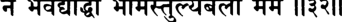

_айам ту вайасатулйо нати-саттво на ме самах арджуно на бхавед йоддха бхймас тулйа-бало мама_ 

_айам_ — этот; _ту_ — с другой стороны; _вайаса_ — по возрасту; _атулйах_ — неравный; _на_ — не; _ати_ — много; _саттвах_ — имеющий си­ лы; _на_ — не; _ме_ — мне; _самах_ — равен; _арджунах_ — Арджуна; _на бхавет_ — не должен быть; _йоддха_ — соперник; _бхймах_ — Бхима; _тулйа_ — равный; _балах_ — по силе; _мама_ — мне. 

**Шримад-Бхагаватам [песнь 10, глава 72** 

**106** 

**«Что касается Арджуны, то он младше меня, да и не так силен. Поскольку он мне не ровня, то сражаться с ним я тоже не стану. Бхима же равен мне по силе».** 

## **ТЕКСТ 33** 

I fe fa r _**\ \ Щ \**_ 

_итй уктва бхймасенайа прадайа махатйм гадам двитййам свайам адайа нирджагама пурад бахих_ 

_ити_ — так; _уктва_ — сказав; _бхймасенайа_ — Бхиме; _прадайа_ — дав; _махатйм_ — большую; _гадам_ — палицу; _двитййам_ — другую; _свайам_ — сам; _адайа_ — взяв; _нирджагама_ — он вышел; _пурат_ — из города; _бахих_ — за пределы. 

**Сказав это, Джарасандха вручил Бхимасене огромную палицу, а сам взял другую и вышел за городские стены.** 

## **ТЕКСТ 34** 

_\ \ ш_ 

_татах самекхале вйрау самйуктав итаретарам джагхнатур ваджра-калпабхйам гадабхйам рана-дурмадау_ 

_татах_ — затем; _самекхале_ — на ровной площадке для сраже­ ния; _вйрау_ — два героя; _самйуктау_ — занятые; _итара-итарам_ — друг другу; _джагхнатух_ — наносили удары; _ваджра-калпабхйам_ — словно удары молнии; _гадабхйам_ — своими палицами; _рана_ — сражением; _дурмадау_ — доведенные до бешенства. 

**Два героя схватились друг с другом на ровной площадке для битв за пределами города. Обезумевшие от гнева, вызванного по­ единком, они обрушивали друг на друга свои палицы, сверкавшие, как молнии.** 

**текст 36]** 

**Смерть демона Джарасандхи** 

**107** 

## **ТЕКСТ 35** 

## teRMlfol _Трщ_ ^ % т тт ^  ^ I ^ T t : _’И ц ф м_ Т%ЧТГ: m i 

_мандалани вичитрани савйам дакшинам эва ча чаратох шушубхе йуддхам натайор ива рангинох_ 

_мандалани_ — дуги; _вичитрани_ — искусные; _савйам_ — влево; _дак­ шинам_ — вправо; _эва ча_ — также; _чаратох_ — их, которые дви­ гались; _шушубхе_ — выглядела превосходно; _йуддхам_ — битва; _натайох_ — актеров; _ива_ — как; _рангинох_ — на сцене. 

## **Они искусно кружились то вправо, то влево, словно акте­ ры, танцующие на сцене, и битва их напоминала великолепный спектакль.** 

_КОММЕНТАРИЙ:_ Здесь Джарасандха и Бхима демонстрируют свое искусство владения палицами. Из этого описания очевидно, что оба воина были бесстрашны и не теряли самообладания даже в пылу сражения. 

**ТЕКСТ 36** 

тт^гГ: ^тПТГ: 11^11 

_татаьи чата-чата-шабдо ваджра-нишпеша-саннибхах гадайох кшиптайо раджан дантайор ива дантинох_ 

_татах_ — затем; _чата-чата-шабдах_ — грохот; _ваджра_ — молнии; _нишпеша_ — удар; _саннибхах_ — напоминающий; _гадайох_ — их па­ лиц; _кшиптайо:с_ — которыми размахивали; _раджан_ — о царь (Парикшит); _дантайох_ — бивней; _ива_ — будто; _дантинох_ — слонов. 

## **О царь, палицы Джарасандхи и Бхимасены сшибались друг с другом, как бивни двух боевых слонов, и раздававшиеся при этом звуки были похожи на раскаты грома в бушующую грозу.** 

_КОММЕНТАРИЙ:_ Этот перевод основан на книге «Кришна, Вер­ ховная Личность Бога» Шрилы Прабхупады. 

**Шримад-Бхагаватам [песнь 10, глава 72** 

**108** 

## **ТЕКСТ 37** 

^тп т^тГ : н ^ н 

_те ваи гаде бхуджа-джавена нипатйамане анйонйато ’мса-кати-пада-карору-джатрум чурнй-бабхуватур упетйа йатхарка-ьиакхе самйудхйатор двирадайор ива дйпта-манвйох_ 

_те_ — они; _ваи_ — без сомнения; _гаде_ — две палицы; _бхуджа_ — их рук; _джавена_ — с силой; _нипатйамане_ — которыми стремитель­ но размахивали; _анйонйатах_ — друг об друга; _амса_ — их плечи; _кати_ — бока; _пада_ — стопы; _кара_ — руки; _уру_ — бёдра; _джатрум_ — и ключицы; _чурнй_ — переломанные; _бабхуватух_ — становились; _упетйа_ — соприкасаясь; _йатха_ — как; _арка-шакхе_ — две ветки де­ рева _арка; самйудхйатох_ — яростно сражающихся; _двирадайох_ — двух слонов; _ива_ — как; _дйпта_ — воспламенен; _манвйох_ — чей гнев. 

**Они размахивали своими палицами с такой силой и скоростью, что те, обрушиваясь на их плечи, бока, стопы, руки, бедра и клю­ чицы, ломались, словно ветки дерева** _арка_ , **которыми бьются друг с другом два разъяренных слона.** 

## **ТЕКСТ 38** 

ГЩГ: 

_иттхам тайох прахатайор гадайор нр-вйрау_ 

_круддхау сва-муштибхир айах-спарашаир апиштам ьиабдас тайох прахаратор ибхайор ивасйн ниргхата-ваджра-парушас тала-таданоттхах_ 

_иттхам_ — таким образом; _тайох_ — их; _прахатайох_ — сломан­ ные; _гадайох_ — палицы; _нр_ — среди людей; _вйрау_ — два вели­ ких героя; _круддхау_ — разъяренные; _сва_ — своими; _муштибхих_ — 

**текст 39]** 

**Смерть демона Джарасандхи** 

**109** 

кулаками; _айах_ — как железо; _спарашаих_ — чье прикосновение; _апиштам_ — они колотили; _ьиабдах_ — звук; _тайох_ — их; _прахара­ тох_ — бьющихся; _ибхайох_ — двух слонов; _ива_ — как; _асйт_ — стал; _ниргхата_ — грохочущий; _ваджра_ — как гром; _парушах_ — сильный; _тала_ — их ладоней; _тадана_ — ударами; _уттхах_ — поднятый. 

**Сломав палицы, два великих героя стали яростно колотить друг друга своими железными кулаками. От их ударов стоял такой грохот, что казалось, будто столкнулись два слона или гремит гром.** 

## **ТЕКСТ 39** 

_тайор эвам прахаратох сама-шикша-балауджасох нирвишешам абхуд йуддхам акшйна-джавайор нрпа_ 

_тайох_ — двоих; _эвам_ — так; _прахаратох_ — бьющихся; _сама_ — равная; _шикша_ — чья подготовка; _бала_ — сила; _оджасох_ — и жиз­ ненная сила; _нирвишешам_ — не выявивший победителя; _абхут_ — был; _йуддхам_ — бой; _акшйна_ — неистощимые; _джавайох_ — чьи уси­ лия; _нрпа_ — о царь. 

**Они сражались, но это был поединок между двумя воинами, не уступавшими друг другу в подготовке, силе и выносливос­ ти, поэтому ни один из них не мог победить, и они продолжали сражаться, о царь, с неослабевающей яростью.** 

_КОММЕНТАРИЙ:_ Некоторые _анаръи_ включают в текст этой гла­ вы еще два стиха, и Шрила Прабхупада в книге «Кришна, Вер­ ховная Личность Бога» также приводит их перевод: 

_эвам тайор маха-раджа йудхйатох сапта-вимьиатих динани нирагамс татра сухрд-ван ниши тиштхатох экада матулейам ваи праха раджан вркодарах на ьиакто \хам джарасандхам нирджетум йудхи мадхава_ 

**[песнь 10, глава 72** 

**110** 

**Шримад-Бхагаватам** 

«О царь, так они бились двадцать семь дней. Целый день они сражались, потом, словно друзья, оба ночевали во дворце Джара­ сандхи, а на следующий день вновь вступали в бой. На двадцать восьмой день Врикодара [Бхима] сказал своему двоюродному бра­ ту: „Мадхава, я должен честно признаться, что не могу победить Джарасандху^». 

## **ТЕКСТ 40** 

## 11«°И 

_ьиатрор джанма-мртй видван джйвитам ча джара-кртам партхам апйайайан свена теджасачинтайад дхарих_ 

_шатрох_ — врага; _джанма_ — рождение; _мртй_ — и смерть; _вид­ ван_ — зная; _джйвитам_ — возвращение к жизни; _ча_ — и; _джара_ — ведьмой Джарой; _кртам_ — сделанное; _партхам_ — Бхиму, сына Притхи; _апйайайан_ — наделив; _свена_ — Своей; _теджаса_ — энерги­ ей: _ачинтайат_ — подумал; _харих_ — Господь Кришна. 

**Господь Кришна знал тайну рождения и смерти Своего врага Джарасандхи. Знал Он и то, как его оживила ведьма Джара. При­ няв все это во внимание, Господь Кришна наделил Бхиму Своим особым могуществом.** 

_КОММЕНТАРИЙ:_ Шрила Прабхупада пишет, что Господь Криш­ на «знал тайну рождения Джарасандхи. Джарасандху родили сра­ зу две матери: каждая из них родила по половине тела. Его отец, решив, что они бесполезны, выбросил обе половинки тела в лес. Там их нашла колдунья по имени Джара, и ей удалось полностью срастить обе половинки. Осведомленный об этом, Кришна знал, как убить Джарасандху». 

## **ТЕКСТ 41** 

Ф т^ т ттт г^ ф т : I 

**з Ф п ч т t e r ч ггч в м  щгат н«?и** 

_санчинтйари-вадхопайам бхймасйамогха-даршанах дарьиайам аса витапам патайанн ива самджнайа_ 

**текст 43]** 

**111** 

**Смерть демона Джарасандхи** 

_санчинтйа_ — подумав; _ари_ — их врага; _вадха_ — уничтожения; _упайам_ — о способах; _бхймасйа_ — Бхиме; _амогха-даршанах_ — Вер­ ховный Господь, чье вйдение безупречно; _даршайам аса_ — показал; _витапам_ — веточку дерева; _патайан_ — расщепив; _ива_ — словно; _самджнайа_ — как знак. 

## **Поняв, как нужно убить врага, Господь, чье вйдение безупреч­ но, подал Бхиме знак, расщепив надвое веточку дерева.** 

## **ТЕКСТ 42** 

ч з ж -н ) Ф т : _щ :_ I ч т ^ Г : _щ_ ч и з г с г а И«^н 

_тад виджнайа маха-саттво бхймах прахаратам варах грхйтва падайох шатрум патайам аса бху-тлле_ 

_тат_ — это; _виджнайа_ — поняв; _маха_ — велика; _саттвах_ — чья сила; _бхймах_ — Бхима; _прахаратам_ — из воинов; _варах_ — лучший; _грхйтва_ — схватив; _падайох_ — за стопы; _шатрум_ — своего врага; _патайам аса_ — повалил его; _бху-тале_ — на землю. 

**Поняв этот знак, могучий Бхима, лучший из воинов, схватил своего противника за стопы и бросил на землю.** 

## **ТЕКСТ 43** 

4+J-4K _**щ щ**_ *г: | н«зи 

_экам падам падакрамйа дорбхйам анйам прагрхйа сах гудатах патайам аса шакхам ива маха-гаджах_ 

_экам_ — одну; _падам_ — ногу; _пада_ — своей стопой; _акрамйа_ — придавив; _дорбхйам_ — двумя руками; _анйам_ — другую; _прагрхйа_ — схватив; _сах_ — он; _гудатах_ — начиная от ануса; _патайам аса_ — ра­ зорвал его пополам; _шакхам_ — веточку дерева; _ива_ — как; _маха_ — могучий; _гаджах_ — слон. 

**Стопой он прижал к земле одну ногу Джарасандхи и, взяв­ шись руками за другую, словно могучий слон, ломающий веточку дерева, разорвал его пополам, от промежности до макушки.** 

**Шримад-Бхагаватам [песнь 10, глава 72** 

**112** 

## **ТЕКСТ 44** 

# **^ЗТТ* lltftfll** 

_эка-падору-вршана-кати-прштха-станамсаке эка-бахв-акши-бхру-карне шакале дадршух праджах_ 

_эка_ — с одной; _пада_ — ногой; _уру_ — бедром; _вршана_ — яичком; _кати_ — боком; _прштха_ — частью спины; _стана_ — груди; _амсаке_ — и плечом; _эка_ — с одной; _баху_ — рукой; _акши_ — глазом; _бхру_ — бровью; _карне_ — и ухом; _шакале_ — две части; _дадршух_ — увидели; _праджах_ — горожане. 

**Подданные царя увидели его разорванным на две части, каж­ дая с одной ногой, бедром, яичком, боком, плечом, рукой, глазом, бровью и ухом, а также с половиной туловища.** 

## **ТЕКСТ 45** 

_хаха-каро махан асин нихате магадхешваре пуджайам асатур бхймам парирабхйа джайачйутау_ 

_хаха-карах_ — плач скорби; _махан_ — великий; _асйт_ — поднялся; _нихате_ — убитый; _магадха-йьиваре_ — повелитель провинции Магадха; _пуджайам асатух_ — двое прославили; _бхймам_ — Бхиму; _парирабхйа_ — обняв; _джайа_ — Арджуна; _ачйутау_ — и Кришна. 

**Они стали горько оплакивать смерть повелителя Магадхи, а Арджуна и Кришна, обняв Бхиму, поздравили его с победой.** 

## **ТЕКСТ 46** 

I 

**imWRT 4frf TP|: I** 

4Ы ч1чж  тп т^тн ; _ъ щ ц_ т т г ё н  ^ im ii 

**текст 46]** 

**Смерть демона Джарасандхи** 

**113** 

_сахадевам тат-та на йам бхагаван бхута-бхаванах абхйашинчад амейатма магадханам патим прабхух мочайам аса раджанйан самруддха магадхена йе_ 

_сахадевам_ — по имени Сахадева; _тат_ — его (Джарасандхи); _танайам_ — сына; _бхагаван_ — Верховный Господь; _бхута_ — всех живых существ; _бхаванах_ — опора; _абхйашинчат_ — короновал; _амейа-атма_ — бесконечный; _магадханам_ — Магадхов; _патим_ — как повелителя; _прабхух_ — Господь; _мочайам аса_ — Он освободил; _раджанйан_ — царей; _самруддхах_ — были пленены; _магадхена_ — Джарасандхой; _йе_ — которые. 

**Бесконечный Верховный Господь, опора и благодетель всех жи­ вых существ, короновал сына Джарасандхи, Сахадеву, провоз­ гласив его новым повелителем Магадхов. После этого Господь освободил всех царей, которых держал в плену Джарасандха.** 

_КОММЕНТАРИЙ:_ Шрила Прабхупада пишет: «Хотя Джарасандха был убит, ни Кришна, ни братья Пандавы не заявили о своих при­ тязаниях на престол. Они уничтожили Джарасандху только для того, чтобы восстановить мир, который он нарушал своими бес­ чинствами. Демоны всегда приносят людям беспокойства, а полу­ боги всегда стремятся сохранить мир. Господь Кришна приходит, чтобы защитить праведников и уничтожить демонов, мешающих людям жить в мире. Поэтому Он немедленно послал за сыном Джарасандхи, которого звали Сахадева, и, соблюдая все церемо­ нии, попросил его занять трон отца и мирно править царством. Господь Кришна — владыка всего мироздания, и Он хочет, чтобы все люди в нем жили мирно, памятуя о Кришне. Возведя Сахадеву на престол, Кришна освободил всех царей и царевичей, безвинно заточенных Джарасандхой в темницу». 

_Так заканчивается комментарий смиренных слуг А. Ч. Бхактиведанты Свами Прабхупады к семьдесят второй главе Десятой песни «Шримад-Бхагаватам_ », _которая называется «Смерть демо­ на Джарасандхи»._ 

# **ГЛАВА СЕМЬДЕСЯТ ТРЕТЬЯ** 

# **Господь Криш на благословляет освобож ден н ы х царей** 

В этой главе рассказывается, как Господь Шри Кришна, осво­ бодив царей, плененных Джарасандхой, милостиво позволил им лицезреть Себя и пожаловал им достойные дары. 

Когда Господь Кришна освободил двадцать тысяч восемьсот ца­ рей, которых держал в плену Джарасандха, они тут же упали перед Ним на землю. Поднявшись с земли, они со сложенными ладоня­ ми стали молиться Ему. Воспринимая свое заточение как милость, которую пролил на них Господь, чтобы избавить от гордыни, цари молили Его дать им только то, что поможет им постоянно помнить Его лотосные стопы. 

Господь заверил царей, что молитва их услышана. Он сказал им: «Поклоняйтесь Мне, совершая ведические жертвоприношения, и заботьтесь о своих подданных, как велит религия. Сосредото­ чив на Мне свой ум, зачинайте потомство и оставайтесь невозму­ тимыми в счастье и в горе. Так в конце жизни вы, без сомнения, вернетесь ко Мне». 

Затем Господь Кришна позаботился о том, чтобы цари совер­ шили омовение и нарядно оделись, после чего Он велел Сахадеве надеть на них гирлянды и поднести им сандаловую пасту, богатые одежды и другие подарки, достойные царей. Когда они надели на себя драгоценности и золотые украшения, Он усадил их на колес­ ницы и отправил каждого в их царство, где они вернулись к выпол­ нению своих обязанностей, согласно наставлениям, которые дал им Господь. 

Сами же Господь Кришна, Бхима и Арджуна вернулись в Индрапрастху и рассказали обо всем царю Юдхиштхире. 

**115** 

**Шримад-Бхагаватам [песнь 10, глава 73** 

**116** 

## **ТЕКСТЫ 1-6** 

_t_ **йШ т: I** % faifrTT TT^RT _ц ^ ш ш :_ II ? II ^гш чт: ^Н>«ЦН1: ж Г ч ч М Ш :  I _**1#\£\**_ w i % т ^ г ц ^ г а ч  и * н 

**M-il'ilHb'JlBRH, I** F £ < - W $ u ^ И 3 И 

_ЧИШ_ **JKI^It I** и v и 

t e r r _**л**_ f ^ r T _**тц**_ £ п ч т  и ч и 

fay*n ЧШТЩТ T^FrT | **Mu)^d4l4ld) 4l<4l^>: II $ II** 

_шрй-шука увача_ 

_айуте две ьиатанй аштау нируддха йудхи нирджитах те ниргата гиридронйам малина мала-васасах_ 

_к шут-к шамах ьиушка-ваданах самродха-парикарьиитах дадршус те гхана-шйамам пйта-кауьиейа-васасам_ 

_ьирйватсанкам чатур-бахум падма-гарбхарунекшанам чару-прасанна-ваданам спхуран-макара-кундалам_ 

_падма-хастам гада-шанкха-ратхангаир упалакшитам кирйта-хара-катака-кати-сутрангаданчитам_ 

_бхраджад-вар а-мани-гривам нивйтам вана-малайа пибанта ива чакшурбхйам лиханта ива джихвайа_ 

_джигхранта ива насабхйам рамбханта ива бахубхих пранемур хата-папмано мурдхабхих падайор харех_ 

_ьирй-шуках увача_ — Шукадева Госвами сказал; _айуте_ — десять тысяч; _две_ — две; _шатани_ — сотен; _аштау_ — восемь; _нируддхах_ — плененных; _йудхи_ — в битве; _нирджитах_ — побежденных; _те_ — 

**текст 6] Господь благословляет освобожденных царей** 

**117** 

они; _ниргатах_ — выйдя; _гиридронйам_ — в крепости Гиридрони, столице Джарасандхи; _малинах_ — грязные; _мала_ — грязные; _васасах_ — чьи одежды; _к шут_ — голодом; _кшамах_ — измученные; _шут­ ка_ — иссохшие; _ваданах_ — лйца; _самродха_ — пленом; _парикаршитах_ — сильно ослабленные; _дадршух_ — увидели; _те_ — они; _гхана_ — как туча; _шйймам_ — темно-синего; _пйта_ — желтого; _каушейа_ — из шелка; _васасам_ — чьи одежды; _шриватса_ — знаком Шриватса; _анкам_ — отмеченного; _чатух_ — четыре; _бахум_ — имеющего руки; _падма_ — лотоса; _гарбха_ — как венчик; _ару на_ — розовые; _йкшанам_ — глаза; _чару_ — прекрасные; _прасанна_ — и приятное; _ваданам_ — лицо; _спхурат_ — блестящими; _макара_ — в форме морских чудовищ; _кундалам_ — с серьгами; _падма_ — лотос; _хастам_ — в Его руке; _гада_ — Его палицей; _шанкха_ — раковиной; _ратха-ангаих_ — и диском; _упалакшитам_ — узнаваемый; _кирйта_ — со шлемом; _хара_ — драгоценным ожерельем; _катака_ — золотыми браслетами; _кати-сутра_ — поясом; _ангада_ — и браслетами на предплечьях; _анчитам_ — украшенный; _бхраджат_ — сверкающий; _вара_ — велико­ лепный; _мани_ — драгоценный камень (Каустубха); _грйвам_ — на Его шее; _нивйтам_ — свисающей (с Его шеи); _вана_ — из лесных цветов; _малайа_ — с гирляндой; _пибантах_ — пьющие; _ива_ — слов­ но; _чакшурбхйам_ — глазами; _лихантах_ — лижущие; _ива_ — словно; _джихвайа_ — языками; _джигхрантах_ — вдыхающие аромат; _ива_ — словно; _насабхйам_ — ноздрями; _рамбхантах_ — обнимающие; _ива_ — словно; _бахубхих_ — своими руками; _пранемух_ — они склонились; _хата_ — уничтожены; _папманах_ — чьи грехи; _мурдхабхих_ — своими головами; _падайох_ — к стопам; _харех_ — Господа Кришны. 

**Шукадева Госвами сказал: Джарасандха победил в битве двад­ цать тысяч восемьсот царей и заточил их в тюрьму. Когда они стали выходить из крепости Гиридрони, они были грязными, в рваных одеждах, с осунувшимися лицами, измученные голодом и ослабевшие от долгого заточения.** 

**Выйдя из крепости, цари увидели перед собой Господа. Тело Его было темно-синее, словно туча, и Он был облачен в наряд из жел­ того шелка. У Него был знак Шриватса на груди, четыре могучие руки, розоватые глаза, похожие на венчик лотоса, прекрасное, ве­ селое лицо, сверкающие серьги в форме** _макары_ **, а также лотос, палица, раковина и диск в руках. Он был украшен шлемом, драго­ ценным ожерельем, золотым поясом и браслетами, а на шее Его красовались сверкающий драгоценный камень Каустубха и гир­ лянда из лесных цветов. Цари глазами пили Его красоту, языком** 

**Шримад-Бхагаватам [песнь 10, глава 73** 

**118** 

**им хотелось ощутить вкус Господа, ноздрями они вдыхали аромат Его тела, а руками мысленно обнимали Его. Освободившись от всех грехов, цари припали к стопам Господа Хари, коснувшись их головой.** 

## **ТЕКСТ 7** 

## ^гт: ll vs и 

_кршна-сандаршанахлада-дхваста-самродхана-кламах праьиаьиамсур хршйкешам гйрбхих пранджалайо нрпах_ 

_кршна-сандаршана_ — созерцания Господа Кришны; _ахлада_ — от восторга; _дхваста_ — уничтожена; _самродхана_ — заточения; _кламах_ — чья усталость; _прашашамсух_ — они прославляли; _хршйкайьиам_ — верховного повелителя чувств; _гйрбхих_ — своими словами; _пранджалайах_ — со сложенными ладонями; _нрпах_ — цари. 

**При виде Господа Кришны они ощутили блаженство, которое рассеяло их усталость от заточения. Стоя перед владыкой чувств со сложенными ладонями, цари стали возносить Ему молитвы.** 

## **ТЕКСТ 8** 

## _Т Х Ш 'Щ_ 

т р щ ЧТ% _ч :_ Р |$ и и ц ^  y lu iq rl: II ^ II 

_раджана учух_ 

_намас те дева-девеша прапаннарти-харавйайа прапаннан пахи нах кршна нирвиннан гхора-самсртех_ 

_раджанах учух_ — цари сказали; _намах_ — поклоны; _те_ — Тебе; _де­ ва_ — полубогов; _дева_ — повелителей; _йша_ — о Верховный Гос­ подь; _прапанна_ — тех, кто предался; _арти_ — страдания; _хара_ — о уносящий; _авйайа_ — о неисчерпаемый; _прапаннан_ — предавших­ ся; _пахи_ — пожалуйста, спаси; _нах_ — нас; _кршна_ — о Кришна; _нир­ виннан_ — отчаявшихся; _гхора_ — ужасного; _самсртех_ — от матери­ ального существования. 

**текст 10] Господь благословляет освобожденных царей** 

**119** 

**Цари сказали: Поклоны Тебе, о повелитель всех полубогов, пра­ вящих этим миром, о сокрушитель страданий предавшихся Тебе душ! О неисчерпаемый Кришна, мы покорились Тебе, поэтому спаси нас от ужаса материальной жизни, которая сделала нас столь жалкими.** 

## **ТЕКСТ 9** 

_наинам натханусуйамо магадхам мадхусудана ануграхо йад бхавато раджнам раджйа-нйутир вибхо_ 

_на_ — не; _энам_ — в этом; _натха_ — о повелитель; _анусуйамах_ — мы не виним; _магадхам_ — царя Магадхи; _мадхусудана_ — о Криш­ на; _ануграхах_ — милость; _йат_ — поскольку; _бхаватах_ — Твоя; _ра­ джнам_ — царей; _раджйа_ — с их власти; _чйутих_ — падение; _вибхо_ — о всемогущий. 

## **О повелитель, о Мадхусудана, мы не виним царя Магадхи, по­ скольку то, что цари теряют свою власть, — на самом деле Твоя милость, о всемогущий.** 

_КОММЕНТАРИЙ:_ Важно отметить, что, увидев Господа Кришну и так освободившись от всех грехов, цари больше не испытыва­ ли к пленившему их Джарасандхе никакой вражды или ненависти. Просто увидев Господа Кришну, цари обрели сознание Кришны и потому произнесли эти стихи, исполненные глубокой духовной мудрости. 

## **ТЕКСТ 10** 

_раджйаишварйа-мадоннаддхо на ьирейо виндате нрпах тван-майа-мохито *нитйа манйате сампадо ’налах_ 

_раджйа_ — властью; _аишварйа_ — и богатством; _мада_ — от опья­ нения; _уннаддхах_ — став необузданным; _на_ — не; _ьирейах_ — ис­ тинное благо; _виндате_ — обретает; _нрпах_ — царь; _тват_ — Твоей; 

**Шримад-Бхагаватам [песнь 10, глава 73** 

**120** 

_майа_ — энергией иллюзии; _мохитах_ — введенный в заблуждение; _анитйах_ — временные; _манйате_ — он считает; _сампадах_ — блага; _ачалах_ — вечными. 

**Опьяненный своими богатствами и властью, царь перестает вла­ деть собой и потому не может обрести высшее благо. Введенный в заблуждение Твоей иллюзорной энергией, он начинает думать, что его временные достояния будут с ним вечно.** 

_КОММЕНТАРИЙ:_ Слово _уннаддха_ указывает на то, что человек, опьяненный гордыней, начинает вести себя неподобающим обра­ зом. Человеческая жизнь должна подчиняться законам _дхармы_ , духовным принципам, предназначенным для того, чтобы человек мог постепенно совершенствоваться в сознании Кришны. Одна­ ко глупцы, ослепленные богатством и властью, ведут себя как им вздумается, постоянно нарушая законы природы и Бога. К несчас­ тью, именно так ведет себя большинство людей в процветающих странах Запада. 

## **ТЕКСТ 11** 

## 4 #  1 + М ^ и??|| 

_мрга-тршнам йатха бала манйанта удакашайам эвам ваикарикйм майам айукта васту чакшате_ 

_мрга-тршнам_ — мираж; _йатха_ — как; _балах_ — люди с разумом ребенка; _манйанте_ — считают; _удака_ — воды; _ашайам_ — скопле­ нием; _эвам_ — так же; _ваикарикйм_ — подверженную изменениям; _майам_ — материальную иллюзию; _айуктах_ — те, кому не хватает проницательности; _васту_ — материю; _чакшате_ — видят как. 

**Подобно тому как наивные, недалекие люди принимают ми­ раж в пустыне за водоем, те, кому не хватает разума, принимают иллюзорные изменения** _**майи**_ **за реальность.** 

## **ТЕКСТЫ 12-13** 

М чЧ 1Н 11 | 

**текст 13] Господь благословляет освобожденных царей** 

**121** 

ТГЗТТ: TPTt T jr^ ^ т : ll?*ll 

<r ^ т т Ф ^ т т Rm i Ghhi: f^nr: I rF^T ^RcTtS'^rnpTT _W W_ % ||?3II 

_вайам пура шрй-мада-нашта-дрштайо джигйшайасйа итаретара-спрдхах гхнантах праджах сва ати-ниргхрнах прабхо мртйум пурас твавиганаййа дурмадах_ 

_та эва кршнадйа габхйра-рамхаса дуранта-вйрйена вичалитах шрийах калена танва бхавато ’нукампайа винашта-дарпаьи чаранау смарама те_ 

_вайам_ — мы; _пура_ — раньше; _ьирй_ — богатства; _мада_ — дурманом; _наьита_ — потеряна; _дрштайах_ — чья способность видеть; _джигйьиайа_ — с желанием завоевать; _асйах_ — эту (землю); _итараитара_ — друг с другом; _спрдхах_ — ссорясь; _гхнантах_ — нападая; _праджах_ — на подданных; _свах_ — собственных; _ати_ — необычай­ но; _ниргхрнах_ — жестокие; _прабхо_ — о Господь; _мртйум_ — смертью; _пурах_ — перед нами; _тва_ — Тобой; _авиганаййа_ — пренебрегая; _дур­ мадах_ — надменные; _те_ — они (то есть мы сами); _эва_ — несомнен­ но; _кршна_ — о Кришна; _адйа_ — теперь; _габхйра_ — таинственные; _рамхаса_ — чьи передвижения; _дуранта_ — необорима; _вйрйена_ — чья сила; _вичалитах_ — вынуждены проститься; _шрийах_ — с на­ шим богатством; _калена_ — временем; _танва_ — Твоим проявлением; _бхаватах_ — Твоей; _анукампайа_ — милостью; _винашта_ — уничто­ жена; _дарпах_ — чья гордость; _чаранау_ — две стопы; _смарама_ — пусть мы будем помнить; _те_ — Твои. 

**Раньше, опьяненные дурманом своего богатства, мы хотели по­ корить землю и постоянно сражались друг с другом, стремясь одержать победу и безжалостно угнетая собственных подданных. О Господь, в высокомерии своем мы пренебрегали Тобой, кото­ рый всегда стоял перед нами в облике смерти. Однако теперь, о Кришна, Твое могущественное воплощение, время, бег которого загадочен и неумолим, лишило нас наших богатств. Теперь, когда** 

**122** 

**[песнь 10, глава 73** 

**Шримад-Бхагаватам** 

**Ты милостиво уничтожил нашу гордыню, мы просто молим Тебя о том, чтобы мы могли всегда помнить о Твоих лотосных стопах.** 

## **ТЕКСТ 14** 

## **t e i w** _Ъ гч_ **^ ii?vii** 

_атхо на раджйам мрга-трьини-рупитам дехена ьиаьиват патата руджам бхува упаситавйам спрхайамахе вибхо крийа-пхалам претйа ча карна-рочанам_ 

_атха у_ — впредь; _на_ — не; _раджйам_ — царство; _мрга-тршни_ — словно мираж; _ру питам_ — которое кажется; _дехена_ — материаль­ ным телом; _ьиаьиват_ — вечно; _патата_ — подвержено смерти; _ру­ джам_ — болезней; _бхува_ — место рождения; _упаситавйам_ — слу­ жить; _спрхайамахе_ — мы желаем; _вибхо_ — о всемогущий Господь; _крийа_ — благочестивых поступков; _пхалам_ — плод; _претйа_ — ро­ дившись снова; _ча_ — и; _карна_ — для ушей; _рочанам_ — соблазн. 

**Мы никогда больше не станем стремиться к власти — власти над царством, подобным миражу, царством, которое требует ра­ болепно служить себе это бренное, постоянно разрушающееся те­ ло — источник бесконечных болезней и страданий. О всемогущий Господь, не станем мы стремиться и к райским наслаждениям, которые мы могли бы обрести в следующей жизни в награду за свои благочестивые деяния, поскольку обещания таких наград — просто пустой соблазн для ушей.** 

_КОММЕНТАРИЙ:_ Чтобы удержать политическую власть и управ­ лять страной, необходимо очень тяжело трудиться. При этом тело, с помощью которого человек трудится, чтобы удержать власть, са­ мо по себе обречено на уничтожение. С каждой секундой наше тело приближается к смерти. Мало этого, оно постоянно болеет. Таким образом, для чистой души, которая понимает, что ей нужно пробу­ дить в себе дремлющее сознание Кришны, гонка за материальной властью — пустая трата времени. 

**текст 15] Господь благословляет освобожденных царей** 

**123** 

Веды и писания других религий обещают тем, кто жил праведной жизнью, процветание и райские наслаждения в жизни следующей. Слушать такие обещания всегда приятно, однако все это не больше, чем обещания. Для чистой души материальные наслаждения — не важно, в раю или в аду, — это всего лишь иллюзия, мираж. Уви­ дев Господа Кришну, удачливые цари осознали высшую духовную реальность, лежащую за пределами фантасмагории материального мира. 

**ТЕКСТ 15** 

_Ч ч:_ I 

_там нах самадишопайам йена те чаранабджайох смртир йатха на вирамед апи самсаратам иха_ 

_там_ — это; _нах_ — нам; _самадиша_ — пожалуйста, скажи; _упайам_ — средство; _йена_ — благодаря которому; _те_ — о Твоих; _чарана_ — стопах; _абджайох_ — похожих на лотосы; _смртих_ — памятование; _йатха_ — как; _на вирамет_ — не прекратится; _апи_ — даже; _самса­ ратам_ — для тех, кто вертится в круговороте рождения и смерти; _иха_ — в этом мире. 

## **Пожалуйста, поведай нам, как те, кто вращается в круговоро­ те рождений и смертей этого мира, могут всегда помнить о Твоих лотосных стопах.** 

_КОММЕНТАРИЙ:_ Постоянно помнить Господа можно только по Его милости. Такое памятование — самый легкий способ обрести высшее освобождение. Это объясняется в «Бхагавад-гите» (8.14): 

_ананйа-четах сататам йо мам смарати нитйаьиах тасйахам сулабхах партха нитйа-йуктасйа йогинах_ 

«О сын Притхи, тот, кто непрестанно помнит Меня, сможет легко прийти ко Мне, ибо он все время служит Мне». 

Слова _апи самсаратам иха_ указывают на то, что цари проси­ ли Господа Кришну не просто об освобождении. Они хотели об­ рести способность всегда помнить о Его лотосных стопах. Такое 

**124** 

**Шримад-Бхагаватам [песнь 10, глава 73** 

непрерывное памятование — признак любви, а любовь к Богу — истинная цель жизни каждого. 

## **ТЕКСТ 16** 

## _ЯЧ\_ ЧЧ: ||?$|| 

_кршнайа васудевайа харайе параматмане праната-клеша-наьиайа говиндайа намо намах_ 

_кршнайа_ — Кришне; _васудевайа_ — сыну Васудевы; _харайе_ — Вер­ ховному Господу, Хари; _парама-атмане_ — Сверхдуше; _праната_ — тех, кто предался; _клеша_ — страданий; _наьиайа_ —-уничтожителю; _говиндайа_ — Говинде; _намах намах_ — поклоны вновь и вновь. 

**Вновь и вновь мы склоняемся перед Господом Кришной, Ха­ ри, сыном Васудевы. Эта Высшая Душа, Говинда, уничтожает страдания тех, кто предался Ему.** 

## **ТЕКСТ 17** 

## гТНЩ 4>*«IWId Ж ’Щ: ^ J R T f*RT ||?»|| 

_шрй-шука увача самстуйамано бхагаван раджабхир мукта-бандханаих тан аха карунас mama шаранйах ьилакшнайа гира_ 

_ьйрй-ьйуках увача_ — Шукадева Госвами сказал; _самстуйаманах_ — как следует прославленный; _бхагаван_ — Верховный Господь; _раджабхих_ — царями; _мукта_ — освобожденными; _бандханаих_ — из плена; _тан_ — им; _аха_ — Он сказал; _карунах_ — милостивый; _mama_ — мой дорогой (царь Парикшит); _шаранйах_ — тот, кто дает прибежище; _ьилакшнайа_ — ласковыми; _гира_ — речами. 

**Шукадева Госвами сказал: Так цари, освободившиеся из пле­ на, прославляли Верховного Господа. Затем, мой дорогой Па­ рикшит, милосердный Господь, который дарует прибежище всем, обратился к царям с ласковыми речами.** 

**текст 19] Господь благословляет освобожденных царей** 

**125** 

## **ТЕКСТ 18** 

_шрй-бхагаван увача адйа прабхрти во бхупа майй атманй акхилешваре су-дрдха джайате бхактир бадхам ашамситам татха_ 

_шрй-бхагаван увача_ — Верховный Господь сказал; _адйа пра­ бхрти_ — начиная с этого момента; _вах_ — ваше; _бху-пах,_ — о ца­ ри; _майи_ — ко Мне; _атмани_ — Душе; _акхила_ — всего; _йшваре_ — повелителю; _су_ — очень; _дрдха_ — твердая; _джайате_ — возникнет; _бхактих,_ — преданность; _бадхам_ — несомненно; _ашамситам_ — же­ лаемое; _татха_ — так. 

**Верховный Господь сказал: Дорогие цари, с этого дня вы будете непоколебимо преданы Мне, Высшей Душе и повелителю всего сущего. Я заверяю вас, что именно так и будет — желание ваше исполнится.** 

## **ТЕКСТ 19** 

f^ T T ЖсГШЙЧ: I 

т о н п н 

_диштйа вйаваситам бхупа бхаванта рта-бхашинах шрйй-аишварйа-мадоннахам пашйа унмадакам нрнам_ 

_диштйа_ — удачное; _вйаваситам_ — ваше решение; _бхупах_ ,— о ца­ ри; _бхавантах_ — вы; _рта_ — правду; _бхашинах_ — высказанную; _шрй_ — богатством; _аишварйа_ — и могуществом; _мада_ — от опья­ нения; _уннахам_ — нехватку самообладания; _пашйе_ — Я вижу; _ун­ мадакам_ — сводящую с ума; _нрнам_ — людей. 

**К счастью для вас, дорогие цари, вы нашли верное решение, и все, что вы сказали, — правда. Я вижу, что люди, опьянен­ ные богатством и властью, утрачивают способность владеть собой и потому в конце концов сходят с ума.** 

**Шримад-Бхагаватам [песнь 10, глава 73** 

**126** 

## **ТЕКСТ 20** 

## ^ [41 nI• 

_хаихайо нахуьио вено равано нарако *паре ьирй-мадад бхрамшитах стханад дева-даитйа-нареьиварах_ 

_хаихайах нахушах венах_ — Хайхая (Картавирья), Нахуша и Ве­ на; _раванах нараках_ — Равана и Нарака; _апаре_ — а также другие; _ьирй_ — от богатства; _мадат_ — из-за опьянения; _бхрамшитах_ — бы­ ли лишены; _стханат_ — своих высоких постов; _дева_ — полубогов; _даитйа_ — демонов; _пара_ — и людей; _йшварах_ — повелители. 

## **Хайхая, Нахуша, Вена, Равана, Нарака и многие другие повели­ тели полубогов, людей и демонов лишились своих высоких постов, когда страсть к материальным богатствам овладела ими.** 

_КОММЕНТАРИЙ:_ Как пишет Шридхара Свами, Хайхая украл ко­ рову желаний, которая принадлежала отцу Господа Парашурамы, Джамадагни, и Парашурама убил Хайхаю вместе с его обнаглев­ шими сыновьями. Нахуша возгордился, когда на время ему было поручено исполнять обязанности Индры. Опьяненный гордыней Нахуша приказал _брахманам_ нести его на паланкине на свидание с целомудренной женой Индры, Шачи, и те прокляли его, в резуль­ тате чего он лишился своего высокого положения и стал змеей. Царь Вена в таком же приступе безумия оскорбил _брахманов_ , и те убили его, громко повторяя слог _хум._ Равана был знаменитым пра­ вителем племени ракшасов, однако, обуреваемый вожделением, он похитил Ситу, и ее супруг, Господь Рамачандра, убил его. Нарака был царем дайтьев, но, когда он осмелился украсть серьги Адити, он также был убит. Таким образом, история знает множество при­ меров того, как, опьяненные своим так называемым богатством, могущественные правители теряли свое высокое положение. 

## **ТЕКСТ 21** 

**IR?II** 

**•ЧТ** 

**текст 23] Господь благословляет освобожденных царей** 

**127** 

_бхаванта этад виджнайа дехадй утпадйам анта-ват мам йаджанто 'дхвараир йуктах праджа дхармена ракшйатха_ 

_бхавантах_ — вы; _этат_ — это; _виджнайа_ — понимая; _деха-ади_ — материальное тело и т.д.; _утпадйам_ — подверженное рождению; _анта-ват_ — имеющее конец; _мам_ — Мне; _йаджантах_ — поклоня­ ясь; _адхвараих_ — ведическими жертвоприношениями; _йуктах_ — с ясным разумом; _праджах_ — своих подданных; _дхармена_ — в со­ ответствии с заповедями религии; _ракшйатха_ — вы должны за­ щищать. 

**Всегда помните, что материальное тело и все, что с ним связа­ но, имеет начало и конец; поклоняйтесь Мне, совершая ведичес­ кие жертвоприношения, и, не теряя ясности разума, защищайте своих подданных в соответствии с заповедями религии.** 

## **ТЕКСТ 22** 

_Ш Ш ^_ **ттй ш  О м в ч ц  IR4II** 

_сантанвантах праджа-тантун сукхам духкхам бхавабхавау праптам праптам ча севанто мач-читта вичаришйатха_ 

_сантанвантах_ — производя; _праджа_ — потомство; _тантун_ — ли­ нии; _сукхам_ — счастье; _духкхам_ — страдание; _бхава_ — рождение; _абхавау_ — и смерть; _праптам праптам_ — когда они встречаются; _ча_ — и; _севантах_ — принимая; _мат-читтах_ — с умом, сосредото­ ченным на Мне; _вичаришйатха_ — вы должны идти. 

**Шагая по жизни, зачиная потомство и сталкиваясь с радостью и горем, рождением и смертью, всегда сосредоточивайте свой ум на Мне.** 

## **ТЕКСТ 23** 

^ K M ic 4 K w i 

**ЦЬЧЙЭД T R :** _чщ щ_ **ш т е г** _Ш_ 

I 

**IR3II** 

**[песнь 10, глава 73** 

**Шримад-Бхагаватам** 

**128** 

_удасинаьи ча дехадав атмарама дхрта-вратах майй авеьийа манах самйан мам анте брахма йасйатха_ 

_удасйнах_ — равнодушные; _ча_ — и; _деха-адау_ — к телу и проч.; _атма-арамах_ — находящие удовлетворение в себе; _дхрта_ — строго соблюдая; _вратах_ — свои обеты; _майи_ — на Мне; _авеьийа_ — сосре­ доточив; _манах_ — ум; _самйак_ — полностью; _мам_ — ко Мне; _анте_ — в конце; _брахма_ — Абсолютной Истине; _йасйатха_ — вы придете. 

**Не привязывайтесь к телу и всему, что с ним связано. Находя удовлетворение внутри, строго соблюдайте свои обеты и всегда устремляйте ум ко Мне. Так вы в конце концов придете ко Мне, Высшей Абсолютной Истине.** 

## **ТЕКСТ 24** 

'З'И'Ч 

## **%чт iR v ii** 

_ьирй-ьиука увача итй адиьийа нрпан крьино бхагаван бхуванеьиварах тешам нйайункта пурушан стрийо маджджана-кармани_ 

_ьирй-ьиуках увача_ — Шукадева Госвами сказал; _ити_ — так; _ади­ ьийа_ — наказав; _нрпан_ — царям; _кршнах_ — Кришна; _бхагаван_ — Вер­ ховный Господь; _бхувана_ — всех миров; _йьиварах_ — властелин; _те­ шам_ — их; _нйайункта_ — занял; _пурушан_ — слуг; _стрийах_ — и жен­ щин; _маджджана_ — омовения; _карманй_ — в деле. 

**Шукадева Госвами сказал: Дав царям такие наставления, Гос­ подь Кришна, верховный повелитель всех миров, приказал Своим слугам и служанкам омыть этих царей и помочь им привести себя в порядок.** 

## **ТЕКСТ 25** 

_w r i_ *КЧ1ЧШ ЧТТгТ I **IR 4 II** 

**текст 27] Господь благословляет освобожденных царей** 

**129** 

_сапарйам карайам аса сахадевена бхарата нарадевочитаир вастраир бхушанаих сраг-вилепанаих_ 

_сапарйам_ — служение; _карайам аса_ — Он совершил; _сахадевена_ — с помощью Сахадевы, сына Джарасандхи; _бхарата_ — о пото­ мок Бхараты; _нара-дева_ — царям; _учитаих_ — подходящей; _вастраих_ — одеждой; _бхушанаих_ — украшениями; _срак_ — гирляндами; _вилепанаих_ — и сандаловой пастой. 

**О потомок Бхараты, затем Господь велел царю Сахадеве по­ чтить каждого из них, поднеся им достойную их царского сана одежду, драгоценности, гирлянды и сандаловую пасту.** 

## **ТЕКСТ 26** 

## **IR5II** 

_бходжайитва вараннена су-снатан самаланкртан бхогаиш ча вивидхаир йуктамс тамбуладйаир нрпочитаих_ 

_бходжайитва_ — накормив; _вара_ — самой лучшей; _аннена_ — пи­ щей; _су_ — должным образом; _снатан_ — омытые; _самаланкртан_ — красиво одетые; _бхогаих_ — тем, что доставляет удовольствие; _ча_ — и; _вивидхаих_ — разнообразными; _йуктан_ — наделенные; _тамбула_ — орехами бетеля; _адйаих_ — и так далее; _нрпа_ — царей; _учи­ таих_ — достойными. 

**После того как они омылись и нарядились, Господь Кришна по­ заботился о том, чтобы их накормили самыми изысканными яст­ вами. Он также поднес им орехи бетеля и прочее — все то, чем обычно услаждают себя цари.** 

## **ТЕКСТ 27** 

% ТГ^ТПТГ I **Я Ц ч Ш м и W** _Щ \:_ **IR « II** 

_те пуджита мукундена раджано мршта-кундалах виреджур мочитах клешат праврд-анте йатха грахах_ 

**[песнь 10, глава 73** 

**Шримад-Бхагаватам** 

**130** 

_те_ — они; _пуджитах_ — принятые с почтением; _мукундена_ — Господом Кришной; _раджанах_ — цари; _мршта_ — блестящие; _кундалах_ — чьи серьги; _виреджух_ — выглядели очень величественно; _мочитах_ — освобожденные; _клеьиат_ — от страданий; _праврт_ — сезона дождей; _анте_ — в конце; _йатха_ — как; _грахах_ — планеты (такие как Луна). 

**Приняв все эти почести от Господа Мукунды и избавившись от своих мытарств, цари с их сверкающими серьгами сияли великолепием, как Луна и другие светила в конце сезона дождей.** 

## **ТЕКСТ 28** 

ф т щ з д Ы * ) : ll^ ll 

_ратхан сад-аьиван аропйа мани-канчана-бхушитан прйнаййа сунртаир вакйаих сва-дешан пратйайапайат_ 

_ратхан_ — на колесницы; _cam_ — прекрасными; _аигван_ — с ло­ шадьми; _аропйа_ — усадив их; _мани_ — самоцветами; _канчана_ — и золотом; _бхушитан_ — украшенные; _прйнаййа_ — доставив удо­ вольствие; _сунртаих_ — приятными; _вакйаих_ — речами; _сва_ — в их собственные; _деьиан_ — царства; _пратйайапайат_ — Он отослал. 

**Затем Господь усадил царей на колесницы, украшенные золо­ том и драгоценными камнями и запряженные лучшими лошадь­ ми, и, сказав каждому несколько любезных слов, отправил их по своим царствам.** 

## **ТЕКСТ 29** 

## _т щ я Ъ ц_ u i h h :  frTTft ^ Ж гЧ % : IR^II 

_та эвам мочитах крччхрат кршнена су-махатмана йайус там эва дхйайантах кртани ча джагат-патех_ 

_те_ — они; _эвам_ — так; _мочитах_ — освобожденные; _крччхрат_ — от мытарств; _кршнена_ — Кришной; _су-маха-атмана_ — величайшей 

**текст 31] Господь благословляет освобожденных царей** 

**131** 

из душ; _йайух_ — они отправились; _там_ — о Нем; _эва_ — одном; _дхйайантах_ — размышляя; _кртани_ — о деяниях; _ча_ — и; _джагатпатех_ — Господа Вселенной. 

**Вызволенные Кришной, величайшей из всех душ, цари ехали домой, думая по дороге только о Нем, повелителе Вселенной, и о Его удивительных деяниях.** 

## **ТЕКСТ 30** 

_джагадух пракртибхйас те маха-пуруша-чештитам йатханвашасад бхагавамс татха чакрур атандритах_ 

_джагадух_ — рассказали; _пракртибхйах_ — своим министрам и дру­ гим придворным; _те_ — они (цари); _маха-пуруша_ — Верховной Лич­ ности; _чештитам_ — о подвигах; _йатха_ — как; _анваьиасат_ — Он дал наставления; _бхагаван_ — Господь; _татха_ — так; _чакрух_ — они делали; _атандритах_ — очень тщательно. 

**Цари рассказали своим министрам и другим придворным, что сделал для них Верховный Господь. С того дня они строго следовали всем Его наставлениям.** 

## **ТЕКСТ 31** 

_т щ я ц_ yid R iH i Ф гсЙ я ' I 

**^f^r:** _**\ \ т**_ 

_джарасандхам гхатайитва бхймасенена кешавах партхабхйам самйутах прайат сахадевена пуджитах_ 

_джарасандхам_ — Джарасандхи; _гхатайитва_ — устроив смерть; _бхймасенена_ — от руки Бхимасены; _кешавах_ — Господь Кришна; _партхабхйам_ — двумя сыновьями Притхи (Бхимой и Арджуной); _самйутах_ — сопровождаемый; _прайат_ — Он уехал; _сахадевена_ — от Сахадевы; _пуджитах_ — принявшим почести. 

**[песнь 10, глава 73** 

**Шримад-Бхагаватам** 

**132** 

**Устроив смерть Джарасандхи от руки Бхимасены, Господь Кешава принял почести от царя Сахадевы и вместе с двумя сыновьями Притхи отправился в обратный путь.** 

## **ТЕКСТ 32** 

_*\гц\_ % I 

_гатва те кхандава-прастхам шанкхан, дадхмур джитарайах харшайантах сва-сухрдо дурхрдам часукхавахах_ 

_гатва_ — прибыв; _те_ — они; _кхандава-прастхам_ — в Индрапрас­ тху; _ьианкхан_ — в свои раковины; _дадхмух_ — затрубили; _джита_ — победив; _арайах_ — своего врага; _харшайантах_ — доставляя удо­ вольствие; _сва_ — своим; _сухрдах_ — доброжелателям; _дурхрдам_ — своим врагам; _ча_ — и; _асукха_ — неудовольствие; _авахах_ — принося. 

**Прибыв в Индрапрастху, герои возвестили о своей победе труб­ ным звуком раковин, который принес радость их дорогим друзьям и опечалил врагов.** 

## **ТЕКСТ 33** 

## ***|Рк яП Н  ТГЯПГ** _WWW_ 

_тач чхрутва прйта-манаса индрапрастха-нивасинах менире магадхам ьиантам раджа чапта-маноратхах_ 

_тат_ — это; _ьирутва_ — услышав; _прйта_ — довольные; _манасах_ — в сердце; _индрапрастха-нивасинах_ — жители Индрапрастхи; _мени­ ре_ — поняли; _магадхам_ — Джарасандха; _шантам_ — обрел вечный покой; _раджа_ — царь (Юдхиштхира); _ча_ — и; _апта_ — исполнены; _манах-ратхах_ — чьи желания. 

**Жители Индрапрастхи очень обрадовались, услышав этот звук, ибо поняли, что царь Магадхи успокоился навеки. А царь Юдхиш­ тхира почувствовал, что теперь все его желания исполнились.** 

**текст 35] Господь благословляет освобожденных царей** 

**133** 

## **ТЕКСТ 34** 

STfoFSim  7 R R Ф п ф п н т ф т т : I **Л ™ II^VII** 

_абхивандйатха раджанам бхймарджуна-джанарданах сарвам ашравайам чакрур атмана йад ануштхитам_ 

_абхивандйа_ — оказав почтение; _атха_ — затем; _раджанам_ — царю; _бхйма-арджуна-джанарданах_ — Бхима, Арджуна и Кришна; _сар­ вам_ — всё; _ашравайам чакрух_ — они рассказали; _атмана_ — ими; _йат_ — что; _ануштхитам_ — было сделано. 

**Бхима, Арджуна и Джанардана выразили почтение царю и рассказали ему о том, что сделали.** 

## **ТЕКСТ 35** 

## **З Т Р Г ^ Г ^ Г Т frrou iTtaFT IR4II** 

_нишамйа дхарма-раджас тат кешавенанукампитам анандашру-калам мунчан премна новача кинчана_ 

_нишамйа_ — услышав; _дхарма-раджах_ — царь религии, Юдхиш­ тхира; _тат_ — это; _кеьиавена_ — Господом Кришной; _анукампитам_ — милость; _ананда_ — восторга; _ашру-калам_ — слёзы; _мун­ чан_ — роняя; _премна_ — от любви; _на увача_ — не сказал; _кинчана_ — что-либо. 

## **Услышав о том, какую великую милость оказал ему Господь Кешава, царь Дхармараджа заплакал от счастья. Он ощутил к Нему такой прилив любви, что не смог вымолвить ни слова.** 

_Так заканчивается комментарий смиренных слуг А. Ч. Бхактиведанты Свами Прабхупады к семьдесят третьей главе Десятой песни «Шримад-Бхагаватам_ », _которая называется «Господь Кришна благословляет освобожденных царей»._ 

# **ГЛАВА СЕМЬДЕСЯТ ЧЕТВЕРТАЯ** 

# **О свобож дение Ш ишупалы во время ж ертвопринош ения радж асуя** 

В этой главе рассказывается о том, как Господь Кришна был избран первым, кому поклонялись во время жертвоприношения _раджасуя,_ и о том, как Он убил Шишу палу. 

Прославив Господа Кришну, царь Юдхиштхира для проведения жертвоприношения _раджасуя_ пригласил быть жрецами опытных _брахманов_ — Бхарадваджу, Гаутаму и Васиштху. Чтобы принять участие в жертвоприношении, к месту его проведения съеха­ лись многочисленные знатные гости, представители всех четырех сословий общества. 

Прежде чем начать жертвоприношение, необходимо провести ри­ туал «первого поклонения», и всех присутствующих попросили вы­ брать того, кто будет удостоен этой чести. Сахадева предложил: «Поистине, нет никого выше Шри Кришны, Верховного Господа, ибо Он средоточие всех богов, которым поклоняются во время ведического жертвоприношения. Пребывая в сердце каждого как Сверхдуша, Он позволяет всем живым существам во вселенной за­ ниматься своей деятельностью, и лишь по Его милости люди мо­ гут совершать благочестивые деяния и наслаждаться плодами этих поступков. Тот, кто поклоняется Ему, поклоняется всем живым су­ ществам. Вне всякого сомнения, вначале нужно почтить Господа Кришну». 

Почти все присутствовавшие согласились с предложением Сахадевы и одобрили его слова громкими возгласами. Царь Юдхиштхи­ ра с радостью стал поклоняться Господу Кришне. Омыв Его стопы, царь окропил этой водой свою голову и головы своих братьев, же­ ны, других родственников и советников. Затем все стали воскли­ цать: «Слава! Слава!» — и склонились перед Господом Кришной, а с небес на Господа Кришну пролился дождь из цветов. 

**135** 

**[песнь 10, глава 74** 

**Шримад-Бхагаватам** 

**136** 

Однако Шишупале было нестерпимо видеть, как Шри Кришне поклоняются, и слышать славословия в Его адрес. Он поднялся со своего места и стал грубо упрекать людей, стоящих во главе этого собрания, в том, что они решили первым почтить Кришну. «В кон­ це концов, — сказал он, — этот Кришна не принадлежит ни к од­ ному из ведических социальных и духовных укладов жизни и даже хорошим происхождением не может похвастаться. Он не следует никаким заповедям религии, и у Него нет никаких добродетелей». 

Пока Шишупала поносил Господа Кришну, тот невозмутимо мол­ чал, но многие члены собрания закрыли уши руками и поспешно удалились, а братья Пандавы схватились за оружие, чтобы убить Шишупалу. Господь Кришна, однако, остановил их. В конце кон­ цов Он пустил в ход Свой диск Сударшана и обезглавил кощунст­ вующего наглеца. В это мгновение из мертвого тела Шишупалы вылетела искра света, которая, направившись к Господу Кришне, вошла в Его трансцендентное тело. В течение трех жизней Шишу­ пала был врагом Господа Кришны, а теперь благодаря этому он обрел освобождение _саюджъя,_ т.е. слился с Ним. Это произошло потому, что он постоянно думал о Господе. 

После этого царь Юдхиштхира преподнес почтенным гостям и жрецам дорогие подарки и наконец совершил очистительное подношение, называемое _праяшчитта-хомой_ , которое нейтрали­ зует все ошибки, совершённые во время жертвоприношения. Так _раджасуя-ягъя_ царя Юдхиштхиры завершилась, и Господь Криш­ на, попрощавшись с царем, вместе со всеми Своими женами и советниками отправился обратно в Двараку. 

Это зримое доказательство успеха Махараджи Юдхиштхиры больно ранило Дурьйодхану, но все остальные были очень довольны и, расходясь, славили жертвоприношение _раджасуя_ и повелителя всех жертвоприношений, Шри Кришну. 

## **ТЕКСТ 1** 

'З'И'Ч 

## iftaK P raflfr и ? и 

_ьирй-ьиука увача эвам йудхиштхиро раджа джарасандха-вадхам вибхох крьинасйа чанубхавам там ьирутва прйтас там абравйт_ 

**текст 2]** 

**Освобождение Шишупалы** 

**137** 

_шрй-ьиуках увача_ — Шукадева Госвами сказал; _эвам_ — так; _йудхиштхирах_ — Юдхиштхира; _раджа_ — царь; _джарасандха-вадхам_ — об убийстве Джарасандхи; _вибхох_ — всемогущего; _крьинасйа_ — Господа Кришны; _ча_ — и; _анубхавам_ — (проявлении) могущества; _там_ — об этом; _ьирутва_ — услышав; _прйтах_ — довольный; _там_ — к Нему; _абравйт_ — он обратился. 

**Шукадева Госвами сказал: Выслушав рассказ об убийстве Джа­ расандхи и о необычайной силе всемогущего Кришны, царь Юдхиштхира, охваченный великой радостью, обратился к Господу со следующими словами.** 

## **ТЕКСТ 2** 

**^ ^** _ЪШ_ **тфт: I Т ВкЗ<11^1КНЧ и * II** 

_ьирй-йудхиьитхира увача_ 

_йе сйус траи-локйа-гуравах сарве лока махеьиварах ваханти дурлабхам лабдхва ьиирасаивануьиасанам_ 

_ьирй-йудхиьитхирах увача_ — Шри Юдхиштхира сказал; _йе_ — кто; _сйух_ — есть; _траи-локйа_ — трех миров; _гуравах_ — духовные учи­ тели; _сарве_ — все; _локах_ — (обитатели) планет; _маха-йьиварах_ — и великие полубоги, управляющие миром; _ваханти_ — они носят; _дурлабхам_ — редко достижимые; _лабдхва_ — обретя; _ьиираса_ — на своих головах; _эва_ — несомненно; _ануьиасанам_ — (Твои указания). 

**Шри Юдхиштхира сказал: Все великие духовные учители трех миров, а также правители и обитатели разных планет почтительно возлагают себе на голову все Твои повеления, получить которые удается далеко не всем.** 

_КОММЕНТАРИЙ:_ Шрила Прабхупада передает слова Махараджи Юдхиштхиры так: «О Кришна, Твое тело вечно, исполнено блажен­ ства и знания. Господь Брахма, Господь Шива, царь Индра и другие возвышенные правители материального мира всегда ждут Твоих повелений и горят желанием исполнить их. Когда им посчаст­ ливится получить Твой приказ, они принимают его с трепетом и благоговением». 

**Шримад-Бхагаватам [песнь 10, глава 74** 

**138** 

## **ТЕКСТ 3** 

**<{Ы м|4К т|Рн1Ч  I II 3 II** 

_са бхаван аравиндакшо дйнанам йша-манинам дхатте ’нуьиасанам бхумамс тад атйанта-видамбанам_ 

_сах_ — Он; _бхаван_ — Ты Сам; _аравинда-акьиах_ — лотосоокий Гос­ подь; _дйнанам_ — несчастных; _йьиа_ — правителями; _манинам_ — ко­ торые считают себя; _дхатте_ — берет на Себя; _анушасанам_ — приказ; _бхуман_ — о вездесущий; _тат_ — это; _атйанта_ — высшее; _видамбанам_ — лицедейство. 

## **О лотосоокий Господь, Ты повинуешься приказам жалких глуп­ цов, возомнивших себя правителями. С Твоей стороны, о вездесу­ щий, это высшее лицедейство.** 

_КОММЕНТАРИЙ:_ Шрила Прабхупада пишет: «[Юдхиштхира ска­ зал:] „О Кришна, Ты безграничен. Хотя мы порой гордимся своими ничтожными постами и думаем о себе как о царственных особах, правителях мира, на самом деле мы жалки, малодушны и заслу­ живаем Твоей кары. Но — о чудо! — вместо того чтобы нас по­ карать, Ты так милостиво и великодушно, с таким совершенством выполняешь наши указания. То, что Ты играешь роль обычно­ го человека, вызывает недоумение, однако мы понимаем, что Ты делаешь это, подобно актеру на сцене“». 

## **ТЕКСТ 4** 

## **Ч  Й «Ь*М|(& №*Ч** _**Щ Щ :**_ **Ч<Ч1с*Н: I ^ IIVII** 

_на хй экасйадвитййасйа брахманах параматманах кармабхир вардхате теджо храсате ча йатха равех_ 

_на_ — не; _хи_ — поистине; _экасйа_ — одного; _адвитййасйа_ — нет другого подобного; _брахманах_ — Абсолютной Истины; _парамаатманах_ — Высшей Души; _кармабхих_ — от деяний; _вардхате_ — 

**Освобождение Шишупалы** 

**текст 5]** 

**139** 

возрастает; _теджах_ — сила; _храсате_ — уменьшается; _ча_ — и; _йа­ тха_ — как; _равех_ — солнца. 

**Несомненно, могущество Абсолютной Истины, предвечной Высшей Души, которой нет равных, не увеличивается и не умень­ шается от Ее деяний, точно так же как движение солнца никак не сказывается на его мощи.** 

_КОММЕНТАРИЙ:_ Шрила Прабхупада пишет в книге «Кришна»: «[Царь Юдхиштхира сказал:] „Ты всегда сохраняешь Свое истин­ ное, высочайшее положение, подобно тому как солнце всегда со­ храняет одинаковую степень теплоты, хотя мы ощущаем его тепло по-разному в часы заката и в часы восхода. Ты всегда пребываешь в трансцендентном равновесии, и происходящее в материальном мире не приносит Тебе ни радости, ни беспокойства. Ты Верховный Брахман, Личность Бога, и для Тебя нет ничего относительного^». 

Шрила Шридхара Свами цитирует похожее утверждение из Вед: _на кармана вардхате но канййан_ (Шатапатха-брахмана, 14.7.2.28, Тайттирия-брахмана, 3.12.9.7, и Брихад-араньяка-упанишад, 4.4.23). «Его деяния не возвеличивают Его и не унижают». Как объясняет здесь царь Юдхиштхира, Господь один, равных Ему нет. Нет никого, кто принадлежал бы к той же категории живых существ, что и Он. Он соглашается выполнять приказы Своих чистых преданных, таких как Махараджа Юдхиштхира, лишь по Своей беспричинной милости. Но, даже одаривая беспричинной милостью Своих искренних преданных, Он не утрачивает Своего положения Верховной Личности Бога. 

## **ТЕКСТ 5** 

_ЧШ Ч\_ **w W r T** _-ЩЧЩ_ **I** 

_Ч_ **%** _ЧШ Ч\_ **w W r T** _-ЩЧЩ_ **I** с# грНгГ ^ II Ч II 

_на ваи те 'джита бхактанам мамахам ити мадхава твам тавети ча нана-дхйх паьиунам ива ваикртй_ 

_на_ — не; _ваи_ — несомненно; _те_ — Твоих; _аджита_ — о непобеди­ мый; _бхактанам_ — преданных; _мама ахам ити_ — «мое» и «я»; _ма­ дхава_ — о Кришна; _твам тава ити_ — «ты» и «твое»; _ча_ — 

**[песнь 10, глава 74** 

**Шримад-Бхагаватам** 

**140** 

и; _нана_ — различий; _дхих_ — умонастроение; _пашунам_ — животных; _ива_ — будто; _ваикртй_ — извращенное. 

## **О непобедимый Мадхава, даже Твои преданные не делают раз­ личий между собой и другими, своим и чужим, ибо думать таким образом могут только животные.** 

_КОММЕНТАРИЙ:_ Обычный человек думает: «Я такой привлека­ тельный, умный и богатый, что люди просто обязаны служить мне и делать все, что я захочу. Зачем мне подчиняться кому-то еще?» Подобный менталитет гордого индивидуалиста присущ даже жи­ вотным, которые пытаются доказать свое превосходство над други­ ми. Возвышенный преданный никогда так не думает, и, уж конечно, подобные мысли никогда не посещают всеведущего Верховного Господа. 

## **ТЕКСТ 6** 

## **ЧТО?** _*\тн_ **II $ II** 

_ьирй-шука увача_ 

_итй уктва йаджнийе кале вавре йуктан са ртвиджах кршнанумодитах партхо брахманан брахма-вадинах_ 

_ьирй-ьиуках увача_ — Шукадева Госвами сказал; _ит и_ — так; _ук­ тва_ — сказав; _йаджнийе_ — подходящий для жертвоприношения; _ка­ ле_ — в момент; _вавре_ — выбрал; _йуктан_ — подходящих; _сах_ — он; _ртвиджах_ — жрецов для жертвоприношения; _кршна_ — Госпо­ да Кришны; _анумодитах_ — получивший одобрение; _партхах_ — — сын Притхи (Юдхиштхира); _брахманан брахманов; брахма_ — Вед; _вадинах_ — знатоков. 

**Шукадева Госвами сказал: Произнеся эти слова, царь Юдхиш­ тхира дождался времени, благоприятного для начала жертво­ приношения. Затем, испросив позволение у Господа Кришны, он выбрал для проведения жертвоприношения жрецов, хорошо знающих Веды.** 

**текст 9]** 

**141** 

**Освобождение Шишу палы** 

_КОММЕНТАРИЙ:_ Великий комментатор «Бхагаватам» Шридхара Свами объясняет, что подходящее время для жертвоприношения, о котором говорится здесь, — это весна. 

## **ТЕКСТЫ 7-9** 

. 1 1 * 1 1 

^ г :  Ш Г Tmf ^14-ЧИН ^ IU  II 

sftn jt тптГ _з п ф :_ I 

_дваипайано бхарадваджах сумантур готамо ’ситах васиштхаш чйаванах канво маитрейах кавашас тритах_ 

_вишвамитро вамадевах суматир джаиминих кратух паилах парашаро гарго ваишампайана эва ча_ 

_атхарва кашйапо дхаумйо рамо бхаргава асурих вйтихотро мадхуччханда вйрасено ’кртавранах_ 

_дваипайанах бхарадваджах_ — Двайпаяна (Ведавьяса) и Бхарадваджа; _сумантух готамах аситах_ — Суманту, Гаутама и Асита; _васиштхах чйаванах канвах_ — Васиштха, Чьявана и Канва; _маитрейах кавашах тритах_ — Майтрея, Каваша и Трита; _вишвамитрах вамадевах_ — Вишвамитра и Вамадева; _суматих джаи­ миних кратух_ — Сумати, Джаймини и Крату; _паилах парашарах гаргах_ — Пайла, Парашара и Гарга; _ваишампайанах_ — Вайшампаяна; _эва ча_ — также; _атхарва кашйапах дхаумйах_ — Атхарва, Кашьяпа и Дхаумья; _рамах бхаргавах_ — Парашурама, потомок Бхригу; _асурих_ — Асури; _вйтихотрах мадхуччхандах_ — Витихотра и Мадхучханда; _вйрасенах акртавранах_ — Вирасена и Акритаврана. 

**Он выбрал Кришну-Двайпаяну, Бхарадваджу, Суманту, Гаутаму и Аситу, вместе с Васиштхой, Чьяваной, Канвой, Майтреей,** 

**[песнь 10, глава 74** 

**Шримад-Бхагаватам** 

**142** 

**Кавашей и Тритой. Он также пригласил Вишвамитру, Вамадеву, Сумати, Джаймини, Крату, Пайлу и Парашару, Гаргу, Вайшампаяну, Атхарву, Кашьяпу, Дхаумью, Раму из рода Бхаргавов, Асури, Витихотру, Мадхучханду, Вирасену и Акритаврану.** 

_**КОММЕНТАРИЙ:**_ Царь Юдхиштхира попросил всех этих возвы­ шенных _**брахманов**_ исполнять разные обязанности во время жерт­ воприношения — кого-то как жреца, а кого-то как советника и т.д. 

## **ТЕКСТЫ 10-11** 

зч£г11*т1*ТГ I **W^frT: IIMI** _rfog_ з Ф ггя г Й 7Щ Т W f r R t _ф \\m_ 

_**ynaxymac татха чанйе дрона-бхйшма-крпадайах дхртараштрах саха-суто видураш ча маха-матих,**_ 

_**брахманах кшатрийа ваиьийах шудра йаджна-дидркшавах татрейух сарва-раджано раджнам пракртайо нрпа**_ 

_**упахутах**_ **—** приглашенные; _**татха**_ **—** также; _**ча**_ **—** и; _**анйе**_ **—** дру­ гие; _**дрона-бхйиша-крпа-адайах**_ **—** во главе с Дроной, Бхишмой и Крипой; _**дхртараштрах**_ **—** Дхритараштра; _**саха-сутах**_ **,—** вместе с сыновьями; _**видурах**_ **—** Видура; _**ча**_ **—** и; _**маха-матих**_ **—** необычай­ **—** но разумный; _**брахманах кшатрийах ваишйах шудрах брахманы**_ **,** _**кшатрии**_ **,** _**вайшьи**_ и _**шудры; йаджна**_ **—** жертвоприношение; _**дидркшавах**_ **—** желающие увидеть; _**татра**_ **—** туда; _**ййух**_ **—** прибыли; _**сарва**_ **—** все; _**раджанах**_ **—** цари; _**раджнам**_ **—** царей; _**пракртайах**_ **—** окружение; _**нрпа**_ **—** о царь. 

**О царь, среди приглашенных также были Дрона, Бхишма, Кри­ па, Дхритараштра с сыновьями, мудрый Видура и многие дру­ гие — и** _**брахманы**_ **, и** _**кшатрии**_ **, и** _**вайшьи**_ **, и** _**шудры**_ **, — и все они горели желанием увидеть жертвоприношение. Более того, все ца­ ри прибыли на место проведения жертвоприношения со своими свитами.** 

**текст 15]** 

**Освобождение Шишу палы** 

**143** 

## **ТЕКСТ 12** 

## гТгГС% _ш т :_ I fT|T _ТЩ_ ^ГЧЩЩ _\\%Ч\\_ 

_татас те дева-йаджанам брахманах сварна-лангалаих крштва татра йатхамнайам дйкшайам чакрире нрпам_ 

_татах_ — затем; _те_ — они; _дева-йаджанам_ — место для поклоне­ ния полубогам; _брахманах_ — _брахманы; сварна_ — золотыми; _лангалаих_ — плугами; _крштва_ — вспахали; _татра_ — там; _йатхаамнайам_ — по принятым правилам; _дйкшайам чакрире_ — они по­ святили; _нрпам_ — царя. 

**Затем** _**брахманы**_ **вспахали жертвенную арену золотыми плугами и в соответствии с традициями, установленными великими муд­ рецами прошлого, провели для царя Юдхиштхиры специальный обряд посвящения в жертвоприношение.** 

**ТЕКСТЫ 13-15** 

|ч т : М Ч 'И и и  c ^ u ih i w I _\\т_ 

7 R R S J TTCIfcTT <МЧ<тЧ«Г ^ Г :  I 

**T l^ T F T  T T f : t I ^Ф^пт№шт: ll?** 4 **ll** 

_хаимах килопакарана варунасйа йатха пура индрадайо лока-пала виринчи-бхава-самйутах_ 

_са-ганах сиддха-гандхарва видйадхара-махорагах мунайо йакша-ракшамси кхага-киннара-чаранах_ 

_раджанаш ча самахута раджа-патнйаш ча сарвашах раджасуйам самййух сма раджнах панду-сутасйа ваи менире кршна-бхактасйа супапаннам ависмитах_ 

**[песнь 10, глава 74** 

**144** 

**Шримад-Бхагаватам** 

_хаимах_ — сделанные из золота; _кила_ — несомненно; _упакаранах_ — принадлежности; _варунасйа_ — Варуны; _йатха_ — как; _пура_ — в прошлом; _индра-адайах_ — во главе с Господом Индрой; _локапалах_ — правители планет; _виринчи-бхава-самйутах_ — включая Господа Брахму и Господа Шиву; _са-ганах_ — с их спутниками; _сиддха-гандхарвах_ — сиддхи и гандхарвы; _видйадхара_ — видьядхары; _маха-урагах_ — и великие змеи; _мунайах_ — возвышенные мудре­ цы; _йакша-ракшамси_ — демоны якши и ракшасы; _кхага-киннарачаранах_ — райские птицы, киннары и чараны; _раджанах_ — цари; _ча_ — и; _самахутах_ — приглашенные; _раджа_ — царей; _патнйах_ — жёны; _ча_ — также; _сарвашах_ — отовсюду; _раджасуйам_ — на жертво­ приношение _раджасуя; самййух сма_ — они прибыли; _раджнах_ — ца­ ря; _панду-сутасйа_ — сына Панду; _ваи_ — несомненно; _менире_ — они сочли; _кршна-бхактасйа_ — для преданного слуги Господа Кришны; _су-упапаннам_ — вполне достойным; _ависмитах_ — не удивлены. 

**Вся утварь для жертвоприношения была сделана из чистого зо­ лота — как во время** _**раджасуя-ягьи**_ **, которую в глубокой древнос­ ти провел Господь Варуна. На жертвоприношение** _**раджасуя**_ **царя Юдхиштхиры, сына Панду, со всех сторон света прибыли много­ численные гости — Индра, Брахма, Шива и многие другие пра­ вители планет вселенной; сиддхи и гандхарвы со всеми своими спутниками; видьядхары; великие змеи; мудрецы; якши; ракшасы; райские птицы; киннары; чараны и земные цари. Никто из них не был ничуть удивлен тем, сколь великолепным было это жертво­ приношение: все они ожидали именно этого от преданного Господа Кришны.** 

_**КОММЕНТАРИЙ:**_ Все знали, что Махараджа Юдхиштхира — ве­ ликий преданный Господа Кришны, поэтому для него не было ничего невозможного. 

## **ТЕКСТ 16** 

## IIWI 

_айаджайан мах а-раджам йаджака дева-варчасах раджасуйена видхи-ват прачетасам ивамарах_ 

**текст 17]** 

**Освобождение Шишупалы** 

**145** 

_айаджайан_ — они совершили жертвоприношение; _маха-раджам_ — для великого царя; _йаджаках_ — жрецы; _дева_ — полубогов; _варчасах_ — обладая силой; _раджасуйена_ — _раджасуя; видхи-ват_ — в соответствии с предписаниями Вед; _прачетасам_ — для Варуны; _ива_ — как; _омарах_ — полубоги. 

**Жрецы, могущественные, как боги, совершили для царя Юд­ хиштхиры жертвоприношение** _**раджасуя**_ **в строгом соответствии с наставлениями Вед, как некогда полубоги сделали это для Варуны.** 

**ТЕКСТ 17** 

_сутйе ’ханй авани-пало йаджакан садасас-патин апуджайан маха-бхаган йатха-ват су-самахитах_ 

_сутйе_ — выжимания сока _сомы; ахани_ — в день; _аванй-палах_ — царь; _йаджакан_ — жрецам; _садасах_ — собрания; _патйн_ — главам; _апуджайат_ — поклонялся; _маха-бхаган_ — необычайно возвышен­ ным; _йатха-ват_ — правильно; _су-самахитах_ — сосредоточенно. 

## **В день, когда выжимали сок** _**сома**_ **, царь Юдхиштхира очень сосредоточенно совершил обряды поклонения жрецам и самым выдающимся членам высокого собрания.** 

_КОММЕНТАРИЙ:_ Шрила Прабхупада пишет в книге «Кришна»: «По ведической традиции, когда устраивается жертвоприношение, всем его участникам подносят сок растения _сома_ — чудесный жи­ вительный напиток. В тот день, когда выжимали сок из _сомы_ , царь Юдхиштхира с большими почестями принял особого жре­ ца, призванного следить за тем, чтобы при совершении жерт­ венных обрядов не было допущено никаких ошибок. Ведические _мантры_ должны произноситься безукоризненно точно, с правиль­ ными ударениями. Если жрецы, которые произносят _мантры_ , до­ пустят какую-нибудь оплошность, то жрец, следящий за обрядом, тут же исправит ее. Благодаря этому все ритуалы выполнялись безукоризненно. Если жертвоприношение не будет совершено как 

**[песнь 10, глава 74** 

**Шримад-Бхагаватам** 

**146** 

подобает, оно не даст желаемого результата. В Кали-югу не оста­ лось таких ученых _**брахманов**_ и жрецов, поэтому в нынешнюю эпоху проводить подобные жертвоприношения запрещено. Единст­ венное жертвоприношение, которое рекомендовано в _**шастрах**_ для Кали-юги, — это повторение и пение _**мантры**_ Харе Кришна». 

## **ТЕКСТ 18** 

_**садасйагрйарханархам ваи вимрьиантах сабха-садах надхйагаччханн анаикантйат сахадевас тадабравйт**_ 

_**садасйа**_ — членов собрания; _**агрйа**_ — первое; _**архана**_ — поклоне­ ние; _**архам**_ — тому, кто достоин; _**ваи**_ — несомненно; _**вимрьиантах**_ — размышляя; _**сабха**_ — в собрании; _**садах**_ — те, кто сидел; _**на адхйагаччхан**_ — не могли прийти к заключению; _**анаика-антйат**_ — из-за огромного количества (достойных кандидатов); _**сахадевах**_ — Сахадева, младший брат Махараджи Юдхиштхиры; _**тада**_ — затем; _**абравйт**_ — сказал. 

**После этого члены собрания стали думать, кому из них пер­ вому должны быть оказаны почести, но, поскольку достойных этого было очень много, они не могли прийти к окончательному решению. Тогда слово взял Сахадева.** 

_**КОММЕНТАРИЙ:**_ Шрила Прабхупада пишет: «Еще один важный ритуал требовал, чтобы прежде всего почести были оказаны луч­ шему из собравшихся на церемонию жертвоприношения... Этот ри­ туал называется _**агра-пуджа. Агра**_ означает „первый44, а _**пуджа**_ **—** „почитание44. _**Агра-пуджу**_ можно сравнить с выборами президента. Все присутствующие на жертвоприношении обладали множеством достоинств. Поэтому мнения разделились: все предлагали разных кандидатов для _**агра-пуджи».**_ 

Как отмечает великий _**ачарья**_ Джива Госвами, в пятнадцатом сти­ хе этой главы утверждается, что те, кто собрался на жертвоприно­ шение, не были удивлены его роскошью и великолепием, поскольку знали, что царь Юдхиштхира — преданный Господа Кришны. Тем не менее здесь, в восемнадцатом стихе, говорится, что они никак 

**текст 19]** 

**147** 

**Освобождение Шишупалы** 

не могли решить, кто же более других заслуживает того, чтобы получить почести первым. Это означает, что многие из присутст­ вовавших _брахманов_ не были достигшими совершенства трансценденталистами — они были просто _брахманами_ по рождению и не знали о высшем смысле Вед. 

Подобно этому, _ачаръя_ Вишванатха поясняет, что колебались с принятием решения те из собравшихся, кто не отличался слиш­ ком большим интеллектом. Брахма, Шива или Двайпаяна Вьясадева знали правильное решение, но при этом они думали примерно так: «Раз сегодня никто не спрашивает нашего мнения, так зачем нам говорить что-то? Кроме того, здесь присутствует Сахадева, ко­ торый славится своим умением быстро анализировать любые си­ туации. Он может помочь всем определиться с тем, кому следует поклоняться первому. И только если он по какой-то причине про­ молчит или же не сможет правильно оценить ситуацию, мы возь­ мем слово, несмотря на то, что нас никто не спрашивает». Приняв это решение, они хранили молчание. Так Вишванатха Чакраварти советует нам понимать то, что происходило тогда в этом собрании. 

## **ТЕКСТ 19** 

?Г^гТ: ? Ы UIHHi 4frT: I тп? _%_ И?ЧИ 

_архати хй ачйутах шраиштхйам бхагаван сатватам патих эша ваи деватах сарва деша-кала-дханадайах_ 

_архати_ — заслуживает; _хи_ — несомненно; _ачйутах_ — непогреши­ мый Кришна; _шраиштхйам_ — высшего положения; _бхагаван_ — Верховный Господь; _сатватам_ — Ядавов; _патих_ — глава; _эшах_ — Он; _ваи_ — поистине; _деватах_ — полубоги; _сарвах_ — все; _деьиа_ — места (проведения жертвоприношений); _кала_ — время; _дхана_ — материальные объекты; _адайах_ — и так далее. 

**[Сахадева сказал:] Поистине, высших почестей достоин лишь Ачьюта, Верховный Господь и повелитель Ядавов. На самом де­ ле все полубоги, которым поклоняются во время жертвоприно­ шения, а также такие составляющие поклонения, как освященное место, время и необходимые ингредиенты, — все это находится в Нем.** 

**148** 

**[песнь 10, глава 74** 

## **Шримад-Бхагаватам** 

## **ТЕКСТЫ 20-21** 

Ч<1сЧ+ГЦ ^ sPrRa* _-QZJrtm:_ I ЛтЩ гПГГ ТГ^ГТ ТТЩгГ %T$J _W_ Ч?: |R o|| 

**w** _wm_ **|** У1гЧН1гЧ1?ПТ: 7Т«7Т: ^Tr^RfrT ^=г=ГЯ: 11ЗД1 

_йад-атмакам идам вишвам кратаваш ча йад-атмаках агнир ахутайо мантра санкхйам йогаьи ча йат-парах_ 

_эка эвадвитййо 'сав аитад-атмйам идам джагат атманатмашрайах сабхйах срджатй авати хантй аджах_ 

_йат-атмакам_ — покоится на ком; _идам_ — эта; _вишвам_ — все­ ленная; _кратавах_ — великие жертвенные обряды; _ча_ — и; _йататмаках_ — покоятся на ком; _агних_ — священный огонь; _ахутайах_ — подношения; _мантрах_ — молитвы; _санкхйам_ — филосо­ фия _санкхъи; йогах_ — искусство медитации; _ча_ — и; _йат_ — для кого; _парах_ — предназначены; _эках_ — одного; _эва_ — только; _адвитййах_ — ни для кого другого; _асау_ — Он; _аитат-атмйам_ — по­ коится на Нем; _идам_ — эта; _джагат_ — вселенная; _атмана_ — через Него (т.е. Его энергии); _атма_ — Его одного; _ашрайах_ — имея при­ бежищем; _сабхйах_ — о члены собрания; _срджатй_ — Он творит; _авати_ — поддерживает; _ханти_ — и уничтожает; _аджах_ — нерож­ денный. 

**На Нем покоится вся вселенная и все великие жертвенные ри­ туалы с их священными огнями, возлияниями в огонь и** _мантра­ ми_ . **Цель** _санкхъи_ **и** _йоги_ — **постичь Его, не знающего Себе равных. О члены собрания, этот нерожденный Господь, который зависит только от Себя Самого, с помощью Своих энергий творит, поддер­ живает и уничтожает этот мир, и, стало быть, само существование мироздания зависит от Него одного.** 

## **ТЕКСТ 22** 

_\ \ я ч \ \_ 

_вивидханйха карманы джанайан йад-авекшайа йхате йад айам сарвах шрейо дхармади-лакшанам_ 

**текст 24]** 

**Освобождение Шишупалы** 

**149** 

_**вивидхани**_ — разнообразной; _**иха**_ — в этом мире; _**карманй**_ — мате­ риальной деятельности; _**джанайан**_ — давая начало; _**йат**_ — по чьей; _**авекшайа**_ — милости; _**йхате**_ — усилия; _**йат**_ — поскольку; _**айам**_ — этот мир; _**сарвах**_ — весь; _**ьирейах**_ — ради целей; _**дхарма-ади**_ — религии и проч.; _**лакшанам**_ — характеризуется. 

**Вся многообразие деятельности в этом мире создано Им, а значит, лишь по Его милости все в мире трудятся ради об­ ретения праведности, экономического процветания, чувственных удовольствий и освобождения.** 

**ТЕКСТ 23** 

d f4 lr$ w iW I ^ _**\ т \**_ 

_**тасмат кршнайа махате дййатам парамарханам эвам чет сарва-бхутанам атманаш чарханам бхавет**_ 

_**тасмат**_ — поэтому; _**кршнайа**_ — Господу Кришне; _**махате**_ — Вер­ ховному; _**дййатам**_ — должны быть оказаны; _**парома**_ — величай­ шие; _**арханам**_ — почести; _**эвам**_ — таким образом; _**чет**_ — если; _**сарва**_ — всех; _**бхутанам**_ — живых существ; _**атманах**_ — себя; _**ча**_ — и; _**арханам**_ — почитание; _**бхавет**_ — будет. 

**Поэтому высшие почести мы должны оказать Кришне, Верхов­ ному Господу. Поступив так, мы окажем почтение всем живым существам, да и самим себе.** 

**ТЕКСТ 24** 

## W r T R « т К Ч М т 'Ч Й - ч М !  I R tf ll 

_**сарва-бхутатма-бхутайа кршнайананйа-дарьиине дейам ьиантайа пурнайа даттасйанантйам иччхата**_ 

_**сарва**_ — всех; _**бху та**_ — существ; _**атма**_ — Душа; _**бхутайа**_ — кото­ рый заключает в Себе; _**кршнайа**_ — Господу Кришне; _**ананйа**_ — неотличным; _**дарьиине**_ — кто видит; _**дейам**_ — (почет) должен быть оказан; _**ьиантайа**_ — умиротворенному; _**пурнайа**_ — полностью со­ вершенному; _**даттасйа**_ — того, что отдано; _**анантйам**_ — бесконеч­ ного возрастания; _**иччхата**_ — тем, кто желает. 

**Шримад-Бхагаватам [песнь 10, глава 74** 

**150** 

**Любой, кто хочет, чтобы те почести, которые он воздает дру­ гим, вернулись к нему в бесконечной пропорции, должен почитать Кришну, умиротворенного и самодостаточного Верховного Госпо­ да, Душу всех живых существ, того, кто видит всех неразрывно связанными с Ним Самим.** 

_КОММЕНТАРИЙ:_ Шрила Прабхупада пишет: «[Сахадева сказал:] „Почтенное собрание, вам не нужно объяснять, кто такой Кришна: все вы не обычные люди и потому знаете Верховного Брахмана, Господа Кришну. Для Него нет различий между телом и душой, энергией и обладателем энергии или между одной частью тела и другой — различий, которые существуют для всех живущих в ма­ териальном мире. Поскольку каждое живое существо — неотъем­ лемая частица Кришны, между живыми существами и Кришной нет качественного различия. Все берет начало в энергиях Криш­ ны — материальных и духовных. Энергии Кришны подобны теплу и свету огня: между теплом, светом и самим огнем нет качествен­ ной разницы... Поэтому на великом жертвоприношении _раджасуя_ Ему первому нужно воздать почести, и все должны согласиться с этим... [Кришна] в облике Сверхдуши пребывает в сердце каждо­ го, независимо от формы тела или индивидуальных особенностей. Поэтому, если мы сумеем угодить Кришне, нами будут довольны все живые существа44». 

## **ТЕКСТ 25** 

**^ fc ^ T  г щ : TTTfcrfrT** _Ш Ч \:_ **IR 4 II** 

_итй уктва сахадево ’бхут туьинйм кршнанубхава-вит тан чхрутва туштувух сарве садху садхв ити саттамах_ 

_ити_ — так; _уктва_ — сказав; _сахадевах_ — Сахадева; _абхут_ — стал; _тушнйм_ — молчалив; _кршна_ — Господа Кришны; _анубхава_ — влия­ ние; _вит_ — который хорошо знал; _тат_ — это; _ьирутва_ — услышав; _туштувух_ — прославили; _сарве_ — все; _садху садху ити_ — «отлично, отлично!»; _cam_ — из святых; _тамах_ — лучшие. 

**[Шукадева Госвами продолжал:] Сказав это, Сахадева, пони­ мавший могущество Господа Кришны, замолчал. Выслушав его,** 

**текст 28]** 

**151** 

**Освобождение Шишупалы** 

**все святые люди, присутствовавшие при этом, приветствовали его речь возгласами: «Отлично! Отлично!»** 

## **ТЕКСТ 26** 

SJcSfT ТГЯТ silc^l I 

## **# т : IR5II** 

_ъирутва двиджеритам раджа джнатва хардам сабха-садам самархайад дхръийкеъиам прйтах пранайа-вихвалах_ 

_ъирутва_ — услышав; _двиджа_ — _брахманами; йритам_ — то, что было объявлено; _раджа_ — царь, Юдхиштхира; _джнатва_ — поняв; _хардам_ — мысли; _сабха-садам_ — членов собрания; _самархайат_ — совершил полное поклонение; _хршйкегйам_ — Господу Кришне; _прй­ тах_ — довольный; _пранайа_ — любовью; _вихвалах_ — охваченный. 

**Царь был очень счастлив услышать решение** _брахманов_ . **По их словам ему стало ясно, что думают все остальные члены со­ брания. Охваченный любовью, он оказал подобающие почести Господу Кришне, повелителю чувств.** 

## **ТЕКСТЫ 27-28** 

Н с ч ц ж р ь н п ч : I _W fr f:_ Я1$И1Ч1гЧ: IRSII 

_**№б\\**_ 

_тат-падав аваниджйапах ъиираса лока-паваних са-бхарйах сануджаматйах са-кутумбо вахан муда_ 

_васобхих пйта-кауьиейаир бхуъианаиъи на маха-дханаих архайитваъиру-пурнакъио наьиакат самавекъиитум_ 

_тат_ — Его; _падау_ — стопы; _аваниджйа_ — омыв; _апах_ — воду; _ъиираса_ — на свою голову; _лока_ — мир; _паванйх_ — которая очища­ ет; _са_ — вместе; _бхарйах_ — со своей женой; _са_ — вместе; _ануджа_ — 

**152** 

**[песнь 10, глава 74** 

**Шримад-Бхагаватам** 

со своими братьями; _аматйах_ — и советниками; _са_ — вместе; _кутумбах_ — со своей семьей; _вахан_ — неся; _муда_ — с удовольствием; _васобхих_ — одеждами; _пйта_ — желтыми; _каушейаих_ — шелковы­ ми; _бхушанаих_ — украшениями; _ча_ — и; _маха-дханаих_ — драгоцен­ ными; _архайитва_ — почтив; _аьиру_ — слезами; _пурна_ — наполнены; _актах_ — чьи глаза; _на аьиакат_ — он не мог; _самавекшитум_ — глядеть прямо на Него. 

**Омыв Господу Кришне стопы, Махараджа Юдхиштхира, охва­ ченный ликованием, окропил этой водой свою голову и головы своих братьев, жены, других родственников и советников. Эта во­ да очищает собой весь мир. Царь одаривал Господа одеждами из желтого шелка и драгоценными украшениями, и слезы в его глазах мешали ему смотреть на Господа.** 

**ТЕКСТ 29** 

^РТГ 3T^frr IR'UI 

_иттхам сабхаджитам вйкшйа сарве пранджалайо джанах намо джайети немус там нипетух пушпа-врштайах_ 

_иттхам_ — таким образом; _сабхаджитам_ — почитаемый; _вйк­ шйа_ — видя; _сарве_ — все; _пранджалайах_ — с ладонями, сложенны­ ми в мольбе; _джанах_ — люди; _намах_ — «поклоны Тебе»; _джайа_ — «слава Тебе»; _ити_ — говоря так; _нему:_ с — они склонились; _там_ — перед Ним; _нипетух_ — падали; _пуьипа_ — из цветов; _врштайах_ — дожди. 

**Пока царь поклонялся Господу Кришне, почти все, кто был там, сложив ладони, восклицали: «Поклоны Тебе! Слава Тебе!» — и склонялись перед Господом. Нескончаемым дождем сыпались с небес на землю цветы.** 

## **ТЕКСТ 30** 

?г*г 

^pfteT- 

**текст 30]** 

**Освобождение Шишупалы** 

**153** 

## ^ f r ^ T «И$Р|<Ч13 

_■Ф зпщ щ_ **w j c T** _**\\\о\\**_ 

_иттхам нишамйа дамагхоша-сутах сва-пйтхад_ 

_уттхайа кршна-гуна-варнана-джата-манйух уткшипйа бахум идам аха садасй амаршй самьиравайан бхагавате парушанй абхйтах_ 

_иттхам_ — так; _нишамйа_ — услышав; _дамагхоша-сутах_ — сын Дамагхоши (Шишупала); _сва_ — со своего; _пйтхат_ — сиденья; _ут­ тхайа_ — поднявшись; _кршна-гуна_ — великих достоинств Господа Кришны; _варнана_ — от описаний; _джата_ — возросший; _манйух_ — чей гнев; _уткшипйа_ — размахивая; _бахум_ — руками; _идам_ — это; _аха_ — он сказал; _садаси_ — посреди собрания; _амаршй_ — гневли­ вый; _самьиравайан_ — обращая; _бхагавате_ — к Верховному Господу; _парушанй_ — грубые слова; _абхйтах_ — бесстрашно. 

**Слушая, как прославляют трансцендентные достоинства Госпо­ да Кришны, необузданный сын Дамагхошн страшно разгневался. Он вскочил со своего сиденья и, возбужденно размахивая руками, стал бесстрашно поносить перед всеми Верховного Господа.** 

_КОММЕНТАРИЙ:_ Шрила Прабхупада пишет: «В этом собрании присутствовал и царь Шишупала. Он был заклятым врагом Криш­ ны по многим причинам, и прежде всего потому, что Кришна похитил у него Рукмини, увезя ее прямо с брачной церемонии. Ши­ шупала не мог вынести того, что Кришне оказывали такие почес­ ти и воздавали хвалу. Вместо того чтобы радоваться, слушая, как прославляют Господа, он пришел в ярость». 

Шрила Вишванатха Чакраварти пишет, что Шишупала не стал возражать, когда Сахадева предложил провести _агра-пуджу_ Криш­ не, потому что очень хотел сорвать жертвоприношение царя Юд­ хиштхиры. Если бы Шишупала стал возражать против того, чтобы Кришне первому воздали почести, и члены собрания выбрали бы другого кандидата для _агра-пуджи_ , жертвоприношение беспрепят­ ственно продолжилось бы. Поэтому Шишупала позволил, чтобы выбрали Кришну, дождался, когда церемония поклонения заверши­ лась, и только после этого стал говорить, желая своей речью дока­ зать всем, что теперь жертвоприношение сорвано. Таким образом он надеялся разрушить планы Махараджи Юдхиштхиры. В связи с этим _анаръя_ приводит следующую цитату из _смрити: апуджйа_ 

**[песнь 10, глава 74** 

**154** 

**Шримад-Бхагаватам** 

_**йатра пуджйанте пуджйанам ча вйатикрамах.**_ «В том месте, где поклоняются тем, кто не достоин поклонения, наносится оскорб­ ление тем, кто почестей действительно достоин». В писаниях есть и такое утверждение: _**пратибадхнати хи ьирейах пуджйа-пуджавйатикрамах.**_ «Если человек пренебрегает поклонением тому, кто достоин поклонения, это, несомненно, будет мешать его духовному развитию». 

## **ТЕКСТ 31** 

f g t 

W ffcT _w m t i_ ^гГ : I 

**`tAMWft ^`** _**\ \ m**_ 

_**йшо дуратйайах кала ити сатйаватй vupymux врддханам апи йад буддхир бала-вакйаир вибхидйате**_ 

_**йьиах**_ — верховный повелитель; _**дуратйайах**_ — непреодолимый; _**калах**_ — время; _**ити**_ — так; _**сатйа-ватй**_ — истинное; _**vupymux**_ — со­ кровенное утверждение Вед; _**врддханам**_ — старших; _**апи**_ — даже; _**йат**_ — раз; _**буддхих**_ — разум; _**бала**_ — мальчишки; _**вакйаих**_ — слова­ ми; _**вибхидйате**_ — сбит с толку. 

**[Шишупала сказал:] В Ведах говорится, что время правит всем сущим. Сегодня это утверждение подтвердилось, ибо слова простого мальчишки ввели в заблуждение мудрых старейшин.** 

## **ТЕКСТ 32** 

## ч и Р « 1 star _-щ_ м м ж 'Л н н , I f s o jt н ^ н 

_**йуйам патра-видам шрештха ма мандхвам бала-бхашитам садасас-патайах сарве кршно йат саммато \рхане**_ 

_**йуйам**_ — все вы; _**патра**_ — достойных кандидатов; _**видам**_ — из зна­ токов; _**ьирештхах**_ — лучшие; _**ма мандхвам**_ — пожалуйста, не обра­ щайте внимания; _**бала**_ — мальчишки; _**бхашитам**_ — на слова; _**садасах-патайах**_ — о предводители собрания; _**сарве**_ — все; _**кршнах**_ — Кришна; _**йат**_ — что; _**самматах**_ — выбранный; _**архане**_ — для оказа­ ния почестей. 

**текст 34]** 

**Освобождение Шишупалы** 

**155** 

**О главы собрания, вам лучше знать, кто достоин почестей. По­ этому не слушайте этого мальчишку, который утверждает, что поклоняться нужно Кришне.** 

## **ТЕКСТЫ 33-34** 

**аавш** _**'jptriH  \т \\**_ 

iTtw: | **ччт** _\ ш \_ 

_**тапо-видйа-врата-дхаран джнана-видхваста-калмашан парамарьийн брахма-ништхал лока-палаиьи ча пуджитан садас-патйн атикрамйа гопалах кула-памсанах йатха каках пуродашам сапарйам катхам архати**_ 

_**тапах**_ — аскеза; _**видйа**_ — ведическое знание; _**врата**_ — суровые обеты; _**дхаран**_ — которые поддерживают; _**джнана**_ — духовным осо­ знанием; _**видхваста**_ **—** уничтожена; _**калмашан**_ **—** чья нечистота; _**парома**_ — высшие; _**ршйн**_ — мудрецы; _**брахма**_ — Абсолютной Исти­ не; _**ништхан**_ — преданные; _**лока-палаих**_ — правителями планетных систем; _**ча**_ — и; _**пуджитан**_ — получающие поклонение; _**садах-патйн**_ — глав собрания; _**атикрамйа**_ — проходя мимо; _**гопалах**_ — пас­ тух; _**кула**_ — Своей семьи; _**памсанах**_ — позор; _**йатха**_ — как; _**каках**_ — ворона; _**пуродашам**_ — священного рисового пудинга (предлагаемо­ го полубогам); _**сапарйам**_ — поклонения; _**катхам**_ — как; _**архати**_ — заслуживает. 

**Как вы могли пренебречь самыми возвышенными членами собрания — совершенными мудрецами, преданными Абсолютной Истине? Они обрели могущество, совершая аскезу. Они обладают духовным вйдением, строго следуют суровым обетам, и сердца их очищены знанием. Им поклоняются даже правители этой вселен­ ной. Как вы могли оказать почести этому пастуху, опозорившему Свой род? Он достоин почестей не больше, чем ворона достойна клевать освященный рисовый пудинг** _**пуродаша**_ **.** 

_**КОММЕНТАРИЙ:**_ Великий комментатор «Бхагаватам» Шридхара Свами объясняет слова Шишупалы так. Слово _**го-пала**_ означает 

**156** 

**[песнь 10, глава 74** 

**Шримад-Бхагаватам** 

не только «пастух», но также «защитник Вед и земли». Подобно этому, слово _**кула-памсана**_ также имеет двойной смысл. Шишупа­ ла хотел назвать Кришну «позором для всего рода», и именно так переводится это слово, если его разделить, как показано выше. Однако его также можно разделить как _**ку-лапам амсана,**_ и тогда значение его будет совсем другим. _**Ку-лапам**_ указывает на тех, чьи извращенные речи противоречат Ведам, а слово _**амсана**_ , образо­ ванное от глагола _**амсайати,**_ означает «уничтожитель». Иначе го­ воря, он восхвалял Господа Кришну как «того, кто уничтожает все глупые теории, которые извращают природу истины». Точно так же, хотя своими словами _**йатха каках**_ Шишупала хотел сравнить Господа Кришну с вороной, эти слова можно разделить как _**йатха а-каках.**_ В этом случае, как пишет Шрила Шридхара Свами, слово _**кака**_ состоит из двух слов, _**ка**_ и _**ака,**_ которые указывают на ма­ териальные счастье и страдание. Таким образом, Господь Криш­ на — _**акака,**_ что означает, что на Него не влияют материальные страдания и радости, поскольку Он всегда чист и трансцендентен. И конечно же, Шишупала был прав, говоря, что Господь Кришна не заслуживает просто рисового пудинга _**пуродаша,**_ который обыч­ но предлагают второстепенным полубогам вместо райского напит­ ка _**сома.**_ На самом деле Господь Кришна заслуживает того, чтобы мы отдавали Ему все, что у нас есть, поскольку в конечном сче­ те здесь все, включая нас самих, принадлежит Ему. Поэтому Гос­ поду Кришне нужно отдать не просто ритуальный пудинг — Ему следует посвятить всю нашу жизнь и сердце. 

## **ТЕКСТ 35** 

**W l f IU4II** 

_**варнаьирама-кулапетах сарва-дхарма-бахиш-кртах сваира-вартй гунаир хйнах сапарйам катхам архати**_ 

_**варна**_ — принципов четырех сословий общества; _**ашрама**_ — че­ тырех духовных укладов; _**кула**_ — и должного воспитания в семье; _**апетах**_ — лишенный; _**сарва**_ — всех; _**дхарма**_ — законов религиозно­ го долга; _**бахих-кртах**_ — исключенный; _**сваира**_ — независимо; _**вартй**_ — ведущий Себя; _**гунаих**_ — качеств; _**хйнах**_ — которому не хвата­ ет; _**сапарйам**_ — поклонения; _**катхам**_ — как; _**архати**_ — заслуживает. 

**текст 36]** 

**Освобождение Шишупалы** 

**157** 

**Как может заслуживать почестей тот, кто не следует правилам ни** _**варн,**_ **ни** _**ашрамов**_ **и не уважает семейные устои, не выполняет никаких религиозных обязанностей, ведет Себя непредсказуемо и не имеет никаких достоинств?** 

_КОММЕНТАРИЙ:_ Шрила Прабхупада поясняет: «По сути, Криш­ на не принадлежит ни к одной из каст и у Него нет предписанных обязанностей. В Ведах говорится, что Верховному Господу не тре­ буется выполнять какие-то обязанности. Все, что делается от Его имени, осуществляют Его разнообразные энергии... Косвенным образом Шишупала прославлял Кришну, когда говорил, что на Не­ го не распространяются предписания Вед. Это действительно так, ибо Кришна — Верховная Личность Бога. То, что у Него нет ника­ ких добродетелей _(гун),_ означает лишь, что у Него нет материаль­ ных качеств, и, поскольку Кришна — Верховная Личность Бога, Он действует как пожелает, не заботясь о соблюдении религиозных и прочих условностей». 

**ТЕКСТ 36** 

**ft W I** W W l f 113*11 

_йайатинаиьиам хи кулам ьиаптам садбхир бахиьи-кртам вртха-пана-ратам ьиаьиват сапарйам катхам архати_ 

_йайатина_ — Яяти; _эьиам_ — их; _хи_ — несомненно; _кулам_ — род; _шаптам_ — был проклят; _садбхих_ — добропорядочными людьми; _бахих-кртам_ — подвергнут бойкоту; _вртха_ — без всякой причи­ ны; _пана_ — к пьянству; _ратам_ — привязаны; _ьиаьиват_ — всегда; _сапарйам_ — поклонения; _катхам_ — как; _архати_ — Он заслуживает. 

**Яяти проклял весь род Ядавов, и с тех пор добропорядочные люди не общаются с ними, а сами они стали пьяницами. Как же можно было сделать Кришну объектом поклонения?** 

_КОММЕНТАРИЙ:_ Шрила Вишванатха Чакраварти Тхакур приво­ дит скрытый смысл слов Шишупалы, чтобы показать, как он, сам того не желая, прославлял Господа Кришну и династию Яду: «Хоть Яяти и проклял Ядавов, великие святые освободили их _[бахиьикртам]_ от этого проклятия. Благодаря этому Ядавы стали править 

**[песнь 10, глава 74** 

**Шримад-Бхагаватам** 

**158** 

как независимые цари. Поэтому Картавирья и другие стали импе­ раторами. С тех пор они полностью посвятили себя защите земли _**(пана).**_ Учитывая все это, можно ли считать, что Кришна заслужи­ вает жалкого _**[вртха]**_ поклонения? Нет, Он достоин самых высших почестей». 

## **ТЕКСТ 37** 

## **^falter** _ърщ:_ **тгяг: ||з«||** 

_**брахмарши-севитан дешан хитваите ’брахма-варнасам самудрам дургам аьиритйа бадханте дасйавах праджах**_ 

_**брахма-рьии**_ — великими _**муцрецами-брахманами; севитан**_ — освя­ щены; _**дешан**_ — земли (такие как Матхура); _**хитва**_ — оставив; _**эте**_ — эти (Ядавы); _**абрахма-варчасам**_ — где не соблюдаются прин­ ципы брахманической культуры; _**самудрам**_ — в океане; _**дургам**_ — в крепости; _**аьиритйа**_ — укрывшись; _**бадханте**_ — они причиняют беспокойства; _**дасйавах**_ — воры; _**праджах**_ — своим подданным. 

**Эти Ядавы покинули земли, на которых живут святые мудре­ цы. Вместо этого они укрылись в крепости посреди океана — там, где не соблюдаются принципы брахманической культуры. И там, словно воры, они не дают покоя своим подданным.** 

_**КОММЕНТАРИЙ:**_ Слова _**брахмарши-севитан деьиан**_ («святые зем­ ли, населенные святыми мудрецами») указывают на Матхуру. Шри­ ла Прабхупада пишет: «Шишупалу охватило бешенство оттого, что Кришну сочли лучшим в этом собрании, достойным первым полу­ чить почести, и речь его была настолько безумна, что, как видно, удача отвернулась от него». 

## **ТЕКСТ 38** 

_**эвам-адйнй абхадрани бабхаше нашта-мангалах новача кинчид бхагаван йатха симхах ьиива-рутам**_ 

**текст 40]** 

**Освобождение Шишупалы** 

**159** 

_эвам_ — такие; _адйни_ — и более; _абхадрани_ — грубые слова; _ба­ бхаше_ — он говорил; _нашта_ — погублена; _мангалах_ — чья удача; _на увача_ — Он не сказал; _кинчит_ — чего-либо; _бхагаван_ — Вер­ ховный Господь; _йатха_ — словно; _симхах_ — лев; _шива_ — шакала; _рутам_ — лай. 

**[Шукадева Госвами продолжал:] Злосчастный Шишупала про­ должал осыпать Кришну оскорблениями. Однако Верховный Гос­ подь не проронил ни слова, как лев, который не обращает внимания на тявканье шакала.** 

## **ТЕКСТ 39** 

## _Ъ щ ц_ W _т \ \_ 

_бхагаван-нинданам ьирутва духсахам тат сабха-садах карнау пидхайа нирджагмух шапанташ чеди-пам руша_ 

_бхагават_ — Верховного Господа; _нинданам_ — поношение; _ьирутва_ — слушая; _духсахам_ — нестерпимое; _тат_ — это; _сабха-садах_ — члены собрания; _карнау_ — свои уши; _пидхайа_ — закрывая; _нир­ джагмух_ — уходили; _шапантах_ — проклиная; _чеди-пам_ — царя Чеди (Шишупалу); _руша_ — в гневе. 

**Не все из собравшихся могли вытерпеть поношения царя Чеди. Некоторые закрывали уши руками и уходили, в гневе проклиная Шишупалу.** 

## **ТЕКСТ 40** 

_Ф Ш : ч р ц ш ч т щ_ 1RFT I cTCt 4^frT *г: Н«°Н 

_ниндам бхагаватах шрнвамс тат-парасйа джанасйа ва тато напаити йах со ’пи йатй адхах сукртач чйутах_ 

_ниндам_ — поношения; _бхагаватах_ — Господа; _шрнван_ — слыша; _тат_ — Ему; _парасйа_ — преданный; _джанасйа_ — человека; _ва_ — или; _татах_ — оттуда; _на апаити_ — не уходит; _йах_ — кто; _сах_ — 

**[песнь 10, глава 74** 

**Шримад-Бхагаватам** 

**160** 

он; _апи_ — несомненно; _йати_ — идет; _адхах_ — вниз; _су-кртат_ — от добрых плодов своего благочестия; _чйутах_ — упавший. 

**Любой, кто, услышав оскорбления в адрес Верховного Господа или Его верного преданного, не покидает мгновенно это место, непременно падет и лишится своего благочестия.** 

## **ТЕКСТ 41** 

## IW II 

_татах панду-сутах круддха матсйа-каикайа-срнджайах удайудхах самуттастхух шишупала-джигхамсавах_ 

_татах_ — затем; _панду-сутах_ — сыновья Панду; _круддхах_ — раз­ гневанные; _матсйа-каикайа-срнджайах_ — Матсьи, Кайкаи и Сринджаи; _ут-айудхах_ — взяв свое оружие; _самуттастхух_ — встали; _шишупала-джигхамсавах_ — желая убить Шишупалу. 

**Услышав его речи, сыновья Панду рассвирепели и вместе с вои­ нами из родов Матсьи, Кайкаи и Сринджаи повскакивали со своих мест и, схватив оружие, были готовы тут же убить Шишупалу.** 

## **ТЕКСТ 42** 

*TRcT И#Я|| 

_таташ чаидйас те асамбхранто джагрхе кхадга-чарманй бхартсайан кршна-пакшййан раджнах садаси бхарата_ 

_татах_ — тогда; _чаидйах_ — Шишупала; _ту_ — но; _асамбхрантах_ непоколебимый; _джагрхе_ — взял; _кхадга_ — свой меч; _чарманй_ и щит; _бхартсайан_ — оскорбляя; _кршна_ — Кришны; _пакшййан_ защитников; _раджнах_ — цари; _садаси_ — в собрании; _бхарата_ о потомок Бхараты. 

**О Бхарата, это нисколько не устрашило Шишупалу: окружен­ ный царями, он поднял свой меч и щит и принялся поносить тех, кто вступился за Господа Кришну.** 

**текст 44]** 

**Освобождение Шишупалы** 

**161** 

## **ТЕКСТ 43** 

_w rm_ **h i(*m i4  f p t  w i** fa? : f T F r r ^ r  1ЩТ7 w t f a f r  11*311 

_тавад уттхайа бхагаван сван ниварйа свайам руша тирах кшуранта-чакрена джахара патато рипох_ 

_тават_ — в тот момент; _уттхайа_ — поднявшись; _бхагаван_ — Вер­ ховный Господь; _сван_ — Своих (преданных); _ниварйа_ — остановив; _свайам_ — Сам; _руша_ — в гневе; _ширах_ — голову; _кшура_ — острые; _анта_ — чьи края; _чакрена_ — Своим диском; _джахара_ — отрезал; _пататах_ — напав; _рипох_ — на Своего врага. 

**В этот момент Верховный Господь встал со Своего места. Жестом Он остановил Своих преданных и, пылая гневом, вы­ пустил Свой острый, как бритва, диск, который отрубил голову мчавшегося на Него врага.** 

_КОММЕНТАРИЙ:_ Шрила Вишванатха Чакраварти Тхакур объяс­ няет поступок Господа так: если бы Господь Кришна ничего не предпринял, то, скорее всего, на жертвенной арене завязалась бы жестокая битва, и вся церемония потонула бы в крови, осквернив­ шей освященное место. Чтобы жертвоприношение _раджасуя_ , кото­ рое проводил Его дорогой преданный Юдхиштхира, завершилось благополучно, Господь Своим острым диском мгновенно отрубил Шишупале голову, да так, что ни одна капля крови не упала на жертвенную арену. 

## **ТЕКСТ 44** 

**:** _**\т \\**_ 

_шабдах колахало ’тхасйч чхишупале хате махан тасйануйайино бхупа дудрувур джйвитаишинах_ 

_шабдах_ — звук; _колахалах_ — шум; _атха_ — тогда; _асйт_ — поднял­ ся; _шишупале_ — Шишупала; _хате_ — убит; _махан_ — огромный; _та­ сйа_ — его; _ануйайинах_ — сторонники; _бхупах_ — цари; _дудрувух_ — убежали; _джйвита_ — свои жизни; _эшинах_ — надеясь спасти. 

**162** 

**[песнь 10, глава 74** 

**Шримад-Бхагаватам** 

**Когда Шишупала был убит, толпа разразилась громкими крика­ ми. Воспользовавшись всеобщим смятением, несколько царей, сто­ ронников Шишупалы, из страха за свою жизнь спешно покинули собрание.** 

_КОММЕНТАРИЙ:_ Этот перевод взят из книги Шрилы Прабхупады «Кришна, Верховная Личность Бога». 

## **ТЕКСТ 45** 

**^ ||«ЧН** 

_чаидйа-дехоттхитам джйотир васудевам упавишат паьийатам сарва-бхутанам улкева бхуви кхач чйута_ 

_чаидйа_ — Шишупалы; _деха_ — из тела; _уттхитам_ — вышедший; _джйотих_ — свет; _васудевам_ — в Господа Кришну; _упавишат_ — во­ шел; _паьийатам_ — пока они смотрели; _сарва_ — все; _бху танам_ — живые существа; _улка_ — метеор; _ива_ — будто; _бхуви_ — на землю; _кхат_ — с неба; _чйута_ — упавший. 

## **Из тела Шишупалы, как метеор, падающий с неба, вылетела яркая искра света и на глазах у всех вошла в тело Кришны.** 

_КОММЕНТАРИЙ:_ В связи с этим _ачаръи_ напоминают нам, что на самом деле Шишупала — один из вечных спутников Господа, кото­ рый играл роль демона, непримиримого врага Господа. Поэтому, хотя большинству окружающих показалось, что Шишупала достиг безличного освобождения, погрузившись в сияние тела Господа Кришны, на самом деле, освободившись от бренного тела, Шишу­ пала вернулся в духовный мир к своему повелителю, Верховному Господу. Это объясняется в следующем стихе. 

## **ТЕКСТ 46** 

**тт nv<ui** 

**текст 46]** 

**Освобождение Шишупалы** 

**163** 

## _джанма-трайанугунита-ваира-самрабдхайа дхийа дхйайамс тан-майатам йато бхаво хи бхава-каранам_ 

_джанма_ — рождения; _трайа_ — на три; _анугунита_ — растянув­ шейся; _ваира_ — ненавистью; _самрабдхайа_ — охваченный; _дхийа_ — с умонастроением; _дхйайан_ — сосредоточив ум; _тат-майатам_ — единства с Ним; _йатах_ — достиг; _бхавах_ — умонастроение; _хи_ — несомненно; _бхава_ — перерождения; _каранам_ — причина. 

## **На протяжении трех жизней Шишупала ненавидел Госпо­ да Кришну и потому достиг трансцендентного бытия Господа* Поистине, сознание человека определяет его следующую жизнь.** 

_КОММЕНТАРИЙ:_ Шишупала и его друг Дантавакра, которого Кришна убьет в семьдесят восьмой главе, раньше были Джаей и Виджаей, двумя стражниками на Вайкунтхе. Однажды они нанес­ ли оскорбление четырем Кумарам, и те в наказание прокляли их трижды рождаться в материальном мире в телах демонов. В пер­ вый раз они пришли как Хираньякша и Хираньякашипу, во второй раз — как Равана и Кумбхакарна, а в третьем рождении они ста­ ли Шишу палой и Дантавакрой. В каждой из этих жизней они бы­ ли непримиримыми врагами Господа и принимали смерть от Его руки. 

Шрила Прабхупада объясняет положение Шишупалы так: «Хотя Шишупала враждовал с Кришной, он ни на мгновение не забывал о Нем и потому всегда пребывал в сознании Кришны. Шишупа­ ла все время думал о Кришне, поэтому вначале он получил осво­ бождение _саюджъяу_ погрузившись в бытие Всевышнего, а затем возвратился в свое изначальное положение и стал личным слугой Господа. В „Бхагавад-гите“ подтверждается, что если человек, уми­ рая, думает о Верховном Господе, то, оставив материальное тело, он тут же попадет в царство Бога». 

В Третьей и Седьмой песнях «Шримад-Бхагаватам» подроб­ но описывается, как слуги Господа были прокляты и родились в материальном мире, став Его врагами. В связи с этим Шрила Вишванатха Чакраварти цитирует следующий стих (Бхаг., 7.1.47): 

_ваиранубандха-тйврена дхйаненачйута-сатматам нйтау пунар харех пар швам джагматур вишну-паршадау_ 

**[песнь 10, глава 74** 

**164** 

**Шримад-Бхагаватам** 

«Джая и Виджая, двое спутников Господа Вишну, очень долго пи­ тали к Нему враждебные чувства. Считая Кришну своим врагом и непрестанно думая о Нем, они вновь обрели Его покровительство и вернулись домой, в царство Бога». 

## **ТЕКСТ 47** 

## **TF’psr ИУ'ЭН** 

_**ртвигбхйах са-садасйебхйо дакшинам випулам адат сарван сампуджйа видхи-вач чакре ’вабхртхам эка-рат**_ 

_**ртвигбхйах**_ — жрецам; _**са-садасйебхйах**_ — а также членам со­ брания; _**дакшинам**_ — благодарственные дары; _**випулам**_ — богатые; _**адат**_ — он раздал; _**сарван**_ — всем; _**сампуджйа**_ — должным обра­ зом почтив; _**видхи-ват**_ — в соответствии с указаниями писаний; _**чакре**_ — совершил; _**авабхртхам**_ — очистительное омовение заказ­ чика жертвоприношения и мытье ритуальных принадлежностей, которое знаменует конец большого жертвоприношения; _**эка-рат**_ **—** император, Юдхиштхира. 

**Повелитель всей земли Юдхиштхира раздал щедрые дары жре­ цам и членам собрания, оказав почтение всем так, как предписано в Ведах. Затем он совершил омовение** _**авабхритха**_ **.** 

## **ТЕКСТ 48** 

_**садхайитва кратух раджнах кршно йогешвареьиварах уваса катичин масан сухрдбхир абхийачитах**_ 

_**садхайитва**_ — совершив; _**кратух**_ — жертвоприношение _**сома; ра­ джнах**_ — царя; _**кршнах**_ — Господь Кришна; _**йога-йшвара**_ — повели­ телей мистических сил; _**йшварах**_ — верховный повелитель; _**уваса**_ — гостил; _**катичит**_ — несколько; _**масан**_ — месяцев; _**су-хрдбхих**_ — Сво­ ими друзьями; _**абхийачитах**_ — умоляемый. 

**текст 50]** 

**Освобождение Шишупалы** 

**165** 

**Так Шри Кришна, повелитель всех овладевших мистической** _**йогой**_ **, позаботился о том, чтобы великое жертвоприношение на благо царя Юдхиштхиры было успешно завершено. После, усту­ пив горячим мольбам Своих дорогих друзей, Господь в течение нескольких месяцев гостил у них.** 

_**КОММЕНТАРИЙ:**_ Хотя Шри Кришна повелевает всеми, кто овла­ дел _йогой_ , начиная с Господа Шивы, все же Он подчиняется чис­ той любви царя Юдхиштхиры. Поэтому Господь Сам проследил, чтобы жертвоприношение было успешно завершено. После этого Он согласился погостить еще несколько месяцев у Своих дорогих друзей в Индрапрастхе. 

## **ТЕКСТ 49** 

_ш \ г ч :_ iiv<ui 

_тато ’нуджнапйа раджанам аниччхантам апйшварах йайау са-бхарйах саматйах сва-пурам девакй-сутах_ 

_татах_ — затем; _ануджнапйа_ — испросив позволение вернуться домой; _раджанам_ — у царя; _аниччхантам_ — который не хотел это­ го; _апи_ — хотя; _йшварах_ — Верховный Господь; _йайау_ — отправил­ ся; _са-бхарйах_ — вместе со Своими женами; _са-аматйах_ — и Свои­ ми советниками; _сва_ — в Свой; _пурам_ — город; _девакй-сутах_ — сын Деваки. 

**Затем Господь, сын Деваки, попросил у царя позволение вер­ нуться домой, и тот нехотя согласился. Вместе со Своими женами и советниками Господь вернулся в столицу Своего царства.** 

## **ТЕКСТ 50** 

_-щШ_ **d£** 4 **l<?** 4 **M** _чщ_ **% I** 

НЧо|| 

_варнитам тад упакхйанам майа те баху-вистарам ваикунтха-васинор джанма випра-шапат пунах пунах_ 

**[песнь 10, глава 74** 

**Шримад-Бхагаватам** 

**166** 

_варнитам_ — описан; _т ат_ — этот; _упакхйанам_ — случай; _майа_ — мной; _т е_ — тебе; _баху_ — со множеством; _вистарам_ — подробнос­ тей; _ваикунтха-васинох_ — двух обитателей вечного царства Бога (а именно стражников Джаи и Виджаи); _джанма_ — материального рождения; _випра_ — _брахманов_ (четверых Кумаров); _шапат_ — из-за проклятия; _пунах пунах_ — вновь и вновь. 

**Я уже подробно рассказал тебе о том, как два обитателя Вайкунтхи были прокляты** _**брахманами**_ **и как после этого им пришлось несколько раз рождаться в материальном мире.** 

## **ТЕКСТ 51** 

## **^ «** 1 **^ ||Ч?И** 

_раджасуйавабхртхйена снато раджа йудхиштхирах брахма-кшатра-сабха-мадхйе шушубхе сура-рад ива_ 

_раджасуйа_ — жертвоприношения _раджасуя; авабхртхйена_ — за­ вершающим ритуалом, _авабхритъя; снатах_ — очищенный; _раджа йудхиштхирах_ — царь Юдхиштхира; _брахма-кшатра— брахманов_ и _кшатриев; сабха_ — собрания; _мадхйе_ — посреди; _шушубхе_ — он как будто излучал сияние; _сура_ — полубогов; _рат_ — царь (Господь Индра); _ива_ — словно. 

**Очистившись во время последнего ритуала** _**авабхритъя,**_ **который ознаменовал успешное завершение жертвоприношения** _**раджасуя,**_ **царь Юдхиштхира сиял посреди собрания** _**брахманов**_ **и** _**кшатриев,**_ **словно сам царь полубогов.** 

## **ТЕКСТ 52** 

'ЩГТ I _щ_ тг _w f z :_ ич*и 

_раджна сабхаджитах сарве сура-манава-кхечарах кршнам кратум ча шамсантах сва-дхамани йайур муда_ 

_раджна_ — царем; _сабхаджитах_ — которым было оказано почте­ ние; _сарве_ — все; _сура_ — полубоги; _манава_ — люди; _кхе-чарах_ — и те, 

**текст 54]** 

**167** 

**Освобождение Шишупалы** 

кто путешествует по небу (второстепенные полубоги и демоны); _кршнам_ — Господа Кришну; _кратум_ — жертвоприношение; _ча_ — и; _шамсантах_ — прославляя; _сва_ — в свои; _дхамани_ — обители; _йайух_ — отправились; _муда_ — радостно. 

## **Полубоги, люди и обитатели промежуточных райских планет, получив от царя почести, счастливые вернулись по своим домам, восхваляя Господа Кришну и великое жертвоприношение.** 

_КОММЕНТАРИЙ:_ Как пишет Шридхара Свами, термин _кхечарах_ указывает на праматхов, могов-мистиков, сопровождающих Госпо­ да Шиву. 

## **ТЕКСТ 53** 

_дурйодханам рте папам калим куру-куламайам йо на сехе ьирийам спхйтам дрштва панду-сутасйа там_ 

_дурйодханам_ — Дурьйодханы; _рте_ — кроме; _папам_ — греховного; _калим_ — наделенного могуществом от царя Кали; _куру-кула_ — рода Куру; _амайам_ — болезнь; _йах_ — который; _на сехе_ — не мог вынести; _ьирийам_ — богатства; _спхйтам_ — процветающего; _дрштва_ — видя; _панду-сутасйа_ — сына Панду; _там_ — этого. 

**[Все были довольны,] кроме нечестивого Дурьйодханы, вопло­ щения века раздоров и вражды. Ему — порче всего рода Ку­ ру — было нестерпимо видеть, какими богатствами обладает сын Панду.** 

_КОММЕНТАРИЙ:_ Шрила Прабхупада пишет: «Дурьйодхана, вед­ ший греховный образ жизни, был очень завистливым. Он родился в династии Куру как олицетворение неизлечимого недуга, от кото­ рого погибнет вся семья». Шрила Шридхара Свами упоминает, что Дурьйодхана ненавидел чистые заповеди религии. 

## **ТЕКСТ 54** 

**168** 

## **Шримад-Бхагаватам** 

_йа идам киртайед вишнох карма чаидйа-вадхадикам раджа-мокшам витанам ча сарва-папаих прамучйате_ 

_йах_ — кто; _идам_ — эти; _кйртайет_ — воспевает; _вишнох_ — Госпо­ да Вишну; _карма_ — деяния; _чаидйа-вадха_ — убийство Шишупалы; _адикам_ — и так далее; _раджа_ — царей (которых взял в плен Джара­ сандха); _мокшам_ — спасение; _витанам_ — жертвоприношение; _ча_ — и; _сарва_ — от всех; _папаих_ — последствий грехов; _прамучйате_ — он освобождается. 

**Тот, кто воспевает эти деяния Господа Вишну, рассказывая дру­ гим о гибели Шишупалы, об освобождении царей и о жертвопри­ ношении** _**раджасуя**_ **, освобождается от всех грехов.** 

_Так заканчивается комментарий смиренных слуг А. Ч. Бхактиведанты Свами Прабхупады к семьдесят четвертой главе Деся­ той песни «Шримад-Бхагаватам_ », _которая называется «Освобож­ дение Шишупалы во время жертвоприношения раджасуя»._ 

## **ГЛАВА СЕМЬДЕСЯТ ПЯТАЯ** 

## **У ниж ение Д урьйодханы** 

В этой главе описывается славное завершение жертвоприно­ шения _раджасуя._ В ней также рассказывается о том, како­ му унижению царевич Дурьйодхана подвергся во дворце царя Юдхиштхиры. 

Во время жертвоприношения _раджасуя_ Махараджи Юдхиштхи­ ры многие из его родственников и доброжелателей старались до­ ставить ему удовольствие, беря на себя то или иное служение. Когда жертвоприношение завершилось, царь почтил жрецов, воз­ вышенных членов собрания и родственников, поднеся им аромат­ ную сандаловую пасту, гирлянды и красивые одежды. Затем все они отправились на берег Ганги, чтобы совершить ритуальное омо­ вение, которое знаменует завершение жертвоприношения для то­ го, от чьего имени оно проводилось. Перед последним омовением мужчины и женщины устроили в реке шуточное сражение. Ума­ щенные ароматическими маслами и окропленные благоуханной во­ дой, Драупади и другие женщины, чьи лица украшали застенчивые улыбки, были прекрасны. 

После того как жрецы совершили последние обряды, царь с царицей, Шримати Драупади, омылись в Ганге. Затем омове­ ние совершили все присутствовавшие при этом члены общества _варнашрамы._ Юдхиштхира облачился в новые одежды и почтил ученых _брахманов_ , членов своей семьи, друзей и доброжелателей, каждого в соответствии с его положением, а затем щедро ода­ рил их. После этого гости разъехались по домам. Однако царь Юдхиштхира был так опечален неминуемой разлукой с дорогими друзьями, что уговорил некоторых своих близких, включая Господа Кришну, остаться в Индрапрастхе еще на какое-то время. 

Царский дворец Юдхиштхиры возвел Майя Данава. Чудо архи­ тектурного искусства, дворец этот был так богат, что, увидев его, Дурьйодхана задохнулся от зависти. Однажды Юдхиштхира вос­ седал в тронной зале вместе с Господом Кришной. Окруженный подданными и родственниками, он был великолепен, как Господь Индра. В этот момент в зал собраний вошел Дурьйодхана. Он был 

**169** 

**[песнь 10, глава 75** 

**170** 

**Шримад-Бхагаватам** 

чем-то взбудоражен. Введенный в заблуждение, Дурьйодхана по­ пался в одну из ловушек Майи Данавы: в одном месте он принял твердый пол за воду и приподнял полы своей одежды, а в дру­ гом месте упал в воду, которая показалась ему твердым полом. Бхимасена, придворные дамы и сыновья Пандавов, увидев это, разразились громким смехом. Махараджа Юдхиштхира попытал­ ся остановить их, но Господь Кришна, напротив, поощрял их ве­ селье. Униженный и опозоренный, Дурьйодхана в ярости выбежал из дворца и немедленно выехал в Хастинапур. 

**ТЕКСТЫ 1-2** 

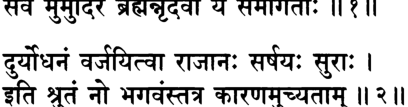

**----- Start of picture text -----** 
^   цщ*м\:  II ? II ^ и r н **----- End of picture text -----** 

_**ьирй-раджовача**_ 

_**аджата-ьиатрос там дрштва раджасуйа-маходайам сарве мумудире брахман нр-дева йе самагатах**_ 

_**дурйодханам варджайитва раджанах саршайах сурах ити трутам но бхагавамс татра каранам учйатам**_ 

_**ьирй-раджа увача**_ — царь (Парикшит) сказал; _**аджата-шатрох**_ — Юдхиштхиры, у которого не было врагов; _**там**_ — это; _**дрштва**_ — видя; _**раджасуйа**_ — жертвоприношения _**раджасуя; маха**_ — велико­ го; _**удайам**_ **—** празднество; _**сарве**_ **—** все; _**мумудире**_ **—** были доволь­ ны; _**брахман**_ **—** о _**брахман**_ (Шукадева); _**нр-девах**_ **—** цари; _**йе**_ **—** кто; _**самагатах**_ — собравшиеся; _**дурйодханам**_ — Дурьйодханы; _**вар­ джайитва**_ — кроме; _**раджанах**_ — с царями; _**са**_ — вместе; _**ршайах**_ — мудрецами; _**сурах**_ **—** и полубогами; _**ити**_ **—** так; _**трутам**_ **—** услы­ шано; _**нах**_ — нами; _**бхагаван**_ — мой господин; _**татра**_ — этому; _**ка­ ранам**_ — причину; _**учйатам**_ — пожалуйста, скажи. 

**Махараджа Парикшит сказал: О** _**брахман,**_ **по твоим словам, все собравшиеся цари, мудрецы и полубоги были счастливы участ­** 

**текст 7]** 

**Унижение Дурьйодханы** 

**171** 

**вовать в великолепном празднестве по поводу жертвоприноше­ ния** _**раджасуя**_ **царя Аджаташатру — все, кроме Дурьйодханы. Пожалуйста, о мой господин, объясни мне, почему.** 

## **ТЕКСТ 3** 

f a r m e r  % ч*1с*н: I ^ щ т : II з II 

_шрй-бадарайанир увача питамахасйа те йаджне раджасуйе махатманах бандхавах паричарйайам тасйасан према-бандханах_ 

_шрй-бадарайаних увача_ — Шри Бадараяни (Шукадева Госвами) сказал; _питамахасйа_ — деда; _те_ — твоего; _йаджне_ — на жертвопри­ ношении; _раджасуйе_ — _раджасуя; маха-атманах_ — великой души; _бандхавах_ — члены семьи; _паричарйайам_ — в смиренном служении; _тасйа_ — ему; _асан_ — были заняты; _према_ — любовью; _бандханах_ — которые были связаны. 

## **Шри Бадараяни сказал: Во время жертвоприношения** _**раджасуя**_ **твоего безгрешного деда все его родственники, связанные с ним узами любви, смиренно служили ему.** 

_КОММЕНТАРИЙ:_ Царь Юдхиштхира никого не принуждал брать на себя ответственность за разные участки служения во вре­ мя жертвоприношения: его родственники добровольно брались за различные дела лишь из любви к нему. 

## **ТЕКСТЫ 4-7** 

Ф тг Ч ^ М в1 Щ #  ФТТЩ^г: ^ тГф т : I ^TfcTt н « и 

ч(Ч?Ч«1 ^Ч^ТТ _ф_ W 4 4 T : II Ч II 

**172** 

**[песнь 10, глава 75** 

## **Шримад-Бхагаватам** 

ж т ^ т г I « i i ^ + ^ i  ^ Ь т т _Ъ_ ^ ^ г ф т ^ т :  II $ II 

P i^ hi w l ^ТН1$тЦ % rRJ I F T 71^ 7Щ: I I \э II 

_бхймо маханасадхйакьио дханадхйакшах суйодханах сахадевас ту пуджайам накуло дравйа-садхане_ 

_гуру-шушруьиане джишнух кршнах падаванеджане паривешане друпада-джа карно дане маха-манах_ 

_йуйудхано викарнаьи ча хардикйо видурадайах бахлйка-путра бхурй-адйа йе ча сантарданадайах_ 

_нирупита маха-йаджне нана-кармасу те тада правартанте сма раджендра раджнах прийа-чикйршавах_ 

_бхймах_ — Бхима; _маханаса_ — за кухней; _адхйакшах_ — присмат­ ривавший; _дхана_ — за сокровищницу; _адхйакшах_ — ответствен­ ный; _суйодханах_ — Суйодхана (Дурьйодхана); _сахадевах_ — Сахадева; _ту_ — и; _пуджайам_ — оказанием почтения (прибывающим гос­ тям); _накулах_ — Накула; _дравйа_ — необходимых вещей; _садхане_ — обеспечением; _гуру_ — почтенным старейшинам; _ьиуьирушане_ — слу­ жением; _джишнух_ — Арджуна; _кршнах_ — Кришна; _пада_ — стоп; _аванеджане_ — омовением; _паривешане_ — раздачей (пищи); _друпададжа_ — дочь Друпады (Драупади); _карнах_ — Карна; _дане_ — раз­ дачей даров; _маха-манах_ — щедрый; _йуйудханах викарнах ча_ — Ююдхана и Викарна; _хардикйах видура-адайах_ — Хардикья (Критаварма), Видура и другие; _бахлйка-путрах_ — сыновья Бахликараджи; _бхури-адйах_ — во главе с Бхуришравой; _йе_ — кто; _ча_ — и; _сантардана-адайах_ — Сантардана и другие; _нирупитах_ — заня­ тые; _маха_ — великом; _йаджне_ — на жертвоприношении; _нана_ — разными; _кармасу_ — обязанностями; _те_ — они; _тада_ — в то вре­ мя; _правартанте сма_ — выполняли; _раджа-индра_ — о лучший из царей (Парикшит); _раджнах_ — царю (Юдхиштхире); _прийа_ — удовольствие; _чикйршавах_ — желая доставить. 

**Бхима отвечал за кухню, Дурьйодхана присматривал за казной, а Сахадева устраивал прием прибывавших гостей. Накула обес­ печивал жрецов всем, что им было нужно, Арджуна заботился о почтенных старейшинах, Кришна омывал всем стопы, Драупади** 

**текст 8]** 

**Унижение Дурьйодханы** 

**173** 

**раздавала** _**прасад**_ **, а щедрый Карна одаривал всех подарками. Мно­ гие другие — Ююдхана, Викарна, Хардикья, Видура, Бхуришрава и другие сыновья Бахлики, Сантардана — также добровольно взяли на себя какие-то обязанности при проведении этого слож­ ного жертвоприношения. О лучший из царей, всеми ими двигало только желание доставить удовольствие Махарадже Юдхиштхире.** 

## **ТЕКСТ 8** 

_ртвик-садасйа-баху-витсу сухрттамеису св-иштешу сунрта-самархана-дакшинабхих чаидйе ча сатвата-патеьи чаранам правиьите чакрус татас те авабхртха-снапанам дйу-надйам_ 

_ртвик_ — жрецам; _садасйа_ — выдающимся членам собрания, ко­ торые помогали в совершении жертвоприношения; _баху-витсу_ — тем, кто обладал обширными познаниями; _сухрт-тамешу_ — и луч­ шим из доброжелателей; _су_ — должным образом; _иьитеьиу_ — бы­ ло оказано почтение; _сунрта_ — приятными речами; _самархана_ — подношениями; _дакьиинабхих_ — и благодарственными дарами; _чаидйе_ — царь Чеди (Шишупала); _ча_ — и; _сатвата-патех_ — Госпо­ да Сатватов (Кришны); _чаранам_ — в стопы; _правиьите_ — войдя; _чакрух_ — они совершили; _татах_ — затем; _т у_ — и; _авабхртхаснапанам_ — омовение _авабхритха_ , которое завершало жертвопри­ ношение; _дйу_ — небес; _надйам_ — в реке (Ямуне). 

**После того как царь Юдхиштхира оказал почести всем жрецам, выдающимся членам собрания, ученым** _**брахманам**_ **и своим самым дорогим друзьям приятными речами, очистительными подноше­ ниями и дорогими подарками, а также после того, как царь Че­ ди вошел в лотосные стопы Господа Сатватов, все они совершили омовение** _**авабхритха**_ **в божественной реке Ямуне.** 

_**КОММЕНТАРИЙ:**_ Среди подарков, которые получили все особые гости царя, были также драгоценные украшения. 

**[песнь 10, глава 75** 

**174** 

**Шримад-Бхагаватам** 

## **ТЕКСТ 9** 

: I 

## **dlRmfti OiRreTfri IIЧII** 

_мрданга-шанкха-панава-дхундхурй-анака-гомукхах вадитрани вичитрани недур авабхртхотсаве_ 

_мрданга_ — барабаны _мриданга; шанкха_ — раковины; _панава_ — барабаны поменьше; _дхундхури_ — особый вид больших воен­ ных барабанов; _анака_ — литавры; _го-мукхах_ — духовой инстру­ мент; _вадитрани_ — музыка; _вичитрани_ — разнообразная; _недух_ — звучала; _авабхртха_ — омовения _авабхритха; утсаве_ — во время празднества. 

**Пока все совершали ритуальное омовение** _**авабхритха**_ **, музы­ канты били в барабаны —** _**мриданги9 панавы9 дхундхури9**_ **литав­ ры — и дули в раковины и рожки.** 

## **ТЕКСТ 10** 

Н1<Ы| т т т т а _щ ._ I **<Jlu||>4ddNl<^4i** _Ъ_ **R w i * l < IIM I** 

_нартакйо нанртур хрьита гайака йутхаиго джагух вйна-вену-талоннадас тешам са дивам аспршат_ 

_нартакйах_ — танцовщицы; _нанртух_ — танцевали; _хрштах_ — охваченные радостью; _гайаках_ — певцы; _йутхаьиах_ — в группах; _джагух_ — пели; _вйна_ — _вин; вену_ — флейт; _тала_ — и ручных таре­ лочек; _уннадах_ — громкий звук; _тешам_ — их; _сах_ — он; _дивам_ — небес; _аспршат_ — коснулся. 

**Танцовщицы, охваченные радостью, танцевали, певцы стройно пели, а звуки** _**вин9**_ **флейт и ручных тарелочек достигали небес.** 

## **ТЕКСТ 11** 

f ^ M ^ 4 d i + i S R ^ H K d i 4 0 :  I 

**ii??n** 

**текст 13]** 

**175** 

**Унижение Дурьйодханы** 

_читра-дхваджа-патакаграир ибхендра-сйанданарвабхих св-аланкртаир бхатаир бхупа нирйайу рукма-малинах_ 

_читра_ — разноцветными; _дхваджа_ — с флагами; _патака_ — и зна­ менами; _аграих_ — великолепными; _ибха_ — со слонами; _индра_ — царственными; _сйандана_ — колесницами; _арвабхих_ — и лошадьми; _су-аланкртаих_ — нарядно украшенными; _бхатаих_ — с пехотинца­ ми; _бху-пах_ — цари; _нирйайух_ — отправились; _рукма_ — золотыми; _малинах_ — с цепями. 

**Затем все цари, у каждого из которых на шее красовалась массивная золотая цепь, отправились на Ямуну. Над ними развева­ лись разноцветные флаги и знамена, и сопровождали их пехотин­ цы и одетые в свои лучшие одежды воины на величавых слонах, на колесницах и лошадях.** 

## **ТЕКСТ 12** 

## **^** 

## _**\ т \ \**_ 

_йаду-срнджайа-камбоджа-куру-кекайа-кошалах кампайанто бхувам саинйаир йаджамана-пурах-сарах_ 

_йаду-срнджайа-камбоджа_ — Ядавы, сринджаи и Камбоджи; _курукекайа-коьиалах_ — Кауравы, кекаи и кошалы; _кампайантах_ — за­ ставив сотрясаться; _бхувам_ — землю; _саинйаих_ — со своими ар­ миями; _йаджамана_ — устроителя жертвоприношения (Махараджу Юдхиштхиру); _пурах-сарах_ — поместив перед собой. 

**Огромные армии Ядавов, Кауравов, сринджаев, Камбоджей, кекаев и кошалов шли вслед за Махараджей Юдхиштхирой, устроителем жертвоприношения, и под ними дрожала земля.** 

## **ТЕКСТ 13** 

## **И?ЗИ** 

_садасйартвиг-двиджа-шрештха брахма-гхошена бхуйаса деварши-питр-гандхарвас туштувух пушпа-варшинах_ 

**[песнь 10, глава 75** 

**176** 

**Шримад-Бхагаватам** 

_садасйа_ — уполномоченные наблюдатели; _ртвик_ — жрецы; _двиджа_ — и _брахманы; шрештхах_ — самые лучшие; _брахма_ — Вед; _гхо­ шена_ — звуками; _бхуйаса_ — громкими; _дева_ — полубоги; _рши_ — святые мудрецы; _питр_ — предки; _гандхарвах_ — и райские певцы; _туштувух_ — возносили хвалу; _пушпа_ — цветы; _варшинах_ — бросая вниз. 

**Представители собрания, жрецы и другие возвышенные** _**брах­ маны**_ **громко читали ведические** _**мантры9**_ **а полубоги, святые муд­ рецы, питы и гандхарвы пели хвалебные гимны и сыпали вниз цветы.** 

**ТЕКСТ 14** 

ЯТГ ЧРЙ I 

**||?*||** 

_св-аланкрта пара нарйо гандха-сраг-бхушанамбараих вилимпантйо ’бхишинчантйо виджахрур вивидхаи расаих_ 

_су-аланкртах_ — нарядно украшенные; _нарах_ — мужчины; _нарйах_ — и женщины; _гандха_ — сандаловой пастой; _срак_ — гирлян­ дами; _бхушана_ — драгоценностями; _амбараих_ — и одеждой; _вилимпантйах_ — нанося; _абхишинчантйах_ — и брызгая; _виджахрух_ — они играли; _вивидхаих_ — разными; _расаих_ — жидкостями. 

**Мужчины и женщины, умащенные сандаловой пастой, с гир­ ляндами, в драгоценностях, наряженные в красивые одежды, резвились, обрызгивая и натирая друг друга разными жидкостями.** 

## **ТЕКСТ 15** 

## **||?Ч1** 

_таила-гораса-гандхода-харидра-сандра-кункумаих пумбхир липтах пралимпантйо виджахрур вара-йошитах_ 

_таила_ — кунжутным маслом; _го-раса_ — йогуртом; _гандха-уда_ — ароматизированной водой; _харидра_ — куркумой; _сандра_ — обильно; 

**текст 16]** 

**177** 

**Унижение Дурьйодханы** 

_кункумаих_ — и порошком киновари; _пумбхих_ — мужчинами; _лип­ тах_ — умащаемые; _пралимпантйах_ — умащая их в ответ; _виджахрух_ — играли; _вара-йошитах_ — куртизанки. 

## **Мужчины обильно умащали куртизанок маслом, йогуртом, аро­ матической водой, куркумой и порошком киновари, а куртизанки в ответ игриво умащали мужчин тем же самым.** 

_КОММЕНТАРИЙ:_ Шрила Прабхупада описывает эту сцену так: «Жители Индрапрастхи, мужчины и женщины, нарядились в яркие одежды, украсили себя гирляндами, надели драгоценности и умас­ тили свои тела цветочными маслами. Они веселились, брызгая друг на друга водой, маслом, молоком и йогуртом, а некоторые даже обмазывали ими друг друга. Так все наслаждались веселым праздником. Эти жидкости, смешанные с куркумой и шафраном, были ярко-желтого цвета. Куртизанки, веселясь, обрызгивали ими мужчин, и мужчины в ответ обрызгивали куртизанок». 

## **ТЕКСТ 16** 

Ш q rf l& w f a f c  4 R fo ^ 4 M i: 

_m \ \_ 

_гупта нрбхир нирагаманн упалабдхум этад девйо йатха диви вимана-вараир нр-девйо та матулейа-сакхибхих паришичйаманах са-врйда-хаса-викасад-ваданй виреджух_ 

_гуптах_ — охраняемые; _нрбхих —_ воинами; _нирагаман_ — они вы­ шли; _упалабдхум_ — увидеть своими глазами; _этат_ — это; _девйах_ — жены полубогов; _йатха_ — как; _диви_ — в небесах; _вимана_ — на своих воздушных кораблях; _вараих_ — великолепные; _нр-девйах_ — жёны (Махараджи Юдхиштхиры); _max_ — они; _матулейа_ — их дво­ юродными братьями по матери (Господом Кришной и Его братья­ ми, такими как Гада и Сарана); _сакхибхих_ — и их друзьями (такими как Бхима и Арджуна); _паришичйаманах_ — обрызгиваемые; _саврйда_ — смущенными; _хаса_ — с улыбками; _викасат_ — цветущие; _ваданах_ — чьи лица; _виреджух_ — они выглядели ослепительно. 

**[песнь 10, глава 75** 

**178** 

**Шримад-Бхагаватам** 

**Окруженные охранниками, жены царя Юдхиштхиры выехали на своих колесницах, чтобы понаблюдать за весельем, так же как и жены полубогов, парившие в небе на своих воздушных кораб­ лях. Их двоюродные братья по матери и близкие друзья брызгали на них разными жидкостями, и лица женщин светились застенчи­ выми улыбками, отчего, и без того прекрасные, они становились еще красивее.** 

_КОММЕНТАРИЙ:_ Двоюродные братья по матери, о которых го­ ворится здесь, — это Господь Кришна и такие Его братья, как Гада и Сарана, а друзья — это Бхима, Арджуна и другие. 

**ТЕКСТ 17** 

_та деваран ута сакхйн сиьиичур дртйбхих клиннамбара виврта-гатра-кучору-мадхйах аутсукйа-мукта-каварач чйавамана-малйах кшобхам дадхур мала-дхийам ручираир вихараих_ 

_max_ — они, царицы; _деваран_ — братьев их мужа; _ута_ — а так­ же; _сакхйн_ — их друзей; _сишичух_ — они брызгали; _дртйбхих_ — из кожаных мешков, наполненных водой; _клинна_ — промокшие; _амбарах_ — чьи платья; _виврта_ — видны; _гатра_ — чьи руки; _куча_ — груди; _уру_ — бёдра; _мадхйах_ — и талии; _аутсукйа_ — от восторга; _мукта_ — растрепавшиеся; _каварат_ — из их кос; _чйавамана_ — вы­ павшие; _малйах_ — чьи маленькие гирлянды; _кшобхам_ — возбужде­ ние; _дадхух_ — они создавали; _мала_ — грязно; _дхийам_ — у тех, чье сознание; _ручираих_ — чарующей; _вихараих_ — своей игрой. 

**Царицы наполнили водой мехи и стали брызгать из них в брать­** 

**ев своего мужа и их друзей. От этого одежды цариц промокли, и стали видны их руки, груди, бедра и талии. Из их кос, растрепав­ шихся от веселья, повыпадали украшавшие их цветы. Подобные игры возбуждают умы тех, чье сознание осквернено.** 

**текст 19]** 

**Унижение Дурьйодханы** 

**179** 

_КОММЕНТАРИЙ:_ Шрила Прабхупада пишет: «Подобные игры мужчин и женщин, сердца которых чисты, приносят им одну ра­ дость, но в тех, чье сознание поражено материальной скверной, они пробуждают похоть». 

## **ТЕКСТ 18** 

## to r f ^ r : ||?C|| 

_са самрад ратхам арудхах сад-ашвам рукма-малинам вйарочата сва-патнйбхих крийабхих крату-рад ива_ 

_сах_ — он; _самрат_ — император, Юдхиштхира; _ратхам_ — на свою колесницу; _арудхах_ — взошедший; _cam_ — великолепны; _ашвам_ — чьи лошади; _рукма_ — золотой; _малинам_ — со сбруей; _вйарочата_ — он сиял; _сва-патнйбхих_ — со своими женами; _крийабхих_ — с этими ритуалами; _крату_ — жертвоприношений; _рат_ — царь _(раджасуя); ива_ — будто. 

**Император, восседавший на своей колеснице, запряженной по­ родистыми лошадьми с золочеными хомутами, блистал в обществе своих жен, так же как блистает великолепное жертвоприношение** _**раджасуя**_ **, сопровождаемое всевозможными ритуалами.** 

_КОММЕНТАРИЙ:_ Царь Юдхиштхира со своими царицами вы­ глядел как олицетворенное жертвоприношение _раджасуя_ с его прекрасными ритуалами. 

## **ТЕКСТ 19** 

_патнй-самйаджавабхртхйаиш чаритва те там ртвиджах ачантам снапайам чакрур гангайам саха кршнайа_ 

_патнй-самйаджа_ — обряд, который совершают вместе устрои­ тель жертвоприношения и его жена, — принесение подношений 

**[песнь 10, глава 75** 

**Шримад-Бхагаватам** 

**180** 

Соме, Тваште, женам некоторых полубогов и Агни; _авабхртхйаих_ — и ритуалы, которые знаменуют завершение жертвоприно­ шения; _чаритва_ — совершив; _те_ — они; _там_ — его; _ртвиджах_ — жрецы; _ачантам_ — прихлебнув воды для очищения; _снапайам чакрух_ — они повели их омыться; _гангайам_ — в Ганге; _саха_ — вместе; _кршнайа_ — с Драупади. 

**Жрецы помогли царю совершить заключительные обряды** _**патни-самьяджа**_ **и** _**авабхритхья**_ **. Затем они попросили его и царицу Драупади сделать** _**ачаман**_ **для очищения и омыться в Ганге.** 

## **ТЕКСТ 20** 

iRoii 

_дева-дундубхайо недур нара-дундубхибхих самом му мучух пушпа-варшани деварши-питр-манавах_ 

_дева_ — полубогов; _дундубхайах_ — литавры; _недух_ — звучали; _па­ ра_ — людей; _дундубхибхих_ — литавры; _самом_ — вместе; _мумучух_ — проливали; _пушпа_ — цветов; _варшани_ — дожди; _дева_ — полубоги; _рши_ — мудрецы; _питр_ — предки; _манавах_ — и люди. 

## **И небожители, и люди били в литавры. Полубоги, мудрецы, предки и люди осыпали всех дождями из цветов.** 

## **ТЕКСТ 21** 

rTrTt Я7П I 

## **i r ?ii** 

_саснус татра татах сарве варнашрама-йута нарах маха-патакй апи йатах садйо мучйета килбишат_ 

_саснух_ — омылись; _татра_ — там; _татах_ — затем; _сарве_ — все; _варна-аьирама_ — к традиционному обществу профессиональных и духовных укладов жизни; _йутах_ — кто принадлежал; _нарах_ — люди; _маха_ — очень; _патакй_ — тот, кто греховен; _апи_ — даже; _йатах_ — отчего; _садйах_ — немедленно; _мучйета_ — может освобо­ диться; _килбишат_ — от скверны. 

**текст 23]** 

**Унижение Дурьйодханы** 

**181** 

**Затем все горожане, принадлежащие к разным** _**варнам**_ **и** _**ашра­ мам**_ **, омылись в том месте, где даже самый безнадежный грешник может смыть с себя все свои грехи.** 

## **ТЕКСТ 22** 

## IRRII 

_атха раджахате кшауме паридхайа св-аланкртах ртвик-садасйа-випрадйн анарчабхаранамбараих_ 

_атха_ — затем; _раджа_ — царь; _ахате_ — неиспользованных; _кшау­ ме_ — пару шелковых одежд; _паридхайа_ — надев; _су-аланкртах_ — украшения; _ртвик_ — жрецов; _садасйа_ — предводителей собрания; _випра_ — _брахманов; адйн_ — и других; _анарча_ — он одарил; _абхарана_ — украшениями; _амбараих_ — и одеждами. 

**Затем царь надел новые шелковые одежды и драгоценные укра­ шения. После этого он оказал почтение жрецам, предводите­ лям собрания, ученым** _**брахманам**_ **и другим гостям, одарив их драгоценностями и нарядами.** 

_КОММЕНТАРИЙ:_ Шрила Прабхупада пишет: «Царь не только об­ лачился в новые одежды и украсил себя драгоценностями, он также преподнес одежды и украшения всем жрецам и другим участникам _ягьи,_ тем самым оказав им почтение». 

## **ТЕКСТ 23** 

^ г : **| нкщи|4<1 ^ г : IR3II** 

_бандхун джнатйн нрпан митра-сухрдо ’нйамьи ча сарвашах абхйкшнам пуджайам аса нйрййана-паро нрпах_ 

_бандхун_ — дальним родственникам; _джнатйн_ — своим близким родственникам; _нрпан_ — царям; _митра_ — своим друзьям; _сухрдах_ — и доброжелателям; _анйан_ — другим; _ча_ — также; _сарвашах_ — все­ ми возможными способами; _абхйкшнам_ — постоянно; _пуджайам аса_ — поклонялся; _нарайана-парах_ — преданный Господу Нараяне; _нрпах_ — царь. 

**Шримад-Бхагаватам [песнь 10, глава 75** 

**182** 

**Царь Юдхиштхира, посвятивший всю свою жизнь служению Господу Нараяне, вновь и вновь самыми разными способами ока­ зывал почтение своим близким и дальним родственникам, другим царям, друзьям и доброжелателям и всем остальным гостям.** 

## **ТЕКСТ 24** 

**----- Start of picture text -----** 
i h t : **----- End of picture text -----** 

_**ъ чФ ю :**_ **ЧН'М К'ИЧ! IR«II** 

_сарве джанах сура-руно мани-кундала-срагушнйша-канчука-дукула-махаргхйа-харах нарйаш ча кундала-йугалака-врнда-джуштавактра-шрийах канака-мекхалайа виреджух_ 

_сарве_ — все; _джанах_ — люди; _сура_ — как полубоги; _рунах_ — чьи сияющие тела; _мани_ — драгоценными; _кундала_ — с серьгами; _срак_ — цветочными гирляндами; _ушнйша_ — тюрбанами; _канчука_ — в жилетах; _дукула_ — шелковых одеждах; _маха-аргхйа_ — очень до­ рогих; _харах_ — и жемчужных ожерельях; _нарйах_ — женщины; _ча_ — и; _кундала_ — серег; _йуга_ — парами; _алака-врнда_ — и локо­ нами; _джушта_ — украшена; _вактра_ — чьих лиц; _шрийах_ — кра­ сота; _канака_ — золотыми; _мекхалайа_ — с поясами; _виреджух_ — ослепительно сверкали. 

**Все собравшиеся на** _**ягью**_ **сияли, словно полубоги. В ушах у них сверкали драгоценные серьги. На всех были гирлянды и драгоцен­ ные жемчужные ожерелья, расшитые жилеты, тюрбаны и шел­ ковые** _дхоти_ **. Прекрасные лица женщин казались еще красивее в обрамлении драгоценных серег и локонов. Талии их были перехвачены золотыми поясами.** 

## **ТЕКСТЫ 25-26** 

_**it**_ « ч и н е  мччп 

**текст 27]** 

**Унижение Дурьйодханы** 

**183** 

## ^ d l W 4 ^ l 4 F rarR ifa IR5II 

_атхартвиджо маха-шйлах садасйа брахма-вадинах брахма-кшатрийа-вит-шудра раджано йе самагатах_ 

_деварши-питр-бхутани лока-палах саханугах пуджитас там ануджнапйа сва-дхамани йайур нрпа_ 

_атха_ — затем; _ртвиджах_ — жрецы; _маха-шйлах_ — добродетель­ ные; _садасйах_ — официальные лица церемонии; _брахма_ — Вед; _вадинах_ — знатоки; _брахма_ — _брахманы; кшатрийа_ — _кшатрии; вит_ — _вайшьи; шудрах_ — и _шудры; а джанах_ — цари; _йе_ — которые; _самагатах_ — прибыли; _дева_ — полубоги; _рши_ — мудрецы; _питр_ — предки; _бхутани_ — и духи; _лока_ — планет; _палах_ — правители; _са­ ха_ — вместе; _анугах_ — со свитами; _пуджитах_ — которым были ока­ заны почести; _там_ — у него; _ануджнапйа_ — испросив позволение; _сва_ — в свои; _дхамани_ — обители; _йайух_ — они отправились; _нрпа_ — о царь (Парикшит). 

**Затем ученые жрецы, великие знатоки Вед, которые следили за проведением жертвоприношения, приглашенные на** _ягью_ **цари,** _брахманы_ , _кшатрии_ , _вайшьи_ , _шудры_ , **полубоги, мудрецы, предки и бхуты — все они, о царь, получив от царя Юдхиштхиры подоба­ ющие почести и испросив у него позволение, возвратились в свои обители.** 

## **ТЕКСТ 27** 

IR^II 

_хари-дасасйа раджарше раджасуйа-маходайам наиватрпйан прашамсантах пибан мартйо \мртам йатха_ 

_хари_ — Господа Кришны; _дасасйа_ — слуги; _раджа-ршех_ — свято­ го царя; _раджасуйа_ — жертвоприношения _раджасуя; маха-удайам_ — великое празднество; _на_ — не; _эва_ — в самом деле; _атрпйан_ — они насытились; _прашамсантах_ — прославляя; _пибан_ — пьющий; _мартйах_ — смертный; _амртам_ — нектар бессмертия; _йатха_ — как. 

**Шримад-Бхагаватам [песнь 10, глава 75** 

**184** 

**Прославляя удивительное жертвоприношение** _**раджасуя**_ **, кото­ рое совершил царь — великий святой слуга Господа Хари, — они никак не могли насытиться, подобно тому как простой смертный никогда не может пресытиться нектаром бессмертия.** 

## **ТЕКСТ 28** 

**rRTt 7ГЯТ** йщт РНКЧ1ЧЖ f™T Н4Н1+И<: _т с \ \_ 

_тато йудхиштхиро раджа сухрт-самбандхи-бандхаван премна нивйрайам аса кршнам ча тйага-катарах_ 

_татах_ — затем; _йудхиштхирах раджа_ — царь Юдхиштхира; _сухрт_ — своих друзей; _самбандхи_ — членов семьи; _бандхаван_ — и родственников; _премна_ — из любви; _ниварайам аса_ — остано­ вил их; _кршнам_ — Господа Кришну; _ча_ — и; _тйага_ — разлукой; _катарах_ — опечаленный. 

**В это время Раджа Юдхиштхира попросил погостить еще не­ скольких своих друзей, близких и дальних родственников. Среди них был и Господь Кришна. Из любви к ним Юдхиштхира не мог позволить им уехать, так как близость разлуки причиняла ему боль.** 

## **ТЕКСТ 29** 

## _Щ Щ Щ_ **«IH U C te IR<UI** 

_бхагаван апи татранга нйаватсйт тат-прийам-карах прастхапйа йаду-вйрамш ча самбадймш ча кушастхалйм_ 

_бхагаван_ — Верховный Господь; _апи_ — и; _татра_ — там; _анга_ — мой дорогой (царь Парикшит); _нйаватсйт_ — оставался; _тат_ — для его (Юдхиштхиры); _прийам_ — удовольствия; _карах_ — дейст­ вуя; _прастхапйа_ — послав; _йаду-вйран_ — героев рода Яду; _ча_ — и; _самба-адйн_ — во главе с Самбой; _ча_ — и; _кушастхалйм_ — в Двараку. 

**текст 30]** 

**Унижение Дурьйодханы** 

**185** 

**Дорогой Парикшит, чтобы доставить удовольствие царю, Вер­ ховный Господь, отослав в Двараку Самбу и других героев рода Яду, остался погостить в Индрапрастхе.** 

## **ТЕКСТ 30** 

_Т гЧ_ **7ГЯТ I** IRoll 

_иттхам раджа дхарма-суто маноратха-махарнавам су-дустарам самуттйрйа кршненасйд гата-джварах_ 

_иттхам_ — таким образом; _раджа_ — царь; _дхарма_ — повелителя религии (Ямараджи); _сутах_ — сын; _манах-ратха_ — его желаний; _маха_ — огромный; _арнавам_ — океан; _су_ — очень; _дустаром_ — труд­ нопреодолимый; _самуттйрйа_ — успешно преодолев; _кршнена_ — с помощью Господа Кришны; _асйт_ — он стал; _гата-джварах_ — свободным от своей лихорадки. 

**Так царь Юдхиштхира, сын Дхармы, освободился от сжигавше­ го его изнутри заветного желания, переправившись с помощью Господа Кришны на другую сторону огромного и труднопреодо­ лимого океана своих желаний.** 

_КОММЕНТАРИЙ:_ В предыдущих главах «Шримад-Бхагаватам» подробно объяснялось, что царь Юдхиштхира горел желанием про­ демонстрировать всему миру высшее положение Кришны, Верхов­ ной Личности Бога, и те преимущества, которые получает тот, кто предан Ему. Только ради этого царь Юдхиштхира совершил очень сложное жертвоприношение _раджасуя_ . 

В связи с этим Шрила Прабхупада пишет: «В материальном ми­ ре каждый стремится осуществить все свои желания, но никому и никогда не удавалось добиться этого. Однако царь Юдхиштхи­ ра, благодаря своей непоколебимой преданности Кришне, смог со­ вершить жертвоприношение _раджасуя,_ в результате чего все его желания исполнились. Из описания _раджасуя-ягъи_ ясно, что она подобна великому океану трудноосуществимых желаний. Обычный человек не способен преодолеть этот океан, но царь Юдхиштхира милостью Господа Кришны смог легко пересечь его и тем самым освободился от всех тревог». 

**Шримад-Бхагаватам [песнь 10, глава 75** 

**186** 

## **ТЕКСТ 31** 

## **-чь^нсчн:** _**\ т \**_ 

_экадантах-пуре тасйа вйкьийа дурйодханах ьирийам атапйад раджасуйасйа махитвам чачйутатманах_ 

_экада_ — однажды; _антах-пуре_ — во дворце; _тасйа_ — его (ца­ ря Юдхиштхиры); _вйкьийа_ — созерцая; _дурйодханах_ — Дурьйодха­ на; _ьирййам_ — богатство; _атапйат_ — он страдал; _раджасуйа­ сйа_ — жертвоприношения _раджасуя; махитвам_ — величие; _ча_ — и; _ачйута-атманах_ — его (царя Юдхиштхиры), чьей душой был Господь Ачьюта. 

**Однажды Дурьйодхана, бродя по роскошному дворцу царя Юд­ хиштхиры, чьей душой был Господь Ачьюта, ощутил мучитель­ ный укол зависти к царю, которому удалось провести такое пышное жертвоприношение** _**раджасуя.**_ 

## **ТЕКСТ 32** 

cJTfa: 4 t f N ^ 4 M ^ d l 4 r i ^ ЙЧтЬеКЧ: нззи 

_йасмимс нарендра-дитиджендра-сурендра-лакьимйр нам а вибханти кила виьива-срджопаклптах табхих патйн друпада-раджа-сутопатастхе йасйам виьиакта-хрдайах куру-рад атапйат_ 

_йасмин_ — в котором (во дворце); _нара-индра_ — царей среди лю­ дей; _дитиджа-индра_ — царей демонов; _сура-индра_ — и царей полу­ богов; _лакьимйх_ — богатства; _нана_ — разнообразные; _вибханти_ — были проявлены; _кила_ — несомненно; _виьива-срджа_ — архитекто­ ром вселенной (Майей Данавой); _упаклптах_ — обеспеченные; _табхих_ — с ними; _патйн_ — своим мужьям, Пандавам; _друпадараджа_ — царя Друпады; _сута_ — дочь, Драупади; _упатастхе_ — 

**текст 33]** 

**187** 

**Унижение Дурьйодханы** 

служила; _йасйам_ — к кому; _вишакта_ — привязано; _хрдайах_ — чье сердце; _куру-рат_ — царевич рода Куру, Дурьйодхана; _атапйат_ — сокрушался. 

**В том дворце были собраны все богатства, которыми владеют земные цари, а также повелители демонов и полубогов. Собрал их там искуснейший конструктор этой вселенной, Майя Данава. Всеми этими богатствами Драупади служила своим мужьям, Пандавам, и Дурьйодхана, царевич рода Куру, не мог вынести этого, так как его очень влекло к ней.** 

## **ТЕКСТ 33** 

_**\ \ т \**_ 

_йасмин тада мадху-патер махишй-сахасрам ьиронй-бхарена шанакаих кванад-ангхри-шобхам мадхйе су-чару куча-кункума-ьиона-харам шрйман-мукхам прачала-кундала-кунталадхйам_ 

_йасмин_ — в котором; _тада_ — в то время; _мадху_ — Матхуры; _патех_ — Господа; _махишй_ — цариц; _сахасрам_ — тысячи; _шронй_ — их бедер; _бхарена_ — под весом; _шанакаих_ — медленно; _кванат_ — зве­ нящие; _ангхри_ — на чьих стопах: _шобхам_ — очарование; _мадхйе_ — посередине (в талии); _су-чару_ — очень привлекательные; _куча_ — с их грудей; _кункума_ — от порошка _кункумы; шона_ — крас­ ные; _харам_ — чьи жемчужные ожерелья; _шрй-мат_ — прекрасные; _мукхам_ — чьи лица; _прачала_ — движущимися; _кундала_ — серьгами; _кунтала_ — и локонами; _адхйам_ — украшенные. 

**Тысячи цариц Господа Мадхупати также гостили в это время во дворце. Их бедра были так тяжелы, что они степенно ходи­ ли по дворцу, и колокольчики на их стопах нежно звенели. Их талии были очень тонкими,** _**кункума**_ **с их грудей окрашивала их жемчужные ожерелья в красный цвет, а раскачивающиеся серь­ ги и струящиеся локоны делали их лица, и без того прекрасные, еще прекраснее.** 

**[песнь 10, глава 75** 

**188** 

**Шримад-Бхагаватам** 

_КОММЕНТАРИЙ:_ Шрила Прабхупада пишет: «Когда Дурьйодхана увидел во дворце царя Юдхиштхиры таких красавиц, его охвати­ ла зависть и вожделение. Его зависть и вожделение были особен­ но сильны, когда Дурьйодхана смотрел на Драупади, поскольку он воспылал к ней страстью еще до того, как она вышла замуж за Пандавов. Дурьйодхана тоже присутствовал на _сваямваре_ Драупа­ ди, когда она выбирала себе жениха. Как и другие царевичи, он был пленен ее красотой, но не смог добиться ее руки». 

## **ТЕКСТЫ 34-35** 

iR4ii 

_сабхайам майа-клптайам квапи дхарма-суто ’дхират врто ’нугаир бандхубхиш на кршненапи сва-чакшуша_ 

_асйнах канчане сакшад асане магхаван ива парамештхйа-ьирийа джуштах стуйаманаш ча вандибхих_ 

_сабхайам_ — в зале собраний; _майа_ — Майей Данавой; _клптайам_ — построенном; _ква апи_ — как-то раз; _дхарма-сутах_ — сын Ямараджи (Юдхиштхира); _адхират_ — император; _вртах_ — окруженный; _анугаих_ — своими спутниками; _бандхубхих_ — члена­ ми семьи; _ча_ — и; _кршнена_ — Господом Кришной; _апи_ — так­ же; _сва_ — его; _чакшуша_ — глаз; _асйнах_ — восседавший; _канчане_ — золотом; _сакшат_ — лично; _асане_ — на троне; _магхаван_ — Гос­ подь Индра; _ива_ — словно; _парамештхйа_ — Брахмы, или верхов­ ной власти; _шрийа_ — богатствами; _джуштах_ — сопровождаемый; _стуйаманах_ — прославляемый; _ча_ — и; _вандибхих_ — придворными поэтами. 

**Однажды император Юдхиштхира, сын Дхармы, словно Господь Индра, восседал на своем золотом троне в зале собраний, постро­ енном Майей Данавой. Рядом с ним находились его слуги и члены семьи, а также Господь Кришна — глаз Юдхиштхиры. Великоле­ пие царя Юдхиштхиры было сравнимо только с великолепием Господа Брахмы, и придворные поэты пели ему хвалу.** 

**текст 37]** 

**189** 

**Унижение Дурьйодханы** 

_КОММЕНТАРИЙ:_ Шрила Шридхара Свами объясняет, что Госпо­ да Кришну называют здесь глазом Юдхиштхиры, потому что Он советовал царю, что будет для него хорошо, а что — нет. 

## **ТЕКСТ 36** 

^ П Т Г Ч Й Ч М Щ Р Ц Т  I 

_татра дурйодхано манй парйто бхратрбхир нрпа кирйта-малй нйавишад аси-хастах кьиипан руша_ 

_татра_ — там; _дурйодханах_ — Дурьйодхана; _манй_ — гордый; _па рйтах_ — окруженный; _бхратрбхих_ — своими братьями; _нрпа_ — о царь; _кирйта_ — в короне; _малй_ — и с драгоценным ожерельем; _нйавишат_ — вошел; _аси_ — с мечом; _хастах_ — в руке; _кшипан_ — оскорбляя (привратников); _руша_ — злобно. 

**О царь, гордец Дурьйодхана, в короне и драгоценном ожерелье, с мечом в руке, вне себя от негодования вошел во дворец вместе с братьями. На входе он осыпал бранью привратников.** 

_КОММЕНТАРИЙ:_ Шрила Прабхупада пишет, что Дурьйодхана, «всегда завистливый и раздражительный, из-за пустяка разразился бранью на стражей и разгневался еще больше». 

## **ТЕКСТ 37** 

## ^ T F P w M f tr T : ИЗ'ЭН 

_стхале 'бхйагрхнад вастрантам джалам матва стхале упатат джале ча стхала-вад бхрантйа майа-майа-вимохитах_ 

_стхале_ — на твердом полу; _абхйагрхнат_ — он поднял; _вастра_ — своей одежды; _антам_ — концы; _джалам_ — за воду; _матва_ — приняв; _стхале_ — а в другом месте; _апатат_ — он упал; _джале_ — в воду; _ча_ — и; _стхала_ — твердый пол; _ват_ — словно; _бхрантйа_ — иллю­ зией; _майа_ — Майи Данавы; _майа_ — магией; _вимохитах_ — сбитый с толку. 

**Шримад-Бхагаватам [песнь 10, глава 75** 

**190** 

**Введенный в заблуждение иллюзией, сотворенной Майей Данавой, Дурьйодхана принял твердый пол за воду и приподнял по­ лы своей одежды. В другом месте он свалился в воду, приняв ее за пол.** 

## **ТЕКСТ 38** 

**Ф ТЖ ^ I** PH l44|U |l w f^IT^Ttf^TT: 11ЗД1 

_джахаса бхймас там дрштва стрийо нрпатайо ’паре ниварйамана апй анга раджна кршнанумодитах_ 

_джахаса_ — рассмеялся; _бхймах_ — Бхима; _там_ — его; _дрштва_ — видя; _стрийах_ — женщины; _нр-патайах_ — цари; _апаре_ — и другие; _ниварйаманах_ — останавливаемые; _апи_ — даже хотя; _анга_ — мой дорогой (Парикшит); _раджна_ — царем (Юдхиштхирой); _кршна_ — Господом Кришной; _анумодитах_ — одобренные. 

**Дорогой Парикшит, увидев это, Бхима рассмеялся, и его при­ меру последовали женщины, цари и все остальные. Царь Юдхиш­ тхира попытался остановить их, однако Господь Кришна выразил им Свое одобрение.** 

_КОММЕНТАРИЙ:_ Шрила Вишванатха Чакраварти пишет, что царь Юдхиштхира попытался остановить их смех, бросая взгляды на Бхиму и женщин. Господь Кришна, однако, выражал Свое одоб­ рение движением бровей. Господь пришел на Землю, чтобы изба­ вить ее от бремени злодеев-царей, и этот случай, безусловно, был на руку Господу. 

## **ТЕКСТ 39** 

rjroff w f t  J M I W I f t _\ m \ \_ 

**текст 40]** 

**191** 

**Унижение Дурьйодханы** 

_са врйдито 'ваг-вадано руша джвалан нишкрамйа тушнйм прайайау гаджахвайам ха-хети шабдах су-махан абхут сатам аджата-ьиатрур вимана ивабхават бабхува тушнш 1 бхагаван бхуво бхарам самуджджихйршур бхрамати сма йад-дрша_ 

_сах_ — он, Дурьйодхана; _врйдитах_ — сконфуженный; _авак_ — опу­ щено; _ваданах_ — чье лицо; _руша_ — от гнева; _джвалан_ — сгорая; _нишкрамйа_ — выходя; _тушнйм_ — молча; _прайайау_ — он отправил­ ся; _гаджа-ахвайам_ — в Хастинапур; _ха-ха ити_ — «увы, увы»; _шаб­ дах_ — звук; _су-махан_ — очень громкий; _абхут_ — поднялся; _сатам_ — святых людей; _аджата-ьиатрух_ — царь Юдхиштхира; _виманах_ — удрученный; _ива_ — несколько; _абхават_ — стал; _бабхува_ — был; _туш­ нйм_ — молчалив; _бхагаван_ — Верховный Господь; _бхувах_ — Земли; _бхарам_ — бремя; _самуджджихйршух_ — желая уничтожить; _бхра­ мати сма_ — (Дурьйодхана) перепутал; _йат_ — от чьего; _дрша_ — взгляда. 

**Униженный и разъяренный, Дурьйодхана опустил голову и, не проронив ни слова, вышел из дворца и отправился в Хастина­ пур.** _Садху,_ **присутствовавшие при этом, стали громко восклицать «Увы, увы!», а царь Юдхиштхира немного огорчился. Однако Вер­ ховный Господь, который одним Своим взглядом ввел в заблуж­ дение Дурьйодхану, молчал, поскольку хотел облегчить бремя Земли.** 

_КОММЕНТАРИЙ:_ Шрила Прабхупада пишет: «Когда Дурьйодха­ на в гневе удалился, все, и особенно царь Юдхиштхира, пожале­ ли о том, что произошло. И только Кришна хранил молчание. Он не выразил ни сожаления, ни радости по поводу случившегося. Очевидно, что Дурьйодхана оказался во власти иллюзии по воле Самого Господа Кришны, и с тех пор между двумя ветвями ро­ да Куру началась непримиримая вражда. Все это было частью за­ мысла Кришны, который пришел на Землю, чтобы избавить ее от непосильного бремени». 

## **ТЕКСТ 40** 

IIVoM 

**192** 

## **Шримад-Бхагаватам** 

_этат те ’бхихитам раджан йат пршто ’хам иха твайа суйодханасйа дауратмйам раджасуйе маха-кратау_ 

_этат_ — это; _те_ — тебе; _абхихитам_ — поведано; _раджан_ — о царь; _йат_ — что; _прштах_ — спрошено; _ахам_ — я; _иха_ — в связи с этим; _твайа_ — тобой; _суйодханасйа_ — Суйодханы (Дурьйодханы); _дау­ ратмйам_ — неудовлетворенность; _раджасуйе_ — во время _раджасуи; маха-кратау_ — великого жертвоприношения. 

**О царь, я ответил на твой вопрос. Вот почему Дурьйодхана был так недоволен великим жертвоприношением** _**раджасуя**_ **.** 

_Так заканчивается комментарий смиренных слуг А. Ч. Бхактиведанты Свами Прабхупады к семьдесят пятой главе Десятой песни «Шримад-Бхагаватам_ », _которая называется «Унижение Дурьйодханы»._ 

# **ГЛАВА СЕМЬДЕСЯТ ШЕСТАЯ** 

# **Битва м еж ду Ш алвой и Вриш ни** 

В этой главе рассказывается, как демон Шалва заполучил огром­ ный, наводящий на всех ужас воздушный корабль и, восседая на нем, напал на членов рода Вришни в Двараке. Здесь также расска­ зывается, как во время последовавшей за этим битвы Прадьюмну увезли с поля боя. 

Шалва был одним из царей, которые потерпели поражение во время свадьбы Рукмини. Поклявшись, что избавит Землю от Яда­ вов, Шалва стал поклоняться Господу Шиве, совершая суровую ас­ кезу: каждый день он съедал только пригоршню пыли. Через год Шива предстал перед Шалвой и спросил, какого благословения тот хочет. Шалва попросил у Шивы воздушный корабль, который мог летать повсюду и который наводил бы ужас на полубогов, демонов и людей. Господь Шива согласился и велел Майе Данаве постро­ ить для Шалвы летающий железный город под названием Саубха. Шалва отправился на нем в Двараку и со своей огромной армией осадил ее. Со своего корабля Шалва сбрасывал на Двараку стволы деревьев, валуны и другие метательные снаряды. Он также создал огромный смерч, который застлал все небо пылью. 

Когда Прадьюмна, Сатьяки и другие герои рода Яду увидели, в каком состоянии оказалась Дварака и ее обитатели, они всту­ пили в сражение с Шалвой и его армией. Прадьюмна, лучший из воинов, своим божественным оружием уничтожил все колдовство Шалвы и сам ввел Шалву в заблуждение. Корабль Шалвы стал хао­ тично передвигаться по земле, по небу и по вершинам гор. Однако затем воин Шалвы по имени Дьюман ударил Прадьюмну палицей в грудь, и тогда колесничий Прадьюмны, решив, что его хозяин тяжело ранен, увез его с поля боя. Но Прадьюмна очень быстро пришел в себя и строго отчитал своего колесничего. 

**193** 

**194** 

**[песнь 10, гл. 76** 

**Шримад-Бхагаватам** 

## **ТЕКСТ 1** 

## ^ ч ч №т :  и ? и 

_шрй-шука увача атханйад апи кршнасйа шрну кармадбхутам нрпа крйда-нара-ьиарйрасйа йатха саубха-патир хатах_ 

_ьирй-ьиуках увача_ — Шукадева Госвами сказал; _атха_ — теперь; _анйат_ — о другом; _апи_ — однако; _кршнасйа_ — Господа Кришны; _шрну_ — пожалуйста, послушай; _карма_ — о деянии; _адбхутам_ — уди­ вительном; _нрпа_ — о царь; _крйда_ — для игр; _пара_ — как у человека; _игарйрасйа_ — чье тело; _йатха_ — как; _саубха-патих_ — повелитель Саубхи (Шалва); _хатах_ — убит. 

**Шукадева Госвами сказал: А теперь, о царь, послушай еще об одном славном деянии Господа Кришны, который пришел в этот мир в облике человека, чтобы наслаждаться Своими транс­ цендентными играми. Послушай же, как Он убил повелителя Саубхи.** 

## **ТЕКСТ 2** 

ч11г^1 3TFRT: I II _Ч_ II 

_шиьиупала-сакхах шалво рукминй-удваха агатах йадубхир нирджитах санкхйе джарасандхадайас татха_ 

_шишупала-сакхах_ — друг Шишупалы; _шалвах_ — по имени Шал­ ва; _рукминй-удвахе_ — на свадьбу Рукмини; _агатах_ — пришедший; _йадубхих_ — Ядавами; _нирджитах_ — побежденный; _санкхйе_ — в бит­ ве; _джарасандха-адайах_ — Джарасандха и другие; _татха_ — также. 

**Шалва был другом Шишупалы. Когда он приехал на свадьбу Рукмини, воины рода Яду победили его в битве, как и Джарасан­ дху и других царей.** 

**текст 5]** 

**Битва между Шалвой и Вришни** 

**195** 

## **ТЕКСТ 3** 

**w r . i ЗГОЩЧТ £ЧТ + М Ч^Ч** _**ТЩ**_ **4FRT II 3 II** 

_ьиалвах пратиджнам акароч чхрнватам сарва-бхубхуджам айадавам кьимам каришйе паурушам мама пашйата_ 

_шалвах_ — Шалва; _пратиджнам_ — клятву; _акарот_ — дал; _шрнва­ там_ — пока они слушали; _сарва_ — все; _бху-бхуджам_ — цари; _айа­ давам_ — свободной от Ядавов; _кьимам_ — Землю; _каришйе_ — я сде­ лаю; _паурушам_ — на доблесть; _мама_ — мою; _пашйата_ — взгляните. 

**Перед всеми царями Шалва поклялся: «Я избавлю Землю от Ядавов. Узрите же мою отвагу!»** 

## **ТЕКСТ 4** 

Jrfcf _щ щ_ Ч ^Ч Й I з т к т ч т т ^ т : и * н 

_ити мудхах пратиджнайа девам пашу-патим прабхум арадхайам аса нрпах памьиу-муштим сакрд грасан_ 

_ити_ — с этими словами; _мудхах_ — глупец; _пратиджнайа_ — по­ клявшись; _девам_ — Господу; _пашу-патим_ — Шиве, защитнику лю­ дей, подобных животным; _прабхум_ — своему господину; _арадхайам аса_ — поклонялся; _нрпах_ — царь; _памшу_ — пыли; _муштим_ — горсть; _сакрт_ — единожды (в день); _грасан_ — съедая. 

**Дав эту клятву, глупый царь стал поклоняться Господу Пашупати [Шиве]. Каждый день он съедал только одну пригоршню пыли.** 

## **ТЕКСТ 5** 

ч ч ч н т ^ й ч ч ч т ч fa : I 

cRul ^ ^ Ч Т Ч Ш ЯНГ'» ЯКи1*Н*1с1*1 II Ч II 

**[песнь 10, гл. 76** 

**196** 

**Шримад-Бхагаватам** 

_самватсаранте бхагаван ашу-тоьиа ума-патих варена ччхандайам аса шалвам таранам агатам_ 

_самватсара_ — года; _анте_ — на исходе; _бхагаван_ — великий Гос­ подь; _ашу-тошах_ — тот, кого легко удовлетворить; _ума-патих_ — господин Умы; _варена_ — с благословением; _чхандайам аса_ — пред­ ложил ему выбрать; _шалвам_ — Шалве; _таранам_ — за прибежищем; _агатам_ — обратившемуся. 

**Великий Господь Умапати славится тем, что его легко удовле­ творить. Однако прошел целый год, прежде чем он согласился да­ ровать Шалве, обратившемуся к нему за покровительством, любое благословение, какого тот пожелает.** 

_КОММЕНТАРИЙ:_ Шалва поклонялся Господу Шиве, который из­ вестен как Ашутоша, «тот, кого легко удовлетворить». Однако Гос­ подь Шива не приходил к Шалве целый год, поскольку, будучи _бхагаваному_ великим всеведущим полубогом, он понимал, что лю­ бое благословение, данное врагу Господа Кришны, будет бесполез­ ным. Тем не менее, поскольку Шалва обратился к Господу Шиве за покровительством (что выражено здесь словами _таранам агатам_ ), Господь Шива, чтобы не нарушить установленный принцип, со­ гласно которому поклоняющийся должен получить благословение, решил исполнить желание Шалвы. 

## **ТЕКСТ 6** 

## _**зШ ^**_ ч н и * и 

_девасура-манушйанам гандхарворага-ракшасам абхедйам кама-гам вавре са йанам вршни-бхйшанам_ 

_дева_ — полубогами; _асура_ — демонами; _манушйанам_ — и людьми; _гандхарва_ — гандхарвами; _урага_ — райскими змеями; _ракшасам_ — и ракшасами; _абхедйам_ — неразрушимый; _кама_ — по желанию; _гам_ — путешествующий; _вавре_ — выбрал; _сах_ — он; _йанам_ — ко­ рабль; _вршни_ — на Вришни; _бхйшанам_ — наводящий ужас. 

**Шалва попросил для себя воздушный корабль, который не мог­ ли бы уничтожить ни полубоги, ни демоны, ни люди, ни гандхар-** 

**текст 8]** 

**197** 

**Битва между Шалвой и Вришни** 

**вы, ни ураги, ни ракшасы. Корабль этот должен был летать всюду, куда бы ни пожелал Шалва, и наводить ужас на род Вришни.** 

## **ТЕКСТ 7** 

rT^fcT _ч ч :_ I ^ fc q fa  iJIH N и « и 

_татхети гиришадиьито майах пара-пурам-джайах пурам нирмайа ьиалвайа прадат саубхам айас-майам_ 

_татха_ — да будет так; _ити_ — сказав так; _гири-ига_ — Господа Ши­ вы; _адиьитах_ — по указанию; _майах_ — Майя Данава; _пара_ — вра­ жеские; _пурам_ — города; _джайах_ — который побеждает; _пурам_ — город; _нирмайа_ — создав; _ьиалвайа_ — Шалве; _прадат_ — он дал; _сау­ бхам_ — называемый Саубха; _айах_ — из железа; _майам_ — сделанный. 

**Господь Шива сказал: «Будь по-твоему». По его указанию Майя Данава, который завоевывает крепости своих врагов, создал летающий железный город — Саубху — и подарил его Шалве.** 

## **ТЕКСТ 8** 

_са лабдхва кама-гам йанам тамо-дхама дурасадам йайау двараватйм ьиалво ваирам врьини-кртам смаран_ 

_сах_ — он; _лабдхва_ — обретя; _кама-гам_ — движущийся по жела­ нию; _йанам_ — корабль; _томах_ — тьмы; _дхама_ — обитель; _дураса­ дам_ — неприступный; _йайау_ — отправился; _двараватйм_ — в Два­ раку; _ьиалвах_ — Шалва; _ваирам_ — враждебность; _вригни-кртам_ — проявленную Вришни; _смаран_ — помня. 

**В этом неприступном корабле царил мрак. Он мог перемещать­ ся повсюду. Получив его, Шалва сразу же отправился в Двараку, ибо помнил о вражде, которую питали к нему Вришни.** 

**[песнь 10, гл. 76** 

**198** 

# **Шримад-Бхагаватам** 

## **ТЕКСТЫ 9-11** 

£ R # T  ЦЖ1<1$М Н№<Ы: I й е к К ^ 1 W ^ r :  IIM I 

f ^ n ^ T T ^ R ^ :  ^rcf зтшт^ г4 тг: I f^r: _**\ \ m**_ 

_нирудхйа сенайа ьиалво махатйа бхаратарьиабха пурйм бабханджопаванан удйанани ча сарвашах_ 

_са-гопурани дварани прасадаттала-толиках вихаран са виманагрйан нипетух ьиастра-врштайах_ 

_ьиила-друмаьи чаьйанайах сарпа асара-ьиаркарах прачандаш чакравато ’бхуд раджасаччхадита битах_ 

_нирудхйа_ — осадив; _сенайа_ — с армией; _ьиалвах_ — Шалва; _ма­ хатйа_ — большой; _бхарата-ршабха_ — о лучший из рода Бхараты; _пурйм_ — город; _бабханджа_ — разгромил; _упаванан_ — парки; _удйанани_ — сады; _ча_ — и; _сарваьиах_ — вокруг; _са-гопурани_ — с баш­ нями; _дварани_ — и воротами; _прасада_ — особняки; _аттала_ — смотровые башни; _толиках_ — и крепостные стены; _вихаран_ — места для отдыха; _сах_ — он, Шалва; _вимана_ — из воздушных ко­ раблей; _агрйат_ — с лучшего; _нипетух_ — падали; _ьиастра_ — сна­ рядов; _врштайах_ — потоки; _ьиила_ — камни; _друмах_ — и деревья; _ча_ — также; _аьианайах_ — молнии; _сарпах_ — змеи; _асара-ьиаркарах_ — и град; _прачандах_ — сильный; _чакраватах_ — смерч; _абхут_ — под­ нялся; _раджаса_ — пылью; _аччхаддитах_ — покрыты; _диьиах_ — все стороны света. 

**О лучший из рода Бхараты, со своей огромной армией Шал­ ва осадил город, уничтожив разбитые вокруг него парки и сады, дворцы и смотровые башни, ворота и крепостные стены, а также места отдыха для жителей. Со своего удивительного корабля он обрушивал вниз потоки снарядов: камни, бревна, молнии, змей, куски льда. Поднялся сильный вихрь, который застлал все небо пылью.** 

**текст 15]** 

**199** 

**Битва между Шалвой и Вришни** 

## **ТЕКСТ 12** 

## ^ т » 2 4 ^ т _i i_ ЧЧТ ll?*ll 

_итй ардйамана саубхена крьинасйа нагарй бхрьиам набхйападйата игам раджамс три-пурена йатха махи_ 

_ит и_ — так; _ардйамана_ — штурмуемый; _саубхена_ — кораблем Саубха; _крьинасйа_ — Господа Кришны; _нагарй_ — город; _бхрьиам_ — ужас­ но; _на абхйападйата_ — не мог получить; _игам_ — мир; _раджан_ — о царь; _три-пурена_ — тремя воздушными городами демонов; _йа­ тха_ — как; _махи_ — Земля. 

**О царь, город Господа Кришны, штурмуемый кораблем Саубха, не мог вздохнуть спокойно, как Земля, когда на нее напали три летающих города демонов.** 

## **ТЕКСТ 13** 

TRTfft чтздчнт Pmi* ч<г||: | _ч_ о д ч з н : и ?зн 

_прадйумно бхагаван вйкьийа бадхйамана ниджах праджах ма бхаиигтетй абхйадхад вйро ратхарудхо маха-йаьиах_ 

_прадйумнах_ — Прадьюмна; _бхагаван_ — Господь; _вйкьийа_ — видя; _бадхйаманах_ — терзаемые; _ниджах_ — его; _праджах_ — подданные; _ма бхаиигта_ — не бойтесь; _ит и_ — так; _абхйадхат_ — обратился; _вйрах_ — великий герой; _ратха_ — на свою колесницу; _арудхах_ — взошел; _маха_ — велика; _йаьиах_ — чья слава. 

**Видя, как страдают его подданные, прославленный герой, Гос­ подь Прадьюмна, сказал им: «Не бойтесь» — и взошел на свою колесницу.** 

## **ТЕКСТЫ 14-15** 

и ?« и 

**[песнь 10, гл. 76** 

**200** 

**Шримад-Бхагаватам** 

# в 4 ^ в н т т р 7 ^ т т ч ч ^ г 1М 4 : и ?ч н 

_сатйакиш чарудешнаш ча самбо ’крурах сахануджах хардикйо бханувиндаш ча гадаьи ча шука-саранау_ 

_апаре ча махешв-аса ратха-йутхапа-йутхапах нирйайур дамшита гупта ратхебхашва-падатибхих_ 

_сатйаких чарудешнах ча_ — Сатьяки и Чарудешна; _самбах_ — Самба; _акрурах_ — и Акрура; _саха_ — вместе; _ануджах_ — с млад­ шими братьями; _хардикйах_ — Хардикья; _бханувиндах_ — Бханувинда; _ча_ — и; _гадах_ — Гада; _ча_ — и; _шука-саранау_ — Шука и Сарана; _апаре_ — другие; _ча_ — также; _маха_ — выдающиеся; _ишв-асах_ — луч­ ники; _ратха_ — на колесницах (воины); _йутха-па_ — из повелите­ лей; _йутха-пах_ — повелители; _нирйайух_ — выступили; _дамшитах_ — в доспехах; _гуптах_ — защищенные; _ратха_ — (воинами) на колес­ ницах; _ибха_ — слонах; _аьива_ — и лошадях; _падатибхих_ — и пешими воинами. 

**Предводители колесничного войска — Сатьяки, Чарудешна, Самба, Акрура и его младшие братья, а также Хардикья, Бханувинда, Гада, Шука и Сарана — выступили из города, сопровож­ даемые другими знаменитыми лучниками. Они были облачены в доспехи и окружены отрядами воинов на колесницах, слонах, лошадях, а также пехотой.** 

## **ТЕКСТ 16** 

гТгТ: 

^ I _\ \ т_ 

_татах прававрте йуддхам шалванам йадубхих саха йатхасуранам вибудхаис тумулам лома-харшанам_ 

_татах_ — затем; _прававрте_ — началась; _йуддхам_ — битва; _шалва­ нам_ — последователей Шалвы; _йадубхих саха_ — с Яду; _йатха_ — в точности как; _асу ранам_ — демонов; _вибудхаих_ — с полубогами; _тумулам_ — шумная; _лома-харшанам_ — от которой волосы вставали дыбом. 

**текст 19]** 

**201** 

**Битва между Шалвой и Вришни** 

**И тогда завязалась жестокая битва между армией Шалвы и вой­ ском Ядавов, и у каждого, кто видел это зрелище, волосы вста­ вали дыбом. Казалось, будто демоны вновь вступили в битву с полубогами.** 

## **ТЕКСТ 17** 

_таш на саубха-патер майа дивйастраи рукминй-сутах кшанена нашайам аса наиьиам тома ивошна-гух_ 

_max_ — то; _на_ — и; _саубха-патех_ — повелителя Саубхи; _майах_ — колдовство; _дивйа_ — божественным; _астраих_ — оружием; _рукминйсутах_ — сын Рукмини (Прадьюмна); _кшанена_ — в одно мгновение; _нашайам аса_ — уничтожил; _наиьиам_ — ночи; _томах_ — тьму; _ива_ — как; _ушна_ — теплые; _гух_ — чьи лучи (солнце). 

**Своим божественным оружием Прадьюмна в мгновение ока уничтожил все колдовство Шалвы, точно так же как теплые лучи солнца мгновенно рассеивают ночную тьму.** 

## **ТЕКСТЫ 18-19** 

и fa 4) ч4(>: щ еп 

_вивйадха панна-вимьиатйа сварна-пункхаир айо-мукхаих ьиалвасйа дхваджинй-палам ьиараих санната-парвабхих_ 

_ьиатенатйдайан нхалвам экаикенасйа саиникан даьиабхир даьиабхир нетрн ваханани трибхис трибхих_ 

_вивйадха_ — он пронзил; _панна_ — пять; _вимьиатйа_ — плюс двад­ цать; _сварна_ — золотое; _пункхаих_ — чье оперение; _айах_ — желез­ ные; _мукхаих_ — чьи наконечники; _ьиалвасйа_ — Шалвы; _дхваджинй-_ 

**202** 

**[песнь 10, гл. 76** 

**Шримад-Бхагаватам** 

_палам_ — главнокомандующего; _шараих_ — стрелами; _санната_ — ровные; _парвабхих_ — чьи древки; _шатена_ — сотней; _атадайат_ — он пронзил; _шалвам_ — Шалву; _эка-экена_ — одной каждого; _асйа_ — его; _саиникан_ — командующих; _дашабхих дашабхих_ — десятью каждого; _нетрн_ — колесничих; _ваханани_ — ездовых животных; _трибхих трибхих_ — тремя каждого. 

**Стрелы Господа Прадьюмны были с золотым оперением, сталь­ ными наконечниками и безупречно ровными древками. Двад­ цатью пятью стрелами он пронзил главнокомандующего Шалвы [Дьюмана], а сотней — самого Шалву. По одной его стреле по­ лучил в свое тело каждый вражеский командующий, по де­ сять — каждый колесничий, и по три — каждая лошадь и другие животные.** 

## **ТЕКСТ 20** 

г Т ^ Т _Щ НЩ_ ЧЯгЧЧ: I гТ 4 ^ 4 1 4 1 $ «Ч < ЗР н > |: IRoll 

_тад адбхутам махат карма прадйумнасйа махатманах дрштва там пуджайам асух сарве сва-пара-саиниках_ 

_тат_ — этот; _адбхутам_ — удивительный; _махат_ — могучий; _кар­ ма_ — подвиг; _прадйумнасйа_ — Прадьюмны; _маха-атманах_ — вели­ кой души; _дрштва_ — видя; _там_ — его; _пуджайам асух_ — почтили; _сарве_ — все; _сва_ — с его стороны; _пара_ — и со стороны врага; _саиниках_ — воины. 

**Увидев, как великая душа Прадьюмна совершил этот удиви­ тельный подвиг, воины с обеих сторон стали прославлять его.** 

## **ТЕКСТ 21** 

_**■ЩЩЦЦ**_ **IR?II** 

_баху-рупаика-рупам тад дршйате на ча дршйате майа-майам майа-кртам дурвибхавйам параир абхут_ 

_баху_ — со многими; _рупа_ — формами; _эка_ — с одной; _рупам_ — формой; _тат_ — этот (корабль Саубха); _дршйате_ — наблюдаем; 

**текст 23]** 

**203** 

**Битва между Шалвой и Вришни** 

_на_ — не; _ча_ — и; _дршйате_ — наблюдаем; _майа-майам_ — волшебный; _майа_ — Майей Данавой; _кртам_ — сделанный; _дурвибхавйам_ — ко­ торый невозможно найти; _параих_ — врагом (Ядавами); _абхут_ — он стал. 

**Волшебный корабль, построенный Майей Данавой, то одновре­ менно появлялся в нескольких разных местах, то вновь был один. Иногда его было видно, а иногда нет. Поэтому противники Шалвы никогда не знали точно, где находится этот корабль.** 

## **ТЕКСТ 22** 

i ШЩгнЬт ^ _\\RR\\_ 

_квачид бхумау квачид вйомни гири-мурдхни джале квачит алата-чакра-вад бхрамйат саубхам тад дуравастхитам_ 

_квачит_ — в одно мгновение; _бхумау_ — на земле; _квачит_ — в одно мгновение; _вйомни_ — в небе; _гири_ — горы; _мурдхни_ — на вершине; _джале_ — в воде; _квачит_ — в одно мгновение; _алатачакра_ — вращающаяся головня; _ват_ — как; _бхрамйат_ — перемеща­ ясь; _саубхам_ — Саубха; _тат_ — тот; _дуравастхитам_ — никогда не стоящий на одном месте. 

**За одно мгновение корабль Саубха мог с земли перенестись в небо, на вершину горы или в воду. Он вращался в небе, ни на миг не останавливаясь, похожий на горящую головню.** 

## **ТЕКСТ 23** 

## **^ Ir^ rf^ N T :** _**\ \ Щ \**_ 

_йатра йатропалакшйета са-саубхах саха-саиниках ьиалвас татас тато Умунчан чхаран сатвата-йутхапах_ 

_йатра йатра_ — где бы то ни было; _упалакшйета_ — появлял­ ся; _са-саубхах_ — с Саубхой; _саха-саиниках_ — со своими воина­ ми; _ьиалвах_ — Шалва; _татах татах_ — в каждом из этих мест; _амунчан_ — они выпускали; _таран_ — свои стрелы; _сатвата_ — Яду; _йутха-пах_ — командующие армии. 

**[песнь 10, гл. 76** 

**204** 

## **Шримад-Бхагаватам** 

**Где бы ни появлялся Шалва со своим кораблем Саубха и воинами, командующие армии Яду обрушивали на них свои стрелы.** 

## **ТЕКСТ 24** 

## IRvil 

_ьиараир агнй-арка-самспарьиаир аьий-виьиа-дурасадаих пйдйамана-пуранйках ьиалво \мухйат пареритаих_ 

_ьиараих_ — стрелами; _агни_ — как огонь; _арка_ — и как солнце; _самспарьиаих_ — чье прикосновение; _аьий_ — змеи; _виьиа_ — как яд; _дурасадаих_ — нестерпимыми; _пйдйамана_ — терпящий бедствие; _пу­ ра_ — чей небесный город; _анйках_ — и чья армия; _ьиалвах_ — Шалва; _амухйат_ — оторопел; _пара_ — врагом; _йритаих_ — обстреливаемый. 

**Видя, что его армия и воздушный город дрожат под градом стрел врага, которые разили, словно огонь или жаркое солнце, и причиняли нестерпимую боль, как змеиный яд, Шалва оторопел.** 

_КОММЕНТАРИЙ:_ Шрила Шридхара Свами объясняет, что стрелы командующих армии Яду пылали, как огонь, разили одновремен­ но со всех сторон, как палящее солнце, и одно их прикосновение было смертельно, как змеиный яд. 

## **ТЕКСТ 25** 

## **w iR 4 ii** 

_ьиалванйкапа-ьиастраугхаир вршни-вйра бхрьиардитах на татйаджу ранам свам свам лока-двайа-джигйьиавах_ 

_ьиалва_ — Шалвы; _анйка-па_ — предводителей армии; _ьиастра_ — оружия; _огхаих_ — потоками; _врьини-вйрах_ — герои династии Вриш­ ни; _бхрьиа_ — очень сильно; _ардитах_ — терзаемые; _на татйаджух_ — они не покидали; _ранам_ — места сражений; _свам свам_ — каждый свое; _лока_ — мира; _двайа_ — два; _джигйьиавах_ — желая покорить. 

**текст 27]** 

**Битва между Шалвой и Вришни** 

**205** 

**Герои рода Вришни желали победы в этом мире и в мире, уго­ тованном им в будущем, и потому не покидали своих постов на поле боя, хотя шквал оружия, которым их осыпали командующие армии Шалвы, причинял им сильную боль.** 

_КОММЕНТАРИЙ:_ Шрила Прабхупада пишет: «Ядавы решили ли­ бо победить, либо пасть на поле боя. Они твердо верили, что, погибнув в бою, вознесутся на райские планеты, а если одержат победу, то будут наслаждаться жизнью в этом мире». 

## **ТЕКСТ 26** 

## Ч М 1Ч 1г4 ) ЗЧ Ы 1Ч _**ЩЪ**_ МЧУ'/lОм: | **ЗТГЩТГ** _**Щ Щ**_ **TfN tf** _**ъЩ гЧ**_ **IR<UI** 

_шалваматйо дйуман нама прадйумнам прак прапйдитах асадйа гадайа маурвйа вйахатйа вйанадад балй_ 

_шалва-аматйах_ — советник Шалвы; _дйуман нама_ — по име­ ни Дьюман; _прадйумнам_ — Прадьюмной; _прак_ — раньше; _прапй­ дитах_ — раненный; _асадйа_ — напав; _гадайа_ — со своей палицей; _маурвйа_ — сделанной из науглероженной стали; _вйахатйа_ — уда­ рив; _вйанадат_ — заревел; _балй_ — мощный. 

## **Советник Шалвы Дьюман, уже раненный Шри Прадьюмной, подбежал к нему и, взревев, ударил его своей палицей из черной стали.** 

## **ТЕКСТ 27** 

## **wet тт^гт** 

## **I** 

**ЗГТЗД ч4й$1<>Ч>1сЧ*|: IR«II** 

_прадйумнам гадайа шйрна-вакшах-стхалам арим-дамам аповаха ранат су то дхарма-вид дарукатмаджах_ 

_прадйумнам_ — Прадьюмну; _гадайа_ — палицей; _ьийрна_ — пролом­ лена; _вакшах-стхалам_ — чья грудь; _арим_ — врагов; _дамам_ — по­ коритель; _аповаха_ — увез; _ранат_ — с поля боя; _сутах_ — его ко­ лесничий; _дхарма_ — своего религиозного долга; _вит_ — знаток; _дарука-атмаджах_ — сын Даруки (колесничего Господа Кришны). 

**206** 

**[песнь 10, гл. 76** 

**Шримад-Бхагаватам** 

## **Колесничий Прадьюмны, сын Даруки, решил, что грудь его храброго господина проломлена палицей врага. Хорошо зная свои обязанности, он увез Прадьюмну с поля боя.** 

_КОММЕНТАРИЙ:_ Шрила Вишванатха Чакраварти объясняет, что на самом деле тело Господа Прадьюмны — _сач-чид-анандау_ вечно и духовно, а потому ему не страшно никакое материальное оружие. Однако сын Даруки, великий преданный Господа Прадьюмны, из любви к своему господину испугался за его жизнь и потому увез его с поля боя. 

Шрила Прабхупада пишет: «Главного военачальника Шалвы звали Дьюман. Он был могучим воином и, даже пронзенный двад­ цатью пятью стрелами Прадьюмны, внезапно нанес ему пали­ цей такой сильный удар, что тот упал без чувств. „Он мертв! Он мертв!“ — пронеслось над полем боя. Удар палицы был сокрушительным и, казалось, проломил Прадьюмне грудь». 

## **ТЕКСТ 28** 

## 11^11 

_лабдха-самджно мухуртена каршних саратхим абравит ахо асадхв идам сута йад ранан ме ’пасарпанам_ 

_лабдха_ — обретя; _самджнах_ — сознание; _мухуртена_ — вмиг; _кар­ шних_ — сын Господа Кришны; _саратхим_ — своему колесниче­ му; _абравйт_ — сказал; _ахо_ — о!; _асадху_ — неправильно; _идам_ — это; _сута_ — о возничий; _йат_ — которое; _ранат_ — с поля боя; _ме_ — мое; _апасарпанам_ — устранение. 

**Быстро придя в себя, сын Господа Кришны Прадьюмна ска­ зал своему колесничему: «О возничий, какой позор для меня, что меня увезли с поля боя!»** 

## **ТЕКСТ 29** 

**текст 31]** 

**207** 

**Битва между Шалвой и Вришни** 

_на йадунам куле джатах ьируйате рана-вичйутах вина мат клйба-ниттена су те на прапта-килбиьиат_ 

_на_ — не; _йадунам_ — Яду; _куле_ — в семье; _джатах_ — тот, кто рож­ ден; _ьируйате_ — слывет; _рана_ — поле боя; _вичйутах_ — кто оста­ вил; _вина_ — кроме; _мат_ — меня; _клйба_ — как у евнуха; _читтена_ — чье умонастроение; _сутена_ — из-за возничего; _прапта_ — получено; _килбиьиат_ — пятно. 

**«Никто из воинов рода Яду, кроме меня, никогда не покидал поля боя. Теперь мое доброе имя запятнано из-за колесничего, который рассуждает, как евнух».** 

## **ТЕКСТ 30** 

_ким ну вакьийе *бхисангамйа питарау рама-кеьиавау йуддхат самйаг апакрантах прьитас татратманах кьиамам_ 

_ким_ — что; _ну_ — теперь; _вакьийе_ — я скажу; _абхисангамйа_ — встретившись; _питарау_ — с моими отцами; _рама-кеьиавау_ — Баларамой и Кришной; _йуддхат_ — от битвы; _самйак_ — вообще; _апа­ крантах_ — сбежавший; _прьитах_ — расспрашиваемый; _татра_ — в этом случае; _атманах_ — меня; _кьиамам_ — достойное. 

**«Что я скажу моим отцам, Раме и Кешаве, когда вернусь домой после того, как сбежал с поля боя? Как я смогу защитить свою честь перед Ними?»** 

_КОММЕНТАРИЙ:_ Здесь Шри Прадьюмна использует слово _пи­ тарау_ _**у**_ «отцы», как обобщение. Безусловно, Баларама приходился ему дядей. 

## **ТЕКСТ 31** 

**ф - 113? 11** 

**[песнь 10, гл. 76** 

**Шримад-Бхагаватам** 

**208** 

_вйактам ме катхайиьийанти хасантйо бхратр-джамайах клаибйам катхам катхам вира таванйаих катхйатам мрдхе_ 

_вйактам_ — несомненно; _ме_ — мои; _катхайишйанти_ — будут го­ ворить; _хасантйах_ — смеясь; _бхратр-джамайах_ — жёны моих братьев; _клаибйам_ — поведение, недостойное мужчины; _катхам_ — как; _катхам_ — как; _вира_ — о герой; _тава_ — твое; _анйаих_ — твоими врагами; _катхйатам_ — скажи нам; _мрдхе_ — в битве. 

**«Несомненно, жёны моих братьев, смеясь надо мной, станут го­ ворить: „О герой, расскажи нам, как получилось, что твои враги во время битвы превратили тебя в такого труса?44».** 

## **ТЕКСТ 32** 

## _v f t  \m \\_ 

_саратхир увача дхармам виджанатайуишан кртам этан майа вибхо су max крччхра-гатам ракшед ратхинам саратхим ратхй_ 

_саратхих увача_ — возничий сказал; _дхармам_ — предписанный долг; _виджаната_ — тем, кто глубоко осознал; _айух-ман_ — о тот, чья жизнь длинна; _кртам_ — выполнен; _этат_ — этот; _майа_ — мной; _вибхо_ — о мой Господь; _сутах_ — возничий; _крччхра_ — в бе­ ду; _гатам_ — попавшего; _ракшет_ — должен защищать; _ратхинам_ — хозяина колесницы; _саратхим_ — его колесничего; _ратхй_ — хозяин колесницы. 

**Возничий ответил: О господин мой, наделенный долгой жизнью, я сделал это, хорошо понимая, в чем состоит мой долг. О мой Гос­ подь, колесничий должен защищать хозяина колесницы, попавше­ го в опасность, а тот должен, в свою очередь, защищать своего колесничего.** 

## **ТЕКСТ 33** 

**^гт: II33II** 

**текст 33]** 

**209** 

**Битва между Шалвой и Вришни** 

_этад видитва ту бхаван майаповахито ранат упасрштах паренети мурччхито гадайа хатах_ 

_этат_ — это; _видитва_ — зная; _ту_ — несомненно; _бхаван_ — ты; _майа_ — мной; _аповахитах_ — увезен; _ранат_ — с поля боя; _упа­ срштах_ — раненный; _парена_ — врагом; _ити_ — думая так; _мурччхитах_ — потерявший сознание; _гадайа_ — палицы; _хатах_ — полу­ чивший удар. 

**Помня об этом предписании, я увез тебя с поля боя, ибо ты по­ терял сознание от удара палицы твоего врага и я думал, что ты серьезно ранен.** 

_Так заканчивается комментарий смиренных слуг Л. Ч. Бхактиведанты Свами Прабхупады к семьдесят шестой главе Десятой песни «Шримад-Бхагаватам»у которая называется «Битва между Шалвой и Вришни»._ 

**ГЛАВА СЕМЬДЕСЯТ СЕДЬМАЯ** 

## **Господь Криш на убивает дем она Ш алву** 

В этой главе рассказывается, как Господь Шри Кришна покончил с магом Шалвой и уничтожил его воздушный корабль Саубха. 

Прадьюмне было очень стыдно, что его увезли с поля битвы, и он приказал своему возничему вновь отвезти его туда, где был Дьюман. Пока Прадьюмна сражался с Дьюманом, другие герои рода Яду, такие как Гада, Сатьяки и Самба, бросились на врага и стали уничтожать воинов армии Шалвы. Битва эта продолжалась двадцать семь дней и ночей. 

Вернувшись в Двараку, Господь Кришна обнаружил ее осаж­ денной врагом. Он тут же приказал Даруке везти Его на поле боя. Шалва внезапно увидел Господа и метнул копье в колесничего Кришны, однако Господь разнес это копье на сотни щепок и осы­ пал Шалву и его корабль Саубха бесчисленными стрелами. В от­ вет Шалва пронзил стрелой левую руку Кришны. К удивлению всех, Господь уронил Свой лук Шарнга, который держал в левой руке. Полубоги, наблюдавшие за битвой, вскрикнули, когда увиде­ ли, что Он выронил лук, а Шалва воспользовался моментом и стал осыпать Кришну оскорблениями. 

Тогда Господь Кришна ударил Шалву Своей палицей, но де­ мон, изрыгая кровь, вдруг исчез. Несколько мгновений спустя пе­ ред Кришной появился человек и, поклонившись Ему, сказал, что его послала мать Кришны Деваки. Человек этот рассказал Криш­ не, что Шалва похитил отца Господа, Васудеву. Услышав об этом, Кришна стал сокрушаться, как на Его месте поступил бы любой обычный человек. Тем временем Шалва вывел вперед человека, который был как две капли воды похож на Васудеву, отрубил ему голову и забрал ее на свой корабль Саубха. Однако Господь Шри Кришна понял, что все это было лишь колдовством Шалвы. Он осыпал Шалву градом стрел и ударом Своей палицы разнес его корабль Саубха. Шалва покинул свой корабль и бросился на Гос­ пода Кришну, и тогда Господь Своим диском Сударшана снес ему голову. 

**211** 

**212** 

**[песнь 10, гл. 77** 

**Шримад-Бхагаватам** 

Видя, что Шалва мертв, полубоги в небесах возликовали и ста­ ли играть на литаврах, а в это время демон Дантавакра поклялся отомстить за смерть своего друга Шалвы. 

## **ТЕКСТ 1** 

## _**чч -щ 414 Зк&гчщ**_ **и ? и** 

## _ьирй-шука увача_ 

_са упаспршйа салилам дамшито дхрта-кармуках найа мам дйуматах паршвам вйрасйетй аха саратхим_ 

_ьирй-ьиуках увача_ — Шукадева Госвами сказал; _сах_ — он (Пра­ дьюмна); _упаспршйа_ — коснувшись; _салилам_ — воды; _дамшитах_ — закрепив свои доспехи; _дхрта_ — взяв; _кармуках_ — свой лук; _найа_ — вези; _мам_ — меня; _дйуматах_ — Дьюмана; _паршвам_ — к месту; _вйрасйа_ — героя; _ити_ — так; _аха_ — он сказал; _саратхим_ — своему возничему. 

**Шукадева Госвами сказал: Освежившись водой, надев доспехи и взяв свой лук, Господь Прадьюмна сказал возничему: «Вези меня обратно, туда, где находится доблестный Дьюман».** 

_КОММЕНТАРИЙ:_ Прадьюмна очень хотел исправить ошибку своего возничего, который увез его, потерявшего сознание, с поля боя. 

## **ТЕКСТ 2** 

## yfrl^rM _-ЩЩ_ II Ч || 

_видхамантам сва-саинйани дйумантам рукминй-сутах пратихатйа пратйавидхйан нарачаир аштабхих смайан_ 

_видхамантам_ — громя; _сва_ — его; _саинйани_ — воинов; _дйуман­ там_ — Дьюман; _рукминй-сутах_ — сын Рукмини (Прадьюмна); _пра­ тихатйа_ — напав; _пратйавидхйат_ — он пронзил; _нарачаих_ — осо­ быми стальными стрелами; _аштабхих_ — восемью; _смайан_ — улы­ баясь. 

**текст 4]** 

**213** 

**Господь Кришна убивает Шалву** 

**Пока Прадьюмны не было, Дьюман расправлялся с его арми­ ей, но теперь, вернувшись, Прадьюмна снова напал на Дьюмана и, улыбаясь, пронзил того восемью стрелами** _**нарача**_ **.** 

_КОММЕНТАРИЙ:_ Шрила Вишванатха Чакраварти поясняет, что Прадьюмна бросил Дьюману вызов: «Посмотрим, как теперь те­ бе удастся ударить меня!» Позволив тому выстрелить в него, Пра­ дьюмна в ответ выпустил свои собственные несущие всем гибель стрелы. 

## **ТЕКСТ 3** 

^ _4_ Ж » 1Й Н  t ив II 

_чатурбхиш чатуро вахан сутам жена чаханат двабхйам дхануш ча кетум ча ьиаренанйена ваи тирах_ 

_чатурбхих_ — четырьмя (стрелами); _чатурах_ — четверых; _ва­ хан_ — везущих; _сутам_ — возницу; _жена_ — одной; _ча_ — и; _аханат_ — он пронзил; _двабхйам_ — двумя; _дханух_ — лук; _ча_ — и; _кетум_ — флаг; _ча_ — и; _ьиарена_ — стрелой; _анйена_ — еще одной; _ваи_ — несомненно; _iuupax_ — голову. 

**Четырьмя из этих стрел он пронзил четырех лошадей Дью­ мана, одной стрелой — его возницу, двумя другими сломал его лук и уничтожил флаг над колесницей, а последней стрелой снес Дьюману голову.** 

## **ТЕКСТ4** 

_Щ ._ I 

IIVII 

_гада-сатйаки-самбадйа джагхнух саубха-патер балам петух самудре саубхейах сарве санчхинна-кандхарах_ 

_гада-сатйаки-самба-адйах_ — Гада, Сатьяки, Самба и другие; _джагхнух_ — убивали; _саубха-патех_ — хозяина Саубхи (Шалвы); _ба­ лам_ — армию; _петух_ — падали; _самудре_ — в океан; _саубхейах_ — те, кто находился внутри Саубхи; _сарве_ — все; _санчхинна_ — перерезаны; _кандхарах_ — чьи шеи. 

**[песнь 10, гл. 77** 

**Шримад-Бхагаватам** 

**214** 

**Гада, Сатьяки, Самба и другие Ядавы стали уничтожать армию Шалвы, и все, кто был в корабле Шалвы, стали с перерезанным горлом падать в океан.** 

## **ТЕКСТ 5** 

## ^ ^ Т Т  iJ IH H i PlVHlftd>rK^ I **^5** _fam i_ **II ч II** 

_эвам йадунам ьиалванам нигхнатам итаретарам йуддхам три-нава-ратрам тад абхут тумулам улбанам_ 

_эвам_ — так; _йадунам_ — Яду; _ьиалванам_ — и последователей Шал­ вы; _нигхнатам_ — разивших; _итара-итарам_ — друг друга; _йуд­ дхам_ — битва; _три_ — три раза; _нава_ — по девять; _ратрам_ — но­ чей; _тат_ — эта; _абхут_ — была; _тумулам_ — шумная; _улбанам_ — страшная. 

**Яростная, страшная битва между Ядавами и приспешника­ ми Шалвы, беспощадно разившими друг друга, продолжалась в течение двадцати семи дней и ночей.** 

## **ТЕКСТЫ 6-7** 

тТгТ: f^ T  ЗП^ТГ I **f^qm ^ II** _%_ **II** 

**$Н4М^1Ч ^** _ЦЩ_ **I** ft(i|TlMM4l<lN 4W5TC3# ^ II « II 

_индрапрастхам гатах кршна ахуто дхарма-сунуна раджасуйе ’тха нивртте ьииьиупале на самстхите_ 

_куру-врддхан ануджнапйа мунймьи ча са-сутам пртхам нимиттанй ати-гхорани паьийан двараватйм йайау_ 

_индрапрастхам_ — в Индрапрастху, столицу Пандавов; _гатах_ — уехавший; _кршнах_ — Господь Кришна; _ахутах_ — приглашенный; _дхарма-сунуна_ — сыном Ямараджи, олицетворения религии (ца­ рем Юдхиштхирой); _раджасуйе_ — жертвоприношение _раджасуя;_ 

**текст 9]** 

**215** 

**Господь Кришна убивает Шалву** 

_атха_ — затем; _нивртте_ — когда оно было завершено; _шишупа­ ле_ — Шишупала; _ча_ — и; _самстхите_ — когда он был убит; _куруврддхан_ — со старейшинами рода Куру; _ануджнапйа_ — попрощав­ шись; _мунйн_ — мудрецами; _ча_ — и; _са_ — вместе; _сутам_ — с ее сыновьями (Пандавами); _пртхам_ — царицы Кунти; _нимиттани_ — недобрые знамения; _ати_ — очень; _гхорани_ — ужасные; _паьийан_ — видя; _двараватйм_ — в Двараку; _йайау_ — Он отправился. 

**Господь Кришна в то время по приглашению Юдхиштхиры, сына Дхармы, гостил в Индрапрастхе. Теперь, когда жертвопри­ ношение** _**раджасуя**_ **завершилось и Шишупала был убит, Господь стал замечать недобрые знамения. Попрощавшись со старейши­ нами рода Куру и великими мудрецами, а также с Притхой и ее сыновьями, Он отправился обратно в Двараку.** 

## **ТЕКСТ 8** 

## _< т_ **i toiu н** 

_аха чахам ихайата арйа-миьирабхисангатах раджанйаш чаидйа-пакшййа ну нам ханйух пурйм мама_ 

_аха_ — Он сказал; _ча_ — и; _ахам_ — Я; _иха_ — в это место (Инд­ рапрастху); _айатах_ — придя; _арйа_ — Моим старшим (братом Баларамой); _миьира_ — почтенным; _абхисангатах_ — сопровождаемый; _раджанйах_ — цари; _чаидйа-пакшййах_ — которые на стороне Чайдьи (Шишупалы); _нунам_ — несомненно; _ханйух_ — могли напасть; _пурйм_ — на город; _мама_ — Мой. 

**Господь сказал Сам Себе: Пользуясь тем, что Я и Мой все­ ми чтимый старший брат уехали сюда, сторонники Шишупалы вполне могли напасть на Мою столицу.** 

**ТЕКСТ 9** 

## **нгкн ^нт** 

## **i** 

^ я п гс к м  ^ Ш!Г II ^ II 

_вйкшйа тат каданам сванам нирупйа пура-ракшанам саубхам ча шалва-раджам ча дарукам праха кешавах_ 

**[песнь 10, гл. 77** 

**Шримад-Бхагаватам** 

**216** 

_вйкьийа_ — видя; _т ат_ — это; _каданам_ — уничтожение; _сванам_ — Своих подданных; _нирупйа_ — устроив; _пура_ — города; _ракьианам_ — для защиты; _саубхам_ — корабль Саубха; _ча_ — и; _ьиалва-раджам_ — царя провинции Шалва; _ча_ — и; _дарукам_ — Даруке, Своему колес­ ничему; _праха_ — сказал; _кеьиавах_ — Господь Кришна. 

**[Шукадева Госвами продолжал:] Прибыв в Двараку, Господь Кришна увидел, что Его народу грозит истребление. Он также увидел Шалву и его корабль Саубха. Дав указания по обороне города, Господь обратился к Даруке с такими словами.** 

_КОММЕНТАРИЙ:_ Господь Кришна поставил Шри Балараму в од­ но из главных стратегических мест обороны города, а также назна­ чил охрану для Шри Рукмини и всех других цариц во дворцах. Как пишет Шрила Вишванатха Чакраварти, воины, охранявшие цариц, тайным ходом доставили их в безопасное место внутри города. 

## **ТЕКСТ 10** 

ТЦ _W W_ % t I _Ч_ TTTCTcft И?о|| 

_ратхам прапайа ме сута шалвасйантикам аьиу ваи самбхрамас те на картавйо майавй саубха-рад айам_ 

_ратхам_ — колесницу; _прапайа_ — подведи; _ме_ — Мою; _сута_ — о возница; _ьиалвасйа_ — Шалвы; _антикам_ — к месту нахожде­ ния; _аьиу_ — быстро; _ваи_ — несомненно; _самбхрамах_ — заблуждение; _те_ — тобой; _на картавйах_ — не должно быть испытано; _майа-вй_ — великий колдун; _саубха-рат_ — повелитель Саубхи; _айам_ — этот. 

**[Господь Кришна сказал:] О возница, поскорее вези Меня ту­ да, где находится Шалва. Хозяин Саубхи — великий колдун; не позволяй ему ввести себя в заблуждение.** 

## **ТЕКСТ 11** 

**текст 13]** 

**217** 

**Господь Кришна убивает Шалву** 

_итй укташ чодайам аса ратхам астхайа даруках виьиантам дадршух сарве све паре чарунануджам_ 

_ити_ — так; _уктах_ — уведомленный; _чодайам аса_ — он вывел; _ратхам_ — колесницу; _астхайа_ — поведя ее; _даруках_ — Дарука; _ви­ шантам_ — войдя; _дадршух_ — увидели; _сарве_ — все; _све_ — Его под­ данные; _паре_ — противники; _ча_ — также; _аруна-ануджам_ — младше­ го брата Аруны (Гаруду на флаге Господа Кришны). 

**Повинуясь приказу, Дарука взял в руки вожжи колесницы Гос­ пода и тронулся вперед. Когда колесница появилась на поле боя, все, кто там был, — и друзья, и враги — увидели венчающий ее флаг с изображением Гаруды.** 

## **ТЕКСТ 12** 

## **^rfrF Фт^тт ||?^|** 

_ьиалваьи ча кршнам алокйа хата-прайа-балеьиварах прахарат кршна-сутайа ьиактим бхйма-равам мрдхе_ 

_ьиалвах_ — Шалва; _ча_ — и; _кршнам_ — Господа Кришну; _алокйа_ — видя; _хата_ — уничтоженной; _прайа_ — практически; _бала_ — армии; _йьиварах_ — повелитель; _прахарат_ — он метнул; _кршна-сутайа_ — в колесничего Кришны; _ьиактим_ — свое копье; _бхйма_ — пугающий; _равам_ — чей рев; _мрдхе_ — на поле боя. 

**Увидев приближавшегося Господа Кришну, Шалва, повелитель почти уничтоженной армии, метнул копье в колесничего Господа. Копье это с ужасающим свистом пронеслось по полю боя.** 

## **ТЕКСТ 13** 

_там апатантйм набхаси махолкам ива рамхаса бхасайантйм диьиах ьиаурих сайакаих ьиатадхаччхинат_ 

**[песнь 10, гл. 77** 

**Шримад-Бхагаватам** 

**218** 

_там_ — это; _апатантйм_ — летящее; _набхаси_ — в небе; _маха_ — огромный; _улкам_ — метеор; _ива_ — как; _рамхаса_ — быстро; _бха­ сайантйм_ — освещая; _диьиах_ — стороны света; _ьиаурих_ — Господь Кришна; _сайакаих_ — Своими стрелами; _ьиатадха_ — на сотни ще­ пок; _аччхинат_ — расколол. 

**Копье Шалвы неслось по воздуху, освещая небо, словно огром­ ный метеор, однако Господь Шаури Своими стрелами разнес грозное оружие на сотни щепок.** 

## **ТЕКСТ 14** 

_там ча шодаьйабхир виддхва банаих саубхам ча кхе бхрамат авидхйач чхара-сандохаих кхам сурйа ива раьимибхих_ 

_там_ — его, Шалву; _ча_ — и; _шодаьиабхих_ — шестнадцатью; _вид­ дхва_ — пронзив; _банаих_ — стрелами; _саубхам_ — Саубху; _ча_ — так­ же; _кхе_ — в небе; _бхрамат_ — летающего; _авидхйат_ — Он ударил; _шара_ — стрел; _сандохаих_ — потоками; _кхам_ — небо; _сурйах_ — солн­ це; _ива_ — как; _раьимибхих_ — своими лучами. 

**Затем Господь Кришна пронзил Шалву шестнадцатью стрелами и осыпал потоками стрел корабль Саубха, паривший в небе. Вы­ пуская стрелы, Господь был похож на солнце, которое заливает потоками своих лучей небо.** 

## **ТЕКСТ 15** 

## ll?4 l 

_ьиалвах ьиаурес my дох савйам са-ьиарнгам ьиарнга-дханванах бибхеда нйапатад дхастач чхарнгам асйт тад адбхутам_ 

_ьиалвах_ — Шалва; _ьиаурех_ — Господа Кришны; _ту_ — но; _дох_ — руку; _савйам_ — левую; _са_ — вместе; _ьиарнгам_ — с луком Господа, 

**текст 18]** 

**Господь Кришна убивает Шалву** 

**219** 

Шарнгой; _шарнга-дханванах_ — того, кого называют Шарнгадханва; _бибхеда_ — ударил; _нйапатат_ — выпал; _хастат_ — из Его ру­ ки; _ьиарнгам_ — лук Шарнга; _асйт_ — было; _тат_ — это; _адбхутам_ — удивительно. 

**Но затем Шалве удалось поразить левую руку Господа Криш­ ны, в которой тот держал Свой лук Шарнга, и, ко всеобщему удивлению, Господь выронил лук из руки.** 

## **ТЕКСТ 16** 

## faro *и1<£нч _**ш \\**_ 

_хаха-каро махан асйд бху та нам татра паьийатам нинадйа саубха-рад уччаир идам аха джанарданам_ 

_хаха-карах_ — возглас смятения; _махан_ — громкий; _асйт_ — под­ нялся; _бхутанам_ — среди живых существ; _татра_ — там; _пашйатам_ — которые наблюдали; _нинадйа_ — оглушительный; _саубхарат_ — хозяин Саубхи; _уччаих_ — громко; _идам_ — это; _аха_ — сказал; _джанарданам_ — Господу Кришне. 

**Все, кто наблюдал за битвой, ошеломленно вскрикнули, а хозя­ ин Саубхи громко взревел и обратился к Господу Джанардане.** 

## **ТЕКСТЫ 17-18** 

**<т I** 

## ^ i i w i 

_йат твайа мудха нах сакхйур бхратур бхарйа хртекшатам праматтах са сабха-мадхйе твайа вйападитах сакха_ 

_там твадйа нишитаир банаир апараджита-манинам найамй апунар-аврттим йади тиштхер мамагратах_ 

**[песнь 10, гл. 77** 

**220** 

**Шримад-Бхагаватам** 

_йат_ — поскольку; _твайа_ — Тобой; _мудха_ — о глупец; _нах_ — на­ шего; _сакхйух_ — друга (Шишупалы); _бхратух_ — (Твоего) брата (точнее, двоюродного брата); _бхарйа_ — невеста; _хрта_ — украде­ на; _йкшатам_ — пока (мы) смотрели; _праматтах_ — неосторож­ ный; _сах_ — он, Шишупала; _сабха_ — собрания (жертвоприношения _раджасуя)_ ; _мадхйе_ — среди; _твайа_ — Тобой; _вйападитах_ — убит; _сакха_ — мой друг; _там тва_ — Тебя Самого; _адйа_ — сегодня; _нишитаих_ — острыми; _банаих_ — стрелами; _апараджита_ — непобеди­ мым; _манинам_ — который считает Себя; _найами_ — я пошлю; _апунах-аврттим_ — в обитель, откуда нет возврата; _йади_ — если; _тиштхех_ — Ты предстанешь; _мама_ — мной; _агратах_ — перед. 

**[Шалва сказал]: Эй, глупец! На наших глазах Ты похитил не­ весту нашего друга Шишупалы, Твоего двоюродного брата, а поз­ же, воспользовавшись его неосторожностью, убил его во время священнодействия. В наказание за это сегодня своими острыми стрелами я отправлю Тебя в обитель, откуда нет возврата! Ты считаешь Себя непобедимым, но сейчас я убью Тебя, если Ты осмелишься предстать передо мной.** 

## **ТЕКСТ 19** 

W _гЧ Ч_ I т е г _Ч_ lin il 

_шрй-бхагаван увача_ 

_вртха твам каттхасе манда на пашйасй антике ’нтакам паурушам даршайанти сма ьиура на баху-бхашинах_ 

_шрй-бхагаван увача_ — Верховный Господь сказал; _вртха_ — на­ прасно; _твам_ — ты; _каттхасе_ — хвастаешь; _манда_ — о тупоголо­ вый; _на пашйасй_ — ты не видишь; _антике_ — рядом; _антакам_ — смерть; _паурушам_ — свою доблесть; _даршайанти_ — показывают; _сма_ — несомненно; _шурах_ — герои; _на_ — не; _баху_ — много; _бхашинах_ — говоря. 

**Верховный Господь сказал: Глупец, ты напрасно хвастаешься. Твоя смерть стоит у тебя за спиной. Настоящие герои не болтают, а доказывают свою доблесть на деле.** 

**текст 21]** 

**221** 

## **Господь Кришна убивает Шалву** 

## **ТЕКСТ 20** 

## **<mis IRo||** 

_итй уктва бхагаван чхалвам гадайа бхйма-вегайа татада джатрау самрабдхах са чакампе ваманн асрк_ 

_ит и_ — так; _уктва_ — сказав; _бхагаван_ — Господь; _шалвам_ — Шал­ ву; _гадайа_ — Своей палицей; _бхйма_ — ужасной; _вегайа_ — чья мощь и скорость; _татада_ — ударил; _джатрау_ — в ключицу; _самраб­ дхах_ — разъяренный; _сах_ — он; _чакампе_ — задрожал; _ваман_ — изры­ гая; _асрк_ — кровь. 

**Сказав это, разъяренный Господь с пугающей скоростью и си­ лой раскрутил Свою палицу и обрушил ее на ключицу Шалвы, отчего тот весь затрясся и стал изрыгать кровь.** 

## **ТЕКСТ 21** 

W T T  Ff^xTPTT I ш Г  ^ _ш \гЧ_ I **TTftrTtSFftfrT ^ IR?II** 

_г ад айам санниврттайам шалвас те антарадхййата тато мухурта агатйа пурушах ьиирасачйутам девакйа прахито ’смйти натва праха вачо рудан_ 

_г ада йам_ — палица; _санниврттайам_ — когда была убрана; _шалвах_ — Шалва; _ту_ — но; _антарадхййата_ — исчез; _татах_ — затем; _мухурте_ — через мгновение; _агатйа_ — пришедший; _пурушах_ — человек; _шираса_ — своей головой; _ачйутам_ — Господу Криш­ не; _девакйа_ — матерью Деваки; _прахитах_ — присланный; _асми_ — я; _ити_ — сказав так; _натва_ — поклонившись; _праха_ — он сказал; _вачах_ — эти слова; _рудан_ — рыдая. 

**Однако как только Господь Ачьюта убрал Свою палицу, Шал­ ва исчез, а в следующее мгновение к Господу подошел человек. Склонив перед Ним голову, человек этот сказал: «Меня прислала Деваки». Сквозь рыдания он стал говорить.** 

**222** 

**[песнь 10, гл. 77** 

**Шримад-Бхагаватам** 

## **ТЕКСТ 22** 

## **^щтчфг: TTtf^T w ||ад||** 

_кршна кршна маха-бахо пита те питр-ватсала баддхвапанйтах шалвена сауникена йатха пашух_ 

_кршна кршна_ — о Кришна, Кришна; _маха-бахо_ — о могучерукий; _пита_ — отец; _те_ — Твой; _питр_ — Своих родителей; _ватсала_ — Ты, кто так любит; _баддхва_ — схваченный; _апанйтах_ — уведенный; _шалвена_ — Шалвой; _сауникена_ — мясником; _йатха_ — как; _пашух_ — домашнее животное. 

**[Человек сказал:] О Кришна, Кришна, о могучерукий, Ты так любишь Своих родителей! Шалва взял в плен Твоего отца и увез его, как мясник, который уводит животное на бойню.** 

## **ТЕКСТ 23** 

_Ш щ_ ^ т г ч щ # S ffc i _тщ:_ I **TTIfW t W IR3II** 

_нишамйа виприйам кршно манушйм пракртим гатах виманаско гхрнй снехад бабхаше пракрто йатха_ 

_нишамйа_ — услышав; _виприйам_ — тревожные новости; _кршнах_ — Господь Кришна; _манушйм_ — человеческую; _пракртим_ — природу; _гатах_ — принявший; _виманасках_ — несчастный; _гхрнй_ — сострада­ тельный; _снехат_ — от любви; _бабхаше_ — Он сказал; _пракртах_ — обычный человек; _йатха_ — как. 

**Услышав эти тревожные новости, Господь Кришна, который иг­ рал роль простого смертного, стал сокрушаться. Охваченный лю­ бовью и состраданием к Своим родителям, Он, словно обычный обусловленный человек, произнес такие слова.** 

## **ТЕКСТ 24** 

fa fa : пади 

**текст 26]** 

**223** 

**Господь Кришна убивает Шалву** 

_катхам рамам асамбхрантам джитваджейам сурасураих шалвеналпййаса нйтах пита ме балаван видхих_ 

_катхам_ — как; _рамам_ — Господь Баларама; _асамбхрантам_ — ни­ когда не теряющийся; _джитва_ — побеждающий; _аджейам_ — непо­ бедимый; _сура_ — полубогами; _асураих_ — и демонами; _шалвена_ — Шалвой; _алпййаса_ — очень маленьким; _нйтах_ — увезенный; _пи­ та_ — отец; _ме_ — Мой; _бала-ван_ — сильна; _видхих_ — судьба. 

**[Господь Кришна сказал:] Баларама всегда был бдительным, и ни демон, ни полубог никогда не мог одолеть Его. Как же уда­ лось этому ничтожеству, Шалве, победить Его и увезти Моего отца? Поистине, Провидение всемогуще!** 

## **ТЕКСТ 25** 

?fcT иг^ч1^ГсП I 

тт: iR4ii 

_ити бруване говинде саубха-рат пратйупастхитах васудевам иванййа кршнам недам увача сах_ 

_ити_ — так; _бруване_ — говоря; _говинде_ — Господь Кришна; _саубхарат_ — хозяин Саубхи (Шалва); _пратйупастхитах_ — вышел впе­ ред; _васудевам_ — Васудеву, отца Господа Кришны; _ива_ — словно; _анййа_ — ведя; _кршнам_ — к Господу Кришне; _ча_ — и; _идам_ — это; _увача_ — сказал; _сах_ — он. 

**После того как Говинда произнес эти слова, владелец Саубхи появился вновь. Впереди него как будто шел Васудева. Шалва произнес такие слова.** 

## **ТЕКСТ 26** 

% irf^TT ШНГ I 

## **IR5II** 

_эша me джанита mamo йад-артхам иха джйваси вадхишйе вйкшатас те ’мум йшаш чет пахи балиша_ 

_эшах_ — это; _т е_ — Твой; _джанита_ — отец, который зачал Тебя; _татах_ — дорогой; _йат-артхам_ — ради кого; _иха_ — в этом мире; 

**[песнь 10, гл. 77** 

**Шримад-Бхагаватам** 

**224** 

_джйваси_ — Ты живешь; _вадхишйе_ — я убью; _вйкшатах те_ — на глазах у Тебя; _амум_ — его; _йьиах_ — способен; _чет_ — если; _пахи_ — спаси его; _балиша_ — о похожий на ребенка. 

**[Шалва сказал:] Вот Твой любимый отец, который зачал Тебя и ради которого Ты живешь в этом мире. Сейчас, прямо на Твоих глазах, я убью его. Спаси его, если сможешь, слабак!** 

## **ТЕКСТ 27** 

тщ £ p f c ^ 

## **IRvsll** 

_эвам нирбхартсйа майавй кхадгенанакадундубхех уткртйа тира адайа кха-стхам саубхам самавишат_ 

_эвам_ — так; _нирбхартсйа_ — высмеивая; _майа-вй_ — колдун; _кхадгена_ — своим мечом; _анакадундубхех_ — Шри Васудевы; _уткртйа_ — отрубив; _тирах_ — голову; _адайа_ — взяв ее; _кха_ — в небе; _стхам_ — расположенный; _саубхам_ — в корабль Саубха; _самавишат_ — вошел. 

**Поглумившись над Господом, колдун Шалва мечом отрубил Васудеве голову. Взяв его голову с собой, он взошел на свой корабль Саубха, который парил в небе.** 

## **ТЕКСТ 28** 

3TR% I ттгст _Ъ_ IR^II _mamo мухуртам пракртав упаплутах сва-бодха acme сва-джананушангатах маханубхавас тад абудхйад асурйм майам са шалва-прасртам майодитам_ 

_татах_ — затем; _мухуртам_ — на мгновение; _пракртау_ — в обыч­ ную (человеческую) природу; _упаплутах_ — погруженный; _сва-_ 

**текст 29]** 

**Господь Кришна убивает Шалву** 

**225** 

_бодхах_ — (хотя) полностью сознающий Свою природу; _acme_ — Он оставался; _сва-джана_ — к Своим близким; _анушангатах_ — из-за привязанности; _маха-анубхавах_ — обладатель великой про­ зорливости; _тат_ — это; _абудхйат_ — понял; _асурйм_ — демоничес­ кое; _майам_ — колдовство; _сах_ — Он; _ьиалва_ — Шалвой; _прасртам_ — использованное; _майа_ — Майей Данавой; _удитам_ — созданное. 

**Господь Кришна изначально исполнен знания и бесконечно про­ зорлив, и все же из любви к родным Он на мгновение погрузил­ ся в умонастроение обычного человека. Однако это продолжалось недолго: вскоре Он вспомнил, что все это было просто темны­ ми колдовскими чарами, которые создал Майя Данава, а Шалва использовал.** 

**ТЕКСТ 29** 

_■ЩЩ -ЦЩ_ T||4<^lR w i 

ll^ ll 

_на татра дутам на питух калеварам прабуддха аджау самапашйад ачйутах свапнам йатха чамбара-чаринам рипум саубха-стхам алокйа нихантум удйатах_ 

_на_ — ни; _татра_ — там; _дутам_ — посланник; _на_ — ни; _питух_ — Его отца; _калеварам_ — тело; _прабуддхах_ — осознающий; _аджау_ — на поле боя; _самапашйат_ — видел; _ачйутах_ — Господь Криш­ на; _свапнам_ — во сне; _йатха_ — как; _ча_ — и; _амбара_ — в небе; _чаринам_ — перемещающегося; _рипум_ — Своего врага (Шалву); _саубха-стхам_ — сидящего в корабле Саубха; _алокйа_ — видя; _нихан­ тум_ — убить его; _удйатах_ — Он приготовился. 

**Избавившись от чар, Господь Ачьюта больше не видел на по­ ле боя ни посланца, ни тела Своего отца. Он ощутил Себя так, как будто только что проснулся. Увидев Своего врага, паривше­ го над Ним в воздушном корабле Саубха, Господь приготовился убить его.** 

**Шримад-Бхагаватам [песнь 10, гл. 77** 

**226** 

## **ТЕКСТ 30** 

**^ ^** Tnf^rTT: | 

## **RTRr^rT** _**\\\о\\**_ 

_эвам ваданти раджарше ршайах ке ча нанвитах йат сва-вачо вирудхйета нунам те на смарантй ута_ 

_эвам_ — так; _ваданти_ — говорят; _раджа-рше_ — о мудрец среди ца­ рей (Парикшит); _ршайах_ — мудрецы; _ке ча_ — некоторые; _на_ — нет; _анвитах_ — рассуждая верно; _йат_ — поскольку; _сва_ — свои собственные; _вачах_ — слова; _вирудхйета_ — противоречат; _нунам_ — несомненно; _те_ — они; _на смарантй_ — не помнят; _ута_ — конечно. 

## **О мудрый царь, так эту историю рассказывают некоторые муд­ рецы, однако те, чьи речи столь нелогичны, противоречат сами себе, ибо они забывают о том, что сами же говорили ранее.** 

_КОММЕНТАРИЙ:_ Если кто-то думает, что Господь Кришна был на самом деле сбит с толку колдовством Шалвы и что Господь на самом деле был охвачен мирской скорбью, то эти представле­ ния крайне нелогичны и противоречивы. Всем известно, что Гос­ подь Кришна — это Верховная Личность Бога, трансцендентная и абсолютная. В следующих стихах это объясняется подробнее. 

## **ТЕКСТ 31** 

_ква шока-мохау снехо ва бхайам ва йе ’джна-самбхавах ква чакхандита-виджнана-джнанаишварйас те акхандитах_ 

_ква_ — где; _шока_ — скорбь; _мохау_ — и заблуждение; _снехах_ — ма­ териальная привязанность; _ва_ — или; _бхайам_ — страх; _ва_ — или; _йе_ — те, кто; _аджна_ — из невежества; _самбхавах_ — рожденные; _ква ча_ — и где, с другой стороны; _акхандита_ — безгранично; _виджнана_ — чье восприятие; _джнана_ — знание; _аишварйах_ — и могу­ щество; _ту_ — но; _акхандитах_ — безграничный Верховный Господь. 

**Как могут скорбь, заблуждение, материальная привязанность или страх, порожденные невежеством, овладеть безграничным** 

**текст 32]** 

**Господь Кришна убивает Шалву** 

**227** 

## **Верховным Господом, чья проницательность, знание и могущество так же безграничны?** 

_КОММЕНТАРИЙ:_ Шрила Прабхупада пишет: «Скорбь, печаль и замешательство свойственны обусловленным душам, но как они могут овладеть Верховным Господом, обладающим безграничным знанием, силой и всеми другими достояниями? На самом деле мис­ тические фокусы Шалвы, конечно же, не могли ввести Господа Кришну в заблуждение. Это была одна из _лил_ Кришны, игравшего роль человека». 

Все великие комментаторы «Бхагаватам» сходятся в том, что в захватывающих трансцендентных играх Господа нет места скор­ би, иллюзии, привязанности и страху, которые возникают из-за невежества души. Шрила Джива Госвами приводит много случаев, доказывающих это. Например, когда мальчики-пастушкй заходили в пасть Агхасуры, Господь Кришна как будто растерялся. Точно так же, когда Брахма украл Его друзей-пастушков и телят, Господь вначале принялся искать их, будто не зная, где они. Так Господь играет роль обычного человека, чтобы наслаждаться трансцен­ дентными играми со Своими преданными. Не стоит думать, будто Верховная Личность Бога — это обычный человек, и в следующем стихе Шукадева Госвами объясняет это. 

## **ТЕКСТ 32** 

f 4 r _1 ч ш ч -Щ &: \\v<\\_ 

_йат-пада-севорджитайатма-видйайа хинвантй анадйатма-випарйайа-грахам лабханта атмййам анантам аишварам куто ну мохах парамасйа сад-гатех_ 

_йат_ — чьим; _пада_ — стопам; _сева_ — служением; _урджитайа_ — укрепленным; _атма-видйайа_ — самоосознанием; _хинванти_ — уни­ чтожают; _анади_ — не имеющее начала; _атма_ — души; _випарйайаграхам_ — ложное отождествление; _лабханте_ — обретают; _ат­ мййам_ — в личных взаимоотношениях с Ним; _анантам_ — вечную; 

**[песнь 10, гл. 77** 

**Шримад-Бхагаватам** 

**228** 

_аишварам_ — славу; _кутах_ — как; _**ну**_ — в самом деле; _мохах_ — за­ блуждение; _парамасйа_ — для Верховного; _cam_ — святых преданных; _гатех_ — цель. 

**Служение стопам Господа помогает преданным Кришны осо­ знать свою истинную природу и избавиться от отождествления с телом, которое с незапамятных времен держит душу в плену ил­ люзии. Так может ли эта Высшая Истина, к которой стремятся все истинные святые, впасть в заблуждение?** 

_КОММЕНТАРИЙ:_ Подобно тому как после поста тело становит­ ся слабым и человек думает: «Я истощен», иногда обусловленная душа думает: «Я счастлив» или «Я несчастен». Эти мысли осно­ ваны на представлении о себе как о теле. Однако, просто служа лотосным стопам Господа Кришны, преданные перестают отож­ дествлять себя с телом. Как же тогда может эта иллюзия овладеть Самой Верховной Личностью Бога? 

**ТЕКСТ 33** 

^ ж _**\ \ ш**_ 

_там шастра-пугаих прахарантам оджаса шалвам ьиараих ьиаурир амогха-викрамах виддхваччхинад варма дханух широ-маним саубхам ча шатрор гадайа руроджа ха_ 

_там_ — на Него; _шастра_ — оружия; _пугаих_ — потоками; _праха­ рантам_ — нападая; _оджаса_ — с великой силой; _шалвам_ — Шалва; _шараих_ — Своими стрелами; _шаурих_ — Господь Кришна; _амогха_ — неотразимая; _викрамах_ — чья доблесть; _виддхва_ — пронзив; _аччхинат_ — Он разбил; _варма_ — доспехи; _дханух_ — лук; _ширах_ — на голове; _маним_ — драгоценный камень; _саубхам_ — корабль Са­ убха; _ча_ — и; _ьиатрох_ — Своего врага; _гадайа_ — Своей палицей; _руроджа_ — Он сломал; _ха_ — несомненно. 

**Шалва не переставая обрушивал на Господа Кришну потоки Своих стрел, однако Господь, чье могущество неотразимо, про­** 

**текст 34]** 

**Господь Кришна убивает Шалву** 

**229** 

## **нзил его Своими стрелами, ранив Шалву и разбив его доспехи, лук и драгоценный камень на шлеме. Затем Своей палицей Господь разнес корабль Своего врага, Саубху.** 

_КОММЕНТАРИЙ:_ Шрила Прабхупада пишет: «Решив, что его кол­ довство подействовало, Шалва воодушевился и с новыми силами напал на Господа Кришну, осыпая Его градом стрел. Однако на­ тиск Шалвы можно сравнить только с яростной атакой мошкары, которая безоглядно бросается на огонь. В ответ Господь Криш­ на, обладающий непостижимой силой, обрушил на Шалву лавину Своих стрел, ранил его, расколол его лук, разбил его доспехи и дра­ гоценный камень, украшавший его шлем. Сокрушительным уда­ ром палицы Кришна разнес на куски волшебный корабль Шалвы, и корабль этот рухнул в море». 

В этом стихе подчеркивается, что жалкое колдовство Шалвы не смогло ввести в заблуждение Господа Кришну. 

## **ТЕКСТ 34** 

dc$W |*<rlR ddl Rl^Rld ЧЧШ ТЩРЭТ I 

_тат кршна-хастеритайа винурнитам папата тойе гадайа сахасрадха висрджйа тад бху-талам астхито гадам удйамйа шалво ’чйутам абхйагад друтам_ 

_т ат_ — этот (Саубха); _кршна-хаста_ — рукой Господа Криш­ ны; _йритайа_ — удерживаемой; _винурнитам_ — разбитый; _папата_ — упал; _тойе_ — в воду; _гадайа_ — палицей; _сахасрадха_ — на тысячи кусков; _висрджйа_ — покинув; _тат_ — его; _бху-талам_ — на землю; _астхитах_ — встав; _гадам_ — свою палицу; _удйамйа_ — взяв; _шалвах_ — Шалва; _ачйутам_ — на Господа Кришну; _абхйагат_ — бросил­ ся; _друтам_ — стремительно. 

**Разбитый вдребезги палицей Господа Кришны, корабль Саубха рухнул в воду. Шалва спрыгнул с него на землю, взял в руки палицу и стремительно бросился на Господа Ачьюту.** 

**[песнь 10, гл. 77** 

**Шримад-Бхагаватам** 

**230** 

## **ТЕКСТ 35** 

ЗТТЧТЧН: П^Ч Ч1§ 

4^14 R sr4i4 I ЧЧТЧ W 4FT ?тчт$чйпт **Ч Т $  Й ^ Ь И :  IR 4 II** 

_адхаватах са-гадам тасйа бахум_ 

_бхаллена чхиттватха ратхангам адбхутам вадхайа ьиалвасйа лайарка-саннибхам бибхрад бабхау сарка иводайачалах_ 

_адхаватах_ — бросившись к Нему; _са-гадам_ — с палицей в руке; _тасйа_ — его; _бахум_ — руку; _бхаллена_ — особой стрелой; _чхиттва_ — отрубив; _атха_ — затем; _ратха-ангам_ — Свой диск; _адбху­ там_ — удивительным; _вадхайа_ — для убийства; _ьиалвасйа_ — Шал­ вы; _лайа_ — во время уничтожения вселенной; _арка_ — солнце; _саннибхам_ — в точности напоминающий; _бибхрат_ — держа; _ба­ бхау_ — Он сиял; _са-арках_ — вместе с солнцем; _ива_ — будто; _удайа_ — восхода; _ачалах_ — гора. 

**Когда Шалва бросился на Господа, тот метнул в него стрелу** _бхалла_ **и отрубил ему руку, в которой Шалва держал палицу. Ре­ шив наконец убить Шалву, Кришна взял Свой диск Сударшана, который светился, как солнце в момент уничтожения вселенной. Господь ослепительно сиял, словно скала на восточном горизонте, из-за которой восходит солнце.** 

## **ТЕКСТ 36** 

чФч ЧЧТ **ч^ ччгсччг** _-фЩ \т\_ 

_джахара тенаива ьиирах са-кундалам_ 

_кирйта-йуктам пуру-майино харих ваджрена вртрасйа йатха пурандаро бабхува хахети вачас тада нрнам_ 

**текст 37]** 

**231** 

**Господь Кришна убивает Шалву** 

_джахара_ — Он отсек; _тена_ — им; _эва_ — несомненно; _тирах_ — голову; _са_ — вместе; _кундалам_ — с серьгами; _кирйта_ — короной; _йуктам_ — украшенную; _пуру_ — великого; _майинах_ — обладателя мистических сил; _харих_ — Господь Кришна; _ваджрена_ — своей мол­ нией; _вртрасйа_ — Вритрасуры; _йатха_ — как; _пурандарах_ — Господь Индра; _бабхува_ — поднялись; _ха-ха ити_ — «увы, увы»; _вачах_ — голоса; _тада_ — тогда; _нрнам_ — людей (Шалвы). 

**Пустив в ход Свой диск, Господь Хари отрубил великому вол­ шебнику голову вместе с серьгами и короной, в точности как когда-то Пурандара своей молнией отрубил голову Вритре. При виде этого все воины Шалвы разразились горестными криками.** 

## **ТЕКСТ 37** 

*K<fl4i44R<Pi <>4T«pnq[ и ^ и 

_тасмин нипатите папе саубхе ча гадайа хате недур дундубхайо раджан диви дева-ганеритах сакхйнам апачитим курван дантавакро рушабхйагат_ 

_тасмин_ — он; _нипатите_ — упавший; _папе_ — греховный; _сау­ бхе_ — корабль Саубха; _ча_ — и; _гадайа_ — палицей; _хате_ — уни­ чтоженный; _недух_ — звучали; _дундубхайах_ — литавры; _раджан_ — о царь (Парикшит); _диви_ — в небесах; _дева-гана_ — группы по­ лубогов; _йритах_ — на которых играли; _сакхйнам_ — за своих друзей; _апачитим_ — месть; _курван_ — намереваясь осуществить; _дантавакрах_ — Дантавакра; _руша_ — гневно; _абхйагат_ — побежал вперед. 

**Грешник Шалва был мертв, а его корабль Саубха уничтожен. Радуясь этому, полубоги в небесах ударили в литавры. Однако Дантавакра, решив отомстить за смерть своих друзей, в ярости бросился на Господа.** 

_Так заканчивается комментарий смиренных слуг А. Ч. Бхактиведанты Свами Прабхупады к семьдесят седьмой главе Десятой песни «Шримад-Бхагаватам», которая называется «Господь Кришна убивает демона Шалву»._ 

## **ГЛАВА СЕМЬДЕСЯТ ВОСЬМАЯ** 

## **Смерть Дантавакры , Видуратхи и Ромахарш аны** 

В этой главе рассказывается, как Господь Кришна убил Дантавакру и Видуратху, посетил Вриндаван, а затем вернулся в Двараку. В ней же описывается, как Господь Баладева убил оскорбившего Его Ромахаршану Суту. 

Горя желанием отомстить за смерть своего друга Шалвы, Дан­ тавакра появился на поле боя с палицей в руке. Господь Кришна взял Свою палицу и предстал перед ним. Дантавакра стал осыпать Господа бранью и с огромной силой ударил Его по голове. Одна­ ко Господь даже не шелохнулся. В ответ Он проломил ему грудь, разорвав в клочки сердце Дантавакры. У Дантавакры был брат по имени Видуратха. Узнав о смерти своего брата, он обезумел от горя. Взяв меч, Видуратха вызвал на бой Кришну, но Господь Своим диском Сударшана отрубил ему голову. После этого Гос­ подь Кришна отправился во Вриндаван, где оставался два месяца, а затем вернулся в Двараку. 

Когда Господь Баладева узнал, что Пандавы и Кауравы вот-вот вступят в войну, Он решил не принимать чью-то сторону и по­ кинул Двараку, сказав, что отправляется в паломничество по свя­ тым местам. Господь совершил омовение в таких святых местах, как Прабхаса, Тритакупа и Вишала, а затем достиг священного ле­ са Наймишаранья, где великие мудрецы совершали долгое жерт­ воприношение. Мудрецы оказали Господу почтение и предложили сесть на почетное место, однако Господь заметил, что Ромахаршана Сута, занимавший место рассказчика, не встал со своего места в знак уважения к Господу. Разгневанный этим оскорблени­ ем, Господь Баларама убил Ромахаршану, дотронувшись до него травинкой _куша._ 

Собравшиеся мудрецы были смущены поступком Господа Баладевы и сказали Ему: «Ты нечаянно убил _брахмана._ Поэтому, хотя на Тебя не распространяются предписания Вед, мы просим Тебя показать достойный пример обычным людям, искупив этот грех». 

**233** 

**[песнь 10, гл. 78** 

**Шримад-Бхагаватам** 

**234** 

Веды гласят, что отец снова рождается в образе своего сына. Памя­ туя об этом, Шри Баладева назначил главным рассказчиком Пуран сына Ромахаршаны Суты Уграшраву. Выполняя желание мудрецов, Господь наградил Уграшраву долгой жизнью и пообещал, что все пять его органов чувств никогда не утратят силы. 

Желая сделать еще что-нибудь для мудрецов, Господь Баладева пообещал убить демона Балвалу, который осквернял то место, где они совершали жертвоприношение. В конце концов Он последовал их совету и на год отправился в паломничество по всем святым местам Индии. 

**ТЕКСТЫ 1-2** 

ЯИНН1 I **W H v n T T R T  ^ II ? II** 4 ^ : 4^rfrf: '•KNlf^i: I **|| Я II** 

_ьирй-шука увача ьииьиупаласйа ьиалвасйа паундракасйапи дурматих пара-лока-гатанам ча курван парокьийа-саухрдам_ 

_эках падатих санкруддхо гада-паних пракампайан падбхйам имам маха-раджа маха-саттво вйадрьийата_ 

_ьирй-ьйуках увача_ — Шукадева Госвами сказал; _ьииьиупаласйа_ — для Шишупалы; _ьиалвасйа_ — Шалвы; _паундракасйа_ — Паундраки; _апи_ — также; _дурматих_ — злокозненный (Дантавакра); _паралока_ — в мир иной; _гатанам_ — которые ушли; _ча_ — и; _курван_ — делая; _парокьийа_ — для тех, кто умер; _саухрдам_ — проявление друж­ бы; _эках_ — один; _падатих_ — пешком; _санкруддхах_ — взбешенный; _гада_ — с палицей; _паних_ — в руке; _пракампайан_ — заставив дро­ жать; _падбхйам_ — своими стопами; _имам_ — эту (землю); _маха­ раджа_ — о великий царь (Парикшит); _маха_ — велика; _саттвах_ — чья физическая сила; _вйадрьийата_ — увиденный. 

**Шукадева Госвами сказал: О царь, в это время на поле появился злодей Дантавакра, друг Шишупалы, Шалвы и Паундраки, кото-** 

**текст 4] Смерть Дантавакры, Видуратхи и Ромахаршаны** 

**235** 

**рые отошли в мир иной» Охваченный яростью, он шел в полном одиночестве с палицей в руке, и земля дрожала у него под ногами.** 

## **ТЕКСТ 3** 

Ч ЧЧЫМЧЙ+Ч JKI4KW ЧсЧ*: I 

## ЧсЧЧТЧ II 3 II 

_там татхайантам алокйа гадам адайа сатварах аваплутйа ратхат кршнах синдхум велева пратйадхат_ 

_там_ — к нему; _татха_ — таким образом; _айантам_ — приблизив­ шись; _алокйа_ — видя; _гадам_ — Свою палицу; _адайа_ — взяв; _сат­ варах_ — быстро; _аваплутйа_ — спрыгнув; _ратхат_ — со Своей ко­ лесницы; _кршнах_ — Господь Кришна; _синдхум_ — море; _вела_ — бе­ рег; _ива_ — как; _пратйадхат_ — остановил. 

## **Увидев приближающегося Дантавакру, Господь Кришна быстро взял Свою палицу, спрыгнул с колесницы и преградил путь врагу, точно так же как берег преграждает путь океану.** 

_КОММЕНТАРИЙ:_ Шрила Прабхупада пишет: «Как только Криш­ на появился перед ним, неустрашимый Дантавакра тут же оста­ новился, как останавливается, ударившись о берег, неистовый океанский вал». 

## **ТЕКСТ 4** 

## f^fcWI f^fcNI ЧЧ ЧЧ: II # II 

_гадам удйамйа карушо мукундам праха дурмадах диштйа диштйа бхаван адйа мама дршти-патхам гатах_ 

_гадам_ — свою палицу; _удйамйа_ — держа; _карушах_ — царь Каруши (Дантавакра); _мукундам_ — Господу Кришне; _праха_ — сказал; _дурмадах_ — опьяненный глупой гордыней; _диштйа_ — благодаря удаче; _диштйа_ — благодаря удаче; _бхаван_ — Ты; _адйа_ — сегодня; _мама_ — моего; _дршти_ — взгляда; _патхам_ — на пути; _гатах_ — появился. 

**[песнь 10, гл. 78** 

**Шримад-Бхагаватам** 

**236** 

## **Подняв свою палицу, безрассудный царь Каруши сказал Госпо­ ду Мукунде: «Какая удача! Какая удача, что сегодня Ты предстал передо мной!»** 

_КОММЕНТАРИЙ:_ Шрила Шридхара Свами объясняет, что после трех жизней в материальном мире Дантавакра, который раньше был стражем на Вайкунтхе, мог наконец возвратиться в духовный мир. Поэтому трансцендентный смысл его слов таков: «Какая уда­ ча! Какая удача, что сегодня я смогу вернуться в свое изначальное состояние и снова стать стражником в духовном мире!» 

В следующем стихе Дантавакра назовет Кришну _матулейа,_ дво­ юродным братом по матери. Мать Дантавакры, Шруташрава, была сестрой отца Кришны, Васудевы. 

## **ТЕКСТ 5** 

r# я : fw ir чт ftrc ra fa  i ^ < ^ + r4 4 l и ч II 

_твам матулейо нах кршна митра-дхрун мам джигхамсаси атас твам гадайа манда ханишйе ваджра-калпайа_ 

_твам_ — Ты; _матулейах_ — двоюродный брат по матери; _нах_ — наш; _кршна_ — о Кришна; _митра_ — по отношению к моим друзьям; _дхрук_ — который совершил насилие; _мам_ — меня; _джигхамсаси_ — Ты хочешь убить; _атах_ — поэтому; _твам_ — Тебя; _гадайа_ — своей палицей; _манда_ — о глупец; _ханишйе_ — я убью; _ваджра-калпайа_ — как молния. 

**«Кришна, хотя Ты приходишься мне двоюродным братом по материнской линии, но сегодня Ты убил моих друзей, а теперь хочешь убить и меня. Поэтому, глупец, своей разящей, как удар молнии, палицей я убью Тебя».** 

_КОММЕНТАРИЙ: Ачаръи_ объясняют, что, согласно правилам грамматики, третью строку этого стиха можно также разделить по-другому: _атас твам гадайа аманда._ В этом случае слова Данта­ вакры будут означать следующее: «Мой дорогой Господь Кришна, Ты _аманда_ [неглуп], и поэтому сегодня Своей могучей палицей Ты отправишь меня домой, обратно к Богу». Таков внутренний смысл этого стиха. 

**237** 

**текст 7] Смерть Дантавакры, Видуратхи и Ромахаршаны** 

## **ТЕКСТ 6** 

АПТТОТ I ^ F ^ 4 4 R _**ЖгЩ**_ ^TTf^ W II $ II 

_тархй анрнйам упаимй аджна митранам митра-ватсалах бандху-рупам арим хатва вйадхим деха-чарам йатха_ 

_тархи_ — затем; _анрнйам_ — выплату моего долга; _упаими_ — я осу­ ществлю; _аджна_ — о неразумный; _митранам_ — моим друзьям; _митра-ватсалах_ — который любит своих друзей; _бандху_ — члена семьи; _рупам_ — в облике; _арим_ — врага; _хатва_ — убив; _вйадхим_ — болезнь; _деха-чарам_ — в теле; _йатха_ — как. 

## **«О безрассудный, я, обязанный своим друзьям, исполню свой долг перед ними, убив Тебя, своего врага в обличье родственника, который сейчас все равно что болезнь в моем теле».** 

_КОММЕНТАРИЙ:_ Как пишут _ачаръи_ , слово _аджна_ указывает на то, что нет никого, равного по разуму Господу Кришне. Слово _бандху-рупам_ означает, что Господь Кришна является истинным другом каждого, а _вйадхим_ указывает на то, что Господь Криш­ на — это Сверхдуша, объект медитации в сердце, тот, кто уносит прочь все беспокойства нашего ума. Слово _хатва ачаръи_ перево­ дят как _джнатва;_ другими словами, по-настоящему узнав Кришну, человек может освободить всех своих друзей. 

## **ТЕКСТ 7** 

^ d $ R c| _f f r i_ | II » II 

_эвам рукшаис тудан вакйаих кршнам тотраир ива двипам гадайатадайан мурдхни симха-вад вйанадач ча сах_ 

_эвам_ — так; _рукшаих_ — грубыми; _тудан_ — уязвляя; _вакйаих_ — словами; _кршнам_ — Господу Кришне; _тотраих_ — стрекалами; _ива_ — словно; _двипам_ — слона; _гадайа_ — своей палицей; _атадайат_ — он ударил Его; _мурдхни_ — по голове; _симха-ват_ — как лев; _вйанадат_ — взревел; _ча_ — и; _сах_ — он. 

**[песнь 10, гл. 78** 

**238** 

**Шримад-Бхагаватам** 

**Пытаясь уязвить Господа Кришну грубыми речами, словно по­ гонщик, который колет слона острыми стрекалами, Дантавакра обрушил на голову Господа свою палицу и взревел как лев.** 

## **ТЕКСТ 8** 

_Ч ф ._ I ЖЧЖЖ 'АцЦ'НЛ II _С_ || 

_гадайабхихато ’пй аджау на начала йадудвахах кршно ’пи там ахан гурвйа каумодакйа станантаре_ 

_гадайа_ — палицы; _абхихатах_ — испытавший удар; _апи_ — хотя; _аджау_ — на поле боя; _на начала_ — не сдвинулся; _йаду-удвахах_ — защитник Ядавов; _кршнах_ — Господь Кришна; _апи_ — и; _там_ — его, Дантавакру; _ахан_ — ударил; _гурвйа_ — тяжелой; _каумодакйа_ — Своей палицей Каумодаки; _стана-антаре_ — в грудь. 

**Однако, хотя Дантавакра и ударил Его палицей, Господь Криш­ на, спаситель рода Яду, даже не шелохнулся. Он остался стоять на том же месте на поле боя. В ответ Своей могучей палицей Каумодаки Господь ударил Дантавакру в грудь.** 

## **ТЕКСТ 9** 

*KiPiRki&<4 I _'х ш & щ :_ II s  II 

_гада-нирбхинна-хрдайа удваман рудхирам мукхат прасарйа кеша-бахв-ангхрйн дхаранйам нйапатад вйасух_ 

_гада_ — палицей; _нирбхинна_ — разбито на куски; _хрдайах_ — его сердце; _удваман_ — изрыгая; _рудхирам_ — кровь; _мукхат_ — изо рта; _прасарйа_ — разметавшиеся; _кеша_ — его волосы; _баху_ — руки; _ангхрйн_ — и ноги; _дхаранйам_ — на землю; _нйапатат_ — упал; _вйа­ сух_ — бездыханный. 

**Удар палицы Господа разорвал сердце Дантавакры в клочки. Изрыгая кровь, он рухнул как подкошенный. Его бездыханное те­ ло с разметавшимися волосами и раскиданными руками и ногами лежало на земле.** 

**текст 12] Смерть Дантавакры, Видуратхи и Ромахаршаны** 

**239** 

## **ТЕКСТ 10** 

ЖгТ: ^rrfrr: I Ч^чш Ж’Т И?о|| 

_татах сук ьима тарам джйотих кршнам авиьиад адбхутам паьийатам сарва-бхутанам йатха чаидйа-вадхе нрпа_ 

_татах_ — затем; _сукьима-тарам_ — едва заметный; _джйотих_ — свет; _кршнам_ — в Господа Кришну; _авиьиат_ — вошел; _адбхутам_ — дивный; _паьийатам_ — пока они смотрели; _сарва_ — все; _бхутанам_ — живые существа; _йатха_ — в точности как; _чаидйа-вадхе_ — когда был убит Шишупала; _нрпа_ — о царь (Парикшит). 

**О царь, дивная, едва видимая искорка света [вылетела из те­ ла демона и] на глазах у всех исчезла в теле Господа Кришны, в точности как это произошло, когда был убит Шишупала.** 

## **ТЕКСТ 11** 

_видуратхас ту тад-бхрата бхратр-ьиока-париплутах агаччхад аси-чармабхйам уччхвасамс тадж-джигхамсайа_ 

_видуратхах_ — Видуратха; _ту_ — но; _тат_ — его, Дантавакры; _бхрата_ — брат; _бхратр_ — за своего брата; _ьиока_ — в печаль; _париплутах_ — погруженный; _агаччхат_ — вышел; _аси_ — с мечом; _чармабхйам_ — и щитом; _уччхвасан_ — тяжело дыша; _тат_ — Его, Гос­ пода Кришну; _джигхамсайа_ — желая убить. 

**Однако затем, с мечом и щитом в руках, тяжело дыша, впе­ ред выступил брат Дантавакры, Видуратха. Оплакивая кончину своего брата, он решил убить Господа.** 

**ТЕКСТ 12** 

**[песнь 10, гл* 78** 

**Шримад-Бхагаватам** 

**240** 

_тасйа чапататах кршнаьи чакрена кьиура-немина ьииро джахара раджендра са-кирйтам са-кундалам_ 

_тасйа_ — его; _ча_ — и; _апататах_ — который нападал; _кршнах_ — Господь Кришна; _чакрена_ — Своим диском Сударшана; _кшура_ — как бритва; _немина_ — чьи края; _тирах_ — голову; _джахара_ — снес; _раджа-индра_ — о лучший из царей; _са_ — вместе; _кирйтам_ — со шлемом; _са_ — вместе; _кундалам_ — с серьгами. 

**О лучший из царей, когда Видуратха набросился на Него, Гос­ подь Кришна выпустил Свой диск Сударшана и снес Видуратхе голову, украшенную шлемом и серьгами»** 

**ТЕКСТЫ 13-15** 

|ГсЗТ ^ < ч м З : ||?зн 

S R R tfa : ll?«ll 

## 11?чи 

_эвам саубхам ча шалвам ча дантавакрам сахануджам хатва дурвишахан анйаир йдитах сура-манаваих_ 

_мунибхих сиддха-гандхарваир видйадхара-махорагаих апсаробхих питр-ганаир йакшаих киннара-чаранаих_ 

_упагййамана-виджайах кусумаир абхиваршитах вртаьи ча вршни-правараир вивешаланкртам пурйм_ 

_эвам_ — так; _саубхам_ — корабль Саубха; _ча_ — и; _шалвам_ — Шал­ ву; _ча_ — и; _дантавакрам_ — Дантавакру; _саха_ — вместе; _ануджам_ — с его младшим братом, Видуратхой; _хатва_ — убив; _дурвишахан_ — непобедимых; _анйаих_ — другими; _йдитах_ — прославляемый; _су­ ра_ — полубогами; _манаваих_ — и людьми; _мунибхих_ — мудрецами; _сиддха_ — совершенными мистиками; _гандхарваих_ — и райскими певцами; _видйадхара_ — жителями планеты Видьядхара; _маха-урагаих_ — и небесными змеями; _апсаробхих_ — райскими танцовщица­ ми; _питр-ганаих_ — праведными прародителями; _йакшаих_ — якшами; _киннара-чаранаих_ — киннарами и чаранами; _упагййамана_ — 

**текст 16] Смерть Дантавакры, Видуратхи и Ромахаршаны** 

**241** 

воспеваемая; _виджайах_ — чья победа; _кусумаих_ — цветами; _абхиваршитах_ — осыпаемый; _вртах_ — окруженный; _ча_ — и; _вршниправараих_ — лучшими из рода Вришни; _вивеьиа_ — Он вошел; _аланкртам_ — украшенный; _пурйм_ — в Свой город, Двараку. 

**Так Господь уничтожил Шалву и его корабль Саубха, а также Дантавакру и его младшего брата, которых до Него не мог побе­ дить никто. Ему пели хвалу полубоги, люди и великие мудрецы, сиддхи, гандхарвы, видьядхары и махораги, а также апсары, пи­ ты, якши, киннары и чараны. Все они прославляли Его и осыпали цветами, и Верховный Господь, окруженный предводителями рода Вришни, вошел в Свой украшенный, как к празднику, город.** 

## **ТЕКСТ 16** 

**Ж сШ  *т:** _**ш \ \**_ 

_эвам йогешварах крьино бхагаван джагад-йшварах ййате пашу-дрштйнам нирджито джайатйти сах_ 

_эвам_ — таким образом; _йога_ — мистической _йоги; йьиварах_ — Гос­ подь; _кршнах_ — Кришна; _бхагаван_ — Личность Бога; _джагат_ — Вселенной; _йьиварах_ — повелитель; _ййате_ — кажется; _паьиу_ — как у животных; _дрштйнам_ — тем, чье зрение; _нирджитах_ — побеж­ денный; _джайати_ — победитель; _ити_ — как; _сах_ — Он. 

**Господь Кришна, Верховная Личность Бога, повелитель всех мистических сил и властелин Вселенной, всегда одерживает по­ беду. И только тем, кто воспринимает мир так, как его видят животные, кажется, будто Он иногда терпит поражение.** 

_КОММЕНТАРИЙ:_ Шрила Вишванатха Чакраварти подробно объ­ ясняет этот раздел «Шримад-Бхагаватам». 

Что касается гибели Дантавакры, в одном из текстов Уттаракханды (279) «Падма-пураны» содержатся дополнительные по­ дробности этого эпизода: _атха ьииьиупалам нихатам шрутва дантавакрах кршнена саха йоддхум матхурам аджагама_ . _кршнас ту тач чхрутва ратхам арухйа матхурам айайау_ . «Затем, услы­ шав новость о том, что Шишупала убит, Дантавакра отправился в Матхуру, чтобы сразиться с Кришной. Когда же Кришна узнал об этом, Он взошел на колесницу и тоже отправился в Матхуру». 

**[песнь 10, гл. 78** 

**Шримад-Бхагаватам** 

**242** 

_Тайор дантавакра-васудевайор ахо-ратрам матхура-двари сан_ - _громах самавартата. крьинас ту гадайа там джагхана_ . _са ту чурнита-сарванго ваджра-нирбхинно махйдхара ива гатасур аванитале нипапата. со 'пи харех сарупйена йоги-гамйам нитйанандасукха-дам ьиаьиватам паромам падам авапа:_ «Затем между ними двумя — Дантавакрой и Господом Васудевой — у ворот Матхуры завязалась битва, которая длилась день и ночь. В конце концов Кришна ударил Дантавакру палицей, и тот бездыханный упал на землю, все его тело было разбито, словно гора, в которую уда­ рила молния. Дантавакра обрел освобождение, получив такой же облик, как у Господа, и достиг вечной, высшей обители Госпо­ да, попасть в которую могут лишь совершенные _йоги,_ — обитель, которая дарует нескончаемое духовное блаженство». 

_Иттхам джайа-виджайау санакади-ьиапа-вйаджена кевалам бхагавато лйлартхам самсртав аватйрйа джанма-трайе ’пи тенаива нихатау джанма-трайавасане му к т им аваптау:_ «Случилось так, что Джая и Виджая воплотились в материальном мире. На пер­ вый взгляд это произошло из-за проклятия Санаки и его братьев, но на самом деле они пришли сюда для того, чтобы помочь Вер­ ховному Господу в Его играх. Они провели в материальном мире три жизни, и в каждой их убивал Сам Господь. Но когда три жизни истекли, они обрели освобождение». 

В этом отрывке из «Падма-пураны» слова _крьинас ту тан чхрутва,_ «когда Кришна услышал об этом», указывают на то, что Кришна был осведомлен об отъезде Дантавакры в Матхуру. Об этом Ему рассказал Нарада, который способен перемещаться со скоростью ума. Поэтому, убив Шалву, Господь, даже не заходя в Двараку, в мгновение ока достиг стен Матхуры на Своей колесни­ це, которая также могла перемещаться со скоростью ума. Там Он встретил Дантавакру. Даже сегодня неподалеку от ворот Матхуры, обращенных в сторону Двараки, есть деревня, которая на мест­ ном наречии называется Датиха. Название это происходит от сан­ скритского слова _дантавакра-ха,_ «убийца Дантавакры». Деревню эту основал правнук Кришны Ваджра. 

В том же разделе «Падма-пураны» есть такие слова: _крьино ’пи там хатва йамунам уттйрйа нанда-враджам гатва соткантхау питарав абхивадйаьивасйа табхйам саьиру-секам алингитах сакала-гопа-врддхан пранамйа баху-вастрабхаранадибхис татрастхан сантарпайам аса._ «Убив и его [Видуратху], Кришна пересек Ямуну и оказался в деревне пастухов под водительством Нанды. Там Он почтил и утешил Своих убитых горем родителей. Они омы­ 

**текст 16] Смерть Дантавакры, Видуратхи и Ромахаршаны** 

**243** 

ли Его своими слезами и обняли Его. После этого Господь оказал почтение всем старшим пастухам и одарил всех жителей деревни богатыми дарами: нарядной одеждой, украшениями и проч.». 

_калиндйах пулине рамйе пунйа-вркша-самачите гопа-нарйбхир анишам крйдайам аса кешавах_ 

_рамйа-кели-сукхенаива гопа-веша-дхарах прабхух баху-према-расенатра маса-двайам уваса ха_ 

«В течение двух месяцев Господь Кешава резвился с пастушками из этой деревни на прекрасном берегу Калинди, поросшем благо­ честивыми деревьями. Так, в облике пастуха, Верховный Господь жил там, наслаждаясь сладостью любовных отношений в разных настроениях». 

_Атха татра-стха нанда-гопадайах сарве джанах путра-дарадисахита васудева-прасадена дивйа-рупа-дхара виманам арудхах парамам ваикунтха-локам авапух. кршнас ту нанда-гопа-враджаукасам сарвешам нирамайам сва-падам даттва диви дева-ганаих самстуйамано двараватйм вивеьиа:_ «Затем, по милости Господа Ва­ судевы, Нанда и все остальные обитатели этой деревни, а также их жены и дети в своих вечных, духовных телах взошли на небесный корабль и вознеслись на высшую планету Вайкунтхи [Голоку Вриндавану]. Однако Сам Господь Кришна, подарив Махарадже Нанде и другим обитателям Враджа Свою трансцендентную обитель, где нет места болезням, прославляемый полубогами, перенесся по небу в Двараку». 

Шрила Рупа Госвами в своей «Лагху-Бхагаватамрите» (1.488-89) комментирует этот отрывок так: 

_враджешадер амьиа-бхута йе дронадйа аватаран кршнас тан эва ваикунтхе прахинод ити сампратам прештхебхйо ’пи прийатамаир джанаир гокула-васибхих врндаранйе садаивасау вихарам куруте харих_ 

**[песнь 10, гл. 78** 

**Шримад-Бхагаватам** 

**244** 

«Поскольку Дрона и другие полубоги ранее воплотились на Земле и частью своего сознания вошли в тела повелителя Враджа и дру­ гих жителей Вриндавана, в этот момент Господь Кришна отпра­ вил на Вайкунтху эти воплощения полубогов. Господь Хари вечно наслаждается вечными играми во Вриндаване со Своими близки­ ми, жителями Гокулы, которые для Него дороже всех остальных слуг». 

В отрывке из «Падма-пураны» слово _путра_ в строке _нандагопадайах сарве джанах путра-даради-сахитах_ («Махараджа Нанда и другие, вместе с детьми и женами») указывает на таких сыновей, как Кришна, Шридама и Субала, а слово _дара_ относится к Шри Яшоде и Киртиде, матери Радхарани. Слова _сарве джанах_ («все люди») указывают на всех тех, кто жил во Врадже. Итак, все они вернулись на высшую из планет Вайкунтхи, Голоку. Фраза _дивйарупа-дхарах_ означает, что на Голоке они заняты в _лилах,_ достойных полубогов. Иначе говоря, их _лилы_ отличаются от человеческих _лил_ в Гокуле. Как во времена Господа Рамачандры жители Айодхьи вознеслись на Вайкунтху в своих телах, так и во время вопло­ щения Бхагавана в образе Кришны жители Враджа тоже достигли Голоки в своих телах. 

Факт путешествия Кришны из Двараки во Врадж подтверж­ дается стихом из «Шримад-Бхагаватам» (1.11.9): _йархй амбуджакша-пасасара бхо бхаван курун мадхун ватха сухрд-дидркшайа / татрабда-коти-пратимах кшано бхавет._ «О лотосо­ окий Господь, когда Ты покидаешь нас, чтобы навестить Своих родных и друзей, отправляясь из Двараки в Матхуру, Вриндаван или Хастинапур, каждое мгновение разлуки с Тобой тянется для нас, как миллион лет». Господь Кришна вынашивал желание на­ вестить Своих друзей и родственников во Врадже с тех самых пор, когда там побывал Господь Баладева, однако Его родители и дру­ гие старшие в Двараке не позволяли Ему съездить туда. Теперь же, когда, убив Шалву, Кришна узнал от Нарады, что Дантавакра поехал в Матхуру, никто больше не мог помешать Ему немедлен­ но отправиться прямиком туда, не заезжая в Двараку. Убив Дан­ тавакру, Он получил возможность увидеться со Своими друзьями и родными во Врадже и пожить там некоторое время. 

Размышляя так, а также вспомнив слова Уддхавы, ясно указы­ вавшие на _гопи_ , _— гайанти те виьиада-карма_ (Бхаг., 10.71.9), Гос­ подь Кришна отправился во Врадж, чтобы избавить его обитателей от снедавшего их чувства разлуки. В течение двух месяцев Он на­ слаждался там их любовью, точь-в-точь как раньше, до того, как 

**текст 17] Смерть Дантавакры, Видуратхи и Ромахаршаны** 

**245** 

уехал в Матхуру, чтобы убить Камсу. Затем, по истечении двух ме­ сяцев, Он сокрыл от мирских глаз Свои вриндаванские _лилы,_ от­ правив на Вайкунтху частичные воплощения полубогов, которые жили в телах Его родителей, родственников и друзей. Таким обра­ зом, в одном Своем полном воплощении Он отправился в духов­ ный мир, на Голоку, в другом Он, незримо для материальных глаз, остался наслаждаться во Врадже, а в третьем взошел на колесни­ цу и вернулся в Двараку. Жители провинции Шаурасена решили, что, убив Дантавакру, Кришна навестил Своих родителей и близ­ ких и теперь возвращается в Двараку, а жители Враджа не могли понять, куда Он так внезапно исчез, и были крайне изумлены. 

Шукадева Госвами не стал рассказывать Махарадже Парикшиту об этой игре Господа, которая приводится в Уттара-кханде «Шри Падма-пураны», из опасения, что он может подумать: «Как же так получилось, что тот самый Кришна, который перенес пастухов в их собственных телах на Вайкунтху, заставил жителей Двараки прой­ ти через мучительную _маушала-лилу?»_ Царю это могло показаться нечестным из-за его близости к роду Ядавов. 

В «Шри Вайшнава-тошани», комментарии Санатаны Госвами к Десятой песни, Санатана Госвами приводит хронологию игр Кришны: вначале было путешествие по случаю солнечного за­ тмения, затем _раджасуя-ягья,_ после этого игра в кости, во время которой Кауравы попытались раздеть Драупади, затем изгнание Пандавов в лес. Во время их изгнания Кришна убил Шалву и Дан­ тавакру, посетил Вриндаван и по истечении двух месяцев завершил вриндаванские игры на этой земле. 

## **ТЕКСТ 17** 

_шрутва йуддходйамам рамах курунам саха пандаваих тйртхабхишека-вйаджена мадхйа-стхах прайайау кила_ 

_шрутва_ — услышав; _йуддха_ — к битве; _удйамам_ — приготовле­ ния; _рамах_ — Господь Баларама; _курунам_ — с Куру; _саха_ — вместе; _пандаваих_ — Пандавов; _тйртха_ — в святых местах; _абхишека_ — омовения; _вйаджена_ — под предлогом; _мадхйа-стхах_ — соблюдаю­ щий нейтралитет; _прайайау_ — Он ушел; _кила_ — несомненно. 

**[песнь 10, гл. 78** 

**Шримад-Бхагаватам** 

**246** 

**Затем Господь Баларама узнал, что Кауравы готовятся к войне с Пандавами. Не поддержав ни одну из сторон, Он покинул Два­ раку под предлогом того, что собирается совершить омовение во всех святых местах.** 

_КОММЕНТАРИЙ:_ Господь Баларама одинаково хорошо относился и к Дурьйодхане, и к Юдхиштхире, и потому, чтобы избежать не­ ловкого положения, Он решил уйти из Двараки. Более того, убив демона Видуратху, Господь Кришна отложил Свое оружие, одна­ ко Господу Балараме еще нужно было убить Ромахаршану и Балвалу, чтобы завершить миссию освобождения Земли от бремени демонов. 

## **ТЕКСТ 18** 

ТПТГ% Я Н 'Л I nfrlfllH Я # sH*lUKi«id: ||?<s|| 

_снатва прабхасе сантарпйа деварши-питр-манаван сарасватйм прати-сротам йайау брахмана-самвртах_ 

_снатва_ — омывшись; _прабхасе_ — в Прабхасе; _сантарпйа_ — и по­ чтив; _дева_ — полубогов; _рьии_ — мудрецов; _питр_ — предков; _манаван_ — и людей; _сарасватйм_ — к реке Сарасвати; _прати-сротам_ — которая впадает в океан; _йайау_ — Он отправился; _брахманасамвртах_ — окруженный _брахманами_ . 

**Омывшись в Прабхасе и оказав почтение полубогам, мудрецам, предкам и выдающимся людям, Господь Баларама, окруженный** _брахманами_ , **отправился в те места, где Сарасвати несет свои воды на запад, к морю.** 

## **ТЕКСТЫ 19-20** 

_^_ я # я г # _и п и_ 

^ ЯГСсТ I _1ЩЩ тщ ЩТЩ:_ WTTTr% IRoll 

**текст 21] Смерть Дантавакры, Видуратхи и Ромахаршаны** 

**247** 

_пртхудакам бинду-сарас тритакупам сударшанам вишалам брахма-тйртхам на чакрам прачйм сарасватйм_ 

_йамунам ану йанй эва гангам ану ча бхарата джагама наимишам йатра ршайах сатрам асате_ 

_пртхудакам_ — Притхудаку; _бинду-сарах_ — озеро Бинду-Саровара; _трита-купам сударшанам_ — места паломничества, известные как Тритакупа и Сударшана; _вишалам брахма-тйртхам ча_ — Вишалу и Брахма-тиртху; _чакрам_ — Чакра-тиртху; _прачйм_ — теку­ щую на восток; _сарасватйм_ — реку Сарасвати; _йамунам_ — реки Ямуны; _ану_ — вдоль; _йани_ — которые; _эва_ — все; _гангам_ — Ганги; _ану_ — вдоль; _ча_ — также; _бхарата_ — о потомок Бхараты (Махара­ джа Парикшит); _джагама_ — Он посетил; _наимишам_ — лес Наймиша; _йатра_ — где; _ршайах_ — великие мудрецы; _сатрам_ — сложное жертвоприношение; _асате_ — совершали. 

**Господь Баларама посетил Притхудаку, озеро Биндусара, Тритакупу, Сударшану, Вишалу, Брахма-тиртху, Чакра-тиртху, а также тот рукав реки Сарасвати, который течет на восток. О Бхара­ та, Он также посетил все святые места вдоль Ямуны и Ганги и в конце концов пришел в лес Наймиша, где великие мудрецы совершали сложное жертвоприношение.** 

## **ТЕКСТ 21** 

н ч ш н ч П н Н < №O i :  I 

зт^ттег 

_там агатам абхипретйа мунайо дйргха-сатринах абхинандйа йатха-нйайам пранамйоттхайа чарчайан_ 

_там_ — Его; _агатам_ — прибывшего; _абхипретйа_ — узнав; _мунайах_ — мудрецы; _дйргха_ — долгое время; _сатринах_ — которые со­ вершали жертвоприношение; _абхинандйа_ — приветствуя; _йатха_ — как; _нйайам_ — по правилам; _пранамйа_ — склонившись; _уттхайа_ — встав; _ча_ — и; _арчайан_ — оказали почести. 

**Узнав Господа, мудрецы, которые уже долгое время соверша­ ли жертвоприношение, поприветствовали Его по всем правилам, поднявшись Ему навстречу, склонившись перед Ним и оказав Ему должные почести.** 

**248** 

**[песнь 10, гл. 78** 

**Шримад-Бхагаватам** 

## **ТЕКСТ 22** 

7TTs1%: fm /Ы к : I **т т ^ т гч т ф т** _WRRW_ 

_со ’рчитах са-парйварах кртасана-париграхах ромахаршанам асйнам махаршех шишйам аикшата_ 

_сах_ — Он; _арчитах_ — принимавший поклонение; _са_ — вместе; _парйварах_ — со Своей свитой; _крта_ — совершив; _асана_ — места; _париграхах_ — принятие; _ромахаршанам_ — Ромахаршану Суту; _асй­ нам_ — сидевшего; _маха-ршех_ — величайшего из мудрецов, Вьясадевы; _шишйам_ — ученика; _аикшата_ — увидел. 

**После того как почести были оказаны Ему и всем Его спут­ никам, Господь занял отведенное Ему почетное место. В этот момент Он заметил, что Ромахаршана, ученик Вьясадевы, не поднялся со своего места.** 

## **ТЕКСТ 23** 

I 

**ЗТЗД Т^Т ^ гГГ^ IR3II** 

_апратйуттхайинам сутам акрта-прахвананджалим адхйасйнам ча тан випрамш чукоподвйкшйа мадхавах_ 

_апратйуттхайинам_ — который не встал; _сутам_ — сын от сме­ шанного брака мужчины-кшятрия и женщины из касты _брах­ манов; акрта_ — который не совершил; _прахвана_ — поклона; _анджалим_ — и не сложив ладони в приветствии; _адхйасйнам_ — сидевший выше; _ча_ — и; _тан_ — чем те; _випран_ — ученые _брахманы; чукопа_ — разгневался; _удвйкшйа_ — увидев; _мадхавах_ — Господь Баларама. 

**Господь Баларама очень разгневался, когда увидел, что этот представитель касты** _**сут9**_ **сидевший выше, чем все ученые** _**брах­ маны,**_ **не встал, не поклонился и даже не сложил в почтении ладони.** 

_КОММЕНТАРИЙ:_ Ромахаршана не поприветствовал Господа Балараму ни одним из способов, какими должно оказывать почте­ ние уважаемым людям. Вдобавок ко всему, он сидел выше всех 

**текст 26] Смерть Дантавакры, Видуратхи и Ромахаршаны** 

**249** 

собравшихся там благородных _брахманов_ , хотя и был ниже их по происхождению. 

## **ТЕКСТ 24** 

_йасмад асав иман випран адхйасте пратилома-джах дхарма-паламс татхаивасман вадхам архати дурматих_ 

_йасмат_ — поскольку; _асау_ — он; _иман_ — чем эти; _випран_ — _брах­ маны; адхйасте_ — сидит выше; _пратилома-джах_ — рожденный от брака, в котором мать выше по происхождению, чем отец; _дхар­ ма_ — принципов религии; _палан_ — защитник; _татха эва_ — так­ же; _асман_ — Я; _вадхам_ — смерти; _архати_ — он заслуживает; _дур­ матих_ — глупый. 

**[Господь Баларама сказал:] Этот глупец, родившийся от сме­ шанного брака, сидит теперь выше всех этих** _брахманов_ **и даже выше Меня, защитника религии, и потому заслуживает смерти.** 

## **ТЕКСТЫ 25-26** 

^ 4 JN dl f^TfSsftr^T ^ I **sp fa iw ifrr IR4II** 

Чр^НЧ1Рм: | 

*** 7JUM** _**чФ г**_ **Т F T IK5II** 

_ршер бхагавато бхутва ьииьийо ’дхйтйа бахуни ча сетихаса-пуранани дхарма-шастрани сарвашах_ 

_адантасйавинйтасйа вртха пандита-манинах на гунайа бхаванти сма натасйеваджитатманах_ 

_ршех_ — мудреца (Вьясадевы); _бхагаватах_ — воплощения Бога; _бхутва_ — став; _шишйах_ — учеником; _адхйтйа_ — изучая; _бахуни_ — множество; _ча_ — и; _са_ — вместе; _итихаса_ — с эпосом; _пуранани_ — и Пуранами; _дхарма-шастрани_ — _шастры_ , описывающие религи­ озный долг человека; _сарвашах_ — полностью; _адантасйа_ — для то­ го, кто не владеет собой; _авинйтасйа_ — не смиренен; _вртха_ — 

**[песнь 10, гл. 78** 

**Шримад-Бхагаватам** 

**250** 

тщетно; _пандита-манинах_ — считая себя великим ученым; _на гу­ найа_ — не приводящие к хорошим качествам; _бхаванти сма_ — они стали; _натасйа_ — актера; _ива_ — как; _аджита_ — необуздан; _атманах_ — чей ум. 

**Хотя он учился у божественного мудреца Вьясы и изучил под его руководством множество писаний, в которых рассказывается о религиозном долге, а также эпические повествования и Пураны, вся его учеба не помогла ему обрести хорошие качества. Он изу­ чал писания, как актер, который учит наизусть свою роль, пото­ му что он не обуздал себя и не развил в себе смирение. Изо всех сил он пытается выставить себя великим знатоком писаний, хотя не сумел овладеть даже собственным умом.** 

_КОММЕНТАРИЙ:_ Можно возразить, что Ромахаршана просто до­ пустил невинную ошибку, не узнав Господа Балараму, однако здесь, резко осуждая его, Господь Баларама отметает подобные аргументы. 

## **ТЕКСТ 27** 

## irvsii 

_этад-артхо хи локе ’сминн аватаро майа кртах вадхйа ме дхарма-дхваджинас те хи патакино ’дхиках_ 

_этат_ — для этой; _артхах_ — цели; _хи_ — несомненно; _локе_ — в мир; _асмин_ — этот; _аватарах_ — нисшествие; _майа_ — Мной; _кртах_ — совершено; _вадхйах_ — должны быть убиты; _ме_ — Мной; _дхарма-дхваджинах_ — те, кто выдает себя за религиозного чело­ века; _т е_ — они; _хи_ — несомненно; _патакинах_ — греховные; _адхиках_ — самые. 

**Я пришел в этот мир как раз для того, чтобы убивать таких ли­ цемеров, которые выдают себя за поборников религии. Поистине, они — самые отъявленные негодяи и грешники.** 

_КОММЕНТАРИЙ:_ Господь Баларама вовсе не собирался спускать Ромахаршане его оскорбление. Господь нисшел на Землю только для того, чтобы уничтожать тех, кто строит из себя поборников 

**текст 29] Смерть Дантавакры, Видуратхи и Ромахаршаны** 

**251** 

религии, но при этом даже не выказывает уважения Верховной Личности Бога. 

## **ТЕКСТ 28** 

ЧНМ£4Н1 | 

## i r ^ ii 

_этавад уктва бхагаван нивртто ’сад-вадхад апи бхавитват там кушагрена кара-стхенаханат прабхух_ 

_этават_ — столько; _уктва_ — сказав; _бхагаван_ — Господь, Лич­ ность Бога; _ниврттах_ — прекратил; _асат_ — нечестивых; _вадхат_ — убийство; _апи_ — хотя; _бхавитват_ — поскольку это было неиз­ бежно; _там_ — его, Ромахаршану; _куша_ — травы _куша; агрена_ — кончиком травинки; _кара_ — в Своей руке; _стхена_ — держащий; _аханат_ — убил; _прабхух_ — Господь. 

**[Шукадева Госвами продолжал:] Хотя Господь Баларама пере­ стал убивать нечестивых, смерть Ромахаршаны была предреше­ на. Поэтому, произнеся эти слова, Господь взял травинку** _**куша**_ **и коснулся ею Ромахаршаны, отчего тот расстался с жизнью.** 

_КОММЕНТАРИЙ:_ Шрила Прабхупада пишет: «Господь Баларама избежал участия в битве на Курукшетре, но, будучи воплощением Бога, Он считал Своей первейшей задачей восстанавливать устои религии. Поэтому, ударив Ромахаршану Су ту стеблем травы _куша,_ Он этой травинкой убил его. Кто-то с недоумением спросит: „Как Господь Баларама мог убить Ромахаршану Суту обычной травинкой?“ В связи с этим в „Шримад-Бхагаватам“ употреблено слово _прабху_ (,,владыка“). Господь всегда запределен этому миру и все­ могущ — Он может поступать как пожелает, не считаясь с закона­ ми, действующими в материальном мире. Поэтому Он смог убить Ромахаршану Суту, просто ударив его стебельком травы _куша»._ 

## **ТЕКСТ 29** 

ft 

I f r r :  ФТГ ||Щ | 

**252** 

**[песнь 10, гл. 78** 

**Шримад-Бхагаватам** 

_хахети-вадинах сарве мунайах кхинна-манасах учух санкаршанам девам адхармас те кртах прабхо_ 

_ха-ха_ — «увы, увы»; _ити_ — так; _вадинах_ — говоря; _сарве_ — все; _мунайах_ — мудрецы; _кхинна_ — в смятении; _манасах_ — чьи умы; _учух_ — они сказали; _санкаршанам_ — Балараме; _девам_ — Верховно­ му Господу; _адхармах_ — греховный поступок; _те_ — Тобой; _кртах_ — совершен; _прабхо_ — о повелитель. 

**Все мудрецы в смятении воскликнули: «Горе нам! Горе!» Они сказали Господу Санкаршане: «О повелитель, Ты совершил грех!»** 

## **ТЕКСТ 30** 

3TFT sKIKH I **ЗТЩ 91СЧЖ Н г1М«1Ис*Ы *И 1Чг) II3°II** 

_асйа брахмасанам даттам асмабхир йаду-нандана айуьи чатмакламам тавад йават сатрам самапйате_ 

_асйа_ — ему; _брахма-асанам_ — место духовного учителя; _дат­ там_ — даровано; _асмабхих_ — нами; _йаду-нандана_ — о любимец ро­ да Яду; _айух_ — долгая жизнь; _ча_ — и; _атма_ — причиняемых телом; _акламам_ — свобода от беспокойств; _тават_ — на то время; _йават_ — пока; _сатрам_ — жертвоприношение; _самапйате_ — не будет завер­ шено. 

**«О любимец рода Яду, мы усадили его на место духовного учи­ теля и пообещали ему, что все время, пока будет продолжаться жертвоприношение, он будет жить, не ведая болезней».** 

_КОММЕНТАРИЙ:_ Хотя Ромахаршана и не был _брахманом_ , так как был рожден от смешанного брака, все же собравшиеся мудрецы да­ ровали ему статус _брахманау_ усадив на _брахмасану,_ место главного жреца жертвоприношения. 

## **ТЕКСТЫ 31-32** 

P w m :  и ^ н 

**текст 33]** 

**253** 

**Смерть Дантавакры, Видуратхи и Ромахаршаны** 

_ч ш_ н Н ч и н  | 

## ^ R ^ f r i **w** _uviu_ 

_аджанатаивачаритас твайа брахма-вадхо йатха йогешварасйа бхавато намнайо пи нийамаках_ 

## _йадй этад-брахма-хатйайах паванам лока-павана чаришйати бхаваЛ лока-санграхо 'нанйа-чодитах_ 

_аджаната_ — по незнанию; _эва_ — только; _ачаритах_ — сделано; _твайа_ — Тобой; _брахма_ — _брахмана; вадхах_ — убийство; _йатха_ — на самом деле; _йога_ — мистической силы; _йшварасйа_ — для Госпо­ да; _бхаватах_ — Тебя; _на_ — не; _амнайах_ — указания писаний; _апи_ — даже; нийамаках — повелитель; _йади_ — если; _этат_ — для этого; _брахма_ — _брахмана; хатйайах_ — убийства; _паванам_ — искупление; _лока_ — мир; _павана_ — о очищающий; _чаришйати_ — совершает; _бхаван_ — Ты; _лока-санграхах_ — благо всем людям; _ананйа_ — никем другим; _чодитах_ — побуждаемые. 

**«Ты нечаянно убил** _**брахмана**_ **. Разумеется, даже писания не рас­ пространяют свою власть на Тебя — повелителя всех мистических сил. Однако если Ты, о очищающий этот мир, тем не менее доб­ ровольно решишь искупить этот грех, как того требуют писания, обычные люди получат от этого огромное благо».** 

## **ТЕКСТ 33** 

£гфчг: _ч ч й_ ^ _ч г щ_ im n 

_шрй-бхагаван увача_ 

_чаришйе вадха-нирвешам локануграха-камйайа нийамах пратхаме калпе йаван са ту видхййатам_ 

_шрй-бхагаван увача_ — Верховный Господь сказал; _чаришйе_ — Я совершу; _вадха_ — за убийство; _нирвешам_ — искупление; _лока_ — ко всем людям; _ануграха_ — сострадание; _камйайа_ — желая выка­ зать; _нийамах_ — наставление; _пратхаме_ — в первом; _калпе_ — обря­ де; _йаван_ — столько; _сах_ — это; _ту_ — несомненно; _видхййатам_ — пожалуйста, дайте. 

**254** 

**[песнь 10, гл. 78** 

**Шримад-Бхагаватам** 

**Верховный Господь сказал: Из сострадания к обычным людям Я обязательно совершу очистительные обряды, которые смоют с Меня грех убийства** _**брахмана.**_ **Пожалуйста, скажите же, какой обряд Мне следует совершить вначале.** 

## **ТЕКСТ 34** 

ЗЩГТ%гТ ^ _**\ ш \**_ 

_дйргхам айур батаитасйа саттвам индрийам эва на аила ситам йат тад бруте садхайе йога-майайа_ 

_дйргхам_ — долгая; _айух_ — продолжительность жизни; _бата_ — о!; _этасйа_ — для него; _саттвам_ — сила; _индрийам_ — сила чувст­ венного восприятия; _эва ча_ — также; _ашаситам_ — обещана; _йат_ — которое; _тат_ — это; _бруте_ — пожалуйста, скажите; _садхайе_ — Я совершу; _йога-майайа_ — Своей мистической силой. 

**О мудрецы, одного вашего слова будет достаточно, чтобы с по­ мощью Своей мистической силы Я вернул ему все, что вы обеща­ ли, — долгую жизнь, физическую силу и свежесть чувственного восприятия.** 

## **ТЕКСТ 35** 

_ж ч ц ъ с_ 

**з ш rR ^ I** _■цч_ т ^ _ъ щ тт_ £ гФ ш тч . IR4H 

_ршайа учух_ 

_астрасйа тава вйрйасйа мртйор асмакам эва ча йатха бхавед вачах сатйам татха рама видхййатам_ 

_ршайах учух_ — мудрецы сказали; _астрасйа_ — оружия (стебля тра­ вы _куша); тава_ — Твоего; _вйрйасйа_ — могущества; _мртйох_ — смер­ ти; _асмакам_ — наших; _эва ча_ — также; _йатха_ — чтобы; _бхавет_ — пусть останется; _вачах_ — слов; _сатйам_ — правда; _татха_ — так; _ра­ ма_ — о Рама; _видхййатам_ — пожалуйста, сделай так. 

**текст 36] Смерть Дантавакры, Видуратхи и Ромахаршаны** 

**255** 

**Мудрецы сказали: О Рама, пожалуйста, позаботься о том, что­ бы наше обещание осталось в силе, но так, чтобы это не постави­ ло под сомнение Твое могущество и могущество Твоего оружия, а Ромахаршана пусть останется мертвым.** 

## **ТЕКСТ 36** 

_**ШЩ**_ **I ЗсФ5Г ?frT I** dfHKHI _НЩ\_ 

_шрй-бхагаван увача атма ваи путра утпанна ити веданушасанам тасмад асйа бхавед вакта айур-индрийа-саттва-ван_ 

_шрй-бхагаван увача_ — Верховный Господь сказал; _атма_ — свой; _ваи_ — поистине; _путрах_ — сын; _утпаннах_ — рожденный; _ити_ — так; _веда-анушасанам_ — наставлений Вед; _тасмат_ — поэтому; _асйа_ — его (сын); _бхавет_ — должен быть; _вакта_ — рассказчи­ ком; _айух_ — долгой жизнью; _индрийа_ — свежестью чувственного восприятия; _саттва_ — и физической силой; _ван_ — обладающий. 

**Верховный Господь сказал: Веды учат, что человек вновь рож­ дается в своем сыне. Поэтому пусть рассказчиком Пуран ста­ нет сын Ромахаршаны. Пусть он живет долго, будет сильным и чувства его сохранят свежесть восприятия.** 

_КОММЕНТАРИЙ:_ Шрила Шридхара Свами, иллюстрируя прин­ цип, о котором говорит здесь Господь Баларама, приводит сле­ дующий стих из Вед: 

_ангад ангат самбхаваси хрдайад адхиджайасе атма ваи путра-намаси са джйва шарадах шатам_ 

«Ты родился из разных частей моего тела и возник из глу­ бины моего сердца. Ты — это я сам в образе моего сына. Да проживешь ты сто осеней». Похожие стихи встречаются в «Каушитаки-упанишад» (2.11), «Шатапатха-брахмане» (14.9.4.8) и «Брихад-араньяка-упанишад» (6.4.9). 

**[песнь 10, гл. 78** 

**Шримад-Бхагаватам** 

**256** 

## **ТЕКСТ 37** 

## **ЭгаНгГСгФтМгТ** _**ЧЩ**_ **% Rl«r4di IIU II** 

_ким вах камо муни-ьирештха брутахам караванй атха аджанатас те апачитим йатха ме чинтйатам будхах_ 

_ким_ — что; _вах_ — ваше; _камах_ — желание; _му ни_ — из мудрецов; _шрештхах_ — о лучшие; _брута_ — пожалуйста, скажите; _ахам_ — Я; _караванй_ — сделаю; _атха_ — а затем; _аджанатах_ — который не знает; _ту_ — несомненно; _апачитим_ — искупление; _йатха_ — должным образом; _ме_ — для Меня; _чинтйатам_ — пожалуйста, подумайте; _будхах_ — о разумные. 

**О лучшие из мудрецов, пожалуйста, скажите Мне, чего вы хоти­ те, и Я выполню ваше желание. О мудрейшие, пожалуйста, опре­ делите, как Мне лучше всего загладить Свой грех, ибо Сам Я не знаю, что будет самым лучшим искуплением.** 

_КОММЕНТАРИЙ:_ Здесь Господь Баларама показывает совершен­ ный пример всем людям, смиренно отдавая Себя на волю ученых _брахманов_ . 

## **ТЕКСТ 38** 

## * я # T ffa r n u n 

## _ршайа учух_ 

_илваласйа суто гхоро балвало нама данавах са душайати нах сатрам этйа парвани парвани_ 

_ршайах учух_ — мудрецы сказали; _илваласйа_ — Илвалы; _сутах_ — сын; _гхорах_ — ужасный; _балвалах нама_ — по имени Балвала; _данавах_ — демон; _сах_ — он; _душайати_ — оскверняет; _нах_ — наше; _сатрам_ — жертвоприношение; _этйа_ — приходящий; _парвани пар­ вани_ — в каждое новолуние. 

**текст 40] Смерть Дантавакры, Видуратхи и Ромахаршаны** 

**257** 

**Мудрецы сказали: Каждое новолуние сюда приходит ужасный демон Балвала, сын Илвалы, и оскверняет наше жертвоприно­ шение.** 

_КОММЕНТАРИЙ:_ Вначале мудрецы говорят Господу Балараме об услуге, которую они хотят попросить у Него. 

## **ТЕКСТ 39** 

## **IIU II** 

_там папам джахи дашарха тан нах шушрушанам парам пуйа-шонита-вин-мутра-сура-мамсабхиваршинам_ 

_там_ — этого; _папам_ — грешника; _джахи_ — пожалуйста, убей; _да­ шарха_ — о потомок Дашархи; _тат_ — это; _нах_ — нам; _шушруша­ нам_ — служение; _парам_ — лучшее; _пуйа_ — гной; _ьионита_ — кровь; _вит_ — испражнения; _мутра_ — мочу; _сура_ — вино; _мамса_ — и мясо; _абхиваршинам_ — который сбрасывает. 

**О потомок Дашархи, пожалуйста, убей этого грешника, кото­ рый поливает нашу** _**ягью**_ **гноем, кровью, испражнениями, мочой, вином и забрасывает кусками мяса. Это самое лучшее, что Ты можешь сделать для нас.** 

## **ТЕКСТ 40** 

rTrTSJ ^ тО гЦ I 

_mamaui ча бхаратам варшам парйтйа су-самахитах чаритва двадаша-масамс тйртха-снайй вишудхйаси_ 

_татах_ — затем; _ча_ — и; _бхаратам варшам_ — землю Бхараты (Индию); _парйтйа_ — обойдя вокруг; _су-самахитах_ — в серьезном умонастроении; _чаритва_ — совершая покаяния; _двадаша_ — двенад­ цать; _масан_ — месяцев; _тйртха_ — в святых местах паломничества; _снайй_ — омываясь; _вишудхйаси_ — Ты очистишься. 

**Шримад-Бхагаватам** 

**258** 

**Затем в течение двенадцати месяцев Ты должен обойти всю землю Бхараты в глубокой медитации, совершая аскезы и омыва­ ясь в разных святых местах паломничества. Так Ты очистишься от греха.** 

_КОММЕНТАРИЙ:_ Как отмечает Шрила Джива Госвами, сло­ во _вишудхйаси_ означает, что Господь Баларама, показав такой совершенный пример всем людям, обретет безупречно чистую славу. 

Шрила Прабхупада пишет: _«Брахманы_ поняли, чего желает Господь, и потому предложили Ему искупить вину, оказав им услугу». 

_Так заканчивается комментарий смиренных слуг А. Ч. Бхактиведанты Свами Прабхупады к семьдесят восьмой главе Десятой песни «Шримад-Бхагаватам», которая называется «Смерть Дан­ тавакры, Видуратхи и Ромахаршаны»._ 

## **ГЛАВА СЕМЬДЕСЯТ ДЕВЯТАЯ** 

## **Господь Баларама отправляется в палом ничество** 

В этой главе описывается, как Господь Баладева, убив Балвалу, удовлетворил _брахманов_ , омылся в разных святых местах, а также попытался отговорить Бхимасену и Дурьйодхану от сражения. 

В новолуние на жертвенной арене в лесу Наймишаранья поднял­ ся сильный ветер, покрывая все вокруг пылью и разнося по лесу отвратительный запах гноя. Затем там появился демон Бал вала с трезубцем в руке. Его огромное тело было черным как уголь, а лицо наводило ужас. Господь Баладева зацепил демона Своим плугом, а затем ударил его изо всей силы палицей по голове, отче­ го тот испустил дух. Мудрецы стали прославлять Господа и щедро одарили Его. 

Затем Господь Баларама отправился в паломничество, во вре­ мя которого посетил множество святых _тиртх._ Узнав, что между Куру и Пандавами началась война, Он отправился на Курукшетру, чтобы попытаться остановить поединок между Бхимой и Дурьйодханой. Но Он не смог отговорить их — слишком глубока была их вражда. Он понял, что эта битва была предопределена судьбой, и потому покинул поле боя и вернулся в Двараку. 

Спустя некоторое время Баларама вновь направился в лес Най­ мишаранья, где мудрецы совершили от Его имени несколько жерт­ воприношений. Господь Баладева отблагодарил их, даровав им трансцендентное знание и открыв им Свою вечную духовную природу. 

## **ТЕКСТ 1** 

гТгГ* ч 4 « ^ Ч 1 ^ т 1  И 'ч и з : 

| 

***04) JI ii ? п** 

**259** 

**[песнь 10, гл. 79** 

**Шримад-Бхагаватам** 

**260** 

_ьирй-ьиука увача татах парванй упавртте прачандах памшу-варшанах бхймо вайур абхуд раджан пуйа-гандхас ту сарвашах_ 

_шрй-шуках увача_ — Шукадева Госвами сказал; _татах_ — затем; _парвани_ — новолуние; _упавртте_ — когда наступило; _прачандах_ — свирепый; _памьиу_ — пылью; _варшанах_ — осыпающий; _бхймах_ — страшный; _вайух_ — ветер; _абхут_ — поднялся; _раджан_ — о царь (Па­ рикшит); _пуйа_ — гноя; _гандхах_ — запах; _ту_ — и; _сарвашах_ — все вокруг. 

**Шукадева Госвами сказал: О царь, в ночь новолуния в лесу под­ нялся жуткий ураган, поднявший облако пыли и разнесший по округе запах гноя.** 

## **ТЕКСТ 2** 

зт* тщ щ ггатт п _ч_ н 

_mamo ’медхйа-майам варшам балвалена винирмитам абхавад йаджна-шалайам со 'нвадршйата шула-дхрк_ 

_татах_ — затем; _амедхйа_ — омерзительных вещей; _майам_ — пол­ ный; _варшам_ — дождь; _балвалена_ — Балвалой; _винирмитам_ — со­ зданный; _абхават_ — пошел; _йаджна_ — жертвоприношения; _шалайам_ — на арене; _сах_ — он, Балвала; _анвадршйата_ — появился после этого; _илула_ — трезубец; _дхрк_ — держащий. 

**Затем над местом, где проходило жертвоприношение, полил­ ся все оскверняющий дождь, который наслал Балвала. Вскоре появился и сам демон с трезубцем в руке.** 

## **ТЕКСТЫ 3-4** 

**текст 5]** 

**261** 

**Паломничество Господа Баларамы** 

_шт ш:_ **I** 1ГёТ ^ ^гЦ ^ГТ % II У II 

_там вилокйа брхат-кайам бхиннанджана-чайопамам тапта-тамра-шикха-ишашрум дамштрогра-бхру-кутй-мукхам_ 

_сасмара мушалам рамах пара-саикйа-видаранам халам ча даитйа-даманам те туркам упатастхатух_ 

_там_ — его; _вилокйа_ — увидев; _брхат_ — огромное; _кайам_ — чье тело; _бхинна_ — измельченной; _анджана_ — сурьмы; _чайа_ — груду; _упамам_ — напоминавшего; _тапта_ — горящей; _тамра_ — (цвета) ме­ ди; _ьиикха_ — чей узел на голове; _шмаьирум_ — и борода; _дамштра_ — с зубами; _угра_ — пугающих; _бхру_ — бровей; _кутй_ — с бороздами; _мукхам_ — чье лицо; _сасмара_ — вспомнил; _мушалам_ — о Своей пали­ це; _рамах_ — Господь Баларама; _пара_ — противостоящие; _саинйа_ — армии; _видаранам_ — который сметает; _халам_ — Свой плуг; _ча_ — и; _даитйа_ — демонов; _даманам_ — который покоряет; _те_ — они; _туркам_ — сразу же; _упатастхатух_ — предстали. 

**Огромный демон был похож на груду черного угля. Его волосы, стянутые в узел на макушке, и борода были цвета расплавленной меди, его брови были грозно нахмурены, а изо рта торчали страш­ ные клыки. Увидев его, Господь Баларама подумал о Своей пали­ це, которая громит вражеские армии, и о Своем плуге, который карает демонов. Оба эти оружия откликнулись на Его зов и тут же оказались у Него в руках.** 

## **ТЕКСТ 5** 

d 4 l $ 4 ^dH > l I ^ Н 1 * Н с ф 4 1  TjM ^ r :  II 4 II 

_там акршйа халагрека балвалам гагаке-чарам мушаленаханат круддхо мурдхни брахма-друхам балах_ 

_там_ — его; _акршйа_ — подтянув к Себе; _хала_ — Своего плуга; _агрена_ — передней частью; _балвалам_ — Балвалу; _гагаке_ — в небе; _чарам_ — который двигался; _мушалена_ — Своей палицей; _аханат_ — 

**[песнь 10, гл. 79** 

**Шримад-Бхагаватам** 

**262** 

ударил; _круддхах_ — разгневанный; _мурдхни_ — по голове; _брахма_ — _брахманов; друхам_ — того, кто беспокоил; _балах_ — Господь Бала­ рама. 

**Господь Баларама зацепил концом Своего плуга демона, кото­ рый летел по небу, и в гневе ударил гонителя** _**брахманов**_ **палицей по голове.** 

## **ТЕКСТ 6** 

## _'ЦЩ_ **|| $ ||** 

_со ’патад бхуви нирбхинна-лалато усрк самутсрджан мунчанн арта-сварам таило йатха ваджра-хато [рунах_ 

_сах_ — он, Балвала; _апатат_ — упал; _бхуви_ — на землю; _нирбхинна_ — размозженный; _лалатах_ — его лоб; _асрк_ — кровь; _самутср­ джан_ — хлещущая; _мунчан_ — издав; _арта_ — агонии; _сварам_ — звук; _ьиаилах_ — гора; _йатха_ — как; _ваджра_ — молнии; _хатах_ — получив­ шая удар; _арунах_ — красная. 

**Балвала взревел в агонии и рухнул на землю. Из его размоз­ женного лба хлестала кровь. Демон был похож на красную гору, в которую ударила молния.** 

_КОММЕНТАРИЙ:_ Как пишут _ачаръи_ , демон стал красным от залившей его крови и походил на гору охры. 

## **ТЕКСТ 7** 

5141*11 II 'Э || 

_самстутйа мунайо рамам прайуджйавитатхаьиишах абхйашинчан маха-бхага вртра-гхнам вибудха йатха_ 

_самстутйа_ — искренне прославляя; _мунайах_ — мудрецы; _ра­ мам_ — Господа Балараму; _прайуджйа_ — наградив; _авитатха_ — на­ 

**текст 9]** 

**263** 

**Паломничество Господа Баларамы** 

дежными; _ашишах_ — благословениями; _абхйашинчан_ — омыли во время церемонии; _маха-бхагах_ — великие личности; _вртра_ — Вритрасуры; гд _снам_ — убийцу (Господа Индру); _вибудхах_ — полубоги; _йатха_ — как. 

**Великие мудрецы вознесли Господу Раме искренние молитвы и наградили Его нерушимыми благословениями. Затем они со­ вершили ритуальное омовение Баларамы, как некогда полубоги, омывшие Индру, когда тот убил Вритру.** 

## **ТЕКСТ 8** 

## **ТШ РТ т* I U II** 

_ваиджайантйм дадур малам шрй-дхамамлана-панкаджам рамайа васасй дивйе дивйанй абхаранани ча_ 

_ваиджайантйм_ — называемую Вайджаянти; _дадух_ — они дали; _малам_ — цветочную гирлянду; _шрй_ — богини процветания; _дхама_ — обитель; _амлана_ — неувядающую; _панкаджам_ — сделанную из лотосов; _рамайа_ — Господу Балараме; _васасй_ — комплект одежд; _дивйе_ — божественный; _дивйани_ — божественные; _абхаранани_ — драгоценности; _ча_ — и. 

**Они украсили Господа гирляндой Вайджаянти, сделанной из не­ увядающих лотосов, в которой вечно пребывает богиня процве­ тания. Они также поднесли Ему одежды божественной красоты и драгоценные украшения.** 

## **ТЕКСТ 9** 

## _ШгЩ_ 

## **II ^ и** 

_атха таир абхйануджнатах каушикйм этйа брахманаих снатва сароварам агад йатах сарайур асрават_ 

**[песнь 10, гл. 79** 

**Шримад-Бхагаватам** 

**264** 

_атха_ — затем; _таих_ — ими; _абхйануджнатах_ — отпущенный; _кауьиикйм_ — к реке Каушики; _этйа_ — придя; _брахманаих_ — с _брах­ манами; снатва_ — омывшись; _сароварам_ — к озеру; _агат_ — отпра­ вился; _йатах_ — из которого; _сарайух_ — река Сараю; _асрават_ — течет. 

**Затем, попрощавшись с мудрецами, Господь в окружении** _**брах­ манов**_ **отправился к реке Каушики, где совершил омовение. Оттуда Он пошел к озеру, из которого берет начало река Сараю.** 

## **ТЕКСТ 10** 

ТПШЩфГТЩ _W._ I 

_**Щ Щ**_ **IIM I** 

_ану-сротена сарайум прайагам упагамйа сах снатва сантарпйа девадйн джагама пулахашрамам_ 

_ану_ — следуя; _сротена_ — за течением; _сарайум_ — вдоль Сараю; _прайагам_ — в Праяг; _упагамйа_ — придя; _сах_ — Он; _снатва_ — омыв­ шись; _сантарпйа_ — ублажив; _дева-адйн_ — полубогов и других; _джагама_ — Он отправился; _пулаха-ашрамам_ — в обитель Пулахи Риши. 

**Затем Господь проследовал вдоль реки Сараю и дошел до Праяга, где омылся и совершил ритуалы, чтобы умилостивить полу­ богов и других живых существ. Затем Он направился в** _**ашрам**_ **Пулахи Риши.** 

_**КОММЕНТАРИЙ:**_ Пулахашрам также известен под именем Харикшетра. 

## **ТЕКСТЫ 11-15** 

т е # _ШгЩ_ ЙЧЩТ з г г ^ т : | **w т е т ц??ц** 

т е т Ф т т # гТгг: _\ \ т_ 

**текст 15]** 

**265** 

**Паломничество Господа Баларамы** 

<ЩТ Ф Т : Ш ^ Ш Ф ^ I ч щ # ^ | i f t _щ т \ \_ 

■+W #w ff _4 #_ Ф Т #  ЧП ^Г Ч I >^<д1Т1о4 тщщтщ ч ч н?«н 

Ж Ф # £ _Ы_ Ч ^ Т Ч Ч Т  I Ч Щ £  ^ < 1 Ч г Ч Н 1 Ч М < М 1 * Н Ч  и ?чи 

_гоматйм гандакйм снатва випашам шона аплутах гайам гатва питрн иштва ганга-сагара-сангаме_ 

_упаспршйа махендрадрау рамам дрштвабхивадйа на сапта-годаварйм венам пампам бхймаратхйм татах_ 

_скандам дрштва йайау рамах шрй-ьиаилам гиришалайам дравидешу маха-пунйам дрштвадрим венкатам прабхух_ 

_кама-кошнйм пурйм канчйм кйверйм ча сарид-варам шрй-рангакхйам маха-пунйам йатра саннихито харих_ 

_ршабхадрим харех кшетрам дакшинам матхурам татха самудрам сетум агамат маха-патака-наьианам_ 

_гоматйм_ — в реке Гомати; _гандакйм_ — реке Гандаки; _снатва_ — омывшись; _випашам_ — в реке Випаша; _шоне_ — в реку Шона; _аплу­ тах_ — погрузившись; _гайам_ — в Гаю; _гатва_ — придя; _питрн_ — предкам; _иштва_ — совершив поклонение; _ганга_ — Ганги; _сагара_ — и океана; _сангаме_ — в месте слияния; _упаспршйа_ — коснувшись во­ ды (омывшись); _маха-индра-адрау_ — у горы Махендра; _рамам_ — Господа Парашураму; _дрштва_ — увидев; _абхивадйа_ — оказав по­ чтение; _ча_ — и; _сапта-годаварйм_ — (отправившись) к слиянию се­ ми рукавов Годавари; _венам_ — реку Вена; _пампам_ — реку Пампа; _бхймаратхйм_ — и реку Бхимаратхи; _татах_ — затем; _скандам_ — Господа Сканду (Карттикею); _дрштва_ — увидев; _йайау_ — отправил­ ся; _рамах_ — Господь Баларама; _ьирй-шаилам_ — в Шри Шайлу; _гириига_ — Господа Шивы; _алайам_ — обитель; _дравидешу_ — в южных провинциях; _маха_ — самый; _пунйам_ — священный; _дрштва_ — уви­ дев; _адрим_ — холм; _венкатам_ — известный как Венката (обитель Господа Баладжи); _прабхух_ — Верховный Господь; _кама-кошнйм_ — 

**[песнь 10, гл. 79** 

**Шримад-Бхагаватам** 

**266** 

в Камакошни; _пурйм канчйм_ — в Канчипурам; _кйверйм_ — к реке Кавери; _ча_ — и; _сарит_ — из рек; _варам_ — величайшей; _шрй-рангаакхйам_ — известное как Шри Ранга; _маха-пунйам_ — самое свя­ щенное место; _йатра_ — где; _саннихитах_ — проявленный; _харих_ — Господь Кришна (в облике Ранганатхи); _ршабха-адрим_ — к горе Ришабха; _харех_ — Господа Вишну; _кшетрам_ — месту; _дакшинам матхурам_ — Южной Матхуре (Мадурай, обители богини Минакши); _татха_ — также; _самудрам_ — над океаном; _сетум_ — к мос­ ту (Сетубандхе); _агамат_ — Он отправился; _маха_ — величайшие; _патака_ — грехи; _нашанам_ — который уничтожает. 

**Господь Баларама омылся в реках Гомати, Гандаки и Випаше, а также погрузился в воды Шоны. Он направился в Гаю, где со­ вершил поклонение предкам, после чего добрался до устья Ганги и омылся в ее водах. У горы Махендра Он встретил Господа Парашураму и вознес ему молитвы, затем омылся в семи рукавах реки Годавари, а также в реках Вена, Пампа и Бхимаратхи. После этого Господь Баларама встретил Господа Сканду и посетил Шри Шайлу, обитель Господа Гириши. В южных провинциях, известных под именем Дравидадеша, Верховный Господь посетил священную го­ ру Венката, а также города Камакошни и Канчи, священную реку Кавери и самое лучшее из святых мест, Шри Рангу, где проявил­ ся Господь Кришна. Оттуда Он направился к горе Ришабха, где также живет Господь Кришна, а затем в Южную Матхуру, после чего прибыл в Сетубандху, где смываются самые тяжкие грехи.** 

_КОММЕНТАРИЙ:_ Обычно люди ходят в Гаю, чтобы совершить обряды по усопшим родственникам. Однако, как объясняет Шрила Вишванатха Чакраварти, хоть отец и дед Господа Баларамы были до сих пор живы, все же отец Господа наказал Ему, чтобы тот схо­ дил в Гаю и совершил поклонение всем Своим умершим предкам. Ссылаясь на «Вайшнава-тошани», _ачарья_ далее объясняет, что, хо­ тя Господь Баларама и был совсем недалеко от Джаганнатха-Пури, Он не пошел туда, чтобы не попасть в неловкое положение, покло­ няясь Самому Себе в числе главных Божеств этого храма — Шри Кришны, Балабхадры и Субхадры. 

## **ТЕКСТЫ 16-17** 

**^ т т ^ г : I** 

**текст 18]** 

**Паломничество Господа Баларамы** 

**267** 

## _**-щщщ**_ **«ч|<1Ы wfcsrftrara ^ I** 

7T#STjf^^nJT I 

гПТ ^ l f ^ _4 :_ ll?*|l 

_татрайутам адад дхенур брахманебхйо халайудхах кртамалам тамрапарнйм малайам ча кулачалам_ 

_татрагастйам самасйнам намаскртйабхивадйа ча йоджитас тена чашйрбхир ануджнато гато ’рнавам дакшинам татра канйакхйам дургам девйм дадарша сах_ 

_татра_ — там (в Сетубандхе, известной также под именем Рамешварам); _айутам_ — десять тысяч; _адат_ — Он раздал; _дхенух_ — коров; — _брахманебхйах брахманам; хала-айудхах_ — Господь Баларама, чье оружие плуг; _кртамалам_ — к реке Критамала; _тамрапарнйм_ — к реке Тамрапарни; _малайам_ — Малая; _ча_ — и; _кула-ачалам_ — главной горной гряде; _татра_ — там; _агастйам_ — Агастье Ри­ ши; _самасйнам_ — сидящему (в медитации); _намаскртйа_ — покло­ нившись; _абхивадйа_ — прославив; _ча_ — и; _йоджитах_ — одаренный; _тена_ — им; _ча_ — и; _ашйрбхих_ — благословениями; _ануджнатах_ — получивший разрешение удалиться; _гатах_ — Он отправился; _арнавам_ — к океану; _дакшинам_ — южному; _татра_ — там; _канйаакхйам_ — известную как Каньякумари; _дургам девйм_ — богиню Дургу; _дадарша_ — увидел; _сах_ — Он. 

**Там, в Сетубандхе [Рамешварам], Господь Халаюдха раздал** _**брахманам**_ **десять тысяч коров. Затем Он побывал на реках Кри­ тамала и Тамрапарни и в знаменитых Малайских горах. Там Господь Баларама нашел Агастью Риши, который сидел, погру­ женный в медитацию. Поклонившись мудрецу, Господь вознес ему молитвы и в ответ получил от него благословения. Попрощавшись с Агастьей, Он направился к южной оконечности Бхарата-варши, где увидел богиню Дургу в облике Каньякумари.** 

## **ТЕКСТ 18** 

_татах пхалгунам асадйа панчапсарасам уттамам вишнух саннихито йатра снатваспаршад гавайутам_ 

**[песнь 10, гл. 79** 

**Шримад-Бхагаватам** 

**268** 

_татах_ — затем; _пхалгунам_ — Пхалгуны; _асадйа_ — достигнув; _панча-апсарасам_ — в озере Пяти Апсар; _уттамам_ — возвышенном; _вишнух_ — Верховный Господь, Вишну; _саннихитах_ — проявился; _йатра_ — где; _снатва_ — омывшись; _аспаршат_ — Он коснулся (со­ вершая ритуал раздачи милостыни); _гава_ — коров; _айутам_ — десяти тысяч. 

**Затем Он направился в Пхалгуна-тиртху и омылся в священ­ ном озере Панчапсара, где некогда проявился Сам Господь Вишну. В этом месте Он раздал еще десять тысяч коров.** 

**ТЕКСТЫ 19-21** 

jiH uiM н п и 

**зтта! |чгс# ^|T i** 

ЧТГЯГ ч М IRoll 

**т е** _mu_ 

_mamo ’бхивраджйа бхагаван кераламс my тригартакан гокарнакхйам шива-кшетрам саннидхйам йатра дхурджатех_ 

_арйам дваипайанйм дрштва шурпаракам агад балах тапйм пайошнйм нирвиндхйам упаспрьийатха дандакам_ 

_правишйа ревам агамад йатра махишматй пурй ману-тйртхам упаспршйа прабхасам пунар агамат_ 

_татах_ — затем; _абхивраджйа_ — путешествуя; _бхагаван_ — Вер­ ховный Господь; _кералан_ — через царство Керала; _ту_ — и; _три­ гартакан_ — Тригарта; _гокарна-акхйам_ — называемое Гокарна (на берегу Аравийского моря в Северной Карнатаке); _шивакшетрам_ — святое место, связанное с Господом Шивой; _сан­ нидхйам_ — проявление; _йатра_ — где; _дхурджатех_ — Господа Шивы; _арйам_ — почитаемую богиню (Парвати, супругу Господа Ши­ вы); _дваипа_ — на острове (у берегов Гокарны); _айанйм_ — ко­ торая обитает; _дрштва_ — увидев; _шурпаракам_ — в святое место Шурпарака; _агат_ — отправился; _балах_ — Господь Баларама; _тапйм_ 

**текст 23]** 

**269** 

**Паломничество Господа Баларамы** 

_пайошнйм нирвиндхйам_ — к рекам Тапи, Пайошни и Нирвиндхья; _упаспршйа_ — коснувшись воды; _атха_ — затем; _дандакам_ — в лес Дандака; _правишйа_ — войдя; _ревам_ — к реке Рева; _агамат_ — Он отправился; _йатра_ — где; _махишматй пурй_ — город Махишмати; _ману-тйртхам_ — в Ману-тиртхе; _упаспршйа_ — коснувшись воды; _прабхасам_ — в Прабхасу; _пунах_ — вновь; _агамат_ — Он пришел. 

**Затем Верховный Господь пересек царства Керала и Тригарта и побывал в священном городе Господа Шивы Гокарне, где прояв­ лен сам Господь Дхурджати [Шива]. Посетив также богиню Парвати, которая живет на острове, Господь Баларама отправился в святое место Шурпарака и омылся там в реках Тапи, Пайошни и Нирвиндхье. Затем Он вошел в лес Дандака и направился к реке Рева, на берегу которой располагается город Махишмати. После Он омылся в Ману-тиртхе и наконец вернулся в Прабхасу.** 

## **ТЕКСТ 22** 

## _Ш_ **IPRII** 

_шрутва двиджаих катхйаманам куру-пандава-самйуге сарва-раджанйа-нидханам бхарам мене хртам бхувах_ 

_шрутва_ — услышав; _двиджаих_ — _брахманами; катхйаманам_ — рассказанное; _куру-пандава_ — между Куру и Пандавами; _самйуге_ — в битве; _сарва_ — всех; _раджанйа_ — царей; _нидханам_ — уничтоже­ ние; _бхарам_ — бремя; _мене_ — Он подумал; _хртам_ — уничтоженное; _бхувах_ — Земли. 

**Там Господь узнал от** _**брахманов**_ **о том, что все цари, втянутые в войну между Куру и Пандавами, убиты. Из этого Он сделал вывод, что отныне Земля свободна от тяжкого бремени.** 

## **ТЕКСТ 23** 

_Ч Ш \\Щ \_ 

_са бхйма-дурйодханайор гадабхйам йудхйатор мрдхе варайишйан винашанам джагама йаду-нанданах_ 

**[песнь 10, гл. 79** 

**Шримад-Бхагаватам** 

**270** 

_сах_ — Он, Господь Баларама; _бхйма-дурйодханайох_ — Бхиму и Дурьйодхану; _гадабхйам_ — на палицах; _йудхйатох_ — которые сра­ жались; _мрдхе_ — на поле боя; _варайишйан_ — намереваясь остано­ вить; _винашанам_ — к полю боя; _джагама_ — направился; _йаду_ — Яду; _панданах_ — возлюбленный сын (Господь Баларама). 

**Желая остановить Бхиму и Дурьйодхану, которые сражались друг с другом на палицах, Господь Баларама отправился на Курукшетру.** 

**ТЕКСТ 24** 

_йудхиштхирас my там дрштва йамау кршнарджунав апи абхивадйабхавамс тушнйм ким вивакшур ихагатах_ 

_йудхиштхирах_ — царь Юдхиштхира; _ту_ — но; _там_ — Его, Гос­ пода Балараму; _дрштва_ — видя; _йамау_ — братья-близнецы, Накула и Сахадева; _кршна-арджунау_ — Господь Кришна и Арджуна; _апи_ — также; _абхивадйа_ — поклонившись; _абхаван_ — они были; _туш­ нйм_ — молчаливы; _ким_ — что; _вивакшух_ — желая сказать; _иха_ — сюда; _агатах_ — пришел. 

**Когда Юдхиштхира, Господь Кришна, Арджуна и братьяблизнецы Накула и Сахадева увидели Господа Балараму, они по­ клонились Ему, но ничего не сказали, подумав про себя: «Что Он собирается нам поведать?»** 

_КОММЕНТАРИЙ:_ Шрила Прабхупада пишет: «Они хранили мол­ чание, так как знали, что Господь Баларама благоволил Дурьйодхане, который учился у Него искусству боя на палицах. Поскольку поединок между Бхимасеной и Дурьйодханой был в самом разга­ ре, царь Юдхиштхира и другие подумали, что Баларама пришел сказать что-то в защиту Дурьйодханы, и потому промолчали». 

## **ТЕКСТ 25** 

***1<1Ч1«П ^ ^§ГГ** 

**R M ijfa u il I** iR4ii 

**текст 27]** 

**271** 

**Паломничество Господа Баларамы** 

_гада-пани убхау дрштва самрабдхау виджайаишинау мандалани вичитрани чарантав идам абравйт_ 

_гада_ — с палицами; _панй_ — в руках; _убхау_ — обоих, Дурьйодхану и Бхиму; _дрштва_ — увидев; _самрабдхау_ — свирепых; _виджайа_ — к победе; _эшинау_ — стремящихся; _мандалани_ — кругами; _вичитрани_ — изящными; _чарантау_ — передвигающихся; _идам_ — это; _абравйт_ — Он сказал. 

**Господь Баларама увидел, как Дурьйодхана и Бхима в пылу сра­ жения с палицами в руках виртуозно бьются друг с другом, пы­ таясь во что бы то ни стало одержать победу над противником. Господь обратился к ним с такими словами.** 

## **ТЕКСТ 26** 

_йувам тулйа-балау вйрау хе раджан хе вркодара экам пранадхикам манйе утайкам шикшайадхикам_ 

_йувам_ — вы двое; _тулйа_ — равные; _балау_ — по силе; _вйрау_ — воины; _хе раджан_ — о царь (Дурьйодхана); _хе вркодара_ — о Бхи­ ма; _экам_ — одного; _прана_ — по жизненной силе; _адхикам_ — силь­ нее; _манйе_ — Я считаю; _ут а_ — с другой стороны; _экам_ — один; _шикшайа_ — по подготовке; _адхикам_ — лучше. 

**[Господь Баларама сказал:] Царь Дурьйодхана и Бхима! Послу­ шайте Меня! Оба вы великие воины, равные друг другу по до­ блести. Я знаю, что один из вас обладает большей силой, а другой лучше владеет искусством боя.** 

_КОММЕНТАРИЙ:_ Бхима был сильнее физически, а Дурьйодхана лучше владел техникой боя на палицах. 

## **ТЕКСТ 27** 

^ r T: : I 3 IR tS ^T t 4T 

irvsii 

**[песнь 10, гл. 79** 

**Шримад-Бхагаватам** 

**272** 

_тасмад экатарасйеха йувайох сама-вирйайох на лакшйате джайо 'нйо ва вираматв апхало ранах_ 

_тасмат_ — поэтому; _экатарасйа_ — из двоих; _иха_ — здесь; _йу­ вайох_ — вас; _сама_ — одинакова; _вйрйайох_ — чья доблесть; _на лак­ шйате_ — не видна; _джайах_ — победа; _анйах_ — противоположное (поражение); _ва_ — или; _вирамату_ — должна прекратиться; _апхалах_ — бесполезная; _ранах_ — битва. 

**Поскольку вы равны друг другу, Я не вижу, как один из вас смо­ жет победить в этом поединке. Поэтому, пожалуйста, прекратите этот бессмысленный бой.** 

## **ТЕКСТ 28** 

_ч_ г т з т I **^ IR<S||** 

_на тад-вакйам джагрхатур баддха-ваирау нрпартхават анусмарантав анйонйам дуруктам душкртани ча_ 

_на_ — не; _тат_ — Его; _вакйам_ — слова; _джагрхатух_ — двое при­ няли; _баддха_ — твердая; _ваирау_ — чья вражда; _нрпа_ — о царь (Па­ рикшит); _артха-ват_ — разумно; _анусмарантау_ — постоянно помня; _анйонйам_ — друг о друге; _дуруктам_ — грубые слова; _душкртани_ — несправедливые поступки; _ча_ — также. 

**[Шукадева Госвами продолжал:] О царь, непримиримые враги не вняли словам Господа Баларамы, хотя они и были обоснован­ ными. Каждый из них ни на мгновение не мог забыть оскорбления и обиды, которые нанес ему другой.** 

## **ТЕКСТ 29** 

d<^4H I«ft ТПТГ STT^ff I 

f^MMId: IR^II 

_диштам тад ануманвано рамо двараватйм йайау уграсенадибхих прйтаир джнатибхих самупагатах_ 

**текст 30]** 

**Паломничество Господа Баларамы** 

**273** 

_диштам_ — рок; _тат_ — это; _ануманванах_ — решив; _рамах_ — Гос­ подь Баларама; _двараватйм_ — в Двараку; _йайау_ — отправился; _уграсена-адибхих_ — во главе с Уграсеной; _прйтаих_ — довольными; _джнатибхих_ — Своими родственниками; _самупагатах_ — принятый с радостью. 

**Поняв неизбежность этой битвы, предопределенной провидени­ ем, Господь Баларама вернулся в Двараку. Там Его приветствова­ ли родственники во главе с Уграсеной, которые были очень рады Его возвращению.** 

_КОММЕНТАРИЙ:_ Как объясняет Шрила Вишванатха Чакраварти, слово _диштам_ , «судьба», указывает на то, что битва между Бхимой и Дурьйодханой была предопределена и устроена Самим Господом Кришной. 

## **ТЕКСТ 30** 

_там пунар наимишам праптам ршайо ’йаджайан муда кратв-ангам кратубхих сарваир ниврттакхила-виграхам_ 

_там_ — Его, Господа Балараму; _пунах_ — вновь; _наимишам_ — в Наймишаранью; _праптам_ — прибывшего; _ршайах_ — мудрецы; _айаджайан_ — заняли в совершении ведических жертвоприноше­ ний; _муда_ — с удовольствием; _крату_ — всех жертвоприношений; _ангам_ — олицетворение; _кратубхих_ — ритуалов; _сарваих_ — всеми видами; _нивртта_ — который отказался; _акхила_ — всякого; _виграхам_ — от участия в войне. 

**После этого Господь Баларама вернулся в Наймишаранью, где мудрецы с радостью заняли Его, олицетворение всех жертвопри­ ношений, в проведении разных ведических жертвоприношений. С этого момента Господь Баларама больше не участвовал ни в каких сражениях.** 

_КОММЕНТАРИЙ:_ Шрила Прабхупада пишет: «[Когда Господь Ба­ ларама]... посетил место паломничества Наймишаранья... все муд­ рецы, святые и _брахманы_ стоя приветствовали Его. Они поняли, 

**[песнь 10, гл. 79** 

**Шримад-Бхагаватам** 

**274** 

что Господь Баларама отказался участвовать в войне, хотя был _кшатрием._ Это очень обрадовало _брахманов_ и мудрецов, кото­ рые всегда предпочитают мирную, спокойную жизнь. Они тепло обняли Балараму и предложили Ему совершить в святом месте Наймишаранья несколько жертвоприношений. В сущности, Госпо­ ду Балараме не требуется совершать жертвоприношения, которые рекомендованы обычным людям. Он Верховная Личность Бога и Сам наслаждается плодами всех жертвоприношений. Стало быть, Он совершал жертвоприношения только для того, чтобы показать другим, как важно неукоснительно следовать предписаниям Вед». 

## **ТЕКСТ 31** 

_Щ :  \ \ т_ 

_тебхйо вишуддхам виджнанам бхагаван вйатарад вибхух йенаиватманй адо вишвам атманам вишва-гам видух_ 

_тебхйах_ — им; _вишуддхам_ — абсолютно чистое; _виджнанам_ — божественное знание; _бхагаван_ — Верховный Господь; _вйатарат_ — даровал; _вибхух_ — Всевышний; _йена_ — которым; _эва_ — несомнен­ но; _атмани_ — в Нем Самом, Верховном Господе; _адах_ — эта; _вишвам_ — вселенная; _атманам_ — Его; _вишва-гам_ — вездесущего; _видух_ — они могли увидеть. 

**Всемогущий Господь Баларама даровал мудрецам чистое духов­ ное знание, благодаря которому они увидели, что в Нем покоится вселенная и что Он пронизывает Собой все мироздание.** 

## **ТЕКСТ 32** 

## ^ Ш Т : 113*11 

_сва-патйавабхртха-снато джнати-бандху-сухрд-вртах редже сва-джйотснайевендух су-васах суштхв аланкртах_ 

_сва_ — вместе со Своей; _патйа_ — женой; _авабхртха_ — ритуа­ лом _авабхритха,_ который знаменует конец жертвоприношения; 

**текст 34]** 

**275** 

**Паломничество Господа Баларамы** 

_снатах_ — омывшись; _джнати_ — Его близкими родственниками; _бандху_ — другими родственниками; _сухрт_ — и друзьями; _вртах_ — окруженный; _редже_ — Он был великолепен; _сва-джйотснайа_ — со своими лучами; _ива_ — как; _индух_ — луна; _су_ — нарядно; _васах_ — одетый; _суьитху_ — красиво; _аланкртах_ — украшенный. 

**Совершив вместе с женой ритуальное омовение** _**авабхритха**_ **, на­ рядно одетый, с драгоценными украшениями, Господь Баларама, которого окружали близкие и дальние родственники и друзья, сиял, словно полная луна, источающая яркий свет.** 

_КОММЕНТАРИЙ:_ Шрила Прабхупада замечательно описывает эту сцену: «Как и полагается после окончания жертвоприношения, Господь Баларама совершил омовение _авабхритха._ Затем Он об­ лачился в новые шелковые одежды и украсил Себя драгоценностя­ ми. Окруженный родными и друзьями, Он был подобен сияющей полной луне в окружении звезд». 

## **ТЕКСТ 33** 

чю гчг4<ч % _\ \ ш_ 

_йдрг-видханй асанкхйани баласйа бала-шалинах анантасйапрамейасйа майа-мартйасйа санти хи_ 

_йдрк-видхани_ — такого рода; _асанкхйани_ — неисчислимые; _бала­ сйа_ — Господа Баларамы; _бала-шалинах_ — могучего; _анантасйа_ — безграничного; _апрамейасйа_ — неизмеримого; _майа_ — Его иллю­ зорной энергией; _мартйасйа_ — который кажется смертным; _сан­ т и_ — есть; _хи_ — несомненно. 

**Могучий Господь Баларама, безграничный и неизмеримый Вер­ ховный Господь, который под воздействием Своей мистичес­ кой энергии** _**йогамайи**_ **кажется простым смертным, явил миру бесчисленное множество других развлечений.** 

## **ТЕКСТ 34** 

_4 4 W_ I _ЧЩ_ M l d H H f M £ р л т Г : _Ч_ И 3»11 

**Ш рима д-Бхагаватам** 

**276** 

_йо ’нусмарета рамасйа карманй адбхута-карманах сайам пратар анантасйа вишнох са дайито бхавет_ 

_йах_ — кто-либо; _анусмарета_ — всегда вспоминает; _рамасйа_ — Господа Баларамы; _карманй_ — деяния; _адбхута_ — удивительные; _карманах_ — все деяния которого; _сайам_ — на закате; _пратах_ — на восходе; _анантасйа_ — безграничного; _вишнох_ — Верховному Господу, Вишну; _сах_ — он; _дайитах_ — дорог; _бхавет_ — становится. 

**Все деяния безграничного Господа Баларамы удивительны. Тот, кто на восходе и закате солнца регулярно вспоминает о них, становится очень дорог Верховной Личности Бога, Шри Вишну.** 

_КОММЕНТАРИЙ:_ Шрила Прабхупада пишет: «Господь Балара­ ма — изначальный Вишну, поэтому любой, кто утром и вечером вспоминает _лилы_ Господа Баларамы, непременно станет вели­ ким преданным Верховной Личности Бога, и ему во всем будет сопутствовать удача». 

_Так заканчивается комментарий смиренных слуг А. Ч. Бхактиведанты Свами Прабхупады к семьдесят девятой главе Десятой песни «Шримад-Бхагаватам»у которая называется «Господь Ба­ ларама отправляется в паломничество»._ 

## **ГЛАВА ВОСЬМИДЕСЯТАЯ** 

## **Брахман Судана навещ ает Господа Криш ну в Двараке** 

В этой главе рассказывается, как Господь Кришна оказал почте­ ние Своему другу _-брахману,_ который пришел в Его дворец за ми­ лостыней, а также как они вспоминали дни, проведенные в доме своего духовного учителя, Сандипани Муни. 

_Брахман_ Судама, близкий друг Господа Кришны, не имел ника­ ких материальных желаний. Он и его жена жили только на то, что приходило само собой, а потому были очень бедны. Как-то раз жена Судамы, не найдя в доме продуктов, чтобы приготовить для мужа обед, попросила Судаму отправиться в Двараку — навестить его давнего друга Кришну и обратиться к Нему за помощью. Суда­ ма колебался, но его жена настаивала, и в конце концов он согла­ сился, подумав, что для него это возможность увидеть Господа, что само по себе большое благо. В качестве подношения Шри Криш­ не жена Судамы вымолила у соседей несколько горстей рисовых хлопьев. С этим Судама отправился в Двараку. 

Судама прибыл ко дворцу главной жены Господа Кришны, Рукминидеви, и Господь издалека увидел его. Он тут же поднялся с ло­ жа Рукмини и в великой радости обнял Своего друга. Затем Он усадил Судаму на ложе, Сам омыл ему стопы, а водой этой окропил Свою голову. После этого Он одарил его богатыми дарами и по­ чтил его, поднеся ему благовония, лампады и прочие предметы. Тем временем Рукмини обмахивала одетого в лохмотья _брахмана_ опахалом из хвоста яка. Картина эта потрясла обитателей дворца. 

Затем Господь Шри Кришна взял Своего друга за руку, и оба они стали вспоминать время, проведенное вместе в школе их духовного учителя. Говоря об этом, Судама сказал, что Кришна становится учеником только для того, чтобы подать пример всем людям. 

**277** 

**278** 

**[песнь 10, гл. 80** 

**Шримад-Бхагаватам** 

## **ТЕКСТ 1** 

_ч т ч_ *тт£г ^ i^ iP ) щ ч ч :  I с М ц щ т й 4 ^ % тптг II ? II 

_шрй-раджовача бхагаван йани чанйани мукундасйа махатманах вйрйанй ананта-вйрйасйа шротум иччхами хе прабхо_ 

_шрй-раджа увача_ — царь (Парикшит) сказал; _бхагаван_ — мой гос­ подин (Шукадева Госвами); _йани_ — которые; _ча_ — и; _анйани_ — другие; _мукундасйа_ — Господа Кришны; _маха-атманах_ — Высшей Души; _вйрйанй_ — доблестные деяния; _ананта_ — безгранична; _вй­ рйасйа_ — чья доблесть; _шротум_ — услышать; _иччхами_ — я хочу; _хе прабхо_ — о повелитель. 

## **Царь Парикшит сказал: О мой господин и повелитель, я хочу услышать о других славных деяниях Верховной Личности Бога, Мукунды, чья доблесть не знает границ.** 

## **ТЕКСТ 2** 

f ^ R T  М М гГ  ftW T : «ЫЧЧНЙ: II * II 

_ко ну шрутвасакрд брахманн уттамахшлока-сат-катхах вирамета вишеша-джно вишаннах кама-марганаих_ 

_ках_ — кто; _ну_ — несомненно; _шрутва_ — слушая; _асакрт_ — вновь и вновь; _брахман_ — о _брахман; уттамах-шлока_ — о Господе Криш­ не; _cam_ — трансцендентные; _катхах_ — рассказы; _вирамета_ — мо­ жет отказаться; _вишеша_ — суть (жизни); _джнах_ — кто знает; _ви­ шаннах_ — чувствующий отвращение; _кама_ — материальных жела­ ний; _марганаих_ — к поиску. 

**О** _**брахман**_ **, как может тот, кому известен смысл жизни и кто полностью разочаровался в поисках чувственных удоволь­** 

**текст 3]** 

**279** 

**Судама навещает Господа Кришну** 

## **ствий, перестать слушать трансцендентные рассказы о Господе Уттамашлоке, если ему уже выпадала удача слушать их прежде?** 

_КОММЕНТАРИЙ:_ Шрила Вишванатха Чакраварти поясняет, что есть много людей, которые сходят с духовного пути даже несмот­ ря на то, что много раз слушали рассказы о Господе. _Ачаръя_ от­ мечает, что в связи с этим в данном стихе употреблено слово _вишеша-джна._ Те, кто на самом деле постиг суть жизни, нико­ гда не оставят сознание Кришны. Еще одно необходимое качест­ во — это _вишаннах кама-марганаих_ , разочарование в чувственных наслаждениях. Эти два качества связаны друг с другом: тот, кто испытал истинный вкус сознания Кришны, естественным образом теряет низший вкус к материальным удовольствиям. Искренне вни­ мая рассказам о Кришне, такой человек никогда не перестанет слушать о захватывающих играх Господа. 

## **ТЕКСТ 3** 

ш _щ щ щ_ ггсзг тртн; 

_са ваг йайа тасйа гунан грнйте_ 

_карау ча тат-карма-карау манат ча смаред васантам стхира-джангамешу шрноти тат-пунйа-катхах са карпах_ 

_са_ — та (есть); _вак_ — сила речи; _йайа_ — с помощью кото­ рой; _тасйа_ — Его; _гунан_ — качества; _грнйте_ — описывает; _карау_ — две руки; _ча_ — и; _тат_ — Его; _карма_ — работу; _карау_ — делаю­ щие; _манах_ — ум; _ча_ — и; _смарет_ — помнит; _васантам_ — живу­ щего; _стхира_ — в неподвижном; _джангамешу_ — и движущемся; _шрноти_ — слушает; _тат_ — Его; _пунйа_ — очищающие; _катхах_ — рассказы; _сах_ — это (есть); _карпах_ — ухо. 

**Настоящая речь та, что описывает качества Господа, насто­ ящие руки те, что работают для Него, настоящий ум всегда** 

**[песнь 10, гл. 80** 

**Шримад-Бхагаватам** 

**280** 

## **помнит о Нем, живущем во всем, что движется и неподвиж­ но, а настоящие уши те, что слушают всеочищающие рассказы о Нем.** 

_КОММЕНТАРИЙ:_ Продолжая прославлять слух, отданный Госпо­ ду, царь Парикшит также упоминает другие органы чувств, чтобы дать нам полную картину сознания Кришны. Здесь он говорит, что без связи с Кришной, Верховным Господом, все части тела просто бесполезны. То же самое говорит Шаунака Риши в третьей главе Второй песни «Шримад-Бхагаватам», стихи с 20 по 24. 

Шрила Вишванатха Чакраварти упоминает о том, что чувства должны действовать сообща в сознании Кришны. Другими слова­ ми, что бы ни увидели глаза и ни услышали уши, ум должен просто помнить о Кришне, пребывающем во всем сущем. 

## **ТЕКСТ 4** 

**fawiiV<«T dsHHi** 

Ч 13к+ II V? II 

_uiupac my тасйобхайа-лингам анамет тад эва йат пашйати тад дхи чакъиух ангани вишнор атха тадж-джананам падодакам йани бхаджанти нитйам_ 

_тирах_ — голова; _ту_ — и; _тасйа_ — Его; _убхайа_ — обоим; _лин­ гам_ — воплощениям; _анамет_ — кланяется; _т ат_ — та; _эва_ — лишь; _йат_ — которая; _пашйати_ — видит; _тат_ — тот; _хи_ — в самом де­ ле; _чакшух_ — глаз; _ангани_ — части тела; _вишнох_ — Господа Вишну; _атха_ — или; _тат_ — Его; _джананам_ — преданных; _пада-удакам_ — вода, которая омыла стопы; _йани_ — которые; _бхаджанти_ — по­ читают; _нитйам_ — регулярно. 

**Настоящая голова та, что склоняется перед Господом, который принимает облик подвижных или неподвижных существ, настоя­ щие глаза те, что видят лишь Господа, а настоящие части тела те, что регулярно почитают воду, омывавшую стопы Господа или Его преданных.** 

**текст 6]** 

**281** 

**Судама навещает Господа Кришну** 

## **ТЕКСТ 5** 

## _w r m_ **^ i « r a f b i : i** и ч и _**тФ(**_ £ rcw ^ frssp ffa[ 

_сута увача вишну-ратена сампршто бхагаван бадарайаних васудеве бхагавати нимагна-хрдайо ’бравйт_ 

_сутах увача_ — Сута Госвами сказал; _вишну-ратена_ — Вишнуратой (Махараджей Парикшитом); _сампрштах_ — подробно расспра­ шиваемый; _бхагаван_ — могущественный мудрец; _бадарайаних_ — Шукадева; _васудеве_ — в Господа Васудеву; _бхагавати_ — Верхов­ ную Личность Бога; _нимагна_ — глубоко погружено; _хрдайах_ — его сердце; _абравйт_ — он сказал. 

**Сута Госвами сказал: На вопросы царя Вишнураты могущест­ венный мудрец Бадараяни, чье сердце было целиком погружено в памятование о Верховной Личности Бога, Васудеве, ответил так.** 

## **ТЕКСТ 6** 

sfrawt w f a r m :  i Ч*1Ы1сЧ1 II $ II 

_шрй-шука увача_ 

_кршнасйасйт сакха каьичид брахмано брахма-виттамах виракта индрийартхешу праьиантатма джитендрийах_ 

_ьирй-ьиуках увача_ — Шукадева Госвами сказал; _кршнасйа_ — Гос­ пода Кришны; _асйт_ — был; _сакха_ — друг (по имени Судама); _кашчит_ — некий; _брахманах_ — _брахман; брахма_ — в Ведах; _виттамах_ — ученый; _вирактах_ — свободный от привязанности; _индрийа-артхешу_ — к объектам чувственных удовольствий; _праьианта_ — умиротворенный; _атма_ — чей ум; _джита_ — обузданные; _индрийах_ — чьи чувства. 

**Шукадева Госвами сказал: У Господа Кришны был один друг-** _**брахман**_ **[по имени Судама], который превосходно знал ведичес­ кие писания и был свободен от привязанности к чувственным** 

**[песнь 10, гл. 80** 

**Шримад-Бхагаватам** 

**282** 

**удовольствиям. Более того, его ум был всегда спокоен, а чувства обузданы.** 

## **ТЕКСТ 7** 

## Ч$чЙ ЧЧ*1Н _Ф ч\Н \_ I W ^ г ш ч т  ^ и »  н 

_йадрччхайопапаннена вартамано грхаьирамй тасйа бхарйа ку-чаиласйа кшут-кшама ча татха-видха_ 

_йадрччхайа_ — само собой; _упапаннена_ — тем, что приходило; _вартаманах_ — существуя; _грха-ашрамй_ — в семейной жизни; _та­ сйа_ — его; _бхарйа_ — жена; _ку-чаиласйа_ — который был бедно одет; _к шут_ — от голода; _кшама_ — истощенная; _ча_ — и; _татха-видха_ — точно так же. 

## **Живя семейной жизнью, он кормил семью лишь тем, что при­ ходило само собой. Жена этого одетого в лохмотья** _**брахмана**_ **бедствовала вместе с ним и питалась впроголодь.** 

_КОММЕНТАРИЙ:_ Целомудренная жена Судамы также была бед­ но одета, и всю пищу, которая ей доставалась, она относила своему мужу. Поэтому ее постоянно мучил голод. 

## **ТЕКСТ 8** 

## **ч!сЫг 11 4frf** _**Ш**_ **mNdl** _**Ш**_ **I** _Ф ъ_ * 1 Ц Ч Н Т  I ^ I U II 

_пати-врата патим праха млайата ваданена са даридрам сйдамана ваи вепаманабхигамйа ча_ 

_пати-врата_ — верная своему мужу; _патим_ — своему мужу; _праха_ — сказала; _млайата_ — высохшим; _ваданена_ — со своим ли­ цом; _са_ — она; _даридрам_ — бедная; _сйдамана_ — горевавшая; _ваи_ — несомненно; _вепамана_ — дрожащая; _абхигамйа_ — приблизившись; _ча_ — и. 

**текст 9]** 

**Судама навещает Господа Кришну** 

**283** 

**Лицо этой целомудренной женщины осунулось от горя. Както раз она подошла к своему нищему мужу и, дрожа от страха, обратилась к нему.** 

_КОММЕНТАРИЙ:_ Как пишет Шридхара Свами, эта целомудрен­ ная женщина была особенно несчастна оттого, что не могла как следует накормить своего мужа. Но при этом она боялась подхо­ дить к мужу, потому что знала, что он не желает просить ничего, кроме преданности Верховному Господу. 

## **ТЕКСТ 9** 

## Ш У |Р Ц ^  ч!сК I 5ГЩТЩ2* _w n q q Ц Ш Ъ_ II ^ II 

_нану брахман бхагаватах сакха сакьиач чхрийах патих брахманйаш ча шаранйаш ча бхагаван сатватаршабхах_ 

_нану_ — несомненно; _брахман_ — о _брахман; бхагаватах_ — тебя, возвышенного человека; _сакха_ — друг; _сакшат_ — непосредствен­ но; _шрийах_ — богини процветания; _патих_ — супруг; _брахманйах_ — сострадательный к _брахманам; ча_ — и; _шаранйах_ — готовый дать прибежище; _ча_ — и; _бхагаван_ — Верховный Господь; _сатвата_ — из Ядавов; _ршабхах_ — лучший. 

**[Жена Судамы сказала:] О возвышенный** _**брахман**_ **, правда ли, что супруг богини процветания — твой друг? Этот величайший из Ядавов, Верховный Господь Кришна, очень добр к** _**брахманам**_ **и всегда готов оказать им покровительство.** 

_КОММЕНТАРИЙ:_ В своем комментарии Шрила Вишванатха Чакраварти объясняет, что жена _брахмана_ уже предвидела любые воз­ ражения, которые ее муж мог выдвинуть в ответ на ее просьбу пойти к Господу Кришне и попросить Его помощи. _Брахман_ мог сказать: «Как может супруг богини процветания быть другом с та­ кой падшей душой, как я?», поэтому здесь она говорит, что Гос­ подь Кришна — _брахманйа,_ очень благоволит _брахманам_ . В ответ на возможные слова Судамы о том, что у него нет истинной пре­ данности, она говорит здесь, что он — великий и мудрый чело­ век, который обязательно сможет обрести прибежище и милость 

**[песнь 10, гл. 80** 

**284** 

**Шримад-Бхагаватам** 

Господа. На его возможное возражение о том, что Господь Криш­ на одинаково относится ко всем бесчисленным обусловленным ду­ шам, страдающим от последствий своих грехов, она отвечает, что Господь Кришна оказывает особое покровительство Своим пре­ данным, а потому даже если Он Сам и не одарит Судаму милос­ тью, то преданные, которые служат Господу, непременно сжалятся над бедным _брахманом._ Более того, Господь защищает Сатватов, членов рода Яду, поэтому что стоит Ему будет защитить такого смиренного _брахмана_ , как Судама, и что плохого будет, если Он сделает это? 

## **ТЕКСТ 10** 

## _щ г т_ Ш^ТТ ^ Ч7РТ0Щ | **^ IIM I** 

_там упаихи маха-бхага садхунам ча парайанам дасйати дравинам бхури сйдате те кутумбине_ 

_там_ — к Нему; _упаихи_ — приди; _маха-бхага_ — о удачливый; _са­ дхунам_ — святых преданных; _ча_ — и; _пара-айанам_ — высшему по­ кровителю; _дасйати_ — Он даст; _дравинам_ — богатство; _бхури_ — в изобилии; _сйдате_ — страдающему; _те_ — тебе; _кутумбине_ — который содержит семью. 

**О удачливый, пожалуйста, пойди к Нему, истинному при­ бежищу всех святых. Он, конечно же, щедро одарит такого бедствующего главу семьи, как ты.** 

## **ТЕКСТ 11** 

## 'I'Jldl •ИсЧ*1)й1г1> Il??ll 

_acme ’дхуна двараватйам бходжа-вршнй-андхакешварах смаратах пада-камалам атманам апи йаччхати ким не артха-каман бхаджато натй-абхйьитан джагад-гурух_ 

**текст 13]** 

**Судама навещает Господа Кришну** 

**285** 

_acme_ — есть; _адхуна_ — сейчас; _двараватйам_ — в Двараке; _бходжавршни-андхака_ — Бходжей, Вришни и Андхаков; _йьиварах_ — Гос­ подь; _смаратах_ — тому, кто помнит; _пада-камалам_ — Его лотосные стопы; _атманам_ — Себя; _апи_ — даже; _йаччхати_ — Он дает; _ким ну_ — что уж говорить; _артха_ — о материальном процветании; _каман_ — и удовлетворении чувств; _бхаджатах_ — тому, кто по­ клоняется Ему; _на_ — не; _ати_ — очень; _абхйьитан_ — желаемое; _джагат_ — всей вселенной; _гурух_ — духовный учитель. 

**Теперь Господь Кришна живет в Двараке и правит родами Бхо­ джей, Вришни и Андхаков. Тому, кто просто помнит о Его ло­ тосных стопах, Он отдает всего Себя, так стоит ли сомневаться, что Он, духовный учитель всего мира, одарит Своего искреннего почитателя богатством и материальным благополучием, которых и желать-то особенно не стоит?** 

_КОММЕНТАРИЙ:_ Здесь жена _брахмана_ имеет в виду, что посколь­ ку Господь Кришна правит родами Бходжей, Вришни и Андхаков, то, если бы эти могущественные правители просто признали Су­ даму личным другом Кришны, они бы сами дали ему все, что ему нужно. 

В связи с этим Шрила Вишванатха Чакраварти поясняет, что, так как к тому времени Господь Кришна уже ни с кем не сра­ жался, Он больше не покидал Двараку. Поэтому Шрила Прабху­ пада пишет в книге «Кришна, Верховная Личность Бога»: «[Жена _брахмана_ сказала:] „Я слышала, что Он никогда не покидает Свою столицу, Двараку. Он живет там безвыездно^». 

Как здесь упоминается, материальное богатство и чувственные удовольствия — это не то, к чему стоит стремиться. Причина это­ го в том, что в конечном счете они не приносят человеку удовле­ творения. И все же жена Судамы думала, что, даже если ее муж просто придет в Двараку к Господу и не будет ничего Ему гово­ рить, тот непременно щедро одарит его, а также исполнит истин­ ное желание Судамы — дарует ему прибежище у Своих лотосных стоп. 

## **ТЕКСТЫ 12-13** 

_т_ **1%** _\\т_ 

**[песнь 10, гл. 80** 

**Шримад-Бхагаватам** 

**286** 

*fcT W M TTfcT _<$t_ I э ч * с ^ ч ш н ^ ф т ш ч  и?зн 

_са эвам бхарйайа випро бахуьиах прартхито мухух айам хи парамо лабха уттамахьилока-дарьианам_ 

_ити санчинтйа манаса гаманайа матим дадхе апй астй упайанам кинчид грхе калйанй дййатам_ 

_сах_ — он; _эвам_ — таким образом; _бхарйайа_ — своей женой; _випрах_ — _брахман; бахуьиах_ — постоянно; _прартхитах_ — упрашивае­ мый; _мухух_ — вновь и вновь; _айам_ — это; _хи_ — несомненно; _парамах_ — высшее; _лабхах_ — благо; _уттамах-ьилока_ — с Господом Кришной; _дарьианам_ — встречу; _ити_ — так; _санчинтйа_ — думая; _манаса_ — в своем уме; _гаманайа_ — пойти; _матим дадхе_ — принял решение; _апи_ — ли; _асти_ — есть; _упайанам_ — подарок; _кинчит_ — какой-либо; _грхе_ — в доме; _калйанй_ — моя дорогая жена; _дййа­ там_ — пожалуйста, дай. 

**[Шукадева Госвами продолжал:] Так жена** _**брахмана**_ **вновь и вновь упрашивала его. Наконец он подумал: «Увидеть Господа Кришну — это высшее достижение жизни». Поэтому он решил пойти к Господу, но вначале сказал своей жене: «Моя дорогая жена, есть ли у нас в доме что-то, что можно отнести Господу в подарок? Если есть, то, пожалуйста, дай мне это с собой».** 

_КОММЕНТАРИЙ:_ Судама от природы был очень смиренен, поэ­ тому, хотя вначале ему и не понравилось предложение жены, по­ том он поразмыслил и решил все же пойти к Кришне. Теперь ему оставалось только найти гостинец для своего друга. 

## **ТЕКСТ 14** 

Ч Й Н 1 

I 

и?«м 

_йачитва чатуро муьитйн випран пртхука-тандулан чаила-кхандена тан баддхва бхартре прадад упайанам_ 

_йачитва_ — попросив; _чатурах_ — четыре; _муьитйн_ — пригоршни; _випран_ — у _брахманов_ (своих соседей); _пртхука-тандулан_ — ри­ совых хлопьев; _чаила_ — ткани; _кхандена_ — в оторванный кусок; 

**текст 17]** 

**Судама навещает Господа Кришну** 

**287** 

_тан_ — его; _баддхва_ — завязав; _бхартре_ — своему мужу; _прадат_ — она дала; _упайанам_ — подарок. 

**Жена Судамы выпросила у** _сосе^еи-брахманов_ **четыре пригорш­ ни рисовых хлопьев, завернула их в ветхий кусок ткани и дала мужу, чтобы тот передал этот гостинец Господу Кришне.** 

## **ТЕКСТ 15** 

_ъ_ г т и к ы  faiiiw : w f t I 

_са тан адайа випрагрйах прайайау дваракам кила кршна-сандарьианам махйам катхам сйад ити чинтайан_ 

_сах_ — он; _тан_ — его; _адайа_ — взяв; _випра-агрйах_ — лучший из _брахманов; прайайау_ — отправился; _дваракам_ — в Двараку; _кила_ — несомненно; _кршна-сандаршанам_ — встреча с Господом Криш­ ной; _махйам_ — мне; _катхам_ — как; _сйат_ — случится; _ит и_ — так; _чинтайан_ — думая. 

**Взяв рис, этот лучший из** _брахманов_ **отправился в Двараку, размышляя по пути: «Удастся ли мне встретиться с Кришной?»** 

_КОММЕНТАРИЙ:_ Помимо всего прочего, Судама думал, что стражники едва ли пропустят его. 

## **ТЕКСТЫ 16-17** 

T[t ftsjg'tiguiuii 4 f f e M I 

_трйни гулманй атййайа тисрах какьиаьи ча са-двиджах випро_ ’ _гамйандхака-вршнйнам грхеьив ачйута-дхарминам_ 

_грхам двй-ашта-сахасранам махишйнам харер двиджах вивешаикатамам ьирймад брахманандам гато йатха_ 

**[песнь 10, гл. 80** 

**Шримад-Бхагаватам** 

**288** 

_трйни_ — три; _гулмани_ — отряда охранников; _атййайа_ — пройдя; _тисрах_ — трое; _какшах_ — ворот; _ча_ — и; _са-двиджах_ — сопровож­ даемый _брахманами; випрах_ — ученый _брахман; агамйа_ — непре­ одолимые; _андхака-вршнйнам_ — Андхаков и Вришни; _грхешу_ — между домами; _ачйута_ — за Господом Кришной; _дхарминам_ — которые всегда следуют; _грхам_ — дворец; _дви_ — два; _ашта_ — на восемь; _сахасранам_ — тысяч; _махишйнам_ — цариц; _харех_ — Госпо­ да Кришны; _двиджах_ — _брахман; вивеша_ — вошел; _экатамам_ — в один из них; _шрй-мат_ — роскошный; _брахма-анандам_ — бла­ женство безличного освобождения; _гатах_ — обретя; _йатха_ — словно. 

**Ученый** _**брахман**_ **присоединился к группе нескольких местных** _**брахманов**_ **и вместе с ними прошел три поста стражников, миновал трое ворот и оказался среди домов верных слуг Господа, Андхаков и Вришни, куда не могли получить доступ обычные люди. Затем он вошел в великолепный дворец, который принадлежал одной из шестнадцати тысяч цариц Господа Хари, и там почувствовал себя так, будто обрел блаженство освобождения.** 

_КОММЕНТАРИЙ:_ Когда святой _брахман_ попал в квартал, где рас­ полагались дворцы Господа Кришны, а затем вошел в один из них, он позабыл обо всем на свете, а потому состояние его ума сравнивается здесь с тем, как ощущает себя душа, испытавшая блаженство духовного освобождения. Шрила Вишванатха Чакраварти приводит цитату из Уттара-кханды «Падма-пураны», из ко­ торой становится ясно, что на самом деле _брахман_ вошел во дворец Рукмини: _са ту рукминй-антах-пура-двари кшанам тушнйм стхитах._ «Некоторое время он молча стоял у входа в покои царицы Рукмини». 

## **ТЕКСТ 18** 

сТ 

<£<|(гЧЧ1ч4$Ч|(кгТ: | 

_М 6\\_ 

_там вилокйачйуто дурат прийа-парйанкам астхитах сахасоттхайа чабхйетйа дорбхйам парйаграхйн муда_ 

_там_ — его; _вилокйа_ — увидев; _ачйутах_ — Господь Кришна; _ду­ рат_ — издалека; _прийа_ — Своей возлюбленной супруги; _парйанкам_ — на ложе; _астхитах_ — сидевший; _сахаса_ — немедленно; 

**текст 22]** 

**Судама навещает Господа Кришну** 

**289** 

_уттхайа_ — поднявшись; _ча_ — и; _абхйетйа_ — подойдя к нему; _дорбхйам_ — Своими руками; _парйаграхйт_ — обнял; _муда_ — с ра­ достью. 

**В тот момент Господь Ачьюта сидел на ложе Своей супруги. Заметив вошедшего в залу** _**брахмана**_ **, Господь тут же поднялся навстречу, подошел к нему и в великом счастье обнял его.** 

## **ТЕКСТ 19** 

## i i w i 

_сакхйух прийасйа випраршер анга-сангати-нирвртах прйто вйамунчад аб-биндун нетрабхйам пушкарекшанах_ 

_сакхйух_ — Своего друга; _прийасйа_ — дорогого; _випра-ршех_ — мудрого _брахмана; анга_ — тела; _санга_ — от прикосновения; _ати_ — необычайно; _нирвртах_ — испытавший экстаз; _прйтах_ — любящий; _вйамунчат_ — Он выпустил; _ап_ — воды; _биндун_ — капли; _нетра­ бхйам_ — из Своих глаз; _путкара-йктанах_ — лотосоокий Господь. 

**Прикоснувшись к телу Своего дорогого друга, мудрого** _брахма­ на_ **, лотосоокий Верховный Господь ощутил небывалое блаженст­ во, и из глаз Его полились слезы любви.** 

**ТЕКСТЫ 20-22** 

ЧТ^ IRoll 

4 ^ 4 1 4 % f^ % T  I 

_атхопавеьийа парйанке свайам сакхйух самарханам упахртйаваниджйасйа падау падаванеджанйх_ 

_аграхич чхираса раджан бхагаваЛ лока-паванах вйалимпад дивйа-гандхена чанданагуру-кункамаих_ 

**[песнь 10, гл. 80** 

**Шримад-Бхагаватам** 

**290** 

_дхупаих сурабхибхир митрам прадипавалибхир муда арчитваведйа тамбулам гам ча свагатам абравйт_ 

_атха_ — затем; _упавешйа_ — усадив его; _парйанке_ — на ложе; _свайам_ — Сам; _сакхйух_ — для Своего друга; _самарханам_ — атрибу­ ты поклонения; _упахртйа_ — принеся; _аваниджйа_ — омыв; _асйа_ — его; _падау_ — стопы; _пада-аванеджанйх_ — воду, которая омыла его стопы; _аграхйт_ — Он принял; _ьиираса_ — на Свою голо­ ву; _раджан_ — о царь (Парикшит); _бхагаван_ — Верховный Гос­ подь; _лока_ — все миры; _паванах_ — тот, кто очищает; _вйалимпат_ — Он умастил его; _дивйа_ — божественен; _гандхена_ — чей аромат; _чандана_ — сандаловой пастой; _агуру_ — пастой из древовидного алоэ; _кункумаих_ — и киноварью; _дхупаих_ — благовониями; _сурабхибхих_ — ароматными; _митрам_ — Своему другу; _прадйпа_ — светиль­ ников; _авалибхих_ — рядами; _муда_ — с радостью; _арчитва_ — по­ читая; _аведйа_ — предлагая в качестве угощения; _тамбулам_ — орехи бетеля; _гам_ — корову; _ча_ — и; _су-агатам_ — добро пожаловать; _абравйт_ — Он сказал. 

**Господь Кришна усадил Своего друга Судаму на ложе. Затем, о царь, Господь, очищающий все мироздание, лично оказал ему знаки почтения и Своими руками омыл ему стопы, а затем водой этой окропил Свою голову. Он умастил его божественно благоуха­ ющими пастами из сандала,** _**агуру**_ **и** _**кункумы**_ **и с великой радостью стал поклоняться ему, поднося ароматные благовония и лампады. В конце церемонии Он поднес ему орехи бетеля, подарил корову и радушно приветствовал его.** 

## **ТЕКСТ 23** 

_ку-чаилам малинам кшамам двиджам дхамани-сантатам девй парйачарат сакшач чамара-вйаджанена ваи_ 

_ку_ — бедная; _чаилам_ — чья одежда; _малинам_ — грязная; _киламам_ — истощенному; _двиджам_ — _брахману; дхамани-сантатам_ — чьи вены были видны; _девй_ — богиня процветания; _парйачарат_ — служила; _сакьиат_ — лично; _чамара_ — опахалом из хвоста яка; _вйаджанена_ — обмахивая; _ваи_ — несомненно. 

**текст 26]** 

**291** 

**Судама навещает Господа Кришну** 

**Обмахивая его своей** _**чамарой,**_ **сама богиня процветания служи­ ла бедному** _**брахману**_ **, облаченному в рваные, грязные лохмотья, который был таким худым, что на всем его теле под кожей проступали вены.** 

## **ТЕКСТ 24** 

## 3RSJR RM lfadH _\\Ш_ 

_антах-пура-джано дрштва кршненамала-кйртина висмито Убхуд ати-прйтйа авадхутам сабхаджитам_ 

_антах-пура_ — царского дворца; _джанах_ — люди; _дрштва_ — видя; _кршнена_ — Господом Кришной; _амала_ — безупречна; _кйртина_ — чья слава; _висмитах_ — поражены; _абхут_ — они стали; _ати_ — большой; _прйтйа_ — любовью; _авадхутам_ — неряшливо одетого _брахмана; сабхаджитам_ — почтил. 

**Обитатели царского дворца были поражены, увидев, как Криш­ на, Господь, чья слава безупречна, с великой любовью оказывает почтение этому одетому в лохмотья** _**брахману**_ **.** 

## **ТЕКСТЫ 25-26** 

ftvRTfr «рГ f r f R I 

**R r T R IR 4 II** 

**RRJrT: I** 

ftr^T  m R h tp IsrrT _ч т \\Щ \_ 

_ким анена кртам пунйам авадхутена бхикшуна шрийа хйнена локе ’смин гархитенадхамена ча_ 

_йо ’сау три-лока-гуруна шрй-нивасена самбхртах парйанка-стхам ьирийам хитва паришвакто ’гра-джо йатха_ 

_ким_ — какая; _анена_ — им; _кртам_ — совершена; _пунйам_ — благо­ честивая деятельность; _авадхутена_ — немытым; _бхикшуна_ — ни­ щим; _ьирийа_ — благосостояния; _хйнена_ — который лишен; _локе_ — 

**[песнь 10, гл. 80** 

**Шримад-Бхагаватам** 

**292** 

в мире; _асмин_ — этом; _гархитена_ — презренный; _адхамена_ — низ­ кий; _ча_ — и; _йах_ — который; _асау_ — сам; _три_ — трех; _лока_ — пла­ нетных систем вселенной; _гуруна_ — духовного учителя; _три_ — Лакшми, верховной богини процветания; _нивасена_ — прибежище; _самбхртах_ — принимающий почтительное служение; _парйанка_ — на своем ложе; _стхам_ — сидящую; _ьирийам_ — богиню процветания; _хитва_ — покинув; _париьивактах,_ — обнял; _агра-джах_ — старшего брата; _йатха_ — как. 

**[Жители дворца сказали:] Какие благочестивые поступки совер­ шил этот неряшливо одетый, нищий** _**брахман?**_ **Люди считают его низким и презренным, однако духовный учитель всех трех миров, обитель богини Шри, с великим почтением служит ему. Оставив богиню процветания сидеть на своем ложе, Господь обнял этого** _**брахмана**_ **, словно тот — Его старший брат.** 

## **ТЕКСТ 27** 

## **ЗТТг*гМ^ШТ Й ТГ5Г Ч7РЩ  IR»II** 

_катхайам чакратур гатхах пурва гуру-куле сатох атманор лалита раджан карау грхйа параспарам_ 

_катхайам чакратух_ — они обсуждали; _гатхах_ — темы; _пурвах_ — связанные с прошлым; _гуру-куле_ — в школе их духовного учите­ ля; _сатох_ — которые жили; _атманох_ — о себе; _лалитах_ — прият­ ные; _раджан_ — о царь (Парикшит); _карау_ — за руки; _грхйа_ — держа; _параспарам_ — друг друга. 

**[Шукадева Госвами продолжал:] О царь, держа друг друга за ру­ ки, Кришна и Судама вели приятную беседу, вспоминая, как они некогда жили вместе в школе их духовного учителя.** 

## **ТЕКСТ 28** 

**текст 29]** 

**293** 

**Судама навещает Господа Кришну** 

## _шрй-бхагаван увача апи брахман гуру-кулад бхавата лабдха-дакшинат самаврттена дхарма-джна бхарйодха садрьий на ва_ 

_шрй-бхагаван увача_ — Верховный Господь сказал; _апи_ — ли; _брах­ ман_ — о _брахман; гуру-кулат_ — в школе духовного учителя; _бха­ вата_ — тобой; _лабдха_ — отданное; _дакшинат_ — вознаграждение; _самаврттена_ — вернулся; _дхарма_ — заповедей религии; _джна_ — о знаток; _бхарйа_ — жену; _удха_ — получил; _садршй_ — подходящую; _на_ — не; _ва_ — или. 

**Верховный Господь сказал: Мой дорогой** _брахман_ , **тебе хорошо известны пути** _дхармы_ . **После того как ты дал пожертвование на­ шему духовному учителю и вернулся домой из его школы, удалось ли тебе найти подходящую жену?** 

_КОММЕНТАРИЙ:_ В цивилизованном обществе всегда придается большое значение _ашрамам,_ или духовным укладам жизни. Дру­ гими словами, любой человек должен сначала выполнять обязан­ ности ученика, хранящего целомудрие, потом семейного человека, затем человека, отошедшего от дел, или того, кто дал обет отрече­ ния от мира. Господь Кришна видел, что _брахман_ был бедно одет, и потому спросил у Своего друга, удалось ли ему удачно жениться и выполняет ли он обязанности, предписанные семейным людям. _Брахман_ не был одет как отшельник; стало быть, если бы он не был женат, то в этом случае он оказался бы вне системы _ашрамов_ . 

## **ТЕКСТ 29** 

TTRTt гТЧТ I **%  % IR4II** 

_прайо грхешу те читтам акама-вихитам татха наивати-прййасе видван дханешу видитам хи ме_ 

_прайах_ — большей частью; _грхешу_ — в семейных делах; _те_ — твой; _читтам_ — ум; _акама-вихитам_ — на который не влияют материальные желания; _татха_ — также; _на_ — не; _эва_ — несомнен­ но; _ати_ — очень; _прййасе_ — ты наслаждаешься; _видван_ — о уче­ ный человек; _дханешу_ — в погоне за материальным богатством; _видитам_ — известно; _хи_ — несомненно; _ме_ — Мне. 

**[песнь 10, гл. 80** 

**294** 

**Шримад-Бхагаватам** 

**Хоть ты и занят делами своей семьи, твой ум не беспокоят материальные желания. Не стремишься ты, о ученый человек, и к материальному богатству. Мне это хорошо известно.** 

_КОММЕНТАРИЙ:_ Здесь Господь Кришна дает понять, что на са­ мом деле Он все знает о Своем друге. Судама был очень учен и имел достаточный духовный опыт, чтобы его не интересовали примитивные чувственные удовольствия, к которым так привязаны все остальные люди. 

## **ТЕКСТ 30** 

_кечит курванти карманй камаир ахата-четасах тйаджантах пракртйр даивйр йатхахам лока-санграхам_ 

_кечит_ — некоторые люди; _курванти_ — выполняют; _карманй_ — мирские обязанности; _камаих_ — желаниями; _ахата_ — не обеспо­ коены; _четасах_ — чьи умы; _тйаджантах_ — оставив; _пракртйх_ — склонности; _даивйх_ — созданные материальной энергией Верховно­ го Господа; _йатха_ — как; _ахам_ — Я; _лока-санграхам_ — чтобы дать наставления всем людям. 

**Отрекшись от всех материальных привязанностей, порожден­ ных иллюзорной энергией Господа, некоторые люди выполняют свой мирской долг, не обеспокоенные материальными желания­ ми. Они делают это так же, как Я, — только ради того, чтобы показать пример обычным людям.** 

## **ТЕКСТ 31** 

_каччид гуру-куле васам брахман смараси нау йатах двиджо виджнайа виджнейам тамасах парам аьинуте_ 

_каччит_ — ли; _гуру-куле_ — в школе духовного учителя; _васам_ — проживание; _брахман_ — о _брахман; смараси_ — ты помнишь; _нау_ — 

**текст 33]** 

**Судама навещает Господа Кришну** 

**295** 

наше; _йатах_ — от которого (духовного учителя); _двиджах_ — дваждырожденный; _виджнайа_ — узнав; _виджнейам_ — все, что нужно знать; _тамасах_ — невежества; _парам_ — преодоление; _аьинуте_ — испытывает. 

**Мой дорогой** _**брахман**_ **, помнишь ли ты, как мы вместе жили в школе нашего духовного учителя? Узнав от учителя все, что ему необходимо знать, дваждырожденный ученик может наслаждать­ ся духовной жизнью, на которую не распространяется влияние невежества.** 

## **ТЕКСТ 32** 

## _**ъ**_ **I  ^c+4uii f&HirlRs** 

_**\**_ 

_са ваи сат-карманам сакшад двиджатер иха самбхавах адйо ’нга йатраьираминам йатхахам джнана-до гурух_ 

_сах_ — он; _ваи_ — несомненно; _cam_ — освященных; _карманам_ — обязанностей; _сакшат_ — непосредственно; _дви-джатех_ — того, кто был рожден дважды; _иха_ — в материальном мире; _самбхавах_ — рождение; _адйах_ — первое; _анга_ — Мой дорогой друг; _йатра_ — че­ рез кого; _ашраминам_ — для членов всех духовных укладов общест­ ва; _йатха_ — как; _ахам_ — Я Сам; _джнана_ — божественное знание; _дах_ — дарующий; _гурух_ — духовный учитель. 

**Мой дорогой друг, тот, кому человек обязан своим физическим рождением, — это его первый духовный учитель, но тот, кто да­ ет ему второе рождение, помогая ему стать** _**брахманом**_ **и испол­ нить свой религиозный долг, еще более достоин носить имя его духовного учителя. Однако тот, кто дает людям всех духовных укладов общества трансцендентное знание, — самый лучший ду­ ховный учитель. Поистине, он находится на том же уровне, что и Я Сам.** 

## **ТЕКСТ 33** 

**^ w** 

_**\ \ щ \**_ 

**[песнь 10, гл. 80** 

**Шримад-Бхагаватам** 

**296** 

_нанв артха-ковида брахман варнашрама-ватам иха йе майа гуруна вача тарантй анджо бхаварнавам_ 

_нану_ — несомненно; _артха_ — их истинного блага; _ковидах_ — зна­ токи; _брахман_ — о _брахман; варнашрама-ватам_ — среди тех, кто принадлежит к системе _варнашрамы; иха_ — в этом мире; _йе_ — кто; _майа_ — Мной; _гуруна_ — как духовный учитель; _вача_ — че­ рез его слова; _таранти_ — пересекают; _анджах_ — легко; _бхава_ — материальной жизни; _арнавам_ — океан. 

**О** _**брахман,**_ **поистине, из всех, кто следует системе** _**варнашрамы,**_ **лучше всего понимают свое истинное благо те, кто прислушивает­ ся к Моим наставлениям, которые Я даю в облике духовного учи­ теля, и с их помощью без труда пересекает океан материального существования.** 

_КОММЕНТАРИЙ:_ Уважение к отцу и духовному наставнику, кото­ рый обучает нас проводить религиозные обряды и делится житей­ ской мудростью, естественно для человека. Однако более других почитания и преклонения заслуживает истинный духовный учи­ тель, сведущий в трансцендентной науке, а потому способный спасти душу, тонущую в океане рождений и смертей, и вер­ нуть ее в духовный мир, ибо такой _гуру_ — прямой представитель Верховной Личности Бога, как говорится здесь. 

## **ТЕКСТ 34** 

**Т щ I** W Н3«|| 

_нахам иджйа-праджатибхйам тапасопаьиамена ва тушйейам сарва-бхутатма гуру-ьиушрушайа йатха_ 

_на_ — не; _ахам_ — Я; _иджйа_ — ритуальным поклонением; _праджатибхйам_ — более высоким рождением, то есть посвящением в _брах­ маны; тапаса_ — аскезами; _упашамена_ — самообузданием; _ва_ — или; _тушйейам_ — могу быть удовлетворен; _сарва_ — всех; _бхута_ — су­ ществ; _атма_ — Душа; _гуру_ — духовному учителю; _шушрушайа_ — добросовестным служением; _йатха_ — как. 

**текст 36]** 

**297** 

**Судама навещает Господа Кришну** 

## **Служение духовному учителю приносит Мне, Душе всех су­ ществ, большее удовольствие, чем ритуальное поклонение, посвя­ щение в** _**брахманы**_ **, аскеза или строгая самодисциплина.** 

_КОММЕНТАРИЙ:_ Слово _праджати_ указывает здесь либо на зача­ тие хорошего потомства, либо на второе рождение, которое полу­ чают в результате посвящения в ведическую культуру. Хотя и то и другое достойно похвалы, здесь Господь Кришна говорит, что самоотверженное служение истинному духовному учителю выше всего этого. 

## **ТЕКСТЫ 35-36** 

grifr ч : ^тТ pN U di ^ I 

ЯЙ8Н1 I 

_апи нах смарйате брахман врттам нивасатам гурау гуру-дараиш чодитанам индхананайане квачит_ 

_правиштанам махаранйам апартау су-махад двиджа вата-варшам абхут тйврам ништхурах станайитнавах_ 

_апи_ — ли; _нах_ — наши; _смарйате_ — вспоминаются; _брахман_ — о _брахман; врттам_ — что мы делали; _нивасатам_ — которые жили; _гурау_ — с нашим духовным учителем; _гуру_ — нашего _гуру; дараих_ — женой; _чодитанам_ — которые были отправлены; _индхана_ — дрова; _анайане_ — чтобы принести; _квачит_ — как-то раз; _правиштанам_ — войдя; _маха-аранйам_ — в огромный лес; _апа-ртау_ — не по сезо­ ну; _су-махат_ — очень сильный; _двиджа_ — о дваждырожденный; _вата_ — ветер; _варшам_ — и дождь; _абхут_ — поднялся; _тйврам_ — неистовый; _ништхурах_ — резкий; _станайитнавах_ — гром. 

**О** _**брахман**_ **, помнишь ли ты, что случилось с нами, когда мы жили с нашим духовным учителем? Как-то раз жена** _**гуру**_ **отпра­ вила нас за дровами. Мы вошли в огромный лес, и вдруг, о дваж­ дырожденный, неожиданно для этого времени года разразилась страшная гроза. Дул сильный ветер, хлестал дождь, и гремел гром.** 

**[песнь 10, гл. 80** 

**Шримад-Бхагаватам** 

**298** 

_КОММЕНТАРИЙ:_ Шрила Вишванатха Чакраварти объясняет, что эта гроза разразилась зимой, когда обычно не бывает гроз. 

## **ТЕКСТ 37** 

^SsjRfT ^ЩгТТ f ^ r : I _Ш_ ш _ч т ш_ ii^ ii 

_сурйаьи настам гатас тават тамаса чаврта диьиах нимнам кулам джала-майам на праджнайата кинчана_ 

_сурйах_ — солнце; _ча_ — и; _астам гатах_ — зашедшее; _тават_ — затем; _тамаса_ — тьмой; _ча_ — и; _авртах_ — покрыты; _диьиах_ — все стороны света; _нимнам_ — низменность; _кулам_ — возвышенность; _джала-майам_ — в воде повсюду; _на праджнайата_ — не была видна; _кинчана_ — любая. 

**Затем, когда зашло солнце, на лес опустилась тьма, и все во­ круг было залито водой, так что невозможно было понять, где возвышенность, а где низина.** 

## **ТЕКСТ 38** 

f% ^PTH T I f ^ ts f ^ T tS « T Ч Ш ^ 11ЭД1 

_вайам бхршам татра маханиламбубхир ниханйамана мухур амбу-самплаве диьио ’виданто ’тха параспарам ване грхйта-хастах парибабхриматурах_ 

_вайам_ — мы; _бхршам_ — основательно; _татра_ — там; _маха_ — силь­ ным; _анила_ — ветром; _амбубхих_ — и водой; _ниханйаманах_ — го­ нимые; _мухух_ — постоянно; _амбу-самплаве_ — в потоке; _диьиах_ — стороны света; _авидантах_ — не в состоянии разглядеть; _атха_ — затем; _параспарам_ — друг друга; _ване_ — в лесу; _грхйта_ — дер­ жа; _хастах_ — за руки; _парибабхрима_ — мы скитались; _атурах_ — несчастные. 

**текст 40]** 

**299** 

**Судама навещает Господа Кришну** 

**Гонимые хлеставшими нас потоками дождя и порывами шкваль­ ного ветра, окруженные бушующими потоками, мы сбились с пу­ ти. Мы просто держались за руки и на грани отчаяния брели по лесу куда глаза глядят.** 

_КОММЕНТАРИЙ:_ Шрила Шридхара Свами отмечает, что глагол _парибабхрима_ может происходить либо от глагольного корня _бхр_ с приставкой _пари,_ либо от глагольного корня _бхрам_ с той же при­ ставкой. Во втором случае это слово будет указывать на то, что Кришна и Судама блуждали повсюду, а в первом случае, если при­ нять, что оно происходит от корня _бхр,_ «нести», этот глагол будет указывать на то, что, блуждая по лесу, два мальчика продолжали нести с собой дрова, которые собрали для духовного учителя. 

## **ТЕКСТ 39** 

## я: ймнм|4Ьч^<1^н _**\\\\\\**_ 

_этад видитва удите равау сандйпанир гурух анвешамано нах шишйам ачарйо ’пашйад атуран_ 

_этат_ — это; _видитва_ — зная; _удите_ — когда оно взошло; _ра­ вау_ — солнце; _сандйпаних_ — Сандипани; _гурух,_ — наш духовный учитель; _анвешаманах_ — разыскивая; _нах_ — нас; _ьиишйан_ — своих учеников; _ачарйах_ — наш учитель; _апашйат_ — увидел; _атуран_ — которые страдали. 

**Поняв, в каком положении мы оказались, наш** _**гуру**_ **, Сандипани, с восходом солнца отправился на наши поиски и в конце концов нашел своих измученных учеников.** 

## **ТЕКСТ 40** 

## ЗТТсЧТ % Ч г Ч Т Т : **llvoll** 

_ахо хе путрака йуйам асмад-артхе ’ти-духкхитах атма ваи пранинам прештхас там анадртйа мат-парах_ 

_ахо_ — ах; _хе путраках_ — о дети; _йуйам_ — вы; _асмат_ — нас; _артхе_ — ради; _ати_ — сильно; _духкхитах_ — страдали; _атма_ — тело; 

**[песнь 10, гл. 80** 

**Шримад-Бхагаватам** 

**300** 

_ваи_ — несомненно; _пранинам_ — для всех живых существ; _прештхах_ — самое дорогое; _там_ — это; _анадртйа_ — презрев; _мат_ — мне; _парах_ — предавшиеся. 

**[Сандипани сказал:] Дети мои, вы так страдали из-за меня! Те­ ло — самое дорогое, что есть у живого существа, однако ради меня вы забыли о своих удобствах.** 

## **ТЕКСТ 41** 

<Н «|М сЧ|Ф л ^ н # ?н 

_этад эва хи сач-чхишйаих картавйам гуру-нишкртам йад ваи вишуддха-бхавена сарвартхатмарпанам гурау_ 

_этат_ — это; _эва_ — лишь; _хи_ — несомненно; _cam_ — истинными; _ьиишйаих_ — учениками; _картавйам_ — которую следует делать; _гу­ ру_ — для духовного учителя; _нишкртам_ — оплата долга; _йат_ — которую; _ваи_ — несомненно; _вишуддха_ — полностью чистым; _бхавена_ — с отношением; _сарва_ — всего; _артха_ — имущества; _атма_ — и тела; _арпанам_ — подношение; _гурау_ — своему духовному учителю. 

## **Такова обязанность любого настоящего ученика: вернуть долг своему духовному учителю, с чистым сердцем отдав ему все свое имущество и даже саму жизнь.** 

_КОММЕНТАРИЙ:_ Человек использует тело для достижения сво­ их целей. Наше тело также служит основой наших материаль­ ных представлений о себе как о личности, а богатство человека — основа понятия «мое». Отдав духовному учителю все, что мы при­ выкли считать своим, человек начинает осознавать себя вечным слугой Господа. При этом нужно понимать, что духовный учи­ тель не эксплуатирует ученика; он просто полностью занимает его деятельностью в сознании Кришны ради его же вечного блага. 

## **ТЕКСТ 42** 

ТГсЧТ: I 

**текст 43]** 

**301** 

**Судама навещает Господа Кришну** 

## _тушто \хам бхо двиджа-шрештхах сатйах санту маноратхах чхандамсй айата-йамани бхавантв иха паратра ча_ 

_туьитах_ — доволен; _ахам_ — я; _бхо_ — мои дорогие; _двиджа_ — из дваждырожденных; _шрештхах_ — о лучшие; _сатйах_ — исполнены; _санту_ — пусть будут; _манах-ратхах_ — ваши желания; _чхандамсй_ — ведические _мантры; айата-йамани_ — никогда не стареющие; _бхаванну_ — пусть они будут; _иха_ — в этом мире; _паратра_ — в следую­ щем мире; _ча_ — и. 

**Мальчики мои, вы лучшие из дваждырожденных, и я очень ва­ ми доволен. Да исполнятся все ваши желания! И пусть ведичес­ кие** _**мантры**_ **, которые вы изучили, никогда не потеряют для вас смысла, как в этом мире, так и в следующем.** 

_КОММЕНТАРИЙ:_ Пища, которую приготовили три часа назад, называется _йата-йамау_ «потерявшая вкус», и точно так же если преданный не утвердился в сознании Кришны, то трансцендентное знание, которое когда-то вдохновляло его на духовном пути, поте­ ряет для него «вкус», или смысл. Поэтому Сандипани Муни бла­ гословляет своих учеников, чтобы ведические _мантры_ , которые могут раскрыть Абсолютную Истину, никогда не потеряли для них смысла и всегда были свежи в их памяти. 

## **ТЕКСТ 43** 

_иттхам-видханй анекани васатам гуру-вешмани гурор ануграхенаива пуман пурнах прашантайе_ 

_иттхам-видхани_ — так; _анекани_ — многие вещи; _васатам_ — на­ ми, которые жили; _гуру_ — нашего духовного учителя; _вешмани_ — в доме; _гурох_ — духовного учителя; _ануграхена_ — по милости; _эва_ — просто; _пуман_ — человек; _пурнах_ — исполнено; _прашантайе_ — для обретения полного умиротворения. 

**[Господь Кришна продолжал:] Пока мы жили в доме духовного учителя, таких случаев было много. Просто по милости духовно­ го учителя человек может достичь цели жизни и обрести полное умиротворение.** 

**[песнь 10, гл. 80** 

**Шримад-Бхагаватам** 

**302** 

## **ТЕКСТ 44** 

# ИМИ 

_шрй-брахмана увача ким асмабхир анирврттам дева-дева джагад-гуро бхавата сатйа-камена йеьиам васо гурор абхут_ 

_ьирй-брахманах увача_ — _брахман_ сказал; _ким_ — что; _асмабхих_ — нами; _анирврттам_ — не достигнуто; _дева-дева_ — о Бог всех бо­ гов; _джагат_ — вселенной; _гуро_ — о духовный учитель; _бхавата_ — с Тобой; _сатйа_ — выполнены; _камена_ — все желания которого; _йешам_ — чье; _васах_ — место проживания; _гурох_ — в доме духовного учителя; _абхут_ — было. 

_**Брахман**_ **сказал: О Бог всех богов, о учитель всего мира, неуже­ ли могло быть что-то, чего я не мог достичь, раз мне посчастли­ вилось жить с Тобой, чьи желания всегда исполняются, в доме нашего духовного учителя?** 

_КОММЕНТАРИЙ:_ Мудрый _брахман_ Судама говорит здесь о той необычайной удаче, которая выпала на его долю: ему посчастливи­ лось жить вместе с Самим Шри Кришной в доме духовного учите­ ля. Он понимает, что все внешние трудности, приходившие к ним, были лишь проявлением милости Господа, который хотел показать всему миру, насколько важно служить духовному учителю. 

Шрила Прабхупада передает чувства ученого _брахмана_ таким об­ разом: «О Кришна, Ты Верховный Господь и духовный учитель всех живых существ. Мне выпало счастье жить вместе с Тобой в до­ ме нашего _гуру,_ поэтому я думаю, что мне уже не нужно выполнять предписания Вед». 

## **ТЕКСТ 45** 

## ЩГ ^ ЗТЩФТ I 

## ^Г Ш  cTFT **IIV4II** 

_йасйа ччхандо-майам брахма деха авапанам вибхо шрейасам тасйа гурушу васо ’тйанта-видамбанам_ 

**текст 45]** 

**Судама навещает Господа Кришну** 

**303** 

_йасйа_ — чьем; _чхандах_ — Вед; _майам_ — состоящем; _брахма_ — из Абсолютной Истины; _дехе_ — в теле; _авапанам_ — засеянное поле; _вибхо_ — о всемогущий Господь; _шрейасам_ — благоприятных целей; _тасйа_ — Его; _гуру игу_ — с духовными учителями; _васах_ — прожива­ ние; _атйанта_ — необычайное; _видамбанам_ — притворство. 

**О всемогущий Господь, Твое тело — это Сама Абсолютная Ис­ тина в форме Вед, и, стало быть, оно источник всего, к чему только может стремиться человек в своей жизни. Когда Ты жил в доме духовного учителя, это была одна из Твоих** _лил_ **в образе обычного человека.** 

_Так заканчивается комментарий смиренных слуг А. Ч. Бхактиведанты Свами Прабхупады к восьмидесятой главе Десятой песни «Шримад-Бхагаватам»у которая называется «Брахман Судама на­ вещает Господа Кришну в Двараке_ ». 

**ГЛАВА ВОСЕМЬДЕСЯТ ПЕРВАЯ** 

## **Господь благословляет брахм ана Судаму** 

В этой главе рассказывается о том, как Господь Кришна съел горстку рисовых хлопьев, которые принес Ему Его друг Суда­ ма. В ней также описано, как Господь даровал ему несметные богатства, превосходящие даже богатства царя небес. 

Во время сердечной беседы со Своим другом Судамой Господь Кришна сказал: «Мой дорогой _брахман,_ принес ли ты Мне из до­ ма какой-нибудь подарок? Даже самое незначительное подноше­ ние от Моего любящего преданного очень дорого Мне». Бедному _брахману_ было стыдно дарить Кришне горстку рисовых хлопь­ ев. Но Господь Кришна — это Сверхдуша, пребывающая в сердце каждого, поэтому Он знал, с какой целью пришел к Нему Судама. Он выхватил узелок с рисом, который прятал Судама, и с боль­ шим удовольствием съел целую горсть. Он было собирался съесть и вторую горсть, но Рукминидеви остановила Его. 

Судама чувствовал себя так, будто вернулся в духовный мир. Он провел ночь в уютных покоях дворца Господа Кришны, а на­ утро отправился домой. По дороге он думал о том, как ему по­ везло, что Шри Кришна оказал ему такие почести. Погрузившись в эти размышления, Судама прибыл к тому месту, где раньше сто­ ял его дом. Картина, представшая его взору, поразила его. Вмес­ то жалкой лачуги он увидел несколько роскошных дворцов. Пока он, изумленный, стоял там, к нему навстречу, чтобы приветство­ вать его, с музыкой и песнями вышли мужчины и женщины. Же­ на _брахмана,_ вся в небесной красоты драгоценностях, вышла из дворца и поприветствовала его с великой любовью и почтением. Судама зашел вместе с ней внутрь дворца, думая о том, что это чудесное превращение, должно быть, было делом рук Верховного Господа, который пролил на него Свою милость. 

С тех пор Судама жил в роскоши, однако, даже живя во дворце, он оставался таким же смиренным, как и прежде, и все время про­ славлял Господа Кришну. Вскоре он сбросил все оковы телесных привязанностей и вернулся в царство Бога. 

**305** 

**[песнь 10, гл. 81** 

**Шримад-Бхагаватам** 

**306** 

## **ТЕКСТЫ 1-2** 

_Ч  ТгЧ_ Щ I ^ r n R t s f ^ r :  W W R гщ; i m i Ж f W r w t r ; I Hwil ^TrTT ^TfrT* II _Я_ II 

_шрй-шука увача са иттхам двиджа-мукхйена саха санкатхайан харих сарва-бхута-мано-’бхиджнах смайамана увача там_ 

_брахманйо брахманам кршно бхагаван прахасан прийам премна нирйкшаненаива прекшан кхалу сатам гатих_ 

_шрй-шуках увача_ — Шукадева Госвами сказал; _сах_ — Он; _ит­ тхам_ — таким образом; _двиджа_ — из _брахманов; мукхйена_ — с луч­ шим; _саха_ — вместе; _санкатхайан_ — беседуя; _харих_ — Господь Хари; _сарва_ — всех; _бхута_ — живых существ; _манах_ — умы; _абхиджнах_ — который знает в совершенстве; _смайаманах_ — улыба­ ясь; _увача_ — сказал; _там_ — ему; _брахманйах_ — любящий _брахманов; брахманам_ — _брахману; кршнах_ — Господь Кришна; _бхагаван_ — Верховная Личность Бога; _прахасан_ — смеясь; _прийам_ — на Сво­ его дорогого друга; _премна_ — с любовью; _нирйкшанена_ — взгля­ дом; _эва_ — несомненно; _прекшан_ — глядя; _кхалу_ — несомненно; _са­ там_ — чистых преданных; _гатих_ — цель. 

**[Шукадева Госвами сказал:] Господь Хари, Кришна, в совершен­ стве знает, что творится в сердцах всех живых существ. При этом Он питает особую благосклонность к** _**брахманам**_ **. Беседуя с этим лучшим из дваждырожденных, Верховный Господь, цель всех свя­ тых, улыбался и с нежностью глядел на Своего дорогого друга,** _**брахмана**_ **Судаму. В какой-то момент Он со смехом произнес такие слова.** 

_КОММЕНТАРИЙ:_ Как пишет Шрила Шридхара Свами, слова _сарва-бхута-мано-'бхиджна_ указывают на то, что, поскольку Гос­ подь Кришна знает мысли всех живых существ, Он прекрасно знал, что Судама принес Ему горстку рисовых хлопьев, но стес- 

**текст 3]** 

**307** 

**Господь благословляет брахмана Судаму** 

няется преподнести их Господу. Согласно комментарию Шрилы Вишванатхи Чакраварти, в какой-то момент Господь Кришна улыб­ нулся при мысли о том, что Он заставит Судаму показать, что тот Ему принес. Улыбка Его превратилась в смех, когда Он по­ думал: «И долго еще ты будешь прятать свой драгоценный дар завернутым в узелок?» 

Кришна бросил взгляд на узелок, спрятанный в складках одежды Своего друга, словно говоря ему Своим нежным взглядом: «Вены, проступающие из-под твоей сморщенной кожи, и твои лохмотья изумляют всех, кто здесь живет, однако всем этим знакам твоей нищеты придет конец уже завтра утром». 

Господь Кришна — это Бхагаван, верховный, независимый Гос­ подь, и тем не менее Он всегда рад ответить взаимностью Сво­ им слугам, которые дороги Его сердцу _(прийа)._ А поскольку Он особо покровительствует _брахманам,_ больше всего Ему нравит­ ся одаривать милостью именно _брахманов,_ вдобавок обладающих беспримесной преданностью Ему. 

## **ТЕКСТ 3** 

f%TJTTWTT#T W TT 

I 

_шри-бхагаван увача_ 

_ким упайанам анйтам брахман ме бхавата грхат анв апи упахртам бхактаих премна бхурй эва ме бхавет бхурй апй абхактопахртам на ме тошайа калпате_ 

_шрй-бхагаван увача_ — Верховный Господь сказал; _ким_ — какой; _упайанам_ — подарок; _анйтам_ — принесен; _брахман_ — о _брахман; ме_ — для Меня; _бхавата_ — тобой; _грхат_ — из дома; _ану_ — са­ мая незначительная; _апи_ — даже; _упахртам_ — подаренная вещь; _бхактаих_ — преданными; _премна_ — с чистой любовью; _бхури_ — огромная; _эва_ — несомненно; _ме_ — для Меня; _бхавет_ — она стано­ вится; _бхури_ — огромная; _апи_ — даже; _абхакта_ — теми, кто не пре­ дан; _упахртам_ — подаренная; _на_ — не; _ме_ — Моего; _тошайа_ — для удовлетворения; _калпате_ — предназначена. 

**[песнь 10, гл. 81** 

**Шримад-Бхагаватам** 

**308** 

**Верховный Господь сказал: О** _**брахман**_ **, какой же подарок ты принес Мне из дома? Даже самое незначительное подношение, ко­ торое с любовью дарят Мне чистые преданные, Я принимаю как очень дорогой подарок, но даже самые ценные дары непреданных не доставляют Мне никакого удовольствия.** 

## **ТЕКСТ 4** 

_патрам пуьипам пхалам тойам йо ме бхактйа прайаччхати тад ахам бхактй-упахртам аьинами прайататманах_ 

_патрам_ — лист; _пуьипам_ — цветок; _пхалам_ — плод; _тойам_ — во­ ду; _йах_ — который; _ме_ — Мне; _бхактйа_ — с преданностью; _прайач­ чхати_ — предлагает; _т ат_ — то; _ахам_ — Я; _бхактй-упахртам_ — предложенное с любовью и преданностью; _аьинами_ — принимаю; _прайата-атманах_ — от того, чье сознание чисто. 

**Если человек с любовью и преданностью поднесет Мне лис­ ток, цветок, плод или немного воды, Я непременно приму его подношение.** 

_КОММЕНТАРИЙ:_ Эти знаменитые слова Господь также произно­ сит в «Бхагавад-гите» (9.26); литературный и пословный перево­ ды этого стиха взяты из «Бхагавад-гиты как она есть» Шрилы Прабхупады. 

Шрила Вишванатха Чакраварти, комментируя этот эпизод, дает расширенное понимание слов Господа Кришны: этим стихом Гос­ подь пытается успокоить Судаму, который укорял себя за то, что ему взбрело в голову принести Господу такое ничтожное подноше­ ние. Может показаться, что слова _бхактйа прайаччхати_ и _бхактйупахртам_ повторяют друг друга, поскольку и то и другое значит «предложенный с преданностью», однако слово _бхактйа_ может указывать на то, как отвечает Господь на преданность тех, кто предлагает Ему что-либо с любовью. Другими словами, здесь Гос­ подь Кришна объявляет, что Его ответный подарок, которым Он откликается на любовь преданного, не зависит от внешних качеств того, что преданный подарил Ему. Кришна говорит: «Подноше­ ние может быть значительным само по себе, а может и не быть, 

**309** 

**текст 5] Господь благословляет брахмана Судаму** 

однако, если Мой преданный предлагает Мне его с любовью, в на­ дежде, что Мне это доставит удовольствие, Я в самом деле наслаж­ даюсь этим подношением. Для Меня нет разницы между дорогим подарком и самым скромным». Глагол _аьинами_ , «Я ем», указывает на то, что Господь Кришна, опьяненный экстатической любовью к Своему преданному, съедает даже цветок, который нужно просто нюхать. 

Кто-то может спросить Господа: «Откажешься ли Ты от под­ ношения, которое делает Тебе тот, кто поклоняется кому-то дру­ гому?» Господь отвечает: «Да, Я не буду это есть». Этот смысл вложен в слово _прайататманах_ , которое может означать, что «стать чистым сердцем можно, лишь преданно служа Мне». 

**ТЕКСТ 5** 

ТГ5Г5Г II Ч II 

_итй укто ’пи двиджас тасмаи врйдитах патайе ьирийах пртхука-прасртим раджан на прайаччхад аван-мукхах_ 

_ити_ — так; _уктах_ — выслушавший слова; _апи_ — хотя; _двиджах_ — _брахман; тасмаи_ — Ему; _врйдитах_ — смущенный; _патайе_ — супру­ га; _ьирийах_ — богини процветания; _пртхука_ — рисовых хлопьев; _прасртим_ — горсти; _раджан_ — о царь (Парикшит); _на прайаччхат_ — не предложил; _авак_ — опустилась; _мукхах_ — чья голова. 

**[Шукадева Госвами продолжал:] О царь, даже после такой ре­ чи Господа** _**брахман**_ **стеснялся предлагать супругу богини про­ цветания горстку рисовых хлопьев. Сгорая от стыда, он опустил голову.** 

_КОММЕНТАРИЙ:_ Как пишет _ачарья_ Вишванатха Чакраварти, Кришна неслучайно назван здесь «супругом богини процветания». Этот эпитет указывает на то, что Судама думал про себя: «Как мо­ жет повелитель Шри есть этот жесткий, несвежий рис?» _Брахман_ опустил голову. Этот жест означает, что он молился: «Мой доро­ гой господин, пожалуйста, не заставляй меня краснеть. Даже ес­ ли Ты будешь вновь и вновь просить у меня этот рис, я ни за что Тебе его не отдам. Я не изменю своего решения». Однако Господь 

**[песнь 10, гл. 81** 

**Шримад-Бхагаватам** 

**310** 

мысленно отвечал на это: «Намерение, которое привело тебя сюда, должно осуществиться, ибо ты — Мой преданный». 

## **ТЕКСТЫ 6-7** 

## **н $ н** 

Чг^тт: ЧЙЧЧРЩ _Ш 1_ ЙЧЙ'бЫ’Ш I 

_Ш \  ч щ щ_ II\э И 

_сарва-бхутатма-дрк сакьиат тасйагамана-каранам виджнайанинтайан найам шрй-камо мабхаджат пура_ 

_патнйах пати-вратайас ту сакха прийа-чикйрьиайа прапто мам асйа дасйами сампадо_ ’ _мартйа-дурлабхах_ 

_сарва_ — всех; _бхута_ — живых существ; _атма_ — сердец; _дрк_ — свидетель; _сакьиат_ — непосредственный; _тасйа_ — его (Судамы); _агамана_ — прихода; _каранам_ — причину; _виджнайа_ — отлично по­ нимая; _ачинтайат_ — Он подумал; _на_ — не; _айам_ — он; _ьирй_ — богатства; _камах_ — жаждущий; _ма_ — Мне; _абхаджат_ — поклонял­ ся; _пура_ — в прошлом; _патнйах_ — его жены; _пати_ — мужу; _вра­ та йах_ — безраздельно преданной; _ту_ — однако; _сакха_ — Мой друг; _прийа_ — удовлетворение; _чикйрьиайа_ — с желанием доставить; _праптах_ — теперь пришедший; _мам_ — ко Мне; _асйа_ — ему; _дасйами_ — Я дам; _сампадах_ — богатства; _амартйа_ — полубогами; _дурлабхах_ — недостижимые. 

**Поскольку Господь Кришна пребывает в сердцах всех живых су­ ществ и знает все их мысли и намерения, Он прекрасно понимал, зачем Судама пришел повидаться с Ним. Он думал так: «В прош­ лом Мой друг никогда не поклонялся Мне из желания получить материальные богатства, однако теперь он пришел ко Мне, что­ бы доставить удовольствие своей целомудренной н преданной су­ пруге. Поэтому Я дам ему такие богатства, которые недоступны даже бессмертным полубогам».** 

_КОММЕНТАРИЙ:_ Шрила Вишванатха Чакраварти поясняет, что Господь на мгновение задумался: «Как случилось, что Я, всеведу­ щий, допустил, чтобы Мой преданный оказался в такой нищете?» 

**текст 8]** 

**311** 

**Господь благословляет брахмана Судаму** 

Быстро оценив положение дел, Он, обращаясь к Самому Себе, произносит слова, приведенные здесь. 

Тем не менее кое-кто может возразить, что Судама все равно не должен был так бедствовать, ибо даже к преданному, у которого нет посторонних мотивов, материальное благополучие приходит как побочный результат его служения Богу. Господь Сам говорит в «Бхагавад-гите» (9.22): 

_ананйаш чинтайанто мам йе джанах парйупасате тешам нитйабхийуктанам йога-кшемам вахамй ахам_ 

«Но тем, кто всегда поклоняется Мне с безраздельной преданнос­ тью, сосредоточив свой ум на Моем духовном образе, Я даю то, чего им недостает, и сохраняю то, что у них есть». 

Чтобы ответить на это возражение, следует вспомнить, что есть две категории преданных, отрешившихся от этого мира: одни пита­ ют неприязнь к чувственным удовольствиям, а другие просто рав­ нодушны к ним. Верховный Господь не заставляет наслаждаться того преданного, который питает отвращение к мирским наслаж­ дениям. Подтверждение тому — история великого святого Джады Бхараты. С другой стороны, Господь может даровать несметные богатства и власть преданному, которого материальные вещи не влекут, но и не отталкивают, — такому, например, как Махараджа Прахлада. До сих пор Судама питал отвращение к любым чувст­ венным удовольствиям, однако теперь, из сострадания к своей вер­ ной жене, а также потому, что хотел повидаться с Кришной, он пришел, чтобы попросить у Господа милости. 

## **ТЕКСТ 8** 

## _-ЩЦ И Щ_ II С II 

_иттхам вичинтйа васанач чйра-баддхан дви-джанманах свайам джахара ким идам ити пртхука-тандулан_ 

_иттхам_ — таким образом; _вичинтйа_ — думая; _васанат_ — из одежд; _чйра_ — в кусок ткани; _баддхан_ — завязанный; _дви-джанманах_ — дваждырожденного _брахмана; свайам_ — Сам; _джахара_ — 

**[песнь 10, гл. 81** 

**312** 

**Шримад-Бхагаватам** 

Он взял; _ким_ — что; _идам_ — это; _ити_ — с этими словами; _пртхукатандулан_ — рисовые хлопья. 

## **Думая так, Господь выхватил из одежд** _брахмана_ **ветхий узелок с рисовыми хлопьями и воскликнул: «А это что?»** 

## **ТЕКСТ 9** 

## d ^ d £ 4 « fld  % I _'Щ_ T U + d ^ d i: IK  II 

_нанв этад упанйтам ме парама-прйнанам сакхе тарпайантй анга мам вишвам эте пртхука-тандулах_ 

_нану_ — неужели; _этат_ — это; _упанйтам_ — принес; _ме_ — для Ме­ ня; _парома_ — высшее; _прйнанам_ — дарящие блаженство; _сакхе_ — о друг; _тарпайантй_ — удовлетворят; _анга_ — Мой дорогой; _мам_ — Меня; _вишвам_ — (который есть) все мироздание; _эте_ — эти; _пртхука-тандулах_ — рисовые хлопья. 

## **«Друг Мой, ты принес это Мне? Я безмерно счастлив. Поистине, эти несколько рисовых хлопьев доставят удовольствие не только Мне, но и всему миру».** 

_КОММЕНТАРИЙ:_ Шрила Прабхупада пишет в книге «Кришна, Верховная Личность Бога»: «Смысл этих слов в том, что Криш­ на, источник всего сущего, является корнем мироздания. Поливая корни дерева, мы питаем водой все его части. Так и любое под­ ношение Кришне или любой поступок, совершённый ради Него, несет величайшее благо всем, ибо плоды таких деяний распростра­ няются по всему миру. Любовь к Кришне распространяется на всех живых существ». 

## **ТЕКСТ 10** 

sfcf ^рГГЩ Т I **dld^jUjjl** _**Ш**_ **<ТсЧ7Т 4<№d: IIHI** 

_ити муштим сакрдж джагдхва двитййам джагдхум ададе тавач чхрйр джагрхе хастам тат-пара парамештхинах_ 

**текст 11] Господь благословляет брахмана Судаму** 

**313** 

_ити_ — говоря так; _муштим_ — пригоршню; _сакрт_ — один раз; _джагдхва_ — съев; _двитййам_ — вторую; _джагдхум_ — съесть; _ададе_ — Он взял; _тават_ — затем; _шрйх_ — богиня процветания (Рукминидеви); _джагрхе_ — схватила; _хастам_ — руку; _тат_ — Ему; _пара_ — преданная; _пара,ме-стхинах_ — Верховному Господу. 

**Сказав это, Верховный Господь съел целую горсть риса и уже был готов съесть и вторую, однако в этот момент Его верная жена, богиня Рукмини, схватила Его за руку.** 

_КОММЕНТАРИЙ:_ Царица Рукмини схватила Господа за руку, что­ бы помешать Ему съесть еще одну пригоршню рисовых хлопьев. Как пишет Шрипада Шридхара Свами, этим жестом она хотела сказать Господу: «Милости, которую Ты оказал ему, вполне до­ статочно, чтобы одарить любого несметными богатствами, ибо богатства приходят к человеку, просто поймавшему мой взгляд. Однако, пожалуйста, не вынуждай меня полностью подчинить­ ся этому _брахману,_ а именно так и будет, если Ты съешь еще пригоршню». 

Шрила Вишванатха Чакраварти объясняет, что, схватив Господа за руку, Рукмини хотела сказать: «Если Ты Сам съешь это див­ ное угощение, которое принес Тебе из дома Твой друг, что оста­ нется моим подругам, Твоим женам, слугам да и мне самой? Нам не достанется даже по зернышку». Своим же служанкам она этим жестом дала понять, что этот сухой рис не подходит для нежного желудка ее господина. 

Шрила Прабхупада поясняет, что «когда угощение предложено Господу Кришне с любовью и преданностью, Он с большой радос­ тью принимает его, а Рукминидеви, богиня процветания, чувству­ ет себя настолько обязанной преданному, что сама приходит в его дом и превращает его в самый богатый дом в мире. Если ктото угощает Нараяну вкусными яствами, Лакшми, богиня процве­ тания, становится гостьей в доме этого человека, и вместе с ней в дом приходит и богатство». 

## **ТЕКСТ 11** 

I 

ч а п ы г а _Ъ ш щ_ 

**[песнь 10, гл. 81** 

**Шримад-Бхагаватам** 

**314** 

_этаваталам вишватман, сарва-сампат-самрддхайе асмин локе ’тха вамуьимин пумсас тват-тоша-каранам_ 

_этавата_ — этого; _алам_ — достаточно; _вшива_ — вселенной; _атман_ — о Душа; _сарва_ — всех; _сампат_ — несметных богатств; _самрддхайе_ — для процветания; _асмин_ — в этом; _локе_ — мире; _атха ва_ — или; _амуилмин_ — в следующем; _пумсах_ — для человека; _тват_ — Твое; _тоша_ — удовлетворение; _каранам_ — лежащее в основе. 

**[Царица Рукмини сказала:] О Душа мироздания, этого бо­ лее чем достаточно, чтобы он получил несметные богатства как в этом мире, так и в следующем. В конце концов, благосостояние человека зависит от того, доволен Ты им или нет.** 

## **ТЕКСТ 12** 

snSPJRtfi _\_ I 

_Ш Щ Ц_ F P fa  W ||?*|| 

_брахманас там ту раджанйм ушитвачйута-мандире бхуктва пйтва сукхам мене атманам свар-гатам йатха_ 

_брахманах_ — _брахман; там_ — эту; _ту_ — и; _раджанйм_ — ночь; _ушитва_ — проведя; _ачйута_ — Господа Кришны; _мандире_ — во двор­ це; _бхуктва_ — наевшись; _пйтва_ — напившись; _сукхам_ — до полного удовлетворения; _мене_ — он почувствовал; _атманам_ — себя; _свах_ — духовного мира; _гатам_ — достигшим; _йатха_ — словно. 

**[Шукадева Госвами продолжал:] Наевшись и напившись вдо­ воль,** _брахман_ **провел ночь во дворце Господа Ачьюты. Он чувствовал себя так, будто вернулся в духовный мир.** 

## **ТЕКСТ 13** 

## _-Щ Ц_ ШгТ _\ \ т_ 

_шво-бхуте вишва-бхавена сва-сукхенабхивандитах джагама свалайам mama патхй анувраджйа нандитах_ 

**текст 14] Господь благословляет брахмана Судаму** 

**315** 

_ьивах-бхуте_ — на следующий день; _вшива_ — Вселенную; _бхавена_ — тем, кто поддерживает; _сва_ — внутри Себя; _сукхена_ — кто ис­ пытывает счастье; _абхивандитах_ — почитаемый; _джагама_ — он от­ правился; _сва_ — в свой; _алайам_ — дом; _mama_ — мой дорогой (царь Парикшит); _патхи_ — по дороге; _анувраджйа_ — идя; _нандитах_ — довольный. 

## **На следующий день, после того как самодостаточный Господь Кришна, оплот мироздания, оказал ему всевозможные почести, Судама отправился домой. Мой дорогой царь, по дороге домой** _брахман_ **ощущал огромное блаженство.** 

_КОММЕНТАРИЙ:_ Этот стих напоминает нам, что все обитатели вселенной получают все желаемое от Господа Кришны. Поэтому следует понимать, что Он собирался наградить Судаму богатства­ ми, превосходившими даже богатства Индры. Имея доступ к абсо­ лютному блаженству _(сва-сукха_ ), Господь является неиссякаемым источником всевозможных даров. 

Как утверждает Шрила Бхактисиддханта Сарасвати Тхакур, сло­ во _абхивандитах_ указывает на то, что Шри Кришна прошел не­ которое расстояние вместе с Судамой, провожая его, а затем, поклонившись ему и сказав на прощанье несколько ласковых слов, расстался с ним. 

## **ТЕКСТ 14** 

## **11?УИ** 

_са чалабдхва дханам кршнан на ту йачитаван свайам сва-грхан врйдито ’гаччхан махад-дарьиана-нирвртах_ 

_сах_ — он; _ча_ — и; _алабдхва_ — не получив; _дханам_ — богатства; _кршнат_ — от Господа Кришны; _на_ — не; _ту_ — однако; _йачита­ ван_ — попросил; _свайам_ — сам; _сва_ — к себе; _грхан_ — домой; _врй­ дитах_ — смущенный; _агаччхат_ — он отправился; _махат_ — с Вер­ ховным Господом; _дарьиана_ — от встречи; _нирвртах_ — радостный. 

**Хотя Судама как будто и не получил никаких подарков от Гос­ пода Кришны, он не смог ни о чем попросить Его — слишком ему** 

**[песнь 10, гл. 81** 

**Шримад-Бхагаватам** 

**316** 

**было неловко. Он просто отправился домой, довольный тем, что увиделся с Верховным Господом.** 

## **ТЕКСТ 15** 

## **^Щ^гПТГ R r o # #  ||?ЧИ** 

_ахо брахманйа-девасйа дршта брахманйата майа йад даридратамо лакшмйм ашлишто бибхратораси_ 

_ахо_ — ах; _брахманйа_ — кто предан _брахманам; девасйа_ — Вер­ ховного Господа; _дршта_ — увидена; _брахманйата_ — преданность _брахманам; майа_ — мною; _йат_ — поскольку; _даридра-тамах_ — са­ мый нищий; _лакшмйм_ — богиню процветания; _ашлиштах_ — обни­ маемый; _бибхрата_ — тем, кто носит; _ураси_ — на Своей груди. 

**[Судама подумал:] Всем известно, что Господь Кришна предан** _брахманам,_ **но теперь я лично убедился в этом: тот, на чьей груди покоится богиня процветания, обнимал нищего из нищих.** 

## **ТЕКСТ 16** 

## 4R < fbm : ii^ ii 

_квахам даридрах папййан ква кршнах шрй-никетанах брахма-бандхур ити смахам бахубхйам парирамбхитах_ 

_ква_ — где; _ахам_ — я; _даридрах_ — нищий; _папййан_ — грешный; _ква_ — где; _кршнах_ — Верховный Господь; _шрй-никетанах_ — транс­ цендентное олицетворение всех совершенств; _брахма-бандхух_ — друг _брахмана_ , даже не достойный сам называться _брахманом; ит и_ — так; _сма_ — несомненно; _ахам_ — я; _бахубхйам_ — руками; _па­ рирамбхитах_ — обнятый. 

**Кто я такой? Грешный,** нищий **друг** _брахмана_ . **А кто такой Кришна? Верховный Господь, исполненный шести совершенств. Но, несмотря на это, Он заключил меня в Свои объятия.** 

_КОММЕНТАРИЙ:_ Этот перевод взят из «Чайтанья-чаритамриты» Шрилы Прабхупады (Мадхья, 7.143). 

**текст 18] Господь благословляет брахмана Судаму** 

**317** 

Судама был таким смиренным, что считал себя самого повин­ ным в своей бедности: «Мои собственные грехи тому виной». Такое умонастроение согласуется с пословицей _даридрйа-дошо гуна-раши-нашй:_ «Порок нищеты способен уничтожить множество добродетелей». 

## **ТЕКСТ 17** 

p H lftd : ШгТТГ _-ЦЩ_ I 

_ниваситах прийа-джуште парйанке бхратаро йатха махишйа вйджитах шранто бала-вйаджана-хастайа_ 

_ниваситах_ — усаженный; _прийа_ — Его возлюбленной; _джуьите_ — используемую; _парйанке_ — на кровать; _бхратарах_ — братья; _йатха_ — в точности как; _махишйа_ — Его царицей; _вйджитах_ — об­ махиваемый; _ьирантах_ — уставший; _бала_ — из волос (хвоста яка); _вйаджана_ — опахало; _хастайа_ — в чьих руках. 

**Он вел Себя так, будто я один из Его братьев. Он усадил меня на ложе Своей возлюбленной супруги, и, так как я очень устал, сама царица обмахивала меня** _чамарой_ **из хвоста яка.** 

## **ТЕКСТ 18** 

## **тг** 

## **||?С||** 

_шушрушайа парамайа пада-самваханадибхих пуджито дева-девена випра-девена дева-ват_ 

_шушрушайа_ — служением; _парамайа_ — искренним; _пада_ — стопы; _самвахана_ — растирая; _адибхих_ — и так далее; _пуджитах_ — по­ читаемый; _дева-девена_ — Богом всех полубогов; _випра-девена_ — Господом _брахманов; дева_ — полубог; _ват_ — как. 

**Несмотря на то, что Он Бог и повелитель всех полубогов, а так­ же объект поклонения для всех** _брахманов9_ **Он почитал меня, слов­ но я был одним из полубогов. Он растирал мои стопы и всячески пытался услужить мне.** 

**[песнь 10, гл. 81** 

**Шримад-Бхагаватам** 

**318** 

## **ТЕКСТ 19** 

## ^ТТ Ш ^ _W 4Z J4_ , 1 **R d N ^ гШщтФтч; ii?<ui** 

_сваргапаваргайох пумсам расайам бхуви сампадам сарвасам апи сиддхйнам мулам тач-чаранарчанам_ 

_сварга_ — рая; _апаваргайох_ — и высшего освобождения; _пумсам_ — для всех людей; _расайам_ — в подземных сферах; _бхуви_ — и на земле; _сампадам_ — богатства; _сарвасам_ — всего; _апи_ — также; _сид­ дхйнам_ — мистических совершенств; _мулам_ — изначальная причи­ на; _тат_ — Его; _чарана_ — стопам; _арчанам_ — поклонение. 

**Преданное служение Его лотосным стопам — вот истинная при­ чина всех совершенств, которые может обрести душа на райских планетах, в духовном мире, под землей и на земле.** 

## **ТЕКСТ 20** 

_-Щ_ I ?frr s r iRoii 

_адхано ’йам дханам прапйа мадйанн уччаир на мам смарет ити карунико нунам дханам ме ’бхури нададат_ 

_адханах_ — бедняк; _айам_ — этот; _дханам_ — богатства; _прапйа_ обретя; _мадйан_ — наслаждаясь; _уччаих_ — без меры; _на_ — не; _мам_ обо Мне; _смарет_ — будет помнить; _ити_ — думая так; _каруниках_ сострадательный; _нунам_ — несомненно; _дханам_ — богатство; _ме_ мне; _абхури_ — небольшое; _на ададат_ — Он не дал. 

## **Сострадательный Господь не дал мне даже немного денег, ду­ мая:** « Е с л и  э т о т **нищий** _брахман_ **внезапно разбогатеет, счастье вскружит ему голову и он позабудет обо Мне».** 

_КОММЕНТАРИЙ:_ Слова Судамы о том, что Господь Кришна не дал ему «даже немного денег», могут также означать, что вмес­ то того, чтобы дать ему богатства, которые _абхури_ , «ничтожны», Господь на самом деле даровал ему несметное богатство, подарив 

**текст 23] Господь благословляет брахмана Судаму** 

**319** 

ему Свое общество. Такое альтернативное прочтение этого стиха предлагает Шрила Вишванатха Чакраварти. 

## **ТЕКСТЫ 21-23** 

?fcT I **F^-Tt** _ф Я_ **IR?II** 4 ^ c $ ^ + ^ l^ + £ lllc 4 < * H lR f a : IIFII _^_ **# Tjnf¥^T: I fofa ? F IR** _№\\\_ 

_ити тан чинтайанн, антах прапто ниджа-грхантикам сурйаналенду-санкаьиаир виманаих сарвато вртам_ 

_вичитропаванодйанаих куджад-двиджа-кулакулаих протпхулла-кумудамбходжа-кахларотпала-варибхих_ 

_джуштам св-аланкртаих пумбхих стрйбхиш ча харинакшибхих ким идам касйа ва стханам катхам тад идам итй абхут_ 

_ит и_ — так; _тат_ — это; _чинтайан_ — думая; _антах_ — про себя; _праптах_ — прибывший; _ниджа_ — своего; _грха_ — дома; _антикам_ — в место; _сурйа_ — солнце; _анала_ — огонь; _инду_ — и луну; _санкаьиаих_ — посрамляющее; _виманаих_ — райскими дворцами; _сарватах_ — со всех сторон; _вртам_ — окруженное; _вичитра_ — велико­ лепными; _упавана_ — внутренними дворами; _удйанаих_ — и садами; _куджат_ — поющих; _двиджа_ — птиц; _кула_ — стаями; _акулаих_ — кру­ жащимися; _протпхулла_ — распустившимися; _куму да_ — лотосами, которые цветут ночью; _амбходжа_ — лотосами, которые цветут днем; _кахлара_ — белыми лотосами; _утпала_ — и водяными лилия­ ми; _варибхих_ — водоемами; _джуштам_ — украшенное; _су_ — красиво; _аланкртаих_ — украшенное; _пумбхих_ — с мужчинами; _стрйбхих_ — и женщинами; _ча_ — и; _харина_ — как у олених; _акшибхих_ — чьи гла­ за; _ким_ — что; _идам_ — это; _касйа_ — чей; _ва_ — или; _стханам_ — дво­ рец; _катхам_ — как; _тат_ — это; _идам_ — это; _ити_ — так; _абхут_ — произошло. 

**[песнь 10, гл. 81** 

**Шримад-Бхагаватам** 

**320** 

**[Шукадева Госвами продолжал:] Размышляя так, Судама в кон­ це концов достиг того места, где раньше стоял его дом. Однако он увидел, что на этом месте возвышаются небесные дворцы, за­ тмевавшие своим сиянием солнце, огонь и луну. Во дворцах бы­ ли великолепные внутренние дворики, вокруг них были разбиты сады, в которых пели стаи птиц, а в прудах росли лотосы** _куму_ - _да, амбходжа, кахлара_ **и** _утпала_ **. Нарядные мужчины и женщины, с глазами как у ланей, были готовы исполнить любое приказание хозяев. Пораженный Судама стал думать: «Что это такое? Кому все это принадлежит? Как все это здесь оказалось?»** 

_КОММЕНТАРИЙ:_ Шрила Шридхара Свами выстраивает мысли Судамы в определенной последовательности. Сначала, увидев из­ далека сияние, он подумал: «Что бы это было?» Затем, разглядев дворцы, он спросил себя: «Кому принадлежат эти дворцы?» По­ няв, что все это принадлежит ему, он удивился: «Почему все так изменилось?» 

## **ТЕКСТ 24** 

_эвам мимамсаманам там нара нарйо \мара-прабхах пратйагрхнан маха-бхагам гйта-вадйена бхуйаса_ 

_эвам_ — так; _мимамсаманам_ — который погрузился в глубокие размышления; _там_ — его; _нарах_ — мужчины; _нарйах_ — и жен­ щины; _амара_ — как у полубогов; _прабхах_ — чьи сияющие тела; _пратйагрхнан_ — приветствовали; _маха-бхагам_ — самого удачливо­ го; _гита_ — песнями; _вадйена_ — и игрой на музыкальных инстру­ ментах; _бхуйаса_ — громкими. 

**Пока он так размышлял, к нему подошли слуги — мужчины и женщины, сиявшие, как полубоги, — и стали приветствовать своего удачливого господина громкой музыкой и песнями.** 

_КОММЕНТАРИЙ:_ Как объясняет _ачаръя_ Вишванатха Чакраварти, слово _пратйагрхнан_ («они, в свою очередь, признали») указы­ вает на то, что вначале Судама принял этих слуг в своем сердце, решив: «Мой Господь хочет, чтобы я принял их». Заметив, как 

**текст 26] Господь благословляет брахмана Судаму** 

**321** 

поменялось его отношение к ним, они признали в нем своего господина. 

## **ТЕКСТ 25** 

## ч(г1чныч1+и4 чг^чТРшчгат i 

## IR4H 

_патим агатам акарнйа патнй уддхаршати-самбхрама ниьичакрама грхат тур нам рупинй ьирйр ивалайат_ 

_патим_ — ее муж; _агатам_ — прибывший; _акарнйа_ — услышав; _патнй_ — его жена; _уддхарша_ — ликующая; _ати_ — очень; _самбхрама_ — воодушевленная; _ниьичакрама_ — вышла; _грхат_ — из до­ ма; _турнам_ — быстро; _рупинй_ — явив свой облик; _ьирйх_ — богиня процветания; _ива_ —  словно; _алайат_ — из своей обители. 

**Услышав, что ее муж вернулся, жена** _брахмана_ **радостно выбе­ жала ему навстречу. В этот момент она была похожа на богиню процветания, которая выходит из своей обители.** 

_КОММЕНТАРИЙ:_ Шрила Шридхара Свами отмечает, что, по­ скольку Господь Кришна превратил дом Судамы в райскую оби­ тель, все, кто там жил, красотой и одеяниями напоминали небожителей. Шрила Вишванатха Чакраварти добавляет интерес­ ную деталь: в ночь перед этим превращением бедная, истощенная жена Судамы спала под своей осыпавшейся крышей, завернув­ шись в лохмотья, однако, проснувшись утром, она обнаружила, что дом ее и она сама чудесным образом изменились. Пару мгно­ вений она пребывала в замешательстве, но затем поняла, что вся эта роскошь — подарок Господа ее мужу, который, должно быть, возвращается домой. Тогда она стала готовиться к встрече с ним. 

## **ТЕКСТ 26** 

## **MfrlsHI TrfrT I** 4 1 fad it^ 4 4 '<  fg q T _ч ш_ ч в ч н й _\\Щ \_ 

_пати-врата патим дрштва премоткантхаьиру-лочана мйлитакшй анамад буддхйа манаса паришасвадже_ 

**[песнь 10, гл. 81** 

**Шримад-Бхагаватам** 

**322** 

_пати-врата_ — преданная своему мужу; _патим_ — своего му­ жа; _дрштва_ — увидев; _према_ — любви; _уткантха_ — со рвени­ ем; _аьиру_ — полные слез; _лочана_ — чьи глаза; _мйлита_ — закрыв; _акшй_ — свои глаза; _анамат_ — поклонилась; _буддхйа_ — сосредото­ ченно размышляя; _манаса_ — в сердце; _паришасвадже_ — обняла. 

**Когда целомудренная женщина увидела своего мужа, ее глаза наполнились слезами любви и радости. Закрыв глаза, она чинно поклонилась ему, обняв его в своем сердце.** 

## **ТЕКСТ 27** 

## **ч т ^  Ч ТЧ #** _Ъ_ **IRvsll** 

_патнйм вйкшйа виспхурантйм девйм ваиманикйм ива дасйнам нишка-кантхйнам мадхйе бхантйм са висмитах_ 

_патнйм_ — свою жену; _вйкшйа_ — увидев; _виспхурантйм_ — сияю­ щую; _девйм_ — небожительница; _ваиманикйм_ — прибывшая на не­ бесном корабле; _ива_ — словно; _дасйнам_ — служанок; _нишка_ — ме­ дальоны; _кантхйнам_ — на чьих шеях; _мадхйе_ — среди; _бхантйм_ — сияющая; _сах_ — он; _висмитах_ — пораженный. 

**То, как выглядела его жена, поразило Судаму. Она стояла в окружении служанок, у которых на шее красовались драгоцен­ ные медальоны, и сияла, словно богиня, спустившаяся с небес на воздушном корабле.** 

_КОММЕНТАРИЙ:_ Шрила Вишванатха Чакраварти объясняет, что до того момента Верховный Господь еще не изменил жалкий облик самого _брахмана,_ чтобы жена могла узнать его. 

## **ТЕКСТ 28** 

# Т : FTC rFTT I 

## 4J4T ||Я£|| 

_прйтах свайам тайа йуктах правишто ниджа-мандирам мани-стамбха-ьиатопетам махендра-бхаванам йатха_ 

**текст 32] Господь благословляет брахмана Судаму** 

**323** 

_прйтах_ — довольный; _свайам_ — сам; _тайа_ — ею; _йуктах_ — со­ провождаемый; _правиштах_ — войдя; _ниджа_ — в свой; _мандирам_ — дом; _мани_ — с драгоценными камнями; _стамбха_ — колонн; _ьиата_ — сотни; _упетам_ — имеющий; _маха-индра_ — великого Индры, царя небес; _бхаванам_ — дворец; _йатха_ — словно. 

## **Довольный, он повел жену в свое жилище, потолок кото­ рого подпирали сотни колонн, инкрустированных драгоценными камнями, в точности как во дворце Господа Махендры.** 

_КОММЕНТАРИЙ:_ Шрила Вишванатха Чакраварти поясняет, что сначала, увидев жену, Судама был изумлен. Он подумал: «Кто же эта небожительница, которая спустилась к такой падшей душе, как я?» — и тогда служанки сказали ему: «Это Ваша супруга». В тот же миг тело Судамы стало молодым и прекрасным, облаченным в лучшие одежды и украшения. Слово _прйтах_ указывает здесь на то, что перемены эти очень порадовали его. 

**ТЕКСТЫ 29-32** 

чтч:%чЭптг: W fT I ^ _m%\\_ 

зттч т^ г ^ 1*пРг ^ 4 w < u iiP i ^ i **^ k m Pm MIPi Он mi Pi ^ i r ° ii** c O H I' I: _**urn**_ **Pldl'HI ШРШ I** P p afa: _\\Ш_ 

_пайах-пхена-нибхах ьиаййа данта рукма-париччхадах парйанка хема-дандани чамара-вйаджанани ча асанани ча хаимани мрдупастаранани ча муктадама-виламбйни витанани дйуманти ча_ 

_сваччха-спхатика-кудйешу маха-маракатешу ча ратна-дйпан бхраджаманан лалана ратна-самйутах_ 

**[песнь 10, гл. 81** 

**Шримад-Бхагаватам** 

**324** 

## _вилокйа брахманас татра самрддхих сарва-сампадам таркайам аса нирвйаграх сва-самрддхим ахаитукйм_ 

_пайах_ — молока; _пхена_ — пену; _нибхах_ — похожие на; _ьиаййах_ — кровати; _дантах_ — сделанные из бивней слонов; _рукма_ — золо­ ченые; _париччхадах_ — чьи украшения; _парйанках_ — ложа; _хема_ — из золота; _дандани_ — чьи ножки; _чамара-вйаджанани_ — опахала из хвоста яка; _ча_ — и; _асанани_ — кресла; _ча_ — и; _хаимани_ — золо­ ченые; _мрду_ — мягкие; _упастаранани_ — подушки; _ча_ — и; _муктадама_ — с нитками жемчуга; _виламбйни_ — висящие; _витанани_ — балдахины; _дйуманти_ — сверкающие; _ча_ — и; _сваччха_ — прозрач­ ных; _спхатика_ — из хрусталя; _кудйеьиу_ — на стенах; _махамаракатешу_ — с драгоценными изумрудами; _ча_ — также; _ратна_ — усыпанные самоцветами; _дйпан_ — лампады; _бхраджаманан_ — сия­ ющие; _лаланах_ — женщины; _ратна_ — самоцветами; _самйутах_ — украшенные; _вилокйа_ — увидев; _брахманах_ — _брахман; татра_ — там; _самрддхих_ — процветание; _сарва_ — всех; _сампадам_ — богатств; _таркайам аса_ — размышлял; _нирвйаграх_ — свободный от волнений; _сва_ — о своем; _самрддхим_ — богатстве; _ахаитукйм_ — нежданном. 

**Во дворце Судамы были постели, мягкие и белоснежные, слов­ но молочная пена, а сами кровати были выточены из слоновой кости и инкрустированы золотом. Там также были ложа с золоче­ ными ножками, а также царские** _чамары_ , **золотые троны, мягкие подушки и балдахины, со свисающими с них нитками жемчуга. На стенах из мерцающего, прозрачного хрусталя, украшенных изумрудами, горели усыпанные самоцветами светильники, и все женщины во дворце также были с ног до головы украшены дра­ гоценностями. Глядя на это,** _брахман_ **спокойно размышлял о том, откуда взялось это нежданное богатство.** 

## **ТЕКСТ 33** 

М ч ч д н _\\т \_ 

_нунам батаитан мама дурбхагасйа uiauiead даридрасйа самрддхи-хетух_ 

**текст 34]** 

**325** 

**Господь благословляет брахмана Судаму** 

## _маха-вибхутер авалокато *нйо наивопападйета йадуттамасйа_ 

_нунам бата_ — несомненно; _этат_ — этого человека; _мама_ — ме­ ня; _дурбхагасйа_ — неудачливого; _ьиаьиват_ — всегда; _даридрасйа_ — нищего; _самрддхи_ — богатства; _хетух_ — причина; _маха-вибхутех_ — того, кто обладает величайшим богатством; _авалокатах_ — чем взгляд; _анйах_ — другая; _на_ — не; _эва_ — несомненно; _упападйета_ — может быть обнаружена; _йаду-уттамасйа_ — лучшего из Яду. 

**[Судама думал:] Я всегда был беден. Несомненно, разбогатеть такой неудачник, как я, мог только потому, что Господь Кришна, обладатель всех богатств и повелитель династии Яду, взглянул на меня.** 

**ТЕКСТ 34** 

## _тп_ **%** _\\ш_ 

_нанв абрувано диьиате самакьиам йаниьинаве бхурй апи бхури-бходжах парджанйа-ват тат свайам йкшамано дашархаканам ршабхах сакха ме_ 

_нану_ — в конце концов; _абруванах_ — не говоря; _диьиате_ — Он дал; _самакьиам_ — в Его присутствии; _йаниьинаве_ — тому, кто на­ меревался просить; _бхури_ — несметное (богатство); _апи_ — даже; _бхури_ — несметным (богатством); _бходжах_ — тот, кто наслажда­ ется; _парджанйа-ват_ — как туча; _тат_ — это; _свайам_ — Сам; _йкшаманах_ — видя; _дашархаканам_ — из потомков царя Дашархи; _рьиабхах_ — самый возвышенный; _сакха_ — друг; _ме_ — мой. 

**Должно быть, мой друг Кришна, лучший из Дашархов и обла­ датель несметных богатств, понял, что в глубине сердца я хотел попросить у Него одарить меня. Поэтому, хоть Он ничего и не сказал, когда я стоял перед Ним, теперь Он одарил меня бесконеч­ ными богатствами. Проливая на людей Свою милость, Он подобен дождевому облаку.** 

**326** 

**[песнь 10, гл. 81** 

**Шримад-Бхагаватам** 

_КОММЕНТАРИЙ:_ Шри Кришна — _бхури-бходжа,_ Он может на­ слаждаться бесконечно. Он ничего не сказал Судаме о том, как выполнит его невысказанную просьбу, поскольку, по словам Шри­ лы Вишванатхи Чакраварти, думал в тот момент: «Мой дорогой друг принес Мне этот рис, который для Меня дороже, чем все Мои богатства. Не имея в своем доме ничего, что можно было бы подарить Мне, он выпросил этот рис у соседа. Поэтому было бы справедливо подарить ему нечто более ценное, чем все Мои богат­ ства. Но ничего более ценного, чем Мои богатства, нет, поэтому Мне ничего не остается, как наградить его такими безделушками, как богатства Индры, Брахмы и других полубогов». Смущенный тем, что не может по достоинству вознаградить Своего преданного за его подношение, Господь Кришна одарил _брахмана_ втихомолку. Господь поступил как щедрая дождевая туча, которая несет жизнь всем и каждому, но при этом стыдится, что дождь слишком не­ значителен по сравнению с теми подношениями, которые делают ей земледельцы. От стыда туча ждет, когда наступит ночь, чтобы крестьяне уснули, и только тогда начинает поливать их поля. 

Цари из рода Дашархи, к числу которых относился и Господь Кришна, как говорится в этом стихе, славились своей щедростью. 

**ТЕКСТ 35** 

Ч г ^ т Т 

_Щ ТсЩ_ **IR 4II** 

_кинчит каротй урв апи йат сва-даттам сухрт-кртам пхалгв апи бхури-карй майопанйтам пртхукаика-муьитим пратйаграхйт прйти-йуто махатма_ 

_кинчит_ — ничтожным; _кароти_ — Он делает; _уру_ — великое; _апи_ — даже; _йат_ — которое; _сва_ — Им Самим; _даттам_ — поднесен­ ное; _сухрт_ — дорогим другом; _кртам_ — совершённое; _пхалгу_ — не­ значительное; _апи_ — даже; _бхури_ — великим; _карй_ — делая; _майа_ — мной; _упанйтам_ — принесенную; _пртхука_ — рисовых хлопьев; _эка_ — одну; _муштим,_ — горсть; _пратйаграхйт_ — Он принял; _прйти-йутах_ — с удовольствием; _маха-атма_ — Высшая Душа. 

**текст 36] Господь благословляет брахмана Судаму** 

**327** 

**Господь считает даже самые великие Свои благословения ни­ чтожными, при этом даже самая незначительная услуга, ока­ занная Ему Его другом-преданным, вырастает в Его глазах и становится огромной. Только поэтому Господь, Высшая Душа, с великим удовольствием принял от меня пригоршню рисовых хлопьев.** 

## **ТЕКСТ 36** 

_тасйаива ме саухрда-сакхйа-маитрйдасйам пунар джанмани джанмани сйат маханубхавена гуналайена вишаджджатас тат-пуруша-прасангах_ 

_тасйа_ — Ему; _эва_ — несомненно; _ме_ — моя; _саухрда_ — любовь; _сакхйа_ — дружба; _маитрй_ — расположение; _дасйам_ — и служение; _пунах_ — вновь и вновь; _джанмани джанмани_ — жизнь за жизнью; _сйат_ — пусть будет; _маха-анубхавена_ — Господу, исполненному ве­ личайшего сострадания; _гуна_ — трансцендентных качеств; _алайена_ — источнику; _вишаджджатах_ — который крепко привязывает­ ся; _тат_ — Его; _пуруша_ — с преданными; _прасангах_ — бесценное общение. 

**Господь — средоточие всех трансцендентных качеств. Сострада­ ние Его не знает себе равных. Поэтому я хочу только одного — чтобы жизнь за жизнью я мог служить Ему с любовью и чтобы моя дружба и товарищеская близость с Ним становилась все креп­ че. Пусть моя привязанность к Нему станет сильнее благодаря бесценному общению с Его преданными.** 

_КОММЕНТАРИЙ:_ Как объясняет Шрила Вишванатха Чакраварти, слово _саухрдам_ означает здесь привязанность к Господу, со­ страдательному к Своим преданным, _сакхйам_ — близость, которая характеризуется желанием жить рядом с Ним, _маитрй_ — это чувство близкого товарищества, а _дасйам_ — желание служить. 

**[песнь 10, гл. 81** 

**328** 

**Шримад-Бхагаватам** 

## **ТЕКСТ 37** 

_т&ч_ w ^ - i k m :  i w r f a w s j£ r t H ^ li 

_бхактайа читра бхагаван хи сампадо раджйам вибхутйр на самартхайатй аджах адйргха-бодхайа вичакьианах свайам паьийан нипатам дханинам мадодбхавам_ 

_бхактайа_ — Своему преданному; _читрах_ — чудесные; _бхагаван_ — Верховный Господь; _хи_ — несомненно; _сампадах_ — богатства; _ра­ джйам_ — царство; _вибхутйх_ — материальные блага; _на самартхайати_ — не дает; _аджах_ — нерожденный; _адйргха_ — недалекий; _бодхайа_ — чей разум; _вичакьианах_ — мудрый; _свайам_ — Сам; _па­ ьийан_ — видя; _нипатам_ — падение; _дханинам_ — богатого; _мада_ — опьянения гордости; _удбхавам_ — возрастание. 

**Верховный Господь никогда не даст чудесных богатств этого мира — царской власти и материального процветания — предан­ ному, которому недостает духовного разума. Поистине, безгра­ нично мудрый изначальный Господь знает, как гордыня опьяняет богатого человека и может привести его к падению.** 

_КОММЕНТАРИЙ:_ Как объясняет Шрила Вишванатха Чакраварти, смиренный _брахман_ Судама считал себя недостойным ред­ чайшего и самого ценного благословения Верховного Господа — чистого преданного служения. Он думал, что если у него была бы хоть капля настоящей преданности, то Господь вместо материаль­ ных богатств и слуг даровал бы ему непоколебимую, совершен­ ную преданность. Более серьезного преданного Господь Кришна защитил бы, отказав ему в материальных благах, которые только мешают духовному развитию. Господь посылает искреннему, но не­ достаточно разумному преданному ровно столько богатств, сколь­ ко ему нужно для духовного развития, а не столько, сколько он сам хочет. Судама думал: «Такой великий святой, как Махараджа Прахлада, мог распоряжаться безграничным богатством, властью и славой и при этом не оскверняться, однако мне в моем новом положении нужно всегда быть начеку и избегать соблазнов». 

**текст 39] Господь благословляет брахмана Судаму** 

**329** 

Нам следует понять, что именно это смирение Судамы Випры обеспечило ему успех в практике _бхакти-йоги_ — слушании и воспевании славы Господа Кришны. 

## **ТЕКСТ 38** 

dl _^ $ 4_ 1 I Й Ч Ч Н H lfcH H d: _\\\6\\_ 

_иттхам вйавасито буддхйа бхакто ’тйва джанардане вишайан джайайа тйакшйан бубхудже нати-лампатах_ 

_иттхам_ — таким образом; _вйаваситах_ — утвердившись в ре­ шимости; _буддхйа_ — разумом; _бхактах_ — преданный; _атйва_ — ис­ ключительно; _джанардане_ — Господу Кришне, прибежищу всех живых существ; _вишайан_ — от объектов чувственных удоволь­ ствий; _джайайа_ — вместе со своей женой; _тйакшйан_ — желая отречься; _бубхудже_ — он наслаждался; _на_ — не; _ати_ — жадный. 

**[Шукадева Госвами продолжал:] Таким образом, исполнившись решимости, порожденной духовным разумом, Судама всегда оста­ вался верным Господу Кришне, прибежищу всех живых существ. Свободный от жадности, он наслаждался вместе со своей женой удовольствиями и благами, которые достались ему, но при этом всегда думал о том, когда сможет отречься от них.** 

## **ТЕКСТ 39** 

_w m \:  ч ч ц \_ ^ _ч щ_ н п и 

_тасйа ваи дева-девасйа харер йаджна-патех прабхох брахманах прабхаво даивам на тебхйо видйате парам_ 

_тасйа_ — Его; _ваи_ — даже; _дева-девасйа_ — Господа всех богов; _хapex_ — Кришны; _йаджна_ — ведического жертвоприношения; _патех_ — повелителя; _прабхох_ — верховного повелителя; _брахманах_ — _брахманы; прабхавах_ — повелители; _даивам_ — божество; _на_ — не; _тебхйах_ — чем они; _видйате_ — существует; _парам_ — выше. 

**[песнь 10, гл. 81** 

**Шримад-Бхагаватам** 

**330** 

**Господь Хари — Бог всех богов, повелитель всех жертвоприно­ шений и верховный владыка. Однако Сам Он почитает Своими господами святых** _**брахманов;**_ **стало быть, в мире нет никого, более достойного поклонения, чем они.** 

_КОММЕНТАРИЙ:_ Шрила Вишванатха Чакраварти отмечает, что, хотя Шри Кришна и повелевает всем мирозданием, Сам Он счи­ тает Своими повелителями _брахманов._ Хотя Он Бог богов, Сам Он поклоняется _брахманам._ И хотя все жертвоприношения пред­ назначены для того, чтобы умилостивить Его, Сам Он совершает жертвоприношения, чтобы поклоняться _брахманам._ 

## **ТЕКСТ 40** 

1ТЫ$ИГс*Н«ПТ- 

_эвам са випро бхагават-сухрт тада_ 

_дрштва сва-бхртйаир аджитам параджитам тад-дхйана-вегодгратхитатма-бандханас тад-дхама лебхе упиратах сатам гатим_ 

_эвам_ — так; _сах_ — он; _випрах_ — _брахман; бхагават_ — Верховно­ го Господа; _сухрт_ — друг; _тада_ — затем; _дрштва_ — видя; _сва_ — Своими; _бхртйаих_ — слугами; _аджитам_ — непобедимого; _параджитам_ — побежденного; _тат_ — на Него; _дхйана_ — медитации; _вега_ — силой; _удгратхита_ — развязаны; _атма_ — душй; _бандханах_ — его путы; _тат_ — Его; _дхама_ — обители; _лебхе_ — он достиг; _ачиратах_ — очень скоро; _сатам_ — великих святых; _гатим_ — цели. 

**Увидев, как слуги Верховного Господа побеждают Непобедимо­ го,** _**брахман**_ **, дорогой друг Господа, почувствовал, что путы мате­ риальных привязанностей, остававшиеся в его сердце, силой его постоянной медитации на Господа постепенно ослабевают. Очень скоро** _**брахман**_ **достиг высшей обители Господа Кришны, куда попадают все великие святые.** 

_КОММЕНТАРИЙ:_ Ранее описывалось, чего Судама достиг на Зем­ ле, а теперь Шукадева Госвами сообщает нам, какое сокровище 

**текст 41] Господь благословляет брахмана Судаму** 

**331** 

ждало _брахмана_ в следующей жизни. Шри Джива Госвами упоми­ нает, что остатки иллюзии, прятавшиеся в сердце Судамы, застав­ ляли его гордиться своей брахманической отрешенностью. Однако размышления о том, как Верховный Господь подчиняется Своим преданным, уничтожили последние следы иллюзии. 

## **ТЕКСТ 41** 

тщз; s|*i|u^c|H | ЖРЩгТТ _Щ: \_ **wrfcT** _**\ Щ \ \**_ 

_этад брахманйа-девасйа шрутва брахманйатам нарах лабдха-бхаво бхагавати карма-бандхад вимучйате_ 

_этат_ — это; _брахманйа-девасйа_ — Верховного Господа, кото­ рый больше всего любит _брахманов; шрутва_ — выслушав; _брах­ манйатам_ — доброты к _брахманам; нарах_ — человек; _лабдха_ — обретая; _бхавах_ — любовь; _бхагавати_ — к Господу; _карма_ — мате­ риальной деятельности; _бандхат_ — от пут; _вимучйате_ — освобож­ дается. 

**Господь всегда благоволит к** _**брахманам**_ **. Любой, кто слушает эту историю о том, как добр к** _**брахманам**_ **Верховный Господь, обяза­ тельно обретет любовь к Богу и освободится от пут материальной деятельности.** 

_КОММЕНТАРИЙ:_ Во вступлении к той главе книги «Кришна, Верховная Личность Бога», где описывается эта история, Его Бо­ жественная Милость Шрила Прабхупада пишет: «Господь Криш­ на, Верховная Личность Бога и Сверхдуша всех живых существ, знает сердце каждого. Он особенно благоволит к преданным Ему _брахманам._ Господа Кришну также называют _брахманъя-дева_ — „Тот, кому поклоняются _брахманы_ “. Из этого следует, что пре­ данный, который вручил себя Верховной Личности Бога, уже до­ стиг положения _брахмана._ Не став _брахманом_ , нельзя приблизиться к Верховному Брахману, Господу Кришне. Господь особенно за­ ботится о том, чтобы избавить Своих преданных от невзгод. Он единственное прибежище для всех чистых преданных». 

_Так заканчивается комментарий смиренных слуг А. Ч. Бхактиведанты Свами Прабхупады к восемьдесят первой главе Десятой песни «Шримад-Бхагаватам_ », _которая называется «Господь бла­ гословляет брахмана Судаму»._ 

# **ГЛАВА ВОСЕМЬДЕСЯТ ВТОРАЯ** 

## **Криш на и Баларама встречаю тся с ж ителям и Вриндавана** 

В этой главе описывается, как Ядавы и другие цари встрети­ лись на Курукшетре во время солнечного затмения и беседовали там о Господе Кришне. Здесь также рассказывается, как Криш­ на встретил на Курукшетре Махараджу Нанду и других жителей Вриндавана, чем подарил им неописуемую радость. 

Узнав, что приближается полное солнечное затмение, люди со всей Бхарата-варши, в том числе и Ядавы, собрались на Куру­ кшетре, чтобы, воспользовавшись этим особым случаем, увели­ чить свой запас благочестия. После того как Ядавы совершили омовение и другие обязательные ритуалы, они увидели, что на Курукшетру прибыли также правители Матсьи, Ушинары и других провинций. Туда также приехали Махараджа Нанда и вся пасту­ шеская община Враджа. Все жители Вриндавана очень страдали от разлуки с Кришной. Обрадовавшись при виде старых друзей, Ядавы стали обниматься с ними и заплакали от счастья. Их жены также обнимали друг друга и тоже были очень счастливы. 

Увидев своего брата Васудеву и других родственников, царица Кунти тут же перестала грустить. Тем не менее она сказала ему: «О брат, я так неудачлива — ведь когда мне приходилось нелег­ ко, никто из вас не вспоминал обо мне. Увы, человека, от ко­ торого отвернулось Провидение, забывают даже его собственные родственники». 

Васудева ответил: «Моя дорогая сестра, каждый в этом мире все­ го лишь игрушка в руках судьбы. Нас, Ядавов, преследовал царь Камса, и потому мы разбежались кто куда и попрятались в чужих землях. Поэтому мы не могли позаботиться о тебе». 

Увидев Господа Шри Кришну и Его жен, прибывшие цари бы­ ли поражены. Они стали прославлять Ядавов за то, что те всегда могут общаться с Господом. Встретившись с Махараджей Нандой, Ядавы очень обрадовались и бросились обнимать его. Васудева 

**333** 

**[песнь 10, гл. 82** 

**Шримад-Бхагаватам** 

**334** 

также с великим удовольствием обнял Нанду, а затем они стали вспоминать, как Нанда приютил сыновей Васудевы, Кришну и Ба­ лараму, когда сам Васудева находился в плену у Камсы. Баларама и Кришна обняли Махараджу Нанду и матушку Яшоду и поклони­ лись им, но от волнения в горле у Них стоял ком и Они не могли вымолвить ни слова. Нанда и Яшода посадили своих сыновей к се­ бе на колени и обняли Их. Только тогда боль разлуки в их серд­ цах утихла. Рохини и Деваки обняли Яшоду и, вспоминая, какую великую услугу она им оказала, сказали, что даже всех богатств Индры недостаточно, чтобы отплатить ей за то, что она вырастила Кришну и Балараму. 

Затем Верховный Господь встретился в уединенном месте с юны­ ми пастушками. Он стал утешать их, говоря, что является везде­ сущим источником всех энергий. Говоря это, Он имел в виду, что разлука с Ним немыслима. Воссоединившись с Кришной, _гопи_ мо­ лились лишь о том, чтобы Его лотосные стопы навсегда остались в их сердцах. 

**ТЕКСТ 1** 

_-цщ_ и ? и 

_шрй-шука увача_ 

_атхаикада двараватйам васато рама-кршнайох сурйопарагах су-махан асйт калпа-кшайе йатха_ 

_шрй-шуках увача_ — Шукадева Госвами сказал; _атха_ — затем; _экада_ — как-то раз; _двараватйам_ — в Двараке; _васатох_ — пока Они жили; _рама-кршнайох_ — Баларама и Кришна; _сурйа_ — солнца; _упарагах_ — затмение; _су-махан_ — величайшее; _асйт_ — было; _калпа_ — дня Господа Брахмы; _кшайе_ — в конце; _йатха_ — словно. 

**Шукадева Госвами сказал: Однажды, когда Баларама и Криш­ на жили в Двараке, произошло великое солнечное затмение. Все погрузилось во тьму, как будто день Господа Брахмы подошел к концу.** 

_КОММЕНТАРИЙ:_ Как отмечает Шрила Вишванатха Чакраварти, слова _атха_ и _экада_ часто используются в санскрите, чтобы на­ 

**текст 2] Кришна встречается с жителями Вриндавана** 

**335** 

чать новую тему. Но здесь они также означают, что о встрече Яда­ вов и Вришни, которая произошла на Курукшетре, рассказывается с нарушением хронологии событий. 

Шрила Санатана Госвами объясняет в своем комментарии «Вайшнава-тошани», что события, о которых рассказывается в во­ семьдесят второй главе, произошли после того, как Господь Ба­ ладева посетил Врадж (глава 65), но перед жертвоприношением _раджасуя_ Махараджи Юдхиштхиры (глава 74). _Ачаръя_ утвержда­ ет это, поскольку во время затмения на Курукшетре все Куру, включая Дхритараштру, Юдхиштхиру, Бхишму и Дрону, были еще дружны и с удовольствием общались со Шри Кришной. Во вре­ мя жертвоприношения _раджасуя,_ однако, зависть к Пандавам раз­ горелась в сердце Дурьйодханы с такой силой, что с тех пор уже не угасала. Вскоре после этого Дурьйодхана вызвал Юдхиштхиру и его братьев на игру в кости, где обманным образом выиграл у них царство и отправил их в изгнание в лес. Сразу после возвращения Пандавов из изгнания состоялась великая битва на Курукшетре, во время которой Бхишма и Дрона были убиты. Поэтому все то, что произошло во время солнечного затмения на Курукшетре, никак не могло случиться после жертвоприношения _раджасуя._ 

## **ТЕКСТ 2** 

жггчт t f jr ; i _Ы щ_ **и** _ч_ **и** 

_там джнатва мануджа раджан пурастад эва сарватах саманта-панчакам кшетрам йайух ьирейо-видхитсайа_ 

_там_ — это; _джнатва_ — зная; _мануджах_ — люди; _раджан_ — о царь (Парикшит); _пурастат_ — заранее; _эва_ — даже; _сарватах_ — отовсю­ ду; _саманта-панчакам_ — называемое Саманта-Панчака (в святом месте Курукшетра); _кшетрам_ — на поле; _йайух_ — отправились; _ьирейах_ — благо; _видхитсайа_ — желая создать. **О царь, зная заранее об этом затмении, множество людей отпра­ вились в святое место Саманта-Панчака, чтобы увеличить свое благочестие.** 

_КОММЕНТАРИЙ:_ Ведические астрономы уже пять тысяч лет на­ зад могли предсказывать солнечные и лунные затмения так же, 

**[песнь 10, гл. 82** 

**Шримад-Бхагаватам** 

**336** 

как это делают современные астрономы. При этом, однако, древ­ ние астрономы обладали гораздо более глубоким знанием, ибо по­ нимали кармические последствия подобных событий. Солнечные и лунные затмения, как правило, имеют зловещие последствия. Од­ нако, подобно тому как неблагоприятный день _экадаши_ становится очень благоприятным, когда его посвящают прославлению Госпо­ да Хари, дни затмения также приносят благо, если в них поститься и совершать религиозные ритуалы. 

Святое место паломничества, Саманта-Панчака, находится на Курукшетре, «святой земле Куру», где предки царей династии Ку­ ру совершили множество ведических жертвоприношений. Поэтому ученые _брахманы_ посоветовали членам рода Куру поститься и со­ вершать ритуалы в день солнечного затмения именно в этом мес­ те. Задолго до того времени Господь Парашурама, чтобы искупить грех убийства, совершал на Курукшетре покаяние. Таким образом, Саманта-Панчака, пять прудов, которые он вырыл, появились там в конце Двапара-юги. Пруды эти сохранились до наших дней. 

## **ТЕКСТЫ 3-6** 

*1^(1 ^4*^ _ЦЦ*_ ^7* I **Т тм т** _**т**_ **^ н з н** 

**II « II** 

_Щ гЩ_ **rfhUlM W i тат: |** ^*ЩТ8Т гТ «П Т £*Щ ^п§^Т : II Ч II 

d **TWT** I 4|< H ^W IH Ifli: I **3TR%sf^r** _**тщщ**_ **fTTW  ^ ^гт: II $ ||** 

_нихкшатрийам махйм курван рамах шастра-бхртам варах нрпанам рудхираугхена йатра чакре маха-храдан_ 

_йдже ча бхагаван рамо йатраспрьито ’пи кармана локам санграхайанн йшо йатханйо ’гхапануттайе_ 

**текст 6] Кришна встречается с жителями Вриндавана** 

**337** 

_махатйам тиртха-йатрайам татраган бхаратих праджах вршнайаш ча татхакрура-васудевахукадайах_ 

_йайур бхарата тат кшетрам свам агхам кшапайишнавах гада-прадйумна-самбадйах сучандра-шука-саранаих acme ’нируддхо ракшайам кртаварма ча йутха-пах_ 

_нихкшатрийам_ — лишенной царей; _махйм_ — землю; _курван_ — сделав; _рамах_ — Господь Парашурама; _ьиастра_ — оружия; _бхртам_ — из обладателей; _варах_ — величайший; _нрпанам_ — царей; _рудхира_ — крови; _огхена_ — потоками; _йатра_ — где; _чакре_ — он сде­ лал; _маха_ — огромные; _храдан_ — озёра; _йдже_ — поклонялся; _ча_ — и; _бхагаван_ — Верховный Господь; _рамах_ — Парашурама; _йатра_ — где; _аспрштах_ — не затрагиваемый; _апи_ — даже; _кармана_ — ма­ териальной деятельностью и ее последствиями; _локам_ — весь мир; _санграхайан_ — наставляя; _йьиах_ — Господь; _йатха_ — словно; _анйах_ — другой человек; _агха_ — грехи; _апануттайе_ — чтобы уни­ чтожить; _махатйам_ — могущественные; _тйртха-йатрайам_ — по случаю святого паломничества; _татра_ — туда; _аган_ — пришли; _бхаратих_ — Бхарата-варши; _праджах_ — люди; _вршнайах_ — члены династии Вришни; _ча_ — и; _татха_ — также; _акрура-васудева-ахукаадайах_ — Акрура, Васудева, Ахука (Уграсена) и другие; _йайух_ — отправились; _бхарата_ — о потомок Бхараты (Парикшит); _тат_ — этому; _кшетрам_ — к святому месту; _свам_ — свои; _агхам_ — грехи; _кшапайишнавах_ — желая искупить; _гада-прадйумна-самба-адйах_ — Гада, Прадьюмна, Самба и другие; _сучандра-шука-саранаих_ — вмес­ те с Сучандрой, Шукой и Сараной; _acme_ — остался; _анируддхах_ — Анируддха; _ракшайам_ — чтобы охранять; _кртаварма_ — Критаварма; _ча_ — и; _йутха-пах_ — командующий армией. 

**В этом месте Господь Парашурама, лучший из воинов, изба­ вив землю от царей, создал из их крови огромные озера, кото­ рые стали называться Саманта-Панчакой. Хотя законы** _**кармы**_ **не распространяются на Господа Парашураму, все же, чтобы пока­ зать пример всем остальным людям, он стал совершать в этом месте жертвоприношения. Таким образом, он вел себя как обыч­ ный человек, который пытается искупить свои грехи. Теперь же к Саманта-Панчаке со всех уголков Бхарата-варши стекались тол­ пы людей. О потомок Бхараты, среди прибывших в это святое место было много членов рода Вришни: в надежде избавиться от грехов туда прибыли Гада, Прадьюмна и Самба, Акрура, Васуде­ ва, Ахука и другие цари. Анируддха вместе с Сучандрой, Шукой** 

**[песнь 10, гл. 82** 

**Шримад-Бхагаватам** 

**338** 

## **и Сараной, а также Критавармой, главнокомандующим их армии, остались в Двараке, чтобы охранять город.** 

_КОММЕНТАРИЙ:_ Как пишет Шрила Вишванатха Чакраварти, внук Шри Кришны Анируддха остался в Двараке, чтобы защи­ щать город, так как он является воплощением Господа Вишну, охраняющим духовную планету Шветадвипа. 

**ТЕКСТЫ 7-8** 

II ^ || 

_щ \\c_ II 

_me pamxaup дева-дхиьинйабхаир хайаиьи ча тарала-плаваих гаджаир нададбхир абхрабхаир нрбхир видйадхара-дйубхих_ 

_вйарочанта маха-теджах патхи канчана-малинах дивйа-сраг-вастра-саннахах калатраих кхе-чара ива_ 

_те_ — они; _ратхаих_ — с колесницами (на которых восседали во­ ины); _дева_ — полубогов; _дхишнйа_ — воздушные корабли; _абхаих_ — напоминавших; _хайаих_ — с лошадьми; _ча_ — и; _тарала_ — (как) вол­ ны; _плаваих_ — чьи движения; _гаджаих_ — слонами; _нададбхих_ — ревущими; _абхра_ — тучи; _абхаих_ — напоминающими; _нрбхих_ — и пешими воинами; _видйадхара_ — (как) видьядхары; _дйубхих_ — свер­ кающие; _вйарочанта_ — (царевичи династии Яду) были великолеп­ ны; _маха_ — очень; _теджах_ — могущественные; _патхи_ — на дороге; _канчана_ — золотыми; _малинах_ — с ожерельями; _дивйа_ — божест­ венными; _срак_ — с цветочными гирляндами; _вастра_ — нарядами; _саннахах_ — и доспехами; _калатраих_ — с их женами; _кхе-чарах_ — полубоги, которые парят в небесах; _ива_ — словно. 

**Процессия могущественных Ядавов выглядела очень величест­ венно. Их окружали воины на колесницах, походивших на воз­ душные корабли с райских планет, всадники на шагающих в такт лошадях и на ревущих слонах, огромных, как тучи. За ними шли пешие воины, блистательные, словно видьядхары. Убранство Яда­ вов — их золотые ожерелья, гирлянды и ярко блистающие доспе­ хи — было столь ослепительным, что, когда они проезжали по** 

**текст 10] Кришна встречается с жителями Вриндавана 339** 

**дороге вместе со своими женами, казалось, будто это полубоги летят по небу.** 

## **ТЕКСТ 9** 

## гг? _ШгЩ щ \ц\*\\ ъчрщ_ ^тчтЩ тт: I 

## **п ^ II** 

_татра снатва маха-бхага упоьийа су-самахитах брахманебхйо дадур дхенур васах-сраг-рукма-малинйх_ 

_татра_ — там; _снатва_ — омывшись; _маха-бхагах_ — очень благо­ честивые (Ядавы); _упошйа_ — постясь; _су-самахитах_ — с великим тщанием; _брахманебхйах_ — _брахманам; дадух_ — раздали; _дхенух_ — коров; _васах_ — с нарядами; _срак_ — гирляндами; _рукма_ — золотыми; _малинйх_ — и ожерельями. 

**Прибыв в Саманта-Панчаку, благочестивые Ядавы сначала омылись, а затем с великим усердием стали поститься. После этого они одарили** _**брахманов**_ **коровами, которые были красиво наряжены, украшены гирляндами и золотыми ожерельями.** 

## **ТЕКСТ 10** 

_^ 5 '_ 11?<И1 

_рама-храдешу видхи-ват пунар аплутйа вршнайах дадах св-аннам двиджагрйебхйах кршне но бхактир аств ити_ 

_рама_ — Господа Парашурамы; _храдешу_ — в озерах; _видхи-ват_ — в соответствии с указаниями писаний; _пунах_ — вновь; _аплутйа_ — омывшись; _вршнайах_ — Вришни; _дадух_ — раздали; _су_ — замечатель­ ную; _аннам_ — пищу; _двиджа_ — _брахманам; агрйебхйах_ — самым лучшим; _кршне_ — Кришне; _нах_ — наша; _бхактих_ — преданность: _асту_ — пусть будет; _ити_ — так. 

**Строго следуя предписаниям** _**шастр**_ **, потомки Вришни вновь омылись в озерах Господа Парашурамы и досыта накормили са­ мых лучших** _**брахманов**_ **. Все это время они молились: «Пусть в нашем сердце всегда будет жить преданность Господу Кришне».** 

**[песнь 10, гл. 82** 

**Шримад-Бхагаватам** 

**340** 

_КОММЕНТАРИЙ:_ Второе омовение, которое Вришни совершили на следующий день, ознаменовало конец их поста. 

## **ТЕКСТ 11** 

т о ^ I 

т о _**\ \ т**_ 

_свайам ча тад-ануджната вршнайах кршна-деватах бхуктвопавивишух камам снигдха-ччхайангхрипангхришу_ 

_свайам_ — сами; _ча_ — и; _тат_ — Его (Господа Кришны); _ануджнатах_ — получив позволение; _вршнайах_ — Вришни; _кршна_ — Гос­ подь Кришна; _деватах_ — чье единственное Божество; _бхуктва_ — вкушая; _упавивишух_ — сели; _камам_ — по желанию; _снигдха_ — прохладная; _чхайа_ — чья тень; _ангхрипа_ — деревьев; _ангхришу_ — у подножья. 

**Затем, испросив позволение у Господа Кришны, единственного, кому они поклонялись, члены рода Вришни позавтракали и сели отдыхать в прохладной тени деревьев.** 

## **ТЕКСТЫ 12-13** 

rMHIdKrl _т щ :_ 1 _ц_ гН4| iji н _\т \\_ 

## Я1ПЯ?1 "JT I **чгчтч;** _\ \ т_ 

_татрагатамс те дадршух сухрт-самбандхино нрпан матсйошйнара-каушалйа-видарбха-куру-срнджайан_ 

_камбоджа-каикайан мадран кунтйн анарта-кералан анйамьи чаиватма-пакшййан парамьи ча ьиатаьио нрпа нандадйн сухрдо гопан гопйш чоткантхиташ чирам_ 

**текст 14] Кришна встречается с жителями Вриндавана 341** 

_татра_ — туда; _агатан_ — прибывшие; _те_ — они (Ядавы); _да­ дршух_ — увидели; _сухрт_ — друзья; _самбандхинах_ — и родствен­ ники; _нрпан_ — цари; _матсйа-уьийнара-кауьиалйа-видарбха-курусрнджайан_ — матсьев, ушинаров, кошалов, видарбхов, куру и сринджаев; _камбоджа-каикайан_ — Камбоджей и кекаев; _мадран_ — мадров; _кунтйн_ — кунти; _анарта-кералан_ — анартов и кералов; _анйан_ — других; _ча эва_ — также; _атма-пакшййан_ — их клана; _паран_ — противники; _ча_ — и; _шаташах_ — сотнями; _нрпа_ — о царь (Парикшит); _нанда-адйн_ — во главе с Махараджей Нандой; _су­ хрдах_ — их дорогие друзья; _гопан_ — пастухи; _гопйх_ — пастушки; _ча_ — и; _уткантхитах_ — в беспокойстве; _чирам_ — долгое время. 

**Ядавы увидели, что многие из царей, прибывших туда, были их старыми друзьями и родственниками — это были правители матсьев, ушинаров, кошалов, жителей Видарбхи, куру, сринджаев, Камбоджей, кекаев, мадров и кунти, а также цари Анарты и Кералы. Они также увидели сотни других царей, как друзей, так и соперников. О царь Парикшит, помимо всех них Ядавы увидели своих старых друзей — Махараджу Нанду, а также всех остальных пастухов и пастушек, которые так долго не знали покоя.** 

## **ТЕКСТ 14** 

: I 

_з ф р ц - ш_ *НзИ1 w # _щ & ч т \ \_ 

_анйонйа-сандаршана-харша-рамхаса_ 

_протпхулла-хрд-вактра-сароруха-ьирийах аьилишйа гадхам найанаих сравадж-джала хршйат-твачо руддха-гиро йайур мудам_ 

_анйонйа_ — друг друга; _сандарьиана_ — при виде; _харша_ — радос­ ти; _рамхаса_ — порывами; _протпхулла_ — цветущих; _хрт_ — их сер­ дец; _вактра_ — и лиц; _сароруха_ — лотосов; _шрийах_ — чья красота; _аьилишйа_ — обнимая; _гадхам_ — крепко; _найанаих_ — из их глаз; _срават_ — текущая; _джалах_ — вода (слезы); _хршйат_ — с волосами 

**[песнь 10, гл. 82** 

**Шримад-Бхагаватам** 

**342** 

на теле, встающими дыбом; _твачах_ — чья кожа; _руддха_ — пре­ рывавшаяся; _гирах_ — чья речь; _йайух_ — они ощущали; _мудам_ — блаженство. 

**От радости встречи лотосы их лиц и сердец распустились, сияя красотой. Мужчины принялись крепко обнимать друг друга. Они ощущали неземное блаженство, из глаз их текли слезы, волосы на их телах вставали дыбом, а голоса прерывались от счастья.** 

**ТЕКСТ 15** 

_стрийаьи ча самвйкьийа митхо ’ти-саухрда_ - _смитамалапанга-дрьио ’бхиребхире станаих стакан кункума-панка-руьиитан нихатйа дорбхих пранайаьиру-лочанах_ 

_стрийах_ — женщины; _ча_ — и; _самвйкьийа_ — видя; _митхах_ — друг друга; _ати_ — необычайной; _саухрда_ — дружеской привязанностью; _смита_ — улыбаясь; _амала_ — чистые; _апанга_ — источавшие взгля­ ды; _дрьиах_ — чьи глаза; _абхиребхире_ — они обнимали; _станаих_ — грудями; _стакан_ — груди; _кункума_ — из шафрана; _панка_ — пас­ той; _рушитан_ — умащенные; _нихатйа_ — прижимаясь; _дорбхих_ — руками; _пранайа_ — любви; _аьйру_ — слезы; _лочанах_ — в чьих глазах. 

**Женщины с нежностью глядели друг на друга и искренне улы­ бались. А когда они стали обниматься, их груди, умащенные шаф­ рановой пастой, прижимались к грудям подруг, и в глазах у них стояли слезы любви.** 

## **ТЕКСТ 16** 

f a r :  ll?$ll 

**текст 17] Кришна встречается с жителями Вриндавана** 

**343** 

_тато ’бхивадйа те врддхан йавиштхаир абхивадитах св-агатам кушалам прштва чакрух кршна-катха митхах_ 

_татах_ — затем; _абхивадйа_ — поклонившись; _те_ — они; _врддхан_ — старшим; _йавиштхаих_ — младшими родственниками; _абхивади­ тах_ — почитаемые; _су-агатам_ — об удачном прибытии; _кушалам_ — и благополучии; _прштва_ — расспрашивая; _чакрух_ — устроили; _кршна_ — о Кришне; _катхах_ — разговоры; _митхах_ — друг с другом. 

## **Затем все они поклонились своим старшим и приняли выраже­ ние почтения от младших родственников. Расспросив друг друга о том, как прошло путешествие, и о том, как обстоят их дела, они стали говорить о Кришне.** 

_КОММЕНТАРИЙ:_ Таковы особые отношения, связывающие меж­ ду собой вайшнавов. Даже семейные узы, которые вводят в заблуж­ дение обычных людей, не помеха для тех, чьи родственники — чистые преданные Господа. Имперсоналистам не дано по досто­ инству оценить эти близкие отношения, поскольку, согласно их философии, любые эмоции, проявляемые людьми по отношению друг к другу, осуждаются как иллюзорные. Когда последователи имперсонализма делают вид, будто понимают любовные взаимо­ отношения Кришны и Его преданных, они только еще больше запутываются сами и мешают понять Кришну тем, кто их слушает. 

## **ТЕКСТ 17** 

## _у щ_ 

rTc^TFt faTCFTft I 

## **^ ^ ЩФТГ ll?v»ll** 

_пртха бхратрн свасрр вйкшйа тат-путран питарав апи бхратр-патнйр мукундам ча джахау санкатхайа шучах_ 

_пртха_ — Кунти; _бхратрн_ — своих братьев; _свасрх_ — и сестер; _вйкшйа_ — увидев; _тат_ — их; _путран_ — детей; _питарау_ — ее ро­ дителей; _апи_ — также; _бхратр_ — ее братьев; _патнйх_ — жен; _му­ кундам_ — Господа Кришну; _ча_ — также; _джахау_ — она рассталась; _санкатхайа_ — разговаривая; _шучах_ — со своей печалью. 

**Царица Кунти встретила своих родителей, братьев и сестер, а также их детей, жен братьев и Господа Мукунду. Разговаривая с ними, она забыла о своей печали.** 

**[песнь 10, гл. 82** 

**Шримад-Бхагаватам** 

**344** 

_КОММЕНТАРИЙ:_ Чистый преданный может пребывать в посто­ янном беспокойстве, но, хоть это состояние, на первый взгляд, и является полной противоположностью _ьианти,_ умиротворения имперсоналистов, оно может быть возвышенным проявлением любви к Богу. Пример тому — Шримати Кунтидеви, тетя Господа Кришны и мать Пандавов. 

## **ТЕКСТ 18** 

**srpf што зттгтчтррп^тчч i** ^ГЗТ ЗТГТг^ Rgjdf БтГЧТ: П?£|1 

## _кунтй увача_ 

_арйа бхратар ахам манйе атманам акрташишам йад ва апатсу мад-вартам нанусмаратха саттамах_ 

_кунтй увача_ — царица Кунти сказала; _арйа_ — о почтенный; _бхратах_ — о брат; _ахам_ — я; _манйе_ — думаю; _атманам_ — меня; _акрта_ — несбывшиеся; _ашишам_ — мои желания; _йат_ — посколь­ ку; _ваи_ — несомненно; _апатсу_ — в тяжелое время; _мат_ — со мной; _вартам_ — что случилось; _на анусмаратха_ — все вы не помнили; _сат-тамах_ — лучшие из праведных людей. 

**Царица Кунти сказала: Мой дорогой почтенный брат, я чувст­ вую, что желания мои не сбылись, поскольку, хоть все вы и луч­ шие из праведных людей, пока я бедствовала, никто из вас не помнил обо мне.** 

_КОММЕНТАРИЙ:_ Здесь царица Кунти обращается к своему брату Васудеве. 

## **ТЕКСТ 19** 

flrP i: ^ТТ ШНТ: 

I 

## **Н Ц Н К Р з  T O W Т О ll?<UI** 

_сухрдо джнатайах путра бхратарах питарав апи нанусмаранти сва-джанам йасйа даивам адакшинам_ 

**текст 21] Кришна встречается с жителями Вриндавана** 

**345** 

_сухрдах_ — друзья; _джнатайах_ — и родственники; _путрах_ — сы­ новья; _бхратарах_ — братья; _питарау_ — родители; _апи_ — даже; _на анусмаранти_ — не помнят; _сва-джанам_ — о родственнике; _йасйа_ — к кому; _даивам_ — Провидение; _адакшинам_ — не благосклонно. 

## **Когда Провидение отворачивается от человека, друзья и род­ ные — даже его собственные дети, братья и родители — забывают о нем.** 

_КОММЕНТАРИЙ:_ И Шрила Шридхара Свами, и Вишванатха Чакраварти Тхакур поясняют, что Кунти вовсе не винит родных в сво­ их бедах. Именно поэтому она называет их «лучшими из праведных людей». Причиной всех бед она считает свою нелегкую судьбу. 

## **ТЕКСТ 20** 

lAlHI %  Щ!' <Н)+* IRoll 

_шрй-васудева увача амба масман асуйетха даива-крйданакан наран йшасйа хи ваше локах куруте карйате *тха ва_ 

_ьирй-васудевах увача_ — Шри Васудева сказал; _амба_ — моя доро­ гая сестра; _ма_ — не; _асман_ — на нас; _асуйетхах_ — сердись; _даива_ — судьбы; _крйданакан_ — игрушки; _наран_ — люди; _йшасйа_ — Верхов­ ного Господа; _хи_ — несомненно; _ваше_ — под властью; _локах_ — че­ ловек; _куруте_ — действует; _карйате_ — побуждаемый к действию другими; _атха ва_ — или же. 

**Шри Васудева сказал: Дорогая сестра, пожалуйста, не сердись на нас. Мы обычные люди, игрушки в руках судьбы. Поистине, действует ли человек по своей воле или его вынуждают другие, он всегда находится во власти Верховного Господа.** 

## **ТЕКСТ 21** 

_w i  ъ ч_ ч т т  f ^ r  f^ rq ; i **Ч гщ к F I R R F :  IR?II** 

**[песнь 10, гл. 82** 

**Шримад-Бхагаватам** 

**346** 

_камса-пратапитах сарве вайам йата дишам дишам этархй эва пунах стханам даивенасадитах свасах_ 

_камса_ — Камсой; _пратапитах_ — преследуемые; _сарве_ — все; _вайам_ — мы; _йатах_ — убежали; _дишам дишам_ — в различных на­ правлениях; _этархи эва_ — лишь теперь; _пунах_ — вновь; _стханам_ — на свои места; _даивена_ — Провидением; _асадитах_ — возвращенные; _свасах_ — о сестра. 

**Гонимые Камсой, все мы разбежались кто куда, и только теперь, дорогая сестра, нам по милости Провидения удалось вернуться домой.** 

## **ТЕКСТ 22** 

**^чт: I IR4II** 

_ьирй-ьиука увача васудевограсенадйаир йадубхис те [рчита нрпах асанн ачйута-сандарша-парамананда-нирвртах_ 

_шрй-шуках увача_ — Шри Шукадева Госвами сказал; _васудевауграсена-адйаих_ — во главе с Васудевой и Уграсеной; _йадубхих_ — Ядавами; _те_ — они; _арчитах_ — почитаемые; _нрпах_ — цари; _асан_ — стали; _ачйута_ — Господа Кришны; _сандарша_ — при виде; _парома_ — высшем; _ананда_ — в блаженстве; _нирвртах_ — умиротворенные. 

**Шукадева Госвами сказал: Васудева, Уграсена и другие Ядавы оказали почести приехавшим туда царям, а те, увидев Господа Ачьюту, ощутили высшее умиротворение и блаженство.** 

## **ТЕКСТЫ 23-26** 

sffart TTCJfTT ТТЧТ I ***щгст: 4 1 ^ 1 : w r t f 4 :  IR3II** 

**IR tfll** 

**текст 26 J Кришна встречается с жителями Вриндавана** 

**347** 

f t W T # ^T cT t I **4 ^ртт IR4II** 

## **тгзтптГ** _Ъ_ **^** 

4 ^ : 4 f t: 4 # # г RiR-Hdi: IR<MI 

_бхйшмо дроно ’мбика-путро гандхарй са-сута татха са-дарах пандавах кунтй санджайо видурах крпах_ 

_кунтйбходжо виратаьи ча бхйшмако нагнаджин махан пуруджид друпадах ьиалйо дхрштакетух са каьии-рат_ 

_дамагхошо виьиалакшо маитхило мадра-кекайау йудхаманйух суьйарма ча са-сута бахликадайах_ 

_раджано йе ча раджендра йудхиштхирам анувратах ьирй-никетам вапух шаурех са-стрйкам вйкшйа висмитах_ 

_бхйшмах дронах амбика-путрах_ — Бхишма, Дрона и сын Амбики (Дхритараштра); _гандхарй_ — с Гандхарй; _са_ — вместе; _сутах_ — ее сыновья; _татха_ — также; _са-дарах_ — вместе со своими жена­ ми; _пандавах_ — сыновья Панду; _кунтй_ — Кунти; _санджайах видурах крпах_ — Санджая, Видура и Крипа; _кунтйбходжах виратах ча_ — Кунтибходжа и Вирата; _бхйьимаках_ — Бхишмака; _нагнаджит_ — Нагнаджит; _махан_ — великий; _пуруджит друпадах ьиалйах_ — Пуру­ джит, Друпада и Шалья; _дхрштакетух_ — Дхриштакету; _сах_ — он; _каьии-рат_ — царь Каши; _дамагхошах виьиалакшах_ — Дамагхоша и Вишалакша; _маитхилах_ — царь Митхилы; _мадра-кекайау_ — цари Мадры и Кекаи; _йудхаманйух суьйарма ча_ — Юдхаманью и Сушар­ ма; _са-сутах_ — со своими сыновьями; _бахлика-адайах_ — Бахлика и другие; _раджанах_ — цари; _йе_ — которые; _ча_ — и; _раджа-индра_ — о лучший из царей (Парикшит); _йудхиштхирам_ — за Махараджей Юдхиштхирой; _анувратах_ — следующие; _ьирй_ — богатства и кра­ соты; _пикетам_ — прибежища; _вапух_ — облик; _ьиаурех_ — Господа Кришны; _са-стрйкам_ — вместе с Его женами; _вйкьийа_ — увидев; _висмитах_ — пораженные. 

**Все члены царских родов, присутствовавшие там, — Бхишма, Дрона, Дхритараштра, Гандхарй и ее сыновья, Пандавы с жена­ ми, Кунти, Санджая, Видура, Крипачарья, Кунтибходжа, Вира­ та, Бхишмака, великий Нагнаджит, Пуруджит, Друпада, Шалья, Дхриштакету, Кашираджа, Дамагхоша, Вишалакша, Майтхила,** 

**[песнь 10, гл. 82** 

**Шримад-Бхагаватам** 

**348** 

**Мадра, Кекая, Юдхаманью, Сушарма, Бахлика и другие цари, вас­ салы Махараджи Юдхиштхиры, — все они, о лучший из царей, бы­ ли поражены, увидев трансцендентный облик Господа Кришны, средоточия всех богатств и красоты, который стоял перед ними со Своими супругами.** 

## **ТЕКСТ 27** 

_атха те рама-кршнабхйам самйак прапта-самарханах прашашамсур муда йукта вршнйн кршна-париграхан_ 

_атха_ — затем; _те_ — они; _рама-кршнабхйам_ — от Баларамы и Кришны; _самйак_ — должным образом; _прапта_ — приняв; _самарханах_ — подобающие им почести; _праьиашамсух_ — восславили с во­ одушевлением; _муда_ — радости; _йуктах_ — полные; _вршнйн_ — Вриш­ ни; _кршна_ — Господа Кришны; _париграхан_ — личных спутников. 

**После того как Господь Баларама и Господь Кришна оказали этим царям соответствующие их сану почести, все эти цари с ве­ ликой радостью и воодушевлением стали прославлять членов рода Вришни, родственников Шри Кришны.** 

## **ТЕКСТ 28** 

_**т с \ \**_ 

_ахо бходжа-пате йуйам джанма-бхаджо нрнам иха йат пашйатхасакрт кршнам дурдаршам апи йогинам_ 

_ахо_ — ах; _бходжа-пате_ — о господин Бходжей, Уграсена; _йуйам_ — ты; _джанма-бхаджах_ — получивший достойное рождение; _нрнам_ — среди людей; _иха_ — в этом мире; _йат_ — поскольку; _пашйатха_ — ты видишь; _асакрт_ — вновь и вновь; _кршнам_ — Господа Криш­ ну; _дурдаршам_ — которого редко удается увидеть; _апи_ — даже; _йо­ гинам_ — великим мистикам. 

**текст 30] Кришна встречается с жителями Вриндавана** 

**349** 

**[Цари сказали:] О царь Бходжей, ты единственный из людей мо­ жешь гордиться своим рождением, ибо оно позволяет тебе посто­ янно созерцать Господа Кришну, которого редко удается увидеть даже великим** _**йогам**_ **.** 

**ТЕКСТЫ 29-30** 

^TTfcT 

d 5Я ij u j k h  |1h «  41 НА ft и ^<«| .л* : I ^ Pl<A|^<-4Pl ^ T T _т ф щ щ_ f ^ : изо|| 

_йад-euiupymux шрути-нутедам алам пунати падаванеджана-пайаш ча вачаьи ча шастрам бхух кала-бхарджита-бхагапи йад-ангхри-падмаспаршоттха-шактир абхиваршати но ’кхилартхан_ 

_тад-даршана-спаршананупатха-праджалпашаййасанашана-сайауна-сапинда-бандхах йешам грхе нирайа-вартмани вартатам вах сваргапаварга-вирамах свайам аса вишнух_ 

_йат_ — чья; _вишрутих_ — слава; _шрути_ — Ведами; _нута_ — воспе­ ваемая; _идам_ — это (мироздание); _алам_ — полностью; _пунати_ — очищает; _пада_ — чьи стопы; _аванеджана_ — омывающая; _пайах_ — вода; _ча_ — и; _вачах_ — слова; _ча_ — и; _шастрам_ — богооткровенные писания; _бхух_ — Землю; _кала_ — временем; _бхарджита_ — утраче­ на; _бхага_ — чья удача; _апи_ — даже; _йат_ — чьих; _ангхри_ — стоп; _падма_ — похожих на лотосы; _спарша_ — прикосновением; _уттха_ — пробуждена; _шактих_ — чья энергия; _абхиваршати_ — щедро про­ ливает; _нах_ — на нас; _акхила_ — всё; _артхан_ — желаемое; _тат_ — Его; _даршана_ — видя; _спаршана_ — касаясь; _анупатха_ — гуляя вмес­ те; _праджалпа_ — беседуя; _ьиаййа_ — ложась отдыхать; _асана_ — 

**[песнь 10, гл. 82** 

**Шримад-Бхагаватам** 

**350** 

сидя; _ашана_ — принимая пищу; _са-йауна_ — в родстве по бра­ ку; _са-пинда_ — и в кровном родстве; _бандхах_ — связи; _йеьиам_ — в чьих; _грхе_ — семейная жизнь; _нирайа_ — ада; _вартмани_ — по пу­ ти; _вартатам_ — который путешествует; _вах_ — твой; _сварга_ — (же­ лания достижения) небес; _апаварга_ — и освобождения; _вирамах_ — (причина) прекращения; _свайам_ — лично; _аса_ — есть; _виьинух_ — Верховный Господь Вишну. 

**Его слава, звучащая в Ведах, вода, которая омывала Его стопы, и слова, которые Он произносит (богооткровенные писания),— все это смывает всю грязь с мироздания. Хотя время растоптало удачу Земли, тем не менее прикосновение Его лотосных стоп сно­ ва оживило ее, и теперь она щедро одаривает нас, исполняя все наши желания. Тот же самый Господь Вишну, который заставля­ ет живых существ позабыть о желании наслаждаться в раю или обрести освобождение, теперь состоит с тобой в кровном и се­ мейном родстве, и если бы не Господь, то твоя семейная жизнь привела бы тебя в ад. Более того, будучи Его родственником, ты непосредственно видишь Его, дотрагиваешься до Него, прогули­ ваешься рядом с Ним, разговариваешь, ложишься рядом с Ним отдыхать, сидишь с Ним и вместе с Ним принимаешь пищу.** 

_КОММЕНТАРИЙ:_ Все ведические _мантры_ прославляют Господа Вишну; это подробно разъясняют и подтверждают цитатами такие великие _ачаръи_ , как Рамануджа в своей «Ведартха-санграхе» и Мадхва в «Риг-веда-бхашье». Слова, которые произносит Сам Господь Вишну, к примеру «Бхагавад-гита», составляют сокровенную суть всех писаний. Воплотившись в образе Вьясадевы, Верховный Гос­ подь составил «Веданта-сутры» и «Махабхарату», а в «Махабхарате» Сам Шри Кришна говорит: _ведаиьи ча сарваир ахам эва ведйо веданта-крд веда-вид эва чахам_ — «Цель изучения всех Вед — по­ стичь Меня. Я истинный составитель „Веданты44 и знаток Вед» (Б.-г., 15.15). 

Когда Господь Вишну появился перед Махараджей Бали, что­ бы попросить три шага земли, вторым шагом Он пробил оболоч­ ки вселенной. Вода трансцендентной реки Вираджи, которая течет сразу за этими оболочками, просочилась внутрь, омыв стопу Гос­ пода Ваманы, и теперь течет здесь как река Ганга. Происхождение этой реки божественно, поэтому ее обычно считают самой священ­ ной из рек. Однако еще более могущественны воды реки Ямуны, в которых Господь Вишну в Своем изначальном облике Говинды резвился со Своими близкими спутниками. 

**текст 32] Кришна встречается с жителями Вриндавана** 

**351** 

В этих двух стихах собравшиеся цари прославляют удачу, вы­ павшую на долю родственников Господа Кришны, потомков Маха­ раджи Яду. Ядавы не только все время видят Кришну, они также связаны с Ним родственными узами — кровными и брачными. Шрила Вишванатха Чакраварти отмечает, что слово _бандха,_ кро­ ме своего основного значения «родство», имеет также значение «плен». _Ачаръя_ имеет в виду, что любовь, которую Ядавы питают к Господу, побуждает Его всегда оставаться рядом с ними. 

## **ТЕКСТ 31** 

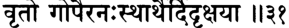

**----- Start of picture text -----** 
ф  *т1^т:^тг^%$гст  \ \ ш **----- End of picture text -----** 

_шрй-шука увача_ 

_нандас татра йадун праптан джнатва кршна-пурогаман татрагамад врто гопаир анах-стхартхаир дидркшайа_ 

_шрй-шуках увача_ — Шукадева Госвами сказал; _нандах_ — Махара­ джа Нанда; _татра_ — туда; _йадун_ — Яду; _праптан_ — прибывшие; _джнатва_ — узнав; _кршна_ — с Господом Кришной; _пурах-гаман_ — прибывшим впереди; _татра_ — туда; _агамат_ — он отправился; _вртах_ — сопровождаемый; _гопаих_ — пастухами; _анах_ — на своих телегах; _стха_ — помещены; _артхаих_ — чьи вещи; _дидркшайа_ — желая увидеть. 

**Шукадева Госвами сказал: Когда Махараджа Нанда узнал, что Ядавы во главе с Кришной прибыли на Курукшетру, он тут же от­ правился повидаться с ними. Вместе с ним, погрузив свои пожитки на телеги, поехали и все остальные пастухи.** 

_КОММЕНТАРИЙ:_ Пастухи Враджа намеревались побыть на Ку­ рукшетре несколько дней, поэтому прибыли туда с запасом еды, прежде всего молочных продуктов и другой пищи, которую любили Кришна и Баларама. 

## **ТЕКСТ 32** 

mR m w RA ттгё R ^ R H I r K i: ll^ ll 

**352** 

**[песнь 10, гл. 82** 

**Шримад-Бхагаватам** 

_там дрштва вршнайо хрштас танвах пранам ивоттхитах паришасваджире гадхам чира-дарьиана-катарах_ 

_там_ — его, Нанду; _дрштва_ — увидев; _вршнайах_ — Вришни; _хрштах_ — обрадованные; _танвах_ — живые тела; _пранам_ — их жиз­ ненный воздух; _ива_ — словно; _уттхитах_ — поднимающийся; _па­ ришасваджире_ — они обняли его; _гадхам_ — крепко; _чира_ — долгое время спустя; _даршана_ — встречей; _катарах_ — взволнованные. 

**Увидев Нанду, Вришни очень обрадовались. Они повскакива­ ли со своих мест, чувствуя себя как те, кто вернулся из объ­ ятий смерти. После долгой и тягостной разлуки с Нандой они принялись крепко обнимать его.** 

## **ТЕКСТ 33** 

I 

**«йчк ^** _**\ т \**_ 

_васудевах паришваджйа сампрйтах према-вихвалах смаран камса-кртан клеьиан путра-нйасам ча гокуле_ 

_васудевах_ — Васудева; _паришваджйа_ — обнимая (Махараджу Нан­ ду); _сампрйтах_ — обрадованный; _према_ — от любви; _вихвалах_ — вне себя; _смаран_ — вспоминая; _камса-кртан_ — созданные Камсой; _клеьиан_ — беды; _путра_ — своих сыновей; _нйасам_ — оставив; _ча_ — и; _гокуле_ — в Гокуле. 

**Охваченный радостью, Васудева обнял Махараджу Нанду. В приливе экстатической любви Васудева вспоминал страдания, которые причинил ему Камса, так что ему, Васудеве, пришлось ради безопасности своих сыновей оставить Их в Гокуле.** 

## **ТЕКСТ 34** 

_кршна-рамау паришваджйа питарав абхивадйа ча на кинчаночатух премна саьиру-кантхау курудваха_ 

**текст 35] Кришна встречается с жителями Вриндавана** 

**353** 

_кршна-рамау_ — Кришна и Баларама; _паришваджйа_ — обняв; _пи­ тарау_ — Своих родителей; _абхивадйа_ — оказав почтение; _ча_ — и; _на кинчана_ — ничего; _учатух_ — не сказали; _премна_ — от любви; _сааьиру_ — полные слез; _кантхау_ — чьи горла; _куру-удваха_ — о герой среди Куру. 

**О герой рода Куру, Кришна и Баларама обняли Своих прием­ ных родителей и затем поклонились им, однако слезы подступали у Них к горлу, поэтому Они не могли вымолвить ни слова.** 

_КОММЕНТАРИЙ:_ Встречаясь с родителями после долгой разлу­ ки, сын или дочь должны сначала поклониться своим родителям. Однако Нанда и Яшода не позволили сыновьям сделать это. Лишь завидев Их, они бросились обнимать своих детей, и только после этого Кришна и Баларама смогли выразить им почтение. 

## **ТЕКСТ 35** 

## **^** _**Щ [Ч т**_ **пзчп** 

_тав атмасанам аропйа бахубхйам парирабхйа ча йаьиода ча маха-бхага сутау виджахатух шучах_ 

_may_ — двоих; _атма-асанам_ — на свои колени; _аропйа_ — поса­ див; _бахубхйам_ — своими руками; _парирабхйа_ — обнимая; _ча_ — и; _йаьиода_ — матушка Яшода; _ча_ — также; _маха-бхага_ — праведная; _сутау_ — своих сыновей; _виджахатух_ — они расстались; _шучах_ — со скорбью. 

## **Усадив сыновей к себе на колени и держа Их за руки, Нанда и праведная Яшода забыли о своем горе.** 

_КОММЕНТАРИЙ:_ Шрила Вишванатха Чакраварти объясняет, что после первых объятий и поклонов Васудева отвел Нанду и Яшоду, которые держали за руки Кришну и Балараму, в свой шатер. За ними последовала Рохини и другие женщины и мужчины Враджа, а также их слуги. Зайдя внутрь, Нанда и Яшода усадили сыно­ вей к себе на колени. Несмотря на то, что они слышали о слав­ ных подвигах, которые оба Господа совершили, живя в Двараке, 

**[песнь 10, гл. 82** 

**Шримад-Бхагаватам** 

**354** 

несмотря на окружавшую их сыновей роскошь, Нанда и Яшо­ да по-прежнему видели в Них только своих детей, которым едва исполнилось восемь лет. 

## **ТЕКСТ 36** 

## rT cfrT T _Ш_ «11Ч+У<55Т1 и ^ и 

_рохинй девакй чатха паришваджйа враджешварйм смарантйау тат-кртам маитрйм башпа-кантхйау саму чатух_ 

_рохинй_ — Рохини; _девакй_ — Деваки; _ча_ — и; _атха_ — затем; _пари­ шваджйа_ — обняв; _враджа-йшварйм_ — царицу Враджа (Яшоду); _смарантйау_ — вспоминая; _тат_ — ею; _кртам_ — сделанную; _маи­ трйм_ — дружбу; _башпа_ — слезы; _кантхйау_ — в чьем горле; _самучатух_ — они обратились к ней. 

**Затем Рохини и Деваки обняли царицу Враджа, вспоминая обо всем, что она для них сделала. Голосом, прерывающимся от слез, они обратились к ней с такими словами.** 

_КОММЕНТАРИЙ:_ В тот момент, как объясняет Шрила Вишвана­ тха Чакраварти, Шри Васудева пригласил Нанду повидаться с Уг­ расеной и другими старейшинами Ядавов. Они ушли из шатра, и, воспользовавшись этой возможностью, Рохини и Деваки стали беседовать с Яшодой. 

## **ТЕКСТ 37** 

## WTT % yfrlfjbiil ИЗ'эН 

_ка висмарета вам маитрйм аниврттам враджешвари авапйапй аиндрам аишварйам йасйа неха пратикрийа_ 

_ка_ — какая женщина; _висмарета_ — сможет забыть; _вам_ — вас двоих (Яшоды и Нанды); _маитрйм_ — дружбу; _аниврттам_ — не­ изменную; _враджа-йшвари_ — о царица Враджа; _авапйа_ — обретя; _апи_ — даже; _аиндрам_ — Индры; _аишварйам_ — богатства; _йасйах_ — 

**текст 38] Кришна встречается с жителями Вриндавана** 

**355** 

для которой; _на_ — не; _иха_ — в этом мире; _прати-крийа_ — возна­ граждение. 

**[Рохини и Деваки сказали:] О царица Враджа, какая женщи­ на сможет забыть вашу с Нандой неизменную доброту, с кото­ рой вы относились к нам? Мы никогда не сможем по достоинству отблагодарить тебя, даже если у нас будут все богатства Индры.** 

## **ТЕКСТ 38** 

FT М Г : 

яМ Г Ч ^Ы гТ  4FT  I ^Т£^ТГ^ _Ч_ БгТТ _щ :_ f t : _\\\сп_ 

_этав адршта-питарау йувайох сма питрох сампрйнанабхйудайа-пошана-паланани_ 

_прапйошатур бхавати пакьима ха йадвад акшнор нйастав акутра ча бхайау на сатам парах свах_ 

_этау_ — эти двое; _адрьита_ — не видя; _питарау_ — Своих роди­ телей; _йувайох_ — вас двоих; _сма_ — несомненно; _питрох_ — родите­ ли; _сампрйнана_ — нянчась; _абхйудайа_ — растя; _поьиана_ — питание; _паланани_ — и защиту; _прапйа_ — получая; _ушатух_ — Они жили; _бхавати_ — дорогая подруга; _пакиша_ — веки; _ха_ — несомненно; _йадват_ — в точности как; _акьинох_ — глаз; _нйастау_ — безопасное мес­ то; _акутра_ — нигде; _ча_ — и; _бхайау_ — чей страх; _на_ — не; _сатам_ — для святых людей; _парах_ — чужой; _свах,_ — свой. 

**Вы заботились об этих мальчиках как о своих собственных де­ тях до того самого дня, пока Они не встретились со Своими на­ стоящими родителями. Вы дарили Им свою любовь, воспитывали Их, кормили и защищали. Дорогая подруга, Они жили, не ведая страха, потому что вы защищали Их, в точности как веки за­ щищают глаза. Поистине, праведники, подобные вам, никогда не делят людей на своих и чужих.** 

_КОММЕНТАРИЙ:_ Как объясняет Шрила Вишванатха Чакраварти, Кришна и Баларама не видели Своих родителей по двум причи­ нам: во-первых, из-за того, что Они скрывались от преследований 

**[песнь 10, гл. 82** 

**Шримад-Бхагаватам** 

**356** 

Камсы во Врадже, а во-вторых, потому, что Они на самом де­ ле никогда не рождались, а следовательно, у Них не может быть родителей. 

Шрила Вишванатха Чакраварти также раскрывает, что думала Деваки перед тем, как произнести этот стих: «Увы, поскольку двое этих моих сыновей слишком долго считали тебя Своей матерью и защитницей, о Яшода, и поскольку Они всегда купались в океане твоей любви, теперь, когда ты снова рядом с Ними, Они даже не замечают меня. А ты ведешь себя так, будто обезумела и ослепла от любви к Ним. О, я вижу, что твоя материнская любовь к Ним в миллионы раз сильнее моей. Ты просто смотришь на нас, тво­ их подруг, даже не узнавая нас. Поэтому сейчас я обращусь к тебе с ласковыми словами, чтобы вернуть тебя к реальности». 

Однако Деваки так и не дождалась ответа от Яшоды, и тогда Рохини сказала ей: «Дорогая Деваки, сейчас нам никак не удастся вывести ее из транса. Наши слова — это глас вопиющего в пус­ тыне. И сыновья ее привязаны к ней веревками сыновней любви так же крепко, как и она к Ним. Давай лучше пойдем повидаться с Притхой, Драупади и другими». 

**ТЕКСТ 39** 

'З’ЦП 

"<£<144, ll^ ll 

_ьирй-ьиука увача_ 

_гопйаьи ча кршнам упалабхйа чирад абхйштам йат-прекшане дрьиишу пакшма-кртам ьиапанти дргбхир хрдй-кртам ала*и парирабхйа сарвас тад-бхавам апур апи нитйа-йуджам дурапам_ 

_ьирй-ьиуках увача_ — Шукадева Госвами сказал; _гопйах_ — юные пастушки; _ча_ — и; _кршнам_ — Кришну; _упалабхйа_ — видя; _чират_ — после долгого времени; _абхйштам_ — объект их желаний; _йат_ — на кого; _прекшане_ — глядя; _дрьиишу_ — на их глазах; _пакшма_ — век; _кртам_ — создателя; _ьиапанти_ — они проклинали; _дргбхих_ — их гла­ 

**текст 39] Кришна встречается с жителями Вриндавана** 

**357** 

зами; _хрдй-кртам_ — помещенного в сердца; _алам_ — к их удоволь­ ствию; _парирабхйа_ — обнимая; _сарвах_ — все они; _тат_ — в Него; _бхавам_ — экстатическую поглощенность; _апух_ — обрели; _апи_ — да­ же хотя; _нитйа_ — постоянно; _йуджам_ — для тех, кто занимается _йогой; дурапам_ — которой сложно достичь. 

**Шукадева Госвами сказал: Когда** _гопи_ **смотрели на своего люби­ мого Кришну, они всегда проклинали того, кто сотворил их веки [скрывающие от них Кришну на мгновение]. Теперь же, увидев Его вновь после такой долгой разлуки, своими глазами они за­ ключили Его в свои сердца и там обнимали Его столько, сколько их душе было угодно. Таким образом, устремив к Нему свои умы, они погрузились в экстатический транс, достичь которого трудно даже тем, кто непрестанно занимается мистической** _йогой_ . 

_КОММЕНТАРИЙ:_ Как пишет Шрила Вишванатха Чакраварти, в тот момент Господь Баларама заметил _гопи,_ стоявших непода­ леку. Видя, что их желание увидеться с Кришной такое сильное, что тела их трепещут и они готовы умереть, если им это не удаст­ ся, Он тактично решил встать и удалиться. После этого _гопи_ по­ грузились в состояние, описанное в этом стихе. Говоря о том, что _гопи_ отпускали нелестные замечания о Господе Брахме, «создате­ ле век», Шукадева Госвами дает здесь выход своей легкой зависти по отношению к тому, какое положение удалось достичь _гопи._ 

Шрила Джива Госвами переводит выражение _нитйа-йуджам_ подругому — «даже главных жен Господа, которые обычно гордятся тем, что постоянно пребывают в Его обществе». 

В книге «Кришна, Верховная Личность Бога» Шрила Прабхупа­ да пишет: «Много лет _гопи_ провели в разлуке с Кришной, и те­ перь, когда они вместе с Махараджей Нандой и Яшодой прибыли на Курукшетру и наконец увидели Его, их охватил сильнейший эк­ стаз. Невозможно даже вообразить, как жаждали _гопи_ снова встре­ титься с Кришной. И когда Он предстал перед ними, они глазами забрали Его в свои сердца и в мыслях горячо обнимали Его. При этом они испытывали такой восторг, что совершенно забыли о са­ мих себе. Даже великие _йоги,_ постоянно медитирующие на Верхов­ ную Личность Бога, не могут погрузиться в такой экстатический транс, в каком пребывали _гопи,_ когда мысленно обнимали Кришну. Господь, который присутствует в сердце каждого, знал, что проис­ ходит в сердцах _гопи_ . Он понимал, какой экстаз они испытывают, и тоже мысленно обнимал девушек». 

**[песнь 10, гл. 82** 

**Шримад-Бхагаватам** 

**358** 

## **ТЕКСТ 40** 

_бхагавамс mac татха-бхута вивикта упасангатах ашлишйанамайам прштва прахасанн идам абравйт_ 

_бхагаван_ — Верховный Господь; _max_ — их; _татха-бхутах_ — пре­ бывавших в таком состоянии; _вивикте_ — в уединенном месте; _упа­ сангатах_ — подойдя; _аьилишйа_ — обняв; _анамайам_ — о здоровье; _прштва_ — спросив; _прахасан_ — засмеялся; _идам_ — это; _абравйт_ — сказал. 

**Верховный Господь встретился с** _гопи_ **в уединенном месте. Они стояли, погруженные в экстатический транс, и Господь, обняв каждую из них и расспросив о здоровье, засмеялся и произнес такие слова.** 

_КОММЕНТАРИЙ:_ Шрила Вишванатха Чакраварти поясняет, что Кришна с помощью Своей энергии _вибхути-шакти_ распростра­ нил Себя во множество форм, чтобы обнять каждую _гопи_ по от­ дельности и вывести их из состояния транса. Он спросил: «Утихла ли в ваших сердцах боль разлуки?» — и засмеялся, чтобы как-то подбодрить их. 

## **ТЕКСТ 41** 

_апи смаратха нах сакхйах сванам артха-чикиршайа гатамьи чирайитан чхатру-пакша-кшапана-четасах_ 

_апи_ — ли; _смаратха_ — вы помните; _нах_ — Нас; _сакхйах_ — по­ дружки; _сванам_ — родных; _артха_ — цели; _чикйршайа_ — желая осу­ ществить; _гатан_ — уехавший; _чирайитан_ — остававшийся долго; _ьиатру_ — Наших врагов; _пакша_ — полчища; _кшапана_ — уничто­ жить; _четасах_ — чье намерение. 

**[Господь Кришна сказал:] Мои дорогие подруги, вы до сих пор помните Меня? Меня не было так долго лишь потому, что** 

**текст 43] Кришна встречается с жителями Вриндавана 359** 

**Я хотел угодить Своим родственникам и победить всех Своих врагов.** 

## **ТЕКСТ 42** 

т р Э г Й^чГгЬ ^ ||#Я|| 

_апй авадхйайатхасман сеид акрта-джнавиьианкайа нунам бхутани бхагаван йунакти вийунакти ча_ 

_апи_ — также; _авадхйайатха_ — вы презираете; _асман_ — Нас; _свит_ — возможно; _акрта-джна_ — как неблагодарных; _авиьианкайа_ — с подозрением; _нунам_ — несомненно; _бхутани_ — живых существ; _бхагаван_ — Верховный Господь; _йунакти_ — соединяет; _вийунакти_ — разделяет; _ча_ — и. 

## **Возможно, вы считаете Меня неблагодарным и потому презира­ ете? Но не забывайте, живых существ сводит вместе и разделяет Сам Верховный Господь.** 

_КОММЕНТАРИЙ:_ Шрила Вишванатха Чакраварти открывает нам мысли _гопи:_ «В отличие от Тебя, чье сердце истерзано беспрерыв­ ными воспоминаниями о нас, мы совсем не думали о Тебе. Это Ты, измученный болью разлуки, отказался от всех удовольствий в жизни, а мы были очень счастливы без Тебя». В ответ Кришна спрашивает их здесь, не обижаются ли они на Его неблагодарность. 

## **ТЕКСТ 43** 

ЧН1-04. _трч_ ^ I ^гТТЭг 11*311 

_вайур йатха гхананйкам трнам ту лам раджамси ча самйоджйакшипате бхуйас татха бхутани бхута-крт_ 

_вайух_ — ветер; _йатха_ — как; _гхана_ — облаков; _анйкам_ — гря­ ды; _трнам_ — траву; _тулам_ — хлопок; _раджамси_ — пыль; _ча_ — и; _самйоджйа_ — сводя вместе; _акшипате_ — разделяет; _бхуйах_ — вновь; _татха_ — так; _бхутани_ — живые существа; _бхута_ — живых существ; _крт_ — Творец. 

**[песнь 10, гл. 82** 

**Шримад-Бхагаватам** 

**360** 

**Подобно тому как ветер собирает вместе облака, травинки, пу­ шинки хлопка и пылинки, а потом вновь разносит их в разные стороны, так же и Творец поступает с сотворенными Им живыми существами.** 

## **ТЕКСТ 44** 

_майи бхактир хи бхутанам амртатвайа калпате диштйа йад асйн мат-снехо бхаватйнам мад-апанах_ 

_майи_ — Мне; _бхактих_ — преданное служение; _хи_ — несомнен­ но; _бхутанам_ — для живых существ; _амртатвайа_ — к бессмер­ тию; _калпате_ — ведет; _диштйа_ — удачей; _йат_ — которая; _асйт_ — развилась; _мат_ — ко Мне; _снехах_ — любовь; _бхаватйнам_ — с ва­ шей стороны; _мат_ — Меня; _апанах_ — которая является причиной обретения. 

**Служа Мне с преданностью, любое живое существо становится достойным вечной жизни. Однако вы так удачливы, что развили в себе особую любовь ко Мне, с помощью которой вам удалось обрести Меня.** 

_КОММЕНТАРИЙ:_ Как пишет Шрила Вишванатха Чакраварти, на слова Кришны _гопи_ ответили: «О лучший из тех, кто умеет вести красивые речи, ведь тот самый Верховный Господь, которого Ты во всем обвиняешь, — не кто иной, как Ты Сам. Все на свете зна­ ют об этом! Так почему Ты думаешь, что это неизвестно нам?» «Хорошо, — отвечал Кришна, — если это так, то Я действительно Бог, но ваша любовь покорила Меня». 

## **ТЕКСТ 45** 

## ЗТ^ I w ^ и » ч и 

_ахам хи сарва-бхутанам адир анто ’нтарам бахих бхаутиканам йатха кхам вар бхур вайур джйотир анганах_ 

**текст 46] Кришна встречается с жителями Вриндавана 361** 

_ахам_ — Я; _хи_ — несомненно; _сарва_ — всех; _бхутанам_ — сотворен­ ных существ; _адих_ — начало; _антах_ — конец; _антарам_ — внутри; _бахих_ — снаружи; _бхаутиканам_ — материальных вещей; _йатха_ — как; _кхам_ — эфир; _вах_ — вода; _бхух_ — земля; _вайух_ — воздух; _джйо­ т их_ — и огонь; _анганах_ — о женщины. 

**Дорогие девушки, Я начало и конец всех живых существ, Я пре­ бываю внутри их и снаружи, точно так же как материальные эле­ менты — эфир, вода, земля, воздух и огонь — являются началом всех материальных объектов и существуют внутри и вне их.** 

_КОММЕНТАРИЙ:_ Как отмечают Шрила Шридхара Свами и Шри­ ла Вишванатха Чакраварти, Господь Кришна имеет здесь в виду следующее: «Если вам известно, что Я Верховный Господь, тогда как вы можете страдать от разлуки со Мной? Ведь Я пронизы­ ваю Собой все сущее. Вы страдаете только потому, что вам недо­ стает разума. Поэтому, пожалуйста, послушайте, что Я вам скажу, и ваше невежество рассеется. 

Истина в том, что вы, _гопи,_ в прошлой жизни были великими _йогами,_ а потому эта наука _гъяна-йоги_ хорошо известна вам. И ког­ да Я пытаюсь обучить вас этой науке Сам или через Своего пред­ ставителя, такого как Уддхава, это ничего не дает. Тем, кто охвачен чистой любовью к Богу, _гъяна-йога_ причиняет одни страдания». 

## **ТЕКСТ 46** 

^ ^гТТ^Г ^Ч1сЧ1с*Н1 гТгТ: I _-ц& щ  rft_ Н#5И 

_эвам хй этани бхутани бху те иге атматмана татах убхайам майй атха паре паигйатабхатам акьиаре_ 

_эвам_ — таким образом; _хи_ — несомненно; _этани_ — эти; _бхута­ ни_ — материальные создания; _бхутешу_ — в элементах творения; _атма_ — душа; _атмана_ — в своем изначальном положении; _та­ тах_ — проникающие; _убхайам_ — оба; _майи_ — во Мне; _атха_ — то есть; _паре_ — в Высшей Истине; _пашйата_ — вы должны видеть; _абхатам_ — проявленные; _акшаре_ — в неистощимом. 

**Таким образом все сотворенные предметы существуют в основ­ ных элементах творения, а души проникают повсюду в творении,** 

**[песнь 10, гл. 82** 

**Шримад-Бхагаватам** 

**362** 

## **оставаясь при этом неизменными. Вы должны видеть и то и дру­ гое — материальное творение и душу — пребывающими во Мне, неистощимой Абсолютной Истине.** 

_КОММЕНТАРИЙ:_ Необходимо четко понять взаимоотношения между материальными объектами этого мира, элементами, кото­ рые составляют их основу, индивидуальными душами и Высшей Душой. Различные объекты материальных наслаждений, к приме­ ру горшки, реки или горы, созданы из материальных элементов — земли, воды, огня и т.д. Эти элементы, будучи причиной матери­ альных объектов, пронизывают их, а духовные существа пронизы­ вают их в качестве тех, кто наслаждается ими _(сватмана)._ И все это: материальные элементы, их порождения и живые существа — пребывает в Господе Кришне, Высшей Душе, пронизывающей их, бессмертной, полной и совершенной. 

_Гъяни,_ осознавший это, никогда не будет чувствовать разлуки с Верховным Господом, однако _гопи_ Враджа обладают гораздо бо­ лее возвышенным сознанием Кришны, чем обычные _гъяни._ Они так сильно любят Кришну в Его самом привлекательном облике — облике юного пастушка, — что _йогамайя_ скрывает от них знание о Его величии, в частности понимание Его всеприсутствия. Поэ­ тому _гопи_ могли наслаждаться острым чувством любви к Господу в разлуке с Ним. Нужно понимать, что здесь Господь укоряет их в недостатке духовного разума лишь в шутку. 

## **ТЕКСТ 47** 

**ЗТЬщсч&^гЧТ TTt^T Ш^гГТ: I И»«И** 

_ьирй-ьиука увача_ 

_адхйатма-ьиикшайа гопйа эвам кршнена ьиикшитах тад-анусмарана-дхваста-джйва-коьиас там адхйаган_ 

_ьирй-ьиуках увача_ — Шукадева Госвами сказал; _адхйатма_ — о ду­ ше; _ьиикшайа_ — наставлениями; _гопйах_ — _гопи; эвам_ — так; _кршне­ на_ — Кришной; _ьиикшитах_ — обучаемые; _тат_ — на Него; _анусмарана_ — постоянной медитацией; _дхваста_ — уничтожено; _джйвакоьиах_ — тонкое покрытие души (ложное эго); _там_ — Его; _адхйа­ ган_ — они осознали. 

**текст 48] Кришна встречается с жителями Вриндавана** 

**363** 

**Шукадева Госвами сказал: Получив от Кришны эти духовные наставления,** _**гопи**_ **избавились от последних остатков ложного эго. Поглощенные постоянными размышлениями о Нем, погружаясь в Него все глубже и глубже, они полностью поняли Его.** 

_КОММЕНТАРИЙ:_ Шрила Прабхупада переводит этот отрывок в книге «Кришна» так: «Кришна рассказал _гопи_ о философии одновременного тождества и различия. Благодаря ей _гопи_ всегда оставались в сознании Кришны и таким образом полностью очис­ тились от материальной скверны. Когда живое существо пытается играть роль наслаждающегося в материальном мире, оно обладает сознанием, которое называется _джива-коша._ Иначе говоря, в этом случае душа находится в плену ложного эго. Не только _гопи_ , но и каждый, кто последует наставлениям Кришны, тотчас освободит­ ся из плена _джива-коши._ Человек, в полной мере сознающий Криш­ ну, всегда свободен от ложного эгоизма. Он все использует для служения Кришне и ни на мгновение не разлучается с Кришной». 

**ТЕКСТ 48** 

_ахуш ча те налина-набха падаравиндам йогеьивараир хрди вичинтйам агадха-бодхаих самсара-купа-патитоттаранаваламбам гехам джушам апи манасй удийат сада нах_ 

_ахух_ — _(гопи)_ сказали; _ча_ — и; _те_ — Твои; _налина-набха_ — о Гос­ подь, чей пупок подобен цветку лотоса; _пада-аравиндам_ — лотос­ ные стопы; _йога-йшвараих_ — великими йогялш-мистиками; _хрди_ — в сердце; _вичинтйам_ — то, что должно быть принято как объект медитации; _агадха-бодхаих_ — высокоучеными философа­ ми; _самсара-купа_ — в темный колодец материального бытия; _патита_ — тех, кто упал; _уттарана_ — для спасения; _аваламбам_ — единственное прибежище; _гехам_ — семейную жизнь; _джушам_ — лелеющих; _апи_ — хотя; _манаси_ — в уме; _удийат_ — да проявятся; _сада_ — навсегда; _нах_ — нашем. 

**[песнь 10, гл. 82** 

**Шримад-Бхагаватам** 

**364** 

_**Гопи**_ **сказали: Дорогой Господь, чей пупок подобен цветку ло­ тоса, Твои лотосные стопы — единственное прибежище для тех, кто упал в темный колодец материального бытия. Великие** _**йоги**_ **мистики и высокоученые философы поклоняются Твоим лотос­ ным стопам и медитируют на них. Хотя мы обычные женщины, поглощенные домашними заботами, мы тоже хотим, чтобы эти лотосные стопы проявились в наших сердцах.** 

_КОММЕНТАРИЙ:_ Литературный и пословный перевод этого сти­ ха взяты из «Шри Чайтанья-чаритамриты» Шрилы Прабхупады (Мадхья, 1.81), где цитируется этот стих. 

Эти слова только на первый взгляд могут показаться изъявле­ нием покорности _гопи._ Шрила Вишванатха Чакраварти открывает нам смысл, который они вкладывали в этот стих. На самом деле они произносят: «О Верховный Господь, о Сверхдуша, явившаяся нам, о бриллиант среди тех, кто дает наставления в высшем зна­ нии, Ты знал о том, что мы очень привязаны к дому, имуществу и семье. Поэтому раньше Ты присылал к нам Уддхаву, чтобы сво­ ими наставлениями он рассеял наше невежество, а теперь Ты дела­ ешь это Сам. Таким образом Ты очистил наши сердца от скверны, поэтому мы видим, что Твоя любовь к нам чиста и не имеет других мотивов, кроме нашего освобождения. Но мы всего лишь глупые пастушки; способны ли мы сохранить это знание в наших серд­ цах? Мы не в состоянии постоянно медитировать на Твои стопы, о которых все время размышляют такие великие души, как Гос­ подь Брахма. Пожалуйста, смилуйся над нами и сделай так, что­ бы мы смогли-таки хоть ненадолго сосредоточиться на Тебе. Мы все еще страдаем от последствий своей _кармы_ , поэтому как можем мы медитировать на Тебя, к кому устремляют свои умы великие _йоги?_ Мудрость этих _йогов_ бездонна, а мы — всего лишь недале­ кие женщины. Пожалуйста, сделай что-нибудь, чтобы вызволить нас из глубокого колодца материальной жизни». 

Чистые преданные никогда не стремятся к жизни на высших планетах материального мира или к духовному освобождению. Да­ же если Господь и предлагает им такие благословения, преданные, как правило, отказываются принимать их. В Одиннадцатой песни «Шримад-Бхагаватам» (11.20.34) Господь Кришна говорит: 

_на кинчит садхаво дхйра бхакта хй экантино мама ванчхантй апи майа даттам каивалйам апунар-бхавам_ 

**текст 48] Кришна встречается с жителями Вриндавана** 

**365** 

«Мои преданные всегда ведут себя безупречно и обладают глубо­ ким разумом, поэтому они целиком посвящают себя Мне и не же­ лают никого, кроме Меня. Поистине, даже если Я предлагаю им освобождение от рождений и смертей, они не принимают Мой дар». Поэтому ревнивый гнев _гопи_ в ответ на попытку Господа Кришны обучить их _гъяна-йоге_ вполне уместен. 

В этой связи, согласно комментарию Шрилы Вишванатхи Чакраварти Тхакура, слова, которые произносят здесь _гопи,_ мож­ но понять по-другому: «О солнце, устраняющее тьму невежества, нас сжигают палящие лучи Твоей философии. Мы просто птицы _чакора,_ которые питаются лунным светом, исходящим от Твоего прекрасного лица. Пожалуйста, возвращайся с нами во Вриндаван. Только так Ты сможешь вернуть нас к жизни». 

А если Он скажет им: «Приезжайте в Двараку — там мы будем вместе наслаждаться», они ответят, что их дом — Шри Вриндаван и они слишком привязаны к нему, чтобы жить в каком-нибудь другом месте. _Гопи_ имеют в виду, что только там, во Вриндаване, Кришна носит павлиньи перья на Своем тюрбане и только там Он виртуозно играет на Своей флейте. Ничто другое _гопи_ не при­ влекает. Он сможет спасти их, только вернувшись во Вриндаван, и никакие медитации или рассуждения о душе не помогут им. 

_Так заканчивается комментарий смиренных слуг А. Ч. Бхактиведанты Свами Прабхупады к восемьдесят второй главе Десятой песни «Шримад-Бхагаватам», которая называется «Кришна и Ба­ ларама встречаются с жителями Вриндавана»._ 

**ГЛАВА ВОСЕМЬДЕСЯТ ТРЕТЬЯ** 

## **Драупади встречается с царицами Криш ны** 

В этой главе описывается беседа Драупади с главными царица­ ми Господа Кришны, и каждая из них рассказывает о том, как она стала женой Господа. 

Господь Шри Кришна вернулся со Своего свидания с _гопи_ и стал расспрашивать царя Юдхиштхиру и других Своих родственников об их благополучии. Они отвечали: «Мой Господь, удача всегда бу­ дет сопутствовать тому, чьи уши хотя бы единожды изведали мед Твоих игр». 

Затем Драупади стала спрашивать у жен Господа Кришны, как они вышли за Него замуж. Первой стала рассказывать Рукмини: «Многие цари во главе с Джарасандхой хотели отдать меня замуж за Шишупалу. Поэтому в день моей свадьбы все они стояли с лу­ ками в руках, готовые отразить любые атаки врагов Шишупалы. Однако посреди них появился Шри Кришна и силой забрал меня, словно лев, который уносит свою добычу из стада коз и овец». 

Царица Сатьябхама сказала: «Когда мой дядя Прасена был убит, мой отец, Сатраджит, оговорил Господа Кришну, обвинив Его в этом убийстве. Чтобы восстановить Свое доброе имя, Кришна по­ бедил Джамбавана, отыскал камень Сьямантака и вернул его Сатраджиту. Раскаиваясь в клевете, мой отец отдал Господу Кришне этот камень и меня в придачу». 

Царица Джамбавати сказала: «Когда в поисках драгоценного камня Сьямантака Шри Кришна вошел в пещеру моего отца, внача­ ле мой отец, Джамбаван, не понял, кто перед ним. Поэтому между ними завязалась битва, которая длилась двадцать семь дней и но­ чей. В конце концов Джамбаван осознал, что Кришна не кто иной, как Сам Рамачандра, Господь, которому он поклоняется. Поэтому он отдал Кришне камень Сьямантака и меня». 

Царица Калинди сказала: «Желая выйти замуж за Кришну, я совершала суровую аскезу. И вот однажды Кришна вместе с Арджуной приехал ко мне и согласился взять меня в жены». 

**367** 

**[песнь 10, гл. 83** 

**368** 

**Шримад-Бхагаватам** 

Царица Митравинда сказала: «Шри Кришна приехал на церемо­ нию моей _сваямвары,_ победил всех царей-соперников и увез меня в Двараку». 

Царица Сатья сказала: «Мой отец решил, что выдаст меня за­ муж лишь за того, кто сможет обуздать и связать семерых свире­ пых быков. Приняв вызов, Господь Кришна играючи обуздал их, победил всех Своих соперников и взял меня в жены». 

Царица Бхадра сказала: «Мой отец пригласил к себе своего пле­ мянника Кришну, которому я уже тогда отдала свое сердце, и пред­ ложил Ему жениться на мне. В качестве приданого он дал Ему целую армию и большую свиту моих служанок». 

Царица Лакшмана сказала Драупади: «На моей _сваямваре,_ так же как и на твоей, к потолку подвесили рыбу, служившую мишенью. Однако у нас рыба была скрыта со всех сторон, и было видно лишь ее отражение в горшке воды. Несколько царей попытались пронзить рыбу стрелами, но промахнулись. Затем стал стрелять Арджуна. Он прицелился, глядя на отражение рыбы в воде, одна­ ко выпущенная им стрела лишь поцарапала рыбу. Тогда натянул Свой лук Шри Кришна. Его стрела пронзила рыбу, и та упала на землю. **Я** надела на шею Шри Кришны ожерелье победителя, од­ нако промахнувшиеся цари возмутились этим и схватились за ору­ жие. Господь Кришна стал отважно сражаться с ними, и те, кому Он не отсек головы, руки и ноги, в страхе за свою жизнь разбе­ жались. Затем Господь отвез меня в Двараку, и там мы сыграли пышную свадьбу». 

Рохинидеви от лица всех остальных цариц объяснила, что их от­ цов взял в плен Бхаумасура. Демон держал девушек в плену, од­ нако, убив его, Господь Кришна освободил царевен и женился на всех них. 

## **ТЕКСТ 1** 

ггстд ат _ч т и ,_ ттгФгт ^ й ( г г : I **и ? и** 

_шрй-шука увача татханугрхйа бхагаван гопйнам са гурур гатих йудхиштхирам атхапрччхат сарвамш ча сухрдо увйайам_ 

**текст 2] Драупади встречается с царицами Кришны** 

**369** 

_ьирй-ьиуках увача_ — Шукадева Госвами сказал; _татха_ — таким образом; _ану грхйа_ — выказав благосклонность; _бхагаван_ — Верхов­ ный Господь; _гопйнам_ — юных пастушек; _сах_ — Он; _гурух_ — их ду­ ховный учитель; _гатих_ — и цель; _йудхиштхирам_ — у Юдхиштхиры; _атха_ — затем; _апрччхат_ — Он спросил; _сарван_ — всех; _ча_ — и; _су­ хрдах_ — Его дорогих родственников; _авйайам_ — о благополучии. 

**Шукадева Госвами сказал: Таким образом Господь Кришна, ду­ ховный учитель** _**гопи**_ **и цель всей их жизни, пролил на них Свою милость. Затем Он встретился с Юдхиштхирой и другими Своими родственниками и стал расспрашивать об их благополучии.** 

_КОММЕНТАРИЙ:_ Слова _гурур гатих_ переведены здесь так, как они обычно переводятся, — «духовный учитель и цель». Однако Шрила Вишванатха Чакраварти отмечает, что эти слова могут быть переведены иначе: Господь Кришна — это цель всех _садху_ , однако для _гопи_ Он не просто цель, а цель, которая определяет­ ся эпитетом _«гуру»,_ то есть Он для них главная цель, полностью затмившая собой все остальные цели. 

## **ТЕКСТ 2** 

<Т _Ф 'у ц :_ ^TrfrTT: I **i m i** 

_та эвам лока-натхена парипрштах су-сат-кртах пратйучур хршта-манасас тат-падекша-хатамхасах_ 

_те_ — они (другие родственники Юдхиштхиры и Господа Криш­ ны); _эвам_ — так; _лока_ — Вселенной; _натхена_ — Господом; _пари­ прштах_ — расспрашиваемые; _су_ — очень; _сат-кртах_ — почтённые; _пратйучух_ — ответили; _хршта_ — охваченные счастьем; _манасах_ — чьи умы; _тат_ — Его; _пада_ — стоп; _йкша_ — созерцанием; _хата_ — уничтожены; _амхасах_ — чьи грехи. 

**Ценя оказанную им честь, царь Юдхиштхира и другие родствен­ ники, освободившиеся от всех грехов потому, что могли созерцать стопы Господа Вселенной, с радостью стали отвечать Ему.** 

**370** 

**[песнь 10, гл. 83** 

**Шримад-Бхагаватам** 

## **ТЕКСТ 3** 

**fW^T ^ TRt** ^ JrT T II 3 II 

_куто ’ьиивам твач-чаранамбуджасавам махан-манасто мукха-нихсртам квачит пибанти йе карна-путаир алам прабхо дехам-бхртам деха-крд-асмрти-ччхидам_ 

_кутах_ — откуда; _аьиивам_ — все неблагоприятное; _тват_ — Тво­ их; _чарана_ — стоп; _амбуджа_ — подобных лотосам; _асавам_ — пьяня­ щий нектар; _махат_ — великих душ; _манастах_ — из умов; _мукха_ — через их рты; _нихсртам_ — текущий; _квачит_ — в любое время; _пибанти_ — пьет; _йе_ — кто; _карна_ — их ушей; _путаих_ — чашами; _алам_ — столько, сколько хотят; _прабхо_ — о господин; _дехам_ — ма­ териальными телами; _бхртам_ — для тех, кто обладает; _деха_ — тел; _кргп_ — о творце; _асмрти_ — забвение; _чхидам_ — того, кто рассеивает. 

**[Родственники Господа Кришны сказали:] О господин, разве мо­ жет удача изменить тем, кто хотя бы единожды испил нектар, исходящий от Твоих лотосных стоп? Этот пьянящий нектар, стру­ ящийся из умов великих преданных через их рты, попадает в чаши ушей тех, кому улыбнулась удача. Он избавляет обусловленных живых существ от забвения, помогая им вспомнить о том, кто сотворил их тела.** 

## **ТЕКСТ 4** 

+ й ч < 1 « Р н 1 ч и н  зттгртт- 

## **H N i^ fri 444<iwiQi ЯгТТ: F T  II « II** 

_хи тватма дхама-видхутатма-крта-трй-авастхам ананда-самплавам акхандам акунтха-бодхам калопасршта-нигамавана атта-йогамайакртим парамахамса-гатим натах сма_ 

**371** 

**текст 5] Драупади встречается с царицами Кришны** 

_хи_ — поистине; _тва_ — Тебе; _атма_ — Твоего облика; _дхама_ — сиянием; _видхута_ — развеяны; _атма_ — материальным сознанием; _крта_ — созданные; _три_ — три; _авастхам_ — материальные обуслов­ ленности; _ананда_ — в блаженстве; _самплавам_ — (в ком) полное погружение; _акхандам_ — беспредельно; _акунтха_ — неограниченно; _бодхам_ — чье знание; _кала_ — времени; _упасршта_ — находящихся под угрозой; _нигама_ — Вед; _аване_ — для защиты; _атта_ — приняв; _йога-майа_ — Своей божественной энергией иллюзии; _акртим_ — этот облик; _парама-хамса_ — совершенных святых; _гатим_ — цель; _натах сма_ — (мы) склонились. 

**Исходящее от Тебя сияние рассеивает тройственные про­ явления материального сознания. Так по Твоей милости мы погружаемся в неземное блаженство. Знание Твое неделимо и без­ гранично. Пустив в ход Свою энергию** _йогамайю,_ **Ты принял облик человека, чтобы защитить Веды, которым угрожало вре­ мя. Мы склоняемся перед Тобой, конечной целью всех великих святых.** 

_КОММЕНТАРИЙ:_ Ослепительный свет, исходящий от прекрасно­ го тела Господа Кришны, очищает разум живого существа от всей материальной скверны. Это помогает душе избавиться от обуслов­ ленности _гунами_ благости, страсти и невежества. «Так как же несчастье может коснуться нас? — вопрошают здесь родственни­ ки Господа. — Мы постоянно погружены в абсолютное, нескон­ чаемое блаженство». Таков их ответ на вопрос Господа об их благополучии. 

## **ТЕКСТ 5** 

_Т г ^ Ч '._ 

## **ftlcftojRdi: ЗД % II ч II** 

_шрй-рьиир увача_ 

_итй уттамах-шлока-шикха-маним джанешв абхиштуватсв андхака-каурава-стрийах саметйа говинда-катха митхо ’грнамс три-лока-гйтах шрну варнайами те_ 

**[песнь 10, гл. 83** 

**Шримад-Бхагаватам** 

**372** 

_ьирй-рших увача_ — великий мудрец, Шукадева, сказал; _ити_ — так; _уттамах-ьилока_ — среди великих личностей, которых про­ славляют чудесными стихами; _ьиикха-маним_ — бриллиант (Господь Кришна); _джанешу_ — Его преданные; _абхиштуватсу_ — пока они прославляли; _андхака-каурава_ — родов Андхаки и Куру; _стрийах_ — женщины; _саметйа_ — встретившись; _говинда-катхах_ — разговоры о Господе Говинде; _митхах_ — между собой; _агрнан_ — завели; _т ри_ — трех; _лока_ — в мирах; _гитах_ — воспеваемые; _шрну_ — пожа­ луйста, выслушай; _варнайами_ — я опишу; _те_ — тебе (Махарадже Парикшиту). 

**Великий мудрец Шукадева Госвами сказал: Пока Юдхиштхира и другие прославляли Господа Кришну, лучшего среди тех, ко­ го славят изысканной поэзией, женщины родов Андхаки и Куру собрались вместе и стали говорить о Господе Говинде, рассказы о котором передают из уст в уста обитатели всех трех миров. Пожалуйста, послушай, о чем они говорили.** 

**ТЕКСТЫ 6-7** 

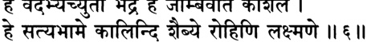

**----- Start of picture text -----** 
^   ^  % STTKrefcT  I % ^гФТТ% + Й П Ч   II $ II **----- End of picture text -----** 

**----- Start of picture text -----** 
h h k w i  н « и **----- End of picture text -----** 

_шрй-драупадй увача_ 

_хе ваидарбхй ачйуто бхадре хе джамбавати кауьиале хе сатйабхаме калинди ьиаибйе рохини лакшмане_ 

_хе кршна-патнйа этан но бруте во бхагаван свайам упайеме йатха локам анукурван сва-майайа_ 

_шрй-драупадй увача_ — Шри Драупади сказала; _хе ваидарбхи_ — о дочь Вайдарбхи (Рукмини); _ачйутах_ — Господь Кришна; _бхадре_ — о Бхадра; _хе джамбавати_ — о дочь Джамбавана; _кауьиале_ — о Нагнаджити; _хе сатйабхаме_ — о Сатьябхама; _калинди_ — о Калинди; _ьиаибйе_ — о Митравинда; _рохини_ — о Рохини (одна из шестнадцати 

**текст 8] Драупади встречается с царицами Кришны** 

**373** 

тысяч цариц, которых Кришна взял в жены после убийства Наракасуры); _лакшмане_ — о Лакшмана; _хе крьина-патнйах_ — о (другие) жены Кришны; _этат_ — это; _нах_ — нам; _бруте_ — пожалуйста, рас­ скажите; _вах_ — вас; _бхагаван_ — Верховный Господь; _свайам_ — Сам; _упайеме_ — взял в жены; _йатха_ — как; _локам_ — обычным людям; _анукурван_ — подражая; _сва-майайа_ — Своей мистической энергией. 

**Шри Драупади сказала: О Вайдарбхи, Бхадра и Джамбавати, о Каушала, Сатьябхама и Калинди, о Шайбья, Рохини, Лакшма­ на и другие жены Господа Кришны, пожалуйста, расскажите мне, каким образом Верховный Господь Ачьюта, подражая с помощью Своей мистической энергии поступкам людей, взял вас в жены.** 

_КОММЕНТАРИЙ:_ Рохини, к которой обращается здесь Драупа­ ди, — это не мать Господа Баларамы, а другая Рохини, главная из шестнадцати тысяч царевен, которых Господь Кришна вызволил из темницы Бхаумасуры. Драупади обращается к ней как к представи­ тельнице остальных шестнадцати тысяч и фактически занимающей равное положение с восьмью главными женами Шри Кришны. 

**ТЕКСТ 8** 

## _ьирй-рукминй увача_ 

_чаидйайа марпайитум удйата-кармукеьиу раджасв аджейа-бхата-ьиекхаритангхри-ренух нинйе мргендра ива бхагам аджави-йутхат тач-чхрй-никета-чарано Усту мамарчанайа_ 

_ьирй-рукминй увача_ — Шри Рукмини сказала; _чаидйайа_ — Шишу­ пале; _ма_ — меня; _арпайитум_ — чтобы отдать; _удйата_ — наготове; _кармукешу_ — чьи луки; _раджасу_ — когда цари; _аджейа_ — непобе­ димых; _бхата_ — воинов; _ьиекхарита_ — помещенная на головы; _ангхри_ — чьих стоп; _ренух_ — пыль; _нинйе_ — Он увез; _мргендрах_ — 

**[песнь 10, гл. 83** 

**Шримад-Бхагаватам** 

**374** 

лев; _ива_ — словно; _бхагам_ — свою добычу; _аджа_ — коз; _ави_ — и овец; _йутхат_ — из стада; _тат_ — Его; _шрй_ — верховной боги­ ни процветания; _пикета_ — который является обителью; _чаранах_ — стопы; _асту_ — пусть будут; _мама_ — моего; _арчанайа_ — для покло­ нения. 

**Шри Рукмини сказала: Когда все цари уже натянули тетивы своих луков, чтобы я непременно досталась Шишупале, тот, кто помещает пыль со Своих стоп на головы непобедимых воинов, забрал меня от этих царей, словно лев, который уносит свою до­ бычу из стада коз и овец. Так пусть же у меня всегда будет воз­ можность поклоняться этим стопам Господа Кришны, прибежища богини Шри.** 

_КОММЕНТАРИЙ:_ История о том, как Господь Кришна похитил Рукмини, подробно рассказывается в трех главах Десятой песни «Шримад-Бхагаватам», начиная с пятьдесят второй. 

**ТЕКСТ 9** 

_■ц\_ % 

гТгГТ 

( й н й * и ч ч ч ч 1 ^ ч м * к  I 

_ЪуЩ ,_ II <*. II 

## _ьирй-сатйабхамовача_ 

_йо ме санабхи-вадха-тапта-хрда татена_ 

_липтабхиьиапам апамарштум упаджахара джитваркша-раджам атха ратнам адат са тена бхйтах питадишата мам прабхаве ’пи даттам_ 

_шрй-сатйабхама увача_ — Шри Сатьябхама сказала; _йах_ — кто; _ме_ — мой; _санабхи_ — брата; _вадха_ — убийством; _тапта_ — опечале­ но; _хрда_ — чье сердце; _татена_ — моим отцом; _липта_ — запят­ нанный; _абхишапам_ — обвинением; _апамарштум_ — чтобы смыть; _упаджахара_ — Он очистил; _джитва_ — победив; _ркша-раджам_ — ца­ ря медведей, Джамбавана; _атха_ — затем; _ратнам_ — камень (Сьямантаку); _адат_ — отдал; _сах_ — Он; _тена_ — из-за этого; _бхйтах_ — 

**текст 10] Драупади встречается с царицами Кришны** 

**375** 

испуганный; _пита_ — мой отец; _адиьиата_ — предложил; _мам_ меня; _прабхаве_ — Господу; _апи_ — хотя; _даттам_ — уже отдана. 

**Шри Сатьябхама сказала: Мой отец, чье сердце страдало от раз­ луки с его убитым братом, обвинил в этом преступлении Господа Кришну. Чтобы восстановить Свое доброе имя, Господь победил в поединке царя медведей, забрал у него камень Сьямантака и вер­ нул его моему отцу. Опасаясь последствий нанесенного оскорб­ ления, мой отец отдал меня Господу, хотя я уже была обещана другим.** 

_КОММЕНТАРИЙ:_ Как описывается в пятьдесят седьмой главе Де­ сятой песни, царь Сатраджит еще до этого события скомпроме­ тировал себя, пообещав свою дочь вначале Акруре, а затем еще нескольким сватавшимся. Однако после того, как камень Сьяман­ така был вновь найден, ему стало стыдно, и он отдал дочь Госпо­ ду Кришне. Как пишет Шрила Шридхара Свами, слово _прабхаве_ («Господу») развеивает все сомнения в уместности решения отдать Кришне девушку, которая уже была обещана другим. Отдавать Господу все, что Ему принадлежит, вполне уместно, и, наоборот, прятать от Него что бы ни было неуместно. 

## **ТЕКСТ 10** 

г П м П Ч '^ м 

_ЩЩЩ_ g ir^i ЧТ **ч й IIMI** 

_ьирй-джамбаватй увача праджнайа деха-крд амум ниджа-натха-даивам сйта-патим три-наваханй амунабхйайудхйат джнатва парйкшита упахарад арханам мам падау прагрхйа манинахам амушйа дасй_ 

_ьирй-джамбаватй увача_ — Шри Джамбавати сказала; _пра­ джнайа_ — не знающий; _деха_ — моего тела; _крт_ — создатель (мой 

**[песнь 10, гл. 83** 

**Шримад-Бхагаватам** 

**376** 

отец); _амум_ — Его; _ниджа_ — его собственного; _натха_ — как гос­ подина; _даивам_ — и почитаемое Божество; _сйта_ — богини Ситы; _патим_ — супруга; _три_ — три; _нава_ — по девять; _ахани_ — в течение дней; _амуна_ — с Ним; _абхйайудхйат_ — он сражался; _джнатва_ — узнав; _парйкшитах_ — способный правильно понять; _упахарат_ — он преподнес; _арханам_ — в качестве знака почтения; _мам_ — меня; _падау_ — за Его стопы; _прагрхйа_ — взявшись; _манина_ — с камнем; _ахам_ — я; _амушйа_ — Его; _дасй_ — служанка. 

**Шри Джамбавати сказала: Не подозревая о том, что Господь Кришна — это не кто иной, как его повелитель и Бог, которо­ му он поклоняется, Сам супруг богини Ситы, мой отец сражался с Ним на протяжении двадцати семи дней. Когда наконец мой отец образумился и узнал Господа, он припал к Его стопам и подарил Ему в знак преклонения перед Ним камень Сьямантака и меня. Я всего лишь служанка Господа.** 

_КОММЕНТАРИЙ:_ Много тысячелетий назад Джамбаван был слу­ гой Господа Рамачандры. Шрила Вишванатха Чакраварти упоми­ нает, что, слушая историю Джамбавати, женщины, сидевшие там, узнали в ней девушку, которую когда-то Джамбаван предложил от­ дать замуж за Господа Шри Раму. Поскольку Рама дал обет, что у Него будет только одна жена, Он не смог принять ее, но теперь, придя в Двапара-югу как Кришна, Он взял ее в жены. Другие царицы хотели прославить Джамбавати за это, но она смиренно ответила: «Я просто служанка Господа». 

История о том, как Джамбавати и Сатьябхама стали женами Господа, рассказывается в пятьдесят шестой главе Десятой песни. 

## **ТЕКСТ 11** 

г г д а Ф т щ щ I W rf tc 4 r a # 4 T fa r ii?? ii 

_шрй-калиндй увача тапаьи чарантйм аджнайа сва-пада-спаршанаьиайа сакхйопетйаграхйт паним йо ’хам тад-грха-марджанй_ 

_шрй-калиндй увача_ — Шри Калинди сказала; _тапах_ — аскезу; _чарантйм_ — совершая; _аджнайа_ — зная; _сва_ — Его; _пада_ — стоп; 

**текст 12] Драупади встречается с царицами Кришны** 

**377** 

_спаригана_ — прикосновения; _ашайа_ — с желанием; _сакхйа_ — вмес­ те со Своим другом (Арджуной); _упетйа_ — придя; _аграхйт_ — взял; _паним_ — мою руку; _йах_ — кто; _ахам_ — я; _тат_ — Его; _грха_ — дома; _марджанй_ — уборщица. 

**Шри Калинди сказала: Господь знал, что я совершала суровую аскезу в надежде однажды прикоснуться к Его лотосным стопам. Поэтому Он предстал передо мной вместе со Своим другом и взял меня в жены. Теперь я подметаю пол в Его дворце.** 

## **ТЕКСТ 12** 

м?яи 

_шрй-митравиндовача йо мам свайам-вара упетйа виджитйа бху-пан нинйе ьива-йутха-гам иватма-балим двипарих бхратрмьи на ме ’пакурутах сва-пурам шрийаукас тасйасту ме_ ’ _ну-бхавам ангхрй-аванеджанатвам_ 

_шрй-митравинда увача_ — Шри Митравинда сказала; _йах_ — кто; _мам_ — меня; _свайам-варе_ — во время моей _сваямвары_ (церемонии, на которой царевна выбирает из нескольких женихов мужа); _упетйа_ — выйдя; _виджитйа_ — победив; _бху-пан_ — царей; _нинйе_ — взял; _шва_ — собак; _йутха_ — в своре; _гам_ — исчезнувшую; _ива_ — словно; _атма_ — свою; _балим_ — добычу; _двипа-арих_ — лев («царь зверей»); _бхратрн_ — братья; _ча_ — и; _ме_ — мои; _апакурутах_ — ко­ торые оскорбляли Его; _сва_ — в Его; _пурам_ — столицу; _шрй_ — богини процветания; _оках_ — дом; _тасйа_ — Его; _асту_ — пусть бу­ дет; _ме_ — для меня; _ану-бхавам_ — жизнь за жизнью; _ангхри_ — стоп; _аванеджанатвам_ — положение того, кто омывает. 

**Шри Митравинда сказала: Во время моей** _**сваямвары**_ **Он высту­ пил вперед и победил всех царей, что были там, в том числе и моих братьев, которые осмелились оскорбить Его. Он увез меня отту­ да, словно лев, который забирает свою добычу у своры собак. Так** 

**[песнь 10, гл. 83** 

**Шримад-Бхагаватам** 

**378** 

**Господь Кришна, супруг богини процветания, привез меня в Свою столицу. Пусть же жизнь за жизнью я буду служить Ему, омывая Его стопы.** 

**ТЕКСТЫ 13-14** 

ж w п?зп 

_Ф*_ № h i < м н | ( * й _-щщцщ_ % и ?« и 

_ьирй-сатйовача_ 

_саптокшано_ ’ _ти-бала-вйрйа-су-тйкшна-шрнган питра кртан кшитипа-вйрйа-парйкшанайа тан вйра-дурмада-ханас тараса нигрхйа крйдан бабандха ха йатха шишаво Ъжа-токан_ 

_йа иттхам вйрйа-шулкам мам дасйбхиш натур-ангинйм патхи нирджитйа раджанйан нинйе тад-дасйам асту ме_ 

_шрй-сатйа увача_ — Шри Сатья сказала; _сапта_ — семь; _укшанах_ — быков; _ати_ — велика; _бала_ — чья сила; _вйрйа_ — и жизнен­ ная энергия; _су_ — очень; _тйкьина_ — острые; _шрнган_ — чьи рога; _питра_ — моим отцом; _кртан_ — поставлены; _кшитипа_ — царей; _вйрйа_ — доблести; _парйкшанайа_ — для проверки; _тан_ — их (бы­ ков); _вйра_ — героев; _дурмада_ — ложную гордость; _ханах_ — который уничтожил; _тараса_ — быстро; _нигрхйа_ — покорив; _крйдан_ — играя; _бабандха ха_ — Он связал; _йатха_ — как; _шишавах_ — дети; _аджа_ — коз; _токан_ — детей; _йах_ — кто; _иттхам_ — таким образом; _вйрйа_ — героизм: _ьиулкам_ — чья цена; _мам_ — меня; _дасйбхих_ — со служан­ ками; _чатух-ангинйм_ — под защитой армии из четырех родов войск (колесниц, лошадей, слонов и пехоты); _патхи_ — по дороге; _нирджитйа_ — разбив; _раджанйан_ — царей; _нинйе_ — Он увез меня; _тат_ — Ему; _дасйам_ — служение; _асту_ — пусть будет; _ме_ — мое. 

**текст 16] Драупади встречается с царицами Кришны** 

**379** 

**Шри Сатья сказала: Мой отец решил проверять доблесть сва­ тавшихся ко мне царей, предлагая им сразиться с семью могучими и выносливыми быками, чьи острые рога грозили смертью. Хотя быки эти сбили спесь со многих героев, сватавшихся ко мне, Гос­ подь Кришна играючи обуздал их, связав их так же легко, как дети связывают козлят. Так, Своей доблестью, Он завоевал мою руку. Мой отец дал Ему в придачу ко мне моих служанок и армию из четырех родов войск. По дороге Он разгромил всех царей, ко­ торые попытались остановить Его. Пусть же у меня всегда будет возможность служить Ему.** 

**ТЕКСТЫ 15-16** 

ftrTT % _ТфЩЩЦ_ I Н?Ч1 

_w Щг* ш ч ч :  \т \\_ 

_шрй-бхадровача пита ме матулейайа свайам ахуйа даттаван кршне кршнайа тач-читтам акшаухинйа сакхй-джанаих_ 

_асйа ме пада-самспаршо бхаведж джанмани джанмани кармабхир бхрамйаманайа йена тач чхрейа атманах_ 

_шрй-бхадра увача_ — Шри Бхадра сказала; _пита_ — отец; _ме_ — мой; _матулейайа_ — моему двоюродному брату по матери; _свайам_ — по своему желанию; _ахуйа_ — пригласив; _даттаван_ — отдал; _кршне_ — о Кришна (Драупади); _кршнайа_ — Господу Кришне; _тат_ — по­ гружено в кого; _читтам_ — чье сердце; _акшаухинйа_ — с воин­ ским отрядом _акшаухини; сакхй-джанаих_ — и моими подругами; _асйа_ — Его; _ме_ — для меня; _пада_ — стоп; _самспаршах_ — прикос­ новение; _бхавет_ — пусть будет; _джанмани джанмани_ — жизнь за жизнью; _кармабхих_ — из-за последствий материальной деятельнос­ ти; _бхрамйаманайах_ — которая будет блуждать; _йена_ — которым; _тат_ — это; _ьирейах_ — высшее совершенство; _атманах_ — мое. 

**[песнь 10, гл. 83** 

**Шримад-Бхагаватам** 

**380** 

**Шри Бхадра сказала: Моя дорогая Драупади, мой отец по сво­ ему желанию пригласил к нам своего племянника Кришну, кото­ рому я уже отдала свое сердце, и предложил Ему жениться на мне. Мой отец подарил Господу целую** _**акшаухини**_ **воинов в качест­ ве охраны и свиту служанок для меня. Совершенство, о котором я мечтаю, — везде, куда бы меня ни привели последствия моей** _**кармы**_ **, жизнь за жизнью иметь возможность касаться лотосных стоп Господа Кришны.** 

_КОММЕНТАРИЙ:_ Словом _атманах_ царица Бхадра дает понять, что говорит не только о себе, но и обо всех живых существах. — Совершенство души _(ъирейа атманах)_ это преданное служение Господу Кришне, как в этом мире, так и за его пределами, когда душа обретает освобождение. 

Шрила Джива Госвами поясняет, что, хотя среди культурных лю­ дей произносить на публике имя своего _гуру_ или мужа не принято, потому что это знак неуважения, имя Господа Кришны уникально, ибо произнести имя Кришны — самый лучший способ выразить почтение Богу. Как утверждается в «Шветашватара-упанишад» (4.19), _йасйа нама махад йаьиах:_ «Святое имя Господа исполнено величайшей славы». 

**ТЕКСТ 17** 

*  I _W *_ d l+ ч к h w i _ъирй-лакъимановача мама пи раджнй анйута-джанма-карма ъирутва мухур нарада-гйтам аса ха читтам мукунде кила падма-хастайа вртах су-саммръийа вихайа лока-пан_ 

_ъирй-лакъимана увача_ — Шри Лакшмана сказала; _мама_ — мое; _апи_ — также; _раджни_ — о царица; _ачйута_ — Господа Кришны; _джанма_ — о рождениях; _карма_ — и деяниях; _ъирутва_ — слушая; 

**текст 19] Драупади встречается с царицами Кришны** 

**381** 

_мухух_ — вновь и вновь; _нарада_ — Нарадой Муни; _гйтам_ — рас­ сказываемых; _аса ха_ — стало; _читтам_ — мое сердце; _мукунде_ — (сосредоточенным) на Мукунде; _кила_ — несомненно; _падмахастайа_ — богиней процветания, держащей в руке лотос; _вртах_ — выбранный; _су_ — тщательно; _саммршйа_ — размышляя; _вихайа_ — отвергнув; _лока_ — планет; _пан_ — правителей. 

**Шри Лакшмана сказала: О царица, я много раз слышала, как Нарада Муни прославлял воплощения и деяния Ачьюты, и потому мое сердце также привязалось к Нему, Господу Му­ кунде. Поистине, сама богиня Падмахаста после долгих размыш­ лений выбрала Его своим мужем, отвергнув великих полубогов, управляющих разными планетами.** 

## **ТЕКСТ 18** 

ЩсПТ _ЧЧ ЧЧ Ч1$Ч_ f a n I ?fcr ll?£|| 

_джнатва мама матам садхви пита духитр-ватсалах брхатсена ити кхйатас татропайам ачйкарат_ 

_джнатва_ — зная; _мама_ — мое; _матам_ — настроение; _садхви_ о святая женщина; _пита_ — мой отец; _духитр_ — свою дочь; _ватсалах_ — любящий; _брхатсенах ити кхйатах_ — по имени Брихатсена; _татра_ — ради достижения этой цели; _упайам_ — способ; _ачйкарат_ — нашел. 

**О святая женщина, мой отец, Брихатсена, любящий свою дочь, зная о моих чувствах, устроил так, чтобы мое желание исполнилось.** 

## **ТЕКСТ 19** 

## ППТ TTfsT П г^т: I _т \ ч_ **"пн** _ч щ т%\\_ 

_йатха свайам-варе раджни матсйах партхепсайа кртах айам ту бахир аччханно дршйате са джале парам_ 

**[песнь 10, гл. 83** 

**Шримад-Бхагаватам** 

**382** 

_йатха_ — в точности как; _свайам-варе_ — на (твоей) _сваямваре; раджни_ — о царица; _матсйах_ — рыба; _партха_ — Арджуну; _йпсайа_ — с желанием обрести; _кртах_ — сделанная (мишенью); _айам_ — эта (рыба); _ту_ — однако; _бахих_ — снаружи; _аччханнах_ — скры­ тая; _дршйате_ — была видна; _сах_ — она; _джале_ — в воде; _парам_ — только. 

**О царица, на твоей** _**сваямваре**_ **в качестве мишени была выбра­ на рыба, чтобы обеспечить победу Арджуны. На моей** _**сваямва­ ре**_ **мишенью также была рыба, однако она была закрыта со всех сторон, и видно было лишь ее отражение в горшке с водой.** 

_КОММЕНТАРИЙ:_ Арджуна был прославленным лучником. Поче­ му же тогда ему не удалось поразить мишень на _сваямваре_ Шримати Лакшманы, как он это сделал, чтобы завоевать Драупади? Шрила Шридхара Свами объясняет: на _сваямваре_ Драупади ми­ шень была скрыта лишь частично, так, что меткий стрелок мог видеть ее, если смотрел прямо на верхнюю часть колонны, к ко­ торой она была подвешена. Однако, чтобы поразить мишень на _сваямваре_ Лакшманы, нужно было прицелиться, одновременно гля­ дя и вверх и вниз; на это не способен ни один смертный. Поэтому такую мишень мог поразить только Кришна. 

## **ТЕКСТ 20** 

**ччт | ж Ы т Ш т ^ гт:** _**m m :**_ **(Roll** 

_шрутваитат сарвато бху-па айайур мат-питух пурам сарвастра-шастра-таттва-джнах сопадхйайах сахасрашах_ 

_шрутва_ — услышав: _этат_ — об этом; _сарватах_ — отовсюду; _бху-пах_ — цари; _айайух_ — прибыли; _мат_ — моего; _питух_ — отца; _пурам_ — в город; _сарва_ — всего; _астра_ — в стрельбе из лука; _ьиастра_ — и другого оружия; _таттва_ — науки; _джнах_ — вели­ кие знатоки; _са_ — вместе; _упадхйайах_ — со своими учителями; _сахасрашах_ — тысячами. 

**Узнав об этом, тысячи царей, искусных в стрельбе из лука и метании других видов оружия, съехались со всех уголков земли в город моего отца в сопровождении своих учителей по военному искусству.** 

**текст 22] Драупади встречается с царицами Кришны** 

**383** 

## **ТЕКСТ 21** 

## **fa n  «u j& w i:** _**W ***_ **4 4 T # f ччтчч: l зттЧ£** _**чщ**_ **чтч ч ^ ч ^ ч : IR?II** 

_питра сампуджитах сарве йатха-вйрйам йатха-вайах ададух са-шарам чапам веддхум паршади мад-дхийах_ 

_питра_ — моим отцом; _сампуджитах_ — принятые с почетом; _сарве_ — все они; _йатха_ — в соответствии; _вйрйам_ — с силой; _йа­ тха_ — в соответствии; _вайах_ — с возрастом; _ададух_ — они взяли; _са_ — со; _шарам_ — стрелами; _чапам_ — лук; _веддхум_ — чтобы про­ нзить (мишень); _паршади_ — в собрании; _мат_ — (сосредоточены) на мне; _дхийах_ — чьи умы. 

**Мой отец оказал каждому из царей почтение в соответствии с их силой и старшинством. Затем те, чей ум уже привязался ко мне, взяли лук и стрелы и один за другим на глазах у всех собравшихся пытались поразить цель.** 

_КОММЕНТАРИЙ:_ Как пишут _ачаръи,_ сделали попытку поразить мишень лишь те цари, которые больше других хотели завоевать руку царевны, — другие на это не осмелились. 

## **ТЕКСТ 22** 

## -ЗЧТ IMRII 

_адайа вйасрджан кечит саджйам картум анйшварах а-коштхам джйам самуткршйа петур же ’мунахатах_ 

_адайа_ — подняв; _вйасрджан_ — выпустить; _кечит_ — некоторые из них; _саджйам_ — натянутым; _картум_ — сделать его; _анйшварах_ — неспособные; _а-коштхам_ — до предела (лука); _джйам_ — тетиву; _са­ муткршйа_ — натянув; _петух_ — упали; _же_ — некоторые; _амуна_ — его (лука); _хатах_ — получившие удар. 

**Некоторые из них брали лук, но не могли натянуть тетиву и, огорченные, бросали его. Другим удавалось натянуть тетиву до предела, но лук распрямлялся у них в руках и сбивал их с ног.** 

**[песнь 10, гл. 83** 

**Шримад-Бхагаватам** 

**384** 

## **ТЕКСТ 23** 

## *М т <£9?4R: _**\ \ Щ \**_ 

_саджйам кртвапаре вира магадхамбаштха-чедипах бхймо дурйодханах карно навидамс тад-авастхитим_ 

_саджйам_ — натянутым; _кртва_ — сделав (лук); _апаре_ — другие; _вйрах_ — герои; _магадха_ — царь Магадхи (Джарасандха); _амбаштха_ — царь Амбаштхи; _чеди-пах_ — правитель Чеди (Шишупала); _бхймах дурйодханах карнах_ — Бхима, Дурьйодхана и Карна; _на авидан_ — они не могли найти; _тад_ — ее (мишени); _авастхитим_ — расположение. 

## **Нескольким героям — Джарасандхе, Шишупале, Дурьйодхане, Бхиме, Карне и царю Амбаштхи — удалось-таки натянуть лук, однако ни один из них не смог увидеть мишень.** 

_КОММЕНТАРИЙ:_ Эти цари были очень сильны физически, но им не хватало мастерства, чтобы обнаружить мишень. 

## **ТЕКСТ 24** 

_матсйабхасам джале вйкшйа джнатва ча тад-авастхитим партхо йатто ’срджад банам наччхинат паспрше парам_ 

_матсйа_ — рыбы; _абхасам_ — на отражение; _джале_ — в воде; _вй­ кшйа_ — глядя; _джнатва_ — зная; _ча_ — и; _тат_ — ее; _авастхитим_ — расположение; _партхах_ — Арджуна; _йаттах_ — тщательно прице­ лившись; _асрджат_ — выпустил; _банам_ — стрелу; _на аччхинат_ — он не пронзил ее; _паспрше_ — он коснулся ее; _парам_ — только. 

## **Тогда Арджуна, посмотрев на отражение рыбы в воде, опреде­ лил ее расположение и, тщательно прицелившись, выстрелил. Тем не менее он не пронзил мишень, а лишь слегка задел ее.** 

_КОММЕНТАРИЙ:_ Как объясняет Шрила Шридхара Свами, Ар­ джуна был самым метким стрелком из всех царей, однако его физической силы не хватило, чтобы поразить мишень. 

**текст 27] Драупади встречается с царицами Кришны** 

**385** 

## **ТЕКСТЫ 25-26** 

I 

**W TF 4 ^ I< N IR4II** _**Т^Ц**_ 

г#Ф ]- TF4FT _-ЦгЩ_ f l t ^ I ^т^ШЧШЧтТ ^ ^Tf¥^T #4% _**\ \ R \ U**_ 

_раджанйешу ниврттеьиу бхагна-манешу манишу бхагаван дханур адайа саджйам кртватха лйлайа_ 

_тасмин сандхайа виьиикхам матсйам вйкшйа сакрдж джале чхиттвешунапатайат там сурйе чабхиджити стхите_ 

_раджанйешу_ — когда цари; _ниврттешу_ — сдались; _бхагна_ — по­ беждена; _манешу_ — чья гордость; _манишу_ — гордые; _бхагаван_ — Верховный Господь; _дханух_ — лук; _адайа_ — взяв; _саджйам кртва_ — натянув его; _атха_ — затем; _лйлайа_ — играючи; _тасмин_ — в нее; _сандхайа_ — прицелившись; _виьиикхам_ — стрелой; _матсйам_ — на рыбу; _вйкшйа_ — посмотрев; _сакрт_ — лишь один раз; _джале_ — в во­ де; _чхиттва_ — пронзив; _ишуна_ — стрелой; _апатайат_ — Он сбил; _там_ — ее; _сурйе_ — когда Солнце; _ча_ — и; _абхиджите_ — в созвездии Абхиджит; _стхите_ — расположилось. 

**После того как надменные цари сдались и от спеси их не оста­ лось и следа, Верховный Господь взял лук, играючи натянул его и прицелился. В тот момент, когда Солнце стояло в созвездии Абхиджит, Он бросил всего один взгляд на отражение рыбы в воде и стрелой Своей пронзил ее, отчего рыба упала на землю.** 

_КОММЕНТАРИЙ:_ Каждый день Солнце проходит через созвез­ дие Абхиджит, и момент этот наиболее благоприятен для победы. Как отмечает Шрила Вишванатха Чакраварти, в тот день _мухурта_ Абхиджит совпала с полуднем, что сделало победу Господа Криш­ ны еще более славной, потому что в этот момент увидеть мишень было гораздо труднее. 

## **ТЕКСТ 27** 

**----- Start of picture text -----** 
IR«II **----- End of picture text -----** 

**[песнь 10, гл. 83** 

**Шримад-Бхагаватам** 

**386** 

_диви дундубхайо недур джайа-шабда-йута бхуви деваьй ча кусумасаран мумучур харша-вихвалах_ 

_диви_ — в небе; _дундубхайах_ — литавры; _недух_ — звучали; _джайа_ — «победа»; _ьиабда_ — со звуком; _йутах_ — вместе; _бхуви_ — на зем­ лю; _девах_ — полубоги; _ча_ — и; _кусума_ — цветов; _асаран_ — потоки; _мумучух_ — выпустили; _харша_ — радостью; _вихвалах_ — охваченные. 

**В небесах зазвучали литавры, а на земле люди стали воскли­ цать: «Джая! Джая!» Восхищенные полубоги пролили на землю дождь из цветов.** 

## **ТЕКСТ 28** 

## _\\яс\\_ 

_тад рангам авиьиам ахам кала-нупурабхйам падбхйам прагрхйа канакоджджвала-ратна-малам нутне нивййа паридхайа ча кауьиикагрйе са-врйда-хаса-вадана каварй-дхрта-срак_ 

_тат_ — затем; _рангам_ — на арену; _авиьиам_ — вышла; _ахам_ — я; _кала_ — нежно звучавших; _нупурабхйам_ — в ножных колоколь­ чиках; _падбхйам_ — со стопами; _прагрхйа_ — держа; _канака_ — из зо­ лота; _уджджвала_ — сверкающее; _ратна_ — с самоцветами; _малам_ — ожерелье; _нутне_ — новые; _нивййа_ — перепоясанные; _паридхайа_ — облаченная; _ча_ — и; _кауьйика_ — в шелковые одежды; _агрйе_ — вели­ колепные; _са-врйда_ — застенчивой; _хаса_ — с улыбкой; _вадана_ — мое лицо; _каварй_ — на своих волосах; _дхрта_ — неся; _срак_ — венок из цветов. 

**Тогда на место состязания вышла я, и колокольчики на моих стопах нежно звенели. Я была облачена в новые шелковые одеж­ ды, перехваченные поясом, и несла в руках сверкающее золотое ожерелье, усыпанное драгоценными камнями. На лице моем была застенчивая улыбка, а волосы украшал венок из цветов.** 

**текст 30] Драупади встречается с царицами Кришны** 

**387** 

_КОММЕНТАРИЙ:_ Шрила Шридхара Свами утверждает, что Шри Лакшмана была так взволнована, вспоминая о том, как стала же­ ной Верховного Господа, что позабыла о скромности и во всех подробностях описывала свой триумф. 

## **ТЕКСТ 29** 

## **ФгП ФЦФ-** 

_уннййа_ — подняв; _вактрам_ — свое лицо; _уру_ — многочисленны­ ми; _кунтала_ — с локонами; _кундала_ — серег; _твит_ — и с блес­ ком; _ганда-стхалам_ — чьи щеки; _ьиишира_ — охлаждающей; _хаса_ — с улыбкой; _ката-акша_ — взгляды искоса; _мокшаих_ — и бросая; _раджнах_ — на царей; _нирйкьийа_ — глядя; _паритах_ — вокруг; _ша­ накаих_ — медленно; _мурарех_ — Кришны; _амсе_ — на плечо; _ануракта_ — привлечено; _хрдайа_ — чье сердце; _нидадхе_ — я возложила; _сва_ — мое; _малам_ — ожерелье. 

**Я подняла лицо, обрамленное густыми локонами и сияющее светом серег, отражавшимся на моих щеках. Улыбаясь нежной, освежающей улыбкой, я огляделась. Затем, посмотрев на всех остальных царей, я медленно надела ожерелье на шею Мурари, пленившего мое сердце.** 

## **ТЕКСТ 30** 

## _щ :_ п з ° п 

_таван мрданга-патахах ьианкха-бхерй-анакадайах нинедур ната-нартакйо нанртур гайака джагух_ 

**[песнь 10, гл. 83** 

**Шримад-Бхагаватам** 

**388** 

_тават_ — затем; _мрданга-патахах_ — барабаны _мриданги_ и _патахи; ьианкха_ — раковины; _бхерй_ — литавры; _анака_ — большие воен­ ные барабаны; _адайах_ — и другие инструменты; _нинедух_ — звучали; _ната_ — танцоры; _нартакйах_ — и танцовщицы; _нанртух_ — танце­ вали; _гайаках_ — певцы; _джагух_ — пели. 

**В этот миг громко зазвучали раковины, и барабаны** _**мриданга, патаха, бхери**_ **и** _**анака**_ **, и другие музыкальные инструменты. Мужчины и женщины пустились в пляс, а певцы запели.** 

## **ТЕКСТ 31** 

_эвам врте бхагавати майеьие нрпа-йутхапах на сехире йаджнасени спардханто хрч-чхайатурах_ 

_эвам_ — так; _врте_ — выбран; _бхагавати_ — Кришна, Личность Бо­ га; _майа_ — мной; _йьие_ — Господь; _нрпа_ — царей; _йутха-пах_ — пред­ водители; _на сехире_ — не смогли стерпеть; _йаджнасени_ — о Драу­ пади; _спардхантах_ — возмутились; _хрт-ьиайа_ — вожделением; _атурах_ — терзаемые. 

## **Главные из царей, о Драупади, не смогли стерпеть того, что я отдала предпочтение Верховному Господу. Терзаемые вожделением, они стали возмущаться.** 

_КОММЕНТАРИЙ:_ Шрила Шридхара Свами поясняет, что вож­ деление осквернило умы царей и они, даже увидев могущество Господа, по глупости своей стали возмущаться. 

## **ТЕКСТ 32** 

_мам тавад ратхам аропйа хайа-ратна-чатуштайам шарнгам удйамйа саннаддхас тастхав аджау чатур-бхуджах_ 

**текст 34] Драупади встречается с царицами Кришны** 

**389** 

_мам_ — меня; _тават_ — тогда; _ратхам_ — на колесницу; _аропйа_ — подняв; _хайа_ — лошадей; _ратна_ — самоцветами; _чатуштайам_ — с четырьмя; _шарнгам_ — Свой лук, Шарнгу; _удйамйа_ — держа наго­ тове; _саннаддхах_ — облачившись в доспехи; _тастхау_ — Он встал; _аджау_ — на поле боя; _чатух_ — четырьмя; _бхуджах_ — с руками. 

**Затем Господь усадил меня в Свою колесницу, запряженную четверкой самых лучших лошадей. Облачившись в доспехи и дер­ жа наготове Свой лук Шарнга, Он стоял на колеснице. В этот момент на поле битвы Он явил Свою четырехрукую форму.** 

_КОММЕНТАРИЙ:_ Как пишет Шрила Вишванатха Чакраварти, двумя руками Господь обнимал невесту, а другими двумя держал лук и стрелы. 

## **ТЕКСТ 33** 

f t w д а т 7Т% TJJTMT _\ \ Щ \_ 

_дарукаш чодайам аса канчанопаскарам ратхам мышатам бху-бхуджам раджни мрганам мрга-рад ива_ 

_даруках_ — Дарука (колесничий Господа Кришны); _чодайам аса_ — тронул; _канчана_ — золотая; _упаскарам_ — чья отделка; _ратхам_ — колесницу; _мышатам_ — пока они смотрели; _бху-бхуджам_ — цари; _раджни_ — о царица; _мрганам_ — звери; _мрга-рат_ — на царя зверей, льва; _ива_ — словно. 

**О царица, на глазах у всех царей Дарука тронул колесницу Гос­ пода, а все цари беспомощно взирали на Него, словно маленькие зверушки — на льва.** 

## **ТЕКСТ 34** 

## **т гт % т  w iu « ii** 

_те ’нвасаджджанта раджанйа нишеддхум патхи кечана самйатта уддхртешв-аса грама-симха йатха харим_ 

**[песнь 10, гл. 83** 

**Шримад-Бхагаватам** 

**390** 

_т е_ — они; _анвасаджджанта_ — последовали сзади; _раджанйах_ — цари; _нишеддхум_ — чтобы остановить Его; _патхи_ — на пути; _кечана_ — некоторые из них; _самйаттах_ — готовые; _уддхрта_ — под­ нятые; _ишу-асах_ — чьи луки; _грама-симха_ — «деревенские львы» (собаки); _йатха_ — как; _харим_ — льва. 

**Цари последовали за Господом, словно стая деревенских со­ бак — за львом. Некоторые из царей, с луками наготове, вста­ ли посреди дороги, намереваясь остановить Его, когда Он будет проезжать мимо.** 

## **ТЕКСТ 35** 

f ^ : _Фгцзч_ н з ч и 

_те шарнга-чйута-банаугхаих кртта-бахв-ангхри-кандхарах нипетух прадхане кечид же сантйаджйа дудрувух_ 

_те_ — они; _шарнга_ — из лука Господа Кришны; _чйута_ — выпу­ щенных; _бана_ — стрел; _огхаих_ — потоками; _кртта_ — терзаемые; _баху_ — чьи руки; _ангхри_ — ноги; _кандхарах_ — и шеи; _нипетух_ — упали; _прадхане_ — на поле боя; _кечит_ — некоторые; _же_ — некото­ рые; _сантйаджйа_ — оставив; _дудрувух_ — убежали. 

**На воинов этих обрушились потоки стрел, которые Господь вы­ пускал из Своего лука Шарнга. Одни цари попадали на поле бра­ ни с отрубленными руками, ногами и головами, а другие, бросив сражаться, бежали.** 

## **ТЕКСТ 36** 

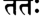

**----- Start of picture text -----** 
ШТ: **----- End of picture text -----** 

_татах пурйм йаду-патир атй-аланкртам рави-ччхада-дхваджа-пата-читра-торанам_ 

**текст 37] Драупади встречается с царицами Кришны** 

**391** 

## _кушастхалйм диви бхуви чабхисамстутам самавишат таранир ива сва-кетанам_ 

_татах_ — затем; _пурйм_ — в Свой город; _йаду-патих_ — предводи­ тель рода Яду; _ати_ — богато; _аланкртам_ — украшенный; _рави_ — солнце; _чхада_ — затмевавшими; _дхваджа_ — на древках; _пата_ — с флагами; _читра_ — прекрасными; _торанам_ — и с арками; _ку­ шастхалйм_ — в Двараку; _диви_ — на небесах; _бхуви_ — на земле; _ча_ — и; _абхисамстутам_ — прославляемую; _самавишат_ — Он во­ шел; _тараних_ — солнце; _ива_ — словно; _сва_ — в свою; _кетанам_ — обитель. 

**Вскоре Господь династии Яду въехал в Свою столицу, Кушастхали [Двараку], слава которой гремит на земле и на небесах. Над городом реяли флаги на флагштоках, которых было так много, что они загораживали солнце. На всех улицах стояли бо­ гато украшенные арки. Когда Господь Кришна въехал в город, казалось, что это бог солнца возвращается в свою обитель.** 

_КОММЕНТАРИЙ:_ Обитель солнца — это западные горы, за кото­ рые оно заходит каждый вечер. 

## **ТЕКСТ 37** 

f^RTT % ^ГЦТЧШ I *|U ||*M 4fb?A : ||3 « || 

_пита ме пуджайам аса сухрт-самбандхи-бандхаван махарха-васо- ’ланкараих ьиаййасана-париччхадаих_ 

_пита_ — отец; _ме_ — мой; _пуджайам аса_ — почтил; _сухрт_ — своих друзей; _самбандхи_ — близких родственников; _бандхаван_ — и дру­ гих членов семьи; _маха_ — очень; _арха_ — дорогими; _васах_ — одеж­ дами; _аланкараих_ — и драгоценностями; _ьиаййа_ — ложами; _асана_ — тронами; _париччхадаих_ — и другими предметами роскоши. 

**Мой отец почтил своих друзей, членов своей семьи и родствен­ ников моего будущего мужа, одарив их дорогими нарядами, дра­ гоценными украшениями, царскими ложами, тронами и другими предметами роскоши.** 

**392** 

**[песнь 10, гл. 83** 

**Шримад-Бхагаватам** 

## **ТЕКСТ 38** 

## ЗТЩЧТ^Г _**^**_ Я^ТГгТ: _**\\\6 \\**_ 

_дасйбхих сарва-сампадбхир бхатебха-ратха-ваджибхих айудхани махархани дадау пурнасйа бхактитах_ 

_дасйбхих_ — вместе со служанками; _сарва_ — всеми; _сампадбхих_ — одаренными; _бхата_ — с пехотинцами; _ибха_ — воинами на слонах; _ратха_ — воинами на колесницах; _ваджибхих_ — и конными воина­ ми; _айудхани_ — оружие; _маха-архани_ — очень ценное; _дадау_ — он подарил; _пурнасйа_ — всесовершенному Господу; _бхактитах_ — из преданности. 

**Из любви к всесовершенному Господу он подарил Ему служа­ нок в драгоценных украшениях, пеших и конных воинов, а так­ же воинов на слонах и колесницах. В придачу он подарил Господу очень ценное оружие.** 

_КОММЕНТАРИЙ:_ Верховный Господь _пурна_ , совершенен и полон в Себе Самом. Ему ничего не нужно, чтобы чувствовать удовле­ творение. Зная это, чистый преданный делает подношения Господу просто из любви, _бхактитах_ , не ожидая в ответ никаких матери­ альных вознаграждений. Господь же, со Своей стороны, с радос­ тью принимает даже цветок, листочек _туласи_ или немного воды, если все это преподносится Ему с любовью. 

## **ТЕКСТ 39** 

з л г ч к т н ) _ъ ч_ I i 

## **гТЧШ ^ 113^11** 

_атмарамасйа тасйема вайам ваи грха-дасиках сарва-санга-ниврттйаддха тапаса ча бабхувима_ 

_атма-арамасйа_ — удовлетворенного в Себе Самом; _тасйа_ — Его; _имах_ — эти; _вайам_ — мы; _ваи_ — несомненно; _грха_ — в до­ ме; _дасиках_ — служанки; _сарва_ — всего; _санга_ — материального общения; _ниврттйа_ — прекращением; _аддха_ — непосредственно; _тапаса_ — аскезой; _ча_ — и; _бабхувима_ — стали. 

**текст 40] Драупади встречается с царицами Кришны** 

**393** 

## **Так, отказавшись от общения с материалистичными людьми и совершая аскезу, мы, царицы, стали служанками удовлетворен­ ного в Себе Самом Верховного Господа.** 

_КОММЕНТАРИЙ:_ По мнению Шрилы Вишванатхи Чакраварти, Шримати Лакшмана очень смутилась, когда поняла, что все это время говорила о себе, поэтому здесь она прославляет других жен Кришны. В своем смирении Лакшмана утверждает, что жены Гос­ пода Кришны не смогли, в отличие от обычных жен, подчинить себе мужа и потому могут общаться с Ним лишь как служанки, поддерживающие порядок в Его доме. Однако на самом деле, по­ скольку царицы Господа — воплощения Его внутренней энергии наслаждения _(хладини-шакти),_ они полностью подчинили Его себе своей любовью. 

**ТЕКСТ 40** 

_$ЩгЦ_ W T Й г _W 3 W ч:_ №н < М + ^1 : I чШ*>НР1 _Ч Ъ \\ц*\ц:_ HVoll 

## _махишйа учух_ 

_бхаумам нихатйа са-ганам йудхи тена руддха_ 

_джнатватха нах кшити-джайе джита-раджа-канйах нирмучйа самсрти-вимокшам анусмарантйх падамбуджам парининайа йа апта-камах_ 

_махишйах учух_ — (другие) царицы сказали; _бхаумам_ — демо­ на Бхауму; _нихатйа_ — убив; _са_ — вместе; _ганам_ — с его при­ спешниками; _йудхи_ — в битве; _тена_ — им (Бхаумой); _руддхах_ — плененные; _джнатва_ — зная; _атха_ — затем; _нах_ — нас; _кшитиджайе_ — во время покорения (Бхаумой) земли; _джита_ — побеж­ денных; _раджа_ — царей; _канйах_ — дочери; _нирмучйа_ — освободив; _самсрти_ — от материального существования; _вимокшам_ — (ис­ точник) освобождения; _анусмарантйх_ — постоянно помня; _падаамбуджам_ — Его лотосные стопы; _парининайа_ — взял в жены; _йах_ — кто; _апта-камах_ — чьи желания уже выполнены. 

**[песнь 10, гл. 83** 

**Шримад-Бхагаватам** 

**394** 

**От лица всех остальных цариц Рохинидеви сказала: Убив Бхаумасуру и его приспешников, Господь обнаружил нас в темнице у демона и сразу понял, что мы — дочери тех царей, которых Бхаума победил во время своих завоеваний. Господь освободил нас, и, поскольку мы постоянно думали о Его лотосных стопах, дару­ ющих освобождение от материальных пут, Он согласился взять нас в жены, хотя все Его желания уже исполнены.** 

_КОММЕНТАРИЙ:_ Рохинидеви была одной из девяти цариц, к ко­ торым Драупади обратилась с вопросом в шестом и седьмом стихах, и здесь имеется в виду, что она говорит от лица осталь­ ных шестнадцати тысяч девяноста девяти жен Господа. В кни­ ге «Кришна, Верховная Личность Бога» Шрила Прабхупада подтверждает это. 

## **ТЕКСТЫ 41-42** 

**я' wKi^i I Ч К * Ы ^** _ШФтЦ Ч Ф 1_ **1|У?Н** 

**<ЫЧЧ1Ч4 W %ПЧгЧК<«И: I** 

т щ р р : ||« ^ || 

_на вайам садхви самраджйам свараджйам бхауджйам апй ута ваираджйам парамештхйам на анантйам ва харех падам_ 

_камайамаха этасйа ьирймат-пада-раджах ьирийах куна-кункума-гандхадхйам мурдхна водхум гада-бхртах_ 

_на_ — не; _вайам_ — мы; _садхви_ — о добродетельная женщина (Дра­ упади); _самраджйам_ — власти над всей землей; _сва-раджйам_ — по­ ложения Господа Индры, царя небес; _бхауджйам_ — безграничной способности наслаждаться; _апи ута_ — даже; _ваираджйам_ — мисти­ ческих сил; _парамеьитхйам_ — положения Господа Брахмы, твор­ ца вселенной; _на_ — и; _анантйам_ — бессмертия; _ва_ — или; _харех_ — Верховного Господа; _падам_ — обители; _камайамахе_ — желаем; _эта­ сйа_ — Его; _ьирй-мат_ — божественных; _пада_ — стоп; _раджах_ — пыль; _ьирийах_ — богини процветания; _куна_ — с груди; _кункума_ — пудры; _гандха_ — ароматом; _адхйам_ — обогащенную; _мурдхна_ — на своих головах; _водхум_ — нести; _гада-бхртах_ — Господа Кришны, который держит палицу. 

**текст 42] Драупади встречается с царицами Кришны** 

**395** 

**О добродетельная женщина, мы не хотим править землей, не хотим власти, которой обладает царь небес, нам не нужны без­ граничные возможности для наслаждения, мистические способ­ ности, пост Господа Брахмы, бессмертие и даже возможность попасть в царство Бога. Мы просто хотим всегда носить на своих головах божественную пыль с лотосных стоп Господа Кришны, благоухающую** _**куикумой**_ **с груди Его супруги.** 

_КОММЕНТАРИЙ:_ Глагол _радж_ означает «править», и от этого глагола образованы слова _самраджйам_ , «власть над всей землей», и _свараджйам,_ «власть над небесами». Слово _бхауджйам_ происхо­ дит от глагола _бхудж,_ «наслаждаться», и, таким образом, указы­ вает на возможность наслаждаться всем, что душе угодно. Шрила Вишванатха Чакраварти говорит, что слово _вират_ — это сокраще­ ние от слов _вивидхам вираджате_ («наслаждающийся всевозможной роскошью»). В частности, оно указывает на наслаждение восемью мистическими совершенствами, начиная с _анимы._ 

Шрила Шридхара Свами дает этим словам другое объяснение. Он утверждает, что, согласно «Бахв-рича-брахмане», эти четы­ ре термина указывают на власть над четырьмя сторонами света: _самраджйа_ — над востоком, _бхауджйа_ — над югом, _свараджйа_ — над западом и _ваираджйа_ — над севером. 

Жены Господа Кришны ясно говорят здесь, что не желают влас­ ти ни в одном из ее проявлений, описанных ими. Они не желают даже занять положение Брахмы, обрести освобождение или жить в царстве Бога. Они просто хотят пыли со стоп Шри Кришны, кото­ рым поклоняется Сама богиня Шри. Шрила Вишванатха Чакравар­ ти сообщает нам, что богиня процветания, о которой упоминается здесь, — это не Лакшми, супруга Нараяны, так как говорится, что богиня Лакшми, даже совершив суровую аскезу, не получи­ ла возможность лично общаться со Шри Кришной. Об этом гово­ рит Уддхава (Бхаг., 10.47.60): _найам ьирийо ’нга у нитанта-ратех прасадах._ Шри, упоминаемая в этом стихе, — это верховная богиня процветания, о которой говорится в «Брихад-Гаутамия-тантре»: 

_девй кршна-майй прокта радхика пара-девата сарва-лакшмй-майй сарвакантих саммохинй пара_ 

«Трансцендентная богиня Шримати Радхарани — непосредствен­ ная супруга Господа Шри Кришны. Из Нее исходят все остальные 

**[песнь 10, гл. 83** 

**Шримад-Бхагаватам** 

**396** 

богини процветания. Она столь привлекательна, что привязывает к Себе даже всепривлекающую Личность Бога. Поистине, Она — изначальная внутренняя энергия Господа». 

## **ТЕКСТ 43** 

ттгчт: _4#r4*\: ш \ \_ 

_враджа-стрийо йад ванчханти пулиндйас трна-вирудхах гаваьи чарайато гопах пада-спаршам махатманах_ 

_враджа_ — Враджа; _стрийах_ — женщины; _йат_ — как; _ванчхан­ т и_ — они желают; _пулиндйах_ — женщины племени _пулинда_ во Врадже; _трна_ — с травы; _вйрудхах_ — кустов и лиан; _гавах_ — ко­ ров; _чарайатах_ — который пасет; _гопах_ — пастушкй; _пада_ — стоп; _спаршам_ — прикосновения; _маха-атманах_ — Высшей Души. 

**Мы жаждем того же, чего жаждут юные пастушки Враджа, мальчики-пастушки и даже женщины племени** _**пулинда**_ **, — при­ косновения к пыли со стоп Верховного Господа, которую Он оставляет на траве и листьях растений, когда идет пасти Своих коров.** 

_КОММЕНТАРИЙ:_ Шрила Вишванатха Чакраварти напоминает нам о ревности и соперничестве, которые всегда существовали между царицами Двараки и _гопи_ Враджа. _Гопи_ считали утончен­ ных жительниц Двараки самой серьезной угрозой для их отноше­ ний со Шри Кришной и жаловались Уддхаве так: _касмат кршна ихайати прапта-раджйо хатахитах / нарендра-канйа удвахйа._ «Зачем Кришне возвращаться сюда, после того как Он завое­ вал царство, убил Своих врагов и женился на дочерях царей?» (Бхаг., 10.47.45). 

Рукмини же и другие семь главных жен Кришны считали себя столь удачливыми в отношениях с Кришной — тем Кришной, ко­ торого они знали в Двараке, — что у них не было никакого же­ лания увидеть Его таким, каким был Он во Вриндаване. Однако шестнадцать тысяч младших цариц, услышав, как Уддхава описы­ вает поразительные качества Шри Радхи, захотели коснуться пы­ ли со стоп Кришны, которую Он оставляет на траве и листьях 

**текст 43] Драупади встречается с царицами Кришны** 

**397** 

растений во Вриндаване. Как отмечает Шрила Вишванатха Чакраварти, некоторые комментаторы считают, что именно в этом кро­ ется причина того, что после _маушала-лилы_ Сам Господь Кришна, обернувшись шестнадцатью тысячами пастухов, украл этих цариц у Арджуны и привел в Гокулу. 

_Так заканчивается комментарий смиренных слуг А. Ч. Бхактиведанты Свами Прабхупады к восемьдесят третьей главе Де­ сятой песни «Шримад-Бхагаватам_ », _которая называется «Драу­ пади встречается с царицами Кришны»._ 

**ГЛАВА ВОСЕМЬДЕСЯТ ЧЕТВЕРТАЯ** 

# **Н аставления мудрецов на К урукш етре** 

В этой главе описывается, как на Курукшетру прибыли вели­ кие мудрецы, чтобы совершить благоприятные ритуалы, которые проводят во время солнечного затмения. Здесь также рассказыва­ ется, как мудрецы прославляли Господа Кришну и как Васудева с большим рвением совершал жертвоприношения. 

Во время солнечного затмения на Курукшетре Кунти, Драупади, Субхадре и другим знатным женщинам из рода Куру посчастливи­ лось общаться с женами Господа Кришны. Сильная любовь жен Господа к их мужу поразила этих женщин. Пока женщины разгова­ ривали между собой и тем же занимались мужчины, на Курукшет­ ру прибыли великие мудрецы во главе с Нарадой и Вьясадевой. Все они очень хотели увидеть Кришну. Цари и другие знатные личнос­ ти, включая Пандавов, Кришну и Балараму, в этот момент непри­ нужденно сидели и вели беседу. Увидев мудрецов, они тут же встали со своих мест и поклонились этим великим душам. Они осведоми­ лись об их благополучии и оказали почтение, усадив их, поднеся им воду и т.д. Затем Господь Кришна сказал: «Теперь нашу жизнь можно считать успешной, ибо мы достигли ее цели: возможности общаться с великими мудрецами и _йогами._ Эта возможность ред­ ко выпадает даже полубогам. Вода из святого места паломничес­ тва и лицезрение Божеств очищают человека лишь спустя долгое время, однако одного взгляда на святых мудрецов достаточно, что­ бы очиститься. Те, кто отождествляет себя с телом и не почитает великих мудрецов, мало чем отличаются от ослов». 

Выслушав Господа Кришну, который говорил, словно простой смертный, мудрецы некоторое время молчали в замешательстве. Затем они сказали: «Сколь удивителен наш Господь! Ведя Себя как обычный человек, Он скрывает Свою истинную природу и делает вид, что подчиняется высшей воле. Конечно же, Он произнес эти слова лишь для того, чтобы просветить обычных людей. Его пове­ дение, воистину, непостижимо». Мудрецы продолжали прославлять 

**399** 

**[песнь 10, гл. 84** 

**Шримад-Бхагаватам** 

**400** 

Господа как Верховную Личность Бога, Высшую Душу, а также своего друга и почитателя _брахманов._ 

После того как мудрецы вознесли Ему хвалу, Господь Криш­ на поклонился им, и они испросили у Него позволение вернуть­ ся в свои хижины. Тогда вперед вышел Васудева. Он поклонился мудрецам и спросил: «Какие деяния следует совершать, чтобы освободиться от оков _кармы?»_ Мудрецы ответили: «Ты сможешь освободиться от оков _кармы,_ если будешь поклоняться Верховно­ му Господу, Хари, совершая ведические жертвоприношения». Тогда Васудева попросил мудрецов стать его жрецами и стал проводить жертвоприношения, рекомендованные в Ведах, собрав для этого самые лучшие ингредиенты. Когда они были завершены, Васудева щедро вознаградил жрецов. Он подарил им коров, драгоценнос­ ти и девушек из сословия _брахманов_ , вошедших в брачный воз­ раст. Затем он совершил ритуальное омовение, знаменующее конец жертвоприношения, и накормил досыта всех, включая деревенских собак. После этого он щедро одарил всех своих родственников, ца­ рей и других людей. Когда все было закончено, все попрощались со Шри Кришной и возвратились по домам. 

Не в силах расстаться со своими родственниками из-за боль­ шой любви к ним, Махараджа Нанда оставался на Курукшетре в течение трех месяцев, и Ядавы с великим почтением служили ему. Однажды Васудева стал рассказывать, как Нанда доказал ему свою дружбу, и у всех на глазах расплакался. Прошло три меся­ ца, и Нанда, сердечно попрощавшись с Ядавами, отправился в Ма­ тхуру. Когда Ядавы увидели, что приближается сезон дождей, они вернулись в Двараку и там рассказали всем жителям города о том, что произошло на Курукшетре. 

## **ТЕКСТ 1** 

: II ? II 

_ьирй-ьиука увача_ 

_шрутва пртха субала-путрй атха йаджнасени мадхавй атха кшитипа-патнйа ута сва-гопйах_ 

**текст 1]** 

**Наставления мудрецов на Курукшетре** 

**401** 

## _кршне ’кхилатмани харау пранайанубандхам сарва висисмйур алам ашру-калакулакшйах_ 

_шрй-шуках увача_ — Шукадева Госвами сказал; _шрутва_ — услы­ шав; _пртха_ — Кунти; _субала-путрй_ — Гандхарй, дочь царя Субалы; _атха_ — и; _йаджнасени_ — Драупади; _мадхавй_ — Субхадра; _атха_ — и; _кшити-па_ — царей; _патнйах_ — жёны; _ута_ — также; _сва_ — Его (Господа Кришны); _гопйах_ — _гопи; кршне_ — к Кришне; _акхила_ — всех; _атмани_ — Душе; _харау_ — Верховному Господу Ха­ ри; _пранайа_ — любовную; _анубандхам_ — привязанность; _сарвах_ — все они; _висисмйух_ — были поражены; _алам_ — необычайно; _аьирукала_ — слезами; _акула_ — наполнившиеся; _акшйах_ — чьи глаза. 

**Шукадева Госвами сказал: Притха, Гандхарй, Драупади, Субхад­ ра, жены других царей, а также** _**гопи**_ **— пастушки Господа — все они были поражены, видя, сколь глубока любовь цариц к Господу Кришне, Верховной Личности Бога и Душе всех живых существ, так что слезы подступили к их глазам.** 

_КОММЕНТАРИЙ:_ Драупади — это главная из тех возвышенных женщин, кто слушал рассказы цариц, поскольку, как объясняет Шрила Шридхара Свами, именно она задала вопрос, на который отвечали царицы Господа Кришны. Поскольку Гандхарй и другие женщины, перечисленные в этом стихе, в предыдущей главе даже не упомянуты, _ачаръя_ Шридхара делает вывод, что, скорее всего, они слышали рассказы цариц в пересказе кого-то другого. И дейст­ вительно, Драупади не осмелилась бы говорить так свободно, если бы рядом были Притха и Гандхарй, ее старшие родственницы, или _гопи,_ которые не особенно жаловали цариц Двараки. Хотя _гопи_ тоже плакали, слушая эти истории, слезы их были вызваны тем, что им напомнили об играх Шри Кришны, а вовсе не их нежными чувствами к царицам Двараки. 

Конечно, стоит помнить, что в духовных отношениях всегда ца­ рит совершенная гармония. В основе кажущихся конфликтов меж­ ду чистыми преданными никогда не лежит мирская зависть или соперничество. Ревность _гопи_ была больше показной, чем настоя­ щей, и проявляли они ее как экстатический признак их всепогло­ щающей любви к Кришне. Как утверждает далее Шрила Шридхара Свамипада, слово _сва-гопйах_ подразумевает, что _гопи_ были _свасварупой_ цариц — их «прототипами», то есть сами царицы были экспансиями (воплощениями) _гопи._ 

**[песнь 10, гл. 84** 

**402** 

## **Шримад-Бхагаватам** 

## **ТЕКСТЫ 2-5** 

?fcT ^4-Н1ЧЧ|0||^ I f^ W T f3 ^ ^ T T  II R II 

**%ЧТЧ«ТГ 4R^5f** 'w4ct«ll <^tci)S$lrC **I £гш£пт: д а ч ! iforo и з и** 

_тщ:_ 4 ^ 1 4 1  чччтч; W ? t  Э Д  I 4 ^ J 4 ts fta r 4 l M 4 l  « 1 ^4 fri: II У II 

**W^tTmf^T: I ЗТЧТтФ ЩГС^ГаГ MI4^I<4)S4^ и ч II** 

_ити самбхашаманасу стрйбхих стрйьиу нрбхир нрьиу айайур мунайас татра кршна-рама-дидркшайа_ 

_дваипайано нарадаш ча чйавано девало 9ситах виьивамитрах ьиатанандо бхарадваджо ’тха гаутамах_ 

_рамах са-ьиишйо бхагаван васиштхо галаво бхргух пуластйах кашйапо ’триьи ча маркандейо брхаспатих_ 

_двитас тритаьи чаикаташ ча брахма-путрас татхангирах агастйо йаджнавалкйаш ча вамадевадайо упаре_ 

_ит и_ — так; _самбхашаманасу_ — пока они беседовали; _стрйбхих_ — с женщинами; _стрйшу_ — женщины; _нрбхих_ — с мужчинами; _нршу_ — мужчины; _айайух_ — прибыли; _мунайах_ — великие мудрецы; _татра_ — в то место; _кршна-рама_ — Господа Кришну и Господа Балараму; _дидркшайа_ — желая увидеть; _дваипайанах_ — Двайпаяна Ведавьяса; _парадах_ — Нарада; _ча_ — и; _чйаванах девалах аситах_ — Чьявана, Девала и Асита; _виьивамитрах ьиатанандах_ — Вишвамитра и Шатананда; _бхарадваджах атха гаутамах_ — Бхарадваджа и Гаутама; _рамах_ — Парашурама; _са_ — вместе; _ьиишйах_ — со своими учениками; _бхагаван_ — воплощение Верховного Гос­ пода; _васиштхах галавах бхргух_ — Васиштха, Галава и Бхригу; _пуластйах каьийапах атрих ча_ — Пуластья, Кашьяпа и Атри; _маркандейах брхаспатих_ — Маркандея и Брихаспати; _двитах_ 

**текст 7]** 

**403** 

**Наставления мудрецов на Курукшетре** 

_тритах ча экатах ча_ — Двита, Трита и Эката; _брахма-путрах_ — сыновья Господа Брахмы (Санака, Санат, Сананда и Санатана); _татха_ — а также; _ангирах_ — Ангира; _агастйах йаджнавалкйах ча_ — Агастья и Ягьявалкья; _вамадева-адайах_ — во главе с Вамадевой; _апаре_ — другие. 

**Пока женщины беседовали между собой, а мужчины — меж­ ду собой, в лагерь Ядавов пришли великие мудрецы, желавшие увидеть Господа Кришну и Господа Балараму. Среди них были Двайпаяна, Нарада, Чьявана, Девала и Асита, Вишвамитра, Шатананда, Бхарадваджа и Гаутама, Господь Парашурама вместе со своими учениками, Васиштха, Галава, Бхригу, Пуластья и Кашьяпа, Атри, Маркандея и Брихаспати, Двита, Трита, Эката и четверо Кумаров, а также Ангира, Агастья, Ягьявалкья и Вамадева.** 

## **ТЕКСТ 6** 

щ^т _**тяГгчт**_ umiffiHi i m ^ i :  $ьик|41 ^ н * н 

_тан дрштва сахасоттхайа праг асйна нрпадайах пандавах кршна-рамау ча пранемур вшива-вандитан_ 

_тан_ — их; _дрштва_ — увидев; _сахаса_ — тут же; _уттхайа_ — под­ нявшись; _прак_ — до этого времени; _асйнах_ — сидевшие; _нрпаадайах_ — цари и другие; _пандавах_ — Пандавы; _кршна-рамау_ — Кришна и Баларама; _ча_ — также; _пранемух_ — поклонились; _вишва_ — во всей вселенной; _вандитан_ — тем, кого почитают. 

**Увидев приближающихся мудрецов, цари и другие знатные лю­ ди, которые до этого сидели, тут же поднялись со своих мест. Все они, в том числе братья Пандавы, Кришна и Баларама, поклонились мудрецам, которых почитают повсюду в мироздании.** 

## **ТЕКСТ 7** 

**[песнь 10, гл. 84** 

**Шримад-Бхагаватам** 

**404** 

_тан анарчур йатха сарве саха-рамо 'чйуто \рчайат свагатасана-падйаргхйа-малйа-дхупанулепанаих_ 

_тан_ — им; _анарчух_ — поклонялись; _йатха_ — должным образом; _сарве_ — все они; _саха-рама_ — включая Господа Балараму; _ачйу­ тах_ — и Господа Кришну; _арчайат_ — поклонялись им; _св-агата_ — словами приветствия; _асана_ — почетными местами; _падйа_ — водой для омовения стоп; _аргхйа_ — водой для питья; _малйа_ — гирляндами; _дхупа_ — благовониями; _анулепанаих_ — и сандаловой пастой. 

**Господь Кришна, Господь Баларама и другие цари и правители по всем правилам почтили мудрецов, поприветствовав их, усадив на почетные места, омыв им стопы, поднеся им воду, гирлянды, благовония и сандаловую пасту.** 

## **ТЕКСТ 8** 

## **и/.и** 

_увача сукхам асйнан бхагаван дхарма-гуп-танух садасас тасйа махато йата-вачо ’нушрнватах_ 

_увача_ — сказал; _сукхам_ — удобно; _асйнан_ — тем, кто сидел; _бха­ гаван_ — Верховный Господь; _дхарма_ — религии; _гуп_ — средства за­ щиты; _танух_ — чье тело; _садасах_ — в собрании; _тасйа_ — этом; _махатах_ — великим душам; _йата_ — обуздана; _вачах_ — чья речь; _ануьирнватах_ — пока они внимательно слушали. 

**После того как мудрецы удобно уселись, Верховный Господь Кришна, чье трансцендентное тело защищает устои религии, об­ ратился к ним перед всеми великими людьми, присутствовавши­ ми при этом. Все собравшиеся замолчали и стали внимательно слушать Его речь.** 

## **ТЕКСТ 9** 

**текст 10]** 

**405** 

**Наставления мудрецов на Курукшетре** 

_шрй-бхагаван увача_ 

_ахо вайам джанма-бхрто лабдхам картснйена тат-пхалам деванам апи душпрапам йад йогешвара-даршанам_ 

_шрй-бхагаван увача_ — Верховный Господь сказал; _ахо_ — о!; _вайам_ — мы; _джанма-бхртах_ — родившись; _лабдхам_ — обре­ ли; _картснйена_ — вместе; _тат_ — его (рождения); _пхалам_ — плод; _деванам_ — для полубогов; _апи_ — даже; _душпрапам_ — труднодости­ жимый; _йат_ — который; _йога-йшвара_ — с великими знатоками _йоги; даршанам_ — встреча. 

**Верховный Господь сказал: Теперь жизнь наша увенчалась успе­ хом, ибо мы достигли ее конечной цели: встретились с великими** _**йогами**_ **. Даже полубогам редко выпадает такая удача.** 

_КОММЕНТАРИЙ:_ Несмотря на значительные преимущества, ко­ торыми наслаждаются полубоги, правящие этим миром, им редко удается увидеть мудрецов уровня Нарады и Вьясадевы. Насколь­ ко же реже видят их земные цари и простые пастухи! Здесь Гос­ подь Кришна, причисляя Себя к земным царям и другим людям, собравшимся в Саманта-Панчаке, говорит от их имени. 

## **ТЕКСТ 10** 

## **f% НгЧДЧШ fJIHHtoi I <^чФ ш % 1М ^ЧК |4н|Ц +Ч , IIMI** 

_ким свалпа-тапасам нрнам арчайам дева-чакшушам даршана-спаршана-прашна-прахва-падарчанадикам_ 

_ким_ — разве; _су-алпа_ — очень скудны; _тапасам_ — чьи аскезы; _нрнам_ — людям; _арчайам_ — в храмовом Божестве; _дева_ — Бога; _чакшушам_ — чье восприятие; _даршана_ — видя; _спаршана_ — при­ касаясь; _праьина_ — задавая вопросы; _прахва_ — кланяясь; _падаарчана_ — поклоняясь стопам; _адикам_ — и так далее. 

**Как случилось, что люди, не совершавшие аскез и способные распознать Бога только тогда, когда Он находится перед нами в образе Божества в храме, могут сейчас лицезреть вас, дотра­ гиваться до вас, задавать вам вопросы, кланяться вам, почитать ваши стопы и оказывать вам другие услуги?** 

**[песнь 10, гл. 84** 

**Шримад-Бхагаватам** 

**406** 

## **ТЕКСТ 11** 

ч  « ц н ч |Р | ч  ^чт I **% ^ Г Ч % ш чч: ||??||** 

_на хй ам-майани тйртхани на дева мрч-чхила-майах те пунантй уру-калена даршанад эва садхавах_ 

_на_ — не; _хи_ — поистине; _ап_ — из воды; _майани_ — состоящие; _тйр­ тхани_ — святые места; _на_ — не; _девах_ — божества; _мрт_ — из земли; _шила_ — и камня; _майах_ — состоящие; _те_ — они; _пунантй_ — очи­ щают; _уру-калена_ — после долгого времени; _даршанат_ — которых видят; _эва_ — только; _садхавах_ — святые. 

**Настоящие места паломничества — не обычные водоемы, так же как настоящие святыни — не статуи из земли и камня. Они очищают человека нескоро, но святые мудрецы очищают, стоит человеку увидеть их.** 

_КОММЕНТАРИЙ:_ Поскольку Бог, Высший Дух, абсолютен, то любое Его проявление, будь то в камне, краске, звуке или в дру­ гом виде, описанном в _шастрах_ , неотлично от Его изначальной формы, в которой Он проявляет Себя на высшей духовной плане­ те, Голоке Вриндаване. Этого нельзя сказать про обычных полу­ богов. Они всего лишь бесконечно малые искорки духа, и потому изображения полубогов отличны от них самих. Поэтому поклоне­ ние полубогам или ритуальные омовения в святых местах приносят очень незначительное благо тем людям, у которых нет духовной веры в Верховного Господа. 

Однако великие святые-вайшнавы, такие как Вьясадева, Нара­ да и четверо Кумаров, напротив, всегда погружены в сознание Кришны, поэтому они являются «ходячими» _тиртхами_ , местами паломничества. Даже миг общения с ними, в особенности те мгно­ вения, когда человек слушает, как они прославляют Господа, может освободить от всех материальных пут. Царь Юдхиштхира говорит Видуре: 

_бхавад-видха бхагаватас_ 

_тйртха-бхутах свайам вибхо_ 

_тйртхй-курванти тйртхани свантах-стхена гадабхрта_ 

**текст 12]** 

**Наставления мудрецов на Курукшетре** 

**407** 

«О мой господин, воистину, такие преданные, как ты, — это оли­ цетворенные святые места. Ты несешь в своем сердце Личность Бога и потому превращаешь любое место в место паломничества» (Бхаг., 1.13.10). 

## **ТЕКСТ 12** 

**ч т М ^ ч  ч Ч # Г ТЧ 444tS4** _**-Щ**_ **чч: I** ЧЧТШЧТ **ЙчМГ ЧЙТ ||?R||** 

_нагнир на сурйо на ча чандра-тарака_ 

_на бхур джалам кхам ьивасано ’тха ван, манах упасита бхеда-крто харантй агхам випаьичито гхнанти мухурта-севайа_ 

_на_ — не; _агних_ — огонь; _на_ — не; _сурйах_ — солнце; _на_ — не; _ча_ — и; _чандра_ — луна; _тараках_ — и звезды; _на_ — не; _бхух_ — земля; _джалам_ — вода; _кхам_ — эфир; _ьивасанах_ — дыхание; _атха_ — или; _вак_ — речь; _манах_ — и ум; _упаситах_ — принимающие поклоне­ ние; _бхеда_ — разницу (между собой и другими живыми сущест­ вами); _кртах_ — того, кто создает; _харантй_ — они уничтожают; _агхам_ — грехи; _випашчитах_ — мудрые люди; _гхнанти_ — уничтожа­ ют; _мухурта_ — за несколько минут; _севайа_ — служением. 

**Ни полубоги, управляющие огнем, солнцем, луной или звезда­ ми, ни те, кто повелевает землей, водой, эфиром, воздухом, речью и умом, не могут избавить тех, кто поклоняется им, от грехов, так как те по-прежнему смотрят на мир сквозь призму двойственнос­ ти. Однако мудрецы очень быстро устраняют все грехи — доста­ точно, чтобы человек почтительно служил им хотя бы несколько минут.** 

_КОММЕНТАРИЙ:_ Начинающий преданный Верховного Господа видит проявление Бога лишь в Божестве, а все остальное — и да­ же близких слуг Господа — считает материальным. Тем не менее, поскольку он признает верховное положение Господа Вишну, такой преданный находится в гораздо более выгодном положении, нежели 

**[песнь 10, гл. 84** 

**Шримад-Бхагаватам** 

**408** 

материалистичные почитатели полубогов, и потому заслуживает уважения. 

Тем, кто хочет пойти дальше в своем преданном служении, в этом стихе рекомендуется общаться с великими мудрецами — либо непосредственно, либо через их наставления. Начинающий преданный может избавиться от самых очевидных грехов — наси­ лия над невинными живыми существами, а также над своим те­ лом и умом. Однако до тех пор, пока он не достигнет высшего уровня преданности, ему придется постоянно сражаться с более тонкими осквернениями — гордыней, неуважительным отношени­ ем к возвышенным вайшнавам и недостатком сочувствия к страда­ ющим живым существам. Лучшее лекарство для излечения от этих проявлений незрелости — слушать и почитать чистых вайшнавов, а также помогать им освобождать падшие, обусловленные души от рабства материи. 

**ТЕКСТ 13** 

_йасйатма-буддхих кунапе три-дхатуке сва-дхйх калатрадишу бхаума иджйа-дхйх йат-тйртха-буддхих салиле на кархичидж джанешв абхиджнешу са эва го-кхарах_ 

_йасйа_ — чье; _атма_ — как о своем «я»; _буддхих_ — представле­ ние; _кунапе_ — о теле, подобном трупу; _три-дхатуке_ — состоящем из трех основных элементов; _сва_ — как своих; _дхйх_ — представ­ ление; _калатра-адишу_ — о жене и других; _бхауме_ — о земле; _иджйа_ — как объекте поклонения; _дхйх_ — представление; _йат_ — чье; _тйртха_ — как о месте паломничества; _буддхих_ — представле­ ние; _салиле_ — о воде; _на кархичит_ — никогда; _джанешу_ — о людях; _абхиджнешу_ — мудрых; _сах_ — он; _эва_ — несомненно; _гах_ — корова; _кхарах_ — или осел. 

**Тот, кто считает себя просто телом, состоящим из слизи, жел­ чи и воздуха, кто думает, что жена и остальные члены семьи на­** 

**текст 14]** 

**409** 

**Наставления мудрецов на Курукшетре** 

**вечно принадлежат ему, кто считает статую из глины или землю, на которой родился, достойной поклонения, а в месте паломничес­ тва видит только водоем и ничего больше и при этом никогда не отождествляет себя с мудрецами, сведущими в духовной науке, не чувствует родства с ними, не поклоняется им и даже не посещает их, — такой человек ничем не лучше коровы или осла.** 

_КОММЕНТАРИЙ:_ По-настоящему разумен лишь тот, кто не пу­ тает душу с материей. В «Брихаспати-самхите» говорится: 

_аджната-бхагавад-дхарма мантра-виджнана-самвидах нарас те го-кхара джнейа апи бху-пала-вандитах_ 

«Людей, которым не ведомы законы преданного служения Вер­ ховному Господу, следует считать коровами и ослами, даже ес­ ли они могут очень хорошо объяснять смысл ведических _мантр_ и пользуются уважением сильных мира сего». 

Вайшнав, который пытается стать преданным второй категории, но еще не достиг совершенства, чувствует очень глубокое родство с мудрецами, которые идут верным духовным путем, даже несмот­ ря на то, что у него могут еще оставаться материальные привязан­ ности к телу, семье и всему, что с этим связано. Такого преданного Господа в отличие от большинства материалистов нельзя приравни­ вать к глупой корове или упрямому ослу. Однако самым совершен­ ным из людей следует считать вайшнава, который обрел особую милость Господа и полностью освободился от рабства иллюзорных привязанностей. 

По мнению Шрилы Вишванатхи Чакраварти, слова _бхаума йджйа-дхйх_ , «кто считает статую из глины достойной поклонения», относятся не к _мурти_ Верховного Господа в Его храме, а к изобра­ жениям полубогов, а слова _йат-тйртха-буддхих салиле_ , «кто счи­ тает место паломничества просто водоемом», относятся не к таким рекам, как Ганга и Ямуна, а к менее значимым. 

## **ТЕКСТ 14** 

I 

р|*|й с*т 

**[песнь 10, гл. 84** 

**Шримад-Бхагаватам** 

**410** 

_шрй-ьиука увача_ 

_нишамйеттхам бхагаватах кршнасйакунтха-медхасах вачо дуранвайам випрас тушнйм асан бхрамад-дхийах_ 

_шрй-шуках увача_ — Шри Шукадева Госвами сказал; _нишамйа_ — услышав; _иттхам_ — такие; _бхагаватах_ — Верховного Господа; _кршнасйа_ — Кришны; _акунтха_ — безгранична; _медхасах_ — чья муд­ рость; _вачах_ — слова; _дуранвайам_ — сложные для понимания; _випрах_ — ученые _брахманы; тушнйм_ — молчаливые; _асан_ — стали; _бхрамат_ — обеспокоены; _дхийах_ — их умы. 

**Шукадева Госвами сказал: Выслушав эти загадочные речи из уст безгранично мудрого Господа Кришны, ученые** _**брахманы**_ **ничего не сказали, так как были озадачены.** 

## **ТЕКСТ 15** 

**зг-ш р ||?ЧИ** 

_чирам вимрьийа мунайа йшварасйешитавйатам джана-санграха итй учух смайантас там джагад-гурум_ 

_чирам_ — некоторое время; _вимршйа_ — подумав; _мунайах_ — муд­ рецы; _йшварасйа_ — верховного повелителя; _йьиитавйатам_ — по­ ложение подвластного; _джана-санграхах_ — просвещения всех лю­ дей; _ит и_ — так (решив); _учух_ — сказали; _смайантах_ — улыбаясь; _там_ — Ему; _джагат_ — вселенной; _гурум_ — духовному учителю. 

**Некоторое время мудрецы размышляли над поведением Вер­ ховного Господа, которое напоминало поведение обычного, под­ невольного живого существа. Они пришли к заключению, что поступил Он так лишь для того, чтобы преподать урок людям. Поэтому они улыбнулись и сказали Ему, духовному учителю всего мира, такие слова.** 

_КОММЕНТАРИЙ:_ Шрила Шридхара Свами объясняет, что слово _йшитавйата_ относится к тому, кто не обладает независимостью и вынужден подчиняться закону _кармы_ , то есть действовать и по­ жинать плоды своих поступков. Обращаясь к мудрецам, Господь 

**текст 16]** 

**411** 

**Наставления мудрецов на Курукшетре** 

Кришна играл роль такого обусловленного живого существа, что­ бы подчеркнуть важность слушания святых вайшнавов и служе­ ния им. Верховный Господь не только повелевает всем, но и учит людей науке полного предания. 

## **ТЕКСТ 16** 

_шрй-мунайа учух йан-майайа таттва-вид-уттама вайам вимохита вишва-срджам адхйшварах йад йшитавйайати гудха йхайа ахо вичитрам бхагавад-вичештитам_ 

_шрй-мунайах учух_ — великие мудрецы сказали; _йат_ — чьей; _майайа_ — иллюзорной энергией; _таттва_ — истины; _вит_ — знато­ ки; _уттамах_ — лучшие; _вайам_ — мы; _вимохитах_ — введенные в за­ блуждение; _вшива_ — вселенной; _срджам_ — творцы; _адхйшварах_ — главные; _йат_ — то, что; _йшитавйайати_ — (Верховный Господь) играет роль подчиненного высшим силам; _гудхах_ — скрытый; _йхайа_ — Своими деяниями; _ахо_ — о!; _вичитрам_ — удивительны; _бхагават_ — Верховного Господа; _вичештитам_ — деяния. 

**Великие мудрецы сказали: Твоя иллюзорная энергия озадачи­ ла нас, самых возвышенных знатоков истины и главных творцов мироздания. О, как удивительны поступки Верховного Госпо­ да! Он ведет Себя словно обычный человек и делает вид, что подчиняется высшей воле.** 

_КОММЕНТАРИЙ:_ Мудрецы решили, что слова Господа непости­ жимы _(дуранвайам)._ В этом стихе они объясняют почему. Когда Он подчиняется Своим собственным слугам, Его слова и поступки вводят в заблуждение даже самых великих знатоков писаний. 

**[песнь 10, гл. 84** 

**Шримад-Бхагаватам** 

**412** 

## **ТЕКСТ 17** 

**З Т % ЗТТгФТТ** 

^сЧ Ф Ч |(т1 Я- _-ЦЩ_ I **^ f| ^Ы|чттп^М** 3 # и ? » и 

_анйха этад бахудхаика атмана_ 

_срджатй аватй атти на бадхйате йатха бхаумаир хи бхумир баху-нама-рупинй ахо вибхумнаш чаритам видамбанам_ 

_анйхах_ — не прилагая усилий; _этат_ — эту (вселенную); _бахудха_ — разнообразную; _эках_ — один; _атмана_ — Сам; _срджатй_ — Он создает; _авати_ — поддерживает; _атти_ — уничтожает; _на ба­ дхйате_ — не связанный; _йатха_ — как; _бхаумаих_ — изменениями земли; _хи_ — несомненно; _бхумих_ — земля; _баху_ — множество; _намарупинй_ — имеющая имен и форм; _ахо_ — о!; _вибхумнах_ — всемогу­ щего Господа; _чаритам_ — деяния; _видамбанам_ — притворство. 

**Поистине, когда Всевышний ведет Себя как обычный человек, Он просто притворяется! Он один играючи производит на свет из Своего тела это исполненное многообразия творение, поддержи­ вает его, а затем вновь поглощает и при этом не запутывается в последствиях Своих поступков. Поистине, Ты подобен элементу земли, который, видоизменяясь, получает новые облики и имена.** 

_КОММЕНТАРИЙ:_ Всевышний один, и при этом Он распространя­ ет Себя во множество форм, не утрачивая Своей полноты. Он де­ лает это без особых усилий и при этом не зависит ни от кого и ни от чего. Никто, кроме Него Самого, не способен понять, как Он распространяет Себя во множество форм, однако на примере земли и ее производных можно до какой-то степени представить себе, как это происходит. Точно такой же пример приводится в часто цити­ руемом отрывке из «Чхандогья-упанишад» (6.1.4): _вачарамбханам викаро намадхейам мрттикетй эва сатйам._ «Изделия из глины разнообразны только потому, что их называют разными именами; истинна, однако, лишь земля, из которой они созданы». 

Шрила Шридхара Свами полагает, что этот стих «ШримадБхагаватам» отметает возражение, которое мог выдвинуть Господь Кришна: «Как Я могу творить, поддерживать и уничтожать все­ 

**текст 18]** 

**413** 

**Наставления мудрецов на Курукшетре** 

ленную? Ведь Я всего лишь сын Васудевы». Ответ на это воз­ можное возражение содержится в словах _ахо вибхумнаш чаритам видамбанам:_ «Ты совершенное, полное целое. Рождаясь и совершая поступки в этом мире, Ты просто подражаешь обычным людям. Поистине, Ты всего лишь делаешь вид, что Тебе нужно кому-то подчиняться». 

## **ТЕКСТ 18** 

## **^ Ч Ч  ЧЧТсГЧ** Ч’чЬчТТсЧТ 47t ЧЧТ^ 11?^11 

_атхапи кале сва-джанабхигуптайе бибхарши саттвам кхала-ниграхайа ча сва-лйлайа веда-патхам санатанам варнашраматма пурушах паро бхаван_ 

_атха апи_ — тем не менее; _кале_ — в нужное время; _сва-джана_ — Своих преданных; _абхигуптайе_ — для защиты; _бибхарши_ — Ты принимаешь; _саттвам— гуну_ благости; _кхала_ — злодеев; _ниграхайа_ — для наказания; _ча_ — и; _сва_ — Своими; _лйлайа_ — развле­ чениями; _веда-патхам_ — путь Вед; _санатанам_ — вечный; _варнааьирама_ — божественной системы профессиональных и духовных укладов общества; _атма_ — Душа; _пурушах_ — Личность Бога; _па­ рах_ — Верховный; _бхаван_ — Ты. 

**Тем не менее в нужное время, чтобы защитить тех, кто предан Тебе, и наказать злодеев, Ты принимаешь чистую** _**гуну**_ **благости. Таким образом, наслаждаясь Своими сладостными раз­ влечениями, Ты, Душа** _**варнашрамы**_ **, Верховная Личность Бога, поддерживаешь в чистоте вечный путь Вед.** 

_КОММЕНТАРИЙ:_ Этот стих описывает, как Господь дает знание людям _(джана-санграха)_ и как, приходя сюда, Он ведет Себя как обычный человек. Поскольку Верховный Господь всегда остает­ ся совершенным, тело, которое Он проявляет, приходя в матери­ альный мир, не является творением материальной _гуны_ благости. Его тело целиком состоит из чистой благости, _вишуддха-саттвы;_ 

**[песнь 10, гл. 84** 

**414** 

**Шримад-Бхагаватам** 

иначе говоря, тело, которое Он проявляет в этом мире, столь же духовно, как и Его изначальная форма. 

## **ТЕКСТ 19** 

## ^ ?ГгГ: чтя; ИПИ 

_брахма те хрдайам ьиуклам тапах-свадхйайа-самйамаих йатропалабдхам сад вйактам авйактам ча татах парам_ 

_брахма_ — Веды; _те_ — Твое; _хрдайам_ — сердце; _ьиуклам_ — чистое; _тапах_ — аскезой; _свадхйайа_ — изучением; _самйамаих_ — и самообузданием; _йатра_ — в котором; _упалабдхам_ — наблюдается; _cam_ — чистое духовное бытие; _вйактам_ — проявленное (продукты мате­ риального творения); _авйактам_ — непроявленное (тонкие причины творения); _ча_ — и; _татах_ — этому; _парам_ — трансцендентное. 

**Веды — это Твое безукоризненно чистейшее сердце. Благодаря им человек, который совершает аскезу, изучает их и учится вла­ деть собой, может увидеть проявленное, непроявленное, а также чистое бытие, трансцендентное обоим этим состояниям.** 

_КОММЕНТАРИЙ: Въякта_ , «проявленное», — это объекты, кото­ рые мы видим в этом мире, а _авъякта_ — это тонкие, глубинные причины мироздания. Веды указывают нам путь к трансцендент­ ному миру — миру Брахмана, который лежит за пределами всех материальных причин и следствий. 

## **ТЕКСТ 20** 

## IRoll 

_тасмад брахма-кулам брахман ьиастра-йонес твам атманах сабхаджайаси сад дхама тад брахманйагранйр бхаван_ 

_тасмат_ — поэтому; _брахма_ — _брахманов; кулам_ — сообществу; _брахман_ — о Абсолютная Истина; _ьиастра_ — богооткровенные пи­ сания; _йонех_ — средство постижения которого; _твам_ — Ты; _ат­ манах_ — Тебя; _сабхаджайаси_ — оказываешь почтение; _cam_ — совер­ шенная; _дхама_ — обитель; _тат_ — следовательно; _брахманйа_ — тех, кто чтит брахманическую культуру; _агранйх_ — глава; _бхаван_ — Ты. 

**текст 22] Наставления мудрецов на Курукшетре** 

**415** 

**Поэтому, о Верховный Брахман, Ты так чтишь тех, кто при­ надлежит к сословию** _**брахманов**_ **, ибо они — совершенные по­ средники, с помощью которых человек может постичь Тебя, обратившись к Ведам. Именно по этой причине Ты оказываешь почтение** _**брахманам**_ **и поклоняешься им.** 

## **ТЕКСТ 21** 

_**Ш**_ **^ r : I Н<41 Ч^тГ:** _**Ъ ч т**_ **ЧТ: IR?II** 

_адйа но джанма-сапхалйам видйайас тапасо дршах твайа сангамйа сад-гатйа йад антах шрейасам парах_ 

_адйа_ — сегодня; _нах_ — нашего; _джанма_ — рождения; _сапхалйам_ — осуществление цели; _видйайах_ — образования; _тапасах_ — аске­ зы; _дршах_ — зрения; _твайа_ — с Тобой; _сангамйа_ — обретя обще­ ние; _cam_ — святых; _гатйа_ — который является целью; _йат_ — поскольку; _антах_ — предел; _шрейасам_ — блага; _парах_ — высшего. 

**Сегодня наше рождение, наши познания, наша аскеза и способ­ ность видеть принесли желанные плоды, ибо мы получили воз­ можность общаться с Тобой, целью всех святых. Поистине, Ты Сам — высшее благословение для всех.** 

_КОММЕНТАРИЙ:_ Здесь мудрецы противопоставляют почести, которые оказывает им Господь, и почести, которые они оказыва­ ют Ему. Господь Кришна чтит _брахманов,_ чтобы подать пример ма­ лоразумным людям, оставаясь при этом полностью независимым. С другой стороны, _брахманы_ , которые поклоняются Ему, получают от этого блага больше, чем могут себе представить. 

## **ТЕКСТ 22** 

## **1РЛ11** 

_намас тасмаи бхагавате кршнайакунтха-медхасе сва-йогамайайаччханна-махимне параматмане_ 

_намах_ — поклоны; _тасмаи_ — Ему; _бхагавате_ — Верховному Гос­ поду; _кршнайа_ — Кришне; _акунтха_ — безгранична; _медхасе_ — чья 

**[песнь 10, гл. 84** 

**Шримад-Бхагаватам** 

**416** 

мудрость; _сва_ — Своей; _йога-майайа_ — внутренней иллюзорной энергией; _аччханна_ — сокрыта; _махимне_ — чья слава; _парамаатмане_ — Сверхдуша. 

**Так давайте же склонимся перед Верховной Личностью Бога, Господом Кришной, безгранично мудрой Сверхдушой, чье величие сокрыто Его мистической энергией** — _йогамайей_ . 

_КОММЕНТАРИЙ:_ Поклонение Верховному Господу в будущем всегда приносит благие плоды, но следует отметить, что склонять­ ся перед Господом, выражая тем самым свою зависимость от Него и готовность служить, — главный долг каждого живого существа. Господь Кришна советует: 

_ман-мана бхава мад-бхакто мад-йаджй мам намаскуру мам эваиьийаси йуктваивам атманам мат-парайанах_ 

«Всегда думай обо Мне, стань Моим преданным, выражай Мне почтение и поклоняйся Мне. Так, полностью сосредоточившись на Мне, ты непременно придешь ко Мне» (Б.-г., 9.34). 

## **ТЕКСТ 23** 

## ч  4 4,+ k w isj I **чиымй'Ы'чмщгчм** _т ч \\_ 

_на йам видантй амй бху-па экарамаш ча вршнайах майа-джаваникаччханнам атманам калам йшварам_ 

_на_ — не; _йам_ — кого; _виданти_ — знают; _амй_ — эти; _бху-пах_ — ца­ ри; _эка_ — вместе; _арамах_ — наслаждающиеся; _ча_ — и; _вршнайах_ — Вришни; _майа_ — божественной иллюзорной энергии; _джаваника_ — занавесом; _аччханнам_ — скрытый; _атманам_ — Высшая Душа; _ка­ лам_ — время; _йшварам_ — верховный повелитель. 

**Ни эти цари, ни даже Вришни, которые наслаждаются близким общением с Тобой, не знают, что Ты Душа всего сущего, сила времени и верховный повелитель. Ты сокрыт от них завесой** _майи_ . 

_КОММЕНТАРИЙ:_ Шрила Вишванатха Чакраварти объясняет, что родственники Господа Кришны, Вришни, были слишком близки с Ним, чтобы увидеть в Нем Сверх душу, пребывающую в серд­ 

**текст 25]** 

**417** 

**Наставления мудрецов на Курукшетре** 

це каждого обусловленного живого существа. А цари, собравши­ еся на Курукшетре, которые не были преданы Кришне, не видели в Нем всеуничтожающее время. _Майя_ покрывает всех — и предан­ ных, и непреданных, — однако делает это по-разному. Для матери­ алистов _майя_ — это иллюзия, однако для вайшнавов она действует как _йогамайя,_ внутренняя энергия, скрывающая от них знание о ве­ личии Верховного Господа. Благодаря этому они могут принимать участие в Его вечных, исполненных блаженства играх. 

**ТЕКСТЫ 24-25** 

_'ЦЩ_ ^FTR: ^ _Ш Ш_ I * т й г _чщ_ н зд н 

**4 T W** _Ъ_ **IR 4 II** 

_йатха шайанах пуруша атманам гуна-таттва-дрк нама-матрендрийабхатам на веда рахитам парам_ 

_эвам тва нама-матрешу вишайешв индрийехайа майайа вибхрамач-нитто на веда смртй-упаплават_ 

_йатха_ — как; _шайанах_ — спящий; _пурушах_ — человек; _атма­ нам_ — себя; _гуна_ — вторичной; _таттва_ — реальности; _дрк_ — чье восприятие; _нама_ — именами; _матра_ — и формами; _индрийа_ — через его ум; _абхатам_ — проявленными; _на веда_ — он не осо­ знаёт; _рахитам_ — отдельной; _парам_ — чем; _эвам_ — точно так же; _тва_ — Ты; _нама-матрешу_ — обладающий именами и обликами; _вишайешу_ — в объектах материального восприятия; _индрийа_ — чувств; _йхайа_ — деятельностью; _майайа_ — под влиянием Твоей ил­ люзорной энергии; _вибхрамат_ — введенное в заблуждение; _читтах_ — чье сознание; _на веда_ — не знает; _смрти_ — его памяти; _упаплават_ — из-за разрушения. 

**Спящий человек пребывает в ином, воображаемом мире. При­ нимая другие имена и формы, он забывает о том, кем является, когда бодрствует в иной, отличной от сна реальности. Точно так же чувства того, чье сознание затуманено иллюзией, восприни­ мают лишь имена и формы материальных объектов. Поэтому та­ кой человек утрачивает память и лишается возможности постичь Тебя.** 

**[песнь 10, гл. 84** 

**Шримад-Бхагаватам** 

**418** 

_КОММЕНТАРИЙ:_ Подобно тому как во сне возникает некая вто­ ричная реальность, созданная из воспоминаний и желаний челове­ ка, так же и эта вселенная представляет собой низшее творение Верховного Господа, ни в коей мере не отделенное от Него. И по­ добно тому как проснувшийся человек начинает осознавать истин­ ный мир, в котором живет, у Верховного Господа тоже есть Своя, высшая реальность, которая не имеет ничего общего с миром, известным нам. Господь Сам говорит в «Бхагавад-гите»: 

_майа татам идам сарвам джагад авйакта-муртина мат-стхани сарва-бхутани на чахам теше авастхитах на ча мат-стхани бхутани паьийа ме йогам аишварам бхута-бхрн на ча бхута-стхо маматма бхута-бхаванах_ 

«В Своей непроявленной форме Я пронизываю всю вселенную. Все существа пребывают во Мне, но Я не в них. И в то же время все сотворенное находится вне Меня. Узри Мое мистическое мо­ гущество! Будучи опорой всех живых существ и пребывая всюду, Я не являюсь частью материального мироздания, ибо Я Сам — источник творения» (Б.-г., 9.4-5). 

**ТЕКСТ 26** 

_тасйадйа те дадршимангхрим агхаугха-марша-_ 

_тйртхаспадам хрди кртам су-випаква-йогаих утсикта-бхактй-упахаташайа-джйва-коша апур бхавад-гатим атханугрхана бхактан_ 

_тасйа_ — Его; _адйа_ — сегодня; _те_ — Твои; _дадршима_ — мы увиде­ ли; _ангхрим_ — стопы; _агха_ — грехов; _огха_ — потоки; _марша_ — кото­ рые исправляют; _тйртха_ — святого места паломничества (Ганги); 

**текст 27]** 

**419** 

**Наставления мудрецов на Курукшетре** 

_аспадам_ — источник; _хрди_ — в сердце; _кртам_ — помещенные; _су_ — благополучно; _випаква_ — достигшими зрелости; _йогаих_ — теми, кто занимается _йогой; утсикта_ — совершенным; _бхакти_ — преданным служением; _упахата_ — уничтожено; _аьиайа_ — материальное умона­ строение; _джйва_ — душй; _котах_ — чье внешнее покрытие; _апух_ — они достигли; _бхават_ — Твоей; _гатим_ — обители; _атха_ — поэто­ му; _анугрхана_ — пожалуйста, пролей милость; _бхактан_ — на Своих преданных. 

**Сегодня мы увидели Твои стопы, источник святой Ганги, кото­ рая смывает с людей огромное количество грехов.** _**Йоги,**_ **достиг­ шие совершенства, в лучшем случае могут медитировать на Твои стопы в своих сердцах. Однако обретают Тебя, высшее прибежи­ ще каждой души, лишь те, кто от всего сердца с преданностью служит Тебе и тем самым уничтожает покрытие души — матери­ альный ум. Поэтому, пожалуйста, пролей милость на нас, Твоих преданных.** 

_КОММЕНТАРИЙ:_ Святая река Ганга может уничтожить все гре­ хи, поскольку берет начало у лотосных стоп Господа и потому не­ сет в своих водах пыль с Его лотосных стоп. Объясняя этот стих, Шрила Шридхара Свами говорит: «Господь мог указать мудрецам на то, что им не нужно утруждать себя преданным служением, так как они уже достигли высот духовного знания и совершенства в аскезе. Предвосхищая это, они почтительно отклоняют такое предложение, отмечая, что высшего совершенства могут достичь лишь те _йоги_ , которые избавились от влияния своего материаль­ ного ума и эго, предавшись Кришне и служа Ему с чистой предан­ ностью. В конце мудрецы молят Господа о том, чтобы Он оказал им высшую милость, превратив их в Своих преданных». 

**ТЕКСТ 27** 

З сЧ ^ П Ч I **i r ^ii** 

_ьирй-ьиука увача итй ануджнапйа дашархам дхртараштрам йудхиштхирам раджарше свашраман гантум мунайо дадхире манах_ 

**[песнь 10, гл. 84** 

**Шримад-Бхагаватам** 

**420** 

_шрй-шуках увача_ — Шукадева Госвами сказал; _ити_ — говоря так; _ануджнапйа_ — испросив позволение удалиться; _дашархам_ — у Гос­ пода Кришны, потомка Махараджи Дашархи; _дхртараштрам_ — у Дхритараштры; _йудхиштхирам_ — у Юдхиштхиры; _раджа_ — среди царей; _рше_ — о мудрец; _сва_ — в свои; _ашраман_ — оби­ тели; _гантум_ — к возвращению; _мунайах_ — мудрецы; _дадхире_ — обратили; _манах_ — свои умы. 

**Шукадева Госвами сказал: О святой царь, произнеся эти сло­ ва, мудрецы попрощались с Господом Дашархой, Дхритараштрой и Юдхиштхирой и готовы были уже вернуться в свои** _**ашрамы**_ **.** 

## **ТЕКСТ 28** 

**W** _**\ \ Я С \ \**_ 

_тад вйкшйа тан упавраджйа васудево маха-йашах пранамйа чопасангрхйа бабхашедам су-йантритах_ 

_тат_ — это; _вйкшйа_ — видя; _тан_ — к ним; _упавраджйа_ — прибли­ зившись; _васудевах_ — Васудева; _маха_ — велика; _йашах_ — чья слава; _пранамйа_ — поклонившись; _ча_ — и; _упасангрхйа_ — взявшись за их стопы; _бабхаша_ — сказал; _идам_ — это; _су_ — очень; _йантритах_ — тщательно продуманное. 

## **Видя, что они собираются уходить, прославленный Васудева приблизился к мудрецам, поклонился им и коснулся их стоп, а затем, тщательно подбирая слова, произнес следующее.** 

## **ТЕКСТ 29** 

тртГ 

ЖЖГ: I 

_шрй-васудева увача намо вах сарва-девебхйа ршайах шротум архатха кармана карма-нирхаро йатха сйан нас тад учйатам_ 

**текст 30]** 

**421** 

**Наставления мудрецов на Курукшетре** 

_шрй-васудевах увача_ — Шри Васудева сказал; _намах_ — покло­ ны; _вах_ — вам; _сарва_ — всех; _девебхйах_ — (обители) полубогов; _ршайах_ — о мудрецы; _шротум архатха_ — пожалуйста, выслушай­ те; _кармана_ — материальной деятельностью; _карма_ — (предыду­ щей) деятельности; _нирхарах_ — очищение; _йатха_ — как; _сйат_ — может быть; _нах_ — нам; _тат_ — это; _учйатам_ — пожалуйста, ска­ жите. 

**Шри Васудева сказал: Я склоняюсь перед вами, обителью всех полубогов. Пожалуйста, о мудрецы, выслушайте меня. Милостиво поведайте нам, какие поступки могут нейтрализовать последствия того, что мы делали раньше.** 

_КОММЕНТАРИЙ:_ Здесь Васудева называет мудрецов «обителью всех полубогов». Его слова подтверждаются в _шрути-мантрах: йаватйр ваи деватас max сарва веда-види брахмане васанти_ — «Все сонмы полубогов пребывают в теле _брахмана_ , знающего Веды» (Тайттирия-араньяка, 2.15.9). 

## **ТЕКСТ 30** 

## т а :  'j s s f r r l t a _ш ч ч : \\\o\\_ 

_шрй-нарада увача нати-читрам идам випра васудево бубхутсайа кршнам матварбхакам йан нах прччхати шрейа атманах_ 

_шрй-нарадах увача_ — Шри Нарада сказал; _на_ — не; _ати_ — очень; _читрам_ — удивительно; _идам_ — это; _випрах_ — о _брахманы; васудевах_ — Васудева; _бубхутсайа_ — с желанием узнать; _кршнам_ — Господа Кришну; _матва_ — считая; _арбхакам_ — мальчиком; _йат_ — то, что; _нах_ — у нас; _прччхати_ — он спрашивает; _ьирейах_ — о высшем благе; _атманах_ — для себя. 

**Шри Нарада Муни сказал: О** _**брахманы**_ **, нет ничего удивитель­ ного в том, что в своем желании понять истину Васудева спраши­ вает у нас, как обрести высшее благо, — ведь он считает Кришну всего лишь ребенком.** 

**[песнь 10, гл. 84** 

**Шримад-Бхагаватам** 

**422** 

_КОММЕНТАРИЙ:_ Шрила Джива Госвами передает мысли Нарады: Шри Нарада понимал, что Васудева, играя роль обычного _грихастхи,_ спрашивает мудрецов о _карма-йоге_ , хотя на самом деле уже достиг такого духовного совершенства, которого не способ­ ны достичь даже великие _йоги_ и _риши._ Однако Нараду беспокои­ ло, что вопрос Васудевы ставит мудрецов в неловкое положение, потому что своим поведением он как бы дает им понять, что по сравнению с ними Господь Кришна — обычный ребенок. Нарада и другие мудрецы понимали, что обязаны и дальше обращаться к Господу Кришне с почтением; так как же могли они, не обра­ щая внимания на Господа, дерзнуть отвечать на этот вопрос са­ ми? Чтобы избежать недоразумения, Нарада воспользовался этой возможностью напомнить всем присутствовавшим об абсолютном превосходстве Шри Кришны. 

## **ТЕКСТ 31** 

**Я Щ  fee'll <4ifd IR?II** 

_санникаршо ’тра мартйанам анадарана-каранам гангам хитва йатханйамбхас татратйо йати шуддхайе_ 

_санникаршах_ — близость; _атра_ — здесь (в этом мире); _мартйа­ нам_ — для смертных; _анадарана_ — пренебрежения; _каранам_ — при­ чина; _гангам_ — (воды) Ганги; _хитва_ — оставив; _йатха_ — как; _анйа_ — к другой; _амбхах_ — воде; _татратйах_ — тот, кто живет рядом с ней; _йати_ — идет; _шуддхайе_ — чтобы очиститься. 

**В этом мире слишком большая близость приводит к прене­ брежению. К примеру, тот, кто живет на берегу Ганги, чтобы очиститься, может пойти к другому водоему.** 

## **ТЕКСТЫ 32-33** 

ЯП^Я ?ГЯ*сЧтЯТ^ЯТЯЯ I I 

7 **£ЧТЯГ я ^ЯЯЯ faqfrT** _\ \ \ Я \ \_ 

**текст 33]** 

**Наставления мудрецов на Курукшетре** 

**423** 

Н 1«п №: 

_йасйанубхутих калена лайотпаттй-адинасйа ваи свато ’нйасмач на гунато на куташчана ришйати_ 

_там клеьиа-карма-парипака-гуна-правахаир авйахатанубхавам йшварам адвитййам пранадибхих сва-вибхаваир упагудхам анйо манйета сурйам ива мегха-химопарагаих_ 

_йасйа_ — чье; _анубхутих_ — сознание; _калена_ — временем; _лайа_ — уничтожением; _утпатти_ — творением; _адина_ — и прочим; _асйа_ — этой (вселенной); _ваи_ — несомненно; _сватах_ — само по себе; _анйасмат_ — или по другой причине; _ча_ — или; _гунатах_ — по качествам; _на_ — не; _куташчана_ — по любой из причин; _ри­ шйати_ — уничтожается; _там_ — Его; _клеша_ — материальных стра­ даний; _карма_ — материальной деятельности; _парипака_ — ее послед­ ствий; _гуна_ — _гун_ природы; _правахаих_ — и постоянного потока; _авйахата_ — не подвержено влиянию; _анубхавам_ — чье сознание; _йшварам_ — верховный повелитель; _адвитййам_ — единственный в своем роде; _прана_ — жизненным воздухом; _адибхих_ — и другими (элементами материального тела); _сва_ — Его; _вибхаваих_ — прояв­ лениями; _упагудхам_ — скрытый; _анйах_ — кто-то другой; _манйета_ — считает; _сурйам ива_ — как солнце; _мегха_ — тучами; _хима_ — снегом; _упарагаих_ — и затмениями. 

**Сознание Верховного Господа никогда не затмевается временем. Творение или уничтожение этой вселенной, перемены в Его со­ знании или любые другие причины, внутренние или внешние, не могут повлиять на него. Однако, хотя ни материальные страда­ ния, ни последствия материальной деятельности, ни стремитель­ ный поток** _**гун**_ **природы не влияют на сознание изначальной, не имеющей равных Верховной Личности Бога, обычные люди тем не менее думают, что сознание Господа может быть покрыто Его собственным творением —** _**праной**_ **и другими материальными эле­ ментами, точно так же как иногда люди считают, что тучи, снег или затмение могут заслонить солнце.** 

_**КОММЕНТАРИЙ:**_ В этом мире все постепенно разрушается. При­ чины для этого могут быть разными. Само время в конце кон­ цов обрекает любое живое существо на уничтожение. К примеру, 

**[песнь 10, гл. 84** 

**Шримад-Бхагаватам** 

**424** 

плод зреет, но, созрев, он начинает гнить либо его съедают. Не­ которые явления, такие как молния, уничтожаются сами и сразу, другие тоже разрушаются мгновенно, но под воздействием внеш­ них причин — к примеру, глиняный горшок, разбитый молотком. Даже в живых телах и других объектах, существующих в тече­ ние некоторого времени, постоянно появляются какие-то качества, которые со временем сменяются другими. 

В противоположность этому сознание Верховной Личности Бога всегда неизменно. Считать, что Господь подобен обычному чело­ веку, подвластному законам материи, может лишь невежда. Прос­ тые смертные связаны _кармой_ , а также счастьем и горем, которые приходят в результате их прошлой _кармы_ , однако Господь не мо­ жет быть связан тем, что фактически является Его же творением. Подобно этому, огромное солнце порождает относительно незна­ чительные явления — облака, снег и затмения, но они никак не могут скрыть солнце, хотя стороннему наблюдателю кажется, что это так. 

## **ТЕКСТ 34** 

## **7ЩТ гГ** _**\\Ш**_ 

_атхонур мунайо раджанн абхашйанакадундубхим сарвешам шрнватам раджнам татхаивачйута-рамайох_ 

_атха_ — затем; _учух_ — сказали; _мунайах_ — мудрецы; _раджан_ — о царь (Парикшит); _абхашйа_ — говоря; _анака-дундубхим_ — Васуде­ ве; _сарвешам_ — все; _шрнватам_ — пока они слушали; _раджнам_ — цари; _татха эва_ — также; _ачйута-рамайох_ — Кришна и Баларама. 

**[Шукадева Госвами продолжал:] После этих слов, о царь, обра­ щаясь к Васудеве, мудрецы заговорили вновь, а все присутство­ вавшие там цари, включая Господа Ачьюту и Господа Раму, стали их слушать.** 

## **ТЕКСТ 35** 

^ т т I 4 ^ 4 1 нзчи 

**текст 37]** 

**Наставления мудрецов на Курукшетре** 

**425** 

_кармана карма-нирхара эта садху-нирупитах йач чхраддхайа йаджед вишнум сарва-йаджнеьиварам макхаих_ 

_кармана_ — деятельностью; _карма_ — последствий прошлых по­ ступков; _нирхарах_ — преодоление; _эшах_ — это; _садху_ — точно; _ни­ ру питах_ — установлено; _йат_ — что; _ьираддхайа_ — с верой; _йаджет_ — нужно поклоняться; _вишнум_ — Вишну; _сарва_ — всех; _йаджна_ — жертвоприношений; _йьиварам_ — Господу; _макхаих_ — веди­ ческими огненными ритуалами. 

**[Мудрецы сказали:] Доподлинно известно, что от последст­ вий своей** _**кармы**_ **можно избавиться, с искренней верой совер­ шая ведические жертвоприношения ради удовлетворения Вишну, повелителя всех жертвоприношений.** 

## **ТЕКСТ 36** 

## ^ г Т :  ^ФтГ v p fc lT c q ^ W _\Ш \_ 

_читтасйопаьиамо ’йам ваи кавибхих ьиастра-чакшуша дарьиитах су-гамо його дхармаьи чатма-муд-авахах_ 

_читтасйа_ — ума; _упаьиамах_ — умиротворение; _айам_ — это; _ваи_ — несомненно; _кавибхих_ — учеными мудрецами; _ьиастра_ — писаний; _чакшуша_ — глазами; _дарьиитах_ — показано; _су-гамах_ — легкий; _йо­ гах_ — путь обретения освобождения; _дхармах_ — религиозный долг; _ча_ — и; _атма_ — сердцу; _мут_ — наслаждение; _авахах_ — который приносит. 

**Ученые мудрецы, которые смотрят на мир глазами писаний, по­ казали всем, что это самый легкий способ обуздать беспокойный ум и обрести освобождение, поэтому совершать жертвоприноше­ ния — священный долг каждого, радующий сердце.** 

## **ТЕКСТ 37** 

**[песнь 10, гл. 84** 

**Шримад-Бхагаватам** 

**426** 

_айам свастй-айанах пантха дви-джатер грха-медхинах йан нхраддхайапта-виттена ьиукленеджйета пурушах_ 

_айам_ — это; _свасти_ — благо; _айанах_ — приносящий; _пантха_ — путь; _дви-джатех_ — для дваждырожденных (т.е. членов одного из трех высших сословий общества); _грха_ — дома; _медхинах_ — кто совершает жертвоприношения; _йат_ — это; _ьираддхайа_ — беско­ рыстно; _апта_ — обретенным честным путем; _виттена_ — своим бо­ гатством; _ьиуклена_ — незапятнанным; _йджйета_ — человек должен поклоняться; _пурушах_ — Личности Бога. 

## **Лучшее, что может делать праведный** _**грихастха**_ **из числа дваж­ дырожденных, — это бескорыстно поклоняться Личности Бога, используя богатства, нажитые честным путем.** 

_КОММЕНТАРИЙ:_ Шридхара Свами и Шри Джива Госвами со­ глашаются здесь, что ритуальные ведические жертвоприношения, относящиеся к разряду _кармы_ **,** предназначены для семейных лю­ дей, привязанных к материальной жизни. Тем же, кто, подобно Васудеве, благодаря сознанию Кришны развил в себе дух отрече­ ния от мира, нужно лишь поддерживать веру в преданных Госпо­ да, в Божества, в святое имя Господа, остатки Его пищи и Его наставления — «Бхагавад-гиту» и «Шримад-Бхагаватам». 

## **ТЕКСТ 38** 

й -fouri 

I 

_виттаишанам йаджна-данаир грхаир дара-сутаишанам атма-локаишанам дева калена висрджед будхах граме тйактаишанах сарве йайур дхйрас тапо-ванам_ 

_витта_ — богатств; _эшанам_ — желание; _йаджна_ — жертвоприно­ шениями; _данаих_ — и пожертвованиями; _грхаих_ — выполнением се­ мейных обязанностей; _дара_ — к жене; _сута_ — и детям; _эшанам_ — желание; _атма_ — для себя; _лока_ — возвышенной планеты (в следу­ ющей жизни); _эшанам_ — желание; _дева_ — о добродетельный Васу­ дева; _калена_ — под влиянием времени; _висрджет_ — должен отречь­ ся; _будхах_ — тот, кто разумен; _граме_ — семейной жизни; _тйакта_ — 

**текст 39]** 

**427** 

**Наставления мудрецов на Курукшетре** 

кто отрекся; _этапах_ — от желаний; _сарве_ — всех; _йайух_ — они от­ правились; _дхйрах_ — обуздавшие себя мудрецы; _тапах_ — аскезы; _ванам_ — в лес. 

**Разумный человек должен научиться отказываться от жела­ ния богатства, совершая жертвоприношения и раздавая пожерт­ вования. Семейная жизнь должна научить его обуздывать свою привязанность к жене и детям. О добродетельный Васудева, изу­ чая законы времени, такой человек также должен постепенно из­ бавиться от желания достичь в будущей жизни райских планет. Обуздавшие себя мудрецы, которые таким образом избавились от привязанности к семейной жизни, уходят в лес, чтобы совершать аскезу.** 

## **ТЕКСТ 39** 

## _ш \ \_ 

_рнаис трибхир двиджо джато деварши-питрнам прабхо йаджнадхйайана-путраис танй анистйрйа тйаджан патет_ 

_рнаих_ — с долгами; _трибхих_ — тремя; _дви-джах_ — дваждырожденный; _джатах_ — рождается; _дева_ — полубогам; _рши_ — мудре­ цам; _питрнам_ — и предкам; _прабхо_ — о господин (Васудева); _йаджна_ — жертвоприношениями; _адхйайана_ — изучением писаний; _путраих_ — и (зачатием), детей; _тани_ — эти (долги); _анистйрйа_ — не отдав; _тйаджан_ — оставляя (свое тело); _патет_ — он падает. 

**Дорогой Прабху, дваждырожденный появляется на свет с дол­ гами трех видов. Он в долгу перед полубогами, мудрецами и пред­ ками. Если он покидает тело, не возвратив эти долги посредством совершения жертвоприношений, изучения писаний и зачатия потомства, он падает в ад.** 

_КОММЕНТАРИЙ:_ Особые обязательства _брахманов_ так описы­ ваются в _шрути: джайамано ваи брахманас трибхир рнаван джайате брахманарйена ршибхйо йаджнена девебхйах праджайа питрбхйах_ — «Когда бы ни родился _брахман,_ вместе с ним рож­ даются и три его долга. Свой долг перед мудрецами он вы­ плачивает, храня целомудрие, долг перед полубогами — совершая 

**[песнь 10, гл. 84** 

**Шримад-Бхагаватам** 

**428** 

жертвоприношения, а долг перед предками — зачиная детей» (Баудхаяна-дхарма-сутра, 2.6.11.33, 2.9.16.7). 

## **ТЕКСТ 40** 

г# г ^ г 1г«тт I I ЖГ М«о|| 

_твам те адйа мукто двабхйам ваи рши-питрор маха-мате йаджнаир деварнам унмучйа ниррно ’ьиарано бхава_ 

_твам_ — ты; _ту_ — но; _адйа_ — теперь; _муктах_ — свободный; _два­ бхйам_ — от двух (долгов); _ваи_ — несомненно; _риги_ — мудрецам; _питрох_ — и предкам; _маха-мате_ — о щедрый; _йаджнаих_ — ведичес­ кими жертвоприношениями; _дева_ — полубогам; _рнам_ — от долга; _унмучйа_ — освобождая себя; _ниррнах_ — от долга; _аьиаранах_ — и от прибежища в материи; _бхава_ — стань. 

**О великодушный человек, ты уже свободен от двух долгов — долга перед мудрецами и перед предками. Теперь же, совершая ведические жертвоприношения, отдай свой долг полубогам. Так ты освободишься от всех своих долгов и перестанешь искать прибежище в материи.** 

## **ТЕКСТ 41** 

_Ч Щ * ЧЧгЩ ЩЦЩ_ I чНМН|4)ж ЖТ: Н«?Н 

_васудева бхаван нунам бхактйа парамайа харим джагатйм йшварам прарчах са йад вам путратйм гатах_ 

_васудева_ — о Васудева; _бхаван_ — ты; _нунам_ — без сомнения; _бхак­ тйа_ — с преданностью; _парамайа_ — высшей; _харим_ — Господу Шри Кришне; _джагатйм_ — всех миров; _йшварам_ — верховному повели­ телю; _прйрчах_ — тщательно поклонялся; _сах_ — Он; _йат_ — посколь­ ку; _вйм_ — вас обоих (Васудевы и Деваки); _путратйм_ — роль сына; _гатах_ — выполнил. 

**текст 42]** 

**429** 

**Наставления мудрецов на Курукшетре** 

**О Васудева, без сомнения, в прошлом ты поклонялся Господу Хари, повелителю всех миров. Вы оба — и ты, и твоя жена — на­ верняка поклонялись Ему с величайшей преданностью, ибо теперь Он играет роль вашего сына.** 

_КОММЕНТАРИЙ:_ Шрила Вишванатха Чакраварти перефразирует слова мудрецов: «Ты задал нам вопрос, словно обычный человек, а потому мы отвечаем тебе так, как будто ты им являешься. На самом же деле ты — вечно освобожденный отец Верховного Гос­ пода, а потому никакие мирские обычаи и предписания _шастр_ не имеют над тобой власти». 

Как пишет Шрила Вишванатха Чакраварти, само имя Васудева указывает на то, что Васудева блистательно _(дйвйати)_ проявля­ ет самое великое богатство _(васу)_ — богатство преданного служе­ ния. В Одиннадцатой песни Нарада вновь встретится с Васудевой и напомнит ему: 

## _деварши-бхутапта-нрнам питрнам на кинкаро найам рнй ча раджан сарватмана йах таранам шаранйам гато мукундам парихртйа картам_ 

«О царь, тот, кто оставил все мирские обязанности и сделал своим единственным прибежищем лотосные стопы Мукунды, дарующе­ го прибежище каждому, больше ничего не должен ни полубогам, ни великим мудрецам, ни простым смертным, ни родственникам, ни друзьям, ни человечеству в целом, ни даже почившим предкам. Поскольку все перечисленные живые существа — неотъемлемые части Верховного Господа, человеку, который целиком поглощен служением Господу, нет необходимости служить каждому из них в отдельности» (Бхаг., 11.5.41). 

## **ТЕКСТ 42** 

## **?frT WHT: I** _^_ T jv r iW щ тггг ^ iitren 

_шрй-шука увача ити тад-вачанам шрутва васудево маха-манах тан ршйн ртвиджо вавре мурдхнанамйа прасадйа ча_ 

**[песнь 10, гл. 84** 

**Шримад-Бхагаватам** 

**430** 

_ьирй-ьиуках увача_ — Шукадева Госвами сказал; _ит и_ — так настав­ ляемый; _тат_ — их; _вачана.4_ — слова; _шрутва_ — выслушав; _васу­ девах_ — Васудева; _маха-манах_ — великодушный; _тан_ — их; _ршйн_ — мудрецов; _ртвиджах_ — в качестве жрецов; _вавре_ — выбрал; _мур­ дхна_ — голову; _анамйа_ — склонив; _прасадйа_ — удовлетворив их; _ча_ — также. 

**Шукадева Госвами сказал: Выслушав слова мудрецов, велико­ душный Васудева до земли поклонился им, а затем, прославив их, попросил их стать его жрецами.** 

## **ТЕКСТ 43** 

11«ЗИ 

_та энам ршайо раджан врта дхармена дхармикам тасминн айаджайан кшетре макхаир уттама-калпакаих_ 

_те_ — они; _энам_ — его; _ршайах_ — мудрецы; _раджан_ — о царь (Па­ рикшит); _вртах_ — выбранные; _дхармена_ — в соответствии с закона­ ми религии; _дхармикам_ — который был благочестивым; _тасмин_ — в этом; _айаджайан_ — они заняли в совершении жертвоприноше­ ний; _кшетре_ — святое поле (Курукшетру); _макхаих_ — огненны­ ми ритуалами; _уттама_ — самые возвышенные; _калпакаих_ — чьи приготовления. 

**О царь, в ответ на его просьбу мудрецы заняли благочести­ вого Васудеву в совершении жертвоприношений в святом месте Курукшетра. Все жертвоприношения проводились самым лучшим образом и в строгом соответствии с законами** _**дхармы**_ **.** 

## **ТЕКСТЫ 44-45** 

МгП: ^ ^ T f f r T T :  ll«Vll Р|Ч>+ибг|: _Ц 4\цц:_ I н « ч и 

**текст 46]** 

**431** 

**Наставления мудрецов на Курукшетре** 

_тад-дикшайам праврттайам вршнайах пушкара-сраджах снатах су-васасо раджан раджанах суштхв-аланкртах_ 

_тан-махишйаш на мудита нишка-кантхйах су-васасах дйкша-ьиалам упаджагмур алипта васту-панайах_ 

_тат_ — его (Васудевы); _дйкшайам_ — посвящение в проведе­ ние жертвоприношения; _праврттайам_ — когда оно должно бы­ ло начаться; _вршнайах_ — Вришни; _пушкара_ — из лотосов; _сраджах_ — с гирляндами; _снатах_ — омывшиеся; _су-васасах_ — наряд­ ные; _раджан_ — о царь; _раджанах_ — (другие) цари; _суштху_ — рос­ кошно; _аланкртах_ — наряженные; _тат_ — их; _махишйах_ — жены; _ча_ — и; _мудитах_ — радостные; _нишка_ — драгоценные медальоны; _кантхйах_ — на чьих шеях; _су-васасах_ — облаченные в лучшие одеж­ ды; _дйкша_ — посвящения; _ьиалам_ — к шатру; _упаджагмух_ — они приблизились; _алиптах_ — умащенные; _васту_ — с благоприятными предметами; _панайах_ — в руках. 

**О царь, когда Махараджа Васудева готовился к обряду по­ священия в жертвоприношение, члены рода Вришни, совершив омовение, нарядно одевшись, с гирляндами из лотосов, пришли к шатру, где должно было состояться посвящение. Туда пришли и другие цари, богато украшенные, в сопровождении своих ра­ достно возбужденных жен, также облаченных в самые лучшие одежды. На шее у каждой висели медальоны, усыпанные дра­ гоценными камнями. Царицы были умащены сандаловой пастой и несли в руках благоприятные атрибуты поклонения.** 

## **ТЕКСТ 46** 

_щ :_ TRSFaf: i m i l 

_недур мрданга-патаха-ьианкха-бхерй-анакадайах нанртур ната-нартакйас туштувух сута-магадхах джагух су-кантхйо гандхарвйах сангйтам саха-бхартрках_ 

_недух_ — звучали; _мрданга-патаха_ — барабаны _мриданга_ и _патаха; ьианкха_ — раковины; _бхерй-анака_ — барабаны _бхери_ и _анака;_ 

**[песнь 10, гл. 84** 

**Шримад-Бхагаватам** 

**432** 

_адайах_ — и другие инструменты; _нанртух_ — танцевали; _натанартакйах_ — танцоры и танцовщицы; _туштувух_ — возносили хва­ лу; _сута-магадхах_ — певцы _сута_ и _магадха; джагух_ — пели; _сукантхйах_ — сладкоголосые; _гандхарвйах_ — женщины с планеты гандхарвов; _сангйтам_ — песни; _саха_ — вместе; _бхартрках_ — со сво­ ими мужьями. 

**Звучали** _мриданги_ , _патахи,_ **раковины,** _бхери_ , _анаки_ **и другие ин­ струменты, танцоры и танцовщицы танцевали, а** _суты_ **и** _мага­ дхи_ **возносили хвалу. Сладкоголосые гандхарви вместе со своими мужьями пели песни.** 

## **ТЕКСТ 47** 

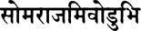

: n v » ii 

_там абхйашиннан видхи-вад актам абхйактам ртвиджах патнйбхир ашта-дашабхих сома-раджам иводубхих_ 

_там_ — его; _абхйашиннан_ — они сбрызнули святой водой; _видхиват_ — в соответствии с указаниями писаний; _актам_ — его глаза, обведенные сурьмой; _абхйактам_ — его тело, умащенное свеже­ сбитым маслом; _ртвиджах_ — жрецы; _патнйбхих_ — вместе со сво­ ими женами; _ашта-дашабхих_ — восемнадцатью; _сома-раджам_ — царственная луна; _ива_ — словно; _удубхих_ — со звездами. 

**Глаза Васудевы были обведены сурьмой, а тело его умастили свежесбитым маслом. После этого жрецы провели церемонию по­ священия, сбрызнув его и всех его восемнадцать жен освящен­ ной водой. Окруженный женами, он был похож на царственно сияющую в небе луну в окружении звезд.** 

_КОММЕНТАРИЙ:_ Деваки была главной женой Васудевы, однако у него было еще несколько жен, включая шесть ее сестер. Об этом говорится в Девятой песни «Шримад-Бхагаватам»: 

_девакаьи нограсенаш на натваро девакатмаджах_ 

_деваван упадеваш ча судево девавардханах_ 

**текст 48]** 

**Наставления мудрецов на Курукшетре** 

**433** 

_тешам свасарах саптасан дхртадевадайо нрпа_ 

_ьиантидевопадева на ьирйдева деваракшита сахадева девакй на васудева уваха max_ 

«У Ахуки родились двое сыновей, Девака и Уграсена. У царя Дева­ ки было четверо сыновей, которых звали Деваван, Упадева, Судева и Девавардхана, и семь дочерей: Шантидева, Упадева, Шридева, Де­ варакшита, Сахадева, Деваки и, старшая, Дхритадева. Этих сестер взял в жены Васудева» (Бхаг., 9.24.21-23). 

Несколько стихов спустя перечисляются другие жены Васудевы: 

_пауравй рохинй бхадра мадира ронана ила девакй-прамукхаьи насан патнйа анакадундубхех_ 

«Деваки, Пауравй, Рохини, Бхадра, Мадира, Рочана, Ила и дру­ гие дочери царя Деваки стали женами Анакадундубхи [Васудевы]. Главной из них была Деваки» (Бхаг., 9.24.45). 

## **ТЕКСТ 48** 

_№б\\_ 

_табхир дукула-валайаир хара-нупура-кундалаих св-аланкртабхир вибабхау дйкшито ’джина-самвртах_ 

_табхих_ — с ними; _дукула_ — в шелковых сари; _валайаих_ — и брас­ летах; _хара_ — в ожерельях; _нупура_ — ножных колокольчиках; _кундалаих_ — и серьгах; _су_ — красиво; _аланкртабхих_ — наряженные; _ви­ бабхау_ — он сверкал; _дйкшитах_ — посвященный; _аджина_ — в шкуру оленя; _самвртах_ — завернутый. 

**Васудева получил посвящение вместе со своими женами, кото­ рые были облачены в шелковые сари и украшены браслетами, ожерельями, ножными колокольчиками и серьгами. Облаченный в шкуру оленя, Васудева сиял великолепием.** 

**[песнь 10, гл. 84** 

**Шримад-Бхагаватам** 

**434** 

## **ТЕКСТ 49** 

## _т ф_ **it w f ^ o r t s ^  i mn** 

_тасйартвиджо маха-раджа ратна-кауьиейа-васасах са-садасйа виреджус те йатха вртра-хано ’дхваре_ 

_тасйа_ — его; _ртвиджах_ — жрецы; _маха-раджа_ — о великий царь (Парикшит); _ратна_ — драгоценностями; _каушейа_ — шелковыми; _васасах_ — и одеждами; _са_ — вместе; _садасйах_ — с людьми, помогав­ шими проведению церемонии; _виреджух_ — выглядели великолепно; _те_ — они; _йатха_ — словно; _вртра-ханах_ — Господа Индры, убив­ шего Вритру; _адхваре_ — на жертвоприношении. 

**Дорогой Махараджа Парикшит, жрецы Васудевы и все, кто проводил эту церемонию, облаченные в шелковые** _**дхоти**_ **и укра­ шенные драгоценностями, излучали такое сияние, что каза­ лось, будто они находятся на арене жертвоприношения Индры, убившего Вритру.** 

## **ТЕКСТ 50** 

гЦТ 7ТЧ2Г 'Й'* I 

## **НЧо||** 

_тада рамаьи ча кршнаьи ча сваих сваир бандхубхир анвитау реджатух сва-сутаир дараир джйвеьиау сва-вибхутибхих_ 

_тада_ — тогда; _рамах_ — Господь Баларама; _ча_ — и; _кршнах_ — Гос­ подь Кришна; _ча_ — также; _сваих сваих_ — каждый Своими; _бандхубхих_ — родственниками; _анвитау_ — окруженный; _реджатух_ — сиял великолепием; _сва_ — со Своими; _сутаих_ — сыновьями; _дара их_ — и женами; _джйва_ — всех живых существ; _йьиау_ — два Господа; _сва-вибхутибхих_ — проявлениями Их достояний. 

**В это время Баларама и Кришна, два Господа, повелители всех живых существ, сияли красотой и великолепием, окруженные Своими сыновьями, женами и другими родственниками, каждый из которых проявлял частицу Их величия.** 

**текст 52]** 

**435** 

**Наставления мудрецов на Курукшетре** 

## **ТЕКСТ 51** 

## 11ч?п 

_йдже_ ’ _ну-йаджнам видхина агни-хотради-лакшанаих пракртаир ваикртаир йаджнаир дравйа-джнана-крийешварам_ 

_йдже_ — он поклонялся; _ану-йаджнам_ — каждым жертвоприноше­ нием; _видхина_ — согласно правилам; _агни-хотра_ — предлагая под­ ношения священному огню; _ади_ — и так далее; _лакшанаих_ — характеризующимися; _пракртаих_ — неизмененными, в точном со­ ответствии со _шрути; ваикртаих_ — измененными, согласованными с указаниями из других источников; _йаджнаих_ — жертвоприноше­ ниями; _дравйа_ — принадлежностей для совершения жертвоприно­ шения; _джнана_ — знания _мантр; крийа_ — и ритуалов; _йшварам_ — Господу. 

**Совершая различные виды ведических жертвоприношений в строгом соответствии с правилами, Васудева поклонялся Госпо­ ду всех атрибутов жертвоприношения,** _**мантр**_ **и ритуалов. Он со­ вершал главные и второстепенные жертвоприношения, принося жертвы огню и выполняя другие ритуалы поклонения.** 

_КОММЕНТАРИЙ:_ Существует множество видов ведических ог­ ненных жертвоприношений, каждое из которых подразумева­ ет проведение нескольких сложных ритуалов. Раздел ведических _шрути_ под названием Брахманы шаг за шагом описывает пол­ ную процедуру совершения лишь нескольких жертвоприношений, таких как _джьотиштома_ и _дарша-пурнамаса._ Они называют­ ся _пракрита_ , изначальными _ягьями;_ тонкости проведения других жертвоприношений следует выводить из описания _пракрита-ягий_ в строгом соответствии с правилами «Мимамса-шастры». Посколь­ ку правила проведения других жертвоприношений выведены из «архетипических», изначальных жертвоприношений, их называют _вайкрита_ , «измененными». 

## **ТЕКСТ 52** 

'Ч^ТФТТ: 114*11 

**[песнь 10, гл. 84** 

**Шримад-Бхагаватам** 

**436** 

_атхартвигбхйо ’дадат кале йатхамнатам са дакшинах св-аланкртебхйо ланкртйа го-бху-канйа маха-дханах_ 

_атха_ — затем; _ртвигбхйах_ — жрецам; _ададат_ — раздал; _кале_ — в подходящее время; _йатха-амнатам_ — как оговаривается в пи­ саниях; _сах_ — он; _дакшинах_ — благодарственные дары; _су-аланкртебхйах_ — которые были богато украшены; _аланкртйа_ — укра­ сив их еще роскошнее: _го_ — коров; _бху_ — землю; _канйах_ — и девушек брачного возраста; _маха_ — очень; _дханах_ — ценные. 

**Затем, в благоприятное время и в соответствии с указаниями писаний, Васудева щедро вознаградил жрецов, поднеся им, и без того усыпанным золотом, богатые украшения, а также подарив коров, землю и девушек брачного возраста.** 

**ТЕКСТ 53** 

## **Т% wfc: I** 

_патни-самйаджавабхртхйаиш чаритва те махаршайах сасну рама-храде випра йаджамана-пурах-сарах_ 

_патнй-самйаджа_ — ритуал, во время которого устроитель жерт­ воприношения предлагает подношения вместе со своей же­ ной; _авабхртхйаих_ — и заключительные ритуалы, известные как _авабхритхъя; чаритва_ — совершив; _те_ — они; _маха-ршайах_ — ве­ ликие мудрецы; _саснух_ — омылись; _рама_ — Господа Парашура­ мы; _храде_ — в озере; _випрах_ — _брахманы; йаджамйна_ — устроителя жертвоприношения (Васудеву); _пурах-сарах_ — пропустив вперед. 

**Проведя ритуалы** _**патни-самьяджа**_ **и** _**авабхритхъя**_ **, великие мудрецы и** _**брахманы**_ **вслед за устроителем жертвоприношения, Васудевой, омылись в озере Господа Парашурамы.** 

## **ТЕКСТ 54** 

% г : I 

гТгт: 

п ч и н 

**текст 56]** 

**437** 

**Наставления мудрецов на Курукшетре** 

_снато 'ланкара-васамси вандибхйо ’дат татха стрийах татах св-аланкрто варнан а-ьивабхйо *ннена пуджайат_ 

_снатах_ — омывшийся; _аланкара_ — драгоценности; _васамси_ — и одежды; _вандибхйах_ — певцам; _адат_ — раздал; _татха_ — так­ же; _стрийах_ — женщины; _татах_ — затем; _су-аланкртах_ — нарядно украшенные; _варнан_ — все классы людей; _а_ — включая; _ьивабхйах_ — собак; _аннена_ — пищей; _пуджайат_ — почтил. 

**Завершив священное омовение, Васудева и его жены раздали профессиональным чтецам свои драгоценности и одежды. После этого Васудева облачился в новые одежды, а затем почтил всех собравшихся, накормив всех, даже собак.** 

## **ТЕКСТЫ 55-56** 

_бандхун са-даран са-сутан парибархена бхуйаса видарбха-кошала-курун каьии-кекайа-срнджайан_ 

_садасйартвик-сура-ганан нр-бхута-питр-чаранан ьирй-никетам ануджнапйа шамсантах прайайух кратум_ 

_бандхун_ — своих родственников; _са-даран_ — вместе с их женами; _са-сутан_ — с их детьми; _парибархена_ — подарками; _бхуйаса_ — бо­ гатыми; _видарбха-кошала-курун_ — правителей династий Видарбха, Кошала и Куру; _каши-кекайа-срнджайан_ — а также Каши, Кайкая и Сринджая; _садасйа_ — распорядителей, следивших за проведени­ ем жертвоприношений; _ртвик_ — жрецов; _сура-ганан_ — разные ка­ тегории полубогов; _нр_ — людей; _бхута_ — духов; _питр_ — предков; _чаранан_ — и чаранов, младших полубогов; _ьирй-никетам_ — у Гос­ пода Кришны, прибежища богини процветания; _ануджнапйа_ — от­ просившись; _шамсантах_ — прославив; _прайайух_ — они покинули; _кратум_ — праздник жертвоприношения. 

**[песнь 10, гл. 84** 

**438** 

**Шримад-Бхагаватам** 

**Он поднес богатые дары своим родственникам, а также всем их женам и детям; членам царских родов Видарбхи, Кошалы, Куру, Каши, Кайкаи и Сринджаи; распорядителям, следившим за ходом жертвоприношений, а также жрецам, присутствовавшим полубо­ гам, людям, духам, праотцам и чаранам. Затем, испросив разре­ шение у Господа Кришны, обители богини процветания, гости разъехались, прославляя жертвоприношения Васудевы.** 

**ТЕКСТЫ 57-58** 

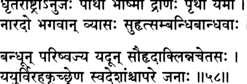

**----- Start of picture text -----** 
^rHl£)s»£3T: 4T«jf  I « р о т   -ф щ щ  ^ I ^НТ: Ihcll **----- End of picture text -----** 

_дхртараштро *нуджах партха бхйьимо дронах пртха йамау нарадо бхагаван вйасах сухрт-самбандхи-бандхавах_ 

_бандхун паришваджйа йадун саухрдаклинна-четасах йайур вираха-крччхрена сва-деьиамьи чапаре джанах_ 

_дхртараштрах_ — Дхритараштра; _ануджах_ — младший брат (Дхритараштры, Видура); _партхах_ — сыновья Притхи (Юдхиш­ тхира, Бхима и Арджуна); _бхйьимах_ — Бхишма; _дронах_ — Дрона; _пртха_ — Кунти; _йамау_ — близнецы (Накула и Сахадева); _па­ радах_ — Нарада; _бхагаван вйасах_ — Личность Бога Вьясадева; _сухрт_ — друзья; _самбандхи_ — близкие родственники; _бандхавах_ — и другие родственники; _бандхун_ — их родственники и друзья; _паришваджйа_ — обняв; _йадун_ — Ядавов; _саухрда_ — от чувства дружбы; _аклинна_ — тающие; _четасах_ — их сердца; _йайух_ — они от­ правились; _вираха_ — из-за разлуки; _крччхрена_ — с трудом; _сва_ — в свои; _дешан_ — царства; _ча_ — также; _апаре_ — другие; _джанах_ — люди. 

**Затем Ядавы обнялись со всеми своими друзьями, близкими и дальними родственниками: с Дхритараштрой и его младшим бра­ том Видурой; с Притхой и ее сыновьями; с Бхишмой, Дроной, близнецами Накулой и Сахадевой; Нарадой и Ведавьясой, вопло­ щением Личности Бога. Сердца гостей таяли от любви, и, терзае­** 

**текст 60] Наставления мудрецов на Курукшетре** 

**439** 

**мые болью предстоящей разлуки, они стали нехотя разъезжаться по своим царствам.** 

## **ТЕКСТ 59** 

## i m i i 

_нандас ту саха гопалаир брхатйа пуджайарчитах кршна-рамограсенадйаир нйаватсйд бандху-ватсалах_ 

_пандах_ — Махараджа Нанда; _ту_ — и; _саха_ — вместе; _гопалаих_ — с пастухами; _брхатйа_ — особо пышным; _пуджайа_ — поклонени­ ем; _арчитах_ — почтённый; _кршна-рама-уграсена-адйаих_ — Криш­ ной, Баларамой, Уграсеной и другими; _нйаватсйт_ — остался; _бандху_ — своих родственников; _ватсалах_ — любящий. 

**Махараджа Нанда выразил свою любовь к родным, Ядавам, оставшись с ними еще ненадолго. Пока он был с ними, Криш­ на, Баларама, Уграсена и другие поклонялись ему с особой пышностью.** 

## **ТЕКСТ 60** 

## _Ф_ **iimi** 

_васудево ’нджасоттйрйа маноратха-махарнавам сухрд-вртах прйта-мана пандам аха каре сприган_ 

_васудевах_ — Васудева; _анджаса_ — легко; _уттйрйа_ — преодолев; _манах-ратха_ — своих желаний (совершать ведические жертвопри­ ношения); _маха_ — великий; _арнавам_ — океан; _сухрт_ — своими доб­ рожелателями; _вртах_ — окруженный; _прйта_ — удовлетворенный; _манах_ — в своем уме; _пандам_ — Нанде; _аха_ — сказал; _каре_ — его руки; _спрьиан_ — коснувшись. 

**С легкостью преодолев океан своих желаний, Васудева был пол­ ностью удовлетворен. Окруженный многочисленными доброже­ лателями, он взял Нанду за руку и обратился к нему с такими словами.** 

**440** 

**[песнь 10, гл. 84** 

**Шримад-Бхагаватам** 

## **ТЕКСТ 61** 

# **Ум/Н|$н: ЧТ4Т ^4Т 4 : ^ 4 % 4 : I гТ ^7r4imt 4 ^  ЩТЩТ4^Г 4)РМЩ** _**иш**_ 

_шрй-васудева увача_ 

_бхратар йша-кртах паьио нрнам йах снеха-самджнитах там дустйаджам ахам манйе ьиуранам апи йогинам_ 

_шрй-васудевах увача_ — Шри Васудева сказал; _бхратах_ — о брат; _йьиа_ — Верховным Господом; _кртах_ — сделанная; _пашах_ — петля; _нрнам_ — людей; _йах_ — которая; _снеха_ — любовь; _самджнитах_ — называется; _там_ — от нее; _дустйаджам_ — трудно освободить­ ся; _ахам_ — я; _манйе_ — думаю; _шуранам_ — для героев; _апи_ — даже; _йогинам_ — и для _йогов_ . 

**Шри Васудева сказал: Мой дорогой брат, Сам Господь создал узы, называемые любовью, и узы эти крепко привязывают лю­ дей друг к другу. Мне думается, что освободиться от них трудно даже великим героям и мистикам.** 

_КОММЕНТАРИЙ:_ Великие герои, на которых равняются лю­ ди, пытаются избавиться от своих маленьких привязанностей с помощью силы воли, а _йоги_ , обращенные вглубь себя, для достижения той же цели стараются обрести знание. Однако ил­ люзорная энергия Господа, _майя,_ гораздо сильнее любой обуслов­ ленной души. Освободиться от ее влияния можно, лишь приняв покровительство Кришны, повелителя _майи._ 

## **ТЕКСТ 62** 

**3 T7 4 4 4 4 frR ^ 4  4 rf4 T| ^  4 4 ^ : I % 4f^TFE4T 4Tfa 4 1ИЗН** 

_асмасв апратикалпейам йат кртаджнешу саттамаих маитрй арпитапхала чапи на нивартета кархичит_ 

_асмасу_ — нам; _апратикалпа_ — несравненное; _ийам_ — это; _йат_ — поскольку; _крта-аджнешу_ — которые забывают об оказанной им 

**текст 64]** 

**441** 

**Наставления мудрецов на Курукшетре** 

милости; _сат-тамаих_ — теми, кто наиболее свят; _маитрй_ — друж­ ба; _арпита_ — предложена; _апхала_ — безответная; _ча апи_ — даже хотя; _на нивартета_ — она не кончается; _кархичит_ — когда-либо. 

**Поистине, узы любви сотворил Сам Господь, ибо возвышенные святые, подобные тебе, никогда не перестают по-дружески от­ носиться даже к таким неблагодарным людям, как мы, которые никогда не отвечали на их дружбу должным образом.** 

## **ТЕКСТ 63** 

v m * V 4 N н ь к ж f t  i **зт^тт ч  ш : ^** _ш :  \т\\_ 

_праг акалпач ча кушалам бхратар во начарама хи адхуна шрй-мадандхакша на пашйамах пурах сатах_ 

_прак_ — раньше; _акалпат_ — из-за неспособности; _ча_ — и; _куша­ лам_ — блага; _бхратах_ — о брат; _вах_ — тебе; _на ачарама_ — мы не делали; _хи_ — несомненно; _адхуна_ — сейчас; _ьирй_ — богатством; _мада_ — от опьянения; _андха_ — ослепленные; _акшах_ — чьи глаза; _на пашйамах_ — не видим; _пурах_ — перед нами; _сатах_ — присутствую­ щего. 

**Дорогой брат, раньше мы не делали для тебя ничего хороше­ го, поскольку у нас не было для этого возможностей. Теперь ты перед нами, однако наши глаза настолько ослеплены богатством, что мы, опьяненные гордыней, все так же пренебрегаем тобой.** 

_КОММЕНТАРИЙ:_ Живя под властью Камсы, Васудева никак не мог помочь Нанде и его подданным-пастухам защититься от многочисленных демонов, которых Камса посылал из Матхуры в надежде убить Кришну и Балараму. 

## **ТЕКСТ 64** 

**чт чтч^ I 7ЧЧЧЩЧ ЧТ Ч w rfrT 4 4 F4 ^ £  II W l** 

**[песнь 10, гл. 84** 

**Шримад-Бхагаватам** 

**442** 

_ма раджйа-шрир абхут пумсах шрейас-камасйа мана-да сва-джанан ута бандхун ва на пашйати йайандха-дрк_ 

_ма_ — пусть не сможет; _раджйа_ — царская; _шрйх_ — удача; _абхут_ — возникнуть; _пумсах_ — у человека; _ьирейах_ — высшего блага; _камасйа_ — который желает; _мана-да_ — о любезный; _сва-джанан_ — сво­ их родственников; _ут а_ — даже; _бандхун_ — своих друзей; _ва_ — или; _на пашйати_ — он не видит; _йайа_ — которым (богатством); _андха_ — ослеплено; _дрк_ — чье зрение. 

## **О любезнейший, пусть же тот, кто стремится к высшему бла­ гу, никогда в своей** ж и з н и **не обретает царских богатств, ибо они ослепляют человека, так что он не замечает даже нужд своих родных и друзей.** 

_КОММЕНТАРИЙ:_ Безусловно, Васудева осуждает себя здесь лишь из своего глубокого смирения, однако его нелестные слова в адрес богатства абсолютно справедливы. Ранее в этой песни Нарада Му­ ни резко обличал Налакувару и Манигриву, двух богатых сыновей Куверы, райского казначея. Опьяненные вином и гордостью, они резвились обнаженными в реке Мандакини с юными девушками и не выразили почтения Нараде, когда тот проходил мимо. Видя их бесстыдство, Нарада сказал: 

_на хй анйо джушато джошйан буддхи-бхрамшо раджо-гунах шрй-мадад абхиджатйадир йатра стрй дйутам асавах_ 

«Богатство затмевает разум человека сильнее, чем любые дру­ гие материальные достояния, будь то красивая внешность, знатное происхождение или хорошее образование. Тот, кто не получил об­ разования и кичится своим богатством, тратит его на вино, женщин и азартные игры» (Бхаг., 10.10.8). 

## **ТЕКСТ 65** 

**11^411** 

**текст 66]** 

**443** 

**Наставления мудрецов на Курукшетре** 

_шрй-шука увача эвам саухрда-шаитхилйа-читта анакадундубхих рурода тат-кртам маитрйм смаранн ашру-вилочанах_ 

_шрй-шуках увача_ — Шри Шукадева Госвами сказал; _эвам_ — так; _саухрда_ — близостью; _ьиаитхилйа_ — смягчено; _читтах_ — чье сердце; _анакадундубхих_ — Васудева; _рурода_ — заплакал; _тат_ — им (Нандой); _кртам_ — совершённые; _маитрйм_ — дружеские поступки; _смаран_ — вспоминая; _аьиру_ — слезы; _вилочанах_ — в чьих глазах. 

**Шри Шукадева Госвами сказал: Чувство симпатии и благодар­ ности размягчило сердце Васудевы, и он заплакал. Он вспоминал, как Нанда проявлял к нему свою дружбу, и глаза его сверкали слезами.** 

## **ТЕКСТ 66** 

**зтаг** _ч  jf o_ **ята М ч ;** _\\щ\_ 

_нандас ту сакхйух прийа-крт премна говинда-рамайох адйа шва ити масамс трйн йадубхир манито ’васат_ 

_нандах_ — Нанда; _т у_ — и; _сакхйух_ — к своему другу; _прийа_ — любовь; _крт_ — который выказывал; _премна_ — от любви; _говиндарамайох_ — к Кришне и Балараме; _адйа_ — (я уеду чуть позже) се­ годня; _швах_ — (я уеду) завтра; _ити_ — говоря так; _масан_ — месяца; _трйн_ — три; _йадубхих_ — Яду; _манитах_ — почитаемый; _авасат_ — оставался. 

**Нанда тоже очень любил своего друга Васудеву. В течение сле­ дующих дней Нанда вновь и вновь говорил: «Сегодня, чуть позже, я уезжаю» или «Я уеду завтра». Однако из-за любви к Кришне и Балараме он оставался там в течение трех месяцев, а Ядавы все это время оказывали ему почести.** 

_КОММЕНТАРИЙ:_ Решив, что непременно уедет завтра утром, Нанда, когда наступало утро, менял решение: «Я уеду днем», а ког­ да наступал полдень, он говорил: «Пожалуй, я останусь, но толь­ ко до завтра». Шрила Вишванатха Чакраварти пишет, что Нанда медлил потому, что тайно надеялся увезти Кришну с собой во 

**[песнь 10, гл. 84** 

**Шримад-Бхагаватам** 

**444** 

Врадж, однако при этом не хотел разбивать сердце Васудеве. Пока он пребывал в нерешительности, прошло три месяца. 

## **ТЕКСТЫ 67-68** 

гттт: _**щщ:**_ | **и ^ и** ^тптщ пг и ^ п 

_татах камаих пурйаманах са-враджах саха-бандхавах парардхйабхарана-кшаума-нананаргхйа-париччхадаих_ 

_васудевограсенабхйам кршноддхава-баладибхих даттам адайа парибархам йапито йадубхир йайау_ 

_татах_ — затем; _камаих_ — желанными объектами; _пурйаманах_ — насытившийся; _са-враджах_ — с жителями Враджа; _саха-бандхавах_ — со своими родственниками; _пара_ — необычайно; _ардхйа_ — ценными; _абхарана_ — с украшениями; _кшаума_ — тончайшими тка­ нями; _нана_ — разнообразными; _анаргхйа_ — бесценными; _париччхадаих_ — и домашней утварью; _васудева-уграсенабхйам_ — Васудевой и Уграсеной; _кршна-уддхава-бала-адибхих_ — а также Кришной, Уд­ дхавой, Баларамой и другими; _даттам_ — поднесенные; _адайа_ — взяв; _парибархам_ — подарки; _йапитах_ — провожаемый; _йадубхих_ — Яду; _йайау_ — он уехал. 

**Затем, после того как Васудева, Уграсена, Кришна, Уддхава, Ба­ ларама и другие выполнили все его желания и одарили его драго­ ценными украшениями, роскошными тканями и дорогой мебелью, Махараджа Нанда собрал все подарки и тронулся в путь. Яду проводили его, и он отправился домой вместе со своей семьей и жителями Враджа.** 

_КОММЕНТАРИЙ:_ Как пишет Шрила Вишванатха Чакраварти, по прошествии трех месяцев Махараджа Нанда обратился к Кришне с такими словами: «Мой дорогой сын, за одну капельку пота с Тво­ его божественного лица я готов отдать свою жизнь снова и сно­ ва. Давай вернемся во Врадж; я не могу больше здесь оставаться». 

**текст 68]** 

**Наставления мудрецов на Курукшетре** 

**445** 

Затем он подошел к Васудеве и сказал ему: «Мой дорогой друг, пожалуйста, отправь Кришну во Врадж», а царя Уграсену он по­ просил: «Пожалуйста, прикажи моему другу сделать это. Если ты откажешься, мне придется утопиться здесь, в озере Господа Па­ рашурамы. Вот увидишь, я сделаю это, поверь мне! Мы, жители Враджа, пришли в это святое место вовсе не для того, чтобы, поль­ зуясь моментом лунного затмения, заработать немного благочес­ тия, а для того, чтобы вернуть Кришну или умереть». Выслушав отчаянные слова Нанды, Васудева и другие попытались успокоить его богатыми дарами. 

Искусный дипломат, Васудева посовещался со своими самыми надежными советниками, а затем, чтобы порадовать Нанду, ска­ зал ему: «Мой дорогой друг, о царь Враджа, все вы действитель­ но не можете жить без Кришны. Разве можем мы позволить вам умереть? Поэтому, чего бы мне это ни стоило, я должен отправить Кришну во Врадж. Я сделаю это сразу после того, как мы вместе с Ним, Его родственниками и друзьями вернемся в Двараку. Не мо­ жет же Он оставить одних множество беззащитных женщин! После этого, на следующий же день, не пытаясь удержать Его, в самый благоприятный момент дня я отправлю Его во Врадж. Я клянусь тебе в этом тысячу раз. В конце концов, мы пришли сюда с Криш­ ной, так как мы можем вернуться назад без Него? Что скажут о нас люди? Ты — великий знаток писаний, а потому прости, что я обращаюсь к тебе с такой просьбой». 

Затем к Махарадже Нанде обратился Уграсена: «Мой дорогой повелитель Враджа, я свидетель того, что говорил тебе Васудева, а потому клянусь тебе: я отошлю Кришну во Врадж, даже если мне придется применить для этого силу». После этого Господь Кришна вместе с Уддхавой и Баларамой отвели Нанду в уединенное место, и Господь сказал ему: «Доро­ гой отец, если Я поеду во Врадж сегодня, покинув всех Вришни, от разлуки со Мной все они умрут. Тогда на них нападут тысячи недругов, даже более могучие, чем Кеши и Аришта, и уничтожат всех этих царей. 

Я всеведущ, а потому Мне известно все, что произойдет со Мной. Послушайте же Меня. Возвратившись в Двараку, Я получу от Юд­ хиштхиры приглашение принять участие в его жертвоприношении _раджасуя._ Я отправлюсь в Индрапрастху и там убью Шишупалу. Затем Я вернусь в Двараку и убью Шалву. Затем, чтобы спасти вас, Я отправлюсь в одно место к югу от Матхуры и убью Дантавак­ ру. После этого Я вернусь во Врадж, чтобы увидеться со Своими 

**[песнь 10, гл. 84** 

**Шримад-Бхагаватам** 

**446** 

старыми друзьями и вновь с удовольствием посидеть на ваших ко­ ленях. Я буду счастлив провести с вами всю Свою жизнь. Бог на­ чертал на Моем лбу такую судьбу, и на ваших лбах начертано, что до тех пор, пока Я не вернусь, вам придется терпеть боль разлуки со Мной. Наши судьбы невозможно изменить, поэтому, пожалуй­ ста, наберитесь мужества, оставьте Меня здесь и возвращайтесь во Врадж. 

О Мои дорогие родители и друзья, когда же вам будет не под силу выносить боль разлуки со Мной, на которую обрекло вас прови­ дение, то, когда бы вам ни захотелось покормить Меня какими-то лакомствами, поиграть со Мной или просто увидеть Меня, лишь закройте глаза и Я появлюсь перед вами, чтобы превратить вашу боль в дождь из райских цветов и исполнить все ваши желания. Я обещаю это вам, и Мои юные друзья, которых Я спас от лесного пожара, могут поручиться за Меня». 

Все эти аргументы убедили Нанду. Он подумал, что, в конце кон­ цов, счастье его сына — важнее всего, поэтому он принял подарки и, сопровождаемый огромной армией Яду, отправился домой. 

## **ТЕКСТ 69** 

_нандо гопаш ча гопйаш ча говинда-чаранамбудже манах кшиптам пунар Хартум анйьиа матхурам йайух_ 

_пандах_ — Нанда; _гопах_ — пастухи; _ча_ — и; _гопйах_ — пастушки; _ча_ — также; _говинда_ — Кришны; _чарана-амбудже_ — у лотосных стоп; _манах_ — их умы; _кшиптам_ — бросили; _пунах_ — вновь; _Хар­ тум_ — отвести; _анйшах_ — неспособные; _матхурам_ — в Матхуру; _йайух_ — они направились. 

**Не в силах оторвать свои умы от лотосных стоп Господа Говинды, которым они предались, Нанда, пастухи и пастушки вернулись в Матхуру.** 

## **ТЕКСТ 70** 

**текст 71] Наставления мудрецов на Курукшетре** 

**447** 

_бандхушу пратийатешу вршнайах кршна-деватах. вйкшйа правршам асаннад йайур двараватйм пунах_ 

_бандхушу_ — их родные; _пратийатешу_ — уехавшие; _вршнайах_ — Вришни; _кршна-деватах_ — чьим Божеством был Кришна; _вйк­ шйа_ — видя; _правршам_ — сезон дождей; _асаннат_ — надвигающий­ ся; _йайух_ — отправились; _двараватйм_ — в Двараку; _пунах_ — вновь. 

**Когда все родственники рода Вришни разъехались по домам, Вришни, чьим единственным Божеством был Господь Кришна, видя, что надвигается сезон дождей, вернулись в Двараку.** 

## **ТЕКСТ 71** 

## _**\ м \ \**_ 

_джанебхйах катхайам чакрур йаду-дева-махотсавам йад асйт тйртха-йатрайам сухрт-сандаршанадикам_ 

_джанебхйах_ — людям; _катхайам чакрух_ — они рассказали; _йадудева_ — повелителя Яду, Васудевы; _маха-утсавам_ — о великом празд­ нестве; _йат_ — что; _асйт_ — случилось; _тйртха-йатрайам_ — во время их паломничества; _сухрт_ — с их дорогими друзьями; _сандарьиана_ — свидание; _адикам_ — и прочее. 

**Они рассказали жителям города о великом жертвоприношении, которое устроил Васудева, повелитель рода Ядавов, а также обо всем остальном, что произошло, пока они были в паломничест­ ве, в особенности о том, как они встретились со своими дорогими друзьями.** 

_Так заканчивается комментарий смиренных слуг А_ . _Ч. Бхактиведанты Свами Прабхупады к восемьдесят четвертой главе Де­ сятой песни «Шримад-Бхагаватам»у которая называется «На­ ставления мудрецов на Курукшетре_ ». 

# **ГЛАВА ВОСЕМЬДЕСЯТ ПЯТАЯ** 

# **Господь Криш на дает наставления В асудеве и возвращ ает сы новей Деваки** 

В этой главе рассказывается, как Господь Кришна помог Свое­ му отцу обрести божественное знание, а затем вместе с Господом Баларамой вернул Своей матери ее умерших сыновей. 

Услышав, как мудрецы прославляют Кришну, Васудева перестал смотреть на Кришну и Балараму как на своих сыновей и принялся превозносить Их всемогущество, вездесущность и всеведение. Воз­ дав хвалу своим сыновьям, Васудева припал к лотосным стопам Господа Кришны и стал умолять Кришну избавить его от пред­ ставлений о том, что Господь — его сын. Однако Господь Криш­ на, наоборот, помог ему возродить такой образ мыслей, дав ему наставления в науке о Боге. Выслушав эти наставления, Васудева обрел умиротворение и избавился от всех сомнений. 

Затем Деваки стала прославлять Кришну и Балараму, напомнив Им, как Они вернули Своему духовному учителю его умершего сына. Она сказала: «Пожалуйста, исполните и мое желание. Вер­ ните мне сыновей, которых убил Камса, чтобы я еще раз могла увидеть их». 

В ответ на просьбу Своей матери два Господа отправились на подземную планету Сутала и там увиделись с Махараджей Бали. Царь Бали оказал Им подобающие почести: усадил Их на почет­ ные места, совершил обряд поклонения и вознес молитвы. Затем Кришна и Баларама попросили Бали вернуть Деваки ее умерших сыновей. Бали отдал Им мальчиков, и два Господа доставили их Своей матери. От любви к ним из грудей Деваки тут же потекло молоко. Вне себя от счастья, Деваки накормила мальчиков своим молоком, и те, испив молока, которое когда-то пил Сам Господь Кришна, приняли свой изначальный облик полубогов и вернулись на райскую планету. 

**[песнь 10, гл. 85** 

**Шримад-Бхагаватам** 

**450** 

## **ТЕКСТ 1** 

ТЙсЩ II ? II 

_ьирй-бадарайанир увача атхаикадатмаджау праптау крта-падабхиванданау васудево *бхинандйаха прйтйа санкаршаначйутау_ 

_шрй-бадарайаних увача_ — Шри Бадараяни (Шукадева Госва­ ми) сказал; _атха_ — затем; _экада_ — однажды; _атмаджау_ — два его сына; _праптау_ — пришли к нему; _крта_ — совершившие; _пада_ — его стоп; _абхиванданау_ — почитание; _васудевах_ — Васудева; _абхинандйа_ — поприветствовав Их; _аха_ — сказал; _прйтйа_ — с лю­ бовью; _санкаршана-ачйутау_ — Балараме и Кришне. 

**Шри Бадараяни сказал: Однажды двое сыновей Васудевы — Санкаршана и Ачьюта — пришли, чтобы оказать ему почте­ ние, склонившись к его стопам. Васудева поприветствовал Их с великой любовью и заговорил с Ними.** 

## **ТЕКСТ 2** 

_мунинам са вачах шрутва путрайор дхама-сучакам тад-вйрйаир джата-вишрамбхах парибхашйабхйабхашата_ 

_мунйнам_ — мудрецов; _сах_ — он; _вачах_ — слова; _шрутва_ — вы­ слушав; _путрайох_ — своих двоих сыновей; _дхама_ — могущество; _сучакам_ — которые описывали; _тат_ — Их; _вйрйаих_ — благода­ ря Их подвигам; _джата_ — развив; _вишрамбхах_ — убежденность; _парибхашйа_ — обратившись к Ним по именам; _абхйабхашата_ — он сказал Им. 

**Он был свидетелем того, как великие мудрецы прославляли мо­ гущество обоих его сыновей, и сам видел Их доблестные дея­ ния. У него не осталось никаких сомнений в Их божественности. Поэтому, обратившись к Ним по имени, он произнес такие слова.** 

**текст 4] Господь Кришна дает наставления Васудеве** 

**451** 

## **ТЕКСТ 3** 

## *П51ЧИ>|«1 « $ ф || _Ц 4 Ш_ I 

## 4T4FT Ч с Ш 1 с Ц Ч Н ^  ^ f h U I I 

_кршна кршна маха-йогин санкаршана санатана джане вам асйа йат сакшат прадхана-пурушау парау_ 

_кршна кршна_ — о Кришна, Кришна; _маха-йогин_ — о величай­ ший _йог; санкаршана_ — о Баларама; _санатана_ — вечный; _джане_ — я знаю; _вам_ — Вы двое; _асйа_ — этой (вселенной); _йат_ — кото­ рые; _сакшат_ — непосредственно; _прадхана_ — творческое начало природы; _пурушау_ — и творец, Личность Бога; _парау_ — верховная. 

## **[Васудева сказал:] О Кришна, Кришна, о лучший из** _**йогов**_ **, о веч­ ный Санкаршана! Я знаю, что Вы двое — причина возникновения мироздания и всех элементов, из которых оно состоит.** 

_КОММЕНТАРИЙ:_ Согласно философии _санкхъи_ в изложении Гос­ пода Капиладевы, _прадхана_ — это творческая энергия _пуруши,_ Верховной Личности. Таким образом, из двух этих начал _прадха­ на_ — это подчиненная, женская энергия, не способная к самостоя­ тельным действиям, тогда как _пуруша_ — полностью независимый изначальный творец и наслаждающийся. Ни Кришна, ни Его брат Баларама не относятся к категории подчиненной энер­ гии; напротив, оба Они — изначальные _пуруши,_ которых всегда сопровождают Их разнообразные энергии наслаждения, знания и созидания. 

## **ТЕКСТ 4** 

%»Т "4FT w t  ■ЩПГ4Т I _mf&_ w t h ; 

## и v н 

_йатра йена йато йасйа йасмаи йад йад йатха йада сйад идам бхагаван сакшат прадхана-пурушешварах_ 

_йатра_ — в котором; _йена_ — которым; _йатах_ — из которого; _йа­ сйа_ — которого; _йасмаи_ — в кого; _йат йат_ — все, что; _йатха_ — любым образом; _йада_ — в любое время; _сйат_ — появляется; _идам_ — это (мироздание); _бхагаван_ — Верховный Господь; _сак­ шат_ — в Своем личном проявлении; _прадхана-пуруша_ — природы и ее творца (Маха-Вишну); _йьиварах_ — повелитель. 

**[песнь 10, гл. 85** 

**Шримад-Бхагаватам** 

**452** 

**Ты Верховный Господь, который проявляет Себя одновременно как повелитель материи и ее творец [Маха-Вишну]. Что бы, ког­ да бы и каким бы образом ни появилось на свет, создается в Тебе, Тобой, из Тебя, для Тебя и в связи с Тобой.** 

_КОММЕНТАРИЙ:_ На первый взгляд может показаться, что из­ вестный нам мир появляется под воздействием разных движущих сил. Подтверждением таких представлений о мире служит сам язык. У знатоков санскритской грамматики принято объяснять, что язык отражает все видимое разнообразие природы. В класси­ ческой санскритской грамматике Панини глагол, выражающий действие, считается основой предложения, а все остальные слова действуют во взаимосвязи с ним. К примеру, существительные из­ меняются по падежам в зависимости от их отношений с глаголом в предложении. Эти связи существительных и глагола называются _караками_ (падежами). Они описывают взаимоотношения с глаго­ лом подлежащего ( _карта_ , «кто делает»), дополнения _(карма,_ «что делается»), инструмента _(карана,_ «чем»), получателя ( _сампрадана_ , «для кого или к кому»), источника ( _ападана_ , «откуда или по какой причине») и местонахождения _(адхикарана,_ «в котором»). Кроме этих _карак_ , существительные могут также иногда быть связанны­ ми с другими существительными в притяжательном падеже. Поми­ мо этого, есть множество видов наречий, указывающих на время, место и способ действия. Однако, хотя и кажется, будто язык ука­ зывает на действие в мире разных движущих сил, более глубокая истина заключается в том, что все грамматические формы ука­ зывают прежде всего на Верховную Личность Бога. В этом стихе Васудева, прославляя своих возвышенных сыновей, подчеркива­ ет этот факт, когда употребляет в связи с Ними самые разные грамматические формы. 

## **ТЕКСТ 5** 

_этан нана-видхам вишвам атма-срштам адхокшаджа атманануправийшатман прано джйво бибхаршй аджа_ 

_этат_ — эта; _нана-видхам_ — полная разнообразия; _вишвам_ — все­ ленная; _атма_ — из Тебя; _срштам_ — сотворена; _адхокшаджа_ — 

**текст 6] Господь Кришна дает наставления Васудеве** 

**453** 

о трансцендентный Господь; _атмана_ — в Твоем проявлении (Параматмы); _ануправишйа_ — входя внутрь; _атман_ — о Высшая Ду­ ша; _пранах_ — принципа жизненной силы; _джйвах_ — и принципа сознания; _бибхарши_ — Ты поддерживаешь; _аджа_ — о нерожденный. 

**О запредельный Господь, Ты сотворил из Себя эту исполненную разнообразия вселенную, а затем вошел в нее в образе Сверхду­ ши. Так, о нерожденная Высшая Душа, будучи жизненной силой и сознанием каждого, Ты поддерживаешь творение.** 

_КОММЕНТАРИЙ:_ Создавая материальную вселенную, Господь принимает образ Параматмы, или Сверхдуши, и в качестве Свое­ го вселенского тела принимает все творение. Единственный смысл существования материального тела — дать _дживе,_ пребывающей в нем, возможность с его помощью наслаждаться, однако ни од­ на _джива_ не сможет самостоятельно поддерживать тело, если ее не будет сопровождать Параматма, направляющая душу. В сво­ их комментариях ко Второй песни «Шримад-Бхагаватам» _ачаръивайшнавы_ объясняют, что, перед тем как родиться из лотосного пупка Гарбходакашайи Вишну, Брахма получает в качестве те­ ла всю материальную энергию, _махат-таттву._ Таким образом, Брахма — это _джива,_ воплотившаяся в теле вселенной, а Вишну — это Параматма, которая сопровождает его. Перед Брахмой стоит задача творить мир во всех его разнообразных проявлениях, од­ нако он не может даже приступить к этому до тех пор, пока Гос­ подь Вишну не проявит Себя вновь как тонкая энергия действия — _сутра-таттва,_ или жизненный воздух, а также как творческая энергия сознания, _буддхи-таттва._ 

## **ТЕКСТ 6** 

**я м ф т т  £га ^тт** _ч\: ч т_ **ш : i** и _%_ и 

_пранадйнам виьива-срджам шактайо йах парасйа max, паратантрйад ваисадршйад двайош чештаива чештатам_ 

_прана_ — жизненного воздуха; _адйнам_ — и так далее; _виьива_ — вселенной; _срджам_ — созидание; _ьиактайах_ — энергии; _йах_ — ко­ торые; _парасйа_ — принадлежащие Верховному; _max_ — они; _паратантрйат_ — будучи подчиненными; _ваисадршйат_ — будучи от­ личными; _двайох_ — от обоих (живых и неживых проявлений 

**[песнь 10, гл. 85** 

**Шримад-Бхагаватам** 

**454** 

материального мира); _чеьита_ — деятельность; _эва_ — только; _чеьитатам_ — тех объектов (а именно _праны_ и т.д.), которые ак­ тивны. 

**Какие бы свойства ни проявляли жизненный воздух или дру­ гие элементы материального творения, все эти энергии на самом деле принадлежат Верховному Господу, ибо и жизнь, и материя подчиняются Ему и зависят от Него, но при этом отличны друг от друга. Таким образом, все силы, действующие в материальном мире, приводятся в действие Верховным Господом.** 

_КОММЕНТАРИЙ: Прана_ — это жизненный воздух. Это более тонкий элемент, чем обычный воздух, который мы ощущаем ко­ жей. Поскольку _прана_ столь тонка — тоньше, чем все осязаемые элементы творения, — ее иногда считают изначальным источни­ ком всего сущего. Однако даже такие тонкие энергии, как _прана_ , зависят в своей деятельности от Параматмы, которая тоньше са­ мого тонкого. Именно это хочет сказать здесь Васудева, когда упо­ требляет слово _паратантрйату_ «будучи подчиненными». Так же как скорость стрелы зависит от силы лучника, выпускающего ее, подчиненные энергии зависят от могущества Верховного Господа. 

Более того, даже разнообразные тонкие факторы, приведенные в действие, не смогут функционировать согласованно, если их не будет направлять Сверхдуша. Господь Брахма говорит во Второй песни «Шримад-Бхагаватам»: 

_йадаите *сангата бхава бхутендрийа-мано-гунах йадайатана-нирмане на шекур брахма-виттама_ 

_тада самхатйа чанйонйам бхагавач-чхакти-чодитах сад-асаттвам упадайа чобхайам сасрджур хй адах_ 

_«О_ Нарада, лучший из трансценденталистов, тело не может сфор­ мироваться до тех пор, пока все эти сотворенные части: стихии, чувства, ум и _гуны_ природы — не соединятся вместе. Итак, ког­ да энергия Верховной Личности Бога соединяет вместе все эти компоненты, тогда под влиянием первичных и вторичных причин творения возникает вселенная» (Бхаг., 2.5.32-33). 

**текст 7] Господь Кришна дает наставления Васудеве** 

**455** 

## **ТЕКСТ 7** 

## **ТП7Т ТТтТТ I** _ш М_ **^jrTT ii vs и** 

_кантис теджах прабха сатта чандрагнй-аркаркша-видйутам йат стхаирйам бху-бхртам бхумер врттир гандхо уртхато бхаван_ 

_кантих_ — привлекательное сияние; _теджах_ — сверкание; _пра­ бха_ — свечение; _сатта_ — и особое существование; _чандра_ — луны; _агни_ — огня; _арка_ — солнца; _ркша_ — звезд; _видйутам_ — и мол­ нии; _йат_ — которое; _стхаирйам_ — неизменность; _бху-бхртам_ — гор; _бху мех_ — земли; _врттих_ — поддержание; _гандхах_ — аромат; _артхатах_ — на самом деле; _бхаван_ — Ты Сам. 

**Свет луны, блеск огня, сияние солнца, мерцание звезд, вспыш­ ки молнии, неизменность гор, аромат и поддерживающая сила земли — все это на самом деле Ты.** 

_КОММЕНТАРИЙ:_ Говоря Кришне, что Он — суть солнца, луны, звезд, молний и огня, Шри Васудева просто повторяет то, о чем говорится в писаниях, как в _шрути_ , так и в _смрити._ К примеру, в «Шветашватара-упанишад» (6.14) сказано: 

_на татра сурйо бхати на чандра-таракам нема видйуто бханти куто *йам агних там эва бхантам ану бхати сарвам тасйа бхаса сарвам идам вибхати_ 

«Там [в духовном небе] не светит ни солнце, ни луна, ни звезды или молнии, какими мы их знаем, не говоря уже об обычном огне. Все, что светится, на самом деле светит лишь отраженным све­ том духовного неба, и благодаря этому сиянию освещается все ми­ роздание». В «Шримад Бхагавад-гите» (15.12) Верховный Господь говорит: 

_йад адитйа-гатам теджо джагад бхасайате *кхилам йач чандрамаси йач чагнау тат теджо виддхи мамакам_ 

«Сияние солнца, рассеивающее царящую в этом мире тьму, исходит от Меня, и от Меня же исходит свет луны и огня». 

**[песнь 10, гл. 85** 

**Шримад-Бхагаватам** 

**456** 

## **ТЕКСТ 8** 

## 3^1 чг|* ®Г?Т **I U I I** 

_тарпанам прананам апам дева твам таьи ча тад-расах оджах сахо балам чешта гатир вайос тавеьивара_ 

_тарпанам_ — способность вызывать удовольствие; _прананам_ — сотворение жизни; _апам_ — воды; _дева_ — о Господь; _твам_ — Ты; _max_ — (вода) сама; _ча_ — и; _тат_ — ее (воды); _расах_ — вкус; _оджах_ — тепло и жизненная сила тела, которые исходят из жизненного воздуха; _сахах_ — сила ума; _балам_ — и физическая сила; _чешта_ — попытка; _гатих_ — и движение; _вайох_ — воздуха; _тава_ — Твои; _йшвара_ — о верховный повелитель. 

**Мой Господь, Ты вода, а также ее вкус и способность утолять жажду и поддерживать жизнь. Ты проявляешь Свое могущест­ во, трансформируя воздух в тепло тела, жизненную энергию, ум­ ственные способности, физическую крепость, усилия и движения живых существ.** 

## **ТЕКСТ 9** 

fa  f ^ r : _Щ_ w f e згтзпт: I 

_дишам твам авакаьио ’си диьиах кхам спхота аьирайах надо варнас твам ом-кара акртйнам пртхак-кртих_ 

_дишам_ — сторон света; _твам_ — Ты; _авакайгах_ — способность вмещать; _аси_ — есть; _дишах_ — стороны света; _кхам_ — эфир; _спхотах_ — первичный звук; _аьирайах_ — имеющий (эфир) в своей осно­ ве; _надах_ — звук в форме непроявленной вибрации; _варнах_ — изначальный звук; _твам_ — Ты; _ом-карах_ — _ом; акртйнам_ — кон­ кретных форм; _пртхак-кртих_ — причина разнообразия (а именно возникший язык). 

**Ты стороны света и их способность вмещать в себя все, Ты всепроникающий эфир и первичный звук, пребывающий в нем. Ты предвечная, непроявленная форма звука; Ты первый слог,** _**ом,**_ **и Ты же воспринимаемая слухом речь, посредством которой звук в форме слов обретает связь с конкретными объектами.** 

**текст 10] Господь Кришна дает наставления Васудеве** 

**457** 

_КОММЕНТАРИЙ:_ В процессе творения речь становится слыши­ мой не сразу, а постепенно, проходя несколько стадий, от тонко­ го внутреннего импульса к внешнему проявлению. Эти ступени упомянуты в _мантрах_ «Риг-веды» (1.164.45): 

_чатвари вак-паримита падани тани видур брахмана йе манйшинах гуха трйни нихита ненгайанти турййам вачо манушйа ваданти_ 

«Сведущим _брахманам_ известны четыре ступени постепенного про­ явления речи. Три из них остаются скрытыми в сердце в форме ед­ ва заметных вибраций, и только на четвертой ступени появляется то, что люди обычно называют речью». 

## **ТЕКСТ 10** 

_индрийам me индрийанам твам деваьи ча тад-ануграхах авабодхо бхаван буддхер джйвасйанусмртих сатй_ 

_индрийам_ — способность освещать свои объекты; _ту_ — и; _ин­ дрийанам_ — чувств; _твам_ — Ты; _девах_ — полубоги (которые управ­ ляют деятельностью различных чувств); _ча_ — и; _тат_ — их (полу­ богов); _ануграхах_ — милость (благодаря которой чувства могут дей­ ствовать); _авабодхах_ — способность принимать решения; _бхаван_ — Ты; _буддхех_ — разума; _джйвасйа_ — живого существа; _анусмртих_ — память; _сатй_ — крепкая. 

**Ты способность чувств открывать живым существам свои объ­ екты, Ты полубоги, управляющие этими чувствами, и Ты же позволение, которое полубоги дают, чтобы чувства могли дейст­ вовать. Ты способность разума принимать решения и способность живого существа хранить события в памяти.** 

_КОММЕНТАРИЙ:_ Шрила Вишванатха Чакраварти отмечает, что всякий раз, когда любое из материальных чувств соприкасается со своим объектом, полубог, управляющий этим органом чувств, дол­ жен дать на это свое одобрение. _Ачаръя_ Вишванатха Чакраварти 

**[песнь 10, гл. 85** 

**Шримад-Бхагаватам** 

**458** 

также объясняет, что высший смысл употребленного здесь слова _анусмрти_ — это признание себя вечной душой. 

## **ТЕКСТ 11** 

## \d M W fa ^ &ГСП | 

## **fe*<r4Hi m??ii** 

_бхутанам acu бхутадир индрийанам на таиджасах ваикарико викалпанам прадханам ануьиайинам_ 

_бхутанам_ — физических элементов; _асы_ — Ты есть; _бхутаадих_ — их источник, ложное эго в _гуне_ невежества; _индрийанам_ — чувств; _ча_ — и; _таиджасах_ — ложное эго в _гуне_ страсти; _ваикариках_ — ложное эго в _гуне_ благости; _викалпанам_ — полубогов, осу­ ществляющих творение; _прадханам_ — непроявленная, совокупная материальная энергия; _ануьиайинам_ — лежащая в основе. 

**Ты ложное эго в** _**гуне**_ **невежества, источник физических элемен­ тов; ложное эго в** _**гуне**_ **страсти, источник материальных чувств; • ложное эго в** _**гуне**_ **благости, из которого появляются полубо­ ги, и Ты же непроявленная, совокупная материальная энергия, лежащая в основе всего сущего.** 

## **ТЕКСТ 12** 

## сТ^Т сФТЧЖЧ, I 

***ТЧТ** _\ \ т_ 

_наьиварешв иха бхавеьиу тад аси твам анаьиварам йатха дравйа-викареьиу дравйа-матрам нирупитам_ 

_наьйвареьиу_ — подверженные уничтожению; _иха_ — в этом ми­ ре; _бхавеьиу_ — среди объектов; _тат_ — эти; _аси_ — есть; _твам_ — Ты; _анаьиварам_ — неуничтожимые; _йатха_ — как; _дравйа_ — вещест­ ва; _викареьиу_ — среди изменений; _дравйа-матрам_ — само вещество; _нирупитам_ — установленное. 

**Ты единственный из всех живых существ в этом бренном мире не подлежишь уничтожению, как остается неизменной сама ма­ терия, из которой созданы объекты этого мира, хотя все, что из нее состоит, подвержено изменениям.** 

**текст 14] Господь Кришна дает наставления Васудеве** 

**459** 

## **ТЕКСТ 13** 

*Гс ^ ^ т ГЧ ffcT _W ._ _**\**_ **с ^ + Н н 1  Ф ш РТЧТ ||?ЗН** 

_саттвам раджас тома ити гунас тад-врттайаьи ча йах твайй аддха брахмани паре калпита йога-майайа_ 

_саттвам раджах тамах ити_ — которые называются благостью, страстью и невежеством; _гунах— гуны_ материальной природы; _тат_ — их; _врттайах_ — функции; _ча_ — и; _йах_ — которые; _твайи_ — в Тебе; _аддхах_ — очевидно; _брахмани_ — в Абсолютной Истине; _паре_ — высшей; _калпитах_ — устроены; _йога-майайа_ — _йогамайей_ (внутренней энергией Верховного Господа, которая устраивает Его игры). 

_**Гуны**_ **материальной природы — благость, страсть и невежест­ во — с помощью Твоей** _**йогамайи**_ **непосредственно проявляются в Тебе, Высшей Абсолютной Истине, вместе со всеми своими функциями.** 

_КОММЕНТАРИЙ:_ Возможно, кто-то неправильно поймет объяс­ нения Васудевы о том, как Верховный Господь распространяет Себя в порождения материальных _гун,_ решив, будто Он соприка­ сается с _гунами_ или даже будто Он смертен. Чтобы устранить эти сомнения, Васудева говорит здесь, что три _гуны_ и их производ­ ные действуют благодаря творческой энергии Господа, _йогамайе,_ которая всегда находится во власти Господа. Таким образом, соприкосновение с материей никак не затрагивает Его. 

## **ТЕКСТ 14** 

## rTFTFST _Wrzrft_ 

## _гФ(_ RHfrMdU I 

_тасман на сантй амй бхава йархи твайи викалпитах твам чамйшу викарешу хй анйадавйавахариках_ 

_тасмат_ — поэтому; _на_ — не; _санти_ — существуют; _амй_ — эти; _бхава_ :с — существа; _йархи_ — когда; _твайи_ — в Тебе; _викалпитах_ — устроены; _твам_ — Ты; _ча_ — также; _амйьиу_ — в этих; _викарешу_ — сотворенном; _хи_ — несомненно; _анйада_ — в любое другое время; _авйавахариках_ — нематериальный. 

**[песнь 10, гл. 85** 

**Шримад-Бхагаватам** 

**460** 

**Таким образом, все сотворенное, то есть любые порождения материальной природы, существует только тогда, когда матери­ альная природа проявляет их в Тебе. Одновременно Ты проявля­ ешь Себя внутри них. Когда же этого не происходит, существуешь лишь Ты, трансцендентная реальность.** 

_КОММЕНТАРИЙ:_ Когда приходит срок уничтожения вселенной, все неодушевленные объекты и тела живых существ, которые ра­ нее появились благодаря _майе_ Господа, пропадают из поля Его зре­ ния. Так, потеряв контакт с Ним, во время разрушения вселенной они фактически перестают существовать. Другими словами, мате­ риальные объекты на самом деле существуют и действуют лишь тогда, когда Господь уделяет Свое внимание сотворению и поддер­ жанию материального мира. Господь никогда не пребывает «внут­ ри» материальных объектов в материальном смысле этого слова, однако Он в образе безличного Брахмана по Своей милости про­ низывает все сущее, а в образе Параматмы Он входит в каждый атом и сопровождает каждую _дживу,_ пребывая в ее теле. Господь Сам объясняет это в стихах «Бхагавад-гиты» (9.4-5): 

_майа татам идам сарвам джагад авйакта-муртина мат-стхани сарва-бхутани на нахам теше авастхитах_ 

_на на мат-стхани бхутани пашйа ме йогам аишварам бхута-бхрн на на бхута-стхо маматма бхута-бхаванах_ 

«В Своей непроявленной форме Я пронизываю всю вселенную. Все существа пребывают во Мне, но Я — не в них. И в то же время все сотворенное находится вне Меня. Узри же Мое мисти­ ческое могущество! Будучи опорой всех живых существ и пребы­ вая всюду, Я не являюсь частью материального мироздания, ибо Я Сам — источник творения». 

## **ТЕКСТ 15** 

||?Ч1 

**текст 16] Господь Кришна дает наставления Васудеве** 

**461** 

_гуна-праваха этасминн абудхас те акхилатманах гатим сукшмам абодхена самсарантйха кармабхих_ 

_гуна_ — материальных _гун; правахе_ — в потоке; _этасмин_ — этом; _абудхах_ — невежды; _ту_ — но; _акхила_ — всего; _атманах_ — Души; _гатим_ — конечной цели; _сукшмам_ — высшей; _абодхена_ — из-за не­ допонимания; _самсаранти_ — они вращаются в круговороте рожде­ ния и смерти; _иха_ — в этом мире; _кармабхих_ — побуждаемые своей материальной деятельностью. 

**Воистину невежды те, кто, несомые бурным потоком матери­ альных качеств этого мира, не знают, что Ты, Высшая Душа всего сущего, есть предел, вершина их устремлений. Из-за своего неве­ жества эти души запутались в материальной деятельности, и она вынуждает их снова и снова рождаться и умирать.** 

_КОММЕНТАРИЙ:_ Душу, которая забыла о своем истинном поло­ жении слуги Бога, Господь ссылает в этот мир, где она становит­ ся пленницей череды материальных тел. Ошибочно отождествляя себя с этими телами, такая обусловленная душа страдает от по­ следствий своей _кармы._ Будучи милосердным вайшнавом, Васуде­ ва скорбит о страдающих обусловленных душах, которых можно избавить от всех их несчастий, порожденных невежеством, дав им знание о преданном служении Господу Кришне. 

## **ТЕКСТ 16** 

**^ ТГ 7ТгТ И?$11** 

_йадрннхайа нртам прапйа су-калпам иха дурлабхам свартхе праматтасйа вайо гатам тван-майайешвара_ 

_йадрннхайа_ — так или иначе; _нртам_ — тело человека; _прапйа_ — обретя; _су-калпам_ — подходящее; _иха_ — в этой жизни; _дурлабхам_ — которое сложно обрести; _сва_ — своем; _артхе_ — о благе; _пра­ маттасйа_ — того, кто сбит с толку; _вайах_ — продолжительность жизни; _гатам_ — потрачена; _тват_ — Твоей; _майайа_ — иллюзорной энергией; _йшвара_ — о Господь. 

**Душа может обрести здоровое человеческое тело, только если ей очень повезет, что случается очень редко. Однако если, даже** 

**[песнь 10, гл. 85** 

**Шримад-Бхагаватам** 

**462** 

**получив такое тело, эта сбитая с толку душа не понимает, в чем ее высшее благо, тогда, о Господь, Твоя иллюзорная энергия** _**майя**_ **заставляет ее растратить свою жизнь понапрасну.** 

## **ТЕКСТ 17** 

## '4cU iN ||?^И 

_асав ахам мамаиваите дехе часйанвайадишу снеха-пашаир нибадхнати бхаван сарвам идам джагат_ 

_асау_ — это; _ахам_ — я; _мама_ — мое; _эва_ — несомненно; _эте_ — эти; _дехе_ — в связи с телом; _ча_ — и; _асйа_ — этого; _анвайа-адишу_ — и в связи с потомством и другими родственными объектами; _спеха_ — любви; _паьиаих_ — веревками; _нибадхнати_ — связываешь; _бхаван_ — Ты; _сарвам_ — весь; _идам_ — этот; _джагат_ — мир. 

**Ты опутал весь мир веревками привязанностей, а потому, размышляя о своем материальном теле, люди думают: «Это я», а о своем потомстве и других родственниках они думают: «Они мои».** 

## **ТЕКСТ 18** 

## З Щ г М гТЦТгЦ ё> И?С11 

_йувам на нах сутау сакшат прадхана-пурушеьиварау бху-бхара-кшатра-кшапана аватйрнау татхаттха ха_ 

_йувам_ — Вы двое; _на_ — не; _нах_ — наши; _сутау_ — сыновья; _сак­ ш ат_ — непосредственно; _прадхана-пуруша_ — природы и ее твор­ ца (Маха-Вишну); _йшварау_ — верховные повелители; _бху_ — Земли; _бхара_ — бремени; _кшатра_ — членов царских родов; _кшапане_ — для уничтожения; _аватйрнау_ — пришли; _татха_ — так; _аттха_ — Вы сказали; _ха_ — несомненно. 

**На самом деле Вы вовсе не наши сыновья. Вы — верховные по­ велители материального мироздания и ее творца [Маха-Вишну].** 

**текст 19] Господь Кришна дает наставления Васудеве** 

**463** 

## **Вы Сами говорили мне, что пришли на Землю, чтобы избавить ее от тяжкого бремени царей.** 

_КОММЕНТАРИЙ:_ Как пишет Шрила Вишванатха Чакраварти, в этом стихе Васудева говорит, что он и его жена — самый луч­ ший пример тех, кто обманут материей. Хотя родившийся в тюрь­ ме Камсы Господь Кришна сказал Васудеве и Деваки, что Его миссия — избавить Землю от нечестивых _кшатриев_ , Его родите­ ли тем не менее по-прежнему считали Его своим беспомощным сыном, которого нужно защищать от царя Камсы. Разумеется, на самом деле Васудева и Деваки принимали участие в божественной _лиле_ появления Господа на свет, которая была идеально разыгра­ на Его внутренней энергией; Васудева осуждает себя здесь лишь из-за своего трансцендентного смирения. 

**ТЕКСТ 19** 

_тат те гато ’смй аранам адйа падаравиндам апанна-самсрти-бхайапахам арта-бандхо этаваталам алам индрийа-лаласена мартйатма-дрк твайи паре йад апатйа-буддхих_ 

_тат_ — поэтому; _те_ — Твоим; _гатах_ — пришедший; _асми_ — я; _ара­ нам_ — за прибежищем; _адйа_ — сегодня; _пада-аравиндам_ — к лотос­ ным стопам; _апанна_ — тех, кто предался; _самсрти_ — материальных пут; _бхайа_ — страх; _апахам_ — которые рассеивают; _арта_ — не­ счастных; _бандхо_ — о друг; _этавата_ — столько; _алам алам_ — до­ статочно, достаточно; _индрийа_ — наслаждения чувств; _лаласена_ — желанием; _мартйа_ — как смертного (материального тела); _атма_ — себя; _дрк_ — чье восприятие; _твайи_ — к Тебе; _паре_ — Верховному; _йат_ — из-за которого (стремления); _апатйа_ — (Тебя) как моего ребенка; _буддхих_ — восприятие. 

**Поэтому, о друг страждущих, теперь я ищу прибежища у Тво­ их лотосных стоп — тех стоп, что избавляют предавшихся им от** 

**[песнь 10, гл. 85** 

**Шримад-Бхагаватам** 

**464** 

**страха материального существования. Довольно! Довольно жаж­ дать наслаждений чувств, ибо жажда эта заставляет меня считать себя бренным телом, а Тебя, Всевышнего, — моим сыном.** 

_КОММЕНТАРИЙ:_ Шрила Джива Госвами полагает, что здесь Ва­ судева корит себя за то, что, считая себя отцом Верховного Господа, он таким образом пытался обрести особое положение в этом мире. Поэтому Васудева противопоставляет себе Маха­ раджу Нанду, который не хотел ничего, кроме чистой любви к Господу. 

**ТЕКСТ 20** 

## **^ ^ fojfcWWIH IRoll** 

_сутй-грхе нану джагада бхаван аджо нау_ 

_санджаджна итй ану-йугам ниджа-дхарма-гуптйаи нана-танур гагана-вад видадхадж джахаси ко веда бхумна уру-гайа вибхути-майам_ 

_сутй-грхе_ — в детской комнате; _нану_ — несомненно; _джагада_ — сказал; _бхаван_ — Ты; _аджах_ — нерожденный Господь; _нау_ — нам; _санджаджне_ — Ты рождался; _ити_ — так; _ану-йугам_ — век за веком; _ниджа_ — Твои; _дхарма_ — принципы религии; _гуптйаи_ — защитить; _нана_ — разнообразные; _танух_ — божественные тела; _гагана-ват_ — как облако; _видадхат_ — принимая; _джахаси_ — Ты сворачиваешь; _ках_ — кто; _веда_ — может понять; _бхумнах_ — вездесущего Верховно­ го Господа; _уру-гайа_ — о Ты, чья слава велика; _вибхути_ — наде­ ленных могуществом воплощений; _майам_ — мистическую энергию, вводящую в заблуждение. 

**Поистине, только появившись на свет, Ты сразу сказал нам, что Ты, нерожденный Господь, в предыдущие** _**юги**_ **уже несколько раз рождался как наш сын. Проявив одно за другим эти трансцен­ дентные тела, чтобы защитить Свои принципы религии, Ты за­ тем сделал их недоступными восприятию людей. Таким образом Ты появляешься и исчезаешь здесь, словно облако. О всеславный,** 

**текст 21] Господь Кришна дает наставления Васудеве** 

**465** 

**вездесущий Господь, кто в силах понять мистическое, вводящее в заблуждение могущество Твоих наделенных особой энергией воплощений?** 

_КОММЕНТАРИЙ:_ В первый раз Господь Кришна родился у Ва­ судевы и Деваки, когда они были Сутапой и Пришни. Затем они вновь стали Его отцом и матерью, когда родились как Кашьяпа и Адити. Таким образом, теперь Он стал их сыном в третий раз. 

## **ТЕКСТ 21** 

## _W ЧЩ_ **ЗТЯЩТО: д а л f*RT IR?II** 

## _ьирй-ьиука увача акарнйеттхам питур вакйам бхагаван сатватаршабхах пратйаха праьирайанамрах прахасан ьилакшнайа гира_ 

_ьирй-ьиуках увача_ — Шукадева Госвами сказал; _акарнйа_ — выслу­ шав; _иттхам_ — таким образом; _питух_ — Своего отца; _вакйам_ — речи; _бхагаван_ — Верховный Господь; _сатвата-ршабхах_ — лучший из Яду; _пратйаха_ — ответил; _праиграйа_ — со смирением; _анамрах_ — склонив (голову); _прахасан_ — широко улыбнувшись; _ьилакшнайа_ — нежным; _гира_ — голосом. 

## **Шукадева Госвами сказал: Выслушав Своего отца, Верхов­ ный Господь, повелитель Сатватов, склонив в смирении голову и улыбнувшись, нежным голосом ответил.** 

_КОММЕНТАРИЙ:_ Шрила Джива Госвами описывает, что думал Господь Кришна, слушая, как отец прославляет Его: «Васудеве вы­ пала честь стать Моим вечным отцом, хотя о подобном не могут мечтать даже такие полубоги, как Брахма. Поэтому ему не следует слишком сосредоточиваться на Моей божественной природе. Более того, его почтение ко Мне очень смущает Меня. Как раз для того, чтобы избежать этой ситуации, после смерти Камсы Я делал все так, чтобы усилить их чистую родительскую любовь к Нам с Баларамой. Однако теперь, к несчастью, послушав мудрецов, Мои родители могут снова вспомнить о Моем величии». 

**[песнь 10, гл. 85** 

**Шримад-Бхагаватам** 

**466** 

## **ТЕКСТ 22** 

## ^ПЯ: *4^1*1 гГгёГЯЛТ IR^II 

_шрй-бхагаван увача_ 

_вачо вах самаветартхам татаитад упаманмахе йан нах путран самуддишйа таттва-грама удахртах_ 

_шрй-бхагаван увача_ — Верховный Господь сказал; _вачах_ — слова; _вах_ — твои; _самавета_ — уместно; _артхам_ — чье значение; _mama_ — о отец; _этат_ — эти; _упаманмахе_ — Я считаю; _йат_ — поскольку; _нах_ — с Нами; _путран_ — твоими сыновьями; _самуддишйа_ — соот­ нося; _таттва_ — категорий бытия; _грамах_ — совокупность; _удахртах_ — установлена. 

## **Верховный Господь сказал: Мой дорогой отец, Я считаю, что твои слова справедливы, ибо ты объяснил различные категории бытия, связывая их с Нами, твоими сыновьями.** 

_КОММЕНТАРИЙ:_ Играя роль послушного сына Васудевы, Гос­ подь Кришна выражает отцу благодарность за его наставления. 

## **ТЕКСТ 23** 

_зщ_ w w m i 4 ^ I 

_**\ \ Щ \**_ 

_ахам йуйам асав арйа име ча дваракаукасах сарве пй эвам йаду-шрештха вимргйах са-чарачарам_ 

_ахам_ — Я; _йуйам_ — ты; _асау_ — Он; _арйах_ — Мой почтенный брат (Баларама); _име_ — эти; _ча_ — и; _дварака-окасах_ — жители Двара­ ки; _сарве_ — все; _апи_ — даже; _эвам_ — таким же образом; _йадушрештха_ — о лучший из рода Яду; _вимргйах_ — должны рассмат­ риваться; _са_ — вместе; _чара_ — то, что движется; _ачарам_ — и то, что неподвижно. 

**Однако, о лучший из Яду, эта философия приложима не только ко Мне. Точно так же следует смотреть на тебя, а также на Мое­** 

**текст 24] Господь Кришна дает наставления Васудеве** 

**467** 

## **го почтенного брата и всех жителей Двараки. Поистине, под этим углом зрения следует созерцать всех живых существ, движущихся и неподвижных.** 

_КОММЕНТАРИЙ:_ Чтобы восстановить близкие отношения со Своими родителями, Господь Кришна подчеркивает здесь единство всего бытия. Васудева вспомнил о величии своих сыновей, когда услышал речи собравшихся на Курукшетре мудрецов. Однако про­ будившееся в нем благоговение разрушало его близкие родитель­ ские отношения с Кришной, поэтому Кришна решил устранить это благоговение. 

Нам не следует заблуждаться относительно «единства», о кото­ ром говорит здесь Господь Кришна. Многозначные утверждения Упанишад часто вводят в заблуждение имперсоналистов, которые начинают верить в то, что творение непостижимо едино и в нем в конечном счете нет разнообразия. Некоторые _мантры_ Упани­ шад подчеркивают единство Бога и Его творения, тогда как в дру­ гих говорится о различиях между ними. К примеру, _тат твам аси шветакето_ («Ты есть то, Шветакету») — это _абхеда-вакъя_ , _мантра_ , подтверждающая, что все объекты в этом мире, буду­ чи проявлениями энергии Господа, зависимыми от Него, едины с Ним. Однако в Упанишадах есть много _бхеда-вакий_ , утвержде­ ний, где подчеркиваются особые, уникальные качества Всевыш­ него, к примеру такое: _ко хй эванйат ках пранйад йадй эта акаша анандо на сйат_ , _эта хй эванандайати._ «Кто смог бы при­ вести в движение творение и подарить жизнь всем живым су­ ществам, если бы безграничный Всевышний не был изначальным наслаждающимся? Поистине, Он один — источник наслаждения» (Тайттирия-упанишад, 2.7.1). Под влиянием _майи_ Верховного Гос­ пода, которая всех вводит в заблуждение, завистливые имперсоналисты буквально понимают _абхеда-вакъи,_ тогда как _бхеда-вакъи_ понимают в переносном смысле. Авторитетные комментаторывайшнавы, напротив, тщательно примиряют кажущиеся проти­ воречия, используя для этого принципы толкования ведической _мимамсы_ и логически безупречные утверждения _веданты._ 

## **ТЕКСТ 24** 

**[песнь 10, гл. 85** 

**Шримад-Бхагаватам** 

**468** 

_атма хй эках свайам-джйотир нитйо ’нйо ниргуно гунаих атма-срштаис тат-кртешу бху тешу бахудхейате_ 

_атма_ — Высшая Душа; _хи_ — несомненно; _эках_ — одна; _свайамджйотих_ — самосветящаяся; _нитйах_ — вечная; _анйах_ — отличная (от материальной энергии); _ниргунах_ — свободная от матери­ альных качеств; _гунаих_ — _гунами; атма_ — из Себя; _срштаих_ — созданными; _тат_ — в их; _кртешу_ — производных; _бхутешу_ — в материальных объектах; _бахудха_ — разнообразных; _ййате_ — появляется. 

**Высший дух, Параматма, поистине един. Он самосветящийся и вечный, трансцендентный и свободный от материальных ка­ честв. Однако посредством** _**гун**_ **, исшедших из Него Самого, Он, единая Абсолютная Истина, проявляется среди производных этих** _**гун**_ **во множестве форм.** 

## **ТЕКСТ 25** 

^ «И^гчШк1Ч1 _-ЦЩЩЩ_ I 

## **IR4II** 

_кхам вайур джйотир апо бхус тат-кртешу йатхашайам авис-тиро-’лпа-бхурй эко нанатвам йатй асав апи_ 

_кхам_ — эфир; _вайух_ — воздух; _джйотих_ — огонь; _апах_ — вода; _бхух_ — земля; _тат_ — их; _кртешу_ — в порождениях; _йатхаашайам_ — в соответствии с определенным местоположением; _авих_ — проявленные; _тирах_ — непроявленные; _алпа_ — маленькие; _бхури_ — большие; _эках_ — одна; _нанатвам_ — множество; _йати_ — принимает; _асау_ — Она; _апи_ — также. 

**Проявляясь в различных объектах, материальные стихии — эфир, воздух, огонь, вода и земля — становятся видимыми или невидимыми, крошечными или огромными. Подобно этому, одна Параматма кажется существующей во множестве форм.** 

_КОММЕНТАРИЙ:_ Шрила Вишванатха Чакраварти объясняет этот и предыдущий стихи следующим образом. Под влиянием _гун_ приро­ ды, которые Господь в образе Параматмы создает, возникает впе­ чатление, что одна Параматма принимает множество форм. Как это возможно? Хотя на самом деле Параматма самосветящаяся, 

**469** 

**текст 28] Господь Кришна дает наставления Васудеве** 

вечная, ни с чем не соприкасающаяся и свободная от _гун_ матери­ альной природы, когда Она проявляет Себя в виде множества вре­ менных, пронизанных _гунами_ объектов этого мира, Она как будто обнаруживает прямо противоположные качества. Подобно тому как кажется, что, проявляясь в горшках и других объектах, ма­ териальные стихии, начиная с эфира, как будто появляются и ис­ чезают, кажется и что Параматма то обнаруживает Себя в виде Своих разнообразных проявлений, то исчезает. 

## **ТЕКСТ 26** 

## IR5II 

_шрй-шука увача эвам бхагавата раджан васудева удахртах шрутва винашта-нана-дхйс тушнйм прйта-мана абхут_ 

_ьирй-шуках увача_ — Шукадева Госвами сказал; _эвам_ — так; _бха­ гавата_ — Верховным Господом; _раджан_ — о царь (Парикшит); _васудевах_ — Васудева; _удахртах_ — сказанное; _шрутва_ — выслушав; _винашта_ — уничтожено; _нана_ — двойственное; _дхйх_ — его умона­ строение; _тушнйм_ — молчаливый; _прйта_ — удовлетворенный; _ма­ нах_ — в своем сердце; _абхут_ — он был. 

## **Шукадева Госвами сказал: О царь, выслушав эти наставления Верховного Господа, Васудева избавился от всякой двойственнос­ ти. Удовлетворенный в сердце, он молчал.** 

## **ТЕКСТЫ 27-28** 

_т_ гпг I 

**IRvsll** 

_атха татра куру-шрештха девакй сарва-девата шрутванйтам гурох путрам атмаджабхйам су-висмита_ 

**[песнь 10, гл. 85** 

**Шримад-Бхагаватам** 

**470** 

_кршна-рамау самашравйа путран камса-вихимситан смарантй крпанам праха ваиклавйад ашру-лочана_ 

_атха_ — затем; _татра_ — в этом месте; _куру-шрештха_ — о луч­ ший из Куру; _девакй_ — Деваки; _сарва_ — всех; _девата_ — верхов­ ная богиня; _шрутва_ — услышав; _нйтам_ — возвращен; _гурох_ — Их духовного учителя; _путрам_ — сын; _атмаджабхйам_ — двумя ее сыновьями; _су_ — очень; _висмита_ — удивленная; _кршна-рамау_ — к Кришне и Балараме; _самашравйа_ — обратившись с ясной прось­ бой; _путран_ — ее сыновей; _камса-вихимситан_ — убитых Кам­ сой; _смарантй_ — вспоминая; _крпанам_ — жалобно; _праха_ — сказала; _ваиклавйат_ — будучи опечаленной; _аьиру_ — (наполнены) слезами; _лочана_ — ее глаза. 

**Тогда, о лучший из Куру, Деваки, которой поклоняются все, воспользовалась возможностью обратиться к двум своим сыновь­ ям, Кришне и Балараме. Ранее она с удивлением узнала, что Они вернули из обители смерти сына Их духовного учителя. Теперь, вспомнив о своих сыновьях, убитых Камсой, она почувствовала очень большое горе, поэтому с глазами, полными слез, обратилась к Кришне и Балараме.** 

_КОММЕНТАРИЙ:_ Любовь Васудевы к Кришне ослабла из-за того, что понимание Его величия пришло в противоречие с его воспри­ ятием Кришны как сына. Любовь Деваки также встретила пре­ пятствие, но несколько другого рода. В ее случае это была скорбь по умершим сыновьям. Поэтому Кришна постарался избавить ее от ошибочного представления, будто ее сыном мог быть кто-то другой, кроме Него. Поскольку Деваки поклоняются все великие души, это проявление ее материнской привязанности на самом де­ ле устроила Йогамайя Господа, которая всегда старается усилить сладость Его игр. Поэтому в пятьдесят четвертом стихе Дева­ ки называют _мохита майайа вишнох,_ «введенной в заблуждение внутренней энергией Господа Вишну». 

## **ТЕКСТ 29** 

**7ПТ <1Ч1М*1Ч1с*Н I** ЗТ IR^II 

**текст 31] Господь Кришна дает наставления Васудеве** 

**471** 

_ьирй-девакй увача рама рамапрамейатман кршна йогеьивареьивара ведахам вам виьива-срджам йьиварав ади-пурушау_ 

_ьирй-девакй увача_ — Шри Деваки сказала; _рама рама_ — о Ра­ ма, Рама; _апрамейа-атман_ — о безграничная Сверхдуша; _кршна_ — о Кришна; _йога-йьивара_ — повелителей мистической _йоги; йьивара_ — о повелитель; _веда_ — знаю; _ахам_ — я; _вам_ — Вы оба; _виьйва_ — вселенной; _срджам_ — творцов; _йьиварау_ — владыки; _ади_ — изна­ чальные; _пурушау_ — две Личности Бога. 

**Шри Деваки сказала: О Рама, Рама, безграничная Верховная Душа! О Кришна, господин всех овладевших** _**йогой!**_ **Я знаю, что Вы, предвечные Личности Бога, повелеваете всеми творцами вселенной.** 

## **ТЕКСТ 30** 

## % |13о|| 

_кала-видхваста-саттванам раджнам уччхастра-вартинам бхумер бхарайамананам аватйрнау киладйа ме_ 

_кала_ — временем; _видхваста_ — уничтожаемые; _саттванам_ — чьи хорошие качества; _раджнам_ — для (убийства) царей; _ут-ьиастра_ — вне ведических предписаний; _вартинам_ — кто поступает; _бхумех_ — для Земли; _бхарайамананам_ — становясь бременем; _аватйрнау_ — (Вы оба) пришли; _кила_ — несомненно; _адйа_ — теперь; _ме_ — ко мне. 

**Родившись у меня, Вы пришли в этот мир, чтобы убить тех царей, чья праведность была уничтожена временем, в котором мы живем. В результате они отвергли богооткровенные писания и стали бременем для Земли.** 

**ТЕКСТ 31** 

: I Т ^гаТсФтТ TlfrT _-Ш_ **imil** 

**[песнь 10, гл. 85** 

**472** 

**Шримад-Бхагаватам** 

_йасйамшамшамьиа-бхагена вишвотпатти-лайодайах бхаванти кила вишватмамс там твадйахам гатим гата_ 

_йасйа_ — чьего; _амша_ — воплощения; _амьиа_ — воплощения; _амьиа_ — воплощения; _бхагена_ — частью; _вишва_ — вселенной; _утпатти_ — сотворение; _лайа_ — уничтожение; _удайах_ — и процветание; _бхаванти_ — возникает; _кила_ — несомненно; _вишва-атман_ — о Ду­ ша всего сущего; _тат_ — к Нему; _тва_ — Тебе; _адйа_ — сегодня; _ахам_ — я; _гатим_ — за прибежищем; _гата_ — пришедшая. 

## **Вы — Верховный Господь, Душа всего сущего. Всего лишь час­ тичное воплощение воплощения Вашего воплощения творит, под­ держивает и уничтожает мироздание. Сегодня я пришла, чтобы вручить себя Вам.** 

_КОММЕНТАРИЙ:_ Шрила Шридхара Свами объясняет этот стих так. Господь Вайкунтхи, Нараяна, — это всего лишь одно из во­ площений Шри Кришны. Маха-Вишну, изначальный творец, — это воплощение Господа Нараяны. Совокупная материальная энер­ гия исходит из взгляда Маха-Вишну, а три _гуны_ материальной природы — это отделенные части этой совокупной материаль­ ной энергии. Таким образом, Шри Кришна, действуя через Свои воплощения, создает, поддерживает и уничтожает мироздание. 

## **ТЕКСТЫ 32-33** 

_\ m \ \_ 

_чиран мрта-сутадане гуруна кила чодитау анинйатхух питр-стханад гураве гуру-дакшинам_ 

_татха ме курутам камам йувам йогеьивареьиварау бходжа-раджа-хатан путран камайе драштум ахртан_ 

_чират_ — долгое время; _мрта_ — мертвого; _сута_ — сына; _адане_ — вернуть; _гуруна_ — Вашим духовным учителем; _кила_ — было услы­ шано; _чодитау_ — получившие наказ; _анинйатхух_ — Вы привели его; _питр_ — предков; _стханат_ — из обители; _гураве_ — к Вашему 

**текст 35] Господь Кришна дает наставления Васудеве** 

**473** 

духовному учителю; _гуру-дакшинам_ — как знак благодарности за милость _гуру; татха_ — таким же образом; _ме_ — мое; _курутам_ — пожалуйста, выполните; _камам_ — желание; _йувам_ — Вы двое; _йогайьивара_ — повелителей _йоги; йшварау_ — о повелители; _бходжараджа_ — царем Бходжи (Камсой); _хатан_ — убитых; _путран_ — моих сыновей; _камайе_ — хочу; _драштум_ — увидеть; _ахртан_ — возвращенными. 

**Говорят, что когда Ваш духовный учитель велел Вам вернуть его сына, умершего очень давно, то Вы, в знак благодарности за милость** _**гуру**_ **, возвратили его сына из мира предков. О повели­ тели всех** _**йогов,**_ **пожалуйста, выполните и мое желание. Верните моих сыновей, которых убил царь Бходжи, чтобы я вновь могла увидеться с ними.** 

## **ТЕКСТ 34** 

_**ТЩ ЩЩ 7ТЧ:**_ **Т^ГЗТ Ш I** 113*11 

## _ршир увача_ 

_эвам санчодитау матра рамах кршнаш ча бхарата суталам самвивишатур йога-майам упашритау_ 

_рших увача_ — мудрец (Шри Шукадева) сказал; _эвам_ — так; _сан­ чодитау_ — побуждаемые; _матра_ — Своей матерью; _рамах_ — Бала­ рама; _кршнах_ — Кришна; _ча_ — и; _бхарата_ — о потомок Бхараты (Парикшит); _суталам_ — подземную планету Сутала, которой пра­ вит Махараджа Бали; _самвивишатух_ — Они посетили; _йогамайам_ — Свою мистическую энергию; _упашритау_ — пустив в ход. 

**Мудрец Шукадева сказал: О Бхарата, в ответ на просьбу Сво­ ей матери Баларама и Кришна пустили в ход Свою мистическую энергию** _**йогамайю**_ **и перенеслись на планету Сутала.** 

## **ТЕКСТ 35** 

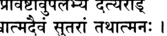

**474** 

**Шримад-Бхагаватам [песнь 10, гл. 85** 

## щ Ф т т ж т ^ ^ т т : 

## **ЧЧРТ IR 4 II** 

_тасмин правиштав упалабхйа даитйа-рад вишватма-даивам сутарам татхатманах тад-даршанахлада-париплуташайах садйах самуттхайа нанама санвайах_ 

_тасмин_ — туда; _правиштау_ — (Они двое) вошли; _упалабхйа_ — за­ метив; _даитйа-рат_ — царь дайтьев (Бали); _вишва_ — всей вселен­ ной; _атма_ — Душу; _даивам_ — и верховное Божество; _сутарам_ — особенно; _татха_ — также; _атманах_ — себя; _т ат_ — Их; _дарьиана_ — увидев; _ахлада_ — от радости; _париплута_ — взволновано; _аьиайах_ — его сердце; _садйах_ — немедленно; _самуттхайа_ — под­ нявшись; _нанама_ — поклонился; _са_ — вместе; _анвайах_ — со своей свитой. 

**Когда царь дайтьев, Махараджа Бали, увидел, что к нему при­ были два Господа, его сердце затрепетало от радости, ибо он по­ нял, что перед ним Высшая Душа всего мироздания, те, кому поклоняется весь мир и он сам. Он тут же поднялся и вместе со всей своей свитой в почтении склонился перед Ними.** 

## **ТЕКСТ 36** 

**3TTW ?** _**\ \ Щ \**_ 

_тайох саманййа варасанам муда_ 

_нивиштайос татра махатманос тайох дадхара падав аваниджйа тадж джалам са-врнда а-брахма пунад йад амбу ха_ 

_тайох_ — для Них; _саманййа_ — принеся; _вара_ — возвышенные; _асанам_ — места для сидения; _муда_ — с радостью; _нивиьитайох_ — которые заняли Свои места; _татра_ — там; _маха-атманох_ — ве­ личайших личностей; _тайох_ — Их; _дадхара_ — он принял; _падау_ — 

**текст 37] Господь Кришна дает наставления Васудеве** 

**475** 

стопы; _аваниджйа_ — омыв; _тат_ — эту; _джалам_ — воду; _са_ — вмес­ те; _врндах_ — со своей свитой; _а-брахма_ — вплоть до Господа Брахмы; _пунат_ — очищающая; _йат_ — которая; _амбу_ — вода; _ха_ — несомненно. 

**Обрадованный Бали усадил Их на почетные места и, когда Они сели, омыл Им стопы, а затем водой с Их стоп, очищающей весь мир вплоть до Господа Брахмы, окропил себя и всю свою свиту.** 

## **ТЕКСТ 37** 

**----- Start of picture text -----** 
I **----- End of picture text -----** 

_самархайам аса са may вибхутибхир махарха-вастрабхарананулепанаих тамбула-дйпамрта-бхакшанадибхих сва-готра-виттатма-самарпанена на_ 

_самархайам аса_ — поклонялся; _сах_ — он; _may_ — Им; _вибхутибхих_ — своими богатствами; _маха-арха_ — бесценными; _вастра_ — одеждами; _абхарана_ — украшениями; _анулепанаих_ — и ароматны­ ми притираниями; _тамбула_ — орехами бетеля; _дйпа_ — лампадами; _амрта_ — нектарной; _бхакшана_ — пищей; _адибхих_ — и так далее; _сва_ — его; _готра_ — семьи; _витта_ — богатства; _атма_ — и его само­ го; _самарпанена_ — подношениями; _ча_ — и. 

**Он поклонялся Им, принеся все богатства, что у него были, — дорогие одежды, украшения, ароматную сандаловую пасту, орехи бетеля, лампады, изысканную еду и прочее. Таким образом, он поднес Им все богатства своего рода и самого себя.** 

_КОММЕНТАРИЙ:_ Махараджа Бали славится как идеальный при­ мер полного предания себя воле Бога. Когда Господь Вишну пришел к нему в облике юного ученика _-брахмана_ и попросил ми­ лостыню, Бали отдал Ему все, чем владел, а когда больше ниче­ го не осталось, вручил Ему себя целиком и стал вечным слугой Верховного Господа. 

**[песнь 10, гл. 85** 

**Шримад-Бхагаватам** 

**476** 

Существует девять основных форм преданного служения, и выс­ шая из них — _атма-самарпанам,_ которой учит нас Бали Дайтьяраджа. В конце концов все наши усилия должны быть направлены на то, чтобы достичь этого состояния сознания. Если человек пытается произвести на Господа впечатление своим богатством, могуществом, разумом и т. д., но при этом не сознает себя Его сми­ ренным слугой, то вся его так называемая преданность — просто самонадеянное позерство. 

## **ТЕКСТ 38** 

## **f^nrr I** 

**щФи пни** _са индрасено бхагават-падамбуджам бибхран мухух према-вибхиннайа дхийа увача хананда-джалакулекшанах прахршта-рома нрпа гадгадакшарам_ 

_сах_ — он; _индра-сенах_ — Бали, победивший армию Индры; _бхагават_ — Верховного Господа; _пада-амбуджам_ — за лотосные стопы; _бибхрат_ — взявшись; _мухух_ — вновь и вновь; _према_ — от любви; _вибхиннайа_ — которое таяло; _дхийа_ — от сердца; _увача ха_ — ска­ зал; _ананда_ — от экстаза; _джала_ — водой (слезами); _акула_ — на­ полненные; _йкшанах_ — чьи глаза; _прахршта_ — вставшие дыбом; _рома_ — волосы на чьем теле; _нрпа_ — о царь (Парикшит); _гадгада_ — прерывавшиеся; _акьиарам_ — чьи слова. 

**Снова и снова касаясь лотосных стоп двух Богов, Бали, по­ коривший армию Индры, заговорил. О царь, слова его исходили из самого сердца, растаявшего от любви, глаза наполнились сле­ зами экстаза, волосы на теле встали дыбом, а голос то и дело прерывался.** 

_КОММЕНТАРИЙ:_ В книге «Кришна, Верховная Личность Бога» Шрила Прабхупада описывает эту сцену так: «Испытывая транс­ цендентное блаженство, царь Бали вновь и вновь прижимал Их стопы к своей груди, а иногда ставил их себе на голову. Из его 

**текст 40] Господь Кришна дает наставления Васудеве** 

**477** 

глаз текли слезы любви, и от восторга, охватившего Махараджу Бали, волосы на его теле стояли дыбом». 

## **ТЕКСТ 39** 

## **чПн-им** 

## _щ щ т \ \_ 

_балир увача_ 

_намо ’нантайа брхате намах кршнайа ведхасе санкхйа-йога-витанайа брахмане параматмане_ 

_балих увача_ — Бали сказал; _намах_ — поклоны; _анантайа_ — Ананте, безграничному Господу; _брхате_ — величайшему сущест­ ву; _намах_ — поклоны; _кршнайа_ — Кришне; _ведхасе_ — создателю; _санкхйа_ — философии _санкхъи; йога_ — и мистической _йоги; витанайа_ — распространителю; _брахмане_ — Абсолютной Истине; _парама-атмане_ — Сверхдуше. 

**Царь Бали сказал: Поклоны безграничному Господу, Ананте, величайшему из всех существ. Поклоны и Господу Кришне, твор­ цу Вселенной, который распространяет принципы** _**санкхъи**_ **и** _**йоги**_ **, принимая для этого облик безличного Абсолюта и Сверхдуши.** 

_КОММЕНТАРИЙ:_ Шрила Вишванатха Чакраварти говорит, что Ананта, о котором упоминает здесь Бали, — это Господь Ба­ ларама, распространяющий Себя в виде божественного змея Ананта-Шеши. Безличный Брахман — это источник текстов, при­ надлежащих к категории _санкхъи,_ а личностное воплощение Господа, Параматма, распространяет учение _йоги._ 

## **ТЕКСТ 40** 

## **^тнт** _-^т_ 

## **I** 

## W : _Ш \  щ ъ & т_ llVoll 

_даршанам вам хи бхутанам душпрапам чапй адурлабхам раджас-тамах-свабхаванам йан нах праптау йадрччхайа_ 

**[песнь 10, гл. 85** 

**478** 

**Шримад-Бхагаватам** 

_дарьианам_ — созерцание; _вам_ — Вас двоих; _хи_ — несомненно; _бху­ танам_ — для всех живых существ; _душпрапам_ — редко достижи­ мое; _на апи_ — тем не менее; _адурлабхам_ — которого нетрудно до­ стичь; _раджах_ — в страсти; _тамах_ — и невежестве; _свабхаванам_ — для тех, чьи склонности; _йат_ — в этом; _нах_ — нами; _праптау_ — обретенное; _йадрччхайа_ — беспричинно. 

**Большинству живых существ редко выпадает удача видеть Вас. Однако даже такие души, как мы, увязшие в** _гунах_ **страсти и не­ вежества, могут без труда увидеть Вас, если Вы по Своей воле решите явиться им.** 

_КОММЕНТАРИЙ:_ Упоминая о своем постыдном рождении в семье демонов, Махараджа Бали тем самым как бы говорит, что не об­ ладает никакими духовными качествами, благодаря которым перед ним могут предстать Кришна и Баларама. Бали думал: «Что уж говорить о таких демонах, как я, если даже отрекшиеся от мира аскеты, следующие путями _гьяны_ и _йоги_ , не смогут удовлетворить Господа, пока не избавятся от гордыни и зависти?» 

**ТЕКСТЫ 41-43** 

## **« р т ч т е : liv?ll** 

( Ц з з т ч з д д о д  г ^ т  q iw rflR fli i PirM '41*^ ^ 

*  rWT F fa fS T : ll«3ll 

_даитйа-данава-гандхарвах сиддха-видйадхара-чаранах йакша-ракшах-пиьиачаш ча бхута-праматха-найаках_ 

_вишуддха-саттва-дхамнй аддха твайи шастра-ьиарйрини нитйам нибаддха-ваирас те вайам чанйе ча тадршах_ 

_кечанодбаддха-ваирена бхактйа кечана каматах на татха саттва-самрабдхах санникрштах сурадайах_ 

_даитйа-данава_ — демоны дайтьи и данавы; _гандхарвах_ — и ган­ дхарвы, райские певцы; _сиддха-видйадхара-чаранах_ — сиддхи, видь- 

**текст 43] Господь Кришна дает наставления Васудеве** 

**479** 

ядхары и чараны; _йакьиа_ — якши (духи с некоторым запасом благочестия); _ракшах_ — ракшасы (духи-людоеды); _пиьиачах_ — пло­ тоядные демоны-пишачи; _ча_ — и; _бхута_ — призраки; _праматханайаках_ — и злобные духи праматхи и наяки; _вишуддха_ — безупреч­ но чистой; _саттва_ — благости; _дхамни_ — к воплощению; _аддха_ — непосредственному; _твайи_ — Тебе; _шастра_ — кто включает в Се­ бя все ведические писания; _ьиарйрини_ — обладатель такого те­ ла; _нитйам_ — всегда; _нибаддха_ — сосредоточенные; _ваирах_ — на вражде; _те_ — они; _вайам_ — мы; _ча_ — также; _анйе_ — другие; _ча_ — и; _тадрьиах_ — как они; _кечана_ — некоторые; _удбаддха_ — особен­ но упрямые; _ваирена_ — с ненавистью; _бхактйа_ — с преданнос­ тью; _кечана_ — некоторые; _каматах_ — возникающей из вожделения; _на_ — не; _татха_ — так; _саттва_ — материальная _гуна_ благости; _самрабдхах_ — те, на кого влияет; _санникрштах_ — привлеченные; _сура_ — полубоги; _адайах_ — и другие. 

**Многие из тех, кто постоянно враждовал с Вами, в результа­ те привязались к Вам, воплощениям трансцендентной благости, чья божественная форма включает в себя все богооткровенные писания. Среди тех, кто перестал враждовать с Вами, — дайтьи, данавы, гандхарвы, сиддхи, видьядхары, чараны, якши, ракшасы, пишачи, бхуты, праматхи и наяки и даже я и многие другие, по­ добные мне. Некоторые из нас пленились Вами благодаря своей необычайной ненависти, тогда как другие предались Вам, движи­ мые плотской страстью. При этом существа, опьяненные** _**гуной**_ **благости, такие как полубоги и им подобные, не чувствуют к Вам такого влечения.** 

_КОММЕНТАРИЙ:_ Шрила Джива Госвами объясняет этот стих так. Гандхарвы, сиддхи, видьядхары и чараны становятся врага­ ми Верховного Господа, когда принимают сторону демонов — дайтьев и данавов. Якши, ракшасы, пишачи и подобные им склонны враждовать с Господом, поскольку обычно их сознание затуманено невежеством. Есть полностью невежественные негодяи, вроде Ши­ шупалы и Паундраки, которые постоянно сосредоточены на Госпо­ де, потому что считают Его своим врагом. Эта сосредоточенность в конце концов дарует им освобождение. Другие, кто пребывает под смешанным воздействием страсти и невежества, обращаются к Господу в надежде получить власть и почет. Махараджа Бали считает себя одним из них. И тем не менее Господь Вишну пролил на Бали Свою милость, став его стражником в подземном царстве Сутала, так же как Он проливает милость на демонов, убивая их 

**480** 

**[песнь 10, гл. 85** 

**Шримад-Бхагаватам** 

и даруя им освобождение, а гандхарвам дарует возможность воспе­ вать Его славу. С другой стороны, Господь дарует чувственные удо­ вольствия тем полубогам, которые гордятся тем, что утвердились в _гуне_ благости; поэтому они впадают в заблуждение и забывают о Нем. 

## **ТЕКСТ 44** 

## **Ч ЧТЧЖ** _**Ч\ЧЧ\Ч\**_ **f 4 t IIVVII** 

_идам иттхам ити прайас тава йогешварешвара на видантй апи йогеьиа йога-майам куто вайам_ 

_идам_ — это; _иттхам_ — описываемое так; _ит и_ — такими слова­ ми; _прайах_ — большей частью; _тава_ — Твоя; _йога-йшвара_ — луч­ ших из _йогов; йшвара_ — о верховный повелитель; _на виданти_ — они не знают; _апи_ — даже; _йога-йшах_ — знатоки _йоги; йогамайам_ — Твою духовную иллюзорную энергию; _кутах_ — что же говорить; _вайам_ — о нас. 

## **О Господь всех совершенных** _**йогов**_ **, даже величайшие мистики не понимают, что такое Твоя духовная энергия иллюзии и как она действует, что уж говорить о нас?** 

_КОММЕНТАРИЙ:_ Полное постижение какого-то предмета подра­ зумевает знание о его _сварупе,_ то есть понимание его природы, а также знание его _вишеш,_ или качеств, которые отличают его от других объектов. _Майя_ , энергия, лежащая в основе всего матери­ ального бытия, намного тоньше привычных нам явлений. Поэто­ му ее _сварупу_ и _вишешу_ знает лишь Господь и Его освобожденные слуги. 

## **ТЕКСТ 45** 

**текст 46] Господь Кришна дает наставления Васудеве** 

**481** 

_тан нах прасйда нирапекша-вимргйа-йушматпадаравинда-дхишананйа-грхандха-купат нишкрамйа вишва-шаранангхрй-упалабдха-врттих ьианто йатхаика ута сарва-сакхаиьи нарами_ 

_тат_ — таким образом; _нах_ — к нам; _прасйда_ — пожалуйста, будь милостив; _нирапекша_ — теми, у кого нет материальных моти­ вов; _вимргйа_ — разыскиваемые; _йуишат_ — Твои; _пада_ — чем сто­ пы; _аравинда_ — лотосные; _дхишана_ — прибежище; _анйа_ — другое; _грха_ — из дома; _андха_ — бездонным; _купат_ — который является ко­ лодцем; _нишкрамйа_ — выйдя; _виьива_ — всему миру; _ьиарана_ — тех, кто помогает (деревьев); _ангхри_ — у стоп; _упалабдха_ — обретено; _врттих_ — чье проживание; _ьиантах_ — умиротворенный; _йатха_ — как; _эках_ — один; _ута_ — или; _сарва_ — всех; _сакхаих_ — с друзьями; _чарами_ — я буду скитаться. 

**Пожалуйста, смилуйся надо мной и вызволи из глухого колод­ ца семейной жизни, который я по ошибке считаю своим домом, чтобы я смог обрести настоящее прибежище у Твоих лотосных стоп — объекта постоянных поисков свободных от корысти муд­ рецов. Тогда один ли, или в обществе великих святых, желающих добра каждому, я буду скитаться по миру, живя дарами деревьев, щедрых ко всем.** 

_КОММЕНТАРИЙ:_ Шрила Вишванатха Чакраварти пишет, что в ответ на молитвы Бали Шри Кришна предложил ему выбрать любое благословение, и в этом стихе Бали говорит о своем жела­ нии. Бали молит о том, чтобы освободиться от пут материальной жизни и, оставив дом, скитаться по миру, избрав единственным сво­ им прибежищем лотосные стопы Господа. Он говорит, что поддер­ живать жизнь ему помогут лесные деревья, под которыми любой нуждающийся всегда может найти плоды для пропитания и листья, чтобы на них спать. Бали надеется, что Господь прольет на него особую милость и тогда ему не придется бродить в одиночестве: его спутниками станут преданные Господа Кришны. 

## **ТЕКСТ 46** 

**482** 

**[песнь 10, гл. 85** 

**Шримад-Бхагаватам** 

_шадхй асман ишитавйеша нишпапан куру нах прабхо пуман йач чхраддхайатиштхамш чоданайа вимучйате_ 

_шадхи_ — пожалуйста, приказывай; _асман_ — нам; _йшитавйа_ — тем, кто подвластен; _йьиа_ — о повелитель; _нишпапан_ — безгреш­ ными; _куру_ — пожалуйста, сделай; _нах_ — нас; _прабхо_ — о гос­ подин; _пуман_ — человек; _йат_ — который; _ьираддхайа_ — с верой; _атиштхан_ — совершающий; _чоданайах_ — от необходимости следо­ вать правилам писаний; _вимучйате_ — становится свободным. 

**О повелитель всех подвластных живых существ, пожалуйста, скажи, что нам следует делать, и освободи нас от грехов. Тот, кто с верой выполняет Твою волю, больше не обязан исполнять все обряды Вед, предназначенные для обычных людей.** 

_КОММЕНТАРИЙ: Ачаръи_ объясняют мысли Бали так. Решив, что его просьба о немедленном освобождении могла показаться слиш­ ком смелой, Махараджа Бали подумал, что вначале ему следу­ ет полностью очиститься. Он думал: «Наверняка Господь Кришна и Господь Баларама пришли ко мне с какой-то целью, и если мне удастся выполнить Их волю, то это как нельзя лучше очистит ме­ ня». Как говорит Бали, преданный, который выполняет волю Вер­ ховной Личности Бога, не обязан больше следовать предписаниям и запретам Вед, касающимся проведения жертвоприношений. 

## **ТЕКСТ 47** 

ч Гч з д у п ч , llV'SlI 

_шрй-бхагаван увача асан марйчех шат путра урнайам пратхаме *нтаре девах ком джахасур вйкшйа сутам йабхитум удйатам_ 

_шрй-бхагаван увача_ — Верховный Господь сказал; _асан_ — были; _марйчех_ — Маричи; _шат_ — шесть; _путрах_ — сыновей; _урнайам_ — рожденные от Урны (его жены); _пратхаме_ — в первом; _антаре_ — правлении Ману; _девах_ — полубоги; _ком_ — над Господом Брахмой; 

**текст 49] Господь Кришна дает наставления Васудеве** 

**483** 

_джахасух_ — посмеялись; _вйкшйа_ — увидев; _сутам_ — со своей до­ черью (Сарасвати); _йабхитум_ — вступить в интимные отношения; _удйатам_ — приготовившимся. 

**Верховный Господь сказал: Во время правления первого Ману у мудреца Маричи и его жены Урны родилось шесть сыновей. Все они были полубогами, но однажды, увидев, что Господь Брах­ ма собрался вступить в интимную связь со своей дочерью, они посмеялись над ним.** 

## **ТЕКСТЫ 48-49** 

## **%mFRTT IIVCII** 

^ _ттщ_ I ш _т щ_ ц ^ ц 

_тенасурйм аган. йоним адхунавадйа-кармана хиранйакаьиипор джата нйтас те йога-майайа_ 

_девакйа ударе джата раджан камса-вихимситах са тан ьиочатй атмаджан сейме та име *дхйасате *нтике_ 

_тена_ — этим; _асурйм_ — демоническое; _аган_ — они вошли; _йо­ ним_ — в чрево; _адхуна_ — немедленно; _авадйа_ — неуместным; _карма­ на_ — поступком; _хиранйакашипох_ — от Хираньякашипу; _джатах_ — рожденные; _нйтах_ — перенесенные; _т е_ — они; _йога-майайа_ — бо­ жественной энергией иллюзии Господа; _девакйах_ — Деваки; _уда­ ре_ — из чрева; _джатах_ — рожденные; _раджан_ — о царь (Бали); _камса_ — Камсой; _вихимситах_ — убитые; _са_ — она; _тан_ — по ним; _шочати_ — скорбит; _атма-джан_ — сыновья; _сван_ — ее собственные; _те_ — они; _име_ — те самые; _адхйасате_ — живут; _антике_ — рядом. 

**Из-за этого недостойного поступка они тут же получили тела демонов и родились как сыновья Хираньякашипу. Затем богиня Йогамайя забрала их у Хираньякашипу, и они вновь родились, теперь уже из лона Деваки. После этого, о царь, их убил Камса. Деваки все еще оплакивает их, считая их своими сыновьями. Эти сыновья Маричи сейчас живут с тобой.** 

**[песнь 10, гл. 85** 

**Шримад-Бхагаватам** 

**484** 

_КОММЕНТАРИЙ: Ачаръи_ Шридхара Свами и Вишванатха Чакра­ варти объясняют, что, забрав сыновей Маричи у Хираньякашипу, _йогамайя_ Господа Кришны вначале сделала так, что они провели еще одну жизнь, родившись у другого великого демона, Каланеми, и только затем она перенесла их в лоно Деваки. 

## **ТЕКСТ 50** 

## _ТЧ_ w i Й Ч 1 Ч ) Ч1<доЫ>1Ч^тЙ I **гТгГ *>ИЧ|(^Р|4тЫ** _**шФч**_ **||Чо||** 

_ита этан пранешйамо матр-ъиокапануттайе татах ьиапад винирмукта локам йасйанти виджварах_ 

_итах_ — отсюда; _этан_ — их; _пранешйамах_ — Мы хотим забрать; _матр_ — их матери; _шока_ — скорбь; _апануттайе_ — чтобы рассеять; _татах_ — затем; _ьиапат_ — от своего проклятия; _винирмуктах_ — освобожденные; _локам_ — на свою планету (полубогов); _йасйан­ т и_ — отправятся; _виджварах_ — избавившиеся от лихорадки. 

## **Мы хотим забрать их отсюда, чтобы рассеять печаль их мате­ ри. Затем, освободившись от последствий проклятия и всех своих страданий, они вернутся домой на райскую планету.** 

_КОММЕНТАРИЙ:_ Как отмечает Шрила Прабхупада в коммента­ риях к пятому и восьмому стихам второй главы Десятой песни, сыновья Маричи были прокляты за то, что оскорбили Господа Брахму. Вдобавок к этому их проклял Хираньякашипу, сказав, что в следующей жизни они умрут от руки отца. Это прокля­ тие сбылось, когда Васудева позволил Камсе убить их одного за другим. 

## **ТЕКСТ 51** 

F R tjffa: _Ч Щ :_ I **ич?и** 

_смародгйтхах паришвангах патангах кшудрабхрд гхрнй шад име мат-прасадена пунар йасйанти сад-гатим_ 

**текст 52] Господь Кришна дает наставления Васудеве** 

**485** 

_смара-удгйтхах паришвангах_ — Смара, Удгитха и Паришванга; _патангах кшудрабхрт гхрнй_ — Патанга, Кшудрабхрит и Гхрини; _шат_ — шестеро; _име_ — эти; _мат_ — Моей; _прасадена_ — милостью; _пунах_ — вновь; _йасйанти_ — отправятся; _cam_ — святых; _гатим_ — в обитель. 

## **По Моей милости эти шестеро — Смара, Удгитха, Паришван­ га, Патанга, Кшудрабхрит и Гхрини — вернутся в обитель чистых святых.** 

_КОММЕНТАРИЙ:_ Так звали этих шестерых детей, когда они бы­ ли сыновьями Маричи. В «Шримад-Бхагаватам» (10.1.57) говорит­ ся, что старший из них, Смара, родившись у Васудевы, получил имя Киртиман: 

_кйртимантам пратхама-джам камсайанакадундубхих арпайам аса крччхрена со ’нртад ати-вихвалах_ 

«Васудева очень боялся нарушить свое обещание и оказаться лже­ цом. Поэтому, превозмогая боль, он отдал своего перворожденного сына, которого назвали Киртиманом, в руки Камсы». 

## **ТЕКСТ 52** 

_итй уктва тан самадайа индрасенена пуджитау пунар двараватйм этйа матух путран айаччхатам_ 

_ит и_ — так; _уктва_ — сказав; _тан_ — их; _самадайа_ — забрав; _ин­ драсенена_ — Махараджей Бали; _пуджитау_ — оба почтённые; _пу­ нах_ — еще раз; _двараватйм_ — в Двараку; _этйа_ — отправившись; _матух_ — Своей матери; _путран_ — сыновей; _айаччхатам_ — Они представили. 

**[Шукадева Госвами продолжал:] Сказав это, Господь Кришна и Господь Баларама, вновь приняв почести от Махараджи Бали,** 

**486** 

**[песнь 10, гл. 85** 

**Шримад-Бхагаватам** 

**забрали шестерых сыновей Деваки и вернулись в Двараку, где представили их Своей матери.** 

**ТЕКСТ 53** 

d l ^ l I 

## н ч зн 

_тан дрштва балакан девй путра-снеха-снута-станй паришваджйанкам аропйа мурдхнй аджигхрад абхйкшнаьиах_ 

_тан_ — их; _дрштва_ — увидев; _балакан_ — мальчиков; _девй_ — бо­ гиня (Деваки); _путра_ — к своим сыновьям; _снеха_ — от люб­ ви; _снута_ — текущие; _станй_ — чьи груди; _паришваджйа_ — обняв; _анкам_ — на колени; _аропйа_ — посадив; _мурдхни_ — их головы; _аджигхрат_ — нюхала; _абхйкшнаьиах_ — вновь и вновь. 

**Увидев сыновей, которых она когда-то потеряла, богиня Дева­ ки ощутила такую любовь к ним, что из грудей ее потекло мо­ локо. Она обняла их и посадила к себе на колени, вновь и вновь вдыхая аромат их голов.** 

## **ТЕКСТ 54** 

#ТТ | 

_апайайат станам прйта сута-спарьиа-париснутам мохита майайа вишнор йайа срштих правартате_ 

_апайайат_ — она напоила их; _станам_ — из грудей; _прйта_ — с любовью; _сута_ — своих сыновей; _спарьиа_ — от прикоснове­ ния; _париснутам_ — вымокших; _мохита_ — введенная в заблужде­ ние; _майайа_ — иллюзорной энергией; _вишнох_ — Господа Вишну; _йайа_ — благодаря которой; _срштих_ — творение; _правартате_ — происходит. 

**Стоило ей прикоснуться к своим детям, как ее грудь намокла от молока, и она с любовью стала кормить этим молоком сво­ их сыновей. В этот момент ее ввела в заблуждение иллюзорная энергия Господа Вишну, творящая мироздание.** 

**текст 56] Господь Кришна дает наставления Васудеве** 

**487** 

_КОММЕНТАРИЙ:_ По словам Шрилы Дживы Госвами слово _сршти_ здесь также может указывать на творческий акт, с помощью которого _йогамайя,_ энергия Господа Вишну, устраивает Его _лилы._ Разумеется, Деваки не могла попасть под влияние материального аспекта _майи._ 

## **ТЕКСТЫ 55-56** 

44W H II: I **ИЧЧИ** 

**% *Ttf^ ftrT? I f t w II4<UI** 

_пйтвамртам пайас тасйах пйта-ьиешам гада-бхртах нарайананга-самспарьиа-пратилабдхатма-даршанах_ 

_те намаскртйа говиндам девакйм питарам балам мишатам сарва-бхутанам йайур дхама диваукасам_ 

_пйтва_ — испив; _амртам_ — нектарного; _пайах_ — молока; _та­ сйах_ — ее; _пйта_ — того, что когда-то пил; _ьиешам_ — остатки; _гада-бхртах_ — Кришна, держащий палицу; _нарайана_ — Верховно­ го Господа, Нараяны (Кришны); _анга_ — тела; _самспарьиа_ — от прикосновения; _пратилабдха_ — восстановили; _атма_ — свою из­ начальную природу (полубогов); _дарьианах_ — восприятие; _те_ — они; _намаскртйа_ — поклонившись; _говиндам_ — Господу Кришне; _девакйм_ — Деваки; _питарам_ — отцу; _балам_ — и Господу Балараме; _мишатам_ — на глазах; _сарва_ — у всех; _бхутанам_ — людей; _йайух_ — они отправились; _дхама_ — в обитель; _дива-окасам_ — полубогов. 

**Испив ее нектарного молока, того, что когда-то пил Сам Гос­ подь Кришна, шестеро сыновей прикоснулись к трансцендентному телу Господа, Нараяны, и от этого прикосновения восстановили свою изначальную природу. Поклонившись Говинде, Деваки, сво­ ему отцу и Балараме, они на глазах у всех перенеслись в обитель полубогов.** 

_КОММЕНТАРИЙ:_ Господь Кришна в облике младенца был с Дева­ ки и Васудевой совсем недолго. Вначале Господь явился им в Сво­ ей четырехрукой форме, а затем, выслушав их молитвы, принял 

**[песнь 10, гл. 85** 

**Шримад-Бхагаватам** 

**488** 

облик обычного младенца, чтобы доставить им удовольствие. Но, желая спасти Кришну от участи, постигшей Его братьев, Васудева сразу же унес Его из тюрьмы Камсы. Перед тем как Васудева за­ брал Его, Деваки накормила Кришну грудным молоком, чтобы Он не проголодался во время долгого путешествия в царство Нанды, Врадж. Все это пишет в своем комментарии Шрила Вишванатха Чакраварти Тхакур. 

## **ТЕКСТ 57** 

гТ 

I _т т_ т^гтт ич^н 

_там дрштва девакй девй мртагамана-ниргамам мене су-висмита майам кршнасйа рачитам нрпа_ 

_там_ — это; _дрштва_ — видя; _девакй_ — Деваки; _девй_ — божествен­ ная; _мрта_ — умерших (сыновей); _агамана_ — возвращение; _ниргамам_ — и уход; _мене_ — подумала; _су_ — очень; _висмита_ — удивленная; _майам_ — волшебство; _кршнасйа_ — Кришной; _рачитам_ — устроен­ ное; _нрпа_ — о царь (Парикшит). 

**О царь, увидев, как ее сыновья вернулись из царства мертвых, а затем вновь исчезли из вида, святая Деваки была поражена. Она решила, что все это было просто иллюзией, созданной Кришной.** 

## **ТЕКСТ 58** 

## _**фщ щ**_ **ч<Ч 1 с*н: I** 

## **U-HHHlPl *ТНгГ ИЧС11** 

_эвам-видханй адбхутани кршнасйа параматманах вйрйанй ананта-вйрйасйа сантй анантани бхарата_ 

_эвам-видхани_ — так; _адбхутани_ — удивительные; _кршнасйа_ — Кришны; _парама-атманах_ — Высшей Души; _вйрйанй_ — подвиги; _ананта_ — безгранично; _вйрйасйа_ — чье могущество; _санти_ — есть; _анантани_ — бесчисленные; _бхарата_ — о потомок Бхараты. 

**текст 59] Господь Кришна дает наставления Васудеве** 

**489** 

**Шри Кришна, Высшая Душа, Господь, чье могущество безгра­ нично, являл Свои бесчисленные игры, столь же удивительные, как и эта, о потомок Бхараты.** 

## **ТЕКСТ 59** 

## **W rfcf frrN rTt 'mfcf гГг%ЧЩ*Т IM II** 

_шрй-сута увача_ 

_йа идам анушрноти ьиравайед ва мурареш_ 

_чаритам амрта-кйртер варнитам вйаса-путраих джагад-агха-бхид алам тад-бхакта-сат-карна-пурам бхагавати крта-читто йати тат-кшема-дхама_ 

_шрй-сутах увача_ — Шри Сута сказал (мудрецам, собравшим­ ся в Наймишаранье, которым он пересказывал беседу Шукаде­ вы Госвами и Махараджи Парикшита); _йах_ — кто; _идам_ — это; _анушрноти_ — внимательно слушает; _ьиравайет_ — дает возмож­ ность услышать другим; _ва_ — или; _мурарех_ — Господа Кришны, ко­ торый убил демона Муру; _чаритам_ — игру; _амрта_ — бессмертна; _кйртех_ — чья слава; _варнитам_ — описанная; _вйаса-путраих_ — по­ чтенным сыном Вьясадевы; _джагат_ — мира; _агха_ — грехи; _бхит_ — которая (игра) уничтожает; _алам_ — полностью; _тат_ — Его; _бхакт а_ — для преданных; _cam_ — трансцендентное; _карна-пурам_ — укра­ шение для ушей; _бхагавати_ — на Верховном Господе; _крта_ — сосредоточивая; _читтах_ — свой ум; _йати_ — отправляется; _тат_ — Его; _кшема_ — благую; _дхама_ — в обитель. 

**Шри Сута Госвами сказал: Господь Мурари, чья слава вечна, явил эту** _**лилу,**_ **которая полностью уничтожает все грехи мирозда­ ния и служит трансцендентным украшением для ушей Его пре­ данных. Любой, кто внимательно слушает или пересказывает эту историю, так, как ее рассказывал почтенный сын Вьясы, сможет сосредоточить свой ум на размышлениях о Верховном Господе и достичь всеблагого царства Бога.** 

**490** 

## **Шримад-Бхагаватам** 

_КОММЕНТАРИЙ:_ Как пишет Шрила Шридхара Свами, слушание об удивительных событиях из жизни Господа Кришны уничтожа­ ет все грехи совершенным образом _(алам),_ поскольку делать это очень легко. Слушать о Его играх может любой, а те, кто предает­ ся Кришне, всегда рады носить на своих ушах украшения расска­ зов о Нем. Не только те, кто сам присутствовал во время этих игр, но также Шукадева Госвами, Сута Госвами и все, кто когда-либо слушал о них и услышит в будущем, — все они получат удивитель­ ную возможность снова и снова рассказывать о трансцендентной славе Господа Кришны. 

_Так заканчивается комментарий смиренных слуг А. Ч. Бхактиведанты Свами Прабхупады к восемьдесят пятой главе Десятой песни «Шримад-Бхагаватам_ », _которая называется «Господь Кришна дает наставления Васудеве и возвращает сыновей Де­ ваки»._ 

## **ГЛАВА ВОСЕМЬДЕСЯТ ШЕСТАЯ** 

## **А рдж уна похищ ает Субхадру, а Криш на благословляет Своих преданны х** 

В этой главе описывается, как Арджуна похитил Субхадру и как Господь Кришна отправился в Митхилу, чтобы благословить Своих преданных Бахулашву и Шрутадеву. 

Когда царь Парикшит захотел послушать о том, как его бабуш­ ка, Субхадрадеви, вышла замуж, Шри Шукадева Госвами сказал: «Находясь в паломничестве, Арджуна узнал, что Господь Баладева хочет отдать Свою сестру Субхадру в жены Дурьйодхане. Решив похитить Субхадру и жениться на ней, Арджуна облачился в одеж­ ды _санньяси_ и отправился в Двараку. Он так искусно поменял свою внешность, что ни Баларама, ни другие жители Двараки не узнали его; напротив, все они выражали ему почтение как странствующе­ му вайшнаву. Так прошли четыре месяца сезона дождей. Однажды Арджуну пригласили отобедать во дворце Господа Баларамы. Там он встретился глазами с Субхадрой, и его тут же охватило жела­ ние обладать ею. Субхадра также захотела стать женой Арджуны и потому отвечала ему стыдливым взглядом. Несколько дней спустя Субхадра покинула дворец, чтобы участвовать в праздни­ ке колесниц. Воспользовавшись этим, Арджуна похитил Субхадру и разгромил Ядавов, которые пытались помешать ему. Узнав об этом, Господь Баларама вначале сильно разгневался, однако, когда Господь Шри Кришна и другие Его родственники успокоили Его, Он, наоборот, обрадовался и одарил жениха и невесту богатыми свадебными подарками». 

В городе Митхила жил _брахман,_ преданный Шри Кришне. Зва­ ли его Шрутадева. По воле Провидения того, что он зарабатывал, едва хватало, чтобы не умереть с голоду самому и как-то прокор­ мить членов своей семьи. Тем не менее он был всегда удовлетво­ рен и неукоснительно выполнял все свои религиозные обязанности. Там же, в Митхиле, жил другой великий преданный Господа, царь 

**491** 

**[песнь 10, гл. 86** 

**492** 

**Шримад-Бхагаватам** 

Бахулашва. Он принадлежал к династии царя Джанаки. Бахулашва правил всей провинцией Видеха, однако при этом у него, как и у Шрутадевы, не было никаких привязанностей. Довольный пре­ данностью этих двух великих душ, Господь Кришна взошел на ко­ лесницу и поехал в Митхилу, чтобы повидать их. С Ним также отправились Нарада и другие ученые мудрецы. Митхила приняла Господа и Его святых спутников с великой радостью. Местные жи­ тели, принеся множество разных подарков для Господа, склонились перед Ним и сопровождавшими Его мудрецами. 

Бахулашва и Шрутадева вышли вперед и с почтением пригласи­ ли Шри Кришну к себе в гости. Чтобы порадовать их обоих, Гос­ подь распространил Себя в две формы и одновременно навестил каждого из них. Оба они одновременно чествовали Его, возносили молитвы, омывали Его стопы, а затем этой водой окропили себя и всех членов своей семьи. После этого Господь Кришна просла­ вил мудрецов, сопровождавших Его, и все сословие _брахманов._ Он также дал преданным, принимавшим Его, наставления в предан­ ном служении. Усвоив Его наставления, Шрутадева и Бахулашва с великой сосредоточенностью и преданностью почтили мудрецов и Господа Шри Кришну. Затем Господь Кришна вернулся в Двараку. 

## **ТЕКСТ 1** 

## _**Ч Ч Р д й**_ t o r t _**W**_ ЧЧкМгЧН1Ч*(1 II ? II 

_шрй-раджовача_ 

_брахман ведитум иччхамах свасарам рама-кршнайох йатхопайеме виджайо йа мамасйт питамахй_ 

_ьирй-раджа увача_ — великий царь (Парикшит) сказал; _брахман_ — о _брахман_ (Шукадева); _ведитум_ — знать; _иччхамах_ — хотим; _сва­ сарам_ — сестра; _рама-кршнайох_ — Баларамы и Кришны; _йатха_ — как; _упайеме_ — вышла замуж; _виджайах_ — за Арджуну; _йа_ — та, которая; _мама_ — моя; _асйт_ — была; _питамахй_ — бабушка. 

**Царь Парикшит сказал: О** _**брахман**_ **, мне хотелось бы узнать, как Арджуна женился на сестре Господа Баларамы и Господа Кришны, ставшей моей бабушкой.** 

**текст 3]** 

**Арджуна похищает Субхадру** 

**493** 

_КОММЕНТАРИЙ:_ Здесь Махараджа Парикшит меняет тему бесе­ ды, спросив у Шукадевы Госвами о свадьбе сестры Господа Криш­ ны, Субхадры. По мнению Шрилы Шридхары Свами, вопрос царя Парикшита вытекает из предыдущего рассказа Шукадевы Госвами, о том, как Господь Кришна вызволил сыновей Деваки из обители смерти, ибо завоевать Субхадру было для Арджуны не меньшим подвигом — ведь против свадьбы Арджуны и Субхадры был Сам Господь Баларама. 

**ТЕКСТЫ 2-3** 

sn |: I 

_ъ_ **зттг*гс: II** _ч_ **II** 

**гТ%^:** _**ъ**_ **^frnjf^T 1K+I4J|I< II 3 II** 

_ьирй-ьиука увача арджунас тйртха-йатрайам парйатанн аванйм прабхух гатах прабхасам аьирнон матулеййм са атманах_ 

_дурйодханайа рам ас там дасйатйти на чапаре тал-липсух са йатир бхутва три-дандй дваракам агат_ 

_ьирй-шуках увача_ — Шукадева Госвами сказал; _арджунах_ — Ар­ джуна; _тйртха_ — по святым местам; _йатрайам_ — находясь в па­ ломничестве; _парйатан_ — скитаясь; _аванйм_ — по земле; _прабхух_ — великий господин; _гатах_ — ушедший; _прабхасам_ — в Прабхасу; _аьирнот_ — услышал; _матулеййм_ — дочь дяди; _сах_ — он; _атманах_ — его; _дурйодханайа_ — Дурьйодхане; _рамах_ — Господь Баларама; _там_ — ее; _дасйати_ — намеревается отдать; _ити_ — так; _на_ — не; _ча_ — и; _апаре_ — никто другой; _тат_ — ее; _липсух_ — желая обрес­ ти; _сах_ — он, Арджуна; _йатих_ — _саннъяси; бхутва_ — став; _тридандй_ — несущего посох из трех жердей; _дваракам_ — в Двараку; _агат_ — отправился. 

**Шукадева Госвами сказал: Странствуя по миру и посещая раз­ личные святые места, Арджуна пришел в Прабхасу. Там он узнал,** 

**[песнь 10, гл. 86** 

**Шримад-Бхагаватам** 

**494** 

**что Господь Баларама намерен отдать его двоюродную сестру по матери Субхадру в жены Дурьйодхане и что все остальные не со­ глашаются на это. Арджуна сам хотел жениться на ней, а потому, переодевшись отрекшимся от мира** _**санньяси**_ **и взяв в руки посох из трех частей, отправился в Двараку.** 

_**КОММЕНТАРИЙ:**_ Может показаться, что, решив жениться на Субхадре, Арджуна повел себя несколько странно, однако на самом деле он действовал не совсем по своей воле: его подговаривал на это Господь Кришна. В Двараке же все члены царской семьи, в особенности Васудева, не хотели отдавать свою любимую дочь за Дурьйодхану. 

## **ТЕКСТ 4** 

<Au|M M dl II У II 

_татра ваи варшикан масан аватсйт свартха-садхаках паураих сабхаджито ’бхйкшнам раменаджаната ча сах_ 

_татра_ — там; _ваи_ — несомненно; _варшикан_ — сезона дождей; _ма­ сан_ — во время месяцев; _аватсйт_ — он жил; _сва_ — своей; _артха_ — цели; _садхаках_ — стараясь достичь; _паураих_ — горожанами; _сабха­ джитах_ — почитаемый; _абхйкшнам_ — постоянно; _рамена_ — Госпо­ дом Баларамой; _аджаната_ — который не знал; _ча_ — и; _сах_ — он. 

**Готовясь осуществить свои намерения, Арджуна провел в Два­ раке сезон дождей. Не узнав его, Господь Баларама и другие жители города оказывали ему гостеприимство и всевозможные почести.** 

## **ТЕКСТ 5** 

## Я^Т1ЧЕсТ *1 f%?r II Ч II 

_экада грхам анййа атитхйена нимантрйа там шраддхайопахртам бхаикшйам балена бубхудже кила_ 

**текст 7]** 

**495** 

**Арджуна похищает Субхадру** 

_экада_ — однажды; _грхам_ — в Его (Баларамы) дворец; _анййа_ — приведя; _атитхйена_ — как гостя; _нимантрйа_ — пригласив: _там_ — его (Арджуну); _ьираддхайа_ — с верой; _упахртам_ — предложенную; _бхаикьийам_ — пищу; _балена_ — Господом Баларамой; _бубхудже_ — он вкусил; _кила_ — несомненно. 

**Как-то раз Господь Баларама пригласил его к Себе во дворец на обед. Арджуна стал есть яства, которыми Господь с почтением угощал его.** 

_КОММЕНТАРИЙ:_ Шрила Вишванатха Чакраварти объясняет, что Арджуна играл роль _санньяси,_ только что завершившего свой обет, который он соблюдал на протяжении четырех месяцев сезона дож­ дей, и теперь вновь принимающего приглашения в гости от семей­ ных людей. Поэтому никому и в голову не могло прийти, что он посещает Господа Балараму с особыми намерениями. 

## **ТЕКСТ 6** 

w f f 41<ЧН1*<1Ч I ^ II 5 II 

_со ’паьийат татра махатйм канйам вира-мано-харам прйтй-утпхуллекьианас тасйам бхава-кьиубдхам мано дадхе_ 

_сах_ — он; _апаьийат_ — увидел; _татра_ — там; _махатйм_ — удиви­ тельную; _канйам_ — девушку; _вйра_ — героев; _манах-харам_ — очаро­ вывавшую; _прйти_ — счастьем; _утпхулла_ — цветущие; _йкьианах_ — его глаза; _тасйам_ — на нее; _бхава_ — чувством; _кшубдхам_ — взвол­ нован; _манах_ — его ум; _дадхе_ — он поместил. 

**Там он увидел прекрасную Субхадру, девушку, пленявшую умы героев. От восторга его глаза широко открылись, а взволнован­ ный ум погрузился в мысли о ней.** 

## **ТЕКСТ 7** 

**11*11** 

**[песнь 10, гл. 86** 

**Шримад-Бхагаватам** 

**496** 

_сапи там чакаме вйкшйа маринам хрдайам-гамам хасантй врйдитапангй тан-нйаста-хрдайекшана_ 

_са_ — она; _апи_ — также; _там_ — его; _чакаме_ — желала; _вйкшйа_ — увидев; _нарйнам_ — женщин; _хрдайам-гамам_ — того, кто пленя­ ет сердца; _хасантй_ — улыбаясь; _врйдита_ — робкие; _апангй_ — бро­ сая взгляды искоса; _тат_ — на него; _нйаста_ — сосредоточено; _хрдайа_ — ее сердце; _йкшана_ — и глаза. 

**Арджуна очень нравился женщинам, и, как только Субхадра увидела его, она тут же захотела стать его женой. Застенчиво улы­ баясь и бросая на него искоса смущенные взгляды, она устремила к нему свое сердце и глаза.** 

_КОММЕНТАРИЙ:_ Едва увидев Арджуну, Субхадра сразу поняла, что он никакой не _саннъясиу_ а ее суженый. В книге «Кришна, Вер­ ховная Личность Бога» Его Божественная Милость Шрила Прабху­ пада объясняет: «Арджуна, дед Махараджи Парикшита, был и сам необыкновенно хорош собой. Великолепно сложенный, он очень привлекал Субхадру, и она втайне решила, что выйдет замуж толь­ ко за него. Она была простодушна и радостно улыбалась, глядя на Арджуну». 

## **ТЕКСТ 8** 

## **гТТ** _щ_ 

Ч %% 

**I** 

II _с_ II 

_там парам саманудхйайанн антарам препсур арджунах на лебхе игам бхрамач-читтах каменати-балййаса_ 

_там_ — о ней; _парам_ — только; _саманудхйайан_ — думая; _анта­ рам_ — подходящей возможности; _препсух_ — ожидая; _арджунах_ — Арджуна; _на лебхе_ — не мог испытать; _игам_ — мира; _бхрамат_ — дрожащее; _читтах_ — его сердце; _камена_ — от вожделения; _атибалййаса_ — очень сильного. 

**Думая лишь о ней и ожидая, когда представится случай похи­ тить ее, Арджуна не находил себе места. Охваченное страстным желанием, его сердце трепетало.** 

**текст 10]** 

**Арджуна похищает Субхадру** 

**497** 

_КОММЕНТАРИЙ:_ Даже когда Господь Баларама оказывал ему по­ чести, Арджуна был слишком рассеян, чтобы оценить гостепри­ имство Господа. Рассеянность Арджуны и неспособность Господа Баларамы узнать его — все это устроил Сам Верховный Господь, чтобы насладиться Своими трансцендентными развлечениями. 

## **ТЕКСТ 9** 

## ^ II ^ II 

## _махатйам дева-йатрайам ратха-стхам дурга-ниргатам джахарануматах питрох кршнасйа на маха-ратхах_ 

_махатйам_ — важного; _дева_ — в честь Верховного Господа; _йатрайам_ — во время праздника; _ратха_ — на колеснице; _стхам_ — восседавшую; _дурга_ — из крепости; _ниргатам_ — появившуюся; _джа­ хара_ — он схватил ее; _ануматах_ — с одобрения; _питрох_ — ее ро­ дителей; _кршнасйа_ — Господа Кришны; _на_ — и; _маха-ратхах_ — могучий воин на колеснице. 

**Однажды, во время большого праздника в честь Верховного Господа, Субхадра выехала на колеснице из своего дворца, непри­ ступного, словно крепость. Тогда могучий воин Арджуна, восполь­ зовавшись этой возможностью, похитил ее. Родители Субхадры и Кришна одобрили его поступок.** 

_КОММЕНТАРИЙ:_ Шрила Вишванатха Чакраварти говорит, что праздником этим была ежегодная Ратха-ятра в честь Господа Виш­ ну по поводу Его пробуждения от мистического сна в конце _натурмасъи._ Родители Субхадры — это Васудева и Деваки. 

## **ТЕКСТ 10** 

## й а м э т а т т _т * \_ iim i 

_ратха-стхо дханур адайа ьиурамьи нарундхато бхатан видравйа крошатам сванам сва-бхагам мрга-рад ива_ 

**[песнь 10, гл. 86** 

**Шримад-Бхагаватам** 

**498** 

_ратха_ — на своей колеснице; _стхах_ — стоявший; _дханух_ — лук; _адайа_ — взяв; _ьиуран_ — героев; _на_ — и; _арундхатах_ — пытавших­ ся остановить его; _бхатан_ — и стражников; _видравйа_ — отбросив; _крошатам_ — когда они кричали в гневе; _сванам_ — ее родствен­ ники; _сва_ — свою; _бхагам_ — добычу, принадлежащую по праву; _мрга-рат_ — царь зверей, лев; _ива_ — в точности как. 

**Стоя на своей колеснице, Арджуна взял лук и отбросил всех храбрых воинов и дворцовых стражников, которые пытались остановить его. Под крики разгневанных родственников Арджуна увозил Субхадру, как лев, отобравший добычу у мелких зверьков.** 

## **ТЕКСТ 11** 

сГ5|гЗТ _т :_ ч З Ф г  w f a :  I 

_тан чхрутва кшубхито рамах парванйва махарнавах грхйта-падах кршнена сухрдбхиьи чанусантвитах_ 

_тат_ — это; _шрутва_ — услышав; _кшубхитах_ — раздосадованный; _рамах_ — Господь Баларама; _парвани_ — в полнолуние; _ива_ — словно; _маха-арнавах_ — океан; _грхйта_ — обхвачены; _падах_ — Его стопы; _кршнена_ — Господом Кришной; _сухрдбхих_ — Его родственниками; _ча_ — и; _анусантвитах_ — как следует успокаиваемый. 

**Узнав о похищении Субхадры, Господь Баларама не на шут­ ку разгневался, словно океан, бушующий в полнолуние, одна­ ко Господь Кришна с почтением обхватил Его стопы и вместе с другими членами семьи успокоил Его, подробно разъяснив суть происшедшего.** 

## **ТЕКСТ 12** 

M ifeuilrM ifW fti ^ г :  | 

_\ т \ \_ 

_прахинот парибархани вара-вадхвор муда балах маха-дханопаскаребха-ратхашва-нара-йошитах_ 

**текст 14]** 

**Арджуна похищает Субхадру** 

**499** 

_прахинот_ — Он отослал; _парибархани_ — в качестве свадебных подарков; _вара-вадхвох_ — для жениха и невесты; _муда_ — с удоволь­ ствием; _балах_ — Господь Баларама; _маха-дхана_ — очень ценные; _упаскара_ — подарки; _ибха_ — слонов; _ратха_ — колесницы; _аьива_ — лошадей; _пара_ — мужчин; _йошитах_ — и женщин. 

**Успокоившись, Господь Баларама с радостью отослал жени­ ху и невесте множество ценных свадебных подарков — слонов, колесниц, лошадей, а также слуг и служанок.** 

## **ТЕКСТ 13** 

_шрй-шука увача кршнасйасйд двиджа-шрештхах шрутадева ити ьирутах кршнаика-бхактйа пурнартхах ьиантах кавир алампатах_ 

_ьирй-ьиуках увача_ — Шри Шукадева сказал; _кршнасйа_ — Госпо­ да Кришны; _асйт_ — был; _двиджа_ — _брахманов; ьирештхах_ — один из лучших; _ьирутадевах_ — Шрутадева; _ит и_ — так; _ьирутах_ — из­ вестный; _кршна_ — Господу Кришне; _эка_ — исключительной; _бхак­ тйа_ — преданностью; _пурна_ — полный; _артхах_ — во всех стрем­ лениях; _ьиантах_ — умиротворенный; _кавих_ — ученый и разумный; _алампатах_ — не желавший чувственных наслаждений. 

**Шукадева Госвами продолжал: У Господа Кришны был предан­ ный по имени Шрутадева — гордость сословия** _брахманов_ **. Пол­ ностью удовлетворенный своим чистым преданным служением Господу Кришне, он был всегда спокоен, мудр и никогда не стремился к чувственным удовольствиям.** 

**ТЕКСТ 14** 

**[песнь 10, гл. 86** 

**Шримад-Бхагаватам** 

**500** 

## _са уваса видехешу митхилайам грхашрами анйхайагатахарйа-нирвартита-ниджа-крийах_ 

_сах_ — он; _уваса_ — жил; _видехешу_ — в царстве Видеха; _митхи­ лайам_ — в городе Митхиле; _грха-ашрамй_ — как член _грихастхаашрама; анйхайа_ — без усилий; _агата_ — приходившими к нему; _ахарйа_ — пищей и всем остальным, что поддерживает жизнь; _нирвартита_ — выполнял; _ниджа_ — свои; _крийах_ — обязанности. 

**Добродетельный глава семьи, он жил в городе Митхиле, что в царстве Видеха, и неукоснительно выполнял свои обязанности, поддерживая себя лишь тем, что приходило к нему без особых усилий.** 

**ТЕКСТ 15** 

гТЩгТТ fjR T 11?Ч11 

_йатра-матрам те ахар ахар даивад упанаматй ута надхикам тавата туштах крийа чакре йатхочитах_ 

_йатра-матрам_ — скудное поддержание; _ту_ — и; _ахах ахах_ — день за днем; _даиват_ — по судьбе; _упанаматй_ — приходило к не­ му; _ута_ — несомненно; _на адхикам_ — не больше; _тавата_ — этим; _туштах_ — удовлетворенный; _крийах_ — обязанности; _чакре_ — вы­ полнял; _йатха_ — как; _учитах_ — положено. 

**По воле Провидения каждый день он получал ровно столь­ ко, сколько нужно было, чтобы выжить, — ни крошкой боль­ ше. Удовлетворенный этим, он добросовестно выполнял свои религиозные обязанности.** 

_КОММЕНТАРИЙ:_ Даже обремененный узами семейной жизни, совершенный _брахман-вайишав_ должен работать ровно столько, сколько нужно, чтобы исполнить свои обязательства. Не слиш­ ком беспокоясь о материальном процветании, он должен отдавать большую часть своего времени и средств на исполнение высших обязанностей, то есть на служение Верховному Господу. Если се­ мейному человеку, несмотря на неизбежные трудности, с которы­ 

**текст 17]** 

**Арджуна похищает Субхадру** 

**501** 

ми сталкиваются люди в наше время всеобщей деградации, все же удастся организовать свою жизнь таким образом, Кришна не­ пременно обратит на него особое внимание, как это случилось со Шрутадевой, совершенным _брахманом_ из Митхилы. 

## **ТЕКСТ 16** 

ТТЧГГ 

ffrT I 

_татха тад-раштра-пало ’нга бахулашва ити ьирутах маитхило нирахам-мана убхав апй ачйута-прийау_ 

_татха_ — также (возвышенный преданный Кришны); _тат_ — этого; _раштра_ — царства; _палах_ — правитель; _анга_ — мой дорогой (Парикшит); _бахулаьивах ити игру max_ — известный как Бахулашва; _маитхилах_ — царского рода, идущего от царя Митхилы (Джанаки); _нирахам-манах_ — свободный от ложного эго; _убхау_ — оба они; _апи_ — несомненно; _ачйута-прийау_ — дороги Господу Ачьюте. 

**Мой дорогой Парикшит, столь же свободным от ложного эго был и правитель этого царства, потомок династии царей Митхи­ лы по имени Бахулашва. Оба этих преданных были очень дороги Господу Ачьюте.** 

## **ТЕКСТ 17** 

ФШ * 4 J W K lA « IIW ТФ* I 3 t t w _ш ;_ w f f _щ ._ n?vsii 

_тайох прасанно бхагаван дарукенахртам ратхам арухйа сакам мунибхир видехан прайайау прабхух_ 

_тайох_ — ими обоими; _прасаннах_ — довольный; _бхагаван_ — Гос­ подь, Личность Бога; _дарукена_ — Дарука; _ахртам_ — которую вы­ вел; _ратхам_ — на Свою колесницу; _арухйа_ — взойдя; _сакам_ — вместе; _мунибхих_ — с мудрецами; _видехан_ — в царство Видеха; _прайайау_ — отправился; _прабхух_ — Господь. 

**[песнь 10, гл. 86** 

**Шримад-Бхагаватам** 

**502** 

## **Довольный ими обоими, Верховный Господь взошел на колесни­ цу, выведенную Дарукой, и в сопровождении нескольких мудрецов отправился в Видеху.** 

_КОММЕНТАРИЙ:_ В комментарии к этому стиху Шрила Вишвана­ тха Чакраварти утверждает, что Шрутадева и Бахулашва не мог­ ли посетить Двараку, чтобы увидеться с Господом Кришной, так как дали обет регулярно поклоняться домашним Божествам. Шри Кришна был очень счастлив сделать все возможное, чтобы оба они могли увидеться с Ним, и когда покидал Двараку, то настоял, что­ бы все мудрецы, пожелавшие сопровождать Его, поехали с Ним в колеснице, а не шли пешком весь длинный утомительный путь. Почтенным мудрецам никогда бы даже в голову не пришло путе­ шествовать в таком роскошном экипаже; однако, повинуясь прика­ зу Господа, они переступили через свою естественную неприязнь к излишествам и уселись с Ним в колесницу. 

## **ТЕКСТ 18** 

## ^ q f r r : _Ш \\_ 

_нарадо вамадево ’трих крьино рамо ’сито Уруних ахам брхаспатих канво маитрейаьи чйаванадайах_ 

_парадах вамадевах атрих_ — мудрецы Нарада, Вамадева и Атри; _кршнах_ — Кришна-Двайпаяна Вьяса; _рамах_ — Господь Парашура­ ма; _аситах аруних_ — Асита и Аруни; _ахам_ — я (Шукадева); _брхаспатих канвах_ — Брихаспати и Канва; _маитрейах_ — Майтрея; _чйавана_ — Чьявана; _адайах_ — и другие. 

## **Среди этих мудрецов были Нарада, Вамадева, Атри, КришнаДвайпаяна Вьяса, Парашурама, Асита, Аруни, Брихаспати, Канва, Майтрея, Чьявана и я.** 

## **ТЕКСТ 19** 

**гПГ гПГ dНИМ vHH4<l I** 

**текст 20]** 

**Арджуна похищает Субхадру** 

**503** 

_татра татра там айантам паура джанапада нрпа упатастхух саргхйа-хаста грахаих сурйам иводитам_ 

_татра татра_ — в каждом месте; _там_ — Его; _айантам_ — ко­ торое Он проезжал; _паурах_ — горожане; _джанападах_ — и жите­ ли деревень; _нрпа_ — о царь (Парикшит); _упатастхух_ — выходи­ ли, чтобы приветствовать Его; _са_ — неся; _аргхйа_ — воду, чтобы выразить почтение; _хастах_ — в ладонях; _грахаих_ — планетами; _сурйам_ — Солнце; _ива_ — как; _удитам_ — взошедшее. 

**О царь, в каждом городе и селении, через которые проезжал Господь, люди выходили, чтобы оказать Ему почтение, и предла­ гали** _**аргхью**_ **— воду в ладонях — так, как будто они поклонялись взошедшему Солнцу в окружении планет.** 

_КОММЕНТАРИЙ:_ Мудрецов, сопровождавших Кришну в Его колеснице, сравнивают здесь с планетами, окружающими Солнце. 

## **ТЕКСТ 20** 

## **IRo||** 

_анарта-дханва-куру-джангала-канка-матсйапанчала-кунти-мадху-кекайа-кошаларнах анйе ча тан-мукха-сароджам удара-хаса-_ 

_снигдхекшанам нрпа папур дрьиибхир нр-нарйах_ 

_анарта_ — жители Анарты (провинции, в которой находится Дварака); _дханва_ — пустыни (Гуджарата и Раджастхана): _куруджангала_ — района лесов Куру (областей Тханешвар и Курукшетра); _канка_ — Канки; _матсйа_ — Матсьи (царств Джайпур и Алойяр); _панчала_ — земель, расположенных по обоим бере­ гам Ганги; _кунти_ — Малавы; _мадху_ — Матхуры; _кекайа_ — Север­ ного Пенджаба, земли, раскинувшейся в междуречье Шатадру и Випаши; _коьиала_ — древнего царства Господа Рамачандры, ко­ торое простиралось от северной границы Каши до Гималаев; _арнах_ — и царства, граничащего на востоке с Митхилой; _анйе_ — 

**504** 

**[песнь 10, гл. 86** 

**Шримад-Бхагаватам** 

других; _ча_ — также; _тат_ — Его; _мукха_ — лицо; _сароджам_ — лотосное; _удара_ — щедрыми; _хаса_ — с улыбками; _снигдха_ — и любящими; _йкшанам_ — взглядами; _нрпа_ — о царь; _папух_ — пили; _дрьиибхих_ — своими глазами; _нр-нарйах_ — мужчины и женщины. 

**Мужчины и женщины из Анарты, Дханвы, Куру-Джангалы, Канки, Матсьи, Панчалы, Кунти, Мадху, Кекаи, Кошалы, Арны и многих других царств глазами пили сладостную красоту подоб­ ного лотосу лика Господа Кришны, который украшали широкая улыбка и любящий взгляд.** 

## **ТЕКСТ 21** 

_\ т \_ 

_тебхйах сва-вйкшана-винашта-тамисра-дргбхйах кьиемам три-лока-гурур артха-дрьиам ча йаччхан ьирнван диг-анта-дхавалам сва-йаьйо ’ьиубха-гхнам гйтам сураир нрбхир агач чханакаир видехан_ 

_тебхйах_ — им; _сва_ — Своим; _вйкшана_ — взглядом; _винашта_ — уничтожена; _тамисра_ — тьма; _дргбхйах_ — чьих глаз; _кшемам_ — бесстрашие; _три_ — трех; _лока_ — миров; _гурух_ — духовный учи­ тель; _артха-дршам_ — духовное вйдение; _ча_ — и; _йаччхан_ — даруя; _ьирнван_ — слыша; _дик_ — сторон света; _анта_ — концы; _дхавалам_ — которая очищает; _сва_ — Его; _йаьиах_ — славу; _аьиубха_ — все небла­ гоприятное; _гхнам_ — которая уничтожает; _гйтам_ — воспеваемую; _сураих_ — полубогами; _нрбхих_ — и людьми; _агат_ — Он прибыл; _ьианакаих_ — наконец; _видехан_ — в царство Видеха. 

**Просто глядя на тех, кто пришел посмотреть на Него, Господь Кришна, духовный учитель всех трех миров, исцелил их от сле­ поты материализма. Даруя им бесстрашие и божественное вйде­ ние, Он ехал на Своей колеснице, в то время как полубоги и люди воспевали Его славу, очищающую вселенную и устраняющую все беды. Так постепенно Он достиг Видехи.** 

**текст 23]** 

**Арджуна похищает Субхадру** 

**505** 

_КОММЕНТАРИЙ:_ Шрила Джива Госвами задает вполне логичный вопрос: как могли люди, стоявшие вдоль дороги, увидеть Господа? Мало того, что глаза их застилала пелена невежества, но и колес­ ница Господа мчалась быстрее ветра. Джива Госвами сам отвечает на этот вопрос так. Взгляд Господа, исполненный особой милости, даровал всем им чистоту и преданность, без которых невозможно общаться с Господом. А иначе они никак не смогли бы увидеть Его. Сам Господь в наставлениях Уддхаве говорит: _бхактйахам экайа грахйах._ «Увидеть Меня сможет лишь тот, кто обладает пре­ данностью» (Бхаг., 11.14.21). Согласно грамматическому правилу образования сложных слов, известному как _эка-шеша,_ слово _свавйкшана-винашта-тамисра-дргбхйах_ , склоняющееся как сущест­ вительное мужского рода, в данном контексте может относиться как к мужчинам, так и к женщинам. 

## **ТЕКСТ 22** 

## зтгн Ч <1 I '|$HI&JI4|UW: _**\\ш**_ 

_те ’чйутам праптам акарнйа паура джанапада нрпа абхййур мудитас тасмаи грхйтархана-панайах_ 

_те_ — они; _ачйутам_ — Господь Кришна; _праптам_ — прибывший; _акарнйа_ — услышав; _паура_ :с — горожане; _джанападах_ — и жители деревень; _нрпа_ — о царь; _абхййух_ — вышли; _мудитах_ — радост­ ные; _тасмаи_ — к Нему; _грхйта_ — держа; _архана_ — подношения для Него; _панайах_ — в руках. 

**О царь, узнав, что приехал Господь Ачьюта, жители городов и деревень Видехи радостно выбежали встречать Его, неся в руках подарки.** 

## **ТЕКСТ 23** 

IR3II 

**[песнь 10, гл. 86** 

**506** 

**Шримад-Бхагаватам** 

_дрштва та уттамах-ьилокам притй-утпхуллананаьиайах кайр дхртанджалибхир немух ьирута-пурвамс татха мунйн_ 

_дрштва_ — видя; _те_ — они; _уттамах-ьилокам_ — Господа Кришну, которого прославляют возвышенными стихами; _прйти_ — с лю­ бовью; _утпхулла_ — цветущие; _анана_ — их лица; _аьиайах_ — и серд­ ца; _каих_ — на головы; _дхрта_ — помещенными; _анджалибхих_ — со сложенными ладонями; _немух_ — они склонились; _ьйрута_ — о кото­ рых слышали; _пурван_ — раньше; _татха_ — также; _мунйн_ — перед мудрецами. 

**Лишь только люди завидели Господа Уттамашлоку, лица их и сердца расцвели от любви. Сложив ладони над головой, они по­ клонились Господу и сопровождавшим Его мудрецам, о которых слышали раньше.** 

## **ТЕКСТ 24** 

сТ I **чт^#: 44t: IR»n** 

_свануграхайа сампраптам манванау там джагад-гурум маитхилах ьирутадеваьи ча падайох петатух прабхох_ 

_сва_ — ему; _ануграхайа_ — чтобы оказать милость; _сампраптам_ — теперь; _манванау_ — оба думая; _там_ — Его; _джагат_ — вселенной; _гурум_ — духовного учителя; _маитхилах_ — царь Митхилы; _ьирутадевах_ — Шрутадева; _ча_ — и; _падайох_ — к стопам; _петатух_ — упали; _прабхох_ — Господа. 

**Царь Митхилы и Шрутадева упали к стопам Господа, и каждый из них думал, что духовный учитель вселенной приехал только для того, чтобы пролить на него Свою милость.** 

## **ТЕКСТ 25** 

**текст 26]** 

**Арджуна похищает Субхадру** 

**507** 

_нйамантрайетам дашархам атитхйена саха двиджаих маитхилах ьирутадеваьи ча йугапат самхатанджалй_ 

_нйамантрайетам_ — они оба пригласили; _даьиархам_ — Кришну, потомка Дашархи; _атитхйена_ — быть их гостем; _саха_ — вмес­ те; _двиджаих_ — с _брахманами; маитхилах_ — Бахулашва; _ьирутадевах_ — Шрутадева; _ча_ — и; _йугапат_ — одновременно; _самхата_ — сложенные вместе; _анджалй_ — чьи ладони. 

**Царь Митхилы и Шрутадева одновременно выступили впе­ ред и, сложив ладони, пригласили повелителя Дашархов быть их гостем. Вместе с ним были приглашены и** _мущрецы-брахманы._ 

**ТЕКСТ 26** 

ft 

_бхагавамс тад абхипретйа двайох прийа-чикиршайа убхайор авиьиад гехам убхабхйам тад-алакшитах_ 

_бхагаван_ — Верховный Господь; _тат_ — это; _абхипретйа_ — при­ няв; _двайох_ — им двоим; _прийа_ — приятное; _чикйршайа_ — желая сделать; _убхайох_ — обоих; _авиьиат_ — Он вошел; _гехам_ — в дома; _убхабхйам_ — обоим; _тат_ — в этом (посещении дома другого); _алакшитах_ — невидимый. 

**Желая порадовать их обоих, Господь принял их приглашения. Он одновременно отправился в оба дома, но оба они не видели, как Господь входит в дом другого.** 

_КОММЕНТАРИЙ:_ Как утверждает Шрила Вишванатха Чакравар­ ти, Кришна одновременно посетил и Бахулашву, и Шрутадеву, рас­ пространив Себя в две отдельных формы, и мудрецы сделали то же самое. Поэтому царь Бахулашва думал, что Господь Кришна пришел только к нему в гости, а Шрутадеве пришлось вернуться домой ни с чем, а Шрутадева думал, что все как раз наоборот. 

В книге «Кришна» Шрила Прабхупада отмечает: «Чтобы доста­ вить удовольствие им обоим, Господь, раздвоившись, пошел сра­ зу в оба дома, но ни царь, ни _брахман_ не знали об этом; каждый 

**[песнь 10, гл. 86** 

**508** 

**Шримад-Бхагаватам** 

из них думал, что Господь посетил лишь его одного. На самом же деле и Господь, и Его свита одновременно находились в обоих до­ мах. Так Господь, Верховная Личность Бога, явил одно из Своих совершенств, которое в священных писаниях называется _вайбхавапракаша_ . Когда Господь Кришна женился на шестнадцати тысячах царевен, Он распространил Себя в шестнадцать тысяч форм, оди­ наково могущественных. Точно так же во Вриндаване, когда Брах­ ма украл телят и пастушков, друзей Кришны, Кришна явил Себя во множестве новых телят и пастушков». 

**ТЕКСТЫ 27-29** 

**----- Start of picture text -----** 
IR 'sll **----- End of picture text -----** 

_ЧгЩ_ ЯЩ гЦ гТТТГ IRcll 

_ьирантан апй атха тан дурадж джанаках сва-грхагатан анйтешв асанагрйешу сукхасйнан маха-манах_ 

_праврддха-бхактйа уддхарша-хрдайасравилекшанах натва тад-ангхрйн пракшалйа тад-апо лока-паванйх_ 

_са-кутумбо вахан мурдхна пуджайам чакра йшваран гандха-малйамбаракалпа-дхупа-дйпаргхйа-го-вршаих_ 

_ьирантан_ — уставшие; _апи_ — несомненно; _атха_ — затем; _тан_ — их; _дурат_ — издалека; _джанаках_ — царь Бахулашва, потомок Джанаки; _сва_ — в его; _грха_ — дом; _агатан_ — пришедшие; _анйтеьиу_ — которые были вынесены; _асана_ — на сиденья; _агрйеьиу_ — велико­ лепные; _сукха_ — удобно; _асйнан_ — усевшиеся; _маха-манах_ — очень разумный; _праврддха_ — беззаветной; _бхактйа_ — преданностью; _утдхарьиа_ — охвачено радостью; _хрдайа_ — чье сердце; _асра_ — слезами; _авила_ — затуманенные; _йкьианах_ — чьи глаза; _натва_ — склонив­ шись; _тат_ — их; _ангхрйн_ — стопы; _пракшалйа_ — омыв; _тат_ — 

**текст 30]** 

**Арджуна похищает Субхадру** 

**509** 

от этого; _апах_ — воду; _лока_ — весь мир; _паванйх_ — способную очистить; _са_ — вместе; _кутумбах_ — со своей семьей; _вахан_ — не­ ся; _мурдхна_ — на своей голове; _пуджайам чакре_ — он поклонялся; _йшваран_ — повелителям; _гандха_ — ароматной (сандаловой) пастой; _малйа_ — гирляндами; _амбара_ — одеждами; _акалпа_ — драгоценнос­ тями; _дхупа_ — благовониями: _дйпа_ — лампадами; _аргхйа_ — водой _аргхья; го_ — коровами; _вршаих_ — и быками. 

**Когда царь Бахулашва, потомок Джанаки, увидел издалека, что к его дому приближается Господь Кришна вместе с мудрецами, ко­ торые немного утомились после долгого путешествия, он тут же усадил их на почетные места. Когда все они удобно устроились, мудрый царь, чье сердце было охвачено радостью, а глаза затума­ нены слезами, склонился перед ними и с великой преданностью омыл им стопы. Взяв оставшуюся после омовения воду, которая могла очистить весь мир, он окропил ею свою голову и голо­ вы всех своих родственников. Затем он почтил великих мудрецов, поднеся им ароматную сандаловую пасту, гирлянды, изысканные наряды и украшения, благовония, лампады,** _**аргхью,**_ **а также быков и коров.** 

_КОММЕНТАРИЙ:_ Шрила Прабхупада поясняет: «Бахулашва, царь Видехи, был очень умным и благонравным человеком. Он был по­ ражен тем, что у него в доме находится Сам Верховный Господь и множество великих мудрецов. Он знал, что обусловленные ду­ ши, занятые мирскими делами, не могут быть в полной мере чис­ ты сердцем, тогда как Верховный Господь и Его чистые преданные всегда свободны от материальной скверны. Поэтому, увидев в сво­ ем доме Верховную Личность Бога, Кришну, и великих мудрецов, царь был потрясен и начал благодарить Господа Кришну за Его беспричинную милость». 

Слово _йьивара_ в данном случае указывает не только на Верхов­ ного Господа, но также и на возвышенных мудрецов, окружав­ ших Его; это подтверждают _ачаръи_ Шридхара Свами и Вишванатха Чакраварти. 

## **ТЕКСТ 30** 

**[песнь 10, гл. 86** 

**Шримад-Бхагаватам** 

**510** 

_вача мадхурайа принанн идам аханна-тарпитан падав анка-гатау вишнох самспршан чханакаир муда_ 

_вача_ — голосом; _мадхурайа_ — мягким; _прйнан_ — стараясь удовле­ творить их; _идам_ — это; _аха_ — он сказал; _анна_ — пищей; _тарпитан_ — которые были удовлетворены; _падау_ — стопы; _анка_ — на свои колени; _гатау_ — положив; _вишнох_ — Господа Кришны; _сам­ спршан_ — массируя; _шанакаих_ — медленно; _муда_ — радостно. 

**Когда они наелись досыта, царь, желая доставить им еще боль­ шее удовольствие, стал медленно, тихим голосом, говорить. При этом на коленях его покоились стопы Господа Вишну, и он с удовольствием массировал их.** 

## **ТЕКСТ 31** 

^Г^гПЧтТгЩ _Ч \Ф_ I FRrlT 7ТгТ: 11ЗД1 

_шрй-бахулашва увача_ 

_бхаван хи сарва-бхутанам атма сакшй сва-дрг вибхо атха нас тват-падамбходжам смаратам даршанам гатах_ 

_ьирй-бахулаьивах увача_ — Шри Бахулашва сказал; _бхаван_ — Ты; _хи_ — несомненно; _сарва_ — всех; _бхутанам_ — сотворенных существ; _атма_ — Высшая Душа; _сакшй_ — свидетель; _сва-дрк_ — самосветящийся; _вибхо_ — о всемогущий; _атха_ — так; _нах_ — нам; _тват_ — Твои; _пада-амбходжам_ — лотосные стопы; _смаратам_ — кто помнит; _даршанам гатах_ — стал виден. 

**Шри Бахулашва сказал: О всемогущий Господь, Ты Душа всех живых существ, их самосветящийся свидетель, и теперь Ты предстал передо мной, тем, кто постоянно медитирует на Твои лотосные стопы.** 

_КОММЕНТАРИЙ:_ Шрила Вишванатха Чакраварти объясняет, о чем думал в это время Бахулашва. Бахулашва прославляет Гос­ пода Кришну как Душу всего живого, источник сознания, ибо счи­ тает, что даже такой безнадежный тупица, как он сам, может по милости Господа пробудить в себе преданность. Он прославляет 

**текст 33]** 

**Арджуна похищает Субхадру** 

**511** 

Господа как свидетеля всех благочестивых и греховных поступков, уверенный в том, что Господь помнит все его служение, даже са­ мое незначительное. И наконец, он славит Его, называя самосветящимся, — это значит, что Он не нуждается в просветлении или знании извне. При этом он подразумевает, что Господь всегда знал о сокровенном, страстном желании Бахулашвы увидеть Его. 

## **ТЕКСТ 32** 

## Ч Н ^т: s t a :  f a r : _т я\\_ 

_сва-вачас тад ртам картум асмад-дрг-гочаро бхаван йад аттхаиканта-бхактан ме нанантах ьирйр аджах прийах_ 

_сва_ — Твое собственное; _вачах_ — утверждение; _тат_ — это; _ртам_ — истинное; _картум_ — сделать; _асмат_ — нашим; _дрк_ — гла­ зам; _гочарах_ — доступным; _бхаван_ — Ты; _йат_ — которое; _аттха_ — сказал; _эка-анта_ — с одной целью; _бхактат_ — чем преданный; _ме_ — Мой; _на_ — не; _анантах_ — Господь Ананта; _ьирйх_ — богиня Шри; _аджах_ — нерожденный Брахма; _прийах_ — более дорог. 

**Ты Сам сказал: «Ни Анаита, ни богиня Шри, ни даже нерожден­ ный Брахма не дороже Мне, чем Мой чистый преданный». Чтобы доказать истинность Своих слов, сегодня Ты явился перед нами.** 

## **ТЕКСТ 33** 

## ^fFtTRT 11^11 

_ко ну твач-чаранамбходжам эвам-вид висрджет пуман нишкинчананам шантанам мунйнам йас твам атма-дах_ 

_ках_ — кто; _ну_ — когда-либо; _тват_ — Твои; _чарана-амбходжам_ — лотосные стопы; _эвам_ — так; _вит_ — обладая знанием; _висрджет_ — покинул бы; _пуман_ — человек; _нишкинчананам_ — тем, кто не имеет ничего материального; _шантанам_ — кто умиротворен; _мунйнам_ — мудрецам; _йах_ — который; _твам_ — Ты; _атма_ — Себя; _дах_ — отда­ ющий. 

**[песнь 10, гл. 86** 

**512** 

**Шримад-Бхагаватам** 

**Как сможет тот, кто знает эту истину, покинуть Твои лотосные стопы — ведь Ты всегда готов отдать всего Себя умиротворенным мудрецам, которые ничто не считают своим?** 

## **ТЕКСТ 34** 

_uo ’ватйрйа йадор вамьие нрнам самсаратам иха йаьио витене тач-чхантйаи траи-локйа-врджинапахам_ 

_йах_ — кто; _аватйрйа_ — низойдя; _йадох_ — Яду; _вамше_ — в род; _нрнам_ — для людей; _самсаратам_ — которые попали в круговорот рождений и смертей; _иха_ — в этом мире; _йаьиах_ — Твою славу; _витене_ — распространил; _тат_ — этого (материального существо­ вания); _ьиантйаы_ — для прекращения; _траи-локйа_ — трех миров; _врджина_ — грехи; _апахам_ — которая уничтожает. 

**Придя в этот мир как потомок царя Яду, Ты распространил Свою славу, которая способна уничтожить все грехи в трех мирах. Ты сделал это, чтобы спасти души, попавшие в плен** _**самсары**_ **— круговращения рождений и смертей.** 

## **ТЕКСТ 35** 

## **HKN'JIN гГТ IR4II** 

_намас тубхйам бхагавате кршнайакунтха-медхасе нарайанайа ршайе су-ьиантам тапа ййуше_ 

_намах_ — поклоны; _тубхйам_ — Тебе; _бхагавате_ — Верховному Гос­ поду; _кршнайа_ — Кришне; _акунтха_ — безграничен; _медхасе_ — чей разум; _нарайанайа ршайе_ — мудрецу Наре-Нараяне; _су-ьиантам_ — полностью умиротворенному; _тапах_ — аскезы; _ййуше_ — соверша­ ющему. 

**Поклоны Тебе, Верховная Личность Бога, Господь Кришна, чей разум не знает преград. Поклоны вечно умиротворенному мудрецу Наре-Нараяне, совершающему суровые аскезы.** 

**текст 37]** 

**Арджуна похищает Субхадру** 

**513** 

_КОММЕНТАРИЙ:_ Шрила Вишванатха Чакраварти поясняет, что царь возносил эти молитвы, надеясь побудить Господа Кришну остаться в его доме еще на несколько дней. Царь думал: «Обще­ ние с Верховным Господом может избавить любого от всех лож­ ных представлений и сомнений, а потому, если Кришна останется у меня дома, мой разум окрепнет и я смогу противостоять натис­ ку материальных желаний. В образе Нары-Нараяны Риши Господь вечно живет в Бадарикашраме ради блага всей земли Бхараты. Оставшись на несколько дней в Митхиле, Он также принесет ей удачу, и, поскольку Господу Кришне по душе простая, спокойная обстановка, Он, несомненно, предпочтет мое скромное жилище чрезмерной роскоши Двараки». 

## **ТЕКСТ 36** 

Ч^гТ: ЧТ^Ш Т _**\Ш \**_ 

_динани катичид бхуман грхан но ниваса двиджаих саметах пада-раджаса пунйхйдам нимех кулам_ 

_динани_ — дней; _катичит_ — несколько; _бхуман_ — о вездесущий; _грхан_ — в доме; _нах_ — нашем; _ниваса_ — пожалуйста, поживи; _дви­ джаих_ — _брахманами; саметах_ — сопровождаемый; _пада_ — Твоих стоп; _раджаса_ — пылью; _пунйхи_ — пожалуйста, освяти; _идам_ — этот; _нимех_ — царя Ними; _кулам_ — род. 

**Пожалуйста, о вездесущий, останься в нашем доме на несколь­ ко дней вместе со всеми этими** _брахманами_ **и пылью Своих стоп освяти весь род Махараджи Ними.** 

## **ТЕКСТ 37** 

## **тщт чччге a I+ h r h : I** 

_итй упамантрито раджна бхагаваЛ лока-бхаванах уваса курван калйанам митхила-нара-йошитам_ 

_ити_ — так; _упамантритах_ — приглашенный; _раджна_ — царем; _бхагаван_ — Верховный Господь; _лока_ — всего мира; _бхаванах_ — 

**514** 

**[песнь 10, гл. 86** 

**Шримад-Бхагаватам** 

опора; _уваса_ — жил; _курван_ — создавая; _калйанам_ — удачу; _митхила_ — города Митхилы; _пара_ — для мужчин; _йошитам_ — и женщин. 

**[Шукадева Госвами продолжал:] Приняв приглашение царя, Верховный Господь, опора всего мира, остался на несколько дней в его доме, принеся удачу всем мужчинам и женщинам, обитавшим в Митхиле.** 

## **ТЕКСТ 38** 

_ШЧ 'ЦЩ_ I *1сЧ1 ^RTt «1*1^ *5 11^11 

_шрутадево ’чйутам праптам сва-грхан джанако йатха натва мунйн су-самхрьито дхунван васо нанарта ха_ 

_ьирутадевах_ — Шрутадева; _ачйутам_ — Господа Кришну; _прап­ там_ — обрел; _сва-грхан_ — в своем доме; _джанаках_ — Бахулашва; _йатха_ — в точности как; _натва_ — поклонившись; _мунйн_ — мудре­ цам; _су_ — очень; _самхрштах_ — довольный; _дхунван_ — размахивая; _васах_ — своей накидкой; _нанарта ха_ — он танцевал. 

**Шрутадева принял в своем доме Господа Ачьюту с тем же воодушевлением, что и царь Бахулашва. Поклонившись Господу и мудрецам, Шрутадева, охваченный радостью, стал танцевать, размахивая в воздухе накидкой.** 

## **ТЕКСТ 39** 

## **11^11 ННЙН|Г*Н-£114-'ЛН** 

_трна-пйтха-бршйшв этан анйтешупавеьийа сах свагатенабхинандйангхрйн са-бхарйо ’ванидже муда_ 

_трна_ — из травы; _пйтха_ — на сиденья; _бршйшу_ — и на подстил­ ки из _дарбхи; этан_ — их; _анйтешу_ — которые были принесены; _упавешйа_ — усадив; _сах_ — он; _сва-агатена_ — словами приветствия; _абхинандйа_ — встретив их; _ангхрйн_ — их стопы; _са-бхарйах_ — вместе со своей женой; _аванидже_ — омыл; _муда_ — с радостью. 

**текст 41]** 

**Арджуна похищает Субхадру** 

**515** 

**- Шрутадева принес для гостей подстилки из травы и соломы** _**дар бха.**_ **Усадив их, он произнес слова приветствия. Затем вместе со своей женой он, охваченный великой радостью, омыл их стопы.** 

_**КОММЕНТАРИЙ:**_ Чтобы обеспечить гостям даже такой скром­ ный прием, Шрутадеве пришлось пойти к соседям и попросить у них несколько дополнительных подстилок. Об этом пишет Шрила Вишванатха Чакраварти. 

## **ТЕКСТ 40** 

_ъ ъ р т щ г т_ **зтгсчге I** _ш ч щ ^_ И»о|| 

_тад-амбхаса маха-бхага атманам са-грханвайам снапайам чакра уддхаршо лабдха-сарва-маноратхах_ 

_тат_ — этой; _амбхаса_ — водой; _маха-бхагах_ — очень благочес­ тивый; _атманам_ — себя; _са_ — вместе; _грха_ — со своим домом; _анвайам_ — и своей семьей; _снапайам чакре_ — он омыл; _уддхаршах_ — ликующий; _лабдха_ — обретя; _сарва_ — всё; _манах-ратхах_ — желаемое. 

**Затем добродетельный Шрутадева щедро окропил этой водой себя, свой дом и всех своих родных. Вне себя от счастья, он ощутил, что теперь все его желания исполнились.** 

## **ТЕКСТ 41** 

**3TRTW4RT ^ЧЧ«НЧ1** 

_пхаларханошйра-шивамртамбубхир мрда сурабхйа ту л асй-кушам буджа их арадхайам аса йатхопапаннайа сапарйайа саттва-вивардханандхаса_ 

**[песнь 10, гл. 86** 

**516** 

**Шримад-Бхагаватам** 

_пхала_ — фруктов; _архана_ — подношениями; _ушйра_ — разновид­ ность ароматных кореньев; _шива_ — чистой; _амрта_ — сладкой, как нектар; _амбубхих_ — и водой; _мрда_ — глиной; _сурабхйа_ — ароматной; _туласй_ — листьями _туласи; куша_ — травой _куша; амбуджаих_ — и цветами лотоса; _арадхайам аса_ — поклонялся им; _йатха_ — как; _упапаннайа_ — которые можно было найти; _сапарйайа_ — атрибу­ тами поклонения; _саттва_ — _гуну_ благости; _вивардхана_ — которая увеличивает; _андхаса_ — пищей. 

**Он поклонялся им, поднося им все, что было доступно ему, — плоды, корень** _**ушира,**_ **чистую и сладкую, как нектар, воду, аро­ матную глину, листья** _**туласи**_ **, траву** _**куша**_ **и цветы лотоса. Затем он накормил их пищей, которая усиливает** _**гуну**_ **благости.** 

## **ТЕКСТ 42** 

ч(гИН1 _щ ч :_ I IIVKII 

_са таркайам аса куто мамане абхут грхандха-купе патитасйа сангамах йах сарва-тйртхаспада-пада-ренубхих кршнена часйатма-никета-бхусураих_ 

_сах_ — он; _таркайам аса_ — пытался понять; _кутах_ — почему; _ма­ ма_ — со мной; _ану_ — несомненно; _абхут_ — случилось; _грха_ — до­ ма; _андха_ — заросший; _купе_ — в колодец; _патитасйа_ — упавшим; _сангамах_ — общение; _йах_ — которое; _сарва_ — всех; _тйртха_ — свя­ тых мест; _аспада_ — которая дает прибежище; _пада_ — чьих стоп; _ренубхих_ — пыль; _кршнена_ — с Господом Кришной; _на_ — также; _асйа_ — это; _атма_ — Его Самого; _пикета_ — которые являются местом обитания; _бху-сураих_ — с _брахманами._ 

**При этом он думал: Как получилось, что мне, упавшему в зарос­ ший колодец семейной жизни, удалось встретить Господа Криш­ ну? И почему мне было позволено встретить этих великих** _**брах­ манов,**_ **которые всегда носят Господа в своем сердце? Поистине, пыль с их стоп может даровать прибежище для всех святых мест.** 

**текст 44]** 

**Арджуна похищает Субхадру** 

**517** 

## **ТЕКСТ 43** 

frTTfrTW ^ _ЧЧ&ЧЧ:_ I 

## _**\ т \ \**_ 

_супавиштан кртатитхйан шрутадева упастхитах са-бхарйа-сваджанапатйа увачангхрй-абхимарьианах_ 

_су-упавиштан_ — удобно устроившиеся; _крта_ — которым было оказано; _атитхйан_ — гостеприимство; _шрутадевах_ — Шрутадева; _упастхитах_ — сидя рядом с ними; _са-бхарйа_ — вместе со своей же­ ной; _сва-джана_ — родственниками; _апатйах_ — и детьми; _увача_ — сказал; _ангхри_ — стопы (Господа Кришны); _абхимарьианах_ — мас­ сируя. 

**Когда его гости удобно уселись и всем им был оказан достойный прием, Шрутадева приблизился к ним и сел рядом вместе с же­ ной, детьми и другими родственниками. Массируя стопы Господа, он обратился к Кришне и мудрецам с такими словами.** 

## **ТЕКСТ 44** 

## _**ч ч т**_ 

## ЩТг^ШтШТ 11УУ11 

## _шрутадева увача_ 

_надйа но даршанам праптах парам парама-пурушах йархйдам шактибхих срштва правишто хй атма-саттайа_ 

_шрутадевах увача_ — Шрутадева сказал; _на_ — не; _адйа_ — сего­ дня; _нах_ — нами; _даршанам_ — вйдение; _праптах_ — обретено; _па­ рам_ — лишь; _парома_ — верховная; _пурушах_ — личность; _йархи_ — когда; _идам_ — эту (вселенную); _шактибхих_ — Своими энергиями; _срштва_ — творя; _правиштах_ — вошел; _хи_ — несомненно; _атма_ — Свое; _саттайа_ — в бытие. 

**Шрутадева сказал: На самом деле мы встретились с Господом, Верховной Личностью, задолго до сегодняшнего дня. Мы обща­ лись с Ним с тех самых пор, когда, пустив в ход Свои энергии, Он создал эту вселенную, а затем Сам вошел в нее.** 

**518** 

**[песнь 10, гл. 86** 

**Шримад-Бхагаватам** 

## **ТЕКСТ 45** 

ЧЧГ ^ го н : ^ Ч Г  Ч ^ ГсЧЧЫЧ! I 

#Ч Г  Ч? 11*411 

_йатха шайанах пурушо манасаиватма-майайа срштва локам парам свапнам анувшййавабхасате_ 

_йатха_ — как; _шайанах_ — спящий; _пурушах_ — человек; _манаса_ — своим умом; _эва_ — один; _атма_ — свой; _майайа_ — своим вооб­ ражением; _срштва_ — создавая; _локам_ — мир; _парам_ — отдельный; _свапнам_ — в сон; _анувишйа_ — входя; _авабхасате_ — он появляется. 

**Господь подобен спящему человеку, который в своем воображе­ нии создает новый мир, а затем сам же входит в свой сон и видит в нем себя.** 

_КОММЕНТАРИЙ:_ Погружаясь в иллюзию сна, спящий человек создает воображаемый мир, с городами, которые населяют выду­ манные им люди. Похожим образом Господь создает и материаль­ ный мир. Безусловно, творение Господа для Него не иллюзорно, однако оно является иллюзией для тех душ, которыми повелева­ ет Его энергия _майя._ Служа Господу, _майя_ вводит в заблуждение обусловленные души, и они принимают временные, изменчивые явления этого мира за реальность. 

## **ТЕКСТ 46** 

## Ч^ТГ I **47ii чттччтпгччтч; и»$и** 

_шрнватам гадатам шашвад арнатам твабхивандатам нрнам самвадатам антар хрди бхасй амалатманам_ 

_шрнватам_ — для тех, кто слушает; _гадатам_ — говорит; _шашват_ — постоянно; _арчатам_ — поклоняется; _тва_ — Тебе; _абхивандатам_ — прославляет; _нрнам_ — для людей; _самвадатам_ — беседует; _антах_ — внутри; _хрди_ — сердца; _бхаси_ — Ты появляешься; _амала_ — безупречны; _атманам_ — чьи умы. 

**Ты проявляешься в сердце тех, чье сознание чисто и кто по­ стоянно слушает о Тебе, рассказывает о Тебе, поклоняется Тебе, прославляет Тебя и беседует о Тебе с другими.** 

**текст 48]** 

**Арджуна похищает Субхадру** 

**519** 

## **ТЕКСТ 47** 

## 3T T rlT * f4 ^^S ^7 ^rF ^Jn riR T 4  ll»«ll 

_хрди-стхо ’пй ати-дура-стхах карма-викшипта-четасам атма-шактибхир аграхйо ’пй антй упета-гунатманам_ 

_хрди_ — в сердце; _стхах_ — находящийся; _апи_ — хотя; _ати_ — очень; _дура-стхах_ — далеко; _карма_ — материальной деятельностью; _викшипта_ — возбуждены; _четасам_ — для тех, чьи умы; _атма_ — своими; _шактибхих_ — силами; _аграхйах_ — которого нельзя по­ стичь; _апи_ — хотя; _анти_ — близко; _упета_ — поняты; _гуна_ — Твои качества; _атманам_ — чьими сердцами. 

**Однако Ты, хоть и пребываешь в сердце каждого, очень далек от тех, чей ум возбужден материальной деятельностью. Поисти­ не, никому не под силу постичь Тебя материальными способами, ибо Ты проявляешься только в сердце тех, кто научился ценить Твои трансцендентные качества.** 

_КОММЕНТАРИЙ:_ Всемилостивый Господь находится в сердце каждого. Однако увидеть Его там возможно лишь тогда, когда сердце наше полностью очистилось. Материалисты, полагающие­ ся только на эмпирические данные, могут потребовать, чтобы Гос­ подь доказал Свое существование, явив Себя им, однако Господу незачем отвечать на их дерзкие вызовы. Господь Кришна говорит в «Бхагавад-гите» (7.25): 

_нахам пракашах сарвасйа йога-майа-самавртах мудхо ’йам набхиджанати локо мам аджам авйайам_ 

«Я никогда не являю Себя глупцам и невеждам. От них Меня скрывает Моя внутренняя энергия, и потому они не знают, что Я нерожденный и неисчерпаемый». 

## **ТЕКСТ 48** 

% SU l|r4p|<i Ч<|г*Й 3WIсч} I 

**520** 

**[песнь 10, гл. 86** 

**Шримад-Бхагаватам** 

# _**\ \ Ч 6 \ \**_ 

_намо усту те_ ’ _дхйатма-видам паратмане анатмане сватма-вибхакта-мртйаве са-каранакарана-лингам ййуше сва-майайасамврта-руддха-дрштайе_ 

_намах_ — поклоны; _асту_ — пусть будут; _т е_ — Тебе; _адхйатма_ — Абсолютную Истину; _видам_ — для тех, кто знает; _пара-атмане_ — Высшей Душе; _анатмане_ — обусловленной _дживе; сва-атма_ — от Тебя (в облике времени); _вибхакта_ — кто дает; _мртйаве_ — смерть; _са-карана_ — имеющий причину; _акарана_ — не имеющий причины; _лингам_ — формы (соответственно, материальная форма вселенной, а также Твоя изначальная духовная форма); _ййуше_ — кто при­ нимает; _сва-майайа_ — Своей мистической энергией; _асамврта_ — раскрыто; _руддха_ — и остановлено; _дрштайе_ — вйдение. 

**Позволь мне склониться перед Тобой. Те, кто постиг Абсолют­ ную Истину, знают, что Ты Высшая Душа, но забывчивым ду­ шам Ты в облике времени посылаешь смерть. Ты являешь Себя как в несотворенной духовной форме, так и в образе создан­ ной Тобою вселенной. Таким образом Ты одновременно снима­ ешь завесу, застилающую глаза Твоих преданных, и прячешься от непреданных.** 

_КОММЕНТАРИЙ:_ Когда Господь в Своем вечном, духовном обли­ ке являет Себя Своим преданным, завеса с их глаз спадает: послед­ ние остатки иллюзии уходят и они упиваются прекрасным обликом Абсолютной Истины, Личности Бога. С другой стороны, перед не­ преданными Господь «предстает» в образе материальной природы, то есть являет им Свою вселенскую форму. Таким образом Он на­ брасывает завесу на их глаза, и Его личностная духовная форма остается от них скрытой. 

Шрила Вишванатха Чакраварти объясняет этот стих по-другому, основываясь на ином значении слова _анатмане,_ производном от слова _анатма._ Разные категории людей воспринимают Абсолют­ ную Истину по-разному. Преданные Господа, которые общают­ ся с Ним в настроении отстраненного восхищения _(шанта-раса),_ медитируют на Господа как на того, кто обладает божественным личностным обликом _(атма_ или _шрй-виграха_ ), который не имеет 

**текст 50]** 

**521** 

**Арджуна похищает Субхадру** 

ничего общего с материальной иллюзией, тогда как философыимперсоналисты _(гъяни)_ считают Его бесформенным _(анатма)._ Перед завистливыми же демонами Он предстает в облике смерти. 

## **ТЕКСТ 49** 

## _**Ч**_ **c# f% ^ WT4 % I** 

_са твам шадхи сва-бхртйан нах ким дева каравама хе этад-анто нрнам клешо йад бхаван акши-гочарах_ 

_сах_ — Он; _твам_ — Ты; _шадхи_ — пожалуйста, приказывай; _сва_ — Твоим; _бхртйан_ — слугам; _нах_ — нам; _ким_ — что; _д е в а о_ Гос­ подь; _каравама_ — мы должны сделать; _хе_ — о!; _этат_ — имея это; _антах_ — как конец; _нрнам_ — людей; _клешах_ — страдания; _йат_ — это; _бхаван_ — Ты; _акши_ — для глаз; _го-чарах_ — видимый. 

**О Господь, Ты — Высшая Душа, а мы — Твои слуги. Как мы можем послужить Тебе? Мой Господь, одно лицезрение Тебя кладет конец всем бедам, выпадающим на долю человека.** 

## **ТЕКСТ 50** 

## **41 ft HI 4Tftt 4^ifd*J=IN f H4o||** 

_шрй-шука увача тад-уктам итй упакарнйа бхагаван пранатарти-ха грхйтва папина паним прахасамс там увача ха_ 

_шрй-шуках увача_ — Шри Шукадева Госвами сказал; _тат_ — им (Шрутадевой); _уктам_ — что было сказано; _ит и_ — так; _упакарнйа_ — выслушав; _бхагаван_ — Верховный Господь; _праната_ — предавших­ ся; _арти_ — страдания; _ха_ — тот, кто устраняет; _грхйтва_ — взяв; _папина_ — Своей рукой; _паним_ — его руку; _прахасан_ — широко улыбнувшись; _там_ — ему; _увача ха_ — сказал. 

**522** 

**[песнь 10, гл. 86** 

**Шримад-Бхагаватам** 

**Шри Шукадева Госвами сказал: Выслушав Шрутадеву, Верхов­ ный Господь, устраняющий страдания всех, кто предался Ему, взял Шрутадеву за руку и, улыбнувшись, произнес такие слова.** 

_КОММЕНТАРИЙ: Ачарья_ Вишванатха поясняет, что Господь Кришна по-дружески взял Шрутадеву за руку и улыбнулся ему, как бы говоря ему этим: «Да, тебе известна Моя истинная приро­ да, и Я знаю о тебе все. Но теперь Я хочу рассказать тебе нечто особенное». 

## **ТЕКСТ 51** 

## **«*М1НН P W H r U 'H  I TOTfcr** _**ЧЩ**_ **414%*п ИЧ?Н** 

_шрй-бхагаван увача брахмамс те *нуграхартхайа сампраптан виддхй амун мунйн санчаранти майа локан пунантах пада-ренубхих_ 

_шрй-бхагаван увача_ — Верховный Господь сказал; _брахман_ — о _брахман; т е_ — тебя; _ануграха_ — награждения благословениями; _артхайа_ — с целью; _сампраптан_ — пришедшие; _виддхи_ — ты дол­ жен знать; _амун_ — эти; _мунйн_ — мудрецы; _санчаранти_ — они путе­ шествуют; _майа_ — вместе со Мной; _локан_ — все миры; _пунантах_ — очищая; _пада_ — с их стоп; _ренубхих_ — пылью. 

**Верховный Господь сказал: Мой дорогой** _**брахман**_ **, тебе следует знать, что все эти великие мудрецы пришли сюда лишь для того, чтобы благословить тебя. Вместе со Мной они путешествуют по разным мирам, очищая их пылью со своих стоп.** 

_КОММЕНТАРИЙ:_ Как объясняет Шрила Шридхара Свами, Гос­ подь Кришна подумал, что Шрутадева оказал Ему слишком много почестей, а мудрецов почтил недостаточно. Поэтому Он обращает внимание _брахмана_ на них. 

## **ТЕКСТ 52** 

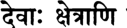

**----- Start of picture text -----** 
^т: SftTfa **----- End of picture text -----** 

**I ||Ч*И** 

**текст 52]** 

**Арджуна похищает Субхадру** 

**523** 

_девах кшетрани тиртхани даршана-спаршанарчанаих шанаих пунантй калена тад апй архаттамекшайа_ 

_девах_ — храмовые божества; _кшетрани_ — места паломничества; _тйртхани_ — и священные реки; _даршана_ — на которых смотрят; _спаршана_ — которых касаются; _арчанаих_ — и которым поклоняют­ ся; _шанаих_ — постепенно; _пунантй_ — очищают; _калена_ — со вре­ менем; _тат апи_ — то же самое; _архат-тама_ — тех _(брахманов_ ), которые наиболее достойны поклонения; _йкшайа_ — взглядом. 

**Созерцая храмовые божества, места паломничества и священ­ ные реки, касаясь их и поклоняясь им, человек постепенно очи­ щается. Однако он может мгновенно достичь того же результата, если на него просто упадет взгляд возвышенного мудреца.** 

_КОММЕНТАРИЙ:_ Вместо того чтобы сидеть в уединении и за­ ботиться лишь о достижении духовного совершенства, возвышен­ ные _брахманы-вайшнавы_ всю свою жизнь посвящают тому, чтобы делиться с другими благословенным даром преданного служения Господу. Сыновья царя Прачинабархи говорят: 

_тешам вичаратам падбхйам тйртханам паванеччхайа бхйтасйа ким на рочета таваканам самагамах_ 

«Дорогой Господь, Твои слуги, преданные, странствуют по всему миру, очищая своим присутствием даже святые места паломничес­ тва. Как же их деятельность может не радовать тех, кто страшит­ ся материального существования?» (Бхаг., 4.30.37). А Махараджа Прахлада говорит так: 

_прайена дева мунайах сва-вимукти-кама маунам чаранти виджане на парартха-ништхах наитан вихайа крпанан вимумукша эко_ 

_нанйам твад асйа шаранам бхрамато ’нупашйе_ 

«Дорогой Господь Нрисимхадева, я вижу, что вокруг есть много святых, однако они думают лишь о собственном спасении. Не за­ ботясь об обычных людях, живущих в городах, они уходят в Гима­ лаи или в лес, дают обет молчания _[мауна-врату]_ и погружаются в медитацию. Они не стремятся избавить от страданий других. Но я не хочу обрести освобождение один, оставив в материальном 

**524** 

**[песнь 10, гл. 86** 

**Шримад-Бхагаватам** 

мире всех несчастных глупцов и негодяев. Я знаю, что, не думая о Кришне и не обретя прибежище у Твоих лотосных стоп, не­ возможно стать счастливым. Поэтому я хочу вернуть обитателей этого мира под сень Твоих лотосных стоп» (Бхаг., 7.9.44). 

## **ТЕКСТ 53** 

**-ЗТ^НТ** _**Ъ ч н**_ **I c IW fo ^ TT ^** _ЧгЪ<М\_ **II43II** 

_брахмано джанмана шрейан сарвешам пранинам иха тапаса видйайа туштйа ким у мат-калайа йутах_ 

_брахманах_ — _брахман; джанмана_ — по рождению; _шрейан_ — луч­ ший; _сарвешам_ — из всех; _пранинам_ — живых существ; _иха_ — в этом мире; _тапаса_ — своей аскезой; _видйайа_ — своей ученос­ тью; _туштйа_ — своей удовлетворенностью; _ким у_ — что же еще; _мат_ — обо Мне; _калайа_ — размышлениями с любовью; _йутах_ — наделенный. 

_**Брахман**_ **уже только по происхождению считается лучшим из всех живых существ в этом мире, а если при этом он еще и строг к себе, обладает знаниями и всегда удовлетворен, то положение его еще более возвышенно. Что же говорить о тех** _**брахманах**_ **, которые преданы Мне?** 

## **ТЕКСТ 54** 

**5|1<уи|Й I for: щч; 114*11** 

_на брахманан ме дайитам рупам этан чатур-бхуджам сарва-веда-майо випрах сарва-дева-майо хй ахам_ 

_на_ — не; _брахманат_ — чем _брахман; ме_ — Мне; _дайитам_ — бо­ лее дорога; _рупам_ — форма; _этат_ — эта; _чатух-бхуджам_ — четы­ рехрукая; _сарва_ — все; _веда_ — Веды; _майах_ — содержащий в се­ бе; _випрах_ — ученый _брахман; сарва_ — всех; _дева_ — полубогов; _майах_ — содержащий; _хи_ — несомненно; _ахам_ — Я. 

**текст 56]** 

**Арджуна похищает Субхадру** 

**525** 

_**Брахман**_ **для Меня дороже, чем Мое собственное тело о четы­ рех руках. Ученый** _**брахман**_ **носит в себе все Веды, точно так же как во Мне пребывают все полубоги.** 

_КОММЕНТАРИЙ:_ Согласно ведической теории познания, _нъяяшастре,_ наше знание об объекте, который называют _прамейа,_ зави­ сит от корректности способов его познания _(прамана)._ Верховную Личность Бога можно постичь только с помощью Вед. Поэтому Господь полагается на мудрых _брахманов_ , которые являются жи­ вым олицетворением Вед и способны открыть Его всему миру. Да­ же несмотря на то, что в Господе Кришне находятся все полубоги и все воплощения Нараяны, _вишну-таттвы,_ Сам Он считает Себя обязанным _брахманам._ 

## **ТЕКСТ 55** 

^ ITT н ч ч и 

_душпраджна авидитваивам аваджанантй асуйавах гурум мам випрам атманам арчадав иджйа-дрштайах_ 

_душпраджнах_ — те, чей разум нечист; _авидитва_ — не понимая; _эвам_ — таким образом; _аваджанантй_ — пренебрегают; _асуйавах_ — и испытывают зависть; _гурум_ — к их духовному учителю; _мам_ — ко Мне; _випрам_ — ученому _брахману; атманам_ — их душе; _арчаадау_ — в видимом для глаз облике Божества; _иджйа_ — как объекту поклонения; _дрштайах_ — чье восприятие. 

**Не ведая об этой истине, глупцы пренебрегают учеными** _**брах­ манами,**_ **которые, будучи неотличными от Меня, являются их духовными учителями и самой их душой. Движимые завистью, та­ кие глупцы оскорбляют их, считая, что поклоняться стоит лишь Моему облику Божества, видимому для их глаз.** 

## **ТЕКСТ 56** 

*ЦЧ|иПfrl %TFfTg% fo rt 

114^11 

**[песнь 10, гл. 86** 

**526** 

**Шримад-Бхагаватам** 

_чарачарам идам вишвам бхава йе часйа хетавах мад-рупанйти четасй а- дхатте випро мад-йкшайа_ 

_чара_ — двигающееся; _ачарам_ — и неподвижное; _идам_ — это; _виш­ вам_ — мироздание; _бхавах_ — изначальные элементы; _йе_ — которые; _ча_ — и; _асйа_ — ее; _хетавах_ — источники; _мат_ — Мои; _рупани_ — формы; _ит и_ — такая мысль; _четаси_ — в его уме; _адхатте_ — поддерживается; _випрах_ — _брахман; мат_ — Меня; _йкшайа_ — своим восприятием. 

_**Брахман**_ **, постигший Меня, твердо уверен, что всё движущееся и неподвижное во вселенной, а также первоэлементы творения — все это изошло из Меня.** 

**ТЕКСТ 57** 

^ ИЧ'ЭИ 

_тасмад брахма-ршйн этан брахман мач-чхраддхайарчайа эвам чед арчито ’смй аддха нанйатха бхури-бхутибхих_ 

_тасмат_ — поэтому; _брахма-ршйн_ — _мудрецы-брахманы; этан_ — эти; _брахман_ — о _брахман_ (Шрутадева); _мат_ — (как ты сделал) для Меня; _ьираддхайа_ — с верой; _арчайа_ — просто поклоняйся; _эвам_ — так; _чет_ — если (ты сделаешь); _арчитах_ — принявший поклоне­ ние; _асми_ — Я буду; _аддха_ — непосредственно; _на_ — не; _анйатха_ — по-другому; _бхури_ — несметными; _бхутибхих_ — богатствами. 

**Поэтому, о** _**брахман**_ **, с той же верой, что ты поклонялся Мне, тебе следует поклоняться этим мудрецам-драдгла/шл. Поступая так, ты будешь поклоняться непосредственно Мне, что невозмож­ но никакими другими способами, даже если кто-то приносит Мне в жертву несметные богатства.** 

## **ТЕКСТ 58** 

3 T m w k lr4 4 I^H IIVII 

**текст 59]** 

**Арджуна похищает Субхадру** 

**527** 

## _шрй-шука увача_ 

_са иттхам прабхунадиштах саха-кршнан двиджоттаман арадхйаикатма-бхавена маитхилаш чапа сад-гатим_ 

_шрй-ьиуках увача_ — Шукадева Госвами сказал; _сах_ — он (Шру­ тадева); _иттхам_ — таким образом; _прабхуна_ — своим Господом; _адиштах_ — наставляемый; _саха_ — сопровождающим; _кршнан_ — Господа Кришну; _двиджа_ — _брахманам; уттаман_ — самым возвы­ шенным; _арадхйа_ — поклоняясь; _эка-атма_ — безраздельной; _бхавена_ — с преданностью; _маитхилах_ — царь Митхилы; _ча_ — также; _апа_ — достиг; _cam_ — трансцендентной; _гатим_ — конечной цели. 

**Шри Шука сказал: Получив от Господа такие наставления, Шрутадева, исполненный безраздельной преданности, стал покло­ няться Шри Кришне и возвышенным** _**брахманам**_ **, сопровождав­ шим Его. То же самое сделал и царь Бахулашва. Таким образом и Шрутадева, и царь достигли высшей трансцендентной цели жизни.** 

## **ТЕКСТ 59** 

^ Ч тМ (тЬЧ Н  I **II4SII** 

_эвам сва-бхактайо раджан бхагаван бхакта-бхактиман ушитвадишйа сан-маргам пунар двараватйм агат_ 

_эвам_ — так; _сва_ — Своими; _бхактайох_ — с двумя преданными; _раджан_ — о царь (Парикшит); _бхагаван_ — Верховный Господь; _бхакта_ — Своим преданным; _бхакти-ман_ — который предан; _ушитва_ — оставаясь; _адишйа_ — обучая; _cam_ — чистых святых; _маргам_ — пути; _пунах_ — вновь; _двараватйм_ — в Двараку; _агат_ — Он отправился. 

**О царь, так Верховный Господь, который предан Своим соб­ ственным слугам, некоторое время оставался с двумя Своими ве­ ликими преданными, Шрутадевой и Бахулашвой, обучая их тому, как должны вести себя совершенные святые вайшнавы. Затем Господь вернулся в Двараку.** 

_**КОММЕНТАРИЙ:**_ Рассказывая эту историю в книге «Кришна, Верховная Личность Бога», Его Божественная Милость А.Ч. Бхактиведанта Свами Прабхупада заключает: «Мы видим, что Господь 

**528** 

## **Шримад-Бхагаватам** 

был одинаково милостив к царю Бахулашве и _брахману_ Шрутадеве, поскольку оба они были чистыми преданными. Только став чистым преданным, можно заслужить признание со стороны Вер­ ховной Личности Бога. В наши дни многие гордятся своей принад­ лежностью к семьям _кшатриев_ или _брахманов_ только потому, что родились в этих семьях, — качествами же _кшатриев, брахманов_ или _вайшьев_ они не обладают. Но в священных писаниях сказано: _калау шудра-самбхавах_ — „В Кали-югу все рождаются _шудрамии._ Это объясняется тем, что в век Кали никто не проходит через очистительные обряды, _самскары,_ которые должны проводиться со дня зачатия и до самой смерти человека. В наше время никто не может быть причислен к тому или иному сословию, особен­ но к высшим сословиям — _брахманам, кшатриям_ или _вайшьям,_ — только по праву рождения. Если человек не прошел через очис­ тительный обряд _гарбхадхана-самскара,_ предшествующий зачатию, он сразу же попадает в разряд _шудр,_ ибо только _шудры_ не прохо­ дят этого обряда. Только _шудры_ и животные зачинают потомство, не прибегая к очистительному методу сознания Кришны. Сознание Кришны — самый лучший из всех методов очищения. С помощью этого метода каждый может стать вайшнавом, обладающим всеми добродетелями _брахмана._ Вайшнавов учат воздерживаться от че­ тырех грехов: недозволенных половых отношений, употребления одурманивающих средств, участия в азартных играх и мясоедения. Не выполнив этих предварительных условий, нельзя достичь уров­ ня _брахмана,_ а не став истинным _брахманом,_ нельзя стать чистым преданным Верховной Личности Бога». 

_Так заканчивается комментарий смиренных слуг А. Ч. Бхактиведанты Свами Прабхупады к восемьдесят шестой главе Десятой песни «Шримад-Бхагаватам», которая называется «Арджуна по­ хищает Субхадру, а Кришна благословляет Своих преданных»._ 

**ГЛАВА ВОСЕМЬДЕСЯТ СЕДЬМАЯ** 

# **Молитвы олицетворенны х Вед** 

В этой главе приводятся молитвы олицетворенных Вед, кото­ рые прославляют Господа Нараяну в Его безличном и личностном аспекте. 

Царь Парикшит спросил Шрилу Шукадеву Госвами, как мо­ гут Веды непосредственно описать Высшую Абсолютную Исти­ ну, Брахман. Веды главным образом описывают материальный мир, которым управляют три _гуны_ природы, а Брахман полностью трансцендентен этим _гунам._ В ответ Шукадева Госвами рассказал историю о том, как когда-то давно в Бадарикашраме встретились Шри Нараяна Риши и Нарада Муни. Прибыв в это святое мес­ то, Нарада увидел там Господа, окруженного возвышенными оби­ тателями соседней деревни Калапа. Поклонившись Нараяне Риши и Его спутникам, Нарада задал Ему тот же самый вопрос. В ответ Нараяна Риши рассказал, как этот же вопрос обсуждали когда-то великие мудрецы с Джаналоки. Однажды эти мудрецы, желая по­ нять природу Абсолютной Истины, попросили Санандана-Кумара просветить их. Санандана рассказал им, как еще до начала творе­ ния первыми из дыхания Господа Нараяны появились многочис­ ленные олицетворенные Веды и стали славить Его, вознося Ему молитвы. Их молитвы Санандана продекламировал мудрецам. 

Выслушав из уст Сананданы молитвы олицетворенных Вед, жи­ тели Джаналоки, постигшие теперь истинную природу Высшей Абсолютной Истины, были полностью удовлетворены и стали по­ клоняться Санандане. Нарада Муни тоже был доволен, услышав от Шри Нараяны Риши этот рассказ. Поклонившись Господу, На­ рада отправился к своему ученику Ведавьясе и рассказал ему все, что услышал. 

**529** 

**[песнь 10, гл. 87** 

**Шримад-Бхагаватам** 

**530** 

## **ТЕКСТ 1** 

# Ш Ш г^ЩНгТ: ^ II ? II 

_шрй-парйкшид увача брахман брахманй анирдешйе ниргуне гуна-врттайах катхам чаранти шрутайах сакшат сад-асатах паре_ 

_шрй-парйкшит увача_ — Шри Парикшит сказал; _брахман_ — о _брахман_ (Шукадева); _брахмани_ — в Абсолютной Истине; _анир­ дешйе_ — которую нельзя описать словами; _ниргуне_ — у которой нет качеств; _гуна_ — качества материальной природы; _врттайах_ — чья сфера действия; _катхам_ — как; _чаранти_ — действуют (описывая); _шрутайах_ — Веды; _сакшат_ — непосредственно; _cam_ — материи; _асатах_ — и ее тонким причинам; _паре_ — которая трансцендентна. 

**Шри Парикшит сказал: О** _**брахман**_ **, как могут Веды непосредст­ венно описывать Высшую Абсолютную Истину, которую невоз­ можно описать словами? Ведам под силу описать лишь качества материальной природы, однако Всевышний, будучи трансцендент­ ным всем проявлениям материи и их причинам, не имеет никаких материальных качеств.** 

_КОММЕНТАРИЙ:_ Перед тем как начать комментировать эту главу, Шрила Шридхара Свами молится: 

_ваг-йша йасйа вадане лакьимйр йасйа ча вакшаси йасйасте хрдайе самвит там нрсимхам ахам бхадже_ 

«Я поклоняюсь Господу Нрисимхе, чей рот — прибежище бо­ гини красноречия Сарасвати, грудь — место отдохновения боги­ ни процветания Лакшми, а сердце — вместилище богини знания Самвит». 

_сампрадайа-вишуддхй-артхам свййа-нирбандха-йантритах ьирути-стути-мита-вйакхйам каришйами йатха-мати_ 

**текст 1]** 

**531** 

**Молитвы олицетворенных Вед** 

«Из чувства долга и движимый желанием очистить мою _сампрадаю_ , я вкратце разъясню молитвы олицетворенных Вед, насколько позволяет мне мое понимание». 

_шрймад-бхагаватам пурваих саратах саннишевитам майа ту тад-упаспрштам уччхиштам упачййате_ 

«Поскольку мои предшественники в своих комментариях совер­ шенным образом восславили „Шримад-Бхагаватам“, мне остается лишь собрать остатки с их пиршественного стола». Шрила Вишванатха Чакраварти возносит другие молитвы: 

_мама ратна-ваниг-бхавам ратнанй апаричинватах хасанту санто джихреми на сва-сванта-винода-крт_ 

«Святые преданные будут смеяться надо мной, ибо как может тот, кто ничего не понимает в драгоценных камнях, продавать драго­ ценности? Однако меня это нисколько не смущает — по крайней мере, я смогу повеселить их». 

_на ме ’сти ваидушй апи напи бхактир виракти-рактир на татхапи лаулйат су-дургамад эва бхавами веда-_ 

_стутй-артха-чинтамани-раши-грдхнух_ 

«У меня нет ни мудрости, ни преданности, ни самоотрешеннос­ ти, и тем не менее я по-прежнему жажду раздобыть философ­ ский камень молитв Вед из хорошо укрепленной крепости, где он хранится». 

_мам нйчатайам авивека-вайух правартате патайитум балач чет ликхамй атах свами-санатана-шрйкршнангхри-бха-стамбха-кртаваламбах_ 

«Если же ветер безрассудности, мешающей мне осознать всю ни­ зость своего падения, будет сбивать меня с ног, тогда, состав­ ляя этот комментарий, я ухвачусь за сверкающие колонны стоп Шридхары Свами, Санатаны Госвами и Господа Шри Кришны». 

**[песнь 10, гл. 87** 

**532** 

**Шримад-Бхагаватам** 

_пранамйа шрй-гурум бхуйах шрй-кршнам карунарнавам лока-натхам джагач-чакшух шрй-шукам там упашрайе_ 

«Вновь и вновь склоняясь перед своим божественным духовным учителем и Господом Шри Кришной, океаном милости, я вручаю себя Шри Шукадеве Госвами, защитнику и оку всего мироздания». В конце предыдущей главы Шукадева Госвами сказал Махарадже Парикшиту: 

_эвам сва-бхактайо раджан бхагаван бхакта-бхактиман ушитвадшийа сан-маргам пунар двараватйм агат_ 

«О царь, так Верховный Господь, который предан Своим собствен­ ным слугам, некоторое время оставался с двумя Своими велики­ ми преданными, Шрутадевой и Бахулашвой, обучая их тому, как должны вести себя совершенные святые вайшнавы. Затем Господь вернулся в Двараку». В этом стихе слово _сан-маргам_ можно истол­ ковать по крайней мере тремя различными способами. Во-первых, _cam_ может означать «преданный Верховного Господа», и тогда _санмаргам_ будет значить «путь _бхакти-йоги_ , преданного служения». Во втором случае, если _cam_ перевести как «искатель трансцендент­ ного знания», слово _сан-маргам_ будет значить «путь философского поиска знания», объектом которого является безличный Брахман. А в третьем случае, если _cam_ указывает на трансцендентные звуки Вед, _сан-маргам_ будет значить «путь исполнения всех предписаний Вед». Во втором и третьем случае слово _сан-маргам_ подводит нас к вопросу, заданному здесь: как Веды могут описать Абсолютную Истину. 

Шрила Шридхара Свами подробно анализирует эту проблему, опираясь на общеизвестные положения санскритской поэтики. Нам следует помнить, что все слова могут доносить смысл тре­ мя способами, называемыми _шабда-вритти._ Эти три способа вы­ ражения значений называются _мукхья-вритти, лакшана-вритти_ и _гауна-вритти. Шабда-вритти_ , который называют _мукхья,_ — это прямое, буквальное значение слова; по-другому его называют _абхидха_ — это смысл слова, или его словарное значение. _Мукхьявритти_ делится на две подкатегории, _рудхи_ и _йога_ . Когда прямое 

**текст 1]** 

**533** 

**Молитвы олицетворенных Вед** 

значение слова основано на его обычном использовании в повсе­ дневной речи, такое значение называется _рудхи,_ а если оно выво­ дится из значения другого слова с помощью правил этимологии, такое значение называют _йогой._ 

К примеру, слово _го_ в значении «корова» — это пример _рудхи,_ поскольку связь его со значением прямая. Значение слова _пачака,_ «повар», напротив, относится к _йога-вритти,_ поскольку слово это образовано от корня _пан,_ «готовить», и суффикса _-ка._ 

Кроме _мукхья-вритти,_ или прямого значения, слово может ис­ пользоваться в переносном значении. Такое использование слова называется _лакшана._ Правило гласит, что слово нельзя тракто­ вать в переносном смысле, если его _мукхья-вритти_ подходит по смыслу в данном контексте; если же _мукхья-вритти_ в данном контексте становится бессмысленным, тогда следует прибегнуть к помощи его _лакшана-вритти._ В _кавъя-шастрах_ разъясняется, что _лакшана_ расширяет значение слова, указывая на нечто, свя­ занное с прямым значением слова. Так, к примеру, выражение _гангайам гхошах_ буквально значит «деревня пастухов на Ганге». Однако такое значение абсурдно, поэтому здесь слово _гангайам_ следует понимать в метафорическом смысле _(лакшана)._ В данном случае оно означает «на берегу Ганги», поскольку берег — это не­ что связанное с рекой. _Гауна-вритти_ — это особая разновидность _лакшаны,_ при которой значение слова распространяется на объек­ ты, обладающие некоторым сходством. К примеру, в утверждении _симхо девадаттах_ («Девадатта — лев») героя Девадатту называют львом, поскольку он обладает качествами, как у льва. Этим _гаунавритти_ отличается от обычной _лакшана-вритти,_ как в приве­ денном примере _(гангайам гхошах),_ когда связь между объектами основана не на их сходстве, а на близости расположения. 

В первом стихе восемьдесят седьмой главы Махараджа Парик­ шит выражает свое сомнение в том, что Веды способны описать Абсолютную Истину любым из перечисленных выше способов. Он спрашивает: _катхам сакшат чаранти?_ Как могут Веды не­ посредственно описать Брахман с помощью _рудха-мукхъя-вритти,_ прямых значений слов в их общепринятом использовании? Ведь Абсолют — _анирдешйа,_ не поддается описанию словами. И да­ же _гауна-вритти,_ метафоры, основанные на сходстве качеств, не подходят для описания Брахмана. Веды — _гуна-врттайа,_ то есть они изобилуют описаниями предметов, обладающих качественны­ ми характеристиками, но Брахман — _ниргуна,_ не имеет качеств. Очевидно, что метафору, основанную на сходстве качеств, нельзя 

**[песнь 10, гл. 87** 

**534** 

**Шримад-Бхагаватам** 

применить к объекту, у которого качеств нет. Более того, Махара­ джа Парикшит отмечает, что Брахман является _сад-асатах парам,_ то есть находится за пределами всех причин и следствий. Посколь­ ку Абсолют никак не связан с материальным творением, грубым или тонким, Его невозможно описать ни с помощью _йога-вритти,_ этимологических значений слов, ни с помощью _лакшаны,_ мета­ фор, поскольку оба этих метода подразумевают связь Брахмана с другими объектами. 

Таким образом, царь Парикшит пытается понять, как слова Вед могут описать Абсолютную Истину. 

## ТЕКСТ 2 

РйЧЧНЯПЧЩ. * Н Н 1 Ч ^ с М $  I ^ _^_ 3TTc4%S+r4HN ^ IR  II 

_шрй-шука увача буддхйндрийа-манах-пранан джананам асрджат прабхух матрартхам ча бхавартхам ча атмане ’калпанайа ча_ 

_шрй-шуках увача_ — Шукадева Госвами сказал; _буддхи_ — матери­ альный разум; _индрийа_ — чувства; _манах_ — ум; _пранан_ — и жиз­ ненный воздух; _джананам_ — живых существ; _асрджат_ — создал; _прабхух_ — Верховный Господь; _матра_ — удовлетворения чувств; _артхам_ — ради; _ча_ — и; _бхава_ — рождения (и деяний, которые сле­ дуют за ним); _артхам_ — ради; _ча_ — и; _атмане_ — для души (и об­ ретения ею счастья в следующей жизни); _акалпанайа_ — для ее полного избавления от материальных устремлений; _ча_ — и. 

**Шукадева Госвами сказал: Верховный Господь создал матери­ альный разум, чувства, ум и жизненный воздух живых существ, чтобы те могли удовлетворить свое желание чувственных удо­ вольствий, рождались вновь и вновь, чтобы трудиться ради пло­ дов, постепенно эволюционировали и в конце концов обретали освобождение.** 

_КОММЕНТАРИЙ:_ На заре творения, когда обусловленные живые существа еще дремлют в трансцендентном теле Господа Вишну, Он начинает творить, создавая ради блага живых существ оболочки 

**текст 2]** 

**Молитвы олицетворенных Вед** 

**535** 

разума, ума и проч. Как утверждается здесь, Вишну — это неза­ висимый Господь _(прабху),_ а живые существа — те, кто зависит от Него _(джана)._ Таким образом, мы должны понять, что Господь тво­ рит мироздание только ради блага живых существ; единственное, что движет Им, — это сострадание. 

Наделяя живых существ грубыми и тонкими телами, Верховный Господь позволяет им удовлетворять свои чувства, а тем, кто по­ лучил тело человека, еще и заниматься религиозной деятельнос­ тью, накапливать материальные блага и в конце концов обрести освобождение. В любом теле душа удовлетворяет свои чувства, но, получая тело человека, она должна также выполнять обязан­ ности, связанные с разными этапами человеческой жизни. Тща­ тельно исполняя свои обязанности, человек обретает в будущем более утонченные и глубокие наслаждения; пренебрегая же свои­ ми обязанностями, он деградирует. Когда же душа наконец обре­ тает желание избавиться от оков материальной жизни, она может встать на путь освобождения. Шрила Вишванатха Чакраварти по­ ясняет, что в этом стихе многократные повторения слова _ча_ («и») указывают на то, что все, предлагаемое нам Господом, очень важ­ но. Важен не только путь освобождения, но также пути постепен­ ного возвышения через религиозную деятельность и чувственные удовольствия. 

Что бы ни делали живые существа, успех во всех их начинаниях зависит от милости Господа. Без разума, чувств, ума и жизненно­ го воздуха живое существо не сможет ничего достичь — ни под­ няться на райские планеты, ни очиститься с помощью знания, ни обрести совершенство в восьмиступенчатой медитационной _йоге_ , ни достичь чистой преданности на пути _бхакти-йоги_ , который начинается со слушания и повторения имен Бога. 

Но, если Всевышний ради блага обусловленных живых существ создает все эти возможности, как может Он быть безличным? Упанишады вовсе не утверждают, что Абсолют в конечном счете безличен; напротив, в них есть множество описаний личностных качеств Всевышнего. Абсолют, описанный в Упанишадах, свобо­ ден от низших, материальных качеств, но при этом Он всеведущ, всемогущ, повелевает всем и вся. Он Господь, которому поклоня­ ется вся Вселенная, тот, кто дарует каждому плоды его труда, Он средоточие вечности, знания и блаженства. В «Мундака-упанишад» (1.1.9) говорится: _йах сарва-джнах са сарва-вид йасйа джнанамайам тапах_ — «Наимудрейший из всех тот, кто все знает и из кого исходит сама способность к познанию». Согласно «Брихад- 

**536** 

**[песнь 10, гл. 87** 

**Шримад-Бхагаватам** 

араньяка-упанишад» (4.4.22, 3.7.3) и «Тайттирия-упанишад» (2.6.1), _сарвасйа ваши сарвасйешанах,_ «Он господин и повелитель каждо­ го»; _йах пртхивйам тиштхан пртхивйа антарах,_ «Он тот, кто пребывает в земле и пронизывает Собой ее»; и _со ’камайата баху сйам_ , «Он возжелал: „Я стану многим44». Подобно этому, в «Чхандогья-упанишад» (6.2.3) говорится: _са аикшата... тат теджо ’срджата_ — «Он бросил взгляд на Свою энергию, которая затем создала этот мир». В «Тайттирия-упанишад» утверждается: _сатйам джнанам анантам брахма_ , «Всевышний есть безграничная истина и знание». 

Имперсоналисты часто цитируют выражение _тат твам аси,_ «Ты есть то» (Чхандогья-упанишад, 6.8.7), считая его подтверж­ дением того, что _джива_ (душа) полностью неотлична от того, кто ее сотворил. Шанкарачарья и его последователи возводят эти сло­ ва до уровня _маха-вакъи,_ ключевых фраз, которые, по их мнению, выражают суть _веданты._ Однако главные философы классической школы вайшнавизма категорически не согласны с такой трактов­ кой священных писаний. Тщательно изучив Упанишады и другие _шрути,_ такие _ачаръи,_ как Рамануджа, Мадхва, Баладева Видьябхушана и другие, дают этим утверждениям множество объяснений, противоположных объяснениям имперсоналистов. 

На вопрос, который задает здесь Махараджа Парикшит: «Как могут Веды непосредственно описывать Абсолютную Истину?» — Шукадева Госвами отвечает так: «Господь создал разум и другие на­ чала творения, заботясь о благе обусловленных живых существ». Скептик может возразить, что его ответ не имеет никакого отно­ шения к вопросу. Однако, как объясняет Шрила Вишванатха Чак­ раварти, этот ответ только кажется неуместным. На каверзные вопросы часто следует давать косвенные ответы. Наставляя Уддхаву, Сам Господь Кришна говорит (Бхаг., 11.21.35): _парокша-вада ршайах парокшам мама ча прийам_ — «Язык _риши_ и ведических _мантр_ понятен лишь избранным, и Мне тоже нравятся такие та­ инственные высказывания». В данном случае имперсоналисты, от лица которых Махараджа Парикшит задает свой вопрос, не смогут по достоинству оценить прямой ответ, поэтому Шрила Шукадева отвечает на него обиняком: «Вы говорите, что Брахман невозмож­ но описать словами. Однако если бы Верховный Господь не создал разум, ум и чувства, тогда звук и другие объекты восприятия точ­ но так же не поддавались бы описанию, как и Брахман. Вы были бы слепы и глухи с рождения и понятия не имели бы о формах и звуках этого мира, не говоря уже об Абсолюте. Подобно тому 

**текст 2]** 

**Молитвы олицетворенных Вед** 

**537** 

как милостивый Господь даровал нам возможность воспринимать этот мир, чтобы мы могли получить здесь реальный опыт и опи­ сывать другим свои зрительные, слуховые и другие ощущения, Он так же может даровать какому-то человеку способность постичь Брахман. Если Он пожелает, то может заставить слова действовать совершенно необычным образом — вне связи с их обычными зна­ чениями, которые указывают на предметы этого мира, их качества, класс, к которому эти предметы принадлежат, или деятельность, — так, что слова эти смогут описать Высшую Истину. В конце кон­ цов, Он — всемогущий Господь _(прабху),_ и Ему не составит труда превратить неописуемое в то, что поддается описанию». 

Господь Матсья заверяет царя Сатьяврату, что Абсолютную Истину можно постичь с помощью Вед: 

_мадййам махиманам на парам брахмети шабдитам ветсйасй анугрхйтам ме сампрашнаир вивртам хрди_ 

«Я неустанно буду тебя наставлять и одарю Своей безграничной милостью; благодаря твоим вопросам Моя слава, именуемая _парам брахмой,_ проявится у тебя в сердце. Так ты узнаешь обо Мне все» (Бхаг., 8.24.38). 

Удачливая душа, которую Верховный Господь благословил бо­ жественным даром любознательности, будет задавать вопросы о природе Абсолюта и, слушая ответы великих мудрецов, кото­ рые записаны в Ведах, сможет понять Господа таким, каков Он есть. Таким образом, Брахман становится _шабдитам_ , «описывае­ мым словами», лишь по исключительной милости Верховной Лич­ ности. Но без особой милости Господа слова Вед не смогут открыть читателю Абсолютную Истину. 

Шрила Вишванатха Чакраварти полагает, что в этом стихе, про­ изнесенном Шукадевой Госвами, слово _буддхи_ может указывать на _махат-таттву,_ из которой возникает эфир с его проявле­ ниями, такими как звук. Эти проявления эфира называют здесь _индрийа._ Тогда слово _матрартхам_ будет означать «чтобы исполь­ зовать трансцендентные звуки для описания Брахмана», поскольку Верховный Господь побудил _пракрити_ создать эфир и звук именно для этого. 

Еще глубже цель творения помогают понять слова _бхавартхам_ и _атмане калпанайа_ (если принять, что в стихе употреблено слово 

**[песнь 10, гл. 87** 

**538** 

**Шримад-Бхагаватам** 

_калпанайа,_ а не _акалпанайа). Бхавартхам_ означает «ради блага жи­ вых существ». Поклонение _(калпанам)_ Высшей Душе _(атмане)_ — это средство, с помощью которого живые существа могут до­ стичь духовной цели, ради которой они были созданы. Разум, ум и чувства следует использовать в служении Верховному Гос­ поду вне зависимости от того, удалось человеку достичь стадии трансцендентного очищения или нет. 

То, как начинающие вайшнавы и вайшнавы, уже очистившиеся, используют свой разум, ум и чувства в поклонении Господу, описы­ вается в связи со следующим стихом из «Гопала-тапани-упанишад» (Пурва-тапани, 9): 

_сат-пундарйка-найанам мегхабхам ваидйутамбарам дви-бхуджам мауна-мудрадхйам вана-малинам йшварам_ 

«У Верховного Господа, явившегося в Своем двуруком образе, бы­ ли прекрасные глаза, похожие на лотосы, и тело, цветом подобное туче, а одежды напоминали вспышки молнии. На Нем была гирлян­ да из лесных цветов. Он пребывал в медитативном безмолвии, что только усиливало Его красоту». Совершенные преданные Господа с помощью своих трансцендентных разума и чувств непосредствен­ но созерцают чистую духовную красоту Господа. Картина, предста­ ющая их взору, описана в «Гопала-тапани-шрути», где глаза, тело и одежды Господа Кришны сравниваются соответственно с лото­ сом, тучей и молнией. С другой стороны, преданные, находящиеся на уровне _садханы_ и пытающиеся очиститься, имеют весьма отда­ ленное представление о безграничной духовной красоте Верховно­ го Господа. Тем не менее, слушая отрывки из священных писаний, такие как, к примеру, этот стих из «Гопала-тапани-упанишад», они по мере своих возможностей стараются размышлять о Нем. Хотя начинающие преданные еще не имеют полного знания о Господе и не могут непрерывно медитировать даже на сияние, исходящее из Его тела, тем не менее им нравится считать, что они размыш­ ляют о своем Господе. И тогда Верховный Господь, несомый вол­ нами Своей безграничной милости, Сам думает: «Эти преданные размышляют обо Мне». Поэтому, когда их преданность становит­ ся зрелой, Господь дает им прибежище у Своих стоп и занимает в непосредственном служении Себе. Иначе говоря, главный вывод в том, что Веды имеют доступ к Личности Бога по Его милости. 

**текст 4]** 

**539** 

**Молитвы олицетворенных Вед** 

## **ТЕКСТ 3** 

## W T т т т г ф ^ ^ т :  и з и 

_сайта хй упанишад брахмй пурвешам пурва-джаир дхрта ьираддхайа дхарайед йас там кшемам гаччхед акинчанах_ 

_са эта_ — та же самая; _хи_ — несомненно; _упанишат_ — _упанишада_ , тайное духовное учение; _брахмй_ — связанные с Абсолют­ ной Истиной; _пурвешам_ — наших предков (таких как Нарада); _пурва-джаих_ — предки (такие как Санака); _дхрта_ — размышляли; _ьираддхайа_ — с верой; _дхарайет_ — размышляет; _йах_ — кто бы то ни было; _там_ — о ней; _кшемам_ — высшего успеха; _гаччхет_ — достиг­ нет; _акинчанах_ — свободный от материальных привязанностей. 

**Те, кто жил задолго до самых первых наших предков, медити­ ровали на то же самое сокровенное знание об Абсолютной Исти­ не. Поистине, тот, кто с верой сосредоточивает свой ум на этом знании, освобождается от всех материальных привязанностей и достигает высшей цели жизни.** 

_КОММЕНТАРИЙ:_ Это сокровенное знание об Абсолютной Исти­ не не подлежит сомнениям, ибо с незапамятных времен ученые мудрецы бережно передавали его по _парампаре_ следующим по­ колениям. Тот, кто с благоговением пытается постичь эту науку о Всевышнем, не отвлекаясь на сулящие благополучие ритуалы и философские рассуждения, сможет со временем избавиться от ложных отождествлений себя с телом и своим окружением и так станет готов обрести совершенство. 

По мнению Шрилы Вишванатхи Чакраварти, первые два стиха этой главы можно считать упанишадой, описывающей Брахман. Здесь Шукадева Госвами отказывается от авторства этих стихов, говоря, что упанишаду эту ранее произнес Нарада Муни, который, в свою очередь, услышал ее от Санака-Кумара. 

## **ТЕКСТ 4** 

**540** 

**[песнь 10, гл. 87** 

**Шримад-Бхагаватам** 

## _атра те варнайишйами гатхам нарайананвитам нарадасйа на самвадам рьиер нарайанасйа на_ 

_атра_ — в связи с этим; _те_ — тебе; _варнайишйами_ — я расска­ жу; _гатхам_ — историю; _нарайана-анвитам_ — о Верховном Господе, Нараяне; _нарадасйа_ — Нарады; _на_ — и; _самвадам_ — разговор; _ршех нарайанасйа_ — Шри Нараяны Риши; _на_ — и. 

## **В связи с этим я расскажу тебе историю о Верховном Госпо­ де Нараяне. Это беседа, которая однажды произошла между Шри Нараяной Риши и Нарадой Муни.** 

_КОММЕНТАРИЙ:_ Господь Нараяна связан с этой историей двоя­ ко: Он и предмет ее, и рассказчик. 

## **ТЕКСТ 5** 

## w tfc S R : | _?wt_ д а ш п щ и ч  н 

_экада нарадо локан парйатан бхагават-прийах санатанам ршим драштум йайау нарайанашрамам_ 

_экада_ — однажды; _парадах_ — Нарада Муни; _локан_ — по ми­ рам; _парйатан_ — путешествуя; _бхагават_ — Верховного Господа; _прийах_ — возлюбленный; _санатанам_ — предвечного; _ршим_ — бо­ жественного мудреца; _драштум_ — чтобы повидать; _йайау_ — отпра­ вился; _нарайана-ашрамам_ — в обитель Господа Нараяны Риши. 

**Как-то раз, путешествуя по разным планетам вселенной, воз­ любленный слуга Господа, Нарада, посетил** _**ашрам**_ **Нараяны, изначального мудреца.** 

## **ТЕКСТ 6** 

## ч 4 з м * 1 Ч ) ^ т г ч к 1 ^ г т ^ :  и $ н 

_йо ваи бхарата-варше }смин кшемайа свастайе нрнам дхарма-джнана-шамопетам а-калпад астхитас тапах_ 

_йах_ — кто; _ваи_ — несомненно; _бхарата-варше_ — на святой зем­ ле Бхараты (Индии); _асмин_ — этой; _кшемайа_ — ради блага в этой жизни; _свастайе_ — и ради блага в следующей жизни; _нрнам_ — лю­ 

**текст 8]** 

**541** 

**Молитвы олицетворенных Вед** 

дей; _дхарма_ — храня заповеди религии; _джнана_ — духовным знани­ ем; _ьиама_ — и самообузданием: _упетам_ — наделенный; _а-калпат_ — с самого начала дня Господа Брахмы; _астхитах_ — совершающий; _тапах_ — аскезу. 

**С самого начала дня Господа Брахмы Господь Нараяна Риши совершает на земле Бхараты суровую аскезу, идеально выполняя Свои религиозные обязанности и являя пример совершенного ду­ ховного знания и самообуздания. Он делает все это ради блага людей, живущих в этом мире и мире грядущем.** 

## **ТЕКСТ 7** 

## II® II 

_татропавиштам ршибхих калапа-грама-васибхих парйтам пранато ’прччхад идам эва курудваха_ 

_татра_ — там; _упавиштам_ — сидящий; _ршибхих_ — мудрецами; _калапа-грама_ — в деревне Калапа (около Бадарикашрама); _васибхих_ — которые жили; _парйтам_ — окруженный; _пранатах_ — по­ клонившись; _апрччхат_ — он задал; _идам эва_ — этот же самый (вопрос); _куру-удваха_ — о величайший из Куру. 

**Прибыв туда, Нарада обратился к Господу Нараяне Риши, кото­ рый сидел в окружении мудрецов из деревни Калапа. О герой сре­ ди Куру, поклонившись Господу, Нарада задал Ему тот же вопрос, что ты задал мне.** 

## **ТЕКСТ 8** 

## _-Ц\_ м Ы Н к Р м Й И Щ И _с_ II 

_тасмаи хй авочад бхагаван ршйнам шрнватам идам йо брахма-вадах пурвешам джана-лока-нивасинам_ 

_тасмаи_ — ему; _хи_ — несомненно; _авочат_ — рассказал; _бхагаван_ Верховный Господь; _ршйнам_ — мудрецы; _шрнватам_ — пока они слушали; _идам_ — эту; _йах_ — которую; _брахма_ — об Абсолютной Истине; _вадах_ — беседу; _пурвешам_ — древнюю; _джана-лока-нивасинам_ — между жителями Джаналоки. 

**542** 

**[песнь 10, гл. 87** 

**Шримад-Бхагаватам** 

**В ответ Господь Нараяна Риши стал пересказывать Нараде и всем мудрецам беседу об Абсолютной Истине, которую вели между собой обитатели Джаналоки.** 

## **ТЕКСТ 9** 

## _Т Ъ Р Ш_ ЧНШЧТ || ^ || 

_шрй-бхагаван увача свайамбхува брахма-сатрам джана-локе ’бхават пура татра-стханам манасанам мунйнам урдхва-ретасам_ 

_шрй-бхагаван увача_ — Верховный Господь сказал; _свайамбхува_ — о сын саморожденного Брахмы; _брахма_ — совершаемое произ­ несением трансцендентных звуков; _сатрам_ — жертвоприношение; _джана-локе_ — на планете Джаналока; _абхават_ — было проведено; _пура_ — в прошлом; _татра_ — там; _стханам_ — среди тех, кто жил; _манасанам_ — рожденные из ума (Брахмы); _мунйнам_ — мудрецы; _урдхва_ — (поднимающееся) вверх; _ретасам_ — чье семя. 

**Господь сказал: О сын саморожденного Брахмы, когда-то давно на Джаналоке мудрецы, жившие там, совершали великое жерт­ воприношение Абсолютной Истине, повторяя трансцендентные звуки. Эти мудрецы, родившиеся из ума Брахмы, совершенным образом хранили обет безбрачия.** 

_КОММЕНТАРИЙ:_ Шрила Шридхара Свами объясняет, что здесь слово _сатрам_ указывает на ведическое жертвоприношение, на ко­ тором все его участники в равной степени способны играть роль жрецов. В данном случае каждый из мудрецов, живших на Джа­ налоке, обладал достаточным знанием, чтобы говорить о природе Брахмана. 

## **ТЕКСТ 10** 

**текст 11]** 

**Молитвы олицетворенных Вед** 

**543** 

_шветадвйпам гатавати твайи драштум тад-йшварам брахма-вадах су-самврттах шрутайо йатра шерате татра хайам абхут праьинас твам мам йам анупрччхаси_ 

_шветадвйпам_ — на Шветадвипу; _гатавати_ — который отбыл; _твайи_ — ты (Нарада); _драштум_ — увидеть; _тат_ — ее; _йшварам_ — Господа (Анируддху); _брахма_ — о природе Всевышнего; _вадах_ — философская беседа; _су_ — с энтузиазмом; _самврттах_ — завязалась; _шрутайах_ — Веды; _йатра_ — в ком (в Господе Анируддхе, которо­ го также называют Кширодакашайи Вишну); _шерате_ — покоятся; _татра_ — о Нем; _ха_ — несомненно; _айам_ — этот; _абхут_ — возник; _праьинах_ — вопрос; _твам_ — ты; _мам_ — у Меня; _йам_ — который; _анупрччхаси_ — спрашиваешь. 

**В то время ты был в гостях у Господа на Шветадвипе — то­ го самого Верховного Господа, в которого во время уничтожения вселенной входят Веды. Среди мудрецов Джаналоки завязалась оживленная беседа о природе Высшей Абсолютной Истины, в хо­ де которой у них возник тот же вопрос, который ты сейчас задаешь Мне.** 

## **ТЕКСТ 11** 

_ЩЩ:_ I s rf t _Щ_ : МФ4НИ+ ||??|| 

_тулйа-шрута-тапах-шйлас тулйа-свййари-мадхйамах апи чакрух правачанам экам шушрушаво ’паре_ 

_тулйа_ — равные; _шрута_ — в слушании Вед; _тапах_ — и совер­ шении аскезы; _ьийлах,_ — чье отношение; _тулйа_ — равное; _свййа_ — к друзьям; _ари_ — врагам; _мадхйамах_ — и тем, кто нейтрален; _апи_ — хотя; _чакрух_ — они выбрали; _правачанам_ — оратора; _экам_ — одного из них; _шушрушавах_ — внимательные слушатели; _апаре_ — другие. 

**Хотя все эти мудрецы одинаково хорошо знали Веды и были в равной степени аскетичны, хотя все они равно относились ко всем — к друзьям, врагам и тем, кто к ним равнодушен, они вы­ брали одного из своего числа рассказчиком, а остальные стали внимательно слушать его.** 

**544** 

**[песнь 10, гл. 87** 

**Шримад-Бхагаватам** 

## **ТЕКСТЫ 12-13** 

t r r w I r f ^ W tW ^rFT: Ч7Ц ll?^ll 

W -5RR ТТТТЗТ М^НгЧЧ1*А: I 

**Tir^s^r ^й%щЬм,*тЧ$>Л^н:** _\ \ m_ 

_шрй-санандана увача сва-срштам идам апййа шайанам саха шактибхих тад-анте бодхайам чакрус тал-лингаих шрутайах парам_ 

_йатха шайанам самраджам вандинас тат-паракрамаих пратйуше ’бхетйа су-шлокаир бодхайантй ануджйвинах_ 

_шрй-сананданах_ — Шри Санандана (возвышенный сын Брахмы, родившийся из его ума и выбранный отвечать на вопросы муд­ рецов); _увача_ — сказал; _сва_ — Им Самим; _срштам_ — созданную; _идам_ — эту (вселенную); _апййа_ — вобрав в Себя; _шайанам_ — от­ дыхая; _саха_ — вместе; _шактибхих_ — со Своими энергиями; _тат_ — этого (периода уничтожения вселенной); _анте_ — в конце; _бодхайам чакрух_ — они разбудили Его; _тат_ — Его; _лингаих_ — (описаниями) Его качеств; _шрутайах_ — Веды; _парам_ — Всевышнего; _йатха_ — в точности как; _шайанам_ — спящего; _самраджам_ — царя; _ванди­ нах_ — его придворные поэты; _тат_ — его; _паракрамаих_ — (восхва­ лением) его славных деяний; _пратйуше_ — на рассвете; _абхетйа_ — приблизившись к нему; _су-шлокаих_ — поэтическим; _бодхайантй_ — они будят; _ануджйвина_ — его слуги. 

**Шри Санандана ответил: Вобрав в Себя вселенную, некогда со­ творенную Им, Верховный Господь какое-то время, казалось, дре­ мал, и все Его энергии покоились в Нем. Когда подошло время очередного сотворения вселенной, олицетворенные Веды пробу­ дили Его, воспевая Его славу, в точности как придворные поэ­ ты, которые будят царя на рассвете, прославляя его героические подвиги.** 

_КОММЕНТАРИЙ:_ Когда приходит время творения, первыми из дыхания Господа Маха-Вишну появляются на свет Веды. В своей олицетворенной форме они служат Ему, пробуждая Его из мисти­ ческого сна. Из этих слов Сананданы ясно, что Санака и другие 

**текст 14]** 

**Молитвы олицетворенных Вед** 

**545** 

мудрецы задали ему тот же самый вопрос, который Нарада задал Нараяне Риши, а Махараджа Парикшит — Шукадеве Госвами. Са­ нандана утверждает, что ответ на тот вопрос дали олицетворен­ ные Веды, которые когда-то обратились к Господу Маха-Вишну. Хотя Веды и понимали, что всезнающий Господь не нуждается в том, чтобы Ему напоминали о Его славе, тем не менее они с воодушевлением стали прославлять Его. 

**ТЕКСТ 14** 

infold 

_шрй-шрутайа учух_ 

_джайа джайа джахй аджам аджита доила-грбхйта-гунам твам аси йад атмана самаваруддха-самаста-бхагах ага-джагад-окасам акхила-йлактй-авабодхака те квачид аджайатмана ча чарато ’нучарен нигамах_ 

_йлрй-йлрутайах учух_ — Веды сказали; _джайа джайа_ — слава Тебе, слава Тебе; _джахи_ — пожалуйста, одолей; _аджам_ — вечную иллю­ зорную энергию _майю; аджита_ — о непобедимый; _доила_ — что­ бы создать препятствия; _грбхйта_ — которая приняла; _гунам_ — качества материи; _твам_ — Ты; _аси_ — есть; _йат_ — поскольку; _ат­ мана_ — в Твоем изначальном положении; _самаваруддха_ — полный; _самаста_ — во всех; _бхагах_ — достояниях; _ага_ — неподвижными; _джагат_ — и движущимися; _окасам_ — тех, кто обладает матери­ альными телами; _акхила_ — все; _илакти_ — энергии; _авабодхака_ — о Ты, пробуждающий; _те_ — Тебя; _квачит_ — иногда; _аджайа_ — с Твоей материальной энергией; _атмана_ — и с Твоей внутренней, духовной энергией; _ча_ — также; _чаратах_ — взаимодействующего; _анучарет_ — могут видеть; _нигамах_ — Веды. 

**Шрути сказали: Слава, слава Тебе, о непобедимый! Изначаль­ но Ты исполнен всех богатств и достояний; поэтому, пожалуйста, повергни вечную силу иллюзии, которая управляет** _**гунами**_ **при­ роды и с их помощью создает трудности для обусловленных душ.** 

**546** 

**[песнь 10, гл. 87** 

**Шримад-Бхагаватам** 

## **О пробуждающий все энергии в движущихся и неподвижных су­ ществах, иногда Веды способны увидеть Тебя — увидеть, как Ты играешь со Своими материальными и духовными энергиями.** 

_КОММЕНТАРИЙ:_ Как пишет Шрила Джива Госвами, двадцать во­ семь стихов, содержащие молитвы олицетворенных Вед (тексты 14-41), представляют мнение каждой из двадцати восьми главных _шрути._ Эти главные упанишады и другие _шрути_ рассматрива­ ют Абсолютную Истину с разных точек зрения, и высшими из них считаются те, которые подчеркивают превосходство чистого, беспримесного преданного служения Верховной Личности Бога. Упанишады помогают нам сосредоточиться на Личности Бога, от­ рицая вначале то, что отлично от Него, а затем — описывая Его важнейшие качества. 

Шрила Вишванатха Чакраварти говорит, что первые слова этой молитвы, _джайа джайа_ , означают «пожалуйста, яви нам Свое ве­ ликолепие». Слово _джайа_ повторяется здесь либо из благоговения, либо из радости. 

«А как Мне явить Свое великолепие?» — может спросить Господь. 

В ответ Шрути просят Его милостиво уничтожить невежество во всех живых существах и привести их к Своим лотосным стопам. 

Господь говорит: «Но _майя_ , которая окутывает _джив_ невежест­ вом, исполнена замечательных качеств _(грбхйта-гунам_ ) . Как она может помешать _дживам_ прийти ко Мне?» 

«Да, — отвечают Веды, — однако она использует три _гуны_ мате­ риальной природы, чтобы вводить в заблуждение живых существ, побуждая их считать себя материальными телами. Более того, ее _гуны_ благости, страсти и невежества осквернены _(доша-грбхйта),_ поскольку в их присутствии Ты не проявляешь Себя». 

Далее Шрути обращаются к Господу, называя Его _аджита._ Тем самым они как бы говорят: «Ты единственный, кого _майя_ не в си­ лах одолеть, тогда как другие, подобно Брахме, не свободны от недостатков и потому терпят от нее поражение». 

Господь отвечает: «Какие у вас доказательства того, что она не способна одолеть Меня?» 

«Доказать это можно, вспомнив о том, что уже в Своем из­ начальном положении Ты в полной мере явил все совершенства и достояния». 

На это Господь может возразить, что для того, чтобы привести _джив_ к Его лотосным стопам, мало просто избавить их от неве­ 

**текст 14]** 

**547** 

**Молитвы олицетворенных Вед** 

жества, ибо даже те, кто полностью от него свободен, не смо­ гут приблизиться к Господу, если не будут заниматься преданным служением. Господь Сам говорит: _бхактйахам экайа грахйах_ — «Меня можно обрести только с помощью преданного служения» (Бхаг., 11.14.21). 

На это возражение Шрути отвечают: «О Господь, создавший разум и чувства живых существ и затем пробудивший в них все энергии! Это Ты вдохновляешь души тяжело трудиться и наслаж­ даться плодами своих трудов. Вдобавок к этому, по Своей милос­ ти Ты иногда пробуждаешь в них способность следовать путями познания Абсолютной Истины, мистической _йоги_ и преданного служения. Так Ты позволяешь им приблизиться к Тебе в Тво­ их проявлениях Брахмана, Параматмы и Бхагавана. Когда же их _гъяна, йога_ и _бхакти_ достигают зрелости, Ты даешь живым су­ ществам возможность непосредственно постичь Тебя в каждом из трех Твоих проявлений». 

Если же Господь попросит олицетворенные Веды подтвердить свои слова цитатами из авторитетных источников, они смиренно ответят: «Мы сами и есть тому подтверждение. Иногда — как, на­ пример, сейчас, в момент сотворения мира, — Ты вступаешь в со­ юз со Своей внешней энергией _майей._ При этом Ты никогда не разлучаешься со Своей внутренней энергией. Мы, Веды, способны увидеть Тебя в Твоих _лилах_ именно в такие периоды, как сейчас, когда Ты действуешь во внешнем мире». 

Таким образом, наделенные полномочиями благодаря личному общению с Верховным Господом, Шрути рекомендуют обусловлен­ ным душам следовать путями _кармы, гъяны, йоги_ и _бхакти,_ чтобы те могли использовать свой разум, чувства, ум и жизненную силу в поисках Абсолютной Истины. 

Личные трансцендентные качества Всевышнего прославляют­ ся во многих местах Вед. Например, следующий стих есть в «Шветашватара-упанишад» (6. И ), «Гопала-тапани-упанишад» (Уттара-тапани, 96) и «Брахма-упанишад» (4.1): 

_эко девах сарва-бхутешу гудхах сарва-вйапй сарва-бхутантаратма кармадхйакшах сарва-бхутадхивасах сакшй четах кевало ниргунаш ча_ 

«Единый Верховный Господь скрывается внутри всего сотворенно­ го. Он пронизывает материю и пребывает в сердцах всех живых существ. Будучи Сверхдушой в сердце каждого, Он наблюдает за 

**[песнь 10, гл. 87** 

**548** 

**Шримад-Бхагаватам** 

всеми их поступками в материальном мире. Таким образом, не об­ ладая Сам материальными качествами, Он один видит все и Он же наделяет живых существ сознанием». 

Личностные качества Всевышнего также описываются в та­ ких словах Упанишад, как _йах сарва-джнах са сарва-вид йасйа джнана-майам тапах_ , «Наимудрейший из всех — тот, кто все­ ведущ и из кого исходит сама энергия познания» (Мундакаупанишад, 1.1.9); _сарвасйа ваши сарвасйеьианаху_ «Он господин и повелитель каждого» (Брихад-араньяка-упанишад, 4.4.22); и _йах пртхивйам тиштхан пртхивйа антаро йам пртхивй на веда_ , «Он тот, кто пребывает в земле и пронизывает ее, но кого земля не знает» (Брихад-араньяка-упанишад, 3.7.3). 

Во многих местах _шрути_ описывается роль Господа в сотво­ рении мира. В «Тайттирия-упанишад» (2.6.1) утверждается: _со *камайата баху сйам_ — «Он пожелал: „Я стану многим“». Выра­ жение _со ’камайата_ («Он пожелал») указывает здесь на то, что Господь — это вечная личность, ибо даже до сотворения мира Абсолютная Истина ощущала желание, а желание — это свойст­ во, присущее только индивидуальным личностям. Подобно это­ му, в «Чхандогья-упанишад» (6.2.3) говорится: _са аикшата_ ... _тат теджо *срджата_ — «Он увидел, и Его энергия запустила процесс творения». Здесь слово _тат-теджах_ указывает на частичную экс­ пансию Господа, Маха-Вишну, который бросает взгляд на _майю_ и так начинает творить материальный мир. Слово _тат-теджах_ может также указывать на безличный аспект Господа, Брах­ ман, Его энергию вечного, всепронизывающего бытия. В «Шри Брахма-самхите» (5.40) говорится: 

_йасйа прабха прабхавато джагад-анда-котикотишв ашеша-васудхади вибхути-бхиннам тад брахма нишкалам анантам ашеша-бхутам говиндам ади-пурушам там ахам бхаджами_ 

«Я поклоняюсь Говинде, предвечному всемогущему Господу. Осле­ пительное сияние Его трансцендентного тела — это безличный Брахман, абсолютный, всеобъемлющий и беспредельный; в нем проявлены миллионы вселенных с бесчисленными планетами, каждая из которых наделена уникальными богатствами». 

Перефразируя этот стих, Шрила Шридхара Свами молится: 

_джайа джайаджита джахй ага-джангамавртим аджам упанйта-мрша-гунам_ 

**текст 15]** 

**549** 

**Молитвы олицетворенных Вед** 

_на хи бхавантам рте прабхавантй ами нигама-гйта-гунарнавата тава_ 

«Слава, слава Тебе, о непобедимый! Пожалуйста, сокруши могу­ щество Твоей вечной _майи_ , которая покрывает всех движущих­ ся и неподвижных живых существ и правит _гунами_ иллюзии. Без Твоего участия все эти ведические _мантры_ не смогли бы воспеть Тебя — океан трансцендентных качеств». 

## **ТЕКСТ 15** 

**frrf $1ЧН q I** 

w t w т |1?чи 

_брхад упалабдхам этад авайантй авашешатайа йата удайастамайау викртер мрди вавикртат ата ршайо дадхус твайи мано-вачаначаритам_ 

_катхам айатха бхаванти бхуви датта-падани нрнам_ 

_брхат_ — как Всевышний; _упалабдхам_ — который воспринима­ ется; _этат_ — этот (мир); _авайантй_ — они считают; _авашеша­ тайа_ — поскольку он является вездесущей основой мироздания; _йатах_ — поскольку; _удайа_ — зарождение; _астам-айау_ — и разруше­ ние; _викртех_ — преобразования; _мрди_ — глины; _ва_ — словно; _авикртат_ — (Всевышний) не подверженный изменениям; _атах_ — поэтому; _ршайах_ — мудрецы (которым открылись ведические _ман­ тры_ ); _дадхух_ — поместили; _твайи_ — в Тебя; _манах_ — свои умы; _вачана_ — слова; _ачаритам_ — и деяния; _катхам_ — как; _айатха_ — не так, как они есть; _бхаванти_ — становятся; _бхуви_ — на землю; _датта_ — помещенные; _падани_ — шаги; _нрнам_ — людей. 

**Мир, доступный нашему восприятию, неотличен от Всевышне­ го, поскольку Верховный Брахман есть изначальная основа миро­ здания. Он остается неизменным, когда все сотворенные существа появляются из него и затем погружаются в него вновь, как остает­ ся неизменной глина: люди делают из нее разные предметы, но по­ том эти предметы вновь возвращаются в нее. Лишь на Тебя одного направлены мысли, слова и поступки великих мудрецов, знатоков** 

**[песнь 10, гл. 87** 

**550** 

**Шримад-Бхагаватам** 

## **Вед. В конце концов, разве могут стопы людей не касаться земли, на которой эти люди живут?** 

_КОММЕНТАРИЙ:_ Могут возникнуть сомнения относительно то­ го, единодушны ли все ведические _мантры_ в своем понимании то­ го, кто является Верховной Личностью Бога. Ведь в одних _мантрах_ говорится: _индро йато 'васитасйа раджа_ — «Индра — повелитель всех движущихся и неподвижных существ» (Риг-веда, 1.32.15); со­ гласно другим, _агнир мурдха дивах_ — «Агни — владыка небес», а в третьих Абсолютом называют совсем других богов. На первый взгляд, Веды отстаивают политеистические представления о мире. 

Рассеивая эти сомнения, сами Веды объясняют в этом стихе, что у сотворенной вселенной может быть только одна причина, которую называют Брахманом, или Брихат, «величайшим». Он единственная истина, лежащая в основе всего творения. Никакое ограниченное божество вроде Индры или Агни не в силах спра­ виться с этой грандиозной ролью, и Шрути не настолько невежест­ венны, чтобы утверждать что-то подобное. Слово _твайи_ указывает здесь на то, что только Господь Вишну является Абсолютной Ис­ тиной. Индра и другие полубоги получают свою долю почестей, однако вся сила, что есть у них, дарована им Господом Шри Вишну. 

Ведические мудрецы понимают, что весь этот мир — включая Индру, Агни и все, что можно воспринять с помощью глаз, ушей и других органов чувств, — един с Высшей Истиной, Личностью Бога, которого называют Брихат, «величайшим», ибо Он _авашеша,_ «единственный, кто есть всегда». Во время творения все исходит из Господа, а в момент разрушения все снова погружается в Не­ го. Он существует до и после материального творения как его вечная основа, которую философы называют «вещественной при­ чиной», _упадана._ Несмотря на то, что из Господа исходят бесчис­ ленные проявления, Сам Он вечно остается неизменным, и эту мысль Шрути особо подчеркивают здесь словом _авикртат._ 

Слова _мрди ва_ («как в случае с глиной») отсылают нас к из­ вестному сравнению, которое приводит в «Чхандогья-упанишад» (6.1.4) Удалака своему сыну Шветакету: _вачарамбханам викаро намадхейам мрттикетй эва сатйам._ «Объекты материального мира существуют лишь как имена, как меняющиеся формы, обо­ значенные словами. Подлинной же реальностью обладает вещест­ венная причина всего, подобная глине, из которой делают горшки». Глина — вещественная причина существования горшков, скульп­ тур и т.п., однако сама глина остается при этом неизменной по 

**текст 15]** 

**551** 

**Молитвы олицетворенных Вед** 

сути. Рано или поздно горшки и другие предметы будут уничто­ жены и вновь вернутся в глину, из которой когда-то произошли. Точно так же Верховный Господь является совокупной веществен­ ной причиной всего сущего, но Сам Он при этом остается неиз­ менным. Таков смысл выражения _сарвам кхалв идам брахма:_ «Все есть Брахман» (Чхандогья-упанишад, 3.14.1). Размышляя над этой загадкой, великий преданный Гаджендра молился: 

_намо намас те ’кхила-каранайа нишкаранайадбхута-каранайа_ 

«О мой Господь, снова и снова я склоняюсь перед Тобой, источ­ ником мироздания. Ты непостижимое начало всех начал, но Сам Ты не имеешь начала» (Бхаг., 8.3.15). 

_Пракриты,_ материальную природу, часто считают веществен­ ной причиной творения. Такой точки зрения придерживаются западные ученые; встречается она и в Ведах. Это вовсе не про­ тиворечит более глубокому пониманию, в соответствии с кото­ рым Верховный Господь является главной причиной творения, ибо _пракриты_ — это Его энергия, и сама она подвержена изменениям. В «Шримад-Бхагаватам» (11.24.19) Господь Кришна говорит: 

_пракртир йасйопаданам адхарах пурушах парах сато *бхивйанджаках кало брахма тат тритайам те ахам_ 

«Материальное мироздание, возникающее из _пракриты_ и возвра­ щающееся в нее, реально. Господь Маха-Вишну — это место отдох­ новения природы, которая проявляется под воздействием времени. Эта природа, всемогущий Вишну и время неотличны от Меня, Высшей Абсолютной Истины». Однако _пракриты_ подвержена из­ менениям, тогда как ее повелитель, верховный _пуруша,_ неизменен. _Пракриты_ — это внешняя энергия Личности Бога, но у Него есть и другая энергия, внутренняя, которая является _сварупа-бхута,_ не­ отличной от Него по сути. Внутренняя энергия Господа, как и Он Сам, не подвержена материальным изменениям. 

Поэтому _мантры_ Вед, равно как и _риши,_ получившие эти _ман­ тры_ в процессе медитации и передавшие их другим на благо человечества, все свое внимание устремляют к Личности Бога. Ведические мудрецы своим умом и речью, то есть внутренним 

**[песнь 10, гл. 87** 

**552** 

**Шримад-Бхагаватам** 

и буквальным _(абхидха-вртти)_ значением своих слов, описыва­ ют прежде всего Господа и только потом вторичные проявления _пракриты,_ например Индру и других полубогов. 

Подобно тому как стопы человека, шагает ли он по грязи, кам­ ню или кирпичам, не могут не касаться поверхности земли, так же и Веды, описывая любые проявления материальной энергии, все­ гда связывают это с Абсолютной Истиной. В мирской литерату­ ре описываются отдельные, ограниченные явления, вне их связи с высшей реальностью, однако Веды всегда устремляют свое совер­ шенное вйдение на Всевышнего. В «Чхандогья-упанишад» утверж­ 

дается: _мрттикетй эва сатйам_ и _сарвам кхалв идам брахма_ — реальность можно постичь, лишь когда все сущее воспринима­ ется зависимым от Брахмана, Абсолюта. Брахман один является реальностью, но не потому, что все в этом мире иллюзорно, а по­ тому, что Брахман — абсолютная, изначальная причина всего су­ щего. Таким образом, слово _сатйам_ , которое употреблено в стихе _мрттикетй эва сатйам,_ в другом контексте определяется как «ве­ щественная причина», и определение это дает не кто иной, как Сам Господь Кришна: 

_йад упадайа пурвас ту бхаво викуруте парам адир анто йада йасйа тат сатйам абхидхййате_ 

«Материальный объект, сам состоящий главным образом из какого-то первоэлемента, претерпевая изменения, создает другой материальный объект. Таким образом один сотворенный объект становится причиной и основой другого объекта. Некую вещь мож­ но назвать реальной, поскольку она возникла из другого объекта, являющегося ее причиной и изначальным состоянием этой вещи» (Бхаг., 11.24.18). 

Объясняя значение слова «Брахман», Шрила Прабхупада пишет в книге «Кришна, Верховная Личность Бога»: «Слово „Брахман“ указывает на величайшего из всех, хранителя всего сущего. Имперсоналистов восхищает необъятное небо, но их не восхищает вели­ чие Кришны, поскольку они не обладают совершенным знанием. Однако в жизни нас больше восхищает величие какого-нибудь че­ ловека, а не величие огромной горы. Фактически, слово „Брахман“ относится именно к Кришне, и в „Бхагавад-гите“ Арджуна про­ возглашает, что Господь Кришна — это Парабрахман, изначальное вместилище всего сущего. 

**текст 16]** 

**553** 

**Молитвы олицетворенных Вед** 

Кришна — Верховный Брахман, поскольку Он обладает безгра­ ничным знанием, бесчисленными энергиями, безграничной силой, безграничной властью, безграничной красотой и безграничной от­ решенностью. Поэтому в конечном счете слово „Брахман“ мож­ но употреблять только по отношению к Кришне. Арджуна также утверждает, что Кришна — Парабрахман, поскольку безличный Брахман — это сияние, исходящее от трансцендентного тела Криш­ ны. Все находит опору в Брахмане, но сам Брахман находит опору в Кришне. Поэтому Кришна — Верховный Брахман, или Парабрахман. Материальные первоэлементы составляют низшую энергию Кришны. Благодаря их взаимодействию проявляется ма­ териальный космос, который покоится на Кришне. После того как материальный космос будет разрушен, он снова войдет в те­ ло Кришны как Его тонкая энергия. Таким образом, Кришна — причина как возникновения, так и разрушения материального мира». 

Суммируя все вышесказанное, Шрила Шридхара Свами молится: 

_друхина-вахни-равйндра-мукхамара_ 

_джагад идам на бхавет пртхаг уттхитам баху-мукхаир апи мантра-ганаир аджас твам уру-муртир ато винигадйасе_ 

«Полубоги во главе с Шивой, Агни, Сурьей и Индрой, как, впро­ чем, и все создания во вселенной, не существуют независимо от Тебя. _Мантры_ Вед, хоть и представляют различные точки зре­ ния, все говорят о Тебе, нерожденном Господе, являющем Себя во множестве форм и обликов». 

## **ТЕКСТ 16** 

ffrT гГ? 

H4ifa _Щ :_ I 

## _**чтя**_ ^ _**ш \\**_ 

_ити тава сурайас трй-адхипате *кхила-лока-мала_ - 

_кшапана-катхамртабдхим авагахйа тапамси джахух ким ута пунах сва-дхама-видхуташайа-кала-гунах парома бхаджанти йе падам аджасра-сукханубхавам_ 

**554** 

**[песнь 10, гл. 87** 

**Шримад-Бхагаватам** 

_ити_ — так; _тава_ — Твоих; _сурайах_ — мудрецы; _три_ — трех (пла­ нетных систем вселенной или трех _гун_ природы); _адхипате_ — о повелитель; _акхила_ — всех; _лока_ — миров; _мала_ — скверну; _кьиапана_ — который рассеивает; _катха_ — рассказов; _амрта_ — нектар; _абдхим_ — в океан; _авагахйа_ — глубоко нырнув; _тапамси_ — свои беспокойства; _джахух_ — оставили; _ким ута_ — что уж говорить; _пунах_ — более того; _сва_ — свои; _дхама_ — могуществом; _видхута_ — уничтожены; _ашайа_ — их умов; _кала_ — и времени; _гунах_ — (неже­ лательные) качества; _парома_ — о Верховный; _бхаджанти_ — покло­ няются; _йе_ — кто; _падам_ — Твоей истинной природе; _аджасра_ — непрерывного; _сукха_ — счастья; _анубхавам_ — (в котором есть) ощущение. 

**Поэтому, о повелитель трех миров, мудрецы погружаются в сладчайший океан рассказов о Тебе, который смывает всю скверну вселенной, и так избавляются от всех несчастий. Что тог­ да говорить о тех, кто с помощью духовной силы избавил свой ум от дурных привычек и освободился от влияния времени? О Все­ вышний, они могут поклоняться Твоей истинной природе, черпая в ней неиссякаемое блаженство.** 

_КОММЕНТАРИЙ:_ Как пишет Шрила Джива Госвами, в предыду­ щем стихе те Шрути, которые, как может показаться, описывают Абсолютную Истину безличной, проясняют свою истинную по­ зицию. Теперь же, в данном стихе, Абсолютную Истину начина­ ют прославлять Веды, которые описывают именно Личность Бога и говорят о трансцендентных развлечениях Господа. 

Поскольку все Веды провозглашают верховное положение Лич­ ности Бога как причины всех причин, разумным людям следует поклоняться Богу в Его личностном проявлении. Глубоко погру­ зившись в океан Его славы, разумные преданные помогают другим душам избавиться от страданий и ослабить собственные страстные привязанности к материальной жизни. Идя по этому пути, такие преданные постепенно избавляются от всех материальных связей и теряют прежний интерес к усыпанным терниями путям _кармы_ , _гъяны_ и _йоги_ . 

Над этими преданными возвышаются _сури,_ ценители духовной истины, которые выражают почтение нектарному океану славы Верховного Господа, глубоко погружаясь в него. Эти зрелые пре­ данные Верховного Господа достигают совершенства, которое даже невозможно вообразить. Отвечая на их искренние усилия, Господь 

**текст 17]** 

**Молитвы олицетворенных Вед** 

**555** 

позволяет им постичь Себя в Своем личностном облике. Вспоми­ ная с восхищением сокровенные игры Господа и Его ближайших спутников, они легко избавляются от последних следов скверны в уме и больше не обращают никакого внимания на неизбежные страдания, связанные с болезнями и старостью. 

Описывая очищающую силу преданного служения, _шрути_ го­ ворят: _тад йатха пушкара-палаьиа апо на шлишйанте эвам эвамвиди папам карма на шлишйате_ — «Подобно тому как вода не может смочить лист лотоса, так же и греховные поступки не затрагивают тех, кто постиг истину». В «Шатапатха-брахмане» (14.7.2.28), «Тайттирия-брахмане» (3.12.9.8), «Брихад-араньяка-упа­ нишад» (4.4.28) и «Баудхаяна-дхарма-шастре» (2.6.11.30) утверж­ дается: _на кармана липйате папакена._ «Греховные поступки не пятнают такого человека». 

«Риг-веда» (1.154.1) описывает игры Верховного Господа так: _вишнор ну ком вйрйанй правочам йах партхивани вимаме ра­ джамси._ «Описать все героические деяния Господа Вишну под си­ лу лишь тому, кто может пересчитать все пылинки в мире». Во многих _шрути-мантрах_ прославляется преданное служение Госпо­ ду, к примеру: _эко ваши сарва-го йе ’нубхаджанти дхйрас/тешам сукхам шашватам нетарешам_ — «Он единственный вездесущий Господь и повелитель; вечное счастье обретают лишь те разумные души, кто поклоняется Ему, и никто другой». 

В связи с этим Шридхара Свами возносит такую молитву: 

_сакала-веда-ганерита-сад-гунас твам ити сарва-манйши-джана ратах твайи субхадра-гуна-шраванадибхис тава пада-смаранена гата-кламах_ 

«Поскольку все Веды описывают Твои трансцендентные качества, все мыслящие люди очень любят слушать об этих всеблагих качест­ вах и прославлять их. Таким образом, вспоминая Твои лотосные стопы, они освобождаются от материального горя». 

## **ТЕКСТ 17** 

**I** 

**[песнь 10, гл. 87** 

**556** 

**Шримад-Бхагаватам** 

## Щ Т : _Щ  r F W_ 11?^Н 

_дртайа ива ьивасантй асу-бхрто йади те ’нувидха махад-ахам-адайо ’ндам асрджан йад-ануграхатах пуруша-видхо ’нвайо fmpa чарамо ’нна-майадишу йах сад-асатах парам твам атха йад эшв авашеьиам ртам_ 

_дртайах_ — кузнечные мехи; _ива_ — словно; _швасанти_ — они ды­ шат; _асу-бхртах_ — живые; _йади_ — если; _те_ — Твои; _анувидхах_ — верные последователи; _махат_ — совокупная материальная энергия; _ахам_ — ложное эго; _адайах_ — и другие элементы творения; _андам_ — яйцо вселенной; _асрджан_ — произвели; _йат_ — чьей; _ануграхатах_ — по милости; _пуруша_ — живого существа; _видхах_ — в соответствии с определенными формами; _анвайах_ — чье проникновение; _атра_ — среди этих; _чарамах_ — первичный; _анна-майа-адишу_ — среди прояв­ лений, известных как _анна-майя_ и др.; _йах_ — кто; _сат-асатах_ — от грубой и тонкой материи; _парам_ — отличный; _твам_ — Ты; _атха_ — и более того; _йат_ — которая; _эту_ — среди них; _аваьиешам_ — лежащая в основе; _ртам_ — реальность. 

**Те, кто дышит, по-настоящему живы лишь в том случае, если становятся Твоими верными последователями; в противном слу­ чае их дыхание ничем не лучше работы кузнечных мехов. Лишь по Твоей милости первоэлементы творения, начиная с** _**махат**_ **-** _**таттвы**_ **и ложного эго, создали яйцо этой вселенной. Ты венча­ ешь Собой явления этого мира, начиная с** _**анна-майи,**_ **поскольку вместе с живым существом Ты входишь в материальный мир, поселяясь в тех же телах, что и сама душа. Ты реальность, породившая грубую и тонкую материю, не отличная от них обеих.** 

_КОММЕНТАРИЙ:_ Для того, кто не знает ничего о своем вечном доброжелателе и не поклоняется Ему, жизнь не имеет смысла. Ды­ хание такого человека ничем не лучше работы кузнечных мехов. Дар человеческой жизни — это счастливая возможность, которая выпадает обусловленной душе, однако, отворачиваясь от Госпо­ да, живое существо совершает духовное самоубийство. В «Шри Ишопанишад» (3) говорится: 

_асурйа нама те лока андхена тамасавртах_ 

**текст 17]** 

**Молитвы олицетворенных Вед** 

**557** 

_тамс те претйабхигаччханти йе ке чатма-хано джанах_ 

«Убийце души, кем бы он ни был, уготованы планеты, извест­ ные как миры безверия, погруженные в темноту и невежество». _Асурйах_ значит «предназначенные для демонов», а демоны — это те, кто не предан Верховному Господу, Вишну. Такое определение дается в «Агни-пуране»: 

_двау бхута-саргау локе ’смин даива асура эва ча вишну-бхакти-паро даива асурас тад-випарйайах_ 

«В мире есть два вида живых существ — божественные и демони­ ческие. Те, кто посвятил себя преданному служению Господу Виш­ ну, обладают божественной природой, а те, кто противится такому служению, —  демоны». 

Подобно этому, в «Брихад-араньяка-упанишад» (4.4.15) утверж­ дается: _на чед аведй махатй винаштих... йе тад видур амртас те бхавантй атхетаре духкхам эвопайанти_ — «Если человеку не удается познать Всевышнего, его ждет полный крах... Те, кто постиг Всевышнего, обретают бессмертие, всем остальным неиз­ бежно приходится страдать». Чтобы избавиться от страданий, вы­ званных невежеством, человек должен пробудить в себе сознание Кришны, однако способ сделать это не обязательно должен быть сложным, ведь Сам Кришна заверяет в «Бхагавад-гите» (9.34): 

_ман-мана бхава мад-бхакто мад-йаджй мам намаскуру мам эваишйаси йуктваивам атманам мат-парайанах_ 

«Всегда думай обо Мне, стань Моим преданным, выражай Мне по­ чтение и поклоняйся Мне. Полностью сосредоточенный на Мне, ты непременно придешь ко Мне». Невзирая на все недостатки и слабости, человек должен добровольно стать доверяющим и до­ стойным доверия слугой Господа _(анувидха)._ В «Катха-упанишад» (2.2.13) утверждается: 

_нитйо нитйанам четанаьи четананам эко бахунам йо видадхати каман там атма-стхам йе ’нупашйанти дхйрас тешам шантих шашватй нетарешам_ 

**558** 

**[песнь 10, гл. 87** 

**Шримад-Бхагаватам** 

«Среди всех вечных существ, обладающих сознанием, есть одно, которое удовлетворяет потребности всех остальных. Разумные ду­ ши, которые поклоняются Ему в Его обители, обретают вечный мир, тогда как другие не ведают умиротворения». 

Что можно считать живым, а что мертво? Может показаться, что тела и умы непреданных-материалистов проявляют признаки жизни, однако все это лишь видимость. На самом деле обусловлен­ ная душа почти не властна над тем, что с ней происходит. Против ее воли тело вынуждено выделять испражнения, время от време­ ни болеть, стареть и в конце концов умирать. Ум же, помимо во­ ли души, иногда обуревают гнев, необузданные желания и скорбь. В «Бхагавад-гите» (18.61) Господь Кришна описывает такое поло­ жение души как _йантрарудхани майайа_ , то есть положение беспо­ мощного путешественника, посаженного в машину. Без сомнения, душа жива, и жива вечно, однако из-за невежества она забыла о своей внутренней жизни. Внутренняя жизнь души подменена сей­ час механическими реакциями ума и тела, выполняющих приказы _гун_ природы, которые заставляют нас действовать вопреки подлин­ ным интересам дремлющей души. Взывая к забывчивым узникам иллюзии, «Шветашватара-упанишад» (2.5) побуждает нас: 

_шрнванту вишве амртасйа путра а йе дхама ни дивйа ни тастхух_ 

«Услышьте же, о сыновья бессмертия, которые некогда жили в божественном царстве!» 

Таким образом, с одной стороны, то, что принято считать жи­ вым, — материальное тело — на самом деле мертвая машина, ко­ торой управляют _гуны_ природы, а с другой стороны, то, что материалисты снисходительно считают мертвой материей, предна­ значенной для эксплуатации, на самом деле в своей сокровенной су­ ти связано с живым разумом, гораздо более могущественным, чем их собственный. Люди ведической цивилизации признают, что за природой стоит разум, и разум этот принадлежит в первую очередь полубогам, которые управляют различными элементами, а в конеч­ ном счете — Самому Верховному Господу. В конце концов, мате­ рия не может действовать последовательно без какого-либо толчка или руководства со стороны живой энергии. Как говорит Сам Кришна в «Бхагавад-гите» (9.10), 

_майадхйакшена пракртйх суйате са-чарачарам_ 

**текст 17]** 

**559** 

**Молитвы олицетворенных Вед** 

## _хетунанена каунтейа джагад випаривартате_ 

«Будучи одной из Моих энергий, о сын Кунти, материальная при­ рода действует под Моим надзором, производя на свет все движу­ щиеся и неподвижные существа. Под ее началом мироздание снова и снова возникает и уничтожается». 

На заре творения Господь Маха-Вишну бросил взгляд на дрем­ лющую материальную природу, _пракриты_ . Пробудившись, тонкая _пракриты_ стала преобразовываться в более явные формы: снача­ ла появился _махат;_ затем — ложное эго в соединении с каждой из трех _гун_ природы; так постепенно возникли все материальные элементы, включая разум, ум, чувства и пять грубых элементов вместе с управляющими ими полубогами. Однако даже после то­ го, как полубоги, управляющие различными элементами, стали существовать отдельно, они не смогли вместе создать восприни­ маемый чувствами мир, до тех пор, пока Господь Вишну по Своей особой милости не вмешался вновь. Это описано в Третьей песни «Шримад-Бхагаватам» (3.5.38-39): 

_эте девах кала вишнох кала-майамьиа-лингинах нанатват сва-крийанйьиах прочух пранджалайо вибхум_ 

_дева учух нанама те дева падаравиндам прапанна-тапопашаматапатрам йан-мула-кета йатайо_ ’ _нджасору_ - _самсара-духкхам бахир уткшипанти_ 

«Божества, управляющие всеми перечисленными выше физичес­ кими элементами, — это экспансии Господа Вишну, наделенные особыми полномочиями. Их тела состоят из вечного времени и внешней энергии, а сами они являются неотъемлемыми части­ цами Господа. Им было поручено управлять различными сферами деятельности вселенной, но, не сумев справиться со своими обязан­ ностями, они обратились к Господу с чудесными молитвами. По­ лубоги сказали: „О Господь, Твои лотосные стопы подобны зонту, который защищает предавшиеся Тебе души от всех невзгод мате­ риального существования. Мудрецы, укрывшиеся под их сенью, сбрасывают с себя бремя всех материальных страданий. Поэтому мы припадаем к Твоим лотосным стопам“». 

**[песнь 10, гл. 87** 

**560** 

**Шримад-Бхагаватам** 

Выслушав молитвы собравшихся полубогов, Верховный Господь смилостивился над ними (Бхаг., 3.6.1-3): 

_ити тасам сва-ьиактйнам сатинам асаметйа сах прасупта-лока-тантранам нишамйа гатим йьиварах_ 

_кала-санджнам тада девйм_ 

_бибхрач-чхактим урукрамах трайовимьиати таттванам ганам йугапад авиьйат_ 

_со ’нуправишто бхагавамьи чештарупена там ганам бхиннам самйоджайам аса суптам карма прабодхайан_ 

«Так Господь услышал, что процесс сотворения вселенной прио­ становился из-за несогласованности действий Его энергий, состав­ ляющих _махат-таттву_ . Тогда Верховный Всемогущий Господь вместе с богиней Кали, Его внешней энергией, которая соединяет между собой различные элементы творения, вошел одновременно в двадцать три материальных элемента. Итак, когда посредством Своей энергии Господь вошел в материальные элементы, все жи­ вые существа ожили и приступили к разнообразной деятельности, подобно человеку, который, просыпаясь, сразу берется за работу». 

В книге «Кришна» Шрила Прабхупада описывает пять проявле­ ний эго, которые покрывают душу: «Живое существо, имеющее материальное тело, проходит через пять стадий бытия: _аннамайя_ , _прана-майя, мано-майя, вигъяна-майя_ и, наконец, _анандамайя._ [Эти уровни перечисляются в разделе Брахмананда-валли „Тайттирия-упанишад44.] В начале жизни каждый думает только о еде. Ребенок или животное испытывает удовлетворение толь­ ко тогда, когда может вкусно поесть. Эта стадия развития со­ знания, когда главная цель живого существа — наесться досыта, называется _анна-майей._ Слово _анна_ означает „пища44. Затем чело­ век начинает сознавать, что он существует. И если его жизни не угрожает опасность, он счастлив. Эта ступень называется _пранамайей,_ то есть осознанием своего бытия. Сознание же человека, который поднялся на уровень ума, именуется _мано-майей._ Материа­ листическая цивилизация находится преимущественно на этих трех 

**текст 17]** 

**561** 

**Молитвы олицетворенных Вед** 

ступенях: _анна-майя, прана-майя_ и _мано-майя._ Первая забота ци­ вилизованных людей — обеспечить свое экономическое благополу­ чие, вторая — оградить себя от всего, что представляет угрозу для жизни. Когда же человек достигает следующей стадии в развитии сознания, он начинает размышлять и вырабатывает философский подход к жизненным ценностям. 

Если в ходе эволюции своих философских взглядов человек на­ чинает жить на уровне разума и понимает, что он не материаль­ ное тело, а вечная душа, значит, он достиг стадии _вигъяна-майи._ Совершенствуясь духовно, он затем постигает Верховного Госпо­ да — Высшую Душу. Когда человек восстанавливает свои отноше­ ния с Господом и начинает с любовью и преданностью служить Ему, он достигает стадии сознания Кришны, стадии _ананда-майи. Ананда-майя_ — это вечная жизнь, исполненная знания и блажен­ ства. Как сказано в „Веданта-сутре“, _ананда-майо абхъясат._ Вер­ ховный Брахман и Брахман, подвластный Ему, то есть Верховная Личность Бога и живые существа, по природе своей исполнены блаженства. До тех пор пока живые существа находятся на четырех низших стадиях — _анна-майи, прана-майи, мано-майи_ и _вигъянамайи,_ они ведут материальную жизнь, но, достигнув стадии _анандамайи_ , обусловленная душа освобождается из материального плена. В „Бхагавад-гите“ стадия _ананда-майи_ называется _брахма-бхута._ Там сказано, что достигший ступени _брахма-бхуты_ освобождает­ ся от тревог и мирских желаний. Прежде всего он начинает оди­ наково относиться ко всем живым существам, а совершенствуясь далее, обретает сознание Кришны. На этой ступени преданный стремится всегда служить Верховной Личности Бога. Желание служить Господу отличается от желания наслаждаться жизнью в материальном мире. Другими словами, желания остаются у жи­ вого существа и в духовной жизни, но они очищаются. Аналогич­ ным образом, когда наши чувства очистятся, они поднимутся над четырьмя формами материального сознания _(анна-майей, пранамайей_ , _мано-майей_ и _вигъяна-майей)_ и достигнут высшей сту­ пени — _ананда-майи_ , счастливой и радостной жизни в сознании Кришны. Философы-.шшявддм считают, что на стадии _ананда-майи_ живое существо сливается со Всевышним воедино, так что исчеза­ ет всякое различие между Сверх душой и индивидуальной душой. В действительности же единство не означает слияния со Всевыш­ ним и утраты индивидуальности. Для живого существа слиться с духовным бытием — значит понять, что оно качественно неот­ лично от Верховного Господа, так как живое существо тоже вечно 

**562** 

**[песнь 10, гл. 87** 

**Шримад-Бхагаватам** 

и исполнено знания. Но действительно достичь стадии _анандамайи_ и обрести блаженство можно, только посвятив себя пре­ данному служению. Это подтверждается в „Бхагавад-гите“ (18.54): _мад-бхактим лабхате парам._ Господь Кришна говорит, что стадия _брахма-бхуты, ананда-майи,_ по-настоящему достигается, лишь ког­ да Всевышний и подчиненные Ему живые существа связаны уза­ ми истинной любви. Пока человек не достиг ступени _ананда-майи_ , его дыхание подобно дыханию кузнечных мехов, его долгая жизнь имеет такую же ценность, как долгая жизнь деревьев, и сам он ничем не лучше верблюда, свиньи, собаки или других животных». 

Параматма, которая сопровождает _дживу,_ покрытую оболочка­ ми _майи,_ не связана законами _кармы,_ в отличие от самой _дживы._ Связь Высшей Души с этими оболочками подобна кажущейся связи между луной и ветвями деревьев, через которые она видна. Сверх­ душа — _сад-асатах парам_ , всегда трансцендентна грубым и тонким проявлениям _анна-майи_ и проч., несмотря на то что Она вхо­ дит в них как свидетель, с дозволения которого совершаются все действия. Будучи изначальной причиной сотворенных материаль­ ных элементов, Сверхдуша в каком-то смысле едина с ними, одна­ ко в Своей изначальной форме _(сварупе)_ Она остается отличной от них. В этом втором случае Она представляет Собой чистую _ананда-майю,_ последнюю из пяти _кош_ . Поэтому здесь Шрути на­ зывают Господа _авашешам,_ квинтэссенцией всего сущего. Это так­ же утверждается в стихе из «Тайттирия-упанишад» (2.7): _расо ваи сах._ Личностная природа Верховного Господа — это наслаждение _расой,_ любовным обменом вкусов в преданном служении, и неотъ­ емлемой частью этой игры _рас_ является участие в ней осознавших себя _джив. Расо ваи сах, расам хй эвайам лабдхванандй бхавати:_ «Он — воплощение _расы,_ а _джива,_ полностью изведавшая эту _расу,_ обретает безграничное блаженство». Или же, как молятся в этом стихе олицетворенные Веды, Сверхдуша является _ртам,_ и Шри­ ла Вишванатха Чакраварти переводит это слово как «та, которую постигли великие мудрецы». 

По мнению Шрилы Вишванатхи Чакраварти, афоризм _расо ваи сах_ — это конечный вывод всех авторитетных писаний _(сарвантима-шрути)._ Господь есть воплощение бесконечно уве­ личивающегося блаженства _(сарва-брхаттамананда)._ В «Гопалатапани-шрути» (Уттара-тапани, 95) говорится: _йо ’сау джагратсвапна-сушуптим атйтйа турйатйто гопалах_ — «Господь Криш­ на, пастух, превосходит не только материальное сознание бодр­ ствования, сна и глубокого сна, но и четвертую ступень чистого, 

**текст 18]** 

**563** 

**Молитвы олицетворенных Вед** 

духовного сознания». Сверхдуша, находящаяся на уровне _анандамайи_ , — это всего лишь один из аспектов предвечного Господа Говинды. Как говорит Он Сам, _виштабхйахам идам кртснам экамшена стхито джагат:_ «Одной Своей частью Я пронизываю и поддерживаю всю вселенную» (Б.-г., 10.42). 

Таким образом, Шрути тактично утверждают, что даже сре­ ди всех личностных проявлений Господа Кришна — самое высшее проявление. Понимая это, Нарада Муни позже выражает почтение Господу Кришне словами _намас тасмаи бхагавате кршнайамалакйртайе_ (текст 46), хотя в это время он находится лицом к лицу с Нараяной Риши. 

Шрила Шридхара Свами завершает свой комментарий к этому стиху молитвой: 

_нара-вапух пратипадйа йади твайи шравана-варнана-самсмаранадибхих нара-харе на бхаджанти нрнам идам дрти-вад уччхваситам випхалам татах_ 

«О Господь Нарахари, если те, кому посчастливилось получить те­ ло человека, не поклоняются Тебе, слушая о Тебе, воспевая Твою славу, памятуя о Тебе и занимаясь другими видами преданного слу­ жения, то они проживают свою жизнь напрасно, и дыхание их подобно дыханию кузнечных мехов». 

## **ТЕКСТ 18** 

4 ftfK 4 4 ri I _ш_ гпт _ч т_ ftrc: _чтч_ _**Ч чФч \\w\**_ 

_ударам упасате йа рши-вартмасу курпа-дрьиах_ 

_парисара-паддхатим хрдайам арунайо дахарам mama удагад ананта тава дхама тирах паромам пунар иха йат ссиметйа на патанти кртанта-мукхе_ 

_ударам_ — животу; _упасате_ — поклоняются; _йе_ — кто; _рши_ — муд­ рецов; _вартмасу_ — согласно обычным методам; _курпа_ — грубое; 

**564** 

**[песнь 10, гл. 87** 

**Шримад-Бхагаватам** 

_дршах_ — их вйдение; _парисара_ — из которого исходят все каналы _праны; паддхатим_ — центр; _хрдайам_ — сердце; _арунайах_ — мудре­ цы Аруни; _дахарам_ — тонкий; _татах_ — поэтому; _удагат_ — (ду­ ша) поднимается; _ананта_ — о безграничный Господь; _тава_ — Твое; _дхама_ — место явления; _тирах_ — к голове; _паромам_ — высшая цель; _пунах_ — вновь; _иха_ — в этот мир; _йат_ — которого; _саметйа_ — достигнув; _на патанти_ — они не падают; _крта-анта_ — смерти; _мукхе_ — в пасть. 

**Среди тех, кто следует путями великих мудрецов, менее прозор­ ливые поклоняются Всевышнему, считая, что Он находится в об­ ласти пупка, тогда как Аруни поклоняются Ему, полагая, что Он пребывает в сердце, тонком центре, из которого расходятся все каналы** _праны_ . **О безграничный Господь, оттуда поклоняющиеся поднимают свое сознание к макушке головы, где непосредствен­ но созерцают Тебя. Затем, минуя макушку головы, они дости­ гают места высшего предназначения — обители, из которой они больше никогда не падают в этот мир, в пасть смерти.** 

_КОММЕНТАРИЙ:_ Здесь Верховного Господа прославляют Шрути, которые учат медитативной _йоге_ . Различные техники _йоги_ в боль­ шинстве своем помогают возвысить сознание постепенно. При этом у практикующего остается возможность отклониться или рас­ сеять сознание. Тем не менее все авторитетные методы _йоги_ под­ водят к медитации на Сверхдушу (Параматму), которая пребывает в области сердца вместе с _дживой_ . Параматма в сердце — это очень тонкое проявление Господа, увидеть которое очень трудно _(дахарам),_ а потому почувствовать Ее присутствие в своем сердце способны лишь очень возвышенные _йоги._ 

Начинающие _йоги_ в своей медитации часто пытаются сосре­ доточиться на одном из нижних центров жизненной энергии: на _муладхара-чакре_ у основания позвоночника, на _свадхиштханачакре_ в области пупка или на _манипура-чакре_ у солнечного спле­ тения. Это места, где Господь проявляет Себя во вторую очередь. Господь Кришна описывает проявление Параматмы в _чакре_ живота следующим образом: 

_ахам ваишванаро бхутва пранинам дехам аьиритах пранапана-самайуктах пачамй аннам чатур-видхам_ 

**текст 18]** 

**565** 

**Молитвы олицетворенных Вед** 

«Я огонь пищеварения в телах всех живых существ, и вместе с вхо­ дящим в тело и выходящим из него воздухом Я помогаю живым су­ ществам переваривать пищу четырех видов» (Б.-г., 15.14). Господь Вайшванара управляет пищеварением и дает животным, людям и полубогам возможность передвигаться. Как утверждают в этом стихе Шрути, те, кто медитирует лишь на эту форму Господа, не слишком разумны, _курпа-дршах,_ что буквально означает «чьи глаза застланы пылью». 

С другой стороны, возвышенные _йоги_ , которых называют Ару­ ни, поклоняются Сверхдуше в Ее облике свидетеля, пребывающе­ го в теле рядом с _дживой,_ Господу, который наделяет зависящую от Него душу знанием и вкладывает в нее всевозможные формы прак­ тического разума. Подобно тому как сердце — это центр кровооб­ ращения, тонкая сердечная _чакра_ — это перекресток, где сходятся всевозможные каналы _праны._ Они называются _надй_ и пронизы­ вают все тело. Когда эти каналы становятся достаточно чистыми, _йоги-_ Аруни покидают сердечную _чакру_ и поднимаются к _чакре_ , которая расположена на макушке головы. _Йоги_ , которые остав­ ляют тело через эту _чакру, брахма-рандхру,_ попадают прямиком в царство Бога, откуда больше никогда не возвращаются в мир смертных. Таким образом, даже такой ненадежный путь, как ме­ дитативная _йога,_ если им неуклонно следовать, может даровать человеку чистую преданность. 

Шрила Вишванатха Чакраварти приводит несколько _ьирутимантр_ , которые вторят словам данного стиха: _ударам брахмети шаркаракша упасате хрдайам брахметй арунайо брахма хаиваита ита урдхвам те эводасарпат тач-чхиро ’ьирайате_ . «Те, чье зрение затуманено, считают, что Брахман пребывает в животе, тогда как Аруни поклоняются Брахману в сердце. Тот же, кто поистине по­ знал Брахман, поднимается из сердца вверх и находит прибежище у Господа, пребывающего в макушке головы». 

_ьиатам чайка ча хрдайасйа надйас тасам мурдханам абхинихсртаика тайордхвам айанн амртатвам эти вишванн анйа уткрамане бхаванти_ 

«От сердца отходит сто один тонкий канал _праны._ Один из этих каналов — _су шумна_ — достигает макушки. Двигаясь вверх по это­ му каналу, душа избавляется от смерти. Другие каналы идут в других направлениях, приводя к разным видам перерождений» (Чхандогья-упанишад, 8.6.6). 

**566** 

**[песнь 10, гл. 87** 

**Шримад-Бхагаватам** 

В Упанишадах часто говорится о Параматме, пребывающей внутри нас. «Шри Шветашватара-упанишад» (3.12-13) описывает Ее так: 

_махан прабхур ваи пурушах саттвасйаиша правартаках су-нирмалам имам праптим йшано джйотир авйайах_ 

_ангуштха-матрах пурушо ’нтар-атма сада джананам хрдайе саннивиштах хрда манйша манасабхиклпто йа этад видур амртас те бхаванти_ 

«Чтобы начать сотворение мироздания, Верховная Личность Бога становится Пурушей. Он — та безупречно чистая цель, к кото­ рый стремятся _йоги_ , излучающий сияние и непогрешимый верхов­ ный повелитель. Принимая облик Сверхдуши размером с большой палец, Пуруша всегда пребывает в сердцах всех живых существ. Должным образом используя разум, человек может почувствовать Его присутствие в своем сердце. Постигшие этот путь обретают бессмертие». 

В заключение Шрила Шридхара Свами молится: 

_ударадишу йах пумсам чинтито муни-вартмабхих ханти мртйу-бхайам дево хрд-гатам там упасмахе_ 

«Давайте же поклоняться Верховному Господу, который пребыва­ ет в нашем сердце. Когда простые смертные размышляют о Нем, идя по стопам великих мудрецов, медитируя на то, как Господь проявляет Себя в животе и других частях тела, Господь отвечает им взаимностью, устраняя в них страх смерти». 

## **ТЕКСТ 19** 

_**т**_ rR _**щц т**_ 

**текст 19]** 

**567** 

**Молитвы олицетворенных Вед** 

_сва-крта-вичитра-йонишу виьианн ива хетутайа таратаматаш чакассй анала-ват сва-кртанукртих атха витатхасв амушв авитатхам тава дхама самая вираджа-дхийо ’нуйантй абхивипанйава эка-расам_ 

_сва_ — Тобой Самим; _крта_ — созданные; _вичитра_ — разнообраз­ ные; _йониьиу_ — в виды жизни; _виьиан_ — входя; _ива_ — с виду; _хе­ тутайа_ — как их побуждение; _таратаматах_ — в соответствии с иерархией; _чакассй_ — Ты становишься видимым; _анала-ват_ — как огонь; _сва_ — Твое собственное; _крта_ — творение; _анукртих_ — имитируя; _атха_ — поэтому; _витатхасу_ — нереальных; _амушу_ — среди этих (разнообразных видов жизни); _авитатхам_ — настоя­ щее; _тава_ — Твое; _дхама_ — проявление; _самом_ — неизменное; _вираджа_ — безупречное; _дхийах_ — чьи умы; _ануйанти_ — понимают; _абхивипанйавах_ — те, кто свободен от всех материальных привя­ занностей _(пана); эка-расам_ — постоянное. 

**Как бы входя в разнообразные тела, созданные Тобой для жи­ вых существ, Ты побуждаешь их действовать, проявляя Себя в со­ ответствии с их высоким или низким статусом, точно так же как огонь проявляется по-разному в зависимости от формы горящего предмета. Поэтому те, чей разум безупречно чист и кто полнос­ тью освободился от всех материальных привязанностей, понима­ ют, что Ты есть неизменная и вечная реальность, среди всех этих непостоянных и изменчивых форм жизни.** 

_КОММЕНТАРИЙ:_ Выслушав эту молитву олицетворенных Вед, в которой Шрути описывают, как Сверхдуша входит в бесчислен­ ные материальные тела, скептики могут решить, что в резуль­ тате Всевышний становится ограниченным. В действительности сторонники философии _адвайты_ не считают, что Высшая Душа хоть чем-то отличается от Своего творения. Согласно представле­ ниям имперсоналистов, Абсолют необъяснимым образом попадает в сети иллюзии, а потому вначале становится личностным прояв­ лением Бога, затем полубогом, человеком, животным, растением и наконец материей. Шанкарачарья и его последователи прилага­ ют неимоверные усилия, чтобы найти в Ведах подтверждения сво­ ей теории о том, что Абсолют попадает в иллюзию. Однако здесь Веды опровергают это утверждение и отказываются поддерживать имперсонализм школы _майявады._ 

Процесс творения на санскрите называется _сршти_ , «исход». Вер­ ховный Господь испускает Свои разнообразные энергии, которые 

**568** 

**[песнь 10, гл. 87** 

**Шримад-Бхагаватам** 

отражают Его природу, но при этом остаются отличными от Него. Это явление объясняется философией _ачинтъя-бхедабхеды,_ под­ линной философией Вед, устанавливающей непостижимое, одно­ временное единство и различие Верховного Господа и Его энергий. Таким образом, хотя каждое из бесчисленного множества живых существ — отдельная личность, все души состоят из той же духов­ ной субстанции, что и Всевышний. Поскольку все _дживы_ — часть духовного бытия Верховного Господа, они нерожденные и веч­ ные, в точности как Он Сам. Беседуя с Арджуной на поле битвы Курукшетра, Господь Кришна подтверждает это: 

_на те эвахам джату насам на твам неме джанадхипах на чаива на бхавишйамах сарве вайам атах парам_ 

«Не было такого времени, когда бы не существовал Я, ты и все эти цари, и в будущем никто из нас не перестанет существовать» (Б.-г., 2.12). Материальное творение создано специально для тех _дживу_ которые не желают служить Верховному Господу. Они по­ лучают в свое распоряжение иллюзорный мир, в котором могут попытаться быть независимыми. 

Создав множество видов материальной жизни, Верховный Гос­ подь входит в Свое творение как Сверхдуша, чтобы даровать всем живым существам разум и вдохновение, необходимые им в по­ вседневной жизни. В «Тайттирия-упанишад» (2.6.2) утверждается: _тат срштва тад эвануправиьиат_ — «Создав этот мир, Он вошел в него». Однако Господь входит в материальный мир, не привязыва­ ясь к нему; поэтому здесь Шрути говорят: _виьианн ива_ , «как бы вхо­ дя в него». _Таратаматаьи чакассй_ означает, что Параматма входит в тело каждого живого существа, от великого полубога Брахмы до ничтожного микроба, и в разной степени проявляет в этих телах Свою энергию, в зависимости от способности данного живого су­ щества обрести просветление. _Анала-ват сва-кртанукртих:_ подоб­ но тому как огонь, сжигающий разные объекты, принимает формы этих объектов, Высшая Душа, входя в тела всех живых существ, освещает сознание каждой обусловленной души в соответствии с ее, души, личными особенностями. 

Даже создавая и разрушая этот мир, Господь всех живых существ вечно остается неизменным, что подтверждается здесь словом _эка-расам._ Иначе говоря, Господь вечно сохраняет Свой образ — 

**текст 20]** 

**569** 

**Молитвы олицетворенных Вед** 

образ личности, исполненной неизмеримого, чистого духовного блаженства. Редкие живые существа, которым удается полностью _(абхитас)_ избегать всякой материальной деятельности _(пана),_ то есть живые существа, ставшие _абхивипанйавах,_ постигают Госпо­ да таким, каков Он есть. Каждый разумный человек должен по­ следовать примеру этих великих душ и умолять их о возможности также поучаствовать в преданном служении Верховному Господу. 

Умонастроение Шрути, молящихся здесь, созвучно умонастрое­ нию следующей _мантры_ из «Шветашватара-упанишад» (6.11): 

_эко девах сарва-бхутешу гудхах сарва-вйапй сарва-бхутантаратма кармадхйакшах сарва-бхутадхивасах сакшй чета кевало ниргунаш ча_ 

«Единый Верховный Господь скрывается внутри всех живых су­ ществ. Он пронизывает всю материю и пребывает в сердце каж­ дого. Будучи Сверхдушой, скрытой внутри, Он руководит их материальной деятельностью. Таким образом, не обладая Сам ма­ териальными качествами, Он является единственным свидетелем всех наших поступков, источником и причиной сознания». Шрила Шридхара Свами молится: 

_сва-нирмитешу карйешу таратамйа-виварджитам сарванусйута-сан-матрам бхагавантам бхаджамахе_ 

«Давайте поклоняться Верховному Господу, который входит в Свое собственное творение, но остается незатронутым материальными различиями высших и низших видов жизни. Он всегда остается чистым, неизменным бытием, пронизывающим все мироздание». 

## **ТЕКСТ 20** 

**ifrT ^nrfrT w f t  РНШМЧН ЧЧсТ IRo||** 

**570** 

**[песнь 10, гл. 87** 

**Шримад-Бхагаватам** 

_сва-крта-пурешв амйьив абахир-антара-самваранам_ 

_тава пуруьиам вадантй акхила-ьиакти-дхрто 'мша-кртам ити нр-гатим вивинйа кавайо нигамавапанам бхавата упасате ’нгхрим абхавам бхуви вишваситах_ 

_сва_ — самим; _крта_ — созданных; _пурешу_ — в телах; _амйшу_ — этих; _абахих_ — не внешне; _антара_ — или внутренне; _самваранам_ — чье фактическое покрытие; _тава_ — Твое; _пурушам_ — живое су­ щество; _ваданти_ — (Веды) говорят; _акхила_ — всех; _ьиакти_ — энергий; _дхрта)_ с — обладателя; _амьиа_ — как экспансия; _кртам_ — проявленное; _ити_ — таким образом; _нр_ — живого существа; _га­ тим_ — положение; _вивинйа_ — определив; _кавайах_ — ученые муд­ рецы; _нигама_ — Вед; _авапанам_ — полю, принимающему в себя все подношения; _бхаватах_ — Твоим; _упасате_ — они поклоняются; _ангхрим_ — стопам; _абхавам_ — которые прекращают материальное существование; _бхуви_ — на земле; _вишваситах_ — развив веру. 

**Пребывая в материальных телах, созданных собственной** _**кар­** мой_ , **живое существо на самом деле не покрывается ни грубой, ни тонкой материей, ибо, как гласят Веды, оно частичка Тебя, обла­ дателя всех энергий. Определив таким образом положение живого существа, ученые мудрецы обретают твердую веру и начинают по­ клоняться Твоим дарующим освобождение лотосным стопам, ко­ торым предназначены все ведические жертвоприношения в этом мире.** 

_КОММЕНТАРИЙ:_ Неоскверненным остается не только Верхов­ ный Господь, пребывающий в материальных телах обусловлен­ ных существ; даже бесконечно малая _джива_ никогда напрямую не затрагивается оболочками невежества и вожделения, кото­ рые она обретает, скитаясь в мире рождений и смертей. Поэто­ му в «Тайттирия-упанишад» (3.10.4) утверждается: _са йаш чайам пуруше йаш насав адитйе са эках_ — «Душа обусловленного жи­ вого существа едина с тем, кто находится внутри солнца». Подоб­ но этому, «Чхандогья-упанишад» (6.8.7) наставляет нас: _тат твам аси_ — «Ты неотличен от этой Высшей Истины». 

В данной молитве олицетворенные Веды говорят о _дживе,_ ко­ торая наслаждается материальными телами, как об экспансии трансцендентного вместилища всех энергий — Верховного Госпо­ да. Однако термин _амьиа-кртам_ , «созданная как Его часть», сле­ дует понимать правильно, учитывая контекст. _Джива_ никогда не создается и не является такой же экспансией Господа, как Его все­ 

**текст 20]** 

**571** 

**Молитвы олицетворенных Вед** 

могущие экспансии _виьину-таттвы._ Высшая Душа — это объект поклонения для всех, а подчиненная Ей _джива_ создана, чтобы по­ клоняться Ей. Верховный Господь являет Свои развлечения, по­ казывая нам все бесчисленные грани Своей личности, тогда как _джива_ вынуждена под влиянием своей _кармы_ переходить из тела в тело. Как утверждает «Шри Нарада-панчаратра», 

_йат тата-стхам ту чид-рупам сва-самведйад виниргатам ранджитам гуна-рагена са джйва ити катхйате_ 

«Пограничная энергия, духовная по своей природе, которая исхо­ дит из осознающей себя энергии _самвит_ и которая оскверняется, привязываясь к _гунам_ материальной природы, называется _дживой»._ 

Хотя _джива_ также является экспансией Господа Кришны, она отличается от независимых экспансий Господа, _виишу-таттв,_ по­ скольку занимает пограничное положение между материей и духом. В «Маха-Вараха-пуране» объясняется: 

_свамьиаьи чатха вибхиннамша ити двидха са ишйате амьиино йат ту самартхйам йат-сварупам йатха стхитих_ 

_тад эва нану-матро ’пи бхедам свамшамшинох квачит вибхиннамшо ’лпа-шактих сйат кинчит самартхйа-матра-йук_ 

«Верховный Господь проявляет Себя двояко: в виде Своих полных экспансий и в виде отделенных экспансий. Полные экспансии и Их источник практически не отличаются друг от друга по способнос­ тям, форме или положению. Отделенные же экспансии облада­ ют незначительным могуществом, ибо наделены лишь ничтожной долей всех энергий Господа». 

Обусловленная душа, пребывающая в материальном мире, ка­ жется покрытой материей, как внутри, так и снаружи. Наружное покрытие — это ее тело и окружение, а изнутри ее сознание одо­ левают желание и отвращение. Однако осознавшие себя мудрецы, обладающие трансцендентным видением, понимают, что оба эти материальных покрытия лишь видимость. Отбросив с помощью 

**572** 

**[песнь 10, гл. 87** 

**Шримад-Бхагаватам** 

логики все материальные самоотождествления, которые основа­ ны на грубых и тонких покрытиях души, а потому ложны, разум­ ный человек может понять, что душа не имеет ничего общего с материей. Напротив, она чистая искра божественного духа, слу­ га Верховного Господа. Поняв это, человек должен поклоняться лотосным стопам Верховной Личности Бога; такое поклонение — распустившийся цветок на древе ведических ритуалов. Осознание красоты лотосных стоп Господа, к которому постепенно подводят все обряды Вед, само по себе приносит освобождение от матери­ ального существования и несокрушимую веру в милость Господа. Достичь всего этого можно, даже находясь в материальном мире. Как утверждает Сам Господь Кришна в «Гопала-тапани-упанишад» (Уттара-тапани, 43), 

_матхура-мандале йас ту джамбудвйпе стхито *пи ва йо ’рчайет пратимам мам ча са ме прийатаро бхуви_ 

«Тот, кто поклоняется Мне в Моем облике Божества и при этом живет в Матхуре или в любом другом уголке Джамбудвипы, становится Мне дороже всех в этом мире». Шрила Шридхара Свами молится: 

_твад-амшасйа мамешана тван-майа-крта-бандханам твад-ангхри-севам адиьийа парананда нивартайа_ 

«Мой Господь, пожалуйста, освободи меня, Свою частичную экс­ пансию, от пут _майи._ Пожалуйста, сделай это, о вместилище высшего блаженства, подведя меня к служению Твоим стопам». 

## **ТЕКСТ 21** 

**текст 21]** 

**573** 

**Молитвы олицетворенных Вед** 

_дуравагаматма-таттва-нигамайа таватта-танош чарита-махамртабдхи-париварта-париьираманах на парилашанти кечид апаваргам апйьивара те чарана-сароджа-хамса-кула-санга-висршта-грхах_ 

_дуравагама_ — которую трудно понять; _атма_ — о душе; _таттва_ — науку; _нигамайа_ — чтобы преподать; _тава_ — Твоих; _атта_ — кто принял; _танох_ — Твои личностные облики; _чарита_ — развлечений; _маха_ — огромный; _амрта_ — нектара; _абдхи_ — в оке­ ан; _париварта_ — нырнув; _париьираманах_ — которые избавились от усталости; _на парилашанти_ — не желают; _кечит_ — немногие лю­ ди; _апаваргам_ — освобождения; _апи_ — даже; _йьивара_ — о Господь; _те_ — Твоих; _чарана_ — у стоп; _сароджа_ — лотосных; _хамса_ — лебе­ дей; _кула_ — в обществе; _санга_ — от общения; _висршта_ — покинуты; _грхах_ — чьи дома. 

**Мой Господь, некоторые удачливые души избавились от уста­ лости материальной жизни, нырнув в глубокий океан Твоих нектарных развлечений, которые Ты являешь, когда приходишь в Своей личностной форме, чтобы обучить мир неисчерпаемой науке о душе. Эти редкие души, которых не интересует даже осво­ бождение, отрекаются от дома и семейного счастья, ибо обща­ ются с преданными, подобными лебедям, резвящимся у лотосов Твоих стоп.** 

_КОММЕНТАРИЙ:_ Брахлшны-ритуалисты _(смарты)_ и имперсона­ листы _(майявади)_ всегда пытаются принизить роль пути _бхактийоги._ Они говорят, что преданность Личности Бога предназначена для сентиментальных людей, которым не хватает зрелости, чтобы следовать строгим ритуалам или прилагать усилия для обретения духовного знания. 

Однако в этом стихе олицетворенные Веды подчеркивают выс­ шее превосходство преданного служения, приравнивая его к _атмататтве,_ науке о душе, на которую так гордо заявляют свои права имперсоналисты. В комментарии к этому стиху Шрила Джи­ ва Госвами определяет выражение _атма-таттва_ как сокровен­ ную тайну о личностных проявлениях Господа, Его качествах и развлечениях. Он также приводит второе значение слова _аттатанох._ Помимо значения «тот, кто получает различные тела», оно может переводиться как «тот, кто привлекает всех Своим трансцендентным телом». 

**574** 

**[песнь 10, гл. 87** 

**Шримад-Бхагаватам** 

Игры Господа Кришны и Его различных воплощений — это неисчерпаемый океан наслаждения. Когда человек осознал всю тщетность материалистичных устремлений — искал ли он мате­ риального успеха или, как имперсоналист, стремился к духовно­ му самоуничтожению, — погрузившись в этот океан нектара, он испытает облегчение. Шрила Рупа Госвами объясняет в своем руководстве по _бхакти-йоге,_ «Шри Бхакти-расамрита-синдху» (ко­ торый Шрила Прабхупада изложил на английском, назвав «Нек­ таром преданности»), что тот, кто отведает хотя бы каплю из этого бескрайнего океана, навсегда потеряет интерес ко всему остальному. 

Приводя иное значение слова _паришраманах,_ Шрила Вишванатха Чакраварти поясняет, что, хотя преданные устают вновь и вновь носиться по бесконечным волнам океана сладчайших игр Господа и погружаться в его потоки, они никогда не желают для себя ино­ го счастья, чем преданное служение Ему. Они не стремятся даже к счастью освобождения. Напротив, их усталость становится для них настоящим счастьем, подобно тому как усталость того, кто привязан к сексуальным наслаждениям, приносит ему удовольст­ вие. Слушая чарующие слух истории об играх Господа, Его чистые преданные воодушевляются и принимаются петь, танцевать, гром­ ко кричать, притопывать, падать в обморок, плакать и носиться, как сумасшедшие. Они настолько погружаются в экстаз, что не замечают никаких неудобств, связанных с телом. 

Чистые вайшнавы не желают даже освобождения, не говоря уже о других высоких целях, таких как статус повелителя райских пла­ нет. Редкая душа в этом мире достигает такой исключительной преданности, и Шрути, произносящие этот стих, указывают на это словом _кечит_ («немногие»). Чистые преданные не только пере­ стают стремиться к выгоде — они также теряют всякое влечение к тому, что у них уже есть: к домашнему очагу и семейной жизни. Их настоящей семьей становится общество святых вайшнавов — ученическая преемственность учителей, учеников и учеников этих учеников. Их настоящими родственниками становятся подобные лебедям святые, такие как Шри Шукадева Госвами. Эти вели­ кие личности всегда пьют сладчайший нектар служения лотосным стопам Верховного Господа. 

Во многих _мантрах_ Упанишад и других _шрути_ открыто утверж­ дается, что преданное служение выше, чем даже освобожде­ ние. Например, в «Нрисимха-пурва-тапани-упанишад» говорится: _йам сарве веда наманти мумукшаво брахма-вадинаш ча_ — «Перед 

**текст 22]** 

**Молитвы олицетворенных Вед** 

**575** 

Ним склоняются все Веды, все, кто стремится к освобождению, и все, кто ищет Абсолютную Истину». Разъясняя эту _мантру_ , Шри Шанкарачарья признаёт: _мукта апи лйлайа виграхам кртва бхаджанти_ — «Даже освобожденным душам доставляет удоволь­ ствие устанавливать Божество Верховного Господа и поклонять­ ся Ему». Великий соперник Шанкарачарьи, Шрила Мадхвачарья Анандатиртха, цитирует в связи с этим свои любимые _шрутимантры: мукта хй этам упасате_ , _муктанам апи бхактир хи парамананда-рупинй_ — «Ему поклоняются даже освобожденные души, и даже для них преданное служение — это средоточие выс­ шего блаженства»; и _амртасйа дхара бахудха дохаманам /  чаранам но локе су-дхитам дадхату /  ом тат cam_ — «Пусть же Его сто­ пы, которые щедро проливают потоки нектара, даруют мудрость нам, живущим в этом мире». 

В заключение Шрила Шридхара Свами молится: 

_тват-катхамрта-патходхау вихаранто маха-мудах курванти кртинах кечич чатур-варгам трнопамам_ 

«Те редкие, удачливые души, которые наслаждаются, резвясь в нектарном океане рассказов о Тебе, ценят четыре великих цели жиз­ ни [религиозность, экономическое благополучие, удовлетворение чувств и освобождение] не дороже, чем травинку на улице». 

## **ТЕКСТ 22** 

^TfrT счГч f^rl 3itr4pl ^  I IRRII 

_твад-анупатхам кулайам идам атма-сухрт-прийа-вач_ 

_чарати татхонмукхе твайи хите прийа атмани ча на бата рамантй ахо асад-упасанайатма-хано_ 

_йад-анушайа бхрамантй уру-бхайе ку-ьиарйра-бхртах_ 

_тват_ — Тебе; _анупатхам_ — полезное в служении; _кулайам_ — те­ ло; _идам_ — это; _атма_ — душа; _сухрт_ — друг; _прийа_ — и возлюб­ ленный; _ват_ — как; _чарати_ — действует; _татха_ — тем не менее; 

**[песнь 10, гл. 87** 

**576** 

**Шримад-Бхагаватам** 

_унмукхе_ — кто настроен благожелательно; _твайи_ — в Тебе; _хите_ — кто помогает; _прийе_ — кто любит; _атмани_ — кто их жизнь; _на_ — и; _на_ — не; _бата_ — увы; _раманти_ — они черпают наслаждение; _ахо_ — ах; _асат_ — иллюзии; _упасанайа_ — поклонением; _атма_ — се­ бя; _ханах_ — убивая; _йат_ — в котором (поклонении иллюзии); _анушайах_ — чьи упрямые желания; _бхраманти_ — они блуждают; _уру_ — очень; _бхайе_ — в страшном (материальном мире); _ку_ — низкосортные; _шарйра_ — тела; _бхртах_ — нося. 

**Когда человеческое тело занимают в преданном служении Тебе, оно действует как душа, друг и возлюбленный живого существа. Но, к несчастью, хотя Ты всегда милостив к обусловленным ду­ шам и с любовью помогаешь им, хотя Ты — их настоящая Душа, люди, как правило, не стремятся искать в Тебе счастья. Вместо этого они совершают духовное самоубийство, поклоняясь иллю­ зии. Увы, поскольку они упрямо надеются обрести успех, пре­ давшись иллюзии, им приходится все так же скитаться по этому страшному миру, принимая разнообразные ущербные тела.** 

_КОММЕНТАРИЙ:_ В своих суждениях Веды не щадят тех, кто, вместо того чтобы служить всемилостивой Личности Бога, пред­ почитает оставаться в иллюзии. В «Брихад-араньяка-упанишад» (4.3.15) и в «Риг-веде» (10.82.7) утверждается: _арамам асйа пашйанти на там кашчана пашйати. на там видатха йа има джаджананйад йушмакам антарам бабхува. нйхарена праврта джалпйа часу-трпа уктха-ьиасаш чаранти_ — «Любой может уви­ деть место, где Господь ради собственного удовольствия явил Се­ бя в этом мире, но при этом Самого Его никто не видит». «Никто из вас не знает Его, создавшего всех этих живых существ, а пото­ му ваше зрение так сильно отличается от Его способности видеть. Покрытые туманом иллюзии, вы, поглощенные ведическими ри­ туалами, ведете бессмысленные разговоры и живете только ради удовлетворения чувств». 

Верховный Господь пронизывает Собой всю вселенную. Он го­ ворит об этом в «Бхагавад-гите» (9.4): _майа татам идам сарвам джагат._ Нет такого места в этом мире, где бы не присутство­ вал Господь, — Он пребывает даже в простом глиняном горшке и в куске ткани. Однако, поскольку Он скрывается от завистливых глаз _(авйакта-муртина),_ материалисты, введенные в заблуждение Его материальной энергией, думают, что источник материального творения — это просто комбинация атомов и физических сил. 

**текст 22]** 

**Молитвы олицетворенных Вед** 

**577** 

Проявляя сострадание к таким недалеким материалистам, олице­ творенные Веды в этой молитве советуют им вспомнить, ради че­ го те существуют, — ради того, чтобы с любовью и преданностью служить Господу, их величайшему благожелателю. Человеческое тело — это идеальный инструмент для возрождения духовного со­ знания живого существа; его органы — уши, язык, глаза и проч. — как нельзя лучше подходят для того, чтобы слушать о Господе, вос­ певать Его славу, поклоняться Ему и заниматься другими видами преданного служения. 

Материальному телу отведен недолгий срок жизни, поэтому его называют _кулайам_ , «то, что распадется в земле» _(кау лййате)._ Тем не менее, если его правильно использовать, оно может стать луч­ шим другом души. Если же сознание живого существа погружается в материю, тело становится его лжедругом, ибо уводит его в сто­ рону от его истинных интересов. Те, кто опьянен своим телом, те­ лом своей жены, телами детей и домашних животных, на самом деле поклоняются иллюзии, _асад-упасана,_ направляя на нее всю свою преданность. Таким образом, как утверждают здесь Шрути, такие люди совершают духовное самоубийство, обеспечивая себе наказания в будущем за то, что не смогли исполнить высший долг человеческой жизни. В «Ишопанишад» (3) говорится: 

_асурйа нама те лока андхена тамасавртах тамс те претйабхигаччханти йе ке чатма-хано джанах_ 

«Убийце души, кем бы он ни был, уготованы планеты, известные как миры безверия, погруженные в темноту и невежество». 

Те, кто слишком привязан к чувственным наслаждениям, или те, кто поклоняется бренному в форме ложных, материалистичес­ ких писаний и философских доктрин, сохраняют желания, кото­ рые заставляют их в каждой из последующих жизней получать тела все более низкого сорта. Эти люди попали в капкан вечного круговорота _самсары,_ а потому их единственная надежда на спасе­ ние — услышать наставления милостивых преданных Верховного Господа. 

Шрила Шридхара Свами молится: 

_твайй атмани джаган-натхе ман-мано раматам иха_ 

**[песнь 10, гл. 87** 

**578** 

**Шримад-Бхагаватам** 

_када мамедршам джанма манушам самбхавишйати_ 

«Когда же я получу человеческое тело, в котором ум мой бу­ дет черпать наслаждение в Тебе, Высшей Душе и повелителе мироздания?» 

## **ТЕКСТ 23** 

т р г r^T T sf^r _Щ_ I 

**:** _**\ \ Щ \**_ 

_нибхрта-марун-мано-’кша-дрдха-йога-йуджо хрди йан мунайа упасате тад арайо ’пи йайух смаранат стрийаурагендра-бхога-бхуджа-данда-вишакта-дхийо вайам апи те самах сама-дршо ’нгхри-сароджа-судхах_ 

_нибхрта_ — обузданным; _марут_ — дыханием; _манах_ — умом; _ак­ та_ — и чувствами; _дрдха-йога_ — непоколебимой _йогой; йуджах_ — занятые; _хрди_ — в сердце; _йат_ — которые; _мунайах_ — мудрецы; _упасате_ — поклоняются; _тат_ — то; _арайах_ — враги; _апи_ — также; _йайух_ — достигли; _смаранат_ — памятованием; _стрийах_ — жёны; _урага-индра_ — царственных змеев; _бхога_ — (как) тела; _бхуджа_ — чьи руки; _данда_ — подобные палкам; _вишакта_ — привлечены; _дхийах_ — чьи умы; _вайам_ — мы; _апи_ — также; _те_ — Тобой; _самах_ — одинаково; _сама_ — равное; _дршах_ — чье вйдение; _ангхри_ — стоп; _сароджа_ — подобных лотосам; _судхах_ — (наслаждаясь) нектаром. 

**Просто постоянно думая о Нем, враги Господа достигли той же Высшей Истины, которой поклоняются, обуздывая свое дыхание, ум и чувства, мудрецы, неотрывно следующие по пути** _**йоги.**_ **Точно так же и мы, Шрути, обычно воспринимающие Тебя как везде­ сущего, обретем тот же нектар с Твоих стоп, которым наслажда­ ются Твои супруги, так привязанные к Твоим могучим, как змеи, рукам, — ведь Ты смотришь на нас и на Своих жен одинаково.** 

_КОММЕНТАРИЙ:_ Как пишет _ачаръя_ Шри Джива Госвами, неко­ торые Шрути — такие как «Гопала-тапани-упанишад», — которые 

**текст 23]** 

**Молитвы олицетворенных Вед** 

**579** 

гласят, что пастушок Кришна и есть Абсолютный Брахман в Его высшем проявлении, до сих пор терпеливо ждали своей очереди высказаться. Однако, послушав, как другие Шрути в своих молит­ вах открыто прославляют Личность Бога, эти Шрути, содержащие в себе самые сокровенные истины, не могли больше сдерживаться. Поэтому сейчас, вне очереди, они произносят этот стих. 

Те, кто идет путем мистической _йоги,_ с помощью управления дыханием и суровой аскезы подчиняют себе свои чувства и ум. Если им удается таким способом полностью очистить свое созна­ ние, они постепенно приходят к пониманию пребывающей в серд­ це Параматмы, личностной формы Брахмана. И если они будут долгое время медитировать на эту форму, то смогут в конце кон­ цов осознать истинную природу Бога. Однако этой же цели, кото­ рой _йоги_ достигают с такими трудностями только в самом конце пути, достигают и демоны, которых убивает Господь Кришна, ког­ да разворачивает Свои _лилы_ на Земле. Одержимые ненавистью к Нему, демоны, такие как Камса и Шишупала, быстро получают освобождение, просто погибая от руки Господа. 

Однако, говоря о себе, олицетворенные Веды утверждают здесь, что сами они предпочли бы развить в себе любовь к Богу. Они по­ нимают, что для этого им нужно учиться преданности у ближай­ ших слуг Господа Кришны, в особенности у юных _гопи_ Враджа. Хотя с виду они казались простыми женщинами, привлеченными физической силой и красотой Господа, на самом деле эти богини Враджа являют пример высшего совершенства медитации. Шрути мечтают здесь когда-нибудь уподобиться им. 

В связи с этим Господь Брахма в приложении к «Брихад-Ваманапуране» рассказывает такую историю: 

_брахмананда-майо локо вйапй ваикунтха-самджнитах тал-лока-васй татра-стхаих стуто ведаих парат-парах_ 

«Бескрайний мир духовного блаженства называют Вайкунтхой. Там обитает Высшая Истина, которую прославляют олицетворен­ ные Веды, также живущие там». 

_чирам с ту тва татас туштах_ 

_парокшам праха тан гира тушто ’сми брута бхо праджна варам йам манасепситам_ 

**[песнь 10, гл. 87** 

**580** 

**Шримад-Бхагаватам** 

«Как-то раз, после того как Веды прославили Господа, Он остался очень доволен и голосом, доносившимся неведомо откуда, сказал им: „Дорогие мудрецы, Я очень вами доволен. Я готов исполнить самые сокровенные ваши желания44». 

_шрутайа учух йатха тал-лока-васинйах кама-таттвена гопиках бхаджанти романам матва чикйршаджани нас татха_ 

«Шрути ответили: „Мы хотим стать такими же, как те пастушки из мира смертных, которые, движимые страстью, поклоняются Тебе, считая Тебя своим возлюбленным44». 

_шрй-бхагаван увача дурлабхо дургхаташ чаива йушмакам са маноратхах майанумодитах самйак сатйо бхавитум архати_ 

«Тогда Господь сказал: „Желание ваше трудно, почти невозможно выполнить. Однако с Моего дозволения ваше желание непременно сбудется44». 

_агамини виринчау ту джате срштй-артхам удите калпам сарасватам прапйа врадже гопйо бхавишйатха_ 

«Когда родится следующий Брахма, чтобы добросовестно вы­ полнять свой долг творца, и когда в его жизни настанет день Сарасвата-калпа, вы родитесь во Врадже в облике _гопи»._ 

_пртхивйам бхарате кшетре матхуре мама мандале врндаване бхавишйами прейан во раса-мандале_ 

«В Бхарата-варше, на Моей земле — в Матхуре, в лесу Вриндава­ на — в хороводе танца _раса_ Я стану вашим возлюбленным». 

_джара-дхармена су-снехам су-дрдхам сарвато Ъхикам_ 

**текст 23]** 

**Молитвы олицетворенных Вед** 

**581** 

_майи сампрапйа сарве ’пи крта-кртйа бхавишйатха_ 

«Когда Я стану вашим возлюбленным, все вы обретете самую чис­ тую, возвышенную и непоколебимую любовь ко Мне, и все ваши желания исполнятся». 

_брахмовача ьирутваитач чинтайантйас та рупам бхагаваташ чирам укта-калам самасадйа гопйо бхутва харим гатах_ 

«Господь Брахма сказал: Выслушав слова Верховного Господа, Шрути долго-долго размышляли о Его красоте. Когда же нако­ нец пришло назначенное время, они стали _гопи_ и смогли общаться с Кришной». 

Похожая история рассказывается в Сришти-кханде «Падмапураны», где повествуется о том, как _мантра гаятри_ также стала _гопи._ 

Что касается развития _бхакти_ , то Господь Кришна говорит в «Гопала-тапани-упанишад» (Уттара-тапани, 4): _any max путо бха­ вати йам мам смртва, авратй вратй бхавати йам мам смртва, нишкамах са-камо бхавати йам мам смртва_ , _ашротрй шротрй бхавати йам мам смртва_ — «Помня обо Мне, нечистый становит­ ся чистым. Помня обо Мне, тот, кто не соблюдает никакие обеты, становится строг в их соблюдении. Помня обо Мне, тот, у кого нет желания, обретает желание [служить Мне]. Помня обо Мне, тот, кто не изучал ведических _мантр,_ становится великим знатоком Вед». 

В «Брихад-араньяка-упанишад» (4.5.6) описываются ступени по­ степенного возвышения человека до уровня сознания Кришны: _атма ва аре драштавйах шротавйо мантавйо нидидхйаситавйах._ «Мы должны видеть Душу, слушать о Ней, думать о Ней и с полной сосредоточенностью медитировать на Нее». Смысл этого утверж­ дения в том, что человек должен полностью постичь Высшую Душу, узрев Ее в Ее личностном проявлении. Для этого вначале следует внимать наставлениям истинного представителя Параматмы и принимать эти наставления всем своим сердцем, смиренно служа такому духовному учителю и стремясь всячески удовлетво­ рить его. Затем следует снова и снова размышлять над полученным от духовного учителя божественным знанием, стремясь развеять 

**582** 

**[песнь 10, гл. 87** 

**Шримад-Бхагаватам** 

все свои сомнения и ложные представления. После этого с твер­ дой убежденностью и решимостью следует начать медитировать на лотосные стопы Верховного Господа. 

Так называемые _гъяни_ могут считать, что Упанишады превозно­ сят постижение Всевышнего в Его безличном аспекте _(нирвишеша)_ как более полное и совершенное в сравнении с поклонением Ему как личности _(са-вишеша)_ . Однако все искренние вайшнавы верны принципам преданного служения Господу и всегда с удовольст­ вием размышляют о Его разнообразных, безгранично прекрас­ ных духовных качествах. Как утверждается в _шрути-мантрах, йам эваиша врнуте тена лабхйас /  тасйаиьиа атма виврнуте танум сейм:_ «Приблизиться к Высшей Душе может лишь тот, кого Она Сама выберет. Ему Она открывает Свой личностный облик» (Катха-упанишад, 1.2.23, и Мундака-упанишад, 3.2.3). 

Шрила Шридхара Свами завершает свой комментарий молитвой: 

_чарана-смаранам премна тава дева су-дурлабхам йатха катханчид нр-харе мама бхуйад ахар-нишам_ 

_«О_ Господь, любовного памятования о Твоих лотосных стопах до­ стичь очень трудно. Пожалуйста, о Нрихари, сделай так, чтобы я мог помнить о них день и ночь». 

## ТЕКСТ 24 

riff Ч Ч ^ 'МП'ЛЧ.* **ftrqfa Ч гГ? Ф Й гТ IRVII** 

_ка иха ну веда батавара-джанма-лайо ’гра-сарам йата удагад ршир йам ану дева-гана убхайе тархи на сан на часад убхайам на ча кала-джавах ким апи на татра шастрам авакршйа илаййта йада_ 

_ках_ — кто; _иха_ — в этом мире; _ну_ — несомненно; _веда_ — знает; _бата_ — о!; _авара_ — недавнее; _джанма_ — чье рождение; _лайах_ — и уничтожение; _агра-сарам_ — кто пришел первым; _йатах_ — из ко­ 

**текст 24]** 

**Молитвы олицетворенных Вед** 

**583** 

го; _удагат_ — изошли; _рш их_ — ученый мудрец, Брахма; _йам ану_ — следуя за кем (Брахмой); _дева-ганах_ — группы полубогов; _убхайе_ — обе (те, кто обуздывает чувства, и те, кто живет выше райских пла­ нет); _тархи_ — в то время; _на_ — не; _cam_ — грубая материя; _на_ — не; _ча_ — также; _асат_ — тонкая материя; _убхайам_ — то, что состоит из обеих (а именно материальные тела); _на ча_ — не; _кала_ — времени; _джавах_ — поток; _ким апи на_ — что бы то ни было; _татра_ — там; _шастрам_ — авторитетные писания; _авакршйа_ — втягивая в Себя; _шаййта_ — (Верховный Господь) ложится; _йада_ — когда. 

**Любой в этом мире родился совсем недавно и очень скоро умрет. Поэтому кто здесь способен постичь Его, который сущест­ вовал прежде всего остального, того, кто породил первого ученого мудреца, Брахму, и всех последующих полубогов, высших и низ­ ших? Когда Он ложится и вбирает в Себя все сущее, ничего не остается — ни грубой материи, ни тонкой, ни тел, которые состо­ ят из этих видов материи, ни потока времени, ни богооткровенных писаний.** 

_КОММЕНТАРИЙ:_ Здесь Шрути говорят о том, что постичь Все­ вышнего очень трудно. Как уже упоминали здесь в своих молитвах олицетворенные Веды, преданное служение, или _бхакти-йога,_ — это самый надежный и легкий способ постичь Бога и обрести осво­ бождение. Для сравнения: философский поиск знания, известный как _гъяна-йога,_ очень труден, и его предпочитают те, в ком ма­ териальная жизнь вызывает отвращение, но кто тем не менее не хочет предаваться Господу. Пока душа завидует верховной власти Господа, Он никогда не откроет Себя ей. Как Он Сам говорит в «Бхагавад-гите» (7.25), 

_нахам пракаьиах сарвасйа йога-майа-самавртах мудхо ’йам набхиджанати локо мам аджам авйайам_ 

_«Я_ никогда не являю Себя глупцам и невеждам. От них Ме­ ня скрывает Моя внутренняя энергия, и потому они не зна­ ют, что Я нерожденный и неисчерпаемый». Господь Брахма тоже утверждает: 

_пантхас ту коти-шата-ватсара-сампрагамйо вайор атхапи манасо муни-пунгаванам_ 

**584** 

**[песнь 10, гл. 87** 

**Шримад-Бхагаватам** 

_со ’пй асти йат-прапада-симнй авичинтйа-таттве говиндам ади-пурушам там ахам бхаджами_ 

«Я поклоняюсь Говинде, предвечному Господу. Великие _йоги,_ стре­ мящиеся выйти за пределы этого мира и поглощенные практикой _пранаямы_ — дыхательных упражнений, или _гъяни,_ пытающиеся постичь безличный Брахман, отрицая качества этого мира, дости­ гают кончиков пальцев на стопах этого Господа, проведя в своих занятиях многие миллионы и миллиарды лет» (Б.-с., 5.34). 

Брахма, первое живое существо, рожденное в этой вселенной, также является величайшим из мудрецов. Он рождается из Господа Нараяны, а из него, в свою очередь, появляются сонмы полубогов, среди которых есть те, кто управляет райскими планетами, и те, кто повелевает тем, что происходит на Земле. Все эти могущест­ венные и разумные существа — относительно недавние порожде­ ния творческой энергии Господа. Будучи первым, кто произнес Веды, Господь Брахма должен знать их смысл по крайней мере так же хорошо, как и любой другой истинный знаток Вед, но да­ же ему Личность Бога открывается лишь частично. Как говорит­ ся в «Шримад-Бхагаватам» (1.3.35), _веда-гухйани хрт-патех:_ «Он Господь сердца, скрывающийся глубоко в недрах звуков Вед». Если даже Брахме и рожденным от него полубогам трудно познать Вер­ ховного Господа, то как простые смертные могут ожидать успеха в своих самостоятельных поисках знания? 

Пока существует этот мир, все, кто встал на путь _гъяны,_ будут сталкиваться со множеством препятствий. Поскольку они отож­ дествляют себя со своими материальными оболочками — телом, умом и эго, — у них возникает множество предрассудков и невер­ ных представлений о жизни. Даже если обусловленные души руко­ водствуются божественными писаниями и у них есть возможность следовать предписанными Ведами путями _кармы, гъяны_ и _йоги,_ им не хватает сил, чтобы обрести знание об Абсолюте. Когда же приходит время уничтожения вселенной, Веды и их наставле­ ния уходят в непроявленное состояние, оставляя дремлющих _джив_ в кромешной тьме. Поэтому нам следует, как советует Господь Брахма, оставить свои тщетные попытки обрести знание, лишен­ ное преданности Богу, и просто отдать себя на милость Верховного Господа: 

_джнане прайасам удапасйа наманта эва джйванти сан-мукхаритам бхавадййа-вартам_ 

**текст 24]** 

**585** 

**Молитвы олицетворенных Вед** 

_стхане стхитах шрути-гатам тану-ван-манобхир йе прайаьио ’джита джито ’пй аси таис три-локйам_ 

«Те, кто, даже продолжая занимать свое место в обществе, не пус­ каются в умозрительные рассуждения, но телом, умом и речью выражают почтение рассказам о Тебе, всю свою жизнь посвящая этим повествованиям, сошедшим либо с Твоих уст, либо с уст Тво­ их чистых преданных, без труда покоряют Тебя, хотя никто другой во всех трех мирах не способен победить Тебя» (Бхаг., 10.14.3). 

В связи с этим в «Тайттирия-упанишад» (2.4.1) Абсолют описы­ вается как _йато вачо нивартанте апрапйа манаса саха,_ «то место, которого не могут достичь слова и куда не может добраться ум». В «Шри Ишопанишад» (4) утверждается: 

_анеджад экам манасо джавййо_ 

_наитад дева апнуван пурвам аршат тад дхавато ’нйан атйети тиштхат тасминн апо матариьива дадхати_ 

«Оставаясь в Своей обители, Верховный Господь, Личность Бога, передвигается быстрее мысли и может обогнать всех бегущих. Да­ же могущественные полубоги не способны приблизиться к Нему. Оставаясь на одном месте, Он в то же время повелевает теми, кто посылает ветра и дожди. В Своем совершенстве Он не знает Себе равных». В «Риг-веде» (10.129.6) есть следующая _мантра:_ 

_ко аддха веда ка иха правочат кута аджата кута ийам висрштих арваг дева висарджаненатха ко веда йата а бабхува_ 

«Кто в этом мире на самом деле знает все и кто может объяснить, откуда взялся этот мир? Ведь, в конце концов, полубоги появились позже, чем само творение. Кто же может рассказать, как возник этот мир?» 

Шрила Шридхара Свами молится: 

_квахам буддхй-ади-самруддхах_ 

_ква ча бхуман махас тава дйна-бандхо дайа-синдхо бхактим ме нр-харе диьиа_ 

**[песнь 10, гл. 87** 

**Шримад-Бхагаватам** 

**586** 

«Кто я такой, заключенный в ловушку мирского разума и других материальных оболочек? И какова в сравнении со мной Твоя слава, о всемогущий? О друг падших, о океан милости, о Господь Нрихари, пожалуйста, благослови меня, чтобы я мог преданно служить Тебе». 

## **ТЕКСТ 25** 

_Ч ш : Ч Ъ_ **IR 4 II** 

_джаним асатах сато мртим утатмани йе ча бхидам випанам ртам смарантй упадишанти та арупитаих три-гуна-майах пуман ити бхида йад абодха-крта твайи на татах паратра са бхавед авабодха-расе_ 

_джаним_ — творение; _асатах_ — проявленного мира (из атомов); _сатах_ — того, что вечно; _мртим_ — уничтожение; _ута_ — также; _атмани_ — в душе; _йе_ — кто; _ча_ — и; _бхидам_ — двойственность; _випа­ нам_ — мирские занятия; _ртам_ — реальные; _смарантй_ — решитель­ но заявляют; _упадишанти_ — учат; _те_ — они; _арупитаих_ — в рам­ ках иллюзии, выдаваемой за реальность; _три_ — трех; _гуна_ — из материальных _гун; майах_ — состоящее; _пуман_ — живое существо; _ит и_ — так; _бхида_ — двойственное представление; _йат_ — которое; _абодха_ — невежеством; _крта_ — созданное; _твайи_ — в Тебе; _на_ — не; _татах_ — к такому; _паратра_ — трансцендентному; _сах_ — это (невежество); _бхавет_ — может существовать; _авабодха_ — полное сознание; _расе_ — чья суть. 

**Так называемые знатоки, которые утверждают, что материя — это источник жизни, что вечные качества души можно уничто­ жить, что душа состоит из совокупности материи и духа или что материальная деятельность — это и есть реальность, — все они основывают свои учения на ошибочных представлениях, скры­ вающих истину. Идея двойственности, согласно которой живое существо является порождением трех** _**гун**_ **материальной приро­** 

**текст 25]** 

**587** 

**Молитвы олицетворенных Вед** 

## **ды, — просто проявление невежества. Такая теория не находит подтверждения в Тебе, ибо Ты трансцендентен иллюзии и всегда наслаждаешься совершенным, полным сознанием.** 

_КОММЕНТАРИЙ:_ Истинное положение Верховной Личности — это возвышенная тайна, как, впрочем, и подчиненное положение _дживы,_ души. Большинство мыслителей имеют ошибочные пред­ ставления об этих истинах, поскольку существует бесчисленное множество ложных самоотождествлений, которые могут покры­ вать душу и вводить ее в заблуждение. Глупые обусловленные души отдаются во власть очевидного обмана, однако иллюзорная энергия _майя_ может без труда ввести в заблуждение даже самых изощрен­ ных философов и мистиков. Поэтому всегда существует огромное множество разнообразных школ мысли, которые выдвигают аб­ солютно противоречащие друг другу представления, касающиеся фундаментальной природы Истины. 

Традиционные философские школы Индии, такие как _вайьие_ - _шика, ньяя, санкхъя, йога_ и _мимамса,_ выдвигают ошибочные идеи, о которых говорят в этом стихе олицетворенные Веды. Последова­ тели школы _вайшешики_ утверждают, что воспринимаемая чувст­ вами вселенная создается из изначального набора атомов _(джаним асатах)._ В «Вайшешика-сутрах» Канады Риши (7.1.20) говорит­ ся: _нитйам паримандалам_ — «Атом, мельчайшая единица материи, является вечным». Канада и его последователи признают вечны­ ми другие, неатомарные сущности, в частности души, пребываю­ щие в телах, и даже Высшую Душу. Однако, согласно космологии _вайшешики,_ души и Сверхдуша участвуют в возникновении все­ ленной из атомов лишь символически. Шрила Кришна-Двайпаяна Ведавьяса в своих «Веданта-сутрах» (2.2.12) критикует такую точ­ ку зрения: _убхайатхапи на карматас тад-абхавах._ Согласно этой сутре, бессмысленно утверждать, будто в момент творения атомы соединяются, влекомые некоей кармической силой, присущей са­ мим атомам, поскольку в своем изначальном состоянии, до того как соединиться в сложные объекты, атомы не несут никакой эти­ ческой ответственности, которая заставила бы их пожинать пло­ ды греховных или праведных поступков. Нельзя также объяснить первичное соединение атомов _кармой_ самих живых существ, нахо­ дящихся в дремлющем состоянии до того, как началось творение, поскольку последствия поступков каждого живого существа при­ надлежат ему самому, и их нельзя перенести не то что на мертвые атомы, но даже на других _джив._ 

**[песнь 10, гл. 87** 

**Шримад-Бхагаватам** 

**588** 

Выражение _джаним асатах_ можно также толковать как опро­ вержение философии _йоги_ Патанджали Риши, поскольку в своих «Йога-сутрах» он учит тому, как с помощью механических упраж­ нений и медитации достичь трансцендентного положения Брах­ мана. Метод _йоги_ Патанджали называется здесь _асат,_ поскольку не учитывает очень важный аспект преданности — добровольное подчинение воле Верховной Личности. Господь Кришна говорит в «Бхагавад-гите» (17.28): 

_ашраддхайа хутам даттам тапас таптам кртам на йат асад итй учйате партха на на тат претйа но иха_ 

«Любые жертвоприношения, пожертвования или аскеза, соверша­ емые без веры во Всевышнего, о сын Притхи, преходящи. Их называют _асат,_ и они не приносят блага ни в этой жизни, ни в следующей». 

«Йога-сутры» косвенно признают Верховную Личность Бога, но отводят Ей всего лишь роль помощника, к которому может обратиться _йог_ на пути своего духовного продвижения. _Йигварапранидханад ва:_ «Еще один из способов достичь полного сосре­ доточения — медитировать с преданностью на Господа» (Йогасутра, 1.23). В противоположность этому, согласно философии _веданты,_ которую формулирует Бадараяна Ведавьяса, преданное служение — это не только главное средство обретения освобожде­ ния: оно, по сути, равнозначно самому освобождению. _А-прайанат татрапи хи дрштам:_ «Поклонение Господу продолжается вплоть до освобождения и даже, согласно Ведам, на уровне освобождения» (Веданта-сутра, 4.1.12). 

Гаутама Риши в своих «Ньяя-сутрах» утверждает, что освобож­ дение можно обрести, отвергнув иллюзию и страдания: _духкхаджанма-правртти-доша-митхйа-джнананам уттароттарапайе тад-анантарабхавад апаваргах._ «Последовательно избавляясь от ложных представлений, дурных качеств характера, поступков, за­ тягивающих в иллюзию, перерождений и страданий (избавление от одного влечет за собой избавление от последующего), человек может обрести полное освобождение» (Ньяя-сутра, 1.1.2). Однако, поскольку последователи философии _нъяи_ не считают сознание существенным качеством души, они утверждают, что в освобож­ денном состоянии душа не обладает сознанием. Иначе говоря, 

**текст 25]** 

**589** 

**Молитвы олицетворенных Вед** 

освобождение, как его понимают последователи философии _нъяи,_ низводит душу до положения безжизненного камня. Эту попытку _нъяиков_ искоренить присущее душе сознание олицетворенные Ве­ ды называют здесь _сато мртим._ Однако в «Веданта-сутре» (2.3.17) ясно утверждается: _джно ’та эва, «Джива_ вечно обладает знанием». 

Душа всегда деятельна и обладает сознанием, однако сторонники философии _санкхъи_ ошибочно разделяют эти две функции жизнен­ ной силы _(атмани йе на бхидам),_ оставляя душе _(пуруьие)_ функ­ цию сознания, а деятельность приписывая материальной природе _(пракрити)._ Согласно «Санкхья-карике» (19-20), 

_тасмач ча випарйасат сиддхам сакшитвам пурушасйа каивалйам мадхйа-стхйам драштртвам акартр-бхаваш ча_ 

«Таким образом, поскольку различия между _пурушами_ всего лишь видимость (и обусловлены тем, что их покрывают разные _гуны_ природы), истинное положение _пуруши_ — это положение свиде­ теля, основные качества которого — обособленность, пассивное безразличие, положение наблюдателя и бездействие». 

_тасмат тат-самйогад ачетанам четана-вад ива лингам гуна-картртве ’пи татха картева бхаватй удасйнах_ 

«Таким образом, соприкасаясь с душой, лишенное сознания тон­ кое тело кажется имеющим сознание, а душа кажется совершаю­ щей действия, хотя на самом деле она не участвует в деятельности _гун_ природы». 

Шрила Вьясадева в специально посвященном этому разде­ ле «Веданта-сутры» (2.3.31-39) опровергает эту идею, начи­ ная свою аргументацию словами _карта ьиастрартха-ваттват: «Джива,_ бесспорно, является совершающей действия, посколь­ ку наставления писаний должны иметь некий смысл». В своей «Говинда-бхашье» _ачаръя_ Баладева Видьябхушана объясняет: «Де­ ятельность совершает _джива,_ а не _гуны_ природы. Почему? Да потому, что наставления писаний всегда должны иметь некую цель _(шастрартха-ваттват)_ . К примеру, такие наставления, как _сварга-камо йаджета_ („Тот, кто хочет достичь рая, должен со­ вершать жертвоприношения44) или _атманам эва локам упасйта_ („Следует поклоняться [Богу], желая достичь духовного царства44) 

**[песнь 10, гл. 87** 

**590** 

**Шримад-Бхагаватам** 

(Брихад-араньяка-упанишад, 1.4.15), имеют смысл лишь в том слу­ чае, если существует обладающий сознанием исполнитель дейст­ вия. Если бы действовали только _гуны_ природы, эти утверждения были бы бессмысленны. В конце концов, наставления писаний побуждают живое существо совершать предписанную деятель­ ность, убеждая его в том, что действия эти принесут доставляю­ щий ему удовольствие результат. Такое умонастроение невозможно пробудить в мертвых _гунах_ природы». 

Джаймини Риши в своих «Пурва-мимамса-сутрах» утверждает, что единственная реальность _(випанам ртам)_ — это материальная деятельность и ее результаты. Он и более поздние последовате­ ли философии _карма-мимамсы_ учат тому, что материальное су­ ществование не имеет конца — и, следовательно, освобождения не существует. Они считают круговорот _кармы_ вечным, и самое луч­ шее, чего может достичь живое существо, — это родиться среди полубогов. Поэтому, говорят они, Веды предназначены лишь для того, чтобы занять людей в совершении ритуалов, с помощью ко­ торых можно заработать хорошую _карму_ ; и, следовательно, глав­ ная обязанность зрелой души — понять точный смысл наставлений Вед, касающихся жертвоприношений, и совершать их. _Чоданалакшано ’ртхо дхармах:_ «Долг человека указан в предписаниях Вед» (Пурва-мимамса-сутра, 1.1.2). 

Однако в «Веданта-сутре», особенно в ее четвертой главе, ко­ торая посвящена высшей цели жизни, подробно объясняется, что душа может освободиться из цикла рождений и смертей, а риту­ альным жертвоприношениям отводится второстепенная роль: они лишь подготавливают человека к обретению духовного знания. Как утверждается там (Веданта-сутра, 4.1.16), _агнихотради ту тат-карйайаива тад-даршанат:_ «Согласно утверждениям самих Вед, _агнихотра_ и другие ведические жертвоприношения предна­ значены только для того, чтобы дать знание». А последние слова «Веданта-сутры» (4.4.22) гласят: _анаврттих шабдат_ — «Богоот­ кровенные писания обещают, что освобожденная душа никогда больше не возвращается в этот мир». 

Таким образом, ложные умозаключения философов доказыва­ ют, что даже величайшие знатоки писаний и мудрецы могут впасть в заблуждение, когда неверно используют дарованный им Богом разум. В «Катха-упанишад» (1.2.5) говорится: 

_авидйайам антаре вартаманах свайам дхйрах пандитам-манйаманах_ 

**текст 25]** 

**591** 

**Молитвы олицетворенных Вед** 

## _джангханйаманах парийанти мудха андхенаива нййамана йатхандхах_ 

«Находясь в плену невежества, самозваные знатоки писаний счита­ ют себя очень мудрыми и учеными. Одураченные, они скитаются по этому миру, словно слепцы, ведущие за собой других слепцов». 

Из всех шести признанных ведических философских систем — _санкхъи, йоги, нъяи, вайшешики, мимамсы_ и _веданты_ — безоши­ бочна лишь _веданта_ Бадараяны Вьясы (разумеется, если ее пра­ вильно объясняют авторитетные _ачаръи-вайшнавы)._ Тем не менее каждая из шести школ вносит практический вклад в ведическое образование: атеистическая _санкхъя_ объясняет эволюцию матери­ альных первоэлементов — от более тонких до более грубых, _йога_ Патанджали описывает восьмиступенчатый метод медитации, _нъяя_ учит различным приемам логики, _вайшешика_ описывает основ­ ные метафизические категории реальности, а _мимамса_ формули­ рует стандартные правила интерпретации писаний. Помимо этих шести философских доктрин, существуют содержащие еще боль­ ше отклонений учения буддистов, джайнов и чарваков. Их теории пустоты и материализма отрицают духовную природу вечной души. 

В конце концов, единственный действительно надежный источ­ ник знания — это Сам Господь. Личность Бога — это _авабодхараса,_ безграничный кладезь безупречного понимания истины. Он дарует тем, кто с полной убежденностью вручает себя Ему, божест­ венную способность видеть все сквозь призму знания. Другие же, те, кто следует своим собственным теориям и измышлениям, вы­ нуждены искать истину, глядя на мир сквозь завесу _майи._ Шрила Шридхара Свами молится: 

## _**митхйа-тарка-сукаркашерита-маха-вадандхакарантара-**_ 

_**бхрамйан-манда-матер аманда-махимамс твад-джнана-вартмаспхутам ьирйман мадхава вамана три-найана шрй-шанкара шрй-пате говиндети муда вадан мадху-пате муктах када сйам ахам**_ 

«О всеславный Господь, сбитая с толку душа, которая блуждает в потемках возвышенных философских учений, топорно обосно­ ванных методами ошибочной логики, не находит пути истинного знания о Тебе. О повелитель Мадху, супруг богини процвета­ ния, когда же я обрету освобождение, воспевая в ликовании Твои имена — Мадхава, Вамана, Тринаяна, Шри Шанкара, Шрипати и Говинда?» 

**[песнь 10, гл. 87** 

**592** 

**Шримад-Бхагаватам** 

## **ТЕКСТ 26** 

_**Ч**_ **f%frT гЧ^г! ЧН'+'W НЧГгЧУГ-41** 

**IR5II** 

_сад ива манас три-врт твайи вибхатй асад а-мануджат сад абхимршантй аьиешам идам атматайатма-видах на хи викртим тйаджанти канакасйа тад-атматайа сва-кртам ануправиштам идам атматайаваситам_ 

_cam_ — реальный; _ива_ — словно; _манах_ — ум (и его проявле­ ния); _три-врт_ — тройственными _(гунами_ материальной приро­ ды); _твайи_ — в Тебе; _вибхати_ — кажется; _асат_ — нереальным; _а-мануджат_ — касаясь даже живых существ; _cam_ — реальным; _абхимрьианти_ — они считают; _аьиешам_ — весь; _идам_ — этот (мир); _атматайа_ — как неотличный от Души; _атма-видах_ — те, кто постиг Душу; _на_ — не; _хи_ — несомненно; _викртим_ — изменения; _тйаджанти_ — отвергают; _канакасйа_ — золота; _тат-атматайа_ — поскольку они неотличны от него; _сва_ — Им Самим; _кртам_ — созданный; _ануправиштам_ — и пронизанный; _идам_ — этот; _атма­ тайа_ — как неотличный от Него; _аваситам_ — распознанный. 

**Всё в этом мире — от простейших проявлений материи до слож­ ного человеческого тела — состоит из трех** _**гун**_ **материальной при­ роды. Хотя эти явления кажутся реальными, на самом деле все они лишь искаженное отражение духовной реальности, увиден­ ной сквозь призму ума. И все же те, кто постиг Высшую Душу, считают этот материальный мир реальностью, ибо он неотличен от Души мироздания. Подобно тому как не стоит выбрасывать предметы, сделанные из золота, поскольку золото — их суть, так и этот мир, несомненно, неотличен от Господа, который сотворил его и затем вошел в него.** 

_КОММЕНТАРИЙ:_ В каком-то смысле мир, воспринимаемый чув­ ствами, реален _(cam),_ но с другой стороны он иллюзорен _(асат)._ Будучи внешней энергией Господа, материя, из которой состоит этот мир, — объективная реальность, тогда как формы, которые она принимает под влиянием _майи_ , временны. Поскольку формы, которые принимает материя, временны, те, кто считает их веч­ 

**текст 26]** 

**Молитвы олицетворенных Вед** 

**593** 

ными, пребывают в иллюзии. Однако философы-имперсоналисты трактуют эти понятия _cam_ и _асат_ по-другому; вопреки здравому смыслу и очевидности они утверждают, что иллюзорны не толь­ ко материальные формы, но и сама материя. Кроме того, они не видят разницы между собой как духовными существами и Аб­ солютным Целым. Философ _-майявади_ воспринял бы слова, ко­ торые олицетворенные Веды произносят в предыдущем стихе, — _три-гуна-майах пуман ити бхида_ — как отрицание всяких разли­ чий между Параматмой и _дживой,_ душой. Он бы стал утверж­ дать, что поскольку материальная обусловленность души — это всего лишь иллюзорное проявление трех _гун_ природы, то, когда невежество _дживы_ устраняется с помощью знания, она становит­ ся Параматмой, Высшей Душой. Согласно этой философии ма­ териальное рабство, освобождение и проявленный мир — все это иллюзорные порождения невежества. Опровергая подобные пред­ ставления, Веды в этом стихе проясняют истинную природу _cam_ и _асат._ 

В _шрути_ есть слова: _асато *дхимано_ ’ _срджйата_ , _манах праджапатим асрджат_ , _праджапатих праджа асрджат_ , _тад ва идам манасй эва паромам пратиштхитам йад идам ким ча._ «Высший разум был изначально создан из _асат._ Разум этот создал праро­ дителя, Праджапати, а Праджапати, в свою очередь, создал всех живых существ. Таким образом, разум — единственный корень всего сущего в мире». Хотя имперсоналисты, прочитав это утверж­ дение, могут решить, будто все проявленное творение основано на иллюзии _(асат)у_ на самом деле в данном случае слово _асат_ употребляется в другом смысле, указывая на изначальную при­ чину, Верховного Господа, трансцендентного материальному ми­ ру _(cam)._ Такую трактовку данного отрывка подтверждает логика «Веданта-сутры» (2.1.17), которая опровергает неверную трактов­ ку имперсоналистов: _асад-вйападешан нети чен на дхармантарена вакйа-шешат._ «Если кто-то станет возражать, что материальный мир и его источник не могут представлять собой единое целое, по­ скольку мир называют иллюзорным _(асат),_ мы ответим на это: „Нет, ибо утверждение, что Брахман является _асат_ , справедли­ во лишь в том смысле, что Он обладает качествами, отличными от качеств мироздания44». Поэтому «Тайттирия-упанишад» (2.7.1) утверждает: _асад ва идам агра асйт_ — «До начала творения был только _асат»._ 

По мнению Шрилы Дживы Госвами, слово _адхиманах_ в приве­ денном отрывке из _шрути_ указывает на повелителя совокупного 

**[песнь 10, гл. 87** 

**Шримад-Бхагаватам** 

**594** 

разума мироздания, Господа Анируддху, который является пол­ ной экспансией Шри Нараяны, когда тот желает сотворить мир. Праджапати — это Брахма, отец всех остальных сотворенных су­ ществ. Это описывается также в «Маха-Нараяна-упанишад» (1.4): _атха пунар эва нарайанах со ’нйам камам манаса дхйайет. тасйа дхйанантах-стхасйа лаланат сведо ’патат. та има прататапа тасу теджо хиран-майам андам татра брахма чатур-мукхо ’джайата._ «Затем Господь Нараяна стал размышлять о еще од­ ном Своем желании, и, пока Он размышлял, с Его лба скатилась капелька пота. Из этой капельки возникло все материальное ми­ роздание, в котором появилось сверкающее золотое яйцо вселен­ ной, и в этой яйцеобразной вселенной родился четырехголовый Брахма». 

Когда создается некий объект, он представляет собой просто ви­ доизмененное состояние вещества, из которого создан. Возьмем, к примеру, ювелирное изделие из золота. Те, кто ценит золото, не станут выбрасывать золотые серьги или цепочки, поскольку они, несмотря на видоизмененную форму, представляют собой то же золото. Истинные _гъяни_ видят в этом материальном примере ил­ люстрацию того факта, что Пуруша и Его экспансии, как матери­ альные, так и духовные, одновременно отличны от Него и в то же время едины с Ним. Таким образом, это трансцендентное знание помогает им освободиться из оков иллюзии, давая возможность увидеть Господа в Его творении. 

Шрила Шридхара Свами молится: 

_йат саттватах сада бхати джагад этад асат сватах сад-абхасам асатй асмин бхагавантам бхаджама там_ 

«Давайте поклоняться Верховной Личности Бога, благодаря чьей истинности этот сотворенный мир кажется вечным, хотя на са­ мом деле он эфемерен. Будучи Сверхдушой, Господь являет Собой реальность посреди этой иллюзии». 

**ТЕКСТ 27** 

**текст 27]** 

**595** 

**Молитвы олицетворенных Вед** 

## **f^RT f^ 4 R f^ r ЧТ-** 

**^ ^  f ^ ^ T :  IR'SII** 

_тава пари йе чарантй акхила-саттва-никетатайа та ута падакрамантй авиганаййа широ нирртех паривайасе пашун ива гира вибудхан апи тамс твайи крта-саухрдах кхалу пунантй на йе вимукхах_ 

_тава_ — Тебе; _пари йе чаранти_ — кто поклоняется; _акхила_ — всех; _саттва_ — сотворенных существ; _никетатайа_ — как прибе­ жищу; _те_ — они; _ута_ — просто; _пада_ — своими стопами; _акраманти_ — наступают; _авиганаййа_ — не обращая внимания; _ширах_ — на голову; _нирртех_ — смерти; _паривайасе_ — Ты связываешь; _пашун ива_ — словно животных; _гира_ — Своими словами (словами Вед); _вибудхан_ — мудрых; _апи_ — даже; _тан_ — их; _твайи_ — с кем; _крта_ — те, кто наладил; _саухрдах_ — дружбу; _кхалу_ — несомненно; _пунанти_ — очищают; _на_ — не; _йе_ — те, кто; _вимукхах_ — враждебен. 

**Преданные, которые поклоняются Тебе как прибежищу всех существ, не обращают внимания на смерть и наступают ей на го­ лову. Однако непреданных, будь они даже великими знатоками пи­ саний, Ты связываешь по рукам и ногам словами Вед, словно они простые животные. Очистить себя и всех остальных могут лишь любящие Тебя преданные, но никогда — те, кто враждует с Тобой.** 

_КОММЕНТАРИЙ:_ Олицетворенные Веды уже опровергли ложные учения нескольких соперничающих друг с другом философских школ, а именно: _асад-утпатти-ваду вайшешиков,_ которые счи­ тают, что мир произошел из материи; _сад-винаша-ваду найяиков,_ которые отрицают наличие сознания у освобожденной души; _сагунатва-бхеда-ваду_ последователей _санкхъи_ , которые утвержда­ ют, что душа не имеет качеств; _випана-ваду мимамсаков,_ которые обрекают душу на вечное круговращение в цикле материальной де­ ятельности, и _виварта-ваду майявади,_ которые низводят реальную жизнь души в этом мире до уровня галлюцинации. Отвергнув все эти идеи, теперь олицетворенные Веды формулируют философию преданного служения — _паричаръя-ваду._ 

Вайшнавы, исповедующие эту философию, учат, что _джива_ — это атомарная частичка духа, обладающая мизерным знанием. Она лишена независимости, и у нее нет материальных качеств. Будучи атомарной, она склонна попадать под власть материальной энер­ гии, и тогда на нее обрушиваются страдания материальной жизни. 

**[песнь 10, гл. 87** 

**596** 

**Шримад-Бхагаватам** 

Она может избавиться от этих страданий и вновь обрести прибежи­ ще божественной внутренней энергии Верховного Господа, однако сделать это она сможет только посредством преданного служения Господу, а не с помощью кармических обрядов, умозрительного философствования или любых других методов. 

Как утверждает Сам Господь Кришна, 

_бхактйахам экайа грахйах шраддхайатма прийах сатам бхактих пунати ман-ништха шва-пакан апи самбхават_ 

«Человек может обрести Меня, Верховную Личность Бога, лишь искренне и с полной верой служа Мне. Такие преданные очень любят Меня и не видят другой цели своего служения, кроме Меня Самого. Занимаясь таким чистым преданным служением, даже собакоеды могут очиститься от скверны своего низкого происхождения» (Бхаг., 11.14.21). 

Преданные Господа, Личности Бога, поклоняются Ему как при­ бежищу _(пикета)_ всего сущего _(акхила-саттва)_ . Более того, самих этих преданных вайшнавов можно назвать _акхила-саттваникета_ , ибо их прибежище и обитель — философская истина о ре­ альности _(саттвам)_ как материального, так и духовного миров. В связи с этим Шрипада Мадхвачарья в своей «Веданта-сутрабхашье» цитирует следующую _шрути-мантру: сатйам хй эведам вишвам асрджата._ «Он создал этот мир реальным». В Седьмой песни «Шримад-Бхагаватам» (7.1.11) Верховный Господь описыва­ ется как _прадхана-пумбхйам нарадева сатйа-крт_ , «творец реальной вселенной, состоящей из материи и живых существ». 

Шрила Вишванатха Чакраварти Тхакур отмечает, что у выра­ жения _акхила-саттва-никета_ есть еще один, более сокровенный смысл: оно может означать, что обители Верховного Господа не могут быть _кхила,_ несовершенными. Поэтому их называют Вайкунтхами, что означает «обитель, свободная от тревог и ограни­ чений». Вайшнавы, чье служение Верховный Господь милостиво принял, так уверены в Его защите, что не боятся больше смерти, и она становится для них просто очередным легким шагом на пути в свой вечный дом. 

Однако неужели только преданные Верховного Господа способ­ ны избавиться от страха смерти? Почему все остальные мистики и знатоки писаний недостойны этого? Здесь Шрути дают ответ: 

**текст 27]** 

**597** 

**Молитвы олицетворенных Вед** 

«Любого, кто не обратился к Господу, кто не взирает на Него с на­ деждой на милость, называют _вимукха._ Такого человека связывают по рукам и ногам и повергают в иллюзию те же самые слова, ко­ торые искренних преданных просветляют». Сами Веды предупреж­ дают: _тасйа вак-тантир намани дамани. тасйедам вача тантйа намабхир дамабхих сарвам ситам_ . «Нити этого трансцендентного звука сплетаются в тесьму святых имен, но они же могут превра­ титься в путы. Путами своих наставлений Веды связывают весь мир, повергая живых существ в рабство ложных представлений о себе». 

Природа души и Сверхдуши постижима _(апарокша),_ однако по­ нять ее могут лишь те, кто обладает трансцендентным вйдением. Философы, чьи сердца осквернены, ошибочно считают эту истину не поддающейся непосредственному восприятию _(парокша)._ По их мнению, она постижима только с помощью умозрительных рассуждений. Знание, обретаемое такими мыслителями, может по­ мочь им развеять некоторые сомнения и неверные представления о низших аспектах реальности, но для того, чтобы избавиться от материальной иллюзии и приблизиться к Абсолютной Истине, оно бесполезно. Как правило, получить милость Господа в фор­ ме _апарокша-гъяны_ , непосредственного восприятия Его величия и поразительного сострадания, могут лишь преданные, которые полностью очистились в процессе преданного служения Господу. Безусловно, Верховный Господь волен дарить Свою милость даже тем, кто ее не заслуживает, — к примеру, убивая демонов, оскорб­ ляющих Его, — однако к _майявади_ и другим философам-атеистам Он обычно не так благосклонен. 

Однако это не означает, что преданные Вишну — невежды, толь­ ко на том основании, что они не очень искусны в философском анализе или полемике. Душа по-настоящему постигает себя во­ все не с помощью размышлений, но только посредством милости Господа. Это подтверждается в авторитетных ведических писаниях (Катха-упанишад, 1.2.23, и Мундака-упанишад, 3.2.3): 

_найам атма правачанена лабхйо на медхайа на бахуна шрутена йам эваиша врнуте тена лабхйас тасйаиша атма виврнуте танум сейм_ 

«Высшую Душу невозможно постичь с помощью логических по­ строений, усилий своего ума или изучения многочисленных писа­ ний. Приблизиться к Ней может лишь тот, к кому Она благоволит. 

**[песнь 10, гл. 87** 

**598** 

**Шримад-Бхагаватам** 

Этому человеку Душа открывает Свою истинную, личностную форму». 

В другом месте _шрути_ описывают, чего достигает преданный: _деханте девах парам брахма таракам вйачаште._ «Когда жизнь тела подходит к концу, очистившаяся душа видит Верховного Господа так же ясно, как звезды на небе» (Нрисимха-тапаниупанишад, 7). «Шветашватара-упанишад» в своем последнем стихе (6.23) вдохновляет практикующих вайшнавов таким образом: 

_йасйа деве пара бхактир йатха деве татха гурау тасйаите катхита хй артхах пракаьианте махатманах_ 

«Ведическое знание открывается во всей своей полноте тем ве­ ликим душам, кто развил в себе безоговорочную веру в Господа и духовного учителя». 

В связи с этим Шрила Джива Госвами приводит другие стихи из «Шри Шветашватара-упанишад» (4.7-8 и 4.13): 

_джуштам йада пашйатй анйам йшам асйа махиманам ити вйта-ьиоках_ 

_рчо акшаре пароме вйоман йасмин дева адхи виьиве нишедух йас там на веда ким рча каришйати йа ит тад видус та име самасате_ 

«Верховный Господь, на которого указывают _мантры_ „Риг-веды“, вечно пребывает в высшей небесной обители и забирает туда же Своих святых преданных. Тот, кто развил чистую любовь к Нему и понимает Его исключительное положение, может по-настоящему понять Его величие и освобождается от всех печалей. Какие еще блага могут даровать познавшему Верховного Господа _мантры_ „Риг-веды“? Все, кто постиг Его, достигают высшей цели жизни». 

_йо деванам адхипо йасмиЛ лока адхиьиритах йа йьие асйа двипадаш чатушпадас тасмаи девайа хавиша видхема_ 

«Мы поклоняемся и подносим топленое масло Личности Бога, то­ му, кто повелевает всеми Ведами, в ком пребывают все планеты, господину всех живых существ — двуногих и четвероногих». 

**текст 28]** 

**Молитвы олицетворенных Вед** 

**599** 

Говоря о тех, кто жаждет освобождения, Шрила Шридхара Свами молится: 

_тапанту тапаих прапатанту парватад атанту тйртхани патханту чагаман йаджанту йагаир виваданту вадаир харим вина наива мртим таранти_ 

«Пускай они подвергают себя аскезе, бросаются с вершин гор, пу­ тешествуют по святым местам, изучают писания, совершают ог­ ненные жертвоприношения и отстаивают различные философские теории — без Господа Хари они никогда не смогут избавиться от смерти». 

## **ТЕКСТ 28** 

**f^ ^ frr** _m_ **% ir<sii** 

_твам акаранах сва-рад акхила-карака-шакти-дхарас тава балим удваханти самадантй аджайанимишах eapiua-бхуджо ’кхила-кьиити-патер ива вишва-срджо видадхати йатра йе те адхикрта бхаватаьи чакитах_ 

_твам_ — Ты; _акаранах_ — не имеющий материальных чувств; _сварат_ — самосветящийся; _акхила_ — всех; _карака_ — функций чувств; _шакти_ — энергий; _дхарах_ — опора; _тава_ — Твою; _балим_ — дань; _удваханти_ — несут; _самадантй_ — и принимают; _аджайа_ — вмес­ те с материальной природой; _анимишах_ — полубоги; _варша_ — об­ ластей царства; _бхуджах_ — правители; _акхила_ — всей; _кшити_ — земли; _патех_ — повелителя; _ива_ — словно; _виьива_ — вселенной; _срджах_ — творцы; _видадхати_ — выполняют; _йатра_ — в которых; _йе_ — они; _ту_ — несомненно; _адхикрта_ — назначены; _бхаватах_ — перед Тобой; _чакитах_ — из страха. 

**Хотя у Тебя Самого нет материальных чувств, Ты, о самосве­ тящийся, поддерживаешь деятельность чувств каждого. Полубоги** 

**[песнь 10, гл. 87** 

**600** 

**Шримад-Бхагаватам** 

**и материальная природа подносят Тебе свои дары, одновремен­ но наслаждаясь дарами тех, кто им поклоняется, в точности как правители различных провинций царства платят дань своему по­ велителю, владельцу всех земель, наслаждаясь при этом подноше­ ниями своих подданных. Таким образом творцы вселенной честно выполняют предписанные им обязанности из страха перед Тобой.** 

_КОММЕНТАРИЙ:_ Разумные живые существа должны признать верховенство Господа и с готовностью служить Ему. К такому вы­ воду приходят олицетворенные Веды. Однако, слушая эти молит­ вы, Господь Нараяна мог задать вполне логичный вопрос: «Не являюсь ли Я обычным действующим и наслаждающимся — ведь у Меня такое же тело со всеми органами чувств? Более то­ го, будучи Сверхдушой в сердце каждого, Я наблюдаю за дея­ тельностью бесчисленных органов чувств. Не вовлекает ли это Меня в чувственные наслаждения всех этих живых существ?» «Нет, — отвечают здесь собравшиеся Шрути, — у Тебя нет ма­ териальных чувств, и при этом Ты повелеваешь всеми и вся». В «Шветашватара-упанишад» (3.19) в связи с этим говорится: 

_апани-падо джавано грахйта_ 

_паьийатй ачакшух са ьирнотй акарнах са ветти ведйам на ча тасйа ветта_ 

_там ахур агрйам пурушам пуранам_ 

«У Него нет ни рук, ни ног, и при этом Он бегает быстрее всех и может схватить все, что угодно. У Него нет ни глаз, ни ушей, од­ нако Он все видит и слышит. Никто не знает Его, но Он знающий и объект познания. Мудрецы описывают Его как изначальную, Верховную Личность Бога». 

Руки, ноги, глаза и уши Верховной Личности не похожи на орга­ ны обусловленных душ, порожденные материальным ложным эго. Прекрасный, трансцендентный образ Господа — это непосредст­ венное проявление Его внутренней энергии. Таким образом, в от­ личие от души и тела обусловленных живых существ, Господь и Его тело полностью идентичны. Более того, Его лотосные ла­ дони, лотосные стопы и другие части тела не ограничены в сво­ их функциях. Шри Брахма, первое живое существо, созданное Господом, прославляет Его так: 

_ангани йасйа сакалендрийа-врттиманти паьийанти панти калайанти чирам джаганти_ 

**текст 28]** 

**Молитвы олицетворенных Вед** 

**601** 

## _ананда-чинмайа-сад-уджджвала-виграхасйа говиндам ади-пурушам там ахам бхаджами_ 

«Я поклоняюсь Говинде, предвечному Господу, чей трансцендент­ ный образ исполнен блаженства, знания, вечности и ослепительно­ го великолепия. Каждый орган Его трансцендентного тела наделен способностью выполнять функции любого другого органа, а так­ же созерцать, поддерживать и проявлять бесконечные миры, как духовные, так и материальные» (Б.-с., 5.32). 

Шрила Вишванатха Чакраварти приводит еще одно объяснение выражения _акхила-ьиакти-дхара:_ могущество Верховного Госпо­ да называется _акхила_ , потому что оно свободно от ограничений, присущих всему низшему и незначительному, которое называют _кхила._ Он наполняет энергией чувства живых существ, как описы­ вается в «Кена-упанишад» (1.2): _шротрасйа шротрам манасо мано йад вачо ха вачам._ «Он — ухо ушей, ум ума и голос дара речи». «Шветашватара-упанишад» (6.8) утверждает: 

_на тасйа карйам каранам ча видйате на тат-самаш чабхйадхикаш ча дршйате парасйа ьиактир вивидхаива ьируйате свабхавикй джнана-бала-крийа ча_ 

«Ему не нужно заниматься никакой материальной деятельностью, и у Него нет материальных чувств, чтобы совершать ее. Нет ни­ кого равного Ему или более великого, чем Он. Веды гласят, что Верховный Господь обладает разнообразными энергиями — энер­ гией знания, силы и действия, — каждая из которых наделена самостоятельностью». 

Индра и другие полубоги, повелевающие смертными, сами яв­ ляются слугами Личности Бога, равно как и старшие среди по­ лубогов — Брахма и его сыновья, вторичные творцы мироздания. Все эти великие боги и мудрецы поклоняются Верховному Гос­ поду, служа Ему в качестве управителей вселенной и наставляя человечество на путь праведности. 

Могущественные повелители вселенной с благоговением и стра­ хом подчиняются верховному властелину, Господу Шри Вишну. Как утверждается в «Тайттирия-упанишад» (2.8.1), 

_бхйшасмад ватах павате_ 

_бхйшад эти сурйах_ 

_бхйшасмад агниьи чендраш ча мртйур дхавати панчамах_ 

**602** 

**[песнь 10, гл. 87** 

**Шримад-Бхагаватам** 

«В страхе перед Ним дует ветер. В страхе перед Ним движется солнце, а Индра и Агни выполняют свои обязанности. В страхе перед Ним смерть, пятая из их числа, мчится по свету». Шрила Шридхара Свами молится: 

_аниндрийо ’пи йо девах сарва-карака-шакти-дхрк сарва-джнах сарва-карта ча сарва-севйам намами там_ 

«У Верховного Господа нет материальных чувств, и тем не менее Он повелевает деятельностью чувств каждого живого существа. Он всеведущ, и именно Он стоит за всем, что происходит в мире. Он тот единственный, кому все должны служить. Я в почтении склоняюсь перед Ним». 

## **ТЕКСТ 29** 

^ 47FT f e w гГгТ: I _Ч_ %  W TFT _Ч_ 4TSJ ч Ц ; 

_стхира-чара-джатайах сйур аджайоттха-нимитта-йуджо вихара удйкшайа йади парасйа вимукта татах на хи парамасйа кашчид апаро на параш ча бхавед вийата ивападасйа тава шунйа-тулам дадхатах_ 

_стхира_ — неподвижные; _чара_ — и движущиеся; _джатайах_ — ви­ ды жизни; _сйух_ — проявляются; _аджайа_ — материальной энергией; _уттха_ — пробужденные; _нимитта_ — их побуждения к действию (и тонкие тела, приведенные в действие ими); _йуджах_ — приняв; _вихарах_ — резвишься; _удйкшайа_ — Твоим мимолетным взглядом; _йади_ — если; _парасйа_ — того, кто отрешен; _вимукта_ — о вечно сво­ бодный; _татах_ — из нее; _на_ — не; _хи_ — несомненно; _парамасйа_ — для верховного; _кашчит_ — кто-либо; _апарах_ — не чужой; _на_ — не; _парах_ — чужой; _ча_ — также; _бхавет_ — может быть; _вийатах_ — для эфира; _ива_ — словно; _ападасйа_ — которое не имеет восприни­ маемых качеств; _тава_ — для Тебя; _шунйа_ — с пустым; _тулам_ — сходство; _дадхатах_ — кто принимает. 

**текст 29]** 

**603** 

**Молитвы олицетворенных Вед** 

**О вечно свободный, трансцендентный Господь, Твоя материаль­ ная энергия пробуждает материальные желания во всех движу­ щихся и неподвижных живых существах, и благодаря этому они появляются на свет, но происходит это только тогда, когда Ты, играя с ней, бросаешь на нее Свой мимолетный взгляд. О Вер­ ховная** Л и ч н о с т ь **Бога, для Тебя нет чужих, и никто не является Твоим близким другом, подобно тому как у пространства нет вос­ принимаемых чувствами качеств. В этом смысле Ты напоминаешь пустоту.** 

_КОММЕНТАРИИ:_ Живые существа не только полностью зави­ сят от всемогущего и независимого Господа в поддержании своей жизни и в своем благополучии — само их существование в те­ лах возможно только по Его исключительной милости. Господу, Верховной Личности, нет дела до материальной деятельности, по­ скольку ничтожные наслаждения этого мира никоим образом не интересуют Его, всегда свободного от скверны зависти и вожде­ ления. Единственное, чем Он занимается, — это сокровенные лю­ бовные игры со Своими чистыми преданными в недоступном для других царстве Своих духовных энергий. Поэтому единственная причина, по которой Он творит материальный мир, — помочь пад­ шим душам вернуться к вечно блаженной жизни, доступной Его приближенным. 

Чтобы пытаться существовать отдельно от Господа, мятежным душам нужны подходящие тела, а также иллюзорный мир, в кото­ ром они смогут воплощать в жизнь свои мечты о независимости. Господь милостиво позволяет им испытать все это на себе и по­ тому бросает взгляд на _махамайю,_ Свою энергию материального творения. От одного Его взгляда она пробуждается и от Его име­ ни устраивает все необходимое. Вместе со своими помощниками она создает бесчисленные грубые и тонкие тела полубогов, лю­ дей, животных и проч., а также самые разнообразные места для их проживания на райских и адских планетах — и все это только для того, чтобы обеспечить обусловленным душам именно те условия, которых они желают и заслуживают. 

Те, кому недостает знания, часто обвиняют Бога в страдани­ ях, которые терпят Его создания, однако тот, кто глубоко изучил Веды, понимает, что Господь одинаково заботится о каждой ду­ ше. У Бога нет никаких причин делать различия между друзьями и врагами, поскольку Он ни в чем не нуждается и не может ниче­ го потерять. Мы можем пытаться противостоять Ему и изо всех 

**604** 

**[песнь 10, гл. 87** 

**Шримад-Бхагаватам** 

сил стараться забыть о Нем, однако Сам Он никогда нас не забы­ вает и никогда не перестает обеспечивать нас всем необходимым, а также никогда не перестает незримо направлять нас. Шрила Шридхара Свами молится: 

_твад-йкшана-ваьиа-кьиобхамайа-бодхита-кармабхих джатан самсаратах кхиннан нр-харе пахи нах питах_ 

«О Отец, о Господь, явившийся в облике получеловека-полульва, пожалуйста, спаси тех, кто вращается в бесконечном круговоро­ те рождений и смертей. Эти души страдают, запутавшись в сетях своей _кармы_ , которую пробудила к жизни _майя_ , когда Твой взгляд заставил ее действовать». 

## **ТЕКСТ 30** 

ч w i f e г ^ I **WTfJTRrTT IRo||** 

_апаримита дхрувас тану-бхрто йади сарва-гатас тархи на шасйатети нийамо дхрува нетаратха аджани ча йан-майам тад авимучйа нийантр бхавет самом ануджанатам йад аматам мата-душтатайа_ 

_апаримитах_ — бесчисленные; _дхрувах_ — вечные; _тану-бхртах_ — живые существа, воплощенные в телах; _йади_ — если; _сарвагатах_ — вездесущие; _тархи_ — тогда; _на_ — не; _ьиасйата_ — власть; _ит и_ — такая; _нийамах_ — правление; _дхрува_ — о неизменный; _на_ — не; _итаратха_ — наоборот; _аджани_ — был создан; _ча_ — и; _йат_ - _майам_ — из чьего бытия; _тат_ — из этого; _авимучйа_ — не отделяя себя; _нийантр_ — повелитель; _бхавет_ — должен быть; _самом_ — рав­ но присутствующий; _ануджанатам_ — тех, кто предположительно знает; _йат_ — которое; _аматам_ — неверно понятое; _мата_ — того, что известно; _душтатайа_ — из-за несовершенства. 

**текст 30]** 

**Молитвы олицетворенных Вед** 

**605** 

**Если бы бесчисленные живые существа были вездесущими и об­ ладали телами, не подверженными переменам, тогда бы Ты, о не­ изменный, не смог быть их полновластным повелителем. Однако, поскольку они всего лишь Твои ограниченные частицы и тела их постоянно меняются, Ты полностью повелеваешь ими. Поистине, тот, кто предоставляет материал для создания чего бы то ни бы­ ло, с полным правом может распоряжаться тем, что в результате получилось, поскольку ничто не может существовать независимо от причины, породившей его. Если кто-то думает, что знает Вер­ ховного Господа, в равной степени присутствующего в каждом из Своих воплощений, такой человек попросту пребывает в иллюзии, ибо любое знание, полученное материальным путем, не может быть совершенным.** 

_КОММЕНТАРИЙ:_ Обусловленным душам не дано полностью по­ знать Всевышнего, поэтому в Ведах Абсолютную Истину часто описывают такими лишенными конкретики словами, как Брахман или _ом тат cam._ Если обычный знаток _ьиастр_ станет заявлять, что знает сокровенный смысл этих символических фигур речи, его следует считать самозванцем. В «Шри Кена-упанишад» (2.1) гово­ рится: _йади манйасе су-ведети дабхрам эвапи нунам твам веттха брахмано рупам_ , _йад асйа твам йад асйа девешу_ — «Если ты дума­ ешь, что в совершенстве постиг Брахман, это значит, что знание твое очень скудно. Если ты думаешь, что среди сонма полубогов ты сможешь распознать Брахман, поистине, ты знаешь ничтожно мало». И далее: 

_йасйаматам тасйа матам матам йасйа на веда сах авиджнатам виджанатам виджнатам авиджанатам_ 

«Тот, кто считает, что не имеет никакого представления об Абсо­ лютной Истине, совершенно прав, но тот, кто имеет о Всевыш­ нем свое собственное мнение, не знает Его вовсе. Господь неведом тем, кто считает, что знает Его. Познать Его могут лишь те, кто не претендует на то, что познал Его» (Кена-упанишад, 2.3). 

_Ачаръя_ Шридхара Свами объясняет этот стих так: есть мно­ жество философов, которые изучали загадки жизни с разных то­ чек зрения и создали самые разнообразные теории. К примеру, _майявади_ , принадлежащие к школе _адвайта-веданты_ , полагают, что есть только одно живое существо и одна энергия иллюзии 

**[песнь 10, гл. 87** 

**Шримад-Бхагаватам** 

**606** 

_(авидья),_ которая покрывает его, в результате чего создается види­ мость разнообразия. Однако эта гипотеза приводит к абсурдному выводу: если одно живое существо обретает освобождение, то все остальные тоже должны освобождаться в тот же миг. Если же пред­ положить, что есть множество _авидий,_ покрывающих одно живое существо, то каждая _авидья_ может покрывать только часть этого существа, и это означает, что всякий раз освобождение получает только часть этого живого существа, а остальные части остают­ ся при этом в плену иллюзии. Это также очевидная нелепица. Та­ ким образом мы неизбежно приходим к выводу о множественности живых существ. 

Помимо них, есть другие философы-теоретики, которые утверж­ дают, что _джива_ безгранична по размеру. Они заявляют, что, если бы души были бесконечно малыми, они не смогли бы пронизы­ вать все тело, а если бы душа была среднего размера, то тогда, по крайней мере, согласно аксиомам метафизики _ньяи_ и _вайшешики_ , ее можно было бы разделить на части и, стало быть, нельзя было бы считать вечной. Однако если бесчисленные вечные души безгра­ нично большие, то как они тогда могут попасть в плен, созданный либо _авидьей_ , либо Самим Господом? Следуя логике этой теории, можно прийти к выводу, что душа никогда не может попасть в ил­ люзию и нет плена, из которого ей нужно освобождаться. Безгра­ ничные души вечно оставались бы в одном и том же состоянии. Но это означало бы, что души равны Богу, так как Он не смог бы повелевать такими вездесущими, неизменными соперниками. 

Найти веские опровержения ведическим _шрути-мантрам,_ кото­ рые недвусмысленно утверждают превосходство Господа над живы­ ми существами, попросту невозможно. Истинный философ должен принять, что _шрути_ — это авторитетные писания, утверждениям которых можно доверять. Во многих местах ведические писания противопоставляют вечное, неизменное постоянство Верховного Господа непрерывно меняющимся телам живых существ, которые вращаются в круговороте рождений и смертей. 

Шрила Шридхара Свами молится: 

_антар-йанта сарва-локасйа гитах ьирутйа йуктйа чаивам эвавасейах йах сарва-джнах сарва-ьиактир нрсимхах шрймантам там четасаиваваламбе_ 

«В своем сердце я вручаю себя тому, кого славят как повели­ теля всех миров, пребывающего в них, и кого Веды описывают 

**текст 31]** 

**Молитвы олицетворенных Вед** 

**607** 

с помощью логики. Он — Нрисимха, всеведущий и всемогущий повелитель богини процветания». 

## **ТЕКСТ 31** 

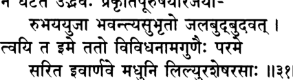

**----- Start of picture text -----** 
ч  г а г гТ F t  c t#   W t \ \ т **----- End of picture text -----** 

_на гхатата удбхавах пракрти-пурушайор аджайор убхайа-йуджа бхавантй асу-бхрто джала-будбуда-ват твайи та име тато вивидха-нама-гунаих пароме сарита иварнаве мадхуни лилйур ашеша-расах_ 

_на гхатате_ — не происходит; _удбхавах_ — создание; _пракрти_ — материальной природы; _пурушайох_ — и души, которая ею наслаж­ дается; _аджайох_ — которые являются нерожденными; _убхайа_ — обеих; _йуджа_ — благодаря соединению; _бхаванти_ — появляются на свет; _асу-бхртах_ — живые тела; _джала_ — на воде; _будбуда_ — пузыри; _ват_ — как; _твайи_ — в Тебе; _те име_ — эти (живые сущест­ ва); _татах_ — поэтому; _вивидха_ — разнообразными; _нама_ — с име­ нами; _гунаих_ — и качествами; _пароме_ — во Всевышнего; _саритах_ — реки; _ива_ — как; _арнаве_ — в океан; _мадхуни_ — в мед; _лилйух_ — погружаются; _аьиеша_ — все; _расах_ — вкусы. 

**Ни материальная природа, ни душа, которая пытается ею на­ слаждаться, никогда не рождаются, однако когда они соединяют­ ся, то возникают живые тела, в точности как пузыри возникают на воде там, где она соприкасается с воздухом. И подобно тому, как реки впадают в океан или как нектар со множества цветков, смешиваясь, образует мед, все эти обусловленные живые сущест­ ва вместе с их именами и качествами в конце концов погружаются в Тебя, о Всевышний.** 

_КОММЕНТАРИЙ:_ Без истинного духовного руководства можно неверно истолковать слова Вед о том, что живые существа исходят из Всевышнего. Может создаться впечатление, что, только исходя из Господа, души начинают существовать и рано или поздно они 

**[песнь 10, гл. 87** 

**608** 

**Шримад-Бхагаватам** 

снова погрузятся в небытие. Однако если бы _дживы_ существова­ ли лишь временно, тогда в момент смерти души ее _карма_ попрос­ ту исчезала бы, не будучи отработанной, а когда душа рождалась бы, то с ней появлялась бы и ее _карма,_ которую она ничем не за­ служила. Более того, освобождение для такой души означало бы полное уничтожение ее бытия и индивидуальности. 

Однако истина состоит в том, что душа по своей природе еди­ на с Брахманом, так же как пространство, ограниченное стенками глиняного горшка, по своей сути неотлично от бескрайнего неба. И, подобно тому как горшок сначала создается, а затем разбивает­ ся, «рождение» индивидуальной души заключается в том, что она покрывается материальным телом, а ее «смерть», или освобожде­ ние, состоит в уничтожении ее грубого и тонкого тел раз и навсе­ гда. Несомненно, такие «рождение» и «смерть» происходят лишь по милости Верховного Господа. 

Соединение материальной природы и ее повелителя, в результате которого в этой материальной вселенной появляются разнообраз­ ные обусловленные существа, сравнивается здесь с соприкоснове­ нием воды и воздуха, от которого на поверхности моря образуются бесчисленные пузырьки и пена. Подобно тому как действенная причина, воздух, побуждает вещественную причину, воду, образо­ вывать пузырьки, Верховный Пуруша Своим взглядом побужда­ ет _пракриты_ преобразовываться в разнообразные материальные элементы и разнообразные материальные формы, которые со­ здаются из этих элементов. Таким образом, _пракриты_ выступа­ ет в роли _упадана-караны,_ или вещественной причины, творения. Однако в конечном счете, поскольку она также является энер­ гией Верховного Господа, единственная вещественная причина, так же как и действенная, — это Сам Господь. Это подтвержда­ ется в «Тайттирия-упанишад» (2.1.1, 2.6.1): _тасмад ва этасмад атмана акаьиах самбхутах_ — «Из этой Высшей Души возник эфир», и _со 'камайата баху сйам праджайейа_ — «Он пожелал: „Я стану многим, распространив Себя в потомство44». 

Когда индивидуальные _дживы_ «рождаются» в результате союза Верховного Господа и _пракриты,_ они не создаются, и, когда они вновь «погружаются» в Господа, воссоединяясь с Ним в Его пол­ ных блаженства развлечениях в Его вечном царстве, они не уничто­ жаются. И точно так же как бесконечно малые _дживы_ в процессе кажущихся рождения и смерти не претерпевают никаких измене­ ний, Верховный Господь может создавать и вбирать в Себя Свои эманации, оставаясь неизменным. В «Брихад-араньяка-упанишад» 

**текст 31]** 

**Молитвы олицетворенных Вед** 

**609** 

(4.5.14) утверждается: _авинаьии варе ’йам атма_ — «Эта _атма_ по­ истине неразрушима», и это утверждение может относиться как к Высшей Душе, так и к подчиненным Ей _дживам._ 

Как объясняет Шрила Шридхара Свами, уничтожение матери­ альной обусловленности живого существа бывает двух видов: час­ тичное и полное. Частичное уничтожение происходит, когда душа погружается в глубокий сон, когда она оставляет свое тело, а так­ же во время разрушения вселенной, когда все души снова входят в тело Маха-Вишну. Эти разные виды уничтожения подобны сме­ шиванию нектара, который пчелы собрали с разных цветков. Раз­ личные вкусы нектара олицетворяют дремлющую _карму_ каждого живого существа, которая никуда не исчезает, но которую в этом состоянии индивидуальной души трудно вычленить. В противопо­ ложность этому полное уничтожение материальной обусловленнос­ ти души — это ее освобождение из _самсары,_ которое уподобляется здесь впадению рек в океан. Впадая в океан, воды разных рек смешиваются между собой, и их уже невозможно отделить друг от друга. Точно так же в момент освобождения все ложные ма­ териальные самоотождествления _джив_ уничтожаются и освобож­ денные души снова возвращаются в свое естественное состояние равенства, занимая положение слуг Верховного Господа. 

Упанишады эти разные виды уничтожения описывают следую­ щим образом: _йатха саумйа мадху мадху-крто нистиштханти нанатйайанам вркшанам расан самавахарам экатам расам гамайанти. те йатха татра на вывекам лабханте ’мушйахам вркшасйа расо усмй амушйахам вркшасйа расо усмйтй эвам эва кхалу саумйемах сарвах праджах сатй сампадйа на видух сатй сампадйамахе_ — «Мой дорогой мальчик, это [частичное уничтоже­ ние] похоже на то, как пчелы делают мед, собирая нектар с цве­ тов разных деревьев и смешивая этот нектар. Точно так же как смешанные между собой разные виды нектара не могут выде­ лить себя из этой смеси: „Я — сок этого цветка44 или „Я — сок другого цветка44, таким же образом, мой дорогой мальчик, когда все эти живые существа сливаются друг с другом, они не могут сами думать: „Теперь мы слились друг с другом44» (Чхандогьяупанишад, 6.9.1-2). 

_йатха надйах сйандаманах самудре_ 

_’стам гаччханти нама-рупе вихайа татха видван нама-рупад вимуктах парат-парам пурушам упаити дивйам_ 

**[песнь 10, гл. 87** 

**Шримад-Бхагаватам** 

**610** 

«Подобно тому как, впадая в океан, реки растворяются и теря­ ют свои имена и формы, мудрец, освободившийся от материаль­ ных имен и форм, восходит к Высшему Абсолюту, удивительной Личности Бога» (Мундака-упанишад, 3.2.8). 

Шрила Шридхара Свами молится: 

_йасминн удйад-вилайам апи йад бхати вишвам лайадау джйвопетам гуру-карунайа кевалатмавабодхе_ 

_атйантантам враджати сахаса синдху-ват синдху-мадхйе мадхйе читтам три-бхувана-гурум бхавайе там нр-симхам_ 

«Всеведущий Верховный Господь сияет собственным светом. По Его великой милости эта вселенная, проходящая через цикл со­ творения и уничтожения, покоится в Нем после того, как во вре­ мя своего разрушения находит в Нем прибежище вместе со всеми живыми существами. Это полное уничтожение мироздания проис­ ходит внезапно, словно впадение реки в океан. В глубине сердца я медитирую на этого повелителя трех миров, Господа Нрисимху». 

## **ТЕКСТ 32** 

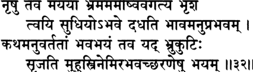

**----- Start of picture text -----** 
^ ъ ц -ц ц щ ^ ^rfcT  I ^ r f r r   ч щ  \т \\ **----- End of picture text -----** 

_нршу тава майайа бхрамам амйшв авагатйа бхрьиам твайи су-дхийо 9бхаве дадхати бхавам анупрабхавам катхам анувартатам бхава-бхайам тава йад бхру-кутих срджатй мухус три-немир абхавач-чхаранешу бхайам_ 

_нршу_ — среди людей; _тава_ — Твоей; _майайа_ — иллюзорной энер­ гией; _бхрамам_ — заблуждение; _амйшу_ — среди этих; _авагатйа_ — по­ нимая; _бхрьиам_ — ревностное; _твайи_ — Тебе; _су-дхийах_ — те, кто мудр; _абхаве_ — источнику освобождения; _дадхати_ — совершают; _бхавам_ — любовное служение; _анупрабхавам_ — могущественное; _катхам_ — какой; _анувартатам_ — для тех, кто с верой сле­ дует за Тобой; _бхава_ — материальной жизни; _бхайам_ — страх; _тава_ — Твоих; _йат_ — поскольку; _бхру_ — бровей; _кутих_ — сдвига­ ние; _срджатй_ — создает; _мухух_ — вновь и вновь; _три-немих_ — с тремя ободами (в трех фазах времени: прошлом, настоящем 

**текст 32]** 

**Молитвы олицетворенных Вед** 

**611** 

и будущем); _а_ — не; _бхават_ — у Тебя; _шаранешу_ — для тех, кто обретает прибежище; _бхайам_ — страх. 

**С усердием и любовью служат Тебе — причине освобождения от рождений и смертей — мудрецы, которые понимают, как Твоя** _**майя**_ **вводит в заблуждение всех живых существ. В самом деле, разве может страх материальной жизни одолеть Твоих верных слуг? С другой стороны, Твои нахмуренные брови — трехслой­ ное колесо времени — вновь и вновь наводят ужас на тех, кто отказывается принять у Тебя прибежище.** 

_КОММЕНТАРИЙ:_ Веды раскрывают свою самую сокровенную тайну — преданное служение Личности Бога — только тем, кто устал от материальной иллюзии, основанной на ложном чувст­ ве независимости от Господа. В «Ваджасанейи-самхите» (32.11) «Шукла-Яджур-веды» есть такая _мантра:_ 

_парйтйа бхутани парйтйа локан парйтйа сарвах прадишо дшйаьи ча упастхайа пратхама-джамртасйатманатманам абхисамвивеша_ 

«Пройдя через все виды жизни, все планетные системы и побывав во всех уголках пространства, индивидуальная душа обращается к изначальной Душе — источнику бессмертия. Тогда она обрета­ ет возможность навсегда остаться в обители Бога и поклоняться и лично служить Ему». 

Приверженцы различных противоборствующих материалисти­ ческих доктрин могут считать себя очень мудрыми, однако на самом деле все они введены в заблуждение _майей_ Верховного Гос­ пода. Вайшнавы понимают, как _майя_ покрывает всех живых су­ ществ, а потому предаются Верховному Господу, развивая в себе настроение служения, дружбы и проч. Жарким философским де­ батам чистые вайшнавы предпочитают блаженство любви к Бо­ гу, которое они постоянно испытывают, сознавая, что объект их любви, Господь, кладет конец любой материальной обусловленнос­ ти. Преданные Господа Вишну испытывают постоянное блажен­ ство не только в этой жизни, но и во всех последующих. Где бы и кем бы они ни родились, они продолжают обмениваться любовью с Господом. Поэтому искренний вайшнав молится: 

_натха йони-сахасрешу йеьиу йеьиу бхрамамй ахам_ 

**612** 

**[песнь 10, гл. 87** 

**Шримад-Бхагаватам** 

## _татра татрачйута бхактир ачйутасту дрдха твайи_ 

«О мой повелитель, о Ачьюта, какое бы из тысяч возможных тел я ни получил и в какой бы ситуации ни оказался, пусть я всегда останусь непоколебимо преданным Тебе» (Вишну-пурана). 

Кто-то из философов может спросить, как вайшнавы могут из­ бавиться от материальной обусловленности, не поняв досконально природу живого существа, _твам_ («ты», _джива),_ и Бога, _тат_ («то», Всевышний), и не развив сильного отвращения к материальной жизни. Олицетворенные Веды отвечают здесь, что для преданных Господа не существует материальной иллюзии, поскольку даже на начальных ступенях преданного служения по милости Господа из их сердец уходят страх и привязанность. 

Время — это главная причина страха в материальном мире. Три фазы времени — прошлое, настоящее и будущее — повергают лю­ дей в ужас от мыслей о предстоящих болезнях, смерти и страданиях в аду. Но боятся всего этого только те, кто не обрел прибежи­ ще у стоп Верховного Господа. Господь Сам говорит в «Рамаяне» (Юддха-кханда, 12.20): 

_сакрд эва прапанно йас тавасмйти ча йачате абхайам сарвада тасмаи дадамй этад вратам мама_ 

«Если кто-либо хотя бы однажды приходит ко Мне со словами: „Отныне я Твойи, — Я дарую этому человеку вечное бесстрашие. Я торжественно обещаю это». Более того, в «Бхагавад-гите» (7.14) Господь говорит: 

_даивй хй эта гуна-майй мама майа дуратйайа мам эва йе прападйанте майам этом таранти те_ 

«Преодолеть влияние Моей божественной энергии, состоящей из трех _гун_ материальной природы, невероятно трудно. Но тот, кто предался Мне, с легкостью выходит из-под ее власти». 

Вайшнавы не любят тратить время на долгие, бесплодные спо­ ры, обсуждая сухие философские предметы. Вместо того чтобы препираться с философскими оппонентами, они предпочитают по­ 

**текст 32]** 

**613** 

**Молитвы олицетворенных Вед** 

клоняться Личности Бога. Представления вайшнавов совпадают с основными положениями богооткровенных писаний. Они видят Высшую Абсолютную Истину как бескрайний океан личностных качеств и любовных развлечений, которые Она проявляет в облике Кришны, Рамы и других божественных воплощений Господа, а себя они считают вечными слугами Господа, и такое понимание полнос­ тью соответствует выводам относительно природы _тат_ и _твам_ , к которым приходит философия _веданты._ 

Господь, Личность Бога, и Его эманации, такие как _дживы,_ од­ новременно и отличаются друг от друга, и неотличны, в точ­ ности как солнце и солнечные лучи. Существует бесчисленное количество _джив,_ и каждая из них живет вечно и вечно обла­ дает сознанием. Это подтверждается в _шрути: нитйо нитйанам четанаш четананам_ (Катха-упанишад, 2.2.13, и Шветашватараупанишад, 6.13). В начале материального творения, когда _дживы_ выходят из тела Маха-Вишну, все они, будучи мельчайшими час­ тичками пограничной энергии Господа, имеют одинаковую при­ роду. Однако в зависимости от своего состояния они делятся на четыре группы. Некоторые из них покрыты невежеством, кото­ рое, словно облако, затуманивает их восприятие мира. Другие же, совмещая преданность и знание, освобождаются от невежества. Третьи наделены чистой преданностью, в которой есть ничтожная примесь желания умозрительного философствования и деятельнос­ ти ради ее плодов. Такие души обретают чистые тела, состоящие из совершенного знания и блаженства, в которых они служат Господу. И наконец, есть души, которые никак не осквернены невежеством; это вечные спутники Господа. 

Пограничное положение _дживы_ описывается в «Нарада-панчаратре»: 

_йат тата-стхам ту чид-рупам сва-самведйад виниргатам ранджитам гуна-рагена са джйва ити катхйате_ 

«Энергия, называемая _тата-стха,_ исходит из энергии знания Господа _самвит._ Порожденные ею существа, которых называют _дживами,_ попадают под влияние качеств материальной природы». Бесконечно малая _джива_ существует на границе между внешней, иллюзорной энергией Господа, _майей,_ и Его внутренней, духовной энергией, _чит,_ поэтому ее называют _тата-стха,_ «пограничной». 

**614** 

**[песнь 10, гл. 87** 

**Шримад-Бхагаватам** 

Однако, когда, развив в себе преданность Господу, она получа­ ет освобождение, ее больше не оскверняют _гуны_ материальной природы, ибо она полностью отдает себя под покровительство внутренней энергии Господа. Господь Кришна подтверждает это в «Бхагавад-гите» (14.26): 

_мам ча йо ’вйабхичарена бхакти-йогена севате са гунан саматйтйаитан брахма-бхуйайа калпате_ 

«Тот, кто целиком посвящает себя преданному служению, ни при каких обстоятельствах не отклоняясь от этого пути, преодолевает влияние _гун_ материальной природы и достигает уровня Брахмана». 

Душа может поклоняться Господу в трех Его проявлениях — Брахмана, Параматмы и Бхагавана. Безличный Брахман подобен ослепительному сиянию солнца; Сверхдуша, или Параматма, по­ добна планете Солнце, а Личность Бога, Бхагавана, в этом срав­ нении можно уподобить божеству, управляющему солнцем, вместе со всем его окружением и атрибутами. Можно привести и другое сравнение: путешественники, приближающиеся к городу, издалека не способны увидеть его улицы и здания. Единственное, что они видят, — это некое размытое сияние на горизонте. Подходя бли­ же, они могут увидеть самые высокие его здания. Затем, подойдя максимально близко, они способны увидеть город таким, каков он есть, — бурлящий жизнью мегаполис со множеством жителей, жи­ лых домов, общественных зданий, магистралей и парков. Подобно этому, люди, склонные к медитации на безличный аспект Господа, в лучшем случае обретут представление о Его сиянии (Брахмане); те, кто немного приблизится к Нему, научатся видеть Его как Параматму в своем сердце; те же, кто подойдет ближе всех, способны увидеть в Нем личность (Бхагавана). 

В заключение Шрила Шридхара Свами молится: 

_самсара-чакра-кракачаир видйрнам удйрна-нана-бхава-тапа-таптам катханчид апаннам иха прапаннам твам уддхара шрй-нрхаре нр-локам_ 

_«О_ Шри Нрихари, пожалуйста, спаси тех, кому пришлось вынести всевозможные страдания, тех, кого переехало безжалостное коле­ 

**текст 33]** 

**615** 

**Молитвы олицетворенных Вед** 

со _самсары_ , если они так или иначе все же нашли Тебя и вручили себя Тебе». 

## **ТЕКСТ 33** 

Ч  т е I оЩтгЩгП^ТТ: тет^т _тли_ 

_виджита-хршйка-вайубхир аданта-манас тура-гам_ 

_йа иха йатанти йантум ати-лолам упайа-кхидах вйасана-ьиатанвитах самавахайа гуроьи чаранам ваниджа иваджа сантй акрта-карна-дхара джаладхау_ 

_виджита_ — обузданными; _хрьийка_ — с чувствами; _вайубхих_ — и жизненным воздухом; _аданта_ — необузданный; _манах_ — ум; _тура-гам_ — (который напоминает) лошадь; _йе_ — те, кто; _иха_ — в этом мире; _йатанти_ — пытаются; _йантум_ — контролировать; _ати_ — очень; _лолам_ — неустойчивый; _упайа_ — различными спосо­ бами развития; _кхидах_ — полными беспокойств; _вйасана_ — про­ блем; _ьиата_ — сотнями; _анвитах_ — охвачены; _самавахайа_ — поки­ нув; _гурох_ — духовного учителя; _чаранам_ — стопы; _ваниджах_ — тор­ говцы; _ива_ — словно; _аджа_ — о нерожденный; _санти_ — они есть; _акрта_ — не нанявшие; _карна-дхарах_ — рулевого; _джала-дхау_ — в океане. 

**Ум подобен необузданной лошади, которую не могут усмирить даже те, кто подчинил себе свои чувства и дыхание. Те из жи­ вущих в этом мире, кто пытается обуздать неуправляемый ум, но при этом покидает стопы духовного учителя, начинают за­ ниматься разнообразными практиками, которые приносят одни беспокойства. На их пути встают сотни препятствий. О нерож­ денный Господь, поистине, они подобны купцам, которые вышли на корабле в океан, не наняв рулевого.** 

_КОММЕНТАРИЙ:_ Чтобы стать достойным обрести любовь к Бо­ гу, зрелый плод освобождения, человек должен сначала подчинить 

**[песнь 10, гл. 87** 

**616** 

**Шримад-Бхагаватам** 

себе буйный материальный ум. Это очень сложно, но этого можно достичь, если мы сможем заменить свою привязанность к чувст­ венным удовольствиям на вкус к высшим наслаждениям духовной жизни. Однако обрести этот высший вкус возможно только по милости духовного учителя, представителя Личности Бога. 

Духовный учитель позволяет своему ученику увидеть чудеса трансцендентного мира, на что в молитвах _гаятри_ указывает слово _аим,_ семя _мантры,_ дарующей божественное знание. В «Мундака-упанишад» (1.2.12) утверждается: 

_тад-виджнанартхам са гурум эвабхигаччхет самит-паних шротрийам брахма-ништхам_ 

«Чтобы правильно понять всё это, необходимо со смирением об­ ратиться к духовному учителю. Идя к учителю, человек должен принести с собой дрова. Истинным духовным учителем называют того, кто знает Веды и непоколебимо предан Абсолютной Истине». В «Катха-упанишад» (1.2.9) говорится следующее: 

_наиьиа таркена матир апанейа проктанйенаива су-джнанайа прештха_ 

«Мой дорогой мальчик, это невозможно постичь с помощью логи­ ки. Эта истина передается от досконально постигшего ее духовного учителя разумному ученику». 

Те, кто не является вайшнавом, часто недооценивают важность вручения себя духовному учителю, принадлежащему к авторитет­ ной цепи ученической преемственности. Вместо этого возгордив­ шиеся _йоги_ и _гъяни_ полагаются лишь на собственные способности и стараются произвести впечатление на мир, демонстрируя свои так называемые успехи, однако слава их преходяща: 

_йунджананам абхактанам пранайамадибхир манах акшйна-васанам раджан дршйате пунар уттхитам_ 

«У непреданных, которые применяют такие методы, как _пранаяма,_ умы очищаются не полностью: следы материальных желаний оста­ ются. Поэтому, о царь, можно видеть, как в их умах снова просыпаются материальные желания» (Бхаг., 10.51.60). 

**текст ЭЭ]** 

**617** 

**Молитвы олицетворенных Вед** 

С другой стороны, смиренный и стойкий преданный Господа Вишну и всех вайшнавов может легко победить упрямый ум. Что­ бы обуздать ум, ему не нужно утруждать себя занятиями восьми­ ступенчатой _йогой_ или другими подобными практиками, которые укрепляют ум. _Этат сарвам гурау бхактйа пурушо хй анджаса джайет:_ «Человек может без труда достичь всех этих целей, прос­ то преданно служа своему духовному учителю» (Бхаг., 7.15.25). Непреданный же, даже если он обуздал свои чувства и жизнен­ ный воздух, не сможет усмирить свой ум, который будет метать­ ся, как необъезженная лошадь. Такой человек станет обращаться к разнообразным трудоемким духовным практикам, и в конечном счете он останется там же, где был, — посреди бескрайнего оке­ ана материального мира. Пример, приведенный здесь, как нельзя более уместен: если купцы, поспешно вышедшие в море в надеж­ де на большую прибыль, не наняли опытного рулевого для своего корабля, они неминуемо столкнутся с огромными трудностями. 

Важность истинного духовного учителя подчеркивается во мно­ гих местах «Шримад-Бхагаватам» — например, в следующем стихе (Бхаг., 11.20.17): 

_нр-дехам адйам су-лабхам су-дурлабхам плавам су-калпам гуру-карна-дхарам майанукулена набхасватеритам пуман бхавабдхим на тарет са атма-ха_ 

«Человеческое тело, с помощью которого можно обрести все бла­ га, получают естественным путем, по закону природы, хотя это очень редкое приобретение. Это тело можно сравнить с крепким, умело сконструированным кораблем, духовного учителя — с капи­ таном, а наставления Личности Бога — с попутными ветрами, по­ могающими продвигаться к цели. И тот, кто не пользуется этими преимуществами человеческой жизни и не пересекает океан мате­ риального бытия, должен быть назван убийцей собственной души». Поэтому тот, кто получил человеческое тело, должен в первую оче­ редь найти духовного учителя, способного руководить человеком в его практике сознания Кришны. 

Шрила Шридхара Свами молится: 

_йада парананда-гуро бхават-паде падам мано ме бхагавал лабхета_ 

_тада нирастакхила-садхана-шрамах шрайейа саукхйам бхаватах крпатах_ 

**[песнь 10, гл. 87** 

**618** 

**Шримад-Бхагаватам** 

«О _гуру_ , исполненный трансцендентного блаженства! Когда ум мой найдет прибежище у твоих лотосных стоп, все трудоемкие практи­ ки останутся позади и, по твоей милости, я испытаю величайшее счастье». 

## **ТЕКСТ 34** 

## ***rfrf f% ЗТТгЧ^Г** 

## **I** 

^ F ff^ rT ||3 « || 

_сваджана-сутатма-дара-дхана-дхама-дхарасу-ратхаис твайи сатй ким нрнам шрайата атмани сарва-расе ити сад аджанатам митхунато ратайе чаратам сукхайати ко не иха сва-вихате сва-нираста-бхаге_ 

_сваджана_ — со слугами; _сута_ — детьми; _атма_ — телом; _дара_ — женой; _дхана_ — деньгами; _дхама_ — домом; _дхара_ — землей; _асу_ — жизненной силой; _ратхаих_ — и средствами передвижения; _твайи_ — когда Ты; _сатй_ — стал; _ким_ — какая (польза); _нрнам_ — для лю­ дей; _шрайатах_ — которые находят прибежище; _атмани_ — их Душа; _сарва-расе_ — воплощение всех наслаждений; _ит и_ — так; _cam_ — ис­ тина; _аджанатам_ — для тех, кто не смог оценить; _митхунатах_ — от сексуальных удовольствий; _ратайе_ — к удовлетворению чувств; _чаратам_ — стремясь; _сукхайати_ — дает счастье; _ках_ — какое; _ну_ — в самом деле; _иха_ — в этом (мире); _сва_ — по самой своей при­ роде; _вихате_ — который подвержен уничтожению; _сва_ — по своей природе; _нираста_ — который лишен; _бхаге_ — всякого смысла. 

**Тем, кто находит у Тебя прибежище, Ты раскрываешь Себя как Сверхдушу, воплощение трансцендентного блаженства. Что им те­ перь до своих слуг, детей или тел, до жен, денег и домов, до земли, здоровья или средств передвижения? И наоборот, есть ли в этом мире, по самой природе обреченном на уничтожение и лишенном смысла, хоть что-нибудь, что принесло бы настоящее счастье тем, кто не смог постичь истину о Тебе и продолжает наслаждаться сексом?** 

_КОММЕНТАРИЙ:_ Преданное служение Господу Вишну считается чистым, когда человек желает одного — доставить удовольствие 

**текст 34]** 

**Молитвы олицетворенных Вед** 

**619** 

Господу. Утвердившийся в таком сознании вайшнав не ищет боль­ ше никакой материальной выгоды для себя, поэтому ему не нуж­ но совершать ритуальные жертвоприношения и следовать строгой практике _йоги._ В «Мундака-упанишад» (1.2.12) говорится: 

_парйкшйа локан карма-читан брахмано нирведам айан настй акртах кртена_ 

«Осознав, что достижение райских планет — это всего лишь оче­ редной способ накопить _карму_ , _брахман_ отрекается от мира, и действия его перестают приносить ему вред». «Брихад-араньякаупанишад» (4.4.9) и «Катха-упанишад» (2.3.14) подтверждают это: 

_йада сарве прамучйанте кама йе ’сйа хрди тритах атха мартйо ’мрто бхаватй атра брахма самашнуте_ 

«Когда человек полностью освобождается от всех греховных же­ ланий, гнездившихся в его сердце, он меняет эфемерное существо­ вание на вечную духовную жизнь и обретает истинное блаженство в Абсолютной Истине». «Гопала-тапани-упанишад» (Пурва-тапани, 14) приходит к такому выводу: _бхактир асйа бхаджанам тад ихамутропадхи-наирасйенамушмин манах-калпанам этад эва наишкармйам._ «С помощью преданного служения мы поклоняем­ ся Господу. Оно заключается в том, чтобы, отбросив все матери­ альные самоотождествления, как в этой жизни, так и в следующей, сосредоточить на Господе свой ум. Это и есть подлинное отречение от мира». 

В этом стихе Шрути перечисляют то, чем обычно измеряет­ ся материальный успех: _сваджанах_ , слуги; _атма_ , красивое тело; _сутах,_ дети, которыми гордятся; _дарах_ , красивая и заботливая же­ на; _дханам_ , материальное богатство; _дхама_ , хороший дом; _дхарау_ зе­ мельные владения; _асавах_ , здоровье и сила, и _ратхах_ , автомобили и другие средства передвижения, которые демонстрируют статус их владельца. Однако тот, кто хоть до какой-то степени испытал блаженство преданного служения, теряет всякий интерес к этим вещам, ибо находит высшее удовлетворение в Верховном Госпо­ де, источнике всего блаженства, который наслаждается, делясь со Своими слугами присущим Ему блаженством. 

Каждый из нас волен выбирать, как жить: посвятить ли свое те­ ло, ум, речь, способности и богатство прославлению Господа, или 

**[песнь 10, гл. 87** 

**620** 

**Шримад-Бхагаватам** 

вместо этого пренебречь Им и стремиться обрести собственное счастье. Второй путь ведет к тому, что душа становится рабой секса и собственных амбиций. Такая жизнь вместо настоящего удовле­ творения приносит душе бесконечные страдания. Вайшнавы близ­ ко к сердцу принимают страдания материалистов и потому всегда стараются просветить их. 

Шрила Шридхара Свами молится: 

_бхаджато хи бхаван сакшат парамананда-чид-дханах атмаива ким атах кртйам туччха-дара-сутадибхих_ 

«Для тех, кто поклоняется Тебе, Ты становишься их Душой, их духовным сокровищем, средоточием высшего блаженства. К чему им теперь мирские жены, дети и все остальное?» 

## **ТЕКСТ 35** 

^rfrT _-Ц_ ЗПгЧЙ 

изчи 

_бхуви пуру-пунйа-тйртха-садананй ршайо вимадас та ута бхават-падамбуджа-хрдо ’гха-бхид-ангхри-джалах дадхати сакрн манас твайи йа атмани нитйа-сукхе_ 

_на пунар упасате пуруша-сара-харавасатхан_ 

_бхуви_ — на земле; _пуру_ — необычайно; _пунйа_ — благочестивые; _тйртха_ — места паломничества; _саданани_ — и личные обители Верховного Господа; _ршайах_ — мудрецы; _вимадах_ — свободные от гордыни; _те_ — они; _ута_ — несомненно; _бхават_ — Твои; _пада_ — стопы; _амбуджа_ — лотосные; _хрдах_ — в чьих сердцах; _агха_ — гре­ хи; _бхит_ — которая уничтожает; _ангхри_ — (омывшая) чьи стопы; _джалах_ — вода; _дадхати_ — обращаются; _сакрт_ — даже единожды; _манах_ — их умы; _твайи_ — к Тебе; _йе_ — кто; _атмани_ — к Высшей Душе; _нитйа_ — всегда; _су кхе_ — кто счастлив; _на пунах_ — никогда вновь; _упасате_ — они поклоняются; _пуруша_ — человека; _сара_ — неотъемлемые качества; _хара_ — которые крадут; _авасатхан_ — их земные дома. 

**текст 35]** 

**621** 

**Молитвы олицетворенных Вед** 

**Мудрецы, свободные от гордыни, живут на земле, посещая свя­ тые места паломничества и обители, в которых Верховный Гос­ подь являл Свои игры. Такие преданные всегда хранят в своем сердце Твои лотосные стопы, а потому вода, омывшая их сто­ пы, уничтожает все грехи. Любой, кто хотя бы единожды об­ ратит свой ум к Тебе, исполненной вечного блаженства Душе всего сущего, перестанет служить дома своей семье, понимая, что семейная жизнь лишает человека всех его хороших качеств.** 

_КОММЕНТАРИЙ:_ Чтобы стать мудрецом, человек должен слу­ шать об Абсолютной Истине из авторитетных источников и, трез­ вея, развить в себе дух отречения от мира. Стремясь обрести способность отличать важное от неважного, такой человек часто путешествует из одного святого места в другое, чтобы общаться с великими душами, которые также посещают святые места или живут там. Если во время своих путешествий такой человек начнет созерцать в своем сердце лотосные стопы Верховного Господа, он освободится от иллюзии ложного эго и мучительного рабства вож­ деления, зависти и жадности. Такой человек может по-прежнему ходить по святым местам, чтобы смыть с себя все грехи, но те­ перь, полностью очистившийся, такой мудрец может сам очищать других водой, которая омывала его стопы, а также своими под­ крепленными опытом наставлениями. Такой мудрец описывается в «Мундака-упанишад» (2.2.8): 

_бхидйате хрдайа-грантхиш чхидйанте сарва-самшайах кшййанте часйа карманй тасмин дрьите параваре_ 

«Когда человек повсюду видит Верховного Господа, и в низших, и в возвышенных существах, узел в его сердце разрубается, всем сомнениям приходит конец, а цепь кармической деятельности об­ рывается». Мудрецы, достигшие этого уровня, превозносятся в той же «Мундака-упанишад» (3.2.11): _намах парамаршибхйах, намах парамаршибхйах_ — «Поклоны лучшим из мудрецов, поклоны им!» 

Оставив общество любящих жен, детей, друзей и последовате­ лей, чистые вайшнавы путешествуют по святым _дхамаму_ где можно лучше всего поклоняться Господу, — это такие земли, как Врин­ даван, Матхура, Джаганнатха-Пури или любое другое место, где собираются искренние преданные Господа Вишну. Даже те вайшна­ вы, кто не принял _саннъясу_ и по-прежнему живет со своей семьей 

**622** 

**[песнь 10, гл. 87** 

**Шримад-Бхагаватам** 

или в _ашраме гуру_ ; но кому однажды посчастливилось вкусить хотя бы каплю высшего нектара преданного служения, утрачивают вкус к размышлениям о радостях материальной семейной жизни, кото­ рая лишает человека рассудительности, решимости, серьезности, терпения и спокойствия ума. 

Шрила Шридхара Свами молится: 

_мунчанн анга тад анга-сангам анишам твам эва санчинтайан_ 

_сайтах санти йато йато гата-мадас тан ашраман авасан нитйам тан-мукха-панкаджад вигалита-тват-пунйа-гатхамртасротах-самплава-самплуто нара-харе на сйам ахам деха-бхрт_ 

«Мой дорогой Господь, когда я откажусь от всех чувственных удо­ вольствий и буду постоянно размышлять о Тебе и когда я стану жить в обителях святых преданных, свободных от гордыни, тог­ да я смогу полностью погрузиться в потоки нектарных рассказов о Тебе, льющиеся с лотосных уст Твоих преданных. Тогда, о Гос­ подь Нарахари, мне больше не придется рождаться в материальном теле». 

## **ТЕКСТ 36** 

ТГгГ f^fd 

4^31*1, 11^11 

_сата идам уттхитам сад ити чен нану тарка-хатам_ 

_вйабхичарати ква ча ква ча мрша на татхобхайа-йук вйавахртайе викалпа ишито ’ндха-парампарайа бхрамайати бхаратй та уру-врттибхир уктха-джадан_ 

_сатах_ — из того, что вечно; _идам_ — эта (вселенная); _уттхи­ там_ — возникшая; _cam_ — вечная; _ит и_ — так; _чет_ — если (кто-либо предположит); _нану_ — несомненно; _тарка_ — с помощью логики; _хатам_ — опровергается; _вйабхичарати_ — неверный; _ква ча_ — в не­ которых случаях; _ква ча_ — в других случаях; _мрша_ — иллюзия; _на_ — не; _татха_ — так; _убхайа_ — обеих (реальности и иллюзии); _йук_ — соединение; _вйавахртайе_ — ради обычных дел; _викалпах_ — воображаемая ситуация; _ишитах_ — желаемая; _андха_ — слепцов; 

**текст 36]** 

**623** 

**Молитвы олицетворенных Вед** 

_парампарайа_ — вереницей; _бхрамайати_ — вводят в заблуждение; _бхаратй_ — мудрые слова; _те_ — Твой; _уру_ — многочисленными; _врттибхих_ — своими значениями; _уктха_ — от ритуальных декла­ маций; _джадан_ — уставших. 

**Можно сказать, что этот мир всегда остается реальным, по­ скольку возник из вечной реальности, однако такое предполо­ жение легко опровергнуть с помощью логики. И в самом деле, иногда кажущееся тождество причины и следствия оказывает­ ся ложным, а бывает также, что нечто реальное порождает ил­ люзию. Более того, этот мир не может существовать вечно, ибо проявляет качества не только абсолютной реальности, но также иллюзии, скрывающей эту реальность. На самом деле видимые формы этого мира — это порождения воображения поколений не­ вежественных людей, предназначенные для того, чтобы помочь им заниматься материальной деятельностью. Твои Веды, чьи уче­ ные слова имеют множество значений и скрытых смыслов, только вводят в заблуждение тех, кто оглупел от постоянной декламации ритуальных гимнов.** 

_КОММЕНТАРИЙ:_ Как пишет Шрила Вишванатха Чакраварти Тхакур, Упанишады учат, что материальный мир реален, но вре­ менен. Именно такого мнения придерживаются преданные Госпо­ да Вишну. Однако есть и философы-материалисты, сторонники философии _карма-мимамсы_ Джаймини Риши, которые заявляют, что этот мир — единственная реальность, которая существует веч­ но. Джаймини полагает, что цикл _кармы_ и ее последствий не­ прерывен и не существует другой, трансцендентной реальности, в которую можно попасть, вырвавшись из этого круговорота. Од­ нако, как показывает тщательное изучение _мантр_ Упанишад, та­ кое представление ошибочно, ибо в Упанишадах есть множество описаний высшего, духовного бытия, например: _сад эва саумйедам агра асйд экам эвадвитййам_ — «Мой дорогой мальчик, до со­ творения мира существовала лишь недвойственная Абсолютная Истина» (Чхандогья-упанишад, 6.2.1). Или, к примеру, такое утвер­ ждение: _виджнанам анандам брахма_ — «Высшая реальность — это божественное знание и блаженство» (Брихад-араньякаупанишад, 3.9.34). 

В этой молитве олицетворенные Веды обобщают представления материалистов в словах _сата идам уттхитам cam:_ «Воспринима­ емый чувствами мир вечен, поскольку возник из вечной реальнос­ ти». Это утверждение основывается на том, что, как правило, вещь, 

**[песнь 10, гл. 87** 

**624** 

**Шримад-Бхагаватам** 

возникшая из другой вещи, состоит из своей причины. К приме­ ру, серьги и другие украшения, сделанные из золота, представляют собой то же самое золото. Поэтому философы школы _мимамсы_ делают логический вывод, что мир вечен, поскольку, как мы зна­ ем, он есть проявление вечной реальности. Однако санскритское слово _сатах_ , стоящее в отложительном падеже, которое означает «из вечной реальности», ясно подразумевает отделенность причи­ ны от следствия. Иначе говоря, то, что создано из _cam_ , вечной реальности, должно существенно отличаться от нее, то есть быть временным. Таким образом опровергается аргумент материалис­ тов: по сути дела, он доказывает прямо обратное тому, что хоте­ ли доказать _(тарка-хатам),_ а именно, что известный нам мир — это единственное, что существует, что он вечен и что нет другой, трансцендентной реальности. 

Отстаивая свою точку зрения, философы школы _мимамсы_ могут сказать, что не пытаются доказать полное тождество мира своему источнику. Их аргумент исключает возможность их различия, то есть возможность существования реальности, отделенной от это­ го мира. Эта попытка усилить доводы философии _мимамсы_ легко опровергается словами _вйабхичарати ква ча_ , которые означают, что существует множество исключений из общего правила. Иногда причина действительно сильно отличается от того, что она произ­ вела на свет: к примеру, отец и его сын или молоток и разбитый им глиняный горшок. 

Философы школы _мимамсы_ могут возразить, что в приведенных нами примерах речь идет о другом виде причинно-следственных связей, чем в случае с сотворением вселенной: отец и молоток — это всего лишь действенные причины, тогда как _cam_ — это еще и вещественная причина существования этого мира. Однако слова _ква ча мрша_ («а иногда следствие иллюзорно») опровергают этот аргумент. К примеру, увидев веревку на земле, человек может при­ нять ее за змею, и в этом случае веревка будет вещественной при­ чиной возникшей иллюзии, однако, в отличие от воображаемой змеи, она будет реальностью. 

Философы школы _мимамсы_ вновь могут возразить: но вещест­ венная причина воображаемой змеи — это не просто сама верев­ ка, это веревка плюс невежество наблюдателя _(авидйа)._ Поскольку _авидья_ эфемерна, то и змея, ею порожденная, является иллю­ зией. Но, отвечают на это олицетворенные Веды, то же самое утверждение справедливо и в отношении сотворения вселенной из _cam_ , потому что вселенная возникает в результате соприкоснове­ 

**текст 36]** 

**Молитвы олицетворенных Вед** 

**625** 

ния с невежеством _(татхобхайа-йук);_ здесь иллюзорным элемен­ том, _майей_ , являются ложные представления живых существ о том, что их тела и другие постоянно меняющиеся материальные формы вечны. 

На это философ _ы-мимамсаки_ могут возразить, что наше воспри­ ятие этого мира истинно, поскольку то, что мы ощущаем, можно применить на практике. Если бы наш опыт в этом мире не был реальным, мы никогда не могли бы быть уверены, что ощущения наши соответствуют действительности. Мы были бы подобны че­ ловеку, который, тщательно изучив веревку, по-прежнему был бы не уверен, змея это или нет. Нет, отвечают на это возражение Шрути, временные материальные формы есть не что иное, как иллюзорная имитация вечной духовной реальности, специально со­ зданная для того, чтобы дать возможность живым существам ре­ ализовать свое желание материальной деятельности _(вйавахртайе викалпа иьиитах)._ Иллюзию вечности этого мира поддерживают поколения слепцов, которые восприняли идеи материализма от сво­ их предшественников и передают эту иллюзию своим потомкам. Любому понятно, что иллюзия может поддерживаться благодаря оставшимся в уме давним впечатлениям, даже если основа этой ил­ люзии уже не существует. Таким образом, философы-слепцы с не­ запамятных времен вводят в заблуждение других слепцов, убеждая их в нелепом представлении о том, что совершенства можно до­ стичь, просто исполняя мирские ритуалы. Глупцам может нра­ виться обмениваться друг с другом фальшивыми монетами, однако мудрый человек понимает, что такие деньги совершенно бесполез­ ны и на них не купишь ни еды, ни лекарств, ни чего бы то ни было другого. Если же такие деньги жертвовать, они не принесут подателю никакого благочестия. 

Погодите, — скажут философы школы _мимамсы,_ — как мож­ но считать того, кто искренне совершает ведические ритуалы, глупцом, пребывающим в иллюзии, ведь сами Веды в Самхитах и Брахманах утверждают, что плоды _кармы_ (ведических ритуа­ лов) вечны? К примеру, _акшаййам ха ваи чатурмасйа-йаджинах су-кртам бхавати_ — «Тот, кто исполняет обет _чатурмасъи_ , полу­ чит неисчерпаемое благо», или же _апама сомам амрта абхума_ — «Мы выпили _сомы_ и стали бессмертными» (Риг-веда, 8.48.3). 

В ответ на это Шрути говорят, что ученые слова Бога, из кото­ рых состоят Веды, вводят в заблуждение тех, чей слабый разум окончательно подавлен бременем их чрезмерной веры в _карму._ Здесь используется слово _уру-врттибхих,_ которое указывает на 

**[песнь 10, гл. 87** 

**626** 

**Шримад-Бхагаватам** 

то, что многозначные ведические _мантры_ своими вводящими в за­ блуждение фигуральными значениями _гауна-вритти, лакшанавритти_ и проч. защищают свои возвышенные истины от всех, кроме тех, кто искренне верит в Господа Вишну. На самом де­ ле Веды вовсе не хотят сказать, что плоды _кармы_ вечны. Это всего лишь фигура речи, к которой они прибегают, чтобы под­ черкнуть важность совершения предписанных жертвоприношений. В «Чхандогья-упанишад» ясно говорится, что плоды ритуаль­ ной _кармы_ временны: _тад йатхеха карма-нито локах кшййате эвам эвамутра пунйа-нито локах кшййате_ — «Подобно тому как любым благам, которые человек тяжелым трудом зарабатыва­ ет в этом мире, приходит конец, так и любая жизнь, которую он своим благочестием заслужит в потустороннем мире, тоже непременно закончится» (Чхандогья-упанишад, 8.1.6). Согласно многочисленным утверждениям _шрути-мантр_ , все материальное мироздание — это всего лишь временное творение, возникшее из Абсолютной Истины. Так, «Мундака-упанишад» гласит: 

_йатхорна-набхих срджате грхнате на йатха пртхивйам ошадхайах самбхаванти йатха сатах пурушат кеша-ломани татхакшарат самбхаватйха вишвам_ 

«Как паук выпускает из себя и вбирает обратно свою паутину, как растения появляются из земли, а на голове и теле живого че­ ловека вырастают волосы, так же и эта вселенная появляется из неисчерпаемого Всевышнего» (Мундака-упанишад, 1.1.7). Шрила Шридхара Свами молится: 

_удбхутам бхаватах сато ’пи бхуванам сан наива сарпах сраджах курват карйам апйха кута-канакам ведо ’пи наивам парах адваитам тава cam парам ту параманандам падам тан муда ванде сундарам индиранута харе ма мунча мам анатам_ 

«Хотя этот мир появился из Тебя, квинтэссенции реальности, сам он не вечен. Змея, которой кажется веревка, не вечна так же, как и изделия из золота. Веды нигде не утверждают обратного. Истин­ ная, трансцендентная, недвойственная реальность — это Твое ис­ полненное высшего блаженства царство. Я в почтении склоняюсь перед этой прекрасной обителью. О Господь Хари, перед которым склоняется богиня Индира, позволь и мне склониться перед Тобой. Пожалуйста, никогда не отпускай меня от Себя». 

**текст 37]** 

**Молитвы олицетворенных Вед** 

**627** 

## **ТЕКСТ 37** 

_**Ч**_ ЗШТ _**Ч**_ МЙЧЧН1 £г*нт- _4% г ф (_ f^rrfrT _ф ы Ъ_ I _Ш_ 344№с1 ^ иМ 1р»^+гЧ Ч ^- IR'SlI 

_на йад идам агра аса на бхавишйад ато нидханад ану митам антара твайи вибхати мршаика-расе ата упамййате дравина-джати-викалпа-патхаир витатха-мано-виласам ртам итй авайантй абудхах_ 

_на_ — не; _йат_ — поскольку; _идам_ — эта (вселенная); _агре_ — в на­ чале; _аса_ — существовала; _на бхавишйат_ — она не будет сущест­ вовать; _атах_ — следовательно; _нидханат ану_ — после ее уничто­ жения; _митам_ — определяется; _антара_ — в промежутке; _твайи_ — в Тебе; _вибхати_ — она является; _мрша_ — нереальной; _эка-расе_ — чье ощущение духовного блаженства неизменно; _атах_ — так; _упа­ мййате_ — она познается в сравнении; _дравина_ — материи; _джати_ — в категориях; _викалпа_ — изменений; _патхаих_ — разными видами; _витатха_ — противоречащая реальности; _манах_ — ума; _виласам_ — фантазия; _ртам_ — реальна; _ити_ — так; _авайантй_ — ду­ мают; _абудхах_ — неразумные. 

**Поскольку эта вселенная не существовала до своего сотворения и перестанет существовать, когда ей придет конец, мы можем за­ ключить, что в промежутке она представляет собой всего лишь видение, которое, как может показаться, появляется в Тебе, в том, чье духовное блаженство всегда неизменно. Вселенная эта подоб­ на многочисленным формам, в которые можно превратить какоето материальное вещество. Поистине, те, кто верит, что эта игра воображения реальна, не слишком разумны.** 

_КОММЕНТАРИЙ:_ Опровергнув аргументы приверженцев ритуа­ лов в пользу реальности материального творения, олицетворенные Веды приводят здесь свидетельства обратного — мир этот иллю­ зорен, ибо временен. До сотворения вселенной и после ее уни­ чтожения существует лишь духовное бытие Верховного Господа, Его обитель и окружение. Шрути подтверждают это: _атма ва идам эка эвагра асйт_ — «До сотворения вселенной существовала лишь _атма»_ (Айтарея-упанишад, 1.1). _Насад асйн но сад асйт таданйм:_ 

**628** 

**[песнь 10, гл. 87** 

**Шримад-Бхагаватам** 

«В то время не было ни тонких, ни грубых проявлений материи» (Риг-веда, 10.129.1). 

Относительность творения можно понять на следующем при­ мере. Когда материалы, вроде глины или металла, обрабатывают и изготавливают из них разные предметы, то предметы эти отли­ чаются от глины и металла лишь по названию и форме. Сам же материал, из которого они сделаны, остается неизменным. Подоб­ но этому, когда энергии Верховного Господа превращаются в объ­ екты этого мира, то объекты эти отличаются от самих энергий лишь по имени и форме. В «Чхандогья-упанишад» (6.1.4) муд­ рец Удалака в беседе с сыном приводит аналогичное сравнение: _йатха саумйаикена мрт-пиндена сарвам мрн-майам виджнатам сйад вачарамбханам викаро намадхейам мрттикетй эва сатйам_ — «Мой дорогой мальчик! Изучив, к примеру, кусок глины, мы мо­ жем понять все, что сделано из нее. Существование объектов, возникших в результате преображения глины, — всего лишь по­ рождение языка, присваивающего им иные имена. Но реальна только глина». 

Таким образом, не существует убедительных доказательств того, что объекты этого мира вечны и реальны, тогда как доказательств того, что они недолговечны и лишь на время носят свои имена, больше чем достаточно. Поэтому считать иллюзорные порождения материи реальностью может только глупец. Шрила Шридхара Свами молится: 

_мукута-кундала-канкана-кинкинйпаринатам канакам парамартхатах махад-аханкрти-кха-прамукхам татха нара-харер на парам парамартхатах_ 

«Изделия из золота — короны, серьги, браслеты и ножные коло­ кольчики — в конечном счете неотличны от самого золота. Точ­ но так же материальные элементы, начиная с _махат_ , ложного эго и эфира, не существуют отдельно от Господа Нарахари». 

## **ТЕКСТ 38** 

*м!г1 г1<^Д I 

**текст 38]** 

**Молитвы олицетворенных Вед** 

**629** 

## i r e # a m fl f c i г Н ч ы ф тГ 

## ||ЗД1 

_са йад аджайа те аджам анушаййта гунамьи ча джушан бхаджати сарупатам тад ану мртйум апета-бхагах твам ута джахаси там ахир ива твачам атта-бхаго махаси махййасе ’шта-гуните 'паримейа-бхагах_ 

_сах,_ — оно (живое существо); _йат_ — поскольку; _аджайа_ — под влиянием материальной энергии; _ту_ — но; _аджам_ — эта матери­ альная энергия; _анушаййта_ — находится рядом; _гунан_ — ее ка­ чества; _ча_ — и; _джушан_ — принимая; _бхаджати_ — оно принимает; _са-рупатам_ — формы, напоминающие (качества природы); _татану_ — следующая за этим; _мртйум_ — смерть; _апета_ — лишенное; _бхаг ах,_ — своих достояний; _твам_ — Ты; _ута_ — с другой сторо­ ны; _джахаси_ — оставляешь в стороне; _там_ — ее (материаль­ ную энергию); _ахих_ — змея; _ива_ — словно; _твачам_ — ее (старую, сброшенную) кожу; _атта-бхагах_ — обладающий всеми достояни­ ями; _махаси_ — Своими духовными энергиями; _махййасе_ — Ты сла­ вишься; _ашта-гуните_ — восьми видов; _апаримейа_ — безгранично; _бхагах_ — чье величие. 

**Иллюзорная материальная энергия влечет в свои объятия ни­ чтожно малое живое существо; в результате оно принимает фор­ мы, состоящие из ее качеств. Как следствие, оно утрачивает все свои духовные качества и вынуждено вновь и вновь рождать­ ся и умирать. Однако Ты отвергаешь материальную энергию, как змея сбрасывает с себя старую кожу. Славящийся Свои­ ми восемью мистическими совершенствами, Ты наслаждаешься безграничными достояниями.** 

_КОММЕНТАРИЙ:_ Хотя _джива_ представляет собой чистый дух и качественно подобна Верховному Господу, попадая в объятия не­ вежества, присущего материальной энергии, она деградирует. Оча­ рованная соблазнами _майи_ , душа получает тело с его органами чувств, которые позволяют ей забыть о своей духовной приро­ де. Тела эти, состоящие из строительного материала _майи,_ трех _гун_ — благости, страсти и невежества, — заставляют душу испы­ тывать всевозможные страдания, которые заканчиваются смертью и новым рождением. 

**[песнь 10, гл. 87** 

**630** 

**Шримад-Бхагаватам** 

Высшая Душа и индивидуальная душа имеют одинаковую духов­ ную природу, однако, в отличие от крошечной индивидуальной ду­ ши, Высшая Душа никогда не попадает в ловушку невежества. Дым может окутать собой и тем самым затмить капельку расплавленной меди, однако огромному солнечному шару никакой дым не стра­ шен. В конце концов, _майя_ — верная служанка Верховной Личнос­ ти Бога, внешнее проявление Его внутренней энергии _йогамайи_ . В «Шри Нарада-панчаратре», в беседе между Шрути и Видьей, говорится: 

_асйа аварика-шактир маха-майакхилешварй йайа мугдхам джагат сарвам сарве дехабхиманинах_ 

«Покрывающая энергия, порожденная ею, — это _махамайя._ Она повелевает всем материальным. Под ее влиянием все мирозда­ ние находится в иллюзии, заставляющей каждое живое существо принимать тело за себя». 

Подобно тому как змея сбрасывает старую кожу, понимая, что та, по сути, не имеет к ней никакого отношения, Верхов­ ный Господь всегда избегает соприкосновения со Своей внешней, материальной энергией. Восемь Его мистических совершенств, та­ кие как _анима_ (способность становиться меньше самого малень­ кого), _махима_ (способность становиться безгранично большим) и другие, самодостаточны и беспредельны. Поэтому материальная тьма никогда не может проникнуть в обитель Его несравненной, лучезарной славы. 

Ради тех, кто находится в самом начале своего духовного пути, Упанишады, говоря о духе, употребляют универсальные термины, такие как _атма_ или «Брахман», в равной степени применимые к высшей и низшей душам, Параматме и _дживатме._ Однако не менее часто они подчеркивают и их различия, например: 

_два супарна сайуджа сакхайа_ 

_саманом вркьиам паришасваджате тайор анйах пиппалам свадв аттй анашнанн анйо ’бхичакашйти_ 

«На одном дереве _пиппала_ вместе сидят две птицы. Одна из них на­ слаждается вкусом плодов этого дерева, а другая просто наблюдает за Своим другом и ничего не ест» (Шветашватара-упанишад, 4.6). 

**текст 39]** 

**Молитвы олицетворенных Вед** 

**631** 

Две птицы в этой метафоре — это душа и Сверхдуша, дерево — тело, а вкус плодов — разнообразные чувственные удовольствия. Шрила Шридхара Свами молится: 

_нртйантй тава вйкшанангана-гата кала-свабхавадибхир бхаван саттва-раджас-тамо-гуна-майан унмйлайантй бахун мам акрамйа пада ьиирасй ати-бхарам саммардайантй атурам майа те таранам гато ’сми нр-харе твам эва там варайа_ 

«Взгляд, который Ты бросаешь на Свою супругу, _майю,_ содержит в себе время, материальные склонности живых существ и мно­ гое другое. Этот взгляд пляшет на ее лике, пробуждая к жизни бесчисленные сонмы живых существ, которые рождаются в _гунах_ благости, страсти и невежества. О Господь Нрихари, Твоя _майя_ придавила меня к земле своей стопой, причиняя мне невыноси­ мые страдания. Я пришел к Тебе в поисках защиты. Пожалуйста, сделай так, чтобы она отпустила меня». 

**ТЕКСТ 39** 

^ _Ч_ + I W I 

s t a l e r 

_WWW_ 

_йади на самуддхаранти йатайо хрди кама-джата_ 

_дурадхигамо ’сатам хрди гато ’смрта-кантха-маних асу-трпа-йогинам убхайато ’пй асукхам бхагаванн анапагатантакад анадхирудха-падад бхаватах,_ 

_йади_ — если; _на самуддхаранти_ — они не вырвут с корнем; _йатайах_ — те, кто отрекся от мира; _хрди_ — в своих сердцах; _ка_ - _ма_ — материальных желаний; _джатах_ — следы; _дурадхигамах_ — ко­ торого невозможно постичь; _асатам_ — тому, кто нечист; _хрди_ — в сердце; _гатах_ — войдя; _асмрта_ — забытый; _кантха_ — на шее; _ма_ - _них_ — драгоценный камень; _асу_ — свой жизненный воздух; _трпа_ — которые удовлетворяют; _йогинам_ — для практикующих _йогу; убхайатах_ — в обоих (мирах); _апи_ — даже; _асукхам_ — несчастье; _бхагаван_ — о Личность Бога; _анапагата_ — не избежавшие; _антакат_ — смерти; _анадхирудха_ — не обретшие; _падат_ — чье царство; _бхаватах_ — от Тебя. 

**632** 

**[песнь 10, гл. 87** 

**Шримад-Бхагаватам** 

**Сердце тех, кто отрекся от мира, но при этом не сумел вырвать из своего сердца остатки материальных желаний, остается нечис­ тым, поэтому Ты не позволяешь им понять Тебя. Хоть Ты и пре­ бываешь в их сердцах, для них Ты словно драгоценный камень, который они носят на своей шее, но совершенно позабыли о нем. О Господь, те, кто занимается** _йогой_ **лишь для того, чтобы удо­ влетворять свои чувства, будут наказаны, как в этой жизни, так и в следующей: их накажет смерть, не желающая их отпускать, и Ты, чьего царства они не смогли достичь.** 

_КОММЕНТАРИЙ:_ Чтобы попасть в царство Бога, человеку не­ достаточно показного отречения от мира. Он должен полностью изменить свое сердце, то есть целиком избавиться от самоубийст­ венной привычки к чувственным наслаждениям, как грубым, так и тонким. Настоящий мудрец должен не только отказаться, даже в мыслях, от недозволенных половых отношений, мясоедения, нар­ котиков и азартных игр, но ему нужно также избавиться и от же­ лания почестей и власти. Все эти требования исполнить непросто, однако плоды истинного самоотречения в сознании Кришны стоят того, чтобы всю жизнь трудиться ради них. 

«Мундака-упанишад» (3.2.2) подтверждает все, о чем говорит­ ся в этом стихе: _каман йах камайате манйаманах са кармабхир джайате татра татра_ — «Даже мудрому человеку, отрекшемуся от мира, если он сохраняет в сердце материальные желания, при­ дется, согласно накопленной _карме_ , вновь и вновь рождаться в раз­ ных обстоятельствах». Философы и _йоги_ изо всех сил стараются освободиться от рождений и смертей, но, поскольку они из-за гор­ дыни не готовы поступиться своей независимостью, их медитации лишены преданности Верховному Господу, а потому им не удается достичь совершенства отречения от мира — чистой любви к Бо­ гу. Чистая любовь — это единственная цель искреннего вайшнава, и потому он должен бдительно следить за тем, чтобы им снова не овладели естественные желания выгоды, восхищения и почета или стремление погрузиться во всепоглощающее безличное забвение. Как утверждает Шрила Рупа Госвами в «Бхакти-расамрита-синдху» (1 .1 .11), 

_анйабхилашита-шунйам джнана-кармадй-анавртам анукулйена кршнанушйланам бхактир уттама_ 

**текст 40]** 

**Молитвы олицетворенных Вед** 

**633** 

«Чистое преданное служение высшего порядка подразумевает, что у человека больше нет никаких материальных желаний и он сво­ боден от знания, обретаемого благодаря изучению монистической философии, и склонности к кармическим ритуалам. Такой чистый преданный постоянно служит Кришне, исполняя Его желания». 

Те, кто тщательно следует всем правилам _йоги_ лишь для того, чтобы доставить удовольствие своим чувствам, не смогут избежать длительных страданий. Голод, болезни, немощь старости, травмы от несчастных случаев, боль, которую нам причиняют другие, — вот лишь немногие из бесчисленных видов страданий, с которыми нам в той или иной степени приходится сталкиваться в этом мире. И в довершение всего приходит смерть, приносящая с собой мучи­ тельное наказание за грехи. И особенно суровое наказание, которое даже сложно себе вообразить, ждет тех, кто беспрепятственно на­ слаждался ценой жизни других существ. Однако величайшее стра­ дание материального существования — это не муки в этой жизни или адские наказания после смерти, а пустота, которую ощущает душа, позабывшая свои вечные отношения с Личностью Бога. Шрила Шридхара Свами молится: 

_дамбха-нйаса-мишена ванчита-джанам бхогаика-чинтатурам саммухйантам ахар-ниьиам вирачитодйога-кламаир акулам аджна-лангхинам аджнам аджна-джаната-саммананасан-мадам дйнанатха дайа-нидхана парамананда прабхо пахи мам_ 

«Лицемер, который обманывает себя, притворяясь, будто отре­ кается от мира, но сам постоянно думает лишь о чувственных наслаждениях, все время страдает. День и ночь пребывая в за­ блуждении, он выбивается из сил, стремясь достичь целей, кото­ рые выдумал сам для себя. Снедаемый жаждой получать почет от других глупцов, такой глупец нарушает Твои законы. О защитник падших, о дарующий милость, о повелитель, исполненный высшего блаженства, пожалуйста, спаси этого человека — меня». 

**ТЕКСТ 40** 

1  %frT **j|uifa^uiMAiiwf£ ^ far: I** j(ld4<4«W I llVoll 

**634** 

**[песнь 10, гл. 87** 

**Шримад-Бхагаватам** 

_твад-авагамй на ветти бхавад-уттха-ьиубхаьиубхайор гуна-вигунанвайамс тархи деха-бхртам ча гирах ану-йугам анв-ахам са-гуна гйта-парампарайа_ 

_шравана-бхрто йатас твам апаварга-гатир ману-джаих_ 

_тват_ — Тебя; _авагамй_ — тот, кто понимает; _на ветти_ — пре­ небрегает; _бхават_ — от Тебя; _уттха_ — исходящими; _шубхаашубхайох_ — благоприятного и неблагоприятного; _гуна-вигуна_ — хорошего и плохого; _анвайан_ — свойствами; _тархи_ — соответ­ ственно; _деха-бхртам_ — воплощенных живых существ; _ча_ — так­ же; _гирах_ — слова; _ану-йугам_ — в каждом веке; _ану-ахам_ — каждый день; _са-гуна_ — о обладающий качествами; _гита_ — воспевания; _парампарайа_ — цепью преемственности; _шравана_ — через слуша­ ние; _бхртах_ — передающиеся; _йатах_ — благодаря этому; _твам_ — Ты; _апаварга_ — освобождения; _гатих_ — высшая цель; _мануджаих_ — людьми, потомками Ману. 

**Когда человек постигает Тебя, его перестают волновать соб­ ственный успех или неудача, которые приходят в результате его прошлых благочестивых или греховных поступков, ибо он пони­ мает, что отныне его удача и неудача только в Твоих руках. Та­ кой осознавший себя преданный не обращает внимания на то, что говорят о нем обычные люди. Каждый день в его уши вли­ ваются потоки Твоей славы, которую из поколения в поколе­ ние воспевают потомки Ману. Для него Ты становишься высшим спасением.** 

_КОММЕНТАРИЙ:_ В тридцать девятом стихе сказано, что импер­ соналисты, отрекшиеся от мира, будут продолжать страдать жизнь за жизнью. Можно спросить, справедливо ли это, ведь сам статус человека, отрекшегося от мира, должен ограждать его от страда­ ний, неважно, предан он Господу или нет. Как утверждается в од­ ной _шрути-мантре, эта нитйо махима брахманасйа на кармана вардхате но канййан:_ «Вечная слава _брахмана_ никогда не воз­ растает и не убывает, что бы он ни делал» (Брихад-араньякаупанишад, 4.4.28). Чтобы развеять эти сомнения, олицетворенные Веды произносят данный стих. 

_Гъяни_ и _йоги_ , исповедующие имперсонализм, не могут пол­ ностью освободиться от последствий _кармы:_ это доступно лишь _твад-авагамй_ , чистым преданным, которые постоянно слушают по­ вествования о Боге или сами говорят на темы, связанные с Ним. Постоянно пребывая в сознании Кришны, преданные крепко дер­ 

**текст 40]** 

**635** 

**Молитвы олицетворенных Вед** 

жатся за лотосные стопы Верховного Господа, а потому им не обязательно строго соблюдать все ритуалы и запреты Вед. Они мо­ гут безбоязненно пренебречь якобы благоприятными или неблаго­ приятными последствиями деятельности, которой они занимаются для удовольствия Верховного Господа, и точно так же им нет де­ ла до того, что говорят о них другие, превозносят их или осужда­ ют. Смиренный вайшнав, погруженный в блаженство _санкиртаны_ , прославления Господа, не обращает внимания на прославления в свой адрес, уверенный, что те, кто делает это, заблуждаются, и с радостью принимает упреки в свой адрес, всегда считая их справедливыми. 

Человек может услышать заслуживающие доверия рассказы о славе Господа, если будет с верой слушать «сыновей Ману», то есть святых вайшнавов, передающих эти рассказы по це­ пи ученической преемственности, существующей на протяжении многих веков. Эти мудрецы следуют примеру Сваямбхувы Ману, прародителя человечества: 

_айата-йамас тасйасан йамах свантара-йапанах шрнвато дхйайато вишнох, курвато бруватах катхах_ 

«Несмотря на то, что жизнь Сваямбхувы, которая длилась одну _манвантару_ , постепенно подошла к концу, он прожил ее не напрас­ но, ибо неустанно воспевал и описывал деяния Господа, слушал и размышлял о них» (Бхаг., 3.22.35). 

Даже если начинающий преданный под влиянием прошлых дур­ ных привычек отклонится от должных стандартов поведения, все­ милостивый Господь не отвергнет Его. Господь Шри Кришна говорит: 

_таир ахам пуджанййо ваи бхадракршна-нивасибхих тад-дхарма-гати-хйна йе тасйам майи парайанах калина грасита йе ваи тешам тасйам авастхитих йатха твам саха путраиш ча йатха рудро ганаих саха йатха шрийабхийукто ’хам татха бхакто мама прийах_ 

**[песнь 10, гл. 87** 

**636** 

**Шримад-Бхагаватам** 

«Я объект поклонения тех, кто живет в Бхадракришне [в окрест­ ностях Матхуры]. Даже если жителям этого места не удается со всей строгостью следовать всем законам религии, которые надле­ жит соблюдать на святой земле, они все равно обретают предан­ ность Мне просто благодаря тому, что живут там. Даже если Кали [нынешний век раздоров] крепко держит их в своих тисках, они все равно получат благо от того, что живут в этом месте. Мой пре­ данный, живущий в Матхуре, так же дорог Мне, как ты [Брахма], твои сыновья — Рудра и его последователи, как богиня Шри и как Я Сам» (Гопала-тапани-упанишад, Уттара-тапани, 47-49). 

Шрила Шридхара Свами молится: 

_авагамам тава ме дыша мадхава спхурати йан на сукхасукха-сангамах ьиравана-варнана-бхавам атхапи ва_ 

_на хи бхавами йатха видхи-кинкарах_ 

«О Мадхава, пожалуйста, позволь мне понять Тебя, чтобы я боль­ ше никогда не запутался в сетях материальных наслаждений и страданий. Или же — что ничуть не хуже — даруй мне вкус к слушанию рассказов о Тебе и воспеванию Твоей славы. Так я пе­ рестану быть рабом правил, которые надлежит соблюдать тем, кто совершает ведические обряды». 

## ТЕКСТ 41 

гФ #Г W F (4 i: I 

- ^ f t щ 

   - TrTfa i w i i 

_дйу-патайа эва те на йайур антам анантатайа твам апи йад-антаранда-ничайа нану еаваранах кха ива раджамси ванти вайаса саха йач чхрутайас твайи хи пхалантй атан-нирасанена бхаван-нидханах_ 

_дйу_ — небес; _патайах_ — повелители; _эва_ — даже; _те_ — Твоего; _на йайух_ — не могут достичь; _антам_ — конца; _анантатайа_ — кото­ рый безграничен; _твам_ — Ты; _апи_ — даже; _йат_ — кого; _антара_ — 

**текст 41]** 

**Молитвы олицетворенных Вед** 

**637** 

внутри; _анда_ — вселенных; _ничайах_ — множество; _нану_ — в са­ мом деле; _са_ — вместе; _аваранах_ — с их внешними оболочками; _кхе_ — в небе; _ива_ — как; _раджамси_ — пылинки; _ванти_ — парят; _вайаса саха_ — колесом времени; _йат_ — поскольку; _шрутайах_ — Веды; _твайи_ — в Тебе; _хи_ — несомненно; _пхаланти_ — плодоносят; _атат_ — того, что отлично от Абсолютной Истины; _нирасанена_ — исключением; _бхават_ — в Тебе; _нидханах_ — чей конечный вывод. 

**Ты безграничен, а потому ни повелители рая, ни даже Ты Сам никогда не можете исчерпать Твою славу. Колесо времени вы­ нуждает бесчисленные вселенные вместе с их оболочками парить в Тебе так, будто они пылинки, парящие в небе.** _**Шрути**_ **методом исключения всего, что не относится ко Всевышнему, раскрывают Тебя как свой высший итог и последнее слово.** 

_КОММЕНТАРИЙ:_ Здесь, в заключительной молитве, олицетво­ ренные Веды приходят к выводу, что все _шрути_ , прямо или косвен­ но, описывают Господа, Верховную Личность Бога, Его качества и энергии. Упанишады без конца прославляют Его: _йад урдхвам гарги диво йад авак пртхивйа йад антара дйава-пртхивй име йад бхутам бхаван ча бхавишйач ча_ — «Моя дорогая дочь Гарги, Его величие включает в себя все — и то, что выше нас, в небесах, и то, что под нашими ногами в земле, и то, что между небом и землей, — все, что когда-либо существовало, существует теперь и еще будет существовать» (Брихад-араньяка-упанишад, 3.8.4). 

Смысл этой последней молитвы Шрути Шрила Вишванатха Чак­ раварти Тхакур объясняет в виде диалога между Господом Нараяной и олицетворенными Ведами. Веды сказали: «Господь Брахма и другие правители райских планет до сих пор не смогли исчерпать Твою славу. Что же говорить о нас, которым очень далеко до этих великих полубогов?» 

Господь Нараяна отвечает на это: «Нет, дорогие Шрути, на са­ мом деле ваше вйдение мира более возвышенно, чем у полубогов, правящих этой вселенной. Если вы сейчас не остановитесь, вы постигнете Мою славу целиком». 

«Но даже Ты Сам не знаешь Себе предела!» 

«Если это так, то что вы имеете в виду, когда называете Меня всезнающим и всемогущим?» 

«Мы утверждаем, что Ты обладаешь этими качествами, посколь­ 

ку знаем, что Ты безграничен. Без сомнения, если кто-то не обла­ дает знанием о том, чего нет в природе, к примеру о рогах кролика, 

**638** 

**[песнь 10, гл. 87** 

**Шримад-Бхагаватам** 

это вовсе не означает, что он не всезнающ, а его неспособность отыскать нечто не существующее не умаляет его всемогущества. Ты столь безграничен, что в Тебе парят мириады вселенных. Каж­ дая из этих вселенных окружена семью оболочками, состоящими из материальных стихий, и каждая из этих концентрических оболо­ чек в десять раз больше предыдущей. Хотя нам никогда не удастся исчерпывающе описать Твою природу, мы достигаем цели нашего существования, утверждая, что Веды не говорят ни о ком другом, кроме Тебя». 

«Но почему вы выглядите неудовлетворенными?» 

«Только потому, что Шрила Вьясадева описал в Ведах трансцен­ дентное бытие Брахмана, Параматмы и Бхагавана вскользь. Когда он понял, что требуется более подробное описание Всевышнего, он решил основное внимание уделить Брахману, Его безличному аспекту, известному как _тат_ («то»). Он объяснил, что есть Брах­ ман, через описание того, что отлично от него. Если кто-то случай­ но рассыпал в поле шкатулку с драгоценными камнями, то можно вновь найти все эти камни, просеяв землю и отбросив гальку, ветки и прочий мусор. Точно так же Абсолютную Истину можно отыс­ кать в доступном нашему восприятию царстве _майи_ и ее творе­ ний, отбросив все ненужное. Но так как нам, Ведам, не под силу перечислить все материальные явления, всех живых существ, все качества и все изменения, что происходили во вселенной от на­ чала до конца времен, и так как истина о Брахмане, Параматме и Бхагаване останется нераскрытой, даже если мы опишем все эти вещи и поймем, что они не есть Ты, мы не надеемся обрести пол­ ное знание о Тебе таким способом. Даже попытаться приблизить­ ся к Тебе, в высшей степени непостижимой Абсолютной Истине, можно лишь по Твоей милости». 

В _шрути_ есть много утверждений, описывающих метод _атаннирасанам_ , то есть попытку постичь Всевышнего, отрицая все, что Им не является. Так, в «Брихад-араньяка-упанишад» (3.8.8) говорится: _астхулам анану ахрасвам адйргхам алохитам аснехам аччхайам атамо ’вайв анакаьиам асангам арасам агандхам ачакшушкам аьиротрам агамано ’теджаскам апранам амукхам аматрам анантарам абахйам_ — «Он не большой и не маленький, не ко­ роткий и не длинный, не горячий и не холодный, не в тени и не в темноте. Это не ветер и не эфир. Он не соприкасается ни с чем, и у него нет ни вкуса, ни запаха, ни глаз, ни ушей, ни движения, ни энергии, ни жизненного воздуха, ни рта, ни размеров, ни сна­ ружи, ни внутри». «Кена-упанишад» (1.4) утверждает: _анйад эва_ 

**текст 42]** 

**639** 

**Молитвы олицетворенных Вед** 

_тад видитад атхо авидитад адхи_ — «Брахман отличен от все­ го известного и всего, что еще предстоит постичь». А в «Катхаупанишад» (1.2.14) говорится: _анйатра дхармад анйатрадхармад анйатрасмат кртакртат_ — «Брахман находится за пределами религии и безбожия, благочестия и греха». 

Согласно правилам лингвистики и логики, отрицание не может быть бесконечным: обязательно должна быть некая позитивная противоположность тому, что отрицается. В случае исчерпываю­ щей попытки Вед применить метод _атан-нирасанам,_ отрицая ре­ альность всего материального, позитивной альтернативой этого является Верховная Личность Бога, Господь Шри Кришна. 

Шрила Шридхара Свами молится: 

_дйу-патайо видур антам ананта те на ча бхаван на гирах шрути-маулайах твайи пхаланти йато нама итй ато джайа джайети бхадже тава тат-падам_ 

_«О_ безграничный Господь, полубоги в раю не знают Твоего преде­ ла, и даже Тебе Самому он неизвестен. Я склоняюсь перед Тобой, потому что только тогда, когда лучшие из _шрути_ своими трансцен­ дентными словами открывают Тебя, они достигают своей истин­ ной цели. Я поклоняюсь Тебе как Абсолютной Истине, восклицая: „Слава Тебе! Слава Тебе!“» 

## ТЕКСТ 42 

_Ъ т_ mIci+i, 11ИЯЦ 

_шрй-бхагаван увача итй этад брахманах путра ашрутйатманушасанам сананданам атханарчух сиддха джнатватмано гатим_ 

_шрй-бхагаван увача_ — Верховный Господь (Шри Нараяна Ри­ ши) сказал; _ити_ — так; _этат_ — это; _брахманах_ — Брахмы; _путрах_ — сыновья; _аьирутйа_ — выслушав; _атма_ — о Душе; _анушасанам_ — наставление; _сананданам_ — мудреца Санандану; _атха_ — за­ тем; _анарчух_ — почтили; _сиддхах_ — полностью удовлетворенные; 

**[песнь 10, гл. 87** 

**640** 

**Шримад-Бхагаватам** 

_джнатва_ — осознав; _атманах_ — свое; _гатим_ — высшее предназна­ чение. 

**Верховный Господь, Шри Нараяна Риши, сказал: Выслушав эти наставления о Высшей Душе, Личности Бога, сыновья Брахмы осознали свое высшее предназначение. Полностью удовлетворен­ ные, они почтили мудреца Санандану.** 

_КОММЕНТАРИЙ:_ Шрила Джива Госвами объясняет, что слово _атмануьиасанам_ можно толковать двояко: как наставления, при­ званные даровать _дживам_ благо, и как наставления, касающиеся взаимоотношений живого существа и основы всего сущего. Подоб­ но этому, _атмана гатим_ может означать как высшую цель _дживы,_ так и способ приблизиться к Высшей Душе. Выслушав двад­ цать восемь молитв олицетворенных Вед, в которых разъясняет­ ся _брахмопанишат,_ произнесенная в начале этой главы, мудрецы, собравшиеся на Брахмалоке, стали гораздо ближе к достижению своей высшей цели — любви к Богу. 

## **ТЕКСТ 43** 

_итй ашеша-самамнайа-пуранопанишад-расах самуддхртах пурва-джатаир вйома-йанаир махатмабхих_ 

_ит и_ — так; _ашеша_ — всех; _самамнайа_ — Вед; _пурана_ — и Пуран; _упанишат_ — содержащих сокровенную тайну; _расах_ — нектар; _самуддхртах_ — извлекли; _пурва_ — в далеком прошлом; _джатаих_ — теми, кто родился; _вйома_ — в высших сферах вселенной; _йанаих_ — кто путешествует; _маха-атмабхих_ — святые. 

**Так мудрецы древности, которые странствуют по высшим пла­ нетам вселенной, извлекли нектар этой сокровенной сути всех Вед и Пуран.** 

## **ТЕКСТ 44** 

**SI<I<I<4I< Ч4Ч1сЧ1#1КНЧ I** _**тчт**_ ш wr +141 Hi iiwii 

**текст 45]** 

**641** 

**Молитвы олицетворенных Вед** 

_твам чаитад брахма-дайада ьираддхайатмануьиасанам дхарайамш чара гам камам каманам бхарджанам нрнам_ 

_твам_ — ты; _ча_ — и; _этат_ — это; _брахма_ — Брахмы; _дайада_ — о наследник (Нарада); _ьираддхайа_ — с верой; _атма-ануьиасанам_ — о наставлениях в науке о Душе; _дхарайан_ — размышляя; _чара_ — пу­ тешествуй; _гам_ — по земле; _камам_ — куда пожелаешь; _каманам_ — материальные желания; _бхарджанам_ — которые сжигают; _нрнам_ — людей. 

**Дорогой сын Брахмы, когда ты будешь странствовать по земле куда глаза глядят, с верой размышляй об этих наставлениях, каса­ ющихся науки о Душе, ибо они сжигают материальные желания всех людей.** 

_КОММЕНТАРИЙ:_ Нарада, сын Брахмы, выслушал это повество­ вание от Шри Нараяны Риши. Эпитет _брахма-дайада_ также означа­ ет, что Нарада без труда достиг Брахмана, так, словно унаследовал это право по рождению. 

## **ТЕКСТ 45** 

_4 $  ^_ щ й и н В Д Я4ЧГсЧ<(Ч I 11«чи 

_ьирй-ьиука увача_ 

_эвам са рьиинадиьитам грхйтва ьираддхайатмаван пурнах ьирута-дхаро раджанн аха вйра-врато муних_ 

_ьирй-ьиуках увача_ — Шукадева Госвами сказал; _эвам_ — таким об­ разом; _сах_ — он (Нарада); _рьиина_ — мудреца (Шри Нараяны Риши); _адиьитам_ — согласно повелению; _грхйтва_ — приняв; _ьираддхайа_ — с верой; _атма-ван_ — обуздавший себя; _пурнах_ — удачливый во всем; _ьирута_ — о том, что услышал; _дхарах_ — размышляя; _раджан_ — о царь (Парикшит); _аха_ — сказал; _вйра_ — как у _кьиатрия-героя_ ; _вратах_ — чей обет; _муних_ — мудрец. 

**Шукадева Госвами сказал: Выслушав наказ Шри Нараяны Ри­ ши, обуздавший себя мудрец Нарада, дерзнувший дать обеты не менее суровые, чем обеты воина, принял Его наставления с твер­ дой верой. О царь, понимая, что теперь он может достичь любой** 

**642** 

**[песнь 10, гл. 87** 

**Шримад-Бхагаватам** 

**цели, Нарада погрузился в размышления над тем, что услышал, и затем ответил Господу так.** 

## **ТЕКСТ 46** 

_ьирй-нарада увача намас тасмаи бхагавате кршнайамала-кйртайе йо дхатте сарва-бхутанам абхавайошатйх калах_ 

_шрй-нарадах увача_ — Шри Нарада сказал; _намах_ — поклоны; _тас­ маи_ — Ему; _бхагавате_ — Верховному Господу; _кршнайа_ — Кришне; _амала_ — безупречна; _кйртайе_ — чья слава; _йах_ — кто; _дхатте_ — проявляет; _сарва_ — всех; _бхутанам_ — живых существ; _абхавайа_ — ради освобождения; _уьиатйх_ — всепривлекающие; _калах_ — вопло­ щения. 

**Шри Нарада сказал: Я склоняюсь перед Верховным Господом Кришной, чья слава безупречна. Он воплощается здесь, принимая разные облики, пленяющие умы каждого, ради того, чтобы все живые существа смогли обрести освобождение.** 

_КОММЕНТАРИЙ:_ Шрила Шридхара Свами отмечает, что, обра­ щаясь к Шри Нараяне Риши как к воплощению Господа Кришны, Нарада не грешит против истины, ибо такое обращение полностью соответствует стиху из «Шримад-Бхагаватам» (1.3.28): _эте чамьиакалах пумсах кршнас ту бхагаван свайам_ . «Все перечисленные воплощения [включая Нараяну Риши] представляют собой либо полные части, либо части полных частей Господа, однако Господь Шри Кришна — изначальная Личность Бога». 

В своем комментарии к этому стиху Шрила Вишванатха Чак­ раварти приводит вопрос, который задает Господь Нараяна Риши: «Почему ты возносишь молитвы Кришне и призываешь покло­ няться Ему вместо того, чтобы склониться передо Мной, своим _гуру,_ который находится перед тобой?» Нарада объясняет свой по­ ступок, говоря, что Господь Кришна воплощается, принимая раз­ ные всепривлекающие формы и облики, такие как Шри Нараяна 

**текст 48]** 

**Молитвы олицетворенных Вед** 

**643** 

Риши, чтобы положить конец материальной жизни обусловленных душ. Поэтому, кланяясь Господу Кришне, Нарада одновременно выражает почтение Нараяне Риши и всем остальным воплощениям Бога. 

Эта молитва Нарады есть квинтэссенция нектара, извлеченно­ го им из молитв олицетворенных Вед, которые, в свою очередь, представляют собой сливки, снятые со сладкого океана сокро­ венных истин Вед и Пуран. «Гопала-тапани-упанишад» (Пурватапани, 50) рекомендует: _тасмат кршна эва паро девас там дхйайет там расайет там бхаджет там йаджед ити. ом тат cam_ — «Поэтому Кришна — Верховный Господь. Человек должен размышлять о Нем, наслаждаться сладостью любовных отношений с Ним, поклоняться Ему и приносить Ему жертвенные дары». 

## **ТЕКСТ 47** 

_итй адйам ршим анамйа тач-чхишйамш ча махатманах тато ’гад ашрамам сакшат питур дваипайанасйа ме_ 

_ити_ — говоря так; _адйам_ — высшему; _ршим_ — мудрецу (Нара­ яне Риши); _анамйа_ — поклонившись; _т ат_ — Его; _ьиишйан_ — уче­ никам; _ча_ — и; _маха-атманах_ — великим святым; _татах_ — оттуда (из Нараянашрама); _агат_ — он отправился; _ашрамам_ — в оби­ тель; _сакшат_ — прямо; _питух_ — прародителя; _дваипайанасйа_ — Двайпаяны Ведавьясы; _ме_ — моего. 

**[Шукадева Госвами продолжал:] Сказав это, Нарада поклонил­ ся Шри Нараяне Риши, величайшему из мудрецов, а также Его святым ученикам. После этого он вернулся в хижину моего отца, Двайпаяны Вьясы.** 

## **ТЕКСТ 48** 

**644** 

**[песнь 10, гл. 87** 

**Шримад-Бхагаватам** 

_сабхаджито бхагавата кртасана-париграхах тасмаи тад варнайам аса нарайана-мукхач чхрутам_ 

_сабхаджитах_ — почитаемый; _бхагавата_ — личным воплощени­ ем Верховного Господа (Вьясадевой); _крта_ — совершив; _асана_ — сиденья; _париграхах_ — принятие; _тасмаи_ — ему; _тат_ — это; _вар­ найам аса_ — он описал; _нарайана-мукхат_ — из уст Шри Нараяны Риши; _трутам_ — что он услышал. 

**Вьясадева, воплощение Личности Бога, с почтением принял На­ раду Муни и усадил его на почетное место, которое тот с бла­ годарностью принял. Затем Нарада рассказал Вьясе все, что услышал из уст Шри Нараяны Риши.** 

## **ТЕКСТ 49** 

тгзщ; т а :  т а :  f r R r r a r  i 

_итй этад варнитам раджан йан нах прашнах кртас твайа йатха брахманй анирдешйе ниргуне ’пи манат чарет_ 

_ит и_ — так; _этат_ — это; _варнитам_ — рассказанное; _раджан_ — о царь (Парикшит); _йат_ — которое; _нах_ — нам; _прашнах_ — вопрос; _кртах_ — заданный; _твайа_ — тобой; _йатха_ — как; _брахмани_ — в Аб­ солютной Истине; _анирдешйе_ — которую нельзя описать слова­ ми; _ниргуне_ — у которой нет материальных качеств; _апи_ — даже; _манах_ — ум; _чарет_ — движется. 

**Итак, о царь, я ответил на твой вопрос о том, как может ум по­ стичь Абсолютную Истину, которую невозможно описать словами и которая не имеет материальных качеств.** 

## **ТЕКСТ 50** 

**текст 50]** 

**Молитвы олицетворенных Вед** 

**645** 

4 ^ 1 с ^ М 1 Ч ^ |4 ) ^ т : w гт _щдкът_ н ч °п 

_йо ’сйотпрекьиака ади-мадхйа-нидхане йо ’вйакта-джйвеьиваро йах срьитведам ануправиьийа рьиина чакре пурах ьиасти max йам сампадйа джахатй аджам ануьиайй суптах кулайам йатха там каивалйа-нираста-йоним абхайам дхйайед аджасрам харим_ 

_йах_ — кто; _асйа_ — за этой (вселенной); _утпрекьиаках_ — тот, кто следит; _ади_ — в ее начале; _мадхйа_ — середине; _нидхане_ — и кон­ це; _йах_ — кто; _авйакта_ — непроявленной (материальной приро­ ды); _джйва_ — и живых существ; _йьиварах_ — повелитель; _йах_ — кто; _срьитва_ — создав; _идам_ — эту (вселенную); _ануправиьийа_ — входя; _рьиина_ — вместе с _дживой; чакре_ — создал; _пурах_ — тела; _ьиасти_ — управляет; _max_ — ими; _йам_ — кому; _сампадйа_ — преда­ ваясь; _джахатй_ — оставляет; _аджам_ — нерожденную (материаль­ ную природу); _ануьиайй_ — обнимая ее; _суптах_ — спящий человек; _кулайам_ — его тело; _йатха_ — как; _там_ — на Него; _каивалйа_ — Его абсолютно духовным положением; _нираста_ — держится в отдале­ нии; _йоним_ — материальное рождение; _абхайам_ — о бесстрашии; _дхйайет_ — человек должен медитировать; _аджасрам_ — непрерыв­ но; _харим_ — на Верховного Господа Кришну. 

**Он тот Верховный Господь, что всегда наблюдает за всей все­ ленной. Он существует до, после и во время ее проявления, пове­ левая непроявленной материальной природой и вечными душами. Создав этот мир, Он входит в него, сопровождая каждую душу. Здесь Он создает материальные тела и продолжает поддержи­ вать их. Те, кто предается Ему, могут вырваться из сетей иллю­ зии, подобно тому как спящий человек забывает о своем теле. Тот, кто хочет избавиться от страха, должен постоянно размыш­ лять о Нем, Господе Хари, — вечно совершенном и свободном от необходимости рождаться в материальном мире.** 

_КОММЕНТАРИЙ:_ В момент сотворения мира Верховный Господь бросает взгляд на дремлющую вселенную и вместе с этим взгля­ дом помещает души _(джив)_ в лоно материальной энергии. Каждой из этих душ Он предоставляет все необходимое. Тем, кто хочет на­ слаждаться плодами своего труда, Он дает разум и чувства, необхо­ димые для достижения успеха в материальной деятельности. Тем, кто ищет трансцендентное знание, Он дарует разум, с помощью 

**[песнь 10, гл. 87** 

**646** 

**Шримад-Бхагаватам** 

которого они могут погрузиться в духовное сияние Бога и об­ рести освобождение. Преданным же Он дает понимание, которое приводит их к чистому преданному служению Ему. 

Чтобы живые существа получили все эти возможности, Гос­ подь побуждает материальную природу начать эволюционный процесс сотворения вселенной. Таким образом, Господь являет­ ся _нимитта-каранам,_ или действенной причиной творения, но Он также его вещественная причина, _упадана-каранам,_ посколь­ ку все исходит из Него и до сотворения мироздания, во вре­ мя его существования и после его уничтожения существует лишь Он один. Господь Нараяна Сам утверждает это в _чатух-ьилоке_ «Шримад-Бхагаватам»: 

_ахам эвасам эвагре нанйад йат сад-асат-парам паьйчад ахам йад этач ча йо ’ваьйиьийате со ’смй ахам_ 

«Это Я, **Л ичность** Бога, существовал до начала творения, когда не было ничего, кроме Меня. Не было тогда и материальной при­ роды, причины возникновения мироздания. Все, что ты видишь сейчас, — тоже Я, Личность Бога, и то, что остается после уни­ чтожения, — тоже Я, Личность Бога» (Бхаг., 2.9.33). Изначальную _майю_ и _дживу_ также можно, в каком-то смысле, назвать _упаданой_ и _нимиттой_ , но Господь — изначальная причина, ибо Он также источник их обеих. 

До тех пор пока _джива_ отвергает милость Личности Бога, она будет оставаться _ануьиайй_ — беспомощно запутавшейся в сетях ил­ люзии. Но, начиная поклоняться Господу, она становится _ануьиайй_ в другом смысле этого слова: словно посох, она падает ниц, про­ стираясь у стоп Господа. Вручая себя таким образом Господу, ду­ ша без труда выходит из-под власти иллюзии. Освобожденная душа как будто по-прежнему живет в материальном теле, но ее связь с телом — это всего лишь видимость; она обращает на него не больше внимания, чем видящий сны человек, который полностью поглощен тем, что с ним происходит в мире его сновидений. 

Избавиться от невежества можно, перестав отождествлять себя с материальным телом. Одни достигают этого только после мно­ гих жизней, посвященных _садхане_ , но иногда Сам Господь может помочь душе, к которой благосклонен, невзирая на то, сколь не­ значительны были ее усилия в практике. Как говорит Шри Бхишмадева, _йам иха нирйкьийа хата гатах свару нам:_ «Те, кто просто 

**текст 50]** 

**647** 

**Молитвы олицетворенных Вед** 

увидел Кришну на поле битвы Курукшетра, обрели после смерти свою изначальную форму» (Бхаг., 1.9.39). Демоны, такие как Агха, Бака и Кеши, не занимались никакой духовной практикой, но тем не менее получили от Господа Кришны освобождение, и это указы­ вает на Его уникальный статус изначальной Личности Бога. Поняв это, мы должны, отбросив все свои страхи и сомнения, полностью посвятить себя преданному служению. 

Завершая свои комментарии к этой главе, Шрила Шридхара Свами пишет: 

_сарва-шрути-широ-ратнанйраджита-падамбуджам бхога-йога-прадам ванде мадхавам карми-намрайох_ 

«Бриллианты в сокровищнице _шрути_ своим блеском совершают _арати_ лотосным стопам Господа Мадхавы. Я выражаю почтение Ему, Господу, который дарует душам, трудящимся ради достиже­ ния материальных целей, материальное наслаждение и награжда­ ет тех, кто с благоговением склоняется перед Ним, божественной связью с Собой». 

Шрила Вишванатха Чакраварти Тхакур также пользуется этим случаем, чтобы вознести Господу свою смиренную молитву: 

_хе бхакта дварй айам чанчадваладхй раути во манак прасадам лабхатам йасмад виьииштах швева натхати_ 

_«О_ преданные, это жалкое создание стоит у ваших дверей, лая и ви­ ляя хвостом. Пожалуйста, дайте этой собаке немного _прасада,_ что­ бы она стала лучшей из собак и получила самого лучшего хозяина». Здесь _ачаръя_ обыгрывает свое собственное имя: _виш(иштах),_ «особенная»; _шва(ива),_ «как собака»; _натха(ати),_ «имеющая хозяина». Таково совершенство вайшнавского смирения. 

_Так заканчивается комментарий смиренных слуг А_ . _Ч. Бхакти_ - _веданты Свами Прабхупады к восемьдесят седьмой главе Десятой песни «Шримад-Бхагаватам»у которая называется «Молитвы олицетворенных Вед»._ 

**ГЛАВА ВОСЕМЬДЕСЯТ ВОСЬМАЯ** 

## **С пасение Господа Ш ивы от Врикасуры** 

В этой главе объясняется, почему преданные Вишну обретают освобождение, а те, кто служит другим богам, получают только материальные богатства. 

Господь Вишну владеет всем богатством, а Господь Шива живет в бедности. Тем не менее преданные Вишну, как правило, влачат нищенское существование, а те, кто поклоняется Шиве, купают­ ся в роскоши. Когда Махараджа Парикшит попросил Шукадеву Госвами объяснить это странное несоответствие, мудрец ответил: «Господь Шива проявляется как ложное эго трех разновидностей, сообразно трем _гунам_ природы. Из этого ложного эго возника­ ют пять материальных стихий и другие проявления материальной природы, которых в общей сложности насчитывается шестнадцать. Поклоняясь Господу Шиве, проявляющемуся в одной из этих сти­ хий, его слуга обретает связанные с этой стихией всевозможные богатства. Однако, поскольку Господь Шри Хари трансцендентен _гунам_ материальной природы, Его преданные также становятся трансцендентными». 

Когда жертвоприношение _ашвамедха_ царя Юдхиштхиры подхо­ дило к концу, он задал Господу Кришне тот же вопрос. Господь Кришна ответил: «Когда Я испытываю к кому-то особое сострада­ ние, Я постепенно лишаю его богатства. Тогда дети этого нищего, его жена и все родственники оставляют его. Когда он пытает­ ся вновь разбогатеть, чтобы вернуть расположение своей семьи, Я милостиво свожу на нет все его усилия, и тогда он, разочаро­ вавшись в кармической деятельности, начинает дружить с Моими преданными. Тогда-то Я и проливаю на него Свою необычайную милость; теперь он может освободиться от рабства материальной жизни и достичь царства Бога, Вайкунтхи». 

Господь Брахма, Господь Вишну и Господь Шива могут как воз­ награждать, так и лишать своей благосклонности, но Господа Брах­ му и Господа Шиву очень легко умилостивить или разгневать, а вот Господа Вишну — нет. В связи с этим Веды рассказывают такую 

**649** 

**[песнь 10, гл. 88** 

**Шримад-Бхагаватам** 

**650** 

историю. Однажды демон Врика спросил у Нарады, кого из бо­ гов можно удовлетворить быстрее всех, и Нарада ответил, что быстрее всего можно умилостивить Господа Шиву. Тогда Врика отправился в святое место Кедаранатх и стал поклоняться Госпо­ ду Шиве, бросая в огонь куски своей плоти как подношение Шиве. Однако Господь Шива все не появлялся, и Врика решил совершить самоубийство, отрубив себе голову. В этот критический момент Господь Шива появился из жертвенного огня. Он остановил де­ мона и предложил ему выбрать любое благословение. Врика ска­ зал: «Пусть каждого, чьей головы я коснусь своей рукой, тут же настигнет смерть». Господь Шива был вынужден выполнить его просьбу, и злодей Врика тут же решил испытать полученное бла­ гословение, дотронувшись до головы самого Шивы. Спасая свою жизнь, Шива в ужасе бросился прочь. Он пронесся мимо рай­ ских планет, достиг внешних пределов материального мира и на­ конец оказался на Шветадвипе, где живет Господь Вишну. Увидев издалека Господа Шиву в столь плачевном положении, Господь при­ нял облик мальчика-фядоиячярм, ученика, приблизился к Врикасуре и ласково сказал ему: «Дорогой Врика, пожалуйста, передохни немного и расскажи Мне, что ты собираешься сделать». Зачаро­ ванный речами Господа, Врика все Ему рассказал. Господь про­ изнес: «С тех пор как Праджапати Дакша проклял Господа Шиву, тот стал вести себя как злой дух-людоед. Не стоит верить ему на слово. Если ты хочешь проверить его благословение, дотронься до своей головы». Сбитый с толку этими словами, глупый демон коснулся собственной головы и тут же упал замертво. В это вре­ мя с небес раздались возгласы ликования: «Победа! Поклоны Те­ бе! Великолепно!» Полубоги, мудрецы, предки и гандхарвы — все поздравляли Верховного Господа, осыпая Его цветами. 

## ТЕКСТ 1 

_шрй-раджовача девасура-мануъийесу йе бхаджантй аьиивам ьиивам прайас те дханино бходжа на ту лакшмйах патим харим_ 

**текст 2]** 

**Спасение Господа Шивы от Врикасуры** 

**651** 

_ьйрй-раджа увача_ — царь (Парикшит) сказал; _дева_ — среди по­ лубогов; _асура_ — демонов; _манушйеьиу_ — и людей; _йе_ — кто; _бха­ джанти_ — поклоняется; _аьиивам_ — аскетичному; _ьиивам_ — Господу Шиве; _прайах_ — обычно; _те_ — они; _дханинах_ — богатые; _бхо джах_ — те, кто услаждает чувства; _на_ — не; _ту_ — однако; _лакьимйах_ — богини процветания; _патим_ — супругу; _харим_ — Господу Хари. 

**Царь Парикшит сказал: Те полубоги, демоны и люди, кто по­ клоняются Господу Шиве, суровому аскету, как правило, очень богаты и ведут жизнь полную наслаждений, тогда как слуги Вер­ ховного Господа Хари, супруга богини процветания, напротив, бедны.** 

## **ТЕКСТ 2** 

ц < О Д ^Р №1ч: f t _ъ_ I ^ T T ?rft: IIR II 

_этад ведитум иччхамах сандехо ’тра махан хи нах вируддха-ьййлайох прабхвор вируддха бхаджатам гатих_ 

_этат_ — это; _ведитум_ — понять; _иччхамах_ — мы желаем; _санде_ - _хах_ — сомнения; _атра_ — в этом; _махан_ — великие; _хи_ — несомненно; _нах_ — с нашей стороны; _вируддха_ — противоположные; _ьийлайох_ — чьи характеры; _прабхвох_ — двоих повелителей; _вируддха_ — проти­ воположные; _бхаджатам_ — их служителей; _гатих_ — результаты. 

**Мне хочется понять это противоречие, которое меня сильно озадачивает. Поистине, слуги этих двух богов, представляющих полную противоположность друг другу, достигают совсем не того, чего следовало бы ожидать.** 

_КОММЕНТАРИЙ:_ В конце предыдущей главы нам был дан совет всегда помнить о Господе Хари, который награждает освобожде­ нием. В связи с этим Махараджа Парикшит здесь выражает бы­ тующие среди обывателей опасения в том, что, став преданными Господа Вишну, они потеряют богатство и положение в обществе. Ради блага таких людей, чья вера слаба, царь Парикшит просит Шрилу Шукадеву Госвами разъяснить кажущееся противоречие: 

**[песнь 10, гл. 88** 

**652** 

**Шримад-Бхагаватам** 

Господь Шива, который живет как нищий и не имеет даже дома, наделяет своих преданных богатством и могуществом, а Господь Вишну, всемогущий владыка всего сущего, часто оставляет Своих слуг прозябать в нищете. Шукадева Госвами подробно разъяснит это противоречие, подкрепив свои доводы древней историей про демона Врику. 

ТЕКСТ 3 

**ftp?: Alfred: Jjum^d: I** f e n и з и 

_ьирй-ьиука увача ьиивах ьиакти-йутах ьиаьиват три-линго гуна-самвртах ваикарикас таиджасаьи ча тамасаьи четй ахам тридха_ 

_ьйрй-ьйуках увача_ — Шри Шука сказал; _шивах_ — Господь Шива; _ьиакти_ — со своей энергией, материальной природой; _йатах_ — объединенный; _ьиаьиват_ — всегда; _три_ — в количестве трех; _лингах_ — тот, чьи проявленные свойства; _гуна_ — _гунами; самвртах_ — умоляемый; _ваикариках_ — ложное эго в _гуне_ благости; _таиджа­ сах_ — ложное эго в _гуне_ страсти; _ча_ — и; _тамасах_ — ложное эго в _гуне_ невежества; _ча_ — и; _ити_ — так; _ахам_ — принцип материаль­ ного эго; _тридха_ — тройной. 

**Шри Шукадева сказал: Господь Шива неразлучен со своей энер­ гией, материальной природой. Отвечая на молитвы трех** _**гун**_ **при­ роды, он проявляет себя как материальное ложное эго трех видов — в благости, в страсти и в невежестве.** 

## ТЕКСТ 4 

гптГ f c s m з _т ч щ_ I _ъ ч щ щ_ **и « II** 

_тато викара абхаван шодашамйшу канчана упадхаван вибхутйнам сарвасам аьйнуте гатим_ 

**текст 5]** 

**Спасение Господа Шивы от Врикасуры** 

**653** 

_татах_ — этого (ложного эго); _викарах_ — преобразования; _абхаван_ — проявились; _шодаша_ — шестнадцать; _амйьиу_ — среди них; _канчана_ — к любому; _упадхаван_ — стремясь; _вибхутйнам_ — из ма­ териальных благ; _сарвасам_ — всех; _ашнуте_ — наслаждается; _га­ тим_ — обретением. 

**Из этого ложного эго возникают шестнадцать элементов. Когда преданный Господа Шивы поклоняется его проявлению в образе любого из этих элементов, он обретает всевозможные богатства, связанные с этим элементом.** 

_КОММЕНТАРИЙ:_ Ложное эго превращается в ум, десять чувств (глаза, уши, нос, язык, кожу, руки, стопы, голос, гениталии и анус) и пять грубых элементов (землю, воду, огонь, воздух и эфир). Господь Шива проявляет себя в особой форме _лингамов_ в каж­ дом из этих шестнадцати элементов, и в разных святых местах вселенной этим формам поклоняются как божествам. Преданные Шивы обычно поклоняются какому-то из этих _лингамов_ , чтобы обрести мистические способности, связанные с ним. К примеру, _акаша-лингам_ Господа Шивы дарует достояния, связанные с эфи­ ром, _джьотир-лингам_ может дать богатства, связанные с огнем, и т.д. 

## **ТЕКСТ 5** 

# f f _щ :_ I _Ъ_ **гТ гнГЦч) ^ II ч П** 

_харир хи ниргунах сакшат пурушах пракртех парах са сарва-дрг упадрашта там бхаджан ниргуно бхавет_ 

_харих_ — Верховный Господь Хари; _хи_ — несомненно; _ниргунах_ — не связанный материальными _гунами; сакшат_ — абсолютно; _пу­ рушах_ — Личность Бога; _пракртех_ — материальной природе; _па­ рах_ — трансцендентный; _сах,_ — Он; _сарва_ — всё; _дрк_ — видящий; _упадрашта_ — свидетель; _там_ — Ему; _бхаджан_ — поклоняясь; _нир­ гунах_ — свободным от материальных _гун; бхавет_ — человек стано­ вится. 

**Однако Господь Хари никак не связан с** _**гунами**_ **материаль­ ной природы. Он Верховная Личность Бога, вечный, всевидящий** 

**[песнь 10, гл. 88** 

**654** 

**Шримад-Бхагаватам** 

свидетель, трансцендентный материальной природе. И тот, кто поклоняется Ему, также освобождается от влияния материаль­ ных _гун_ . 

_КОММЕНТАРИЙ:_ Господь Вишну трансцендентен и не подверга­ ется влиянию материальной энергии. Почему же тогда поклонение Ему должно приносить материальное богатство? Истинный плод поклонения Господу Вишну — трансцендентное знание. Поэтому, вместо того чтобы ослепнуть от мирских благ, слуга Господа Виш­ ну прозревает и смотрит на мир сквозь призму трансцендентного знания. Господь всего лишь отрешенно наблюдает за всем, что про­ исходит в материальном творении, поэтому Его преданный тоже перестает взаимодействовать с низшими энергиями Господа. 

Шрила Шридхара Свами приводит следующий отрывок из ведических писаний: 

_вастуно гуна-самбандхе рупа-двайам ихешйате тад-дхармайога-йогабхйам бимба-ват пратибимба-ват_ 

«Соприкасаясь с _гунами_ природы, абсолютная реальность прини­ мает в этом мире две разных формы, отличающихся по тому, проявляются Ее духовные качества или нет. Таким образом, Она действует как два отражения — первичное и вторичное». 

_гунах саттвадайах шантагхора-мудхах свабхаватах вишну-брахма-шиванам ча гуна-йантр-сварупинам_ 

_«Гуна_ благости, чья природа — умиротворение, неистовая _гуна_ страсти и безумная _гуна_ невежества управляются соответственно Господом Вишну, Господом Брахмой и Господом Шивой». 

_нати-бхедо бхавед бхедо гуна-дхармаир ихамшатах саттвасйа шантйа но джату виьинор викшепа-мудхате_ 

«Умиротворяющая _гуна_ благости, которой управляет Господь Виш­ ну, мало чем отличается от Его изначальных духовных качеств, ибо она — их частичное проявление в материальном мире. По­ этому _гуна_ благости Господа Вишну не имеет в себе примесей 

**текст 6]** 

**Спасение Господа Шивы от Врикасуры** 

**655** 

возбуждения [порожденного страстью] и иллюзии [порожденной невежеством]». 

_раджас-тамо-гунабхйам ту бхаветам брахма-рудрайох гунопамардато бхуйас тад-амшанам ча бхинната_ 

«С другой стороны, изначальные духовные качества Господа Брах­ мы и Господа Рудры скрыты завесой _гун_ страсти и невежества и по­ тому проявляются лишь частично, как разделенные, материальные качества». 

_атах самагра-саттвасйа виьинор мокша-карй матих амшато бхути-хетуш ча татхананда-майй сватах_ 

«Поэтому, полностью направив сознание на Господа Вишну, сре­ доточие всей благости, человек может обрести освобождение. Такая поглощенность мыслями о Боге попутно приводит и к ма­ териальному успеху, однако ее подлинная суть — чистое духовное блаженство». 

_амшатас таратамйена брахма-рудради-севинам вибхутайо бхавантй эва ьианаир мокьио ’пй анамшатах_ 

«В зависимости от того, как люди поклоняются Брахме, Рудре и другим полубогам, они могут получить ограниченные матери­ альные богатства. Но постепенно они тоже становятся достойными окончательного освобождения». 

Об этом же говорится в «Шримад-Бхагаватам» (1.2.23): _ьирейамси татра кхалу саттва-танор нрнам сйух._ «Из этих трех прояв­ лений Господа [Брахмы, Вишну и Шивы] наивысшее благо люди могут получить от Вишну, олицетворения благости». 

## ТЕКСТ 6 

**wr#** 

**| Н * н** 

**656** 

**[песнь 10, гл. 88** 

**Шримад-Бхагаватам** 

_ниврттешв ашва-медхешу раджа йуьимат-питамахах шрнван бхагавато дхарман апрчнхад идам ачйутам_ 

_ниврттешу_ — когда они были завершены; _ашва-медхеьиу_ — риту­ алы жертвоприношения _ашвамедха; раджа_ — царь (Юдхиштхира); _йушмат_ — твой (Парикшита); _питамахах_ — дед; _ьирнван_ — слу­ шая; _бхагаватах_ — от Верховного Господа (Кришны); _дхарман_ — о законах религии; _апрччхат_ — спросил; _идам_ — это; _ачйутам_ — у Господа Кришны. 

**Твой дед, царь Юдхиштхира, после окончания жертвоприноше­ ния** _**ашвамедха**_ **стал слушать, как Господь Ачьюта объясняет за­ коны религии. Во время этой беседы он задал Господу тот же самый вопрос.** 

## **ТЕКСТ 7** 

II II 

_са аха бхагавамс тасмаи прйтах шушрушаве прабхух нрнам нихшрейасартхайа йо ’ватйрно йадох куле_ 

_сах_ — Он; _аха_ — сказал; _бхагаван_ — Верховный Господь; _тас­ маи_ — ему; _прйтах_ — довольный; _шушрушаве_ — который жаж­ дал услышать; _прабхух_ — своего господина; _нрнам_ — всех лю­ дей; _нихшрейаса_ — высшего блага; _артхайа_ — ради; _йах_ — кто; _аватйрнах,_ — нисшел; _йадох_ — царя Яду; _куле_ — в роду. 

**Этот вопрос обрадовал господина и повелителя Юдхиштхиры, Шри Кришну, который родился в династии царя Яду, чтобы да­ ровать всем людям высшее благо. Господь стал отвечать, а царь внимательно слушал Его.** 

## **ТЕКСТ 8** 

**II ^ II** 

**текст 8]** 

**Спасение Господа Шивы от Врикасуры** 

**657** 

## _шрй-бхагаван увача_ 

_йасйахам анугрхнами харишйе тад-дханам шанаих тато *дханам тйаджантй асйа сваджана духкха-духкхитам_ 

_шрй-бхагаван увача_ — Верховный Господь сказал; _йасйа_ — к ко­ му; _ахам_ — Я; _анугрхнами_ — благоволю; _харишйе_ — заберу; _тат_ — его; _дханам_ — богатство; _шанаих_ — постепенно; _татах_ — затем; _адханам_ — бедного; _тйаджанти_ — покидают; _асйа_ — его; _сва-джанах_ — родственники и друзья; _духкха-духкхитам_ — на которого сыплются одни беды за другими. 

**Верховный Господь сказал: У того, к кому Я особо благоволю, Я постепенно забираю все богатство. Тогда все родные и друзья этого бедняка отворачиваются от него. Таким образом, беды обрушиваются на него одна за другой.** 

_КОММЕНТАРИЙ:_ Преданные Верховного Господа встречаются и с бедами, и с радостями, но и то и другое приходит к ним не как следствие их материальной деятельности. Нужно понимать, что в их случае и то и другое — побочный результат их любов­ ных взаимоотношений с Господом. В «Бхакти-расамрита-синдху», подробном трактате о практике преданного служения, Шрила Рупа Госвами объясняет, как вайшнав освобождается от всех последст­ вий своей _кармы_ , включая ту, которая еще не начала проявлять­ ся _(апрарабдха),_ ту, которая готова вот-вот проявиться _(кута),_ ту, которая едва начала проявляться _(бйджа),_ и ту, которая уже проя­ вилась полностью _(прарабдха)._ Подобно тому как лепестки лотоса опадают один за другим, человек, который посвятил себя предан­ ному служению, постепенно избавляется от всех последствий своей _кармы_ . 

«Гопала-тапани-шрути» (Пурва-тапани, 15) подтверждает, что преданное служение Господу Кришне уничтожает все послед­ ствия _кармы: бхактир асйа бхаджанам тад ихамутропадхинаирасйенамушмин манах-калпанам этад эва наикшкармйам_ — «Преданное служение — это путь поклонения Верховному Господу. Суть преданного служения в том, чтобы сосредоточить на Верхов­ ном Господе свой ум, забыв обо всех материальных связях и ролях, которые мы играем, как в этой жизни, так и в следующей. В ито­ ге вся _карма_ человека уничтожается». Без сомнения, те, кто занят преданным служением, остаются в своих материальных телах и как будто продолжают вести материальную жизнь, однако это просто проявление непостижимой милости Господа, который награждает 

**[песнь 10, гл. 88** 

**Шримад-Бхагаватам** 

**658** 

человека плодами преданности только тогда, когда его предан­ ность становится чистой. Тем не менее Господь следит за продви­ жением Своего преданного от одной ступени к другой и заботится о том, чтобы вся его _карма_ была постепенно уничтожена. Поэто­ му, хотя счастье и страдание, которые испытывает преданный, на первый взгляд, напоминают обычные последствия его собствен­ ных поступков, на самом деле всем этим преданного награждает Сам Господь. Как утверждается в «Бхагаватам» (10.87.40), _бхавадуттха-шубхаьиубхайох:_ зрелый преданный воспринимает все, что с ним случается, — и хорошее и плохое — как проявление непо­ средственного вмешательства всегда желающего ему добра Господа в его жизнь. 

Однако можно спросить: если Господь столь сострадателен к Своим преданным, почему Он посылает им особые страдания? Понять это можно по аналогии с таким примером: любящий отец старается ограничивать своих детей в играх и отправляет их в шко­ лу. Он знает, что в этом проявляется его настоящая любовь к ним, даже если сами дети этого не понимают. Точно так же Верховный Господь Вишну по Своему милосердию строг ко всем, кто зависит от Него, а не только к начинающим преданным, которые стара­ ются достичь какого-то уровня в преданном служении. Несчастья сыпались на головы даже таких великих святых, как Прахлада, Дхрува и Юдхиштхира, — только для того, чтобы прославить их. После окончания битвы на Курукшетре Шри Бхишмадева сказал царю Юдхиштхире, что очень удивлен этим: 

_йатра дхарма-су то раджа гада-панир вркодарах кршно ’стрй гандивам чапам сухрт крьинас тато випат_ 

_на хй асйа кархичид раджан пуман веда видхитситам йад виджиджнасайа йукта мухйанти кавайо ’пи хи_ 

«О, как удивительно неодолимое влияние времени! Оно неотврати­ мо: чем еще можно объяснить, что на вашу долю выпало столько невзгод, хотя среди вас царь Юдхиштхира — сын полубога, управ­ ляющего религией, Бхима — грозный воин с палицей, великий луч­ ник Арджуна с его могучим оружием Гандивой, а главное, к вам открыто благоволит Сам Господь? О царь, никому не постичь за­ 

**Спасение Господа Шивы от Врикасуры** 

**текст 8]** 

**659** 

мыслов Господа [Шри Кришны]. Даже великие философы пре­ бывают в недоумении, несмотря на свои глубокие исследования» (Бхаг., 1.9.15-16). 

Хотя вайшнав получает удовольствие от счастья и испытывает страдания, когда приходит горе, так, словно все это — обычные последствия его _кармы,_ на самом деле есть одно очень существен­ ное отличие. Материальные горе и счастье, которые приходят по _карме,_ оставляют после себя тонкий след — семя будущей привя­ занности. Такие наслаждения и страдания приводят к деградации, увеличивая риск впасть в мучительное забвение. Однако счастье и страдание, которые по Своему желанию посылает нам Господь, не оставляют после себя никаких следов. Более того, вайшнаву, который наслаждается такими взаимоотношениями с Господом, не грозит погружение в невежество. Ямараджа, повелитель смерти, выносящий приговор всем душам, оставившим тела, объявляет: 

_джихва на вакти бхагавад-гуна-намадхейам четаш на на смарати тач-чаранаравиндам кршнайа но намати йач-чхира экадапи_ 

_тан анайадхвам асато_ ’ _крта-вишну-кртйан_ 

«О мои верные слуги, приводите ко мне тех грешников, чьи уста ни разу не произносили имени Кришны и не воспевали Его качеств, кто хотя бы однажды не вспомнил о Его лотосных стопах и чьи головы никогда не склонялись перед Ним. Приводите ко мне всех невежд и злодеев, презревших свой долг перед Господом Вишну — единственный долг человека» (Бхаг., 6.3.29). 

Преданные, которые очень дороги Господу, не слишком беспо­ коятся, когда Господь посылает им беды и страдания, ибо видят, что в конце к ним приходит безграничное блаженство, точно так же как воспалившийся глаз пациента вылечивается после того, как врач наносит на пораженное место жгучую мазь. Вдобавок ко всему, страдания ограждают таинство преданного служения от неискренних последователей, лишенных веры, а также побуждают преданных призывать Господа с еще большей искренностью. Ес­ ли бы преданные Господа Вишну были постоянно всем довольны и счастливы, Господу незачем было бы приходить в этот мир в об­ лике Кришны, Рамачандры, Нрисимхи и других. Господь Кришна Сам говорит в «Бхагавад-гите» (4.8): 

_паритранайа садху нам винашайа ча душкртам_ 

**660** 

**[песнь 10, гл. 88** 

**Шримад-Бхагаватам** 

## _дхарма-самстхапанартхайа самбхавами йуге йуге_ 

«Чтобы освободить праведников и уничтожить злодеев, а также восстановить устои религии, Я прихожу сюда из века в век». Если бы Господь не появлялся на Земле в Своем изначальном облике Кришны или в других Своих воплощениях, Его верные слуги не смогли бы наслаждаться Его _раса-лилой_ и другими Его играми. 

Шрила Вишванатха Чакраварти отвечает на возражение, кото­ рое может возникнуть у кого-то: «А почему Бог не может прий­ ти на Землю по какой-то другой причине? Неужели Ему нужно для этого освобождать праведников от страданий?» Умудренный _анаръя_ отвечает: «Да, мой дорогой брат, ты рассуждаешь логично, однако при этом не очень разбираешься в духовных настроениях. Пожалуйста, послушай: восход радует нас после долгой ночи, про­ хладная вода приятна жарким летом, а теплая вода — холодной зимой. Свет лампады приносит нам радость в темноте, а не днем, при ярком свете солнца, и пища кажется особенно вкусной, ког­ да человек голоден». Другими словами, Господь посылает Своим преданным испытания, чтобы усилить их настроение зависимости от Него и стремление к Нему. И когда Он появляется перед ними, чтобы спасти их, то они ощущают безграничную благодарность к Нему и столь же безграничное трансцендентное блаженство. 

## **ТЕКСТ 9** 

*ТсчЬ и ^ II 

_са йада витатходйого нирвиннах сйад дханехайа мат-параих крта-маитрасйа каришйе мад-ануграхам_ 

_сах_ — он; _йада_ — когда; _витатха_ — бесполезны; _удйогах_ — его старания; _нирвиннах_ — разочарованный; _сйат_ — становится; дд _са­ на_ — к деньгам; _йхайа_ — в своем стремлении; _мат_ — Мне; _па раих_ — с теми, кто предан; _крта_ — ему, который наладил; _маитрасйа_ — дружбу; _каришйе_ — Я выкажу; _мат_ — Мою; _ануграхам_ — милость. 

**Когда он разочаровывается в своем стремлении заработать деньги и вместо этого начинает водить дружбу с Моими предан­ ными, Я проливаю на него Свою особую милость.** 

**текст 11]** 

**Спасение Господа Шивы от Врикасуры** 

**661** 

## **ТЕКСТ 10** 

^ _ш_ т а f r a r ? i f ^ w r w 4 w IIM I 

_тад брахма паромам сукшмам чин-матрам сад анантакам виджнайатматайа дхйрах самсарат паримучйате_ 

_тат_ — этот; _брахма_ — безличный Брахман; _паромам_ — высший; _сукшмам_ — тонкий; _чит_ — дух; _матрам_ — чистое; _cam_ — вечное бытие; _анантакам_ — без конца; _виджнайа_ — глубоко осознав; _атматайа_ — как свою истинную сущность; _дхйрах_ — серьезный; _самсарат_ — от материальной жизни; _паримучйате_ — освобожда­ ется. 

**Тот, кто таким образом расстался со всеми иллюзиями, пол­ ностью постигает природу Абсолюта как высшей истины, самого тонкого и совершенного проявления духа и беспредельной транс­ цендентной реальности. Поняв, что Высшая Истина — это причи­ на его собственного существования, такой человек освобождается из круговорота материальной жизни.** 

## **ТЕКСТ 11** 

## т а :  т т т а fo W JT A N 'H M rl и??и 

_ато мам су-дурарадхйам хитванйан бхаджате джанах татас та ашу-тошебхйо лабдха-раджйа-шрийоддхатах маттах праматта вара-дан висмайантй аваджанате_ 

_атах_ — поэтому; _мам_ — Меня; _су_ — очень; _дурарадхйам_ — кото­ рому трудно поклоняться; _хитва_ — оставляя; _анйан_ — другим; _бхаджате_ — поклоняются; _джанах_ — обычные люди; _татах_ — в результате; _те_ — они; _аьиу_ — быстро; _тошебхйах_ — от тех, кто становится доволен; _лабдха_ — от полученного; _раджйа_ — царского; _шрийа_ — богатства; _уддхатах_ — надменные; _маттах_ — опьянен­ ные гордостью; _праматтах_ — безответственные; _вара_ — благосло­ вения; _дан_ — тех, кто дарует; _висмайанти_ — чересчур осмелев; _аваджанате_ — они оскорбляют. 

**662** 

**[песнь 10, гл. 88** 

**Шримад-Бхагаватам** 

**Поклоняться Мне очень трудно, поэтому большинство людей избегают Меня, предпочитая служить другим богам, которых лег­ ко удовлетворить. Получив от других богов царские богатства, эти люди тут же становятся высокомерными. Опьяненные гордыней, они пренебрегают** св о и м и **обязанностями и даже осмеливаются оскорблять тех полубогов, которые дали им благословения.** 

## **ТЕКСТ 12** 

## _Ш ’-_ W T _Ч_ RT^rT: 11?ЧМ 

_ьирй-шука увача шапа-прасадайор йьиа брахма-вишну-шивадайах садйах ьиапа-прасадо ’нга шиво брахма на чачйутах_ 

_ьирй-шуках увача_ — Шукадева Госвами сказал; _шапа_ — проклясть; _прасадайох_ — и пролить милость; _йьиах_ — способны; _брахма-вишнушива-адайах_ — Брахма, Вишну, Шива и другие; _садйах_ — быстрые; _ьиапа-прасадах_ — чьи проклятия и благословения; _анга_ — мой до­ рогой (царь Парикшит); _шивах_ — Господь Шива; _брахма_ — Господь Брахма; _на_ — не; _ча_ — и; _ачйутах_ — Господь Вишну. 

**Шукадева Госвами сказал: Господь Брахма, Господь Вишну и Господь Шива и другие могут как проклясть, так и даровать благословения. Дорогой царь, Господь Шива и Господь Брахма легко дают благословения и так же легко проклинают, одна­ ко непогрешимый Верховный Господь не торопится ни с тем ни с другим.** 

## **ТЕКСТ 13** 

_т_ I _**i*\^m**_ **fafart** _**щ пт**_ 

_атра чодахарантймам итихасам пуратанам вркасурайа гиришо варам даттвапа санкатам_ 

**текст 15]** 

**Спасение Господа Шивы от Врикасуры** 

**663** 

_атра_ — в связи с этим; _ча_ — и; _удахаранти_ — приводят в пример; _имам_ — следующее; _итихасам_ — сказание; _пуратанам_ — древнее; _врка-асурайа_ — демону Врике; _гири-шах_ — Господь Шива, повели­ тель горы Кайласа; _варам_ — благословение на выбор; _даттва_ — даровав; _апа_ — попал; _санкатам_ — в опасное положение. 

**В связи с этим рассказывают историю о том, как когда-то давным-давно повелитель горы Кайласа, дав свои благословения демону Врике, сам оказался в опасном положении.** 

## **ТЕКСТ 14** 

_ч т щ р_ ^ р Г : I ^ <^ЙгГ: и?у|| 

_врко намасурах путрах шакунех патхи парадам дрштвашу-тошам папраччха девешу тришу дурматих_ 

_врках_ — Врика; _нама_ — по имени; _асурах_ — демон; _путрах_ — сын; _шакунех_ — Шакуни; _патхи_ — на дороге; _парадам_ — мудреца Нара­ ду; _дрштва_ — увидев; _аьиу_ — быстро; _тошам_ — кого можно удо­ влетворить; _папраччха_ — он спросил о том; _девешу_ — среди богов; _тришу_ — трех; _дурматих_ — коварный. 

**Как-то раз демон Врика, сын Шакуни, встретил на дороге Нара­ ду. Коварный демон спросил мудреца, кого из трех главных богов можно удовлетворить быстрее всего.** 

## **ТЕКСТ 15** 

## **^ tS?4T«7t 4JU|<J)4|U||4|^ <prfcT M?4ll** 

_са аха девам гиришам упадхавашу сиддхйаси йо ’лпабхйам гуна-дошабхйам аьиу тушйати купйати_ 

_сах_ — он (Нарада); _аха_ — сказал; _девам_ — Господу; _гиришам_ — Шиве; _упадхава_ — ты должен поклоняться; _айгу_ — быстро; _сиддхйа­ си_ — ты достигнешь успеха; _йах_ — кто; _алпабхйам_ — ничтожны­ ми; _гуна_ — хорошими качествами; _дошабхйам_ — и недостатками; 

**664** 

**[песнь 10, гл. 88** 

**Шримад-Бхагаватам** 

_аьиу_ — быстро; _тушйати_ — становится доволен; _купйати_ — при­ ходит в гнев. 

**Нарада сказал ему: Поклоняйся Господу Шиве, и очень скоро ты добьешься желаемого. Тот, кто поклоняется ему, может быст­ ро добиться его расположения и так же быстро прогневить его. Даже небольшие достоинства радуют его, а изъяны так же легко приводят в гнев.** 

## **ТЕКСТ 16** 

## 44lltLN |U |^*^8: I **гТгт зтгт** _т т_ 

_дашасйа-банайос туштах стуватор вандинор ива аишварйам а ту лам даттва mama ana су-санкатам_ 

_даша-асйа_ — десятиголовым Раваной; _банайох_ — и Баной; _туш­ тах_ — довольный; _стуватох_ — которые прославляли его; _вандинох ива_ — как придворные певцы; _аишварйам_ — могущество; _ату_ - _лам_ — невиданное; _даттва_ — даровав; _татах_ — затем; _апа_ — он получил; _су_ — великие; _санкатам_ — трудности. 

**Он остался доволен десятиголовым Раваной, а также Баной за то, что те восхваляли его, словно придворные песнопевцы. И то­ му и другому Господь Шива даровал невиданное могущество, одна­ ко позже оба этих благословения обернулись для него большими неприятностями.** 

_КОММЕНТАРИЙ:_ Равана поклонялся Господу Шиве, чтобы об­ рести могущество, но, получив его, тут же попытался сравнять с землей обитель Господа Шивы, священную Кайласа-Парвату. По просьбе Банасуры Господь Шива согласился сам охранять его сто­ лицу, и позже ему пришлось сражаться на стороне Баны против Шри Кришны и Его сыновей. 

## **ТЕКСТ 17** 

**текст 19]** 

**Спасение Господа Шивы от Врикасуры** 

**665** 

_итй адиштас там асура упадхават сва-гатратах кедара атма-кравйена джухвано ’гни-мукхам харам_ 

_ит и_ — так; _адиштах_ — наставляемый; _там_ — ему (Господу Ши­ ве); _асурах_ — демон; _упадхават_ — поклонялся; _сва_ — своих; _затра­ тах_ — от частей тела; _кедаре_ — в святом месте Кедаранатх; _атма_ — своей; _кравйена_ — из плоти; _джухванах_ — предлагая подно­ шения; _агни_ — огонь; _мукхам_ — чей рот; _харам_ — Господу Шиве. 

**[Шукадева Госвами продолжал:] Последовав этому совету, де­ мон пришел в святое место Кедаранатх и стал поклоняться Госпо­ ду Шиве, бросая в огонь, который является ртом Господа Шивы, куски собственной плоти.** 

**ТЕКСТЫ 18-19** 

## **im il** 

_девопалабдхим апрапйа нирведат саптаме \хани ьииро ’врьичат судхитина тат-тйртха-клинна-мурдхаджам_ 

_тада маха-карунико са дхурджатир йатха вайам нагнир ивоттхито ’налат нигрхйа дорбхйам бхуджайор нйаварайат тат-спаршанад бхуйа упаскртакртих_ 

_дева_ — бога; _упалабдхим_ — появление; _апрапйа_ — не получив; _нирведат_ — от отчаяния; _саптаме_ — на седьмой; _ахани_ — день; _тирах_ — свою голову; _авршнат_ — был готов отрубить; _судхити­ на_ — топором; _тат_ — этого (Кедаранатха); _тйртха_ — (в водах) святого места; _клинна_ — смочив; _мурдха-джам_ — волосы на голо­ ве; _тада_ — тогда; _маха_ — в высшей степени; _каруниках_ — милости­ вый; _сах_ — он; _дхурджатих_ — Господь Шива; _йатха_ — в точности как; _вайам_ — мы; _на_ — также; _агних_ — бог огня; _ива_ — выглядев­ ший как; _уттхитах_ — поднявшийся; _аналат_ — из огня; _нигрхйа_ — 

**[песнь 10, гл. 88** 

**Шримад-Бхагаватам** 

**666** 

схватив; _дорбхйам_ — своими руками; _бхуджайох_ — его руки (Врики); _нйаварайат_ — он остановил его; _тат_ — его (Господа Ши­ вы); _спаршанат_ — от прикосновения; _бхуйах_ — вновь; _упаскрта_ — хорошо сложенное; _акртих_ — его тело. 

**Врикасура было отчаялся увидеть Господа Шиву, поэтому на седьмой день, смочив свои волосы в святых водах Кедаранатха, он взял топор и уже был готов отрубить себе голову. Однако в тот же миг из жертвенного огня появился необычайно милостивый Гос­ подь Шива, обликом своим в точности напоминавший бога огня. Он схватил демона за руки и помешал ему совершить самоубийст­ во, как сделал бы на его месте любой из нас. От прикосновения Господа Шивы тело Врикасуры приняло прежний облик.** 

## **ТЕКСТ 20** 

<tI ^ t ^ tt тггагттT # г^ТТгЩ ^IT  IRoll 

_там аха чангалам алам врнйшва ме йатхабхикамам витарами те варам прййейа тойена нрнам прападйатам ахо твайатма бхршам ардйате вртха_ 

_там_ — ему; _аха_ — он (Господь Шива) сказал; _ча_ — и; _анга_ — мой дорогой; _алам алам_ — достаточно, хватит; _врнйшва_ — пожа­ луйста, выбирай благословение; _ме_ — от меня; _йатха_ — любое; _абхикамам_ — какое ты желаешь; _витарами_ — я дам; _те_ — тебе; _варам_ — выбранное тобой благословение; _прййейа_ — я становлюсь доволен; _тойена_ — водой; _нрнам_ — от людей; _прападйатам_ — ко­ торые обращаются ко мне за помощью; _ахо_ — о!; _твайа_ — тобой; _атма_ — твое тело; _бхршам_ — чрезмерно; _ардйате_ — измученное; _вртха,_ — напрасно. 

**Господь Шива сказал ему: Друг мой, пожалуйста, остановись, остановись! Проси у меня все, чего хочешь, и я исполню лю­ бое твое желание. Ты зря подвергал свое тело таким мучениям. Те, кто хочет получить у меня помощь, могут добиться моего расположения, поднеся мне воду.** 

**текст 23]** 

**667** 

**Спасение Господа Шивы от Врикасуры** 

## **ТЕКСТ 21** 

^ 7Т 41^411 ^7 I _**■ЦЩ щ ц**_ **^ 7 T f r f M ТГ f t W r ll f t f r l |R?II** 

_девам са вавре папййан варам бхута-бхайавахам йасйа йасйа карам ьийршни дхасйе са мрийатам ити_ 

_девам_ — от бога; _сах_ — он; _вавре_ — выбрал; _папййан_ — греховный демон; _варам_ — благословение; _бхута_ — всем живым существам; _бхайа_ — страх; _авахам_ — несущее; _йасйа йасйа_ — кого бы то ни бы­ ло; _карам_ — свою руку; _ьийршни_ — на голову; _дхасйе_ — я положу; _сах_ — он; _мрийатам_ — должен умереть; _ити_ — так. 

**[Шукадева Госвами продолжал:] Благословение, которое грехов­ ный Врика попросил у Господа Шивы, могло привести в ужас всех живых существ. Врика сказал: «Отныне пусть тот, до чьей головы я дотронусь своей рукой, тотчас же умрет».** 

## **ТЕКСТ 22** 

n ^ r ^ l _ТЦ_ ЧТТсТ I **& *fcT ТЩТТТсЙ'** _**-ЦЩ**_ **IR7II** 

_тач чхрутва бхагаван рудро дурмана ива бхарата ом ити прахасамс тасмаи даде ’хер амртам йатха_ 

_тат_ — это; _шрутва_ — услышав; _бхагаван рудрах_ — Господь Рудра; _дурманах_ — недовольный; _ива_ — словно; _бхарата_ — о потомок Бхараты; _ом ити_ — произнеся священный слог _ом_ в знак согласия; _прахасан_ — широко улыбаясь; _тасмаи_ — ему; _даде_ — он даровал это; _ахех_ — змее; _амртам_ — нектар; _йатха_ — словно. 

**Просьба эта явно не понравилась Господу Рудре. Но тем не ме­ нее, о потомок Бхараты, в знак своего согласия он произнес слог** _ом,_ **благословив Врику с иронической улыбкой, так, словно напоил ядовитую змею молоком.** 

## **ТЕКСТ 23** 

**^ттщ т: I** 

**ТГ ^ттщ т: I Т^ Тт Т** _**щ Ф Ъ**_ **IR3II** 

**[песнь 10, гл. 88** 

**668** 

**Шримад-Бхагаватам** 

_са тад-вара-парикшартхам ьиамбхор мурдхни киласурах сва-хастам дхатум аребхе со ’бибхйат сва-кртач чхивах_ 

_сах_ — он; _тат_ — его (Господа Шивы); _вара_ — благословение; _парйкша-артхам_ — чтобы проверить; _шамбхох_ — Господа Шивы; _мурдхни_ — на голову; _кила_ — в самом деле; _асурах_ — демон; _сва_ — свою; _хастам_ — руку; _дхатум_ — положить; _аребхе_ — он попытался; _сах_ — он; _абибхйат_ — испугался; _сва_ — им самим; _кртат_ — того, что было сделано; _шивах_ — Господь Шива. 

**Чтобы проверить благословение Господа Шамбху, демон тут же попытался прикоснуться рукой к его голове, так что Шива сам пришел в ужас от того, что наделал.** 

## **ТЕКСТ 24** 

г!н1ч^й: _Ф Ш : Т&ЧЦ}_ I _щ щ_ **Ч>81Н1^И^Ч> IR#II** 

_тенопасрштах сантрастах парадхаван са-вепатхух йавад антам диво бхумех каштханам удагад удак_ 

_тена_ — им; _упасрштах_ — преследуемый; _сантрастах_ — испуган­ ный; _парадхаван_ — убегая; _са_ — с; _вепатхух_ — дрожью; _йават_ — достигнув; _антам_ — краев; _дивах_ — неба; _бхумех_ — земли; _каштха­ нам_ — и сторон света; _удагат_ — он бросился; _удак_ — с севера. 

**Спасаясь от преследовавшего его демона, перепуганный до дро­ жи Господь Шива бросился прочь из своей северной обители. Очень быстро он пересек границы земли и неба и достиг пределов вселенной.** 

## **ТЕКСТЫ 25-26** 

ЗМ М Н : I **чтч; IR4II** 

_4 1_ HKWwi: ЧТЧГ TrfrT: I _**4 4 t 4\4$%  4 1 :**_ **IR^II** 

_аджанантах прати-видхим тушнйм асан cypevueapax тато ваикунтхам агамад бхасварам тамасах парам_ 

**текст 28]** 

**Спасение Господа Шивы от Врикасуры** 

**669** 

_йатра нарайанах сакьиан нйасинам парамо гатих шантанам нйаста-данданам йато навартате гатах_ 

_аджанантах_ — не зная; _прати-видхим_ — чем ему помочь; _туш­ нйм_ — молчаливыми; _асан_ — оставались; _сура_ — полубогов; _йьиварах_ — повелители; _татах_ — тогда; _ваикунтхам_ — на Вайкунтху, царство Бога; _агамат_ — он прибыл; _бхасварам_ — сияющую; _та­ масах_ — тьмы; _парам_ — за пределами; _йатра_ — где; _нарайанах_ — Нараяна; _сакшат_ — непосредственно проявлен; _нйасинам_ — _саннъяси; паромах_ — Верховный Господь; _гатих_ — цель; _шантанам_ — которые умиротворены; _нйаста_ — которые отреклись; _данданам_ — от насилия; _йатах_ — из которой; _на авартате_ — не возвращается; _гатах_ — попав. 

**Великие полубоги молчали, ибо не знали, как помешать его же благословению. Наконец Господь Шива достиг лучезарной плане­ ты Вайкунтха, куда не проникает тьма и где живет Сам Верхов­ ный Господь Нараяна. В эту обитель стремятся все отрекшиеся от мира люди, которые обрели умиротворение и отказались от наси­ лия над другими живыми существами. Попав туда, душа никогда больше не покидает ее.** 

_КОММЕНТАРИЙ:_ Как утверждает Шрила Шридхара Свами, Гос­ подь Шива достиг планеты Шветадвипа, представительства духов­ ного мира в мире материальном. Там, на прекрасном белоснежном острове, окруженном океаном молока, на змее Ананта-Шеше воз­ лежит Господь Вишну, и, когда полубогам нужна помощь Господа, они могут обратиться к Нему. 

## **ТЕКСТЫ 27-28** 

w ггчт _щ я ч_ i < ^ 1 сИ г^ Ч Ц Н 1 IRvsll 

**^** _\ \ я с \ \_ 

_там татха вйасанам дрштва бхагаван врджинарданах дурат пратйудийад бхутва батуко йога-майайа_ 

_мекхаладжина-дандакшаис теджасагнир ива джвалан абхивадайам аса ча там куша-панир винйта-ват_ 

**670** 

**[песнь 10, гл. 88** 

**Шримад-Бхагаватам** 

_там_ — это; _татха_ — так; _вйасанам_ — опасность; _дрштва_ — видя; _бхагаван_ — Верховный Господь; _врджина_ — страдания; _арданах_ — тот, кто рассеивает; _дурат_ — издалека; _пратйудийат_ — Он пред­ стал (перед Врикасурой); _бхутва_ — обернувшись; _батуках_ — юным _брахмачари-брахманом; йога-майайа_ — пустив в ход Свою мис­ тическую внутреннюю энергию; _мекхала_ — с поясом ученика; _аджина_ — шкурой оленя; _данда_ — посохом; _акшаих_ — и четками; _теджаса_ — Своим сиянием; _агних ива_ — словно огонь; _джвалан_ — сияя; _абхивадайам аса_ — Он поприветствовал с почтением; _ча_ — и; _там_ — его; _куьйа-паних_ — с травой _куша_ в руках; _винйта-ват_ — смиренно. 

**Верховный Господь, который уносит страдания Своих предан­ ных, уже издалека увидел, что Господь Шива в опасности. Пус­ тив в ход Свою мистическую энергию** _йогамайю_ **, Он обернулся** _ученнком-брахмачари._ **На Нем был пояс ученика и шкура оленя, а в руках Он держал посох и четки. Сияя, как огонь, Господь предстал перед Врикасурой. С травой** _куша_ **в руке Он смиренно поприветствовал демона.** 

_КОММЕНТАРИЙ:_ Шрила Вишванатха Чакраварти утверждает, что Господь Нараяна, обернувшийся мальчиком-фя;шячярм, ска­ зал Врикасуре следующее: «Мы, постигшие Абсолютную Истину, считаем, что все живые существа достойны почтения. А посколь­ ку ты сын Шакуни — мудрый человек, совершивший суровые ас­ кезы, — ты, без сомнения, заслуживаешь, чтобы Я, младший по возрасту _брахмачари,_ выразил тебе всяческое почтение». 

## **ТЕКСТ 29** 

ЯРгТ: _< # ч ш :_ I f^TRrTT т р ЗТТгЩЦ IR'UI 

_шрй-бхагаван увача ьиакунейа бхаван вйактам ьирантах ким дурам агатах кшанам виьирамйатам пумса атмайам сарва-кама-дхук_ 

_шрй-бхагаван увача_ — Верховный Господь сказал; _ьиакунейа_ — о сын Шакуни; _бхаван_ — ты; _вйактам_ — очевидно; _ьирантах_ — уставший; _ким_ — с какой целью; _дурам_ — далеко; _агатах_ — при­ шел; _кшанам_ — минутку; _виьирамйатам_ — пожалуйста, отдохни; 

**текст 31] Спасение Господа Шивы от Врикасуры** 

**671** 

_пумсах_ — человека; _атма_ — тело; _айам_ — это; _сарва_ — все; _кома_ — желания; _дхук_ — выполняющее, как молоко коровы. 

**Верховный Господь сказал: Дорогой сын Шакуни, ты выгля­ дишь усталым. Что заставило тебя проделать столь долгий путь? Пожалуйста, отдохни минутку. Ведь все наши желания исполняет именно наше тело.** 

_КОММЕНТАРИЙ:_ В книге «Кришна, Верховная Личность Бога» Шрила Прабхупада поясняет: «Прежде чем Врикасура успел воз­ разить, что ему некогда отдыхать, Господь сказал ему, как важно заботиться о своем теле. Этот аргумент убедил демона. Каждый человек, а демон тем более, дорожит своим телом». 

## **ТЕКСТ 30** 

*рлшт ш щ г: I n v il 

_йади нах ьираванайалам йушмад-вйаваситам вибхо бханйатам прайашах пумбхир дхртаих свартхан самйхате_ 

_йади_ — если; _нах_ — Нашего; _ьираванайа_ — слушания; _алам_ — достойно; _йуиииат_ — твое; _вйаваситам_ — намерение; _вибхо_ — о мо­ гучий; _бханйатам_ — пожалуйста, скажи; _прайашах_ — обычно; _пум­ бхих_ — с людьми; _дхртаих_ — которые помогают; _сва_ — свои; _артхан_ — намерения; _самйхате_ — человек выполняет. 

## **О могучий, если Мы достойны твоего рассказа, пожалуйста, поведай Нам, что ты собираешься сделать. Обычно человек достигает своих целей, прибегая к помощи других.** 

_КОММЕНТАРИЙ:_ Даже злобный демон для достижения своих целей никогда не откажется от помощи _брахмана,_ обладающего могуществом. 

## **ТЕКСТ 31** 

**----- Start of picture text -----** 
IR?II **----- End of picture text -----** 

**672** 

**[песнь 10, гл. 88** 

**Шримад-Бхагаватам** 

## _ьирй-ьиука увача_ 

_эвам бхагавата пршто вачасамрта-варшина гата-кламо ’бравйт тасмаи йатха-пурвам ануштхитам_ 

_ьирй-ьиуках увача_ — Шукадева Госвами сказал; _эвам_ — так; _бха­ гавата_ — Верховным Господом; _прштах_ — расспрашиваемый; _вачаса_ — словами; _амрта_ — нектар; _варшина_ — которые проливали; _гата_ — ушла; _кламах_ — его усталость; _абравйт_ — он сказал; _тас­ маи_ — Ему; _йатха_ — как; _пурвам_ — раньше; _ануштхитам_ — совер­ шённое. 

**Шукадева Госвами сказал: Слова Верховного Господа были сладки, словно нектар, и усталость Врики как рукой сняло. Он рассказал Господу обо всем, что сделал.** 

## **ТЕКСТ 32** 

_шрй-бхагаван увача эвам чет тархи тад-вакйам на вайам ьираддадхймахи йо дакша-шапат паиьиачйам праптах прета-пиьиача-рат_ 

_шрй-бхагаван увача_ — Верховный Господь сказал; _эвам_ — так; _чет_ — если; _тархи_ — тогда; _тат_ — его; _вакйам_ — словам; _на_ — не: _вайам_ — Мы; _ьираддадхймахи_ — можем поверить; _йах_ — кто; _дакша-ьиапат_ — от проклятия Праджапати Дакши; _паиьиачйам_ — качества пишачей (плотоядных демонов); _праптах_ — обрел; _претапиьиача_ — претов (привидений) и пишачей; _рат_ — царь. 

**Верховный Господь сказал: Если в этом дело, то Я бы не стал доверять словам Шивы. Шива — предводитель претов и пиша­ чей, по проклятию Дакши сам уподобившийся злобному демону, питающемуся плотью.** 

## **ТЕКСТ 33** 

**текст 35] Спасение Господа Шивы от Врикасуры** 

**673** 

_йади вас татра виьирамбхо данавендра джагад-гурау тархй ангаьиу сва-ьиираси х ас там нйасйа пратййатам_ 

_йади_ — если; _вах_ — твоя; _татра_ — в него; _виьирамбхах_ — вера; _данава-индра_ — о лучший из демонов; _джагат_ — мира; _гурау_ — как в духовного учителя; _тархи_ — тогда; _анга_ — Мой дорогой друг; _аьиу_ — прямо сейчас; _сва_ — свою; _ьиираси_ — на голову; _хастам_ — руку; _нйасйа_ — положив; _пратййатам_ — просто посмотри. 

**О лучший из демонов, если ты хоть самую малость веришь ему, как духовному учителю вселенной, то прямо сейчас коснись рукой своей головы и посмотри, что произойдет.** 

## **ТЕКСТ 34** 

## _ЦЦЦгЦ_ I **гфт Ч ^ т : IRVII** 

_йадй асатйам вачах ьиамбхох катханчид данаваршабха тадаинам джахй асад-вачам на йад вактанртам пунах_ 

_йади_ — если; _асатйам_ — неверны; _вачах_ — слова; _ьиамбхох_ — Гос­ пода Шивы; _катханчит_ — в любом случае; _данава-рьиабха_ — о луч­ ший из демонов; _тада_ — тогда; _энам_ — его; _джахи_ — пожалуйста, убей; _асат_ — лживые; _вачам_ — чьи слова; _на_ — не; _йат_ — чтобы; _вакта_ — он мог говорить; _анртам_ — неправду; _пунах_ — вновь. 

**О лучший из демонов, если слова Господа Шамбху окажутся неправдой, тогда убей лжеца, чтобы он никогда не лгал впредь.** 

_КОММЕНТАРИЙ:_ Господь Шива может без труда оживить себя, даже если его убьют, но в этом случае у него хотя бы пропадет желание лгать вновь. 

## **ТЕКСТ 35** 

## **IR4II** 

_иттхам бхагаватаьи читраир вачобхих са су-пеьиалаих бхинна-дхйр висмртах ьийршни сва-хастам куматир нйадхат_ 

**674** 

**[песнь 10, гл. 88** 

**Шримад-Бхагаватам** 

_иттхам_ — таким образом; _бхагаватах_ — Личности Бога; _читраих_ — удивительными; _вачобхих_ — речами; _сах_ — он (Врика); _су_ — очень; _пеьиалаих_ — разумными; _бхинна_ — сбитый с толку; _дхйх_ — его ум; _висмртах_ — забыв; _ьийршни_ — на свою голову; _сва_ — свою; _хастам_ — руку; _ку-матих_ — глупый; _нйадхат_ — положил. 

**[Шукадева Госвами продолжал:] Введенный в заблуждение ча­ рующими, витиеватыми речами Личности Бога, глупый Врика, не понимая, что делает, коснулся своей рукой головы.** 

## **ТЕКСТ 36** 

## _тц m J r i_ I 

## ||ЗД | 

_amxanamad бхинна-ьиирах враджахата ива кшанат джайа-ьиабдо намах-ьиабдах садху-ьиабдо ’бхавад диви_ 

_атха_ — затем; _апатат_ — он упал; _бхинна_ — разлетевшаяся на куски; _ьиирах_ — его голова; _враджа_ — молнии; _ахатах_ — от уда­ ра; _ива_ — словно; _кшанат_ — в мгновение ока; _джайа_ — «Побе­ да!»; _ьиабдах_ — возгласы; _намах_ — «Почтение!»; _шабдах_ — возгла­ сы; _садху_ — «Отлично!»; _ьиабдах_ — возгласы; _абхават_ — раздались; _диви_ — с неба. 

**В тот же миг его голова разлетелась на куски, словно в нее ударила молния, и демон упал бездыханный. С небес раздались возгласы: «Победа! Поклоны Тебе! Великолепно!»** 

## **ТЕКСТ 37** 

## **Il3u||** 

_му мучух пушпа-варшани хате папе вркасуре деварши-питр-гандхарва мочитах санкатач чхивах_ 

_мумучух_ — они сыпали; _пушпа_ — из цветов; _варшани_ — дождь; _хате_ — убитый; _папе_ — греховный; _врка-асуре_ — демон Врика; _дева-_ 

**текст 39] Спасение Господа Шивы от Врикасуры** 

**675** 

_рш и_ — небесные мудрецы; _питр_ — ушедшие предки; _гандхарвах_ — и райские певцы; _мочитах_ — избавленный; _санкатат_ — от опас­ ности; _шивах_ — Господь Шива. 

**Небесные мудрецы, питы и гандхарвы сыпали сверху цветы, празднуя гибель греховного Врикасуры. Отныне Господу Шиве больше ничто не угрожало.** 

**ТЕКСТЫ 38-39** 

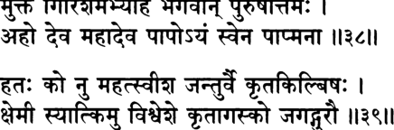

**----- Start of picture text -----** 
M f W l ! W F m I ЗЩ   11341 Ы ш ф  \\\%\\ **----- End of picture text -----** 

_муктам гиришам абхйаха бхагаван пурушоттамах ахо дева маха-дева папо 9йам свена папмана_ 

_хатах ко ну махатсв йьиа джантур ваи крта-килбишах кшемй сйат ким у виьивеьие кртагаско джагад-гурау_ 

_муктам_ — спасенный; _гиришам_ — Господь Шива; _абхйаха_ — к ко­ торому обратился; _бхагаван пуруша-уттамах_ — Верховный Гос­ подь (Нараяна); _ахо_ — о!; _дева_ — Мой дорогой господин; _махадева_ — Шива; _папах_ — греховный; _айам_ — этот человек; _свена_ — своими; _папмана_ — грехами; _хатах_ — убит; _ках_ — что; _ну_ — в са­ мом деле; _махатсу_ — возвышенных святых; _йша_ — о повелитель; _джантух_ — живое существо; _ваи_ — несомненно; _крта_ — совершив­ шее; _килбишах_ — оскорбление; _кшемй_ — удачливый; _сйат_ — может быть; _ким у_ — что уж говорить; _виьива_ — вселенной; _йьие_ — пове­ лителю (тебе); _крта-агасках_ — нанесший оскорбление; _джагат_ — мира; _гурау_ — духовного учителя. 

**Затем Верховный Господь обратился к Господу Гирише, кото­ рый теперь был в безопасности: «Полюбуйся, о Махадева, Мой повелитель, как этого злодея убили его собственные грехи! По­ истине, как может человек, оскорбляющий великих святых, на­ деяться на удачу? Что тогда говорить о том, кто оскорбил повелителя и духовного учителя всего мира?»** 

**[песнь 10, гл. 88** 

**676** 

**Шримад-Бхагаватам** 

_КОММЕНТАРИЙ:_ Как пишет Шрила Вишванатха Чакраварти, этими словами Господь мягко упрекает Шиву: «О ты, чей разум не ведает преград, о проницательный, не стоит раздавать благо­ словения злым демонам. Тебя могли убить! Однако ты думал лишь о том, как спасти эту заблудшую душу, и потому не подумал о том, чем это может закончиться для тебя». Таким образом, как отмечает _ачарья_ Вишванатха Чакраварти, Господь Нараяна, мягко упрекая Господа Шиву, прославлял его необычайное сострадание. 

## **ТЕКСТ 40** 

Т М '^ и?|1г1 Щ Й llVoll 

_йа эвам авйакрта-шактй-уданватах парасйа сакшат параматмано харех гиритра-мокшам катхайеч чхрноти ва вимучйате самсртибхис татхарибхих_ 

_йах_ — кто бы то ни было; _эвам_ — таким образом; _авйакрта_ — непостижимых; _ьиакти_ — энергий; _уданватах_ — океана; _парасйа_ — Высшего; _сакшат_ — непосредственно проявленного; _парама-атманах_ — Сверхдуши; _харех_ — Господа Хари; _гиритра_ — Господа Ши­ вы; _мокшам_ — о спасении; _катхайет_ — рассказывает; _шрноти_ — слушает; _ва_ — или; _вимучйате_ — освобождается; _самсртибхих_ — от повторяющихся рождений и смертей; _татха_ — а также; _арибхих_ — от врагов. 

**Господь Хари — это Сама Абсолютная Истина, Высшая Душа и бескрайний океан непостижимых энергий. Тот, кто пересказы­ вает или слушает эту историю о том, как Всевышний спас Госпо­ да Шиву, избавится от всех своих врагов, и ему больше никогда не придется рождаться и умирать.** 

_КОММЕНТАРИЙ:_ Шрила Шридхара Свами завершает эту главу следующим стихом: 

_бхакта-санкатам алокйа крпа-пурна-хрд-амбуджах_ 

**текст 40]** 

**677** 

**Спасение Господа Шивы от Врикасуры** 

_гиритрам читра-вакйат ту мокшайам аса кешавах_ 

«Когда Господь Кешава увидел, что Его преданному угрожает опасность, Его подобное лотосу сердце наполнилось состраданием. Так Он спас Господа Шиву от последствий щедрых обещаний». 

_Так заканчивается комментарий смиренных слуг А. Ч. Бхактиведанты Свами Прабхупады к восемьдесят восьмой главе Десятой песни «Шримад-Бхагаватам_ », _которая называется «Спасение Гос­ пода Шивы от Врикасуры»._ 

**ГЛАВА ВОСЕМЬДЕСЯТ ДЕВЯТАЯ** 

# **Криш на и А рдж уна возвращ аю т брахм ану его сы новей** 

В этой главе описывается, как Бхригу Муни доказал верхо­ венство Господа Вишну и как Господь Кришна и Арджуна воз­ вратили к жизни умерших сыновей некоего _брахмана_ из Двараки, оплакивавшего их. 

Когда-то давным-давно мудрецы, собравшиеся на берегу реки Сарасвати, стали обсуждать, кто из трех главных богов — Брахма, Вишну или Шива — самый великий. Они поручили Бхригу Муни определить это. 

Бхригу решил испытать трех богов на терпеливость, ибо это ка­ чество — верный признак величия. Вначале он появился при дворе Господа Брахмы, своего отца. Придя туда, он не выказал Брахме никакого почтения. Брахма очень разгневался, но подавил в себе гнев, так как Бхригу был его сыном. Потом Бхригу отправился к Господу Шиве, своему старшему брату, и тот поднялся с места, чтобы обнять его. Однако Бхригу уклонился от объятий и назвал Шиву отступником, который не следует никаким правилам. Господь Шива уже готов был убить Бхригу своим трезубцем, однако вме­ шалась богиня Парвати и успокоила своего мужа. Затем Бхригу отправился на Вайкунтху, чтобы испытать Господа Нараяну. По­ дойдя к Господу, который отдыхал, положив голову на колени бо­ гини процветания, Бхригу пнул Его в грудь. Однако вместо того, чтобы разгневаться, и Господь, и Его супруга встали и выказали Бхригу почтение. «Добро пожаловать, — сказал Господь. — Пожа­ луйста, присаживайся и отдохни немного. Будь милостив и прости нас, дорогой господин, за то, что мы не заметили твоего прихо­ да». Вернувшись в собрание мудрецов, Бхригу рассказал им обо всем, что случилось, и те пришли к выводу, что Господь Вишну, без сомнения, величайший из всех. 

Как-то раз в Двараке жена одного _брахмана_ родила сына, одна­ ко мальчик тут же умер. _Брахман_ отнес тело сына царю Уграсене 

**679** 

**680** 

**[песнь 10, гл. 89** 

## **Шримад-Бхагаватам** 

и стал бранить царя: «Этот лицемер, жадный враг _брахманов_ не может как следует исполнять свои обязанности, поэтому мой сын умер!» То же несчастье повторялось с _брахманом_ вновь и вновь, и всякий раз он приносил тело младенца во дворец и обвинял во всем царя. Когда умер его девятый сын, его упреки случилось услышать Арджуне, и тот сказал: «Мой господин, я защищу твое потомство. А если же мне это не удастся, я войду в огонь, чтобы искупить свой грех». 

Какое-то время спустя, когда жена _брахмана_ должна была родить десятого ребенка, Арджуна, узнав об этом, отправился к родиль­ ным покоям женщины и создал вокруг них щит из стрел. Одна­ ко усилия Арджуны были напрасны: как только ребенок родился и закричал, он тут же исчез. _Брахман_ принялся высмеивать Ар­ джуну, и воин тут же отправился в обитель Ямараджи, повелите­ ля смерти. Однако он не нашел там сына _брахмана._ Даже обыскав все четырнадцать миров, он нигде не смог обнаружить ребенка. 

Не сумев защитить сына _брахмана_ , Арджуна приготовился со­ вершить самоубийство, войдя в священный огонь, но Господь Кришна в последний момент остановил его. Он сказал: «Ты не должен так себя презирать. Я покажу тебе сыновей _брахмана»._ Гос­ подь Кришна усадил Арджуну на Свою трансцендентную колесни­ цу, и вместе они миновали семь островов вселенной, семь океанов, оставили позади горную гряду Локалока и оказались в непрогляд­ ной темноте. Лошади не видели дороги, поэтому Господь Кришна послал вперед излучающий сияние диск, Сударшану, который рас­ сеял тьму. В конце концов они добрались до Причинного океана и в нем обнаружили город Господа Маха-Вишну. В этом городе они увидели тысячеглавого змея Ананту, на котором возлежал МахаВишну. Великий Господь поприветствовал Шри Кришну и Арджуну и сказал: «Я забрал сюда сыновей _брахмана_ только потому, что хо­ тел увидеть вас двоих. Пожалуйста, продолжайте нести благо лю­ дям: в образе Нары-Нараяны Риши показывайте им, как должен себя вести истинно религиозный человек». 

Затем Господь Кришна и Арджуна забрали сыновей _брахмана_ и, возвратившись в Двараку, вернули их отцу. Увидев величие Шри Кришны собственными глазами, Арджуна был поражен. Он по­ нял, что обычный человек получает могущество и любые другие достояния лишь по милости Господа. 

**текст 2] Кришна и Арджуна возвращают брахману сыновей 681** 

## **ТЕКСТ 1** 

## ^1^4) v3cj|-q 

## Ш Ш Т I 

## II ? II 

_ьирй-ьиука увача сарасватйас тате раджанн ршайах сатрам асата витарках самабхут тешам тришв адхйшешу ко махан_ 

_шрй-шуках увача_ — Шукадева Госвами сказал; _сарасватйах_ — реки Сарасвати; _тате_ — на берегу; _раджан_ — о царь (Парик­ шит); _ршайах_ — мудрецы; _сатрам_ — ведическое жертвоприноше­ ние; _асата_ — совершали; _витарках_ — расхождение во мнениях; _самабхут_ — возникло; _тешам_ — среди них; _тришу_ — из трех; _адхй­ шешу_ — главных богов; _ках_ — кто; _махан_ — величайший. 

**Шукадева Госвами сказал: О царь, как-то раз на берегу реки Са­ расвати мудрецы совершали ведическое жертвоприношение. В хо­ де жертвоприношения у них возник спор, кто из трех главных богов величайший.** 

_КОММЕНТАРИЙ:_ Три главных бога, упомянутые здесь, — это Господь Вишну, Господь Брахма и Господь Шива. 

## **ТЕКСТ 2** 

йчч1Ч1^: _щ щ : и r_ и 

_тасйа джиджнасайа те ваи бхргум брахма-сутам нрпа тадж-джнаптйаи прешайам асух со ’бхйагад брахманах сабхам_ 

_тасйа_ — об этом; _джиджнасайа_ — желая узнать; _те_ — они; _ваи_ — несомненно; _бхргум_ — Бхригу Муни; _брахма-сутам_ — сына Брах­ мы; _нрпа_ — о царь; _тат_ — это; _джнаптйаи_ — выяснить; _прешайам асух_ — послали; _сах_ — он; _абхйагат_ — отправился; _брахманах_ — Господа Брахмы; _сабхам_ — ко двору. 

**О царь, желая выяснить это, мудрецы послали сына Брахмы Бхригу найти ответ. Вначале Бхригу отправился ко двору своего отца.** 

**682** 

**[песнь 10, гл. 89** 

**Шримад-Бхагаватам** 

_КОММЕНТАРИЙ:_ Как объясняет в книге «Кришна, Верховная Личность Бога» Шрила Прабхупада, «По замыслу мудрецов, Бхри­ гу должен был установить, кто из троих в полной мере облада­ ет качествами, характерными для _гуны_ благости». _Гуна_ благости делает человека терпеливым и уравновешенным, тогда как те, на кого влияют страсть и невежество, по малейшему поводу выходят из себя. 

## **ТЕКСТ 3** 

_Ч_ ЧЩи1 I _^_ **iuii** 

_на тасмаи прахванам стотрам чакре саттва-парйкшайа тасмаи чукродха бхагаван праджвалан свена теджаса_ 

_на_ — не; _тасмаи_ — ему (Брахме); _прахванам_ — поклонившись; _стотрам_ — вознесение молитв; _чакре_ — совершил; _саттва_ — его положение в _гуне_ благости; _парйкигайа_ — чтобы проверить; _тас­ маи_ — на него; _чукродха_ — разгневался; _бхагаван_ — бог; _праджва­ лан_ — воспламенившийся; _свена_ — своей; _теджаса_ — страстью. 

**Чтобы испытать, насколько сильно влияние благости на Госпо­ да Брахму, Бхригу не поклонился ему и не вознес ему молитв. В ответ тот вспыхнул от гнева, порожденного свойственной ему, Брахме, горячностью.** 

## **ТЕКСТ 4** 

_Ъ_ ТР$: I з г ^ г ш ц т ^ п « и 

_са атманй уттхитам манйум атмаджайатмана прабхух аьийшамад йатха вахним сва-йонйа варинатма-бхух_ 

_сах_ — он; _атмани_ — внутри; _уттхитам_ — возникший; _манйум_ — гнев; _атма-джайа_ — на своего сына; _атмана_ — разумом; _прабхух_ — господин; _аьийшамат_ — усмирил; _йатха_ — подобно тому как; _вах­ ним_ — огонь; _сва_ — он сам; _йонйа_ — чей источник; _варина_ — водой; _атма-бхух_ — саморожденный Брахма. 

**текст 7] Кришна и Арджуна возвращают брахману сыновей 683** 

## **Хотя в сердце его бушевал гнев на сына, Господь Брахма сумел с помощью разума подавить в себе этот гнев, точно так же как огонь гасят с помощью порожденной им воды.** 

_КОММЕНТАРИЙ:_ Поскольку Господь Брахма связан с _гуной_ страсти, он иногда попадает под ее влияние. Однако, так как он яв­ ляется _ади-кави,_ первым и величайшим из знатоков писаний в этой вселенной, когда его начинает беспокоить гнев, он может справить­ ся с ним посредством самоанализа. В данном случае он напомнил себе, что Бхригу — его сын. Поэтому здесь Шукадева Госвами при­ водит следующую аналогию: собственное порождение Брахмы (его сын) смогло потушить его гнев, в точности как вода, появившаяся во время творения из стихии огня, может погасить сам огонь. 

## **ТЕКСТ 5** 

## _ч ч к я ЪгЩЧ_ ШгТТ II Ч II 

_татах каиласам агамат са там дево махешварах парирабдхум самаребха уттхайа бхратарам муда_ 

_татах_ — затем; _каиласам_ — на гору Кайласа; _агамат_ — отпра­ вился; _сах_ — он (Бхригу); _там_ — его; _девах маха-йьиварах_ — Господь Шива; _парирабдхум_ — обнять; _самаребхе_ — попытался; _уттхайа_ — встав; _бхратарам_ — своего брата; _муда_ — с радостью. 

## **Затем Бхригу отправился на гору Кайласа. Увидев своего брата, Господь Шива с радостью встал ему навстречу и подошел к нему, намереваясь обнять его.** 

_КОММЕНТАРИЙ:_ Люди ведической культуры придают большое значение тому, как приветствовать своих родственников, осо­ бенно если мы не виделись с ними очень долго. Достойный сын должен выказывать уважение своему отцу, младший брат — чтить старшего, а старший в ответ — с любовью приветствовать младшего. 

## **ТЕКСТЫ 6-7** 

^ *  1 frH H dbH : II _%_ II 

**684** 

**[песнь 10, гл. 89** 

**Шримад-Бхагаватам** 

**trfcTc^T Ч1<4)?4) «1-НЧШ Ж** _**Ч**_ **f*TCT I** s m t _w \ m_ ^ ^нтф т: II « и 

_наиччхат твам асй утпатха-га ити деваш чукопа ха ту лам удйамйа там хантум аребхе тигма-лочанах_ 

_патитва падайор девй сантвайам аса там гира атхо джагама ваикунтхам йатра дево джанарданах_ 

_на аиччхат_ — он не пожелал этого (объятия); _твам_ — ты; _аси_ — есть; _утпатха-гах_ — отступивший от пути (религии); _ити_ — сказав так; _девах_ — бог (Шива); _чукопа ха_ — разгневался; _ьиулам_ — свой трезубец; _удйамйа_ — подняв; _там_ — его (Бхригу); _хантум_ — убить; _аребхе_ — был готов; _тигма_ — свирепые; _лочанах_ — чьи глаза; _па­ титва_ — упав; _падайох_ — к стопам (Господа Шивы); _девй_ — боги­ ня Девй; _сантвайам аса_ — успокоила; _там_ — его; _гира_ — речами; _атха у_ — затем; _джагама_ — (Бхригу) отправился; _ваикунтхам_ — на духовную планету Вайкунтха; _йатра_ — где; _девах джанарданах_ — Господь Джанардана (Вишну). 

**Однако Бхригу уклонился от его объятий и сказал: «Ты — от­ ступник, забывший о заповедях религии». Услышав это, Господь Шива разгневался, и глаза его яростно засверкали. Он занес свой трезубец, чтобы убить Бхригу, однако богиня Девй припала к его стопам и своими речами успокоила его. После этого Бхригу по­ кинул Кайласу и направился на Вайкунтху, где живет Господь Джанардана.** 

_КОММЕНТАРИЙ:_ Шрила Прабхупада пишет в книге «Кришна»: «Говорят, что оскорбление можно нанести действием, мыслью или словом. Господа Брахму мудрец оскорбил мысленно. А Господа Шиву он оскорбил словами, обвинив в нечистоплотности. В Госпо­ де Шиве преобладает _гуна_ невежества, и, когда он услышал дерзкие слова мудреца, его глаза тотчас налились кровью. Не помня себя от ярости, он поднял свой трезубец и хотел было убить Бхригу Муни. Рядом находилась супруга Господа Шивы, Парвати. В ней, как и в Господе Шиве, сочетаются три _гуны_ , поэтому ее называют Тригунамайи. Чтобы предотвратить беду, она пробудила в Господе Шиве благость». 

Шрила Джива Госвами отмечает, что планета Вайкунтха, о которой говорится здесь, — это Шветадвипа. 

**текст 9] Кришна и Арджуна возвращают брахману сыновей 685** 

## **ТЕКСТЫ 8-9** 

Я1ЧМ Ч<5.1 I **гГгГ ^Зг^РТ Щ Р Г ^ Т Г  ТГгТТ Jl(ri: II** _**С**_ **II** 

_**ч ъ т**_ **t e n I** зтщ % w f M ^ r o ^ _w m_ I з м м н т т н н ч : ч : ФТГ и я и 

_шайанам шрийа утсанге пада вакшасй атадайат mama уттхайа бхагаван саха лакшмйа сатам гатих сва-талпад аварухйатха нанама шираса муним аха те свагатам брахман нишйдатрасане кшанам аджанатам агатан вах кшантум архатха нах прабхо_ 

_шайанам_ — который лежал; _шрийах_ — богини процветания; _ут­ санге_ — на коленях; _пада_ — стопой; _вакшасй_ — в Его грудь; _ата­ дайат_ — он пнул; _татах_ — затем; _уттхайа_ — поднявшись; _бхага­ ван_ — Господь, Личность Бога; _саха лакшмйа_ — вместе с богиней Лакшми; _сатам_ — чистых преданных; _гатих_ — цель; _сва_ — Свое­ го; _талпат_ — с ложа; _аварухйа_ — сойдя; _атха_ — затем; _нанама_ — Он склонил; _шираса_ — Свою голову; _муним_ — перед мудрецом; _аха_ — Он сказал; _те_ — тебе; _су-агатам_ — добро пожаловать; _брах­ ман_ — о _брахман; нишйда_ — пожалуйста, садись; _атра_ — на это; _асане_ — сиденье; _кшанам_ — на мгновение; _аджанатам_ — кто не знал; _агатан_ — прибывшем; _вах_ — о тебе; _кшантум_ — прости; _ар­ хатха_ — пожалуйста; _нах_ — нас; _прабхо_ — о господин. 

**Он приблизился к Верховному Господу, который отдыхал, по­ ложив голову на колени Своей супруги, богини Шри, и пнул Его в грудь. Господь вместе с богиней Лакшми поднялись в знак почтения. Сойдя со Своего ложа, Господь, высшая цель всех пре­ данных, до земли поклонился мудрецу и сказал ему: «Добро пожа­ ловать, о** _**брахман**_ **. Пожалуйста, присаживайся и отдохни немного. Дорогой господин, будь милостив, прости нас за то, что мы не заметили, как ты пришел».** 

_КОММЕНТАРИЙ:_ Как пишет Шрила Джива Госвами, когда это случилось, Бхригу Муни еще не был чистым вайшнавом, иначе он бы никогда не поступил с Верховным Господом так грубо. Господь 

**[песнь 10, гл. 89** 

**686** 

**Шримад-Бхагаватам** 

Вишну не просто отдыхал: Он прилег, положив голову на колени жены. Ударить Его в таком положении, причем не рукой, а ногой, было, по мнению Бхригу, самым тяжелым из оскорблений, какое только можно вообразить. 

Шрила Прабхупада поясняет: «Господь Вишну всемилостив. Он не разгневался на Бхригу Муни за его поступок, ибо Бхригу Му­ ни был великим _брахманом_ . _Брахман_ заслуживает прощения, даже если иногда делает что-то неправильно, и Господь Вишну подтвер­ дил это Своим поведением. Говорят, однако, что богиня процвета­ ния, Лакшми, с тех пор перестала быть благосклонной к _брахманам_ и потому _брахманы_ обычно очень бедны». 

## **ТЕКСТЫ 10-11** 

Ш d k4l< rlW I 41<)<£н cfoforffon IIM I 

зтагё w f t _ъ ф щ_ у ж ч + м м м ч ч I 

_пунйхи саха-локам мам лока-паламш на мад-гатан падодакена бхаватас тйртханам тйртха-карина_ 

_адйахам бхагавал лакшмйа асам эканта-бхаджанам ватсйатй ураси ме бхутир бхават-пада-хатамхасах_ 

_пунйхи_ — пожалуйста, очисти; _саха_ — вместе; _локам_ — с Моей планетой; _мам_ — Меня; _лока_ — разных планет; _палан_ — правите­ ли; _ча_ — и; _мат-гатан_ — которые преданы Мне; _пада_ — (которая омыла) стопы; _удакена_ — водой; _бхаватах_ — твои; _тйртханам_ — святых мест паломничества; _тйртха_ — их святость; _карина_ — ко­ торая создает; _адйа_ — сегодня; _ахам_ — Я; _бхагаван_ — о Мой госпо­ дин; _лакьимйах_ — Лакшми; _асам_ — стало; _эка-анта_ — единственное; _бхаджанам_ — прибежище; _ватсйатй_ — будет пребывать; _ураси_ — на груди; _ме_ — Моей; _бхутих_ — богиня процветания; _бхават_ — твоей; _пада_ — стопой; _хата_ — уничтожены; _амхасах_ — последствия чьих грехов. 

**«Пожалуйста, очисти Меня, Мою обитель и обители всех пра­ вителей вселенной, преданных Мне, дав нам воду, которая омы­ ла твои стопы. Без сомнения, именно эта святая вода делает** 

## **текст 12] Кришна и Арджуна возвращают брахману сыновей 687** 

**священными все места паломничества. Сегодня, Мой господин, Я стал единственным прибежищем богини процветания, Лакшми; она даст согласие навеки поселиться на Моей груди, ибо твоя стопа очистила Мою грудь от всех грехов».** 

_КОММЕНТАРИЙ:_ Продолжая свой комментарий, Шрила Прабху­ пада говорит: «Некоторые из так называемых _брахманов,_ живущих в Кали-югу, очень гордятся тем, что великий _брахман_ Бхригу Муни коснулся ногой груди Господа Вишну. Однако этот удар был худ­ шим из оскорблений, хотя Господь Вишну в Своем великодушии не придал ему большого значения». 

В некоторых изданиях «Шримад-Бхагаватам» между одиннадца­ тым и двенадцатым стихами встречается еще один стих, и Шрила Прабхупада включил его перевод в свою книгу «Кришна, Вер­ ховная Личность Бога», которая представляет собой изложение Десятой песни: 

_атйва-комалау mama чаранау те маха-муне итй уктва випра-чаранау мардайан свена папина_ 

«[Господь сказал _брахману_ Бхригу:] „Дорогой господин, о великий мудрец, твои стопы очень нежные44. Сказав это, Господь Вишну собственными руками стал растирать _брахману_ стопы». 

## **ТЕКСТ 12** 

## **чч** 

## **ЭДММГтРЛ f*TCT I** 

_ьирй-ьиука увача_ 

_эвам бруване ваикунтхе бхргус тан-мандрайа гира нирвртас тарпитас тушнйм бхактй-уткантхо ’шру-лочанах_ 

_шрй-шуках увача_ — Шукадева Госвами сказал; _эвам_ — это; _брува­ не_ — сказав; _ваикунтхе_ — Господь Вишну; _бхргух_ — Бхригу; _тат_ — Его; _мандрайа_ — торжественными; _гира_ — речами; _нирвртах_ — обрадованный; _тарпитах_ — удовлетворенный; _тушнйм_ — молчал; _бхакти_ — преданностью; _уткантхах_ — охваченный; _аьиру_ — слезы; _лочанах_ — в чьих глазах. 

**[песнь 10, гл. 89** 

**688** 

**Шримад-Бхагаватам** 

**Шукадева Госвами сказал: Почтительные слова Господа Вайкунтхи растрогали и порадовали Бхригу. Охваченный экстазом преданности, он молчал, и в глазах его стояли слезы.** 

_КОММЕНТАРИЙ:_ Бхригу не смог прославить Господа, ибо его ду­ шили слезы экстаза. По мнению Шрилы Вишванатхи Чакраварти, мудреца нельзя винить за совершённое им оскорбление, ибо его действия в этой трансцендентной _лиле_ были внушены ему Самим Господом. 

## **ТЕКСТ 13** 

## и ?зн 

_пунаьи ча сатрам авраджйа мунйнам брахма-вадинам сванубхутам ашешена раджан бхргур аварнайат_ 

_пунах_ — вновь; _ча_ — и; _сатрам_ — на жертвоприношение; _авра­ джйа_ — отправившись; _мунйнам_ — мудрецов; _брахма-вадинам_ — ко­ торые были знатоками Вед; _сва_ — им самим; _анубхутам_ — пережитое; _ашешена_ — подробно; _раджан_ — о царь (Парикшит); _бхргух_ — Бхригу; _аварнайат_ — описал. 

**О царь, Бхригу вернулся к тому месту, где мудрецы, вели­ кие знатоки ведической науки, совершали жертвоприношение, и рассказал им обо всем, что с ним приключилось.** 

## **ТЕКСТЫ 14-17** 

гТШщтщзТ ЧЧЧГ (Mkrll ^TbWTi: I **чч: И?У||** 

ч г е ч т и ?ч и 

iJM M i 4 4 ^ d 4 T 4  I **ЗТЙГЧЧНТ ЧЩЧТ** _**-ЦЩ:**_ **Ч7ЧТ** _**Ш\\**_ 

## **текст 17] Кришна и Арджуна возвращают брахману сыновей 689** 

**Ч т Ч  ч * ч  fa n I ^TRrTT Ч  ЧТ Н?*Н** 

_тан ниьиамйатха мунайо висмита мукта-самьиайах бхуйамсам ьираддадхур вишнум йатах ьиантир йато ’бхайам_ 

_дхармах сакшад йато джнанам ваирагйам ча тад-анвитам аишварйам чаштадха йасмад йаьиаьи чатма-малапахам_ 

_мунйнам нйаста-данданам шантанам сама-четасам акинчананам садхунам йам ахух паромам гатим_ 

_саттвам йасйа прийа муртир брахманас те ишта-деватах бхаджантй анаьиишах ьианта йам ва нипуна-буддхайах_ 

_тат_ — это; _нишамйа_ — услышав; _атха_ — затем; _мунайах_ — муд­ рецы; _висмитах_ — пораженные; _мукта_ — освободившиеся; _самьиайах_ — от сомнений; _бхуйамсам_ — как величайшего; _шраддадхух_ — они поверили; _вишнум_ — в Господа Вишну; _йатах_ — от кого; _шантих_ — мир; _йатах_ — от кого; _абхайам_ — бесстрашие; _дхармах_ — религия; _сакшат_ — в ее непосредственном проявлении; _йатах_ — от кого; _джнанам_ — знание; _ваирагйам_ — отрешенность; _ча_ — и; _тат_ — его (знание); _анвитам_ — включающее; _аишва­ рйам_ — мистическое могущество (обретаемое в процессе практи­ ки _йоги); ча_ — и; _аштадха_ — восьми видов; _йасмат_ — от кого; _йаьиах_ — Его слава; _ча_ — также; _атма_ — ума; _мала_ — осквернение; _апахам_ — которая рассеивает; _мунйнам_ — мудрецов; _нйаста_ — ко­ торые отказались; _данданам_ — от насилия; _шантанам_ — умиротво­ рены; _сама_ — уравновешенны; _четасам_ — чьи умы; _акинчананам_ — бескорыстные; _садхунам_ — святые; _йам_ — кого; _ахух_ — они называ­ ют; _паромам_ — высшей; _гатим_ — целью; _саттвам_ — _гуна_ благос­ ти; _йасйа_ — чье; _прийа_ — любимое; _муртих_ — воплощение; _брах­ манах_ — _брахманы; ту_ — и; _ишта_ — принимающие поклонение; _деватах_ — божества; _бхаджанти_ — они поклоняются; _анаши­ шах_ — не имея скрытых желаний; _ьиантах_ — те, кто обрел мир в душе; _йам_ — кому; _ва_ — поистине; _нипуна_ — отточившие; _буддхайах_ — чей разум. 

**Пораженные рассказом Бхригу, мудрецы избавились от всех сомнений и уверились, что Вишну — величайший из всех богов. Из Него исходит умиротворение, бесстрашие, основные запове­ ди религии, непривязанность к мирскому, основанная на знании,** 

**[песнь 10, гл. 89** 

**Шримад-Бхагаватам** 

**690** 

**восемь совершенств мистической** _**йоги**_ **и Его слава, которая очи­ щает ум от всей скверны. Отказавшиеся от насилия бескорыст­ ные мудрецы, которые всегда удовлетворены и уравновешенны, считают Его своей высшей целью. Чистая благость — Его люби­ мая форма, а** _**брахманы**_ **— это божества, которым Он поклоняет­ ся. По-настоящему разумные люди, которые достигли духовного умиротворения, поклоняются Ему, не желая ничего для себя.** 

_КОММЕНТАРИЙ:_ Предавшись Личности Бога, человек без труда обретает духовное знание и отказывается от чувственных наслаж­ дений. Ему не нужно прилагать для этого дополнительные усилия. Об этом говорится в Одиннадцатой песни «Шримад-Бхагаватам» (11.2.42): 

_бхактих парешанубхаво вирактир анйатра чаиша трика эка-калах прападйаманасйа йатхашнатах сйус туштих пуштих кшуд-апайо ’ну-гхасам_ 

«Преданность, опыт личного общения с Верховным Господом и от­ решенность от всего остального — всё это одновременно испы­ тывает тот, кто находит прибежище у Верховной Личности Бога, подобно тому как с каждым съеденным кусочком пищи человек по­ лучает удовольствие, питает свой организм и утоляет голод». По­ добно этому, в Первой песни «Шримад-Бхагаватам» (1.2.7) Шрила Сута Госвами утверждает: 

_васудеве бхагавати бхакти-йогах прайоджитах джанайатй аьиу ваирагйам джнанам ча йад ахаитукам_ 

«К тому, кто преданно служит Личности Бога, Шри Кришне, очень скоро сами собой приходят знание и отрешенность от мира». 

Наставляя Свою мать, Девахути, Господь Шри Капила гово­ рит, что восемь совершенств _йоги_ также являются побочными результатами преданного служения: 

_атхо вибхутим мама майавинас там_ 

_аишварйам аштангам ануправрттам ьирийам бхагаватам васпрхайанти бхадрам парасйа ме те ’ьинувате хи локе_ 

## **текст 18] Кришна и Арджуна возвращают брахману сыновей 691** 

«Поглощенный мыслями обо Мне, преданный не желает даже тех благ и наслаждений, которые доступны на высших планетах, вклю­ чая Сатьялоку. Его нисколько не прельщают восемь материальных совершенств, обретаемых в процессе практики мистической _йоги;_ более того, он не стремится попасть даже в царство Бога. Но, сам того не желая, преданный уже в этой жизни наслаждается всеми мыслимыми благами» (Бхаг., 3.25.37). 

Шрила Вишванатха Чакраварти отмечает, что три вида трансценденталистов, перечисленных в шестнадцатом стихе, — _муни_ , _шанты_ и _садху_ — стоят в порядке возрастания значимости. Это, соответственно, те, кто стремится к освобождению, те, кто уже получил его, и те, кто с любовью и преданностью служит Господу Вишну. 

## **ТЕКСТ 18** 

■ ТТЩТТ з т ^ т : ^ т :  | 

_три-видхакртайас тасйа ракшаса асурах сурах гунинйа майайа срштах саттвам тат тйртха-садханам_ 

_три-видха_ — трех видов; _акртайах_ — формы; _тасйа_ — Его; _ракшасах_ — невежественные духи; _асурах_ — демоны; _сурах_ — и полубо­ ги; _гунинйах_ — обусловленные материальными _гунами; майайа_ — Его материальной энергией; _срштах_ — созданные; _саттвам_ — _гуна_ благости; _тат_ — среди них; _тйртха_ — успеха в жизни; _садханам_ — средство достижения. 

**Господь распространяет Себя в три категории живых су­ ществ — в ракшасов, демонов и полубогов. Все они созданы ма­ териальной энергией Господа и обусловлены ее** _**гунами**_ **. Однако высшего успеха в жизни можно достичь только с помощью одной из этих** _**гун**_ **—** _**гуны**_ **благости.** 

_КОММЕНТАРИЙ:_ В книге «Кришна» Шрила Прабхупада пишет: «Разные люди находятся под влиянием разных _гун_ материальной природы. Тех, кто пребывает в _гуне_ невежества, называют ракшасами, тех, на кого влияет _гуна_ страсти, — _асурами_ (демонами), а тех, на кого влияет _гуна_ благости, — _сурами_ , или полубогами. По 

**[песнь 10, гл. 89** 

**692** 

**Шримад-Бхагаватам** 

воле Верховного Господа материальная природа создает эти три ка­ тегории людей, но те, кто находится под влиянием _гуны_ благости, имеют больше возможностей вернуться в духовный мир, домой, к Богу». 

## **ТЕКСТ 19** 

_ТгЧ_ U K H dl I **rTfffrT M :** _№%\\_ 

## _шрй-шука увача_ 

_иттхам сарасвата випра нрнам самшайа-нуттайе пурушасйа падамбходжа-севайа тад-гатим гатах_ 

_шрй-шуках увача_ — Шукадева Госвами сказал; _иттхам_ — та­ ким образом; _сарасватах_ — живущие на берегу реки Сарасвати; _випрах_ — ученые _брахманы; нрнам_ — людей; _самшайа_ — сомнения; _нуттайе_ — чтобы рассеять; _пурушасйа_ — Верховной Личности; _пада-амбходжа_ — лотосным стопам; _севайа_ — служением; _тат_ — Его; _гатим_ — обители; _гатах_ — достигли. 

**Шукадева Госвами сказал: Ученые** _брахманы_ , **жившие на берегу Сарасвати, пришли к этому заключению, чтобы рассеять сомне­ ния всех людей. В результате они стали с преданностью служить лотосным стопам Верховного Господа и достигли Его обители.** 

## **ТЕКСТ 20** 

^ г: I 

## **^ T fr T  IRo||** 

## _шрй-сута увача_ 

_итй этан муни-танайасйа-падма-гандхапййушам бхава-бхайа-бхит парасйа пумсах су-шлокам шравана-путаих пибатй абхйкшнам пантхо ’дхва-бхрамана-паришрамам джахатй_ 

## **текст 21] Кришна и Арджуна возвращают брахману сыновей 693** 

_шрй-сутах увача_ — Шри Сута сказал; _ити_ — произнесенный так; _этат_ — этот; _муни_ — мудреца (Вьясадевы); _танайа_ — сына (Шу­ кадевы); _асйа_ — из уст; _падма_ — (которые в точности напоми­ нают) лотос; _гандха_ — с ароматом; _пййушам_ — нектар; _бхава_ — материальной жизни; _бхайа_ — страх; _бхит_ — который разруша­ ет; _парасйа_ — Верховной; _пумсах_ — Личности Бога; _су-шлокам_ — прославленный; _шравана_ — ушей; _путаих_ — через отверстия; _пибати_ — пьет; _абхйкшнам_ — постоянно; _пантхах_ — путешествен­ ник; _адхва_ — на дороге; _бхрамана_ — от путешествия; _паришрамам_ — усталость; _джахатй_ — снимает. 

**Шри Сута Госвами сказал: Так лился этот ароматный нектар из лотосных уст Шукадевы Госвами, сына мудреца Вьясадевы. Это удивительное прославление Верховной Личности полностью уни­ чтожает страх материального существования. Изнуренный скита­ ниями по дорогам материальной жизни странник, который начнет пить этот нектар через отверстия своих ушей, позабудет о своей усталости.** 

_КОММЕНТАРИЙ:_ Речи Шрилы Шукадевы Госвами ценны для двух категорий людей: для тех, кто страдает от духовной слабости, они подобны сильнодействующему тонику, который может излечить их от болезни иллюзии, а для предавшихся вайшнавов — это слад­ чайший, бодрящий напиток, источающий аромат духовного опыта Шри Шуки. 

## **ТЕКСТ 21** 

Д Г4гЧТ _%_ Й У Чг^и: I _**^**_ **W ?  fo R  4T R  IR?II** 

_шрй-шука увача_ 

_экада двараватйам ту випра-патнйах кумараках джата-матро бхувам спрштва мамара кила бхарата_ 

_шрй-шуках увача_ — Шукадева Госвами сказал; _экада_ — однажды; _двараватйам_ — в Двараке; _т у_ — и; _випра_ — _брахмана; патнйах_ — жены; _кумараках_ — младенец; _джата_ — родившийся; _матрах_ — только что; _бхувам_ — земли; _спрштва_ — коснувшись; _мамара_ — умер; _кила_ — несомненно; _бхарата_ — о потомок Бхараты (Маха­ раджа Парикшит). 

**694** 

**[песнь 10, гл. 89** 

**Шримад-Бхагаватам** 

**Шукадева Госвами сказал: Как-то раз в Двараке жена одно­ го** _брахмана_ **родила сына, однако, о Бхарата, ребенок умер, как только коснулся земли.** 

_КОММЕНТАРИЙ:_ Эта глава прославляет Господа Вишну как Вер­ ховную Личность Бога. Теперь же Шукадева Госвами собирается показать, что Господь Кришна и есть та самая Личность Бога. Для этого он расскажет еще об одной _лиле_ Господа, раскрывающей Его ни с чем не сравнимые божественные качества. 

## **ТЕКСТ 22** 

f^Tt 4<иОН1 *м£1^чЧ"РТ _ТЦ._ I 

**Ничего:** _**\ т \ \**_ 

_випро грхйтва мртакам раджа-дварй упадхайа сах идам провача вилапанн атуро дйна-манасах_ 

_випрах_ — _брахман; грхйтва_ — взяв; _мртакам_ — тело; _раджа_ — ца­ ря (Уграсены); _двари_ — к двери; _упадхайа_ — поместив его; _сах_ — он; _идам_ — это; _провача_ — сказал; _вилапан_ — скорбя; _атурах_ — взбудораженный; _дйна_ — скорбящий; _манасах_ — чей ум. 

_Брахман_ **взял тело своего сына и принес его к дверям трон­ ной залы царя Уграсены. Затем, в великом возбуждении, скорбя и причитая, он стал говорить.** 

## **ТЕКСТ 23** 

W f e r : f tW c * R : I 

## _**\ \ щ \**_ 

_брахма-двишах шатха-дхийо лубдхасйа вишайатманах кшатра-бандхох карма-дошат панчатвам ме гато \рбхаках_ 

_брахма_ — _брахманов; двишах_ — ненавидящий; _ьиатха_ — двулич­ ное; _дхийах_ — чье умонастроение; _лубдхасйа_ — жадный; _вишайаатманах_ — привязанный к чувственным наслаждениям; _кшатрабандхох_ — недостойного _кшатрия; карма_ — в исполнении долга; _дошат_ — из-за несоответствия; _панчатвам_ — смерть; _ме_ — мой; _гатах_ — встретил; _арбхаках_ — сын. 

## **текст 25] Кришна и Арджуна возвращают брахману сыновей 695** 

_[Брахман_ **сказал:] Этот лицемер, жадный враг** _брахманов_ , **этот недостойный правитель, привязанный к чувственным наслажде­ ниям, не в состоянии как следует исполнять свои обязанности — в этом причина смерти моего сына.** 

_КОММЕНТАРИЙ:_ Рассудив, что сам он не сделал ничего, что мог­ ло бы вызвать смерть его сына, _брахман_ решил, что тогда это вина царя Уграсены. Согласно законам ведического общества, прави­ тель несет ответственность за все, что происходит в его царстве, — и хорошее и плохое. Даже в демократическом обществе менеджер, который руководит некой группой людей или проектом, должен принять личную ответственность за все возможные неудачи, вмес­ то того чтобы, как это чаще всего бывает сегодня, обвинять во всем своих подопечных или начальников. 

## **ТЕКСТ 24** 

**ТГЗТТ** _W & T4:_ **IR ttll** 

_химса-вихарам нрпатим духшйлам аджитендрийам праджа бхаджантйах сйданти даридра нитйа-духкхитах_ 

_химса_ — насилие; _вихарам_ — чье развлечение; _нр-патим_ — этот царь; _духшйлам_ — злонравный; _аджита_ — не побеждены; _ин­ дрийам_ — чьи чувства; _праджах_ — подданные; _бхаджантйах_ — слу­ жащие; _сйданти_ — страдают; _даридрах_ — нищие; _нитйа_ — всегда; _духкхитах_ — несчастные. 

**Подданные, которые служат такому злонравному царю, получа­ ющему удовольствие от чужих страданий и не способному владеть своими чувствами, обречены на нищету и страдания.** 

## **ТЕКСТ 25** 

## **гТТ W IR 4II** 

_эвам двитййам випраршис тртййам те эвам эва на висрджйа са нрпа-двари там гатхам самагайата_ 

**[песнь 10, гл. 89** 

**696** 

**Шримад-Бхагаватам** 

_эвам_ — таким же образом; _двитййам_ — второй раз; _випрарш их_ — мудрый _брахман; тртййам_ — третий раз; _ту_ — и; _эвам эва ча_ — точно так же; _висрджйа_ — оставив (своего мертвого сына); _сах_ — он; _нрпа-двари_ — у царского порога; _там_ — ту же самую; _гатхам_ — песню; _самагайата_ — пел. 

**Со вторым и третьим ребенком мудрого** _**брахмана**_ **приключи­ лось то же самое несчастье. Каждый раз он оставлял тело сво­ его умершего сына у царского порога и, оплакивая своих детей, повторял ту же песню.** 

## **ТЕКСТЫ 26-27** 

'ЗЩ  dl§lul tW'HHct IR^II 

**f% ft** sKKHfoWKl 15 I 1  ц щ : IRvsll** 

_там арджуна упашрутйа кархичит кешавантике парете наваме бале брахманам самабхашата_ 

_ким сеид брахмамс тван-нивасе иха насти дханур-дхарах раджанйа-бандхур эте ваи брахманах сатрам асате_ 

_там_ — эту (скорбь); _арджунах_ — Арджуна; _упашрутйа_ — случай­ но услышав; _кархичит_ — однажды; _кешава_ — с Господом Кришной; _антике_ — рядом; _парете_ — умерший; _наваме_ — девятый; _бале_ — ребенок; _брахманам_ — _брахману; самабхашата_ — он сказал; _ким свит_ — разве; _брахман_ — о _брахман; тват_ — твоем; _нивасе_ — в до­ ме; _иха_ — здесь; _на асти_ — нет; _дханух-дхарах_ — с луком в ру­ ке; _раджанйа-бандхух_ — падшего потомка царского рода; _эте_ — эти _(кшатрии); вах_ — несомненно; _брахманах_ — (как) _брахманы; сатре_ — на крупном огненном жертвоприношении; _асате_ — при­ сутствующие. 

**Когда умер девятый ребенок, жалобы** _**брахмана**_ **случайно услы­ шал Арджуна, находившийся в тот момент рядом с Господом Кешавой. Арджуна обратился к** _**брахману:**_ **«О** _**брахман**_ **, неужели здесь не нашлось хотя бы одного недостойного потомка царского** 

**текст 29] Кришна и Арджуна возвращают брахману сыновей 697** 

**рода, который способен встать перед твоим домом с луком в ру­ ке? Эти** _**кшатрии**_ **ведут себя так, словно они** _**брахманы**_ **, лениво совершающие огненные жертвоприношения».** 

## **ТЕКСТ 28** 

## Ш5ГПТ: I 

## **% | тет |R<S||** 

_дхана-даратмаджапркта йатра шочанти брахманах те ваи раджанйа-вешена ната джйвантй асум-бхарах_ 

_дхана_ — богатства; _дара_ — жен; _атмаджа_ — и детей; _апрктах_ — лишенные; _йатра_ — в котором (положении); _шочанти_ — скорбят; _брахманах_ — _брахманы; те_ — они; _ваи_ — несомненно; _раджанйавешена_ — рядящиеся в царские одежды; _натах_ — актеры; _джйванти_ — они живут; _асум-бхарах_ — зарабатывая себе на жизнь. 

**«Правители царства, в котором** _**брахманы**_ **скорбят об утрачен­ ном богатстве или умерших до срока женах и детях, — просто притворщики, играющие роль царей, чтобы заработать себе на жизнь».** 

## **ТЕКСТ 29** 

3Tt JTCT: I **IR4II** 

_ахам праджа вам бхагаван ракшишйе дйнайор иха анистйрна-пратиджно ’гним правекшйе хата-калмашах_ 

_ахам_ — я; _праджах_ — потомство; _вам_ — ваше (твое и твоей жены); _бхагаван_ — о господин; _ракшишйе_ — буду защищать; _дйнайох_ — которые опечалены; _иха_ — в этом вопросе; _анистйрна_ — не су­ мев выполнить; _пратиджнах_ — свое обещание; _агним_ — в огонь; _правекшйе_ — войду; _хата_ — уничтожена; _калмашах_ — чья скверна. 

**«Мой господин, видя ваше с женой горе, я возьмусь защищать ваше потомство. Если же мне не удастся сдержать свое слово, я войду в огонь, чтобы искупить свой грех».** 

**[песнь 10, гл. 89** 

**698** 

**Шримад-Бхагаватам** 

_КОММЕНТАРИЙ:_ Для отважного Арджуны позор нарушить свое обещание был равносилен смерти. Как говорит в «Бхагавад-гите» (2.34) Кришна, _самбхавитасйа накйртир маранад атиричйате:_ «Для человека с именем бесчестье хуже смерти». 

## **ТЕКСТЫ 30-31** 

## _я Щ_ 

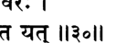

**----- Start of picture text -----** 
щ :   I НЗ°Н **----- End of picture text -----** 

_% w m ,_ -зтттфгЬ I **Г# ««Riw itW w t** _**т \ \**_ 

_ьирй-брахмана увача_ 

_санкаршано васудевах прадйумно дханвинам варах анируддхо ’прати-ратхо на тратум ьиакнуванти йат_ 

_тат катхам ну бхаван карма душкарам джагад-йшвараих твам чикйршаси балиьийат тан на ьираддадхмахе вайам_ 

_ьирй-брахманах увача_ — _брахман_ сказал; _санкаршанах_ — Господь Санкаршана (Баларама); _васудевах_ — Господь Васудева (Кришна); _прадйумнах_ — Прадьюмна; _дханвинам_ — из лучников; _варах_ — вели­ чайший; _анируддхах_ — Анируддха; _апрати-ратхах_ — лучший воин в бою на колесницах; _на_ — не; _тратум_ — спасти; _ьиакнуванти_ — смогли; _йат_ — поскольку; _тат_ — так; _катхам_ — почему; _ну_ — в самом деле; _бхаван_ — ты; _карма_ — подвиг; _душкарам_ — кото­ рый невозможно совершить; _джагат_ — мира; _йьивараих_ — для по­ велителей; _твам_ — ты; _чикйршаси_ — намереваешься совершить; _балиьийат_ — из простодушия; _тат_ — поэтому; _на ьираддадхмахе_ — не верим; _вайам_ — мы. 

_Брахман_ **сказал: Ни Санкаршана, ни Васудева, ни Прадьюм­ на, лучший из лучников, ни непревзойденный воин Анируддха не смогли спасти моих сыновей. Почему же ты наивно полагаешь, что тебе окажется по силам подвиг, который не смогли совершить всемогущие повелители мироздания? Я не могу принимать твои слова всерьез.** 

**текст 33] Кришна и Арджуна возвращают брахману сыновей 699** 

## **ТЕКСТ 32** 

_ч щ ж т_ **+ifM^ ^ I 3rt 37^rt** _ч т щ ц_ **I** _щ_ **Н^ЧН** 

_ьирй-арджуна увача_ 

_нахам санкаршано брахман на кршнах каршнир эва ча ахам ва арджуно нама гандйвам йасйа ваи дханух_ 

_шрй-арджунах увача_ — Шри Арджуна сказал; _на_ — не; _ахам_ — я; _санкаршанах_ — Господь Баларама; _брахман_ — о _брахман; на_ — не; _кршнах_ — Господь Кришна; _каршних_ — потомок Господа Криш­ ны; _эва ча_ — даже; _ахам_ — я; _ваи_ — несомненно; _арджунах нама_ — по имени Арджуна; _гандйвам_ — Гандива; _йасйа_ — чей; _ваи_ — в самом деле; _дханух_ — лук. 

**Шри Арджуна сказал: О** _**брахман**_ **, я не Господь Санкаршана, не Господь Кришна и даже не сын Кришны. Но я — Арджуна, обладатель лука Гандива.** 

## **ТЕКСТ 33** 

_ч\ж чщ \ т я_ **> ± i h 1** T jr^ fafaF T _Ч Ф_ % тгят: _ж$\_ иззн 

_мавамамстха мама брахман вйрйам трйамбака-тошанам мртйум виджитйа прадхане анешйе те праджах прабхо_ 

_ма авамамстхах_ — не преуменьшай; _мама_ — мою; _брахман_ — о _брахман; вйрйам_ — доблесть; _три-амбака_ — Господа Шиву; _тошанам_ — которая удовлетворила; _мртйум_ — саму смерть; _виджи­ тйа_ — победив; _прадхане_ — в битве; _анешйе_ — я верну; _те_ — твоих; _праджах_ — детей; _прабхо_ — о господин. 

**Не умаляй моих способностей, о** _**брахман**_ **, ведь их было доста­ точно, чтобы умилостивить даже Господа Шиву. Дорогой госпо­ дин, я верну твоих сыновей, даже если для этого мне придется победить в поединке саму смерть.** 

**[песнь 10, гл. 89** 

**700** 

**Шримад-Бхагаватам** 

## **ТЕКСТ 34** 

^ fo r: ч ^ т гч  I _ш т т ф щ_ # т :  ч г Ф Й Э г т г т ч ; из«и 

_эвам виьирамбхито випрах пхалгунена парантапа джагама сва-грхам прйтах партха-вйрйам ниьиамайан_ 

_эвам_ — так; _виьирамбхитах_ — поверивший; _випрах_ — _брахман; пхалгунена_ — Арджуне; _парам_ — врагов; _тапа_ — о покоритель (Ма­ хараджа Парикшит); _джагама_ — он отправился; _сва_ — в свой; _грхам_ — дом; _прйтах_ — довольный; _партха_ — сына Притхи; _вй­ рйам_ — о доблести; _ниьиамайан_ — услышав. 

**О покоритель врагов, обнадеженный Арджуной,** _**брахман**_ **вер­ нулся домой, довольный его заверениями в собственной доблести.** 

## **ТЕКСТ 35** 

## **ЧТ% ЧТ% ЧЧТ IR 4II** 

_прасути-кала асанне бхарйайа двиджа-саттамах пахи пахи праджам мртйор итй ахарджунам атурах_ 

_прасути_ — родов; _кале_ — время; _асанне_ — приближавшееся; _бхарйайах_ — его жены; _двиджа_ — _брахман; сат-тамах_ — самый возвышенный; _пахи_ — спаси же; _пахи_ — спаси; _праджам_ — мое­ го ребенка; _мртйох_ — от смерти; _ит и_ — так; _аха_ — сказал; _арджунам_ — Арджуне; _атурах_ — встревоженный. 

**Когда подошел срок жене этого возвышенного** _**брахмана**_ **рожать вновь, он отправился к Арджуне и в великом беспокойстве стал умолять его: «Пожалуйста, пожалуйста, спаси моего ребенка от смерти!»** 

## **ТЕКСТ 36** 

_щ_ **I** й о ч м и й 4 F JF 4 _Т&Ч_ 11^11 

_са упаспрьийа ьиучй амбхо намаскртйа махеьиварам дивйанй астрани самсмртйа саджйам гандйвам ададе_ 

**текст 38] Кришна и Арджуна возвращают брахману сыновей 701** 

_сах_ — он (Арджуна); _упаспршйа_ — коснувшись; _тучи_ — чистой; _амбхах_ — воды; _намах-кртйа_ — поклонившись; _маха-йьиварам_ — Господу Шиве; _дивйани_ — божественное; _астрани_ — свое оружие; _самсмртйа_ — вспомнив; _саджйам_ — тетиву; _гандйвам_ — своего лука Гандива; _ададе_ — натянул. 

## **Прикоснувшись к чистой воде, поклонившись Господу Махешваре и вспомнив** _**мантры**_ **, вызывающие божественное оружие, Арджуна натянул тетиву своего лука Гандива.** 

_КОММЕНТАРИЙ: Ачаръи_ отмечают, что, поскольку _брахман_ не­ уважительно отнесся к Господу Кришне, тактичный Арджуна, вместо того чтобы поклониться Кришне, поклонился Господу Шиве, который обучил его вызывать оружие Пашупата. 

## **ТЕКСТ 37** 

## НЗ'эН 

_нйарунат сутикагарам шараир нанастра-йоджитаих тирйаг урдхвам адхах партхаш чакара шара-панджарам_ 

_нйарунат_ — он окружил; _сутика-агарам_ — дом, где проходили роды; _ьиараих_ — стрелами; _нана_ — к разным; _астра_ — метатель­ ным снарядам; _йоджитаих_ — прикрепленными; _тирйак_ — гори­ зонтально; _урдхвам_ — сверху; _адхах_ — снизу; _партхах_ — Арджуна; _чакара_ — сделал; _шара_ — из стрел; _панджарам_ — щит. 

**Арджуна огородил родильные покои щитом из стрел, прикреп­ ленных к метательным снарядам. Таким образом сын Притхи со­ орудил защитную броню из стрел, закрыв ею дом сверху, снизу и со всех боков.** 

## **ТЕКСТ 38** 

## **ЧЧ: f 4 R :  43T4t I w f t f r  t o w** _**m ew**_ 

_татах кумарах санджато випра-патнйа рудан мухух садйо 'даршанам апеде са-ьиарйро вихайаса_ 

**[песнь 10, гл. 89** 

**702** 

**Шримад-Бхагаватам** 

_татах_ — затем; _кумарах_ — младенец; _санджатах_ — рожденный; _випра_ — _брахмана; патнйах_ — у жены; _рудан_ — плача; _мухух_ — не­ которое время; _садйах_ — внезапно; _адаршанам апеде_ — исчез; _са_ — вместе; _ьиарйрах_ — со своим телом; _вихайаса_ — в небе. 

**Затем жена** _**брахмана**_ **родила ребенка, однако, поплакав немно­ го, младенец в своем теле вдруг исчез в небесах.** 

## **ТЕКСТ 39** 

## **чЫ w % imn** 

_тадаха випро виджайам вининдан кршна-саннидхау маудхйам пашйата ме йо \хам ьираддадхе клйба-каттханам_ 

_тада_ — тогда; _аха_ — сказал; _випрах_ — _брахман; виджайам_ — Ар­ джуне; _вининдан_ — упрекая; _кршна-саннидхау_ — в присутствии Господа Кришны; _маудхйам_ — на глупость; _пашйата_ — только по­ смотрите; _ме_ — мою; _йах_ — кому; _ахам_ — я; _ьираддадхе_ — доверял; _клйба_ — скопца; _каттханам_ — хвастовству. 

**Тогда** _**брахман**_ **стал на глазах у Господа Кришны насмехаться над Арджуной: «Только взгляните, как же глуп я был, поверив в болтовню этого скопца!»** 

## **ТЕКСТ 40** 

_ч_ **згсртГ HI Pi *41** _ч_ **тпт*** _Ч Ч_ **I** 

_на прадйумно нанируддхо на рамо на на кеьиавах йасйа ьиекух паритратум ко ’нйас тад-авитеьиварах_ 

_на_ — ни; _прадйумнах_ — Прадьюмна; _на_ — ни; _анируддхах_ — Ани­ руддха; _на_ — ни; _рамах_ — Баларама; _на_ — ни; _на_ — также; _кеьиа­ вах_ — Кришна; _йасйа_ — которых (детей); _ьиекух_ — смогли; _пари­ тратум_ — спасти; _ках_ — кто; _анйах_ — еще; _тат_ — в этой ситуации; _авита_ — как защитник; _йьиварах_ — способен. 

## **текст 42] Кришна и Арджуна возвращают брахману сыновей 703** 

**«Раз ни Прадьюмна, ни Анируддха, ни Рама, ни Кешава не могут спасти человека, неужели его сможет защитить кто-то другой?»** 

## **ТЕКСТ 41** 

^ frT : 11«?11 

_дхиг арджунам мрша-вадам дхиг атма-шлагхино дханух даивопасрштам йо маудхйад анинйшати дурматих_ 

_дхик_ — проклятие; _арджунам_ — на Арджуну; _мрша_ — лживые; _вадам_ — чьи слова; _дхик_ — проклятие; _атма_ — самого себя; _ьилагхинах_ — восхваляющему; _дханух_ — на лук; _даива_ — судьбой; _упасрштам_ — унесенного; _йах_ — кто; _маудхйат_ — в иллюзии; _анинй­ шати_ — намеревается вернуть; _дурматих_ — неразумный. 

**«Будь проклят этот лжец Арджуна! Будь проклят лук этого хвастуна! Он так глуп, что сам поверил, будто способен вернуть человека, которого забрала судьба».** 

## **ТЕКСТ 42** 

^ ^RfrT fesjH ieJFT I _чч\ чч: \т\\_ 

_эвам ьиапати випраршау видйам астхайа пхалгунах йайау самйаманйм аьиу йатрасте бхагаван йамах_ 

_эвам_ — так; _ьиапати_ — пока он проклинал его; _випра-ршау_ — мудрый _брахман; видйам_ — к магическому заклинанию; _астхайа_ — прибегнув; _пхалгунах_ — Арджуна; _йайау_ — отправился; _самйама­ нйм_ — в райский город Самьямани; _аьиу_ — немедленно; _йатра_ — где; _acme_ — живет; _бхагаван йамах_ — Господь Ямараджа. 

**Пока** _**брахман**_ **осыпал его проклятиями, Арджуна произнес ма­ гическое заклинание и тут же очутился в Самьямани, райском городе, обители Господа Ямараджи.** 

**704** 

**[песнь 10, гл. 89** 

**Шримад-Бхагаватам** 

## **ТЕКСТЫ 43-44** 

тшгтгт н1+4.а 11v э|| 

**w** _**\ т \ \**_ 

_випрапатйам ачакшанас mama аиндрйм агат пурйм агнеййм наирртйм саумйам вайавйам варунйм атха расаталам нака-прштхам дхишнйанй анйанй удайудхах_ 

_тато ’лабдха-двиджа-суто хй анистйрна-пратишрутах агним вивикшух кршнена пратйуктах пратишедхата_ 

_випра_ — _брахмана; апатйам_ — ребенка; _анакшанах_ — не увидев; _татах_ — оттуда; _аиндрйм_ — Господа Индры; _агат_ — он отправил­ ся; _пурйм_ — в город; _агнеййм_ — в город бога огня; _наирртйм_ — в город полубога, подвластного Ямарадже (Ниррити, полубог смер­ ти и боли, которого не следует путать с Ямараджей); _саумйам_ — в город бога луны; _вайавйам_ — в город бога ветра; _варунйм_ — в город повелителя вод; _атха_ — затем; _расаталам_ — в подзем­ ные районы; _нака-прштхам_ — на купол рая; _дхишнйани_ — области; _анйанй_ — другие; _удайудхах_ — с оружием наготове; _татах_ — у них; _алабдха_ — не сумев обрести; _двиджа_ — _брахмана; сутах_ — сына; _хи_ — несомненно; _анистйрна_ — не выполнив; _пратишрутах_ — то, что он обещал; _агним_ — в огонь; _вивикшух_ — готовый войти; _кршнена_ — Господь Кришна; _пратйуктах_ — которому противосто­ ял; _пратишедхата_ — который пытался убедить его остановиться. 

**Не найдя там сына** _**брахмана**_ **, Арджуна отправился в города Аг­ ни, Ниррити, Сомы, Ваю и Варуны. С оружием наготове он обыс­ кал все уголки вселенной, от самого ее дна, самых низших миров, и до купола рая, но ребенка так и не нашел. Не сумев выполнить данное им обещание, Арджуна решил уже войти в священный огонь, однако Господь Кришна остановил его, сказав ему такие слова.** 

_КОММЕНТАРИЙ:_ Шрила Вишванатха Чакраварти поясняет, что Арджуна безоговорочно верил Господу Шиве как своему _гуру,_ а потому не стал искать ребенка в его небесной обители. 

## **текст 47] Кришна и Арджуна возвращают брахману сыновей 705** 

## **ТЕКСТ 45** 

## ЧИ*1сЧНЧ1с*И1 I 

## ^ % Ч : f^ 4 4 T  ч ^ ч т : и « ч п 

_даршайе двиджа-сунумс те маваджнатманам атмана йе те нах кйртим вималам манушйах стхапайишйанти_ 

_даршайе_ — Я покажу; _двиджа_ — _брахмана; сунун_ — сыновей; _те_ — тебе; _ма_ — не; _аваджна_ — презирай; _атманам_ — себя; _атмана_ — своим умом; _йе_ — кто; _те_ — эти (хулители); _нах_ — нас обоих; _кйртим_ — славу; _вималам_ — безупречную; _манушйах_ — люди; _стха­ пайишйанти_ — установят. 

**[Господь Кришна сказал:] Не кори себя так; Я покажу тебе сы­ новей** _**брахмана**_ **. Те же самые люди, что сейчас хулят нас, скоро возвестят нашу безупречную славу.** 

## **ТЕКСТ 46** 

## 7ЧТЧЧТР1Щ Ц # # im il 

_ити самбхашйа бхагаван арджунена сахеьиварах дивйам сва-ратхам астхайа пратйчйм дишам авиьиат_ 

_ит и_ — так; _самбхашйа_ — посоветовав; _бхагаван_ — Личность Бо­ га; _арджунена саха_ — вместе с Арджуной; _йьиварах_ — Верховный Господь; _дивйам_ — небесную; _сва_ — на Свою; _ратхам_ — колесницу; _астхайа_ — взойдя; _пратйчйм_ — западном; _дишам_ — в направлении; _авиьиат_ — Он тронулся. 

**Дав Арджуне такой совет, Верховный Господь вместе с ним взошел на Свою небесную колесницу, и вместе они тронулись на запад.** 

## **ТЕКСТ 47** 

_Ш_ PftFVJSJ ЧН ЧН I ЧЧРЙсЧ f ^ r ^ т т ч :  1 №|| 

**[песнь 10, гл. 89** 

**706** 

**Шримад-Бхагаватам** 

_сапта двипан са-синдхумш на сапта сапта гирин атха локалокам татхатйтйа вивеьиа су-махат томах_ 

_сапта_ — семь; _двйпан_ — островов; _са_ — вместе; _синдхун_ — с их океанами; _на_ — и; _сапта сапта_ — семь у каждого; _гирйн_ — гор; _атха_ — затем; _лока-алокам_ — горную цепь, отделяющую свет от тьмы; _татха_ — также; _атйтйа_ — преодолев; _вивеьиа_ — Он вошел; _су-махат_ — в бескрайнюю; _тамах_ — тьму. 

**Колесница Господа миновала семь островов, находящихся посре­ дине вселенной, с отделявшими их друг от друга океанами и семью главными горами. Затем она оставила позади горную гряду JIoкалока и вошла в бескрайнее пространство, в котором царила непроглядная тьма.** 

_КОММЕНТАРИЙ:_ В книге «Кришна, Верховная Личность Бога» Шрила Прабхупада отмечает: «Миновав все эти планеты, Кришна достиг покрова вселенной. Этот покров описывается в „ШримадБхагаватам“ как великая тьма. Материальный мир называют ми­ ром тьмы. Пространство внутри вселенной освещают солнечные лучи, но они не проникают в покров вселенной, и там царит тьма». 

## **ТЕКСТЫ 48-49** 

## **i m i i** 

_татраьивах ьиаибйа-сугрйва-мегхапушпа-балахаках тамаси бхрашта-гатайо бабхувур бхаратарьиабха_ 

_тан дрштва бхагаван кршно маха-йогеьивареьиварах сахасрадитйа-санкаьисий сва-накрам прахинот пурах_ 

_татра_ — в том месте; _аьивах_ — лошади; _ьиаибйа-сугрйвамегхапушпа-балахаках_ — которых звали Шайбья, Сугрива, Мегхапушпа и Балахака; _тамаси_ — в темноте; _бхрашта_ — поте­ рявшие; _гатайах_ — дорогу; _бабхувух_ — стали; _бхарата-ршабха_ — о лучший из Бхарат; _тан_ — их; _дрштва_ — видя; _бхагаван_ — Лич­ ность Бога; _кршнах_ — Кришна; _маха_ — верховный; _йога-йьивара_ — 

## **текст 50] Кришна и Арджуна возвращают брахману сыновей 707** 

повелителей _йоги; йьиварах_ — повелитель; _сахасра_ — с тысячью; _адитйа_ — солнц; _санкаьиам_ — сравнимый; _сва_ — Свой; _чакрам_ — диск; _прахинот_ — выпустил; _пурах_ — вперед. 

**В темноте лошади, запряженные в колесницу, — Шайбья, Сугрива, Мегхапушпа и Балахака, — сбились с пути. О лучший из Бхарат, видя это, Господь Кришна, верховный повелитель всех учителей** _**йоги,**_ **велел Своему диску Сударшана лететь перед колесницей. Этот диск сиял, как тысячи солнц.** 

_КОММЕНТАРИЙ:_ Шрила Вишванатха Чакраварти объясняет, что лошади Господа Кришны явились в этот мир с Вайкунтхи, чтобы участвовать в Его земных играх. Поскольку Сам Господь играл роль обычного человека, Его лошади, подыгрывая Ему и желая усилить драматичность происходящего для всех, кто когда-либо будет слушать об этой истории, сделали вид, будто заблудились. 

**ТЕКСТ 50** 

гГ*П «рг **jprfcre Щ ТШ Ж Г** _-ЦЩ_ **ИЧо||** 

_томах су-гхорам гаханам кртам махад видарайад бхури-тарена рочиьиа мано-джавам нирвивиьие сударьианам гуна-чйуто рама-шаро йатха чамух_ 

_томах_ — тьму; _су_ — очень; _гхорам_ — пугающую; _гаханам_ — гус­ тую; _кртам_ — проявление материального творения; _махат_ — бескрайнее; _видарайат_ — пронзая; _бхури-тарена_ — необычайно яр­ ким; _рочиша_ — своим сиянием; _манах_ — ума; _джавам_ — со скорос­ тью; _нирвивиьие_ — вошел; _сударьианам_ — диск Сударшана; _гуна_ — Его тетивой; _чйутах_ — пущенная; _рама_ — Господа Рамачандры; _шарах_ — стрела; _йатха_ — словно; _чамух_ — в войско. 

**Диск Господа, Сударшана, своим ослепительным светом рас­ сеял тьму. Метнувшись вперед со скоростью ума, он пронзил страшную, непроглядную мглу, появившуюся из протоматерии, как стрела, выпущенная из лука Господа Рамы, которая косит войско противника.** 

**[песнь 10, гл. 89** 

**708** 

**Шримад-Бхагаватам** 

## **ТЕКСТ 51** 

## **чзбщч^т** _**ш ч :**_ 

_Щ_ Ч Т  vr4 l f c K H H 4 K 4 , I т г ч ^ ч н  ч т г ^ е т  W J J 4 : 4dlfedlSTT ^ ИЧ?11 

_дварена чакранупатхена тат тамах парам парам джйотир ананта-парам самашнуванам прасамйкшйа пхалгунах пратадитакшо 'пидадхе ’кшинй убхе_ 

_дварена_ — путем; _чакра_ — диска Сударшана; _анупатхена_ — сле­ дуя; _тат_ — этой; _тамах_ — тьмы; _парам_ — за пределы; _парам_ — трансцендентное; _джйотих_ — сияние; _ананта_ — безграничны; _па­ рам_ — чьи просторы; _самашнуванам_ — всепроникающее; _праса­ мйкшйа_ — созерцая; _пхалгунах_ — Арджуна; _пратадита_ — страда­ ющие; _акшах_ — чьи глаза; _апидадхе_ — он закрыл; _акшинй_ — глаза; _убхе_ — оба. 

**Следуя за диском Сударшана, колесница пересекла тьму и до­ - стигла бескрайнего духовного света всепроникающего** _**брахма джьоти.**_ **Арджуне больно было смотреть на это ослепительное сияние, и он зажмурил глаза.** 

_КОММЕНТАРИЙ:_ Пронзив восемь концентрических оболочек вселенной, диск Сударшана привел колесницу Господа в бескрай­ ние, самосветящиеся просторы духовного неба. Это путешествие Господа Кришны и Арджуны на Вайкунтху также описано в «Шри Хари-вамше», где Господь говорит Своему спутнику: 

_брахма-теджо-майам дивйам махат йад дрштаван аси ахам са бхарата-шрештха мат-теджас тат санатанам_ 

«Божественное сияние Брахмана, которое ты увидел, неотлично от Меня, о лучший из рода Бхараты. Это Мое собственное вечное свечение». 

_пракртйх са мама пара вйактавйакта санатанй_ 

## **текст 52] Кришна и Арджуна возвращают брахману сыновей 709** 

_там правишйа бхавантиха мукта йога-вид-уттамах_ 

«Оно включает в себя Мою вечную, духовную энергию, проявлен­ ную и непроявленную. Лучшие из _йогов_ этого мира входят в него и обретают освобождение». 

_са санкхйанам гатих партха йогинам на тапасвинам тат парам паромам брахма сарвам вибхаджате джагат мамаива тад г ханам теджо джнатум архаси бхарата_ 

«О Партха, оно высшая цель последователей _санкхъи_ , а также _йогов_ и аскетов. Это Высшая Абсолютная Истина, проявляю­ щая все разнообразие сотворенного мира. О Бхарата, ты должен понять, что это _брахмаджъоти_ — сгущенное сияние Моего тела». 

## **ТЕКСТ 52** 

_татах правиштах салилам набхасвата балййасаиджад-брхад-урми-бхушанам татр адбхутам ваи бхаванам дйумат-тамам бхраджан-мани-стамбха-сахасра-шобхитам_ 

_татах_ — из этого; _правиштах_ — вошли; _салилам_ — в воду; _на­ бхасвата_ — от ветра; _балййаса_ — могучего; _эджат_ — колыхавшу­ юся; _брхат_ — огромные; _урми_ — волны; _бхушанам_ — чьи укра­ шения; _татра_ — там; _адбхутам_ — удивительная; _ваи_ — несомнен­ но; _бхаванам_ — обитель; _дйумат-тамам_ — ослепительно сияющая; _бхраджат_ — сверкающая; _мани_ — из драгоценных камней; _стамбха_ — колонн; _сахасра_ — тысячами; _шобхитам_ — украшенная. 

**Оттуда они вступили в океан, на поверхности которого мо­ гучий ветер вздымал огромные волны. В этом океане Арджу­ на увидел удивительный дворец, сверкавший ярче всего, что** 

**[песнь 10, гл. 89** 

**710** 

**Шримад-Бхагаватам** 

**ему приходилось видеть. Он был украшен тысячами колонн, инкрустированных излучающими сияние драгоценными камнями.** 

## **ТЕКСТ 53** 

## f ^ H N d i4  Ш г т ^ г ^ т ж ч ; н ч зн 

_тасмин маха-бхогам анантам адбхутам сахасра-мурдханйа-пхана-мани-дйубхих вибхраджаманам дви-гунекшанолбанам ситачалабхам шити-кантха-джихвам_ 

_тасмин_ — там; _маха_ — огромный; _бхогам_ — змей; _анантам_ — Господь Ананта; _адбхутам_ — удивительный; _сахасра_ — тысячах; _мурдханйа_ — на Его головах; _пхана_ — на клобуках; _мани_ — дра­ гоценных камней; _дйубхих_ — яркими лучами; _вибхраджаманам_ — сияющий; _дви_ — дважды; _гуна_ — по столько; _йкшана_ — чьи гла­ за; _улбанам_ — пугающие; _сита_ — белую; _ачала_ — гору (Кайласу); _абхам_ — который напоминал; _ьиити_ — темно-синяя; _кантха_ — чья шея; _джихвам_ — и языки. 

**В этом дворце возлежал огромный, внушавший трепет змей Ананта-Шеша. Драгоценные камни на тысячах Его клобуков, от­ ражавшиеся в Его грозно сверкающих глазах, которых было вдвое больше, чем камней, ослепительно сияли. Он напоминал белую гору Кайласа, а Его шеи и языки были темно-синего цвета.** 

**ТЕКСТЫ 54-56** 

**114*11** 

**текст 56] Кришна и Арджуна возвращают брахману сыновей 711** 

11ЧЧИ 

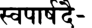

**----- Start of picture text -----** 
W4l4V **----- End of picture text -----** 

w r f o **1** r i  4 frrq ; нч<М 

_дадарша тад-бхога-сукхасанам вибхум маханубхавам пурушоттамоттамам сандрамбудабхам су-пиьианга-васасам прасанна-вактрам ручирайатекшанам_ 

_маха-мани-врата-кирйта-кундалапрабха-парикшипта-сахасра-кунталам праламба-чарв-ашта-бхуджам са-каустубхам ьирйватса-лакшмам вана-малайавртам_ 

_сунанда-нанда-прамукхаих сва-паршадаиьи чакрадибхир мурти-дхараир ниджайудхаих пуштйа шрийа кйртй-аджайакхилардхибхир нишевйаманам парамештхинам патим_ 

_дадарша_ — (Арджуна) увидел; _тат_ — этот; _бхога_ — змей; _сукха_ — удобное; _асанам_ — того, чье сиденье; _вибхум_ — вездесу­ щего; _маха-анубхавам_ — всемогущего; _пуруша-уттама_ — из Лич­ ностей Бога; _уттамам_ — Высшую; _сандра_ — густое; _амбуда_ — облако; _абхам_ — напоминающего (темно-синим цветом Своего тела); _су_ — прекрасные; _пишанга_ — желтые; _васасам_ — чьи одеж­ ды; _прасанна_ — красивое; _вактрам_ — чье лицо; _ручира_ — при­ влекательные; _айата_ — большие; _йкшанам_ — чьи глаза; _маха_ — огромных; _мани_ — драгоценных камней; _врата_ — россыпями; _кирйта_ — Его короны; _кундала_ — и серег; _прабха_ — отраженным блеском; _парикшипта_ — разметавшиеся; _сахасра_ — тысячи; _кунталам_ — чьи вьющиеся волосы; _праламба_ — длинные; _чару_ — пре­ красные; _ашта_ — восемь; _бхуджам_ — чьи руки; _са_ — вместе; _каустубхам_ — с камнем Каустубха; _ьирйватса-лакшмам_ — и особым 

**[песнь 10, гл. 89** 

**712** 

**Шримад-Бхагаватам** 

знаком Шриватса; _вана_ — из лесных цветов; _малайа_ — гирлян­ дой; _авртам_ — обнимаемый; _сунанда-нанда-прамукхаих_ — во главе с Сунандой и Нандой; _сва-паршадаих_ — Своими приближенными; _чакра-адибхих_ — диском и проч.; _мурти_ — олицетворенные фор­ мы; _дхараих_ — проявляющим; _ниджа_ — Его; _айудхаих_ — оружием; _пуштйа шрийа кйрти-аджайа_ — Его энергиями Пушти, Шри, Кирти и Аджей; _акхила_ — всеми; _рдхибхих_ — Его мистическими сила­ ми; _нишевйаманам_ — почитаемый; _параме-стхинам_ — правителей мироздания; _патим_ — повелитель. 

**Затем Арджуна увидел вездесущую и всемогущую Верховную Личность Бога, Маха-Вишну, который восседал на ложе-змее. Те­ ло Его цветом напоминало темно-синюю тучу. На Господе были чудесные желтые одежды, лицо Его казалось пленительно пре­ красным, а огромные глаза приковывали к себе. У Него было восемь длинных, красивых рук. Его густые волнистые волосы ку­ пались в блеске, исходившем во все стороны от россыпей драго­ ценных камней, украшавших Его корону и серьги. На Нем был камень Каустубха, знак Шриватса и гирлянда из лесных цветов. Высшему из всех повелителей служили Его приближенные, во главе с Сунандой и Нандой, Его** _**чакра**_ **и другие виды оружия в человеческом образе, Его супруги-энергии Пушти, Шри, Кирти и Аджа, а также все Его мистические силы.** 

_КОММЕНТАРИЙ:_ Шрила Прабхупада упоминает, что «у Госпо­ да бесчисленное множество энергий. Все олицетворенные энер­ гии тоже стояли рядом с Ним. Важнейшие среди них — Пушти, энергия поддержания, Шри — энергия красоты, Кирти — энергия славы и Аджа — энергия созидания материального мира. Ими на­ делены те, кто управляет материальным миром: Господь Брахма, Господь Шива и Господь Вишну, а также Индра (царь небесных планет), Чандра, Вару на и бог Солнца. Иначе говоря, все эти по­ лубоги с любовью и преданностью служат Верховному Господу, который наделяет их различными энергиями». 

**ТЕКСТ 57** 

**текст 57] Кришна и Арджуна возвращают брахману сыновей 713** 

## _**w m**_ **^тт** _**щ -**_ **f*RT НЧ'эИ** 

_ваванда атманам анантам ачйуто джишнуш ча тад-даршана-джата-садхвасах тав аха бхума парамештхинам прабхур баддханджалй са-смитам урджайа гира_ 

_ваванде_ — выказал почтение; _атманам_ — Самому Себе; _анан­ там_ — в Своей безграничной форме; _ачйутах_ — непогрешимый Господь Кришна; _джишнух_ — Арджуна; _ча_ — также; _тат_ — Его; _даршана_ — при виде; _джата_ — возникшее; _садхвасах_ — чье удив­ ление; _may_ — им двоим; _аха_ — сказал; _бхума_ — всемогущий Гос­ подь (Маха-Вишну); _параме-стхинам_ — правителей вселенной; _пра­ бхух_ — повелитель; _баддха-анджалй_ — которые сложили ладони в мольбе; _са_ — с; _Смитам_ — улыбкой; _урджайа_ — могучим; _гира_ — голосом. 

**Господь Кришна выказал почтение Самому Себе в Сво­ ей безграничной форме, и Арджуна, пораженный видом Госпо­ да Маха-Вишну, также склонился перед Ним. Оба они стояли со сложенными ладонями, и всемогущий Господь Маха-Вишну, верховный властелин всех правителей вселенной, улыбнулся и торжественным, властным голосом сказал им такие слова.** 

_КОММЕНТАРИЙ:_ Шрила Вишванатха Чакраварти в связи с этим стихом пишет, что Господь Кришна, разыгрывая Свои _лилы,_ по­ клонился Самому Себе в облике Маха-Вишну так же, как во вре­ мя поклонения холму Говардхана выказал почтение Своему _мурти_ . Господь — _ананта_ , то есть проявляет Себя в бесчисленном коли­ честве форм, и Его восьмирукая форма — одна из них. Он _ачьюта_ , «никогда не утрачивает Своего положения». Это означает, что Он никогда не прекращает Свои _лилы_ в образе обычного мальчикапастушка во Вриндаване. И здесь, не желая нарушать особое, со­ кровенное настроение Своих игр в облике Кришны, когда Он предстает как обычный человек, Он поклонился Своему полному проявлению в образе Маха-Вишну. 

Господь Маха-Вишну предстал перед Кришной и Арджуной во всей Своей славе _(бхума),_ как повелитель бесчисленных Брахм, правящих миллионами вселенных _(парамештхинам прабхух)._ Тор­ жественным, властным голосом Он говорил для того, чтобы, 

**714** 

**[песнь 10, гл. 89** 

**Шримад-Бхагаватам** 

подчиняясь воле Шри Кришны, запутать Арджуну. Его улыбка вы­ давала Его истинные мысли, которые ради нашего блага раскры­ вает нам Шрила Вишванатха Чакраварти: «Дорогой Кришна, если Ты так хочешь, то Я стану описывать Свое превосходство над То­ бой, хотя на самом деле Я — Твое проявление. При этом в Своих речах Я обязательно намекну на то, что Твоя красота, качества и могущество превыше всего и что на самом деле Ты источник, из которого Я появился. Оцени Мой разум — сейчас Я раскрою тайну Своего неотличия от Тебя, прямо перед Арджуной, да так, что он ничего не заметит». 

**ТЕКСТ 58** 

_двиджатмаджа ме йувайор дидркшуна майопанйта бхуви дхарма-гуптайе калаватйрнав аванер бхарасуран хатвеха бхуйас тварайетам анти ме_ 

_двиджа_ — _брахмана; атма-джах_ — сыновья; _ме_ — Мои; _йувайох_ — вас двоих; _дидркшуна_ — который хотел увидеть; _майа_ — Мной; _упанйтах_ — принесены; _бхуви_ — на Землю; _дхарма_ — заповедей ре­ лигии; _гуптайе_ — для защиты; _кала_ — (как Мои) воплощения; _аватйрнау_ — низошли; _аванех_ — Земли; _бхара_ — которые являются бременем; _асуран_ — демонов; _хатва_ — убив; _иха_ — сюда; _бхуйах_ — вновь; _тварайа_ — быстро; _итам_ — приходите; _анти_ — в близость; _ме_ — ко Мне. 

**[Господь Маха-Вишну сказал:] Я забрал сюда сыновей** _брахма­ на_ **, потому что хотел увидеть вас двоих, Мои воплощения, кото­ рые пришли на Землю, чтобы защитить заповеди религии. Как только вы убьете всех демонов, что обременяют Землю, сразу же возвращайтесь сюда, ко Мне.** 

_КОММЕНТАРИЙ:_ Шрила Вишванатха Чакраварти объясняет, что сокровенный смысл этих слов, произнесенных ради Арджуны, 

## **текст 61] Кришна и Арджуна возвращают брахману сыновей 715** 

таков: «Вы двое пришли на Землю вместе со своими энергия­ ми _(кала)._ Пожалуйста, возвращайтесь ко Мне сразу же, как только расправитесь со всеми демонами, от которых стонет Зем­ ля. Поскорее посылайте всех этих демонов сюда, ко Мне, да­ руя им освобождение». В «Шри Хари-вамше» и во Второй песни «Шримад-Бхагаватам» говорится, что путь постепенного освобож­ дения пролегает через обитель Господа Маха-Вишну, находящуюся за пределами восьмой оболочки вселенной. 

## **ТЕКСТ 59** 

_пурна-камав апи йувам нара-нарайанав ршй дхармам ачаратам стхитйаи ршабхау лока-санграхам_ 

_пурна_ — полные; _камау_ — во всех желаниях; _апи_ — хотя; _йувам_ — вы двое; _нара-нарайанау ршй_ — как мудрецы Нара и Нарая­ на; _дхармам_ — заповедям религии; _ачаратам_ — должны следовать; _стхитйаи_ — для ее поддержания; _ршабхау_ — лучшие из людей; _лока-санграхам_ — ради блага всех людей. 

**О лучшие из героев, хотя вам самим нечего желать, вы долж­ ны ради блага людей являть в облике мудрецов Нары и Нараяны идеальный пример праведности.** 

## **ТЕКСТЫ 60-61** 

_ТгЩ ЦЩ_ **I I H I** 

- W d i _щ ц_ TFSTfprt I **1=1Н1Ч и$?н** 

_итй адиштау бхагавата may кршнау парамештхина ом итй анамйа бхуманам адайа двиджа-даракан_ 

_нйавартетам свакам дхама сампрахрштау йатха-гатам випрайа дадатух путран йатха-рупам йатха-вайах_ 

**[песнь 10, гл. 89** 

**716** 

**Шримад-Бхагаватам** 

_ити_ — в таких словах; _адиштау_ — получившие наставления; _бхагавата_ — от Личности Бога; _may_ — они; _кршнау_ — два Кришны (Кришна и Арджуна); _параме-стхина_ — повелителем высшего цар­ ства; _ом ити_ — произнеся _ом_ в знак согласия; _анамйа_ — поклонив­ шись; _бхуманам_ — всемогущему Господу; _адайа_ — и взяв; _двиджа_ — _брахмана; даракан_ — сыновей; _нйавартетам_ — вернулись; _свакам_ — в свою; _дхама_ — обитель (Двараку); _сампрахрштау_ — в ли­ ковании; _йатха_ — таким же образом; _гатам_ — как пришли; _випрайа_ — _брахману; дадатух_ — отдали; _путран_ — его сыновей; _йа­ тха_ — в тех же; _рупам_ — обликах; _йатха_ — в том же; _вайах_ — возрасте. 

**Получив эти наставления от верховного повелителя высшего царства, Кришна и Арджуна выразили свое согласие, произнеся звук** _**ом,**_ **и затем поклонились всемогущему Господу Маха-Вишну. Забрав сыновей** _**брахмана,**_ **они радостно вернулись в Двараку тем же путем, каким пришли. Там они отдали** _**брахману**_ **его сыновей, которые были в тех же самых телах младенцев.** 

**ТЕКСТ 62** 

Э гщ ст щтт ЧТ& ЧТч№ТсТ: I 

_нишамйа ваишнавам дхама партхах парама-висмитах йат кинчит паурушам пумсам мене кршнанукампитам_ 

_нишамйа_ — увидев; _ваишнавам_ — Господа Вишну; _дхама_ — оби­ тель; _партхах_ — Арджуна; _парома_ — в высшей степени; _висми­ тах_ — пораженный; _йат кинчит_ — любое; _паурушам_ — особое могущество; _пумсам_ — которым обладают живые существа; _мене_ — он решил; _кршна_ — Кришной; _анукампитам_ — оказанная милость. 

## **Зрелище обители Господа Вишну поразило Арджуну. Он при­ шел к выводу, что любые способности человека приходят к нему только по милости Шри Кришны.** 

_КОММЕНТАРИЙ:_ Шрила Вишванатха Чакраварти говорит, что пораженный Арджуна думал: «Только посмотрите! Я — простой смертный, и тем не менее по милости Кришны я смог увидеть Вер­ 

## **текст 62] Кришна и Арджуна возвращают брахману сыновей 717** 

ховного Господа, первопричину всего сущего». Но сразу вслед за этим ему пришла в голову другая мысль: «Но почему Господь Виш­ ну сказал, что забрал сыновей _брахмана_ лишь затем, чтобы уви­ деть Кришну? Зачем Верховной Личности Бога так не терпелось взглянуть на собственное воплощение? Предположим, что причи­ ной тому были какие-то особые обстоятельства, однако Он сказал _дидркшуна,_ а не _дидркшата,_ а суффикс _-шуна_ указывает на посто­ янство Его желания; иначе говоря, Он _всегда_ хочет видеть Криш­ ну и меня. Даже если допустить, что так оно и есть, то почему Он просто не повидался с Кришной в Двараке? Ведь Господь МахаВишну — вездесущий творец вселенной, которую Он держит на ладони, как плод _амалаки._ Не потому ли Он не мог увидеть Криш­ ну в Двараке, что Кришна никому не позволяет увидеть Себя без особого позволения? 

И почему Господь Маха-Вишну, всемилостивый повелитель _брах­ манов,_ вновь и вновь, год за годом, заставлял страдать возвышенно­ го _брахмана?_ Похоже, что Он поступал столь необычным образом только потому, что Его желание увидеть Кришну было необычай­ но велико. Ну хорошо, по этой причине Он мог действовать непо­ добающе, но почему Он не послал за сыновьями _брахмана_ одного из Своих слуг? Зачем Ему Самому понадобилось приходить в Два­ раку? Неужели украсть младенцев из города Господа Кришны так сложно, что это не под силу никому, кроме Самого Вишну? Думает­ ся мне, что Он решился причинить так много горя _брахману_ из го­ рода Господа Кришны, чтобы переполнить чашу терпения Кришны и вынудить Его предстать перед Ним. Господь Вишну из сердца по­ будил скорбящего _брахмана_ лично пожаловаться Кришне на свою судьбу. Таким образом, очевидно, что по Своему статусу в небесной иерархии Шри Кришна выше, чем Господь Маха-Вишну». 

Этот вывод изумил Арджуну, поэтому он спросил у Кришны, верны ли его догадки. Как утверждается в «Хари-вамше», Господь ответил ему так: 

_мад-даршанартхам те бала хртас тена махатмана випрартхам эшйате кршно мат-самйпам на нанйатха_ 

«Он, Высшая Душа, украл детей для того, чтобы увидеть Меня. Он понимал: „Кришна придет ко Мне только ради _брахмана,_ и никак иначе“». 

**[песнь 10, гл. 89** 

**Шримад-Бхагаватам** 

**718** 

Шрила Вишванатха Чакраварти добавляет, что затем Господь Кришна сказал Арджуне: «Однако Я отправился туда не ради _брахмана; Я_ пришел к Нему лишь для того, чтобы спасти твою жизнь. Если бы Мое путешествие на Вайкунтху было вызвано желанием помочь _брахману_ ; Я отправился бы туда сразу после похищения первого ребенка». 

Как пишет Шрила Шридхара Свами, хотя эта история произо­ шла до битвы на Курукшетре, она рассказана здесь, в самом конце Десятой песни, чтобы подчеркнуть высшее превосходство Господа Кришны. 

## **ТЕКСТ 63** 

_итйдршанй анекани вйрйанйха прадаршайан бубхудже вишайан грамйан йдже чатй-урджитаир макхаих_ 

_ити_ — так; _йдршани_ — таких; _анекани_ — множество; _вйрйанй_ — подвигов; _иха_ — в этом мире; _прадаршайан_ — явив; _бубхудже_ — (Господь Кришна) наслаждался; _вишайан_ — всем, что прино­ сит наслаждение чувствам; _грамйан_ — обычным; _йдже_ — Он со­ вершал поклонение; _ча_ — и; _ати_ — необычайно; _урджитаих_ — могущественными; _макхаих_ — ведическими огненными жертвопри­ ношениями. 

**Господь Кришна явил в этом мире множество подобных подви­ гов. Он, казалось, наслаждался тем же, чем наслаждаются обыч­ ные люди, и совершил множество огненных жертвоприношений огромной силы.** 

## **ТЕКСТ 64** 

_Я Ш_ I tl^vtl 

_прававаршакхилан каман праджасу брахманадишу йатха-калам йатхаивендро бхагаван шраиштхйам астхитах_ 

**текст 65] Кришна и Арджуна возвращают брахману сыновей 719** 

_прававарша_ — Он проливал; _акхилан_ — всё; _каман_ — желаемое; _праджасу_ — на Своих подданных; _брахмана-адишу_ — начиная с _брах­ манов; йатха-калам_ — в подходящее время; _йатха эва_ — таким же образом; _индрах_ — (как) Индра; _бхагаван_ — Личность Бо­ га; _шраиштхйам_ — в Своем превосходстве; _астхитах_ — утверж­ денный. 

**Являя Свое могущество, Господь в должное время осыпал** _брах­ манов_ **и других Своих подданных всем, чего они желали, как Индра, проливающий на землю щедрые дожди.** 

## **ТЕКСТ 65** 

## зт зш т н зч н 

_хатва нрпан адхармиштхан гхатайитварджунадибхих анджаса вартайам аса дхармам дхарма-сутадибхих_ 

_хатва_ — убив; _нрпан_ — царей; _адхармиштхан_ — много греш­ ных; _гхатайитва_ — устроив их смерть; _арджуна-адибхих_ — от ру­ ки Арджуны и других; _анджаса_ — без труда; _вартайам аса_ — Он устроил так, чтобы исполнялись; _дхармам_ — заповеди религии; _дхарма-сута-адибхих_ — с помощью Юдхиштхиры (сына Дхармы) и других. 

**Одних царей-злодеев Он убил Сам, а других убили Его слу­ ги, такие как Арджуна, поэтому Господь мог без труда утвер­ дить в человеческом обществе заповеди религии с помощью таких праведных царей, как Юдхиштхира.** 

_Так заканчивается комментарий смиренных слуг А. Ч. Бхактиведанты Свами Прабхупады к восемьдесят девятой главе Десятой песни «Шримад-Бхагаватам», которая называется «Кришна и Ар­ джуна возвращают брахману его сыновей»._ 

**ГЛАВА ДЕВЯНОСТАЯ** 

## **К раткое описание величия Господа Криш ны** 

В этой главе рассказывается, как Господь Кришна наслаждался со Своими царицами в озерах Двараки. Здесь также приведены воз­ вышенные молитвы цариц, испытывающих острое чувство разлуки с Ним. Эта глава также содержит краткий обзор _лил_ Господа. 

Господь Кришна по-прежнему жил в Своей великолепной сто­ лице Двараке вместе с Ядавами и Своими женами. В Двараке Он часто забавлялся со Своими женами в прудах царских двор­ цов. Он брызгал в Своих жен водой из водяного шприца, а те в ответ брызгали в Него. Своими изящными жестами, ласковы­ ми словами и игривыми взглядами Он пленял их сердца, и цари­ цы полностью погружались в мысли о Нем. Иногда, после водных баталий, они обращались к разным существам — птицам _курари_ и _накраваке,_ к океану, луне, облаку, кукушке, горе, реке и другим — и, как бы выражая им сочувствие, признавались в своей великой привязанности к Шри Кришне. 

В лоне каждой из Своих жен Господь Кришна зачал по десять сыновей. Главным из них был Прадьюмна, по всем трансцендент­ ным добродетелям равный своему отцу. Прадьюмна женился на до­ чери Рукми, и от нее родился Анируддха. Анируддха взял в жены внучку Рукми и в ее лоне зачал Ваджру, который был единствен­ ным царевичем из рода Яду, выжившим после битвы на железных палицах в Прабхасе. От Ваджры произошли остальные потомки рода Яду, начиная с Пратибаху. Члены царского рода Яду поисти­ не бесчисленны: просто чтобы обучать своих детей, Яду наняли тридцать восемь миллионов восемьсот тысяч учителей. 

Незадолго до того, как Господь Кришна пришел на эту планету, в земных семьях стали во множестве рождаться демоны, которые угнетали простых людей и уничтожали брахманическую культуру. Чтобы усмирить их, Господь приказал полубогам родиться в динас­ тии Яду, которая благодаря этому разрослась и разделилась на сто один клан. Все Ядавы признавали Шри Кришну Верховной Лич­ ностью Бога и безоговорочно верили в Него. Они часто отдыха- 

**721** 

**[песнь 10, гл. 90** 

**722** 

**Шримад-Бхагаватам** 

ли, ели и гуляли вместе с Ним, забывая при этом о своем теле от переполнявшего их трансцендентного счастья. 

Десятая песнь завершается обещанием успеха для всех, кто ее искренне слушает: «Даже простой смертный, если он со всевозрас­ тающей искренностью слушает повествования о Господе Мукунде, пересказывает их и перебирает в памяти, непременно достигнет божественного царства Господа, на которое не распространяется власть неумолимой смерти». 

**ТЕКСТЫ 1-7** 

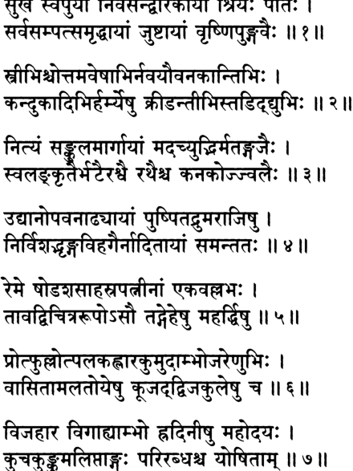

**----- Start of picture text -----** 
^ Р н ^ А к + N i f ^ r :  4frT: I # « 1 ^ :  II ? II 4 4 4  1М м 4V=M+lf*rlfa: l 4>*-£+>ifafa|w^  11,11 t e r fljc-WHlfai  I *d  ^ II 3 II d<iidl4<=Mi<wwi ^ ffa d ^ ifa ^  i d: и v и ^  4 T ^ R T W T ^ rr Ч^ТёПТ: I dldfefad^MlS^  II Ч II Ml c$ ^  c4  ЦI u j f a :  I dlfadW tftffa^  ^   in  II ^ $ |H R i H I ^ :   II« II **----- End of picture text -----** 

_**шрй-шука увача сукхам сва-пурйам нивасан дваракайам шрийах патих сарва-сампат-самрддхайам джуштайам вршни-пунгаваих**_ 

**текст 7] Краткое описание величия Господа Кришны** 

**723** 

_**стрибхиш чоттама-вешабхир нава-йаувана-кантибхих кандукадибхир хармйешу крйдантйбхис тадид-дйубхих**_ 

_**нитйам санкула-маргайам мада-чйудбхир матан-гаджаих св-аланкртаир бхатаир ашваи ратхаиш ча канакоджджвалаих**_ 

_**удйанопаванадхйайам пушпита-друма-раджишу нирвишад-бхрнга-вихагаир надитайам самантатах**_ 

_**реме шодаша-сахасра-патнйнам эка-валлабхах тавад вичитра-рупо ’сау тад-гехешу махарддхиьиу**_ 

_**протпхуллотпала-кахлара-кумудамбходжа-ренубхих васитамала-тойешу куджад-двиджа-кулешу ча**_ 

_**виджахара вигахйамбхо храдинйшу маходайах куча-кункума-липтангах парирабдхаш ча йошитам**_ 

_**шрй-шуках увача**_ — Шукадева Госвами сказал; _**сукхам**_ — счаст­ ливо; _**сва**_ — в Своем; _**пурйам**_ — городе; _**нивасан**_ — живущий; _**два­ ракайам**_ — в Двараке; _**шрийах**_ — богини процветания; _**патих**_ — повелитель; _**сарва**_ — всеми; _**сампат**_ — богатствами; _**самрддхайам**_ — в изобилии располагающем; _**джуштайам**_ **—** населенном; _**вршнипунгаваих**_ **—** самыми выдающимися членами рода Вришни; _**стрй­ бхих**_ — женщинами; _**ча**_ — и; _**уттама**_ — великолепны; _**вешабхих**_ — чьи наряды; _**нава**_ — новой; _**йаувана**_ — молодости; _**кантибхих**_ — чья красота; _**кандука-адибхих**_ — мячами и другими игрушками; _**хармйешу**_ — на крышах; _**крйдантйбхих**_ — играющими; _**тадит**_ — молнии; _**дйубхих**_ — чье сверкание; _**нитйам**_ — всегда; _**санкула**_ — запруженные; _**маргайам**_ — чьи дороги; _**мада-чйудбхих**_ — источа­ ющими _**маду; матам**_ — опьяненными; _**гаджаих**_ — слонами; _**су**_ — нарядно; _**аланкртаих**_ — украшенными; _**бхатаих**_ — пехотинцами; _**аьиваих**_ — лошадьми; _**ратхаих**_ — колесницами; _**ча**_ — и; _**канака**_ — зо­ лотом; _**уджджвалаих**_ — сверкающими; _**удйана**_ — садами; _**упавана**_ — и парками; _**адхйайам**_ — наделенном; _**пушпита**_ — цветущих; _**друма**_ — деревьев; _**раджишу**_ — с рядами; _**нирвишат**_ — обитающими (там); _**бхрнга**_ — с пчелами; _**вихагаих**_ — и птицами; _**надитайам**_ — на­ полненными звуками; _**самантатах**_ — со всех сторон; _**реме**_ — Он на­ слаждался; _**шодаьиа**_ **—** шестнадцати; _**сахасра**_ **—** тысяч; _**патнйнам**_ **—** жен; _**эка**_ **—** единственный; _**валлабхах**_ **—** возлюбленный; _**тават**_ **—** столько; _**вичитра**_ **—** разнообразных; _**рупах**_ **—** имеющий множество форм; _**асау**_ **—** Он; _**тат**_ **—** их; _**гехешу**_ **—** во дворцах; _**маха-рддхишу**_ **—** 

**[песнь 10, гл. 90** 

**724** 

**Шримад-Бхагаватам** 

богато обставленных; _**протпхулла**_ **—** цветущих; _**утпала**_ **—** водя­ ных лилий; _**кахлара**_ **—** белых лотосов; _**кумуда**_ **—** лотосов, цвету­ щих ночью; _**амбходжа**_ — и лотосов, цветущих днем; _**ренубхих**_ — пыльцой; _**васита**_ **—** наполненных благоуханием; _**амала**_ **—** чистых; _**тойешу**_ — в водоемах; _**куджат**_ — щебечущих; _**двиджа**_ — птиц; _**ку­ лешу**_ — где были стаи; _**на**_ — и; _**виджахара**_ — Он резвился; _**вигахйа**_ — ныряя; _**амбхах**_ — в воде; _**храдинйшу**_ — в реках; _**махаудайах**_ — всемогущий Господь; _**куча**_ — с их грудей; _**кункума**_ — красной пудрой; _**липта**_ — припудренных; _**ангах**_ — Его тело; _**парирабдхах**_ — обнимаемое; _**на**_ — и; _**йошитам**_ — женщинами. 

**Шукадева Госвами сказал: Повелитель богини процветания счастливо жил в Своей столице, Двараке, городе баснословных бо­ гатств. В этом городе жили лучшие из рода Вришни и их нарядно одетые жены. Когда эти прекрасные юные женщины играли на крышах домов в мяч или другие игры, они сверкали, словно мол­ нии. На главных улицах города всегда можно было видеть источа­ ющих** _**маду**_ **опьяненных слонов, гарцующих кавалеристов, богато наряженных пехотинцев и всадников на сверкающих золотом ко­ лесницах. Город украшали многочисленные сады и парки с алле­ ями цветущих деревьев. Роившиеся вокруг них пчелы и сидевшие на их ветвях птицы наполняли воздух звуками своих песен.** 

**Все шестнадцать тысяч жен Господа Кришны любили Его од­ ного. Распространив Себя в шестнадцать тысяч форм, Он наслаж­ дался с каждой из Своих цариц в их роскошных дворцах. Рядом с каждым дворцом были заполненные чистой водой пруды. Воздух над этими прудами, напоенный ароматом пыльцы цветущих лото­ сов** _**утпала, кахлара, кумуда**_ **и** _**амбходжа,**_ **оглашали пение и крики множества живущих там птиц. Всемогущий Господь входил в воду этих прудов или протекавших по городу рек и резвился в них со Своими женами, а те обнимали Его, оставляя на Его теле красную пудру со своих грудей.** 

_**КОММЕНТАРИЙ:**_ Одно из правил поэтической композиции, кото­ рому следуют писатели-вайшнавы, гласит: _**мадхурена самапайет**_ **—** «Литературное произведение должно завершаться, [оставляя у чи­ тателей] ощущение особой сладости». Следуя этому правилу, Шри­ ла Шукадева Госвами, лучший из сказителей трансцендентных историй, включил в последнюю главу Десятой песни «ШримадБхагаватам» описание водных игр Господа Кришны в празднич­ ной обстановке Двараки, а вслед за этим привел проникнутые экстатической любовью молитвы жен Господа. 

**текст 10] Краткое описание величия Господа Кришны** 

**725** 

## **ТЕКСТЫ 8-9** 

ЗЧФТЧНГ I _itm_ и _с_ и FT > 4% : I Trfcrf^R; II ^ н 

_**упагййамано гандхарваир мрданга-панаванаьсан вадайадбхир муда винам сута-магадха-вандибхих**_ 

_**сичйамано ’чйутас табхир хасантйбхих сма речакаих пратишинчан вичикрйде йакшйбхир йакша-рад ива**_ 

_**упагййаманах**_ **—** прославляемый в песнях; _**гандхарваих**_ **—** гандхарвами; _**мрданга-панава-анакан**_ **—** на барабанах _**мриданга, панава**_ и _**анака; вадайадбхих**_ **—** которые играли; _**муда**_ **—** весело; _**винам**_ **—** на _**винах; сута-магадха-вандибхих**_ **—** чтецами _**сута, магадха**_ и _**ванди; сичйаманах**_ **—** обрызгиваемый водой; _**ачйутах**_ **—** Господь Криш­ на; _**табхих**_ — ими (Его женами); _**хасантйбхих—**_ -которые сме­ ялись; _**сма**_ — несомненно; _**речакаих**_ — водяными Шприцами; _**пра­ тишинчан**_ — брызгая в них в ответ; _**вичикрйде**_ —О н резвился; _**йакшйбхих**_ — с нимфами-якшами; _**йакша-рат**_ — повелитель якшей (Кувера); _**ива**_ **—** словно. 

**Пока Господь Кришна резвился в воде со Своими женами, ган­ дхарвы радостно пели Ему хвалу под аккомпанемент барабанов:** _**мриданг9 панав**_ **и** _**анак,**_ **а профессиональные песнопевцы —** _**суты**_ **,** _**магадхи**_ **и** _**ванди**_ **— играли на** _**винах**_ **и декламировали стихи, вос­ певающие Господа. Смеясь, царицы брызгали в Господа водой из водяных шприцев, а Он обрызгивал их в ответ. Так Кришна рез­ вился со Своими женами, словно повелитель якшей, резвящийся с нимфами.** 

## **ТЕКСТ 10** 

**STraFFtrFTOFF^TT** 

**IIMI** 

**726** 

**[песнь 10, гл. 90** 

**Шримад-Бхагаватам** 

_**max клинна-вастра-вивртору-куча-прадеьиах синчантйа уддхрта-брхат-кавара-прасунах кантам сма речака-джихйршайайопагухйа джата-смаротсмайа-ласад-вадана виреджух**_ 

_**max**_ **—** они (жены Господа Кришны); _**клинна**_ **—** мокрые; _**вастра**_ **—** чьи одежды; _**виврта**_ **—** подчеркивали; _**уру**_ **—** бедра; _**куча**_ **—** их грудей; _**прадеьиах**_ **—** область; _**синчантйах**_ **—** обрызгивая; _**уддхрта**_ **—** рассыпавшиеся; _**брхат**_ **—** длинных; _**кавара**_ **—** из их кос; _**прасунах**_ **—** чьи цветы; _**кантам**_ — их супруг; _**сма**_ — несомненно; _**речака**_ — Его водяной шприц; _**джихйршайайа**_ — желая отнять; _**упагухйа**_ — обни­ мая; _**джата**_ **—** возросшего; _**смара**_ **—** желания; _**утсмайа**_ **—** широки­ ми улыбками; _**ласад**_ — сияющие; _**ваданах**_ — чьи лица; _**виреджух**_ — они выглядели великолепно. 

**Мокрые одежды цариц плотно облегали их бедра и груди, под­ черкивая их формы. Когда они брызгали в своего супруга водой, цветы, вплетенные в их длинные косы, рассыпались. Делая вид, будто хотят отобрать Его водяной шприц, царицы обнимали Его. От Его прикосновений в них просыпалось желание, и лица их расцветали улыбками, делая их еще прекраснее.** 

## **ТЕКСТ 11** 

q frrf^ W H l ^ tn fa : ii??n 

_**крьинас ту тат-стана-вишаджджита-кункума-срак крйдабхишанга-дхута-кунтала-врнда-бандхах синчан мухур йуватибхих пратишичйамано реме каренубхир ивебха-патих парйтах**_ 

_**кршнах**_ **—** Господь Кришна; _**ту**_ **—** и; _**тат**_ **—** их; _**стана**_ **—** с гру­ дей; _**вишаджджита**_ **—** отпечатавшаяся; _**кункума**_ **—** _**кункума; срак**_ **—** на чьей гирлянде; _**крйда**_ **—** в развлечения; _**абхишанга**_ **—** от по­ груженности; _**дхута**_ — разметавшаяся; _**кунтала**_ — прядей волос; _**врнда**_ **—** копны; _**бандхах**_ **—** укладка; _**синчан**_ **—** брызгая; _**мухух**_ **—** вновь и вновь; _**йуватибхих**_ **—** девушками; _**пратишичйаманах**_ **—** обрызгиваемый в ответ; _**реме**_ **—** Он наслаждался; _**каренубхих**_ **—** 

**текст 13] Краткое описание величия Господа Кришны** 

**727** 

слонихами; _ива_ — как; _ибха-патих_ — царь слонов; _паритах_ — окруженный. 

**Гирлянда Господа Кришны была вся в** _**кункуме**_ **с грудей Его жен, а Сам Он был так поглощен игрой, что Его густые волнис­ тые волосы разметались. Господь вновь и вновь обрызгивал Сво­ их юных супруг, а те в ответ брызгали в Него. Наслаждаясь так, Он был похож на царя слонов, резвящегося в воде со стадом своих слоних.** 

## **ТЕКСТ 12** 

^ t o : _\ \ т_ 

_патанам нартакйнам ча гйта-вадйопаджйвинам крйдаланкара-васамси крьино *дат тасйа ча стрийах_ 

_патанам_ — музыкантам; _нартакйнам_ — и певицам; _ча_ — и; _ги­ т а_ — пением; _вадйа_ — и игрой на музыкальных инструментах; _упаджйвинам_ — которые зарабатывали на жизнь; _крйда_ — от Сво­ их игр; _аланкара_ — украшения; _васамси_ — и одежды; _кршнах_ — Гос­ подь Кришна; _адат_ — раздавал; _тасйа_ — Его; _ча_ — и; _стрийах_ — жёны. 

**После Господь Кришна и Его жены раздавали украшения и одежды, которые были на них во время водных игр, музыкан­ там, зарабатывавшим на жизнь пением и игрой на музыкальных инструментах.** 

## **ТЕКСТ 13** 

f t o f a f a t o r  T i r m t o t o f t o :  I t o i t o _ш_ t o : и?зн 

_кршнасйаивам вихарато гатй-алапекшита-смитаих нарма-кшвели-паришвангаих стрйналг кила хрта дхийах_ 

_кршнасйа_ — Господа Кришны; _эвам_ — так; _вихаратах_ — который резвился; _гати_ — движениями; _алапа_ — разговорами; _йкшита_ — взглядами; _смитаих_ — и улыбками; _нарма_ — шутками; _кшвели_ — 

**[песнь 10, гл. 90** 

**728** 

**Шримад-Бхагаватам** 

игривым обращением; _паришвангаих_ — и объятиями; _стринам_ — жен; _кила_ — поистине; _хртах_ — похищены; _дхийах_ — сердца. 

**Так Господь Кришна резвился со Своими женами, покоряя их сердце Своими движениями, речами, взглядами, улыбками, шутками, игривым обращением и объятиями.** 

## **ТЕКСТ 14** 

## **и?*н** 

_учур мукундаика-дхийо гира унматта-вадж джадам чинтайантйо 'равиндакшам тани ме гадатах шрну_ 

_учух_ — они сказали; _мукунда_ — на Господа Кришну; _эка_ — толь­ ко; _дхийах_ — чьи умы; _гирах_ — слова; _унматта_ — безумные; _ват_ — как; _джадам_ — оцепеневшие; _чинтайантйах_ — думая; _аравиндаакшам_ — о лотосооком Господе; _тани_ — эти (слова); _ме_ — от меня; _гадатах_ — кто рассказывает; _шрну_ — пожалуйста, выслушай. 

**Умы цариц были настолько погружены в размышления о Криш­ не, что порой они застывали на месте, впадая в экстатический транс. Думая о своем лотосооком Господе, они разговаривали, как безумные. Пожалуйста, послушай, что они говорили.** 

_КОММЕНТАРИЙ:_ Шрила Вишванатха Чакраварти Тхакур объяс­ няет, что это кажущееся проявление безумия у жен Господа Криш­ ны, которые говорили, как будто одурманенные _дхаттурой_ или каким-то другим галлюциногеном, на самом деле является призна­ ком шестой ступени чистой любви к Богу. На санскрите это состоя­ ние называется _према-вайчитрья._ Шрила Рупа Госвами описывает эту разновидность _анураги_ в «Уджвала-ниламани» (15.147): 

_прийасйа санникарше ’пи премоткарша-свабхаватах йа вишлеша-дхийартис тат према-ваичитрйам учйате_ 

«Когда, охваченный очень сильной любовью, преданный страда­ ет от разлуки даже в присутствии своего возлюбленного, такое состояние называется _према-вайчитрья_ ». 

**текст 15] Краткое описание величия Господа Кришны** 

**729** 

## **ТЕКСТ 15** 

**f^PTfo** _**гЦ**_ **cfldPl^l Ч %%** R ftfcT smfcT | 7T% ^ f^ T ^ ri% % rT T 

ll?4ll 

_махишйа учух курари вилапаси твам вйта-нидра на шеше свапити джагати ратрйам йшваро гупта-бодхах вайам ива сакхи каччид гадха-нирвиддха-чета налина-найана-хасодара-лйлекшитена_ 

_махишйах. учух_ — царицы сказали; _курари_ — о птица _курари_ (сам­ ка скопы); _вилапаси_ — скорбишь; _твам_ — ты; _вита_ — лишенная; _нидра_ — сна; _на шеше_ — ты не можешь уснуть; _свапити_ — спит; _джагати_ — (где-то) в мире; _ратрйам_ — ночью; _йьиварах_ — Вер­ ховный Господь; _гупта_ — скрыто; _бодхах_ — чье местонахождение; _вайам_ — мы; _ива_ — так же как; _сакхи_ — о подруга; _каччит_ — неуже­ ли; _гадха_ — глубоко; _нирвиддха_ — пронзенное; _четах_ — чье сердце; _налина_ — (как) лотос; _найана_ — чьи глаза; _хаса_ — улыбающимся; _удара_ — великодушным; _лила_ — игривым; _йкшитена_ — взглядом. 

**Царицы сказали: О птица** _**курари**_ **, ты так скорбишь. Сейчас ночь, и где-то в этом мире спит, скрывшись от всех, Верхов­ ный Господь. Одна ты, о подруга, никак не можешь уснуть. Не­ ужели благосклонные, игривые, смеющиеся взгляды лотосоокого Господа пронзили и твое сердце так же, как они пронзили наше?** 

_КОММЕНТАРИЙ:_ Шрила Вишванатха Чакраварти объясняет, что трансцендентное безумие _(унмада)_ переполнило жен Кришны та­ ким экстазом, что они видели отражение своего настроения во всех и вся. Здесь они говорят, обращаясь к птице _курари_ (которая, как им кажется, скорбит в разлуке с Господом Кришной), что, если бы Господу действительно было дело до нее (или до них), Он бы не спал так спокойно в это время. Они предупреждают _курари_ , чтобы та не ждала, что Кришна услышит ее причитания и смилуется над ней. Чтобы _курари_ не подумала, что Кришна в тот момент спит со Своими женами, они называют Его _гупта-бодха,_ имея в виду то, что они сами не знают, где Он находится. Этой ночью Он где-то 

**[песнь 10, гл. 90** 

**730** 

**Шримад-Бхагаватам** 

в другом месте, и они не знают, где искать Его. «Родная, — причи­ тают они, — ты бесхитростное создание, но и твое сердце пронзе­ но, как наше. Не иначе как ты повстречала где-то нашего Кришну. Скажи нам, что же мешает тебе отказаться от своей безнадежной привязанности к Нему?» 

## **ТЕКСТ 16** 

## **f%** _**WX**_ **Wtrr Н^И** 

_**нетре нимйлайаси пактам адршта-бандхус твам роравйши карунам бата чакраваки дасйам гата вайам ивачйута-пада-джуштам ким ва сраджам спрхайасе каварена водхум**_ 

_**нетре**_ — свои глаза; _**нимйлайаси**_ — ты держишь закрытыми; _**пак­ там**_ — ночью; _**адршта**_ — который не виден; _**бандхух**_ — чей возлюб­ ленный; _**твам**_ — ты; _**роравйши**_ — плачешь; _**карунам**_ — жалобно; _**ба­ та**_ — увы; _**чакраваки**_ — о _**чакраваки**_ (самка цапли); _**дасйам**_ — служение; _**гата**_ — обретенное; _**вайам ива**_ — как мы; _**ачйута**_ — Кришны; _**пада**_ — стопами; _**джуштам**_ — благословленную; _**ким**_ — возможно; _**ва**_ — или; _**сраджам**_ — гирлянду; _**спрхайасе**_ — ты жела­ ешь; _**каварена**_ — в своей косе; _**водхум**_ — носить. 

**Бедная** _**чакраваки**_ **, даже закрывая глаза, ты продолжаешь жа­ лобно плакать в ночи по своему невидимому возлюбленному. Или, может быть, ты, подобно нам, стала служанкой Ачьюты и теперь жаждешь носить в своих заплетенных в косы волосах гирлянду, которую Он благословил прикосновением Своей стопы?** 

## **ТЕКСТ 17** 

>тг >тг: тгет 

frrRT А$-<1Ч£Н1с*И1>*Н: 

**ШНТ** 

**И?*И** 

**текст 18] Краткое описание величия Господа Кришны** 

**731** 

_бхо бхох сада ништанасе уданванн алабдха-нидро ’дхигата-праджагарах ким ва мукундапахртатма-ланнханах праптам датам твам ча гато дуратйайам_ 

_бхох._ — дорогой; _бхох_ — дорогой; _сада_ — всегда; _ништанасе_ — ты производишь громкий звук; _уданван_ — о океан; _алабдха_ — не обре­ тая; _нидрах_ — сон; _адхигата_ — испытывая; _праджагарах_ — бессон­ ницу; _ким ва_ — или, возможно; _мукунда_ — Кришной; _апахрта_ — унесены; _атма_ — личные; _ланчханах_ — знаки; _праптам_ — обретен­ ного (нами); _датам_ — состояния; _твам_ — ты; _ча_ — также; _гатах_ — достиг; _дуратйайам_ — от которого невозможно освободиться. 

**Дорогой океан, ты не спишь по ночам и все время грохочешь и ревешь. Тебя мучит бессонница? Или же Мукунда забрал у те­ бя, как и у нас, твои отличительные знаки и ты потерял надежду вернуть их?** 

_КОММЕНТАРИЙ:_ Шрила Шридхара Свами утверждает, что здесь царицы Господа Кришны принимают океан, окружающий Двараку, за Молочный океан, из которого некогда появились богиня Лак­ шми и камень Каустубха. Господь Вишну взял их Себе _(апахрта),_ и теперь они пребывают на Его груди. Царицы полагают, что оке­ ан хочет увидеть на груди Господа символ Лакшми и камень Каус­ тубха. Они сочувствуют океану и говорят, что тоже хотят увидеть эти знаки. Однако еще больше царицы хотят увидеть на груди Гос­ пода следы порошка _кункумы_ , которую Он «собрал» с их грудей, когда они в последний раз обнимали Его. 

## **ТЕКСТ 18** 

_-ЦЩ_ ^ c# **ЯГ: FJpM 'M tfSFrcr** _**41**_ **ll?cil** 

_твам йактмана балаватаси грхйта индо_ 

_ктйнас тамо на ниджа-дйдхитибхих ктиноти каччин мукунда-гадитани йатха вайам твам висмртйа бхох стхагита-гйр упалактйасе нах_ 

**[песнь 10, гл. 90** 

**732** 

**Шримад-Бхагаватам** 

_твам_ — ты; _йакишана_ — чахоткой; _бала-вата_ — сильной; _аси_ — есть; _грхйтах_ — охваченная; _индо_ — о луна; _кшйнах_ — изможден­ ная; _тамах_ — тьму; _на_ — не; _ниджа_ — твоими; _дйдхитибхих_ — лучами; _кшиноши_ — уничтожаешь; _каччит_ — неужели; _мукундагадитани_ — слова Мукунды; _йатха_ — как; _вайам_ — мы; _твам_ — ты; _висмртйа_ — забывшая; _бхох_ — дорогая; _стхагита_ — замершая; _гйх_ — чья речь; _упалакшйасе_ — ты кажешься; _нах_ — нам. 

**Дорогая луна, злая чахотка так измучила тебя, что твои лучи больше не в силах рассеять тьму. Или, может быть, ты выгля­ дишь застывшей на месте потому, что, подобно нам, не можешь вспомнить вселяющие надежду клятвы, которые когда-то давал тебе Мукунда?** 

## **ТЕКСТ 19** 

## n?<ui 

_ким не ачаритам асмабхир малайанила те ’прийам говиндапанга-нирбхинне хрдйрайаси нах смарам_ 

_ким_ — какой; _ну_ — в самом деле; _ачаритам_ — совершённый по­ ступок; _асмабхих_ — нами; _малайа_ — с Малайских гор; _анила_ — ветер; _те_ — тебе; _априйам_ — неприятен; _говинда_ — Кришны; _апанга_ — игривыми взглядами; _нирбхинне_ — которые были разбиты; _хрди_ — в сердцах; _йрайаси_ — ты вызываешь; _нах_ — нашу; _смарам_ — страсть. 

**О ветерок с Малайских гор, чем мы тебя прогневили? Зачем ты разжигаешь страсть в наших сердцах, которые и так разбиты игривыми взглядами Говинды?** 

## **ТЕКСТ 20** 

IRoll 

**текст 21] Краткое описание величия Господа Кришны** 

**733** 

_мегха шрймамс твам аси дайито йадавендрасйа нунам_ 

_ьирйватсанкам вайам ива бхаван дхйайати према-баддхах атй-уткантхах ьиавала-хрдайо ’смад-видхо башпа-дхарах смртва смртва висрджаси мухур духкха-дас тат-прасангах_ 

_мегха_ — о облако; _шрй-ман_ — о почтенное; _твам_ — ты; _аси_ — яв­ ляешься; _дайитах_ — дорогим другом; _йадава-индрасйа_ — повелите­ ля Ядавов; _нунам_ — несомненно; _ьирйватса-анкам_ — на того, кто носит (на Своей груди) знак Шриватса; _вайам_ — мы; _ива_ — так же как; _бхаван_ — ты; _дхйайати_ — медитируем; _према_ — чистой лю­ бовью; _баддхах_ — привязанное; _ати_ — необычайно; _уткантхах_ — жаждущее; _ьиавала_ — потерявшее покой; _хрдайах_ — чье сердце; _асмат_ — как наши (сердца); _видхах_ — таким же образом; _байта_ — слез; _дхйрах_ — потоки; _смртва смртва_ — вспоминая вновь и вновь; _висрджаси_ — ты выпускаешь; _мухух_ — вновь и вновь; _духкха_ — несчастье; _дах,_ — приносящее; _тат_ — с Ним; _прасангах_ — общение. 

**О достопочтимая туча, повелитель Ядавов, отмеченный знаком Шриватса, очень любит тебя. Подобно нам, ты связана любовью к Нему и думаешь только о Нем. Твое сердце, как и наши сердца, изнывает от горячего желания, и, вспоминая о Нем вновь и вновь, ты проливаешь потоки слез. О, сколько мук приносит общение с Кришной!** 

_КОММЕНТАРИЙ: Ачаръи_ объясняют этот стих так. Туча подружески заботится о Господе Кришне, закрывая Его от палящих солнечных лучей. Само собой разумеется, что такой искренний доброжелатель Господа медитирует на Господа, беспокоясь о Его благополучии. Хотя грозовая туча цветом напоминает цвет тела Самого Господа, однако в ее медитации ее больше привлекают от­ личительные знаки Господа Кришны, такие как знак Шриватса. И что в результате? Одни страдания: упавшая духом туча посто­ янно, под предлогом дождя, проливает потоки слез. Поэтому ца­ рицы советуют ей: «Для тебя будет лучше, если ты перестанешь обращать так много внимания на Кришну». 

## **ТЕКСТ 21** 

f*RT I 

**734** 

**[песнь 10, гл. 90** 

**Шримад-Бхагаватам** 

## **^ IR?II** 

_прийа-рава-падани бхаьиасе мрта-санджйвикайанайа гира караванй ким адйа те прийам вада ме валгита-кантха кокила_ 

_прийа_ — дорогие; _рава_ — того, чьих звуков; _падани_ — вибрации; _бхаьиасе_ — ты издаешь; _мрта_ — мертвого; _санджйвикайа_ — кото­ рые оживляют; _анайа_ — этим; _гира_ — голосом; _караванй_ — я долж­ на сделать; _ким_ — что; _адйа_ — сегодня; _те_ — для тебя; _прийам_ — приятное; _вада_ — пожалуйста, скажи; .ме— мне; _валгита_ — ставшее сладким (от этих звуков); _кантха_ — о ты, чье горло; _кокила_ — о кукушка. 

**О сладкогласая кукушка, пение твое способно оживить мерт­ вого, и звуки, которые ты издаешь, напомнили мне голос нашего возлюбленного, самого сладкоголосого из всех собеседников. По­ жалуйста, скажи, что я могу сделать сегодня, чтобы доставить тебе удовольствие?** 

_КОММЕНТАРИЙ:_ Как объясняет Шрила Вишванатха Чакравар­ ти, хотя пение кукушки очень сладко, женам Господа Кришны оно причиняет боль, так как напоминает им об их любимом Кришне и делает сильнее муку разлуки с Ним. 

## ТЕКСТ 22 

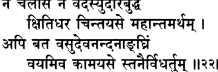

**----- Start of picture text -----** 
Ч  Ч 4 4 ч Ф щ  +1  ЧчЪ IRRII **----- End of picture text -----** 

_на чаласи на вадасй удара-буддхе_ 

_кьиити-дхара чинтайасе махантам артхам апи бата васудева-нанданангхрим вайам ива камайасе станаир видхартум_ 

_на чаласи_ — ты не движешься; _на вадаси_ — ты не говоришь; _удара_ — великодушный; _буддхе_ — чей разум; _кьиити-дхара_ — о го­ 

**текст 23] Краткое описание величия Господа Кришны** 

**735** 

ра; _чинтайасе_ — ты думаешь; _махантам_ — о великих; _артхам_ — вещах; _апи бата_ — возможно; _васудева-нандана_ — дорогого сы­ на Васудевы; _ангхрим_ — стопы; _вайам_ — мы; _ива_ — так же как; _камайасе_ — ты желаешь; _станаих_ — на своих грудях (вершинах); _видхартум_ — держать. 

**О великодушная гора, ты застыла в безмолвии. Должно быть, ты размышляешь о чем-то важном. Или, может быть, ты, подоб­ но нам, хочешь держать на своих грудях стопы любимого сына Васудевы?** 

_КОММЕНТАРИЙ:_ Здесь слово _станаих_ , «на твоих грудях», отно­ сится к вершинам горы. 

**ТЕКСТ 23** 

Ч Р Г 1: FT IR3II 

_шушйад-дхрадах караьиита бата синдху-патнйах сампратй апаста-камала-ьирийа ишта-бхартух йадвад вайам мадху-патех пранайавалокам апрапйа мушта-хрдайах пуру-каршитах сма_ 

_шушйат_ — засыхающие; _храдах_ — чьи озера; _караьиитах_ — уменьшившиеся; _бата_ — увы; _синдху_ — океана; _патнйах_ — о же­ ны; _сампратй_ — теперь; _апаста_ — потеряно; _камала_ — лотосов; _шрийах._ — чье великолепие; _ишта_ — возлюбленного; _бхартух_ — су­ пруга; _йадват_ — так же как; _вайам_ — мы; _мадху-патех_ — Криш­ ны, повелителя Мадху; _пранайа_ — любящие; _авалокам_ — взгляды; _апрапйа_ — не сумев поймать; _мушта_ — обмануты; _хрдайах_ — чьи сердца; _пуру_ — сильно; _карьиитах_ — истощенные; _сма_ — мы стали. 

**О реки, жёны океана, заводи ваши пересохли. Увы, в вас почти не осталось воды, и роскошные лотосы, которые некогда украша­ ли вас, исчезли. Неужели вы, подобно нам, сохнете оттого, что не можете поймать на себе любящие взгляды нашего дорогого супруга, повелителя Мадху, который похитил наше сердце?** 

**736** 

**[песнь 10, гл. 90** 

**Шримад-Бхагаватам** 

_КОММЕНТАРИЙ:_ Летом реки не наполняются водой из облаков, посылаемых их супругом, океаном. Однако, по мнению цариц, на самом деле они пересохли потому, что им не удается поймать на себе любящий взгляд Господа Кришны, источника блаженства. 

## **ТЕКСТ 24** 

## FTCfcT rT + f4hrfdl4) ^ t e r n + P ih i п ад и 

_хамса свагатам асйатам пиба пайо брухй анга шаурех катхам_ 

_дутам твам ну видама каччид аджитах свастй аста уктам пура ким ва наш чала-саухрдах смарати там касмад бхаджамо вайам кшаудралапайа кама-дам ьирийам рте саиваика-ништха стрийам_ 

_хамса_ — о лебедь; _су-агатам_ — добро пожаловать; _асйатам_ — по­ жалуйста, подходи и садись; _пиба_ — пожалуйста, выпей; _пайах_ .— молока; _брухи_ — расскажи нам; _анга_ — дорогой; _ьиаурех_ — о Шаури; _катхам_ — новости; _дутам_ — посланник; _твам_ — ты; _ну_ — несо­ мненно; _видама_ — мы считаем; _каччит_ — ли; _аджитах_ — непобеди­ мый; _свасти_ — в порядке; _acme_ — находится; _уктам_ — сказанные; _пура_ — давно; _ким_ — ли; _ва_ — или; _нах._ — нам; _чала_ — непостоян­ на; _саухрдах_ — чья дружба; _смарати_ — Он помнит; _там_ — Ему; _касмат_ — по этой причине; _бхаджамах_ — должны поклоняться; _вайам_ — мы; _кшаудра_ — о слуга презренного господина; _алапайа_ — вели Ему прийти; _кама_ — желание; _дам_ — кто дарует; _ьирийам_ — бо­ гини процветания; _рте_ — без; _са_ — она; _эва_ — одна; _эка-ништха_ — безраздельно предана; _стрийам_ — среди женщин. 

**Добро пожаловать, лебедь. Пожалуйста, присядь здесь и выпей молока. Дорогой лебедь, расскажи нам что-нибудь о потомке царя Шурасены. Мы знаем: Ты Его посланник. Все ли в порядке у не­ победимого Господа и помнит ли этот вероломный друг те слова, что когда-то давно говорил нам? Почему мы должны идти и по­ клоняться Ему? О слуга этого презренного господина, иди и вели тому, кто выполняет наши желания, чтобы Он пришел сюда без богини процветания. Неужели во всем мире нет другой женщины, которая безраздельно предана Ему?** 

**текст 25] Краткое описание величия Господа Кришны** 

**737** 

_КОММЕНТАРИЙ:_ Шрила Вишванатха Чакраварти приводит сле­ дующий диалог между царицами и лебедем: 

Царицы спрашивают: «Все ли в порядке у непобедимого Господа?» 

Лебедь отвечает: «Как может у Господа Кришны быть все 

в порядке, если рядом с Ним нет вас, Его возлюбленных супруг?» 

«Но помнит ли Он то, что когда-то сказал одной из нас, Шримати Рукмини? Вспоминает ли Он Свои слова: „Во всех Моих двор­ цах нет у Меня жены дороже тебя“?» [Бхаг., 10.60.55: _на твадршйм пранайинйм грхинйм грхешу пашйами\_ 

«Он помнит это, и потому только Он прислал меня сюда. Все вы должны отправиться к Нему и служить Ему с преданностью». 

«Чего ради мы должны идти и служить Ему, если Он не хочет прийти сюда и быть с нами?» 

«О вы, чье сердце подобно океану сострадания, известно ли вам, как Он терзается в разлуке с вами? Как облегчить Его муки?» 

«Послушай нас, слуга своего презренного господина: вели Ему прийти сюда. Если Его мучит вожделение, то Ему некого винить, кроме Себя Самого, поскольку Он Сам наделил бога любви такой силой. Мы, уважающие себя женщины, не собираемся подчиняться Его приказам и идти разыскивать Его». 

«Будь по-вашему, тогда я удаляюсь». 

«Подожди минутку, дорогой лебедь. Попроси Его прийти сюда, но только пусть не берет с Собой богиню процветания, которая все время обманывает нас, держа Его при себе». 

«О, разве вы не знаете, как предана Господу богиня Лакшми? Как Он сможет оставить ее?» 

«Неужели ты думаешь, что она единственная женщина в этом мире, которая полностью отдала себя Ему? А как же мы?» 

## ТЕКСТ 25 

_щ щ_ irh ii 

_шрй-шука увача_ 

_итйдршена бхавена кршне йогеьиварешваре крийаманена мадхавйо лебхире паромам гатим_ 

**738** 

**[песнь 10, гл. 90** 

**Шримад-Бхагаватам** 

_шрй-шуках увача_ — Шукадева Госвами сказал; _ити_ — говоря так; _йдршена_ — с такой; _бхавена_ — экстатической любовью; _кршне_ — к Кришне; _йога-йшвара_ — повелителей _йоги; йшваре_ — повелите­ лю; _крийаманена_ — ведя себя; _мадхавйах_ — жёны Господа Мадхавы; _лебхире_ — они достигли; _паромам_ — высшей; _гатим_ — цели. 

## **Шукадева Госвами сказал: Говоря так и действуя с такой эк­ статической любовью к Господу Кришне, повелителю всех по­ велителей** _**йоги**_ **, Его любящие жены достигли высшей цели жизни.** 

_КОММЕНТАРИЙ:_ Как отмечает _ачаръя_ Шри Джива Госвами, Шу­ кадева Госвами здесь использует слово _крийаманена_ в настоящем времени, чтобы показать, что жены Господа достигли Его вечной обители сразу же, в тот же миг. Тем самым _ачаръя_ отметает лож­ ные представления о том, что после ухода из этого мира Господа Кришны Его жен, находившихся под защитой Арджуны, похитило дикое племя пастухов. На самом деле, как объясняют в другом мес­ те великие комментаторы-вайшнавы, Сам Господь Кришна принял облик этих пастухов и похитил цариц. Подробнее об этом можно прочитать в комментарии Шрилы Прабхупады к двадцатому стиху пятнадцатой главы Первой песни «Шримад-Бхагаватам». 

Шрила Вишванатха Чакраварти отмечает, что высшая цель, которой достигли эти возвышенные женщины, не то же самое осво­ бождение, которого достигают иогы-имперсоналисты. Они достиг­ ли высшей ступени _према-бхакти,_ чистой любви к Богу. В самом деле, поскольку царицы с самого начала испытывали божествен­ ную любовь к Господу, у них были трансцендентные тела, состо­ явшие из вечности, знания и блаженства, и в этих телах они могли в полной мере наслаждаться сладостными отношениями с Госпо­ дом в Его сокровенных _лилах._ Но, по словам Шрилы Вишванатхи Чакраварти, когда их любовь к Богу созрела, она превратилась в экстаз безумия чистой любви _(бхавонмада),_ подобный чувствам, которые испытывали _гопи_ , когда Кришна покинул их во время танца _раса._ В это время _гопи_ полностью погрузились в состояние экстатического безумия и в этом состоянии стали разговаривать с обитателями леса или произносили такие слова, как _кршно 3хам пашйата гатим:_ «Я Кришна! Только посмотрите, с какой грацией я хожу!» (Бхаг., 10.30.19). Подобно этому, яркое проявление экста­ тической любви главных жен Господа Дваракадхиши вызвало у них признаки _према-вайчитръи_ , которые они демонстрируют здесь. 

**текст 27] Краткое описание величия Господа Кришны** 

**739** 

## **ТЕКСТ 26** 

**ч : ч ч : | чт w ^ r f N t  ч f%  ^ т: И ^ и** 

_ьирута-матро 'пи йах стрйнам прасахйакаршате манах уру-гайору-гйто ва паьийантйнам ча ким пунах_ 

_трута_ — о котором слушают; _матрах_ — просто; _апи_ — даже; _йах_ — кто (Господь Кришна); _стрйнам_ — женщин; _прасахйа_ — си­ лой; _акаршате_ — притягивает; _манах_ — умы; _уру_ — многочислен­ ными; _гайа_ — песнями; уру — на разные лады; _гитах_ — поющимися; _ва_ — с другой стороны; _паьийантйнам_ — тех женщин, кто видит Его; _ча_ — и; _ким_ — что; _пунах_ — больше. 

**Господь, которого на разные лады прославляют в бесчислен­ ных песнях, накрепко привязывает к Себе ум всех женщин, стоит им просто услышать о Нем. Что тогда говорить о тех женщинах, которые видят Его?** 

## **ТЕКСТ 27** 

**чт: й*чт ч 14 * Н 1 <Н|ДОг: I 4 ^ fS 4 T  Ч ТЧ Т тпт: IR u ll** 

_йах сампарйачаран премна пада-самваханадибхих джагад-гурум бхартр-буддхйа тасам ким варнйате тапах_ 

_йах_ — кто; _сампарйачаран_ — служил совершенным образом; _прем­ ий_ — с чистой любовью; _пада_ — Его стопы; _самвахана_ — массируя; _адибхих_ — и так далее; _джагат_ — всего мира; _гурум_ — духовному учителю; _бхартр_ — как к своему мужу; _буддхйа_ — с отношением; _тасам_ — их; _ким_ — как; _варнйате_ — может быть описана; _тапах_ — их суровая аскеза. 

**Как можно описать великие аскетические подвиги, которые со­ вершили женщины, безукоризненно служившие Ему, духовному учителю всего мира, с чистой экстатической любовью? Почитая Господа своим супругом, они массировали Ему стопы и иными способами лично служили Ему.** 

**740** 

**[песнь 10, гл. 90** 

**Шримад-Бхагаватам** 

## **ТЕКСТ 28** 

## **^ TFIT TffrT: I** T jt ^ ч Ы +W H i _и ^ и_ 

_эвам ведодитам дхармам анутиштхан сатам гатих грхам дхармартха-каманам мухуьи чадаршайат падам_ 

_эвам_ — таким образом: _веда_ — Ведами; _удитам_ — провозглашен­ ные; _дхармам_ — заповеди религии; _анутиштхан_ — соблюдая; _са­ там_ — святых вайшнавов; _гатих_ — цель; _грхам_ — свой дом; _дхар­ ма_ — праведности; _артха_ — материального процветания; _кама­ нам_ — и чувственных наслаждений; _мухух_ — вновь и вновь; _ча_ — и; _адарьиайат_ — Он показывал; _падам_ — как место. 

**Таким образом, идеально исполняя Свои обязанности, предпи­ санные Ведами, Господь Кришна, высшая цель всех святых вай­ шнавов, снова и снова показывал, как человек, не покидая семьи и дома, может достичь всех целей — праведности, материального благосостояния и регламентированного удовлетворения чувств.** 

## **ТЕКСТ 29** 

## ч т ф ! I W s r m W i r ^ ii 

_астхитасйа парам дхармам кршнасйа грха-медхинам асан шодаьиа-сахасрам махишйаьи ча шатадхикам_ 

_астхитасйа_ — который утвердился; _парам_ — в высших; _дхар­ мам_ — религиозных принципах; _кршнасйа_ — Господа Кришны; _грхамедхинам_ — тех, кто ведет семейную жизнь; _асан_ — было; _шодаьиа_ — шестнадцать; _сахасрам_ — тысяч; _махишйах_ — цариц; _ча_ — и; _ьиата_ — сто; _адхикам_ — еще. 

**Образцово следуя всем принципам жизни семейного человека, Господь Кришна содержал более шестнадцати тысяч ста жен.** 

## **ТЕКСТ 30** 

iRoii 

**текст 32] Краткое описание величия Господа Кришны** 

**741** 

_тасам стри-ратна-бхутанам аштау йах праг удахртах рукминй-прамукха раджамс тат-путраьи чанупурваьиах_ 

_тасам_ — среди них; _стрй_ — из женщин; _ратна_ — драгоценные камни; _бхутанам_ — которые были; _аштау_ — восемь; _йах_ — кото­ рые; _прак_ — ранее; _удахртах_ — описанные; _рукминй-прамукхах_ — во главе с Рукмини; _раджан_ — о царь (Парикшит); _тат_ — их; _пут­ рах_ — сыновья; _ча_ — также; _анупурваьиах_ — в последовательном порядке. 

**Все они были украшением женского рода, но среди них восемь цариц во главе с Рукмини были главными. О царь, я уже рассказал тебе о них и об их сыновьях.** 

## **ТЕКСТ 31** 

_щ ? г ц_ **зттсчч* W зтЬтМж:** _\ \ т_ 

_экаикасйам даьиа даьиа кршно 'джйджанад атмаджан йаватйа атмано бхарйа амогха-гатир йьиварах_ 

_эка-экасйам_ — в каждой из них; _даьиа даьиа_ — по десять; _кршнах_ — Кришна; _аджйджанат_ — зачал; _атма-джан_ — сыновей; _йаватйах_ — столько, сколько; _атманах_ — Его; _бхарйах_ — жен; _амогха_ — никогда не знают поражений; _гатих_ — чьи усилия; _ййгварах_ — Верховный Господь. 

**Верховный Господь Кришна, который всегда исполняет за­ думанное, зачал в лоне каждой из Своих жен по десять сыновей.** 

_КОММЕНТАРИЙ:_ Таким образом, всего у Кришны было сто шестьдесят одна тысяча восемьдесят сыновей. Вдобавок к этому каждая из жен родила Ему по дочери. 

## **ТЕКСТ 32** 

^ nvui 

**[песнь 10, гл. 90** 

**742** 

**Шримад-Бхагаватам** 

_тешам уддама-вирйанам ашта-даша маха-ратхах асанн удара-йаьиасас тешам намани ме шрну_ 

_тешам_ — из этих (сыновей); _уддама_ — безгранична; _вйрйанам_ — чья доблесть; _ашта-даша_ — восемнадцать; _маха-ратхах_ — _махаратхи,_ величайшие из воинов на колесницах; _асан_ — были _\ удара_ — широко известна; _йашасах_ — чья слава; _тешам_ — их; _намани_ — имена; _ме_ — от меня; _шрну_ — услышь. 

**Восемнадцать из этих сыновей обладали безграничной отвагой н были прославленными** _маха-ратхами_ . **Услышь же от меня их имена.** 

## **ТЕКСТЫ 33-34** 

## **^  IRVII** 

_прадйумнаьи чанируддхаш на дйптиман бханур эва ча самбо мадхур брхадбхануш читрабханур врко \рунах_ 

_пушкаро ведабахуьи ча шрутадевах сунанданах читрабахур вирупаш ча кавир нйагродха эва ча_ 

_прадйумнах_ — Прадьюмна; _ча_ — и; _анируддхах_ — Анируддха; _ча_ — и; _дйптиман бханух_ — Диптиман и Бхану; _эва ча_ — также; _самбах мадхух брхат-бханух_ — Самба, Мадху и Брихадбхану; _читрабханух врках арунах_ — Читрабхану, Врика и Аруна; _пушкарах веда-бахух ча_ — Пушкара и Ведабаху; _шрутадевах сунанданах_ — Шрутадева и Сунандана; _читра-бахух вирупах ча_ — Читрабаху и Вирупа; _кавих нйагродхах_ — Кави и Ньягродха; _эва ча_ — также. 

**Их звали Прадьюмна, Анируддха, Диптиман, Бхану, Самба, Ма­ дху, Брихадбхану, Читрабхану, Врика, Аруна, Пушкара, Ведабаху, Шрутадева, Сунандана, Читрабаху, Вирупа, Кави и Ньягродха.** 

_КОММЕНТАРИЙ:_ Шрила Вишванатха Чакраварти отмечает, что Анируддха, о котором говорится здесь, — это сын Господа Криш­ ны, а не Его знаменитый внук, сын Прадьюмны. 

**текст 37] Краткое описание величия Господа Кришны** 

**743** 

## **ТЕКСТ 35** 

d^HM i I 

## **^ зтгсйсЯФт: IR4II** 

_этеьиам апи раджендра тану-джанам мадху-двишах прадйумна асйт пратхамах питр-вад рукминй-сутах_ 

_этеьиам_ — из этих; _апи_ — и; _раджа-индра_ — о лучший из царей; _тану-джанам_ — сыновей; _мадху-двишах_ — Кришны, врага демона Мадху; _прадйумнах_ — Прадьюмна; _асйт_ — был; _пратхамах_ — пер­ вым; _питр-ват_ — таким же, как его отец; _рукминй-сутах_ — сын Рукмини. 

**О лучший из царей, самым выдающимся из этих сыновей Гос­ пода Кришны, врага Мадху, был сын Рукмини Прадьюмна. Он ни в чем не уступал своему отцу.** 

## **ТЕКСТ 36** 

## **rTFft mIiiа ч ?пйм: ii^ii** 

_са рукмино духитарам упайеме маха-ратхах тасйам тато ’нируддхо Убхут нагайута-баланвитах_ 

_сах_ — он (Прадьюмна); _рукминах_ — Рукми (старшего брата Рук­ мини); _духитарам_ — дочь, Рукмавати; _упайеме_ — взял в _жены; махаратхах_ — великий воин на колеснице; _тасйам_ — в ней; _татах_ — затем; _анируддхах_ — Анируддха; _абхут_ — родился; _нага_ — слонов; _айута_ — десяти тысяч; _бала_ — силой; _анвитах_ — наделенный. 

**Великий воин Прадьюмна женился на дочери Рукми [Рукма­ вати], которая родила ему Анируддху. Анируддха обладал силой десяти тысяч слонов.** 

**ТЕКСТ 37** 

TfNV гГгГ: 

_**\ \ Щ \**_ 

**744** 

**[песнь 10, гл. 90** 

**Шримад-Бхагаватам** 

_са чапи рукминах паутрим даухитро джагрхе татах ваджрас тасйабхавад йас ту маушалад авашешитах_ 

_сах_ — он (Анируддха); _ча_ — и; _апи_ — далее; _рукминах_ — Рук­ ми; _паутрйм_ — внучку, Роману; _даухитрах_ — сын дочери Рукми; _джагрхе_ — взял; _татах_ — затем; _ваджрах_ — Ваджра; _тасйа_ — как его сын; _абхават_ — родился; _йах_ — кто; _ту_ — но; _маушалат_ — по­ сле _лилы_ , во время которой Яду избили друг друга до смерти железными палицами; _авашешитах_ — остался. 

**Сын дочери Рукми [Анируддха] женился на дочери сына Рук­ ми [Рочане]. Она родила Ваджру, который был одним из немногих оставшихся в живых после сражения на палицах.** 

## **ТЕКСТ 38** 

^ T ^ t: гТг^гТ: ||ЭД1 

_пратибахур абхут тасмат субахус тасйа чатмаджах субахох ьиантасено Убхуч чхатасенас ту тат-сутах_ 

_прати-бахух_ — Пратибаху; _абхут_ — появился; _тасмат_ — от него (Ваджры); _су-бахух_ — Субаху; _тасйа_ — его; _ча_ — и; _атма-джах_ — сын; _су-бахох_ — от Субаху; _ьианта-сенах_ — Шантасена; _абхут_ — по­ явился; _шата-сенах_ — Шатасена; _т у_ — и; _тат_ — его (Шантасены); _су max_ — сын. 

**От Ваджры родился Пратибаху, а его сына звали Субаху. Сына Субаху звали Шантасена, а от Шантасены родился Шатасена.** 

## **ТЕКСТ 39** 

_ч_ 3TSRT ЗТ^ГЯТ: I 

_на хй этасмин куле джата адхана абаху-праджах алпайушо_ ’ _лпа-вйрйаш ча абрахманйаьи ча джаджнире_ 

_на_ — не; _хи_ — несомненно; _этасмин_ — в этом; _куле_ — роду; _джа­ тах_ — появлявшиеся; _адханах_ — бедные; _а-баху_ — имеющие мало; 

**текст 41] Краткое описание величия Господа Кришны** 

**745** 

_праджах_ — детей; _алпа-айушах_ — умиравшие молодыми; _алпа_ — мала; _вйрйах_ — чья доблесть; _на_ — и; _абрахманйах_ — не преданные _брахманам; ча_ — и; _джаджнире_ — были рождены. 

**В этом роду никогда не появлялись на свет люди бедные, имев­ шие мало детей, умиравшие молодыми, слабые и не почитавшие** _брахманов_ . 

## **ТЕКСТ 40** 

Я' W F T 4 чЦ З£ч ||Уо11 

_йаду-вамша-прасутанам пумсам викхйата-карманам санкхйа на ьиакйате картум апи варшайутаир нрпа_ 

_йаду-вамьиа_ — в роду Яду; _прасутанам_ — из тех, кто родился; _пумсам_ — мужчин; _викхйата_ — знамениты; _карманам_ — чьи дея­ ния; _санкхйа_ — перечисление; _на ьиакйате_ — не может; _картум_ — быть сделано; _апи_ — даже; _варьиа_ — лет; _айутаих_ — за десятки тысяч; _нрпа_ — о царь (Парикшит). 

**В династии Яду родилось бесчисленное множество великих лю­ дей, которые прославились своими подвигами. О царь, их деяния невозможно перечислить даже за десятки тысяч лет.** 

**ТЕКСТ 41** 

## _**ШЩ**_ $ЧК1ЧЙ1г1 ^ ||«?И 

_тисрах котйах сахасранам аьитаьийти-ьиатани на асан йаду-куланарйах кумаранам ити игру там_ 

_тисрах_ — три; _котйах_ — (по) десять миллионов; _сахасранам_ — тысяч; _аьита-аьийти_ — восемьдесят восемь; _ьиатани_ — сотен; _ча_ — и; _асан_ — были; _йаду-кула_ — династии Яду; _анарйах_ — учителя; _ку­ маранам_ — для детей; _ит и_ — так; _трутам_ — было услышано. 

**Я слышал из достоверных источников, что только для обучения своих детей члены рода Яду наняли тридцать восемь миллионов восемьсот тысяч учителей.** 

**746** 

**[песнь 10, гл. 90** 

**Шримад-Бхагаватам** 

## **ТЕКСТ 42** 

_ъг._ чщ гччтч; i 

_ъ_ зтт^г: идеи 

_санкхйанам йадаванам ках каришйати махатманам йатрайутанам айута-лакшенасте са ахуках_ 

_санкхйанам_ — подсчет; _йадаванам_ — Ядавов; _ках_ — кто; _каришйа­ т и_ — может сделать; _маха-атманам_ — великих людей; _йатра_ — среди кого; _айутанам_ — десятков тысяч; _айута_ — (по) десять ты­ сяч; _лакшена_ — с (тремя) сотнями тысяч (человек); _acme_ — был; _сах_ — он; _ахуках_ — Уграсена. 

## **Кто сможет перечесть всех великих Ядавов, если одного царя Уграсену окружала свита, состоявшая из тридцати триллионов человек?** 

_КОММЕНТАРИЙ:_ Шрила Вишванатха Чакраварти объясняет, по­ чему здесь говорится, что в свите царя Уграсены было именно тридцать триллионов человек, а не некое неопределенное число из десятков триллионов. Он приводит правило герменевтики, кото­ рое называется _капинджаладхикарана,_ «логика упоминания о ку­ ропатках». В одном месте в Ведах говорится о том, что «человек должен принести в жертву несколько куропаток». Множественное число в данном случае следует трактовать не как некое неопреде­ ленное количество куропаток, а конкретно три куропатки, посколь­ ку в Ведах нет места для неопределенности. Если не указано точное число, то, согласно правилам толкования писаний, разработанным в школе _мимамсы_ , этим количеством по умолчанию считается три. 

## **ТЕКСТ 43** 

^ Г ^ Т ^ г Т Т _Ъ  Ц ^\ь щ :_ I 

% WTsTT Идеи 

_девасурахава-хата даитейа йе су-дарунах те чотпанна манушйешу праджа дрпта бабадхире_ 

_дева-асура_ — среди полубогов и демонов; _ахава_ — в войнах; _ха­ тах_ — убиты; _даитейах_ — демоны; _йе_ — которые; _су_ — очень; _дарунах_ — жестокие; _те_ — они; _ча_ — и; _утпаннах_ — появились; _ма-_ 

**текст 45] Краткое описание величия Господа Кришны** 

**747** 

_нушйешу_ — среди людей; _праджах_ — население; _дрптах_ — надмен­ ные; _бабадхире_ — они беспокоили. 

**Жестокие потомки Дити, погибшие некогда в битвах между по­ лубогами и демонами, родились у земных женщин и, обуреваемые гордыней, нередко притесняли обычных людей*** 

## **ТЕКСТ 44** 

^ Т Т ^ Г : I 

**з щ с М : IIVVII** 

_тан-ниграхайа харина прокта дева йадох куле аватйрнах кула-ьиатам тешам экадхикам нрпа_ 

_тат_ — их; _ниграхайа_ — для усмирения; _харина_ — Господа Криш­ ны; _проктах_ — получившие наказ; _девах_ — полубоги; _йадох_ — Яду; _куле_ — в роде; _аватйрнах_ — нисшедшие; _кула_ — кланов; _шатам_ — сто; _тешам_ — их; _эка-адхикам_ — плюс один; _нрпа_ — о царь (Па­ рикшит). 

**Чтобы усмирить этих демонов, Господь Хари велел полубогам родиться в династии Яду. О царь, род Яду состоял из ста одного клана.** 

## **ТЕКСТ 45** 

%ЧТ Ш _W F m ,_ I **^ №41** 

_тешам праманам бхагаван прабхутвенабхавад дхарих йе чанувартинас тасйа ваврдхух сарва-йадавах_ 

_тешам_ — для них; _праманам_ — авторитет; _бхагаван_ — Господь Кришна; _прабхутвена_ — поскольку Он является Верховной Лич­ ностью Бога; _абхават_ — был; _харих_ — Господь Хари; _йе_ — те, кто; _ча_ — и; _анувартинах_ — личные спутники; _тасйа_ — Его; _ваврдхух_ — процветали; _сарва_ — все; _йадавах_ — Ядавы. 

**Поскольку Господь Кришна — Верховная Личность Бога, Яда­ вы безоговорочно принимали Его своим повелителем. Те из них, кто находился рядом с Ним, особенно процветали.** 

**748** 

**[песнь 10, гл. 90** 

**Шримад-Бхагаватам** 

## **ТЕКСТ 46** 

_шаййасанатаналапа-крйда-снанади-кармасу на видух сайтам атманам вршнайах кршна-четасах_ 

_ьиаййа_ — сна; _асана_ — сидения; _атана_ — прогулок; _алапа_ — раз­ говоров; _крйда_ — игр; _снана_ — омовения; _ади_ — и так далее; _кармасу_ — в действиях; _на видух_ — они не знали; _сайтам_ — присутст­ вовавшем; _атманам_ — самих себя; _вршнайах_ — Вришни; _кршна_ — (погруженные) в Кришну; _четасах_ — чьи умы. 

## **Вришни были так погружены в мысли о Кришне, что, спа­ ли ли они или сидели, гуляли, беседовали, играли или совершали омовение, — они полностью забывали о собственном теле.** 

## **ТЕКСТ 47** 

**'** Tlf^T ^Цг^ТГ _Ш_ Т О ||tfu || 

## _**тйртхам чакре нрпонам йад аджани йадушу свах-сарит пада-шаучам**_ 

_**видвит-снигдхах сварупам йайур аджита-пара шрйр йад-артхе ’нйа-йатнах йан-намамангала-гхнам трутам атха гадитам йат-крто готра-дхармах кршнасйаитан на читрам кшити-бхара-харанам кала-чакрайудхасйа**_ 

_тйртхам_ — святое место паломничества; _чакре_ — созданное; _нрпа_ — о царь (Парикшит); _унам_ — менее; _йат_ — которая (сла­ ва Господа Кришны); _аджани_ — Он родился; _йадушу_ — среди Яду; _свах_ — райская; _сарит_ — река; _пада_ — чьи стопы; _ьиаучам_ — (во­ да) которая омывает; _видвит_ — враги; _снигдхах_ — и те, кто до­ рог; _сварупам_ — чья личная форма; _йайух_ — достигли; _аджита_ — непобедима; _пара_ — и всесовершенна; _шрйх_ — богиня процвета­ ния; _йат_ — чьей; _артхе_ — ради; _анйа_ — других; _йатнах_ — ста­ рания; _йат_ — чье; _нама_ — имя; _амангала_ — все неблагоприят­ ное; _гхнам_ — уничтожающее; _ьирутам_ — услышанное; _атха_ — или; 

**текст 47] Краткое описание величия Господа Кришны** 

**749** 

_гадитам_ — повторяемое; _йат_ — кем; _кртах_ — созданные; _готра_ — среди потомков (разных мудрецов); _дхармах_ — заповеди религии; _крьинасйа_ — для Господа Кришны; _этат_ — это; _на_ — не; _читрам_ — удивительно; _кьиити_ — Земли; _бхара_ — бремени; _харанам_ — уничто­ жение; _кала_ — времени; _чакра_ — колесо; _айудхасйа_ — чье оружие. 

**Небесная Ганга является святым местом паломничества, ибо ее воды омывают стопы Господа Кришны. Однако, когда Господь по­ явился в роду Яду, Его слава затмила даже славу Ганги как свя­ того места. И те, кто ненавидел Господа, и те, кто любил Его, обрели вечное место в духовном мире, получив облик, подобный облику Самого Господа. Неприступная и ни в чем не испытываю­ щая нужды богиня процветания, благосклонности которой доби­ ваются все, принадлежит лишь Ему одному. Его имя, услышанное или произнесенное, уничтожает все неблагоприятное. Он один установил заповеди религии, которым следуют потомки и учени­ ки разных мудрецов. Что же удивительного в том, что Он, чьим оружием является колесо времени, избавил Землю от ее тяжкой ноши?** 

_КОММЕНТАРИЙ:_ Десятая песнь от начала и до конца посвящена описанию _лил_ Господа Кришны во Вриндаване, Матхуре и Двара­ ке. Как отмечает Шрила Вишванатха Чакраварти, этот стих под­ водит итог всей Десятой песни, поскольку здесь перечислены пять отличительных качеств Шри Кришны, которых нет ни у одного из Его экспансий, полных частей и _аватар._ 

Во-первых, когда Господь Кришна явил Себя в роду Яду, слава Его затмила славу священной Ганги. До этого момента Ганга счи­ талась самой священной из всех _тиртх,_ поскольку вода ее омыла лотосные стопы Господа Ваманадевы. Но после прихода Господа Кришны другая река, Ямуна, стала еще более великой, ибо во Врадже и Матхуре ее вод коснулась пыль с лотосных стоп Шри Кришны: 

_ганга-ьиата-гуна прайо матхуре мама мандале йамуна виьирута девй натра карйа вичарана_ 

«Прославленная Ямуна, что течет в Моей обители Матхуре, в сто раз могущественнее Ганги. О богиня, это неоспоримый факт» (Вараха-пурана, 152.30). 

**750** 

**[песнь 10, гл. 90** 

**Шримад-Бхагаватам** 

Во-вторых, Господь Кришна даровал освобождение не только предавшимся Ему душам, но также и тем, кто считал себя Его врагами. Преданные, начиная с юных пастушек Враджа, получили возможность лично общаться с Ним, войдя в Его вечные, испол­ ненные блаженства игры в духовном мире, а Его враги-демоны, принявшие смерть от Его руки, достигли _саюджъя-мукти,_ погру­ зившись в Его божественное тело. Когда Господь Кришна присут­ ствовал на Земле, Его сострадание распространялось не только на членов Его семьи, друзей и слуг, но также и на Его врагов, всех их родственников, друзей и слуг. Об этом говорят такие великие учи­ тели, как Господь Брахма, чей авторитет непререкаем: _сад-вешад ива путанапи са-кула твам эва девапита_ — «Мой Господь, Ты уже отдал Себя Путане и ее родственникам в благодарность за то, что та притворилась преданной» (Бхаг., 10.14.35). 

В-третьих, богиня Лакшми, вечная спутница Господа Нараяны, которой в надежде обрести хотя бы крупицу ее милости подобо­ страстно служат даже великие полубоги, не смогла завоевать пра­ во войти в круг приближенных слуг Господа Кришны во Врадже. Она очень хотела принять участие в танце _раса_ и других играх Гос­ пода, однако, несмотря на свое горячее желание и суровую аскезу, которую она совершила, чтобы достичь этой цели, ей не удалось преодолеть свое природное благоговение перед Господом. Сладость и сокровенность игр Господа Кришны во Вриндаване — это особое богатство, не доступное нигде в другом месте, даже на Вайкунтхе. Об этом говорит Шри Уддхава: 

_йан мартйа-лйлаупайикам сва-йогамайа-балам дарьиайата грхйтам висмапанам свасйа на саубхагарддхех парам падам бхушана-бхушанангам_ 

«Чтобы явить могущество Своей духовной энергии, Господь Криш­ на проявил форму, которая как нельзя лучше подходила для Его игр в облике человека. Этот облик — высшее воплощение велико­ лепия и удачи — удивил даже Его Самого. Члены Его тела были столь прекрасны, что украшали собой даже украшения, которые Он носил на разных частях Своего тела» (Бхаг., 3.2.12). 

В-четвертых, имя Кришна превосходит по могуществу имя На­ раяна и имена всех остальных воплощений Господа Кришны. Эти два слога — _крьи_ и _на_ — соединяются вместе, чтобы рассеять ил­ люзию и все приносящее несчастье. Когда его произносят, имя Кришна становится _шрута-матхой;_ это означает, что повторение 

**текст 48] Краткое описание величия Господа Кришны** 

**751** 

имени Кришны полностью затмевает собой _(матхнати)_ совер­ шенства всех остальных духовных практик, описанных в _шастрах (трута)._ Как утверждает «Брахманда-пурана», 

## _сахасра-намнам пунйанам_ 

_трир аврттйа ту йат пхалам экаврттйа ту кршнасйа намаикам тат прайаччхати_ 

«Произнеся имя Кришны хотя бы единожды, человек обретает то же благо, какое получает тот, кто трижды повторит тысячу имен Господа Вишну». 

В-пятых, Господь Кришна снова утвердил на Земле принципы _дхармы_ , восстановив четыре ее опоры — сострадание, аскетизм, чистоту и правдивость. Таким образом, бык _дхармы_ вновь стал защитником Земли _(го-тра)._ Шри Кришна также положил нача­ ло новому празднику, Говардхана-пудже, которую проводят в честь Его любимого холма, коров и _брахманов._ Он также Сам стал хол­ мом _(готра),_ чтобы принять подношения пастухов. Кроме того, Он усилил _дхарму_ (способность любить) божественных пастухов Вра­ джа, которых тоже можно назвать _готрами._ Их любовь к Нему превзошла любые другие проявления любви, известные до того. 

Таковы лишь некоторые из множества поразительных качеств Господа Кришны. 

ТЕКСТ 48 

srafrr **sM ^w ftdldi ll»<ill** 

_джайати джана-нивасо девакй-джанма-вадо_ 

_йаду-вара-паришат сваир дорбхир асйанн адхармам стхира-чара-врджина-гхнах су-смита-шрй-мукхена враджа-пура-ванитанам вардхайан кама-девам_ 

_джайати_ — да славится в веках; _джана-нивасах_ — тот, кто жи­ вет среди людей (членов рода Яду) и является высшим прибежи­ щем всех живых существ; _девакй-джанма-вадах_ — тот, кто известен как сын Деваки (в действительности никто не может стать отцом 

**752** 

**[песнь 10, гл. 90** 

**Шримад-Бхагаватам** 

или матерью Верховного Господа, поэтому словосочетание _девакйджанма-вадах_ означает, что Он _славится_ под именем сына Деваки; аналогичным образом Его знают как сына Яшоды, Васудевы и Ма­ хараджи Нанды); _йаду-вара-паришат_ — тот, кому служат члены рода Яду и пастухи Вриндавана (все они постоянные спутники Вер­ ховного Господа и Его вечные слуги); _сваих дорбхих_ — собствен­ норучно или посредством таких Своих преданных, как Арджуна, которые подобны Его рукам; _асйан_ — убивающий; _адхармам_ — де­ монов или грешников; _стхира-чара-врджина-гхнах_ — избавляющий от несчастья всех живых существ, движущихся и неподвижных; _су-смита_ — всегда улыбающимся; _шрй-мукхена_ — Своим очарова­ тельным лицом; _враджа-пура-ванитанам_ — девушек Вриндавана; _вардхайан_ — разжигающий; _кама-девам_ — страстное желание. 

**Господь Шри Кришна известен как** _джана-ниваса_ — **высшее прибежище всех живых существ, как Деваки-Нандана и ЯшодаНандана — сын Деваки и Яшоды. Вождь рода Яду, Он Своими могучими руками искореняет зло и истребляет грешников. Одним Своим присутствием Он уничтожает все, что приносит несчастье живым существам, движущимся и неподвижным. Его исполнен­ ное блаженства улыбающееся лицо неизменно разжигает страсть в** _гопи_ **Вриндавана. Да будет Он счастлив, овеянный славой!** 

_КОММЕНТАРИЙ:_ Литературный и пословный перевод этого сти­ ха взяты из «Шри Чайтанья-чаритамриты» Шрилы Прабхупады (Мадхья, 13.79). 

По словам Шрилы Вишванатхи Чакраварти, Шрила Шукадева Госвами произносит этот замечательный стих, чтобы утешить тех, кто сожалеет, что Господь Кришна не являет Свои земные игры по сей день. Здесь Шукадева Госвами напоминает своим слуша­ телям, что Господь вечно присутствует в этом мире — в святом месте, где он проводил Свои _лилы_ , в Своем имени и воспевании Его славы. На это указывает слово _джайати_ («Он торжествует»), которое стоит в настоящем времени. 

В книге «Кришна, Верховная Личность Бога» Шрила Прабху­ пада объясняет этот стих таким образом: «Рассказав царю Па­ рикшиту о непревзойденном величии Кришны, Шрила Шукадева Госвами завершает свое описание, прославляя Его: „Слава, слава Тебе, о Кришна! В образе Параматмы Ты пребываешь в серд­ це каждого. Поэтому Тебя называют Джананиваса — „обитаю­ щий в каждом сердце “. „Бхагавад-гита“ подтверждает это: _йьиварах сарва-бхутанам хрд-деьие ’рджуна тиьитхати_ — „Верховный Гос­ 

**текст 48] Краткое описание величия Господа Кришны** 

**753** 

подь в образе Параматмы пребывает в сердце каждого". Это, разу­ меется, не означает, что Кришна не существует Сам по Себе как Верховная Личность Бога. Философы-лшйявядм признают, что Па­ рабрахман вездесущ, но они думают, что, когда Парабрахман, Вер­ ховный Господь, приходит в материальный мир, Он подчиняется материальной природе. Поскольку Господь Кришна явился как сын Деваки, философ _ы-майявади_ считают Его обычным живым су­ ществом, родившимся в материальном мире. Поэтому Шукадева Госвами предостерегает их: _девакй-джанма-вадах_ — хотя Кришна известен как сын Деваки, в действительности Он Сверхдуша, вез­ десущая Верховная Личность Бога. Однако преданные Господа подругому понимают слова _девакй-джанма-вадах._ Они знают, что на самом деле Кришна был сыном Яшоды. Хотя Кришна явился как сын Деваки, Он тотчас поручил Себя заботам матушки Яшоды. Именно она вместе с Махараджей Нандой насладилась Его детски­ ми играми. Это признал и сам Васудева, когда встретился на Куру­ кшетре с Махараджей Нандой и Яшодой. Он сказал, что Кришна и Баларама на самом деле сыновья Яшоды и Нанды, а Васудева и Деваки Их родители лишь формально... 

Шукадева Госвами затем говорит, что Господь — тот, кого чест­ вуют в _йаду-вара-париьиат,_ царском собрании Ядавов. Он прослав­ ляет Господа за то, что тот сразил великое множество демонов. Кришна, Верховная Личность Бога, мог бы уничтожить всех демо­ нов с помощью Своих разнообразных материальных энергий, но Он пожелал убить их Сам, чтобы спасти их. Ради того чтобы рас­ правиться с демонами, Кришне не нужно было приходить в мате­ риальный мир — стоит Ему пожелать, и тысячи демонов будут тут же уничтожены. Ему не нужно для этого прилагать никаких уси­ лий. Кришна пришел в этот мир ради Своих чистых преданных: чтобы играть ребенком с матушкой Яшодой и Махараджей Нан­ дой и чтобы потом радовать обитателей Двараки. Убивая демонов и защищая тех, кто предан Ему, Господь Кришна утверждает ис­ тинную религию, которая есть не что иное, как любовь к Богу. Следуя этой религии и возлюбив Бога, даже _стхира-чары_ смог­ ли очиститься от материальной скверны и перенестись в духовное царство. _Стхира_ означает «неподвижные живые существа» — де­ ревья и другие растения, а _чара_ — это движущиеся существа: ко­ ровы, обезьяны и другие животные. Когда Кришна находился на Земле, Он освободил все деревья, другие растения, обезьян и дру­ гих животных, которым посчастливилось видеть Его и служить Ему во Вриндаване или в Двараке. 

**754** 

**[песнь 10, гл. 90** 

**Шримад-Бхагаватам** 

Господа Кришну особенно прославляют за то, что Он дарует радость _гопи_ и царицам Двараки. Шукадева Госвами восхваляет Господа Кришну за Его чарующую улыбку, которой Он пленял не только _гопи,_ но и цариц Двараки. Точные слова, которые он употребляет в связи с этим, — _вардхайан кама-девам._ Будучи воз­ любленным многих _гопи_ во Вриндаване и мужем множества цариц в Двараке, Кришна разжигал в них желание наслаждаться с Ним. Обычно, чтобы познать себя и постичь Бога, нужно тысячелетия­ ми предаваться суровому подвижничеству. Но _гопи_ и царицы Два­ раки обрели наивысшее освобождение просто потому, что в их сердце постоянно жило горячее желание наслаждаться с Кришной как со своим возлюбленным или мужем». 

Таким образом, Шрила Прабхупада великолепно разъясняет зна­ чение этого стиха, которым Шукадева Госвами подводит итог играм Господа Кришны. 

## **ТЕКСТ 49** 

+4+4<J||Pl 

## **linn** 

_иттхам парасйа ниджа-вартма-риракшайатталйла-танос тад-анурупа-видамбанани карманй карма-кашанани йадуттамасйа шруйад амушйа падайор ануврттим иччхан_ 

_иттхам_ — (описанные) таким образом; _парасйа_ — Всевышнего; _ниджа_ — Его собственные; _вартма_ — путь (преданного служения); _риракшайа_ — желая защитить; _атта_ — который принял; _лила_ — для игр; _танох_ — разнообразные личностные образы; _тат_ — каждой из них; _анурупа_ — подходящие; _видамбанани_ — имитируя; _карманй_ — деяния; _карма_ — последствия материальной деятельнос­ ти; _кашанани_ — которые уничтожают; _йаду-уттамасйа_ — лучшего из рода Яду; _ьируйат_ — следует слушать; _амушйа_ — Его; _падайох_ — по стопам; _ануврттим_ — право идти; _иччхан_ — желающий. 

**Чтобы защитить путь преданного служения Самому Себе, Гос­ подь Кришна, лучший из Ядавов, принимает для Своих развлече­** 

**текст 50] Краткое описание величия Господа Кришны** 

**755** 

**ний различные облики, описанные в «Шримад-Бхагаватам». Тот, кто желает с верой служить лотосным стопам Кришны, дол­ жен слушать о деяниях каждого из этих воплощений, в которых Он ведет Себя так, как и положено живым существам, принад­ лежащим к этой форме жизни. Слушая рассказы об этих иг­ рах, человек избавляется от всех последствий своей материальной деятельности.** 

**ТЕКСТ 50** 

I 

Ш ЧТ **5** *Т f a f r P |3 its f t ич°11 

_мартйас тайанусавам эдхитайа мукунда-_ 

_шрймат-катха-шравана-кйртана-чинтайаити тад-дхама дустара-кртанта-джавапаваргам_ 

_грамад ванам кшити-бхуджо ’пи йайур йад-артхах_ 

_мартйах_ — смертный; _тайа_ — таким; _анусавам_ — постоянно; _эдхитайа_ — увеличивающимся; _мукунда_ — о Господе Кришне; _шрймат_ — прекрасных; _катха_ — историй; _шравана_ — слушанием; _кйртана_ — воспеванием; _чинтайа_ — и памятованием; _эти_ — отправ­ ляется; _тат_ — Его; _дхама_ — в обитель; _дустара_ — неотвратимой; _крта-анта_ — смерти; _джава_ — силы; _апаваргам_ — место, где пре­ кращается; _грамат_ — из своего мирского дома; _ванам_ — в лес; _кшити-бхуджах_ — цари (такие как Прияврата); _апи_ — даже; _йайух_ — уходили; _йат_ — кого; _артхах_ — ради обретения. 

**Даже простой смертный, если он со всевозрастающей иск­ ренностью слушает повествования о Господе Мукунде, пере­ сказывает их и перебирает в памяти, непременно достигнет божественного царства Господа, на которое не распространяется власть неумолимой смерти. Ради этого многие люди, в том числе и великие цари, оставляли свой мирской дом и уходили в лес.** 

_КОММЕНТАРИЙ:_ Этот стих является _пхала-ьирути_ всей Десятой песни «Шримад-Бхагаватам». Он описывает благо, которое полу­ чит тот, кто слушает Десятую песнь. Путь преданного служения 

**756** 

## **Шримад-Бхагаватам** 

начинается со слушания повествований о Верховном Господе. Тот, кто слышал эти рассказы и понял их смысл, может начать переска­ зывать их другим ради их блага, а также размышлять над их значе­ нием. В результате он начнет неукоснительно следовать принципам преданного служения и постепенно обретет безоговорочную веру в Господа Кришну. Такая совершенная вера позволит ему лично служить Господу, и в положенный срок он вернется к своей вечной, духовной жизни в одной из обителей Господа. 

Смиренно принося к лотосным стопам Господа свои ком­ ментарии к Десятой песни, Шрила Вишванатха Чакраварти молится: 

_мад-гавйр апи гопалах свй-курйат крпайа йади тадаивасам пайах пйтва хршйейус тат-прийа джанах_ 

«Если Господь в образе пастуха Гопалы милостиво примет ко­ ров моих речей, тогда Его дорогие преданные смогут насладить­ ся вкусом их молока — нектара, доступного тем, кто слушает мои речи». 

_Так заканчивается комментарий смиренных слуг А. Ч. Бхактиведанты Свами Прабхупады к девяностой главе Десятой песни «Шримад-Бхагаватам_ », _которая называется «Краткое описание величия Господа Кришны»._ 

Работа над Десятой песнью «Шримад-Бхагаватам» была завер­ шена 27 декабря 1988 года, в день ухода Шрилы Бхактисиддханты Сарасвати Тхакура. 

## **КОНЕЦ ДЕСЯТОЙ ПЕСНИ** 

# **П рилож ения** 

## **Его Б ож ественная Милость А.Ч. Бхактиведанта Свами П рабхупада** 

Его Божественная Милость А.Ч. Бхактиведанта Свами Прабхупа­ да явился в этот мир в 1896 году в Калькутте (Индия). Там же, в Калькутте, в 1922 году он впервые встретился со своим духовным учителем, Шрилой Бхактисиддхантой Сарасвати Госвами. Бхактисиддханте Сарасвати, выдающемуся религиозному философу и основателю шестидесяти четырех Гаудия-матхов (вайшнавских храмов, монастырей и проповеднических центров), понравился об­ разованный молодой человек, и он убедил его посвятить свою жизнь распространению ведического знания. Так он стал духовным учителем Шрилы Прабхупады, который одиннадцать лет спустя получил от него официальное посвящение в ученики. 

При первой же их встрече Шрила Бхактисиддханта Сарасвати Тхакур попросил Шрилу Прабху паду распространять ведическое знание на английском языке. В последующие годы Шрила Прабху­ пада участвовал в деятельности Гаудия-матхов, написал коммен­ тарий к «Бхагавад-гите», а в 1944 году в одиночку начал выпускать журнал на английском языке под названием «Бэк ту Годхед» («Об­ ратно к Богу»), выходивший два раза в месяц. В настоящее вре­ мя журнал «Бэк ту Годхед» продолжают выпускать последователи Шрилы Прабхупады. 

В 1950 году Шрила Прабхупада отошел от семейной жизни, при­ няв _ванапрастху,_ чтобы отдавать еще больше времени изучению и написанию духовной литературы. Он поселился в священном городе Вриндаване, где жил в очень скромной обстановке в знамени­ том храме Радхи-Дамодары. В течение ряда лет Шрила Прабхупада был полностью поглощен литературными занятиями. В 1959 году он отрекся от мира, приняв _саннъясу._ Именно в храме РадхиДамодары Шрила Прабхупада начал работу над своим шедевром — многотомным, с подробным комментарием, переводом «ШримадБхагаватам» («Бхагавата-пураны»), классического произведения на санскрите, состоящего из восемнадцати тысяч стихов. Там же он написал небольшую книгу «Легкое путешествие на другие планеты». 

**759** 

**760** 

## **Шримад-Бхагаватам** 

Опубликовав первые три тома «Шримад-Бхагаватам», Шрила Прабхупада в 1965 году отправился в США, чтобы исполнить мис­ сию, возложенную на него духовным учителем. В последующие годы он выпустил более пятидесяти томов переводов с коммента­ риями и авторитетных изложений индийских классических трудов по философии и религии. 

В сентябре 1965 года, когда Шрила Прабхупада на грузовом суд­ не прибыл в Нью-Йорк, он не имел практически никаких средств. Прожив в США почти год и преодолев немало препятствий, он в июле 1966 года основал Международное общество сознания Криш­ ны (ИСККОН). Когда он покинул этот мир (14 ноября 1977 года), общество, основанное им, представляло собой всемирную конфе­ дерацию, состоящую из более чем ста храмов, _ашрамов_ , школ, институтов и сельскохозяйственных общин. 

В 1972 году он ввел на Западе ведическую систему начального и среднего образования, основав в Далласе _гурукулу._ Впоследствии подобные школы были открыты не только в США, но и в других странах. 

Кроме того, Шрила Прабхупада был вдохновителем строитель­ ства нескольких больших международных культурных центров в Индии. В Шридхаме Майяпуре (Западная Бенгалия) его по­ следователи возводят духовный город, в центре которого будет возвышаться величественный храм. Осуществление этого гранди­ озного проекта займет десятки лет. Во Вриндаване построены храм Кришны-Баларамы, гостиница для паломников со всего мира, шко­ ла _(гурукула);_ там же находится мемориальный комплекс Шрилы Прабхупады _(самадхи_ и музей). Крупные храмы и культурные цент­ ры ИСККОН есть также в Дели, Мумбай (Бомбее) и многих других городах Индии. 

Однако самое важное из того, что Шрила Прабхупада оставил людям, — это его книги. Высоко ценимые учеными за их авто­ ритетность, глубину и ясность изложения, они служат учебника­ ми во многих колледжах и университетах. Его труды переведены более чем на восемьдесят языков. «Бхактиведанта бук траст» (из­ дательство, основанное им в 1972 году) является самым большим из­ дательством в мире, публикующим книги по индийской философии и религии. 

Всего за двенадцать лет, невзирая на свой преклонный возраст, Шрила Прабхупада объехал вокруг света четырнадцать раз, читая лекции на пяти континентах. Но, несмотря на предельную заня- 

**761** 

## **О Шриле Прабхупаде** 

тость, он никогда не прекращал писать книги. Произведения Шри­ лы Прабхупады составляют подлинную энциклопедию ведической философии, религии, литературы и культуры. 

## **Словарь имен и терминов** 

## **А** 

**Аватара** _(аватара)*_ — воплощение Бога в материальном мире. **Агни** — бог огня. 

**Адвайта** _(адваита)_ — _см._ Майявада. 

**Аджита** — «непобедимый», одно из имен Господа. 

**Акшаухини** _(акшаухинй)_ — военное подразделение, в которое входили 21 870 колесниц, 21 870 слонов, 109 350 пеших воинов и 65 610 всадников. 

**Анурага** _(анурага)_ — глубокая и сильная привязанность к Господу Кришне. 

**Апсары** (в ед. ч. _апсара_ ) — танцовщицы на райских планетах. 

**Арати** _(арати)_ — церемония приветствия Господа, 

   - сопровождающаяся пением _мантр_ , во время которой Ему предлагают пищу, светильник, веер, цветы и благовония. 

- **Аргхья** _(аргхйа)_ — вода в морской раковине, предлагаемая 

   - в качестве церемониального подношения почетному гостю. 

**Арджуна** — один из пяти Пандавов, близкий друг Кришны. Кришна стал его колесничим и поведал ему 

   - «Бхагавад-гиту». 

- **Атма** _(атма)_ — сущность, «я»; в зависимости от контекста относится к душе, телу, уму, разуму либо Всевышнему. 

- **Ачаман** _(ачамана)_ — ритуальная очистительная церемония, 

во время которой человек отпивает мелкими глотками воду, повторяя при этом имена Господа Вишну. 

- **Ачарья** _(ачарйа)_ — совершенный духовный учитель, который учит своим примером. 

## **А.Ч. Бхактиведанта Свами Прабхупада** _(А. Ч. Бхактиведанта_ 

   - _Свами Прабхупада)_ — _см._ посвященный ему раздел перед словарем имен и терминов. 

- **Ачьюта** _(Ачйута)_ — одно из имен Господа Кришны, означающее «непогрешимый». 

> *** Курсивом в скобках набрана транслитерация санскритских имен и терминов, ко­ торые в тексте книги приведены в русской транскрипции, кроме тех случаев, когда по написанию транскрипция не отличается от транслитерации.** 

**763** 

**764** 

**Шримад-Бхагаватам** 

- **Ашрамы** (в ед. ч. _ашрама_ ) — четыре этапа или уклада жизни, рекомендованные Ведами: ученичество _(брахмачаръя),_ семейная жизнь _(грихастха),_ жизнь человека, удалившегося от дел _(ванапрастха),_ и жизнь человека, отрекшегося от мира _(саннъяса)._ Кроме того, _ашрамом_ называют место, где живут люди, занимающиеся духовной практикой. 

## **Б** 

**Баларама** _(Баларама),_ **Баладева** — первая полная экспансия Верховной Личности Бога; старший брат Господа Кришны. 

- **Божество** — форма, которую принимает Господь, чтобы стать доступным взору поклоняющегося; изображение Бога, созданное из материальных элементов. 

- **Брахма** _(Брахма)_ — первый из обитателей материального мира. Порожден Самим Богом и уполномочен создавать все формы жизни в данной вселенной. Будучи одной из _гуна-аватар,_ Брахма управляет _гуной_ страсти. 

- **Брахмаджьоти** _(брахмаджйоти)_ — духовное сияние, которое исходит от тела Верховной Личности Бога. 

- **Брахмалока** — наивысшая планета в этой вселенной, обитель Брахмы. 

- **Брахма-мухурта** _(брахма-мухурта)_ — промежуток времени перед самым восходом солнца. 

- **Брахман** — Высший Дух; как правило, под Брахманом подразумевается _брахмаджьоти,_ безличное проявление Абсолюта. 

- **Брахманы** (в ед. ч. _брахмана)_ — священнослужители и учителя, первое сословие в ведической системе общественного устройства. 

- **«Брахма-самхита»** _(Брахма-самхита)_ — молитвы Брахмы, обращенные к Верховной Личности Бога и заключающие в себе самую суть учения Вед. 

- **Брахмачари** _(брахмачарй)_ — ученик, постигающий духовную науку под руководством _гуру_ и хранящий безбрачие _(брахмачаръю_ ) . 

- **«Бхагавад-гита»** _(Бхагавад-гйта)_ — «Песнь Бога», одно из важнейших священных писаний, в котором Сам Кришна раскрыл все основные ведические истины. 

- **Бхагаван** _(Бхагаван)_ — Верховный Господь, обладающий всеми совершенствами. 

**Словарь имен и терминов** 

**765** 

**Бхакти** — преданное служение Верховному Господу. 

- **Бхакти-йога** — установление связи с Верховным Господом посредством преданного служения Ему. 

- **Бхактисиддханта Сарасвати Тхакур** _(Бхактисиддханта_ 

   - _Сарасвати Тхакура)_ (1874-1937) — могущественный 

   - проповедник учения Господа Чайтаньи, духовный учитель А. Ч. Бхактиведанты Свами Прабхупады. 

- **Бхарата** — знаменитый правитель древности, потомками которого были Пандавы. 

- **Бхарата-варша** _(Бхарата-варша)_ — древнее название Индии, произошедшее от имени царя Бхараты. 

- **Бхима** _(Бхйма)_ — один из пятерых братьев Пандавов, отличавшийся необычайной силой. 

## **в** 

- **Вайкунтха** _(Вайкунтха)_ — духовный мир, буквально «место, где нет тревог». Так же называют и отдельные планеты духовного мира. 

- **Вайшнав** _(ваишнава)_ — преданный слуга Всевышнего (Вишну, Кришны, Рамачандры или других форм Бога). 

- **Вайшьи** (в ед. ч. _ваиьийа)_ — крестьяне и торговцы, третье 

   - сословие в ведической системе общественного устройства. 

- **Вамана** _(Вамана)_ — воплощение Верховного Господа в образе маленького _брахмана,_ который Своими гигантскими шагами пересек всю вселенную. О Нем рассказывается в Восьмой песни «Шримад-Бхагаватам». 

- **Ванди** — придворные певцы, исполнявшие хвалебные песни в честь царя. 

- **Варнашрама** _(варнаьирама)_ — ведическая система деления общества на четыре сословия и четыре этапа духовного развития. 

- **Варны** (в ед. ч. _варна_ ) — четыре сословия ведического общества. _См. также_ Брахманы, Вайшьи, Кшатрии, Шудры. 

- **Варуна** _(Варуна)_ — полубог, отвечающий за водную стихию. 

- **Васудева** — «пребывающий повсюду»; так называют Самого Кришну (сына Васудевы), а также одну из форм Господа, относящихся к Его четверной экспансии. 

- **Ваю** _(Вайу)_ — бог ветра и воздушной стихии. 

- **Веданта** _(веданта)_ — философия «Веданта-сутры». 

**766** 

**Шримад-Бхагаватам** 

- **«Веданта-сутра»** _**(Веданта-сутра)**_ — произведение Шрилы Вьясадевы, в котором в сжатой форме изложено учение Вед. 

**Ведический** — основанный на Ведах. 

- **Веды** — изначальные богооткровенные писания. 

- **Видьядхары** (в ед. ч. _**видйадхара)**_ — одна из категорий 

   - небожителей; существа, сопровождающие Куверу (казначея полубогов) и наделенные знанием магии. 

- **Вина** _**(вина)**_ — струнный музыкальный инструмент. 

- **Вишванатха Чакраварти Тхакур** _**(Вишванатха Чакраварти**_ 

   - _**Тхакура)**_ — один из крупнейших _**ачаръев**_ Гаудия-вайшнавов, живший в XVII-XVIII вв. Написал на санскрите более сорока книг о чистом преданном служении Кришне. 

- **Вишну** _**(Вишну)**_ — Верховный Господь; формы Бога 

   - на планетах-Вайкунтхах, а также _**пуруша-аватары.**_ 

   - В материальных вселенных Вишну управляет _**гуной**_ благости. 

- **Врадж** _**(Враджа)**_ — _**см.**_ Вриндаван. 

- **Вриндаван** _**(Врндавана)**_ — вечная обитель Господа Кришны, где Он в полной мере проявляет Свою привлекательность; деревня на Земле, в которой Он пять тысяч лет назад проводил Свои детские игры. 

- **Вришни** _**(Вршни)**_ — род, в котором явился Господь Кришна. 

- **Вьясадева** _**(Вйасадева),**_ **Ведавьяса** _**(Ведавйаса)**_ — воплощение Господа Кришны, великий мудрец. В начале Кали-юги записал Веды и составил большинство пуран, «Веданта-сутру» и «Махабхарату». 

## **г** 

**Гандхарвы** — небесные певцы и музыканты. 

- **Гаруда** _**(Таруда)**_ — гигантский орел, на котором летает Господь Вишну. 

- **Гаятри** _**(гайатрй),**_ **мантра** — особая _**мантра,**_ при помощи которой поклоняются Солнцу, а также Верховному Господу, являющемуся изначальным источником солнечного света. 

- **Ги** — очищенное топленое масло. 

- **Говинда** — одно из имен Верховного Господа, Кришны, которое означает «тот, кто приносит радость земле, коровам и чувствам». 

**Словарь имен и терминов** 

**767** 

Гокула — деревня, в которой Господь Кришна провел Свои ранние детские годы. 

- Голока Вриндавана _(Голока Врндавана)_ — высшая из всех планет духовного мира, на которой живет Сам Кришна. 

- Гопала — одно из имен Верховного Господа Кришны, 

   - означающее «пастух». 

- Гопи _(гопй)_ — девушки и женщины из пастушеских семей Вриндавана. Все они принадлежат к числу самых возвышенных преданных Кришны. Юные _гопи_ относятся к Нему как к своему возлюбленному, а _гопи_ старшего возраста испытывают к Кришне материнские чувства. 

- Грихастха _(грхастха)_ — семейная жизнь, которая строится в соответствии с предписаниями Вед; человек, ведущий такой образ жизни. 

- Гуна-аватары (в ед. ч. _гуна-аватара_ ) — воплощения Господа, которые управляют тремя _гунами_ материальной природы. 

- Гуны (в ед. ч. _гуна)_ — в буквальном переводе с санскрита 

   - «веревка», а также «качество, свойство». _Саттва-гуна_ 

   - _(гуна_ благости), _раджо-гуна (гуна_ страсти) и _тамо-гуна (гуна_ невежества). Категория философии _санкхъи._ Под _гунами_ понимают три основных начала материальной природы, три «режима деятельности» материальной энергии, обусловливающей живых существ. _Гуны_ определяют образ жизни, мышления и деятельности души, на которую они влияют. 

- Гуру — духовный учитель. 

- Гьяна _(джнана)_ — знание, в первую очередь духовное знание. 

- Гьяна-йога _(джнана-йога)_ — путь познания Абсолютной Истины с помощью размышлений и изучения философии. 

- Гьяни _(джнанй)_ — человек, пытающийся постичь Абсолютную Истину, полагаясь на собственные интеллектуальные усилия. 

## д 

- Дайтьи (в ед.ч. _даитйа_ ) — демоны, ведущие свое происхождение от Дити. 

- Двапара-юга _(Двапара-йуга)_ — третья _юга_ в цикле из четырех _юг_ , длится 2 400 лет полубогов, или 864 ООО солнечных лет. 

**Шримад-Бхагаватам** 

**768** 

**Джада Бхарата** _**(** Джада Бхарата_ _**)**_ — великий преданный Господа; в одной из своих прошлых жизней был царем Бхаратой, правившим всей Землей. 

- **Джива** _(джйва),_ **дживатма** _(джйватма)_ — живое существо, крошечная частица Верховного Господа, индивидуальная душа. 

- **Джива Госвами** _(Джйва Госвами)_ — один из шести Госвами Вриндавана, непосредственных преемников Шри Чайтаньи Махапрабху, систематизировавших Его учение. 

- **Драупади** _(Драупади)_ — жена Пандавов. 

- **Дурга** _(Дурга)_ — богиня, олицетворяющая материальную энергию. Супруга Господа Шивы. 

- **Дхама** _(дхама)_ — обитель Господа; святое место. 

- **Дхарма** — вечное, естественное предназначение живого существа; долг, обязанности человека; мирская религиозность. 

- **Дхоти** _(дхотй)_ — традиционная индийская мужская одежда, представляющая собой кусок ткани, особым образом обернутый вокруг бедер. 

## **и** 

- **Игры** (Господа и Его преданных) — приносящая блаженство трансцендентная деятельность. 

- **Имперсоналисты** — _см._ Майявади. 

- Индра — царь полубогов, правит райскими планетами 

   - и повелевает дождем. 

## и **и** 

- **Йог** _(йоги)_ — трансценденталист, стремящийся к воссоединению со Всевышним. 

- **Йога** — разные виды духовной практики, соединяющей сознание живого существа с Господом. 

- **Йогамайя** _(йога-майа)_ — внутренняя энергия Господа, царящая в духовном мире. 

## **К** 

**Кавья-шастры** (в ед. ч. _кавйа-ьиастра)_ — трактаты по санскритской поэтике. 

**Словарь имен и терминов** 

**769** 

- **Кали-юга** _(Кали-йуга),_ век Кали — текущая эпоха, эпоха вражды и лицемерия; последняя в цикле четырех _юг>_ периодически сменяющих друг друга. Кали-юга длится 1 200 лет 

   - полубогов, или 432 ООО солнечных лет, и началась она около пяти тысяч лет назад. 

- **Капила** — воплощение Бога. Явился на Земле как сын Кардамы Муни и Девахути и учил теистической философии _санкхъи._ Наставления Господа Капилы приводятся в Третьей песни 

   - «Шримад-Бхагаватам», а также в книге А.Ч. Бхактиведанты Свами Прабхупады «Учение Господа Капилы». Значительно позднее жил другой Капила, создатель атеистической 

   - _санкхъи_ , которая сейчас известна как одна из шести систем индийской философии. 

- **Караталы** (в ед. ч. _каратала)_ — ударный музыкальный инструмент, представляющий собой две небольшие бронзовые тарелочки. 

- **Карма** — действия, совершаемые ради наслаждения их плодами; последствия такой деятельности. 

- **Кауравы** — потомки древнего царя Куру. 

- **Кешава** _(Кеьиава)_ — имя Кришны, означающее «тот, у кого прекрасные волосы». 

- **Киннары** — одна из разновидностей полубогов, населяющих райские планеты. Могут по собственному желанию изменять облик. 

- **Киртан** _(кйртана)_ — один из основных методов преданного служения, заключающийся в пении святых имен Верховного Господа и прославлении Его. 

- **Кришна** _(Кршна)_ — Верховная Личность Бога в Своем изначальном духовном образе. Источник всех экспансий и _аватар._ 

- **Кункума** _(кункума)_ — красный порошок, косметическое средство. **Кунти** _(Кунтй)_ — мать Арджуны и других Пандавов, великая преданная Господа Кришны. 

- **Куру** — 1) легендарный царь древности; 2) _см._ Кауравы. 

- **Кшатрии** (в ед. ч. _кшатрийа)_ — воины и правители, второе сословие в ведической системе общественного устройства. 

**л** 

**Лакх** — сто тысяч. 

**770** 

**Шримад-Бхагаватам** 

- **Лилы** (в ед. ч. _**лила**_ **) —** _**см.**_ Игры (Господа и Его преданных). **Линга** _**(линга)**_ — символическое изображение Господа Шивы, чаще всего в форме продолговатого камня. 

- **Ложное эго** — неверное представление души о самой себе, отождествление себя с материальными оболочками (телами); самый тонкий элемент материальной природы. 

## **м** 

**Магадхи** (в ед. ч. _**магадха)**_ — придворные певцы, в своих песнях прославлявшие предков царя, его династию. 

- **Мада** — жидкость с сильным запахом, выступающая на висках у слонов, охваченных половым возбуждением. 

- **Мадхвачарья** _**(Мадхвачарйа)**_ (XIII-XIV вв.) — великий _**ачаръя**_ Брахма-сампрадаи _**(см.**_ Сампрадая). Проповедовал теистическую философию чистого дуализма. 

- **Майя** _**(майа)**_ — иллюзия; так называют, главным образом, низшую энергию Верховного Господа, во власти которой находится материальный мир. 

- **Майявада** _**(майавада)**_ — учение, согласно которому Абсолют 

   - в Своем высшем проявлении безличен и не имеет формы, а живое существо тождественно Богу. 

- **Майявади** _**(майавадй)**_ — философы, которые называют себя 

   - последователями той или иной религиозной традиции, однако не признают, что Абсолют является личностью и что существует вечный духовный мир, исполненный разнообразия. 

- **Манвантара** — период правления одного Ману, длится около семидесяти двух циклов из четырех _**юг**_ (примерно 305 300 ООО лет). 

- **Мантра** — трансцендентный звук, который освобождает ум от влияния иллюзии. 

- **Мантра гаятри** — _**см.**_ Гаятри. 

- **Мантра Харе Кришна** — _**см.**_ Маха-мантра. 

- **Ману** — прародители человечества, правители вселенной. 

   - За один день Брахмы во вселенной сменяется четырнадцать Ману. 

- **Матсья** _**(Матсйа)**_ — воплощение Господа Вишну в форме рыбы. **Матхура** _**(Матхура)**_ — одна из основных обителей Господа Кришны, существующих и в духовном мире, и на Земле. 

**Словарь имен и терминов** 

**771** 

**Маушала-лила** _(маушала-лйла)_ — заключительные игры Господа Кришны в материальном мире, связанные с Его уходом и уничтожением рода Яду. 

- **Маха-Бхайрава** _(Маха-Бхаирава)_ — одна из форм Господа Шивы. 

- **«Махабхарата»** _(Махабхарата)_ — эпическое произведение, написанное Шрилой Вьясадевой. 100 ООО строф 

   - «Махабхараты» описывают историю вражды между Пандавами и Кауравами, которая завершилась битвой на Курукшетре. В состав «Махабхараты» входит «Бхагавад-гита». 

- **Маха-Вишну** _**(** Маха-Вишну_ _**)**_ — первая _пуруша-аватара;_ возлежит на водах Причинного океана и Своим дыханием порождает все материальные вселенные. 

- **Маха-мантра** _(маха-мантра)_ — великая песнь освобождения, 

   - _мантра_ , которую ведические писания особо рекомендуют тем, кто живет в эту эпоху (Кали-югу): Харе Кришна, Харе Кришна, Кришна Кришна, Харе Харе / Харе Рама, Харе Рама, Рама Рама, Харе Харе. 

- **Махат-таттва** — изначальная, недифференцированная форма совокупной материальной энергии, из которой проявляется материальный мир. 

- **Мимамса** _(мймамса),_ **карма-мимамса** _(карма-мймамса)_ — одна из шести систем древней индийской философии, основанных на Ведах. 

- **Мриданга** _(мрданга)_ — глиняный барабан с двумя мембранами, используемый для аккомпанемента в _киртане_ . 

- **Мукунда** — Верховный Господь, тот, кто дарует освобождение. **Муни** — мудрец. 

- **Мурти** _(мурти)_ — форма, образ Бога; скульптурное изображение Господа, которому поклоняются в храме. 

- **Мухурта** _(мухурта)_ — отрезок времени продолжительностью в сорок восемь минут. 

## **н** 

- **Нарада Муни** _(Нарада Муни)_ — великий преданный, один из сыновей Господа Брахмы. 

- **Нара-Нараяна** _(Нара-Нарайана)_ — воплощение Верховного 

   - Господа в образе двух мудрецов, которые личным примером учат людей совершать аскезу. 

**772** 

**Шримад-Бхагаватам** 

- **Нараяна** _(Нарайана)_ — экспансия Кришны, Господь на планетах Вайкунтхи в Своем четырехруком образе. 

- **Нрисимха** _(Нрсимха)_ — воплощение Верховного Господа в образе человекольва. Пришел на Землю, чтобы защитить Своего преданного Прахладу и убить великого демона 

   - Хираньякашипу. 

- **Нрихари** _(Нрхари),_ **Нарахари** — _см._ Нрисимха. 

## **п** 

- **Пандавы** — пять братьев, царей династии Куру: Юдхиштхира, Бхима, Арджуна, Накула и Сахадева. Великие преданные и друзья Господа Кришны. 

- **Параматма** _(Параматма)_ — Сверхдуша, форма Всевышнего, 

   - в которой Он находится в каждом атоме и в сердце 

   - каждого живого существа. 

- **Парампара** _(парампара)_ — цепь ученической преемственности. 

- **Парашурама** _(Парашурама)_ — воплощение Верховного Господа. Истребил двадцать одно поколение забывших закон земных царей. 

- **Парикшит, Махараджа** _(Парикшит Махараджа)_ — внук 

   - Арджуны, великий император, которому Шукадева Госвами поведал «Шримад-Бхагаватам». 

- Полубоги — правители вселенной и обитатели райских планет. 

- **Пракрити** _(пракрти)_ — природа; материальная энергия Господа. **Прана** _(прана)_ — жизненная энергия. 

- **Прасад** _(прасйда)_ — милость Господа; освященная пища или какие-либо предметы, которые были поднесены Господу. 

- **Прахлада, Махараджа** _(Прахлада Махараджа)_ — великий 

   - преданный Господа, сын демона Хираньякашипу. История жизни Махараджи Прахлады описана в Седьмой песни «Шримад-Бхагаватам». 

- **Преданное служение** — служение Верховному Господу с любовью и преданностью. 

- Преданный _(бхакта)_ — преданный слуга Верховного Господа. 

- Причинный океан — трансцендентные воды, которые еще 

   - называются рекой Вираджей и отделяют духовный мир от царства материальной энергии. 

- **Пураны** (в ед. ч. _пурана)_ — священные писания, дополняющие Веды. В Пуранах описаны деяния Бога в разных Его 

**Словарь имен и терминов** 

**773** 

воплощениях, а также деяния Его преданных и содержится множество духовных наставлений. 

- **Пуруша** — главным образом относится ко Всевышнему как олицетворению мужского начала. 

- **Пуруша-аватары** (в ед. ч. _пуруша-аватара)_ — три полных 

   - воплощения Бога (Каранодакашайи Вишну, Гарбходакашайи Вишну и Кширодакашайи Вишну), благодаря которым существуют все материальные миры. 

## **р** 

- **Раджасуя** _(раджасуйа)_ — грандиозное жертвоприношение, совершить которое было под силу лишь императору всей Земли. 

- **Радха** _(Радха),_ **Радхарани** _(Радхаранй)_ — Верховная Богиня, женская ипостась Абсолюта, наивысшее олицетворение энергии Кришны и любви к Нему. 

- **Ракшасы** (в ед. ч. _ракшаса)_ — демонические живые существа, питающиеся человеческой плотью. 

- **Рама** _(Рама),_ **Рамачандра** _(Рамачандра)_ — воплощение Верховного Господа в образе идеального царя. 

- **«Рамаяна»** _(Рамайана)_ — эпическая поэма Валмики Муни, в которой описаны деяния Господа Рамачандры. 

- **Раса** — определенный вид духовных отношений между преданным и Господом; блаженство, которое преданный испытывает, служа Кришне. 

- **Раса-лила** _(раса-лйла),_ **раса (танец)** — танец Кришны с _гопи,_ пастушками Враджабхуми, чистое духовное проявление любовных отношений Кришны с Его самыми возвышенными и близкими слугами. 

- **Ратха-ятра** _(Ратха-йатра)_ — праздник, во время которого 

   - Господа везут в колеснице; наиболее известна Ратха-ятра Господа Джаганнатхи в городе Джаганнатха-Пури, 

- символизирующая возвращение Кришны во Вриндаван. 

- **Риши** _(ршй)_ — мудрец. 

- **Рохини** _(Рохинй)_ — одна из жен Васудевы, мать Господа Баларамы. 

- **Рудра** — одно из имен Господа Шивы. 

- **Рупа Госвами** _(Рупа Госвами)_ — один из шести Госвами 

   - Вриндавана, непосредственных преемников Шри Чайтаньи Махапрабху, систематизировавших Его учение. 

**774** 

**Шримад-Бхагаватам** 

- **Садхана-бхакти** _(садхана-бхакти)_ — регулируемая практика преданного служения, начальная ступень _бхакти._ 

- **Садху** _(садху)_ — святой человек. 

- **Сампрадая** _(сампрадайа)_ — цепь духовных учителей, по которой передается ведическое знание. Существует четыре 

   - авторитетные вайшнавские _сампрадаи:_ Брахма-сампрадая, Шри-сампрадая, Рудра-сампрадая, Кумара-сампрадая, родоначальниками и покровителями которых являются, соответственно, Брахма, Лакшми, Господь Шива и Кумары. 

- **Самсара** _(самсара)_ — цикл повторяющихся рождений и смертей, через которые проходит живое существо в материальном мире. 

- **Санатана Госвами** _(Санатана Госвами)_ — один из шести Госвами Вриндавана, непосредственных преемников Шри Чайтаньи Махапрабху, систематизировавших Его учение. 

- **Санкиртана** _(санкйртана)_ — совместное прославление Верховного Господа, прежде всего путем пения Его святых имен. 

- **Санкхья** _(санкхйа)_ — философская система, анализирующая элементы, из которых состоит материальный мир. 

- **Санньяса** _(саннйаса)_ — отречение от мира; согласно Ведам, четвертый этап духовной жизни. 

- **Санньяси** _(саннйасй)_ — человек, принявший _санньясу,_ то есть давший обет до конца своих дней вести монашеский образ жизни. 

- **Саюджья-мукти** _(сайуджйа-мукти)_ — один из видов духовного освобождения, слияние с безличным Брахманом. 

- **Сваямвара** _(свайам-вара)_ — церемония, во время которой девушка выбирает себе мужа из нескольких кандидатов. 

- **Сверхдуша** — _см._ Параматма. 

- **Сиддхи** — обитатели одной из высших планет вселенной, 

   - Сиддхалоки, которые от рождения обладают мистическими способностями. 

- **Смрити** _(смрти)_ — Пураны, «Махабхарата» и другие священные книги, в которых разъясняется то, что сказано в _шрути_ (четырех Ведах). 

- **Сударшана** _(Сударшана)_ — оружие Верховного Господа в форме диска. 

**Сурья** _(Сурйа)_ — бог Солнца. 

**Словарь имен и терминов** 

**775** 

**Сута Госвами** _(Сута Госвами)_ — великий мудрец-преданный, пересказавший беседу Махараджи Парикшита и Шукадевы Госвами мудрецам, собравшимся в лесу Наймишаранья. 

- **Суты** (в ед. ч. _сута)_ — певцы и сказители, воспевавшие подвиги царей. 

## **т** 

**Тимингила** _(тимингила)_ — морское чудовище, гигантская рыба, которая может легко проглотить кита. 

**Тиртха** _(тйртха)_ — святое место. 

**Туласи** _(туласй)_ — священное растение, которое чтят все приверженцы ведической культуры. 

## **у** 

- **Упанишады** — философские тексты, описывающие главным образом безличный аспект Абсолютной Истины (Брахман). Причисляются к _шрути._ В канонический список входит 108 упанишад. 

## X 

**Харе Кришна мантра** — _см._ Маха-мантра. 

**Хари** — Верховный Господь, устраняющий все препятствия 

с пути духовного развития человека. 

## **ч** 

**«Чайтанья-чаритамрита»** _(Чаитанйа-чаритамрта)_ — основное произведение о жизни и учении Шри Чайтаньи Махапрабху. Написано на бенгали Кришнадасом Кавираджей Госвами. 

- **Чакра** — 1) один из семи центров сосредоточения жизненной энергии в теле человека; 2) метательный диск, оружие Господа Вишну. 

**Чамара** _(чамара)_ — белое опахало из хвоста яка. 

**Чан дал** _(чандала)_ — неприкасаемый, собакоед. 

**Чараны** (в ед. ч. _чарана)_ — одна из категорий небожителей; славятся как искусные певцы. 

**776** 

**Шримад-Бхагаватам** 

**Чатурмасья** _**(чатурмасйа)**_ — четыре месяца сезона дождей в Индии. В этот период преданные дают особые обеты. **Чатух-шлока** _(чатух-шлокй)_ — изначальные четыре стиха «Шримад-Бхагаватам», поведанные Господом Кришной Брахме на заре творения. 

**Чистый преданный** — преданный слуга Господа, не имеющий иных желаний, кроме служения Ему. 

## **ш** 

**Шанты** (в ед. ч. _шанта)_ — одна из категорий мудрецов; буквально «умиротворенные». 

**Шастры** (в ед. ч. _шастра)_ — священные писания. 

- **Шива** _**(Шива)**_ — одно из воплощений Бога, управляющих _**гунами**_ материальной природы; отвечает за _**гуну**_ невежества. 

- **Шриватса** _**(Шриватса)**_ — белый знак, украшающий грудь Господа Вишну, символ богини процветания Лакшми. 

- **Шридхара Свами** _**(Шридхара** Свамй)_ — великий вайшнав, который прославился своими комментариями 

- к «Шримад-Бхагаватам», «Бхагавад-гите» и «Вишну-пуране». 

- **Шрила Прабхупада** _**(Шрйла** Прабхупада_ _**)**_ **—** _**см.**_ 

   - А.Ч. Бхактиведанта Свами Прабхупада. 

- **Шрути** _(шрути)_ — Веды вместе с Упанишадами. 

- **Шудры** (в ед. ч. _шудра)_ — рабочие; четвертое сословие 

   - в ведической системе общественного устройства. 

- **Шукадева Госвами** _**(Шукадева** Госвами)_ — великий мудрец-преданный, сын Вьясадевы, рассказавший «Шримад-Бхагаватам» Махарадже Парикшиту. 

## **ю** 

- **Юги** (в ед. ч. _**йуга)**_ — четыре циклически повторяющихся периода, через которые проходит в своем развитии вселенная. 

- **Юдхиштхира, Махараджа** _(Йудхиштхира Махараджа)_ — великий праведный царь, старший из Пандавов. 

## **я** 

**Ягья** _**(йаджна)**_ — жертвоприношение; одно из имен Бога. 

**Словарь имен и терминов** 

**777** 

- **Яду** _(Йаду),_ **Ядавы** — царский род, принадлежащий к Лунной династии, в котором явился Кришна. 

- **Якши** (в ед. ч. _йакша)_ — человекоподобные живые существа; подданные полубога Куверы (казначея полубогов). 

- **Ямараджа** _(Йамараджа)_ — бог смерти, назначающий наказания грешникам; он является одним из двенадцати величайших знатоков религии. 

## **Р уководство по чтению  санскрита** 

В разные исторические периоды для записи санскрита использо­ вали разные алфавиты, однако наиболее часто применяемым алфа­ витом был и остается _**деванагарй.**_ Слово _**деванагарй**_ означает «пись­ менность, известная в городах полубогов». Алфавит _**деванагарй**_ состоит из сорока восьми букв: тринадцати гласных и тридцати пя­ ти согласных. Грамматисты древности организовали этот алфавит в соответствии с практическими нуждами языка, и эта структура признана всеми западными учеными. 

Система транслитерации, используемая в данной книге, являет­ ся калькой системы латинской транслитерации _**деванагарй**_ Юдит Тиберг. При этом латинские буквы заменены на соответствую­ щие им буквы кириллицы с сохранением системы диакритических знаков. Передача некоторых санскритских звуков при этом вынуж­ денно отличается от традиционно принятой в русском языке. На­ пример, сочетания «йа» и «йу» передают звуки, для которых в рус­ ском языке обычно применяются буквы «я» и «ю». Следует иметь в виду, что используемая система является системой _**транслите­ рации**_ (а не транскрипции) санскритских слов, и потому легкость произнесения принесена в жертву более точному написанию, передающему особенности алфавита _**деванагарй.**_ 

Транслитерированные санскритские слова и цитаты выделены курсивом. Все слова, склоняемые в тексте — имена, географичес­ кие названия, названия книг и философских систем, а также тер­ мины, — даются в транскрипции, как это принято в русской ин­ дологической традиции. Санскритская транслитерация этих слов приведена в «Предметном указателе» и «Словаре имен и терми­ нов». В тех редких случаях, когда транскрипционное написание вносит двусмысленность, знаки долготы звуков сохраняются (на­ пример, чтобы отличить Васудеву [Кришну] от Васудевы [отца Кришны]). 

**779** 

**780** 

**Шримад-Бхагаватам** 

## **ГРАФИКА** 

## **Гласные** 

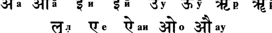

**----- Start of picture text -----** 
З Т а  ЗТТа  f  и  f  й  Ч>У  Ч £ й   ^ | р аи  3 f t о  ау **----- End of picture text -----** 

Гласный ТТ в начале слова передается буквой э, а после соглас­ ной— буквой **е** (см. ниже написание гласных после согласного). 

## **Согласные** 

(в сочетании с **а)** 

Заднеязычные: 4 7 **ка 73* кха** I f **га** Ч гха Ч **на** Палатальные: ^ **ча** ^ **чха** Ч **джа fT  джха** ЗТ **йа** Церебральные: Т Та 3 “ Тха ^ **Да** Ч Дха **ТГГ на** Зубные: 7Т та Ч **тха** Ч **да** Ч **дха** Ч на Губные: Ч **па** 4 7 **“ха Ч ба Ч бха** Ч ма Полугласные: **Ч йа Т** Ра **ё Г** ла Ч ва Шумные: ilia Ч ша **Ч с з** Гортанная: ^ **ха** Анусвара: — **м** Висарга: _I_ **х** 

Придыхательные в транслитерации графически изображаются дву­ мя буквами, например **кха, бха.** 

## **Цифры** 

**О-0 ^-1 ^-2 3 -3  # - 4 ^-5 3 - 6  V9-7 £ - 8 ^-9** 

Гласные, следующие за согласными, изображаются следующим образом: 

**Руководство по чтению санскрита** 

**781** 

**----- Start of picture text -----** 
Г*  Ти  т®  'Оу С\у О р  &р ^  е ^  аи  Го  т ау **----- End of picture text -----** 

Обычно две и больше согласные, следующие одна за другой, сли­ ваются вместе, образуя новый знак (так наз. лигатуру), например: **кша тра** 

Если после согласной не стоит знака гласной, подразумевается, что за ней стоит гласная **а.** 

Символ _вирама_ ( ^ ) указывает на то, что слово оканчивается на согласную: ^ 

**S ’** ( _аваграха)_ -  апостроф. 

## **ФОНЕТИКА** 

Так же как в случае с латынью и другими древними языками, при устном воспроизведении санскрита допускается ряд фонетических условностей, приближающих произношение санскритских звуков к звукам родного языка читателя. 

## **Гласные произносятся следующим образом:** 

- **а** — как в слове **«пар» а** — вдвое более долгий **и** — как в слове **«пир» й** — вдвое более долгий 

- у — как в слове «гул» **у** — вдвое более долгий 

- **р** — слогообразующее **р** как в слове «бодрствуй» 

- р — вдвое более долгий **е** (э) — как в слове «это» аи — как в слове «май» о — как в слове «дом» ау — как в слове «аудито­ рия» 

## **782** 

## **Шримад-Бхагаватам** 

**В** большинстве индийских школ санскрита **р, р, л** принято читать как **ри, рй, лри** соответственно. 

## **Согласные произносятся следующим образом:** 

## **Заднеязычные** 

(произносятся горлом) 

к — как в слове «кит» г — как в слове «гиря» н — как в слове «Конго» 

## **Губные** 

п — как в слове «пир» б — как в слове «бор» м — как в слове «мама» 

## **Зубные** 

(произносятся как церебраль­ ные, но с кончиком языка, 

прижатым к основанию зубов) 

т — как в слове «тир» д — как в слове «дом» н — как в слове «ночь» 

## **Палатальные** 

(произносятся с прижатием средней части языка к небу) **ч** — как в слове «речь» дж — как в слове «Джон» н — как в слове «конь» 

**Церебральные (т, тх, д, дх, н)** произносятся с кончиком языка, ниж­ ней стороной прижатым к переднему небу. По звучанию напоми­ нают соответствующие английские альвеолярные звуки. 

**Придыхательные (кх, гх, чх, джх, тх, дх, тх, дх, пх, бх)** отличают­ ся от соответствующих непридыхательных тем, что основной эле­ мент сопровождается слабым призвуком типа английского **h,** звон­ кого или глухого в зависимости от основного элемента. 

|**Полугласные**|**Полугласные**|**Шумные**|**Шумные**|
|---|---|---|---|
|**й**|— как в слове «иена»|**in**|— как мягкое**ш**в|
|**р**|— церебральное**р**||слове «общность»|
|**л**|— зубное английское**1**|**ш**|— русское**ш**|
|**в**|— как русское**в,**а после|**с**|— русское**с**|
||согласной как|||
||английское w|||

**783** 

**Руководство по чтению санскрита** 

## **Висарга** 

- х — глухой звук, в конце строфы произносит­ ся с призвуком пред­ шествующего глас­ 

## **Анусвара** 

   - **м** — носовой призвук после гласной, как во фран­ цузском **bon** 

- ного: **ах** произносится как **аха; их** — как **ихи** 

## **Гортанная** 

**х** — как звонкое английское **h** 

В санскрите не существует динамического ударения. В стихотвор­ ных текстах ударными считаются слоги, стоящие в сильных местах стихотворных стоп. В словах слоги различаются по долготе. Долги­ ми являются слоги с долгими гласными **(а, аи, ау, е, й, о, р, у)** или сло­ ги с краткими гласными, стоящими перед более чем одной согласной (включая **х** и **м).** 

## **Указатель санскритских стихов** 

**В указателе в алфавитном порядке приведены первые и вторые полустишия двустрочных стихов и первые и третьи полустишия четырехстрочных с указанием номера главы и стиха.** 

## **А** 

|**_абхавад йаджна-шалайам_** **79.2**|
|---|
|**_абхедйам кама-гам вавре_ 76.6**|
|**_абхивадайам аса ча там_** **88.28**|
|**_абхивадйабхавамс тушнйм_** **79.24**|
|**_абхивандйатха раджанам_** **73.34**|
|**_абхййур мудитас тасмаи_** **86.22**|
|**_абхйкшнам пуджайам аса_** **75.23**|
|**_абхинандйа йатха-нйайам_** **78.21**|
|**_абхйайат са хршйкешам_** **71.24**|
|**_абхйашинчад амейатма_** **72.46**|
|**_абхйашинчан маха-бхага_** **79.7**|
|**_авабодхо бхаван буддхер_ 85.10**|
|**_авапйапй аиндрам аишварйам_** **82.37**|
|**_аваплутйа ратхат кршнах_** **78.3**|
|**_аватйрнах кула-шатам_** **90.44**|
|**_авекшйаджйам татхадаршам_** **70.12**|
|**_авидхйач чхара-сандохаих_** **77.14**|
|**_авис-тиро-’лпа-бхурй эко_ 85.25**|
|**_ага-джагад-окасам акхила-_** **87.14**|
|**_агастйо йаджнавалкйаш ча_** **84.5**|
|**_агаччхад аси-чармабхйам_** **78.11**|
|**_агнеййм наирртйм саумйам_** **89.43**|
|**_агним вивикшух кршнена_** **89.44**|
|**_агнир ахутайо мантра_** **74.20**|
|**_аграхйч чхираса раджан_** **80.21**|
|**_ададух са-шарам чапам_** **83.21**|
|**_адайа вйасрджан кечит_** **83.22**|
|**_адантасйавинйтасйа_** **78.26**|
|**_аджанантах прати-видхим_** **88.25**|
|**_аджанатаивачаритас_** **78.31**|
|**_аджанатам агатан вах_** **89.9**|
|**_аджанатас те апачитим_** **78.37**|
|**_аджани ча йан-майам тад_ 87.30**|
|**_аджата-шатраве бхури_** **72.14**|
|**_аджата-шатрос там дрштва_** **75.1**|
|**_аджата-шатрур нирагат_** **71.23**|
|**_адйргха-бодхайа вичакшанах_** **81.37**|

_**адйа но джанма-сапхалйам**_ **84.21** _**адйа прабхрти во бхупа**_ **73.18** _**адйа шва ити масамс трйн**_ **84.66** _**адйахам бхагавал лакшмйа**_ **89.11** _**адйо ’нга йатрашраминам**_ **80.32** _**адхаватах са-гадам тасйа**_ **77.35** _**адхано ’йам дханам прапйа**_ **81.20** _**адхйасйнам ча тан випрамш**_ **78.23** _**адхйатма-шикшайа гопйа**_ **82.47** _**адхуна шрй-мадандхакша**_ **84.63** _**аишварйад бхрамшитасйапи**_ **72.24** _**аишварйам атулам, даттва**_ **88.16** _**аишварйам чаштадха йасмад**_ **89.15** _**айадавам кшмам каришйе**_ **76.3** _**айаджайан маха-раджам**_ **74.16** _**айайур мунайас татра**_ **84.2** _**айам свастй-айанах пантха**_ **84.37** _**айам ту бахир аччханно**_ **83.19** _**айам ту вайасатулйо**_ **72.32** _**айам хи парамо лабха**_ **80.12** _**айудхани махархани**_ **83.38** _**айуте две шатанй аштау**_ **73.1** _**айуш чатмакламам, тавад**_ **78.30** _**акарнйеттхам питур вакйам**_ **85.21** _**акинчананам садхунам**_ **89.16** _**а-коштхам джйам самуткршйа**_ **83.22** _**аланкртебхйо випребхйо**_ **70.9** _**алата-чакра-вад бхрамйат**_ **76.22** _**алпайушо ’лпа-вйрйаш ча**_ **90.39** _**амба масман асуйетха**_ **82.20** _**анайор матулейам мам**_ **72.29** _**анандашру-калам мунчан**_ **73.35** _**анантасйапрамейасйа**_ **79.33** _**анарта-дханва-куру-джангала-**_ **86.20** _**анарта-саувйра-марумс**_ **71.21** _**анарча рукминйм сатйам**_ **71.41** _**анв апй упахртам бхактаих**_ **81.3** _**анвешамано нах шишйан**_ **80.39** _**ангани вишнор атха тадж-**_ **80.4** _**анджаса вартайам аса**_ **89.65** 

**785** 

**786** 

## **Шримад-Бхагаватам** 

|**_анинйатхух питр-стханад_ 85.32**|**_анинйатхух питр-стханад_ 85.32**|
|---|---|
|**_анируддхо ’прати-ратхо_** **89.30**||
|**_анистйрна-пратиджно ’гним_** **89.29**||
|**_анйтешв асанагрйешу_** **86.27**||
|**_анйха этад бахудхаика атмана_**|**84.17**|
|**_анйхайагатахарйа-_** **86.14**||
|**_анйамш чаиватма-пакшййан_** **82.13**||
|**_анйаш чабхйагата йас ту_** **71.42**||
|**_анйе ча тан-мукха-сароджам_** **86.20**||
|**_анйонйа-сандаршана-харша-_** **82.14**||
|**_антах-пура-джанаих прйтйа_** **71.37**||
|**_антах-пура-джано дрштва_** **80.24**||
|**_ануграхо йад бхавато_ 73.9**||
|**_ану-йугам анв-ахам са-гуна_** **87.40**||
|**_анусмарантав анйонйам_ 79.28**||
|**_ану-сротена сарайум_** **79.10**||
|**_апайайат станам прйта_** **85.54**||
|**_апаре ча махешв-аса_** **76.15**||
|**_апаримита дхрувас тану-бхрто_ **|**87.30**|
|**_апи бата васудева-_** **90.22**||
|**_апи брахман гуру-кулад_ 80.28**||
|**_апи нах смарйате брахман_** **80.35**||
|**_апи сеид адйа локанам_ 70.35**||
|**_апи смаратха нах сакхйах_** **82.41**||
|**_апи чакрух правачанам_** **87.11**||
|**_апй авадхйайатхасман сеид_ 82.42**||
|**_апй астй упайанам кинчид_ 80.13**||
|**_аповаха ранат суто_ 76.27**||
|**_апратйуттхайинам сутам_ 78.23**||
|**_апсаробхих питр-ганаир_** **78.14**||
|**_апуджайан маха-бхаган_** **74.17**||
|**_арадхайам аса йатхопапаннайа_**|**86.41**|
|**_арадхайам аса нрпах_ 76.4**||
|**_арадхйаикатма-бхавена_** **86.58**||
|**_арджунас тйртха-йатрайам_** **86.2**||
|**_арджунена паришвакто_ 71.28**||
|**_арджуно на бхавед йоддха_** **72.32**||
|**_арйа бхратар ахам манйе_** **82.18**||
|**_арйам дваипайанйм дрштва_** **79.20**||
|**_арухйа сакам мунибхир_ 86.17**||
|**_архайитвашру-пурнакшо_ 74.28**||
|**_архати хй ачйутах шраиштхйам_**|**74.19**|
|**_арчитваведйа тамбулам_** **80.22**||
|**_асав ахам мамаиваите_ 85.17**||
|**_асадйа гадайа маурвйа_** **76.26**||
|**_асан йаду-кулачарйах_ 90.41**||
|**_асан марйчех шат путра_** **85.47**||
|**_асан шодаша-сахасрам_** **90.29**||
|**_асанани ча хаимани_** **81.30**||
|**_асанн ачйута-сандарша-_** **82.22**||
|**_асанн удара-йашасас_ 90.32**||
|**_асау вркодарах партхас_ 72.29**||
|**_асйнах канчане сакшад_ 75.35**||
|**_асйа брахмасанам даттам_** **78.30**||

_**асйа ме пада-самспаршо**_ **83.16** _**асмакам ча махан артхо**_ **71.4** _**асмасв апратикалпейам**_ **84.62** _**асмин локе ’тха вамушмин**_ **81.11** _**acme ’дхуна двараватйам**_ **80.11** _**acme ’нируддхо ракшайам**_ **82.6** _**астрасйа тава вйрйасйа**_ **78.35** _**астхитасйа парам дхармам**_ **90.29** _**асу-трпа-йогинам убхайато**_ **87.39** _**ата ршайо дадхус твайи мано-**_ **87.15** _**ата упамййате дравина-джати-**_ **87.37** _**атапйад раджасуйасйа**_ **75.31** _**атас твам гадайа манда**_ **78.5** _**атй-уткантхах шавала-хрдайо**_ **90.20** _**атма ваи пранинам прештхас**_ **80.40** _**атма ваи путра утпанна**_ **78.36** _**атма хй эках свайам-джйотир**_ **85.24** _**атма-локаишанам дева**_ **84.38** _**атманам бхушайам аса**_ **70.11** _**атманануправишйатман**_ **85.5** _**атманатмашрайах сабхйах**_ **74.21** _**атманор лалита раджан**_ **80.27** _**атмарамасйа тасйема**_ **83.39** _**атма-срштаис тат-кртешу**_ **85.24** _**атма-шактибхир аграхйо**_ **86.47** _**ато джара-сута-джайа**_ **71.3** _**ато мам су-дурарадхйам**_ **88.11** _**атра те варнайишйами**_ **87.4** _**атра чодахарантймам**_ **88.13** _**атха витатхасв амушв**_ **87.19** _**атха нас тват-падамбходжам**_ **86.31** _**атха прччхамахе йуилман**_ **70.36** _**атха раджахате кшауме**_ **75.22** _**атха таир абхйануджнатах**_ **79.9** _**атха татра куру-шрештха**_ **85.27** _**атха те рама-кршнабхйам**_ **82.27** _**атхадишат прайанайа**_ **71.12** _**атхаикада двараватйам**_ **82.1** _**атхаикадатмаджау праптау**_ **85.1** _**атханйад апи кршнасйа**_ **76.1** _**атхапатад бхинна-ширах**_ **88.36** _**атхапи кале сва-**_ **84.18** _**атхапй ашравайе брахма**_ **70.40** _**атхаплуто ’мбхасй амале**_ **70.6** _**атхарва кашйапо дхаумйо**_ **74.9** _**атхартвигбхйо ’дадат кале**_ **84.52** _**атхартвиджо маха-шйлах**_ **75.25** _**атхатра брухй ануштхейам**_ **70.46** _**атхо джагама ваикунтхам**_ **89.7** _**атхо мунир йаду-патина**_ **71.18** _**атхо на раджйам мрга-тршни-**_ **73.14** _**атхопавешйа парйанке**_ **80.20** _**атхочур мунайо раджанн**_ **84.34** _**атхошасй упаврттайам**_ **70.1** 

**Указатель санскритских стихов** 

**787** 

_**аутсукйа-мукта-каварач**_ **75.17** _**аха те свагатам брахман**_ **89.9** _**аха чамаршито манда**_ **72.30** _**аха чахам ихайата**_ **77.8** _**ахам брхаспатих канво**_ **86.18** _**ахам ва арджуно нама**_ **89.32** _**ахам йуйам асав арйа**_ **85.23** _**ахам праджа вам бхагаван**_ **89.29** _**ахам хи сарва-бхутанам**_ **82.45** _**ахо асадхв идам сута**_ **76.28** _**ахо брахманйа-девасйа**_ **81.15** _**ахо бходжа-пате йуйам**_ **82.28** _**ахо вайам джанма-бхрто**_ **84.9** _**ахо дева маха-дева**_ **88.38** _**ахо хе путрака йуйам**_ **80.40** _**ахопайам там эвадйа**_ **72.15** _**axyui ча те налина-набха**_ **82.48** _**ачантам снапайам чакрур**_ **75.19** _**ачарйаих кула-врддхаиш ча**_ **72.2** _**ашаситам йат тад бруте**_ **78.34** _**ашйшамад йатха вахним**_ **89.4** _**ашлишйа гадхам найанаих**_ **82.14** _**ашлишйанамайам прштва**_ **82.40** 

## **Б** 

|**_бабхаше сунртаир вакйаих_** **70.34**|
|---|
|**_бабхува тушнйм бхагаван_** **75.39**|
|**_баддхвапанйтах шалвена_** **77.22**|
|**_балам брхад-дхваджа-пата-_** **71.17**|
|**_балер ну шруйате кйртир_** **72.24**|
|**_балинам апи чанйешам_** **71.5**|
|**_бандхавах паричарйайам_** **75.3**|
|**_бандхун джнатйн нрпан митра-_** **75.23**|
|**_бандхун паришваджйа йадун_** **84.58**|
|**_бандхун са-даран са-сутан_** **84.55**|
|**_бандху-рупам арим хатва_** **78.6**|
|**_бандхушу пратийатешу_** **84.70**|
|**_бахлйка-путра бхурй-адйа_** **75.6**|
|**_баху-рупаика-рупам тад_** **76.21**|
|**_бибхеда нйапатад дхастач_** **77.15**|
|**_бибхрат пинга-джата-бхарам_** **70.32**|
|**_брахма те хрдайам шуклам_** **84.19**|
|**_брахма-бандхур ити смахам_** **81.16**|
|**_брахма-вадах су-самврттах_ 87.10**|
|**_брахма-веша-дхаро гатва_** **71.7**|
|**_брахма-двишах шатха-дхийо_** **89.23**|
|**_брахмакхйам асйодбхава-наша-_** **70.5**|
|**_брахма-кшатра-сабха-мадхйе_** **74.51**|
|**_брахма-кшатрийа-вит-шудра_** **75.25**|
|**_брахмамс те ’нуграхартхайа_** **86.51**|

_**брахман брахманй анирдешйе**_ **87.1** _**брахман ведитум иччхамах**_ **86.1** _**брахманаих кшатрийаир**_ **72.1** _**брахманас там ту раджанйм**_ **81.12** _**брахманах кшатрийа ваишйах**_ **74.11** _**брахманах прабхаво даивам**_ **81.39** _**брахманаш чаравиндакшам**_ **71.29** _**брахманебхйо дадур дхенур**_ **82.9** _**брахманебхйо намаскртйа**_ **71.28** _**брахманйам самайачеран**_ **72.17** _**брахманйаш ча шаранйаил ча**_ **80.9** _**брахманйо брахманам кршно**_ **81.2** _**брахманйо ’бхйартхито випраир**_ **71.6** _**брахмано джанмана шрейан**_ **86.53** _**брахмарши-севитан дешан 1А31 брахме мухурта уттхайа**_ **70.4** _**брхад упалабдхам этад**_ **87.15** _**брхатсена ити кхйатас**_ **83.18** _**бубхудже вишайан грамйан**_ **89.63** _**буддхйндрийа-манах-пранан**_ **87.2** _**бхаван хи сарва-бхутанам**_ **86.31** _**бхаванта этад виджнайа**_ **73.21** _**бхаванти кила вишватмамс**_ **85.31** _**бхавата сатйа-камена**_ **80.44** _**бхавитват там кушагрена**_ **78.28** _**бхагавамс тад абхипретйа**_ **86.26** _**бхагавамс mac татха-бхута**_ **82.40** _**бхагаван апи татранга**_ **75.29** _**бхагаван дханур адайа**_ **83.25** _**бхагаван йани чанйани**_ **80.1** _**бхагаван-нинданам шрутва**_ **74.39** _**бхаджантй анашишах шанта**_ **89.17** _**бхактайа читра бхагаван хи**_ **81.37** _**бханйатам прайашах пумбхир**_ **88.30** _**бхартсайан кршна-пакшййан**_ **74.42** _**бхасайантйм дишах шаурих**_ **77.13** _**бхаумаир хи бхумир баху-нама-**_ **84.17** _**бхаумам нихатйа са-ганам**_ **83.40** _**бхаутиканам йатха кхам вар**_ **82.45** _**бхймасено ’рджунах кршно**_ **72.16** _**бхймо вайур абхуд раджан**_ **79.1** _**бхймо дурйодханах карно**_ **83.23** _**бхймо маханасадхйакшо**_ **75.4** _**бхинна-дхйр висмртах шйршни**_ **88.35** _**бхйшмо дроно**_ **’** _**мбика-путро**_ **82.23** _**бхо бхох сада ништанасе**_ **90.17** _**бхогаиш ча вивидхаир йуктамс**_ **73.26** _**бходжайитва вараннена**_ **73.26** _**бходжа-раджа-хатан путран**_ **85.33** _**бхраджад-вара-мани-грйвам**_ **73.5** _**бхратар йша-кртах пашо**_ **84.61** _**бхратрмьи ча м е ’пакурутах**_ **83.12** _**бхратрн диг-виджайе ’йункта**_ **72.12** _**бхратр-патнйр мукундам ча**_ **82.17** 

**788** 

## **Шримад-Бхагаватам** 

_**бхртйан дарука-джаитрадйн**_ **71.12** _**бху-бхара-кшатра-кшапана**_ **85.18** _**бхуви пуру-пунйа-тйртха-**_ **87.35** _**бхуйамсам шраддадхур вишнум**_ **89.14** _**бхуктва пйтва сукхам мене**_ **81.12** _**бхуктвопавивиилух камам**_ **82.11** _**бхумер бхарайамананам**_ **85.30** _**бхурй апй абхактопахртам**_ **81.3** _**бхутанам аси бхутадир**_ **85.11** _**бхутешу бхумамш чаратах сва-**_ **70.37** _**бхух кала-бхарджита-бхагапи**_ **82.29** 

## **в** 

|**_ваванда атманам анантам_** **89.57**|
|---|
|**_ваванда уттхитах шйршна_** **70.33**|
|**_вадайадбхир муда вйнам_** **90.8**|
|**_ваджрас тасйабхавад йас ту_ 90.37**|
|**_ваджрена вртрасйа йатха_** **77.36**|
|**_вадитрани вичитрани_** **75.9**|
|**_вадхайа шалвасйа лайарка-_** **77.35**|
|**_вадхишйе вйкшатас те 'мум_** **77.26**|
|**_вадхйа ме дхарма-дхваджинас_** **78.27**|
|**_ваиджайантйм дадур малом_** **79.8**|
|**_ваикарикас таиджасаш ча_** **88.3**|
|**_ваикарико викалпанам_** **85.11**|
|**_ваикунтха-васинор джанма_** **74.50**|
|**_ваираджйам парамештхйам ча_** **83.41**|
|**_вайам бхршам татра_** **80.38**|
|**_вайам ива сакхи каччид гадха-_** **90.15**|
|**_вайам пура шрй-мада-нашта-_** **73.12**|
|**_вайам твам шаранам йамо_ 70.25**|
|**_вайамсй ароруван кршнам_** **70.2**|
|**_вайур йатха гхананйкам_** **82.43**|
|**_варайишйан винашанам_** **79.23**|
|**_варамбарабхарана-вилепана-_** **71.15**|
|**_варена ччхандайам аса_** **76.5**|
|**_варнашрама-кулапетах_** **74.35**|
|**_варнитам тад упакхйанам_** **74.50**|
|**_варша-бхуджо 'кхила-кшити-_** **87.28**|
|**_васитамала-тойешу_ 90.6**|
|**_васиштхаш чйаванах канво_ 74.7**|
|**_васобхир бхушанаих свййаир_ 70.11**|
|**_васобхих пйта-каушейаир_** **74.28**|
|**_васудева бхаван нунам_** **84.41**|
|**_васудевам иванййа_** **77.25**|
|**_васудевах паришваджйа_** **82.33**|
|**_васудеве бхагавати_** **80.5**|
|**_васудево ’бхинандйаха_** **85.1**|
|**_васудево 'нджасоттйрйа_** **84.60**|
|**_васудевограсенабхйам_** **84.68**|

_**васудевограсенадйаир**_ **82.22** _**вата-варшам абхут тйврам**_ **80.36** _**ватсйатй ураси ме бхутир**_ **89.11** _**ваханти дурлабхам лабдхва**_ **74.2** _**вача мадхурайа прйнанн**_ **86.30** _**вачах пешаих смайан бхртйам**_ **70.45** _**вачо вах самаветартхам**_ **85.22** _**вачо дуранвайам випрас**_ **84.14** _**ведахам вам вишва-срджам**_ **85.29** _**вибхраджаманам дви-**_ **89.53** _**вибхутибхир вабхибхавед**_ **72.11** _**вивешаикатамам шрймад**_ **80.17** _**вивидханйха карманй**_ **74.22** _**вивйадха панча-вимшатйа**_ **76.18** _**видарбха-кошала-курун**_ **84.55** _**виддхваччхинад варма дханух**_ **77.33** _**виджахара вигахйамбхо**_ **90.7** _**виджита-хршйка-вайубхир**_ **87.33** _**виджитйа нрпатйн сарван**_ **72.9** _**виджнайатматайа дхйрах**_ **88.10** _**виджнайачинтайан найам**_ **81.6** _**виджнапито бхагавате**_ **70.22** _**видравйа крошатам сванам**_ **86.10** _**видуратхас ту тад-бхрата**_ **78.11** _**видхамантам сва-саинйани**_ **77.2** _**вйкшйа правршам асаннад**_ **84.70** _**вйкшйа тат каданам сванам**_ **77.9** _**вилимпантйо ’бхишинчантйо**_ **75.14** _**вилокйа брахманас татра**_ **81.32** _**виманаско гхрнй снехад**_ **77.23** _**вина мат клйба-читтена**_ **76.29** _**вйна-вену-талоннадас**_ **75.10** _**винданти те камала-набха**_ **72.4** _**випрайа дадатух путран**_ **89.61** _**випрапатйам ачакшанас**_ **89.43** _**випро ’гамйандхака-вршнйнам**_ **80.16** _**випро грхйтва мртакам**_ **89.22** _**виракта индрийартхешу**_ **80.6** _**вирамета вишеша-джно**_ **80.2** _**виреджур мочитах клешат**_ **73.27** _**вйрйанй ананта-вйрйасйа**_ **80.1, 85.58** _**вируддха-шйлайох прабхвор**_ **88.2** _**висмито бхуд ати-прйтйа**_ **80.24** _**висрджйа са нрпа-двари**_ **89.25** _**висрджйа тад бху-талам 11.34 витарках самабхут тешам**_ **89.1** _**вйтихотро мадхуччханда**_ **74.9** _**виттаишанам йаджна-данаир**_ **84.38** _**вихаран ратхам арухйа**_ **71.45** _**вихаран са виманагрйан**_ **76.10** _**вичитропаванодйанаих**_ **81.22** _**вишайан джайайа тйакшйан**_ **81.38** _**вишалам брахма-тйртхам ча**_ **78.19** _**вишантам дадршух сарве**_ **77.11** 

**789** 

## **Указатель санскритских стихов** 

_**вишвамитрах шатанандо**_ **84.3** _**виьивамитро вамадевах**_ **74.8** _**вишну-ратена сампршто**_ **80.5** _**вишнух саннихито йатра**_ **79.18** _**вишуддха-саттва-дхамнй аддха**_ **85.42** _**вйавахртайе викалпа ишито**_ **87.36** _**вйадхах капото бахаво**_ **72.21** _**вйактам ме катхайишйанти**_ **76.31** _**вйалимпад дивйа-гандхена**_ **80.21** _**вйарочанта маха-теджах**_ **82.8** _**вйарочата сва-патнйбхих**_ **75.18** _**вйасана-шатанвитах**_ **87.33** _**враджа-стрийо йад ванчханти**_ **83.43** _**врддханам апи йад буддхир**_ **74.31** _**вркасурайа гиришо**_ **88.13** _**врко намасурах путрах**_ **88.14** _**врташ ча вршни-правараир**_ **78.15** _**врто нр-симхаир йадубхир**_ **70.18** _**врто ’нугаир бандхубхиш ча**_ **75.34** _**вртха твам каттхасе манда**_ **77.19** _**вртха-пана-ратам uiauieam**_ **74.36** _**вршнайаш ча татхакрура-**_ **82.5** 

_**го-випра-девата-врддха-**_ **70.10** _**гокарнакхйам шива-кшетрам**_ **79.19** _**гоматйм гандакйм снатва**_ **79.11** _**гопйаш ча кршнам упалабхйа**_ **82.39** _**гопйаш ча кунджара-патер**_ **71.9** _**граме тйактаишанах сарве**_ **84.38** _**грхам двй-ашта-сахасранам**_ **80.17** _**грхам дхармартха-каманам**_ **90.28** _**грхйта-кантхйах патибхир**_ **70.1** _**грхйта-падах кршнена**_ **86.11** _**грхйтва падайох шатрум**_ **72.42** _**грхйтва панина панй**_ **70.15** _**грхйтва панина паним**_ **86.50** _**гудатах патайам аса**_ **72.43** _**гуна-праваха этасминн**_ **85.15** _**гунинйа майайа срштах**_ **89.18** _**гупта нрбхир нирагаманн**_ **75.16** _**гурор ануграхенаива**_ **80.43** _**гуру-дараиш чодитанам**_ **80.35** _**гурум мам випрам атманам**_ **86.55** _**гуру-шушрушане джишнух**_ **75.5** _**гхнантах праджах сва ати-**_ **73.12** 

## **г** 

## **Д** 

_**гаваш чарайато гопах**_ **83.43** _**гадайабхихато ’пй аджау**_ **78.8** _**гадайам санниврттайам**_ **77.21** _**гадайатадайан мурдхни**_ **78.7** _**гадайох кшиптайо раджан**_ **72.36** _**гадам удйамйа карушо**_ **78.4** _**гада-нирбхинна-хрдайа**_ **78.9** _**гада-панй убхау дрштва**_ **79.25** _**гада-прадйумна-самбадйах**_ **82.6** _**гада-сатйаки-самбадйа**_ **77.4** _**гаджаир нададбхир абхрабхаир**_ **82.7** _**гайам гатва питрн иштва**_ **79.11** _**гайанти те вишада-карма**_ **71.9** _**гайатсв алишв анидрани**_ **70.2** _**гангам хитва йатханйамбхас**_ **84.31** _**гандха-малйамбаракалпа-**_ **86.29** _**гата-кламо бравйт тасмаи**_ **88.31** _**гатамш чирайитан чхатру-**_ **82.41** _**гатах прабхасам ашрнон**_ **86.2** _**гатва те кхандава-прастхам**_ **73.32** _**гатим сукшмам абодхена**_ **85.15** _**гирйн надйр атййайа**_ **71.21** _**гиритра-мокшам катхайеч**_ **88.40** _**гйта-вадитра-гхошена**_ **71.24** _**говиндам грхам анййа**_ **71.39** _**говиндапанга-нирбхинне**_ **90.19** 

_**дадани бхикшитам тебхйа**_ **72.23** _**дадарша тад-бхога-сукхасанам**_ **89.54** _**дадау рупйа-кхурагранам**_ **70.9** _**дадах св-аннам**_ **82.10** _**дадршус те гхана-шйамам 13.2 дадхара падав аваниджйа тадж**_ **85.36** _**дадхати сакрн манас твайи йа**_ **87.35** _**дадхйау прасанна-карана**_ **70.4** _**даивопасрштам йо маудхйад**_ **89.41** _**даитйа-данава-гандхарвах**_ **85.41** _**дакшинам татра канйакхйам**_ **79.18** _**дамагхошо вишалакшо**_ **82.25** _**даридрам сйдамана ваи**_ **80.8** _**дарукаш чодайам аса**_ **83.33** _**даршайам аса витапам**_ **72.41** _**даршайе двиджа-сунумс те**_ **89.45** _**даршанам вам хи бхутанам**_ **85.40** _**даршана-спаршана-прашна-**_ **84.10** _**даршитах су-гамо його**_ **84.36** _**дасйбхих сарва-сампадбхир**_ **83.38** _**дасйнам нишка-кантхйнам**_ **81.27** _**дасйам гата вайам ивачйута-**_ **90.16** _**дасйати дравинам бхури**_ **80.10** _**даттам адайа парибархам**_ **84.68** _**дашабхир дашабхир нетрн**_ **76.19** _**дашасйа-банайос туштах**_ **88.16** 

**790** 

## **Шримад-Бхагаватам** 

|**_двабхйам дхануил ча кетум ча_** **77.3**|
|---|
|**_дваипайано бхарадваджах_** **74.7**|
|**_дваипайано нарадаш ча_** **84.3**|
|**_дваи-ратхе са ту джетавйо_** **71.6**|
|**_дварена чакранупатхена тат_** **89.51**|
|**_двиджатмаджа ме йувайор_** **89.58**|
|**_двиджо виджнайа виджнейам_** **80.31**|
|**_двитас триташ чаикаташ ча_** **84.5**|
|**_двитййам свайам адайа_** **72.33**|
|**_дева-дундубхайо недур_** **75.20**|
|**_девакйа прахито_ ****_’смйти_** **77.21**|
|**_девакйа ударе джата_** **85.49**|
|**_девам са вавре папййан_** **88.21**|
|**_деван ршйн питрн врддхан_** **70.7**|
|**_деванам апи душпрапам_** **84.9**|
|**_деварши-питр-бхутани_** **75.26**|
|**_деварши-питр-гандхарва_** **88.37**|
|**_деварши-питр-гандхарвас_** **75.13**|
|**_деваршир йаду-врддхаш ча_** **71.11**|
|**_девасура-манушйанам_** **76.6**|
|**_девасура-манушйесу_ 88.1**|
|**_девасурахава-хата_** **90.43**|
|**_девах ком джахасур вйкшйа_** **85.47**|
|**_девах кшетрани тйртхани_** **86.52**|
|**_деваш ча кусумасаран_** **83.27**|
|**_девй парйачарат сакшач_** **80.23**|
|**_девопалабдхим апрапйа_** **88.18**|
|**_дейам шантайа пурнайа_** **74.24**|
|**_дехена патаманена_** **72.26**|
|**_джагад-агха-бхид алам тад-_** **85.59**|
|**_джагад-гурум бхартр-буддхйа_** **90.27**|
|**_джагадух пракртибхйас те_ 73.30**|
|**_джагама наимишам йатра_** **78.20**|
|**_джагама сва-грхам прйтах_ 89.34**|
|**_джагама свалайам mama_** **81.13**|
|**_джагатйм йшварам прарчах_ 84.41**|
|**_джагмур гиривраджам mama_** **72.16**|
|**_джагух су-кантхйо гандхарвйах_** **84.46**|
|**_джагхнатур ваджра-калпабхйам_** **72.34**|
|**_джайа джайа джахй аджам_** **87.14**|
|**_джайати джана-нивасо девакй-_** **90.48**|
|**_джайа-шабдо намах-шабдах_** **88.36**|
|**_джале ча стхала-вад бхрантйа_** **75.37**|
|**_джананн апи махйм прадад_ 72.25**|
|**_джана-санграха итй учух_ 84.15**|
|**_джане вам асйа йат сакшат_** **85.3**|
|**_джанебхйах катхайам чакрур_** **84.71**|
|**_джаним асатах сато мртим_** **87.25**|
|**_джанма-трайанугунита-_** **74.46**|
|**_джарасандха-вадхах кршна_** **71.10**|
|**_джарасандхам гхатайитва_** **73.31**|
|**_джата-матро бхувам спрштва_** **89.21**|
|**_джахара тенаива ширах са-_** **77.36**|
|**_джахарануматах питрох_ 86.9**|

_**джахаса бхймас там дрштва**_ **75.38** _**джйвасйа йах самсарато**_ **70.39** _**джйвата брахманартхайа**_ **72.26** _**джигхранта ива насабхйам 1Ъ.б джитва нр-лока-ниратам сакрд**_ **70.30** _**джитваркша-раджам атха**_ **83.9** _**джито ’смй атмавата те \хам**_ **72.10** _**джнатва мама матам садхви**_ **83.18** _**джнатва парйкшита упахарад**_ **83.10** _**джуштам св-аланкртаих пумбхих**_ **81.23** _**дивамшубхис тумула-равам**_ **71.17** _**диви дундубхайо недур**_ **83.27** _**дивйам сва-ратхам астхайа**_ **89.46** _**дивйанй астрани самсмртйа**_ **89.36** _**дивйа-сраг-вастра-саннахах**_ **82.8** _**дидркшавах самешйанти**_ **70.42** _**дйкша-шалам упаджагмур**_ **84.45** _**динани катичид бхуман**_ **86.36** _**дйргхам айур батаитасйа**_ **78.34** _**дишам твам авакашо ’си**_ **85.9** _**диши пратйчйам накулам**_ **72.13** _**дишо ’виданто ’тха**_ **80.38** _**диштам тад ануманвано**_ **79.29** _**диштйа вйаваситам бхупа**_ **73.19** _**диштйа диштйа бхаван адйа**_ **78.4** _**диштйа йад асйн мат-снехо**_ **82.44** _**дйу-патайа эва те на йайур**_ **87.41** _**дорбхйам паришваджйа**_ **71.26** _**дравидешу маха-пунйам**_ **79.13** _**дргбхир хрдй-кртам алам**_ **82.39** _**дртайа ива швасантй асу-**_ **87.17** _**дршта майа те бахушо**_ **70.37** _**дрштва виклинна-хрдайах**_ **71.25** _**дрштва та уттамах-шлокам**_ **86.23** _**дрштва там пуджайам асух**_ **76.20** _**дрштвашу-тошам папраччха**_ **88.14** _**дуравагаматма-таттва-**_ **87.21** _**дурат пратйудийад бхутва**_ **88.27** _**дурйодханайа рамас там**_ **86.3** _**дурйодханам варджайитва**_ **75.2** _**дурйодханам рте папам**_ **74.53** _**душпраджна авидитваивам**_ **86.55** _**дхана-даратмаджапркта**_ **89.28** _**дхарайамш чара гам камам**_ **87.44** _**дх арма-джнана-шамопетам**_ **87.6** _**дхармам ачаратам стхитйаи**_ **89.59** _**дхармам виджанатайуишан**_ **76.32** _**дхарма-паламс татхаивасман**_ **78.24** _**дхармах сакшад йато джнанам**_ **89.15** _**дхатте ’нушасанам бхумамс**_ **74.3** _**дхенунам рукма-шрнгйнам**_ **70.8** _**дхиг арджунам мрша-вадам**_ **89.41** _**дхйайамс тан-майатам йато**_ **74.46** _**дхртараштрах саха-суто**_ **74.10** 

**791** 

## **Указатель санскритских стихов** 

_**дхртараштро ’нуджах партха**_ **84.57** _**дхупаих сурабхибхир м итрам**_ **80.22** 

## **и** 

_**идам иттхам ити прайас**_ **85.44** _**идам провача вилапанн**_ **89.22** _**йдже ’ну-йаджнам видхина**_ **84.51** _**йдже ча бхагаван рамо**_ **82.4** _**йдрг-видханй асанкхйани**_ **79.33** _**ййате пашу-дрштйнам**_ **78.16** _**йкшито ’нтах-пура-стрйнам**_ **70.16** _**илваласйа суто гхоро**_ **78.38** _**индрадайо лока-пала**_ **74.13** _**индрапрастхам гатах кршна**_ **77.6** _**индрийам те индрийанам твам**_ **85.10** _**ита этан пранешйамо**_ **85.50** _**ити бруване говинде**_ **77.25** _**ити карунико нунам**_ **81.20** _**ити магадха-самруддха**_ **70.31** _**ити мудхах пратиджнайа 16 А ити муштим сакрдж джагдхва**_ **81.10** _**ити нр-гатим вивичйа кавайо**_ **87.20** _**ити сад аджанатам митхунато**_ **87.34** _**ити самбхашаманасу**_ **84.2** _**ити самбхашйа бхагаван**_ **89.46** _**ити санчинтйа манаса**_ **80.13** _**ити тава сурайас трй-**_ **87.16** _**ити тад-вачанам шрутва**_ **84.42** _**ити тач чинтайанн антах**_ **81.21** _**ити шрутам но бхагавамс**_ **75.2** _**итйдршанй анекани**_ **89.63** _**итйдршена бхавена**_ **90.25** _**итй адишйа нрпан кршно**_ **73.24** _**итй адиштас там асура**_ **88.17** _**итй адиштау бхагавата**_ **89.60** _**итй адйам ршим анамйа**_ **87.47** _**итй ануджнапйа дашархам**_ **84.27** _**итй ардйамана саубхена**_ **76.12** _**итй ашеша-самамнайа-**_ **87.43** _**итй удара-матих праха**_ **72.27** _**итй уддхава-вачо раджан**_ **71.11** _**итй удйритам акарнйа**_ **71.1** _**итй уктах прастхито дуто**_ **71.20** _**итй укташ чодайам аса**_ **77.11** _**итй уктва бхагаван чхалвам**_ **77.20** _**итй уктва бхймасенайа**_ **72.33** _**итй уктва йаджнийе кале**_ **74.6** _**итй уктва сахадево ’бхут**_ **74.25** _**итй уктва тан самадайа**_ **85.52** _**итй укто ’пи двиджас тасмаи**_ **81.5** 

_**итй упамантрито бхартра**_ **70.47** _**итй упамантрито раджна**_ **86.37** _**итй уттамах-шлока-шикха-**_ **83.5** _**итй этад брахманах путра**_ **87.42** _**итй этад варнитам раджан**_ **87.49** _**итй этан муни-танайасйа-**_ **89.20** _**иттхам бхагаваташ читраир**_ **88.35** _**иттхам вичинтйа васанач**_ **81.8** _**иттхам вйавасито буддхйа**_ **81.38** _**иттхам нишамйа дамагхоша-**_ **74.30** _**иттхам парасйа ниджа-вартма-**_ **90.49** _**иттхам раджа дхарма-суто**_ **75.30** _**иттхам сабхаджитам вйкшйа**_ **74.29** _**иттхам сарасвата випра**_ **89.19** _**иттхам тайох прахатайор**_ **72.38** _**иттхам-видханй анекани**_ **80.43** _**йхате йад айам сарвах**_ **74.22** _**йшасйа хи ваше локах**_ **82.20** _**йшо дуратйайах кала**_ **74.31** 

## **й** 

_**йа идам анушрноти шравайед**_ **85.59** _**йа идам кйртайед вишнох**_ **74.54** _**йа иттхам вйрйа-шулкам мам**_ **83.14** _**йа эвам авйакрта-шактй-**_ **88.40** _**йавад антам диво бхумех**_ **88.24** _**йаватйа атмано бхарйа**_ **90.31** _**йад асйт тйртха-йатрайам**_ **84.71** _**йад аттхаиканта-бхактан ме**_ **86.32** _**йад ва апатсу мад-вартам**_ **82.18** _**йад ваи вишуддха-бхавена**_ **80.41** _**йад видйаманйтматайавабхасате**_ **70.38** _**йад даридратамо лакшмйм**_ **81.15** _**йад йшитавйайати гудха йхайа**_ **84.16** _**йад уктам ршина дева**_ **71.2** _**йад-атмакам идам вишвам**_ **74.20** _**йадвад вайам мадху-патех**_ **90.23** _**йад-euiupymux шрути-нутедам**_ **82.29** _**йаджнадхйайана-путраис танй**_ **84.39** _**йаджнаир деварнам унмучйа**_ **84.40** _**йади вас татра вишрамбхо**_ **88.33** _**йади на самуддхаранти йатайо**_ **87.39** _**йади нах шраванайалам**_ **88.30** _**йадй асатйам вачах шамбхох**_ **88.34** _**йадй этад-брахма-хатйайах**_ **78.32** _**йадрччхайа нртам прапйа**_ **85.16** _**йадрччхайопапаннена**_ **80.7** _**йадубхир нирджитах санкхйе**_ **76.2** _**йаду-вамша-прасутанам**_ **90.40** _**йаду-срнджайа-камбоджа-**_ **75.12** 

**792** 

## **Шримад-Бхагаватам** 

_**йайатинаишам хи кулам**_ **74.36** _**йайау двараватйм шалво**_ **76.8** _**йайау са-бхарйах саматйах**_ **74.49** _**йайау самйаманйм ашу**_ **89.42** _**йайур бхарата тат кшетрам**_ **82.6** _**йайур вираха-крччхрена**_ **84.58** _**йайус там эва дхйайантах**_ **73.29** _**йакша-ракшах-пишачаш ча**_ **85.41** _**йакшйати твам макхендрена**_ **70.41** _**йакшйе вибхутйр бхава mac**_ **72.3** _**йам сампадйа джахатй аджам**_ **87.50** _**йамау кирйтй ча сухрттамам**_ **71.27** _**йамунам ану йанй эва**_ **78.20** _**йан нах путран самуддишйа**_ **85.22** _**йан-майайа таттва-вид-уттама**_ **84.16** _**йан-намамангала-гхнам илрутам**_ **90.47** _**йархйдам шактибхих срштва**_ **86.44** _**йас тавад асйа балаван иха**_ **70.26** _**йасйа йасйа карам шйршни**_ **88.21** _**йасйа ччхандо-майам брахма**_ **80.45** _**йасйа ьиекух паритратум**_ **89.40** _**йасйамалам диви йашах**_ **70.44** _**йасйамшамшамша-бхагена**_ **85.31** _**йасйанубхутих калена**_ **84.32** _**йасйатма-буддхих кунапе три-**_ **84.13** _**йасйахам анугрхнами**_ **88.8** _**йасмад асав иман випран**_ **78.24** _**йасмимс нарендра-дитиджендра-**_ **75.32** _**йасмин тада мадху-патер**_ **75.33** _**йат кинчит паурушам пумсам**_ **89.62** _**йат пашйатхасакрт кршнам**_ **82.28** _**йат сва-вачо вирудхйета**_ **77.30** _**йат стхаирйам бху-бхртам**_ **85.7** _**йат твайа мудха нах сакхйур**_ **77.17** _**йат-пада-севорджитайатма-**_ **77.32** _**йатра йатропалакшйета**_ **76.23** _**йатра йена йато йасйа**_ **85.4** _**йатра нарайанах сакшан**_ **88.26** _**йатрайутанам айута-**_ **90.42** _**йатра-матрам те ахар ахар**_ **86.15** _**йатропалабдхам сад вйактам**_ **84.19** _**йат-тйртха-буддхих салиле на**_ **84.13** _**йатха брахманй анирдешйе**_ **87.49** _**йатха бхавед вачах сатйам**_ **78.35** _**йатха дравйа-викарешу**_ **85.12** _**йатха каках пуродашам**_ **74.34** _**йатха свайам-варе раджни**_ **83.19** _**йатха шайанам самраджам**_ **87.13** _**йатха шайанах пуруша**_ **84.24** _**йатха шайанах пурушо**_ **86.45** _**йатха-калам йатхаивендро**_ **89.64** _**йатханвашасад бхагавамс**_ **73.30** _**йатхасуранам вибудхаис**_ **76.16** _**йатхопайеме виджайо**_ **86.1** 

_**йах сампарйачаран премна**_ **90.27** _**йах сарва-тйртхаспада-пада-**_ **86.42** _**йач чакшушам пуруша-маулир**_ **71.35** _**йач чхраддхайа йаджед вишнум**_ **84.35** _**йач чхраддхайапта-виттена**_ **84.37** _**йачитва чатуро муштйн**_ **80.14** _**Uauiaui ча тава говинда**_ **71.4** _**йашода ча маха-бхага**_ **82.35** _**йаштавйам раджасуйена**_ **71.3** _**йе майа гуруна вача**_ **80.33** _**йе сйус траи-локйа-гуравах**_ **74.2** _**йе твам бхаджанти на**_ **72.5** _**йе те нах кйртим вималам**_ **89.45** _**йе ча диг-виджайе тасйа**_ **70.24** _**йе чанувартинас тасйа**_ **90.45** _**йенаиватманй адо вишвам**_ **79.31** _**йешам грхе нирайа-вартмани**_ **82.30** _**йо брахма-вадах пурвешам**_ **87.8** _**йо бху-бхуджо ’йута-**_ **70.29** _**йо ваи бхарата-варше ’смин**_ **87.6** _**йо ваи твайа дви-нава-кртва**_ **70.30** _**йо ’ватйрйа йадор вамше**_ **86.34** _**йо дакша-шапат паишачйам**_ **88.32** _**йо бхатте сарва-бхутанам**_ **87.46** _**йо 'лпабхйам гуна-дошабхйам**_ **88.15** _**йо мам свайам-вара упетйа**_ **83.12** _**йо ме санабхи-вадха-тапта-**_ **83.9** _**йо на сехе шрийам спхйтам**_ **74.53** _**йо нусмарета рамасйа**_ **79.34** _**йо 'сау три-лока-гуруна**_ **80.26** _**йо сйотпрекшака ади-мадхйа-**_ **87.50** _**йогешварасйа бхавато**_ **78.31** _**йоджитас тена чашйрбхир**_ **79.17** _**йувам на нах сутау сакшат**_ **85.18** _**йувам тулйа-балау вйрау**_ **79.26** _**йуддхам три-нава-ратрам тад**_ **77.5** _**йуддхартхино вайам прапта**_ **72.28** _**йуддхат самйаг апакрантах**_ **76.30** _**йудхаманйух сушарма ча**_ **82.25** _**йудхиштхирам атхапрччхат**_ **83.1** _**йудхиштхирас ту там дрштва**_ **79.24** _**йуйам патра-видам шрештха**_ **74.32** _**йуйудхано викарнаш ча**_ **75.6** 

## **к** 

_**ка висмарета вам маитрйм**_ **82.37** _**ка иха ну веда батавара-**_ **87.24** _**кайр дхртанджалибхир немух**_ **86.23** _**калаватйрнав аванер**_ **89.58** _**ка. 1 а-видхваста-саттванам**_ **85.30** 

**Указатель санскритских стихов** 

**793** 

_**калена танва бхавато**_ **73.13** _**калиндйм митравиндйм ча**_ **71.42** _**калйанй йена те кйртир**_ **72.7** _**кйлопасршта-нигамйвана йтта-**_ **83.4** _**кймайймаха этасйа**_ **83.42** _**кама-кошнйм пурйм канчйм**_ **79.14** _**кймймш ча сарва-варнйнйм**_ **70.12** _**кймбоджа-каикаййн мадран**_ **82.13** _**кампайанто бхувам саинйаир**_ **75.12** _**камса-пратйпитйх сарве**_ **82.21** _**кандукадибхир хармйешу**_ **90.2** _**кантам сма речака-**_ **90.10** _**кантис теджах прабха сатта**_ **85.7** _**каравйни ким адйа те прийам**_ **90.21** _**кйрйам паитр-швасрейасйа**_ **71.2** _**кармабхир бхрймйамйнййй**_ **83.16** _**кармабхир вардхате теджо**_ **74.4** _**кармана карма-нирхйра**_ **84.35** _**кармана карма-нирхйро**_ **84.29** _**карманй карма-кашанйни**_ **90.49** _**карнау пидхайа нирджагмух**_ **74.39** _**катхайам чакратур гатхах**_ **80.27** _**катхам анувартатам бхава-**_ **87.32** _**катхам рамам асамбхрантам**_ **77.24** _**катхам чаранти шрутайах**_ **87.1** _**каччид гуру-куле васам**_ **80.31** _**каччин мукунда-гадитани**_ **90.18** _**кашчит твадййам атийати**_ **70.27** _**ква чйкхандита-виджнйна-**_ **77.31** _**ква шока-мохау снехо ей**_ **77.31** _**квйхам даридрах пйпйййн**_ **81.16** _**квачид бхумау квачид вйомни**_ **76.22** _**кедйра йтма-кравйена**_ **88.17** _**кечанодбаддха-ваирена**_ **85.43** _**кечит курванти кармйни**_ **80.30** _**ким анена кртам пунйам**_ **80.25** _**ким асмйбхир анирврттам**_ **80.44** _**ким ей мукундйпахртйтма-**_ **90.17** _**ким ей наш чала-саухрдах**_ **90.24** _**ким вах кймо муни-шрештхй**_ **78.37** _**ким дурмаршам титикшунйм**_ **72.19** _**ким идам касйа ей стхйнам**_ **81.23** _**ким на дейам вадйнййнйм**_ **72.19** _**ким не артха-кймйн бхаджато**_ **80.11** _**ким не йчаритам асмйбхир**_ **90.19** _**ким ну вакшйе ’бхисангамйа**_ **76.30** _**ким свалпа-тапасйм нрнйм**_ **84.10** _**ким сеид брахмамс тван-нивйсе**_ **89.27** _**ким упййанам йнйтам**_ **81.3** _**ким ута пунах сва-дхйма-**_ **87.16** _**кинчит каротй урв апи йат**_ **81.35** _**кирйта-мйлй нйавишад**_ **75.36** _**кирйта-хйра-катака-**_ **73.4** _**клаибйам катхам катхам вйра**_ **76.31** 

_**ко ну твач-чаранймбходжам**_ **86.33** _**ко ну шрутвйсакрд брахманн**_ **80.2** _**кратв-ангам кратубхих сарваир**_ **79.30** _**крату-рйджена говинда**_ **72.3** _**крйдйланкйра-вйсймси**_ **90.12** _**крйдй-нара-шарйрасйа**_ **76.1** _**крийамйнена мйдхавйо**_ **90.25** _**кртамйлйм тамрапарнйм**_ **79.16** _**крччхрйд висршто нирагйдж**_ **70.16** _**кршна кршна махй-бйхо**_ **77.22** _**кршна кршна махй-йогин**_ **85.3** _**кршна кршнйпрамеййтман**_ **70.25** _**кршнаика-бхактйй пурнйртхах**_ **86.13** _**кршнййа вйсудевййа**_ **73.16** _**кршнам кратум ча шамсантах**_ **74.52** _**кршнам матвйрбхакам йан нах**_ **84.30** _**кршнйнумодитах пйртхо**_ **74.6** _**кршна-рймау паришваджйа**_ **82.34** _**кршна-рймау самйшрйвйа**_ **85.28** _**кршна-рймограсенйдйаир**_ **84.59** _**кршнас ту тат-стана-**_ **90.11** _**кршна-сандаршанам махйам**_ **80.15** _**кршна-сандаршанйхлйда13.7 кршнасйа чйнубхйвам там**_ **74.1** _**кршнасйаивам вихарато**_ **90.13** _**кршнасййсйд двиджа-шрештхах**_ **86.13** _**кршнасййсйт сакхй кашчид**_ **80.6** _**кршне кршнййа тач-читтйм**_ **83.15** _**кршне ’кхилйтмани харау**_ **84.1** _**кршно ’пи там ахан гурвйй**_ **78.8** _**крштвй татра йатхймнййам**_ **74.12** _**кунтйбходжо вирйташ ча**_ **82.24** _**курари вилапаси твам вйта-**_ **90.15** _**куру-врддхйн ануджнйпйа**_ **77.7** _**куто 'шивам твач-**_ **83.3** _**ку-чаилам малинам кшймам**_ **80.23** _**куча-кункума-гандхйдхйам**_ **83.42** _**куча-кункума-липтйнгах**_ **90.7** _**кушастхалйм диви бхуви**_ **83.36** _**кха ива раджймси вйнти**_ **87.41** _**кхам вййур джйотир йпо бху с**_ **85.25** _**кшанам вишрамйатйм пумса**_ **88.29** _**кшанена нйшаййм йса**_ **76.17** _**кшатра-бандхох карма-дошйт**_ **89.23** _**кшемй сййт ким у вишвеше**_ **88.39** _**кшут-кшймйх шушка-ваданйх**_ **73.2** 

## **л** 

_**лабдха-бхйво бхагавати**_ **81.41** _**лабдха-самджно мухуртена**_ **76.28** 

**794** 

## **Шримад-Бхагаватам** 

_**лабханта атмййам анантам**_ **77.32** _**лебхе парам нирвртим ашру-**_ **71.26** _**лйлаватараих, сва-йашах**_ **70.39** _**локалокам. татхйтйтйа**_ **89.47** _**локам санграхайанн йшо**_ **82.4** _**локе бхаван джагад-инах**_ **70.27** _**локо викарма-ниратах кушале**_ **70.26** 

## **м** 

_**ма бхаишта дута бхадрам во**_ **71.19** _**ма бхаиштетй абхйадхад вйро**_ **76.13** _**ма раджйа-шрйр абхут пумсах**_ **84.64** _**мавамамстха мама брахман**_ **89.33** _**мад-рупанйти четасй а-**_ **86.56** _**мадхйе су-чару куча-кункума-**_ **75.33** _**маитрй арпитапхала чапи**_ **84.62** _**маитхилах шрутадеваш ча**_ **86.24, 86.25** _**маитхило нирахам-мана**_ **86.16** _**майа-джаваникаччханнам**_ **84.23** _**майайа вибхрамач-читто**_ **84.25** _**майа-майам майа-кртам**_ **76.21** _**майи бхактир хи бхутанам**_ **82.44** _**майй авешйа манах самйан**_ **73.23** _**майопанйтам пртхукаика-муштим**_ **81.35** _**мам йаджанто ’дхвараир йуктах**_ **73.21** _**мам тйвад ратхам аропйа**_ **83.32** _**мамапи раджнй ачйута-джанма-**_ **83.17** _**манах кшиптам пунар Хартум**_ **84.69** _**мандакинйти диви бхогаватйти**_ **70.44** _**мандалани вичитрани**_ **72.35, 79.25** _**манино манайам аса**_ **71.28** _**мани-стамбха-шатопетам**_ **81.28** _**мано-джавам нирвивише**_ **89.50** _**ману-тйртхам упаспршйа**_ **79.21** _**мартйас тайанусавам эдхитайа**_ **90.50** _**мат-параих крта-маитрасйа**_ **88.9** _**матрартхам ча бхавартхам ча**_ **87.2** _**матсйабхасам джале вйкшйа**_ **83.24** _**матсйошйнара-каушалйа-**_ **82.12** _**маттах праматта вара-дан**_ **88.11** _**матхурам сва-пурйм тйактва**_ **72.31** _**маудхйам пашйата ме йо ’хам**_ **89.39** _**маха-вибхутер авалокато 'нйо**_ **81.33** _**маха-дханопаскаребха-**_ **86.12** _**маха-мани-врата-кирйта-**_ **89.55** _**маханубхавас тад абудхйад**_ **77.28** _**маханубхавена гуналайена**_ **81.36** _**маха-патакй апи йатах**_ **75.21** _**махарха-васо-'ланкараих**_ **83.37** 

_**махатйам дева-йатрайам**_ **86.9** _**махатйам тйртха-йатрайам**_ **82.5** _**махишйа вйджитах шранто**_ **81.17** _**мегха шрймамс твам аси**_ **90.20** _**мекхаладжина-дандакшаис**_ **88.28** _**мене су-висмита майам**_ **85.57** _**менире кршна-бхактасйа**_ **74.15** _**менире магадхам шантам**_ **73.33** _**мйлитакшй анамад буддхйа**_ **81.26** _**мишатам бху-бхуджам раджни**_ **83.33** _**мишатам сарва-бхутанам**_ **85.56** _**мохита майайа вишнор**_ **85.54** _**мочайам аса раджанйан**_ **72.46** _**мочайитва майам йена**_ **71.44** _**мрга-тршнам йатха бала**_ **73.11** _**мрданга-бхерй-анака-шанкха-**_ **71.14** _**мрданга-вйна-мураджа-**_ **70.20** _**мрданга-шанкха-панава-**_ **75.9** _**мрданга-шанкха-патаха-**_ **71.29** _**мртйум виджитйа прадхане**_ **89.33** _**мрштатмабхир нава-дукула-**_ **71.31** _**муктадама-виламбйни**_ **81.30** _**муктам гиришам абхйаха**_ **88.38** _**мумучух пушпа-варшани**_ **75.20, 88.37** _**мунайо йакша-ракшамси**_ **74.14** _**мунибхих сиддха-гандхарваир**_ **78.14** _**мунйнам нйаста-данданам**_ **89.16** _**мунйнам са вачах шрутва**_ **85.2** _**мунчанн арта-сварам шаило**_ **79.6** _**мурдханйа-хема-калашаи**_ **71.32** _**мухуртам там ту ваидарбхй**_ **70.3** _**мушаленаханат круддхо**_ **79.5** 

## **н** 

_**на бата рамантй ахо асад-**_ **87.22** _**на брахманан ме дайитам**_ **86.54** _**на брахманах сва-пара-бхеда-**_ **72.6** _**на ваи те ’джита бхактанам**_ **74.5** _**на вайам садхви самраджйам**_ **83.41** _**на видантй апи йогеша**_ **85.44** _**на видух сайтам атманам**_ **90.46** _**на гунайа бхаванти сма**_ **78.26** _**на гхатата удбхавах пракрти-**_ **87.31** _**на йад идам агра аса на**_ **87.37** _**на йадунам куле джатах**_ **76.29** _**на йам видантй амй бху-па**_ **84.23** _**на каилчин мат-парам локе**_ **72.11** _**на кинчаночатух премна**_ **82.34** _**на лакшйате джайо ’нйо ва**_ **79.27** _**на лебхе шам бхрамач-читтах**_ **86.8** 

**795** 

## **Указатель санскритских стихов** 

**87.21** 

_**на парилашанти кенид**_ **87.21** _**на прадйумно нанируддхо**_ **89.40** _**на сехире йаджнасени**_ **83.31** _**на тад-вакйам джагрхатур**_ **79.28** _**на тасмаи прахванам стотрам**_ **89.3** _**на татйаджу ранам свам свам**_ **76.25** _**на татра дутам на питух**_ **77.29** _**на татха саттва-самрабдхах**_ **85.43** _**на твайа бхйруна йотсйе**_ **72.31** _**на хи викртим тйаджанти**_ **87.26** _**на хи парамасйа кашчид апаро**_ **87.29** _**на хи те ’видитам кинчил**_ **70.36** _**на хй ам-майани тйртхани**_ **84.11** _**на хй экасйадвитййасйа**_ **74.4** _**на хй этасмин куле джата**_ **90.39** _**на чаласи на вадасй удара90.22 набхйападйата шам раджамс**_ **76.12** _**нагнир на сурйо на ча чандра-**_ **84.12** _**надйа но даршанам праптах**_ **86.44** _**надо варнас твам ом-кара**_ **85.9** _**надхикам тавата туштах**_ **86.15** _**надхйагаччханн анаикантйат**_ **74.18** _**наивати-прййасе видван**_ **80.29** _**наиватрпйан прашамсантах**_ **75.27** _**наинам натханусуйамо**_ **73.9** _**наиччхат твам асй утпатха-га**_ **89.6** _**найа мам дйуматах паршвам**_ **77.1** _**найамй апунар-аврттим**_ **77.18** _**нама-мйтрендрийабхатам**_ **84.24** _**намас тасмаи бхагавате**_ **84.22, 87.46** _**намас те дева-девеша**_ **73.8** _**намас тубхйам бхагавате**_ **86.35** _**намаскртйатма-самбхутйр**_ **70.10** _**намо вах сарва-девебхйа**_ **84.29** _**намо джайети немус там**_ **74.29** _**намо ’нантайа брхате**_ **85.39** _**намо ’сту те**_ **’** _**дхйатма-видам**_ **86.48** _**нана-танур гагана-вад**_ **85.20** _**нанв абрувано дишате самакшам**_ **81.34** _**нанв артха-ковида брахман**_ **80.33** _**нанв этад упанйтам ме**_ **81.9** _**нандадйн сухрдо гопан**_ **82.13** _**нандас татра йадун праптан**_ **82.31** _**нандас ту сакхйух прийа-крт**_ **84.66** _**нандас ту саха гопалаир**_ **84.59** _**нандо гопаш ча гопйаш ча**_ **84.69** _**нанртур джагус туштувуш ча**_ **70.20** _**нанртур ната-нартакйас**_ **84.46** _**нану брахман бхагаватах**_ **80.9** _**нану бхуйан бхагавато**_ **70.35** _**нанусмаранти сва-джанам**_ **82.19** _**нарадасйа ча самвадам**_ **87.4** _**нарадевочитаир вастраир**_ **73.25** _**нарадо бхагаван вйасах**_ **84.57** 

_**нарадо вамадево'трих**_ **86.18** _**нарайанайа ршайе**_ **86.35** _**нарайананга-самспарша-**_ **85.55** _**нарйаш ча кундала-йугалака-**_ **75.24** _**нарйо викйрйа кусумаир**_ **71.34** _**нарма-кшвели-паришвангаих**_ **90.13** _**нароштра-го-махиша-**_ **71.16** _**нартакйо нанртур хршта**_ **75.10** _**натанам нартакйнам ча**_ **90.12** _**натва мунйн су-самхршто**_ **86.38** _**натва тад-ангхрйн пракшалйа**_ **86.28** _**нати-читрам идам випра**_ **84.30** _**нахам иджйа-праджатибхйам**_ **80.34** _**нахам санкаршано брахман**_ **89.32** _**начиноти свайам калпах**_ **72.20** _**нашварешв иха бхйвешу**_ **85.12** _**недур дундубхайораджан**_ **77.37** _**недур мрданга-патаха-**_ **84.46** _**нетре нимйлайаси пактам**_ **90.16** _**нибхрта-марун-мано-'кша-**_ **87.23** _**ниварйамана апй анга**_ **75.38** _**ниваситах прийа-джуште**_ **81.17** _**ниврттешв ашва-медхешу**_ **88.6** _**нигрхйа дорбхйам бхуджайор**_ **88.19** _**нидешам ширасадхайа**_ **70.47** _**нийамах пратхаме калпе**_ **78.33** _**нимиттам парам йшасйа**_ **71.8** _**нимиттанй ати-гхорани 11.1 нимнам кулам джала-майам**_ **80.37** _**нинадйа саубха-рад уччаир**_ **77.16** _**ниндам бхагаватах шрнвамс**_ **74.40** _**нинедур ната-нартакйо**_ **83.30** _**нинйе мргендра ива бхагам**_ **83.8** _**нипетух прадхане кечид**_ **83.35** _**нирвишад-бхрнга-вихагаир**_ **90.4** _**нирвишешам абхуд йуддхам**_ **72.39** _**нирвртас тарпитас тушнйм**_ **89.12** _**ниргамаййавародхан сван**_ **71.13** _**нирйайур дамшита. гупта**_ **76.15** _**нирмучйа самсрти-вимокшам**_ **83.40** _**нирудхйа сенайа шалво**_ **76.9** _**нирупита маха-йаджне**_ **75.7** _**нитйам нибаддха-ваирас те**_ **85.42** _**нитйам санкула-маргайам**_ **90.3** _**нихкшатрийам махйм курван**_ **82.3** _**нишамйа бхагавад-гйтам**_ **72.12** _**нишамйа ваишнавам дхама**_ **89.62** _**нишамйа виприйам кршно**_ **77.23** _**нишамйа дхарма-раджас тат**_ **73.35** _**нишамйа тад-вйаваситам**_ **71.18** _**нишамйеттхам бхагаватах**_ **84.14** _**нишкинчананам шантанам**_ **86.33** _**нишкрамйа вишва-шаранангхрй-**_ **85.45** _**нишчакрама грхат турнам**_ **81.25** 

**796** 

**Шримад-Бхагаватам** 

_**нйавартетам свакам дхама**_ **89.61** _**нйамантрайетам дашархам**_ **86.25** _**нйарунат сутикйгарам**_ **89.37** _**новача кинчид бхагаван**_ **74.38** _**нр-ваджи-канчана-шибикабхир**_ **71.15** _**нрнам нихшрейасартхййа**_ **88.7** _**нрнам самвадатам антар**_ **86.46** _**нрпанам рудхираугхена**_ **82.3** _**нршу тава майайа бхрамам**_ **87.32** _**нунам батаитан мама**_ **81.33** _**нунам бхутани бхагаван**_ **82.42** _**нутне нивййа паридхайа ча**_ **83.28** 

## **о** 

_**оджах сахо балам чешта**_ **85.8** _**ом ити прахасамс тасмаи**_ **88.22** _**ом итй анамйа бхуманам**_ **89.60** 

## **п** 

_**падав анка-гатау вишнох**_ **86.30** _**падбхйам иМ'йм маха-раджа**_ **78.2** _**падма-хастам гада-шанкха1ЪА падодакена бхаватас**_ **89.10** _**паилах парашаро гарго**_ **74.8** _**пайасвинйнам грштйнам**_ **70.8** _**пайах-пхена-нибхйх шаййа**_ **81.29** _**пандавах кршна-рамау ча**_ **84.6** _**панчалан атха матсйамш ча**_ **71.22** _**пара-лока-гатанам ча**_ **78.1** _**парамаршйн брахма-ништхаЛ**_ **74.33** _**паромештхйа-камо нрпатис**_ **70.41** _**парамештхйа-шрийа джуштах**_ **75.35** _**парардхйабхарана-кшаума-**_ **84.67** _**паратантрйад ваисадршйад**_ **85.6** _**парджанйа-ват тат свайам**_ **81.34** _**парете наваме бале**_ **89.26** _**паривайасе пашун ива гира**_ **87.27** _**паривешане друпада-джа**_ **75.5** _**парирабдхум самаребха**_ **89.5** _**парирамбхана-вишлешат**_ **70.3** _**парйтам пранато 'прччхад**_ **87.7** _**паришасваджире гадхам**_ **82.32** _**паришваджйанкам аропйа**_ **85.53** _**парйанка хема-дандани**_ **81.29** _**парйанка-стхам шрийам хитва**_ **80.26** _**партхабхйам самйутах прайат**_ **73.31** 

_**партхам апйайайан свена**_ **72.40** _**партхо йатто ’срджад банам**_ **83.24** _**пати-врата патим дрштва**_ **81.26** _**пати-врата патим праха**_ **80.8** _**патим агатам акарнйа**_ **81.25** _**патитва падайор девй**_ **89.7** _**патнйбхир ашта-дашабхих**_ **84.47** _**патнйм вйкшйа виспхурантйм**_ **81.27** _**патнй-самйаджавабхртхйаиш**_ **75.19, 84.53** _**патнйах пати-вратййас ту**_ **81.7** _**патрам пушпам пхалам тойам**_ **81.4** _**патхи нирджитйа раджанйан**_ **83.14** _**паураих сабхаджито ’бхйкшнам**_ **86.4** _**паурушам даршайанти сма**_ **77.19** _**пахи пахи праджам мртйор**_ **89.35** _**пашйатам сарва-бхутанам**_ **74.45** _**пашйатам сарва-бхутанам**_ **78.10** _**петух самудре саубхейах 11А пибанта ива чакшурбхйам**_ **73.5** _**пибанти йе карна-путаир алам**_ **83.3** _**пйдйамана-пуранйках**_ **76.24** _**пита ме матулейайа**_ **83.15** _**пита ме пуджайам аса**_ **83.37** _**питамахасйа те йаджне**_ **75.3** _**пйтвамртам пайас тасйах**_ **85.55** _**питра сампуджитах сарве**_ **83.21** _**питр-свасур гуру-стрйнам**_ **71.40** _**прававаршакхилан каман**_ **89.64** _**правартанте сма раджендра**_ **75.7** _**правишад йан-нивиштанам**_ **70.17** _**правишйа ревам агамад**_ **79.21** _**правиштанам махаранйам**_ **80.36** _**праврддха-бхактйа уддхарша-**_ **86.28** _**праг акалпач ча кушалам**_ **84.63** _**прадапйа пракртйх камаих**_ **70.12** _**праджа бхаджантйах сйданти**_ **89.24** _**праджнайа деха-крд амум**_ **83.10** _**прадйумна асйт пратхамах**_ **90.35** _**прадйумнам гадайа шйрна-**_ **76.27** _**прадйумнаш чанируддхаш ча**_ **90.33** _**прадйумно бхагаван вйкшйа**_ **76.13** _**прайас те дханино бходжа**_ **88.1** _**прайах пака-випакена**_ **71.10** _**прайо грхешу те читтам**_ **80.29** _**пракртаир ваикртаир йаджнаир**_ **84.51** _**праламба-чарв-ашта-бхуджам**_ **89.55** _**праматтах са сабха-мадхйе 11.11 пранадибхих сва-вибхаваир**_ **84.33** _**прйнадйнам вишва-срджам**_ **85.6** _**пранамйа чопасангрхйа**_ **84.28** _**праната-клеша-нашайа**_ **73.16** _**пранемур хата-папмано**_ **73.6** _**прапаннан пахи нах кршна**_ **73.8** 

## **Указатель санскритских стихов** 

|**_прапаннах пада-мулам те_** **70.31**|
|---|
|**_прапйошатур бхавати пакилма_** **82.38**|
|**_праптам нишамйа нара-лочана-_** **71.33**|
|**_праптам праптам ча севанто._ 73.22**|
|**_прйпто мам асйа дасйами_** **81.7**|
|**_прасарйа кеша-бахв-ангхрйн_** **78.9**|
|**_прасахйа руддхас тенасанн_** **70.24**|
|**_прастхапйа йаду-вйрамш ча_** **75.29**|
|**_прасути-кала асанне_** **89.35**|
|**_пратибахур абхут тасмат_** **90.38**|
|**_пратихатйа пратйавидхйан_** **77.2**|
|**_пратишинчан вичикрйде_** **90.9**|
|**_пратйагрхнан маха-бхагам_** **81.24**|
|**_пратйаха прашрайанамрах_** **85.21**|
|**_пратйучур хршта-манасас_** **83.2**|
|**_пратйуше ’бхетйа су-шлокаир_ 87.13**|
|**_прахарат кршна-сутайа_** **77.12**|
|**_прахинот парибархани_** **86.12**|
|**_прачандаш чакравато 'бхуд_** **76.11**|
|**_прачйам вркодарам матсйаих_** **72.13**|
|**_прашашамсур муда йукта_** **82.27**|
|**_прашашамсур хршйкешам_** **_13.1_**|
|**_премна ниварайам аса_** **75.28**|
|**_премна нирйкшаненаива_** **81.2**|
|**_прийа-рава-падани бхашасе_** **90.21**|
|**_прййейа тойена нрнам_** **88.20**|
|**_прйнаййа сунртаир вакйаих_** **73.28**|
|**_прйтйтмоттхайа парйанкат_** **71.38**|
|**_прйтах свайам тайа йуктах_** **81.28**|
|**_прйтй-утпхуллекшанас тасйам_** **86.6**|
|**_прйто вйамунчад аб-биндун_** **80.19**|
|**_протпхулла-кумудамбходжа-_** **81.22**|
|**_протпхуллотпала-кахлйра-_** **90.6**|
|**_пртха бхратрн свасрр вйкшйа_** **82.17**|
|**_пртха вилокйа бхратрейам_** **71.38**|
|**_пртхудакам бинду-сарас_** **78.19**|
|**_пртхука-прасртим раджан_** **81.5**|
|**_пуджайам асатур бхймам_** **72.45**|
|**_пуджайам навидат кртйам_** **71.39**|
|**_пуджитас там ануджнапйа_** **75.26**|
|**_пуджито дева-девена_** **81.18**|
|**_пуйа-шонита-вин-мутра-_** **78.39**|
|**_пуластйах кашйапо ’триш ча_** **84.4**|
|**_пуман йач чхраддхайатиштхамш_** **85.46**|
|**_пумбхир липтах пралимпантйо_** **75.15**|
|**_пун ар двараватйм этйа_** **85.52**|
|**_пунаш ча сатрам авраджйа_** **89.13**|
|**_пунйхи саха-локам мам_** **89.10**|
|**_пурам нирмайа шалвййа_** **76.7**|
|**_пурвешам пунйа-йашасам_** **70.21**|
|**_пурйм бабханджопаванан_** **76.9**|
|**_пурна-камав апи йувам_** **89.59**|
|**_пурнах шрута-дхаро раджанн_** **87.45**|
|**_пуруджид друпадах шалйо_ 82.24**|

_**пуруша-видхо 'нвайо ’тра**_ **87.17** _**пурушасйа падамбходжа-**_ **89.19** _**пушкаро ведабахуш ча**_ **90.34** _**пуштйа шрийа кйртй-**_ **89.56** _**пхаларханошйра-**_ **86.41** 

## **р** 

_**раджа-дутам увачедам**_ **71.19** _**раджа-дуте бруватй эвам**_ **70.32** _**раджа-мокшам витанам ча**_ **74.54** _**раджан виддхй атитхйн праптан**_ **72** _**раджанаш ча самахута**_ **74.15** _**раджанйа-бандхаво хй эте**_ **72.23** _**раджанйа-бандхун виджнайа**_ **72.22** _**раджанйа-бандхур эте ваи**_ **89.27** _**раджанйаш чаидйа-пакшййа**_ **77.8** _**раджанйешу ниврттешу**_ **83.25** _**раджа но йе ча раджендра**_ **82.26** _**раджарше свашраман гантум**_ **84.27** _**раджас-тамах-свабхаванам**_ **85.40** _**раджасуйавабхртхйена**_ **74.51** _**раджасуйам самййух сма**_ **74.15** _**раджасуйе 'тха нивртте**_ **77.6** _**раджасуйена видхи-ват**_ **74.16** _**раджйаишварйа-мадоннаддхо**_ **73.10** _**раджна сабхаджитах сарве**_ **74.52** _**раджнам аведайад духкхам**_ **70.23** _**раджнах паитр-швасрейасйа**_ **70.40** _**раджно нирйкшйа паритах**_ **83.29** _**рама рамапрамеййтман**_ **85.29** _**рамайа васасй дивйе**_ **79.8** _**рамах са-шишйо бхагаван**_ **84.4** _**рама-храдешу видхи-ват**_ **82.10** _**расаталам нака-прштхам**_ **89.43** _**ратна-дйпан бхраджаманан**_ **81.31** _**ратхам прапайа ме сута**_ **77.10** _**ратхан сад-ашван аропйа**_ **73.28** _**ратха-стхо дханур адайа**_ **86.10** _**реджатух сва-сутаир дараир**_ **84.50** _**редже сва-джйотснайевендух**_ **79.32** _**реме шодаша-сахасра-**_ **90.5** _**рнаис трибхир двиджо джато**_ **84.39** _**ромахаршанам асйнам**_ **78.22** _**рохинй девакй чатха**_ **82.36** _**ртвигбхйах са-садасйебхйо**_ **74.47** _**ртвик-садасйа-баху-витсу**_ **75.8** _**ртвик-садасйа-випрадйн**_ **75.22** _**рукминй-прамукха раджамс**_ **90.30** _**рурода тат-кртам маитрйм**_ **84.65** _**ршабхадрим харех кшетрам**_ **79.15** 

**798** 

**Ш рима д-Бхагаватам** 

_**ршер бхагавато бхутва**_ **78.25** _**ршйнам питр-деванам**_ **72.8** 

## **с** 

|**_са атманй уттхитам манйум_**|**89.4**|
|---|---|
|**_са аха бхагавамс тасмаи_** **88.7**||
|**_са аха девам гиришам_** **88.15**||
|**_са бхаван аравиндакшо_ 74.3**||
|**_са бхйма-дурйодханайор_ 79.23**||
|**_са ваг йайа тасйа гунан_** **80.3**||
|**_са ваи дурвишахо раджа_** **71.5**||
|**_са ваи сат-карманам сакшад_ 80.32**||
|**_са врйдито ’ваг-ваданоруша_** **75.39**||
|**_са душайати нах сатрам_** **78.38**||
|**_са индрасено бхагават-_ 85.38**||
|**_са иттхам двиджа-мукхйена_** **81.1**||
|**_са иттхам прабхунадиштах_ 86.58**||
|**_са йад аджайа те аджам_** **87.38**||
|**_са йада витатходйого_ 88.9**||
|**_са лабдхва кама-гам йанам_** **76.8**||
|**_са намаскртйа кршнайа_** **70.23**||
|**_са рукмино духитарам_** **90.36**||
|**_са самрад ратхам арудхах_** **75.18**||
|**_са сарва-дрг упадрашта_** **88.5**||
|**_са тад-вара-парйкшартхам_** **88.23**||
|**_са тан адайа випрагрйах_** **80.15**||
|**_са тан шочатй атмаджан свамс_**|**85.49**|
|**_са таркайам аса куто мамане_** **86.42**||
|**_са твам шадхи сва-бхртйан нах_**|**86.49**|
|**_са уваса видехешу_ 86.14**||
|**_са упаспршйа салилам_** **77.1**||
|**_са упаспршйа шучй амбхо_ 89.36**||
|**_са чалабдхва дханам кршнан_** **81.14**||
|**_са чапи рукминах паутрйм_** **90.37**||
|**_са эвам бхарйайа випро_ 80.12**||
|**_сабхаджайаси сад дхама_** **84.20**||
|**_сабхаджайитва видхи-ват_** **70.34**||
|**_сабхаджито бхагавата_** **87.48**||
|**_сабхайам майа-клптайам_** **75.34**||
|**_са-бхарйа-сваджанапатйа_** **86.43**||
|**_са-бхарйах сануджаматйах_** **74.27**||
|**_сабхйанам матам аджнайа_** **71.1**||
|**_са-ганах сиддха-гандхарва_** **74.14**||
|**_са-гопурани дварани_** **76.10**||
|**_сад ива манас три-врт твайи_** **87.26**||
|**_са-дарах пандавах кунтй_** **82.23**||
|**_садасас тасйа махато_** **84.8**||
|**_садасас-патайах сарве_ 74.32**||
|**_садасйагрйарханархам ваи_** **74.18**||
|**_садасйартвиг-двиджа-шрештха_**|**75.13**|

_**садасйартвик-сура-ганан**_ **84.56** _**садас-патйн атикрамйа**_ **74.34** _**саджйам кртвапаре вира**_ **83.23** _**садйах шапа-прасадо 'нга**_ **88.12** _**садйо висрджйа грха-карма**_ **71.33** _**садйо ’даршанам апеде**_ **89.38** _**садхайитва кратух раджнах**_ **74.48** _**саиша хй упанишад брахмй**_ **87.3** _**сайам пратар анантасйа 19.34 са-каранакарана-лингам ййуше**_ **86.48** _**са-кутумбо вахан мурдхна**_ **86.29** _**сакхйнам апачитим курван**_ **77.37** _**сакхйопетйаграхйт паним**_ **83.11** _**сакхйух прийасйа випраршер**_ **80.19** _**самаврттена дхарма-джна**_ **80.28** _**саманта-панчакам кшетрам**_ **82.2** _**самархайад дхршйкеШам**_ **74.26** _**самархайам аса са may**_ **85.37** _**самашнуванам прасамйкшйа**_ **89.51** _**самбо мадхур брхадбхануьк**_ **90.33** _**самбхрамас те на картавйо**_ **77.10** _**самбхртйа сарва-самбхаран**_ **72.9** _**самватсаранте бхагаван**_ **76.5** _**самвибхаджйаграто випран**_ **70.13** _**саметах пада-раджаса**_ **86.36** _**саметйа говинда-катха митхо**_ **83.5** _**самйаг вйаваситам раджан**_ **72.7** _**самйатта уддхртешв-аса**_ **83.34** _**самйоджйакшипате бхуйас**_ **82.43** _**самсара-купа-**_ **82.48** _**самсеватам сура-тарор ива те**_ **72.6** _**самсикта-вартма каринам мада-**_ **71.31** _**самстуйамано бхагаван**_ **71.30,73.17** _**самстутйа мунайо рамам**_ **79.7** _**самуддхртах пурва-джатаир**_ **87.43** _**самудрам дургам ашритйа**_ **74.37** _**самудрам сетум агамат**_ **79.15** _**сананданам атханарчух**_ **87.42** _**санатанам ршим драштум**_ **87.5** _**сандрамбудабхам су-пишанга-**_ **89.54** _**санкаршанам ануджнапйа**_ **71.13** _**санкаршано васудевах**_ **89.30** _**санкхйа на ьиакйате картум**_ **90.40** _**санкхйа-йога-витанайа**_ **85.39** _**санкхйанам йадаванам ках**_ **90.42** _**санникаршо *тра мартйанам**_ **84.31** _**сантанвантах праджа-тантун**_ **73.22** _**санчаранти майа локан**_ **86.51** _**санчинтйари-вадхопайам**_ **72.41** _**сапарйам карайам аса**_ **73.25** _**сапи там чакаме вйкшйа**_ **86.7** _**сапта двйпан са-синдхумш ча**_ **89.47** _**сапта-годаварйм венам**_ **79.12** _**саптокшано *ти-бала-вйрйа-су-**_ **83.13** 

**799** 

## **Указатель санскритских стихов** 

|**_сарасватйм прати-сротам_** **78.18**||
|---|---|
|**_сарасватйас тате раджанн_** **89.1**||
|**_сарва-бхута-мано-бхиджнах_** **81.1**||
|**_сарва-бхутатма-бхутайа_** **74.24**||
|**_сарва-бхутатма-дрк сакшат_** **81.6**||
|**_сарва-веда-майо випрах_** **86.54**||
|**_сарвам аШравайам накрур_** **_ТЪ.ЪА_**||
|**_сарван сампуджйа видхи-ван_** **74.47**||
|**_сарва-раджанйа-нидханам_** **79.22**||
|**_сарвасам апи сиддхйнам_** **81.19**||
|**_сарва-сампат-самрддхайам_** **90.1**||
|**_сарва-санга-ниврттйаддха_** **83.39**||
|**_сарвастра-шастра-таттва-джнах_**|**83.20**|
|**_сарве джанах сура-руно мани-_** **75.24**||
|**_сарве мумудире брахман_** **75.1**||
|**_сарве_ ****_’пй эвам йаду-шрештха_** **85.23**||
|**_сарвешам апи бхутанам_** **72.8**||
|**_сарвешам Шрнватам раджнам_** **84.34**||
|**_са-садасйа виреджус те_** **84.49**||
|**_са-саинйам санугаматйам_** **71.43**||
|**_са-самбхрамаир абхйупетах_** **71.37**||
|**_сасмара мушалам рамах_ 79.4**||
|**_сасну рама-храде випра_** **84.53**||
|**_саснус татра татах сарве_ 75.21**||
|**_сата идам уттхитам сад ити_** **87.36**||
|**_сатйакиш чарудешнаш ча_** **76.14**||
|**_сатйакй-уддхава-самйуктах_** **70.15**||
|**_саттвам йасйа прийа муртир_** **89.17**||
|**_саттвам раджас тома ити_** **85.13**||
|**_саубхам ча шалва-раджам ча_** **77.9**||
|**_сахадевам дакшинасйам_** **72.13**||
|**_сахадевам тат-танайам_** **72.46**||
|**_сахадевас ту пуджайам_** **75.4**||
|**_сахасоттхайа чабхйетйа_** **80.18**||
|**_сахасрадитйа-санкашам_** **89.49**||
|**_сва-вачас тад ртам картум_** **86.32**||
|**_св-агатам кушалам прштва_** **82.16**||
|**_свагатасана-падйаргхйа-_** **84.7**||
|**_свйгатенабхинандйангхрйн_** **86.39**||
|**_сва-грхан врйдито_ ****_’гаччхан_** **81.14**||
|**_сва-джанан ута бандхун ва_** **84.64**||
|**_сваджана-сутатма-дара-дхана-_** **87.34**||
|**_сваира-вартй гунаир хйнах_** **74.35**||
|**_свайам джахара ким идам_** **81.8**||
|**_свайам ча кршнайа раджан_** **71.40**||
|**_свайам ча тад-ануджната_** **82.11**||
|**_свайамбхува брахма-сатрам_** **87.9**||
|**_сва-йогамайайаччханна-_** **84.22**||
|**_сва-крта-вичитра-йонишу_** **87.19**||
|**_сва-крта-пурешв амйшв абахир-_** **87.20**||
|**_св-аланкрта пара нарйо_ 75.14**||
|**_св-аланкртйбхир вибабхау_** **84.48**||
|**_св-аланкртаир бхатаир ашваи_** **90.3**||
|**_св-аланкртаир бхатаир бхупа_** **75.11**||

_**св-аланкртах ката-кути-**_ **71.16** _**св-аланкртебхйо ’ланкртйа**_ **84.52** _**сва-лйлайа веда-патхам**_ **84.18** _**сванубхутам ашешена**_ **89.13** _**свануграхайа сампраптам**_ **86.24** _**сва-патйавабхртха-снато**_ **79.32** _**свапнайитам нрпа-сукхам пара-**_ **70.28** _**свапнам йатха чамбара-**_ **77.29** _**свараир акртибхис тамс ту**_ **72.22** _**сваргапаваргайох пумсам**_ **81.19** _**свартхе праматтасйа вайо**_ **85.16** _**сва-срштам идам апййа**_ **87.12** _**сва-талпад аварухйатха**_ **89.9** _**свато ’нйасмач ча гунато**_ **84.32** _**сва-хастам дхатум аребхе**_ **88.23** _**сваччха-спхатика-кудйешу**_ **81.31** _**сетихаса-пуранани**_ **78.25** _**синчан мухур йуватибхих**_ **90.11** _**сичйамано ’чйутас табхир**_ **90.9** _**сйад идам бхагаван сакшат**_ **85.4** _**скандам дрштва йайау рамах**_ **79.13** _**смаран камса-кртан клешан**_ **82.33** _**смарантй крпанам праха**_ **85.28** _**смарантйау тат-кртам маитрйм**_ **82.36** _**смаратах пада-камалам**_ **80.11** _**смаред васантам стхира-**_ **80.3** _**смародгйтхах паришвангах**_ **85.51** _**смртир йатха на вирамед**_ **73.15** _**снапайам чакра уддхаршо**_ **86.40** _**снатах су-васасо раджан**_ **84.44** _**снатва прабхасе сантарпйа**_ **78.18** _**снатва сантарпйа девадйн**_ **79.10** _**снатва сароварам агад**_ **79.9** _**снато \ланкара-васамси**_ **84.54** _**снеха-пашаир нибадхнати**_ **85.17** _**со ’патад бхуви нирбхинна-**_ **79.6** _**со ’пашйат татра махатйм**_ **86.6** _**со ’рчитах са-парйварах**_ **78.22** _**срштва локам парам свапнам**_ **86.45** _**станаих станан кункума-панка-**_ **82.15** _**стрйбхиш чоттама-вешабхир**_ **90.2** _**стрийа урагендра-бхога-**_ **87.23** _**стрийаш ча самвйкшйа митхо**_ **82.15** _**стхале'бхйагрхнад вастрантам**_ **75.37** _**стхира-чара-врджина-гхнах су-**_ **90.48** _**стхира-чара-джйтайах сйур**_ **87.29** _**субахох шйнтасено *бхуч**_ **90.38** _**сугрйвадйаир хайаир йуктам**_ **70.14** _**су-дрдха джайате бхактир**_ **73.18** _**су-дустарам самуттйрйа**_ **75.30** _**судхармакхйам сабхам сарваир**_ **70.17** _**суйодханасйа даурйтмйам**_ **75.40** _**сукхам нивасайам аса**_ **71.43** _**сукхам сва-пурйам нивасан**_ **90.1** 

**800** 

## **Шримад-Бхагаватам** 

|**_сунанда-нанда-прамукхаих сва-_** **89.56**|
|---|
|**_супавиштан кртатитхйан_** **86.43**|
|**_сурйаналенду-санкашаир_** **81.21**|
|**_сурйаш настам гатас тават_** **80.37**|
|**_сурйопарагах су-махан_** **82.1**|
|**_суталам са.йвивишатур_** **85.34**|
|**_сута-магадха-гандхарва_** **71.29**|
|**_су max крччхра-гатам ракшед_ 76.32**|
|**_сутй-грхе нану джагада_** **85.20**|
|**_сутйе 'ханй аванй-пало_ 74.17**|
|**_сутопанйтам сва-ратхам_** **71.13**|
|**_сухрдах пракртйр даран_** **70.13**|
|**_сухрд-вртах прйта-мана_** **84.60**|
|**_сухрдо джнатайах путра_** **82.19**|
|**_су-шлокам шравана-путаих_** **89.20**|

## **т** 

|**_та деваран ута сакхйн_** **75.17**|
|---|
|**_та матулейа-сакхибхих_** **75.16**|
|**_та эва кршнадйа габхйра-_** **73.13**|
|**_та эвам лока-натхена_** **83.2**|
|**_та эвам мочитах крччхрат_** **_13.29_**|
|**_та энам ршайо раджан_** **84.43**|
|**_табхир дукула-валайаир_** **84.48**|
|**_табхих патйн друпада-раджа-_** **75.32**|
|**_тав атмасанам аропйа_** **82.35**|
|**_тав аха бхума парамештхинам_** **89.57**|
|**_тава брахма-майасйеша_** **70.43**|
|**_тава пари йе чарантй акхила-_** **87.27**|
|**_тавад вичитра-рупо ’сау_** **90.5**|
|**_тавад уттхайа бхагаван_** **74.43**|
|**_таван мрданга-патахах_** **83.30**|
|**_тават сута упанййа_** **70.14**|
|**_тавач чхрйр джагрхе хастам_** **81.10**|
|**_тавехитам ко_ ****_’рхати садху_ 70.38**|
|**_тад адбхутам махат карма_** **76.20**|
|**_тад ахам бхактй-упахртам_** **81.4**|
|**_тад брахма паромам сукшмам_** **88.10**|
|**_тад виджнайа маха-саттво_** **72.42**|
|**_тад вйкшйа тан упавраджйа_** **84.28**|
|**_тад дева-дева бхаваташ_** **72.5**|
|**_тад рангам авишам ахам кала-_**|
|**83.28**|
|**_тада маха-карунико са_** **88.19**|
|**_тада рамаш ча кршнаш ча_** **84.50**|
|**_тадаинам джахй асад-вачам_** **88.34**|
|**_тад-амбхаса маха-бхага_** **86.40**|
|**_тад-анте бодхайам чакрус_** **87.12**|
|**_тад-анусмарана-дхваста-_** **82.47**|
|**_тадаха випро виджайам_** **89.39**|

_**тад-вирйаир джата-вишрамбхах**_ **85.2** _**тад-даршана-спаршананупатха-**_ **82.30** 

_**тад-даршанахлада-**_ **85.35** _**тад-дйкшайам праврттайам**_ **84.44** _**тад-дхама дустара-кртанта-**_ **90.50** _**тад-дхйана-вегодгратхитатма-**_ **81.40** 

_**тадж-джнаптйаи прешайам асух**_ **89.2** _**тад-уктам итй упакарнйа**_ **86.50** _**таила-гораса-гандхода-**_ **75.15** _**тайор эвам прахаратох**_ **72.39** _**тайох прасанно бхагаван**_ **86.17** _**тайох саманййа варасанам муда**_ **85.36** 

_**тал-липсух са йатир бхутва**_ **86.3** _**там абхйашинчан видхи-вад**_ **84.47** _**там агатам абхипретйа**_ **78.21** _**там акршйа халагрена**_ **79.5** _**там апатантйм набхаси**_ **77.13** _**там арджуна упашрутйа**_ **89.26** _**там аха чангалам алам**_ **88.20** _**там вилокйа брхат-кайам**_ **79.3** _**там вилокйачйуто дурат**_ **80.18** _**там джнатва мануджа раджан**_ **82.2** _**там дрштва бхагаван кршнах**_ **70.33** _**там дрштва вршнайо хрштас**_ **82.32** _**там дрштва девакй девй**_ **85.57** _**там дустйаджам ахам манйе**_ **84.61** _**там клеша-карма-парипака-**_ **84.33** _**там матулейам парирабхйа**_ **71.27** _**там нах самадишопайам**_ **73.15** _**там папам джахи дашарха**_ **78.39** _**там парам саманудхйайанн**_ **86.8** _**там пунар наимишам праптам**_ **79.30** _**там татха вйасанам дрштва**_ **88.27** _**там татхайантам алокйа**_ **78.3** _**там твадйа нишитаир банаир**_ **77.18** _**там упагатам акарнйа**_ **71.23** _**там упаихи маха-бхага**_ **80.10** _**там ча шодашабхир виддхва**_ **77.14** _**там шастра-пугаих**_ **77.33** _**тамаси бхрашта-гатайо**_ **89.48** _**тамах су-гхорам гаханам**_ **89.50** _**тамбула-дйпамрта-**_ **85.37** _**тан анарчур йатха сарве**_ **84.7** _**тан аха карунас mama**_ **73.17** _**тан вйра-дурмада-ханас**_ **83.13** _**тан дрштва балакан девй**_ **85.53** _**тан дрштва бхагавйн кршно**_ **89.49** _**тан дрштва сахасоттхайа**_ **84.6** _**тан нах прайаччха бхадрам те**_ **72.18** _**тан нах прасйда нирапекша-**_ **85.45** _**тан нишамйатха мунайо**_ **89.14** 

**801** 

## **Указатель санскритских стихов** 

|**_тан но бхаван праната-шока-_** **70.29**|
|---|
|**_тан ршйн ртвиджо вавре_** **84.42**|
|**_тан-махишйаш ча мудита_** **84.45**|
|**_тан-ниграхайа харина_** **90.44**|
|**_тапаса видйайа туштйа_** **86.53**|
|**_тапаш чарантйм аджнайа_** **83.11**|
|**_тапйм пайошнйм нирвиндхйам_** **79.20**|
|**_тапо-видйа-врата-дхаран_** **74.33**|
|**_тапта-тамра-шикха-шмашрум_** **79.3**|
|**_таркайам аса нирвйаграх_** **81.32**|
|**_тарпайантй анга мам вишвам_** **81.9**|
|**_тарпайитвй кхандавена_** **71.44**|
|**_тарпанам прананам апам_** **85.8**|
|**_тархи на сан на часад_ 87.24**|
|**_тархй ангашу сва-шираси_** **88.33**|
|**_тархй анрнйам упаимй аджна_** **78.6**|
|**_тасам стрй-ратна-бхутанам_** **90.30**|
|**_тасйа бхарйа ку-чаиласйа_** **80.7**|
|**_тасйа ваи дева-девасйа_** **81.39**|
|**_тасйа джиджнасайа те ваи_** **89.2**|
|**_тасйа чапататах кршнаш_** **78.12**|
|**_тасйадйа те дадршимангхрим_** **84.26**|
|**_тасйаива ме саухрда-сакхйа-_** **81.36**|
|**_тасйам тато ’нируддхо ’бхут_** **90.36**|
|**_тасйануйайино бхупа_** **74.44**|
|**_тасйартвиджо маха-раджа_** **84.49**|
|**_тасмад асйа бхавед вакта_** **78.36**|
|**_тасмад брахма-кулам брахман_** **84.20**|
|**_тасмад брахма-ршйн этан_** **86.57**|
|**_тасмад экатарасйеха_** **79.27**|
|**_тасмаи тад варнайам аса_** **87.48**|
|**_тасмаи хй авочад бхагаван_** **87.8**|
|**_тасмаи чукродха бхагаван_** **89.3**|
|**_тасман на сантй амй бхава_** **85.14**|
|**_тасмат кршнайа махате_** **74.23**|
|**_тасмин дева крату-варе_** **70.42**|
|**_тасмин маха-бхогам анантам_** **89.53**|
|**_тасмин нипатите папе_** **77.37**|
|**_тасмин правиштав упалабхйа_** **85.35**|
|**_тасмин сандхайа виьиикхам_** **83.26**|
|**_тасмин су-санкула ибхашва-_** **71.34**|
|**_тасминн айаджайан кшетре_** **84.43**|
|**_тат катхам ну бхаван карма_** **89.31**|
|**_тат кршна-хастеритайа_** **77.34**|
|**_тат те гато усмй аранам адйа_** **85.19**|
|**_mama удагад ананта тава_** **87.18**|
|**_mama уттхайа бхагаван_** **89.8**|
|**_татада джатрау самрабдхах_** **_1120_**|
|**_та mac та ашу-тошебхйо_ 88.11**|
|**_татас те дева-йаджанам_** **74.12**|
|**_татах каиласам агамат_** **89.5**|
|**_татах камаих пурйаманах_** **84.67**|
|**_татах кумарах санджато_ 89.38**|
|**_татах панду-сутах круддха_** **74.41**|

_**татах парванй упавртте**_ **79.1** _**татах прававрте йуддхам**_ **76.16** _**татах правиштах салилам**_ **89.52** _**татах пурйм йаду-патир атй-**_ **83.36** _**татах пхалгунам асадйа**_ **79.18** _**татах самекхале вйрау**_ **72.34** _**татах св-аланкрто варнан**_ **84.54** _**татах сукигматарам джйотих**_ **78.10** _**татах шапад винирмукта**_ **85.50** _**mamaiu ча бхаратам варшам**_ **78.40** _**таташ чаидйас те асамбхранто**_ **74.42** _**таташ чата-чата-шабдо**_ **72.36** _**тато ’бхивадйа те врддхан**_ **82.16** _**тато ’бхивраджйа бхагаван**_ **79.19** _**тато ваикунтхам агамад**_ **88.25** _**тато викара абхаван**_ **88.4** _**тато ’гад ашрамам сакшат**_ **87.47** _**тато дршадватйм тйртва**_ **71.22** _**тато ’дханам тйаджантй асйа**_ **88.8** _**тато йудхиштхиро раджа**_ **75.28** _**тато 'лабдха-двиджа-суто**_ **89.44** _**тато**_ **!** _**медхйа-майам варшам 192 тато мухурта агатйа**_ **77.21** _**тато мухуртам пракртав 1128 тато напаити йах со *пи**_ **74.40** _**тато *нуджнапйа раджанам**_ **74.49** _**тато ратха-двипа-бхата-сади-**_ **71.14** _**тат-падав аваниджйапах**_ **74.27** _**татра ваи варшикан масан**_ **86.4** _**татра дурйодхано манй**_ **75.36** _**татра снатва маха-бхага**_ **82.9** _**татра татра там айантам**_ **86.19** _**татра татропасангамйа**_ **71.36** _**татра теше атма-пакшешв а-**_ **70.45** _**татра хайам абхут прашнас**_ **87.10** _**татрагамад врто гопаир**_ **82.31** _**татрагастйам самасйнам**_ **79.17** _**татрагатамс те дадршух**_ **82.12** _**татрадбхутам ваи бхаванам**_ **89.52** _**татраиках пурушо раджанн**_ **70.22** _**татрайутам адад дхенур**_ **79.16** _**татра-стханам манасанам**_ **87.9** _**татрахур брахманах кечид**_ **70.21** _**татрашвах шаибйа-сугрйва-**_ **89.48** _**татрейух сарва-раджано**_ **74. И** _**татропавиштам ршибхих**_ **87.7** _**татропавиштах парамасане**_ **70.18** _**татропамантрино раджан**_ **70.19** _**татха ме куру там камам**_ **85.33** _**татха тад-раштра-пало 'нга**_ **86.16** _**татханугрхйа бхагаван**_ **83.1** _**татхети гиришадишто**_ **76.7** _**max клинна-вастра-вивртору-**_ **90.10** _**тач чхрутва бхагаван рудро**_ **88.22** 

**802** 

## **Шримад-Бхагаватам** 

_**тан чхрутва кшубхито рамах**_ **86.11** _**тан чхрутва прйта-манаса**_ **73.33** _**тан чхрутва туштувух сарве**_ **74.25** _**таш на саубха-патер майа**_ **76.17** _**твад-авагамй на ветти бхавад-**_ **87.40** _**твад-анупатхам кулайам идам**_ **87.22** _**твайа сангамйа сад-гатйа**_ **84.21** _**твайи та име тато вивидха-**_ **87.31** _**твайй аддха брахмани паре**_ **85.13** _**твам акаранах сва-рад акхила-**_ **87.28** _**твам йакигмана балаватйси**_ **90.18** _**твам матулейо нах кршна**_ **78.5** _**твам тавети ча нана-дхйх**_ **74.5** _**твам те адйа мук то двабхйам**_ **84.40** _**твам ута джахаси там ахир**_ **87.38** _**твам хи нах паромам чакшух**_ **70.46** _**твам чаитад брахма-дайада**_ **87.44** _**твам чамйшу викарешу**_ **85.14** _**твам чикйршаси балишйат**_ **89.31** _**тван-майа-мохито ’нитйа**_ **73.10** _**тват-падуке авиратам пари йе**_ **72.4** _**те ваи гаде бхуджа-джавена**_ **72.37** _**те ваи раджанйа-вешена**_ **89.28** _**те виджитйа нрпан вйра**_ **72.14** _**те гатватитхйа-велайам**_ **72.17** _**те намаскртйа говиндам**_ **85.56** _**те 'нвасаджджанта раджанйа**_ **83.34** _**те ниргата гиридронйам**_ **73.1** _**те пи сандаршанам шаурех**_ **71.20** _**те пуджита мукундена**_ **73.27** _**те пунантй уру-калена**_ **84. И** _**те ратхаир дева-дхишнйабхаир**_ **82.7** _**те 'чйута.н праптам акарнйа**_ **86.22** _**те чотпанна манушйешу**_ **90.43** _**те шарнга-чйута-банаугхаих**_ **83.35** _**тебхйах сва-вйкшана-винашта-**_ **86.21** _**тебхйо вишуддхам виджнанам**_ **79.31** _**тенасурйм аган йоним**_ **85.48** _**тенопасрштах сантрастах**_ **88.24** _**тешам нйайункта пурушан**_ **73.24** _**тешам праманам бхагаван**_ **90.45** _**тешам удда.ма-вйрйанам**_ **90.32** _**тирйаг урдхвам адхах партхаш**_ **89.37** _**тйртхабхишека-вйаджена**_ **78.17** _**тйртхам чакре нрпонам йад**_ **90.47** _**тисрах котйах сахасранам**_ **90.41** _**тйаджантах пракртйр даивйр**_ **80.30** _**три-видхакртайас тасйа**_ **89.18** _**три-гуна-майах пуман ити**_ **87.25** _**трйни гулманй атййайа**_ **80.16** _**трна-пйтха-бршйшв этан**_ **86.39** _**тулйа-шрута-тапах-шйлас**_ **87.11** _**тушйейам сарва-бхутатма**_ **80.34** _**тушто 'хам бхо двиджа-**_ **80.42** 

## **у** 

_**убхайам майй атха паре**_ **82.46** _**убхайор авишад гехам**_ **86.26** _**уваса катичин масан**_ **71.45, 74.48** _**уваса курван калйанам,**_ **86.37** _**увача сукхам асйнан**_ **84.8** _**увача хананда-джалакулекшанах**_ **85.38** _**уграсенадибхих прйтаир**_ **79.29** _**удайудхах самуттастхух**_ **74.41** _**ударам упасате йа ршй-**_ **87.18** _**удасйнаш ча дехадав**_ **73.23** _**уддйпта-дйпа-балибхих прати-**_ **71.32** _**удйанопаванадхйайам**_ **90.4** _**уннййа вактрам уру-кунтала-**_ **83.29** _**упагййамана-виджайах**_ **78.15** _**упагййамано гандхарваир**_ **90.8** _**упадхаван вибхутйнам**_ **88.4** _**упайеме йатха локам**_ **83.7** _**упасита бхеда-крто харантй**_ **84.12** _**упаситавйам спрхайамахе вибхо**_ **73.14** _**упаспршйа махендрадрау**_ **79.12** _**упасрштах паренети**_ **76.33** _**упастхайаркам удйантам**_ **70.7** _**упатастхур натачарйа**_ **70.19** _**упатастхух саргхйа-хаста**_ **86.19** _**упахртйаваниджйасйа**_ **80.20** _**упахутас татха чанйе**_ **74.10** _**уру-гайору-гйто ва**_ **90.26** _**уткртйа шира адайа 1121 уткшипйа бахум идам аха**_ **74.30** _**утсикта-бхактй-упахаташайа-**_ **84.26** _**учур мукундаика-дхийо**_ **90.14** _**учух санкаршанам девам**_ **78.29** _**учух стрийах патхи нирйкшйа**_ **71.35** _**ушитвадишйа сан-маргам**_ **86.59** 

## **х** 

_**хаимах килопакарана**_ **74.13** _**хаихайо нахушо вено**_ **73.20** _**халам ча даитйа-даманам**_ **79.4** _**хамса свагатам асйатам пиба**_ **90.24** _**ханишйати на сандехо**_ **71.7** _**хардикйо бханувиндаш ча**_ **76.14** _**хари-дасасйа раджарше**_ **75.27** _**харир хи ниргунах сакшат**_ **88.5** _**харишчандро рантидева**_ **72.21** _**харшайантах сва-сухрдо**_ **73.32** _**хасантй врйдитапангй**_ **86.7** 

**803** 

## **Указатель санскритских стихов** 

_**хатах ко ну махатсв йьиа**_ **88.39** _**хатва дурвишахан анйаир**_ **78.13** _**хатва нрпан адхармиштхан**_ **89.65** _**хаха-каро махан асйд**_ **77.16** _**хаха-каро махан асйн**_ **72.45** _**ха-хети шабдах су-махан**_ **75.39** _**хахети-вадинах сарве**_ **78.29** _**хе ваидарбхи ачйуто бхадре**_ **83.6** _**хе випра врийатам камо**_ **72.27** _**хе кршна-патнйа этан но**_ **83.7** _**хе сатйабхаме калинди**_ **83.6** _**хи тватма дхама-видхутатма-**_ **83.4** _**химса-вихарам нрпатим**_ **89.24** _**хиранйагарбхах шарваш ча**_ **71.8** _**хиранйакаьйипор джата**_ **85.48** _**хитва тад атмани сукхам твад-**_ **70.28** _**хрди-стхо 'пй ати-дура-стхах**_ **86.47** 

## **ч** 

_**чаидйа-дехоттхитам джйотир**_ **74.45** _**чаидйайа марпайитум удйата-**_ **83.8** _**чаидйе ча сатвата-патеьй**_ **75.8** _**чаила-кхандена тан баддхва**_ **80.14** _**чакара сандхйопагамади**_ **70.6** _**чакрух сапарйам кршнайа**_ **71.36** _**чаратох шушубхе йуддхам**_ **72.35** _**чарачарам идам вишвам**_ **86.56** _**чаритва двадаьйа-масамс**_ **78.40** _**чаришйати бхавал лока-**_ **78.32** _**чаришйе вадха-нирвешам**_ **78.33** _**чару-прасанна-ваданам**_ **73.3** _**чатурбхиш чатуро вахан**_ **77.3** _**чинтайантйо 'равиндакшам**_ **90.14** _**чирад дрштам прийатомам**_ **71.25** _**чирам вимрьийа мунайа**_ **84.15** _**чиран мрта-сутадане**_ **85.32** _**читрабахур вирупаш ча**_ **90.34** _**читра-дхваджа-патакаграир**_ **75.11** _**читтам мукунде кила падма-**_ **83.17** _**читтасйопашамо ’йам ваи**_ **84.36** _**чурнй-бабхуватур упетйа**_ **72.37** _**чхандамсй айата-йамани**_ **80.42** _**чхиттвешунапатайат там**_ **83.26** 

## **ш** 

_**шабдах колахало ’тхасйч**_ **74.44** _**шад име мат-прасадена**_ **85.51** _**шадхй асман йшитавйеша**_ **85.46** _**шайанам шрийа утсанге**_ **89.8** _**шаййасанатаналапа-**_ **90.46** _**шакунейа бхаван вйактам**_ **88.29** _**шалваматйо дйуман нама**_ **76.26** _**шалванйкапа-шастраугхаир**_ **76.25** _**шалвас татас тато ’мунчан**_ **76.23** _**шалвасйа дхваджинй-палам**_ **76.18** _**шалвах пратиджнам акароч**_ **76.3** _**шалвах шаурес ту дох савйам**_ **77.15** _**шалваш ча кршнам алокйа**_ **77.12** _**шалвенйлпййаса нйтах**_ **77.24** _**шанаих пунантй калена**_ **86.52** _**шантанам нйаста-данданам**_ **88.26** _**шапа-прасадайор йша**_ **88.12** _**шараир агнй-арка-самспаршаир**_ **76.24** _**шарнгам удйамйа саннаддхас**_ **83.32** _**шатенатадайач чхалвам**_ **76.19** _**шатрор джанма-мртй видван**_ **72.40** _**швашрва санчодита кршна**_ **71.41** _**шветадвйпам гатавати**_ **87.10** _**шво-бхуте вишва-бхавена**_ **81.13** _**шивах шакти-йутах шашват**_ **88.3** _**шила-друмаш чашанайах**_ **76.11** _**ширас ту тасйобхайа-лингам**_ **80.4** _**ширах кшуранта-чакрена**_ **74.43** _**широ 'вршчат судхитина**_ **88.18** _**широ джахара раджендра**_ **78.12** _**шишупала-сакхах шалво**_ **76.2** _**шишупаласйа шалвасйа**_ **78.1** _**шраванат кйртанад дхйанат**_ **70.43** _**ьираддхайа дхарайед йас там**_ **87.3** _**шраддхайопахртам бхаикшйам**_ **86.5** _**ьирантан апй атха тан дурадж**_ **86.27** _**ьирейасам тасйа гурушу**_ **80.45** _**ьи.рйватсанкам чатур-бахум,**_ **73.3** _**ьирийа хйнена локе 'смин**_ **80.25** _**ьирйй-аиьиварйа-мадоннахам**_ **73.19** _**ьй.рийам джихйршатендрасйа**_ **72.25** _**ьирй-мадад бхрамшитах стханад**_ **73.20** _**ьирй-никетам ануджнапйа**_ **84.56** _**ьирй-никета.й вапух ьиаурех**_ **82.26** _**ьирй-рангакхйам маха-пунйам**_ **79.14** _**ьирнван бхагавато дхарман**_ **88.6** _**ьирнван диг-анта-дхавалам сва-**_ **86.21** _**ьирнватам гадатам ьиаьивад**_ **86.46** _**ьирнватам эва чаитешам**_ **72.2** _**ьйрутадево ’чйутам праптам**_ **86.38** _**шрута-матро пи йах стрйнам**_ **90.26** _**ьььрутва винашта-нана-дхйс**_ **85.26** _**bUpymea двиджаих катхйаманам**_ **79.22** _**ьирутва двиджеритам раджа**_ **74.26** 

_**шабдас тайох прахаратор**_ **72.38** 

## **804** 

## **Шримад-Бхагаватам** 

_**шрутва йуддходйамам рамах**_ **78.17** _**шрутва пртха субала-путрй**_ **84.1** _**шрутваджитам джарасандхам**_ **72.15** _**шрутваитат сарвато бху-па**_ **83.20** _**шрутванйтам гурох путрам**_ **85.27** _**илу лам удйамйа там хантум**_ **89.6** _**шушйад-дхрадах карашита бата**_ **90.23** _**шушрушайа парамайа**_ **81.18** 

## **э** 

_**эвам аведито раджа**_ **72.30** _**эвам бруване ваикунтхе**_ **89.12** _**эвам бхагавата пршто**_ **88.31** _**эвам бхагавата раджан**_ **85.26** _**эвам ваданти раджарше**_ **77.30** _**эвам ваикарикйм майам**_ **73.11** _**эвам ведодитам дхармам**_ **90.28** _**эвам вишрамбхито випрах**_ **89.34** _**эвам врте бхагавати**_ **83.31** _**эвам двитййам випраршис**_ **89.25** _**эвам йадунам шалванам**_ **77.5** _**эвам йогешварах кршно**_ **78.16** _**эвам йудхиштхиро раджа**_ **74.1** _**эвам мймамсаманам там**_ **81.24** _**эвам нирбхартсйа майавй**_ **77.27** _**эвам рукшаис тудан вакйаих**_ **78.7** _**эвам са випро бхагават-сухрт**_ **81.40** _**эвам са ршинадиштам**_ **87.45** _**эвам санчодитау матра**_ **85.34** _**эвам саубхам на шалвам ча**_ **78.13** _**эвам саухрда-шаитхилйа-**_ **84.65** _**эвам сва-бхактайо раджан**_ **86.59** _**эвам сухрдбхих парйастах**_ **71.30** _**эвам тва нама-матрешу**_ **84.25** 

_**эвам хй этани бхутани**_ **82.46** _**эвам чед арчито ’смй аддха**_ **86.57** _**эвам чет сарва-бхутанам**_ **74.23** _**эвам чет тархи тад-вакйам**_ **88.32** _**эвам шапати випраршау**_ **89.42** _**эвам-адйнй абхадрани**_ **74.38** _**эвам-видханй адбхутани**_ **85.58** _**эка эвадвитййо 'сав**_ **74.21** _**эка-бахв-акши-бхру-карне**_ **72.44** _**экада грхам анййа**_ **86.5** _**экада двараватйам ту**_ **89.21** _**экада нарадо локан**_ **87.5** _**экада ту сабха-мадхйа**_ **72.1** _**экадантах-пуре тасйа**_ **75.31** _**экаикасйам даша даша**_ **90.31** _**экам падам падакрамйа**_ **72.43** _**экам пранадхикам манйе**_ **79.26** _**экам свайам-джйотир ананйам**_ **70.5** _**эка-падору-вршана-**_ **72.44** _**эках падатих санкруддхо**_ **78.2** _**этав адршта-питарау йувайох**_ **82.38** _**этавад уктва бхагаван**_ **78.28** _**этаваталам алам индрийа-**_ **85.19** _**этаваталам вишватман**_ **81.11** _**этад брахманйа-девасйа**_ **81.41** _**этад ведитум иччхамах**_ **88.2** _**этад видитва ту бхаван**_ **76.33** _**этад видитва удите**_ **80.39** _**этад эва хи сач-чхишйаих**_ **80.41** _**этад-анто нрнам клешо**_ **86.49** _**этад-артхо хи локе ’сминн**_ **78.27** _**этан нана-видхам вишвам**_ **85.5** _**этархй эва пунах стханам**_ **82.21** _**этат те ’бхихитам раджан**_ **75.40** _**эте те бхратаро раджал**_ **72.10** _**этешам апи раджендра**_ **90.35** _**эша ваи деватах сарва**_ **74.19** _**эша те джанита тато**_ **77.26** 

## **Л итература** 

Ниже перечислены ведические писания, цитируемые в тексте комментариев к четвертой части Десятой песни «Шримад-Бхагаватам». 

**Агни-пурана Айтарея-упанишад Баудхаяна-дхарма-шастра** 

**Брахманда-пурана Брахма-самхита Брахма-упанишад** 

**Брихад-араньяка-упанишад Брихад-Вамана-пурана Брихад-Гаутамия-тантра** 

**Брихаспати-самхита Бхагавад-гита Бхакти-расамрита-синдху Ваджасанейи-самхита Вайшешика-сутра Вайшнава-тошани Вараха-пурана Веданта-сутра Веданта-сутра-бхашья Вишну-пурана Говинда-бхашья Гопала-тапани-упанишад** 

**Шримад-Бхагаватам** 

**806** 

**Ишопанишад** 

**Йога-сутра** 

**Катха-упанишад** 

**Кена-упанишад** 

**Кришна, Верховная Личность Бога** 

**Лагху-Бхагаватамрита** 

**Маха-Вараха-пурана** 

**Маха-Нараяна-упанишад** 

**Мундака-упанишад** 

**Нарада-панчаратра** 

**Нрисимха-тапани-упанишад** 

**Ньяя-сутра** 

**Падма-пурана** 

**Пурва-мимамса-сутра** 

**Рамаяна** 

**Риг-веда** 

**Санкхья-карика** 

**Тайттирия-араньяка** 

**Тайттирия-брахмана** 

**Тайттирия-упанишад** 

**Уджвала-ниламани** 

**Хари-вамша** 

**Чхандогья-упанишад** 

**Шатапатха-брахмана** 

**Шветашватара-упанишад** 

**Шримад-Бхагаватам** 

**807** 

**Литература** 

Названия наиболее часто цитируемых произведений в ссылках на источник цитаты указываются сокращенно: 

Б.-г. — «Бхагавад-гита» 

Б.-с. — «Брахма-самхита» 

Бхаг. — «Шримад-Бхагаватам» 

Ч.-ч. — «Чайтанья-чаритамрита» 

## **Указатель цитируемы х стихов** 

**В указателе приведены первые и третьи полустишия стихов, цитируемых в комментариях к четвертой части Десятой песни «Шримад-Бхагаватам». Номера глав и стихов, выделенные жирным шрифтом, показывают, что в комментариях к ним стих цитируется полностью.** 

_**абхайам сарвада тасмаи**_ **87.32** _**авагамам тава ме диша мадхава**_ **87.40** _**авиджнатам виджанатам**_ **87.30** _**авидйайам антаре вартаманах**_ **87.25** _**авинаши варе 'йам атма**_ **87.31** _**агамини виринчау ту**_ **87.23** _**агнир мурдха дивах**_ **87.15** _**агнихотради ту тат-карйайаива тад-даршанат**_ **87.25** 

_**адваитам тава cam парам ту**_ 

_**параманандам падам тан муда**_ **87.36** 

_**аджна-лангхинам аджнам аджна-**_ 

_**джаната-саммананасан-мадам**_ 

**87.39** 

_**аджната-бхагавад-дхарма**_ **84.13** _**адир анто йада йасйа**_ **87.15** _**айата-йамас тасйасан**_ **87.40** 

_**акшаййам ха ваи чатурмасйа-йаджинах**_ **87.36** 

_**акшйна-васанам раджан**_ **87.33** 

_**амртасйа дхара бахудха дохаманам**_ **87.21** 

_**амшатас таратамйена**_ **88.5** _**амшато бхути-хетуш ча**_ **88.5** _**амшино йат ту самартхйам**_ **87.20** _**анаврттих шабдат**_ **87.25** _**ананда-майо абхьясат**_ **87.17** _**ананда-чинмайа-сад-уджджвалавиграхасйа**_ **87.28** _**ананйа-четах сататам**_ **73.15** _**ананйаш чинтайанто мам**_ **81.6-7** _**ангад ангат самбхаваси**_ **78.36** _**ангани йасйа сакалендрийаврттиманти**_ **87.28** _**ангуштха-матрах пурушо ’нтар-атма**_ **87.18** _**анеджад экам манасо джавййо**_ **87.24** _**аниндрийо 'пи йо девах**_ **87.28** 

_**анйабхилашита-шунйам**_ **87.39** _**анйад эва тад видитад**_ **87.41** 

_**анйатра дхармад анйатрадхармад**_ **87.41** 

_**антар-йанта сарва-локасйа гитах**_ **87.30** 

_**анукулйена кршнану-**_ **87.39** _**апама сомам амрта абхума**_ **87.36** _**апани-падо джавано грахйта**_ **87.28** 

_**а-прайанат татрапи хи дрштам**_ **87.25** 

_**апуджйа йатра пуджйанте**_ **74.30** 

_**апутах путо бхавати йам мам смртва**_ **87.23** 

_**арамам асйа пашйанти**_ **87.22** _**арваг дева висарджанена-**_ **87.24** _**арпайам аса крччхрена**_ **85.51** _**асад ва идам агра асйт**_ **87.26** _**асад итй учйате партха**_ **87.25** _**асад-вйападешан нети чен на**_ **87.26** _**асато ’дхимано 'срджйата**_ **, 87.26** _**асйа аварика-шактир**_ **8738** 

_**астхулам анану ахрасвам адйргхам**_ **87.41** 

_**асурйа нама те лока**_ **87.17,87.22** _**атах самагра-саттвасйа**_ **88.5** _**атйва-комалау mama**_ **89.10-11** 

_**атйантантам враджати сахаса**_ 

_**синдху-ват синдху-мадхйе**_ **8731** _**атма ва аре драштавйах шротавйох**_ **87.23** _**атма ва идам эка эвагра асйт**_ **87.37** _**атма ваи путра-намаси**_ **7836** _**атмаива ким атах кртйам**_ **8734** _**атманам эва локам упасйта**_ **87.25** _**атха мартйо мрто бхаватй**_ **8734** _**атха пунар эва нарайанах**_ **87.26** _**атха татра-стха нанда-гопадайах**_ 

**78.16** 

**810** 

**Шримад-Бхагаватам** 

_**атха шишупалам нихатам шрутва**_ **78.16** 

_**атхо вибхутим мама майавинас там**_ **89.14-17** 

_**ахам ваишванаро бхутва**_ **87.18** _**ахам са бхарата-шрештха**_ **89.51** _**ахам эвасам эвагре**_ **87.50** _**ашраддхайа хутам даттам**_ **87.25** 

_**баху-мукхаир апи мантра-ганаир аджас**_ **87.15** 

_**баху-према-расенатра**_ **78.16** _**брахмананда-майо локо**_ **87.23** _**брахма-теджо-майам дивйам**_ **89.51** _**бхавад-видха бхагаватас**_ **84.11** _**бхавад-уттха-шубхашубхайох**_ **88.8** _**бхаджанти романам матва**_ **87.23** _**бхаджато хи бхаван сакшат**_ **87.34** _**бхакта-санкатам алокйа**_ **88.40** _**бхактир асйа бхаджанам тад**_ **87.34** _**бхактир асйа бхаджанам тад**_ **88.8** 

## _**бхактих парешанубхаво вирактир**_ 

## **89.14-17** 

_**бхактих пунати ман-ништха**_ **87.27** _**бхактйахам экайа грахйах**_ **86.21, 87.14,** 

**87.27** 

_**бхидйате хрдайа-грантхиш**_ **87.35** _**бхиннам самйоджайам аса**_ **87.17** _**бхйтасйа ким на рочета**_ **86.52** _**бхйшасмад агниш чендраш ча**_ **87.28** _**бхйшасмад ватах павате**_ **87.28** _**бхога-йога-прадам ванде**_ **87.50** _**бхута-бхрн на ча бхута-стхо**_ **84.24-25, 85.14** _**ваг-йша йасйа вадане**_ **87.1** _**ваиранубандха-тйврена**_ **74.46** _**ванчхантй апи майа даттам**_ **82.48** _**вастуно гуна-самбандхе**_ **88.5** _**васудеве бхагавати**_ **89.14-17** _**вачарамбханам викаро**_ **84.17,87.15** _**веда-гухйани хрт-патех**_ **87.24** 

_**ведаиш ча сарваир ахам эва ведйо**_ **82.29-30** 

_**ветсйасй анугрхйтам ме**_ **87.2** _**вибхиннамшо 'лпа-шактих сйат**_ **87.20** _**вибхутайо бхавантй эва**_ **88.5** _**виджнанам анандам брахма**_ **87.36** _**випрартхам эшйате кршно**_ **89.62** _**висмапанам свасйа ча саубхагарддхех**_ 

**90.47** 

_**вишнор ну ком вйрйанй правочам**_ **87.16** _**вишну-брахма-шиванал 1 ча**_ **88.5** _**вишну-бхакти-паро даива**_ **87.17** _**враджешадер амша-бхута**_ **78.16** _**врндаване бхавишйами**_ **87.23** 

_**врндаранйе садаивасау**_ **78.16** _**гайанти те вишада-карма**_ **78.16** _**ганга-шата-гуна прайо**_ **90.47** _**гиритрам читра-вакйат ту**_ **88.40** _**гопа-нарйбхир анишам**_ **78.16** _**гуна-картртве ’пи татха**_ **87.25** _**гунах саттвадайах шанта-**_ **88.5** _**гунопамардато бхуйас**_ **88.5** _**гуха трйни нихита ненгайанти**_ **85.9** _**даивй хй эша гуна-майй**_ **87.32** _**дамбха-нйаса-мишена ванчита-джанам**_ 

_**бхогаика-чинтатурам**_ **87.39** _**даридрйа-дошо гуна-раши-нашй**_ **81.16** _**два супарна сайуджа сакхайа**_ **87.38** _**двау бхута-саргау локе 'смин**_ **87.17** _**дви-бхуджам мауна-мудрадхйам**_ **87.2** _**деваван упадеваш ча**_ **84.47** _**девакаш чограсенаш ча**_ **84.47** _**девакй-прамукхаш часан**_ **84.47** 

## _**деварши-бхутапта-нрнам питрнам**_ 

**84.41** 

_**девй кршна-майй прокта**_ **83.41-42** _**деханте девах парам брахма таракам вйачаште**_ **87.27** 

_**джайа джайаджита джахй**_ 

_**ага-джангама-**_ **87.14** _**джайамано ваи брахманас**_ **84.39** _**джанайатй аьиу ваирагйам**_ **89.14-17** 

_**джангханйсшанах парийанти мудха**_ **87.25** 

_**джара-дхармена су-снехам**_ **87.23** _**джатан са.йсаратах кхиннан**_ **87.29** 

_**джихва на вакти**_ 

_**бхагавад-гуна-намадхейам**_ **88.8** 

_**джнане прайасам удапасйа наманта эва**_ **87.24** 

_**джно ’та эва**_ **87.25** 

_**джуштам йада пашйатй анйам йшам**_ 

**87.27** 

_**дйна-бандхо дайа-синдхо**_ **87.24** _**динани нирагамс татра**_ **72.39** 

_**дйу-патайо видур антсш ананта те**_ **87.41** 

_**друхина-вахни-равйндра-мукхамара**_ **87.15** 

_**дурлабхо дургхаташ чаива**_ **87.23** _**духкха-джанма-правртти-доша-**_ **87.25** _**дхарма-самстхапанартхайа**_ **88.8** _**индро йато васитасйа раджа**_ **87.15** _**ити тасам сва-шактйнам**_ **87.17** _**итй уктва випра-чаранау**_ **89.10-11** _**иттхам джайа-виджайау**_ **78.16** _**йшвара-пранидханад ва**_ **87.25** _**йшварах сарва-бхутанам**_ **90.48** 

**811** 

## **Указатель цитируемых стихов** 

_**йа вишлеша-дхийартис тат**_ **90.14** _**йа йше асйа двипадаш чатушпадас**_ **87.27** 

_**йаватйр ваи деватас max**_ **84.29** _**йад адитйа-гатам теджо**_ **85.7** _**йад виджиджнасайа йукта**_ **88.8** _**йад упадайа пурвас ту**_ **87.15** _**йад урдхвам гарги диво йад авак**_ **87.41** _**йада парананда-гуро бхават-паде**_ **87.33** _**йада сарве прамучйанте**_ **87.34** _**йадаите ’сангата бхава**_ **85.6** _**йадайатана-нирмане**_ **85.6** 

_**йаджанту йагаир виваданту вадаир**_ 

**87.27** 

_**йади манйасе су-ведети дабхрам**_ **87.30** _**йайа мугдхам джагат сарвам**_ **87.38** 

## _**йам иха нирйкшйа хата гатах сварупам**_ 

**87.50** 

_**йам сарве веда наманти**_ **87.21** 

## _**йам эваиша врнуте тена лабхйас**_ 

**87.23, 87.27** _**йамуна вишрута девй**_ **90.47** 

## _**йан мартйа-лйлаупайикам сва-йога-**_ 

**90.47** 

_**йан-мула-кета йатайо ’нджасору**_ **-** 

**87.17** 

_**йархй амбуджакша-пасасара бхо бхаван**_ **78.16** _**йас там на веда ким рча каришйати**_ **87.27** 

_**йасйа деве пара бхактир**_ **87.27** _**йасйа нама махад йашах**_ **83.15-16** 

## _**йасйа прабха прабхавато**_ 

_**джагад-анда-коти-**_ **87.14** _**йасйаматам тасйа матам**_ **87.30** _**йасйасте хрдайе самвит**_ **87.1** 

_**йасминн удйад-вилайам апи йад бхати**_ 

_**вишвам лайадау**_ **87.31** _**йат кароши йад ашнаси**_ **70.26** _**йат саттватах сада бхати**_ **87.26** _**йат тапасйаси каунтейа**_ **70.26** _**йат тата-стхам ту чид-рупам**_ **87.20,** 

**87.32** 

_**йато вачо нивартанте**_ **87.24** _**йатра дхарма-суто раджа**_ **88.8** _**йатха катханчид нр-харе**_ **87.23** 

_**йатха надйах сйандаманах самудре**_ **87.31** 

_**йатха сатах пурушат кеша-ломани**_ 

**87.36** _**йатха саумйа мадху мадху-крто**_ **87.31** _**йатха саумйаикена мрт-пиндена сарвам**_ **87.37** _**йатха тал-лока-васинйах**_ **87.23** 

## _**йатха твам саха путраиш ча**_ **87.40** _**йатхорна-набхих срджате грхнате ча**_ **87.36** 

_**йах пртхивйам тиштхан**_ **87.2, 87.14** _**йах сарва-джнах са сарва-вид**_ **87.2,** 

## **87.14** 

_**йах сарва-джнах сарва-шактир нрсимхах**_ **87.30** 

_**йач чандрамаси йач чагнау**_ **85.7** _**йо деванам адхипо**_ **87.27** _**йо ’рчайет пратимам мам ча**_ **87.20** 

_**йо 'сау джаграт-свапна-сушуптим**_ **87.17** 

_**йунджананам абхактанам**_ **87.33** _**када мамедршам джанма**_ **87.22** _**каивалйам мадхйа-стхйам**_ **87.25** _**кала-санджнам тада девйм**_ **87.17** _**калау шудра-самбхавах**_ **86.59** _**калина грасита йе ваи**_ **87.40** _**калиндйах пулине рамйе**_ **78.16** _**калпам сарасватйм прапйа**_ **87.23** _**каман йах камайате манйаманах**_ **87.39** 

_**кармадхйакшах сарва-бхутадхивасах**_ **87.14,87.19** 

_**карта шастрартха-ваттват**_ **87.25** _**касмат кршна ихайати**_ **83.43** 

_**катханчид апаннам иха прапаннам**_ **87.32** 

_**квахам буддхй-ади-самруддхах**_ **87.24** _**кйртимантам пратхама-джам**_ **85.51** _**ко аддха веда ка иха правочат**_ **87.24** _**ко хй эванйат ках пранйад**_ **85.23** _**кршнайа но намати йач-чхира экадапи**_ **88.8** 

_**кршнас тан эва ваикунтхе**_ **78.16** _**кршно ’пи там хатва йамунам**_ **78.16** _**кршно ’стрй гандйвам чапам**_ **88.8** _**кршно ’хам пашйата гатим**_ **90.25** _**курванти кртинах кечич**_ **87.21** _**кшййанте часйа карманй**_ **87.35** 

_**ликхамй атах свами-санатана-шрй-**_ 

## **87.1** 

_**лока-натхам джагач-чакшух**_ **87.1** _**мад-бхактим лабхате парам**_ **87.17** _**мад-гавйр апи гопалах**_ **90.50** _**мад-даршанартхам те бала**_ **89.62** _**мадййам махиманам ча**_ **87.2** _**майа татам идам сарвам**_ **84.24-25, 85.14, 87.22** 

_**майа ту тад-упаспрштам**_ **87.1** _**майадхйакшена пракртйх**_ **87.17** _**майанукулена набхасватеритам**_ **87.33** _**майанумодитах самйак**_ **87.23** _**майи сампрапйа сарве 'пи**_ **87.23** 

**812** 

## **Шримад-Бхагаватам** 

_**мам акрамйа пада ширасй ати-бхарам саммардайантй атурам**_ **87.38** _**мам нйчатайам авивека-вайух**_ **87.1** _**мам ча йо ’вйабхичарена**_ **87.32** _**мам эва йе прападйанте**_ **87.32** _**мам эваишйаси йуктваивам**_ **84.22, 87.17** 

_**мама ратна-ваниг-бхавам**_ **87.1** _**ман-мана бхава мад-бхакто**_ **84.22, 87.17** _**мат-стхани сарва-бхутани**_ **84.24-25, 85.14** 

_**матхура-мандале йас ту**_ **87.20** 

_**махад-аханкрти-кха-прамукхам татха**_ 

**8737** 

_**махан прабхур ваи пурушах**_ **87.18** 

_**митхйа-тарка-сукаркашерита-махавадандхакарантара-**_ **87.25** _**мрттикетй эва сатйам**_ **87.15** _**мудхо ’йам набхиджанати**_ **86.47, 87.24** 

_**мукта апи лйлайа виграхам кртва**_ **87.21** 

_**мукта хй этом упасате**_ **87.21** 

_**мукута-кундала-канкана-кинкинй-**_ **87.37** 

_**мунчанн анга тад анга-сангам анишам**_ 

_**твам эва санчинтайан**_ **87.35** _**на кармана вардхате но канййан**_ **74.4** _**на кармана липйате папакена**_ **87.16** _**на кинчит садхаво дхйра**_ **82.48** 

_**на ме ’сти ваидушй апи напи бхактир**_ **87.1** 

_**на тасйа карйам каранам ча видйате**_ **87.28** 

_**на татра сурйо бхати на**_ 

_**чандра-таракам**_ **85.7** _**на те эвахам джату насам**_ **87.19** 

_**на твадршйм пранайинйм грхинйм грхешу**_ **90.24** 

_**на хи бхавантам рте прабхавантй амй**_ **87.14** 

_**на хй анйо джушато джошйан**_ **84.64** _**на хй асйа кархичид раджан**_ **88.8** _**на ча мат-стхани бхутани**_ **84.24-25,** 

## **85.14** 

_**на чаива на бхавишйамах**_ **87.19** 

_**на чед аведй махатй винаштих**_ **87.17** _**на шакто ’хам джарасандхам**_ **72.39** _**наитан вихайа крпанан вимумукша эко**_ **8632** 

_**наиша таркена матир апанейа**_ **87.33** _**найам атма правачанена лабхйо**_ **87.27** _**найам шрийо ’нга у нитанта-ратех прасадах**_ **83.41-42** 

_**намас тасмаи бхагавате**_ **87.17** 

_**намах парамаршибхйах**_ **87.35** _**намо намас т е ’кхила-каранайа**_ **87.15** _**нанама те дева падаравиндам**_ **87.17** _**нанатват сва-крийанйшах**_ **87.17** _**нара-вапух пратипадйа йади твайи**_ **87.17** 

_**нарас те го-кхара джнейа**_ **84.13** _**нара-харе на бхаджанти нрнам идам**_ **87.17** 

_**нарендра-канйа удвахйа**_ **83.43** _**насад асйн но сад асйт таданйм**_ **87.37** _**нати-бхедо бхавед бхедо**_ **88.5** _**натха йони-сахасрешу**_ **87.32** _**нахам пракашах сарвасйа**_ **86.47,87.24** _**нйтау пунар харех паршвам**_ **74.46** _**нитйам паримандалам**_ **87.25** _**нитйам тан-мукха-панкаджад вигалита-тват-пунйагатхамрта-**_ **87.35** _**нитйо нитйанам четанаш четананам**_ **87.17.87.32** 

_**нр-дехам адйам су-лабхам су-дурлабхам**_ **87.33** 

_**нртйантй тава вйкшанангана-гата кала-свабхавадибхир**_ **87.38** 

_**пантхас ту коти-шата-ватсара-сампрагамйо**_ **87.24** 

_**парасйа шактир вивидхаива шруйате**_ **87.28** 

_**парйкшйа локан карма-читан брахмано**_ **87.34** 

_**парйтйа бхутани парйтйа локан**_ **87.32** 

_**паритранайа садхунам**_ **88.8** _**парокша-вада ршайах**_ **87.2** _**пауравй рохинй бхадра**_ **84.47** _**пашчад ахам йад этач ча**_ **87.50** 

_**прадхана-пумбхйам нарадева сатйа-крт**_ **87.27** 

_**прайена дева мунайах сва-вимукти-кама**_ **86.52** 

_**пракртир йасйопаданам**_ **87.15** _**пракртйх са мама пара**_ **89.51** _**пранамйа шрй-гурум бхуйах**_ **87.1** _**пранапана-самайуктах**_ **87.18** 

_**прападйаманасйа йатхашнатах сйус**_ **89.14-17** 

_**прасадам лабхатам йасмад**_ **87.50** _**прасупта-лока-тантранам**_ **87.17** _**пратибадхнати хи шрейах**_ **74.30** _**прештхебхйо ’пи прийатамаир**_ **78.16** _**прийасйа санникарше ’пи**_ **90.14** _**пртхивйам бхарате кшетре**_ **87.23** 

**813** 

## **Указатель цитируемых стихов** 

_**раджас-тамо-гунабхйам ту**_ **88.5** _**рамйа-кели-сукхенаива**_ **78.16** _**ранджитам гуна-рагена**_ **87.20, 87.32** _**расо ваи сах**_ **87.17** _**рно акшаре пароме вйоман**_ **87.27** _**са аикшата**_ **87.2,87.14** 

_**са ветти ведйам на на тасйа ветта**_ 

**87.28** 

_**са гунан саматйтйаитан**_ **87.32** _**са йаш найам пуруше**_ **87.20** _**са санкхйанам гатих партха**_ **89.51** _**са ту рукминй-антах-пура-**_ **80.16-17** _**сад эва саумйедам агра**_ **87.36** _**сад-абхасам асатй асмин**_ **87.26** _**сад-асаттвам упадайа**_ **85.6** _**сад-вешад ива путанапи са-кула твам эва девапита**_ **90.47** 

_**сакала-веда-ганерита-сад-гунас**_ **87.16** _**сакрд эва прапанно йас**_ **87.32** _**самбхавитасйа накйртир**_ **89.29** _**сампрадайа-вишуддхй-артхам**_ **87.1** 

_**самсара-накра-краканаир видйрнам**_ **87.32** 

_**сарва-джнах сарва-карта на**_ **87.28** _**сарва-лакшмй-майй сарва-**_ **83.41-42** _**сарвам кхалв идам брахма**_ **87.15** _**сарванусйута-сан-матрам**_ **87.19** _**сарвасйа ваши сарвасйешанах**_ **87.2, 87.14** 

_**сарватмана йах шаранам шаранйам**_ **84.41** 

_**сарва-шрути-широ-ратна-**_ **87.50** _**сатйам джнанам анантам брахма**_ **87.2** 

_**сатйам хй эведам вишвам асрджата 81.21**_ 

_**сато ’бхивйанджаках кало**_ **87.15** _**сат-пундарйка-найанам**_ **87.2** _**саттвасйа шантйа но джату**_ **88.5** _**сахадева девакй на**_ **84.47** _**сахасра-намнам пунйанам**_ **90.47** _**свамшаш натха вибхиннамша**_ **87.20** _**сва-нирмитешу карйешу**_ **87.19** _**сварга-камо йаджета**_ **87.25** _**со ’камайата баху сйам**_ **87.2, 87.14,** 

**87.31** 

_**со ’нуправишто бхагавамш**_ **87.17** _**со ’пй асти йат-прапада-сймнй авининтйа-таттве**_ **87.24** 

_**стхане стхитах шрути-гатам тану-ван-манобхир**_ **87.24** _**су-дургамад эва бхавами веда-**_ **87.1** _**су-нирмалам имам праптим**_ **87.18** _**тад брахма нишкалам анантам ашеша-бхутам**_ **87.14** 

_**тад дхйвато ’нйан атйети тиштхат**_ **87.24** 

_**тад йатха пушкара-палаша апо**_ **87.16** _**тад йатхеха карма-нито локах**_ 

_**кшййате**_ **87.36** 

_**тад эва нану-матро ’пи**_ **87.20** 

_**тада нирастакхила-садхома-шрамах**_ **87.33** 

_**тада, самхатйа нанйонйам**_ **85.6** 

_**тадаивасам пайах пйтва**_ **90.50** _**тад-виджнанартхам са гурум эвабхиганнхет**_ **87.33** 

_**тад-дхарма-гати-хйна йе**_ **87.40** _**тад-дхармайога-йогабхйам**_ **88.5** _**таир ахам пуджанййо ваи**_ **87.40** 

_**тайор анйах пиппалам свадв аттй**_ **87.38** 

_**тайор дантавакра-васудевайор**_ **78.16** _**тайордхвам айанн амртатвам эти**_ **87.18** 

_**тал-лока-васй татра-стхаих**_ **87.23** _**там атма-стхам йе ’нупашйанти**_ 

_**дхйрас**_ **87.17** 

_**там правишйа бхавантйха**_ **89.51** 

_**там эва бхантам ану бхати сарвам**_ **85.7** 

_**тапанту тапаих прапатанту парватад**_ **87.27** 

_**тамс те претйабхиганнханти**_ **87.17, 87.22** 

_**тасйа вак-тантир намани дамани**_ **87.27** 

_**тасйаите катхита хй артхах**_ **87.27** 

_**тасйахам сулабхах партха**_ **73.15** _**тасмад ва этасмад атмана акашах самбхутах**_ **87.31** _**тасмат кршна эва паро девас**_ **87.46** _**тасмат тат-самйогад**_ **87.25** _**тасман на випарйасат**_ **87.25** 

_**тат парам паромам брахма**_ **89.51** 

_**тат срштва тад эвануправишат**_ **87.19** 

_**тат твам аси**_ **85.23, 87.2, 87.20** 

_**татра татранйута бхактир 8732 татрабда-коти-пратимах кшано**_ 

_**бхавет**_ **78.16** 

_**татха видван нама-рупад вимуктах**_ 

_**8731**_ 

_**твад-амшасйа мамешана**_ **87.20** _**твад-ангхри-севам адишйа**_ **87.20** _**твад-йкшана-ваша-кшобха-**_ **87.29** 

_**твайи пхаланти йато нама итй ато**_ **87.41** 

**814** 

**Шримад-Бхагаватам** 

_**твайи субхадра-гуна-шраванадибхис**_ **87.16** 

_**твайй атмани джаган-натхе**_ **87.22** _**тват-катхамрта-патходхау**_ **87.21** _**тешам вичаратам падбхйам**_ **86.52** _**тешам нитйабхийуктанам**_ **81.6-7** _**тешам свасарах саптасан**_ **84.47** 

- _**тйртхй-курванти тйртхани**_ **84.11** _**трайовимшати таттванам**_ **87.17** _**три-гуна-майах пуман ити бхида**_ **87.26** _**тушто ’сми брута бхо праджна**_ **87.23** 

- _**убхайатхапи на карматас тад-абхавах**_ **87.25** 

- _**ударадишу йах пумсам**_ **87.18** 

- _**ударам брахмети шаркаракша упасате**_ **87.18** 

_**удбхутам бхаватах сато ’пи бху ванам сан наива сарпах сраджах**_ **87.36** _**укта-калам самасадйа**_ **87.23** 

- _**упастхайа пратхама-джамртасйа-**_ **87.32** 

_**ушитвадишйа сан-маргам**_ **87.1** 

_**ханти мртйу-бхайам. дево**_ **87.18** _**хасанту санто джихреми**_ **87.1** 

_**хе бхакта дварй айам чанчад-**_ **87.50** 

_**хетунанена каунтейа**_ **87.17** _**хрда манйша манасабхиклпто**_ **87.18** _**чарана-смаранам премна**_ **87.23** _**чатвари вак-паримита падани**_ **85.9** _**чирам стутва татас туштах**_ **87.23** _**чодана-лакшано 'ртхо дхармах**_ **87.25** 

_**шантидевопадева ча**_ **84.47** 

_**шатам чайка ча хрдайасйа надйас**_ **87.18** 

_**шравана-варнана-бхавам атхапи ва**_ **87.40** 

_**шрейамси татра кхалу саттва-танор нрнам сйух**_ **88.5** 

_**шрийам бхагаватйм васпрхайанти бхадрам**_ **89.14-17** 

_**шрй-мадад абхиджатйадир**_ **84.64** 

- _**шрймад-бхагаватам пурваих**_ **87.1** _**шрйман мадхава вамана три-найана шрй-шанкара шрй-пате**_ **87.25** 

- _**шрнванту вишве амртасйа путра**_ **87.17** 

_**шрнвато дхйайато вишнох**_ **87.40** _**шротрасйа шротрам манасо**_ **87.28** _**шрутваитач чинтайантйас та**_ **87.23** _**шрути-стути-мита-вйакхйам**_ **87.1** _**эвам сва-бхактайо раджан**_ **87.1** _**эвам тайор маха-раджа**_ **72.39** _**экаврттйа ту кршнасйа**_ **90.47** _**экада матулейам ваи**_ **72.39** 

_**эко ваши сарва-го йе ’нубхаджанти дхйрас**_ **87.16** 

_**эко девах сарва-бхутешу гудхах**_ **87.14, 87.19** 

_**этат сарвам гурау бхактйа**_ **87.33** _**эте девах кала вишнох**_ **87.17** _**эте чамша-калах пумсах**_ **87.46** _**эша нитйомахима брахманасйа**_ **87.40** 

## **П редметно-именной указатель** 

**В указателе приведены номера глав и стихов, в переводах которых и в комментариях к которым встречается предмет статьи указателя. Для санскритских слов и имен в скобках приводится их транслитерация** _**(см.**_ **«Руководство по чтению санскрита»). Статья указателя может иметь до двух подуровней. Звездочкой обозначается ссылка на предыдущий подуровень, двумя звездочками — последовательно на два предыдущих подуровня. Полужирный шрифт указывает, что предмет статьи встречается в переводе данного стиха.** 

## **А** 

## **Абсолютная Истина** 

_**брахмаджьоти**_ **как *, 89.51 Веды описывают * как безличную, 87.30** 

**Веды раскрывают * по милости Господа, 87.2 желание присуще *, до сотворения мира, 87.14 как доступная восприятию, 87.27 Кришна как *, 70.43,72.6 материальные качества отсутствуют в *, 87.49 материальными словами невозможно описать *, 87.49 могущество *, 74.4 мудрецы раскрывают *,87.2 осознание *, по милости Господа, 70.4-5 представления имперсоналистов об *, 87.19 способность * видеть, до сотворения мира, 87.14 сравн. с городом, 87.32 сравн. с драгоценностями, 87.41 три аспекта *,87.32** 

_**Абхеда-вакъя (абхеда-вакйа),**_ **опред., 85.23** 

**Абхиджит, созвездие, 83.25-26** _**Абхидха (абхидха),**_ **опред., 87.1** _**Абхури,**_ **опред., 81.20** _**Авабхритха (авабхртха), авабхритхъя (авабхртхйа),**_ **омовение, 74.47, 74.51,75.8-9, 75.19, 79.32, 84.53** 

_**Авашеша,**_ **опред., 87.15, 87.17** 

_**Авьякта (авйакта),**_ **опред., 84.19 Агастья Риши** _**(Агастйа Риги),**_ **79.16-17, 84.2-5 Агни, 71.44-45,87.15, 89.43-44** 

**«Агни-пурана»** _**(Агни-пурана)**_ **о божественных и демонических личностях, 87.17** 

_**Агра-пуджа (агра-пуджа),**_ **опред.. 74.18 Агхасура** _**(Агхасура),**_ **77.31, 87.50 Ад, 84.39, 87.17** 

_**Адвайта (адваита),**_ **87.30 Аджа** _**(Аджа),**_ **89.54-56** 

**Аджаташатру** _**(Аджатаигатру),**_ **царь.** _**См.**_ **Юдхиштхира** _**Аджна,**_ **опред., 78.6** _**Адхикарана**_ **, опред., 85.4 Азартная игра, Юдхиштхиры, 78.16 Айодхья** _**(Айодхйа),**_ **78.16** 

**«Айтарея-упанишад»** _**(Айтарейаупанишад)**_ **о духовной реальности, 87.37** 

**Акритаврана** _**(Акртаврана),**_ **74.7-9 Акрура** _**(Акрура),**_ **76.14-15, 82.3-6** 

_**Амаршито мандах,**_ **опред., 72.30 Амбаштха** _**(Амбаштха),**_ **царь, 83.23** _**Амсайати,**_ **опред.. 74.33-34** _**Амига-кртам,**_ **опред., 87.20** 

**Аналогии (между)** 

**актером и Кришной, 70.39,74.3 актером и Ромахаршаной, 78.25-26 берегом и Кришной, 78.3 богом Солнца и Кришной, 83.36** 

**божеством, управляющим солнцем, и Господом, 87.32 веками и Нандой и Яшодой, 82.38** 

**815** 

**Ш рима д-Бхагаватам** 

**816** 

**ветвями дерева** _**арка**_ **и палицами Бхимы и Джарасандхи, 72.37 ветром и создателем, 82.43 водой и Бхригу, 89.4 водой и греховной деятельностью, 87.16 водой и материальной природой, 87.31-31 водой и разумом, 89.4 воздухом и Господом, 87.31 воздухом и живыми существами, 87.31** 

**волнами и Дантавакрой, 78.3 волосом и материальным миром, 87.36** 

**вороном и Кришной, 74.33-34 глазами и Кришной с Баларамой, 82.38** 

**глиной и Господом, 87.15-15 городом и Абсолютной Истиной, 87.32 горой и Балвалой, 79.6 горой и Дантавакрой, 78.16 горой и Кришной, 77.35 горящим жезлом и Саубхой, 76.22 деревом и ведическими ритуалами, 87.20 деревом и материальным телом, 87.38 драгоценным камнем и Господом, 87.39** 

**драгоценными камнями и Абсолютной Истиной, 87.41 древом желаний и Господом, 72.6 дымом и невежеством, 87.38 дымом и энергиями Господа, 70.37** 

**дыханием невежественного** 

**человека и кузнечными мехами, 87.17 жаром и светом огня и энергиями Кришны, 74.24 жгучей мазью и страданиями преданного, 88.8 жертвоприношением** _**раджасуя**_ **и Юдхиштхирой, 75.18 зависимыми правителями и полубогами, 87.28 затмением и материальными элементами, 84.32-33 звездами и женами Васудевы, 84.47 землей и Господом, 84.17-17, 87.36 Землей и Дваракой, 76.12 змеей и Врикасурой, 88.22 змеей и Господом, 87.38-38** 

**змеиным ядом и стрелами Ядавов, 76.24-24 золотом и материальным миром, 87.26 зонтом и стопами Господа, 87.17 императором и Господом, 87.28 Индрой и Кришной, 89.64 Индрой и Юдхиштхирой, 74.51 капитаном и духовным учителем, 87.33** 

**козами и овцами и союзниками Шишупалы, 83.8 кораблем и человеческим телом, 87.33 корнем и Господом, 72.4, 81.9 лебедями и преданными, 87.21 летающим городом демонов и Саубхой, 76.12 листом лотоса и человеком, познавшим истину, 87.16 лошадью и умом, 87.33-33 лунным светом и родными и друзьями Баларамы, 79.32 луной в окружении звезд и Господом в окружении Ядавов, 70.18 луной и Баларамой, 79.32 луной и Васудевой, 84.47 луной и лицом Кришны, 82.48 лучником и Господом, 85.6 львом и Арджуной, 86.10 львом и Джарасандхой, 70.29 львом и Кришной, 74.38,83.8,83.12, 83.33-34 медом и Господом, 87.31** 

**мелкими животными и поклонни­ ками Лакшманы, 83.33-34 мертвыми телами, вновь пробудив­ шимися к жизни, и Вришни, 82.32** 

**метеором и душой Шишупалы, 74.44 метеором и копьем Шалвы, 77.13 молнией и палицей Баларамы, 79.6 молнией и палицей Кришны, 78.16 молоком и наградой Врикасуры,** 

**88.22** 

**мухами и Шалвой, 77.33 мясником и Шалвой, 77.22 небесными светилами и царями,** 

**освобожденными из плена Джары, 73.27 небом и Брахманом, 87.31 небом и Господом, 87.29,87.41 нектаром и обусловленными душами, 87.31-31** 

**817** 

## **Предметно-именной указатель** 

**облаком и Кришной, 81.34-34, 85.20 овцами и пленниками Джарасандхи, 70.29** 

**огнем и гневом, 89.4** 

**огнем и Кришной, 70.37,77.33 огнем и Сверхдушой, 87.19-19 огнем и стрелами Ядавов, 76.24-24 океаном и армией Кришны, 71.17 океаном и Баларамой, 86.11** 

**океаном и Господом, 87.31-31 отцом и Господом, 88.8** 

**пауком и Господом, 87.36 паутиной и материальным миром, 87.36** 

**пищей и преданностью Господу, 89.14-17** 

**планетами и мудрецами, 86.19-19** 

**плодами дерева и чувственными наслаждениями, 87.38** 

**плодом** _**амалаки**_ **и вселенной, 89.62 полубогами и членами династии Яду, 82.7-8** 

**попутным ветром и наставлениями Господа, 87.33** 

**поэтами и олицетворенными Ведами, 87.12-13** 

**придворными поэтами и птицами, пробуждающими Кришну, 70.2 пространством в горшке и душой, 87.31** 

**птицами** _**чакора**_ **и** _**гопи,**_ **82.48 птицей и живым существом, 87.38 птицей и Сверхдушой, 87.38** 

**пузырьками и телами живых существ, 8731-31** 

**пушинками хлопка и живыми существами, 82.43** 

**пылинками и вселенными, 87.41 пылинками и живыми существам, 82.43** 

**расплавленной медью и волосами Бал валы, 793-4** 

**растением и материальным миром, 87.36** 

**ребенком и живым существом, 88.8 реками и обусловленными душами, 8731-31** 

**реками и освобожденными душами, 87.31** 

**рулевым и духовным учителем, 8733-33** 

**сажей и Балвалой, 79.3-4 слепым человеком и ложным авторитетом, 87.25** 

**слонами и сражающимися Бхимой и Джарасандхой, 72.38 слонихами и царицами Кришны, 90.11** 

**слоновьими бивнями и палицами Бхимы и Джарасандхи, 7236 слоном и Кришной, 78.7,90.11 снегом и материальными элементами, 8432-33 собаками и поклонниками Митравинды, 83.12 сознанием и Кришной, 71.24 солнечным светом и безличным Брахманом, 87.32** 

**солнечным шаром и Сверхдушой, 87.32** 

**солнечными лучами и живыми существами, 87.32** 

**солнцем и Господом, 87.32, 87.38 солнцем и Кришной, 70.15,74.4, 77.14,82.48, 8432-33, 86.19** 

**солнцем и Прадьюмной, 76.17 солнцем и стрелами Ядавов, 76.24-24** 

**солнцем и Сударшаной, 77.35 спящим и Господом, 86.45 спящим и обусловленной душой, 84.24-25** 

**стрекалом и словами Дантавакры, 78.7** 

**стрелой Рамы и Сударшаной, 89.50 телом живого человека и Господом, 87.36** 

**телом и иллюзией, 87.50-50** 

**травинками и живыми существами, 82.43** 

**тучами и живыми существами, 82.43 тучами и материальными элементами, 84.32-33** 

**тьмой и иллюзией, созданной Шалвой, 76.17** 

**ударами грома и кулаками Бхимы и Джарасандхи, 72.38** 

**ударами молнии и палицами Бхимы и Джарасандхи, 7236** 

**царем и Господом, 87.12-13 цветком и поклонением Господу, 87.31** 

**человеком, который видит сон, и освобожденной душой, 87.50-50** 

**чувствами и Юдхиштхирой, 71.24 элементами и Господом, 82.45, 85.25-25** 

## **Ш римад-Бхагаватам** 

_**нанда-майя (ананда-майа),**_ **опред., 87.17** 

_**Ананта,**_ **опред., 89.57 Ананта-Шеша** _**(Ананта ifteuia),**_ **85.39, 89.53** 

**Анарта** _**(Анарта),**_ **царство, 71.21,86.20 царь *, 82.12-13 Ангира** _**(Ангира),**_ **84.2-5 Андхаки, 80.17** _**Анирдеьийа,**_ **опред., 87.1 Анируддха (сын Кришны), 90.33-34 Анируддха (сын Прадьюмны), 71.11, 82.3-6,90.36,90.37 Анируддха, Господь, 87.26** 

_**Анна-майя (анна-майа),**_ **опред., 87.17** _**Анувидха,**_ **опред., 87.17** _**Анусмрти,**_ **опред., 85.10** _**Ануьиайй,**_ **опред., 87.50** _**Ападана,**_ **опред., 85.4** _**Апарокьиа,**_ **опред., 87.27 Апсара(ы)** _**(апсара),**_ **78.13-15 Арджуна Баларама выступает против свадьбы Субхадры и *, 86.1 Баларама и * во время поединка** 

**Бхимы и Дурьйодханы, 79.24-24** 

**Баларама не узнаёт *, 86.4 Баларама посылает дары Субхадре и *, 86.12** 

**Баларама разгневан на *, 86.11** _**брахман**_ **поносит *, 89.39-41 Джарасандха выполняет просьбу Кришны, Бхимы и *, 72.27 Джарасандха распознает в *** _**кша­ трия,**_ **72.22-23 как гость Баларамы, 86.5-8 как опытный лучник, 83.19** 

**как равный Кришне с точки зрения положения в обществе, 71.28 Кришна берет * с Собой на поиски сына** _**брахмана,**_ **89.46-62 Кришна воскрешает сыновей** _**брахмана**_ **ради *,89.62** 

**Кришна и * в Индрапрастхе, 71.44-45 Кришна и *, как Нара-Нараяна, 89.59** 

**Кришна не дает * войти в огонь, 89.43-44** 

**Кришна поощряет брак Субхадры и *,86.2-3** 

**Кришна сравнивается с * в искусстве стрельбы из лука, 83.19** 

**Маха-Вишну и *, 89.54-62 на жертвоприношении** _**раджасуя**_ **. 75.4-7** 

**на** _**сваямваре**_ **Лакшманы, 83.24 неспособность * защитить сына** _**брахмана,**_ **89.35-44** 

## **о(б)** 

_**кьиатриях,**_ **89.27-28 Маха-Вишну, 89.62 себе, 89.32-33 обещает защиту** _**брахману,**_ **89.32-33 обыскивает вселенную, пытаясь** 

**найти сына** _**брахмана,**_ **89.42-44 паломничество *, 86.2-3 переодевается в одежды** _**санньяси,**_ **86.2-3 покидает Гиривраджу, 73.31 потрясен видом Маха-Вишну, 89.62-62 прибывает в Г иривраджу, 72.16 привлекает женщин, 86.7 приходит к Джарасандхе, с Кришной и Бхимой, 72.17-21 свадьба Субхадры и *, 86.1-12 сравн. со львом, 86.10 страдает, 88.8 сыновья** _**брахмана,**_ **возвращенные Кришной и *, 89.60-61 царицы Кришны, отнятые у *, 83.43 Шива доволен *, 89.33 Шива как учитель *, 89.36 Аришта** _**(Ариьита),**_ **84.67-68 Арна** _**(Арна),**_ **царство, 86.20 Аруна** _**(Аруна),**_ **90.33-34 Аруни** _**(Аруни),**_ **86.18 Аруни** _**(Аруни) (йоги),**_ **87.18-18** _**Асавах,**_ **опред., 87.34 Асита, 74.7-9,84.2-5, 86.18 Аскеза(ы)** 

_**йоги**_ **подчиняют себе ум и чувства посредством *, 87.23 Нары-Нараяны, 86.35,87.6** 

**отрекшиеся от мира мудрецы подвергают себя *, 84.38 Астрономы, 82.2 Асури** _**(Лсури), 14.1-9 Асурйах,**_ **опред., 87.17** _**Атан-нирасанам,**_ **опред., 87.41 Атеист(ы), 87.27** _**Атма,**_ **опред., 87.34 Атомы,** _**вайшешика**_ **как учение об *,87.25 Атри, 84.2-5,86.18** _**Атта-танох,**_ **опред., 87.21** 

**819** 

## **Предметно-именной указатель** 

**Атхарва** _**(Атхарва),**_ **74.7-9 Ахука** _**(Ахука),**_ **82.3-6, 84.47** 

**А.Ч. Бхактиведанта Свами Прабхупада.** _**См.**_ **Прабхупада, Шрила** _**Ачаръи**_ **о Дантавакре, обращающемся к Кришне, 78.5, 78.6** _**Ачинтья-бхедабхеда (ачинтйабхедабхеда),**_ **87.19** _**Ачьюта (ачйута),**_ **опред., 89.57 Ачьюта** _**(Ачйута),**_ **Господь.** _**См.**_ **Кришна Ашутоша** _**(Ашутоша)**_ **Шива как *, 76.5** _**См. также**_ **Шива** 

## **Б** 

**Бадарикашрам** _**(Бадарикашрама),**_ **86.35** _**Бадва,**_ **опред., 70.7-9 Бакасура** _**(Бакаеура),**_ **демон, 87.50 Баладева, Господь.** _**См.**_ **Баларама Баларама** _**(Баларама),**_ **Господь Ананта-Шеша как экспансия *, 85.39 Арджуна и Субхадра получают подарки от *, 86.12 Арджуна как гость *, 86.5-8 Арджуна, не узнанный *, 86.4 Арджуна, похитив Субхадру, вызывает гнев *, 86.11 Бали принимает у себя *, 85.35-38 Бали прославляет Кришну и *, 85.39-46 благословляет мудрецов, 79.31** _**брахманы**_ **сообщают * о битве на Курукшетре, 79.22 Васудева обращается к Кришне и *, 85.3-20 возвращается в Наймишу, 79.30** 

**выражает почтение мудрецам на Курукшетре, 84.6-7 выступает против брака Арджуны и Субхадры, 86.1 Деваки обращается к Кришне и *, 85.27-33** 

**жертвоприношения, проведен­ ные *, 79.30-30 задумывает брак Субхадры и Дурьйодханы, 86.2-3 избавляет Землю от бремени, 85.30 искупление «греха» для *, 78.38-40 как Верховный Господь, 79.30, 79.33 как всемогущий, 78.28** 

## **как Господь живых существ** 

**и материальной природы, 85.18 как действенная и вещественная причина творения, 85.3-12 как дядя Прадьюмны, 76.30** 

**как жизненная сила и сознание** 

**каждого существа, 85.5 как защитник религии, 78.24** 

**как олицетворенное жертво­ приношение, 79.30** 

**как повелитель мистических сил, 78.31-32 как** _**пуруша,**_ **85.3 как Сверхдуша *, 85.5 Кришна и * во время поединка** 

**Бхимы и Дурьйодханы, 79.24-24** 

**Кришна и * возвращают к жизни сыновей Деваки, 85.52 Кришна прощается с *, 71.13 Кришна успокаивает *, 86.11 лицезрение *, 85.40** 

**мудрецы в Наймише** 

**поклоняются *, 78.21** 

**мудрецы выражают почте­ ние *, 79.7-8 мудрецы дают совет *, 78.38-40 мудрецы отчитывают *, 78.29-32** 

**Нанда и Яшода встречаются с * на Курукшетре, 82.34-35 наставления священных писаний и *, 78.25-26** 

**не участвует в битве между Пандава­ ми и Кауравами, 78.17** 

**о(б)** 

**благословении для Ромахаршаны, 78.36 поединке Бхимы и Дурьйодханы, 79.26-27 Ромахаршане, 78.24-26 оружие *, 79.3-4 охраняет Двараку, 77.9 памятование об играх *, 79.34 поддерживает мироздание, 85.5 поединок Бхимы и Дурьйодханы и *, 79.23-29 покидает поединок, 79.29-30 поклоняется Нанде, 84.59 поклоняется предкам, 79.11-15 посещает Суталу, 85.34 прибывает на Курукшетру, 79.23 пример, показанный *, 78.37, 78.40, 79.30** 

**приход *, цель, 78.27-27, 85.30** 

**820** 

**Шримад-Бхагаватам** 

**раздает пожертвования** _**брахманам,**_ **79.16-18 Ромахаршана и *, 78.22-28** 

**святые места, посещен­ ные *, 78.18-20, 79.9-21 совершает омовение** _**авабхритха,**_ **79.32** 

**сравн. с глазом, 82.38 сравн. с луной, 79.32 сравн. с океаном, 86.11 сражается с Балвалой *, 79.1-6 цари, почтённые * на Курукшетре, 82.27** 

**Балахака** _**(Балахака),**_ **89.48-49 Балвала, 78.38-39,79.1-6** 

**Бали, Махараджа** _**(Махараджа Бали)**_ **армия Индры, побежденная *, 85.38 Вишну становится привратни­ ком *, 85.41-43 встречает Кришну и Балараму и поклоняется Им, 85.35-38 исток Ганги и *, 82.29-30 как пример преданного, полностью вручившего себя Господу, 85.37 получает возможность общаться с Господом, 72.21 прославляет Кришну и Балараму, 85.39-46 слава *, 72.24-25 счастье *, 85.35,85.38 хочет получить благословение Господа, 85.45 Бали, Махараджа, о(б) Балараме, 85.39 Кришне внешней энергии *, 85.44 врагах *, 85.41-43 принципах** _**санкхъи**_ **и** _**йоги,**_ **распространяемых *, 85.39 следовании указанию *, 85.46 полубогах, 85.41-43 своем желании, 85.45 Банасура** _**(Банасура),**_ **88.16-16** _**Бандха,**_ **опред., 82.29-30** _**Бандху-рупам,**_ **объясн., 78.6 «Баудхаяна-дхарма-сутра»** _**(Баудхайана-**_ 

_**дхарма-сутра),**_ **84.39, 87.16** 

**«Бахв-рича-брахмана»** _**(Бахв-рчабрахмана),**_ **83.41-42 Бах лика** _**(Бахлйка),**_ **82.23-26 сыновья *, 75.4-7 Бахулашва** _**(Бахулашва),**_ **царь достигает цели жизни, 86.58 как потомок Джанаки, 86.27-29** 

**Кришна доволен *, 86.16-17 Кришна и мудрецы в до­ ме *, 86.27-37 Кришна посещает одновременно Шрутадеву и *, 86.26-26 молитвы * Кришне, 86.31-36 поклоняется Божеству, 86.17 приглашает Кришну и мудрецов, 86.25** 

**Бедность** 

_**брахманов,**_ **89.8-9** 

**как следствие служения злонравному царю, 89.24 Кришна спрашивает Себя о * Судамы, 81.6-7 отношение Судамы к *, 81.16 преданных, 88.1-2, 88.8 Судамы, 80.7-8,81.6-7 Безбрачие, 84.39 Безличный Брахман Вьясадева подробно описал *, 87.41 как абсолютный, 87.14 как** _**ниргуна,**_ **87.1 как сияние тела Кришны, 87.14, 87.15,89.51 как цель** _**йогов**_ **и последователей** _**санкхъи,**_ **89.51 космос проявляется «внутри» *, 87.14 распространяет учение** _**санкхъи,**_ **85.39-39 сравн. с солнечным светом, 87.32 Биндусара, озеро, 78.19-20 Битва на Курукшетре.** _**См.**_ **Курукшетра, битва на * Благость,** _**гуна**_ **Вишну и *, 88.5 качества личности в *, 89.2 Кришна принимает форму чистой *, 84.18 ложное эго в *, 85.11 освобождение благодаря *, 89.18-18 пища Шрутадевы усиливает влияние *, 86.41 полубоги в *, 85.41-43, 89.18 умиротворенность как свойст­ во *, 88.5 Бог любви, 90.24 Богатство(а) Бали поклоняется Кришне и Бала­ раме, используя *, 85.37 благодаря удовлетворению Кришны, 81.11 Васудева осуждает *, 84.64 влияние *, 84.64-64** 

**821** 

## **Предметно-именной указатель** 

**Господь исполнен всех *, 87.14 материальное * как причина падения, 73.20 мистические * Кришны, 84.24-25, 85.14 облик Кришны как средото­ чие *, 82.23-26 отказ от желания *, 84.38 поклонение Господу с использова­ нием *, 84.37 полубоги награждают *, 88.5, 88.11** 

**последователи Шивы наслаждают­ ся *, 88.1** 

**преданные и *, 72.11,74.13-15, 81.6-7, 81.37 приходит к тому, кто угощает Кришну, 81.10 Судама не желает *, 80.29 Судама не хочет просить Кришну о *, 81.14-15 Судамы, 81.21-32 чистых преданных, 72.11 Юдхиштхиры, 70.41 Богиня процветания, 87.1** _**брахманы**_ **не пользуются расположе­ нием *, 89.8-9 гирлянда Вайджаянти как место пребывания *, 79.8 грудь Нрисимхи как место пребывания *,87.1 друг Судамы как супруг *, 80.9 жена Судамы напоминает *, 81.25 как собственность Кришны, 90.47 Кришна как супруг *, 81.5,83.17** 

**личное общение с Кришной недости­** 

**жимо для *, 83.41-42 не имеет доступа в сокровенные игры Кришны, 90.47 облик Кришны как место пребывания *, 71.26 обмахивает Судаму, 80.23 поклоняется лотосным стопам Кришны, 83.41-42 полубоги ищут благосклонно­ сти *, 90.47 предложение пищи Кришне радует *,81.10 Радхарани как верховная *, 83.41-42** 

_**См. также**_ **Рукмини Божество, образ Господа глупцы воспринимают * как единственный достойный объект поклонения, 86.55** 

## **начинающие преданные видят** 

**божественную природу *, 84.12 поклонение *, 86.17, 87.20, 87.21 Болезнь, 78.16 Брахма** _**(Брахма)**_ **Бхригу испытывает *, 89.3-4 вода, омывшая стопы Господа, очищает *, 85.36 вселенная как тело *, 85.5 гневается, 89.3-4 Господь вкладывает Свои энергии в *,89.54-56 Господь как источник *, 87.23** _**гуна**_ **страсти и *, 88.5, 89.3-4 знание * о Господе, 87.24** 

**как первый рассказчик Вед, 87.24 как Праджапати, 87.26** 

**как прародитель полубогов, 87.24 Кришна как господин *, 70.33,71.8** 

**легко проклинает и дает благосло­ вения, 88.12,88.15** 

_**майя**_ **вводит * в заблуждение, 70.37 медитирует на стопы Кришны, 82.48 место рождения *, 85.5** 

**на жертвоприношении** _**раджасуя**_ **, 74.13-15,74.18** 

**намеревается вступить в половую связь с дочерью, 85.47** 

**О(б)** 

**победе над Господом, 87.24** 

_**См. также**_ **«Брахма-самхита» о(б) повинуется приказу Кришны, 74.2 рождение *, 87.26 сотворение мира * зависит от Вишну, 85.5** 

**споры относительно положе­ ния * как верховного божест­ ва, 89.1** 

**Судама получает сокровища *, 81.34 сыновья *** 

**выражают почтение Санандане, 87.42** 

**проводят жертвоприношение, 87.9 сыновья Маричи оскорбля­ ют *, 85.47, 85.50** 

**телята и пастушкй, похищен­ ные *, 77.31, 86.26 ум как источник *, 87.26 царицы Кришны не желают положения *, 83.41-42 Юдхиштхира обладает богатствами, равными богатствам *, 70.41, 7534-35** 

_**Брахма-гхана-муртех,**_ **опред., 70.43** 

**822** 

**Шримад-Бхагаватам** 

## _**Брахмаджьоти (брахмаджйоти).**_ 

_**См.**_ **Безличный Брахман** _**Брахма-мухурта (брахма-мухурта),**_ **70.4-5** 

**Брахман** 

**Веды указывают на *, 84.19 как неподвластный материальным причинам и следствиям, 84.19 как основа материального мира, 87.15 Кришна как Верховный *, 74.24,** 

**84.20.87.15 объясн., 87.15 пронизывает материальные творения, 85.14** 

_**См. также**_ **Безличный Брахман** _**Брахман(ы) (брахмана)**_ **Арджуна и Кришна возвращают сыновей *, 89.60-61 Арджуна обещает защиту *, 89.29-33 Арджуне не удается защитить сына *, 89.35-44 Баларама просит совета у *, 78.37 Баларама путешествует с *, 79.9** 

**Баларама раздает пожертвова­** 

**ния *, 79.16-18 бедность *, 89.8-9 в Кали-югу, 74.17 величие *, 87.40 глупцы оскорбляют *, 86.55** 

**Господь раздает пожертвова­ ния *, 70.7-9,79.16-18 Джарасандха как почитатель *, 71.6 Джая и Виджая, проклятые *, 74.50 добывание * необходимого для жизни, 86.15** 

**долги *, 84.39 как духовный учитель обычных людей, 86.55** 

**как лучшие из живых существ, 86.53 как неотличные от Господа, 86.55 как объект поклонения Вишну, 89.14-17 критикует Уграсену, 89.22-25 Кришна благоволит к *, 81.1-2, 81.39,81.41,84.20,84.21, 86.54 Кришна воздает почести предметам, предложенным *, 70.13** 

**Кришна как объект поклоне­ ния *, 81.18 Кришна кланяется *, 70.10 Кришна обеспечивает * всем, 89.64 Кришна поклоняется *, 70.7-9 Кришна почтителен к *, 71.28** 

**Кришна раздает пожертвова­ ния *, 70.7-9 Кришна сострадателен к *, 80.9 Кришна кладет начало новому празднику, чтобы воздать почести *, 90.47** 

**Кришне поклоняются, поклоня­ ясь *, 86.57** 

**Лакшми лишает * своих благо­ словений, 89.8-9 на жертвоприношении** _**раджасуя**_ **, 74.18** 

_**См также Раджасуя,**_ **жертво­ приношение, жрецы на * Нахуша, проклятый *, 73.20 новорожденные дети * умирают в Двараке, 89.21-25 полубоги пребывают в *, 84.29 помогают познать Кришну через Веды, 84.20 преданное служение глазами** _**смарта-*,**_ **87.21 преданные достигают положе­ ния *, 81.41 признают Кришну достойнейшим на жертвоприношении** _**раджасуя,**_ **74.25-26 прославляют Кришну, в Индрапрастхе, 71.29 Ромахаршана восседает над *, 78.23-24 ругает Арджуну, 89.39-41 сообщают Балараме о битве на Курукшетре, 79.22 сопровождают Судаму, 80.17 убивают Вену, 73.20 ученые * вмещают в себя Веды, 86.54 Шрутадева как * высшего уровня, 86.13 Юдхиштхира выражает почте­ ние *, 75.22** 

**Юдхиштхира приглашает * на жертвоприношение** _**раджасуя**_ **. 74.10-11 явление Господа в обли­ ке *, 82.29-30, 85.37 являют миру Господа, 86.54 Ядавы кормят *, на Курукшетре, 82.10** 

**«Брахманда-пурана»** _**(Брахманда-пурана)**_ **об имени Кришны, 90.47** 

_**Брахманья-дева (брахманйа-дева),**_ 

**опред., 81.41** 

**823** 

## **Предметно-именной указатель** 

**Брахманы** _**(Брахмана),**_ **часть** _**шрути,**_ **84.51** 

_**Брахма-рандхра,**_ **87.18** 

**«Брахма-самхита»** _**(Брахмасамхита)**_ **о(б)** 

**Кришне достижении обители *** _**гъяни**_ **и** _**йогами,**_ **87.24 образе *,87.28 сиянии *, 87.14 способностях органов чувств *, 87.28 энергии Господа, 70.4-5** 

_**Брахмасана (брахмасана),**_ **опред., 78.30 Брахма-тиртха** _**(Брахма-тйртха),**_ 

**78.19-20** 

**«Брихад-араньяка-упанишад»** _**(Брхад-**_ 

_**аранйака-упанишад)**_ **о(б)** _**атме,**_ **87.31** _**брахманах,**_ **87.40 Брахмане, 87.41 высшей реальности, 87.36 Господе абсолютной природе *, 74.4 величии *, 87.41 всепроникающей природе *, 87.14 как повелителе, 87.14 достижении подлинного счастья, 87.34** 

**личностных качествах Абсолютной Истины, 87.2 материалистах, 87.22 свободе от греха, 87.16 сознании Кришны, 87.23** 

**страданиях как результате невежества в отношении Всевышнего, 87.17** 

**сыне как самом себе, 78.36** 

**Брихадбхану** _**(Брхадбхану),**_ **90.33-34** 

**«Брихад-Вамана-пурана»** _**(Брхад-Ваманапурана)**_ **об олицетворенных Ведах как** _**гопи,**_ **87.23** 

**«Брихад-Гаутамия-тантра»** _**(БрхадГаутамййа-тантра)**_ **о Радхарани, 83.41-42** 

**Брихаспати** _**(Брхаспати),**_ **84.2-5,86.18** 

- **«Брихаспати-самхита»** _**(Брхаспати**_ **-** _**самхита)**_ **о людях, не занимаю­ щихся преданным служением, 84.13** 

- **Брихатсена** _**(Брхатсена),**_ **83.17,83.21, 83.37** 

**Брихат** _**(Брхат),**_ **объясн, 87.15 Буддисты, 87.25** 

_**Буддхи-mammea,**_ **опред., 85.5** _**Бхава (бхава),**_ **объясн., 70.4-5** _**Бхавартхам,**_ **опред., 87.2 «Бхагавад-гита»** _**(Бхагавад-гйта)**_ **как слова Самого Господа, 82.29-30** _**патрам пушпам**_ **как стих из *, встречающийся в «Бхагаватам», 81.4** _**См. также**_ **«Бхагавад-гита» о(б) «Бхагавад-гита» о(б) вечной природе Бога и живых существ, 87.19 Господе в брюшной** _**чакре,**_ **87.18 внутренней энергии *, 87.24 вручении себя *, 81.6-7, 87.32 всепроникающей природе *, 85.14, 87.17 как источнике света, 85.7 как Сверхдуше, 90.48 как цели Вед, 82.29-30 материальной природе как управляемой *, 87.17 материальном мире и *, 87.23, 85.14 невозможности для материалистов постичь *, 86.47 обретении *, 73.15, 84.22, 87.17 памятовании о *, 73.15 памятовании о * в момент смерти, 74.46** 

**предложении всего *, 70.26 пронизывающем вселенную, 87.22 цели нисхождения *, 88.8 энергиях *, 70.4-5 материальной природе, 87.17, 87.32 поклонении полубогам, 72.3 преданных, 87.32 Бхадра** _**(Бхадра)**_ **(жена Васудевы), 84.47** 

**Бхадра** _**(Бхадра),**_ **царица, 83.15-16** _**Бхадрам вах,**_ **опред., 71.19 Бхактиведанта Свами Прабхупада** 

_**(Бхактиведанта Свами Прабху­ пада),**_ **А.Ч.** _**См.**_ **Прабхупада, Шрила** 

**«Бхакти-расамрита-синдху»** _**(Бхактирасамрта-синдху)**_ **о(б)** 

**наслаждении от преданного служения, 87.21 преданном служении, 87.39 свободе преданного от** _**кармы,**_ 

**88.8** 

**824** 

**Шримад-Бкагаватам** 

**Бхактисиддханта Сарасвати Тхакур** _**(Бхактисиддханта Сарасвати Тхакура)**_ **о расставании Кришны и Судамы, 81.13** _**Бхактйа,**_ **объясн., 81.4** _**Бхалла,**_ **копье, 77.35 Бхану** _**(Бхану),**_ **90.33-34 Бханувинда** _**(Бханувинда),**_ **76.14-15 Бхарадваджа** _**(Бхарадваджа),**_ **74.7-9,** 

**испытывает Шиву, 89.5-7 прибывает на Курукшетру, 84.2-5 сравнивается с водой, 89.4 экстаз *, 89.12** _**Бхудж,**_ **опред., 83.41-42** _**Бхури-бходжа,**_ **опред., 81.34 Бхуришрава** _**(Бхуришрава),**_ **75.4-7 Бхуты (в ед. ч.** _**бхута),**_ **85.41-43** 

## **84.2-5** 

_**Бхауджйам,**_ **объясн., 83.41-42** _**Бхаума иджйа-дхйх,**_ **объясн., 84.13 Бхаумасура** _**(Бхаумасура),**_ **83.6-7, 83.40** _**Бхеда-вакья (бхеда-вакйа),**_ **опред., 85.23 Бхима** _**(Бхйма)**_ 

**Баларама пытается остановить поединок Дурьйодханы и *, 79.23-28 Джарасандха в сравнении с *, 71.5 Джарасандха принимает вы­ зов *, 72.27-32 Кришна раскрывает * слабое место Джарасандхи, 72.40-41** 

**натягивает тетиву на** _**сваямваре**_ **Лакшманы, 83.23** 

**обязанности * на жертвоприношении** _**раджасуя,**_ **75.4-7** 

**покидает Г иривраджу, 73.31 прибывает в Г иривраджу, 72.16 приходит к Джарасандхе, вместе** 

**с Кришной и Арджуной, 72.17-21** 

**против Джарасандхи, 72.33-45 против Дурьйодханы, 79.25-28** 

**смятение Дурьйодханы забавля­ ет *, 75.38 страдания *, 88.8** 

**Бхимаратхи** _**(Бхймаратхй),**_ **река, 79.11-15** 

**Бхишма** _**(Бхишма)**_ 

**видит Кришну на Курукшетре, 82.23-26 о времени, 88.8 покидает Курукшетру, 84.58** 

**убит на поле битвы Курукшетра, 82.1** 

**Юдхиштхира приглашает * на** 

**жертвоприношение** _**раджасуя,**_ **74.10-11** 

**Бхишмака** _**(Бхишмака),**_ **царь, 82.23-26 Бхогаватй** _**(Бхогаватй),**_ **река, 70.44** 

**Бхригу Муни** _**(Бхргу Муни)**_ **испытывает Брахму, 89.3-4 испытывает Вишну, 89.6-12** 

## **в** 

_**Ваджи,**_ **объясн., 71.15 Ваджра, 78.16, 90.37-38** _**Ваираджйа,**_ **объясн., 83.41-42** 

**Вайбхава-пракаша** _**(ваибхава-пракаша),**_ **86.26** 

**Вайдарбхи** _**(Ваидарбхи),**_ **царица.** 

_**См.**_ **Рукмини** 

**Вайджаянти** _**(Ваиджайантй),**_ **гирлянда, 79.8** 

_**Вайкрита (ваикрта),**_ **опред., 84.51** 

**Вайкунтха** _**(Вайкунтха)**_ 

**беспокойства и ограничения отсутствуют на *, 87.27 Бхригу посещает Господа на *, 89.8-9** 

**достигается посредством слушания и пересказов историй о Кришне, 90.50** 

**как источник света, 85.7** 

**лошади Кришны явились в этот мир с *,89.48-49 олицетворенные Веды пребывают на *,87.23 путешествие Кришны и Арджуны на *, 89.46-62** 

**Судама достигает *, 81.40 . Шива ищет прибежища у Господа на *, 88.25-26** 

_**См. также**_ **Голока Вриндавана; Кришна, обитель *** 

**Вайшампаяна** _**(Ваишампайана),**_ 

**74.7-9** 

**Вайшванара** _**(Ваишванара),**_ **Господь, 87.18** 

**Вайшешика** _**(ваишешика),**_ **философия, 87.25, 87.25, 87.27** 

**«Вайшешика-сутры»** _**(Ваишешикасутра)**_ **о том, что атом является вечным, 87.25** 

**825** 

## **Предметно-именной указатель** 

**«Вайшнава-тошани»** _**(Ваишнаватошанй)**_ **о паломничестве Баларамы по святым местам, 79.11-15 хронологии игр Кришны, 78.16 Вайшьи** _**(ваишйа),**_ **74.10-11 Вамадева** _**(Вамадева),**_ **74.7-9,84.2-5,** 

**86.18** 

**Вамана** _**(Вамана),**_ **Господь, 82.29-30** _**Ванди,**_ **71.29,90.8-9** 

**«Вараха-пурана»** _**(Вараха-пурана)**_ **о Ямуне, 90.47** 

_**Варнашрама (варнашрама),**_ **социальная система, 84.18 Варуна** _**(Варуна),**_ **74.13-15,74.16, 89.43-44, 89.54-56** 

**Васиштха** _**(Васиштха),**_ **74.7-9,84.2-5** 

**Васудева вынужден оставить сыновей в Гокуле из-за Камсы, 82.33** 

**гости, которым оказал почес­ ти *, 84.55-56** 

**Дантавакра как племянник *, 78.4 долги *, 84.40 дружба Нанды с *, 84.62-63,84.65-66 духовные цели, которых до­ стиг *, 84.30 жёны *, 84.47 жертвоприношения, которые совершал * на Курукшетре, 84.43,84.51 как освобожденная душа, 84.41** 

**как проявление чистого преданного служения, 84.41 как формальный отец Кришны, 90.48 Кришна желает установить близкие отношения с *, 85.21, 85.23 Кришна как сын *, 84.41-41, 85.20, 90.48** 

**Кришна, перенесенный * из тюрьмы Камсы, 85.55-56** 

**Кунти обращается к *, 82.18-19 мудрецы напоминают * о величии Кришны, 85.21, 85.23 на Курукшетре мудрецы обращаются к *, 84.34-41 Нанда встречает * на Курукшетре, 82.33** 

**направляемый внутренней энергией Господа, 85.18 наставления Кришны удовлетворя­ ют *, 85.26 не мог помочь Нанде из-за Камсы, 84.63** 

**не одобрил брак Субхадры с Дурьйодханой, 86.2-3 о.** _**См.**_ **Васудева о обращается к Кришне и Балараме, 85.3-20 обращается к Кунти, 81.20-21 обращается к Нанде, 84.60-64 обращается с вопросами к мудрецам на Курукшетре, 84.29 омывается в озере Парашурамы, 84.53** 

**отдал Камсе своего первенца, 85.51 паломничество * на Курукшетру, 82.3-6** 

**пища, которую * раздал всем во** 

**время жертвоприношения, 84.54** 

**пожертвования** _**брахманам,**_ **сделан­ ные *, 84.52** 

**посвящение * в проведение** 

**жертвоприношений, 84.44-49 предписания** _**шастр**_ **и *, 84.41 предыдущие жизни *, 85.20** 

**смирение *, 84.64, 85.18** 

**совершает поклонение Господу, 84.51 сравн. с** _**йогами,**_ **84.30 сравн. с луной, 84.47** 

**Субхадра, дочь *, 86.9 успокаивает Нанду, 84.67-68** 

**цари в шатре для проведения посвящения *, 84.44-45** 

**цари, которым * оказал почести на поле Курукшетра, 82.22** 

**Шалва отрубает голову иллюзорно­ му *, 77.25-27** 

## **Васудева о** 

**воплощениях Кришны, 85.20 Господе, управляющем всеми** 

**живыми существами** _**гунах**_ **природы, 85.13 дружбе с Нандой, 84.62-63 Камсе, 82.21** 

## **Кришне и Балараме** 

**и зависящих от Них чувствах и разуме, 85.10** 

**и Их иллюзорной энергии, 85.16 и цели Их явления, 85.18 как жизненной силе и сознании каждого, 85.5** 

**как источнике и составляющих мироздания, 85.3-12** 

**как повелителях материальной** 

**природы и живых существ, 85.18** 

**826** 

**Шримад-Бхагаватам** 

**которых невозможно уничтожить, 85.12** 

**поддерживающих творение, 85.5 проявляющих Свое могущество посредством трансформации воздуха, 85.8 являющихся Сверхдушой, 85.5 ложном эго, 85.11 материальной любви, 84.61-62 невежественных душах, 85.15 судьбе (провидении), 81.20-21 царских богатствах, 84.64 человеческой жизни, 85.16 Васудева, имя, объясн., 84.41 Ваю** _**(Вайу),**_ **89.43-44 Ведабаху** _**(Ведабаху),**_ **90.33-34 Веданта** _**(веданта),**_ **философия, 87.25** 

**«Веданта-сутра»** _**(Веданта-сутра)**_ **Господь как составитель *, 82.29-30 освобождение как объект описания в *, 87.25** 

**«Веданта-сутра» о(б) Брахмане как** _**асат,**_ **87.26 ведических жертвоприношениях, 87.25** 

**деятельной природе души, 87.25 душе** _**дживы,**_ **87.25 освобожденной душе, 87.25 поклонении Господу, 87.25** 

**«Веданта-сутра-бхашья»** _**(Ведантасутра-бхашйа)**_ **Мадхвачарьи** 

**о реальности материального мира, 87.27** 

- **«Ведартха-санграха»** _**(Ведартхасанграха),**_ **82.29-30** 

**Ведическая литература Баларама о *, 78.36 изучение * Ромахаршаной, 78.25-26 сыне как продолжении человека, 78.36** 

**Ведические жертвоприношения.** 

_**См.**_ **Жертвоприношение(я);** _**Раджасуя,**_ **жертвоприношение** 

**Веды** 

**Брахма, первый рассказчик *, 87.24** _**брахманы**_ **как посредники, позволяющие понять Кришну посредством *, 84.20 Господь как объект описа­ ния *, 87.15 Господь как повелитель *, 87.27 Господь познается посредст­ вом *, 86.54 знание, содержащееся в *, 84.19** 

**имперсонализм не поддерживается в *,87.19 иногда способны увидеть Господа, 87.14 как первая эманация Маха-Вишну, 87.13 как сердце Господа, 84.19 Кришна как защитник *, 83.4 материальная природа, описанная в *,87.1 награды, которые сулят *, за праведность, 73.14 неопределенность отсутствует в *, 90.42 непреданные сбиты с толку слова­ ми *, 87.27,87.36, 87.36 олицетворенные.** _**См.**_ **Веды о(б); Шрути о(б) описывают Абсолютную Истину в духе имперсонализма, 87.30 описывают качества Господа, 87.14, 87.16 Парикшит спрашивает о способнос­ ти * описывать Высшую Истину, 87.1-1 познаются через памятование о Господе, 87.23 преданное служение как тай­ на *,87.32** 

**преданное служение, прославляемое в *,87.16 предписания *, 74.35, 85.46, 87.40 представление философов** _**мимамсы**_ **о *, 87.25 провозглашают верховное положение Господа, 87.16, 87.30 раскрывают Абсолютную Истину по милости Господа, 87.2 ритуал жертвоприношения описан в Брахманах, разделе *, 84.51 связывают либо просветляют, 87.27 слава Кришны распространяется с помощью *, 82.29-30 Судама как знаток *, 80.6 ученый** _**брахман**_ **составляет *, 86.54 Веды о(б)** _**брахманах**_ **как месте пребывания полубогов, 84.29 восприятии Господа преданными. 87.27 долгах** _**брахманов,**_ **84.39** 

**запутанности из-за предписаний Вед, 87.27 уме, 87.26** 

**827** 

## **Предметно-именной указатель** 

**Вена** _**(Вена),**_ **царь, 73.20-20 Вена** _**(Вена),**_ **река, 79.11-15 Венката** _**(Венката),**_ **гора, 79.11-15 Верховный Господь Бали ищет прибежища только в *, 85.45 безграничная слава *, 87.41-41 Божество *.** _**См.**_ **Божество, образ Господа** _**брахманы**_ **открывают * миру, 86.54 быстрее ума, 87.24** 

**ведическое знание благодаря вере в духовного учителя и *, 87.27 Веды иногда способны уви­ деть *, 87.14** 

**Веды направляют внимание на *,87.15 Веды описывают качества *, 87.14, 87.16** 

**Веды открывают Абсолютную Истину по милости *, 87.2** 

**Веды подтверждают превосходст­ во *, 87.16, 87.30 враги *, 85.41-43,87.23 Врикасура и *, 88.27-37** 

**вселенные парят в *, 87.41-41** 

**входит в материальные элементы, 87.17 высшей цели достигает тот, кто познал *, 87.27** 

**Вьясадева, проявление *, 82.29-30** _**гуны**_ **природы не затрагивают *, 88.5** _**гуны**_ **природы проявлены *, 85.13 демоны видят * как смерть, 86.48 деятельность *, 87.28 деятельность без веры в *, 87.25 достояния *, 87.14 единство с * и отличие от Него, 85.24-25 желание * перед началом творения, 87.14** 

**живое существо и *.** _**См.**_ **Живое(ые) существо(а) жизнь и материя зависят от *, 85.6 знание *, 87.30-30 игры *, 87.21-21, 90.49 иллюзорная энергия *, 85.44** _**йоги**_ **сравн. с врагами *, 87.23 как абсолютный, 84.11 как** _**ананта,**_ **89.57 как** _**ачьюта,**_ **89.57 как безграничный, 87.41-41 как беспристрастный, 87.29-29 как величайший, 87.28** 

**как верховный повелитель, 8139 как вещественная и действенная причина, 87.31 как вещественная причина, 87.15, 87.31** 

**как воплощение трансцендентной благости, 85.41-43 как время, 70.26 как всеведущий, 87.31 как высшая реальность, 87.17 как высшее благо, 70.43-43 как высшее заключение** _**шрути,**_ **87.41 как Господь всех живых существ, 87.27** 

**как действенная и вещественная причина творения, 87.50 как доброжелатель, 88.8 как звук, 85.9 как изначальный наслаждающийся, 85.23 как источник знания, 87.14 как источник материального мира, 85.14 как источник наслаждения, 85.23, 87.34 как источник освобождения, 87.32** 

**как ложное эго, 85.11 как начало и конец, 87.24 как неизменный, 87.15 как непогрешимый, 87.24 как непревзойденный, 70.38 как нерожденный, 87.24 как неуничтожимый, 85.12 как объект поклонения, 87.20 как огонь пищеварения, 87.18 как повелитель, 87.28 как повелитель Вед, 87.27 как повелитель души и материальной энергии, 87.50 как постоянная реальность, 87.37-37, 87.50 как прибежище всех живых существ, 87.27-27 как причина всех причин, 87.15 как разум, стоящий за природой, 87.17** 

**как самосветящийся, 85.25-25 как самоудовлетворенный, 8339 как Сверхдуша, 87.14 как свидетель, 87.14, 88.5 как способность к запоминанию, 85.10** 

**828** 

**Шримад-Бхагаватам** 

**как трансцендентный материальным условиям, 84.32-33 как эфир, 85.9** 

**квалификация, чтобы уви­ деть *, 86.46-47 кладет конец материальной обусловленности, 87.32** 

**ложные учения не находят подтверждения в *, 87.25 любовь к *.** _**См.**_ **Любовь к Богу** _**майя**_ **и *.** _**См. Майя**_ 

**материалисты не могут ви­ деть *, 86.47, 86.48** 

**материальная природа как экспан­ сия *, 87.31** 

**материальная природа как энер­ гия *,87.15** 

**материальная природа проявляет в * сотворенных живых существ, 85.14 материальный мир как низшее творение *, 84.24-25 материальный мир неотличен от *, 87.26** 

**мирская скверна не затрагива­ ет *, 86.27-29 мистический сон *, 87.12-13 мудрецы направляют внимание на *,87.15 напоминает пустоту, 87.29 наслаждение *, 87.34 наставления * сравн. с попутными ветрами, 87.33 не попадает в ловушку невежества, 87.38** 

**о(б) оскорблениях великих душ, 88.38-39 Шиве, 88.32 обвиняется в страданиях, 87.29 обитель *.** _**См.**_ **Вайкунтха; Кришна, обитель *** 

**обладает мистическими** 

**совершенствами, 87.38-38 облегчает бремя Земли, 85.18 обусловленные души и *.** _**См.**_ 

**Обусловленная(ые) душа(и) олицетворенные Веды обретают благословение *, 87.23 органы чувств *, 87.28 освещает путь души, 70.39** 

**освобождение, обретаемое врага­ ми *, 85.41-43, 87.23** 

**освобождение по воле *, 87.50-13** 

**отвечает взаимностью, 87.50 памятование о *.** _**См.**_ **Памятование о Господе план *, непостижимый, 88.8 планеты покоятся в *, 87.27 по природе исполнен блаженства, 87.17 подношения *, 83.38 поклонение *.** _**См.**_ **Поклонение Господу покорение *, 87.24 полон в Себе, 83.38 полубоги и *.** _**См.**_ **Полубоги постижение * благодаря преданному служению, 87.24 постоянное счастье *, 87.37 потомки Ману воспевают сла­ ву *, 87.40-40** 

**пребывает в стороне от материаль­ ного мира, 85.13, 87.29 предание *.** _**См.**_ **Предание Господу преданные *.** _**См.**_ **Преданный(е) преобразование *, 87.31 прибежище в * облегчает страдания, 87.17** 

**приближение к *, 87.17, 87.23 приводит в действие материаль­ ную природу, 87.29-29, 87.31, 87.50** 

**признание * в «Йога-сутре», 87.25 принимает творение как Свое вселенское тело, 85.5 пронизывает вселенную, 87.22 проявляет материальные возможности, 87.2-2 *** 

**проявляется во множестве форм, 85.24-25** 

**развеивает страх, 85.19 разум зависит от *, 85.10 «Риг-веда» указывает на *, 87.27 Сверхдуша — экспансия *,85.5 свободен от зависти и вожделения, 87.29** 

**свободен от материальных качеств, 85.24-25,87.1, 87.14 сияние *.** _**См.**_ **Безличный Брахман слушание о * и прославление *.** _**См.**_ **Слушание и повторение рассказов о Господе слушание поношений *, 74.40 совершенное знание, полученное от *,87.25** 

**соприкосновение * с** _**гунами**_ **природы, 88.5** 

**829** 

**Предметно-именной указатель** 

## **сравн. с(о)** 

**богом солнца, 87.32 воздухом, 87.31 глиной, 87.15-15 драгоценным камнем, 87.39 землей, 87.36 змеей, 87.38-38 императором, 87.28 лучником, 85.6** 

**материальными элементами, 85.25-25 медом, 87.31 небом, 87.36, 87.41 океаном, 87.31-31 отцом, 88.8 пауком, 87.36 солнцем, 84.32-33, 87.32, 87.38 телом живого существа, 87.36 царем, 87.12-13 Шивой и Брахмой, 88.12 стопы *, 87.17, 87.20-20** 

**сторонится материальной энергии, 87.38-38** 

**страдание из-за незнания *, 87.17, 87.34** 

**существование материальных** 

**проявлений зависит от *, 85.14** 

**творит материальный мир из сострадания,87.2 трансцендентен иллюзии, 87.25** 

**трансцендентен материальному существованию, 87.26** 

**три вида существ, проявлен­ ных *, 87.31** 

**трижды убил Джаю и Виджаю, 74.46, 78.16 узы любви, созданные *, 84.61** 

**Упанишады указывают на** 

**личностный аспект *, 87.14** 

**управляет материальной энергией, 87.17** 

**философы-атеисты и *, 87.27 форма *, 85.41-43,87.28 цель явления *, 70.27** 

**чистые преданные *.** _**См.**_ **Чистый(е)** 

**преданный(е) Господа чувства *, 87.28-28 чувства зависят от *, 85.10,87.28-28** 

**эгоистическое умонастроение не свойственно для *, 74.5 энергии *, 87.28** 

_**См. также**_ **Кришна** 

**Ветерок с Малайских гор, к которому обращаются жены Кришны, 90.19** 

_**Вибхути-шакти (вибхути-шакти),**_ **82.40 Видарбхи, 82.12-13 Видеха жители * вышли встретить Кришну, 86.22-23** 

**Кришна путешествует в *, 86.17-21 Шрутадева живет в царстве *, 86.14 Виджая** _**(Виджайа)**_ **и Джая** _**(Джайа),**_ **74.46, 78.16** 

**Видура видит Кришну на Курукшетре, 82.23-26** 

**обязанности * на жертвоприношении** _**раджасуя,**_ **75.4-7 покидает Курукшетру, 84.58 Юдхиштхира приглашает * на** 

**жертвоприношение** _**раджасуя,**_ **74.10-11** 

**Юдхиштхира прославляет *, 84.11 Видуратха** _**(Видуратха),**_ **78.11-12, 78.16, 78.17** 

**Видьядхары** _**(видйадхара),**_ **74.13-15, 78.13-15,85.41-43 Викарна** _**(Викарна),**_ **75.4-7** 

**Винашана** _**(Винашана),**_ **провинция, 71.21** 

**Випаша** _**(Випаша),**_ **река, 79.11-15 Вираджа** _**(Вираджа),**_ **река, 82.29-30 Вирасена** _**(Вйрасена),**_ **74.7-9** 

**Вирата** _**(Вирата),**_ **82.23-26 Вирупа** _**(Вирупа),**_ **90.33-34 Витихотра** _**(Вйтихотра),**_ **74.7-9 Вишала** _**(Витала),**_ **78.19-20 Вишалакша** _**(Вишалакша),**_ **82.23-26 Вишванатха Чакраварти Тхакур** 

_**(Вишванатха Чакраварти Тхакура)**_ 

**вступительная молитва *,87.1 ищет прибежища у Кришны, 87.1 ищет прибежища у Санатаны Госвами, 87.1 ищет прибежища у Шридхары Свами, 87.1 ищет прибежища у Шукадевы Госвами, 87.1 молитвы * Кришне, 90.50 о(б).** _**См.**_ **Вишванатха Чакраварти Тхакур о(б) «Падма-пурана», цитирует смирение *, 87.50 цитирует Арджуну, 89.62 цитирует беседу жен Кришны с лебедем, 90.24** 

## **830** 

## **Шримад-Бхагаватам** 

**цитирует Васудеву, 84.67-68 цитирует** _**гопи,**_ **82.42, 82.44, 82.48 цитирует Деваки, 82.38 цитирует Кришну, 81.1-2, 81.4, 81.5, 81.6-7, 81.34, 82.45, 84.67-68, 89.62 цитирует Маха-Вишну, 89.57, 89.58 цитирует Нанду, 84.67-68 цитирует Нараяну, 87.41, 87.46, 88.27-28 цитирует Рохини, 82.38 цитирует Рукмини, 81.10 цитирует Судаму, 81.5 цитирует Уграсену, 84.67-68 «Шримад-Бхагаватам», цитирует, 74.46** _**шрути,**_ **цитирует, 87.41 Вишванатха Чакраварти Тхакур о(б) Ананте как Балараме, 85.39 Анируддхе, 82.3-6, 90.34 Арджуне и Шиве, 89.43-44 Арджуне, принявшем приглашение Баларамы, 86.5 богине процветания, 83.41-42 Бхригу, 89.12 Васудеве, 84.41 визите Баларамы в Гаю, 79.11-15 возвышенных** _**брахманах**_ **на жертво­ приношении** _**раджасуя,**_ **74.18 восприятии Господа разными людьми, 86.48 встрече Кришны и Баларамы с Нандой и Яшодой, 82.35 встрече Яшоды с Рохини и Деваки на Курукшетре, 82.36 Джамбаване и Рамачандре, 83.10 духовном падении, 80.2 единстве и многообразии в Господе, 85.25 желании** _**гопи**_ **встретить Кришну, 82.39 желании Судамы быть преданным Господа, 81.1-2, 81.5 желаниях преданных, 87.21 жене Судамы, 80.9 значении** _**акхила-шакти-дхара,**_ **87.28 значении** _**амаршито мандах,**_ **72.30 значении** _**анусмрти,**_ **85.10 значении** _**атха,**_ **82.1 значении** _**буддхи,**_ **87.2 значении** _**бхава,**_ **70.4-5 значении** _**бхаума иджйа-дхйх,**_ **84.13 значении** _**вибхутйх,**_ **72.3 значении** _**вират,**_ **83.41-42** 

**значении** _**джайа джайа,**_ **87.14 значении** _**йшвара,**_ **86.27-29 значении** _**йат-тйртха-буддхих,**_ **84.13 значении** _**экада,**_ **82.1 иллюзии Дурьйодханы, 75.38 имуществе Судамы, преобразованном Кришной, 81.25 количестве слуг Уграсены, 90.42 Кришне** _**брахманах,**_ **которым благово­ лит *, 81.39 в Двараке, 80.11 визите * в Индрапрастху, 71.16 вкушающем рис, принесенный Судамой, 81.10** _**гопи**_ **и * на Курукшетре, 82.40 женах *, 71.13, 83.43, 90.14, 90.15, 90.25 лошадях *, 89.48-49 на** _**сваямваре**_ **Лакшманы, 83.32 награждающем Судаму, 81.20, 81.34 обеспечившем защиту царицам, 77.9 отношениях Ядавов с *, 82.29-30 пившем молоко Деваки, 85.55-56** 

**покидающем дворцы и входящем в зал собраний, 70.17 придворных магах *, 70.19 принимающем дары, 81.4 приносящем поклоны МахаВишну, 89.57 пристрастности *, 72.6 пришедшем в замешательство от нищеты Судамы, 81.6-7 пронзившем рыбу, 83.25-26 славе *, 90.47-34 Судаме и * во время грозы, 80.35-36 улыбке * в зале собраний, 70.45 Лакшмане, 83.39 любви Яшоды к Кришне и Балараме, 82.38 материальном мире, 87.36 Маха-Вишну, 89.57 молитвах Бахулашвы Кришне, 86.31. 86.35 Нанде, который не решается покинуть Курукшетру, 84.66 обеспечении обусловленных душ Господом, 87.2 обители Господа, 87.27 отношении Судамы к награде Кришны, 81.37** 

**831** 

## **Предметно-именной указатель** 

**отношениях Вришни с Кришной, 84.23** 

**песне кукушки, 90.21 поединке между Бхимой** 

**и Дурьйодханой, 79.29 полубогах, управляющих чувствами, 85.10 похищении Субхадры Арджуной, 86.9** 

**Прадьюмне против Дьюмана, 77.2 преображении Судамы, 81.28 просьбе Бали Кришне, 85.45 просьбе Нанды, чтобы Кришна вернулся во Врадж, 84.67-68** 

**прошлых жизнях сыновей Деваки, 85.48-49** 

**разлуке цариц с Кришной, 70.16** _**расо ваи сах**_ **, 87.17** 

**реакции Джарасандхи на вызов Кришны сражаться, 72.30 рождении Кришны и Баларамы, 82.38** 

**смирении Васудевы, 85.18 совете Уддхавы Ядавам, 71.5** 

**соперничестве между** _**гопи**_ **и царицами, 83.41-42 стихах «Бхагаватам» как упанишаде, 87.3** 

**страдании Кунти, 82.19 Судаме, который возвратился домой бедняком, 81.27** 

**Судаме, увидевшем слуг, 81.24 теле Прадьюмны, 76.27** 

**трех типах трансценденталистов, 89.14-17** 

**Упанишадах, 87.36 упреке, высказанном Шиве Господом Нараяной, 88.38-39 царях, плененных Джарасандхой, 70.24, 70.27** 

**цели, ради которой Юдхиштхира** 

**устроил жертвоприношение** _**раджасуя**_ **, 72.4** 

**чувствах, задействованных** 

**в сознании Кришны, 80.3 Шишупале, 74.30, 74.43 Шрутадеве и Бахулашве, 86.17 Шрутадеве, оказавшем прием Кришне и мудрецам, 86.39 Шукадеве Госвами, 82.39, 90.48, 87.2** _**Вишеша (вишеша),**_ **опред., 85.44 Вишну** _**(Вишну),**_ **Господь** 

**Бали дает пожертвование *, 72.24-25 бесчисленные игры *, 87.16** 

**божества, управляющие различными элементами, как экспан­ сии *, 87.17 «Бхагавад-гита», слова *, 82.29-30 Бхригу испытывает *, 89.6-12** 

**ведические** _**мантры**_ **прославля­ ют *, 82.29-30 Ганга омывает стопу *, 82.29-30** _**гуна**_ **благости и *, 88.5 имя Кришны сравн. с име­ нем *, 90.47 как высшая цель, 89.14-17 как повелитель жертвоприношений, 84.35** 

**как Сверхдуша, 85.5 как стражник царя Бали, 85.41-43 качества, которые исходят из *, 89.14-17** 

**Кришна явился перед Васудевой и Деваки в образе *, 85.55-56 на Шветадвипе, 88.25-26** 

**обусловленные души пребывают в теле *,87.2** 

**Панчапсара, озеро *, 79.18 слова * как богооткровенные писания, 82.29-30** 

**спор о верховенстве Господа *, 89.1 творение Брахмы зависит от *,85.5** 

_**См. также**_ **Верховный Господь; Кришна; Маха-Вишну** 

**«Вишну-пурана»** _**(Вишну-пурана)**_ 

_**о**_ **настроении преданных, 87.32 Вишнурата** _**(Вишнурата),**_ **царь.** _**См.**_ **Парикшит** 

_**Вйадхим,**_ **объясн., 78.6** 

_**Въякта (вйакта),**_ **опред., 84.19 Вожделение** 

**влечение к Господу, основанное на *, 85.41-43** 

_**гопи,**_ **90.48-48 Господь свободен от *, 87.29 жен Кришны, 90.10,90.19, 90.48** 

## **Воздух** 

**Господь сравн. с *, 87.31 живые существа сравн. с *, 87.31 жизненный *, 87.2-2, 87.18 энергии Господа проявляются через *, 85.8 Врадж** _**(Враджа). См.**_ **Гокула Вриндавана** 

## **Время** 

**влияние *, 88.8 Господь как *, 70.26** 

**832** 

**Шримад-Бхагаватам** 

## **Господь не обеспокоен влияни­** 

## **г** 

**ем *, 84.32-33** 

**Господь посылает смерть в фор­ ме *, 86.48 как разрушитель, 84.32-33 Кришна как сила *, 84.23 отрешенность благодаря изучению влияния *, 84.38 страх, порожденный *, 87.32-32 Врика** _**(Врка),**_ **сын Кришны, 90.33-34 Врикасура** _**(Вркасура)**_ 

**Господь спасает Шиву от *, 88.27-37 Нарада встречает *, 88.14-16 освобождение благодаря слушанию рассказа о том, как Кришна обманул *, 88.40** 

**отец *, 88.14 поклоняется Шиве, 88.17-19 преследует Шиву, 88.23-26 смерть *, 88.36 сравн. со змеей, 88.22 Шива дает благословение *, 88.20-22 Врикодара** _**(Врикодара). См.**_ **Бхима Вриндаван** _**(Врндавана). См.**_ **Гокула** 

**Вриндавана; Голока Вриндавана Вришни** _**(Вршни). См.**_ **Ядава(ы) Вселенная(ые)** 

**Анируддха, повелевающий совокуп­ ным разумом *, 87.26 Арджуна ищет сына** _**брахмана**_ **по всей *, 89.42-44 воплощения Кришны создают,** 

**поддерживают и уничтожа­ ют *, 85.31** 

**Господь вечно наблюдает за *, 87.50 Господь как вместилище *, 87.41-41 Господь пронизывает *,87.17, 87.22** 

**духовное небо как источник света во *, 85.7 Кришна очищает *, 82.29-30, 86.21** 

**Кришна, создатель *, 74.21** 

**Кришна, тот, кто поддержива­ ет *,81.13** 

**на Господа не влияет творение и разрушение *, 84.32-33 оболочки *, 89.47** 

**сравн. с плодом** _**амалаки,**_ **89.62 сравн. с пылинками, 87.41 уничтожение *, 84.32-33, 85.14** 

_**См. также**_ **Материальный мир Вьясадева, Шрила** _**(1Йрйла Вйасадева).**_ 

_**См.**_ **Двайпаяна Вьяса** 

**Гада, 75.16,76.14-15,77.4,82.3-6 Гаджендра, 71.9, 87.15 Галава** _**(Галава),**_ **84.2-5 Ганга, река** 

**Баларама посещает святые места вдоль *, 78.19-20 Баларама совершает омовение в *,79.11-15 источник *, 84.26-26** _**йат-тйртха-буддхих,**_ **стих, и *, 84.13 очищение благодаря *, 70.43-44** 

**слава Кришны затмевает сла­ ву *, 90.47-33 стопы Кришны омываются вода­ ми *, 90.47 уничтожает грехи, 84.26-26 Юдхиштхира и Драупади омывают­ ся в *, 75.19 Ямуна сравн. с *, 82.29-30, 90.47 Гандаки** _**(Гандакй),**_ **река, 79.11-15 Гандхарв(ы)** 

**восхваляют Кришну, 71.29,78.13-15, 90.8-9** 

**как исправившиеся враги Господа, 85.41-43** 

**на церемонии посвящения Васудевы, 84.46** 

**присутствуют на жертвоприношении** _**раджасуя,**_ **устроенном Юдхиштхирой, 74.13-15** 

**торжествуют по поводу смерти Врикасуры, 88.36-37** 

**хвалебные песни * на жертво­ приношении** _**раджасуя,**_ **75.13 Гандхарй** _**(Гандхарй),**_ **82.23-26, 84.1** 

_**Гарбхадхана-самскара (гарбхадханасамскара),**_ **86.59** 

**Гарбходакашайи Вишну** 

_**(Гарбходакашайй Вишну),**_ **85.5** 

**Гарга, 74.7-9** 

**Гаруда** _**(Гаруда),**_ **71.13,77.11** 

_**Гауна-вритти (гауна-вртти),**_ **объясн., 87.1** 

**Гаутама Риши** _**(Гаутама Piuu),**_ **84.2-5, 87.25** 

**Гая** _**(Гайа),**_ **79.11-15** 

_**Гаятри (гайатрй), мантра,**_ **70.6, 87.23, 87.33** 

**Гималаи, 86.52 Гиривраджа, 72.16** 

**833** 

## **Предметно-именной указатель** 

**Гиридрони** _**(Гиридрони),**_ **крепость, 73.1-6** 

**Гириша** _**(Гириша),**_ **Господь, 79.11-15 Гнев, 89.3-4, 89.6-7** 

_**Го,**_ **опред., 87.1 Говардхана, холм, 89.57** 

**Говардхана-пуджа** _**(Говардхана-пуджй),**_ **90.47** 

**Говинда, Господь.** _**См.**_ **Кришна** 

**«Говинда-бхашья»** _**(Говинда-бхашйа),**_ **87.25** 

**Годавари** _**(Годавари),**_ **река, 79.11-15 Гокарна** _**(Гокарна),**_ **79.19-21** 

**Гокула Вриндавана** _**(Гокула Врндавана)**_ 

**Васудева вынужден оставить сыновей в *, 82.33 жители *** 

**возвращаются на Голоку, 78.16 встреча Ядавов и *, 82.12-16, 82.31-39** 

**как самые дорогие преданные Кришны, 78.16** 

**покидают Курукшетру, 84.67-69 цель приезда * на Курукшетру, 84.67-68** 

**Кришна берет цариц в *, 83.43 Кришна вечно наслаждается в *,78.16** 

**Кришна возвращается в *, 78.16** 

**не имеющая равных сокровенная близость с Кришной в *, 90.47 преданные посещают *, 87.35** 

**Голока Вриндавана** _**(Голока Врндавана),**_ 

**78.16** 

**Гомати** _**(Гоматй),**_ **река, 79.11-15** _**Го-пала,**_ **опред., 74.33-34** 

**«Гопала-тапани-упанишад»** _**(Гопала-**_ 

_**тапанй упанишад)**_ **как сокровен­ ное писание-шрутм, 87.23** 

**«Гопала-тапани-упанишад» о(б) Господе как Сверхдуше, 87.14 красоте *,87.2 памятовании о *, 87.23 Кришне как Верховном Господе, 87.46** 

**поклонении Божествам, 87.20 преданном служении, 87.34, 88.8** 

_**Гопи (гопй)**_ 

**влечение * к Кришне, 90.48,90.48 возвращаются на Голоку, 78.16 желают возвращения Кришны в Гокулу, 82.48** _**йога,**_ **практикуемая *, 82.45** 

_**йогамайя**_ **покрывает знание *, 82.46 Кришна как духовный учи­** 

**тель *, 83.1** 

**Кришна с * на Курукшетре, 8239-48 Кришна усиливает любовные** 

**желания *, 90.48-48 любовь * к Кришне, 90.47** 

**любовь цариц к Кришне поража­ ет *, 84.1** 

_**мантра гаятри**_ **становится *, 87.23 медитируют на Кришну, 82.39-39, 82.47** 

**о Кришне** 

**возвращении * в Гокулу, 82.48 наставлениях *, 82.48 своей разлуке с *, 82.42 своих воспоминаниях о *, 82.48 стопах *, 82.48 умных речах *, 82.44 обретают освобождение, 78.16, 90.47 олицетворенные Веды как *, 87.23-23** 

**предыдущие рождения *, 82.45 признаки экстаза *, 90.25 проклинают творца, 82.39 прославляют Кришну, 71.9** 

**ревность * по отношению к царицам Кришны, 84.1** 

**совершенная форма медитации** 

**продемонстрирована *, 87.23 соперничество цариц и *, 83.41-42 сравн. с** _**гъяни,**_ **82.46 сравн. с** _**йогами,**_ **8239-39 сравн. с** _**чакорами,**_ **82.48 страдания *, 82.45** 

**царицы Кришны как экспан­ сии *, 84.1** 

**шестнадцать тысяч царевен Кришны мечтают о положении *, 83.43-43 Шукадева Госвами испытывает зависть к *, 82.39 Гора, жены Кришны обращаются к *, 90.22** 

**Гордыня** 

**в Кали-югу, 86.59 неподобающее поведение вследст­ вие *, 73.10 падение из-за *, 8137 полубогов, 85.41-43 преданный должен сражаться с *,84.12** 

**трансценденталисты, осквернен­ ные *, не видят Господа, 85.40** 

**834** 

## **Шримад-Бхагаватам** 

**царей, плененных Джарасандхой, 73.12-13** 

**Готама, 74.7-9** 

## **Грех, греховные поступки** 

**Ганга избавляет от *, 84.26-26 мнение Судамы о бедности и *, 81.16 мудрецы избавляют от *, 84.12** 

**ракшасы как обусловлен­ ные *, 89.18-18** 

_**См. также**_ **Благость,** _**гуна;**_ **Невежество,** _**гуна\**_ **Страсть,** _**гуна**_ **Гхрини** _**(Гхрнй),**_ **85.51** _**Гьяна-йога (джнана-йога),**_ **82.45** _**Гьяни (джнанй),**_ **82.46, 87.24** 

**начинающие преданные свободны от явных *, 84.12** 

**Парашурама искупает *, 82.3-6 полубоги не способны избавить от *, 84.12** 

**последствия *, четыре типа, 88.8 преданные освобождаются от** 

**наказания за прошлые *, 88.8 преданный отвергает * четырех видов, 86.59** 

**свобода от * благодаря воспеванию** 

**деяний Кришны, 74.54 Сетубандха избавляет от *, 79.11-15 слава Кришны устраняет *, 86.34 слушание об играх Кришны** 

**избавляет от *, 85.59** 

**сравн. с водой, 87.16 страдания из-за *, 70.26** 

_**Гуны**_ **природы** 

**взаимодействие Господа с *, 88.5 Господь проявляет *, 85.13** 

**Господь проявляется во множестве форм посредством *, 85.24-25** 

**Господь трансцендентен *, 84.32-33, 88.5** 

**демоны как обусловлен­ ные *, 89.18-18** 

**заставляют обусловленные души действовать, 87.17** 

**как инертные, 87.25** 

**как часть материальной энергии, 85.31** 

**ложное эго вовлекает в соприкос­ новение с *, 87.17** 

_**майя**_ **управляет *, 87.14** 

**материальный мир состоит из *, 87.26** 

**не властны над освобожденными** 

**душами, 87.32 обусловливают живых существ, 87.32** 

**поклонение Господу освобождает от влияния *, 88.5** 

**полубоги как обусловлен­ ные *, 89.18-18** 

**преодолеваются посредством преданного служения, 87.32** 

## **Д** 

**Дайтьи** _**(даитйа),**_ **85.35,85.41-43** _**См также**_ **Демон(ы) Дакша, 88.32 Дамагхоша, 82.23-26 Данавы** _**(Данава),**_ **85.41-43 Дандака** _**(Дандака),**_ **лес, 79.19-21 Дантавакра Кришна как двоюродный брат *, 78.4, 78.5 Кришна предсказывает убийст­ во *, 84.67-68 мать *, 78.4 Нарада рассказывает Кришне о *,78.16 освобождение *, 78.10,78.16 Паундрака как друг *, 78.1-2 против Кришны, 78.1-9,78.16 прошлые жизни *, 74.46 убийство * в хронологии событий, 78.16 Шалва как друг *, 78.1-2 Шишупала как друг *, 78.1-2** _**Дарах,**_ **опред., 87.34 Дарука** _**(Дарука),**_ **76.27,77.11,83.33** _**Дарьиа-пурнамаса (дарша-пурнамаса),**_ 

**жертвоприношение, 84.51** _**Дасйам,**_ **объясн., 81.36 Датиха** _**(Датиха),**_ **деревня, 78.16 Дашарха** _**(Дашарха),**_ **род, 81.34-34 Двайпаяна Вьяса** _**(Дваипайана Вйаса)**_ 

**как проявление Господа, 82.29-30 как святое место, 84.11 Нарада возвращается в хижину*, 87.47-48** 

**подробно объясняет природу безличного Брахмана, 87.41 покидает Курукшетру, 84.58 полубоги редко могут увидеть *, 84.9 прибывает на Курукшетру, 84.2-5 Ромахаршана как ученик *, 78.22, 78.25-26** 

**835** 

## **Предметно-именной указатель** 

**сопровождает Кришну в Видеху, 86.18** 

**считает Кришну лучшим из всех, 74.18 философия** _**вайшешики**_ **критикует­ ся *,87.25 философия** _**санкхъи**_ **опровергает­ ся *,87.25 Шукадева как сын *, 89.20 Юдхиштхира выбирает * жрецом на жертвоприношении** _**раджасуя,**_ **74.7-9** 

**Дварака** _**(Дварака)**_ **Арджуна живет в * как** _**саннъяси,**_ **86.2-4 Баларама возвращается в * после паломничества по святым местам, 79.30 Баларама охраняет *,77.9 зал Судхарма перенесен в *, 70.17 Кришна возвращается в * из Враджа, 78.16, 78.16 Кришна возвращается в * из Индрапрастхи, 77.6-9 Кришна входит в * с Лакшманой, 83.36** 

**Кришна и Баларама возвращают сыновей Деваки в *, 85.52 Кришна остается в *, 80.11 описание *, 90.1-7 Прадьюмна утешает жителей *, 76.13 прославляется на небесах и на земле, 83.36** 

**Шалва осаждает *, 76.8-12 Шрутадева и Бахулашва не могут прийти в *, 86.17 Ядавы возвращаются в * с Курукшетры, 84.70-71** 

**Движение сознания Кришны, 70.26 Двита, 84.2-5 Деваван** _**(Деваван),**_ **84.47 Девавардхана, 84.47 Девака, 84.47 Деваки** _**(Девакй)**_ **великие души поклоняют­ ся *,85.27-28 внутренняя энергия Господа управляет *, 85.18 и другие жены Васудевы, 84.47** _**йогамайя**_ **воздействует на *, 85.54, 85.27-28 как старшая жена Васудевы, 84.47** 

**Камса как убийца сыно­ вей *, 85.27-28,85.32-33, 85.48-49 Кришна желает близких взаимо­ отношений с *, 85.21, 85.23 Кришна и Баларама возвращают сыновей *, 85.52 Кришна как сын *, 85.20,90.48-48 Кришна рождался несколько раз как сын *, 85.20** 

**обращается к Кришне и Балараме, 85.27-33 отец *, 84.47 «посланник» от *, 77.21-22 прошлые жизни *, 85.20 Субхадра как дочь *, 86.9 шестеро умерших сыно­ вей *, 85.47-56 Яшода встречается с * на Курукшетре, 82.36-38 Девала, 84.2-5 Деваракшита** _**(Деваракшита),**_ **84.47 Девй** _**(Девй),**_ **богиня, 79.16-17,87.17, 89.6-7** 

**Действие, деятельность, 84.29,84.35 Демократия, 89.23 Демон(ы) беспокойства, причиняемые *, 72.46, 90.43** 

**видят Господа в облике смерти, 86.48 Господь распространяет Себя в *, 89.18** 

_**гуны**_ **природы и *, 89.18-18 Джая и Виджая рождаются как *, 74.46 Кришна убивает *, 90.48 опред., 87.17 получают милость Господа, 87.27 получают освобождение, 85.41-43, 87.23, 87.50, 90.47-47 сыновья Деваки как *, 85.48-49 Дети, 84.39 Деятельность ради плодов обусловленные души запутались в *, 84.32-33 результаты * как временные, 87.36 слушание о Господе уничтожает последствия *, 90.49 чистое преданное служение свободно от *,87.39 Джаганнатха-Пури** _**(Джаганнатха Пурй),**_ **79.11-15,87.35 Джада Бхарата** _**(Джада Бхарата),**_ **81.6-7** 

**836** 

## **Шримад-Бхагаватам** 

**Джаймини Риши** _**(Джаимини Рьии),**_ **74.7-9, 87.25, 87.36 Джайны, 87.25 Джамадагни, 73.20 Джамбаван** _**(Джамбаван),**_ **83.10-10 Джамбавати** _**(Джамбавати),**_ **царица, 83.10-10 Джанака, царь, 71.9** _**Джана-ниваса,**_ **опред.. 90.48-48 Джанардана** _**(Джанардана),**_ **Господь.** _**См.**_ **Кришна Джара** _**(Джара),**_ **72.40 Джарасандха** _**(Джарасандха),**_ **царь Бхима и *.** _**См.**_ **Бхима выполняет просьбу Кришны, 72.27-32 гордыня *, 70.30 Кришна, Арджуна и Бхима хотят вызвать * на поединок, 72.16-32 Кришна коронует сына *, 72.46 Кришна побеждает * семнадцать раз, 70.30** 

**Кришна раскрывает секрет, как убить *, 72.40-41** 

**мать *, 72.40 натягивает тетиву на** _**сваямваре**_ **Лакшманы, 83.23** 

**не понимает, насколько страдают пленники, 70.27 о пожертвованиях** _**брахманам,**_ **72.24-26** 

**отец *, 72.16 план Уддхавы, как убить *, 71.6-7 привержен принципам брахманичес­ кой культуры, 71.6,72.17-17 рождение *, 72.40 сила *, 71.5 смерть *, 72.42-45 сравн. со львом, 70.29 сын *, 72.46 цари, плененные *, 70.24-25 благо, о котором просят Криш­ ну *, 73.15-15 возносят молитвы Кришне. 73.8-16 Кришна благословляет *, 73.18 Кришна освобождает *, 72.46, 73.1-29 наставления Кришны *, 73.21-23 обретают сознание Кришны, 73.9 описание *, 73.1-6 письмо Кришне от *, 70.25-31** 

**послание Кришны переда­ но *, 71.20 следуют указаниям Кришны, 73.30 Ядавы побеждают * на свадьбе Рукмини, 76.2 Джая** _**(Джайа)**_ **и Виджая** _**(Виджайа),**_ **74.46, 78.16 Джива Госвами** _**(Джйва Госвами)**_ **о(б)** _**брахманах**_ **на жертвоприношении** _**раджасуя,**_ **74.18 Бхригу, 89.8-9 Васудеве, 85.19** 

**ведических жертвоприношениях, 84.37 деревьях желаний, 72.6 значении** _**адхиманах,**_ **87.26 значении** _**атма-таттва,**_ **87.21 значении** _**атта-танох,**_ **87.21 значении** _**нитйа-йуджам,**_ **82.39 искуплении «греха» Баларамы, 78.40 исправившихся врагах Господа, 85.41-43 Кришне имени *, 83.15-16 подражающем поведению человека, 77.31 путешествии * в Видеху, 86.21 царицах *, 90.25 любви Деваки к ее умершим сыновьям, 85.54 молитвах олицетворенных Вед, 87.14 Нараде, 84.30 олицетворенных Ведах как** _**гопи,**_ **87.23** 

**последних остатках иллюзии Судамы, 81.40 царях, плененных Джарасандхой, 71.20 Шветадвипе, 89.6-7 Джива Госвами цитирует слова Кришны, 85.21** _**Джива (джйва),**_ **душа(и).** _**См.**_ **Душа(и); Живое(ые) существо(а)** _**Джива-коша (джйва-коша),**_ **опред., 82.47 «Джьоти-рага»** _**(Джйотй-рага),**_ **71.5** _**Джьотиштома (джйотиштома),**_ 

**жертвоприношение, 84.51 Диптиман** _**(Дйптиман),**_ **9033-34 Дити, 90.43** _**Диштам,**_ **опред., 79.29 Долги, 84.39,84.41 Дравида** _**(Дравида),**_ **провинция, 79.11-15** 

**Предметно-именной указатель** 

**837** 

## **Драупади** _**(Драупади)**_ 

**Дурьйодхана влюблен в *, 75.32, 75.33** 

**задает вопросы царицам Кришны, 83.6-7 любовь цариц к Кришне поража­ ет *, 84.1 обязанности * на жертвоприношении** _**раджасуя,**_ **75.4-7 поклоняется царицам Кришны, 71.42 попытки раздеть *, время события, 78.16 принимает Кришну в Индрапрастхе, 71.40-40** _**сваямвара**_ **Лакшманы сравн. со** _**сваямварой**_ ***, 83.19 Юдхиштхира омывается в Ганге с *, 75.19 Дришадвати** _**(Дршадватй),**_ **река, 71.22 Дрона** _**(Дрона),**_ **74.10-11,82.1, 82.23-26, 84.58** 

**Друпада, 82.23-26 Дурга** _**(Дурга),**_ **богиня, 79.16-17,87.17, 89.6-7** 

**Дурьйодхана** _**(Дурйодхана)**_ **Баларама планирует выдать Субхадру за *, 86.2-3** 

**Баларама пытается остановить** 

**поединок Бхимы и *, 79.23-28 Баларама симпатизирует *, 78.17 возвращается в Хастинапур, 75.39 завидует Юдхиштхире, 74.53, 7531, 75.33** 

**иллюзия Майи Данавы сбива­ ет * с толку, 7537-39 испытывает влечение к Драупади, 75.32.75.33** 

**как болезнь династии Куру, 74.53 как олицетворение Кали, 74.53** 

**натягивает тетиву лука на** _**сваямваре**_ **Лакшманы, 83.23** 

**обязанности * на жертвоприношении** 

_**раджасуя,**_ **75.4-7** 

**против Бхимы, 79.25-28 смятение * в дворце Юдхиштхиры,** 

**7537-39** 

**Духовный мир.** _**См.**_ **Вайкунтха; Голока Вриндавана; Кришна, обитель * Духовный(е) учитель(и) знание благодаря *, 8032 знание Вед благодаря вере в Господа и *, 87.27** 

_**йоги**_ **и** _**гъяни**_ **пренебрегают *, 87.33 как представитель Господа, 80.33** 

**контроль ума благодаря *, 87.33 Кришна и Баларама возвращают умершего сына *, 85.27-28, 85.32-33 Кришна и Судама вспоминают время, проведенное с *, 80.27, 80.35-44 Кришна как * Вселенной, 80.11, 80.25-26,80.44,84.15 Кришна как *** _**гопи,**_ **83.1** _**мантра гаятри**_ **прославляет *, 87.33 необходимость принятия *, 87.33-33 обязанности ученика по отношению к *, 80.41** 

**служение * как способ удовлетворить Кришну, 80.34 сознание Кришны благодаря *, 80.41, 87.23 сравн. с Господом, 80.32 сравн. с рулевым, 87.33-33 три типа *, 80.32** 

**цель жизни достигается по милос­ ти *, 80.43** 

**через океан материального мира можно переправиться при помощи *, 80.33** 

**Душа(и),** _**джива**_ **в философии** _**вайшешики,**_ **87.25 Господь как повелитель *, 87.50 как активное начало, 87.25 как духовная личность, 87.27 как зависимая, 87.27** 

**как наслаждающиеся, 82.46 как нерожденная, 87.31-31 как обладающая сознанием, 87.25** 

**Кришна пронизывает *, 82.46** _**майя**_ **покрывает сбитые с тол­ ку *, 85.16** 

_**майявади**_ **считают Сверхдушу неотличной от *, 87.26 материальная энергия может управлять *, 87.27 материальное тело зависит от *,85.5 материальные качества отсутствуют в *, 87.27** 

**обладает знанием в ничтожной степени, 87.27** 

**обусловленные *.** _**См.**_ **Обусловленная(ые) душа(и) освобожденные *.** _**См.**_ 

**Освобожденная(ые) душа(и) постижение * по милости Господа, 87.27** 

**838** 

## **Шримад-Бхагаватам** 

**преданное служение как** 

**совершенство *, 83.15-16 преданное служение устраняет покрытия *, 84.26 представления последователей** _**санкхъи**_ **о *, 87.25 Сверхдуша сопровождает *,85.5, 85.14 сравн. с пространством в горшке, 87.31 страдания *, 87.27 творение пронизано *, 82.46 ум покрывает *, 84.26 философские доктрины, отрицающие духовную природу *, 87.25** 

_**См. также**_ **Живое(ые) существо(а)** _**Дхама (дхама),**_ **опред., 87.34** _**Дханам,**_ **опред., 87.34 Дханва, царство, 86.20** _**Дхара (дхара),**_ **опред., 87.34** _**Дхарма,**_ **опред., 73.10 Дхармараджа** _**(Дхармараджа). См.**_ **Юдхиштхира Дхармасута, царь.** _**См.**_ **Юдхиштхира** _**Дхаттура (дхаттура),**_ **90.14 Дхаумья** _**(Дхаумйа),**_ **74.7-9 Дхритадева** _**(Дхртадева),**_ **84.47 Дхритараштра** _**(Дхртараштра),**_ **74.10-11,82.23-26,84.27,84.58 Дхриштакету** _**(Дхрштакету),**_ **82.23-26 Дхрува, Махараджа** _**(Махараджа Дхрува),**_ **88.8 Дхурджати** _**(Дхурджати),**_ **Господь.** _**См.**_ **Шива Дьюман** _**(Дйуман)**_ **против Прадьюмны, 76.26,76.27, 77.2-3** 

**на Джамбавати, 83.10-10 на Калинди, 83.11 на Лакшмане, 83.17-39 на Митравинде, 83.12 на Рукмини, 83.8 на Сатье, 83.13-14 на Сатьябхаме, 83.9 на 16 100 царевнах, 83.40 Женщины, 86.7,90.26 Жертвоприношение(я) Баларама проводит * в Наймише, 79.30-30 Васудева проводит * на Курукшетре, 84.43,84.51 Вишну как Господь *, 84.35 Джарасандхи, 70.24 долги прощаются благода­ ря *, 84.39-40 духовное знание как цель *, 87.25 избавляет от желания богатства, 84.38 избавляет от кармических последствий, 84.35 «измененные», 84.51 «изначальные», 84.51 Кауравы проводят * на Курукшетре, 82.2 Кришна как повелитель *, 81.39 Кришна поклоняется** _**брахманам**_ **посредством *,81.39 Кришна проводит *, 89.63 Парашурама проводит * в СамантаПанчаке, 82.3-6 правила проведения *, 84.51 проведение *, 74.17 цель *, 87.25** 

_**См. также Раджасуя,**_ 

## **ж** 

**Желание(я), материальное(ые) исполнение *,75.30 погов-непреданных, 87.33 молитвы Шрути сжигают *, 87.44 отказ от *, 84.38 поклонение полубогам и *, 72.3 Судама не подвержен влия­ нию *, 80.29 чистое преданное служение как свободное от *, 87.39 Женитьба Кришны на Бхадре, 83.15-16** 

**жертвоприношение Живое(ые) существо(а)** _**брахманы**_ **как лучшие из *, 86.53** 

**в представлении приверженцев философии** _**вайшешики,**_ **87.30.** _**См. также**_ **Душа(и)** 

**в представлении приверженцев философии** _**ньяи,**_ **87.30 вечные, 87.19, 87.20 вручение себя Господу как высшее благо для *, 72.5 вручение себя Господу освобождает от долгов перед *, 84.41** 

**Господь вдохновляет * на деятельность ради плодов и достижение освобождения, 87.14** 

**839** 

## **Предметно-именной указатель** 

**Господь желает, чтобы * вернулись домой, 87.29 Господь как источник наслаждения для *, 70.4-5 Господь наслаждается с *, 87.17 Господь обеспечивает *, 87.50 Господь как повелитель *, 87.30-30 Господь как поддерживаю­ щий *, 85.14 Господь приходит в материальный мир с *, 87.17 Господь пробуждает *, 87.17** _**гуны**_ **природы обусловлива­ ют *, 87.32 единство Господа с * и отличие от них, 87.19, 87.20, 87.32, 87.38 зависят от Господа, 87.2, 87.17, 87.29 как воплощения Господа, 87.20, 87.30,87.31** 

**как неотъемлемые частицы Господа, 84.41, 87.20** 

**как пограничная энергия Господа, 87.20, 87.32** 

_**карма**_ **заставляет * менять тела,** 

**87.20** 

**Кришна, высшее прибежище *, 90.48** 

**Кришна и Баларама как повелите­ ли *, 84.50,85.18 Кришна отвечает *, 72.6** 

**Кришна, поддерживаю­** 

**щий *, 84.24-25** 

**Кришна приносит поклоны *, 70.10** _**майя**_ **обманывает *, 87.38** 

**материальная природа привлека­ ет *, 87.38** 

**материальное тело отвлекает *, 87.22** 

**материальный мир создан для** 

**непослушных *, 87.19, 87.29 материя не покрывает *, 87.20-20 неисчислимые, 87.32 неразрушимые, 87.31 обусловленные.** _**См.**_ 

**Обусловленная(ые) душа(и) освобожденные.** _**См.**_ 

**сравн. с птицей, 87.38 сравн. с солнечными лучами, 87.32 четыре вида *, 87.32 энергия Сверхдуши, проявленная в *,87.19 Жизненный(е) поток(и), 87.2-2, 87.18** 

## **з** 

## **Зависть** 

_**гопи к**_ **царицам Кришны, 84.1 Господь недоступен восприятию тех, кто осквернен *, 85.40 Господь свободен от *, 87.29 Дурьйодханы к Юдхиштхире, 74.53, 75.31,75.33 Западные страны, 73.10 Звук, 85.9,87.2 Земля, планета, 85.18,85.30 Земля, элемент, 84.17-17 Знание благодаря поклонению Господу, 88.5 благодаря преданности Господу, 89.14-17 Веды содержат три составляю­ щих *, 84.19 Господь как источник *, 87.14, 87.25** 

**духовное * как цель жертвоприноше­ ний, 87.25 душа обладает ничтожным *, 87.27** _**йогамайя**_ **покрывает *** _**гопи**_ **, 82.46** _**йоги**_ **стремятся к *, чтобы избавить­ ся от привязанностей, 84.61 обретение ведического *, 87.27 приобретение материального *, 87.30 Сверхдуша дарует *, 87.18 совершенное *, Господь как источник,87.25 страдания утихают благода­ ря * о преданном служении, 85.15** 

**Освобожденная(ые) душа(и) почитание * через почитание Кришны, 74.23** 

**представления** _**майявади**_ **о *, 87.38 пять уровней сознания *, 87.17 радостные по природе, 87.17 Сверхдуша вдохновляет * действо­ вать, 87.19** 

**сравн. с воплощениями Господа, 87.20** 

## **И** 

**Ила** _**(Ила),**_ **84.47 Иллюзия вручение себя Господу освобождает от *, 87.50-50** 

**840** 

## **Шримад-Бхагаватам** 

**Господь свободен от *, 77.32-32, 87.25** 

**материалисты покрыты *, 87.22** 

**обусловленные души поклоняют­ ся *, 87.22 основа *, 87.32 сравн. с телом, 87.50-50** _**См. также Йогамайя; Майя**_ **Имперсоналист(ы)** 

**Веды не поддерживают филосо­ фию *,87.19** 

**величие Кришны не привлека­ ет *,87.15** 

**воспринимают Господа как не имеющего формы, 86.48** _**майя**_ **вводит в заблуждение *, 85.23** 

**преданное служение в представле­ нии *,87.21** 

**семейная жизнь Кришны превратно понимается *, 82.16** _**тат твам аси,**_ *** цитируют, 87.2 Упанишады часто сбивают с тол­ ку *, 85.23** 

_**См. также Майявади**_ 

**Индра, Господь, 87.15** 

**Бали как победитель армии *, 85.38 богатства Судамы больше, чем богатства *,81.13** 

**как царь всех существ, 87.15 Кришна сравн. с *, 89.64 Нахуша занимает пост *, 73.20 повинуется указанию Кришны, 74.2** 

**присутствует на жертвоприношении** _**раджасуя,**_ **74.13-15** 

**царицы Кришны не желают положения *, 83.41-42 энергии Кришны вложены в *,89.54-56** 

**Индрапрастха горожане * встречают Кришну, 71.36-37 дорога Кришны в *, 71.14-22 женщины * во время прибытия Кришны, 71.33-35 как столица Пандавов, 71.13** 

**Кришна, Арджуна и Бхима возвращаются в *, 73.32-35 Кришна покидает *, 74.49 Майя Данава приносит в * богатства, 75.32** 

**описание * во время прибытия Кришны, 71.31-32** 

**прибытие Кришны в *, 71.23-43** 

**Искупление «греха» для Баларамы, 78.38-40** 

_**Ишитавйата,**_ **объясн., 84.15 «Ишопанишад»** _**(Йшопанишад)**_ **о(б) Господе, 87.24 убийце души, 87.17, 87.22** 

## **й** 

_**Йат-тйртха-буддхих,**_ **объясн., 84ЛЗ** 

_**Йог(и) (йоги)**_ 

**Аруни, 87.18-18** _**брахмаджьоти**_ **как цель *,89.51 Васудева сравн. с *, 84.30 враги Господа сравн. с *, 87.23** _**гопи**_ **сравн. с *, 8239-39 достигают обители Господа, 87.24 Кришна как лучший из *, 85.3 -материалисты, 87.39-39, 87.40 обретают сознание Бога, 87.23 подчиняют себе чувства и ум, 87.23 пренебрегают духовным учителем, 87.33** 

**пытаются избавиться от материаль­ ных привязанностей, 84.61 редко получают возможность увидеть Кришну, 82.28** 

**стопы Кришны как объект медитации *, 82.48,84.26 страдания *-имперсоналистов, 87.40** 

_**Йога**_ 

**Аруни, 87.18-18** 

_**гопи**_ **занимаются ¥, 82.45 Господь предоставляет обусловлен­** 

**ным душам возможность заниматься *, 87.2** 

_**гьяна-***_ **сравн. с** _**бхакти**_ **-*, 87.24 Кришна как цель *, 74.21 методы * как постепенные, 87.18 помогает достичь обители Господа, 87.18** 

**преданным не обязательно заниматься *, 87.34 Сверхдуша как объект *, 87.18 Сверхдуша распространяет принци­ пы *, 85.39-39** 

_**шрути**_ **учат медитационной *, 87.18** _**Йога,**_ **философия Патанджали, 87.25, 87.25** 

**Предметно-именной указатель** 

**841** 

## _**Йогамайя (йога-мййа)**_ 

**Васудева и Деваки действуют под влиянием *, 85.18 Господь повелевает *, 85.13** _**гуны**_ **природы проявляются благодаря *, 85.13 знание** _**гопи**_ **покрыто *, 82.46 Кришна и Баларама задейству­ ют *, чтобы попасть на Суталу, 85.34** 

**Кришна принимает человеческий облик посредством *, 83.4** 

**Кришна скрывает Свое величие при помощи *, 84.22-23** 

_**майя**_ **как экспансия *, 87.38** 

**направляет действия Деваки, 85.18, 85.27-28, 85.54** 

**преданные участвуют в играх Кришны благодаря *, 84.23 сыновья Деваки и *, 85.48-49** 

_**См. также Майя**_ 

**«Йога-сутра»** _**(Йога-сутра)**_ **о медитации на Господа, 87.25** 

## **к** 

**Каваша, 74.7-9 Кавери** _**(Кавери),**_ **река, 79.11-15 Кави, 90.33-34** 

**Каланеми** _**(Каланеми),**_ **85.48-49 Калапа** _**(Калапа),**_ **87.7 Кали** _**(Калй),**_ **богиня, 87.17, 89.6-7 Калинди** _**(Калинди),**_ **царица, 83.11 Кали-юга** _**(Кали-йуга),**_ **74.17, 86.59 Камакошни** _**(Камакошни),**_ **79.11-15 Камбоджи** _**(Камбоджа),**_ **75.12,82.12-13 Камса** _**(Камса),**_ **царь** 

**Васудева отдает первенца *, 85.51 Кришна покидает Вриндаван, чтобы убить *, 78.16 не дает покоя Васудеве, 82.21,82.33,** 

**84.63** 

**освобождение *, 87.23 сыновья Деваки убиты *, 85.27-28, 85.32-33,85.48-49** 

**Канада Риши** _**(Канада Ршй),**_ **87.25 Канва Муни** _**(Канва Муни),**_ **70.6, 74.7-9, 86.18** 

**Канка** _**(Канка),**_ **царство, 86.20 Канчи** _**(Канчй),**_ **79.11-15 Каньякумари** _**(Канйа-кумарй),**_ **79.16-17** 

**Капиладева, Господь, 85.3** _**Капинджаладхикарана,**_ **правило, объясн., 90.42** _**Карака (карака),**_ **опред., 85.4** 

_**Карана,**_ **опред., 85.4** _**Карма**_ 

**опред., 85.4 преданное служение уничтожа­ ет *,88.8** 

_**См. также**_ **Деятельность ради плодов** 

_**Карма-мимамса (карма-мймамса),**_ 

**философия, 87.25, 87.27, 87.36 Карна** _**(Карна),**_ **75.4-7,83.23** _**Карта,**_ **опред., 85.4 Каруша** _**(Каруша),**_ **царь *.** _**См.**_ **Дантавакра** 

- **«Катха-упанишад»** _**(Катха-упанишад)**_ **0(6)** 

**Брахмане, 87.41 Господе, 87.17, 87.23, 87.27 духовном учителе, 87.33 ложных авторитетах, 87.25 обретении подлинного счастья, 87.34 Каумодаки** _**(Каумодаки),**_ **палица, 78.8, 78.16** 

**Каустубха, камень, 70.11, 73.1-6, 89.54-56,90.17 Каушики** _**(Каушики),**_ **река, 79.9** 

- **«Каушитаки-упанишад»** _**(Каушйтакиупанишад),**_ **78.36** 

**Кашираджа** _**(Кашираджа),**_ **82.23-26 Кашьяпа** _**(Кашйапа), 74.7-9**_ **,84.2-5,** 

**85.20** 

**Кедаранатх** _**(Кедаранатха),**_ **88.17-19 Кекаи** _**(кекайа),**_ **75.12,82.12-13 Кекая** _**(Кекайа),**_ **царство, 86.20 Кекая** _**(Кекайа),**_ **царь, 82.23-26** 

**«Кена-упанишад» о(б) Брахмане, 87.41 Господе, наделяющем чувства способностью к восприятию, 87.28** 

**познании Господа, 87.30** 

**Керала, 79.19-21 царь *, 82.12-13** _**Кечит,**_ **опред., 87.21** 

**Кеши** _**(Кешй),**_ **84.67-68, 87.50 Киннары, 74.13-15,78.13-15 Кирти** _**(Кйрти),**_ **89.54-56 Киртида** _**(Кйртида),**_ **78.16 Киртиман** _**(Кйртиман),**_ **85.51 Колдовство Шалвы, 76.17,77.10,77.27 Коровы, 70.7-10** 

**842** 

## **Шримад-Бхагаватам** 

**Кошала** _**(Кошала),**_ **царство, 86.20 Кошалы** _**(кошала),**_ **75.12,82.12-13 Крату, 74.7-9 Крипачарья** _**(Крпачарйа),**_ **74.10-11, 82.23-26 Критаварма** _**(Кртаварма),**_ **82.3-6 Критамала** _**(Кртамала),**_ **река, 79.16-17** 

**«Кришна, Верховная Личность Бога», книга** 

**переводы стихов, основанные на *, 70.33,70.44, 71.26, 71.43, 72.36, 74.44 Прабхупада описывает игры Кришны в *,70.7-9** 

**«Кришна, Верховная Личность Бога», книга, о(б)** _**агра-пудже,**_ **«первом поклонении», 74.18** 

**Балараме в Наймите, 79.32 во время битвы на Курукшетре, 79.24** 

**искуплении «греха» для *, 78.40 памятовании об играх *, 79.34 проводящем жертвоприношения, 79.30** 

**убийстве Ромахаршаны *, 78.28 Бахулашве, 86.27-29** _**брахманах,**_ **89.8-9, 89.10-11 Брахмане, 87.15 Бхиме, бьющемся с Джарасандхой, 72.39** 

**Бхригу, 89.2, 89.6-7, 89.8-9, 89.10-11** 

**ведических жертвоприношениях, 74.17 Врикасуре и Господе, 88.29** _**гунах**_ **природы, 89.18 дворце собраний Судхарма, 70.17 Джарасандхе, 72.17, 72.40** 

**молитвах, возносимых Кришне пленниками *, 70.27 Дурьйодхане, 74.53, 75.33, 75.36, 75.39** 

**Дьюмане, ранившем Прадьюмну, 76.27** 

**исполнении желаний,75.30 испытании главных божеств, 89.2 испытании, которому Бхригу подверг Шиву, 89.6-7 качествах, необходимых для того, чтобы стать чистым преданным, 86.59** 

**коронации сына Джарасандхи, 72.46** 

## **Кришне** 

**абсолютной природе *, 74.4** _**брахманах,**_ **которым благово­ лит *, 81.41 встрече** _**гопи**_ **с * на Курукшетре, 82.39 демонах, убитых *, 90.48 занятиях Арджуны и * в Индрапрастхе, 71.44-45 играх** _**гопи**_ **и цариц с *, 90.48 как прибежище для преданных, 81.41 как Сверхдуше, 81.41, 90.48 миссии *, 72.46 наставлениях *** _**гопи,**_ **82.47 нисхождении *, 90.48 победе над *,72.10 поведении *, напоминающем человеческое, 74.3 подношениях для *,81.9 пребывании * в Двараке, 80.11 прибытии * в Индрапрастху, 71.30, 71.31-32 приеме, оказанном * в Индрапрастхе, 71.36 приказании *, 74.2 пристрастности *, 72.6 против Дантавакры, 78.3 против Шалвы, 77.33 распространяющем Себя, 86.26 трансцендентной природе *, 77.31 Кунти, Драупади и Субхадре во время прибытия Кришны, 71.40 Лакшми, 89.8-9 ложном эго, 82.47 любви Бали к Господу, 85.38 любви Субхадры к Арджуне, 86.7** _**майявади,**_ **90.48 намерении Ядавов напасть на Джарасандху, 70.45 Нараде и его понимании природы Кришны, 70.38, 70.39 Нараде, объясняющем замысел Юдхиштхиры, 70.41 оболочках вселенной, 89.47 оскверненном сознании, 75.17 оскорблениях, 89.6-7 памятовании о Господе в момент смерти, 74.46 Пандавах, 72.10, 72/14 Парвати, 89.6-7 повторении имен Господа, 74.17 половой жизни, 86.59** 

**Предметно-именной указатель** 

**843** 

**празднике с обливанием разными жидкостями, 75.15, 75.17 преданных как** _**брахманах,**_ **81.41 принадлежности к касте благодаря происхождению, 86.59 словах Сахадевы о Кришне, 74.24 соке** _**сомы,**_ **74.17 Судаме, 80.44 удовольствии, которое получала Рукмини, кормя Кришну, 81.10 уровнях сознания, 87.17 Шишупале, 74.30, 74.35, 74.37, 74.46 Юдхиштхире** 

**во время прибытия Кришны, 71.39 желании * провести жертвоприно­ шение** _**раджасуя,**_ **72.3, 72.4** 

**пожертвованиях, раздавае­ мых *, 75.22** 

**словах *, обращенных к Кришне, 74.2, 74.4 Ядавах против Шалвы, 76.25 Кришна** _**(Кршна),**_ **Господь Абсолютная Истина познается благо­** 

**даря благосклонности *, 70.4-5 абсолютная природа *, 74.4, 74.24 Арджуна и *.** _**См**_ **. Арджуна армия *, описание, 71.17 Баларама и *.** _**См.**_ **Баларама Бали и *.** _**См.**_ **Бали, Махараджа Бахулашва и *.** _**См.**_ **Бахулашва бесконечен, 77.31 богиня процветания и *.** _**См.**_ **Богиня** 

**процветания Божество *. См. Божество, образ Господа Брахма и *.** _**См.**_ **Брахма** _**брахмаджьоти**_ **как сияние *, 87.15, 89.51 Брахман, безличный, как сия­ ние *, 87.15, 89.51** 

_**брахманы**_ **и *.** _**См. Брахман(ы)**_ **Бхадра выходит замуж за *, 83.15-16 быки, побежденные *, 83.13-14 бытие * как проявленное Его энергией, 70.4-5 в зале собраний Судхарма, 70.18-21 в роли обычного человека, 72.4 Васудева и *.** _**См.**_ **Васудева ведет Себя как человек, 70.30,70.39,** 

**74.3,77.23, 77.28,77.31, 80.45, 84.15-17, 89.57 Веды как сердце *, 84.19 Веды распространяют сла­ ву *, 82.29-30** 

**величие *, не имеющее аналогов, 90.47 взаимность со стороны *, 72.6 Вишванатха Чакраварти Тхакур вручает себя *,87.1 водные забавы *, 90.1-13 возвращает Землю к жизни, 82.29-30 возвращается в Двараку из Индрапрастхи, 77.6-9 возвращается во Вриндаван, 78.16 возрождает религию, 90.47 воплощения * слава Кришны превосходит сла­ ву *, 90.47 слушание об играх *, 90.49 цель *, 87.46 время как оружие *, 90.47 вселенная зависит от *, 74.21** 

**встречается с родственниками на Курукшетре, 83.1-4** _**гопи**_ **и *.** _**См. Гопи**_ 

**гордыня царей, уничтожен­ ная *, 73.12-13 Дантавакра как двоюродный брат *, 78.4, 78.5 дары, принимаемые *, 81.3-4 демонстрирует Свое верховное положение, 89.64 демоны, освобожденные *, 87.50, 90.47-47, 90.48 Джамбаван и *, 83.10-10 Джамбавати выходит замуж за *, 83.10-10 Джарасандха и *.** _**См.**_ **Джарасандха Драупади и *.** _**См.**_ **Драупади духовный учитель и *.** _**См.**_ **Духовный(е) учитель(и) женщины во дворцах Двараки чувствуют разлуку с *, 70.16 жертвоприношения, совершён­ ные *, 89.63 живые существа и *.** _**См.**_ **Живое(ые) существо(а) жители Видехи встреча­ ют *, 86.22-23 занятия * после пробуждения, 70.4-5, 70.6** 

**игры *** _**йогамайя**_ **задействует преданных в *,84.23 хронология *, 78.16 имя *, 90.47-47** _**йогамайя**_ **скрывает вели­ чие *, 84.22-23** 

**844** 

## **Шримад-Бхагаватам** 

**как Абсолютная Истина, 70.43, 72.6 как Верховный Брахман, 74.24, 84.20, 87.15 как Верховный Господь, 72.3-5, 74.24,77.30 как верховный контролирующий, 84.23** 

**как владелец всего, 74.33-34 как все сущее, 84.24-25 как всеведущий, 70.37, 77.28 как всегда одерживающий победу, 78.16** 

**как всемогущий, 70.37 как всепроникающий, 84.24-25, 85.14, 87.17 как Высшая Истина, 70.4-5,82.46 как высшая форма Бога, 87.17 как высшее благословение, 84.21 как господин** _**майи,**_ **84.61 как господин правителей планет, 70.33** 

**как Господь живых существ и материальной природы, 85.18 как Господь лучших из** _**йогов,**_ **74.48-48 как действенная и вещественная причина творения, 84.24-25, 85.3-12** 

**как** _**джана-ниваса,**_ **90.48-48 как друг всех живых существ, 78.6 как Душа вселенной, 81.11 как Душа всех существ, 80.34 как Душа сущего, 84.23 как жизненный воздух и сознание каждого, 85.5** 

**как защитник религиозных принципов, 84.8,85.20,89.65 как изначальный Верховный Господь, 87.46** 

**как источник благих целей, 80.45 как источник света, 85.7 как источник удовольствия, 71.33 как лучший из** _**йогов,**_ **85.3 как лучший из присутствующих на жертвоприношении** _**раджасуя,**_ **74.19-29** 

**как наслаждающийся богатством, 81.34** 

**как начало и конец сотворенных существ, 82.45** 

**как независимый, 84.21 от общественных и религиозных принципов, 74.35 как непобедимый, 72.10** 

**как непостижимый, 70.38 как нерожденный, 74.21 как обитель великолепия и красоты, 82.23-26 как повелитель жертвоприношений, 81.39 как повелитель миров, 73.24 как повелитель чувств, 73.1-6,74.26 как пребывающий внутри и вне всего, 82.45-46 как прибежище всех живых существ, 81.38** 

**как прибежище святых, 80.10 как причина творения и разрушения вселенной, 71.8,87.15 как** _**пуруша,**_ **85.3 как самый возвышенный из Дашархов, 81.34 как Сверхдуша, 72.6, 74.24, 78.6, 81.6-7,81.41, 84.22,84.23, 85.5, 90.48** 

**как сила времени, 84.23** 

**как средоточие трансцендентных качеств, 81.36** 

**как тот, кого трудно увидеть, 82.28 как тот, кто очищает миры, 80.20-22 как трансцендентный, 74.4, 74.33-34, 77.31-32 как цель Вед, 82.29-30 как цель** _**йоги,**_ **74.21 как цель** _**санкхъи,**_ **74.21 как цель святых, 83.4 как черпающий удовлетворение в Себе, 81.13 Калинди выходит замуж за *, 83.11 Канва Муни и ученическая преемственность, начинающаяся с *, 70.6 колесница *, скорость, 78.16 кони *, 89.48-49 Кунти и * на Курукшетре, 82.17, 82.23-26 Кунти оказывает прием * в Индрапрастхе, 71.38,71.40 Лакшмана выходит замуж за *, 83.17-39 Лакшми и *.** _**См.**_ **Богиня процветания лишает богатств, 81.37 любовь к *.** _**См.**_ **Любовь к Богу материалисты, освобожденные * по дороге в Видеху, 86.21 материальные эмоции отсутствуют у *, 77.31-31** 

**Предметно-именной указатель** 

**845** 

## **материальный мир прони­** 

**зан *, 84.24-25, 85.14, 87.17 материальный мир создается,** 

**поддерживается и разрушает­ ся *, 70.38, 84.17-17** 

**Маха-Вишну и *, 89.54-62 медитирует, 70.4-5 мирская деятельность созда­** 

**на *, 74.22** 

**мистическое могущество *, 84.24-25, 85.14** 

**Митравинда выходит замуж за *, 83.12** 

**молитвы *.** _**См.**_ **Молитвы Господу мудрецы на Курукшетре и *.** _**См.**_ 

**Мудрецы на Курукшетре Нанда и *.** _**См.**_ **Нанда, Махараджа нападает на воздушный корабль** 

**Саубха, 77.14 Нарада и *.** _**См.**_ **Нарада Муни Нараяна как экспансия *, 85.31** 

**наслаждается человеческими удовольствиями, 89.63** 

**не привлекает имперсоналистов, 87.15** 

**нечестивцы, наказанные *, 84.18 о(б).** _**См.**_ **«Бхагавад-гита» о(б); Кришна о(б) оберегает Веды, 83.4 обеспечивает подданных, 89.64 обеспечивает тех, кто предался Ему, всем необходимым, 81.6-7** 

**обитель *** 

**болезни отсутствуют в *, 78.16 дарует счастье, 78.16 жители Враджа возвращаются в *,78.16** 

**как реальность, 87.36 как цель святых, 81.40** 

**совершенные** _**йоги**_ **достига­ ют *, 78.16** 

_**См. также**_ **Вайкунтха; Гокула Вриндавана; Голока Вриндавана облегчает бремя Земли, 85.30,90.47 облегчает страдания, 78.6** 

**образ(ы) *** 

**как чистая благость, 84.18 как чудесные, 90.47 красота *, 90.47** 

**проявляемые во время ухода из дворцов, 70.17** 

**рассеивают материальное сознание, 83.4** 

## **обретение *** 

**благодаря откровению Господа, 86.46-47 посредством сосредоточенности на Нем, 84.22 через преданное служение, 84.26 обязанности * на жертвоприношении** _**раджасуя,**_ **75.4-7 оказывает почтение царям на Курукшетре, 82.27 описание *, 73.1-6 освобождение благодаря постиже­ нию *, 78.6 отъезд * в Индрапрастху, 71.13-18 очищает вселенную, 82.29-30 палица *, 78.8,78.16 памятование о *.** _**См.**_ **Памятование о Господе Пандавы и *.** _**См.**_ **Пандавы победа над *, 72.10-10 поддерживает вселенную, 81.13 подношение всего *, 70.26 подношения * несут благо всем, 81.9 покидает Г иривраджу, 73.31 покидает Индрапрастху, 74.49 поклоняется Солнцу, 70.7-9 поклоняется старшим, 70.7-10 полубоги и *.** _**См.**_ **Полубоги послание * от царей, плененных Джарасандхой, 70.25-30 поступки * как назидание простым людям, 84.15-15, 84.21 потомки *, 90.31-40 преданные *.** _**См.**_ **Преданный(е) прибывает в Гиривраджу, 72.16 прибытие * в Индрапрастху, 71.23-43 приветствует Своих министров, 70.12** 

**привлекательность * для женщин, 90.26** 

**пример, показанный *, 90.28 принимает форму чистой благости, 84.18** 

**пристрастность *, 72.6 приходит на Суталу, 85.34 пробуждение *, 70.1-3 прогоняет страх, 70.25 пронизывает материальное творение и души, 82.46 против Видуратхи, 78.11-12 против Дантавакры, 78.1-9,78.16 против царей на** _**сваямваре**_ **Лакшманы, 83.33-35 против Шалвы, 77.12-37** 

**846** 

**Шримад-Бхагаватам** 

**процветание благодаря** 

**удовлетворению *, 81.11 путешествие * в Видеху, 86.17-21 путешествие * в Индрапрастху, 71.14-22 Радхарани и *, 83.41-42 разбивает корабль Саубха, 77.33-34 раздает пожертвования, 70.7-9, 70.12-13 распространяет** _**санкхью**_ **и** _**йогу,**_ **85.39-39 распространяет Себя, чтобы общаться с царицами, 90.1-7 рассеивает домыслы, 74.33-34** 

**растения и животные, освобожденные *, 90.48 роняет лук, 77.15 Рукмини выходит замуж за *, 83.8 Сандипани доволен *, 80.40-42 Сатья выходит замуж за *, 83.13-14 Сатьябхама выходит замуж за *, 83.9 Сахадева прославляет * как лучшего из всех, 74.19-24** 

**Сверхдуша как одно из проявле­ ний *, 87.17 свободен от обязанностей, 74.35 сила * как безграничная, 70.30** 

**сияние *.** _**См.**_ **Брахман складывает оружие, 78.17 скрывает Свою природу во время явлений, 70.37** 

**слава *, 87.46 затмевает славу Ганги, 90.47-47 слова * как священное писание, 82.29-30 слушание и повторение рассказов о *.** _**См.**_ **Слушание и повто­ рение рассказов о Господе созерцание *, 85.40 сознание *.** _**См.**_ **Сознание Кришны спасает шестнадцать тысяч царевен, 83.40** 

**сравн. с актером, 70.39, 74.3 богом Солнца, 83.36 вороном, 74.33-34 глазом, 82.38 древом желаний, 72.6 землей (элементом), 84.17-17 Индрой, 89.64 корнем дерева, 81.9 луной, 70.18 львом, 74.38, 83.8,83.12,83.33-34 песчаным берегом, 78.3** 

**слоном, 78.7,90.11 солнцем, 70.15, 74.4, 77.14,82.48, 86.19 спящим человеком. 86.45 тучей, грозовым облаком, 81.34-34, 85.20 элементами, 82.45 стопы *, 82.48,83.40, 84.26-26, 85.36, 90.47 Судама и *.** _**См.**_ **Судама счастье, которым наслаждает­ ся *, 72.6 сыновья *, 90.31-36 творит мир, 84.17-17, 85.5 тело *.** _**См.**_ **Кришна, образ(ы) * убивает демонов, 90.48 ублажает мудрецов, 70.7-9 ублажает полубогов, 70.7-9 ублажает предков, 70.7-9 Уддхава и *.** _**См.**_ **Уддхава удовлетворение *, 74.24, 80.34 указания *, исполняемые возвышенными душами, 74.2-2 украшает Свое тело, 70.11 умные речи *, 82.44 устанавливает религиозные принципы, 90.48 устраняет все неблагоприятное, 90.48 устраняет скверну, 70.4-5 ученые люди сбиты с толку *, 84.16 цари созерцают облик * на Курукшетре, 82.23-26 царицы * влечение * к Кришне, 90.48** _**гопи**_ **и *, 84.1 желания *, 83.41-43 игры Кришны в воде с *, 90.1-13 как проявления внутренней энергии Кришны, 83.39 Кришна во власти *, 83.39 Кришна как похититель *, 90.25 Кришна обеспечивает защи­ ту *, 77.9 Лакшмана прославляет *, 83.39-39 любовь * к Кришне, 90.14, 90.25-26 обращаются к птицам и явлениям природы, 90.15-24 отношение * к пробуждению Господа, 70.1 похищены у Арджуны, 83.43 признаки экстаза у *, 90.14-25 проклинают петухов, 70.1** 

**847** 

## **Предметно-именной указатель** 

## **сопровождают Кришну** 

**в Индрапрастху, 71.15 сравн. со слонихами, 90.11 цель, достигнутая *, 90.25-25 частичные проявления *, 78.16** 

**чистые преданные *.** _**См.**_ **Чистый(е)** 

**преданный(е) Господа чувства должны быть связаны с *, 80.3-4** 

**Шалва «обманывает» *, 77.21-28 Шива и *.** _**См.**_ **Шива** 

**Шишупала и *.** _**См.**_ **Шишупала Шрутадева и *.** _**См.**_ **Шрутадева экспансии (воплощения) *, 85.31-31,** 

**86.26** 

**энергия *.** _**См.**_ **Энергия(и) Господа Юдхиштхира и *.** _**См.**_ **Юдхиштхира явление *** 

**в представлении** _**майявади,**_ **90.48 как уникальное, 90.47-47 цель *, 70.39, 75.38, 75.39, 85.30, 88.8, 90.48** 

_**См. также**_ **Верховный Господь** 

**Кришна о(б)** 

**Балараме, 77.24** 

_**брахманах-муцрецах,**_ **86.51-57** 

**взаимоотношениях между людьми как временных, 82.42-43** 

**владении чувствами, 73.19** 

_**гопи,**_ **82.44, 82.45** 

**дарах, которые Он принимает, 81.3-4 духовном учителе, 80.32 душах, 82.46** 

**единстве и многообразии в Господе, 85.24-25** 

**жертвоприношении** _**раджасуя,**_ **72.8 знании, получаемом от** _**гуру,**_ **80.32 людях, сравнимых с коровами и ослами, 84.13 материальном богатстве, 73.19-20 Маха-Вишну, 89.62** 

**Нараде, 70.35-36 общении с мудрецами, 84.9-12 очищении от грехов, 84.11-12** 

**памятовании о Господе, 87.23 поклоняющихся полубогам, 88.11 преданном служении, 82.44 преданных, 88.8,88.10 проживании в Матхуре, 87.40 происхождении Пандавов, 72.10 Рукмини, 90.24** 

**Себе** 

**возможности постичь *, 86.21 как Высшей Истине, 82.46** 

**как начале и конце сотворенных существ, 82.45 победе над *, 72.10** 

**Своем возвращении во Врадж, 84.67-68 Своем отсутствии в Гокуле, 82.41-43 Своем удовлетворении, 80.34 словах Васудевы о Нем и Балараме, 85.22** 

**сокровенных наставлениях Вед и** _**ачаръев,**_ **87.2 Судаме** 

**бедности *,81.1-2 воздаянии *, за подарок, 81.34 и стремлении к материальной наживе, 80.29 подарке от *, 81.1-2, 81.4, 81.9 путешествии * в Двараку, 81.5, 81.6-7 совместном пребывании с * в** _**ашраме,**_ **80.35-43 судьбе, 77.24 Уддхаве, 70.46 Шалве, 77.10** 

**шести умерших сыновьях Деваки, 85.47-51 Юдхиштхире, 72.10** 

_**См. также**_ **«Бхагавад-гита» о(б) Кувера, сыновья *, 84.64 Кукушка, царицы Кришны обращаются к *, 90.21** _**Кула-памсана,**_ **опред.. 74.33-34 Кумара(ы)** _**(Кумйра),**_ **четверо, 74.46, 78.16, 84.11,84.1 Кумбхакарна** _**(Кумбхакарна),**_ **74.46 Кунти** _**(кунтй),**_ **народ, 82.12-13 Кунти** _**(Кунтй),**_ **царица Васудева обращается к *, 81.20-21 встречает Кришну в Индрапрастхе, 71.38, 71.40 встречает членов своей семьи на Курукшетре, 82.17 как тетка Кришны, 82.17** 

**Кришна и * на Курукшетре, 82.17, 82.23-26 любовь цариц к Кришне поража­ ет *, 84.1 обращается к Васудеве, 82.18-19 отношение * к своим страданиям, 82.19** 

**покидает Курукшетру, 84.58 Кунти, царство, 86.20 Кунтибходжа** _**(Кунтйбходжа),**_ **82.23-26** 

**848** 

**Шримад-Бхагаватам** 

_**Курари (курарй),**_ **птица, царицы обращаются к *, 90.15** _**Курпа-дршах**_ **, опред., 87.18 Куру, династия, 75.12, 79.22 Куру, народ, 82.12-13** 

**Куру-Джангала** _**(Куру-Джангала),**_ **царство, 86.20** 

**Курукшетра Баларама приходит на *, 79.23** 

**Васудева проводит жертвоприноше­ ния на *, 84.43** 

**жертвоприношения, устроенные потомками Куру на *, 82.2 затмение на *, хронология, 82.1** 

**Кришна встречается с родственника­ ми на *, 83.1-4** 

**Кришна и Баларама встречают** 

**Нанду и Яшоду на *, 82.34-35** 

**Кришна и Баларама чествуют царей на *, 82.27** 

**Кришна с** _**гопи**_ **на *, 82.39-48 Кунти встречается с Кришной и родными на *, 82.17** 

**Яшода встречается с Рохини и Деваки на *, 82.36-38 Курукшетра, битва на *, 78.28, 82.1, 87.50** 

**Куша** _**(куша),**_ **трава, 78.28 Кхандава** _**(Кхандава),**_ **лес, 71.44-45** 

_**Кшатрий(и) (кшатрийа)**_ 

**Кришна и Баларама нисходят, чтобы убить неправедных *, 85.30 на** _**сваямваре**_ **Лакшманы, 83.20-26, 83.31-35 Парашурама наполняет озёра кровью *, 82.3-6** 

**подчиненные Юдхиштхире, 82.23-26 Юдхиштхира приглашает * на жертвоприношение** _**раджасуя,**_ **74.10-11** 

_**См. также**_ **Цари Кшудрабхрит** _**(Кшудрабхрт),**_ **85.51** 

## **л** 

**мудрецы на *.** _**См.**_ **Мудрецы на Курукшетре** 

**Нанда и Васудева встречаются на *, 82** _**3 3**_ 

**Нанда и жители Враджа покида­ ют *, 84.67-69 Нанда на *, 84.59-60,84.66 опред., 82.2 отъезд паломников с *, 84.58 паломничество на * во время затмения, 82.2-2 паломничество Ядавов на *, 82.7-11 Парашурама на *, 82.2, 82.3-6** 

**пастухи приносят припасы на *, 82.31 собравшиеся на * не осознают истинного положения Кришны, 84.23** 

**счастье Ядавов от вида Кришны на *, 82.22 цари прославляют Ядавов на *, 82.28-30 цари созерцают облик Кришны на *, 82.23-26 цель приезда жителей Враджа на *, 84.67-68** 

**Ядавы встречаются с жителями Враджа на *, 82.12-16,82.31-39 Ядавы оказывают почести царям на *, 82.22 Ядавы покидают *, 84.70** 

_**Лакшана-вритти (лакшана-вртти),**_ **объясн., 87.1** _**Лакшита-бхава-нирвртим,**_ **объясн., 70.4-5 Лакшмана** _**(Лакшмана),**_ **царица, 83.17-39 Лакшми** _**(Лакшмй),**_ **богиня.** _**См.**_ **Богиня процветания Лебедь, к которому обращаются жены Кришны, 90.24** 

**Ложное эго** 

**в невежестве, страсти и благости, 85.11** _**гопи**_ **свободны от влия­ ния *, 82.47 Господь как *, 85.11** 

**материальные элементы как трансформации *, 88.4 порабощенность *, 82.47 сознание Кришны освобождает от *, 82.47** 

**чувства и ум как трансформа­ ции *, 88.4** 

**Шива как олицетворение *, 88.3 эволюция *,87.17** 

**Локалока** _**(Локалока),**_ **89.47 Луна, жены Кришны обращаются к *, 90.18** 

**Лунное затмение, 82.2** 

**849** 

## **Предметно-именной указатель** 

## **Любовь к Богу Бали, 85.38-38** 

**беспокойство как проявление *, 82.17 благодаря слушанию о Судаме, 81.41 Васудевы, 85.27-28** _**гопи,**_ **82.44,82.46, 82.48, 90.25, 90.47 Деваки, 85.27-28** 

**жен Кришны, 90.14, 90.25-26 как зрелый плод освобождения, 87.33 как цель жизни, 73.15** 

**как цель преданных, 87.39 контроль ума необходим для обретения *, 87.33** 

**медитативная** _**йога**_ **может привести к *, 87.18** 

**облегчает страдания, 87.27 памятование о Господе как при­ знак *, 73.15 Юдхиштхиры, 73.35,74.26 наделяет его властью над Кришной, 74.48 Яшоды, 82.34-35, 82.38** 

**контролирует** _**гуны**_ **природы, 87.14 Кришна, повелитель *, 84.61 мистики обмануты *, 87.25 найдя прибежище у Кришны, человек защищен от *, 84.61 обусловленные души обману­** 

**ты *, 85.16, 86.45,87.38** 

**преданные и непреданные, покры­ тые *, 84.23** 

**приводит в замешательство Брахму, 70.37 сбивает с толку имперсоналистов, 85.23** 

**сила *, 84.61 создает трудности для обусловленных душ, 87.14 философы обмануты *, 87.25, 87.32 цари на Курукшетре, покры­ тые *, 84.23** 

_**См. также**_ **Иллюзия;** _**Йогамайя**_ 

_**Майявада (майавада),**_ **философия, 87.26, 87.27, 87.30** 

_**Майявади (майавадй)**_ 

**Господь не намерен благослов­ лять *, 87.27** 

## **м** 

_**Ма бхаишта,**_ **опред., 71.19 Магадха** _**(Магадха),**_ **царь *.** _**См.**_ **Джарасандха** 

_**Магадхи (магадха),**_ **71.29,90.8-9** 

**Мадира** _**(Мадира),**_ **84.47 Мадра, 82.23-26 Мадры, 82.12-13 Мадхава** _**(Мадхава),**_ **Господь.** _**См.**_ 

**Кришна** 

**Мадхвачарья** _**(Мадхвачарйа),**_ **цитирует Веды, прославляющие Вишну, 82.29-30** 

**Мадху, 90.33-34** 

**Мадхусудана** _**(Мадхусудана),**_ **Господь.** 

_**См.**_ **Кришна** 

**Мадхучханда** _**(Мадхуччханда), 14,1-9**_ **Майтрея** _**(Маитрейа),**_ **74.7-9,86.18** _**Маитрй,**_ **объясн., 81.36** 

**Майтхила** _**(Маитхила),**_ **82.23-26** 

_**Майя (майа)**_ 

**Господь бросает взгляд на * перед творением, 87.14** 

**Господь вступает в союз с *, 87.14 Господь непобедим для *,87.14 как служанка Господа, 87.38 как экспансия Йогамайи, 87.38** 

**неверно понимают явление Господа, 90.48** 

**реальную жизнь души считают галлюцинацией, 87.27 считают материальный мир нереальным, 87.26 считают Сверхдушу и душу тождественными, 87.26** _**См. также**_ **Имперсоналист(ы)** 

**Майя Данава** _**(Майа Данава)**_ 

**великолепие, созданное** 

**в Индрапрастхе *, 75.32** 

**Дурьйодхана обманут волшебст­ вом *, 75.37** 

**зал собраний, построенный для Юдхиштхиры *, 71.44-45 корабль Шалвы, построен­ ный *, 76.7-8,76** _**22**_ 

**Кришна и Арджуна спаса­ ют *, 71.44-45** 

**обман Шалвы, устроенный *, 77.28** 

**Майяпур** _**(Майапура),**_ **87.35 Малая** _**(Малайа),**_ **горы, 79.16-17 Мандакини** _**(Мандакини),**_ **река, 70.44,** 

**84.64** 

**Манигрива** _**(Манигрйва)**_ **и Налакувара** _**(Налакувара),**_ **84.64** 

_**Манипура-чакра (манипура-чакра),**_ **87.18** _**Мано-майя (мано-майа),**_ **объясн., 87.17** 

**850** 

**Шримад-Бхагаватам** 

## **Ману, 87.40-40** 

**Ману-тиртха** _**(Ману-тйртха),**_ **79.19-21** _**Манчара (манчара),**_ **жертвоприношение, 70.7-9** 

**Маричи** _**(Марйчи),**_ **85.47,85.48-49, 85.48-49, 85.50, 85.51 Маркандея** _**(Маркандейа),**_ **84.2-5 Марудеша** _**(Марудеша),**_ **провинция, 71.21** 

**Материалист(ы) Господь скрыт от взора *, 86.47, 86.48** 

**грехи, совершаемые *, 70.26 иллюзия покрывает *, 87.22 объекты удовлетворения чувств *, 87.22 обязанности *, 70.26 преданные близко к сердцу принимают страдания *,87.34** 

**преданные-неофиты сравн. с *, 84.12, 84.13** 

**счастье *, 87.34-34** 

**Материальная природа Веды описывают *, 87.1 Господь в стороне от *, 87.38-38 Господь — источник *,87.15, 87.31 Господь как повелитель *, 87.17, 87.28,87.50** 

**Господь приводит в дейст­ вие *, 87.29-29, 87.31, 87.50** 

**живые существа, которых проявля­ ет *, пребывают в Господе, 85.14** 

**как вещественная причина творения, 87.15,87.31** 

**как личная энергия Шивы, 88.3 как нерожденная, 87.31** 

**Кришна и Баларама как повелите­ ли *, 85.18** 

**Маха-Вишну бросает взгляд на дремлющую *, 87.17 непреданные ощущают Господа как *, 86.48** 

**подвержена изменениям, 87.15 привлекает живое существо, 87.38 разум, стоящий за *, 87.17 сравн. с водой, 87.31-31 эволюция *,87.17** 

**Материальная энергия, 85.31.** _**См. также**_ **Материальная природа Материальное наслаждение.** _**См.**_ **Счастье Материальное тело.** _**См.**_ **Тело, материальное** 

## **Материальный мир** 

**в представлении приверженцев** _**мимамсы,**_ **87.36 Верховный Брахман как осно­ ва *, 87.15 взгляд Господа проявляет *,87.14 временная природа вещей в *, 84.32-33 Господь в стороне от *, 85.14 Господь входит в * вместе с живым существом, 87.17** 

**Господь — действенная и веществен­ ная причина *, 87.50 Господь как источник *, 85.14, 87.26 Господь принимает * в качестве** 

**Своего вселенского тела, 85.5 души пронизывают *, 82.46** 

**как возможность для** _**дживы**_ **проя­** 

**вить свою независимость, 87.19** 

**как временная реальность, 87.36-36, 87.37-37 как низшее творение Господа, 84.24-25 как отражение духовной реальности, 87.26** 

**как реальный, 87.27 Кришна и Баларама как действенная и вещественная причина *, 85.3-12 Кришна и Баларама поддержива­ ют *, 85.5 Кришна как причина возникновения и уничтожения *, 71.8,84.17-17 Кришна пронизывает *, 82.46, 84.24-25 Кришна расширяет и сворачива­ ет *, 70.38** _**майявади**_ **считают * нереальным, 87.26 Нараяна как источник *, 87.26 обусловленные души скитаются по *, 87.22** 

**освобожденные души не возвращаются в *, 87.25 представление материалистов об источнике *, 87.22 причина сотворения * Господом, 87.29** 

**разрушение неизбежно для *, 87.34 реальность Сверхдуши в *, 87.26 Сверхдуша в стороне от *, 87.19 сияние Господа проявляет *, 87.14 состоит из** _**гун**_ **природы, 87.26** 

**851** 

## **Предметно-именной указатель** 

**сравн. с волосами, 87.36 сравн. с золотом, 87.26 сравн. с паутиной, 87.36 сравн. с растениями, 87.36 Шветадвипа в *, 88.25-26 Юдхиштхира забывает о * 71.26 язык отражает разнообразие *, 85.4** 

_**См. также**_ **Вселенная(ые)** _**Матрартхам,**_ **опред., 87.2 Матсьи** _**(матсйа),**_ **82.12-13** 

**Матсья** _**(Матсйа),**_ **Господь, 87.2 Матсья** _**(Матсйа),**_ **царство, 71.22,** 

**86.20** 

_**Матулейа,**_ **опред., 78.4** 

**Матхура** _**(Матхура), 1431,**_ **78.16,** 

**79.11-15,87.40** 

_**Маушала-лила (маушала-лйла),**_ **78.16 Маха-Бхайрава** _**(Маха-Бхаирава),**_ **70.24** 

- **«Махабхарата»** _**(Махабхарата)**_ 

**Господь как составитель *, 82.29-30 деяния Пандавов описаны в *, 72.5 о Джарасандхе, 70.24** 

_**Маха-вакъя (маха-вакйа),**_ **опред., 87.2** 

**«Маха-Вараха-пурана»** _**(Маха-Варахапурана)**_ **о воплощениях Господа, 87.20** 

**Маха-Вишну** _**(Маха-Вишну),**_ **Господь Арджуна и Кришна с *, 89.54-62 Веды как первое проявле­** 

**ние *, 87.12-13** 

**взглядом пробуждает дремлющую** _**пракриты,**_ **87.17** 

**забирает сыновей** _**брахмана,**_ **89.58, 89.62** 

**как воплощение Нараяны, 85.31 как форма Кришны, 89.57** 

**Кришна и Арджуна с *, 89.54-62 материальная энергия исходит из *, 85.31** 

**материальный мир создается взглядом *,87.14** 

**о Кришне и Арджуне, 89.58-59** 

**олицетворенные Веды будят * перед началом творения, 87.12-13** 

**описание *, 89.54-56 путь к освобождению лежит через обитель *, 89.58** 

**энергии *, 89.54-56** 

_**Махамайя (маха-майа),**_ **87.29** 

**«Маха-Нараяна-упанишад»** _**(МахаНарайана-упанишад)**_ **о материаль­ ном мире, 87.26** _**Маха-ратхи (маха-ратха),**_ **90.33-34** 

_**Махат-таттва,**_ **85.5 Махендра, гора, 79.11-15 Махишмати** _**(Махишматй),**_ **79.19-21 Махораги** _**(махорага),**_ **78.13-15 Мегхапушпа** _**(Мегхапушпа),**_ **89.48-49 Медитация, 87.23, 87.25** 

_**Мимамса (мймамса),**_ **философия, 84.51, 87.25, 87.27, 87.36** 

**«Мимамса-шастра»** _**(Мймамса-шастра),**_ **84.51** 

**Митравинда** _**(Митравинда),**_ **царица, 83.12 Митхила** _**(Митхила),**_ **86.14 Мишень в форме рыбы, 83.19,83.25-26 Молитвы Господу** 

**Бали Махараджи, 85.39-46 Бахулашвы, 86.31-36 Васудевы, 85.3-20 Вишванатхи Чакраварти Тхакура, 87.50, 90.50 Деваки, 85.29-33 мудрецов на Курукшетре, 84.16-26 Нарады, 87.46 олицетворенных Вед, 87.14-22 полубогов, управляющих** 

**различными элементами, 87.17 царей, плененных Джарасандхой, 70.25-30,73.8-16 Шридхары Свами, 87.14, 87.15, 87.16, 87.17, 87.18, 87.19, 87.20, 87.21, 87.22, 87.23, 87.24, 87.25, 87.26, 87.28, 87.29, 87.30, 87.32, 87.33, 87.34, 87.35, 87.36, 87.37, 87.38, 87.39, 87.40, 87.41,87.50 Шрутадевы, 86.44-49** 

_**Мрди ва,**_ **опред., 87.15** _**Муда,**_ **объясн., 70.33** 

**Мудгала, 72.21 Мудрец(ы) Абсолют можно постичь благода­ ря *, 87.2 аскезы, совершённые *, 84.38 Баларама благословляет *, 79.31 Баларама принимает дары от *, 79.8 Баларама принимает почести от *, 79.7** 

**Балвала доставляет беспокойст­ во *, 78.38-39** 

**в доме Бахулашвы, с Кришной, 86.27-37** 

**в доме Шрутадевы, с Кришной, 86.38-59** 

**видят присутствие Господа во всем сущем, 87.15** 

**852** 

**Шримад-Бхагаватам** 

**вручая себя Госг*°ДУ> человек избавляете*1 от долга перед *, 84'41 Господь как объ£кт поклоне­ ния *, 87.1^-15, 87.20 Господь ублажает *> 70.7-9 дают совет Валааме, 78.38-40 долг Васудевы п^РеД *, 84.40** 

**долг дваждырожЯенных по отношении? к *» 84.39 качества *, 87.35** 

**Кришна едет в ВИДехУ** 

**в сопровождении *, 86.17** 

**на Курукшетре.** _**См-**_ **Мудрецы на** 

**Курукшетре общение с *, 84.9^12 отказываются от семейных уз, 87.35 посещение святы* мест без общения с *, 84.13** 

**путешествуют, 86-17 разногласия межДУ * насчет главных божеств, 89/1 разум (неверно иСпользуемый) сбивает с толкУ *> 87.25 с Джаналоки,** _**87.9-Щ**_ **87.42 служат Господу, 87-28 сравн. с планетам*1» 86.19-19 уничтожают грех»1» 84.12,87.35 упрекают БалараМУ, 78.28-32** 

**часто посещают сЭятые места, 87.35-35** 

**Мудрецы на Курукш£тРе Васудева задает вопросы *, 84.29 Васудева просит * стать жрецами на жертвоприношении, 84.43** 

**Васудева раздает пожертвова­ ния *, 84.52 иллюзорная энергии Кришны сбивает с то^кУ *, 84.16 как обитель полубогов, 84.29 Кришна обращает^ к *, 84.9-13 молят Кришну о мДлости, 84.26-26 напоминают Васудеве о величии Кришны, 85.2Г 85.23** 

**о(б)** 

_**брахманах, 84.20**_ **Васудеве, 84.40-41 Ведах, 84.19 Ганге, 84.26 деятельности, 8^-35 долге дваждыро^Денных, 84.39 достижении освобождения, 84.36 жертвоприношении, 84.35, 84.38-40** 

**избавлении от материальных желаний, 84.38 Кришне, 84.16-26 обусловленных душах, 84.24-25 поклонении Вишну, 84.35-37 преданных, 84.26 себе, 84.16,84.21 царях на Курукшетре, 84.23 обращаются к Васудеве, 84.34-41 омываются в озере Парашурамы, 84.53 перечисление *, 84.2-5 прибытие *, 84.2-5 слова Кришны озадачивают *, 84.14 цари выражают почтение *, 84.6-7 Мукунда, Господь.** _**См.**_ **Кришна** 

_**Мукхья-вритти (мукхйа-вртти),**_ **объясн., 87.1** _**Муладхара-накра (мулйдхара-чакра),**_ **87.18** 

**«Мундака-упанишад»** _**(Мундакаупанишад) о(б) брахманах,**_ **отрекшихся от мира, 87.34 возвышенных мудрецах, 87.35 Господе как видеть * везде, 87.35 как всеведущем, 87.2 как источнике знания, 87.14 приближении к *, 87.23, 87.27 духовном учителе, 87.33 материальном мире, 87.36 недостаточности отречения, 87.39 освобожденных душах, 87.31** _**Муни,**_ **опред., 89.14-17** 

## **н** 

**Нагнаджит, 82.23-26 Наймиша (** _**Наимиша**_ **), лес, 78.19-20, 79.30 Накула, 75.4-7,84.58** 

**Налакувара и Манигрива** _**(Налакувара, Манигрйва),**_ **84.64 Нанда и Сунанда, 89.54-56** 

**Нанда, Махараджа** _**(Махараджа Нанда)**_ **Васудева встречает * на Курукшетре, 82.33** 

**Васудева обращается к *, 84.60-64 Васудева сравнивает себя с *, 85.19 Васудева успокаивает *, 84.67-68** 

**853** 

**Предметно-именной указатель** 

**дружба Васудевы с *, 84.62-63, 84.65-66** 

**как настоящий отец Кришны, 90.48** 

**Кришна, Баларама и др.** 

**поклоняются *, 84.59** 

**Кришна и Баларама встречаются с * на Курукшетре, 82.34-35 Кришна успокаивает *, 84.67-68 покидает Курукшетру, 84.67-69 просьба * о возвращении Кришны во Врадж, 84.67-68 сравн. с веками, 8238 Уграсена успокаивает *, 84.67-68** 

**Ядавы видят * на Курукшетре,** 

**82.12-13** 

**Ядавы преподносят дары *, 84.67-68** 

**Нарада Муни** _**(Нарада Муни)**_ 

**возвращается в хижину Вьясы,** 

**87.47-48** 

**Врикасура и *, 88.14-16 достиг Брахмана, 87.44** 

**задает тот же вопрос, что и Парикшит, 87.7 знание, которым обладает *, 7036 как место паломничества, 84.11 Кришна принимает * в зале собраний, 70.32-36** 

**Лакшмана узнает о славе Кришны от *, 83.17** 

**наказывает Налакувару и Манигриву, 84.64** 

**Нара-Нараяна и *, 87.5,87.7-8 о(б).** _**См.**_ **Нарада Муни о(б)** 

**объясняет замысел Юдхиштхиры,** 

**70.41-42 покидает Кришну, 71.18 покидает Курукшетру, 8438** 

**полубоги редко видят *, 84.9** 

**предложение Уддхавы нравит­** 

**ся *,853** 

**прибывает на Курукшетру, 84.2-5 разгадал замысел Кришны, 70.37** 

**сообщает Кришне о Дантавакре, 78.16** 

**сопровождает Кришну в Видеху, 86.18 Нарада Муни о(б) близости, 8431 богатстве, 84.64 Брахме, 7037 Васудеве, 8430 Ганге, 70.44 Господе, 87.46** 

**жертвоприношении** _**раджасуя,**_ **70.41-42** 

**Кришне иллюзорной энергии *, 7037, 70.38** 

**как о трансцендентном, 84.32-33 нисхождении * в материальный мир, 70.37,7039 очищении посредством соприкос­ новения с *, 70.44 цели, ради которой * воплощается в этом мире, 87.46** 

**невежественных живых существах, 7039 Шиве, 88.15-16 Юдхиштхире, 70.40-41** 

**«Нарада-панчаратра»** _**(Нарада**_ **-** 

_**паннаратра)**_ **о** _**дживах,**_ **87.20, 87.32** _**майе,**_ **87.38 Нарака, 73.20-20 Нара-Нараяна Риши** _**(Нара-Нарайана Риги)**_ 

**аскезы, совершаемые *, 86.35,87.6 Кришна и Арджуна как *, 89.59 Нарада задает вопрос *, 87.7 Нарада покидает *, 87.47 Нарада посещает *, 87.5** _**Нарана (нарача),**_ **стрелы Прадьюмны, 77.2** 

**Нараяна** _**(Нарайана),**_ **Господь Анируддха, полная экспансия *, 87.26 имя Кришны сравн. с именем *, 90.47 как Сверхдуша, 87.28 как экспансия Кришны, 85.31 материальный мир возникает из пота *, 87.26 Маха-Вишну как экспансия *, 85.31 о Шрути, 87.41 Нараяна Риши** _**(Нарайана Риги). См.**_ 

**Нара-Нараяна Риши Нахуша, 73.20-20 Наяки** _**(найака),**_ **85.41-43 Невежество** 

**духовная жизнь протекает за пределами влияния *, 8031 материальные эмоции возникают из *, 77.31 страдание из-за *,87.17 Невежество,** _**гуна**_ **глупость как свойство *, 88.5 гнев как свойство *, 89.2 ложное эго в *, 85.10** 

**852** 

**Шримад-Бхагаватам** 

**вручая себя Господу, человек избавляется от долга перед *, 84.41** 

**Господь как объект поклоне­ ния *, 87.15-15, 87.20 Господь ублажает *, 70.7-9 дают совет Балараме, 78.38-40 долг Васудевы перед *, 84.40** 

**долг дваждырожденных по отношению к *, 84.39 качества *, 87.35** 

**Кришна едет в Видеху** 

**в сопровождении *, 86.17** 

**на Курукшетре.** _**См.**_ **Мудрецы на** 

**Курукшетре общение с *, 84.9-12 отказываются от семейных уз, 87.35** 

**посещение святых мест без общения** 

**с *, 84.13 путешествуют, 86.17 разногласия между * насчет главных божеств, 89.1** 

**разум (неверно используемый) сбивает с толку *, 87.25 с Джаналоки, 87.9-10,87.42 служат Господу, 87.28 сравн. с планетами, 86.19-19 уничтожают грехи, 84.12,87.35 упрекают Балараму, 78.28-32** 

**часто посещают святые места,** 

**87.35-35** 

**Мудрецы на Курукшетре Васудева задает вопросы *, 84.29 Васудева просит * стать жрецами на жертвоприношении, 84.43** 

**избавлении от материальных желаний, 84.38 Кришне, 84.16-26 обусловленных душах, 84.24-25 поклонении Вишну, 84.35-37 преданных, 84.26 себе, 84.16,84.21 царях на Курукшетре, 84.23 обращаются к Васудеве, 84.34-41 омываются в озере Парашурамы, 84.53** 

**перечисление *, 84.2-5 прибытие *, 84.2-5** 

**слова Кришны озадачивают *, 84.14 цари выражают почтение *, 84.6-7 Мукунда, Господь.** _**См.**_ **Кришна** 

_**Мукхья-вритти (мукхйа-вртти),**_ **объясн., 87.1** 

_**Муладхара-чакра (муладхара-чакра),**_ **87.18** 

**«Мундака-упанишад»** _**(Мундака-**_ 

_**упанишад)**_ **о(б)** _**брахманах,**_ **отрекшихся от мира, 87.34 возвышенных мудрецах, 87.35 Господе как видеть * везде, 87.35 как всеведущем, 87.2** 

**как источнике знания, 87.14 приближении к *, 87.23, 87.27 духовном учителе, 87.33 материальном мире, 87.36 недостаточности отречения, 87.39 освобожденных душах, 87.31** _**Муни,**_ **опред., 89.14-17** 

**Васудева раздает пожертвова­ ния *, 84.52** 

**иллюзорная энергия Кришны сбивает с толку *, 84.16 как обитель полубогов, 84.29 Кришна обращается к *, 84.9-13 молят Кришну о милости, 84.26-26 напоминают Васудеве о величии Кришны, 85.21, 85.23** 

**о(б)** 

_**брахманах,**_ **84.20** 

**Васудеве, 84.40-41 Ведах, 84.19 Ганге, 84.26 деятельности, 8435** 

**долге дваждырожденных, 84.39 достижении освобождения, 84.36 жертвоприношении, 84.35, 84.38-40** 

## **н** 

**Нагнаджит, 82.23-26 Наймиша (** _**Наимиша**_ **), лес, 78.19-20, 79.30 Накула, 75.4-7, 84.58** 

**Налакувара и Манигрива** _**(Налакувара,**_ 

_**Манигрйва),**_ **84.64** 

**Нанда и Сунанда, 89.54-56** 

**Нанда. Махараджа** _**(Махараджа Нанда)**_ 

**Васудева встречает * на Курукшетре, 82.33** 

**Васудева обращается к *, 84.60-64 Васудева сравнивает себя с *, 85.19 Васудева успокаивает *, 84.67-68** 

**853** 

**Предметно-именной указатель** 

**дружба Васудевы с *, 84.62-63, 84.65-66** 

**как настоящий отец Кришны, 90.48** 

**Кришна, Баларама и др.** 

**поклоняются *, 84.59** 

**Кришна и Баларама встречаются с * на Курукшетре, 8234-35 Кришна успокаивает *, 84.67-68 покидает Курукшетру, 84.67-69 просьба * о возвращении Кришны во Врадж, 84.67-68 сравн. с веками, 8238 Уграсена успокаивает *, 84.67-68** 

**Ядавы видят * на Курукшетре,** 

**82.12-13** 

**Ядавы преподносят дары *, 84.67-68 Нарада Муни** _**(Нарада Муни)**_ 

**возвращается в хижину Вьясы,** 

**87.47-48** 

**Врикасура и *, 88.14-16 достиг Брахмана, 87.44** 

**задает тот же вопрос, что и Парикшит, 87.7 знание, которым обладает *, 70.36 как место паломничества, 84.11 Кришна принимает * в зале собраний, 70.32-36** 

**Лакшмана узнает о славе Кришны от *, 83.17** 

**наказывает Налакувару и Манигриву, 84.64** 

**Нара-Нараяна и *, 87.5,87.7-8** 

**о(б).** _**См.**_ **Нарада Муни о(б)** 

**объясняет замысел Юдхиштхиры, 70.41-42** 

**покидает Кришну, 71.18 покидает Курукшетру, 8438** 

**полубоги редко видят *, 84.9** 

**предложение Уддхавы нравит­ ся *, 85.5 прибывает на Курукшетру, 84.2-5 разгадал замысел Кришны, 70.37** 

**сообщает Кришне о Дантавакре, 78.16** 

**сопровождает Кришну в Видеху, 86.18 Нарада Муни о(б) близости, 8431 богатстве, 84.64 Брахме, 7037 Васудеве, 8430 Ганге, 70.44 Господе, 87.46** 

**жертвоприношении** _**раджасуя,**_ **70.41-42** 

**Кришне иллюзорной энергии *, 7037, 70.38** 

**как о трансцендентном, 84.32-33 нисхождении * в материальный мир, 7037,7039** 

**очищении посредством соприкос­ новения с *, 70.44 цели, ради которой * воплощается в этом мире, 87.46** 

**невежественных живых существах, 7039 Шиве, 88.15-16 Юдхиштхире, 70.40-41** 

**«Нарада-панчаратра» (** _**Нарада**_ **-** 

_**панчаратра)**_ **о** _**дживах,**_ **87.20, 87.32** _**майе,**_ **87.38 Нарака, 73.20-20 Нара-Нараяна Риши** _**(Нара-Нарайана Риги)**_ **аскезы, совершаемые *, 86.35,87.6 Кришна и Арджуна как *, 89.59 Нарада задает вопрос *, 87.7 Нарада покидает *, 87.47 Нарада посещает *, 87.5** _**Нарача (нарача),**_ **стрелы Прадьюмны, 77.2** 

**Нараяна** _**(Нарайана),**_ **Господь Анируддха, полная экспансия *, 87.26 имя Кришны сравн. с именем *, 90.47 как Сверхдуша, 87.28 как экспансия Кришны, 85.31 материальный мир возникает из пота *, 87.26 Маха-Вишну как экспансия *, 85.31 о Шрути, 87.41 Нараяна Риши** _**(Нарайана Риги). См.**_ 

**Нара-Нараяна Риши Нахуша, 73.20-20 Наяки** _**(найака),**_ **85.41-43 Невежество** 

**духовная жизнь протекает за пределами влияния *, 80.31 материальные эмоции возникают из *, 7731 страдание из-за *, 87.17 Невежество,** _**гуна**_ **глупость как свойство *, 88.5 гнев как свойство *, 89.2 ложное эго в *, 85.10** 

**854** 

## **Шримад-Бхагаватам** 

**Паундрака как пребывающий в *,85.41-43 пишачи покрыты *, 85.41-43 ракшасы обусловлены *, 85.41-43, 89.18 Шива и *,88.5, 89.6-7 Шишупала как пребывающий в *,85.41-43 якши покрыты *, 85.41-43 «Нектар преданности», 87.21 Непреданные боятся времени, 87.32 контролируют ум, 87.33 сбиты с толку словами Вед, 87.27, 87.36-36 Ямараджа наказывает *, 88.8** 

_**См. также**_ **Демон(ы); Имперсоналист(ы);** _**Майявади;**_ **Материалист(ы) Нирвиндхья** _**(Нирвиндхйа),**_ **река, 79.19-21** _**Ниргуна,**_ **опред., 87.1** 

**Ниррити** _**(Ниррти),**_ **89.43-44 Нрисимха** _**(Нрсимха),**_ **Господь, 86.52, 87.1,87.31** 

**«Нрисимха-тапани-упанишад»** _**(Нрсимхатапанй-упанишад)**_ **о Господе, 87.21** 

_**Нр-лока-ниратам,**_ **объясн., 70.30 Ньягродха** _**(Нйагродха),**_ **90.33-34** 

**«Ньяя-сутры»** _**(Нйайа-сутра)**_ **©дости­ жении освобождения, 87.25** 

**«Ньяя-шастра»** _**(Нйайа-шастра)**_ **о знании,86.54** 

_**Ньяя (нйайа),**_ **философия, 86.54, 87.25,** 

**87.27, 87.30** 

## **о** 

**Обусловленная(ые) душа(и)** 

**бремя семьи сбивает с толку *, 82.16 Вишну как место пребыва­ ния *, 87.2 влияние** _**майи**_ **на *, 86.45, 87.14 входят в тело Господа, 87.31-31 Господь милостив к *, 87.22 Господь озаряет путь *, 70.39-39** _**гуны**_ **природы вынуждают * дей­ ствовать, 87.17 контроль тела и ума *,87.17 Кришна ведет Себя как *, 77.23** 

**материальное разнообразие как созданное для *, 87.29 не способны познать Кришну, 84.24-25 познание Абсолюта *, 87.24 поклоняются иллюзии, 87.22 скитаются по материальному миру, 87.22 сравн. с нектаром, 87.31-31 сравн. с реками, 87.31-31 сравн. со спящим человеком, 84.24-25 страдают от действий и их последствий, 85.15 тело и ум как источник страданий для *, 87.17 уничтожение материального существования *, 87.31 человеческое тело как шанс для *, 87.17 чувства Господа сравн. с чувства­ ми *, 87.28 Огонь Господь предлагает подноше­ ния *, 70.6 Кришна сравн. с *, 70.37, 77.33 стрелы Ядавов сравн. с *, 76.24-24 Океан** 

**армия Кришны сравн. с *, 71.17 Баларама сравн. с *, 86.11 Господь сравн. с *, 87.31-31 жены Кришны обращаются к *, 90.17 молока, 90.17** 

## **Олицетворенные Веды** 

**Вайкунтха как обитель *, 87.23 Господь благословляет *, 87.23 как** _**гопи**_ **, 87.23-23 молитвы * Господу, 87.14-41 о(б).** _**См.**_ **Шрути о(б) преданное служение, предписан­ ное *, 87.28 пробуждают Господа, 87.12-13 сравн. с поэтами, 87.12-13 учат медитативной** _**йоге,**_ **87.18** 

**Освобождение** 

**блаженство * сравн. с чувствами Судамы, 80.17** 

**в представлении приверженцев философии** _**мимамсы**_ **. 87.25, 87.36** 

**в представлении приверженцев философии** _**ньяи,**_ **87.25** _**гопи,**_ **90.47** 

**855** 

## **Предметно-именной указатель** 

**Господь как необходимое условие для *,87.27** 

**Господь создает возможности для обретения *, 87.2-2 Дантавакры, 78.10,78.16 демонов, 85.41-43, 87.23, 87.50, 90.47-47** 

**жёны Кришны не жела­ ют *, 83.41-42** _**йогов**_ **Аруни, 87.18-18 Кришна воплощается в материальном мире, чтобы даровать *, 87.46** 

**Кришна заставляет забыть *, 82.29-30 любовь к Богу, спелый плод *, 87.33** 

**материальные обозначения,** 

**оставляемые в момент *, 87.31 посредством** _**гуны**_ **благости, 89.18-18 посредством общения с чистыми преданными, 84.11** 

**посредством осознания красоты лотосных стоп Господа, 87.20** 

**посредством памятования о Господе, 87.18** 

**посредством постижения Кришны, 78.6 посредством постижения Сверхдуши, 87.18** 

**посредством преданного служения, 72.4,82.44, 87.24, 87.25 посредством слов Кришны, 80.33** 

**посредством слушания и пересказа повествования о Врикасуре, 88.40** 

**посредством сознания Кришны, 88.5** 

**преданное служение выше *, 87.21 путь к *, доступный душам, которые желают его, 82.48, 87.21** 

**путь к * лежит через обитель Маха-Вишну, 89.58 растений и животных, 90.48 стопы Кришны как источник *, 83.40** 

**наслаждаются поклонением Господу, 87.21** 

**не возвращаются в материальный мир, 87.25** 

**не обращают внимания на материальное тело, 87.50 поклоняются Господу, 87.25 равенство *, 87.31 сравн. с реками, 87.31 сравн. со спящим человеком, 87.50-50** 

## **Оскорбления** 

**совершенные Бхригу, 89.3-9 три вида *, 89.6-7 Отречение благодаря общению с преданными, 87.21 благодаря преданному служению, 87.34, 87.35 как квалификация мудреца, 87.35 неполное, 87.39-39 от материальных желаний, 84.38 Очищение водой, омывшей стопы Господа, 85.36 Гангой, 70.43 посредством мест паломничества, 86.52** 

**посредством общения с преданными, 84.11-12,86.52 посредством общения с чистыми преданными, 84.11, 84.12 посредством памятования о Господе, 87.23** 

**посредством преданного служения, 81.4 посредством слушания и пересказа повествований о Господе, 70.43 преданных, 86.52, 87.16, 87.27** 

## **п** 

**чистые преданные не жела­** 

**ют *,82.48, 87.21 Шишупалы, 74.46-46 Освобожденная(ые) душа(и) Васудева как *, 84.41 внутренняя энергия Господа дает прибежище *, 87.32** _**гуны**_ **природы не затрагива­ ют *,87.32 желания *, 72.4** 

**«Падма-пурана»** _**(Падма-пурана)**_ **о возвращении Кришны во Вриндаван, 78.16 Дантавакре против Кришны, 78.16 Джае и Виджае, 78.16** _**мантре гаятри,**_ **87.23 посещении Судамой дворца Рукмини, 80.17** 

**856** 

## **Шримад-Бхагаватам** 

**Падмахаста** _**(Падмахаста),**_ **богиня.** _**См.**_ **Богиня процветания Пайла** _**(Пайла),**_ **74.7-9 Пайошни** _**(Пайошни),**_ **река, 79.19-21 Пампа** _**(Пампа),**_ **река, 79.11-15 Памятование о Господе** 

**благодаря слушанию и пересказу** _**лил**_ **Господа, 85.59 в момент смерти, 74.46 враги Господа достигают Высшей Истины благодаря *, 87.23** _**гопи,**_ **82.47** 

**желание служить Господу благода­ ря *, 87.23 как признак любви к Богу, 73.15** 

**освобождение благодаря *, 73.15 постижение Вед благодаря *. 87.23 преданное служение состоит из *,88.8** 

**преданные очищаются благода­ ря *, 87.16 преодоление страданий благода­ ря *,87.16** 

**преодоление страха благода­ ря *, 87.50** 

**редко достижимо, 87.23 священные писания вдохновляют на *, 87.2** 

**следование правилам благода­ ря *, 87.23 царей, плененных Джарасандхой, 71.20, 73.29 чистота благодаря *, 87.23 Шридхара Свами молится о *, 87.23** 

**Пандавы** _**(Пандава)**_ 

**Баларама узнает о войне между Кауравами и *, 79.22 видят Кришну на Курукшетре, 82.23-26** 

**выражают почтение мудрецам на Курукшетре, 84.6-7 изгнание * в лес, 78.16, 82.1 Индрапрастха, столица царст­ ва *,71.13** 

**контролируют чувства, 72.10 Кришна спрашивает о *, 70.36** 

**«Махабхарата» описывает дея­ ния *, 72.5 принимают Кришну в Индрапрастхе, 71.25-28 разгневаны Шишупалой, 74.41 стороны света, покорен­ ные *, 72.12-14** 

**«Шримад-Бхагаватам» описывает деяния *, 72.5 Панини** _**(Панини),**_ **85.4 Панчала** _**(Панчала),**_ **царство, 71.22, 86.20** 

**Панчапсара** _**(Панчапсара),**_ **озеро, 79.18 Параматма** _**(Параматма). См.**_ 

**Сверхдуша** _**Парамештхйа,**_ **опред., 70.41** _**Паратантрйат,**_ **опред., 85.6** 

**Парашара** _**(Парашара),**_ **74.7-9 Парашурама** _**(Парашурама),**_ **Господь Баларама видит * на горе Махендра, 79.11-15 Васудева и жрецы омываются в озере *, 84.53** 

**законы** _**кармы**_ **не распространяются на *, 82.3-6** 

**прибывает на Курукшетру, 84.1 совершает покаяние на Курукшетре, 82.2, 82.3-6 создает озёра на Курукшетре, 82.2, 82.3-6** 

**сопровождает Кришну в Видеху, 86.18** 

**убивает Хайхаю, 73.20 Юдхиштхира выбирает * в качестве** 

**жреца для совершения жертво­ приношения** _**раджасуя,** 1АЛ-9_ _**Парибабхрима,**_ **объясн., 80.38 Парикшит** _**(Парикшит),**_ **царь Нарада задает те же вопросы, что и *, 87.7** 

**спрашивает о зависти Дурьйодханы, 75.1-2** 

**спрашивает о способности Вед описывать Абсолют, 87.1-1 Шукадева не стал рассказывать * об игре Господа, 78.16** 

**Парикшит о(б) поклонении Господу, 88.1 поклонении Шиве, 88.1 том, как следует задействовать чувства, 803-4** 

**Паришванга** _**(Паришванга),**_ **85.51** _**Парокша,**_ **опред., 87.27 Пастухи, 82.12-13,82.31** 

_**См. также**_ **Нанда, Махараджа Патанга** _**(Патанга),**_ **85.51** 

**Патанджали Риши** _**(Патанджали Ршй),**_ **87.25** 

_**Патни-самьяджа (патнй-самйаджа),**_ **ритуал, 75.19,84.53 Паундрака** _**(Паундрака),**_ **78.1-2** 

**857** 

## **Предметно-именной указатель** 

**Пауравй** _**(Пауравй),**_ **84.47** _**Пачака,**_ **объясн., 87.1** _**Пашупата (Пашупата),**_ **оружие, 89.36 Пашупати** _**(Пашупати),**_ **Господь.** _**См.**_ **Шива Петухи, 70.1 Писания** 

**Васудева находится выше наставлений *, 84.41 долг перед мудрецами отдается изучением *, 84.39 объясняют, как должна поступать душа, 87.25** 

**преданные вдохновляются слова­ ми *, 87.2 слова Кришны как *, 82.29-30 философия** _**мимамсы**_ **разработала приемы для толкования *, 87.25 форма Господа включает в се­ бя *, 85.41-43** _**Питарау,**_ **опред., 76.30 Питы** _**(пита),**_ **75.13,78.13-15,88.37 Пишачи** _**(пишача),**_ **85.41-43,88.32 Повторение святых имен Господа, 74.17, 90.47 Пожертвование(я), милостыня Бали Господу, 85.37** _**брахманы**_ **получают *, от Кришны, 70.7-9,70.13 Васудевы жрецам, 84.52 деревья как раздающие *, 85.45 как отказ от желания богатства, 84.38** 

**сделанные Баларамой, 79.16-18 сделанные Кришной, 70.7-9,70.12-13 сделанные Юдхиштхирой после жерт­ воприношения** _**раджасуя,**_ **75.22 сделанные Ядавами во время затмения, 82.9 Поклонение Господу Аруни, 87.18-18 в форме Божества, 86.17, 87.20, 87.21 Васудевы, 84.51 Васудевы и Деваки, 84.41 знание как плод *, 88.5 избавляет от** _**кармы**_ **, 84.35 как благоприятное для семейного человека, 84.37** 

**как лучшее применение матери­ альных способностей, 87.2 как обязанность живых существ, 70.26,84.22 мир благодаря *, 87.17 освобожденных душ, 87.21, 87.25** 

**поклонение Шиве сравн. с *, 88.1-2 свобода от влияния** _**гун**_ **природы благодаря *, 88.5 сравн. с цветком, 87.20 счастье благодаря *, 87.16-16 через поклонение** _**брахманам,**_ **86.57 Шрутадевы и Бахулашвы, 86.58 Политеизм в Ведах, 87.15 Полубоги Баларама выражает почте­ ние *, 78.18 богатства, которые посыла­ ют *,88.11 Брахма как прародитель *, 87.24 бьют в барабаны по случаю гибели Шалвы, 77.37 влечение * к Господу, 85.41-43 восхваляют Кришну, 78.16, 86.21 гордость *, 85.41-43 Господь доступен для * на Шветадвипе, 88.25-26 Господь как высший по отношению к *, 87.28-28 Господь как источник *, 87.24 Господь награждает * чувственными наслаждениями, 85.41-43 Господь наделяет * полномочиями, 87.15 Господь наделяет * Своими энергиями, 89.54-56 Господь недостижим для *, 87.24 Господь приказывает * воплотиться в династии Яду, 90.44 Господь распространяет Себя в *, 89.18 Господь ублажает *, 70.7-9 Господь управляет *, 87.24** _**гуны**_ **природы и *, 89.18-18 долг Васудевы по отношению к *, 84.40 долги по отношению к *, 84.39-40, 84.41 зависят от Господа, 87.15 игры на Голоке как подобающие для *, 78.16 имеют иную природу, нежели абсолютный Бог, 84.11 как представители Кришны, 72.3 Кришна включает в Себя *, 74.19, 86.54 Кришна как властелин *, 73.8,81.18 Кришна кланяется *, 70.10 Кришна посылает * на Вайкунтху, 78.16** 

**858** 

## **Шримад-Бхагаватам** 

**Кришна умиротворяет *, 70.7-9 ложное эго как источник *, 85.11 мечтают о благосклонности Лакшми, 90.47 мудрецы на Курукшетре как оби­ тель *, 84.29 начинающие преданные по сравнению с людьми, поклоняющимися *, 84.12 не способны избавить от грехов, 84.12 оскорбления * со стороны поклоняющихся им, 88.11-12 повелевают чувствами, 85.10 повинуются указаниям Кришны, 74.2-2 поклонение *, 88.11-12,89.33 редко могут увидеть Вьясу, 84.9 редко могут увидеть Нараду, 84.9** 

**редко получают возможность** 

**общаться со святыми, 84.9-9 служат Господу, 89.54-56 сравн.с демонами, 72.46** 

**подчиненными правителями, 87.28 страшатся Господа, 87.28-28 сыновья Деваки возвращаются в обитель *, 85.55-56 сыплют цветы, 75.20,83.27 управляют материальными элементами, 87.17 чистые преданные сравн. с *, 72.11 эволюция *,87.17 Ядавы сравн. с *, 82.7-8 Посвящение Васудевы, 84.44-49 Посланец плененных царей, 70.22-31** _**Прабхаве,**_ **опред., 83.9 Прабхаса** _**(Прабхаса),**_ **78.18,79.19-21,** 

**86.2-3** 

**Прабхупада, Шрила** _**(Шрйла**_ 

_**Прабхупада)**_ 

**вйдение * представлено в книге «Кришна, Верховная Личность Бога», 70.7-9 говорит в книге «Кришна, Верховная Личность Бога».** _**См.**_ **«Кришна, Верховная Личность Бога», книга, о(б) перевод *, 70.33, 70.44,71.26, 71.43, 72.36,74.44,81.16,82.48,853** 

**Прабхупада, Шрила, о похищении жен Кришны, 90.25 Рохини, жене Кришны, 83.40** 

**Праведная жизнь, 73.14** 

_**Прадхана,**_ **опред., 85.3 Прадьюмна** _**(Прадйумна)**_ **Анируддха, сын *, 90.36 возвращается на поле боя, 77.1 возничий увозит * с поля боя, 76.27 жена *, 90.36 как** _**маха-ратха** ,_ **90.33-34 как самый выдающийся сын Кришны, 90.35 осуждает возничего, 76.28-31 против Дьюмана, 76.26, 76.27, 77.2-3 против Шалвы, 76.17-19 совершает паломничество на Курукшетру, 82.3-6 сравн. с солнцем, 76.17 стрелы *, 76.18-19,77.2-3 тело * как духовное, 76.27 утешает жителей Двараки, 76.13** 

_**Пракриты (пракрти). См.**_ **Материальная природа** 

_**Пракрита (пракрта),**_ **опред., 84.51 Праматхи** _**(праматха),**_ **85.41-43** _**Прана (прана),**_ **опред., 85.6** _**Прана-майя (прана-майи),**_ **объясн., 87.17 Пратибаху** _**(Пратибаху),**_ **90.38 Прахлада, Махараджа** _**(Махараджа Прахлада),**_ **81.6-7, 81.37, 86.52, 88.8** 

**Прачинабархи** _**(Прачйнабархи),**_ **царь, 86.52** 

**Праяг** _**(Прайага),**_ **79.10 Предание Господу Бали как пример *. 85.37** _**йога**_ **Патанджали пренебрега­ ет *,87.25 как высшее благо для живого существа, 72.5 ложное *,85.37 облегчает страдания, 70.29,73.16** 

**освобождение от долгов благода­ ря *, 84.41** 

**освобождение от иллюзии благода­ ря *, 87.50-50** 

**преодоление материальной энергии благодаря *, 87.32 Преданное служение, Верховному Господу благодаря памятованию о Господе, 87.23** 

_**брахманы,**_ **выслушав Бхригу, обращаются к *, 89.19 Веды прославляют *, 87.16 Господь дает живому существу возможность *, 72.6, 87.14** 

**859** 

## **Предметно-именной указатель** 

## **Господь познается посредст­** 

**вом *, 87.24** 

**Господь покоряется живому существу благодаря *,72.10** _**гьяна-йога**_ **сравн. с *, 87.24** 

**знание и непривязанность к материи благодаря *, 89.14-17** 

**иллюзия рассеивается благода­ ря *, 77.32-32** 

**имперсоналисты и их представления о *, 87.21** 

**как высшая разновидность благотворительной деятельности, 81.9** 

**как совершенство духовной жизни, 84.26** 

**как совершенство души, 83.15-16 как тайна Вед, 87.32** 

**кармические последствия** 

**устраняются благодаря*, 88.8 люди, не занятые *, 84.13 оболочки души растворяются благодаря *, 84.26** 

**обретение *, 87.32 обретение Господа благодаря *, 84.26, 87.14, 87.27 олицетворенные Веды рекоменду­ ют *, 87.28** 

**освобождение благодаря *, 82.44, 87.24, 87.25** 

**освобождение сравн. с *, 87.21 отречение благодаря *, 87.34, 87.35 очищение благодаря *, 81.4, 87.27 полубогов, 89.54-56 помогает преодолеть влияние** _**гун,**_ **87.32** 

**преданные молят о *, 87.32 преданны** _**t -брахманы**_ **рассказывают о * другим, 86.52 самого высокого уровня, 87.39 слушание как начало *, 90.50** _**смарты,**_ **их представления о *, 87.21 совершенство жизни благода­ р я * ^ .^ сравн. с принятием пищи, 89.14-17 страдания облегчаются благода­ ря *, 85.15, 87.27** 

**страдания преданного оберега­ ют * от посторонних, 88.8 счастье благодаря *, 70.28** 

**человеческое тело как дающее возможность для *, 87.22 чистое, 84.41, 87.39 Шридхара Свами молит о *, 87.24** 

**Преданный(е), Верховного Господа бедность *, 88.1-2, 88.8 богатства, подобающие *, 74.13-15 Господь верен Своему *, 86.59 Господь внушает * любовь к Себе, 87.27 Господь высоко ценит служе­ ние *, 81.35 Господь доступен восприя­ тию *, 87.27 Господь забирает * в духовный мир, 87.27** 

**Господь избавляет * от** _**кармы,**_ **88.8 Господь как защитник *, 84.18 Господь как цель *, 87.27 Господь может лишить * богатства, 81.37 Господь наделяет * пониманием, 87.50 Господь облегчает страдания *, 73.8, 86.50** 

**Господь прогоняет страх *, 87.32 Господь уносит страдания *, 73.8 Господь являет Себя *, 86.48 грехи уничтожаются *, 87.35 достигают положения** _**брахмана,**_ **81.41 достояния, обретаемые *, 89.14-17 желания *, 87.21, 89.14-17** 

**жертвоприношения и аскеза *, 87.34 избегают философских споров, 87.32** _**йогамайя**_ **задействует * в играх Господа, 84.23** 

**как прибежище всех живых существ, 87.27** _**карма**_ **и *, 88.8** 

**комментарии к Упанишадам,** 

**написанные *, 85.23 контролирует ум, 87.33 критика *, 74.40 Кришна покоряется *, 81.40 ложная гордость и *, 84.12** 

**лучший *, 84.13 любовь к Богу как цель *, 87.39 медитируют на личностную форму Господа, 86.48 молитвы *, 87.32 наслаждаются играми Господа, 87.21 не придают особого значения смерти, 87.27-27 -неофиты, 84.12, 84.13 неуважение по отношению к *, 84.12 обретают милость Господа, 88.9 общение с *, 85.45, 87.21 описания из** _**шастр**_ **помогают *, 87.2** 

**860** 

## **Шримад-Бхагаватам** 

**очищение *, 86.52, 87.16, 87.27 памятование * о Господе, 87.2, 87.16 памятуют о качествах Господа, 87.23 постигают Господа, 87.27 разумный * расстается с матери­ альными привязанностями, 87.16 расстаются с семейными привязанностями, 87.35-35 сострадание *, 84.12 сравн. с лебедями, 87.21 страдания *, 88.8-9** 

**страдания материалистов огорча­ ют *, 87.34 страх *, 87.32-32 счастье *,87.21, 87.32, 88.8** 

**часто посещают святые места, 87.35-35** 

**Пуластья** _**(Пуластйа),**_ **84.2-5 Пулаха Риши** _**(Пулаха Риги),**_ **79.10 Пулахашрам** _**(Пулахайграма),**_ **79.10** _**Пулинды,**_ **83.43 Пураны** _**(пурана)**_ **Ромахаршана как знаток *, 78.25-26 «Пурва-мимамса-сутра»** _**(Пурвамймамса-сутра)**_ **об обязанностях, 87.25** _**Пуродаига (пуродаига),**_ **74.33-34, 74.33-34 Пуруджит, 82.23-26** _**Пуруига,**_ **опред., 85.3 Путана** _**(Путана),**_ **90.47 Пушкара, 90.33-34 Пушти** _**(Пуигти),**_ **89.54-56** _**Пхалгуна-тиртха (Пхалгуна-тйртха),**_ **79.18** 

**чистый *.** _**См.**_ **Чистый(е)** 

**преданный(е) Господа чувственные наслаждения и *, 81.6-7 эгоизм отсутствует в *, 74.5** 

**Предки** 

**вручение себя Господу уничтожает долг перед *, 84.41 Господь ублажает *, 70.7-9 долг Васудевы перед *, 84.40 долг дваждырожденных перед *, 84.39** 

_**Према-вайчитрья (према-ваичитрйа),**_ **опред., 90.14** 

**Преты** _**(прета),**_ **8832 Привязанность(и), материальная(ые) Господь забирает у преданно­ го *, 87.32 Господь постижим только для того, кто свободен от *, 87.19** 

_**йоги**_ **стремятся обрести знания, чтобы победить *, 84.61 попытка справиться с *, 84.61 разумный преданный отказывается от *,87.16 Судама избавляется от *, медитируя на Кришну, 81.40** 

**Приданое Лакшманы, 83.37-38 Принципы религии, Кришна как защитник *, 84.8,85.20** _**Прйтах,**_ **объясн., 81.28 Притха** _**(Пртха),**_ **царица.** _**См.**_ **Кунти Притхудака** _**(Пртхудака),**_ **78.19-20 Пришни** _**(Пригни),**_ **85.20 Провидение, 82.19, 82.21 Проклятие, наложенное на умерших сыновей Деваки, 85.50** 

## **р** 

**Равана** _**(Равана),**_ **73.20-20, 74.46, 88.16-16** _**Радж,**_ **опред., 83.41-42** 

_**Раджасуя (раджасуйа),**_ 

**жертвоприношение в хронологии игр Кришны, 78.16, 82.1 Варуна проводит *, 74.13-15 гости покидают *, 75.25-26 гости, приглашенные на *, 74.13-15 желания Юдхиштхиры исполнены благодаря *, 75.30-30 жрецы на * начинают церемонию, 74.12 совершают жертвоприношение, 74.16 Юдхиштхира выбирает *, 74.6-9 Юдхиштхира выражает почте­ ние *, 75.22** 

**Юдхиштхира раздает пожертвования *, 74.47 Юдхиштхира совершает поклонение *, 74.17 завершение *, 74.51 золотые предметы, используемые в *, 74.13-15** 

**как лучшее из жертвоприношений, 70.41-42,723-3 квалификация для соверше­ ния *, 71.3** 

**861** 

## **Предметно-именной указатель** 

**«конь победы», 82.23-26 Кришну признают самой достойной личностью на *, 74.25-29 лучшее время для *, 74.6 описание заключительных обря­ дов *, 75.8-27 попытка Шишупалы расстро­ ить *, 74.30 развлечения после *, 75.14-17** 

**сторонники Шишупалы покида­ ют *, 74.44** 

**цель совершения * Юдхиштхирой, 72.3-3, 72.4-5, 75.30 Юдхиштхира начинает *, 74.6 Юдхиштхира раздает пожертвования после *, 75.22 Юдхиштхира сравн. с *, 75.18 Радхарани, Шримати** _**(Шрйматй Радхаранй),**_ **78.16, 83.41-42 Развлечения Кришны, 70.19-21 Разрушение вселенной, 84.32-33,85.14 Разум богатство затуманивает *, 84.64 Брахма справляется с гневом при помощи *, 89.4** 

**Господь как способность * прини­ мать решения, 85.10 Господь наделяет живых существ *, 87.50** 

**распознание подлинного *, 84.13 Сверхдуша наделяет *, 87.18, 87.19 сравн. с водой, 89.4 стоящий за материальной природой, 87.17** 

**ученые и мудрецы, неверно исполь­ зуя *, пребывают в заблужде­ нии, 87.25** 

**цель, с которой Господь созда­ ет *,87.2-2, 87.2 эволюция *,87.17** 

**Райские планеты, 84.38,87.34 Ракшасы** _**(ракшаса),**_ **74.13-15,85.41-43, 89.18-18** 

**Рамануджачарья** _**(Рамануджачарйа)**_ 

**о прославлении Вишну в Ведах, 82.29-30** 

**Рамачандра** _**(Рамачандра),**_ **Господь, 73.20, 78.16, 83.10-10, 89.50** 

**«Рамаяна»** _**(Рамайана)**_ **о тех, кто предался Господу, 87.32 Рантидева, 72.21** 

_**Раса,**_ **опред., 87.17** _**Раса (раса),**_ **танец, 88.8, 90.25, 90.47** _**Ратхах,**_ **опред., 87.34** 

**Ратха-ятра** _**(Ратха-йатра),**_ **праздник, 86.9 Рева** _**(Рева),**_ **река, 79.19-21 Реки, жёны Кришны обращаются к *, 90.23 Речь как четвертый уровень языка, 85.9 «Риг-веда»** _**(Рг-веда),**_ **Господь описан в *,87.27** 

**«Риг-веда» о(б) Господе Вишну, 87.16 Индре, 87.15 материалистах, 87.22 материи, 87.37 том, кто знает об источнике материального мира, 87.24** _**чатурмасъе,**_ **87.36 языке, 85.9 Ришабха** _**(Ршабха),**_ **гора, 79.11-15 Рождение** 

**невежественные души проходят через повторяющиеся *, 85.15 склонность считать достойным поклонения место *, 84.13 Ромахаршана Сута** _**(Ромахаршана Сута),**_ **78.22-30 Рохини** _**(Рохинй),**_ **жена Васудевы, 82.36-38,84.47** 

**Рохинидеви** _**(Рохинй-девй),**_ **жена Кришны, 83.6-7,83.40-40 Рочана** _**(Рочана),**_ **84.47, 90.37** _**Ртам,**_ **опред., 87.17 Рукмавати** _**(Рукмаватй),**_ **90.36 Рукми** _**(Рукмй),**_ **90.36,90.37 Рукмини** _**(Рукмини),**_ **царица Джарасандха побежден на свадь­ бе *, 76.2 женитьба Кришны на *, 83.8 как любимая жена Кришны, 90.24 не дает Кришне есть рис Судамы, 81.10-11 не интересна** _**вриндавана-лила,**_ **83.43 о процветании, 81.11 обмахивает Судаму, 80.23 отношение * к пробуждению Господа, 70.3 охрана, приставленная к *,77.9 Судама приходит во дворец *, 80.17 удовлетворена, когда угощают Кришну, 81.10 царицы, возглавляемые *, 9030 Шалва побежден на свадьбе *, 76.2** 

**Рупа Госвами** _**(Рупа Госвами)**_ **о полу­ богах, посланных на Вайкунтху, 78.16** 

**862** 

**Шримад-Бхагаватам** 

## **С** 

_**Садху (садху),**_ **опред., 89.14-17** _**Сакхйам,**_ **объясн., 81.36** 

**Саманта-Панчака** _**(Саманта-Панчака),**_ **82.2-2, 82.3-6** 

**Самба** _**(Самба)**_ 

**как** _**маха-ратха,**_ **90.33-34 командует воинами на колесницах, 76.14-15 Кришна посылает * в Двараку, 75.29 против армии Шалвы, 77.4** 

**совершает паломничество на Курукшетру, 82.3-6 Самвит** _**(Самвит),**_ **богиня, 87.1** _**Самвит (самвит),**_ **опред., 87.32 Самоубийство, духовное, 87.22-22** _**Сампрадана,**_ **опред., 85.4** _**Самраджйам,**_ **опред., 83.41-42 Самьямани** _**(Самйаманй),**_ **89.42 Санака-Кумар** _**(Санака-Кумара),**_ **78.16 Санандана-Кумар** _**(Санандана-Кумара),**_ **87.11-13,87.42 Санатана Госвами** _**(Санатана Госвами)**_ 

**Вишванатха Чакраварти Тхакур обретает прибежище у *, 87.1** 

**о хронологии событий, 82.1** 

**Санджая** _**(Санджайа),**_ **82.23-26** 

**Сандипани Муни** _**(Сандипани Муни),**_ 

**80.39-44** 

**Санкаршана** _**(Санкаршана),**_ **Господь.** 

_**См.**_ **Баларама** 

_**Санкхья (санкхйа),**_ **философия, 74.20-21,85.3, 85.39-39, 87.25, 87.27** 

**«Санкхья-карика»** _**(Санкхйа-карика)**_ **о душе, 87.25** 

_**Сан-маргам,**_ **объясн., 87.1 Санскритская грамматика, 85.4 Санскритская поэтика, объясн., 87.1,** 

**90.1-7** 

**Сантардана, 75.4-7** 

**Сарана** _**(Сарана),**_ **75.16,76.14-15, 82.3-6 Сарасвата-кал па** _**(Сарасвата-калпа),**_ **87.23** 

**Сарасвати** _**(Сарасвати),**_ **богиня, 87.1 Сарасвати** _**(Сарасвати),**_ **река, 71.22, 78.18-20** 

**Сараю** _**(Сарайу),**_ **река, 79.9-10 Сатраджит** _**(Сатраджит),**_ **царь, 83.9 Сатья** _**(Сатйа),**_ **царица, 83.13-14 Сатьябхама** _**(Сатйабхама),**_ **царица, 83.9 Сатьяврата** _**(Сатйаврата),**_ **царь, 87.2** 

**Сатьяки** _**(Сатйаки),**_ **70.15,76.14-15, 77.4** 

**Саубха, воздушный корабль, 76.6-8, 76.12,76.22, 77.14, 77.33-34 Саувира** _**(Саувйра),**_ **провинция, 71.21** _**Саухрдам,**_ **объясн., 81.36 Сахадева, 74.19-24,75.4-7,84.58 Сахадева (сын Джарасандхи), 72.46, 73.25,73.31 Сахадева** _**(Сахадева)**_ **(дочь царя Деваки), 84.47** 

_**Саюджья-мукти (сайуджйа-мукти),**_ **74.46, 90.47 Сборы на жертвоприношение** _**раджасуя,**_ **72.14** 

_**Сва-вилакшанатмане**_ **, объясн., 70.38** _**Сваджанах,**_ **опред., 87.34** 

_**Свадхиштхана-чакра (свадхиштханачакра),**_ **87.18** 

_**Свараджйам,**_ **опред., 83.41-42** _**Сварупа (сварупа),**_ **опред., 85.44** _**Сва-сукха,**_ **опред., 81.13** 

**Сваямбхува Ману** _**(Свайамбхува Ману),**_ **87.40** 

_**Сваямвара (свайам-вара),**_ **церемония Лакшманы, 83.19-39 Митравинды, 83.12 Сверхдуша Баларама как *, 85.5 в философии** _**вайшешики,**_ **87.25 в** _**чакре**_ **живота, 87.18** 

**вдохновляет живых существ действовать, 87.19 всепроникающая, 87.19 входит в атомы, 85.14 входит в тела всех живых существ, 87.19** 

**Господь входит в творение как *, 87.19 дарует знание, 87.18** _**йоги**_ **Аруни постигают *, 87.18 как** _**ананда-майя,**_ **87.17** 

**как воплощение блаженства, 87.34 как повелитель, 87.18 как реальность среди материальных проявлений, 87.19,87.26 как свидетель, 87.17, 87.19 как цель** _**йоги,**_ **87.18 как экспансия Господа, 85.5, 87.18 Кришна как *, 72.6, 74.24, 81.6-7, 81.41, 84.22, 84.23, 85.5,90.48 Кришна как источник *, 87.17** _**майявади**_ **считают душу неотличной от *, 87.26** 

**863** 

## **Предметно-именной указатель** 

**материальный мир не связыва­ ет *, 87.19 медитация неофитов на *, 87.18 место пребывания * в теле, 87.18 наделяет разумом, 87.18, 87.19 наделяет сознанием, 87.19** 

**не имеет материальных качеств, 87.19** 

**не связана законами** _**кармы,**_ **87.17 освобождение благодаря постиже­ нию *, 87.18** _**прана**_ **зависит от *, 85.6 размер *,87.18 распространяет принципы** _**йоги,**_ **85.39-39** 

**сопровождает душу, 85.5, 85.14 сравн. с луной, 87.17 сравн. с огнем, 87.19-19 сравн. с птицей, 87.38 сравн. с солнечным шаром, 87.32 энергия *, проявленная через живых существ, 87.19** 

**Святые места Баларама посещает *, 78.18-20,** 

**79.9-21 посещение * без общения с** _**садху,**_ **84.13** 

**ритуальное омовение в *, 84.11 чистые преданные как *, 84.11 Секс, половые отношения, 85.47,86.59** 

**Семейная жизнь** 

**Бали хочет освободиться от уз *, 85.45 лишает хороших качеств, 87.35-35 отказ от желания *, 84.38 преданные и привязанность к *,87.21, 87.35-35 уважение в *, 89.5 Сетубандха, 79.11-15,79.16-17 Сиддхи, 74.13-15, 78.13-15,85.41-43 Сита** _**(Сйта),**_ **71.9,73.20 Сканда, Господь, 79.11-15 Слушание и повторение рассказов о Господе Господа можно покорить *, 87.24 Господь являет Себя тому, кто занят *, 86.46** 

**грехи уничтожаются благода­ ря *,85.59 очищение благодаря *, 70.43** 

**последствия кармической** 

**деятельности устраняются благодаря *, 90.49 преданные наслаждаются *, 85.59** 

**страдания уходят благода­ ря *, 87.16-16 царство Господа достигается благодаря *, 90.50 Смара, 85.51 Смерть бесчестие хуже *, 89.29 Господь посылает *, в форме времени, 86.48 демоны видят Господа как *, 86.48 преданные и *, 87.27-27 Сверхдуша устраняет страх *, 87.18** _**Смрити (смрти)**_ **о тех, кто достоин поклонения, 74.30 Сознание** 

**Кришна трансцендентен *, 87.17 пять уровней *, описание, 87.17 Сверхдуша как источник *, 87.19 сердце Нрисимхи как место пребывания *,87.1** 

**следующая жизнь определяет­ ся *, 74.46 Сознание Кришны Вришни, 90.46 качества** _**брахмана**_ **проявляются благодаря *,86.59 освобождение благодаря *, 82.47, 88.5 падение с уровня *, 80.2, 80.42 развитие *,87.17 успех в материальной жизни благодаря *,88.5 шаги для обретения *, 87.23 Шишупалы, 74.46 Солнечное затмение, 82.2-2** 

**Солнце диск Сударшана сравн. с *, 77.35 Кришна поклоняется *, 70.7-9 Кришна сравн. с *, 70.15,74.4,77.14, 84.32-33 Кришна сравн. с богом *, 83.36 обитель *, 83.36 положение * в момент, когда Кришна пронзил рыбу, 83.25-26 стрелы Ядавов сравн. с *, 76.24-24** _**Сома,**_ **сок *, 74.17, 87.36 Сострадание, 84.12, 87.2 Сринджаи** _**(срнджайа),**_ **75.12,82.12-13** _**Сршти,**_ **опред., 87.19 Страдание(я) Арджуны, 88.8 Бхимы, 88.8 виды *,87.39** 

**864** 

**Шримад-Бхагаватам** 

**вручение себя Господу облегча­ ет *, 70.29,73.16** _**гопи,**_ **82.45 Господа обвиняют в *, 87.29 Господь не подвержен *, 74.33-34, 84.32-33 Господь облегчает *, 78.6, 87.17 Господь облегчает * преданных, 81.41,86.50** _**гьяна-йога**_ **причиняет * чистым преданным, 82.45 душа подвержена *, 87.27 Дхрувы, 88.8 забвение Господа как *, 87.39 из-за греховной деятельности, 70.26 из-за незнания Всевышнего, 87.17, 87.34 лицезрение Господа облегча­ ет *, 86.49 любовь к Господу облегчает *, 87.27** 

**материальное тело доставля­ ет *,70.39, 73.14,87.38 обусловленные души связа­ ны *, 84.32-33 отношение Кунти к собствен­ ным *, 82.19 отрекшихся от мира имперсоналистов, 87.40 памятование о Господе облегча­ ет *,87.16 пленников Джарасандхи, 70.23-24, 70.27-30 погруженность в игры Кришны облегчает *, 87.21-21 Прахлады, 88.8 преданное служение облегча­ ет *, 85.15, 87.27 преданных, 81.41, 86.50,88.8-9 предназначенные для** _**йогов-**_ **материалистов, 87.39 слушание и прославление рассказов о Господе облегчает *, 87.16-16 тело и ум причиняют обусловленной душе *,87.17 чистые преданные возвышаются над *, 87.16 членов семьи Кришны, 83 3 ,83.4 Юдхиштхиры, 88.8 Страсть,** _**гуна**_ **Брахма подвластен *, 893-4 Брахма управляет *, 88.5 гнев как природа *, 89.2 демоны как обусловленные *, 89.18 ложное эго в *, 85.11** 

**неистовство как природа *, 88.5 Страх Васудевы оказаться лжецом, 85.51 великие души прогоняют *, 70.35 время как причина *, 87.32 Кришна разрушает *, 70.25 непреданных, 87.32 памятование о Господе прогоня­ ет *, 87.50 полубогов перед Господом, 87.28-28 преданных, 87.32-32 стопы Господа рассеивают *, 85.19 царей, плененных Джарасандхой, 70.25 Шивы перед Врикасурой, 88.23 «Шримад-Бхагаватам» прогоня­ ет *, 89.20 Субала, 78.16 Субаху** _**(Субаху),**_ **90.38 Субхадра** _**(Субхадра)**_ **Арджуна женится на *, 86.1-12 Баларама выступает против брака Арджуны и *, 86.1 Баларама одаривает Арджуну и *, 86.12 Баларама хочет выдать * за Дурьйодхану, 86.2-3 любовь цариц к Кришне поража­ ет *, 84.1 родители *, 86.9 Сугрива** _**(Сугрйва),**_ **конь Кришны, 70.14, 89.48-49 Судама** _**(Судама), брахман**_ **бедность *, 80.7-8 богиня процветания обмахива­ ет *, 80.23 внешность *, 80.23 достигает обители Кришны, 81.40 желает преданности Господу, 8136 жена *, 80.7-11,81.25-26 иллюзия *, последние остатки, 81.40 качества *, 80.6-7 Кришна дарует богатство *, 81.21-32 Кришна и * вспоминают школьные годы, 80.27, 80.35-44 Кришна как объект почита­ ния *, 81.38 Кришна поклоняется *, 80.20-22 Кришна получает подарок от *, 81.8-10 Кришна и * получают благословения Сандипани, 80.42-42 Кришна приветствует *, 80.18** 

**865** 

## **Предметно-именной указатель** 

**Кришна спрашивает * о его семье, 80.28** 

**Кришна удивляется беднос­** 

**ти *,81.6-7** 

**материальные желания и *, 80.29** 

**не желает просить у Кришны богатств, 81.14** 

**не желает чувственных наслаждений, 81.6-7** 

**не стремится разбогатеть, 80.29** 

**о(б).** _**См.**_ **Судама о(б) отбрасывает материальные привязанности, 81.40** 

**подарок, принесенный Криш­ не *, 80.14-15** 

**получает от Кришны богатство, 81.21-32** 

**получает молодое тело, 81.28 понимает все значение общения** 

**с Кришной, 80.44 прибежище у Кришны как цель *,80.11** 

**приближается к дворцу Кришны, 80.17** 

**причина, по которой Кришна благословил * молча, 81.34** 

**причина посещения Криш­ ны *, 80.12-13,81.6-7,81.6-7 прощание Кришны и *,81.13 Сандипани доволен *, 80.40-42 смирение *, 81.16, 81.37 услаждает чувства, 81.38** 

**чувствует смущение из-за ничтож­ ности своего подарка, 81.5** 

**Судама о(б)** 

**Кришне благосклонности * к** _**брахманам,**_ **81.15 деяниях *, 81.15-20 как Верховном Господе, 81.16** 

**как награждающем преданных богатством, 81.37** 

**как объекте поклонения** 

_**брахманов,**_ **81.18** 

**как повелителе полубогов, 81.18 как сострадательном, 81.36** 

**как средоточии трансцендентных качеств, 81.36** 

**как том, кто наслаждается богатствами, 81.34** 

**как том, кто ценит служение, 81.35** 

**обретенном богатстве, 81.33** 

**преданном служении, 81.19** 

**преданности Господу, своем желании, 81.36 Рукмини, 81.17 Сударшана** _**(Сударшана),**_ **диск Видуратха гибнет от *, 78.12 Кришна освещает оболочки вселенной *, 89.50 олицетворенный, 89.54-56 сияние *, 89.48-49,89.50 скорость *, 89.50 Шалва гибнет от *, 77.36 Шишупала гибнет от *, 74.43 Сударшана** _**(Сударшана),**_ **святое место, 78.19-20 Судева, 84.47 Судхарма** _**(Судхарма),**_ **дворец собраний, 70.17 Суманту, 74.7-9 Сумати, 74.7-9 Сунанда, 89.54-56 Сунандана, 90.33-34** _**Сури (суры),**_ **опред., 87.16 Сурья** _**(Сурйа),**_ **87.15 Сута Госвами** _**(Сута Госвами)**_ **о «Шримад-Бхагаватам», 89.20 Сутала, 85.34 Сутапа** _**(Сутапа),**_ **85.20** _**Су max,**_ **опред., 87.34** _**Сутра-таттва (сутра-таттва),**_ **опред., 85.5** _**Суты (сута),**_ **71.29, 90.8-9 Сучандра, 82.3-6 Су шарма** _**(Сушарма),**_ **82.23-26 Счастье** 

**Бали Махараджи, 85.35,85.38 Бахулашвы, 86.27-29 благодаря поклонению Господу, 87.16-16 благодаря сознанию Кришны, 86.52 Бхригу, 89.12** _**гопи,**_ **82.39-40, 82.46, 84.1 Господь как источник *, 85.23, 87.34 достижение истинного *, 87.34 женщин Индрапрастхи, вызванное приездом Кришны, 71.34 Кришна как пребывающий выше материального *, 74.33-34 Кришна наслаждается *, черпая его в Себе, 72.6 Кришны, встретившего Судаму, 80.19 материалистов, 87.34-34 материальное * как иллюзорное, 73.14 на уровне** _**ананда-майи,**_ **87.17** 

**866** 

## **Шримад-Бхагаватам** 

**обитель Господа дарует *, 78.16 обусловленность как следствие материального *, 88.8 обусловленные души запутываются в сетях материально­ го *,84.32-33** 

**Пандавов, вызванное приездом Кришны в Индрапрастху, 71.26-27** 

**преданных, 87.21, 87.32, 87.34,88.8 родственников Кришны, 83.4** 

**царей, освобожденных из темницы Джарасандхи, 73.1-6 Юдхиштхиры, 71.26, 71.39, 73.35, 74.27-28** 

**Ядавов и жителей Враджа при встрече, 82.14 Ядавов при виде Кришны на Курукшетре, 82.22 Сьямантака** _**(Сйамантака),**_ **драгоценный камень, 83.9-10** 

## **т** 

**«Тайттирия-араньяка» (** _**Таиттирййааранйака),**_ **84.29** 

**«Тайттирия-брахмана»** _**(Таиттирййабрахмана)**_ **о(б) абсолютной природе Господа, 74.4 свободе от греха, 87.16** 

**«Тайттирия-упанишад»** _**(Таиттирййа-**_ 

_**упанимад)**_ **о Господе, 87.2** 

**единстве** _**дживы**_ **и *, 87.20 желании *, перед сотворением мира, 87.14 живых существах как экспанси­ ях *, 87.31 как истине и знании, 87.2 как источнике наслаждения, 85.23 как недоступном материальному восприятию, 87.24 материальном мире как созданном и пронизанном *, 87.19 страхе правителей вселенной перед *, 87.28** 

**Тамрапарни** _**(Тамрапарни),**_ **река, 79.16-17** 

**Танцоры, развлекают Кришну, 70.19 Тапи** _**(Тапй),**_ **река, 79.19-21** _**Таратаматаш чакассй,**_ **объясн., 87.19** 

_**Тат твам аси**_ **, опред., 85.23, 87.2** _**Тата-стха,**_ **опред., 87.32** _**Тат-теджах,**_ **объясн., 87.14 Творение, материальное.** _**См.**_ 

**Вселенная(ые); Материальный мир** 

**Творение, процесс Господь как необходимый участ­ ник *, 85.6** 

**Господь распространяет энергии для *, 87.19 желание Господа перед нача­ лом *, 87.14** 

**олицетворенные Веды будят Господа во время *, 87.12-13** 

**Телесные представления о жизни** 

**как следствие чувственных наслаждений, 85.19 невежество и *, 87.50** 

**преданное служение рассеива­ ет *, 77.32-32 свобода от * как признак разума, 84.13** 

**человек, имеющий *, сравн. с коровой или ослом, 84.13** 

**Тело, материальное восприятие * как самого себя, 85.17 Господь как создатель *, 87.50** 

_**гуны**_ **природы управляют *,87.17 душа как необходимое условие существования *, 85.5 живое существо сбито с тол­** 

**ку *, 87.22 как временное, 73.21, 87.22 как машина, 87.17 как основа материальных представлений, 80.41 как причина страданий, 70.39,87.17, 87.38** 

**местоположение Сверхдуши** 

**в *,87.18** 

**невежественная душа как заточенная в *, 85.15** 

**отождествление с *.** _**См.**_ **Телесные представления о жизни предназначение *, 73.14 Сверхдуша сопровождает душу в *, 85.5** 

**сравн. с деревом, 87.38 Теория познания, 86.54** 

_**Тимингила (тимингила),**_ **рыба, 71.17** _**Тиртха (тйртха),**_ **опред., 84.11 Трансценденталист(ы) три типа *, 89.14-17** 

**867** 

## **Предметно-именной указатель** 

_**См**_ **.** _**также Йог(и), Майявади,**_ **Мудрец(ы); Преданный(е); Чистый(е) преданный(е)** 

**Господа** 

**Тревога как проявление любви к Господу, 82.17** 

**Тригарта, 79.19-21 Трита, 74.7-9,84.2-5 Тритакупа** _**(Тритакупа),**_ **78.19-20 Туча, царицы Кришны обращаются к *, 90.20** 

## **у** 

**Убийца души, 87.22, 87.33 Уграсена, царь** 

_**брахман**_ **критикует *, 89.23-25 количество людей в сви­** 

**те *, 90.42-42 Кришна покидает *, 71.13 оказывает почести царям на Курукшетре, 82.22** 

**оказывает почтение Нанде, 84.59** 

**отец *, 84.47** 

**приветствует Балараму, 79.29 успокаивает Нанду, 84.67-68** 

**Удалака** _**(Удалака),**_ **87.15, 87.37 Удгитха** _**(Удгйтха),**_ **85.51 Уддхава** 

**Господь садится в колесницу с *, 70.15** 

**дает наставления** _**гопи,**_ **82.48 дает совет Кришне, 71.2-10** 

**делает расчеты по астрологическим писаниям, 71.5** 

**жёны Кришны слышат о Радхе от *, 83.43** 

**замышляет победить Джарасандху, 71.6-7** 

**Кришна одобряет предложе­ ние *,71.11 Кришна просит совета у *, 70.46-47** 

**Уддхава о** 

## **Ум** 

**Анируддха, повелитель * вселенной, 87.26** 

_**йоги**_ **обуздывают *, 87.23** 

**как основа материальной субстанции, 87.26** 

**как покрытие души, 84.26 колесница Кришны перемещается со скоростью *, 78.16 контроль *, 87.23, 87.33-33** 

**ложное эго превращается в *, 88.4 Нарада перемещается со скорос­ тью *, 78.16** 

**сравн. с лошадью, 87.33-33 страдания посредством *,87.17 Сударшана перемещается со** 

**скоростью *, 89.50 цель, ради которой Господь проявляет *, 87.2-2, 87.2 эволюция *,87.17** 

**Умапати** _**(Умапати),**_ **Господь.** _**См.**_ **Шива Умозрительные спекуляции, 87.27** 

_**Уннаддха,**_ **объясн., 73.10** 

**Унчхавритти** _**(Унчхавртти),**_ **72.21** _**Упадана,**_ **опред., 87.15 Упадева, 84.47 Упанишады** 

**личностные характеристики Абсолюта, описанные в *, 87.2 личностные характеристики Господа, описанные в *, 87.14** 

**не всегда проводят различие между** _**дживой**_ **и Господом, 87.38 описывают единство Господа и Его производные формы, 85.23 о реальности, превосходящей материальный мир, 87.36 содержание *,87.14 часто сбивают с толку имперсоналистов, 85.23 «Шримад-Бхагаватам» считает_ ся *, 87.3 Урна** _**(Урна),**_ **85.47 Уттамашлока** _**(Уттамашлока),**_ **Господь.** _**См.**_ **Кришна Ученик, обязанности *, 80.41 Ушинары** _**(ушйнара),**_ **82.12-13** 

**Джарасандхе, 71.3-7,71.10 замысле Юдхиштхиры провести** 

_**раджасуя-ягью,**_ **71.2-3** 

**Кришне, 71.8-9** 

## **х** 

**«Уджвала-ниламани»** _**(Уджджваланйламани)**_ **о признаках экстаза, 90.14** 

**Хайхая** _**(Хаихайа),**_ **73.20-20** 

## **868** 

## **Шримад-Бхагаватам** 

**Халаюдха** _**(Халайудха),**_ **Господь.** _**См.**_ **Баларама** 

**Хардикья** _**(Хардикйа),**_ **75.4-7,76.14-15** 

**«Хари-вамша»** _**(Хари-вамша)**_ **о(б)** _**брахмаджьоти,**_ **89.51 Маха-Вишну, 89.62 освобождении, 89.58** 

**Харикшетра, 79.10** 

**Харишчандра** _**(Харишчандра),**_ **72.21** 

**Хастинапур** _**(Хастинапура),**_ **город, 75.39** 

_**Хатва,**_ **78.6** 

**Хираньякашипу** _**(Хиранйакашипу),**_ 

**74.46, 85.48-49,85.50** 

**Хираньякша** _**(Хиранйакша), 14АЬ**_ 

**Хришикеша** _**(Хршйкеша),**_ **Господь.** _**См.**_ **Кришна Хронология игр Кришны, 78.16** 

## **Ц** 

**Чарана(ы)** _**(нарана),**_ **74.13-15,78.13-15, 85.41-43** 

**Чарваки** _**(чйрвака),**_ **87.25 Чарудешна** _**(Чарудешна),**_ **76.14-15** 

_**Чатурмасья (чатурмасйа),**_ **86.4, 86.9, 87.36** 

**Человек (люди)** 

**Баларама явился как *, 79.33 Кришна ведет Себя как *, 70.30,** 

**70.39, 77.23, 77.28, 77.31, 84.15-17 обязанности *, 80.28, 87.2, 88.8 сравн. с коровой и ослом, 84.13-13 узы любви связывают *, 84.61** 

**Человеческая жизнь бессмысленное использова­ ние *, 87.17 духовное сознание благодаря *, 87.22 законы природы и *, 87.33 как редкость, 85.16, 87.33 как шанс для обусловленной души, 87.17** 

**Кришна наслаждается** 

## **Цари** 

**восхваляют Ядавов на Курукшетре, 82.28-30** 

**выражают почтение мудрецам, собравшимся на Курукшетре, 84.6-7 Кришна и Баларама чествуют *, на Курукшетре, 82.27** 

**Кришна против *, на** _**сваямваре**_ **Лакшманы, 83.33-35** 

**на церемонии посвящения Васудевы, 84.44-45 плененные Джарасандхой.** _**См.**_ **Джарасандха, цари, пленен­ ные *** 

_**См. также Кшатрий(и)**_ **Царство Мадху, 86.20** 

**удовольствиями *, 89.63 ответственность в *, 87.22 сравн. с кораблем, 87.33** _**См. также**_ **Человек (люди) Чистый(е) преданный(е) Господа беспокойство * как проявление любви к Богу выше предписаний Вед, 87.40 Господь как цель всех *, 89.8-9** 

_**гьяна-йога**_ **причиняет страда­ ния *, 82.45 достояния *, 72.11 желания *, 82.48** 

**законы** _**кармы**_ **и *, 87.40 избавляются от страданий, 87.16 как места паломничества, 84.11 как члены семьи, 82.16** 

**Кришна учит обыкновенных людей служить *, 84.16** 

**кто достоин стать *, 86.59** 

## **ч** 

## **«Чайтанья-чаритамрита»** 

_**(Чаитанйа-чаритамрта),**_ **переводы стихов «Бхагаватам». взятые из *, 81.16,82.48** 

_**Чакраваки (чакраваки),**_ **птица, 90.16 Чакра-тиртха** _**(Чакра-тйртха).**_ **78.19-20** _**Чакры**_ **. расположение на теле, 87.18 Чандра, 89.54-56** 

**не волнуют успех и неудачи, 87.40-40 не желают освобождения, 87.21** 

**не подвержены влиянию мирской скверны, 86.27-29 общение с *, 84.11, 84.12 очень редки, 87.21** 

**подношения * Господу, 83.38 помнят о Господе, 71.24** 

**постоянно слушают о славе Господа, 87.40 семейная жизнь *, 87.21** 

**Предметно-именной указатель** 

**869** 

**сравн. с полубогами, 72.11 Читрабаху** _**(Читрабаху),**_ **90.33-34 Читрабхану** _**( Читрабхану),**_ **90.33-34** 

**Чувства Господа, 87.28-28 Господа можно победить, побе­ див *, 72.10 Господь наполняет * силой, 87.28-28** 

**Господь дает живым сущест­ вам *, 87.50 использование *, правильное, 80.3-4** _**йоги**_ **подчиняют себе *, 87.23 как зависимые от Господа, 85.10 контроль над *, 72.10-10, 87.23 Судамы, 80.6 ложное эго как источник *, 85.11, 88.4** 

**полубоги, повелевающие *, 85.10 сознание и *, 71.24 цель создания *, 87.2-2, 87.2 эволюция *,87.17 Чувственное наслаждение Господь награждает полубо­ гов *, 85.41-43 Господь не участвует в *, 87.28 Господь создает способности для *, 87.2-2** 

**Кришна может дать или от­ нять *, 81.6-7 материалисты живут ради *, 87.22 непривязанность к * благодаря преданности Господу, 89.14-17** 

**отвращение к * как необходимое условие для обретения сознания Кришны, 80.2 отождествление себя с материальным телом как следствие *, 85.19** 

**последователи Шивы получа­ ют *, 88.1 Судама и *, 80.6,81.38 удовлетворение недостижимо посредством *, 80.11 царицы Кришны не жела­ ют *, 83.41-42 Шрутадева свободен от *, 86.13 «Чхандогья-упанишад» (** _**Чхандогйа**_ **-** _**упанишад)**_ **о(б) Абсолютной Истине, 87.36 Брахмане, 87.15 Господе, бросающем взгляд на материальную природу, 87.2, 87.14 единстве** _**дживы**_ **и Господа, 87.20** 

**живых существах во время** 

**разрушения материального бытия, 87.31 земле (элементе), 84.17 каналах в теле, по которым течет** _**прана,**_ **87.18 кармической деятельности, 87.36 материальных формах, 87.37 Чьявана** _**(Чйавана),** 74.7-9_ **,84.2-5,86.18** 

## **ш** 

_**Шабда-вритти (шабда-вртти),**_ **объясн., 87.1** _**Шабдитам,**_ **опред., 87.2 Шалва** _**(Шалва)**_ **воздушный корабль *, 76.6-8,76.12, 76.22,77.14,77.33-34 время убийства *, 78.16 использует прием Майи Данавы, 77.28 как друг Дантавакры, 78.1-2 копье *, сравн. с метеором, 77.13 Кришна, «обманутый» *, 77.21-28 Кришна предсказывает ги­ бель *, 84.67-68 магические способности, которыми обладал *, 76.17,77.10, 77.27 обещает истребить Ядавов, 76.3 обращается к Кришне, 77.17-18 осаждает Двараку, 76.8-12 поклоняется Шиве, 76.4-5 просит благословения у Шивы, 76.6 против Кришны, 77.12-37 против Прадьюмны, 76.17-19 против Ядавов, 76.9-25, 77.4-5 сравн. с мясником, 77.22 Шишупала как друг *, 76.2 Шайбья** _**(Шаибйа),**_ **89.48-49 Шалья** _**(Шалйа),**_ **82.23-26 Шамбху** _**(Шамбху),**_ **Господь.** _**См.**_ **Шива Шанкарачарья** _**(Шанкарачарйа)**_ 

_**ачарьи**_ **вайшнавов отвергают толкования *, 87.2 ищет подтверждение своей теории в Ведах, 87.19 о поклонении Божествам, совершае­ мом освобожденными душами, 87.21** 

**цитирует** _**тат твам аси,**_ **87.2** _**Шанты (шанта),**_ **опред., 89.14-17** 

**870** 

**Шримад-Бхагаватам** 

**Шантасена** _**(Шантасена),**_ **90.38 Шантидева** _**(Шантидева),**_ **84.47 Шарнга** _**(Шарнга),**_ **77.15 Шатананда** _**(Шатананда),**_ **84.2-5** 

**«Шатапатха-брахмана»** _**(Шатапатхабрахмана)**_ **о(б) абсолютной природе Господа, 74.4 свободе от греха, 87.16 сыне как самом себе, 78.36 Шатасена** _**(Шатасена),**_ **90.38** _**Шатру-каршана,**_ **опред., 72.7 Шаурасена** _**(Шаурасена),**_ **провинция, 78.16** 

**Шаури** _**(Шаури),**_ **Господь.** _**См.**_ **Кришна Шачи** _**(Шачй),**_ **73.20 Шветадвипа** _**(Шветадвйпа),**_ **82.3-6,** 

**88.25-26, 89.6-7 Шветакету** _**(Шветакету),**_ **87.15 «Шветашватара-упанишад»** 

_**(Шветашватара-упанишад)**_ **о(б) вере в Господа и духовного учителя, 87.27** 

**Господе, 87.27, 87.28 духовном небе как источнике света, 85.7 любви к Господу, 87.27 обретении ведического знания, 87.27 «Риг-веде», 87.27 Сверхдуше, 87.18, 87.19, 87.38 святом имени Господа, 83.15-16 Шиби** _**(Шиби).**_ **72.21 Шива** _**(Шива),**_ **Господь, 87.15 Арджуна радует *, 89.33 Арджуна учится у *, 89.36 Банасура и *, 88.16-16 Бхригу испытывает *, 89.5-7 в Гокарне, 79.19-21 Врикасура и *.** _**См.**_ **Врикасура гнев *, 89.6-7 Господь вкладывает Свои энергии в *,89.54-56** 

**Господь спасает * от Врикасуры, 88.27-37** 

_**гуна**_ **невежества и *, 88.5, 89.6-7 Дакша проклинает *, 88.32 ищет прибежища у Господа, 88.25-26 как Ашутоша, 76.5 как олицетворение ложного эго, 88.3 как тот, кого легко удовлетворить, 76.5** 

**Кришна как господин *, 70.33,71.8 Кришна отчитывает *, 88.38-39 Кришна сражается с *, 88.16** 

**легко проклинает и дает благословения, 88.12 материальная природа как личная энергия *, 88.3 на жертвоприношении** _**раджасуя,**_ **74.13-15,74.18 о себе, 88.20 повинуется указанию Кришны, 74.2 поклонение *, 88.1,88.4 Равана и *, 88.16-16 сострадание *, 88.38-39 спор о * как верховном божестве, 89.1 Шалва получает благослове­ ние *, 76.5-7 Шишупала** _**(Шишупала)**_ **гнев * в ответ на прославление Кришны, 74.30 как друг Дантавакры, 78.1-2 как спутник Господа, 74.45, 74.46 Кришна не обращает внимания на оскорбления *, 74.38 Кришна предсказывает убийст­ во *, 84.67-68 Кришна убивает *, 74.43 на** _**сваямваре**_ **Лакшманы, 83.23 о(б) времени, 74.31 Кришне в сравнении с другими на жертвоприношении, 74.33-35 Ядавах, 74.36-37 освобождение *, 74.46-46, 87.23 отец *, 74.30 Пандавы гневаются на *, 74.41 попытки * сорвать жертвоприноше­** 

**ние** _**раджасуя,**_ **74.30 посмертная участь *, 74.46-46 прошлые жизни *, 74.46 Рукмини и *, 83.8 смерть *, 74.43 сторонники * покидают жертвопри­ ношение** _**раджасуя,**_ **74.44 Шалва как друг *, 76.2 Шона** _**(Шона),**_ **река, 79.11-15 Шри** _**(Шрй),**_ **89.54-56 Шри Ранга** _**(Шрй-Ранга),**_ **79.11-15 Шри Шайла** _**(Шрй-Шаила),**_ **79.11-15 Шриватса** _**(Шриватса),**_ **знак, 73.1-6, 89.54-56 Шридама** _**(Шрйдама),**_ **78.16 Шридева** _**(Шрйдева),**_ **84.47** 

**Шридхара Свами** _**(Шридхара Свамй)**_ **Вишванатха Чакраварти Тхакур обретает прибежище *,87.1** 

**871** 

## **Предметно-именной указатель** 

**молит о преданном служении, 87.24 о(б).** _**См.**_ **Шридхара Свами о(б) обращение *,87.1 цитирует ведические** _**мантры,**_ **74.4 цитирует слова Кришны, 82.45 цитирует слова Рукмини, 81.10** 

**Шридхара Свами о(б)** 

**Арджуне как равном Кришне, 71.28 Бали, 72.21** 

**ведических жертвоприношениях, 84.37** 

**Вене, 73.20 визите Кришны к Маха-Вишну, 89.62** 

**голубе, защищенном Шиби, 72.21** _**гопи,**_ **слушающих о царицах Кришны, 84.1** 

**Господе** 

**в сравнении с собой, 87.24 взгляде *, брошенном на материальную природу, 87.38 воздействии * на** _**гуны**_ **природы, 88.5 и материальном мире, 87.26 как безграничном, 87.41 как всеведущем, 87.31 как знающем все, 87.28 как контролирующем, 87.30** 

**как отвечающем взаимностью живым существам, 87.50 как повелителе богини процветания,87.30 как том, на кого должно быть** 

**направлено преданное служение, 87.28 как цели Вед, 87.15 полубогах как зависимых от *, 87.15 свободе благодаря служе­ нию *, 87.20 спасшем Шиву, 88.40 чувствах *, 87.28 Дантавакре, 78.4 деревьях желаний, 72.6 доме Судамы, напоминающем небесные чертоги, 81.25 Дурьйодхане, 74.53 духовном мире, 87.36 духовном учителе, 87.34 душе, сбитой с толку обманными учениями, 87.25 жене Судамы, 80.8** 

**женитьбе Арджуны на Субхадре,** 86.1 

**женщинах Индрапрастхи, встреча­ ющих Кришну, 71.34 жертвоприношении** _**раджасуя,**_ **74.6 жертвоприношении, совершённом мудрецами с Джаналоки, 87.9 значении** _**брахма-майасйа,**_ **70.43 значении** _**бхурй-артха,**_ **71.10 значении** _**вибхутйх,**_ **72.3 значении** _**випакена,**_ **71.10 значении** _**диг-витанам,**_ **70.44 значении** _**йшвара,**_ **86.27-29 значении** _**йшитавйата,**_ **84.15 значении** _**кхечарах,**_ **74.52 значении** _**пака,**_ **71.10 исчезновении материальной обусловленности живого существа, 87.31 Кришне** 

**женах * по пути в Индрапрастху, 71.15** 

**и Судаме в лесу, 80.38 как глазе Юдхиштхиры, 75.34-35 коровах, раздаваемых *, 70.7-9 одеждах и украшениях *, 70.11 оскорблениях Шишупалы в ад­ рес *, 74.33-34** 

**отношении цариц к пробужде­ нию *, 70.3 подарке Судамы *, 81.1-2, 81.10 предлагающем подношения жертвенному огню, 70.6 предложении всего *, 83.9 приеме, оказанном * Пандавами, 71.28 сотворении, поддержании и раз­ рушении вселенной *, 84.17 уходе * из дворца и вступлении в зал собраний, 70.17 царицах *, взывающих к океану, 90.17 царицах * как экспансиях** _**гопи,**_ **84.1 экспансиях *, 85.31 Лакшмане, 83.28 людях, не желающих поклоняться Господу, 87.17** _**майе,**_ **87.14, 87.38 материальном мире, 87.36 материальных элементах, 87.37 молитвах Нарады Нараяне, 87.46 Мудгале, 72.21 намерении Уддхавы, 71.10 Нараке, 73.20 Нахуше, 73.20** 

**872** 

**Шримад-Бхагаватам** 

**обусловленных душах, 87.29 освобождении, 87.27 отречении, ложном, 87.39 охотнике, 72.21 памятовании о Господе, 87.23 Парашураме, 73.20 преданном служении, 84.26 преданных, 87.21, 87.32, 87.34 прошлых жизнях сыновей Деваки, 85.48-49 Раване, 73.20 разрушении вселенной, 87.31 Рантидеве, 72.21 реакции Судамы на изменения,** 

**произошедшие с его домом, 81.21-23 роли экспансий Кришны в мате­ риальном творении, 85.31 Сверхдуше, 87.16 словах Рохини, обращенных к Драупади, 83.41-42 слушании и повторении о Господе, 87.16 слушании об играх Господа, 85.59 смерти Джарасандхи, 71.10 совете Уддхавы Ядавам, 71.5 состязании лучников на** _**сваямваре**_ **Лакшманы, 83.19 страданиях Кунти, 82.19 стрелах Ядавов, 76.24 философии** _**майявады,**_ **87.30 Хайхае, 73.20 Харишчандре, 72.21 царях на** _**сваямваре**_ **Лакшманы, 83.31 царях, плененных Джарасандхой, 70.25, 70.27 человеческой жизни, 87.22 Шиби, 72.21 Шиве на Шветадвипе, 88.25-26 Шишупале, 74.33-34, 74.36** _**шрути,**_ **87.16** 

**«Шримад-Бхагаватам»** _**(Шримад-**_ 

_**Бхагаватам)**_ **Десятая песнь * посвящена играм Кришны, 90.47 деяния Пандавов описаны в *, 72.5** 

**нынешняя попытка завер­ шить *, 70.7-9, 71.5 о(б).** _**См.**_ **«Шримад-Бхагаватам» о(б) прогоняет страх, 89.20 сравн. с нектаром, 89.20 «Шримад-Бхагаватам» о(б) богатстве как приводящем к деградации, 84.64** 

**божествах, управляющих элементами, 87.17 Васудеве, отдавшем сына Камсе, 85.51 времени, 88.8 вручении себя Господу, 89.14-17 всемогуществе Баларамы, 78.28 Господе** 

**вошедшем в материальные элементы, 87.17 врагах *, получивших Его благословение, 90.47 высшей награде от *, 88.5 замысле *, 88.8 как неизменной реальности, 87.50 как причине, 87.15 победе над *, 87.24 приближении к *, 87.14 скрытом в звуке Вед, 87.24 Джае и Виджае, 74.46 женах Васудевы, 84.47** _**йогах,**_ **не преданных Господу, 87.33 Кришне, 78.16, 87.46, 90.47 материальном мире, 87.15, 87.27 материальных объектах, 87.15 Маха-Вишну, 87.15 мыслях** _**гопи**_ **о Кришне в Двараке, 83.43 оболочках вселенной,89.47 освобождении, 89.58 освобождении воинов, погибших на Курукшетре, 87.50 правильном использовании языка, 80.3 Прахладе Махарадже, 86.52 преданном служении, 87.14, 87.27, 89.14-17 преданных, 84.11, 86.52, 89.14-17 Путане, 90.47 Рукмини, 90.24 Сатьяврате, 87.2 Сваямбхуве Ману, 87.40 свободе от долгов, 84.41 сокровенных истинах, раскрытых в Ведах и трудах** _**ачаръев,**_ **87.2 страданиях преданного, 88.8 творении,85.6 убийцах души, 87.33 цели, которую преследовал Юдхиш­ тхира, проводя жертвоприно­ шение** _**раджасуя,**_ **75.30 человеческой жизни, 87.33 чистых преданных, их желаниях, 82.48** 

**873** 

## **Предметно-именной указатель** 

**Ямарадже, наказывающем непреданных, 88.8 Шрутадева** _(Шрутадева)_ **возносит молитвы Кришне, 86.44-49 качества *, 86.13-15 Кришна и мудрецы в доме *, 86.38-59 Кришна посещает * и Бахулашву одновременно, 86.26-26 обитель, которой достиг *, 86.58 поклоняется Божествам, 86.17 приглашает Кришну и мудрецов, 86.25 Шрутадева** _(Шрутадева),_ **сын Кришны, 90.33-34 Шруташрава** _(Шруташрава),18А_ **Шрути** _(Шрути)_ **о(б) Брахме, 87.41 Ведах, 87.27, 87.36 Верховном Брахмане, 87.15 вещественной причине, 8730 вселенных, 87.41-41 Вьясадеве, 87.41 Господе врагах *, 87.23** 

**живых существах как контролируемых *, 87.30 играх *, 87.21 как безграничном, 87.41 как беспристрастном, 87.29 как высшей реальности, 87.17 как избегающем материальной энергии, 87.38 как начале и конце, 87.24 как о том, кто выше иллюзии, 87.14,87.25 как окончательном выводе** _шрути,_ **87.41** 

**духовном учителе, отвержении, 87.33 живых существах, 87.20,87.30 знании, 87.30** _йогах,_ **87.39 ложных авторитетах, 87.25 материалистах, 87.22 материальной природе, 87.28 материальном мире, 87.15,87.26, 87.36,87.37 мудрецах, 87.15 непреданных, 87.27,87.32 обусловленных душах, 87.31,87.38 отречении, неполном, 87.39 познавших Всевышнего, 87.26 полубогах, 87.28 преданных, 87.21,87.27,87.32, 87.35, 87.40 преданных, постигших свою истинную природу, 87.40 самих себе, 87.23 Сверхдуше, 87.19 семейной жизни, 87.35 счастье преданных и материалистов, 87.34 уме, 87.33** 

_Шудра(ы) (шудра),_ **74.10-11,86.59 Шука** _(Шука),_ **76.14-15,82.3-6 Шукадева Госвами** _(Шукадева Госвами)_ 

**Вишванатха Чакраварти находит прибежище у *, 87.1 Вьяса как отец *, 89.20 завидует** _гопи,_ **82.39 следует правилу поэтики, 90.1-7 сопровождает Кришну в Видеху, 86.18 Шурпарака** _(Шурпарака),_ **79.19-21 Шуты, 70.19** 

**как олицетворенном наслаждении, 87.34** 

**как подобном пустоте, 87.29 как узнаваемом Ведами, 87.14** 

**материальной энергии, приведен­ ной в движение *, 87.29** 

**мистических совершенствах, которыми обладает *, 87.38** 

**обусловленных душах, сливающихся с *, 87.31 поклонении *, 87.16,87.18** 

**полубогах и материальной приро­ де как подчиненных *, 87.28** 

**слушании и повторении рассказов о \ 87.16** _гунах_ **природы, 87.26** 

## **э** 

## **Эго** 

**ложное.** _**См.**_ **Ложное эго пять уровней *, объясн., 87.17** _Экадаши (экадашй),_ **день, 82.2 Эката, 84.2-5 Экстаз.** _**См.**_ **Счастье Элемент(ы), материальный(е) божества, управляющие *, 87.17 Господь входит в *, 87.17 Господь не покрывается *, 84.32-33 Господь сравн. с *, 85.25-25** 

**874** 

## **Шримад-Бхагаватам** 

**как низшие энергии Господа, 87.15 ложное эго как источник *, 85.10, 88.4 полубоги повелевают *,87.17** 

**свойства * как энергия Господа, 85.6** 

**сотворенные создания пребывают в пределах *, 82.46** 

**сравн. с тучами, снегом и затмением, 84.32-33** 

**философия** _**санкхъи**_ **описывает эволюцию * ,** 87.25 **эволюция * ,** 87.17 

**Энергия(и) Господа** 

**бытие Господа проявляется через *, 70.4-5** 

**внутренняя *** 

**Господь скрыт *,** 87.24 

**материальные изменения отсутствуют в *,** 87.15 

**освобожденные души находятся под властью * ,** 87.32 _**См. также Йогамайя; Майя**_ 

**живые существа как погранич­** 

**ная *,** 87 **.** 20 **,** 87.32 **иллюзорная.** _**См. Йогамайя; Майя**_ **как зависимые от Господа,** 85.3 **Кали как внешняя * ,** 87.17 **Кришна может убивать демонов посредством *,** 90.48 

**материальное существование созда­ но *,** 70 **.** 4-5 **материальные элементы как низ­ шая *,** 87.15 **олицетворенные *, 89.54-56 полубоги наделены *,** 89 **.** 54-56 **разновидности *,** 70 **.** 4-5 _**самвит,**_ 87.32 **свойства элементов как *, 85.6 сопровождают Господа, 85.3 сравн. с дымом, 70.37 сравн. с жаром и светом огня, 74.24** _**татастха,**_ 87.32 

**являются причиной сотворения и разрушения вселенной, 70.4-5** _**См. также Йогамайя; Майя**_ **Эфир,** 85 **.** 9 **,** 87.2 

## **ю** 

**Юдхиштхира** _**(Йудхиштхира),**_ **царь Баларама и * во время поединка Бхимы и Дурьйодханы, 79.24-24** 

**Баларама испытывает дружеские чувства к *,** 78.17 **богатства *,** 70.41 **Драупади омывается в Ганге вместе с *, 75.19 Дурьйодхана завидует *, 74.53,75.31,** 75.33 

**Дурьйодхана приходит в замеша­ тельство во дворце *, 75.37-39 желания * исполняются, 75.30-30 жертвоприношение** _**раджасуя**_ **и *.** _**См. Раджасуя,**_ **жертво­ приношение** 

**замешательство Дурьйодханы печалит *, 75.39-39** 

**как доверенное лицо Кришны, 89.65** 

**Кришна встречается с * на Курукшетре, 83.1-4 Кришна как глаз *, 75.34-35 Кришна повинуется указанию *, 74.3 Кришна покорён *, 72.10,** 74.48 

**Кришна принимает дары** 

**от *, 74.27-28** 

**Майя Данава строит дворец собраний для *, 71.44-45 мудрецы прощаются с *, 84.27** 

**не дает Кришне покинуть** 

**Индрапрастху, 75.28 о(б).** _**См.**_ **Юдхиштхира о(б) обладает богатствами, равными** 

**богатствам Брахмы, 75.34-35 отправляет братьев в завоевательные походы, 72.12-14** 

**поклоняется Кришне на жертво­ приношении** _**раджасуя, 1426**_ 

**принимает Кришну в Индрапрастхе, 71.23-26, 71.39,71.43 прославляет Видуру, 84.11 слава *,72.7,** 74.15 **сравн. с Индрой, 74.51** 

**сравн. с олицетворенным жертво­ приношением** _**раджасуя,**_ **75.18** 

**страдает, 88.8 счастье *, 73.35,74.27-28 цари, подчиненные *, 82.23-26 царицы * наслаждаются церемонией,** 

**завершающей жертвоприноше­ ние** _**раджасуя,**_ **75.16-17** 

**Юдхаманью** _**(Йудхаманйу),**_ **82.23-26** 

**875** 

## **Предметно-именной указатель** 

## **цель проведения * жертвоприноше­** 

**ния** _**раджасуя,**_ **70.41, 72.3-3, 72.4-5** 

**Ядавы выступают против предложения *, 70.45-45** 

## **Юдхиштхира о(б)** 

**жертвоприношении** _**раджасуя,**_ **72.3 Кришне, 72.6,74.2-5 преданных, 74.5 прибежище у Господа, 72.4-5 Ююдхана** _**(Йуйудхана),**_ **75.4-7** 

**сопровождают Юдхиштхиру на Ямуну, 75.12** 

**сравн. с мертвыми телами,** 

**вернувшимися к жизни, 82.32 сравн. с полубогами, 82.7-8 сравн. со звездами, 70.18 стрелы *, сравн. с огнем, солнцем и змеиным ядом, 76.24-24** 

**счастье * при виде Кришны на Курукшетре, 82.22** 

**учителя, нанятые *, количество, 90.41** 

**цари, почтённые * на Курукшетре, 82.22** 

## **я** 

## **Ягьявалкья** _**(Йаджнавалкйа),**_ **84.2-5 Ядава(ы)** _**(Йадава)**_ **бьются на палицах, 90.37** 

**великие люди в династии *, 90.40 воплощение полубогов как *, 90.44 встреча жителей Враджа и *,82.12-16,82.31-39** 

**выступают против предложения Юдхиштхиры, 70.45-45** _**йогамайя**_ **покрывает *, 84.23 Кришна как образец для *, 90.48 Кришна как член семьи *, 82.29-30** 

**на церемонии посвящения Васудевы, 84.44-45 не знают об истинном положении Кришны, 84.23** 

**побеждают Шалву и Джарасандху на свадьбе Рукмини, 76.2 подносят дары Нанде, 84.67-68 покидают Курукшетру, 84.70 против Шалвы, 76.9-25,77.4-5 расстаются с родными на Курукшетре, 84.58 совершают паломничество на Курукшетру, 82.7-11 сознание Кришны у *, 90.46** 

**цари превозносят * на Курукшетре, 82.28-30** 

**Шалва обещает истребить *, 76.3 Шишупала критикует *, 74.36-37 Яяти проклинает *, 74.36** 

- **«Яджур-веда»** _**(Йаджур-веда)**_ **о пре­ данном служении, 87.32** 

## **Язык, 85.4, 85.9** 

**Якши** _**(йакша),**_ **74.13-15,78.13-15,** 

**85.41-43** 

**Ямараджа** _**(Йамараджа),**_ **88.8, 89.42 Ямуна** _**(Йамуна),**_ **река** 

**Баларама посещает святые места по берегам *, 78.19-20 Ганга сравн. с *, 82.29-30, 90.47** _**йат-тйртха-буддхих,**_ **стих, и *,84.13** 

**омовение** _**авабхритха**_ **в *, 75.8 процессия к *, 75.11-12** 

**Яшода** _**(Йаьиода),**_ **мать** 

**Кришна и Баларама встречаются с * на Курукшетре, 82.34-35 Кришна как сын *, 90.48-48** 

**любовь * к Кришне и Балараме, 82.34-35, 82.38 Рохини и Деваки встречаются с * на Курукшетре, 82.36-38 сравн. с веками, 82.38 Яяти** _**(Йайати),**_ **74.36** 

## **С одерж ан ие** 

|Предисловие к английскому изданию|7|
|---|---|
|Вступительное слово Хридаянанды даса Госвами|11|
|Шрила Прабхупада о «Бхагаватам»|15|
|**ГЛАВА СЕМИДЕСЯТАЯ**||
|**Ежедневные занятия Господа Кришны**|**19**|
|Господь Кришна просыпается от пения птиц|21|
|Господь медитирует на Себя|22|
|Кришна поклоняется восходящему солнцу, старшим||
|и_брахманам_|25|
|Господь приветствует Своих советников|27|
|Женщины провожают Господа любящими взглядами|29|
|Господь восседает в зале собраний Судхарма, словно||
|луна среди множества звезд|31|
|В зал собраний прибывает посланник плененных||
|царей|33|
|Посланник передает Кришне просьбу двадцати||
|тысяч царей, томящихся в плену|34|
|«Мы отказались от истинного счастья души»|38|
|«Победи Джарасандху и освободи нас!»|39|
|Во дворце собраний появляется Нарада Муни||
|и прославляет Господа Кришну|41|
|Нарада Муни просит Господа благословить царя||
|Юдхиштхиру на проведение жертвоприношения||
|_раджасуя_|47|
|Господь Кришна решает последовать совету Уддхавы|51|

|**ГЛАВА СЕМЬДЕСЯТ ПЕРВАЯ**||
|---|---|
|**Господь приезжает в Индрапрастху**|**53**|
|Уддхава советует Кришне освободить царей||
|и помочь Юдхиштхире провести||
|жертвоприношение_раджасуя_|55|

|«Переодевшись_брахманом_, Бхима должен вызвать||
|---|---|
|Джарасандху на поединок»|58|
|«Жены пленных царей и_гопи_поют Тебе хвалу»|59|
|Господь отправляется в Индрапрастху с огромной||
|процессией|62|
|Царицы Кришны восседают на золотых паланкинах|65|
|Кришна обещает посланнику плененных царей, что||
|Джарасандха будет убит|67|
|Царь Юдхиштхира, чувствуя огромное блаженство,||
|обнимает Господа|70|
|Бхима смеется от радости, обнимая Господа|71|
|Описание великолепия Индрапрастхи|74|
|Женщины Индрапрастхи поднимаются на крыши||
|домов, чтобы взглянуть на Кришну|76|
|Царица Кунти с любовью обнимает своего||
|племянника Кришну|78|
|Драупади поклоняется всем царицам Кришны|80|
|Кришна и Арджуна угождают Агни, позволив ему||
|сжечь лес Кхандава|82|
|**ГЛАВА СЕМЬДЕСЯТ ВТОРАЯ**||
|**Смерть демона Джарасандхи**|**83**|
|Царь Юдхиштхира просит Кришну благословить его||
|попытку провести жертвоприношение_раджасуя_|85|
|«Позволь всем людям убедиться в действенности||
|преданного служения Тебе»|88|
|Господь советует Юдхиштхире покорить всех других||
|царей и только потом проводить||
|жертвоприношение_раджасуя_|92|
|Бхима, Арджуна, Сахадева и Накула покоряют всех||
|царей, кроме Джарасандхи|95|
|Бхима, Арджуна и Кришна, переодевшись||
|_брахманами,_отправляются в Г иривраджу, чтобы||
|встретиться с Джарасандхой|96|
|_«Брахманы»_просят милостыню у Джарасандхи|97|
|Джарасандха сомневается, однако дает обещание||
|гостям исполнить их желания|101|

|Кришна вызывает Джарасандху на поединок|103|
|---|---|
|Бхима и Джарасандха бьются на палицах|106|
|Бхима и Джарасандха подобны двум боевым слонам|107|
|Кришна подсказывает Бхиме, как убить||
|Джарасандху|111|
|Бхимасена разрывает Джарасандху пополам|111|
|Господь Кришна возводит на престол Магадхи сына||
|Джарасандхи Сахадеву|113|
|**ГЛАВА СЕМЬДЕСЯТ ТРЕТЬЯ**||
|**Господь Кришна благословляет**||
|**освобожденных царей**|**ш**|
|Двадцать тысяч царей, измученные и ослабевшие,||
|выходят из темницы и видят Кришну|117|
|Молитвы освобожденных царей|119|
|«Мы никогда больше не станем стремиться||
|к власти, которая подобна миражу»|122|
|Господь Кришна обещает царям, что они обретут||
|стойкую преданность Ему|125|
|«Шагая по жизни, всегда сосредоточивайте свой ум||
|на Мне»|127|
|Сахадева подносит царям дары|129|
|Кришна отсылает царей в их царства|130|
|Кришна, Арджуна и Бхима возвращаются||
|в Индрапрастху|132|
|Царь Юдхиштхира не может вымолвить ни слова от||
|любви и признательности|133|
|**ГЛАВА СЕМЬДЕСЯТ ЧЕТВЕРТАЯ**||
|**Освобождение Шишупалы во время**||
|**жертвоприношения раджасуя**|**135**|
|Юдхиштхира прославляет Кришну|137|
|Царь выбирает достойных жрецов для проведения||
|жертвоприношения|140|

|На жертвоприношение отовсюду прибывают толпы||
|---|---|
|людей|142|
|Прибытие Индры, Брахмы, Шивы и многих других||
|полубогов|144|
|Кому первому поклоняться?|146|
|«В первую очередь мы должны оказать почтение||
|Господу Кришне», — говорит Сахадева|149|
|Все присутствующие святые соглашаются||
|с Сахадевой|151|
|Шишупала разгневан почестями, оказанными||
|Кришне|153|
|«Как может заслуживать почестей тот, кто не имеет||
|никаких достоинств?»|157|
|Господь Кришна хранит молчание, а многие из||
|присутствующих покидают собрание|159|
|Господь Кришна обезглавливает Шишупалу||
|Сударшаной|161|
|Душа Шишупалы входит в тело Господа|162|
|Юдхиштхира совершает омовение_авабхритха,_||
|знаменующее окончание жертвоприношения|164|
|Юдхиштхира сияет посреди собрания, словно царь||
|полубогов|166|
|**ГЛАВА СЕМЬДЕСЯТ ПЯТАЯ**||
|**Унижение Дурьйодханы**|**169**|
|Бхима, Арджуна, Кришна и многие другие берут||
|на себя различные виды служения на||
|жертвоприношении_раджасуя_|172|
|Танцовщицы, охваченные радостью, танцуют,||
|а певцы поют под звуки музыкальных||
|инструментов|174|
|Мужчины и женщины брызгают друг в друга||
|разными жидкостями|176|
|Император Юдхиштхира подобен||
|жертвоприношению_раджасуя,_сопровождаемому||
|ритуалами|179|

|Юдхиштхира подносит всем дары|181|
|---|---|
|Юдхиштхира просит Кришну и других родственников||
|остаться|184|
|Дурьйодхана завидует богатствам Юдхиштхиры|186|
|Дурьйодхана, сбитый с толку, падает в воду|190|
|**ГЛАВА СЕМЬДЕСЯТ ШЕСТАЯ**||
|**Битва между Шалвой и Вришни**|**193**|
|Шалва поклоняется Господу Шиве, съедая каждый||
|день лишь пригоршню пыли|195|
|Майя Данава строит для Шалвы летающий||
|железный город|197|
|Шалва и его армия осаждают Двараку|198|
|Лучшие воины рода Вришни встают на защиту||
|города|200|
|Прадьюмна рассеивает колдовские||
|чары Шалвы|201|
|Корабль Шалвы, похожий на горящую головню,||
|перемещается из одного места в другое|203|
|Дьюман ударяет Прадьюмну в грудь|205|
|Дарука увозит Прадьюмну с поля боя|206|
|Прадьюмна ругает Даруку|206|
|**ГЛАВА СЕМЬДЕСЯТ СЕДЬМАЯ**||
|**Господь Кришна убивает**||
|**демона Шалву**|**211**|
|Прадьюмна обезглавливает Дьюмана стрелой|213|
|Яростная битва продолжается двадцать семь дней|214|
|Господь Кришна возвращается в Двараку||
|и появляется на поле битвы|217|
|Шалва ранит Кришну, и Господь роняет Свой лук|219|
|Шалва оскорбляет Господа|220|
|Демон исчезает, и появляется гонец с дурными||
|вестями|221|
|Шалва обезглавливает поддельного Васудеву|224|

|Кришна готовится убить Шалву|225|
|---|---|
|Как может Господь Кришна стать жертвой иллюзии?|226|
|Корабль Саубха, разбитый палицей Кришны, падает||
|в море|229|
|Господь Кришна обезглавливает Шалву Сударшаной|230|
|**ГЛАВА СЕМЬДЕСЯТ ВОСЬМАЯ**||
|**Смерть Дантавакры, Видуратхи**||
|**и Ромахаршаны**|**гзз**|
|Дантавакра нападает на Кришну, чтобы отомстить||
|за своих убитых друзей|234|
|Кришна убивает Дантавакру палицей|238|
|Видуратха нападает на Господа и погибает|240|
|Господь Кришна возвращается во Вриндаван|242|
|Хронология поздних игр Господа|245|
|Господь Баларама во время паломничества посещает||
|лес Наймиша|247|
|Баларама гневается на оскорбившего его||
|Ромахаршану|248|
|Господь Баларама убивает Ромахаршану травинкой||
|_куша_|251|
|По просьбе_брахманов_Баларама соглашается||
|«искупить» Свой «грех»|254|
|Баларама назначает новым рассказчиком Пуран||
|сына Ромахаршаны|255|
|_Брахманы_просят Балараму убить демона Балвалу||
|и велят Ему отправиться на год||
|в паломничество|257|
|**ГЛАВА СЕМЬДЕСЯТ ДЕВЯТАЯ**||
|**Господь Баларама отправляется**||
|**в паломничество**|**259**|
|Господь Баларама призывает Свои палицу и плуг,||
|чтобы убить свирепого демона Балвалу|261|

|Мудрецы чествуют Балараму за убийство демона|263|
|---|---|
|Господь отправляется в паломничество|264|
|Обойдя Бхарата-варшу, Господь возвращается||
|в Прабхасу|269|
|Баларама советует Бхиме и Дурьйодхане прекратить||
|поединок на палицах|272|
|Господь благословляет мудрецов Наймишараньи|274|

|**ГЛАВА ВОСЬМИДЕСЯТАЯ**||
|---|---|
|**Брахман Судама навещает**||
|**Господа Кришну в Двараке**|**277**|
|Настоящая речь та, что описывает качества Господа|279|
|Настоящие глаза — те, что видят лишь||
|Господа|280|
|_Брахман_Судама — ученый, умиротворенный,||
|владеющий чувствами, строгий к себе||
|и бедный|281|
|Жена Судамы умоляет его пойти в Двараку||
|и попросить у Господа Кришны пожертвование|284|
|Судама идет в Двараку|287|
|Кришна обнимает Судаму, когда тот входит в Его||
|дворец|289|
|Кришна чувствует блаженство, увидев||
|старого друга|289|
|Кришна и Судама вспоминают дни, проведенные||
|в школе Сандипани Муни|295|
|Истинный духовный учитель находится на том же||
|уровне, что и Сам Бог|295|
|Кришна и Судама идут за дровами в лес, где их||
|застигает буря|297|
|Сандипани Муни обнаруживает Кришну и Судаму||
|измученными|299|
|Обязанность истинного ученика — предлагать все||
|духовному учителю|300|
|Ученичество Господа Кришны — одна из Его игр||
|в человеческом облике|303|

|**ГЛАВА ВОСЕМЬДЕСЯТ ПЕРВАЯ**||
|---|---|
|**Господь благословляет**||
|**брахмана Судаму**|**305**|
|Господь Кришна доволен любым подношением,||
|сделанным с любовью|308|
|Господь выхватывает у Судамы узелок с рисовыми||
|хлопьями|312|
|Кришна съедает горсть рисовых хлопьев|313|
|Судама отправляется домой как будто бы с пустыми||
|руками|315|
|Судама размышляет о милости Господа|316|
|Удивительное богатство_брахмана_Судамы|320|
|Жена_брахмана_теперь напоминает богиню|321|
|«Проливая на людей Свою милость, Кришна||
|подобен дождевому облаку»|325|
|«Я хочу жизнь за жизнью служить Ему с любовью»|327|
|Господь Кришна считает_брахманов_Своими||
|господами|330|

|**ГЛАВА ВОСЕМЬДЕСЯТ ВТОРАЯ**||
|---|---|
|**Кришна и Баларама встречаются**||
|**с жителями Вриндавана**|**ззз**|
|Толпы людей собираются в Саманта-Панчаке на||
|время солнечного затмения|335|
|На Курукшетре собираются почти все члены рода||
|Вришни|337|
|Встреча Вришни и их старых друзей|341|
|Царица Кунти, встретившись с родственниками,||
|которых давно не видела, забывает о своих||
|печалях|343|
|Васудева утешает Кунти|345|
|Все собравшиеся поражены красотой Господа||
|Кришны|348|
|Величие славы Кришны, Его слов и лотосных стоп|350|
|Вришни радуются, увидев Махараджу Нанду|352|

|Кришну и Балараму при виде Нанды и Яшоды||
|---|---|
|переполняют эмоции|353|
|Рохини и Деваки прославляют Яшоду|355|
|_Гопи_обнимают Кришну в глубине сердца|357|
|Кришна утешает_гопи_|358|
|«Благодаря вашей любви вам удалось обрести||
|Меня»|360|
|_Гопи_избавляются от последних остатков ложного||
|эго|363|
|_Гопи_молятся о том, чтобы всегда помнить лотосные||
|стопы Кришны|364|

|**ГЛАВА ВОСЕМЬДЕСЯТ ТРЕТЬЯ**||
|---|---|
|**Драупади встречается**||
|**с царицами Кришны**|**367**|
|Разве может удача изменить тем, кто хотя бы||
|единожды услышал о величии лотосных стоп||
|Кришны?|370|
|Драупади расспрашивает старших цариц Кришны,||
|как Господь взял их в жены|373|
|Сатьябхама рассказывает историю о камне||
|Сьямантака|375|
|Калинди рассказывает о том, как она мечтала||
|коснуться лотосных стоп Кришны|377|
|Сатья рассказывает, как Кришна победил семерых||
|быков, чтобы завоевать ее руку|379|
|Лакшмана рассказывает, как Кришна поразил||
|стрелой мишень в форме рыбы|381|
|«Видно было лишь отражение рыбы в горшке||
|с водой»|382|
|«Тысячи царей съехались попытать удачи, но все||
|потерпели поражение»|383|
|«Наконец Кришна выпустил стрелу, и рыба упала||
|на землю»|385|
|«Я надела ожерелье на шею Кришне»|387|

«Кришна одолел всех соперников, снедаемых завистью» Рохини рассказывает, как Господь Кришна вызволил ее и еще 16 099 царевен из плена Бхаумасуры и женился на них всех Единственное, чего хотят царицы, — пыль с лотосных стоп Господа Кришны **ГЛАВА ВОСЕМЬДЕСЯТ ЧЕТВЕРТАЯ Наставления мудрецов на Курукшетре** На Курукшетру прибывают Шрила Вьясадева, Нарада Муни и многие другие великие мудрецы Кришна, Баларама и другие знатные личности поклоняются мудрецам Господь Кришна обращается к мудрецам: «Как случилось, что мы, обычные люди, можем сейчас лицезреть вас?» «Мудрецы устраняют все грехи — достаточно, чтобы человек служил им хотя бы несколько минут» «Тот, кто с пренебрежением относится к великим мудрецам, — ничем не лучше осла» Мудрецы поражены поведением Господа Кришны Кришна принимает чистую _гуну_ благости, чтобы защитить преданных и наказать злодеев Кришна — высшее благословение Мудрецы прославляют лотосные стопы Господа Васудева спрашивает мудрецов, как освободиться из пут _кармы_ Мудрецы рекомендуют поклоняться Вишну, проводя ведические жертвоприношения Мудрецы прославляют Васудеву как отца Кришны Васудева и его жены готовятся к жертвоприношению 

|Васудева проводит жертвоприношения||
|---|---|
|и вознаграждает жрецов|**435**|
|Васудева выражает почтение всем присутствующим,||
|поднеся им обильное угощение и подарки|437|
|Нанда, Кришна, Баларама и другие подходят||
|к Васудеве|439|
|Васудева просит прощения у Нанды за то, что не||
|смог помочь ему во время правления Камсы|441|
|Нанда из-за любви к Кришне, Балараме, Васудеве||
|и другим остается на Курукшетре еще на три||
|месяца|443|
|Нанда и другие пастухи отправляются во Вриндаван,||
|думая только о лотосных стопах Говинды|446|

|**ГЛАВА ВОСЕМЬДЕСЯТ ПЯТАЯ**||
|---|---|
|**Господь Кришна дает наставления**||
|**Васудеве и возвращает сыновей**||
|**Деваки**|**449**|
|Васудева прославляет Кришну и Балараму как||
|Верховную Личность Бога|451|
|«Ты сотворил эту вселенную, а затем вошел в нее»|453|
|«Ты — свет луны и блеск огня»|455|
|«Ты — способность чувств открывать живым||
|существам свои объекты»|457|
|«Лишь невежды не признают Тебя вершиной своих||
|устремлений»|461|
|«Вы не наши сыновья, Вы — верховные повелители||
|всего сущего»|462|
|Господь Кришна играет роль послушного сына|465|
|Деваки просит Кришну и Балараму вернуть ее||
|умерших сыновей|473|
|Кришна и Баларама отправляются на Суталу,||
|которой правит Бали|473|
|Бали оказывает гостям пышный прием|475|
|Бали прославляет Кришну и Балараму|477|

|«Многие из тех, кто постоянно враждовал с Вами,||
|---|---|
|пленились Вами благодаря своей необычайной||
|ненависти»|479|
|Бали молит Господа о милости|481|
|Кришна и Баларама отправляются домой с шестью||
|сыновьями Деваки|485|
|Сердце Деваки переполняется любовью к вновь||
|обретенным сыновьям|486|
|Шесть сыновей Деваки пьют ее молоко||
|и отправляются на райские планеты|487|

|**ГЛАВА ВОСЕМЬДЕСЯТ ШЕСТАЯ**||
|---|---|
|**Арджуна похищает Субхадру,**||
|**а Кришна благословляет**||
|**Своих преданных**|**491**|
|Арджуна переодевается_саннъяси_и посещает||
|Двараку|494|
|Баларама приглашает переодетого Арджуну в Свой||
|дворец|495|
|Арджуна и Субхадра, увидев друг друга,||
|влюбляются|496|
|Арджуна похищает Субхадру во время праздника|497|
|Господь Баларама, успокоенный Кришной, щедро||
|одаривает жениха и невесту|499|
|Кришна в сопровождении мудрецов отправляется||
|в Митхилу, чтобы повидать Своих преданных||
|Шрутадеву и Бахулашву|502|
|Господь благословляет взглядом жителей тех царств,||
|по которым пролегает Его путь в Митхилу|504|
|В Митхиле Шрутадева и Бахулашва склоняются||
|перед Господом и приглашают Его в свои дома|506|
|Господь Кришна посещает двух преданных||
|одновременно|507|
|Охваченный радостью, Бахулашва приветствует||
|Кришну и мудрецов и поклоняется им|509|
|Молитвы Бахулашвы|510|

|Бахулашва приглашает Кришну и мудрецов остаться||
|---|---|
|на некоторое время в его доме и благословить его|513|
|Шрутадева приветствует Кришну и мудрецов с тем||
|же энтузиазмом, что и Бахулашва|514|
|Молитвы Шрутадевы|517|
|Господь прославляет сопровождающих Его мудрецов|522|
|_«Брахман_уже только по происхождению считается||
|лучшим из всех живых существ»|524|
|«Глупцы пренебрегают учеными_брахманами_, считая,||
|что поклоняться стоит лишь Моей форме||
|Божества»|525|
|Шрутадева и Бахулашва достигают высшей||
|трансцендентной цели жизни|527|
|**ГЛАВА ВОСЕМЬДЕСЯТ СЕДЬМАЯ**||
|**Молитвы олицетворенных Вед**|**529**|
|Царь Парикшит спрашивает Шукадеву Госвами,||
|каким образом Веды могут непосредственно||
|описывать Высшую Абсолютную Истину|530|
|Верховный Господь создает материальные покрытия||
|души ради ее высшего блага|534|
|Нарада Муни посещает_ашрам_Шри Нараяны Риши|540|
|На великом жертвоприношении на Джаналоке||
|мудрецы задают тот же вопрос, что и Парикшит|543|
|Шри Санандана рассказывает, как на заре творения||
|олицетворенные Веды пробуждают Господа|544|
|Веды молятся: «Слава, слава Тебе, о непобедимый!»|545|
|Веды направляют все свои мысли, речи и деяния на||
|Господа|549|
|«Мудрецы погружаются в сладчайший океан||
|рассказов о Тебе»|554|
|«Дыхание непреданных ничем не лучше раздувания||
|кузнечных мехов»|556|
|«Ученые мудрецы поклоняются Твоим лотосным||
|стопам, которым предназначены все ведические||
|жертвоприношения в этом мире»|570|

«Удачливые души избавляются от усталости материальной жизни, нырнув в глубокий океан Твоих нектарных развлечений» «Когда тело занимают в преданном служении Тебе, оно действует как душа, друг и возлюбленный живого существа» «Идея, согласно которой живое существо является порождением материи, — просто проявление невежества» «Этот мир неотличен от Господа, который сотворил его и затем вошел в него» «Преданные не обращают внимания на смерть и наступают ей на голову» «Мудрецы, которые понимают, как действует иллюзорная энергия, с усердием и любовью служат Тебе» «Тем, кто принимает у Тебя прибежище, Ты раскрываешь Себя как Сверхдушу» «Вселенная — лишь видение, которое появляется в Тебе» «Те, кто занимается _йогой_ лишь для того, чтобы удовлетворять свои чувства, будут наказаны» _«Шрути_ раскрывают Тебя как свой высший итог и последнее слово» Постигнув суть молитв олицетворенных Вед, Нарада Муни склоняется перед Господом Кришной Тот, кто желает избавиться от страха, должен медитировать на Господа Хари 

## **ГЛАВА ВОСЕМЬДЕСЯТ ВОСЬМАЯ** 

## **Спасение Господа Шивы от Врикасуры** 

Почему преданные Господа Шивы наслаждаются богатством, а преданные Господа Вишну бедны? Шукадева Госвами разъясняет царю Парикшиту упомянутое им противоречие Господь говорит: «У того, к кому Я особо благоволю, Я постепенно забираю все богатство» 

|«Когда он разочаровывается в стремлении||
|---|---|
|разбогатеть и начинает водить дружбу||
|с преданными, Я проливаю на него милость»|**660**|
|Врика поклоняется Господу Шиве, чтобы получить||
|его благословение|665|
|Врика пытается покончить с собой, но Господь||
|Шива спасает его|**666**|
|Шива благословляет Врику на то, чтобы каждый,||
|кого тот коснется, погибал|667|
|Врика преследует Шиву по всей вселенной|**668**|
|Господь принимает облик_брахманари_и тем самым||
|вводит Врику в заблуждение|670|
|Господь Вишну отпускает шутки в адрес Шивы||
|и советует Врике проверить благословение на||
|себе|672|
|Врика дотрагивается до своей головы, и та||
|разлетается на куски, словно пораженная молнией|674|
|**ГЛАВА ВОСЕМЬДЕСЯТ ДЕВЯТАЯ**||
|**Кришна и Арджуна возвращают**||
|**брахману его сыновей**|**679**|
|Мудрецы поручают Бхригу Муни выяснить, кто||
|величайший из всех — Брахма, Вишну или Шива|681|
|Брахма подавляет гнев, когда Бхригу наносит ему||
|оскорбление|683|
|Бхригу оскорбляет своего брата Шиву, отчего тот||
|приходит в ярость|684|
|Бхригу пинает в грудь Господа Вишну, однако||
|в ответ слышит слова приветствия|685|
|Выслушав рассказ Бхригу, мудрецы приходят||
|к выводу, что Верховным Господом является||
|Вишну|689|
|У одного_брахмана_в Двараке рождается сын,||
|который тут же умирает|694|
|_Брахман_поносит царя Уграсену|695|
|Арджуна обещает защитить сыновей_брахмана_|697|

|Арджуна окружает дом_брахмана_защитной||
|---|---|
|изгородью из стрел|701|
|Десятый сын_брахмана_исчезает, и_брахман_осыпает||
|Арджуну насмешками|702|
|Арджуна ищет исчезнувшего ребенка|703|
|Кришна сажает Арджуну на Свою колесницу, и они||
|направляются на запад|705|
|Диск Сударшана освещает путь во тьме|707|
|Арджуна видит_брахмаджьоти_|708|
|В роскошном дворце Маха-Вишну восседает на||
|Ананта-Шеше|710|
|Маха-Вишну говорит: «Я забрал сюда сыновей||
|_брахмана_, потому что хотел увидеть вас двоих»|714|
|Кришна и Арджуна с сыновьями_брахмана_||
|возвращаются в Двараку|716|
|Господь утверждает в человеческом обществе||
|заповеди религии с помощью таких праведных||
|царей, как Юдхиштхира|719|
|**ГЛАВА ДЕВЯНОСТАЯ**||
|**Краткое описание величия**||
|**Господа Кришны**|**721**|
|Водные забавы Кришны и Его цариц|724|
|Господь и Его царицы весело брызгают друг в друга||
|водой|725|
|Царицы погружаются в экстатический транс|728|
|Царицы спрашивают: «О птица_курари_, неужели||
|игривые взгляды Кришны пронзили и твое||
|сердце?»|729|
|«Дорогая луна, тебя словно измучила злая чахотка»|732|
|«О гора, может быть, ты, подобно нам, хочешь||
|держать на своих грудях стопы Кришны?»|735|
|«О лебедь, расскажи нам что-нибудь о Кришне»|736|
|Удача цариц Кришны не поддается описанию|739|
|Восемнадцать сыновей Кришны были||
|прославленными_маха-ратхами_|742|

||Правнук Кришны Ваджра был одним из немногих,||
|---|---|---|
||выживших в битве Ядавов друг с другом|744|
||Царя Уграсену окружала бесчисленная свита|746|
||Богиня процветания принадлежит лишь Господу||
||Кришне|749|
||«Да будет счастлив Господь Кришна, овеянный||
||славой!»|752|
|П|р и л о ж е н и я||

|р и л о ж е н и я||
|---|---|
|Его Божественная Милость А. Ч. Бхактиведанта||
|Свами Прабхупада|759|
|Словарь имен и терминов|763|
|Руководство по чтению санскрита|779|
|Указатель санскритских стихов|785|
|Литература|805|
|Указатель цитируемых стихов|809|
|Предметно-именной указатель|815|

