## 

## 

## 

## 

## 

## 

## 

## 

## 

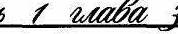

## 

## 

## 

## 

## 

## 

## 

## 

## 

## 

## 

## 

## 

## 

## 

## 

## 

## 

## 

## 

## 

## 

## 

## 

## 

## 

## 

## 

## 

## 

## 

## 

## 

## 

## 

## 

## 

## 

## 

## 

## 

## 

## 

## 

## 

## 

## 

## 

## 

## 

## 

## 

## 

## 

## 

## 

## 

## 

## 

## 

## 

## 

## 

## 

## 

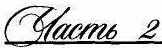

## 

## 

## 

## 

## 

## 

## 

## 

## 

## 

## 

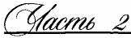

## 

## 

## 

## 

## 

## 

## 

## 

## 

## 

## 

## 

## 

## 

## 

## 

# 

## 

## 

## 

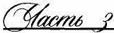

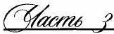

## 

## 

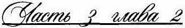

## 

## 

## 

## 

## 

## 

## 

## 

## 

## 

## 

## 

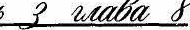

## 

## 

## 

## 

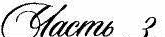

## 

## 

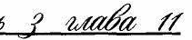

# 

## 

## 

# 

## 

## 

## 

## 

## 

## 

## 

## 

## 

## 

## 

## 

## 

## 

## 

## 

## 

## 

## 

## 

## 

## 

## 

## 

## 

## 

## 

## 

## 

## 

## 

## 

## 

## 

## 

## 

## 

## 

## 

## 

## 

## 

## 

## 

## 

## 

## 

## 

## 

## 

## 

## 

## 

## 

## 

## 

## 

## 

## 

## 

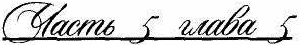

## 

## 

## 

## 

## 

## 

## 

## 

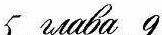

## 

## 

## 

## 

## 

## 

## 

## 

## 

## 

## 

## 

## 

## 

## 

## 

## 

## 

## 

## 

## 

## 

## 

## 

## 

## 

## 

## 

## 

## 

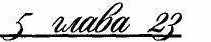

## 

## 

## 

## 

## 

## 

## 

## 

## 

## 

## 

## 

## 

## 

## 

## 

## 

## 

## 

## 

## 

## 

## 

## 

# 

## 

## 

## 

## 

## 

# 

## 

## 

## 

## 

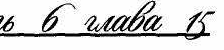

## 

## 

## 

## 

## 

## 

## 

## 

## 

## 

## 

## 

# 

## 

## 

## 

## 

## 

## 

## 

## 

## 

## 

## 

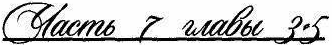

## 

## 

## 

## 

## 

## 

## 

## 

## 

## 

## 

## 

## 

## 

## 

## 

## 

## 

## 

## 

## 

## 

## 

## 

## 

## 

## 

## 

## 

## 

## 

## 

## 

## 

## 

## 

## 

## 

## 

# 

# 

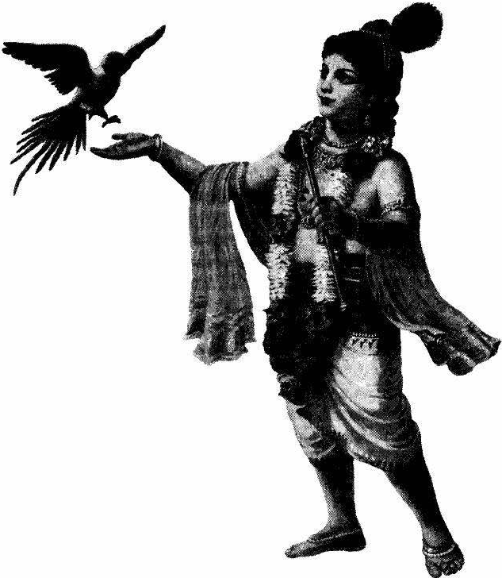

## 

## 

## 

## 

## 

|Главапервая|
|---|
|ОписаниеславыШриКришны................................................................ 6|
|Глававторая|
|ОписаниеобителиШриГолоки.............................................................. lО|
|Главатретья|
|ЯвлениеГоспода........................................................................................ 14|
|Главачетвертая|
|Вопросыоявлении Господа.................................................................... 18|
|Глава пятая|
|ЯвлениеГоспода........................................................................................ 23|
|Главашестая|
|МогуществоКамсы.................................................................................. 26|
|Главаседьмая|
|Завоеваниевсехсторонсвета................................................................. 30|
|Глававосьмая|
|ИсторияявленияШриРадхики.........................................................**.**... 34|
|Главадевятая|
|СвадьбаВасудевы..............................................................................**.**..... 36|
|Главадесятая|
|РождениеГосподаБаларамы................................................................... 39|
|Главаодиннадцатая|
|РождениеШриКришначандры..........................................................**.**... 42|
|Главадвенадцатая|
|ПраздникНандыМахараджи...........................................................**.**... 48|
|Главатринадцатая|
|Освобождение ведьмыПутаны.............................................................. 52|
|Главачетырнадцатая|
|ОсвобождениеШакатасурыиТринаварты......................................... 54|
|Главапятнадцатая|
|Вселенскаяформа,увиденнаяЯш одой............................................... 60|

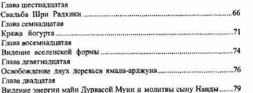

## 

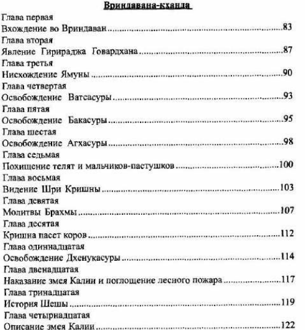

|Главапяn~.ад11атая|
|---|
|ЛюбовьРа1V1ин,Кришиы.................................................................**.**.. 124|
|Главашесщадцатая|
|ПоК1Jоие11иетуласи.................................................................................. 127|
|Главасе~шадцатая|
|ВстречаРадхиflКришны...................................................................... 130|
|Лн,ва11осе"11ад11атая|
|ДаршанШриКрншна•~а.щры............................................................... 133|
|Главадевятнадцатая|
|Танс11раса................................................................................................ 136|
|Гда11адвадuатая|
|Танецраса................................................................................................ 139|
|Главадвадцатьпераая|
|Тане11раса.............................................................................................. 142|
|Главадмдцатьвторая|
|Иrрывтащ1ераса.................................................................................. 145|
|Главадаад11атьтретья|
|УбийстводемонаШан•ха•1уд.1:,1вовремянr·ртанцараса................... 148|
|Главадаад11атьчетасртая|
|ИсторияАсуриМун!!виграхтан11араса............................................ 151|
|Главадаад11атьпятая|
|Танецраса...................................................................................**.....** , . 155|
|Главадвадцатьшестая|
|ИсторияШанкхачуды......................................................................... 158|
|Час;ц,TQffЬЯ|
|Гионоаджа-кх••цщ|
|Глааапервая|
|ЛоклоненнеШриГир11рад)!.')'.............................................................. 162|
|Глававторая|
|Велнкийnразп.ни1<ШриГ11р11р,щжа........... . ............................... 165|
|Главатретья|
|П<щиятиехо,1маГовардха1ш................... . ............................... 16~|
|Главачетвертая|
|Коронация-омовениеШриКришны.................................................. 1 71|
|Глава пятая|
|Диспутсредипастухов........................................................................... 173|
|Глааашестая|
|ИспытаняеКришны............................................................................. 176|
|Главаседьмая|
|СвятыеместаШриГир11раджа ..................................... 179|

|Глававосьмая||
|---|---|
|БопmтшШрнГирираджа................................................................... 182||
|Главадевятая||
|.ЯвлениеШриГирираджа...................................................................... 183||
|Главадесятэя||
|О1аваШриГирираджа|......................................................................... 187|
|Главаодн1шадцатая||
|МогущестаоШр11Гири| раджа.............................. . ..................... 190|
||Чаmчетвертая|
||Мцхурьs-кха1Ща|
|Главапераая||
|Исrория олицетворенныхВед.............................................................. 193||
|Глававторая||
|Историяrorrи,I<ОТОрые|преждеб1,1лнмудрецами.............................. 197|
|Главатретья||
|Исrор11я жс11щ11нМнтхилы...........**.**................... . ...................... 198||
|Главачетsерrая||
|Историяже11щинКаушалы............**.**................... . ...................... 200||
|Главапят811||
|ИсторияженщинAiionxьи..................................................................... 20\||
|Главашее-тая||
|Историяже11щинАйодхъи.................................................................... 203||
|Главаседьмая.||
|ИсторояженщинАйодхьи.................................................................... 205||
|Г,1ававосьмая||
|Историяяrья-СитиславаЭкaдatUJ-t..................................................... 208||
|Глааадевятая||
|Славаэ.кадаши........................................................................................ 212||
|Глава десятая||
|Истор11ядсвушек-пуnи11дн.................................................................... 214||
|Главаоднняадuатая||
|Историягоnи,которые|были житwu~мнРама-Ваftкунrх11,Швстадвиnы,|
|Урд)(ва-Вайкунтх11,Ашкнта-1.1адыиШриЛокача.~.............................. 215||
|Главадвенадt(атая||
|История.rопи,которые|вnразд11нкХолипоказалитри|
|трансцендентныедобродетели.............................................................. 217||
|Главатринадцатая||
|История11ебес11ыllбоr-ннь...................................................................... 219||
|Главачетырнадuа1·а,1||
|Истори.•Джала11дхари|.......................................................................... 221|

|Главапятнадцатая|
|---|
|История же.1щинБархишмати-nуры,ancapиженщинСуrалы и|
|Наrендры...................................................................... . ......... 223|
|Главашестнадц,атм|
|ШриЯму1<а-кава'!а...................................................... . ........ 225|
|Гла.васемнадцатм|
|МоmrтеыШриЯмуне...................................................... . ............. 227|
|Глававосемнадцатая|
|ОписаниеЯмуна-пата.11:ыиЯмун.а-nа.дцхати......... . ............... 228|
|Главадевят1<адцатая|
|Тысяча11меиШриЯмуны............................................. . ............... 230|
|Главадвадцатая|
|УбийстводемонаПраnамбы................................................................. 248|
|Глааадвадца'IЪпервая|
|Крищ11атушитлеснойпожариявл~етСебяженамбрахманоu...... 250|
|ГлавадвадWl'!Ъвторая|
|НшщаиronыувиделицарствоВайкунтхи............................. ..252|
|Главадвадцатътрс'IЪЯ|
|ИсторияСударwа111>1..............**.**..........**.**...................................**...**. . 254|
|Главаавадцатьчетвертая|
|УбийствоВьомасурLJиАриштасуры.................................................. 255|
|частьца:таа|
|MШYPI-KJIIШI|
|Главапервая|
|Coae-rI<aмce........................................................................**.**........ . .... 258|
|Глававторая|
|Уб11йстводемонаКеш]j.......................................................................... 260|
|Главатрс-тья|
|Прr,.ездАкруры........................................................................................ 262|
|Глава•tе-rвертая|
|Пое3дкавМатхуру................................................................................. 265|
|Гnавапятм|
|ШриКришнавходитвМатхуру........................................................... 268|
|Главашестая|
|Шри Матхура............................................................................ . ........ 271|
|Главаседьмая|
|УбийствослонаКувалаяпнцы............................................... . .......... 275|
|Глававосьмая|
|УбийствоКамсы...................................................................................... 279|

|Главадев,~тая|
|---|
|СчастьеЯдавов........................................................................................ 282|
|Главадесятая|
|Историиnрачечника.тка<rаиСудамь~................................................ 286|
|Главаодиннадцатая|
|ИсторииКубджиIIслонаКувалаяn11д1>1............................................. 288|
|Главадвенад11ата.я|
|Прошлоерожден11едемонаПанчащ1жаны........................................ 290|
|Главатринадцатая|
|Прие:1,цУддха11ы....................................................................................... 292|
|Главачетырнадцатая|
|ВстречаМахараджиНандыиУддхавы............................................. 295|
|Глава пятнадцатая|
|ДаршапШриРадхи............................................................................... 298|
|Главашестнаднатая|
|УтешениеШриРадхинronн................................................................. 302|
|Главасемнадцатая|
|Восnом11НанпяronиоКришне.............................................................. 304|
|Глававосемнаццата..я|
|УмхаваслушаетречигоnиивоЗ!lращаетсявМапуру.................... 308|
|Главадевятr1а1щатан|
|ПраздниквозвращенияШр11Криw1ц,1..........................................**.**.. 311|
|Главадвадцатая314|
|ОсвобождениеР11бхуМу1111вовремяпраэдннката11цараса............. 314|
|Главадвадцатьпервая|
|ИсторияШриНарадЫ........................................................................... 318|
|Главадвадцатьin-opaя|
|ИсторияШриНарады..................... .. ............................................ 322|
|Глава даа;щать ч>етья|
|Убиftст110демонаКолы................ .. ............................................ 325|
|Главадl!Эд11атьчетвертая|
|СлаваШриМатхуры....... .. ...................................... 332|
|Чarnщестаи|
|Двара11а-кханда|
|Глааапер&ая|
|ПоражениеДжарасандхи. . ........................................... 336|
|Глааа8'ТОрая|
|ПрожwванневДвараке..... . ........................................... 339|
|Глава7ретья|
|Сва,;ьбаГосподаБэларамь~ ................................................. 343|

|Г.qава'!СТВертая|||
|---|---|---|
|Поеэдкав l'ОродКуидину..|.}45||
|Главапятая|||
|ПохищениепрекраснойРукми~ш...... .|. .... 348||
|Главашестая|||
|ПохищениеРукм,шиипобедаЯдаВ<>11|..... 351||
|Главаседьмая|||
|СвадьбаРую>1н11н...............**.**||.354|
|Г ЛЗВЭ80СЪМJtЯ|||
|Свадьбавеехцар1щ............**.**.||.357|
|Главадевятая|||
|ЯвлениеШраДвараки........**.**|. .....................|359|
|Главадесятая|||
|Отtсаниере1<11ГоматииславаЧакра-пtртхи.................................. 362|||
|Главаоди11надщrrая|||
|СопюренисЧакра-n<ртх11,освобожде,шсслона|икрокодила........365||
|ГлавадвенадЩl'rая|||
|СлаJ.<ЭШа11кходдхара-т11ртх11|................ 367||
|Главатр,ноадца·rая|||
|СлаваПрабхаса-тиртхи,рск11Сарас11Эт11,Бодха-rоиnnалыIIместа,|||
|rдсре~аГоматоt11стрсчастсясоксаооом............ . ................................||369|
|Гла6ачетырнадц.rтая|||
|СлаваРапоакары,Раи11Эп,1иКачалы........ .|.. ...................... 371||
|!"лаw•пятооадцатая|||
|Сла11аНриrа-куооыиГоrои.бхуми......................................................**.**374|||
|Гд_ао:ашсетнад1,а·1·ая|||
|СозсрцаооискрасотыШр1,Радхи........................................................||377|
|Гпавасем 11адцатая|||
|ШриРадха11Криш,rавстречаютсявС1,ддхашраме,ПроявлснJ.1с|||
|шобощШр11Радх11...................................................................................||380|
|Главаоосемнад11атая|||
|с.~аваС,щцхашрама"rораэдю,ктанцараса....................................383|||
|Гпавадевятооадцатая|||
|Перо~аякрепостьДвараю,,Слаеал,ша-сароuарьr,|||
|Хар,о->~ан№ра,Джнана-тщm,и,Кришна-кунлы,Балабхадра-сарах,|||
|Гане1uа"п1ртх11,Дана-стхалы11 Маi!я-тнртхи....................................... 386|||
|Главадвадцатая|||
|Втораякрепость Двараки,СлаваИндра-тоtртхи,|Брахма-ти_ртХlt.||
|Сурья-хунды,1-!а11лЗJ1охнта-тиртхJ,111Саnта-самудра-тиртхн............ 389|||
|Главадва.tщатr,первая|||
|Отtсаниетретье!!,-реrтости"славаПющараt<11-тиртхи.................391|||

|Главадвадцатьвторая||
|---|---|
|ИсторwяСудамы-випры.............**.** . .................................................. 393||
|Чаnъсед;ьмая||
|ВКUIР@/12f'МТ-к•анца||
|Глаllапервая||
|ИсторИJ!Мару'!'rы................................................................................. 400||
|Глававторая||
|))J!З.f'ОСЛ08е1ШСПрадьЮМ!IЫна11обеду..............................................|.402|
|r.~авы3-5||
|Победныймаршарм11нЯдаво111tра,цжасуя-ягьяцаряУ1-расены.....404||
|Часть**JIQChM3R**||
|Балабха11оа-кхаИ1Jа||
|Главапервая||
|Пр1tч1шанцельявления Господа11аЗемлю........................................ 430||
|ГлаваIJТ()pa>i||
|Н,,схождениеГосподаБаларамы...........................**.**, ...........................432||
|Главатретья||
|ИсторияДжоrrшrмат11............................................................................ 433||
|Главачетвертая||
|ИсторияРевати...................................................................................... 435||
|Главапятая||
|ЯвлениеГослодаКр11шныиГосподаБаларамы................................ 437||
|Г11аиашестая||
|И1-рыКр1tшныиБаларамывоВrиндаваие........................................ 439||
|Г-1:tвасед1.мая||
|ИгрыКришнынБаларамывМатхУj>&....................................|.. .. 440|
|Главаuосьмая||
|ИгрыКришныиБаларамывДвараке..................................... .. ....... 442||
|Главадевятая||
|ТанецрасаГосподаБаларамы........................................................**.**... 443||
|Глава десятая||
|Пад11)(ат11иnara.JJa ГосподаБаларамы..........**.**..............**.**......|.. . ..44_5_|
|Главаодиннадцатая||
|МолитааГосподуБалараме.....................................................|.. ..... 450|
|Главадесиад11атая||
|ЗащитныемолитвыГосподуБалар,аме............................|.. ..... 451|
|Главатринадцатая||
|ТысячаименГосподаБмарамы.............................. .. .................452||

## 

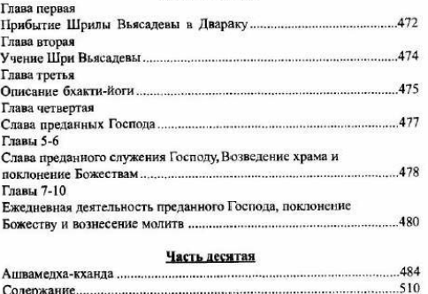

## 

