# Automation

## In this article

- [Automation Overview](#h_f2c67b7a-f077-4e65-86b5-c2d810f1eeb0)
- <a href="#h_deee8fe3-4558-42f7-a21c-c509f8a674c9" target="_self">Automation Modes</a>
- [Choosing What to Automate](#h_56306a13-8abf-4d7c-b14e-16a3319d210d)
- <a href="#h_8f117168-411a-450e-9757-11465a97ee82" target="_self">Drawing Automation</a>
- [Writing Volume Automation with the Volume Fader](#h_d94891ba-b892-4d99-a70c-9e653f7da646)
- [Writing Pan Automation](#h_f2980a03-d42d-4530-9580-bc54b8920211)
- [Automating Plug-In Parameters](#h_3b9f5734-d02f-45d6-bc24-71971e858ced)
- [Automating LUNA Extension Controls](#h_01EC5PQB75CAA0ND6V95MPZC10)
- [Automating a MIDI Continuous Controller](#h_231f1a15-4e57-4173-acca-cc7c44ed21e7)
- [Trimming Automation](#h_556312ba-53a7-42d9-b02d-e24e0c170051)
- [Clearing all Automation for a Selection](#h_01EC5NBC3BVESWZHHTTVRJPBK2)
- [Writing and Trimming Control Values](#h_01HYDZN25YVHX6F95ST5NCSNV8)

------------------------------------------------------------------------

# Automation Overview

Automation is the process of writing changes to controls in your session over time that are then played back as the session is played back {when track automation is enabled). Most parameters on a track can be automated. 

------------------------------------------------------------------------

# Automation Modes

LUNA has the following automation modes.

- **Off:** Automation is ignored; the track plays back based on current mix levels and pan controls.

- **Read:** Standard playback mode. The track plays back all previously recorded automation data.

- **Touch:** Track plays back all existing automation. Automation is only written while you are actively holding or moving a control. Once released, the control snaps back to the existing automation. Use Touch to write initial automation, "touch-up" existing automation, and for specific spot fixes.

- **Latch:** Functions like Touch, but continues writing the last value after you release the control. The control stays at that "latched" value until playback stops or the loop restarts. Use this to touch up automation, then set a specific level for the remainder of a section.

- **Trim (Read T):** Allows you to offset the existing automation without overwriting it. When enabled, the volume fader changes color and becomes a "relative" control, raising or lowering the overall level of the existing automation pass. Note that Trim only applies to Volume. 

- **Touch Trim and Latch Trim are** hybrid modes that allow you to record "trim adjustments" in real-time.

  - **Touch Trim:** Records a relative offset only while you hold the fader.

  - **Latch Trim:** Records a relative offset and stays at that new offset after you let go.

------------------------------------------------------------------------

# Choosing What to Automate

The View browser for a track (accessed from Timeline view) shows the items you can automate. 

- For an audio track, you can automate volume, mute, and mono or stereo pans, and the controls for any plug-ins and extensions on the track. 

- For an instrument track, you can automate  volume, mute, and mono or stereo pans, plus all the MIDI Continuous Controllers (CCs) of the Instrument plug-in, and controls for any plug-ins on the track. 

- Plug-ins and extensions on audio and instrument tracks also have controls that can be automated. 

The browser shows all automatable parameters for all plug-ins on a track. When automation has been added, the View browser highlights any automated parameter in yellow.

<figure class="wysiwyg-image">
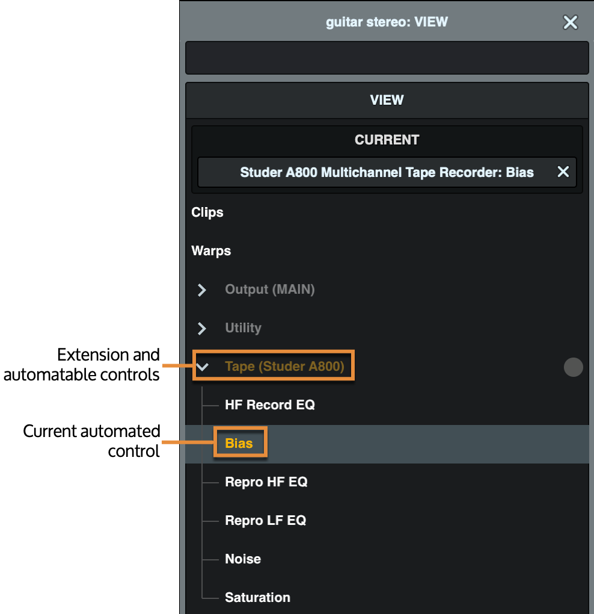
</figure>

------------------------------------------------------------------------

# Drawing Automation

You can manually draw automation breakpoints for precise control, even in areas where there are no audio clips.

- You can add points anywhere on a track's automation lane to create breakpoints.

- By default, new points snap to the grid. Hold Command (macOS) or Ctrl (Windows) to place points without snapping to the grid.

## To draw automation on an audio or Instrument clip

1.  In Timeline view, click View, and choose the parameter for which you want to draw automation (for example, Volume). The audio or MIDI clip shows a line for the automatable parameter.\
    \
    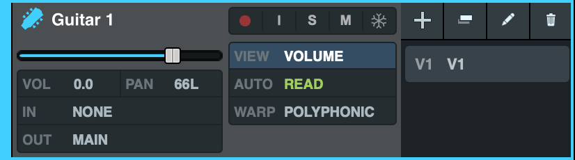\
    \
    \
    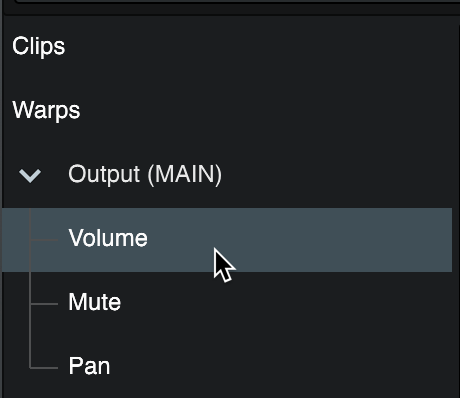\
    \
    \
    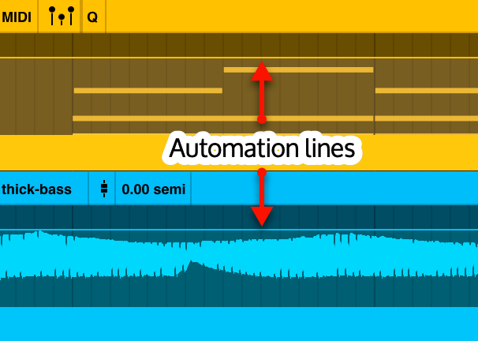
2.  To add automation points, press Control and hover over the clip. The cursor changes to the Pencil Editing Tool.\
    \
    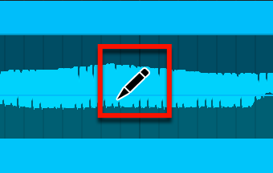
3.  While you hold Control, click the points you want to add on the automation line. Hold Control and drag to draw automation across the track.\
    \
    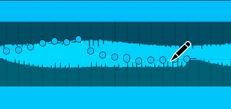
4.  To draw automation without snapping automation points to the grid, press Control+Command (macOS) while drawing automation. To draw automation without snapping to the grid on Windows, disable Snap.\
    \
    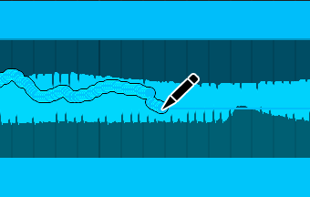
5.  To adjust an automation point, click the point and drag up or down. To adjust with fine control, hold Shift while you drag.
6.  To clear an automation point, hold Control and hover over an automation point. The cursor changes to the Eraser Editing Tool (the pencil turns around). Click an automation point to remove it.\
    \
    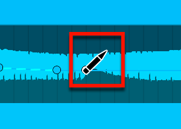
7.  To clear a range of automation, select the range on the audio or Instrument track, and press Delete.\
    \
    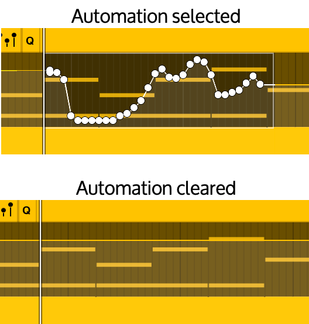

Your automation changes are played back when the session plays the clip, when an Auto Mode is enabled. When Auto Mode is Off, automation is ignored.

------------------------------------------------------------------------

# Writing Volume Automation with the Volume Fader

To write automation, switch a track to Touch or Latch mode. You do not need to press a global "Record" button to write automation. Automation begins recording the moment you move a fader or control.

Recording stops when you release the control (in Touch mode), stop playback, restart a loop, or change automation modes.

You can write volume automation on any track type.

## Automation mode behaviors

- **Touch Mode:** When you release the control, the fader snaps back to its original level.

- **Latch Mode:** When you release the control, the fader stays at the new level and continues writing that value until playback stops.

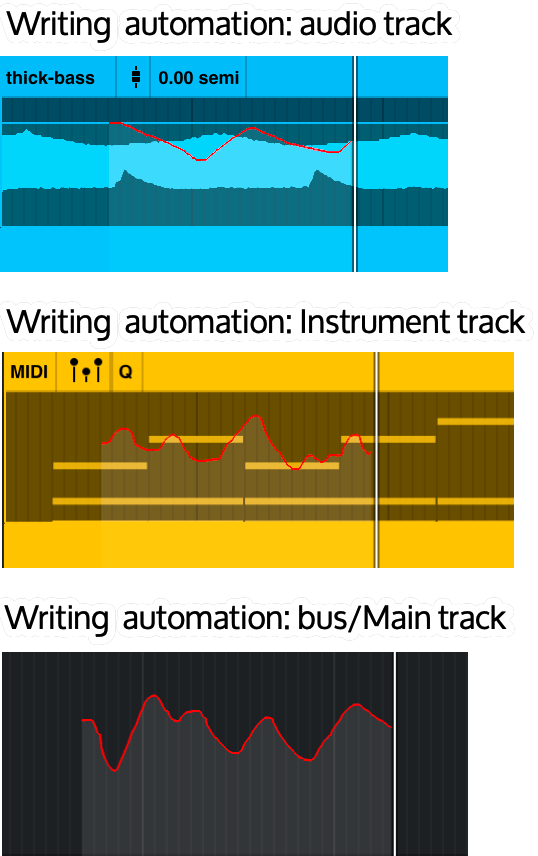

 

## To write volume automation

1.  On the Focus channel in the Timeline, or on the track in the Mixer, set the track for which you want to automate volume to either Touch or Latch mode.\
    \
    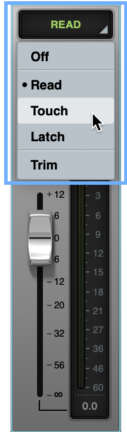
2.  To view the results of your automation, and to edit the automation, switch the track view to Volume. In the track control area in the Timeline, click View, then from the browser choose Volume.\
    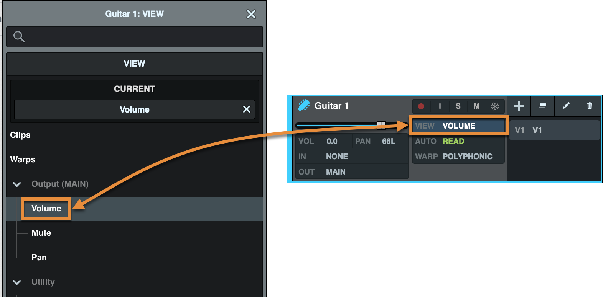\
     
3.  Make a selection or place the playhead where you want to start playback.
4.  Press Play or the Spacebar.
5.  As the track plays, adjust the volume. Volume automation is written to the track.\
    \
    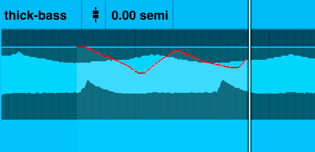
6.  To stop writing automation, press the Stop button or the Spacebar, or release the fader. Automation also stops writing when playback stops (for example, at the end of a selection). 

If you are writing Touch automation, release the fader to stop writing automation and return the fader to the previous level (before you started writing automation). 

If you are writing Latch automation, the fader remains at the release level.

------------------------------------------------------------------------

# Writing Pan Automation

Pan automation is represented on a horizontal line.

- The center line is unpanned (centered).

- Above the center, signal pans to the left.

- Below the center, signal pans to the right. 

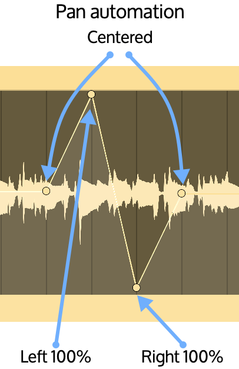

 

## To write pan automation

1.  In the Track controls on the Timeline, on the Focus channel in the Timeline, or on the track channel strip in the Mixer, set the track for which you want to automate panning to either Touch or Latch mode.\
    \
    
2.  To view the results of your automation, and to edit the automation, switch the track view to Pan. In the track control area in the Timeline, click View, then from the browser choose Pan.
3.  Make a selection or place your cursor where you want to start playback.
4.  Press Play or the Spacebar.
5.  As the track plays, adjust the pan control in the mixer or on the track. Pan automation is written to the track.\
    \
    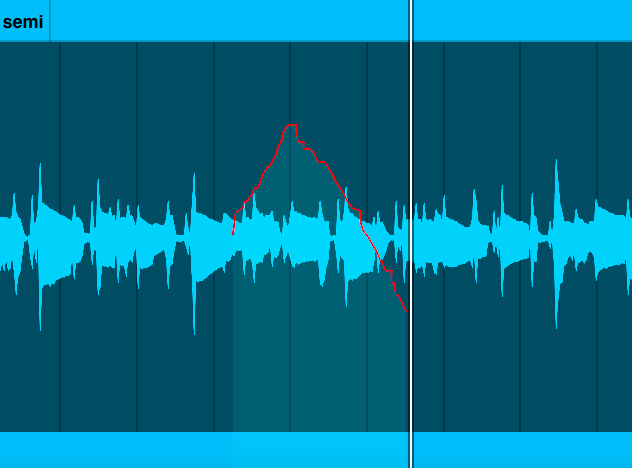
6.  To stop writing automation, press the Stop button or the Spacebar, or release the fader. Automation also stops writing when playback stops (for example, at the end of a selection). 

If you are writing Touch automation, release the fader to stop writing automation and return the fader to the previous level (before you started writing automation). If you are writing Latch automation, the fader remains at the release level.

------------------------------------------------------------------------

# Automating Plug-In Parameters

You can edit automation for any plug-in assigned to a track. All automatable plug-in parameters appear in the track’s View browser.

## To write plug-in automation

1.  On the Track control area in the Timeline, click View, then from the browser choose the plug-in parameter to automate. On the track, the plug-in parameter line appears.
2.  To add automation points, press Control and hover over the track. The cursor changes to the Pencil Editing Tool.\
    \
    
3.  While you hold Control, click the points you want to add on the automation line. Hold Control and drag to draw automation across the track.\
    \
    
4.  To draw automation without snapping automation points to the grid, press Control+Command (macOS) while drawing automation. To draw automation without snapping to the grid on Windows, disable Snap.\
    \
    
5.  To clear an automation point, hold Control and hover over an automation point. The cursor changes to the Eraser Editing Tool (the pencil turns around). Click an automation point to remove it.\
    \
    
6.  To clear a range of automation, select the range on the track and press Delete.\
    \
    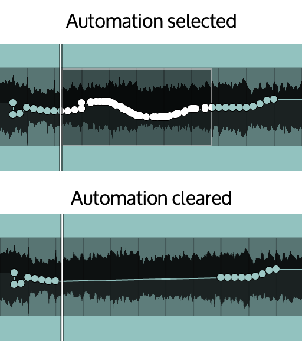

Your automation changes are played back when the session plays the clip and Automation is enabled. When Auto Mode is Off, automation is ignored.

------------------------------------------------------------------------

# Automating LUNA Extension Controls

You can write automation for any LUNA Extension assigned to a track. All automatable LUNA Extension controls are listed in the track’s View browser.

## To write LUNA Extension automation by adjusting a control

1.  On the track controls, set the track for which you want to automate LUNA Extension controls to either Touch or Latch mode. \
    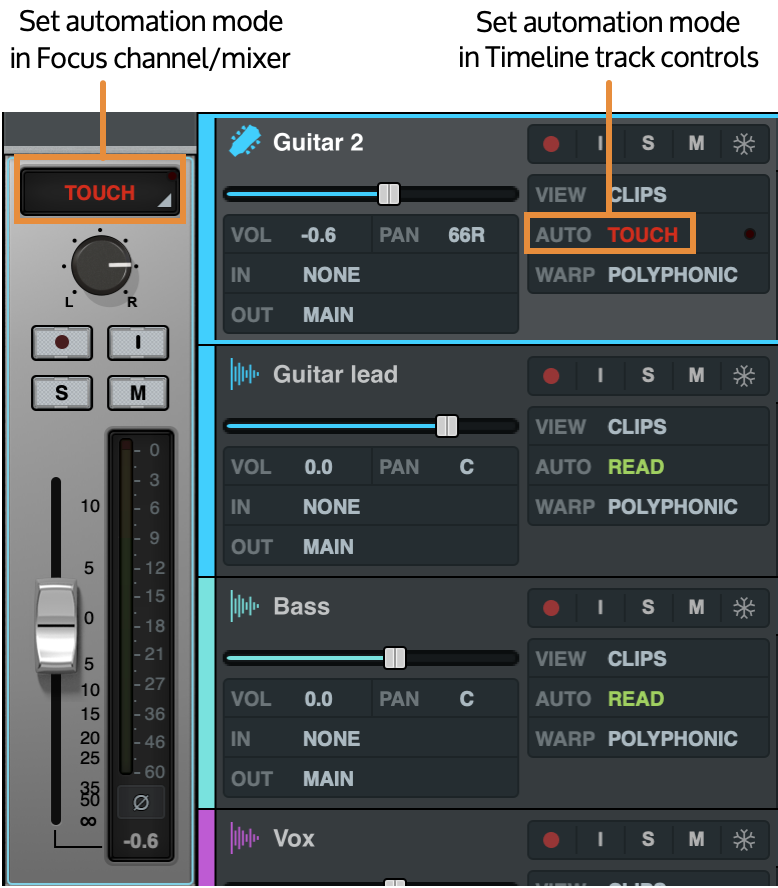\
     
2.  To see the results of your automation in the timeline during playback, click View on the track controls, and from the View browser, select the control for which you want to view automation. \
    \
    \
     
3.  Press the Spacebar or play on the transport. While the track is playing, adjust the control you want to automate.
4.  Press the Spacebar or stop on the transport to stop writing automation.

If you selected the control in the View browser, you can see the control automation while it is being written, and see the automation results after it is written.

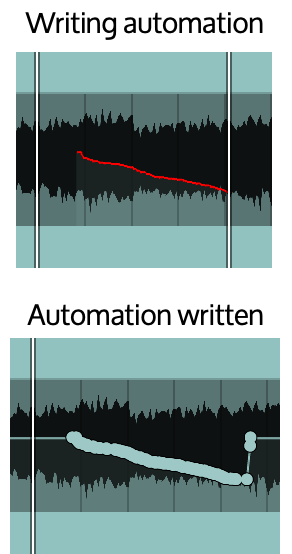

## To draw LUNA Extension automation

1.  On the Track control area in the Timeline, click View, then from the browser choose the LUNA Extension control to automate. On the track, the LUNA Extension control line appears.\
    \
    \
    \
    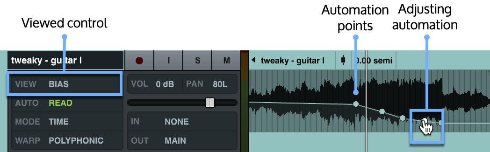\
     
2.  To add automation points, press Control and hover over the track. The cursor changes to the Pencil Editing Tool. You can also double-click to add an automation point at the cursor.\
    \
    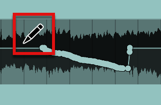\
     
3.  While you hold Control, click the points you want to add on the automation line. Hold Control and drag to draw automation across the track. To adjust a single automation point, click and drag.\
    \
    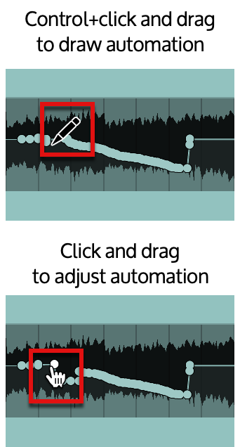\
     
4.  To draw automation without snapping automation points to the grid, press Control+Command (macOS) while drawing automation. To draw automation without snapping to the grid on Windows, disable Snap.\
    \
    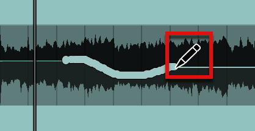\
    \
     
5.  To clear an automation point, hold Control and hover over an automation point. The cursor changes to the Eraser Editing Tool (the pencil turns around). Click an automation point to remove it.\
    \
    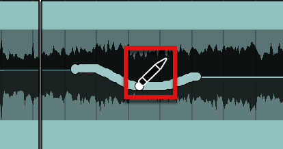\
    \
     
6.  To clear a range of automation, select the range on the audio or Instrument track, and press Delete.\
    \
    

Your automation changes are played back when the session plays the clip and Automation is enabled. When Auto Mode is Off, automation is ignored.

------------------------------------------------------------------------

# Automating a MIDI Continuous Controller

You can edit automation for any MIDI Continuous Controller (CC) on an instrument track. All automatable CC messages appear in the track’s View browser.

**Note:** you can edit all MIDI CCs supported by the Instrument, even if the CC is not used in a program.

## To write MIDI CC automation

1.  Enable the MIDI CC view by clicking the MIDI CC icon on a clip on the instrument track.\
    \
    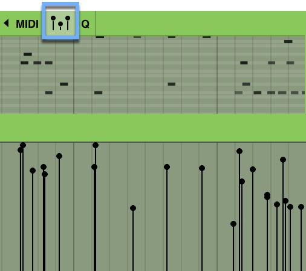
2.  On the Track control area in the Timeline, click the CC Controller button (this defaults to Volume), then from the browser choose the MIDI CC to automate. Below the MIDI piano roll, the MIDI CC line appears.
3.  To add automation points, press Control and hover over the CC track. The cursor changes to the Pencil Editing Tool.\
    \
    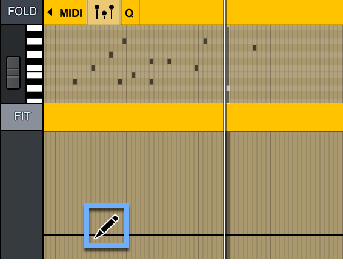
4.  While you hold Control, click the points you want to add on the automation line. Hold Control and drag to draw automation across the track.\
    \
    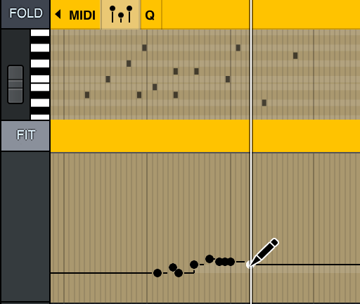
5.  To draw automation without snapping automation points to the grid, press Control+Command (macOS) while drawing automation. To draw automation without snapping to the grid on Windows, disable Snap.\
    \
    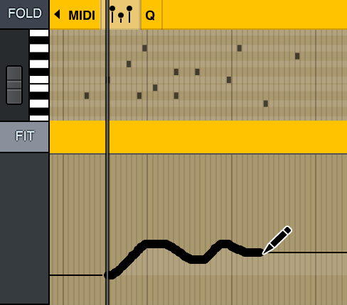
6.  To clear an automation point, hold Control and hover over an automation point. The cursor changes to the Eraser Editing Tool (the pencil turns around). Click an automation point to remove it.
7.  To clear a range of automation, select the range on the track, and press Delete.\
    \
    

Your automation changes are played back when the session plays the clip and Automation is enabled. When Auto Mode is Off, automation is ignored.

## Automating MIDI program changes

You can automate MIDI program changes with the Program Change control.

## To automate a MIDI program change

1.  Enable the MIDI CC view by clicking the MIDI CC icon on a clip on the instrument track.

    

    

    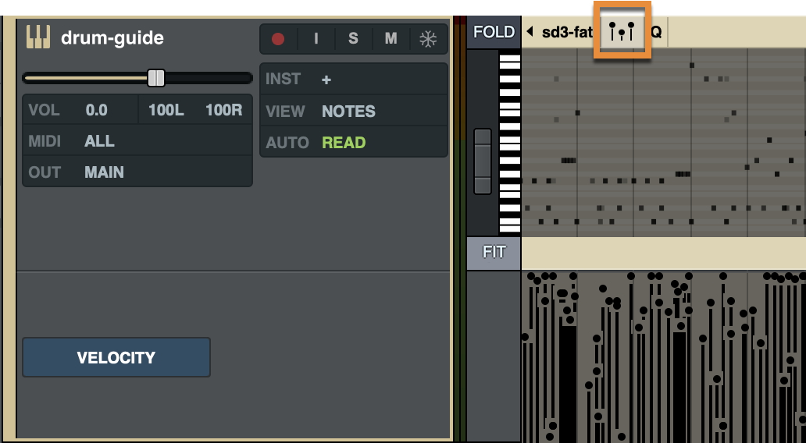

    

    

2.  On the Track control area in the Timeline, click the CC Controller button (this defaults to Volume), then from the browser choose Program Change. Below the MIDI piano roll, the MIDI CC area appears.

    

    

    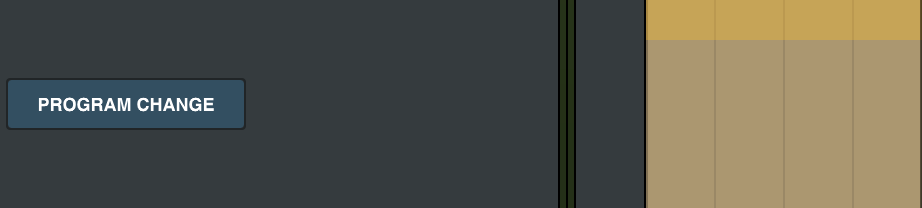

    

    

3.  Double-click in the program change area where you want to program change to occur. The Program Change window appears.

    

    

    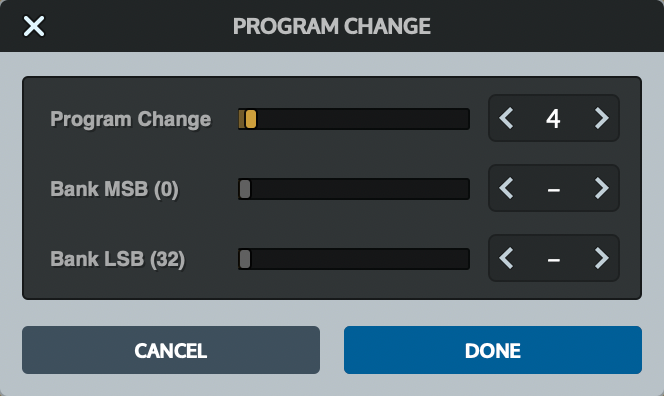

    

    

4.  Configure the program change by setting the Program Change, Bank MSB, and Bank LSB settings as required, then click Done. The program change appears in the track.

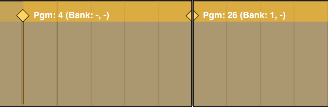

------------------------------------------------------------------------

# Trimming Automation

Trimming automation is the process of adjusting a range of automation data. You can trim a selection, a segment (the line between two automation points), or all automation on a clip. 

## Show automation

Before you trim automation, you must show the automation in the Timeline that you want to trim. 

- Click View on the track to select the automated control you want to adjust.

**Tip:** Automated controls are highlighted in the Focus Browser. 

- To adjust a MIDI CC, open the MIDI CC view and choose the MIDI CC from the Track controls panel.

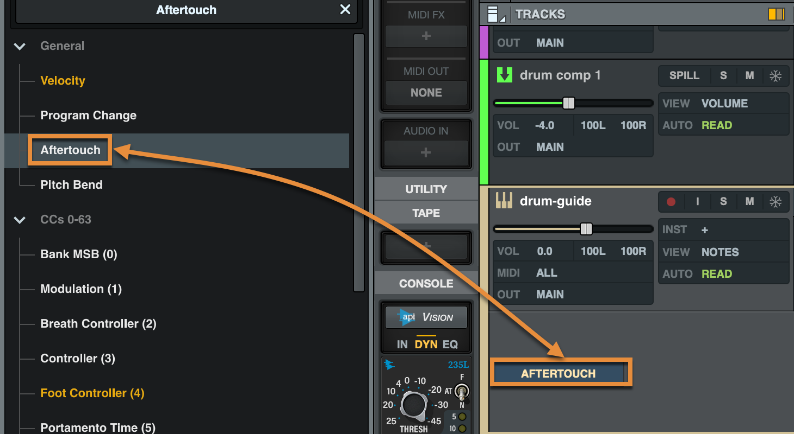

## To trim all automation on a clip

1.  Hover the cursor over the automation line on the clip. The Automation Trim Editing Tool appears. Note that the cursor must be between automation points, and you may have to zoom in to place the cursor.
2.  Click on the automation line and move the automation up or down to trim.
3.  To trim automation with fine control, hold Shift while you drag the automation up or down.\
     

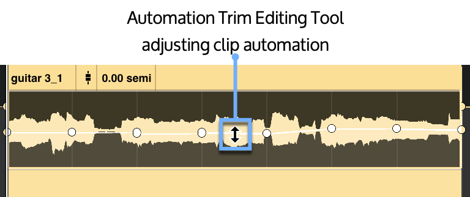 

**Note:** Automation is trimmed for the entire clip. Automation breakpoints are added at the start and end of the clip.

## To trim an automation selection

1.  Make a selection on the track or CC automation line.
2.  Hover the cursor over the automation line on the clip or CC track. Make sure the cursor is over the automation line and not an automation point. The Automation Trim Editing Tool appears.
3.  Click on the automation line and move the selected automation up or down to trim.
4.  To trim automation with fine control, hold Shift while you drag the automation up or down.\
     

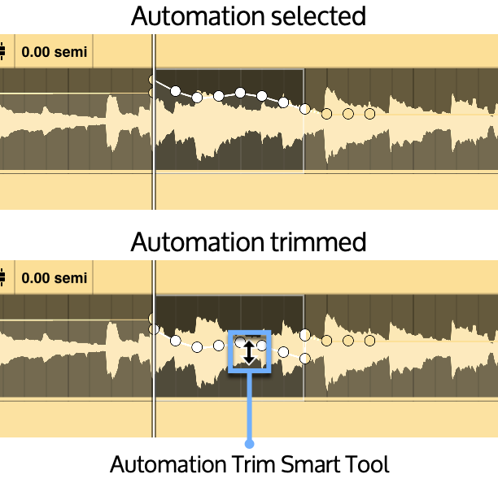

## To trim an automation segment

1.  Hover the cursor over an automation segment on the clip. The Automation Trim Editing Tool appears.
2.  Click on the automation segment and move the segment up or down to trim.
3.  To trim automation with fine control, hold Shift while you drag the automation up or down.\
     

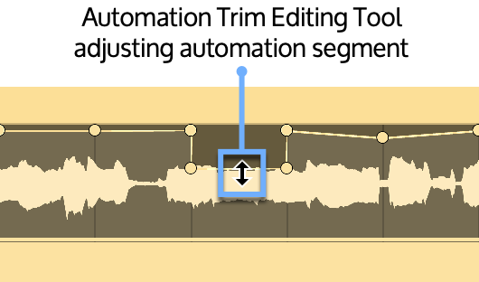

 

**Tip:** You may have to zoom in to trim an automation segment instead of the entire clip. You can only trim an automation segment when it has no slope (it begins and ends on the same value).

------------------------------------------------------------------------

# Clearing all Automation for a Selection

To clear all automation data within a selection, make a selection on one or more tracks in the timeline, then choose Edit \> Clear All Automation. When you clear automation for a selection, breakpoints are added at the beginning and end of the selection, if automation extends beyond the selection. This command clears automation for all controls and CCs for the selection.

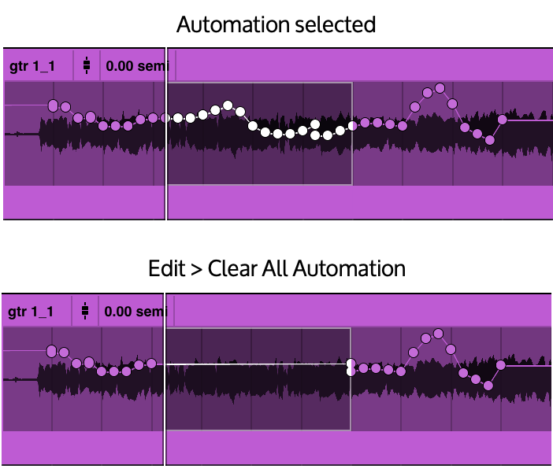

------------------------------------------------------------------------

# Writing and Trimming Control Values

To write a control value for a displayed automation parameter, press Command+/ (macOS) / Ctrl+/ (Windows). Type the control value and press OK. The control is adjusted to the value you specify.  If there is a selection, the selection is adjusted. Otherwise, the control is adjusted from the playhead location. 

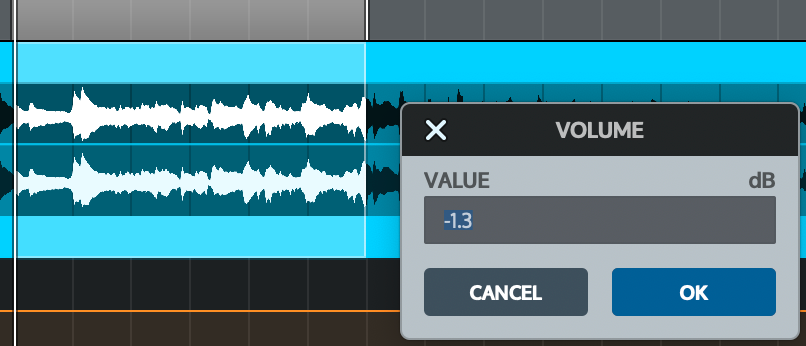

To trim a control value for a displayed automation parameter, press Command+Option+/ (macOS) / Ctrl+Alt+/ (Windows). Type the control value to trim and press OK. The control is trimmed by the value you specify.  If there is a selection, the selection is adjusted. Otherwise, the control is adjusted for the duration of the current control segment.

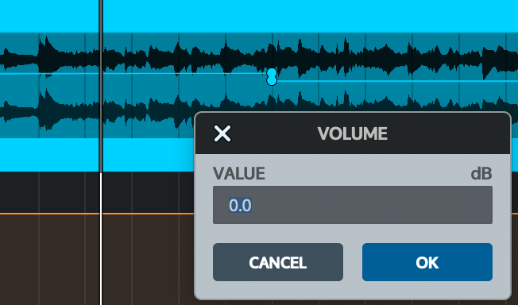 

260105

