# Cues

The cue buses are for creating mixes that are different from the main monitor mix. Cues are typically used for performers that want to hear a headphone mix that is different from the main monitor mix, or for routing individual channels or mixes to other equipment.

The cue mixes are adjusted using the cue sends on each input and aux strip. All cue sends are pre-fader and pre-mute so they are not affected by adjustments to the main monitor mix.

**Note:** By default, two cues are displayed in UAD Console (four with Apollo 16). Up to four cues are available with Apollo by increasing the Cue Bus Count in Settings \> Hardware.

The complete cue system comprises the cue mix buses, the cue sends, and the cue outputs.

**Cue Mix Buses –** A cue mix bus is the summed stereo mix of individual audio signals. Signals are routed into the cue mix buses via the cue send controls, and returned from the cue mix bus via the cue outputs controls.

**Cue Sends –** The cue sends adjust the individual channel signals going into the cue mix bus. Each input channel and aux return contains individual level, pan,\* and mute controls for each active cue mix bus. All cue sends are pre-fader and pre-mute so they are not affected by adjustments to the main monitor mix.

**\*Note:** If two input channels are stereo-linked, the cue sends on the stereo pair cannot be panned. Sends for stereo channels are hard-panned left and right.

**Cue Outputs –** Cue mix buses are returned via the Cue Outputs window, which is a matrix for routing the cues to Apollo's available hardware outputs.

**Cue Monitoring –** Available cue outputs also can be selected as a source for the main monitor outs via the Monitor Output Options, enabling any cue mix bus to be heard in the main monitor speakers.

# Accessing Cues

To show or hide Cues, click the circle next to Sends in the Mixer Navigation section at the left of UAD Console. Cues and sends are shown when the circle is illuminated. 

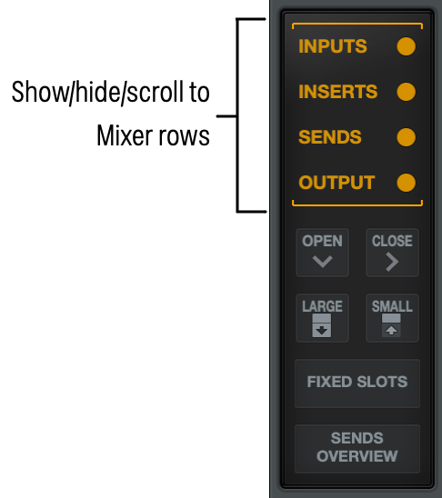

 

# Large and Small Cues

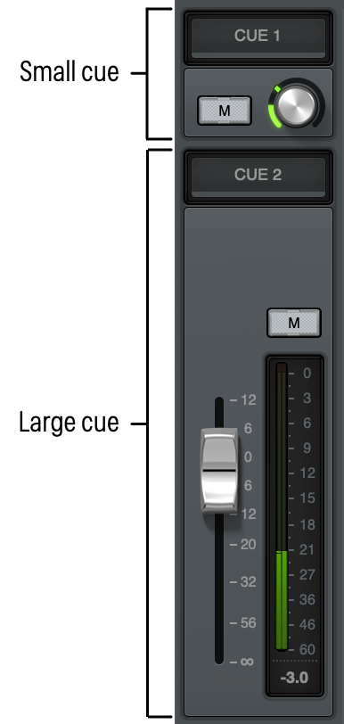

By default, cues are shown in Small view. This view allows you to easily adjust the level for a cue or to mute the send, while fitting more mixer sections on your screen. You can expand Cues, to reveal the additional pan control for the cue, and to use a long-throw fader for more accurate level control.  

- To expand a cue row, click the Large icon to the left of the row
- To expand all cues, click the Large switch in the Mixer Navigation section. 

# Cues in the Sends Overview

The Sends Overview allows you to quickly see the send and cue status of visible channels in UAD Console. Click the Sends Overview switch to toggle the Sends row between the standard appearance and Sends Overview. 

*The Sends Overview switch*

*Sends Overviews in UAD Console*

You can click on any Sends Overview to open a popover window that allows you to easily control Aux and Cue send levels, mutes, and panning for that channel (you cannot adjust panning for Sends or Cues on stereo linked channels).

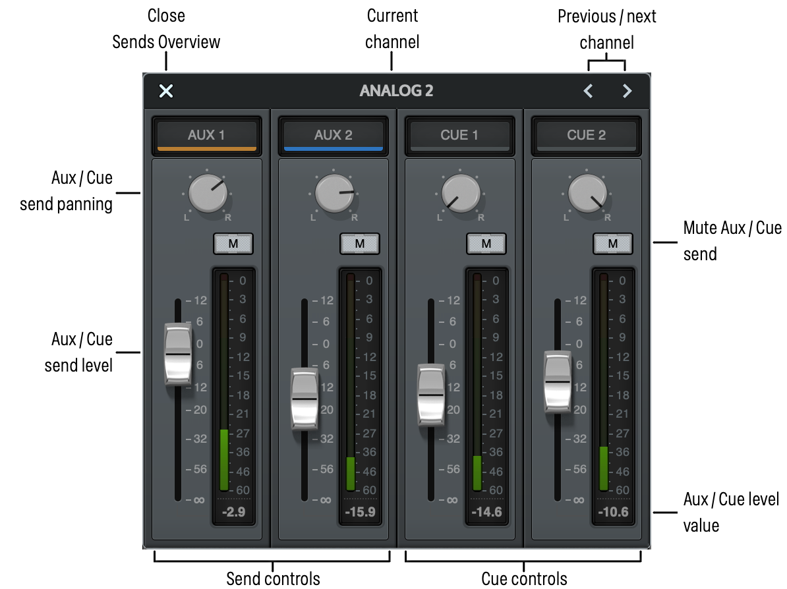

# Adjusting Cue Levels

To adjust the level of the input sent to the cue bus:

- Rotate the Cue knob. The cue level is shown while you engage the knob. 

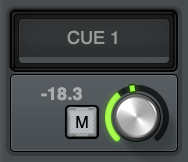

- Double-click the Cue knob to open the Cue volume popover, and type a dB value (-144 to +12), then click OK.

\
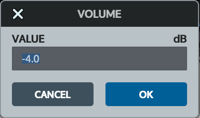

- When Cues are in Large view, drag the fader to adjust the send level, or click the level at the bottom of the meter to open the Send volume popover and adjust the level. If the Cue is Stereo, you can also adjust the pan control. 

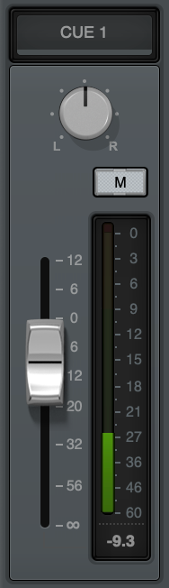

- When Sends Overview is active, click on the Sends Overview for a channel to open the Sends Overview popover, then adjust the levels and pan controls for Aux and Cue buses by dragging the faders and adjusting the pan controls. \
  
- To adjust any control with the mousewheel, hold Option on the keyboard, then scroll the wheel over the control.
- To mute a cue, click the Mute button. This prevents any audio from the channel from being sent to the cue destination. 

# Opening and Closing the Cues Row

You can open and close the Cues row. See [Opening and Closing Individual Channel Strip Rows](https://help.uaudio.com/hc/en-us/articles/25347220842516#h_01HTR5AJ8TXRQN16B52YYFZB51).

# Routing Cue Outputs

# 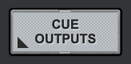

Cue Outputs are adjusted within the Cue Outputs window. To open the Cue Outputs window, click on the name of any Cue in the Cues area, or click Cue Outputs in the Monitor Column. The Mix (MIX switch highlighted) or Cue (MIX switch dim) can be assigned independently to each headphone output. Cue outputs can also be heard in mono, by clicking the MONO switch. 

To assign a cue to a headphone output, click the rectangle under the desired Cue column that aligns with the headphone output. Selected pairs are highlighted, and unselected pairs are blank (black) The selected cue/headphone pair is highlighted, and available cue/headphone pairs are black. 

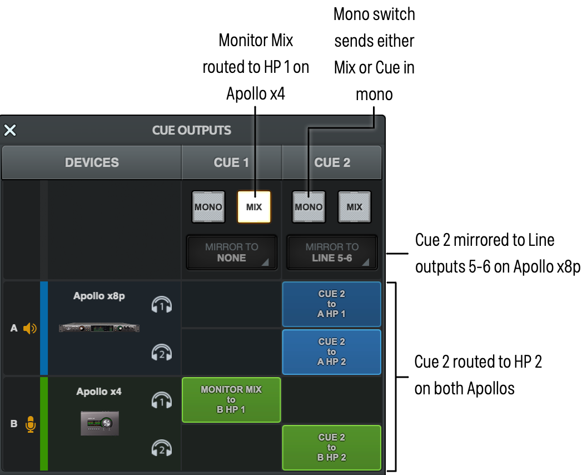

 

## Devices

The Devices column lists the active Apollos and their headphone outputs. 

## Cue Source Select

Each Cue is displayed in a separate column, with two switches (Mono and Mix) that determine the Cue source and format. The source for each cue output can be either the associated dedicated cue bus or the main monitor mix. The cue sources for each cue are mutually exclusive (both sources cannot be simultaneously active).

### MIX On

When MIX is lit (the default), the cue source is UAD Console's main monitor mix, summed with all DAW outputs that are routed to the monitor outs (if applicable). UAD Console's main monitor mix faders, mutes and solos are heard in the cue output in this mode.

### MIX Off

When MIX is unlit, the cue source is the dedicated cue mix, summed with all DAW outputs that are routed to the same cue outputs (if applicable). In this mode, the mix of the cue bus is determined by the cue send controls in the input channel strips and the aux return strips.

UAD Console's main faders, mutes, and solos are not reflected in the cue outputs when cue is the source (UAD Console's cue sends are pre-fader).

### MONO

This switch sums the left and right channels of the stereo cue mix bus into a monophonic signal. The cue output is stereo when the switch is gray and mono when it is lit.

**Tip:** This switch only controls the cue's outputs. To hear the cue mix in mono when it is routed to the monitor outputs (via the Control Room Source switches), use the Monitor Mono switch instead.

## Selecting the Headphone Output (all models except Apollo Solo, Apollo Twin, Apollo 16)

The colored rectangular switches next to each headphone icon in the Cue Outputs window determine the Apollo headphone output to which each cue mix bus is routed. The headphone outputs are mutually exclusive (each headphone output can have only one source). The blue switches indicate the current output routing. The black spaces are available headphone outputs. Click a black space to switch the Apollo output to that headphone output. 

### 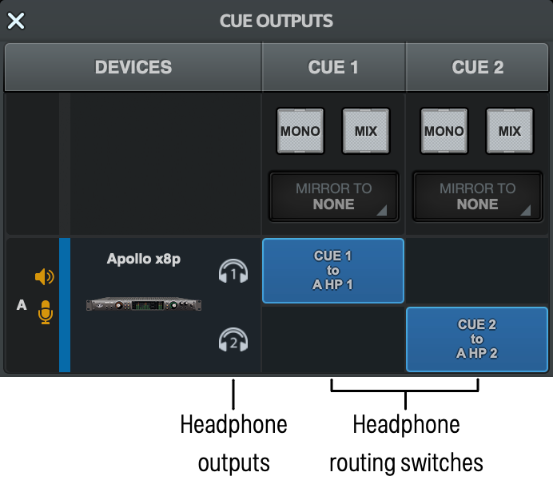

 

# Cue Examples

**Note:** The color of the rectangles reflect the device colors in the Devices column in Settings \> Hardware when multiple Apollos are connected. The "A" unit is the monitor unit, the "B" unit is a second Apollo, and so forth.

<table>
<tbody>
<tr>
<td>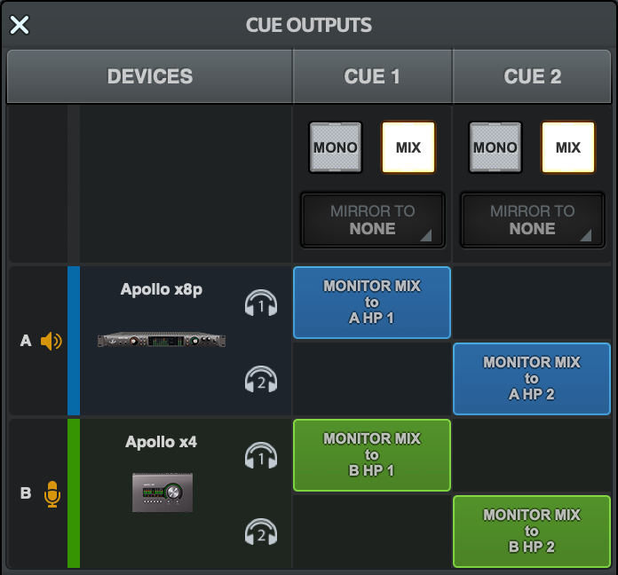</td>
<td>
The main mix is the cue source for Cue 1 and Cue 2.

The main mix is heard on A and B HP 1 and HP 2.
</td>
</tr>
<tr>
<td>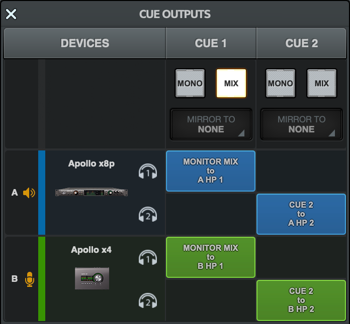</td>
<td>
The main mix is the cue source for Cue 1. 

The main mix is heard on A and B HP1. 

The Cue mix is the source for Cue 2. 

The Cue 2 mix is heard on A and B HP 2.
</td>
</tr>
<tr>
<td>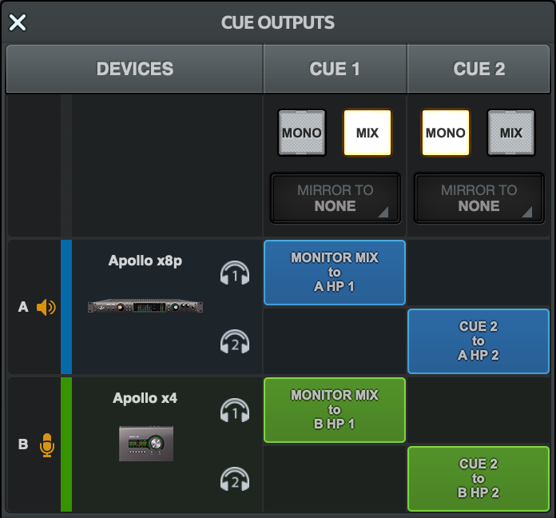</td>
<td>
The main mix is the cue source for Cue 1. 

The main mix is heard on A and B HP1. 

The Cue 2 mix is the source for Cue 2. 

The Cue 2 mix is heard on A and B HP 2. 

The Cue 2 mix is mono.
</td>
</tr>
<tr>
<td>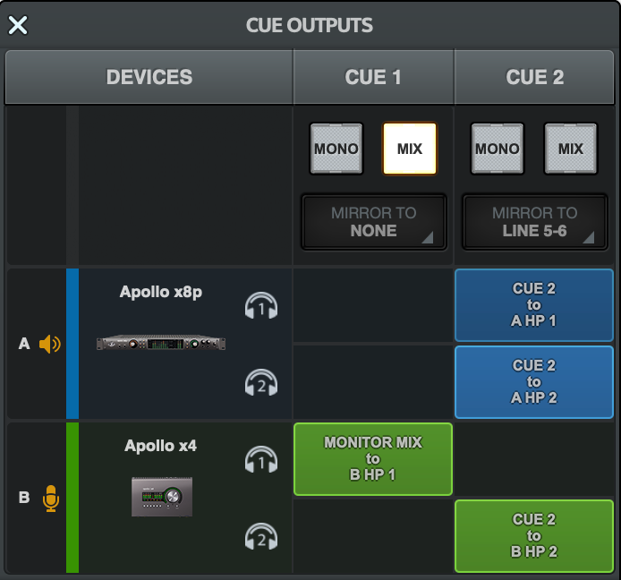</td>
<td>
The main mix is the cue source for Cue 1. 

The main mix is heard on B HP 1.

The Cue 2 bus is the source for Cue 2. 

The Cue 2 mix is heard on A and B HP1, and B HP 2. 

The Cue 2 mix is mirrored to Line Outputs 5-6. 
</td>
</tr>
</tbody>
</table>

 

# Using HP & LINE 3/4 Cues (Apollo Twin)

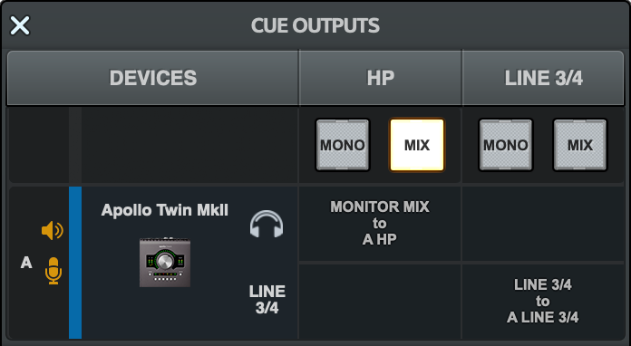

*Cue Source select (Apollo Twin)*

 

With Apollo Twin, you have the option of sending the main mix or a cue mix to the headphone output and Line Outputs 3/4. 

Choose the cue source from the Devices column for HP and LINE 3/4.

- Select the MIX switch to route the monitor mix to the output, summed with all DAW outputs that are routed to the output.  
- Clear the MIX switch to send a cue mix to the output, summed with all DAW outputs that are routed to the same output.
- Select the MONO switch to send the main mix or cue mix in mono. 

## Apollo Twin Cue Notes

- To use Line Outs 3/4 as a Cue bus, you must configure the Alt count as 0 in Settings \> Hardware.
- You can either send the monitor mix (MIX selected) or cue mix (MIX deselected) to an output. 
- When a cue is enabled, the cue appears with a colored bar in the Sends row in UAD Console. To hear audio sources from the output, signals must be sent to that cue's bus via the cue sends.

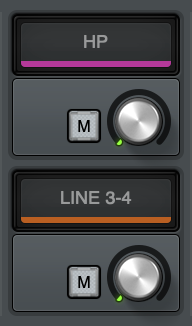

*Apollo Twin cue sends with cues enabled *

# Using HP Cue (Apollo Solo)

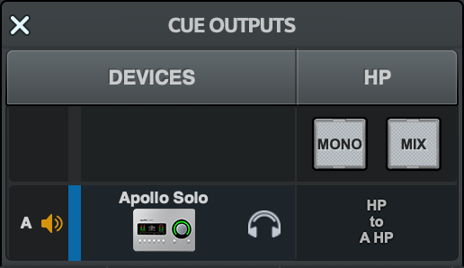

*Cue Source select (Apollo Solo)*

On an Apollo Solo, you have the option of sending the main mix or a cue mix to the headphone output. 

Choose the cue source from the Devices column for HP.

- Select the MIX switch to route the monitor mix to the output, summed with all DAW outputs that are routed to the output.  
- Clear the MIX switch to send an independent cue mix to the output, summed with all DAW outputs that are routed to the same output.
- Select the MONO switch to send the main mix or cue mix in mono. 

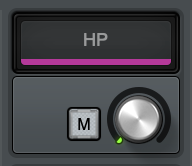

*Apollo Solo cue send with cue enabled *

 

# Cue Mirror to Menu (Apollo rack models, Apollo x4)

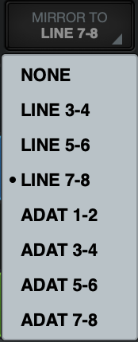

*Cue Mirror to menu*

This menu is used to optionally route the cue bus to Apollo's available hardware outputs. To select a hardware output pair for the stereo cue, first click NONE to expose the drop menu, then select an available output pair from the menu.

**Important:** The cue mirror output route overrides the DAW output channels assigned to the same hardware output(s). If an output is in use by a cue output, it is no longer available to be assigned as an output within the DAW.

**Tip:** To route signals to both the cue and the desired stereo output, route to a dedicated cue bus in Settings \> I/O Matrix, then assign the cue to the desired stereo output via the Cue Output menu.

Cue output assignments are mutually exclusive. When a cue output route is assigned, that output becomes unavailable for routing from a different cue bus (cue mix buses cannot be merged to the same outputs).

**Note:** If an output does not appear in the menu, the output is already in use by another input channel (Flex Routing), cue output, or ALT output.

