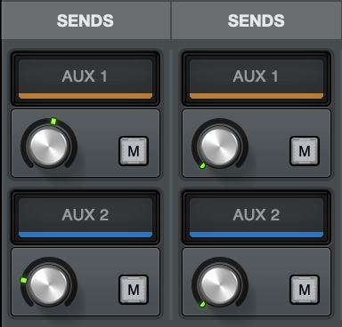
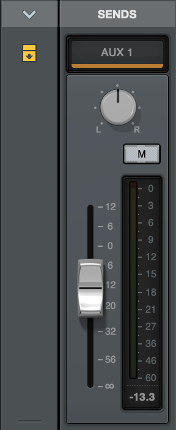
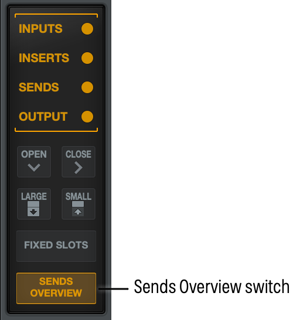
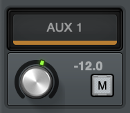
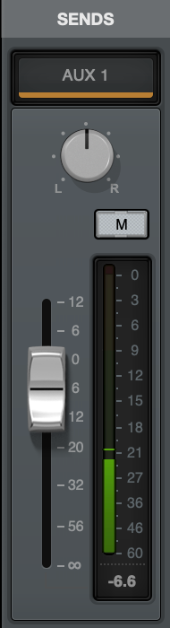

# Sends

Each Apollo channel has two Sends (Aux 1 and Aux 2), which are routed to the two stereo auxiliary buses. Aux buses are typically used for shared effect processing (to reduce UAD resource usage) for real time monitoring with time-based effects such as reverb and/or delay. The aux mixes are adjusted via each input’s aux send controls.

By default, the aux sends are post-fader and post-mute. The aux sends can be switched to be pre-fader and pre-mute. The Aux Pre / Aux Post function switch for each aux is located in its respective auxiliary bus return strip.

# Accessing Sends

To show or hide sends, click the circle next to Sends in the Mixer Navigation column on the left side of UAD Console. Sends are shown when the circle is illuminated. 

 

 

# Large and Small Sends

By default, sends are shown in Small view. This view allows you to easily adjust the level for a send or to mute the send, while fitting more mixer sections on your screen.  You can expand sends, to reveal the additional pan control for the send, and to use a long-throw fader for more accurate level control.  

- To expand sends, click the Large icon to the left of the send row. 
- To expand all sends, click the Large switch in the Mixer Navigation section. 

*Sends section in Small view*

 

*Sends section in Large view*

# Sends Overview

The Sends Overview allows you to quickly see the send and cue status of visible channels in UAD Console. Click the Sends Overview switch to toggle the Sends row between the standard appearance and Sends Overview. 

*The Sends Overview switch*

 

*Sends Overviews in UAD Console*

You can click on any Sends Overview to open a popover window that allows you to easily control Aux and Cue levels, mutes, and panning for that send (you cannot adjust panning for Sends on stereo linked channels).

 

# Adjusting Send Levels

To adjust the level of the input sent to the aux bus:

- Rotate the Send knob. The send level is shown while you engage the knob. 

\

- Double-click the Send knob or the Aux or Cue level value in Sends Overview to open the volume popover, and type a dB value (-144 to +12), then click OK.

\

- When Sends are in Large view or Sends Overview is open, drag the fader to adjust the send level, or click the level at the bottom of the meter to open the Send volume popover and adjust the level. When expanded, you can also adjust the pan control.

\

- When Sends Overview is active, click on the overview for a channel to open the Sends Overview popover, then adjust the levels and pan controls for Aux and Cue buses by dragging the faders and adjusting the pan controls. 

- To adjust any control with the mousewheel, hold Option on the keyboard, then scroll the wheel over the control.
- To mute a send, click the Mute button. This prevents any audio from the channel from being sent to the Aux destination. 

# Opening and Closing the Sends Row

You can open and close the Sends row. See [Opening and Closing Individual Channel Strip Rows](https://help.uaudio.com/hc/en-us/articles/25347220842516#h_01HTR5AJ8TXRQN16B52YYFZB51).

