# Shape

 This article includes:

- <a href="#h_c27f1fe8-2cc8-494c-9345-2c75af74d017" target="_self">Working with the best</a>
- <a href="#h_638ca2da-0b0d-493e-820d-4608b8d336eb" target="_self">More than just samples</a>
- <a href="#h_32f92c39-7233-4e2a-a883-043895f8a8b4" target="_self">Simple but powerful interface</a>
- <a href="#h_8bca0a65-44b4-48e6-9289-0d9a8d97c848" target="_self">System Requirements</a>
- <a href="#h_b1ccd98a-a9d4-4c63-843a-3a9799447f5f" target="_self">Quick Start</a>
- <a href="#h_e83bdaae-0ae8-4798-bb18-6005028c8e15" target="_self">Main View</a>
- <a href="#h_90be133d-5683-4004-95e3-45af4b748576" target="_self">Part Browser View</a>
- <a href="#h_2888b69b-8d3d-44b0-9a5a-0177b607db28" target="_self">Editor View</a>
- <a href="#h_c66ad80d-9b83-4f88-94cc-428e5bb16a93" target="_self">Primary Controls</a>
- <a href="#h_1cde3d39-01f9-419c-b64c-3758a665c5af" target="_self">Modulation Section</a>
- <a href="#h_3ce1887f-d28a-4b53-9485-dfd03d667409" target="_self">Keyboard Section</a>
- <a href="#h_4e25c1c2-1410-4b4b-bdb0-eee767991a21" target="_self">Tune Section</a>
- <a href="#h_6228dd94-6eb4-44fa-80ff-a0c8355ab034" target="_self">Key Range</a>

A comprehensive, easy-to-use creative toolkit included free with LUNA, Shape is a painstakingly curated UAD Instrument featuring a collection of album-ready  classic keyboards, drums/percussion, guitar/bass, orchestral content, and real time synthesis - with content from Universal Audio, Spitfire Audio, Orange Tree Samples, Soniccouture, Handheld Sound, G-Force, Wavesfactory and Sound Dust.

 

------------------------------------------------------------------------

 

# Working with the best

When creating the instrument collection for Shape, we relied on our in-house team of professional sound designers as well as many of the industry’s top sample content companies including Spitfire Audio, OrangeTree Samples, Soniccouture, Handeld Sound, and others. We refined the collection until we felt it contains the best mix of essential instruments like acoustic pianos, electric guitars and basses, vintage electric pianos and organs, classic synthesizers, drum kits and percussion, orchestral instruments, and atmospheric/ambient sounds. We’re confident this full-featured collection will provide excellent coverage for your musical needs.

 

------------------------------------------------------------------------

 

# More than just samples

Shape is more than a basic sample player. Our underlying technology gives sound designers a great deal of flexibility in how they craft their sounds. For example, each instrument includes four contextual knobs that let you control multiple instrument parameters with one knob. The functionality of these knobs is hand-picked by the designer of each sound and can vary dramatically from instrument to instrument. The contextual  knobs give you a curated set of meaningful controls with a simple interface, so you can stay focused on your music.

Shape also includes a full suite of great-sounding effects, including select UA processing not found elsewhere. You can use these effects to refine and sweeten your sounds.

Finally, Shape lets you layer or split up to four instruments (or “parts”) into a complex sound and it includes several global controls for fast and easy sculpting of your layered sounds.

 

------------------------------------------------------------------------

 

# Simple but powerful interface

Don’t be fooled by Shape’s straightforward design! The clutter-free user interface has just four “views” and we have made it very easy to load and play sounds as-is but there is sonic power and flexibility just under the surface. Each view is covered in detail in its own section.

 

------------------------------------------------------------------------

 

# System Requirements

In addition to overall LUNA Recording System requirements, Shape has the following requirements:

- SSD drive with available storage:
  - 4 GB for Shape
  - Additional 6 GB for Shape Content Expansion 1
- SSD drive must be formatted as APFS (Apple File System) on macOS
- External SSD must be within USB 3.0, USB 3.1, PCIe, or Thunderbolt enclosure

Note:

- Spinning hard drives and macOS Fusion drives are unsupported
- SSD drives formatted as ExFAT, FAT, and Mac OS Extended are unsupported on macOS

 

------------------------------------------------------------------------

 

# Quick Start

We know you may want to start playing right away, so let’s take Shape for a quick test drive before diving into the details. After the UAD Instrument is loaded and input-enabled (see LUNA documentation for these details):

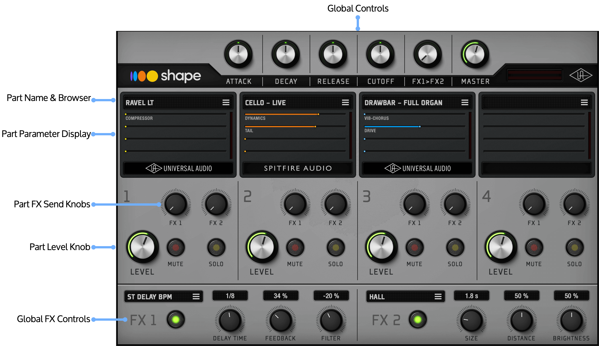

 

1.  Click the Presets button at the top of the instrument to reveal Shape’s available presets in LUNA’s contextual browser (at the left of LUNA’s screen).
2.  Click any of the available presets while playing your MIDI controller. You should hear the sound of each preset as you step through the names. 
3.  When you have found a preset that you like, try rotating the global control knobs at the top of the screen (ATTACK, DECAY, RELEASE, CUTOFF, and so on). These knobs affect all four parts of your sound and let you quickly modify your loaded presets.
4.  Now rotate the LEVEL knobs for active parts to re-balance the mix between the parts.
5.  Rotate the FX 1 and FX 2 knobs to send more (or less) of a part to the FX engines. The controls at the bottom of the instrument let you select and further refine the effects. 
6.  Try changing one of the loaded parts by clicking the name of the part.  This brings up the Part Browser view, where you can search through all the categories of sounds within Shape and select various instruments within those categories.
7.  When you are happy with your results, click outside the Part Browser to return to Main View.
8.  Click the part parameter display to be taken to the part’s Editor view. In Editor view you can change various parameters relating to the part such as its contextual controls, modulation source, destination, and strength, pan position, and more. 
9.  When you are satisfied with the edits you have made to the part, click the left-facing chevron at the top left of the screen to return to Main view.

 

------------------------------------------------------------------------

 

# Main View

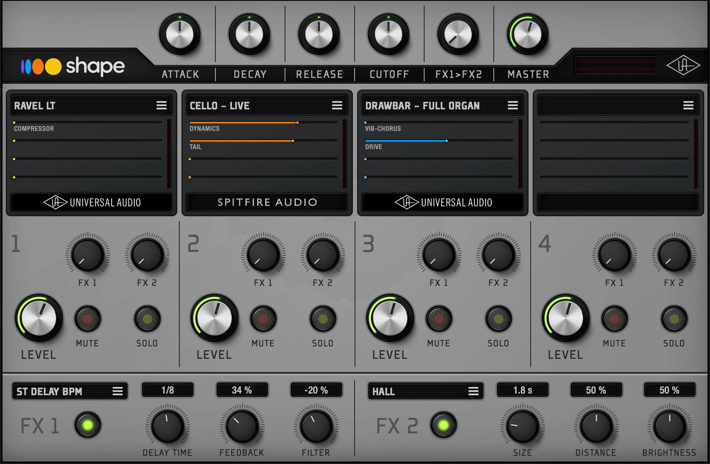

Main view is what you see when Shape is launched. It contains the most commonly used controls and consists of three distinct sections:

## Global Controls

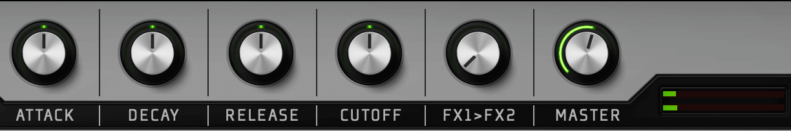

The top of Main view contains a variety of global controls that affect all four parts within Shape.

### About Global Offsets

The Attack, Decay, Release, and Cutoff knobs work by sending offset values to each of the four available instrument parts. This means that the default “12:00” setting lets all loaded sounds play exactly as they are configured. Rotating the knob clockwise or counter-clockwise serves to increase or decrease its associated parameter across all loaded sounds. For example, if you have created a layered sound and generally like what you are hearing but wish it had a longer release time, simply rotate the Release knob clockwise. Doing so will increase the output of all loaded parts simultaneously.

### Attack

This knob adjusts the overall attack time of all parts simultaneously.

### Decay

This knob adjusts the overall decay time of all parts simultaneously.

### Release

This knob adjusts the overall release time of all parts simultaneously.

### Cutoff

This knob adjusts the overall filter cutoff of all parts simultaneously.

### FX1\>FX2

This knob sets how much of the FX1 output is routed to the input of FX2. It can be set from 0-100%. The minimum setting means that the FX1 and FX2 operate independently of each other while turning this knob clockwise sends more and more of the FX1 output to FX2 input. 

*Tip: The FX1\>FX2 knob can achieve pleasing results, for example, when routing a delay into a reverb effect.*

### Master

This knob sets the master output level of Shape. The adjacent level meters provide visual feedback of Shape’s output levels. Note that this knob adjusts the overall output of the plug-in. The relative loudness levels of the parts (set by each part’s LEVEL knob) are maintained.

## Parts 1–4

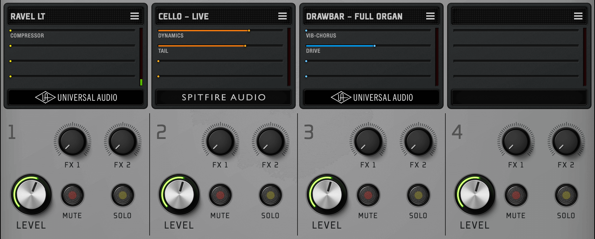

 

Shape features four Part slots with identical controls. Each slot can load a different sound from the sound library and you can mix, layer and split these parts to suit your musical needs.

### Part Name and Browser

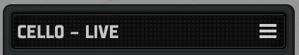

If a sound is loaded into one of the four slots, its name will be shown at the top of the display. Clicking on the Part name or its browse icon will open the <a href="#h_90be133d-5683-4004-95e3-45af4b748576" target="_self">Part Browser View</a>.

### Preset Parameters

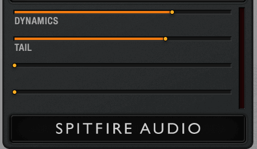

This section appears just below the part name and includes a brief description and amount for each contextual setting. Hovering over this area will reveal a chevron. Clicking the chevron will take you to the <a href="#h_2888b69b-8d3d-44b0-9a5a-0177b607db28" target="_self">Editor View</a> where you can edit the Part parameters.

### FX1 and FX2 Send knobs

These two send knobs set how much of the current part is routed to Shape’s two FX slots. They range from 100% dry, 0% effect (fully counter-clockwise) to 0% dry, 100% effect (fully clockwise).  

Note that Shape’s send knobs operate differently than the typical send knobs found on many mixers. If you rotate these knobs fully clockwise, you will hear 100% of the effect (wet only) and none of the dry signal. This allows you to use a send as an insert effect by rotating the knob fully clockwise. Furthermore, rotating the FX1\>FX2 knob global knob fully clockwise lets you have two insert effects in series if desired. Having both send and insert effects available opens up many sound design possibilities.

*Note: The effect must be enabled with its On/Off switch for these knobs to have any effect. *

Learn more about effects in the <a href="#h_5d272419-b295-4e5b-ac5b-b97bfe6ce7a5" target="_self">FX Browser View</a>.

### Level knob

This knob sets the output level for the part.

### Mute button

This button mutes and unmutes the part.

### Solo Button

This button engages and disengages solo mode for the part and silences other parts.

*Note: Only one part can be in solo mode. *

## Main View: FX Section

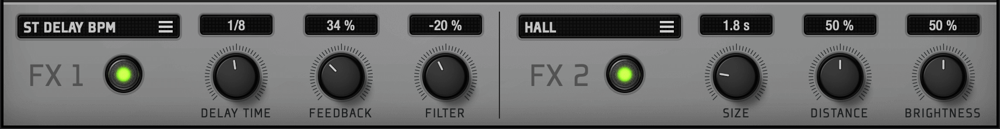

Shape comes with over 40 built-in effects, including select UA algorithms not found elsewhere. You can use up to two effects simultaneously using the FX1 and FX2 slots.

### FX Selector and Browser

If an effect is loaded into a slot, its name will appear in the display. Clicking either the name or its browse icon will open the <a href="#h_5d272419-b295-4e5b-ac5b-b97bfe6ce7a5" target="_self">FX Browser View</a> where you can select other effects.

### On/Off Switch

This button switches the effect on and off. The button is lit when the effect is active.

*Note: To hear the effect, increase the effect send level knob for one or more parts.*

### FX Knobs

These three knobs control various parameters of your selected effect. The effect's parameter name is displayed below each knob, and its current value is displayed above the knob. 

*Note: The function of these knobs varies depending on which effect is currently loaded.*

 

------------------------------------------------------------------------

 

# Part Browser View

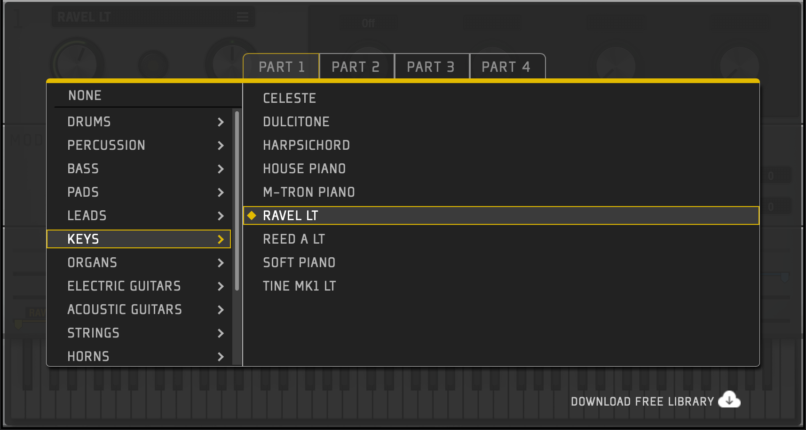

Part Browser View is where you can audition sounds from the library and load them into one of the four part slots available in Shape. To open the Part Browser, click the name or its browse icon at the top of any of the parts in Main View. To exit, click anywhere outside the browser area, or click the X at upper left. 

### Part Selector Tabs

The PART 1-4 tabs across the top let you select a part in which you can load a sound. These tabs are a convenient way of switching between the four parts without having to exit the Part Browser and re-enter the browser for a different part.

### Category Selector

The left column lists various categories of instruments found in Shape’s library. Select any of the categories to view the individual instruments within that category.

*Note: Selecting NONE will unload any selected file and empty the selected Part.*

### Sound List

Here you will find all of the sounds in the chosen category. You can audition sounds without leaving the browser by simply choosing them and playing your MIDI controller. The currently loaded sound is indicated with a diamond icon.

 

------------------------------------------------------------------------

 

# Editor View

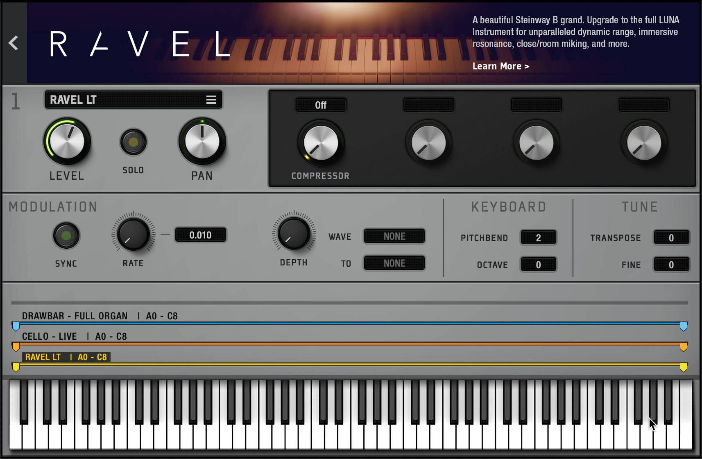

The Editor View is where you can make more detailed edits to your sounds. Each Part has its own editor. The number of the current part is displayed in the top left corner of the editor. 

To enter Editor View, click on the chevron that appears when hovering over the Preset Parameters display in Main View. To exit the editor, click the left-facing chevron at the top left of the screen. 

 

------------------------------------------------------------------------

 

# Primary Controls

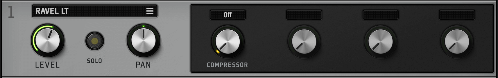

### Preset Name

If a sound is loaded into this part, its name will be shown here. Clicking on the name or its browse icon will open the Part Browser View. 

### Level

This knob sets the output level for the part. This is the same control as the one that appears in Main view.

### Solo

This button engages and disengages solo mode for the current part. This is the same control as the one that appears in Main view.

### Pan

This knob sets the part’s panoramic position within the stereo sound field.

### Contextual Controls 1–4 

Each of the four contextual knobs can control one or more parameters inside of the part’s sound engine. This lets you make complex changes to a sound by simply turning one knob. The exact functionality of each contextual knob is set by the sound designer and can vary greatly from one sound to another.

*Tip: One way to think of the contextual knobs is that they show off what the sound designer felt was the most interesting and tweakable parameter of that sound. Feel free to to experiment as these knobs can take sounds in interesting directions.*

*Note: The sound designers may choose not to use all four contextual knobs. In this case, any unassigned controls do not display a name and their knobs are locked.*

 

------------------------------------------------------------------------

 

# Modulation Section

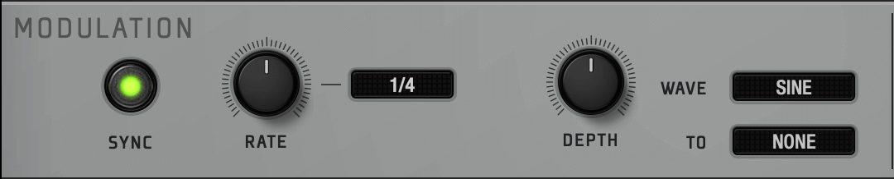

Controls in this section let you add additional modulation to Shape parts using the Modulation control (MIDI CC1) on your external MIDI controller.

*Note: Parts can have MIDI modulation built-in to the preset sound, so Parts may respond to MIDI modulation even if Depth is set to zero. *

### Sync

This button switches tempo synchronization on and off in the modulation section. When switched on, the RATE knob will be synchronized to the tempo of your session.

### Rate

This knob sets the speed of modulation. The current value is displayed next to the knob.  If SYNC is enabled, the values are displayed in time divisions (for example, 1/4). If SYNC is disabled, the time value is displayed in milliseconds

### Depth

This knob sets the amount or strength of the modulation being applied to your selected target. 

Note that the Depth knob is bi-polar and ranges from ±100% with 0% in the centered “12:00” position. This allows you to apply positive or negative (inverted) modulation to your destination.

### Wave Shape

This drop menu lets you select the shape of the modulation waveform. Options include NONE, SINE, TRIANGLE, SQUARE, SAW, S&H (Sample and Hold), and RANDOM. 

### To

This drop menu lets you select the destination of your modulation signal. You can choose from AMP (amplitude), PAN, PITCH, and other parameters that may be exposed by the designer of each part.

 

------------------------------------------------------------------------

 

# Keyboard Section

### Pitch Bend

This parameter sets the pitch bend range of the part, from 0 to 12 semitones.

*Tip: Each part can have its own pitch bend value. Setting this parameter to 0 disables the pitch bend control for its associated part. *

### Octave

This parameter shifts the octave range of the part up or down by up to four octaves.

 

------------------------------------------------------------------------

 

# Tune Section

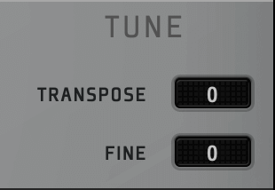

### Transpose

This parameter transposes the pitch of the part up or down by up to ±12 semitones.

### Fine

This parameter fine- tunes the pitch of the part up or down by up to ±50 cents.

 

------------------------------------------------------------------------

 

# Key Range

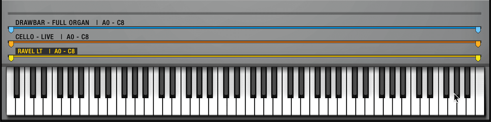

### Key Range

These four rows display the key ranges for each of Shape’s four parts. The parts are illuminated in different colors when the part slots are loaded with sounds (a key range is gray and empty when a part’s slot is not loaded). You can drag the handles at the end of each key range to set the lowest and highest playable note for each part.

When key ranges overlap, the parts play together as a layered sound. If the parts do not overlap, then they create “splits” over the keyboard, letting you have up to four sounds on separate parts of the keyboard range.

*Note: Shape’s key ranges are not individually addressable by different MIDI channels. To have different MIDI channels play different sounds, you can use separate Shape instances.*

 

 

------------------------------------------------------------------------

 

# FX Browser View

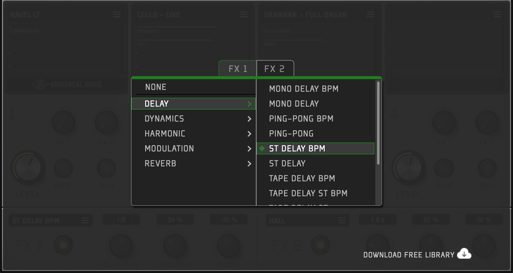

FX Browser view is where you select the effect that you would like to use in each of Shape’s two effect slots. To open the FX Browser, click the name or its browse icon from either effect in Main view. To exit, click anywhere outside the browser area, or click the X at upper left. 

### FX Slot Selector Tab

The FX1 and FX2 tabs across the top let you select the FX slot that you would like to modify. These tabs are a convenient way of switching between the two slots without having to exit the FX Browser and re-enter the browser for a different slot. 

### FX Category

The left column lists various categories of effects found within Shape. Select any of the categories to view the individual effects within that category.

*Note: Selecting NONE will unload any loaded effect and empty the selected FX slot. *

### FX Preset

Here you will find all of the effects from a chosen category. You can select and audition various effects without leaving the browser by clicking on an effect. The currently loaded effect is indicated with a diamond icon.

 

------------------------------------------------------------------------

 

# Advanced Features (Automation and MIDI CC)

Shape has a simple user interface but we have made sure to include some powerful automation features under the surface. Having access to automation and MIDI CC control can make life easier during a live performance (for example, changing parameters “on the fly” from your MIDI controller without looking at your computer). It can also open up creative sound design possibilities during a mix.

**Note:** While some parameters have dedicated (“hardcoded”) MIDI CC values for easy automation, most Shape parameters are actually MIDI “Learnable”. This means you can use the MIDI Learn function of your music software to map a physical control (knob, slider, etc.) of your MIDI hardware to an on-screen parameter.

## Global Controls

|               |                    |
|---------------|--------------------|
| **Parameter** | **MIDI CC Number** |
| Attack        | 73                 |
| Decay         | 75                 |
| Release       | 72                 |
| Cutoff        | 74                 |
| Mod Wheel     | 1                  |
| Sustain Pedal | 64                 |
| All Notes Off | 123\*              |
| Master Volume | N/A                |

\
*\*Shape performs an “All Notes Off” (sometimes called “MIDI Panic”) procedure any time it receives a non-zero value on MIDI CC123. This means you can, for example, map any momentary button on your MIDI Controller to send a “127” MIDI message on CC123 when pressed, and a “0” message when released. Doing so will convert that button into an All Notes Off control.*

## Part Parameters

<table data-autosize="false" data-layout="default" data-number-column="false" style="width: 471px;">
<tbody>
<tr>
<td class="pm-table-cell-content-wrap" style="width: 171px">
 
</td>
<td colspan="4" class="pm-table-cell-content-wrap" style="width: 251px">
<strong>MIDI CC Number</strong>
</td>
</tr>
<tr>
<td class="pm-table-cell-content-wrap" style="width: 171px">
<strong>Parameter</strong>
</td>
<td class="pm-table-cell-content-wrap" style="width: 53px">
<strong>Part 1</strong>
</td>
<td class="pm-table-cell-content-wrap" style="width: 63px">
<strong>Part 2</strong>
</td>
<td class="pm-table-cell-content-wrap" style="width: 64px">
<strong>Part 3</strong>
</td>
<td class="pm-table-cell-content-wrap" style="width: 71px">
<strong>Part 4</strong>
</td>
</tr>
<tr>
<td class="pm-table-cell-content-wrap" style="width: 171px">
Part Volume
</td>
<td class="pm-table-cell-content-wrap" style="width: 53px">
85
</td>
<td class="pm-table-cell-content-wrap" style="width: 63px">
86
</td>
<td class="pm-table-cell-content-wrap" style="width: 64px">
87
</td>
<td class="pm-table-cell-content-wrap" style="width: 71px">
88
</td>
</tr>
<tr>
<td class="pm-table-cell-content-wrap" style="width: 171px">
Part Contextual  Edit 1
</td>
<td class="pm-table-cell-content-wrap" style="width: 53px">
48
</td>
<td class="pm-table-cell-content-wrap" style="width: 63px">
52
</td>
<td class="pm-table-cell-content-wrap" style="width: 64px">
56
</td>
<td class="pm-table-cell-content-wrap" style="width: 71px">
60
</td>
</tr>
<tr>
<td class="pm-table-cell-content-wrap" style="width: 171px">
Part Contextual  Edit 2
</td>
<td class="pm-table-cell-content-wrap" style="width: 53px">
49
</td>
<td class="pm-table-cell-content-wrap" style="width: 63px">
53
</td>
<td class="pm-table-cell-content-wrap" style="width: 64px">
57
</td>
<td class="pm-table-cell-content-wrap" style="width: 71px">
61
</td>
</tr>
<tr>
<td class="pm-table-cell-content-wrap" style="width: 171px">
Part Contextual  Edit 3
</td>
<td class="pm-table-cell-content-wrap" style="width: 53px">
50
</td>
<td class="pm-table-cell-content-wrap" style="width: 63px">
54
</td>
<td class="pm-table-cell-content-wrap" style="width: 64px">
58
</td>
<td class="pm-table-cell-content-wrap" style="width: 71px">
62
</td>
</tr>
<tr>
<td class="pm-table-cell-content-wrap" style="width: 171px">
Part Contextual  Edit 4
</td>
<td class="pm-table-cell-content-wrap" style="width: 53px">
51
</td>
<td class="pm-table-cell-content-wrap" style="width: 63px">
55
</td>
<td class="pm-table-cell-content-wrap" style="width: 64px">
59
</td>
<td class="pm-table-cell-content-wrap" style="width: 71px">
63
</td>
</tr>
</tbody>
</table>

