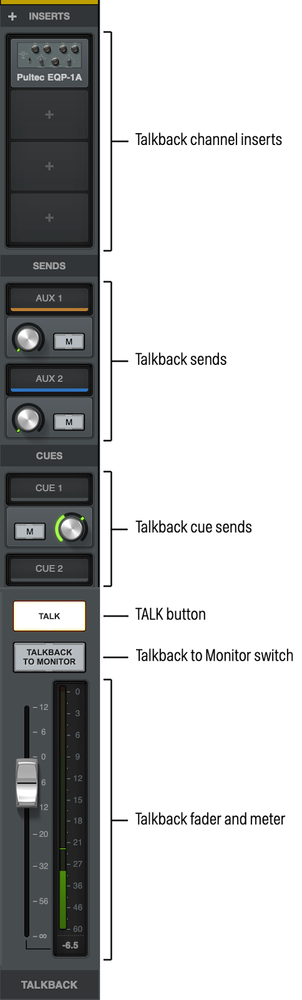
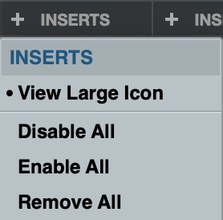
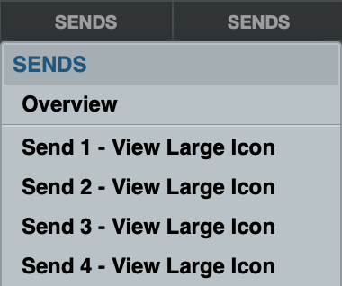
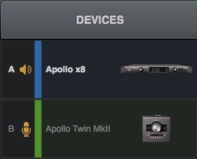
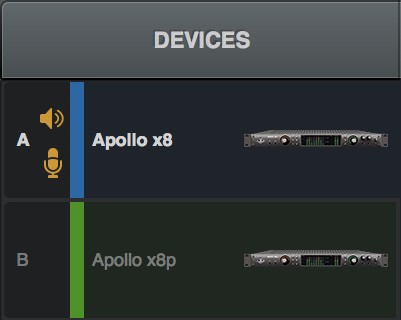
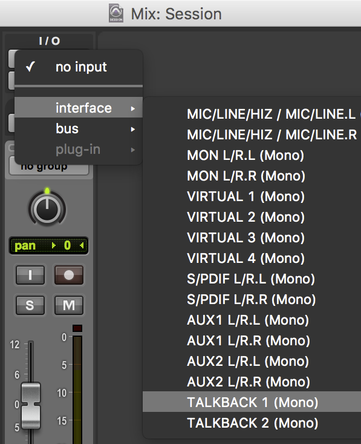

# Talkback

Apollo X Series and Apollo Twin MkII models include a built-in talkback microphone and integrated talkback software functions in UAD Console. This chapter explains the configuration and operation of all talkback features and functionality for Apollo models with a talkback mic.

**Note:** Talkback features are available only when an Apollo X Series or Apollo Twin MkII is connected to the system.

# Talkback Functions

Talkback is typically used by an operator in a studio’s control room to verbally communicate with a performer in the studio’s recording/live room. The talkback mic can also be routed into the DAW for recording.

Communication – The talkback mic can be routed to any aux mix bus, cue mix bus, the main monitor mix (and optionally to the main monitor outputs), or any combination of these mix buses simultaneously. Talkback send levels are independently adjustable for each mix bus.

Recording – The talkback mic can be selected as a source for audio inputs in the DAW, providing a convenient way to record slate cues or acoustic performances in audio tracks without a separate external mic.

# Configuration

All talkback functions, such as mix bus destinations and send levels, are configured in a dedicated Talkback Input Strip in the Control Room module within UAD Console.

Talkback is fully integrated into Apollo mixed multi-unit workflows for flexible signal routing when additional Apollos are connected to the system.

The aux and cue buses in the Talkback Input Strip are the same as the aux and cue buses in the standard UAD Console inputs. See [Cues](https://help.uaudio.com/hc/en-us/articles/25351037512340) for related information.

# Operation

Talkback can be activated using the dedicated hardware TALK button on the top panel of Apollo desktop models, the dedicated FCN button on Apollo X rack models, or the TALK button within UAD Console’s talkback input strip — talkback control is mirrored in hardware and software. The TALK button can latch for continuous talkback, or press-hold-release for momentary talkback.

**Note:** See Using Talkback for quick operating instructions.

# Talkback Microphone

**Caution:** The talkback microphone is sensitive. To avoid equipment damage, do not insert any object into the mic hole, apply pressurized air into the mic hole, or use a vacuum over the mic hole.

## Optimized for Talkback

The built-in mic and supporting analog circuitry are optimized for talkback. The gain and frequency response characteristics are carefully tuned to support typical voice talkback scenarios.

## Automatic DIM

When talkback is active, Console’s DIM function is automatically engaged to lower volume levels at the monitor outputs, allowing the talkback mic to better capture the voice input instead of program material from the monitor speakers. See DIM Controls for related information.

## Realtime UAD Processing

As with all Apollo inputs, the talkback mic input strip has two aux sends and four dedicated UAD plug-in inserts for Realtime UAD Processing for manipulating talkback mic sonics. For example, the mic’s high frequencies can be softened by filtering the top end with the included UAD Precision Channel Strip plug-in.

If hotter mic levels are desired, any UAD plug-in that features level controls (such as UAD Precision Channel Strip) can be used in the talkback input strip’s plug-in inserts to increase software gain of the talkback mic.

## Audio Driver Channels

The talkback mic signal is output to Core Audio (Mac) and ASIO (Windows) by Apollo’s audio drivers.

The talkback microphone can be selected as a source for audio inputs in the DAW, providing a convenient means to record slate cues (or complete acoustic performances) in audio tracks without a separate external mic.

The audio drivers carry two mic signal streams labeled TALKBACK 1 and TALKBACK 2. The talkback signal is monophonic and is duplicated on each of the TALKBACK 1 and 2 channels.

**Tip:** With Apollo Thunderbolt models, the talkback driver channels can be optionally configured in the I/O Matrix Panel within Console Settings.

## Mic Location

Apollo Desktop Models – The mic hole is located below the main top panel knob.

Apollo X Rack Models – The mic hole is located above the illuminated UA logo on the front panel.

# Talkback Input Strip

*Talkback input strip elements*

The talkback input channel strip is available in the Control Room module within Console whenever an Apollo model featuring talkback is connected.

To toggle visibility of the talkback strip, click the CTRL ROOM button under SHOW in the Monitor Column. Refer to the illustration above for element descriptions in this section.

## Talkback Channel Inserts

The talkback strip has four UAD plug-in inserts for Realtime UAD Processing. All talkback plug-in inserts operate the same way as other UAD Console inputs, including the ability to save/recall channel strip presets and switchable routing of channel insert effects into the DAW.

### Talkback Inserts Context Menu

The Talkback Inserts context menu allows you to adjust inserts for the Talkback channel.

- To toggle large or small talkback inserts view, right-click or control-click on the Inserts label, and select or deselect View Large Icon. Note that this also changes the view for the Aux Returns. 
- To disable all plug-ins on the talkback channel, select Disable All.
- To enable all plug-ins on the talkback channel, select Enable All.
- To remove all plug-ins from the talkback channel, select Remove All.

For complete details on all insert functionality and operations, see [UAD Plug-In Inserts](https://help.uaudio.com/hc/en-us/articles/25350369296660).

## Talkback Sends Display

The SENDS below the channel inserts display talkback levels being sent to each available cue mix bus.

### Talkback Sends Context Menu

The Talkback sends context menu allows you to adjust sends and cue views for the talkback channel.

- To toggle Sends Overview, right-click or control-click on the Sends label, and select or deselect Overview. Note that this changes the view for all channels. 
- To view a large or small icon for any sends, select or deselect Send \# - View Large Icon. Note that this changes the view of that send for the talkback channel and the aux returns.

**Note:** See [Sends](https://help.uaudio.com/hc/en-us/articles/25350937974676) for related information.

## Flex Routing (Apollo X rack models)

On Apollo X rack models, the Flex Routing display is visible in the talkback input strip.

Click the Flex Routing display to open the Flex Routing popover, for routing the talkback signal to any available line output. For complete details about this feature, see Flex Routing.

**Note:** To prevent acoustic feedback, talkback Flex Routing cannot be assigned to the Monitor outputs.

## TALK Button

This button activates the talkback mic and the DIM function. Talkback is active when the button is lit and Apollo’s monitor output level indicator flashes.

- Press and release the button quickly to latch talkback ON.
- To momentarily activate the function and deactivate when the button is released, press for longer than 0.5 seconds.
- TALK button behavior is mirrored in software and hardware. The hardware and software buttons are illuminated when talkback is engaged, and unlit when talkback is off.

## Talkback To Monitor

When this button is lit, the talkback mic is routed to the main monitor outputs. Click the button to toggle the Talkback to Monitor state.

If the monitor speaker system is on when this button is engaged, acoustic feedback from the speakers to the talkback mic can occur.

**Caution:** To reduce the risk of acoustic feedback, lower the volume of the monitor output speakers and/or increase the DIM value before engaging Talkback To Monitor.

In typical studio control room plus recording room setups, this function is generally not used because the monitor output speakers are in the same room as the talkback mic. However, the option is provided for maximum signal routing flexibility.

## Talkback Fader

This fader adjusts the talkback level sent to all cue mix buses that have MIX assigned as the cue’s SOURCE in the CUE OUTPUTS window. 

**Tip:** If a cue’s SOURCE is *not* set to MIX in the CUE OUTPUTS window (e.g., when the cue source is HP/CUE 1 or LINE 3-4/CUE 2), this fader does not adjust on the talkback level for that cue mix. In this case, use the Talkback input strip’s Cue sends to adjust talkback levels to the Cue mixes.

## Talkback Meter

This meter displays the input level for the talkback mic when the TALK button is engaged.

By default, pre-fader levels are displayed. Post-fader levels can be displayed by changing the METERING setting in the Options panel within UAD Console Settings.

## Talkback Sends & Cues

With the Talkback Sends and Cues, talkback levels can be individually adjusted and/or disabled for each available mix bus. The level control for each talkback mix bus controls the amount of talkback mic signal sent into the cue bus.

### Available Talkback Mix Buses

All available talkback mix buses are displayed in the channel strip. The displayed talkback mix buses are the MIX bus (the main input fader), both AUX buses, and all available CUE buses.

**MIX Bus –** The main monitor mix bus controlled by the main fader. Note that this will not play talkback audio through the speakers connected to the Monitor outputs unless the Talkback to Monitor switch is engaged.

**AUX Buses –** The same two AUX buses that are available on standard UAD Console inputs.

**CUE Buses –** The same CUE buses as those available on all UAD Console inputs. See [Cues](https://help.uaudio.com/hc/en-us/articles/25351037512340) for related information.

**Tip:** To increase the number of available CUE buses when multiple Apollos are connected in a multi-unit configuration, increase the CUE BUS COUNT value in the Hardware panel within the Console Settings window.

### Cue Sends

These knobs adjust the talkback signal level sent to cue buses. When a cue bus is assigned to a cue output in the CUE OUTPUTS window, the knob adjusts the level of that cue bus to the output. When a cue is assigned to the MIX in the CUE OUTPUTS window, this knob adjusts the level of the main mix to that cue output. 

**Tip:** When a Cue bus has MIX assigned as the cue’s SOURCE in the CUE OUTPUTS window, the cue color is gray. In this case, adjust the talkback level with the talkback strip’s main fader.

### AUX Sends

These faders adjust the talkback signal level sent to each AUX bus.

### Send Meters

These meters either around the knobs, or standard meters in Large view, display the talkback signal level being sent to each cue bus when the TALK button is engaged.

**MIX Bus Meter –** By default, pre-fader levels are displayed. Post-fader levels can be displayed by switching the METERING setting in the Options panel within the Console Settings window.

**AUX Bus Meters –** Post-fader levels are always displayed.

**CUE Bus Meters –** Post-fader levels are always displayed.

### Bus Name & Color

The talkback bus mix name and color are displayed at the top of each section. These names cannot be modified.

**Tip:** If a CUE color is gray, that cue’s SOURCE is set to MIX in the CUE OUTPUTS window.

## Activating Talkback

To activate the talkback mic, press any dedicated TALK button. The hardware or software buttons can be used to activate talkback. Talkback is active when UAD Console’s Talkback button is lit and Apollo’s monitor output level indicator flashes.

**Tip:** Press and release the TALK button quickly to latch talkback ON. To momentarily activate the function and deactivate when the button is released, press for longer than 0.5 seconds.

**Apollo desktop hardware –** Press the top panel TALK button when the interface is in monitor mode (press the hardware MONITOR button to enter monitor mode). The green TALK indicator in the unit’s Options Display is illuminated when talkback is active.

**Apollo X rack hardware –** Press the front panel FCN button when the button function is set to TALKBACK in the Hardware panel within UAD Console Settings. The FCN button’s yellow LED is illuminated when talkback is active.

**UAD Console software –** Press UAD Console’s TALK button in the Talkback Input Strip. The button is illuminated when talkback is active.

## Multiple Talkback Mics

When more than one Apollo with a talkback mic are combined in a multi-unit system, the following behaviors apply:

- Only one unit can be used for talkback.
- The Apollo desktop model is the talkback unit (if connected).
- If more than one Apollo X rack model is connected, the designated Apollo X rack monitor unit is the talkback unit.
- If an Apollo X rack is combined with a previous-generation Apollo rack model (and an Apollo desktop model is not connected), the Apollo X rack must be the designated monitor unit to use its talkback mic.

An orange mic icon appears next to the talkback unit in the Devices Column within Console Settings \> Hardware. In these multi-unit examples, both units have talkback mics, so the mic icon distinguishes which unit is configured for talkback.

## Adjusting Talkback Levels

Adjust the talkback levels with the main fader, or with the knobs for each Aux Send or Cue.

## Recording the Talkback Mic

To record the talkback mic signal on an audio track in a DAW:

1.  Select TALKBACK as the I/O input source for the track(s):
    - Mono tracks – Select TALKBACK 1 or TALKBACK 2 as the track input.
    - Stereo tracks – Choose TALKBACK 1-2 as the track input.
2.  Press the hardware or software TALK button to route the talkback mic signal to the track. See [Activating Talkback](#h_01HXHZCRZWVJZ2B5PS25WPQKB3) for related information.
3.  Record the mic as you would any other audio signal using the DAW’s operating procedures.

### Talkback Recording Notes:

- The talkback mic is monophonic. Apollo’s TALKBACK 1 and TALKBACK 2 audio driver channels carry identical signals to facilitate DAWs that expect even pairs of inputs.
- TALK must be active for the DAW track input to receive the talkback mic signal.
- Talkback can be activated and/or deactivated before, during, or after recording (talkback and DAW operations are independent).

*Selecting the talkback mic as a mono audio track’s input source in Pro Tools*

