# Unison

# What is Unison?

Unison™ is Universal Audio's exclusive analog/digital integration system that's built into every Apollo microphone preamplifier. It's the first and only way to truly emulate classic analog mic preamp, guitar amp, and pedal behaviors in an audio interface.

Unison is an audio processing breakthrough that starts right at the source, the input stage, allowing Apollo's mic preamps to sound and behave like the world's most sought-after tube and solid state preamps, guitar amps, and pedals — including their all-important impedance, gain stage "sweet spots," and component-level circuit behaviors.

Apollo's mic preamps are designed for high resolution, ultra-transparent translation from microphone to converter. This clean hardware design is the foundation for adding software color with UAD realtime plug-in processing.

Unison-enabled UAD-2 preamp, guitar amp, and pedal plug-ins reconfigure the physical input impedance, gain staging response, and other parameters of Apollo's mic preamp hardware to match the emulated hardware's design characteristics.

Because the hardware and software are intricately unified, Unison provides continuous, realtime, bidirectional control and interplay between Apollo's physical mic preamp controls and the software settings in the Unison plug-in window.

Controls on Apollo's front panel dynamically adjust the Unison plug-in's parameters to match the target preamp/guitar amp/pedal behavior. Correspondingly, changing a setting in the Unison plug-in window will modify Apollo's front panel settings.

Because Unison can be active on more than one mic channel, a complement of premium emulated hardware is available concurrently.

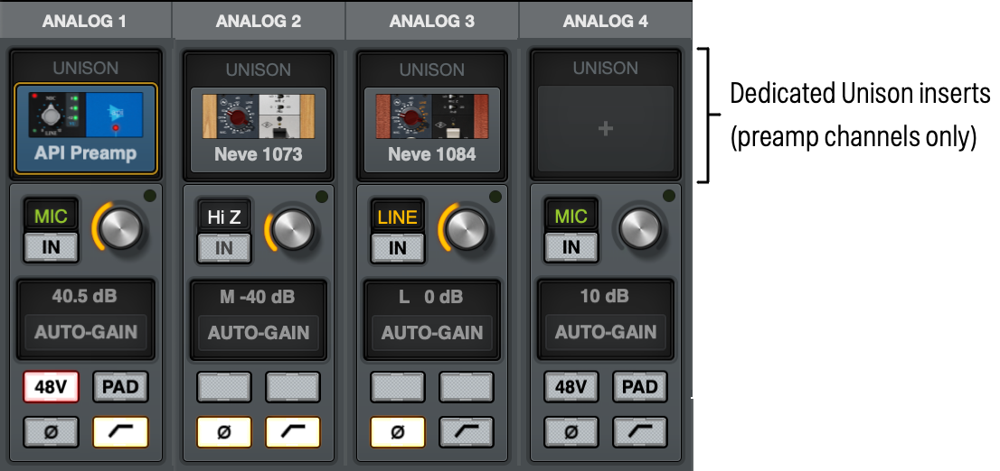

*Unison is enabled by loading a UAD Unison plug-in into a dedicated Unison insert in UAD Console*

# Unison Features

Unison technology enables these Apollo features via UAD Console, all with Realtime UAD Processing:

- Alternate microphone preamplifier sound – Apollo's ultra-transparent mic preamps inherit all the unique sonic and input characteristics of the emulated hardware preamp, guitar amp, or pedal, including the mic, line, and Hi-Z inputs.
- Realistic tandem control – Unison facilitates seamless interactive control of Unison preamp plug-in settings using Apollo's digitally-controlled hardware and/or the plug-in window. All equivalent preamp controls (gain, pad, polarity, etc) are mirrored and bidirectional. The preamp controls respond to adjustments with precisely the same interplay behavior as the emulated hardware, including gain levels and clipping points.
- Hardware input impedance – All Apollo mic preamps feature variable input impedance in analog hardware that can be physically switched by Unison plug-ins for physical, microphone-to-preamp resistive interaction. This impedance switching enables Apollo's preamps to physically match the emulated unit's input impedance, which can significantly impact the sound of a microphone. Because the electrical loading occurs on input, prior to A/D conversion, the realism is faithful to the original target hardware preamp.
- Tactile gain staging – Apollo's hardware preamp knob can independently adjust all gain and level parameters available within the Unison plug-in via Gain Stage Mode. The gain stage being adjusted can be remotely switched via Apollo, so multiple gain levels and their associated colorations can be tuned from the hardware knob for precise physical tactile control, all without using the Unison plug-in's software interface.

# Unison Plug-Ins

**Note:** In all descriptive text, "Unison plug-in" is defined as any Unison-enabled UAD mic preamp plug-in, UAD guitar/bass amp plug-in, or UAD pedal plug-in.

Unison-enabled UAD plug-ins are uniquely coded for Unison integration. Only UAD plug-ins that are Unison-enabled can be loaded in UAD Console's Unison insert.

For a complete list of all Unison-enabled UAD plug-ins, visit [this article](15346102717204-Apollo-Unison-Plug-Ins.html).

# Activating Unison

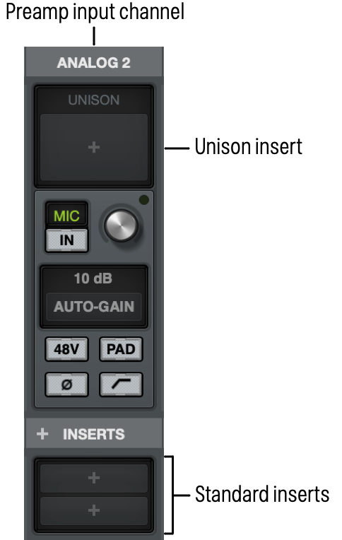

*Click this area to insert a Unison plug-in*

Unison is activated by inserting any Unison-enabled plug-in into the special Unison insert available on all Apollo mic preamp channels in UAD Console and LUNA. Click the UNISON insert to select a Unison-enabled plug-in from the plug-in browser.

**Tip:** Unison can be active on more than one preamp channel.

## Unison Insert Location

The Unison insert is located between the preamp gain knob and the standard channel inserts, and labeled UNISON.

**Note:** To see the Unison insert, Inputs must be enabled in the Mixer Navigation section.

# Unison Availability

Unison inserts are available on UAD Console and LUNA input channel strips with Apollo models that feature microphone preamplifier inputs.

<table>
<tbody>
<tr>
<td><strong>Apollo Model</strong></td>
<td><strong>Unison Preamp Input Channels</strong></td>
</tr>
<tr>
<td>
Apollo Solo

Apollo Twin

Apollo Twin X

Apollo Twin X Gen 2

Apollo x6
</td>
<td>1 – 2</td>
</tr>
<tr>
<td>
Apollo

Apollo x4

Apollo x4 Gen 2

Apollo 8/x8

Apollo 8/x8 Gen 2
</td>
<td>1 – 4</td>
</tr>
<tr>
<td>
Apollo 8p/x8p

Apollo x8p Gen 2
</td>
<td>1 – 8</td>
</tr>
<tr>
<td>
Apollo 16

Apollo x16 Gen 2

Apollo x16

Apollo x16D
</td>
<td>(none)</td>
</tr>
</tbody>
</table>

# Unison Processing

**Important:** Unison processing in the Unison insert is always active on the channel's input signal, regardless of any subsequent channel routing options (Flex Routing, DAW I/O, etc). Therefore Unison processing is always recorded in the DAW, even if UAD Console's Insert Effects switches are set to MON.

## Unison plug-ins in channel inserts

UAD plug-ins that support Unison can also be loaded and used in any standard inserts available on all UAD Console input channels and/or within a DAW via VST/AU/AAX 64 (as with any UAD plug-in). However, there is no physical or electrical hardware interaction with channel inserts, so Unison plug-ins operate like other (non-Unison) UAD plug-ins in this configuration.

**Important:** Unison features are available only when Unison-enabled UAD plug-ins are loaded within UAD Console or LUNA in the dedicated Unison inserts.

# Unique Behavior of Unison Inserts

UAD Console's Unison inserts have some operational differences compared to standard inserts, as described below.

## Available UAD plug-ins

Only Unison plug-ins are available for selection from the insert browser when loading UAD plug-ins into the Unison insert. Non-Unison plug-ins are not visible in the insert browser with Unison inserts.

**Notes**

- All available Unison plug-ins are installed during the normal UAD Powered Plug-Ins software installation process (they are not separately installed).
- Native UADx plug-ins are not Unison-enabled.

## Disabled Unison plug-ins

When a Unison plug-in is unintentionally disabled (for example, when UAD-2 DSP resources are exceeded upon insertion), the red disabled indicator (see Insert State Indicators) does not appear as it does with non-Unison plug-ins. However, in this situation (unlike standard UAD-2 plug-ins) the following indications do occur:

- The power switch within the Unison plug-in window is switched off.
- The Unison insert's enable button is switched off.
- Apollo's front panel preamp gain level indicator color reverts to green.

**Note:** The above functions can be re-enabled after adequate UAD resources are made available.

## Line Input Gain Bypass (Apollo 8, x8, 8p, x8p)

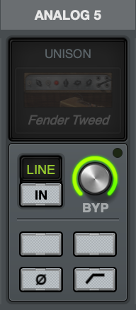

When a Unison plug-in is active on a line input and Line Input Gain for the preamp channel is set to BYPASS in UAD Console Settings, the Unison plug-in is disabled. All preamp functionality is disabled with Line Input Gain Bypass. For related information, see [Line Input Gain (Apollo 8, 8p, x6, x8, x8p)](25403573794836-Hardware-Settings-Panel.html#h_01HTY5D6CW58X0RBF0CKEY4H9F).

# Controlling Unison Plug-Ins with Apollo Hardware

When a Unison plug-in is inserted in UAD Console's Unison insert, Apollo's hardware preamp controls and the Unison plug-in's equivalent preamp controls are mirrored. Adjusting Apollo's hardware preamp controls adjusts the Unison plug-in's preamp controls, and vice versa.

## Apollo Hardware Indication

### Unison Active

When a Unison plug-in is inserted in a Unison insert and Apollo's hardware channel select function is set to the same channel, the color of Apollo's front panel preamp gain level indicator (the LED ring around the knob) is orange instead of green.

**Note:** Apollo's hardware channel selection indicator must match the Unison-enabled channel to see the front panel Unison indication.

The orange-colored ring indicates that the currently selected preamp channel is using a Unison plug-in within UAD Console, and that Apollo's hardware knob is controlling the first gain stage of the preamp plug-in (with pedal plug-ins, the knob is controlling the primary effect parameter, e.g., distortion).

 

|  |  |
|----|----|
| 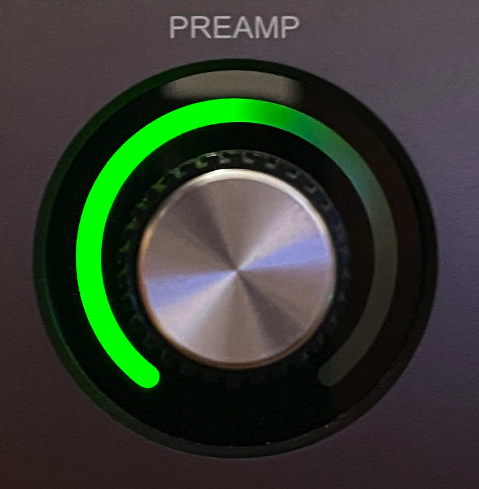 | 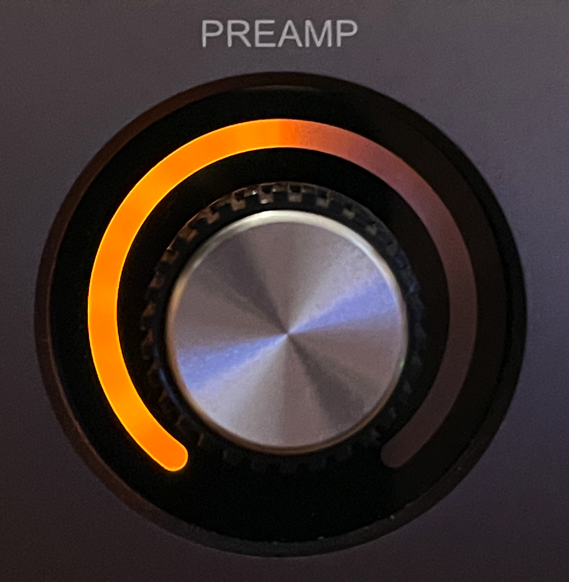 |

 

*Apollo's hardware preamp knob during normal operation (left) and when a Unison plug-in is in the Unison insert of Apollo's selected channel (right)*

### Additional Gain Stages

More than one gain parameter within the Unison plug-in can be adjusted using Apollo's hardware knob by activating Gain Stage Mode. When Gain Stage Mode is active, the color of Apollo's gain level indicator, and the target parameter within the Unison plug-in's window, changes depending on which parameter is currently being controlled by the knob, and the parameter being controlled can be navigated remotely by pushing the hardware switch. See Gain Stage Mode for details.

## Plug-In Parameters

Unison plug-ins may contain parameters that are unavailable for hardware control via Apollo. For example, the UA 610-B has EQ settings, but there are no EQ controls on Apollo's hardware. To adjust these extra parameters, the Unison plug-in window must be used.

## UAD Console Indications

### Gain Level Indicator

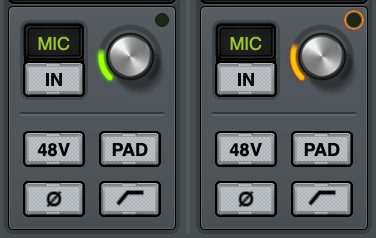

When Unison is active in the channel, the color of UAD Console's preamp gain level display (the colored ring around the gain knob), and the channel selection dot on the gain knob, is orange instead of green.

If the Unison plug-in is inactive (either via the insert disable switch or the power switch in the plug-in window), the color reverts to green.

**Note:** UAD Console's preamp gain control only adjusts the first gain stage of any Unison preamp plug-in, even when Apollo is in Gain Stage Mode.

### Gain Level Display

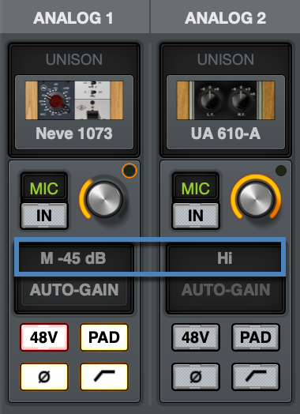

The preamp gain level display (the gain value readout under the knob) shows the current value of the main parameter within the Unison plug-in. Additionally, the display is adapted to the parameter value and range of the first gain stage within the plug-in.

For example, when the UA 610-A Tube Preamp plug-in is in the Unison insert, this field displays either "Hi" or "Low" because these are the only two values available in the first gain stage of this plug-in.

#### Notes

- The readout under the knob is only visible when you are adjusting the knob.
- This display shows "---" if Apollo hardware is not detected when a Unison plug-in is in the Unison insert and the insert is not disabled.

## Hardware Selection Switch

A switch on the Apollo hardware unit can be used to change the currently selected channel when in Channel Select Mode, or the Unison plug-in preamp parameter when in Gain Stage Mode. The switch used to change these functions depends on the Apollo model, as described below:

- Apollo Solo, Apollo Twin MkII, Apollo Twin X, Apollo x4 – Pressing the hardware PREAMP button changes the currently selected channel when in Channel Select Mode, or the Unison plug-in preamp parameter when in Gain Stage Mode.
- All models except Apollo Twin MkII, Apollo Twin X, Apollo x4 – Pressing the hardware rotary level knob changes the currently selected channel when in Channel Select Mode, or the Unison plug-in preamp parameter when in Gain Stage Mode.

## Channel Select Mode (standard operation)

Hardware channel selection determines which input channel can be adjusted with Apollo's hardware preamp controls. This is the standard behavior when a channel is not in Unison mode (hardware channel selection is unrelated to Unison functionality).

The method used for hardware channel selection depends on the specific Apollo hardware model (see Hardware Selection Switch). The method for each model is described briefly below, in order to differentiate the standard behavior from the Unison behavior.

**Note:** Standard channel selection is also explained in the hardware manual for each Apollo model (the channel selection methods are used without Unison).

### Apollo Rack Models

Pressing the hardware rotary level knob cycles the selection of Apollo's available preamp channels. A channel is selected for adjustment when its channel select indicator LED (located above the channel input meters) is lit. If stereo linking is active, the stereo pair LEDs are lit.

### Apollo Desktop Models

These methods are used for hardware channel selection with Apollo Solo, Apollo Twin and Apollo x4:

- Preamp Button – After the PREAMP button has been pressed at least once to switch the unit to Input mode, pressing the PREAMP button alternates the currently selected input channel (e.g., CH1 or CH2).
- Level Knob (first generation silver model only) – After the PREAMP button has been pressed at least once to switch the unit to Input mode, pressing the Level knob alternates the currently selected input channel (e.g., CH1 or CH2).

An Apollo desktop channel is selected for adjustment when its channel selection indicator LED (CH1 – CH4, above the hardware input meters) is lit. If stereo linking is active, both indicator LEDs of the paired channels are lit.

## Gain Stage Select (Unison operation only)

When the currently selected Apollo channel is in Gain Stage Mode, pushing the rotary level knob (all rack models and Twin MkI) or the PREAMP button (Solo, Twin MkII, Twin X, and Apollo x4) changes the Unison plug-in's parameter that is being controlled.

The color of Apollo's front panel preamp gain level indicator (the LED ring around the knob) changes to reflect the gain stage being controlled, and the gain stage is also indicated by the matching color of the indicator outline within the Unison plug-in's window. For complete details, see Gain Stage Mode.

# Gain Stage Mode

Unison plug-ins have either two or three gain parameters. By activating Gain Stage Mode, each of these preamp plug-in gain stages can be independently adjusted using Apollo's hardware rotary level knob.

**Note:** Gain Stage Mode can only be active on one preamp channel (or one stereo linked pair) at a time.

Initially, when Unison is activated (before entering Gain Stage Mode), Apollo's hardware rotary level knob controls the first gain parameter within the Unison plug-in. However, when Gain Stage Mode is active, pressing Apollo's Hardware Selection Switch cycles through the available gain parameters in the plug-in.

## Activating Gain Stage Mode

### To enable Apollo's Gain Stage Mode when using a Unison plug-in:

1.  In UAD Console, confirm a Unison plug-in is inserted in the Unison insert of the Apollo preamp channel to be controlled.
2.  On Apollo's hardware, select the preamp channel to be controlled using the standard method for your hardware model (for methods, see [Hardware Selection Switch](#h_01HXHPDB3AS80D9JY0D03320WE)).
3.  Press AND HOLD Apollo's Hardware Selection Switch for at least two seconds.

The state of Gain Stage Mode is indicated on Apollo's hardware and in the Unison plug-in, as detailed below.

### Gain Stage Mode – Apollo Hardware Indication

Apollo's hardware channel selection indicator LED flashes when Gain Stage Mode is active for the currently selected preamp channel. The indication varies with the specific Apollo model.

#### Apollo Rack Models

The channel selection number LED above its input meter flashes when Gain Stage Mode is active, as shown below.

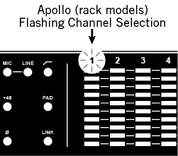

 

#### Apollo Desktop Models

The channel selection number LED (e.g., CH1 or CH2) above the input meters flashes when Gain Stage Mode is active, as shown below.

**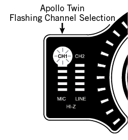**

### Gain Stage Mode – Unison Plug-In Indication

A colored outline appears within the Unison plug-in window on the target parameter being controlled, as shown below.See [Gain Stage Colors](#h_01HXHPDB3B1R69CD2XT1FCG1QW) for related information.

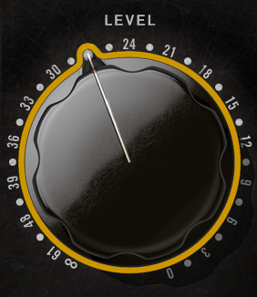

*Unison plug-in control when in Gain Stage Mode*

## Deactivating Gain Stage Mode

### Gain Stage Mode can be deactivated with any of these methods:

- Press and hold Apollo's Hardware Selection Switch for at least two seconds\
  (desktop models must be in Input mode by pressing the PREAMP button at least once)
- Disable the Unison plug-in via the plug-in editor window within UAD Console
- Disable the Unison plug-in via the on/off parameter within the plug-in window
- Remove the Unison plug-in from UAD Console's Unison insert

### When Gain Stage Mode is deactivated, the following changes occur:

1.  The gain stage select function (pushing the Hardware Selection Switch) reverts to the channel select function
2.  The channel selection indicator on Apollo's hardware panel stops flashing
3.  If a gain stage other than the first gain stage was being controlled, Apollo's gain level knob reverts to control of the first gain stage of the Unison plug-in, and the level indicator color reverts to orange.

## Controlling Individual Gain Stages

### Selecting Gain Parameters For Control

When the currently selected Unison plug-in channel is in Gain Stage Mode (when its channel selection indicator is flashing), push Apollo's Hardware Selection Switch to cycle through the available gain parameters within the Unison plug-in.

**Note:** Unlike Apollo's hardware rotary knob, UAD Console's preamp gain control only adjusts the first gain stage of any Unison plug-in when Apollo is in Gain Stage Mode. To adjust other gain stages from within UAD Console, use Apollo's hardware rotary knob or the Unison plug-in's window.

### Gain Stage Colors

The gain stage being controlled is indicated by unique, matching indicator colors on Apollo's front panel and within the Unison plug-in's window.

The color of the gain level indicator on Apollo's hardware panel (the LED ring around the knob) changes with each gain stage, and the matching color outline within the Unison plug-in's window moves to the targeted parameter being controlled.

The gain stages available for control, and their associated colors, are:

- Orange – Gain stage one; the Gain parameter
- Yellow – Gain stage two; the Level parameter
- Green – Gain stage three, the clean (non-modeled) output control

**Note:** Some Unison plug-ins have only two gain stages.

#### Matching Gain Stage Indicators

In Gain Stage Mode, Apollo's preamp level indicator (the colored ring around the rotary knob) matches the colored outline on the target gain parameter in the Unison plug-in's window, as shown below. The hardware and software controls are mirrored and the gain stage can be adjusted using either control.

|  |  |  |
|----|----|----|
|  | 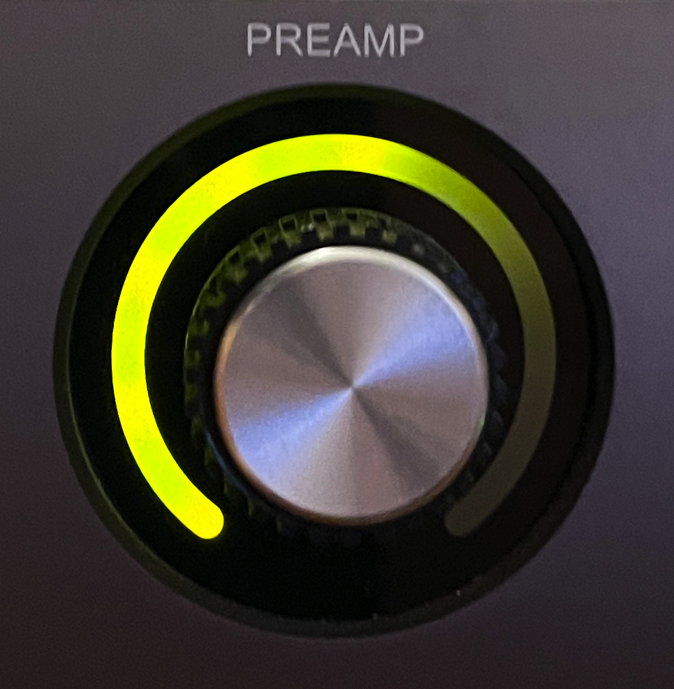 |  |

The color of Apollo's preamp gain level indicator changes to reflect the gain stage being controlled

|  |  |  |
|----|----|----|
| 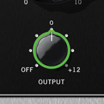 | 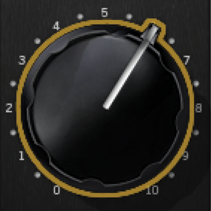 | 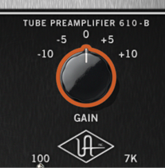 |

*The matching color outline on the parameter in the Unison plug-in window indicates which gain stage is being controlled by Apollo's hardware rotary preamp knob*

### Available Gain Stages

Unison plug-ins have up to three gain stage parameters. With Unison plug-ins that contain two gain parameters, only the available gain parameters are cycled and controlled in Gain Stage Mode.

**Note:** For details about the unique gain stage parameters available within individual Unison plug-in titles, refer to the UAD Plug-Ins Manual or [individual plug-in manuals](../sections/4573072157460-Native-UAD-Plug-In-Manuals.html).

### Multi-Unit Operation

To control a Unison plug-in with Gain Stage Mode in a system containing multiple Apollo units, the hardware controls on the unit containing the preamp channel must be used.

For example, to control a Unison plug-in inserted in an Apollo x8 preamp channel, the Apollo x8 hardware knob must be used. To control a Unison plug-in in an Apollo Twin X preamp channel, the Apollo Twin X hardware must be used, and so forth.

# Unison Load/Save Behaviors

**Caution:** Apollo hardware preamp settings (including +48V phantom power) may change when UAD Console sessions are loaded. Details are explained in this section.

## Loading Unison Plug-In Settings

When Unison plug-in settings are loaded in UAD Console, the effect upon the currently active Unison plug-in settings varies depending on how the settings are loaded. It is important to understand the distinction, because critical preamp settings can be affected.

**Note:** When Unison plug-ins are used in Console's standard inserts and/or within a DAW, this section does not apply. Settings load behavior outside of the Unison insert is like all other (non-Unison) UAD plug-ins.

There are two ways Unison (and non-Unison) plug-in settings can be loaded in UAD Console:

- **Plug-In Presets –** UAD presets are loaded whenever a UAD plug-in is inserted (the default preset loads). Presets can be loaded from disk files via the Preset Browser. Preset files are used to save and load all settings of individual plug-in titles.
- **UAD Console Sessions –** UAD Console sessions are loaded from disk via the Sessions Browser, the UAD Console Recall plug-in in a DAW, or by double-clicking UAD Console session files on disk. UAD Console sessions are complete Apollo configurations, containing all hardware and plug-in settings (effectively., UAD Console sessions are UAD Console presets).

### Loading Presets: Hardware settings are inherited

Apollo's hardware preamp settings always override a Unison plug-in's settings when a preset is loaded or the plug-in is inserted. This is done to prevent the plug-in's settings from switching the hardware to values that could cause extreme level changes and/or other unwanted circuit changes such as +48V phantom power.

For example, if the PAD is ON in the Apollo preamp, when the Unison preset is loaded, the pad setting in the plug-in is enabled to prevent unexpected level increases.

### Loading Sessions: Hardware settings are overridden

UAD Console sessions always override Apollo's preamp settings, even if potentially harmful preamp settings are contained in the session file. This is done because the very concept of UAD Console session recall is to reproduce all settings in the session.

For example, if the PAD is ON in the Apollo preamp, when the UAD Console session is loaded, the pad setting in the plug-in is disabled and sensitive equipment could be affected, such as speakers (level increases) and/or ribbon mics (+48V phantom power).

# Unison Operation Notes

The operating notes in this section only apply to Unison functionality (when a Unison plug-in is loaded in UAD Console or LUNA's dedicated Unison insert).

The notes do **not** apply to Unison plug-ins that are used in UAD Console's standard inserts, or via VST/AU/AAX 64 within a DAW, even when a Unison plug-in title is used. In this scenario, Unison plug-ins function the same as all standard (non-Unison) UAD plug-in titles and there is no physical or electrical hardware interaction.

**Important:** Unison functionality is available only when Unison-enabled UAD plug-ins are loaded within UAD Console or LUNA in the unique Unison inserts.

- When a UAD Console session is loaded (via the Sessions Browser, the UAD Console Recall menu, DAW sessions containing the UAD Console Recall plug-in, or double-clicking UAD Console or LUNA files on disk), ALL UAD Console settings are overridden (changed) by the saved session, including all Apollo hardware input settings such as +48V and PAD. See [Loading Sessions: Hardware settings are overridden](#h_01HXHPDB3BAWK4C7EWDK6JXYC1) for additional details.
- Unison insert processing is always recorded in the DAW (regardless of the current Channel Insert Effects setting) because Unison plug-ins process the physical inputs.
- Apollo's hardware preamp controls remain active even if the Unison plug-in is disabled.
- Changes made to the hardware preamp when a Unison plug-in is bypassed are not retained when the plug-in is reactivated.
- A Unison plug-in's modeled behaviors and parameter ranges are used by the hardware controls whenever possible, even if the attribute is different from Apollo's stock preamps. For example, if the Unison plug-in has a 15 dB pad, then Apollo's front panel PAD button value will use the Unison plug-in's 15 dB value instead of Apollo's stock 20 dB value.
- Default gain levels when a Unison plug-in is inserted can vary from Apollo's default (non-Unison) preamp levels, and also between various Unison plug-in titles. This is a byproduct of accurate preamp modeling. Because hardware preamp designs from each manufacturer vary, they all have different total gain amounts, control ranges, and control response curves, and can vary based on whether the input is Mic, Line, or Hi-Z.
- If a Unison plug-in does not contain settings that are available on Apollo (pad, low cut filter, etc), the Apollo default settings are applied when the Unison plug-in settings are loaded, and the Apollo settings are still available for control via Apollo's front panel and/or the UAD Console channel.
- When a Unison plug-in is removed from the Unison insert, Apollo's mic input impedance reverts to its default value of 5.4K Ohms. When the original hardware preamp being emulated by the Unison plug-in has a Hi-Z (instrument) input and associated Hi-Z input switch, this switch is unavailable in the Unison plug-in window. Instead, the Unison plug-in's Hi-Z input is automatically selected when a plug is inserted into the Unison channel's front panel Hi-Z input jack.
- If Apollo is disconnected from the host computer (standalone mode), the Unison plug-in can no longer be controlled from Apollo's front panel. However, the signal continues to be processed by the Unison plug-in, using the values that were active when the connection was lost. Note that if Gain Stage Mode is active when the host connection is lost, the gain stage can apparently be switched from the front panel. However, the actual gain stage being controlled does not change.
- When a channel strip preset is saved from a preamp channel, the channel strip preset contains the state of the preamp channel's Unison insert.
- When a preamp channel strip preset is loaded into a preamp channel, the Unison insert state is replaced by the Unison instance state in the preamp channel strip preset. For example, if the preamp channel strip preset's Unison insert is empty, the Unison insert will be empty after loading the preset.
- Hi-Z input impedance interaction is unavailable with first-generation (silver) Apollo rackmount models.

