## **Model 1176LN** 

## **Solid-State Limiting Amplifier** 

## **Universal Audio Part Number 65-00046** 

Universal Audio, Inc. 

Customer Service & Tech Support: 1-877-MY-UAUDIO Business, Sales & Marketing: 1-866-UAD-1176 

www.uaudio.com 

## **Notice** 

## **_____________________________________________________________** 

This manual provides general information, preparation for use, installation and operating instructions for the Universal Audio 1176LN. 

The information contained in this manual is subject to change without notice. Universal Audio, Inc. makes no warranties of any kind with regard to this manual, including, but not limited to, the implied warranties of merchantability and fitness for a particular purpose. Universal Audio, Inc. shall not be liable for errors contained herein or direct, indirect, special, incidental, or consequential damages in connection with the furnishing, performance, or use of this material. 

## **Copyright** 

© 2009 Universal Audio, Inc. All rights reserved. 

This manual and any associated software, artwork, product designs, and design concepts are subject to copyright protection. No part of this document may be reproduced, in any form, without prior written permission of Universal Audio, Inc. 

## **Trademarks** 

Universal Audio, the Universal Audio "diamond" logo, UAD, UAD Series, UAD-1, UAD-2, UAD-2 SOLO, UAD-2 DUO, UAD-2 QUAD, "Powered Plug-Ins", 1176LN, 1176SE, Teletronix, LA-2A, LA-3A, LA-610, LA610MkII, 2-1176, 2-610, 6176, 710 Twin-Finity, 2192, 4110, 8110, SOLO/610, SOLO/110, DCS Remote Preamp, Cambridge EQ, DreamVerb, Plate 140, Precision Limiter, RealVerb Pro, Precision Buss Compressor, Precision De-Esser, Precision Maximizer and "Analog Ears | Digital Minds," are trademarks or registered trademarks of Universal Audio, Inc.. Other company and product names mentioned herein are trademarks of their respective owners. 

## **Contents of This Box** 

This package should contain: 

- One 1176LN Solid-State Limiting Amplifier 

- 1176LN Operating Instructions 

- IEC Power Cable 

- Registration Card 

ii 

**A Letter From Bill Putnam, Jr.** 

**_____________________________________________________________** 

Thank you for purchasing the 1176LN Solid-State Limiting Amplifier. 

My father designed the original 1176 back in 1966, and he was very pleased with his accomplishment. He was also very gratified by its reception by his peers in both the recording and broadcast industries. As a recording engineer, the 1176 was a device he himself used extensively. In making our version of this legendary piece of gear, we have taken great care to manufacture a compressor/limiter that my father would have been proud of. Throughout the development of this product, our philosophy has remained clear: Stay true to the original. There are good reasons why certain pieces of gear have become classics, and we wanted to make sure that we captured the feel and sound of the original 1176LN accurately. 

There were actually many versions of the 1176 produced throughout the years. This reissue is patterned on the highly recognizable blackface sound of the D/E versions, which were characterized by the transformer input stage, LN circuitry, and a Class A (1108 style) output stage. Later versions replaced the Class A output stage with a push-pull Class AB output stage, and eventually replaced the transformer input with a differential op-amp circuit, but most engineers agree that the D/E versions best represented the “vintage” sound that has become treasured the world over. 

Most of us at Universal Audio are musicians and/or recording engineers. We love the recording process, and we really get inspired when tracks are beautifully recorded. Our design goal for the 1176LN was to build a compressor/limiter that we would be delighted to use ourselves—one that induce that _“a-ha”_ feeling you get when hearing music recorded in its most natural, inspired form. 

Developing the 1176LN —as well as Universal Audio’s entire line of quality audio products designed to meet the needs of the modern recording studio while retaining the character of classic vintage equipment—has been a very special experience for me and for all who have been involved. While, on the surface, the rebuilding of UA has been a business endeavor, it's really been so much more than that: in equal parts a sentimental and technical adventure. 

We thank you, and we thank my father, Bill Putnam. 

Sincerely, 

Bill Putnam, Jr. 

iii 

**Important Safety Instructions** 

## **_____________________________________________________________** 

Before using this unit, be sure to carefully read the applicable items of these operating instructions and the safety suggestions. Afterwards, keep them handy for future reference. Take special care to follow the warnings indicated on the unit, as well as in the operating instructions. 

1. **Water and Moisture -** Do not use the unit near any source of water or in excessively moist environments. 

2. **Object and Liquid Entry -** Care should be taken so that objects do not fall, and liquids are not spilled, into the enclosure through openings. 

3. **Ventilation -** When installing the unit in a rack or any other location, be sure there is adequate ventilation. Improper ventilation will cause overheating, and can damage the unit. 

4. **Heat -** The unit should be situated away from heat sources, or other equipment that produce heat. 

5. **Power Sources -** The unit should be connected to a power supply only of the type described in the operating instructions, or as marked on the unit. 

6. **Power Cord Protection -** AC power supply cords should be routed so that they are not likely to be walked on or pinched by items placed upon or against them. Pay particular attention to cords at plugs, convenience receptacles, and the point where they exit from the unit. Never take hold of the plug or cord if your hand is wet. Always grasp the plug body when connecting or disconnecting it. 

7. **Grounding of the Plug -** This unit is equipped with a 3-wire grounding type plug, a plug having a third (grounding) pin. This plug will only fit into a grounding-type power outlet. This is a safety feature. If you are unable to insert the plug into the outlet, contact your electrician to replace your obsolete outlet. Do not defeat the purpose of the grounding-type plug. 

8. **Cleaning -** Follow these general rules when cleaning the outside of your 1176LN: 

   - a. Turn the power Off and unplug the unit 

   - b. Gently wipe with a clean lint-free cloth 

   - c. If necessary, moisten the cloth using lukewarm or distilled water, making sure not to oversaturate it as liquid could drip inside the case and cause damage to your 1176LN 

   - d. Use a dry lint-free cloth to remove any remaining moisture 

   - e. Do not use aerosol sprays, solvents, or abrasives 

9. **Nonuse Periods -** The AC power supply cord of the unit should be unplugged from the AC outlet when left unused for a long period of time. 

10. **Damage Requiring Service -** The unit should be serviced by a qualified service personnel when: 

   - a. The AC power supply cord or the plug has been damaged: or 

   - b. Objects have fallen or liquid has been spilled into the unit; or 

   - c. The unit has been exposed to rain; or 

   - d. The unit does not operate normally or exhibits a marked change in performance; or 

   - e. The unit has been dropped, or the enclosure damaged. 

11. **Servicing -** The user should not attempt to service the unit beyond that described in the operating instructions. All other servicing should be referred to qualified service personnel. 

iv 

**Table of Contents** 

|**_____________________________________________________________**|
|---|
|**A Letter From Bill Putnam, Jr.**................................................................................................................ 3 3|
|**Important Safety Instructions**................................................................................................................ 4 4|
|**Two Page, Two Minute Guide To Getting Started**.................................................................................... 6 6|
|**Front Panel**......................................................................................................................................... 8 8|
|**Rear Panel**........................................................................................................................................... 11 11|
|**Interconnections**................................................................................................................................ 12 12|
|**Insider’s Secrets**.............................................................................................................................. 13 13|
|**The Technical Stuff**................................................................................................................................ 17|
|History of the 1176LN ................................................................................................................ Compressor / Limiter Basics ...................................................................................................... About “All-Button” Mode ........................................................................................................... 17 17 19 17 19 22|
|About Class A ......................................................................................................................... 22 22|
|Making A Custom Insert Cable .................................................................................................. Terminal Strip Connections .................................................................................................... Maintenance Information ........................................................................................................... 22 22 24 22 24 25|
|Calibrations ............................................................................................................ 25 25|
|Zero Set ....................................................................................................... 25 25|
|“Q” Bias ....................................................................................................... 25 26|
|Meter Driver Null ............................................................................................. 26 26|
|Stereo Operation and Calibration ................................................................................. Changing the Voltage Selector .............................................................................. Changing Fuses .......................................................................................................... 1176LN Circuit Details .............................................................................................................. 26 27 28 28 27 28 28 29|
|29|
|**Glossary of Terms**.................................................................................................................................. 34 34|
|**Recall Sheet**........................................................................................................................................ 37|
|37|
|**Specifications**........................................................................................................................................ 38 38|
|**Additional Resources / Product Registration / Warranty / Service & Support**................................... 39 39|

v 

**The Two Page, Two Minute Guide To Getting Started** 

## **_____________________________________________________________** 

No one likes to read owner’s manuals. We know that. 

We also know that you know what you’re doing—why else would you have bought our product? 

So we’re going to try to make this as easy on you as possible. Hence this two-page spread, which we estimate will take you approximately two minutes to read. It will tell you everything you need to know to get your Universal Audio 1176LN up and running, without bogging you down with details. 

Of course, even the most expert of us has to crack a manual every once in awhile. As the saying goes, “as a last resort, read the instructions.” You’ll find those details you’re craving—a full description of all front and rear panel controls, interconnection diagrams, insider’s secrets, history, theory, maintenance information, block diagrams, specifications, even a glossary of terms—in the pages that follow. 

## **Manual conventions** : 

 Means that this is an especially useful tip 

 Means that this is an especially important bit of information 

And when we need to direct you to a page or section elsewhere in the manual, we’ll use the universal signs for rewind () or fast forward (). 

## _**Getting Started With Your 1176LN:**_ 

**Step 1:** Decide where the 1176LN is to be physically placed and place it there. The 1176LN is housed in a standard two-rackspace 19" chassis, and so we recommend that it be securely mounted in a rack if possible. 

**Step 2:** On the rear panel, make sure the voltage selector switch is set correctly for the voltage in your area. On the right side of the front panel, make sure the bottom Meter button (OFF) is pressed in, and then connect the supplied IEC power cable to the rear panel AC power connector. 

**Step 3:** Mute your monitors and then, using balanced cables with XLR connectors, make connections to the 1176LN rear panel XLR line input and output. Most often, these connections will be to a patch bay or to and from a channel or bus insert on a mixer. ( _Alternatively, the rear panel terminal strip can be used for input and output connections_ ;  _see page 24 for information about its use_ , _and_  _see page 12 for an interconnection diagram_ ) 

 **Make only one type of input connection (XLR or terminal strip) to the 1176LN. However, both outputs can be used simultaneously.** 

6 

**The Two Page, Two Minute Guide To Getting Started** 

## **_____________________________________________________________** 

**Step 4:** On the right side of the front panel, depress the +4 Meter button. This not only turns on the power to the 1176 but also ensures that the meter displays the final output level. (NOTE: Depressing any Meter button other than OFF also has the effect of powering on the 1176LN; when powered on, the front panel meter lights up.) 

**Step 5:** Set the Input and Output knobs to approximately 24 (their 12 o’clock position) for unity gain. 

**Step 6:** Set the Attack and Release knobs fully counterclockwise (in the case of the Attack knob, to its OFF position). 

**Step 7:** Unmute your speakers and begin monitoring the 1176LN output. At the source, raise the level of the input signal until the 1176LN meter shows optimum signal strength (around 0 VU, with occasional excursions into the red, but with no audible distortion). 

**Step 8:** With the Attack knob at its OFF position, signal is passing through the 1176LN circuitry but with a compression ratio of 1:1, thus adding “color,” but with no gain reduction. Depress the 4 Ratio button (4:1) and slowly raise the Attack knob to hear the effect of moderate compression on your signal. 

**Step 9:** Experiment by selecting different Ratios, and by trying “All-Button” mode (pressing in all four Ratio buttons simultaneously). Also try varying the Input level and Attack and Release times for different compression and limiting characteristics. Note that, unlike many other devices, the 1176LN attack and release times are faster when their associated knobs are turned clockwise, and slower when they are turned counterclockwise. Set the Meter switch to GR in order to view the amount of gain reduction being applied to the signal. Note that as you increase the amount of gain reduction (by raising the Input level and/or selecting higher ratios), the overall signal may be attenuated. If necessary, you can make up the difference by turning the Output knob clockwise. Depress either the +8 or +4 Meter buttons in order to view the final output level. A meter reading of 0 corresponds to an output level of either +8 dBm or +4dBm at the 1176LN output, respectively. 

 **For more information, refer to the “Front Panel” and “Rear Panel” sections on pages 8 - 11.** 

7 

**Front Panel** 

## **_____________________________________________________________** 

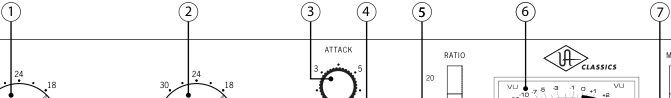

**----- Start of picture text -----** 
1 2 3 4 5 6 7 **----- End of picture text -----** 

**(1) Input** - Determines the level of the signal entering the 1176LN, as well as the threshold. Higher settings will therefore result in increased amounts of limiting or compression. 

**(2) Output** - Determines the final output level of signal leaving the 1176LN. Once the desired amount of limiting or compression is achieved with the use of the Input control, the Output control can be used to make up any gain lost due to gain reduction. To set the desired output level, press the +4 or +8 Meter button and then alter the Output knob as required. ( _see #7 on page 10_ ) 

**(3) Attack** - Sets the amount of time it takes the 1176LN to respond to an incoming signal and begin gain reduction. The 1176LN attack time is adjustable from 20 microseconds to 800 microseconds (both extremely fast). The attack time is fastest when the Attack knob is in its fully clockwise position, and is slowest when it is in its fully counterclockwise position. 

 **Turning the Attack knob all the way fully counterclockwise (to the OFF position) disables compression altogether; however, signal continues to pass through the 1176LN circuitry. This is commonly used to add the “color” of the 1176LN without any actual gain reduction.** 

 **When a fast attack time is selected, gain reduction kicks in almost immediately and catches transient signals of very brief duration, reducing their level and thus "softening" the sound. Slower attack times allow transients to pass through unscathed before limiting or compression begins on the rest of the signal.** 

**(4) Release -** Sets the amount of time it takes the 1176LN to return to its initial (pre-gain reduction) level. The 1176LN release time is adjustable from 50 milliseconds to 1100 milliseconds (1.1 seconds). The release time is fastest when the Release knob is in its fully clockwise position, and is slowest when it is in its fully counterclockwise position. 

 **If the release time is too fast, "pumping" and "breathing" artifacts can occur, due to the rapid rise of background noise as the gain is restored. If the release time is too slow, however, a loud section of the program may cause gain reduction that persists through a soft section, making the soft section difficult to hear.** 

8 

**Front Panel** 

## **_____________________________________________________________** 

**(5) Ratio -** These four buttons determine the severity of the applied gain reduction. (A ratio of 4:1, for example, means that whenever there is an increase of up to 4 decibels in the loudness of the input signal, there will only be a 1 dB increase in output level, while a ratio of 8:1 means that any time there is an increase of up to 8 dB in the input signal, there will still only be a 1 dB increase in output level.) When higher ratios (12:1 or 20:1) are selected, the 1176LN is limiting instead of compressing. Note that higher Ratio settings also set the threshold higher. ( _see page 20 for more information_ ) 

 **Unlike many other devices, the 1176LN Attack and Release times get faster, not slower, as their corresponding knobs are turned up (clockwise).** 

The 1176LN Ratio buttons allow four different modes of operation: 

**4 -** Selects a 4:1 ratio (moderate compression). 

**8 -** Selects an 8:1 ratio (severe compression). 

**12 -** Selects a 12:1 ratio (mild limiting). 

**20 -** Selects a 20:1 ratio (hard limiting). 

- **Pressing all four Ratio buttons in simultaneously yields an extreme form of compression that many engineers love! When the 1176LN is in this “All-Button” mode, distortion increases radically due to a lag time on the attack of initial transients and there are constant changes in the attack and release times, as well as a change in the bias points. Consequently, the meter will go wild, often resting at maximum. Don’t worry, though – you won’t be harming the 1176LN by using this mode!** 

- **Engineers typically use “All-button” mode on drums or on ambience or room mics. It can also be used to “dirty” up a bass or guitar sound, or for putting vocals “in your face.”** 

- **(**  _**see page 22 for more information**_ **)** 

9 

**Front Panel** 

## **_____________________________________________________________** 

**(6) Meter -** A standard VU meter that displays either the amount of gain reduction, or output level, depending upon the setting of the Meter Function switch. ( _see #7 below_ ) Occasionally, the meter may require calibration. ( _see page 25 for instructions for calibrating the 1176LN meter_ ) 

**(7) Meter Function –** These four buttons power the unit on (or off) and determine what the 1176LN’s front panel VU meter displays: either the amount of gain reduction (GR), or the compressor’s output level (+8 or +4). When “+8” is selected, a meter reading of 0 corresponds to a level of +8 dBm at the rear panel outputs. When “+4” is selected, a meter reading of 0 corresponds to a level of +4 dBm at the rear panel outputs. ( _see #2 and #4 on the following page_ ) Depressing the OFF position has the effect of powering off the 1176LN. 

 **In order to obtain a specific amount of limiting or compression on the 1176LN, begin by setting both the Input and Output knob to approximately 24 (their twelve o’clock positions) for unity gain. Set the Ratio as desired, then set the Attack and Release controls to approximately “4” (their 12 o’clock positions) so that some gain reduction is enabled. Depress the Meter GR button so that the meter shows the amount of gain reduction, then slowly turn the Input control up until the desired amount of gain reduction is achieved. Finally, adjust the Attack and Release times until they are suitable for the program material and make up any gain necessary by raising the Output knob (depress the Meter +4 or +8 buttons to have the meter display the final output level).** 

10 

**Rear Panel** 

**----- Start of picture text -----** 
_____________________________________________________________ **----- End of picture text -----** 

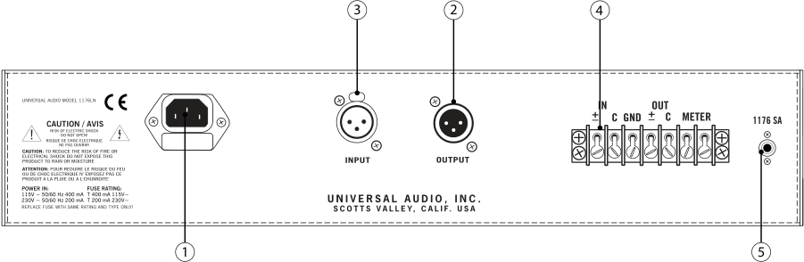

**----- Start of picture text -----** 
3 2 4 1176 SA 1 5 **----- End of picture text -----** 

- **(1) AC Power Connector / Fuse Holder** Connect a standard, detachable IEC power cable (supplied) here. If fuse replacement is required, use only a 125 mA time delay (slow blow) fuse for operation at 115 V, or a 63 mA time delay (slow blow) fuse for operation at 230 V. Note that the 1176LN has no dedicated on-off Power button; instead, depressing the Meter OFF button ( _see #7 on the previous page_ ) has the effect of powering the unit off. 

 **Never substitute different fuses other than those specified here!** 

- **(2) XLR OUTPUT** A balanced XLR connector carrying the line-level output signal of the 1176LN. This signal will normally be routed via a patchbay to a channel or bus insert return. 

- **(3) XLR INPUT** Connect line-level input signal to this balanced XLR connector. Pin 2 is wired positive (hot). This signal will normally be arriving via a patchbay from a channel or bus insert send. 

- **(4) Terminal Strip** Because it predated standard XLR connectors, the original 1176LN provided terminal strips for input and output line-level connections, and so, in addition to providing a convenient XLR input and output ( _see #2 and #3 above_ ), that feature has been retained here. Use the leftmost two terminals for input connections, the next terminal for chassis ground, and the next two terminals for output connections. The rightmost two terminals are used for connection of a remote meter. ( _see page 24 for a complete listing of all terminal strip connections_ ) If an input connection is made to the terminal strip, be sure that there is **no** connection also made to the XLR input. 

 **In order to avoid induced noise, make only one type of input connection (XLR or terminal strip) to the 1176LN.** 

- **(5) 1176SA connector** Used for stereo linking of two 1176LNs. ( _see page 27 for stereo interconnection instructions.)_ 

11 

## **Interconnections** 

## **_____________________________________________________________** 

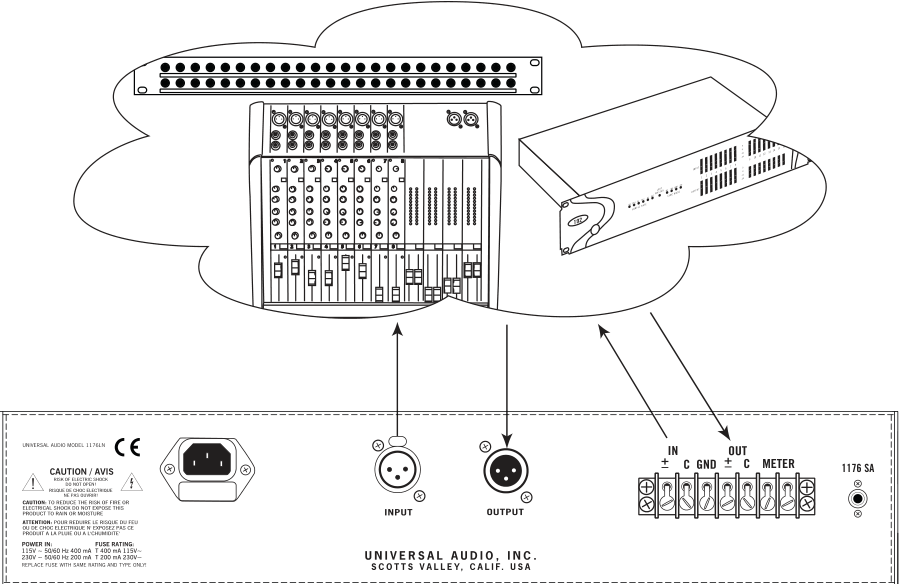

**----- Start of picture text -----** 
1 2 3 4 5 6 7 8 1 2 3 4 5 6 7 8 1176 SA **----- End of picture text -----** 

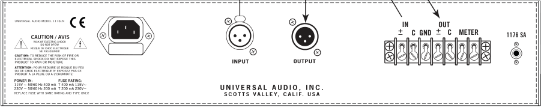

**----- Start of picture text -----** 
1176 SA **----- End of picture text -----** 

- **For most applications, we recommend starting with the 1176LN INPUT and OUTPUT knobs set to approximately 24 (their 12 o’clock position) for unity gain.** 

12 

**Insider’s Secrets** 

## **_____________________________________________________________** 

## _**Vocals, Vocals, Vocals**_ 

The 1176LN has long been considered the preeminent tool for recording vocals. Veteran engineer Andy Johns (Led Zeppelin, Rolling Stones) says flatly, “For vocals there really isn’t a better compressor.” Bruce Swedien is another legendary engineer who is a die-hard 1176 fan. “I love them 

**“For vocals there really isn’t ” a better compressor — engineer Andy Johns** 

on vocals,” he says. “All of the Michael Jackson and James Ingram vocals that everyone has heard so much were done with at least one of those 1176s. I couldn’t part with them for anything. They sound fabulous.” 

Added reviewer Hugh Robjohns, writing in _Sound on Sound_ magazine in June, 2001: “The 1176LN is judged by many to be unsurpassed as a vocal compressor, and I would certainly agree that it can be extremely effective. It can be surprisingly transparent when used fairly gently on a 4:1 ratio, a setting whose warm, [tube]-like quality can be sublime on softer voices. Yet it can also accommodate the raunchiest hard compression demands too, which can be fantastic on strong, belted-out rock vocals.” Reviewer Trevor Curwen, writing for _The Mix_ in August 2000, reported that “When recording vocals, the 1176[LN] was... used with a low ratio, resulting in a very natural, smooth sound and even performance being captured. Strapping the compressor across the vocal when mixing, and adding just a little more squeeze, gave it the presence it needed to sit consistently in the mix, with a nice top end to the sound.” 

Producer/engineer Mike Shipley (Def Leppard, Shania Twain) says, “I grew up using 1176s—in England they were the compressor of choice. They’re especially good for vocals... most anything else I can do without, but I can’t be without at least a pair of 1176s and an LA-2A. The 1176 absolutely adds a bright character to a sound, and you can set the attack so it’s got a nice bite to it. I usually use them on 4:1 [ratio], with quite a lot of gain reduction. I like how variable the attack and release is; there’s a sound on the attack and release which I don’t think you can get with any other compressor. I listen for how it affects the vocal, and depending on the song I set the attack or release—faster attack if I want a bit more bite.” 

Producer/engineer Mike Clink (Guns N’ Roses, Sammy Hagar) agrees. “I find that I actually use 1176s more now than I ever did,” he says. “I like them because they bring out the brightness and presence of a sound—they give it an energy. It seems like when I’m mixing I end up using an 1176 on the vocals every time.” 

Jim Scott, who won a Grammy for Best Engineered Album for Tom Petty’s _Wildflowers_ , says “I use 1176s real conservatively and they still do amazing things. I always use them on vocals.... I’m always on the 4:1 [ratio], and the Dr. Pepper [Attack/Release settings]—you know, 10 o’clock, 2 o’clock, and it does everything I need... They have an equalizer kind of effect, adding a coloration that’s bright and clear. Not only do they give you a little more impact from the compression, they also sort of clear things up; maybe a little bottom end gets squeezed out or maybe they are just sort of excitingly solid state... The big thing for me is the clarity, and the improvement in the top end.” 

Last but not least, if you’re trying to get an extra dose of attitude in a lead vocal, try “All-Button” mode with fast attack and release times. Not recommended for the faint of heart (or for balladeers), but it can definitely give a male or female rock vocal track an in-your-face sound that you can’t get anywhere else. 

13 

**Insider’s Secrets** 

## **_____________________________________________________________** 

## _**Drums**_ 

In the world of recording, there’s probably no greater challenge than getting powerful and precise drum sounds. The 1176LN has long been the compressor of choice for engineers for kick drum, snare drum, and overhead or ambient mics. 

“I’ll always place one big mic, like a U47 (Neumann) or a ribbon mic such as a Coles or Royer, five or six feet in front of the drums,” confides Grammy-winning engineer Jay Newland (Norah Jones). “I try to get the whole drum set to sound good through that one mic and then put it through an 1176. That’s the secret weapon track. The 1176 compresses and makes it sound bigger and more present and a lot more exciting without having to crush it. I just it give a healthy 3 - 5 dB of compression and turn up the gain a little bit—it sounds great! If I have that mono track, where the whole drum kit sounds balanced, then I can build a decent drum sound with whatever else I have.” 

**“The 1176 is standard equipment for my sessions” — engineer Allen Sides** 

“The 1176 is standard equipment for my sessions,” adds studio owner / engineer and well-known industry “golden ear” Allen Sides (Goo Goo Dolls, Green Day). “I mult the left and right [drum] overheads and bring them back on the console, then insert a pair of 1176s [in All-button mode] into a pair of the mults. [That] puts the unit into overdrive, creating a very impressive sound.” 

Engineer Andy Johns employs a similar technique. “What you do is, you run your room mics through a couple of 1176s, just so that they are nudging a bit. This brings up the decay time of the room when your guy hits the bass drum or the snare. If it’s a very quick tempo it won’t work, but at medium or half-time tempo it brings up the room. It’s wonderful and there is not another compressor that will do it the same way as an 1176.” 

“When I am mixing,” he adds, “I mult the bass drum and the snare. The bass drum will not be even, so the first bass drum track—the one that doesn’t have the 1176 on it—gets to breathe. Then I put another bass drum next to it with an 1176 at a 4:1 [ratio setting]. That evens it out a bit. I sneak that in and the bass drum is more constant. Of course, you have to change your EQs appropriately... for the snare, I use one normal track that I EQ to death. Then I will use another one that has gone through a gate. I put an 1176 on it to make it pop [and] I sneak that in... and all of a sudden the snare just comes up.” 

Indeed, the perception of distortion is increased with lower frequencies in “All-Button” mode. That’s why, given the frequencies and transients created by the kick drum, the 1176LN can almost literally make an overhead or room mic explode. As reviewer Trevor Curwen points out, “[All-buttons mode] can give a quite awesome compressed sound. This is particularly useful in creating a larger than life drum sound, where compressing the room mics on a drum kit, combined with careful setting of the release control, can really squeeze out the room ambience.” 

14 

**Insider’s Secrets** 

**_____________________________________________________________** 

The 1176LN compression or limiting is, to some degree, program-dependent. That’s an important feature which allows it to be used in a musical, percussive way. Let’s say you have a medium tempo, 4/4 rock beat—an excellent scenario for using “All-Button” mode. In this application, you’d probably have a lot of input level, a slowish attack (so that the transients sneak through), and a quick release. The sonic result is extraordinary. First, the kick drum causes a great concussion, which is enhanced by the unique “All-Button” distortion. As it does so, the other frequencies “suck in,” followed by an exaggerated release and recovery, and then the rest of the drum kit sound returns... all in rather dramatic fashion. 

## _**Electric Guitar and Bass**_ 

In his review for _The Mix_ , Trevor Curwin used an 1176LN extensively on electric guitar, both in the recording and mixing stages, and reported excellent results: “Used on a 4:1 ratio when recording some electric guitars through a miked amp, it didn’t take much to get a great sounding result... Just using around 3 dB of gain reduction added a very useful character to the sound. There is something about an original 1176 that adds a certain presence and bite 

**“Used on a 4:1 ratio when recording some electric guitars through a miked amp, it didn’t take much to ” get a great sounding result — Trevor Curwin,** _**The Mix**_ 

that can be especially pleasing on electric guitar, and this new unit had that very same character about it.” 

“Treating some electric guitar sounds that had been previously recorded,” Curwin added, “allowed the opportunity of experimenting with the different ratios and the attack and release controls, and with careful positioning it was possible to give the guitar a lot of punch and an apparent sense of urgency in the mix.” 

The 1176LN can serve as a perfect complement for acoustic and electric bass as well. In his _Sound on Sound_ magazine review in June, 2001 Hugh Robjohns observed that “the original [1176] was often... celebrated as a compressor for bass, and I certainly found the re-issue’s compression to cope wonderfully with the wildest excesses of electric or acoustic string basses, without changing the inherent sound or losing the essence of the player’s dynamics.” 

Stephen Murphy said much the same thing when he reviewed the unit for _Pro Audio Review_ in March, 2001: “My favorite use for the 1176LN is for vocals, electric and upright basses, and other ‘single line’ [monophonic] instruments. I usually stick to the 4:1 ratio, with medium attack and reasonably quick release—one of my pet peeve sounds is that of a compressor coming back up with a sluggish release. This was never an issue with the 1176LN.” 

You’ll find that you can make almost any bass sound fatter and warmer, yet still retain its definition, by running its signal through a 1176LN set to a ratio of 4:1, with fairly fast attack and release times (set both knobs to approximately 3 o’clock) and input and output at roughly unity gain (both knobs at around “24”). To add more compression and a slight amount of distortion, select a ratio of 8:1 and slightly increase the Input knob. Even with the noticeable distortion this will add, each bass note will still be clearly heard and will cut through even the densest backing track. 

15 

**Insider’s Secrets** 

## **_____________________________________________________________** 

## _**Controlled Distortion**_ 

The unique sonic characteristics of the 1176LN make it an effective tone shaper as well. One of its features is ultra-fast attack and release times, and used correctly (or incorrectly, depending on the way you look at it), you can use it to add distortion to any otherwise pristine audio track. 

Running most sources through a distortion device can cause the signal to lose some of its definition as you increase the effect. Also, distortion devices tend to add a significant amount of noise. But with the 1176LN, you can compress your signal and add distortion without losing definition, and while only minimally adding noise. Since the attack and release can happen so fast, set at their fastest values, they impart minute level fluctuations over the audio. The result is a special kind of distortion not available through any other means. This distortion can be adjusted to taste by altering the attack and release times, and by the compression ratio. Of course, you can also adjust the Input control to set how often the source will go into this distorted compression. Probably the most distorted sound you’ll get out of the 1176LN is in “All-Button” mode, with attack and release set to their fastest times. By simply backing off on the Input, Attack or Release controls, you can lessen the effect. 

## _**Mixing and Premastering**_ 

As reviewer Hugh Robjohns points out, the 1176LN has a “slightly bright character—actually more of a subtle spectral tilt than an obvious high-frequency lift—which generally helps tracks to cut through in a mix without you needing to even reach for EQ. Throughout the years, engineers have variously referred to this characteristic sound as edge, growl, present and urgent. Generally speaking, the higher the Input level, the more these descriptive terms come into play.” You’ll find that the 1176LN is most transparent when doing gain reduction of 4 dB or less. This will serve to subtly reign in dynamic variations in the audio while still adding its characteristic tone. In addition, the extremely fast attack time offered by the 1176LN (which enable it to control peak levels as well as sustained tones) allows it to effectively tighten up individual drum tracks in the mix stage. 

When linked together in stereo with an optional 1176SA and  correctly calibrated, you can use a pair of 1176LNs to process even an entire mix without any alteration of the stereo image. **mixes through a pair of** A little gentle compression or limiting can add polish to a final **stereo linked 1176LNs.** mix and help “glue” the many components together (similar to the way that the limiters that are used in radio and television transmission sometimes improve the sound of mixes). Also, by reducing the overall dynamic range, the apparent loudness of the overall track is increased— something that is becoming increasingly important in today’s loudness wars. 

 **Try processing entire stereo mixes through a pair of stereo linked 1176LNs.** 

Even if you don’t opt to compress or limit the final mix, it’s often worth trying passing the signal through a pair of stereo linked 1176LNs in bypass mode (that is, with the attack knobs on both units set fully counterclockwise, to their “OFF” positions). Even though the gain reduction circuitry is disconnected in that mode, the signal continues to pass through the 1176LN transformers, picking up their signature sound. 

16 

**The Technical Stuff** 

**_____________________________________________________________** 

## **History of the 1176LN** 

The original Universal Audio 1176, designed by Bill Putnam, was a major breakthrough in limiter technology – the first true peak limiter with all transistor circuitry offering superior performance and a signature sound. Evolved from the popular Universal Audio 175 and 176 vacuum tube limiters, the 1176 retained the proven qualities of these industry leaders, and set the standard for all limiters to follow. In fact, the 1176 may well be the most loved limiter/compressor in history. Its trademark lightning-quick attack and release times and the tone of its Class A output amplifier have enhanced countless recordings for more than forty years. 

As is evident from entries and schematics in his design notebook, Putnam experimented extensively at the time with the then newly developed Field Effect Transistor (F.E.T.) in various configurations and eventually found a way of using it as the gain-controlling element of a compressor/limiter. The original version of the 1176, released in 1967, was denoted the 1176A, but was revised to the model AB only a few months later, with improvements in stability and slightly reduced noise. The following year saw revision B, with further minor changes to the preamplifier circuit. These models all featured a brushed aluminum faceplate with a blue meter section. 

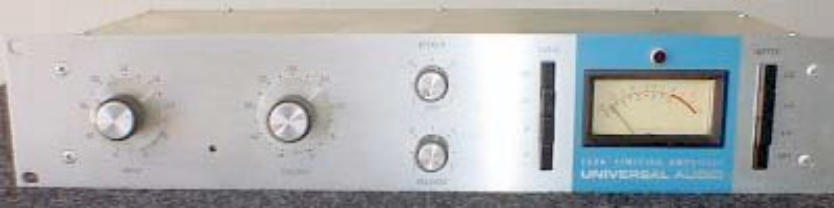

**1176 Revision B** 

Revision C, released in September 1970, saw two major changes. One, the unit now sported a black faceplate instead of silver, and, two, it was now designated an 1176LN, with the “LN” standing for “low noise.” This model featured the first major modification to the 1176 circuit, designed by Brad Plunkett in an effort to reduce noise, hence the birth of the 1176LN. 

Numerous design improvements followed, resulting in at least 13 revisions of the 1176. Plunkett’s LN circuitry was originally encased within an epoxy module, but a subsequent redesign fully integrated these improvements with the main circuit board, resulting in revision D. 

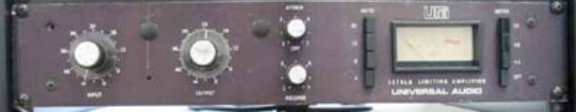

**1176LN Revision D** 

17 

## **The Technical Stuff** 

## **_____________________________________________________________** 

Revision E was introduced in the early 1970s and was the first to accommodate European 220V mains power with a voltage selector on the rear panel. Of all the revisions, model D and model E are considered to have superior sound and are thus the most sought-after versions by audio engineers. 

Another significant redesign occurred in 1973. The revision F output stage was modified to provide higher output current capability by using a push-pull circuit design borrowed from Universal Audio's new 1109 preamplifier. This new output stage replaced the original Class A circuit borrowed from the 1108 preamp. The meter drive circuit was also updated, with an operational amplifier instead of the previous discrete circuit. 

The classic transformer front end of the 1176 met its demise with the model G, in which an electronically balanced input stage replaced it. The final update, the model H, simply marked a return to a silver faceplate and the addition of a blue UREI logo. 

The companies that Bill Putnam Sr. started—Universal Audio, Studio Electronics, and UREI—built products that are still in regular use decades after their development. In 1999, Putnam’s sons Bill Jr. and James Putnam re-launched Universal Audio. In 2000, the company released its first product: a faithful reissue of the original 1176LN (revision D/E), which quickly garnered rave reviews, finding a home in hundreds of professional and project studios worldwide. 

In 2000, Bill Putnam Sr. was awarded a Technical Grammy for his multiple contributions to the recording industry. Highly regarded as a recording engineer, studio designer/operator and inventor, Putnam was considered a favorite of musical icons Frank Sinatra, Nat King Cole, Ray Charles, Duke Ellington, Ella Fitzgerald and many, many more. The studios he designed and operated were known for their sound and his innovations were a reflection of his desire to continually push the envelope. Universal Recording in Chicago, as well as Ocean Way and Cello Studios (now EASTWEST) in Los Angeles all preserve elements of his room designs. 

We here at Universal Audio, have two goals in mind: to reproduce classic analog recording equipment designed by Bill Putnam Sr. and his colleagues, and to design new recording tools in the spirit of vintage analog technology. Today we are realizing those goals, bridging the worlds of vintage analog and DSP technology in a creative atmosphere where musicians, audio engineers, analog designers and DSP engineers intermingle and exchange ideas. Every project taken on by the UA team is driven by its historical roots and a desire to wed classic analog technology with the demands of the modern digital studio. 

18 

**The Technical Stuff** 

**_____________________________________________________________** 

## **Compressor / Limiter Basics** 

The function of a compressor is to automatically reduce the level of peaks in an audio signal so that the overall dynamic range—that is, the difference between the loudest sections and the softest ones—is reduced, or compressed, thus making it easier to hear every nuance of the music. Compression is sometimes referred to as _peak reduction_ or _gain reduction_ , because a compressor (or “limiter,” when acting more severely) “rides gain” on a signal much like a recording engineer does by hand when he manually raises and lowers the faders of a mixing console. Its circuitry automatically adjusts level in response to changes in the input signal: in other words, it keeps the volume up during softer sections and brings it down when the signal gets louder. The amount of gain reduction is typically given in dB and is defined as the amount by which the signal level is reduced by the compressor. 

Compression or limiting enables even the quietest sections to be made significantly louder while the overall peak level of the material is increased only minimally. The dynamic range of human hearing (that is, the difference between the very softest passages we can discern and the very loudest ones we can tolerate) is considered to be approximately 120 dB. Early recording media such as analog tape and vinyl offered much less dynamic range, so compression was a virtual necessity, raising the overall level of the material (making it “hotter”) without peak levels causing distortion. While many of today's digital recording media approach or even exceed 120 dB of available dynamic range, quiet passages of recorded music can still be lost in the ambient noise floor of the listening area, which, in an average home, is 35 to 45 dB. 

Despite the increased dynamic range, compression is especially important when recording digitally, for two reasons: One, it helps ensure that the signal is encoded at the highest possible level, where more bits are being used so that better signal definition is achieved. Secondly, it helps prevent a particularly harsh type of distortion known as _clipping_ —something that, ironically, only occurs in digital recording, due to the inherent limitations of digital technology. 

During recording, compression is customarily used to minimize the volume fluctuations that occur when a singer or instrumentalist performs with too great a dynamic range for the accompanying music. It can also help to tame acoustic imbalances within an instrument itself—for example, when certain notes of a bass guitar resonate more loudly than others, or when a trumpet plays louder in some registers than in others. Properly applied compression will make a performance sound more consistent throughout. It can tighten up mixes by melding dense backing tracks into a cohesive whole, can make vocals more intelligible, and can add punch and snap to percussion instruments like kick drum and snare drum, making them more “present” without necessarily being louder. It can also impart tonal coloration, making a signal warmer and fatter. Compression can even serve as a musical tool, enhancing the sustain of held guitar notes or keyboard pads, or providing a snappier attack to horn stabs or string pizzicato. 

19 

**The Technical Stuff** 

## **_____________________________________________________________** 

## _**Input Signal and Threshold**_ 

The first and perhaps most significant factor in compression is the level of the input signal. Large (loud) input signals result in more gain reduction, while smaller (softer) input signals result in less gain reduction. _Threshold_ is another important factor. It is a term used to describe the level at which a compressor starts to work. Below the threshold point, the volume of a signal is unchanged; above it, the volume is reduced. For example, if a compressor’s threshold is 0 dB, incoming signals at or above 0 dB will have their gain reduced, while those below 0 dB will be unaffected. 

In the 1176LN, the Input knob controls both the threshold and the amount of input signal being routed to the gain reduction circuitry. As it is turned up (clockwise), the overall degree of compression increases; as it is turned down (counterclockwise), the overall degree of compression decreases. Note that the 1176LN ratio setting also affects threshold (see below). 

## _**Ratio**_ 

Another important term is compression _ratio_ , which describes the amount of increase required in the incoming signal in order to cause a 1 dB increase in output. A ratio of 1:1 therefore means that for every 1 dB of increase in input level, there is a corresponding 1 dB increase in output level; in other words, there is no compression being applied. A ratio of 4:1, however, means that any time there is an increase of 4 decibels in the loudness of the input signal, there will only be a 1 dB increase in output signal. A ratio of 8:1 means that even when there is a full 8 decibels of increase in loudness, there will still only be a 1 decibel increase in output signal. (Bear in mind that the decibel is a logarithmic form of measurement, so a 2 dB signal is not twice as loud as a 1 dB signal; in fact, it requires approximately 10 dB of increased gain for a signal to sound twice as loud.) 

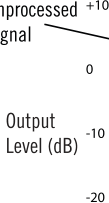

As you can see from this illustration, at low ratios of 2:1 or 4:1, a compressor has relatively less effect on the incoming signal; at higher ratios, it has more effect. While the terms “compression” and “limiting” are often used interchangeably, the general definition of compression is gain reduction at ratios below 10:1; when higher ratios (of 10:1 or greater) are used, the process is instead called _limiting_ . Limiters abruptly prevent signals above the threshold level from exceeding a certain 

20 

**The Technical Stuff** 

## **_____________________________________________________________** 

maximum value. At very high ratios of 20:1 or greater (some limiters even offer a theoretical infinite ratio of Infinity:1), “brick wall” limiting kicks in—that is, almost any change in input, no matter how great, results in virtually no increase in output level. Note that the 1176LN has been designed so that selecting higher ratios also raises the threshold level. 

As an aside, an _expander_ is the opposite of a compressor: a device which _increases_ the dynamic range of a signal. For example, a 10 dB change in the input signal might result in a 20 dB change in the output signal, thus “expanding” the dynamic range. 

## _**Knee**_ 

A compressor's _knee_ determines whether the device will reach maximum gain reduction quickly or slowly. A gradual transition (“soft knee”) from no response to full gain reduction will provide a gentler, smoother sound, while a more rapid transition (“hard knee”) will give an abrupt “slam” to the signal. The 1176LN utilizes soft knee compression and limiting, which is generally preferred for most musical applications; hard knee compression or limiting is more often used in applications where instrumentation (such as broadcast transmitter towers) must be protected from transient signal overloads. 

## _**Attack and Release**_ 

The main key to the sonic imprint of any limiter or compressor lies in its _attack_ and _release_ times; these are the parameters which most affect how “tight” or how “open” the sound will be after gain reduction. The attack time describes the amount of time it takes the limiter/compressor circuitry to react to and reduce the gain of the incoming signal, usually given in thousandths of a second (milliseconds) or even millionths of a second (microseconds). A fast attack kicks in almost immediately and catches transient signals of very brief duration (such as the beater hit of a kick drum or the pluck of a string), reducing their level and thus “softening” the sound. A slow attack time allows transients to pass through unscathed before compression begins on the rest of the signal. 

The release time is the time it takes for the signal to then return to its initial (pre-compressed) level. If the release time is too short, “pumping” and “breathing” artifacts can occur, due to the rapid rise of background noise as the gain is restored. If the release time is too long, however, a loud section of the program may cause gain reduction that persists through a soft section, making the soft section inaudible. 

In the 1176LN, both the attack and release times are user-selectable. Attack time can be set to between 20 microseconds and 800 microseconds (these are among the fastest attack times offered by _any_ analog compressor), while release time can be set to between 50 milliseconds and 1100 milliseconds (1.1 seconds). Unlike many other devices, however, the 1176LN attack and release times get faster, not slower, as their corresponding knobs are turned up (clockwise). 

21 

**The Technical Stuff** 

## **_____________________________________________________________** 

## _**Output (Makeup Gain)**_ 

Finally, an output control is employed to make up for the gain reduction applied by the gain reduction circuitry; on the 1176LN, this is the function of the Output knob. Makeup gain is generally set so that the compressed signal is raised to the point at which it matches the level of the unprocessed input signal (for example, if a signal is being reduced in level by approximately -6 dB, the output makeup gain should be set to +6 dB). 

As you are adjusting a limiter or compressor, a switchable meter such as the one provided by the 1176LN can be helpful in order to view the strength of the outgoing signal (displayed when the meter is set to +4 or +8), or the difference in levels between the original input signal and the gain-reduced output signal (displayed when the meter is set to GR). When in GR mode, the 1176LN meter will read 0 dB when there is no incoming signal or when no compression is being applied. 

## **About “All-Button” Mode** 

One of the most unique features of the 1176LN is the ability to press all four Ratio buttons in simultaneously to create extreme amounts of compression or limiting. In this “All-Button” mode (sometimes also known as “British Mode” because of its extensive use on many seminal British recordings of the 60’s and 70’s), distortion increases radically due to a lag time on the attack of initial transients (a phenomenon which might be described as a "reverse look-ahead"). The ratio goes to somewhere between 12:1 and 20:1, and the bias points change all over the circuit, thus changing the attack and release times as well. The unique and constantly shifting compression curve that results yields a trademark overdriven tone that can only be found in this family of limiter/compressors. 

## **About “Class A”** 

Most electronic devices can be designed in such a way as to minimize a particularly unpleasant form of distortion called _crossover distortion._ However, the active components in “Class A” electronic devices such as the 1176LN draw current and work throughout the full signal cycle, thus eliminating crossover distortion altogether. 

## **Making A Custom Insert Cable** 

In order to ensure unity gain, the input and output to a compressor are normally derived from a mixer channel or bus insert send and return. However, most mixing consoles provide such inserts on unbalanced TRS (Tip/Ring/Sleeve) connectors, with the tip carrying the send and the ring carrying the return, with the sleeve serving as common ground. Most 1176LN users will opt to use the rear panel XLR input and output connectors instead of the less commonly used terminal strip connectors. ( _see page 24_ ) Premade “insert” Y-cables that provide a single TRS plug on one end and two XLR connectors on the other end are commercially available for this purpose. However, it can be considerably more cost-effective to make your own custom insert cable—something that requires only basic soldering skills and a few inexpensive parts. 

22 

**The Technical Stuff** 

## **_____________________________________________________________** 

To make such a cable, first acquire the following components: 

- (1) Female XLR cable connector 

- (1) Male XLR cable connector 

- (1) 1/4" TRS cable connector 

A suitable length of light gauge unbalanced microphone cable A short piece of 22 gauge bus wire 

Then follow these steps to assemble the cable: 

1. Cut two lengths of audio cable suitable to reach from the 1176LN to the insert point on your mixer. Light gauge cable should be used in order to allow the two cables to comfortably fit inside a TRS jack. Use a short piece of bus wire to tie pins 1 (cold) and 3 (ground) together on each XLR connector. Only solder pin 3, as you will also need to solder an audio lead into pin 1. 

2. On both XLR connectors, solder the hot (white) lead into pin 2, and solder the cold (black) lead into pin 1, as well as the other end of the bus wire (as described in the previous step). 

3. Solder the hot (white) lead from the cable connected to the male XLR to the tip connection point of the TRS jack. Solder the hot (white) lead from the cable connected to the female XLR to the ring connection point of the TRS jack. As shown in the photograph below, combine the cold lead and the shielding together at the ground point. 

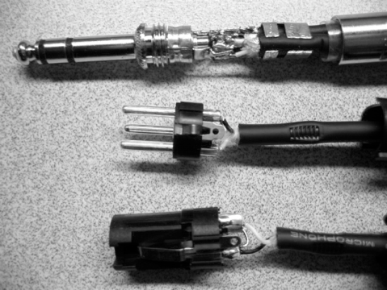

4. Your finished cable should look like the photograph below. Be sure to check continuity with a voltmeter or test light before use, to ensure proper grounding and signal flow. 

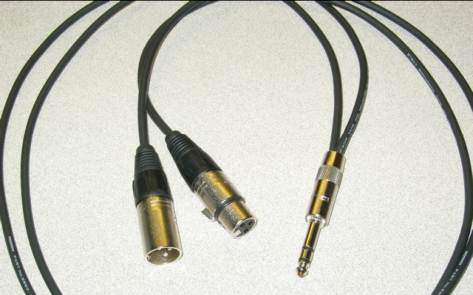

23 

**The Technical Stuff** 

## **_____________________________________________________________** 

## **Terminal Strip Connections** 

Because it predated standard XLR connectors, the original 1176LN provided terminal strips for input and output line-level connections, and so that feature has been retained here (in addition to providing a modern XLR input and output). 

The terminal strip inputs and outputs, from left to right, are as follows: 

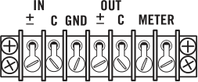

IN +/IN C (Common) GND (Chassis Ground) OUT +/OUT C (Common) METER (two terminals, polarized; the inner terminal connects to meter plus and the outer terminal to meter minus) 

Only one input connection (XLR or terminal strip) to the 1176LN should be made, or induced noise may result. However, so long as they are connected to devices of equal or greater impedance (i.e., most modern audio equipment), both output connections can be used for simultaneous use of the terminal strip and XLR output jacks. 

Input and output connections should be made as follows: 

UNBALANCED INPUT: Connect the HOT cable lead (TS tip) to the IN +/- terminal Connect the GROUND (shield braid) to the IN C terminal 

UNBALANCED OUTPUT: Connect the HOT cable lead (TS tip) to the OUT +/- terminal Connect the GROUND (shield braid) to the OUT C terminal 

BALANCED INPUT: 

Connect the HOT cable lead (TRS tip or XLR pin 2) to the IN +/- terminal Connect the NEUTRAL cable lead (TRS ring or XLR pin 3) to the IN C terminal _Optional: If there is a hum problem, connect the GROUND (shield braid or XLR pin 1) to the GND terminal_ 

BALANCED OUTPUT: Connect the HOT cable lead (TRS tip or XLR pin 2) to the OUT +/- terminal Connect the NEUTRAL cable lead (TRS ring or XLR pin 3) to the OUT C terminal Connect the GROUND (shield braid or XLR pin 1)  to the GND terminal _(NOTE: If hum results, the ground may be left disconnected)_ 

The METER terminals provide a series insert point into the 1176LN’s meter side-chain circuitry, allowing the connection of an external VU meter when desired. To do so, remove the shorting clip, and then make a connection between the inner METER terminal (the one closest to OUT C) and the meter’s positive input, and a second connection between the outer terminal (the one closest to the edge of the terminal strip) and the meter’s negative input. 

24 

**The Technical Stuff** 

## **_____________________________________________________________** 

## **Maintenance Information** 

## **Calibrations** 

- **There are no user serviceable parts inside the 1176LN. Unit calibration, as well as repair, should only be performed only by qualified service personnel. These calibration procedures are provided only for use by qualified service technicians.** 

## _**Zero Set**_ 

The 1176LN meter may occasionally need to be calibrated. This is accomplished by adjusting the Zero Set potentiometer, located through a small hole on the front panel between the Input and Output knobs. 

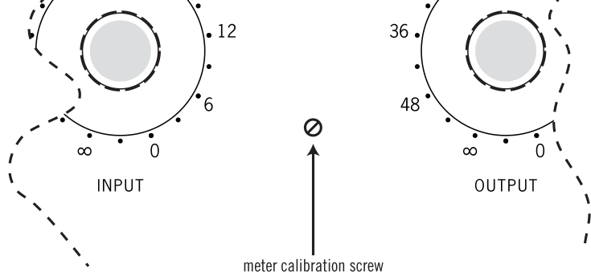

The procedure for adjusting the meter is as follows: 

1. Power on the 1176LN. 

2. Depress the Meter GR pushbutton. 

3. Set the Input control fully off (turn the knob fully counterclockwise). 

4. Use a small screwdriver to slowly adjust the Zero Set potentiometer so that the meter reads 0 dB. Watch how the meter settles before completing the calibration. 

 **Never turn the screw on the meter itself! This is factory set and should not be altered.** 

25 

**The Technical Stuff** 

## **_____________________________________________________________** 

## _**“Q” Bias**_ 

The compression threshold is set using R59. Under normal circumstances, this control does not need to be adjusted. The threshold is dependent upon the specific characteristics of the VVR FET (Q1), and it will be necessary to re-adjust it if Q1 is changed. 

The following procedure is used to set “Q” bias: 

1. Select either +4 or +8 output metering. 

2. Adjust R59 fully counterclockwise (CCW). 

3. Apply a sine wave signal to the 1176LN. 

4. Adjust the Input and Output controls for 0dB output. 

5. Slowly adjust R59 CW until the output decreases by 1.0 dB. 

## _**Meter Driver Null**_ 

A multimeter is needed to perform this calibration procedure: 

1. Disconnect any input and output connections on the 1176LN. 

2. Set your multimeter to measure DC volts. 

3. Depress the Meter GR pushbutton. 

4. Adjust the Zero potentiometer R71 _(_  _see page 25)_ so that the meter reads near 0 dB. 

5. Connect the multimeter across R74. 

6. Adjust R75 for a minimum voltage reading. 

7. Disconnect the multimeter. 

8. Readjust the Zero Set potentiometer R71 so that the meter reads 0 dB 

26 

**The Technical Stuff** 

## **_____________________________________________________________** 

## **Stereo Operation and Calibration** 

With the use of an external 1176 Stereo Adapter (1176SA), available from Universal Audio, two 1176LNs can be connected for stereo operation. 

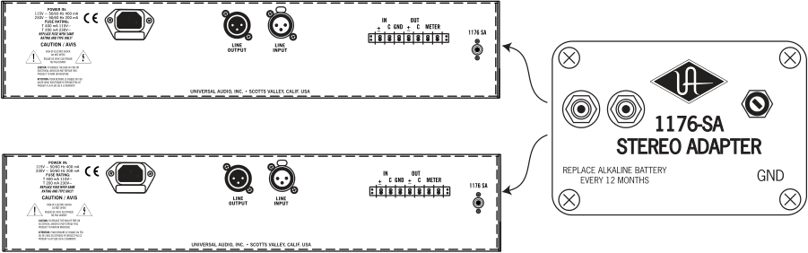

- **When used in stereo operation, the Attack and Release controls on the two 1176LNs will interact so that changing the Attack or Release times on either device changes that of both devices. Also, when connected in a stereo configuration, the fastest attack time is doubled (that is, it becomes 40 microseconds instead of 20 microseconds.** 

- **During normal stereo operation, both 1176LNs should be set to the same Ratios as well as similar Input and Output levels.** 

Use the following procedure to calibrate the 1176SA stereo adapter: 

1. Remove the signals from both 1176LN units. 

2. Disable gain reduction on each 1176LN by setting both Attack controls fully counterclockwise. 

3. Using two cables with RCA connectors on both ends, connect the 1176-SA to both 1176LNs. 

4. Depress the Meter GR pushbutton. 

5. Adjust the potentiometer on the 1176-SA until both meters read 0dB. If it is not possible to zero both meters, reverse the stereo interconnect cables and repeat the preceding step. 

27 

**The Technical Stuff** 

## **_____________________________________________________________** 

## **Changing the Voltage Selector** 

The 1176LN can operate at 115V or 230V. It will be factory preset for the voltage in your area; however, if it is necessary to change the voltage selector (located directly below the transformer on the rear panel), use a small slotted screwdriver to slide it to the desired operating voltage. 

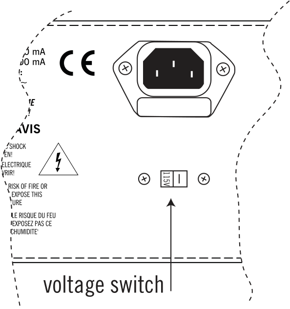

**NOTE: When changing operating voltage, the fuse value must be changed as well** . _**Make sure the 1176LN is properly set for the voltage in your area before applying AC power to the unit!**_ Failure to do so may damage the unit. 

## **Changing Fuses** 

The AC power fuse is located in the AC power connector block. Remove the power cord before checking or changing the fuse. 

A 125 mA time delay (slow blow) fuse is required for operation at 115 V. 

A 63 mA time delay (slow blow) fuse is required for operation at 230 V. 

 **Never substitute different fuses other than those specified here!** 

28 

**The Technical Stuff** 

## **_____________________________________________________________** 

## **1176LN Circuit Details** 

The fundamental problem facing Bill Putnam Sr. when he began designing the 1176 limiter was how to keep its FET operating within its linear region in order to keep distortion sufficiently low. After much experimentation he eventually hit upon the simple and elegant idea of using the FET as a voltagecontrolled variable resistor, forming the bottom half of a voltage divider circuit, across which the audio signal was applied. He then placed his voltage-controlled attenuator ahead of a solid-state preamplifier stage and line driver, and derived its control voltage from a relatively conventional level-sensing circuit monitoring the output. 

The output stage of the 1176 was a carefully crafted class A line level amplifier, designed to work with the then standard load of 600 ohms. The heart of this stage is the custom output transformer developed by Putnam; its design and performance is critical to the sound of the device. This transformer was distinguished by the fact that it used several additional sets of windings to provide feedback (a practice widely used in the tube amplifiers of the era), which made it an integral component in the operation of the output amplifier. Putnam spent a great deal of time perfecting the design of this tricky transformer and carefully qualified the few vendors capable of producing it. 

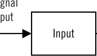

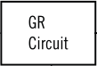

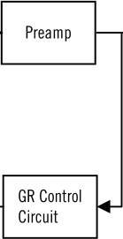

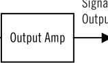

_**Figure 1 - Block Diagram of the 1176LN**_ 

Figure 1 shows a block diagram of the 1176LN. Signal limiting and compression is performed by the gain reduction section. Before the signal is applied to the gain reduction section, the audio signal is attenuated by the input stage. The amount of attenuation is controlled by the Input control potentiometer. The amount of gain reduction as well as the compressor attack and release times are controlled by gain reduction control circuit. After gain reduction, a pre-amp is used to increase the signal level. The Output control potentiometer is then used to control the amount of drive that is applied to the output amplifier. 

Let’s take a closer look at each stage within the 1176LN circuit. 

29 

## **The Technical Stuff** 

## **_____________________________________________________________** 

## _**Input Section**_ 

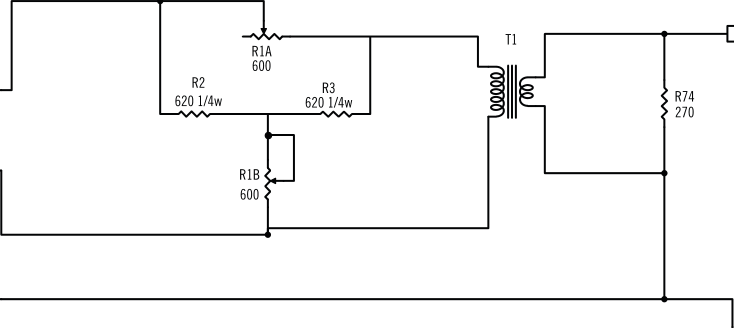

_**Figure 2 - Input Section**_ 

As shown in Figure 2, the 1176LN input section is comprised of an adjustable passive attenuator followed by a transformer. The purpose of this section is to reduce the signal level so as not to overdrive the FET based gain reduction stage. Additionally, the adjustable input level is used to control the amount of compression. This input circuit was used in Revisions A-F. With Revision G, a differential op-amp input instead of the attenuator / transformer input stage was used. 

## _**Gain Reduction Stage**_ 

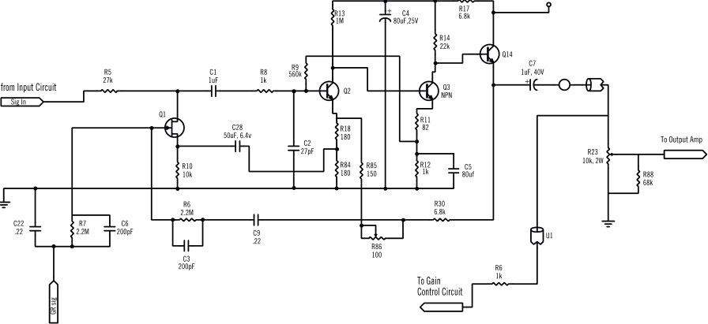

_**Figure 3 - Gain Reduction Stage**_ 

30 

**The Technical Stuff** 

## **_____________________________________________________________** 

As shown in Figure 3, gain reduction is achieved by a Field Effect Transistor (FET) which is used as a variable resistor. In the 1176LN, the FET acts like a resistor whose resistance is controlled by the voltage applied to its gate. The higher the voltage applied to the gate, the smaller the drain-source resistance will be. 

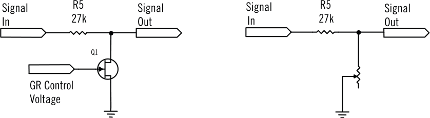

_**Figure 4 - Using an FET as a voltage-variable resistor. The combination of R5 and Q1 acts as a voltage divider which controls the gain.**_ 

Figure 4 shows how the FETs resistance determines the gain of this section. Resistor R5 and the FET essentially comprise a voltage divider circuit. The lower the FETs resistance, the less gain this stage will have. The FET acts like a variable resistor, where the resistance is determined by the control voltage that is applied to it. Note that the greater the voltage applied to the gate of the FET, the less resistance, hence large signals cause the FET to reduce the gain. Larger input signals result in a higher voltage from the gain control circuit, which will lower the gain, hence reducing the signal level. This is the basis of the limiting action. Note that the 1176LN is a feedback style compressor since the sidechain circuit samples the signal level after the gain reduction. 

## _**LN Circuitry**_ 

The LN circuit, which appeared in revisions ‘C’ and later, was designed to reduce the distortion that the FET introduced in the gain reduction stage. FETs are inherently nonlinear devices, and any nonlinear device will introduce signal distortion. The LN circuitry was designed to ensure that the FET stayed as much within a linear region as possible, thus reducing unwanted distortions. Much of what is now known about the operation and design guidelines of FETs was very new at the time the 1176 was designed. Initially, the decision was made to try to keep the ‘LN circuit’ a secret and file for a patent. In order to accomplish this it was decided to build the ‘LN’ circuit in a separate module. This module was then attached to the circuit board. The first revision to have the LN circuitry was revision C. This was accomplished by attaching an ‘LN module’ to the revision B circuit board. This module turned out to be a problem to manufacture and the decision was made to revise the circuit board to accommodate the LN circuitry without the module. This then became revision D1. 

31 

**The Technical Stuff** 

## **_____________________________________________________________** 

## _**Output Amplifier**_ 

The output amplifier is a Darlington pair followed by a class A stage based on a 2N3053 transistor. The 1176LN output stage was essentially the same as the Universal Audio 1108 pre-amplifier. The output transformer is a custom transformer designed by Bill Putnam Sr. Aside from offering output impedance matching, the transformer forms an integral part of the feedback network used to stabilize the output stage. Note that later revisions (‘F’ and beyond) used a push-pull (class AB) output stage. (Revision E was essentially the same as revision D. Revision E added 220 Volt operation as well as a 10 MΩ resistor across the ratio switch to avoid ‘pops’ while changing between compression ratios.) 

## _**Gain Reduction Control Circuit**_ 

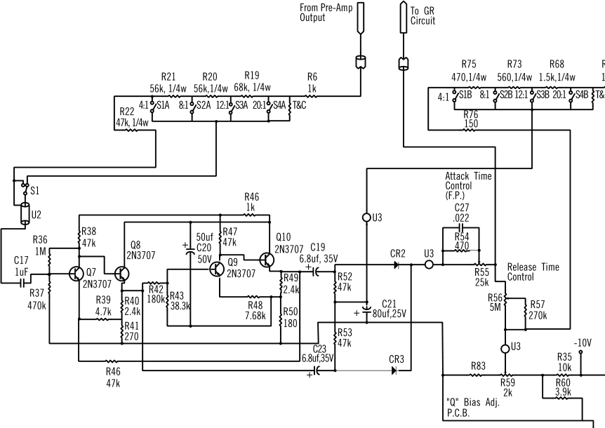

_**Figure 5 - Gain Reduction Control Circuit**_ 

32 

**The Technical Stuff** 

## **_____________________________________________________________** 

As shown in Figure 5, this circuit controls the amount of compression as well as the attack and release times of the limiter. The input to this circuit is taken from the output of the preamplifier section, just before the volume control potentiometer (R23). The compression ratio push-button switches determine the level of the signal which is sent to the sidechain. This determines the amount of limiting or compression. Transistor Q7 acts as a phase inverter which is followed by Q8 , an emitter follower. This signal then feeds CR3 as well as Q9 and Q10, which comprise another phase inverter / emitter follower combination. This is then fed to CR2. Note that the signal applied to CR2 is 180° out of phase with the signal at CR3. Since they are out of phase, the combination of CR2 and CR3 act as a full-wave rectifier. The output of the rectifiers are then filtered by C22 which smooths the signal. This DC voltage is proportional to the level of the input signal. 

A bias level is applied to the diodes by the Compression Ratio pushbutton switches. This controls the threshold of limiting, and is adjusted for the correct value as determined by the currently selected compression ratio selection. R55 controls the compressor’s attack time by regulating how fast C22 is charged. Likewise, R56 determines the compressor’s release time by controlling the rate at which C22 discharges. The output of this stage is then applied to the gate of the FET in the gain reduction circuit, which in turn controls the gain in the manner previously described. 

33 

## **Glossary of Terms** 

## **_____________________________________________________________** 

**Ambient noise -** Low-level noise created by environmental factors such as fans, air conditioners, heaters, wind noise, etc. 

**Attack time -** Describes the amount of time it takes compressor circuitry to react to and reduce the gain of incoming signal. A compressor set to a fast attack time kicks in almost immediately and catches transient signals of very brief duration, reducing their level and thus "softening" the sound. A slow attack time allows transients to pass through unscathed before compression begins on the rest of the signal. The 1176LN attack time ranges from 20 to 800 microseconds. 

**Auxiliary (Aux) send** - A mixer bus output designed to combine and send multiple signals to an external processor or monitor system. 

**Balanced** - Audio cabling that uses two twisted conductors enclosed in a single shield, thus allowing relatively long cable runs with minimal signal loss and reduced induced noise such as hum. 

**Bus** - The point in an audio mixer where various signals are blended together. 

**Bus insert** - An insert across a mixer bus. 

**Channel** - A functional path in an audio circuit. A mixer provides multiple channels, each with its own dedicated input(s) and several outputs, such as buses, auxiliary sends, etc. 

**Channel insert** - An insert across a mixer channel. 

**Class A** - A design technique used in electronic devices such that their active components are drawing current and working throughout the full signal cycle, thus yielding a more linear response. This increased linearity results in fewer harmonics generated, hence lower distortion in the output signal. 

**Clipping -** A particularly harsh form of audio distortion, caused when the loudness of an incoming signal exceeds a digital audio recording device’s capability to represent its amplitude. When that happens, the peaks of the signal simply get “clipped” off, thus drastically changing the waveform and yielding an especially unpleasant sound. 

- **Compression** The process of automatically reducing the level of peaks in an audio signal so that the overall dynamic range—that is, the difference between the loudest sections and the softest ones—is reduced, or compressed. “Compression” is sometimes described as “gain reduction” or “peak reduction.” 

- **Compression ratio** A term that describes the amount of increase required in the incoming signal in order to cause a 1 dB increase in output. A ratio of 4:1, for example, means that any time there is an increase of 4 decibels in the loudness of the input signal, there will only be a 1 dB increase in output signal. When compression ratios of 12:1 or higher are being used, the device is instead said to be limiting. 

**DAW** - An acronym for “Digital Audio Workstation”—that is, any device that can record, play back, edit, and process digital audio. 

**dB** - Short for “decibel,” a logarithmic unit of measure used to determine, among other things, power ratios, voltage gain, and sound pressure levels. 

34 

**Glossary of Terms** 

**_______________________________________________________________________** 

**dBm** - Short for “decibels as referenced to milliwatt,” dissipated in a standard load of 600 ohms. 1 dBm into 600 ohms results in 0.775 volts RMS. 

**dBV** - Short for “decibels as referenced to voltage,” without regard for impedance; thus, one volt equals one dBV. 

**Dynamic range -** The difference between the loudest sections of a piece of music and the softest ones. The dynamic range of human hearing (that is, the difference between the very softest passages we can discern and the very loudest ones we can tolerate) is considered to be approximately 120 dB. Modern digital recording devices are able to match (or even exceed) that range. 

**FET –** An acronym for “Field Effect Transistor,” a type of solid-state semiconductor. 

- **Flat frequency response** No boost or attenuation in any frequency range. 

**Gain reduction -** A synonym for compression or limiting. 

**Insert** - A place where a signal path can be broken so that a processing device can be placed in line with the signal at unity gain (no cut or boost). An insert is most commonly a TRS jack with one conductor being an output (send) and the other being an input (return). The jack is wired with a _normalled_ connection so that with nothing plugged in, the send and return are connected together. 

**Knee -** A compressor's _knee_ determines whether the device will reach maximum gain reduction quickly or slowly. A gradual transition is called "soft knee,” while a more rapid transition is called “hard knee.” Soft knee compression and limiting is generally more desirable for musical applications. 

**Limiter -** A compressor that operates at high compression ratios of 10:1 or higher. 

**Limiting -** A more severe form of compression, where a high compression ratio (of 10:1 or higher) is being used. 

**Limiting Amplifier -** A synonym for “limiter.” 

**Line level** - Refers to the voltages used by audio devices such as mixers, signal processors, tape recorders, and DAWs. Professional audio systems typically utilize line level signals of +4 dBm (which translates to 1.23 volts), while consumer and semiprofessional audio equipment typically utilize line level signals of –10 dBV (which translates to 0.316 volts). 

**Low shelving filter** - An equalizer circuit that cuts or boosts signal below a specified frequency, as opposed to boosting or cutting on both sides of the frequency. 

**Makeup gain -** A control that allows the overall output signal to be increased in order to compensate (“make up”) for the gain reduction applied by the compressor. 

**Microsecond (** µ **s)** - A millionth of a second. 

**Millisecond (ms)** - A thousandth of a second. 

**Noise floor** - Unwanted random sound (noise) added by an electronic device. 

**Patch bay** - A passive, central routing station for audio signals. In most recording studios, the line-level inputs and outputs of all devices are connected to a patch bay, making it an easy matter to re-route signal with the use of patch cords. 

35 

**Glossary of Terms** 

## **_____________________________________________________________** 

**Patch cord** - A short audio cable with connectors on each end, typically used to interconnect components wired to a patch bay. 

**Peak reduction -** A synonym for compression or limiting. 

**Program dependent -** Refers to a parameter that varies according to the characteristics of the incoming signal. To some degree, the amount of 1176LN gain reduction is program dependent. 

**Ratio -** see “Compression Ratio” 

**Release time -** The time it takes for a signal to return to its initial (pre-compressed) level. If the release time is too fast, "pumping" and "breathing" artifacts can occur, due to the rapid rise of background noise as the gain is restored. If the release time is too slow, however, a loud section of the program may cause gain reduction that persists through a soft section, making the soft section inaudible. The 1176LN release time ranges from 50 milliseconds to 1.1 seconds. 

- **Terminal Strip** An insulated stamped strip of tin-plated loops of copper, used for multiple electrical or audio interconnections. Sometimes called a “barrier strip.” 

**Threshold -** A term used to describe the level at which a compressor starts to work. Below the threshold point, the volume of a signal is unchanged; above it, the volume is reduced. In the 1176LN, threshold is determined by the setting of the Input and Ratio controls. 

**Transformer** - An electronic component consisting of two or more coils of wire wound on a common core of magnetically permeable material. Audio transformers operate on audible signal and are designed to step voltages up and down and to send signal between microphones and line-level devices such as mixing consoles, recorders, and DAWs. 

**Transient -** A relatively high volume pitchless sound impulse of extremely brief duration, such as a pop. Consonants in singing and speech, and the attacks of musical instruments (particularly percussive instruments), are examples of transients. 

**TRS** - Short for “Tip/Ring/Sleeve,” a standard quarter-inch jack connector, with the tip and ring carrying audio signal and the sleeve attached to the shield of the cabling, thus providing ground. When used for mixer channel or bus inserts, the tip and ring will typically carry send and return signals, respectively. When used for balanced connections, the tip and ring will carry the same audio signal, with one signal out of phase with the other. 

**TS -** Short for “Tip/Sleeve,” a standard quarter-inch jack connector, with the tip carrying audio signal and the sleeve attached to the shield of the cabling, thus providing ground. 

**Unity gain -** No boost or attenuation of the incoming signal. When set to unity gain, a device’s output signal will be at exactly the same strength as its input signal. 

**XLR** - A standard three-pin connector used by many audio devices, with pin 1 typically connected to the shield of the cabling, thus providing ground. Pins 2 and 3 are used to carry audio signal, normally in a balanced (out of phase) configuration. 

36 

**Recall Sheet** 

**_______________________________________________________________________** 

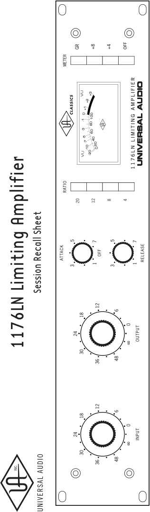

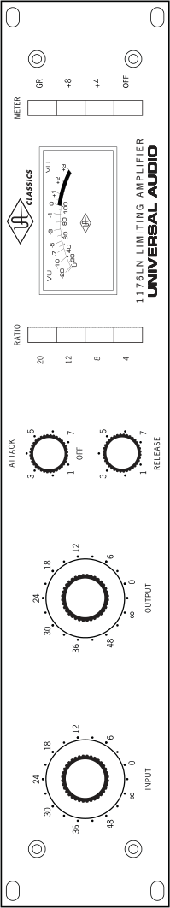

37 

## **Specifications** 

|**_____________________________________________________________**|**_____________________________________________________________**|
|---|---|
|**Input Impedance**|600Ω, bridged T-control (floating)|
|**Output Load Impedance**|600Ω(floating)|
|**Frequency Response**|20 Hz to 20 kHz±1 dB|
|**Gain**|45 dB,±1 dB|
|**Distortion**|> 0.5% T.H.D. from 50 Hz – 15 kHz|
||with limiting, at 1.1 seconds release setting.|
||Output of +22 dBm with no greater than 0.5% T.H.D.|
|**Signal-to-Noise Ratio**|> 81 dB with input signal at threshold of limiting,|
||over a bandwidth of 30 Hz to 18 kHz|
|**Attack Time**|Adjustable, from 20 to 800 microseconds|
|**Release Time**|Adjustable, from 50 milliseconds to 1.1 seconds|
|**External Connections**|XLR / Original Jones barrier strip|
|**Stereo Interconnection**|Optional, using 1176SA stereo interconnect accessory|
|**Power Requirements**|115V/230V|
|**Power Connector**|Detachable IEC power cable.|
|**Fuse**|125 mA time delay (slow blow) / 115 V|
||63 mA time delay (slow blow) / 230 V|
|**Dimensions**|19" W x 3.5" H x 12.25" D (two rack unit)|
|**Weight**|11 lb. (with box, 14.5 lb.)|

38 

**Additional Resources/Product Registration/Warranty/Service & Support** 

**_______________________________________________________________________** 

## **Additional Resources** 

We’ve got a pretty cool website, if we may say so ourselves. Check us out at http://www.uaudio.com 

There, you’ll find tons of information about our full line of products, as well as e-news, videos, software downloads, FAQs, an online store, and a way cool webzine that features hot tips, techniques, and interviews with your favorite artists, engineers and producers each month. The webzine even offers something we call “Playback”—a monthly contest where the winners get their music posted on our site, exposing their songs to thousands of visitors per day! 

## **Product Registration** 

Please take a moment to register your new Universal Audio product by visiting our website at http://my.uaudio.com/systems/add_hardware.html 

Registration allows us to contact you regarding important product updates and also makes you eligible for online promotions. 

## **Warranty** 

The warranty for all Universal Audio hardware is one year from date of purchase, parts and labor. 

## **Service & Support** 

Even gear as well designed and tested as ours will sometimes fail. In those rare instances, our goal here at UA is to get you up and running again as soon as possible. 

The first thing to do if you’re having trouble with your device is to check for any loose or faulty external cables, bad patchbay connections, grounding trouble from a power strip and all inputs/outputs (mic/line/Hi-Z, etc.). If your problem persists, call tech support at 877-MY-UAUDIO, or send an email to hardwaresupport@uaudio.com, and we will help you troubleshoot your system. (Canadian and overseas customers should contact their local distributor.) When calling for help, please have the product serial number available and have your unit set up in front of you, turned on and exhibiting the problem. 

If it is determined your product requires repair, you will be told where to ship it and issued a Return Merchandise Authorization number (RMA). This number must be displayed on the outside of your shipping box (use the original packing materials if at all possible). Most repairs take approximately 2 - 4 days, and we will match the shipping method you used to get it to us. (In other words, if you shipped it to us UPS ground, we will ship it back to you UPS ground; if you overnight it to us, we will ship it back to you overnight). You pay the shipping costs to us; we ship it back to you free of charge. Qualified service under warranty is, of course, also free of charge. For gear no longer under warranty, tech bench costs are $75 per hour plus parts. 

39 

