## **Model 4-710d** 

## **Four-Channel Tone-Blending Mic Preamplifier** 

## **Universal Audio Part Number 65-00051 Revision A** 

Universal Audio, Inc. 

Customer Service & Tech Support: +1-877-MY-UAUDIO Business, Sales & Marketing: +1-866-UAD-1176 www.uaudio.com 

## **Notices** 

This manual provides general information, preparation for use, installation and operating instructions for the Universal Audio Model 4-710d. 

## _**Disclaimer**_ 

The information contained in this manual is subject to change without notice. Universal Audio, Inc. makes no warranties of any kind with regard to this manual, including, but not limited to, the implied warranties of merchantability and fitness for a particular purpose. Universal Audio, Inc. shall not be liable for errors contained herein or direct, indirect, special, incidental, or consequential damages in connection with the furnishing, performance, or use of this material. 

## _**Copyright**_ 

© 2011 Universal Audio, Inc. All rights reserved. 

This manual and any associated software, artwork, product designs, and design concepts are subject to copyright protection. No part of this document may be reproduced, in any form, without prior written permission of Universal Audio, Inc. 

## _**Trademarks**_ 

4-710d, 710, Twin-Finity, 4110, 8110, SOLO/110, SOLO/610, 2-610, LA-610, LA-2A, 2-LA2, LA-3A, 6176, 1176LN, 2-1176, 2192, DCS Remote Preamp, UAD and the Universal Audio, Inc. logo are trademarks of Universal Audio, Inc. Other company and product names mentioned herein are trademarks of their respective companies 

## _**FCC Compliance**_ 

This device complies with Part 15 of the FCC Rules. Operation is subject to the following two conditions: (1) this device may not cause harmful interference, and (2) the device must accept any interference received, including interference that may cause undesired operation. 

## _**Contents of This Box**_ 

This package should contain: 

• (1) Universal Audio 4-710d unit • (1) Set of 4 rack mounting screws with washers • (1) User Manual • (1) Tip In Sheet • (1) IEC power cable • (1) Warranty Registration Card • (1) UA full line catalog 

ii 

**Notices** 

## _**Important Safety Information**_ 

Before using this unit, be sure to carefully read the applicable items of these operating instructions and the safety suggestions. Afterwards, keep them handy for future reference. Take special care to follow the warnings indicated on the unit, as well as in the operating instructions. 

1. **Water and Moisture  -** Do not use the unit near any source of water or in excessively moist environments. 

2. **Object and Liquid Entry  -** Care should be taken so that objects do not fall, and liquids are not spilled, into the enclosure through openings. 

3. **Ventilation  -** When installing the unit in a rack or any other location, be sure there is adequate ventilation. Improper ventilation will cause overheating, and can damage the unit. 

4. **Heat  -** The unit should be situated away from heat sources, or other equipment that produce heat. 

5. **Power Sources  -** The unit should be connected to a power supply only of the type described in the operating instructions, or as marked on the unit. 

6. **Power Cord Protection  -** AC power supply cords should be routed so that they are not likely to be walked on or pinched by items placed upon or against them. Pay particular attention to cords at plugs, convenience receptacles, and the point where they exit from the unit. Never take hold of the plug or cord if your hand is wet. Always grasp the plug body when connecting or disconnecting it. 

7. **Grounding of the Plug  -** This unit is equipped with a 3-wire grounding type plug, a plug having a third (grounding) pin. This plug will only fit into a grounding-type power outlet. This is a safety feature. If you are unable to insert the plug into the outlet, contact your electrician to replace your obsolete outlet. Do not defeat the purpose of the grounding-type plug. 

8. **Cleaning  -** Follow these general rules when cleaning the outside of your 4-710d: 

   - a. Turn the power Off and unplug the unit 

   - b. Gently wipe with a clean lint-free cloth 

   - c. If necessary, moisten the cloth using lukewarm or distilled water, making sure not to oversaturate it as liquid could drip inside the case and cause damage to your 4-710d 

   - d. Use a dry lint-free cloth to remove any remaining moisture 

   - e. Do not use aerosol sprays, solvents, or abrasives 

9. **Nonuse Periods  -** The AC power supply cord of the unit should be unplugged from the AC outlet when left unused for a long period of time. 

10. **Damage Requiring Service  -** The unit should be serviced by a qualified service personnel when: 

   - a. The AC power supply cord or the plug has been damaged; or 

   - b. Objects have fallen or liquid has been spilled into the unit; or 

   - c. The unit has been exposed to rain; or 

   - d. The unit does not operate normally or exhibits a marked change in performance; or 

   - e. The unit has been dropped, or the enclosure damaged. 

11. **Servicing  -** The user should not attempt to service the unit beyond that described in the operating instructions. All other servicing should be referred to qualified service personnel. 

iii 

## **Table Of Contents** 

Notices ................................................................................................................................................... ii Introduction ............................................................................................................................................ 5 A Letter from Bill Putnam Jr. ............................................................................................................................. 5 Overview ........................................................................................................................................................... 6 Features ............................................................................................................................................................ 6 The Two Page, Two Minute Guide to Getting Started ............................................................................... 7 Front Panel Descriptions ......................................................................................................................... 9 Analog Controls ................................................................................................................................................ 9 Digital Controls ............................................................................................................................................... 12 Rear Panel Descriptions ....................................................................................................................... 14 Digital Connectors .......................................................................................................................................... 14 Analog Connectors .......................................................................................................................................... 15 Interconnection Diagrams .................................................................................................................... 17 Analog-Only Setup .......................................................................................................................................... 17 Basic Digital Setup ......................................................................................................................................... 18 Advanced Digital Setup .................................................................................................................................. 19 Model 4-710d Overview ........................................................................................................................ 20 Digital Clocking Primer ......................................................................................................................... 23 Insider’s Secrets ................................................................................................................................... 25 History of the Model 4-710d ................................................................................................................. 27 Glossary of Terms ................................................................................................................................. 29 Maintenance ......................................................................................................................................... 34 Calibration ...................................................................................................................................................... 34 Fuse ................................................................................................................................................................ 34 Voltage Select ................................................................................................................................................. 34 Service ............................................................................................................................................................ 34 AES/EBU DB-25 Connector Pinouts ................................................................................................................. 34 Session Recall Sheet ............................................................................................................................ 35 Block Diagram ...................................................................................................................................... 36 Specifications ....................................................................................................................................... 37 Analog Section, Channels 1–4 ........................................................................................................................ 37 Analog-To-Digital Converter Section ............................................................................................................... 39 Digital Output Section .................................................................................................................................... 40 Connector Types .............................................................................................................................................. 40 Mechanical and Power .................................................................................................................................... 40 Index ..................................................................................................................................................... 41 Additional Resources ............................................................................................................................ 43 Universal Audio Website ................................................................................................................................. 43 Product Registration ....................................................................................................................................... 43 Warranty ......................................................................................................................................................... 43 Service & Support ........................................................................................................................................... 43 

iv 

## **Introduction** 

## **A Letter from Bill Putnam Jr.** 

Thank you for purchasing the Model 4-710d Four-Channel Tone Blending Mic Preamplifer — Universal Audio's new analog+digital hybrid product. The 4-710d combines four channels of our Model 710 Twin-Finity™ preamplifier with eight channels of pristine analog-to-digital conversion and adds a complement of modern convenience features, all in a 2U, all-metal chassis at an amazing price. 

Our all-original 710 Twin-Finity preamp with Tone Blending has proved to be wildly popular among engineers, producers, and artists seeking a broad palette of sounds from clean to warm in a single, affordable unit. The innovative preamp design of the Model 710 combines both the classic retro warmth of UA tube design and the transient bite of solid-state. The 710 was created specifically to add the tonal versatility and sonic inspiration missing from generic audio interface preamps. The key to its sonic flexibility lies in its innovative circuit design, featuring a solid-state transimpedance input amp simultaneously driving separate, phase-aligned tube and solid-state gain stages, which are then summed to a single output. The mix between the single-ended class-A triode tube stage and solidstate transimpedance stage is controlled via a unique “Blend” knob. Blending is continually variable between 100% tube and 100% solid-state offering a practically infinite range of unique preamp tones and the ability to easily dial in your own signature sound. 

With the 4-710d, we've added even more value to the 710 mic preamps. Each channel includes an 1176-style compressor; this dynamics circuit sounds incredible and provides yet another dimension of available sounds. For flexible signal routing and external processing, the 4-710d also includes send/return jacks in each preamp that can be individually switched via the front panel. 

The 4-710d facilitates easy integration of analog signals into your digital world with its built-in high quality 8-channel A/D converter. Selectable sample rates from 44.1 to 192 kHz, digital output via ADAT optical or AES/EBU via industry-standard DB-25 connector, and flexible low-jitter clocking options make it easier than ever to get mic, line, or instrument signals directly into your DAW with a minimum of hardware and fuss. The A/D converters include LED metering, and an 8-channel soft limiter helps prevent digital overs. 

Most of us at Universal Audio are musicians and/or recording engineers. We love the recording process, and we really get inspired when tracks are beautifully recorded. Our design goal for the 4-710d was to build a hybrid mic preamp and A/D converter that we would be delighted to use ourselves—one that would induce that “a-ha” feeling you get when hearing music recorded in its most natural, inspired form. 

Developing the Model 4-710d – as well as Universal Audio’s entire line of quality audio products designed to meet the needs of the modern recording studio while retaining the character of classic vintage equipment – has been a very special experience for me and for all who have been involved. While, on the surface, the rebuilding of UA has been a business endeavor, it's really been so much more than that: in equal parts a sentimental and technical adventure. 

We thank you, and we thank my father, Bill Putnam. 

Sincerely, 

Bill Putnam Jr. 

5 

**Introduction** 

## **Overview** 

The Universal Audio 4-710d is a four-channel microphone/line preamplifier with tube and solid-state tone blending, offering four additional line inputs, dynamics control, and eight channels of pristine analog-to-digital conversion. The 4-710d combines UA’s classic design approach with several modern innovations, creating a unique studio device suited to a wide range of applications. 

At the core of the 4-710d are four channels of tone-blending “Twin-Finity” mic preamps with truebypass 1176-style compression. Each of the four mic preamp channels allows for continuously variable phase-aligned tone between 100% tube and 100% solid-state. Send and return jacks are available for external processing or signal access. 

The eight analog inputs are digitized via high-quality 24-bit A/D converters at selectable sample rates up to 192 kHz. Digital output is available via dual ADAT “lightpipe” or AES/EBU DB-25 connectors, facilitating integration with most popular audio interfaces. 

## **Features** 

## _**Preamplifiers**_ 

- Four TEC Award-winning 710 Twin-Finity™ microphone/line preamps, each featuring: 

- Dual-path 285-volt Class-A tube and transimpedance solid-state preamps 

- Phase-aligned tone-blending of tube and solid state circuits, creamy to crunchy 

- Newly designed 1176-style compression circuit per preamp channel 

- JFET Direct Input with 2.2MΩ ultra Hi-Z impedance w/auto input override 

- Large backlit VU meters for flexible metering of input drive, gain level, and gain reduction 

- Balanced send/return inserts (half-normalled) 

- 48V phantom power 

- 75 Hz low cut filter 

- Polarity switch 

- Monolithic balanced output stage 

## _**Analog-to-Digital Conversion**_ 

- Eight channels of high quality 24-bit A/D conversion: 

- Selectable sample rates up to 192 kHz 

- Digital output via dual ADAT optical and AES/EBU DB-25 connectors 

- 8-channel soft limiter (switchable for all channels) 

- Ultra-low jitter clock subsystem 

- LED metering array with clip/hold indicators 

- 75Ω BNC work clock I/O 

- Digital outputs anti-pop protection on power-up 

## _**Other**_ 

- Universal voltage internal power supply 

- Heavy-duty metal construction, two-space rack unit 

- One year warranty including parts and labor 

6 

## **The Two Page, Two Minute Guide to Getting Started** 

No one likes to read owner’s manuals. We know that. 

We also know that you know what you’re doing—why else would you have bought our product? 

So we’re going to try to make this as easy on you as possible. Hence this two-page spread, which we estimate will take you approximately two minutes to read. It will tell you everything you need to know to get your Universal Audio 4-710d up and running, without bogging you down with details. 

Of course, even the most expert of us has to crack a manual every once in awhile. As the saying goes, “as a last resort, read the instructions.” You’ll find those details you’re craving—a full description of all front and rear panel controls, interconnection diagrams, insider’s secrets, history, theory, maintenance information, block diagrams, specifications, even a glossary of terms—in the pages that follow. 

## **Manual conventions** : 

>  Means that this is an especially useful tip 

 Means that this is an especially important bit of information 

And when we need to direct you to a page or section elsewhere in the manual, we’ll use the universal signs for rewind () or fast forward (). 

## _**Getting Started With Your 4-710d:**_ 

**Step 1:** Place the 4-710d where you intend to use it. Chassis mounting hardware is provided, allowing the 4-710d to be used in a standard 19" rack (taking just two spaces), and so we recommend that the 4-710d be securely mounted in a rack if possible. 

**Step 2:** Mute your monitors and then, using a balanced cable with XLR connectors, connect the 4- 710d’s rear panel line output(s) to the appropriate input(s) on your patch bay, mixer, or DAW. 

**Step 3:** Set the front panel +48V (phantom power), 15dB PAD, and LOW CUT switches to their down (OFF) position. 

**Step 4:** Set the front panel POLARITY switch to its down (IN ø) position. 

**Step 5:** Connect the desired input source to one of the 4-710d’s rear panel balanced XLR mic and/or line inputs _(_  _page 15)._ Alternatively, an electric guitar or bass can be connected to a front panel unbalanced 1/4" Hi-Z input _(_  _page 9);_ however, note that the 4-710d’s jack sensing circuitry automatically disconnects the channel’s rear-panel mic and line inputs when a cable is inserted into that channel’s Hi-Z input. _(_  _See page 17 for interconnection diagrams)_ 

**Step 6:** If you are using a microphone or line-level input, set the channel’s front panel Input Select switch to Mic or Line. 

**Step 7:** Set the channel’s Meter switch to DRIVE (its down position). 

**Step 8:** Set the channel’s Gain control to “0” and the Level control to approximately “5”. 

**Step 9:** Set the channel’s Blend knob to its twelve o’clock position. This ensures an equal blend of both of the 4-710d preamplifiers (solid-state and vacuum tube). 

7 

## **Getting Started** 

**Step 10:** Make sure the Power switch is off (down position) and then connect the supplied IEC power cable to the rear panel AC power connector. 

**Step 11:** Power on the 4-710d. The front-panel meters will light up. 

 **Because the Model 4-710d utilizes a tube, it needs several minutes to achieve a stable operating temperature. During warm-up, audio quality may vary slightly.** 

**Step 12:** If a microphone requiring 48 volts of phantom power is connected to the 4-710d, turn on the channel’s +48V switch. 

**Step 13:** Unmute your monitors and slowly raise the channel’s Gain control. You should now be hearing signal, with that channel’s meter becoming active. 

**Step 14:** While viewing the meter, set the channel’s Gain control until optimum input signal strength is achieved. Change the channel’s Meter switch to OUTPUT (its up position) and set the Level control until optimum output signal strength is achieved. 

**Step 15:** Experiment with differing degrees of Gain to hear the various amounts of coloration the 4- 710d can impart to your signal. (CAUTION: Very high Gain settings will result in significant amounts of distortion). For the cleanest, most uncolored signal from the 4-710d, set the Gain knob to its lowest usable setting, change the Meter to OUTPUT, and then adjust the Level control as necessary. If you hear distortion when using a connected microphone even at the lowest Gain level, employ the -15 dB pad to reduce the input level. If you hear low frequency rumble, employ the Low Cut filter switch. 

**Step 16:** Finally, experiment with the Blend control to hear the different sonic signatures imparted by the two discrete preamplifiers contained within the 4-710d. At the fully counterclockwise (TRANS) position, only signal from the solid-state preamplifier is heard. At the fully clockwise (TUBE) position, only the signal from the tube preamplifier is heard. Most uniquely, it is the in-between settings that allow you to access the “twin-finity” of sounds offered by the 4-710d and create a custom blend that best complements your signal source. 

 **For more detailed information, refer to the “Front Panel” and “Rear Panel” sections on pages 9 and 14 of this manual.** 

8 

## **Front Panel Descriptions** 

## **Analog Controls** 

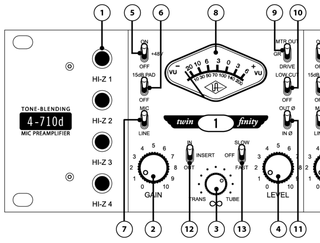

 **The controls for channels 1-4 are identical, so each control is only described once.** 

- **(1)  Hi-Z Inputs** Connect a high impedance signal from an instrument such as electric guitar or bass to these standard unbalanced 1/4" phone jack connectors. The 4-710d’s jack detection circuitry automatically switches from the selected rear panel MIC or LINE input to the channel’s front panel Hi– Z input whenever a plug is inserted into this jack. The Hi-Z input impedance is 2.2MΩ for all four inputs. These JFET direct inputs provide maximum fidelity with no high-end loss. 

 **Making a connection to the 4-710d’s front panel Hi-Z input jack automatically disconnects any signal arriving at the rear panel mic and line input.** 

**(2) Gain -** Adjusts the gain of the channel’s input stage. Turning this knob clockwise raises the amount of gain applied to the input signal. This control also determines the level sent to the compressor if the compression circuit _(_  _#13 on page 11)_ is engaged. 

**(3)  Blend (“** ∞ **”) -** This unique control sets the relative contribution from the solid-state and vacuum tube preamplifier circuits. When in the fully counterclockwise (TRANS) position, only signal from the solid-state preamplifier is heard. When in the fully clockwise (TUBE) position, only the signal from the tube preamplifier is heard. At the twelve o’clock position, signal from both the solid-state and tube preamplifiers is heard at equal amounts. 

9 

## **Front Panel** 

**(4) Level -** This is the channel’s master volume control. It determines the amplitude of the signal sent to the rear panel LINE OUTPUT _(_  _#8 on page 16) a_ nd INSERT SEND _(_  _#11 on page 16)_ jacks. This control also sets the level sent to the A/D converter inputs. 

 **The numeric values for the Gain and Level knobs are relative scale markings and do not represent specific dB values.** 

> **You can come up with many useful tonal variations by experimenting with different Gain and Level settings.** 

- **(5)  +48V** Most modern condenser microphones require +48 volts of phantom power to operate. When in the up position, 48 volts of phantom power are available at the channel’s rear panel MIC INPUT. _(_  _See page 21 for more information about phantom power)_ 

 **Keep phantom power off (switch down) when it is not required.** 

- **Always check the power requirements of your microphone with the manufacturer before applying phantom power** _**.**_ 

 **To avoid loud transients, always make sure phantom power is off when connecting or disconnecting microphones.** 

**(6)  -15 dB PAD -** When enabled (placed in the up position), the channel’s MIC INPUT signal will be reduced by 15 dB (this switch has no effect on LINE INPUT or Hi-Z signal). Use the PAD to reduce the incoming signal in cases where undesired distortion is present at low gain levels (for instance, where especially sensitive microphones are used on loud instruments or if the A/D converter is clipping). 

**(7) Input Select -** Determines whether the channel’s MIC (up position) or LINE (down position) input is active. If the channel’s Hi-Z input is in use, this switch has no effect. 

_(_  _See “_ Analog Connectors _” on page 15 for more info on the rear panel inputs)_ 

**(8)  Meter -** This standard VU meter can display the channel’s overall output level, tube drive level, or amount of compressor gain reduction. The function that is displayed depends upon the setting of the Meter Function switch _(_  _#9 on page 11)._ 

10 

**Front Panel** 

**(9)  Meter Function -** This three-position switch determines what the channel’s VU meter displays. In the up (OUTPUT) position, it shows the final output level in dB. "0" on the VU meter corresponds to +4 dBu at the analog outputs and -16 dBFS at the A/D converter inputs. In the down (DRIVE) position, it shows the input level to the tube stage after the front panel Gain control, but before the Blend and Level controls, thus giving an accurate gauge of how hard the tube and solid-state preamplifiers are being driven. In the center (GR) position, the meter displays the amount of gain reduction occurring in the channel’s compressor if the COMP switch ( _#13 below)_ is engaged for the channel. If the channel’s compressor is off, the meter will not deflect from zero when set to GR. 

When the switch is in DRIVE mode, the meter is calibrated so that 0 VU is equal to 1.2% THD on a 1kHz sine wave. When OUTPUT is selected, a meter reading of 0 VU corresponds to a level of +4 dBu at the rear panel LINE OUTPUT jack. 

_(_  _See “Drive Metering” on page 25 for additional analog metering info_ ) 

**(10)  Low Cut -** When enabled (placed in the up position), the channel’s input signal passes through a 75 Hz low cut filter. This is normally used to eliminate rumble and other unwanted low frequencies from an incoming signal. 

_(_  _See page 21 for more information about low cut filtering_ ) 

**(11) Polarity (“ø”) -** Determines the polarity of the channel’s LINE OUTPUT _(_  _#8 on page 16_ ) and the polarity of the signal at the A/D converter inputs. When off (in the down, IN ø position), pin 2 of the LINE OUTPUT is hot (positive). When the switch is enabled (in the up, OUT ø position), the output signal is placed out of phase and pin 3 of its LINE OUTPUT is hot (positive). Normally the switch should be off and only enabled when it is desirable to reverse the polarity, i.e., in cases where more than one microphone is utilized in recording a source signal. 

_(_  _See page 21 for more information about polarity inversion_ ) 

**(12)  Insert –** When enabled (placed in the up position), the input signal is routed through the channel’s insert jacks on the rear panel _(_  _“Insert Loop” on page 16_ ) for external processing. When disengaged (in the down position), the signal at the return jack is ignored. The insert switch allows you to leave external processors conveniently connected when you don’t want to currently use them on the channel. 

> **The Send jack is active even when Insert is disengaged, so you can route the channel’s signal to a monitor mix, tuner, etc.** 

**(13)  Comp –** This three-position switch controls the channel’s 1176-style analog compressor. The compressor has a compression ratio of 4:1 and the threshold is 10 dBu. 

When in the up (FAST) position, the compressor attack time is 0.3 ms and the release time is 100 ms. When in the down (SLOW) position, the attack time is 2.0 ms and the release time is 1100 ms. 

If the METER FUNCTION switch _(_  _#9 above)_ is set to GR, the amount of compressor gain reduction is displayed in the METER. 

11 

**Front Panel** 

## **Digital Controls** 

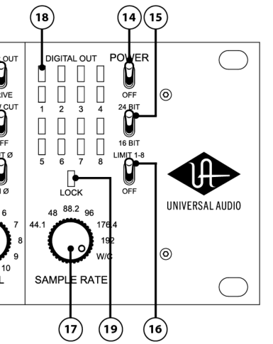

**(14)  Power -** Turns the 4-710d power on or off. When powered on, the front panel meters light up. 

 **The 4-710d should be powered off when it is not being used for extended periods of time.** 

**(15)  Bit Depth –** This switch determines the bit depth, or resolution, of the digital output signal for all eight A/D channels. In the up position, the digital output word length is 24 bits; in the down position, the digital output word length is 16 bits. 

The actual A/D conversion of the 4-710d is always performed at a 24-bit word length. When the switch is set to 16-bit mode, the 24-bit signal is triangular dithered to 16 bits. 

**(16)  Limit 1-8 –** This switch activates the built-in analog limiter for all eight inputs prior to A/D conversion. The limiter is global for all eight inputs; it cannot be individually enabled per channel (unlike the mic pre compressors on channels 1-4). 

The limiter threshold is 17dBu (= -3dBFS) and the ratio is effectively infinite. The attack time is 0.075 ms and the release time is 100 ms. Although the limiter will help prevent “digital overs” (A/D clipping) during conversion, it is not a “brick wall” limiter. It is still possible to clip the A/D input, especially with very hot signal levels and/or signals with fast transient peaks. 

**(17)  Sample Rate -** This knob defines the internal sample rate of the A/D converter or selects external clocking. The following sample rates are supported (kHz): 44.1, 48, 88.2, 96, 176.4, and 192. 

When Sample Rate is set to W/C (external word clock) the 4-710d is a word clock slave and the incoming clock rate at the rear panel’s BNC Word Clock In connector _(_  _#2 on page 14)_ is used to determine the sample rate for A/D conversion. 

_(_  _For more details, please see the “Digital Clocking Primer” section on page 23_ ) 

12 

**Front Panel** 

**(18)  Digital Out Level -** These LEDs indicate the signal level of the A/D converters. Each of the eight A/D channels has its own two-segment level indicator. 

The lower LED illuminates green when the incoming signal is between -37 dBFS and -6 dBFS. This LED displays the signal level continuously (it does not have peak/hold functionality). 

The upper LED is a two-state indicator. When the incoming signal is between -6 dBFS and -1 dBFS, the LED is yellow; the LED is red when the signal exceeds -1 dBFS. This LED has a peak/hold implementation; signal peaks are “held” for 90 ms. 

**(19)  Lock -** When the 4-710d is locked (synchronized) to a clock source, the LOCK indicator glows green. The indicator glows red when the clock is not locked. The clock is always locked when the Sample Rate knob _(_  _#17 on page 12)_ is set to an internal sample rate. For the clock to be locked when the clock source is external, a valid clock signal must be present at the rear panel word clock input (see note above). 

- **In order for the 4-710d to detect and lock to a valid external word clock, the frequency of the incoming word clock must be within ±3% of any of the supported sample rates (44.1, 48, 88.2, 96, 176.4, or 192 kHz). If the frequency of the incoming work clock is not within ±3% of a supported sample rate, the LOCK indicator will glow red, the WORD CLOCK OUT will be driven at 48 kHz, and the digital outputs will be driven at 48 kHz and muted.** 

 **The clock must be locked for proper A/D conversion.** 

- **If the clock won’t lock when the Sample Rate knob is set to W/C (external word clock), verify that the external device is connected to the word clock BNC input and is transmitting a valid clock signal.** 

- **The 4-710d cannot lock to an external device that is set to slave to the 4-710d!** 

13 

## **Rear Panel Descriptions** 

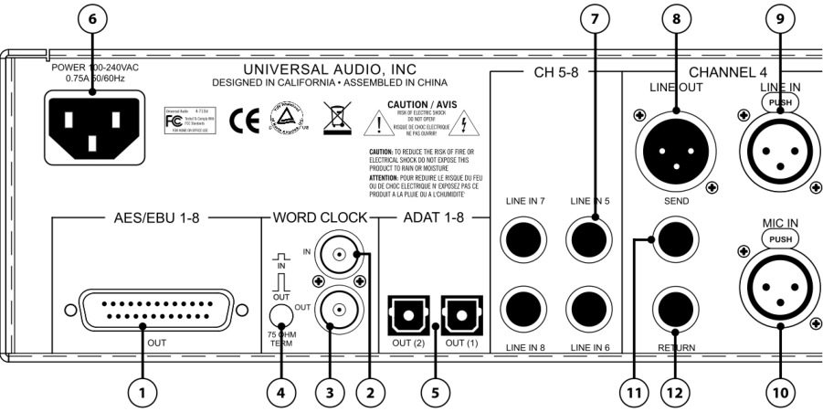

## **Digital Connectors** 

**(1) AES/EBU Out –** All eight channels of the 4-710d’s A/D converters are output in AES/EBU digital format on this standard DB-25 connector. The 4-710d AES/EBU output supports “Single Wire” mode at all available 4-710d sample rates. The AES/EBU output does not support “Dual Wire” mode at sample rates above 96 kHz. 

- _(_  _The DB-25 connector pin-out assignments are detailed in Maintenance on page 34)_ 

 **Digidesign’s 192 I/O supports AES/EBU at sample rates above 96 kHz only in Dual Wire mode. Therefore the 4-710d is incompatible with the 192 I/O when connected via AES/EBU at sample rates of 176.4 kHz and higher.** 

**(2) Word Clock In –** The 4-710d’s internal clock can be synchronized (slaved) to an external master clock. This is accomplished by setting Sample Rate knob _(_  _page 12)_ to “W/C,” connecting the external word clock’s BNC connector to the Word Clock “In” port, and setting the external device to transmit word clock. 

The frequency of the incoming word clock must be within ±3% of any of the supported sample rates. If not, the LOCK indicator will glow red, the word clock OUT will be driven at 48 kHz, and the digital outputs will be driven at 48 kHz and muted. 

External clocking is required when connecting the 4-710d to another digital device, such as a computer audio interface, whose digital clock is set to internal (making that device the “master” clock). All digital devices in a system should be “slaved” to the master clock, otherwise clicks and/or pops could be encountered when recording or monitoring the digital audio stream from the 4-710d. 

_(_  _For more details, please see the “Digital Clocking Primer” section on page 23_ ) 

- **The 4-710d can be synchronized to an external “1x” clock signal only. Superclock,** 

- **overclocking, and subclocking are not supported.** 

14 

**Rear Panel** 

**(3) Word Clock Out –** This BNC connector transmits a standard (1x) word clock. For all settings except W/C, the 4-710d is the clock master and the clock rate sent by this port is specified by the Sample Rate knob _(_  _#17 page 12)_ . The 4-710d will drive the Word Clock to all devices on the chain. 

When the Sample Rate is set to W/C (external word clock), the 4-710d is a word clock slave. If the incoming external word clock is within ±3% of a supported sample rate (44.1 kHz, 48 kHz, 88.2 kHz, 96 kHz, 176.4 kHz, 192 kHz), Word Clock Out will mirror Word Clock In with a slight phase delay (about 40ns). If the incoming external word clock is not within ±3% of a supported sample rate, Word Clock Out will default to 48kHz, and the digital outputs will be muted. 

Word Clock Out does not truly mirror Word Clock In, so Word Clock Out should not be used to daisy chain the Word Clock if the 4-710d is in the middle of the Word Clock chain. The correct method to connect the 4-710d in the middle of a Word Clock chain is to use a T-connector at the 4-710d Word Clock input, and leave the 4-710d Word Clock Out unconnected. 

_(_  _For more details, please see the “Digital Clocking Primer” section on page 23_ ) 

**(4) 75** Ω **Termination –** This pushbutton switch provides internal word clock termination when required. Termination is active when the switch is engaged (depressed). 

Word clock termination should only be used at the receiving end of a word clock cable, or, if the cable is daisy-chained across several units, termination should only be used on the last unit in the chain. For example, if the 4-710d is the last “slave” unit at the end of a clock chain (when the 4-710d’s word clock “Out” port is not used), termination should be active. If the word clock is passed through the 4-710d to another unit (when the 4-710d’s Word Clock Out port is connected, passing the word clock through to another device), termination should be disabled. 

**(5) ADAT Optical Outputs 1 & 2 –** Up to eight channels of the 4-710d’s A/D converters are output in ADAT optical format using these two connectors. The particular 4-710d channels that are output at each port depend upon the current sample rate setting. At sample rates of 44.1kHz and 48kHz, all eight channels are output on both ADAT ports (mirrored). At higher sample rates, industry standard S/MUX™ multiplexing is used to maintain high-resolution transfers. At rates of 88.2kHz and 96kHz, channels 1-4 are output on ADAT port 1, while channels 5-8 are output on port 2. At 176.4kHz and 192kHz, channels 1 and 2 are output on port 1, while channels 3 and 4 are output on port 2 (channels 5-8 cannot be output via ADAT optical at the highest rates). These correlating values are shown in the following table: 

|Sample Rate Knob Setting:|ADAT Port 1 Output channels:|ADAT Port 2 Output channels:|
|---|---|---|
|44.1, 48|1-8|1-8 (mirrored)|
|88.2, 96|1-4|5-8|
|176.4, 192|1-2|3-4|

## **Analog Connectors** 

**(6) AC Power Input –** Connect a standard, detachable IEC power cable (supplied) here. 

**(7) Line Inputs 5 through 8 –** These four line inputs feed directly into channels 5–8 of the 4-710d’s A/D converters. Any ¼” phone plug (balanced TRS or unbalanced TS) carrying a line-level signal can be connected here for output via the AES/EBU or ADAT digital outputs. These inputs are fed into the limiter when the limiter _(_  _#16 on page 12)_ is enabled. 

15 

## **Rear Panel** 

Two 4-710d units can combined using these inputs to obtain eight mic pre channels on one 8-channel digital stream. Simply connect the channel 1–4 line outputs of the first unit to the line inputs 5–8 of the second unit; the digital outputs of the second unit will now contain the combined mic pres of both units! 

Note: There are no analog outputs for line inputs 5–8. 

 **Since the connectors for channels 1–4 are identical, each is only described once below.** 

**(8) Line Output -** A balanced XLR connector that carries the line-level output signal of the 4-710d channel. Note that Pin 2 is positive when the front panel Polarity switch _(_  _#11 on page 11)_ is off (IN ø). Pin 3 is positive when the front panel Polarity switch is engaged (OUT ø). 

**(9) Line Input -** Connect any line-level input signal (coming from a device such as a mixer, DAW, tape machine, or signal processor) into this balanced XLR connector. Pin 2 is wired positive (hot). 

Any ¼” phone plug line-level output can also be connected to the Insert Return jack _(_  _#12 below)_ , and if the Insert switch for the channel _(_  _#12 on page 11)_ is engaged, that signal will be used for the channel input instead of the XLR line input. 

**(10) Mic Input -** Connect a microphone to this standard XLR connector. Pin 2 is wired positive (hot). +48V phantom power is available via the front panel switch. 

**Insert Loop -** An external audio processor (for example, EQ or compressor) can be inserted into the analog path of channels 1-4 using the Insert Loop for additional processing of the channel’s signal using the Send and Return jacks (#11 and #12 below). The Insert Loop can be enabled or disabled using the Insert switch for the channel on the front panel _(_  _#12 on page 11)._ 

 **All Insert connections accept standard ¼” male phone plugs. Balanced TRS and unbalanced TS connectors can be used.** 

**(11) Insert Send –** Connect this jack to the audio input of the external processor. The signal at this jack is post-preamp, so all level and sonic changes made with the associated channel’s front panel controls will be reflected here. The jack is “half-normalled” which means you can extract the channel’s signal from here even if you don’t use the associated Insert Return. This is handy for routing the signal to a monitor mix, tuner, etc. 

The signal at the Insert Send jack is identical to the signal at the XLR Line Output jack. Both channel outputs can be used simultaneously without any signal loading issues. 

**(12) Insert Return–** Connect this jack to the audio output of the external processor. The signal at this jack is only audible if the associated channel’s Insert switch on the front panel _(_  _#12 on page 11)_ is engaged. 

The Insert Return jack can be used as a ¼” line input for the channel in lieu of the XLR input. The Insert Return is used as the input when the channel’s Insert switch _(_  _#12 on page 11)_ is engaged. 

16 

## **Interconnection Diagrams** 

## **Analog-Only Setup** 

This diagram illustrates a typical system using the 4-710d in an analog-only configuration, such as when using it as the front end to a public address system or analog recording device. In this setup, the digital features of the 4-710d are not used. 

The example shows a microphone connected to channel 1, a keyboard connected to the insert return of channel 2 (to use the ¼” line input instead the XLR line input), and a guitar connected to channel 3 using the Hi-Z input. A signal processor (e.g., reverb) is connected via the insert loop of channel 1 for the mic. The insert send of channel 3 (but not the return) is used as a guitar direct output for connection to a tuner. The line outputs are connected to an analog mixer where the input signals are combined before being sent to powered PA speakers. 

## _**Key points for this example:**_ 

- Mic/Line switch for channel 1 is set to “Mic” 

- Insert switches for channels 1 and 2 are set to “In” 

- Line outputs are connected to an analog mixer for monitoring 

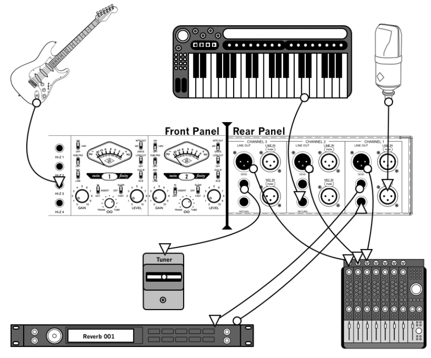

17 

## **Interconnections** 

## **Basic Digital Setup** 

This diagram illustrates a typical system using the 4-710d as the front end of a digital recording setup. A variety of input sources are used, with the 4-710d performing A/D conversion on the inputs. In this setup, the converted input signals are sent to the computer digitally via the ADAT lightpipe, and the software monitoring features of the DAW are used to monitor the 4-710d inputs. 

The example shows microphones connected to channels 1 and 2, guitar and electric bass connected to the H-Z inputs of channels 3 and 4, and a stereo keyboard connected to line inputs 5 and 6. A guitar effects processor is connected via the insert loop of channel 3. The insert send of channel 4 (but not the return) is used as a bass direct output for connection to a tuner. The ADAT output from the 4-710d is connected to the ADAT input of the computer’s audio interface for monitoring and recording. 

## _**Key points for this example:**_ 

- Mic/Line switch for channels 1 and 2 are set to “Mic” 

- Insert switch for channel 3 is set to “In” 

- ADAT output is connected to computer audio interface 

- Internal clock is used (Sample Rate knob is NOT set to “W/C”) 

- Computer is set to synchronize (“slave”) to ADAT external clock 

- Computer DAW is used for software monitoring 

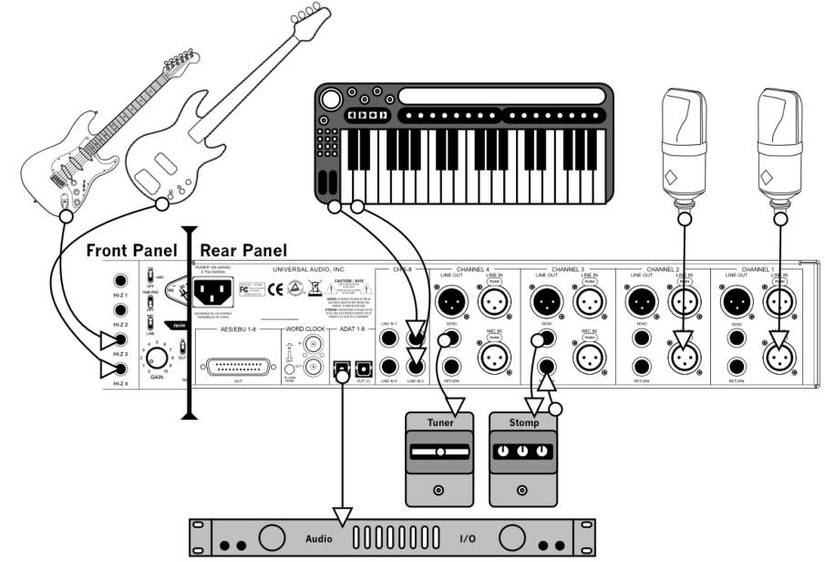

18 

**Interconnections** 

## **Advanced Digital Setup** 

This diagram illustrates a typical system using the 4-710d as the front end of a more complicated digital recording setup. A variety of input sources are used, with the 4-710d performing A/D conversion on the inputs while slaved to an external word clock. In this setup, the converted input signals are sent to the computer digitally via the AES/EBU output, and the software monitoring features of the DAW are used to monitor the 4-710d inputs. 

## _(_  _See the “_ Digital Clocking Primer _” on page 23 for detailed info about synchronization)_ 

The inputs and inserts are connected as in the previous example. The AES/EBU output from the 4-710d is connected to the AES/EBU DB-25 input of the computer’s audio interface, and the word clock output is connected from the audio interface to the 4-710d word clock input. The software monitoring features of the DAW are used to monitor the 4-710d inputs. 

## _**Key points for this example:**_ 

- Mic/Line switch for channels 1 and 2 are set to “Mic” 

- Insert switch for channel 3 is set to “In” 

- AES/EBU output is connected to computer audio interface 

- Word clock out from audio interface is connected to 4-710d word clock input 

- Sample Rate knob is set to “W/C” (external clock synchronization is used) 

- Computer DAW is used for software monitoring 

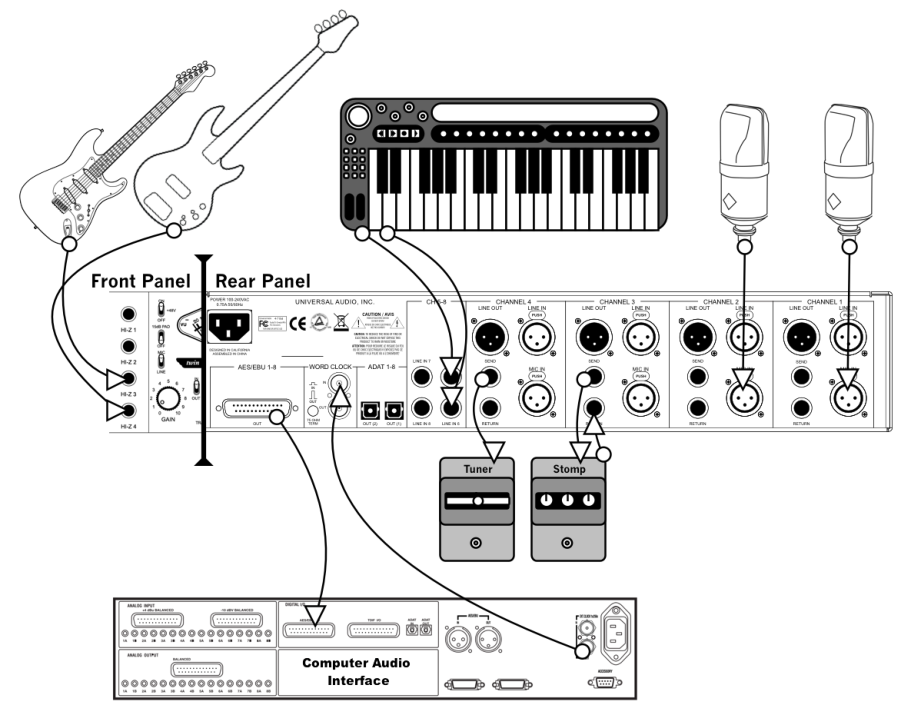

19 

## **Model 4-710d Overview** 

The Universal Audio 4-710d, with its four mic preamps derived from our TEC award-winning UA Model 710 Twin-Finity Mic/Line/Hi-Z Preamplifier, combines our highly revered analog tube and solid state preamplification technology... but with a twist. Its unique phase-aligned Blend controls allow the user to literally dial in the desired sound, from precise ultra-clean solid-state tones to fat tube presence and overdriven crunch, or anywhere in between. Additionally, each of the four mic preamp channels has an 1176-style analog compressor that can be individually enabled for each channel. 

Other features include JFET Direct Inject inputs (which allows for the direct connection of an electric guitar or bass, or any instrument with a magnetic or acoustic transducer pickup); monolithic balanced output stages; +69 dB of gain; +48V power and a -15 dB pad for the mic inputs; polarity inverts and 75 Hz low cut filters; output and “Drive” (input) VU metering; a universal auto-sensing internal power supply that allows for operation at any voltage between 100 and 240VAC; and a 2U, rack-mountable design for studio or stage. 

## _**4-710d Vacuum Tube Preamp**_ 

The 4-710d high voltage (285 VDC) Class-A tube preamp section is based upon both classic guitar amplifier design and classic tube mic preamp design. The circuit utilizes a 12AX7 tube for warmth and roundness and is the second gain stage, located downstream from the Gain control pot. This allows the circuitry to be overdriven by the first stage into anything from mild harmonic distortion to all-out grunge; however, the transition to tube saturation is extremely gentle. The result is the gradual onset of harmonic overdrive—no hard clipping here. As an example, the transition from 1% THD to 4% THD occurs over a 14 dB range. Because of its multiple gain stages, with a Gain control pot between them (as well as a Drive Meter that displays the signal level entering the second stage), a wide variety of tonal possibilities can be dialed in, from gentle warmth to extreme grit. 

## _**4-710d Solid-State Preamp**_ 

The 4-710d solid-state preamp circuitry utilizes Universal Audio’s transimpedance design for precision sound and ultra-low distortion, delivering the highest possible quality of signal from input to output. The term “transimpedance” refers to transistor configurations that employ current feedback to provide gain and distortion immunity without the loss of sonic detail or musicality. Designed for applications requiring the ultimate in transparent amplification with little or no coloration, its razor flat and immensely wide frequency response yields highly accurate results and minimizes artifacts on the way to the recording medium. 

Noise and distortion are kept to near-theoretical minimums so critical signals may be generously amplified without degrading the quality or character of the sound source. Zero-coloration preamps such as these are especially useful for capturing the sound source with its original qualities and character so that later processing may occur with maximum flexibility. There are no transformers or tubes in the preamp signal path, and the 1176-style compressor/limiter (located after the preamplifier) can be switched out as desired to eliminate permanent audio coloration. For many users, the useful characteristics of these devices are preferred at the mix stage—and are commonly implemented using DSP processors and plug-ins with excellent (and reversible) results, such as those found on Universal Audio’s UAD plug-in platform. 

## _**About “Class A”**_ 

Most electronic devices can be designed in such a way as to minimize a particularly unpleasant form of distortion called _crossover distortion._ However, the active components in “Class A” electronic devices such as the 4-710d draw current and work throughout the full signal cycle, thus eliminating crossover distortion altogether. 

20 

**Model 4-710d Overview** 

## _**Phantom Power**_ 

Most modern condenser microphones require +48 volts of DC (Direct Current) power to operate. When delivered over a standard microphone cable (as opposed to coming from a dedicated power supply), this is known as “phantom” power. The 4-710d provides such power when the Phantom switch _(_  _page 11)_ is engaged (placed in the +48V, up position), applying 48 volts to pins 2 and 3 of the rear panel output connector. 

While, in theory, this should result in no harm to the connected microphone even if it does not require phantom power, problems can occur if the shield (pin 1) is broken or when using inexpensive microphones that use the shield as their ground. The application of phantom power can even damage those older ribbon microphones that have their output transformers wired with a grounded center-tap. What’s more, the application of phantom power can often result in a loud pop (transient). For these reasons, we strongly recommend that the Phantom switch be left in its off (down) position when connecting and disconnecting microphones. **Only turn the Phantom switch on if you are certain that the connected microphone requires 48 volts of phantom power** . If in doubt, consult the manufacturer’s owner’s manual for that microphone. 

## _**Polarity Inversion**_ 

The occasional need for polarity inversion (changing the 4-710d front panel switch from IN ø  to OUT ø) is best demonstrated by a common example: recording an open-backed guitar amplifier with two microphones, where one mic is placed close to the front of the amp's speaker and the other near the back of the amp. The waveform display of the first mic will show an upward peak when the speaker pushes outward, placing positive sound pressure on the mic. However, the waveform display of the second mic (the one behind the amp) will show a downward (negative) valley when the speaker pushes forward, because from the back of the amp the speaker moves away from the mic, thus creating negative sound pressure. If these two signals are mixed, the positive waveform from the front mic combines with the negative waveform from the back mic to result in cancellation of much of the amp's sound and a "thinning effect" that is sonically disappointing. However, if the phase of one of the mic signals is inverted, the two signals will combine instead of cancelling, and the result will be much fuller and sonically pleasing. 

Other double-mic applications often requiring phase inversion include piano soundboards, drum heads (one mic on top of the drum and the other below it), and acoustic guitar miking, where one mic is placed close to the soundhole and another further away or behind the guitar. 

## _**Low Cut Filtering**_ 

A common method for optimizing mixes is to apply low-cut filtering whenever possible. Excessive low frequencies from microphones and instruments tend to build up in the mix, creating sonic “mud” that masks musical detail, overloads or fatigues the listener’s ears, and sucks energy from power amps and speakers. It isn’t uncommon to notice meters showing noticeably lower levels after low-cut filtering is applied—a sure sign that such filtering was necessary. In addition, after low-frequency mud is filtered, there is often more room in the mix to bring up important musical elements such as vocals and lead instruments, resulting in a win-win situation (less mud = more music). 

Typically, a low cut filter can be used to remove: vocal "B","P" and other popping sounds; moving-air noise from close-miked vocals, drums, guitars and outdoor weather; instrument body noise from handling guitars, basses, pianos, saxophones, etc; mic-stand vibrations; studio or stage floor vibrations; air-conditioning; electrical hum; and unwanted proximity-effect bass boost. 

21 

**Model 4-710d Overview** 

## _**A/D Conversion**_ 

The 4-710d conveniently provides eight channels of high-quality analog to digital (A/D) conversion with digital output via AES/EBU DB-25 and ADAT optical connectors. No matter what task you give it, the 4-710d can dramatically improve the quality of your audio environment. The 4-710d provides up to eight channels of sterling sound quality for tracking, monitoring and mastering, with full support for today’s higher sample rates of 88.2, 96, 176.4, and 192kHz. These capabilities make the 4-710d an excellent front end for any digital audio workstation. The 4-710d delivers superb audio fidelity thanks to its pristine Class-A analog signal path. 

## _**AES/EBU Digital Output**_ 

All eight channels of the 4-710d’s A/D converters are output in AES/EBU digital format on an industrystandard DB-25 connector. The 4-710d AES/EBU output supports “Single Wire” mode at all available 4-710d sample rates (the AES/EBU output does not support “Dual Wire” mode at sample rates above 96 kHz). 

## _**ADAT Optical Digital Output**_ 

The 4-710d provides two standard ADAT optical digital output ports. At sample rates of 44.1kHz and 48kHz, all eight channels are output on both ADAT ports. At higher sample rates, industry standard S/MUX™ multiplexing is used to maintain high-resolution transfers. 

## _**Word Clock I/O**_ 

Word clock input and output is provided for synchronizing (slaving) with external hardware devices. Connections are via standard 75-ohm BNC connectors. Switchable 75-ohm termination is available. 

## _**Digital Metering**_ 

Digital output level metering for A/D conversion is provided by eight 2–segment LED displays. Each channel has its own output indicator. 

_(_  _Digital meter behavior is described in #18 on page 13)_ 

22 

## **Digital Clocking Primer** 

Digital clocking is a complicated issue, with a number of important aspects that are often not very well understood. 

First and foremost, a digital clock is used to maintain synchronization between different digital devices. There are two primary purposes for clock synchronization: 

1. Digital Conversion. Analog-to-digital (A/D) conversion and digital-to-analog (D/A) conversion need extremely accurate clocking in order to correctly process the digital data. A low-quality clock can degrade the signal in many ways, including loss of transparency, clarity, imaging and transient response, as well as increased noise and distortion. 

2. Digital Transmission. All digital devices need accurate clocking in order to properly transfer digital data between interconnected devices. A low-quality clock can cause data reception errors, which add distortion and noise, and if the clock isn’t synchronized correctly, samples may be dropped or repeated, resulting in audible clicks or dropouts. 

Clock quality is defined two ways: First, the sample rate must match the signal. This is referred to as “sample rate synchronization.” Second, the clock signal must be stable over both short- and long-term clocking intervals. “Jitter” refers to short-term clock accuracy, and “stability” or “drift” refers to longterm clock accuracy. These terms are discussed in more detail below. 

Sample rate synchronization is required for proper digital transmission, and is relatively easy to maintain. Basically, there must be one and only one “clock master” for all interconnected digital devices. This is done by setting one device to “master” mode (where it synchronizes to its internal clock and transmits that clock signal) and setting every other device to “slave” mode (where it receives and synchronizes to external clock), with the appropriate clock signal routed between the master and slave devices. Keep in mind that any device, whether it’s the clock master or a slave, can send or receive data once everything is synchronized correctly. 

When doing digital conversion, it’s best to have the converter serve as the clock master. For example, if you’re recording, clock everything off the A/D converter. Likewise, if you’re mixing, clock everything off the D/A converter. If you’re running multiple converters, use the device with the best quality clock as master. 

For all-digital transfers, e.g., a digital transfer from one DAW or storage device to another, clock synchronization is maintained by simply setting up the proper master-slave relationship between devices. Digital transfers can be affected by clock jitter, but not in the same way clock jitter affects analog conversion. This is a widely misunderstood concept we’ll discuss in detail below. 

Clock jitter is short-term variations in the edges of a clock signal, as opposed to clock drift, which is long-term variations in the clock rate. A clock could be very stable over the long term, but still have jitter, and vice versa. Timing variations are caused by noise and/or interference. If the noise/interference is a high-frequency signal, the result is jitter, and if the noise/interference is a lowfrequency signal, the result is drift. As an analogy, a car with an out of balance wheel may drive straight, but you’ll get lots of vibration (jitter); conversely, a car with a loose steering wheel might have a smooth ride, but it will drift all over the road. 

Clock drift affects long-term synchronization, like sound to picture, and can introduce slight pitch variations in the audio. Usually however, the drift is so slow that these pitch variations are only tiny fractions of a cent, and thus unnoticeable. 

23 

## **Digital Clocking Primer** 

Clock jitter affects digital transmission and digital conversion differently, as follows: 

- Clock jitter in digital transmission can be caused by a bad source clock, inferior cabling or improper cable termination, and/or signal-induced noise (called “pattern-jitter” or “symbol-jitter.”) Digital signal formats like AES/EBU, S/PDIF, and ADAT all embed a clock in the digital signal so the receiving device can synchronize to the transmitted data bits correctly. The clock used for data recovery is extracted from the signal using a clock synchronization circuit called a phase-lockedloop (PLL). This data-recovery PLL must be designed to respond very quickly to attenuate highfrequency jitter and avoid bit errors during reception. This clock from the data-recovery PLL cannot be used to generate the clocks used for digital conversion without further clock conditioning! This is a very common design flaw in most low- and mid-range digital converters. 

- Clock jitter in digital conversion is what most people refer to when they discuss jitter. It’s easily observed in a digital signal by looking at its spectrum in the frequency domain. A jittery signal will have “side-lobes” around each frequency and/or spurious tones at random, inharmonic frequencies. Usually, the jitter will be worse with higher signal frequencies. You can test your converters by sampling a high-quality 10kHz sine wave, and viewing it in the frequency domain (available with any good wave editing software package). 

All modern over-sampling digital converters require a clock (called “m-clock”) that is many times (typically several MHz) higher than the sample clock. M-clock is easy to generate when the converter is the clock master, but quite difficult to generate correctly when the converter needs to sync to an external clock. 

External clock typically comes from a dedicated word clock input, or is extracted from the incoming digital AES/EBU, S/PDIF or ADAT signal. Word clock cannot be used by the converters until it is multiplied up to the m-clock rate. This requires a PLL or other frequency multiplier circuit which will either be cheap and jittery, or expensive and clean, depending on who makes the converter. As we said earlier, the clock recovered from the digital inputs is unsuitable for use as the converter’s m-clock, but because it’s conveniently at the same frequency, many designers don’t bother cleaning up this signal. 

Since the clock recovery, clock multiplier, and clock conditioning circuitry define the jitter for analog conversion, no external clock source can clean up the jitter introduced by these circuits, regardless of how perfect the external source clock is. The best they can do is avoid making it any worse, but this is hardly worth the cost: It’s much better (and less expensive) to get a good converter than it is to try and fix a bad one with an expensive master clock. The only reason to spend money on a high-quality master clock is to ensure that multiple devices are synchronized correctly. This is essential for working with audio for film/video, or when synchronizing multiple high-quality converters. A poor master clock can also affect imaging and clarity in a multi-track environment. 

The 4-710d provides high-quality analog to digital conversion for recording and/or playback. With its pristine audio path, high-quality clocking, and simple front panel controls, it makes a great master or slave audio interface for every digital studio, and thus provides a very cost effective way to improve overall sound quality. 

- **In order for the 4-710d to detect and lock to a valid external word clock, the frequency of the incoming word clock must be within ±3% of any of the supported sample rates (44.1, 48, 88.2, 96, 176.4, or 192 kHz). If the frequency of the incoming work clock is not within ±3% of a supported sample rate, the LOCK indicator will glow red, the WORD CLOCK OUT will be driven at 48 kHz, and the digital outputs will be driven at 48 kHz and muted.** 

24 

## **Insider’s Secrets** 

## _**The Best of Both Worlds**_ 

There’s a reason why tube preamplifiers have long been favored by audio engineers (especially in this age of digital recording): they impart a warmth and richness that makes most sounds larger than life. However, there is no denying that tube preamps also tend to color the incoming signal somewhat, albeit in a way which most listeners find pleasant and desirable. 

On the other hand, the recording of voice and acoustic instruments sometimes requires precise signal handling with meticulous attention to detail, definition and accuracy. Applications such as classical or jazz recording demand faithful transfer of performances exactly as they happen, without coloration, processing, noise or distortion, and that is where solid-state preamplifiers shine. Plus, by capturing the sound as it is, you can leave sound sculpting and “coloration” decisions until later, during the mixing stage. 

So the question is, which kind of preamp to use? Up until now, the only solution has been to have an arsenal of both kinds at your disposal, but with the 4-710d, that’s no longer necessary, since it provides both designs in one box, as well as a unique Blend control that allows the user to dial in the precise contribution of each preamp to the overall sound. As a good starting point, we recommend that you set the Blend control to the desired degree of tube coloration, then back it off slightly (towards the TRANS position) to dial in the precise amount of “snap” and detail you want in your sound. 

## _**Drive Metering**_ 

Because it shares lineage with vintage guitar amplifier designs, the 4-710d’s tube preamplifier can contribute precise amounts of even-order harmonic distortion (the kind the ear enjoys listening to) to your signal, ranging from pleasant amounts of rasp to all-out grunge. The Drive meter function can be a great tool in helping to decide how high to raise the Gain control because it indicates how much tube saturation is going to be present in the output signal. It does this by monitoring the signal that is driving the tube. If what you want is crystal clear tube tone, then the meter will be bouncing around near the low end of its range. If what you are after is a ton of tube dirt, then drive the meter into the red; there is nothing wrong with either extreme. Once you use the Drive function a few times, you will develop a feel for it, and should be able to dial in the desired tube character quickly and easily. 

When in Drive mode, the 4-710d meter is calibrated so that 0VU is equal to 1.2% THD on a 1KHz sine wave. However, measured distortion levels can be misleading because they are so source and style dependent. 2% THD on a sine wave is a fair amount of distortion and will be apparent to even the nonmusically inclined. On a vocal track, however, that same 2% THD sounds like some really nice tube warmth. On an overdriven guitar, 2% is barely even audible. The most important thing to remember when using the Drive function is that there is no “wrong” meter reading, only wrong tones for a particular track. So use the meter as guide, not as a pass/fail test. Do what feels and sounds right, and don’t be afraid to push it. 

## _**Vocals, Vocals, Vocals**_ 

Just as certain microphones work best with certain vocalists, so too do certain mic preamps. The presence of not just one, but two completely discrete preamps in the 4-710d mean that it will work wonders with just about any microphone... and with just about any vocalist. 

The crisp precision of a condenser microphone, for example, can be matched perfectly by the uncolored accuracy of the 4-710d’s transimpedance solid-state preamp... or you can instead opt to use the tube side to “warm up” the tone. Better yet, use the Blend control to dial in exactly the right amount of both preamps to match both the microphone’s frequency characteristics and the timbral quality of the vocalist. And if you’re using the already warm sound of a tube microphone for vocals, try 

25 

## **Insider’s Secrets** 

complementing it with the 4-710d’s solid-state preamp (or use the Blend control to dial in a combination of the two that favors the contribution of the TRANS side). 

## _**Electric Guitar and Bass**_ 

There’s something very special about the mix of tube preamplification and electric guitar and bass, which is why tube amps are so prevalent in that world. Cranking up the 4-710d's Gain control will impart anything from a slight bark to total grunge. Set the Blend control all the way to TRANS for that overloaded console effect, or all the way to TUBE to emulate the grittiness and bite of an overdriven guitar amp...  or anywhere in-between for a custom guitar sound perfectly crafted to the context of the song. 

Electric bass players may want to set the Blend control so that the solid-state amp is slightly favored (try a 10 o’clock position to start), allowing you to take advantage of the precision of the transimpedance preamp stage, combined with just a touch of tube warmth. For acoustic bass, try dialing in just a touch more tube preamp. 

## _**Acoustic Guitar**_ 

The 4-710d is also a powerful tool for the recording of acoustic guitar. Try pairing it with a smalldiaphragm omnidirectional mic and then set the Blend to about the 2 o’clock position (thus slightly favoring the tube preamp) for a sound that is both pristine and warm. 

## _**Horns and Reeds**_ 

The incredible detail provided by the 4-710d’s solid-state transimpedance preamp make it a perfect match for horn and reed instruments.  Dial in just a touch of the tube preamp (set the Blend control to approximately 9 o’clock) to add a touch of tube warmth, and you’ve got a sound that will work in just about any musical context. 

## _**Drums**_ 

The huge range of sonic possibilities offered by the 4-710d make it an invaluable companion for any kind of drum miking. The excellent transient response of its solid-state transimpedance preamp serves to enhance overhead and ambient mics picking up the crispness of cymbals, while the roundness of its tube preamp adds fullness to snare and tom mics. Again, the best solution is usually a blend of the two, depending upon the specific mics being used and the mic positioning. Be sure also to experiment with the 4-710d polarity control whenever multiple mics are being used! 

## _**Improving the Sound of Your Microphone**_ 

Incredible but true: in some cases, the 4-710d can make an inexpensive microphone sound like an expensive one. Even an inexpensive stage dynamic microphone can come to life when routed through one or both 4-710d preamps, adding richness and airiness to the sound without adding undesirable graininess or coloration. 

## _**Live Applications**_ 

Although the 4-710d was designed primarily for use in recording, it can also serve as a powerful addition to a live sound rig, especially in FOH (Front Of House) applications. Because its tube preamp section is based on vintage guitar amp design, it can even be used as an onstage preamp; just plug your instrument directly into its Hi-Z input and then route the 4-710d output to a power amp and/or FOH console input. 

26 

## **History of the Model 4-710d** 

Like the microphone, preamplifiers come in all shapes, sizes and colors. And, like a microphone, the preamp is one of many devices that may impart a sound to a recording... or may conversely attempt to avoid coloration. In this way, mics and preamps can be compared to the various paints, brushes and surfaces a visual artist may choose from, or to the various films, lenses and filters the photographer uses in his process. In the same way that a photographer might choose a certain filter to reject a certain type of light, a recording engineer may do the same with a mic to tailor out a certain frequency range. The photographer may choose a particular film to convey a certain atmosphere, and a recordist might choose a particular preamp for the very same reason. The critical decision is whether or not the given device imparts the _correct_ character (or lack thereof) for a given recording. The best thing about choosing the right mic and preamp for the job is that when the session is going great and the music is truly happening, the quality, character and nuanced detail of the engineer’s tools really begin to shine. 

Because it is the component which transforms the very low-level signal from a microphone into a useable signal—a critical transition of energy—the quality of the preamplifier plays a huge role in shaping the final signal. And ultimately, a great mic preamp is all about great design. 

Throughout the half-century or so of modern recording technology, a number of preamp designs have been introduced, all with their own strengths and weaknesses. Early preamplifiers relied on vacuum tubes to boost signal. One of the most popular preamps of the era was the one inside the 610 console built by Bill Putnam Sr. in 1960 for his United Recording facility in Hollywood. As was the case with most of Putnam’s innovations, the 610 was the pragmatic solution for a recurring problem in the studios of the era: how to fix a console without interrupting a session. The traditional console of the time was a one-piece control surface with all components connected via patch cords. If a problem occurred, the session came to a halt while the console was dismantled. Putnam’s answer was to build a mic-pre with gain control, echo send and adjustable EQ on a single modular chassis, using a printed circuit board. Though modular consoles are commonplace today, the 610 was quite a breakthrough at the time. 

While the 610 was designed for practical reasons, it was its sound that made it popular with the recording artists who frequented Putnam’s studios in the 1960s. The unique character of its microphone preamplifier in particular made it a favorite of legendary engineers like Bruce Botnick, Bones Howe, Lee Hershberg, and Bruce Swedien, who has described the character of the preamp as “clear and open” and “very musical.” The 610 console was used in hundreds of studio sessions for internationally renowned artists such as Frank Sinatra, Ray Charles, Sarah Vaughan, the Mamas and Papas, the Fifth Dimension, Herb Alpert, and Sergio Mendes. The Beach Boys’ milestone _Pet Sounds_ album was also recorded using a 610. 

But by the mid 1960’s, tiny solid-state components called transistors, followed by advanced technological innovations such as FETs (Field Effect Transistors), op amps (operational amplifiers), and ICs (Integrated Circuits), had become ubiquitous and inexpensive to manufacture. These all did the job of vacuum tubes, but with greater efficiency and reliability, less heat, much smaller size, and much longer lifetimes. For these reasons, audio circuit designers such as Bill Putnam began creating preamplifiers using transistors instead of tubes. One of the first of these was the Universal Audio 1108. This was an exquisitely designed, widely used single-stage modular preamp made for modular recording consoles. It featured input and output transformers, with connections for modular equalizers such as the UA 508 EQ. This amp design became the basis for the enormously popular 1176 limiter, which utilized the same output transformer. Interestingly, the 1108 has probably been used on many more classic recordings than the 610, due to its broad popularity. 

27 

## **History of the Model 4-710d** 

Throughout the years, solid-state preamplifiers have evolved into ever more sophisticated designs (such as the Precision mic preamp utilized in the Universal Audio SOLO/110 and multichannel 4110/8110, and the transimpedance design first unveiled in the Universal Audio DCS Remote Preamp). Until fairly recently, solid-state models were the norm in recording studios, but somewhere around the explosion of digital recording, tube preamps suddenly became fashionable again, serving for some as the antidote to so-called “cold” DAWs. Despite the fact that technology has vastly improved the quality of even the least expensive converters and that higher sample rates and bit rates are commonly being used, many still find something unforgiving about the medium. But there is more than one way to skin the digital cat, and nowadays engineers reach for those tools that inject the correct character back into what some call an overly critical medium. 

The key is knowing _which_ tools to reach for... and, in the case of preamplifiers, whether to opt for the “warmth” of tubes or the precision of solid-state. The Universal Audio 4-710d allows the recordist to literally enjoy the best of both worlds. Not only does it combine two preamplifiers per channel—one vacuum tube and one solid-state—in a single box, its unique Blend control allows the engineer to dial in precisely the desired amount of tone from each. The 4-710d is truly a cutting-edge product for its time. 

In 2000, Bill Putnam Sr. was awarded a Technical Grammy for his multiple contributions to the recording industry. Highly regarded as a recording engineer, studio designer/operator and inventor, Putnam was considered a favorite of musical icons Frank Sinatra, Nat King Cole, Ray Charles, Duke Ellington, Ella Fitzgerald and many, many more. The studios he designed and operated were known for their sound and his innovations were a reflection of his desire to continually push the envelope. Universal Recording in Chicago, as well as Ocean Way and Cello Studios (now EASTWEST) in Los Angeles all preserve elements of his room designs. 

The companies that Putnam started—Universal Audio, Studio Electronics, and UREI—built products that are still in regular use decades after their development. In 1999, his sons Bill Jr. and James Putnam re-launched Universal Audio and merged with Kind of Loud technologies—a leading audio software company—with two goals in mind: to reproduce classic analog recording equipment designed by their father and his colleagues, and to design new recording tools in the spirit of vintage analog technology. Today Universal Audio is fulfilling that goal, bridging the worlds of vintage analog and DSP technology in a creative atmosphere where musicians, audio engineers, analog designers and DSP engineers intermingle and exchange ideas. Every project taken on by the UA team is driven by its historical roots and a desire to wed classic analog technology with the demands of the modern digital studio. 

28 

## **Glossary of Terms** 

**A/D** - An acronym for “Analog to Digital,” which refers to the conversion of analog signal to digital. 

**ADAT** - An acronym for “Alesis Digital Audio Tape.” ADAT was the name given to the Alesis-branded products of the 1990s which recorded eight tracks of digital audio on a standard S-VHS video cassette. The term now generally refers to the 8-channel optical connection that is used in a wide range of digital products from many manufacturers. 

**AES** - (sometimes written as “AES/EBU”) The name of a digital audio transfer standard jointly developed by the American-based Audio Engineering Society and the European Broadcast Union. Designed to carry two channels of 16-, 20- or, 24-bit digital audio at sampling rates of up to 192kHz, the most common AES physical interconnect utilizes a 3-conductor 110 ohm twisted pair cable, terminating at standard XLR connectors. (See “Dual Wire” and “Single Wire”) 

**Analog** - Literally, an analog is a replica or representation of something. In audio signals, changes in voltage are used to represent changes in acoustic sound pressure. Note that analog audio is a continuous representation, as opposed to the quantized, or discrete “stepped” representation created by digital devices. (See “Digital”) 

**Balanced** - Audio cabling that uses two twisted conductors enclosed in a single shield, thus allowing relatively long cable runs with minimal signal loss and reduced induced noise such as hum. 

**Bit** - A contraction of the words “binary” and “digit,” a bit is a number used in a digital system, and it can have only one of two values: 0 or 1. The number of bits in each sample determines the theoretical maximum dynamic range of the audio data, regardless of sample rate being used. Each additional bit adds approximately 6 dB to the dynamic range of the audio. In addition, the use of more bits helps capture quieter signal more accurately. (See “Sample” and “Dynamic range”) 

**Bit Depth** - (See “Bit Resolution”) 

**Bit Resolution** - Used interchangeably with “bit depth,” this is a term used to describe the number of bits used in a digital recording. The 4-710d converts analog audio and transmits digital audio with a resolution of 24 bits (thus yielding a theoretical dynamic range of approximately 145 dB), the highest resolution in common use today (dithered 16-bit output is also available). (See “Dynamic Range”) 

**BNC** - A bayonet-type coaxial connector often found on video and digital audio equipment, as well as on test devices like oscilloscopes. In digital audio equipment, BNC connectors are normally used to carry word clock signals between devices. BNC connectors are named for their type (Bayonet), and their inventors, Paul Neil and Carl Concelman. (See “Word Clock”) 

**Class A** - A design technique used in electronic devices such that their active components are drawing current and working throughout the full signal cycle, thus yielding a more linear response. This increased linearity results in fewer harmonics generated, hence lower distortion in the output signal. 

**Condenser Microphone** - A microphone design that utilizes an electrically charged thin conductive diaphragm stretched close to a metal disk called a backplate. Incoming sound pressure causes the diaphragm to vibrate, in turn causing the capacitance to vary in a like manner, which causes a variance in its output voltage. Condenser microphones tend to have excellent transient response but require an external voltage source, most often in the form of 48 volts of “phantom power.” 

**Clock** - In digital audio or video, a clock serves as a timing reference for a system. Every digital device must carry out specified numbers of operations per period of time and at a consistent speed in order for the device to work properly. Digital audio devices such as the 4-710d normally have an internal clock, and are also capable of locking to external clock routed from other digital devices. In order to 

29 

## **Glossary of Terms** 

avoid signal degradation or undesirable audible artifacts, it is absolutely critical that all digital devices that are interconnected in a system be locked to the same clock. 

**Clock Distribution** – Refers to the process of routing a master clock signal (either from an internal clock or an external source) to multiple devices by means of multiple outputs, thus removing the need to cascade the clock through external devices, which can degrade the signal. 

**D/A** - An acronym for “Digital to Analog,” which refers to the conversion of a digital signal to analog. The 4-710d does not perform D/A conversion. 

**DAW** - An acronym for “Digital Audio Workstation” – that is, any device that can record, play back, edit, and process digital audio. 

**dB** - Short for “decibel,” a logarithmic unit of measure used to determine, among other things, power ratios, voltage gain, and sound pressure levels. 

**dBm** - Short for “decibels as referenced to milliwatt,” dissipated in a standard load of 600 ohms. 1 dBm into 600 ohms results in 0.775 volts RMS. 

**dBV** - Short for “decibels as referenced to voltage,” without regard for impedance; thus, one volt equals one dBV. 

**DI** - Short for “Direct Inject,” a recording technique whereby the signal from a high-impedance instrument such as electric guitar or bass is routed to a mixer or tape recorder input by means of a “DI box,” which raises the signal to the correct voltage level at the right impedance. 

**Digital** - Information or data that is stored or communicated as a series of bits (binary digits, with values of 0 or 1). Digital audio refers to the representation of varying sound pressure levels by means of a series of numbers. (See “Analog” and “Bit”) 

**Dither** - Minute amounts of shaped noise added intentionally to a digital recording in order to reduce a form of distortion known as “quantization noise” and aid in low level sound resolution. The 4-710d performs dithering when set to 16-bit mode. 

**DSP** - Short for “digital signal processing.” 

**Dual Wire** - (sometimes referred to as “Double Wide”) A revised format of AES/EBU data transfer that accommodates sample rates of 176.4 kHz or 192 kHz. The Dual Wire standard breaks the digital audio up into two different data streams and transmits them over separate connectors and cables. Dual Wire mode requires two AES “channels” to transmit a stereo pair of audio channels. Most modern high resolution digital audio equipment utilizes the newer Single Wire mode, but some legacy devices (such as some Pro Tools systems) use Dual Wire mode. (See “AES,” “High resolution,” “kHz,” and “Single Wire”) 

**Dynamic Microphone** - A type of microphone that generates signal with the use of a very thin, light diaphragm which moves in response to sound pressure. That motion in turn causes a voice coil which is suspended in a magnetic field to move, generating a small electric current. Dynamic mics are generally less expensive than condenser or ribbon mics and do not require external power to operate. 

**Dynamic Range** - The difference between the loudest sections of a piece of music and the softest ones. The dynamic range of human hearing (that is, the difference between the very softest passages we can discern and the very loudest ones we can tolerate) is considered to be approximately 120 dB. Modern digital audio devices such as the 4-710d are able to match (or even exceed) that range. (See “Bit resolution”) 

**EQ** - Short for “Equalization,” a circuit that allows selected frequency areas in an audio signal to be cut or boosted. 

30 

**Glossary of Terms** 

**External Clock** - A clock signal derived from an external source. (See “Clock”) 

**FET** - Short for “Field Effect Transistor” which is a type of transistor that relies on an electric field to control the shape, and hence the conductivity, of a “channel” in a semiconductor material. 

**Front End** - Refers to a device that provides analog and digital input/output (I/O) to a digital audio workstation (DAW). (See “DAW”) 

**Hi-Z** - Short for “High Impedance.” The 4-710d’s Hi-Z input allows direct connection of an instrument such as electric guitar or bass via a standard unbalanced 1/4" jack. 

**High Resolution** - In digital audio, refers to 24-bit signals at sampling rates of 88.2kHz or higher. 

**Hz** - Short for “Hertz,” a unit of measurement describing a single analog audio cycle (or digital sample) per second. 

**Impedance** - A description of a circuit’s resistance to a signal, as measured in ohms or thousands of ohms (K ohms). The symbol for ohm is Ω. 

**Internal Clock** - A clock signal derived from onboard circuitry. (See “Clock”) 

**I/O** - Short for “input/output.” 

**kHz** - Short for “kiloHertz” (a thousand Hertz), a unit of measurement describing a thousand analog audio cycles (or digital samples) per second. (See “Hz”) 

**JFET** - Abbreviation for Junction Field Effect Transistor, a specific type of FET which has some similarities to traditional bipolar transistor designs that can make it more appropriate for use in some audio circuit designs. (See “FET”) 

**Jitter** - Refers to short-term variations in the edges of a clock signal, caused by a bad source clock, inferior cabling or improper cable termination, and/or signal-induced noise. A jittery signal will contain spurious tones at random, inharmonic frequencies. Usually, the jitter will be worse with higher signal frequencies. The internal digital clock of the 4-710d was designed for extreme stability and jitter-free operation, and its onboard phase aligned clock conditioner circuitry removes jitter from external sources, so conversion quality is unaffected by clock source. 

**Light Pipe** – A digital connection made with optical cable. This was a phrase coined by Alesis to make a distinction between the proprietary 8-channel optical network used in their ADAT products and standard stereo optical connectors used on CD players and other consumer products. 

**Line Level** - Refers to the voltages used by audio devices such as mixers, signal processors, tape recorders, and DAWs. Professional audio systems typically utilize line level signals of +4 dBm (which translates to 1.23 volts), while consumer and semiprofessional audio equipment typically utilize line level signals of -10 dBV (which translates to 0.316 volts). 

**Low Cut Filter** - An equalizer circuit that cuts signal below a particular frequency. 

**Mic Level** - Refers to the very low level signal output from microphones, typically around 2 millivolts (2 thousandths of a volt). 

**Mic Preamp** - The output level of microphones is very low and therefore requires specially designed mic preamplifiers to raise (amplify) their level to that needed by a mixing console, tape recorder, or digital audio workstation (DAW). 

**Native** - Refers to computer-based digital audio recording software controlled by the computer’s onboard processor, as opposed to software that requires external hardware to run. 

31 

## **Glossary of Terms** 

**Patch Bay** - A passive, central routing station for audio signals. In most recording studios, the line-level inputs and outputs of all devices are connected to a patch bay, making it an easy matter to re-route signal with the use of patch cords. 

**Patch Cord** - A short audio cable with connectors on each end, typically used to interconnect components wired to a patch bay. 

**Pro Tools** - A popular and widely used computer-based digital audio workstation developed and manufactured by Digidesign. The most current system, Pro Tools | HD, provides hardware and software that supports multiple channels of high resolution digital audio, at sampling rates of up to 192kHz. (See “Sample rate”) 

**Quantization Noise** - A form of digital distortion caused by mathematical rounding-off errors in the analog to digital conversion process. Quantization noise can be reduced dramatically by dithering the digital signal. (See “Dither”) 

**Ribbon Microphone** - A type of microphone that works by loosely suspending a small element (usually a corrugated strip of metal) in a strong magnetic field. This "ribbon" is moved by the motion of air molecules and in doing so it cuts across the magnetic lines of flux, causing an electrical signal to be generated. Ribbon microphones tend to be delicate and somewhat expensive, but often have very flat frequency response. 

**Sample** - A digital “snapshot” of the amplitude of a sound at a single instant in time. The number of samples taken per second is determined by the device’s sample rate. (See “Sample rate”) 

**Sample Rate** - The number of samples per second. In digital audio, there are six commonly used sample rates: 44.1 kHz (used by audio CDs), 48 kHz, 88.2 kHz (2 x 44.1 kHz), 96 kHz (2 x 48 kHz, used by DVDs), 176.4 kHz (4 x 44.1 kHz), and 192 kHz (4 x 48 kHz). The higher the sample rate, the greater the frequency response of the resulting signal; however, higher sample rates require more storage space. (See “kHz”) 

**Sample Rate Conversion** - The process of altering a digital signal’s sample rate to a different sample rate. The 4-710d does not perform sample rate conversion. 

**Single Wire** - (sometimes referred to as “Double Fast”) The newest revised format of AES/EBU data transfer that accommodates sample rates of 176.4kHz or 192kHz. The Single Wire standard is similar in concept to Dual Wire, but instead of using two separate AES cables and connectors, it simply increases the data rate and sends the signal over one port. The 4-710d supports both Single Wire mode for the transmission and reception of high resolution AES audio. (See “AES,” “Dual Wire,” and “high resolution”) 

**S/MUX** - (sometimes written as “S-MUX”) An acronym for Sample Multiplexing. SMUX is a method for transmitting two channels of high sample rate (88.2, 96, 176.4, or 192kHz) 24-bit digital audio over a legacy optical “light-pipe” ADAT connection, which was originally designed to carry eight channels of 16-, 20- or 24-bit audio at 44.1kHz or 48kHz sampling rate. (See “ADAT” and “Light pipe”) 

**SPDIF** - (sometimes written as “S/PDIF”) An acronym for “Sony/Philips Digital Interface Format,” a digital audio transfer standard largely based on the AES/EBU standard. Designed to carry two channels of 16-, 20- or, 24-bit digital audio at sampling rates of up to 192kHz, the most common SPDIF physical interconnect utilizes unbalanced, 75 ohm video-type coaxial cables terminating at phono (RCA-type) connectors. (See “AES”) 

**Superclock** - A proprietary format used by some early Pro Tools systems to distribute clock signal running at 256x the system’s sample rate, thus matching the internal timing resolution of the software. (See “Clock” and “Pro Tools”) 

32 

**Glossary of Terms** 

**Transcoding** - Converting one type of digital signal to another (i.e, from AES to SPDIF, or from ADAT to AES). 

**Transformer** - An electronic component consisting of two or more coils of wire wound on a common core of magnetically permeable material. Audio transformers operate on audible signal and are designed to step voltages up and down and to send signal between microphones and line-level devices such as mixing consoles, recorders, and DAWs. 

**Transient** - A relatively high volume pitchless sound impulse of extremely brief duration, such as a pop. Consonants in singing and speech, and the attacks of musical instruments (particularly percussive instruments), are examples of transients. 

**Transimpedance Preamplifier** - A transformerless solid-state preamplifier utilizing a transistor configuration that employs current feedback for ultra-low distortion and the highest possible quality of signal from input to output. The transimpedance design allows audio from 4 Hz to 150 kHz to pass through without altering the phase relationships between fundamental frequencies and overtones. Noise and distortion are kept to near-theoretical minimums so critical signals may be generously amplified without degrading the quality or character of the sound source. 

**Word Clock** - A dedicated clock signal based on the transmitting device’s sample rate or the speed with which sample words are sent over a digital connection.  (See “Clock”) 

**XLR** - A standard three-pin connector used by many audio devices, with pin 1 typically connected to the shield of the cabling, thus providing ground. Pins 2 and 3 are used to carry audio signal, normally in a balanced (out of phase) configuration. 

33 

## **Maintenance** 

 **The 4-710d contains no user-serviceable parts. Repair should be performed only by qualified service personnel. Contact Universal Audio for service information.** 

## **Calibration** 

The 4-710d is internally calibrated at the factory. Calibration should never be required and no user adjustments are available. 

## **Fuse** 

There is no user accessible fuse for the 4-710d. It contains an internal power supply circuit board with its own fuse. 

## **Voltage Select** 

The 4-710d contains a universal auto-sensing, filtered, multi-stage regulated power supply which supports 100-240VAC and 50-60Hz power for trouble-free operation worldwide. No switch setting is required when changing from 115 to 230 volt use or vice versa. 

## **Service** 

If your 4-710d should ever require service, please see “Service & Support” on page 43. 

## **AES/EBU DB-25 Connector Pinouts** 

The table below details the signals present on the DB-25 connector pins for the AES-EBU outputs. 

|**CHANNEL DESIGNATION**|**HOT (+)**|**COLD (–)**|**GROUND (shield)**|
|---|---|---|---|
|_Channels 1–2 Receive*_|_24_|_12_|_25_|
|_Channels 3–4 Receive*_|_10_|_23_|_11_|
|_Channels 5–6 Receive*_|_21_|_9_|_22_|
|_Channels 7–8 Receive*_|_7_|_20_|_8_|
|**Channels 1–2 Transmit**|**18**|**6**|**19**|
|**Channels 3–4 Transmit**|**4**|**17**|**5**|
|**Channels 5–6 Transmit**|**15**|**3**|**16**|
|**Channels 7–8 Transmit**|**1**|**14**|**2**|

_* Since the 4-710d does not perform D/A conversion, the receive pins for channels 1–8 are inactive._ 

34 

## **Session Recall Sheet** 

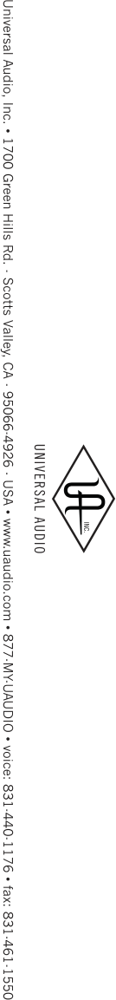

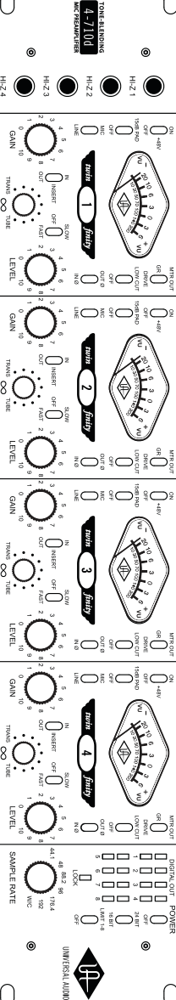

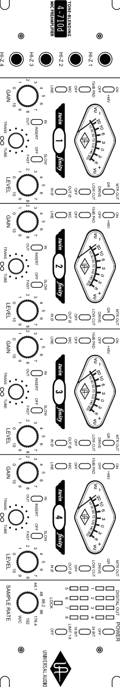

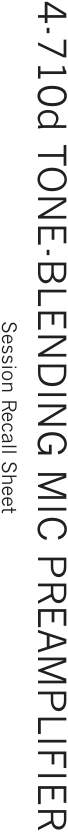

**----- Start of picture text -----** 
Session Recall Sheet 4-710d TONE-BLENDING MIC PREAMPLIFIER **----- End of picture text -----** 

35 

## **Block Diagram** 

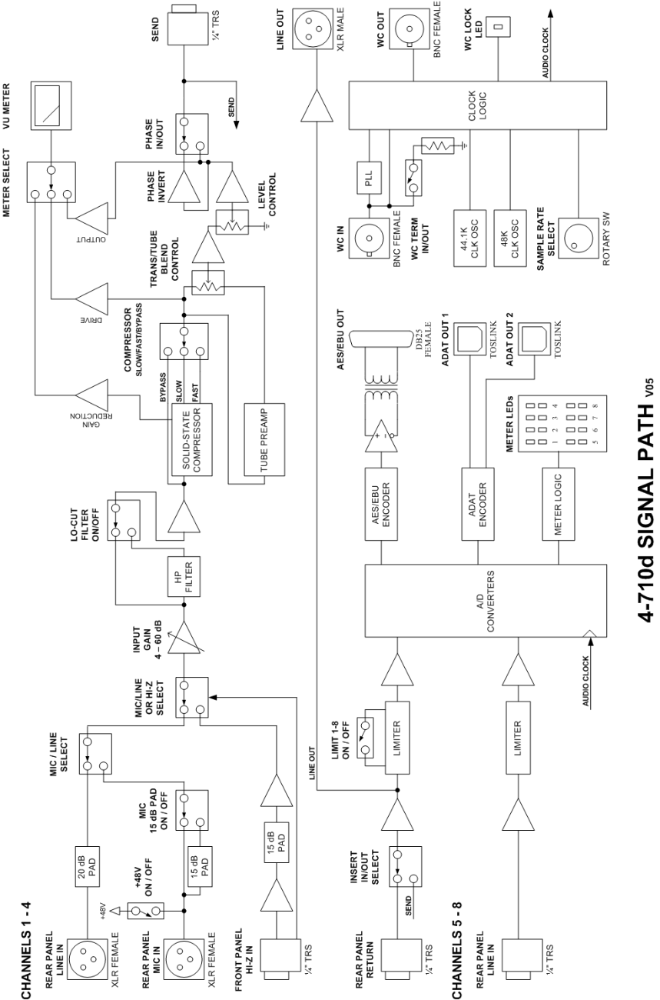

36 

## **Specifications** 

## **Analog Section, Channels 1–4** 

Note: all specifications are typical performance unless otherwise noted. Unless otherwise noted, all specifications are 20 Hz-20 kHz, minimum gain, maximum level, 24 bits, all switches in neutral or off mode, 100% solid state, digital output = 0 dBFS. 

_**MICROPHONE PREAMPLIFIER TO LINE OUT**_ Gain Range 56 dB Min Gain 14 dB Max Gain 70 dB Max Input Level (bal) 6.7 dBu Max Output Level (bal) 20 dBu Max Output Level (unbal) 14 dBu Input Impedance (bal) 2 kΩ Input Impedance (Hi-Z) 2.2MΩ Output Impedance (bal) 600 Ω Output Impedance (unbal) 300 Ω Equiv. Input Noise (150Ω, 56 dB gain) -127 dBu Frequency Response (20Hz-20kHz) +0.1/-0.15 dB Phase (Mic In to Line Out, 20 kHz) < 0.5 deg Stereo Phase Mismatch < 0.6 deg Stereo Level Balance (1 kHz) < 0.01 dB Crosstalk (max gain, 1kHz) < -115 dB Common Mode Rejection Ratio (max gain, 60 Hz) > 62 dB _**LINE IN TO LINE OUT**_ Gain Range 56 dB Min Gain -7 dB Max Gain 49 dB Max Input Level (bal) 26 dBu Max Input Level (unbal) 20 dBu Max Output Level (bal) 20 dBu Input Impedance (bal) 10 kΩ Input Impedance (unbal) 5 kΩ Output Impedance (bal) 600 Ω Output Impedance (unbal) 300 Ω Frequency Response (20Hz-20kHz) +0.1 / -0.15 dB Phase (Line In to Line Out, 20 kHz) < 0.5 deg Stereo Phase Mismatch < 0.5 deg Stereo Level Balance (1 kHz) < 0.2 dB Crosstalk (max gain, 1kHz) < -115 dB Common Mode Rejection Ratio (max gain,  60 Hz) > 70 dB _**Tube @ 100% – LINE IN TO LINE OUT**_ Tube Complement 12AX7 (2) THD+N (19 dBu, 1 kHz, 20 kHz BW) -30 dB (3.1%) THD+N (17 dBu, 1 kHz, 20 kHz BW) -20 dB (1.0%) SNR (min gain, 1 kHz, A-wgt, 20 kHz BW) 109 dB SNR (max gain, 1 kHz, A-wgt, 20 kHz BW) 74 dB 

37 

## **Specifications** 

|**_Solid State @ 100% – LINE IN TO LINE OUT_**||
|---|---|
|THD+N (min gain, 1 kHz, 20 kHz BW)|-101 dB (0.0009%)|
|THD+N (max gain, 1 kHz, 20 kHz BW)|-70 dB (0.03%)|
|SNR (min gain, 1 kHz, A-wgt, 20 kHz BW)|110 dB|
|SNR (max gain, 1 kHz, A-wgt, 20 kHz BW)|82 dB|
|**_Low Cut Filter_**||
|Type|Bessel 2nd Order|
|Corner Frequency|75 Hz|
|Attenuation (20 Hz)|-23 dB|
|**_Pad_**||
|Attenuation|15 dB|
|**_Phase_**||
|Phase Shift|180 deg|
|**_Phantom Power_**||
|Phantom Power Current (per jack)|10 mA|
|Voltage|48V±1V|
|**_Compressor_**||
|Threshold|10 dBu|
|Compression Ratio|4:1|
|Fast Attack Time|0.3 ms|
|Fast Release Time|100 ms|
|Slow Attack Time|2.0 ms|
|Slow Release Time|1100 ms|
|**_Limiter_**||
|Threshold|17 dBu (= -3 dBFS)|
|Attack Time|0.075 ms|
|Release Time|100 ms|
|**_Send/Return_**||
|Send Level, Max (bal)|20 dBu|
|Return Level, Max (bal)|20 dBu|
|Send Level, Max (unbal)|14 dBu|
|Return Level, Max (unbal)|20 dBu|
|**_Analog Meter_**||
|Switch, GR|Comp. Gain Reduction|
|Switch, Drive|Tube Stage Drive|
|Switch, Level|Output Level|
|Level, 0 dB VU, Drive Mode|12 dBu|
|Level, 0 dB VU, Output Mode|4 dBu|

(Continued) 

38 

**Specifications** 

## **Analog-To-Digital Converter Section** 

Note: all specifications are typical performance unless otherwise noted. Unless otherwise noted, all specifications are 20 Hz-20 kHz, minimum gain, maximum level, 24 bits, all switches in neutral or off mode, 100% solid state, -1 dBFS output. 

_**Microphone Input**_ THD+N (-1 dBFS) -100 dB (0.001%) SNR (A-Wt) 110 dB Dynamic Range (-60 dBFS, A-wt) 110 dB Frequency Response +0.1/-0.15 dB Stereo Phase < 0.3 deg _**Line Input (Ch 1-4)**_ THD+N (-1 dBFS) -100 dB (0.001%) SNR (A-Wt) 110 dB Dynamic Range (-60 dBFS, A-Wt) 110 dB Frequency Response +0.1/-0.15 dB Stereo Phase < 0.3 deg _**Line Input (Ch 5-8)**_ THD+N (-1 dBFS) -103 dB (0.0007%) SNR (A-Wt) 117 dB Dynamic Range (-60 dBFS, A-Wt) 117 dB Frequency Response ±0.1 dB Stereo Phase < 0.5 deg _**16-Bit Mode**_ Dither Type Triangular Sample Resolution 16 bits THD+N (-1 dBFS, 16 bits) -93 dB (0.0022%) SNR (A-Wt) 98 dB Dynamic Range (-60 dBFS, A-Wt) 98 dB 

(Continued) 

39 

## **Specifications** 

## **Digital Output Section** 

_**Digital Output Formats**_ AES/EBU 8 channels, 44.1-192kHz, single wire ADAT Optical 44.1-48kHz: Port 1 = channel 1-8 Port 2 = channel 1-8 (duplicate out) 88.2-96Khz (S/MUX™): Port 1 = channel 1-4 Port 2 = channel 5-8 176.4-192kHz (S/MUX™): Port 1 = channel 1-2 Port 2 = channel 3-4 Bit Depths 24-Bit 16-Bit (dithered) Clock Options Internal (crystal) 44.1, 48, 88.2, 96, 176.4, 192 kHz Word Clock 44.1, 48, 88.2, 96, 176.4, 192 kHz Lock range ±3% Optional termination (75 ohms) A/D Metering Bottom segment: Green, -37 dB to -6 dB Top segment: Yellow, -6 dB to -1 dB Top segment: Red, -1 dB to Clip 

## **Connector Types** 

|**_Digital Output Formats_**||
|---|---|
|External Connections (rear panel)|8 x XLR Female Line in, Mic in (channel 1-4)|
||4 x XLR Male Line out (channel 1-4)|
||12 x ¼” TRS Female (ch 1-4 send, return, line in 5-8)|
||2 x Toslink out (ADAT Optical output 1-8)|
||2 x BNC 75Ω(Word Clock in, out)|
||1 x DB-25 (AES/EBU Tascam pin-out, ch 1-8)|
|External Connections (front panel)|4 x ¼” TRS Female  (channel 1-4 Hi-Z in)|

## **Mechanical and Power** 

|**_Power_**||
|---|---|
|AC Requirements|100VAC - 240VAC, 50/60 Hz, auto-switching|
|Maximum Power Consumption|0.525 A @ 120 VAC (60W)|
|Power Connector|Detachable IEC power cable|
|**_Mechanical_**||
|Dimensions|2U Rack|
||19” x 3.5” x 12” (W x H x D) inches|
||48.2 x 8.9 x 30.5 (W x H x D) cm|
|Weight|11.5 lbs (5.2 kg)|

40 

## **Index** 

1176, 1, ii, 6, 27 610, ii, 27 **75** Ω **Termination** , 15 A/D Conversion, 22 **ADAT** , 6, 15, 22, 24, 29, 31, 32, 33 **ADAT Optical** , 15, 22 **AES/EBU** , 6, 14, 15, 22, 24, 29, 30, 32 **Analog** , 9, 10, 15, 17, 23, 29, 30 Analog Connectors, 15 Analog Controls, 9 **Balanced** , 6, 29, 40 Bass, 26 Bill Putnam Sr., 27, 28 **Bit Depth** , 12, 29 **Bit Resolution** , 29 Block Diagram, 36 **BNC** , 6, 12, 14, 22, 29 Class A, 20, 29 **Cleaning** , iii clock, 7, 9, 13, 14, 15, 19, 22, 23, 24, 26, 29, 30, 31, 33 **Compressor** , 11 **Condenser** , 29 converters, 13, 14, 15, 22, 23, 24, 28 **DAW** , 7, 16, 23, 30, 31 Digital Clocking, 14, 15, 19, 23 Digital Connectors, 14 Digital Controls, 12 Digital Metering, 22 Disclaimer, ii **Dither** , 30, 32 Drums, 26 

**Dynamic** , 29, 30 **EQ** , 16, 27, 31 FCC Compliance, ii Features, 6 FET, 27, 31 Fuse, 34 Getting Started, 7 Glossary, 29 Guitar, 26 History, 27 **Hi-Z Inputs** , 9 Horns and Reeds, 26 **Impedance** , 31, 40 Important Safety Information, iii **Input** , 7, 10, 15, 16, 40 **Insert** , 11, 16 **Insert Return** , 16 **Insert Send** , 16 Insider’s Secrets, 25 Interconnection Diagrams, 17 Introduction, 5 **Jitter** , 6, 23, 24, 31 **Light Pipe** , 31 **Limit** , 12 **Line Inputs** , 15 **Line Output** , 16 Live Applications, 26 **Lock** , 13 **Low Cut** , 8, 11, 21, 40 **Low Cut Filter** , 31 Maintenance, 34 master, 10, 14, 23, 24, 30 

41 

## **Index** 

**Meter** , 7, 8, 10, 11, 20, 40 slave, 15, 23 Metering, 25 **S-MUX** , 15, 22, 32 Microphone, 26, 40 Solid-State, 20, 40 Overview, 20 **SPDIF** , 32, 33 **PAD** , 7, 10 Support, 43 **Polarity** , 11, 16, 21 synchronization, 23, 24 **Power** , iii, 8, 12, 15, 21, 40 Trademarks, ii Rear Panel, 14 Vacuum Tube, 20 Registration, 43 Vocals, 25 Resources, 43 Voltage Select, 34 **Ribbon** , 32 Warranty, 43 **Sample Rate** , 12, 13, 14, 15, 32 Website, 43 Service, 34, 43 **Word Clock** , 14, 15, 22 **Single Wire** , 14, 22, 29, 30, 32 **XLR** , 7, 16, 29, 33, 40 

42 

## **Additional Resources** 

## **Universal Audio Website** 

We’ve got a pretty cool website, if we may say so ourselves. Check us out at http://www.uaudio.com. 

There, you’ll find tons of information about our full line of products, as well as e-news, videos, software downloads, FAQs, an online store, and a way cool webzine that features hot tips, techniques, and interviews with your favorite artists, engineers and producers each month. The webzine even offers something we call “Playback”—a monthly contest where the winners get their music posted on our site, exposing their songs to thousands of visitors per day! 

## **Product Registration** 

Please follow the simple instructions below to register your new 4-710d. Registering your 4-710d is quick, easy and allows you to become eligible for exclusive offers and UA promotions. Registration also enables faster support for all product inquiries and Customer Service-related issues. 

## _**To register your UA Model 4-710d:**_ 

1. Go to http://www.uaudio.com and click “Support>Register” at the top of the page. 

   - a. If you already have a my.uaudio account, login to your account. 

   - b. To create a new account, follow the onscreen instructions. 

2. Select "4-710d" from the "Product" drop menu. 

3. Enter your serial number (Located on the rear panel of the 4-710d chassis) 

4. Click the “Submit” button to complete the registration process. 

## **Warranty** 

The warranty for all Universal Audio hardware is one year from date of purchase, parts and labor. 

## **Service & Support** 

Even gear as well designed and tested as ours will sometimes fail. In those rare instances, our goal here at UA is to get you up and running again as soon as possible. 

The first thing to do if you’re having trouble with your device is to check for any loose or faulty external cables, bad patchbay connections, grounding trouble from a power strip and all inputs/outputs (mic/line/Hi-Z, etc.). If your problem persists, call tech support at 877-MY-UAUDIO, or send an email to info@uaudio.com, and we will help you troubleshoot your system. (Canadian and overseas customers should contact their local distributor.) When calling for help, please have the product serial number available and have your unit set up in front of you, turned on and exhibiting the problem. 

If it is determined your product requires repair, you will be told where to ship it and issued a Return Merchandise Authorization number (RMA). This number must be displayed on the outside of your shipping box (use the original packing materials if at all possible). Most repairs take approximately 2 - 4 business days, and we will match the shipping method you used to get it to us. (In other words, if you shipped it to us UPS ground, we will ship it back to you UPS ground; if you overnight it to us, we will ship it back to you overnight). You pay the shipping costs to us; we ship it back to you free of charge. Qualified service under warranty is, of course, also free of charge. For gear no longer under warranty, tech bench costs are $75 per hour plus parts. 

43 

