# **Model 6176 Channel Strip**

PN 65-40634 Rev 01

Customer Service & Technical Support: USA (toll-free): +1-877-698-2834 International: +1-831-440-1176 www.uaudio.com

#### **Notice**

This manual provides general information, preparation for use, installation and operating instructions for the Universal Audio 6176.

The information contained in this manual is subject to change without notice. Universal Audio, Inc. makes no warranties of any kind with regard to this manual, including, but not limited to, the implied warranties of merchantability and fitness for a particular purpose. Universal Audio, Inc. shall not be liable for errors contained herein or direct, indirect, special, incidental, or consequential damages in connection with the furnishing, performance, or use of this material.

#### Copyright

©2009 Universal Audio, Inc. All rights reserved.

This manual and any associated software, artwork, product designs, and design concepts are subject to copyright protection. No part of this document may be reproduced, in any form, without prior written permission of Universal Audio, Inc.

#### **Trademarks**

6176, 1176LN, 2-1176, LA-610, LA-2A, 2-LA-2, LA-3A, 2-610, 710, 4110, 8110, SOLO/110, SOLO/610, 2192, DCS Remote Preamp, UAD and the Universal Audio, Inc. logo are trademarks of Universal Audio, Inc. Other company and product names mentioned herein are trademarks of their respective companies

#### **Contents of This Box**

This package should contain:

- One 6176 Tube Preamplifier / Compressor
- 6176 Operating Instructions
- IEC Power Cable

Thank you for purchasing the 6176 Channel Strip. The 6176 combines a modified channel of our 2-610 vacuum tube microphone preamplifier with our 1176LN all discrete solid state FET-based limiter / compressor.

The 2-610 was inspired by the microphone preamp section of the original 610 console designed by my father, M.T. "Bill" Putnam, in 1960. The 610 was a rotary-control console and it was also the first console of a modular design. Although technologically simple compared to modern consoles, the 610 possessed a warmth and character that kept it in demand for decades. A prominent component of my father's United/Western Studios in Los Angeles, the 610 was used on many classic recordings by Frank Sinatra and Sarah Vaughan, as well as the Beach Boys' *Pet Sounds* and the Doors' *LA Woman*.

My father also designed the 1176 limiting amplifier, back in 1966. There were many versions of the 1176 produced throughout the years. We patterned our 2001 reissue on the D/E versions, prized by engineers the world over and widely believed to be the best-sounding models. These versions were characterized by their custom transformer input stage, low noise (LN) circuitry, and Class A (1108 style) output stage. (Later versions replaced the Class A output stage with a push-pull Class-AB output stage, and eventually replaced the transformer input with a differential op-amp circuit.) The limiting / compression section in the 6176 captures that highly recognizable blackface 1176LN sound.

Most of us at Universal Audio are musicians and/or recording engineers. We love the recording process, and we really get inspired when tracks are beautifully recorded. Our design goal for the 6176 was to build an integrated mic preamp / compressor that we would be delighted to use ourselves—one that would capture the original character of the 610 and 1176LN to create a device that induces that *"aha"* feeling you get when hearing music recorded in its most natural, inspired form.

You'll find that the controls of the 6176 are simple and essential: we added only those features required for practical use without needless duplication of functionality found elsewhere in most studios. The transformers and tubes received much of our R&D attention. We opted for a transformer design that features double-sized alloy cores with custom windings. Our tubes are carefully selected and tested individually. To us, this extra effort is well worth the time and cost because the end result is an outstanding yet easy-to-use product that combines a legendary mic preamp with a legendary limiter/compressor, making for a sound that is truly extraordinary.

Developing the 6176 —as well as Universal Audio's entire line of quality audio products designed to meet the needs of the modern recording studio while retaining the character of classic vintage equipment—has been a very special experience for me and for all who have been involved. While, on the surface, the rebuilding of UA has been a business endeavor, it's really been so much more than that: in equal parts a sentimental and technical adventure.

We thank you, and we thank my father, Bill Putnam.

Sincerely,

Bill Putnam, Jr.

# **Important Safety Instructions \_\_\_\_\_\_\_\_\_\_\_\_\_\_\_\_\_\_\_\_\_\_\_\_\_\_\_\_\_\_\_\_\_\_\_\_\_\_\_\_\_\_\_\_\_\_\_\_\_\_\_\_\_\_\_\_\_\_\_\_\_**

Before using this unit, be sure to carefully read the applicable items of these operating instructions and the safety suggestions. Afterwards, keep them handy for future reference. Take special care to follow the warnings indicated on the unit, as well as in the operating instructions.

- 1. **Water and Moisture -** Do not use the unit near any source of water or in excessively moist environments.
- 2. **Object and Liquid Entry -** Care should be taken so that objects do not fall, and liquids are not spilled, into the enclosure through openings.
- 3. **Ventilation -** When installing the unit in a rack or any other location, be sure there is adequate ventilation. Improper ventilation will cause overheating, and can damage the unit.
- 4. **Heat -** The unit should be situated away from heat sources, or other equipment that produce heat.
- 5. **Power Sources -** The unit should be connected to a power supply only of the type described in the operating instructions, or as marked on the unit.
- 6. **Power Cord Protection -** AC power supply cords should be routed so that they are not likely to be walked on or pinched by items placed upon or against them. Pay particular attention to cords at plugs, convenience receptacles, and the point where they exit from the unit. Never take hold of the plug or cord if your hand is wet. Always grasp the plug body when connecting or disconnecting it.
- 7. **Grounding of the Plug -** This unit is equipped with a 3-wire grounding type plug, a plug having a third (grounding) pin. This plug will only fit into a grounding-type power outlet. This is a safety feature. If you are unable to insert the plug into the outlet, contact your electrician to replace your obsolete outlet. Do not defeat the purpose of the grounding-type plug.
- 8. **Cleaning -** Follow these general rules when cleaning the outside of your 6176:
  - a. Turn the power Off and unplug the unit
  - b. Gently wipe with a clean lint-free cloth
  - c. If necessary, moisten the cloth using lukewarm or distilled water, making sure not to oversaturate it as liquid could drip inside the case and cause damage to your 6176
  - d. Use a dry lint-free cloth to remove any remaining moisture
  - e. Do not use aerosol sprays, solvents, or abrasives
- 9. **Nonuse Periods -** The AC power supply cord of the unit should be unplugged from the AC outlet when left unused for a long period of time.
- 10. **Damage Requiring Service -** The unit should be serviced by a qualified service personnel when:
  - a.The AC power supply cord or the plug has been damaged: or
  - b. Objects have fallen or liquid has been spilled into the unit; or
  - c. The unit has been exposed to rain; or
  - d.The unit does not operate normally or exhibits a marked change in performance; or
  - e. The unit has been dropped, or the enclosure damaged.
- 11. **Servicing -** The user should not attempt to service the unit beyond that described in the operating instructions. All other servicing should be referred to qualified service personnel.

# **Table of Contents**

| Noticeii                                            |
|-----------------------------------------------------|
| A Letter From Bill Putnam, Jriii                    |
| Important Safety Instructionsiv                     |
| Two Page, Two Minute Guide To Getting Started       |
| Front Panel3                                        |
| Rear Panel9                                         |
| Interconnections                                    |
| Insider's Secrets                                   |
| The Technical Stuff                                 |
| Glossary of Terms                                   |
| Recall Sheet                                        |
| Specifications                                      |
| Registration, Support, Warranty, & Repair Service41 |

# **The Two Page, Two Minute Guide To Getting Started**

**\_\_\_\_\_\_\_\_\_\_\_\_\_\_\_\_\_\_\_\_\_\_\_\_\_\_\_\_\_\_\_\_\_\_\_\_\_\_\_\_\_\_\_\_\_\_\_\_\_\_\_\_\_\_\_\_\_\_\_\_\_**

No one likes to read owner's manuals. We know that.

We also know that you know what you're doing—why else would you have bought our product?

So we're going to try to make this as easy on you as possible. Hence this two-page spread, which we estimate will take you approximately two minutes to read. It will tell you everything you need to know to get your Universal Audio 6176 up and running, without bogging you down with details.

Of course, even the most expert of us has to crack a manual every once in awhile. As the saying goes, "as a last resort, read the instructions." You'll find those details you're craving—a full description of all front and rear panel controls, interconnection diagrams, insider's secrets, history, theory, maintenance information, block diagrams, specifications, even a glossary of terms—in the pages that follow.

#### **Manual conventions**:

- ! Means that this is an especially useful tip
- " Means that this is an especially important bit of information

And when we need to direct you to a page or section elsewhere in the manual, we'll use the universal signs for rewind (#) or fast forward (!).

#### *Getting Started With Your 6176:*

**Step 1:** Decide where the 6176 is to be physically located and place it there. The 6176 is housed in a standard two-rackspace 19" chassis, and so we recommend that it be securely mounted in a rack if possible.

**Step 2:** Mute your monitors and then, using balanced cables with XLR connectors, connect the 6176's rear panel Preamplifier and Compressor line outputs to the appropriate inputs on your patch bay, mixer, or DAW. (Note: If you only have one available patch point or channel input, connect only the Compressor line output.)

**Step 3:** Set the Polarity switch on the left side of the front panel to its down position, ensuring that the output signal will be in phase with the input signal. If using a microphone, set the Pad switch (on the left side of the front panel) and the Phantom Power switch (in the center of the front panel) to their down positions so that the pad is not engaged and no phantom power is being applied.

**Step 4:** Set the JOIN/SPLIT switch in the center of the front panel to its up (JOIN) position. This ensures that the 6176 will act as a channel strip, with its preamp output internally routed to its limiter/compressor. (Note: In JOIN mode, neither the Preamp line output nor the Compressor line input is functional.)

**Step 5:** Connect a source signal (mic, line, or instrument) to the 6176's rear panel balanced XLR Preamp mic or line input, or to the front panel

" **Make only one type of connection (Mic, Line, or Hi-Z) to the 6176 Preamp.**

unbalanced " jack Hi-Z input. (! *see page 10 for an interconnection diagram*)

**Step 6:** Make sure the Power switch in the center of the front panel is off (down) and then connect the supplied IEC power cable to the rear panel AC power connector.

**Step 7:** On the left side of the front panel, turn the Level control to its minimum (fully counterclockwise) position and set the Gain control to 0 (center position).

**Step 8:** On the right side of the front panel, set the Ratio switch to BP (fully counterclockwise) in order to temporarily bypass the 6176 limiter / compressor section. Set the Meter switch to PRE so that the meter displays the output level of the signal leaving the 6176 preamp section.

**Step 9:** Power on the 6176. The purple LED above the power switch will light up.

- (i) Because the 6176 is a tube device, it needs several minutes to achieve stable operating temperature. During warm-up, audio quality may vary slightly.
- **Step 10:** If a microphone requiring 48 volts of phantom power is connected to the 6176, turn on the +48V switch (up position).
- **Step 11:** Unmute your speakers and begin monitoring the 6176 Compressor line output. Use the 6176 front-panel Input Select switch to select the connected source and then apply input signal while slowly increasing the Level control to approximately 7. You should now be hearing signal.
- **Step 12:** While watching the 6176 meter, set the preamp Gain switch (on the left side of the front panel) so that sufficient signal strength is achieved. Experiment with differing degrees of preamp Gain and Level to hear the various amounts of coloration the 6176 can impart to your signal. For the cleanest, most uncolored signal, set the Gain switch to its lowest usable setting with Level set between 7 and 10. If you are using a microphone and you hear distortion even at the lowest Gain level, engage the -15 dB pad to reduce the input level. If you are using a connected microphone or Hi-Z instrument input, experiment also with various impedance settings to achieve optimum tonality for your source signal.
- **Step 13:** Experiment with the effect of the 6176's high and low shelving filters on your source signal.
- **Step 14:** Now it's time to activate the limiter/compressor section of the 6176 on the right side of the front panel. Begin by setting the Input and Output knobs to approximately 5 (12 o'clock position) for unity gain. Then set the Ratio to 1 (or, alternatively, turn the Attack knob past its fully counterclockwise position so that it clicks). In this mode (a compression ratio of 1:1), signal passes through the limiter/compressor section, thus adding "color," but with no gain reduction. Compare the difference in tonality between ratios of BP and 1.
- **Step 15:** To hear the effect of the 6176 gain reduction circuitry, select different Ratios of 4, 8, 12, 20, and ALL. (ALL mode duplicates the overdrive that occurs when all four ratio buttons on an original 1176 are pushed in simultaneously) and varying the Input level and Attack and Release times. Note that, unlike
- ►► For more information, refer to the "Front Panel" and "Rear Panel" sections on pages 3 9.

many other devices, the 6176 attack and release times are faster when their associated knobs are turned clockwise, and slower when they are turned counterclockwise. Set the Meter switch to GR in order to view the amount of gain reduction being applied to the signal. Note that as you increase the amount of gain reduction (by raising the Input level and/or selecting higher ratios), the overall signal may be attenuated. If necessary, you can make up the difference by turning the Output knob clockwise. Change the Meter switch to COMP in order to view the final output level. A meter reading of 0 corresponds to an output level of +4 dBm at the 6176 output.

**Step 16:** Set the JOIN/SPLIT switch in the center of the front panel to its down (SPLIT) position. In this mode, the internal connection between the output of the 6176 preamp section and the input of the limiter/compressor section is broken, so that each section functions as an independent device, each with its own dedicated input(s) and output.

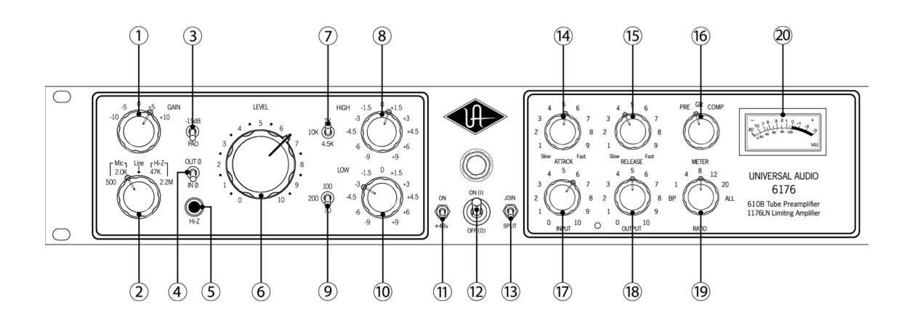

NOTE: The left side of the 6176 front panel contains all preamp controls, while the right side contains all limiter / compressor controls. All controls (except the Level, Attack, Release, Input, and Output knobs) are stepped, allowing settings to be easily reproduced.

- (1) Gain Adjusts the gain of the input stage in 5 dB increments. Turning the Gain switch clockwise raises the gain. Because this also has the effect of reducing negative feedback (▶ see page 25), the Gain switch alters the amount of the input tube's harmonic distortion, a major contribution to the "warm" sound characteristic of tube equipment. The higher the Gain setting, the more coloration the 6176 will impart to the incoming signal.
- **(2) Input Select** Determines which of the following three inputs is active: Mic, Line, or Hi-Z. The Mic and Hi-Z inputs each provide two different impedance settings.

Mic - Selects the signal arriving at the rear panel balanced XLR Preamp MIC INPUT connection. (►► see #7 on page 9) The impedance for the Mic input can be set to 500 ohms or 2.0K ohms. Switching between these two positions while listening to a connected microphone may reveal a different tonal quality and/or gain difference. Typically, a microphone preamplifier should have input impedance roughly equal to about 10 times the microphone output impedance. For example, if your microphone has an output impedance of approximately 200 ohms, the switch should be set to the 2.0K position. However, making music is not necessarily about adhering to technical specifications, so feel free to experiment with the settings to attain the desired sound: you will not harm your microphone or the 6176.

**Line** - Selects the signal arriving at the rear panel balanced XLR Preamp LINE INPUT connection. (►► see #6 on page 9) This connection has an input impedance of approximately 13K ohms and is intended to accommodate mixers, DAWs, tape machines, other mic preamps, signal processors, or any device with a line level output, such as keyboards, sound modules and drum machines. Using this input, the 6176 can act as a "tone box" for line-level signals, offering a variety of sonic colors based on front panel control settings.

**Hi-Z** - Selects the input signal arriving at the front panel unbalanced ¼" jack Hi-Z connection. (►► see #5 on page 4) Intended for the direct connection of electric guitar, electric bass, or any instrument with a magnetic or acoustic transducer pickup, this knob can be set to either

47K ohmsor 2.2M ohms. The 47K ohmssetting is best suited for the -10 dBv level signals typically provided by active basses and guitars, while the 2.2M ohmssetting is more suitable for instruments with passive pickup systems. Since a particular instrument's output impedance may actually be somewhere between the active and passive levels, feel free to experiment to achieve the best sound at the desired level. (! *see page 26 for more information*)

- **(3) -15 dB PAD -** Reduces the mic input signal by -15 dB. (This switch has no effect on Line or Hi-Z signal.) Use this to reduce the incoming signal in cases where undesired distortion is present at low gain levels (for instance, where especially sensitive microphones are used on loud instruments).
- **(4) Polarity -** Determines the polarity of the 6176's Preamp LINE OUTPUT. (! *see #5 on page 9*) When IN ø is selected, the signal is in phase, and pin 2 is hot (positive). When OUT ø is selected, the signal is out of phase, and pin 3 is hot (positive). Polarity reversal may be useful in cases where more than one microphone is utilized in recording a source
- **(5) Hi-Z Input -** Connect high impedance signal from an instrument such as electric guitar or bass to this standard unbalanced " jack connector. If a connection is made to the Hi-Z input, be sure that there is **no** connection also made to the Mic or Line inputs.
  - " **Make only one type of connection (Mic, Line, or Hi-Z) to the 6176 .**
- **(6) Level -** Determines the amount of signal sent to the Preamp output stage. For the cleanest, most uncolored signal from the 6176, set the Gain switch (# *see #1 on page 3*) to a low setting (-10 or -5) while turning the Level knob until the appropriate output signal is attained.
  - " **The numeric values for the Level knob are NOT specific dB values.**
  - ! **You can come up with many useful tonal variations by experimenting with different Impedance, Gain, and Level settings.**
- **(7) High Frequency -** Selects the corner frequency for the high shelving filter. Available frequencies are 4.5K (kHz), 7K (kHz), and 10K (kHz).

# **Front Panel**

**(8) High Boost/Cut -** Selects the amount of cut or boost applied by the high shelving filter. The positive and negative numbers on the front panel denote dB values (-9, -6, -4.5, -3, -1.5, 0, +1.5, +3, +4.5, +6, +9).

**\_\_\_\_\_\_\_\_\_\_\_\_\_\_\_\_\_\_\_\_\_\_\_\_\_\_\_\_\_\_\_\_\_\_\_\_\_\_\_\_\_\_\_\_\_\_\_\_\_\_\_\_\_\_\_\_\_\_\_\_\_**

- **(9) Low Frequency -** Selects the corner frequency for the low shelving filter. Available frequencies are 70 Hz, 100 Hz, and 200 Hz.
- **(10) Low Boost/Cut -** Selects the amount of cut or boost applied by the low shelving filter. The positive and negative numbers on the front panel denote dB values (-9, -6, -4.5, -3, -1.5, 0, +1.5, +3, +4.5, +6, +9)**.**
- **(11) +48v -** Most modern condenser microphones require +48 volts of phantom power to operate. This toggle switch applies 48 volts to the 6176 MIC INPUT when the switch is up (in the ON position). (! *See page 26 for more information about phantom power*)
  - " **To avoid potential equipment damage, disable +48V phantom power before connecting or disconnecting the MIC input. Keep phantom power off (switch down) when it is not required.**
- **(12) Power -** Turns the 6176 power on or off. When powered on, the purple LED immediately above this switch is lit.
  - " **Always check the power requirements of your microphone with the manufacturer before applying phantom power***.*
  - " **To avoid loud transients, always make sure phantom power is off when connecting or disconnecting microphones.**
- **(13) Join / Split -** This switch allows separate use of the preamp section and the limiter / compressor section. When the switch is in the SPLIT (down) position, each side of the 6176 acts as a separate device, each with its own separate rear panel in / out connections. (! *see #1 and #2 on page 9 and #5 and #6 on page 9*) When the switch is in the JOIN (up) position, the 6176 behaves like a channel strip, with the preamp output automatically routed internally to the limiter / compressor section.
  - " **When operating in JOIN mode, the rear panel Preamp LINE OUT and the Limiter/Compressor LINE IN jacks are automatically disconnected.**

Front Panel

(14) Attack - Sets the amount of time it takes the limiter /compressor to respond to an incoming signal and begin gain reduction. The 6176 attack time is adjustable from 20 microseconds (FAST) to 800 microseconds (SLOW). The attack time is fastest when the Attack knob is in its fully clockwise position, and is slowest when it is in its fully counterclockwise position.

- Turning the Attack knob all the way fully counterclockwise position (past the point where it clicks) has the same effect as setting the Ratio switch to the "1" position, where signal passes through the limiter / compressor section but is not processed. This is commonly used to add the "color" of the 6176 limiter / compressor without any actual gain reduction.
- When a very fast attack time is selected, gain reduction kicks in almost immediately and catches transient signals of very brief duration, reducing their level and thus "softening" the sound. Slower attack times allow transients to pass through unscathed before limiting or compression begins on the rest of the signal.
- (15) Release Sets the amount of time it takes the limiter /compressor to return to its initial (pre-gain reduction) level. The 6176 release time is adjustable from 50 milliseconds (FAST) to 1100 milliseconds (SLOW). The release time is fastest when the Release knob is in its fully clockwise position, and is slowest when it is in its fully counterclockwise position.
  - If the release time is too fast, "pumping" and "breathing" artifacts can occur, due to the rapid rise of background noise as the gain is restored. If the release time is too slow, however, a loud section of the program may cause gain reduction that persists through a soft section, making the soft section less audible.
  - (i) Unlike many other devices, the 6176 Attack and Release times get faster, not slower, as their corresponding knobs are turned up (clockwise).
- (16) Meter Function This switch determines what the 6176's VU meter displays: either the preamp section (PRE) output, the amount of gain reduction (GR), or the compressor's output level (COMP). When PRE is selected, a meter reading of 0 corresponds to a level of +4 dBm at the rear panel Preamp LINE OUTPUT jack. (▶ see #5 on page 9)
- (17) **Input** Determines the level of the signal entering the limiter / compressor section, as well as the threshold. Higher settings will therefore result in increased amounts of limiting or compression.

#### Front Panel

- (18) Output Determines the final output level of signal leaving the limiter / compressor section. Once the desired amount of limiting or compression is achieved with the use of the Input control, the Output control can be used to make up any gain lost due to gain reduction. Set the Meter switch to the Compressor (COMP) position while using the Output knob to set the desired output level. (▶ see #16 on page 6)
- (19) Ratio Determines the severity of the applied gain reduction. (A ratio of 4:1, for example, means that whenever there is an increase of up to 4 decibels in the loudness of the input signal, there will only be a 1 dB increase in output level, while a ratio of 8:1 means that any time there is an increase of up to 8 dB in the input signal, there will still only be a 1 dB increase in output level.) When higher ratios (12:1, 20:1, or ALL) are selected, the 6176 is limiting instead of compressing. Note that higher Ratio settings also set the threshold higher.

The 6176 Ratio control allows seven different modes of operation:

- **BP** (**Bypass**) This position automatically routes the preamp output directly to the limiter / compressor output, thus completely removing its associated "tone" from the signal. (This feature is provided so you can quickly remove the limiter / compressor section from the signal path altogether without having to physically move cables.)
- (i) When the 6176 is set to a ratio of BYPASS, none of the other limiter / compressor controls are operational.
  - **1** Selects a 1:1 ratio (no gain reduction).
- (i) Setting the 6176 to a ratio of 1 has the same effect as turning the Attack knob to its fully counterclockwise position (past the point where it clicks), where signal passes through the limiter / compressor section (and in doing so takes on its tonal "color") but with no actual gain reduction.
  - **4 -** Selects a 4:1 ratio (moderate compression).
  - **8** Selects an 8:1 ratio (severe compression).
  - **12** Selects a 12:1 ratio (mild limiting).
  - **20** Selects a 20:1 ratio (hard limiting).
  - **All** Implements the "All-button" or "4 button trick" (sometimes also known as "British Mode"), in which the 6176 duplicates the overdrive that occurs when all four ratio buttons on an original 1176 are pushed in simultaneously. ( **>>** see page 25 for more information.)

- (i) Setting the 6176 to a ratio of ALL causes distortion to increase radically due to a lag time on the attack of initial transients and constant changes in the attack and release times as well as a change in the bias points. Consequently, the meter will go wild, often resting at maximum. Don't worry, though you won't be harming the 6176 by using this mode!
- Engineers typically use "All" mode on drums or on ambience or room mics. It can also be used to "dirty" up a bass or guitar sound, or for putting vocals "in your face."
- (20) Meter A standard VU meter that displays either the preamp section output level, amount of gain reduction, or limiter / compressor section output level, depending upon the setting of the Meter Function switch. (◀ see #16 on page 6) Occasionally, the meter may require calibration.
- (►► see page 27 for instructions for calibrating the 6176 meter)
  - In order to set a specific amount of limiting or compression on the 6176, begin by turning the Output knob to unity gain (approximately 5) and the Input knob to its fully counterclockwise (0) position. Set the Ratio as desired, then set the Attack and Release controls to "5" so that some gain reduction is enabled. Set the Meter Function switch to the GR position so that the meter shows the amount of gain reduction, then slowly turn the Input control up until the desired amount of gain reduction is achieved. Finally, adjust the Attack and Release times until they are suitable for the program material and make up any gain necessary by raising the Output knob as desired (set the Meter Function switch to COMP to view the final limiter/compressor output level).

# **Rear Panel**

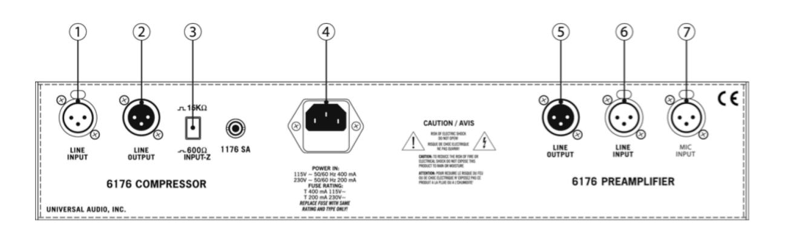

**\_\_\_\_\_\_\_\_\_\_\_\_\_\_\_\_\_\_\_\_\_\_\_\_\_\_\_\_\_\_\_\_\_\_\_\_\_\_\_\_\_\_\_\_\_\_\_\_\_\_\_\_\_\_\_\_\_\_\_\_\_**

- **(1) Limiter / Compressor LINE INPUT -** Connect a line-level input signal (coming from a device such as a mixer, DAW, tape machine, or signal processor) to the limiter/compressor section via this balanced XLR connector. Pin 2 is wired positive (hot).
- **(2) Limiter / Compressor LINE OUTPUT -** A balanced XLR connector carrying the line-level output signal of the 6176 limiter/compressor section. Pin 2 is wired positive (hot).
- **(3) Limiter / Compressor Input Loading -** When this button is pushed in, the input impedance will be 600 ohms, typical of older vintage gear. When the button is out, the impedance will be 15K ohms. In some situations you may perceive a "brighter" tone by using the 15K ohm position.
- **(4) AC Power Connector / Fuse Holder -** Connect a standard, detachable IEC power cable (supplied) here. If a fuse replacement is required, use only a 400 mA time delay (slow blow) fuse for operation at 115V, or a 200 mA time delay (slow blow) fuse for operation at 230V.
  - " **Never substitute different fuses other than those specified here!**
- **(5) Preamp LINE OUTPUT -** A balanced XLR connector carrying the line-level output signal of the 6176 preamp section. Note that Pin 2 is positive when the front panel Polarity toggle switch is down (IN ø). Pin 3 is positive when the front panel Polarity switch is up (OUT ø). (# *see #4 on page 4*)
- **(6) Preamp LINE INPUT -** Connect line-level input signal (coming from a device such as a mixer, DAW, tape machine, or signal processor) to the preamp section of the 6176 via this balanced XLR connector. Pin 2 is wired positive (hot). Note: If a connection is made to this Line input, be sure that there is **no** connection also made to the Mic or Hi-Z inputs.
- **(7) Preamp MIC INPUT -** Connect your microphone to this standard XLR connector. Pin 2 is wired positive (hot). Note: If a connection is made to the Mic input, be sure that there is **no** connection also made to the Preamp Line or Hi-Z inputs.
  - " **To avoid potential equipment damage, disable +48V phantom power before connecting or disconnecting the MIC input. Keep phantom power off (switch down) when it is not required.**

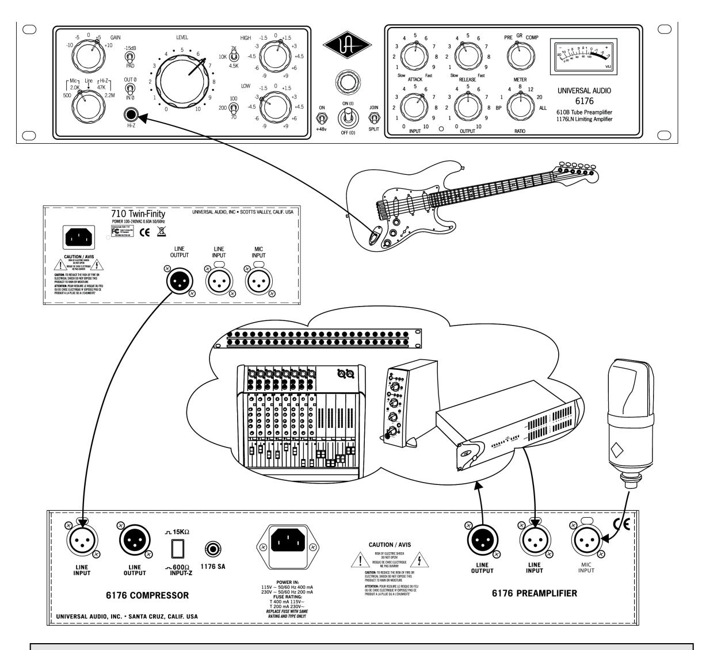

- (i) When operating in JOIN mode, the rear panel Preamp LINE OUT and the Limiter/Compressor LINE IN jacks are automatically disconnected.
- For most applications, we recommend keeping the 6176 preamp Level control set between 7 and 10. Adjustments can then be made to the preamp Gain, Impedance, and Filter controls, as well as the various limiter/compressor controls, to achieve the optimum sound for your signal source. (If you are using the 6176 in JOIN mode, begin by setting the limiter/compressor Input and Output controls to approximately 5 for unity gain.)

#### 6176 Versus 2-610 / 1176LN

Why go for the 6176 over a 2-610 and an 1176LN chained together?

One factor, of course, is price: the 6176 costs significantly less than a combination of a 2-610 and an 1176LN. Another factor is space: the 6176 combines both signal processors in a single chassis, thus saving potentially valuable real estate space in your rack. Don't forget that, when operating in SPLIT mode, the two sections can be accessed independently and can process entirely different signals.

But just as important is sound. Indeed, the beauty of the 6176 is that it rides gain just like an 1176LN and it sounds quite a bit like one, yet it still delivers its own sonic signature. It features an all-new MOSFET regulated power supply, which not only tightens up bass response but also reduces self-induced noise, making the 6176 a quieter, more "hi-fi" version of the original 1176LN. For many years, engineers have had to make the choice between an 1176LN or an LA-2A (another vintage compressor, now manufactured by Universal Audio, available as a standalone unit or in combination with a channel of the 2-610 preamp, in our LA-610 mkll model), depending on the tone they want, not necessarily on how they differ as compressors. The 6176 offers another choice, plus it's augmented with tube input circuitry and pre-compression EQ!

#### Vocals, Vocals, Vocals

The preamp section of the 6176 utilizes a channel of our popular 2-610 stereo mic preamp, favored by many engineers for vocal recording. In his December 2001 review for *MIX* magazine, Michael Cooper raved about the 2-610's abilities in this regard, writing, "The 2-610 is the richest, fattest and sweetest mic preamp I've ever heard on vocals. Bigger than life and possessing astounding depth, the sound made all other mic preamps I've used sound somewhat 2-D by comparison. The bottom end was big and tight, mids incredibly clear, yet warm as hot fudge, and the sweet highs ultra-smooth."

"The 6176 has a powerful and articulate mid-range lens and the compression has always been one of my favorites" — producer Brian Ahern

Producer Brian Ahern (Emmylou Harris, Johnny Cash) points out that "most voices and instruments are defined by their mid-range frequency content." He goes on to say that "The 6176 has a powerful and articulate mid-range lens and the compression has always been one of my favorites."

Barry Rudolph, in his June, 2003 review of the 6176 for *MIX* magazine, pointed to the equalization controls as key for recording vocals, saying "The EQ is wonderful for opening up the top end (10 kHz) on a vocal mic... the 70Hz LF shelf is smooth and fine for rolling off mic proximity effects or subsonic noise." He adds, "For vocal recording, I adjusted the unit for the cleanest sound by backing down the gain selector and keeping the [preamp's] output-level knob nearly full-up... Using a vintage Neumann M49 mic, I found that by boosting 1.5 dB at both 10 kHz and 100 Hz, the EQ corrected that mic's occasional tendency to sound nasal. I got a big vocal sound with very good dynamic range and a warmth that helped out when my female singer sang at full voice and near the top of her range."

And reviewer George Shilling, writing for *Resolution* magazine in their May/June 2003 issue, said, "The [6176 preamp] section is everything I remember about the 2-610—a big warm, clear character, enhancing beautifully. Doing a last-minute vocal on a long project where several vintage channels of the grey-blue variety had been used for the bulk of recording, the vocals suddenly came to life with an extra sparkle when using the 6176 as a recording channel. It was noticed immediately by all present, after finding the optimal of the two input impedance settings... The ability to juggle the two gain controls for a variable amount of [tube] drive is a bonus, enabling the user to vary the tone subtly."

The compressor section of the 6176, of course, is based on the 1176, long known by engineers to be an essential tool in recording vocals. Industry legend Andy Johns (Led Zeppelin, Rolling Stones) says flatly, "For vocals there really isn't a better compressor." Bruce Swedien is another legendary

 **"For vocals there really isn't a better compressor" — engineer Andy Johns**

engineer who is a die-hard 1176 fan. "I love them on vocals," he says. "All of the Michael Jackson and James Ingram vocals that everyone has heard so much were done with at least one of those 1176s. I couldn't part with them for anything. They sound fabulous."

Added reviewer Hugh Robjohns, writing about the Universal Audio 1176LN reissue in *Sound on Sound* magazine in June, 2001: "The 1176LN is judged by many to be unsurpassed as a vocal compressor, and I would certainly agree that it can be extremely effective. It can be surprisingly transparent when used fairly gently on a 4:1 ratio, a setting whose warm, [tube]-like quality can be sublime on softer voices. Yet it can also accommodate the raunchiest hard compression demands too, which can be fantastic on strong, belted-out rock vocals." And reviewer Trevor Curwen, writing for *The Mix* in August 2000, reported that "When recording vocals, the 1176[LN] was... used with a low ratio, resulting in a very natural, smooth sound and even performance being captured. Strapping the compressor across the vocal when mixing, and adding just a little more squeeze, gave it the presence it needed to sit consistently in the mix, with a nice top end to the sound."

Producer/engineer Mike Shipley (Def Leppard, Shania Twain) says, "I grew up using 1176s—in England they were the compressor of choice. They're especially good for vocals... most anything else I can do without, but I can't be without at least a pair of 1176s and an LA-2A. The 1176 absolutely adds a bright character to a sound, and you can set the attack so it's got a nice bite to it. I usually use them on 4:1 [ratio], with quite a lot of gain reduction. I like how variable the attack and release is; there's a sound on the attack and release which I don't think you can get with any other compressor. I listen for how it affects the vocal, and depending on the song I set the attack or release—faster attack if I want a bit more bite."

Producer/Engineer Mike Clink (Guns N' Roses, Sammy Hagar) agrees. "I find that I actually use 1176s more now than I ever did," he says. "I like them because they bring out the brightness and presence of a sound—they give it an energy. It seems like when I'm mixing I end up using an 1176 on the vocals every time."

Jim Scott, who won a Grammy for Best Engineered Album for Tom Petty's Wildflowers, says "I use 1176s real conservatively and they still do amazing things. I always use them on vocals.... I'm always on the 4:1 [ratio], and the Dr. Pepper [input/output settings]—you know, 10 o'clock, 2 o'clock, and it does everything I need... They have an equalizer kind of effect, adding a coloration that's bright and clear. Not only do they give you a little more impact from the compression, they also sort of clear things

# **Insider's Secrets**

up; maybe a little bottom end gets squeezed out or maybe they are just sort of excitingly solid state... The big thing for me is the clarity, and the improvement in the top end."

**\_\_\_\_\_\_\_\_\_\_\_\_\_\_\_\_\_\_\_\_\_\_\_\_\_\_\_\_\_\_\_\_\_\_\_\_\_\_\_\_\_\_\_\_\_\_\_\_\_\_\_\_\_\_\_\_\_\_\_\_\_**

Last but not least, if you're trying to get an extra dose of attitude in a lead vocal, try ALL mode with short attack and release times. Not recommended for the faint of heart (or for balladeers), but it can definitely give a male or female rock vocal track an in-your-face sound that you can't get anywhere else.

#### *Drums*

In the world of recording, there's probably no greater challenge than getting powerful and precise drum sounds. The 1176LN has long been the compressor of choice for engineers for kick drum, snare drum, and overhead or ambient mics. When you factor in the added tube stage and equalization controls, that makes the 6176 a natural for drum recording.

"I'll always place one big mike, like a U47 (Neumann) or a ribbon mic such as a Coles or Royer, five or six feet in front of the drums," confides Grammy-winning engineer Jay Newland (Norah Jones). "I try to get the whole drum set to sound good through that one mic and then put it through an 1176. That's the secret weapon track. The 1176 compresses and makes it sound bigger and more present and a lot more exciting without having to crush it. I just it give a healthy 3 - 5 dB of compression and turn up the gain a little bit—it sounds great! If I have that mono track, where the whole drum kit sounds balanced, then I can build a decent drum sound with whatever else I have."

"The 1176 is standard equipment for my sessions," adds studio owner / engineer and well-known industry "golden ear" Allen Sides (Goo Goo Dolls, Green Day). "I mult the left and right [drum] overheads and bring them back on the console, then insert a pair of 1176s [in All-button mode] into a pair of the mults. [That] puts the unit into overdrive, creating a very impressive sound."

Engineer Andy Johns employs a similar technique. "What you do is, you run your room mics through a couple of 1176s, just so that they are nudging a bit. This brings up the decay time of the room when your guy hits the bass drum or the snare. If it's a very quick tempo it won't work, but at medium or half-time tempo it brings up the room. It's wonderful and there is not another compressor that will do it the same way as an 1176."

"When I am mixing," he adds, "I mult the bass drum and the snare. The bass drum will not be even, so the first bass drum track—the one that doesn't have the 1176 on it—gets to breathe. Then I put another bass drum next to it with an 1176 at a 4:1 [ratio setting]. That evens it out a bit. I sneak that in and the bass drum is more constant. Of course, you have to change your EQs appropriately... For the snare, I use one normal track that I EQ to death. Then I will use another one that has gone through a gate. I put an 1176 on it to make it pop [and] I sneak that in... and all of a sudden the snare just comes up."

Indeed, the perception of distortion is increased with lower frequencies in All mode. That's why, given the frequencies and transients created by the kick drum, the limiter/compressor section of the 6176 can almost literally make an overhead or room mic explode. As reviewer Trevor Curwen points out, "[All-buttons mode] can give a quite awesome compressed sound. This is particularly useful in creating a larger than life drum sound, where compressing the room mics on a drum kit, combined with careful setting of the release control, can really squeeze out the room ambience."

Remember, the limiter/compressor section in the 6176 is program-dependent. That's an important feature that allows it to be used in a musical, percussive way. Let's say you have a medium tempo, 4/4 rock beat—an excellent scenario for using ALL mode. In this application, you'd probably have a lot of input level, a slowish attack (so that the transients sneak through), and a quick release. The sonic result is extraordinary. First, the kick drum causes a great concussion, which is enhanced by the unique ALL mode distortion. As it does so, the other frequencies "suck in," followed by an exaggerated release and recovery, and then the rest of the drum kit sound returns... all in rather dramatic fashion.

#### Electric Guitar and Bass

There's something very special about the mix of tube preamplification and electric guitar and bass. This is an area where the 6176 positively shines—little wonder, considering its lineage in the 2-610 and 1176LN. Myles Boisen stated flatly in his review of the 2-610 that the unit was "an absolute smash hit for guitar and electric-bass recording at my studio." One technique that both Boisen and Cooper employed with great success was to split the electric guitar or bass signal and then plug one side into the Hi-Z input and the other into an external tube direct (DI) box whose output was connected to the the other channel's mic input. Cooper also found that "cranking the [preamp] Gain to +10 gave a slight bark that was perfect for country lead guitar fills."

The use of 1:1 mode allows the 6176 to act as a "tone box," adding both solid-state amplification and tube overdrive that can make an electric guitar sound positively monstrous.

Even if you don't want to compress a signal, the use of 1:1 mode in the limiter/compressor section allows the 6176 to act as a "tone box," adding both solid-state amplification and tube overdrive that can make an electric guitar sound positively monstrous. Andy Johns remembers using a pair of vintage 1176s on Jimmy Page's guitar on the song "Black Dog" for the multiplatinum *Led Zeppelin IV* album, connecting them in series (with the output of one feeding the input of

another), but with one of them having all ratio buttons out (the equivalent of setting a 1:1 ratio on the 6176). "'Black Dog' has a direct Gibson Les Paul Sunburst 52," he recalls, "going right into the mic amps on the mixer, which is going through two 1176s, and it sounds like some guy in the Albert Hall with a bunch of Marshalls. I couldn't have done it without the 1176s. There is not another compressor that will do that, because [it allows you to] take out the compression [circuitry]."

In his review for *The Mix*, Trevor Curwin used an 1176LN reissue extensively on electric guitar, both in the recording and mixing stages, and reported excellent results: "Used on a 4:1 ratio when recording some electric guitars through a miked amp, it didn't take much to get a great sounding result... Just using around 3 dB of gain reduction added a very useful character to the sound. There is something about an original 1176 that adds a certain presence and bite that can be especially pleasing on electric guitar, and this new unit had that very same character about it."

"Treating some electric guitar sounds that had been previously recorded," Curwin added, "allowed the opportunity of experimenting with the different ratios and the attack and release controls, and with careful positioning it was possible to give the guitar a lot of punch and an apparent sense of urgency in the mix."

#### **Insider's Secrets**

The 6176 can serve as a perfect complement for acoustic and electric bass as well. Reviewing the 1176LN in *Sound on Sound* magazine in June, 2001 Hugh Robjohns observed that "the original [1176] was often... celebrated as a compressor for bass, and I certainly found the re-issue's compression to cope wonderfully with the wildest excesses of electric or acoustic string basses, without changing the inherent sound or losing the essence of the player's dynamics."

Stephen Murphy said much the same thing when he reviewed the unit for *Pro Audio Review* in March, 2001: "My favorite use for the 1176LN is for vocals, electric and upright basses, and other 'single line' [monophonic] instruments. I usually stick to the 4:1 ratio, with medium attack and reasonably quick release—one of my pet peeve sounds is that of a compressor coming back up with a sluggish release. This was never an issue with the 1176LN."

Barry Rudolph, in reviewing the 6176, said that the unit's preamp and limiter / compressor section "proved a great combo." He went on to report that "the 2.2 meg input impedance didn't put a load on [my] P-Bass, offering a thick and creamy tube coloration with loads of sustain. Recording a five-string Fender bass with active pickups, I switched the impedance to 47 kohm. The gain setting was different, but I used the same limiter settings, matching levels using the PRE meter switch position to get the same amount of compression. In general, I put the bass sound somewhere between a pristine 'direct sound' and a miked bass amp sound. If you crank up the gain (and cut back the Input control for the same amount of compression), then you'll go dirtier and crankier-sounding."

Producer Brian Ahern frequently uses the 6176's Hi-Z input and equalization controls for bass overdubs. "The equalizer is well thought out and the innovative impedance selections create subtle tone changes that are otherwise unavailable," he says. "My vintage Hagstrom bass bloomed as never before through the instrument input."

"My vintage Hagstrom bass bloomed as never before through the instrument input." — Brian Ahern

You'll find that you can make almost any bass sound fatter and warmer, yet still retain its definition, by running its signal through a 6176 (either via the Hi-Z input or via a line input from your mixer or DAW) set to little or no compression (a ratio of 1:1 or 4:1), with fairly fast attack and release times (set both knobs to approximately 3 o'clock) and input and output at roughly unity gain (both knobs at around "5"). To add more compression and a slight amount of distortion, select a ratio of 8:1 and slightly increase the limiter/compressor input (or crank up the preamp Gain a notch or two). Even with the noticeable distortion this will add, each bass note will still be clearly heard and will cut through even the densest backing track.

#### Versatility

Of course, no preamp or compressor, no matter how well designed, is perfect for all applications or for all microphones. Fortunately, the 6176 is designed to work with a wide variety of microphones and signal sources, and we think you'll find that it acts as the perfect sonic complement for most of them.

Reviewer Myles Boisen observed in his February 2002 review of the 2-610 for *Electronic Musician* magazine that "the unit can work magic on amplified instruments, electronic keyboards, strings, horns, and percussion (including wood and metal percussion, alto and tenor saxophones, and trumpet) and in ambient-miking applications. I also highly recommend it for use with ribbon and other low-impedance microphones."

Barry Rudolph reported that "Recording any instrument or vocal with the 6176 immediately places that sound source on a proper and wide stage. The 6176's 'personality' includes tight and clean low frequencies (if you run the unit clean) with a very forward and thick-sounding

"Recording any instrument or vocal with the 6176 immediately places that sound source on a proper and wide stage" — Barry Rudolph, MIX magazine

midrange coloration that's augmented by the bright sound of the [limiter/compressor] section. Percussion instruments benefit from slight preamp overload, reducing 'spikes,' while electric guitars fatten up very well even without the [limiter/compressor] switched in. Using an external EQ and/or compressor after the preamp stage will get you anywhere else you'd like, but it is hard to resist not using the unit as is for all recordings!"

#### **Controlled Distortion**

The 6176 is more than just a preamp and limiter/compressor; its unique characteristics make it a tone shaper as well. One of its features is ultra-fast attack and release times, and used correctly (or incorrectly, depending on the way you look at it), you can use it to add distortion to any otherwise pristine audio track.

Running most sources through a distortion device can cause the signal to lose some of its definition as you increase the effect. Also, distortion devices tend to add a significant amount of noise. But with the 6176, you can compress your signal and add distortion without losing definition, and while only minimally adding noise. Since the attack and release can happen so fast, set at their fastest values, they impart minute level fluctuations over the audio. The result is a special kind of distortion not available through any other means. This distortion can be adjusted to taste by altering the attack and release times, and by the compression ratio. Of course, you can also adjust the Input control to set how often the source will go into this distorted compression. Probably the most distorted sound you'll get out of the 6176 is in ALL mode, with attack and release set to their fastest times. By simply backing off on the Input, Attack or Release controls, you can lessen the effect.

If you're after a compressed grand piano sound with a little edge to it, try routing the signal through a 6176 with Gain of +5 or +10, a little EQ boost at 4.5k, a compression ratio of 8:1, a moderate attack time (around the 12 o'clock position), and a very short release time. Using the Input knob, dial in 6 dB or so of gain reduction (you'll need to make up the corresponding amount with the Output knob) and your piano will take on some unique sonic characteristics you've probably never heard before.

#### Mixing Applications

The line-level input of the 6176 allows it to be used in mixing as well as tracking. Even if no equalization is used, and even if the limiter/compressor section is set to Bypass, the signal continues to pass through the transformers, the tubes, and the polarity-reverse circuits, making it extremely useful for coloration of tracks. As Myles Boisen said in his review of the 2-610, "Any recording can potentially benefit from line-level tube-stage processing."

What's more, the fact that many of the front panel controls of the 6176 are stepped makes it easy to reproduce settings. Cooper found that "with its Gain switch set to +10, [the 2-610] fattened up kick drum and bass tracks very nicely," and Boisen reported that he was able to successfully use the 2-610 to salvage overhead drum-mic tracks that had phase problems and a thin sound.

Of course, raising the Gain and decreasing the preamp Level adds more tube coloration to the signal being processed. "At the +10 Gain value," Cooper reported in his review of the 2-610, "it was possible to get deliciously nasty distortion on line-level tracks."

Using an extremely fast attack time (which enables the 6176 to control peak levels as well as sustained tones) allows it to effectively tighten up individual drum tracks in the mix stage.

As reviewer Hugh Robjohns points out, the original 1176LN had a "slightly bright character—actually more of a subtle spectral tilt than an obvious high-frequency lift— which generally helps tracks to cut through in a mix without you needing to even reach for EQ. Throughout the years, engineers have variously referred to this characteristic sound as edge, growl, present and urgent. Generally speaking, the higher the Input level, the more these descriptive terms come into play." The 6176 has a similar sonic footprint, though with improved bass response. You'll find that its operation is most transparent when doing gain reduction of 4 dB or less. This will serve to subtly reign in dynamic variations in the audio while still adding its characteristic tone. Judicious amounts of limiting or compression can also help get every syllable of a lead vocal intelligible, even in a dense backing track, and can also help backing vocals to "sit" correctly. In addition, the extremely fast attack time offered by the 6176 limiter / compressor (which enable it to control peak levels as well as sustained tones) allows it to effectively tighten up individual drum tracks in the mix stage.

#### **Live Applications**

Although the 6176 was designed primarily for use in recording, it can also serve as a powerful addition to a live sound rig, especially in FOH (Front Of House) applications. We know of several professional electric bass players who use the 2-610 as their onstage preamp, plugging their instrument directly into its Hi-Z input and then routing the 2-610 output to their power amp. The same trick works even better with the 6176, where you have the benefit of compressing or limiting the signal before sending it to the power amplifier.

# **History of the 6176**

#### *Preamp section*

The lineage of the 6176 can be traced back to two devices long revered by audio engineers the world over: the 610 preamplifier and the 1176LN limiting amplifier.

The preamp section of the 6176 was inspired by the 610 console built by Bill Putnam Sr. in 1960 for his United Recording facility in Hollywood. As was the case with most of Putnam's innovations, the 610 was the pragmatic solution for a recurring problem in the studios of the era: how to fix a console without interrupting a session. The traditional console of the time was a one-piece control surface with all components connected via patch cords. If a problem occurred, the session came to a halt while the console was dismantled. Putnam's answer was to build a mic-pre with gain control, echo send and adjustable EQ on a single modular chassis, using a printed circuit board. Though modular consoles are commonplace today, the 610 was quite a breakthrough at the time.

While the 610 was designed for practical reasons, it was its sound that made it popular with the recording artists who frequented Putnam's studios in the 1960s. The unique character of its microphone preamplifier in particular made it a favorite of legendary engineers like Bruce Botnick, Bones Howe, Lee Hershberg, and Bruce Swedien, who has described the character of the preamp as "clear and open" and "very musical."

The 610 console was used in hundreds of studio sessions for internationally renowned artists such as Frank Sinatra, Ray Charles, Sarah Vaughan, the Mamas and Papas, the Fifth Dimension, Herb Alpert, and Sergio Mendes. The Beach Boys' milestone *Pet Sounds* album was also recorded using a 610.

Legendary engineer Wally Heider, manager of remote recording at United, used his 610 console to record many live recordings, including Peter, Paul and Mary's *In Concert* (1964), Wes Montgomery's *Full House* (1962), and all of the Smothers Brothers Live albums. Heider's console was later acquired by Paul McManus in 1987, who spent a decade restoring it.

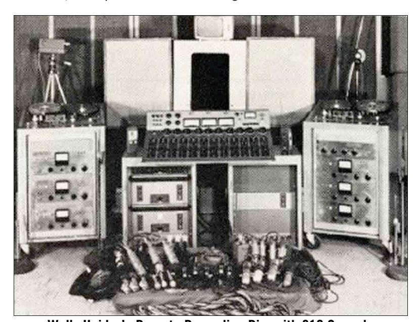

**Wally Heider's Remote Recording Rig, with 610 Console**

# **The Technical Stuff**

At least one 610 module is still in use at Ocean Way Studios, site of the original United Recording facility. Allen Sides, who purchased the studio from Putnam, personally traveled to Hawaii to collect the 610 console that was used to record the live "Hawaii Calls" broadcasts. Celebrated engineer Jack Joseph Puig has long been ensconced in Studio A at Ocean Way with the 610 (and a stunning collection of vintage gear) where he has applied the vintage touch to many of today's artists, including Beck, Hole, Counting Crows, Goo Goo Dolls, No Doubt, Green Day and Jellyfish.

**\_\_\_\_\_\_\_\_\_\_\_\_\_\_\_\_\_\_\_\_\_\_\_\_\_\_\_\_\_\_\_\_\_\_\_\_\_\_\_\_\_\_\_\_\_\_\_\_\_\_\_\_\_\_\_\_\_\_\_\_\_**

Today's 6176 preamp section bears a lot of similarity to the original 610 module. The same 12AX7A tube is used (along with a more modern 12AT7A), and the identical componentry values have been maintained, along with many of the original unit's features. Modern updates include a higher-quality power supply, polypropylene caps, metal film resistors, custom-wound I/O transformers with doublesized alloy cores, and newly added features such as high-impedance inputs, an enhanced EQ section, and phantom power, switchable polarity inversion, and a switchable -15 dB pad on the mic inputs.

#### *Limiter / Compressor section*

The limiter / compressor section of the 6176 is based upon the 1176LN, a device first released forty years ago and still prized to this very day by audio professionals the world over. Designed by Bill Putnam Sr., original founder of Universal Audio, its circuit evolved from the popular 175 and 176 vacuum tube limiters, combined with the latest solid-state amplification circuitry derived from the company's successful 1108 preamplifier (also designed by Putnam). As is evident from entries and schematics in his design notebook, Putnam experimented extensively at the time with the then newly developed Field Effect Transistor (F.E.T.) in various configurations and eventually found a way of using it as the gain-controlling element of a compressor.

The original version of the 1176, released in 1967, was denoted the 1176A, but was revised to the model AB only a few months later, with improvements in stability and slightly reduced noise. The following year saw revision B, with further minor changes to the preamplifier circuit. These models all featured a brushed aluminum faceplate with a blue meter section.

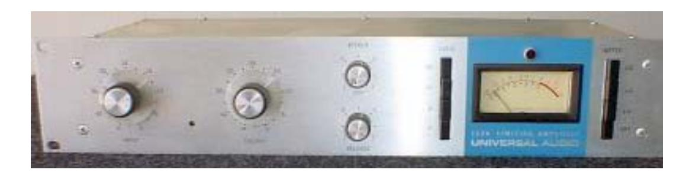

**1176 Revision B**

Revision C, released in September 1970, saw two major changes. One, the unit now sported a black faceplate instead of silver, and, two, it was now designated an 1176LN, with the "LN" standing for "low noise." This model featured first major modification to the 1176 circuit, designed by Brad Plunkett in an effort to reduce noise, hence the birth of the 1176LN.

Numerous design improvements followed, resulting in at least 13 revisions of the 1176. Plunkett's LN circuitry was originally encased within an epoxy module, but a subsequent redesign fully integrated these improvements with the main circuit board, resulting in revision D.

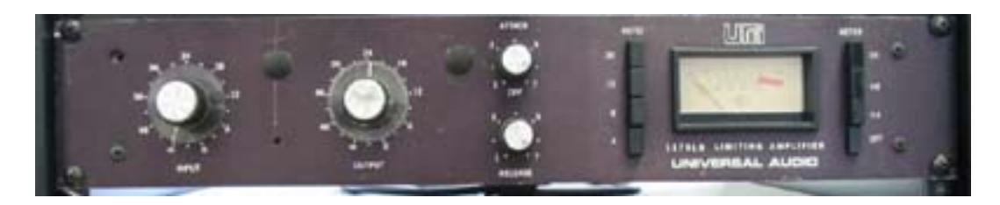

**1176LN Revision D**

Revision E was introduced in the early 1970s and was the first to accommodate European 220V mains power with a voltage selector on the rear panel. Of all the revisions, model D and model E are considered to have superior sound and are thus the most sought-after versions by audio engineers.

Another significant redesign occurred in 1973. The revision F output stage was modified to provide higher output current capability by using a push-pull circuit design borrowed from Universal Audio's new 1109 preamplifier. This new output stage replaced the original Class A circuit borrowed from the 1108 preamp. The meter drive circuit was also updated, with an operational amplifier instead of the previous discrete circuit.

The classic transformer front end of the 1176 met its demise with the model G, in which an electronically balanced input stage replaced it. The final update, the model H, simply marked a return to a silver faceplate and the addition of a blue UREI logo.

The companies that Bill Putnam Sr. started—Universal Audio, Studio Electronics, and UREI—built products that are still in regular use decades after their development. In 1999, Putnam's sons Bill Jr. and James Putnam re-launched Universal Audio. In 2000, the company released its first product: a faithful reissue of the original 1176LN (revision D/E), which quickly garnered rave reviews, finding a home in hundreds of professional and project studios worldwide. In 2003, the 6176 was released, combining an updated version of the 610 preamplifier with a limiter/compressor based upon the D/E revision of the 1176LN, to which a MOSFET regulated power supply has been added in order to increase bass response and minimize noise.

In 2000, Bill Putnam Sr. was awarded a Technical Grammy for his multiple contributions to the recording industry. Highly regarded as a recording engineer, studio designer/operator and inventor, Putnam was considered a favorite of musical icons Frank Sinatra, Nat King Cole, Ray Charles, Duke Ellington, Ella Fitzgerald and many, many more. The studios he designed and operated were known for their sound and his innovations were a reflection of his desire to continually push the envelope. Universal Recording in Chicago, as well as Ocean Way and Cello Studios (now EASTWEST) in Los Angeles all preserve elements of his room designs.

# **The Technical Stuff**

At Universal Audio, we have two goals in mind: to reproduce classic analog recording equipment designed by Bill Putnam Sr. and his colleagues, and to design new recording tools in the spirit of vintage analog technology. Today we are realizing those goals, bridging the worlds of vintage analog and DSP technology in a creative atmosphere where musicians, audio engineers, analog designers and DSP engineers intermingle and exchange ideas. Every project taken on by the UA team is driven by its historical roots and a desire to wed classic analog technology with the demands of the modern digital studio.

**\_\_\_\_\_\_\_\_\_\_\_\_\_\_\_\_\_\_\_\_\_\_\_\_\_\_\_\_\_\_\_\_\_\_\_\_\_\_\_\_\_\_\_\_\_\_\_\_\_\_\_\_\_\_\_\_\_\_\_\_\_**

# **6176 Overview**

The 6176 is a channel strip that combines a vacuum tube microphone/instrument/line preamplifier with a solid state FET-based limiter/compressor.

Its creation was based on a simple idea: Put an 1176LN circuit in the output section of our 610 mic preamp. This effectively marries two faithful reissues of vintage audio devices revered by engineers. The 610 has a long lineage of its own, based upon the original 610 console built by Bill Putnam Sr. Similarly, the 1176LN has long been, in the words of legendary engineer Andy Johns, "the workhorse compressor" in hundreds of studios the world over.

The function of a preamplifier, as its name implies, is to increase (or *amplify*) the level of an incoming signal to the point where other devices in the chain can make use of it. The output level of microphones is very low and therefore requires specially designed mic preamplifiers to raise their level to that needed by a mixing console, tape recorder, or digital audio workstation (DAW) without degrading the signal to noise ratio. This is no simple task, especially when you consider that mic preamps may be called upon to amplify signals by as much as 1000%.

Accomplishing musical-sounding compression is no simple task, either, and a number of different circuits have been developed through the years to attain that goal. One of the most unique of these designs is the one Bill Putnam, Sr. created for the original 1176 limiter/compressor (upon which the 6176 limiter/compressor is based). The naturally "edgy" sound of the 1176 came from the fact that it used a line level input transformer and an FET for gain reduction, followed by another gain stage. For those reasons, regardless of source material, the 1176 will affect tonal quality. In fact, some engineers use the 1176 just as a tone box, and turn off the compression.

Perhaps even more importantly, the effect of the gain reduction circuitry in the 6176 (as in the 1176) is program dependent—a big part of its musically pleasing sound. Although the 6176 compression ratio and attack and release times are user selectable, their responses vary according to the changes in the incoming signal. The circuitry will faithfully compress or limit at the selected ratio for transients, but the ratio will always increase a bit after the transient, though to what degree is once again program dependent. The basic controls for the 1176 are Input, Output, Attack and Release. The Input knob doubles as the threshold control. The Output knob sets make-up gain and, therefore, the final output level. However, cranking up the Input knob also affects post-compression output levels. It's a balancing act that quickly becomes familiar.

Through careful attention to design, custom wiring, and the use of vacuum tubes which are carefully selected and tested individually, the 6176 provides a powerful second-generation recording tool with a clarity and punch that makes it an ideal front-end for tracking with modern DAWs. Its simple operation, combined with its unique limiting/compression characteristics gives it the same extremely musical control that has made the 610 and 1176 such well-loved classics for over 40 years.

# **Compressor / Limiter Basics**

The function of a compressor is to automatically reduce the level of peaks in an audio signal so that the overall dynamic range—that is, the difference between the loudest sections and the softest ones—is reduced, or compressed, thus making it easier to hear every nuance of the music. Compression is sometimes referred to as *peak reduction* or *gain reduction*, because a compressor (or "limiter," when acting more severely) "rides gain" on a signal much like a recording engineer does by hand when he manually raises and lowers the faders of a mixing console. Its circuitry automatically adjusts level in response to changes in the input signal: in other words, it keeps the volume up during softer sections and brings it down when the signal gets louder. The amount of gain reduction is typically given in dB and is defined as the amount by which the signal level is reduced by the compressor.

Compression or limiting enables even the quietest sections to be made significantly louder while the overall peak level of the material is increased only minimally. The dynamic range of human hearing (that is, the difference between the very softest passages we can discern and the very loudest ones we can tolerate) is considered to be approximately 120 dB. Early recording media such as analog tape and vinyl offered much less dynamic range, so compression was a virtual necessity, raising the overall level of the material (making it "hotter") without peak levels causing distortion. While many of today's digital recording media approach or even exceed 120 dB of available dynamic range, quiet passages of recorded music can still be lost in the ambient noise floor of the listening area, which, in an average home, is 35 to 45 dB.

Despite the increased dynamic range, compression is especially important when recording digitally, for two reasons: One, it helps ensure that the signal is encoded at the highest possible level, where more bits are being used so that better signal definition is achieved. Secondly, it helps prevent a particularly harsh type of distortion known as *clipping*—something that, ironically, only occurs in digital recording, due to the inherent limitations of digital technology.

During recording, compression is customarily used to minimize the volume fluctuations that occur when a singer or instrumentalist performs with too great a dynamic range for the accompanying music. It can also help to tame acoustic imbalances within an instrument itself—for example, when certain notes of a bass guitar resonate more loudly than others, or when a trumpet plays louder in some registers than in others. Properly applied compression will make a performance sound more consistent throughout. It can tighten up mixes by melding dense backing tracks into a cohesive whole, can make vocals more intelligible, and can add punch and snap to percussion instruments like kick drum and snare drum, making them more "present" without necessarily being louder. It can also impart tonal coloration, making a signal warmer and fatter. Compression can even serve as a musical tool, enhancing the sustain of held guitar notes or keyboard pads, or providing a snappier attack to horn stabs or string pizzicato.

### *Input Signal and Threshold*

The first and perhaps most significant factor in compression is the level of the input signal. Large (loud) input signals result in more gain reduction, while smaller (softer) input signals result in less gain reduction. *Threshold* is another important factor. It is a term used to describe the level at which a compressor starts to work. Below the threshold point, the volume of a signal is unchanged; above it, the volume is reduced. For example, if a compressor's threshold is 0 dB, incoming signals at or above 0 dB will have their gain reduced, while those below 0 dB will be unaffected.

**\_\_\_\_\_\_\_\_\_\_\_\_\_\_\_\_\_\_\_\_\_\_\_\_\_\_\_\_\_\_\_\_\_\_\_\_\_\_\_\_\_\_\_\_\_\_\_\_\_\_\_\_\_\_\_\_\_\_\_\_\_**

In the 6176, the Input knob controls both the threshold and the amount of input signal being routed to the gain reduction circuitry. As it is turned up (clockwise), the overall degree of compression increases; as it is turned down (counterclockwise), the overall degree of compression decreases. Note that the 6176 ratio setting also affects threshold (see below).

#### *Ratio*

Another important term is compression *ratio*, which describes the amount of increase required in the incoming signal in order to cause a 1 dB increase in output. A ratio of 1:1 therefore means that for every 1 dB of increase in input level, there is a corresponding 1 dB increase in output level; in other words, there is no compression being applied. A ratio of 4:1, however, means that any time there is an increase of 4 decibels in the loudness of the input signal, there will only be a 1 dB increase in output signal. A ratio of 8:1 means that even when there is a full 8 decibels of increase in loudness, there will still only be a 1 decibel increase in output signal. (Bear in mind that the decibel is a logarithmic form of measurement, so a 2 dB signal is not twice as loud as a 1 dB signal; in fact, it requires approximately 10 dB of increased gain for a signal to sound twice as loud.)

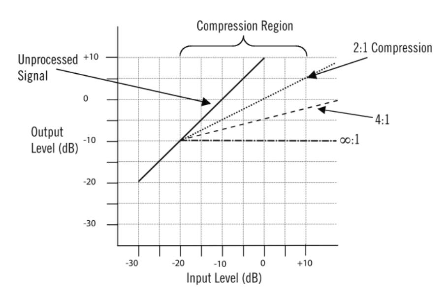

As you can see from this illustration, at low ratios of 2:1 or 4:1, a compressor has relatively less effect on the incoming signal; at higher ratios, it has more effect. While the terms "compression" and "limiting" are often used interchangeably, the general definition of compression is gain reduction at ratios below 10:1; when higher ratios (of 10:1 or greater) are used, the process is instead called *limiting*. Limiters abruptly prevent signals above the threshold level from exceeding a certain maximum value. At very high ratios of 20:1 or greater (some limiters even offer a theoretical infinite

ratio of Infinity:1), "brick wall" limiting kicks in—that is, almost any change in input, no matter how great, results in virtually no increase in output level. Note that the 6176 has been designed so that selecting higher ratios also raises the threshold level.

As an aside, an *expander* is the opposite of a compressor: a device which *increases* the dynamic range of a signal. For example, a 10 dB change in the input signal might result in a 20 dB change in the output signal, thus "expanding" the dynamic range.

#### *Knee*

A compressor's *knee* determines whether the device will reach maximum gain reduction quickly or slowly. A gradual transition ("soft knee") from no response to full gain reduction will provide a gentler, smoother sound, while a more rapid transition ("hard knee") will give an abrupt "slam" to the signal. The 6176 utilizes soft knee compression and limiting, which is generally preferred for most musical applications; hard knee compression or limiting is more often used in applications where instrumentation (such as broadcast transmitter towers) must be protected from transient signal overloads.

#### *Attack and Release*

The main key to the sonic imprint of any limiter or compressor lies in its *attack* and *release* times; these are the parameters which most affect how "tight" or how "open" the sound will be after gain reduction. The attack time describes the amount of time it takes the limiter/compressor circuitry to react to and reduce the gain of the incoming signal, usually given in thousandths of a second (milliseconds) or even millionths of a second (microseconds). A fast attack kicks in almost immediately and catches transient signals of very brief duration (such as the beater hit of a kick drum or the pluck of a string), reducing their level and thus "softening" the sound. A slow attack time allows transients to pass through unscathed before compression begins on the rest of the signal.

The release time is the time it takes for the signal to then return to its initial (pre-compressed) level. If the release time is too short, "pumping" and "breathing" artifacts can occur, due to the rapid rise of background noise as the gain is restored. If the release time is too long, however, a loud section of the program may cause gain reduction that persists through a soft section, making the soft section inaudible.

In the 6176, both the attack and release times are user-selectable. Attack time can be set to between 20 microseconds and 800 microseconds; release time can be set to between 50 milliseconds and 1100 milliseconds (1.1 seconds). Unlike many other devices, however, the 6176 Attack and Release times get faster, not slower, as their corresponding knobs are turned up (clockwise).

#### *Output (Makeup Gain)*

Finally, an output control is employed to make up for the gain reduction applied by the gain reduction circuitry; on the 6176, this is the function of the Output knob. Makeup gain is generally set so that the compressed signal is raised to the point at which it matches the level of the unprocessed input signal (for example, if a signal is being reduced in level by approximately -6 dB, the output makeup gain should be set to +6 dB).

# **The Technical Stuff**

As you are adjusting a limiter or compressor, a switchable meter such as the one provided by the 6176 can be helpful in order to view the strength of the incoming signal (displayed when the meter is set to PRE), the strength of the outgoing signal (displayed when the meter is set to COMP), or the difference in levels between the original input signal and the gain-reduced output signal (displayed when the meter is set to GR). When in GR mode, the 6176 meter will read 0 dB when there is no incoming signal or when no compression is being applied.

**\_\_\_\_\_\_\_\_\_\_\_\_\_\_\_\_\_\_\_\_\_\_\_\_\_\_\_\_\_\_\_\_\_\_\_\_\_\_\_\_\_\_\_\_\_\_\_\_\_\_\_\_\_\_\_\_\_\_\_\_\_**

# **About ALL ("All-Button") Mode**

One of the most unique features of the 6176 limiter / compressor is the ability to select a ratio value of ALL. In this mode (sometimes also known as "British Mode"), the 6176 duplicates the so-called "4 button trick" that occurs when all four ratio buttons on an original 1176 are pushed in simultaneously.

In ALL mode, distortion increases radically due to a lag time on the attack of initial transients (a phenomenon which might be described as a "reverse look-ahead"). The ratio goes to somewhere between 12:1 and 20:1, and the bias points change all over the circuit, thus changing the attack and release times as well. The unique and constantly shifting compression curve that results yields a trademark overdriven tone that can only be found in this family of limiter/compressors.

# **About "Class A"**

Most electronic devices can be designed in such a way as to minimize a particularly unpleasant form of distortion called *crossover distortion.* However, the active components in "Class A" electronic devices such as the 6176 draw current and work throughout the full signal cycle, thus eliminating crossover distortion altogether.

# **About Negative Feedback**

Negative feedback is a design technique whereby a portion of the preamplifier's output signal is reversed in phase and then mixed with the input signal. This serves to partially cancel the input signal, thus reducing gain. A benefit of negative feedback is that it both flattens and extends frequency response, as well as reducing overall distortion. Turning the 6176 front panel Gain switch clockwise (i.e., increasing it) reduces negative feedback, which has the effect of also increasing the amount of the input tube's harmonic distortion, a major contribution to the "warm" sound characteristic of tube equipment. (# *see #1 on page 3*)

# **Impedance Matching**

Depending upon their design, different microphones provide different output impedances. Typical mic impedances range from as low as 50 ohms (the symbol for ohms is Ω) to thousands of ohms (K ohms). The 6176 Mic input can be set to either 500 ohms or 2.0K ohms, allowing it to accommodate virtually every kind of microphone. Switching between these two positions while listening to a connected mic may reveal different tonal qualities and/or gain differences. Generally speaking, a microphone preamplifier should have an input impedance roughly equal to about ten times the microphone output impedance. For example, if your microphone has an output impedance of approximately 200 ohms, the switch should be set to the 2.0K position. However, making music is not necessarily about adhering to technical specifications, so feel free to experiment with the settings to attain the desired sound: doing so will not result in harm to either your microphone or the 6176. (# *see #2 on page 4*)

The 6176's Hi-Z input is intended for electric guitar, electric bass, or any instrument with a magnetic or acoustic transducer pickup. It can be set to either 47K ohms or 2.2M (million) ohms. The 47K ohms setting is best suited for the -10 dBv level signals typically provided by active basses and guitars, while the 2.2M ohms setting is more suitable for instruments with passive pickup systems. Since a particular instrument's output impedance may actually be somewhere between the active and passive levels, feel free to experiment to achieve the best sound at the desired level. Again, changing the input impedance will not harm your instrument or the 6176.

# **Phantom Power**

Most modern condenser microphones require +48 volts of power to operate. When delivered over a standard microphone cable (as opposed to coming from a dedicated power supply), this is known as "phantom" power. The 6176 provides such power when the Phantom switch is in the on (up) position (# *see #11 on page 5),* applying 48 volts to pins 2 and 3 of the mic's output connector.

While, in theory, this should result in no harm to the connected microphone even if it does not require phantom power (since pins 2 and 3 are out of phase and therefore cancel one another at the microphone), problems can occur if the shield (pin 1) is broken or if the connection is made such that both signal pins do not make simultaneous contact. Even if all is good, the application of phantom power can often result in a loud pop (transient). For these reasons, we strongly recommend that the the 6176 Phantom switch be left in its off (down) position when connecting and disconnecting microphones. **Only turn the Phantom switch on if you are certain that the connected microphone requires 48 volts of phantom power**. If in doubt, consult the manufacturer's owners manual for that microphone.

" **To avoid potential equipment damage, disable +48V phantom power before connecting or disconnecting the MIC input. Keep phantom power off (switch down) when it is not required.**

# **Maintenance Information**

#### **Meter Calibration**

The 6176 meter may occasionally need to be calibrated. This is accomplished by adjusting the GR Zero Set pot, located through a small hole on the front panel between the Input and Output knobs.

**\_\_\_\_\_\_\_\_\_\_\_\_\_\_\_\_\_\_\_\_\_\_\_\_\_\_\_\_\_\_\_\_\_\_\_\_\_\_\_\_\_\_\_\_\_\_\_\_\_\_\_\_\_\_\_\_\_\_\_\_\_**

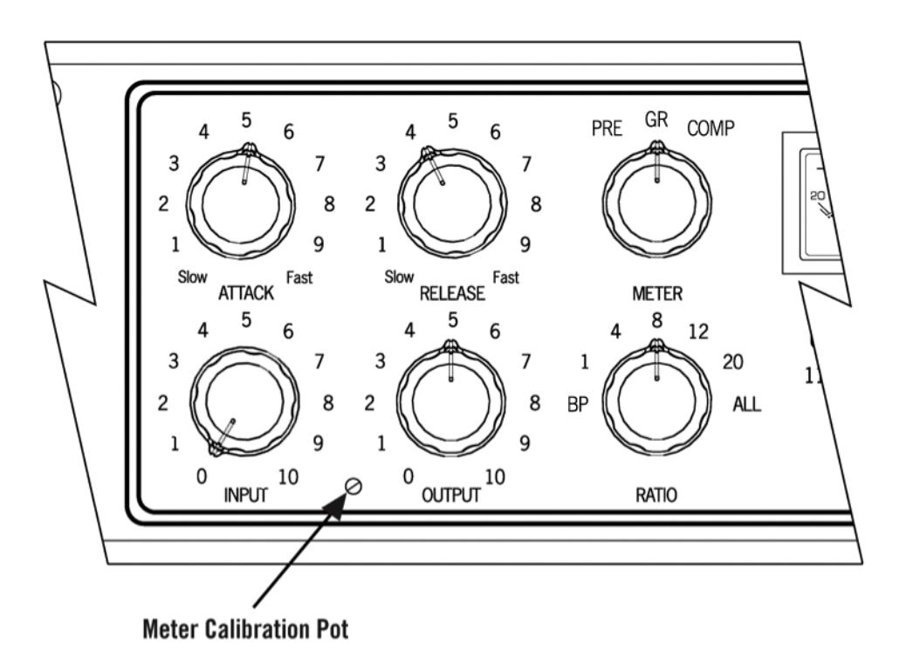

The procedure for adjusting the meter is as follows:

- 1) Power on the 6176 and allow it to warm up for five minutes.
- 2) Set the Meter switch to the GR (Gain Reduction) position.
- 3) Set the Input control fully off (turn the knob fully counterclockwise).
- 4) Use a small screwdriver to slowly adjust the GR Zero Set trim pot so that the meter reads 0 dB. Watch how the meter settles before completing the calibration.

#### **Stereo Operation**

With the use of an external 1176 Stereo Adapter (1176SA), available from Universal Audio, two 6176s can be connected for stereo operation.

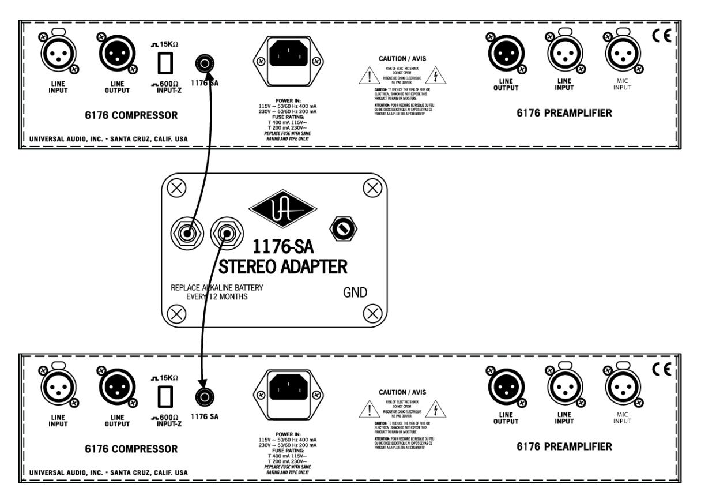

**Note:** When used in stereo operation, the Attack and Release controls on the two 6176s will interact so that changing the Attack or Release times on either device changes that of both devices. Note that when connected in a stereo configuration, the fastest attack time is doubled (that is, it becomes 40 microseconds instead of 20 microseconds).

Use the following procedure to calibrate the 1176SA stereo adapter:

- 1) Remove the signals from both 6176 units.
- 2) Disable the gain reduction on each limiter (set both Attack controls fully counterclockwise).
- 3) Connect the 1176-SA to both 6176s (This requires two RCA-style cables).
- 4) Use the METER function knob to set both units into GR mode.
- 5) Adjust the potentiometer on the 1176-SA until both meters read 0dB.
- 6) If it is not possible to zero both meters, reverse the stereo interconnect cables and repeat the preceding step.

#### **Changing the Internal Voltage Selector**

The 6176 can operate at 115V or 230V. To change the internal voltage selector, wait five minutes after power down, then **unplug the AC power cord from the rear chassis** and remove the top cover.

**\_\_\_\_\_\_\_\_\_\_\_\_\_\_\_\_\_\_\_\_\_\_\_\_\_\_\_\_\_\_\_\_\_\_\_\_\_\_\_\_\_\_\_\_\_\_\_\_\_\_\_\_\_\_\_\_\_\_\_\_\_**

As shown in the photograph below, there is a connector that can be plugged into one location or another to configure the unit for 115V or 230V operation. (This photograph shows the unit configured for 115V operation.) The connector is part of the wiring that comes from the power transformer located at rear center of the 6176 , and it can be identified by its wire colors: Black, Blue, White, and Orange.

Move the connector to location H8 for 230V operation or location H6 for 115V operation. **NOTE: When changing operating voltage, the fuse value must be changed as well**. *Make sure the 6176 is properly set for the voltage in your area before applying AC power to the unit!* Failure to do so may damage the unit.

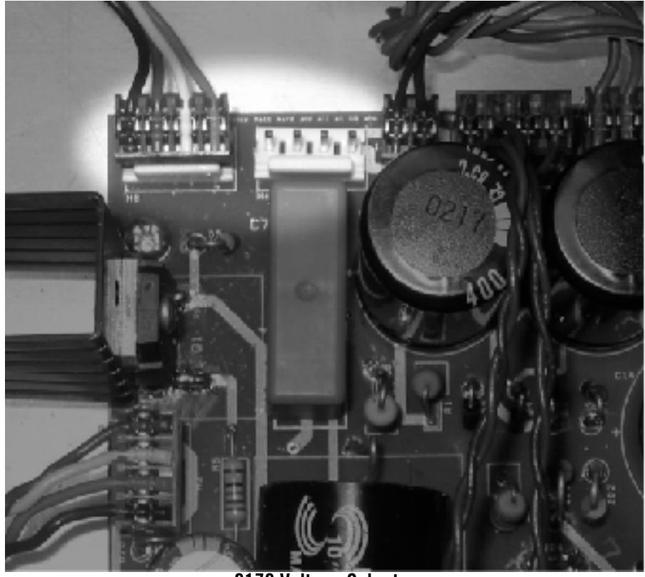

**6176 Voltage Selector**

#### **Changing Fuses**

The AC power fuse is located in the AC power connector block. Remove the power cord before checking or changing the fuse.

A 400 mA time delay (slow blow) fuse is required for operation at 115 V.

A 200 mA time delay (slow blow) fuse is required for operation at 230 V.

" **Never substitute different fuses other than those specified here!**

#### 6176 Circuit Details

The fundamental problem facing Bill Putnam Sr. when he began designing the 1176 limiter was how to keep its FET operating within its linear region in order to keep distortion sufficiently low. After much experimentation he eventually hit upon the simple and elegant idea of using the FET as a voltage-controlled variable resistor, forming the bottom half of a voltage divider circuit, across which the audio signal was applied. He then placed his voltage-controlled attenuator ahead of a solid-state preamplifier stage and line driver, and derived its control voltage from a relatively conventional level-sensing circuit monitoring the output.

The output stage of the 1176 was a carefully crafted class A line level amplifier, designed to work with the then standard load of 600 ohms. The heart of this stage is the custom output transformer developed by Putnam; its design and performance is critical to the sound of the device. This transformer was distinguished by the fact that it used several additional sets of windings to provide feedback (a practice widely used in the tube amplifiers of the era), which made it an integral component in the operation of the output amplifier. Putnam spent a great deal of time perfecting the design of this tricky transformer and carefully qualified the few vendors capable of producing it.

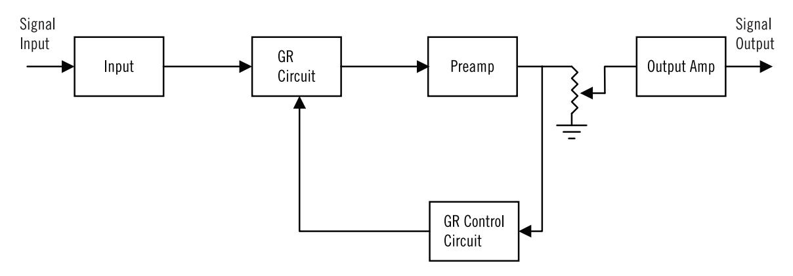

Figure 1 - Block Diagram of the 1176

Figure 1 shows a block diagram of the 1176. Signal limiting and compression is performed by the gain reduction section. Before the signal is applied to the gain reduction section, the audio signal is attenuated by the input stage. The amount of attenuation is controlled by the Input control potentiometer. The amount of gain reduction as well as the compressor attack and release times are controlled by gain reduction control circuit. After gain reduction, a pre-amp is used to increase the signal level. The Output control potentiometer is then used to control the amount of drive that is applied to the output amplifier.

Let's take a closer look at each stage within the 1176 circuit.

#### Input Section

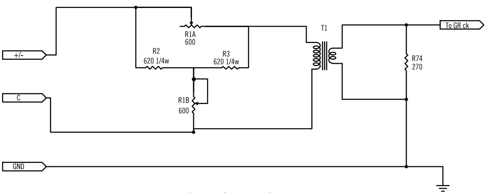

Figure 2 - Input Section

As shown in Figure 2, the 1176 input section is comprised of an adjustable passive attenuator followed by a transformer. The purpose of this section is to reduce the signal level so as not to overdrive the FET based gain reduction stage. Additionally, the adjustable input level is used to control the amount of compression. This input circuit was used in Revisions A-F. With Revision G, a differential op-amp input instead of the attenuator / transformer input stage was used.

#### Gain Reduction Stage

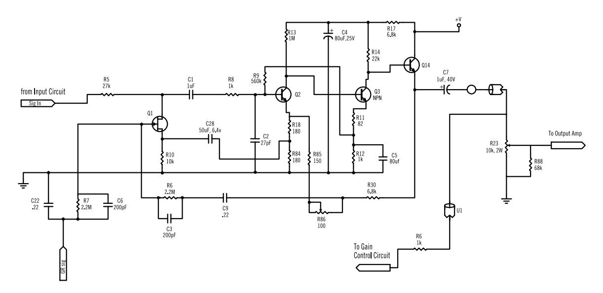

Figure 3 - Gain Reduction Stage

As shown in Figure 3, gain reduction is achieved by a Field Effect Transistor (FET) which is used as a variable resistor. In the 1176, the FET acts like a resistor whose resistance is controlled by the voltage applied to its gate. The higher the voltage applied to the gate, the smaller the drain-source resistance will be.

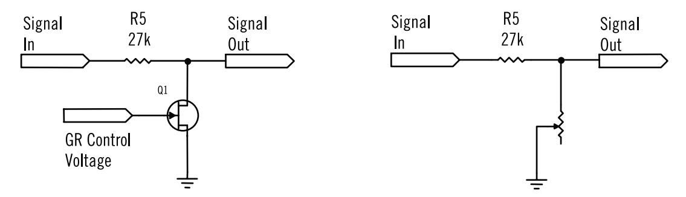

Figure 4 - Using an FET as a voltage-variable resistor. The combination of R5 and Q1 acts as a voltage divider which controls the gain.

Figure 4 shows how the FET's resistance determines the gain of this section. Resistor R5 and the FET essentially comprise a voltage divider circuit. The lower the FET's resistance, the less gain this stage will have. The FET acts like a variable resistor, where the resistance is determined by the control voltage that is applied to it. Note that the greater the voltage applied to the gate of the FET, the less resistance, hence large signals cause the FET to reduce the gain. Larger input signals result in a higher voltage from the gain control circuit, which will lower the gain, hence reducing the signal level. This is the basis of the limiting action. Note that the 1176 is a feedback style compressor since the sidechain circuit samples the signal level after the gain reduction.

#### LN Circuitry

The LN circuit, which appeared in revisions 'C' and later, was designed to reduce the distortion that the FET introduced in the gain reduction stage. FETs are inherently nonlinear devices, and any non linear device will introduce signal distortion. The LN circuitry was designed to ensure that the FET stayed as much within a linear region as possible, thus reducing unwanted distortions. Much of what is now known about the operation and design guidelines of FETs was very new at the time the 1176 was designed. Initially, the decision was made to try to keep the 'LN circuit' a secret and file for a patent. In order to accomplish this it was decided to build the 'LN' circuit in a separate module. This module was then attached to the circuit board. The first revision to have the LN circuitry was revision C. This was accomplished by attaching an 'LN module' to the revision B circuit board. This module turned out to be a problem to manufacture and the decision was made to revise the circuit board to accommodate the LN circuitry without the module. This then became revision D1.

#### Output Amplifier

The output amplifier is a Darlington pair followed by a class A stage based on a 2N3053 transistor. The 1176 output stage was essentially the same as the Universal Audio 1108 pre-amplifier. The output transformer is a custom transformer designed by Bill Putnam Sr. Aside from offering output impedance matching, the transformer forms an integral part of the feedback network used to stabilize the output stage. Note that later revisions ('F' and beyond) used a push-pull (class AB) output stage. (Revision E was essentially the same as revision D. Revision E added 220 Volt operation as well as a 10M Ohm resistor across the ratio switch to avoid 'pops' while changing between compression ratios.)

-10V

10k

R60 3.9k

U3

R83

"Q" Bias Adj. P.C.B.

#### From Pre-Amp To GR Output R75 R73 R68 R64 R21 R20 R19 560,1/4w 1.5k,1/4w 1.5k 470,1/4w R6 56k, 1/4w 56k, 1/4w 68k, 1/4w 1k \$S2B 12:1 \$S3B 20:1 \$S4B \$T&C SIB 8:1 S2A 12: S1A. S3A 20:1 S4A T&C 47k, 1/4w Attack Time Control (F.P.) **ን** S1 R46 C27 U2 **O**U3 R38 50uf Q10 R36 47k Q8 2N3707 47k 2N3707 C19 C20 CR2 6.8uf, 35V C17 50V Q9 Q9 2N3707 Release Time Control Q7 R55 25k R52 2N3707 R37 R39 180k R40 R48 7.68k **廿** C21 ₩80uf,25V 470k R57 4.7k R50 270k 180 R41 R53

#### Gain Reduction Control Circuit

270

R46

47k

Figure 5 - Gain Reduction Control Circuit

CR3

As shown in Figure 5, this circuit controls the amount of compression as well as the attack and release times of the limiter. The input to this circuit is taken from the output of the preamplifier section, just before the volume control potentiometer (R23). The compression ratio push-button switches determine the level of the signal which is sent to the sidechain. This determines the amount of limiting or compression. Transistor Q7 acts as a phase inverter which is followed by Q8, an emitter follower. This signal then feeds CR3 as well as Q9 and Q10, which comprise another phase inverter / emitter follower combination. This is then fed to CR2. Note that the signal applied to CR2 is 180° out of phase with the signal at CR3. Since they are out of phase, the combination of CR2 and CR3 act as a full-wave rectifier. The output of the rectifiers are then filtered by C22 which smoothes the signal. This DC voltage is proportional to the level of the input signal.

A bias level is applied to the diodes by the Compression Ratio pushbutton switches. This controls the threshold of limiting, and is adjusted for the correct value as determined by the currently selected compression ratio selection. R55 controls the compressor's attack time by regulating how fast C22 is charged. Likewise, R56 determines the compressor's release time by controlling the rate at which C22 discharges. The output of this stage is then applied to the gate of the FET in the gain reduction circuit, which in turn controls the gain in the manner previously described.

#### Power Supply

One feature in the 6176 circuit not found in the original 1176 is the addition of a MOSFET regulated power supply, which has the effect of improving bass response as well as significantly reducing the noise floor

# **Glossary of Terms**

**Ambient noise -** Low-level noise created by environmental factors such as fans, air conditioners, heaters, wind noise, etc.

**\_\_\_\_\_\_\_\_\_\_\_\_\_\_\_\_\_\_\_\_\_\_\_\_\_\_\_\_\_\_\_\_\_\_\_\_\_\_\_\_\_\_\_\_\_\_\_\_\_\_\_\_\_\_\_\_\_\_\_\_\_**

**Attack time -** Describes the amount of time it takes compressor circuitry to react to and reduce the gain of incoming signal. A compressor set to a fast attack time kicks in almost immediately and catches transient signals of very brief duration, reducing their level and thus "softening" the sound. A slow attack time allows transients to pass through unscathed before compression begins on the rest of the signal.

**Balanced** - Audio cabling that uses two twisted conductors enclosed in a single shield, thus allowing relatively long cable runs with minimal signal loss and reduced induced noise such as hum.

**Class A** - A design technique used in electronic devices such that their active components are drawing current and working throughout the full signal cycle, thus yielding a more linear response. This increased linearity results in fewer harmonics generated, hence lower distortion in the output signal.

**Clipping -** A particularly harsh form of audio distortion, caused when the loudness of an incoming signal exceeds a digital audio recording device's capability to represent its amplitude. When that happens, the peaks of the signal simply get "clipped" off, thus drastically changing the waveform and yielding an especially unpleasant sound.

**Compression -** The process of automatically reducing the level of peaks in an audio signal so that the overall dynamic range—that is, the difference between the loudest sections and the softest ones—is reduced, or compressed. "Compression" is sometimes described as "gain reduction" or "peak reduction."

**Compression ratio -** A term that describes the amount of increase required in the incoming signal in order to cause a 1 dB increase in output. A ratio of 2:1, for example, means that any time there is an increase of 2 decibels in the loudness of the input signal, there will only be a 1 dB increase in output signal. When compression ratios of 10:1 or higher are being used, the device is instead said to be limiting.

**Condenser microphone** - A microphone design that utilizes an electrically charged thin conductive diaphragm stretched close to a metal disk called a backplate. Incoming sound pressure causes the diaphragm to vibrate, in turn causing the capacitance to vary in a like manner, which causes a variance in its output voltage. Condenser microphones tend to have excellent transient response but require an external voltage source, most often in the form of 48 volts of "phantom power."

**DAW** - An acronym for "Digital Audio Workstation"—that is, any device that can record, play back, edit, and process digital audio.

**dB** - Short for "decibel," a logarithmic unit of measure used to determine, among other things, power ratios, voltage gain, and sound pressure levels.

**dBm** - Short for "decibels as referenced to milliwatt," dissipated in a standard load of 600 ohms. 1 dBm into 600 ohms results in 0.775 volts RMS.

**dBV** - Short for "decibels as referenced to voltage," without regard for impedance; thus, one volt equals one dBV.

**DI** - Short for "Direct Inject," a recording technique whereby the signal from a high-impedance instrument such as electric guitar or bass is routed to a mixer or tape recorder input by means of a "DI box," which raises the signal to the correct voltage level at the right impedance.

**Dynamic microphone** - A type of microphone that generates signal with the use of a very thin, light diaphragm which moves in response to sound pressure. That motion in turn causes a voice coil which is suspended in a magnetic field to move, generating a small electric current. Dynamic mics are generally less expensive than condenser or ribbon mics and do not require external power to operate.

**Dynamic range -** The difference between the loudest sections of a piece of music and the softest ones. The dynamic range of human hearing (that is, the difference between the very softest passages we can discern and the very loudest ones we can tolerate) is considered to be approximately 120 dB. Modern digital recording devices are able to match (or even exceed) that range.

**EQ** - Short for "Equalization," a circuit that allows selected frequency areas in an audio signal to be cut or boosted.

**FET –** An acronym for "Field Effect Transistor," a type of solid-state semiconductor.

**Gain reduction -** A synonym for compression or limiting.

**Hi-Z** - Short for "High Impedance." The 6176's Hi-Z input allows direct connection of an instrument such as electric guitar or bass via a standard unbalanced " jack.

**High shelving filter** - An equalizer circuit that cuts or boosts signal above a specified frequency, as opposed to boosting or cutting on both sides of the frequency, which is what happens with a typical peak/dip EQ.

**Impedance** - A description of a circuit's resistance to a signal, as measured in ohms or thousands of ohms (K ohms). The symbol for ohm is Ω.

**Knee -** A compressor's *knee* determines whether the device will reach maximum gain reduction quickly or slowly. A gradual transition is called "soft knee," while a more rapid transition is called "hard knee." Soft knee compression and limiting is generally more desirable for musical applications.

**Limiter -** A compressor that operates at high compression ratios of 10:1 or higher.

**Limiting -** A more severe form of compression, where a high compression ratio (of 10:1 or higher) is being used.

**Limiting Amplifier -** A synonym for a limiter/compressor.

**Line level** - Refers to the voltages used by audio devices such as mixers, signal processors, tape recorders, and DAWs. Professional audio systems typically utilize line level signals of +4 dBM (which translates to 1.23 volts), while consumer and semiprofessional audio equipment typically utilize line level signals of –10 dBV (which translates to 0.316 volts).

# **Glossary of Terms**

**Low shelving filter** - An equalizer circuit that cuts or boosts signal below a specified frequency, as opposed to boosting or cutting on both sides of the frequency.

**\_\_\_\_\_\_\_\_\_\_\_\_\_\_\_\_\_\_\_\_\_\_\_\_\_\_\_\_\_\_\_\_\_\_\_\_\_\_\_\_\_\_\_\_\_\_\_\_\_\_\_\_\_\_\_\_\_\_\_\_\_**

**Makeup gain -** A control that allows the overall output signal to be increased in order to compensate ("make up") for the gain reduction applied by the compressor.

**Mic level** - Refers to the very low level signal output from microphones, typically around 2 millivolts (2 thousandths of a volt).

**Mic preamp** - The output level of microphones is very low and therefore requires specially designed mic preamplifiers to raise (amplify) their level to that needed by a mixing console, tape recorder, or digital audio workstation (DAW).

**MOSFET –** An acronym for "Metal Oxide Semiconductor Field Effect Transistor," an advanced type of solid-state FET.

**Negative feedback** - Not just something to fear on Ebay. Negative feedback is a design technique whereby a portion of the preamplifier's output signal is reversed in phase and then mixed with the input signal. This serves to partially cancel the input signal, thus reducing gain. A benefit of negative feedback is that it both flattens and extends frequency response, as well as reducing overall distortion.

**Noise floor** - Unwanted random sound (noise) added by an electronic device.

**Patch bay** - A passive, central routing station for audio signals. In most recording studios, the linelevel inputs and outputs of all devices are connected to a patch bay, making it an easy matter to reroute signal with the use of patch cords.

**Patch cord** - A short audio cable with connectors on each end, typically used to interconnect components wired to a patch bay.

**Peak reduction -** A synonym for compression or limiting.

**Ratio -** see "Compression Ratio"

**Release time -** The time it takes for a signal to return to its initial (pre-compressed) level. If the release time is too fast, "pumping" and "breathing" artifacts can occur, due to the rapid rise of background noise as the gain is restored. If the release time is too slow, however, a loud section of the program may cause gain reduction that persists through a soft section, making the soft section inaudible.

**Ribbon microphone** - A type of microphone that works by loosely suspending a small element (usually a corrugated strip of metal) in a strong magnetic field. This "ribbon" is moved by the motion of air molecules and in doing so it cuts across the magnetic lines of flux, causing an electrical signal to be generated. Ribbon microphones tend to be delicate and somewhat expensive, but often have very flat frequency response.

**Threshold -** A term used to describe the level at which a compressor starts to work. Below the threshold point, the volume of a signal is unchanged; above it, the volume is reduced. In the 6176, threshold is determined by the setting of the Input and Ratio controls.

**Transformer** - An electronic component consisting of two or more coils of wire wound on a common core of magnetically permeable material. Audio transformers operate on audible signal and are designed to step voltages up and down and to send signal between microphones and line-level devices such as mixing consoles, recorders, and DAWs.

**Transient** - A relatively high volume pitchless sound impulse of extremely brief duration, such as a pop. Consonants in singing and speech, and the attacks of musical instruments (particularly percussive instruments), are examples of transients.

**XLR** - A standard three-pin connector used by many audio devices, with pin 1 typically connected to the shield of the cabling, thus providing ground. Pins 2 and 3 are used to carry audio signal, normally in a balanced (out of phase) configuration.

# 6176 Channel Strip

Session Recall Sheet

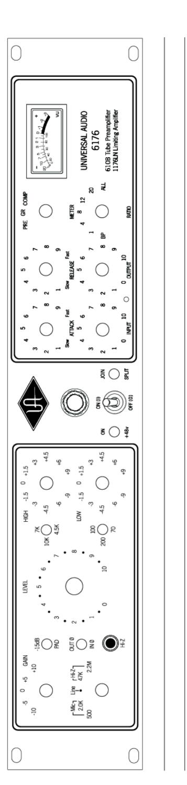

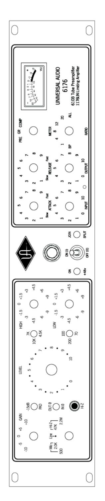

analog ears digital minds

**Preamp:**

**Microphone Input Impedance** Selectable, 500 Ohms or 2K Ohms

**Balanced Line Input Impedance** 20K Ohms

**Hi-Z Input Impedance** Selectable between 2.2M Ohms or 47K Ohms **Maximum Microphone Input Level** +18 dBu (2K input impedance and 15 dB Pad in)

**Maximum Output Level** +20 dBm **Internal Output Impedance** 80 Ohms **Recommended Minimum Load** 600 Ohms

**Frequency Response** 20 Hz to 20 kHz +0 dB, -1 dB **Maximum Gain** 65 dB (500 Ohms input impedance) **Signal-to-Noise Ratio** Greater than 90 dB (@ maximum gain)

**Limiting Amplifier:**

**Input Impedance** Selectable, 15K Ohms or 600 Ohms

**Output Load Impedance** 600 Ohms (floating) **Frequency Response** 20 Hz to 20 kHz, ± 1 dB

**Gain** 40 dB, ± 1 dB

**Distortion** Less than 0.5% T.H.D. from 50 Hz – 15 kHz

with limiting, at 1.1 seconds release setting.

Output of +22 dBm with no greater than 0.5% T.H.D.

**Signal-to-Noise Ratio** Greater than 75 dB

**Attack Time** Adjustable, from 20 to 800 microseconds

**Release Time** Adjustable, from 50 milliseconds to 1.1 seconds

**Stereo Interconnection** Optional, using 1176SA stereo interconnect accessory

**General:**

**Tube Complement** (1) 12AX7A, (1) 12AT7A

**Power Requirements** 115V/230V

**Power Connector** Detachable IEC power cable.

**Fuse** 400 mA time delay (slow blow) @ 115 V

200 mA time delay (slow blow) @ 230 V

**Power Indicator Light** 28 V bulb (type 1819)

**Dimensions** 19" W x 3.5" H x 12.25" D (two rack unit)

**Weight** 12 lb.

**\_\_\_\_\_\_\_\_\_\_\_\_\_\_\_\_\_\_\_\_\_\_\_\_\_\_\_\_\_\_\_\_\_\_\_\_\_\_\_\_\_\_\_\_\_\_\_\_\_\_\_\_\_\_\_\_\_\_\_\_\_**

# **Product Registration**

Please take a moment to register your new Universal Audio product by visiting our website at:

• www.uaudio.com/support/register.html

Registration allows us to contact you regarding important product updates and also makes you eligible for support and online promotions.

# **Customer Support**

Universal Audio provides free customer support to all registered 6176 users. Our support specialists are available to assist you via email and telephone.

#### *Email Support*

To request support via email:

- 1. Visit the main Universal Audio support page at www.uaudio.com/support
- 2. Click the blue "Submit Support Ticket" button on the right side of the page

## *Telephone Support*

USA toll-free: +1-877-698-2834 (1-877-MY-UAUDIO)

International: +1-831-440-1176

Germany, Austria, Switzerland, France, Benelux: +31 (0) 20 800 4912

# **Warranty**

Universal Audio provides a warranty on all hardware products. This limited warranty gives you specific legal rights. You may also have other rights which vary by state or country. To learn more, please contact Customer Support, or visit:

• www.uaudio.com/support/warranty.html

# **Repair Service**

If you are having issues with your 6176, the first check all system setups and connections. If that doesn't help, contact Customer Support. To learn more about repair service, please visit:

• www.uaudio.com/support/rma-faq.html