### **Model 710 Twin-Finity Mic/Line/Hi-Z Preamplifier**

**Universal Audio Part Number 65-0029 Revision 1.0**

Universal Audio, Inc.

Customer Service & Tech Support: 1-877-MY-AUDIO Business, Sales & Marketing: 1-866-UAD-1176

www.uaudio.com

### **Notice**

This manual provides general information, preparation for use, installation and operating instructions for the Universal Audio 710.

The information contained in this manual is subject to change without notice. Universal Audio, Inc. makes no warranties of any kind with regard to this manual, including, but not limited to, the implied warranties of merchantability and fitness for a particular purpose. Universal Audio, Inc. shall not be liable for errors contained herein or direct, indirect, special, incidental, or consequential damages in connection with the furnishing, performance, or use of this material.

### Copyright

© 2008 Universal Audio, Inc. All rights reserved.

This manual and any associated software, artwork, product designs, and design concepts are subject to copyright protection. No part of this document may be reproduced, in any form, without prior written permission of Universal Audio, Inc.

### **Trademarks**

710, Twin-Finity, 4110, 8110, SOLO/110, SOLO/610, 2-610, LA-610, LA-2A, 2-LA2, LA-3A, 6176, 1176LN, 2-1176, 2192, DCS Remote Preamp, UAD and the Universal Audio, Inc. logo are trademarks of Universal Audio, Inc. Other company and product names mentioned herein are trademarks of their respective companies

### **Contents of This Box**

This package should contain:

- One Model 710 Twin-Finity Mic/Line/Hi-Z Preamplifier
- Rack mounting hardware
- 710 Operating Instructions
- IEC Power Cable
- Registration card

Thank you for purchasing the Model 710 Twin-Finity Mic/Line/Hi-Z Preamplifier— a radically new UA pre-amp design which combines both the classic retro warmth of UA tube design and the transient bite of solid-state in a 2U, half-rack, all-metal chassis. The 710 was created specifically to add the tonal versatility and sonic inspiration missing from generic audio interface preamps. The key to its sonic flexibility lies in its innovative circuit design, featuring a solid-state transimpedance input amp simultaneously driving separate, phase-aligned tube and solid-state gain stages, which are then summed to a single output. The mix between the 310 volt single-ended class-A triode tube stage and solid-state transimpedance stage is controlled via a unique "Blend" knob. Blending is continually variable between 100% tube and 100% solid-state offering a practically infinite range of unique pre-amp tones and the ability to easily dial in your own signature sound.

Like all our other preamp designs, the 710 features dual gain-stage controls (Gain/Level) which can radically vary the amount of coloration and distortion by allowing you to crank up the input gain like a guitar amp. The VU meter features a unique "Drive" mode allowing you to see how hard you are driving the tube/solid state stage. Other features include a discrete JFET Direct Inject input which allows you to plug in an electric guitar or bass, or any instrument with a magnetic or acoustic transducer pickup, with 2.2M ohm ultra Hi-Z impedance; a monolithic balanced output stage; more than 70dB of gain; +48V phantom power and a -15dB pad for the mic input; phase invert and 75Hz low cut filter; a universal auto-sensing internal power supply that allows for operation at any voltage between 100 and 240VAC; and a portable, rack-mountable design for studio, desktop or stage. Yet for all its versatility and power, the 710 is remarkably easy to use: you'll find that its controls are simple and essential, providing only those features required for practical use without needless duplication of functionality found elsewhere in most studios.

Most of us at Universal Audio are musicians and/or recording engineers. We love the recording process, and we really get inspired when tracks are beautifully recorded. Our design goal for the 710 was to build a mic preamp that we would be delighted to use ourselves—one that would induce that "a-ha" feeling you get when hearing music recorded in its most natural, inspired form.

Developing the Model 710—as well as Universal Audio's entire line of quality audio products designed to meet the needs of the modern recording studio while retaining the character of classic vintage equipment—has been a very special experience for me and for all who have been involved. While, on the surface, the rebuilding of UA has been a business endeavor, it's really been so much more than that: in equal parts a sentimental and technical adventure.

We thank you, and we thank my father, Bill Putnam.

Sincerely,

Bill Putnam, Jr.

### **Important Safety Instructions**

**\_\_\_\_\_\_\_\_\_\_\_\_\_\_\_\_\_\_\_\_\_\_\_\_\_\_\_\_\_\_\_\_\_\_\_\_\_\_\_\_\_\_\_\_\_\_\_\_\_\_\_\_\_\_\_\_\_\_\_**

Before using this unit, be sure to carefully read the applicable items of these operating instructions and the safety suggestions. Afterwards, keep them handy for future reference. Take special care to follow the warnings indicated on the unit, as well as in the operating instructions.

- 1. **Water and Moisture** Do not use the unit near any source of water or in excessively moist environments.
- 2. **Object and Liquid Entry** Care should be taken so that objects do not fall, and liquids are not spilled, into the enclosure through openings.
- 3. **Ventilation** When installing the unit in a rack or any other location, be sure there is adequate ventilation. Improper ventilation will cause overheating, and can damage the unit.
- 4. **Heat** The unit should be situated away from heat sources, or other equipment that produce heat.
- 5. **Power Sources** The unit should be connected to a power supply only of the type described in the operating instructions, or as marked on the unit.
- 6. **Power Cord Protection** AC power supply cords should be routed so that they are not likely to be walked on or pinched by items placed upon or against them. Pay particular attention to cords at plugs, convenience receptacles, and the point where they exit from the unit. Never take hold of the plug or cord if your hand is wet. Always grasp the plug body when connecting or disconnecting it.
- 7. **Grounding of the Plug** This unit is equipped with a 3-wire grounding type plug, a plug having a third (grounding) pin. This plug will only fit into a grounding-type power outlet. This is a safety feature. If you are unable to insert the plug into the outlet, contact your electrician to replace your obsolete outlet. Do not defeat the purpose of the grounding-type plug.
- 8. **Cleaning** Follow these general rules when cleaning the outside of your 710:
  - a. Turn the power Off and unplug the unit
  - b. Gently wipe with a clean lint-free cloth
  - c. If necessary, moisten the cloth using lukewarm or distilled water, making sure not to oversaturate it as liquid could drip inside the case and cause damage to your 710
  - d. Use a dry lint-free cloth to remove any remaining moisture
  - e. Do not use aerosol sprays, solvents, or abrasives
- 9. **Nonuse Periods** The AC power supply cord of the unit should be unplugged from the AC outlet when left unused for a long period of time.
- 10. **Damage Requiring Service** The unit should be serviced by a qualified service personnel when:
  - a. The AC power supply cord or the plug has been damaged; or
  - b. Objects have fallen or liquid has been spilled into the unit; or
  - c. The unit has been exposed to rain; or
  - d. The unit does not operate normally or exhibits a marked change in performance; or
  - e. The unit has been dropped, or the enclosure damaged.
- 11. **Servicing** The user should not attempt to service the unit beyond that described in the operating instructions. All other servicing should be referred to qualified service personnel.

| A Letter From Bill Putnam, Jr.                                                                                                                                                                                                                                      | i                                                           |
|---------------------------------------------------------------------------------------------------------------------------------------------------------------------------------------------------------------------------------------------------------------------|-------------------------------------------------------------|
| Important Safety Instructions                                                                                                                                                                                                                                       | ii                                                          |
| Two Page, Two Minute Guide To Getting Started                                                                                                                                                                                                                       | 2                                                           |
| Front Panel                                                                                                                                                                                                                                                         | 4                                                           |
| Rear Panel                                                                                                                                                                                                                                                          | 7                                                           |
| Interconnections                                                                                                                                                                                                                                                    | 8                                                           |
| Insider's Secrets                                                                                                                                                                                                                                                   | 9                                                           |
| The Technical Stuff History of the 710 710 Overview 710 Vacuum Tube Preamp 710 Solid-State Preamp About Class A Phantom Power Phase Inversion LOW CUT Filtering Rack Mounting Optional Desktop Handle Kit Maintenance Information Fuse Voltage Select Block Diagram | 111 133 133 144 144 155 155 166 166 |
| Glossary of Terms                                                                                                                                                                                                                                                   | 19                                                          |
| Recall Sheet                                                                                                                                                                                                                                                        | 21                                                          |
| Specifications                                                                                                                                                                                                                                                      | 22                                                          |
| Additional Resources / Product Registration / Warranty / Service & Support Inside back of                                                                                                                                                                           | evo:                                                        |

### The Two Page, Two Minute Guide To Getting Started

No one likes to read owner's manuals. We know that.

We also know that you know what you're doing—why else would you have bought our product?

So we're going to try to make this as easy on you as possible. Hence this two-page spread, which we estimate will take you approximately two minutes to read. It will tell you everything you need to know to get your Universal Audio 710 up and running, without bogging you down with details.

Of course, even the most expert of us has to crack a manual every once in awhile. As the saying goes, "as a last resort, read the instructions." You'll find those details you're craving—a full description of all front and rear panel controls, interconnection diagrams, insider's secrets, history, theory, maintenance information, block diagrams, specifications, even a glossary of terms—in the pages that follow.

### **Manual conventions:**

- Means that this is an especially useful tip.
- (i) Means that this is an especially important bit of information

And when we need to direct you to a page or section elsewhere in the manual, we'll use the universal signs for rewind ( $\blacktriangleleft$ ) or fast forward ( $\blacktriangleright$ ).

### Getting Started With Your 710:

- **Step 1:** Decide where the 710 is to be physically placed and place it there. Chassis mounting hardware is provided, allowing the 710 to be used in a standard 19" rack (taking just two spaces), and so we recommend that the 710 be securely mounted in a rack if possible. An optional desktop handle kit (which can be purchased via www.uaudio.com) is also available, allowing the 710 to be easily transported and used on any flat surface.
- **Step 2:** Mute your monitors and then, using a balanced cable with XLR connectors, connect the 710's rear panel line output to the appropriate input on your patch bay, mixer, or DAW.
- **Step 3:** Set the front panel +48V (phantom power), 15dB PAD, and LOW CUT switches to their down (OFF) position.
- **Step 4:** Set the front panel POLARITY switch to its down (INØ) position.
- **Step 5:** Connect the desired input source to the 710's rear panel balanced XLR mic and/or line input. Alternatively, an electric guitar or bass can be connected to the front panel unbalanced 1/4" Hi-Z input; however, note that the 710's jack sensing circuitry automatically disconnects the rear-panel mic and line inputs when a cable is inserted into the Hi-Z input.
- (►) see #3 on page 5 for more information, and ►) see page 8 for an interconnection diagram)

  Step 6: If you are using a microphone or line-level input, set the front panel Input Select switch to Mic or Line.
- **Step 7:** Set the Meter switch to DRIVE (its down position).

- **Step 8:** Set the Gain control to "0" and the Level control to approximately "5".
- **Step 9:** Set the Blend knob to its twelve o'clock position. This ensures an equal blend of both of the 710 preamplifiers (solid-state and vacuum tube).
- **Step 10:** Make sure the Power switch is off (left position) and then connect the supplied IEC power cable to the rear panel AC power connector.
- **Step 11:** Power on the 710. The front-panel meter will light up.
  - - **Because the Model 710 utilizes a tube, it needs several minutes to achieve stable operating temperature. During warm-up, audio quality may vary slightly.**
- **Step 12:** If a microphone requiring 48 volts of phantom power is connected to the 710, turn on the +48V switch.
- **Step 13:** Unmute your monitors and slowly raise the Gain control. You should now be hearing signal, with the 710 meter becoming active.
- **Step 14:** While viewing the meter, set the Gain control until optimum input signal strength is achieved. Change the Meter switch to OUTPUT (its up position) and set the Level control until optimum output signal strength is achieved.
- **Step 15:** Experiment with differing degrees of Gain to hear the various amounts of coloration the 710 can impart to your signal. (CAUTION: Very high Gain settings will result in significant amounts of distortion). For the cleanest, most uncolored signal from the 710, set the Gain knob to its lowest usable setting, change the Meter to OUTPUT, and then adjust the Level control as necessary. If you hear distortion when using a connected microphone even at the lowest Gain level, employ the -15 dB pad to reduce the input level. If you hear low frequency rumble, employ the Low Cut filter switch. (see page 15 for more information)
- **Step 16:** Finally, experiment with the Blend control to hear the different sonic signatures imparted by the two discrete preamplifiers contained within the 710. At the fully counterclockwise (TRANS) position, only signal from the solid-state preamplifier is heard. At the fully clockwise (TUBE) position, only the signal from the tube preamplifier is heard. Most uniquely, it is the in-between settings that allow you to access the "twin-finity" of sounds offered by the 710 and create a custom blend that best complements your signal source.
  - **For more information, refer to the "Front Panel" and "Rear Panel" sections on pages 4 7 of this manual.**

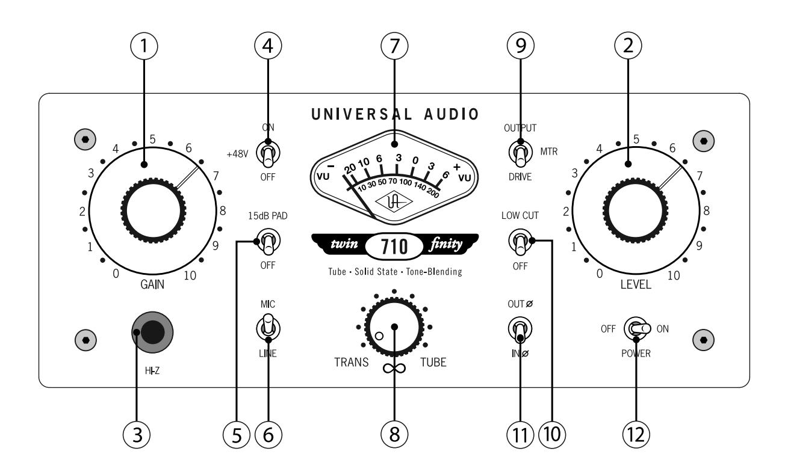

**\_\_\_\_\_\_\_\_\_\_\_\_\_\_\_\_\_\_\_\_\_\_\_\_\_\_\_\_\_\_\_\_\_\_\_\_\_\_\_\_\_\_\_\_\_\_\_\_\_\_\_\_\_\_\_\_\_\_**

- **(1) Gain** Adjusts the gain of the input stage. Turning this knob clockwise raises the amount of gain applied to the input signal.
- **(2) Level** This is the 710's master volume control. It determines the amount of signal sent from the rear panel LINE OUTPUT. ( see #2 on page 7)
  - - **The numeric values for the Gain and Level knobs are relative scale markings and do not represent specific dB values.**
  - **You can come up with many useful tonal variations by experimenting with different Gain and Level settings.**

**(3) Hi-Z Input** - Connect high impedance signal from an instrument such as electric guitar or bass to this standard unbalanced 1/4" jack connector. The 710's jack detection circuitry automatically switches from the selected rear panel MIC or LINE input to the front panel Hi-Z input whenever a plug is inserted into this jack.

- - **Making a connection to the Model 710's front panel Hi-Z input jack automatically disconnects any signal arriving at the rear panel mic or line input.**
- **(4) +48 V**  Most modern condenser microphones require +48 volts of phantom power to operate. When in the up position, 48 volts of phantom power are delivered to the rear panel MIC INPUT. ( See #4 on page 7 and see page 14 for more information about phantom power)
  - -**Keep phantom power off (switch down) when it is not required.**
  - - **Always check the power requirements of your microphone with the manufacturer before applying phantom power.**
  - - **To avoid loud transients, always make sure phantom power is off when connecting or disconnecting microphones.**
- **(5) -15 dB PAD** When placed in the up position, the MIC INPUT signal will be reduced by -15dB. (This switch has no effect on LINE INPUT or Hi-Z signal.) Use this to reduce the incoming signal in cases where undesired distortion is present at low gain levels (for instance, where especially sensitive microphones are used on loud instruments).
- **(6) Input Select -** Determines whether the MIC (up position) or LINE (down position) input is active.
- **(7) Meter** A standard VU meter that displays either the amount of output level or preamplifier overdrive, depending upon the setting of the Meter Function switch. ( see #9 below)
- **(8) Blend ("")** This unique control sets the relative contribution from the solid-state and vacuum tube preamplifier circuits. When in the fully counterclockwise (TRANS) position, only signal from the solid-state preamplifier is heard. When in the fully clockwise (TUBE) position, only the signal from the tube preamplifier is heard. At the twelve o'clock position, signal from both the solid-state and tube preamplifiers is heard at equal amounts.
- **(9) Meter Function -** This two-position switch determines what the 710's VU meter displays. In the up (OUTPUT) position, it shows final output level in dB; in the down (DRIVE) position, it shows the THD(total harmonic distortion) level after the front panel Gain control, but before the preamplifier circuitry, thus giving an accurate gauge of how hard the tube and solid-state preamplifiers are being driven. In DRIVE mode, the meter is calibrated so that 0 VU is equal to 1.2% THD on a 1KHz sine wave and -10VU is equal to 0.4% THD. ( see page 9 for more information) When OUTPUT is selected, a

### **Front Panel**

**\_\_\_\_\_\_\_\_\_\_\_\_\_\_\_\_\_\_\_\_\_\_\_\_\_\_\_\_\_\_\_\_\_\_\_\_\_\_\_\_\_\_\_\_\_\_\_\_\_\_\_\_\_\_\_\_\_\_**

meter reading of 0 VU corresponds to a level of +4 dBm at the rear panel LINE OUTPUT jack. ( see #2 on page 7)

- **(10) Low Cut** When enabled (placed in the up position), the input signal passes through a 75Hz low cut filter. This is normally used to eliminate rumble and other unwanted low frequencies from an incoming signal. ( See page 15 for more information about low cut filtering)
- **(11) Polarity ("ø")** Determines the polarity of the LINE OUTPUT. ( see #2 on page 7) When off (in the down, INø position), pin 2 of the LINE OUTPUT is hot (positive). When the switch is enabled (in the up, OUTø position), the output signal is placed out of phase and pin 3 of its LINE OUTPUT is hot (positive). Normally the switch should be off and only enabled when it is desirable to reverse the polarity, i.e., in cases where more than one microphone is utilized in recording a source signal. ( See page 14 for more information about phase inversion)
- **(12) Power** Turns the 710 power on or off. When powered on, the front panel meter lights up.
  - -**The 710 should be powered off when it is not being used for extended periods of time.**

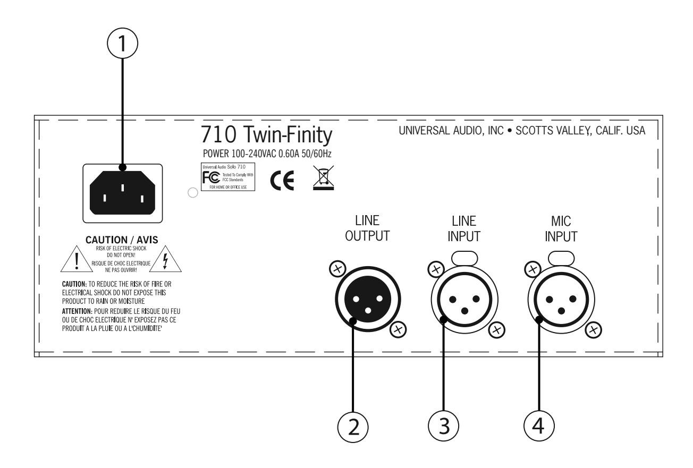

- **(1) AC Power Connector** Connect a standard, detachable IEC power cable (supplied) here.
- **(2) LINE OUTPUT** A balanced XLR connector that carries the line-level output signal of the 710. Note that Pin 2 is positive when the front panel Polarity switch is off (INø). Pin 3 is positive when the front panel Polarity switch is engaged (OUTø). ( see #11 on page 6)
- **(3) LINE INPUT** Connect a line-level input signal (coming from a device such as a mixer, DAW, tape machine, or signal processor) into this balanced XLR connector. Pin 2 is wired positive (hot).
- **(4) MIC INPUT** Connect a microphone to this standard XLR connector. Pin 2 is wired positive (hot).

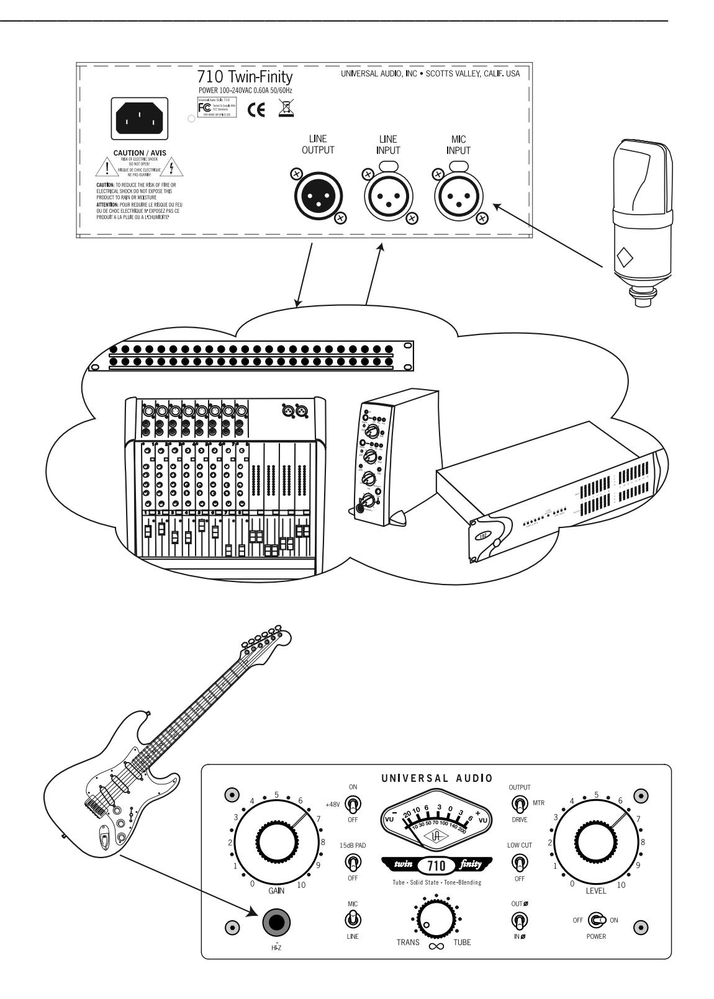

**For most applications, we recommend setting the 710 Gain and Level controls at approximately "5" (their twelve o'clock position). Adjustments can then be made to the Gain, Level, and Blend controls to achieve the optimum sound for your signal source.**

**\_\_\_\_\_\_\_\_\_\_\_\_\_\_\_\_\_\_\_\_\_\_\_\_\_\_\_\_\_\_\_\_\_\_\_\_\_\_\_\_\_\_\_\_\_\_\_\_\_\_\_\_\_\_\_\_\_\_**

### **The Best of Both Worlds**

There's a reason why tube preamplifiers have long been favored by audio engineers (especially in this age of digital recording): they impart a warmth and richness that makes most sounds larger than life. However, there is no denying that tube preamps also tend to color the incoming signal somewhat, albeit in a way which most listeners find pleasant and desirable.

On the other hand, the recording of voice and acoustic instruments sometimes requires precise signal handling with meticulous attention to detail, definition and accuracy. Applications such as classical or jazz recording demand faithful transfer of performances exactly as they happen, without coloration, processing, noise or distortion, and that is where solid-state preamplifiers shine. Plus, by capturing the sound as it is, you can leave sound sculpting and "coloration" decisions until later, during the mixing stage.

So the question is, which kind of preamp to use? Up until now, the only solution has been to have an arsenal of both kinds at your disposal, but with the 710, that's no longer necessary, since it provides both designs in one box, as well as a unique Blend control that allows the user to dial in the precise contribution of each preamp to the overall sound. As a good starting point, we recommend that you set the Blend control to the desired degree of tube coloration, then back it off slightly (towards the TRANS position) to dial in the precise amount of "snap" and detail you want in your sound.

### **Drive Metering**

Because it shares lineage with vintage guitar amplifier designs, the 710's tube preamplifier can contribute precise amounts of even-order harmonic distortion (the kind the ear enjoys listening to) to your signal, ranging from pleasant amounts of rasp to all-out grunge. The Drive meter function can be a great tool in helping to decide how high to raise the Gain control because it indicates how much tube saturation is going to be present in the output signal. It does this by monitoring the signal that is driving the tube. If what you want is crystal clear tube tone, then the meter will be bouncing around near the low end of its range. If what you are after is a ton of tube dirt, then drive the meter into the red; there is nothing wrong with either extreme. Once you use the Drive function a few times, you will develop a feel for it, and should be able to dial in the desired tube character quickly and easily.

When in Drive mode, the 710 meter is calibrated so that 0VU is equal to 1.2% THD on a 1KHz sine wave. However, measured distortion levels can be misleading because they are so source and style dependent. 2% THD on a sine wave is a fair amount of distortion and will be apparent to even the non-musically inclined. On a vocal track, however, that same 2% THD sounds like some really nice tube warmth. On an overdriven guitar, 2% is barely even audible. The most important thing to remember when using the Drive function is that there is no "wrong" meter reading, only wrong tones for a particular track. So use the meter as guide, not as a pass/fail test. Do what feels and sounds right, and don't be afraid to push it.

### **Vocals, Vocals, Vocals**

Just as certain microphones work best with certain vocalists, so too do certain mic preamps. The presence of not just one, but two completely discrete preamps in the 710 mean that it will work wonders with just about any microphone... and with just about any vocalist.

The crisp precision of a condenser microphone, for example, can be matched perfectly by the uncolored accuracy of the 710's transimpedance solid-state preamp... or you can instead opt to use the tube side to "warm up" the tone. Better yet, use the Blend control to dial in exactly the right amount of both preamps to match both the microphone's frequency characteristics and the timbral quality of the vocalist. And if you're using the already warm sound of a tube microphone for vocals, try complementing it with the 710's solid-state preamp (or use the Blend control to dial in a combination of the two that favors the contribution of the TRANS side).

### **Electric Guitar and Bass**

There's something very special about the mix of tube preamplification and electric guitar and bass, which is why tube amps are so prevalent in that world. Cranking up the 710's Gain control will impart anything

from a slight bark to total grunge. Set the Blend control all the way to TRANS for that overloaded console effect, or all the way to TUBE to emulate the grittiness and bite of an overdriven guitar amp... or anywhere in-between for a custom guitar sound perfectly crafted to the context of the song.

Electric bass players may want to set the Blend control so that the solid-state amp is slightly favored (try a 10 o'clock position to start), allowing you to take advantage of the precision of the transimpedance preamp stage, combined with just a touch of tube warmth. For acoustic bass, try dialing in just a touch more tube preamp.

### **Acoustic Guitar**

The 710 is also a powerful tool for the recording of acoustic guitar. Try pairing it with a small-diaphragm omnidirectional mic and then set the Blend to about the 2 o'clock position (thus slightly favoring the tube preamp) for a sound that is both pristine and warm.

### **Horns and Reeds**

The incredible detail provided by the 710's solid-state transimpedance preamp make it a perfect match for horn and reed instruments. Dial in just a touch of the tube preamp (set the Blend control to approximately 9 o'clock) to add a touch of tube warmth, and you've got a sound that will work in just about any musical context.

### **Drums**

The huge range of sonic possibilities offered by the 710 make it an invaluable companion for any kind of drum miking. The excellent transient response of its solid-state transimpedance preamp serves to enhance overhead and ambient mics picking up the crispness of cymbals, while the roundness of its tube preamp adds fullness to snare and tom mics. Again, the best solution is usually a blend of the two, depending upon the specific mics being used and the mic positioning. Be sure also to experiment with the 710 phase control whenever multiple mics are being used!

### **Improving the Sound of Your Microphone**

Incredible but true: in some cases, the 710 can make an inexpensive microphone sound like an expensive one. Even an inexpensive stage dynamic microphone can come to life when routed through one or both 710 preamps, adding richness and airiness to the sound without adding undesirable graininess or coloration.

### **Live Applications**

Although the 710 was designed primarily for use in recording, it can also serve as a powerful addition to a live sound rig, especially in FOH (Front Of House) applications. Because its tube preamp section is based on vintage guitar amp design, it can even be used as an onstage preamp; just plug your instrument directly into its Hi-Z input and then route the 710 output to a power amp and/or FOH console input.

### **History of the Model 710**

Like the microphone, preamplifiers come in all shapes, sizes and colors. And, like a microphone, the preamp is one of many devices that may impart a sound to a recording... or may conversely attempt to avoid coloration. In this way, mics and preamps can be compared to the various paints, brushes and surfaces a visual artist may choose from, or to the various films, lenses and filters the photographer uses in his process. In the same way that a photographer might choose a certain filter to reject a certain type of light, a recording engineer may do the same with a mic to tailor out a certain frequency range. The photographer may choose a particular film to convey a certain atmosphere, and a recordist might choose a particular preamp for the very same reason. The critical decision is whether or not the given device imparts the correct character (or lack thereof) for a given recording. The best thing about choosing the right mic and preamp for the job is that when the session is going great and the music is truly happening, the quality, character and nuanced detail of the engineer's tools really begin to shine.

Because it is the component which transforms the very low-level signal from a microphone into a useable signal—a critical transition of energy—the quality of the preamplifier plays a huge role in shaping the final signal. And ultimately, a great mic preamp is all about great design.

Throughout the half-century or so of modern recording technology, a number of preamp designs have been introduced, all with their own strengths and weaknesses. Early preamplifiers relied on vacuum tubes to boost signal. One of the most popular preamps of the era was the one inside the 610 console built by Bill Putnam Sr. in 1960 for his United Recording facility in Hollywood. As was the case with most of Putnam's innovations, the 610 was the pragmatic solution for a recurring problem in the studios of the era: how to fix a console without interrupting a session. The traditional console of the time was a one-piece control surface with all components connected via patch cords. If a problem occurred, the session came to a halt while the console was dismantled. Putnam's answer was to build a mic-pre with gain control, echo send and adjustable EQ on a single modular chassis, using a printed circuit board. Though modular consoles are commonplace today, the 610 was quite a breakthrough at the time.

While the 610 was designed for practical reasons, it was its sound that made it popular with the recording artists who frequented Putnam's studios in the 1960s. The unique character of its microphone preamplifier in particular made it a favorite of legendary engineers like Bruce Botnick, Bones Howe, Lee Hershberg, and Bruce Swedien, who has described the character of the preamp as "clear and open" and "very musical." The 610 console was used in hundreds of studio sessions for internationally renowned artists such as Frank Sinatra, Ray Charles, Sarah Vaughan, the Mamas and Papas, the Fifth Dimension, Herb Alpert, and Sergio Mendes. The Beach Boys' milestone Pet Sounds album was also recorded using a 610.

But by the mid 1960's, tiny solid-state components called transistors, followed by advanced technological innovations such as FETs (Field Effect Transistors), op amps (operational amplifiers), and ICs (Integrated Circuits), had become ubiquitous and inexpensive to manufacture. These all did the job of vacuum tubes, but with greater efficiency and reliability, less heat, much smaller size, and much longer lifetimes. For these reasons, audio circuit designers such as Bill Putnam began creating preamplifiers using transistors instead of tubes. One of the first of these was the Universal Audio 1108. This was an exquisitely designed, widely used single-stage modular preamp made for modular

### **The Technical Stuff**

**\_\_\_\_\_\_\_\_\_\_\_\_\_\_\_\_\_\_\_\_\_\_\_\_\_\_\_\_\_\_\_\_\_\_\_\_\_\_\_\_\_\_\_\_\_\_\_\_\_\_\_\_\_\_\_\_\_\_**

recording consoles. It featured input and output transformers, with connections for modular equalizers such as the UA 508 EQ. This amp design became the basis for the enormously popular 1176 limiter, which utilized the same output transformer. Interestingly, the 1108 has probably been used on many more classic recordings than the 610, due to its broad popularity.

Throughout the years, solid-state preamplifiers have evolved into ever more sophisticated designs (such as the Precision mic preamp utilized in the Universal Audio SOLO/110 and multichannel 4110/8110, and the transimpedance design first unveiled in the Universal Audio DCS Remote Preamp). Until fairly recently, solid-state models were the norm in recording studios, but somewhere around the explosion of digital recording, tube preamps suddenly became fashionable again, serving for some as the antidote to so-called "cold" DAWs. Despite the fact that technology has vastly improved the quality of even the least expensive converters and that higher sample rates and bit rates are commonly being used, many still find something unforgiving about the medium. But there is more than one way to skin the digital cat, and nowadays engineers reach for those tools that inject the correct character back into what some call an overly critical medium.

The key is knowing which tools to reach for... and, in the case of preamplifiers, whether to opt for the "warmth" of tubes or the precision of solid-state. The Universal Audio 710 Twin-Finity allows the recordist to literally enjoy the best of both worlds. Not only does it combine two preamplifiers—one vaccum tube and one solid-state—in a single box, its unique Blend control allows the engineer to dial in precisely the desired amount of tone from each. The 710 is truly a cutting-edge product for its time.

In 2000, Bill Putnam Sr. was awarded a Technical Grammy for his multiple contributions to the recording industry. Highly regarded as a recording engineer, studio designer/operator and inventor, Putnam was considered a favorite of musical icons Frank Sinatra, Nat King Cole, Ray Charles, Duke Ellington, Ella Fitzgerald and many, many more. The studios he designed and operated were known for their sound and his innovations were a reflection of his desire to continually push the envelope. Universal Recording in Chicago, as well as Ocean Way and Cello Studios (now EASTWEST) in Los Angeles all preserve elements of his room designs.

The companies that Putnam started—Universal Audio, Studio Electronics, and UREI—built products that are still in regular use decades after their development. In 1999, his sons Bill Jr. and James Putnam re-launched Universal Audio and merged with Kind of Loud technologies—a leading audio software company—with two goals in mind: to reproduce classic analog recording equipment designed by their father and his colleagues, and to design new recording tools in the spirit of vintage analog technology. Today Universal Audio is fulfilling that goal, bridging the worlds of vintage analog and DSP technology in a creative atmosphere where musicians, audio engineers, analog designers and DSP engineers intermingle and exchange ideas. Every project taken on by the UA team is driven by its historical roots and a desire to wed classic analog technology with the demands of the modern digital studio.

**The Technical Stuff \_\_\_\_\_\_\_\_\_\_\_\_\_\_\_\_\_\_\_\_\_\_\_\_\_\_\_\_\_\_\_\_\_\_\_\_\_\_\_\_\_\_\_\_\_\_\_\_\_\_\_\_\_\_\_\_\_\_**

### **Model 710 Overview**

The Universal Audio 710 Twin-Finity Mic/Line/Hi-Z Preamplifier combines our highly revered analog tube and solid state preamplification technology... but with a twist. Its unique phase-aligned Blend control allows the user to literally dial in the desired sound, from precise ultra-clean solid state tones to fat tube presence and overdriven crunch, or anywhere in between.

Other features include a discrete JFET Direct Inject input (which allows for the direct connection of an electric guitar or bass, or any instrument with a magnetic or acoustic transducer pickup); a monolithic balanced output stage; +70dB of gain; +48V power and a -15dB pad for the mic input; phase invert and 75Hz low cut filter; output and "Drive" (input) VU metering; a universal auto-sensing internal power supply that allows for operation at any voltage between 100 and 240VAC; and a portable, rackmountable design for studio, desktop or stage.

### **710 Vacuum Tube Preamp**

The 710 high voltage (310VDC) Class-A tube preamp section is based upon both classic guitar amplifier design and classic tube mic preamp design. The circuit utilizes a 12AX7 tube for warmth and roundness and is the second gain stage, located downstream from the Gain control pot, allowing the circuitry to be overdriven by the first stage into anything from mild harmonic distortion to all-out grunge; however, the transition to tube saturation is extremely gentle. The result is the gradual onset of harmonic overdrive—no hard clipping here. As an example, the transition from 1% THD to 4% THD occurs over a 14dB range. Because of its multiple gain stages, with a Gain control pot between them (as well as a Drive Meter that displays the signal level entering the second stage), a wide variety of tonal possibilities can be dialed in, from gentle warmth to extreme grit.

### **710 Solid-State Preamp**

The 710 solid-state preamp circuitry utilizes Universal Audio's transimpedance design for precision sound and ultra-low distortion, delivering the highest possible quality of signal from input to output. The term "transimpedance" refers to transistor configurations that employ current feedback to provide gain and distortion immunity without the loss of sonic detail or musicality. Designed for applications requiring the ultimate in transparent amplification with little or no coloration, its razor flat and immensely wide frequency response yields highly accurate results and minimizes artifacts on the way to the recording medium.

Noise and distortion are kept to near-theoretical minimums so critical signals may be generously amplified without degrading the quality or character of the sound source. Zero-coloration preamps such as these are especially useful for capturing the sound source with its original qualities and character so that later processing may occur with maximum flexibility. There are no transformers, tubes, compressors, or limiters in the preamp signal path—all technologies that provide useful benefits, but which may add permanent audio coloration. For many users, the useful characteristics of these devices are preferred at the mix stage—and are commonly implemented using DSP processors and plug-ins with excellent (and reversible) results, such as those found on Universal Audio's UAD plug-in platform.

### **About "Class A"**

Most electronic devices can be designed in such a way as to minimize a particularly unpleasant form of distortion called crossover distortion. However, the active components in "Class A" electronic devices such as the 710 draw current and work throughout the full signal cycle, thus eliminating crossover distortion altogether.

### **Phantom Power**

Most modern condenser microphones require +48 volts of DC (Direct Current) power to operate. When delivered over a standard microphone cable (as opposed to coming from a dedicated power supply), this is known as "phantom" power. The 710 provides such power when the Phantom switch is engaged (placed in the +48V, up position) ( see #4 on page 5), applying 48 volts to to pins 2 and 3 of the rear panel output connector.

While, in theory, this should result in no harm to the connected microphone even if it does not require phantom power, problems can occur if the shield (pin 1) is broken or when using inexpensive microphones that use the shield as their ground. The application of phantom power can even damage those older ribbon microphones that have their output transformers wired with a grounded center-tap. What's more, the application of phantom power can often result in a loud pop (transient). For these reasons, we strongly recommend that the Phantom switch be left in its off (down) position when connecting and disconnecting microphones. **Only turn the Phantom switch on if you are certain that the connected microphone requires 48 volts of phantom power**. If in doubt, consult the manufacturer's owners manual for that microphone.

### **Phase Inversion**

The occasional need for phase inversion (changing the 710 front panel switch from INø to OUTø) is best demonstrated by a common example: recording an open-backed guitar amplifier with two microphones, where one mic is placed close to the front of the amp's speaker and the other near the back of the amp. The waveform display of the first mic will show an upward peak when the speaker pushes outward, placing positive sound pressure on the mic. However, the waveform display of the second mic (the one behind the amp) will show a downward (negative) valley when the speaker pushes forward, because from the back of the amp the speaker moves away from the mic, thus creating negative sound pressure. If these two signals are mixed, the positive waveform from the front mic combines with the negative waveform from the back mic to result in cancellation of much of the amp's sound and a "thinning effect" that is sonically disappointing. However, if the phase of one of the mic signals is inverted, the two signals will combine instead of cancelling, and the result will be much fuller and sonically pleasing.

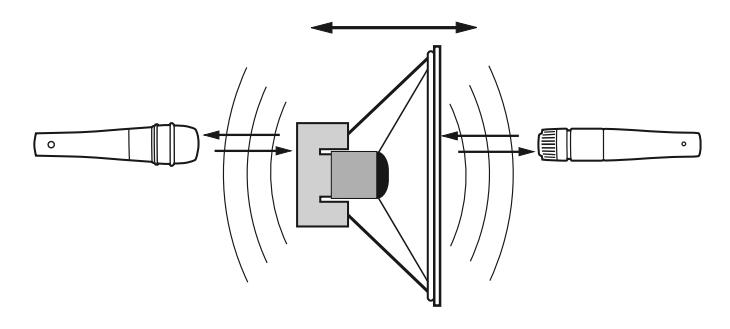

Other double-mic applications often requiring phase inversion include piano soundboards, drum heads (one mic on top of the drum and the other below it), and acoustic guitar miking, where one mic is placed close to the soundhole and another further away or behind the guitar.

### **Low Cut Filtering**

A common method for optimizing mixes is to apply low-cut filtering whenever possible. Excessive low frequencies from microphones and instruments tend to build up in the mix, creating sonic "mud" that masks musical detail, overloads or fatigues the listener's ears, and sucks energy from power amps and speakers. It isn't uncommon to notice meters showing noticeably lower levels after low-cut filtering is applied—a sure sign that such filtering was necessary. In addition, after low-frequency mud is filtered, there is often more room in the mix to bring up important musical elements such as vocals and lead instruments, resulting in a win-win situation (less mud = more music).

Typically, a low cut filter can be used to remove: vocal "B","P" and other popping sounds; moving-air noise from close-miked vocals, drums, guitars and outdoor weather; instrument body noise from handling guitars, basses, pianos, saxophones, etc; mic-stand vibrations; studio or stage floor vibrations; air-conditioning; electrical hum; and unwanted proximity-effect bass boost.

### **Rack Mounting**

The 710 ships with all the necessary brackets and hardware required for mounting one or two units in a standard 19" rack; the only tool necessary is a medium Phillips-head screwdriver. When mounted, the 710 takes two rack spaces. Bracket and hardware locations are shown below:

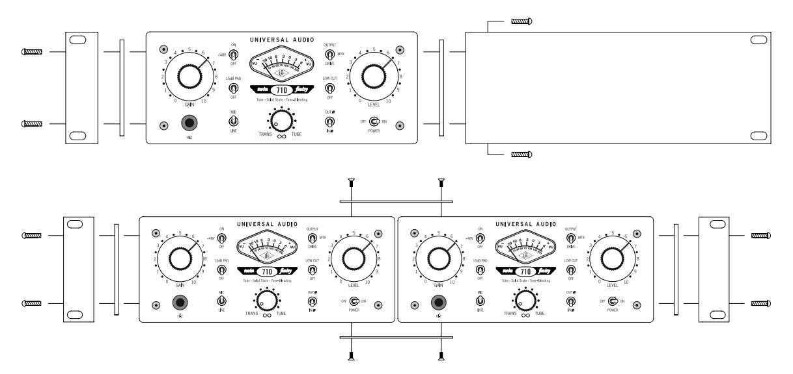

### **Optional Desktop Handle Kit**

An optional 710 desktop handle kit is available from www.uaudio.com. Bracket and hardware locations are shown below:

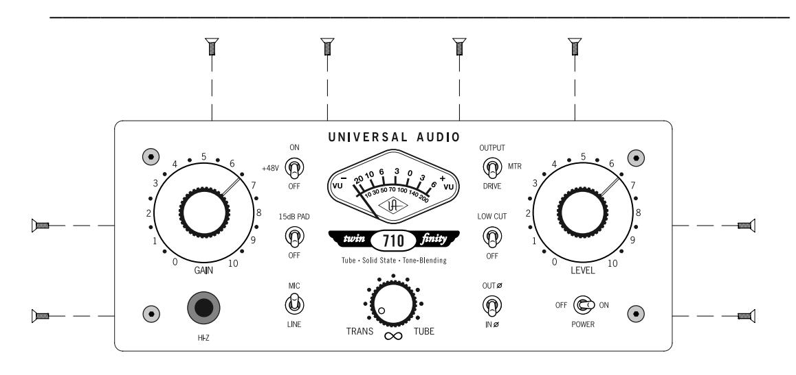

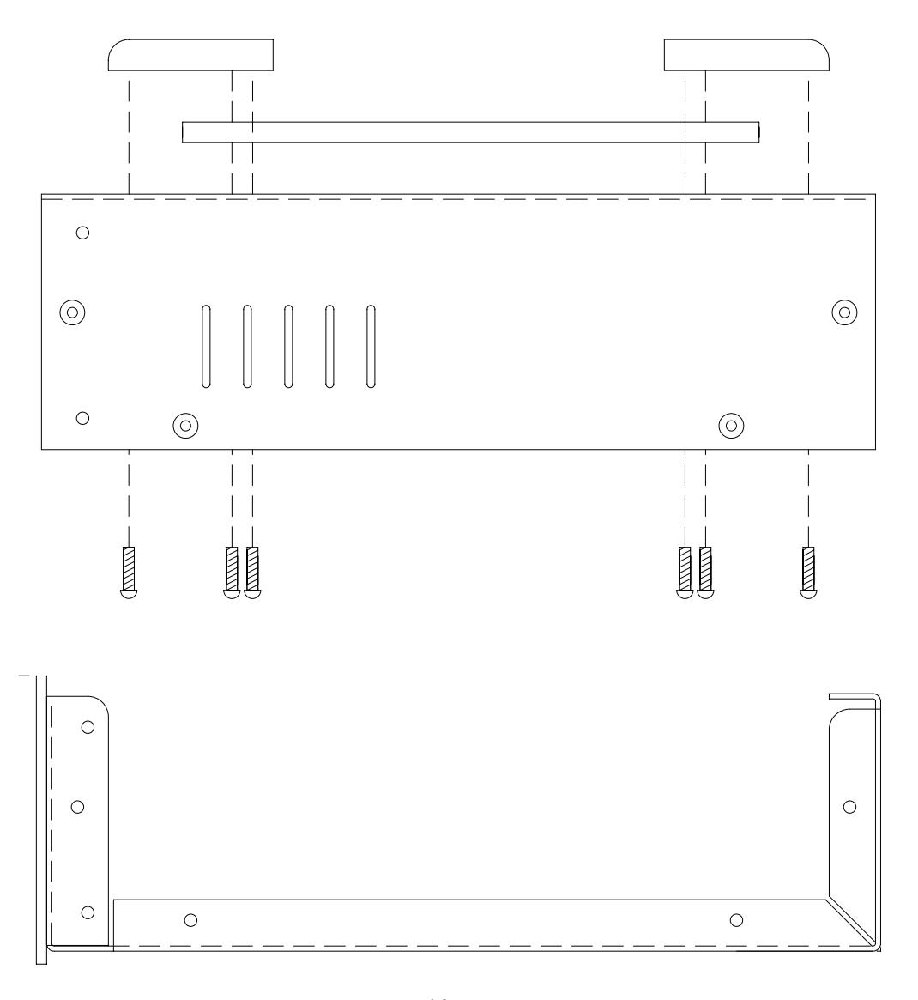

### **Maintenance Information**

**The 710 contains no user-serviceable parts. Repair should be performed only by qualified service personnel.**

### **Fuse**

There is no user accessible fuse for the 710. It contains an internal power supply circuit board with its own fuse.

### **Voltage Select**

The 710 contains a universal auto-sensing, filtered, multi-stage regulated power supply which supports 100-240VAC and 50-60Hz power for trouble-free operation worldwide. No switch setting is required when changing from 115 to 230 volt use or vice versa.

### **Block Diagram**

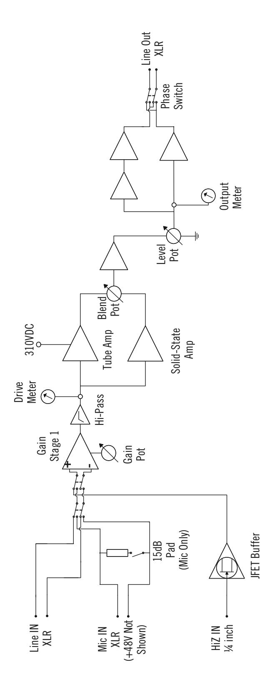

**\_\_\_\_\_\_\_\_\_\_\_\_\_\_\_\_\_\_\_\_\_\_\_\_\_\_\_\_\_\_\_\_\_\_\_\_\_\_\_\_\_\_\_\_\_\_\_\_\_\_\_\_\_\_\_\_\_\_**

**Balanced** - Audio cabling that uses two twisted conductors enclosed in a single shield, thus allowing relatively long cable runs with minimal signal loss and reduced induced noise such as hum.

**Class A** - A design technique used in electronic devices such that their active components are drawing current and working throughout the full signal cycle, thus yielding a more linear response. This increased linearity results in fewer harmonics generated, hence lower distortion in the output signal.

**Condenser microphone** - A microphone design that utilizes an electrically charged thin conductive diaphragm stretched close to a metal disk called a backplate. Incoming sound pressure causes the diaphragm to vibrate, in turn causing the capacitance to vary in a like manner, which causes a variance in its output voltage. Condenser microphones tend to have excellent transient response but require an external voltage source, most often in the form of 48 volts of "phantom power."

- **DAW** An acronym for "Digital Audio Workstation"—that is, any device that can record, play back, edit, and process digital audio.
- **dB** Short for "decibel," a logarithmic unit of measure used to determine, among other things, power ratios, voltage gain, and sound pressure levels.
- **dBm** Short for "decibels as referenced to milliwatt," dissipated in a standard load of 600 ohms. 1 dBm into 600 ohms results in 0.775 volts RMS.
- **dBV** Short for "decibels as referenced to voltage," without regard for impedance; thus, one volt equals one dBV.
- **DI** Short for "Direct Inject," a recording technique whereby the signal from a high-impedance instrument such as electric guitar or bass is routed to a mixer or tape recorder input by means of a "DI box," which raises the signal to the correct voltage level at the right impedance.
- **DSP** Short for "digital signal processing."

**Dynamic microphone** - A type of microphone that generates signal with the use of a very thin, light diaphragm which moves in response to sound pressure. That motion in turn causes a voice coil which is suspended in a magnetic field to move, generating a small electric current. Dynamic mics are generally less expensive than condenser or ribbon mics and do not require external power to operate.

- **EQ** Short for "Equalization," a circuit that allows selected frequency areas in an audio signal to be cut or boosted.
- **FET**  Short for "Field Effect Transistor," a type of transistor that relies on an electric field to control the shape and hence the conductivity of a "channel" in a semiconductor material.
- **Hi-Z** Short for "High Impedance." The 710's Hi-Z input allows direct connection of an instrument such as electric guitar or bass via a standard unbalanced 1/4" jack.

**Impedance** - A description of a circuit's resistance to a signal, as measured in ohms or thousands of ohms (K ohms). The symbol for ohm is .

**JFET** - Abbreviation for Junction Field Effect Transistor, a specific type of FET which has some similarities to traditional bipolar transistor designs that can make it more appropriate for use in some audio circuit designs. (see "FET")

**Line level** - Refers to the voltages used by audio devices such as mixers, signal processors, tape recorders, and DAWs. Professional audio systems typically utilize line level signals of +4 dBM (which

### **Glossary of Terms**

translates to 1.23 volts), while consumer and semiprofessional audio equipment typically utilize line level signals of -10 dBV (which translates to 0.316 volts).

**\_\_\_\_\_\_\_\_\_\_\_\_\_\_\_\_\_\_\_\_\_\_\_\_\_\_\_\_\_\_\_\_\_\_\_\_\_\_\_\_\_\_\_\_\_\_\_\_\_\_\_\_\_\_\_\_\_\_\_\_\_\_\_\_\_\_\_\_\_\_\_**

**Low cut filter** - An equalizer circuit that cuts signal below a particular frequency.

**Mic level** - Refers to the very low level signal output from microphones, typically around 2 millivolts (2 thousandths of a volt).

**Mic preamp** - The output level of microphones is very low and therefore requires specially designed mic preamplifiers to raise (amplify) their level to that needed by a mixing console, tape recorder, or digital audio workstation (DAW).

**Patch bay** - A passive, central routing station for audio signals. In most recording studios, the line-level inputs and outputs of all devices are connected to a patch bay, making it an easy matter to re-route signal with the use of patch cords.

**Patch cord** - A short audio cable with connectors on each end, typically used to interconnect components wired to a patch bay.

**Ribbon microphone** - A type of microphone that works by loosely suspending a small element (usually a corrugated strip of metal) in a strong magnetic field. This "ribbon" is moved by the motion of air molecules and in doing so it cuts across the magnetic lines of flux, causing an electrical signal to be generated. Ribbon microphones tend to be delicate and somewhat expensive, but often have very flat frequency response.

**Transformer** - An electronic component consisting of two or more coils of wire wound on a common core of magnetically permeable material. Audio transformers operate on audible signal and are designed to step voltages up and down and to send signal between microphones and line-level devices such as mixing consoles, recorders, and DAWs.

**Transient** - A relatively high volume pitchless sound impulse of extremely brief duration, such as a pop. Consonants in singing and speech, and the attacks of musical instruments (particularly percussive instruments), are examples of transients.

**Transimpedance preamplifier** - A transformerless solid-state preamplifier utilizing a transistor configuration that employs current feedback for ultra-low distortion and the highest possible quality of signal from input to output. The transimpedance design allows audio from 4Hz to 150kHz to pass through without altering the phase relationships between fundamental frequencies and overtones. Noise and distortion are kept to near-theoretical minimums so critical signals may be generously amplified without degrading the quality or character of the sound source.

**XLR** - A standard three-pin connector used by many audio devices, with pin 1 typically connected to the shield of the cabling, thus providing ground. Pins 2 and 3 are used to carry audio signal, normally in a balanced (out of phase) configuration.

OFF ON

UNIVERSAL AUDIO

## 10 Twin-Finit

### Session Recall Sheet

# UNIVERSAL AUDIO

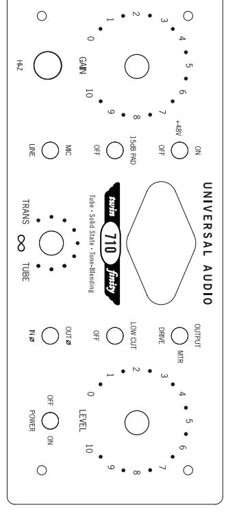

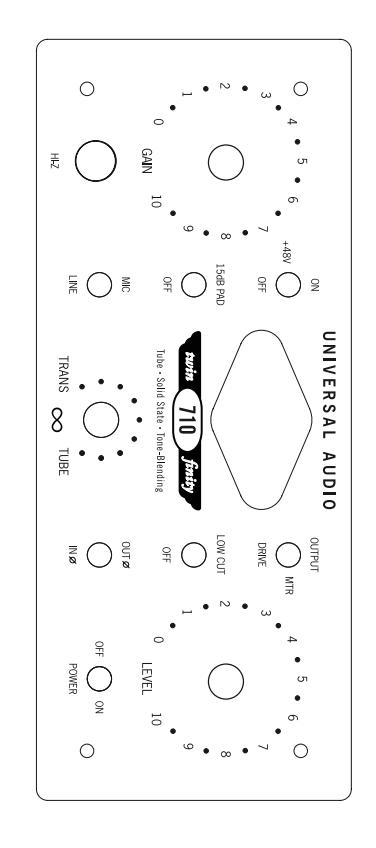

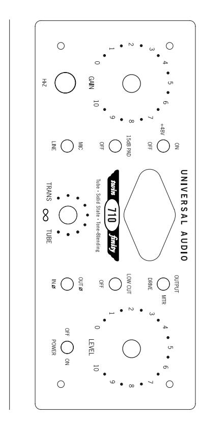

OFF ON ON

analog ears | digital minds

### **Specifications**

**\_\_\_\_\_\_\_\_\_\_\_\_\_\_\_\_\_\_\_\_\_\_\_\_\_\_\_\_\_\_\_\_\_\_\_\_\_\_\_\_\_\_\_\_\_\_\_\_\_\_\_\_\_\_\_\_\_\_\_\_\_\_\_\_\_\_\_\_\_\_\_**

**Microphone Input Impedance** 2k **Balanced Line Input Impedance** 10k **Hi-Z Input Impedance** 2.2M

**Internal Output Impedance** 600

**Overall Gain Range** -Infinity to 70dBu

**Gain Pot Range**

**Mic** +10 ~ +60 dBu **Line** - 10 ~ +40 dBu **Hi-Z** +10 ~ +40 dBu

**Maximum Mic Input Level Gain @min**

**SS 1% THD** +18 dBu

**Tube 1% THD** - 7 dBu (+8dBu with pad)

**Maximum Line Input Level Gain @min**

**SS 1% THD** +30 dBu **Tube 1% THD** + 8 dBu

**Maximum Hi-Z Input Level Gain @min**

**SS 1% THD** +18 dBu **Tube 1% THD** + 8 dBu

**Clipping Level (Tube and Solid-State)** same as Max In

**Maximum Output Level into 600** +18 dBu into 600, +28 dBu into 100k

**Frequency Response (Mic/Line/Hi-Z)** 20Hz to 100kHz +/- 0.2 dBu

**Min THD+Noise @ +4dBU** 0.1% tube, 0.005% solid-state

**External Connections** XLR Line in/out, XLR Mic in, 1/4" (Hi-Z) in

**Low Cut Filter** 75Hz, Bessel

**Pad** -15dB

**Meter** Drive (THD) and Output (dB)

**Tube Complement** One 12AX7

**Power Requirements** 100V - 240V, auto-sensing power supply

**Maximum Power Consumption** 160mA @120VAC, 20W

**Power Connector** Detachable IEC power cable

**Dimensions** 1/2 rack, 2U (8.45W x 3.5H x 10.25D)

**Weight** 5.25 lb

### **Additional Resources/Product Registration/Warranty/Service & Support \_\_\_\_\_\_\_\_\_\_\_\_\_\_\_\_\_\_\_\_\_\_\_\_\_\_\_\_\_\_\_\_\_\_\_\_\_\_\_\_\_\_\_\_\_\_\_\_\_\_\_\_\_\_\_\_\_\_**

### **Additional Resources**

We've got a pretty cool website, if we may say so ourselves. Check us out at http://www.uaudio.com.

There, you'll find tons of information about our full line of products, as well as e-news, videos, software downloads, FAQs, an online store, and a way cool webzine that features hot tips, techniques, and interviews with your favorite artists, engineers and producers each month. The webzine even offers something we call "Playback"—a monthly contest where the winners get their music posted on our site, exposing their songs to thousands of visitors per day!

### **Product Registration**

Please take a moment to register your new Universal Audio product by following the instructions on the included registration card. This card contains your unique registration I.D. number.

Registration of your UA product ensures you are guaranteed to receive any promotional benefits you are entitled to through UA's regular marketing programs. You'll also receive immediate customer service in case you have any questions or issues with your new product.

### **Warranty**

The warranty for all Universal Audio hardware is one year from date of purchase, parts and labor.

### **Service & Support**

Even gear as well designed and tested as ours will sometimes fail. In those rare instances, our goal here at UA is to get you up and running again as soon as possible.

The first thing to do if you're having trouble with your device is to check for any loose or faulty external cables, bad patchbay connections, grounding trouble from a power strip and all inputs/outputs (mic/line/Hi-Z, etc.). If your problem persists, call tech support at 877-MY-UAUDIO, or send an email to hardwaresupport@uaudio.com , and we will help you troubleshoot your system. (Canadian and overseas customers should contact their local distributor.) When calling for help, please have the product serial number available and have your unit set up in front of you, turned on and exhibiting the problem.

If it is determined your product requires repair, you will be told where to ship it and issued a Return Merchandise Authorization number (RMA). This number must be displayed on the outside of your shipping box (use the original packing materials if at all possible). Most repairs take approximately 2 - 4 days, and we will match the shipping method you used to get it to us. (In other words, if you shipped it to us UPS ground, we will ship it back to you UPS ground; if you overnight it to us, we will ship it back to you overnight). You pay the shipping costs to us; we ship it back to you free of charge. Qualified service under warranty is, of course, also free of charge. For gear no longer under warranty, tech bench costs are \$75 per hour plus parts.