## Thunderbolt 3 Audio Interface 

with Realtime UAD Processing 

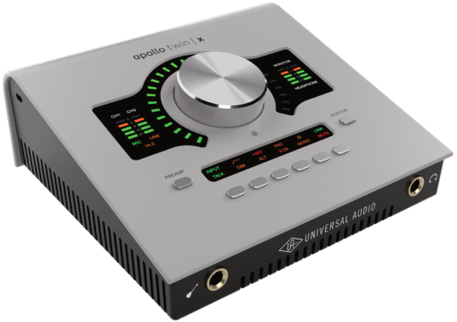

## **Apollo Twin X Gen 2 Hardware Manual** 

Manual Version 250902 

www.uaudio.com 

## **A Letter from Bill Putnam Jr.** 

Thank you for choosing this Apollo audio interface to become a part of your studio. We know that any new piece of gear requires an investment of time and money — and our goal is to make your investment pay off. 

Universal Audio interfaces like the Apollo X Gen 2 Series exemplify a commitment to craftsmanship that we’ve forged over the past 60 years — from our original founding in the 1950s by my father, Bill Putnam Sr., to our current mission to combine the best of both classic analog and modern digital audio technologies. 

Starting with its high-quality I/O and elite-class A/D and D/A conversion, Apollo X Gen 2’s superior sonic performance serves as its foundation. 

This is just the beginning however, as Apollo lets you power the full range of UAD plug-ins in real time, including classic mic preamps, EQs, compressors and limiters, reverbs, guitar amps, and much more. With more than 200 acclaimed UAD plug-ins at your fingertips, the sonic choices are limitless.* 

At UA, we are dedicated to the idea that technology should serve the creative process, inspiring our customers to go further. These are the ideals my father embodied with his classic designs, and we believe this spirit lives on today in products like Apollo. 

Please feel free to reach out to us via our website www.uaudio.com, and via our social media channels. We look forward to hearing from you, and thank you once again for choosing Universal Audio. 

Sincerely, 

Bill Putnam Jr. 

_*All trademarks are recognized as property of their respective owners. Individual UAD Powered Plug-Ins sold separately._ 

Apollo X Gen 2 Hardware Manual 

2 

Welcome Letter 

## **Contents** 

_Tip: Click any section or page number to jump directly to that page._ 

A Letter from Bill Putnam Jr. ..............................................................................................................2 Introduction ................................................................................................................................................4 Create music with timeless analog sound.  ...................................................................................................4 Apollo Twin X Gen 2 Features ...............................................................................................................................6 Operational Overview ................................................................................................................................................9 About Apollo Documentation ..............................................................................................................................11 Additional Resources ...............................................................................................................................................12 Quick Start ................................................................................................................................................13 Installation Notes.........................................................................................................................................................13 Connection Notes ......................................................................................................................................................14 Hardware Setup ..........................................................................................................................................................15 Software Setup ...........................................................................................................................................................16 Connect to Input Sources and Monitor System .......................................................................................17 Setting Hardware I/O Levels .................................................................................................................................18 Controls & Connectors ......................................................................................................................19 Controls Overview .....................................................................................................................................................19 Top Panel........................................................................................................................................................................22 Front Panel .................................................................................................................................................................... 27 Side Panel ...................................................................................................................................................................... 27 Rear Panel .....................................................................................................................................................................28 Specifications ........................................................................................................................................ 30 Hardware Block Diagram ......................................................................................................................................33 Troubleshooting ....................................................................................................................................34 Notices .......................................................................................................................................................35 Important Safety Information ..............................................................................................................................35 Manufacturer’s Declarations ...............................................................................................................................36 Technical Support .................................................................................................................................41 Universal Audio Knowledge Base ....................................................................................................................41 Universal Audio YouTube Channel....................................................................................................................41 Universal Audio Community Forums ..............................................................................................................41 Customer Care ............................................................................................................................................................41 

Apollo Twin X Gen 2 Hardware Manual 

3 

Contents 

## **Introduction** 

## Create music with timeless analog sound. 

Hear every detail with our most advanced Apollo Twin ever. Featuring highest-resolution audio conversion, Unison™ mic preamps, and realtime UAD processing — which lets you record through plug-ins from Neve, API, Manley, Auto-Tune, and more without latency — Apollo Twin X puts decades of inspiring analog studio sound right on your desktop. 

- Produce music with elite-class Apollo X Gen 2 converters, and hear every detail with unprecedented dynamic range 

- Use dual Unison preamps to get the tone and feel of iconic analog gear from Neve, API, Manley, Fender, and more 

- Record through UAD plug-ins in realtime with onboard DUO or QUAD Core DSP 

- Work faster with new UAD Console features including Auto-Gain, Plug-In Scenes, Monitor Controller, Immersive Audio, and more 

- Mix with confidence in any room or through headphones using Apollo Monitor Correction by Sonarworks® 

- Get included UAD plug-ins from Auto-Tune, Fairchild, Teletronix, and more with Essentials+ or Studio+ Editions 

## Put Our Best Apollo Yet on Your Desktop 

We built Apollo Twin X for the next generation of music producers looking to get the sounds used by the world’s biggest artists. With elite-class 24-bit/192 kHz Gen 2 audio conversion and the widest dynamic range to date, Apollo Twin X puts the sound of the stars in your studio. 

## Record Through Famous Preamps 

Track through emulations of classic gear from Neve, Manley, API, and dozens more with Unison™ preamp technology, giving you the rich analog textures used on the greatest recordings of our time. 

## Hear the Details Like Never Before 

Now in its Gen 2 design, Apollo Twin X features our highest-resolution D/A converters ever. This enhanced monitoring — when paired with features like Apollo Monitor Correction by Sonarworks — means you’ll hear the most accurate representation of your recordings when mixing through monitors or headphones. 

## Mix with Authentic Analog Sounds 

Out of the box, Apollo Twin X gives you the same tools used by the world’s biggest artists. Along with included LA-2A compressors, Pultec EQs, and amps from Marshall and Ampeg — you can tap into the entire library of over 200 UAD plug-ins to unlock proven hit-making sounds. 

Apollo Twin X Gen 2 Hardware Manual 

4 

Introduction 

## Find Your Perfect Workflow 

Just like many pro studios, where an analog console is the heart of the workflow, Apollo Twin X has a powerful mixing engine where you control plug-in routing and monitoring. And with the latest features like Auto-Gain, Bass Management, and Plug-In Scenes, it’s easy to find a flow that fits your needs. 

## A Hybrid System for Your Mission 

Combine Apollo Twin X’s DUO or QUAD Core DSP with native processing from your computer to produce large sessions with complex plug-in chains — a powerhouse hybrid workflow that outpaces any native-only recording setup. 

## Expand Your Studio as You Grow 

Build out your dream studio by linking up to four Thunderbolt Apollo interfaces for up to 128 channels of premium I/O, and control it all from your desktop using Apollo Twin X. So no matter how far your music takes you, an Apollo will always be in reach. 

_includes the Essentials+ or Studio+ Editions. Other UAD plug-ins available separately. All trademarks are property of their respective owners._ 

Apollo Twin X Gen 2 Hardware Manual 

5 

Introduction 

## Apollo Twin X Gen 2 Features 

## Key Features 

- 10 x 6 Thunderbolt 3 audio interface with DUO or QUAD Core DSP plug-in processing 

- Two Unison mic preamps, Hi-Z instrument input, optical Toslink input (ADAT or S/PDIF) 

- Two 1/4” monitor outs, two 1/4” line outs (ALT), one 1/4” TRS headphone out 

- Elite-class Apollo X Gen 2 converters with 24-bit / 192 kHz resolution 

- Enhanced D/A for critical monitoring and playback with 129 dB dynamic range 

- Calibrate your main monitor and headphone outputs with Apollo Monitor Correction powered by Sonarworks® 

- Fully-featured monitor controller with alternate speaker switching and integrated talkback for easy communication with talent 

- UAD Console app featuring Auto-Gain, Plug-In Scenes, subwoofer integration with Bass Management, immersive audio support, and more 

- Onboard DSP supports over 200 UAD plug-ins via VST, AU, and AAX 64 formats in all major DAWs 

- Includes up to 50+ UAD plug-ins with Essentials+ or Studio+ Editions 

- Compatible with LUNA, Logic Pro, Pro Tools, Cubase, Ableton Live, and more 

- Expandable with Thunderbolt Apollo interfaces and Dante via Apollo x16D 

- Free industry-leading technical support from knowledgeable audio engineers 

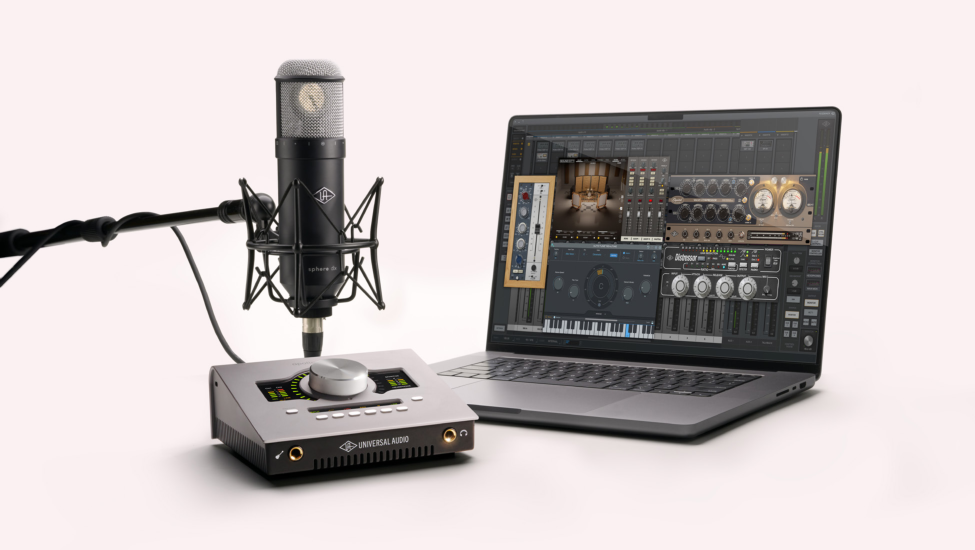

Apollo Twin X Gen 2 Hardware Manual 

6 

Introduction 

## All Features 

## Audio Interface 

- Sample rates up to 192 kHz at 24-bit word length _(96 kHz max on S/PDIF inputs)_ 

- Up to 10 x 6 simultaneous input/output channels 

   - Two channels of analog-to-digital conversion via: 

      - Two balanced mic/line inputs 

      - One Hi-Z instrument input 

   - Six channels of digital-to-analog conversion via: 

      - Digitally-controlled stereo monitor outputs 

      - Stereo headphone outputs 

      - Line outputs 3-4 

   - Up to eight channels of digital inputs via: 

      - Eight channels ADAT optical with S/MUX for high sample rates, or 

      - Two channels S/PDIF optical with sample rate conversion 

## Microphone Preamplifiers 

- Two high-resolution, ultra-transparent, digitally-controlled analog mic preamps 

- Front panel and software control of all preamp parameters 

- Low cut filter, 48V phantom power, 20 dB pad, polarity inversion, and stereo linking 

- Unison technology on mic/line preamps for fully authentic preamp emulations from Neve, API, Manley, Avalon, and more 

## Monitoring 

- Independently-addressable stereo monitor outputs 

- Independently-addressable stereo headphone outputs 

- Independently-addressable line outputs 3-4 can be used for additional cue mix 

- Front panel control of level, mute, dim, mono, alternate speakers, and talkback 

- Built-in talkback microphone for communication and recording 

- All outputs are DC coupled 

## UAD-2 Inside 

- DUO or QUAD core DSP featuring two or four SHARC[® ] processors 

- Realtime UAD Processing on all analog and digital inputs 

- Same features and functionality as other UAD-2 devices when used with DAW 

- Can be combined with other UAD-2 devices for increased mixing DSP 

- Complete UAD plug-ins library available at the UA online store 

Apollo Twin X Gen 2 Hardware Manual 

7 

Introduction 

## Software 

## _UAD Console application_ 

- Enables tracking and/or monitoring with Unison and Realtime UAD Processing 

- Remote control of Apollo Twin X features and functionality 

- Virtual I/O for routing DAW tracks through UAD Console 

- Two independent stereo Auxiliary buses 

## _Console Recall plug-in_ 

- Saves Apollo Twin X configurations inside DAW sessions for easy recall 

- Facilitates control of Apollo Twin X monitoring features from within the DAW 

- VST, AAX 64, and Audio Units plug-in formats 

## _UAD Meter & Control Panel application_ 

- Configures global UAD settings and monitors system usage 

## Other 

- Attractive and durable desktop form factor 

- Locking power supply prevents accidental disconnection 

- Easy firmware updates 

- One year warranty includes parts and labor 

## Package Contents 

- Apollo Twin X Gen 2 audio interface 

- External power supply and region-specific AC cable _(USA, EU, UK, ANZ, or Japan)_ 

- Getting Started URL card 

Apollo Twin X Gen 2 Hardware Manual 

8 

Introduction 

## Operational Overview 

## Audio Interface 

First and foremost, Apollo Twin X Gen 2 is a premium 10 x 6 Thunderbolt 3 audio interface with elite-class 24-bit/192 kHz audio conversion. Apollo Twin X connects to the outputs and inputs of other audio gear, and performs analog-to-digital (A/D) and digital-to-analog (D/A) audio conversions on the gear’s signals. The digital audio signals are routed into and out of your host computer via the high-speed PCIe protocol, which is carried on a single Thunderbolt 3 cable. 

Apollo Twin X leverages Universal Audio’s expertise in DSP acceleration, UAD Powered Plug-Ins, and analog hardware design by integrating the latest cutting edge technologies in high-performance A/D-D/A conversion, DSP signal reconstruction, and connectivity. Apollo Twin X acts as an audio interface with integrated DSP effects for tracking and monitoring, a fully integrated UAD-2 DSP accelerator for mixing and mastering, as well as a complete monitoring controller. 

## About Realtime UAD Processing 

Apollo Twin X has the ability to run UAD Powered Plug-Ins in realtime. Apollo’s groundbreaking DSP + FPGA technology enable UAD plug-ins to run with latencies in the sub-2 ms range, and multiple plug-ins can be stacked in series without additional latency. Realtime UAD Processing facilitates the ultimate sonic experience while monitoring and/or tracking. 

_Note: Apollo, as with other UAD-2 devices, can only load UAD Powered Plug-Ins, which are specifically designed to run on UAD-2 DSP accelerators. Native (host CPUbased) plug-ins cannot run on the UAD-2 DSP._ 

## UAD Console Software 

_Important: UAD Console is integral to unleashing the power of Apollo Twin X. For complete details about how to use UAD Console and Realtime UAD Processing, refer to the UAD Console Manual._ 

The included UAD Console companion software application runs on the host computer and is used to control Apollo Twin X mixing and input monitoring with Realtime UAD Processing, access the audio interface I/O settings, and more. UAD Console’s analog-style workflow is designed to provide quick access to the most commonly needed features in a familiar, easyto-use mixer interface. 

Realtime UAD Processing is a special function that is available only within UAD Console. All of Apollo Twin X’s analog and digital inputs can perform Realtime UAD Processing simultaneously, and UAD Console inputs with (or without) Realtime UAD Processing can be routed into the DAW for recording. 

UAD Console controls Apollo Twin X’s digital mixer so you can monitor Apollo Twin X’s inputs (with or without Realtime UAD Processing) without using any other audio software such as a DAW. 

Apollo Twin X Gen 2 Hardware Manual 

9 

Introduction 

## UAD Powered Plug-Ins in a DAW 

Apollo Twin X and UAD plug-ins can also be used with a DAW without the use of UAD Console. UAD plug-ins loaded within the DAW operate like other (non-UAD) plug-ins, except the processing occurs on the Apollo Twin X DSP instead of the host computer’s processor. In this scenario, UAD plug-ins are subject to the latencies incurred by I/O buffering. 

For details about using UAD Powered Plug-Ins in a DAW, see the UAD System Manual. 

## Standalone Use 

Although the UAD Console application is required to utilize all Apollo Twin X features, the hardware unit can be used as a digital mixer with limited functionality without a Thunderbolt 3 connection to a host computer. 

All currently active I/O assignments, signal routings, and monitor settings are saved to internal firmware when Apollo Twin X is powered down and persist when power is re-applied. Therefore the last-used settings are always available even when a host computer is not connected. 

Note that UAD plug-in instantiations are not retained on power down, because the plug-in files reside on the host computer. However, if UAD plug-ins are active when Apollo Twin X’s connection to the host system is lost (if the Thunderbolt 3 cable is unplugged), the current UAD plug-in configurations remain active for processing until Apollo Twin X is powered down. 

_Note: Standalone use is unavailable when cascading multiple Apollo units._ 

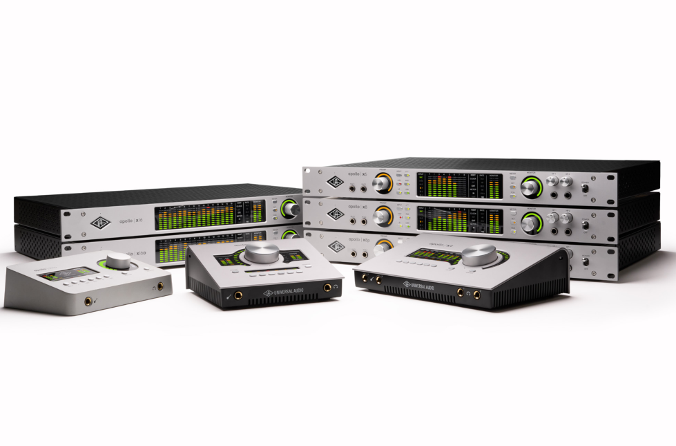

Apollo Twin X Gen 2 Hardware Manual 

10 

Introduction 

## About Apollo Documentation 

Documentation for Apollo and UAD Powered Plug-Ins are separated by areas of functionality, as described below. All user manuals are available at help.uaudio.com. 

Some manual files are in PDF format. PDF files require a free PDF reader application such as Preview (macOS) or Edge (Windows). 

## Apollo Hardware Manuals 

Each Apollo model has a unique hardware manual. The Apollo hardware manuals contain complete hardware-related details about one specific Apollo model. Included are detailed descriptions of all hardware features, controls, connectors, and specifications. 

_Note: Each hardware manual contains the unique Apollo model in the file name._ 

## Apollo Software Manual 

The Apollo Software Manual is a companion guide to the Apollo hardware manuals. It contains detailed information about how to configure and control Apollo software features. Refer to the Apollo Software Manual to learn how to operate the software tools and integrate Apollo’s functionality into the DAW environment. 

_Note: Each Apollo connection protocol (Thunderbolt, FireWire, USB) has a unique software manual._ 

## UAD Console Manual 

UAD Console is Apollo’s companion software, for controlling up to four Apollo units and their digital mixing and low-latency monitoring capabilities. UAD Console is where you configure and operate Realtime UAD Processing and Unison with UAD-2 plug-ins. 

## UAD Plug-Ins Manual 

The features and functionality of all individual UAD-2 Powered Plug-Ins is detailed in the UAD Plug-Ins Manual. Refer to that document to learn about the operation, controls, and user interface of each UAD-2 plug-in that is developed by Universal Audio. 

## Direct Developer Plug-In Manuals 

UAD Powered Plug-Ins includes plug-in titles created by our Direct Developer partners. Documentation for these 3rd-party plug-ins are separate files written and provided by the plug-in developers. The file names for these plug-in manuals are the same as the plug-in titles. 

## UAD System Manual 

The UAD System Manual is the complete operation manual for Apollo’s UAD-2 functionality and applies to the entire UAD-2 product family. It contains detailed information about installing and configuring UAD devices, the UAD Meter & Control Panel application, buying optional plug-ins at the UA online store, and more. It includes everything about UAD except Apollo-specific information and individual UAD plug-in descriptions. 

Apollo Twin X Gen 2 Hardware Manual 

11 

Introduction 

## Accessing Documentation 

Any of these methods can be used to access documentation: 

- Choose Documentation from the Help menu within the UAD Console application 

- Click the Product Manuals button in the Help panel within the UAD Meter & Control Panel application 

- All manuals are available online at help.uaudio.com 

## Host DAW Documentation 

Each Digital Audio Workstation application has its own particular methods for configuring and using audio interfaces and plug-ins. Refer to the host DAW’s documentation for specific instructions about using audio interface and plug-in features within the DAW. 

_Tip: The LUNA application manual is available here._ 

## Hyperlinks 

Links to other manual sections and web pages are highlighted in blue text. Click a hyperlink to jump directly to the linked item. 

_Tip: Use the back button in the PDF reader application to return to the previous page after clicking a hyperlink._ 

## Additional Resources 

For additional resources, or if you need to contact Universal Audio for assistance, see the Technical Support page. 

Apollo Twin X Gen 2 Hardware Manual 

12 

Introduction 

## **Quick Start** 

Before you can use Apollo Twin X, you need to complete these steps: 

1. Connect to your computer with a Thunderbolt 3 cable (not included). 

2. Connect to AC power. 

3. Download and install the latest UAD software. 

4. Register your Apollo hardware. 

5. Authorize your UAD plug-ins. 

Additionally, you'll want to learn these essential Apollo Twin X operations: 

- Connect to Input Sources and Monitor System – How to connect your audio gear. 

- Setting Hardware I/O Levels – Learn how to adjust Mic/Line/Instrument input gain levels and monitor/headphone output volume levels. 

This chapter will guide you through these steps. For assistance, see the Technical Support page. 

## Installation Notes 

- Locate the unit on a flat surface so its feet will maintain airflow beneath the unit. 

- To prevent audio interference, Apollo Twin X and its audio cables should be located more than four feet away from Wi-Fi routers and their network cabling. 

- Allow space at the front and rear of the unit for cable connections. 

- Do not block the cooling vents on the bottom or sides of the unit. 

- As with any sound system, the following steps are recommended to avoid audio spikes in your speakers and headphones: 

   1. Power on the speakers last, after all other devices (including Apollo Twin X) are powered on. 

   2. Power off the speakers first, before all other devices (including Apollo Twin X) are powered off. 

   3. Remove headphones from ears before powering Apollo Twin X on or off. 

Apollo Twin X Gen 2 Hardware Manual 

13 

Quick Start 

## Connection Notes 

## Thunderbolt 3 

- Apollo Twin X must be connected via a Thunderbolt 3 cable (not included) to a computer that has an available Thunderbolt 3 port.* 

- Apollo Twin X cannot be bus powered via Thunderbolt 3. The included external power supply must be used. 

- *With Mac computers only, Apollo Twin X can be connected to Thunderbolt 1 and Thunderbolt 2 computer ports via the Apple Thunderbolt 3 to Thunderbolt 2 adapter. With Windows computers, connections to Thunderbolt 1 or Thunderbolt 2 ports are not supported. Visit the UA Knowledge Base for details. 

## About Thunderbolt 3 Ports and Cables 

_Important: Although Thunderbolt 3 always uses USB-C connectors, not all USB-C ports are Thunderbolt 3 ports. Similarly, not all USB-C cables are Thunderbolt 3 cables. Always connect Apollo Twin X to a Thunderbolt 3 port with a Thunderbolt 3 cable._ 

## _USB-C is not Thunderbolt 3_ 

Thunderbolt 3 uses USB-C connections to transfer data and power. However, USB-C is simply a connector type; it doesn't determine the type of data used by the connector. For example, USB-C connections can be used for Thunderbolt 3, USB 3.1, and other data protocols, so USB-C connections are not always interchangeable. 

## _Does your USB-C connector support Thunderbolt 3?_ 

To determine if a USB-C port or cable connector supports Thunderbolt 3, look for the Thunderbolt icon. The Thunderbolt icon on a USB-C port or cable means the connector supports Thunderbolt 3. Alternately, confirm Thunderbolt 3 compatibility with the device and/or cable manufacturer. 

_Thunderbolt icon on USB-C cable (left) and USB-C port (right)_ 

## Apollo Expanded 

- When more I/O and/or DSP is needed, up to four Apollo interfaces and six UAD devices total can be cascaded together via Thunderbolt in a multiple-unit configuration. For complete details about multi-unit cascading, refer to the UAD Console Manual. 

_Note: A maximum of one Apollo desktop model (Arrow, Apollo Twin, Apollo Twin MkII, Apollo Twin X, or Apollo x4) can be combined within a single Thunderbolt system._ 

Apollo Twin X Gen 2 Hardware Manual 

Quick Start 

14 

## Hardware Setup 

## Connect to Computer 

1. Connect a Thunderbolt 3 cable (not included) to the Thunderbolt 3 port on the Apollo Twin X rear panel. 

2. Connect the other end of the Thunderbolt 3 cable to an available Thunderbolt 3 port on the computer. 

## Connect to Power 

_Caution: Before powering Apollo Twin X on or off, lower the volume of the monitor speakers (if connected) and remove headphones from your ears._ 

3. Connect the included power supply to an AC outlet (Apollo Twin X cannot be bus powered). 

4. Connect the locking power supply barrel to the rear panel of Apollo Twin X. Align the two tabs on the power cable's connector to the notches on the input, then rotate the barrel clockwise to prevent accidental disconnection. 

_Important: After ensuring the locking barrel tabs are aligned with the chassis slots and the barrel is fully inserted, rotate the barrel to secure the connector._ 

## **2. Rotate to Lock** 

## **1. Align Tabs** 

12VDC 

5. Apply power to Apollo Twin X using the rear panel's power switch. Apollo Twin X is now ready for Software Setup. 

Apollo Twin X Gen 2 Hardware Manual 

Quick Start 

15 

## Software Setup 

_Note: Items on this overview page are detailed in the Apollo Software Manual. See About Apollo Documentation for related information._ 

## System Requirements 

All system requirements must be met for Apollo to operate properly. Before proceeding with installation, view the Apollo X system requirements. 

## Software Installation 

The UAD software must be installed to use the hardware and UAD-2 plug-ins. The UAD software installer contains the Apollo software, drivers, and UAD-2 plug-ins. 

## UA Connect Application 

You’ll use UA Connect, our software management program, to obtain and install the UAD software and UAD Console. To get UA Connect, visit: 

## **uaudio.com/downloads/uad** 

_Note: For optimum results, connect and power on Apollo before installing the software._ 

## Latest Software 

To obtain the latest UAD software after initial registration, use the UA Connect application. 

## System Configuration 

Details about setting up the Apollo system, including how to integrate with a DAW and related information, are included in the Apollo Software Manual. 

## UAD Console 

The UAD Console application is the software interface for the Apollo hardware. UAD Console controls Apollo and its digital mixing, monitoring, Unison technolofy, and Realtime UAD Processing features. UAD Console is also used to configure Apollo settings such as sample rate, clock source, reference levels, and more. 

For complete details, view the UAD Console Manual. 

## How to get UAD Console 

1. In UA Connect, click the Apollo & UAD-2 tab. 

2. Click the Download button next to UAD Console. If UAD Console is already installed, you can click the Update button (if an update is available). 

3. After the software is downloaded, click Install to complete the installation. 

## UA Support Videos 

Informational videos are available to help you get started with Apollo at help.uaudio.com. 

Apollo Twin X Gen 2 Hardware Manual 

16 

Quick Start 

## Connect to Input Sources and Monitor System 

One typical Apollo Twin X audio setup is illustrated below. For complete details about all of Apollo Twin X's connectors and controls, see Controls & Connectors. 

_Tip: In this example, the mic is connected to channel 2, so the mic and the instrument (which connects to channel 1) can be used at the same time._ 

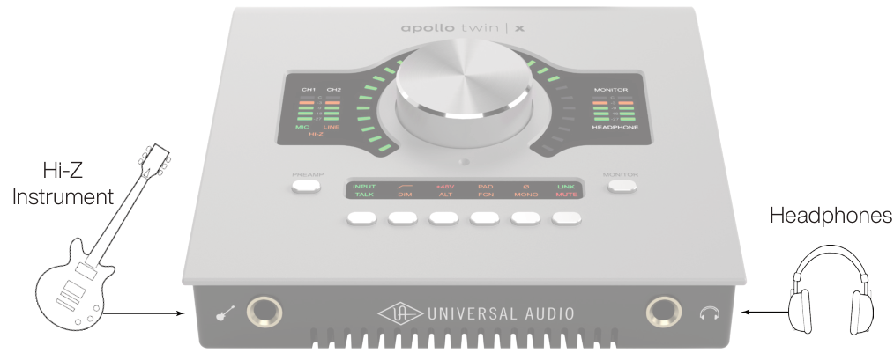

**----- Start of picture text -----** 
Hi-Z Instrument Headphones **----- End of picture text -----** 

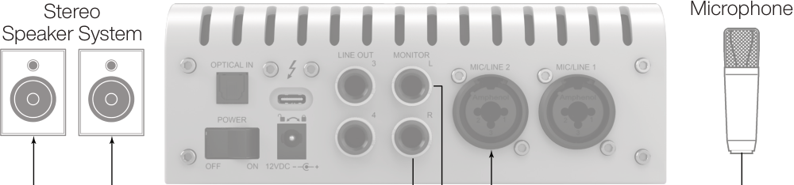

**----- Start of picture text -----** 
Stereo Microphone Speaker System **----- End of picture text -----** 

_Typical Apollo Twin X audio connections_ 

Apollo Twin X Gen 2 Hardware Manual 

Quick Start 

17 

## Setting Hardware I/O Levels 

This section explains how to set input gain levels for the hardware inputs (mic, line, and Hi-Z) and adjust volume levels for the hardware outputs (monitors and headphones). Refer to the Top Panel illustration for the control names and numbers mentioned below. 

_Caution: Before proceeding, lower the volume of the monitor speakers and remove headphones from your ears._ 

## Set Input Gains 

1. Select the input channel to be adjusted by pressing the PREAMP button (7) until the Channel Selection Indicator (3) displays the channel (CH1 or CH2). 

2. Select the input type (mic or line) by pressing the INPUT button (13-a) until the Input Type indicator (5) displays the desired input jack* (see note below). 

3. Adjust the channel's gain by rotating the LEVEL knob (1) until the input meter for the channel (4) approaches maximum, but does not reach the red clip LED when the loudest input signal is present. If the level is too high to avoid clipping (when the red “C” LED illuminates), enable the PAD (13-d). 

4. To set the input gain for the other input channel, repeat steps 1 – 3. 

## Adjust Output Volumes 

1. Select the output volume to be adjusted (monitor or headphone) by pressing the MONITOR button (11) until the Monitor Selected (8) or Headphone Selected (10) indicator is lit. 

2. Set the volume level by carefully increasing the LEVEL knob (1) until the desired volume is reached (you may need to adjust the volume of the speaker system). 

3. To set the other output volume (monitor or headphone), repeat steps 1 – 2. 

## Mute (and Unmute) Monitor Outputs 

1. Select the Monitor outputs by pressing the MONITOR button (11) until the Monitor Selected (8) indicator is lit. 

2. Press the MUTE button (13-l) to mute the monitor outputs. The Monitor Selected Indicator (8) is red when the monitors are muted. When in MONITOR Mode, the Volume Level Indicator LEDs (2) are also red. 

3. To toggle the monitor mute state, press the MUTE button (13-l) whenever Monitor (8) is selected. 

## Notes 

- *The Hi-Z input is automatically selected, overriding the channel 1 Mic and Line inputs, when a ¼” mono TS (tip-sleeve) plug is connected to the Hi-Z Instrument jack (14) on the front panel. 

- To control both channels simultaneously when a stereo source is connected, press the LINK button (13-f) when an input is selected (3). 

- Line outputs 3 & 4 are accessed and controlled via software only (UAD Console or DAW). 

- See About Apollo Documentation to learn more.. 

Apollo Twin X Gen 2 Hardware Manual 

18 

Quick Start 

## **Controls & Connectors** 

Complete details about the Apollo Twin X hardware controls and all connector jacks on the front and rear panels are provided in this chapter. 

_Note: To learn how to set input gain levels (mic, line, and Hi-Z) and output volumes (monitors and headphones), see Setting Hardware I/O Levels in the Quick Start chapter._ 

## Controls Overview 

Some Apollo Twin X controls have multiple functions. The function of each control depends on the current operating mode and the current settings within that mode. To control a particular function, the control must be activated. 

## Operating Modes 

Apollo Twin X’s top panel has two operating modes: _Preamp_ and _Monitor_ . The function and availability of the top panel controls vary depending on the active operating mode. The active mode is selected with the PREAMP and MONITOR buttons. Each mode is explained in greater detail below. 

_Note: All top panel functions can be operated concurrently (without switching modes) from within the companion UAD Console software application. See the UAD Console Manual for details._ 

## PREAMP Mode 

When Apollo Twin X is in Preamp mode, the top panel controls are related to input functions only. To adjust input functions, press the PREAMP button to enter Preamp mode and activate the input channel controls. 

_Important: Apollo Twin X must be in Preamp mode to modify preamp gain levels and other input options._ 

_Note: Output functions (monitor and headphone) cannot be performed in Preamp mode. Press the MONITOR button to perform output functions._ 

## Preamp Channels 

Apollo Twin X has two independent analog input channels for A/D conversion. Each input channel has a preamplifier. The input channel preamplifiers are independently controlled when in Preamp mode. 

## Preamp Controls 

Apollo Twin X has one set of preamp input channel controls. The input channel controls adjust all preamp functions for the currently selected input channel only. 

Apollo Twin X Gen 2 Hardware Manual 

Controls & Connectors 

19 

## Selected Channel 

The currently selected input channel is shown by the CH1 and CH2 indicators at the upper left of the main display panel, above the input meters. When a channel is selected, its indicator is lit. 

_Note: The preamp controls adjust the functions for the currently selected channel._ 

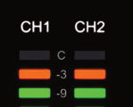

## Changing Channels 

When in Preamp mode, press the PREAMP button to change the selected channel so its controls can be adjusted. Press PREAMP again to switch back to the other input channel. 

## Input Source 

The Mic, Line, or Hi-Z input source is routed into the channel’s preamplifier. The active input source jack is shown by the indicators below the input meters. When an input is selected, its indicator is lit. 

The MIC (XLR) or LINE (¼”) combo inputs on the rear panel are selected by the pressing the INPUT button when the channel is selected. The Hi-Z input (available on channel 1 only) is selected automatically when an instrument cable is plugged into the Hi-Z input on the front panel. 

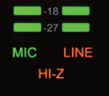

_Note: Only one input jack at a time (Mic, Line, or Hi-Z) can be used as a channel’s input source._ 

## Preamp Gain 

The Level knob adjusts the amount of preamp gain (input signal level) for the currently selected input channel. 

## Preamp Options 

Each input channel has a set of preamp options. The preamp options for the currently selected input channel are activated using the row of six buttons when in Preamp mode. 

The current state of the preamp options are indicated in the upper row of the options display panel above the six option buttons. Available options are dim when inactive, bright when enabled, and unlit when unavailable. 

_Note: Not all preamp options are available with all input types. For specific details, see the Top Panel Controls section later in this chapter._ 

Apollo Twin X Gen 2 Hardware Manual 

20 

Controls & Connectors 

## MONITOR Mode 

When Apollo Twin X is in Monitor mode, the top panel controls are related to output functions only. To adjust output functions, press the MONITOR button to enter Monitor mode and activate the monitor and headphone controls. 

_Note: Input functions cannot be performed in Monitor mode. Press the PREAMP button to perform input functions._ 

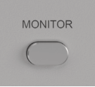

_Important: Apollo Twin X must be in Monitor mode to change the volume of the monitor/headphone outputs and other output options._ 

## Stereo Outputs 

Apollo Twin X has two stereo outputs that can be controlled with the top panel hardware: Monitor and Headphone. These stereo outputs are controlled when in Monitor mode. 

_Note: Line outputs 3 and 4 are controlled with software only._ 

## Stereo Output Controls 

The Level knob is used to set the volume level for each stereo output independently. The Level knob adjusts the volume for the currently selected stereo output. By switching the selected output with the MONITOR button, the other output volume can be adjusted. 

## Stereo Output Selection 

The currently selected stereo output is shown by the MONITOR and HEADPHONE indicators at the right of the main display, above and below the output meters. When a stereo output is selected, its indicator is lit. 

_Note: The Level knob adjusts the volume for the currently selected stereo output._ 

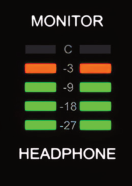

## Changing Stereo Outputs 

When in Monitor mode, press the MONITOR button to change the selected stereo output. Press MONITOR again to switch to the other output. 

## Monitor Options 

Apollo Twin X has monitor options that perform the functions of a dedicated monitor controller. The monitor options are controlled using the row of six buttons when in MONITOR Mode. 

The current state of the monitor options are indicated in the lower row of the options display panel above the option buttons. Available options are dim when inactive, bright when enabled, and unlit when unavailable. 

_Note: Not all monitor options are always available. For specific details, see the Top Panel Controls section later in this chapter._ 

Apollo Twin X Gen 2 Hardware Manual 

21 

Controls & Connectors 

## Top Panel 

Refer to the illustration below for numbered control descriptions in this section. 

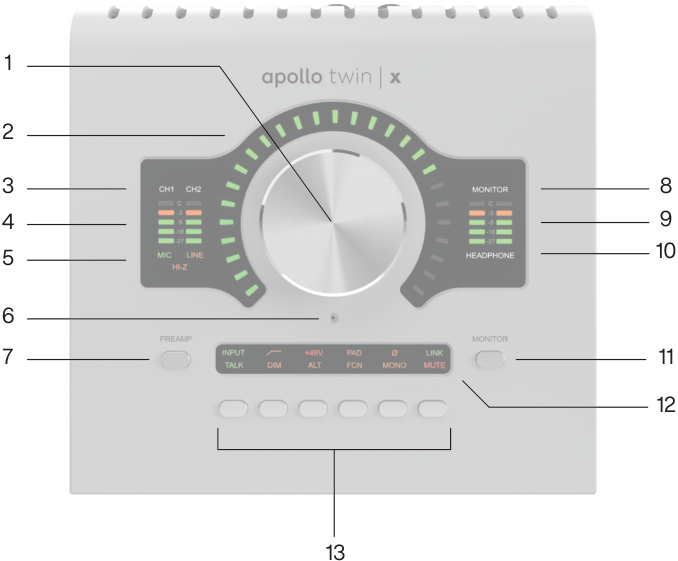

**----- Start of picture text -----** 
1 2 3 8 4 9 10 5 6 7 11 12 13 **----- End of picture text -----** 

_Top panel elements_ 

## (1) Level Knob 

The Level knob controls multiple functions. The knob’s current function is selected with the PREAMP (7) and MONITOR (11) buttons. 

When in PREAMP Mode, rotate clockwise to increase the amount of preamp gain for the currently selected input channel (3). When in MONITOR Mode, rotate clockwise to increase the monitor or headphones volume, depending on the stereo output currently selected (8 or 10) with the MONITOR (11) button. 

## Unison Integration 

The Level knob can also be used to control Unison-enabled UAD preamp, guitar/bass amp, and pedal plug-in parameters. See the UAD Console Manual for complete Unison details. 

## (2) Preamp Gain & Volume Level Indicator LEDs 

The LEDs surrounding the Level knob indicate the relative level of the selected function (either input channel preamp gain or monitor/headphone volume). 

_Note: The Volume Level Indicator LEDs are RED when MONITOR (8) is selected and MUTE (13-l) is enabled._ 

Apollo Twin X Gen 2 Hardware Manual 

22 

Controls & Connectors 

## (3) Channel Selection Indicators 

The currently selected input channel is indicated by the lit channel name above its input meter (CH1 or CH2). Press the PREAMP button (7) to switch between channels 1 & 2. 

## (4) Input Meters 

The two input meters display signal levels for each of the analog input channels. Reduce a channel’s preamp gain (see Set Input Gains) if its red clip LED illuminates. 

## (5) Input Source Indicators 

These indicators show which input source jack (MIC, LINE, or HI-Z) is active for the selected input channel. Use the Input Select button (13-a) to switch between the MIC (XLR) and LINE (¼”) rear panel combo jack inputs. The Hi-Z input is selected automatically when an instrument cable is plugged into the Hi-Z jack on the front panel. 

## (6) Talkback Microphone 

The built-in talkback mic is located inside of this hole. The talkback function is configured in the companion UAD Console software and can be activated with the TALK button (13-g) when Monitor mode is active. 

_Caution: The talkback microphone is sensitive. To avoid equipment damage, do not insert any object into the mic hole, apply pressurized air into the mic hole, or use a vacuum over the mic hole._ 

## (7) PREAMP Button 

Press this button to enter PREAMP Mode and activate the input channel controls. Press again to alternate the selected input channel (3) between CH1 and CH2. 

## (8) MONITOR Selected Indicator 

When MONITOR is lit, the Level knob (1) controls volume of the monitor outputs (16). Press the MONITOR button (11) to activate the monitor controls (you may need to press it more than once). 

_Note: The MONITOR indicator is RED when the monitor outputs are muted._ 

## (9) Stereo Output Meters 

These meters display the main stereo signal output bus levels.* The main output bus levels are independent of monitor and headphone volume levels. Reduce levels feeding the output(s) if a red “C” (clip) LED at the top of the Output Meters illuminates. 

_*Exception: If HEADPHONE is currently selected on Apollo Twin X and the Headphone Source within the CUE OUTPUTS window in UAD Console is set to HP, these output meters indicate the level being sent to the headphone bus via UAD Console’s headphone sends and/or the DAW._ 

## (10) Headphone Selected Indicator 

When HEADPHONE is lit, the Level knob (1) controls the volume of the headphones output (14). Press the MONITOR button (9) to activate the headphones volume control (you may need to push it twice). 

Apollo Twin X Gen 2 Hardware Manual 

23 

Controls & Connectors 

## (11) Monitor Button 

Press this button to enter MONITOR Mode and activate the monitor and headphone controls. Press again to alternate between control of monitor and headphone volumes with the Level knob (1). 

_Note: Indicators (8) and (10) determine which volume (MONITOR or HEADPHONE) can be controlled with the Level knob (1)._ 

## (12) Options Display 

This panel displays the state of the preamp and monitor options, which are controlled by the six Option Buttons (13). 

In Preamp mode, the upper row displays the preamp options and the lower row is unlit. In Monitor mode, the lower row displays the monitor options and the upper row is unlit. 

## (13) Option Buttons 

Each of the six Option Buttons has dual functions. In Preamp mode, the buttons control the preamp options for the currently selected input channel. In Monitor mode, the buttons control the monitor and headphone options. The individual options for both modes are detailed in this section. 

## Unison Integration 

In Preamp mode, the Option Buttons can also be used to control Unison-enabled UAD preamp, guitar/bass amp, and pedal plug-in parameters. See the UAD Console Manual for complete Unison details. 

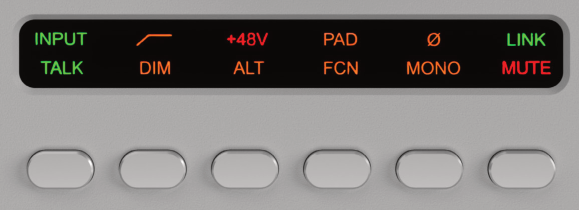

_Options Display (12) and Option Buttons (13)_ 

Apollo Twin X Gen 2 Hardware Manual 

24 

Controls & Connectors 

## Preamp Options 

When in PREAMP Mode, the Option Buttons control the preamp options (described as a – f below) for an input channel when that channel is selected (3). Press the PREAMP button (7) to enter Preamp mode and change the preamp options for the currently selected channel. 

A preamp option is active when its indicator in the upper row of the Options Display (12) is lit, and inactive when its indicator is dim. If the indicator is unlit, the option is unavailable. 

_Note: In MONITOR mode, the preamp options cannot be modified and the upper row of the Options Display is unlit._ 

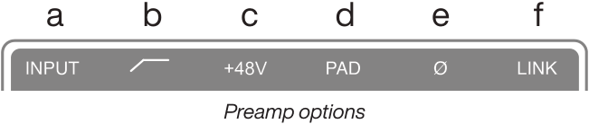

**----- Start of picture text -----** 
a b c d e f Preamp options **----- End of picture text -----** 

## _(a) INPUT Select_ 

Selects the active input source jack for the currently selected channel. The current selection is displayed by the Input Source Indicators (5). 

Press to alternate between the MIC (XLR) and LINE (¼”) combo inputs on the rear panel. The Hi-Z input is selected automatically whenever a ¼” mono TS (tip-sleeve) plug is connected to the front panel’s Hi-Z Instrument jack (14). If MIC/LINE cannot be selected, unplug the cable in the Hi-Z jack. 

_Note: Hi-Z input is available for channel 1 only._ 

## _(b) FILTER_ 

Enables a low cut (high pass) rumble filter with a cutoff frequency of 75 Hz. 

## _(c) +48V_ 

Enables +48-volt phantom power for the mic input. Phantom power is typically needed for condenser microphones. +48V is available for the microphone (XLR) inputs only. 

_Caution: To avoid potential equipment damage, disable +48V phantom power on the input channel before connecting or disconnecting its XLR input._ 

## _(d) PAD_ 

Attenuates (lowers) the XLR mic input signal level by 20 dB. PAD is not available for the line inputs or the Hi-Z instrument input. 

## _(e) POLARITY Ø_ 

Inverts the polarity (aka “phase”) of the input signal. Polarity inversion can help reduce phase cancellations when more than one microphone is used to record a single source. 

## _(f) LINK_ 

Links input channels 1 and 2 as a stereo pair. When linked, preamp control adjustments are applied to both channels. 

_Note: Only the same type of inputs can be linked (Mic+Mic or Line+Line). The Hi-Z input cannot be linked to a Mic or Line input._ 

Apollo Twin X Gen 2 Hardware Manual 

25 

Controls & Connectors 

## Monitor Options 

When in MONITOR Mode, the Option Buttons control the monitor options (described as g – h below). Press the MONITOR button (11) to enter Monitor mode and enable the monitor options. 

A monitor option is active when its indicator in the lower row of the Options Display (12) is lit, and inactive when the indicator is dim. If the indicator is unlit, the option is unavailable. 

The TALK, DIM, ALT, and FCN functions are configured in the companion UAD Console software application. See the UAD Console Manual for details. 

_Note: In Preamp mode, the monitor options cannot be modified and the lower row of the Options Display is unlit._ 

**----- Start of picture text -----** 
g h i j k l Monitor options **----- End of picture text -----** 

## _(g) TALK_ 

Activates the built-in talkback microphone and the DIM function. Press and release the button quickly to latch the function. To momentarily activate the function and deactivate when the button is released, press for longer than 0.5 seconds. 

## _(h) DIM_ 

Reduces the monitor output volume level. The amount of DIM attenuation is set in the companion UAD Console software. 

Press and release the button quickly to latch the function. To momentarily activate the function and deactivate when the button is released, press for longer than 0.5 seconds. 

## _(i) ALT (Alternate)_ 

Switches the main monitor mix to an alternate set of outputs. This function is only available when the ALT COUNT setting in the Settings>Hardware panel within the companion UAD Console software is set to a non-zero value. 

## _(j) FCN (Function)_ 

This switch can be assigned to control one of three monitoring functions. FCN is only available when Apollo Twin X is combined with other Thunderbolt-equipped Apollo models in a multi-unit cascading configuration. 

## _(k) MONO_ 

Sums the left and right signals of the stereo monitor mix into a monophonic signal. MONO applies to the monitor outputs only. It does not apply to the headphone outputs. 

Apollo Twin X Gen 2 Hardware Manual 

26 

Controls & Connectors 

## _(l) MUTE_ 

Mutes the monitor outputs. When MUTE is active, the MONITOR Selected Indicator (8) is always lit RED (including when in Preamp mode). When MUTE is active in Monitor mode, the Volume Level Indicators (2) are also RED. 

_Note: MUTE does not apply to the headphone outputs. Headphone outputs cannot be muted._ 

## Front Panel 

Refer to the illustration below for numbered control descriptions in this section. 

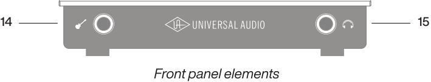

**----- Start of picture text -----** 
14 15 Front panel elements **----- End of picture text -----** 

## (14) Hi-Z Instrument Input 

Connect any guitar, bass, or other high impedance instrument here. This jack automatically overrides the channel 1 mic and line inputs. 

Levels for the Hi-Z input are set using the same method as the mic and line inputs. 

_Note: This jack accepts a ¼” mono TS (tip-sleeve) plug only._ 

## (15) Headphone Output 

Connect ¼” stereo headphones here. Volume is controlled with the Level knob (1) when HEADPHONE (10) is selected with the MONITOR button (11). 

## Side Panel 

## Kensington Security Slot (not shown) 

The anti-theft security slot on the side panel connects to any standard Kensington lock. 

Apollo Twin X Gen 2 Hardware Manual 

27 

Controls & Connectors 

## Rear Panel 

Refer to the illustration below for numbered control descriptions in this section. 

_Note: All rear panel ¼” jacks can accept unbalanced TS (tip-sleeve) or balanced TRS (tip-ring-sleeve) plugs._ 

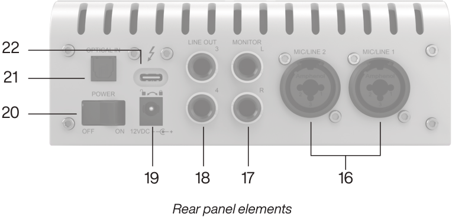

**----- Start of picture text -----** 
22 21 20 19 18 17 16 Rear panel elements **----- End of picture text -----** 

## (16) Mic/Line Combo Inputs 1 & 2 

The input jacks for preamp channels 1 & 2 accept either a male XLR plug for connecting to the mic input, or a ¼” phone plug for connecting to the line input. 

The input jack that is used for the preamp channel (mic or line) is specified with the Input Select button (13-a). 

_Caution: To avoid potential equipment damage, disable +48V phantom power on the channel before connecting or disconnecting its XLR input._ 

## (17) Monitor Outputs 

Connect the powered monitor speakers (or speaker system amplifier inputs) here. Volume is controlled with the Level knob (1) when MONITOR is selected (8) with the MONITOR button (11). The Monitor Outputs are DC coupled. 

## (18) Line Outputs 3 & 4 

These ¼” phone outputs are accessed via software (UAD Console or DAW). Line outputs 3 & 4 are typically used to send audio to other equipment. The Line Outputs are DC coupled. 

Apollo Twin X Gen 2 Hardware Manual 

28 

Controls & Connectors 

## (19) Power Supply Input 

The included power supply must be connected here (Apollo Twin X cannot be bus powered). Rotate locking connector to prevent accidental disconnection. 

_Important: After ensuring the locking barrel tabs are aligned with the chassis slots and the barrel is fully inserted, rotate the barrel to secure the connector to the chassis._ 

## **2. Rotate to Lock** 

## **1. Align Tabs** 

12VDC 

## (20) Power Switch 

This rocker switch applies power to Apollo Twin X. Switch to OFF when not in use. 

_Caution: Before powering Apollo Twin X, lower the volume of the monitor speakers and remove headphones from your ears._ 

## (21) Optical Input 

This is a TOSLINK input for connection to other gear with an optical ADAT or S/PDIF output. 

_Note: The connection protocol to be used (ADAT or S/PDIF) is specified in the Settings>Hardware panel within the companion UAD Console software._ 

## (22) Thunderbolt 3 Port 

Connect the Thunderbolt 3 cable (not included) from the host computer here. A Thunderbolt 3 connection to the computer is required to use all Apollo Twin X features and UAD Powered Plug-Ins. 

_Note: With Mac computers only, Apollo Twin X can be connected to Thunderbolt 1 and Thunderbolt 2 ports by using the Apple Thunderbolt 3 to Thunderbolt 2 Adapter in conjunction with a Thunderbolt 2 cable. With Windows computers, connections to Thunderbolt 1 or Thunderbolt 2 ports on are not supported._ 

Apollo Twin X Gen 2 Hardware Manual 

29 

Controls & Connectors 

## **Specifications** 

All specifications are typical performance unless otherwise noted. Tested with the Audio Precision APx555 Audio Analyzer under the following conditions: 48 kHz internal sample rate, 24-bit sample depth, 20 kHz measurement bandwidth, balanced input & output (except single-ended headphone output), and internal clock. 

Specifications are subject to change without notice. 

|**SYSTEM**|**SYSTEM**|
|---|---|
|_I/O Complement_||
|Simultaneous Channel I/O Count(analog+ digital)|10 x 6(ADAT mode)|
|Microphone Inputs|Two|
|High Impedance(Hi-Z)Instrument Inputs|One|
|AnalogLine Inputs|Two|
|AnalogLine Outputs(DC coupled)|Two(four includingMonitor outputs)|
|AnalogMonitor Outputs(DC coupled)|Two(one stereopair)|
|Headphone Output|One stereo|
|Digital Audio Port(ADAT or S/PDIF, selectable)|One input|
|Thunderbolt 3 Port*|One|
|_*(Mac only) Thunderbolt 1 and 2 connections supported via Apple Thunderbolt 3 to Thunderbolt 2 adapter_||
|_A/D – D/A Conversion_||
|Simultaneous A/D conversion|Two channels|
|Simultaneous D/A conversion|Six channels|
|Available Sample Rates(kHz)|44.1, 48, 88.2, 96, 176.4, 192|
|Bit Depth Per Sample|24|
|AnalogRound-TripLatency|1.1 milliseconds @ 96 kHz sample rate|
|Analog Round-Trip Latency through four UAD legacy|1.1 milliseconds @ 96 kHz sample rate (no additional|
|plug-ins(included)via UAD Console software|latencyvia Realtime UAD Processing)|
|||
|**ANALOG I/O**||
|_Microphone Inputs 1 & 2_||
|FrequencyResponse|20 Hz – 20 kHz,±0.04 dB|
|Dynamic Range|123 dB(A–weighted)|
|THD + Noise(1 kHz@24 dBu,-1 dBFS)|-115 dB(0.00018%)|
|Maximum Input Level(PAD on)|25 dBu|
|Default Input Impedance(variable via Unisonplug-ins)|5.4 K Ω|
|Gain Range|+10 dB to +65 dB|
|Pad Attenuation(switchableper mic input)|20 dB(variable via Unisonplug-ins)|
|Phantom Power(switchableper mic input)|+48V|
|Connector Type|XLR Female, pin 2positive(Combo XLR/TRS)|

Specifications 

Apollo Twin X Gen 2 Hardware Manual 

30 

|||**ANALOG I/O**|
|---|---|---|
||_Hi-Z Input(600 K Ω input termination)_||
|FrequencyResponse||20 Hz – 20 kHz,±0.05 dB|
|Dynamic Range||121 dB(A–weighted)|
|THD + Noise(1 kHz@11.4 dBu,-1 dBFS)||-110 dB(0.00032%)|
|Maximum Input Level(at minimumgain) 12.4 dBu|||
|Default Input Impedance(variable via Unisonplug-ins) 1 M Ω|||
|Gain Range||+10 dB to +65 dB|
|Connector Type||¼" Female TS Unbalanced|
|||_Line Inputs 1 & 2_|
|FrequencyResponse||20 Hz – 20 kHz,±0.04 dB|
|Dynamic Range||122 dB(A–weighted)|
|THD + Noise(1 kHz@19.2 dBu,-1 dBFS) -115 dB(0.00018%)|||
|Maximum Input Level||20.2 dBu|
|Input Impedance||10 K Ω|
|Gain Range||+10 dB to +65 dB|
|Connector Type||¼" Female TRS Balanced|
|||_Line Outputs 1 & 2_|
|FrequencyResponse||20 Hz – 20 kHz,±0.01 dB|
|Dynamic Range||127 dB(A–weighted)|
|THD + Noise(1 kHz@19.2 dBu,-1 dBFS) -119 dB(0.00011%)|||
|Maximum Output Level Reference level @ +4 dBu Reference level@-10 dBV||20.2 dBu 14.5 dBu|
|Output Impedance||100 Ω|
|Connector Type||¼" Female TRS Balanced|
|||_Monitor Outputs L & R_|
|FrequencyResponse||20 Hz – 20 kHz,±0.04 dB|
|Dynamic Range||129 dB(A–weighted)|
|THD + Noise(1 kHz@19.2 dBu,-1 dBFS) -120 dB(0.0001%)|||
|Maximum Output Level||20.2 dBu|
|Output Impedance||100 Ω|
|Connector Type||¼" Female TRS Balanced|
|||_Stereo Headphone Outputs_|
|FrequencyResponse||20 Hz – 20 kHz,±0.01 dB|
|Dynamic Range||124 dB(A–weighted)|
|THD + Noise|||
|300 Ω load (1 kHz @ 14.4 dBu, -1|dBFS)| -112 dB (0.00025%)|
|600 Ω load(1 kHz@14.8 dBu,-1|dBFS)|-114 dB(0.00019%)|
|Maximum Output Level|||
|300 Ω load (1 kHz, 0 dBFS)||15.4 dBu|
|600 Ω load(1 kHz,0 dBFS)||15.8 dBu|
|Maximum Output Power (RMS)|||
|300 Ω load (1 kHz @ 15.4 dBu, 0 dBFS)||69 mW|
|600 Ω load(1 kHz@15.8 dBu,0 dBFS)||38 mW|
|Connector Type||¼" Female TRS Stereo|

Specifications 

Apollo Twin X Gen 2 Hardware Manual 

31 

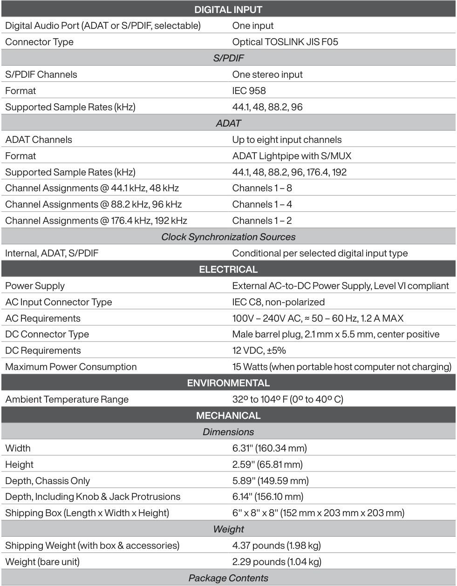

**----- Start of picture text -----** 
DIGITAL INPUT Digital Audio Port (ADAT or S/PDIF, selectable) One input Connector Type Optical TOSLINK JIS F05 S/PDIF S/PDIF Channels One stereo input Format IEC 958 Supported Sample Rates (kHz) 44.1, 48, 88.2, 96 ADAT ADAT Channels Up to eight input channels Format ADAT Lightpipe with S/MUX Supported Sample Rates (kHz) 44.1, 48, 88.2, 96, 176.4, 192 Channel Assignments @ 44.1 kHz, 48 kHz Channels 1 – 8 Channel Assignments @ 88.2 kHz, 96 kHz Channels 1 – 4 Channel Assignments @ 176.4 kHz, 192 kHz Channels 1 – 2 Clock Synchronization Sources Internal, ADAT, S/PDIF Conditional per selected digital input type ELECTRICAL Power Supply External AC-to-DC Power Supply, Level VI compliant AC Input Connector Type IEC C8, non-polarized AC Requirements 100V – 240V AC, ≈ 50 – 60 Hz, 1.2 A MAX DC Connector Type Male barrel plug, 2.1 mm x 5.5 mm, center positive DC Requirements 12 VDC, ±5% Maximum Power Consumption 15 Watts (when portable host computer not charging) ENVIRONMENTAL Ambient Temperature Range 32º to 104º F (0º to 40º C) MECHANICAL Dimensions Width 6.31" (160.34 mm) Height 2.59" (65.81 mm) Depth, Chassis Only 5.89" (149.59 mm) Depth, Including Knob & Jack Protrusions 6.14" (156.10 mm) Shipping Box (Length x Width x Height) 6" x 8" x 8" (152 mm x 203 mm x 203 mm) Weight Shipping Weight (with box & accessories) 4.37 pounds (1.98 kg) Weight (bare unit) 2.29 pounds (1.04 kg) Package Contents **----- End of picture text -----** 

Apollo Twin X Gen 2 Audio Interface (DUO or QUAD) External Power Supply 

AC Power Cable (IEC C7, non-polarized) Region Specific (USA, EU, UK, ANZ, or Japan) 

Getting Started URL Card 

Specifications 

Apollo Twin X Gen 2 Hardware Manual 

32 

## Hardware Block Diagram 

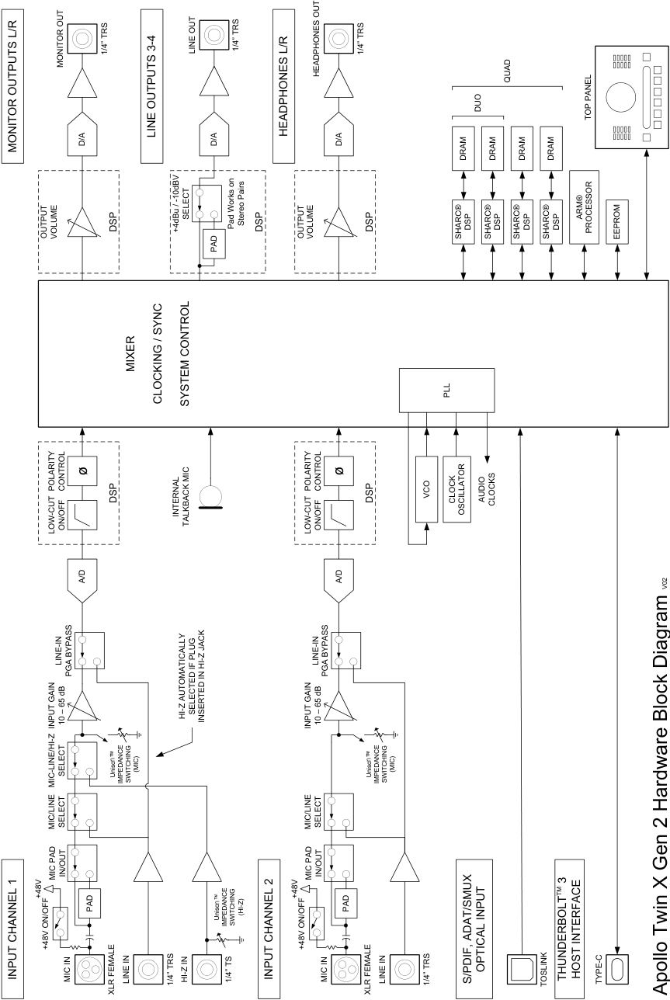

**----- Start of picture text -----** 
1/4” TRS LINE OUT 1/4” TRS 1/4” TRS MONITOR OUT HEADPHONES OUT QUAD DUO TOP PANEL LINE OUTPUTS 3-4 HEADPHONES L/R D/A D/A D/A MONITOR OUTPUTS L/R DRAM DRAM DRAM DRAM SELECT ARM® DSP +4dBu / -10dBV Pad Works on  Stereo Pairs DSP DSP DSP DSP DSP DSP PROCESSOR OUTPUT  VOLUME OUTPUT  VOLUME SHARC®  SHARC®  SHARC®  SHARC®  EEPROM PAD MIXER PLL CLOCKING / SYNC SYSTEM CONTROL ø ø POLARITY  CONTROL POLARITY  CONTROL DSP DSP VCO CLOCK AUDIO  CLOCKS INTERNAL  OSCILLATOR LOW-CUT ON/OFF TALKBACK MIC LOW-CUT ON/OFF A/D A/D V02 LINE-IN LINE-IN PGA BYPASS PGA BYPASS INPUT GAIN 10 – 65 dB HI-Z AUTOMATICALLY  SELECTED IF PLUG  INSERTED IN HI-Z JACK INPUT GAIN 10 – 65 dB SELECT Unison (MIC) Unison (MIC) MIC-LINE/HI-Z IMPEDANCE  SWITCHING  IMPEDANCE  SWITCHING MIC/LINE SELECT MIC/LINE SELECT MIC PAD IN/OUT MIC PAD IN/OUT  3 +48V +48V TM PAD Unison (HI-Z) PAD IMPEDANCE  SWITCHING +48V ON/OFF +48V ON/OFF OPTICAL INPUT INPUT CHANNEL 1 MIC IN LINE IN 1/4” TRS HI-Z IN 1/4” TS INPUT CHANNEL 2 MIC IN LINE IN 1/4” TRS S/PDIF, ADAT/SMUX  TOSLINK THUNDERBOLT HOST INTERFACE TYPE-C XLR FEMALE XLR FEMALE Apollo Twin X Gen 2 Hardware Block Diagram **----- End of picture text -----** 

Specifications 

Apollo Twin X Gen 2 Hardware Manual 

33 

## **Troubleshooting** 

If your Apollo desktop unit isn’t behaving as expected, check these common troubleshooting items. If you still experience issues after performing these checks, contact Technical Support. 

| Technical Support.||
|---|---|
|**SYMPTOM**|**ITEMS TO CHECK**|
|Unit won’t power on|• Confrm power supply connector is fully inserted, then twist barrel to lock • Confrm Power switch is in “ON” position • Confrm AC power is available at wall socket by plugging in a different device|
|Unit is not recognized by|• Confrm Thunderbolt 3 cable is fully inserted at both ends • Confrm latest Apollo  software is installed (reinstall if necessary)|
|computer|• Power off entire system, power on Apollo, then start computer|
||• Try a different Thunderbolt 3 cable|
|No monitor output|• Confrm connections, power, and volume of monitoring system • Confrm Apollo monitor level is turned up (press MONITOR button frst) • Confrm monitor outputs are not muted (push MUTE button when in Monitor mode) • Confrm monitor LEDs are active (check signal fows)|
|Can't hear mic or line input(s)|• Confrm mic/line switch setting is correct for the channel (CH1 or CH2) • Confrm mic/line setting matches the input plug for the channel (XLR or ¼”) • Confrm preamp gain is turned up for the channel(s) • For channel 1, confrm nothing is plugged into the Hi-Z input|
|Can’t hear mic input(s)|• Confrm +48V phantom power is enabled if required by microphone|
|Can't hear Hi-Z input|• Confrm volume on connected device is turned up • Confrm Hi-Z input plug is 1/4” mono TS (TRS cables cannot be used with Hi-Z input)|
|Preamp controls have no|• Confrm desired channel is selected for control|
|effect on channel|(push PREAMP button repeatedly to select CH1 or CH2)|
|Can’t adjust digital input|• Signal levels for digital inputs are adjusted at the device connected to those inputs|
|levels|• UAD plug-ins  in UAD Console can be used to add or reduce signal gain if desired|
|Audio glitches and/or dropouts during DAW playback|• Increase I/O buffer size setting (Mac: in DAW settings; Windows: in UAD Console settings) • If syncing to external digital clock via optical input, confrm clocking setups (confrm optical cable connections, matching sample rates, and that all devices are synchronized to one master clock device)|
||• Confrm input monitoring is not enabled in both UAD Console and DAW|
|Undesirable echo/phasing|• Disable software input monitoring if monitoring via UAD Console (recommended)|
||• Mute all UAD Console inputs if software input monitoring via DAW|
||• Mute or lower preamp gain to minimum on unused preamp channels|
|Static and/or white noise|(mic preamps can emit noise even when nothing is plugged in)|
|is heard when nothing is|• Some UAD plug-ins model the noise characteristics of the original equipment|
|plugged in|(defeat the noise model in the UAD plug-in interface, or mute the channel containing the|
||plug-in to temporarily mute the noise)|
|Various LEDs inside the unit are blinking|• This is normal operational behavior and can be safely ignored|
||• As a last resort, perform a hardware reset on the unit by following these steps:|
|Apollo desktop is behaving unexpectedly|1. Power off Apollo 2. Press and hold the PREAMP, FILTER, and POLARITY buttons 3. Power on Apollo  while continuing to hold all three controls 4. After all front panel LEDs fash rapidly for several seconds, release the controls|

Apollo Twin X Gen 2 Hardware Manual 

34 

Troubleshooting 

## **Notices** 

## Important Safety Information 

1. Read these safety instructions and the instruction manual of the product. 

2. Keep these safety instructions and the instruction manual of the product. Always include all instructions when providing the product to other parties. 

3. Heed all warnings. 

4. Follow all instructions. 

5. Do not use this apparatus near water. 

6. Only clean the product when it is not connected to the power supply system. Clean only with a dry cloth. 

7. Do not block any ventilation openings. Install in accordance with the manufacturer’s instructions. 

8. Do not install near any heat sources such as radiators, heat registers, stoves, or other apparatus (including amplifiers) that produce heat. 

9. Only operate the product from the type of power source indicated on the power supply unit. 

10. Protect the power cord from being walked on or pinched, particularly at plugs, convenience receptacles, and the point where it enters into and/or exits from the apparatus. 

11. Only use attachments/accessories specified by the manufacturer. 

12. Unplug this apparatus during lightning storms or when unused for long periods of time. 

13. Refer all servicing to qualified service personnel. Servicing is required when the apparatus has been damaged in any way, such as when the power supply cord or plug is damaged, liquid has been spilled into or objects have fallen into the apparatus, or when the apparatus has been exposed to rain or moisture, does not operate normally, or has been dropped. 

14. **Warning:** To reduce the risk of fire or electric shock, do not expose this apparatus to rain or moisture. Objects filled with liquids, such as vases, should not be placed on this apparatus. 

15. To completely disconnect this apparatus from the AC mains, disconnect the power supply cord plug from the AC receptacle. 

16. The mains plug of the power supply cord shall remain readily accessible. 

17. Do not attempt to open the product housing. The warranty is voided for products opened by the customer. 

18. Let the product reach ambient temperature before switching it on. 

19. **Caution:** High signal levels can damage your hearing and your loudspeakers. Reduce the volume on the connected audio devices before switching on the product; this will also help prevent acoustic feedback. 

20. Intended use. The product is designed for indoor use. The product can be used for commercial purposes. It is considered improper use when the product is used for any application not named in the corresponding instruction manual. Universal Audio does not accept liability for damage arising from improper use or misuse of this product and its attachments/ accessories. Before putting the product into operation, please observe the respective country-specific regulations. 

35 

Notices 

Apollo Twin X Gen 2 Hardware Manual 

## Manufacturer’s Declarations 

## Warranty 

The product is covered by a limited warranty. For the current terms of such warranty, please visit uaudio.com/eula. 

## Maintenance 

**CAUTION:** To reduce the risk of electric shock, do not open the unit. 

This product does not contain a fuse or any other user-replaceable parts. The unit is internally calibrated at the factory. No internal user adjustments are available. 

## Repair Service 

If you are having trouble with your hardware, first check all system setups, connections, and operating instructions. If that doesn’t help, contact our Customer Care team. 

To learn about repair service, or for Customer Care, visit help.uaudio.com. 

## Notes on Disposal 

In compliance with the following requirements: 

## WEE-DIRECTIVE (2012/19/EU) 

The symbol of the crossed-out wheeled bin on the product, the battery/ rechargeable battery (if applicable), and/or the packaging indicates that these products must not be disposed of with normal household waste, but must be disposed of separately at the end of their operational lifetime. For packaging disposal, please observe the legal regulations on waste segregation applicable in your country. 

Further information on the recycling of these products can be obtained from your municipal administration or from the municipal collection points. The separate collection of waste electrical and electronic equipment, batteries/rechargeable batteries (if applicable) and packaging, is used to promote the reuse and recycling and to prevent negative effects caused by e.g., potentially hazardous substances contained in these products. Herewith, you can make an important contribution to the protection of the environment and public health. 

## EU Declaration of Conformity 

- RoHS-Directive (2015/863/EU) 

- Low Voltage Directive (2014/35/EU) 

- EMC Directive (2014/30/EU) 

- REACH Directive (EC1907/2006) 

36 

Notices 

Apollo Twin X Gen 2 Hardware Manual 

## Class B Device Statements 

## United States 

NOTE: This equipment has been tested and found to comply with the limits for a Class B digital device pursuant to Part 15 of the FCC Rules. These limits are designed to provide reasonable protection against harmful interference in a residential installation. This equipment generates, uses, and can radiate radio frequency energy and, if not installed and used in accordance with the instructions, may cause harmful interference to radio communications. However, there is no guarantee that interference will not occur in a particular installation. If this equipment does cause harmful interference to radio or television reception, which can be determined by turning the equipment off and on, the user is encouraged to try and correct the interference by one or more of the following measures: 

- Reorient or relocate the receiving antenna. 

- Increase the separation between the equipment and the receiver. 

- Connect the equipment into an outlet on a circuit different from that to which the receiver is connected. 

- Consult the dealer or an experienced radio/TV technician for help. 

Any modifications to the unit, unless expressly approved by Universal Audio, could void the User’s authority to operate the equipment. 

37 

Notices 

Apollo Twin X Gen 2 Hardware Manual 

## Compliance 

This product complied with the following requirements: 

- Subpart B of Part 15 of FCC Rules for Class B digital devices (ANSI C63.4 methods) 

- Innovation, Science and Economic Development Canada Interference Causing Equipment Standard ICES-003, “Information Technology Equipment (ITE) – Limits and methods of measurement”, Issue 7, dated October 2020 (Class B) (ANSI C63.4 methods) 

- VCCI-CISPR 32:2016 “Technical Requirements” for multimedia equipment (Class B) 

- AS/NZS CISPR 32:2015 +A1 +A11 2020 “Electromagnetic compatibility of multimedia equipment – Emission requirements” (Class B) 

- CISPR 32:2015 +A1:2019, “Electromagnetic compatibility of multimedia equipment – Emissions requirements” (Class B) 

- EN 55032:2015 +A11 +A1:2020, “Electromagnetic compatibility of multimedia equipment – Emissions requirements” (Class B) 

- BS EN 55032:2015 +A11 +A1:2020, “Electromagnetic compatibility of multimedia equipment – Emissions requirements” (Class B) 

- CISPR 35:2016 “Electromagnetic compatibility of multimedia equipment – Immunity requirements. 

- EN 55035:2017 + A11:2020 “Electromagnetic compatibility of multimedia equipment – Immunity requirements. 

- BS EN 55035:2017 + A11:2020 “Electromagnetic compatibility of multimedia equipment – Immunity requirements. 

- QCVN 118:2018/BTTTT “National technical regulation on Electromagnetic compatibility of multimedia equipment - Emission requirements” (Class B) 

- KS C 9832, KS C 9835 (Class B) 

38 

Notices 

Apollo Twin X Gen 2 Hardware Manual 

## South Korea Compliance Certification 

Apollo Twin X DUO Gen 2 

- Applicant Name: Universal Audio, Inc. 

- Equipment Name: Apollo Twin X DUO Gen 2 

- Model Name: Apollo Twin X DUO Gen 2 

- Registration Number: R-R-UAO-APOLLOTWINXG2 

- Manufacturer/Country of Origin: Universal Audio, Inc. / Malaysia, China, Vietnam 

- Date of Registration: 2024-08-16 

Apollo Twin X QUAD Gen 2 

- Applicant Name: Universal Audio, Inc. 

- Equipment Name: Apollo Twin X QUAD Gen 2 

- Model Name: Apollo Twin X QUAD Gen 2 

- Registration Number: R-R-UAO-APOLLOTWINXG2 

- Manufacturer/Country of Origin: Universal Audio, Inc. / Malaysia, China, Vietnam 

- Date of Registration: 2024-08-16 

## Product Labels 

Apollo Twin DUO Gen 2 

Apoollo Twin X QUAD Gen 2 

39 

Notices 

Apollo Twin X Gen 2 Hardware Manual 

## End User License Agreement 

Your rights to the Software are governed by the accompanying End User License Agreement, a copy of which can be found at: www.uaudio.com/eula 

## Copyrights & Trademarks 

Copyright ©2025 Universal Audio, Inc. All rights reserved. 

UA owns certain trademarks (or applications therefor) that are used in connection with the following UA Software Products and/or the UAD Platform (together “UA Marks”), including, without limitation: 

1176, 1176 LN, 175-B, 176, APOLLO, APOLLO TWIN, ARROW, ASTRA MODULATION MACHINE, BOCK, BOCK AUDIO and BOCK AUDIO logo, CENTURY TUBE CHANNEL STRIP, CYCLOSONIC PANNER, DEL-VERB, DREAMVERB, DYTRONICS, EQP-1A, GOLDEN REVERBERATOR, GOLDEN REVERBERATOR & UA Diamond Design, GOLDEN REVERBERATOR & UA Diamond Design (Series), HELIOS, LA-2A, LA-3A, LUNA, OPAL, OX, OX AMP TOP BOX & Design, OXIDE, POWERED PLUG-INS, RAYMOND, SHAPE, SOUNDELUX and SOUNDELUX USA logo, SPHERE, SPHERE UNIVERSAL AUDIO and UA Diamond Design, STANDARD and UA Diamond Design, STARLIGHT ECHO STATION, TELETRONIX, THE AUTHENTIC SOUND OF ANALOG, TOWNSEND LABS, TRI-STEREO CHORUS, U UNISON PREAMPS & Design, UA Diamond Design, UAD, UAD 2 POWERED PLUG-INS, UAD SPARK, UAD-2 LIVE RACK, UAFX (Stylized), UNIVERSAL AUDIO, UNIVERSAL AUDIO and UA Diamond Design, VOLT UNIVERSAL AUDIO and UA INC. Diamond Design, APOLLO | X, DREAM 65, POLYMAX, RUBY 63, SETTING THE TONE SINCE 1958, SOUNDELUX USA, SPHERE UNIVERSAL AUDIO and UA Diamond Design, UNIVERSAL AUDIO APOLLO, UNIVERSAL AUDIO UAD, VOLT UNIVERSAL AUDIO and UA Diamond Design, WATERFALL B3, WOODROW 55. 

Unless otherwise agreed to in writing under a separate agreement, Customer shall have no interest in any UA Mark and UA will remain the sole and exclusive owner of all right, title and interest in all UA Marks and all applications, reissuances, divisions, re-examinations, renewals or extensions thereof. Other company and product names mentioned herein are trademarks of their respective owners. 

ASIO is a trademark and software of Steinberg Media Technologies GmbH. 

This manual and any associated software, artwork, product designs, and design concepts are subject to copyright protection. No part of this document may be reproduced, in any form, without prior written permission of Universal Audio, Inc. 

## Disclaimer 

The information contained in this manual is subject to change without notice. Universal Audio, Inc. makes no warranties of any kind with regard to this manual, including, but not limited to, the implied warranties of merchantability and fitness for a particular purpose. Universal Audio, Inc. shall not be liable for errors contained herein or direct, indirect, special, incidental, or consequential damages in connection with the furnishing, performance, or use of this material. 

40 

Notices 

Apollo Twin X Gen 2 Hardware Manual 

## **Technical Support** 

## Universal Audio Knowledge Base 

The UA Knowledge Base is your complete technical resource for configuring, operating, troubleshooting, and repairing UA products. 

You can watch helpful support videos, search the Knowledge Base for answers, get updated technical information that may not be available elsewhere, and more. 

## **UA Knowledge Base** 

## Universal Audio YouTube Channel 

The Universal Audio YouTube Channel at youtube.com includes helpful support videos for setting up and using UA products. 

## **UA YouTube Channel** 

## Universal Audio Community Forums 

The unofficial UA discussion forums are a valuable resource for all Universal Audio product users. This website is independently owned and operated. 

## **www.uadforum.com** 

## Customer Care 

To contact UA support staff for technical or repair assistance, please visit: 

## **help.uaudio.com** 

Technical Support 

Universal Audio 

41 

www.uaudio.com 

