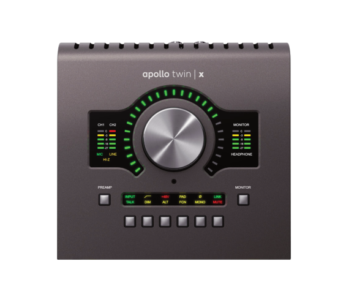

## **Apollo Twin X USB Hardware Manual** 

Manual Version 230725B 

www.uaudio.com 

## **A Letter from Bill Putnam Jr.** 

Thank you for choosing this Apollo Twin X USB audio interface to become a part of your studio. We know that any new piece of gear requires an investment of time and money — and our goal is to make your investment pay off. 

Universal Audio interfaces like Apollo Twin X USB exemplify a commitment to craftsmanship that we’ve forged over the past 60 years — from our original founding in the 1950s by my father, Bill Putnam Sr., to our current mission combining the best of both classic analog and modern digital audio technologies. 

Starting with its high-quality I/O and superior A/D and D/A conversion, Apollo Twin X USB’s superior sonic performance serves as its foundation. 

This is just the beginning however, as Apollo Twin X USB lets you power the full range of UAD plug-ins in real time, including classic mic preamps, EQs, dynamics processors, reverbs, guitar amps, and much more. With more than 100 acclaimed UAD plug-ins at your fingertips, the sonic choices are limitless.* 

At UA, we are dedicated to the idea that technology should serve the creative process, inspiring our customers to go further. These are the ideals my father embodied with his classic designs, and we like to think this spirit lives on today in products like Apollo Twin X USB. 

Please feel free to reach out to us via our website www.uaudio.com, and via our social media channels. We look forward to hearing from you, and thank you once again for choosing Universal Audio. 

Sincerely, 

Bill Putnam Jr. 

_*All trademarks are recognized as property of their respective owners. Individual UAD plug-ins sold separately._ 

Apollo Twin X USB Hardware Manual 

2 

Welcome 

## **Table Of Contents** 

_**Tip:** Click any section or page number to jump directly to that page._ 

A Letter from Bill Putnam Jr. ................................................................. 2 Introduction ......................................................................................... 4 Apollo Twin X USB Features ................................................................................ 6 Operational Overview .......................................................................................... 8 About Apollo Twin X USB Documentation ........................................................... 10 Additional Resources ....................................................................................... 11 Getting Started ................................................................................... 12 Overview ......................................................................................................... 12 Hardware System Requirements ........................................................................ 12 Hardware Setup ............................................................................................... 13 Software Setup ................................................................................................ 14 Connect to Input Sources and Monitor System .................................................... 15 Setting Hardware I/O Levels .............................................................................. 16 Controls & Connectors ......................................................................... 17 Controls Overview ............................................................................................ 17 Top Panel ........................................................................................................ 20 Front Panel ..................................................................................................... 25 Side Panel ...................................................................................................... 25 Rear Panel ...................................................................................................... 26 Specifications .................................................................................... 28 Hardware Block Diagram .................................................................................. 31 Troubleshooting .................................................................................. 32 Notices .............................................................................................. 33 Warranty ......................................................................................................... 33 Maintenance ................................................................................................... 33 Repair Service ................................................................................................. 33 Important Safety Information ............................................................................ 34 Electromagnetic Compatibility ........................................................................... 35 Technical Support ............................................................................... 37 Universal Audio Knowledge Base ....................................................................... 37 Universal Audio YouTube Channel ...................................................................... 37 Universal Audio Community Forums .................................................................. 37 Contact Universal Audio Support ....................................................................... 37 

Apollo Twin X USB Hardware Manual 

3 

Table Of Contents 

## **Introduction** 

## **Elite Audio Conversion and Unison Preamps, on your Desktop.** 

Apollo Twin X USB allows musicians and producers to easily track, overdub, and mix with elite-class A/D and D/A conversion, two Unison-enabled preamps, and DUO Core realtime UAD plug-in processing — all in a desktop USB 3 audio interface for Windows. 

Built upon UA’s 60-year heritage of audio craftsmanship, Apollo Twin X USB confidently outperforms everything in its class with 127 dB D/A dynamic range, along with an included bundle of UAD analog emulation plug-ins, giving you a fully-stocked analog studio, right on your desktop. 

## **Now You Can:** 

- Record and mix with elite-class A/D and D/A conversion — with the widest dynamic range and lowest noise of any desktop interface 

- Two Unison-enabled preamps — track with near-zero latency through preamp emulations from Helios, Neve, API, Manley, and more* 

- Onboard UAD processing lets you track and mix in realtime with included Teletronix LA-2A and 1176 compressors, Pultec EQs, 610-B Tube Preamp, and more 

## **Unison Preamps: Get the Genuine Sound of Neve, Helios, API, Manley & More** 

Apollo Twin X USB features two Unison-enabled mic preamps, letting you track through exacting mic preamp emulations from Neve®, Helios, API, Manley, Universal Audio and many more. Exclusive to UA Audio Interfaces, Unison technology nails the tone of these sought-after tube and solid state mic pres — including their input impedance, gain stage “sweet spots,” and the component-level circuit behaviors of the original hardware. 

The secret to Unison is its hardware-software integration between Apollo’s mic preamps and its onboard UAD DUO Core DSP Acceleration. Simply place a Unison preamp plug-in on your mic input in Apollo Console software, and it physically reconfigures the Apollo interface’s impedance — so you can tap into the classic sounds of the world’s most recorded mic preamps. 

## **Elite-Class A/D and D/A Conversion** 

With thousands of hit songs and hundreds of Grammy-winning albums under their belt, Apollo interfaces are used to track exceptional-sounding records every day. To improve on the previous generation of desktop Apollo interfaces’ class-leading audio conversion, UA engineers redesigned the Twin’s audio conversion to deliver a striking 127 dB dynamic range and -117 dB THD+N, giving Apollo Twin X USB a spacious, organic sound that easily rivals dedicated high-end converters. 

_*Includes the “Realtime Analog Classics” UAD plug-in bundle. Other UAD plug-ins sold separately._ 

Apollo Twin X USB Hardware Manual 

Introduction 

4 

## **A Full Suite of Classic Analog Processing Onboard** 

Right out of the box, Apollo Twin X USB offers a suite of incredible analog emulation plug-ins including the world’s only authentic Teletronix LA-2A, 1176LN, Pultec EQs, and the UA 610-B Tube Preamp & EQ. Developed by UA’s world-renowned team of algorithm engineers, these Realtime Analog Classics plug-ins set the standard by which all other hardware emulation plug-ins are judged. 

From the tube warmth of the Pultec EQ on guitars, to the gentle limiting of the LA-2A on vocals, your recordings will take a giant leap forward in rich, sonically complex analog sound. 

## **Access the World of UAD Powered Plug-Ins** 

Beyond the included Realtime Analog Classics plug-ins, Apollo Twin X USB lets you tap into the full library award-winning UAD Powered Plug-Ins — including vintage EQs, Compressors, Reverbs, Tape Machines and more — at near-zero latency, regardless of your audio software’s buffer size and without taxing your computer’s CPU. 

With exclusive emulations from Neve, Lexicon, Capitol Studios, API, Manley, Ampex, Fender, and more, it’s like having an endless analog studio, right on your desktop. And unlike competing interfaces, these DSP-powered plug-ins are also available in your DAW for mixing. 

## **Record with Vintage Amps** 

Apollo Twin X USB also includes Unison technology on its front panel instrument input, giving you access to dead-on emulations of guitar and bass amps like the Fender ‘55 Tweed Deluxe, Marshall Plexi Super Lead 1959, and the Ampeg B-15N Bass Amplifier. 

## **Additional Connections & Built-in Talkback** 

WIth its two onboard Unison-equipped preamps, two line outs, and optical ADAT/SPDIF input — plus dedicated monitor remote controls and a built-in Talkback mic — the 10 x 6 Apollo Twin X USB gives you the I/O you need for professional tracks and mixes. 

_*All trademarks are recognized as property of their respective owners. Individual UAD Powered Plug-Ins sold separately._ 

Apollo Twin X USB Hardware Manual 

Introduction 

5 

## **Apollo Twin X USB Features** 

## **Key Features** 

- Best in class audio quality with improved 24-bit/192 kHz conversion 

- Realtime UAD Processing — monitor and track through vintage compressors, EQs, tape machines, and guitar amp/pedal plug-ins with near-zero latency 

- Two premium mic/line preamps; two line outs; front-panel Hi-Z instrument input and headphone output 

- Unison[™] technology for stunning models of classic mic preamps and guitar amps 

- Built-in talkback microphone for communication and recording 

- Monitor remote functions can replace dedicated monitor controllers 

- UAD-2 DUO DSP processing onboard 

- USB 3 connection for blazing-fast speed on modern computers 

- Uncompromising analog design, superior components, and premium build quality throughout 

## **All Features** 

## **Audio Interface** 

- Sample rates up to 192 kHz at 24-bit word length _(96 kHz max on S/PDIF inputs)_ 

- Up to 10 x 6 simultaneous input/output channels 

   - Two channels of analog-to-digital conversion via: 

      - Two balanced mic/line inputs 

      - One Hi-Z instrument input 

   - Six channels of digital-to-analog conversion via: 

      - Digitally-controlled stereo monitor outputs 

      - Stereo headphone outputs 

      - Line outputs 3-4 

   - Up to eight channels of digital inputs via: 

      - Eight channels ADAT optical with S/MUX for high sample rates, or 

      - Two channels S/PDIF optical with sample rate conversion 

## **Microphone Preamplifiers** 

- Two high-resolution, ultra-transparent, digitally-controlled analog mic preamps 

- Front panel and software control of all preamp parameters 

- Low cut filter, 48V phantom power, 20 dB pad, polarity inversion, and stereo linking 

Apollo Twin X USB Hardware Manual 

6 

Introduction 

## **Monitoring** 

- Independently-addressable stereo monitor outputs 

- Independently-addressable stereo headphone outputs 

- Independently-addressable line outputs 3-4 can be used for additional cue mix 

- Front panel control of level, mute, dim, mono, alternate speakers, and talkback 

- Built-in talkback microphone for communication and recording 

- All outputs are DC coupled 

## **UAD-2 Inside** 

- Two (DUO) SHARC[®] DSP processor cores onboard 

- Realtime UAD Processing on all analog and digital inputs 

- Same features and functionality as other UAD-2 devices when used with a DAW 

- Complete UAD Powered Plug-Ins library is available online 

## **Software** 

## _**Console application:**_ 

- Enables tracking and/or monitoring with Realtime UAD Processing 

- Remote control of Apollo Twin X USB features and functionality 

- Virtual I/O for routing DAW tracks through Console 

- Two independent stereo Auxiliary buses 

## _**Console Recall plug-in:**_ 

- Saves Apollo Twin X USB configurations inside DAW sessions for easy recall 

- Facilitates control of Apollo Twin X USB monitoring features from within the DAW 

- VST, RTAS, AAX 64, and Audio Units plug-in formats 

## _**UAD Meter & Control Panel application:**_ 

- Configures global UAD settings and monitors system usage 

## **Other** 

- Attractive and durable desktop form factor 

- Locking power supply prevents accidental disconnection 

- Easy firmware updates 

- One year warranty includes parts and labor 

## **Package Contents** 

- Apollo Twin X USB unit 

- Power supply with one region-specific AC cable _(USA, EU, UK, ANZ, or Japan)_ 

- Getting Started URL card 

Apollo Twin X USB Hardware Manual 

Introduction 

7 

## **Operational Overview** 

## **Audio Interface** 

First and foremost, Apollo Twin X USB is a premium 10 x 6 USB 3 audio interface with world-class 24-bit/192 kHz audio conversion. Apollo Twin X USB connects to the outputs and inputs of other audio gear, and performs analog-to-digital (A/D) and digital-to-analog (D/A) audio conversions on the gear’s signals. The digital audio signals are routed into and out of the host computer via the high-speed PCIe protocol, which is carried on a single USB 3 cable. 

Apollo Twin X USB leverages Universal Audio’s expertise in DSP acceleration, UAD Powered Plug-Ins, and analog hardware design by integrating the latest cutting edge technologies in high-performance A/D-D/A conversion, DSP signal reconstruction, and connectivity. Apollo Twin X USB acts as an audio interface with integrated DSP effects for tracking and monitoring, a fully integrated UAD-2 DSP accelerator for mixing and mastering, as well as a complete monitoring controller. 

## **About Realtime UAD Processing** 

Apollo Twin X USB has the ability to run UAD plug-ins in realtime. Apollo’s groundbreaking DSP + FPGA technology enable UAD plug-ins to run with latencies in the sub-2ms range, and multiple plug-ins can be stacked in series without additional latency. Realtime UAD Processing facilitates the ultimate sonic experience while monitoring and/ or tracking. 

_**Note:** Apollo Twin X USB, as with other UAD-2 devices, can only load UAD-2 plugins, which are specifically designed to run on UAD-2 DSP accelerators. Native (host CPU-based) plug-ins, including native UADx plug-ins, cannot run on the UAD-2 DSP._ 

## **Console Software** 

_**Important:** Console is integral to unleashing the power of Apollo Twin X USB. For complete details about how to use Console and Realtime UAD Processing, refer to the Apollo Software Manual._ 

The included Console companion software application runs on the host computer and is used to control Apollo Twin X USB mixing and input monitoring with Realtime UAD Processing, access the audio interface I/O settings, and more. Console’s analog-style workflow is designed to provide quick access to the most commonly needed features in a familiar, easy-to-use mixer interface. 

Realtime UAD Processing is a special function that is available only within Console. All of Apollo Twin X USB’s analog and digital inputs can perform Realtime UAD Processing simultaneously, and Console inputs with (or without) Realtime UAD Processing can be routed into the DAW for recording. 

Console controls Apollo Twin X USB’s digital mixer so you can monitor Apollo Twin X USB’s inputs (with or without Realtime UAD Processing) without using any other audio software such as a DAW. 

Apollo Twin X USB Hardware Manual 

8 

Introduction 

## **UAD Powered Plug-Ins in a DAW** 

Apollo Twin X USB and UAD plug-ins can also be used with a DAW without the use of Console. UAD plug-ins loaded within the DAW operate like other (non-UAD) plugins, except the processing occurs on the Apollo Twin X USB DSP instead of the host computer’s processor. In this scenario, UAD plug-ins are subject to the latencies incurred by I/O buffering. 

For details about using UAD Powered Plug-Ins in a DAW, see the UAD System Manual. 

## **Standalone Use** 

Although the Console application is required to utilize all Apollo Twin X USB features, the hardware unit can be used as a digital mixer with limited functionality without a USB 3 connection to a host computer. 

All currently active I/O assignments, signal routings, and monitor settings are saved to internal firmware when Apollo Twin X USB is powered down and persist when power is reapplied. Therefore the last-used settings are always available even when a host computer is not connected. 

Note that UAD plug-in instantiations are not retained on power down, because the plug-in files reside on the host computer. However, if UAD plug-ins are active when Apollo Twin X USB’s connection to the host system is lost (if the USB 3 cable is unplugged), the current UAD plug-in configurations remain active for processing until Apollo Twin X USB is powered down. 

Apollo Twin X USB Hardware Manual 

9 

Introduction 

## **About Apollo Twin X USB Documentation** 

Documentation for Apollo Twin X USB and UAD plug-ins are separated by areas of functionality, as described below. The user manuals are placed on the system drive during software installation. They can also be downloaded at help.uaudio.com. 

## **Apollo Manual Files** 

_**Note:** All manual files are in PDF format. PDF files require a free PDF reader application such as Adobe Reader or Microsoft Edge (included with Windows)._ 

## **Apollo Hardware Manuals** 

Each Apollo model has a unique hardware manual. The Apollo hardware manuals contain complete hardware-related details about one specific Apollo model. Included are detailed descriptions of all hardware features, controls, connectors, and specifications. 

_**Note:** Each hardware manual contains the unique Apollo model in the file name._ 

## **Apollo Software Manual** 

The Apollo Software Manual is the companion guide to the Apollo USB hardware manuals. It contains detailed information about how to configure and control all Apollo USB software features using the Console application, Console Settings window, Console Recall plug-in, and Talkback. Refer to the Apollo USB Software Manual to learn how to operate the software tools and integrate Apollo’s functionality into the DAW environment. 

_**Note:** Each Apollo system connection type (Thunderbolt, FireWire, USB) has a unique software manual._ 

## **UAD System Manual** 

The UAD System Manual is the operation manual for Apollo’s UAD-2 functionality and applies to the entire UAD-2 product family. It contains detailed information about installing and configuring UAD devices, the UAD Meter & Control Panel application, buying optional plug-ins at the UA online store, and more. It includes everything about UAD except Apollo-specific information and individual UAD plug-in descriptions. 

## **UAD Plug-Ins Manual** 

The features and functionality of all individual UAD Powered Plug-Ins developed by Universal Audio are detailed in the UAD Plug-Ins Manual. Refer to this document to learn about the operation, controls, and user interface of each UAD plug-in title that is developed by UA. 

## **Direct Developer Plug-In Manuals** 

UAD Powered Plug-Ins includes plug-in titles created by our Direct Developer partners. Documentation for these 3rd-party plug-ins are separate files written and provided by the plug-in developers. The file names for these plug-in manuals are the same as the plug-in titles. 

Apollo Twin X USB Hardware Manual 

10 

Introduction 

## **Accessing Installed Documentation** 

All user manuals are placed on the drive during software installation. Either of these methods can be used to access installed documentation: 

- Choose Documentation from the Help menu within the Console application. 

- Click the Product Manuals button in the Help panel within the UAD Meter & Control Panel application. 

Manuals are also available online at: help.uaudio.com 

## **Host DAW Documentation** 

Each host DAW software application has its own particular methods for configuring and using audio interfaces and plug-ins. Refer to the host DAW’s documentation for specific instructions about using audio interface and plug-in features within the DAW. 

## **Additional Resources** 

For additional resources, or if you need to contact Universal Audio for assistance, see the Technical Support page. 

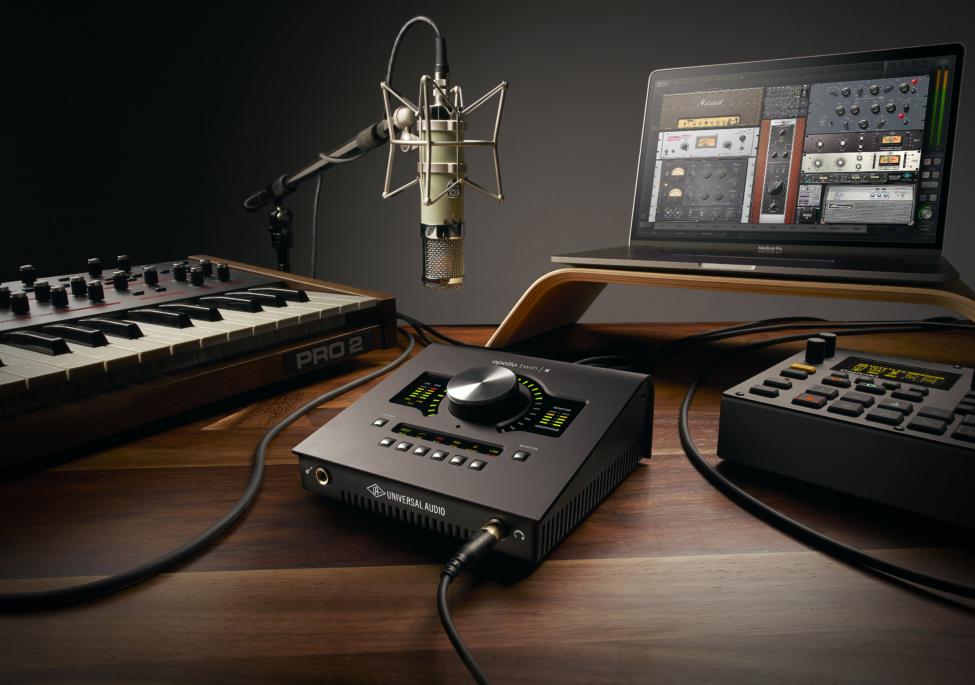

Apollo Twin X USB Hardware Manual 

11 

Introduction 

## **Getting Started** 

## **Overview** 

Before you can use Apollo Twin X USB, you need to complete these steps: 

1. Connect the device to your computer with a USB-3 cable (not included) 

2. Connect the device to AC power and power on 

3. Download and install the latest UAD software 

4. Register your Apollo Twin X USB hardware 

5. Authorize your UAD plug-ins 

Additionally, you'll want to learn these essential Apollo Twin X USB operations: 

- Connect to Input Sources and Monitor System – How to connect your audio gear. 

- Setting Hardware I/O Levels – Learn how to adjust Mic/Line/Instrument input gain levels and monitor/headphone output volume levels. 

This chapter will guide you through these steps. For assistance, see the Technical Support page. 

## **Hardware System Requirements** 

_**Note:** For complete compatibility information, including operating system and storage requirements, visit help.uaudio.com._ 

- PC with available built-in* USB 3 SuperSpeed (Type-A or Type-C port) 

- Intel Core i-Series, Xeon, or AMD processor* 

- Windows 10 or 11 (64-bit editions) 

- USB 3 SuperSpeed Type-C cable (not included)* 

- Internet connection to download software and authorize UAD plug-ins 

- 10 gigabytes available storage 

## ***Notes** 

- IF-certified USB 3 SuperSpeed cable (Type-A to Type-C, or Type-C to Type-C) 

- Quad Core i7 or better recommended for optimum DAW performance 

- USB 3 adapters (such as PCIe-to-USB 3 expansion cards) are not tested 

- 2-in-1 systems (notebook/tablet) are not recommended 

Apollo Twin X USB Hardware Manual 

12 

Getting Started 

## **Hardware Setup** 

## **Choose a Suitable Location** 

- Locate the unit on a flat surface. 

- The location should be sturdy enough to securely hold its weight and withstand the pressure of operating the top panel controls. 

- Leave enough room at the front and rear of the unit for cable connections. 

- Do not block the cooling vents on the bottom or sides of the unit. 

## **USB 3 Cable Length** 

Apollo Twin X USB is designed for use with a USB 3 SuperSpeed cable length of two meters or less (approximately six feet or less). Using longer USB 3 cables can have adverse effects on system performance. 

_**Important:** Connect Apollo Twin X USB to the computer with a USB 3 SuperSpeed cable that is no longer than two meters in length._ 

## **Connect to Computer and Power** 

_**Caution:** Before powering Apollo Twin X USB on or off, lower the volume of the monitor speakers (if connected) and remove headphones from your ears._ 

1. Connect a USB 3 SuperSpeed cable between Apollo Twin X USB's Type-C port and a USB 3 port on your host computer. Ensure the cable is fully inserted at both ends. 

2. Connect the included power supply to an AC outlet (Apollo Twin X USB cannot be bus powered). 

3. Connect the locking power supply barrel to the rear panel of Apollo Twin X USB. Align the two tabs on the power cable's connector to the notches on the input, then rotate the barrel clockwise to prevent accidental disconnection. 

_**Important:** After ensuring the locking barrel tabs are aligned with the chassis slots and the barrel is fully inserted, rotate the barrel to secure the connector._ 

## **2. Rotate to Lock** 

## **1. Align Tabs** 

## 12VDC 

4. Apply power to Apollo Twin X USB using the rear panel's power switch. Apollo Twin X USB is now ready for Software Setup. 

Apollo Twin X USB Hardware Manual 

13 

Getting Started 

## **Software Setup** 

_**Note:** Items on this overview page are detailed in the Apollo Software Manual. See About Apollo Twin X USB Documentation for related information._ 

## **System Requirements** 

All system requirements must be met for Apollo Twin X USB to operate properly. Before proceeding with installation, see the system requirements in the Apollo Software Manual. 

## **Software Installation, Registration, and Authorization** 

UAD software must be installed to use Apollo Twin X USB and UAD plug-ins. The UAD Powered Plug-Ins software installer places the software onto the computer’s startup drive. After installation, you'll register your hardware and authorize your UAD plug-ins. 

_**Important:** For optimum results, connect and power Apollo Twin X USB before installing the UAD software._ 

## **Our Web Pages Guide You** 

The Universal Audio website guides you through the initial process of UAD software installation, hardware registration, and UAD plug-in authorization. These procedures are also detailed in the Apollo Software Manual. 

To begin the installation, registration, and authorization process, visit: 

## **www.uaudio.com/register** 

If you've already registered your Apollo Twin X USB but want to update to a newer version of UAD software, the latest software is available at: www.uaudio.com/downloads 

## **System Configuration** 

Complete details about setting up the Apollo Twin X USB system, including how to integrate with a DAW and related information, are included in the Apollo Software Manual. 

## **Console Application** 

The companion Console application is the software interface for the Apollo Twin X USB hardware. Console controls Apollo Twin X USB and its digital mixing, monitoring, and Realtime UAD Processing features. Console is also used to configure Apollo Twin X USB’s I/O settings such as sample rate, clock source, and reference levels. 

For complete details about how to operate Console, refer to the Apollo Software Manual. 

## **UA YouTube Videos** 

Many instructional videos are available to help you get started with Apollo Twin X USB. For assistance, see the Technical Support page. 

Apollo Twin X USB Hardware Manual 

14 

Getting Started 

## **Connect to Input Sources and Monitor System** 

One typical Apollo Twin X USB audio setup is illustrated below. For complete details about all of Apollo Twin X USB's connectors and controls, see Controls & Connectors. 

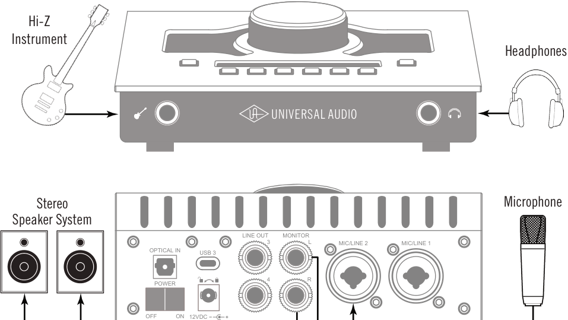

**----- Start of picture text -----** 
Hi-Z Instrument Headphones Stereo Microphone Speaker System LINE OUT MONITOR 3 L MIC/LINE 2 MIC/LINE 1 OPTICAL IN USB 3 4 R POWER OFF            ON 12VDC **----- End of picture text -----** 

_Typical Apollo Twin X USB audio connections. In this example, the mic is connected to channel 2, so the mic and the instrument (which connects to channel 1) can be used at the same time._ 

Apollo Twin X USB Hardware Manual 

15 

Getting Started 

## **Setting Hardware I/O Levels** 

This section explains how to set input gain levels for the hardware inputs (mic, line, and Hi-Z) and adjust volume levels for the hardware outputs (monitors and headphones). Refer to the Top Panel illustration for the control names and numbers mentioned below. 

_**Caution:** Before proceeding, lower the volume of the monitor speakers and remove headphones from your ears._ 

## **Set Input Gains** 

1. Select the input channel to be adjusted by pressing the PREAMP button (7) until the Channel Selection Indicator (3) displays the channel (CH1 or CH2). 

2. Select the input type (mic or line) by pressing the INPUT button (13-a) until the Input Type indicator (5) displays the desired input jack* (see note below). 

3. Adjust the channel's gain by rotating the LEVEL knob (1) until the input meter for the channel (4) approaches maximum, but does not reach the red clip LED when the loudest input signal is present. If the level is too high to avoid clipping (when the red “C” LED illuminates), enable the PAD (13-d). 

4. To set the input gain for the other input channel, repeat steps 1 – 3. 

## **Adjust Output Volumes** 

1. Select the output volume to be adjusted (monitor or headphone) by pressing the MONITOR button (11) until the Monitor Selected (8) or Headphone Selected (10) indicator is lit. 

2. Set the volume level by carefully increasing the LEVEL knob (1) until the desired volume is reached (you may need to adjust the volume of the speaker system). 

3. To set the other output volume (monitor or headphone), repeat steps 1 – 2. 

## **Mute (and Unmute) Monitor Outputs** 

1. Select the Monitor outputs by pressing the MONITOR button (11) until the Monitor Selected (8) indicator is lit. 

2. Press the MUTE button (13-l) to mute the monitor outputs. The Monitor Selected Indicator (8) is red when the monitors are muted. When in MONITOR Mode, the Volume Level Indicator LEDs (2) are also red. 

3. To toggle the monitor mute state, press the MUTE button (13-l) whenever Monitor (8) is selected. 

## **Notes:** 

- *The Hi-Z input is automatically selected, overriding the channel 1 Mic and Line inputs, when a ¼” mono TS (tip-sleeve) plug is connected to the Hi-Z Instrument jack (14) on the front panel. 

- To control both channels simultaneously when a stereo source is connected, press the LINK button (13-f) when an input is selected (3). 

- Line outputs 3 & 4 are accessed and controlled via software only (Console or DAW). 

- Refer to the Apollo Software Manual to learn how to configure the audio interface settings, use the Console application and Realtime UAD Processing, and more. 

Apollo Twin X USB Hardware Manual 

16 

Getting Started 

## **Controls & Connectors** 

Complete details about the Apollo Twin X USB hardware controls and all connector jacks on the front and rear panels are provided in this chapter. 

_**Note:** To learn how to set input gain levels (mic, line, and Hi-Z) and output volumes (monitors and headphones), see Setting Hardware I/O Levels in the Quick Start chapter._ 

## **Controls Overview** 

Some Apollo Twin X USB controls have multiple functions. The function of each control depends on the current operating mode and the current settings within that mode. To control a particular function, the control must be activated. 

## **Operating Modes** 

Apollo Twin X USB’s top panel has two operating modes: _Preamp_ and _Monitor_ . The function and availability of the top panel controls vary depending on the active operating mode. The active mode is selected with the PREAMP and MONITOR buttons. Each mode is explained in greater detail below. 

_**Note:** All top panel functions can be operated concurrently (without switching modes) from within the companion Console software application. See the Apollo Software Manual for details._ 

## **PREAMP Mode** 

When Apollo Twin X USB is in Preamp mode, the top panel controls are related to input functions only. To adjust input functions, press the PREAMP button to enter Preamp mode and activate the input channel controls. 

_**Important:** Apollo Twin X USB must be in Preamp mode to modify preamp gain levels and other input options._ 

_**Note:** Output functions (monitor and headphone) cannot be performed in Preamp mode. Press the MONITOR button to perform output functions._ 

## **Preamp Channels** 

Apollo Twin X USB has two independent analog input channels f ~~or A/D conversion. Each~~ input channel has a preamplifier. The input channel preamplifiers are independently controlled when in Preamp mode. 

## **Preamp Controls** 

Apollo Twin X USB has one set of preamp input channel controls. The input channel controls adjust all preamp functions for the currently selected input channel only. 

Apollo Twin X USB Hardware Manual 

17 

Controls & Connectors 

## **Selected Channel** 

The currently selected input channel is shown by the CH1 and CH2 indicators at the upper left of the main display panel, above the input meters. When a channel is selected, its indicator is lit. 

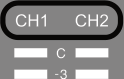

_**Note:** The preamp controls adjust the functions for the currently selected cha_ ~~_n_~~ _nel._ 

## **Changing Channels** 

When in Preamp mode, press the PREAMP button to change the selected c ~~hannel so~~ its controls can b ~~e adjusted. Press PREAMP again to switch back to the other input~~ channel. 

## **Input Source** 

The Mic, Line, or Hi-Z input source is routed into the channel’s preamplifier. The active input source jack is shown by the indicators below the input meters. When an input is selected, its indicator is lit. 

The MIC (XLR) or LINE (¼”) co ~~mbo inputs~~ on the rear panel are selected by the pressing the INPUT button when the channel is selected. The Hi-Z input (available on channel 1 only) is selected automatically when an instrument cable is plugged into the Hi-Z input on the front panel. 

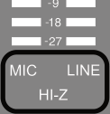

_**Note:** Only one input jack at a tim_ ~~_e_~~ _(Mic, Line, or Hi-Z) can be used as a channel’s input source._ 

## **Preamp Gain** 

The Level knob adjusts the amount of preamp gain (input signal level) for the currently selected input channel. 

## **Preamp Options** 

Each input channel has a set of preamp options. The preamp options for the currently selected input channel are activated using the row of six buttons when in Preamp mode. 

The current state of the preamp options are indicated in the upper row of the options display panel above the six option buttons. Available options are dim when inactive, bright when enabled, and unlit when unavailable. 

_**Note:** Not all preamp options are available with all input types. For specific details, see th_ ~~_e Top Panel Controls section later in this chapter._~~ 

Apollo Twin X USB Hardware Manual 

18 

Controls & Connectors 

## **MONITOR Mode** 

When Apollo Twin X USB is in Monitor mode, the top panel controls are related to output functions only. To adjust output functions, press the MONITOR button to enter Monitor mode and activate the monitor and headphone controls. 

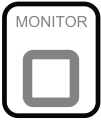

**----- Start of picture text -----** 
MONITOR **----- End of picture text -----** 

_**Note:** Input functions cannot be performed in Monitor mode. Press the PREAMP button to perform input functions._ 

_**Important:** Apollo Twin X USB must be in Monitor mode to change the volume of the monitor/headphone outputs and other output options._ 

## **Stereo Outp** ~~**u**~~ **ts** 

Apollo ~~Twin X USB has two stereo outputs that can be controlled with the top panel~~ hardware: Monitor and Headphone. These stereo outputs are controlled when in Monitor mode. 

_**Note:** Line outputs 3 and 4 are controlled with software only._ 

## **Stereo Output Controls** 

The Level knob is used to set the volume level for each stereo output independently. The Level knob adjusts the volume for the currently selected stereo output. By switching the selected output with the MONITOR button, the other output volume can be adjusted. 

## **Stereo Output Selection** 

The currently selected stereo output is shown by the MONITOR and HEADPHONE indicators at the right of the main display, above and below the output meters. When ~~a~~ stereo out ~~p~~ ut is selected, its indicator is lit. 

_**Note:** The Level knob_ ~~_a_~~ _djusts the_ ~~_v_~~ _olume for the currently selected stereo output._ 

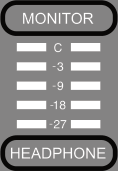

## **Changing Stereo Outputs** 

When in Monitor mode, press the MONITOR button to change the selected stereo output. Press MONITOR again to switch to the other output. 

## **Monitor Options** 

Apollo Twin X USB has monitor options that perform the functions of a dedicated monitor controller. The monitor options are controlled using the row of six buttons when in MONITOR Mode. 

The current state of the monitor options are indicated in the lower row of the options display panel above the option buttons. Available options are dim when inactive, bright when enabled, and unlit when unavailable. 

_**No**_ ~~_**te:** Not all monitor options are always available. For specifc details, see the Top_~~ _Panel Controls section later in this chapter._ 

Apollo Twin X USB Hardware Manual 

19 

Controls & Connectors 

## **Top Panel** 

Refer to the illustration below for numbered control descriptions in this section. 

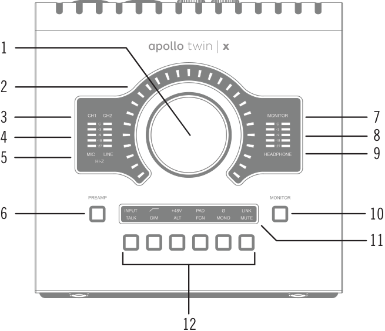

**----- Start of picture text -----** 
1 2 3 7 4 8 9 5 MONITOR 6 10 11 12 **----- End of picture text -----** 

_Top panel elements_ 

## **(1) Level Knob** 

The Level knob controls multiple functions. The knob’s current function is selected with the PREAMP (7) and MONITOR (11) buttons. 

When in PREAMP Mode, rotate clockwise to increase the amount of preamp gain for the currently selected input channel (3). When in MONITOR Mode, rotate clockwise to increase the monitor or headphones volume, depending on the stereo output currently selected (8 or 10) with the MONITOR (11) button. 

## **Unison Integration** 

The Level knob can also be used to control Unison-enabled UAD preamp, guitar/bass amp, and pedal plug-in parameters. See the Apollo Software Manual for complete Unison details. 

## **(2) Preamp Gain & Volume Level Indicator LEDs** 

The LEDs surrounding the Level knob indicate the relative level of the selected function (either input channel preamp gain or monitor/headphone volume). 

_**Note:** The Volume Level Indicator LEDs are RED when MONITOR (8) is selected and MUTE (13-l) is enabled._ 

Apollo Twin X USB Hardware Manual 

20 

Controls & Connectors 

## **(3) Channel Selection Indicators** 

The currently selected input channel is indicated by the lit channel name above its input meter (CH1 or CH2). Press the PREAMP button (7) to switch between channels 1 & 2. 

## **(4) Input Meters** 

The two input meters display signal levels for each of the analog input channels. Reduce a channel’s preamp gain (see Set Input Gains) if its red clip LED illuminates. 

## **(5) Input Source Indicators** 

These indicators show which input source jack (MIC, LINE, or HI-Z) is active for the selected input channel. Use the Input Select button (13-a) to switch between the MIC (XLR) and LINE (¼”) rear panel combo jack inputs. The Hi-Z input is selected automatically when an instrument cable is plugged into the Hi-Z jack on the front panel. 

## **(6) PREAMP Button** 

Press this button to enter PREAMP Mode and activate the input channel controls. Press again to alternate the selected input channel (3) between CH1 and CH2. 

## **(7) MONITOR Selected Indicator** 

When MONITOR is lit, the Level knob (1) controls volume of the monitor outputs (16). Press the MONITOR button (11) to activate the monitor controls (you may need to press it more than once). 

_**Note:** The MONITOR indicator is RED when the monitor outputs are muted._ 

## **(8) Stereo Output Meters** 

These meters display the main stereo signal output bus levels.* The main output bus levels are independent of monitor and headphone volume levels. Reduce levels feeding the output(s) if a red “C” (clip) LED at the top of the Output Meters illuminates. 

_***Exception:** If HEADPHONE is currently selected on Apollo Twin X USB and the Headphone Source within the CUE OUTPUTS window in Console is set to HP, these output meters indicate the level being sent to the headphone bus via Console’s headphone sends and/or the DAW._ 

## **(9) Headphone Selected Indicator** 

When HEADPHONE is lit, the Level knob (1) controls the volume of the headphones output (14). Press the MONITOR button (9) to activate the headphones volume control (you may need to push it twice). 

## **(10) Monitor Button** 

Press this button to enter MONITOR Mode and activate the monitor and headphone controls. Press again to alternate between control of monitor and headphone volumes with the Level knob (1). 

Apollo Twin X USB Hardware Manual 

21 

Controls & Connectors 

_**Note:** Indicators (8) and (10) determine which volume (MONITOR or HEADPHONE) can be controlled with the Level knob (1)._ 

## **(11) Options Display** 

This panel displays the state of the preamp and monitor options, which are controlled by the six Option Buttons (13). 

In Preamp mode, the upper row displays the preamp options and the lower row is unlit. In M ~~onitor mode,~~ the lower row displays the monitor options and the up ~~per row is unl~~ it. 

## **(12) Option Buttons** 

Each of the six Option Buttons has dual functions. In Preamp mode, the buttons control the preamp options for the currently selected input channel. In Monitor mod ~~e~~ , the buttons control the monitor and headphone options. The individual options for both modes are ~~d~~ etailed in this section. 

## **Unison Integration** 

In Preamp mode, the Option Buttons can also be used to control Unisonenabled ~~U~~ AD preamp, guitar/bass amp, and pedal plug-in parameters. See t ~~h~~ e Apollo Software Manual for complete Unison details. 

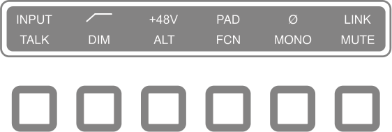

_Options Display (12) and Option Buttons (13)_ 

Apollo Twin X USB Hardware Manual 

22 

Controls & Connectors 

## **Preamp Options** 

When in PREAMP Mode, the Option Buttons control the preamp options (described as a – f below) for an input channel when that channel is selected (3). Press the PREAMP button (7) to enter Preamp mode and change the preamp options for the currently selected channel. 

A preamp option is active when its indicator in the upper row of the Options Display (12) is lit, and inactive when its indicator is dim. If the indicator is unlit, the option is unavailable. 

_**Note:** In MONITOR mode, the preamp options cannot be modified and the upper row of the Options Display is unlit._ 

**----- Start of picture text -----** 
a b c d e f Preamp options **----- End of picture text -----** 

## _**(a) INPUT Select**_ 

Selects the active input source jack for the currently selected channel. The current selection is displayed by the Input Source Indicators (5). 

Press to alternate between the MIC (XLR) and LINE (¼”) combo inputs on the rear panel. The Hi-Z input is selected automatically whenever a ¼” mono TS (tip-sleeve) plug is connected to the front panel’s Hi-Z Instrument jack (14). If MIC/LINE cannot be selected, unplug the cable in the Hi-Z jack. 

_**Note:** Hi-Z input is available for channel 1 only._ 

## _**(b) FILTER**_ 

Enables a low cut (high pass) rumble filter with a cutoff frequency of 75 Hz. 

## _**(c) +48V**_ 

Enables +48-volt phantom power for the mic input. Phantom power is typically needed for condenser microphones. +48V is available for the microphone (XLR) inputs only. 

_**Caution:** To avoid potential equipment damage, disable +48V phantom power on the input channel before connecting or disconnecting its XLR input._ 

## _**(d) PAD**_ 

Attenuates (lowers) the XLR mic input signal level by 20 dB. PAD is not available for the line inputs or the Hi-Z instrument input. 

## _**(e) POLARITY Ø**_ 

Inverts the polarity (aka “phase”) of the input signal. Polarity inversion can help reduce phase cancellations when more than one microphone is used to record a single source. 

Apollo Twin X USB Hardware Manual 

23 

Controls & Connectors 

## _**(f) LINK**_ 

Links input channels 1 and 2 as a stereo pair. When linked, preamp control adjustments are applied to both channels. 

_**Note:** Only the same type of inputs can be linked (Mic+Mic or Line+Line). The Hi-Z input cannot be linked to a Mic or Line input._ 

## **Monitor Options** 

When in MONITOR Mode, the Option Buttons control the monitor options (described as g – h below). Press the MONITOR button (11) to enter Monitor mode and enable the monitor options. 

A monitor option is active when its indicator in the lower row of the Options Display (12) is lit, and inactive when the indicator is dim. If the indicator is unlit, the option is unavailable. 

The TALK, DIM, ALT, and FCN functions are configured in the companion Console software application. See the Apollo Software Manual for details. 

_**Note:** In Preamp mode, the monitor options cannot be modified and the lower row of the Options Display is unlit._ 

**----- Start of picture text -----** 
h i k l g j Monitor options **----- End of picture text -----** 

## _**(g) TALK**_ 

Activates the built-in talkback microphone and the DIM function. Press and release the button quickly to latch the function. To momentarily activate the function and deactivate when the button is released, press for longer than 0.5 seconds. 

## _**(h) DIM**_ 

Reduces the monitor output volume level. The amount of DIM attenuation is set in the companion Console software. 

Press and release the button quickly to latch the function. To momentarily activate the function and deactivate when the button is released, press for longer than 0.5 seconds. 

## _**(i) ALT (Alternate)**_ 

Switches the main monitor mix to an alternate set of outputs. This function is only available when the ALT COUNT setting in the Settings>Hardware panel within the companion Console software is set to a non-zero value. 

## _**(j) FCN (Function)**_ 

This switch is not functional when in Monitor mode. 

Apollo Twin X USB Hardware Manual 

24 

Controls & Connectors 

## _**(k) MONO**_ 

Sums the left and right signals of the stereo monitor mix into a monophonic signal. MONO applies to the monitor outputs only. It does not apply to the headphone outputs. 

## _**(l) MUTE**_ 

Mutes the monitor outputs. When MUTE is active, the MONITOR Selected Indicator (8) is always lit RED (including when in Preamp mode). When MUTE is active in Monitor mode, the Volume Level Indicators (2) are also RED. 

_**Note:** MUTE does not apply to the headphone outputs. Headphone outputs cannot be muted._ 

## **Front Panel** 

Refer to the illustration below for numbered control descriptions in this section. 

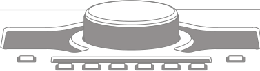

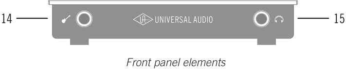

**----- Start of picture text -----** 
14 15 Front panel elements **----- End of picture text -----** 

## **(14) Hi-Z Instrument Input** 

Connect any guitar, bass, or other high impedance instrument here. This jack automatically overrides the channel 1 mic and line inputs. 

Levels for the Hi-Z input are set using the same method as the mic and line inputs. 

_**Note:** This jack accepts a ¼” mono TS (tip-sleeve) plug only._ 

## **(15) Headphone Output** 

Connect ¼” stereo headphones here. Volume is controlled with the Level knob (1) when HEADPHONE (10) is selected with the MONITOR button (11). 

## **Side Panel** 

## **Kensington Security Slot (not shown)** 

The anti-theft security slot on the side panel connects to any standard Kensington lock. 

Apollo Twin X USB Hardware Manual 

25 

Controls & Connectors 

## **Rear Panel** 

Refer to the illustration below for numbered control descriptions in this section. 

_**Note:** All rear panel ¼” jacks can accept unbalanced TS (tip-sleeve) or balanced TRS (tip-ring-sleeve) plugs._ 

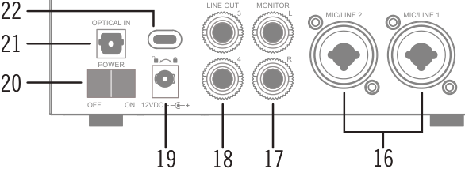

**----- Start of picture text -----** 
LINE OUT MONITOR 22 3 L MIC/LINE 2 MIC/LINE 1 OPTICAL IN 21 POWER 4 R 20 OFF            ON 12VDC 19 18 17 16 **----- End of picture text -----** 

_Rear panel elements_ 

## **(16) Mic/Line Combo Inputs 1 & 2** 

The input jacks for preamp channels 1 & 2 accept either a male XLR plug for connecting to the mic input, or a ¼” phone plug for connecting to the line input. 

The input jack that is used for the preamp channel (mic or line) is specified with the Input Select button (13-a). 

_**Caution:** To avoid potential equipment damage, disable +48V phantom power on the channel before connecting or disconnecting its XLR input._ 

## **(17) Monitor Outputs** 

Connect the powered monitor speakers (or speaker system amplifier inputs) here. Volume is controlled with the Level knob (1) when MONITOR is selected (8) with the MONITOR button (11). The Monitor Outputs are DC coupled. 

## **(18) Line Outputs 3 & 4** 

These ¼” phone outputs are accessed via software (Console or DAW). Line outputs 3 & 4 are typically used to send audio to other equipment. The Line Outputs are DC coupled. 

Apollo Twin X USB Hardware Manual 

26 

Controls & Connectors 

## **(19) Power Supply Input** 

The included power supply must be connected here (Apollo Twin X USB cannot be bus powered). Rotate locking connector to prevent accidental disconnection. 

_**Important:** After ensuring the locking barrel tabs are aligned with the chassis slots and the barrel is fully inserted, rotate the barrel to secure the connector to the chassis._ 

## **2. Rotate to Lock** 

## **1. Align Tabs** 

12VDC 

## **(20) Power Switch** 

This rocker switch applies power to Apollo Twin X USB. Switch to OFF when not in use. 

_**Caution:** Before powering Apollo Twin X USB, lower the volume of the monitor speakers and remove headphones from your ears._ 

## **(21) Optical Input** 

This is a TOSLINK input for connection to other gear with an optical ADAT or S/PDIF output. 

_**Note:** The connection protocol to be used (ADAT or S/PDIF) is specified in the Settings>Hardware panel within the companion Console software._ 

## **(22) USB 3 Port** 

Connect your USB 3 cable* (not included) from the host computer here. A USB 3 connection to the computer is required to use all Apollo Twin X USB features and UAD plug-ins. 

_*IF-certified USB 3 SuperSpeed cable (Type-A to Type-C, or Type-C to Type-C)_ 

Apollo Twin X USB Hardware Manual 

27 

Controls & Connectors 

## **Specifications** 

All specifications are typical performance unless otherwise noted. Tested with the Audio Precision APx555 Audio Analyzer under the following conditions: 48 kHz internal sample rate, 24-bit sample depth, 20 kHz measurement bandwidth, balanced input & output (except single-ended headphone output), and internal clock. 

Specifications are subject to change without notice. 

||**SYSTEM**|
|---|---|
|**_I/O_**|**_Complement_**|
|Microphone Inputs|Two|
|High Impedance (Hi-Z) Instrument Inputs|One|
|AnalogLine Inputs|Two|
|AnalogLine Outputs (DC coupled)|Two (four includingMonitor outputs)|
|AnalogMonitor Outputs (DC coupled)|Two (one stereopair)|
|Headphone Output|One stereo|
|Digital Input|One (ADAT or S/PDIF, selectable)|
|USB 3 Port|One (USB-C connector)|
|**_A/D –_**|**_D/A Conversion_**|
|Simultaneous A/D conversion|Two channels|
|Simultaneous D/A conversion|Six channels|
|Supported Sample Rates (kHz)|44.1, 48, 88.2, 96, 176.4, 192|
|Bit Depth Per Sample|24|
|AnalogRound-TripLatency|1.1 milliseconds @ 96 kHz sample rate|
|Analog Round-Trip Latency through four UAD|1.1 milliseconds @ 96 kHz sample rate (no|
|legacy plug-ins (included) via Console software|additional latencyvia Realtime UAD Processing)|

_(continued)_ 

Apollo Twin X USB Hardware Manual 

28 

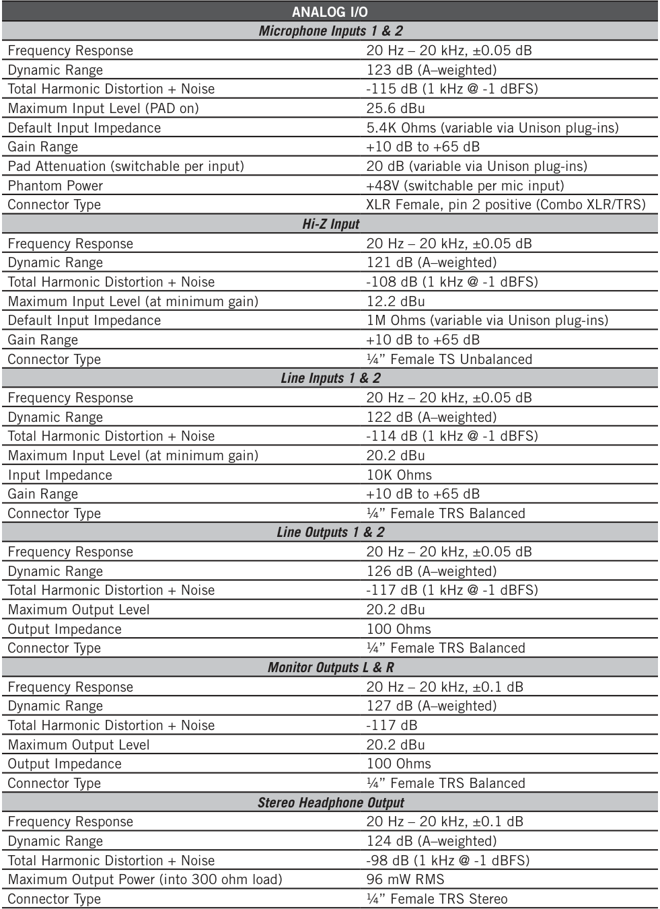

**----- Start of picture text -----** 
ANALOG I/O Microphone Inputs 1 & 2 Frequency Response 20 Hz – 20 kHz, ±0.05 dB Dynamic Range 123 dB (A–weighted) Total Harmonic Distortion + Noise -115 dB (1 kHz @ -1 dBFS) Maximum Input Level (PAD on) 25.6 dBu Default Input Impedance 5.4K Ohms (variable via Unison plug-ins) Gain Range +10 dB to +65 dB Pad Attenuation (switchable per input) 20 dB (variable via Unison plug-ins) Phantom Power +48V (switchable per mic input) Connector Type XLR Female, pin 2 positive (Combo XLR/TRS) Hi-Z Input Frequency Response 20 Hz – 20 kHz, ±0.05 dB Dynamic Range 121 dB (A–weighted) Total Harmonic Distortion + Noise -108 dB (1 kHz @ -1 dBFS) Maximum Input Level (at minimum gain) 12.2 dBu Default Input Impedance 1M Ohms (variable via Unison plug-ins) Gain Range +10 dB to +65 dB Connector Type ¼” Female TS Unbalanced Line Inputs 1 & 2 Frequency Response 20 Hz – 20 kHz, ±0.05 dB Dynamic Range 122 dB (A–weighted) Total Harmonic Distortion + Noise -114 dB (1 kHz @ -1 dBFS) Maximum Input Level (at minimum gain) 20.2 dBu Input Impedance 10K Ohms Gain Range +10 dB to +65 dB Connector Type ¼” Female TRS Balanced Line Outputs 1 & 2 Frequency Response 20 Hz – 20 kHz, ±0.05 dB Dynamic Range 126 dB (A–weighted) Total Harmonic Distortion + Noise -117 dB (1 kHz @ -1 dBFS) Maximum Output Level 20.2 dBu Output Impedance 100 Ohms Connector Type ¼” Female TRS Balanced Monitor Outputs L & R Frequency Response 20 Hz – 20 kHz, ±0.1 dB Dynamic Range 127 dB (A–weighted) Total Harmonic Distortion + Noise -117 dB Maximum Output Level 20.2 dBu Output Impedance 100 Ohms Connector Type ¼” Female TRS Balanced Stereo Headphone Output Frequency Response 20 Hz – 20 kHz, ±0.1 dB Dynamic Range 124 dB (A–weighted) Total Harmonic Distortion + Noise -98 dB (1 kHz @ -1 dBFS) Maximum Output Power (into 300 ohm load) 96 mW RMS Connector Type ¼” Female TRS Stereo **----- End of picture text -----** 

_(continued)_ 

Apollo Twin X USB Hardware Manual 

29 

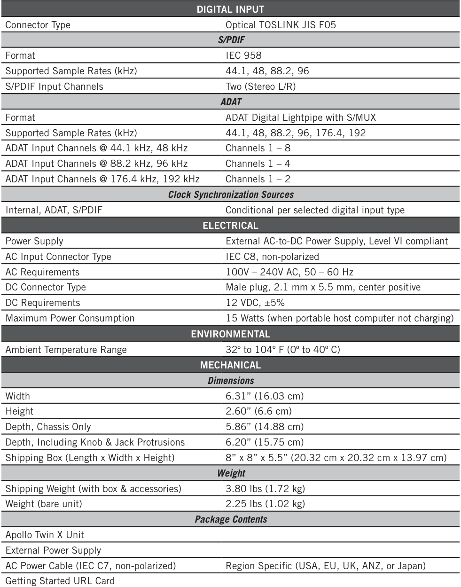

**----- Start of picture text -----** 
DIGITAL INPUT Connector Type Optical TOSLINK JIS F05 S/PDIF Format IEC 958 Supported Sample Rates (kHz) 44.1, 48, 88.2, 96 S/PDIF Input Channels Two (Stereo L/R) ADAT Format ADAT Digital Lightpipe with S/MUX Supported Sample Rates (kHz) 44.1, 48, 88.2, 96, 176.4, 192 ADAT Input Channels @ 44.1 kHz, 48 kHz Channels 1 – 8 ADAT Input Channels @ 88.2 kHz, 96 kHz Channels 1 – 4 ADAT Input Channels @ 176.4 kHz, 192 kHz Channels 1 – 2 Clock Synchronization Sources Internal, ADAT, S/PDIF Conditional per selected digital input type ELECTRICAL Power Supply External AC-to-DC Power Supply, Level VI compliant AC Input Connector Type IEC C8, non-polarized AC Requirements 100V – 240V AC, 50 – 60 Hz DC Connector Type Male plug, 2.1 mm x 5.5 mm, center positive DC Requirements 12 VDC, ±5% Maximum Power Consumption 15 Watts (when portable host computer not charging) ENVIRONMENTAL Ambient Temperature Range 32º to 104º F (0º to 40º C) MECHANICAL Dimensions Width 6.31” (16.03 cm) Height 2.60” (6.6 cm) Depth, Chassis Only 5.86” (14.88 cm) Depth, Including Knob & Jack Protrusions 6.20” (15.75 cm) Shipping Box (Length x Width x Height) 8” x 8” x 5.5” (20.32 cm x 20.32 cm x 13.97 cm) Weight Shipping Weight (with box & accessories) 3.80 lbs (1.72 kg) Weight (bare unit) 2.25 lbs (1.02 kg) Package Contents Apollo Twin X Unit External Power Supply AC Power Cable (IEC C7, non-polarized) Region Specific (USA, EU, UK, ANZ, or Japan) Getting Started URL Card **----- End of picture text -----** 

Apollo Twin X USB Hardware Manual 

30 

## **Hardware Block Diagram** 

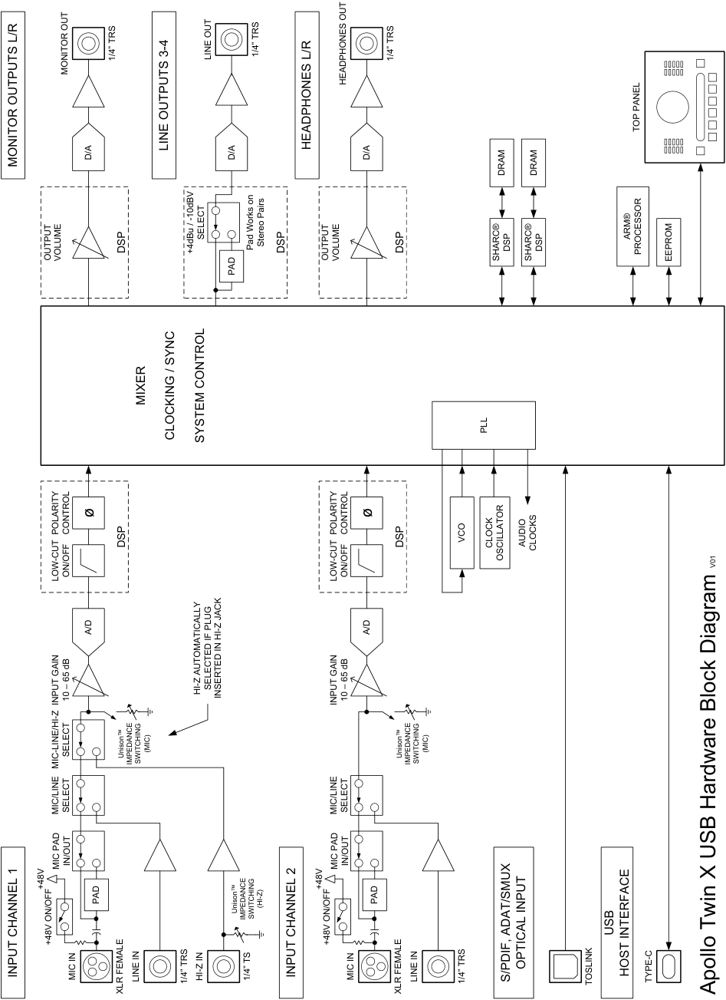

**----- Start of picture text -----** 
1/4” TRS LINE OUT 1/4” TRS 1/4” TRS MONITOR OUT HEADPHONES OUT TOP PANEL LINE OUTPUTS 3-4 HEADPHONES L/R D/A D/A D/A MONITOR OUTPUTS L/R DRAM DRAM SELECT ARM® DSP +4dBu / -10dBV Pad Works on  Stereo Pairs DSP DSP DSP DSP PROCESSOR OUTPUT  VOLUME OUTPUT  VOLUME SHARC®  SHARC®  EEPROM PAD MIXER PLL CLOCKING / SYNC SYSTEM CONTROL ø ø POLARITY  CONTROL POLARITY  CONTROL DSP DSP VCO CLOCK AUDIO  CLOCKS OSCILLATOR V01 LOW-CUT ON/OFF LOW-CUT ON/OFF A/D A/D SELECTED IF PLUG INPUT GAIN 10 – 65 dB HI-Z AUTOMATICALLY  INSERTED IN HI-Z JACK INPUT GAIN 10 – 65 dB SELECT Unison™  (MIC) Unison™  (MIC) MIC-LINE/HI-Z IMPEDANCE  SWITCHING  IMPEDANCE  SWITCHING MIC/LINE SELECT MIC/LINE SELECT MIC PAD IN/OUT MIC PAD IN/OUT +48V +48V PAD (HI-Z) PAD Unison™  IMPEDANCE  SWITCHING USB +48V ON/OFF +48V ON/OFF OPTICAL INPUT INPUT CHANNEL 1 MIC IN LINE IN 1/4” TRS HI-Z IN 1/4” TS INPUT CHANNEL 2 MIC IN LINE IN 1/4” TRS S/PDIF, ADAT/SMUX  TOSLINK HOST INTERFACE TYPE-C XLR FEMALE XLR FEMALE Apollo Twin X USB Hardware Block Diagram **----- End of picture text -----** 

Apollo Twin X USB Hardware Manual 

31 

## **Troubleshooting** 

If Apollo Twin X USB isn’t behaving as expected, some common troubleshooting items to confirm are below. If you are still experiencing issues after performing these checks, contact Technical Support. 

|**SYMPTOM**|**ITEMS TO CHECK**|
|---|---|
|Unit won’t power on|• Confrm power supply connector is fully inserted, then twist barrel to lock • Confrm Power switch is in “ON” position • Confrm AC power is available at wall socket by plugging in a different device|
|Unit is not recognized by computer|• Confrm USB 3 cable is fully inserted at both ends • Confrm latest Apollo Twin X USB software is installed (reinstall if necessary) • Power off entire system, power on Apollo Twin X USB, then start computer • Try a different USB 3 cable|
|No monitor output|• Confrm connections, power, and volume of monitoring system • Confrm Apollo Twin X USB monitor level is turned up (press MONITOR button frst) • Confrm monitor outputs are not muted (push MUTE button when in Monitor mode) • Confrm monitor LEDs are active (check signal fows)|
|Can't hear mic or line input(s)|• Confrm mic/line switch setting is correct for the channel (CH1 or CH2) • Confrm mic/line setting matches the input plug for the channel (XLR or ¼”) • Confrm preamp gain is turned up for the channel(s) • For channel 1, confrm nothing is plugged into the Hi-Z input|
|Can’t hear mic input(s)|• Confrm +48V phantom power is enabled if required by microphone|
|Can't hear Hi-Z input|• Confrm volume on connected device is turned up • Confrm Hi-Z input plug is 1/4” mono TS (TRS cables cannot be used with Hi-Z input)|
|Preamp controls have no effect on channel|• Confrm desired channel is selected for control (push PREAMP button repeatedly to select CH1 or CH2)|
|Can’t adjust digital input levels|• Signal levels for digital inputs are adjusted at the device connected to those inputs • UAD plug-ins  in Console can be used to add or reduce signal gain if desired|
|Audio glitches and/or dropouts during DAW playback|• Increase I/O buffer size setting in Console settings • If syncing to external digital clock via optical input, confrm clocking setups (confrm optical cable connections, matching sample rates, and that all devices are synchronized to one master clock device)|
|Undesirable echo/phasing|• Confrm input monitoring is not enabled in both Console and DAW • Disable software input monitoring if monitoring via Console (recommended) • Mute all Console inputs if software input monitoring via DAW|
|Static and/or white noise is heard when nothing is plugged in|• Mute or lower preamp gain to minimum on unused preamp channels (mic preamps can emit noise even when nothing is plugged in) • Some UAD plug-ins model the noise characteristics of the original equipment (defeat the noise model in the UAD plug-in interface, or mute the channel containing the plug-in to temporarily mute the noise)|
|Various LEDs inside the unit are blinking|• This is normal operational behavior and can be safely ignored|
|Apollo Twin X USB is behaving unexpectedly|• As a last resort, perform a hardware reset on the unit by following these steps: 1. Power off Apollo Twin X USB 2. Press and hold the PREAMP, FILTER, and POLARITY buttons 3. Power on Apollo Twin X USB while continuing to hold all three controls 4. After all front panel LEDs fash rapidly for several seconds, release the controls|

Apollo Twin X USB Hardware Manual 

32 

Troubleshooting 

## **Notices** 

## **Warranty** 

Universal Audio provides a limited warranty on all UA hardware products. To learn more, visit help.uaudio.com. The limited warranty gives you specific legal rights. You may also have other rights which vary by state or country. 

## **Maintenance** 

- **CAUTION:** To reduce the risk of electric shock, do not open the unit. 

- Changes or modifications to the device not expressly approved by the manufacturer, could void the end-user their right to operate the equipment. 

- Apollo Twin X USB does not contain a fuse or any other user-replaceable parts. The unit is internally calibrated at the factory. No internal user adjustments are available. 

## **Repair Service** 

If you are having trouble with Apollo Twin X USB, first check all system setups, connections, operating instructions, and the Troubleshooting chart. If that doesn’t help, contact our technical support team. 

To learn about repair service, or for technical support, visit help.uaudio.com. 

Apollo Twin X USB Hardware Manual 

33 

Notices 

## **Important Safety Information** 

   - Before using this Apollo Twin X USB unit, be sure to carefully read the applicable items of these operating instructions and the safety suggestions. Afterwards, keep them handy for future reference. Take special care to follow the warnings indicated on the unit, as well as in the operating instructions. 

- 1) Read these instructions. 

- 2) Keep these instructions. 

- 3) Heed all warnings. 

- 4) Follow all instructions. 

5) Do not use this apparatus near water. 

- 6) Clean only with dry cloth. 

7) Do not block any ventilation openings. Install in accordance with the manufacturer’s instructions. 

8) Do not install near any heat source such as radiators, heat registers, stoves, or other apparatus (including amplifiers) that produce heat. 

9) Do not defeat the safety purpose of the polarized or grounding-type plug. A polarized plug has two blades with one wider than the other. 

10) Protect the power cord from being walked on or pinched particularly at plugs, convenience receptacles, and the point where they exit from the apparatus. 

11) Only use with attachments/accessories specified by the manufacturer. 

12) Unplug this apparatus during lightning storms or when unused for long periods of time. 

13) Refer all servicing to qualified service personnel. Servicing is required when the apparatus has been damaged in any way, such as power-supply cord or plug is damaged, liquid has been spilled or objects have fallen into the apparatus, the apparatus has been exposed to rain or moisture, does not operate normally, or has been dropped. 

14) Apollo Twin X USB does not contain a fuse or any other user-replaceable parts. 

## **Description of symbols used** 

The lightning flash represented by the arrow symbol in an equilateral triangle is intended to alert users to the presence of high voltage within the unit that could cause an electrical shock hazard. 

The exclamation mark in an equilateral triangle is intended to alert users to the existence of important instructions in the manual relating to the use and maintenance of the unit. 

Apollo Twin X USB Hardware Manual 

34 

Notices 

## **Electromagnetic Compatibility** 

This product, Apollo Twin X USB, complied with the requirements of Subpart B of Part 15 of FCC Rules for Class B digital device. 

NOTE: This equipment has been tested and found to comply with the limits for a Class B digital device pursuant to Part 15 of the FCC Rules. These limits are designed to provide reasonable protection against harmful interference in a residential installation. This equipment generates, uses, and can radiate radio frequency energy and, if not installed and used in accordance with the instructions, may cause harmful interference to radio communications. However, there is no guarantee that interference will not occur in a particular installation. If this equipment does cause harmful interference to radio or television reception, which can be determined by turning the equipment off and on, the user is encouraged to try and correct the interference by one or more of the following measures: 

- Reorient or relocate the receiving antenna. 

- Increase the separation between the equipment and the receiver. 

- Connect the equipment into an outlet on a circuit different from that to which the receiver is connected. 

- Consult the dealer or an experienced radio/TV technician for help. 

## **International Compliance** 

- Canada: Innovation, Science and Economic Development Canada Interference Causing Equipment Standard ICES-003, “Information Technology Equipment (ITE) - Limits and methods of measurement,” Issue 7, dated October 2020 (Class B) 

- Japan: VCCI-CISOR 32:2016 “Technical Requirements” for multimedia equipment (class B) この装置は、クラスＢ機器です。この装置は、住宅環境で使用することを目的としています  が、こ の装置がラジオやテレビジョン受信機に近接して使用されると、受信障害を引き起こ. すことがあ ります。取扱説明書に従って正しい取り扱いをして下さい。VCCI-B 

(Translation: This is Class B equipment. Although this equipment is intended for use in residential environments, it could cause poor reception if used near a radio television receiver. Please follow instructions in the instruction manual.) 

- EN 55032:2015+A1:2020, “Electromagnetic compatibility of multimedia equipment – Emission Requirements” 

- EN 55035:2017+A11:2020, “Electromagnetic compatibility of multimedia equipment — Immunity Requirements” 

- AS/NZS CISPR 32, “Electromagnetic compatibility of multimedia equipment - Emission requirements” 

- CNS 15936, “Electromagnetic compatibility of multimedia equipment – Emission requirements” 

- KS C 9832:2019, “Emissions: Multimedia Equipment” 

- KS C 9835:2019, “Immunity: Multimedia Equipment” 

Apollo Twin X USB Hardware Manual 

35 

Notices 

## **Disclaimer** 

The information contained in this manual is subject to change without notice. Universal Audio, Inc. makes no warranties of any kind with regard to this manual, including, but not limited to, the implied warranties of merchantability and fitness for a particular purpose. Universal Audio, Inc. shall not be liable for errors contained herein or direct, indirect, special, incidental, or consequential damages in connection with the furnishing, performance, or use of this material. 

## **End User License Agreement** 

Your rights to the Software are governed by the accompanying End User License Agreement, a copy of which can be found at: www.uaudio.com/eula 

## **Copyrights** 

Copyright ©2023 Universal Audio, Inc. All rights reserved. 

UA owns certain trademarks (or applications therefor) that are used in connection with the following UA Software Products and/or the UAD Platform (together “UA Marks”), including, without limitation: 

1176, 1176 LN, 175-B, 176, APOLLO, APOLLO TWIN, ARROW, ASTRA MODULATION MACHINE, BOCK, BOCK AUDIO and BOCK AUDIO logo, CENTURY TUBE CHANNEL STRIP, CYCLOSONIC PANNER, DREAMVERB, DYTRONICS, EQP-1A, GOLDEN REVERBERATOR, GOLDEN REVERBERATOR & UA Diamond Design, GOLDEN REVERBERATOR & UA Diamond Design (Series), HELIOS, LA-2A, LUNA, OPAL, OX, OX AMP TOP BOX & Design, OXIDE, POWERED PLUG-INS, RAYMOND, SHAPE, SOUNDELUX and SOUNDELUX USA logo, SPHERE, STANDARD and UA Diamond Design, STARLIGHT ECHO STATION, TELETRONIX, THE AUTHENTIC SOUND OF ANALOG, TOWNSEND LABS, TRI-STEREO CHORUS, UNISON PREAMPS & Design, UA Diamond Design, UAD, UAD 2 POWERED PLUG-INS, UAD SPARK, UAD-2 LIVE RACK, UAFX (Stylized). UNIVERSAL AUDIO, UNIVERSAL AUDIO and UA Diamond Design, VOLT UNIVERSAL AUDIO and UA INC. Diamond Design, APOLLO | X, DREAM 65, POLYMAX, RUBY 63, SETTING THE TONE SINCE 1958, SOUNDELUX USA, SPHERE UNIVERSAL AUDIO and UA Diamond Design, UNIVERSAL AUDIO APOLLO, UNIVERSAL AUDIO UAD, VOLT UNIVERSAL AUDIO and UA Diamond Design, WATERFALL B3, WOODROW 55. 

Unless otherwise agreed to in writing under a separate agreement, Customer shall have no interest in any UA Mark and UA will remain the sole and exclusive owner of all right, title and interest in all UA Marks and all applications, reissuances, divisions, re-examinations, renewals or extensions thereof. Other company and product names mentioned herein are trademarks of their respective owners. 

ASIO is a trademark and software of Steinberg Media Technologies GmbH. 

This manual and any associated software, artwork, product designs, and design concepts are subject to copyright protection. No part of this document may be reproduced, in any form, without prior written permission of Universal Audio, Inc. 

Apollo Twin X USB Hardware Manual 

36 

Notices 

## **Technical Support** 

## **Universal Audio Knowledge Base** 

The UA Knowledge Base is your complete technical resource for configuring, operating, troubleshooting, and repairing UA products. 

You can watch helpful support videos, search the Knowledge Base for answers, get updated technical information that may not be available elsewhere, and more. 

**UA Knowledge Base** 

## **Universal Audio YouTube Channel** 

The Universal Audio YouTube Channel at youtube.com includes helpful support videos for setting up and using UA products. 

**UA YouTube Channel** 

## **Universal Audio Community Forums** 

The unofficial UA discussion forums are a valuable resource for all Universal Audio product users. This website is independently owned and operated. 

**www.uadforum.com** 

## **Contact Universal Audio Support** 

To contact UA support staff for technical or repair assistance, please visit: 

**help.uaudio.com** 

Universal Audio 

37 

Technical Support 

www.uaudio.com 

