## **Thunderbolt Audio Interface with Dante[®]** 

and HEXA Core Realtime UAD Processing 

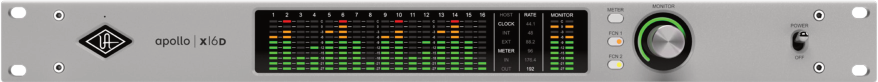

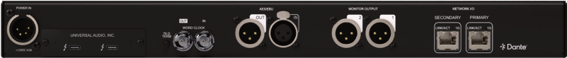

## **Apollo x16D Hardware Manual** 

Manual Version 260204 

www.uaudio.com 

## **Letter from Bill Putnam Jr.** 

Thank you for choosing this Apollo audio interface to become a part of your studio. We know that any new piece of gear requires an investment of time and money — and our goal is to make your investment pay off. 

Universal Audio interfaces like the Apollo X Series exemplify a commitment to craftsmanship that we’ve forged over the past 60 years — from our original founding in the 1950s by my father, Bill Putnam Sr., to our current mission combining the best of both classic analog and modern digital audio technologies. 

Starting with its elite-class D/A conversion and Dante® networked audio, Apollo x16D’s superior sonic performance serves as its foundation. 

This is just the beginning however, as Apollo  lets you power the full range of UAD plug-ins in real time, including classic mic preamps, EQs, dynamics processors, reverbs, guitar amps, and much more. With more than 200 acclaimed UAD plug-ins at your fingertips, the sonic choices are limitless.* 

At UA, we are dedicated to the idea that technology should serve the creative process, inspiring our customers to go further. These are the ideals my father embodied with his classic designs, and we like to think this spirit lives on today in products like Apollo. 

Please feel free to reach out to us via our website www.uaudio.com, and via our social media channels. We look forward to hearing from you, and thank you once again for choosing Universal Audio. 

Sincerely, 

Bill Putnam Jr. 

_*Individual UAD plug-ins sold separately. All trademarks are property of their respective owners._ 

Apollo x16D Hardware Manual 

2 

Welcome 

## **Contents** 

_Tip: Click any section or page number to jump directly to that page._ 

Letter from Bill Putnam Jr. ...................................................................................................................2 Introduction ................................................................................................................................................4 Take UAD plug-ins from studio to stage. .........................................................................................................4 Apollo x16D Features .................................................................................................................................................6 About Apollo Documentation ...............................................................................................................................8 Additional Resources .................................................................................................................................................9 Front Panel ............................................................................................................................................... 10 Rear Panel .................................................................................................................................................16 Interconnections ...................................................................................................................................20 Installation Notes........................................................................................................................................................20 Apollo x16D Connections .....................................................................................................................................20 Apollo x16D Configuration and Operation ...................................................................................................21 Software Setup .....................................................................................................................................22 Specifications .........................................................................................................................................23 Hardware Block Diagram.................................................................................................................26 Troubleshooting ....................................................................................................................................27 Notices .......................................................................................................................................................28 Important Safety Information ..............................................................................................................................28 Manufacturer’s Declarations ...............................................................................................................................29 Technical Support ................................................................................................................................33 Universal Audio Knowledge Base ...................................................................................................................33 Universal Audio YouTube Channel...................................................................................................................33 Universal Audio Community Forums .............................................................................................................33 Customer Care ...........................................................................................................................................................33 

Apollo x16D Hardware Manual 

3 

Contents 

## **Introduction** 

## Take UAD plug-ins from studio to stage. 

Perfect for live sound venues or networked recording studios, Apollo x16D gives you eliteclass Apollo X sound and realtime UAD plug-in processing over Thunderbolt and Dante. With Apollo x16D, you can mix and record live performances with over 200 UAD plug-ins from Neve, SSL, and Auto-Tune, plus classic LA-2A and 1176 compressors, and more. 

- Mix studio and live performances using award-winning UAD plug-ins in realtime over Dante 

- Use Plug-In Scenes to recall settings instantly, even in the middle of a performance 

- Turn any space with ethernet into a multi-room Apollo recording studio 

- Link up to four x16Ds for a 64-channel Dante system with network redundancy 

- Bring your best UAD plug-ins like Auto-Tune, Neve, and Lexicon from studio to stage 

- Choose between Essentials+ and Ultimate+ editions, adding up to 100+ UAD plug-ins worth thousands of dollars 

## Take Elite-Class Apollo X Sound on Stage 

We built Apollo x16D for both live sound engineers and networked recording studios. With its 16 channels of Dante I/O, elite-class audio conversion, and HEXA core DSP processing — the world’s most powerful system for running UAD plug-ins in realtime — Apollo x16D seamlessly connects to your digital mixing console, putting over 200 UAD plug-ins right at your fingertips. 

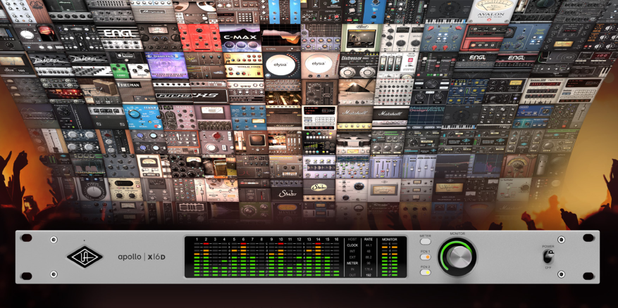

_*Apollo x16D includes the “Essentials+” or “Ultimate+” UAD plug-in bundle. Other UAD plug-ins sold separately at www.uaudio.com. All trademarks are property of their respective owners._ 

Apollo x16D Hardware Manual 

4 

Introduction 

## Work Fast & Never Lose Your Settings 

With its powerful digital mixing engine giving you control over inputs, outputs, and plug-in routing — Apollo x16D makes it easy to build your mix and control entire effects chains in realtime. Then quickly recall your plug-in settings over MIDI, all without interrupting the performance. 

## Hundreds of Effects, One Rack Space 

Apollo x16D comes in two editions, both delivering a generous suite of UAD plug-ins right out of the box. Build your mix with classic Teletronix LA-2A and 1176 compressors, Pultec EQs, and Neve channel strips along with modern favorites from Auto-Tune, Avalon, and more. 

## Expand Your Studio Over Dante 

Link up to four x16Ds to build a 64-channel Dante system with network redundancy. Or expand your current Thunderbolt Apollo studio over Dante — the most low-latency and scalable audio network available. This means that if you’ve been considering making the switch to a networked recording studio, or you simply want to grow to a multi-room setup, you don’t have to start from scratch. 

## Mix Down to Surround 

After the show, bring Apollo x16D back to the studio, where it becomes your all-in-one monitoring hub for mixing formats up to 9.1.6. This allows you to easily create 16-channel immersive audio mixes of live sets or studio recordings for Dolby Atmos, Auro-3D, Sony 360 Reality Audio, and others. 

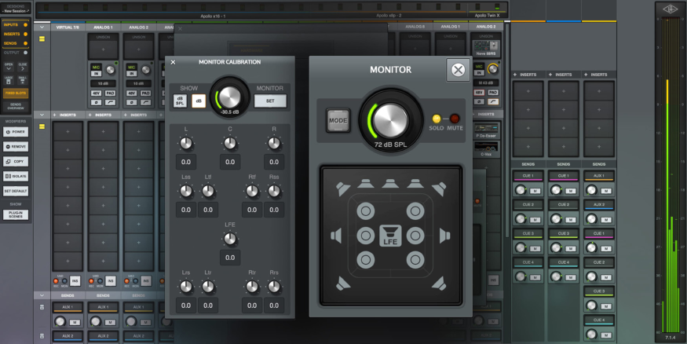

_*Apollo x16D includes the “Essentials+” or “Ultimate+” UAD plug-in bundle. Other UAD plug-ins sold separately at www.uaudio.com. All trademarks are property of their respective owners._ 

Apollo x16D Hardware Manual 

5 

Introduction 

## Apollo x16D Features 

## Key Features 

- 18 x 20 audio interface featuring Dante I/O (supports AES67 mode @ 48 kHz) 

- 24-bit/192 kHz elite-class Apollo X D/A conversion 

- Stereo AES I/O for connection to professional digital outboard hardware 

- Includes up to 100+ UAD plug-ins with Ultimate+ or Essentials+ editions 

- Recall plug-in settings over MIDI, even in the middle of a performance 

- Onboard HEXA Core Processing for mixing with UAD plug-ins at near-zero latency 

- Compatible with Thunderbolt Apollo interfaces to expand systems over Dante* 

- Create 16-channel immersive audio mixes for Dolby Atmos, Auro-3D, Sony 360 Reality Audio, and others 

- ALT monitoring support in all monitor modes (2 x ALT mon for stereo, 1 x ALT mon for all) 

- Free industry-leading technical support from knowledgeable audio engineers 

## Audio Interface 

- 16 x 16 simultaneous networked audio input/output channels via Dante or AES67 

- Stereo analog monitor outputs via dual XLR connectors 

- Front panel pre-fader metering of networked signal input or output levels 

- Two Thunderbolt 3 ports for daisy-chaining other Thunderbolt devices 

## Monitoring 

- Independently-addressable stereo monitor outputs 

- Front panel control of monitor levels and muting 

- Front panel pre-fader metering of monitor bus levels 

- Selectable reference level for monitor outputs (+4 dBu or -10 dBV) 

- Digital AES/EBU outputs can mirror the analog monitor outputs 

> _*Apollo x16D includes the “Essentials+” or “Ultimate+” UAD plug-in bundle. Other UAD plug-ins sold separately at www.uaudio.com. All trademarks are property of their respective owners._ 

Apollo x16D Hardware Manual 

6 

Introduction 

## UAD-2 HEXA Inside 

- Six SHARC[®] DSP processors 

- Realtime UAD Processing on all of Apollo x16D’s inputs 

- Same features and functionality as other UAD-2 products when used with DAW 

- Can be combined with other UAD-2 devices for increased mixing DSP 

- Get UAD Powered Plug-Ins at the UA online store 

## Software 

## UAD Console application 

- Analog-style control interface for realtime monitoring and tracking 

- Enables Realtime UAD Processing with UAD-2 plug-ins 

- Remote control of Apollo features and functionality 

- Plug-In Scenes for seamless audio processing transitions via MIDI 

## UAD Console Recall plug-in 

- Saves UAD Console configurations inside DAW sessions for easy recall 

- Convenient access to UAD Console’s monitor controls via DAW plug-in 

- VST, AAX 64, and Audio Units plug-in formats 

## UAD Meter & Control Panel application 

- Configures global UAD settings and monitors system usage 

## Other 

- Easy firmware updates 

- 1U rack-mountable form factor 

- One year warranty includes parts and labor 

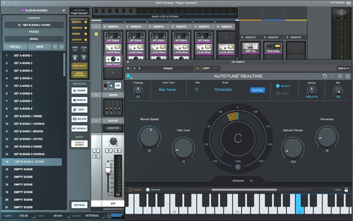

Apollo x16D Hardware Manual 

7 

Introduction 

## About Apollo Documentation 

Documentation for Apollo and UAD Powered Plug-Ins are separated by areas of functionality, as described below. All user manuals are available at help.uaudio.com. 

Some manual files are in PDF format. PDF files require a free PDF reader application such as Preview (Mac) or Edge (Windows). 

## Apollo Hardware Manuals 

Each Apollo model has a unique hardware manual. The Apollo hardware manuals contain complete hardware-related details about one specific Apollo model. Included are detailed descriptions of all hardware features, controls, connectors, and specifications. 

_Note: Each hardware manual contains the unique Apollo model in the file name._ 

## Apollo Software Manual 

The Apollo Software Manual is a companion guide to the Apollo hardware manuals. It contains detailed information about how to configure and control Apollo software features. Refer to the Apollo Software Manual to learn how to operate the software tools and integrate Apollo’s functionality into the DAW environment. 

_Note: Each Apollo connection protocol (Thunderbolt, FireWire, USB) has a unique software manual._ 

## UAD Console Manual 

UAD Console is Apollo’s companion software, for controlling up to four Apollo units and their digital mixing and low-latency monitoring capabilities. UAD Console is where you configure and operate Realtime UAD Processing and Unison with UAD-2 plug-ins. 

_Note: Specific details about Dante setups are provided in the Apollo x16D Networked Audio chapter within the UAD Console Manual._ 

## UAD Plug-Ins Manual 

The features and functionality of all individual UAD-2 Powered Plug-Ins is detailed in the UAD Plug-Ins Manual. Refer to that document to learn about the operation, controls, and user interface of each UAD-2 plug-in that is developed by Universal Audio. 

## Direct Developer Plug-In Manuals 

UAD Powered Plug-Ins includes plug-in titles created by our Direct Developer partners. Documentation for these 3rd-party plug-ins are separate files written and provided by the plug-in developers. The file names for these plug-in manuals are the same as the plug-in titles. 

## UAD System Manual 

The UAD System Manual is the complete operation manual for Apollo’s UAD-2 functionality and applies to the entire UAD-2 product family. It contains detailed information about installing and configuring UAD devices, the UAD Meter & Control Panel application, buying optional plug-ins at the UA online store, and more. It includes everything about UAD except Apollo-specific information and individual UAD plug-in descriptions. 

Apollo x16D Hardware Manual 

8 

Introduction 

## Accessing Documentation 

Any of these methods can be used to access documentation: 

- Choose Documentation from the Help menu within the UAD Console application 

- Click the Product Manuals button in the Help panel within the UAD Meter & Control Panel application 

- All manuals are available online at help.uaudio.com 

## Host DAW Documentation 

Each host DAW software application has its own particular methods for configuring and using audio interfaces and plug-ins. Refer to the host DAW’s documentation for specific instructions about using audio interface and plug-in features within the DAW. 

## Hyperlinks 

Links to other manual sections and web pages are highlighted in blue text. Click a hyperlink to jump directly to the linked item. 

_Tip: Use the back button in the PDF reader application to return to the previous page after clicking a hyperlink._ 

## Additional Resources 

For additional resources, or if you need to contact Universal Audio for assistance, see the Technical Support page. 

Apollo x16D Hardware Manual 

9 

Introduction 

## **Front Panel** 

This section describes the features and functionality of all controls and visual elements on the Apollo x16D front panel. 

_Tip: All front panel functions except METER and POWER can be controlled remotely with the included UAD Console software application. Changes made with the front panel controls are mirrored in UAD Console, and vice versa._ 

## (1) Power Indicator (UA Logo) 

The Universal Audio logo illuminates when the external power supply is properly connected to the AC outlet and the power input on the rear of the unit, and the Power switch (#13) is in the up position. 

## (2) Talkback Microphone 

The built-in talkback mic is located inside of this hole. The talkback function is configured and operated in UAD Console. 

**----- Start of picture text -----** 
1 2 **----- End of picture text -----** 

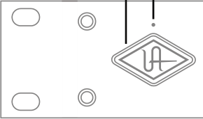

_Power indicator and talkback microphone_ 

_Caution: The talkback microphone is sensitive. To avoid equipment damage, do not insert any object into the mic hole, apply pressurized air into the mic hole, or use a vacuum over the mic hole._ 

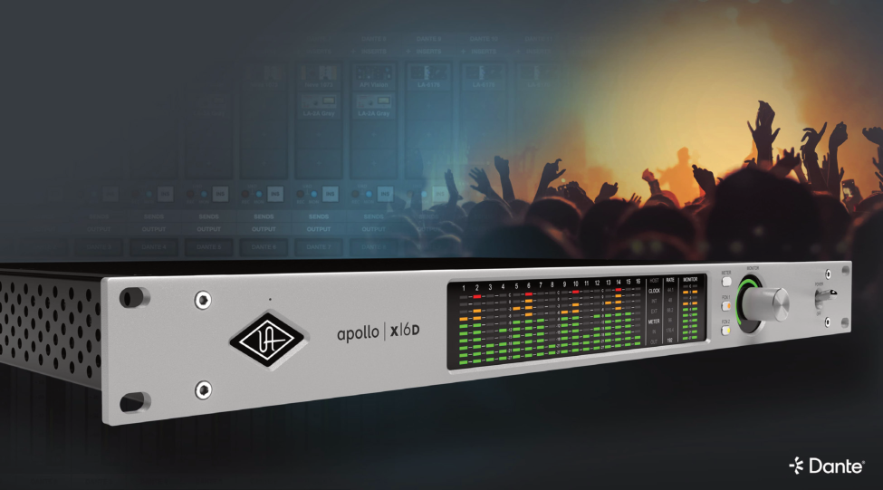

Apollo x16D Hardware Manual 

10 

Front Panel 

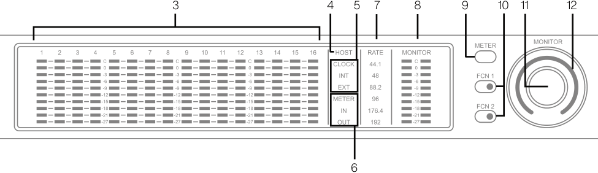

**----- Start of picture text -----** 
3 4 5 7 8 9 10 11 12 6 **----- End of picture text -----** 

_Main Apollo x16D front panel elements_ 

## (3) Channel Level Meters 

The 10-segment LED channel meters display the input or output signal peak levels for networked channels 1 – 16. Input or output metering is selected with the METER switch (#9), and the input/output state is shown by the METER indicators (#6). 

The dB values of the meter LEDs are indicated between the meters for channels 4 & 5, 8 & 9, and 12 & 13. “0” indicates a level of 0 dBFS. When digital clipping occurs (when 0 dBFS is exceeded), the red “C” (clip) LED illuminates. 

## Input Channel Meters 

When set to INPUT, the channel meters display the signal peak input levels for networked channels 1 – 16. 

## Output Channel Meters 

When set to OUTPUT, the channel meters display the signal peak output levels for networked channels 1 – 16. 

## (4) HOST Indicator 

The HOST indicator displays the status of the Thunderbolt connection to the host computer system. The possible states are: 

Lit – The unit is communicating with the host computer and operating normally. 

Unlit – The unit is starting up or it is not recognized by the host computer. Verify software installation and Thunderbolt connections. 

Red – System error. Please contact UA customer care if the issue persists. 

Apollo x16D Hardware Manual 

11 

Front Panel 

## (5) CLOCK Indicators 

The clock source and status are displayed with these indicators. Either internal (INT) or external (EXT) is displayed. The clock source is set within the UAD Console application; see the UAD Console Manual for details. 

## Internal Clock 

When set to internal clock, the INT indicator is illuminated white. 

## External Clock 

Apollo x16D can use an external digital clock source from the Word Clock, AES/EBU, or networked inputs. The EXT indicator has two possible states: 

White – When set to external clock and a valid clock signal is detected at the specified port, the EXT indicator is illuminated white and Apollo x16D is synchronized to the external clock source. 

Red – When set to external clock and a valid clock signal is NOT detected at the specified port, the EXT indicator is illuminated red and the internal clock remains active instead. In this situation, if/when the specified external clock becomes available, Apollo x16D switches back to the external clock, and the EXT indicator is illuminated and white. 

_Important: When set to use any external clock source, Apollo x16D’s sample rate must be manually set to match the sample rate of the external clock._ 

## (6) METER Indicators 

These indicators show the current state of the Channel Level Meters (#3). The current state is changed with the METER switch (#9). 

IN – When IN is illuminated, the channel meters display networked input signal levels. 

OUT – When OUT is illuminated, the channel meters display networked output signals levels. 

## (7) Sample Rate Indicators 

These indicators display the current system sample rate setting. The sample rate is set within the UAD Console application or the host DAW; see the UAD Console Manual for details. 

Apollo x16D Hardware Manual 

12 

Front Panel 

## (8) Monitor Output Level Meters 

The 10-segment LED meters display the signal peak output levels of the rear panel Left & Right Monitor outputs at the output of the D/A converters. These meters are before the Monitor Level control (pre-fader) and reflect the D/A converter levels regardless of the current Monitor Level and Headphone Level knob settings. 

The dB values of the monitor meter LEDs are indicated between the left and right channel meters. When digital clipping occurs, the red “C” (clip) LED illuminates. 

If the monitor output level clips, reduce the monitor output level within the DAW and/or reduce the output level of individual channels feeding the monitor output bus within the UAD Console application. 

## (9) Meter Switch 

This switch determines whether the Channel Level Meters (#3) are displaying input levels or output signal levels. Pressing the switch toggles the state of the meters and the Meter Indicators (#6). 

## (10) FCN Switches 

_Note: When more than one Apollo interface is connected in a multi-unit configuration, the FCN switch is operable on the designated monitor unit only._ 

FCN 1 and FCN 2 are assignable switches that can be configured to control monitoring functions. The function of each switch is configured with the FCN SWITCH ASSIGN menus in the Hardware panel within UAD Console Settings. Refer to the UAD Console Manual for details. 

The LED within each switch flashes (FCN 1 orange, FCN 2 yellow) when its monitoring function is active. The function is toggled with the switch is pressed again. The available functions are listed below. 

## ALT 1, ALT 2 

Apollo x16D features ALT (alternate) monitoring capabilities. ALT monitoring can be used to control up to two alternate pairs of monitor speakers. ALT monitoring is enabled in the Hardware panel within UAD Console Settings by increasing the ALT COUNT setting to a non-zero value. 

For complete details about how to configure and use the ALT monitoring features, refer to the UAD Console Manual. 

## MONO 

Sums the left and right channels of the stereo monitor mix into a monophonic signal. The Monitor Level Indicator ring (#12) flashes when MONO is active. 

## DIM 

Attenuates the signal level at the monitor outputs by the dB amount set in the CONTROL ROOM strip within the UAD Console application. The Monitor Level Indicator ring (#12) flashes when DIM is active. 

Apollo x16D Hardware Manual 

13 

Front Panel 

## TALKBACK 

Activates the talkback mic and the DIM function. Talkback is active when the button is lit. Press and release the button quickly to latch talkback ON. To momentarily activate the function and deactivate when the button is released, press for longer than 0.5 seconds. The Monitor Level Indicator ring (#12) flashes when talkback is active. 

## (11) Monitor Level & Mute Knob 

This rotary encoder serves two functions. Rotating the knob adjusts the monitor output level, and pressing the knob mutes the monitor outputs. 

## Monitor Level 

Rotating the knob clockwise increases the signal level at the Left & Right Monitor Outputs on the rear panel. If ALT monitor outputs are configured and active, this knob controls the signal level at the ALT monitoring line outputs. 

## Monitor Mute 

Pressing the Monitor knob toggles the mute state of the signals at the Left & Right Monitor Outputs on the rear panel. If ALT monitoring is configured in the Hardware panel within UAD Console Settings (when ALT COUNT is a non-zero value), the ALT monitor outputs are also muted by this control. 

When the monitor outs are muted, the Monitor Level Indicator ring (#12) is red. 

Apollo x16D Hardware Manual 

14 

Front Panel 

## (12) Monitor Level & Monitor State Indicator 

_Tip: The Monitor Level and Monitor State indications are reflected in the Monitor column within the UAD Console application._ 

## Monitor Output Level Indicator 

The relative signal level at the rear panel monitor outputs (and ALT monitor outputs, if configured) is indicated by the illuminated ring surrounding the Monitor Level knob. 

This indicator is after the Monitor Level control (post fader). The ring indicates relative gain levels and is not calibrated to indicate any specific dB value. 

_Tip: Precise numerical dB gain values for the Monitor Level Knob are displayed within the UAD Console application._ 

## Monitor State Indicator 

The color of the indicator ring indicates the current state of the monitor outputs: 

Green – The main monitor outputs are active with variable level control. 

Red – The main monitor outputs (and ALT monitor outputs, if configured) are muted. 

Orange – The ALT 1 monitor outputs are active. 

Yellow – The ALT 2 monitor outputs are active. 

Flashing – The monitor DIM, MONO, and/or TALKBACK functions are active. 

## (13) Power Switch 

This switch applies power to Apollo x16D. When the unit is ~~po~~ w ~~ered on~~ , ~~t~~ he Universal ~~A~~ u ~~d~~ io logo (#1) is illuminated. The ~~ext~~ e ~~rna~~ l p ~~owe~~ r supply mus ~~t~~ b ~~e~~ properly connected for this switch ~~to~~ fu ~~nct~~ i ~~on~~ . 

13 

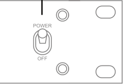

Apollo x16D Hardware Manual 

15 

Front Panel 

## **Rear Panel** 

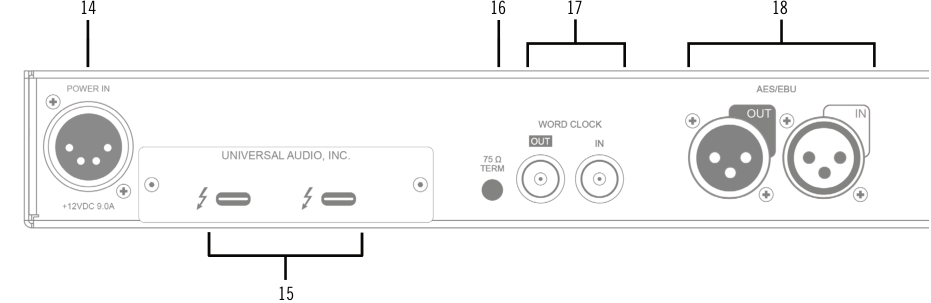

**----- Start of picture text -----** 
14 16 17 18 15 **----- End of picture text -----** 

## (14) Power Input 

The included external power supply connects to this 4-pin locking XLR jack. Apollo x16D requires 12 volts DC power and draws a maximum of 72 watts (30 watts typical). 

To eliminate risk of circuit damage, connect only the factory-supplied power supply. Use the Power switch on the front panel to power the unit on and off. 

_Important: Do not disconnect the power supply while Apollo x16D is in use, and confirm the Power switch is in the “off” position before connecting or disconnecting the power supply._ 

## (15) Thunderbolt 3 Ports 

Apollo x16D has two Thunderbolt 3 ports. One port is used to connect Apollo x16D to a Thunderbolt 3 port on the host computer. Thunderbolt 3 peripheral devices may be serially connected (daisy-chained) to the second Thunderbolt 3 port. 

When Apollo x16D is properly communicating with the host computer via Thunderbolt, the HOST indicator (#4) illuminates. 

_Note: Apollo x16D can be used with Thunderbolt 1 and Thunderbolt 2 ports on Apple Mac computers via the Apple Thunderbolt 3 to Thunderbolt 2 Adapter. Connections to Thunderbolt 1 or Thunderbolt 2 ports on Windows PCs are not supported._ 

## Thunderbolt Bus Power 

Per the Thunderbolt specification, bus power is supplied to downstream (daisy-chained) Thunderbolt peripheral devices. Apollo x16D must be powered on for the daisy-chained peripheral to receive Thunderbolt bus power. 

Apollo x16D Hardware Manual 

16 

Rear Panel 

## (16) 75 Ohm Word Clock Termination Switch 

This switch provides internal 75-ohm word clock input signal termination when required. Word clock termination is active when the switch is engaged (depressed). 

Apollo x16D’s termination switch should only be engaged when Apollo x16D is set to sync to external word clock and it is the last device at the receiving end of a word clock cable. For example, if Apollo x16D is the last “follow” unit at the end of a clock chain (when Apollo x16D’s word clock OUT port is not used), termination should be active. 

## (17) Word Clock I/O 

## Word Clock In 

Apollo x16D’s internal clock can be synchronized (followed) to an external leader word clock. This is accomplished by setting Apollo x16D’s clock source to Word Clock within the UAD Console application, connecting the external word clock’s BNC connector to Apollo x16D’s word clock input, and setting the external device to transmit word clock. If Apollo x16D is the last device in the clock chain, the Termination switch (#16) should be engaged. 

_Important: Apollo x16D’s sample rate must be manually set to match the incoming clock’s sample rate._ 

_Note: Apollo x16D can be synchronized to an external “1x” clock signal only. Superclock, overclocking, and subclocking are not supported._ 

## Word Clock Out 

This BNC connector transmits a standard (1x) word clock when Apollo x16D is set to use its internal clock. The clock rate sent by this port matches the current system sample rate, as specified within the UAD Console application. 

When Apollo x16D is set to use external word clock as its clock, Apollo x16D is a word clock follow. If the incoming external word clock is within ±4% of a supported sample rate (44.1 kHz, 48 kHz, 88.2 kHz, 96 kHz, 176.4 kHz, 192 kHz), Word Clock Out will mirror Word Clock In with a slight phase delay (about 40 ns). 

Because Apollo x16D’s word clock output is not a true mirror of the word clock input, word clock out should not be used to daisy chain the word clock if Apollo x16D is in the middle of the word clock chain. The correct method to connect Apollo x16D in the middle of a word clock chain is to use a T-connector at Apollo x16D’s word clock input and leave Apollo x16D’s word clock output unconnected. In this configuration, the Termination switch should not be engaged. 

Apollo x16D Hardware Manual 

17 

Rear Panel 

## (18) AES/EBU Ports 

The AES/EBU ports provide two channels of digital I/O with resolutions up to 24-bit at 192 kHz via XLR connectors. For optimum results, use only high-quality 110-ohm XLR cables specifically designed for AES/EBU digital audio. 

## SR Convert 

Sample rate conversion can be enabled on the AES/EBU input. This function is set in the AES/EBU input channel strip(s) within the UAD Console application. When sample rate conversion is enabled and the sample rate of the incoming AES/EBU signal does not match the sample rate specified in the UAD Console application, the AES/EBU signal is converted to match Apollo x16D’s sample rate. 

_Note: When Apollo x16D is set to use AES/EBU as the leader clock source, sample rate conversion is inactive._ 

## Mirror Monitor Outputs 

The AES/EBU output can be configured to mirror the Monitor outputs, for routing the stereo Monitor signal to the stereo AES/EBU input of other devices. This feature is set with the DIGITAL MIRROR menu in the Hardware panel within UAD Console Settings. 

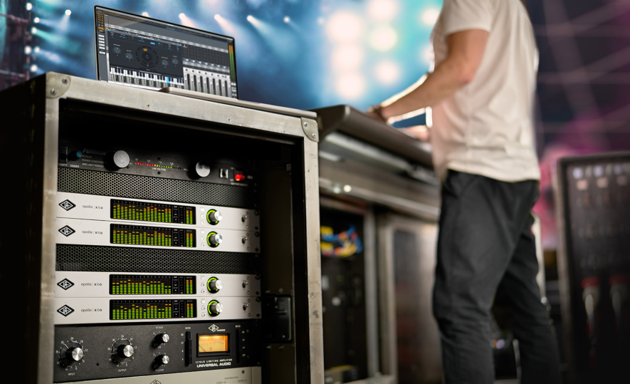

Apollo x16D Hardware Manual 

18 

Rear Panel 

**----- Start of picture text -----** 
19 20 **----- End of picture text -----** 

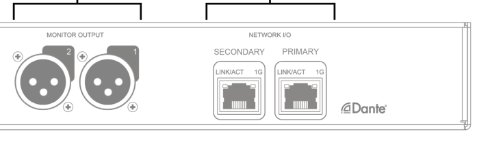

## (19) Left & Right Monitor Outputs 

These balanced XLR jacks are line-level analog outputs typically used for connection to a stereo loudspeaker monitoring system. The signal levels at these outputs are controlled with the Monitor Level & Mute knob (#11). The Monitor Outputs are DC coupled. 

The Monitor Outputs can be configured to use an operating level of +4 dBu (default value) or -10 dBV. This option is set in the Hardware panel within UAD Console Settings. For details, refer to the UAD Console Manual. 

The Monitor Outputs are completely independent from the 16 networked outputs (except when ALT monitoring is configured). By default, these outputs are labeled MON L and MON R in Apollo’s device drivers. In the DAW, the “1–2” or “L–R” or “Main” outputs are routed to these outputs (these labels vary within each particular DAW). 

_Tip: The AES/EBU output (#18) can be configured to mirror the Monitor Outputs, for routing the stereo monitor signal to the stereo AES/EBU input of other devices. This feature is set with the DIGITAL MIRROR menu in the Hardware panel within UAD Console Settings._ 

## (20) Network Audio I/O Ports 

Connect Apollo x16D to other Dante or AES67 equipment with these 1 Gigabit Ethernet ports. If using only one port, connect to the Primary port. 

Apollo x16D Hardware Manual 

19 

Rear Panel 

## **Interconnections** 

## Installation Notes 

- Apollo may get hot during normal operation if it doesn’t receive adequate airflow circulation around its chassis vents. When mounting Apollo in a rack, leaving at least one empty rack space above the unit to allow adequate airflow for cooling is recommended. 

- If Apollo is installed near other heat generating equipment, external cooling (such as a fan) may be needed to keep the ambient temperature below 104º F (40º C). 

- As with any sound system, the following steps are recommended to avoid audio spikes in your speakers and headphones: 

   1. Apply power to the speakers last, after all other devices (including Apollo) are powered on. 

   2. Turn off the speakers first, before all other devices (including Apollo) are powered off. 

   3. Remove headphones from ears before powering Apollo on or off. 

## Apollo x16D Connections 

Apollo x16D requires two connections to your host computer: 

- A Thunderbolt connection – Your Apollo x16D(s) must be connected via Thunderbolt to your computer. Apollo devices, including Apollo x16Ds, cawn be daisy-chained to the host computer in any order. 

_Note: The Apollo daisy chain must be connected to only one Thunderbolt port on the host computer._ 

- An Ethernet network connection  – Your Apollo x16D must be connected from one of the network ports via an Ethernet cable to your computer, either directly, or through a Dante-capable Ethernet switch. You might need an Ethernet adapter for the host computer connection. 

## Network Modes 

Apollo x16D networked audio can be operated in Switched mode or Redundant mode. This operating mode is set in the Dante Controller software. Use of these modes changes the operation of the Ethernet ports. Consider Redundant Mode when you require real-time failover capabilities. Refer to the Networked Audio article in the UAD Console Manual for more information. 

20 

Interconnections 

Apollo x16D Hardware Manual 

## Apollo Expanded 

When more I/O and/or DSP is needed, up to four Apollo interfaces and six UAD devices total can be cascaded together via Thunderbolt in a multiple-unit configuration. For complete details about multi-unit cascading, refer to the UAD Console Manual. 

## Thunderbolt Notes 

- Apollo x16D must be connected via a Thunderbolt 3 cable (not included) to computers that have Thunderbolt 3 ports.* 

- Although Thunderbolt 3 always uses USB-C connectors, not all USB-C ports are Thunderbolt 3 ports. Similarly, not all USB-C cables are Thunderbolt 3 cables. Always connect Apollo x16D to a Thunderbolt 3 port with a Thunderbolt 3 cable. 

- Connect only one Thunderbolt 3 cable between Apollo x16D and the host computer. Thunderbolt is a bidirectional protocol. 

- Apollo x16D cannot be bus powered via Thunderbolt. The included external power supply must be used. 

- Thunderbolt bus power is supplied to downstream (daisy-chained) peripheral devices. Apollo x16D must be powered on for the daisy-chained peripheral to receive Thunderbolt bus power. 

_*Note: With Mac computers only, Apollo x16D can be connected to Thunderbolt 1 and Thunderbolt 2 computer ports via the Apple Thunderbolt 3 to Thunderbolt 2 adapter. Visit help.uaudio.com for details._ 

## Apollo x16D Configuration and Operation 

For typical setup example diagrams, configuration instructions, and software operation, refer to the Networked Audio article in the UAD Console Manual. 

21 

Interconnections 

Apollo x16D Hardware Manual 

## **Software Setup** 

_Note: Items on this overview page are detailed in the Apollo Software Manual. See About Apollo Documentation for related information._ 

## System Requirements 

All system requirements must be met for Apollo to operate properly. Before proceeding with installation, view the Apollo X system requirements. 

## Software Installation 

The UAD software must be installed to use the hardware and UAD-2 plug-ins. The UAD software installer contains the Apollo software, drivers, and UAD-2 plug-ins. 

## UA Connect Application 

You’ll use UA Connect, our software management program, to obtain and install the UAD software and UAD Console. To get UA Connect, visit: 

## **uaudio.com/downloads/uad** 

_Note: For optimum results, connect and power on Apollo before installing the software._ 

## Latest Software 

To obtain the latest UAD software after initial registration, use the UA Connect application. 

## System Configuration 

Details about setting up the Apollo system, including how to integrate with a DAW and related information, are included in the Apollo Software Manual. 

## UAD Console 

The UAD Console application is the software interface for the Apollo hardware. UAD Console controls Apollo and its digital mixing, monitoring, Unison technology, and Realtime UAD Processing features. UAD Console is also used to configure Apollo settings such as sample rate, clock source, reference levels, and more. 

Vew the UAD Console Manual and the Apollo x16D Networked Audio chapter for details. 

## How to get UAD Console 

1. In UA Connect, click the Apollo & UAD-2 tab. 

2. Click the Download button next to UAD Console. If UAD Console is already installed, you can click the Update button (if an update is available). 

3. After the software is downloaded, click Install to complete the installation. 

## UA Support Videos 

Informational videos are available to help you get started with Apollo at help.uaudio.com. 

Apollo x16D Hardware Manual 

22 

Software Setup 

## **Specifications** 

All specifications are typical performance unless otherwise noted. Tested with the Audio Precision APx555 Audio Analyzer under the following conditions: 48 kHz internal sample rate, 24-bit sample depth, 20 kHz measurement bandwidth, +24 dBu headroom, balanced output, and internal clock. 

Specifications are subject to change without notice. 

|SYSTEM|SYSTEM|
|---|---|
|_I/O Complement_||
|Network Audio Ports(1 Gbps Ethernet)|Two|
|AnalogMonitor Outputs(DC coupled)|Two(one stereopair)|
|AES/EBU|One stereo input, one stereo output|
|Thunderbolt 3 Ports|Two|
|Word Clock|One input, one output|
|Talkback Mic(built-in)|One|
|_Conversion_||
|A/D conversion|1 channel(Talkback mic)|
|D/A conversion|2 channels(stereo monitor outputs)|
|Supported Sample Rates(kHz)|44.1, 48, 88.2, 96, 176.4, 192|
|Bit Depth Per Sample|24|
|ANALOG I/O||
|_Monitor Outputs 1 – 2_||
|FrequencyResponse|20 Hz – 20 kHz, ±0.02 dB|
|Dynamic Range|133 dB(A–weighted)|
|THD + Noise Ratio(1 kHz @ -1 dBFS)|-129 dB(0.000037%)|
|Maximum Output Level(Reference Level @ +4 dBu)|24 dBu(21.8 dBV)|
|Maximum Output Level(Reference Level @ -10 dBV)|10 dBV(12.2 dBu)|
|Output Impedance|100 Ohms|
|Connector Type|Balanced Male XLR (pin 2 hot)|

_(continued)_ 

Specifications 

Apollo x16D Hardware Manual 

23 

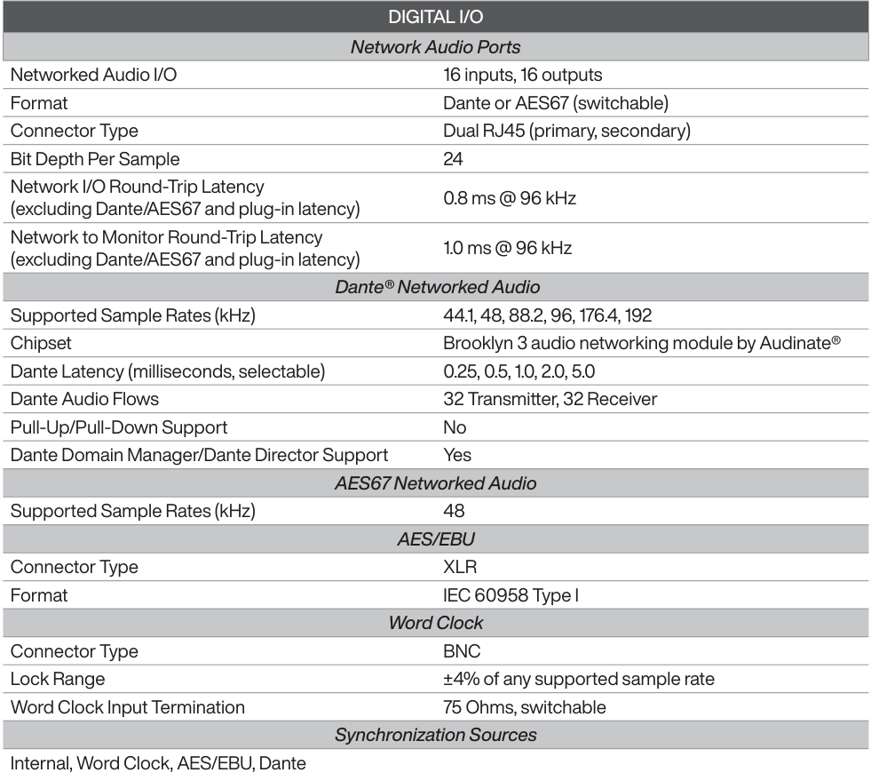

**----- Start of picture text -----** 
DIGITAL I/O Network Audio Ports Networked Audio I/O 16 inputs, 16 outputs Format Dante or AES67 (switchable) Connector Type Dual RJ45 (primary, secondary) Bit Depth Per Sample 24 Network I/O Round-Trip Latency 0.8 ms @ 96 kHz (excluding Dante/AES67 and plug-in latency) Network to Monitor Round-Trip Latency 1.0 ms @ 96 kHz (excluding Dante/AES67 and plug-in latency)  Dante® Networked Audio Supported Sample Rates (kHz) 44.1, 48, 88.2, 96, 176.4, 192 Chipset Brooklyn 3 audio networking module by Audinate® Dante Latency (milliseconds, selectable) 0.25, 0.5, 1.0, 2.0, 5.0 Dante Audio Flows 32 Transmitter, 32 Receiver Pull-Up/Pull-Down Support No Dante Domain Manager/Dante Director Support Yes AES67 Networked Audio Supported Sample Rates (kHz) 48 AES/EBU Connector Type XLR Format IEC 60958 Type I Word Clock Connector Type BNC Lock Range ±4% of any supported sample rate Word Clock Input Termination 75 Ohms, switchable Synchronization Sources Internal, Word Clock, AES/EBU, Dante **----- End of picture text -----** 

_(continued)_ 

Specifications 

Apollo x16D Hardware Manual 

24 

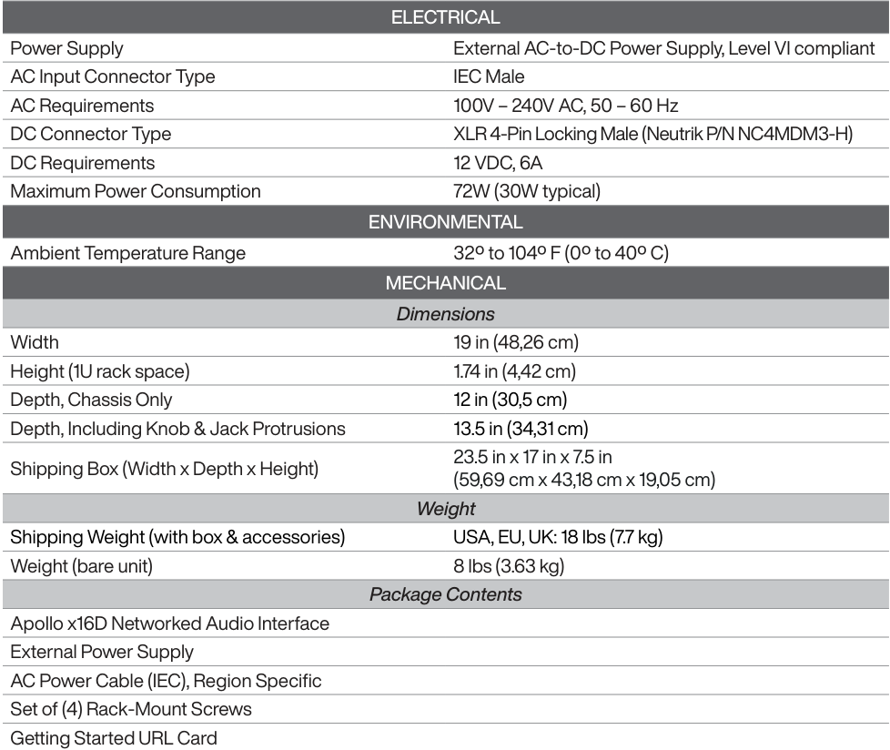

**----- Start of picture text -----** 
ELECTRICAL Power Supply External AC-to-DC Power Supply, Level VI compliant AC Input Connector Type IEC Male AC Requirements 100V – 240V AC, 50 – 60 Hz DC Connector Type XLR 4-Pin Locking Male (Neutrik P/N NC4MDM3-H) DC Requirements 12 VDC, 6A Maximum Power Consumption 72W (30W typical) ENVIRONMENTAL Ambient Temperature Range 32º to 104º F (0º to 40º C) MECHANICAL Dimensions Width 19 in (48,26 cm) Height (1U rack space) 1.74 in (4,42 cm) Depth, Chassis Only 12 in (30,5 cm) Depth, Including Knob & Jack Protrusions 13.5 in (34,31 cm) 23.5 in x 17 in x 7.5 in Shipping Box (Width x Depth x Height) (59,69 cm x 43,18 cm x 19,05 cm) Weight Shipping Weight (with box & accessories) USA, EU, UK: 18 lbs (7.7 kg) Weight (bare unit) 8 lbs (3.63 kg) Package Contents Apollo x16D Networked Audio Interface External Power Supply AC Power Cable (IEC), Region Specific Set of (4) Rack-Mount Screws Getting Started URL Card **----- End of picture text -----** 

Specifications 

Apollo x16D Hardware Manual 

25 

## **Hardware Block Diagram** 

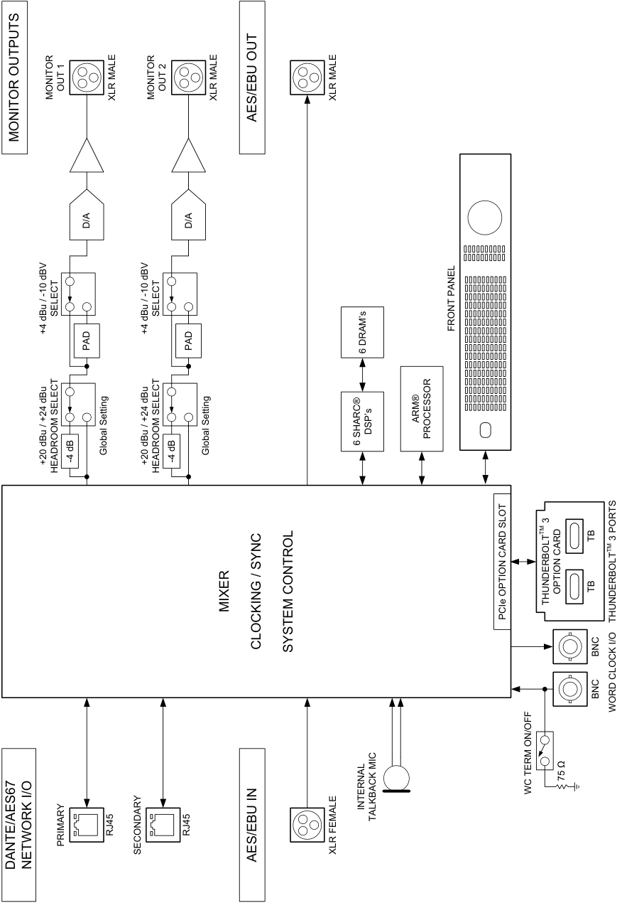

**----- Start of picture text -----** 
OUT 1 OUT 2 MONITOR XLR MALE MONITOR XLR MALE XLR MALE AES/EBU OUT MONITOR OUTPUTS D/A D/A SELECT SELECT +4 dBu / -10 dBV +4 dBu / -10 dBV FRONT PANEL PAD PAD 6 DRAM’s ARM® DSP’s PROCESSOR Global Setting Global Setting 6 SHARC® +20 dBu / +24 dBu -4 dB +20 dBu / +24 dBu -4 dB HEADROOM SELECT HEADROOM SELECT  3 TM TB  3 PORTS TM OPTION CARD TB THUNDERBOLT MIXER PCIe OPTION CARD SLOT THUNDERBOLT CLOCKING / SYNC SYSTEM CONTROL BNC BNC WORD CLOCK I/O 75 Ω WC TERM ON/OFF INTERNAL TALKBACK MIC RJ45 RJ45 PRIMARY SECONDARY XLR FEMALE AES/EBU IN DANTE/AES67 NETWORK I/O **----- End of picture text -----** 

Apollo x16D Hardware Manual 

26 

Hardware Block Diagram 

## **Troubleshooting** 

If Apollo x16D isn’t behaving as expected, here are some common troubleshooting items to Technical confirm. If you are still experiencing issues after performing these checks, contact Support. 

**----- Start of picture text -----** 
SYMPTOM ITEMS TO CHECK **----- End of picture text -----** 

|SYMPTOM|ITEMS TO CHECK |
|---|---|
|Unit won’t power on|• Confrm power supply connections at power supply input and back of unit • Confrm Power switch is in ON (up) position • Confrm AC power is available at wall socket by plugging in a different device|
|No monitor output|• Confrm connections, power, and volume of monitoring system • Confrm monitor knob is turned up • Confrm monitor outputs are not muted (press monitor knob) • Confrm monitor LEDs are active (check signal fows)|
|Monitor output level range is|• Monitor output reference levels can be switched between +4 dBu and -10 dBV in the|
|too loud or too quiet|Hardware panel within UAD Console Settings|
|Input/output levels are too high or too low|• Signal levels for all digital I/O are adjusted at the device connected to those inputs|
|Can’t fne tune signal I/O levels|• Signal levels can be digitally adjusted with UAD plug-ins in the input channel strips within the UAD Console application|
|Networked audio channels|• Confrm Apollo x16D is connected to the host computer via Ethernet, either directly,|
|unavailable|or through a Dante-capable Ethernet switch.|
|Audio glitches and/or dropouts during playback|• Increase audio I/O buffer size setting in DAW • Confrm clocking setups (check cable connections and confrm all device clocks are synchronized to one master clock device)|
|Undesirable echo/phasing|• Confrm input monitoring is not enabled in both UAD Console and DAW|
||• Confrm Thunderbolt connections • Confrm UAD software is installed|
|HOST indicator is unlit or red|• Power Apollo off then power on Apollo, and restart computer|
||• Reinstall UAD software|
||• Try a different Thunderbolt cable|
|Faint static and/or white noise is heard when nothing is plugged in|• Mute unused inputs • Some UAD plug-ins model the noise characteristics of the original equipment; defeat the noise model in the UAD plug-in, or mute the channel containing the plug-in to temporarily mute the noise|
|Various LEDs inside the unit are blinking|• This is normal operational behavior that can be safely ignored|
||• As a last resort, perform a hardware reset on the unit by following these steps.|
||**Important:**This procedure resets all network and Dante settings, including device/|
|Apollo x16D is behaving unexpectedly|channel names and audio subscriptions. 1. Power off Apollo x16D 2. Press and hold the METER and MONITOR controls|
||3. Power on Apollo x16D while continuing to hold both controls 4. After all front panel LEDs fash rapidly (after several seconds), release the controls.|

27 

Troubleshooting 

Apollo x16D Hardware Manual 

## **Notices** 

## Important Safety Information 

1. Read these safety instructions and the instruction manual of the product. 

2. Keep these safety instructions and the instruction manual of the product. Always include all instructions when providing the product to other parties. 

3. Heed all warnings. 

4. Follow all instructions. 

5. Do not use this apparatus near water. 

6. Only clean the product when it is not connected to the power supply system. Clean only with a dry cloth. 

7. Do not block any ventilation openings. Install in accordance with the manufacturer’s instructions. 

8. Do not install near any heat sources such as radiators, heat registers, stoves, or other apparatus (including amplifiers) that produce heat. 

9. Only operate the product from the type of power source indicated on the power supply unit. 

10. Protect the power cord from being walked on or pinched, particularly at plugs, convenience receptacles, and the point where it enters into and/or exits from the apparatus. 

11. Only use attachments/accessories specified by the manufacturer. 

12. Unplug this apparatus during lightning storms or when unused for long periods of time. 

13. Refer all servicing to qualified service personnel. Servicing is required when the apparatus has been damaged in any way, such as when the power supply cord or plug is damaged, liquid has been spilled into or objects have fallen into the apparatus, or when the apparatus has been exposed to rain or moisture, does not operate normally, or has been dropped. 

14. **Warning:** To reduce the risk of fire or electric shock, do not expose this apparatus to rain or moisture. Objects filled with liquids, such as vases, should not be placed on this apparatus. 

15. To completely disconnect this apparatus from the AC mains, disconnect the power supply cord plug from the AC receptacle. 

16. The mains plug of the power supply cord shall remain readily accessible. 

17. Do not attempt to open the product housing. The warranty is voided for products opened by the customer. 

18. Let the product reach ambient temperature before switching it on. 

19. **Caution:** High signal levels can damage your hearing and your loudspeakers. Reduce the volume on the connected audio devices before switching on the product; this will also help prevent acoustic feedback. 

20. Intended use. The product is designed for indoor use. The product can be used for commercial purposes. It is considered improper use when the product is used for any application not named in the corresponding instruction manual. Universal Audio does not accept liability for damage arising from improper use or misuse of this product and its attachments/ accessories. Before putting the product into operation, please observe the respective country-specific regulations. 

28 

Notices 

Apollo x16D Hardware Manual 

## Manufacturer’s Declarations 

## Warranty 

The product is covered by a limited warranty. For the current terms of such warranty, please visit uaudio.com/eula. 

## Maintenance 

**CAUTION:** To reduce the risk of electric shock, do not open the unit. 

This product does not contain a fuse or any other user-replaceable parts. The unit is internally calibrated at the factory. No internal user adjustments are available. 

## Repair Service 

If you are having trouble with your hardware, first check all system setups, connections, and operating instructions. If that doesn’t help, contact our Customer Care team. 

To learn about repair service, or for Customer Care, visit help.uaudio.com. 

## Notes on Disposal 

In compliance with the following requirements: 

## WEE-DIRECTIVE (2012/19/EU) 

The symbol of the crossed-out wheeled bin on the product, the battery/ rechargeable battery (if applicable), and/or the packaging indicates that these products must not be disposed of with normal household waste, but must be disposed of separately at the end of their operational lifetime. For packaging disposal, please observe the legal regulations on waste segregation applicable in your country. 

Further information on the recycling of these products can be obtained from your municipal administration or from the municipal collection points. The separate collection of waste electrical and electronic equipment, batteries/rechargeable batteries (if applicable) and packaging, is used to promote the reuse and recycling and to prevent negative effects caused by e.g., potentially hazardous substances contained in these products. Herewith, you can make an important contribution to the protection of the environment and public health. 

## EU Declaration of Conformity 

- RoHS-Directive (2011/65/EU) 

- Low Voltage Directive (2014/35/EU) 

- EMC Directive (2014/30/EU) 

- REACH Directive (EC1907/2006) 

29 

Notices 

Apollo x16D Hardware Manual 

## Class A Device Statements 

## United States 

Note: This equipment has been tested and found to comply with the limits for a Class A digital device pursuant to Part 15 of the FCC Rules. These limits are designed to provide reasonable protection against harmful interference when the equipment is operated in a commercial environment. This equipment generates, uses, and can radiate radio frequency energy and, if not installed and used in accordance with the instruction manual, may cause harmful interference to radio communications. Operation of this equipment in a residential area is likely to cause harmful interference to radio communications. Operation of this equipment in a residential area is likely to cause harmful interference in which case the user will be required to correct the interference at their own expense. 

Any modifications to the unit, unless expressly approved by Universal Audio, could void the User’s authority to operate the equipment. 

## South Korea 

이 기기는 업무용(A급) 전자파 적합기기로서 판매자 또는 사용자는 이 점을 주의하시기 바라며, 가정외의 지역에서 사용하는 것을 목적으로 합니다. 

(Translation: This device obtained EMC registration for office use (Class A), and may be used in places other than home. Sellers and/or users need to take note of this.) 

## Product Label 

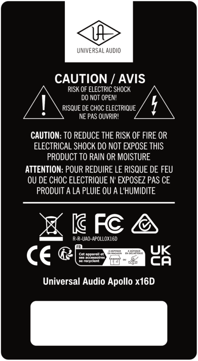

30 

Notices 

Apollo x16D Hardware Manual 

## Compliance 

This product complied with the following requirements: 

- Subpart B of Part 15 of FCC Rules for Class A digital devices (ANSI C63.4 methods) 

- Innovation, Science and Economic Development Canada Interference Causing Equipment Standard ICES-003, “Information Technology Equipment (ITE - Limits and methods of measurement,” Issue 7, dated October 2020 (Class A) (ANSI C63.4 methods) 

- VCCI-CISPR 32:2016 “Technical Requirements” for multimedia equipment (Class A) 

- AS/NZS CISPR 32:2015 +A1 +A11 2020 “Electromagnetic compatibility of multimedia equipment - Emission requirements” (Class A) 

- CISPR 32:2015 +A1:2019, “Electromagnetic compatibility of multimedia equipment - Emissions requirements” (Class A) 

- EN 55032:2015 +A11 +A1:2020, “Electromagnetic compatibility of multimedia equipment - Emissions requirements” (Class A) 

- BS EN 55032:2015 +A11 +A1:2020, “Electromagnetic compatibility of multimedia equipment - Emissions requirements” (Class A) 

- CISPR 35:2016 “Electromagnetic compatibility of multimedia equipment - Immunity requirements” 

- EN 55035:2017 + A11:2020 “Electromagnetic compatibility of multimedia equipment - Immunity requirements” 

- BS EN 55035:2017 + A11:2020 “Electromagnetic compatibility of multimedia equipment - Immunity requirements” 

- QCVN 118:2018/BTT “National technical regulation on Electromagnetic compatibility of multimedia equipment - Emission requirements” (Class A) 

- KS C9832, KS C9835 (Class A) 

## South Korea Compliance Certification 

- Applicant Name: Universal Audio, Inc. 

- Equipment Name: Apollo x16D 

- Model Name: Apollo x16D 

- Registration Number: R-R-UAO-APOLLOX16D 

- Manufacturer/Country of Origin: Universal Audio, Inc. / Malaysia, China 

- Date of Registration: 2024-04-26 

31 

Notices 

Apollo x16D Hardware Manual 

## End User License Agreement 

Your rights to the Software are governed by the accompanying End User License Agreement, a copy of which can be found at: www.uaudio.com/eula 

## Copyrights & Trademarks 

Copyright ©2026 Universal Audio, Inc. All rights reserved. 

UA owns certain trademarks (or applications therefor) that are used in connection with the following UA Software Products and/or the UAD Platform (together “UA Marks”), including, without limitation: 

1176, 1176 LN, 175-B, 176, APOLLO, APOLLO TWIN, ARROW, ASTRA MODULATION MACHINE, BOCK, BOCK AUDIO and BOCK AUDIO logo, CENTURY TUBE CHANNEL STRIP, CYCLOSONIC PANNER, DEL-VERB, DREAMVERB, DYTRONICS, EQP-1A, GOLDEN REVERBERATOR, GOLDEN REVERBERATOR & UA Diamond Design, GOLDEN REVERBERATOR & UA Diamond Design (Series), HELIOS, LA-2A, LA-3A, LUNA, OPAL, OX, OX AMP TOP BOX & Design, OXIDE, POWERED PLUG-INS, RAYMOND, SHAPE, SOUNDELUX and SOUNDELUX USA logo, SPHERE, SPHERE UNIVERSAL AUDIO and UA Diamond Design, STANDARD and UA Diamond Design, STARLIGHT ECHO STATION, TELETRONIX, THE AUTHENTIC SOUND OF ANALOG, TOWNSEND LABS, TRI-STEREO CHORUS, U UNISON PREAMPS & Design, UA Diamond Design, UAD, UAD 2 POWERED PLUG-INS, UAD SPARK, UAD-2 LIVE RACK, UAFX (Stylized), UNIVERSAL AUDIO, UNIVERSAL AUDIO and UA Diamond Design, VOLT UNIVERSAL AUDIO and UA INC. Diamond Design, APOLLO | X, DREAM 65, POLYMAX, RUBY 63, SETTING THE TONE SINCE 1958, SOUNDELUX USA, SPHERE UNIVERSAL AUDIO and UA Diamond Design, UNIVERSAL AUDIO APOLLO, UNIVERSAL AUDIO UAD, VOLT UNIVERSAL AUDIO and UA Diamond Design, WATERFALL B3, WOODROW 55. 

Unless otherwise agreed to in writing under a separate agreement, Customer shall have no interest in any UA Mark and UA will remain the sole and exclusive owner of all right, title and interest in all UA Marks and all applications, reissuances, divisions, re-examinations, renewals or extensions thereof. Other company and product names mentioned herein are trademarks of their respective owners. 

ASIO is a trademark and software of Steinberg Media Technologies GmbH. 

This manual and any associated software, artwork, product designs, and design concepts are subject to copyright protection. No part of this document may be reproduced, in any form, without prior written permission of Universal Audio, Inc. 

## Disclaimer 

The information contained in this manual is subject to change without notice. Universal Audio, Inc. makes no warranties of any kind with regard to this manual, including, but not limited to, the implied warranties of merchantability and fitness for a particular purpose. Universal Audio, Inc. shall not be liable for errors contained herein or direct, indirect, special, incidental, or consequential damages in connection with the furnishing, performance, or use of this material. 

32 

Notices 

Apollo x16D Hardware Manual 

## **Technical Support** 

## Universal Audio Knowledge Base 

The UA Knowledge Base is your complete technical resource for configuring, operating, troubleshooting, and repairing UA products. 

You can watch helpful support videos, search the Knowledge Base for answers, get updated technical information that may not be available elsewhere, and more. 

## **UA Knowledge Base** 

## Universal Audio YouTube Channel 

The Universal Audio YouTube Channel at youtube.com includes helpful support videos for setting up and using UA products. 

## **UA YouTube Channel** 

## Universal Audio Community Forums 

The unofficial UA discussion forums are a valuable resource for all Universal Audio product users. This website is independently owned and operated. 

## **www.uadforum.com** 

## Customer Care 

To contact UA support staff for technical or repair assistance, please visit: 

## **help.uaudio.com** 

33 

Technical Support 

Universal Audio 

www.uaudio.com 

