## Thunderbolt 3 Audio Interface 

with HEXA Core Realtime UAD Processing 

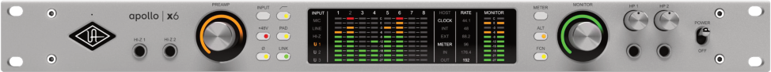

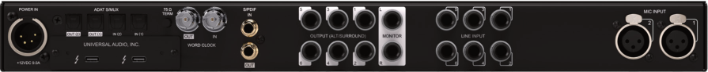

## **Apollo x6 Gen 2 Hardware Manual** 

Manual Version 250902 

www.uaudio.com 

## **A Letter from Bill Putnam Jr.** 

Thank you for choosing this Apollo audio interface to become a part of your studio. We know that any new piece of gear requires an investment of time and money — and our goal is to make your investment pay off. 

Universal Audio interfaces like the Apollo X Gen 2 Series exemplify a commitment to craftsmanship that we’ve forged over the past 60 years — from our original founding in the 1950s by my father, Bill Putnam Sr., to our current mission to combine the best of both classic analog and modern digital audio technologies. 

Starting with its high-quality I/O and elite-class A/D and D/A conversion, Apollo X Gen 2’s superior sonic performance serves as its foundation. 

This is just the beginning however, as Apollo lets you power the full range of UAD plug-ins in real time, including classic mic preamps, EQs, compressors and limiters, reverbs, guitar amps, and much more. With more than 200 acclaimed UAD plug-ins at your fingertips, the sonic choices are limitless.* 

At UA, we are dedicated to the idea that technology should serve the creative process, inspiring our customers to go further. These are the ideals my father embodied with his classic designs, and we believe this spirit lives on today in products like Apollo. 

Please feel free to reach out to us via our website www.uaudio.com, and via our social media channels. We look forward to hearing from you, and thank you once again for choosing Universal Audio. 

Sincerely, 

Bill Putnam Jr. 

_*All trademarks are recognized as property of their respective owners. Individual UAD Powered Plug-Ins sold separately._ 

Apollo X Gen 2 Hardware Manual 

2 

Welcome Letter 

_Tip: Click any section or page number to jump directly to that page._ 

## **Contents** 

A Letter from Bill Putnam Jr. ..............................................................................................................2 Introduction ................................................................................................................................................4 The centerpiece of your next music production.  .......................................................................................4 Apollo x6 Gen 2 Features ........................................................................................................................................6 About Apollo Documentation ..............................................................................................................................11 Additional Resources ...............................................................................................................................................12 Front Panel ................................................................................................................................................13 Rear Panel ................................................................................................................................................24 Digital I/O ........................................................................................................................................................................25 Analog I/O  .....................................................................................................................................................................28 Interconnections ....................................................................................................................................31 Installation Notes.........................................................................................................................................................31 Connection Notes ......................................................................................................................................................31 Typical Setup ...............................................................................................................................................................33 Apollo Expanded: Multi-Unit Wiring ...............................................................................................................34 Software Setup .....................................................................................................................................35 Specifications ........................................................................................................................................ 36 Block Diagram ....................................................................................................................................... 40 Troubleshooting .....................................................................................................................................41 Notices .......................................................................................................................................................42 Important Safety Information ..............................................................................................................................42 Manufacturer’s Declarations ...............................................................................................................................43 Technical Support ................................................................................................................................47 Universal Audio Knowledge Base ...................................................................................................................47 Universal Audio YouTube Channel...................................................................................................................47 Universal Audio Community Forums .............................................................................................................47 Customer Care ...........................................................................................................................................................47 

Apollo x6 Gen 2 Hardware Manual 

3 

Contents 

## **Introduction** 

## The centerpiece of your next music production. 

Produce hits with our most advanced Apollo x6 to date. Featuring highest-resolution audio conversion, two Unison™ mic preamps, and realtime UAD processing — which lets you record through plug-ins from Neve, API, Manley, Auto-Tune, and more without latency — Apollo x6 puts decades of inspiring analog sound right in your rack. 

- Produce music with elite-class Apollo X Gen 2 converters, and hear every detail with unprecedented dynamic range 

- Record and mix through UAD plug-ins in realtime with onboard HEXA Core DSP 

- Use dual Unison preamps to get the sound of iconic analog gear from Neve, API, Manley, Fender, and more 

- Work faster with new UAD Console features including Auto-Gain, Plug-In Scenes, Monitor Controller, Immersive Audio, and more 

- Mix with confidence in any room or through headphones using Apollo Monitor Correction by Sonarworks® 

- Get included UAD plug-ins from Auto-Tune, Fairchild, Teletronix, and more with Essentials+ or Studio+ Editions 

## The New Centerpiece of Your Rack 

We built Apollo x6 for producers who need the highest-quality sound, without additional analog preamps found in larger rackmount models. With unprecedented dynamic range, elite-class Apollo X audio conversion, and enhanced D/A monitoring, Apollo x6 puts the sound of the stars right in your rack. 

## Hear the Details Like Never Before 

Now in its Gen 2 design, Apollo x6 features our highest-resolution D/A converters ever. This enhanced monitoring — when paired with features like Apollo Monitor Correction by Sonarworks — means you’ll hear the most accurate representation of your recordings when mixing through monitors or headphones. 

## Record Through Iconic Preamps 

Use two Unison™ preamps and front panel Hi-Z instrument inputs to track in realtime with the sound of classic gear from Neve, Manley, API, Fender, Marshall, and dozens more. And with six additional line inputs, it’s easy to connect your hardware synths, keyboards, and outboard gear. 

## Mix with Vintage & Modern Sounds 

Along with included synthesizers and tape echos, Teletronix LA-2A compressors, and Pultec EQs — you can tap into the entire library of over 200 UAD plug-ins to unlock proven hit-making tools that will push your productions to the next level. 

Apollo x6 Gen 2 Hardware Manual 

4 

Introduction 

## Find Your Perfect Workflow 

Just like an analog studio, where a console is the heart of the workflow, Apollo x6 has a powerful digital mixing engine where you control plug-in routing and monitoring. And with the latest features like Auto-Gain, Bass Management, 5.1 Surround Sound, and Plug-In Scenes, it’s easy to find a flow that fits your needs. 

## A Hybrid System for Your Mission 

Combine Apollo x6’s HEXA Core DSP with native processing from your host computer to produce large sessions with complex plug-in chains — a powerhouse hybrid workflow that outpaces any native-only recording setup. 

## Expand Your Studio as You Grow 

Build your studio by linking up to four Thunderbolt Apollo interfaces for up to 128 channels of premium I/O in your DAW, and control it all from your desktop using Apollo Twin or x4. So no matter how far your music takes you, an Apollo will always be in reach. 

_includes the Essentials+ or Studio+ Editions. Other UAD plug-ins available separately. All trademarks are property of their respective owners._ 

Apollo x6 Gen 2 Hardware Manual 

5 

Introduction 

## Apollo x6 Gen 2 Features 

## Key Features 

- 16 x 22 Thunderbolt 3audio interface with HEXA Core DSP plug-in processing 

- Two Unison mic preamps, two Hi-Z instrument inputs, six 1/4” line inputs, two optical Toslink I/O (ADAT S/MUX), RCA coaxial I/O (S/PDIF), word clock I/O (BNC) 

- Two 1/4” monitor outs, six 1/4” line outs (ALT / 5.1 surround), two 1/4” TRS headphone outs 

- Elite-class Apollo X Gen 2 converters with 24-bit / 192 kHz resolution featuring DualCrystal Clocking for ultra-low jitter at all sample rates 

- Enhanced D/A for critical monitoring and playback with 130 dB dynamic range and astonishingly low THD of -127 dB 

- Calibrate your main monitor and headphone outputs with Apollo Monitor Correction powered by Sonarworks® 

- Fully-featured monitor controller with alternate speaker switching and integrated talkback for easy communication with talent 

- Updated UAD Console app featuring Auto-Gain, Plug-In Scenes, subwoofer integration with Bass Management, immersive audio support, and more 

- Onboard DSP supports over 200 UAD plug-ins via VST, AU, and AAX 64 formats in all major DAWs 

- Includes up to 50+ UAD plug-ins with Essentials+ or Studio+ Editions 

- Compatible with LUNA, Logic Pro, Pro Tools, Cubase, Ableton Live, and more 

- Expandable with Thunderbolt Apollo interfaces and Dante via Apollo x16D 

- Free industry-leading technical support from knowledgeable audio engineers 

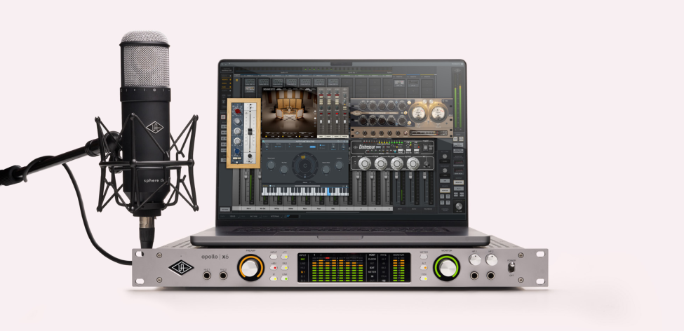

Apollo x6 Gen 2 Hardware Manual 

6 

Introduction 

## All Features 

## Audio Interface 

- Sample rates up to 192 kHz at 24-bit word length 

- 16 x 22 simultaneous input/output channels 

- 6 channels of analog-to-digital conversion via mic, line, or high-impedance inputs 

- 12 channels of digital-to-analog conversion via: 

   - 6 mono line outputs 

   - Stereo monitor outputs 

   - Two stereo headphone outputs 

- 10 channels of digital I/O via: 

   - Eight channels ADAT Optical I/O with S/MUX for high sample rates 

   - Two channels coaxial S/PDIF I/O with sample rate conversion 

- Two Thunderbolt 3 ports for daisy-chaining other Thunderbolt devices 

## Microphone Preamplifiers 

- Two high-resolution, ultra-transparent, digitally-controlled analog mic preamps 

- Unison[™] technology for deep integration with UAD preamp, amp, and pedal plug-ins 

- Front panel and software control of all preamp parameters 

- Switchable low cut filter, 48V phantom power, pad, polarity inversion, and stereo linking 

## Monitoring 

- Stereo monitor outputs (independent of the eight line outputs) 

- Front panel control of monitor levels and muting 

- Two stereo headphone outputs with independent mix buses 

- Independent front panel volume controls for headphone outputs 

- Front panel pre-fader metering of monitor bus levels 

- S/PDIF outputs can be set to mirror the monitor outputs 

- Up to two alternate stereo monitor outputs selectable via front panel or UAD Console software 

- Assignable front panel monitor function switch for alternate speakers, dim, & mono 

## UAD-2 Inside 

- HEXA core DSP featuring six SHARC[® ] processors 

- Realtime UAD Processing on all analog and digital inputs 

- Same features and functionality as other UAD-2 devices when used with DAW 

- Can be combined with other UAD-2 devices for increased mixing DSP 

- Complete UAD plug-ins library available at the UA online store 

Apollo x6 Gen 2 Hardware Manual 

7 

Introduction 

## Software 

## _UAD Console application_ 

- Analog-style control interface for realtime monitoring and tracking 

- Enables Realtime UAD Processing with UAD plug-ins 

- Remote control of Apollo features and functionality 

- Virtual I/O for routing DAW tracks through UAD Console 

## _Console Recall plug-in_ 

- Saves UAD Console configurations inside DAW sessions for easy recall 

- Convenient access to UAD Console’s monitor controls via DAW plug-in 

- VST, AAX 64, and Audio Units plug-in formats 

## _UAD Meter & Control Panel application_ 

- Configures global UAD settings and monitors system usage 

## Other 

- Easy firmware updates 

- 1U rack-mountable form factor 

- One year warranty includes parts and labor 

## Package Contents 

- Apollo x6 Gen 2 audio interface 

- External power supply and region-specific AC cable _(USA, EU, UK, ANZ, or Japan)_ 

- Set of (4) rack-mount screws 

- Getting Started URL card 

Apollo x6 Gen 2 Hardware Manual 

8 

Introduction 

## Operational Overview 

## Audio Interface 

First and foremost, Apollo x6 Gen 2 is a premium 16 x 22 Thunderbolt 3 audio interface with elite-class 24-bit/192 kHz audio conversion. Apollo connects to the outputs and inputs of other audio gear, and performs analog-to-digital (A/D) and digital-to-analog (D/A) audio conversions on the gear’s signals. The digital audio signals are routed into and out of your host computer via the high-speed PCIe protocol, which is carried on a single Thunderbolt 3 cable. 

Apollo leverages Universal Audio’s expertise in DSP acceleration, UAD Powered Plug-Ins, and analog hardware design by integrating the latest cutting edge technologies in highperformance A/D-D/A conversion, DSP signal reconstruction, and connectivity. Apollo acts as an audio interface with integrated DSP effects for tracking and monitoring, a fully integrated UAD-2 DSP accelerator for mixing and mastering, as well as a complete monitoring controller. 

## About Realtime UAD Processing 

Apollo has the ability to run UAD Powered Plug-Ins in realtime. Apollo’s groundbreaking DSP + FPGA technology enable UAD plug-ins to run with latencies in the sub-2 ms range, and multiple plug-ins can be stacked in series without additional latency. Realtime UAD Processing facilitates the ultimate sonic experience while monitoring and/or tracking. 

_Note: Apollo, as with other UAD-2 devices, can only load UAD Powered Plug-Ins, which are specifically designed to run on UAD-2 DSP accelerators. Native (host CPUbased) plug-ins cannot run on the UAD-2 DSP._ 

## UAD Console Software 

_Important: UAD Console is integral to unleashing the power of Apollo. For complete details about how to use UAD Console and Realtime UAD Processing, refer to the UAD Console Manual._ 

The UAD Console companion software program is used to control Apollo mixing and input monitoring with Realtime UAD Processing, access the audio interface I/O settings, Unison technology, and more. UAD Console’s analog-style workflow is designed to provide quick access to the most commonly needed features in a familiar, easy-to-use mixer interface. 

Realtime UAD Processing is a special function that is available only within UAD Console or LUNA. All of Apollo’s analog and digital inputs can perform Realtime UAD Processing simultaneously, and UAD Console inputs with (or without) Realtime UAD Processing can be routed into the DAW for recording. 

UAD Console controls Apollo’s digital mixer so you can monitor Apollo’s inputs (with or without Realtime UAD Processing) live, without any other audio software such as a DAW. 

Apollo x6 Gen 2 Hardware Manual 

9 

Introduction 

## UAD Powered Plug-Ins in a DAW 

Apollo and UAD plug-ins can also be used with a DAW without using UAD Console. UAD plug-ins loaded within the DAW operate like other (non-UAD) plug-ins, except the processing occurs on Apollo DSP instead of the host computer’s processor. In this scenario, UAD plug-ins are subject to the latencies incurred by the DAW’s I/O buffering. 

For details about using UAD Powered Plug-Ins in a DAW, see the Apollo Software Manual. 

## Standalone Use 

Although UAD Console is required to use all Apollo features, the hardware unit can be used as a digital mixer with limited functionality without a Thunderbolt 3 connection to a host computer. 

All currently active I/O assignments, signal routings, and monitor settings are saved to internal firmware when Apollo is powered down and persist when power is re-applied. Therefore the last-used settings are always available even when a host computer is not connected. 

Note that UAD plug-in instantiations in UAD Console are not retained on power down, because the plug-in files reside on the host computer. However, if UAD plug-ins are active when Apollo’s connection to the host system is lost (if the Thunderbolt 3 cable is unplugged), the current UAD-2 plug-in configurations remain active for processing until Apollo is powered down. 

_Note: Standalone use is unavailable when cascading multiple Apollo units._ 

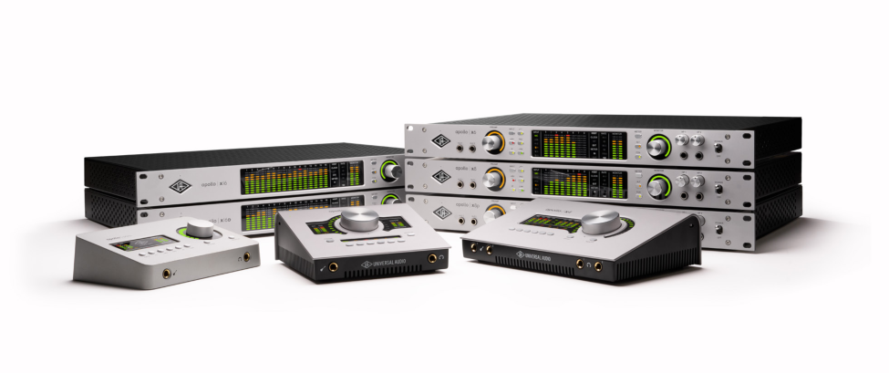

Apollo x6 Gen 2 Hardware Manual 

10 

Introduction 

## About Apollo Documentation 

Documentation for Apollo and UAD Powered Plug-Ins are separated by areas of functionality, as described below. All user manuals are available at help.uaudio.com. 

Some manual files are in PDF format. PDF files require a free PDF reader application such as Preview (macOS) or Edge (Windows). 

## Apollo Hardware Manuals 

Each Apollo model has a unique hardware manual. The Apollo hardware manuals contain complete hardware-related details about one specific Apollo model. Included are detailed descriptions of all hardware features, controls, connectors, and specifications. 

_Note: Each hardware manual contains the unique Apollo model in the file name._ 

## Apollo Software Manual 

The Apollo Software Manual is a companion guide to the Apollo hardware manuals. It contains detailed information about how to configure and control Apollo software features. Refer to the Apollo Software Manual to learn how to operate the software tools and integrate Apollo’s functionality into the DAW environment. 

_Note: Each Apollo connection protocol (Thunderbolt, FireWire, USB) has a unique software manual._ 

## UAD Console Manual 

UAD Console is Apollo’s companion software, for controlling up to four Apollo units and their digital mixing and low-latency monitoring capabilities. UAD Console is where you configure and operate Realtime UAD Processing and Unison with UAD-2 plug-ins. 

## UAD Plug-Ins Manual 

The features and functionality of all individual UAD-2 Powered Plug-Ins is detailed in the UAD Plug-Ins Manual. Refer to that document to learn about the operation, controls, and user interface of each UAD-2 plug-in that is developed by Universal Audio. 

## Direct Developer Plug-In Manuals 

UAD Powered Plug-Ins includes plug-in titles created by our Direct Developer partners. Documentation for these 3rd-party plug-ins are separate files written and provided by the plug-in developers. The file names for these plug-in manuals are the same as the plug-in titles. 

## UAD System Manual 

The UAD System Manual is the complete operation manual for Apollo’s UAD-2 functionality and applies to the entire UAD-2 product family. It contains detailed information about installing and configuring UAD devices, the UAD Meter & Control Panel application, buying optional plug-ins at the UA online store, and more. It includes everything about UAD except Apollo-specific information and individual UAD plug-in descriptions. 

Apollo x6 Gen 2 Hardware Manual 

11 

Introduction 

## Accessing Documentation 

Any of these methods can be used to access documentation: 

- Choose Documentation from the Help menu within the UAD Console application 

- Click the Product Manuals button in the Help panel within the UAD Meter & Control Panel application 

- All manuals are available online at help.uaudio.com 

## Host DAW Documentation 

Each Digital Audio Workstation application has its own particular methods for configuring and using audio interfaces and plug-ins. Refer to the host DAW’s documentation for specific instructions about using audio interface and plug-in features within the DAW. 

_Tip: The LUNA application manual is available here._ 

## Hyperlinks 

Links to other manual sections and web pages are highlighted in blue text. Click a hyperlink to jump directly to the linked item. 

_Tip: Use the back button in the PDF reader application to return to the previous page after clicking a hyperlink._ 

## Additional Resources 

For additional resources, or if you need to contact Universal Audio for assistance, see the Technical Support page. 

Apollo x6 Gen 2 Hardware Manual 

12 

Introduction 

## **Front Panel** 

This section describes the features and functionality of all controls and visual elements on the Apollo x6 front panel. 

_Tip: All front panel functions (except the METER switch, HP1/HP2 knobs, and POWER switch) can be controlled remotely with the included UAD Console software application. Changes made with the front panel controls are mirrored in the UAD Console application, and vice versa._ 

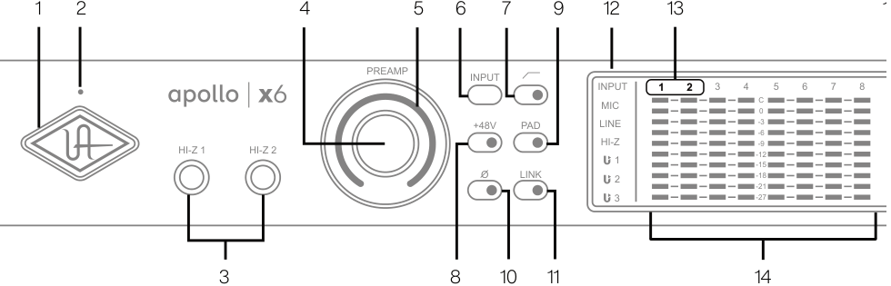

**----- Start of picture text -----** 
1 2 4 5 6 7 9 12 13 1 PREAMP INPUT INPUT 1 1 2 2 3 4 5 6 7 8 MIC C0 +48V PAD LINE -3 -6 HI-Z 1 HI-Z 2 HI-Z1 -12-15-9 O LINK 2 -18 -21 3 -27 3 8 10 11 14 **----- End of picture text -----** 

_Apollo x6 front panel (left portion)_ 

## (1) Power Indicator (UA Logo) 

The Universal Audio logo illuminates when the external power supply is properly connected to the AC outlet and the power input on the rear of the unit, and the Power switch (#27) is in the up position. 

## (2) Talkback Microphone 

The built-in talkback mic is located inside of this hole. The talkback function is configured and operated in the included UAD Console software application. 

_Caution: The talkback microphone is sensitive. To avoid equipment damage, do not insert any object into the mic hole, apply pressurized ai_ ~~_r_~~ _into the mic hole, or use a v_ ~~_a_~~ _cuum over the mic hole._ 

Apollo x6 Gen 2 Hardware Manual 

13 

Front Panel 

## (3) Hi-Z Inputs 1 & 2 

The Hi-Z (high impedance) JFET direct inputs are for connecting low-level passive devices such as electric guitar and bass instruments into channels 1 & 2 for A/D conversion. Hi-Z input gain levels are adjusted with the Preamp control for the associated channel. 

The Hi-Z inputs have a default input impedance of 1M Ohms. The input impedance may vary when Unison plug-ins are inserted on the channel within the UAD Console application. For details, see the Unison chapter in the UAD Console Manual. 

_Important: Connect only ¼” unbalanced TS mono phone plugs to the Hi-Z inputs. TRS stereo plugs cannot be used._ 

## Automatic Input Detection 

Hi-Z inputs 1 & 2 use the same A/D converter channels as the corresponding Mic 1 & 2 and Line 1 & 2 inputs. When a device is plugged into a Hi-Z input, the Mic and Line inputs for the channel are overridden, the Mic/Line switch for the channel has no effect, and the stereo link is severed (if active). 

_Important: To use Mic or Line inputs 1 or 2, its corresponding Hi-Z input must be disconnected._ 

## (4) Preamp Gain & Channel Select Knob 

This rotary encoder with integrated switch has three functions: 

Rotate – Rotating the knob adjusts the preamp gain for the selected input channel. 

Press – Pressing the knob selects which preamp channel (1 or 2) is adjusted by the front panel preamp controls. 

Press+Hold – When a Unison plug-in is active in the channel’s dedicated Unison insert within the UAD Console application, pressing and holding the knob for two seconds enters/exits Unison Gain Stage Mode. 

Each of these three functions above is explained in greater detail below. 

## Preamp Gain 

The preamp gain of analog inputs 1 and 2 is adjusted with the rotary control. The preamp channel to be adjusted is set with the Channel Select (press) function. The input to be adjusted (Mic, Line, or Hi-Z) is determined by the state of the channel’s Mic/Line input switch (#6) or Hi-Z input (if connected). 

Rotating the knob clockwise increases the preamp gain for the selected channel. The available gain range for the preamp channels is 10 dB to 65 dB for the Mic, Line, and Hi-Z inputs. 

More than one full revolution of the knob is needed to move through the available range. This feature increases the control resolution for more precise preamp gain adjustments. 

_Tip: To adjust signal levels for inputs 3 – 12, use the output level controls of devices connected to those inputs._ 

Apollo x6 Gen 2 Hardware Manual 

14 

Front Panel 

## _Line Input Gain Bypass_ 

By default, line inputs 1 and 2 are routed through the channel’s preamp so that the line input level can be adjusted with the Gain knob. However, line inputs 1 and 2 can be individually set to completely bypass the channel’s preamp circuitry and instead be routed directly to the channel’s A/D converter at a fixed reference level. 

This feature is set with the LINE INPUT GAIN menus in the Hardware panel within the UAD Console Settings window. See the UAD Console Manual for details. 

_Tip: This feature routes the preamp channel’s line input signal directly into the A/D converter for the purest path when additional gain is not needed (for example, when connecting external mic preamps to preamp channel line inputs)._ 

When the channel’s LINE INPUT GAIN menu is set to BYPASS in UAD Console Settings and the input mode is set to LINE: 

- The Preamp Gain Indicator ring (#5) for the channel is solid green. 

- When the Preamp Gain knob (#4) is rotated, the ring flashes to indicate that no gain adjustment is occurring. 

- If a Unison plug-in is in the channel’s dedicated Unison insert in UAD Console, the Unison plug-in is bypassed. 

## Channel Select 

Pressing the PREAMP knob changes the currently selected preamp channel, which determines which input (1 or 2) is adjusted by the front panel preamp controls. A preamp channel is selected for adjustment when its Channel Select Indicator (#13) is illuminated. 

Each time the knob is pressed, the selected preamp channel increments to the next preamp channel. If stereo linking is active, the stereo pairs are selected. 

## Gain Stage Mode 

Using Gain Stage Mode, up to three gain parameters within Unison UAD plug-ins can be remotely controlled with the front panel PREAMP knob. 

Gain Stage Mode is activated by pressing and holding the PREAMP knob for two seconds when a Unison plug-in is active in the channel’s dedicated Unison insert within the UAD Console application. When Gain Stage Mode is active, pressing and holding the knob for two seconds deactivates Gain Stage Mode. 

Gain Stage Mode is active when the Channel Select Indicator (#13) for the currently selected channel is flashing. In this state, pressing the PREAMP knob cycles through the available gain parameters within the Unison plug-in so each gain stage in the plug-in can be adjusted with the front panel PREAMP knob. The gain stage being controlled is shown by the front panel Unison Indicators (#12). 

_Note: For complete details about Gain Stage Mode, see the Unison chapter within the UAD Console Manual._ 

Apollo x6 Gen 2 Hardware Manual 

15 

Front Panel 

## (5) Preamp Gain Level & State Indicator 

## Preamp Gain Level Indicator 

The amount of preamp gain for the currently selected channel is indicated by the illuminated ring surrounding the PREAMP knob. 

The ring indicates relative gain levels and is not calibrated to indicate any specific dB value. However, precise numerical dB gain values for the preamps are displayed within the UAD Console application. 

_Note: If the ring is at maximum and flashes when the PREAMP knob is rotated, the channel’s LINE input is selected and LINE INPUT GAIN is set to BYPASS. See Line Input Gain Bypass for additional details._ 

## Preamp State Indicator 

In addition to the channel’s relative preamp gain, the ring around the knob also indicates the current state of the preamp channel: 

Unlit – The preamp gain is set to its minimum value (rotate the PREAMP knob clockwise increase gain). 

Green (variable) – The preamp is in default operating mode with variable gain. 

Green (fixed at maximum) – LINE is selected for the channel (#6) and LINE INPUT GAIN is set to BYPASS in the Hardware panel within the UAD Console Settings window. 

Orange – A UAD Unison plug-in is active in UAD Console’s dedicated Unison insert for the channel, and the PREAMP knob adjusts the first gain parameter in the Unison plug-in. 

Yellow (Channel Select Indicator flashing) – A UAD Unison plug-in is active in UAD Console’s dedicated Unison insert for the channel, the channel is in Gain Stage Mode, and the PREAMP knob adjusts the second gain parameter in the Unison plug-in (if available). 

Green (channel select indicator flashing) – A UAD Unison plug-in is active in UAD Console’s dedicated Unison insert for the channel, the channel is in Gain Stage Mode, and the PREAMP knob adjusts the clean gain parameter in the Unison plug-in. 

_Note: See the Unison chapter within the UAD Console Manual for complete details about Unison operation and Gain Stage Mode._ 

Apollo x6 Gen 2 Hardware Manual 

16 

Front Panel 

## (6 – 11) Preamp Options 

This set of six switches control the preamp options for input channels 1 and 2. Press the switches to toggle the setting. The current state of each preamp option is indicated by the LED within each switch. Each switch function is detailed below. 

## (6) Input (Mic/Line) 

This switch determines which rear panel input jack, either Mic (XLR) or Line (¼”), is active for the channel. The switch has no effect if the channel’s Hi–Z input is connected (the Hi-Z input must be disconnected to use the Mic/Line inputs). 

_Tip: Line inputs 1 and 2 can be set to bypass the preamp circuitry. See Line Input Gain Bypass for additional details._ 

## (7) Low Cut Filter 

When enabled, the channel’s input signal passes through a low cut (high pass) filter. This 2nd-order coincident-pole filter has a cutoff frequency of 75 Hz with a slope of 12 dB per octave. 

The low cut filter affects the Mic, Line, and Hi-Z inputs. Low Cut is typically used to eliminate rumble and other unwanted low frequencies from the input signal. 

## (8) Phantom Power (+48V) 

When enabled, 48 volts of phantom power is supplied at the channel’s rear panel XLR input. Most modern condenser microphones require 48V phantom power to operate. This option can only be activated when the Mic/Line input switch (#6) is set to Mic. 

_Caution: To avoid potential equipment damage, disable +48V phantom power on the channel before connecting or disconnecting its XLR input._ 

Depending on the current configuration of the hardware and software, there may be a delay when changing the +48V state to minimize the clicks/pops that are inherent when engaging phantom power. The +48V switch LED will blink rapidly during any delay. 

## (9) Pad 

When enabled, the channel’s XLR input signal level is attenuated by 20 dB. Pad does not effect the Line or Hi-Z inputs. 

Pad can be used to reduce signal levels when overload distortion is present at low preamp gain levels, such as when particularly sensitive microphones are used on loud instruments, and/or if the A/D converter is clipping. 

## (10) Polarity 

When enabled, the polarity (aka phase) of the input channel’s signal is inverted. Polarity affects the Mic, Line, and Hi-Z inputs. 

_Tip: Polarity inversion can help reduce phase cancellations when more than one microphone is used to record a single source._ 

Apollo x6 Gen 2 Hardware Manual 

17 

Front Panel 

## (11) Stereo Link 

This switch links the preamp controls of preamp channels 1 and 2 together to create a stereo input pair. When linked as a stereo pair, preamp control adjustments will affect both channels of the stereo signal identically. 

_Note: Only the same type of inputs can be linked (Mic/Mic or Line/Line). The Hi-Z inputs cannot be linked._ 

## (12) INPUT Indicators 

These indicators (MIC, LINE, HI-Z, Unison 1/2/3) display which hardware input is currently active for the channel, and whether or not Unison technology is active on the input. 

To select MIC or LINE, use the INPUT switch (#6). To select Hi-Z, plug a ¼” mono TS cable into the Hi-Z input. To activate Unison, place a Unison UAD plug-in into the input’s dedicated Unison insert in the UAD Console application. 

## LINE indicator color 

The color of the LINE indicator changes to reflect the state of the LINE INPUT GAIN setting, which is configured in the Hardware panel within the UAD Console Settings window. 

White – LINE INPUT GAIN is ON. The line input is routed through the preamp so the input gain can be adjusted. 

Green – LINE INPUT GAIN is OFF. The preamp circuitry is bypassed and the line input is fixed at a reference level of +4 dBu. Note that Unison cannot be active on a channel when its LINE INPUT GAIN is OFF. 

## Unison Input Indicators 

The U1 indicator is lit when a Unison UAD plug-in is active on the currently selected preamp channel. Unison technology is activated by placing a Unison UAD plug-in into the dedicated Unison insert for the input channel in the UAD Console application. 

By default, the U1 indicator is lit when the Unison plug-in is active. When Unison’s Gain Stage Mode is active, the three Unison indicators (U1, U2, U3) show which Unison plug-in gain parameter can be remotely controlled with the front panel PREAMP knob. 

The U2 and U3 indicators illuminate only when the preamp channel is in Unison Gain Stage Mode. In this state, different Unison plug-in gain stage parameters are selected for adjustment by pressing the PREAMP knob. 

_Note: See the Unison chapter within the UAD Console Manual for complete details about Unison operation and Gain Stage Mode._ 

## (13) Channel 1 & 2 Select Indicators 

The currently selected preamp channel is indicated by the illuminated numbers above level meters 1 and 2. When a preamp channel (or channels, when stereo linked) is selected, its channel number is illuminated. The currently selected channel increments when the PREAMP knob (#4) is pressed. 

Apollo x6 Gen 2 Hardware Manual 

18 

Front Panel 

## (14) Channel Level Meters 

The 10-segment LED channel meters display the input or output signal peak levels for analog channels 1 – 6. Input or output metering is selected with the METER switch (#20). The input/output state is shown by the METER indicators (#17). 

The dB values of the meter LEDs are indicated between the meters for channels 4 and 5. When digital clipping occurs in input (when 0 dBFS is exceeded), the red “C” (clip) LED illuminates. 

_Note: The LED meters for channels 7 and 8 are not functional._ 

## Input Channel Meters 

When set to INPUT, the channel meters display the signal peak input levels for analog channels 1 – 6 at the input to the A/D converters. 

Avoid digital clipping at the channel’s A/D converter by reducing the output level of the device connected to the channel’s input, and/or in the case of channels 1 and 2, by reducing the preamp gain and/or engaging the Pad (#9) and readjusting gain as needed. 

## Output Channel Meters 

When set to OUTPUT, the channel meters display the signal peak output levels for analog channels 1 – 6 at the output of the D/A converters. 

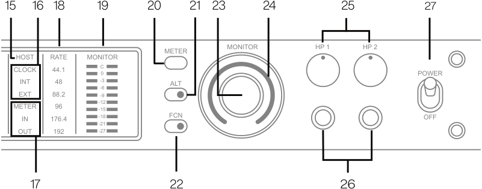

**----- Start of picture text -----** 
15 16 18 19 20 21 23 24 25 27 MONITOR HP 1 HP 2 METER HOST RATE MONITOR CLOCK 44.1 C0 POWER INT 48 -3 ALT -6 EXT 88.2 -9 METER 96 -12-15 IN 176.4 -18 FCN OFF -21 OUT 192 -27 17 22 26 **----- End of picture text -----** 

_Apollo x6 front panel (right portion)_ 

## (15) HOST Indicator 

The HOST indicator displays the status of the Thunderbolt connection to the host computer system. The possible states are: 

Lit – The unit is communicating with the host computer and operating normally. 

Unlit – The unit is starting up or it is not recognized by the host computer. Verify software installation and Thunderbolt connections. 

Red – System error. Please contact UA technical support if the issue persists. 

Ap ~~o~~ ll ~~o~~ x6 ~~G~~ en 2 Har ~~d~~ ware ~~Ma~~ nual 

19 

Front Panel 

## (16) CLOCK Indicators 

The clock source and status are displayed with these indicators. Either internal (INT) or external (EXT) is displayed. The clock source is set within the UAD Console application; see the Apollo Software Manual for details. 

## Internal Clock 

When set to internal clock, the INT indicator is illuminated white. 

## External Clock 

Apollo x6 can use an external digital clock source from the Word Clock, S/PDIF, or ADAT inputs. The EXT indicator has two possible states: 

White – When set to external clock and a valid clock signal is detected at the specified port, the EXT indicator is illuminated white and Apollo x6 is synchronized to the external clock source. 

Red – When set to external clock and a valid clock signal is NOT detected at the specified port, the EXT indicator is illuminated red and the internal clock remains active instead. In this situation, if/when the specified external clock becomes available, Apollo x6 switches back to the external clock, and the EXT indicator is illuminated and white. 

_Important: When set to use any external clock source, Apollo x6’s sample rate must be manually set to match the sample rate of the external clock._ 

## (17) METER Indicators 

These indicators show the current state of the Channel Level Meters (#14). The current state is changed with the METER switch (#20). 

IN – When IN is illuminated, the channel meters display analog input signal levels. 

OUT – When OUT is illuminated, the channel meters display analog output signals levels. 

## (18) Sample Rate Indicators 

These indicators display the current sample rate setting for A/D and D/A conversion. The sample rate is set within the UAD Console application or the host DAW; see the Apollo Software Manual for details. 

## (19) Monitor Output Level Meters 

The 10-segment LED meters display the signal peak output levels of the rear panel Left & Right Monitor outputs at the output of the D/A converters. These meters are before the Monitor Level control (pre-fader) and reflect the D/A converter levels regardless of the current Monitor Level and Headphone Level knob settings. 

The dB values of the monitor meter LEDs are indicated between the left and right channel meters. When digital clipping occurs, the red “C” (clip) LED illuminates. 

If the monitor output level clips, reduce the monitor output level within the DAW and/or reduce the output level of individual channels feeding the monitor output bus within the UAD Console application. 

Apollo x6 Gen 2 Hardware Manual 

20 

Front Panel 

## (20) Meter Switch 

This switch determines whether the Channel Level Meters (#14) are displaying input levels or output signal levels. Pressing the switch toggles the state of the meters and the Meter Indicators (#17). 

## (21) Monitor ALT Switch 

When ALT monitoring is configured in the Hardware panel within the UAD Console Settings window (when ALT COUNT is set to a non-zero value), this switch toggles between the main monitor outputs and the ALT 1 outputs (line outputs 1 & 2). 

When the ALT switch is engaged: 

- The monitor signals are routed to outputs 1 & 2 instead of the main monitor outputs. 

- The orange LED within the switch is illuminated. 

- The Monitor Level Indicator (#24) is orange instead of green. 

For complete details about how to configure and use the ALT monitoring features, refer to the UAD Console Manual. 

_Tip: ALT 2 outputs (line outputs 3 & 4) can be selected with the FCN switch (#22) when configured in UAD Console Settings, or in the MONITOR column within the UAD Console application._ 

## (22) Monitor Function Switch (FCN) 

This is an assignable switch that can be configured to control one of three monitoring functions. The function of the switch is configured with the FCN SWITCH ASSIGN menu in the Hardware panel within the UAD Console Settings window. See the UAD Console Manual for details. 

The yellow LED within the switch flashes when the monitoring function is active. The function is toggled with the switch is pressed again. The available functions are: 

ALT 2 – Selects the ALT 2 monitor speakers. The monitor signals are routed to outputs 3 & 4 instead of the main monitor outputs, and the Monitor Level Indicator ring (#24) is yellow instead of green when ALT 2 is active. 

MONO – Sums the left and right channels of the stereo monitor mix into a monophonic signal. The Monitor Level Indicator ring (#24) flashes when MONO is active. 

DIM – Attenuates the signal level at the monitor outputs by the dB amount set in the CONTROL ROOM strip within the UAD Console application. The Monitor Level Indicator ring (#24) flashes when DIM is active. 

TALKBACK – Activates the talkback mic and the DIM function. Talkback is active when the button is lit. Press and release the button quickly to latch talkback ON. To momentarily activate the function and deactivate when the button is released, press for longer than 0.5 seconds. The Monitor Level Indicator ring (#24) flashes when talkback is active. 

_Note: When more than one Apollo interface is connected in a multi-unit configuration, the FCN switch is operable on the designated monitor unit only._ 

Apollo x6 Gen 2 Hardware Manual 

21 

Front Panel 

## (23) Monitor Level & Mute Knob 

This rotary encoder serves two functions. Rotating the knob adjusts the monitor output level, and pressing the knob mutes the monitor outputs. 

## Monitor Level 

Rotating the knob clockwise increases the signal level at the Left & Right Monitor Outputs on the rear panel. If ALT monitor outputs are configured and active, this knob controls the signal level at the ALT monitoring line outputs. 

## Monitor Mute 

Pressing the Monitor knob toggles the mute state of the signals at the Left & Right Monitor Outputs on the rear panel. If ALT monitoring is configured in the Hardware panel within the UAD Console Settings window (when ALT COUNT is a non-zero value), the ALT monitor outputs are also muted by this control. 

When the monitor outs are muted, the Monitor Level Indicator ring (#24) is red. 

_Note: Monitor Mute does not mute the headphone outputs._ 

## (24) Monitor Level & Monitor State Indicator 

_Tip: The Monitor Level and Monitor State indications are reflected in the Monitor column within the UAD Console application._ 

## Monitor Output Level Indicator 

The relative signal level at the rear panel monitor outputs (and ALT monitor outputs, if configured) is indicated by the illuminated ring surrounding the Monitor Level knob. 

This indicator is after the Monitor Level control (post fader). The ring indicates relative gain levels and is not calibrated to indicate any specific dB value. 

_Tip: Precise numerical dB gain values for the Monitor Level Knob are displayed within the UAD Console application._ 

## Monitor State Indicator 

The color of the indicator ring indicates the current state of the monitor outputs: 

Green – The main monitor outputs are active with variable level control. 

Red – The main monitor outputs (and ALT monitor outputs, if configured) are muted. 

Orange – The ALT 1 monitor outputs are active. 

Yellow – The FCN switch is active and assigned ALT 2. 

Flashing – The monitor DIM, MONO, and/or TALKBACK functions are active. 

## (25) Headphone Level Knobs 1 & 2 

These knobs control the volume of Headphone Outputs 1 & 2 on the front panel. Each headphone output has its own volume control. 

Apollo x6 Gen 2 Hardware Manual 

22 

Front Panel 

## (26) Headphone Outputs 1 & 2 

These ¼” stereo TRS phone jacks are for stereo headphones. Headphone outputs 1 & 2 are individually addressable. 

By default, both headphone outputs mirror the monitor outputs. When mirroring the monitor outputs, the headphone outputs are unaffected by Monitor Mute (#23), to facilitate recording/tracking with headphones while the monitor speakers are muted. 

Unique mixes can be created for each headphone output using the CUE functions within UAD Console or by assigning mix buses from a DAW to the headphone outputs via the device drivers. 

## (27) Power Switch 

This switch applies power to Apollo x6. When the unit is powered on, the Universal Audio logo (#1) is illuminated. The external power supply must be properly connected for this switch to function. 

Apollo x6 Gen 2 Hardware Manual 

23 

Front Panel 

## **Rear Panel** 

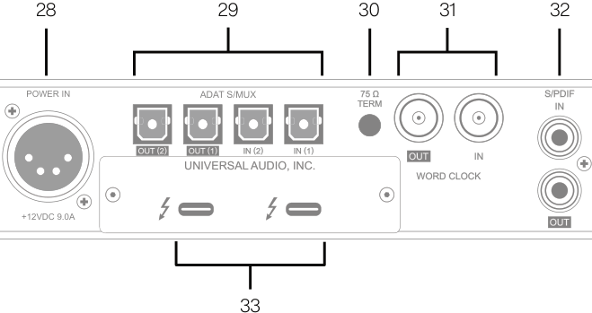

**----- Start of picture text -----** 
28 29 30 31 32 POWER IN ADAT S/MUX 75 Ω S/PDIF TERM UNIVERSAL AUDIO, INC. WORD CLOCK +12VDC 9.0A 33 **----- End of picture text -----** 

_Apollo x6 rear panel (digital portion)_ 

## (28) Power Input 

The included external power supply connects to this 4-pin locking XLR jack. Apollo x6 requires 12 volts DC power and draws a maximum of 72 watts (30 watts typical). 

To eliminate risk of circuit damage, connect only the factory-supplied power supply. Use the Power switch on the front panel to power the unit on and off. 

_Important: Do not disconnect the power supply while Apollo x6 is in use, and confirm the Power switch is in the “off” position before connecting or disconnecting the power supply._ 

Apollo x6 Gen 2 Hardware Manual 

24 

Rear Panel 

## Digital I/O 

## (29) ADAT S/MUX Optical Ports 

These TOSLINK ports use the ADAT Lightpipe Optical Interface protocol for interconnecting with other audio hardware devices in the digital domain. Two ADAT inputs and two ADAT outputs are provided, routing a total of eight channels of digital audio. The channels routed by these ports depend on the current system sample rate. 

At sample rates of 44.1 kHz and 48 kHz, the original ADAT protocol is used, and eight audio channels are routed on one ADAT port. At higher sample rates, industry standard S/MUX is used to maintain high-resolution transfers. 

_Important: To utilize all eight channels with the optical ports at sample rates of 88.2 kHz and above, ADAT ports 1 & 2 must both be connected to the other device, and the other device must also support the ADAT S/MUX protocol._ 

The following behaviors apply to the ADAT ports: 

- At sample rates of 44.1 kHz and 48 kHz, port 1 supports eight channels of I/O. Output 2 mirrors output 1, and input 2 is disabled. 

- At sample rates of 88.2 kHz and 96 kHz, up to four channels of audio are routed per port (eight channels total, when both ports are used). 

- At sample rates of 176.4 kHz and 192 kHz, up to two channels of audio are routed per port (four channels total, when both ports are used). Only four ADAT channels are supported at 176.4 kHz and 192 kHz. 

The ADAT port channel assignments described above are summarized in this table: 

||ADAT|PORT CHANNEL|ROUTING||
|---|---|---|---|---|
|_Sample Rate(kHz)_|_Input Port 1_|_Input Port 2_|_Output Port 1_|_Output Port 2_|
|44.1 & 48|1 – 8|Disabled|1 – 8|1 – 8(mirror ofport 1)|
|88.2 & 96|1 – 4|5 – 8|1 – 4|5 – 8|
|176.2 & 192|1 – 2|3 – 4|1 – 2|3 – 4|

_Note: The ADAT ports use TOSLINK JIS F05 optical connectors. Some devices use this type of connector for optical S/PDIF connections. However, Apollo x6’s ADAT ports do not support the S/PDIF protocol (use the coaxial S/PDIF ports instead)._ 

Apollo x6 Gen 2 Hardware Manual 

25 

Rear Panel 

## (30) 75 Ohm Word Clock Termination Switch 

This switch provides internal 75-ohm word clock input signal termination when required. Word clock termination is active when the switch is engaged (depressed). 

Apollo x6’s termination switch should only be engaged when Apollo x6 is set to sync to external word clock and it is the last device at the receiving end of a word clock cable. For example, if Apollo x6 is the last “slave” unit at the end of a clock chain (when Apollo x6’s word clock OUT port is not used), termination should be active. 

## (31) Word Clock I/O 

## Word Clock In 

Apollo x6’s internal clock can be synchronized (slaved) to an external master word clock. This is accomplished by setting Apollo x6’s clock source to Word Clock within the UAD Console application, connecting the external word clock’s BNC connector to Apollo x6’s word clock input, and setting the external device to transmit word clock. If Apollo x6 is the last device in the clock chain, the Termination switch (#30) should be engaged. 

_Important: Apollo x6’s sample rate must be manually set to match the incoming clock’s sample rate._ 

_Note: Apollo x6 can be synchronized to an external “1x” clock signal only. Superclock, overclocking, and subclocking are not supported._ 

## Word Clock Out 

This BNC connector transmits a standard (1x) word clock when Apollo x6 is set to use its internal clock. The clock rate sent by this port matches the current system sample rate, as specified within the UAD Console application. 

When Apollo x6 is set to use external word clock as its clock, Apollo x6 is a word clock slave. If the incoming external word clock is within ±4% of a supported sample rate (44.1 kHz, 48 kHz, 88.2 kHz, 96 kHz, 176.4 kHz, 192 kHz), Word Clock Out will mirror Word Clock In with a slight phase delay (about 40ns). 

Because Apollo x6’s word clock output is not a true mirror of the word clock input, word clock out should not be used to daisy chain the word clock if Apollo x6 is in the middle of the word clock chain. The correct method to connect Apollo x6 in the middle of a word clock chain is to use a T-connector at Apollo x6’s word clock input and leave Apollo x6’s word clock output unconnected. In this configuration, the Termination switch should not be engaged. 

Apollo x6 Gen 2 Hardware Manual 

26 

Rear Panel 

## (32) S/PDIF Ports 

The S/PDIF ports provide two channels of digital I/O with resolutions up to 24-bit at 192 kHz via female phono (RCA) connectors. For optimum results, use only high-quality 75-ohm cables specifically designed for S/PDIF digital audio. 

## SR Convert 

Sample rate conversion can be performed on the S/PDIF input; this setting is enabled within the S/PDIF channel’s input strip in the UAD Console application. When the sample rate of the incoming S/PDIF signal does not match the sample rate specified in the UAD Console application, the S/PDIF signal is converted to match Apollo x6’s sample rate. If Apollo x6 is set to use S/PDIF as the master clock source, sample rate conversion is inactive. 

## Mirror Monitor Outputs 

The S/PDIF output can be configured to mirror the Monitor Outputs (#35), for routing the stereo monitor signal to the stereo S/PDIF input of other devices. This feature is set with the DIGITAL MIRROR menu in the Hardware panel within the UAD Console Settings window. 

## (33) Thunderbolt 3 Ports 

Apollo x6 has two Thunderbolt 3 ports. One port is used to connect Apollo x6 to a Thunderbolt 3 port on the host computer. Thunderbolt 3 peripheral devices may be serially connected (daisy-chained) to the second Thunderbolt 3 port. 

When Apollo x6 is properly communicating with the host computer via Thunderbolt, the HOST indicator (#15) illuminates. 

_Note: Apollo x6 can be used with Thunderbolt 1 and Thunderbolt 2 ports on Apple Mac computers via the Apple Thunderbolt 3 to Thunderbolt 2 Adapter. Connections to Thunderbolt 1 or Thunderbolt 2 ports on Windows PCs are not supported._ 

## Thunderbolt Bus Power 

Per the Thunderbolt specification, bus power is supplied to downstream (daisy-chained) Thunderbolt peripheral devices. Apollo x6 must be powered on for the daisy-chained peripheral to receive Thunderbolt bus power. 

Apollo x6 Gen 2 Hardware Manual 

27 

Rear Panel 

## Analog I/O 

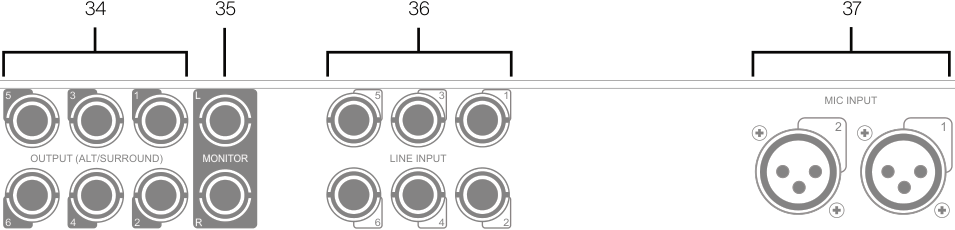

**----- Start of picture text -----** 
34 35 36 37 5 3 1 L 5 3 1 MIC INPUT 2 1 OUTPUT (ALT/SURROUND) MONITOR LINE INPUT 6 4 2 R 6 4 2 **----- End of picture text -----** 

_Apollo x6 rear panel (analog portion)_ 

## (34) Line Outputs 1 – 6 

The individually addressable line-level analog outputs use balanced ¼” TRS phone jacks. Unbalanced ¼” TS cables can also be used. The Line Outputs are DC coupled. 

## Line Output Headroom 

By default, the operating level of the line outputs is +20 dBu. The line outputs and inputs can be globally configured to operate at +24 dBu signal levels with the HEADROOM menu in the Settings>Hardware panel within the UAD Console application. 

+24 dBu operation is typically used for interfacing with professional audio equipment such as large format UAD Consoles, analog tape machines, and similar devices that require higher signal levels. For additional details about +24 dBu operation, see the Apollo Software Manual. 

## Line Output Reference Levels 

The Line Outputs can be configured in adjacent pairs to use either –10 dBV or +4 dBu reference levels. This function is configured in the Hardware panel within the UAD Console Settings window. See the Apollo Software Manual for details. 

## ALT Outputs 1 – 4 

Apollo x6 features ALT (alternate) monitoring capabilities. ALT monitoring can be used to control up to two alternate pairs of monitor speakers. 

When ALT monitoring is enabled, the output level and muting of line outputs 1 & 2 (ALT 1) and 3 & 4 (ALT 2) are controlled by the Monitor Level & Mute knob (#23). ALT monitoring is enabled in the Hardware panel within the UAD Console Settings window by increasing the ALT COUNT setting to a non-zero value. 

Apollo x6 Gen 2 Hardware Manual 

28 

Rear Panel 

## (35) Left & Right Monitor Outputs 

These balanced ¼” TRS phone jacks are line-level analog outputs typically used for connection to a stereo loudspeaker monitoring system. Unbalanced ¼” TS cables can also be used. The Monitor Outputs are DC coupled. 

The signal levels and muting at these outputs are controlled with the Monitor Level & Mute knob (#23). 

The Monitor Outputs can be configured to use an operating level of +4 dBu (default value) or -10 dBV. This option is set in the Hardware panel within the UAD Console Settings window. See the Apollo Software Manual for details. 

The Monitor Outputs are completely independent and separately addressable from the six Line Outputs (except when ALT monitoring is configured). By default, these outputs are labeled MON L and MON R in Apollo’s device drivers. In the DAW, the “1–2” or “L–R” or “Main” outputs are routed to these outputs (these labels vary within each particular DAW). 

_Tip: The S/PDIF output (#32) can be configured to mirror the Monitor Outputs, for routing the stereo monitor signal to the stereo S/PDIF input of other devices. This feature is set with the DIGITAL MIRROR menu in the Hardware panel within the UAD Console Settings window._ 

## (36) Line Inputs 1 – 6 

_Important: To use a ¼” line input, the channel’s INPUT indicator (#12) must be set to LINE with the INPUT switch (#6) or the channel’s MIC/LINE switch within the UAD Console application._ 

The individually addressable line-level analog inputs use balanced ¼” TRS phone jacks. Unbalanced ¼” TS cables can also be used. The Line Outputs are DC coupled. 

_Note: The Hi-Z inputs override the Line Inputs on channels 1 & 2._ 

## Line Input Headroom 

By default, the operating level of the line inputs is +20 dBu. The line inputs and outputs can be globally configured to operate at +24 dBu signal levels with the HEADROOM menu in the Settings>Hardware panel within the UAD Console application. 

+24 dBu operation is typically used for interfacing with professional audio equipment such as large format UAD Consoles, analog tape machines, and similar devices that require higher signal levels. For additional details about +24 dBu operation, see the Apollo Thunderbolt Software Manual. 

## Line Input Reference Levels 

Line Inputs 3 – 6 can be individually configured to use –10 dBV or +4 dBu reference levels. This option is set in the channel input strips within the UAD Console application. See the Apollo Software Manual for details. 

Apollo x6 Gen 2 Hardware Manual 

29 

Rear Panel 

## Variable Gain 

Line inputs 1 and 2 can be routed into the channel’s preamplifier for variable gain adjustments, or the preamp circuitry can be completely bypassed for the purest path directly into the A/D converter. The BYPASS option is set with the LINE INPUT GAIN menu in the Hardware panel within the UAD Console Settings window. By default, line inputs 1 and 2 are routed into the preamp. 

When the preamps are bypassed, line inputs 1 and 2 operate at a fixed reference level of +4 dBu. When routed into the preamps, gain for line inputs 1 and 2 is continuously variable with up to 65 dB of available gain. 

_Note: For related information, see Line Input Gain Bypass._ 

## (37) Microphone Inputs 1 & 2 

_Important: To use an XLR mic input, the channel’s INPUT indicator (#12) must be set to MIC with the INPUT switch (#6) or the channel’s MIC/LINE switch within the UAD Console application._ 

The balanced Microphone inputs use locking XLR jacks. Pin 2 is wired positive (hot). Inputs 1 and 2 are switched between MIC and LINE using the front panel controls. 

_Note: The Hi-Z inputs override the mic inputs on channels 1 & 2._ 

The XLR mic inputs are always routed into the channel’s microphone preamplifier. The gain is controlled by the PREAMP knob (#4) when the channel is selected, or from within the UAD Console application. The mic preamps provide up to 65 dB of gain. 

+48V phantom power is individually available for each mic input via the front panel switch (#8, when the channel is selected), or from within the UAD Console application. 

_Caution: To avoid potential equipment damage, disable +48V phantom power on the channel before connecting or disconnecting its XLR input._ 

Apollo x6 Gen 2 Hardware Manual 

30 

Rear Panel 

## **Interconnections** 

## Installation Notes 

- Apollo may get hot during normal operation if it doesn’t receive adequate airflow circulation around its chassis vents. For optimum results when mounting Apollo in a rack, leaving at least one empty rack space above the unit to allow adequate airflow for cooling is strongly recommended. 

- If Apollo is installed near other heat generating equipment, external cooling (such as a fan) may be needed to keep the ambient temperature below 104ºF (40ºC). 

- As with any sound system, the following steps are recommended to avoid audio spikes in your speakers and headphones: 

   1. Apply power to the speakers last, after all other devices (including Apollo) are powered on. 

   2. Turn off the speakers first, before all other devices (including Apollo) are powered off. 

   3. Remove headphones from ears before powering Apollo on or off. 

## Connection Notes 

## Thunderbolt 

- Apollo must be connected via a Thunderbolt 3 cable (not included) to computers that have Thunderbolt 3 ports.* 

- Connect only one Thunderbolt 3 cable between Apollo and the host computer. Thunderbolt is a bidirectional protocol. 

- Apollo cannot be bus powered via Thunderbolt. The included external power supply must be used. 

- Thunderbolt bus power is supplied to downstream (daisy-chained) peripheral devices. Apollo must be powered on for the daisy-chained peripheral to receive Thunderbolt bus power. 

_*Mac Only: With Mac computers only, Apollo can be connected to Thunderbolt 1 and Thunderbolt 2 computer ports via the Apple Thunderbolt 3 to Thunderbolt 2 adapter. Visit help.uaudio.com for details._ 

## Apollo Expanded 

- When more I/O and/or DSP is needed, up to four Apollo interfaces and six UAD devices total can be cascaded together via Thunderbolt in a multiple-unit configuration. For complete details about multi-unit cascading, refer to the UAD Console Manual. 

Apollo x6 Gen 2 Hardware Manual 

31 

Interconnections 

## About Thunderbolt 3 Ports and Cables 

_Important: Although Thunderbolt 3 always uses USB-C connectors, not all USB-C ports are Thunderbolt 3 ports. Similarly, not all USB-C cables are Thunderbolt 3 cables. Always connect Apollo to a Thunderbolt 3 port with a Thunderbolt 3 cable._ 

## USB-C is not Thunderbolt 3 

Thunderbolt 3 uses USB-C connections to transfer data and power. However, USB-C is simply a connector type; it doesn’t determine the type of data used by the connector. For example, USB-C connections can be used for Thunderbolt 3, USB 3.1, and other data protocols, so USB-C connections are not always interchangeable. 

Does your USB-C connector support Thunderbolt 3? 

To determine if a USB-C port or cable connector supports Thunderbolt 3, look for the Thunderbolt icon. The Thunderbolt icon on a USB-C port or cable means the connector supports Thunderbolt 3. Alternately, confirm Thunderbolt 3 compatibility with the device and/or cable manufacturer. 

_Thunderbolt icon on USB-C cable (left) and USB-C port (right)_ 

Apollo x6 Gen 2 Hardware Manual 

32 

Interconnections 

## Typical Setup 

The diagram below illustrates an Apollo x6 setup example that could be used for recording an ensemble. ALT monitors are connected for comparing different speakers. 

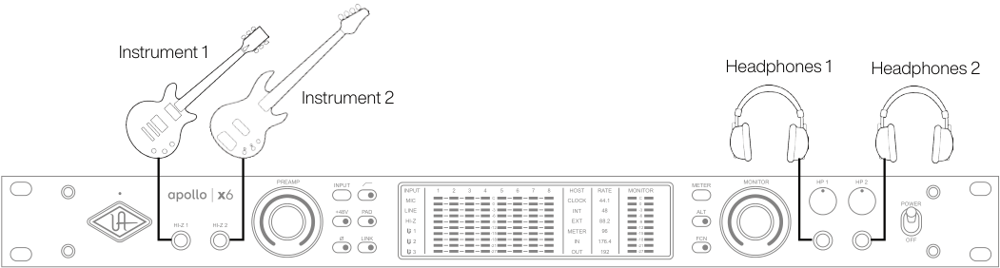

**----- Start of picture text -----** 
Instrument 1 Headphones 1 Headphones 2 Instrument 2 PREAMP INPUT INPUT 1 2 3 4 5 6 7 8 HOST RATE MONITOR METER MONITOR HP 1 HP 2 HI-Z 1 HI-Z 2 +48VO LINKPAD LINEHI-ZMIC312 -12-15-18-21-27-3-6-9C0 METERCLOCKOUTEXTINTIN 176.444.188.21924896 -12-15-18-21-27-3-6-9C0 FCNALT POWEROFF **----- End of picture text -----** 

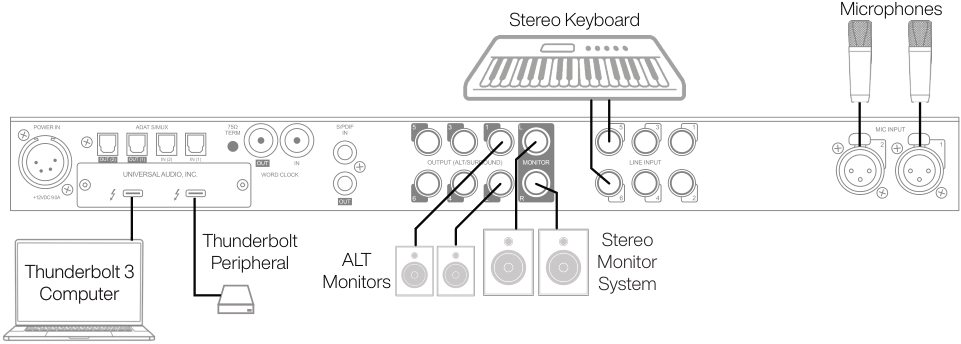

**----- Start of picture text -----** 
Microphones Stereo Keyboard Thunderbolt Stereo Thunderbolt 3 Peripheral ALT Monitor Monitors System Computer **----- End of picture text -----** 

_Typical Apollo x6 connections_ 

Apollo x6 Gen 2 Hardware Manual 

33 

Interconnections 

## Apollo Expanded: Multi-Unit Wiring 

The diagram below illustrates an example of how to interconnect multiple Apollo units and the host computer via Thunderbolt 3. 

_Important: For complete details about system operation when multi-unit cascading, see the UAD Console Manual._ 

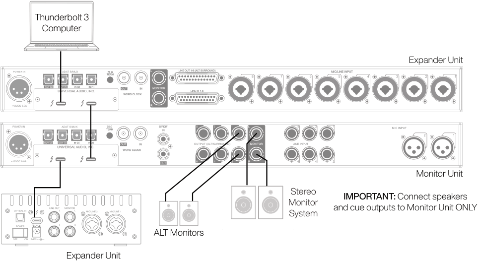

**----- Start of picture text -----** 
Thunderbolt 3 Computer Expander Unit POWER IN ADAT S/MUX TERM75 Ω L LINE OUT 1 - 8 (ALT SURROUND) 8 7 6 MIC/LINE INPUT5 4 3 2 1 UNIVERSAL AUDIO, INC. WORD CLOCK MONITOR LINE IN 1 - 8 +12VDC 9.0A R POWER IN ADAT S/MUX TERM75 Ω S/PDIF 5 3 1 L 5 3 1 MIC INPUT 2 1 UNIVERSAL AUDIO, INC. WORD CLOCK OUTPUT (ALT/SURROUND) MONITOR LINE INPUT +12VDC 9.0A 6 4 2 R 6 4 2 Monitor Unit Stereo IMPORTANT: Connect speakers Monitor and cue outputs to Monitor Unit ONLY System ALT Monitors Expander Unit **----- End of picture text -----** 

_Connecting multiple Apollo units via Thunderbolt 3_ 

## Apollo Expanded Wiring Notes 

- Apollo device ordering and Thunderbolt ports used (second port on Apollo vs. second port on computer, placement within daisy chain, etc) is not important. 

- In this example diagram, Apollo x6 is the monitor (master) unit designated in the UAD Console Settings hardware panel. Connect speakers (including ALT speakers) and any cue outputs to the monitor unit only. 

- Do not interconnect any Word Clock, FireWire, ADAT, or MADI ports between any Apollo units. All Apollo clocking is automatically managed via Thunderbolt. 

- Up to four Apollo units and six UAD devices total can be combined within the same system. 

- The computer and all Apollo/UAD -2 units must be connected to the same Thunderbolt bus. 

- (Mac only) Apollo units with Thunderbolt 3 can be mixed with older Apollo units with Thunderbolt 2 by using compatible Thunderbolt 3 to Thunderbolt 2 adapters. 

Apollo x6 Gen 2 Hardware Manual 

34 

Interconnections 

## **Software Setup** 

_Note: Items on this overview page are detailed in the Apollo Software Manual. See About Apollo Documentation for related information._ 

## System Requirements 

All system requirements must be met for Apollo to operate properly. Before proceeding with installation, view the Apollo X system requirements. 

## Software Installation 

The UAD software must be installed to use the hardware and UAD-2 plug-ins. The UAD software installer contains the Apollo software, drivers, and UAD-2 plug-ins. 

## UA Connect Application 

You’ll use UA Connect, our software management program, to obtain and install the UAD software and UAD Console. To get UA Connect, visit: 

## **uaudio.com/downloads/uad** 

_Note: For optimum results, connect and power on Apollo before installing the software._ 

## Latest Software 

To obtain the latest UAD software after initial registration, use the UA Connect application. 

## System Configuration 

Details about setting up the Apollo system, including how to integrate with a DAW and related information, are included in the Apollo Software Manual. 

## UAD Console 

The UAD Console application is the software interface for the Apollo hardware. UAD Console controls Apollo and its digital mixing, monitoring, Unison technology, and Realtime UAD Processing features. UAD Console is also used to configure Apollo settings such as sample rate, clock source, reference levels, and more. 

For complete details, view the UAD Console Manual. 

## How to get UAD Console 

1. In UA Connect, click the Apollo & UAD-2 tab. 

2. Click the Download button next to UAD Console. If UAD Console is already installed, you can click the Update button (if an update is available). 

3. After the software is downloaded, click Install to complete the installation. 

## UA Support Videos 

Informational videos are available to help you get started with Apollo at help.uaudio.com. 

Apollo x6 Gen 2 Hardware Manual 

35 

Software Setup 

## **Specifications** 

All specifications are typical performance unless otherwise noted. Tested with the Audio Precision APx555 Audio Analyzer under the following conditions: 48 kHz internal sample rate, 24-bit sample depth, 20 kHz measurement bandwidth, +24 dBu headroom, balanced output, and internal clock. 

Specifications are subject to change without notice. 

|SYSTEM|SYSTEM|
|---|---|
|_I/O Complement_||
|Simultaneous Channel I/O Count(analog+ digital)|16 x 22|
|Microphone Inputs|Two|
|High Impedance(Hi-Z)Instrument Inputs|Two|
|AnalogLine Inputs|Six|
|AnalogLine Outputs(DC coupled)|Six(eight includingMonitor outputs)|
|AnalogMonitor Outputs(DC coupled)|Two(one stereopair)|
|Headphone Outputs|Two stereo|
|Digital Audio Ports|ADAT: Two inputs, two outputs S/PDIF: One input, one output|
|Thunderbolt 3 Ports*|Two|
|Word Clock|One input, one output|
|_*(Mac only) Thunderbolt 1 and 2 connections supported via Apple Thunderbolt 3 to Thunderbolt 2 adapter_||
|_A/D – D/A Conversion_||
|Simultaneous A/D Conversion|Six channels|
|Simultaneous D/A Conversion|12 channels|
|Available Sample Rates(kHz)|44.1, 48, 88.2, 96, 176.4, 192|
|Bit Depth Per Sample|24|
|AnalogRound-TripLatency|1.1 milliseconds @ 96 kHz sample rate|
|Analog Round-Trip Latency through four UAD legacy|1.1 milliseconds @ 96 kHz sample rate (no additional|
|plug-ins (included) via UAD Console software|latency via Realtime UAD Processing)|
|ANALOG I/O||
|_Microphone Inputs 1 – 2_||
|FrequencyResponse|20 Hz – 20 kHz, ±0.07 dB|
|Dynamic Range|123 dB(A–weighted)|
|THD + Noise(1 kHz @ 25 dBu, -1 dBFS)|-115 dB(0.00018%)|
|Maximum Input Level(PAD on)|26 dBu|
|Default Input Impedance(variable via Unisonplug-ins)|5.4 K Ω|
|Gain Range|+10 dB to +65 dB|
|Pad Attenuation(switchableper mic input)|20 dB(variable via Unisonplug-ins)|
|Phantom Power(switchableper mic input)|+48V|
|Connector Type|XLR female,pin 2positive(combo XLR/TRS)|

Specifications 

Apollo x6 Gen 2 Hardware Manual 

36 

||||ANALOG I/O|
|---|---|---|---|
||_Hi-Z Inputs 1 & 2(600 K Ω input termination)_|||
|FrequencyResponse|||20 Hz – 20 kHz, ±0.08 dB|
|Dynamic Range|||122 dB(A–weighted)|
|THD + Noise(1 kHz @ 9.6 dBu, -1 dBFS)|||-111 dB(0.00028%)|
|Maximum Input Level(at minimumgain)|||12.6 dBu|
|Default Input Impedance(variable via Unisonplug-ins) 1 M Ω||||
|Gain Range|||+10 dB to +65 dB|
|Connector Type|||¼" female TS unbalanced|
||||_Line Inputs 1 – 6_|
|FrequencyResponse|||20 Hz – 20 kHz, ±0.07 dB|
|Dynamic Range|||124 dB(A–weighted)|
|THD + Noise(1 kHz @ 23 dBu,|-1|dBFS)|-116 dB(0.00016%)|
|Maximum Input Level|||24 dBu|
|Input Impedance|||10 K Ω|
|Gain Range(inputs 1 & 2 only)|||+10 dB to +65 dB|
|Connector Type|||¼" female TRS balanced|
||||_Line Outputs 1 – 6_|
|FrequencyResponse|||20 Hz – 20 kHz, ±0.05 dB|
|Dynamic Range|||127 dB(A–weighted)|
|THD + Noise(1 kHz @ 23 dBu,|-1|dBFS)|-119 dB(0.00011%)|
|Maximum Output Level Reference level @ +4 dBu Reference level @ -10 dBV|||24 dBu 12.2 dBu|
|Output Impedance|||100 Ω|
|Connector Type|||¼" female TRS balanced|
||||_Monitor Outputs L & R_|
|FrequencyResponse|||20 Hz – 20 kHz, ±0.02 dB|
|Dynamic Range|||130 dB(A–weighted)|
|THD + Noise(1 kHz @ 23 dBu,|-1|dBFS)|-127 dB(0.000045%)|
|Maximum Output Level Reference level @ +4 dBu Reference level @ -10 dBV|||24 dBu 12.2 dBu|
|Output Impedance|||100 Ω|
|Connector Type|||¼" female TRS balanced|
|||_Stereo Headphone Outputs 1 & 2_||
|FrequencyResponse|||20 Hz – 20 kHz, ±0.02 dB|
|Dynamic Range|||126 dB(A–weighted)|
|THD + Noise||||
|300 Ω load (1 kHz @ 16.8 dBu,|-1|dBFS)|-117 dB (0.00014%)|
|600 Ω load(1 kHz@17.3 dBu,-1 dBFS)|||-118 dB(0.00013%)|
|Maximum Output Level||||
|300 Ω load (1 kHz, 0 dBFS)|||17.8 dBu|
|600 Ω load(1 kHz,0 dBFS)|||18.3 dBu|
|Maximum Output Power (RMS)||||
|300 Ω load (1 kHz @ 17.8 dBu, 0 dBFS)|||120 mW|
|600 Ω load(1 kHz@18.3 dBu,|0|dBFS)|67 mW|
|Connector Type|||¼" female TRS stereo|

Specifications 

Apollo x6 Gen 2 Hardware Manual 

37 

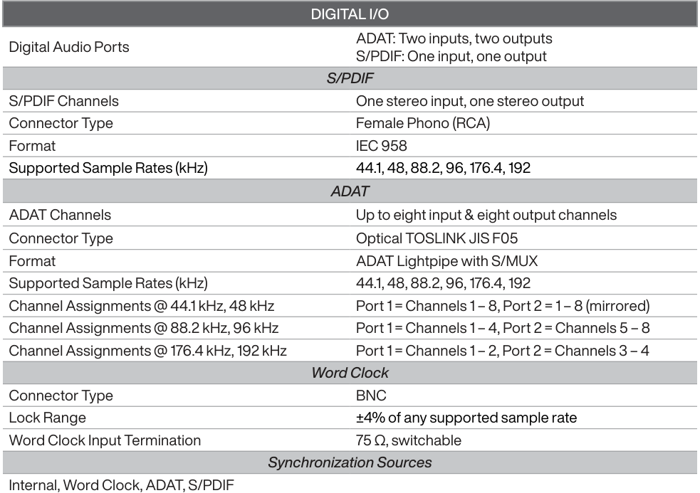

**----- Start of picture text -----** 
DIGITAL I/O ADAT: Two inputs, two outputs Digital Audio Ports S/PDIF: One input, one output S/PDIF S/PDIF Channels One stereo input, one stereo output Connector Type Female Phono (RCA) Format IEC 958 Supported Sample Rates (kHz) 44.1, 48, 88.2, 96, 176.4, 192 ADAT ADAT Channels Up to eight input & eight output channels Connector Type Optical TOSLINK JIS F05 Format ADAT Lightpipe with S/MUX Supported Sample Rates (kHz) 44.1, 48, 88.2, 96, 176.4, 192 Channel Assignments @ 44.1 kHz, 48 kHz Port 1 = Channels 1 – 8, Port 2 = 1 – 8 (mirrored) Channel Assignments @ 88.2 kHz, 96 kHz Port 1 = Channels 1 – 4, Port 2 = Channels 5 – 8 Channel Assignments @ 176.4 kHz, 192 kHz Port 1 = Channels 1 – 2, Port 2 = Channels 3 – 4 Word Clock Connector Type BNC Lock Range ±4% of any supported sample rate Word Clock Input Termination 75 Ω, switchable Synchronization Sources Internal, Word Clock, ADAT, S/PDIF **----- End of picture text -----** 

Specifications 

Apollo x6 Gen 2 Hardware Manual 

38 

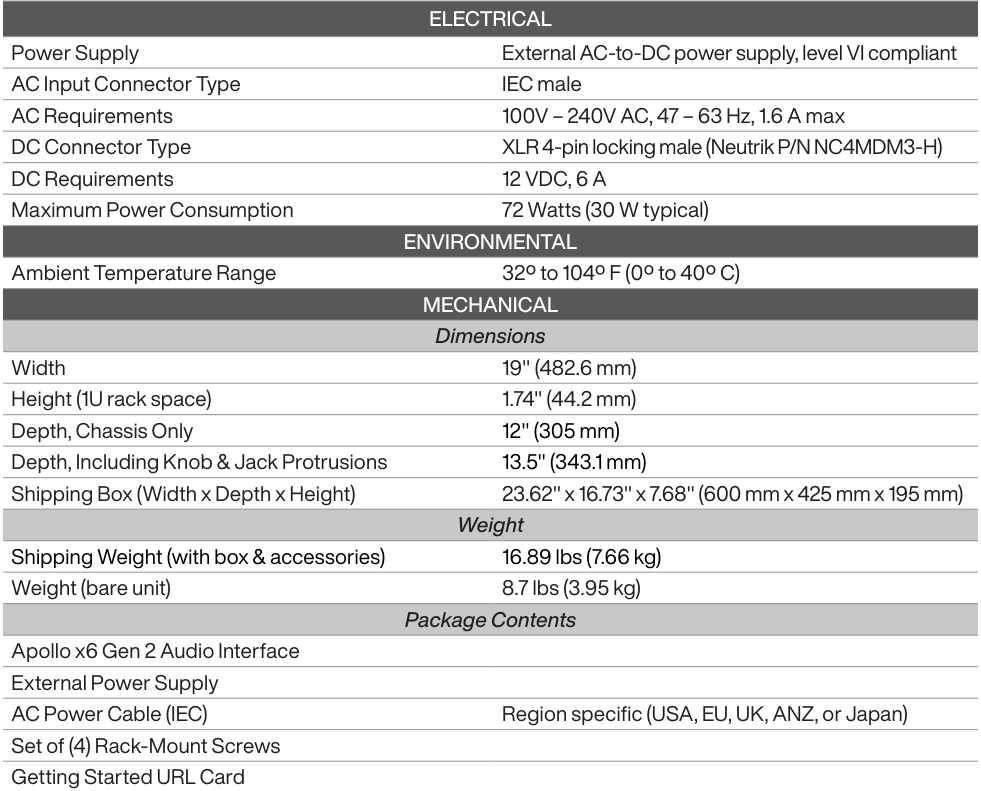

**----- Start of picture text -----** 
ELECTRICAL Power Supply External AC-to-DC power supply, level VI compliant AC Input Connector Type IEC male AC Requirements 100V – 240V AC, 47 – 63 Hz, 1.6 A max DC Connector Type XLR 4-pin locking male (Neutrik P/N NC4MDM3-H) DC Requirements 12 VDC, 6 A Maximum Power Consumption 72 Watts (30 W typical) ENVIRONMENTAL Ambient Temperature Range 32º to 104º F (0º to 40º C) MECHANICAL Dimensions Width 19" (482.6 mm) Height (1U rack space) 1.74" (44.2 mm) Depth, Chassis Only 12" (305 mm) Depth, Including Knob & Jack Protrusions 13.5" (343.1 mm) Shipping Box (Width x Depth x Height) 23.62" x 16.73" x 7.68" (600 mm x 425 mm x 195 mm) Weight Shipping Weight (with box & accessories) 16.89 lbs (7.66 kg) Weight (bare unit) 8.7 lbs (3.95 kg) Package Contents Apollo x6 Gen 2 Audio Interface External Power Supply AC Power Cable (IEC) Region specific (USA, EU, UK, ANZ, or Japan) Set of (4) Rack-Mount Screws Getting Started URL Card **----- End of picture text -----** 

Specifications 

Apollo x6 Gen 2 Hardware Manual 

39 

## **Block Diagram** 

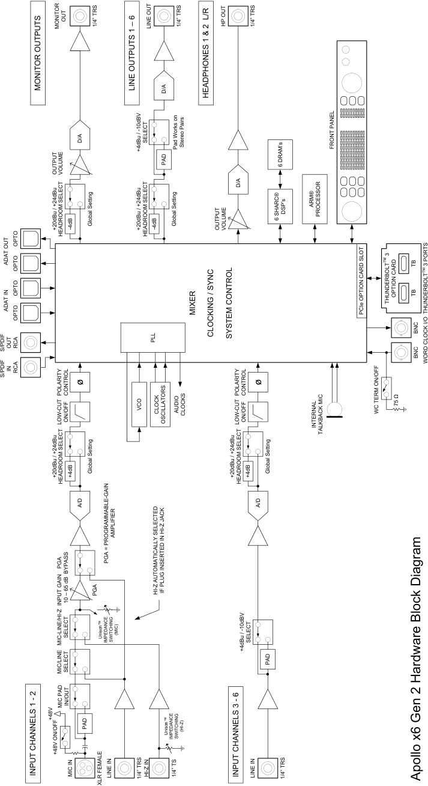

**----- Start of picture text -----** 
OUT MONITOR 1/4” TRS LINE OUT 1/4” TRS HP OUT 1/4” TRS MONITOR OUTPUTS  LINE OUTPUTS 1 – 6 D/A HEADPHONES 1 & 2  L/R D/A SELECT +4dBu / -10dBV Pad Works on  Stereo Pairs FRONT PANEL PAD 6 DRAM’s OUTPUT  VOLUME D/A ARM® DSP’s PROCESSOR +20dBu / +24dBu -4dB Global Setting +20dBu / +24dBu -4dB Global Setting OUTPUT  VOLUME 6 SHARC® HEADROOM SELECT HEADROOM SELECT OPTO  3 ADAT OUT OPTO TM TB TM 3 PORTS OPTO THUNDERBOLT OPTION CARD TB ADAT IN MIXER PCIe OPTION CARD SLOT THUNDERBOLT OPTO CLOCKING / SYNC SYSTEM CONTROL BNC PLL S/PDIF  OUT RCA BNC WORD CLOCK I/O S/PDIF  IN RCA ø ø POLARITY  CONTROL POLARITY  CONTROL 75 Ω VCO CLOCK AUDIO  CLOCKS WC TERM ON/OFF LOW-CUT ON/OFF OSCILLATORS LOW-CUT ON/OFF INTERNAL TALKBACK MIC Global Setting Global Setting +20dBu / +24dBu +4dB +20dBu / +24dBu +4dB HEADROOM SELECT HEADROOM SELECT A/D A/D AMPLIFIER PGA = PROGRAMMABLE-GAIN PGA BYPASS PGA HI-Z AUTOMATICALLY SELECTED  IF PLUG INSERTED IN HI-Z JACK INPUT GAIN 10 – 65 dB MIC-LINE/HI-Z SELECT Unison IMPEDANCE  SWITCHING  (MIC) +4dBu / -10dBV SELECT MIC/LINE SELECT PAD MIC PAD IN/OUT +48V PAD Unison IMPEDANCE  SWITCHING (HI-Z) +48V ON/OFF INPUT CHANNELS 1 - 2 MIC IN LINE IN 1/4” TRS HI-Z IN 1/4” TS INPUT CHANNELS 3 - 6 LINE IN 1/4” TRS Apollo x6 Gen 2 Hardware Block Diagram XLR FEMALE **----- End of picture text -----** 

Apollo x6 Gen 2 Hardware Manual 

40 

Block Diagram 

## **Troubleshooting** 

If your Apollo rack unit isn’t behaving as expected, check these common troubleshooting items. If you still experience issues after performing these checks, contact Technical Support. 

**----- Start of picture text -----** 
SYMPTOM ITEMS TO CHECK **----- End of picture text -----** 

|SYMPTOM|ITEMS TO CHECK |
|---|---|
|Unit won’t power on|• Confrm power supply connections at power supply input and back of unit • Confrm Power switch is in UP position • Confrm AC power is available at wall socket by plugging in a different device|
|No monitor output|• Confrm connections, power, and volume of monitoring system • Confrm monitor knob is turned up • Confrm monitor outputs are not muted (push monitor knob) • Confrm monitor LEDs are active (check signal fows)|
|Can’t hear preamp channels|• Confrm preamp gain is turned up for the channel(s) • Confrm MUTE is not engaged in UAD Console input channel strip|
|Can't hear mic or line input(s)|• Confrm mic/line switch setting is correct for the channel • Confrm nothing is plugged into the channel’s Hi-Z input • Confrm MUTE is not engaged in UAD Console input channel strip|
|Can't hear Hi-Z input(s)|• Confrm volume on connected device is turned up • Confrm Hi-Z input cable is 1/4” TS only (not TRS) • Confrm MUTE is not engaged in UAD Console input channel strip|
|Can’t hear mic input(s)|• Confrm +48V phantom power is enabled (if required by microphone)|
|Preamp controls have no effect on|• Confrm desired channel is selected for control (push PREAMP knob to select)|
|channel|• Preamp controls are not available for non-preamp channels|
|Can only adjust preamp input|• Signal levels for all non-preamp inputs, including digital inputs, are adjusted at the device|
|channels|connected to those inputs|
|Audio glitches and/or dropouts during playback|• Increase audio buffer size setting • Confrm clocking setups; check cable connections and confrm all device clocks are synchronized to one master clock device|
|Undesirable echo/phasing|• Confrm only one input monitoring system is enabled (UAD Console or DAW – not both)|
||• Confrm Thunderbolt 3 connections • Confrm Apollo software is installed|
|HOST indicator is unlit or red|• Power Apollo off then on, and restart computer|
||• Reinstall Apollo software|
||• Try a different Thunderbolt 3 cable|
||• Mute or lower preamp gain to minimum on all unused preamp channels (mic preamps can|
|Static and/or white noise is heard when nothing is plugged in|emit noise even when nothing is plugged in) • Some UAD plug-ins model the noise characteristics of the original equipment. Defeat the noise model in the UAD plug-in GUI, or mute the channel containing the plug-in to|
||temporarily mute the noise|
|Various LEDs inside the unit are blinking|• This is normal operational behavior that can be safely ignored|
||• As a last resort, perform a hardware reset on the unit by following these steps:|
|Apollo rack is behaving unexpectedly|1. Power off Apollo 2. Press and hold the PREAMP, LOW CUT, and POLARITY controls 3. Power on Apollo X while continuing to hold all three controls 4. After all front panel LEDs fash rapidly (after several seconds), release the controls.|

Apollo x6 Gen 2 Hardware Manual 

41 

Troubleshooting 

## **Notices** 

## Important Safety Information 

1. Read these safety instructions and the instruction manual of the product. 

2. Keep these safety instructions and the instruction manual of the product. Always include all instructions when providing the product to other parties. 

3. Heed all warnings. 

4. Follow all instructions. 

5. Do not use this apparatus near water. 

6. Only clean the product when it is not connected to the power supply system. Clean only with a dry cloth. 

7. Do not block any ventilation openings. Install in accordance with the manufacturer’s instructions. 

8. Do not install near any heat sources such as radiators, heat registers, stoves, or other apparatus (including amplifiers) that produce heat. 

9. Only operate the product from the type of power source indicated on the power supply unit. 

10. Protect the power cord from being walked on or pinched, particularly at plugs, convenience receptacles, and the point where it enters into and/or exits from the apparatus. 

11. Only use attachments/accessories specified by the manufacturer. 

12. Unplug this apparatus during lightning storms or when unused for long periods of time. 

13. Refer all servicing to qualified service personnel. Servicing is required when the apparatus has been damaged in any way, such as when the power supply cord or plug is damaged, liquid has been spilled into or objects have fallen into the apparatus, or when the apparatus has been exposed to rain or moisture, does not operate normally, or has been dropped. 

14. **Warning:** To reduce the risk of fire or electric shock, do not expose this apparatus to rain or moisture. Objects filled with liquids, such as vases, should not be placed on this apparatus. 

15. To completely disconnect this apparatus from the AC mains, disconnect the power supply cord plug from the AC receptacle. 

16. The mains plug of the power supply cord shall remain readily accessible. 

17. Do not attempt to open the product housing. The warranty is voided for products opened by the customer. 

18. Let the product reach ambient temperature before switching it on. 

19. **Caution:** High signal levels can damage your hearing and your loudspeakers. Reduce the volume on the connected audio devices before switching on the product; this will also help prevent acoustic feedback. 

20. Intended use. The product is designed for indoor use. The product can be used for commercial purposes. It is considered improper use when the product is used for any application not named in the corresponding instruction manual. Universal Audio does not accept liability for damage arising from improper use or misuse of this product and its attachments/ accessories. Before putting the product into operation, please observe the respective country-specific regulations. 

42 

Notices 

Apollo x6 Gen 2 Hardware Manual 

## Manufacturer’s Declarations 

## Warranty 

The product is covered by a limited warranty. For the current terms of such warranty, please visit uaudio.com/eula. 

## Maintenance 

**CAUTION:** To reduce the risk of electric shock, do not open the unit. 

This product does not contain a fuse or any other user-replaceable parts. The unit is internally calibrated at the factory. No internal user adjustments are available. 

## Repair Service 

If you are having trouble with your hardware, first check all system setups, connections, and operating instructions. If that doesn’t help, contact our Customer Care team. 

To learn about repair service, or for Customer Care, visit help.uaudio.com. 

## Notes on Disposal 

In compliance with the following requirements: 

## WEE-DIRECTIVE (2012/19/EU) 

The symbol of the crossed-out wheeled bin on the product, the battery/ rechargeable battery (if applicable), and/or the packaging indicates that these products must not be disposed of with normal household waste, but must be disposed of separately at the end of their operational lifetime. For packaging disposal, please observe the legal regulations on waste segregation applicable in your country. 

Further information on the recycling of these products can be obtained from your municipal administration or from the municipal collection points. The separate collection of waste electrical and electronic equipment, batteries/rechargeable batteries (if applicable) and packaging, is used to promote the reuse and recycling and to prevent negative effects caused by e.g., potentially hazardous substances contained in these products. Herewith, you can make an important contribution to the protection of the environment and public health. 

## EU Declaration of Conformity 

- RoHS-Directive (2015/863/EU) 

- Low Voltage Directive (2014/35/EU) 

- EMC Directive (2014/30/EU) 

- REACH Directive (EC1907/2006) 

43 

Notices 

Apollo x6 Gen 2 Hardware Manual 

## Class A Device Statements 

## United States 

Note: This equipment has been tested and found to comply with the limits for a Class A digital device pursuant to Part 15 of the FCC Rules. These limits are designed to provide reasonable protection against harmful interference when the equipment is operated in a commercial environment. This equipment generates, uses, and can radiate radio frequency energy and, if not installed and used in accordance with the instruction manual, may cause harmful interference to radio communications. Operation of this equipment in a residential area is likely to cause harmful interference to radio communications. Operation of this equipment in a residential area is likely to cause harmful interference in which case the user will be required to correct the interference at their own expense. 

Any modifications to the unit, unless expressly approved by Universal Audio, could void the User’s authority to operate the equipment. 

## South Korea 

이 기기는 업무용(A급) 전자파 적합기기로서 판매자 또는 사용자는 이 점을 주의하시기 바라며, 가정외의 지역에서 사용하는 것을 목적으로 합니다. 

(Translation: This device obtained EMC registration for office use (Class A), and may be used in places other than home. Sellers and/or users need to take note of this.) 

## Product Label 

44 

Notices 

Apollo x6 Gen 2 Hardware Manual 

## Compliance 

This product complied with the following requirements: 

- Subpart B of Part 15 of FCC Rules for Class A digital devices (ANSI C63.4 methods) 

- Innovation, Science and Economic Development Canada Interference Causing Equipment Standard ICES-003, “Information Technology Equipment (ITE - Limits and methods of measurement,” Issue 7, dated October 2020 (Class A) (ANSI C63.4 methods) 

- VCCI-CISPR 32:2016 “Technical Requirements” for multimedia equipment (Class A) 

- AS/NZS CISPR 32:2015 +A1 +A11 2020 “Electromagnetic compatibility of multimedia equipment - Emission requirements” (Class A) 

- CISPR 32:2015 +A1:2019, “Electromagnetic compatibility of multimedia equipment - Emissions requirements” (Class A) 

- EN 55032:2015 +A11 +A1:2020, “Electromagnetic compatibility of multimedia equipment - Emissions requirements” (Class A) 

- BS EN 55032:2015 +A11 +A1:2020, “Electromagnetic compatibility of multimedia equipment - Emissions requirements” (Class A) 

- CISPR 35:2016 “Electromagnetic compatibility of multimedia equipment - Immunity requirements” 

- EN 55035:2017 + A11:2020 “Electromagnetic compatibility of multimedia equipment - Immunity requirements” 

- BS EN 55035:2017 + A11:2020 “Electromagnetic compatibility of multimedia equipment - Immunity requirements” 

- QCVN 118:2018/BTT “National technical regulation on Electromagnetic compatibility of multimedia equipment - Emission requirements” (Class A) 

- KS C 9832, KS C 9835 (Class A) 

## South Korea Compliance Certification 

- Applicant Name: Universal Audio, Inc. 

- Equipment Name: Apollo x6 Gen 2 

- Model Name: Apollo x6 Gen 2 

- Registration Number: R-R-UAO-APOLLOX6G2 

- Manufacturer/Country of Origin: Universal Audio, Inc. / Malaysia, China, Vietnam 

- Date of Registration: 2024-08-20 

45 

Notices 

Apollo x6 Gen 2 Hardware Manual 

## End User License Agreement 

Your rights to the Software are governed by the accompanying End User License Agreement, a copy of which can be found at: www.uaudio.com/eula 

## Copyrights & Trademarks 

Copyright ©2025 Universal Audio, Inc. All rights reserved. 

UA owns certain trademarks (or applications therefor) that are used in connection with the following UA Software Products and/or the UAD Platform (together “UA Marks”), including, without limitation: 

1176, 1176 LN, 175-B, 176, APOLLO, APOLLO TWIN, ARROW, ASTRA MODULATION MACHINE, BOCK, BOCK AUDIO and BOCK AUDIO logo, CENTURY TUBE CHANNEL STRIP, CYCLOSONIC PANNER, DEL-VERB, DREAMVERB, DYTRONICS, EQP-1A, GOLDEN REVERBERATOR, GOLDEN REVERBERATOR & UA Diamond Design, GOLDEN REVERBERATOR & UA Diamond Design (Series), HELIOS, LA-2A, LA-3A, LUNA, OPAL, OX, OX AMP TOP BOX & Design, OXIDE, POWERED PLUG-INS, RAYMOND, SHAPE, SOUNDELUX and SOUNDELUX USA logo, SPHERE, SPHERE UNIVERSAL AUDIO and UA Diamond Design, STANDARD and UA Diamond Design, STARLIGHT ECHO STATION, TELETRONIX, THE AUTHENTIC SOUND OF ANALOG, TOWNSEND LABS, TRI-STEREO CHORUS, U UNISON PREAMPS & Design, UA Diamond Design, UAD, UAD 2 POWERED PLUG-INS, UAD SPARK, UAD-2 LIVE RACK, UAFX (Stylized), UNIVERSAL AUDIO, UNIVERSAL AUDIO and UA Diamond Design, VOLT UNIVERSAL AUDIO and UA INC. Diamond Design, APOLLO | X, DREAM 65, POLYMAX, RUBY 63, SETTING THE TONE SINCE 1958, SOUNDELUX USA, SPHERE UNIVERSAL AUDIO and UA Diamond Design, UNIVERSAL AUDIO APOLLO, UNIVERSAL AUDIO UAD, VOLT UNIVERSAL AUDIO and UA Diamond Design, WATERFALL B3, WOODROW 55. 

Unless otherwise agreed to in writing under a separate agreement, Customer shall have no interest in any UA Mark and UA will remain the sole and exclusive owner of all right, title and interest in all UA Marks and all applications, reissuances, divisions, re-examinations, renewals or extensions thereof. Other company and product names mentioned herein are trademarks of their respective owners. 

ASIO is a trademark and software of Steinberg Media Technologies GmbH. 

This manual and any associated software, artwork, product designs, and design concepts are subject to copyright protection. No part of this document may be reproduced, in any form, without prior written permission of Universal Audio, Inc. 

## Disclaimer 

The information contained in this manual is subject to change without notice. Universal Audio, Inc. makes no warranties of any kind with regard to this manual, including, but not limited to, the implied warranties of merchantability and fitness for a particular purpose. Universal Audio, Inc. shall not be liable for errors contained herein or direct, indirect, special, incidental, or consequential damages in connection with the furnishing, performance, or use of this material. 

46 

Notices 

Apollo x6 Gen 2 Hardware Manual 

## **Technical Support** 

## Universal Audio Knowledge Base 

The UA Knowledge Base is your complete technical resource for configuring, operating, troubleshooting, and repairing UA products. 

You can watch helpful support videos, search the Knowledge Base for answers, get updated technical information that may not be available elsewhere, and more. 

## **UA Knowledge Base** 

## Universal Audio YouTube Channel 

The Universal Audio YouTube Channel at youtube.com includes helpful support videos for setting up and using UA products. 

## **UA YouTube Channel** 

## Universal Audio Community Forums 

The unofficial UA discussion forums are a valuable resource for all Universal Audio product users. This website is independently owned and operated. 

## **www.uadforum.com** 

## Customer Care 

To contact UA support staff for technical or repair assistance, please visit: 

## **help.uaudio.com** 

Technical Support 

Universal Audio 

47 

www.uaudio.com 

