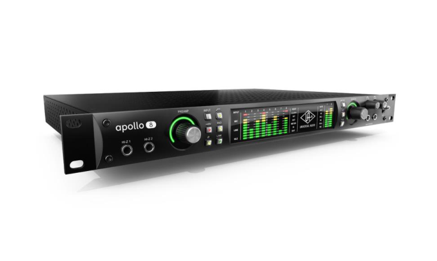
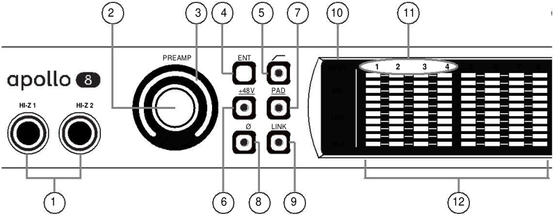
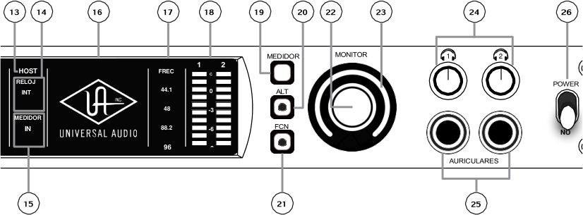
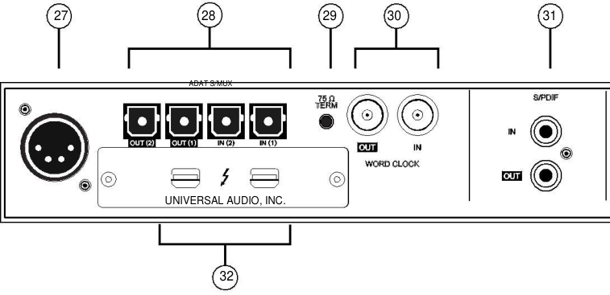
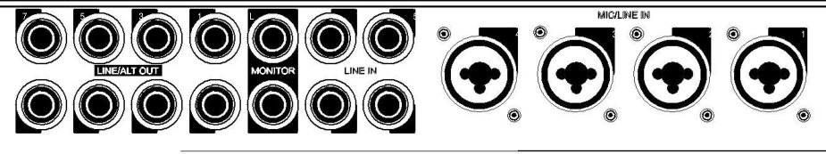
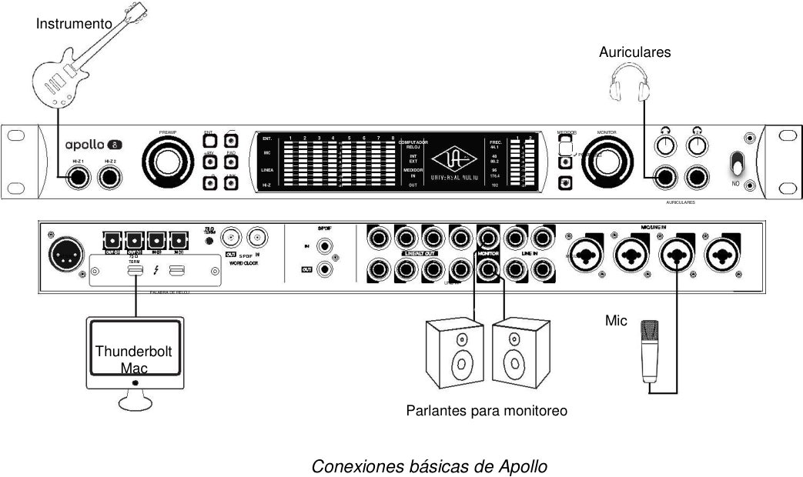
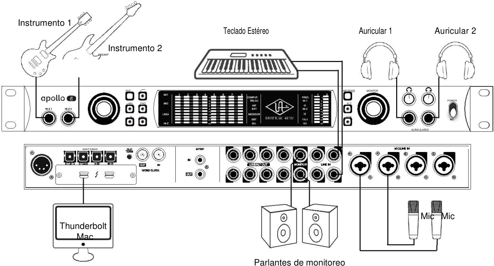
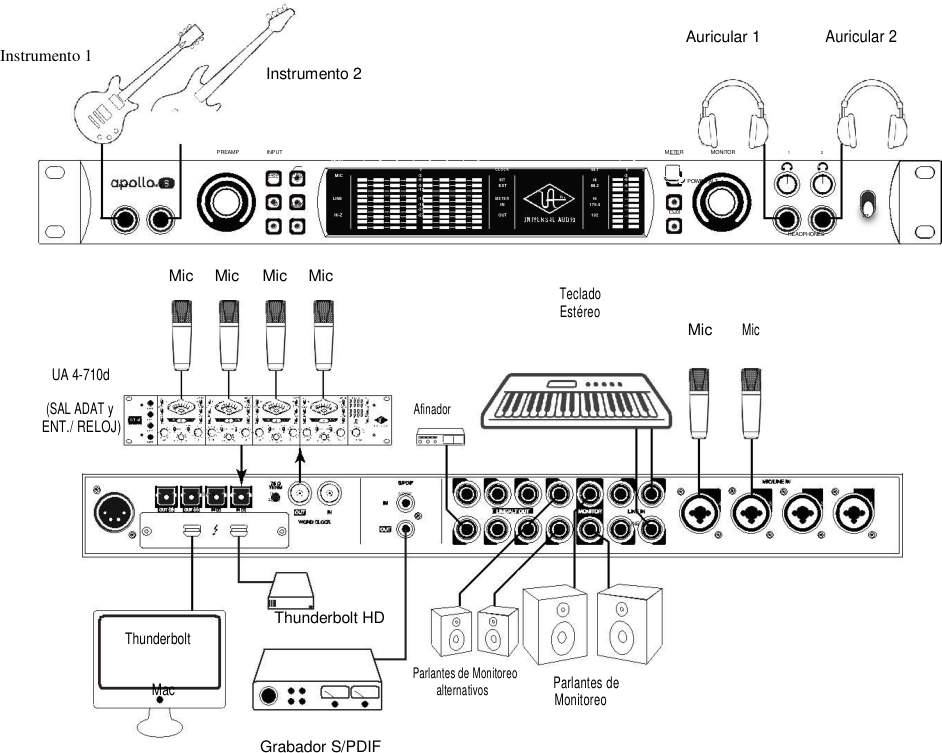
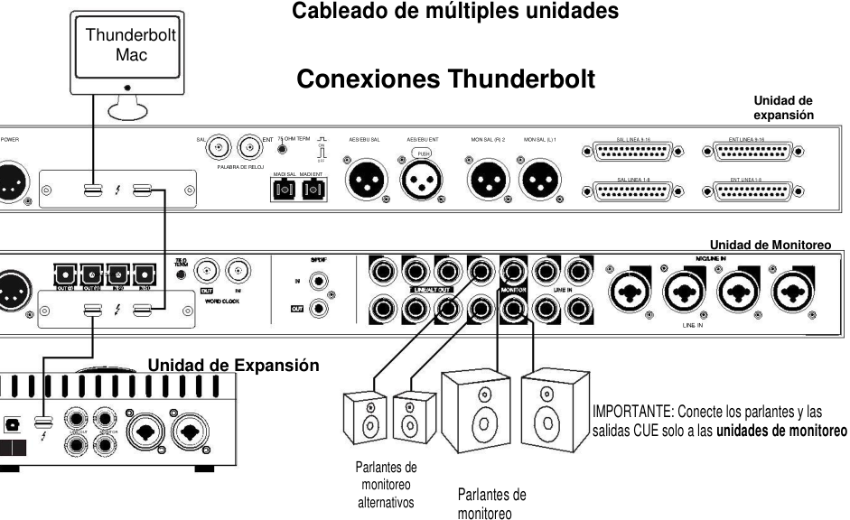
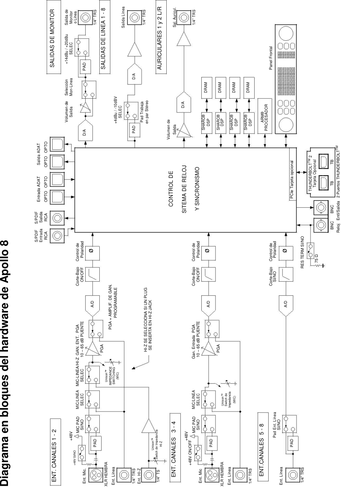

**INTERFAZ  DE ALTA RESOLUCION Con proceso UAD en tiempo real** 

## **Manual de hardware de Apollo 8** 

Versión del manual150702 

Servicio al Cliente y Soporte Técnico: Libre en USA: +1-877-698-2834 Internacional: +1-831-440-1176 www.uaudio.com 

## **Una carta de Bill Putnam Jr.** 

Gracias por tomar la decisión de hacer, de la interfaz de alta resolución Apollo 8,  una parte de su experiencia de hacer música. Sabemos que cualquier nueva pieza de arte requiere una inversión de tiempo y dinero y nuestro objetivo es hacer que su inversión sea óptima. El hecho de que juguemos un papel en su proceso creativo es lo que hace significativos a nuestros esfuerzos  y le damos gracias por esto. 

En muchos sentidos, la familia de productos de interfaz de audio Apollo 8 representa los mejores ejemplos que Universal Audio ha destacado siempre a lo largo de su larga historia; desde la fundación original de la UA en la década de 1950 por mi padre, a través de nuestra visión actual de entregar lo mejor de ambas tecnologías de audio analógico y digital. 

A partir de la alta calidad  de sus E/S analógicas, una calidad sonora superior de Apollo 8 sirve como fundamento. Sin embargo, esto es sólo el comienzo  ya que los productos de Apollo son las únicas interfaces de audio que le permiten ejecutar plug-ins UAD  en tiempo real. ¿Quiere monitorear  a través de un canal de la Consola Neve® mientras que el ruteo de graves lo realiza a través de un clásico compresor Fairchild o LA-2A? ¿O qué tal el ruteo de la voz a través de una máquina de cinta Studer® con alguna Reverb añadida de Lexicon®? 

Con nuestra biblioteca creciente  de más de 90 plug-ins UAD, las opciones son ilimitadas. 

En UA, abrazamos  la idea de que esta poderosa tecnología debe servir en última instancia para que en el proceso creativo  no existan  barreras. Estos son los mismos ideales de mi padre cuando inventó un equipo de audio para resolver problemas en el estudio. Así que a medida que comience a incorporarse Apollo en su proceso creativo, esperamos que la emoción y el orgullo de lo que hemos construido continúen creciendo. Creemos Apollo ganará su camino en el flujo de su  trabajo creativo, proporcionando una fidelidad impresionante, facilidad de utilización, y  una sólida confiabilidad en los próximos años. 

Como siempre, no dude en acercarse a nosotros a través de nuestro sitio web www.uaudio.com, o a través de nuestros canales de medios sociales. Esperamos con interés escuchar de usted, y gracias una vez más por la elección de Universal Audio. 

## Sinceramente, 

## Bill Putnam Jr. 

_Todas las marcas se reconocen como propiedad de sus respectivos dueños. Los Plug-In  UAD  se venden por separado._ 

Manual de Hardware de Apollo 8                                           2                                                           Bienvenidos 

_**Consejo:** Haga clic en cualquier sección o número de página para saltar directo a ella_ 

## **INDICE** 

**Una carta de Bill Putnam Jr** ..............................................................................................2 **Introducción** ….................................................................................................................4 ¿Qué es Apollo 8?....................................................................................................................4 Características de Apollo 8.......................................................................................................6 Acerca de la documentación de  Apollo 8 ...............................................................................8 Documentación Web ...............................................................................................................9 Soporte técnico.......................................................................................................................10 **Panel frontal** ...................................................................................................................11 **Panel trasero** ………………………………………………………………………….............22 E / S Digital ……….………………………………………………………………...…..…….…….23 E / S analógicas……………………………………....……………………………...….……........26 **Instalación y configuración** …………………………………….……….……......................26 **Interconexiones** …………………………………………………………….......…....……...30 Notas de instalación …………………………………………….....................….…...…...….......30 Configuración básica ………………………………………………..……….……………........….31 Configuración típica…………………………………………………..………………….….….......32 Configuración avanzada……………………………………………..…………………….....…….33 Cableado de múltiples unidades Apollo 8 ………..……………………………………..........….34 **Especificaciones** …...……………………..…………………………………………..…….….35 **Diagrama de bloques** ………..……………………………………………….…….…............39 **Solución de problemas** ……..…………………………………………………..….................40 **Avisos** ……………..…………….……………….……………………………….….…........…41 Información importante de seguridad ………………….……………..……………..….......…....41 Garantía .………………………………………………...……….………………….......................42 Mantenimiento ………………………………………….…………….………..........…….............42 Servicio de reparación.…….…………………………………………………….…..….....….…...42 . Descargo de responsabilidad………………………………………….…..….....….………….....43 

Manual de Hardware de Apollo 8                                           3                                                                        Indice 

## **Introducción** 

## **¿Qué es Apollo 8? Interfaz de audio Thunderbolt  con Proceso UAD-2** 

Apollo 8 es una actualización elegante  de la interfaz más popular de audio profesional del mundo, que entrega un sonido mejorado con su tono, sensación y con el flujo de la grabación analógica. Esta interfaz 18 x 24 Thunderbolt ofrece un procesamiento poderoso UAD-2 DUO o QUAD, de genuino diseño analógico UA, y la última generación de  conversores A / D y D / A, poniendo la calidad de audio líder en un nuevo paquete elegante. 

Apollo 8 se distingue aún más en sí con la tecnología de procesamiento en tiempo real UAD  y Unison ™, lo que le permite grabar con latencia casi cero a través de la gama completa de los plugin UAD , Neve, Studer, Manley, Lexicon, y más,  incluyendo nuevas emulaciones de pre-amplificador de micrófono de Neve, API y Universal Audio. 

El software Apollo  ampliado  permite la conexión  en cascada de hasta cuatro Apollo 8 en un solo sistema (Mac), para que pueda ampliar su estudio a medida que crecen sus necesidades. 

## **Nueva generación de conversión A/D y D/A en el sistema Apollo** 

Apollo 8 mejora, mediante el estándar de oro de la calidad de sonido, sus conversores A/D y D/A obteniendo un increíble rango dinámico y bajísima distorsión. Todo esto resulta en una sorprendente claridad, profundidad y precisión en sus grabaciones, mezclas y masterizados 

## **Plug-in de proceso en tiempo real UAD para  Tracks, Mezcla y Masterizado** 

Mientras que el sonido "natural" de Apollo 8 es muy abierto y transparente, se puede lograr rápidamente una impresionante gama de tonos analógicos clásicos y de color a través de su procesamiento UAD en tiempo real. Disponible con UAD-2 DUO o procesamiento QUAD , la aceleración DSP de Apollo permite la grabación a través plug-in UAD  - con un valor tan bajo como 2 ms de latencia - lo que le deja monitorear e "imprimir"  audio utilizando emulaciones analógicas clásicas de Ampex, Lexicon, Manley, Neve, Roland, SSL, Studer, y más. 

El procesamiento en tiempo real da la posibilidad de utilizar los clásicos del sonido, como el preamplificador a válvulas UA 610-B  y EQ, o LA-2A, 1176, y compresores de Fairchild, ecualizadores Pultec, y más, por lo que tendrá  un rack repleto de clásicos de audio , sin nada más que sacarlo de la caja. 

El uso de Apollo y  de los plug-in UAD  también es posible durante la mezcla y masterización con una DAW, poniendo los plug-in UAD  (VST, RTAS, AU, AAX 64) a su disposición durante todo el proceso creativo 

_*Todas las marcas registradas son reconocidas como propiedad de sus respectivos dueños. Los plug-ins UAD individuales se venden por separado_ 

Manual de Hardware de Apollo 8                                           4                                                          Introducción 

## **Cuatro Pre-amplificadores con Tecnología Unison™** 

Un avance de Universal Audio: la tecnología Unison de Apollo 8 le da la coloración más buscada del mundo de los  pre-amplificadores de micrófono de válvulas y de estado sólido - incluyendo sus impedancias, ganancias por etapa, "puntos dulces", y comportamientos de circuitos a nivel de componente. 

Con una base de integración de hardware y software  sin precedentes entre los pre-amplificadores de micrófono de Apollo y sus plug-ins de procesamiento UAD, Unison le permite grabar contando con impresionantes emulaciones como las UA 610-B de pre-amplificador de válvulas  o de las exclusivas emulaciones de los  pre-amplificadores de API y Neve. 

La tecnología Unison se incrementa aún más en Apollo 8 al incluir en  su panel frontal entradas  HiZ, con adaptación en la impedancia y ganancia. 

## **Apollo Expandido y  Consola 2.0** 

Gracias al software ampliado de Apollo, los usuarios de interfaces de audio Thunderbolt Apollo dual, Apollo 8, Apollo 8p, y Apollo 16   pueden combinar hasta cuatro Apollo y seis dispositivos UAD-2 en total y añadir E / S y DSP a medida que sus estudios crecen. Apollo ampliado, también proporciona una integración perfecta con la generación anterior de Apollo además de Thunderbolt. Con la Consola de la aplicación de Apollo 8 2.0 usted aprovechar más de 25 características solicitadas por los usuarios, tales como pre ajustes de canales, funciones de arrastras y soltar, redimensión dinámica de ventanas y más. 

## **Mejora de Monitoreo y fluidez en el trabajo** 

Apollo 8 cuenta con una serie de mejoras en el panel frontal sobre el Apollo original, incluyendo las funciones Alt, Dim y Mono para los altavoces, así como las capacidades de medición de entrada y salida a través del nuevo botón del medidor. Estas características se combinan con el sistema de escalabilidad de Apollo, para que sea el nuevo estándar en la grabación profesional de audio multicanal. 

## **Complemento de DSP** 

Apollo 8 está disponible en dos configuraciones diferentes, que se diferencian por su complemento SHARC® DSP: Apollo 8 DUO con dos DSP, y Apollo 8 QUAD con cuatro DSPs. Apollo 8 DUO y QUAD tienen características idénticas E / S y funcionalidad; la única diferencia es la cantidad de plug-in UAD  utilizables en el  procesamiento de monitoreo y mezcla.  Usted tiene una interfaz de sonido increíble que puede alcanzar la calidad de sonido profesional de cualquier época de la historia de la grabación utilizando  los plug-in UAD. 

En pocas palabras, Apollo 8 ofrece el sonido, el sentimiento, y el flujo de la grabación analógica con todas las comodidades de los equipos digitales modernos. 

Manual de Hardware de Apollo 8                                           5                                                           Introducción 

## **Características de Apollo 8** 

## **Características principales** 

- La próxima generación de conversores A/D y D/A Apollo  para la producción profesional de música 

- Incluye UAD-2 DUO o Quad Core DSP que le permiten en tiempo real UAD  el procesamiento a través de plug-ins de Neve, Lexicon, Studer, Marshall, Ampex, y más 

- 4 Unison ™ para los pre-amplificadores de micrófono para el monitoreo mediante las emulaciones de pre-amplificador de Neve, API, y Universal Audio * 

- Una interface de audio 18 x 24 Thunderbolt 2 (1 Thunderbolt compatible) para Mac con el potente software 2.0 de control de la Consola 

- Conexión en cascada de hasta 4 interfaces de Apollo y 6 dispositivos UAD 

- Funciones convenientes en el panel de monitoreo delantero incluyendo Alt y Alt-poder asignar 2, Dim, o Mono 

- Incluye el paquete de plug-ins UAD "Realtime Clásicos analógicas Plus" con 610-B preamplificador a válvulas y EQ, Raw Distorsión, Amplificador de válvulas para cuartos,   LA-2A, 1176, y compresores de Fairchild, ecualizadores Pultec y más 

- Diseño analógico UA de clase mundial, componentes superiores y construcción de primera calidad 

## **Interfaz de Audio** 

- Las frecuencias de muestreo de hasta 192 kHz con  longitud de palabra de 24 bits 

- 18 x 24 entradas/salidas de canales simultáneas 

- Ocho canales con conversión analógica a digital a través de micrófono, línea o entradas de alta impedancia 

- 14 canales de conversión digital-analógica  a través de: 

- Ocho salidas de línea mono 

- Salidas de monitor estéreo 

- Dos salidas de auriculares estéreo 

- 10 canales de E / S digital a través de: 

- Ocho canales ADAT óptico de E / S con S / MUX para altas frecuencias de muestreo 

- Dos canales coaxial S / PDIF I / O con la conversión de frecuencia de muestreo 

- Dos puertos Thunderbolt 2 facilitan la conexión en cadena de otros dispositivos de Thunderbolt 

## **Pre-amplificadores de micrófono** 

Cuatro pre-amplificadores de micrófono analógico de alta resolución, pre-amplificadores de micrófono analógico ultra-transparentes controlados digitalmente 

- Tecnología Unison ™ para una integración profunda con pre-amplificador UAD  y  plug-ins 

- Panel frontal y software de control de todos los parámetros de los  pre-amplificadores 

- Filtro conmutable de corte en bajas frecuencias, alimentación phantom de 48V, pad, inversión de polaridad, y el linkeo estéreo 

_* Todas las marcas se reconocen como propiedad de sus respectivos dueños. Los Plug-In UAD  se venden por separado._ 

Manual de Hardware de Apollo 8                                           6                                                           Introducción 

## **Monitoreo** 

- Salidas estéreo para monitor (independientes de las ocho salidas de línea) 

- Salidas de monitor controladas digitalmente que mantienen la  más alta fidelidad 

- Control desde el panel delantero de los niveles de monitorización y silenciamiento 

- Dos salidas de auriculares estéreo con buses de mezcla independientes 

- Controles independientes de  volumen en el panel frontal para los auriculares 

- Panel frontal  de medición pre-fader  de los niveles de buses del monitor 

- Las salidas S / PDIF pueden ajustarse para espejar las salidas de monitor 

- Se pueden seleccionar hasta dos salidas alternativas de monitor estéreo a través del panel frontal o el software de la Consola 

- •La función del switch de monitor es asignable para alternar monitores, DIM y MONO 

## **Interior de la UAD-2** 

- Los modelos DUO y cuádruples con dos o cuatro procesadores SHARC® 

- Procesamiento en tiempo real UAD en todas las entradas analógicas y digitales 

- Las mismas características y funcionalidad que otros dispositivos UAD-2 cuando se utiliza con la DAW 

- Se pueden combinar con otros dispositivos UAD-2  para aumentar las DSP de mezcla 

- Incluye Plug-Ins UAD   "Clásicos en tiempo real" 

- Biblioteca completa de plug-ins UAD  disponible en la tienda online UA 

## **Software** 

## **Aplicación de la Consola:** 

- Interfaz de control de estilo analógico para el monitoreo en tiempo real y el  seguimiento 

- Permite procesamiento en tiempo real  con plug-ins UAD 

- Control remoto de las características y funcionalidad de Apollo 8 

- Virtual E / S para el ruteo de las pistas  de la DAW  a través de la Consola 

## **Plug-in de captura de la Consola:** 

Ahorra tiempo al recuperar rápidamente las configuraciones de la Consola dentro de las sesiones de la  DAW 

- Facilidad de acceso a los controles del monitor de la Consola mediante los plug-in de la DAW 

- Formatos de Plug in  VST, RTAS, AAX 64 y unidades de audio 

## **Medidor UAD  y aplicación de panel de control:** 

Configura los ajustes UAD de uso general y la utilización de los monitores del sistema 

## **Otros** 

- Fácil actualización de firmware 

- Formato de 1 unidad de rack 

- Un año de garantía que incluye piezas y mano de obra 

Manual de Hardware de Apollo 8                                           7                                                          Introducción 

## **Documentación de Apollo 8** 

La documentación para todos los componentes del Apollo 8 es extensa. Las instrucciones están separadas por áreas de funcionalidad. Cada área funcional tiene un archivo de manual individual. En esta sección se proporciona una visión general de cada archivo, y cómo se accede a ellos. _**Nota** : La Documentación WEB Extensa, incluyendo información técnica que  no está disponible en otras publicaciones, también está disponible._ 

## **Archivos de los manuales de Apollo 8** 

_**Nota** : Todos los archivos manuales están en formato PDF. Los archivos PDF requieren un lector de PDF aplicación gratuita como Preview (incluido con Mac OS X) o Adobe Reader._ 

## **Manuales de Hardware de Apollo 8** 

Cada modelo Apollo tiene un manual de hardware único. Los manuales de hardware Apollo contienen detalles completos relacionados con el hardware sobre un modelo específico de Apollo. En ellos se incluyen descripciones detalladas de todas las características de hardware, controles, conectores y especificaciones. 

Nota: Cada manual de hardware contiene, en el nombre del archivo, el modelo de Apollo específico. 

## **Manual de software de Apollo 8** 

El manual del software  de Apollo 8 es la guía complementaria de los manuales de hardware de Apollo 8. Contiene información detallada sobre cómo configurar y controlar todos los programas Apollo para todos los modelos de Apollo usando la aplicación de la Consola, la ventana de configuración de la Consola, y el plug-in Console  Recall. Consulte el Manual de software de Apollo para aprender a manejar las herramientas de software 

_**Nota** : Todos los modelos Apollo tienen el mismo manual de software para integrar la funcionalidad de Apollo en el entorno de la  DAW._ 

## **Manual del Sistema de UAD** 

El manual del sistema UAD es el manual de instrucciones completo para la funcionalidad de Apollo UAD-2  y se aplica a toda la familia de productos UAD-2. Contiene información detallada sobre la instalación y configuración de dispositivos UAD, la aplicación UAD Meter y Control Panel, la compra de los plug-ins opcionales en la tienda online de la UA, y más. Incluye todo lo relacionado con UAD excepto la información específica de Apollo y las descripciones individuales de los plug-in UAD. 

## **Manual de los Plug-in UAD** 

Las características y funciones de todos los Plug-in UAD se detallan en el Manual de Plug-Ins UAD. Consulte este documento para aprender la operación, los controles y la interfaz de usuario de cada plug-in UAD desarrollado por Universal Audio. 

## **Plug-In de sus diseñadores** 

Los Plug-in UAD incluyen los creados por nuestros socios desarrolladores directos. La documentación de estos plug-ins son archivos separados escritos y proporcionados por los desarrolladores de los mismos. Los nombres de archivo para estos manuales plug-in son los mismos que los títulos de los  plug-ins. 

Manual de Hardware de Apollo 8                                           8                                                          Introducción 

## **Ubicación de la documentación instalada** 

Toda la documentación se copia en el disco de inicio durante la instalación del software: 

- Macintosh HD / Aplicaciones / Universal Audio 

## **Acceso a la documentación instalada** 

Cualquiera de los siguientes métodos puede utilizarse para acceder a la documentación instalada: 

- Navegar por el sistema de archivos en el Finder de Mac OS X 

- Seleccionar la opción "Documentación" en el menú Ayuda dentro de la aplicación de la Consola 

- Hacer clic en el botón "Ver documentación" en el panel Ayuda dentro de la aplicación   Medidor UAD Meter y Panel de Control 

- Los manuales también están disponibles en línea: www.uaudio.com/support/manuals.html 

## **Documentación en la WEB** 

## **Videos de ayuda de UA** 

Hay muchos videos informativos disponibles para ayudarle a empezar con Apollo 8: 

http://www.uaudio.com/support/thunderbolt 

## **Página de ayuda** 

La última información técnica para Apollo está publicada en el sitio web de Universal Audio. La página de soporte de Apollo Thunderbolt contiene actualizada la última información que no está disponible en otras publicaciones. Por favor, visite esta página para obtener las últimas noticias 

- www.uaudio.com/support/thunderbolt 

## **Foro de los usuarios de UAD** 

El foro de usuarios de UAD  para el intercambio de información y consejos, está en línea en: 

- www.uadforum.com 

Manual de Hardware de Apollo 8                                           9                                                          Introducción 

## **Ayuda técnica** 

Universal Audio ofrece, para todos los usuarios registrados de Apollo, soporte gratuito al cliente. Los especialistas de ayuda están disponibles  por correo electrónico y teléfono durante el horario normal, que es de lunes a viernes de 9 am a 5 pm, hora estándar del Pacífico. 

## **Ayuda por Email** 

Para solicitar el apoyo en línea a través de correo electrónico, haga clic en el siguiente enlace: 

- https://www.uaudio.com/my/support/create/ 

Alternativamente, visite la principal página de soporte en www.uaudio.com/support, y a continuación haga clic en el botón azul "Enviar Ticket" en el lado derecho de la página web para crear un billete de ayuda. 

Soporte Telefónico 

EE.UU. gratuito: + 1-877-698-2834 (1-877-MY-UAUDIO) 

Internacional: + 1-831-440-1176 

Alemania, Austria, Suiza, 

Francia, Benelux: +31 (0) 20 800 4912 

Manual de Hardware de Apollo 8                                           10                                                        Introducción 

## **Panel frontal** 

En esta sección se describen las características y funciones de todos los controles y elementos visuales en el panel frontal de  Apollo 8. 

_**Nota** : Todas las funciones del panel frontal (excepto el switch METER, botones de volumen para auriculares, y el switch de potencia) se pueden controlar de forma remota con la aplicación incluida de software de la Consola. Los cambios realizados con los controles del panel frontal se reflejan en la aplicación de la Consola, y viceversa._ 

**----- Start of picture text -----** 
                  2 3    4         5        7     10 11 PREAMP ENT INPUT 1 2 3 4 5 6 7 8 CLIP 0 +48V PAD MIC -3 -6 HI-Z 1 HI-Z 2 -9 -12 LINE -15 Ø LINK -18 -21 Hi-Z -27 1    6        8       9 12 **----- End of picture text -----** 

_Panel frontal de Apollo 8 (parte izquierda)_ 

## **Entradas 1 y 2 de alta impedancia** 

Las entradas directas Hi-Z (alta impedancia) JFET son para la conexión de dispositivos pasivos de bajo nivel, como una guitarra eléctrica o bajo eléctrico en los canales 1 y 2 para la conversión A / D. Los niveles de ganancia de entrada Hi-Z se ajustan con el control del pre-amplificador para el canal asociado. Las entradas Hi-Z tienen una impedancia de entrada por defecto de 1M Ohm. La impedancia de entrada puede variar cuando se insertan los plug-ins de Unison en el canal dentro de la aplicación de la Consola. Para obtener más información, consulte el capítulo Unison en el Manual del software de Apollo. 

_**Nota**_ : _Conecte sólo conectores TS de ¼ " mono no balanceadas a  las entradas Hi-Z. Los conectores estéreo TRS no se pueden utilizar._ 

## **Detección automática de la entrada** 

Las entradas Hi-Z 1 y Hi-Z 2 utilizan los mismos convertidores A / D de canal  que  las correspondientes entradas de micrófono 1 y 2 y la Línea 1 y 2. Cuando un dispositivo está conectado a una entrada Hi-Z, el Mic y Line de esa entrada queda reemplazada y  el conmutador de micrófono / línea para ese canal no tiene ningún efecto y el enlace estéreo está cortado (si está activo). 

_**Importante** : Para utilizar las entradas Mic o Line 1 o 2, las entradas   HI-Z correspondientes deben ser desconectadas._ 

Manual de Hardware de Apollo 8                                           11                                                       Panel Frontal 

## **(1) Ganancia del pre-amplificador y perilla de selección de canal** 

Este codificador rotatorio que incluye switch  tiene tres funciones: 

**Girar** - Girar el mando ajusta la ganancia de pre-amplificador del canal de entrada seleccionado. 

**Pulsar** - Al pulsar se selecciona  que pre-amplificador de canal (1-4) se ajustará mediante los controles del panel frontal de los pre-amplificadores. 

**Pulsar + Hold** - Cuando un Plug-in Unison  está activo e inserto en un canal de la aplicación de la Consola, manteniendo pulsado el botón se entra o se sale del modo Unison de control de ganancia. Cada una de las tres funciones anteriores se explica con mayor detalle a continuación: 

## **Ganancia del Pre-amplificador** 

La ganancia de los pre-amplificadores  de las  entradas analógicas 1 - 4 se ajusta con el mando giratorio. El pre-amplificador del canal a ser ajustado se elige con la función de selección de canal (presionar). La entrada  a ser ajustada  (Mic, Line, o Hi-Z) se determina por el estado del switch Mic / Line del canal (# 4) o la entrada Hi-Z (si está conectado). 

La rotación del mando hacia la derecha aumenta la ganancia del pre-amplificador del canal seleccionado. El rango de ganancia disponible para los pre-amplificadores de los canales es de 10 dB a 65 dB para el micrófono, línea y entradas Hi-Z. 

Se necesita más de una vuelta completa de la rueda para desplazarse por la gama disponible. Esta característica aumenta la resolución de control para realizar ajustes más precisos de ganancia del pre-amplificador. 

**Consejo** : _Para ajustar los niveles de señal de las entradas 5 - 8, utilice los controles de nivel de salida de  los equipos  conectados a estas entradas._ 

## **Ganancia de Línea  de entrada Bypass** 

Por defecto, las entradas de línea 1-4 se rutean a través del pre-amplificador del canal por lo que el nivel de entrada de línea se puede ajustar con la perilla de ganancia. Sin embargo, las entradas de línea 1-4 pueden ser configuradas eludiendo completamente los circuitos pre-amplificadores de esos canales y ser enviadas directamente al convertidor A / D  a un nivel de referencia fijo. Esta característica se ajusta con el menú GAIN LINE INPUT en el panel de hardware dentro de la ventana Configuración de la Consola. 

_**Consejo**_ : _Cuando no se necesita ganancia adicional es conveniente rutear la señal directamente hacia el conversor el convertidor D / A de forma de obtener la señal más pura (por ejemplo, cuando se conectan pre-amplificadores de micrófono externos para alimentar las entradas de línea de los canales)._ 

## **Cuando el menú de la ganancia de entrada de línea del canal está ajustada a BYPASS** 

## **en la configuración de la Consola:** 

- El anillo de pre-amplificador Indicador Ganancia (# 3) para el canal es de color verde 

- Cuando se gira la perilla de ganancia (# 2), el anillo flashea para indicar que el ajuste de ganancia no está operativo. 

- Si un Plug-in Unison  está insertado en un canal de la Consola, este plug–in será omitido. 

Manual de Hardware de Apollo 8                                           12                                                       Panel Frontal 

## **Selección de canal** 

Al pulsar el Botón de Pre-amplificador se cambia el canal seleccionado previamente, lo que permite ajustar  los controles del pre-amplificador del canal seleccionado. La selección de un canal se indica con la iluminación del Nro. de canal (Indicador (# 11)). 

Cada vez que se pulsa el botón se selecciona el próximo canal (1-4). Si el enlace estéreo está activo, se seleccionan los pares estéreo. 

## **Modo de funcionamiento de la etapa de ganancia** 

El modo de operación de la etapa de ganancia se activa pulsando y manteniendo pulsado el botón de pre-amplificador  dos segundos cuando un Plug-in Unison  está activo  e insertado dentro de la aplicación de la Consola. Cuando el modo de etapa de ganancia está activo, si se presiona el botón durante dos segundos se logra desactivar el modo de ajuste de la etapa de ganancia. 

El modo etapa de ganancia está activo cuando el indicador de selección del canal parpadea para el canal seleccionado (# 11). 

En este estado, presionando el botón se puede recorrer y modificar los parámetros de un plug-in que estuviera insertado en ese canal desde el panel frontal (sin necesidad de hacerlo desde la Consola de mezcla). 

_**Nota**_ : _Para obtener más detalles acerca del modo etapa de ganancia, ver el capítulo de Unison en el Manual del software de Apollo 8_ 

## **(3) Nivel de ganancia de pre-amplificador e indicador de estado** 

## **Ganancia del pre-amplificador e Indicador de nivel** 

La cantidad de ganancia del pre-amplificador para el canal seleccionado  se indica por el anillo iluminado rodea la perilla de pre-amplificador. 

El anillo indica niveles de ganancia relativa y no está calibrado para indicar valores específicos en dB. Sin embargo, los valores numéricos precisos en dB de la ganancia  de los pre-amplificadores se muestran dentro de la aplicación de la Consola. 

_**Nota**_ : _Si el anillo está al máximo y parpadea cuando se gira la perilla de pre-amplificador, la entrada del canal esta seleccionada como entrada de línea y la misma está ajustada como  Bypass. Vea:_ 

Salto de la Ganancia de Entrada de Línea 

Manual de Hardware de Apollo 8                                           13                                                       Panel Frontal 

## **Indicador del estado  del pre-amplificador** 

Además de la ganancia de pre-amplificador relativa del canal, el anillo también indica el estado actual del pre-amplificador del canal. 

**Verde (variable) -** El pre-amplificador está en el modo  predeterminado con ganancia variable **Verde (fija en el máximo** ) - La línea está seleccionada (# 4) para el canal  y LINE INPUT GAIN está ajustado a BYPASS en el panel de hardware dentro de la ventana configuración de la Consola **Apagado** - La ganancia del pre-amplificador está ajustado a su valor mínimo **Naranja** - Un Plug-in Unison está activo en un canal de la Consola. 

_**Nota:** Consulte el capítulo de Unison en el Manual de Software de Apollo para obtener más detalles sobre la operación Unison._ 

## **(4-9) Opciones de pre-amplificador** 

Hay  seis switches de control de las opciones de pre-amplificador para los canales de entrada 1 - 4. Pulse los switches para cambiar el ajuste. El estado  de cada opción de pre-amplificador es indicado por el LED dentro de cada switch. Cada función del switch se detalla a continuación. 

## ( **4) Mic / Línea** 

Este switch cambia las entradas entre Mic del canal (XLR) y Línea (¼ ")  en las tomas del panel trasero. Este switch no tiene efecto si la entrada Hi-Z del canal está conectada (la entrada Hi-Z debe estar desconectado al utilizar las entradas de micro / línea). 

- _**Nota:** Las entradas de línea 1-4 se pueden configurar para omitir el circuito del  preamplificador._ 

   - _Ver Salto de Línea de Ganancia de Entrada  para detalles adicionales._ 

## **(5) filtro Low Cut** 

Cuando está activado, la señal de entrada del canal pasa a través de un filtro de corte bajo (pasa altos). Este filtro con polos de segundo orden tiene una frecuencia de corte de 75 Hz con una pendiente de 12 dB por octava. 

El filtro de corte de graves afecta al micrófono, línea y entradas Hi-Z. Low Cut se suele utilizar para eliminar las frecuencias bajas no deseadas  y otras señales graves indeseadas que aparecen a la entrada. 

## **6) Alimentación phantom (+ 48V)** 

Cuando se activa, se suministran 48 voltios de alimentación fantasma  en la entrada XLR del panel trasero del canal. La mayoría de los micrófonos de condensador modernos requieren una alimentación phantom de 48V para operar. Esta opción sólo se puede activar cuando el switch Mic / Line (# 4) se establece en Mic. 

_**Precaución** : Para evitar posibles daños en el equipo, desactive + 48V en el canal antes de conectar o desconectar la entrada XLR._ 

Dependiendo de la configuración actual del hardware y el software, puede haber un retraso al cambiar el estado de + 48V para minimizar los clics / pops que son inherentes al conectar la alimentación fantasma. El led + 48V parpadeará rápidamente durante cualquier retraso. 

Manual de Hardware de Apollo 8                                           14                                                       Panel Frontal 

## **(7) Pad** 

Cuando el pad está activado, el nivel de señal de entrada XLR del canal se atenúa en 20 dB. El pad no afecta a la línea o entradas Hi-Z. 

El pad se puede utilizar para reducir los niveles de señal cuando hay distorsión por sobrecarga aún en bajos niveles de ganancia del pre-amplificador, como por ejemplo cuando se utilizan micrófonos especialmente sensibles en instrumentos ruidosos, y / o si el convertidor A / D comienza a clipear. 

## **(8) Polaridad** 

Cuando se activa, invierte la polaridad ("fase”) de la señal de entrada del canal. La polaridad también afecta a las entradas de micrófono, línea y Hi-Z. 

_**Consejo** : la inversión de polaridad puede ayudar a reducir las cancelaciones de fase cuando se utiliza más de un micrófono para grabar una sola fuente._ 

## **(9) Estéreo Link** 

Este conmutador enlaza los controles de pre-amplificador de canales adyacentes entre sí (1 + 2 ó 3 + 4) para crear pares de entrada estéreo. Cuando los canales están vinculados como un par estéreo, los ajustes de control de pre-amplificador afectarán a ambos canales de la señal estéreo de forma idéntica. 

_**Nota** : Sólo el mismo tipo de entradas se puede vincular (Mic / Mic o Línea / Línea). Las entradas Hi-Z no se pueden vincular._ 

## **(10) Indicadores de entrada** 

Estos indicadores de visualización (MIC / LINE / HI-Z)  señalan que la entrada está activa para el canal. Para seleccionar MIC o LINE, utilice el switch INPUT (# 4). Para seleccionar Hi-Z, conecte un "cable TS mono de ¼ “a la entrada Hi-Z. 

## **Color del indicador de Línea** 

El color de los cambios del indicador de línea refleja el estado de la configuración de GAIN LINE INPUT que se configura en el panel de hardware dentro de la ventana Configuración de la Consola. 

**Blanco** - La entrada de línea se rutea a través del previo por lo que la ganancia de entrada se puede ajustar. 

**Verde** - El circuito de pre-amplificador se omite y la entrada de línea se fija en un nivel de referencia de +4 dBu. 

## **(11) Indicadores de selección de canales 1 - 4** 

El pre-amplificador del canal seleccionado se indica mediante los números iluminados por encima de los medidores de nivel 1 - 4. Cuando se selecciona el pre-amplificador de algún canal (o canales, cuando es estéreo vinculado), **se ilumina su número de canal** . Pulsando el botón de preamplificador (# 2)  se incrementa el número de canal seleccionado. 

- _**Nota:** Los números para los canales 5-8 no se iluminan porque no pueden ser seleccionados para ajustes en el panel  frontal._ 

Manual de Hardware de Apollo 8                                           15                                                       Panel Frontal 

## **Medidores de canal de entrada** 

Cuando la medición se configura para las entradas (INPUT), los medidores de canal muestran los niveles de entrada de pico de las señales de los canales analógicos 1-8 a la entrada de los convertidores A / D. 

Es necesario evitar la saturación digital en el convertidor A / D del canal mediante la reducción del nivel de salida del dispositivo conectado a la entrada del canal, y / o en el caso de los canales 1 - 4, por la reducción de la ganancia del pre-amplificador y / o aplicar el pad (# 7) y reajustar la ganancia según sea necesario. 

## **Medidores de canal de salida** 

Cuando la medición se configura para las SALIDAS,  los medidores de canal muestran los niveles de salida de pico de la señal de los canales analógicos 1-8 a la salida de los convertidores D / A. (12) 

**----- Start of picture text -----** 
1 2 HOST FREC RELOJ INT 44.1 0 48 -3 MEDIDOR IN 88.2 -6 NO 96 9 **----- End of picture text -----** 

_Panel frontal de Apollo (parte derecha)_ 

## **13) Indicador HOST (computadora)** 

El indicador HOST muestra el estado de la conexión Thunderbolt al sistema informático central. Los estados posibles son: 

**Iluminado** - La unidad está comunicada con la computadora y funciona normalmente. 

**Apagado** - La unidad se está iniciando o no es reconocida por la computadora. Verifique la instalación de software y conexiones Thunderbolt. 

- **Rojo** - Error del sistema. Por favor, póngase en contacto con el servicio técnico si el problema persiste. 

Manual de Hardware de Apollo 8                                          16                                                        Panel Frontal 

## **(14) Indicadores de RELOJ** 

La fuente de reloj y el estado se muestran con estos indicadores como  interna (INT) o externo (EXT). La fuente de reloj está establecida dentro de la aplicación de la Consola; consulte el Manual del software de Apollo para obtener más información. 

## **Reloj interno** 

Cuando se establece en el reloj interno, el indicador **INT** se ilumina blanco. 

## **Reloj externo** 

Apollo 8 puede usar un reloj externo de palabra digital,  S / PDIF, o entradas ADAT. El indicador **EXT** tiene dos estados posibles: 

**Blanco** - Cuando se ajusta a reloj externo y se detecta una señal de reloj válido en el puerto especificado, el indicador EXT se ilumina en blanco y Apollo 8 se sincroniza con la fuente de reloj externa. 

**Rojo** - Cuando se ajusta a reloj externo y no se detecta una señal de reloj válida en el puerto especificado, el indicador EXT se ilumina en rojo y el reloj interno se mantiene activo en reemplazo de la señal externa fallida. En esta situación, si  el reloj externo especificado vuelve a estar disponible, Apollo 8 vuelve al reloj externo, y el indicador **EXT** se ilumina de blanco. 

- _**Importante:** Cuando se utiliza una  fuente externa de reloj, la  frecuencia de muestreo de Apollo 8 se debe configurar manualmente para que coincida con la frecuencia de muestreo del reloj externo._ 

## **(15) Indicadores METER** 

Estos indicadores muestran el estado  de los medidores de nivel de canal (# 12). El estado actual se cambia con el switch METER (# 19). 

- **IN -** Cuando IN esté iluminado, los medidores de canal muestran los niveles de señal de entrada analógica. (entrada del conversor A/D) 

- **OUT** - Cuando se ilumina OUT, los medidores de canal muestran los niveles analógicos  de señales de salida. (salida del conversor D/A) 

## **(16) Indicador de alimentación (UA Logo)** 

El logo de Universal Audio se ilumina cuando la fuente de alimentación externa está conectada correctamente a la toma de CA, la salida de la fuente está conectada a la entrada de alimentación en la parte posterior de la unidad y el switch de alimentación (# 26) está en la posición hacia arriba. 

## **(17) Indicadores de frecuencia de muestreo** 

Estos indicadores muestran el ajuste de la frecuencia de muestreo de A / D y D / A. La frecuencia de muestreo se establece dentro de la aplicación de la Consola o de la aplicación de audio de elegida; Consulte el Manual del Software de Apollo para obtener más información. 

Manual de Hardware de Apollo 8                                          17                                                       Panel Frontal 

## **(18) Medidores de nivel de salida de monitor** 

Los medidores de 10 segmentos de LED  muestran los niveles de salida de pico de la señal izquierda y derecha del monitor en la salida de los convertidores D / A. Estos medidores están antes del control de nivel de monitor (pre-fader) y reflejan el nivel de convertidor D / A independientemente del ajuste del nivel de monitoreo y de los ajustes de los mandos de los auriculares. 

Los valores en dB del medidor de LED del monitor se indican entre los medidores de los canales izquierdo y derecho. Cuando se produce clipping digital, La letra "C" (clip) se enciende de color rojo. 

Si aparecen clips en el nivel de salida de monitor se deberá reducir el nivel de salida del monitor dentro de la aplicación de audio y / o reducir el nivel de salida de los canales individuales que alimentan el bus de salida del monitor dentro de la aplicación de la Consola. 

## **(19) Switch del medidor** 

Este switch determina si los medidores de nivel de canal (# 12) están mostrando niveles de entrada o los niveles de señal de salida. Al pulsar el switch cambia el estado de los medidores y los indicadores del medidor (# 15) de entrada a salida y viceversa. 

## **(20) Switch de Monitor de ALT** 

Cuando el monitoreo ALT (alternativo) está configurado en el panel de hardware dentro de la ventana de Configuración de la Consola (CUENTA ALT con valor distinto de cero), cada vez que se pulsa, cambia la salida de monitor a los monitores principales,  a los alternativos ALT 1 (salidas de línea 1 y 2) 

## **Cuando se actúa sobre el Switch ALT :** 

- Las señales de monitor se rutean a las salidas 1 y 2 en lugar de las principales salidas de monitor 

- El LED naranja en el switch se enciende 

- El indicador de nivel de monitor (# 23) es de color naranja en vez de verde 

Para más detalles acerca de cómo configurar y utilizar las funciones de supervisión de ALT, consulte el Manual de software de Apollo. 

- _**Consejo** : Las salidas ALT 2  (salidas de línea 3 y 4) se puede seleccionar con el switch FCN (# 21, cuando se configura en Configuración de la Consola) o en la columna del monitor dentro de la aplicación de la Consola._ 

Manual de Hardware de Apollo 8                                           18                                                       Panel Frontal 

## **(21) Switch de las funciones de monitor (FCN)** 

Este es un switch asignable que se puede configurar para controlar una de las tres funciones de monitoreo. La función del switch está configurada con el menú FCN con el switch de asignación del panel de hardware dentro de la ventana Configuración de la Consola; consulte el Manual del software de  Apollo para obtener más información. 

El LED ámbar parpadea en el switch  cuando la función de monitoreo  está activa. La función se alterna con el switch si es presionado de nuevo. Las funciones disponibles son: 

- **ALT 2** - Selecciona los  2 monitores suplentes. Las señales del monitor se rutean a las salidas 3 y 4 en vez de las principales salidas de monitor, y el indicador de nivel de monitor (# 23) es ámbar en lugar de verde cuando ALT 2 está activo. 

- **MONO –** Se suman en una señal monofónica los canales izquierdo y derecho de la mezcla de monitor estéreo. El indicador de nivel de monitor (# 23) parpadea cuando la función MONO está activa. 

- **DIM -** Atenúa el nivel de señal en las salidas de monitor por la cantidad dB establecido en la franja de Sala de Control dentro de la aplicación de la Consola. El indicador de nivel de monitor (# 23) parpadea cuando el DIM está activo. 

- _**Nota:** Cuando más de una interfaz Apollo está conectada en una configuración de múltiples unidades, el switch  de FCN es operable sólo en la unidad de monitor designada._ 

## **(22) Perilla de Nivel y Mute  de monitor** 

Este codificador rotativo tiene dos funciones. Al girar el mando ajusta el nivel de salida del monitor, y presionando el botón silencia las salidas de monitor. 

## **Nivel del monitor** 

La rotación del mando a la derecha aumenta el nivel de señal en las salidas de monitor izquierdo y derecho en el panel posterior. Si se configuran las salidas de monitor ALT en actividad, este mando controla el nivel de señal de las salidas de línea del monitor ALT. 

Aunque se trata de un control digital, el volumen de salida de monitor izquierdo y derecho se atenúan en el dominio analógico, después de conversión D / A (volumen analógico controlado digitalmente). Este método proporciona la máxima fidelidad de monitoreo, en contraste con los controles de volumen digitales que reducen los niveles truncando la longitud de palabra digital (también conocido como "dejar caer bits"). 

Manual de Hardware de Apollo 8                                           19                                                       Panel Frontal 

## **Salto de Ganancia de Salida de Monitores** 

Por defecto, los niveles de salida de monitor son continuamente variables. Sin embargo, las salidas de monitoreo se pueden configurar para eludir el circuito de control de nivel de monitor y operar a un nivel de referencia fijo. Esta característica se ajusta en el menú de la GANANCIA DE SALIDA DE MONITOR en el panel de hardware dentro de la Ventana de Ajustes de la Consola. 

_**Consejo** : Esta función rutea la señal directamente desde el conversor D/A hacia las salidas de monitor para lograr la señal más pura  cuando esta salida se conecta a un sistema de control de monitores._ 

Cuando el menú GANANCIA DE SALIDA DE MONITOR está configurado a bypass en los ajustes de la Consola: 

- El anillo de Indicación  de nivel (# 23) es de color verde 

- Cuando se gira la perilla del monitor (# 22), el anillo flashea para indicar que no es posible ajustar el nivel. 

- •El monitoreo alternativo y el switch de asignación FCN no están disponibles. 

- •Las señales de las salidas de monitor (# 34) tienen nivel de línea (sin atenuación). 

## **Mute de monitor** 

Al presionar la perilla de monitor se alternan las salidas de monitor en el panel trasero entre activación y silencio. Si el monitoreo ALT está configurado en el panel de  hardware dentro de la ventana de  configuración de la Consola (cuando Alt Count  es un valor distinto de cero), las salidas de monitoreo alternativas también serán silenciadas. 

Cuando Se silencian las Salidas de monitor, el anillo del seguimiento Indicador de Nivel (# 23) es de rojo color. 

_**Nota:** El muteo del monitor no silencia las salidas de auriculares._ 

Manual de Hardware de Apollo 8                                           20                                                        Panel Frontal 

## **(23) Nivel de Monitor e Indicador de estado del monitor** 

_**Sugerencia** : el nivel de monitoreo y la indicación del estado de monitoreo se verán reflejados en la columna del monitor  dentro de la aplicación de la Consola._ 

## **Indicador de nivel de salida de monitor** 

El nivel de la señal relativa de las salidas de monitor del panel posterior (y salidas de monitor ALT, si está configurado) se indica mediante el anillo luminoso que rodea el mando Level Monitor. Este indicador está después del control de Monitor (post fader). Indica sólo niveles relativos y no está calibrado a valores específicos dB. 

## **Indicador de estado de monitoreo** 

El color del anillo indicador indica el estado actual de las salidas de monitor: 

**Verde (variable)** - Las principales salidas de monitor están activas con control variable de nivel. 

**Verde** (fijada al máximo) – La ganancia de salida de monitor está ajustada a BYPASS en el panel de hardware dentro de la ventana Configuración de la Consola 

**Rojo** - Las principales salidas de monitor (y monitores ALT salidas, si está configurado) están silenciadas 

**Naranja** - Las salidas ALT 1 de los monitores están activas 

**Ámbar** - El switch FCN está activo y asignado ALT 2 

**Intermitente** - El DIM del  monitor y / o la función  MONO están activos 

## **(24) Mando de nivel de auriculares 1 y 2** 

Estos mandos controlan el volumen de salidas de auriculares 1 y 2 en el panel frontal. Cada salida de auriculares tiene su propio control de volumen. 

## **(25) Salidas de auriculares 1 y 2** 

Estas tomas TRS estéreo de ¼ "son para la conexión de auriculares estéreo a las salidas de Apollo 8. Los auriculares 1 y 2 son individualmente direccionables (distintas mezclas de monitoreo) Por defecto, las dos salidas de auriculares copian las salidas de monitor. Cuando se espejan las salidas de monitor  las salidas de auriculares no se ven afectadas por el Monitor Mute (# 18) para facilitar la grabación de tracks cuando los monitores están muteados. 

Se pueden crear mezclas diferentes para cada salida de auricular utilizando las funciones CUE dentro de la Consola o asignando  buses de mezcla  desde el programa que se utilice  a las salidas de auriculares vía salida hacia ellos. 

## **(26) Switch de encendido** 

Este switch  enciende a Apollo 8. Cuando la unidad está encendida se ilumina el logotipo de Universal Audio (# 16). La fuente de alimentación externa debe conectarse adecuadamente. 

Manual de Hardware de Apollo 8                                           21                                                       Panel Frontal 

## **Panel Trasero** 

**----- Start of picture text -----** 
27                        28    29        30                 31 ADAT S/MUX UNIVERSAL AUDIO, INC.   32 **----- End of picture text -----** 

_Panel trasero de Apollo 8 (parte digital)_ 

## **(27) Entrada de energía** 

La fuente de alimentación externa se enchufa en este conector XLR de bloqueo de 4 pines. Apollo 8 requiere 12 voltios CC de alimentación  y  50 vatios de potencia. 

Para eliminar el riesgo de daños en los circuitos, conecte sólo la fuente de alimentación suministrada de fábrica. Utilice el switch de encendido en el panel frontal para alimentar la unidad. 

_**Importante** : No desconecte la fuente de alimentación, mientras que Apollo 8 está en uso, y confirme que el switch de encendido está en la posición "off" antes de conectar o desconectar la fuente de alimentación._ 

Manual de Hardware de Apollo 8                                           22                                                      Panel Trasero 

## **8) Puertos ópticos ADAT S / MUX** 

Estos puertos utilizan el protocolo de interfaz óptica ADAT Lightpipe para la interconexión con otros dispositivos de hardware de audio en el dominio digital. Hay dos entradas ADAT y dos salidas ADAT que permiten rutear un total de ocho canales de audio digital. La cantidad de canales enrutados por estos puertos dependen de la frecuencia de muestreo que se esté utilizando. 

A frecuencias de muestreo de 44,1 kHz y 48 kHz, se utiliza el protocolo ADAT original, y se pueden rutear  ocho canales de audio  en un puerto ADAT. A mayores frecuencias de muestreo, se utiliza el estándar de la industria S / MUX  para mantener las transferencias de alta resolución. 

- _**Importante:** Para utilizar los ocho canales con los puertos ópticos con frecuencias de muestreo de 88,2 kHz y superiores, los puertos ADAT 1 y 2 deben tanto estar conectados a otro dispositivo, y el otro dispositivo también debe soportar el protocolo / MUX ADAT S._ 

Los siguientes comportamientos se aplican a los puertos ADAT: 

- En frecuencias de muestreo de 44,1 kHz y 48 kHz, el puerto 1  soporta ocho canales de E / S. La salida 2 espeja a la salida 1, y la entrada 2 está deshabilitada. 

- En frecuencias de muestreo de 88,2 kHz y 96 kHz, se rutean por puerto hasta cuatro canales de audio (ocho canales en total, cuando se utilizan ambos puertos). 

- En frecuencias de muestreo de 176,4 kHz y 192 kHz, se rutean por puerto hasta dos canales de audio  (cuatro canales en total, cuando se utilizan ambos puertos). Sólo cuatro canales ADAT se pueden usar en 176,4 kHz y 192 kHz. 

Las asignaciones de canales puerto ADAT descritos anteriormente se resumen en la siguiente tabla digital I/O 

**Ruteo de canales en puerto ADAT** 

|**Vel. Muestreo(kHz)**|**Entrada Puerto 1**|**Entradapuerto 2**|**Salidapuerto 1**|**Salidapuerto 2**|
|---|---|---|---|---|
|44.1 & 48|1 – 8|Deshabilitada|1 – 8|1 – 8(espejo ofpuerto1)|
|88.2 & 96|1 – 4|5 – 8|1 – 4|5 – 8|
|176.2 & 192|1 – 2|3 – 4|1 – 2|3 – 4|

- _**Nota:** Los puertos ADAT utilizan conectores ópticos TOSLINK JIS F05. Algunos dispositivos utilizan este tipo de conector para conexiones S / PDIF óptico. Sin embargo, los puertos ADAT de Apollo 8 no son compatibles con el protocolo S / PDIF._ 

Manual de Hardware de Apollo 8                                           23                                                      Panel Trasero 

## **(29) Switch de impedancia de 75 ohmios de fin de línea de reloj** 

Este conmutador ofrece terminación interna de la señal de entrada de reloj de 75 ohmios cuando sea necesario. La terminación de fin de línea del reloj está activa cuando el switch está conectado (deprimido). 

El Switch de terminación de Apollo 8 sólo se debe activar cuando el Apollo 8 está configurado para ser sincronizado con un reloj externo y es el último dispositivo en la cadena   de reloj. Por ejemplo, si Apollo 8 es la última unidad "esclava" al final de una cadena de reloj (cuando no se utiliza el puerto de salida de reloj del Apollo 8), la terminación deberá estar activa. 

## **(30) Reloj  E / S Entrada de reloj** 

El reloj interno del Apollo 8 se puede sincronizar (esclavizado) con un reloj maestro externo. Esto se logra mediante la configuración  de la  fuente de reloj de Apollo 8  dentro de la aplicación de la Consola y conectando conector BNC del reloj externo a la entrada de reloj del Apollo 8. Habrá además que establecer que el dispositivo externo sea quien transmite el reloj. Si Apollo 8 fuera  el último dispositivo de la cadena de reloj, el switch de terminación (# 10) deberá ser activado. 

_**Importante** : La frecuencia de muestreo de Apollo 8 se debe configurar manualmente para que coincida con la frecuencia de muestreo del reloj externo._ 

_**Nota** : Apollo 8 se puede sincronizar solamente con una señal "1x" de reloj externo. Superreloj, overclocking y subclocking no son compatibles._ 

## **Salida de reloj** 

Este conector BNC transmite un estándar (1x) de  reloj  cuando Apollo 8 está configurado para utilizar su reloj interno. 

La velocidad del reloj enviada por este puerto coincide con la frecuencia de muestreo  del sistema, tal como se especifica en la aplicación de la Consola. 

Cuando Apollo 8 está configurado para utilizar reloj externo se comportará como esclavo del reloj. Si el reloj externo entrante es de ± 0.5% de una frecuencia de muestreo compatible (44,1 kHz, 48 kHz, 88,2 kHz, 96 kHz, 176,4 kHz, 192 kHz), la salida de reloj será una copia de la de la entrada con un ligero retraso de fase (40 ns). 

Dado que la salida de reloj de palabras de Apollo 8 no es una verdadera copia de la entrada de reloj, no debe ser usada para conexión en cadena del reloj si Apollo 8 está en el medio de la cadena de reloj. 

El método correcto para conectar el Apollo 8 en medio de una cadena de reloj es utilizar un conector en T en la entrada de reloj del Apollo 8 y no utilizar la salida de reloj  de Apollo 8 (el switch de terminación no debería activarse en este caso) 

Manual de Hardware de Apollo 8                                           24                                                       Panel Trasero 

## **(31) Puertos S/ PDIF** 

Los puertos S / PDIF proporcionan dos canales de E / S digitales con resoluciones de hasta 24 bits a 192 kHz a través de conectores RCA hembra. Para obtener óptimos resultados, utilice solamente cables de alta calidad de 75 ohmios diseñados específicamente para audio digital S / PDIF. 

La conversión de la frecuencia de muestreo se puede realizar en la entrada S / PDIF; se habilita esta opción dentro del ajuste de  la entrada del canal S / PDIF en la aplicación de la  Consola. Cuando la frecuencia de muestreo de la señal S / PDIF entrante no coincida con la frecuencia de muestreo especificada en la aplicación de la Consola, la señal S / PDIF se convertirá para que coincida con la frecuencia de muestreo de Apollo 8. Si Apollo 8 está configurado para utilizar S / PDIF como fuente de reloj maestro, la conversión de frecuencia de muestreo estará inactiva. 

- _**Consejo** : La salida S / PDIF puede ser configurada para copiar  la salidas de monitor (# 34), para el ruteo de la señal de monitor estéreo a la entrada estéreo S / PDIF de otros dispositivos. Esta característica se ajusta con el menú DIGITAL MIRROR en el panel de hardware dentro de la ventana Configuración de la Consola._ 

## **(32) Puertos Thunderbolt** 

Apollo 8 tiene dos puertos Thunderbolt 2. Un puerto se utiliza para conectar el Apollo 8 a un puerto Thunderbolt 1 o Thunderbolt 2 de la computadora. Los dispositivos periféricos Thunderbolt se pueden conectar en serie (encadenando) al segundo puerto Thunderbolt. 

Cuando Apollo 8 está comunicada correctamente con la computadora a través de Thunderbolt, el indicador HOST (# 13) se enciende. 

## **Fuente de poder mediante bus Thunderbolt** 

Por especificación Thunderbolt, la alimentación se suministra a través del bus a los dispositivos periféricos Thunderbolt (encadenados). Apollo 8 debe estar encendido para que la cadena periférica reciba alimentación por medio del bus Thunderbolt. 

Manual de Hardware de Apollo 8                                           25                                                       Panel Trasero 

## **Entradas y salidas analógicas** 

**----- Start of picture text -----** 
   33 34        35                           36 **----- End of picture text -----** 

**----- Start of picture text -----** 
7 5 3 1 L 7 5 4 3 2 1 **----- End of picture text -----** 

_Panel Trasero de Apollo 8 (parte analógica)_ 

## **(33) Salidas de línea 1 a 8** 

Las salidas analógicas de nivel de línea individualmente direccionables utilizan conectores balanceados  TRS de ¼ “. 

También se pueden usar cables  desbalanceados con fichas TS  de ¼”. 

Las salidas de línea se pueden configurar en pares adyacentes con niveles de referencia de -10 dBV o +4 dBu. 

Esto es configurable en el panel de hardware dentro de la ventana Configuración de la Consola. 

## **Salidas de ALT de 1 - 4** 

Apollo 8 cuenta con la capacidad  ALT (suplentes) de monitoreo. Esto se  puede utilizar para controlar hasta dos pares de altavoces de monitoreo. 

Cuando el monitoreo ALT está activado, el nivel de salida y el silenciamiento de la línea de las salidas 1 y 2 (ALT 1) y 3 y 4 (ALT 2) son controlados por el Nivel de Monitor y la perilla de Mute (# 22). 

El monitoreo ALT se habilita en el panel de hardware dentro de la ventana Configuración de la Consola eligiendo un valor distinto de cero para la CUENTA ALT. 

- _**Nota:** Las funciones de supervisión ALT no están disponibles cuando la GANANCIA DE SALIDA MONITOR está ajustada a BYPASS. Consulte Salto de la Ganancia de Salida de Monitor  para la información relacionada._ 

Manual de Hardware de Apollo 8                                           26                                                       Panel Trasero 

## **(34) Salidas izquierda y derecha del monitor** 

Estos conectores TRS balanceados de  ¼ “son las salidas analógicas de  línea normalmente utilizadas para la conexión  de altavoces estéreo. 

También es posible usar conectores TS no balanceados. 

Los niveles de señal y el silenciamiento de estas salidas se controlan con el Nivel de Monitor y la perilla de Mute (# 22). 

- _**Nota:** Si LA GANANCIA DE SALIDA MONITOR está ajustada a BYPASS en el panel de hardware dentro de la ventana Configuración de la Consola, las señales de monitor estarán a nivel de línea (sin atenuación) y el mando MONITOR LEVEL no actuará controlando los niveles de salida de monitor o ALT. Consulte Salto de la Ganancia de Salida de Monitor para la información relacionada._ 

Las salidas de monitor pueden ser configuradas para utilizar un nivel de referencia de 14 dBu ó 20 dBu. Esta opción se encuentra en el panel de hardware dentro de la ventana Configuración de la Consola. 

Las salidas de monitor son totalmente independientes de las ocho salidas de línea (excepto cuando se configura la supervisión ALT). Por defecto, los "1-2" o "L-R" o las salidas "principales" de una DAW se rutean a estas salidas (estas etiquetas varían dentro de cada DAW en particular). 

- _**Consejo** : La salida S / PDIF (# 31) se puede configurar para copiar las salidas de monitor, para el envío de la señal de monitor estéreo a la entrada estéreo  S / PDIF de otros dispositivos. Esta característica se ajusta con el menú DIGITAL MIRROR en el panel de hardware dentro de la ventana Configuración de la Consola._ 

## **(35) Entradas de línea 5-8** 

Estas entradas analógicas de línea individualmente direccionables utilizan tomas balanceadas TRS de ¼”. Es posible utilizar cables no balanceados con conectores TS. 

Las entradas de línea 5-8 se pueden configurar individualmente para utilizar un nivel de  referencia de -10 dBV o +4 dBu. Esta opción se encuentra en las tiras de entrada de canal dentro de la Aplicación de la Consola. 

Las entradas de línea 5- 6 y 7- 8 pueden ser vinculadas como entradas estéreo  a través de la aplicación de la Consola. 

Manual de Hardware de Apollo 8                                           27                                                       Panel Trasero 

## **(36) Entradas 1 a 4 de  micro / línea** 

Las entradas de pre-amplificador analógico 1 a 4 tienen conectores combinados  XLR / TRS. Los enchufes XLR se rutean  a la entrada de micrófono del canal y los TRS lo hacen a la entrada de línea del canal. 

Las entradas 1 a 4 se conectan mediante el switch del panel frontal (# 4) o la aplicación de la Consola. 

_**Nota:** Las entradas Hi-Z (al ser utilizadas) anulan las entradas Mic / Line en los canales 1 y 2._ 

Las entradas adyacentes 1 y 2 y / o 3 y 4 pueden enlazarse en  estéreo  mediante el switch del panel frontal Enlace (# 9) o en la aplicación de la Consola. 

## **Entradas XLR 1-4** 

Las entradas de micrófono balanceadas  aceptan conectores XLR. El pin 2 es positivo  (caliente). La tensión fantasma de + 48V está disponible para las entradas XLR a través del switch del panel frontal (# 6) o de la aplicación de la Consola. 

_**Precaución:** Para evitar posibles daños en el equipo siempre desactive + 48V en el canal antes de conectar o desconectar la entrada XLR._ 

## **Entradas de línea 1 a 4** 

Las entradas de línea 1 a 4  permiten conectores  TRS de ¼  balanceados. Pero también se pueden usar  los TS de  ¼ “no balanceados. 

## **Ganancia de las entradas XLR** 

Las entradas de micro XLR siempre se rutean hacia el pre-amplificador de micrófono del canal. La ganancia es controlada por la perilla de pre-amplificador (# 2) cuando se selecciona el canal, o en la aplicación de la Consola. Los pre-amplificadores de micrófono tienen  hasta 65 dB de ganancia. 

## **La ganancia de entrada de  línea 1-4** 

Las entradas de línea 1 - 4 se pueden rutear individualmente al pre-amplificador del canal para tener los ajustes de ganancia variable, o se puede saltar el circuito del pre-amplificador para así llegar directamente al convertidor D/A (sonido más puro). Esta opción se establece en el menú GAIN LINE INPUT del panel de hardware dentro de la ventana Configuración de la Consola. Por defecto, la línea entradas 1-4 están ruteadas  hacia el pre-amplificador. 

Cuando se omiten los pre-amplificadores, las entradas de línea 1-4 operan a un nivel de referencia fijo de 4 dBu. Cuando las entradas pasan por los pre-amplificadores la ganancia es variable hasta 65 dB. 

_**Nota:** Para obtener información relacionada, consulte Salto de la Ganancia de la entrada de Línea._ 

Manual de Hardware de Apollo 8                                           28                                                      Panel Trasero 

## **Instalación y configuración** 

_**Nota:** Los artículos en esta página se detallan en el Manual del software Apollo. Consulte_ 

_Acerca de documentación  de Apollo 8 para obtener información relacionada._ 

## **Requisitos del sistema** 

Todos los requisitos del sistema se deben cumplir para que Apollo 8 funcione correctamente. Antes de proceder con la instalación, consulte los requisitos del sistema en el Manual del software de Apollo. 

## **Instalación de Software** 

El software debe estar instalado para poder  utilizar el hardware y los plug-ins UAD. El instalador de software de los plug-ins UAD  contiene el software Apollo 8 y los controladores. 

Para obtener la última actualización del instalador de software de los plug-ins visite: 

- www.uaudio.com/downloads 

## **Registro y Autorización** 

Apollo 8 debe estar registrado y autorizado en my.uaudio.com para desbloquear los plug-ins UAD que se incluyen con el producto. El registro y la autorización a través de un navegador web se activa automáticamente para el software UAD la primera vez que el dispositivo está conectado. 

## **Configuración del sistema** 

Los detalles completos acerca de la configuración del sistema Apollo 8, incluyendo la forma de integrarlo  con una DAW y la información relacionada, se incluyen en el Manual de Software de Apollo. 

## **Aplicación de la Consola** 

La aplicación de la Consola (incluida) es la interfaz de software para el hardware de Apollo 8. La Consola controla Apollo 8 y su mezcla digital como también el monitoreo en tiempo real de procesamiento UAD. La Consola también se utiliza para configurar los ajustes E / S de Apollo 8 tales como la frecuencia de muestreo, la fuente de reloj, y los niveles de referencia. Para más detalles acerca de la forma de operar de la Consola, consulte el Manual de Software de Apollo. 

## **Apollo Ampliado** 

Cuando se necesita más E / S y / o ampliar los DSP, se pueden conectar en cascada hasta cuatro interfaces Apollo  configurados como unidades múltiples. Para más detalles acerca de varias unidades en cascada, consulte el Manual de Software de Apollo. 

## **Videos de apoyo de UA** 

Existen muchos videos  a su disposición para ayudarle a empezar con Apollo 8: 

- www.uaudio.com/support/thunderbolt 

Manual de Hardware de Apollo 8                                           29                               Instalación y Configuración 

## **Interconexiones** 

## **Notas de instalación** 

- Apollo 8 puede sobrecalentarse durante el funcionamiento normal si no recibe la circulación del flujo de aire adecuado alrededor de las rejillas de chasis. Para obtener resultados óptimos se recomienda al montar Apollo 8 en un bastidor dejar al menos un espacio de rack vacío encima de la unidad para permitir una ventilación adecuada para la refrigeración. 

- Como con cualquier sistema de sonido, se recomiendan las siguientes medidas para evitar los picos de audio en los altavoces: 

- Encienda los altavoces  después de que todos los otros dispositivos (incluyendo Apollo 8) estén encendidos. 

- Apague los altavoces primero, antes de que todos los otros dispositivos (incluyendo Apollo 8) estén apagados. 

## **Conexiones Thunderbolt** 

- Apollo 8 debe estar conectado directamente a un puerto Thunderbolt en la computadora. El adaptador de Apple Thunderbolt a FireWire no se puede utilizar para la conexión a la computadora. 

- Conecte sólo un puerto Apollo 8 Thunderbolt a la computadora. Thunderbolt tiene un protocolo bidireccional. 

- Apollo 8 no puede ser alimentado a través del bus Thunderbolt. La fuente de alimentación externa debe ser utilizada. 

- La alimentación de los dispositivos periféricos  se suministra a través del bus Thunderbolt. Apollo 8 debe estar encendido para que estos dispositivos reciban alimentación. 

## **Acerca de Thunderbolt 2** 

- Apollo 8 es un dispositivo Thunderbolt 2. La tecnología Thunderbolt 2 está diseñada de manera de ser compatible “hacia atrás” con Thunderbolt 1. 

- Apollo 8 se puede conectar a computadoras Mac y otros dispositivos que tengan puertos Thunderbolt 1 o 2. 

Manual de Hardware de Apollo 8                                           30                                                  Interconexiones 

## **Configuración básica** 

Este diagrama ilustra una configuración sencilla de Apollo 8 que puede utilizar un músico / ingeniero para la grabación y mezcla. Se muestra una guitarra eléctrica conectada a la entrada Hi-Z del canal 1 y un micrófono conectado a la entrada XLR de canal 2 para que puedan  grabar simultáneamente. 

Puntos clave para este ejemplo: 

- Se utilizan dos canales de pre-amplificador (guitarra eléctrica y micrófono) 

- Se coloca el switch de micrófono / línea para el canal 2 en **MIC** 

- Las salidas de monitor están conectados a monitores activos (o un sistema amplificador + altavoces) 

**----- Start of picture text -----** 
Instrumento Auriculares PREAMP ENT. MEDIDOR MONITOR 1 2 HI-Z 1 HI-Z 2 +48V PAD LINEAENT.MIC 1 2 3 4 -3-6-9-12-15CLIP0 5 6 7 8 COMPUTADORMEDIDORRELOJEXTINT FREC.44.188.24896 1 -3-6-9-12-150C 2  POWER ALT Ø LINK Hi-Z -18-21-27 OUTIN 176.4192 -18-21-27 FCN NO AURICULARES ADAT S/MUX 75 Ω S/PDIF 7 5 3 1 L 7 5 MIC/LI NE  IN            T ER M 4 3 2 1 LI NE  IN PALABRA DE RELOJ 8 6 4 2 R 8 6            Mic                     Thunderbolt                    Mac                   Parlantes para monitoreo Conexiones básicas de Apollo **----- End of picture text -----** 

Manual de Hardware de Apollo 8                                           31                                                  Interconexiones 

## **Configuración típica** 

Este diagrama ilustra una configuración Apollo 8 que pueden utilizar dos músicos para grabar simultáneamente. 

En esta configuración, sólo los dispositivos analógicos están conectados; Las entradas y salidas digitales no se usan. 

El ejemplo muestra una guitarra eléctrica y un bajo eléctrico conectados a las entradas Hi-Z. Los micrófonos se conectan a las entradas XLR de los canales 3 y 4, y un teclado estéreo está conectado a las entradas de línea 5 y 6. 

Las dos salidas de auriculares se utilizan durante el monitoreo y las salidas de monitor izquierda / derecha  están conectados a un sistema de altavoces para la mezcla. 

Puntos clave para este ejemplo: 

- El Switch Mic/Línea  se ajusta para los canales 3 y 4 en **MIC** 

- Las mezclas individuales se pueden hacer a mano a través de la señal CUE que envía la Consola y se rutean a cada salida frontal de auriculares en el ajuste del monitoreo 

**----- Start of picture text -----** 
Instrumento 1 Teclado Estéreo  Auricular 1 Auricular 2 Instrumento 2 PREAMP ENT MEDIDOR MONITOR 1 2 ENT 1 2 3 4 CLIP 5 6 7 8 COMPUT. FREC. 1 C 2 HI-Z 1 HI-Z 2 +48VØ LINKPAD LINEAMIC -12-15-18-21-3-6-90 MEDIDORRELOJENTEXTINT 176.444.188.24896 -3-6-9-12-15-18-210 FCNALT POWER  NO Hi-Z -27 SAL 192 -27 AURICULARES ADAT S/MUX 7 5 3 1 L 7 5 4 3 2 1 8 6 4 2 R 8 6 Mic Mic                  Thunderbolt Mac Parlantes de monitoreo **----- End of picture text -----** 

_Conexiones típicas de Apollo 8_ 

Manual de Hardware de Apollo 8                                           32                                                  Interconexiones 

## **Configuración avanzada** 

Este diagrama ilustra una configuración de Apollo más compleja que se puede utilizar para grabar todo un conjunto, utilizando conexiones analógicas y digitales de entrada y salida. 

Además de las conexiones en el ejemplo anterior, se conectan cuatro micrófonos adicionales mediante un pre-amplificador  Universal Audio 4-710d de cuatro canales. El 4-710d realiza la conversión A / D en estos micrófonos y las señales se rutean digitalmente en Apollo a través de la interfaz óptica ADAT. Apollo 8 es la fuente de reloj maestro, por lo que el 4-710d está configurado para utilizar reloj externo (se interconecta con un cable de 75 ohm BNC). Los Monitores ALT están configurados para poder comparar el sonido con distintos altavoces. 

Una grabadora digital estéreo está conectada a la salida S / PDIF, un afinador se conecta a la salida de línea analógica 8 y un disco duro Thunderbolt se conecta en la cadena de Apollo. Puntos clave para este ejemplo: 

- El switch  de micrófono / línea para los canales 3 y 4 se establecen en  MIC 

- Cuatro pre-amplificadores de micrófono adicionales de UA de 4-710d se rutean hacia Apollo 8 a través de ADAT Lightpipe. 

- Apollo 8 es el dispositivo de reloj maestro; la fuente de reloj 4-710d se configura en Externa y el switch de terminación del  4-710d se activa (alternativamente, el 4-710d podría ser utilizado como reloj maestro configurando el switch de reloj como interno en la unidad 4-710d y  ajustando el switch de reloj ADAT de Apollo como externo eliminando así el cable de reloj) 

**----- Start of picture text -----** 
Auricular 1 Auricular 2 Instrumento 1 Instrumento 2 PREAMP INPUT METER MONITOR 1 2 HI-Z 1 HI-Z 2 +48V PAD INPUTMIC 1 2 3 4 -3-6-9-12CLIP0 5 6 7 8 CLOCKHOSTEXTINT RATE44.188.248 1 -3-6-9-120C 2  POWER ALT Ø LINK LINEHi-Z -15-18-21-27 ME TE ROUTIN 176.419296 -15-18-21-27 FCN OF F HEADPHONES Mic Mic Mic Mic Teclado Estéreo Mic Mic UA 4-710d (SAL ADAT y                                                   Afinador ENT./ RELOJ) ADAT S/MUX T 75 ΩERM S/PDIF 7 5 3 1 L 7 5 4 3 2 1 LI NE  IN 8 6 4 2 R 8 6       Thunderbolt HD Thunderbolt   Parlantes de Monitoreo     Parlantes de Mac alternativos Monitoreo         Grabador S/PDIF **----- End of picture text -----** 

Manual de Hardware de Apollo 8                                           33                                                  Interconexiones 

1 

## **Apollo Ampliado: Cableado Multi-Unidad** 

El diagrama siguiente muestra cómo interconectar múltiples unidades de Apollo y la computadora a través de Thunderbolt. 

_Importante: Para más detalles acerca de la operación del sistema, cuando se utilizan varias unidades en cascada, consulte el Manual de Software de  Apollo_ . 

## **Apollo Expandido** 

**----- Start of picture text -----** 
Cableado de múltiples unidades Thunderbolt Mac Conexiones Thunderbolt Unidad de expansión POWER SAL ENT [   75 OHM TERM] ON AES/EBU SAL AES/EBU ENT MON SAL (R) 2 MON SAL (L) 1 SAL LINEA 9-16 ENT LINEA 9-16 PUSH PALABRA DE RELOJ OF F MADI SAL   MADI ENT SAL LINEA 1-8 ENT LINEA 1-8 Unidad de Monitoreo ADAT S/MUX 7 5 3 1 L 7 5 4 3 LI NE  IN Unidad de Expansión 8 6 4 2 8 6 IMPORTANTE: Conecte los parlantes y las LINE OUT MONITOR salidas CUE solo a las  unidades de monitoreo Parlantes de monitoreo Parlantes de alternativos monitoreo **----- End of picture text -----** 

## **Cables necesarios** 

- Un cable Thunderbolt para cada unidad de Apollo 

_**Nota:** Todas las unidades de rack Apollo requieren conexiones Thunderbolt (FireWire no se puede utilizar)._ 

Notas del cableado de Apollo Ampliado 

- Se requiere un solo cable Thunderbolt para todas las interconexiones de unidades Apollo. Conecte un cable Thunderbolt a la computadora y un cable Thunderbolt entre unidades  Apollo. 

- Los puertos de tipo Thunderbolt 1 o 2  se pueden mezclar y utilizar para  todas las conexiones. 

- La computadora y las unidades Apollo estarán conectadas al mismo bus Thunderbolt. 

- El ordenamiento de los dispositivos y puertos Thunderbolt utilizados (segundo puerto en el Apollo vs. segundo puerto en la computadorar, la colocación dentro de la cadena, etc.) no es importante. 

- En este ejemplo de diagrama de cableado, el Apollo 8 en el centro es la unidad de monitoreo designada (maestra). Conecte los altavoces (incluyendo altavoces ALT) y las salidas de señal sólo a esta unidad. 

- No conecte más de un cable Thunderbolt entre los mismos dos dispositivos (el protocolo Thunderbolt es bidireccional). 

- No interconectar cualquier Reloj, FireWire, ADAT, o puertos MADI entre las unidades de Apollo. 

Manual de Hardware de Apollo 8                                           34                                                  Interconexiones 

## **Especificaciones** 

Todas las especificaciones corresponden al rendimiento típico a menos que se indique lo contrario. La prueba  se realiza con una frecuencia de muestreo de 48 kHz (reloj interno), una profundidad de la muestra de 24 bits y  20 kHz de ancho de banda, con salida balanceada. 

|**SISTEMA**||
|---|---|
|**_Complemento Entrada / Salida_**||
|Entradas de micrófono|Cuatro|
|Entadas de instrumento(Hi-Z)|Dos|
|Entradas análogas de línea|Ocho|
|Salidas análogas de línea|Ocho(diez incluyendo la salida de monitor)|
|Salidas análogas de monitor|Dos(unpar estéreo)|
|Salidaspara auricular|Dos estéreo|
|ADAT|Hasta 8 canalesporpuertos dual E/S con  S/MUX|
|S/PDIF|Una entrada estéreo, una salida estéreo|
|Puertos Thunderbolt 2|Dos(compatible con Thunderbolt 1)|
|Señal de reloj|Una entrada , una salida|
|**_A/D – D/A Conversión_**||
|Frecuencia de muestreo(kHz)|44.1, 48, 88.2, 96, 176.4, 192|
|Profundidad en Bitpor muestra|24|
|Conversión analógica/digital simultanea|Ocho canales|
|Conversión digital/analógica simultanea|14 canales|
|Tiempo de latencia|1.1 milisegundos @ 96 kHz frec. de muestreo|
|Tiempo de latencia con hasta 4 plug-ins seriales||
|UAD por inserción en la  Consola|1.1 milisegundos @ 96 kHz frec. de muestreo|

_(continúa)_ 

Manual de Hardware de Apollo 8                                           35                                                  Especificaciones 

|**ENTRADAS / SALIDAS ANALOGICAS**   ||
|---|---|
|Respuesta en Frecuencia  |**CA**20 Hz – 20 kHz,±0.1 dB|
|**_Entradas de micrófono  1 – 4_**||
|Tipos de conectores|XLR hembras,pin 2positivo(Combo XLR/TRS)|
|Tensión fantasma|+48V(aplicable a cada mic.por separado)|
|Rango dinámico|120 dB(Curva A)|
|Relación señal –ruido|120 dB(Curva A)|
|Distorsión armónica total + ruido|–110 dBFS|
|Entrada equivalente de ruido|–126 dB|
|Relación de rechazo en modo común|73 dB(10’ cable)|
|Impedancia de entradapor defecto|5.4K Ohms(variable vía Unisonplug-ins)|
|Rango deganancia|+10 dB a +65 dB|
|Atenuación del pad ( aplicable a cada entradapor separado)|20 dB(variable medianteplug-ins Unison)|
|Máximo nivel de entrada|+25 dBu(mínimagananciay pad aplicado)|
|**_Entradas de alta impedancia 1 – 2_**||
|Tipo de conector|¼”Hembra TS desbalanceado|
|Rango dinámico|118 dB(Curva A)|
|Relación señal ruido|118 dB(Curva A)|
|Distorsión armónica total + ruido|–101.5 dBFS|
|Impedancia de entrada|1M Ohms(variable medianteplug-ins Unison)|
|Rango deganancia|+10 dB a +65 dB|
|Máximo nivel de entrada|+12 dBu|
|**_Entradas de línea 1 – 4_**||
|Tipo de conector|¼” Hembra TRS Balanceado(Combo XLR/TRS)|
|Rango dinámico|120 dB(Curva A)|
|Relación señal ruido|120 dB(Curva A)|
|Distorsión armónica total + ruido|–110 dBFS|
|Relación de rechazo en modo común|60 dB(10’ cable)|
|Impedancia de entrada|10K Ohms|
|Rango de ganancia|+10 dB a +65 dB (Ganancia de entrada de línea = SI)|
|Nivel de referencia|+4 dBu(Ganancia de entrada de línea = BYPASS)|
|Máximo nivel de entrada|+20.2 dBu|

_(continúa)_ 

Manual de Hardware de Apollo 8                                           36                                                  Especificaciones 

|**ENTRADAS / SALIDAS ANALOGICAS**||
|---|---|
|**_Entradas de línea  5 – 8_**||
|Tipo de conector|¼” Hembra TRS Balanceado|
|Rango dinámico|120 dB(Curva A)|
|Relación señal-ruido|120 dB(Curva A)|
|Distorsión armónica total + ruido|–110 dBFS|
|Relación de rechazo en modo común|60 dB(10’ cable)|
|Impedancia de entrada|10K Ohms|
|Ganancia(ajustablepara cada entrada)|+4 dBu a –10 dBV|
|Máximo nivel de entrada(ajuste+4 dBu)|+20.2 dBu|
|Máximo nivel de entrada(ajuste–10 dBV)|+6.2 dBV(desbalanceado)|
|**_Salidas de línea 1 – 8_**||
|Tipo de conector|¼” Hembra TRS Balanceado|
|Rango dinámico|121 dB(curva A)|
|Relación señal ruido|121 dB(curva A)|
|Distorsión armónica total + ruido|–110 dBFS|
|Nivel de balance estéreo|±0.05 dB|
|Impedancia de salida|100 Ohms|
|Máximo nivel de salida|+20.2 dBu|
|**_Salidas de monitor izquierday derecha_**||
|Tipo de conector|¼” Hembra TRS Balanceado|
|Rango dinámico|121 dB(Curva A)|
|Relación señal ruido|121 dB(Curva A)|
|Distorsión armónica total + ruido|–110 dBFS|
|Nivel de balance estéreo|±0.01 dB|
|Impedancia de salida|100 Ohms|
|Máximo nivel de salida|+20.2 dBu|
|**_Salidas Estéreopara auriculares  1 – 2_**||
|Tipo de conector|¼”Hembra TRS Estéreo|
|Rango dinámico|118 dB(Curva A)|
|Relación señal-ruido|118 dB(Curva A)|
|Distorsión armónica total + ruido|–101 dBFS|
|Máximapotencia de salida|160 mW en una carga de 300 ohm|

_(continúa)_ 

Manual de Hardware de Apollo 8                                           37                                                  Especificaciones 

|**ENTRADAS / SALIDAS DIGITALES**||
|---|---|
|**_S/PDIF_**||
|Tipo de conector|Hembra Phono(RCA)|
|Formato|IEC958|
|Frecuencias de sampleo(kHz)|44.1, 48, 88.2, 96, 176.4, 192|
|**_ADAT_**||
|Tipo de conector|Óptico TOSLINK JIS F05|
|Formato|ADAT Digital Lightpipe with S/MUX|
|Frecuencias de sampleo(kHz)|44.1,48,88.2,96,176.4,192|
|Asignación de canales @ 44.1 kHz, 48 kHz|Puerto 1 = Canales 1 – 8, Puerto 2 = 1 – 8(espejado)|
|Asignación de canales @ 88.2 kHz, 96 kHz|Puerto 1 = Canales 1 – 4, Puerto 2 = Canales 5 – 8|
|Asignación de canales @ 176.4 kHz, 192 kHz|Puerto 1 = Canales 1 – 2, Puerto 2 = Canales 3 – 4|
|**_Reloj_**||
|Tipo de conector|BNC|
|Rango de ajuste|±0.5% de cualquier frecuencia de muestreo|
|Impedancia de terminación depalabra de reloj|75 Ohms,cambiable|
|**_Fuentes de sincronización_**||
|Interna, Word Clock, S/PDIF, ADAT||
|**Características eléctricas**||
|Fuente depoder|Fuente Externa AC a DC , de tensión compatible|
|Conector de entrada de AC|IEC macho|
|Tensión de alimentación|100V – 240V AC,50 – 60 Hz|
|Tipo de conector de alimentación de C.C.|XLR4-Pin de bloqueo(Neutrik P/N NC4MDM3-H)|
|Requerimientos de CC|12 VDC, ±5%|
|Maximapotencia  de alimentación|50 Watts|
|**Características Mecánicas**||
|**_Dimensiones_**||
|Ancho|19”(48,26 cm.)|
|Alto|1.75”(1 unidad de rack) (4,44 cm.)|
|Profundidad, solo el chasis|12.125”(30,80 cm.)|
|Profundidad incluyendoperillasyconectores|13.5”(34,30 cm.)|
|Caja de embalaje(Ancho, prof.,altura)|24” x 17” x 8”(60,96cm. x 43,18 cm. x 20,32 cm.)|
|**_Weight_**||
|Peso embalado(con cajayaccesorios)|18pounds(8,15 Kg.)|
|Peso(solo la unidad)|9.1pounds(4,12 Kg.)|
|**_Contenidos en el embalaje_**||
|Unidad de interfaz de audio Apollo 8  (DUO o||
|QUAD)||
|Fuente depoder externa||
|Cable de alimentación de CA||
|Conjunto de 4 tornillos de montaje en rack||
|Tarjeta URL de inicio||

Manual de Hardware de Apollo 8                                           38                                                  Especificaciones 

**----- Start of picture text -----** 
Salida de Monitor  o Línea 1/4” TRS Salida Línea 1/4” TRS Sal. Auricul. 1/4” TRS SELEC +14dBu / +20dBu SALIDAS DE MONITOR PAD SALIDAS DE LINEA 1 - 8 AURICULARES 1 y 2 L/R Panel Frontal D/A DRAM DRAM DRAM DRAM Selección Mon-Linea D/A Salida SELEC Volumen de +4dBu / -10dBV Pad Trabaja en par Stéreo ARM® DSP DSP DSP DSP SHARC® SHARC® SHARC® SHARC® PROCESADOR D/A PAD Salida Volumen de TM  2 Salida ADAT OPTO   OPTO TM TB Tarjeta Opcional TB THUNDERBOLT PCIe Tarjeta opcional Entrada ADAT OPTO   OPTO CONTROL DE SITEMA DE RELOJ Y SINCRONISMO S/PDIF Salida RCA BNC       BNC Reloj   EntI/Salida   2 Puertos THUNDERBOLT S/PDIF Entrada RCA ø ø ø Polaridad Polaridad Polaridad Ω 75 RES TERM SI/NO ON/OFF ON/OFF SI/NO Corte-Bajo     Control de  Corte-Bajo     Control de Corte-Bajo     Control de A/D A/D A/D PROGRAMABLE PGA = AMPLIF. DE GAN. PGA PGA PGA HI-Z SE SELECCIONA SI UN PLUG SE INSERTA EN HI-Z JACK PGA 10 – 65 dB PUENTE Gan. Entrada 10 – 65 dB PUENTE MIC-LINEA/HI-Z  GAN. ENT. SELEC Unison™ IMPEDANCE SWITCHING (MIC) MIC/LINEA SELEC MIC/LINEA SELEC Unison™ Switch de Impedancia (MIC) SI/NO SI/NO SI/NO MIC PAD MIC PAD Pad Ent. Línea +48V +48V PAD Unison™ HI-Z PAD PAD Switch de Impedancia +48V SI/NO +48V ON/OFF ENT. CANALES   3 - 4 ENT.CANALES  5 - 8 Diagrama en bloques del hardware de Apollo 8  ENT. CANALES 1 - 2 Ent. Mic. XLR HEMBRA Ent. Línea 1/4” TRS Ent. HI-Z 1/4” TS Ent. Mic XLR HEMBRA Ent. Línea 1/4” TRS Ent. Línea 1/4” TRS **----- End of picture text -----** 

Manual de Hardware Apollo 8 

Diagr. en bloques 

39 

## **PROBLEMAS** 

Si Apollo 8 no se está comportando como se esperaba,  he aquí algunos artículos para  la solución de problemas comunes. Si sigue teniendo problemas después de realizar estas comprobaciones, póngase en contacto con el  Soporte Técnico. 

|**SINTOMA**|**ITEMS PARA REVISAR**|
|---|---|
|Unidad no enciende|• Conexiones de potencia. Confirmar suministro de entrada de alimentación • Confirmar que el switch de poder no está en posición "OFF" • Confirmar  la alimentación de CA enchufando un dispositivo diferente|
|No hay salida en el monitor|• Revise las conexiones, la alimentación, y el volumen de sistema de monitoreo • Confirmar que el botón del monitor está activado • Confirmar que los monitores no están silenciados (presione botón de monitor) • Confirmar que los leds de monitores están activos (comprobar los flujos de señal)|
|No se escuchan Can 1-4|• Confirmar que la ganancia de entrada está ajustada|
|No se escuchan ni la entrada de mic ni la de línea|• Confirme que el seteo de la entrada es correcto para el canal • Confirme que nada esta enchufado en el entrada de alta impedancia|
|No se escuchan las entradas de alta impedancia|• Revisar el ajuste del volumen • Confirmar  que el cable del instrumento es  1/4” TS solo  (no TRS)|
|No se escuchan las entradas de micrófono|• Confirmar que los  +48V están habilitados (si fuera requerida por el micrófono)|
|Los controles del pre- amplificador no tienen efecto en el canal|• Confirmar que el canal deseado ha sido seleccionado  (presione la perilla PREAMP para seleccionar ) • Los controles del pre-amplificador están disponibles solo para los canales 1-4|
|Se puede ajustar solo la entrada a los canales 1-4|• Las señales de entrada a los demás canales se ajustan en los dispositivos que las envían y están conectados a esas entradas|
|Aparecen ruidos y silencios en la reproducción|• Incrementar el tamaño del buffer • Confirmar ajustes de reloj (verificar el cable, las conexiones  y confirmar que todos los dispositivos están sincronizados a un master reloj|
|Indeseable eco /phaser|• Confirmar que las entradas de monitoreo no están habilitadas en la Consola y la DAW simultáneamente|
|Testigo luminoso de HOST está apagado o rojo|• Confirmar las conexiones Thunderbolt • Confirmar que está instalado el software de Apollo • Apagar y encender la interfaz y reiniciar la computadora • Reinstalar el software de Apollo • Probar con otro cable Thunderbolt|
|Se escucha un ruido estático o blanco cuando nada está conectado|• Mutear o bajar la ganancia de los pre-amplificadores no usados • Algunos UAD plug-in copian el ruido del equipo original plug-in to temporarily mute the noise|
|Varios led dentro de la unidad están flasheando|• Es normal que suceda|
|Apollo 8 tiene un comportamiento inesperado|• Intentar un reset de hardware como sigue: 1. Apague la unidad 2. Presione  y mantenga  los controles  PREAMP, LOW CUT, and POLARITY 3. Encienda la  Apollo 8 mientras sostiene presionados los tres controles 4. Unos segundos después que todos los leds del panel flasheen  rápido suelte|

Manual de Hardware de Apollo 8                                          40                                                             Problemas 

## **Avisos** 

## Información importante de seguridad 

Antes de utilizar esta unidad, asegúrese de leer cuidadosamente los artículos aplicables de este manual de instrucciones y las sugerencias de seguridad. Después, téngalo  al alcance para futuras referencias. Tenga especial cuidado de seguir las advertencias indicadas en la unidad, así como las instrucciones de funcionamiento. 

**Agua y humedad** - No utilice la unidad cerca de fuentes de agua o en ambientes excesivamente húmedos. 

**Entrada de objetos y líquidos** - Se debe tener cuidado para que no caigan objetos ni se derramen líquidos en el recinto a través de aberturas. 

**Ventilación** - Al instalar la unidad en un bastidor o cualquier otro lugar, asegúrese de que haya suficiente ventilación. La ventilación inadecuada causará sobrecalentamiento, y puede dañar la unidad. 

**Calor** - La unidad debe situarse lejos de fuentes de calor, u otro equipo que produzca calor excesivo. 

**Fuentes de alimentación** - La unidad debe conectarse a una fuente de alimentación del tipo descripto en el manual de instrucciones, o marcado en la unidad. 

**Protección del cable de alimentación** - Los cables de alimentación de CA deben colocarse de forma que no sean pisados o aplastados. Preste especial atención a los cables en los enchufes, tomacorrientes y el punto en el que salen de la unidad. Nunca agarrar el enchufe o el cable si su mano está mojada. Sujete siempre el cuerpo del enchufe al conectar o desconectar el mismo. 

**Limpieza** - Siga estas normas generales para limpiar el exterior de la unidad: 

- a. Desconecte la alimentación y desenchufe la unidad 

- b. Limpie suavemente con un paño limpio y sin pelusa 

- c. No utilice  aerosoles, disolventes, ni abrasivos 

**Periodos sin uso** - El cable de alimentación de CA de la unidad debe ser desconectado de la toma de CA cuando no se utiliza durante un largo periodo de tiempo. 

**Daños que requieran servicio** - El aparato debe ser reparado por personal de servicio calificado cuando: 

- a. La fuente de alimentación de CA se ha dañado; o 

- b. Han caído objetos o se ha derramado líquido dentro de la unidad; o 

- c. La unidad ha sido expuesto a la lluvia; o 

- d. La unidad no funciona con normalidad o muestra un cambio marcado en el rendimiento; o 

- e. La unidad se ha caído o dañado la caja. 

Servicio - El usuario no debe tratar de reparar el aparato más allá de lo descrito en las instrucciones de funcionamiento. Todos los demás servicios deben ser remitidos al personal de servicio calificado. 

Manual de Hardware de Apollo 8                                          41                                                                     Avisos 

## **Garantía** 

Universal Audio ofrece una garantía en todos los productos de hardware. Para obtener más información, por favor visite www.uaudio.com/support/warranty.html o comuníquese con el Soporte Técnico. Esta garantía limitada le otorga derechos legales específicos. Usted también puede tener otros derechos que varían según el estado o país. 

## **Mantenimiento** 

Apollo 8 no contiene un fusible u otras partes reemplazables por el usuario. La unidad está calibrada internamente en la fábrica. No hay ajustes internos disponibles para los usuarios. 

## **Servicio de reparación** 

Si usted está teniendo problemas con Apollo 8, primero chequee todas las configuraciones del sistema, conexiones, instalaciones de software, así como la Tabla de Solución de Problemas. Si eso no resuelve los problemas, póngase en contacto con el Soporte Técnico. Para obtener más información sobre el servicio de reparación, por favor visite: 

- www.uaudio.com/support/rma-faq.html 

## **Cumplimiento FCC** 

Comisión Federal de Comunicaciones de Estados Unidos Clase A Declaración Manual 

Nota: Este equipo ha sido probado y cumple con los límites para un dispositivo digital Clase A de conformidad con la Parte 15 de las Reglas de la FCC. Estos límites están diseñados para proporcionar una protección razonable contra interferencias perjudiciales cuando se opera el equipo en un entorno comercial. Este equipo genera, utiliza y puede irradiar energía de radiofrecuencia y, si no se instala y utiliza de acuerdo con el manual de instrucciones, puede causar interferencias perjudiciales en las comunicaciones de radio, El funcionamiento de este equipo en un área residencial puede causar interferencias perjudiciales, en cuyo caso se requerirá al usuario que corrija la interferencia a su propio costo. 

Cualquier modificación de la unidad, a menos que haya sido expresamente aprobado por Universal Audio, podría anular la autorización del usuario para utilizar el equipo. 

Manual de Hardware de Apollo 8                                           42                                                                   Avisos 

## **Descargo de responsabilidad** 

La información contenida en este manual está sujeta a cambios sin previo aviso. Universal Audio, Inc. no ofrece garantías de ningún tipo con respecto a este manual, incluyendo, pero sin limitarse a las garantías implícitas de comerciabilidad o aptitud para un propósito en particular. Universal Audio, Inc. no será responsable de los errores contenidos en este documento o, daños incidentales o consecuencias directas o indirectas especiales, en relación con el suministro, rendimiento o uso de este material. 

## **Acuerdo de la licencia de usuario** 

Sus derechos sobre el Software se rigen por el Acuerdo de Licencia de Usuario Final adjunto, una copia de la cual se puede encontrar en:  www.uaudio.com/eula 

## **Marcas comerciales** 

Universal Audio, el logotipo de Universal Audio "diamante", Apollo, Apollo gemelo, Apollo 16, la tecnología de Unison, UAD, Serie UAD, UAD-1, UAD-2, UAD-2 satélite, Powered 

Plug-Ins, 1176LN, 1176SE, Teletronix, LA-2A, LA-3A, LA-610, LA-610MkII, 2-1176, 2-610, 6176, 710 Twin-Finity, 2192, 4-710d, Cambridge EQ, DreamVerb, placa 140, Precision limitador, RealVerb Pro, Precision Buss Compressor, Precisión De-Esser, 

Precisión Maximizer, y "Analog Ears | Digital Minds ", son algunas de las marcas comerciales, nombres comerciales y marcas de servicio que son propiedad de UA que puedan aparecer en el Sitio, muchos de las cuales están registrados en los Estados Unidos y otros países. Esta no es una lista completa de todas las marcas registradas UA. Todas las marcas comerciales UA redundarán en beneficio de la UA. Otras marcas y nombres comerciales que puedan aparecer en el Sitio y que no son propiedad de la UA son propiedad de sus respectivos propietarios. 

## **Derechos de autor** 

Copyright © 2015 Universal Audio, Inc. Todos los derechos reservados. 

Este manual y el software asociado, ilustraciones, diseños de productos y conceptos de diseño están sujetos a la protección de los derechos de autor. Ninguna parte de este documento puede ser reproducida en cualquier forma, sin el permiso previo por escrito de Universal Audio, Inc. 

Manual de Hardware de Apollo 8                                           43                                                                   Avisos 

Universal Audio, Inc. 4585 Scotts Valley Drive Scotts Valley, CA 95066 USA Servicio al Cliente y Soporte Técnico USA Toll-Free: +1-877-698-2834 International: +1-831-440-1176 

www.uaudio.com 

