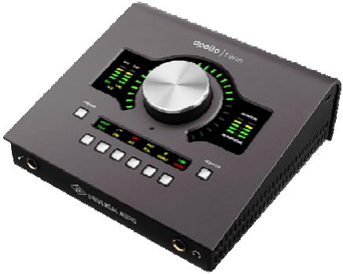
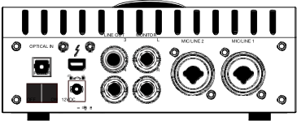
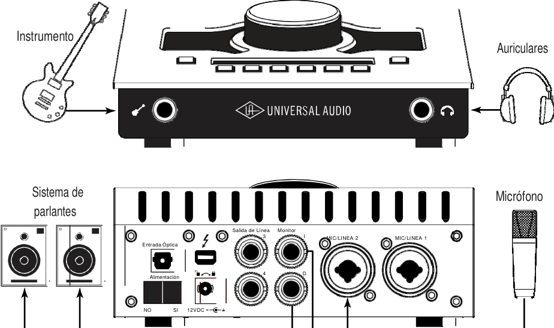
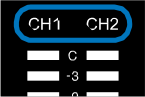
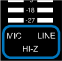
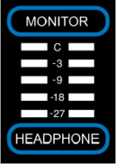
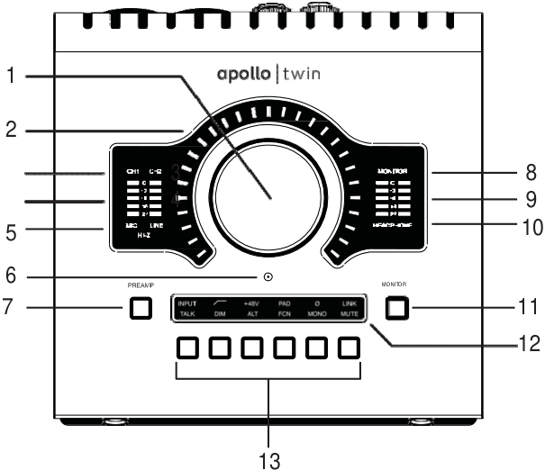
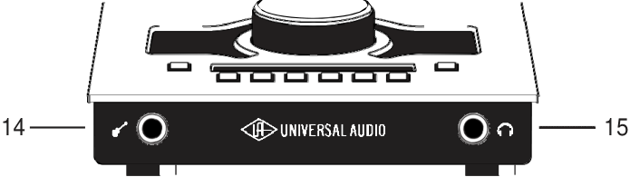
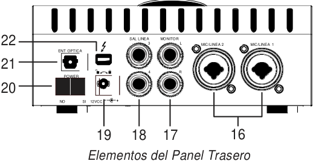
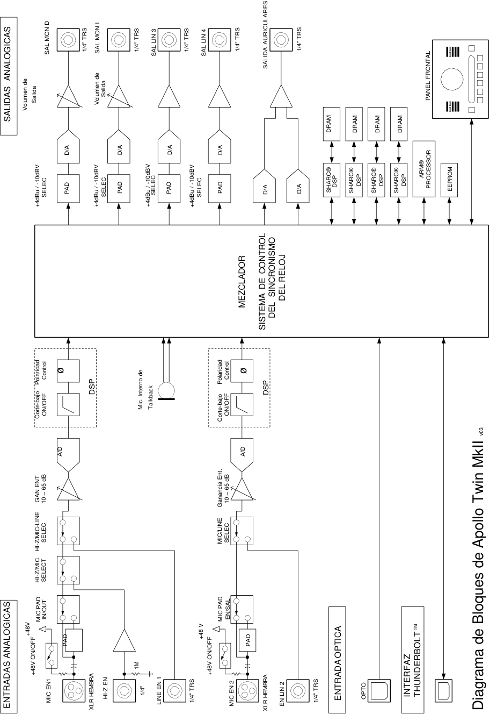

## **Manual de Hardware de Apollo Twin MkII** 

Versión de manual 170502 

www.uaudio.com 

## **Una carta de Bill Putnam Jr.** 

Gracias por tomar la decisión de hacer, de la interfaz de alta resolución Twin MKII, una parte de su experiencia de hacer música. Sabemos que cualquier nueva pieza de arte requiere una inversión de tiempo y dinero y nuestro objetivo es hacer que su inversión sea óptima. El hecho de que juguemos un papel en su proceso creativo es lo que hace significativos a nuestros esfuerzos  y le damos gracias por esto. 

En muchos sentidos, la familia de productos de interfaz de audio Apollo 8 representa los mejores ejemplos que Universal Audio ha asociado siempre a lo largo de  su  larga historia; desde la fundación original de la UA en la década de 1950 por mi padre, a través de nuestra visión actual de entregar lo mejor de ambas tecnologías de audio analógico y digital. 

A partir de la alta calidad  de sus E/S analógicas, una calidad sonora superior de Apollo 8 sirve como fundamento. Sin embargo, esto es sólo el comienzo ya que los productos de Apollo son las únicas interfaces de audio que le permiten ejecutar plug-ins UAD en tiempo real. ¿Quieres monitorear a través de un canal de la Consola Neve® mientras que el ruteo de graves lo realizas a través de un clásico compresor Fairchild o LA-2A? ¿O qué tal el ruteo de la voz a través de una máquina de cinta Studer® con alguna Reverb añadida de Lexicon®? 

Con nuestra biblioteca creciente  de más de 90 plug-ins UAD, las opciones son ilimitadas. 

En UA, nos abrazamos a la idea de que esta poderosa tecnología debe servir, en última instancia, para que en el proceso creativo no existan barreras. Estos son los mismos ideales de mi padre cuando inventó un equipo de audio para resolver problemas en el estudio. Así que a medida que comience a incorporarse Apollo en su proceso creativo, esperamos que la emoción y el orgullo de lo que hemos construido continúen creciendo. Creemos que Apollo ganará su camino en el flujo de su trabajo creativo, proporcionando una fidelidad impresionante, facilidad de utilización, y una sólida confiabilidad en los próximos años. 

Como siempre, no dude en acercarse a nosotros a través de nuestro sitio web www.uaudio.com, o a través de nuestros canales de medios sociales. Esperamos con interés escuchar de usted, y gracias una vez más por la elección de Universal Audio. 

Sinceramente, 

Bill Putnam Jr. 

_Todas las marcas se reconocen como propiedad de sus respectivos dueños. Los Plug-In UAD se venden por separado._ 

Manual de Hardware de Apollo Twin MkII                      2                                                                           Bienvenida 

**Indice** _**Consejo:** Haga clic sobre cualquier sección o página para saltar directamente a la página._ 

Una carta de Bill Putnam Jr  ........................................................................ 2 Introducción  ................................................................................................ 4 Bienvenido a Apollo! .............................................................................................................. 4 Características de Twin MkII .................................................................................................. 7 Vista general de las operaciones ........................................................................................... 9 Acerca de la documentación de Twin MkII  .................................................................... 11 Recursos adicionales  ................................................................................................... 12 Inicio Rápido  .............................................................................................. 13 Configuración de Hardware .......................................................................................... 13 Configuración de Software  ........................................................................................... 14 Conexión a las fuentes de entrada y al sistema de monitores  ....................................... 15 Ajuste de los niveles de entrada/salida del hardware  .................................................... 16 Controls & Connectors  ................................................................................ 17 Vista General de los Controles  ..................................................................................... 17 Panel Superior ............................................................................................................. 20 Panel frontal  ................................................................................................................ 25 Panel lateral  ................................................................................................................ 25 Panel posterior  ............................................................................................................ 26 Especificaciones  ........................................................................................ 28 Tablas de especificaciones  .......................................................................................... 28 Diagrama de bloques del hardware  .............................................................................. 32 Solución de problemas  ............................................................................ 33 Avisos  ........................................................................................................ 34 Importante Información de Seguridad  ........................................................................... 34 Garantía  ...................................................................................................................... 35 Mantenimiento  ............................................................................................................. 35 Servicio de reparación  ................................................................................................. 35 Soporte Técnico  ........................................................................................ 37 Base de conocimiento de Universal Audio  .................................................................... 37 Canal de soporte en You Tube ..................................................................................... 37 Foros de la Comunidad UAD  ....................................................................................... 37 Contacto con el Soporte UA  ........................................................................................ 37 

Índice 

Apollo Twin MkII Hardware Manual 

3 

## **Introducción Bienvenido a Apollo!** 

## **Conversión superior de audio de escritorio** 

## **con sonido analógico clásico** 

Con una resolución líder en la clase y el procesamiento UAD en tiempo real, Apollo Twin MkII establece un nuevo estándar  para  la producción de música de escritorio. Esta  interfaz 2x6 Thunderbolt para Mac y Windows le permite grabar con latencia casi cero a través de la gama completa  de  los  Plug-Ins  potenciados  de  UAD, combinando ingeniosamente tonos analógicos clásicos con características de vanguardia. 

**----- Start of picture text -----** 
MONITOR **----- End of picture text -----** 

## **Ahora Ud. Puede:** 

- Grabar con la conversión A/D y D/A de clase mundial Apollo, con el sonido de cientos de grabaciones de éxitos 

- Colocar  en  cascada  hasta   4   interfaces Apollo y 6 dispositivos UAD-2 sobre Thunderbolt, añadiendo DSP y E/S a medida que su estudio crece. 

- Mezclar con plug-ins UAD como  los compresores   Teletronix®   LA-2A,   1176   y Fairchild®  incluidos,  los  EQ  Pultec®  y  el Pre-amplificador 610-B 

- Monitoreo con latencia cercana  a  cero  a través de emulaciones de pre-amplificador de Neve®,  API®,  Manley®  y   más   con tecnología Unison ™ 

**----- Start of picture text -----** 
LINE OUT         MONITOR 3  L  MIC/LINE 2  MIC/LINE 1 OPTICAL IN POWER  4  R OFF            ON   12VDC **----- End of picture text -----** 

## **Tecnología  Unison: El Sonido de Neve, API y los Pre-amplificadores Manley** 

Apollo Twin MkII cuenta con dos pre-amplificadores de micrófono habilitados para Unison, lo que le permite realizar un monitoreo a través de emulaciones de exigentes preamplificadores de micrófono de Neve, API, Manley y Universal Audio. Una tecnología exclusiva de Apollo Unison, marca el tono de estos codiciados pre-amplificadores de válvulas y estado sólido, incluyendo su impedancia de entrada, "puntos dulces" de la fase de ganancia y los comportamientos del circuito de componentes del hardware original. 

El secreto de Unison es la integración hardware-software entre los pre-amplificadores de micrófono de Apollo Twin MkII y la aceleración UAD-2 SOLO, doble o con cuatro núcleos DSP. Simplemente coloque un plug-in de pre-amplificador Unison en su entrada de micrófono y aproveche los sonidos clásicos de los previos de micrófono más grabados del mundo. 

Introducción 

Manual de Hardware de Apollo Twin MkII 

4 

## **Una completa suite de procesamiento analógico clásico en su interior** 

El Apollo Twin MkII ofrece una suite de increíbles plug-ins de emulación analógica, incluyendo los auténticos Teletronix LA-2A, 1176LN y compresores Fairchild, los legendarios Pultec EQs y el habilitado pre amplificador Unison UA 610-B de válvulas, desarrollado por el reconocido equipo de ingenieros de algoritmos de UA. Estos plug-ins análogos clásicos en tiempo real establecen el estándar con el que se juzgan todos los demás plug-ins de emulación de hardware. 

Desde la calidez de la válvula del EQ Pultec en las guitarras hasta la suave limitación del LA-2A en las voces, o la bomba de un auténtico compresor Fairchild 670 en la batería, sus grabaciones darán un salto gigantesco hacia adelante en sonido analógico ricamente sonoro y complejo. 

## **Acceda al mundo de los plug-ins potenciados de UAD** 

Además de los plug-ins incluidos, Apollo Twin MkII le permite aprovechar los plug-ins UAD de última generación, incluyendo ecualizadores, compresores, reverberaciones, máquinas de cintas y más, con una latencia cercana a cero, independientemente del software de audio, del tamaño del buffer  y sin sobrecargar la CPU de su computadora. 

Con emulaciones exclusivas de Neve, Studer, Manley, API, Ampex, Lexicon, Fender y más, * es como tener un estudio analógico sin fin, justo en su escritorio. Y a diferencia de las interfaces de la competencia, estos plug-ins DSP-potenciados también están disponibles para la mezcla en su DAW . 

## **Conversión A/D y D/A de la próxima generación** 

Por supuesto que el corazón de cualquier interfaz de audio es la calidad de su conversión. Con el rango dinámico más alto y el menor ruido de cualquier interfaz de escritorio, Apollo Twin MkII le ofrece un sonido estelar de 24 bits / 192 kHz y una claridad impresionante. Sus pre-amplificadores de micrófono Unison de primera calidad, la etapa de entrada y la conversión de audio son idénticos a los de la famosa serie Apollo, traduciéndose en ricas grabaciones tridimensionales con una profundidad y una fuerza excepcionales. 

## **Apollo: la elección de los profesionales de la nueva escuela** 

Apollo es la elección confirmada de los profesionales de las tomas de éxito, utilizada para grabar discos de Kendrick Lamar ( _To Pimp A Butterfly_ ), Coldplay ( _A Head Full of Dreams_ ), Dr. Dre ( _Compton)_ , Brad Paisley ( _Wheelhouse_ ), y muchos más. La gama de interfaces de Apollo ha ganado numerosos premios de la industria de Sound on Sound, Future Music y Electronic Musician - así como el prestigioso premio 2016 TEC Award para hardware de audio de  computadora. 

## **Ahora con amplificadores vintage y pedaleras** 

Apollo Twin MkII también incluye la tecnología Unison en su entrada de instrumentos en el panel frontal, ofreciéndole emulaciones de amplificadores de guitarra y bajo como el Fender '55 Tweed Deluxe, el Marshall Plexi Super Lead 1959 y el Ampeg B-15N Bass Amplifier. Icónicos pedaleras como la Ibanez Tube Screamer. 

_*Todas las marcas comerciales se reconocen como propiedad de sus respectivos propietarios. Los Plug-ins UAD Potenciados se venden por separado_ 

Introducción 

5 

Manual de Hardware de Apollo Twin MkII 

## **Construir un estudio en red** 

Apollo Twin MkII ofrece hasta 10 x 6 canales de entrada / salida simultáneos, con dos puertos Thunderbolt incorporados. Gracias al software Apollo Expandido, los usuarios de las interfaces de audio Apollo Twin, Apollo Twin MkII, Apollo 8, Apollo 8p y Apollo 16 equipadas con Thunderbolt pueden combinar hasta cuatro Apollos y seis dispositivos UAD-2 totales, añadiendo E/S y DSP cuando su estudio crece. Apollo Twin MkII hace el controlador de escritorio inteligente perfecto para un sistema Apollo completo. 

## **Una aplicación elegante  de baja latencia** 

Con la aplicación Consola 2 de Apollo Twin MkII, una completa re-imaginación del software original de la Consola Apollo, se pueden aprovechar más de 25 funciones nuevas solicitadas por el usuario, como pre ajustes de canales, funciones de arrastrar y soltar, ventanas de tamaño dinámico y mucho más. 

Introducción 

6 

Manual de Hardware de Apollo Twin MkII 

## **Características de Apollo Twin MkII** 

## **Características principales** 

- La mejor calidad de audio de la clase con una mejorada conversión de 24 bits / 192 kHz 

- Procesamiento  en  tiempo  real  de  UAD  -  monitoreo  a  través  de  compresores  antiguos, ecualizadores, cintas y plug-ins de guitarra/amplificador de guitarra con latencia casi cero 

- 2  pre-amplificadores  premium  de  mic  /  línea;  2  salidas  de  línea;  Entrada  de instrumentos Hi-Z en el panel frontal y salida de auriculares 

- Tecnología  Unison  ™  para  impresionantes  modelos  de  pre-amplificadores  de  micrófono clásicos y amplificadores de guitarra. 

- Micrófono talkback incorporado para la comunicación y grabación 

- Las funciones  de monitor remoto pueden reemplazar a  los controladores dedicados del monitor. 

- Procesamiento UAD-2 SOLO, DUO o QUAD DSP en el interior 

- Conexión  Thunderbolt para acelerar la velocidad PCIe en las  computadoras. 

- Diseño analógico sin concesiones, componentes superiores de calidad total 

- Salidas de monitor analógico controladas digitalmente para una  resolución total en todos los niveles de audición 

- Conexión en cascada de hasta cuatro Apollos equipados con Thunderbolt y seis dispositivos UAD-2 totales - agregando E/S y DSP según sea necesario 

## **Todas las características** 

## **Interfaz de audio** 

- Frecuencias de muestreo de hasta 192 kHz con una longitud de palabra de 24 bits ( _96 kHz como máximo en las entradas S/PDIF_ ) 

- Hasta 10 x 6 canales de entrada/salida simultáneos 

   - Dos canales de conversión analógico a digital a través de: 

   - Dos en tradas ba lanceadas   m ic/line 

   - Una entrada de instrumentos Hi-Z (alta impedancia) 

   - Seis canales de conversión digital a analógica a través de: 

   - Salidas estéreo de monitores digitalmente controladas 

   - Salidas estéreo para auriculares 

   - Salidas de línea 3-4 

   - Hasta ocho canales de entrada digital a través de: 

   - Ocho canales ópticos ADAT  S/MUX para alta frecuencia de muestreo. 

   - Dos canales S / PDIF ópticos con conversión de frecuencia de muestreo 

## **Pre-amplificadores de Micrófono** 

- Dos pre amplificadores de micrófono analógicos de alta resolución, ultra-transparentes y controlados digitalmente 

- Control del Panel frontal y de software de todos los parámetros del pre amplificador 

- Filtro de corte bajo, tensión fantasma de 48V, pad de 20 dB,  inversión de polaridad y linqueo estéreo. 

7 Introducción 

Manual de Hardware de Apollo Twin MkII 

## **Monitoreo** 

- Salidas analógicas para monitor  de la más alta fidelidad controladas digitalmente 

- Salidas estéreo de auriculares independientes y direccionables 

- Salidas de línea independientes y direccionables que pueden ser usadas   para la mezcla adicional de referencia 

- Control en el panel frontal de nivel, silencio, atenuación, mono, altavoces alternativos y conversación 

- Micrófono de conversación incorporado para la comunicación y  grabación 

## **Interior de UAD-2** 

- Uno (SOLO), dos (DUO) o cuatro (QUAD) procesadores SHARC DSP 

- Proceso UAD en tiempo real sobre todas las entradas analógicas y digitales 

- Las mismas características y funcionalidad que otros dispositivos UAD-2 cuando se utilizan con una DAW 

- Una librería completa de los plug-ins potenciados  está disponible en línea 

## **Software** 

## _**Aplicación de la Consola:**_ 

- Permite el monitoreo y/o la supervisión con el procesamiento UAD en tiempo real 

- Control remoto de las funciones y funcionalidad de Apollo Twin MkII 

- Entrada/salida virtual para hacer transitar pistas DAW a través de la Consola 

- Dos buses auxiliares estéreo independientes 

## _**Plug-in de recuperación de Consola:**_ 

- Guarda las configuraciones de Apollo Twin MkII de las sesiones DAW para fácil recuperación 

- Facilita el control  de monitoreo Apollo Twin MkII desde la DAW 

- Formatos de plug-in VST, RTAS, AAX 64 y Audio Units 

## _**Medidor de UAD y aplicación del panel de control:**_ 

- Configura los ajustes globales UAD  y el uso del sistema de monitores 

## **Otros** 

- Diseño industrial de forma para escritorio atractivo y duradero 

- Bloqueo del conector de la fuente de alimentación  evita la desconexión accidental 

- Actualizaciones de firmware sencillas 

- Garantía de un año que incluye partes y mano de obra 

## **Contenidos del embalaje** 

- Unidad Apollo Twin MkII 

- Fuente de alimentación con (4) conectores de CA (Conectores de CA intercambiables para EE.UU., Europa, Reino Unido, Australia y China) 

- Tarjeta URL de inicio 

Introducción 

Manual de Hardware de Apollo Twin MkII 

8 

## **Vista General de Operaciones** 

## **Interfaz de audio** 

En primer lugar, Apollo Twin MkII es una interfaz de audio Premium 2 x 6 Thunderbolt  con conversión de audio de clase mundial de 24 bits / 192 kHz. Apollo Twin MkII se conecta a las salidas y entradas de otro equipo de audio y realiza conversiones de audio analógico a digital (A/D) y digital a analógico (D/A) en las señales del mismo. Las señales de audio digital se encaminan hacia y desde el ordenador principal a través del protocolo PCIe de alta velocidad, mediante un solo cable Thunderbolt. 

Apollo Twin MkII aprovecha la experiencia de Universal Audio en aceleración DSP, plug-ins potenciados UAD y diseño de hardware analógico integrando las últimas tecnologías de vanguardia en conversión A/D-D/A de alto rendimiento, reconstrucción de  señal  DSP  y conectividad. Apollo Twin MkII actúa como interfaz de audio con efectos DSP integrados para seguimiento y monitorización, un acelerador UAD-2 DSP completamente integrado para la mezcla y masterización, así como un controlador de monitorización completo. 

## **Acerca del Proceso UAD en tiempo real** 

Apollo Twin MkII tiene la capacidad de ejecutar Plug-Ins potenciados UAD en tiempo real. La revolucionaria tecnología DSP + FPGA de Apollo Twin MkII permite que los plug-ins UAD funcionen con latencias en el rango de 2ms, y varios plug-ins pueden ser apilados en serie sin latencia adicional. 

El procesamiento UAD en tiempo real facilita la experiencia sonora última mientras se monitorea y / o realiza un seguimiento. 

_**Nota:** Apollo Twin MkII, al igual que otros dispositivos UAD-2, sólo puede cargar Plug-ins potenciados UAD, que están diseñados específicamente para funcionar con aceleradores UAD2 DSP. Los plug-ins nativos (basados en host) no se pueden ejecutar en el DSP UAD-2._ 

## **Software de la Consola** 

La aplicación de software de la Consola se ejecuta en la computadora y se utiliza para controlar la mezcla y la supervisión de Apollo Twin MkII con procesamiento UAD en tiempo real, en el acceso a la configuración de E/S de la interfaz de audio y mucho más. El flujo de trabajo, de estilo analógico de la Consola, está diseñado para proporcionar acceso rápido a las funciones más comunes que se necesitan en una interfaz -fácil de usar- de mezclador familiar. 

El proceso UAD en tiempo real es una función especial que sólo está disponible en la Consola. Todas las entradas analógicas y digitales de Apollo Twin MkII pueden realizar el procesamiento UAD en tiempo real Simultáneamente,   las entradas de Consola con (o sin) procesamiento UAD en tiempo real se pueden encaminar a la DAW para la grabación. 

La Consola controla el mezclador digital de Apollo Twin MkII para ud. pueda  monitorear  las entradas de Apollo Twin MkII (con o sin procesamiento UAD en tiempo real) sin utilizar ningún otro software de audio como un DAW. 

La Consola es integral para liberar el poder de Apolo Twin MkII. Para obtener detalles completos sobre cómo utilizar la Consola y el procesamiento UAD en tiempo real, consulte el Manual del software de Apollo, refiera al Manual de software de Apollo. 

Introducción 

Manual de Hardware de Apollo Twin MkII 

9 

## **Plug-ins potenciados UAD en una DAW** 

Los plug-ins potenciados de Apollo y Apollo Twin MkII también se pueden utilizar dentro de una DAW sin el uso de la Consola. Los plug-ins UAD cargados dentro de la DAW funcionan como otros plug-ins (no UAD), excepto que el procesamiento se produce en el Apolo Twin MkII DSP en lugar del procesador de la computadora . En este escenario, los plug-ins UAD están sujetos a las latencias  que producen  el almacenamiento en búfer de E/S. 

Para obtener más información sobre el uso de los plug-ins potenciados UAD en un DAW, consulte el Manual del sistema, vea el Manual de Sistema UAD. 

## **Uso Independiente** 

Aunque se requiere que la aplicación de la Consola utilice todas las características de Apollo Twin MkII, la unidad de hardware se puede utilizar como un mezclador digital con funcionalidad limitada sin una conexión Thunderbolt a una computadora. 

Todas las asignaciones de E/S activas, rutas de señales y ajustes del monitor se guardan en el firmware interno cuando Apollo Twin MkII está apagado y persisten cuando se repone la alimentación. Por lo tanto, los ajustes utilizados por última vez siempre están disponibles incluso cuando una computadora no está conectada. 

Tenga en cuenta que las instancias de plug-in UAD no se retienen al apagar, porque los archivos de complemento residen en la computadora. Sin embargo, si los plug-ins UAD están activos cuando se pierde la conexión de Apollo Twin MkII con el sistema host (si el cable Thunderbolt está desconectado), las configuraciones de plug-in UAD actuales permanecen activas para su procesamiento hasta que Apollo Twin MkII se apague. 

_**Nota:** El uso independiente  no está disponible cuando se conectan varias unidades Apollo en cascada._ 

Manual de Hardware de Apollo Twin MkII 

Introducción 

10 

## **Acerca de la Documentación de Apollo Twin MkII Documentación** 

La documentación para Apollo Twin MkII y los plug-ins potenciados UAD está separada por áreas de funcionalidad,  como se describe a continuación. Los manuales de usuario  se cargan en la unidad del sistema durante la instalación del software y se pueden descargar en www.uaudio.com. 

## **Archivos de Manual de Apollo** 

_**Nota:** Todos los archivos de los manuales están en formato PDF. Los archivos PDF requieren una aplicación de lectura de PDF gratuita, como Adobe Acrobat Reader o Vista previa (incluida con macOS)._ 

## **Manuales de Hardware de Apollo** 

Cada modelo de Apollo tiene un manual de hardware único. Los manuales de hardware de Apollo contienen detalles completos relacionados con el hardware de un modelo Apollo específico. Se incluyen descripciones detalladas de todas las características de hardware, controles, conectores y especificaciones. 

_**Nota:** Cada manual de hardware contiene, en el nombre de archivo, el modelo Apollo  ._ 

## **Manual de Software de Apollo** 

El Manual del software Apollo es el complemento de los manuales de hardware de Apollo. Contiene información detallada sobre cómo configurar y controlar todas las funciones del software  Apollo  mediante  la  aplicación  de  la  Consola,  la  ventana  Configuración  de  la Consola, el complemento Recuperación de Consola y el sistema de conversación (talkback). Consulte el Manual del software de Apollo para aprender cómo utilizar las herramientas de software e integrar la funcionalidad de Apollo en el entorno de la  DAW. 

_**Nota:** Existe  un  único  manual de software  para todos  los  tipos de conexión  Apollo (Thunderbolt, FireWire, USB)._ 

## **Manual de Sistema UAD** 

El Manual del Sistema UAD es el manual completo de funcionamiento de la funcionalidad UAD-2 de Apollo y se aplica a toda la familia de productos UAD-2. Contiene información detallada sobre la instalación y configuración de dispositivos UAD, la aplicación UAD Meter & Control Panel, la compra de plug-ins opcionales en la tienda online de UA y más. Incluye todo  acerca  de  UAD  excepto  la  información  específica  de  Apollo  y  las  descripciones individuales de plug-in de UAD. 

## **Manual de los plug-ins UAD** 

Las características y la funcionalidad de todos los plug-ins individuales de UAD se detallan en el Manual de Plug-ins de UAD. Consulte este documento para obtener más información sobre el funcionamiento, los controles y la interfaz de usuario de cada plug-in UAD desarrollado por Universal Audio. 

## **Manuales de los desarrolladores directos de plug-ins** 

Los plug-ins potenciados UAD incluyen títulos creados por nuestros socios desarrolladores directos. La documentación de estos complementos de terceros son archivos separados escritos y proporcionados por los desarrolladores de complementos. Los nombres de archivo para estos manuales de plug-in son los mismos que los títulos de plug-in. 

Introducción 

Manual de Hardware de Apollo Twin MkII 

11 

## **Acceso a la Documentación Instalada** 

Cualquiera de estos métodos se puede utilizar para acceder a la documentación instalada: 

- Elija la documentación en el menú Ayuda de la aplicación Consola 

- Haga clic en el botón Manuales de Producto en el panel de ayuda de la aplicación UAD Meter & Control Panel 

- Los manuales también están disponibles en help.uaudio.com 

## **Documentación de la  DAW** 

Cada aplicación de software de DAW tiene sus propios métodos particulares para configurar y utilizar interfaces de audio y complementos. Consulte la documentación de la DAW de la computadora para obtener instrucciones específicas sobre el uso de la interfaz de audio y las funciones de plug-in dentro de la DAW. 

## **Recursos Adicionales** 

Para obtener recursos adicionales, o si necesita ponerse en contacto con Universal Audio para obtener asistencia, consulte la página de soporte técnico, vea SoporteTécnico 

Introducción 

Manual de Hardware de Apollo Twin MkII 

12 

## **Inicio Rápido** 

La instalación y configuración de hardware y software de Apollo Twin MkII consisten en estos pasos: 

1. Configuración del Hardware: Conecte y encienda el hardware de Apollo Twin MkII 

2. Configuración del Software: Descargue e instale el software Apollo Twin MkII 

3. Conéctelo a entradas de señal y el Sistema de Monitores 

4. Ajuste  los  niveles  de  E/S  del  hardware:  Aprenda  como  ajustar  los  niveles  de entradas y salidas 

## **Configuración del Hardware** 

## **Elija una ubicación adecuada** 

- Ubique el Apollo Twin MkII sobre una superficie plana para que sus patas mantengan el flujo de aire debajo de la unidad. 

- La  ubicación  debe  ser  lo  suficientemente  firme  como  para  mantener  su  peso  y soportar la presión de operar los controles del panel. 

- Deje suficiente espacio detrás de la unidad para el cableado. 

- No bloquee las rejillas de ventilación de la unidad en la parte inferior o laterales. 

## **Conecte a la computadora y encienda** 

_**Precaución:** Antes de encender o apagar el Apollo Twin MkII, baje el volumen de los altavoces del monitor (si está conectado) y retire los auriculares de sus oídos._ 

1. Conecte un cable Thunderbolt (no incluido) entre Apollo Twin MkII y el ordenador host. 

2. Conecte la fuente de alimentación incluida a una toma de CA (Apollo Twin MkII no puede ser alimentado por bus). 

3. Conecte la fuente de alimentación al panel trasero de Apollo. Alinee las dos lengüetas del conector del cable de alimentación a las muescas en la entrada, luego gire el cañón para evitar la desconexión accidental. 

_**Importante:** Después de asegurarse de que las lengüetas del barril de bloqueo están alineadas con las ranuras del chasis y el cañón está completamente insertado, gire el barril para asegurar el conector._ 

2. Girar para trabar 1. Alinear pestañas 12VDC 

4. Apague el Apollo Twin MkII con el interruptor de alimentación del panel posterior. Apollo Twin MkII ya está listo para la Configuración del Software. 

Manual de Hardware de Apollo Twin MkII 

Inicio Rápido 

13 

## **Configuración del Software** 

_**Nota:** Los elementos de esta página se detallan en el Manual del software Apollo. Consulte Acerca de la documentación de Apollo Twin para obtener información relacionada. Vea Acerca de la Documentación de Twin Apollo para más información._ 

## **Requerimientos del Sistema** 

Todos los requisitos del sistema deben cumplirse para que Apollo Twin MkII funcione correctamente. Antes de continuar con la instalación, consulte los requisitos del sistema en el Manual del software de Apollo. 

## **Instalación del Software** 

El software debe estar instalado para utilizar el hardware y los plug-ins UAD. El instalador del software de los plug-ins potenciados UAD contiene el software y los controladores de Apollo Twin MkII. 

_**Importante:** Para obtener resultados óptimos, conecte y encienda el Apollo Twin MkII antes de instalar el software._ 

Para obtener el último  instalador del software de los plug-ins potenciados UAD visite: 

- www.uaudio.com/downloads 

## **Registración y Autorización** 

Apollo Twin MkII debe estar registrado y autorizado para desbloquear los plug-ins UAD que se incluyen con el producto. El registro y la autorización se realiza a través de un navegador web y se activa automáticamente por el software UAD la primera vez que se reconoce el dispositivo. 

## **Configuración del Sistema** 

Los detalles completos sobre la configuración del sistema Apollo Twin MkII, incluyendo la forma de integrarse con una DAW y la información relacionada, se incluyen en el Manual de Software de Apollo. 

## **Aplicación de la Consola** 

La aplicación incluida de la Consola es la interfaz de software para el hardware Apollo Twin MkII. La Consola controla Apollo Twin MkII y sus funciones de mezcla digital, monitoreo y procesamiento UAD en tiempo real. La Consola también se utiliza para configurar los ajustes de E/S de Apollo Twin MkII, como la frecuencia de muestreo, la fuente de reloj y los niveles de referencia. 

Para obtener información sobre cómo operar la Consola, consulte el Manual del software Apollo. 

## **Apollo Expandido** 

Cuando se necesita más E/S y/o DSP, se pueden conectar en cascada hasta cuatro interfaces Apollo a través de Thunderbolt en una configuración de múltiples unidades. Para obtener detalles completos sobre la conexión en cascada de varias unidades, consulte el Manual de software Thunderbolt Apollo. 

## **Videos de Soporte UA** 

Muchos videos informativos están disponibles en línea para ayudarle a comenzar con Apollo Twin MkII: help.uaudio.com 

Manual de Hardware de Apollo Twin MkII 

Inicio Rápido 

14 

## **Conexión a fuentes de entrada y sistema de monitorización** 

A continuación se muestra una configuración típica de Apollo Twin MkII. Para obtener detalles completos sobre todos los conectores y controles de Apollo Twin MkII, consulte Controles y Conectores. 

**----- Start of picture text -----** 
Instrumento Auriculares Sistema de Micrófono parlantes Salida de Línea     Monitor 3  I  MIC/LINEA 2  MIC/LINEA 1 Entrada Óptica 4  D Alimentación NO  SI     12VDC **----- End of picture text -----** 

_Típica configuración de conexiones de Apollo Twin MkII_ 

15 

Manual de Hardware de Apollo Twin MkII 

Inicio Rápido 

## **Configuración de los niveles de hardware de E/S** 

Esta sección explica cómo ajustar los niveles de ganancia de entrada  para las entradas de hardware (micrófono, línea y Hi-Z) y como ajustar los  niveles de volumen  de  las salidas de hardware (monitores y auriculares). 

Consulte  la  ilustración  del Panel  Superior     para  ver  los  nombres  y  números  de  control mencionados a continuación. 

_**Importante:** Antes de continuar, baje el volumen de los altavoces del monitor y retire los auriculares de sus oídos._ 

## **Ajuste las Ganancias de entrada** 

1. Seleccione el canal de entrada que desea ajustar pulsando el botón Preamp (7) hasta que el indicador de selección de canal (3) muestre el canal (CH1 o CH2). 

2. Seleccione el tipo de entrada (micrófono o línea) presionando el botón de selección de entrada (13-a) hasta que el indicador de tipo de entrada (5) muestre la toma de entrada deseada * (ver nota más abajo). 

3. Ajuste la ganancia del canal aumentando el mando de nivel (1) hasta que el medidor de entrada para el canal (4) se aproxime al máximo, pero no llegue al LED rojo de clip cuando la señal de entrada esté presente. Si el nivel es demasiado alto para evitar el recorte (cuando el LED rojo "C" se enciende), active el Pad (13-d). 

4. Para ajustar la ganancia de entrada del otro canal de entrada, repita los pasos 1 - 3. 

## **Ajuste los Volúmenes de Salida** 

1. Seleccione el volumen de salida deseado (monitor o auriculares) presionando el botón Monitor (11) hasta iluminar el indicador Monitor Selected (8) o Headphone Selected (10). 

2. Ajuste el volumen aumentando cuidadosamente el mando de nivel (1)  hasta  que  se alcance el nivel deseado (puede que deba ajustar el volumen del sistema de altavoces). 

3. Para ajustar el otro volumen de salida (monitor o auriculares), repita los pasos 1 - 2. 

## **Silencie (Mute) y habilite (Unmute)  las salidas de Monitor** 

1. Seleccione las salidas del Monitor pulsando el botón Monitor (11) hasta que el indicador 

   - Monitor Seleccionado (8) se ilumine. 

2. Presione el botón MUTE (13-l) para silenciar las salidas del monitor.  El  indicador  de monitor seleccionado (8) está en rojo cuando los monitores están silenciados. Cuando están en el modo MONITOR,  los indicadores LED de volumen  (2) también están en rojo. 

3. Para cambiar el estado de silencio del monitor, presione el botón MUTE (13-l) siempre que esté seleccionado Monitor (8). 

## **Notas:** 

- *La entrada Hi-Z se selecciona automáticamente, reemplazando las entradas de micrófono y línea del canal 1, cuando se conecta un enchufe TS de ¼ "mono (conector) al conector Hi-Z Instrument (14) en el panel frontal. 

- Presione el botón Link (13-f) para controlar ambos canales simultáneamente cuando se conecta una fuente estéreo, con una entrada seleccionada (3). 

- Las salidas de línea 3 y 4 se acceden y controlan a través de software (Consola o DAW). 

- Consulte el Manual de Software Apollo para aprender cómo configurar la interfaz de audio, utilizar la aplicación Consola y el Procesamiento UAD en tiempo real, y más. 

16 

Manual de Hardware de Apollo Twin MkII 

Inicio Rápido 

## **Controles y Conectores** 

En este capítulo se proporcionan detalles completos sobre los controles de hardware Apollo Twin MkII y todos los conectores de los paneles delantero y trasero. 

_**Nota:** Para saber cómo configurar los niveles de ganancia de entrada (micrófono, línea y Hi-Z) y volumen de salida (monitores y auriculares), consulte Ajuste de los Niveles de E/S de hardware  en el capítulo Inicio rápido._ 

## **Vista General de los Controles** 

Algunos controles Apollo Twin MkII tienen múltiples funciones. La función de cada control depende del modo de funcionamiento seleccionado y de los ajustes efectuados dentro de ese modo. Para controlar una función en particular, el control debe estar activado. 

## **Modos de Operación** 

El panel superior de Apollo Twin MkII tiene dos modos de funcionamiento: Pre amplificador y Monitor. La función y la disponibilidad de los controles del panel superior varían dependiendo del modo de funcionamiento activo. El modo activo se selecciona con los botones PREAMP y MONITOR. Pulse el botón para activar el modo. Cada modo se explica con mayor detalle a continuación. 

_**Nota:** Todas las funciones del panel superior se pueden ejecutar simultáneamente (sin modos de conmutación) desde la aplicación de software de Consola complementaria. Consulte el  Manual de Software de Apollo para más detalles_ 

## **Modo Pre amplificador** 

Cuando Apollo Twin MkII está en modo Preamp, todos los controles del panel superior están relacionados únicamente con las funciones de entrada. Para ajustar cualquier función de entrada, pulse el botón PREAMP para entrar en el modo de pre amplificación y activar los controles del canal de entrada. 

_**Nota:** Las funciones de monitor y auriculares no se pueden realizar en el modo de pre amplificación._ 

## **Canales de Pre amplificador** 

Apollo Twin MkII tiene dos canales de entrada analógicos independientes. Cada canal de entrada tiene un pre amplificador. Ambos canales de entrada pueden ser controlados independientemente y utilizados al mismo tiempo para la conversión A/D. 

## **Controles de Pera mplificador** 

Apollo Twin MkII tiene un juego de controles de pre amplificador de canal de entrada. Los controles del canal de entrada ajustan todas las funciones del pre amplificador para el canal de entrada actualmente seleccionado. 

Control es y Conectores 

Manual de Hardware de Apollo Twin MkII 

17 

## **Canal Seleccionado** 

El canal de entrada actualmente seleccionado se muestra mediante los indicadores CH1 y CH2 en la parte superior izquierda del panel principal, por encima del display de entrada. Los controles del panel superior sólo ajustan las funciones del canal actualmente seleccionado. 

## **Cambiando los Canales** 

Cuando esté en el modo Preamp, presione el botón PREAMP para cambiar el canal seleccionado para que sus controles puedan ser ajustados. Pulse de nuevo PREAMP para volver al otro canal. 

## **Fuente de Entrada** 

La entrada Mic, Line o Hi-Z se encamina hacia el pre amplificador del canal. La fuente de entrada se muestra mediante los indicadores debajo de los medidores de entrada. 

La fuente de entrada Mic o Line se selecciona presionando el botón INPUT cuando se selecciona el canal. La entrada Hi-Z (disponible sólo en el canal 1) se selecciona automáticamente cuando el cable del instrumento se enchufa en la entrada Hi-Z en el panel frontal. 

_**Nota:** Sólo se puede utilizar un tipo de entrada a la vez (Mic, Línea o Hi-Z) como fuente de entrada de un canal._ 

## **Opciones de Pre amplificador** 

Cada canal de entrada tiene un conjunto de opciones de pre-amplificador. Las opciones de pre amplificación para el  canal  de entrada actualmente  seleccionado  se activan usando la fila de seis botones en la parte inferior del panel superior cuando está en el modo PREAMP. 

El estado actual de las opciones del pre amplificador se indica en la fila superior del panel de visualización de opciones sobre los botones de opción. Las opciones disponibles están atenuadas cuando están inactivas, brillantes cuando están habilitadas y apagadas cuando no están disponibles. 

_**Nota:** No todas las opciones de pre amplificación están disponibles con todos los tipos de entrada. Para obtener detalles específicos, consulte la sección Controles del panel Superior más adelante en este capítulo._ 

Control es y Conectores 

Manual de Hardware de Apollo Twin MkII 

18 

## **Modo MONITOR** 

Cuando Apollo Twin MkII está en modo Monitor, todos los controles del panel superior están relacionados sólo con las funciones de salida. Para ajustar cualquier función de salida, presione el botón MONITOR para entrar en el modo Monitor y activar los controles del monitor. 

**----- Start of picture text -----** 
MONITOR **----- End of picture text -----** 

_**Nota:** Las funciones de entrada no están accesibles en el modo Monitor._ 

_**Importante:** Apollo Twin MkII debe estar en el modo Monitor para poder cambiar el volumen de las salidas de monitor y auriculares._ 

## **Salidas Estéreo** 

Apollo Twin MkII tiene dos salidas estéreo que se pueden controlar con el hardware del panel superior: Monitor y auriculares. Las salidas estéreo se controlan de forma independiente. 

_**Nota:** Las salidas de línea 3 y 4 se controlan únicamente con software._ 

## **Controles de Salida** 

El mando Level se utiliza para ajustar independientemente el nivel de volumen de cada salida estéreo. El mando Level ajusta el volumen de la salida estéreo que fue seleccionada. Después de cambiar la salida seleccionada con el botón MONITOR, se puede ajustar el otro volumen de salida. 

## **Selección de la Salida** 

La salida estéreo actualmente seleccionada es mostrada por los indicadores MONITOR y HEADPHONE a la derecha de la pantalla principal, por encima y por debajo de los medidores de salida. 

Cuando esté en el modo Monitor, presionando el botón MONITOR cambia la salida seleccionada. Pulse de nuevo para cambiar a la otra salida. El mando Level ajusta el volumen de la salida seleccionada. 

## **Opciones de MONITOR** 

Apollo Twin MkII tiene opciones de monitor  que  realizan  las  funciones 

del controlador de monitor dedicado. Las    opciones    del    monitor    se controlan utilizando la fila de seis botones en la parte inferior del panel superior cuando está en el modo MONITOR. 

El estado actual de las opciones del monitor se indica en la fila inferior del panel de visualización de opciones que est encima de los botones de opción. Las opciones disponibles son atenuadas cuando están inactivas, brillantes cuando están habilitadas y apagadas cuando no están disponibles. 

_**Nota:** No  todas  las  opciones  de  monitor  están  siempre  disponibles.  Para  obtener detalles específicos, consulte la sección Controles del panel superior más adelante en este capítulo._ 

Controles y Conectores 

Manual de Hardware de Apollo Twin MkII 19 

## **Panel Superior** 

Consulte la siguiente ilustración para ver las descripciones de los controles en esta sección. 

**----- Start of picture text -----** 
1 2 3  8 4  9 5  10 6  MONITOR 7  11 12 13 **----- End of picture text -----** 

_Elementos del Panel Superior_ 

## **(1) Perilla de Nivel** 

El mando Level controla múltiples funciones. El control de niveles  que tendrá la perilla se selecciona con los botones PREAMP (7) y MONITOR (11). 

Cuando esté en el modo PREAMP, gire en el sentido de las agujas del reloj para aumentar la ganancia del per amplificador para el canal que está seleccionado. En el modo MONITOR, gire en sentido horario para aumentar el nivel de salida del monitor o el nivel de salida de los auriculares, dependiendo de la salida seleccionada con el botón MONITOR (11). 

## **Integración Unison** 

La perilla de nivel también se puede utilizar para controlar los plug-ins habilitados Unison UAD de pre amplificación y amplificador de guitarra. Consulte el Manual de Software Apollo para obtener los detalles completos de Unison. 

## **(2) Ganancia del pre amplificador e indicador de leds del volumen** 

Los LEDs alrededor de la perilla de nivel indican el nivel relativo de la función seleccionada (ganancia del pre amplificador de entrada o volumen del monitor / auriculares). 

_**Nota:** Los LEDs indicadores están ROJOS cuando se selecciona MONITOR (11) y se activa MUTE (13-l)._ 

Controles y Conectores 

Manual de Hardware de Apollo Twin MkII 

20 

## **(3) Indicadores de Selección de Canal** 

El canal de entrada que está seleccionado se indica con el nombre del canal iluminado encima de su medidor de entrada (CH1 o CH2). Pulse el botón Preamp (7) para cambiar entre los canales 1 y 2. 

## **(4) Medidores de Señal de Entrada** 

Estos medidores muestran el nivel de la señal entrante para los canales de entrada 1 y 2. Reduzca la ganancia del pre amplificador del canal (consulte ajuste de los niveles) si su LED rojo de clip se ilumina. 

## **(5) Indicadores del Tipo de Entrada** 

Estos indicadores muestran qué tipo de entrada (MIC, LINE o HI-Z) está activa para el canal seleccionado. Utilice el botón de selección de entrada (13-a) para cambiar el  tipo  de entrada. 

_**Nota** : La entrada Hi-Z de alta impedancia está disponible solo para el canal 1_ 

## **(6) Micrófono de Conversación** 

El micrófono de conversación incorporado se encuentra debajo de este agujero. La función conversación está configurada en el software de Consola incluido y se puede activar con el botón TALK (13-g) cuando el modo MONITOR (12) está activo. 

_**Precaución:** El micrófono de conversación es sensible. Para evitar daños en el equipo, no inserte ningún objeto en el orificio del micrófono, aplique aire a presión en el orificio del micrófono o utilice un vacío sobre el orificio del micrófono_ 

## **(7) Botón de Pre amplificador** 

Pulse este botón para entrar en el modo PREAMP y activar los controles del canal de entrada. Pulse de nuevo para alternar entre los canales 1 y 2. 

## **(8) Indicador de Monitor Seleccionado** 

Cuando MONITOR está encendido, el mando Level (1) controla el volumen de las salidas del monitor (16). Pulse el botón MONITOR (10) para activar los controles del monitor. 

_**Nota:** El indicador MONITOR está ROJO cuando las salidas del monitor están silenciadas._ 

## **(9) Medidores de las Salidas Estéreo** 

Estos medidores muestran los niveles de salida de la señal estéreo principal. * Los niveles de salida principales son independientes de los niveles de volumen del monitor y del auricular. Reduzca los niveles alimentando la/s salida/s si se enciende un LED rojo "C" (clip) en la parte superior de los medidores de salida. 

_***Excepción:** Si HEADPHONE está seleccionado actualmente en Apollo Twin MkII y la fuente de auriculares dentro de la ventana CUE OUTPUTS de la Consola está configurada como HP, estos medidores de salida indican el nivel que se envía al bus de auriculares a través de los auriculares de la Consola y / o la DAW._ 

Controles y Conectores 

Manual de Hardware de Apollo Twin MkII 

21 

## **(10) Indicador de Selección de Auricular** 

Cuando HEADPHONE (auricular) esté encendido, el mando Level (1) controla el volumen de la salida de auriculares (14). Pulse el botón MONITOR (9) para activar el control de volumen de los auriculares (es posible que tenga que pulsarlo dos veces). 

## **(11) Botón de Monitor** 

Pulse este botón para entrar en el modo MONITOR para controlar las funciones de monitor y de auricular. Pulse de nuevo para alternar entre el control de los volúmenes del monitor y los auriculares con el mando Level (1). 

_**Indicación:** Los indicadores (8) y (10) determinan el volumen (de monitor o auriculares) que se está controlando con el mando de nivel (1)._ 

## **(12) Muestra de las Opciones** 

Este panel muestra el estado de las opciones de pre amplificador y monitor, que  se controlan mediante los botones de opción (13). 

En el Modo Pre amplificador la fila superior muestra las opciones del pre-amplificador y la fila inferior está apagada. En el modo MONITOR, la fila inferior muestra las opciones del monitor y la fila superior está apagada. 

## **(13) Botones de Opción** 

Cada uno de los seis botones de opción tiene dos funciones. En el modo PREAMP, los botones controlan las opciones de pre amplificación para el canal de entrada seleccionado. En el modo MONITOR, los botones controlan las opciones del monitor. Las opciones individuales para ambos modos se detallan en esta sección. 

## **Integración Unison** 

En el modo PREAMP, los botones de opción también se pueden utilizar para controlar los plug-ins habilitados UAD  de pre  amplificación y  amplificador de guitarra UAD. Consulte el manual de  software de Apollo para obtener detalles completos de Unison 

_Muestra de Opciones (12) and Botones de Opción (13)_ 

Controles y Conectores 

Manual de Hardware de Apollo Twin MkII 

22 

## **Opciones de Pre amplificador** 

Los botones de opción controlan las opciones PREAMP (a - f debajo) para un canal de entrada cuando se selecciona ese canal (3) con el botón PREAMP (7). Una opción de pre amplificador está activa cuando su indicador en la fila superior de la Pantalla de Opciones (12) está encendido, e inactivo cuando el indicador está apagado. Si el indicador está apagado, la opción no está disponible. 

_**Nota:** En el modo MONITOR, las opciones de pre amplificador no se pueden modificar y la fila superior de la pantalla de opciones está apagada_ 

**----- Start of picture text -----** 
a  b  c  d  e  f **----- End of picture text -----** 

_Preamp options_ 

## _**(a) Selección de Entrada**_ 

Selecciona la toma de entrada activa para el canal. Presione para alternar entre las entradas de micrófono y línea. La selección actual se muestra mediante los indicadores de tipo de entrada (5). 

La entrada Hi-Z se selecciona automáticamente cada vez que se conecta un enchufe mono de ¼ “ RS al conector Hi-Z (14) del panel frontal. 

_**Nota: La entrada** Hi-Z de alta impedancia está solo disponible para el canal 1_ 

## _**(b) Filtro**_ 

Permite un filtro de ruido bajo (paso alto) con una frecuencia de corte de 75 Hz. 

## _**(c) +48V**_ 

Permite alimentación fantasma de +48 voltios para la entrada de micrófono. Normalmente se necesita energía fantasma para micrófonos de condensador. + 48V y está disponible sólo para las entradas de micrófono. 

_**Precaución:** Para evitar daños potenciales al equipo, desactive la alimentación fantasma de + 48V del canal antes de conectar o desconectar su entrada XLR._ 

## _**(d) PAD (atenuador)**_ 

Atenúa (baja) el nivel de la señal de entrada del micrófono en 20 dB. El pad no está disponible para las entradas de línea y en la entrada de instrumento Hi-Z. 

## _**(e) POLARIDAD Ø**_ 

Invierte la polaridad (también conocida como "fase") de la señal de entrada. La inversión de polaridad puede ayudar a reducir las cancelaciones de fase cuando se usa más de un micrófono para grabar una sola fuente. 

## _**(f) LINK (Lazo)**_ 

Enlaza los canales de entrada 1 y 2 como un par estéreo. Cuando las entradas están conectadas en estéreo, todos los ajustes de control de entrada se aplican a ambos canales de entrada por igual. 

_**Nota:** La entrada de instrumento Hi-Z no se puede vincular a una entrada de micrófono o línea. Por lo tanto, LINK no se puede activar cuando se inserta un enchufe en la toma HiZ (14)._ 

Controles y Conectores 

Manual de Hardware de Apollo Twin MkII 23 

## **Opciones de Monitor** 

Los botones de opción controlan las opciones del monitor (g - h a continuación) cuando Apollo Twin MkII está en modo MONITOR. Pulse el botón MONITOR (11) para entrar en el modo monitor. 

Una opción de monitor está activa cuando su indicador, en la fila inferior de la pantalla de opciones (12), está encendido, e inactivo cuando el indicador está apagado. Si el indicador está apagado, la opción no está disponible. 

Las funciones TALK, DIM, ALT y FCN se configuran en la aplicación de software de la Consola complementaria. Consulte el Manual de Software Apollo para obtener más información. 

_**Nota:** En el modo PREAMP, las opciones del monitor no se pueden modificar y la fila inferior de la pantalla de opciones no está iluminada_ 

**----- Start of picture text -----** 
h  i  k  l g  j Opciones de Monitor **----- End of picture text -----** 

## _**(g) TALK (conversar)**_ 

Activa el micrófono talkback (conversación) incorporado y la función DIM. Presione y suelte el botón rápidamente para bloquear la función. Para activar momentáneamente la función y desactivarla cuando se suelta el botón, presione durante más de 0,5 segundos. 

## _**(h) DIM (disminución)**_ 

Reduce el nivel de volumen de salida del monitor. Presione y suelte el botón rápidamente para bloquear la función. Para activar momentáneamente la función y desactivarla cuando se suelta el botón, pulse durante más de 0,5 segundos 

## _**(i) ALT (Alterna)**_ 

Cambia la mezcla del monitor principal a un conjunto alternativo de salidas. Esta función sólo está disponible cuando la configuración ALT COUNT en el panel de hardware de la ventana Configuración de Consola está establecida en un valor distinto de cero. 

## _**(j) FCN (Función)**_ 

Este interruptor puede ser asignado para controlar una de las tres funciones de monitoreo. FCN sólo está disponible cuando Apollo Twin MkII se combina con otros modelos Apollo equipados con Thunderbolt en una configuración en cascada de varias unidades. 

## _**(k) MONO (monoaural)**_ 

Suma las señales izquierda y derecha de la mezcla de monitor estéreo en una señal monofónica. MONO sólo se aplica a las salidas del monitor. No se aplica a las salidas de auriculares. 

## _**(l) MUTE (Silencia)**_ 

Silencia las salidas del monitor. Cuando MUTE está activo, el Indicador MONITOR Seleccionado (8) siempre está ROJO (incluso cuando está en el modo Preamp) Cuando MUTE está activo en el modo Monitor, los Indicadores de Nivel de Volumen (2) también están ROJOS. 

_**Nota:** MUTE no se aplica a las salidas de auriculares._ 

Controles y Conectores 

Manual de Hardware de Apollo Twin MkII 

24 

## **Panel Frontal** 

Consulte la ilustración siguiente para ver las descripciones de los controles en esta sección. 

**----- Start of picture text -----** 
14  15 **----- End of picture text -----** 

_Elementos del Panel frontal_ 

## **(14) Entrada Hi-Z de Instrumento** 

Conecte cualquier guitarra, bajo, u otro instrumento de alta impedancia aquí. Esta toma anula automáticamente el canal 1 mic y las entradas de línea. 

Los niveles para la entrada Hi-Z se ajustan utilizando el mismo método que las entradas de micrófono y línea. 

_**Nota:** Este enchufe sólo acepta una ficha TS mono de ¼ "(manguito de punta)._ 

## **(15) Salida de Auriculares** 

Conecte la ficha TRS de ¼ "estéreo de los auriculares aquí. El volumen se ajusta con el mando Level (1) cuando se selecciona Headphone (10) con el botón Monitor (11). 

## **Panel Lateral** 

## **Ranura de seguridad Kensington (no se muestra)** 

La ranura de seguridad antirrobo en el panel lateral se conecta a cualquier cierre estándar Kensington 

Controles y Conectores 

Manual de Hardware de Apollo Twin MkII 

25 

## **Panel Trasero** 

Consulte la ilustración siguiente para ver las descripciones de los controles en esta sección. 

_**Nota:** Todos   las   fichas   de   ¼   "del   panel   trasero   pueden   aceptar   conexiones desbalanceadas TS (punta-manga) o TRS balanceadas (punta-anillo-manguito)_ 

**----- Start of picture text -----** 
SAL LINEA          MO NITOR 22 3  L  MIC/LINEA 2  MIC/LINEA 1 ENT OPTICA 21 4  R POWER 20 NO  SI   12VCC 19  18  17  16 Elementos del Panel Trasero **----- End of picture text -----** 

## **(16) Entradas Mic / Line 1 y 2** 

Las tomas de los canales 1 y 2 aceptan un conector XLR macho para conectar a la entrada del micrófono o un enchufe TRS de ¼ "para conectarse a la entrada de línea. La entrada que se utiliza para el canal (micrófono o línea) se especifica con el botón de selección de entrada (13-a). 

_**Precaución:** Para evitar daños potenciales al equipo, desactive la alimentación fantasma de + 48V en el canal antes de conectar o desconectar su entrada XLR._ 

## **(17) Salidas de Monitor** 

Conecte aquí los altavoces de monitor activos (o amplificadores de altavoz). El volumen se ajusta con el mando Level (1) cuando se selecciona Monitor (8) con el botón Monitor (11). 

## **(18) Salidas de Línea  3 y 4** 

Estas salidas de ¼ " TS o TRS   se acceden a través de software (Consola o DAW). Las salidas de línea 3 y 4 se utilizan para enviar audio a otro equipo. 

## **(19) Entrada de la Fuente de alimentación** 

La fuente de alimentación incluida debe estar conectada aquí (Apollo Twin MkII no puede ser alimentado por bus). Gire el conector de bloqueo para evitar la desconexión accidental. 

_**Importante:** Después de asegurarse de que las lengüetas del conector de bloqueo están alineadas con las ranuras del chasis y el cañón está completamente insertado, gire el cañón para asegurar el conector al chasis._ 

2. Girar para Trabar 

1. Alinear pestañas[12VDC] 

Controles y Conectores 

Manual de Hardware de Apollo Twin MkII 

26 

## **(20) Switch de Encendido** 

Este interruptor de balancín conecta la alimentación a Apollo Twin MkII. Cambiar a Off (No) cuando no esté en uso. 

_**Precaución:** Antes de encender Apollo Twin MkII, baje el volumen de los altavoces del monitor y retire los auriculares de sus oídos._ 

## **(21) Entrada Óptica** 

Se trata de una entrada TOSLINK para la conexión a otro equipo con una salida óptica ADAT o S / PDIF. 

_**Nota:** El protocolo de conexión que se va a utilizar (ADAT o S / PDIF) se especifica en el panel Hardware en Configuración de la Consola._ 

## **(22) Puerto Thunderbolt** 

Conecte el cable Thunderbolt (no incluido). Se requiere una conexión Thunderbolt con la computadora para usar todas las características de Apollo Twin MkII y los plug-ins potenciados UAD. 

- Apollo Twin MkII puede conectarse a un puerto Thunderbolt 1 o Thunderbolt 2. 

- Apollo Twin MkII puede conectarse a equipos compatibles con Thunderbolt 3 a través de un adaptador Thunderbolt 3 a Thunderbolt calificado. 

Controles y Conectores 

Manual de Hardware de Apollo Twin MkII 

27 

## **Especificaciones** 

## **Tablas de especificaciones** 

Todas las especificaciones de audio son para el rendimiento típico a menos que se indique lo contrario, probado bajo las siguientes condiciones: Frecuencia de muestreo interno de 48 kHz, profundidad de muestra de 24 bits, ancho de banda de medición de 20 kHz, con entradas y salidas balanceadas. 

|**SISTEMA**|||
|---|---|---|
|**_Elementos de Entrada/Salida_**|||
|Entradas de Micrófono|Dos||
|Entradas de línea analógicas|Dos||
|Entradas de instrumento de alta impedancia|Una||
|Salida de línea analógica|Dos||
|Salida analógica de monitores|Dos(unpar estéreo)||
|Salida de auriculares|Una estéreo||
|Puerto de entrada digital(TOSLINK óptico)|Uno(ADAT o S/PDIF, seleccionable)||
|Puerto Thunderbolt|Uno(Thunderbolt 1y2 compatibles)||
|**_Conversión A/D – D/A_**|||
|Frecuencias de sampleo(kHz)|44.1,48,88.2,96,176.4,192||
|Profundidad         de         bitspor          muestra|||
||24||
|Conversión A/D simultanea|Dos canales||
|Conversión D/A simultánea|Seis canales||
|Latencia analógica de idayvuelta|1.1 mili segundos a  96 kHz de frecuencia de sampleo||
|Latencia analógica de ida y vuelta con hasta cuatro|||
|plug-ins potenciados UAD a través de la|1.1 mili segundos a  96 kHz de frecuencia de sampleo||
|aplicación de la Consola|||

_(Continua)_ 

Especificaciones 

Manual de Hardware de Apollo Twin MkII 

28 

|**Entradas/Salidas  Analógicas**||
|---|---|
|Respuesta en Frecuencia|20 Hz – 20 kHz, ±0.1 dB|
|**_Entradas de Línea 1y 2_**||
|Tipo de Conector|TRS hembra de ¼” Balanceado(Combo XLR/TRS)|
|Rango Dinámico|117.5 dB(curva A)|
|Relación Señal/Ruido|117.5 dB(curva A)|
|Distorsión Armónica Total + Ruido|–109 dBFS|
|Impedancia de entrada|10K Ohms|
|Rango deganancia|+10 dB a +65 dB|
|Nivel de referencia|+4  dBu|
|Máximo nivel de entrada|+20.2  dBu|
|**_Entradas de micrófono 1y 2_**||
|Tipo de conector|XLR hembra,pin 2positivo(Combo XLR/TRS)|
|Fuente fantasma|+48V(switchablepara cada entrada de micrófono)|
|Rango dinámico|118 dB(curva A)|
|Relación Señal/Ruido|118 dB(curva A)|
|Distorsión Armónica Total + Ruido|–111 dBFS|
|Ruido de entrada equivalente|–127 dBu|
|Rechazo en modo común(CMRR)|Mayorque  70 dB(cable de 3 metros)|
|Impedancia de entradapor defecto|5.4K Ohms(variable en losplug-ins Unison)|
|Rango deganancia|+10 dB a +65 dB|
|Atenuación del Pad(switchablepor cada entrada)|20 dB(variable en losplug-ins Unison)|
|Nivel Máximo de Entrada|+25 dBu(ganancia mínima,y pad aplicado) **_Hi-Z_**|
|**Tipo de Conector**|TS hembra de ¼” Desbalanceado|
|Rango Dinámico|117 dB(Curva A)|
|Relación Señal/Ruido|117 dB(Curva A)|
|Distorsión Armónica Total+ Ruido|–101 dBFS|
|Impedancia de entrada|1M Ohms(variable en losplug-ins Unison)|
|Rango de Ganancia|+10 dB a +65 dB|
|Nivel máximo de entrada|+12.2  dBu|

_(continúa)_ 

Especificaciones 

Manual de Hardware de Apollo Twin MkII 

29 

|**Entradas/Salidas  Analógicas**||
|---|---|
|Respuesta en Frecuencia|20 Hz – 20 kHz, ±0.1 dB|
|**_Salidas de Línea 3y 4_**||
|Tipo de Conector|TRS hembra de ¼” Balanceado|
|Rango Dinámico|121 dB(Curva A)|
|Relación Señal/Ruido|121 dB(Curva A)|
|Distorsión Armónica Total + Ruido|–110 dBFS|
|Balance del nivel Estéreo|±0.05  dB|
|Impedancia de Salida|600 Ohms|
|Nivel máximo de salida|20.2  dBu|
|**_Salidas de monitor  1y 2_**||
|Tipo de Conector|TRS hembra de ¼” Balanceado|
|Rango Dinámico|115 dB(Curva A)|
|Relación Señal/Ruido|115 dB(Curva A)|
|Distorsión Armónica Total + Ruido|–105 dBFS|
|Balance de nivel Estéreo|±0.05  dB|
|Impedancia de salida|600 Ohms|
|Nivel Máximo de Salida|+20.2  dBu|
|Nivel de referencia de operación|+14 dBu, +20 dBu(seleccionable)|
|**_Salida estéreopara auriculares_**||
|Tipo de conector|TRS hembra de ¼” estéreo|
|Rango Dinámico|113 dB(Curva A)|
|Relación Señal/Ruido|113 dB(Curva A)|
|Distorsión Armónica Total + Ruido|–105 dBFS|
|Máximapotencia de Salida|80 mili watts en una carga de 6 0 0 ohm|

_(continúa)_ 

Especificaciones 

Manual de Hardware de Apollo Twin MkII 

30 

|**ENTRADAS DIGITALES**||
|---|---|
|**_S/PDIF_**||
|Tipo de Conector|TOSLINK óptico JIS F05(compartido c o n  ADAT)|
|Formato|IEC958|
|Frecuencias de sampleo(kHz)|44.1, 48, 88.2, 96|
|Canales de entradas S/PDIF|Dos(Estéreo I/D)|
|**_ADAT_**||
|Tipo de Conector|TOSLINK óptico JIS F05(compartido con S/PDIF)|
|Formato|ADAT Digital Lightpipe con S/MUX|
|Frecuencias de sampleo(kHz)|44.1, 48, 88.2, 96, 176.4, 192|
|Canales con entrada  ADAT a 44.1 kHz, 48 kHz|1 – 8|
|Canales con entrada ADAT a 88.2 kHz, 96 kHz 1 – 4(S/MUX)||
|Canales con entrada ADAT a176.4 kHz, 192kHz 1 – 2(S/MUX)||
|**_Fuentes de Sincronización del Reloj_**||

Interna, S/PDIF, ADAT (fuente de sincronismo digital del reloj condicionada  para el tipo de entrada digital seleccionada) 

|**ELECTRICO**||
|---|---|
|Fuente de Alimentación|Externa CA a CC|
|Tipo de conector de CA|Espadas cambiables(UL, VDE, UK, SSA, CCC)|
|Requerimientos de CA|100V – 240V C A , 50 – 60 Hz|
|Tipo de conector de CC|plug2.1 mm x 5.5 mm,po sit ivo  a l  c e n t r o|
|Requerimientos de CC|12 VCC, ±5%|
|Máxima potencia consumida|12  Watts|
|**AMBIENTAL**||
|Rango de Temperatura de Operación|32º a 95º Fahrenheit(0º a 35º Celsius)|
|Rango de Temperatura de Almacenamiento|-40º a 176º Fahrenheit(-40° a 80º Celsius)|
|Rango de Humedad de Operación|20% a  80%|
|**MECANICA**||
|**_Dimensiones_**||
|Ancho|6.31”(16,02 cm.)|
|Alto|2.6 ”(6,60 cm.)|
|Profundidad, Solo el Chasis|5.86”(14,88 cm.)|
|Profundidad, Incluyendoperillasyconectores|6.20”(15,74 cm.)|
|Embalaje(Largo x Ancho x Altura)|8” x 5.5” (20.32 cm. X 20.32 cm. X 13,97 cm)|
|**_Peso_**||
|Peso de envío(con cajayaccesorios)|3.85 Libras(1,74 Kg.)|
|Peso(unidad sola)|2.35 Libras(1,06 Kg.)|
|**_Contenidos del embalaje_**||
|Unidad Apollo Twin MkII(SOLO, DUO, o QUAD)||
|Fuente de alimentación externa c o n (4) c o n e c t o re|s d e C A c a m bia b le s p a ra USA, Europa, UK,|
|Australia, China||
|Tarjeta URL de Inicio||

Especificaciones 

Manual de Hardware de Apollo Twin MkII 

31 

## **DIAGRAMA DE BLOQUES DE HARDWARE** 

**----- Start of picture text -----** 
SAL MON D 1/4” TRS  SAL MON I 1/4” TRS  SAL LIN 3 1/4” TRS  SAL LIN 4 1/4” TRS 1/4” TRS SALIDA AURICULARES Salida Salida Volumen de  PANEL FRONTAL Volumen de SALIDAS  ANALOGICAS DRAM  DRAM DRAM DRAM D/A D/A D/A D/A ARM® SELEC PAD  SELEC PAD  SELEC PAD  SELEC PAD  D/A  D/A  SHARC®  DSP SHARC®  DSP SHARC®  DSP SHARC®  DSP PROCESSOR EEPROM +4dBu / -10dBV +4dBu / -10dBV +4dBu / -10dBV +4dBu / -10dBV MEZCLADOR  DEL RELOJ DEL  SINCRONISMO SISTEMA DE CONTROL Control ø  Control ø DSP  DSP Mic. Interno de Talkback Corte-bajo   Polaridad  ON/OFF  Corte-bajo     Polaridad  ON/OFF v03 A/D A/D 10 – 65 dB 10 – 65 dB SELEC  MIC/LINE      Ganancia Ent.  SELEC HI-Z/MIC   HI-Z/MIC-LINE     GAN ENT  SELECT MIC PAD  IN/OUT  MIC PAD  EN/SAL +48V +48 V  TM PAD PAD 1M +48V ON/OFF +48V ON/OFF ENTRADAS ANALOGICAS  MIC EN1 XLR HEMBRA  HI-Z EN 1/4” LINE EN 1 1/4” TRS MIC EN 2 XLR HEMBRA  EN LIN 2 1/4” TRS ENTRADA OPTICA  OPTO INTERFAZ  THUNDERBOLT  Diagrama de Bloques de Apollo Twin MkII **----- End of picture text -----** 

Manual de Hardware de Apollo Twin MkII 

32 

Diagrama en Bloques 

## **SOLUCION DE PROBLEMAS** 

Si Apollo Twin MkII no se está comportando como se esperaba, he aquí algunos artículos para la solución de problemas comunes. Si sigue teniendo problemas después de realizar estas comprobaciones, póngase en contacto con el SoporteTécnico. 

|**SINTOMA**|**ITEMS PARA  CHEQUEAR**|
|---|---|
|Unidad no enciende|•Confirme que el conector de la fuente de alimentación esté completamente insertado •Confirme que el switch de poder esté en la posición “On” •Confirmeque el toma de CA de lapared tenga energía enchufando otro equipo|
|La Unidad no es reconocida por la computadora|•Confirme que el cable  Thunderbolt esté completamente insertado en ambos extremos •Confirme que la última versión del software de Apollo Twin MkII esté instalado. Reinstale si es necesario •Apague el Sistema, encienda  Apollo Twin MkII, y entonces encienda la computadora • Pruebe conotro cableThunderbolt|
|No hay salida en el monitor|•Confirme conexiones, alimentación y volumen del sistema de monitores •Confirme que el control de volumen de monitor de Apollo Twin MkII no esté en cero •Confirme que las salidas de monitor no estén muteadas (presione el botón de nivel cuando está en modo monitor) •Confirmeque los leds de monitor están activos(chequeque siguen a la señal)|
|No se  escuchan las entradas de micrófono o línea|•Confirme que el switch de mic/line esté correctamente ajustado para el canal •Confirme que la ganancia del pre-amplificador no sea cero para el/los canal/es •En canal 1, confirme que nada está enchufado en la entrada  Hi-Z|
|No se puede/n escuchar la/s entrada/s de micrófono/s| •Confirme que la tensión fantasma de  +48V e s t é h a b i l i t a d a s i s e n e c e s i t a r a|
|No se puede oír la entrada de alta impedancia|•Confirme que el volumen del dispositivo conectado no está en cero •Confirme que el cable de  Hi-Z input sea TS 1/4” (los cables TRS cables no pueden ser utilizados con la entrada de alta impedancia)|
|Los controles del pre- amplificador no tienen efecto en el canal| •Confirme que el canal deseado esté seleccionado para el control (oprima la perilla de nivel para seleccionar el canal en el modo pre-amplificador)|
|No se pueden ajustar los niveles de entrada digitales|•Los niveles de señal para las entradas digitales se ajustan en los dispositivos conectados a esas entradas • Los plug-ins UADpuedenserusados para agregarganancia sisenecesitara|
|Interferencias de audio y/o interrupciones en la reproducción|•Incremente el valor del buffer de entrada/salida en la DAW •Si se sincroniza con el reloj digital externo a través de la entrada óptica, confirme las configuraciones de reloj (confirme las conexiones de los cables ópticos, las velocidades de muestreo coincidentes y todos los dispositivos estén sincronizados con un reloj maestro)|
|Indeseable eco o faseo|•Confirme que la entrada de monitoreo no esté habilitada en la Consola y en la DAW|
|Se oye ruido estático y/ o blanco cuando  no  hay nada conectado|•Silencie (Mute) o baje la ganancia del pre-amplificador al mínimo en los canales no usados (Los pre-amplificadores de micrófono suelen emitir ruido cuando no tiene nada enchufado) •En algunos plug-ins UAD el ruido es característico del equipo original ( Disminuya el modelo de ruido en la interfaz de plug-in UAD, o silencie el canal que contiene el plug-in para silenciar temporalmente el ruido)|
|Varios Leds dentro de la unidad están intermitentes|•Este es un comportamiento operativo normal y se puede ignorar con seguridad|
|Apollo Twin MkII se comporta de forma inesperada|•Como último recurso, reinicie el hardware en la unidad siguiendo estos pasos: 1.Apague el  Apollo Twin MkII 2.Oprima y sostenga los botones PRE-AMPLIFICADOR, FILTRO Y POLARIDAD 3.Encienda Apollo Twin MkII mientras continúa presionando los tres controles 4.Cuando los leds del panel dejen de flashear rápido suelte los controles|

Manual de Hardware de Apollo Twin MkII 

33 

Solución de Problemas 

## **Avisos** 

## **Información importante de seguridad** 

Antes de utilizar esta unidad, asegúrese de leer cuidadosamente los artículos aplicables de este manual de instrucciones y las sugerencias de seguridad. Después, téngalo al alcance para futuras referencias. Tenga especial cuidado de seguir las advertencias indicadas en la unidad, así como en las instrucciones de funcionamiento. 

**Agua  y  humedad** -  No  utilice  la  unidad  cerca  de  fuentes  de  agua  o  en  ambientes excesivamente húmedos. 

**Entrada de objetos y líquidos** - Se debe tener cuidado para que no caigan objetos, y ni se derramen líquidos, en el recinto a través de aberturas. 

**Ventilación** - Al instalar la unidad en un bastidor o cualquier otro lugar, asegúrese de que haya suficiente ventilación. La ventilación inadecuada causará sobrecalentamiento, y puede dañar la unidad. 

**Calor** - La unidad debe situarse lejos de fuentes de calor, u otro equipo que produce calor excesivo. 

**Fuentes de alimentación** - La unidad debe conectarse a una fuente de alimentación del tipo descripto en el manual de instrucciones, o marcado en la unidad. 

**Protección del cable de alimentación** - Los cables de alimentación de CA deben colocarse de forma que no sea probable que sean pisados o aplastados. Preste especial atención a los cables en los enchufes, tomacorrientes y el punto en el que salen de la unidad. Nunca agarrar el enchufe o el cable si su mano está mojada. Sujete siempre el cuerpo del enchufe al conectar o desconectar el mismo. 

**Limpieza** - Siga estas normas generales para limpiar el exterior de la unidad: 

a. Desconecte la alimentación y desenchufe la unidad 

- b. Limpie suavemente con un paño limpio y sin pelusa 

- c. No utilice  aerosoles, disolventes, ni abrasivos 

**Periodos sin uso** - El cable de alimentación de CA de la unidad debe ser desconectado de la toma de CA cuando no se utiliza durante un largo periodo de tiempo. 

**Daños  que  requieran  servicio** - El aparato debe ser reparado por personal de servicio calificado cuando: 

- a. La fuente de alimentación de CA se ha dañado; o 

- b. Han caído objetos o se ha derramado líquido dentro de la unidad; o 

- c. La unidad ha sido expuesto a la lluvia; o 

- d. La unidad no funciona con normalidad o muestra un cambio marcado en el rendimiento; o 

- e. La unidad se ha caído o dañado la caja. 

**Servicio** - El usuario no debe tratar de reparar el aparato más allá de lo descrito en las instrucciones de funcionamiento. Todos los demás servicios deben ser remitidos al personal de servicio calificado. 

Manual de Hardware de Apollo Twin MkII 

Avisos 

34 

## **Garantía** 

Universal Audio ofrece una garantía en todos los productos de hardware. Para obtener más información, por favor visite www.uaudio.com/support/warranty.html comuníquese con el Soporte Técnico . Esta garantía limitada le otorga derechos legales específicos. Usted también puede tener otros derechos que varían según el estado o país. 

## **Mantenimiento** 

Apollo Twin MkII no contiene un fusible u otras partes reemplazables por el usuario. La unidad está calibrada internamente en la fábrica. No hay ajustes internos disponibles para los usuarios. 

## **Servicio de reparación** 

Si usted está teniendo problemas con Apollo 8, primero chequee todas las configuraciones del sistema, conexiones, instalaciones de software, así como la Tabla de Solución de Problemas. Si eso no resuelve los problemas, póngase en contacto con el Soporte Técnico. Para obtener más información sobre el servicio de reparación, por favor visite: 

- www.uaudio.com/support/rma-faq.html 

## **Cumplimiento de la FCC** 

## _**Comisión Federal de Comunicaciones  Manual de Declaración clase B de Estados Unidos**_ 

NOTA: Este equipo ha sido probado y cumple con los límites para un dispositivo digital de Clase B de acuerdo con la Parte 15 de las Reglas de la FCC. Estos límites están diseñados para proporcionar una protección razonable contra interferencias dañinas en una instalación residencial. Este equipo genera, utiliza y puede irradiar energía de radiofrecuencia y, si no se instala y utiliza de acuerdo con las instrucciones, puede causar interferencia perjudicial a las comunicaciones de radio. Sin embargo, no hay garantía de que no se produzcan interferencias en una instalación en particular. Si este equipo causa interferencia perjudicial a la radio o a la recepción de la televisión, lo que se puede determinar apagando y encendiendo el equipo, se recomienda al usuario intentar corregir la interferencia mediante una o más de las siguientes medidas: 

- Reorientar o reubicar la antena receptora. 

- Incrementar la separación entre el equipamiento y el receptor. 

- Conectar  el  equipo  a  una  toma  de  corriente  de  un  circuito  distinto  al  que  está conectado el receptor. 

- Consulte al distribuidor o a un técnico de radio / TV experimentado para obtener ayuda. 

Cualquier  modificación  de  la  unidad,  a  menos  que  sea  expresamente  aprobada  por Universal Audio, podría anular la autorización del Usuario para operar el equipo. 

Manual de Hardware de Apollo Twin MkII 

Avisos 

35 

## **Descargo de responsabilidad** 

La información contenida en este manual está sujeta a cambios sin previo aviso. Universal Audio, Inc. no ofrece garantías de ningún tipo con respecto a este manual, incluyendo, pero sin limitarse a las garantías implícitas de comerciabilidad o aptitud para un propósito en particular. Universal Audio, Inc. no será  responsable de los errores contenidos  en este documento o, daños incidentales o consecuencias directas o indirectas especiales, en relación con el suministro, rendimiento o uso de este material. 

## **Acuerdo de la licencia de usuario** 

Sus derechos sobre el software se rigen por la finalización de acompañamiento de licencia de usuario (Acordarment), copia que  se puede encontrar en: www.uaudio.com/eula 

## **Marcas comerciales** 

Universal Audio, el logotipo de Universal Audio "diamante", Apollo, Apollo gemelo, Apollo 16, la tecnología de Unison, UAD, Serie UAD, UAD-1, UAD-2, UAD-2 satélite, Potenciada Plug-Ins, 1176LN, 1176SE, Teletronix, LA-2A, LA-3A, LA-610, LA-610MkII, 2-1176, 2-610, 6176, 710 Twin-Finity, 2192, 4-710d, Cambridge EQ, DreamVerb, placa 140, Precision limitador, RealVerb Pro, Precision Buss Compressor, Precisión De-Esser, 

Precisión Maximizer, y "Orejas analógicos | Digital Minds ", son algunas de las marcas comerciales, nombres comerciales y marcas de servicio son propiedad de UA que puedan aparecer en el Sitio, muchos de los cuales están registrados en los Estados Unidos y otros países. Esta no es una lista completa de todas las marcas registradas UA. Todas las marcas comerciales UA redundarán en beneficio de la UA. Otras marcas y nombres comerciales que puedan aparecer en el Sitio y que no son propiedad de la UA son propiedad de sus respectivos propietarios. 

## **Derechos de autor** 

Copyright ©2017 Universal Audio, Inc. Todos los derechos reservados. 

Este manual y el software asociado, ilustraciones, diseños de productos y conceptos de diseño están sujetos a protección de derechos de autor. Ninguna parte de este documento puede ser reproducida en cualquier forma, sin el permiso previo por escrito de Universal Audio, Inc. 

Manual de Hardware de Apollo Twin MkII 

Avisos 

36 

## **Soporte Técnico** 

## **Base de Conocimientos de Universal Audio** 

La Base de Conocimientos de UA es su recurso técnico completo para configurar, operar y solucionar problemas de productos UA. 

Puede ver vídeos de soporte útiles, buscar respuestas en la Base de Conocimientos, encontrar información técnica actualizada que puede que no esté disponible en otras publicaciones y mucho más. 

- help.uaudio.com 

## **Canal de Soporte en YouTube** 

El canal de soporte de Universal Audio en Youtube.com incluye videos de soporte útiles para configurar y usar productos de UA. 

- Universal Audio YouTube Support Channel 

## **Foros de la Comunidad UAD** 

Los foros de discusión no oficiales UAD son un valioso recurso para todos los usuarios de Universal Audio. Este sitio web es de propiedad y operación independiente. 

- www.uadforum.com 

## **Contacto con el Soporte de UA** 

Universal Audio proporciona soporte técnico gratuito a los propietarios de productos registrados. Los especialistas en soporte técnico están disponibles  para responder preguntas técnicas por correo electrónico y teléfono. 

- help.uaudio.com 

Manual de Hardware de Apollo Twin MkII 

Soporte Técnico 

37 

**UNIVERSAL  AUDIO** 

www.uaudio.com 

