Contents 

2 

|**Introducing Auto-Tune Realtime X**|**5**|
|---|---|
|What is Auto-Tune Realtime X?|5|
|How Does Auto-Tune Correct Pitch?|5|
|What Type of Audio is Appropriate for Auto-Tune?|6|
|**Global Controls**|**7**|
|Undo|7|
|Redo|7|
|Settings|7|
|Bypass|7|
|Tracking|8|
|Input Type|8|
|Key|9|
|Scale|9|
|Auto-Key|9|
|Modern/Classic Mode Toggle|10|
|Detune|11|
|Mix Knob|11|
|**Basic View Controls**|**12**|
|Advanced|13|
|Retune Speed|13|
|Flex-Tune|14|
|Humanize|14|
|Natural Vibrato|15|
|Pitch Display and Pitch Change Meter|15|
|Pitch Display|15|
|Pitch Change Meter|15|
|Hold|15|
|The Keyboard|16|
|On|16|
|Bypass|16|
|Remove|17|
|Keyboard Edit|17|
|Latch|17|
|**Advanced View Controls**|**18**|
|Vibrato Controls|19|
|Shape|19|
|Off|19|

Contents 

3 

|Sine Wave|19|
|---|---|
|Square|19|
|Sawtooth|19|
|Rate|20|
|Delay|20|
|Onset Rate|20|
|Variation|20|
|Pitch Amount|20|
|Amplitude Amount|21|
|Formant Amount|21|
|Scale Controls|22|
|Bypass|22|
|Remove|23|
|Cents|23|
|Set Major/Set Minor|23|
|Set All|23|
|Bypass All|24|
|Remove All|24|
|Ignore Vibrato|24|
|MIDI Functions|25|
|To Notes|25|
|Learn Scale|26|
|All Octaves|26|
|MIDI Parameter Control|26|
|**Settings and Preferences**|**27**|
|Preferences...|27|
|View Tooltips|27|
|View Help Topics|27|
|General Preferences|28|
|Appearance|28|
|Auto-Key Detection|29|
|Knob Control|29|
|Detune Display|29|
|Pitch Reference|29|
|Use OpenGL Graphics|30|
|MIDI Control Preferences|31|
|MIDI Input Channel|31|

Contents 

4 

|MIDI Control Assignments|31|
|---|---|
|**Tutorials**|**33**|
|Pitch Correction Basics|34|
|To begin|34|
|Scale and Key Settings|34|
|Remove Notes|34|
|Bypass Notes|35|
|Retune Speed|35|
|Detune|35|
|Vibrato|36|
|The Auto-Tune Effect|37|
|What is it?|37|
|How To Recreate The Auto-Tune Effect|37|
|Step-By-Step|37|
|Flex-Tune|39|
|To begin|39|
|No Flex-Tune|39|
|Some Flex-Tune|39|
|More Flex-Tune|40|
|Ignores Vibrato|41|
|Natural Vibrato|42|
|**Appendix: The Scales**|**43**|
|Modern Equal Temperament|43|
|Historical Tunings|43|
|Non-Western Tunings|44|
|Contemporary Experimental Tunings|44|

Contents 

5 

## **Introducing Auto-Tune Realtime X** 

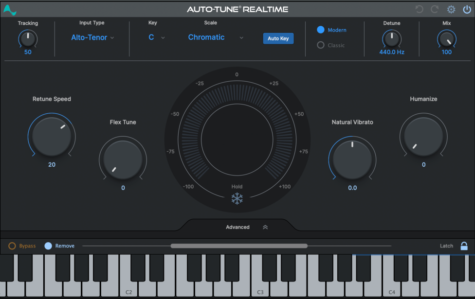

## **What is Auto-Tune Realtime X?** 

For twenty years, Auto-Tune has been the industry standard for professional pitch correction and the tool of choice for the signature vocal effect of popular music. 

Now, with Auto-Tune Realtime X, we're proud to bring that technology to the UAD platform, optimized for low latency tracking and live performance. 

## **How Does Auto-Tune Correct Pitch?** 

Auto-Tune works by continuously tracking the pitch of an input sound and comparing it to a user-defined scale. The scale tone closest to the input is continuously identified. If the input pitch exactly matches the scale tone, no correction is applied. If the input pitch varies from the desired scale tone, Auto-Tune will adjust the pitch toward the target scale tone. 

Contents 

6 

## **What Type of Audio is Appropriate for Auto-Tune?** 

Auto-Tune is intended for use with a well-isolated, monophonic sound source such as a single voice, or a single instrument playing one pitch at a time. It is not intended for multiple voices or instruments recorded onto the same track, or single instruments that are playing multiple pitches at the same time. 

Noise content, or extreme breathiness in vocal performance can sometimes lead to tracking errors. However, this can often be remedied by adjusting the Tracking parameter. 

Contents 

7 

## **Global Controls** 

## **Undo** 

Click the **Undo** button to reverse your most recent edit, up to 99 steps. 

## **Redo** 

Click the **Redo** button to restore the most recently undone edit. 

## **Settings** 

The **Settings** button opens the Settings and Preferences Menu. 

## **Bypass** 

Click the **Bypass** button to disable Auto-Tune Realtime X in your DAW. When bypassed, the Bypass button will appear de-illuminated. 

## **Tracking** 

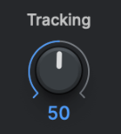

In order to accurately identify the pitch of the input, Auto-Tune Realtime X requires a periodically repeating waveform, characteristic of a solo voice or solo, non-chordal instrument. 

The **Tracking** control determines how much variation is allowed in the waveform for Auto-Tune Realtime X to still consider it periodic. 

In most cases, Tracking should be left at its default value of 50. However, please note the following: 

Contents 

8 

- A noisier signal or a vocal performance that is unusually breathy may require a more 'relaxed' setting (higher Tracking value). 

- If you’re hearing artifacts such as clicks or pops, try setting the Tracking to a 'choosier' setting (lower Tracking value). 

## **Input Type** 

Auto-Tune Realtime X offers a selection of processing algorithms optimized for different types of audio. **Input Type** options include: 

- _Soprano_ 

- _Alto/Tenor_ 

- _Low Male_ 

- _Instrument_ 

For the most accurate pitch detection and correction, choose the Input Type that best describes your audio. 

After selecting an Input Type, a blue stripe on the top edge of the Keyboard will highlight the notes contained in the selected input type. 

## _**Note** : This function only applies to the Soprano, Alto/Tenor, and Low Male Input Types._ 

While playing audio, the notes on the onscreen keyboard will also light up in blue as they’re played. You can use these pieces of information in conjunction to help you decide if the selected Input Type is best for your audio. 

## **Key** 

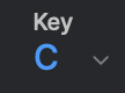

The **Key** menu allows you to select the key of the track you plan to process. The Key setting is used in combination with the Scale setting to determine the set of notes that the audio will be tuned to. 

Contents 

9 

## **Scale** 

The **Scale** selection is used in combination with the Key selection to define the scale of the track you plan to process. 

- If you're not certain of the scale or key of your track, try using the Auto Key plug-in in - your DAW, or the Auto Key Mobile application on your mobile device. 

Another option is to set the Scale parameter to Chromatic, which will cause Auto-Tune Realtime X to always tune to the closest pitch in the 12-tone chromatic scale. 

## **Auto-Key** 

The **Auto-Key** button enables Auto-Tune Realtime X to receive Key and Scale information from the Auto-Key desktop plug-in or mobile app. 

Auto-Key is a separate plug-in that automatically detects the key and scale of your track. 

After successful detection, Auto-Key can send the key and scale information to multiple instances of Auto-Tune with a single click. 

Auto-Key is also available as a free application on mobile devices to detect and send - key and scale information to Auto-Tune Realtime X. Auto Key Mobile brings perfect pitch to your pocket! 

_For more information about the Auto-Key desktop plug-in, see its User Guide here._ 

Contents 

10 

## **Modern/Classic Mode Toggle** 

**Classic Mode** simulates an early Auto-Tune algorithm, and results in the fan favorite “Auto-Tune 5 sound.” 

As new features were added to Auto-Tune over time, the Auto-Tune algorithm has evolved, and its sonic qualities have undergone subtle changes, with each Auto-Tune version having its own slightly different character. 

Over the years, the sound of Auto-Tune 5 has developed something of a cult following among musicians, audio engineers and producers, perhaps due in part to its use on many iconic pop recordings. Due to popular demand, the Auto-Tune 5 sound is available in Auto-Tune Realtime X via Classic Mode. 

The sonic difference between Classic Mode and the modern sound of Auto-Tune Realtime X is very subtle, but if you listen carefully, you may notice a slightly brighter quality on your vocals, and a more pronounced attack and transition between notes at faster Retune Speeds. 

_**Note** : The Flex-Tune parameter is disabled when Classic Mode is on._ 

Contents 

11 

## **Detune** 

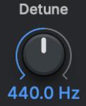

The **Detune** parameter allows you to change the pitch reference of Auto-Tune Realtime X from the default A = 440Hz. This is useful when working with an instrument or track that uses a different reference frequency. 

Values can be displayed in Cents or Hertz (you can specify this in the Settings Menu). The range of adjustment is -100 cents to +100 cents. 

## **Mix Knob** 

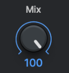

The **Mix Knob** adjusts the balance of processed and unprocessed signals. Turn the knob to 0 to hear only the unprocessed signal. At 100, you will only hear the processed signal. 

In most cases, this knob should stay at 100, but it can be used as a creative effect when adjusted to a lower value. A chorus-like effect will be present when the unprocessed and processed signals are played simultaneously. 

Contents 

12 

## **Basic View Controls** 

Auto-Tune Realtime X features two different interface views. Basic View, shows you only the most commonly used controls, such as the Retune Speed, Humanize, and Flex-Tune knobs. 

This chapter will cover the controls that are visible in Basic view. 

Contents 

13 

## **Advanced** 

Click on the **Advanced** tab to toggle between Basic View and Advanced View. 

After opening Advanced View, select whether to adjust the Vibrato or Scale controls. 

Basic View only shows the most commonly used controls, while Advanced View shows all available controls, including the Vibrato, Scale, and MIDI controls. 

Switching back to Basic View from Advanced View will hide the advanced controls, but will not disable them. You will still hear the results of your Advanced View settings when you return to Basic View. 

## **Retune Speed** 

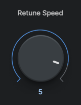

**Retune Speed** controls how rapidly the pitch correction is applied to the incoming audio. _(Units are in milliseconds.)_ 

Setting the Retune Speed to 0 will cause immediate changes from one pitch to another, and will completely suppress any vibrato or deviations in pitch. 

If you’d like to recreate the iconic “Auto-Tune Effect”, set the Retune Speed to 0. See this tutorial for more details. 

For more natural sounding pitch correction, set the Retune Speed between 10 and 50. 

Keep in mind that larger values maintain more vibrato and other interpretive pitch gestures, but decrease how rapidly corrections are made. 

Contents 

14 

## **Flex-Tune** 

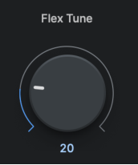

The **Flex-Tune** control allows you to preserve a singer's expressive vocal gestures, while still correcting an out of tune vocal. 

When Flex-Tune is set to 0, Auto-Tune pulls every incoming note toward a target scale note. When Flex-Tune is engaged, it only applies correction as the performer approaches the target note. 

As you move the control toward higher values, the correction area around the scale note gets smaller, and more expressive pitch variation is allowed through. 

## **Humanize** 

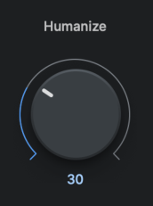

The **Humanize** function allows you to add realism to sustained notes when using fast retune speeds. 

One situation that can be problematic for pitch correction is a performance that includes both short and long sustained notes. In order to get the short notes in tune, you would need to set a fast Retune Speed, but this can cause sustained notes to sound unnaturally static. 

Humanize applies a slower Retune Speed _only_ during the sustained portion of longer notes, making the overall performance sound both in tune and natural. 

Start by setting Humanize to zero, and adjust the Retune Speed until the shortest problem notes in the performance are in tune. 

If sustained notes sound unnaturally static, increase the Humanize setting until they sound more natural. 

Contents 

15 

## **Natural Vibrato** 

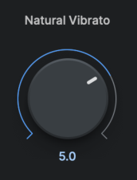

The **Natural Vibrato** control allows you to either increase or diminish the range of vibrato that is already present in your audio. 

If you want to create _new_ vibrato where it does not already exist, use the Vibrato Controls in Advanced View. 

## **Pitch Display and Pitch Change Meter** 

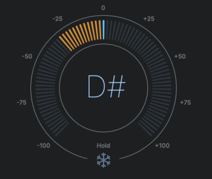

## **Pitch Display** 

The Pitch Display shows you the letter name of the pitch that Auto-Tune Realtime X is currently outputting. 

This may be different than the pitch that it is detecting, if the detected pitch is not part of the current scale. 

To see the pitch that is currently being detected in the incoming audio, look at the blue highlighted note on the keyboard. 

## **Pitch Change Meter** 

The Pitch Change Meter (which wraps around the Pitch Display) shows you how much the pitch is being changed, measured in cents. When a detected pitch is sharp, the meter lights up orange, and wraps to the left. Flat pitches turn the meter blue, and wrap to the right. 

For example, if the Pitch Change Meter has moved to the left to -50, it indicates that the input pitch is 50 cents too sharp, and Auto-Tune is lowering the pitch by 50 cents to bring the input back to the desired pitch. 

## **Hold** 

Click and hold the Hold icon underneath the Pitch Display while Auto-Tune is processing audio to pause both the Pitch Display and the blue detected pitch indication on the keyboard for as long as you hold down the mouse button. 

Contents 

16 

## **The Keyboard** 

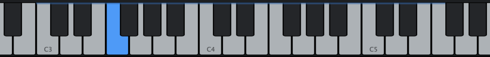

The **Keyboard** has three primary functions: 

- Displays the currently detected pitch in real time. 

- Highlights in blue to display the range of notes in the selected Input Type. 

- Allows you to specify the target-note behavior (On, Bypass, or Remove) for each note in specific octaves. 

During playback, the detected pitch will be highlighted in blue on the Keyboard. 

The Keyboard is only enabled when using scales that have exactly 12 notes. If you want to use the Keyboard with the Major or Minor scale, choose the Chromatic scale and then click Set Major or Set Minor (in Scale Controls). 

## **On** 

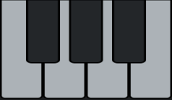

When a note on the Keyboard is **On** , the keys will appear white or black (depending on which note it is), and input pitches that are closest to that note will be tuned to it. 

## **Bypass** 

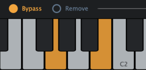

When a note on the Keyboard is set to **Bypass** , it will appear orange, and input pitches that are closest to that note will be passed through with no correction. 

You might use Bypass if a performance has only one or two out-of-tune notes, and you want to only apply correction on those notes, or if it includes some expressive pitch gestures around one or more specific notes that you want to preserve with no modification. 

_**Note** : Command/Control Click any key on the keyboard to reset all the keys to ‘On’._ 

Contents 

17 

## **Remove** 

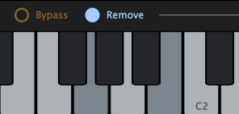

When a note on the Keyboard is set to **Remove** , it will appear grey, and any incoming pitches that are closest to that note will be tuned to the next closest scale note instead. 

Remove is useful in cases where a singer might be singing a pitch that is so far from the intended note that it’s actually closer to another scale note. 

For example, if the intended note is an F and the performer is actually singing something closer to an E, you may want to remove E from the scale, so that the singer will be tuned to F instead. 

_**Note** : Command/Control Click any key on the keyboard to reset all the keys to ‘On’._ 

## **Keyboard Edit** 

When the **Keyboard Edit** switch is set to Remove, clicking on a key in the Keyboard will toggle it between Remove and On. 

When it’s set to Bypass, clicking on a key will toggle it between Bypass and On. 

## **Latch** 

When the Keyboard Mode switch is set to **Latch** , clicking a key on the Keyboard will change its state, and will retain the new state after being clicked. 

When Latch is disabled, clicking on a key will change its state momentarily - only for as long as the mouse button is held down. This is useful, for example, if you want to perform a melody on the Keyboard in real time. 

Contents 

18 

## **Advanced View Controls** 

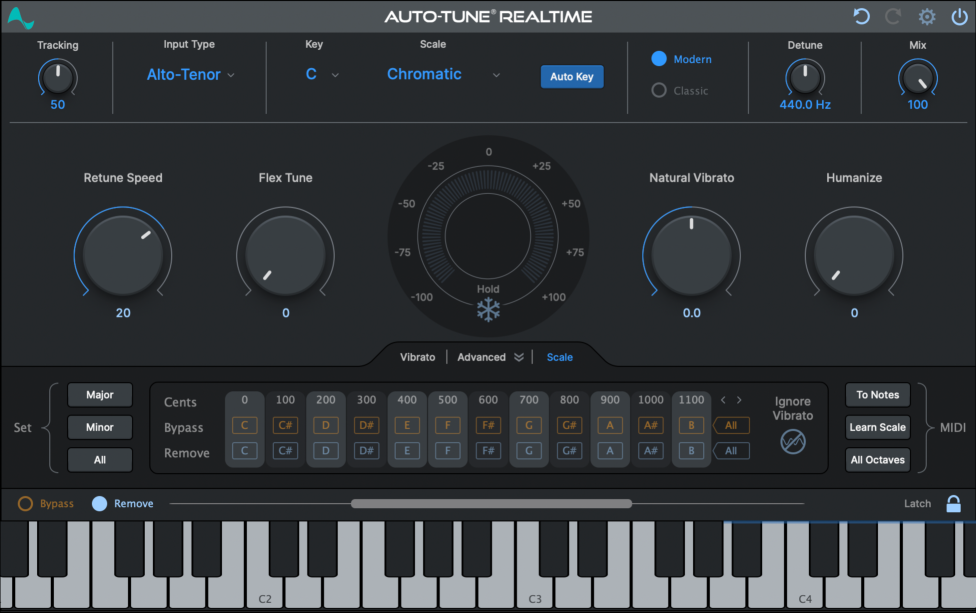

Auto-Tune Realtime X features two different interface views: Basic View, which shows you only the most commonly used controls, and **Advanced View** , which includes all of the available controls. Advanced View is organized into two separate tabs for Vibrato Controls and Scale Controls. 

_**Note** : Switching back to Basic View from Advanced View will hide the advanced controls, but will not disable them. You will still hear the results of the Advanced View settings when you return to Basic View._ 

This chapter will cover the controls that are only visible in Advanced view. 

Contents 

19 

## **Vibrato Controls** 

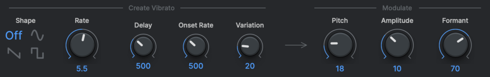

The **Vibrato Controls** allow you to add a custom synthesized vibrato to your audio. Use them sparingly to add a touch of natural-sounding expression to a performance, or more aggressively for dramatic special effects. 

## **Shape** 

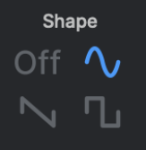

The **Shape** menu allows you to choose the shape of the pitch modulation for your vibrato. 

The Vibrato Shapes include: 

## **Off** 

Select ‘Off’ if you don’t want to create any vibrato. 

## **Sine Wave** 

A sine wave changes smoothly from minimum to maximum and back again. This is the best choice for natural-sounding vibrato. 

## **Square** 

Jumps to maximum where it spends half of the cycle and then jumps to minimum for the remaining half of the cycle. 

## **Sawtooth** 

Gradually rises from minimum to maximum and then drops instantaneously to minimum to start the cycle again. 

Contents 

20 

## **Rate** 

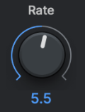

The **Rate** control sets the speed of the vibrato in Hz. 

## **Delay** 

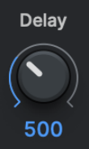

**Delay** sets the amount of time (in milliseconds) between the beginning of a note and the onset of vibrato. 

This control is useful for sustained notes where you want the beginning of the note to have no vibrato, then have the vibrato come in later. 

## **Onset Rate** 

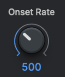

**Onset Rate** sets the amount of time (in milliseconds) between the onset of vibrato and the point at which the vibrato reaches the full amounts set in the Pitch, Amplitude and Formant Amount settings. 

## **Variation** 

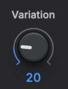

**Variation** sets the amount of random variation that will be applied to the Rate and Amount parameters on a note to note basis. This setting is useful for “humanizing” the vibrato by adding random deviations in the behavior of the vibrato. 

## **Pitch Amount** 

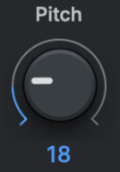

**Pitch Amount** sets the width of the vibrato in cents. 

Contents 

21 

## **Amplitude Amount** 

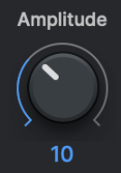

**Amplitude Amount** sets the amount that the loudness changes. 

For the most realistic vibrato, the amount of amplitude change should be substantially less than pitch change. 

## **Formant Amount** 

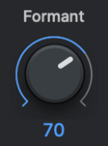

**Formant Amount** sets the amount of formant variation in the vibrato. 

Contents 

22 

## **Scale Controls** 

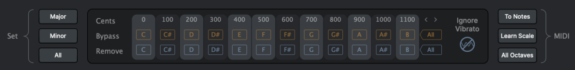

The **Scale Controls** are used to create custom scales or to modify any of the preset scales selected in the Scale menu. It shows each of the notes of the currently selected scale, along with a Bypass and Remove button for each note. 

Each scale retains its own edits independent of the other scales. For example, if you select C Major in the Key and Scale menus and Remove or Bypass certain notes and then change to C Minor and make other edits, when you return to C Major your previous edits associated with C Major will be restored. 

Changes made to the Scale Controls affect _all_ octaves of each note in the scale, and will also be displayed on the Keyboard. Changes made on the Keyboard only affect that specific octave, and will not be reflected in the Scale Control section. 

## **Bypass** 

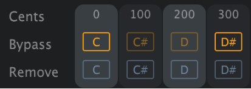

If a note is set to **Bypass** , input pitches that are closest to that note will be passed through with no correction. 

You might use Bypass if a performance has only one or two out-of-tune notes, and you want to only apply correction on those notes, or if it includes some expressive pitch gestures around one or more specific notes that you want to preserve with no modification. 

Contents 

23 

## **Remove** 

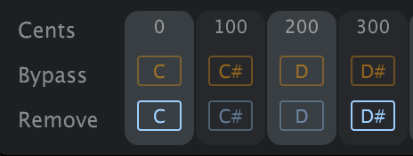

If a note is set to **Remove** , then that note is removed from the current scale, and any incoming pitches that are closest to it will be tuned to the next closest scale note instead. 

Remove can be used to create your own custom scales from the built-in scales. For example, you can create a pentatonic (5-note) scale by removing a couple notes from the major scale. This is especially useful if you’re going for the Auto-Tune Effect, and want to create a sharp transition between notes that are relatively far apart. 

Remove is also useful in cases where a singer might be singing a pitch that is so far from the intended note that it’s actually closer to another scale note. For example, if the intended note is an F and the performer is actually singing something closer to an E, you may want to remove E from the scale, so that the singer will be tuned to F instead. 

## **Cents** 

The number under each note in the **Cents** row is that note’s interval, in cents, from the root note of the scale. 

## **Set Major/Set Minor** 

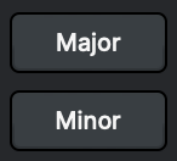

The **Set Major** and **Set Minor** buttons allow you to quickly generate a major or minor scale from any scale with more than 7 notes, by automatically removing the notes that don’t belong to the major or (natural) minor scale. 

## **Set All** 

The **Set All** button sets all of the notes of the current scale to on, in both the Scale Controls and the Keyboard. This is a quick way to return the scale to its default setting. 

Contents 

24 

## **Bypass All** 

**Bypass All** sets all notes in the current scale to Bypass. 

## **Remove All** 

**Remove All** sets all notes in the current scale to Remove. 

## **Ignore Vibrato** 

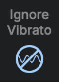

The **Ignore Vibrato** function is designed to help Auto-Tune identify pitches correctly when a performance includes vibrato so wide that it approaches adjacent notes (e.g if a singer is singing a C with a vibrato so wide that it is sometimes closer to a C#). 

If you hear a rapid alternation between two notes when you want to hear a single note with a wide vibrato, try turning this setting on. 

Contents 

25 

## **MIDI Functions** 

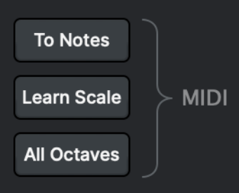

There are two **MIDI Functions** in the Scale Controls tab for handling incoming MIDI note data: To Notes and Learn Scale. You can also use a MIDI controller to adjust many Auto-Tune Realtime X parameters in real time. 

See the MIDI Control Preferences section to learn how to assign Auto-Tune Realtime X parameters to your MIDI controller. 

Use the **To Notes** function if you want to use MIDI to control the specific pitch that your audio is being tuned to in real time. Use the **Learn Scale** function if you want to use MIDI instead of the Scale Controls and onscreen Keyboard to define the scale that your audio will be tuned to. 

In order to make use of the MIDI capabilities in Auto-Tune Realtime X, you will need to route a MIDI source to Auto-Tune Realtime X. This could be an external controller, such as a MIDI keyboard, or it could be a MIDI track within your host application (DAW). 

The procedure for routing MIDI to an audio plug-in will vary depending on what DAW you are using, so please see your DAW’s manual or help pages for more information about how to do this. 

## **To Notes** 

With **MIDI: To Notes** , you can perform a melody in real time on a MIDI keyboard, or play it from a MIDI track, and Auto-Tune Realtime X will tune your audio to whatever MIDI notes are on at any given time. 

If you’re using a MIDI keyboard, this means that your audio will be tuned to the notes corresponding to whatever keys you are currently holding down. 

If no MIDI notes are on at any given time, the audio will pass through without being tuned. 

Contents 

26 

## **Learn Scale** 

The **MIDI: Learn Scale** function allows you to play a melody or chords from a MIDI keyboard or MIDI track and have Auto-Tune construct a custom scale for you containing only those notes. 

Clicking the Learn Scale button will remove all notes from the current scale. Individual notes are then turned back on based on incoming MIDI data. The new scale settings will be displayed on both the Keyboard and in the Scale Control tab. 

If no MIDI note-on messages are received, the audio will pass through without being tuned. 

## **All Octaves** 

If **All Octaves** is on, any incoming MIDI notes will affect all octaves of each note. Otherwise, they will only affect the notes in the specific octaves in which they are played. 

The All Octaves button applies to both the To Notes and Learn Scale functions. 

## **MIDI Parameter Control** 

Many of the Auto-Tune Realtime X parameters can be controlled in real time with a MIDI controller. MIDI Parameter Control is configured in the Preferences window. See the MIDI Control Assignments section below for information about how to configure this. 

Contents 

27 

## **Settings and Preferences** 

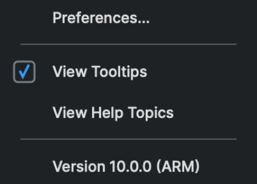

## **Preferences...** 

Open the Preferences Window. 

## **View Tooltips** 

Click to enable **Tooltips** . 

When this setting is enabled, hover over any parameter in the GUI to read a short description of the control and an example use case. 

## **View Help Topics** 

Click to open the Universal Audio Help Pages in your web browser. From here, you can find tutorial videos, frequently asked questions, and other relevant articles. 

Contents 

28 

## **General Preferences** 

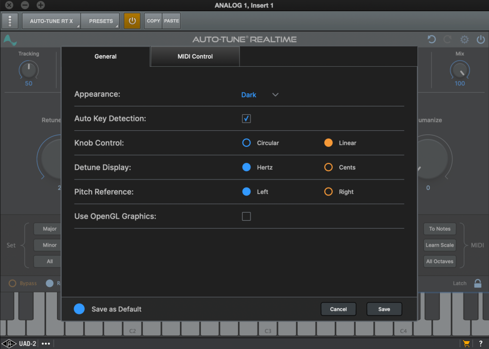

## **Appearance** 

**Appearance** determines the theme of the Auto-Tune Realtime X GUI. Options include: 

- Light 

- Dark 

- System 

If ‘System’ is selected, Auto-Tune Realtime X will follow the Appearance settings of your Mac or PC. 

Contents 

29 

## **Auto-Key Detection** 

This setting enables Auto-Tune Realtime X to receive key and scale information from Auto-Key. 

Auto-Key is also available as a free application on mobile devices to detect and send - key and scale information to Auto-Tune Realtime X. Auto Key Mobile brings perfect pitch to your pocket! 

## **Knob Control** 

The **Knob Control** preference lets you choose how you interact with knobs to make adjustments. 

- Circular: Click and drag clockwise or counterclockwise to adjust the knob in the respective direction 

- Linear: Click and drag up or to the right to turn it clockwise, down or left to turn it counterclockwise 

## **Detune Display** 

The Detune function is used to tune to a reference frequency other than the standard A = 440Hz. The **Detune Display** preference lets you choose whether the offset is displayed in cents or Hz. 

This is useful when working with an instrument or track that uses a different reference pitch. 

## **Pitch Reference** 

Auto-Tune Realtime X can apply pitch correction to stereo tracks while maintaining phase coherence between the two channels. The **Pitch Reference** setting lets you choose which of the stereo tracks will be used to analyze the pitch. 

Contents 

30 

If one channel is cleaner or better isolated than the other, select that channel as the pitch reference. 

When using Auto-Tune Realtime X on a stereo track, both channels should feature the same source material (e.g. a single vocal performance, recorded in stereo using two microphones). 

## **Use OpenGL Graphics** 

Auto-Tune Realtime X uses **OpenGL** for improved graphics on computers with compatible graphics card hardware. 

To improve performance, OpenGL is disabled by default on Mac. On Windows, OpenGL is enabled by default. 

OpenGL can be toggled On/Off on either platform at any time. 

Contents 

32 

You will also need to route the MIDI to Auto-Tune Realtime X within your host application (DAW). The procedure for routing MIDI to an audio plug-in will vary depending on what DAW you are using, so please see your DAW’s manual or help pages for more information about how to do this. 

Contents 

33 

## **Tutorials** 

The following tutorials will help you master a variety of features and workflows in Auto-Tune Realtime X. 

Before diving into the tutorials, please visit the Auto-Tune Pro 10.0 Installer Page on the Auto-Tune website to download the _Auto-Tune Pro Tutorial Files_ . 

Contents 

34 

## **Pitch Correction Basics** 

This tutorial will guide you through the basic pitch correction features using the audio file “A2- A3-A2 sweep.” This is a simple synthesized waveform sweeping slowly from A2 up to A3 and back to A2. 

## **To begin** 

1. Load or import “A2-A3-A2 sweep” into a track of your host program. Play the track to hear the unprocessed audio. 

2. Open Auto-Tune Realtime X as an insert effect on that track. 

## **Scale and Key Settings** 

3. Set the Key to “A” and the Scale to “Major.” 

4. Set Retune Speed to zero. 

5. Set Flex-Tune to zero. 

6. Set “A2-A3-A2 sweep” to loop continuously in your host program and start playback. 

What you will hear is an A major scale. This is because Auto-Tune Realtime X is continuously comparing the input pitch to the notes of the A major scale and instantly correcting the output pitch to the nearest of the scale tones. 

## **Remove Notes** 

1. Click the Advanced tab to show the Advanced View controls. 

2. In the Scale Controls, click the Remove buttons under the notes B, D, F# and G#. 

3. Play “A2-A3-A2 sweep” again. 

You will now hear an arpeggiated A Major triad because you have removed all the other notes from the scale. 

Contents 

35 

## **Bypass Notes** 

1. In the Scale Controls, click the Bypass button under the note E. 

2. Play “A2-A3-A2 sweep” again. 

You’ll now hear the effect of bypassing the E. When the input pitch approaches E Auto-Tune Realtime X passes the input through uncorrected. 

## **Retune Speed** 

1. Set the Retune Speed to 0. 

2. Play “A2-A3-A2 sweep”. 

3. Set the Retune Speed to about 30. 

4. Play “A2-A3-A2 sweep” again. Compare the 30 setting to the 0 setting. 

5. Try various other Retune Speed settings. 

The setting of 0 (milliseconds) is fast, and Auto-Tune Realtime X makes instantaneous pitch changes. The setting of 30 is slower, and pitch changes are more gradual. Retune Speed controls how rapidly the pitch correction is applied to the incoming pitch. 

## **Detune** 

1. Set the Retune Speed to 0. 

2. In the Scale Controls, click the Remove buttons below all the notes except F#. 

3. Play “A2-A3-A2 sweep” again. As the sound is playing, move the Detune knob. 

The output pitch will be locked to F#, however, you will hear the output pitch change with the Detune knob movement. This is because the Detune knob is changing the pitch standard of the scale. 

Contents 

36 

## **Vibrato** 

1. In Advanced View, Select Sine Wave from the Shape menu in the Vibrato section. 

2. Play “A2-A3-A2 sweep” again. 

3. Experiment with the various Vibrato controls to hear their effects. 

Contents 

37 

## **The Auto-Tune Effect** 

In addition to being the worldwide standard in professional pitch correction, Auto-Tune is the tool of choice for one of the signature vocal sounds of popular music: the **Auto-Tune Effect** . 

First heard on Cher’s 1998 hit song “Believe,” variations of the Auto-Tune Effect have appeared in songs from a huge variety of artists. Since there seems to be a lot of mythology about how it’s accomplished, we thought we’d provide the official Antares version here. 

## **What is it?** 

The Auto-Tune Effect is what is technically known as “pitch quantization.” Instead of allowing all of the small variations in pitch and the gradual transitions between notes that are a normal part of singing, the Auto-Tune Effect limits each note to its exact target pitch, stripping out any variation, and forcing instantaneous transitions between notes. 

## **How To Recreate The Auto-Tune Effect** 

There are three key elements to producing the Auto-Tune Effect in Auto-Tune Realtime X: 

1. Set Flex-Tune to 0. 

2. Set Retune Speed to 0. 

3. Pick the Key and Scale of your track. 

## **Step-By-Step** 

1. Set Flex-Tune and Retune Speed to 0. 

2. Select the Key and Scale of your track. 

3. Play your track. If you like the result, you’re done! 

Contents 

38 

4. If the result isn’t what you expected, try making one or more of the following adjustments: 

   - Edit the scale notes using the Keyboard or Scale Controls. Adding or removing scale notes can give you distinctly different effects. Removing some notes can be especially effective for a more dramatic effect on note transitions. 

   - Try a different key and/or scale. 

   - Try a Retune Speed of 2, 3 or a bit slower. This will allow slight pitch variations and more gradual note transitions, but may result in the right effect for a particular performance. 

   - Try turning on Classic Mode, for a subtle variation of the Auto-Tune Effect. 

   - Don’t forget your host application’s bypass and automation functions. Limiting the Auto-Tune Effect just to specific phrases can provide sonic contrast in your song. 

Contents 

39 

## **Flex-Tune** 

This tutorial will guide you through the use of Flex-Tune using the same “A2-A3-A2 sweep” file. 

## **To begin** 

1. Load or import “A2-A3-A2 sweep” into a track of your host program. 

2. Set up Auto-Tune Realtime X to be an insert effect on that track. 

3. Set the Key to A and the Scale to Major. 

4. Set the Retune Speed to zero. 

## **No Flex-Tune** 

1. Set Flex-Tune to 0. 

2. In the Scale Controls, click the Remove buttons next to the notes B, D, F# and G#. 

3. Play “A2-A3-A2 sweep.” 

You’ll hear an arpeggiated A Major triad because you have removed all the other notes from the scale. 

## **Some Flex-Tune** 

1. Set Flex-Tune of 10. 

2. Play “A2-A3-A2 sweep” again. 

With a lower Flex-Tune setting such as 10, the correction range around each scale note is still quite wide.You will hear each note of the A Major triad instantly tuned as the sweep enters the correction range, but as the sweep moves out of the correction range, you will hear it transition to the next note without correction. 

Contents 

40 

## **More Flex-Tune** 

1. Set Flex-Tune to 55. 

2. Play “A2-A3-A2 sweep” again. 

At higher Flex-Tune settings, the correction range around each scale note becomes more narrow. Consequently, each scale note will be tuned to only briefly as the sweep passes through the narrow correction range and will transition to the next note without correction as it leaves the correction range. 

Contents 

41 

## **Ignores Vibrato** 

This tutorial will demonstrate the Ignores Vibrato feature. Ignores Vibrato helps Auto-Tune identify pitches correctly when a performance includes vibrato so wide that it approaches adjacent notes. 

1. Load or import “wide_vibrato” into a track of your host program. This is a recording of a male voice singing a sustained “G” with a wide vibrato. 

2. Play the track to hear the unprocessed audio. In addition to the vibrato, you’ll notice that the singer drifts alternately sharp and flat. 

3. Set up Auto-Tune Realtime X to be an insert effect on that track. 

4. Set the Key to C and the Scale to Chromatic. 

5. Set the Input Type to Low Male Voice 

6. Set Retune Speed to 24. 

7. Set “wide_vibrato” to loop continuously in the host application and begin playback. Watch the blue detected pitch indication on the Keyboard, and listen to the result. As you will hear, whenever Auto-Tune Realtime X thinks G# or F# is the target pitch, it will move the input closer to those notes, instead of toward G. 

8. Click Advanced to show the Advanced View controls, then click Ignores Vibrato to turn it on. With Ignores Vibrato engaged, Auto-Tune Realtime X recognizes the pitch deviations as vibrato and continues to use “G” as the target pitch. 

Contents 

42 

## **Natural Vibrato** 

This tutorial will demonstrate the Natural Vibrato feature using the “wide_vibrato” audio file. The Natural Vibrato feature allows you to increase or diminish the range of vibrato that is already present in your audio. 

1. Load or import “wide_vibrato” into a track of your host program. This is a recording of a male voice singing a sustained “G” with a wide vibrato. Play the track to hear the unprocessed audio. 

2. Open Auto-Tune Realtime X as an insert effect on that track. 

3. In Auto Mode, Set the Key to C and the Scale to Chromatic. 

4. Set the Input Type to Low Male Voice 

5. Set Retune Speed to 24. 

6. Set “wide_vibrato” to loop continuously and begin playback. 

7. Set Natural Vibrato to 12 and note the effect on the vibrato. Set Natural Vibrato to -12 and note the effect on the vibrato. 

8. In the Scale Controls set all Scale notes to Bypass to disable any pitch correction. Again, adjust the Natural Vibrato control and note that it’s still active even when pitch correction is not being applied. 

Contents 

43 

## **Appendix: The Scales** 

The following are brief descriptions of the scales available in Auto-Tune Realtime X. The first three equal-tempered scales are the common scales found in Western tonal music and popular music. In addition, a number of historical, non-Western, and experimental scales are available. 

## **Modern Equal Temperament** 

- **Major:** a seven-tone equal tempered major scale. 

- **Minor:** a seven-tone equal tempered minor scale. 

- **Chromatic** : a twelve-tone equal tempered chromatic scale. 

## **Historical Tunings** 

- **Ling Lun:** a twelve-tone scale dating from 2700 B.C. China. 

- **Scholar’s Lute:** a seven-tone scale dating from 300 B.C. China. 

- **Greek Diatonic Genus** : a seven-tone scale from ancient Greece. 

- **Greek Chromatic Genus:** a seven-tone scale from ancient Greece. 

- **Greek Enharmonic Genus:** another seven-tone scale from ancient Greece. 

- **Pythagorean** : a twelve-tone scale based on a series of just perfect fifths, resulting in wider major thirds. 

- **Just (major chromatic)** : a twelve-tone scale based on the harmonic series, and optimized for the major mode. 

- **Just (minor chromatic):** a twelve-tone scale based on the harmonic series, and optimized for the minor mode. 

- **Werckmeister III:** a twelve-tone well-tempered scale. This scale was an early attempt (about Bach’s time) to allow for transposition to be played in any key. 

Contents 

44 

- **Vallotti & Young:** a twelve-tone well-tempered scale designed to allow arbitrary keys. 

- **Barnes-Bach:** a twelve-tone well-tempered scale. A variation of the Vallotti & Young scale designed to optimize the performance of Bach’s Well-Tempered Clavier. 

## **Non-Western Tunings** 

- **Indian:** A 22-tone just scale. 

- **Slendro:** A five-tone Indonesian scale is played by percussion ensembles called gamelans. 

- **Pelog** : A seven-tone Indonesian scale also used in gamelan music. 

- **Arabic 1** : A 17-tone arabic scale related to the Pythagorean scale. 

- **Arabic 2 (chromatic):** A twelve-tone variation of the previous Arabic scale. 

## **Contemporary Experimental Tunings** 

- **19 Tone Equal Temperament** : Divides the octave into 19 equal parts. Thirds and sixths more closely resemble those found in just intonation than 12-tone equal temperament. Perfect fifths are narrower than those found in twelve-tone equal temperament. 

- **24 Tone Equal Temperament:** Also known as the quarter tone scale, this scale divides the octave into 24 equal parts. Does not offer a significant advantage over 12-tone equal temperament in terms of approximating just intervals. 

- **31 Tone Equal Temperament:** Divides the octave into 31 equal parts. Offers an excellent approximation of the just harmonic seventh interval often found in a cappella vocal music, such as barbershop. 

- **53 Tone Equal Temperament:** Divides the octave into 53 equal parts. The 53-tone scale has good approximations of just major and minor thirds, and fifths and fourths. 

Contents 

45 

- **Partch:** Harry Partch is considered by many to be the father of modern experimental tuning practice. This 43-tone just scale was devised by him and used in his compositions and instruments. 

- **Carlos Alpha:** Wendy Carlos performed extensive computer analysis to devise a number of equal tempered scales which sacrifice the perfect octave in order to achieve better approximations of other harmonic intervals and their inversions. This scale is good at approximating several just intervals including 7/4. This scale divides the octave into 15.385 steps forming intervals of 78.0 cents. 

- **Carlos Beta:** This scale divides the octave into 18.809 steps forming intervals of 63.8 cents. 

- **Carlos Gamma:** This scale maintains the just intervals 3/2 and 4/3 and also approximates 5/4. This scale divides the octave into 34.188 steps forming intervals of 35.1 cents. 

- **Harmonic (chromatic):** This twelve-tone scale is created in the partials in the fifth octave of the harmonic series. The scale degrees that correspond to the classic just intervals are the major second, major third, perfect fifth and major seventh. 

