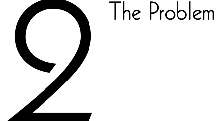
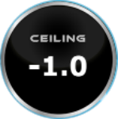
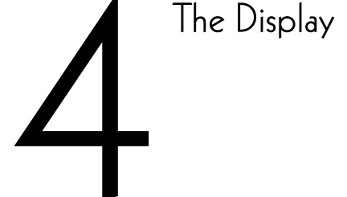
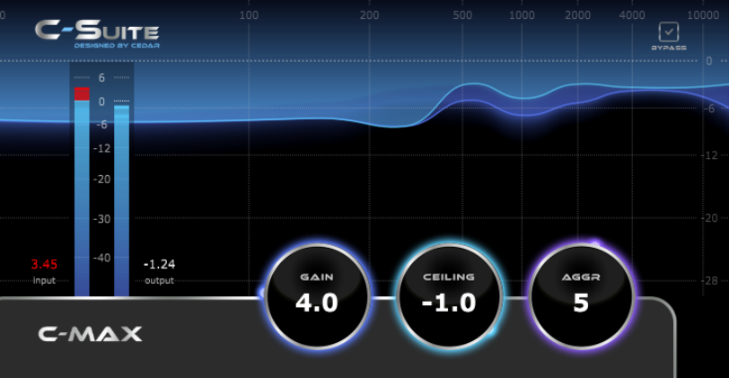

- c max LIMITER and Maximiser 

www.csuiteaudio.com 

C-Suite C-Max 

This page left blank. 

Page 2 

C-Suite C-Max 

## Table Of Contents 

Getting Started ..................................................... 4 The Problem ......................................................... 5 The Controls ........................................................ 6 The Display .......................................................... 8 Licence and Limited Warranty .................................. 10 

Page 3 

C-Suite C-Max 

## 1 

## Getting Started 

Welcome to C-Suite Audio plug-ins. Developed in collaboration with the Academy Award and Emmy winning developer CEDAR Audio, C-Suite processes provide world-class processes for Universal Audio users and are available exclusively from Universal Audio. 

## Installation 

Please follow the usual installation procedure for your UA plug-ins. 

## Automation 

C-Max can be automated in the usual fashion. 

## Saving and reloading presets 

You can save and load presets in the usual fashion. 

## Contact and support 

Should you experience difficulties with C-Max, please contact Universal Audio with a precise description of the problem. 

Page 4 

C-Suite C-Max 

**----- Start of picture text -----** 
2 The Problem **----- End of picture text -----** 

Limiting is used throughout the audio industry to ensure that the peak amplitude of audio doesn’t exceed agreed limits, to increase the audibility of low-level detail, and to make existing material sound louder and more commanding. Unfortunately, most limiters suffer from side-effects, the most common of which is ducking. This occurs when a particularly loud sound of short duration causes the limiter to suppress all of the other program material in order to stop the ceiling being exceeded. Other unwanted artefacts can also occur even though techniques such as contouring the response are used to minimise them. 

## The solution… 

… is C-Max, which employs a very different technology from that of conventional limiters. Its sophisticated signal processing is aware of the frequency content of the input and handles the dynamics of the various components of the signal while always ensuring that the output is constrained by the user-defined ceiling. The result is limiting that is cleaner and more transparent than you have heard before. 

In addition, C-Max can provide conventional maximising and, when pushed, aggressive limiting and colouration. All of these responses are obtained using just three controls, and the plug-in’s attractive visual display provides clear information at all times about what the process is doing. 

Page 5 

C-Suite C-Max 

## The Controls 

## 3 

## **Gain (0dB to +20dB)** 

This determines the gain applied to the signal before it is limited. If no gain is applied, C-Max will act in a similar way to a traditional peak limiter, ensuring that amplitude peaks do not exceed the specified ceiling. If moderate gains are applied then, depending upon the nature of the signal, maximising will occur, revealing low-level detail and making the audio sound louder. At high gains, colouration and creative distortion will occur, especially if the value of the Aggression parameter is increased. 

## **Ceiling (-20dB to 0dB)** 

This determines the maximum level of the output signal. Very small inter-sample peaks can sometimes exceed the specified ceiling so it may be appropriate to reduce the ceiling to a value slightly below the desired maximum output level. 

## **Aggression (0 to 9)** 

This modifies the algorithm to alter the nature of the limiting. When it’s set to zero, the limiting is clean and transparent. As you increase its value, the limiting becomes ‘grittier’ and, at high values, colouration and creative distortion will occur. 

## **Bypass** 

Use this to bypass C-Max’s processing and make before/after comparisons. 

Page 6 

C-Suite C-Max 

## Example outcomes 

## ■ Transparent limiting 

Set the Ceiling to the desired output level. Set the Gain and Aggression to zero. 

## ■ Maximising 

Set the Ceiling to the desired output level. With the Aggression set to zero, increase the Gain to achieve the desired increase in the perceived volume. 

## ■ Adding colour 

Set the Ceiling to the desired output level. Increase the Gain to achieve the desired increase in the perceived volume and increase the Aggression to impart colouration and creative distortion. 

## Shortcuts 

The following shortcuts will speed your use and precision when using C-Max. 

**Mouse wheel** Turning the mouse wheel while hovering over a knob will modify its value. **SHIFT key** Holding SHIFT while dragging a knob will adjust its value in finer increments. **CTRL-click &** CTRL-left-clicking and double-left-clicking will reset a knob to **double-click** its default value. 

**Cursor keys** Pressing and holding the Right and Up keys while hovering over a knob will slowly increase its value. 

Pressing and holding the Left and Down keys will slowly decrease its value. 

Pressing and holding the Page Up key will increase its value more quickly. 

Pressing and holding the Page Down key will decrease its value more quickly. 

Page 7 

C-Suite C-Max 

**----- Start of picture text -----** 
4 The Display **----- End of picture text -----** 

In the C-Max display, the vertical (Y) axis represents signal amplitude and the horizontal (X) axis represents frequency. 

When processing is bypassed         the display will be shown in grey. 

## The display elements 

The action of C-Max is displayed by the three regions in the display – the light blue area, the darker blue area below it, and the black background. 

■ The upper line (the boundary between the blue regions) shows the minimum attenuation at each frequency at each moment. 

■ The lower line (the boundary between the dark blue and the black regions) shows the peak attenuation at each frequency at each moment. 

Page 8 

C-Suite C-Max 

## History 

The display shows a short history of the changes in the limiting. The fainter the representation, the further in the past that it lies. The history is displayed for around 0.5s before the current moment; beyond this point, its intensity drops below 5% of the ‘current’ intensity. 

## Metering 

The input and output metres show the level of the incoming and outgoing signals. The difference in height between these gives an indication of the amount of limiting being applied. 

Page 9 

C-Suite C-Max 

## 5 Licence and Limited Warranty 

1. DEFINITIONS 

In this Licence and Limited Warranty the following words and phrases shall bear the following meanings: 

‘the Company’ is CEDAR Audio Limited of 20 Home End, Fulbourn, Cambridge, CB21 5BS, UK; ‘the System’ means any instance of a C-Suite product developed by the Company; ‘this Document’ means this Licence and Limited Warranty. 

## 2. ISSUE AND USE OF THE SYSTEM 

2.1 The terms and conditions of this Document are implicitly accepted by any person or body corporate who shall at any time use or have access to the System, and are effective from the date of supply of the System by CEDAR Audio Limited to its immediate customer, a distributor, dealer, end-user or any other customer or user (a “licensee”). 

2.2 The Company hereby grants to the Licensee and the Licensee agrees to accept a non-exclusive right to use the System. 

## 3. PROPERTY AND CONFIDENTIALITY 

3.1 The System contains confidential information of the Company and all copyright, trademarks, trade names, styles and logos and other intellectual property rights in the System including all documentation and manuals relating thereto are the exclusive property of the Company. The Licensee acknowledges that all such rights are the property of the Company and shall not question or dispute the ownership of any such rights nor use or adopt any trading name or style similar to that of the Company. 

3.2 The Licensee shall not attempt to reverse engineer, modify, copy, merge or transcribe the whole or any part of the System or any information or documentation relating thereto. 

3.3 The Licensee shall take all reasonable steps to protect the confidential information and intellectual property rights of the Company. 

## 4. LIMITED WARRANTY AND POST-WARRANTY OBLIGATIONS 

4.1 The Company warrants that the System will perform substantially in accordance with the appropriate section of its accompanying product manual for a period of one year from the date of supply to the Company’s immediate customers. 

4.2 The Company will make good at its own expenses by repair or replacement any defect or failure that develops in the System within one year of supply to the Company’s immediate customer. 

4.3 The Company shall have no liability to remedy any defect, failure, error or malfunction that arises as a result of any improper use, operation or neglect of the System, or any attempt to repair or modify the System by any person other than the Company or a person appointed with the Company’s prior written consent. 

4.4 In the case of any defect or failure in the System occurring more than twelve months after its supply to the Company’s immediate customer the Company will at its option and for a reasonable fee make good such defect or failure by repair or replacement (at the option of the Company) subject to the faulty equipment having first been returned to the Company. The Company will use reasonable efforts to return repaired or replacement items promptly, all shipping, handling and insurance costs being for the account of the Licensee. 

4.5 The above undertakings 4.1 to 4.4 are accepted by the Licensee in lieu of any other legal remedy in respect of any defect or failure occurring during the said period and of any other obligations or warranties expressed or implied including but not limited to the implied warranties of saleability and fitness for a specific purpose. 

4.6 The Licensee hereby acknowledges and accepts that nothing in this Document shall impose upon the Company any obligation to repair or replace any item after a time when it is no longer produced or offered for supply by the Company or which the Company certifies has been superseded by a later version or has become obsolete. 

Page 10 

C-Suite C-Max 

## 5. FORCE MAJEURE 

The Company shall not be liable for any breach of its obligations hereunder resulting from causes beyond its reasonable control including, but not limited to, fires, strikes (of its own or other employees), insurrection or riots, embargoes, container shortages, wrecks or delays in transportation, inability to obtain supplies and raw materials, or requirements or regulations of any civil or military authority. 

## 6. WAIVER 

The waiver by either party of a breach of the provisions hereof by the other shall not be construed as a waiver of any succeeding breach of the same or other provisions, nor shall any delay or omission on the part of either party to exercise any right that it may have under this Licence operate as a waiver of any breach or default by the other party. 

## 7. NOTICES 

Any notices or instruction to be given hereunder shall be delivered or sent by first-class post to the other party, and shall be deemed to have been served (if delivered) at the time of delivery or (if sent by post) upon the expiration of seven days after posting. 

## 8. ASSIGNMENT AND SUB-LICENSING 

The Licensee may at his discretion assign the System and in doing so shall assign this Licence its rights and obligations to the purchaser who shall without reservation agree to be bound by this Licence. The original Licensee and any subsequent Licensees shall be bound by the obligations of this Licence in perpetuity. 

## 9. LIMITATION OF LIABILITY 

The Company’s maximum liability under any claim including any claim in respect of infringement of the intellectual property rights of any third party shall be, at the option of the Company either: 

(a) return of a sum calculated as the price received for the System by the Company from its immediate customer depreciated on a straight-line basis over a one year write-off period; or 

(b) repair or replacement of those components of the System that do not meet the warranties contained within this Document. 

The foregoing states the entire liability of the Company to the Licensee. 

## 10. CONSEQUENTIAL LOSS 

Even if the Company has been advised of the possibility of such damages, and notwithstanding anything else contained herein the Company shall under no event be liable to the Licensee or to any other persons for loss of profits or contracts or damage (whether direct or consequential) arising in connection with the System or any modification, variation or enhancement thereof and including any documentation or data provided by the Company or for any other indirect or consequential loss. 

## 11. ENTIRE AGREEMENT 

The Company shall not be liable to the Licensee for any loss arising in connection with any representations, agreements, statements or undertakings made prior to the date of supply of the System to the Licensee. 

## 12. TERMINATION 

This Licence may be terminated forthwith by the Company if the Licensee commits any material breach of any terms of this Licence. Forthwith upon such termination the Company shall have immediate right of access to the System for the purpose of removing it. 

## 13. SEVERABILITY 

Notwithstanding that the whole or any part of any provision of this Document may prove to be illegal or unenforceable the other provisions of this Document and the remainder of the provision in question shall remain in full force and effect. 

## 14. HEADINGS 

The headings to the Clauses are for ease of reference only and shall not affect the interpretation or construction of this Document. 

## 15. LAW 

This Document shall be governed by and construed in accordance with English law and all disputes between the parties shall be determined in England in accordance with the Arbitration Act 1950 and 1979. 

Page 11 

C-Suite C-Max 

> C-Suite Audio and CEDAR Audio Ltd, © 2021 - 2023 

> C-Suite and C-Max are trademarks of C-Suite and CEDAR Audio Ltd 

Manual v1.00, 12 September 2023 

_E&OE. Subject to revision at the Companies’ sole discretion_ 

Page 12 

