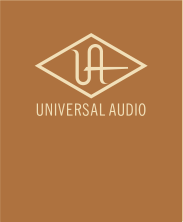
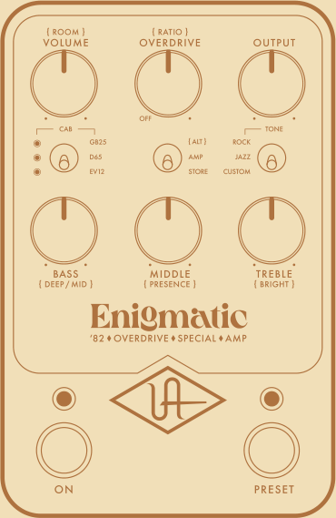
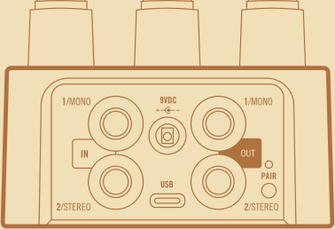
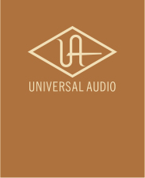

**GET MORE TONES!** Scan here, or go to uaudio.com/uafx/start for free cabs, presets, and deep editing. 

�000853�R2 

|VOLUME|Adjusts amp gain|
|---|---|
|{ ROOM }|Adds studio ambience and air|
|OVERDRIVE|Adjusts amount of overdrive|
||OD channel off when fully counter-clockwise|
|{ RATIO }|Adjusts OD channel output level|
|OUTPUT|Overall pedal volume control|
|CAB|Cycles through available speakers|
||When LED is off, amp remains active|
||but cab and room are disabled|
|SWITCH|{ ALT }: Activates Room, Ratio, Deep/Mid,|
||Presence, and Bright controls|
||AMP: Standard knob controls|
||STORE: Hold down to save sound as preset|
|TONE*|ROCK: Extra preamp gain and aggressive|
||mids for overdriven tones|
||JAZZ: Clean and high headroom, with|
||scooped mids for a tighter feel|
||CUSTOM: FET preamp circuit and amp mods|
||for big, crystalline tones|
|BASS|Adjusts low end amount|
|{ DEEP/MID }|Switches Deep/Mid off below noon,|
||on above noon|
|MIDDLE|Adjusts midrange amount|
|{ PRESENCE }|Adjusts high end sparkle|
|TREBLE|Adjusts high end amount|
|{ BRIGHT }|Switches between no bright cap (counter-clockwise)|
||and three bright cap values from classic amps|
|ON|Toggles amp on/off*|
||LED lit when knob settings are active|
|PRESET|Toggles preset on/off*|
||LED lit when stored settings are active|
||*Customize your amp tones and footswitch|
||modes with the UAFX Control app|
|MONO IN|Connect TS cable from guitar or other gear|
||for mono operation|
|STEREO IN|Connect TS cable for stereo only|
||(in addition to MONO IN)|
|MONO OUT|Connect TS cable to amp or other gear|
||for mono operation|
|STEREO OUT|Connect TS cable for stereo only|
||(in addition to MONO OUT)|
|POWER IN|Connect 400 mA isolated power supply|
||(sold separately)|
|USB TYPE-C|Connect to computer for firmware updates|
||with the UA Connect desktop app|

- PAIR Activate Bluetooth discovery for UAFX Control mobile app 

- Power Supply Isolated 9VDC, center-negative, 400 mA minimum, 2.1x5.5 mm barrel connector (sold separately) 

Find complete documentation at **uaudio.com/uafx/start** 

