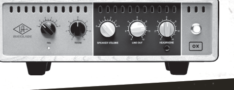
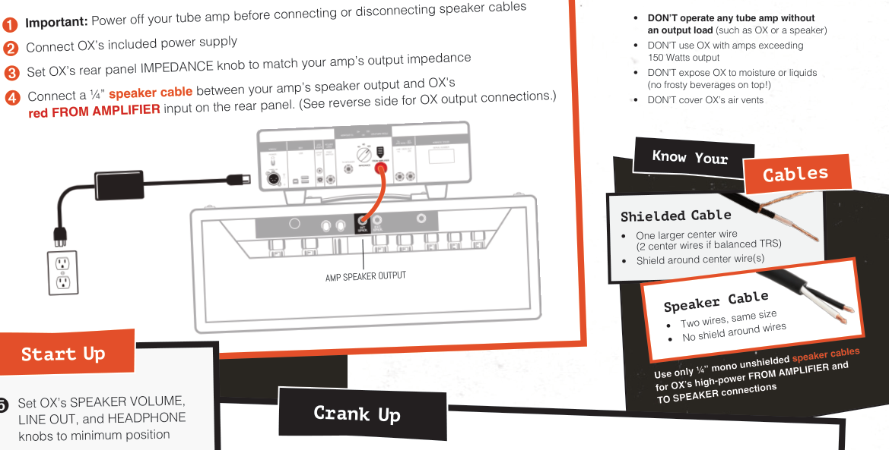
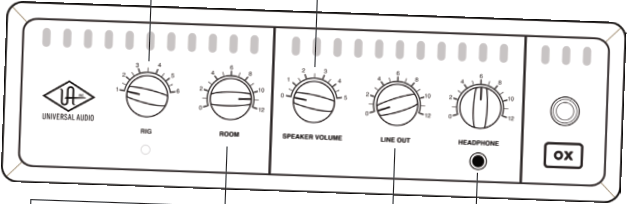
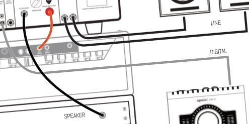

## **`Set Up`** 

## **CAUTION!** 

## **TO AVOID GEAR MELTDOWN:** 

**----- Start of picture text -----** 
•  DON’T operate any tube amp without an output load  (such as OX or a speaker) • DON’T use OX with amps exceeding 150 Watts output • DON’T expose OX to moisture or liquids (no frosty beverages on top!) • DON’T cover OX’s air vents Start Up Set OX’s SPEAKER VOLUME, LINE OUT, and HEADPHONE knobs to minimum position Shielded Cable • One larger center wire (2 center wires if balanced TRS) • Shield around center wire(s) ➊ ➋ ➌ ➍ Crank Up Important:  Power off your tube amp before connecting or disconnecting speaker cables Connect OX’s included power supply Set OX’s rear panel IMPEDANCE knob to match your amp’s output impedance Connect a ¼” red FROM AMPLIFIERspeaker cable  input on the rear panel. (See reverse side for OX output connections.) between your amp’s speaker output and OX's AMP SPEAKER OUTPUT Know Your Cables Speaker Cable • Two wires, same size • No shield around wires speaker cables Use only ¼” mono unshielded for OX’s high-power FROM AMPLIFIER and TO SPEAKER connections **----- End of picture text -----** 

➎ Set OX’s SPEAKER VOLUME, LINE OUT, and HEADPHONE knobs to minimum position 

➏ Power on OX with the rear panel POWER switch 

**RIG** Choose from six complete guitar **SPEAKER VOLUME** cabinet/mic/room/effect setups. Adjusts the volume of the guitar speaker cabinet RIG settings are easily customized connected to OX. At position 0, the speaker is OFF with OX software. for silent operation. **Note:** RIG and ROOM knobs don't affect the speaker output. 

➐ Power on your guitar amp 

➑ Adjust your amp controls to make it sound sweet 

**ROOM** Instant access to mic'd **LINE OUT HEADPHONE** studio ambience and air. Adjusts the level at OX’s Adjusts the volume of stereo stereo LINE/MON outputs. headphones connected here. 

**----- Start of picture text -----** 
Learn more **----- End of picture text -----** 

## 

**----- Start of picture text -----** 
LINE DIGITAL SPEAKER **----- End of picture text -----** 

## 

## 

## 

## 

## **`Tweak and Save Your Rigs with FREE OX Software`** 

## GET OX SOFTWARE: 

- **Mac/Windows app:** From your computer, visit **www.uaudio.com/ox/app** 

- **iPad:** From your iPad, visit the **Apple iOS App Store** 

## COMPLETE OX INFORMATION: 

- **Product details: www.uaudio.com/ox** 

- **Docs and tech support: help.uaudio.com** 

