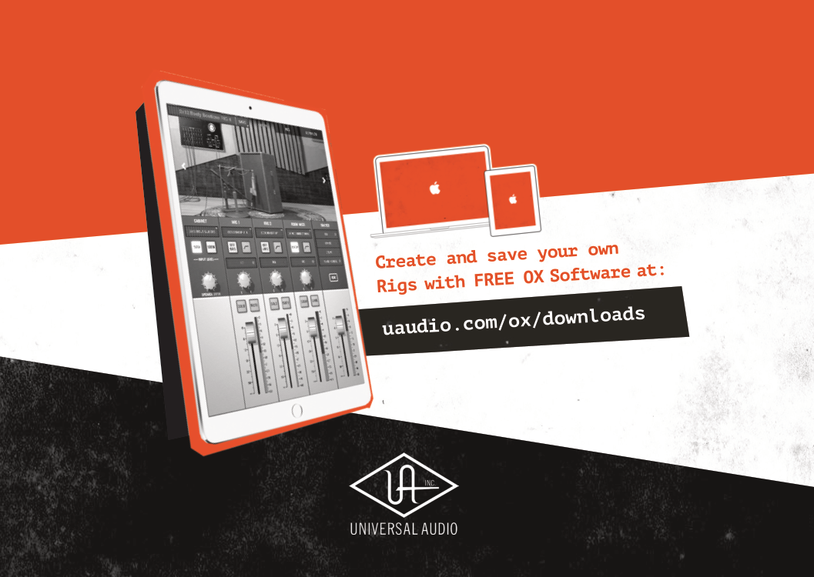

**----- Start of picture text -----**<br>
uaudio.com/ox/downloads<br>**----- End of picture text -----**<br>


# **`Cab & Mic Presets`** 


```
Rig 2
Rig 1
```


```
Rig 3
```

```
Rig 4
```


```
Rig 5
Rig 6
```


