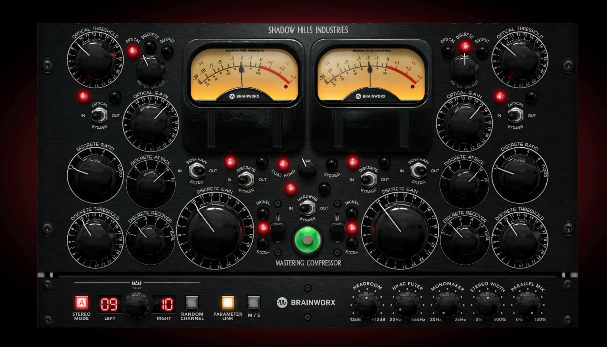
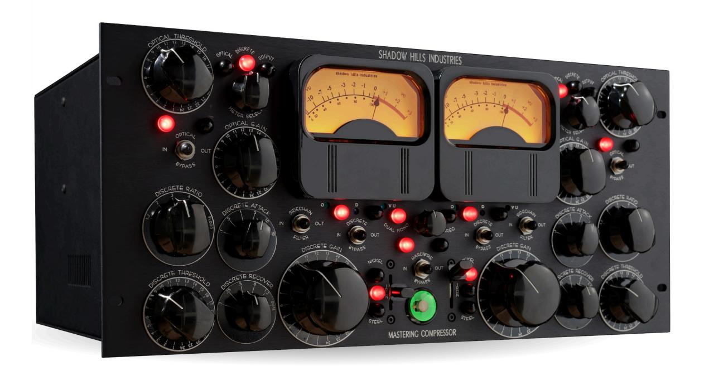
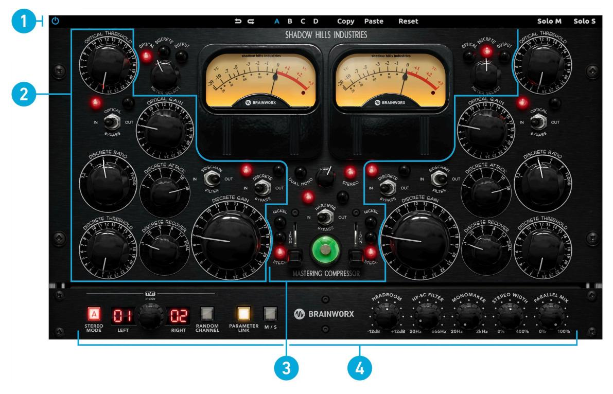
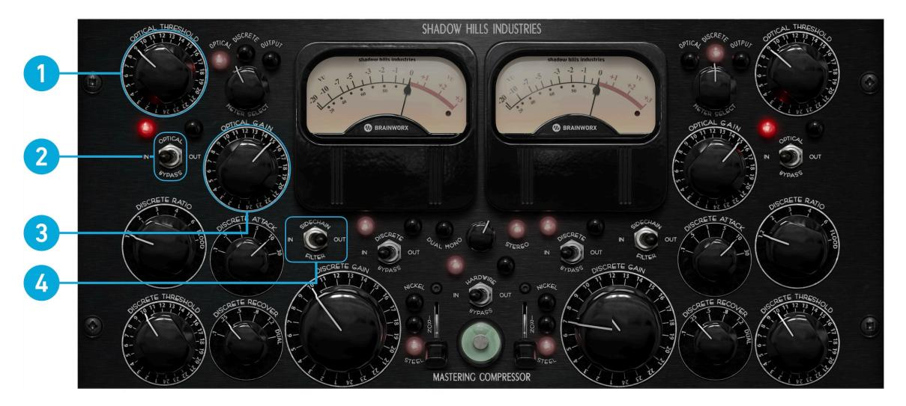
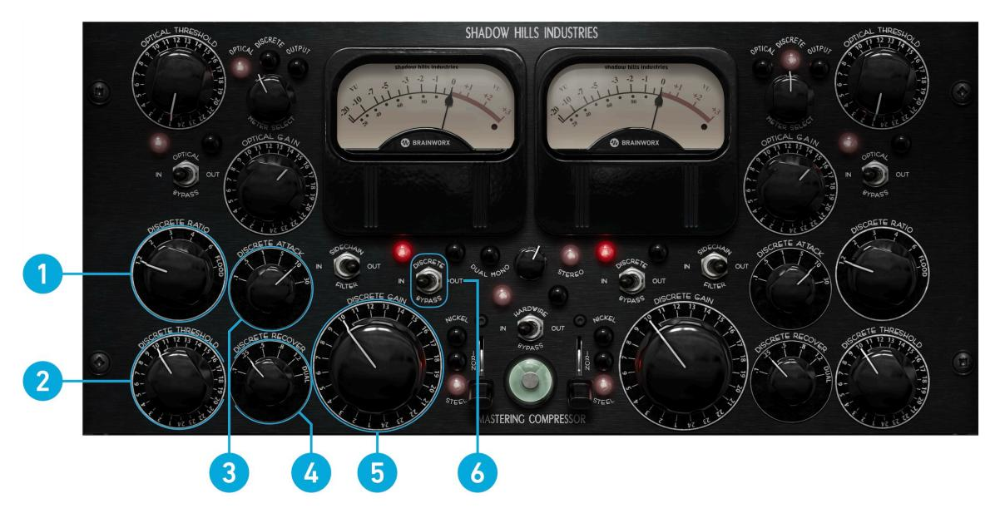
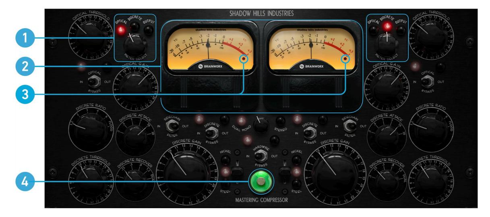
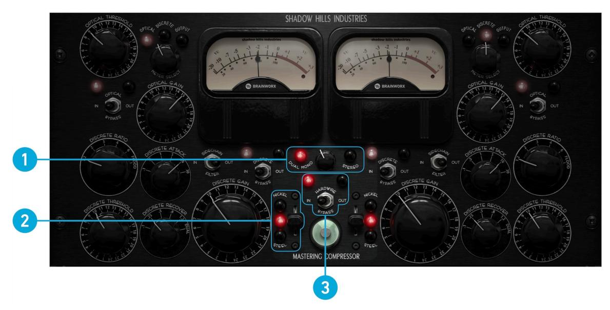
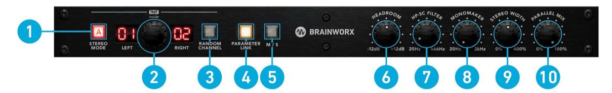

# Shadow Hills Mastering Compressor Class A Limited Edition

### Plugin Manual

## **Table of Contents**

| 1. Welcome to Shadow Hills Mastering Compressor Class A | 1  |
|---------------------------------------------------------|----|
| 2. Key features                                         | 2  |
| 3. Shadow Hills Mastering Compressor Class A overview   | 3  |
| 4. Compressor Section                                   | 4  |
| Optical compressor                                      | 4  |
| Discrete compressor                                     | 5  |
| 5. Center section                                       | 6  |
| Metering                                                | 6  |
| Global settings                                         | 7  |
| 6. Plugin only section                                  | 8  |
| 7. Top toolbar                                          | g  |
|                                                         |    |
| 8. Credits                                              | 10 |

# 1. Welcome to Shadow Hills Mastering Compressor Class A

The Shadow Hills Mastering Compressor Class A VK Limited Edition is part of a special run of unique SHMC units which celebrates the success of one of the most notable mastering compressors ever created. For this special edition, Shadow Hills has included an updated Class-A discrete compressor section, Lundahl input transformers and hand-wired each compressor with Mogami cables. This version is easily distinguished by the red LEDs on the front panel instead of the normal green ones.

The Shadow Hills Mastering Compressor features truly remarkable functionality from mastering grade compression and limiting to nearly flawless dynamic control during tracking and mixing. Inside you have access to two compressors that can process audio in stereo or in dual mono. First you can work with the mastering grade electro optical compressor which is then followed by the discrete Class A compressor/ limiter. Both of these compressors feed the switchable custom output transformers which are comprised of Nickel, Iron and Steel. There is enough gain in each section to overdrive the hottest tapes or to clip your converters, whatever kind of compression you are seeking, this unit will easily deliver.

Thank you for choosing Shadow Hills Mastering Compressor Class A. We hope you enjoy it!

## 2. Key features

The following list gives you an overview of Shadow Hills Mastering Compressor Class A's key features:

- Exacting emulation of the original Class A limited edition of the Shadow Hills Mastering Compressor, endorsed by Shadow Hills Industries.
- Only 50 units have been ever made!
- Separate Optical and Discrete compression sections for two-stage compression techniques.
- Switchable Output Transformers Nickel, which adds a nice top end sparkle. Iron, which adds a little character in the mid's, and Steel which adds additional harmonic distortion.
- Plugin-Only Features:
  - Brainworx´s TMT inside: Tolerance Modeling Technology (TMT, Patent Pending) simulates channel-to-channel variances in electronic components for the most realistic analog sound
  - Headroom: To adjusts the internal operating level
  - M/S Processing Simple workflow to dramatically tweak the width and depth of your mixes
  - Mono-Maker Sums your low-frequency content to mono, giving you focused, punchy bass response.
  - Stereo Width To expand the stereo width of tracks already recorded
  - Parallel Mix Sets the percentage of compressed vs. uncompressed signal that goes to the output.
  - Sidechain Filter 20Hz 666Hz (continuously variable 12 dB per octave high pass filter)
- Top-Toolbar with
  - Undo/Redo and Banks
  - M/S Monitoring

# 3. Shadow Hills Mastering Compressor Class A overview

The Shadow Hills Mastering Compressor Class A plugin is a faithful 1:1 model of the corresponding hardware version, offering all its non-linear behavior and analog sound quality in the digital domain. As is standard in all equipment deployed by Shadow Hills, the Mastering Compressor boasts discrete op-amp technology, custom-designed transformers, and a signal path devoid of any IC's. The unit houses two link-able channels of two separate compressors, which can be operated independently, or in a chain. The first compressor in the circuit is a optical compressor. Utilizing electro-luminescent optical attenuators, the circuit provides gain reduction with a very musical two-stage recovery. The second compressor in the circuit is a discrete design, which is powered by a discrete voltagecontrolled amplifier in feed-forward mode. By the versatility of its features and the precision of its controls, the discrete compressor capably finishes the job started by the optical compressor. However, the coup de grace lies in the final processing stage of the Shadow Hills Mastering Compressor Class A. Each channel is equipped with three distinctive output transformers, which can be toggled via the transformer select switch, effectively changing the frequency response and distortion characteristics of the entire unit.

The Shadow Hills Mastering Compressor Class A consists of the following areas and main controls:

- **1. Top toolbar**: Additional global controls relevant to the plugin's processing. For more information, refer to *[Top toolbar](#page-10-0)*.
- **2. Compressor section**: Optical and discrete compressor controls for each channel. For more information, refer to *[Compressor Section](#page-5-0)*.
- **3. Center section**: Metering and global options to observe and setup. For more information, refer to *[Center section](#page-7-0)*.
- **4. Plugin only section**: Additional Brainworx tools for higher detail and tweaking. For more information, refer to *[Plugin only section](#page-9-0)*.

## 4. Compressor Section

By design, the compressor section of the Shadow Hills Mastering Compressor Class A is divided into two modules:

- **1.** *Optical compressor*
- **2.** *[Discrete compressor](#page-6-0)*

#### Optical compressor

The Optical Section is the first gain reduction circuit in the Mastering Compressor. The compressor is characterized by its very musical compression circuit featuring a slow attack and a two-stage release. The initial eighty percent of compression is released very quickly, whilst the remaining twenty percent takes over a second to recover, varying slightly with the amount of attenuation applied. Modeling the Optical Section with its unique electro-luminescent optical attenuator was certainly the biggest challenge during the production of the Mastering Compressor plugin.

This section consists of the following controls:

- **1. Optical Threshold**: This control determines at what input level compression begins to occur. The compressor operates with a fixed ratio of 2:1, so compression is achieved by lowering the threshold into a range in which it begins to attenuate. Minimum compression occurs at **1** and maximum compression occurs at **24**.
- **2. Optical Bypass**: **IN** engages the optical compressor module, and **OUT** bypasses it.
- **3. Optical Gain**: This control provides post-compression make-up gain or attenuation using a 24-position rotary switch. The gain control provides greater accuracy around unity gain, which occurs roughly at position **7**, and offers coarser adjustment towards more extreme settings.
- **4. Sidechain Filter**: The Sidechain Filter switch engages a high-pass filter on the side chains of both the optical and discrete compressors. Thus the Sidechain Filter can help to reduce unwanted "pumping" artefacts, as the compressors will react less to low frequency content such as bass drum hits.

#### Discrete compressor

The Discrete Section is the final gain reduction circuit in the Mastering Compressor. It achieves compression by means of our custom, discrete voltage-controlled amplifier. Due to the breadth of the controls, the discrete compressor is extremely versatile and can be configured to attain a variety of sounds.

This section consists of the following controls:

- **1. Discrete Ratio**: This control determines the amount of compression achieved when the input signal reaches the threshold. A ratio of **1.2** means that for every 1.2dB of input over the threshold, 1 dB will be outputted. At **2**, 1dB will be outputted for every 2dB of input over the threshold, etc. When the dial is set to **Flood**, a ratio of 20:1 occurs.
- **2. Discrete Threshold**: This control determines at what input level compression begins to occur. Minimum compression occurs at **1** and maximum compression occurs at **24**.
- **3. Discrete Attack**: This control determines how quickly the compressor engages attenuation once the threshold has been reached. Each setting is in milliseconds.
- **4. Discrete Recover**: This control determines how quickly the compressor disengages attenuation once the threshold has no longer been reached. Each setting is in seconds. At "Dual" the compressor mimics the two-stage recovery of the optical section.
- **5. Discrete Gain**: This control provides post-compression make- up gain or attenuation using a 24-position rotary switch. The gain control provides greater accuracy around unity gain, which occurs roughly at position **7**, and offers coarser adjustment towards more extreme settings.
- **6. Discrete Bypass**: **IN** engages the discrete compressor module, and **OUT** bypasses it.

## 5. Center section

For a better overview, the controls of this section are divided into the following sub-sections:

- **1.** *Metering*
- **2.** *[Global settings](#page-8-0)*

#### Metering

This section consists of the following controls:

- **1. VU Metering**: The Shadow Hills Mastering Compressor Class A is equipped with two VU meters for proper visual analysis of audio processing. When used on mono signals, the two VU meters can be used to display the gain reduction of both compressors simultaneously. The same goes for linked **Stereo** mode. It is only in **Dual Mono** mode that the VU meters show gain reduction independently for both channels. The internal reference level corresponding to 0 VU can be set in the splash screen, which is brought up by clicking on any of the two meters or the Shadow Hills Industries Logo. By default, the meter reference is set to 0 dBu = -14 dBFS
- **2. Meter Select**: Each VU meter has the capability of displaying optical gain reduction, discrete gain reduction, and output level, as determined by the position of the Meter Select switch but independent on the **Dual Mono** / **Stereo** setting. This facilitates viewing a combination of gain reduction and output, or the two different stages of compression simultaneously while in **Stereo**.
- **3. OVL LED**: The OVL (Overload) LED indicates internal clipping. Whether the clipping is audible or not depends on the kind of audio material you are processing. You should always avoid that the OVL LED illuminates. Use the **Discrete Gain** control to reduce the output level if the OVL-LEDs keeps flashing.
- **4. Magic Eye**: The green, glowing Magic Eye tube at the bottom of the unit is the final component in the metering system. When both VU Meters are in **Output** mode, the Magic Eye displays a mono signal in its top quadrant.

Clicking the Shadow Hills Industries logo or the VU-Meters will open a splash screen containing team credits and default settings.

#### Global settings

This section consists of the following controls:

- **5. Stereo Operation** (**Sidechain Link**): The Shadow Hills Mastering Compressor Class A can operate in **Dual Mono** or **Stereo**. While in **Dual Mono**, each side has independent operation and all of the controls on both sides are active. In **Stereo**, the left- hand controls operate all of the Mastering Compressor's features with the right-hand controls not having any effect and the red light bulbs reflecting the left-hand settings.
- **6. Transformer Switching Matrix**: You have remarkable control over the tone and vibe of your music thanks to three switchable output transformers. This matrix switches the selected transformers in and out of the circuit. The various material compositions, size and methods of winding impart different frequency and distortion characteristics as well as the transient limiting caused by the magnetics. The ability to switch between the different transformer selections, equates to being able to switch in the final gain stages from different vintage consoles and provides remarkable flexibility.

**Nickel**: The cleanest position with the least distortion. This position has a subtle accentuation of ultra- high frequencies.

**Iron**: This position has an additional Class- A amplifier section adding evenordered harmonic distortion, resulting in a very musical upper low frequency boost.

**Steel**: The most distorted selection with an extremely tight boost in the low frequencies.

**7. Hardwire Bypass**: When flipped to **IN**, the Hardwire Bypass switch engages the line amp and output transformer circuitry. When flipped to **OUT**, the inputs are directly connected to the outputs with no processing. In order for the compressors to operate, the hardwire bypass must be **IN**, however the Hardwire Bypass can be engaged with the compressors **OUT**. This allows audio to be colored by our discrete op-amp and custom transformer technology at unity gain, even when no compression is desired, turning the Mastering Compressor into an effective tone shaping tool.

## 6. Plugin only section

Not only does the plugin nail the heart and soul of the Shadow Hills Mastering Compressor Class A but you'll find the extra features you've come to expect from Brainworx products.

This section consists of the following controls:

- **1. [TMT] Stereo Mode**: Toggles between using the same TMT channel for both units (D=digital) and using two adjacent, differing TMT channels (A=analog).
- **2. TMT [Channel]**: Switches between 20 different analog channels. In a Stereo instance, two adjacent Channel numbers will be displayed. Each channel has its own, different character.
- **3. [TMT] Random Channel**: Whenever a TMT-featured plugin on a channel gets inserted, it will start with the default setup, which is channel 1 in a flat setting. You can randomize a channel by clicking the Random Channel button. The plugin instance you click on will switch to any unused channel number in that session randomly, until you reach 20 channels.
- **4. M/S [processing]**: Engages Mid/Side processing. When this is set to on, the left channel processes the mid (sum) and the right channel processes the side (difference) of both channels.
- **5. Parameter Link**: This enables or disables linking of parameters for **Stereo** and **Dual Mono** operations. When both parameters have different values and link is engaged, both parameter values remain unless one of them is touched and any control offsets between channels are lost.
- **6. Headroom**: Adjusts the internal operating level so that the plugin produces more or less gain reduction. Rotating the control clockwise will allow signals at the input to be pushed higher before they compress, this will result in less compression overall. By rotating counter-clockwise headroom is decreased resulting in a greater amount of gain reduction and more color and compression being added to the signal. This parameter is perfect for fine tuning the effects produced and also for accurate level matching.
- **7. HP-SC-Filter**: Continuously variable 6dB per octave High-Pass Filter for the compressors' sidechain. Sweepable from 20 Hz to 666 Hz thus the sidechain filter can help to reduce unwanted pumping artefacts, as the compressors will react less to low frequency content such as bass drum hits.
  - Please make sure the **Sidechain Filter** switch is engaged.
- **8. Mono Maker [frequency]**: Sweepable from 20 to 2000 Hz, this parameter folds the processed sound to mono below the selected frequency. The most common setting is between 100-200 Hz.
- **9. Stereo Width**: Set the amount of side boost/attenuation.
- **10. Parallel Mix**: Controls the amount of the dry (unprocessed) signal being blended with the wet (processed) signal, effectively providing the option of parallel compression.

**0%** = uncompressed/dry signal < ... > compressed/wet signal = **100%**

## 7. Top toolbar

Additional global controls related to plugin settings and processing are available in the top toolbar.

- **1. Power**: Bypasses the processor when disengaged.
- **2. ↩︎ ↪︎**: Undo and redo changes made to controls up to 32 steps.
- **3. Bank A B C D**: Each preset allows you to switch between four banks (A, B, C, D) of controls.
- **4. Copy**: Copy the active settings to memory.
- **5. Paste**: Paste the copied settings to the active bank.
- **6. Reset**: Reset the current bank.
- **7. Solo M**: Isolates to audit the mid (sum) signal being processed by the plugin.
- **8. Solo S**: Isolates to audit the side (difference) signal processed by the plugin.

## 8. Credits

**Concept:** Peter Reardon

**Programming, Modeling and Algorithms:** Daniel Schütz, Jan Stickelbruck

**UI-Design:** Goran Lizdek

**Product Management:** Christoph Tkocz, Albert Gabriel