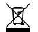
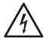

**User Guide**

**Universal Audio, Inc.**

**www.uaudio.com**

**4585 Scotts Valley Drive, Scotts Valley, CA 95066**

**UA Bock 167 Microphone**

### **Introduction**

The UA Bock 167 microphone continues Universal Audio's proud tradition of timeless craftsmanship. Lovingly handbuilt at the UA Custom Shop in Santa Cruz, California, your new microphone is designed to deliver uncompromising quality and a lifetime of musical inspiration.

This microphone is a high-quality large-diaphragm condenser with vacuum tube electronics and continuously variable directivity. Featuring a dual membrane K67 capsule and a large core output transformer to dramatically increase low frequency response and headroom, the UA Bock 167 sounds rich and full.

Designed and engineered by David Bock, the UA Bock 167 provides a wider range of controls versus a vintage U67. This makes it a natural choice for singers, acoustic instruments, drums, and voiceovers.

## **Getting Started**

Place the UA Bock 167 microphone in its included shockmount on a stable mic stand. Connect the power supply to AC, then connect the included six-pin XLR cable from power supply to microphone. **Note:** The power supply should be powered off before connecting or disconnecting the microphone. After switching on the power supply, allow the tube several minutes to warm up before use.

The Bock 167's polar response pattern is adjusted by the continuously variable remote control on the power supply. Rotate the control fully counterclockwise for omni response, or fully clockwise for figure-8 response. Set the control to noon (straight up) for cardioid polar response.

Any combination of mic switch settings may be used for tonal shaping. The MODE switch offers either "normal" response or a unique "fat" mode that provides a gentle low mid/bass EQ boost for a warmer sound. The HIGH FREQUENCY switch offers four filtering options for tone shaping. From left: -3 dB of shelving cut at 10 kHz, -1.5 dB shelving cut at 5 kHz, flat, and an additional +2 dB shelving boost at 10 kHz. If needed, engage the -10 dB PAD on high SPL sources like drums and amplified guitars.

For customer support, visit **help.uaudio.com**

# **Get Apollo Interface Presets**

UA Bock 167 comes with Apollo Channel Strip Presets. These downloadable settings for UA's Apollo audio interfaces give you professional results on a wide range of sources, instantly. To get your presets, download UA Connect by scanning the QR code or visit **uaudio.com/mics/presets**

## **UA Bock 167 Specifications**

#### **Polar Pattern**

(via power supply) Continuously variable Omnidirectional through Cardioid and Figure-8

#### **Frequency Range**

10 Hz — 18 kHz, ±2 dB

#### **Sensitivity**

-29 dB (33 mV) ref 1V at 1 Pa, 1 kHz

### **Self-Noise** 19 dBA

#### **Distortion vs SPL @ 1 kHz**

(Increasing distortion is nonexponential, nearly linear, and primarily 2nd harmonic)

112 dB = 0.5% THD 118 dB = 1% THD 129 dB = 2% THD

#### **Impedance** 200 Ohms

#### **Recommended Load Impedance**

> 2K Ohms **Maximum SPL** 118 dB SPL, 1% THD

### **Dynamic Range**

99 dB

### **Signal-to-Noise Ratio**

75 dB **Capsule** 1" diameter

> Dual symmetrical backplate Dual diaphragm K67 type

**Tube**

PAD (-10 dB) Off, On New Old Stock EF732 **Adjustable Controls**

HIGH FREQUENCY Cut (-1.5 dB @5 kHz)

Cut (-3 dB @10 kHz)

Flat

MODE Boost (+2 dB @10 kHz) Fat, Normal

**Connectors** 6-pin XLR (mic)

3-pin XLRM (power supply)

**Dimensions** 9" (228 mm) length 2" (50 mm) diameter **Microphone Weight** 1.58 lbs (716 g)

### **Shipping Weight**

12 lbs (5.4 kg)

### **Safety Standards**

UL 62368-2 EN 62368-1 Microphone input power: From UA BOCK 167 PSU

#### **Power Supply**

UA Bock 167 PSU Input: 100VAC 115VAC 230VAC

Output: 130VDC @ 0.75mA,

 5VDC @ 132mA Maximum operating temperature 40°C

Power Rating = 8.2W

### **Power Supply Pinouts**

Pin 1 Pin 2 Pin 3 Pin 4 Audio (-) Audio (+) Pattern Heater (5VDC)

Pin 5 Pin 6 Case B+ (130VDC) Ground Shield

## **Safety**

Before using this unit, be sure to carefully read the applicable items of these operating instructions and the safety suggestions. Afterwards, keep them for future reference. Take care to follow the warnings indicated on the unit, as well as in the operating instructions.

#### **Important Safety Instructions:**

Read and follow all instructions. Heed all warnings. Keep these instructions. Do not use this apparatus near water.

Clean only with dry cloth.

Do not block any ventilation openings. Install in accordance with the manufacturer's instructions.

Do not install near any heat source such as radiators, heat registers, stoves, or other apparatus (including amplifiers) that produce heat.

Only use with attachments/accessories specified by the manufacturer.

Do not defeat the safety purpose of the polarized or grounding-type plug. A polarized plug has two blades with one wider than the other.

Protect the power cord from being walked on or pinched particularly at plugs, convenience receptacles, and the point where they exit from the apparatus.

Refer all servicing to qualified service personnel. Servicing is required when the apparatus has been damaged in any way, such as power-supply cord or plug is damaged, liquid has been spilled or objects have fallen into the apparatus, the apparatus has been exposed to rain or moisture, does not operate normally, or has been dropped.

UA BOCK 167 does not contain a fuse or any other user-replaceable parts.

Used electrical and electronic equipment should not be mixed with general household waste. Please dispose in accordance with local regulations.

Hazardous voltage enclosed. Do not open, will cause shock or burn. If servicing is needed, disconnect power and contact Universal Audio customer support.

For the UA Bock 167 Power Supply Guide, visit help.uaudio.com

**Universal Audio, Inc. 4585 Scotts Valley Drive, Scotts Valley, CA 95066 www.uaudio.com**