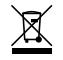
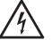

# **UA Bock 187 Microphone**

### **User Guide**

#### **Declaration of Conformity Statements**

#### **United States**

This equipment has been tested and found to comply with the limits for a Class B digital device pursuant to Part 15 of the FCC Rules. These limits are designed to provide reasonable protection against harmful interference in a residential installation. This equipment generates, uses, and can radiate radio frequency energy and, if not installed and used in accordance with the instructions. may cause harmful interference to radio communications. However, there is no guarantee that interference will not occur in a particular installation. If this equipment does cause harmful interference to radio or television reception, which can be determined by turning the equipment off and on, the user is encouraged to try and correct the interference by one or more of the following measures:

- Reorient or relocate the receiving antenna.
- Increase the separation between the equipment and the receiver.
- Connect the equipment into an outlet on a circuit different from that to which the receiver is connected.
- Consult the dealer or an experienced radio/TV technician for help

#### **Canada**

Innovation, Science and Economic Development Canada Interference Causing Equipment Standard ICES-003, "Information Technology Equipment (ITE)-Limits and methods of measurement", Issue 6, dated January 2016 (class B)

#### **Japan**

この 装 置 は 、クラスB機 器 です。 この 装 置 は 、住 宅 環 境 で 使 用 することを目 的 として います が 、この 装 置 がラジ オやテレビ ジョン 受 信 機 に 近 接して 使 用 され ると、受 信 障 害 を引 き起こ すことが あります。取 扱 説 明 書 に 従って 正しい 取り扱 い をして 下 さい 。 V C C I - B

**Universal Audio, Inc. 4585 Scotts Valley Drive, Scotts Valley, CA 95066 www.uaudio.com**

### **Introduction**

The UA Bock 187 microphone continues Universal Audio's proud tradition of timeless craftsmanship. Lovingly handbuilt at the UA Custom Shop in Santa Cruz, California, your new microphone is designed to deliver uncompromising quality and a lifetime of musical inspiration.

This microphone is a phantom powered large-diaphragm condenser, with a cardioid polar response pattern. Featuring a FET amplifier and fully transformer balanced audio output, it provides remarkable fullness and presence with exceptionally low background noise.

Designed and engineered by David Bock, UA Bock 187 features a larger transformer and more refined bias circuitry versus a vintage U87. This results in higher dynamic range in the low frequencies, as well as more natural guitar and vocal capture.

### **Getting Started**

Place the UA Bock 187 microphone in its included mount on a stable mic stand. As a best practice, mute the input channel and disable phantom power at its source before connecting or disconnecting the mic.

The MODE switch offers either "normal" response or a unique "fat" mode that provides a gentle low mid/bass EQ boost for a warmer sound.

This microphone is very sensitive to frequencies below 20 Hz, especially when fat mode is active. Engage the LOCUT switch to reduce unwanted low frequency noise.

For high SPL sources like drums and amplified guitars, the microphone features a -10 dB PAD with voltage divider circuitry, delivering superior transparency versus more common capacitive pads.

For customer support, visit **help.uaudio.com**

### **Get Apollo Interface Presets**

UA Bock 187 comes with convenient Apollo Channel Strip Presets. These downloadable settings for UA's Apollo audio interfaces give you professional results on a wide range of sources, instantly. To get your presets, download UA Connect by scanning the QR code or visit **uaudio.com/mics/presets**

### **UA Bock 187 Specifications**

**Polar Pattern**

Cardioid

**Frequency Range**

20 Hz — 16 kHz, ±2 dB

**Sensitivity**

-42 dB (8 mV) ref 1V at 1 Pa, 1 kHz

**Self-Noise** 12 dBA

**Distortion vs SPL @ 1 kHz**

(Increasing distortion is nonexponential, nearly linear, and primarily 2nd harmonic)

122 dB = 0.5% THD 125 dB = 1% THD

129 dB = 2% THD

**Output Impedance**

200 Ohms

**Recommended Load Impedance**

> 2K Ohms **Maximum SPL** 125 dB SPL, 1% THD **Dynamic Range** 113 dB

**Signal-to-Noise Ratio**

82 dB **Capsule** 1" diameter

Dual symmetrical backplate Dual diaphragm K67 type **Phantom Power Requirements**

48 VDC, 0.5 mA

**Adjustable Controls**

PAD (-10 dB): off, on

MODE (bass contour): fat, norm LOCUT (120 Hz rumble): off, on

**Output Connector** 3-Pin XLRM **Dimensions**

2" (50 mm) diameter **Microphone Weight** 1.6 lbs (725 g) **Shipping Weight** 2 lbs (907 g) **Safety Standards**

7.7" (195mm) length

UL 62368-2 EN 62368-1

## **Safety**

Before using this unit, be sure to carefully read the applicable items of these operating instructions and the safety suggestions. Afterwards, keep them for future reference. Take care to follow the warnings indicated on the unit, as well as in the operating instructions.

#### **Important Safety Instructions:**

Read and follow all instructions; Heed all warnings; Keep these instructions.

Do not use this apparatus near water.

Clean only with dry cloth.

Do not block any ventilation openings. Install in accordance with the manufacturer's instructions.

Do not install near any heat source such as radiators, heat registers, stoves, or other apparatus (including amplifiers) that produce heat. Do not defeat the safety purpose of the polarized or grounding-type

plug. A polarized plug has two blades with one wider than the other.

Protect the power cord from being walked on or pinched particularly at plugs, convenience receptacles, and the point where they exit from the apparatus.

Only use with attachments/accessories specified by the manufacturer. Refer all servicing to qualified service personnel. Servicing is required when the apparatus has been damaged in any way, such as powersupply cord or plug is damaged, liquid has been spilled or objects have fallen into the apparatus, the apparatus has been exposed to rain or moisture, does not operate normally, or has been dropped.

Used electrical and electronic equipment should not be mixed with general household waste. Please dispose in accordance with local regulations.

Hazardous voltage enclosed. Do not open, will cause shock or burn. If servicing is needed, disconnect power and contact Universal Audio customer support.

> **Universal Audio, Inc. 4585 Scotts Valley Drive, Scotts Valley, CA 95066 www.uaudio.com**