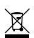
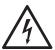

# **UA Bock 251 Microphone PSU**

### **Power Supply Guide**

V230523/

#### Introduction

The UA Bock 251 microphone continues Universal Audio's proud tradition of timeless craftsmanship. Lovingly handbuilt at the UA Custom Shop in Santa Cruz, California, your new microphone is designed to deliver uncompromising quality and a lifetime of musical inspiration.

This microphone is a multi-pattern tube design of the highest quality. Offering Omni, Cardioid, and Figure-8 polar patterns, extended low-frequency response, and high sound pressure level tolerance, we trust this microphone will become an indispensable part of your recording studio.

Engineered by David Bock and inspired by the iconic 251, the UA Bock 251 is ideal for capturing vocals and musical instruments.

For customer support, visit help.uaudio.com

#### **UA Bock 251 PSU Specifications**

| Power Supply Pinouts |                | Input             |
|----------------------|----------------|-------------------|
| Pin 1                | Audio (-)      | 100 VAC           |
| Pin 2                | Audio (+)      | 115 VAC           |
| Pin 3                | No connection  | 220/230 VAC       |
| Pin 4                | Heater (5 VDC) |                   |
| Pin 5                | B+ (130 VDC)   | Output            |
| Pin 6                | Ground         | 130 VDC @ 0.55 mA |
| Case                 | Shield         | 5.1 VDC @ 332 mA  |

Before using this unit, be sure to carefully read the applicable items of these operating instructions and the safety suggestions. Afterwards, keep them for future reference. Take care to follow the warnings indicated on the unit, as well as in the operating instructions.

#### **Important Safety Instructions**

Read and follow all instructions. Heed all warnings. Keep these instructions.

Do not use this apparatus near water.

Clean only with dry cloth.

Do not block any ventilation openings. Install in accordance with the manufacturer's instructions.

Do not install near any heat source such as radiators, heat registers, stoves, or other apparatus (including amplifiers) that produce heat.

Only use with attachments/accessories specified by the manufacturer.

Do not defeat the safety purpose of the polarized or grounding-type plug. A polarized plug has two blades with one wider than the other.

### **UA Bock 251 Power Supply Unit**

Your UA Bock 251 includes a high quality PSU that is custom designed exclusively for the Bock 251 mic. The PSU is factory-configured for the AC input voltage in the region where it is sold. There are no fuses or other user replaceable parts inside the unit.

For the UA Bock 251 User Guide, visit help.uaudio.com

## **Getting Started**

Place the UA Bock 251 microphone in its included shockmount on a stable mic stand. Connect the power supply to AC, then connect the included six-pin XLR cable from power supply to microphone.

Note that the power supply should be powered off before connecting or disconnecting the microphone. After switching on the power supply, allow the tube several minutes to warm up before use.

| Connectors               | Max Operating Temp |
|--------------------------|--------------------|
| Tuchel (mic)             | 40° C              |
| 3-Pin XLR (power supply) |                    |
|                          | Safety Standards   |
| Power Rating             | UL 62368-2         |
| 11.5 W                   | EN 62368-1         |

Protect the power cord from being walked on or pinched particularly at plugs, convenience receptacles, and the point where they exit from the apparatus.

Refer all servicing to qualified service personnel. Servicing is required when the apparatus has been damaged in any way, such as power-supply cord or plug is damaged, liquid has been spilled or objects have fallen into the apparatus, the apparatus has been exposed to rain or moisture, does not operate normally, or has been dropped.

UA BOCK 251 PSU does not contain a fuse or any other user-replaceable parts.

Used electrical and electronic equipment should not be mixed with general household waste. Please dispose in accordance with local regulations.

Hazardous voltage enclosed. Do not open, will cause shock or burn. If servicing is needed, disconnect power and contact Universal Audio customer support.