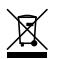

# **UA Bock 251 Microphone**

### **User Guide**

The UA Bock 251 microphone continues Universal Audio's proud tradition of timeless craftsmanship. Lovingly handbuilt at the UA Custom Shop in Santa Cruz, California, your new microphone is designed to deliver uncompromising quality and a lifetime of musical inspiration.

This microphone is a multi-pattern tube design of the highest quality. Offering Omni, Cardioid, and Figure-8 polar patterns, extended low-frequency response, and high sound pressure level tolerance, we trust this microphone will become an indispensable part of your recording studio.

Engineered by David Bock and inspired by the iconic 251, the UA Bock 251 is ideal for capturing vocals and musical instruments.

### **Introduction Getting Started**

Place the UA Bock 251 microphone in its included shockmount on a stable mic stand. Connect the power supply to AC, then connect the included six-pin XLR cable from power supply to microphone.

Note that the power supply should be powered off before connecting or disconnecting the microphone. After switching on the power supply, allow the tube several minutes to warm up before use.

To adjust the microphone polar response pattern, slide the switch until the desired setting is visible.

For customer support, visit **help.uaudio.com**

### **Get Apollo Interface Presets**

UA Bock 251 comes with convenient Apollo Channel Strip Presets. These downloadable settings for UA's Apollo audio interfaces give you professional results on a wide range of sources, instantly. To get your presets, download UA Connect by scanning the QR code or visit **uaudio.com/mics/presets**

# **UA Bock 251 Microphone**

### **User Guide**

### **UA Bock 251 Specifications**

**Polar Patterns**

Cardioid, Omnidirectional, Figure-8

**Frequency Range**

10 Hz — 18 kHz, ±2 dB

**Sensitivity**

-34 dB (19 mV) ref 1V at 1 Pa, 1 kHz

**Self-Noise**

18 dBA

**Distortion versus SPL @ 1 kHz**

(Increasing distortion is non-exponential, nearly linear, and primarily 2nd harmonic)

112 dB = 0.5% THD 118 dB = 1% THD 129 dB = 2% THD **Output Impedance**

150 Ohms

**Recommended Load Impedance**

> 1.2K Ohms **Maximum SPL** 118 dB SPL, 1% THD **Dynamic Range**

100 dB

**Signal-to-Noise Ratio**

76 dB **Capsule** 1" diameter

Dual asymmetrical backplate Dual diaphragm CK12 type

**Tube**

New Old Stock ECC85

**Connectors** Tuchel (mic)

3-Pin XLR (power supply) **Microphone Weight** 1.58 lbs (716 g)

**Shipping Weight** 12 lbs (5.4 kg) **Dimensions**

8.5" (216 mm) length 2" (52 mm) diameter

**Safety Standards**

UL 62368-2, EN 62368-1 Microphone input power: From UA BOCK 251 PSU

**Power Supply** UA Bock 251 PSU

Input: 100VAC, 115VAC, or 230VAC

Output: 130VDC @ 0.55mA, 5.1VDC @ 332mA Maximum operating temperature 40°C

Power Rating = 11.5W

Pin 1 Pin 2 Pin 3 Pin 4 Pin 5 Pin 6 Case Audio (-) Audio (+) No connection Heater (5VDC) B+ (130VDC) Ground Shield **Power Supply Pinouts**

### **Safety**

Before using this unit, be sure to carefully read the applicable items of these operating instructions and the safety suggestions. Afterwards, keep them for future reference. Take care to follow the warnings indicated on the unit, as well as in the operating instructions.

#### **Important Safety Instructions:**

Read and follow all instructions. Heed all warnings. Keep these instructions.

Do not use this apparatus near water.

Clean only with dry cloth.

Do not block any ventilation openings. Install in accordance with the manufacturer's instructions.

Do not install near any heat source such as radiators, heat registers, stoves, or other apparatus (including amplifiers) that produce heat.

Do not defeat the safety purpose of the polarized or grounding-type plug. A polarized plug has two blades with one wider than the other.

Protect the power cord from being walked on or pinched particularly at plugs, convenience receptacles, and the point where they exit from the apparatus.

Only use with attachments/accessories specified by the manufacturer.

Refer all servicing to qualified service personnel. Servicing is required when the apparatus has been damaged in any way, such as power-supply cord or plug is damaged, liquid has been spilled or objects have fallen into the apparatus, the apparatus has been exposed to rain or moisture, does not operate normally, or has been dropped.

UA BOCK 251 does not contain a fuse or any other user-replaceable parts.

Used electrical and electronic equipment should not be mixed with general household waste. Please dispose in accordance with local regulations.

Hazardous voltage enclosed. Do not open, will cause shock or burn. If servicing is needed, disconnect power and contact Universal Audio customer support.

For the UA Bock 251 Power Supply Guide, visit help.uaudio.com