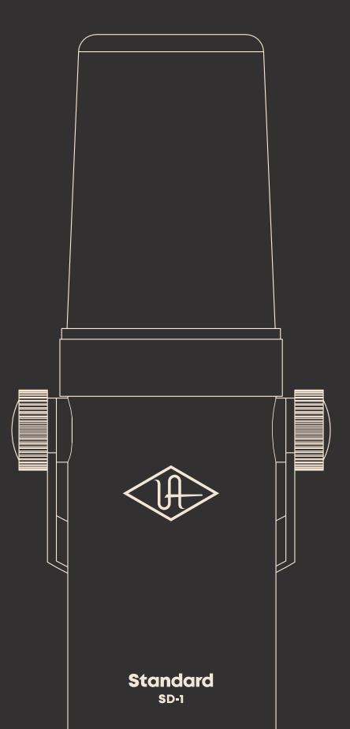
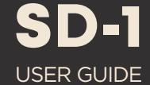

Universal Audio, Inc.

4585 Scotts Valley Drive, Scotts Valley, CA 95066 www.uaudio.com

# **Congratulations Specifications**

Your new UA Standard SD-1 Dynamic Microphone is designed to deliver years of uncompromising sonic performance.

The SD-1 is a high-quality dynamic broadcast mic suitable for a wide range of professional audio applications. With its cardioid polar pattern and smooth, transparent sound, it's particularly well suited for capturing both music and speech.

There are two control switches below the XLR connector. Move switch #1 to its up position ( ) to reduce low frequency rumble. Move switch #2 to its down position ( ) for a gentle boost in the vocal articulation range. For a fuller sound, move the mic closer to the source.

The SD-1 comes with convenient Apollo Channel Strip Presets. These downloadable settings for UA's Apollo audio interfaces give you professional results, instantly.

### **Get Apollo Interface Presets**

To get custom Apollo Channel Strip Presets, scan the QR code or visit **uaudio.com/mics/presets**

## **Description**

Professional End-Address Broadcast Microphone

## **Type**

Dynamic

# **Polar Pattern**

Cardioid

# **Frequency Response**

50 Hz – 16 kHz

# **Output Impedance**

200 Ohms

### **Sensitivity**

-58 dB (0 dB = 1V/Pa at 1 kHz)

# **Adjustable Controls**

Low Cut Filter (200 Hz): Off, On Articulation Boost (3 – 5 kHz): Off, On

### **Output Connector**

Balanced XLR3, pin 2 hot