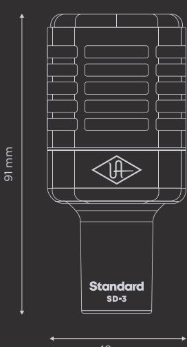

Standard Dynamic Microphone with Mic Modeling

# **Congratulations Get Hemisphere Specifications**

Your new SD-3 Standard Dynamic Microphone with Hemisphere Mic Modeling is designed to deliver years of uncompromising sonic performance.

The SD-3 is a professional dynamic studio microphone suitable for a wide range of audio applications. With its cardioid polar pattern and superior o-axis rejection, the SD-3 is perfect for capturing snare drums, guitar amps, and other high SPL sources.

Your SD-3 includes Hemisphere mic modeling, giving you a collection of the greatest mics ever made.

Follow these steps to get your Hemisphere Mic Collection plug-in:

- On your computer, visit **uaudio.com/mics/hemisphere**
- Download, install, and open the **UA Connect** application.
- Click the **+ Add Hardware** button n the app and enter the serial number, which can be found on the package or the XLR connector, then download your plug-in. 3.

For complete documentation and support, visit **help.uaudio.com**

### **Type**

Dynamic

# **Polar Pattern**

Cardioid

# **Sensitivity**

-58 dB (0 dB = 1V/Pa @ 1 kHz)

## **Frequency Range**

40 Hz - 15 kHz

# **Output Impedance**

250 Ohms

# **Output Connector**

3-pin XLRM

Used electrical and electronic equipment should not be mixed with general household waste. Please dispose in accordance with local regulations.

Universal Audio, Inc.