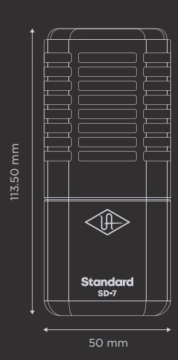

Standard Dynamic Microphone with Mic Modeling

## **Congratulations Get Hemisphere Specifications**

Your new SD-7 Standard Dynamic Microphone with Hemisphere Mic Modeling is designed to deliver years of uncompromising sonic performance.

The SD-7 is a professional dynamic studio microphone suitable for a wide range of audio applications. With its hypercardioid polar pattern and brilliant, punchy tone, the SD-7 is perfect for capturing toms, horns, and other high SPL sources.

Your SD-7 includes Hemisphere mic modeling, giving you a collection of the greatest mics ever made.

Follow these steps to get your Hemisphere Mic Collection plug-in:

- On your computer, visit uaudio.com/mics/hemisphere
- Download, install, and open the UA Connect application.
- Click the + Add Hardware button in the app and enter the serial number, which can be found on the package or the XLR connector, then download your plug-in.

For complete documentation and support, please visit help.uaudio.com

Type Dynamic

Polar Pattern Hypercardioid

Sensitivity -54 dB (0 dB = 1V/Pa @ 1 kHz)

Frequency Range 30 Hz - 17 kHz

Output Impedance 600 Ohms

Output Connector 3-pin XLRM

Used electrical and electronic equipment should not be mixed with general household waste. Please dispose in accordance with local regulations.