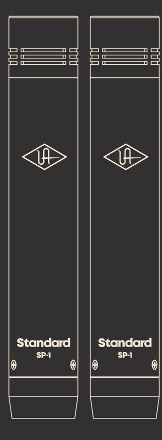

Universal Audio, Inc. 4585 Scotts Valley Drive, Scotts Valley, CA 95066 www.uaudio.com

# **Congratulations**

Your new UA Standard SP-1 Condenser Microphones are high-quality smalldiaphragm mics, designed to deliver years of uncompromising sonic performance.

Suitable for a wide range of professional audio applications, the phantom-powered SP-1 microphone features a cardioid polar pattern, high SPL tolerance, and smooth, transparent sound.

Particularly well suited for stereo capture of musical instruments and live performances, the SP-1 package includes a T-bar mount system for use in X/Y and other stereo mic configurations.

The SP-1 comes with convenient Apollo Channel Strip Presets. These downloadable settings for UA's Apollo audio interfaces give you professional results on a wide range of sources, instantly.

# **Get Apollo Interface Presets**

To get custom Apollo Channel Strip Presets, scan the QR code or visit **uaudio.com/mics/presets**

# **Specifications**

#### **Description**

Professional Pencil Microphone Pair

#### **Type**

Condenser

## **Polar Pattern**

Cardioid

#### **Frequency Response**

20 Hz – 20 kHz

#### **Output Impedance**

200 Ohms

### **Sensitivity**

-38.0 (0 dB = 1V/Pa @ 1 kHz)

### **Maximum SPL**

142 dB (1% T.H.D. @ 1 kHz)

## **Power**

48V Phantom Power

#### **Output Connector**

Balanced XLR3, pin 2 hot