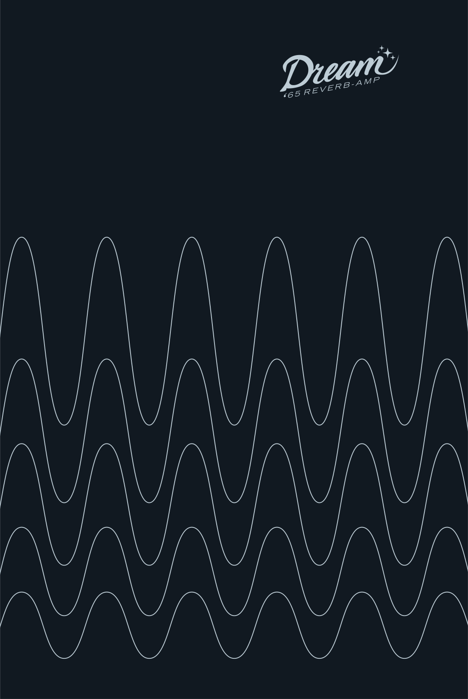
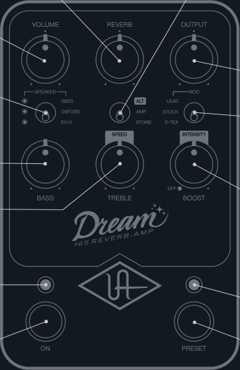
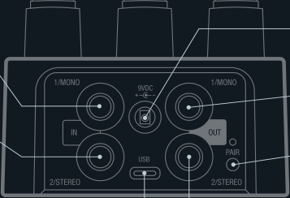

## **REVERB** 

Tube-driven spring reverb amount 

**VOLUME** Vibrato channel input gain 

## **SPEAKER** 

Cycles through available speakers 

When LED is off, amp remains active but speaker cab is disabled 

## **BASS** 

Adjusts low frequencies 

**TREBLE** Adjusts high frequencies 

**SPEEDI** Vibrato rate 

## **ON LED** 

Lit when knob settings are active 

**ON SWITCH** Toggles amp on/off* 

## **ALT / AMP / STORE** 

ALT Activates vibrato controls on the Treble and Boost knobs AMP 

Standard knob controls STORE Hold down to save sound as preset 

## **OUTPUT** 

Overall volume control 

## **AMP MOD** 

LEAD:’80s OD special modification STOCK: Clean preamp boost D-TEX: SRV modification (vibrato disabled) 

## **BOOST** 

Boost amount To bypass boost circuits, set to OFF 

## **INTENSITY** 

Vibrato amount To bypass vibrato circuit, set to OFF 

## **PRESET LED** 

Lit when stored settings are active 

## **PRESET SWITCH** 

Toggles preset on/off* 

*Get more footswitch modes with the UAFX Control app 

## **MONO IN** 

Connect TS cable from guitar or other gear for mono operation 

## **STEREO IN** 

Connect TS cable for stereo only (in addition to MONO IN) 

## **USB TYPE-C** 

Connect to computer for firmware updates with UAFX Control desktop app 

**Power Supply** Isolated 9VDC, center-negative, 400 mA minimum, 2.1x5.5 mm barrel connector (sold separately) 

**Get More** UAFX Control app, bonus speaker cabinets, artist presets, and full manuals at **uaudio.com/uafx/start** 

## **9VDC POWER IN** 

Connect 400 mA isolated power supply (sold separately) 

## **MONO OUT** 

Connect TS cable to amp or other gear for mono operation 

## **PAIR** 

Activate Bluetooth discovery for UAFX Control mobile app 

## **STEREO OUT** 

Connect TS cable for stereo only (in addition to MONO OUT) 

10005657R4 

