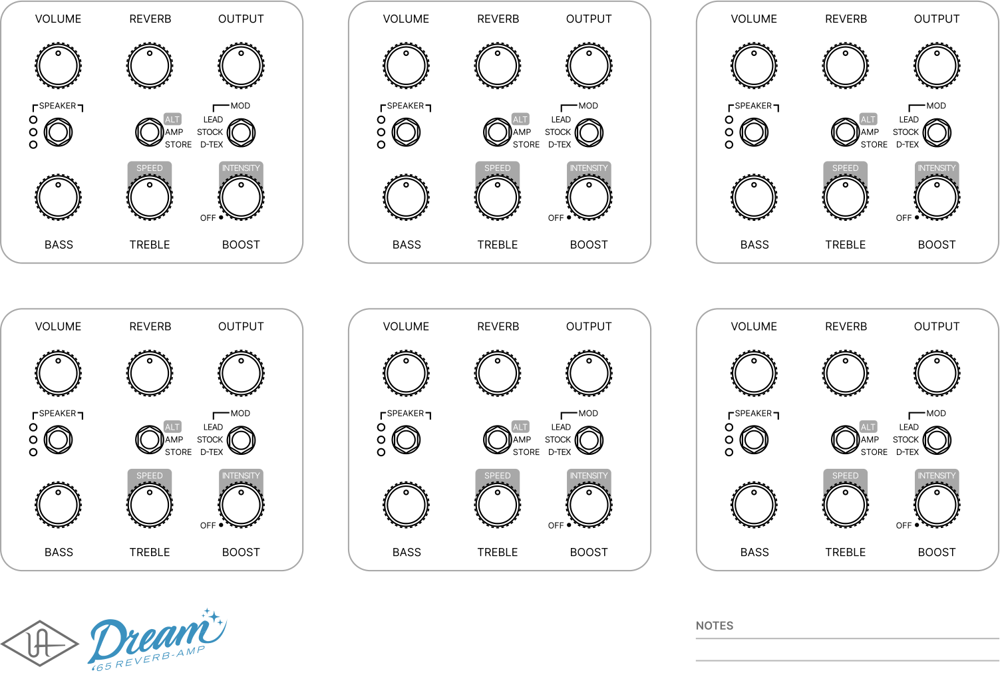

**----- Start of picture text -----** 
VOLUME REVERB OUTPUT VOLUME REVERB OUTPUT VOLUME REVERB OUTPUT SPEAKER MOD SPEAKER MOD SPEAKER MOD ALT LEAD
 ALT LEAD
 ALT LEAD AMP
 STOCK
 AMP
 STOCK
 AMP
 STOCK STORE D-TEX STORE D-TEX STORE D-TEX SPEED INTENSITY SPEED INTENSITY SPEED INTENSITY OFF OFF OFF BASS TREBLE BOOST BASS TREBLE BOOST BASS TREBLE BOOST VOLUME REVERB OUTPUT VOLUME REVERB OUTPUT VOLUME REVERB OUTPUT SPEAKER MOD SPEAKER MOD SPEAKER MOD ALT LEAD
 ALT LEAD
 ALT LEAD AMP
 STOCK
 AMP
 STOCK
 AMP
 STOCK STORE D-TEX STORE D-TEX STORE D-TEX SPEED INTENSITY SPEED INTENSITY SPEED INTENSITY OFF OFF OFF BASS TREBLE BOOST BASS TREBLE BOOST BASS TREBLE BOOST NOTES **----- End of picture text -----** 

## Effect RECALL SHEET 

