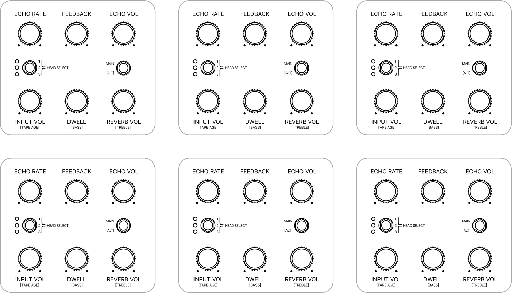

**----- Start of picture text -----** 
ECHO RATE FEEDBACK ECHO VOL ECHO RATE FEEDBACK ECHO VOL ECHO RATE FEEDBACK ECHO VOL 1
 MAIN
 1
 MAIN
 1
 MAIN 2
 HEAD SELECT 2
 HEAD SELECT 2
 HEAD SELECT 3 [ALT] 3 [ALT] 3 [ALT] INPUT VOL DWELL REVERB VOL INPUT VOL DWELL REVERB VOL INPUT VOL DWELL REVERB VOL [TAPE AGE] [BASS] [TREBLE] [TAPE AGE] [BASS] [TREBLE] [TAPE AGE] [BASS] [TREBLE] ECHO RATE FEEDBACK ECHO VOL ECHO RATE FEEDBACK ECHO VOL ECHO RATE FEEDBACK ECHO VOL 1
 MAIN
 1
 MAIN
 1
 MAIN 2
 HEAD SELECT 2
 HEAD SELECT 2
 HEAD SELECT 3 [ALT] 3 [ALT] 3 [ALT] INPUT VOL DWELL REVERB VOL INPUT VOL DWELL REVERB VOL INPUT VOL DWELL REVERB VOL [TAPE AGE] [BASS] [TREBLE] [TAPE AGE] [BASS] [TREBLE] [TAPE AGE] [BASS] [TREBLE] **----- End of picture text -----** 

**----- Start of picture text -----** 
NOTES **----- End of picture text -----** 

Effect RECALL SHEET 

