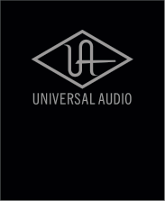
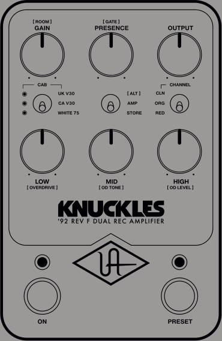
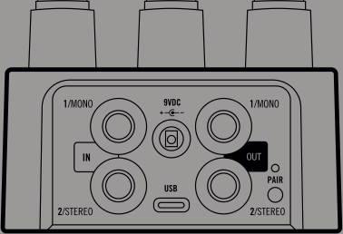
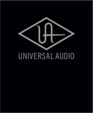

GET MORE TONES! Scan here, or go to uaudio.com/uafx/start for free cabs, presets, and deep editing. 

�0008532R3 

|GAIN|Adjusts gain to the preamp circuit|
|---|---|
|[ ROOM ]|Adds studio ambience and air|
|PRESENCE|Adjusts high end sparkle|
|[ GATE ]|Adjusts gate threshold, bypassed at minimum|
|OUTPUT|Overall volume control|
|CAB|Cycles through available speakers|
||When LED is off, amp remains active|
||but cab and room are disabled|
|SWITCH|[ ALT ]: Activates Room, Gate, Overdrive,|
||OD Tone, and OD Level controls|
||AMP: Standard knob controls|
||STORE: Hold down to save sound as preset|
|CHANNEL|CLN: Clean channel|
||ORG: Crunch channel for rhythm|
||RED: Red channel for heavy saturation and leads|
|LOW|Adjusts bass amount|
|[ OVERDRIVE ]|Adjusts overdrive pedal gain|
|MID|Adjusts midrange amount|
|[ OD TONE ]|Adjusts overdrive pedal tone|
|HIGH|Adjusts treble amount|
|[ OD LEVEL ]|Adjusts overdrive pedal output,|
||bypassed at minimum|
|ON|Toggles amp on/off*|
||LED lit when knob settings are active|
|PRESET|Toggles preset on/off*|
||LED lit when stored settings are active|
||*Customize your amp tones and footswitch|
||modes with the UAFX Control app|
|MONO IN|Connect TS cable from guitar or other|
||gear for mono operation|
|STEREO IN|Connect TS cable for stereo only|
||(in addition to MONO IN)|
|MONO OUT|Connect TS cable to amp or other gear|
||for mono operation|
|STEREO OUT|Connect TS cable for stereo only|
||(in addition to MONO OUT)|
|POWER IN|Connect 400 mA isolated power supply|
||(sold separately)|
|USB TYPE-C|Connect to computer for frmware updates|
||with the UA Connect desktop app|
|PAIR|Activate Bluetooth discovery for|
||UAFX Control mobile app|

Power Supply Isolated 9VDC, center-negative, 400 mA minimum, 2.�x5.5 mm barrel connector (sold separately) 

Find complete documentation at uaudio.com/uafx/start 

