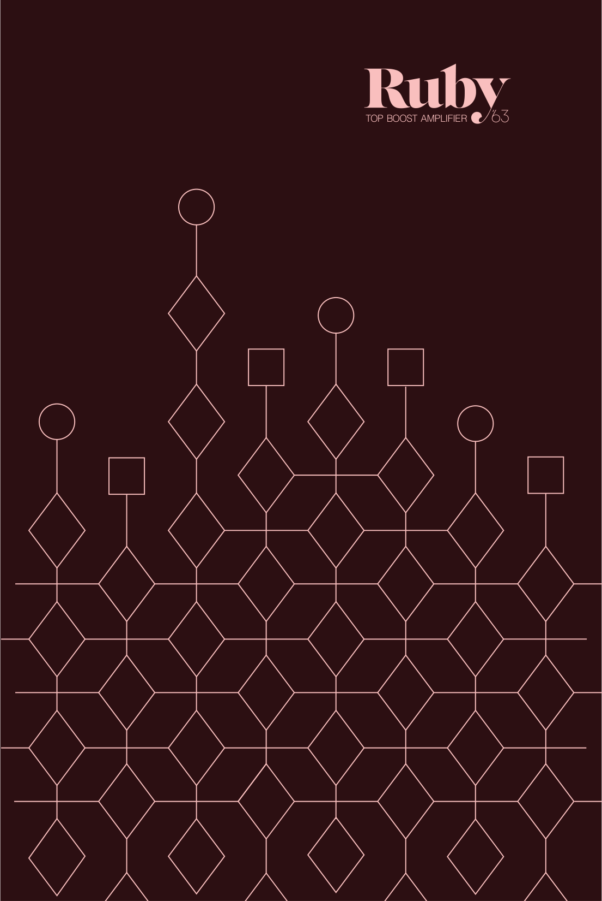
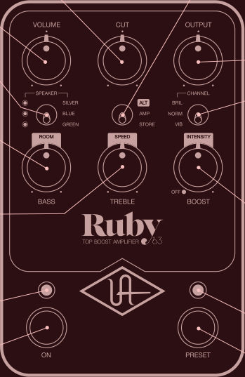
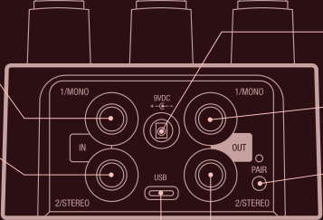

## **CUT** 

Reduces high frequencies 

## **ALT / AMP / STORE** 

## **ALT** 

Activates room and vibrato controls 

**VOLUME** Adjusts input gain 

## **SPEAKER** 

Cycles through available speakers When LED is off, amp remains active but speaker cab is disabled 

**BASS** Reduces tone stack low frequencies (BRIL only) 

**ROOMI** 

Adds studio ambience and air 

**TREBLE** Reduces tone stack high frequencies (BRIL only) 

**SPEEDI** Vibrato rate 

## **ON LED** 

Lit when knob settings are active 

**ON SWITCH** Toggles amp on/off* 

**MONO IN** Connect TS cable from guitar or other gear for mono operation 

**STEREO IN** Connect TS cable for stereo only (in addition to MONO IN) 

## **USB TYPE-C** 

Connect to computer for firmware updates with UAFX Control desktop app 

*Get more footswitch modes with the UAFX Control app 

AMP: Standard knob controls STORE: Hold down to save sound as preset 

## **OUTPUT** 

Overall volume control 

## **CHANNEL** 

BRIL: Brilliant amp channel with vintage EP-III tape machine preamp boost NORM: Normal amp channel with germanium treble booster VIB: Vibrato amp channel with clean boost 

## **BOOST** 

Boost amount 

To bypass boost circuits, set to OFF 

## **INTENSITY** 

Variable harmonic vibrato contour To bypass vibrato circuit, set to OFF 

## **PRESET LED** 

Lit when stored settings are active 

## **PRESET SWITCH** 

Toggles preset on/off* 

**9VDC POWER IN** 

Connect 400 mA isolated power supply (sold separately) 

## **MONO OUT** 

Connect TS cable to amp or other gear for mono operation 

## **PAIR** 

Activate Bluetooth discovery for UAFX Control mobile app 

## **STEREO OUT** 

Connect TS cable for stereo only (in addition to MONO OUT) 

**Power Supply** Isolated 9VDC, center-negative, 400 mA minimum, 2.1x5.5 mm barrel connector (sold separately) 

**Get More** UAFX Control app, bonus speaker cabinets, artist presets, and full manuals at **uaudio.com/uafx/start** 

10005659R6 

