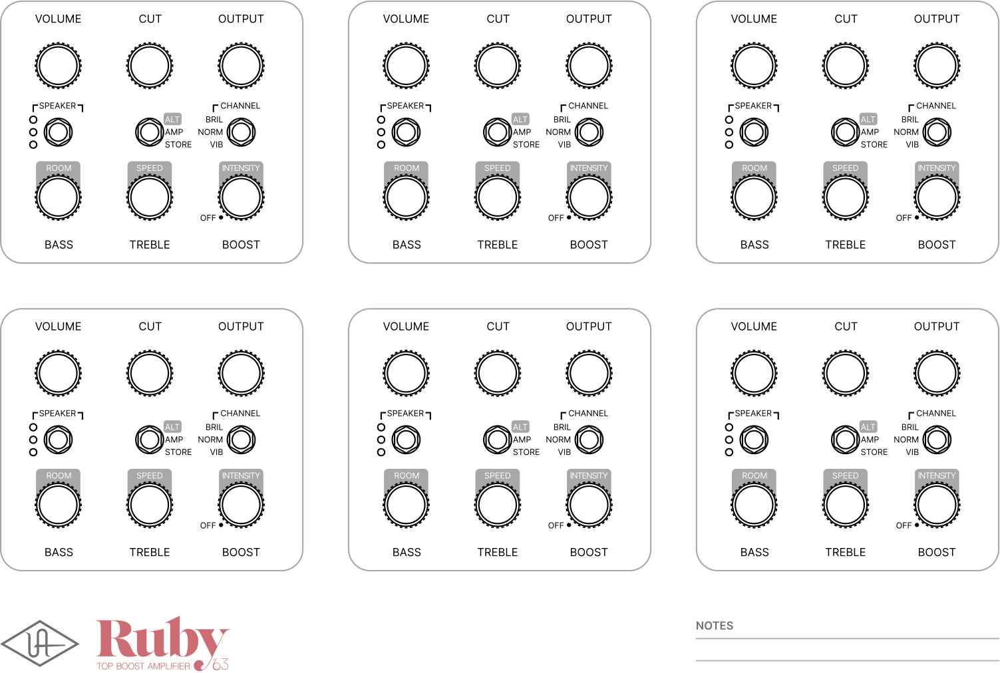

**----- Start of picture text -----** 
VOLUME CUT OUTPUT VOLUME CUT OUTPUT VOLUME CUT OUTPUT SPEAKER CHANNEL SPEAKER CHANNEL SPEAKER CHANNEL ALT BRIL
 ALT BRIL
 ALT BRIL AMP
 NORM
 AMP
 NORM
 AMP
 NORM STORE VIB STORE VIB STORE VIB ROOM SPEED INTENSITY ROOM SPEED INTENSITY ROOM SPEED INTENSITY OFF OFF OFF BASS TREBLE BOOST BASS TREBLE BOOST BASS TREBLE BOOST VOLUME CUT OUTPUT VOLUME CUT OUTPUT VOLUME CUT OUTPUT SPEAKER CHANNEL SPEAKER CHANNEL SPEAKER CHANNEL ALT BRIL
 ALT BRIL
 ALT BRIL AMP
 NORM
 AMP
 NORM
 AMP
 NORM STORE VIB STORE VIB STORE VIB ROOM SPEED INTENSITY ROOM SPEED INTENSITY ROOM SPEED INTENSITY OFF OFF OFF BASS TREBLE BOOST BASS TREBLE BOOST BASS TREBLE BOOST NOTES **----- End of picture text -----** 

EFFECT RECALL SHEET 

