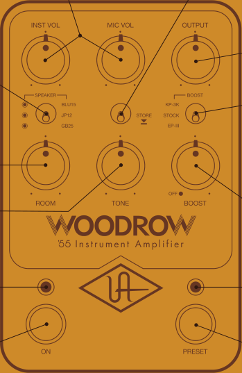
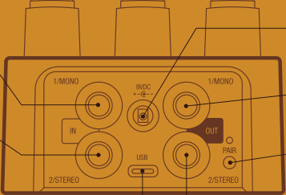

## **INST and MIC VOLUME** 

Individual input gain controls for each amp channel – both channels are always active 

## **SPEAKER** 

Cycles through available speakers When LED is off, amp remains active but speaker cab is disabled 

## **ROOM** 

Adds studio ambience and air 

**TONE** Adjusts treble frequencies 

**ON LED** Lit when knob settings are active 

**ON SWITCH** Toggles amp on/off* 

## **STORE** 

Hold down to save sound as preset 

## **OUTPUT** 

Overall volume control 

## **BOOST TYPE** 

KP-3K: ‘80s rack delay preamp boost STOCK: Clean preamp boost EP-III: Vintage tape machine preamp boost 

## **BOOST AMOUNT** 

To bypass boost circuits, set to OFF 

**PRESET LED** Lit when stored settings are active 

## **PRESET SWITCH** 

Toggles preset on/off* 

*Get more footswitch modes with the UAFX Control app 

## **MONO IN** 

Connect TS cable from guitar or other gear for mono operation 

**STEREO IN** Connect TS cable for stereo only (in addition to MONO IN) 

## **USB TYPE-C** 

Connect to computer for firmware updates with UAFX Control desktop app 

**9VDC POWER IN** Connect 400 mA isolated power supply (sold separately) 

## **MONO OUT** 

Connect TS cable to amp or other gear for mono operation 

## **PAIR** 

Activate Bluetooth discovery for UAFX Control mobile app 

## **STEREO OUT** 

Connect TS cable for stereo only (in addition to MONO OUT) 

**Power Supply** Isolated 9VDC, center-negative, 400 mA minimum, 2.1x5.5 mm barrel connector (sold separately) 

**Get More** UAFX Control app, bonus speaker cabinets, artist presets, and full manuals at **uaudio.com/uafx/start** 

10005658R3 

