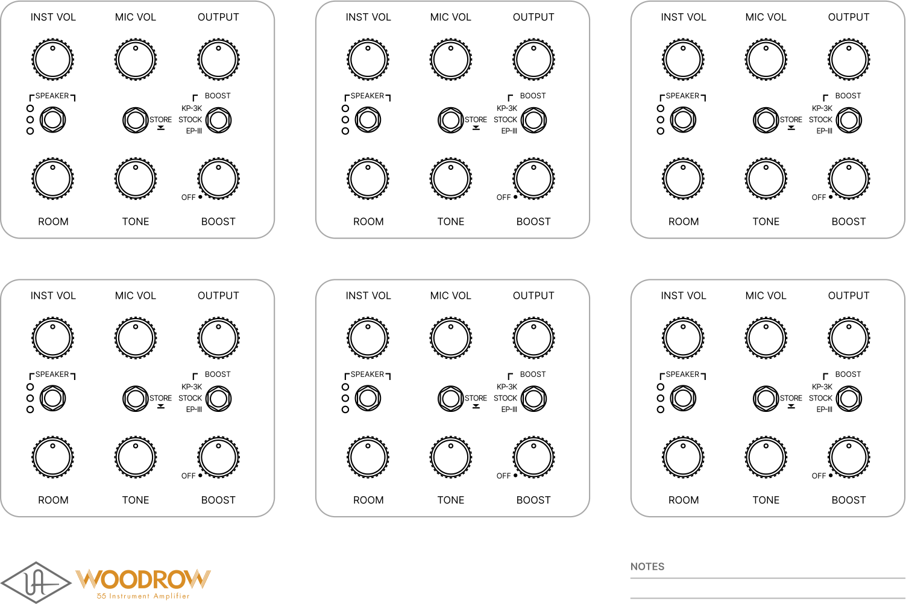

**----- Start of picture text -----** 
INST VOL MIC VOL OUTPUT INST VOL MIC VOL OUTPUT INST VOL MIC VOL OUTPUT SPEAKER BOOST SPEAKER BOOST SPEAKER BOOST KP-3K
 KP-3K
 KP-3K STORE STOCK
 STORE STOCK
 STORE STOCK EP-III EP-III EP-III OFF OFF OFF ROOM TONE BOOST ROOM TONE BOOST ROOM TONE BOOST INST VOL MIC VOL OUTPUT INST VOL MIC VOL OUTPUT INST VOL MIC VOL OUTPUT SPEAKER BOOST SPEAKER BOOST SPEAKER BOOST KP-3K
 KP-3K
 KP-3K STORE STOCK
 STORE STOCK
 STORE STOCK EP-III EP-III EP-III OFF OFF OFF ROOM TONE BOOST ROOM TONE BOOST ROOM TONE BOOST NOTES **----- End of picture text -----** 

Effect RECALL SHEET 

