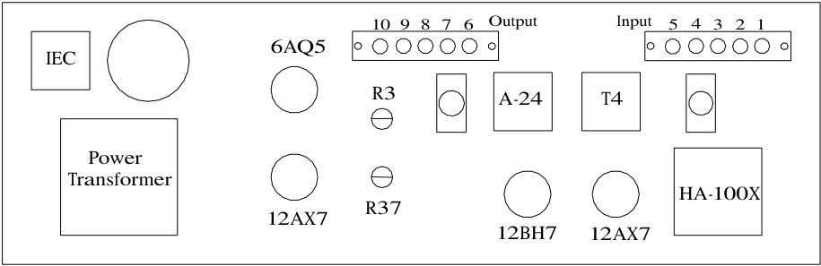
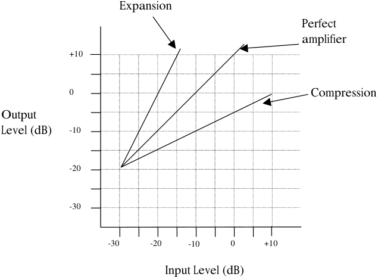
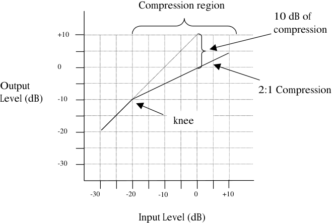
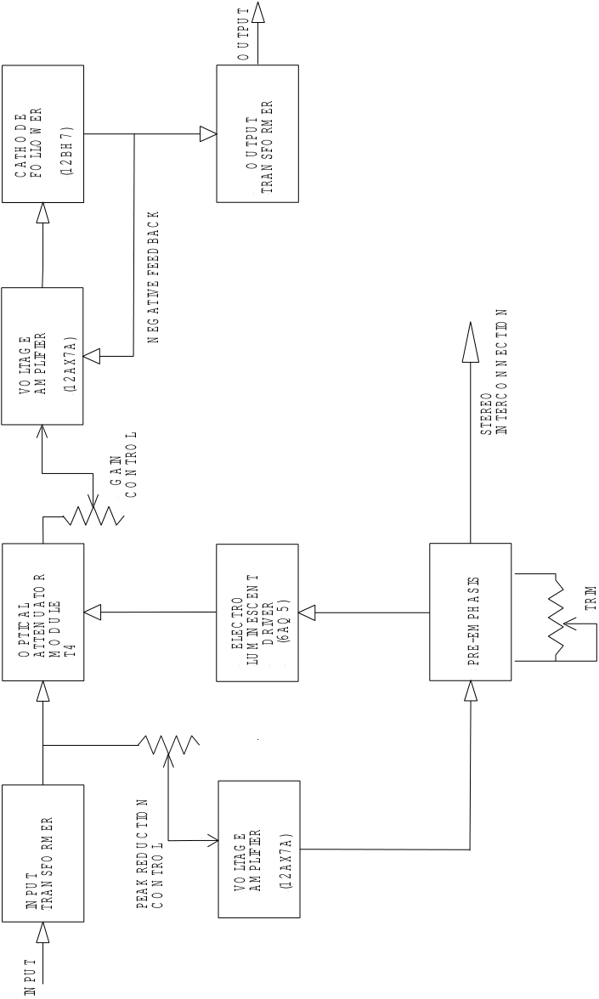
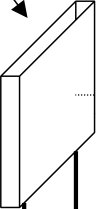
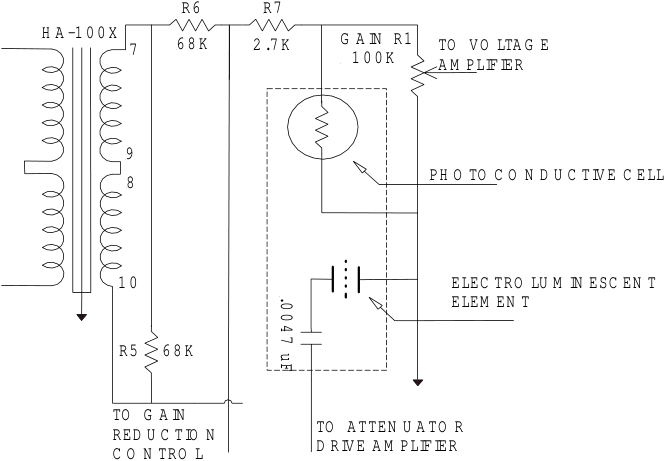
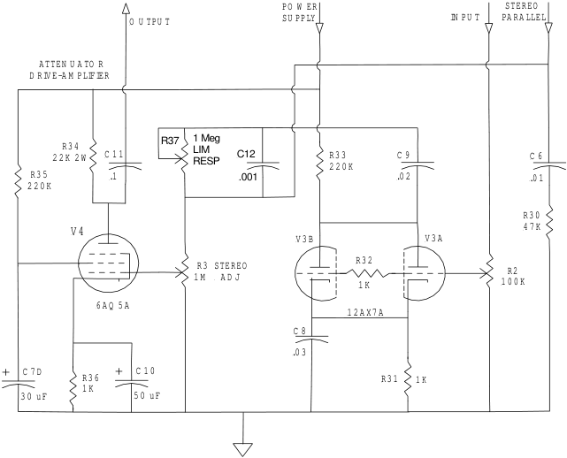
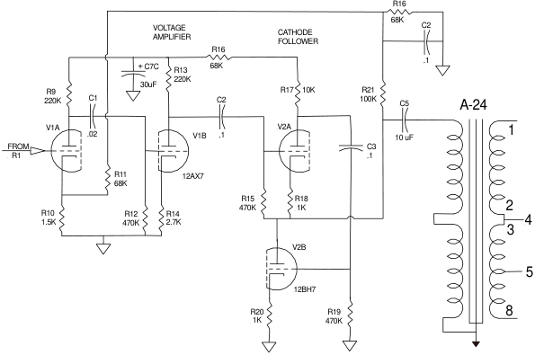

## _**Model LA-2A Leveling Amplifier**_ 

Universal Audio, Inc. www.uaudio.com PO Box 3818 Santa Cruz, CA 95063-3818 

## _**Teletronix LA-2A by Universal Audio**_ 

Thank you for purchasing this reproduction of the Teletronix LA-2A. The LA-2A was originally produced in the early 1960s by Teletronix, which was later acquired by Babcock Electronics Corporation.  My father purchased the product rights and the name Teletronix from Babcock Engineering in 1967, folding it into his Studio Electronics Corporation, shortly before he changed the name to UREI. There were three different variations of the LA-2A during this period before production was discontinued around 1969. 

Straightforward in its design, and initially intended for broadcast applications, the LA-2A quickly became standard equipment in studios worldwide. Many have been painstakingly maintained for the 30 years that they have remained in use since production stopped. A tube-based compressor, the LA-2A features hand-wired components and two simple controls. At the time, its electro-luminescent optical gain reduction was quite revolutionary: applying the audio signal to an electro-luminescent light panel which shines on a photoelectric cell which in turn controls the gain.  In contrast to the electro-optical devices which preceded it, the electro-luminescent light source provided the fast attack necessary for broadcast applications.  Additionally, the cadmium-sulfide photo-cells provided a very natural “two-stage” release which resulted in a compression characteristic more transparent than the other compressors of its day.  To this day the LA-2A delivers a trademark sound treasured by engineers worldwide. 

Here at Universal Audio, we have gone to great lengths to recreate the LA-2A with complete authenticity.  It’s been no small feat to locate obscure parts, put quality control programs in place that didn’t exist 30 years ago and find personnel capable of the handwork that goes into each unit. Every step was necessary to ensure that each LA-2A delivers the sound you expect. 

As for the future, we are working on additional reproductions beyond the LA-2A and 1176LN.  To that end, we are interested in your opinions about your favorite pieces of vintage gear.  What can’t you live without?  What would you love to own, but can’t find any longer?  In addition, Universal Audio is working on new products designed to meet the demands of the modern digital recording studio, yet retaining the character of classic vintage equipment. 

Developing these products has been quite an adventure, enjoyed by all involved.  We thank you for your support and we thank my father, Bill Putnam. 

Thank you, 

Bill Putnam 

ii 

## _**IMPORTANT SAFETY INSTRUCTIONS**_ 

Before using this unit, be sure to carefully read the applicable items of these operating instructions and the safety suggestions. Afterwards keep them handy for future reference. Take special care to follow the warnings indicated on the unit itself, as well as in the operating instructions. 

_**1. Water and Moisture**_ – Do not use the unit near any source of water or in excessively moist environments. 

_**2. Object and Liquid Entry**_ – Care should be taken so that objects do not fall, and liquids are not spilled, into the enclosure through openings. 

_**3. Ventilation**_ – When installing the unit in a rack or any other location, be sure there is adequate ventilation. Improper ventilation will cause overheating, and can damage the unit. 

_**4. Heat**_ – The unit should be situated away from heat sources, or other equipment that produces heat. 

_**5. Power Sources**_ – The unit should be connected to a power supply only of the type described in the operating instructions, or as marked on the unit. 

_**6. Power Cord Protection**_ – AC power supply cords should be routed so that they are not likely to be walked on or pinched by items placed upon or against them. Pay particular attention to cords at plugs, convenience receptacles, and the point where they exit from the unit. Never take hold of the plug or cord if your hand is wet. Always grasp the plug body when connecting or disconnecting it. 

_**7. Grounding of the Plug**_ – This unit is equipped with a 3-wire grounding type plug, a plug having a third (grounding) pin. This plug will only fit into a grounding-type power outlet. This is a safety feature. If you are unable to insert the plug into the outlet, contact your electrician to replace your obsolete outlet. Do not defeat the purpose of the grounding-type plug. 

_**8. Carts and Stands**_ – The unit should be used only with a cart or stand that is recommended by the manufacturer. The unit and cart combination should be moved with care. Quick stops, excessive force and uneven surfaces may cause the unit and cart combination to overturn. 

_**9. Wall Or Ceiling Mount**_ – The unit should be mounted to a wall or ceiling only as recommended by the manufacturer. 

- _**10.Cleaning**_ – The unit should be cleaned only as recommended by the manufacturer. 

- _**11.Nonuse Periods**_ – The AC power supply cord of the unit should be unplugged from the AC outlet when left unused for a long period of time. 

- _**12.Damage Requiring Service**_ – The unit should be serviced by qualified service personnel when: 

   - a) The AC power supply cord or the plug has been damaged; or 

   - b) Objects have fallen or liquid has been spilled into the unit; or 

   - c) The unit has been exposed to rain; or 

   - d) The unit does not operate normally or exhibits a marked change in performance; or 

   - e) The unit has been dropped, or the enclosure damaged. 

_**13. Servicing**_ – The user should not attempt to service the unit beyond that described in the operating instructions. All other servicing should be referred to qualified service personnel. 

iii 

## _**LA-2A**_ **** _**User’s Guide**_ 

Universal Audio, Inc. PO Box 3818 Santa Cruz, CA 95063-3818 (831) 454-0630 voice (831) 454-0689 fax www.uaudio.com 

Universal Audio Part Number LA2A-M01. Revision 1.3 

## _**Notice**_ 

This manual provides general information, preparation for use, installation and operating instructions for the Universal Audio LA-2A Leveling Amplifier. 

The information contained in this manual is subject to change without notice. Universal Audio, Inc. makes no warranties of any kind with regard to this manual, including, but not limited to, the implied warranties of merchantability and fitness for a particular purpose. Universal Audio, Inc. shall not be liable for errors contained herein or direct, indirect, special, incidental, or consequential damages in connection with the furnishing, performance, or use of this material. 

## _**Copyright**_ 

 2000 Universal Audio, Inc. All rights reserved. 

This manual and any associated software, artwork, product designs, and design concepts are subject to copyright protection. No part of this document may be reproduced, in any form, without prior written permission of Universal Audio, Inc. 

## _**Trademarks**_ 

LA-2A, 1176 and the Universal Audio, Inc. logo are trademarks of Universal Audio, Inc. Other company and product names mentioned herein are trademarks of their respective companies. 

iv 

## _**Table of Contents**_ 

Teletronix LA-2A by Universal Audio................................................................................... ii Specifications.......................................................................................................................1 Operation of the LA-2A .......................................................................................................2 Input and Output Connections ............................................................................... 2 Peak Reduction Control ........................................................................................ 2 Gain Control ....................................................................................................... 2 VU Meter Operation ............................................................................................ 3 Limit / Compress Switch ........................................................................................ 3 Calibration...........................................................................................................................4 Meter Zero Adjust ............................................................................................... 4 Side-Chain Pre-Emphasis (R37) .............................................................................. 4 Stereo Balance Adjust (R3) ................................................................................... 4 Theory of Operation ............................................................................................................5 Compressor Basics ............................................................................................... 5 Gain Reduction Circuit .......................................................................................... 8 Side-Chain Circuit .............................................................................................. 11 Output Circuit .................................................................................................... 11 Metering Circuit ................................................................................................. 11 Appendix .......................................................................................................................... 12 Creative Classics: The 1176 Solid State Limiting Amplifier and the LA-2A Leveling Amplifier .............................................................................................. 12 The LA-2A ..................................................................................................... 12 Developing the 1176 ..................................................................................... 13 More Than a Vintage Fad: Classic Sound .......................................................... 13 

v 

## _**Specifications**_ 

- ! Gain Reduction: up to 40 dB 

- ! Distortion: less than 0.35% total harmonics at +10 dBm, and less than 0.75% total harmonics at +16 dBm output 

- ! Response: +/- 0.1 dB, 30 cycles to 15 kilocycles 

- ! Noise: 75 dB below +10 dBm output level 

- ! Gain: 40 +/- 1dB 

- ! Output Level: +10dBm nominal, +16dBm peaks 

- ! Input Level: +16 dBm maximum 

- ! Very fast attack time 

- ! Release Time: approximately 0.06 seconds for 50% release, 0.5 to 5 seconds for complete release depending upon the amount of previous reduction 

- ! Input Impedance: 600 ohms balanced 

- ! Output Impedance: 600 ohms balanced 

- ! Panel Size: 19” x 5 ¼ ” 

- ! Depth Behind Panel: 7 ¼” 

- ! Panel Controls: Gain (Output level), Peak Reduction, and Meter Selector Switch 

- ! Meter: dB Gain Reduction and dB Output 

- ! Tube Complement: (2) 12AX7A, (1) 12BH7A, (1) 6AQ5 

1 

## _**Operation of the LA-2A**_ 

## _**Input and Output Connections**_ 

Input and Output connections are made using standard XLR style connectors.  Terminal strips are also provided. 

**----- Start of picture text -----** 
10 9 8 7 6 Output Input 5 4 3 2 1 6AQ5 IEC R3 A-24 T4 Power Transformer HA-100X R37 12AX7 12BH7 12AX7 **----- End of picture text -----** 

## Output connections 

## Input connections 

6) Stereo Link 1)        + 600 ohms 7) Ground 2)        + 250 ohms 8) + 600 ohms 3) Center tap 9) Center tap 4) - 250 ohms 10) - 600 ohms 5) - 600 ohms 

## _**Barrier Strip Connections**_ 

If you wish to use the barrier strip instead of the XLR connectors, connect as follows: INPUT:    Connect  + 600 (1) to HOT and –600 (5) to NEUTRAL. OUTPUT: Connect + 600 (8) to HOT and –600 (10) to NEUTRAL. Connect Ground (7) to the cable shield. 

## _**Peak Reduction Control**_ 

Operation of the LA-2A is very straightforward.  There are only two controls that one must deal with.  The first is the _Peak Reduction_ control.  This control should be set so that the compressor exhibits the desired amount of compression.   This control should be set independently of the Gain Control. 

## _**Gain Control**_ 

This control does not affect the compression.  The gain control should be set after the desired amount of compression is determined using the Peak Reduction control.  Once the Peak Reduction control is set, adjust the Gain Control to achieve the desired output level. 

2 

## _**VU Meter Operation**_ 

The VU Meter is used for both output level monitoring and gain reduction monitoring. When used to monitor the output level, the user may choose either +4 dB or +10 dB settings.  The middle setting is for gain reduction, and the meter reads the amount of compression in dB. 

## _**Limit / Compress Switch**_ 

The Limit/Compress Switch changes the characteristics of the compressor IO curve.  When in the Compress position, the curve is more gentle, and presents a low compression ratio. A higher compression ratio results when the switch is set to the Limit position. 

3 

## _**Calibration**_ 

## _**Meter Zero Adjust**_ 

The zero-adjust of the meter is set by the screw-adjust potentiometer located next to the Limit / Compress Switch.  To adjust this, put the meter into Gain Reduction mode.  Make sure that there is no signal present.  Loosen the locking nut and use a screwdriver to adjust this potentiometer until the meter reads zero. 

## _**Side-Chain Pre-Emphasis (R37)**_ 

The LA-2A was designed for use in broadcast applications.  The audio signal in FM broadcasting undergoes pre-emphasis and results in a 17 dB boost at 15 KHz.  Due to this increase in signal level, transmitters are subject to over-modulation.  The LA-2A provides a control (R37) which controls the amount of high-frequency compression. 

This potentiometer is factory set for a “flat” side-chain response (clockwise).  Increasing the resistance of this potentiometer by turning it counter clockwise will result in compression which is increasingly more sensitive to the higher frequencies. 

## _**Stereo Balance Adjust (R3)**_ 

For stereo operation, two LA-2A units are interconnected in order to achieve the same amount of gain reduction from each of the two units to maintain stereo imaging.  In order to accomplish this, terminals 6 from each unit should be connected together.  Additionally, their grounds (terminal 7) should be connected together. 

The interconnecting wire should be less than 2 feet in length and should be shielded.  The shield should be used to connect terminals 7 from each of the units together. 

To calibrate the units for stereo operation: 

- ! Connect the units together as described previously. 

- ! Turn the Peak Reduction knob counterclockwise (no compression). 

- ! Set R3 on each unit to a clockwise position. 

- ! Set each meter to read Gain Reduction. 

- ! Adjust the Peak Reduction control on the left channel until approximately 5dB of gain reduction is achieved. 

- ! Adjust R3 on the unit that shows the greatest amount of gain reduction until the gain reduction indications are equal. 

- ! When operating, set the Peak Reduction controls to the same setting on both channels. 

4 

## _**Theory of Operation**_ 

## _**Compressor Basics**_ 

Before we dig in to a description of the LA-2A circuit, it is useful to examine the general characteristics of compressors and review some terminology.  Figure 1 depicts the input/output characteristics of a compressor, an expander and a perfect amplifier.  When operated within its specified range, an amplifier provides a constant amount of gain regardless of the level of the input signal.  In Figure 1, the middle line depicts a perfect amplifier with a gain of 10 dB.  To see this, notice that a signal with an input level of –30 dB will result in an output level of –20 dB, which is an increase of 10 dB.  Similarly, an input level of 0 dB will result in an output level of 10 dB, hence the gain stays fixed at 10 dB regardless of the input level. 

**----- Start of picture text -----** 
Expansion Perfect amplifier +10 0  Compression Output Level (dB)  -10 -20 -30 -30  -20  -10  0  +10 Input Level (dB) **----- End of picture text -----** 

_**Figure 1 - Input/output characteristics of a compressor, an expander and a perfect amplifier.**_ 

In contrast to an amplifier, whose job is to present a constant gain, a compressor varies its gain in response to the level of the input signal.  Large input signals result in less gain, thus reducing or “compressing” the dynamic range of the signal.  Referring again to the line marked “compression” in Figure 1, we see that an input level of –30 dB results in an output level of –20 dB, indicating a gain of 10 dB.  Repeating this for input levels of –20 dB and –10 dB, we see that the compressor exhibits gains of 5 dB and 0 dB respectively. From this, it is clear that the gain decreases as the input signal increases. 

Referring to the diagram, we see that the compressor will increase its output level by 5 dB for every 10 dB that we increase the input level.  The compression ratio is defined as the ratio of these two numbers.  In this case the compression ratio would be 10:5, which can be reduced to 2:1. 

5 

As an aside, an expander is a device which increases the dynamic range of a signal.  For example, a 10dB change in the input signal might result in a 20 dB change in the output signal, thus “expanding” the dynamic range. 

There are several other terms related to compression that can be demonstrated by referring to Figure 2.  The amount of compression or gain reduction is typically given in dB and is defined as the amount by which the signal level is reduced by the compressor. Graphically, this can be understood by looking at the difference in levels between what would have been the uncompressed (the output from an amplifier) output level and the compressed output level.  This value is what is displayed by the LA-2A meter when it is switched to gain-reduction mode. 

As mentioned previously, the _compression ratio_ is defined as the ratio of the increase of the level of the input signal to the increase in the level of the output signal.  In this example, the input level is increased by 10 dB while the output level only increases 5 dB. This would be a compression ratio of 2:1.  Lower ratios such as 2:1 result in more gentle compression.  (Note that a compression ratio of 1:1 is no compression at all). 

Typically, compressors let you choose a _threshold._ This is the point at which gain reduction starts to take place.  When an audio signal is below this threshold the compressor acts like an amplifier and there is no gain reduction.  Above the threshold the slope becomes less than 45 degrees, indicating gain reduction and hence compression. 

The point at which a compressor transitions into compression is commonly called the _knee_ . In practical compressors, this transition is more gentle than what is depicted in the diagram. 

Many modern compressors provide a control which adjusts the threshold directly.  In the case of the LA-2A, the _Peak Reduction_ knob controls both the threshold and the amount of compression. 

**----- Start of picture text -----** 
Compression region 10 dB of +10 compression 0 Output 2:1 Compression Level (dB)  -10 knee -20 -30 -30  -20  -10  0  +10 Input Level (dB) **----- End of picture text -----** 

Figure 2 - Input/output curve of a compressor with a ratio of 2:1 and a threshold of -20 dB. 

6 

**----- Start of picture text -----** 
U TPU T O ER E ER D W RM C A TH O LLOFO (1 2 BH 7 ) U TPU T SFO       O TRA N A TIV E FEED BA C K N E EGN TIO EC N LTA G PLIFIER N VO A M (1 2 A X7 A ) O L STEREO TERCIN TRO A IN N    G C O R T A L U A TO LE TRO ESCEN 5 ) PH A SIS TRIM D U IN RIV ER PTIC O O ATTEN M T4     ELEC LU M      D      (6 A Q  PRE-EM N ER TIO E RM L SFO TRO LTA G PLIFIER PU T N VO A M (1 2 A X7 A ) IN TRA N PEA K  RED U C C O PU T IN **----- End of picture text -----** 

_**Figure 3 - Block diagram of the LA-2A compressor.**_ 

7 

## _**LA-2A Block Diagram**_ 

A functional block diagram of the LA-2A is provided in Figure 3.  A brief overview of the operation will be provided here.  The input transformer provides isolation and impedance matching.  After this the signal is fed into both the side-chain circuit and the  gain reduction circuit.  The side-chain is comprised of a voltage amplifier, a pre-emphasis filter, and a driver stage which provides the voltage necessary to drive the electro-luminescent panel. This signal controls the gain of the compressor.  After the gain reduction circuit, the signal is sent through an Output Gain control and a two-stage output amplifier, followed by the output transformer. 

**----- Start of picture text -----** 
Electro-luminescent Panel Photo-Electric Cell **----- End of picture text -----** 

_**Figure 4 - Diagram of the T4 electro-optical cell.**_ 

## _**Gain Reduction Circuit**_ 

As mentioned previously, compressors are devices that vary their gain in a manner which is dependent upon the level of the input signal.  In order to do this, the compressor must first have some method of determining the level of the signal, and must then be able to use this to control the gain.  There are many different schemes to accomplish these tasks.  In the case of the LA-2A, both of these functions are performed by the T4, which is an electrooptical element. 

A T4 is comprised of an _electro-luminescent_ (EL) panel and a photo-electric cell.  The EL panel is essentially a night-light.  As you would expect, the larger the signal that is applied to it, the brighter the light that is generated.  This light shines upon the photo-electric cell. A photo-electric cell is a light sensitive device whose resistance changes depending upon the intensity of light to which it is subjected; the brighter the light, the less resistance the photo-cell will have. 

As depicted in Figure 5, the photo-cell is used to control the gain of the circuit.  Essentially, the photo-cell acts as the bottom leg in a voltage divider circuit.  The lower the resistance of the photo-cell, the lower the signal voltage will be at the output of the gain reduction 

8 

stage.  To see why this is true, we can look at the extreme cases.  If the resistance is extremely high (this is the case when there is a small input signal and the light is off) then the photo-cell does not affect the circuit and there is no gain reduction.  The second case we can look at is when there is a large signal present.  In this condition, the light shines brightly and the photo-cell exhibits very low resistance.  If the resistance of the photo-cell becomes zero (a dead short), then the signal would be grounded and there would be no output.  In reality, the photo-cell resistance can not go completely to zero and hence there will always be some signal present. 

**----- Start of picture text -----** 
R 6 R 7 H A -1 0 0 X 7 6 8 K 2 .7 K G A IN  R1 TO  VO LTA G E  1 0 0 K A M PLIFIER 9 PH O TO C O N D U C TIV E C ELL 8 1 0 ELEC TRO LU M IN ESC EN T ELEM EN T R 5 6 8 K TO  G A IN TO  ATTEN U A TO R RED U C TIO N D RIVE A M PLIFIER C O N TRO L .0 0 4 7  uF **----- End of picture text -----** 

_**Figure 5 - Schematic of the LA-2A input  and gain reduction circuit.**_ 

The T4 electro-optical device is the heart of the compressor and its gain reduction characteristics.  Its unique characteristics affect the overall sound and character of the LA2A. 

In addition to the compression curve, the combination of the EL panel and the photo-cell determine the attack and release characteristics of the LA-2A.  This is one of the most important contributors to the sound of the LA-2A.  Unlike other compressors which allow the user to adjust these parameters, the attack and release of the LA-2A are completely determined  by the T4. 

There are several important characteristics  of the T4 which play crucial roles in the sound of the LA-2A.  The first is the attack.  The LA-2A was the first electro-optical compressor to use an electro-luminescent panel for the light source.  Previous attempts at electro-optical compression employed either neon or incandescent lights.  Both of these took time to light up, and this delay resulted in slow attacks.   The electro-luminescent panel resulted in a faster attack than exhibited by other contemporary devices. 

9 

The next important aspect is that of the release of the compressor.  This is determined almost entirely by the characteristics of the photo-cell.  The LA-2A uses cadmium-sulfide photo-cells.  The first important aspect of the cell is its “two-stage decay”.  After the light is removed from the cell, it releases quickly (40-80 milliseconds) to approximately half of its off resistance.  The remainder of its release can take place over as much as several seconds. 

The next aspect is the “memory” of the cell.  This results in two important aspects of the character of the LA-2A.  The amount of time it takes for the cell to recover after the light is removed depends on how long light had been shining on it and how bright the light.  In the case of the LA-2A this results in behavior where the release time is slower if the unit has either been in compression for a while, or the amount of compression is large.  This signal dependent release characteristic is critical to the sound of the unit. 

The amount of compression, as well as the compression threshold, is controlled by the “Peak Reduction” potentiometer.  This potentiometer controls the gain of the side-chain circuit.  The greater the gain of this circuit, the lower the threshold and the greater the amount of compression will be.  Many modern limiters and compressors allow for the direct adjustment of the threshold.  Other units such as the 1176LN use a fixed threshold and provide an input level control, which adjusts the signal level before it is applied to the compression circuit.  In contrast, the LA-2A, while also having a fixed threshold, does not control the input level, but rather controls the amount of side chain gain applied to the input signal. 

**----- Start of picture text -----** 
PO W ER  STEREO O U TPU T SU PPLY IN PU T P A RA LLEL    ATTEN U A TO R D RIV E-A M PLIFIER    R3 42 2 K  2 W C 1 1 R37 1 MegLIMRESP C12 R3 32 2 0 K C 9 C 6  R3 5 .1 .001 .0 2 .0 1 2 2 0 K R3 0 V  4 4 7 K V 3 B V 3 A  R3 STEREO R3 2   R2 1 M   A D J 1  K 1 0 0 K 6 A Q 5 A 1  2 A X7 A C 8 .0 3 C 7 D R3 6 C 1 0 R 3 1 1 K 1 K 3 0  uF 5  0  uF **----- End of picture text -----** 

_**Figure 6 - Schematic diagram of the LA-2A side-chain circuit.**_ 

10 

## _**Side-Chain Circuit**_ 

The previously described gain reduction circuit is controlled by the control voltage which is supplied by the side-chain circuit.  The LA-2A is a feed-back style compressor.  This is due to the fact that the signal that is used to drive the side-chain circuit is affected by the gain reduced signal.  This signal is first fed into the “Peak Reduction” potentiometer (R2), which controls the amount of side-chain drive and in turn controls the compression threshold and amount of gain reduction.  A 12AX7 is then used as a voltage amplifier to increase the signal level.  A pre-emphasis circuit is provided on the output of the 12AX7.   Originally designed for broadcast, the LA-2A allowed for side-chain equalization, which allowed the operator to make the compression more or less sensitive to the voice frequency bands. For musical applications, this equalization is usually set to a flat frequency response. 

Subsequent to the filter, a 6AQ5 provides the signal necessary to drive the electroluminescent panel.  EL panels were often used for night-lights and hence are usually designed to be driven with 120 volts, 60 Hz AC.  They were not designed for audio, and applying the wide-bandwidth signals that arise in audio applications results in a shortened lifetime of the part. 

## _**Output Circuit**_ 

**----- Start of picture text -----** 
R16 VOLTAGEAMPLIFIER CATHODEFOLLOWER 68K C2 R16 C7C R13 68K .1  R9 30uF 220K R17 10K  R21 220K C1 C2 100K C5 A-24 V1A .02 V1B .1 V2A 10 uF 1 FROM C3  R1 .1 R11 12AX7 68K  R15470K R181K 2 R101.5K  R12470K R142.7K 3 4 V2B 5 12BH7 R20  R19 8 1K 470K **----- End of picture text -----** 

_**Figure 7 - Schematic diagram of the LA-2A output circuit.**_ 

The output circuit is comprised of a 12AX7 which operates as a voltage amplifier followed by a 12BH7A which operates as a cathode-follower.  This is followed by the output transformer, which provides impedance matching and a balanced output. 

## _**Metering Circuit**_ 

The metering circuit in the LA-2A has 3 modes selected by a front-panel switch, allowing for output level monitoring at +4 and +10 dB as well as gain reduction.  As mentioned 

11 

previously, the gain reduction is controlled by the photo-cell in the T4 el-op.  In order to track the operation of this cell and determine the gain reduction, a second photo-cell is also illuminated by the same EL panel.  This photo-cell is hand-selected to match the gain reduction photocell and hence gives an accurate indication of the amount of compression. 

## _**Appendix**_ 

## _**Creative Classics: The 1176 Solid State Limiting Amplifier and the LA-2A Leveling Amplifier**_ 

The LA-2A and 1176 compressor/limiters long ago achieved classic status. They're a given in almost any studio in the world — relied upon daily by engineers whose styles range from rock to rap, classical to country and everything in between. With so many newer products on the market to choose from, it's worth looking at the reasons why these classics remain a necessary part of any professional studio's outboard equipment collection. 

The basic concept of a compressor/limiter, is of course, relatively simple. It's a device in which the gain of a circuit is automatically adjusted using a predetermined ratio that acts in response to the input signal level.   A compressor/limiter "rides gain" like a recording engineer does by hand with the fader of a console: it keeps the volume up during softer sections and brings it down when the signal gets louder.  The dynamic processing that occurs at ratios below 10 or 12 to one is generally referred to as compression; above that it's known as limiting. 

Modern day compressors offer a great degree of programmability and flexibility while older devices such as the 1176 and the LA-2A are more straightforward in their design. Perhaps it is this fact that has contributed to their appealing sound and the longevity of their popularity. 

## _**The LA-2A**_ 

The LA-2A leveling amplifier, a tube unit with hand wired components and three simple controls, was introduced in the mid 1960s. It utilized a system of electro-luminescent optical gain control that was quite revolutionary; gain reduction was controlled by applying the audio voltage to a luminescent driver amplifier, with a second matched photoconductive cell used to control the metering section. With its 0 to 40 dB of gain limiting, a balanced stereo interconnection, flat frequency response of 0.1 dB from 3015,000 hz and a low noise level (better than 70 dB below plus 10 dBm output,) the LA2A quickly became a studio standard. Originally patented by Jim Lawrence, it was produced by Teletronix in Pasadena, California, which became a division of Babcock Electronics Corp. in 1965. In 1967 Babcock's broadcast division was acquired by the 

12 

legendary Bill Putnam's company, Studio Electronics Corp shortly before he changed the company’s name to UREI®. Three different versions of the LA-2A were produced under the auspices of these different companies before production was discontinued around 1969. 

## _**Developing the 1176**_ 

It was Bill Putnam himself who, in 1966, was responsible for the initial design of the 1176. Its circuit was rooted in the 1108 preamplifier which was also designed by Putnam. As is evident from entries and schematics in his design notebook, he experimented with the recently developed Field Effect Transistor (F.E.T.) in various configurations to control the gain reduction in the circuit. He began using F.E.T.s as voltage variable resistors, in which the resistance between the drain and the source terminals is controlled by a voltage applied to the gate.  His greatest challenge was to ensure that distortion was minimized by operating the F.E.T.s within a linear region of operation. 

After several unsuccessful attempts at using F.E.T.s in gain reduction circuits, Putnam settled upon the straightforward approach of using the F.E.T. as the bottom leg in a voltage divider circuit, which is placed ahead of a preamp stage. 

The output stage of the 1176 is a carefully crafted class A line level amplifier, designed to work with the (then) standard load of 600 ohms.  The heart of this stage is the output transformer, whose design and performance is critical. Its primary function is to convert the unbalanced nature of the 1176 circuit to a balanced line output, and to provide the proper impedance matching to drive the line impedance of  600 ohms. These two jobs are accomplished by the primary and secondary windings whose turns' ratio defines the impedance ratio. 

This transformer is critical due to the fact that it uses several additional sets of windings to provide feedback, which makes it an integral component in the operation of the output amplifier. Putnam spent a great deal of time perfecting the design of this tricky transformer and carefully qualified the few vendors capable of producing it. 

The first major modification to the 1176 circuit was designed by Brad Plunkett in an effort to reduce noise--hence the birth of the 1176LN, whose LN stands for low noise. Numerous design improvements followed, resulting in at least 13 revisions of the 1176. 

Legend has it that the D and E blackface revisions sound the most "authentic". 

## _**More Than a Vintage Fad: Classic Sound**_ 

Both the 1176 and the LA-2A remain in daily use. Busy engineers’ and producers’ comments about both the 1176 and the LA-2A demonstrate their impact on the industry: 

## _**Mike Shipley**_ 

Mike Shipley (Def Leppard, Shania Twain, Blondie): "I grew up using 1176s --- in England they were the compressor of choice. They're especially good for vocals, which is also what I primarily use the LA-2 for. Most anything else I can do without, but I can't be without at least a pair of 1176s and an LA-2A. For example, on the Enrique Iglesias project I'm 

13 

currently mixing, I'm using both an 1176 and an LA2 on his voice, which is not unusual for me. 

"The 1176 absolutely adds a bright character to a sound, and you can set the attack so it's got a nice bite to it. I usually use them on four to one, with quite a lot of gain reduction. I like how variable the attack and release is; there's a sound on the attack and release which I don't think you can get with any other compressor. I listen for how it affects the vocal, and depending on the song I set the attack or release--faster attack if I want a bit more bite. My preference is for the black face model, the 4000 series--I think the top end is especially clean. 

"The LA-2A is not as versatile, but it also has a sound that I really like.  On certain voices you can crank it heavily, to where you almost want to put a piece of tape over the meter because there's so much gain reduction that you don't want anyone else to see it! I'm not particularly into over-compression, but when you use it that way there's something about it that just sounds really great. It does depend how it's set on the back, where there's a flat control that can be set to roll off certain frequencies when you reduce more gain. If you have a singer with an intensely piercing voice I find that compressor a good one, incredibly useful. It makes things warmer, especially when you crank it, and for thinner voices that can be just the ticket." 

## _**Allen Sides**_ 

Allen Sides has always been known for having golden ears when it comes to the sound of equipment. The owner of Ocean Way Studios in Los Angeles and Nashville, he's also a speaker designer and engineer who is especially respected for his work with live musicians, including orchestra and string dates. Among his recent credits are work with the Goo Goo Dolls, Alanis Morissette and Green Day. Sides brings his different perspectives into play when he talks about using the 1176. 

"The 1176 is standard equipment for my sessions. I just used them last night, as a matter of fact, on a project for singer Lisa Bonet that Rob Cavallo was producing at Ocean Way. We were recording drums and I used them on the left/right overheads as effects limiters. It's something I learned from (engineer) Don Landy, who worked with Randy Newman a lot. I mult the left and right overheads and bring them back on the console, then insert a pair of 1176s into a pair of the mults. Push in 20 to one and four to one simultaneously and it puts the unit into overdrive creating a very impressive sound." 

## _**Murray Allen**_ 

Murray Allen is a veteran engineer and Director of Post Production for the San Franciso Bay Area company Electronic Arts. He has a fascination for gear both old and new and he explains why he thinks the 1176 has been so popular for so long. "It has a unique sound to it that people like, it's very easy to operate, and it does a great job. You have just two controls relative to the ratio of compression. You have input and output and you have attack and release. That's all there is. It's still my favorite limiter for Fender basses and string basses, because you don't know it's working. It doesn't change the way the bass sounds, it just keeps the level at a more controllable place. 

14 

## _**Ken Kessie**_ 

Mixer Ken Kessie (En Vogue, Tony! Toni! Tone!, Celine Dion) is known for being experimental. "Seems like everybody knows the basic tricks for he 1176," he says, "But here are two that might be lesser known. If you turn the attack knob fully counterclockwise until it clicks, the 1176 eases to be a compressor and acts only as an amplifier. Sometimes this is the perfect sound for a vocal. And of course the unit can be overdriven, adding another flavor of distortion in case your plug-ins are maxed out! 

"Then, for that hard-to-tame lead vocalist (the one that backs up from the mic to whisper and leans in for the big ending chorus), try an 1176 followed by a DBX 165. Use the 1176 as a compressor, and the DBX as a peak limiter...it's guaranteed to be smooth as silk." 

## _**Jim Scott**_ 

Jim Scott shared a Grammy for Best Engineered Album for Tom Petty's Wildflowers. He's also known for his work with Red Hot Chili Peppers, Natalie Merchant and Wilco. "I use 1176s real conservatively and they till do amazing things," he comments. "I'm always on the four to one button, and the Dr. Pepper--you know, 10 o'clock, 2 o'clock, and it does everything I need. 

"I always use them on vocals. I use them on room mics, on acoustic guitars--sometimes in mixing I'll sneak a little on a snare drum or a separated channel of a snare drum. I'm not one of those guys who leaves it on everything, but I'd have to say I've used an1176 on everything at one time or another. 

"They have an equalizer kind of effect, adding a coloration that's bright and clear. Not only do they give you a little more impact from the compression, they also sort of clear things up; maybe a little bottom end gets squeezed out or maybe they are just sort of excitingly solid state or whatever they are. The big thing for me is the clarity, and the improvement in the top end. 

"The 1176 has that same kind of phenomenon, where, when you patch something through a Neve equalizer and you don't even engage the EQ, it sounds better. It's just a combination of the amps. 

"I also use LA-2As all the time. I use them on bass, and it's one of the compressors I use for reverb. Often I'll send a bunch of things to one LA2A and bring it back into the console like a return--it's great for drums, great for kick drum especially. 

"LA-2As warm things up. They're the opposite of the 1176--they EQ all the warmth and low mids and bass. When you put bass and drums in them they get fatter and bigger. And unless you hit them way hard and make the tubes sizzle they don't really distort. Of course, you can get them to sound like an AC30 if you want to, just turn them all the way up. They are very loud, powerful amplifiers. 

"I've also used both the 1176 and the LA-2A for stereo buss compressors--you just have to be a little bit careful that your mixes don't go one sided. Tom's [Petty’s] records have often been mixed through 1176s. I've also done that with LA-2As --they are of course, more 

15 

inconsistent piece to piece than the 1176s, because of the tubes and the difference in fatigue of the tubes. 

"My big mentors were Andy Johns and Lee DeCarlo and Ron Nevision because they were all Record Plant guys. I learned how to make a rock and roll record from them. Although over the years it's become my own thing, my style still tends to be that Record Plant style, U87s, 1176s, LA-2As, 47 F.E.T.s...it's what I like." 

## _**Mike Clink**_ 

Producer/Engineer Mike Clink (Guns N' Roses, Sammy Hagar, Pushmonkey) also comes from the Record Plant school of recording. "I find that I actually use 1176s more now than I ever did," he comments. "I like them because they bring out the brightness and presence of a sound--they give it an energy. It seems like when I'm mixing I end up using an 1176 on the vocals every time. And if I want to compress a room sound I'll take a mono room mic, put an 1176 across it and push in all the buttons." 

## _**Bruce Swedein**_ 

Bruce Swedien is a master engineer who needs no introduction. He also is a die-hard 1176 fan. "I have two silverface 1176LNs in my rack that Bill Putnam personally picked out for me," he says. "I remember sitting at Bill's place in the Channel Islands, and talking about the 1176 and how I wanted a pair . The next time we went over he'd picked this pair out and they were sitting in his garage waiting for me. I love them on vocals. All of the Michael Jackson and James Ingram vocals that everyone has heard so much were done with at least one of those 1176s. I couldn't part with them for anything. They sound fabulous." 

16 

