## **Model LA-610** 

## **Mk II** 

Universal Audio, Inc. 

www.uaudio.com 

## **Notice** 

This manual provides general information, preparation for use, installation and operating instructions for the Universal Audio LA-610 Mk II. 

The information contained in this manual is subject to change without notice. Universal Audio, Inc. makes no warranties of any kind with regard to this manual, including, but not limited to, the implied warranties of merchantability and fitness for a particular purpose. Universal Audio, Inc. shall not be liable for errors contained herein or direct, indirect, special, incidental, or consequential damages in connection with the furnishing, performance, or use of this material. 

## **Copyright** 

© 2008 Universal Audio, Inc. All rights reserved. 

This manual and any associated software, artwork, product designs, and design concepts are subject to copyright protection. No part of this document may be reproduced, in any form, without prior written permission of Universal Audio, Inc. 

## **Trademarks** 

LA-610 Mk II, LA-610, 2-610, LA-2A, 2-LA-2, 1176LN, 6176, 4110, 8110, SOLO/610, SOLO/110, 710 Twin-Finity, DCS Remote Preamp, 2192, UAD and the Universal Audio, Inc. logo are trademarks of Universal Audio, Inc. Other company and product names mentioned herein are trademarks of their respective companies. 

## **Contents of This Box** 

This package should contain: 

- One LA-610 Mk II Tube Preamplifier / Compressor 

- • LA-610 Operating Instructions • IEC Power Cable • Registration Card 

Thank you for purchasing the Mk II version of the LA-610 Channel Strip. The LA-610 is a vacuum tube device that combines a modified channel of our 2-610 microphone preamplifier with an LA-2A style optical compressor. The LA-610 Mk II is a second-generation product from the original 2005 design, with new user-requested features such as true compressor bypass, larger metering, increased output signal, an auto-sensing  power supply, and the highly popular “black on black” appearance of the LA610 Signature Edition. The preamp and compressor are identical to the original LA-610 that users have come to know and love. 

**A Letter From Bill Putnam, Jr.** 

**___________________________________________________________** 

The 2-610 was inspired by the microphone preamp section of the original 610 console designed by my father, M.T. “Bill” Putnam, in 1960. The 610 was a rotary-control console and it was also the first console of a modular design. Although technologically simple compared to modern consoles, the 610 possessed a warmth and character that kept it in demand for decades. A prominent component of my father’s United/Western Studios in Los Angeles, the 610 was used on many classic recordings by Frank Sinatra and Sarah Vaughan, as well as the Beach Boys’ _Pet Sounds_ and the Doors’ _LA Woman_ . 

The compressor section in the LA-610 utilizes circuit components that are virtually identical to those in the famed LA- 2A compressor, used on countless recordings for more than fifty years. The heart and soul of the LA-2A is mostly a result of a special optical gain control element called the T4, and its uniquely musical response, treasured by engineers the world over, is present in the LA-610 as well. However, the LA-610 offers an even wider variety of tone and sonic character by virtue of its dual stage level controls and EQ section. The versatility of the LA-610 lies in its ability to serve as a mic or instrument preamp with or without EQ and compression. What’s more, the LA-610’s line level input allows it to be used as a dedicated compressor with or without EQ and tube saturation. 

Most of us at Universal Audio are musicians and/or recording engineers. We love the recording process, and we really get inspired when tracks are beautifully recorded. Our design goal for the LA610 was to build an integrated mic preamp / compressor that we would be delighted to use ourselves—one that would capture the original character of the 610 and LA-2A to create a device that induces that _“a-ha”_ feeling you get when hearing music recorded in its most natural, inspired form. 

You’ll find that the controls of the LA-610 are simple and essential: we added only those features required for practical use without needless duplication of functionality found elsewhere in most studios. The end result is an outstanding yet easy-to-use product that combines a legendary mic preamp with a legendary optical compressor, making for a sound that is truly extraordinary. 

Developing the LA-610—as well as Universal Audio’s entire line of quality audio products designed to meet the needs of the modern recording studio while retaining the character of classic vintage equipment—has been a very special experience for me and for all who have been involved. While, on the surface, the rebuilding of UA has been a business endeavor, it's really been so much more than that: in equal parts a sentimental and technical adventure. 

We thank you, and we thank my father, Bill Putnam. 

Sincerely, 

Bill Putnam, Jr. 

- i - 

**Important Safety Instructions** 

**___________________________________________________________** 

Before using this unit, be sure to carefully read the applicable items of these operating instructions and the safety suggestions. Afterwards, keep them handy for future reference. Take special care to follow the warnings indicated on the unit, as well as in the operating instructions. 

1. **Water and Moisture  -** Do not use the unit near any source of water or in excessively moist environments. 

2. **Object and Liquid Entry  -** Care should be taken so that objects do not fall, and liquids are not spilled, into the enclosure through openings. 

3. **Ventilation  -** When installing the unit in a rack or any other location, be sure there is adequate ventilation. Improper ventilation will cause overheating, and can damage the unit. 

4. **Heat  -** The unit should be situated away from heat sources, or other equipment that produce heat. 

5. **Power Sources  -** The unit should be connected to a power supply only of the type described in the operating instructions, or as marked on the unit. 

6. **Power Cord Protection  -** AC power supply cords should be routed so that they are not likely to be walked on or pinched by items placed upon or against them. Pay particular attention to cords at plugs, convenience receptacles, and the point where they exit from the unit. Never take hold of the plug or cord if your hand is wet. Always grasp the plug body when connecting or disconnecting it. 

7. **Grounding of the Plug  -** This unit is equipped with a 3-wire grounding type plug, a plug having a third (grounding) pin. This plug will only fit into a grounding-type power outlet. This is a safety feature. If you are unable to insert the plug into the outlet, contact your electrician to replace your obsolete outlet. Do not defeat the purpose of the grounding-type plug. 

8. **Cleaning  -** The unit should be cleaned only as recommended by the manufacturer. 

9. **Nonuse Periods  -** The AC power supply cord of the unit should be unplugged from the AC outlet when left unused for a long period of time. 

10. **Damage Requiring Service -** The unit should be serviced by a qualified service personnel when: 

   - a. The AC power supply cord or the plug has been damaged: or 

   - b. Objects have fallen or liquid has been spilled into the unit; or 

   - c. The unit has been exposed to rain; or 

   - d. The unit does not operate normally or exhibits a marked change in performance; or 

   - e. The unit has been dropped, or the enclosure damaged. 

11. **Servicing  -** The user should not attempt to service the unit beyond that described in the operating instructions. All other servicing should be referred to qualified service personnel. 

- ii - 

**Table of Contents** 

**__________________________________________________________** 

|**A Letter From Bill Putnam, Jr.**............................................................................................... i|
|---|
|**Important Safety Instructions**................................................................................................. ii|
|**Two Page, Two Minute Guide To Getting Started**........................................................................ 2|
|**Front Panel**............................................................................................................................. 4|
|**Rear Panel**........................................................................................................................... 8|
|**Interconnections**................................................................................................................... 9|
|**Insider’s Secrets**.................................................................................................................. 10|
|**The Technical Stuff**................................................................................................................ History of the 610 ..................................................................................................... LA-610 Overview......................................................................................................... Compressor Basics ................................................................................................... Electro-Optical Compression/Limiting  ......................................................................... LA-610 Circuit Details..................................................................................................... About Class A  ........................................................................................................... About Negative Feedback  ........................................................................................... Impedance Matching  ..................................................................................................... Phantom Power  ......................................................................................................... Maintenance Information............................................................................................... Meter Calibration ............................................................................................ Internal Power Fuse  ........................................................................................ Changing Tubes  ............................................................................................ 14 14 17 18 22 23 24 24 24 25 25 25 26 26|
|**Glossary of Terms**.................................................................................................................... 27|
|**Recall Sheet**........................................................................................................................... 31|
|**Specifications**.......................................................................................................................... 32|

**Additional Resources / Product Registration / Warranty / Service & Support** ... Inside back cover 

**The Two Page, Two Minute Guide To Getting Started** 

**__________________________________________________________** 

No one likes to read owner’s manuals. We know that. 

We also know that you know what you’re doing—why else would you have bought our product? 

So we’re going to try to make this as easy on you as possible. Hence this two-page spread, which we estimate will take you approximately two minutes to read. It will tell you everything you need to know to get your Universal Audio LA-610 up and running, without bogging you down with details. 

Of course, even the most expert of us has to crack a manual every once in awhile. As the saying goes, “as a last resort, read the instructions.” You’ll find those details you’re craving—a full description of all front and rear panel controls, interconnection diagrams, insider’s secrets, history, theory, maintenance information, specifications, even a glossary of terms—in the pages that follow. 

## **Manual conventions** : 

-   Means that this is an especially useful tip 

- Means that this is an especially important bit of information 

And when we need to direct you to a page or section elsewhere in the manual, we’ll use the universal signs for rewind () or fast forward (). 

## _**Getting Started With Your LA-610:**_ 

**Step 1:** Decide where the LA-610 is to be physically placed and place it there. The LA-610 is housed in a standard two-rackspace 19" chassis, and so we recommend that it be securely mounted in a rack if possible. 

**Step 2:** Mute your monitors and then, using a balanced cable with XLR connectors, connect the LA-610’s rear panel line output to the appropriate input on your patch bay, mixer, or DAW. 

**Step 3:** Set all three switches on the left side of the front panel to their down position, ensuring that the -15 dB pad is not engaged, that the signal is in phase, and that no phantom power is being applied. 

**Step 4:** Connect the desired input source to the LA-610’s rear panel balanced XLR mic or line input, or to the front panel unbalanced ¼" jack Hi-Z input.  ( _see page 5 for more information_ , _and_  _see page 9 for an interconnection diagram_ ) 

**Step 5:** Make sure the Power switch on the right side of the front panel is off (down) and then connect the supplied IEC power cable to the rear panel AC power connector. 

- 2 - 

**The Two Page, Two Minute Guide To Getting Started** 

**__________________________________________________________** 

**Step 6:** On the left side of the front panel (preamp section), turn the Level control to its minimum (fully counterclockwise) position and set the Gain control to 0 (center position). 

**Step 7:** On the right side of the front panel (compressor section), set the Peak Reduction knob to 0 (fully counterclockwise) and set the Mode switch to BYP (bypass). This bypasses the gain reduction and makeup gain functionality of the LA-610. ( _see page 6 for more information_ ) Finally, set the Meter switch to PREAMP so that it shows the output level of the signal leaving the LA-610 preamp section. 

**Step 8:** Power on the LA-610. The jewel light to the left of the power switch will light up. 

 **Because the LA-610 is a tube device, it needs several minutes to achieve stable operating temperature. During warm-up, audio quality may vary slightly.** 

**Step 9:** If a microphone requiring 48 volts of phantom power is connected to the LA-610, turn on the +48V switch (up position). 

**Step 10:** Unmute your monitors. Use the LA-610 front-panel Input Select switch to select the connected source and then apply input signal while slowly increasing the Level control to approximately 7. You should now be hearing signal. 

**Step 11:** While watching the LA-610 meter, set the preamp Gain switch (on the left side of the front panel) so that sufficient signal strength is achieved. 

**Step 12:** Experiment with differing degrees of preamp Gain and Level to hear the various amounts of coloration the LA-610 can impart to your signal. For the cleanest, most uncolored signal, set the Gain switch to its lowest usable setting with Level set between 7 and 10. If you hear distortion even at the lowest Gain level, employ the -15 dB pad to reduce the input level. If you are using a connected microphone or Hi-Z instrument input, experiment also with various impedance settings to achieve optimum tonality for your source signal. 

**Step 13:** Experiment with the effect of the LA-610’s high and low shelving filters on your source signal. 

**Step 14:** Now it’s time to activate the T4  Optical compressor section of the LA-610 on the right side of the front panel and explore its controls. Begin by setting the Meter to GR (Gain Reduction) and the Mode switch to COMP (Compression) and then slowly turn the Peak Reduction knob clockwise to hear the effect of the optical compressor on your signal. Note that as you do so, the LA-610 meter reflects the amount of gain reduction. Note also that as you increase the amount of compression (by raising the level of the Peak Reduction control), the overall signal may be attenuated. If necessary, you can make up the difference by turning the compressor Gain knob clockwise from its unity gain position (approximately 6). Change the Meter switch to OUTPUT in order to view the final output level.  A meter reading of 0 corresponds to an output level of +4dBm at the LA-610 output. 

**Step 15:** Set the Mode switch to LIMIT in order to hear the effect of the optical compressor in limiting mode, where a higher compression ratio is applied and only peak signals are reduced in level. 

- 3 - 

## **Front Panel** 

**__________________________________________________________** 

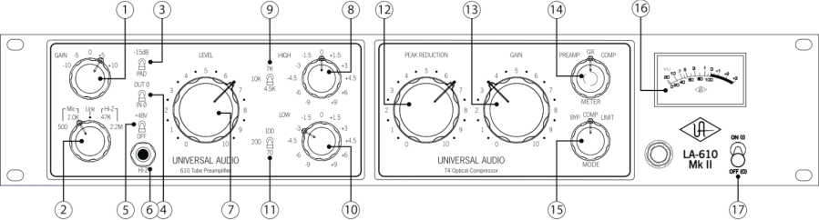

**(1) Gain -** Adjusts the gain of the input stage in stepped  5 dB increments. Turning the Gain switch clockwise raises the gain. Because this also has the effect of reducing negative feedback ( _see page 24_ ), the Gain switch also alters the amount of the input tube’s harmonic distortion, a major contribution to the “warm” sound characteristic of tube equipment. The higher the Gain setting, the more coloration the LA-610 will impart to the incoming signal. 

 **The LA-610 MkII makes improvements over the orginal LA-610 with regard to the accuracy of the stepped Gain switch’s presented dB value. (for example, -10 dB truly is -10 dB).** 

**(2) Input Select -** Determines which of the following three inputs is active: Mic, Line, or Hi-Z. The Mic and Hi-Z inputs each provide two different impedance settings. 

**Mic -** Selects the input signal coming from the rear panel balanced XLR MIC INPUT connection. ( _see #3 on page 8_ )  The impedance for the Mic input can be set to 500 ohms or 2.0K ohms. Switching between these two positions while listening to a connected microphone may reveal a different tonal quality and/or gain difference (be sure to carefully level-match when doing comparisons because louder tends to sound better). Typically, a microphone preamplifier should have input impedance roughly equal to about 10 times the microphone output impedance. For example, if your microphone has an output impedance of approximately 200 ohms, the switch should be set to the 2.0K position. However, making music is not necessarily about adhering to technical specifications, so feel free to experiment with the settings to attain the desired sound: you will not harm your microphone or the LA-610. 

**Line -** Selects the input signal coming from the rear panel balanced XLR LINE INPUT connection. ( _see #2 on page 8_ ) This connection has an input impedance of approximately 13K ohms and is intended to accommodate mixers, DAWs, tape machines, other mic preamps, signal processors, or any device with a line level output, such as keyboards, sound modules and drum machines. Using this input, the LA-610 can act as a “tone box” for linelevel signals, offering a variety of sonic colors based on front panel control settings. 

- 4 - 

**Front Panel** 

**__________________________________________________________** 

**Hi-Z -** Selects the input signal coming from the front panel unbalanced ¼" jack Hi-Z connection. ( _see #6 below_ )  Intended for the direct connection of electric guitar, electric bass, or any instrument with a magnetic or acoustic transducer pickup, this can be set to either 47K ohms or 2.2M ohms. The 47K ohms setting is best suited for  the -10 dBv level signals typically provided by active basses and guitars, while the 2.2M ohms setting is more suitable for instruments with passive pickup systems. Since a particular instrument’s output impedance may actually be somewhere between the active and passive levels, feel free to experiment to achieve the best sound at the desired level. ( _see page 24 for more information_ ) 

**(3) -15 dB PAD -** Reduces the mic input signal by -15dB. (This switch has no effect on Line or Hi-Z signal.) Use this to reduce the incoming signal in cases where undesired distortion is present at low gain levels (for instance, where especially sensitive microphones are used on loud instruments). 

**(4) Polarity -** Determines the polarity of the LA-610’s LINE OUTPUT. When IN ø is selected (the normal position most of the time), the signal is in phase, and pin 2 is hot (positive). When OUT ø is selected, the signal is out of phase, and pin 3 is hot (positive). Polarity reversal may be useful in cases where more than one microphone is utilized in recording a source. 

**(5) +48 V -** Most modern condenser microphones require +48 volts of phantom power to operate. This toggle switch applies 48 volts to the LA-610 MIC INPUT when the switch is up (in the +48V position). ( _See page 25 for more information about phantom power_ ) 

 **Keep phantom power off (switch down) when it is not required.** 

- **Always check the power requirements of your microphone with the manufacturer before applying phantom power** _**.**_ 

 **To avoid loud transients, always make sure phantom power is off when connecting or disconnecting microphones, and mute speakers.** 

**(6) Hi-Z Input -** Connect high impedance signal from an instrument such as electric guitar or bass to this standard unbalanced ¼" jack connector. If a connection is made to the Hi-Z input, be sure that there is **no** connection also made to the Mic or Line inputs. 

**(7) Level -** Determines the amount of signal sent to the final preamp output stage. For the cleanest, most uncolored signal from the LA-610, set the Gain switch ( _see #1 on page 4_ ) to a low setting (- 10 or -5) while turning the Level knob until the appropriate output signal is attained. 

- **The LA-610 Mk II differs from the orginal LA-610 with the tube used at the preamp output stage, and now uses the 12AT7 just like the 2-610, SOLO/610 and 6176. This is a by-product of the newly implemented “true bypass” for the LA-610 Mk II, making the preamp section identical to its cousins when in bypass.** 

- 5 - 

**__________________________________________________________** 

## **Front Panel** 

**(8) High Boost/Cut -** Selects the amount of cut or boost applied by the high shelving filter. The positive and negative numbers on the front panel denote dB values (-9, -6, -4.5, -3, -1.5, 0, +1.5, +3, +4.5, +6, +9). 

**(9) High Frequency –** In conjunction with the High Boost/Cut switch ( _see #8 above_ ), selects the corner frequency for the high shelving filter. Available frequencies are 4.5K (kHz), 7K (kHz), and 10K (kHz). 

**(10) Low Boost/Cut -** Selects the amount of cut or boost applied by the low shelving filter. The positive and negative numbers on the front panel denote dB values (-9, -6,  -4.5, -3, -1.5, 0, +1.5, +3, +4.5, +6, +9). 

**(11) Low Frequency -** In conjunction with the Low Boost/Cut switch ( _see #10 above_ ), selects the corner frequency for the low shelving filter. Available frequencies are 70 Hz, 100 Hz, and 200 Hz. 

**(12) Peak Reduction -** Determines the amount of gain reduction provided by the T4 Optical compressor.  This control essentially combines the Threshold, Ratio, and Input controls found on other compressors. Higher settings will increase the relative amount of compression, while lower settings reduce the amount of compression (a setting of 0, with the knob at its fully counterclockwise position, results in no compression). Note, however, that all compression performed by the LA-610 is program-dependent—that is, the degree of gain reduction changes as the signal varies. ( _see pages 18 - 22 for more information_ ) 

**(13) Gain -** Once the desired amount of compression or limiting is set by adjusting the Peak Reduction knob, the Gain knob can be used to make up for any signal attenuation (up to 20 dB of gain can be added). Set the Meter Function switch to the COMP position in order to have the meter display the final output level from the LA-610 when adjusting the compressor Gain knob.  ( _see #14 below_ ) 

 **A compressor Gain setting of approximately 6 is unity gain (no signal boost or attenuation).** 

**(14) Meter Function -** This switch determines what the LA-610’s VU meter displays: either the PREAMP output (that is, the level of the signal which feeds the compressor section), the amount of compressor gain reduction (GR), or the LA-610’s final output level, after compression. When OUTPUT is selected, a meter reading of 0 corresponds to a level of +4 dBm at the rear panel line output jack. 

 **When the T4 compressor is bypassed, “GR” and “COMP” settings will not show activity.** 

- 6 - 

**Front Panel** 

**__________________________________________________________** 

**(15) Mode -** A three-position switch which sets the compression section into either Bypass mode (BYP), Compression (COMP), or Limiting (LIMIT).  When the switch is in the COMP position, the degree of compression is gentler and at a low ratio (approximately 3:1, program-dependent). When the switch is set to the LIMIT position, there is more severe compression, and at a higher ratio (up to ∞:1, again, program-dependent).  ( _see pages 18 - 22 for more information_ ) 

 **The LA-610 Mk II differs dramatically from the original LA-610 when the unit is in Bypass mode (BYP). With the original, even when the LA-610 was set to BYPASS mode, incoming signal continued to pass through the compressor section. For that reason, the compressor Gain control remained active. The LA-610 Mk II has true bypass, which completely removes the T4 Optical Compressor section, including its makeup gain control and GR/COMP metering.** 

- **The audible difference between compression and limiting on the T4 compressor can be quite** 

- **subtle. Greater audible differences are more easily detected on transient-rich sources, and when a large amount of gain reduction is applied.** 

**(16) Meter -** A standard VU meter that displays either the preamp section output, amount of gain reduction, or final output level, depending upon the setting of the Meter Function switch. ( _see #14 on page 6_ )   ( _see page 25 for instructions for calibrating the LA-610 meter_ ) 

 **The LA-610 Mk II uses a larger, and better-lit, easier to read meter than its predecessor. The meter is lit with LEDs, so no bulb will ever need replacing. The improved meter electronics means a highly stable meter with no drift.** 

**(17) Power -** Turns the LA-610 power on or off. When powered on, the jewel light immediately to the left of this switch is lit. 

 **Unlike the original LA-610, the LA-610 Mk II uses an LED to illuminate the power jewel light. Therefore, no bulb will ever need replacing.** 

- **The LA-610Mk II gives the user 15 dB of additional gain above other 610 products through** 

- **the makeup gain of the T4 compressor (a total of 77 dB). Turn off Peak Reduction for when maximum gain is needed such as with low-output ribbon microphones.** 

- 7 - 

## **Rear Panel** 

**__________________________________________________________** 

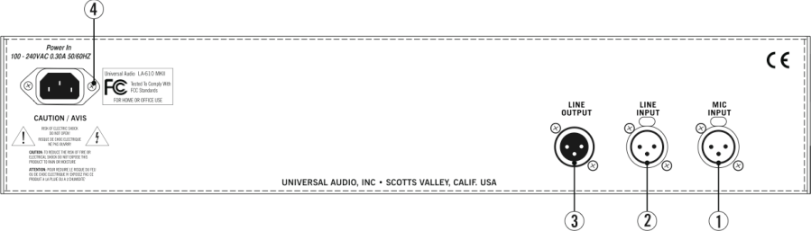

**(1) LINE OUTPUT -** A balanced XLR connector carrying the line-level output signal of the LA-610. Note that Pin 2 is positive when the front panel Polarity toggle switch is down (IN ø). Pin 3 is positive when the front panel Polarity switch is up (OUT ø).  ( _see #4 on page 5_ ) 

**(2) LINE INPUT -** Connect line-level input signal (coming from a device such as a mixer, DAW, tape machine, or signal processor) to this balanced XLR connector. Pin 2 is wired positive (hot). 

**(3) MIC INPUT -** Connect your microphone to this standard XLR connector. Pin 2 is wired positive (hot). 

**(4) AC Power Connector -** Connect a standard, detachable IEC power cable (supplied) here. The LA610 can operate from 100V to 240 VAC / 50-60 Hz. The internal power supply is self-sensing and will automatically work throughout this voltage range. ( _see page 26 for more information_ ) 

 **Unlike the original LA-610, the LA-610 Mk II uses an internally switching power supply. The unit may be used in virtually any part of the world with no need to worry about the incoming voltage.** 

- 8 - 

**Interconnections** 

**__________________________________________________________** 

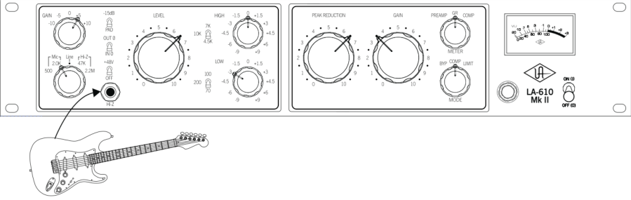

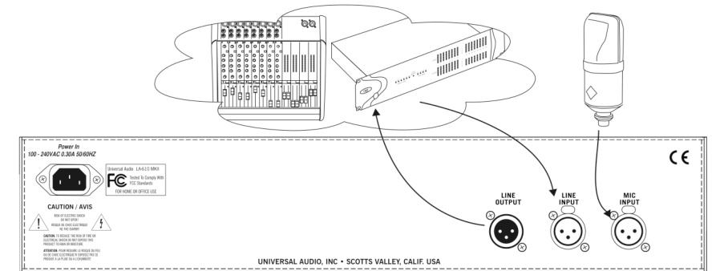

- **For most applications, we recommend keeping the LA-610 preamp Level control set between 7 and 10, and the compressor Gain control set at approximately 6 (unity gain) for starting positions. Adjustments can then be made to the preamp Gain, Impedance, and Filter controls,  as well as the compressor Mode, Peak Reduction and Gain controls, to achieve the optimum sound for your signal source.** 

- 9 - 

**__________________________________________________________** 

## **Insider’s Secrets** 

## _**LA-610 Versus 2-610 /  LA-2A**_ 

In his March 2005 review of the LA-610 for _MIX_ magazine, Michael Cooper stated, “If I were to list my five favorite analog processors of all time, the Universal Audio LA-2A leveling amplifier and 2-610 tube preamp would easily make the list. I often chain them in series to record tracks in my studio.” So why go for the LA-610 over those two devices chained together? 

One factor, of course, is price: the LA-610 costs significantly less than a combination of a 2-610 and LA-2A. But just as important is sonic signature. Cooper goes on to say, “The LA-610's compression characteristics definitely sounded like those of the LA-2A, yielding ultra-transparent and naturalsounding control over dynamics... Both paths sounded awesome, with the LA-610 being more modern, sparkly and precise, and the 2-610/LA-2A combo sounding full, dark and chocolaty with understated highs. Despite their spectral differences, both signal paths lent that wonderful tube richness that fans of Universal Audio gear adore.” 

Producer Fred Maher agrees. “What I like about **“ In these days [of DAWs], since there's** the LA-610,” he says, “is that it's super clean, **no warmth from tape compression,** super warm. And although it is based on very **it's critical  to have something like** old-school technology, you can get some very **the LA-610”  — Fred Maher** modern sounds out of it. It will give some squishy, squashy compression like a more modern compressor if you want, but it can also be very subtle and LA-2A-like. In these days [of DAWs], since there's no warmth from tape compression, it's critical to have something like the LA-610.” 

Indeed, the beauty of the LA-610 is that it rides gain just like an LA-2A and it sounds quite a bit like an LA-2A, yet it still delivers its own sonic signature. For many years, engineers have had to make the choice between an LA-2A or an 1176 (another vintage compressor, now manufactured by Universal Audio, available as a standalone unit or in combination with a channel of the 2-610 preamp, in our 6176 model), depending on the tone they want, not necessarily on how they differ as compressors. The LA-610 offers another choice, plus it's augmented with pre-compression EQ! 

## _**Vocals, Vocals, Vocals**_ 

The preamp section of the LA-610 utilizes a channel of our popular 2-610 stereo mic preamp, used by many engineers for vocals. In his December 2001 review for _MIX_ magazine, Michael Cooper raved about the 2-610’s abilities to enhance vocal recording, writing, “The 2-610 is the richest, fattest and sweetest mic preamp I've ever heard on vocals. Bigger than life and possessing astounding depth, the sound made all other mic preamps I've used sound somewhat 2-D by comparison. The bottom end was big and tight, mids incredibly clear, yet warm as hot fudge, and the sweet highs ultra-smooth.” 

- 10 - 

**Insider’s Secrets** 

**__________________________________________________________** “I always use the LA-610 for vocals,” Fred Maher says. **“ I always use the LA-610 for** “I almost always use the compressor to varying **vocals.”  — Fred Maher** degrees, depending on what I want. I don't have a vocal booth [in my studio],” he adds, “so... I'll use a little low roll-off at 70 just to get the room out, which is very handy when you are literally in a room.” 

The LA-2A, of course, is also primarily known as a vocal compressor, with a well-deserved reputation for reining in the most untamable, dynamically fluctuating performances you can throw its way, and improving the tone to boot. In his evaluation of the LA-2A (written for _Pro Audio Review_ in their August, 2002 issue), Ted Spencer writes, “Where it works best on vocals is when a certain blending or warming of the sound is desired... This is especially true for particular voices (often female) that are a bit “edgy” or harsh. The LA- 2A is like honey in your tea in these cases —smoothing, softening and, yes, warming the sound. The nice thing is that it accomplishes this coloring effect without sounding like anything heavy-handed has been “done” to the sound; it effortlessly does its magic without taking away any of the apparent fidelity. On the contrary, the euphonic coloration adds a sort of depth and dimension that can actually make voices sound _more_ hi-fi.” 

Similarly, Nick Batzdorf of _Recording_ magazine reported in his October, 2001 review that he successfully used the LA-2A on a male singer who had “a nice but small and dynamically uneven voice. Even when it was providing as much as 10 dB of gain reduction (that’s a lot), all [the LA-2A] did was smooth him out and make his voice thicker.” 

## _**Versatility**_ 

Of course, no preamp or compressor, no matter how well designed, is perfect for all applications or for all microphones. Fortunately, the LA-610 is designed to work with a wide variety of microphones and signal sources, and we think you’ll find that it acts as the perfect sonic complement for most of them. 

Reviewer Myles Boisen observed in his February 2002 review of the 2-610 for _Electronic Musician_ magazine that “the unit can work magic on amplified instruments, electronic keyboards, strings, horns, and percussion (including wood and metal percussion, alto and tenor saxophones, and trumpet) and in ambient-miking applications. I also highly recommend it for use with ribbon and other lowimpedance microphones.” Nick Batzdorf, in evaluating the LA-2A, concurred, saying, “it sounds just as good on acoustic guitar, pizz cello, alto recorder, and spoken voice.” The LA-610 works equally well on cello, especially if you’re using it pizzicato or for tracking plucked parts. In fact, you’ll get excellent results using the LA-610 on all variety of stringed instruments (even the notoriously difficult-to-record violin and viola), whether they’re being played jazz-style or country-style. 

The LA-610 is also great for kick drum. Often, a kick drum does not need a lot of compression, but a compressor can nonetheless tame the big peaks, and add some character and tone to boot. The LA-610 compressor has just the right attack time to let the beater hit come through, then the programdependent nature of the release time gracefully pulls the volume back as the low-end thump occurs. Depending on the quality of the kick drum and the mic being used (as well as its placement), you may not need any EQ at all, but it’s still well worth trying some high-frequency boost (usually 4.5k) and boosting or cutting of the low frequencies. After finding the desired frequencies with extreme cut and boost values, back them off to low or moderate settings for the most natural-sounding results. 

- 11 - 

## **Insider’s Secrets** 

**__________________________________________________________** 

## _**Electric Guitar and Bass**_ 

There’s something very special about the mix of tube preamplification and electric guitar and bass. This is an area where the LA-610 positively shines—little wonder, considering its lineage in the 2- 610 and LA-2A. Ted Spencer, in evaluating the LA-2A, described a session involving a bass overdub as follows: “The LA-2A sounded just sensational... providing a certain “blended” quality to the sound but not at the expense of clarity or dynamic impact.” He went on to say, “For a mix of a pop rock track in Pro Tools, using the LA-2A inserted on electric guitar was even more of a no-brainer.” 

Michael Cooper enthusiastically reported the results of using the LA-610 to record electric guitar using a small amplifier miked with a ribbon microphone: “Cutting frequencies above 10 kHz by 3 dB using the LA-610's flattering EQ and setting the compressor section to Compress mode, I found the results were warm yet present. Fantastic!” 

You’ll find that compressing acoustic or electric bass with the LA-610 yields very similar results. This is especially due to the unique attack and release time characteristics of the compressor section. The pick or slap of the attack sneaks through, and then a little mild compression really brings the tone forward. Here, too, a little bit of pre-compression EQ yields great results. When plugging an electric bass guitar directly into the LA-610's hi-Z input, Michael Cooper reported that after “setting the unit's preamp gain to +10 for grit, cutting the EQ drastically above 4.5 kHz and boosting below 70 Hz, and placing the compressor section in Limit mode, the results were positively thunderous.” 

Myles Boisen stated flatly in his review that “The 2-610 has been an absolute smash hit for guitar and electric-bass recording at my studio.” One technique that both Boisen and Cooper employed with great success was to split the electric guitar or bass signal and then plug one side into the Hi-Z input and the other into an external tube direct (DI) box whose output was connected to the the other channel’s mic input. In addition, Cooper found that “cranking the [preamp] Gain to +10 gave a slight bark that was perfect for country lead guitar fills.” 

## _**Acoustic Guitar**_ 

The LA-610 is also a powerful tool for the recording of acoustic guitar, thanks in large part to the unique sonic character of the preamp section. In their reviews of the 2-610, Cooper talked of the unit’s “uncanny resolution in the midrange frequencies,” which yielded an overall guitar sound that he found to be “full and very lush,” while Boisen reported the results of pairing the 2-610 with a small-diaphragm omnidirectional mic on acoustic guitar, a combination that he found to be both “pristine and predictably warm.” 

And even though there isn't an attack control to adjust in the LA-610’s compressor section, you’ll get great results on acoustic guitar by slowly raising the Peak Reduction knob until you’re almost always showing gain reduction on the meter (usually -1 to -3 dB), then by dialing in a little EQ such as -1.5 or -3 dB at 7k. 

- 12 - 

**Insider’s Secrets** 

**__________________________________________________________** 

## _**Mixing Applications**_ 

The line-level input of the the LA-610 allows it to be used in mixing as well as tracking. Even if no equalization or compression is used, the signal continues to pass through the transformers, the tubes, and the polarity-reverse circuits, making it extremely useful for coloration of tracks. As Boisen said in his review of the 2-610, “Any recording can potentially benefit from line-level tube-stage processing.” 

What’s more, the fact that all front panel controls of the LA-610 (with the exception of the preamp Level control and the compressor Peak Reduction and Gain controls) are stepped makes it easy to reproduce settings. Cooper found that “with its Gain switch set to +10, [the 2-610] fattened up kick drum and bass tracks very nicely,” and Boisen reported that he was able to successfully use the 2- 610 to salvage overhead drum-mic tracks that had phase problems and a thin sound. 

Of course, raising the preamp Gain and decreasing the Level adds more tube  **Dialing in judicious amounts of Peak** coloration to the signal being processed. **Reduction can help get every syllable of  a** “At the +10 Gain value,” Cooper reported in **lead vocal intelligible, even in a dense** his review of the 2-610, “it was possible to **backing track, and can also help backing** get deliciously nasty distortion on line-level **vocals to “sit” correctly.** tracks.” You’ll also find that dialing in judicious amounts of peak reduction from the LA-610 compressor section can help get every syllable of a lead vocal intelligible, even in a dense backing track, and can also help backing vocals to “sit” correctly. 

## _**Improving the Sound of Your Microphone**_ 

In some cases, the LA-610 can even make an inexpensive microphone sound like an expensive one. Boisen found that the 2-610 preamp allowed him to create “a terrific sound using [an inexpensive stage dynamic microphone] with a female singer doing scratch vocals,” making it sound “amazingly rich, airy, and expensive... It had no problems with graininess or undesirable coloration; indeed, in a blind test I might easily have mistaken [it] for a costly tube mic.” 

## _**Live Applications**_ 

Although the LA-610 was designed primarily for use in recording, it can also serve as a powerful addition to a live sound rig, especially in FOH (Front Of House) applications. We know of several professional electric bass players who use the 2-610 as their onstage preamp, plugging their instrument directly into its Hi-Z input and then routing the 2-610 output to their power amp. The same trick works even better with the LA-610, where you have the benefit of compressing or limiting the signal before sending it to the power amplifier. 

- 13 - 

## **The Technical Stuff** 

## **__________________________________________________________** 

## **History of the 610** 

## _**Preamp section**_ 

The lineage of the LA-610 can be traced back to two devices long revered by audio engineers the world over: The 610 preamplifier and the LA-2A optical compressor. 

The preamp section of the LA-610 was inspired by the 610 console built by Bill Putnam Sr. in 1960 for his United Recording facility in Hollywood. As was the case with most of Putnam’s innovations, the 610 was the pragmatic solution for a recurring problem in the studios of the era: how to fix a console without interrupting a session. The traditional console of the time was a one-piece control surface with all components connected via patch cords. If a problem occurred, the session came to a halt while the console was dismantled. Putnam’s answer was to build a mic-pre with gain control, echo send and adjustable EQ on a single modular chassis, using a printed circuit board. Though modular consoles are commonplace today, the 610 was quite a breakthrough at the time. 

While the 610 was designed for practical reasons, it was its sound that made it popular with the recording artists who frequented Putnam’s studios in the 1960s. The unique character of its microphone preamplifier in particular made it a favorite of legendary engineers like Bruce Botnick, Bones Howe, Lee Hershberg, and Bruce Swedien, who has described the character of the preamp as “clear and open” and “very musical.” 

The 610 console was used in hundreds of studio sessions for internationally renowned artists such as Frank Sinatra, Ray Charles, Sarah Vaughan, the Mamas and Papas, the Fifth Dimension, Herb Alpert, and Sergio Mendes. The Beach Boys’ milestone _Pet Sounds_ album was also recorded using a 610. 

Legendary engineer Wally Heider, manager of remote recording at United, used his 610 console to record many live recordings, including Peter, Paul and Mary’s _In Concert_ (1964), Wes Montgomery’s _Full House_ (1962), and all of the Smothers Brothers Live albums. Heider’s console was later acquired by Paul McManus in 1987, who spent a decade restoring it. 

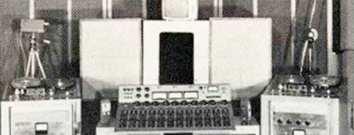

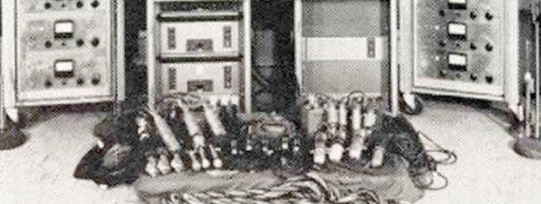

**Wally Heider’s Remote Recording Rig, with 610 Console** 

- 14 - 

**The Technical Stuff** 

**__________________________________________________________** 

At least one 610 module is still in use at Ocean Way Studios, site of the original United Recording facility. Allen Sides, who purchased the studio from Putnam, personally traveled to Hawaii to collect the 610 console that was used to record the live “Hawaii Calls” broadcasts. Celebrated engineer Jack Joseph Puig has long been ensconced in Studio A at Ocean Way with the 610 (and a stunning collection of vintage gear) where he has applied the vintage touch to many of today’s artists, including Beck, Hole, Counting Crows, Goo Goo Dolls, No Doubt, Green Day and Jellyfish. 

Today’s LA-610 preamp section bears a lot of similarity to the original 610 module. Hand-selected tubes are used, and the identical component values have been maintained, along with many of the original unit’s features. Modern updates include a higher-quality power supply, polypropylene caps, metal film resistors, custom-wound I/O transformers with double-sized alloy cores, and newly added features such as high-impedance inputs, an enhanced EQ section, and phantom power, switchable polarity inversion, and a switchable -15 dB pad on the mic input. In addition, the preamp section has been “voiced” with a slight high-frequency boost to compensate for the warm nature of the optical compressor it is paired with. 

## _**Compressor section**_ 

The compressor section of the LA-610 is based upon the LA-2A, a vintage tube device still revered by audio professionals everywhere. The original design was the brainchild of James F. Lawrence Jr., who had been a radar operator in World War II. Following his tour of duty, Lawrence began studying electrical engineering at the University of Southern California, while also quietly designing subminiature telemetry devices and optical sensors for the military. But his passion was always radio, and he eventually landed a job as a broadcast engineer at KMGM in Los Angeles, where he soon became frustrated with having to constantly ride gain to ensure a proper signal. This led to Lawrence’s conception of a device he called a “leveling amplifier.” 

Shortly afterwards, Lawrence started a company called Teletronix, setting up shop in his hometown of Pasadena, California in 1958. Among the line of broadcast products manufactured by Teletronix were conversion and transmitter tubes, emergency tone generators, multiplex generators, even full-scale radio transmitters. Lawrence’s first attempt at building a leveling amplifier resulted in the Teletronix LA-1, of which around one hundred units were made. 

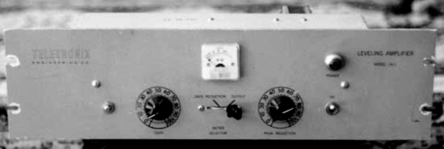

**Teletronix LA-1** 

- 15 - 

## **The Technical Stuff** 

**__________________________________________________________** 

At the heart of the LA-1 was an electro-optical sensor. This was a small light-proof metal canister which housed two components: a photoelectric cell (a light sensitive device whose electrical resistance changes depending upon the intensity of light to which it is subjected, typically used in the home to sense when darkness falls and then switch on lights) and a light source positioned to shine directly on the photo-cell. Early attempts employed either neon or incandescent light sources. Both of these took time to light up, and this delay resulted in slow attacks. 

The LA-1 was not a big commercial success, but it did find its way into the hands of singing cowboy Gene Autry, who used it extensively for his own radio and recording dates, thus helping give it a degree of exposure and encouraging Lawrence to continue refining the design. Soon after, the LA-2 was released, with a sensor that had evolved to use an electro-luminescent panel as its light source—a component which lit up more quickly and thus resulted in a faster attack, yielding a gentler form of compression suitable for recording as well as broadcast applications. This sensor was named the T4, and its development serendipitously created one of the most musically sensitive devices to ever ride gain. ( _see page 22 for more information_ .) 

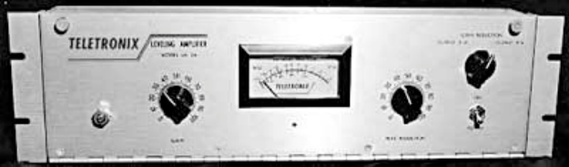

**Teletronix LA-2A** 

Engineer Sid Feldman purchased an LA-2 early on, and soon became involved in its distribution, selling units to numerous broadcast and recording facilities in New York and Nashville. In 1962 Lawrence began to reconfigure the LA-2 into the LA-2A, at which time the device gained a Limit/Compress switch in response to the newfound interest from the recording industry. With its 0 to 40 dB of gain limiting, a balanced stereo interconnection, flat frequency response of 0.1 dB from 3015,000 Hz and a low noise level (better than 70 dB,) the LA-2A quickly became one of two industry standard compressors (the other being Bill Putnam Sr.'s 1176)—both devices that continue to be used extensively on recording sessions to this very day. 

Teletronix became a division of Babcock Electronics Corp. in 1965. In 1967 Babcock's broadcast division was acquired by Bill Putnam's company, Studio Electronics Corp., shortly before he changed the company’s name to UREI®. Three different versions of the LA-2A were produced under the auspices of these different companies before production was discontinued around 1969. However, Putnam continued using the T4 optical detector for new designs, such as the solid-state LA-3A, followed by the LA-4 and LA-5. 

The companies that Putnam started—Universal Audio, Studio Electronics, and UREI—built products that are still in regular use decades after their development. In 1999, Putnam’s sons Bill Jr. and James Putnam re-launched Universal Audio. In 2000, the company released its first two products: faithful reissues of the original LA-2A and of Bill Putnam Sr.’s 1176LN compressor. Both quickly garnered rave reviews and both have found a home in hundreds of professional and project studios worldwide. 

- 16 - 

**The Technical Stuff** 

**__________________________________________________________** 

In 2000, Bill Putnam Sr. was awarded a Technical Grammy for his multiple contributions to the recording industry. Highly regarded as a recording engineer, studio designer/operator and inventor, Putnam was considered a favorite of musical icons Frank Sinatra, Nat King Cole, Ray Charles, Duke Ellington, Ella Fitzgerald and many, many more. The studios he designed and operated were known for their sound and his innovations were a reflection of his desire to continually push the envelope. Universal Recording in Chicago, as well as Ocean Way and Cello Studios (now EASTWEST) in Los Angeles all preserve elements of his room designs. 

In 2005, in collaboration with Dennis Fink, one of the original UREI® analog design engineers, Universal Audio released the LA-610, which has been carefully designed to deliver the essence of the “LA” sound but without the costs of being an exact LA-2A component clone. The LA-610 uses three tubes for warmth and overall tonal balance. After the preamp section, the LA-610 offers a new optical compressor, based upon the original T4 circuitry, and the same easy-to-use controls provided by the LA-2A. 

We here at Univeral Audio, have two goals in mind: to reproduce classic analog recording equipment designed by Bill Putnam Sr. and his colleagues, and to design new recording tools in the spirit of vintage analog technology. Today we are realizing those goals, bridging the worlds of vintage analog and DSP technology in a creative atmosphere where musicians, audio engineers, analog designers and DSP engineers intermingle and exchange ideas. Every project taken on by the UA team is driven by its historical roots and a desire to wed classic analog technology with the demands of the modern digital studio. 

## **LA-610 Overview** 

The LA-610 is a vacuum-tube channel strip that combines a microphone/instrument/line preamplifier with an optical compressor/limiter. 

Its creation was based on a simple idea: Put a T4 compressor circuit in the output section of our 610 mic preamp. This effectively marries two faithful reissues of vintage audio devices long revered by engineers the world over. The 610 has a long lineage of its own, based upon the original 610 console built by Bill Putnam Sr. Similarly, the T4 houses the electroluminescent panel and photo-resistors that characterise the signature sound of the famed LA-2A. 

The function of a preamplifier, as its name implies, is to increase (or _amplify_ ) the level of an incoming signal to the point where other devices in the chain can make use of it. The output level of microphones is very low and therefore requires specially designed mic preamplifiers to raise their level to that needed by a mixing console, tape recorder, or digital audio workstation (DAW) without degrading the signal to noise ratio. This is no simple task, especially when you consider that mic preamps may be called upon to amplify signals by as much as 1000%. 

Accomplishing musical-sounding compression is no simple task, and a number of different circuits have been developed through the years to attain that goal. One of the most unique of these circuit designs is the electro-optical one created for the LA-2A (and employed by the LA-610), where incoming signal varies the strength of a light shining on a light-sensitive cell that is controlling overall gain. This has the desirable effect of making the compression entirely program-dependent (that is, the 

- 17 - 

## **The Technical Stuff** 

## **__________________________________________________________** 

amount of compression varies constantly, depending upon the fluctuating strength of the incoming signal) and at the same time imparting a very fast attack time and dual-stage release time that is musically very pleasing. ( _see page 23 for more information_ .) 

Through careful attention to design, custom wiring, and the use of vacuum tubes that are carefully selected and tested individually, we believe we’ve succeeded in creating a powerful secondgeneration recording tool. The LA-610 combines a versatile, easy-to-use mic preamplifier with unmatched sonic characteristics—similar to that of the original 610, but with lower noise—with an equally straightforward yet sonically superior compressor similar to that of the original LA-2A. 

The LA-610 has input and gain stages, each of which utilizes a dual-triode tube operating in a class A single-ended configuration. The preamp is followed by an LA-2A derived T4 side chain circuit, including  dual triode and pentode tubes that send signal to the luminescent panel. Variable negative feedback is applied to both preamp gain stages to control gain, reduce distortion, and extend frequency response. Our transformer design features double-sized alloy cores with custom windings, and all balanced inputs and outputs are transformer coupled. 

The simple operation of the LA-610, combined with the unique program-dependent nature of its optical compressor provides the same extremely musical control that has made the 610 and LA-2A such well-loved classics for over 40 years. In combination with its powerful and versatile tube-based preamp, it yields an enormous bottom end warmth that is unparalleled, making it an ideal front-end for tracking with modern DAWs. 

## **Compressor Basics** 

The function of a compressor is to automatically reduce the level of peaks in an audio signal so that the overall dynamic range—that is, the difference between the loudest sections and the softest ones—is reduced, or compressed, thus making it easier to hear every nuance of the music. Compression is sometimes referred to as _peak reduction_ or _gain reduction_ , because a compressor (or “limiter,” when acting more severely) “rides gain” on a signal much like a recording engineer does by hand when he manually raises and lowers the faders of a mixing console. Its circuitry automatically adjusts level in response to changes in the input signal: in other words, it keeps the volume up during softer sections and brings it down when the signal gets louder. The amount of gain reduction is typically given in dB and is defined as the amount by which the signal level is reduced by the compressor. 

Compression or limiting enables even the quietest sections to be made significantly louder while the overall peak level of the material is increased only minimally. The dynamic range of human hearing (that is, the difference between the very softest passages we can discern and the very loudest ones we can tolerate) is considered to be approximately 120 dB. Early recording media such as analog tape and vinyl offered much less dynamic range, so compression was a virtual necessity, raising the overall level of the material (making it “hotter”) without peak levels causing distortion. While many of today's digital recording media approach or even exceed 120 dB of available dynamic range, quiet passages of recorded music can still be lost in the ambient noise floor of the listening area, which, in an average home, is 35 to 45 dB. 

- 18 - 

**The Technical Stuff** 

**__________________________________________________________** 

Despite the increased dynamic range, compression is especially important when recording digitally, for two reasons: One, it helps ensure that the signal is encoded at the highest possible level, where more bits are being used so that better signal definition is achieved. Secondly, it helps prevent a particularly harsh type of distortion known as _clipping_ —something that, ironically, is especially egregious in digital recording, due to the inherent limitations of digital technology. 

During recording, compression is customarily used to minimize the volume fluctuations that occur when a singer or instrumentalist performs with too great a dynamic range for the accompanying music. It can also help to tame acoustic imbalances within an instrument itself—for example, when certain notes of a bass guitar resonate more loudly than others, or when a trumpet plays louder in some registers than in others. Properly applied compression will make a performance sound more consistent throughout. It can tighten up mixes by melding dense backing tracks into a cohesive whole, can make vocals more intelligible, and can add punch and snap to percussion instruments like kick drum and snare drum, making them more “present” without necessarily being louder. It can also impart tonal coloration, making a signal warmer and fatter. Compression can even serve as a musical tool, enhancing the sustain of held guitar notes or keyboard pads, or providing a snappier attack to horn stabs or string pizzicato. 

## _**Input Signal and Threshold**_ 

The first and perhaps most significant factor in compression is the level of the input signal. Large (loud) input signals result in more gain reduction, while smaller (softer) input signals result in less gain reduction. _Threshold_ is another important factor. It is a term used to describe the level at which a compressor starts to work. Below the threshold point, the volume of a signal is unchanged; above it, the volume is reduced. For example, if a compressor’s threshold is 0 dB, incoming signals at or above 0 dB will have their gain reduced, while those below 0 dB will be unaffected. 

In the LA-610, the Peak Reduction knob controls both the threshold and the amount of input signal being routed to the compressor circuit. As it is turned up (clockwise), the overall degree of compression increases; as it is turned down (counterclockwise), the overall degree of compression decreases. At the 0 (fully counterclockwise) setting, no signal enters the compression circuit, hence no gain reduction. 

- 19 - 

**The Technical Stuff** 

**__________________________________________________________** 

## _**Ratio**_ 

Another important term is compression _ratio_ , which describes the amount of increase required in the incoming signal in order to cause a 1 dB increase in output. A ratio of 1:1 therefore means that for every 1 dB of increase in input level, there is a corresponding 1 dB increase in output level; in other words, there is no compression being applied. A ratio of 2:1, however, means that any time there is an increase of 2 decibels in the loudness of the input signal, there will only be a 1 dB increase in output signal. A ratio of 4:1 means that even when there is a full 4 decibels of increase in loudness, there will still only be a 1 decibel increase in output signal. (Bear in mind that decibel is a logarithmic form of measurement, so a 2 dB signal is not twice as loud as a 1 dB signal; in fact, it requires approximately 10 dB of increased gain for a signal to sound twice as loud.) 

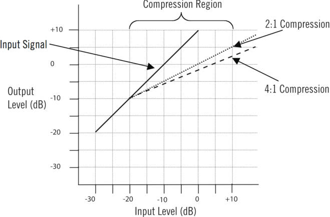

As you can see from this illustration, at a low ratio, a compressor has relatively less effect on the incoming signal; at higher ratios, it has more effect. When operating in compression mode (that is, when the front-panel Mode switch is set to COMP), the LA-610 uses a compression ratio of approximately 3:1; however, as we will see shortly, this is program dependent, so that the actual ratio changes according to the frequency content of the incoming signal. 

While the terms “compression” and “limiting” are often used interchangeably, the general definition of compression is gain reduction at ratios below 10:1; when higher ratios (of 10:1 or greater) are used, the process is instead called _limiting_ . Limiters abruptly prevent signals above the threshold level from exceeding a certain maximum value. At very high ratios of 20:1 or greater (some limiters even offer a theoretical infinite ratio of Infinity:1), “brick wall” limiting kicks in—that is, any change in input, no matter how great, results in virtually no increase in output level. Infinity:1 is the ratio used by the LA-610 when it is operating in limiting mode (that is, when the front-panel Mode switch is set to LIMIT); however, it is designed so that the same warm sonic characteristics are retained, even though more severe gain reduction is applied. 

As an aside, an _expander_ is the opposite of a compressor: a device which _increases_ the dynamic range of a signal. For example, a 10 dB change in the input signal might result in a 20 dB change in the output signal, thus “expanding” the dynamic range. 

- 20 - 

**The Technical Stuff** 

**_______________________________________________________________________** 

## _**Knee**_ 

A compressor's _knee_ determines whether the device will reach maximum gain reduction quickly or slowly. A gradual transition (“soft knee”) from no response to full gain reduction will provide a gentler, smoother sound, while a more rapid transition (“hard knee”) will give an abrupt “slam” to the signal. The LA-610 utilizes soft knee compression and limiting, which is generally preferred for most musical applications; hard knee compression or limiting is more often used in applications where instrumentation (such as broadcast transmitter towers) must be protected from transient signal overloads. 

## _**Attack and Release**_ 

The main key to the sonic imprint of any compressor lies in its _attack_ and _release_ times; these are the parameters which most affect how “tight” or how “open” the sound will be after compression. The attack time describes the amount of time it takes the compressor circuitry to react to and reduce the gain of the incoming signal, usually given in thousandths of a second (milliseconds). The LA-610 attack time is approximately 10 milliseconds (though, like ratio, this is somewhat program dependent). A fast attack such as this kicks in almost immediately and catches transient signals of very brief duration (such as the beater hit of a kick drum or the pluck of a string), reducing their level and thus “softening” the sound. A slow attack time allows transients to pass through unscathed before compression begins on the rest of the signal. The release time is the time it takes for the signal to then return to its initial (pre-compressed) level. If the release time is too short, “pumping” and “breathing” artifacts can occur, due to the rapid rise of background noise as the gain is restored. If the release time is too long, however, a loud section of the program may cause gain reduction that persists through a soft section, making the soft section inaudible. Like its predecessor, the LA-2A, the LA-610 is unique in that it provides a dual stage release time: in the first 60 milliseconds, approximately half the signal is released, with the remainder taking anywhere from 1 second to 15 seconds to die away, depending upon its frequency content. 

## _**Makeup Gain**_ 

Finally, an output control is employed to make up for the gain reduction applied by the gain reduction circuitry. Makeup gain is generally set so that the compressed signal is raised to the point at which it matches the level of the unprocessed input signal (for example, if a signal is being reduced in level by approximately -6 dB, the output makeup gain should be set to +6 dB). 

As you are adjusting a compressor, a switchable meter such as the one provided by the LA-610 can be helpful in order to view the strength of the incoming signal (displayed when the meter is set to PREAMP), the strength of the outgoing, post-compression signal (displayed when the meter is set to COMP), or the gain reduction fluctuations as they occur (displayed when the meter is set to GR). When in COMP mode, the LA-610 meter will read 0 dB when there is no incoming signal or when no compression is being applied. 

- 21 - 

**The Technical Stuff** 

## **__________________________________________________________** 

## **Electro-Optical Compression/Limiting** 

In order to operate, a compressor must first have some method of determining the level of the incoming signal, and must then be able to use the fluctuations in that signal to control the gain. There are many different circuit designs which have been developed to accomplish these tasks. In the case of the LA-610, both of these functions are performed by an electro-optical element called a T4. 

The T4 is the very heart of the LA-610’s  T4 optical compressor. Identical to the T4 used in the LA-2A, it is comprised of a small light-proof metal canister that contains two components: an electroluminescent (EL) panel (a device that lights up when electrical signal is applied) and a cadmiumsulfide photoelectric cell (a light sensitive device whose electrical resistance changes depending upon the intensity of light to which it is subjected). It is the unique gain reduction characteristics that result from the interaction between these two components that predominantly gives an electro-optical compressor its signature sound. (Note: While the “el-op” circuit design was one of the first of its kind, and is still used to this day in other compressor products, Universal Audio has its photo-cells uniquely manufactured to exacting specs that were originally found on the LA-2A. No other manufacturers have access to these cells.) 

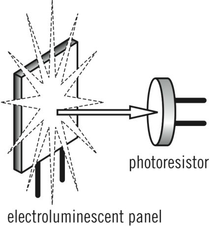

The genius of the el-op circuit lies in its simplicity: the larger the signal that is applied to the EL panel, the brighter the light that is generated; the brighter the light, the less resistance the photo-cell (which controls the gain of the electrical circuit) exhibits. Thus, the louder the incoming signal, the brighter the light and the more gain reduction is applied... and with virtually no harmonic distortion or audible artifacts. (In the most extreme case, if the resistance of the photo-cell becomes zero [a dead short], then the signal would be grounded and there would be no output. In reality, photo-cell resistance cannot go completely to zero and hence there will always be some signal present.) 

Conversely, when there is a small input signal (resulting in a dim light), the photo-cell will have a great deal of resistance and will therefore not affect the circuit at all, so there will be no gain reduction. 

- 22 - 

## **The Technical Stuff** 

**__________________________________________________________** 

Perhaps the most important thing about electro-optical compression and limiting is that it is 100% program-dependent; in other words, both the degree of gain reduction and the compression ratio vary continuously with the incoming signal, making for a very natural sound. What’s more, unlike other compressors which allow the user to adjust the attack and release times, both of these parameters are automatic and are completely determined by the response of the EL panel and photo-cell in the T4. 

The electroluminescent panel utilized in the T4 discharges most of its light very quickly, resulting in a fast attack time (which can be as low as 10 milliseconds, depending on the frequency of the incoming signal), Even more critical to the sound of the LA-610 compressor is its signal-dependent release time. Short transients are released quickly, while longer, more sustained parts of the sound are given a much slower release. Like the original T4, the T4 actually releases in two stages: the initial release generally takes place in about 40–80 milliseconds (which is relatively fast), followed by a gradual release that can take as much as several seconds. This kind of program-dependent dual stage quick-then-gradual release results in a warm and natural sound without the “pumping” which plagues so many other compressor designs. 

The amount of time it takes for the photo-cell to recover after the light is removed depends on how long light had been shining on it and how bright the light was. This causes something called “memory effect.” As a result, you can actually “train” the T4’s response characteristics by pre-rolling material for a minute or two, essentially saturating the photo-cell. Similarly, because the amount of time it takes the luminescent panel to light up determines the attack, you can “prime” the T4 to light up faster so that the first note's transient doesn't sneak by too aggressively. To do so, simply have the musician trigger the compressor by playing a note just before recording begins. 

Another interesting phenomenon which affects the threshold (and, to a lesser degree, attack time and release time) of an electro-optical compressor is “panel aging,” something which is more related to the amount of actual use rather than age in years. The more “aged” the EL panel, the greater the amount of gain reduction will need to be applied. Panel aging is probably a major reason why the same model of electro-optical compressor can sound subtly different between units. 

- 24 --23- 

**The Technical Stuff** 

**_______________________________________________________________________** 

## **About “Class A”** 

“Class A” electronic devices such as the LA-610 are designed so that their active components are drawing current and working throughout the full signal cycle, thus eliminating a particularly unpleasant form of distortion called _crossover distortion_ . 

## **About Negative Feedback** 

Negative feedback is a design technique whereby a portion of the preamplifier’s output signal is reversed in phase and then mixed with the input signal. This serves to partially cancel the input signal, thus reducing gain. A benefit of negative feedback is that it both flattens and extends frequency response, as well as reducing overall distortion. Turning the LA-610 front panel Gain switch clockwise (i.e., increasing it) reduces negative feedback, which has the effect of also increasing the amount of the input tube’s harmonic distortion, a major contribution to the “warm” sound characteristic of tube equipment.  ( _see #1 on page 4_ ) 

## **Impedance Matching** 

Depending upon their design, different microphones provide different output impedances. Typical mic impedances range from as low as 50 ohms (the symbol for ohms is Ω) to thousands of ohms (K ohms). The LA-610 Mic input can be set to either 500 ohms or 2.0K ohms, allowing it to accommodate virtually every kind of microphone. Switching between these two positions while listening to a connected mic may reveal different tonal qualities and/or gain differences (be sure to carefully levelmatch when doing comparisons because louder tends to sound better). Generally speaking, a microphone preamplifier should have an input impedance roughly equal to about ten times the microphone output impedance. For example, if your microphone has an output impedance of approximately 200 ohms, the switch should be set to the 2.0K position. However, making music is not necessarily about adhering to technical specifications, so feel free to experiment with the settings to attain the desired sound: doing so will not result in harm to either your microphone or the LA-610. ( _see #2 on page 4_ ) 

The LA-610’s Hi-Z input is intended for electric guitar, electric bass, or any instrument with a magnetic or acoustic transducer pickup, and can be set to either 47K ohms or 2.2M (million) ohms. The 47K ohms setting is best suited for  the -10 dBv level signals typically provided by active basses and guitars, while the 2.2M ohms setting is more suitable for instruments with passive pickup systems. Since a particular instrument’s output impedance may actually be somewhere between the active and passive levels, feel free to experiment to achieve the best sound at the desired level. Again, changing the input impedance will not harm your instrument or the LA-610. 

- 21 - -24- 

**The Technical Stuff** 

**__________________________________________________________** 

## **Phantom Power** 

Most modern condenser microphones require +48 volts of power to operate.  When delivered over a standard microphone cable (as opposed to coming from a dedicated power supply), this is known as “phantom” power. The LA-610 provides such power when the Phantom switch is in the on (up) position ( _see #5 on page 5),_ applying 48 volts to pins 2 and 3 of the mic’s output connector. 

While, in theory, this should result in no harm to the connected microphone even if it does not require phantom power (since pins 2 and 3 are out of phase and therefore cancel one another at the microphone), problems can occur if the shield (pin 1) is broken or if the connection is made such that both signal pins do not make simultaneous contact. Even if all is good, the application of phantom power can often result in a loud pop (transient). For these reasons, we strongly recommend that the the LA-610 Phantom switch be left in its off (down) position when connecting and disconnecting microphones. **Only turn the Phantom switch on if you are certain that the connected microphone requires 48 volts of phantom power** . If in doubt, consult the manufacturer’s manual for that microphone. 

## **Maintenance Information** 

- **WARNING! Due to high voltages and risks of electrocution and even death, the LA-610’s internal components are considered non-serviceable, and it is highly recommended that the unit be returned to Universal Audio for any service needs. The user agrees that any selfservice is done at the user’s own risk!** 

## **Meter Calibration** 

The LA-610 will likely never need meter recalibration. No external trim is available with the MK II. However, in the event the meter needs trimming for any reason, an internal trim is available. 

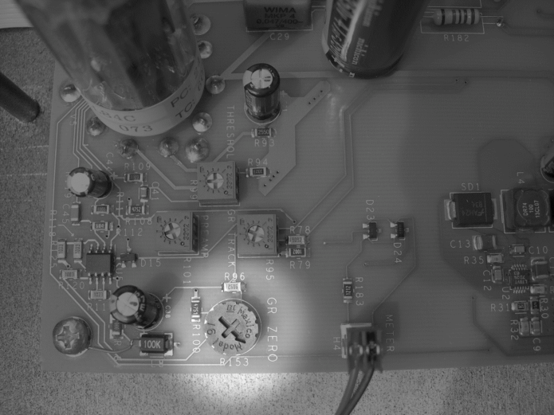

- 25 - 

## **The Technical Stuff** 

**_______________________________________________________________________** 

The procedure for adjusting the meter is as follows: 

- 1) Power on the LA-610 and allow it to warm up for five minutes. Remove lid. 

- 2) Set the Meter switch to the GR (Gain Reduction) position. 

3) Set the Peak Reduction control off (turn the knob fully counterclockwise), waiting at least 1 minute for the T4 compressor to fully release. 

4) Use a small screwdriver to slowly adjust the “GR ZERO” pot so that the meter reads 0 dB. Watch how the meter settles before completing the calibration. 

## **Internal Power Fuse** 

The LA-610 can operate from 100V to 240 VAC / 50-60 Hz. The internal power supply is self-sensing and will automatically work throughout this voltage range. The AC power fuse is located on the internal power supply circuit board inside the LA-610 MK II. However, in the event the fuse fails, it is symptomatic of a serious problem with the unit and should be serviced by Universal Audio. 

 **Warning!! High voltage danger!! Always remove the power cord before checking fuses!** 

## **Changing Tubes** 

The LA-610’s tubes are accessible by removing the top lid. Always replace tubes with the same value. Replacement tubes are available through major music retailers, or directly from Universal Audio. 

 **Warning!! High voltage danger!! Always remove the power cord before checking or changing tubes!** 

- 26 - 

**Glossary of Terms** 

**__________________________________________________________** 

**Ambient noise floor** - Low-level noise created by environmental factors such as fans, air conditioners, heaters, wind noise, etc. 

**Attack time -** Describes the amount of time it takes compressor circuitry to react to and reduce the gain of incoming signal. A compressor set to a fast attack time kicks in almost immediately and catches transient signals of very brief duration, reducing their level and thus "softening" the sound. A slow attack time allows transients to pass through unscathed before compression begins on the rest of the signal. The LA-610 (and LA-2A) attack time is approximately 10 milliseconds, program dependent. 

**Balanced** - Audio cabling that uses two twisted conductors enclosed in a single shield, thus allowing relatively long cable runs with minimal signal loss and reduced induced noise such as hum. 

**Class A** - A design technique used in electronic devices such that their active components are drawing current and working throughout the full signal cycle, thus yielding a more linear response. This increased linearity results in fewer harmonics generated, hence lower distortion in the output signal. 

**Clipping -** A particularly harsh form of audio distortion, caused when the loudness of an incoming signal exceeds an audio recording device’s capability to represent its amplitude. When that happens, the peaks of the signal simply get “clipped” off, thus drastically changing the waveform. When clipping occurs in a digital recording device, the result is an especially unpleasant sound. 

**Compression -** The process of automatically reducing the level of peaks in an audio signal so that the overall dynamic range—that is, the difference between the loudest sections and the softest ones—is reduced, or compressed. “Compression” is sometimes described as “gain reduction” or “peak reduction.” 

**Compression ratio -** A term that describes the amount of increase required in the incoming signal in order to cause a 1 dB increase in output. A ratio of 2:1, for example, means that any time there is an increase of 2 decibels in the loudness of the input signal, there will only be a 1 dB increase in output signal. When compression ratios of 10:1 or higher are being used, the device is instead said to be limiting. 

**Condenser microphone** - A microphone design that utilizes an electrically charged thin conductive diaphragm stretched close to a metal disk called a backplate. Incoming sound pressure causes the diaphragm to vibrate, in turn causing the capacitance to vary in a like manner, which causes a variance in its output voltage. Condenser microphones tend to have excellent transient response but require an external voltage source, most often in the form of 48 volts of “phantom power.” 

**DAW** - An acronym for “Digital Audio Workstation”—that is, any device that can record, play back, edit, and process digital audio. 

**dB** - Short for “decibel,” a logarithmic unit of measure used to determine, among other things, power ratios, voltage gain, and sound pressure levels. 

**dBm** - Short for “decibels as referenced to milliwatt,” dissipated in a standard load of 600 ohms. 1 dBm into 600 ohms results in 0.775 volts RMS. 

- 27 - 

## **Glossary of Terms** 

## **__________________________________________________________** 

**dBV** - Short for “decibels as referenced to voltage,” without regard for impedance; thus, one volt equals one dBV. 

**DI** - Short for “Direct Inject,” a recording technique whereby the signal from a high-impedance instrument such as electric guitar or bass is routed to a mixer or tape recorder input by means of a “DI box,” which raises the signal to the correct voltage level at the right impedance. 

**Dynamic microphone** - A type of microphone that generates signal with the use of a very thin, light diaphragm, which moves in response to sound pressure. That motion in turn causes a voice coil which is suspended in a magnetic field to move, generating a small electric current. Dynamic mics are generally less expensive than condenser or ribbon mics and do not require external power to operate. 

**Dynamic range -** The difference between the loudest sections of a piece of music and the softest ones. The dynamic range of human hearing (that is, the difference between the very softest passages we can discern and the very loudest ones we can tolerate) is considered to be approximately 120 dB. Modern digital recording devices are able to match (or even exceed) that range. 

**Electro-luminescent panel (EL) -** A component (commonly used in night lights) which lights up quickly when electrical signal is applied: the stronger the signal, the brighter the light. 

**Electro-optical compression (“el-op compression”) -** A compressor that uses a circuit design whereby a light source and a photoelectric cell are used for gain reduction. Both the LA-610 and the LA-2A use electro-optical compression. 

**EQ** - Short for “Equalization,” a circuit that allows selected frequency areas in an audio signal to be cut or boosted. 

**Gain reduction -** A synonym for compression or limiting. 

**Hi-Z** - Short for “High Impedance.” The LA-610’s Hi-Z input allows direct connection of an instrument such as electric guitar or bass via a standard unbalanced ¼" jack. 

**High shelving filter** - An equalizer circuit that cuts or boosts signal above a specified frequency, as opposed to boosting or cutting on both sides of the frequency, which is what happens with a typical peak/dip EQ. 

**Impedance** - A description of a circuit’s resistance to a signal, as measured in ohms or thousands of ohms (K ohms). The symbol for ohm is Ω. 

**Knee -** A compressor's _knee_ determines whether the device will reach maximum gain reduction quickly or slowly. A gradual transition is called "soft knee,” while a more rapid transition is called “hard knee.” The LA-610 utilizes soft knee compression and limiting, which is generally more desirable for musical applications. 

**Limiter -** A compressor that operates at high compression ratios of 10:1 or higher. 

**Limiting -** A more severe form of compression, where a high compression ratio (of 10:1 or higher) is being used. 

- 28 - 

**Glossary of Terms** 

**__________________________________________________________** 

**Line level** - Refers to the voltages used by audio devices such as mixers, signal processors, tape recorders, and DAWs. Professional audio systems typically utilize line level signals of +4 dBM (which translates to 1.23 volts), while consumer and semiprofessional audio equipment typically utilize line level signals of –10 dBV (which translates to 0.316 volts). 

**Low shelving filter** - An equalizer circuit that cuts or boosts signal below a specified frequency, as opposed to boosting or cutting on both sides of the frequency. 

**Makeup gain -** A control that allows the overall output signal to be increased in order to compensate (“make up”) for the gain reduction applied by the compressor. 

**Memory effect** - In an electro-optical compressor, refers to the fact that it takes a certain amount of time for the photo-cell to recover after light is removed, depending on how long light had been shining on it and how bright the light was. Because of this, you can actually "train" the compressor’s response characteristics by pre-rolling material for a minute or two, essentially saturating the photocell. 

**Mic level** - Refers to the very low-level signal output from microphones, typically around 2 millivolts (2 thousandths of a volt). 

**Mic preamp** - The output level of microphones is very low and therefore requires specially designed mic preamplifiers to raise (amplify) their level to that needed by a mixing console, tape recorder, or digital audio workstation (DAW). 

**Millisecond (ms)** – A thousandth of a second. 

**Negative feedback** - Negative feedback is a design technique whereby a portion of the preamplifier’s output signal is reversed in phase and then mixed with the input signal. This serves to partially cancel the input signal, thus reducing gain. A benefit of negative feedback is that it both flattens and extends frequency response, as well as reducing overall distortion. 

**Patch bay** - A passive, central routing station for audio signals. In most recording studios, the line-level inputs and outputs of all devices are connected to a patch bay, making it an easy matter to re-route signal with the use of patch cords. 

**Patch cord** - A short audio cable with connectors on each end, typically used to interconnect components wired to a patch bay. 

**Panel aging -** More related to the amount of actual use rather than age in years, this is a phenomenon which affects the threshold (and, to a lesser degree, attack time and release time) of an electrooptical compressor. The more "aged" the EL panel, the greater the amount of gain reduction will need to be applied. Panel aging is probably a major reason why the same model of electro-optical compressor can sound subtly different between units. 

**Peak reduction -** A synonym for compression or limiting. 

- 29 - 

## **Glossary of Terms** 

## **__________________________________________________________** 

**Photo-electric cell (“photo-cell”) -** A light sensitive device whose electrical resistance changes depending upon the intensity of light to which it is subjected. 

**Program dependent -** Refers to a parameter that varies according to the characteristics of the incoming signal. The LA-610 compressor and limiter ratio, as well as the attack time and release time, are all program dependent. 

**Release time -** The time it takes for a signal to return to its initial (pre-compressed) level. If the release time is too short, "pumping" and "breathing" artifacts can occur, due to the rapid rise of background noise as the gain is restored. If the release time is too long, however, a loud section of the program may cause gain reduction that persists through a soft section, making the soft section inaudible. The LA-610 (and LA-2A) compressor features a dual-stage release, where it takes approximately 60 milliseconds for the first 50% of release, then from 1 to 15 seconds for the final release which minimizes artifacts. 

**Ribbon microphone** - A type of microphone that works by loosely suspending a small element (usually a corrugated strip of metal) in a strong magnetic field. This "ribbon" is moved by the motion of air molecules and in doing so it cuts across the magnetic lines of flux, causing an electrical signal to be generated. Ribbon microphones tend to be delicate and somewhat expensive, but often have very flat frequency response. 

**Threshold -** A term used to describe the level at which a compressor starts to work. Below the threshold point, the volume of a signal is unchanged; above it, the volume is reduced. 

**Transformer** - An electronic component consisting of two or more coils of wire wound on a common core of magnetically permeable material. Audio transformers operate on audible signal and are designed to step voltages up and down and to send signal between microphones and line-level devices such as mixing consoles, recorders, and DAWs. 

**Transient** - A relatively high volume pitchless sound impulse of extremely brief duration, such as a pop. Consonants in singing and speech, and the attacks of musical instruments, particularly percussive instruments, are examples of transients. 

**XLR** – (eXtra Long Run) A standard three-pin connector used by many audio devices, with pin 1 typically connected to the shield of the cabling, thus providing ground. Pins 2 and 3 are used to carry audio signal, normally in a balanced (out of phase) configuration. 

- 30 - 

**Recall Sheet** 

**__________________________________________________________** 

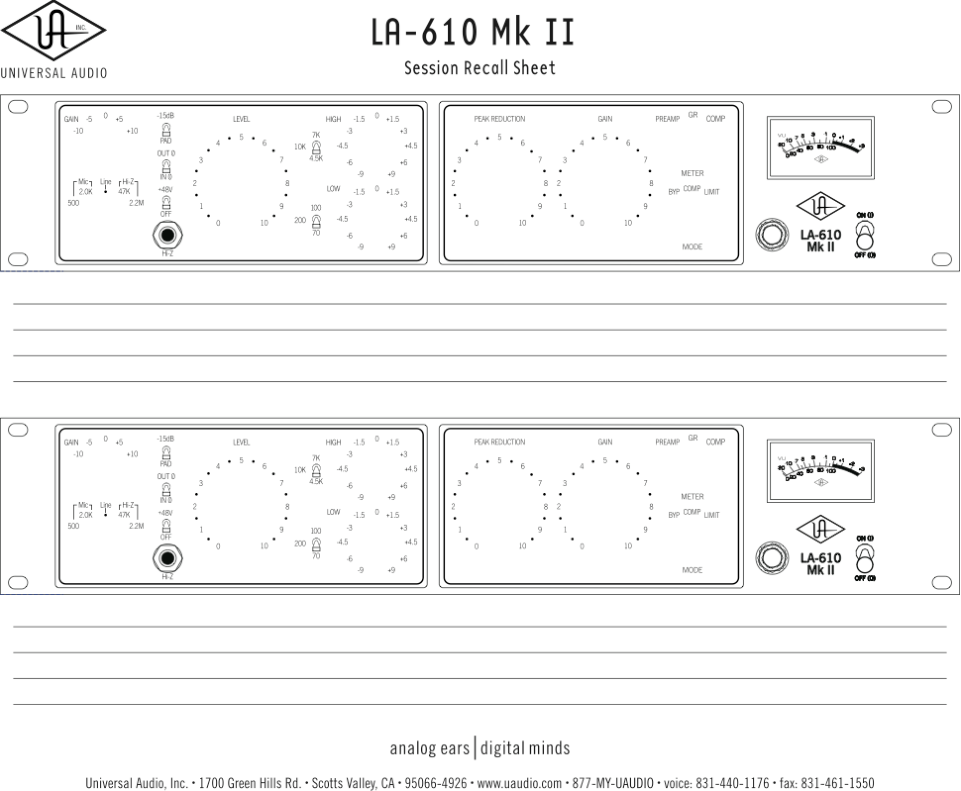

- 31 - 

## **Specifications** 

**_______________________________________________________________________** 

**Microphone Input Impedance** Selectable, 500 Ω (ohms) or 2k Ω **Balanced Line Input Impedance** 20k Ω **Hi-Z Input Impedance** Selectable between 2.2 M Ω  or 47 k Ω **Maximum Microphone Input Level** -8 dBu (2k input impedance and 15 dB Pad in) **Maximum Output Level** +23 dBu (120 VAC line) **Internal Output Impedance** 80 Ω **Recommended Minimum Load** 600 Ω **Frequency Response** 20 Hz to 20 kHz +0.5 dB **Maximum Gain** 40 dB (Line), +77dB (Mic) **Noise Floor -** 72 dBu, 20 Hz - 20kHz (Line in, unity gain) **Compressor Ratio** ~3:1, soft knee, program dependent **Limiter Ratio** ~∞:1, soft knee, program dependent **Attack Time** ~10 ms, program dependent **Release Time** Dual stage: ~60 ms for 50% release, then 1 - 15 seconds, program dependent **Tube Complement** (3) 12AX7, (1) 12AT7, (1) EL84 **Power Requirements** 100V / 120V / 240V **Power Consumption** ~ 30 watts **Power Connector** Detachable IEC power cable. **Dimensions** 19" W x 3.5" H x 12.25" D (two rack spaces) **Weight** 12 lb. 

- 32 - 

**Additional Resources/Product Registration/Warranty/Service & Support** 

## **__________________________________________________________** 

## **Additional Resources** 

Check us out at http://www.uaudio.com. There, you’ll find tons of information about our full line of products, as well as e-news, videos, software downloads, FAQs, an online store, and a way cool webzine that features hot tips, techniques, and interviews with your favorite artists, engineers and producers each month. The webzine even offers something we call “Playback”—a monthly contest where the winners get their music posted on our site, exposing their songs to thousands of visitors per day! 

## **Product Registration** 

Please take a moment to register your new Universal Audio product by visiting our website at http://www.uaudio.com/support/register.html 

Registration allows us to contact you regarding important product updates and also makes you eligible for online promotions. 

## **Warranty** 

The warranty for all Universal Audio hardware is one year from date of purchase, parts and labor. 

## **Service & Support** 

Even gear as well designed and tested as ours will sometimes fail. In those rare instances, our goal here at UA is to get you up and running again as soon as possible. 

The first thing to do if you’re having trouble with your device is to check for any loose or faulty external cables, bad patchbay connections, grounding trouble from a power strip and all inputs/outputs (mic/line/Hi-Z, etc.). If your problem persists, call tech support at 877-MY-UAUDIO, or send an email to hardwaresupport@uaudio.com, and we will help you troubleshoot your system. (Canadian and overseas customers should contact their local distributor.) When calling for help, please have the product serial number available and have your unit set up in front of you, turned on and exhibiting the problem. 

If it is determined your product requires repair, you will be told where to ship it and issued a Return Merchandise Authorization number (RMA). This number must be displayed on the outside of your shipping box (use the original packing materials if at all possible). Most repairs take approximately 3-5 days, and we will match the shipping method you used to get it to us. (In other words, if you shipped it to us UPS ground, we will ship it back to you UPS ground; if you overnight it to us, we will ship it back to you overnight). You pay the shipping costs to us; we ship it back to you free of charge. Qualified service under warranty is, of course, also free of charge. For gear no longer under warranty, tech bench costs are $75 per hour plus parts. 

