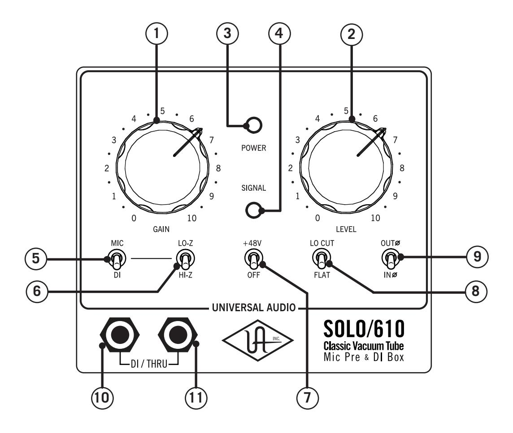
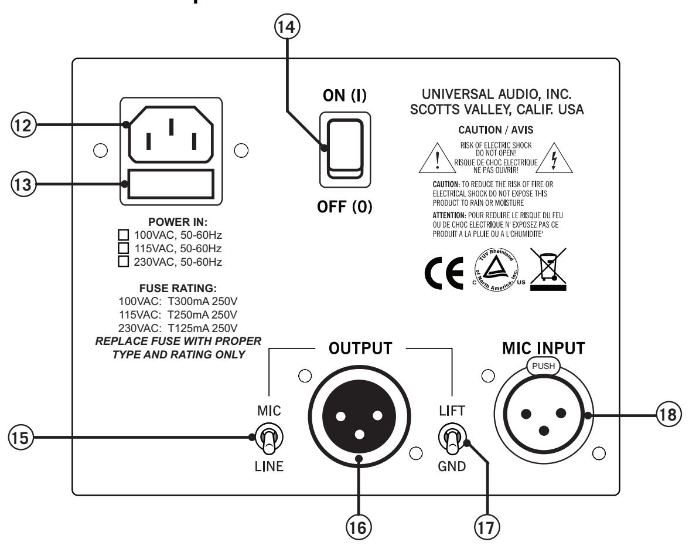
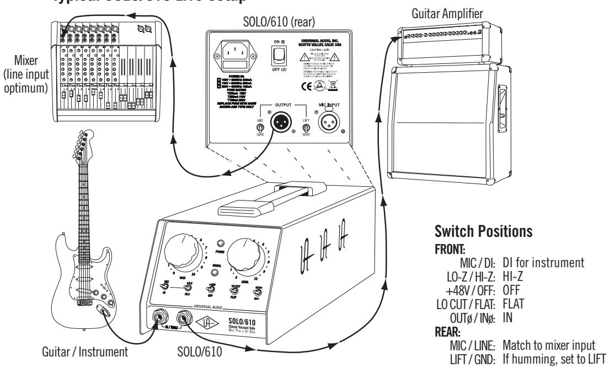
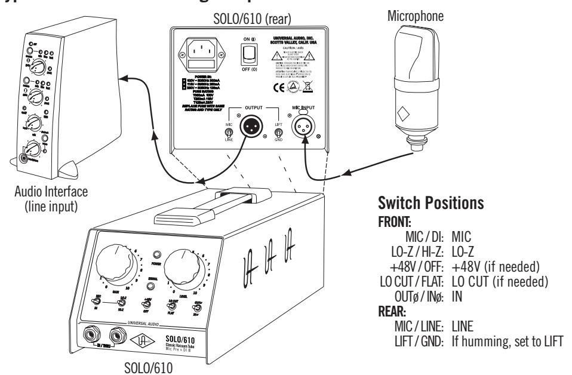
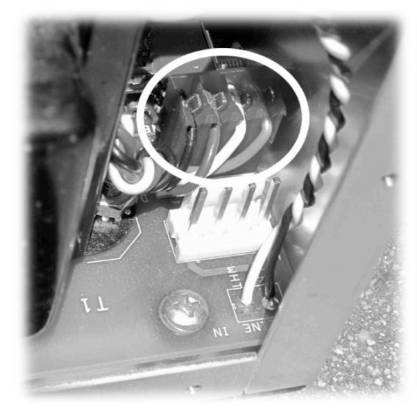
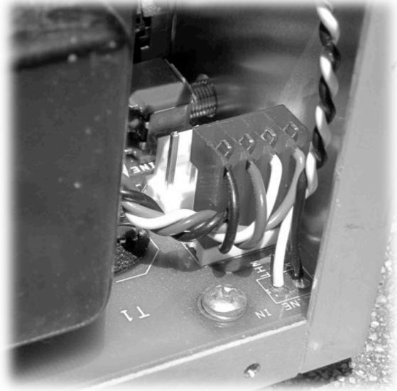
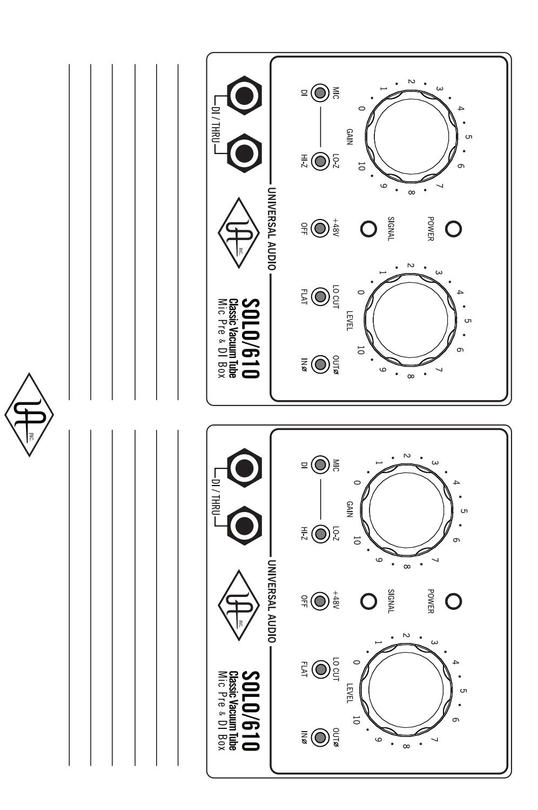
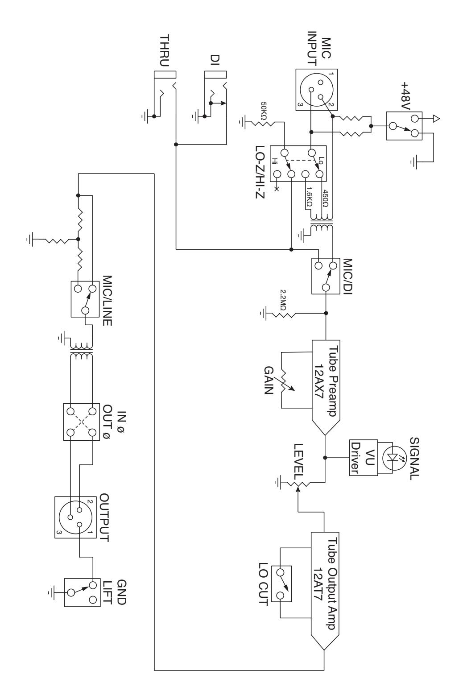

# **SOLO/610 Classic Tube Preamplifier & DI Box**

# **Universal Audio Part Number 65-00055 Revision B**

Universal Audio, Inc. 1700 Green Hills Road Scotts Valley, CA 95066-4926 www.uaudio.com

Customer Service & Tech Support: +1-877-MY-UAUDIO Business, Sales & Marketing: +1-866-UAD-1176 Outside USA: +1-831-440-1176

# **Notices**

This manual provides general information, preparation for use, and operating instructions for the Universal Audio SOLO/610 Classic Tube Preamplifier & DI Box.

#### **Disclaimer**

The information contained in this manual is subject to change without notice. Universal Audio, Inc. makes no warranties of any kind with regard to this manual, including, but not limited to, the implied warranties of merchantability and fitness for a particular purpose. Universal Audio, Inc. shall not be liable for errors contained herein or direct, indirect, special, incidental, or consequential damages in connection with the furnishing, performance, or use of this material.

#### **Copyright**

© 2011 Universal Audio, Inc. All rights reserved.

This manual and any associated artwork, product designs, and design concepts are subject to copyright protection. No part of this document may be reproduced, in any form, without prior written permission of Universal Audio, Inc.

#### **Trademarks**

SOLO/610, 4-710d, 710, Twin-Finity, 4110, 8110, SOLO/110, 2-610, LA-610, LA-2A, 2-LA2, LA-3A, 6176, 1176LN, 2-1176, 2192, DCS Remote Preamp, UAD, and the Universal Audio, Inc. logo are trademarks of Universal Audio, Inc. Other company and product names mentioned herein are trademarks of their respective companies.

#### **Box Contents**

The retail package should contain:

- (1) Universal Audio SOLO/610 unit
- (1) User Manual
- (1) IEC Power Cable
- (1) Warranty Registration Card
- (1) UA Full Line Catalog

# **Important Safety Information**

Before using this unit, be sure to carefully read the applicable items of these operating instructions and the safety suggestions. Afterwards, keep them handy for future reference. Take special care to follow the warnings indicated on the unit, as well as in the operating instructions.

- 1. **Water and Moisture -** Do not use the unit near any source of water or in excessively moist environments.
- 2. **Object and Liquid Entry -** Care should be taken so that objects do not fall, and liquids are not spilled, into the enclosure through openings.
- 3. **Ventilation -** When installing the unit in a rack or any other location, be sure there is adequate ventilation. Improper ventilation will cause overheating, and can damage the unit.
- 4. **Heat -** The unit should be situated away from heat sources, or other equipment that produce heat.
- 5. **Power Sources -** The unit should be connected to a power supply only of the type described in the operating instructions, or as marked on the unit.
- 6. **Power Cord Protection -** AC power supply cords should be routed so that they are not likely to be walked on or pinched by items placed upon or against them. Pay particular attention to cords at plugs, convenience receptacles, and the point where they exit from the unit. Never take hold of the plug or cord if your hand is wet. Always grasp the plug body when connecting or disconnecting it.
- 7. **Grounding of the Plug -** This unit is equipped with a 3-wire grounding type plug, a plug having a third (grounding) pin. This plug will only fit into a grounding-type power outlet. This is a safety feature. If you are unable to insert the plug into the outlet, contact your electrician to replace your obsolete outlet. Do not defeat the purpose of the grounding-type plug.
- 8. **Cleaning -** Follow these general rules when cleaning the outside of your SOLO/610:
  - a. Turn the power Off and unplug the unit
  - b. Gently wipe with a clean lint-free cloth
  - c. If necessary, moisten the cloth using lukewarm or distilled water, making sure not to oversaturate it as liquid could drip inside the case and cause damage to your SOLO/610
  - d. Use a dry lint-free cloth to remove any remaining moisture
  - e. Do not use aerosol sprays, solvents, or abrasives
- 9. **Nonuse Periods -** The AC power supply cord of the unit should be unplugged from the AC outlet when left unused for a long period of time.
- 10. **Damage Requiring Service -** The unit should be serviced by a qualified service personnel when:
  - a. Objects have fallen or liquid has been spilled into the unit; or
  - b.The unit has been exposed to rain; or
  - c. The unit does not operate normally or exhibits a marked change in performance; or
  - d.The unit has been dropped, or the enclosure damaged.
- 11. **Servicing -** The user should not attempt to service the unit beyond that described in the operating instructions. All other servicing should be referred to qualified service personnel. See "Service & Support" on page 24 for servicing information.

# **Table Of Contents**

| Notices                      | ii  |
|------------------------------|-----|
| Important Safety Information | iii |
| Introduction                 | 5   |
| A Letter from Bill Putnam Jr | 5   |
| Features                     | 6   |
| Front Panel Descriptions     | 7   |
| Rear Panel Descriptions      | 9   |
| Interconnection Diagrams     | 11  |
| Quickstart                   | 12  |
| SOLO/610 Overview            | 13  |
| History of the SOLO/610      | 15  |
| Glossary of Terms            | 16  |
| Maintenance                  |     |
| Hardware Variants            |     |
| AC Input Voltage Conversion  |     |
| Fuse                         | 19  |
| Service                      | 19  |
| Session Recall Sheet         | 20  |
| Block Diagram                | 21  |
| Specifications               | 22  |
| Additional Resources         |     |
| Universal Audio Website      |     |
| Product Registration         | 24  |
| Warranty                     |     |
| Service & Support            | 24  |

# **Introduction**

#### **A Letter from Bill Putnam Jr.**

Thank you for purchasing the SOLO/610 Classic Tube Preamplifier and DI Box. The SOLO/610 is inspired by the microphone preamp section of the 610 console designed by my father, M.T. "Bill" Putnam, in 1960. The 610 was a rotary-control console and was the first console of a modular design. Although technologically simple compared to modern consoles, the 610 possesses a warmth and character that has kept it in demand for decades. As a prominent part of my father's United/Western Studios, the 610 was used on many classic recordings by Frank Sinatra and Sarah Vaughan. The Beach Boys Pet Sounds, the Doors LA Woman, and Van Halen's debut album were all recorded on the 610. The legendary Wally Heider used the 610 in his remote truck for many of his best known live recordings. At Ocean Way Studios (formerly United), the 610 is lovingly preserved and still used in Studio B.

Most of us at Universal Audio are musicians, recording engineers, or both, and we wanted to build a mic preamp that we'd be delighted to use ourselves. We love the recording process, and we really get inspired when the basic tracks are beautifully recorded. Our design goal for the SOLO/610 was to capture the original character of the 610, creating a preamp that would induce that "a-ha" feeling we've felt when hearing music recorded in its most natural, inspired form.

The controls of the SOLO/610 are simple and essential: we added only those features required for practical use without needless duplication of functionality found elsewhere in most studios. The transformers and tubes received much of our R&D attention. We settled on a transformer design featuring double-sized alloy cores with custom windings. Our tubes are carefully selected and tested individually. This extra effort is well worth the time and cost because the result is a truly outstanding, easy-to-use mic preamp!

Developing the SOLO/610 – as well as Universal Audio's entire line of quality audio products designed to meet the needs of the modern recording studio while retaining the character of classic vintage equipment – has been a very special experience for me and for all who have been involved. While, on the surface, the rebuilding of UA has been a business endeavor, it's really been so much more than that: in equal parts a sentimental and technical adventure.

We thank you for your support, and we thank my father, Bill Putnam.

Sincerely,

Bill Putnam Jr.

#### **The All-Tube 610 Console Mic Preamp Sound in a Rugged "Go Anywhere" Design**

The SOLO/610 delivers the classic Putnam 610 tube console sound in a rugged, highly versatile mic preamp design. This unit provides the silky, vintage warmth of the original console's mic amp design, and will flatter any microphone or instrument with its signature sound. Thanks to its convenient form factor, the SOLO/610 can be conveniently used in the control room or the recording room, on stage, or on a desktop. Functionally lean but sonically mean, the SOLO/610 maintains the character of the 610 console — at a price every serious project studio can afford.

The SOLO/610 offers Mic and DI inputs, and features Gain and Level control for a wide variety of clean to colored tones. Unlike its predecessors, the SOLO/610 has continuous Gain control with even greater range, allowing for more precise gain structuring — doubling as input signal padding. The SOLO/610 has all the essential features like 48 V Phantom Power, Lo-Cut filtering, Polarity Reverse, and flexible dual impedance selection for both the Mic and DI inputs. The SOLO/610 includes essential DI (Direct Input) features like Thru for use in conjunction with an amplifier, plus Ground Lift and a versatile Mic/Line level output switch.

Microphone Preamplifiers have a critical role in the signal chain of recording, second only to the microphone itself. The basic principle is to amplify a microphone level signal up to a useable line level. In the same way that different microphones can provide varied sonic results, different mic preamps can also display various sonic nuances. But more importantly, upgrading to a good quality mic pre can make a huge difference in the overall quality of your recordings. The SOLO/610 preamp will flatter the cheapest to the most esoteric microphones.

Direct Input (DI) plays an important role in the recording chain too, if an electric instrument is going straight to the recorder without the use of an amplifier. The basic principle is to amplify an instrument level signal up to a useable line level. It is very common to use a DI when recording instruments like electric bass or electric guitar – either independently, or in combination with an amplifier. The SOLO/610 features a DI input plus Thru, which allows the unaffected signal to also be sent to your amplifier while also being sent straight to your recorder at line level. The SOLO/610 is an excellent way to DI your favorite instrument alone, or with an amplifier.

Tonal Variety is where the SOLO/610 really shines. The Gain and Level controls offer a useful range of tonal shaping. Gain and Level structuring allow the SOLO/610 to achieve from clean settings to rich harmonic coloration. A lower Gain setting (0 to 5 range) with the Level output set appropriately for the input of your recording device delivers a cleaner sound. Higher gain settings (5 to 10 range) with the Level output set appropriately for the input of your recording device will increase the harmonic enhancement. The LO-Z/ Hi-Z switch allows for impedance matching or additional tonal variety.

Rack mounting the SOLO can be done with the use of a standard rack mount shelf. Up to three units may fit side by side occupying a total of 3RU worth of rack space.

#### **Features**

- Classic Putnam 610 console mic preamplifier and DI
- Legendary all-tube sound
- Gain, Level, and Impedance selection for maximum tonal variety
- Portable design for studio, desktop, or stage
- Rugged construction-steel chassis
- DI features include Thru and Mic/Line level output
- Hand-built in USA; backed by 1-year limited warranty

# **Front Panel Descriptions**

- **(1) GAIN Knob –** Adjusts the gain of the input stage. Turning the knob clockwise increases the gain. Because this also has the effect of reducing negative feedback (see page 13), the GAIN control also alters the amount of the input tube's harmonic distortion, a major contribution to the "warm" sound characteristic of tube equipment. The higher the GAIN setting, the more coloration the SOLO/610 will impart to the incoming signal. For the cleanest, most uncolored signal from the SOLO/610, set the GAIN to a low value while increasing the LEVEL knob until the appropriate output level is attained.
- **(2) LEVEL Knob –** LEVEL determines the amount of signal sent from the input stage to the final output stage and the rear panel OUTPUT jack. LEVEL behaves like a master volume control, where GAIN controls the amount of coloration and LEVEL controls the final output volume.
- **The numeric values for the Gain and Level knobs are relative scale markings and do not represent specific dB values.**
- ! **Many useful tonal variations are available by experimenting with different Gain and Level settings.**

- **(3) POWER LED –** This blue LED illuminates when AC power is connected and the rear panel POWER switch is in the ON position.
- **(4) SIGNAL LED –** This is a tri-color LED that indicates the signal level at the input stage. The LED glows GREEN with signal peaks, AMBER when the signal approaches clipping, and RED when the signal is clipping (distorting). To eliminate clipping (for a cleaner sound), reduce the GAIN amount and/or the incoming signal level.
- **(5) INPUT Switch –** This switch specifies the active input. It selects between either the rear panel MIC input or the front panel DI (Direct Input). Note: The MIC and DI inputs cannot be active simultaneously.
- **(6) LO-Z/HI-Z Switch –** This switch changes the impedance of the MIC and DI inputs. The available values are dependent on the input type (MIC or DI), as shown in the table at right.

| INPUT: | MIC         | DI        |
|--------|-------------|-----------|
| LO-Z:  | 450 ohms | 50K ohms  |
| HI-Z:  | 1.6K ohms   | 2.2M ohms |

With DI inputs, LO-Z is typically used for instruments with high output and/or active electronics, while HI-Z is typically used for instruments with low output and/or passive electronics. For more information about impedance matching, see page 13.

- **(7) +48 V PHANTOM POWER Switch –** This toggle switch applies +48 volts to the MIC INPUT when the switch in the up position. Most modern condenser and ribbon microphones require +48 volts of phantom power to operate. For more information, see page 14.
  - **Keep phantom power off (switch down) when it is not required.**
  - **Always check the power requirements of your microphone with the manufacturer before applying phantom power***.* **Phantom power may damage select microphones.**
  - **To avoid loud transients, always make sure phantom power is off when connecting or disconnecting microphones.**
- **(8) LO CUT Switch –** The LO CUT switch activates the low frequency roll-off (high-pass) filter. When in the FLAT position (down), all frequencies are amplified equally for full-spectrum sound. When in the LO CUT position (up), frequencies below 100 Hz are attenuated. This is typically used to eliminate rumble and other unwanted low frequencies from an incoming signal. For more information, see page 14.
- **(9) POLARITY ("ø") Switch –** Determines the polarity of the OUTPUT. When IN ø is selected (down position), the signal polarity is normal, and pin 2 is hot (positive). When OUT ø is selected (up position), the signal polarity is inverted, and pin 3 is hot (positive). Polarity inversion is typically used to reduce phase cancellation issues between microphones when more than one mic is used to record a source. In normal use this switch should be off. For more information, see page 14.
- **(10) DI Jack –** The DI (Direct Input) is a ¼" mono "TS" (tip-sleeve) jack for connecting an instrument such as electric guitar, electric bass, electronic keyboard, or other unbalanced signal sources. The DI impedance can be set to 50K ohms or 2.2M ohms with the LO-Z/HI-Z switch. Note: The INPUT switch must be in the DI position to use the Direct Input jack.

**(11) THRU Jack –** This is an unbalanced ¼" mono "TS" (tip-sleeve) output that carries the same signal that is put into the DI jack. This port is typically used to send the instrument signal that is plugged into the DI jack back out to an instrument amplifier or other unbalanced input. The signal at this jack is unaffected by the rear panel MIC/LINE output level switch.

# **Rear Panel Descriptions**

**(12) AC Input –** Connect a standard, grounded, detachable IEC power cable (supplied) here.

Note: The power supply is NOT auto-sensing. Changing the AC input from the shipped configuration requires moving an internal jumper and changing the fuse to avoid damaging the unit.

**IMPORTANT: The unit can be damaged if the wrong input voltage is connected. Changing the AC input from 115 volts to 230 volts (and vice versa) requires moving an internal jumper and a fuse value swap. See the Maintenance section on page 18 for details.**

- **(13) FUSE Receptacle –** The SOLO/610 uses a fuse for circuit protection. Replace the fuse with the same rating and type only. If the fuse is blown repeatedly, contact UA service. IMPORTANT: The fuse value must be changed if the input voltage is changed. See the Maintenance section on page 18 for detailed information.
- **(14) POWER Switch –** Applies power to the SOLO/610 (up position) or turns the power off (down position). When powered on, the front panel POWER LED illuminates.
- **(15) MIC/LINE Switch –** Affects the signal level (amplitude) at the OUTPUT jack. In normal operation, the switch should remain in the LINE (down) position, for connecting the SOLO/610 to line-level inputs such as an audio interface, recorder, mixer line-level input, etcetera.

The MIC/LINE switch is essentially a "pad" for the output signal. Setting the switch to MIC attenuates (lowers) the signal by 37 dB, for connection to inputs that require a mic-level signal, such as another mic preamp, a mixer "mic" input, or similar low-level input.

For additional information about this switch, see "Application Notes" on page 12.

- **(16) OUTPUT Jack –** This balanced XLR connector outputs the SOLO/610 signal. Note that Pin 2 is positive when the front panel Polarity switch is in the down position (IN ø). Pin 3 is positive when the front panel Polarity switch is in the up position (OUT ø).
- **(17) GND/LIFT Switch –** This switch affects the grounding of the OUTPUT jack. When the switch is in the GND (ground) position, pin 3 of the XLR is tied to the chassis ground. When in the LIFT position, pin 3 is disconnected from the chassis ground. In normal operation, this switch should be left in the GND position. If the output signal contains a hum or buzz due to ground loops, changing the switch to LIFT may alleviate these undesirable noises.
- **(18) MIC INPUT Jack –** Connect a microphone to this standard XLR connector. Pin 2 is wired positive (hot). +48 V phantom power is available via the front panel switch.

# **Interconnection Diagrams**

# Typical SOLO/610 Live Setup

#### Typical SOLO/610 Recording Setup

# **Quickstart**

Follow these steps to get started with your SOLO/610. For more detailed information, see the other sections in this manual.

- **Step 1:** To avoid unexpected sound bursts and/or feedback, mute the audio system before proceeding.
- **Step 2:** Connect the rear panel OUTPUT to a line-level input of the mixer, audio interface, etc.
- **Step 3:** Connect a microphone or other balanced source to the rear panel MIC INPUT. Alternately, connect an electric guitar, bass, or other unbalanced source to the front panel DI input.
- **Step 4:** Set the front panel MIC/DI switch to the position that matches the input type. MIC selects the rear panel XLR input; DI selects the front panel ¼" input (both inputs cannot be used simultaneously).
- **Step 5:** If using a microphone that requires phantom power, put the +48V switch in the up/on position. If phantom power is not required, put the +48V switch in the down/off position.
- **Step 6:** Set the front panel LO CUT and POLARITY (ø) switches to the down position.
- **Step 7:** Set the rear panel MIC/LINE switch to the LINE position to output the normal line-level signal when connected to a device's "line" input. The MIC position lowers the SOLO/610 output to a mic-level signal, so this setting should only be used when connecting to a device's "mic" input. †
- **Step 8:** Set the GAIN knob to approximately half way up (the "5" position) and the LEVEL knob to its minimum (fully counter-clockwise) position.
- **Step 9:** Make sure the POWER switch is off (down position) then connect the supplied IEC power cable to the rear panel AC power input and an AC power outlet.
- **Step 10:** Put the rear panel POWER switch in the up position to apply power to the unit. The front panel POWER LED will illuminate. Allow a few moments for the tubes to warm up (sound will not be output immediately upon applying power).
- **Step 11:** Confirm the device plugged into the SOLO/610 input is generating a signal by viewing the front panel SIGNAL LED (the LED will illuminate with signal peaks).
- **Step 12:** Unmute the audio system then slowly raise the SOLO/610 LEVEL knob. You should now be hearing the input signal. If not, check the level control(s), connections, and/or settings of the SOLO/610 input source and the device connected to the SOLO/610 output.

#### **Application Notes**

- For optimum results, connect the SOLO/610 output to a balanced line-level input.
- Unbalanced connections can be made using appropriate adapters.
- Use LEVEL to set the desired output level from the SOLO/610.
- Use GAIN to affect the amount of coloration. Higher GAIN values result in more tube distortion and resultant color. For the cleanest sound, keep GAIN low and increase LEVEL to compensate.
- If you hear low frequency rumble, engage the LO CUT switch.
- Set the rear panel output MIC/LINE switch to the MIC position only if the SOLO/610 output level is overloading an input device even when the LEVEL knob is at very low values.
- † Some devices use a single XLR connector for both mic- and line-level inputs, usually in conjunction with a "trim" or gain control. When connecting to such a device, the MIC/LINE switch should still be set to the LINE position for the best signal-to-noise ratio. In this case, the input device's trim/gain value should be reduced to accommodate the higher output level of the SOLO/610.

# **SOLO/610 Overview**

The SOLO/610 is a vacuum-tube microphone/instrument/line preamplifier and DI (direct input) box in a convenient portable lunchbox form factor. The function of a preamplifier, as its name implies, is to increase (or amplify) the level of an incoming signal to the point where other devices in the chain can make use of it. The output level of microphones is very low and therefore requires specially designed mic preamplifiers to raise their level to that needed by a mixing console, tape recorder, or digital audio workstation (DAW) without degrading the signal to noise ratio. This is no simple task, especially when you consider that mic preamps may be called upon to amplify signals by as much as 1000%.

Through careful attention to design and the use of vacuum tubes, which are carefully selected and tested individually, we believe we've succeeded. The SOLO/610 is a versatile, easy-to-use mic preamplifier with unmatched sonic characteristics, similar to that of the original 610, but with lower noise.

The SOLO/610 has two separate gain stages, each of which utilizes a dual-triode tube operating in a class A single-ended configuration. Variable negative feedback is applied to both of these stages to control gain, reduce distortion, and extend frequency response. Our transformer design features double-sized alloy cores with custom windings, and all balanced inputs and outputs are transformer coupled.

#### **About "Class A"**

Most electronic devices can be designed in such a way as to minimize a particularly unpleasant form of distortion called *crossover distortion.* However, the active components in "Class A" electronic devices such as the SOLO/610 draw current and work throughout the full signal cycle, thus eliminating crossover distortion altogether.

#### **About Negative Feedback**

Negative feedback is a design technique whereby a portion of the preamplifier's output signal is reversed in phase and then mixed with the input signal. This serves to partially cancel the input signal, thus reducing gain. A benefit of negative feedback is that it both flattens and extends frequency response, as well as reducing overall distortion. Turning the SOLO/610 GAIN knob clockwise (i.e., increasing the gain) reduces negative feedback, which has the effect of also increasing the amount of the input tube's harmonic distortion, a major contribution to the "warm" sound characteristic of tube equipment.

#### **Impedance Matching**

Depending upon their design, different microphones provide different output impedances. Typical mic impedances range from as low as 50 ohms (the symbol for ohms is Ω) to thousands of ohms (K ohms). The SOLO/610 Mic input can be set to either 450 ohms (LO-Z) or 1.6K ohms (HI-Z), allowing it to accommodate virtually every kind of microphone. Switching between these two positions while listening to a connected mic may reveal different tonal qualities and/or gain differences. Generally speaking, a microphone preamplifier should have an input impedance roughly equal to about ten times the microphone output impedance. For example, if your microphone has an output impedance of approximately 200 ohms, the switch should be set to the HI-Z position. However, making music is not necessarily about adhering to technical specifications, so feel free to experiment with the settings to attain the desired sound: doing so will not result in harm to either your microphone or the SOLO/610.

The SOLO/610's DI input is intended for electric guitar, electric bass, or any other unbalanced instrument or signal source, and can be set to either 50K ohms (LO-Z) or 2.2M (2.2 million) ohms (HI-Z). The 50K ohms setting is best suited for the signals typically provided by active basses and guitars, while the 2.2M ohms setting is more suitable for instruments with passive pickup systems. Since a

particular instrument's output impedance may actually be somewhere between the active and passive levels, feel free to experiment to achieve the best sound at the desired level. Again, changing the input impedance will not harm your instrument or the SOLO/610.

#### **Phantom Power**

Many modern condenser microphones require +48 volts of DC (Direct Current) power to operate. When delivered over a standard microphone cable (as opposed to coming from a dedicated power supply), this is known as "phantom" power. The SOLO/610 provides such power when the Phantom switch is engaged (placed in the +48 V, up position), applying 48 volts to pins 2 and 3 of the rear panel input connector.

While, in theory, this should result in no harm to the connected microphone even if it does not require phantom power, problems can occur if the shield (pin 1) is broken or when using inexpensive microphones that use the shield as their ground. The application of phantom power can even damage those older ribbon microphones that have their output transformers wired with a grounded center-tap. What's more, the application of phantom power can often result in a loud pop (transient). For these reasons, we strongly recommend that the Phantom switch be left in its off (down) position when connecting and disconnecting microphones. **Only turn the Phantom switch on if you are certain that the connected microphone requires 48 volts of phantom power**. If in doubt, consult the manufacturer's owner's manual for that microphone.

#### **Polarity Inversion**

The occasional need for polarity inversion (changing the SOLO/610 front panel switch from IN ø to OUT ø) is best demonstrated by a common example: recording an open-backed guitar amplifier with two microphones, where one mic is placed close to the front of the amp's speaker and the other near the back of the amp. The waveform display of the first mic will show an upward peak when the speaker pushes outward, placing positive sound pressure on the mic. However, the waveform display of the second mic (the one behind the amp) will show a downward (negative) valley when the speaker pushes forward, because from the back of the amp the speaker moves away from the mic, thus creating negative sound pressure. If these two signals are mixed, the positive waveform from the front mic combines with the negative waveform from the back mic to result in cancellation of much of the amp's sound and a "thinning effect" that is sonically disappointing. However, if the phase of one of the mic signals is inverted, the two signals will combine instead of cancelling, and the result will be much fuller and sonically pleasing.

Other double-mic applications often requiring phase inversion include piano soundboards, drum heads (one mic on top of the drum and the other below it), and acoustic guitar miking, where one mic is placed close to the soundhole and another further away or behind the guitar.

#### **Low Cut Filtering**

A common method for optimizing mixes is to apply low-cut filtering whenever possible. Excessive low frequencies from microphones and instruments tend to build up in the mix, creating sonic "mud" that masks musical detail, overloads or fatigues the listener's ears, and sucks energy from power amps and speakers. It isn't uncommon to notice meters showing noticeably lower levels after low-cut filtering is applied — a sure sign that such filtering was necessary. In addition, after low-frequency mud is filtered, there is often more room in the mix to bring up important musical elements such as vocals and lead instruments, resulting in a win-win situation (less mud = more music).

Typically, a low cut filter can be used to remove: vocal "B," "P," and other popping sounds; moving-air noise from close-miked vocals, drums, guitars and outdoor weather; instrument body noise from handling guitars, basses, pianos, saxophones, etc; mic-stand vibrations; studio or stage floor vibrations; air-conditioning; electrical hum; and unwanted proximity-effect bass boost.

# **History of the SOLO/610**

The SOLO/610 was inspired by the 610 console built by Bill Putnam Sr. in 1960 for his United Recording facility in Hollywood. As was the case with most of Putnam's innovations, the 610 was the pragmatic solution for a recurring problem in the studios of the era: how to fix a console without interrupting a session. The traditional console of the time was a one-piece control surface with all components connected via patch cords. If a problem occurred, the session came to a halt while the console was dismantled. Putnam's answer was to build a mic-pre with gain control, echo send and adjustable EQ on a single modular chassis, using a printed circuit board. Though modular consoles are commonplace today, the 610 was quite a breakthrough at the time.

While the 610 was designed for practical reasons, it was its sound that made it popular with the recording artists who frequented Putnam's studios in the 1960s. The unique character of its microphone preamplifier in particular made it a favorite of legendary engineers like Bruce Botnick, Bones Howe, Lee Hershberg, and Bruce Swedien, who has described the character of the preamp as "clear and open" and "very musical."

The 610 console was used in hundreds of studio sessions for internationally renowned artists such as Frank Sinatra, Ray Charles, Sarah Vaughan, the Mamas and Papas, the Fifth Dimension, Herb Alpert, and Sergio Mendes. The Beach Boys' milestone Pet Sounds album was also recorded using a 610.

Legendary engineer Wally Heider, manager of remote recording at United, used his 610 console to record many live recordings, including Peter, Paul and Mary's "In Concert" (1964), Wes Montgomery's "Full House" (1962), and all of the Smothers Brothers Live albums. Heider's console was later acquired by Paul McManus in 1987, who spent a decade restoring it.

At least one 610 console is still in use at Ocean Way Studios, site of the original United Recording facility. Allen Sides, who purchased the studio from Putnam, personally traveled to Hawaii to collect the 610 console that was used to record the live "Hawaii Calls" broadcasts. Celebrated engineer Jack Joseph Puig has long been ensconced in Studio A at Ocean Way with the 610 (and a stunning collection of vintage gear) where he has applied the vintage touch to many of today's artists, including Beck, Hole, Counting Crows, Goo Goo Dolls, No Doubt, Green Day and Jellyfish.

In 2000, Bill Putnam Sr. was awarded a Technical Grammy for his multiple contributions to the recording industry. Highly regarded as a recording engineer, studio designer/operator and inventor, Putnam was considered a favorite of musical icons Frank Sinatra, Nat King Cole, Ray Charles, Duke Ellington, Ella Fitzgerald and many, many more. The studios he designed and operated were known for their sound and his innovations were a reflection of his desire to continually push the envelope. Universal Recording in Chicago, as well as Ocean Way and Cello Studios (now EASTWEST) in Los Angeles all preserve elements of his room designs.

The companies that Putnam started—Universal Audio, Studio Electronics, and UREI—built products that are still in regular use decades after their development. In 1999, his sons Bill Jr. and James Putnam re-launched Universal Audio and merged with Kind of Loud technologies—a leading audio software company—with two goals in mind: to reproduce classic analog recording equipment designed by their father and his colleagues, and to design new recording tools in the spirit of vintage analog technology. Today Universal Audio is fulfilling that goal, bridging the worlds of vintage analog and DSP technology in a creative atmosphere where musicians, audio engineers, analog designers and DSP engineers intermingle and exchange ideas. Every project taken on by the UA team is driven by its historical roots and a desire to wed classic analog technology with the demands of the modern digital studio.

# **Glossary of Terms**

**Analog** - Literally, an analog is a replica or representation of something. In audio signals, changes in voltage are used to represent changes in acoustic sound pressure. Note that analog audio is a continuous representation, as opposed to the quantized, or discrete "stepped" representation created by digital devices. (See "Digital")

**Balanced** - Audio cabling that uses two twisted conductors enclosed in a single shield, thus allowing relatively long cable runs with minimal signal loss and reduced induced noise such as hum.

**Class A** - A design technique used in electronic devices such that their active components are drawing current and working throughout the full signal cycle, thus yielding a more linear response. This increased linearity results in fewer harmonics generated, hence lower distortion in the output signal.

**Condenser Microphone** - A microphone design that utilizes an electrically charged thin conductive diaphragm stretched close to a metal disk called a backplate. Incoming sound pressure causes the diaphragm to vibrate, in turn causing the capacitance to vary in a like manner, which causes a variance in its output voltage. Condenser microphones tend to have excellent transient response but require an external voltage source, most often in the form of 48 volts of "phantom power."

**dB** - Short for "decibel," a logarithmic unit of measure used to determine, among other things, power ratios, voltage gain, and sound pressure levels.

**dBm** - Short for "decibels as referenced to milliwatt," dissipated in a standard load of 600 ohms. 1 dBm into 600 ohms results in 0.775 volts RMS.

**dBV** - Short for "decibels as referenced to voltage," without regard for impedance; thus, one volt equals one dBV.

**DI** - Short for "Direct Input," a recording technique whereby the signal from a high-impedance instrument such as electric guitar or bass is routed to a mixer or tape recorder input by means of a "DI box," which raises the signal to the correct voltage level at the right impedance.

**Dynamic Microphone** - A type of microphone that generates signal with the use of a very thin, light diaphragm which moves in response to sound pressure. That motion in turn causes a voice coil which is suspended in a magnetic field to move, generating a small electric current. Dynamic mics are generally less expensive than condenser or ribbon mics and do not require external power to operate.

**Dynamic Range** - The difference between the loudest sections of a piece of music and the softest ones. The dynamic range of human hearing (that is, the difference between the very softest passages we can discern and the very loudest ones we can tolerate) is considered to be approximately 120 dB. Modern digital audio devices such as the SOLO/610 are able to match (or even exceed) that range.

**EQ** - Short for "Equalization." A circuit that allows specific frequency areas in an audio signal to be boosted or attenuated.

**Hi-Z** - Short for "High Impedance." The SOLO/610's Hi-Z input allows direct connection of an instrument such as electric guitar or bass via a standard unbalanced 1/4" jack.

**High Shelving Filter** - An equalizer circuit that cuts or boosts signal above a specified frequency, as opposed to boosting or cutting on both sides of the frequency, which is what happens with a typical peak/dip EQ.

**Hz** - Short for "Hertz," a unit of measurement describing a single analog audio cycle (or digital sample) per second.

**Impedance** - A description of a circuit's resistance to a signal as measured in ohms, thousands of ohms (K ohms), or millions of ohms (M ohms). The symbol for ohm is Ω.

**kHz** - Short for "kiloHertz" (a thousand Hertz), a unit of measurement describing a thousand analog audio cycles (or digital samples) per second. (See "Hz")

**Line Level** - Refers to the voltages used by audio devices such as mixers, signal processors, tape recorders, and DAWs. Professional audio systems typically utilize line level signals of +4 dBm (which translates to 1.23 volts), while consumer and semi-professional audio equipment typically utilize line level signals of -10 dBV (which translates to 0.316 volts).

**Low Cut Filter** - An equalizer circuit that cuts signal below a particular frequency.

**Low Shelving Filter** - An equalizer circuit that cuts or boosts signal below a specified frequency, as opposed to boosting or cutting on both sides of the frequency.

**Mic Level** - Refers to the very low level signal output from microphones, typically around 2 millivolts (2 thousandths of a volt).

**Mic Preamp** - The output level of microphones is very low and therefore requires specially designed mic preamplifiers to raise (amplify) their level to that needed by a mixing console, tape recorder, or digital audio workstation (DAW).

**Negative Feedback** - Negative feedback is a design technique whereby a portion of the preamplifier's output signal is reversed in phase and then mixed with the input signal. This serves to partially cancel the input signal, thus reducing gain. A benefit of negative feedback is that it both flattens and extends frequency response, as well as reducing overall distortion.

**Patch Bay** - A passive, central routing station for audio signals. In most recording studios, the line-level inputs and outputs of all devices are connected to a patch bay, making it an easy matter to re-route signal with the use of patch cords.

**Patch Cord** - A short audio cable with connectors on each end, typically used to interconnect components wired to a patch bay.

**Ribbon Microphone** - A type of microphone that works by loosely suspending a small element (usually a corrugated strip of metal) in a strong magnetic field. This "ribbon" is moved by the motion of air molecules and in doing so it cuts across the magnetic lines of flux, causing an electrical signal to be generated. Ribbon microphones tend to be delicate and somewhat expensive, but often have very flat frequency response.

**Transformer** - An electronic component consisting of two or more coils of wire wound on a common core of magnetically permeable material. Audio transformers operate on audible signal and are designed to step voltages up and down and to send signal between microphones and line-level devices such as mixing consoles, recorders, and DAWs.

**Transient** - A relatively high volume pitchless sound impulse of extremely brief duration, such as a pop. Consonants in singing and speech, and the attacks of musical instruments (particularly percussive instruments), are examples of transients.

**TRS** - A standard ¼" Tip-Ring-Sleeve (three-conductor) connector typically used for balanced signals.

**XLR** - A standard three-pin connector used by many audio devices, with pin 1 typically connected to the shield of the cabling, thus providing ground. Pins 2 and 3 are used to carry audio signal, normally in a balanced (180° out of phase) configuration. Note that XLR only denotes the connector type and not the signal level; XLR connectors can be (and often are) used for both mic-level and line-level signals.

# **Maintenance**

**Maintenance and repair should only be performed by qualified service personnel. See "Service & Support" on page 24 for more information.**

#### **Hardware Variants**

There are two different versions of the SOLO/610 hardware to accommodate different AC input voltages worldwide. One is a voltageconvertible version that can operate at 115VAC or 230VAC; the other is a 100VAC version that cannot be converted. These two hardware variants are differentiated by the "POWER IN" markings on the rear panel (see example at right).

The unit ships from the UA factory preconfigured in one of the three AC input voltage configurations. If the 115VAC or 230VAC box on the rear panel is marked, the unit can be converted to the other AC input voltage. If the 100VAC box is marked, the unit cannot be converted to a different AC input voltage.

*The checkbox on the rear panel indicates the AC input voltage configuration as originally shipped from the factory. The example above indicates a unit shipped for 115VAC input.*

### **AC Input Voltage Conversion**

To convert the AC input voltage on the 115VAC/230VAC unit, the internal voltage connector must be moved, and the fuse must be changed to match the new voltage.

**Make sure the SOLO/610 is properly set for the voltage in your area before applying AC power to the unit! Failure to do so could damage the unit.**

#### **To change the internal voltage connector:**

- **1.** Turn off the rear panel POWER SWITCH, **unplug the AC power cord from the rear chassis,**  then wait five minutes to allow residual power to dissipate from the internal components.
- **2.** Remove the five screws from both sides of the unit, and the four screws on top (14 screws total). Then lift off the chassis cover to expose the internal circuit board.
- **3.** Locate the voltage connector (see photo on next page). It is the removable RED female connector at the end of four wires (black, blue, white, and orange) exiting the back of the large power transformer at the rear of the unit. This connector is plugged into one of two fourconductor WHITE male plug headers on the circuit board, behind the large power transformer. These headers are labeled (on the circuit board silkscreen) "H5 120VAC," which is further from the edge of the circuit board, and "H6," which is closer to the edge of the circuit board.
- **4.** Move the red voltage connector to the white plug header for the desired AC input voltage. Plug the connector into the header labeled "H5 120VAC" for 115VAC input, or header "H6" for 230VAC input (see photos on next page).
- **5.** Replace the chassis cover and the 14 chassis cover screws.
- **6. When changing operating voltage, the fuse value must be changed as well.** Replace the fuse with the proper value to match the new AC input voltage per instructions on next page.

**Connector setting for 115VAC input Connector setting for 230VAC input**

#### **Fuse**

The SOLO/610 is protected with a fuse to prevent circuit damage. The fuse must be changed if the fuse blows, or whenever the input voltage is converted (per instructions on previous page). It is essential to use the correct fuse rating for the AC input voltage that is used, as shown in the table at right.

| AC Input Voltage                     | Fuse Rating*   |  |
|--------------------------------------|----------------|--|
| 100VAC                               | T300mA 250V |  |
| 115VAC                               | T250mA 250V |  |
| 230VAC                               | T125mA 250V |  |
| *All fuses must be "slow-blow" type. |                |  |

#### **To change the fuse:**

- **1.** Turn off the rear panel POWER SWITCH, **unplug the AC power cord from the rear chassis,**  then wait five minutes to allow residual power to dissipate from the internal components.
- **2.** Remove the fuse receptacle by inserting a small standard screwdriver into the slot at the upper edge, then sliding the plastic fuse holder out of the AC input receptacle.
- **3.** Remove the old fuse. Note there may be two fuses here. The active fuse is held in place with a plastic clip and has its ends exposed (the enclosed box is for a spare fuse which is inactive).
- **4.** Insert the new fuse into the clip then reinsert the plastic fuse holder into the fuse receptacle.
- **For safe operation, the fuse value must be correct for the AC input voltage. Never substitute different fuses other than those specified here!**

#### **Service**

If your SOLO/610 should ever require service, please see "Service & Support" on page 24.

# **Session Recall Sheet**

# SOLO/610 CLASSIC TUBE PREAMPLIFIER & DI BOX

Session Recall Sheet

# **Block Diagram**

# SOLO/610 BLOCK DIAGRAM

# **Specifications**

Input Impedance Mic Input: Selectable 450 ohms (LO-Z) or 1.6K ohms (HI-Z)

DI Input: Selectable 50K ohms (LO-Z) or 2.2M ohms (HI-Z)

Output Load Impedance 600 ohms Balanced Output from 20 Hz to 20 kHz ±1 dB

Maximum Gain 61 dB

Tube Complement (1) 12AX7, (1) 12AT7

Maximum Mic Input Level -12 dBu, 1.0% THD+N Ratio

Maximum Instrument Input Level +4 dBu, 1.0% THD+N Ratio

Maximum Gain Mic Input 55 dB (1.6K Ω input), 60 dB (450 Ω input)

Maximum Gain Instrument Input 37 dB

Mic/Instrument In Frequency Response 20 Hz to 20 kHz, ±0.1 dB

Power Consumption 16 Watts

Fuse Requirements 100VAC: T300mA 250V (All are "Slow Blow" type) 115VAC: T250mA 250V

230VAC: T125mA 250V

Dimensions 14" L x 5 ¾" W x 5" H

Weight 9 lbs.

# **Index**

+48 V, 8, 10, 14 AC Input, 9 Analog, 16 Balanced, 16 Line Level, 17 LO CUT, 8 Low Cut, 14 Low Cut Filter, 17

Class A, 13, 16 LO-Z, 8

Cleaning, iii Condenser, 16 DAW, 17 dB, 16 Maintenance, 18 MIC INPUT, 10 Mic Level, 17 Mic Preamp, 17

DI, 16 Negative Feedback, 13, 17

DI Jack, 8 Disclaimer, ii Dynamic Microphone, 16 OUTPUT, 10 Overview, 13 phase, 14

Dynamic Range, 16 EQ, 16 POLARITY, 8, 10, 14 Power, iii, 8, 10, 14

Features, 6 Front Panel, 7 FUSE, 10, 19 GAIN, 7 Rear Panel, 9 Recall Sheet, 20 Registration, 24 Resources, 24

Glossary, 16 Ribbon Microphone, 17

GND/LIFT, 10 History, 15 Service, iii, 24 SIGNAL, 8

HI-Z, 8, 16 Specifications, 22

Impedance, 16, 17 Important Safety Information, iii Index, xxiii INPUT, 8 Interconnection Diagrams, 11 Support, 24 THRU Jack, 9 Trademarks, ii Voltage Select, 18 Warranty, 24

Introduction, 5 LEVEL, 7 Website, 24 XLR, 10, 17

# **Additional Resources**

#### **Universal Audio Website**

Check out our website at http://www.uaudio.com.

You'll find a wealth of information there about our full line of products, as well as e-news, videos, software downloads, FAQs, an online store, and a way cool blog that features hot tips, techniques, and interviews with your favorite artists, engineers and producers.

#### **Product Registration**

Please follow the simple instructions below to register your new SOLO/610. Registering your SOLO/610 is quick, easy and allows you to become eligible for exclusive offers and UA promotions. Registration also enables faster support for all product inquiries and Customer Service-related issues.

#### **To register your UA Model SOLO/610:**

- 1. Go to http://www.uaudio.com and click "Support>Register" at the top of the page.
- 2. Enter your email address then click CONTINUE.
  - a. If you already have a my.uaudio account, enter your password then click LOGIN. b. If you don't already have an account, fill out the form then click CREATE ACCOUNT.
- 3. On the "Register UA Hardware" page, select "SOLO/610" from the "Product" drop menu.
- 4. Enter your serial number (Located on the rear panel of the SOLO/610 chassis)
- 5. Click the "Submit" button to complete the registration process.

#### **Warranty**

The warranty for all Universal Audio hardware is one year from date of purchase, parts and labor.

# **Service & Support**

Even gear as well designed and tested as ours will sometimes fail. In those rare instances, our goal here at UA is to get you up and running again as soon as possible.

The first thing to do if you're having trouble with your device is to check for any loose or faulty external cables, bad patchbay connections, grounding trouble from a power strip and all inputs/outputs (mic/line/Hi-Z, etc.). If your problem persists, call tech support at 877-MY-UAUDIO, or visit www.uaudio.com/support to submit a support ticket and we will help you troubleshoot your system. (Canadian and overseas customers should contact their local distributor.) When calling for help, please have the product serial number available and have your unit set up in front of you, turned on and exhibiting the problem.

If it is determined your product requires repair, you will be told where to ship it and issued a Return Merchandise Authorization number (RMA). This number must be displayed on the outside of your shipping box (use the original packing materials if at all possible). Most repairs take approximately 2 - 4 business days, and we will match the shipping method you used to get it to us. (In other words, if you shipped it to us UPS ground, we will ship it back to you UPS ground; if you overnight it to us, we will ship it back to you overnight). You pay the shipping costs to us; we ship it back to you free of charge. Qualified service under warranty is, of course, also free of charge. For gear no longer under warranty, technician bench costs are \$75 per hour plus parts.